## **STA 380, Part 2: Exercises**

## Probability Practice

### **Part a**

### **Part b**

## Wrangling the Billboard Top 100

### **Part a**

### **Part b**

### **Part c**

## Visual story telling part 1: green buildings

### **Problem**

An Austin real-estate developer is interested in the possible economic
impact of “going green” in her latest project: a new 15-story mixed-use
building on East Cesar Chavez, just across I-35 from downtown. Will
investing in a green building be worth it, from an economic perspective?
The baseline construction costs are $100 million, with a 5% expected
premium for green certification.

The developer has had someone on her staff, who’s been described to her
as a “total Excel guru from his undergrad statistics course,” run some
numbers on this data set and make a preliminary recommendation. Here’s
how this person described his process:

> I began by cleaning the data a little bit. In particular, I noticed
> that a handful of the buildings in the data set had very low occupancy
> rates (less than 10% of available space occupied). I decided to remove
> these buildings from consideration, on the theory that these buildings
> might have something weird going on with them, and could potentially
> distort the analysis. Once I scrubbed these low-occupancy buildings
> from the data set, I looked at the green buildings and non-green
> buildings separately. The median market rent in the non-green
> buildings was $25 per square foot per year, while the median market
> rent in the green buildings was $27.60 per square foot per year: about
> $2.60 more per square foot. (I used the median rather than the mean,
> because there were still some outliers in the data, and the median is
> a lot more robust to outliers.) Because our building would be 250,000
> square feet, this would translate into an additional $250000 x 2.6 =
> $650000 of extra revenue per year if we build the green building.

> Our expected baseline construction costs are $100 million, with a 5%
> expected premium for green certification. Thus we should expect to
> spend an extra $5 million on the green building. Based on the extra
> revenue we would make, we would recuperate these costs in
> $5000000/650000 = 7.7 years. Even if our occupancy rate were only 90%,
> we would still recuperate the costs in a little over 8 years. Thus
> from year 9 onwards, we would be making an extra $650,000 per year in
> profit. Since the building will be earning rents for 30 years or more,
> it seems like a good financial move to build the green building. Goal:
> The developer listened to this recommendation, understood the
> analysis, and still felt unconvinced. She has therefore asked you to
> revisit the report, so that she can get a second opinion.

### Exploratory Data Analysis

it may seem like the stats guru is on point with their analysis upon
first glance when using the same assumption and removing the rows with
occupancy rates lower than 10%, the green buildings still average $2.6
dollars more per square foot.

    ## # A tibble: 2 × 3
    ##   green_rating med_rent count
    ##   <fct>           <dbl> <int>
    ## 1 0                25.0  6995
    ## 2 1                27.6   684

While looking at the box plot we see that the non-green buildings have a
fair amount more outliers, which explains the guru’s reasoning for using
the median as opposed to the mean.

### Rent vs. Occupancy Rates

We can see that the minimum rent is fairly constant for all occupancy
rates, but the maximum increases with higher occupancy rates:

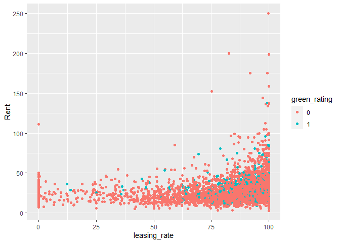

Looking further into this we can note that the green buildings have a
higher median occupancy rate, which could be attributed to the awarness
mentioned in the information provided with the problem, but the true
cause can’t be verified with the data provded.

    ## # A tibble: 2 × 3
    ##   green_rating med_occupancy count
    ##   <fct>                <dbl> <int>
    ## 1 0                     89.2  7209
    ## 2 1                     92.9   685

### Age vs. Occupancy Rates

From the plot there is no clear relationship between age and occupancy
rate.

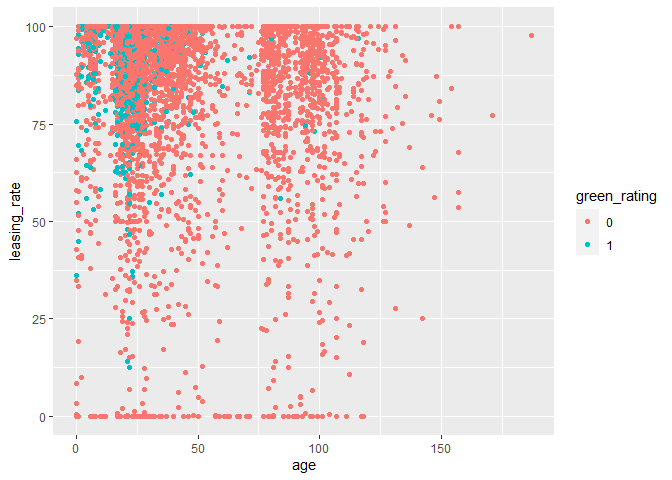

## POSSIBLE UNEXPECTED FACTORS AFFECTING RENT DIFFERENCE

Factors that may inderectly influence the rent for buildings

### 1. Number of stories

From the plot, we can see that the minimum rent charged increases with
the number of stories, but the median height of a green building is only
one story taller than a non-green building, which likely isn’t a large
enough difference. So while a taller building may be able to demand more
rent, this likely isn’t a strong enough factor to influence the decision
to go green.

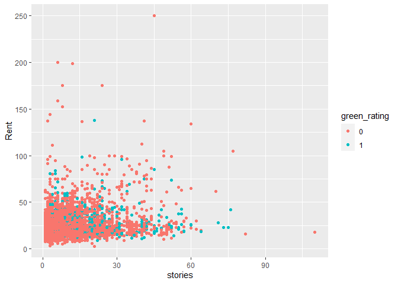

    ## # A tibble: 2 × 2
    ##   green_rating med_stories
    ##   <fct>              <int>
    ## 1 0                     10
    ## 2 1                     11

### 2. Amenities

When loooking at the possility of amenities being a factor in raising
rent, we see that most green buildings have amenities (~73%), where
about only half non-green buildings have them (~52%). When comparting
rent for green and non-green buildings with and withput amenities, we
see that green buildings still charge $2 to $2.8 more per square foot
irreguarless of amenities, meaning this isn’t a factor in the differnce
in rent.

    ## `summarise()` has grouped output by 'green_rating'. You can override using the
    ## `.groups` argument.

    ## # A tibble: 4 × 4
    ## # Groups:   green_rating [2]
    ##   green_rating amenities med_rent count
    ##   <fct>        <fct>        <dbl> <int>
    ## 1 0            0             25    3550
    ## 2 0            1             25    3659
    ## 3 1            0             27     187
    ## 4 1            1             27.8   498

### 3. Age

We can see that the median green building is about 15 years newer than
the median non-green building, thus we should consider that maybe newer
buildings demand a higher rent by default and that this upcharge isn’t
necessarily due to the fact the building is green.

    ## # A tibble: 2 × 3
    ##   green_rating med_age count
    ##   <fct>          <int> <int>
    ## 1 0                 37  7209
    ## 2 1                 22   685

Looking at the plot of rent vs building age, there is hard to see a
clear correlation in the data, with maybe a slight downward trend after
the building has reached 100 years old, but there isn’t enough data on
green buildings at that age to manke any conclusions.

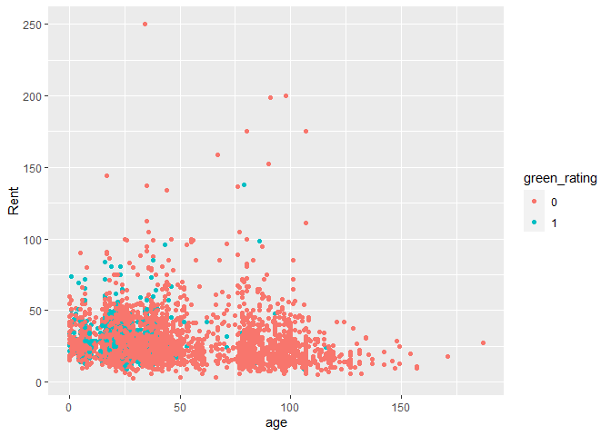

### 4. Space

When looking at the plot of rent vs square footage, we can see that the
minimum rent charged increases with available leasing space.

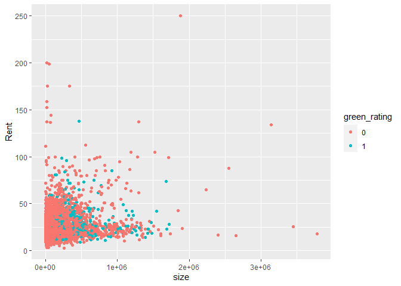

Then, when we look a the median and mean square footage for green and
non-green buildings we see that green building have a greater value for
each, so they have more space to lease in general, which could be a
potential unexpected factor in the rent upcharge.

    ## # A tibble: 2 × 3
    ##   green_rating med_size mean_size
    ##   <fct>           <int>     <dbl>
    ## 1 0              118696   225977.
    ## 2 1              241150   325781.

### 5. Clustering (Building location)

Could location influence the rent price for buildings? Could we use
location to maximize profits for our new building?

Looking at a plot of rent vs cluster, we can notice a distinct trend in
clusters 300 to around 600. When looking at the median value for these
clusters separating by if the building is green or not, we can see that
the green buildings charge ~$4.8 more per square foot in the same
cluster, meaning in these areas the perception of a green building is
potentially more positive and people are willing to pay more to be
viewed as environmentally conscious.

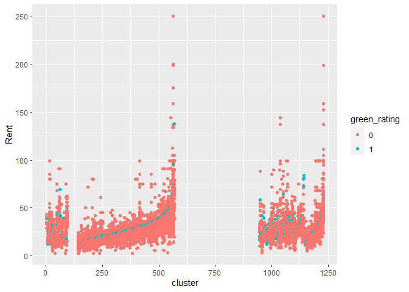

    ## # A tibble: 2 × 3
    ##   green_rating   med count
    ##   <fct>        <dbl> <int>
    ## 1 0             28.2  2640
    ## 2 1             33     243

### Summary and Conclusions

-   There is a slight positive relationship between rent and occupancy
    rates.

-   Green buildings have a slightly higher rate of occupancy.

-   No clear corrolation between building age and occupancy rate

-   There is an additional $2.6 per square foot in revenue for green
    buildings, and this difference increases to ~$4.8 for clusters 300 -
    600.

-   Rent and available square footage have a small positive corrolation.

-   Green buildings are, on average, ~ 100,000 square feet larger than
    non-green buildings, but more data is needed to further explore this
    idea.

The guru seems to be correct, with the average age of green buildings
being 22 years, we should expect to make our money back within 10 years
then make additional revenue from then on.

## Visual story telling part 2: Capital Metro data

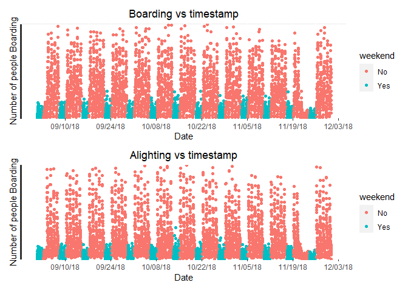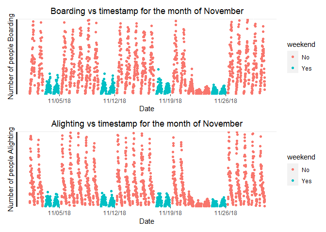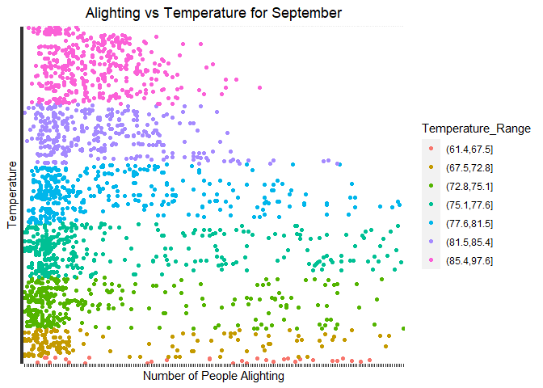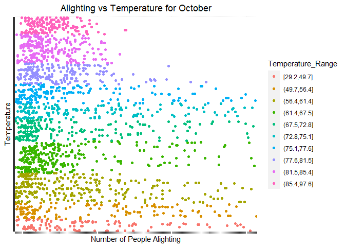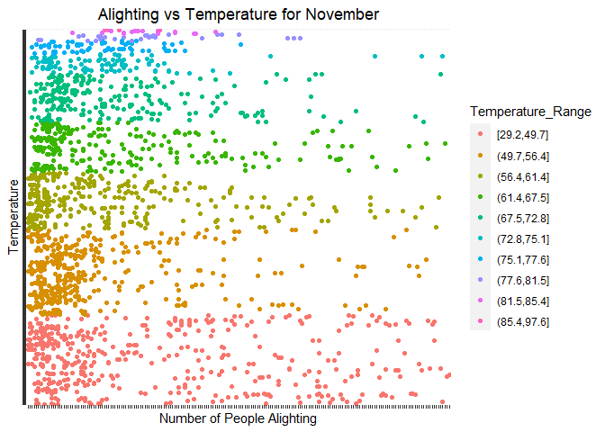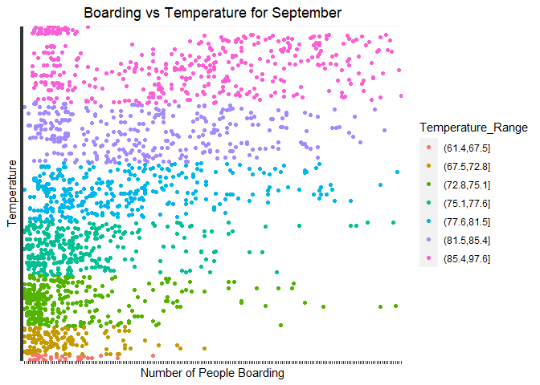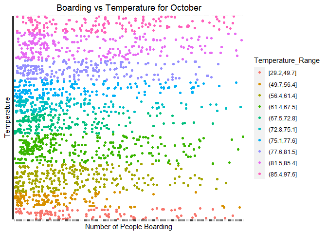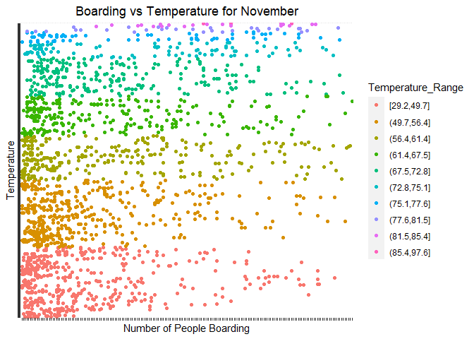
