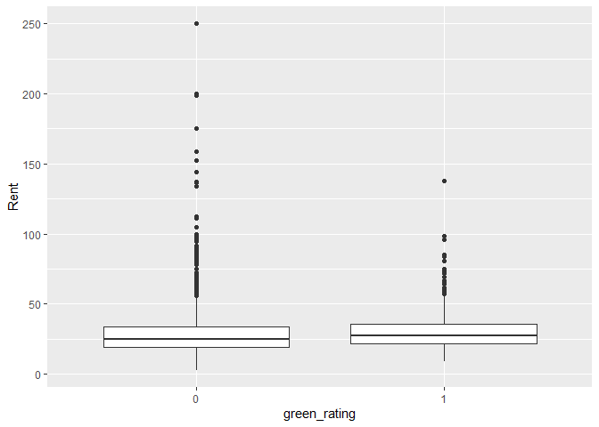

## **STA 380, Part 2: Exercises**

## Probability Practice

### **Part a**

### **Part b**

## Wrangling the Billboard Top 100

### **Part a**

### **Part b**

### **Part c**

## Visual story telling part 1: green buildings

## Exploratory Data Analysis

    ggplot(data, aes(green_rating, Rent)) + geom_boxplot()

    data %>% filter(leasing_rate>=10)%>% group_by(green_rating) %>% 
      summarise(med_rent = median(Rent), count = n())

    ## # A tibble: 2 × 3
    ##   green_rating med_rent count
    ##   <fct>           <dbl> <int>
    ## 1 0                25.0  6995
    ## 2 1                27.6   684
