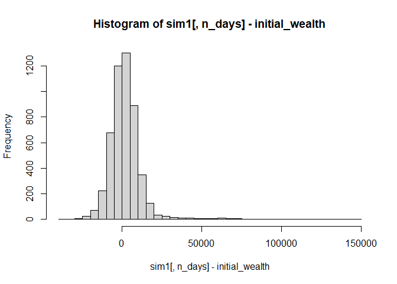

## **STA 380, Part 2: Exercises**

## Probability Practice

### **Part a**

### **Part b**

## Wrangling the Billboard Top 100

### **Part a**

### **Part b**

### **Part c**

## Visual story telling part 1: green buildings

### **Problem**

An Austin real-estate developer is interested in the possible economic
impact of “going green” in her latest project: a new 15-story mixed-use
building on East Cesar Chavez, just across I-35 from downtown. Will
investing in a green building be worth it, from an economic perspective?
The baseline construction costs are $100 million, with a 5% expected
premium for green certification.

The developer has had someone on her staff, who’s been described to her
as a “total Excel guru from his undergrad statistics course,” run some
numbers on this data set and make a preliminary recommendation. Here’s
how this person described his process:

> I began by cleaning the data a little bit. In particular, I noticed
> that a handful of the buildings in the data set had very low occupancy
> rates (less than 10% of available space occupied). I decided to remove
> these buildings from consideration, on the theory that these buildings
> might have something weird going on with them, and could potentially
> distort the analysis. Once I scrubbed these low-occupancy buildings
> from the data set, I looked at the green buildings and non-green
> buildings separately. The median market rent in the non-green
> buildings was $25 per square foot per year, while the median market
> rent in the green buildings was $27.60 per square foot per year: about
> $2.60 more per square foot. (I used the median rather than the mean,
> because there were still some outliers in the data, and the median is
> a lot more robust to outliers.) Because our building would be 250,000
> square feet, this would translate into an additional $250000 x 2.6 =
> $650000 of extra revenue per year if we build the green building.

> Our expected baseline construction costs are $100 million, with a 5%
> expected premium for green certification. Thus we should expect to
> spend an extra $5 million on the green building. Based on the extra
> revenue we would make, we would recuperate these costs in
> $5000000/650000 = 7.7 years. Even if our occupancy rate were only 90%,
> we would still recuperate the costs in a little over 8 years. Thus
> from year 9 onwards, we would be making an extra $650,000 per year in
> profit. Since the building will be earning rents for 30 years or more,
> it seems like a good financial move to build the green building. Goal:
> The developer listened to this recommendation, understood the
> analysis, and still felt unconvinced. She has therefore asked you to
> revisit the report, so that she can get a second opinion.

### Exploratory Data Analysis

it may seem like the stats guru is on point with their analysis upon
first glance when using the same assumption and removing the rows with
occupancy rates lower than 10%, the green buildings still average $2.6
dollars more per square foot.

    ## # A tibble: 2 × 3
    ##   green_rating med_rent count
    ##   <fct>           <dbl> <int>
    ## 1 0                25.0  6995
    ## 2 1                27.6   684

While looking at the box plot we see that the non-green buildings have a
fair amount more outliers, which explains the guru’s reasoning for using
the median as opposed to the mean.

### Rent vs. Occupancy Rates

We can see that the minimum rent is fairly constant for all occupancy
rates, but the maximum increases with higher occupancy rates:

Looking further into this we can note that the green buildings have a
higher median occupancy rate, which could be attributed to the awarness
mentioned in the information provided with the problem, but the true
cause can’t be verified with the data provded.

    ## # A tibble: 2 × 3
    ##   green_rating med_occupancy count
    ##   <fct>                <dbl> <int>
    ## 1 0                     89.2  7209
    ## 2 1                     92.9   685

### Age vs. Occupancy Rates

From the plot there is no clear relationship between age and occupancy
rate.

## POSSIBLE UNEXPECTED FACTORS AFFECTING RENT DIFFERENCE

Factors that may inderectly influence the rent for buildings

### 1. Number of stories

From the plot, we can see that the minimum rent charged increases with
the number of stories, but the median height of a green building is only
one story taller than a non-green building, which likely isn’t a large
enough difference. So while a taller building may be able to demand more
rent, this likely isn’t a strong enough factor to influence the decision
to go green.

    ## # A tibble: 2 × 2
    ##   green_rating med_stories
    ##   <fct>              <int>
    ## 1 0                     10
    ## 2 1                     11

### 2. Amenities

When loooking at the possility of amenities being a factor in raising
rent, we see that most green buildings have amenities (~73%), where
about only half non-green buildings have them (~52%). When comparting
rent for green and non-green buildings with and withput amenities, we
see that green buildings still charge $2 to $2.8 more per square foot
irreguarless of amenities, meaning this isn’t a factor in the differnce
in rent.

    ## `summarise()` has grouped output by 'green_rating'. You can override using the
    ## `.groups` argument.

    ## # A tibble: 4 × 4
    ## # Groups:   green_rating [2]
    ##   green_rating amenities med_rent count
    ##   <fct>        <fct>        <dbl> <int>
    ## 1 0            0             25    3550
    ## 2 0            1             25    3659
    ## 3 1            0             27     187
    ## 4 1            1             27.8   498

### 3. Age

We can see that the median green building is about 15 years newer than
the median non-green building, thus we should consider that maybe newer
buildings demand a higher rent by default and that this upcharge isn’t
necessarily due to the fact the building is green.

    ## # A tibble: 2 × 3
    ##   green_rating med_age count
    ##   <fct>          <int> <int>
    ## 1 0                 37  7209
    ## 2 1                 22   685

Looking at the plot of rent vs building age, there is hard to see a
clear correlation in the data, with maybe a slight downward trend after
the building has reached 100 years old, but there isn’t enough data on
green buildings at that age to manke any conclusions.

### 4. Space

When looking at the plot of rent vs square footage, we can see that the
minimum rent charged increases with available leasing space.

Then, when we look a the median and mean square footage for green and
non-green buildings we see that green building have a greater value for
each, so they have more space to lease in general, which could be a
potential unexpected factor in the rent upcharge.

    ## # A tibble: 2 × 3
    ##   green_rating med_size mean_size
    ##   <fct>           <int>     <dbl>
    ## 1 0              118696   225977.
    ## 2 1              241150   325781.

### 5. Clustering (Building location)

Could location influence the rent price for buildings? Could we use
location to maximize profits for our new building?

Looking at a plot of rent vs cluster, we can notice a distinct trend in
clusters 300 to around 600. When looking at the median value for these
clusters separating by if the building is green or not, we can see that
the green buildings charge ~$4.8 more per square foot in the same
cluster, meaning in these areas the perception of a green building is
potentially more positive and people are willing to pay more to be
viewed as environmentally conscious.

    ## # A tibble: 2 × 3
    ##   green_rating   med count
    ##   <fct>        <dbl> <int>
    ## 1 0             28.2  2640
    ## 2 1             33     243

### Summary and Conclusions

-   There is a slight positive relationship between rent and occupancy
    rates.

-   Green buildings have a slightly higher rate of occupancy.

-   No clear corrolation between building age and occupancy rate

-   There is an additional $2.6 per square foot in revenue for green
    buildings, and this difference increases to ~$4.8 for clusters 300 -
    600.

-   Rent and available square footage have a small positive corrolation.

-   Green buildings are, on average, ~ 100,000 square feet larger than
    non-green buildings, but more data is needed to further explore this
    idea.

The guru seems to be correct, with the average age of green buildings
being 22 years, we should expect to make our money back within 10 years
then make additional revenue from then on.

## Visual story telling part 2: Capital Metro data

Boarding and alighting patterns over entire timeframe, with weekend
indicator

Boarding and alighting patterns for the month of Novenmber, with weekend
indicator. Note the slow down in the second to last week of the month

Number of people alighting per 15 minutue interval vs temperature range
for the month of September, with color indicated by temperature range
bucket the point falls into

Number of people alighting per 15 minutue interval vs temperature range
for the month of October, with color indicated by temperature range
bucket the point falls into

Number of people alighting per 15 minutue interval vs temperature range
for the month of November, with color indicated by temperature range
bucket the point falls into

Number of people boarding per 15 minutue interval vs temperature range
for the month of September, with color indicated by temperature range
bucket the point falls into

Number of people boarding per 15 minutue interval vs temperature range
for the month of October, with color indicated by temperature range
bucket the point falls into

Number of people boarding per 15 minutue interval vs temperature range
for the month of November, with color indicated by temperature range
bucket the point falls into

Bar plot showing aggregate boarding counts for entire timeframe based on
temperature range bucket

Bar plot showing aggregate alighting counts for entire timeframe based
on temperature range bucket

## Portfolio Modeling

    library(mosaic)
    library(quantmod)

    ## Loading required package: xts

    ## Loading required package: zoo

    ## 
    ## Attaching package: 'zoo'

    ## The following objects are masked from 'package:base':
    ## 
    ##     as.Date, as.Date.numeric

    ## 
    ## Attaching package: 'xts'

    ## The following objects are masked from 'package:dplyr':
    ## 
    ##     first, last

    ## Loading required package: TTR

    ## Registered S3 method overwritten by 'quantmod':
    ##   method            from
    ##   as.zoo.data.frame zoo

    library(foreach)

    ## 
    ## Attaching package: 'foreach'

    ## The following objects are masked from 'package:purrr':
    ## 
    ##     accumulate, when

    mystocks = c( "SPLV", "VDE","USMV")
    myprices = getSymbols(mystocks, from = "2017-08-14")
    for(ticker in mystocks) {
        expr = paste0(ticker, "a = adjustOHLC(", ticker, ")")
        eval(parse(text=expr))
    }

    ## Warning in read.table(file = file, header = header, sep = sep,
    ## quote = quote, : incomplete final line found by readTableHeader
    ## on 'https://query2.finance.yahoo.com/v7/finance/download/SPLV?
    ## period1=-2208988800&period2=1660521600&interval=1d&events=split'

    ## Warning in read.table(file = file, header = header, sep = sep,
    ## quote = quote, : incomplete final line found by readTableHeader
    ## on 'https://query1.finance.yahoo.com/v7/finance/download/SPLV?
    ## period1=-2208988800&period2=1660521600&interval=1d&events=split'

    ## Warning in read.table(file = file, header = header, sep = sep,
    ## quote = quote, : incomplete final line found by readTableHeader
    ## on 'https://query2.finance.yahoo.com/v7/finance/download/VDE?
    ## period1=-2208988800&period2=1660521600&interval=1d&events=split'

    ## Warning in read.table(file = file, header = header, sep = sep,
    ## quote = quote, : incomplete final line found by readTableHeader
    ## on 'https://query2.finance.yahoo.com/v7/finance/download/VDE?
    ## period1=-2208988800&period2=1660521600&interval=1d&events=split'

    ## Warning in read.table(file = file, header = header, sep = sep,
    ## quote = quote, : incomplete final line found by readTableHeader
    ## on 'https://query1.finance.yahoo.com/v7/finance/download/USMV?
    ## period1=-2208988800&period2=1660521600&interval=1d&events=split'

    ## Warning in read.table(file = file, header = header, sep = sep,
    ## quote = quote, : incomplete final line found by readTableHeader
    ## on 'https://query1.finance.yahoo.com/v7/finance/download/USMV?
    ## period1=-2208988800&period2=1660521600&interval=1d&events=split'

    # Combine all the returns in a matrix
    all_returns = cbind( ClCl(SPLVa),
                                    ClCl(USMVa),
                                    ClCl(VDEa))
    head(all_returns)

    ##              ClCl.SPLVa   ClCl.USMVa    ClCl.VDEa
    ## 2017-08-14           NA           NA           NA
    ## 2017-08-15  0.001188245  0.001199560 -0.004277893
    ## 2017-08-16  0.004175802  0.003394529 -0.009986077
    ## 2017-08-17 -0.012037645 -0.011343284 -0.014074642
    ## 2017-08-18 -0.001772220 -0.001811594  0.006542981
    ## 2017-08-21  0.003106968  0.003831397 -0.006855005

    all_returns = as.matrix(na.omit(all_returns))
    # Compute the returns from the closing prices
    pairs(all_returns)

    # Sample a random return from the empirical joint distribution
    # This simulates a random day
    return.today = resample(all_returns, 1, orig.ids=FALSE)
    # Update the value of your holdings
    # Assumes an equal allocation to each asset
    total_wealth = 100000
    my_weights = c(0.25,0.25,0.5)
    holdings = total_wealth*my_weights
    holdings = holdings*(1 + return.today)
    # Compute your new total wealth
    holdings

    ##            ClCl.SPLVa ClCl.USMVa ClCl.VDEa
    ## 2018-06-05   24930.94   24990.58  49884.96

    total_wealth = sum(holdings)
    total_wealth

    ## [1] 99806.48

    # Now loop over a 20 day period
    ## begin block
    total_wealth = 100000
    weights = c(0.25,0.25,0.5)
    holdings = weights * total_wealth
    n_days = 20  # capital T in the notes
    wealthtracker = rep(0, n_days) # Set up a placeholder to track total wealth
    for(today in 1:n_days) {
        return.today = resample(all_returns, 1, orig.ids=FALSE)  # sampling from R matrix in notes
        holdings = holdings + holdings*return.today
        total_wealth = sum(holdings)
        wealthtracker[today] = total_wealth
    }
    total_wealth

    ## [1] 98436.24

    plot(wealthtracker, type='l')

    ## end block
    # Now simulate many different possible futures
    # just repeating the above block thousands of times
    initial_wealth = 100000
    sim1 = foreach(i=1:5000, .combine='rbind') %do% {
        total_wealth = initial_wealth
        weights = c(0.25,0.25,0.5)
        holdings = weights * total_wealth
        n_days = 10
        wealthtracker = rep(0, n_days)
        for(today in 1:n_days) {
            return.today = resample(all_returns, 1, orig.ids=FALSE)
            holdings = holdings + holdings*return.today
            total_wealth = sum(holdings)
            wealthtracker[today] = total_wealth
        }
        wealthtracker
    }
    # each row is a simulated trajectory
    # each column is a data
    head(sim1)

    ##               [,1]      [,2]      [,3]      [,4]      [,5]      [,6]      [,7]
    ## result.1  99530.24  97976.42  98110.10  98317.32  97659.19  95951.44  96066.90
    ## result.2  99185.90  99454.38 100364.44 100585.80 102549.62 101227.53 100815.80
    ## result.3 100920.10  99913.62 100109.59  98965.39  99558.67 100013.81 103708.47
    ## result.4 100584.63  98243.19  98372.16  98322.40 101323.10 114129.94 111830.38
    ## result.5  98658.30  99865.08  98985.99  99545.35  99920.85  99669.01  98876.53
    ## result.6 100754.78 102123.27 102642.53 102141.12 101954.56 104385.34 105298.48
    ##               [,8]      [,9]     [,10]
    ## result.1  96715.72  97403.86  96503.87
    ## result.2 100222.79  99787.27  99556.59
    ## result.3 104153.99 105011.65  97638.64
    ## result.4 113566.12 113037.32 113135.06
    ## result.5  99271.93  99179.19  96676.56
    ## result.6 106895.41 106111.76 105914.36

    hist(sim1[,n_days], 25)

    # Profit/loss
    mean(sim1[,n_days])

    ## [1] 100532.5

    mean(sim1[,n_days] - initial_wealth)

    ## [1] 532.4574

    hist(sim1[,n_days]- initial_wealth, breaks=30)

    # 5% value at risk:
    quantile(sim1[,n_days]- initial_wealth, prob=.05)

    ##        5% 
    ## -7384.818

In this portfolio, We have 3 ETFS. We half our portfolio USMV which
tracks equities that in the past have had a lower risk in the past. We
also have 1/4 of our portfolio in an energy ETF VDE. We have the final
quarter of our portfolio in SPLV another low volatility index. This is
our most conservative option with a very low risk and only a 5% chance
of losing 6000 dollars in any 20 day period.

    mystocks = c( "VOO", "QQQ","TQQQ")
    myprices = getSymbols(mystocks, from = "2017-08-14")
    for(ticker in mystocks) {
        expr = paste0(ticker, "a = adjustOHLC(", ticker, ")")
        eval(parse(text=expr))
    }

    ## Warning in read.table(file = file, header = header, sep = sep,
    ## quote = quote, : incomplete final line found by readTableHeader
    ## on 'https://query1.finance.yahoo.com/v7/finance/download/VOO?
    ## period1=-2208988800&period2=1660521600&interval=1d&events=split'

    ## Warning in read.table(file = file, header = header, sep = sep,
    ## quote = quote, : incomplete final line found by readTableHeader
    ## on 'https://query1.finance.yahoo.com/v7/finance/download/VOO?
    ## period1=-2208988800&period2=1660521600&interval=1d&events=split'

    ## Warning in read.table(file = file, header = header, sep = sep,
    ## quote = quote, : incomplete final line found by readTableHeader
    ## on 'https://query2.finance.yahoo.com/v7/finance/download/QQQ?
    ## period1=-2208988800&period2=1660521600&interval=1d&events=split'

    ## Warning in read.table(file = file, header = header, sep = sep,
    ## quote = quote, : incomplete final line found by readTableHeader
    ## on 'https://query1.finance.yahoo.com/v7/finance/download/QQQ?
    ## period1=-2208988800&period2=1660521600&interval=1d&events=split'

    # Combine all the returns in a matrix
    all_returns = cbind( ClCl(VOOa),
                                    ClCl(QQQ),
                                    ClCl(TQQQa))
    head(all_returns)

    ##                ClCl.VOOa      ClCl.QQQ   ClCl.TQQQa
    ## 2017-08-14            NA            NA           NA
    ## 2017-08-15  8.834519e-05  0.0006948239  0.001799892
    ## 2017-08-16  1.589759e-03  0.0017357495  0.005210169
    ## 2017-08-17 -1.556368e-02 -0.0204463337 -0.061483432
    ## 2017-08-18 -1.836277e-03 -0.0007076063 -0.003523214
    ## 2017-08-21  1.211487e-03 -0.0012744672 -0.001815538

    all_returns = as.matrix(na.omit(all_returns))
    # Compute the returns from the closing prices
    pairs(all_returns)

    # Sample a random return from the empirical joint distribution
    # This simulates a random day
    return.today = resample(all_returns, 1, orig.ids=FALSE)
    # Update the value of your holdings
    # Assumes an equal allocation to each asset
    total_wealth = 100000
    my_weights = c(0.3,0.3,.4)
    holdings = total_wealth*my_weights
    holdings = holdings*(1 + return.today)
    # Compute your new total wealth
    holdings

    ##            ClCl.VOOa ClCl.QQQ ClCl.TQQQa
    ## 2018-04-02  29306.01 29134.45   36448.03

    total_wealth = sum(holdings)
    total_wealth

    ## [1] 94888.49

    # Now loop over a 20 day period
    ## begin block
    total_wealth = 100000
    weights = c(0.3,0.4,.3)
    holdings = weights * total_wealth
    n_days = 20  # capital T in the notes
    wealthtracker = rep(0, n_days) # Set up a placeholder to track total wealth
    for(today in 1:n_days) {
        return.today = resample(all_returns, 1, orig.ids=FALSE)  # sampling from R matrix in notes
        holdings = holdings + holdings*return.today
        total_wealth = sum(holdings)
        wealthtracker[today] = total_wealth
    }
    total_wealth

    ## [1] 97117.61

    plot(wealthtracker, type='l')

    ## end block
    # Now simulate many different possible futures
    # just repeating the above block thousands of times
    initial_wealth = 100000
    sim1 = foreach(i=1:5000, .combine='rbind') %do% {
        total_wealth = initial_wealth
        weights =c(0.3,0.4,.3)
        holdings = weights * total_wealth
        n_days = 10
        wealthtracker = rep(0, n_days)
        for(today in 1:n_days) {
            return.today = resample(all_returns, 1, orig.ids=FALSE)
            holdings = holdings + holdings*return.today
            total_wealth = sum(holdings)
            wealthtracker[today] = total_wealth
        }
        wealthtracker
    }
    # each row is a simulated trajectory
    # each column is a data
    head(sim1)

    ##               [,1]      [,2]      [,3]      [,4]      [,5]      [,6]      [,7]
    ## result.1 100746.06 105330.85 103940.91 100509.50 100146.58 105523.53 141118.86
    ## result.2  97531.69  98882.15 102189.18  97081.98  98163.26  92816.91  94636.50
    ## result.3  99370.35  92257.91  88580.63  86520.68  84676.75  81934.41  80783.44
    ## result.4 100270.35 105076.85 102595.50 104752.88 106585.49 106389.47 106528.12
    ## result.5  95070.49  95026.10  95077.18  94372.13  97977.40  98101.12 100073.93
    ## result.6  99354.90 100724.81 101941.63 102002.79 103728.36 102012.12 103669.71
    ##               [,8]      [,9]     [,10]
    ## result.1 143592.80 145324.44 140914.67
    ## result.2  99722.58 100404.66  96775.71
    ## result.3  79738.46  79947.93  80450.58
    ## result.4 106746.85 107157.58 106468.16
    ## result.5 101987.33 103223.65 103748.91
    ## result.6 104190.61 100984.82 101911.65

    hist(sim1[,n_days], 25)

    # Profit/loss
    mean(sim1[,n_days])

    ## [1] 101854

    mean(sim1[,n_days] - initial_wealth)

    ## [1] 1854.014

    hist(sim1[,n_days]- initial_wealth, breaks=30)

    # 5% value at risk:
    quantile(sim1[,n_days]- initial_wealth, prob=.05)

    ##        5% 
    ## -11217.71

In this portfolio, We have 3 ETFS. We 30% our portfolio VOO which tracks
The S&P 500. We also have 40% of our portfolio in QQQ which also tracks
the S&P 500. We have the 30% of our portfolio in TQQQ, this is a
leveraged index of the S&P 500 meaning that all gains and losses are 3x.
This is our most Aggressive option as we our betting heavily on
companies in the S&P 500 and have a 5% chance of losing 11000 dollars in
any 20 day period.

    mystocks = c( "AOR", "VDE","XLE")
    myprices = getSymbols(mystocks, from = "2017-08-14")
    for(ticker in mystocks) {
        expr = paste0(ticker, "a = adjustOHLC(", ticker, ")")
        eval(parse(text=expr))
    }

    ## Warning in read.table(file = file, header = header, sep = sep,
    ## quote = quote, : incomplete final line found by readTableHeader
    ## on 'https://query1.finance.yahoo.com/v7/finance/download/AOR?
    ## period1=-2208988800&period2=1660521600&interval=1d&events=split'

    ## Warning in read.table(file = file, header = header, sep = sep,
    ## quote = quote, : incomplete final line found by readTableHeader
    ## on 'https://query1.finance.yahoo.com/v7/finance/download/AOR?
    ## period1=-2208988800&period2=1660521600&interval=1d&events=split'

    ## Warning in read.table(file = file, header = header, sep = sep,
    ## quote = quote, : incomplete final line found by readTableHeader
    ## on 'https://query2.finance.yahoo.com/v7/finance/download/VDE?
    ## period1=-2208988800&period2=1660521600&interval=1d&events=split'

    ## Warning in read.table(file = file, header = header, sep = sep,
    ## quote = quote, : incomplete final line found by readTableHeader
    ## on 'https://query1.finance.yahoo.com/v7/finance/download/VDE?
    ## period1=-2208988800&period2=1660521600&interval=1d&events=split'

    ## Warning in read.table(file = file, header = header, sep = sep,
    ## quote = quote, : incomplete final line found by readTableHeader
    ## on 'https://query2.finance.yahoo.com/v7/finance/download/XLE?
    ## period1=-2208988800&period2=1660521600&interval=1d&events=split'

    ## Warning in read.table(file = file, header = header, sep = sep,
    ## quote = quote, : incomplete final line found by readTableHeader
    ## on 'https://query2.finance.yahoo.com/v7/finance/download/XLE?
    ## period1=-2208988800&period2=1660521600&interval=1d&events=split'

    # Combine all the returns in a matrix
    all_returns = cbind( ClCl(AORa),
                                    ClCl(VDEa),
                                    ClCl(XLEa))
    head(all_returns)

    ##                ClCl.AORa    ClCl.VDEa    ClCl.XLEa
    ## 2017-08-14            NA           NA           NA
    ## 2017-08-15 -0.0009093203 -0.004277893 -0.003764737
    ## 2017-08-16  0.0031854152 -0.009986077 -0.009604724
    ## 2017-08-17 -0.0074847358 -0.014074642 -0.014149507
    ## 2017-08-18  0.0002285649  0.006542981  0.004999226
    ## 2017-08-21  0.0006853781 -0.006855005 -0.005134788

    all_returns = as.matrix(na.omit(all_returns))
    # Compute the returns from the closing prices
    pairs(all_returns)

    # Sample a random return from the empirical joint distribution
    # This simulates a random day
    return.today = resample(all_returns, 1, orig.ids=FALSE)
    # Update the value of your holdings
    # Assumes an equal allocation to each asset
    total_wealth = 100000
    my_weights = c(0.3,0.3,.4)
    holdings = total_wealth*my_weights
    holdings = holdings*(1 + return.today)
    # Compute your new total wealth
    holdings

    ##            ClCl.AORa ClCl.VDEa ClCl.XLEa
    ## 2021-05-27  30010.81   30057.9  40030.73

    total_wealth = sum(holdings)
    total_wealth

    ## [1] 100099.4

    # Now loop over a 20 day period
    ## begin block
    total_wealth = 100000
    weights = c(0.3,0.4,.3)
    holdings = weights * total_wealth
    n_days = 20  # capital T in the notes
    wealthtracker = rep(0, n_days) # Set up a placeholder to track total wealth
    for(today in 1:n_days) {
        return.today = resample(all_returns, 1, orig.ids=FALSE)  # sampling from R matrix in notes
        holdings = holdings + holdings*return.today
        total_wealth = sum(holdings)
        wealthtracker[today] = total_wealth
    }
    total_wealth

    ## [1] 105065.3

    plot(wealthtracker, type='l')

    ## end block
    # Now simulate many different possible futures
    # just repeating the above block thousands of times
    initial_wealth = 100000
    sim1 = foreach(i=1:5000, .combine='rbind') %do% {
        total_wealth = initial_wealth
        weights =c(0.3,0.4,.3)
        holdings = weights * total_wealth
        n_days = 10
        wealthtracker = rep(0, n_days)
        for(today in 1:n_days) {
            return.today = resample(all_returns, 1, orig.ids=FALSE)
            holdings = holdings + holdings*return.today
            total_wealth = sum(holdings)
            wealthtracker[today] = total_wealth
        }
        wealthtracker
    }
    # each row is a simulated trajectory
    # each column is a data
    head(sim1)

    ##               [,1]      [,2]      [,3]      [,4]      [,5]      [,6]      [,7]
    ## result.1  99627.92 100895.32 101278.61 101297.44 102362.79 103024.09 102605.83
    ## result.2 100250.13  99400.45 100000.74  99476.90  99949.73 101626.38 101483.66
    ## result.3  95624.12  93628.40  93541.02  94522.90  95478.89  96704.22  96436.85
    ## result.4 100281.17 100497.90 100604.98 100928.23 101540.35 102503.05 103141.36
    ## result.5 100598.99 103067.68 103144.30 102860.29 102494.92 103784.37 103525.15
    ## result.6  96102.82  97202.39  97039.04  96811.02  96392.07  94854.64  93937.71
    ##               [,8]      [,9]     [,10]
    ## result.1 102769.88 106784.42 105348.49
    ## result.2 101554.57 102542.39 101018.62
    ## result.3  97368.64  97056.63  95910.04
    ## result.4 103251.77 103951.73 103012.84
    ## result.5 101650.88 100979.28  99300.11
    ## result.6  96825.96  97600.05  98191.68

    hist(sim1[,n_days], 25)

    # Profit/loss
    mean(sim1[,n_days])

    ## [1] 100527

    mean(sim1[,n_days] - initial_wealth)

    ## [1] 527.0435

    hist(sim1[,n_days]- initial_wealth, breaks=30)

    # 5% value at risk:
    quantile(sim1[,n_days]- initial_wealth, prob=.05)

    ##       5% 
    ## -8487.14

In this portfolio, We have 3 ETFS. We 30% our portfolio AOR which tracks
equities that are in the growth sector. We also have 40% of our
portfolio in an energy ETF VDE. We have the final 40% our portfolio in
XLE another energy index. This is our middle of the road option with
higher risk as we bet heavily on energy a market that has been steady
for 100+ years. We have a 5% chance of losing 8000 dollars in any 20 day
period.

############### 

\#PCA

    library(readr)
    wine <- read_csv("./wine.csv")

    ## Rows: 6497 Columns: 13
    ## ── Column specification ────────────────────────────────────────────────────────
    ## Delimiter: ","
    ## chr  (1): color
    ## dbl (12): fixed.acidity, volatile.acidity, citric.acid, residual.sugar, chlo...
    ## 
    ## ℹ Use `spec()` to retrieve the full column specification for this data.
    ## ℹ Specify the column types or set `show_col_types = FALSE` to quiet this message.

    ind <- sample(2, nrow(wine),
                  replace = TRUE,
                  prob = c(0.8, 0.2))
    training <- wine[ind==1,]
    testing <- wine[ind==2,]
    wine

    ## # A tibble: 6,497 × 13
    ##    fixed…¹ volat…² citri…³ resid…⁴ chlor…⁵ free.…⁶ total…⁷ density    pH sulph…⁸
    ##      <dbl>   <dbl>   <dbl>   <dbl>   <dbl>   <dbl>   <dbl>   <dbl> <dbl>   <dbl>
    ##  1     7.4    0.7     0        1.9   0.076      11      34   0.998  3.51    0.56
    ##  2     7.8    0.88    0        2.6   0.098      25      67   0.997  3.2     0.68
    ##  3     7.8    0.76    0.04     2.3   0.092      15      54   0.997  3.26    0.65
    ##  4    11.2    0.28    0.56     1.9   0.075      17      60   0.998  3.16    0.58
    ##  5     7.4    0.7     0        1.9   0.076      11      34   0.998  3.51    0.56
    ##  6     7.4    0.66    0        1.8   0.075      13      40   0.998  3.51    0.56
    ##  7     7.9    0.6     0.06     1.6   0.069      15      59   0.996  3.3     0.46
    ##  8     7.3    0.65    0        1.2   0.065      15      21   0.995  3.39    0.47
    ##  9     7.8    0.58    0.02     2     0.073       9      18   0.997  3.36    0.57
    ## 10     7.5    0.5     0.36     6.1   0.071      17     102   0.998  3.35    0.8 
    ## # … with 6,487 more rows, 3 more variables: alcohol <dbl>, quality <dbl>,
    ## #   color <chr>, and abbreviated variable names ¹​fixed.acidity,
    ## #   ²​volatile.acidity, ³​citric.acid, ⁴​residual.sugar, ⁵​chlorides,
    ## #   ⁶​free.sulfur.dioxide, ⁷​total.sulfur.dioxide, ⁸​sulphates
    ## # ℹ Use `print(n = ...)` to see more rows, and `colnames()` to see all variable names

    wine.pca <- prcomp(training[,c(1:12)], center = TRUE,scale. = TRUE)
    summary(wine.pca)

    ## Importance of components:
    ##                          PC1    PC2    PC3     PC4    PC5     PC6    PC7    PC8
    ## Standard deviation     1.746 1.6235 1.2818 1.03416 0.9198 0.80688 0.7518 0.7241
    ## Proportion of Variance 0.254 0.2196 0.1369 0.08912 0.0705 0.05425 0.0471 0.0437
    ## Cumulative Proportion  0.254 0.4736 0.6105 0.69967 0.7702 0.82442 0.8715 0.9152
    ##                           PC9    PC10    PC11    PC12
    ## Standard deviation     0.6752 0.55023 0.47488 0.18215
    ## Proportion of Variance 0.0380 0.02523 0.01879 0.00276
    ## Cumulative Proportion  0.9532 0.97844 0.99724 1.00000

    wine

    ## # A tibble: 6,497 × 13
    ##    fixed…¹ volat…² citri…³ resid…⁴ chlor…⁵ free.…⁶ total…⁷ density    pH sulph…⁸
    ##      <dbl>   <dbl>   <dbl>   <dbl>   <dbl>   <dbl>   <dbl>   <dbl> <dbl>   <dbl>
    ##  1     7.4    0.7     0        1.9   0.076      11      34   0.998  3.51    0.56
    ##  2     7.8    0.88    0        2.6   0.098      25      67   0.997  3.2     0.68
    ##  3     7.8    0.76    0.04     2.3   0.092      15      54   0.997  3.26    0.65
    ##  4    11.2    0.28    0.56     1.9   0.075      17      60   0.998  3.16    0.58
    ##  5     7.4    0.7     0        1.9   0.076      11      34   0.998  3.51    0.56
    ##  6     7.4    0.66    0        1.8   0.075      13      40   0.998  3.51    0.56
    ##  7     7.9    0.6     0.06     1.6   0.069      15      59   0.996  3.3     0.46
    ##  8     7.3    0.65    0        1.2   0.065      15      21   0.995  3.39    0.47
    ##  9     7.8    0.58    0.02     2     0.073       9      18   0.997  3.36    0.57
    ## 10     7.5    0.5     0.36     6.1   0.071      17     102   0.998  3.35    0.8 
    ## # … with 6,487 more rows, 3 more variables: alcohol <dbl>, quality <dbl>,
    ## #   color <chr>, and abbreviated variable names ¹​fixed.acidity,
    ## #   ²​volatile.acidity, ³​citric.acid, ⁴​residual.sugar, ⁵​chlorides,
    ## #   ⁶​free.sulfur.dioxide, ⁷​total.sulfur.dioxide, ⁸​sulphates
    ## # ℹ Use `print(n = ...)` to see more rows, and `colnames()` to see all variable names

    wine.pca$rotation <- -1*wine.pca$rotation
    wine.pca$rotation

    ##                              PC1         PC2         PC3         PC4
    ## fixed.acidity         0.24298499 -0.27844434  0.46982840  0.13073576
    ## volatile.acidity      0.38907468 -0.12585444 -0.28537280  0.07284452
    ## citric.acid          -0.15515239 -0.13496587  0.58287262 -0.05860651
    ## residual.sugar       -0.33704380 -0.32144207 -0.07396278 -0.13569617
    ## chlorides             0.29891729 -0.28930681  0.03578050 -0.13479878
    ## free.sulfur.dioxide  -0.42613825 -0.08600169 -0.11243747 -0.28652022
    ## total.sulfur.dioxide -0.48020809 -0.11533361 -0.11462648 -0.12356279
    ## density               0.06130668 -0.56044376 -0.04749325 -0.16941616
    ## pH                    0.21858567  0.14563663 -0.41091216 -0.45801920
    ## sulphates             0.29287618 -0.12581938  0.15389941 -0.59499600
    ## alcohol               0.08763144  0.49067873  0.20675351 -0.08299776
    ## quality              -0.07327551  0.29797431  0.29667246 -0.49074338
    ##                              PC5          PC6          PC7         PC8
    ## fixed.acidity        -0.15367802  0.009470538  0.385338841 -0.03355852
    ## volatile.acidity     -0.15415313 -0.351218149  0.449154619 -0.31815640
    ## citric.acid           0.24215452  0.379704866  0.033791409 -0.43631226
    ## residual.sugar       -0.50772146 -0.040480778 -0.081017325 -0.06076906
    ## chlorides             0.40850244 -0.436710007 -0.469831025 -0.35189792
    ## free.sulfur.dioxide   0.27108095 -0.289978069  0.358923819 -0.14686569
    ## total.sulfur.dioxide  0.22908613 -0.093666268  0.234554536 -0.02027629
    ## density              -0.32464748  0.146297850  0.003270004 -0.05039438
    ## pH                    0.01749279  0.552594340  0.031894532 -0.37609893
    ## sulphates             0.21277150  0.003155365  0.196713844  0.59229584
    ## alcohol              -0.11491488 -0.140582745  0.345701408 -0.22484945
    ## quality              -0.42329810 -0.317219691 -0.279734436 -0.11142094
    ##                               PC9        PC10         PC11         PC12
    ## fixed.acidity         0.437291627  0.27514104  0.269111825  0.336050484
    ## volatile.acidity     -0.147800100 -0.50130063 -0.126844424  0.081976527
    ## citric.acid          -0.252075950 -0.33122059 -0.216704564 -0.001289683
    ## residual.sugar       -0.484997556  0.21308985 -0.013544913  0.456839894
    ## chlorides            -0.108213350  0.24044888  0.183484595  0.046297573
    ## free.sulfur.dioxide   0.287020806  0.28757135 -0.493174473 -0.002566808
    ## total.sulfur.dioxide -0.003720248 -0.27190983  0.730305096 -0.060961004
    ## density               0.080646969  0.08127958  0.004973725 -0.713233811
    ## pH                    0.166041316  0.12601133  0.134456418  0.206684816
    ## sulphates            -0.267576649 -0.08025206 -0.041586244  0.078283632
    ## alcohol              -0.420108382  0.42512484  0.182952209 -0.328922644
    ## quality               0.334513630 -0.30622879  0.028418337 -0.006305270

    biplot(wine.pca, scale = 0)

    trg <- predict(wine.pca, training)
    trg <- data.frame(trg, training[13])
    tst <- predict(wine.pca, testing)
    tst <- data.frame(tst, testing[13])
    library(nnet)
    mymodel <- multinom(color~PC1+PC2, data = trg)

    ## # weights:  4 (3 variable)
    ## initial  value 3561.390214 
    ## iter  10 value 345.354861
    ## final  value 310.775433 
    ## converged

    summary(mymodel)

    ## Call:
    ## multinom(formula = color ~ PC1 + PC2, data = trg)
    ## 
    ## Coefficients:
    ##                Values  Std. Err.
    ## (Intercept)  4.598971 0.22663041
    ## PC1         -3.841567 0.17510763
    ## PC2          0.673280 0.07205118
    ## 
    ## Residual Deviance: 621.5509 
    ## AIC: 627.5509

    p <- predict(mymodel, trg)
    tab <- table(p, trg$color)
    tab

    ##        
    ## p        red white
    ##   red   1225    39
    ##   white   43  3831

    p1 <- predict(mymodel, tst)
    tab1 <- table(p1, tst$color)
    tab1

    ##        
    ## p1       red white
    ##   red    321    15
    ##   white   10  1013

    # 1 % misclassification rate

\#clustering

    wine_2 = wine[-13]
    # Center/scale the data
    wine_2 %>% na.omit(wine_2)

    ## # A tibble: 6,497 × 12
    ##    fixed…¹ volat…² citri…³ resid…⁴ chlor…⁵ free.…⁶ total…⁷ density    pH sulph…⁸
    ##      <dbl>   <dbl>   <dbl>   <dbl>   <dbl>   <dbl>   <dbl>   <dbl> <dbl>   <dbl>
    ##  1     7.4    0.7     0        1.9   0.076      11      34   0.998  3.51    0.56
    ##  2     7.8    0.88    0        2.6   0.098      25      67   0.997  3.2     0.68
    ##  3     7.8    0.76    0.04     2.3   0.092      15      54   0.997  3.26    0.65
    ##  4    11.2    0.28    0.56     1.9   0.075      17      60   0.998  3.16    0.58
    ##  5     7.4    0.7     0        1.9   0.076      11      34   0.998  3.51    0.56
    ##  6     7.4    0.66    0        1.8   0.075      13      40   0.998  3.51    0.56
    ##  7     7.9    0.6     0.06     1.6   0.069      15      59   0.996  3.3     0.46
    ##  8     7.3    0.65    0        1.2   0.065      15      21   0.995  3.39    0.47
    ##  9     7.8    0.58    0.02     2     0.073       9      18   0.997  3.36    0.57
    ## 10     7.5    0.5     0.36     6.1   0.071      17     102   0.998  3.35    0.8 
    ## # … with 6,487 more rows, 2 more variables: alcohol <dbl>, quality <dbl>, and
    ## #   abbreviated variable names ¹​fixed.acidity, ²​volatile.acidity, ³​citric.acid,
    ## #   ⁴​residual.sugar, ⁵​chlorides, ⁶​free.sulfur.dioxide, ⁷​total.sulfur.dioxide,
    ## #   ⁸​sulphates
    ## # ℹ Use `print(n = ...)` to see more rows, and `colnames()` to see all variable names

    wine_scaled = scale(wine_2, center=TRUE, scale=TRUE) 
    # Form a pairwise distance matrix using the dist function
    wine_distance_matrix = dist(wine_scaled, method='euclidean')
    wine_scaled

    ##         fixed.acidity volatile.acidity  citric.acid residual.sugar
    ##    [1,]    0.14246230      2.188664464 -2.192663755   -0.744720785
    ##    [2,]    0.45100101      3.281982339 -2.192663755   -0.597594078
    ##    [3,]    0.45100101      2.553103756 -1.917405100   -0.660648381
    ##    [4,]    3.07358005     -0.362410578  1.660957411   -0.744720785
    ##    [5,]    0.14246230      2.188664464 -2.192663755   -0.744720785
    ##    [6,]    0.14246230      1.945704936 -2.192663755   -0.765738886
    ##    [7,]    0.52813569      1.581265645 -1.779775773   -0.807775088
    ##    [8,]    0.06532762      1.884965054 -2.192663755   -0.891847493
    ##    [9,]    0.45100101      1.459785881 -2.055034428   -0.723702684
    ##   [10,]    0.21959698      0.973866825  0.284664137    0.138039460
    ##   [11,]   -0.39748044      1.459785881 -1.642146446   -0.765738886
    ##   [12,]    0.21959698      0.973866825  0.284664137    0.138039460
    ##   [13,]   -1.24596190      1.672375467 -2.192663755   -0.807775088
    ##   [14,]    0.45100101      1.642005526 -0.197038508   -0.807775088
    ##   [15,]    1.29948246      1.702745408 -0.953999809   -0.345376865
    ##   [16,]    1.29948246      1.702745408 -0.885185145   -0.324358764
    ##   [17,]    0.99094375     -0.362410578  1.660957411   -0.765738886
    ##   [18,]    0.68240504      1.338306117 -0.265853172   -0.786756987
    ##   [19,]    0.14246230      1.520525763 -1.642146446   -0.219268258
    ##   [20,]    0.52813569     -0.119451050  1.316884093   -0.765738886
    ##   [21,]    1.29948246     -0.726849869  1.110440102   -0.765738886
    ##   [22,]    0.29673166      0.305728124 -0.059409181   -0.660648381
    ##   [23,]    0.52813569      0.548687651 -0.747555818   -0.807775088
    ##   [24,]    0.99094375      0.913126943 -1.435702455   -0.660648381
    ##   [25,]   -0.24321109      0.366468006 -1.229258464   -0.639630280
    ##   [26,]   -0.70601915      0.305728124 -1.091629136   -0.849811291
    ##   [27,]    0.29673166      0.427207888 -0.541111827   -0.765738886
    ##   [28,]    0.52813569      0.548687651 -0.747555818   -0.807775088
    ##   [29,]   -0.08894173      2.249404346 -2.192663755   -0.744720785
    ##   [30,]    0.45100101      1.854595113 -2.192663755   -0.723702684
    ##   [31,]   -0.39748044      2.036814759 -1.710961109   -0.639630280
    ##   [32,]   -0.24321109      2.097554641 -2.192663755   -0.618612179
    ##   [33,]    0.83667440      1.915334995 -1.366887791   -0.660648381
    ##   [34,]   -0.24321109      1.611635586 -1.366887791    1.104872110
    ##   [35,]   -1.55450061     -0.119451050 -0.472297163   -0.765738886
    ##   [36,]    0.45100101      1.854595113 -2.192663755    0.011930854
    ##   [37,]    0.45100101      1.581265645 -1.229258464   -0.639630280
    ##   [38,]    0.68240504      0.244988242 -0.265853172   -0.702684583
    ##   [39,]   -1.16882722      4.800479388 -1.573331782   -0.828793190
    ##   [40,]    0.06532762      0.670167415  0.284664137    0.096003258
    ##   [41,]    0.06532762      0.670167415  0.284664137    0.096003258
    ##   [42,]    1.22234779      1.642005526 -0.128223845   -0.555557875
    ##   [43,]    0.21959698      0.913126943 -0.816370481   -0.597594078
    ##   [44,]    0.68240504      1.945704936 -0.678741154   -0.681666482
    ##   [45,]   -0.32034577      2.006444818 -2.055034428   -0.765738886
    ##   [46,]   -2.01730867      1.095346589 -1.160443800   -0.702684583
    ##   [47,]    0.37386633      3.616051690  0.766366783   -0.681666482
    ##   [48,]    1.14521311     -0.301670696  1.385698756   -0.807775088
    ##   [49,]   -0.62888448      0.366468006 -0.609926490   -0.807775088
    ##   [50,]   -1.24596190     -0.180190932  0.353478801   -0.849811291
    ##   [51,]    1.22234779      1.945704936 -0.403482499   -0.786756987
    ##   [52,]   -0.47461512      1.095346589 -1.917405100   -0.681666482
    ##   [53,]   -0.47461512      0.973866825 -1.917405100   -0.702684583
    ##   [54,]    1.06807843      0.244988242  0.284664137   -0.513521673
    ##   [55,]    0.29673166      1.034606707 -1.160443800   -0.555557875
    ##   [56,]    0.37386633      1.702745408 -1.917405100   -0.345376865
    ##   [57,]    2.30223327      0.487947769  1.729772075   -0.429449269
    ##   [58,]    0.21959698      1.763485290 -1.366887791   -0.072141551
    ##   [59,]    0.45100101      1.520525763 -0.953999809   -0.660648381
    ##   [60,]    0.06532762      0.305728124 -0.059409181   -0.639630280
    ##   [61,]    1.22234779      0.366468006  0.559922792   -0.681666482
    ##   [62,]    0.37386633      2.127924582  1.179254765   -0.765738886
    ##   [63,]    0.21959698      1.095346589 -1.091629136   -0.744720785
    ##   [64,]   -0.16607641      2.401254051 -1.848590437   -0.723702684
    ##   [65,]   -0.01180706      2.340514169 -1.848590437   -0.166723005
    ##   [66,]   -0.01180706      2.340514169 -1.848590437   -0.166723005
    ##   [67,]    0.21959698      1.095346589 -1.435702455   -0.828793190
    ##   [68,]   -0.47461512      2.219034405 -1.710961109   -0.807775088
    ##   [69,]    1.60802118     -0.119451050  1.729772075   -0.723702684
    ##   [70,]    0.60527037      2.219034405 -1.848590437   -0.744720785
    ##   [71,]    0.37386633      1.763485290 -1.642146446   -0.744720785
    ##   [72,]    0.37386633      2.006444818 -0.609926490   -0.702684583
    ##   [73,]    0.37386633      2.127924582 -0.678741154   -0.744720785
    ##   [74,]    0.83667440      2.036814759 -0.403482499   -0.702684583
    ##   [75,]    1.91655989     -0.119451050  1.523328084   -0.618612179
    ##   [76,]    1.22234779      0.427207888  2.211474721   -0.681666482
    ##   [77,]    1.22234779      0.427207888  2.211474721   -0.681666482
    ##   [78,]   -0.32034577      2.704953461 -2.192663755   -0.639630280
    ##   [79,]   -0.39748044      2.492363874 -1.366887791   -0.723702684
    ##   [80,]    0.83667440      1.733115349 -0.816370481   -0.828793190
    ##   [81,]   -0.78315383      0.670167415 -0.816370481   -0.807775088
    ##   [82,]    0.45100101      0.548687651  2.624362703   -0.744720785
    ##   [83,]    0.14246230      0.973866825  1.041625438   -0.723702684
    ##   [84,]    0.06532762      2.006444818 -0.403482499   -0.765738886
    ##   [85,]   -0.70601915     -0.240930814  1.110440102   -0.765738886
    ##   [86,]   -0.24321109      1.277566235 -1.160443800   -0.681666482
    ##   [87,]    1.06807843      0.913126943 -0.265853172   -0.744720785
    ##   [88,]    0.37386633      0.913126943 -0.403482499   -0.744720785
    ##   [89,]    1.60802118      0.305728124  0.835181447   -0.702684583
    ##   [90,]   -0.16607641      1.702745408 -1.642146446   -0.765738886
    ##   [91,]    0.52813569      1.095346589 -0.403482499   -0.744720785
    ##   [92,]    1.06807843      0.913126943 -0.265853172   -0.744720785
    ##   [93,]    1.06807843      0.913126943 -0.197038508   -0.723702684
    ##   [94,]    0.37386633      0.913126943 -0.403482499   -0.744720785
    ##   [95,]   -1.70876996      4.132340686 -1.917405100   -0.849811291
    ##   [96,]   -1.94017400      1.581265645 -1.022814473   -0.660648381
    ##   [97,]   -0.32034577      2.644213579 -2.192663755   -0.513521673
    ##   [98,]   -0.16607641      0.973866825 -0.472297163   -0.723702684
    ##   [99,]    0.29673166      3.403462103 -1.779775773   -0.618612179
    ##  [100,]    0.68240504      1.247196294 -0.953999809   -0.744720785
    ##  [101,]    0.83667440      1.642005526 -0.128223845   -0.702684583
    ##  [102,]    0.45100101      0.973866825 -0.128223845   -0.744720785
    ##  [103,]    0.68240504      1.247196294 -0.953999809   -0.744720785
    ##  [104,]    0.68240504      1.429415940 -0.678741154   -0.702684583
    ##  [105,]   -0.01180706      0.913126943 -0.541111827   -0.681666482
    ##  [106,]    0.68240504      1.429415940 -0.678741154   -0.702684583
    ##  [107,]    0.45100101      0.427207888  2.486733375   -0.786756987
    ##  [108,]   -0.78315383      1.763485290 -0.059409181   -0.786756987
    ##  [109,]    0.60527037     -0.058711168  1.454513420   -0.618612179
    ##  [110,]    0.68240504      2.704953461  1.385698756   -0.723702684
    ##  [111,]    0.45100101      1.338306117 -0.885185145   -0.765738886
    ##  [112,]    0.91380908      1.702745408 -1.573331782   -0.681666482
    ##  [113,]    0.91380908      1.581265645 -1.504517118   -0.681666482
    ##  [114,]    2.22509860     -0.180190932  0.835181447   -0.660648381
    ##  [115,]    0.45100101      1.338306117 -0.885185145   -0.765738886
    ##  [116,]    1.68515585      0.366468006 -0.059409181   -0.681666482
    ##  [117,]    0.83667440      1.216826353 -0.265853172   -0.744720785
    ##  [118,]    0.45100101      1.338306117 -1.366887791   -0.723702684
    ##  [119,]    1.22234779      1.277566235 -1.917405100   -0.681666482
    ##  [120,]   -0.16607641      2.127924582 -1.642146446   -0.765738886
    ##  [121,]    0.06532762      4.436040096 -1.573331782   -0.786756987
    ##  [122,]    1.22234779      1.277566235 -1.917405100   -0.681666482
    ##  [123,]    0.06532762      2.158294523 -2.192663755   -0.618612179
    ##  [124,]    0.60527037      2.249404346 -2.192663755   -0.597594078
    ##  [125,]    0.45100101      0.973866825 -1.022814473   -0.807775088
    ##  [126,]    1.37661714      1.702745408 -1.917405100   -0.744720785
    ##  [127,]    0.75953972      6.015277027 -2.192663755   -0.786756987
    ##  [128,]    0.68240504      6.015277027 -2.192663755   -0.765738886
    ##  [129,]    0.60527037      1.520525763 -1.091629136   -0.765738886
    ##  [130,]   -0.86028851      0.244988242 -1.160443800   -0.765738886
    ##  [131,]    0.60527037      2.461993933  1.660957411   -0.723702684
    ##  [132,]   -1.24596190      0.973866825 -1.573331782   -0.660648381
    ##  [133,]   -1.24596190      0.973866825 -1.573331782   -0.660648381
    ##  [134,]   -0.47461512      0.973866825 -2.123849091   -0.828793190
    ##  [135,]    0.52813569      4.253820450 -1.848590437   -0.681666482
    ##  [136,]    0.91380908      2.461993933 -1.435702455   -0.744720785
    ##  [137,]    0.83667440      2.279774287 -1.160443800   -0.765738886
    ##  [138,]   -0.01180706      0.457577829  0.284664137   -0.723702684
    ##  [139,]    0.45100101      1.338306117 -0.885185145   -0.702684583
    ##  [140,]    0.45100101      1.338306117 -0.885185145   -0.723702684
    ##  [141,]    0.91380908      2.461993933 -1.435702455   -0.744720785
    ##  [142,]    0.83667440      2.279774287 -1.160443800   -0.765738886
    ##  [143,]   -1.55450061      0.002028714 -2.192663755   -0.765738886
    ##  [144,]   -0.70601915      0.305728124 -1.642146446   -0.786756987
    ##  [145,]   -1.55450061      0.002028714 -2.192663755   -0.765738886
    ##  [146,]    0.68240504      2.006444818  1.592142747   -0.765738886
    ##  [147,]   -1.09169254      2.067184700 -2.055034428   -0.765738886
    ##  [148,]    0.29673166      0.913126943 -0.403482499   -0.807775088
    ##  [149,]   -0.24321109      0.913126943 -1.504517118   -0.660648381
    ##  [150,]    0.75953972      0.366468006  0.835181447   -0.555557875
    ##  [151,]    0.06532762     -0.058711168  1.041625438   -0.702684583
    ##  [152,]    1.53088650      1.095346589  4.688802613   -0.429449269
    ##  [153,]    0.21959698      1.581265645 -1.986219764   -0.765738886
    ##  [154,]    0.21959698      1.581265645 -1.986219764   -0.765738886
    ##  [155,]   -0.08894173      0.548687651  0.697552120    0.011930854
    ##  [156,]   -0.08894173      0.548687651  0.697552120    0.011930854
    ##  [157,]   -0.08894173      0.548687651  0.697552120    0.011930854
    ##  [158,]   -0.08894173      0.548687651  0.697552120    0.011930854
    ##  [159,]   -0.08894173      2.067184700 -2.192663755   -0.681666482
    ##  [160,]   -0.32034577      1.581265645 -0.953999809   -0.744720785
    ##  [161,]    0.29673166      3.707161513 -1.986219764   -0.723702684
    ##  [162,]    0.29673166      2.067184700 -2.055034428   -0.870829392
    ##  [163,]    0.45100101      1.156086471 -1.917405100   -0.786756987
    ##  [164,]    0.14246230      1.581265645 -0.403482499    0.390256673
    ##  [165,]    0.06532762      1.520525763 -0.403482499    0.369238572
    ##  [166,]    0.45100101      1.763485290  1.110440102   -0.786756987
    ##  [167,]   -0.32034577      1.824225172 -1.504517118   -0.702684583
    ##  [168,]    0.06532762      1.277566235 -1.986219764   -0.807775088
    ##  [169,]   -0.32034577      1.763485290 -1.710961109   -0.702684583
    ##  [170,]    0.21959698      2.219034405 -0.541111827   -0.765738886
    ##  [171,]    0.52813569      3.312352280 -1.986219764   -0.765738886
    ##  [172,]    0.60527037      0.487947769 -1.022814473   -0.723702684
    ##  [173,]    0.60527037      0.487947769 -1.022814473   -0.723702684
    ##  [174,]    0.14246230      1.702745408 -1.848590437   -0.744720785
    ##  [175,]    0.06532762      0.244988242 -0.747555818   -0.723702684
    ##  [176,]   -0.24321109      0.973866825 -1.917405100   -0.828793190
    ##  [177,]    0.06532762      0.244988242 -0.747555818   -0.723702684
    ##  [178,]    0.21959698      1.095346589  0.697552120   -0.660648381
    ##  [179,]   -0.16607641      2.826433224 -2.192663755   -0.618612179
    ##  [180,]    1.22234779      1.642005526 -1.229258464   -0.639630280
    ##  [181,]    1.22234779      1.642005526 -1.229258464   -0.639630280
    ##  [182,]    1.29948246      1.642005526  1.179254765   -0.723702684
    ##  [183,]   -0.01180706      2.370884110 -2.055034428   -0.618612179
    ##  [184,]   -0.32034577      1.642005526 -0.816370481   -0.765738886
    ##  [185,]   -0.39748044      1.702745408 -0.747555818   -0.744720785
    ##  [186,]    1.29948246     -0.180190932  1.729772075   -0.723702684
    ##  [187,]    0.14246230      0.305728124  1.110440102   -0.723702684
    ##  [188,]    0.37386633      2.219034405 -1.504517118   -0.597594078
    ##  [189,]    0.52813569      0.973866825  0.078220146   -0.723702684
    ##  [190,]    0.52813569      0.913126943  0.009405483   -0.744720785
    ##  [191,]    0.75953972      0.973866825  0.215849474   -0.534539774
    ##  [192,]   -0.62888448      0.184248360 -0.472297163   -0.744720785
    ##  [193,]   -0.32034577      1.763485290 -1.366887791   -0.345376865
    ##  [194,]    0.29673166      1.277566235 -0.747555818   -0.681666482
    ##  [195,]    0.29673166      1.277566235 -0.747555818   -0.681666482
    ##  [196,]    0.45100101      1.520525763  0.078220146   -0.723702684
    ##  [197,]    0.06532762      1.459785881 -0.128223845   -0.639630280
    ##  [198,]    3.30498408     -0.240930814  1.936216066   -0.723702684
    ##  [199,]   -1.40023125      3.008652870 -1.642146446   -0.891847493
    ##  [200,]   -0.24321109      4.557519860 -1.779775773   -0.702684583
    ##  [201,]    1.83942521     -0.119451050  1.041625438   -0.849811291
    ##  [202,]    1.22234779      0.184248360  1.110440102   -0.702684583
    ##  [203,]   -0.32034577      0.973866825 -1.435702455   -0.828793190
    ##  [204,]   -0.16607641      0.487947769  0.215849474   -0.807775088
    ##  [205,]   -0.16607641      0.548687651  0.284664137   -0.807775088
    ##  [206,]    4.30773489     -0.240930814  2.899621357   -0.597594078
    ##  [207,]    4.30773489     -0.240930814  2.899621357   -0.597594078
    ##  [208,]    0.45100101      1.399045999 -0.059409181   -0.765738886
    ##  [209,]    0.45100101      0.609427533 -0.265853172   -0.576575977
    ##  [210,]    2.91931070     -0.240930814  1.798586738   -0.702684583
    ##  [211,]    1.91655989      1.156086471  1.936216066   -0.723702684
    ##  [212,]    0.60527037      2.340514169 -0.541111827   -0.555557875
    ##  [213,]    3.38211876      0.609427533  2.211474721   -0.702684583
    ##  [214,]    0.75953972      1.399045999 -0.403482499   -0.681666482
    ##  [215,]    0.45100101      2.401254051 -1.642146446   -0.639630280
    ##  [216,]   -0.16607641      0.913126943  1.179254765    0.032948955
    ##  [217,]    1.14521311      1.733115349 -1.091629136   -0.723702684
    ##  [218,]    0.68240504      2.340514169 -0.678741154   -0.681666482
    ##  [219,]    0.21959698      0.913126943 -0.885185145   -0.744720785
    ##  [220,]    0.45100101      1.156086471  0.078220146   -0.639630280
    ##  [221,]    0.45100101      0.002028714  0.353478801   -0.723702684
    ##  [222,]    0.14246230      1.156086471 -0.403482499   -0.723702684
    ##  [223,]   -0.32034577      1.642005526 -1.917405100   -0.828793190
    ##  [224,]    1.06807843      1.854595113 -0.472297163   -0.723702684
    ##  [225,]    0.91380908      1.793855231  0.284664137   -0.723702684
    ##  [226,]    0.37386633      0.548687651 -0.472297163   -0.597594078
    ##  [227,]    1.29948246      1.520525763  1.248069429   -0.723702684
    ##  [228,]    1.37661714      2.917543047 -1.229258464   -0.597594078
    ##  [229,]    0.37386633      0.548687651 -0.472297163   -0.597594078
    ##  [230,]   -0.24321109      1.095346589 -0.472297163   -0.597594078
    ##  [231,]   -1.55450061      0.852387061 -1.917405100   -0.807775088
    ##  [232,]    0.60527037      0.244988242 -1.779775773   -0.765738886
    ##  [233,]    0.99094375      0.184248360 -0.816370481   -0.555557875
    ##  [234,]   -0.24321109      1.095346589 -0.472297163   -0.597594078
    ##  [235,]    0.75953972      4.010860922 -1.573331782   -0.660648381
    ##  [236,]   -0.01180706      1.763485290 -2.192663755   -0.744720785
    ##  [237,]   -0.01180706      1.763485290 -2.192663755   -0.744720785
    ##  [238,]   -0.01180706      1.854595113 -2.192663755   -0.744720785
    ##  [239,]   -0.01180706      1.763485290 -2.192663755   -0.744720785
    ##  [240,]    0.75953972      4.010860922 -1.573331782   -0.660648381
    ##  [241,]    1.29948246      1.793855231  0.353478801   -0.786756987
    ##  [242,]    3.69065747      0.244988242  1.660957411   -0.702684583
    ##  [243,]    0.37386633      1.459785881 -1.504517118   -0.765738886
    ##  [244,]    6.00469780     -0.787589751  0.835181447   -0.681666482
    ##  [245,]    6.00469780     -0.787589751  0.835181447   -0.681666482
    ##  [246,]    0.06532762      1.945704936 -2.192663755   -0.723702684
    ##  [247,]   -0.08894173      2.067184700 -1.710961109   -0.744720785
    ##  [248,]    0.75953972      1.581265645 -1.022814473   -0.660648381
    ##  [249,]    0.37386633      1.156086471 -1.779775773   -0.786756987
    ##  [250,]    0.06532762      1.945704936 -2.192663755   -0.723702684
    ##  [251,]    2.76504134     -0.119451050  0.835181447   -0.807775088
    ##  [252,]   -0.08894173      1.581265645 -2.192663755   -0.765738886
    ##  [253,]    2.99644537      0.062768596  1.110440102   -0.492503572
    ##  [254,]    0.37386633      2.644213579  0.697552120   -0.744720785
    ##  [255,]   -0.08894173      1.581265645 -2.192663755   -0.765738886
    ##  [256,]    0.60527037      1.399045999 -0.609926490   -0.471485471
    ##  [257,]    1.68515585      0.002028714  0.353478801   -0.681666482
    ##  [258,]   -0.47461512      2.158294523 -2.192663755   -0.702684583
    ##  [259,]    0.37386633      0.427207888  3.037250685   -0.765738886
    ##  [260,]    2.14796392     -0.180190932  1.041625438   -0.597594078
    ##  [261,]    0.52813569     -0.058711168 -0.609926490   -0.786756987
    ##  [262,]   -0.16607641      3.859011218 -1.917405100   -0.723702684
    ##  [263,]    0.60527037      1.095346589 -1.986219764   -0.786756987
    ##  [264,]    0.52813569      0.184248360 -0.609926490   -0.765738886
    ##  [265,]    4.07633086      1.338306117  1.179254765   -0.639630280
    ##  [266,]    3.53638812     -0.483890342  1.385698756   -0.765738886
    ##  [267,]    0.68240504      3.221242457 -2.192663755   -0.450467370
    ##  [268,]    0.52813569      0.062768596  0.972810774   -0.387413067
    ##  [269,]   -0.24321109      1.216826353 -1.917405100   -0.513521673
    ##  [270,]    3.30498408     -0.969809397  1.316884093   -0.303340662
    ##  [271,]    0.52813569      1.247196294 -1.779775773   -0.303340662
    ##  [272,]    3.30498408     -0.969809397  1.316884093   -0.303340662
    ##  [273,]    2.84217602      0.184248360  1.798586738   -0.303340662
    ##  [274,]    0.91380908      2.279774287 -0.816370481   -0.639630280
    ##  [275,]    0.21959698      1.884965054 -0.953999809    0.327202370
    ##  [276,]    0.52813569      1.247196294 -1.779775773   -0.303340662
    ##  [277,]   -0.24321109      1.216826353 -1.917405100   -0.513521673
    ##  [278,]    3.30498408     -0.969809397  1.316884093   -0.303340662
    ##  [279,]    2.37936795     -0.119451050  0.903996111    0.201093763
    ##  [280,]    1.29948246      0.366468006  0.009405483    0.032948955
    ##  [281,]    3.22784941     -0.483890342  0.835181447   -0.387413067
    ##  [282,]    0.37386633     -0.423150460  2.486733375   -0.408431168
    ##  [283,]    0.29673166      1.095346589 -1.366887791   -0.513521673
    ##  [284,]    1.29948246      0.366468006  0.009405483    0.032948955
    ##  [285,]    2.07082924      1.520525763 -1.710961109   -0.429449269
    ##  [286,]    2.07082924      1.520525763 -1.710961109   -0.429449269
    ##  [287,]    3.69065747      0.670167415  1.592142747   -0.723702684
    ##  [288,]    0.21959698      0.366468006 -1.366887791   -0.513521673
    ##  [289,]    1.14521311      1.095346589 -1.573331782   -0.618612179
    ##  [290,]    3.38211876      0.487947769  1.454513420   -0.450467370
    ##  [291,]    1.14521311      1.095346589 -1.573331782   -0.618612179
    ##  [292,]    2.91931070     -0.848329633  1.110440102   -0.723702684
    ##  [293,]    2.45650263      1.277566235 -0.609926490   -0.576575977
    ##  [294,]   -0.24321109      0.123508478 -0.472297163   -0.639630280
    ##  [295,]    4.69340828      0.002028714  1.385698756   -0.471485471
    ##  [296,]    2.76504134      0.973866825  0.972810774   -0.618612179
    ##  [297,]    2.61077198      2.978282929  0.353478801   -0.597594078
    ##  [298,]   -0.08894173      1.763485290 -1.779775773   -0.723702684
    ##  [299,]   -0.01180706      1.884965054 -2.055034428   -0.660648381
    ##  [300,]   -0.24321109      2.006444818 -1.779775773   -0.702684583
    ##  [301,]    0.21959698      1.156086471 -1.779775773   -0.597594078
    ##  [302,]    2.99644537     -0.969809397  1.110440102   -0.828793190
    ##  [303,]    0.83667440      2.219034405 -1.366887791   -0.597594078
    ##  [304,]    0.14246230      2.006444818 -1.366887791   -0.807775088
    ##  [305,]    0.91380908      1.884965054  1.936216066   -0.702684583
    ##  [306,]    2.37936795      1.156086471  1.110440102   -0.618612179
    ##  [307,]    0.29673166      1.702745408  0.009405483   -0.681666482
    ##  [308,]    2.37936795      0.427207888  0.697552120   -0.639630280
    ##  [309,]    2.37936795      0.548687651  0.835181447   -0.639630280
    ##  [310,]    0.14246230     -0.301670696  0.422293465   -0.786756987
    ##  [311,]    2.37936795      1.156086471  1.110440102   -0.618612179
    ##  [312,]    0.52813569      1.156086471 -0.541111827   -0.723702684
    ##  [313,]    1.37661714      0.730907297 -0.059409181   -0.555557875
    ##  [314,]    1.06807843      0.791647179 -0.128223845   -0.513521673
    ##  [315,]    0.14246230      0.123508478 -0.197038508   -0.597594078
    ##  [316,]   -0.08894173      0.062768596 -0.197038508   -0.618612179
    ##  [317,]    1.83942521      1.338306117 -0.609926490   -0.429449269
    ##  [318,]    1.83942521      2.613843638 -1.366887791   -0.534539774
    ##  [319,]    1.99369456      1.945704936  0.491108129   -0.471485471
    ##  [320,]    1.83942521      2.613843638 -1.366887791   -0.534539774
    ##  [321,]    1.99369456      1.945704936  0.491108129   -0.471485471
    ##  [322,]    1.60802118      1.642005526 -0.403482499   -0.429449269
    ##  [323,]    0.45100101      1.702745408 -1.848590437   -0.660648381
    ##  [324,]    2.37936795      1.520525763  0.697552120   -0.555557875
    ##  [325,]    2.14796392      0.913126943 -0.816370481    1.167926413
    ##  [326,]    2.14796392      0.913126943 -0.816370481    1.167926413
    ##  [327,]    3.38211876      1.156086471  2.349104048   -0.376904016
    ##  [328,]    2.37936795      0.609427533  1.248069429   -0.198250157
    ##  [329,]    4.77054296     -0.423150460  2.073845393   -0.597594078
    ##  [330,]    2.68790666      0.730907297  0.491108129   -0.723702684
    ##  [331,]    2.30223327      0.123508478  2.211474721   -0.534539774
    ##  [332,]    2.30223327      0.123508478  2.211474721   -0.534539774
    ##  [333,]    0.60527037      1.459785881 -0.265853172   -0.471485471
    ##  [334,]    0.91380908      1.338306117 -1.642146446   -0.702684583
    ##  [335,]    0.52813569      1.884965054 -2.123849091   -0.618612179
    ##  [336,]    3.61352279      2.158294523  1.454513420   -0.429449269
    ##  [337,]    1.29948246      0.548687651  0.903996111   -0.744720785
    ##  [338,]    0.45100101      0.548687651  0.009405483   -0.555557875
    ##  [339,]    3.99919618      0.913126943  1.798586738   -0.513521673
    ##  [340,]    4.07633086     -0.362410578  1.523328084   -0.660648381
    ##  [341,]    3.84492683      0.002028714  1.248069429   -0.639630280
    ##  [342,]    2.61077198      0.487947769  1.110440102   -0.576575977
    ##  [343,]    2.84217602      0.305728124  1.041625438   -0.765738886
    ##  [344,]    2.84217602      0.305728124  1.041625438   -0.765738886
    ##  [345,]    3.61352279      1.399045999  1.248069429   -0.597594078
    ##  [346,]   -0.16607641      2.097554641 -2.192663755   -0.744720785
    ##  [347,]   -0.47461512      2.887173106 -2.055034428   -0.576575977
    ##  [348,]    5.07908167      0.913126943  2.417918712   -0.513521673
    ##  [349,]    1.83942521      1.338306117 -0.059409181   -0.555557875
    ##  [350,]    1.45375182      2.704953461 -2.192663755   -0.597594078
    ##  [351,]    2.68790666      2.006444818 -0.678741154   -0.576575977
    ##  [352,]    1.45375182      2.765693342 -2.192663755   -0.597594078
    ##  [353,]    0.37386633      1.976074877 -2.192663755   -0.639630280
    ##  [354,]    4.84767764      1.156086471  3.243694676   -0.135195854
    ##  [355,]   -0.86028851     -0.787589751  0.559922792   -0.849811291
    ##  [356,]   -0.39748044      2.492363874 -2.123849091   -0.639630280
    ##  [357,]    3.30498408      0.427207888  1.385698756   -0.513521673
    ##  [358,]    2.53363731      0.487947769  2.349104048   -0.524030724
    ##  [359,]    3.61352279      0.548687651  2.349104048   -0.492503572
    ##  [360,]    4.15346554      0.244988242  2.349104048   -0.597594078
    ##  [361,]    0.75953972      2.188664464 -0.609926490   -0.723702684
    ##  [362,]    1.06807843      0.670167415 -0.059409181   -0.597594078
    ##  [363,]    3.61352279      1.459785881  2.349104048   -0.618612179
    ##  [364,]    4.07633086      0.730907297  2.142660057   -0.723702684
    ##  [365,]    4.30773489      1.672375467  2.349104048    0.074985157
    ##  [366,]    2.14796392      0.487947769  1.248069429   -0.429449269
    ##  [367,]    4.30773489      1.672375467  2.349104048    0.074985157
    ##  [368,]    2.45650263      1.429415940  2.005030730   -0.597594078
    ##  [369,]    2.37936795      0.002028714  1.385698756   -0.555557875
    ##  [370,]    1.68515585     -0.423150460  1.454513420   -0.639630280
    ##  [371,]   -0.24321109      2.583473697 -2.055034428   -0.660648381
    ##  [372,]    0.52813569     -0.605370106  0.559922792   -0.807775088
    ##  [373,]    1.45375182     -0.362410578  1.110440102   -0.765738886
    ##  [374,]    0.14246230      1.277566235 -0.678741154   -0.681666482
    ##  [375,]    5.23335102      0.427207888  2.142660057   -0.345376865
    ##  [376,]    3.30498408      1.216826353  2.693177366   -0.219268258
    ##  [377,]    3.30498408      0.670167415  1.248069429   -0.513521673
    ##  [378,]    1.68515585     -0.423150460  1.454513420   -0.639630280
    ##  [379,]    3.22784941      1.733115349  2.349104048    0.159057561
    ##  [380,]    0.83667440      0.487947769  0.422293465   -0.618612179
    ##  [381,]    0.83667440     -0.483890342  0.697552120   -0.723702684
    ##  [382,]    5.00194699      0.457577829  2.486733375   -0.534539774
    ##  [383,]    0.83667440     -0.483890342  0.697552120   -0.723702684
    ##  [384,]    0.83667440     -0.483890342  0.697552120   -0.723702684
    ##  [385,]    0.37386633      1.034606707 -0.265853172   -0.702684583
    ##  [386,]    0.14246230      1.763485290 -1.710961109   -0.639630280
    ##  [387,]    0.45100101      1.216826353 -0.403482499   -0.723702684
    ##  [388,]    0.83667440      1.945704936 -1.160443800   -0.744720785
    ##  [389,]    0.45100101      0.730907297 -0.403482499   -0.744720785
    ##  [390,]    1.83942521      0.244988242 -0.059409181   -0.618612179
    ##  [391,]   -1.24596190      3.099762693 -1.848590437   -0.849811291
    ##  [392,]    5.00194699      0.457577829  2.486733375   -0.534539774
    ##  [393,]    1.76229053      0.184248360  1.385698756   -0.723702684
    ##  [394,]    0.91380908      1.976074877  2.005030730   -0.723702684
    ##  [395,]    4.23060022      1.581265645  2.280289384   -0.660648381
    ##  [396,]    3.69065747      0.184248360  3.037250685   -0.261304460
    ##  [397,]   -0.47461512      2.401254051 -2.055034428    0.516365280
    ##  [398,]    3.30498408      1.520525763  1.867401402   -0.597594078
    ##  [399,]    3.30498408      1.520525763  1.867401402   -0.597594078
    ##  [400,]    1.14521311      2.583473697 -0.678741154   -0.660648381
    ##  [401,]   -0.47461512      2.401254051 -2.055034428    0.516365280
    ##  [402,]    0.37386633     -0.483890342 -0.128223845   -0.786756987
    ##  [403,]    3.84492683      0.852387061  1.523328084   -0.597594078
    ##  [404,]    3.22784941      1.581265645  1.179254765   -0.576575977
    ##  [405,]    0.37386633      2.127924582 -1.848590437   -0.576575977
    ##  [406,]    1.14521311     -0.180190932  0.972810774   -0.849811291
    ##  [407,]    1.99369456      0.609427533  1.041625438   -0.618612179
    ##  [408,]    3.69065747      0.305728124  2.349104048   -0.513521673
    ##  [409,]    2.45650263      0.002028714  1.798586738   -0.366394966
    ##  [410,]    4.07633086      0.730907297  1.179254765   -0.198250157
    ##  [411,]    1.37661714      0.548687651  0.147034810   -0.618612179
    ##  [412,]    1.45375182      0.670167415  0.215849474   -0.639630280
    ##  [413,]   -0.08894173      2.401254051 -1.091629136   -0.744720785
    ##  [414,]    2.07082924      0.366468006  1.454513420    0.264148067
    ##  [415,]    1.22234779      1.095346589  0.147034810   -0.576575977
    ##  [416,]    1.06807843      2.340514169 -0.541111827    0.243129966
    ##  [417,]    2.61077198      0.852387061  2.211474721   -0.681666482
    ##  [418,]   -0.16607641      1.459785881 -1.366887791   -0.744720785
    ##  [419,]    3.61352279      0.244988242  1.316884093   -0.723702684
    ##  [420,]   -0.32034577      2.613843638 -2.192663755   -0.765738886
    ##  [421,]    1.76229053      1.338306117  0.078220146   -0.639630280
    ##  [422,]   -0.47461512      3.039022811 -1.986219764   -0.660648381
    ##  [423,]    0.37386633      3.767901395 -0.816370481   -0.723702684
    ##  [424,]    2.53363731     -0.605370106  1.041625438   -0.702684583
    ##  [425,]    0.37386633      3.767901395 -0.816370481   -0.723702684
    ##  [426,]   -0.47461512      3.039022811 -1.986219764   -0.660648381
    ##  [427,]   -0.62888448      2.006444818 -1.642146446   -0.702684583
    ##  [428,]    1.76229053      2.674583520 -0.678741154   -0.744720785
    ##  [429,]    1.45375182      1.095346589  0.078220146   -0.870829392
    ##  [430,]    4.30773489      3.039022811  2.142660057   -0.639630280
    ##  [431,]    2.53363731     -0.605370106  1.041625438   -0.702684583
    ##  [432,]    0.45100101      1.277566235  0.215849474   -0.681666482
    ##  [433,]    3.61352279      0.184248360  2.555548039   -0.660648381
    ##  [434,]    3.92206150      0.305728124  2.142660057   -0.660648381
    ##  [435,]    2.45650263      0.427207888  1.592142747   -0.471485471
    ##  [436,]    3.92206150      0.305728124  2.142660057   -0.660648381
    ##  [437,]    0.60527037      2.006444818 -0.128223845   -0.723702684
    ##  [438,]    2.99644537      0.670167415  2.830806694   -0.471485471
    ##  [439,]    2.45650263      0.427207888  1.592142747   -0.471485471
    ##  [440,]   -0.16607641      1.702745408 -0.953999809   -0.828793190
    ##  [441,]    4.15346554     -0.180190932  2.761992030   -0.681666482
    ##  [442,]    3.61352279      0.366468006  2.280289384   -0.692175532
    ##  [443,]    6.46750587      2.097554641  3.037250685   -0.366394966
    ##  [444,]    2.14796392      0.609427533  1.179254765   -0.576575977
    ##  [445,]   -1.47736593      1.399045999 -2.123849091   -0.786756987
    ##  [446,]    1.76229053      2.401254051 -1.504517118   -0.702684583
    ##  [447,]    4.07633086      0.244988242  1.936216066   -0.597594078
    ##  [448,]    1.60802118      0.852387061 -0.197038508   -0.702684583
    ##  [449,]    1.06807843      1.156086471 -0.678741154   -0.723702684
    ##  [450,]    3.61352279      0.305728124  2.555548039   -0.555557875
    ##  [451,]    3.61352279      0.305728124  2.555548039   -0.555557875
    ##  [452,]    0.91380908      0.184248360  1.454513420   -0.765738886
    ##  [453,]   -0.32034577      1.338306117 -1.986219764   -0.786756987
    ##  [454,]    2.45650263     -0.058711168  2.142660057   -0.555557875
    ##  [455,]   -0.16607641     -0.666109987  0.559922792   -0.807775088
    ##  [456,]    3.15071473      1.702745408  2.417918712   -0.051123449
    ##  [457,]    1.29948246      1.520525763  0.491108129   -0.660648381
    ##  [458,]    1.53088650      1.763485290 -0.747555818   -0.576575977
    ##  [459,]    2.45650263     -0.058711168  2.142660057   -0.555557875
    ##  [460,]    3.38211876      1.459785881  2.349104048   -0.681666482
    ##  [461,]    1.53088650      0.548687651  1.385698756   -0.660648381
    ##  [462,]    0.83667440      1.672375467 -0.678741154   -0.597594078
    ##  [463,]    2.91931070     -0.483890342  2.486733375   -0.608103128
    ##  [464,]    0.68240504      1.945704936  2.624362703   -0.681666482
    ##  [465,]    3.30498408     -0.149820991  1.523328084   -0.702684583
    ##  [466,]    2.14796392     -0.301670696  0.559922792   -0.534539774
    ##  [467,]    2.37936795      0.973866825  0.697552120   -0.723702684
    ##  [468,]    1.22234779      0.730907297  0.903996111   -0.597594078
    ##  [469,]    3.22784941      0.123508478  2.555548039   -0.702684583
    ##  [470,]    1.14521311      2.917543047 -2.055034428   -0.891847493
    ##  [471,]    4.46200425     -0.119451050  2.280289384   -0.597594078
    ##  [472,]    1.83942521      1.216826353  0.697552120   -0.639630280
    ##  [473,]    4.07633086      0.184248360  1.592142747   -0.597594078
    ##  [474,]    2.07082924      0.062768596  1.592142747   -0.702684583
    ##  [475,]    2.53363731     -0.362410578  1.316884093   -0.786756987
    ##  [476,]    1.83942521      2.067184700 -0.541111827   -0.681666482
    ##  [477,]    1.60802118     -0.423150460  0.628737456   -0.723702684
    ##  [478,]    2.45650263     -0.605370106  1.179254765   -0.765738886
    ##  [479,]    1.83942521      2.067184700 -0.541111827   -0.681666482
    ##  [480,]    1.68515585      2.097554641 -1.435702455   -0.576575977
    ##  [481,]    2.61077198     -0.362410578  0.491108129    2.113740962
    ##  [482,]    1.68515585     -0.240930814  1.660957411   -0.555557875
    ##  [483,]    2.61077198      0.123508478  1.867401402   -0.681666482
    ##  [484,]    2.61077198      0.123508478  1.936216066   -0.681666482
    ##  [485,]    2.61077198      0.609427533  2.486733375   -0.282322561
    ##  [486,]    2.30223327      2.006444818  0.491108129   -0.744720785
    ##  [487,]    2.30223327      2.006444818  0.491108129   -0.744720785
    ##  [488,]    2.30223327      1.854595113  0.284664137   -0.765738886
    ##  [489,]    3.38211876     -0.119451050  1.592142747   -0.555557875
    ##  [490,]    1.60802118      0.305728124  0.559922792   -0.597594078
    ##  [491,]    1.60802118      2.644213579 -0.334667836   -0.555557875
    ##  [492,]    1.53088650      0.427207888  1.248069429   -0.618612179
    ##  [493,]    1.29948246      0.366468006  1.316884093   -0.597594078
    ##  [494,]    1.14521311      2.127924582 -0.059409181   -0.513521673
    ##  [495,]   -0.55174980      0.305728124 -0.609926490    0.600437684
    ##  [496,]    2.68790666      0.062768596  1.454513420   -0.597594078
    ##  [497,]    0.45100101      1.095346589 -0.472297163   -0.744720785
    ##  [498,]   -0.01180706      0.002028714  0.009405483   -0.618612179
    ##  [499,]    2.68790666      0.062768596  1.454513420   -0.597594078
    ##  [500,]    1.14521311      2.127924582 -0.059409181   -0.513521673
    ##  [501,]    0.45100101      1.095346589 -0.472297163   -0.744720785
    ##  [502,]    2.45650263      0.609427533  2.830806694    0.232620915
    ##  [503,]    2.45650263      0.609427533  2.830806694    0.232620915
    ##  [504,]    2.53363731     -0.483890342  1.041625438   -0.744720785
    ##  [505,]    2.53363731     -0.605370106  0.697552120   -0.765738886
    ##  [506,]    2.30223327      0.913126943  2.142660057   -0.534539774
    ##  [507,]    2.45650263     -0.605370106  0.972810774   -0.765738886
    ##  [508,]    3.07358005      2.006444818  1.592142747   -0.660648381
    ##  [509,]    2.14796392      1.520525763 -0.059409181   -0.681666482
    ##  [510,]    4.69340828     -0.301670696  2.968436021   -0.555557875
    ##  [511,]    3.99919618      0.487947769  1.179254765   -0.177232056
    ##  [512,]    2.14796392      1.520525763 -0.059409181   -0.681666482
    ##  [513,]    2.68790666      0.366468006  1.110440102   -0.702684583
    ##  [514,]    2.53363731      1.034606707  2.211474721   -0.639630280
    ##  [515,]    2.53363731      1.034606707  2.211474721   -0.639630280
    ##  [516,]    0.99094375      1.915334995  1.179254765    0.138039460
    ##  [517,]    4.07633086      1.581265645  1.179254765   -0.240286359
    ##  [518,]    2.45650263      1.642005526  1.179254765   -0.702684583
    ##  [519,]    2.84217602     -0.787589751  1.179254765   -0.555557875
    ##  [520,]    0.06532762      0.153878419  1.179254765   -0.618612179
    ##  [521,]    1.99369456     -0.544630224  1.179254765   -0.576575977
    ##  [522,]    0.29673166      0.427207888  1.179254765   -0.723702684
    ##  [523,]    0.75953972      0.305728124  1.179254765   -0.660648381
    ##  [524,]    1.60802118      0.366468006  1.179254765   -0.618612179
    ##  [525,]    1.53088650      0.548687651  1.179254765   -0.639630280
    ##  [526,]    2.45650263      1.824225172 -0.541111827   -0.555557875
    ##  [527,]    0.06532762      0.153878419  1.179254765   -0.618612179
    ##  [528,]   -0.16607641      0.244988242  1.179254765   -0.618612179
    ##  [529,]    0.75953972      0.487947769  1.179254765   -0.597594078
    ##  [530,]    2.07082924      1.763485290 -0.541111827   -0.639630280
    ##  [531,]    1.45375182     -0.726849869 -0.541111827   -0.702684583
    ##  [532,]    3.61352279      0.244988242  1.179254765   -0.576575977
    ##  [533,]    3.61352279      0.244988242  1.179254765   -0.576575977
    ##  [534,]    2.37936795     -0.423150460 -0.541111827   -0.702684583
    ##  [535,]    2.14796392      0.852387061 -0.541111827   -0.576575977
    ##  [536,]    1.45375182     -0.726849869 -0.541111827   -0.702684583
    ##  [537,]    2.07082924      1.763485290 -0.541111827   -0.639630280
    ##  [538,]    0.68240504      2.947912988 -0.541111827   -0.702684583
    ##  [539,]    4.38486957      0.062768596  1.179254765    0.074985157
    ##  [540,]    3.07358005      0.973866825  2.899621357   -0.061632500
    ##  [541,]    1.53088650      1.520525763 -0.541111827   -0.450467370
    ##  [542,]    1.76229053      0.730907297  1.179254765    0.180075662
    ##  [543,]    1.60802118      2.279774287 -0.541111827   -0.702684583
    ##  [544,]    3.07358005      1.945704936 -0.541111827   -0.618612179
    ##  [545,]    5.46475506     -0.180190932  2.899621357   -0.765738886
    ##  [546,]    1.45375182      0.791647179  1.179254765   -0.597594078
    ##  [547,]    0.21959698      1.277566235 -0.541111827   -0.723702684
    ##  [548,]    2.61077198     -0.180190932  1.179254765   -0.618612179
    ##  [549,]    3.99919618      0.062768596  1.179254765   -0.597594078
    ##  [550,]    1.37661714      1.156086471  1.179254765   -0.744720785
    ##  [551,]   -0.32034577      1.034606707 -2.123849091   -0.702684583
    ##  [552,]    1.68515585      0.548687651 -0.541111827   -0.555557875
    ##  [553,]    1.76229053      0.730907297 -0.541111827   -0.576575977
    ##  [554,]   -1.70876996      4.253820450 -0.541111827   -0.807775088
    ##  [555,]    6.39037119      1.854595113  1.179254765   -0.261304460
    ##  [556,]    6.39037119      1.854595113  1.179254765   -0.261304460
    ##  [557,]    2.84217602      1.156086471  1.179254765   -0.177232056
    ##  [558,]    6.46750587      1.854595113  1.179254765   -0.261304460
    ##  [559,]    2.84217602      1.156086471  1.179254765   -0.177232056
    ##  [560,]    4.46200425      0.791647179  1.179254765   -0.240286359
    ##  [561,]    4.23060022      1.581265645  1.179254765   -0.555557875
    ##  [562,]    1.37661714      0.609427533  1.179254765   -0.639630280
    ##  [563,]    1.37661714      1.216826353  1.179254765   -0.534539774
    ##  [564,]    0.29673166     -0.301670696  1.179254765   -0.576575977
    ##  [565,]    4.46200425      0.791647179  1.179254765   -0.240286359
    ##  [566,]    4.23060022      1.581265645  1.179254765   -0.555557875
    ##  [567,]    1.14521311      2.188664464 -0.541111827   -0.618612179
    ##  [568,]    1.14521311      2.188664464 -0.541111827   -0.618612179
    ##  [569,]    1.99369456      0.973866825  1.179254765   -0.597594078
    ##  [570,]   -0.78315383      0.123508478 -0.541111827   -0.681666482
    ##  [571,]    3.30498408      0.062768596  1.179254765   -0.450467370
    ##  [572,]   -0.78315383      0.123508478 -0.541111827   -0.681666482
    ##  [573,]    2.30223327     -0.605370106  1.179254765   -0.639630280
    ##  [574,]    2.53363731      1.520525763  1.179254765   -0.702684583
    ##  [575,]    2.61077198      0.002028714  1.179254765   -0.471485471
    ##  [576,]    3.92206150     -0.423150460  1.179254765   -0.492503572
    ##  [577,]    2.07082924      0.973866825 -0.541111827   -0.660648381
    ##  [578,]    1.22234779      0.609427533  1.179254765   -0.555557875
    ##  [579,]    1.22234779      0.791647179  1.179254765   -0.534539774
    ##  [580,]    2.61077198     -0.180190932  1.179254765   -0.681666482
    ##  [581,]    3.92206150      0.973866825  1.179254765   -0.681666482
    ##  [582,]    3.92206150      0.973866825  1.179254765   -0.681666482
    ##  [583,]    3.45925344      0.913126943  1.179254765   -0.681666482
    ##  [584,]    3.69065747     -0.362410578  1.179254765   -0.744720785
    ##  [585,]    3.53638812     -0.058711168  1.179254765   -0.429449269
    ##  [586,]    0.29673166      1.034606707 -0.541111827   -0.639630280
    ##  [587,]    2.99644537     -0.180190932  1.179254765   -0.576575977
    ##  [588,]    0.06532762      2.370884110 -0.541111827   -0.744720785
    ##  [589,]   -1.70876996      0.487947769 -0.541111827   -0.723702684
    ##  [590,]    2.30223327     -0.301670696  1.179254765   -0.597594078
    ##  [591,]    1.37661714      0.670167415  1.179254765   -0.597594078
    ##  [592,]   -0.47461512      0.305728124  1.179254765   -0.786756987
    ##  [593,]    1.37661714      0.670167415  1.179254765   -0.597594078
    ##  [594,]    2.07082924      0.913126943  1.798586738   -0.408431168
    ##  [595,]    0.52813569      2.310144228 -1.022814473   -0.597594078
    ##  [596,]    1.29948246      1.550895704  0.628737456    0.516365280
    ##  [597,]    3.99919618      0.366468006  1.316884093   -0.723702684
    ##  [598,]    3.61352279      1.459785881  1.798586738   -0.744720785
    ##  [599,]    0.99094375      1.490155822 -0.953999809   -0.702684583
    ##  [600,]    4.23060022      1.520525763  0.903996111   -0.660648381
    ##  [601,]    0.75953972      3.494571926 -0.334667836   -0.702684583
    ##  [602,]    4.61627360      0.730907297  1.385698756   -0.681666482
    ##  [603,]    0.37386633      3.008652870 -2.192663755   -0.597594078
    ##  [604,]    4.61627360      0.730907297  1.385698756   -0.681666482
    ##  [605,]    0.83667440      1.459785881 -1.298073127   -0.534539774
    ##  [606,]    0.83667440      1.581265645 -1.298073127   -0.597594078
    ##  [607,]    1.68515585      0.427207888  1.110440102   -0.177232056
    ##  [608,]    1.22234779      0.852387061  0.628737456   -0.450467370
    ##  [609,]    2.22509860      1.884965054  0.353478801   -0.072141551
    ##  [610,]   -0.70601915      0.123508478 -0.885185145   -0.471485471
    ##  [611,]    1.22234779     -0.605370106  1.523328084   -0.618612179
    ##  [612,]    4.61627360      0.244988242  1.592142747   -0.576575977
    ##  [613,]    0.21959698      1.824225172 -2.192663755   -0.639630280
    ##  [614,]    0.75953972      0.305728124  0.422293465   -0.828793190
    ##  [615,]    1.53088650      2.522733815 -0.953999809   -0.681666482
    ##  [616,]    1.83942521      1.581265645  1.248069429   -0.660648381
    ##  [617,]    1.83942521      1.581265645  1.248069429   -0.660648381
    ##  [618,]    3.30498408     -0.180190932  1.316884093   -0.681666482
    ##  [619,]    3.22784941      0.730907297  1.248069429   -0.576575977
    ##  [620,]    3.15071473      0.184248360  0.628737456   -0.660648381
    ##  [621,]    0.83667440      1.216826353 -0.541111827   -0.429449269
    ##  [622,]    0.75953972      1.338306117 -0.609926490   -0.429449269
    ##  [623,]    2.14796392      1.459785881 -0.678741154   -0.744720785
    ##  [624,]    0.52813569      1.034606707 -0.472297163   -0.534539774
    ##  [625,]   -0.32034577      2.127924582 -2.192663755    0.032948955
    ##  [626,]   -0.32034577      2.127924582 -2.192663755    0.032948955
    ##  [627,]    1.22234779      1.581265645 -0.197038508   -0.681666482
    ##  [628,]    1.22234779      1.581265645 -0.197038508   -0.681666482
    ##  [629,]    1.14521311      1.216826353 -0.403482499   -0.618612179
    ##  [630,]    0.29673166      2.097554641 -0.609926490   -0.660648381
    ##  [631,]    1.14521311      1.216826353 -0.403482499   -0.618612179
    ##  [632,]    2.45650263     -0.362410578  1.523328084   -0.576575977
    ##  [633,]    0.29673166      0.427207888 -1.229258464   -0.513521673
    ##  [634,]    2.22509860      3.616051690 -0.678741154   -0.429449269
    ##  [635,]    0.52813569      0.062768596 -0.747555818   -0.744720785
    ##  [636,]    1.14521311      3.039022811 -2.192663755   -0.849811291
    ##  [637,]    1.83942521      3.281982339 -0.265853172   -0.639630280
    ##  [638,]    1.76229053      3.312352280 -0.334667836   -0.660648381
    ##  [639,]    0.37386633      3.494571926 -1.366887791   -0.681666482
    ##  [640,]    1.29948246     -0.301670696  0.215849474   -0.744720785
    ##  [641,]    2.07082924      1.216826353  0.903996111   -0.660648381
    ##  [642,]    1.76229053      1.520525763  0.835181447   -0.660648381
    ##  [643,]    2.07082924      1.216826353  0.903996111   -0.660648381
    ##  [644,]    1.76229053      1.520525763  0.835181447   -0.660648381
    ##  [645,]    2.07082924      1.216826353  0.903996111   -0.660648381
    ##  [646,]    0.45100101      1.824225172 -1.504517118    0.117021359
    ##  [647,]    0.06532762      2.006444818 -1.848590437   -0.387413067
    ##  [648,]    0.83667440      3.069392752 -2.123849091   -0.681666482
    ##  [649,]    1.14521311      0.852387061 -0.128223845   -0.555557875
    ##  [650,]   -0.39748044      0.487947769 -0.334667836    0.663491987
    ##  [651,]    2.68790666      0.548687651  0.491108129   -0.681666482
    ##  [652,]    1.99369456      3.281982339 -0.472297163   -0.618612179
    ##  [653,]    6.69890990      0.123508478  2.280289384    0.432292875
    ##  [654,]    1.68515585     -0.058711168  1.867401402   -0.555557875
    ##  [655,]    1.06807843      0.791647179  1.041625438   -0.639630280
    ##  [656,]    1.91655989      1.277566235 -1.022814473   -0.534539774
    ##  [657,]    2.68790666      0.548687651  0.491108129   -0.681666482
    ##  [658,]    3.69065747      0.973866825  1.867401402   -0.849811291
    ##  [659,]   -0.01180706      1.095346589 -1.710961109   -0.849811291
    ##  [660,]   -0.08894173      3.039022811 -2.055034428   -0.219268258
    ##  [661,]   -0.01180706      1.095346589 -1.710961109   -0.849811291
    ##  [662,]    0.21959698      0.487947769 -0.059409181   -0.807775088
    ##  [663,]   -0.01180706      1.399045999 -1.779775773   -0.807775088
    ##  [664,]    2.22509860     -0.362410578  0.972810774   -0.765738886
    ##  [665,]    3.76779215      0.366468006  1.385698756   -0.723702684
    ##  [666,]    1.68515585      1.520525763 -1.229258464   -0.723702684
    ##  [667,]    0.83667440      0.913126943  0.284664137   -0.765738886
    ##  [668,]    3.15071473      0.002028714  0.903996111   -0.723702684
    ##  [669,]    2.14796392      2.370884110  0.766366783   -0.660648381
    ##  [670,]    3.15071473      0.002028714  0.903996111   -0.723702684
    ##  [671,]   -0.24321109      0.366468006 -0.541111827   -0.618612179
    ##  [672,]    0.75953972      2.370884110 -0.747555818   -0.786756987
    ##  [673,]    1.99369456      5.468618089  0.147034810   -0.723702684
    ##  [674,]    0.75953972      2.370884110 -0.747555818   -0.786756987
    ##  [675,]    2.76504134      0.366468006  0.628737456   -0.681666482
    ##  [676,]    1.60802118      0.427207888  0.491108129   -0.681666482
    ##  [677,]    2.76504134      0.366468006  0.628737456   -0.681666482
    ##  [678,]    1.06807843      2.796063283 -1.435702455   -0.660648381
    ##  [679,]    0.83667440      2.674583520 -1.504517118   -0.597594078
    ##  [680,]    2.76504134     -0.483890342  0.903996111   -0.450467370
    ##  [681,]    4.69340828      0.548687651  1.798586738   -0.744720785
    ##  [682,]    0.60527037      0.670167415 -0.609926490   -0.681666482
    ##  [683,]    0.99094375      0.730907297 -0.059409181   -0.671157431
    ##  [684,]    0.68240504      2.674583520 -0.609926490   -0.597594078
    ##  [685,]    1.99369456      3.889381159  0.009405483   -0.660648381
    ##  [686,]    0.68240504      2.674583520 -0.609926490   -0.597594078
    ##  [687,]   -0.08894173      1.884965054 -0.953999809   -0.765738886
    ##  [688,]    1.45375182      1.824225172 -0.609926490   -0.492503572
    ##  [689,]    0.37386633      1.945704936 -1.917405100   -0.807775088
    ##  [690,]    0.68240504      0.244988242  1.110440102   -0.765738886
    ##  [691,]    0.14246230      5.134548738 -2.192663755   -0.250795410
    ##  [692,]    1.53088650      3.524941867 -0.541111827   -0.597594078
    ##  [693,]    1.06807843      0.913126943  1.316884093   -0.723702684
    ##  [694,]    1.37661714      0.852387061  0.009405483   -0.555557875
    ##  [695,]    1.37661714      0.791647179 -0.059409181   -0.576575977
    ##  [696,]   -1.63163529      0.791647179 -2.055034428   -0.870829392
    ##  [697,]   -0.16607641      1.884965054 -2.055034428   -0.702684583
    ##  [698,]   -0.16607641      1.884965054 -2.055034428   -0.702684583
    ##  [699,]    1.68515585      1.672375467 -0.265853172   -0.471485471
    ##  [700,]    3.53638812      0.244988242  1.592142747   -0.702684583
    ##  [701,]    2.61077198      4.132340686  0.766366783   -0.534539774
    ##  [702,]   -0.16607641      1.884965054 -2.055034428   -0.702684583
    ##  [703,]   -0.16607641      1.824225172 -2.055034428   -0.702684583
    ##  [704,]    0.21959698      0.244988242  1.110440102   -0.597594078
    ##  [705,]    1.45375182      2.583473697 -1.917405100   -0.807775088
    ##  [706,]    0.91380908      4.223450509 -1.160443800    0.117021359
    ##  [707,]   -0.16607641      2.674583520 -1.642146446   -0.723702684
    ##  [708,]    0.14246230      0.913126943 -0.885185145   -0.513521673
    ##  [709,]    0.45100101      1.247196294 -1.366887791   -0.618612179
    ##  [710,]    1.91655989     -0.180190932  1.041625438   -0.807775088
    ##  [711,]    2.61077198      4.162710627  0.766366783   -0.555557875
    ##  [712,]    1.29948246      1.368676058  0.147034810   -0.513521673
    ##  [713,]    1.14521311      2.127924582 -2.192663755   -0.471485471
    ##  [714,]    0.60527037      0.548687651  0.284664137   -0.660648381
    ##  [715,]    2.07082924      2.431623992 -0.265853172   -0.597594078
    ##  [716,]   -0.01180706      0.913126943 -0.953999809   -0.576575977
    ##  [717,]    0.60527037      0.548687651  0.284664137   -0.660648381
    ##  [718,]    0.29673166      0.730907297 -1.435702455   -0.597594078
    ##  [719,]    0.91380908      1.338306117 -1.917405100   -0.723702684
    ##  [720,]   -0.08894173      1.945704936 -2.192663755   -0.324358764
    ##  [721,]    0.91380908      1.338306117 -1.917405100   -0.723702684
    ##  [722,]    1.29948246      0.852387061 -0.541111827   -0.545048825
    ##  [723,]    0.29673166      0.487947769 -1.642146446   -0.576575977
    ##  [724,]   -0.08894173     -0.180190932 -0.128223845   -0.681666482
    ##  [725,]    0.21959698      4.709369565 -1.504517118   -0.492503572
    ##  [726,]    1.37661714      1.945704936 -1.022814473   -0.513521673
    ##  [727,]    0.68240504      2.310144228 -1.573331782   -0.555557875
    ##  [728,]   -0.62888448      1.399045999 -2.055034428   -0.765738886
    ##  [729,]   -0.62888448      1.399045999 -2.055034428   -0.765738886
    ##  [730,]   -0.62888448      3.190872516 -1.986219764   -0.471485471
    ##  [731,]    1.76229053      1.277566235  2.349104048   -0.660648381
    ##  [732,]    1.29948246      3.251612398 -1.298073127   -0.418940218
    ##  [733,]    0.06532762      3.008652870 -1.986219764   -0.702684583
    ##  [734,]   -0.16607641      0.670167415  0.147034810   -0.576575977
    ##  [735,]    0.37386633      1.338306117 -0.816370481   -0.723702684
    ##  [736,]    0.37386633      3.798271336 -1.504517118   -0.702684583
    ##  [737,]    0.37386633      3.798271336 -1.504517118   -0.702684583
    ##  [738,]    0.75953972      1.520525763 -2.192663755   -0.618612179
    ##  [739,]    1.37661714      0.730907297 -0.609926490   -0.555557875
    ##  [740,]    1.37661714      2.127924582 -2.192663755   -0.639630280
    ##  [741,]    0.83667440      2.553103756 -0.197038508   -0.261304460
    ##  [742,]    1.53088650      1.156086471 -0.541111827   -0.597594078
    ##  [743,]   -0.55174980      1.672375467 -2.192663755   -0.744720785
    ##  [744,]    3.38211876      0.427207888  1.798586738   -0.555557875
    ##  [745,]    2.99644537      0.305728124  1.523328084   -0.576575977
    ##  [746,]    0.06532762      1.034606707 -0.953999809   -0.702684583
    ##  [747,]    0.75953972      0.002028714  0.422293465   -0.618612179
    ##  [748,]    1.06807843     -0.058711168  0.559922792   -0.597594078
    ##  [749,]   -0.01180706      0.973866825 -0.953999809   -0.702684583
    ##  [750,]    0.06532762      1.034606707 -0.953999809   -0.702684583
    ##  [751,]    0.83667440      1.884965054 -1.504517118   -0.534539774
    ##  [752,]    0.83667440      1.884965054 -1.504517118   -0.534539774
    ##  [753,]    0.29673166      1.216826353 -1.298073127   -0.618612179
    ##  [754,]    0.83667440      1.884965054 -1.504517118   -0.534539774
    ##  [755,]    0.45100101      0.852387061  2.486733375   -0.786756987
    ##  [756,]    0.45100101      3.464201985 -1.710961109   -0.744720785
    ##  [757,]   -0.70601915      3.889381159 -2.123849091   -0.723702684
    ##  [758,]    0.68240504      3.221242457 -2.192663755   -0.681666482
    ##  [759,]    0.68240504      3.221242457 -2.192663755   -0.681666482
    ##  [760,]    1.22234779      0.487947769 -0.747555818   -0.618612179
    ##  [761,]    1.37661714      1.459785881 -0.472297163   -0.555557875
    ##  [762,]    1.60802118      1.915334995 -0.403482499   -0.723702684
    ##  [763,]    1.22234779      2.188664464 -2.192663755   -0.786756987
    ##  [764,]    1.60802118      1.915334995 -0.403482499   -0.723702684
    ##  [765,]    1.45375182      2.067184700 -1.435702455   -0.555557875
    ##  [766,]    1.53088650      2.006444818 -1.504517118   -0.513521673
    ##  [767,]    1.22234779      1.520525763 -0.953999809   -0.534539774
    ##  [768,]    0.21959698      1.581265645  0.009405483   -0.576575977
    ##  [769,]   -0.08894173      1.520525763 -2.055034428   -0.660648381
    ##  [770,]    0.52813569      2.310144228 -2.123849091   -0.744720785
    ##  [771,]   -0.08894173      1.520525763 -2.055034428   -0.660648381
    ##  [772,]    1.68515585      2.097554641 -0.403482499   -0.639630280
    ##  [773,]    1.76229053      1.399045999 -0.334667836   -0.660648381
    ##  [774,]    0.52813569      0.366468006 -0.197038508   -0.765738886
    ##  [775,]    0.52813569      0.366468006 -0.128223845   -0.765738886
    ##  [776,]   -0.01180706      4.010860922 -2.192663755   -0.513521673
    ##  [777,]   -0.24321109      2.583473697 -0.953999809   -0.639630280
    ##  [778,]   -0.24321109      1.793855231 -1.022814473   -0.639630280
    ##  [779,]    0.83667440      0.548687651 -0.128223845   -0.429449269
    ##  [780,]   -0.08894173      1.095346589 -1.986219764   -0.597594078
    ##  [781,]   -0.16607641      1.399045999 -2.192663755   -0.723702684
    ##  [782,]   -0.55174980      0.730907297 -1.229258464   -0.639630280
    ##  [783,]    1.37661714      2.917543047 -1.848590437   -0.639630280
    ##  [784,]   -0.55174980      0.730907297 -1.229258464   -0.639630280
    ##  [785,]   -0.08894173      1.520525763 -2.123849091   -0.618612179
    ##  [786,]    2.07082924      0.062768596  0.628737456   -0.660648381
    ##  [787,]    2.07082924      0.062768596  0.628737456   -0.660648381
    ##  [788,]    2.14796392      1.338306117 -0.541111827   -0.681666482
    ##  [789,]    2.14796392      1.338306117 -0.541111827   -0.681666482
    ##  [790,]    1.06807843      1.763485290 -1.022814473   -0.534539774
    ##  [791,]    0.14246230      0.184248360  0.766366783   -0.597594078
    ##  [792,]    1.22234779      1.824225172 -1.022814473   -0.534539774
    ##  [793,]   -0.08894173      1.642005526 -2.055034428   -0.618612179
    ##  [794,]    0.37386633      1.581265645 -2.192663755   -0.597594078
    ##  [795,]    2.22509860     -0.423150460  1.523328084   -0.660648381
    ##  [796,]    2.76504134      3.342722221 -0.128223845   -0.597594078
    ##  [797,]    1.14521311      0.730907297 -0.059409181   -0.618612179
    ##  [798,]    1.60802118      0.184248360  0.835181447   -0.807775088
    ##  [799,]    1.68515585      0.973866825  0.147034810   -0.387413067
    ##  [800,]    1.68515585      0.973866825  0.147034810   -0.387413067
    ##  [801,]   -0.01180706      1.642005526 -1.642146446   -0.303340662
    ##  [802,]    1.06807843      1.277566235 -1.573331782   -0.450467370
    ##  [803,]   -1.63163529      1.490155822 -2.192663755   -0.786756987
    ##  [804,]    0.37386633      1.338306117 -1.642146446   -0.618612179
    ##  [805,]    0.91380908      1.095346589 -0.678741154   -0.576575977
    ##  [806,]    0.75953972     -0.362410578  0.559922792   -0.639630280
    ##  [807,]    0.91380908     -0.544630224  0.491108129   -0.723702684
    ##  [808,]    0.75953972     -0.362410578  0.559922792   -0.639630280
    ##  [809,]    0.14246230      1.156086471 -1.366887791   -0.744720785
    ##  [810,]    0.29673166      0.852387061 -0.059409181   -0.555557875
    ##  [811,]    0.06532762      0.913126943 -1.504517118   -0.597594078
    ##  [812,]    4.38486957      0.973866825  1.592142747   -0.555557875
    ##  [813,]    2.76504134      0.670167415  0.078220146   -0.618612179
    ##  [814,]   -0.24321109      0.305728124 -0.541111827   -0.702684583
    ##  [815,]    4.15346554      0.427207888  1.523328084   -0.555557875
    ##  [816,]    2.76504134      0.670167415  0.078220146   -0.618612179
    ##  [817,]    1.99369456      1.034606707 -0.885185145   -0.471485471
    ##  [818,]    2.76504134     -0.301670696  0.697552120   -0.807775088
    ##  [819,]   -0.08894173      2.279774287 -2.192663755   -0.650139330
    ##  [820,]    1.45375182      1.945704936 -1.160443800   -0.471485471
    ##  [821,]   -0.16607641      2.097554641 -2.192663755   -0.744720785
    ##  [822,]   -1.78590464      0.487947769 -2.192663755   -0.702684583
    ##  [823,]   -0.39748044      1.216826353 -1.298073127   -0.723702684
    ##  [824,]   -0.39748044      1.216826353 -1.298073127   -0.723702684
    ##  [825,]   -0.08894173      0.852387061 -0.265853172   -0.555557875
    ##  [826,]   -0.08894173      0.730907297 -1.229258464   -0.555557875
    ##  [827,]    0.21959698     -0.423150460  0.147034810   -0.660648381
    ##  [828,]   -0.08894173      0.730907297 -1.229258464   -0.555557875
    ##  [829,]    0.45100101      1.399045999 -1.573331782   -0.660648381
    ##  [830,]   -1.01455786      1.642005526 -1.642146446   -0.702684583
    ##  [831,]    0.21959698      2.097554641 -1.710961109   -0.618612179
    ##  [832,]   -1.01455786      1.642005526 -1.642146446   -0.702684583
    ##  [833,]    2.45650263      0.609427533  0.697552120   -0.828793190
    ##  [834,]    3.38211876      0.791647179  0.835181447   -0.807775088
    ##  [835,]    1.22234779      2.097554641 -0.403482499   -0.807775088
    ##  [836,]    0.29673166      1.976074877 -1.504517118   -0.828793190
    ##  [837,]   -0.39748044     -0.362410578 -0.265853172   -0.639630280
    ##  [838,]   -0.39748044     -0.362410578 -0.265853172   -0.639630280
    ##  [839,]    2.22509860     -0.180190932  0.215849474   -0.807775088
    ##  [840,]   -0.93742319      0.973866825 -1.917405100   -0.681666482
    ##  [841,]    2.99644537      0.487947769  1.041625438   -0.587085027
    ##  [842,]   -0.47461512      1.945704936 -2.192663755   -0.513521673
    ##  [843,]    2.61077198      0.973866825  0.903996111   -0.597594078
    ##  [844,]   -0.08894173      2.097554641  0.215849474   -0.723702684
    ##  [845,]    2.07082924     -0.544630224  0.972810774   -0.786756987
    ##  [846,]   -0.62888448      1.824225172 -0.747555818   -0.765738886
    ##  [847,]   -0.62888448      1.824225172 -0.747555818   -0.765738886
    ##  [848,]    0.14246230      2.067184700 -1.091629136   -0.765738886
    ##  [849,]   -0.62888448      1.824225172 -0.747555818   -0.765738886
    ##  [850,]   -0.62888448      1.763485290 -0.747555818   -0.807775088
    ##  [851,]    1.60802118      0.548687651  0.835181447   -0.744720785
    ##  [852,]    1.60802118      0.548687651  0.835181447   -0.744720785
    ##  [853,]    0.60527037      0.487947769  0.009405483   -0.618612179
    ##  [854,]    1.60802118      0.123508478  0.491108129   -0.828793190
    ##  [855,]    1.60802118      0.123508478  0.491108129   -0.828793190
    ##  [856,]    0.29673166      2.401254051 -2.055034428   -0.618612179
    ##  [857,]    1.60802118      0.123508478  0.491108129   -0.828793190
    ##  [858,]    0.75953972     -0.483890342  0.147034810   -0.618612179
    ##  [859,]    3.45925344     -0.362410578  1.041625438   -0.786756987
    ##  [860,]   -0.32034577      1.338306117 -0.678741154   -0.765738886
    ##  [861,]   -0.01180706      1.702745408 -1.779775773   -0.576575977
    ##  [862,]   -1.09169254      4.071600804  2.349104048   -0.723702684
    ##  [863,]    0.21959698      0.487947769  0.009405483   -0.576575977
    ##  [864,]   -0.01180706      1.702745408 -1.779775773   -0.618612179
    ##  [865,]   -0.01180706      1.702745408 -1.779775773   -0.576575977
    ##  [866,]   -0.01180706      1.793855231 -1.710961109   -0.597594078
    ##  [867,]   -0.32034577      0.913126943 -0.678741154   -0.660648381
    ##  [868,]   -0.24321109      1.034606707 -0.609926490   -0.723702684
    ##  [869,]   -0.32034577      1.338306117 -0.678741154   -0.765738886
    ##  [870,]    0.29673166      1.763485290 -1.986219764   -0.723702684
    ##  [871,]    0.37386633      2.279774287 -2.123849091   -0.702684583
    ##  [872,]   -0.24321109      1.338306117 -1.986219764   -0.828793190
    ##  [873,]    0.06532762      0.062768596 -0.541111827   -0.723702684
    ##  [874,]    1.45375182     -0.787589751  0.353478801   -0.807775088
    ##  [875,]    2.45650263      0.244988242  0.972810774   -0.702684583
    ##  [876,]    1.22234779     -0.180190932  0.559922792   -0.555557875
    ##  [877,]   -0.08894173      0.791647179 -2.192663755   -0.681666482
    ##  [878,]    0.37386633      2.279774287 -2.123849091   -0.702684583
    ##  [879,]    1.22234779      1.642005526 -0.885185145   -0.303340662
    ##  [880,]   -0.01180706      1.581265645 -1.917405100   -0.618612179
    ##  [881,]    1.53088650      1.338306117 -0.953999809   -0.807775088
    ##  [882,]    0.29673166      2.279774287 -2.192663755   -0.702684583
    ##  [883,]    0.91380908     -0.180190932 -0.197038508   -0.492503572
    ##  [884,]   -0.01180706      1.581265645 -1.917405100   -0.618612179
    ##  [885,]    1.22234779      1.642005526 -0.885185145   -0.303340662
    ##  [886,]    1.29948246      2.492363874 -1.229258464   -0.618612179
    ##  [887,]    1.37661714      2.796063283 -1.366887791   -0.639630280
    ##  [888,]    2.68790666      1.095346589  0.422293465   -0.597594078
    ##  [889,]   -0.32034577      1.399045999 -2.192663755   -0.618612179
    ##  [890,]    2.68790666      3.403462103  0.147034810    0.243129966
    ##  [891,]   -0.01180706      0.002028714 -0.541111827   -0.723702684
    ##  [892,]   -0.01180706      1.945704936 -1.986219764   -0.660648381
    ##  [893,]    2.22509860      0.670167415 -0.609926490   -0.744720785
    ##  [894,]   -0.01180706      1.945704936 -1.986219764   -0.660648381
    ##  [895,]   -0.01180706      1.763485290 -1.986219764   -0.681666482
    ##  [896,]   -0.08894173      1.520525763 -2.123849091   -0.660648381
    ##  [897,]    0.83667440     -0.180190932  0.491108129   -0.639630280
    ##  [898,]   -0.08894173      1.520525763 -2.123849091   -0.660648381
    ##  [899,]    0.83667440     -0.180190932  0.491108129   -0.639630280
    ##  [900,]    0.83667440      4.132340686 -2.055034428   -0.429449269
    ##  [901,]    1.29948246     -0.180190932  0.284664137   -0.597594078
    ##  [902,]    0.14246230      1.793855231 -1.504517118   -0.639630280
    ##  [903,]    0.14246230      1.793855231 -1.504517118   -0.639630280
    ##  [904,]   -0.32034577      1.520525763 -1.779775773    0.117021359
    ##  [905,]   -0.32034577      1.520525763 -1.779775773    0.117021359
    ##  [906,]    1.53088650      1.459785881 -0.816370481   -0.513521673
    ##  [907,]   -0.01180706      1.216826353 -0.334667836   -0.597594078
    ##  [908,]   -0.86028851      1.338306117 -2.192663755   -0.681666482
    ##  [909,]    0.14246230      1.095346589 -1.298073127   -0.639630280
    ##  [910,]    0.06532762     -0.210560873  0.491108129   -0.891847493
    ##  [911,]    1.60802118      0.244988242  1.110440102   -0.345376865
    ##  [912,]    1.45375182     -0.362410578  0.972810774    0.747564392
    ##  [913,]    2.14796392      0.730907297  0.835181447   -0.534539774
    ##  [914,]    1.68515585      0.336098065  0.972810774   -0.177232056
    ##  [915,]    0.06532762     -0.210560873  0.491108129   -0.891847493
    ##  [916,]    1.06807843     -0.149820991  0.559922792   -0.681666482
    ##  [917,]   -1.47736593      2.279774287 -0.885185145   -0.828793190
    ##  [918,]   -0.32034577      0.427207888 -0.059409181    0.705528189
    ##  [919,]    0.91380908      0.123508478  0.009405483   -0.681666482
    ##  [920,]    0.91380908      1.702745408 -1.366887791   -0.765738886
    ##  [921,]    1.83942521      0.427207888  0.353478801   -0.660648381
    ##  [922,]    0.91380908      0.123508478  0.009405483   -0.681666482
    ##  [923,]    0.91380908      1.702745408 -1.366887791   -0.765738886
    ##  [924,]   -0.32034577      0.427207888 -0.059409181    0.705528189
    ##  [925,]    1.06807843      0.791647179 -0.334667836   -0.660648381
    ##  [926,]    1.06807843     -0.726849869  0.284664137   -0.744720785
    ##  [927,]    1.68515585     -0.605370106  0.078220146   -0.660648381
    ##  [928,]    0.91380908      2.006444818 -0.885185145   -0.681666482
    ##  [929,]    1.06807843      0.791647179 -0.334667836   -0.660648381
    ##  [930,]    1.14521311     -0.058711168  0.422293465   -0.450467370
    ##  [931,]   -0.47461512      1.642005526 -2.123849091   -0.744720785
    ##  [932,]    0.14246230      1.642005526 -2.123849091   -0.723702684
    ##  [933,]    0.29673166      0.366468006 -0.197038508   -0.744720785
    ##  [934,]    0.14246230      1.642005526 -2.123849091   -0.723702684
    ##  [935,]   -0.47461512      1.642005526 -2.123849091   -0.744720785
    ##  [936,]    1.22234779     -0.240930814  0.422293465   -0.660648381
    ##  [937,]    1.22234779     -0.240930814  0.422293465   -0.660648381
    ##  [938,]    3.69065747      1.763485290  1.248069429   -0.849811291
    ##  [939,]   -0.01180706      0.244988242  0.422293465   -0.555557875
    ##  [940,]   -0.78315383      0.730907297 -1.022814473   -0.807775088
    ##  [941,]    1.83942521     -0.058711168  1.385698756   -0.681666482
    ##  [942,]    2.07082924     -0.423150460  1.179254765   -0.093159652
    ##  [943,]    2.22509860      0.548687651  0.559922792   -0.597594078
    ##  [944,]    1.99369456      0.973866825  0.147034810   -0.660648381
    ##  [945,]    0.83667440     -0.240930814  1.179254765   -0.345376865
    ##  [946,]    2.30223327      0.609427533  0.697552120   -0.723702684
    ##  [947,]    2.30223327      0.609427533  1.798586738   -0.282322561
    ##  [948,]    0.83667440     -0.362410578  1.110440102   -0.702684583
    ##  [949,]    1.29948246     -1.334248689  0.903996111   -0.765738886
    ##  [950,]    1.29948246     -1.334248689  0.903996111   -0.765738886
    ##  [951,]    1.29948246     -1.334248689  0.903996111   -0.765738886
    ##  [952,]    0.83667440     -0.362410578  1.110440102   -0.702684583
    ##  [953,]    0.75953972     -0.180190932  0.559922792   -0.681666482
    ##  [954,]    2.30223327      0.002028714  1.110440102   -0.702684583
    ##  [955,]    0.29673166      0.548687651  0.559922792   -0.576575977
    ##  [956,]    0.99094375     -0.787589751  1.385698756   -0.744720785
    ##  [957,]    1.37661714      0.123508478  1.385698756   -0.702684583
    ##  [958,]    1.76229053      0.184248360  1.385698756   -0.723702684
    ##  [959,]   -0.62888448      1.399045999 -1.366887791   -0.660648381
    ##  [960,]    0.60527037      1.520525763 -1.848590437   -0.723702684
    ##  [961,]    0.99094375      0.791647179 -0.334667836   -0.744720785
    ##  [962,]   -0.08894173      1.338306117 -1.229258464   -0.807775088
    ##  [963,]   -0.47461512      1.399045999 -2.055034428   -0.702684583
    ##  [964,]    1.22234779     -0.423150460  0.491108129   -0.723702684
    ##  [965,]    0.99094375      0.791647179 -0.334667836   -0.744720785
    ##  [966,]    0.83667440      0.002028714  0.559922792   -0.639630280
    ##  [967,]    1.37661714      0.244988242  0.628737456   -0.639630280
    ##  [968,]    0.99094375      1.945704936 -0.816370481   -0.702684583
    ##  [969,]    1.37661714      0.366468006  0.766366783   -0.639630280
    ##  [970,]   -0.39748044      1.338306117 -1.573331782   -0.534539774
    ##  [971,]    2.45650263     -0.483890342  1.110440102   -0.744720785
    ##  [972,]    2.45650263     -0.483890342  1.110440102   -0.744720785
    ##  [973,]    2.22509860      0.244988242  1.248069429   -0.639630280
    ##  [974,]    0.99094375      0.002028714  0.835181447   -0.786756987
    ##  [975,]    1.22234779     -0.058711168  0.628737456    0.096003258
    ##  [976,]   -0.01180706      0.427207888 -0.128223845   -0.702684583
    ##  [977,]   -0.01180706      0.427207888 -0.128223845   -0.702684583
    ##  [978,]    0.91380908      1.520525763 -0.197038508   -0.597594078
    ##  [979,]   -0.16607641      0.366468006  0.009405483   -0.387413067
    ##  [980,]    3.84492683      0.670167415  1.179254765   -0.849811291
    ##  [981,]    1.45375182      0.973866825 -0.128223845   -0.744720785
    ##  [982,]    1.76229053      3.160502575 -0.403482499   -0.744720785
    ##  [983,]    0.06532762      1.095346589  0.009405483   -0.702684583
    ##  [984,]    1.45375182      0.973866825 -0.128223845   -0.744720785
    ##  [985,]    3.84492683      0.670167415  1.179254765   -0.849811291
    ##  [986,]    0.14246230      1.459785881 -2.192663755   -0.723702684
    ##  [987,]    1.99369456      0.002028714  0.491108129   -0.849811291
    ##  [988,]   -0.08894173      0.123508478 -0.128223845   -0.807775088
    ##  [989,]    0.37386633      0.305728124 -1.366887791   -0.786756987
    ##  [990,]    1.91655989     -0.271300755  0.559922792   -0.828793190
    ##  [991,]    0.37386633      0.305728124 -1.366887791   -0.786756987
    ##  [992,]   -0.08894173      0.002028714 -0.265853172   -0.723702684
    ##  [993,]   -0.55174980      0.366468006 -1.504517118   -0.723702684
    ##  [994,]   -0.08894173      0.002028714 -0.265853172   -0.723702684
    ##  [995,]    2.14796392      0.062768596  0.903996111   -0.618612179
    ##  [996,]    0.37386633      1.581265645 -1.779775773   -0.723702684
    ##  [997,]   -1.24596190      1.945704936 -2.192663755   -0.681666482
    ##  [998,]   -1.24596190      1.945704936 -2.192663755   -0.681666482
    ##  [999,]    1.29948246      3.039022811  0.147034810   -0.849811291
    ## [1000,]   -0.62888448      2.127924582 -2.192663755   -0.797266038
    ## [1001,]    0.21959698      0.548687651 -0.128223845   -0.681666482
    ## [1002,]    2.07082924      0.062768596  0.422293465   -0.828793190
    ## [1003,]    1.45375182     -0.301670696  0.078220146   -0.713193634
    ## [1004,]   -0.32034577      0.123508478  0.009405483   -0.765738886
    ## [1005,]    0.75953972      0.548687651 -0.197038508   -0.807775088
    ## [1006,]   -0.32034577      0.123508478  0.009405483   -0.765738886
    ## [1007,]    1.45375182     -0.301670696  0.078220146   -0.713193634
    ## [1008,]    1.45375182     -0.240930814  0.147034810   -0.723702684
    ## [1009,]    1.29948246      0.062768596  0.559922792   -0.387413067
    ## [1010,]    1.83942521      0.973866825  0.284664137   -0.555557875
    ## [1011,]    1.29948246     -0.362410578  0.903996111   -0.786756987
    ## [1012,]    1.29948246     -0.119451050 -0.059409181   -0.723702684
    ## [1013,]    0.37386633      4.041230863 -1.160443800   -0.702684583
    ## [1014,]    0.21959698      2.249404346 -2.192663755   -0.807775088
    ## [1015,]    0.60527037      1.459785881 -1.091629136   -0.723702684
    ## [1016,]    2.53363731      0.305728124  0.972810774   -0.681666482
    ## [1017,]    1.29948246      0.244988242  0.559922792   -0.681666482
    ## [1018,]    0.60527037     -0.969809397  0.353478801   -0.954901796
    ## [1019,]    0.60527037     -0.969809397  0.353478801   -0.954901796
    ## [1020,]   -0.16607641      0.973866825 -1.229258464   -0.765738886
    ## [1021,]    3.15071473      0.123508478  2.349104048   -0.639630280
    ## [1022,]    3.15071473      0.123508478  2.349104048   -0.639630280
    ## [1023,]   -0.16607641      1.034606707 -1.573331782   -0.702684583
    ## [1024,]    0.75953972     -0.119451050  0.697552120   -0.660648381
    ## [1025,]    0.37386633      1.459785881 -2.123849091   -0.765738886
    ## [1026,]    1.06807843      2.978282929 -2.192663755   -0.555557875
    ## [1027,]    0.52813569     -0.180190932  0.009405483   -0.744720785
    ## [1028,]   -0.62888448      2.765693342 -2.192663755   -0.681666482
    ## [1029,]   -0.01180706      0.002028714 -0.747555818   -0.618612179
    ## [1030,]    0.37386633      1.459785881 -2.123849091   -0.765738886
    ## [1031,]   -0.08894173      1.520525763 -2.192663755   -0.702684583
    ## [1032,]    0.06532762      1.277566235 -2.123849091   -0.765738886
    ## [1033,]    0.68240504      2.917543047 -2.192663755   -0.282322561
    ## [1034,]    0.21959698      1.399045999 -1.642146446   -0.597594078
    ## [1035,]    1.29948246      2.461993933 -0.953999809   -0.618612179
    ## [1036,]    2.22509860      0.184248360  0.147034810   -0.639630280
    ## [1037,]    0.29673166     -0.180190932  0.147034810   -0.618612179
    ## [1038,]    0.06532762      3.464201985 -1.504517118   -0.765738886
    ## [1039,]    1.14521311      0.427207888  0.628737456    0.159057561
    ## [1040,]    1.29948246      0.973866825 -0.747555818   -0.681666482
    ## [1041,]    0.14246230      3.798271336 -2.192663755   -0.681666482
    ## [1042,]   -0.24321109      0.913126943 -0.885185145   -0.786756987
    ## [1043,]    1.29948246      0.973866825 -0.747555818   -0.681666482
    ## [1044,]    1.76229053      0.305728124  0.628737456    0.726546291
    ## [1045,]   -0.62888448      0.305728124  0.078220146   -0.450467370
    ## [1046,]   -0.24321109      0.609427533 -2.192663755   -0.849811291
    ## [1047,]    0.29673166      2.674583520 -2.192663755   -0.786756987
    ## [1048,]   -0.08894173      0.548687651 -1.022814473   -0.765738886
    ## [1049,]    1.60802118      0.913126943  0.284664137   -0.786756987
    ## [1050,]    1.60802118      0.973866825  0.284664137   -0.765738886
    ## [1051,]   -0.08894173      0.548687651 -1.022814473   -0.765738886
    ## [1052,]    0.99094375      0.730907297  1.867401402   -0.849811291
    ## [1053,]   -1.24596190      1.611635586 -1.848590437   -0.639630280
    ## [1054,]    0.83667440     -0.058711168  0.697552120   -0.660648381
    ## [1055,]    0.75953972      1.824225172 -0.334667836   -0.723702684
    ## [1056,]    0.75953972      1.824225172 -0.334667836   -0.723702684
    ## [1057,]    1.29948246      0.852387061  1.454513420   -0.303340662
    ## [1058,]    0.29673166      0.487947769 -0.472297163   -0.324358764
    ## [1059,]    2.07082924      1.156086471  1.729772075   -0.639630280
    ## [1060,]    1.29948246      0.852387061  1.454513420   -0.303340662
    ## [1061,]    3.38211876     -0.666109987  1.729772075   -0.765738886
    ## [1062,]    1.45375182      0.366468006  1.248069429   -0.765738886
    ## [1063,]    0.60527037      0.244988242  0.835181447   -0.744720785
    ## [1064,]    2.30223327     -0.301670696  2.280289384   -0.639630280
    ## [1065,]    0.75953972      2.431623992 -1.573331782   -0.723702684
    ## [1066,]    0.37386633      1.642005526 -0.953999809   -0.639630280
    ## [1067,]   -0.47461512      1.095346589 -1.642146446   -0.639630280
    ## [1068,]    2.99644537     -0.180190932  1.454513420   -0.681666482
    ## [1069,]    2.99644537     -0.180190932  1.454513420   -0.681666482
    ## [1070,]    0.60527037      1.702745408  0.215849474   -0.555557875
    ## [1071,]    1.60802118     -0.058711168  0.903996111   -0.828793190
    ## [1072,]    0.21959698      2.613843638 -0.816370481    0.558401482
    ## [1073,]   -0.01180706      0.062768596 -0.403482499   -0.765738886
    ## [1074,]    0.60527037      1.702745408  0.078220146   -0.576575977
    ## [1075,]    0.21959698      2.613843638 -0.816370481    0.558401482
    ## [1076,]    1.45375182     -0.544630224  0.147034810   -0.723702684
    ## [1077,]    2.07082924     -0.119451050  1.660957411   -0.723702684
    ## [1078,]    1.06807843      0.184248360  2.280289384    0.201093763
    ## [1079,]    1.06807843      0.184248360  2.280289384    0.201093763
    ## [1080,]    0.52813569     -0.240930814  2.486733375    0.600437684
    ## [1081,]    2.37936795     -0.423150460  1.660957411   -0.849811291
    ## [1082,]    0.52813569     -0.240930814  2.486733375    0.600437684
    ## [1083,]   -0.01180706      0.244988242 -0.128223845   -0.765738886
    ## [1084,]    1.14521311      0.487947769  0.903996111   -0.639630280
    ## [1085,]   -0.01180706      0.244988242 -0.128223845   -0.765738886
    ## [1086,]   -0.32034577      0.852387061 -1.642146446   -0.765738886
    ## [1087,]    0.99094375      0.002028714  0.559922792   -0.156213955
    ## [1088,]    0.52813569     -0.909069515  0.697552120   -0.807775088
    ## [1089,]    3.38211876      0.427207888  1.523328084   -0.828793190
    ## [1090,]    3.38211876      0.427207888  1.523328084   -0.828793190
    ## [1091,]    2.14796392     -0.483890342  1.523328084   -0.744720785
    ## [1092,]    0.52813569      0.002028714  0.697552120   -0.723702684
    ## [1093,]   -0.16607641      1.216826353 -1.573331782   -0.723702684
    ## [1094,]    1.53088650     -0.180190932  0.284664137   -0.681666482
    ## [1095,]   -0.47461512      2.340514169 -1.573331782    0.011930854
    ## [1096,]    1.68515585      0.366468006  1.041625438   -0.618612179
    ## [1097,]   -0.47461512      2.340514169 -1.573331782    0.011930854
    ## [1098,]    1.06807843      1.095346589  0.422293465   -0.828793190
    ## [1099,]    0.60527037     -0.180190932  0.903996111   -0.702684583
    ## [1100,]    1.06807843      1.095346589  0.422293465   -0.828793190
    ## [1101,]    0.91380908      0.002028714  0.697552120   -0.702684583
    ## [1102,]    0.14246230      0.913126943 -0.334667836   -0.702684583
    ## [1103,]   -0.86028851      0.852387061 -1.573331782   -0.786756987
    ## [1104,]    0.14246230      0.913126943 -0.334667836   -0.702684583
    ## [1105,]    0.60527037      0.852387061  0.147034810   -0.681666482
    ## [1106,]   -0.70601915      1.399045999 -0.265853172   -0.702684583
    ## [1107,]    0.75953972     -0.666109987  0.697552120   -0.744720785
    ## [1108,]    1.45375182     -0.240930814  0.628737456   -0.723702684
    ## [1109,]    0.68240504      2.674583520 -1.504517118   -0.450467370
    ## [1110,]    2.76504134      0.791647179  0.766366783   -0.702684583
    ## [1111,]    0.83667440      1.156086471 -2.192663755   -0.849811291
    ## [1112,]   -1.40023125      0.487947769 -0.334667836   -0.723702684
    ## [1113,]    0.52813569     -0.058711168  0.628737456   -0.828793190
    ## [1114,]    1.29948246     -0.605370106  0.491108129   -0.807775088
    ## [1115,]   -1.70876996      0.366468006  1.248069429   -0.240286359
    ## [1116,]   -0.16607641      2.127924582 -1.710961109   -0.618612179
    ## [1117,]   -0.16607641      2.127924582 -1.710961109   -0.618612179
    ## [1118,]   -0.16607641      2.127924582 -1.710961109   -0.618612179
    ## [1119,]   -0.08894173      0.305728124 -1.366887791   -0.702684583
    ## [1120,]   -1.24596190      1.945704936 -2.192663755   -0.618612179
    ## [1121,]    0.52813569      1.216826353  0.147034810   -0.618612179
    ## [1122,]   -0.47461512      0.973866825 -2.192663755   -0.765738886
    ## [1123,]   -0.70601915      0.791647179 -2.192663755   -0.849811291
    ## [1124,]    2.68790666      0.366468006  0.353478801   -0.744720785
    ## [1125,]   -0.55174980      1.459785881 -2.192663755   -0.681666482
    ## [1126,]    1.22234779     -0.605370106  0.215849474   -0.786756987
    ## [1127,]   -1.09169254     -0.301670696 -0.403482499   -0.786756987
    ## [1128,]   -0.70601915      2.553103756 -2.192663755   -0.534539774
    ## [1129,]    2.14796392      0.548687651  0.078220146   -0.576575977
    ## [1130,]    2.53363731      0.548687651  0.215849474   -0.450467370
    ## [1131,]    1.45375182      1.581265645 -2.192663755   -0.744720785
    ## [1132,]   -1.01455786     -0.909069515 -0.747555818   -0.786756987
    ## [1133,]    0.14246230      0.123508478  0.147034810   -0.765738886
    ## [1134,]   -0.01180706      0.852387061 -1.710961109    0.011930854
    ## [1135,]    0.99094375     -0.362410578  0.215849474   -0.786756987
    ## [1136,]    0.60527037     -0.544630224  0.766366783   -0.786756987
    ## [1137,]    2.45650263      1.095346589  0.903996111   -0.723702684
    ## [1138,]    2.45650263      1.095346589  0.903996111   -0.723702684
    ## [1139,]    0.21959698      0.427207888 -1.160443800   -0.366394966
    ## [1140,]    0.75953972      1.034606707 -0.541111827   -0.723702684
    ## [1141,]    0.06532762      0.366468006 -0.128223845   -0.786756987
    ## [1142,]    0.75953972      0.244988242  0.009405483   -0.618612179
    ## [1143,]   -0.24321109      0.670167415 -1.435702455   -0.639630280
    ## [1144,]   -0.16607641     -0.726849869 -0.128223845   -0.765738886
    ## [1145,]    0.06532762     -0.119451050 -0.609926490   -0.660648381
    ## [1146,]    0.75953972     -0.848329633  0.766366783   -0.618612179
    ## [1147,]    0.45100101      0.973866825 -1.366887791   -0.765738886
    ## [1148,]    2.14796392      0.427207888  0.903996111    0.159057561
    ## [1149,]    0.45100101      0.305728124  0.697552120   -0.723702684
    ## [1150,]    2.14796392      0.062768596  1.041625438   -0.723702684
    ## [1151,]    0.75953972     -0.058711168  0.009405483   -0.555557875
    ## [1152,]   -0.86028851      1.459785881 -0.609926490   -0.618612179
    ## [1153,]    0.83667440      1.581265645 -0.472297163   -0.681666482
    ## [1154,]    1.83942521      0.487947769  0.215849474   -0.702684583
    ## [1155,]   -0.47461512      1.459785881 -2.192663755   -0.681666482
    ## [1156,]    0.83667440      1.581265645 -0.472297163   -0.681666482
    ## [1157,]    0.99094375     -0.969809397  1.316884093   -0.776247937
    ## [1158,]   -1.63163529      1.034606707 -0.953999809   -0.702684583
    ## [1159,]   -0.39748044      0.427207888  0.766366783   -0.555557875
    ## [1160,]    2.30223327      0.427207888  0.766366783   -0.681666482
    ## [1161,]    2.61077198      0.123508478  1.729772075   -0.660648381
    ## [1162,]    1.22234779      0.670167415  0.766366783   -0.849811291
    ## [1163,]    0.99094375     -0.119451050  0.697552120   -0.660648381
    ## [1164,]    1.37661714      2.704953461 -0.541111827   -0.786756987
    ## [1165,]    1.37661714      2.704953461 -0.541111827   -0.786756987
    ## [1166,]    0.99094375      0.609427533  1.248069429   -0.744720785
    ## [1167,]    2.07082924      1.216826353 -0.403482499   -0.723702684
    ## [1168,]    0.75953972     -0.058711168  0.491108129   -0.618612179
    ## [1169,]   -0.55174980      0.002028714 -0.334667836   -0.555557875
    ## [1170,]    0.29673166      0.973866825 -0.197038508   -0.660648381
    ## [1171,]    1.53088650      0.123508478  0.147034810   -0.807775088
    ## [1172,]   -0.08894173      1.520525763 -2.192663755   -0.681666482
    ## [1173,]    1.91655989      0.487947769  0.972810774   -0.702684583
    ## [1174,]    0.29673166      0.123508478 -0.059409181   -0.786756987
    ## [1175,]    0.29673166      0.123508478 -0.059409181   -0.786756987
    ## [1176,]   -0.55174980      1.642005526 -2.192663755   -0.681666482
    ## [1177,]   -0.55174980      3.281982339 -1.986219764    0.032948955
    ## [1178,]   -0.08894173      1.945704936 -2.192663755   -0.639630280
    ## [1179,]   -1.24596190      3.494571926 -2.192663755   -0.702684583
    ## [1180,]    0.75953972      0.062768596  0.078220146   -0.639630280
    ## [1181,]    0.75953972      0.062768596  0.078220146   -0.639630280
    ## [1182,]    1.99369456      0.305728124  0.766366783   -0.797266038
    ## [1183,]    2.30223327      0.366468006  0.559922792   -0.618612179
    ## [1184,]   -0.32034577      1.945704936 -1.710961109   -0.807775088
    ## [1185,]   -0.39748044      1.824225172 -0.609926490   -0.702684583
    ## [1186,]   -0.16607641      0.548687651 -0.128223845   -0.723702684
    ## [1187,]   -0.47461512      2.796063283 -1.986219764    0.495347179
    ## [1188,]   -0.16607641      0.548687651 -0.128223845   -0.723702684
    ## [1189,]   -0.39748044      1.824225172 -0.609926490   -0.702684583
    ## [1190,]    1.22234779      3.737531454 -1.848590437   -0.765738886
    ## [1191,]    1.45375182      0.366468006  1.729772075   -0.177232056
    ## [1192,]   -0.55174980      3.312352280 -2.192663755   -0.660648381
    ## [1193,]   -0.01180706     -0.544630224  0.353478801   -0.618612179
    ## [1194,]   -0.62888448      3.312352280 -2.192663755   -0.660648381
    ## [1195,]   -0.16607641      2.461993933 -1.366887791   -0.765738886
    ## [1196,]   -0.78315383      0.548687651 -0.678741154   -0.765738886
    ## [1197,]    0.52813569      1.459785881 -0.609926490   -0.660648381
    ## [1198,]    0.37386633      1.399045999 -0.747555818   -0.828793190
    ## [1199,]    0.37386633     -0.483890342 -0.403482499   -0.723702684
    ## [1200,]    0.52813569      1.459785881 -0.609926490   -0.660648381
    ## [1201,]    0.37386633      1.399045999 -0.747555818   -0.828793190
    ## [1202,]    0.52813569      0.002028714  0.284664137   -0.744720785
    ## [1203,]    1.06807843      0.487947769  0.491108129   -0.765738886
    ## [1204,]    2.07082924      2.431623992 -0.885185145    0.074985157
    ## [1205,]   -0.01180706      0.123508478  0.972810774   -0.702684583
    ## [1206,]   -0.01180706      0.123508478  0.972810774   -0.702684583
    ## [1207,]   -0.01180706      0.123508478  0.972810774   -0.702684583
    ## [1208,]    2.07082924      2.310144228  1.592142747   -0.786756987
    ## [1209,]   -0.01180706      0.123508478  0.972810774   -0.702684583
    ## [1210,]   -0.78315383      0.305728124  0.766366783   -0.723702684
    ## [1211,]   -0.32034577      1.884965054 -2.055034428   -0.702684583
    ## [1212,]   -0.47461512      0.609427533 -1.160443800   -0.702684583
    ## [1213,]   -0.32034577      1.884965054 -2.055034428   -0.702684583
    ## [1214,]    1.83942521      0.244988242  0.697552120   -0.744720785
    ## [1215,]    2.30223327     -0.058711168  0.972810774   -0.744720785
    ## [1216,]    1.22234779     -0.423150460  0.972810774   -0.702684583
    ## [1217,]    0.52813569      1.399045999 -0.059409181   -0.723702684
    ## [1218,]    0.75953972      0.002028714  0.353478801   -0.744720785
    ## [1219,]    0.75953972      0.366468006 -0.059409181   -0.744720785
    ## [1220,]    1.37661714      0.305728124  0.559922792   -0.870829392
    ## [1221,]    2.84217602     -0.119451050  1.385698756   -0.765738886
    ## [1222,]    2.84217602     -0.119451050  1.385698756   -0.765738886
    ## [1223,]    0.68240504      1.156086471 -0.678741154   -0.681666482
    ## [1224,]    2.53363731      0.123508478  1.041625438   -0.681666482
    ## [1225,]    4.15346554      0.305728124  1.179254765   -0.618612179
    ## [1226,]    1.53088650      0.730907297 -0.609926490   -0.597594078
    ## [1227,]    0.21959698      1.459785881 -1.986219764   -0.282322561
    ## [1228,]    1.37661714      1.459785881 -0.472297163   -0.723702684
    ## [1229,]   -1.63163529      0.487947769 -2.192663755   -0.765738886
    ## [1230,]    0.29673166      0.548687651 -0.197038508   -0.702684583
    ## [1231,]    0.37386633     -0.969809397  0.147034810   -0.576575977
    ## [1232,]    0.45100101      2.887173106 -2.123849091   -0.597594078
    ## [1233,]    0.29673166      0.548687651 -0.197038508   -0.702684583
    ## [1234,]    2.30223327     -0.666109987  0.353478801   -0.681666482
    ## [1235,]   -0.08894173      2.492363874 -2.123849091   -0.681666482
    ## [1236,]   -0.93742319     -0.058711168  0.009405483    1.567270334
    ## [1237,]    0.45100101      1.277566235 -2.192663755   -0.786756987
    ## [1238,]   -0.08894173      2.492363874 -2.123849091   -0.681666482
    ## [1239,]    0.68240504      2.370884110 -2.192663755   -0.618612179
    ## [1240,]   -0.55174980      2.006444818 -2.192663755   -0.240286359
    ## [1241,]    0.21959698      1.642005526 -0.816370481   -0.786756987
    ## [1242,]    1.99369456      0.184248360  0.491108129   -0.618612179
    ## [1243,]    1.37661714      0.366468006  0.628737456   -0.723702684
    ## [1244,]    0.83667440      1.338306117 -0.678741154   -0.639630280
    ## [1245,]   -1.01455786     -0.301670696 -0.472297163    1.672360839
    ## [1246,]    0.14246230      1.277566235 -0.885185145   -0.765738886
    ## [1247,]    0.14246230      2.431623992 -1.710961109   -0.786756987
    ## [1248,]    0.14246230      1.277566235 -0.885185145   -0.765738886
    ## [1249,]   -0.24321109      0.427207888  0.078220146   -0.681666482
    ## [1250,]   -0.08894173      1.581265645 -2.123849091   -0.660648381
    ## [1251,]   -0.08894173      1.581265645 -2.123849091   -0.660648381
    ## [1252,]    0.21959698      1.459785881 -1.229258464   -0.681666482
    ## [1253,]   -0.08894173      2.310144228 -2.192663755   -0.765738886
    ## [1254,]    0.52813569      1.945704936 -2.192663755   -0.849811291
    ## [1255,]    0.45100101      2.188664464 -1.779775773   -0.744720785
    ## [1256,]   -0.86028851      1.824225172 -2.055034428   -0.639630280
    ## [1257,]    0.21959698      1.520525763 -0.678741154   -0.765738886
    ## [1258,]   -0.16607641      1.459785881 -0.265853172   -0.135195854
    ## [1259,]   -0.32034577      1.824225172 -2.192663755   -0.576575977
    ## [1260,]   -0.32034577      1.824225172 -2.192663755   -0.576575977
    ## [1261,]    1.06807843      1.793855231  2.486733375   -0.765738886
    ## [1262,]   -0.70601915      4.132340686 -2.192663755   -0.723702684
    ## [1263,]    1.99369456      0.670167415  0.422293465   -0.618612179
    ## [1264,]    0.75953972      2.674583520 -2.192663755   -0.681666482
    ## [1265,]    0.99094375      0.184248360  0.009405483   -0.765738886
    ## [1266,]   -0.01180706      1.399045999 -1.848590437   -0.660648381
    ## [1267,]   -0.01180706      1.399045999 -1.848590437   -0.660648381
    ## [1268,]    2.45650263      0.548687651  1.248069429   -0.660648381
    ## [1269,]   -0.24321109      0.427207888 -0.059409181   -0.723702684
    ## [1270,]   -1.32309658      0.913126943 -1.986219764   -0.765738886
    ## [1271,]   -1.70876996      0.244988242 -2.123849091   -0.807775088
    ## [1272,]    0.06532762      0.609427533 -0.816370481   -0.807775088
    ## [1273,]   -1.01455786      0.730907297 -2.192663755   -0.744720785
    ## [1274,]    0.21959698      1.459785881 -0.816370481   -0.723702684
    ## [1275,]    0.45100101      1.459785881 -1.298073127   -0.702684583
    ## [1276,]    0.60527037      2.279774287 -0.678741154   -0.660648381
    ## [1277,]    0.99094375      0.366468006  0.559922792    0.180075662
    ## [1278,]   -0.16607641      2.127924582 -2.192663755   -0.744720785
    ## [1279,]    0.60527037      2.279774287 -0.678741154   -0.660648381
    ## [1280,]    1.99369456     -0.240930814  0.491108129   -0.786756987
    ## [1281,]   -0.08894173      0.730907297 -0.816370481   -0.744720785
    ## [1282,]   -0.08894173      0.730907297 -0.816370481   -0.744720785
    ## [1283,]    0.52813569      2.583473697 -2.192663755   -0.723702684
    ## [1284,]    1.14521311      1.763485290 -0.265853172   -0.576575977
    ## [1285,]   -0.16607641      0.487947769 -0.885185145   -0.660648381
    ## [1286,]    3.15071473      0.184248360  1.248069429   -0.765738886
    ## [1287,]   -0.08894173     -1.091289161  0.835181447   -0.618612179
    ## [1288,]    0.60527037      1.581265645 -1.642146446   -0.597594078
    ## [1289,]   -0.16607641      1.581265645 -0.128223845   -0.198250157
    ## [1290,]   -0.16607641      1.581265645 -0.128223845   -0.198250157
    ## [1291,]    0.29673166      2.431623992 -2.192663755   -0.744720785
    ## [1292,]    0.75953972      1.793855231 -1.504517118   -0.702684583
    ## [1293,]   -1.01455786      0.336098065 -1.298073127   -0.639630280
    ## [1294,]    0.21959698      2.522733815 -2.192663755   -0.744720785
    ## [1295,]    0.75953972      1.793855231 -1.504517118   -0.702684583
    ## [1296,]   -0.47461512      1.763485290 -2.192663755   -0.240286359
    ## [1297,]   -0.47461512      1.763485290 -2.192663755   -0.240286359
    ## [1298,]   -0.01180706      1.156086471 -1.229258464   -0.702684583
    ## [1299,]   -1.16882722      1.581265645 -2.192663755   -0.849811291
    ## [1300,]    0.29673166      7.533774075 -2.192663755   -0.702684583
    ## [1301,]   -1.55450061      1.854595113 -2.192663755   -0.692175532
    ## [1302,]   -0.39748044      3.160502575 -1.710961109   -0.723702684
    ## [1303,]    1.45375182      0.184248360  0.009405483   -0.702684583
    ## [1304,]    0.60527037     -0.362410578  0.835181447   -0.765738886
    ## [1305,]    0.29673166      2.735323402 -0.747555818   -0.660648381
    ## [1306,]    0.21959698      1.642005526 -0.403482499   -0.744720785
    ## [1307,]    1.91655989      2.127924582  0.009405483   -0.618612179
    ## [1308,]   -0.32034577      2.067184700 -1.573331782   -0.324358764
    ## [1309,]    1.91655989      2.127924582  0.009405483   -0.618612179
    ## [1310,]   -0.16607641      1.702745408 -1.504517118   -0.849811291
    ## [1311,]    0.21959698      1.642005526 -0.403482499   -0.744720785
    ## [1312,]   -0.55174980      1.034606707 -1.160443800   -0.513521673
    ## [1313,]    0.60527037      5.104178797 -0.747555818   -0.744720785
    ## [1314,]   -0.16607641      0.123508478 -0.747555818   -0.660648381
    ## [1315,]   -0.16607641      0.123508478 -0.747555818   -0.639630280
    ## [1316,]    0.21959698      1.763485290 -0.334667836   -0.723702684
    ## [1317,]   -1.40023125      2.431623992 -2.192663755   -0.891847493
    ## [1318,]    2.07082924      0.609427533  0.972810774   -0.681666482
    ## [1319,]    0.21959698      1.763485290 -0.334667836   -0.723702684
    ## [1320,]    1.45375182      2.553103756  2.486733375   -0.786756987
    ## [1321,]    1.91655989      1.945704936  0.147034810   -0.597594078
    ## [1322,]   -1.70876996      2.431623992 -2.192663755   -0.891847493
    ## [1323,]    1.45375182      0.002028714  0.697552120   -0.765738886
    ## [1324,]    1.45375182      0.123508478  0.491108129   -0.765738886
    ## [1325,]   -0.39748044      0.730907297 -0.541111827   -0.786756987
    ## [1326,]   -0.39748044      0.730907297 -0.541111827   -0.786756987
    ## [1327,]   -0.39748044      0.730907297 -0.541111827   -0.786756987
    ## [1328,]   -0.39748044      0.730907297 -0.541111827   -0.786756987
    ## [1329,]   -0.55174980      1.095346589 -1.435702455   -0.765738886
    ## [1330,]    0.14246230      1.581265645 -0.403482499   -0.702684583
    ## [1331,]    0.14246230      1.581265645 -0.403482499   -0.702684583
    ## [1332,]    0.45100101      3.221242457 -0.403482499   -0.345376865
    ## [1333,]    0.91380908      0.305728124 -1.504517118   -0.786756987
    ## [1334,]    1.45375182      2.644213579 -0.678741154   -0.681666482
    ## [1335,]   -0.01180706      3.008652870 -2.192663755   -0.723702684
    ## [1336,]   -0.47461512      1.459785881 -2.055034428   -0.639630280
    ## [1337,]   -0.93742319      0.973866825 -2.192663755   -0.849811291
    ## [1338,]   -0.93742319      0.973866825 -2.192663755   -0.849811291
    ## [1339,]   -0.93742319      0.973866825 -2.192663755   -0.849811291
    ## [1340,]    0.21959698      1.034606707 -2.055034428   -0.786756987
    ## [1341,]    0.21959698      1.034606707 -2.055034428   -0.786756987
    ## [1342,]    0.21959698      1.034606707 -2.055034428   -0.786756987
    ## [1343,]    0.29673166      1.216826353 -2.055034428   -0.786756987
    ## [1344,]    0.21959698      1.034606707 -2.055034428   -0.786756987
    ## [1345,]    3.30498408      0.487947769  1.110440102   -0.597594078
    ## [1346,]    0.75953972      0.609427533 -0.541111827   -0.660648381
    ## [1347,]   -0.86028851      1.520525763 -2.123849091   -0.702684583
    ## [1348,]   -0.01180706      1.915334995 -1.986219764   -0.765738886
    ## [1349,]   -0.01180706      1.915334995 -1.986219764   -0.765738886
    ## [1350,]   -0.24321109      1.399045999 -2.192663755   -0.555557875
    ## [1351,]    1.37661714      1.581265645 -0.197038508   -0.723702684
    ## [1352,]   -0.01180706      1.702745408 -2.123849091   -0.660648381
    ## [1353,]    0.29673166      1.854595113 -1.986219764   -0.744720785
    ## [1354,]    0.29673166      1.854595113 -1.986219764   -0.744720785
    ## [1355,]   -0.01180706      1.459785881 -1.986219764   -0.660648381
    ## [1356,]   -0.86028851     -0.119451050 -0.472297163   -0.765738886
    ## [1357,]   -0.86028851      0.002028714 -0.472297163   -0.765738886
    ## [1358,]    0.06532762      0.548687651 -0.541111827   -0.618612179
    ## [1359,]    0.14246230      1.824225172 -1.022814473   -0.009087247
    ## [1360,]    3.38211876      0.822017120  0.559922792   -0.849811291
    ## [1361,]    1.53088650      1.216826353 -0.059409181   -0.660648381
    ## [1362,]    0.83667440      3.099762693 -1.229258464   -0.618612179
    ## [1363,]    3.38211876      0.822017120  0.559922792   -0.849811291
    ## [1364,]    0.60527037      2.978282929 -0.334667836   -0.723702684
    ## [1365,]   -0.01180706      1.611635586 -2.055034428   -0.744720785
    ## [1366,]    0.45100101      0.973866825 -1.573331782   -0.681666482
    ## [1367,]    0.06532762      2.431623992 -1.642146446   -0.786756987
    ## [1368,]   -0.24321109      1.216826353 -0.128223845   -0.681666482
    ## [1369,]    0.60527037      2.613843638  0.009405483   -0.702684583
    ## [1370,]   -0.47461512      1.642005526 -2.192663755   -0.807775088
    ## [1371,]    1.14521311      2.674583520  1.316884093   -0.786756987
    ## [1372,]    0.21959698      1.459785881  1.660957411   -0.492503572
    ## [1373,]    1.14521311      2.674583520  1.316884093   -0.786756987
    ## [1374,]    0.37386633      2.492363874 -0.334667836   -0.345376865
    ## [1375,]   -0.32034577      2.887173106 -2.192663755   -0.891847493
    ## [1376,]   -0.01180706      1.338306117 -0.403482499   -0.723702684
    ## [1377,]    0.75953972      3.312352280 -0.816370481   -0.849811291
    ## [1378,]   -1.55450061      0.913126943 -0.403482499   -0.660648381
    ## [1379,]   -0.01180706      0.670167415 -1.160443800   -0.723702684
    ## [1380,]    0.21959698      1.399045999 -2.055034428   -0.597594078
    ## [1381,]    0.21959698      1.399045999 -2.055034428   -0.597594078
    ## [1382,]   -0.32034577      2.978282929 -1.573331782   -0.765738886
    ## [1383,]    0.60527037      1.581265645 -0.678741154   -0.702684583
    ## [1384,]    0.60527037      1.581265645 -0.678741154   -0.702684583
    ## [1385,]   -0.08894173      2.522733815 -1.160443800   -0.765738886
    ## [1386,]    0.60527037      2.856803165 -0.472297163   -0.429449269
    ## [1387,]    0.14246230      1.824225172 -1.710961109   -0.765738886
    ## [1388,]    0.14246230      1.824225172 -1.710961109   -0.765738886
    ## [1389,]   -0.47461512      1.824225172 -0.059409181    0.138039460
    ## [1390,]   -0.39748044      0.852387061 -2.055034428   -0.681666482
    ## [1391,]   -0.93742319      0.913126943 -2.192663755   -0.660648381
    ## [1392,]    0.60527037      1.824225172 -0.678741154   -0.639630280
    ## [1393,]   -0.08894173      1.702745408 -1.779775773   -0.870829392
    ## [1394,]    0.60527037      1.095346589 -0.472297163   -0.723702684
    ## [1395,]   -0.62888448      1.399045999 -1.229258464   -0.324358764
    ## [1396,]    1.06807843      2.097554641 -1.504517118   -0.807775088
    ## [1397,]    1.14521311      2.036814759 -1.504517118   -0.807775088
    ## [1398,]    0.06532762      1.520525763 -0.403482499   -0.723702684
    ## [1399,]   -0.16607641      1.581265645 -1.366887791   -0.681666482
    ## [1400,]   -0.01180706      2.006444818 -2.192663755   -0.681666482
    ## [1401,]    0.52813569      2.127924582 -0.747555818   -0.702684583
    ## [1402,]    0.52813569      2.127924582 -0.747555818   -0.702684583
    ## [1403,]    0.29673166     -0.240930814  0.697552120   -0.723702684
    ## [1404,]   -0.01180706     -0.058711168  0.078220146   -0.786756987
    ## [1405,]    0.60527037      0.973866825  0.491108129   -0.597594078
    ## [1406,]    0.37386633     -0.362410578 -0.128223845   -0.723702684
    ## [1407,]    0.75953972     -0.605370106  0.147034810   -0.072141551
    ## [1408,]   -0.93742319      1.034606707 -2.192663755   -0.702684583
    ## [1409,]    0.68240504     -0.301670696  0.284664137   -0.681666482
    ## [1410,]   -0.93742319      1.034606707 -2.192663755   -0.702684583
    ## [1411,]   -0.47461512      3.767901395 -2.192663755   -0.765738886
    ## [1412,]   -0.62888448      0.791647179  0.559922792   -0.639630280
    ## [1413,]    0.75953972     -0.605370106  0.147034810   -0.072141551
    ## [1414,]    2.07082924      1.399045999 -0.472297163   -0.723702684
    ## [1415,]    2.14796392     -0.119451050  1.867401402   -0.681666482
    ## [1416,]   -0.78315383      1.459785881 -2.192663755   -0.807775088
    ## [1417,]    2.14796392     -0.119451050  1.867401402   -0.681666482
    ## [1418,]    0.06532762      0.002028714  0.078220146   -0.618612179
    ## [1419,]    0.45100101      1.156086471 -2.123849091   -0.807775088
    ## [1420,]    0.37386633      1.824225172 -0.747555818   -0.681666482
    ## [1421,]    0.45100101      1.156086471 -2.123849091   -0.807775088
    ## [1422,]    0.21959698      0.366468006 -0.953999809   -0.807775088
    ## [1423,]   -0.16607641      1.216826353 -2.192663755   -0.702684583
    ## [1424,]   -0.62888448      1.156086471 -1.573331782   -0.324358764
    ## [1425,]    0.83667440     -0.483890342  0.353478801   -0.849811291
    ## [1426,]    0.83667440     -0.483890342  0.353478801   -0.849811291
    ## [1427,]    0.37386633     -0.666109987  0.353478801   -0.765738886
    ## [1428,]    0.29673166      0.427207888  0.078220146   -0.618612179
    ## [1429,]    0.45100101      1.824225172 -2.192663755   -0.744720785
    ## [1430,]    0.52813569     -0.969809397  0.559922792   -0.681666482
    ## [1431,]    0.14246230      0.427207888 -0.541111827   -0.765738886
    ## [1432,]    0.29673166      0.548687651 -0.059409181   -0.702684583
    ## [1433,]   -1.01455786      0.609427533 -2.192663755   -0.807775088
    ## [1434,]   -0.86028851      0.366468006 -1.091629136   -0.765738886
    ## [1435,]    2.30223327      1.216826353  0.353478801    2.092722861
    ## [1436,]    2.30223327      1.216826353  0.353478801    2.092722861
    ## [1437,]    2.14796392      0.244988242  0.422293465   -0.807775088
    ## [1438,]   -0.32034577      3.494571926 -0.197038508   -0.135195854
    ## [1439,]   -0.16607641      1.520525763 -2.192663755   -0.786756987
    ## [1440,]    0.06532762      2.006444818 -2.055034428   -0.681666482
    ## [1441,]   -0.01180706      0.184248360  0.009405483   -0.723702684
    ## [1442,]    0.14246230      2.704953461 -0.885185145   -0.051123449
    ## [1443,]   -0.24321109      1.763485290 -2.055034428   -0.744720785
    ## [1444,]   -0.24321109      1.459785881 -0.816370481   -0.776247937
    ## [1445,]    0.06532762      2.006444818 -2.055034428   -0.681666482
    ## [1446,]    0.14246230      2.704953461 -0.885185145   -0.051123449
    ## [1447,]   -0.24321109      1.763485290 -2.055034428   -0.744720785
    ## [1448,]   -0.32034577      2.006444818 -2.192663755   -0.744720785
    ## [1449,]   -0.24321109      1.459785881 -2.123849091   -0.744720785
    ## [1450,]   -0.01180706      0.244988242 -0.059409181   -0.723702684
    ## [1451,]   -0.01180706      0.184248360  0.009405483   -0.723702684
    ## [1452,]    0.45100101     -0.119451050  0.835181447   -0.576575977
    ## [1453,]   -0.47461512      1.459785881 -2.055034428   -0.723702684
    ## [1454,]    0.29673166      0.913126943  0.078220146   -0.744720785
    ## [1455,]    3.45925344      0.670167415  2.142660057   -0.681666482
    ## [1456,]   -0.55174980      3.403462103 -2.192663755   -0.807775088
    ## [1457,]   -0.93742319      1.216826353 -1.779775773   -0.765738886
    ## [1458,]    0.29673166      0.913126943  0.078220146   -0.744720785
    ## [1459,]    0.91380908     -0.301670696  0.559922792   -0.786756987
    ## [1460,]    0.52813569     -0.848329633  0.215849474   -0.786756987
    ## [1461,]   -0.62888448      0.487947769 -1.573331782   -0.660648381
    ## [1462,]   -0.78315383      2.704953461 -2.192663755   -0.702684583
    ## [1463,]   -0.32034577      1.824225172 -1.986219764   -0.660648381
    ## [1464,]   -0.24321109      1.763485290 -2.123849091   -0.639630280
    ## [1465,]   -0.32034577      1.520525763 -1.504517118   -0.786756987
    ## [1466,]   -0.32034577      1.520525763 -1.504517118   -0.786756987
    ## [1467,]    0.06532762      0.852387061  0.009405483   -0.702684583
    ## [1468,]   -0.39748044      4.253820450 -1.642146446   -0.660648381
    ## [1469,]    0.06532762      0.852387061  0.009405483   -0.702684583
    ## [1470,]    0.06532762      3.889381159 -1.848590437   -0.702684583
    ## [1471,]    2.14796392      2.127924582 -1.435702455   -0.849811291
    ## [1472,]   -0.39748044      2.188664464 -1.642146446   -0.355885915
    ## [1473,]    0.29673166      0.062768596  1.936216066   -0.597594078
    ## [1474,]   -0.86028851      1.581265645 -1.642146446   -0.765738886
    ## [1475,]    2.07082924      0.973866825  1.248069429    1.756433244
    ## [1476,]   -1.47736593      0.791647179 -1.435702455   -0.681666482
    ## [1477,]    2.07082924      0.973866825  1.248069429    1.756433244
    ## [1478,]   -1.47736593      0.791647179 -1.435702455   -0.681666482
    ## [1479,]   -0.08894173      3.251612398 -1.848590437    0.053967056
    ## [1480,]    0.75953972     -0.362410578  1.936216066   -0.513521673
    ## [1481,]   -1.24596190      1.702745408 -1.986219764   -0.828793190
    ## [1482,]    0.75953972     -0.362410578  1.936216066   -0.513521673
    ## [1483,]   -0.01180706      1.459785881  1.523328084   -0.702684583
    ## [1484,]    0.68240504     -0.058711168  0.835181447   -0.828793190
    ## [1485,]   -0.32034577      3.464201985 -1.779775773   -0.723702684
    ## [1486,]   -0.16607641      1.915334995 -1.091629136   -0.702684583
    ## [1487,]   -0.32034577      2.067184700 -0.747555818   -0.702684583
    ## [1488,]   -0.93742319      1.824225172 -1.848590437   -0.744720785
    ## [1489,]   -1.24596190      1.216826353 -1.917405100   -0.786756987
    ## [1490,]   -0.78315383      1.399045999 -1.504517118   -0.702684583
    ## [1491,]   -0.08894173     -0.726849869  1.179254765   -0.765738886
    ## [1492,]   -1.24596190      1.216826353 -1.917405100   -0.786756987
    ## [1493,]   -0.78315383      1.884965054 -1.779775773   -0.807775088
    ## [1494,]    0.37386633      1.216826353 -0.403482499   -0.744720785
    ## [1495,]   -0.62888448     -0.180190932 -1.573331782   -0.849811291
    ## [1496,]   -0.16607641      0.548687651 -2.055034428   -0.744720785
    ## [1497,]    0.37386633      1.216826353 -0.403482499   -0.744720785
    ## [1498,]   -0.24321109      2.431623992 -1.986219764   -0.660648381
    ## [1499,]   -0.47461512      3.373092162 -1.917405100   -0.660648381
    ## [1500,]   -0.24321109      2.431623992 -1.986219764   -0.660648381
    ## [1501,]    0.21959698      2.340514169 -1.917405100   -0.828793190
    ## [1502,]    0.45100101      2.917543047 -0.197038508   -0.240286359
    ## [1503,]    0.06532762      1.490155822 -0.953999809   -0.639630280
    ## [1504,]   -0.78315383      0.609427533  0.491108129   -0.618612179
    ## [1505,]    0.21959698      0.244988242  1.729772075   -0.660648381
    ## [1506,]   -0.39748044      2.553103756 -2.055034428   -0.765738886
    ## [1507,]   -0.32034577      2.856803165 -1.848590437   -0.723702684
    ## [1508,]    0.21959698      0.244988242  1.729772075   -0.660648381
    ## [1509,]   -0.08894173     -0.423150460  1.936216066   -0.702684583
    ## [1510,]    0.52813569     -0.969809397  0.559922792   -0.765738886
    ## [1511,]   -0.62888448      0.123508478 -0.747555818   -0.681666482
    ## [1512,]   -0.08894173      2.127924582 -1.917405100   -0.702684583
    ## [1513,]   -0.62888448      2.735323402 -1.917405100   -0.681666482
    ## [1514,]   -0.62888448      1.338306117 -1.160443800   -0.765738886
    ## [1515,]   -0.24321109      3.039022811 -0.747555818   -0.282322561
    ## [1516,]   -0.24321109      3.039022811 -0.747555818   -0.282322561
    ## [1517,]   -0.86028851     -0.119451050 -0.472297163   -0.660648381
    ## [1518,]   -0.55174980      1.156086471 -1.779775773   -0.723702684
    ## [1519,]    0.14246230      0.791647179  0.972810774   -0.681666482
    ## [1520,]   -0.47461512      2.188664464 -1.642146446   -0.597594078
    ## [1521,]   -0.55174980      1.156086471 -1.779775773   -0.723702684
    ## [1522,]   -0.24321109      0.852387061 -0.816370481   -0.744720785
    ## [1523,]   -0.86028851     -0.119451050 -0.472297163   -0.660648381
    ## [1524,]   -0.32034577      0.852387061 -0.472297163   -0.723702684
    ## [1525,]   -0.93742319      0.487947769 -0.885185145   -0.723702684
    ## [1526,]   -0.39748044      0.852387061 -1.642146446   -0.702684583
    ## [1527,]   -0.32034577      0.791647179 -1.642146446   -0.681666482
    ## [1528,]   -0.08894173      1.156086471 -1.710961109   -0.786756987
    ## [1529,]    0.52813569     -0.301670696  1.179254765   -0.681666482
    ## [1530,]   -0.08894173      2.127924582 -1.642146446   -0.702684583
    ## [1531,]   -0.47461512      0.609427533 -1.573331782   -0.681666482
    ## [1532,]   -0.86028851      2.219034405 -1.504517118   -0.555557875
    ## [1533,]   -0.01180706      1.156086471 -1.298073127   -0.723702684
    ## [1534,]    0.60527037      0.305728124 -0.128223845   -0.744720785
    ## [1535,]   -0.47461512      1.338306117 -1.229258464   -0.639630280
    ## [1536,]   -0.16607641      1.277566235 -1.298073127   -0.681666482
    ## [1537,]   -0.86028851      1.156086471 -1.642146446   -0.744720785
    ## [1538,]   -1.40023125      1.459785881 -1.642146446   -0.744720785
    ## [1539,]   -0.78315383      1.824225172 -1.573331782   -0.618612179
    ## [1540,]   -0.01180706      0.305728124  0.009405483   -0.765738886
    ## [1541,]   -0.78315383      1.095346589 -1.642146446   -0.219268258
    ## [1542,]    0.14246230     -0.544630224 -0.197038508   -0.681666482
    ## [1543,]   -0.39748044      3.130132634 -2.055034428   -0.744720785
    ## [1544,]    2.99644537      0.609427533  0.697552120   -0.681666482
    ## [1545,]    0.91380908      0.184248360  0.766366783   -0.660648381
    ## [1546,]   -0.55174980      1.763485290  0.078220146   -0.765738886
    ## [1547,]   -0.16607641      1.399045999 -2.055034428   -0.723702684
    ## [1548,]   -0.70601915      1.581265645 -1.504517118   -0.807775088
    ## [1549,]    3.07358005      0.366468006  1.248069429   -0.723702684
    ## [1550,]    0.14246230      0.123508478 -0.128223845   -0.765738886
    ## [1551,]   -0.08894173      2.067184700 -2.192663755   -0.660648381
    ## [1552,]   -0.08894173      2.006444818 -2.192663755   -0.660648381
    ## [1553,]   -0.70601915      2.067184700 -2.123849091   -0.366394966
    ## [1554,]    0.06532762      2.401254051 -2.192663755   -0.681666482
    ## [1555,]   -0.47461512      3.130132634 -2.055034428   -0.639630280
    ## [1556,]   -0.16607641      1.338306117 -1.022814473   -0.786756987
    ## [1557,]   -0.47461512      3.281982339 -1.917405100   -0.681666482
    ## [1558,]   -0.47461512      3.130132634 -2.055034428   -0.639630280
    ## [1559,]   -0.24321109      1.763485290  0.078220146    0.264148067
    ## [1560,]    0.45100101      1.581265645 -0.403482499   -0.723702684
    ## [1561,]    0.45100101      1.581265645 -0.403482499   -0.723702684
    ## [1562,]    0.45100101      1.581265645 -0.403482499   -0.723702684
    ## [1563,]   -0.01180706      2.158294523 -1.298073127   -0.723702684
    ## [1564,]   -0.01180706      2.158294523 -1.298073127   -0.723702684
    ## [1565,]   -0.01180706      2.158294523 -1.298073127   -0.723702684
    ## [1566,]   -0.39748044      2.006444818 -2.055034428   -0.744720785
    ## [1567,]   -0.39748044     -1.091289161  2.211474721   -0.702684583
    ## [1568,]   -0.01180706      2.158294523 -1.298073127   -0.723702684
    ## [1569,]   -0.16607641      1.338306117 -1.298073127   -0.807775088
    ## [1570,]   -0.78315383      1.034606707 -1.229258464   -0.744720785
    ## [1571,]   -0.62888448      0.123508478  1.454513420   -0.681666482
    ## [1572,]   -0.62888448      0.244988242 -1.229258464   -0.681666482
    ## [1573,]    0.06532762      2.127924582  0.009405483   -0.681666482
    ## [1574,]   -0.93742319      1.459785881 -0.816370481   -0.639630280
    ## [1575,]   -1.24596190     -0.180190932  3.174880012    1.777451345
    ## [1576,]    0.21959698      1.095346589  0.559922792   -0.681666482
    ## [1577,]    0.60527037     -0.240930814  2.142660057   -0.807775088
    ## [1578,]   -0.78315383      2.188664464 -1.160443800   -0.072141551
    ## [1579,]   -0.32034577      2.006444818 -1.160443800   -0.765738886
    ## [1580,]   -0.78315383      1.338306117 -1.573331782   -0.786756987
    ## [1581,]    0.14246230      0.062768596  0.078220146   -0.639630280
    ## [1582,]   -0.78315383      1.338306117 -1.573331782   -0.786756987
    ## [1583,]   -0.86028851      2.279774287 -1.504517118   -0.597594078
    ## [1584,]   -0.78315383      0.730907297 -0.197038508   -0.702684583
    ## [1585,]   -0.39748044     -0.119451050  0.835181447   -0.639630280
    ## [1586,]   -0.01180706      0.305728124  0.835181447   -0.597594078
    ## [1587,]    0.21959698     -0.180190932  0.628737456   -0.639630280
    ## [1588,]   -1.09169254      1.642005526 -1.435702455   -0.765738886
    ## [1589,]   -0.01180706      1.945704936  0.078220146   -0.618612179
    ## [1590,]   -0.47461512      2.340514169 -0.816370481    0.495347179
    ## [1591,]   -0.70601915      1.277566235 -1.160443800   -0.765738886
    ## [1592,]   -1.40023125      2.431623992 -1.573331782   -0.786756987
    ## [1593,]   -0.70601915      1.034606707 -1.298073127   -0.660648381
    ## [1594,]   -0.32034577      1.702745408 -1.642146446   -0.744720785
    ## [1595,]   -0.78315383      1.581265645 -1.642146446   -0.723702684
    ## [1596,]   -1.01455786      1.277566235 -1.504517118   -0.681666482
    ## [1597,]   -0.70601915      1.034606707 -1.298073127   -0.660648381
    ## [1598,]   -1.01455786      1.854595113 -1.366887791   -0.723702684
    ## [1599,]   -0.93742319     -0.180190932  1.041625438   -0.387413067
    ## [1600,]   -0.16607641     -0.423150460  0.284664137    3.206682218
    ## [1601,]   -0.70601915     -0.240930814  0.147034810   -0.807775088
    ## [1602,]    0.68240504     -0.362410578  0.559922792    0.306184269
    ## [1603,]   -0.01180706     -0.666109987  0.009405483    0.642473886
    ## [1604,]   -0.01180706     -0.666109987  0.009405483    0.642473886
    ## [1605,]    0.68240504     -0.362410578  0.559922792    0.306184269
    ## [1606,]   -0.78315383     -0.119451050 -1.091629136    0.327202370
    ## [1607,]   -0.16607641     -0.423150460  0.284664137    3.206682218
    ## [1608,]   -0.70601915     -0.240930814  0.147034810   -0.807775088
    ## [1609,]    0.68240504     -0.726849869  0.766366783   -0.828793190
    ## [1610,]    0.68240504     -0.423150460  0.628737456   -0.839302240
    ## [1611,]    1.06807843     -0.666109987  0.559922792   -0.261304460
    ## [1612,]    0.52813569     -0.969809397  0.353478801   -0.891847493
    ## [1613,]   -0.47461512     -1.091289161  0.559922792   -0.828793190
    ## [1614,]    0.83667440      0.487947769  2.073845393    2.901919752
    ## [1615,]   -0.47461512     -1.030549279  0.422293465   -0.828793190
    ## [1616,]   -0.70601915      0.852387061 -1.917405100   -0.912865594
    ## [1617,]   -0.78315383      1.945704936  1.110440102   -0.891847493
    ## [1618,]    0.14246230      0.002028714  0.697552120   -0.912865594
    ## [1619,]   -0.55174980     -0.180190932 -1.229258464    0.432292875
    ## [1620,]   -0.78315383      1.945704936  1.110440102   -0.891847493
    ## [1621,]   -0.62888448     -0.180190932  0.422293465   -0.534539774
    ## [1622,]   -0.32034577     -0.483890342  0.697552120   -0.786756987
    ## [1623,]    0.29673166      2.006444818 -1.229258464   -0.828793190
    ## [1624,]   -0.47461512     -0.423150460  0.628737456   -0.870829392
    ## [1625,]   -0.16607641     -0.544630224  0.009405483    0.747564392
    ## [1626,]   -0.24321109     -0.605370106  0.215849474   -0.933883695
    ## [1627,]   -0.16607641     -0.362410578  0.491108129    0.684510088
    ## [1628,]    0.14246230     -0.423150460  1.110440102   -0.912865594
    ## [1629,]   -0.01180706     -0.119451050  0.284664137   -0.723702684
    ## [1630,]    0.99094375     -0.605370106  0.491108129    1.041817807
    ## [1631,]    0.83667440     -1.212768925  0.147034810   -0.912865594
    ## [1632,]    0.14246230     -0.544630224  0.284664137   -0.713193634
    ## [1633,]   -0.78315383     -1.334248689  0.147034810   -0.828793190
    ## [1634,]   -1.09169254     -0.423150460 -0.816370481    1.998141406
    ## [1635,]    0.06532762     -0.362410578  0.766366783   -0.786756987
    ## [1636,]   -0.55174980      0.305728124 -0.609926490   -0.009087247
    ## [1637,]   -0.16607641     -0.058711168  0.009405483   -0.891847493
    ## [1638,]    0.06532762     -0.605370106  0.491108129    2.628684438
    ## [1639,]    0.06532762     -0.605370106  0.491108129    2.628684438
    ## [1640,]   -0.39748044     -0.666109987  0.491108129   -0.618612179
    ## [1641,]   -0.39748044     -0.605370106  0.491108129   -0.534539774
    ## [1642,]   -0.16607641     -0.180190932 -0.403482499    0.411274774
    ## [1643,]   -0.47461512     -0.605370106 -0.334667836   -0.849811291
    ## [1644,]   -0.39748044     -0.666109987 -0.403482499   -0.849811291
    ## [1645,]    0.14246230     -0.969809397 -0.059409181   -0.849811291
    ## [1646,]   -0.78315383      0.670167415 -0.403482499   -0.219268258
    ## [1647,]   -0.78315383      0.730907297 -0.472297163   -0.219268258
    ## [1648,]   -0.16607641     -0.180190932 -0.403482499    0.411274774
    ## [1649,]   -0.24321109     -0.909069515  0.215849474   -0.093159652
    ## [1650,]   -0.01180706     -0.909069515 -0.059409181   -0.807775088
    ## [1651,]   -0.47461512     -0.544630224 -0.197038508   -0.912865594
    ## [1652,]   -0.78315383     -1.091289161  0.078220146   -0.912865594
    ## [1653,]   -0.62888448     -0.969809397  0.215849474   -0.933883695
    ## [1654,]   -0.32034577     -0.848329633  1.867401402   -0.954901796
    ## [1655,]   -0.24321109     -0.544630224  0.215849474   -0.870829392
    ## [1656,]   -0.01180706     -0.787589751  0.147034810    1.357089323
    ## [1657,]   -0.93742319     -0.909069515 -0.403482499    1.462179828
    ## [1658,]   -0.47461512      0.244988242 -1.160443800   -0.177232056
    ## [1659,]    0.14246230     -0.848329633  0.284664137   -0.891847493
    ## [1660,]   -0.32034577     -0.726849869 -0.541111827   -0.114177753
    ## [1661,]   -0.93742319     -0.909069515 -0.403482499    1.462179828
    ## [1662,]   -0.16607641      0.791647179 -1.710961109   -0.912865594
    ## [1663,]   -0.47461512      0.244988242 -1.160443800   -0.177232056
    ## [1664,]   -0.01180706     -0.605370106 -0.334667836   -0.849811291
    ## [1665,]   -0.78315383      0.062768596 -1.986219764   -0.891847493
    ## [1666,]   -0.62888448     -0.483890342 -0.541111827    0.201093763
    ## [1667,]   -0.39748044     -0.544630224 -1.298073127   -0.891847493
    ## [1668,]   -0.39748044     -0.666109987 -0.059409181   -0.702684583
    ## [1669,]    0.14246230     -0.605370106 -0.197038508    0.978763504
    ## [1670,]   -0.78315383     -0.423150460  0.766366783    0.495347179
    ## [1671,]   -0.32034577     -0.240930814 -0.609926490   -0.177232056
    ## [1672,]   -0.93742319     -0.423150460 -0.265853172   -0.135195854
    ## [1673,]    1.06807843     -0.666109987  0.972810774   -0.933883695
    ## [1674,]   -0.39748044     -0.666109987 -0.059409181   -0.702684583
    ## [1675,]    0.14246230     -0.605370106 -0.197038508    0.978763504
    ## [1676,]   -0.08894173     -0.969809397  0.284664137   -0.849811291
    ## [1677,]   -0.16607641     -0.119451050  0.147034810   -0.870829392
    ## [1678,]    0.14246230     -0.969809397 -0.128223845    0.705528189
    ## [1679,]   -0.39748044      1.216826353 -0.265853172   -0.009087247
    ## [1680,]   -0.32034577     -0.726849869 -0.059409181   -0.849811291
    ## [1681,]   -0.08894173     -0.848329633  0.147034810    2.218831467
    ## [1682,]   -0.08894173      0.002028714 -0.816370481    0.138039460
    ## [1683,]    0.06532762     -0.726849869 -0.128223845    0.579419583
    ## [1684,]   -0.08894173      0.548687651  2.005030730    1.336071222
    ## [1685,]   -0.08894173      0.609427533  2.073845393    1.336071222
    ## [1686,]   -0.01180706      0.305728124  2.142660057    1.167926413
    ## [1687,]   -0.32034577     -0.544630224 -0.059409181    1.651342738
    ## [1688,]   -0.08894173      0.548687651  2.005030730    1.336071222
    ## [1689,]   -0.08894173      0.609427533  2.073845393    1.336071222
    ## [1690,]   -0.01180706      0.305728124  2.142660057    1.167926413
    ## [1691,]   -0.86028851     -0.423150460  0.766366783    0.432292875
    ## [1692,]   -0.24321109     -0.605370106  0.078220146   -0.786756987
    ## [1693,]   -0.24321109     -0.787589751  0.078220146   -0.765738886
    ## [1694,]    0.21959698     -1.030549279  0.009405483   -0.786756987
    ## [1695,]   -0.08894173     -0.483890342 -0.197038508    1.462179828
    ## [1696,]   -0.93742319      0.002028714  2.349104048    2.197813366
    ## [1697,]    1.06807843     -0.453520401  0.284664137   -0.891847493
    ## [1698,]    1.99369456      0.123508478  0.972810774    1.062835908
    ## [1699,]   -0.93742319      0.002028714  2.349104048    2.197813366
    ## [1700,]    0.14246230     -0.544630224  0.353478801    1.693378940
    ## [1701,]   -0.08894173     -1.334248689  0.009405483    0.873672998
    ## [1702,]   -0.93742319     -0.787589751 -0.541111827    1.399125525
    ## [1703,]    0.21959698     -0.210560873  0.559922792    2.828356399
    ## [1704,]    0.14246230     -0.544630224  0.353478801    1.693378940
    ## [1705,]    0.06532762     -1.273508807  0.009405483    1.882541850
    ## [1706,]   -0.08894173     -1.334248689  0.009405483    0.873672998
    ## [1707,]   -0.08894173     -0.666109987  0.215849474    2.323921973
    ## [1708,]   -0.08894173     -0.666109987  0.215849474    2.323921973
    ## [1709,]   -0.24321109     -0.058711168 -0.265853172   -0.870829392
    ## [1710,]   -0.55174980     -1.030549279  1.523328084    0.642473886
    ## [1711,]   -0.01180706     -0.423150460  0.972810774    2.796829247
    ## [1712,]   -0.01180706     -0.180190932  1.248069429    1.651342738
    ## [1713,]   -0.39748044      0.427207888  0.147034810    0.789600594
    ## [1714,]   -0.39748044      0.427207888  0.147034810    0.789600594
    ## [1715,]   -1.32309658      0.882757002 -2.192663755   -0.828793190
    ## [1716,]   -0.93742319     -0.180190932 -0.541111827   -0.450467370
    ## [1717,]   -0.16607641     -1.212768925  0.559922792   -0.786756987
    ## [1718,]   -0.01180706     -0.180190932  1.248069429    1.651342738
    ## [1719,]    0.06532762     -0.119451050  1.110440102    1.651342738
    ## [1720,]   -1.01455786      0.123508478 -1.917405100    0.053967056
    ## [1721,]    0.45100101     -0.605370106  0.009405483    1.420143626
    ## [1722,]    0.14246230     -1.091289161 -0.059409181    0.295675218
    ## [1723,]   -0.24321109     -0.909069515 -0.265853172   -0.093159652
    ## [1724,]   -0.62888448     -1.273508807  1.041625438   -0.807775088
    ## [1725,]   -0.39748044     -0.909069515  0.284664137   -0.912865594
    ## [1726,]    0.14246230      0.305728124 -0.609926490    0.327202370
    ## [1727,]   -0.55174980     -0.605370106  0.009405483    0.453310976
    ## [1728,]   -0.86028851     -0.240930814  1.660957411   -0.555557875
    ## [1729,]   -0.86028851     -0.240930814  1.660957411   -0.576575977
    ## [1730,]   -1.16882722     -0.483890342 -0.472297163    1.041817807
    ## [1731,]   -0.55174980     -0.605370106  0.009405483    0.453310976
    ## [1732,]   -0.55174980      0.518317710  0.559922792    1.609306536
    ## [1733,]   -0.47461512     -0.605370106 -0.334667836    2.176795265
    ## [1734,]   -0.32034577     -0.423150460 -0.678741154    0.558401482
    ## [1735,]   -0.39748044     -0.423150460 -0.059409181    2.155777164
    ## [1736,]    0.75953972     -0.666109987  0.559922792   -0.891847493
    ## [1737,]   -0.08894173      0.184248360  2.417918712    1.062835908
    ## [1738,]   -0.32034577     -0.909069515  0.284664137   -0.744720785
    ## [1739,]    0.68240504     -0.362410578  0.491108129   -0.744720785
    ## [1740,]   -0.70601915     -0.180190932  0.147034810   -0.681666482
    ## [1741,]   -0.08894173      0.184248360  2.417918712    1.062835908
    ## [1742,]    0.52813569     -0.787589751  0.559922792   -0.891847493
    ## [1743,]    0.99094375     -0.787589751  0.628737456   -0.240286359
    ## [1744,]    0.68240504     -0.848329633  0.559922792   -0.723702684
    ## [1745,]   -0.70601915     -0.514260283  0.353478801   -0.912865594
    ## [1746,]   -1.24596190     -1.091289161 -0.334667836   -0.849811291
    ## [1747,]   -0.62888448      1.550895704 -1.229258464   -0.051123449
    ## [1748,]   -0.70601915      0.002028714  0.078220146   -0.177232056
    ## [1749,]   -0.24321109     -0.544630224 -0.128223845   -0.282322561
    ## [1750,]    0.52813569     -0.726849869  0.422293465    0.537383381
    ## [1751,]    0.29673166     -0.969809397  0.972810774    0.999781605
    ## [1752,]   -0.24321109     -0.544630224 -0.128223845   -0.282322561
    ## [1753,]   -0.01180706     -0.969809397  0.628737456   -0.891847493
    ## [1754,]    0.75953972     -0.666109987  0.559922792    0.432292875
    ## [1755,]    0.14246230     -0.605370106  0.697552120    1.798469446
    ## [1756,]    0.14246230     -0.605370106  0.697552120    1.798469446
    ## [1757,]   -0.86028851     -0.119451050 -0.541111827   -0.828793190
    ## [1758,]   -1.55450061      0.609427533 -1.917405100   -0.849811291
    ## [1759,]   -1.55450061      0.609427533 -1.917405100   -0.849811291
    ## [1760,]   -0.86028851     -0.119451050 -0.541111827   -0.828793190
    ## [1761,]   -0.62888448     -0.726849869  1.660957411    1.903559951
    ## [1762,]   -0.70601915      0.123508478 -0.128223845   -0.135195854
    ## [1763,]    0.14246230     -0.605370106  0.697552120    1.798469446
    ## [1764,]   -0.39748044     -0.605370106  0.215849474    1.609306536
    ## [1765,]   -0.16607641     -0.666109987  0.284664137    1.588288435
    ## [1766,]    0.91380908     -0.423150460  0.972810774    0.684510088
    ## [1767,]   -0.39748044      0.730907297 -0.953999809   -0.639630280
    ## [1768,]    0.21959698     -0.301670696 -0.059409181    0.737055341
    ## [1769,]    1.99369456      0.487947769  1.110440102    0.926218251
    ## [1770,]   -0.08894173     -0.240930814  0.972810774   -0.828793190
    ## [1771,]    0.52813569     -0.909069515  0.903996111   -0.828793190
    ## [1772,]    0.29673166      0.852387061  0.353478801   -0.975919897
    ## [1773,]   -0.70601915     -0.726849869  0.766366783   -0.187741107
    ## [1774,]    0.21959698     -0.423150460 -0.059409181    2.576139186
    ## [1775,]   -0.24321109     -0.666109987  0.559922792    0.432292875
    ## [1776,]   -0.01180706     -0.119451050  1.041625438   -0.072141551
    ## [1777,]   -1.01455786     -0.666109987 -0.128223845    1.567270334
    ## [1778,]   -0.93742319      2.006444818 -1.710961109   -0.891847493
    ## [1779,]   -0.62888448     -0.544630224  0.009405483    0.011930854
    ## [1780,]   -0.62888448     -0.058711168 -0.059409181    0.011930854
    ## [1781,]   -0.08894173      0.002028714 -1.160443800   -0.891847493
    ## [1782,]   -0.32034577     -0.362410578  0.559922792    3.479917532
    ## [1783,]   -0.24321109     -0.423150460  0.559922792    1.798469446
    ## [1784,]   -0.32034577     -0.483890342  1.660957411    1.357089323
    ## [1785,]   -0.32034577     -0.301670696  1.660957411    1.357089323
    ## [1786,]   -0.39748044     -0.605370106  0.628737456    0.831636796
    ## [1787,]   -1.01455786     -0.240930814 -0.609926490   -0.261304460
    ## [1788,]   -0.32034577      1.156086471  0.215849474   -0.345376865
    ## [1789,]   -0.55174980     -0.362410578 -0.265853172    0.642473886
    ## [1790,]   -0.47461512     -0.362410578 -0.265853172    0.642473886
    ## [1791,]   -0.32034577     -0.362410578  0.559922792    3.479917532
    ## [1792,]   -0.32034577     -0.362410578  0.284664137    0.537383381
    ## [1793,]   -0.47461512     -1.152029043  0.147034810   -0.072141551
    ## [1794,]   -0.62888448     -0.301670696  0.835181447   -0.387413067
    ## [1795,]   -0.62888448     -0.240930814  0.903996111   -0.408431168
    ## [1796,]   -0.62888448     -0.301670696  0.835181447   -0.387413067
    ## [1797,]   -0.32034577     -0.483890342 -0.541111827    0.495347179
    ## [1798,]   -0.08894173     -0.119451050 -0.541111827    1.609306536
    ## [1799,]   -0.32034577     -0.483890342 -0.541111827    0.495347179
    ## [1800,]   -0.32034577     -0.423150460 -0.403482499    2.239849568
    ## [1801,]   -0.08894173     -0.119451050 -0.541111827    1.609306536
    ## [1802,]   -0.24321109      1.216826353  0.009405483    1.630324637
    ## [1803,]   -0.32034577     -0.483890342  0.147034810    1.777451345
    ## [1804,]   -1.09169254     -0.362410578  0.215849474   -0.660648381
    ## [1805,]   -0.62888448     -0.787589751  1.248069429    1.294035020
    ## [1806,]   -0.16607641     -1.091289161  0.009405483    0.600437684
    ## [1807,]    2.30223327      0.609427533  3.863026649    0.159057561
    ## [1808,]   -0.32034577      1.399045999 -0.197038508   -0.681666482
    ## [1809,]   -0.86028851      0.366468006 -0.059409181   -0.954901796
    ## [1810,]   -1.24596190     -0.575000165 -0.472297163    0.894691099
    ## [1811,]   -0.32034577     -0.969809397  0.422293465   -0.849811291
    ## [1812,]   -0.16607641     -1.091289161  0.009405483    0.600437684
    ## [1813,]   -0.39748044     -1.273508807 -0.197038508   -0.030105348
    ## [1814,]   -0.78315383     -0.544630224 -0.472297163   -0.849811291
    ## [1815,]   -1.09169254     -0.483890342 -0.541111827    0.789600594
    ## [1816,]    0.21959698     -0.423150460  0.284664137    0.327202370
    ## [1817,]   -1.09169254     -0.483890342 -0.541111827    0.789600594
    ## [1818,]   -1.16882722     -0.362410578 -0.541111827    2.534102984
    ## [1819,]    0.21959698     -0.666109987  0.284664137    0.327202370
    ## [1820,]    0.21959698     -0.423150460  0.284664137    0.327202370
    ## [1821,]   -0.01180706      2.097554641 -0.747555818    0.852654897
    ## [1822,]   -0.78315383     -0.544630224 -0.472297163   -0.849811291
    ## [1823,]   -0.55174980     -0.909069515 -0.128223845   -0.975919897
    ## [1824,]   -0.70601915      0.943496884 -0.678741154   -0.765738886
    ## [1825,]   -0.08894173     -0.605370106  0.628737456    2.597157287
    ## [1826,]   -0.62888448     -1.030549279  0.009405483   -0.639630280
    ## [1827,]   -0.08894173     -0.544630224  0.009405483    1.020799706
    ## [1828,]   -0.62888448     -1.030549279  0.009405483   -0.639630280
    ## [1829,]   -0.08894173     -0.605370106  0.628737456    2.597157287
    ## [1830,]   -0.32034577      1.824225172 -1.642146446    0.894691099
    ## [1831,]    0.83667440     -0.362410578  0.559922792    0.495347179
    ## [1832,]    0.75953972     -0.423150460  0.491108129    0.495347179
    ## [1833,]   -0.01180706     -0.666109987  0.422293465    1.861523749
    ## [1834,]   -0.01180706     -0.666109987  0.422293465    1.861523749
    ## [1835,]   -0.01180706     -0.666109987  0.422293465    1.861523749
    ## [1836,]   -0.01180706     -0.666109987  0.422293465    1.861523749
    ## [1837,]   -0.32034577      1.095346589  0.009405483    1.630324637
    ## [1838,]   -0.16607641     -0.483890342  1.867401402   -0.849811291
    ## [1839,]   -0.78315383     -0.544630224 -0.747555818    2.124250012
    ## [1840,]    0.06532762     -0.119451050 -0.609926490    1.735415142
    ## [1841,]    0.37386633     -0.180190932 -0.403482499    0.495347179
    ## [1842,]   -0.08894173     -0.787589751  0.353478801   -0.639630280
    ## [1843,]   -0.32034577     -0.605370106  0.147034810   -0.576575977
    ## [1844,]   -0.24321109      0.366468006  1.660957411    1.209962615
    ## [1845,]   -0.86028851     -0.969809397  0.284664137   -0.723702684
    ## [1846,]   -0.32034577     -0.787589751 -0.334667836   -0.702684583
    ## [1847,]   -1.09169254     -0.848329633 -0.334667836   -0.849811291
    ## [1848,]   -1.24596190     -0.909069515 -0.403482499   -0.849811291
    ## [1849,]   -0.86028851      0.427207888 -1.229258464    1.041817807
    ## [1850,]   -1.01455786     -0.787589751 -0.265853172   -0.177232056
    ## [1851,]    0.99094375     -0.483890342 -0.747555818    2.260867669
    ## [1852,]   -0.24321109      0.366468006  1.660957411    1.209962615
    ## [1853,]   -1.09169254     -0.605370106  0.835181447   -0.408431168
    ## [1854,]   -1.09169254     -0.605370106  0.491108129   -0.828793190
    ## [1855,]   -0.39748044     -0.483890342  0.491108129   -0.912865594
    ## [1856,]   -0.70601915      0.062768596 -0.128223845    0.053967056
    ## [1857,]   -0.70601915      0.062768596 -0.128223845    0.053967056
    ## [1858,]   -0.62888448     -0.666109987  0.491108129   -0.765738886
    ## [1859,]   -1.09169254      0.123508478  0.422293465   -0.954901796
    ## [1860,]   -0.24321109     -1.364618630  0.215849474   -0.009087247
    ## [1861,]   -0.24321109     -0.301670696  0.559922792    2.943955955
    ## [1862,]   -0.24321109     -0.362410578  0.559922792    0.579419583
    ## [1863,]   -0.01180706     -0.301670696  0.559922792    1.714397041
    ## [1864,]   -0.78315383     -0.605370106  0.215849474   -0.891847493
    ## [1865,]   -0.24321109     -0.301670696  0.559922792    2.943955955
    ## [1866,]   -0.24321109     -0.119451050 -0.403482499    0.600437684
    ## [1867,]   -1.47736593      1.459785881 -1.710961109    0.306184269
    ## [1868,]   -1.47736593      1.490155822 -1.710961109    0.348220471
    ## [1869,]   -1.40023125      1.520525763 -1.710961109    0.327202370
    ## [1870,]   -0.24321109     -0.119451050 -0.403482499    0.600437684
    ## [1871,]   -1.55450061      1.581265645 -1.710961109    0.327202370
    ## [1872,]   -1.09169254     -0.544630224 -0.403482499    1.609306536
    ## [1873,]   -0.47461512      1.459785881 -0.128223845   -0.072141551
    ## [1874,]   -0.16607641     -0.301670696  1.523328084    1.104872110
    ## [1875,]   -0.47461512     -0.909069515  0.628737456    0.726546291
    ## [1876,]   -0.39748044     -0.848329633  0.628737456    0.768582493
    ## [1877,]    0.37386633     -0.483890342  0.559922792   -0.912865594
    ## [1878,]   -0.32034577     -0.119451050  0.147034810   -0.891847493
    ## [1879,]   -0.16607641     -0.240930814  1.179254765   -0.156213955
    ## [1880,]   -0.16607641     -0.605370106  0.284664137   -0.555557875
    ## [1881,]   -0.86028851     -0.180190932  1.798586738   -0.093159652
    ## [1882,]   -0.32034577      0.609427533  0.353478801   -0.072141551
    ## [1883,]   -0.39748044      0.002028714 -0.128223845    2.134759063
    ## [1884,]   -0.08894173      0.062768596 -0.541111827    2.092722861
    ## [1885,]    0.06532762     -0.119451050 -0.472297163    0.369238572
    ## [1886,]   -0.55174980     -0.362410578  0.078220146    2.155777164
    ## [1887,]   -0.01180706     -0.666109987  0.491108129    1.840505648
    ## [1888,]   -0.01180706     -0.666109987  0.491108129    1.840505648
    ## [1889,]   -0.01180706     -0.666109987  0.491108129    1.840505648
    ## [1890,]   -0.01180706     -0.666109987  0.491108129    1.840505648
    ## [1891,]   -1.01455786     -1.152029043 -0.059409181    0.074985157
    ## [1892,]    0.14246230     -0.362410578  0.697552120    3.017519308
    ## [1893,]   -0.78315383     -0.362410578 -0.678741154    0.390256673
    ## [1894,]    1.45375182      1.520525763  0.422293465   -0.807775088
    ## [1895,]   -0.70601915     -0.058711168 -0.334667836   -0.891847493
    ## [1896,]    0.83667440      0.305728124  2.624362703    1.083854009
    ## [1897,]   -0.01180706     -0.909069515  0.972810774   -0.345376865
    ## [1898,]    0.21959698     -1.030549279  0.835181447    1.230980716
    ## [1899,]   -0.39748044     -1.030549279  1.248069429   -0.702684583
    ## [1900,]   -0.86028851      0.427207888 -2.192663755   -0.807775088
    ## [1901,]    0.83667440     -0.848329633  0.215849474   -0.954901796
    ## [1902,]   -0.86028851      0.427207888 -2.192663755   -0.807775088
    ## [1903,]   -0.93742319     -0.301670696 -0.747555818   -0.870829392
    ## [1904,]    0.06532762      0.427207888 -0.541111827    0.285166168
    ## [1905,]    0.06532762      0.427207888 -0.541111827    0.285166168
    ## [1906,]   -0.01180706      0.548687651 -0.541111827    0.264148067
    ## [1907,]    0.06532762      0.366468006 -0.541111827    0.264148067
    ## [1908,]   -0.78315383     -0.058711168 -0.334667836   -0.114177753
    ## [1909,]   -0.78315383     -0.180190932 -0.403482499   -0.135195854
    ## [1910,]   -0.86028851      0.123508478 -0.334667836   -0.702684583
    ## [1911,]   -1.70876996      1.277566235 -1.229258464    0.600437684
    ## [1912,]    0.45100101     -0.544630224  0.628737456   -0.366394966
    ## [1913,]   -1.16882722      0.123508478 -0.747555818    0.264148067
    ## [1914,]   -1.09169254      0.002028714 -0.747555818    0.243129966
    ## [1915,]   -0.32034577     -0.362410578  1.936216066   -0.912865594
    ## [1916,]   -0.32034577     -0.544630224  0.147034810   -0.156213955
    ## [1917,]   -0.47461512     -0.605370106  0.215849474    0.474329078
    ## [1918,]   -1.01455786     -0.240930814  1.041625438    0.505856229
    ## [1919,]   -0.86028851     -1.303878748 -0.472297163   -0.450467370
    ## [1920,]   -0.93742319     -1.455728453 -0.541111827   -0.912865594
    ## [1921,]   -0.47461512     -0.605370106  0.215849474    0.474329078
    ## [1922,]   -0.32034577     -0.544630224  0.147034810   -0.156213955
    ## [1923,]   -0.32034577     -0.362410578  0.835181447    0.810618695
    ## [1924,]    0.83667440      0.427207888  1.316884093   -0.723702684
    ## [1925,]    0.21959698     -0.423150460 -0.059409181    0.074985157
    ## [1926,]    0.52813569     -0.483890342  0.628737456    2.040177608
    ## [1927,]   -0.62888448      0.002028714 -0.609926490    0.180075662
    ## [1928,]   -0.55174980     -0.362410578  0.215849474    2.092722861
    ## [1929,]   -0.01180706     -0.787589751  0.628737456   -0.870829392
    ## [1930,]   -0.62888448     -0.119451050  0.215849474   -0.135195854
    ## [1931,]   -0.32034577     -0.605370106  0.147034810   -0.177232056
    ## [1932,]   -0.70601915     -0.666109987 -0.128223845   -0.765738886
    ## [1933,]   -0.55174980     -0.362410578  0.147034810    0.936727301
    ## [1934,]   -1.24596190     -0.483890342 -0.403482499    0.053967056
    ## [1935,]   -0.70601915     -0.666109987 -0.128223845   -0.765738886
    ## [1936,]   -0.70601915     -0.666109987  0.078220146   -0.828793190
    ## [1937,]   -1.09169254     -0.423150460 -0.334667836    1.441161727
    ## [1938,]   -1.01455786     -0.483890342  0.559922792   -0.870829392
    ## [1939,]   -0.47461512     -0.969809397  0.215849474   -0.828793190
    ## [1940,]    0.14246230     -0.848329633  0.766366783    0.495347179
    ## [1941,]    0.60527037     -0.605370106  0.284664137   -0.828793190
    ## [1942,]   -0.62888448     -0.483890342  0.697552120    0.894691099
    ## [1943,]   -1.40023125     -0.180190932  1.041625438   -0.513521673
    ## [1944,]   -1.40023125     -0.301670696  1.041625438   -0.513521673
    ## [1945,]   -0.08894173     -1.182398984  0.078220146   -0.177232056
    ## [1946,]   -1.24596190      0.002028714 -1.504517118   -0.870829392
    ## [1947,]   -0.39748044     -0.909069515  0.628737456    2.134759063
    ## [1948,]    0.45100101     -0.969809397  0.972810774    1.714397041
    ## [1949,]    0.29673166     -1.030549279  0.903996111    1.209962615
    ## [1950,]   -0.70601915     -1.334248689  0.284664137   -0.702684583
    ## [1951,]    0.06532762     -0.058711168  0.559922792    0.295675218
    ## [1952,]   -1.32309658     -0.028341227 -0.128223845   -0.618612179
    ## [1953,]    0.06532762     -0.058711168  0.559922792    0.295675218
    ## [1954,]   -1.09169254      0.366468006  0.697552120   -0.219268258
    ## [1955,]    0.06532762     -0.726849869  0.353478801    1.861523749
    ## [1956,]    0.06532762     -0.726849869  0.353478801    1.861523749
    ## [1957,]   -0.86028851      0.123508478  0.078220146   -0.912865594
    ## [1958,]    2.14796392     -0.848329633  0.491108129   -0.849811291
    ## [1959,]   -0.24321109     -0.605370106  0.147034810   -0.156213955
    ## [1960,]   -0.62888448     -0.605370106  0.009405483    1.987632355
    ## [1961,]   -0.08894173      0.153878419 -1.229258464   -0.891847493
    ## [1962,]   -0.32034577     -1.152029043 -0.128223845   -0.030105348
    ## [1963,]    0.06532762     -0.726849869  0.353478801    1.861523749
    ## [1964,]   -0.32034577     -1.091289161  0.559922792   -0.660648381
    ## [1965,]   -0.93742319     -0.483890342  0.009405483   -0.408431168
    ## [1966,]   -0.93742319     -0.969809397 -0.334667836   -0.828793190
    ## [1967,]   -0.24321109     -0.058711168 -0.747555818   -0.933883695
    ## [1968,]    0.37386633     -0.301670696  1.110440102   -0.660648381
    ## [1969,]   -0.08894173      0.305728124  0.215849474    1.483197929
    ## [1970,]   -0.24321109     -0.058711168 -0.747555818   -0.933883695
    ## [1971,]    0.37386633     -0.301670696  1.110440102   -0.660648381
    ## [1972,]   -0.47461512      3.433832044 -0.885185145   -0.975919897
    ## [1973,]   -0.01180706     -0.423150460 -0.334667836   -0.639630280
    ## [1974,]   -1.63163529     -0.058711168 -0.678741154   -0.807775088
    ## [1975,]   -1.63163529     -0.058711168 -0.678741154   -0.807775088
    ## [1976,]   -0.62888448     -0.180190932 -0.265853172   -0.828793190
    ## [1977,]    0.06532762     -0.848329633  0.835181447   -0.849811291
    ## [1978,]   -1.16882722     -0.119451050  1.248069429   -0.597594078
    ## [1979,]   -0.62888448     -0.180190932 -0.265853172   -0.828793190
    ## [1980,]    0.06532762     -0.848329633  0.835181447   -0.849811291
    ## [1981,]   -0.01180706     -0.362410578 -0.403482499    1.483197929
    ## [1982,]    0.21959698      0.062768596 -0.265853172    0.873672998
    ## [1983,]   -0.01180706     -0.423150460 -0.334667836   -0.639630280
    ## [1984,]   -0.93742319      0.123508478  0.491108129   -0.471485471
    ## [1985,]   -1.63163529     -0.058711168 -0.678741154   -0.807775088
    ## [1986,]   -1.70876996     -1.030549279  1.660957411   -0.828793190
    ## [1987,]   -0.70601915      0.305728124  0.215849474    0.096003258
    ## [1988,]   -0.39748044     -0.787589751  0.009405483   -0.009087247
    ## [1989,]   -0.16607641     -0.240930814  0.422293465    1.987632355
    ## [1990,]   -0.16607641     -0.240930814  0.422293465    1.987632355
    ## [1991,]   -0.55174980      0.123508478  0.009405483   -0.912865594
    ## [1992,]   -0.86028851      1.277566235 -1.160443800    0.915709200
    ## [1993,]    0.06532762     -0.605370106  0.766366783   -0.723702684
    ## [1994,]   -0.32034577      0.184248360  1.316884093    1.336071222
    ## [1995,]   -0.32034577     -0.423150460 -1.366887791   -0.870829392
    ## [1996,]    0.75953972     -0.362410578  0.697552120   -0.765738886
    ## [1997,]   -0.70601915     -0.848329633  0.559922792   -0.828793190
    ## [1998,]   -1.01455786     -0.483890342 -0.334667836    2.681229691
    ## [1999,]   -0.62888448     -0.909069515  0.697552120   -0.534539774
    ## [2000,]   -0.70601915     -0.848329633  0.559922792   -0.828793190
    ## [2001,]   -0.32034577      0.184248360  1.316884093    1.336071222
    ## [2002,]   -0.86028851      0.062768596 -1.710961109   -0.849811291
    ## [2003,]   -0.08894173     -0.423150460 -0.059409181    2.681229691
    ## [2004,]   -0.32034577     -0.726849869 -0.059409181    0.180075662
    ## [2005,]   -0.32034577     -0.423150460 -1.366887791   -0.870829392
    ## [2006,]   -1.09169254     -0.362410578  0.147034810   -0.303340662
    ## [2007,]   -0.24321109      0.913126943 -0.541111827   -0.891847493
    ## [2008,]   -0.70601915     -1.212768925  0.491108129   -0.891847493
    ## [2009,]    0.75953972     -0.362410578  0.697552120   -0.765738886
    ## [2010,]   -0.01180706     -0.544630224  0.491108129    2.838865449
    ## [2011,]    0.06532762     -0.362410578  0.284664137    1.525234132
    ## [2012,]   -0.01180706     -0.909069515  0.491108129   -0.891847493
    ## [2013,]   -0.01180706     -0.909069515  0.491108129   -0.891847493
    ## [2014,]   -0.01180706     -0.544630224  0.491108129    2.838865449
    ## [2015,]    0.06532762     -0.362410578  0.284664137    1.525234132
    ## [2016,]    0.14246230     -0.787589751 -0.334667836   -0.891847493
    ## [2017,]   -0.32034577     -0.483890342 -0.678741154    0.474329078
    ## [2018,]    0.14246230     -0.787589751 -0.334667836   -0.891847493
    ## [2019,]    0.14246230     -0.180190932 -0.265853172   -0.807775088
    ## [2020,]   -0.16607641     -0.726849869 -0.059409181   -0.576575977
    ## [2021,]   -0.16607641     -0.787589751 -0.265853172    0.684510088
    ## [2022,]   -0.16607641     -0.787589751 -0.265853172    0.663491987
    ## [2023,]   -0.16607641     -0.787589751 -0.265853172    0.663491987
    ## [2024,]   -0.24321109     -0.666109987  0.422293465    0.600437684
    ## [2025,]   -0.16607641     -0.787589751 -0.265853172    0.684510088
    ## [2026,]   -0.16607641     -0.787589751 -0.265853172    0.663491987
    ## [2027,]   -0.32034577     -0.301670696  1.248069429    1.651342738
    ## [2028,]    0.45100101     -0.787589751 -0.334667836   -0.891847493
    ## [2029,]   -0.08894173     -0.180190932  1.041625438    1.714397041
    ## [2030,]   -0.32034577     -0.301670696  1.248069429    1.651342738
    ## [2031,]   -0.62888448      0.002028714 -1.504517118   -0.912865594
    ## [2032,]    0.14246230     -1.121659102  0.147034810   -0.660648381
    ## [2033,]   -0.01180706      1.277566235 -1.573331782   -0.828793190
    ## [2034,]   -0.16607641     -0.666109987  0.284664137    0.348220471
    ## [2035,]   -0.24321109     -0.848329633  0.353478801    0.159057561
    ## [2036,]   -0.86028851     -0.362410578  0.009405483   -0.618612179
    ## [2037,]   -0.47461512     -1.091289161  0.009405483   -0.849811291
    ## [2038,]    0.14246230     -1.121659102  0.147034810   -0.660648381
    ## [2039,]   -0.78315383      0.062768596 -1.917405100   -0.891847493
    ## [2040,]   -0.39748044     -0.726849869  0.353478801   -0.807775088
    ## [2041,]   -0.86028851      0.244988242 -0.816370481    0.243129966
    ## [2042,]   -0.93742319     -0.544630224 -0.265853172   -0.681666482
    ## [2043,]   -0.47461512      1.095346589  0.835181447    1.420143626
    ## [2044,]   -0.24321109     -0.605370106  0.284664137    3.227700319
    ## [2045,]   -0.08894173     -0.119451050  0.009405483    1.167926413
    ## [2046,]   -1.09169254     -0.362410578 -0.334667836   -0.597594078
    ## [2047,]   -0.55174980      0.427207888 -0.541111827    1.798469446
    ## [2048,]   -0.55174980      0.427207888 -0.541111827    1.798469446
    ## [2049,]   -0.62888448     -0.362410578 -0.197038508   -0.807775088
    ## [2050,]   -0.01180706      1.581265645 -0.816370481    0.936727301
    ## [2051,]   -0.86028851     -0.848329633 -0.472297163   -0.891847493
    ## [2052,]   -1.01455786      0.730907297 -1.229258464   -0.576575977
    ## [2053,]   -0.93742319     -0.423150460 -0.334667836   -0.807775088
    ## [2054,]   -0.62888448     -0.362410578 -0.197038508   -0.807775088
    ## [2055,]   -0.62888448      0.427207888 -0.541111827    1.798469446
    ## [2056,]   -0.70601915     -0.666109987 -0.059409181   -0.828793190
    ## [2057,]   -0.08894173     -0.787589751 -0.334667836    0.663491987
    ## [2058,]   -0.93742319      0.184248360  0.009405483   -0.933883695
    ## [2059,]   -0.86028851      0.548687651  0.215849474    0.768582493
    ## [2060,]   -0.08894173     -0.787589751 -0.334667836    0.663491987
    ## [2061,]   -0.16607641     -0.544630224 -0.197038508    2.050686659
    ## [2062,]   -1.01455786     -0.544630224 -0.885185145    1.462179828
    ## [2063,]   -0.32034577     -0.119451050 -0.747555818   -0.681666482
    ## [2064,]   -0.01180706      0.305728124  2.073845393    1.167926413
    ## [2065,]   -0.70601915     -0.787589751  1.798586738    0.957745402
    ## [2066,]   -0.16607641     -1.212768925  0.009405483    0.747564392
    ## [2067,]   -0.32034577     -0.119451050 -0.747555818   -0.681666482
    ## [2068,]   -0.01180706      0.305728124  2.073845393    1.167926413
    ## [2069,]   -0.01180706     -0.301670696  1.454513420    2.670720641
    ## [2070,]    1.06807843      0.184248360  2.624362703    1.409634576
    ## [2071,]   -0.55174980      0.244988242  0.147034810   -0.429449269
    ## [2072,]   -0.47461512     -0.605370106 -0.197038508   -0.723702684
    ## [2073,]   -0.16607641     -1.030549279 -0.059409181   -0.135195854
    ## [2074,]   -1.32309658     -1.091289161 -0.678741154   -0.198250157
    ## [2075,]   -0.16607641     -0.605370106  1.316884093    1.167926413
    ## [2076,]    0.14246230     -0.362410578  0.284664137   -0.912865594
    ## [2077,]   -0.16607641     -0.726849869 -0.265853172   -0.828793190
    ## [2078,]   -0.08894173      1.277566235 -1.298073127   -0.786756987
    ## [2079,]   -0.70601915     -0.726849869  0.078220146   -0.786756987
    ## [2080,]   -0.39748044      0.791647179  0.147034810    0.726546291
    ## [2081,]   -1.01455786      0.123508478  0.628737456   -0.870829392
    ## [2082,]   -1.09169254     -0.544630224 -0.541111827    1.651342738
    ## [2083,]   -0.39748044      0.791647179  0.147034810    0.726546291
    ## [2084,]   -0.78315383      0.184248360 -0.128223845    0.243129966
    ## [2085,]   -0.78315383     -0.969809397  0.422293465   -0.828793190
    ## [2086,]   -0.93742319     -1.091289161  0.353478801   -0.828793190
    ## [2087,]   -0.47461512      0.002028714 -0.265853172   -0.870829392
    ## [2088,]    0.14246230     -0.301670696 -0.197038508   -0.807775088
    ## [2089,]    0.14246230     -0.483890342 -0.059409181    0.453310976
    ## [2090,]   -0.16607641     -0.362410578  0.284664137   -0.933883695
    ## [2091,]   -0.08894173     -0.666109987  0.491108129   -0.807775088
    ## [2092,]    0.45100101     -0.909069515 -0.403482499    0.726546291
    ## [2093,]   -0.70601915     -0.909069515 -0.265853172   -0.765738886
    ## [2094,]   -0.32034577     -0.848329633  0.422293465   -0.156213955
    ## [2095,]   -1.16882722      0.609427533 -1.298073127    0.327202370
    ## [2096,]   -0.01180706      0.366468006  2.073845393    1.125890211
    ## [2097,]   -0.32034577     -0.666109987  0.009405483   -0.807775088
    ## [2098,]   -1.16882722     -0.028341227  0.147034810   -0.933883695
    ## [2099,]   -0.01180706      0.366468006  2.073845393    1.125890211
    ## [2100,]   -0.01180706     -0.362410578  1.523328084    2.365958175
    ## [2101,]   -0.32034577     -0.909069515  1.798586738    1.840505648
    ## [2102,]   -0.62888448     -0.240930814 -0.128223845   -0.671157431
    ## [2103,]   -0.55174980     -0.240930814 -0.197038508   -0.671157431
    ## [2104,]    0.45100101     -0.969809397 -0.059409181    1.420143626
    ## [2105,]    0.45100101     -0.969809397 -0.059409181    1.420143626
    ## [2106,]    0.06532762      1.034606707 -0.403482499   -0.450467370
    ## [2107,]   -0.93742319     -0.605370106 -0.334667836   -0.744720785
    ## [2108,]   -1.01455786      1.702745408 -0.265853172   -0.408431168
    ## [2109,]   -0.93742319     -0.605370106 -0.334667836   -0.744720785
    ## [2110,]   -0.39748044     -0.423150460 -1.366887791   -0.870829392
    ## [2111,]    0.45100101      0.002028714  0.215849474   -0.765738886
    ## [2112,]    0.06532762     -0.483890342  0.284664137   -0.051123449
    ## [2113,]    0.14246230      0.123508478  0.078220146   -0.849811291
    ## [2114,]    0.45100101     -0.362410578  0.009405483    0.747564392
    ## [2115,]   -0.86028851     -0.180190932 -0.403482499   -0.681666482
    ## [2116,]   -0.32034577     -0.969809397  0.353478801   -0.807775088
    ## [2117,]    0.14246230     -1.152029043  0.697552120   -0.786756987
    ## [2118,]   -1.01455786     -1.273508807 -0.265853172   -0.744720785
    ## [2119,]   -0.01180706      0.002028714  0.147034810    1.504216031
    ## [2120,]    0.52813569     -0.909069515 -0.403482499   -0.702684583
    ## [2121,]    0.52813569     -0.909069515 -0.403482499   -0.702684583
    ## [2122,]   -0.24321109     -0.544630224  0.559922792   -0.870829392
    ## [2123,]   -1.09169254      0.123508478  0.009405483   -0.786756987
    ## [2124,]   -1.24596190      0.062768596  0.353478801   -0.933883695
    ## [2125,]   -1.01455786     -0.119451050  0.491108129   -0.450467370
    ## [2126,]   -0.01180706     -0.180190932  0.972810774   -0.093159652
    ## [2127,]   -0.86028851     -0.362410578 -0.678741154   -0.765738886
    ## [2128,]   -1.55450061      0.123508478 -2.055034428   -0.807775088
    ## [2129,]   -1.24596190     -0.909069515  1.041625438   -0.198250157
    ## [2130,]   -0.62888448     -1.455728453  0.215849474   -0.114177753
    ## [2131,]   -0.62888448     -0.969809397  1.110440102   -0.303340662
    ## [2132,]    0.14246230     -0.544630224  0.284664137    1.630324637
    ## [2133,]    0.14246230     -0.544630224  0.284664137    1.630324637
    ## [2134,]    0.14246230     -0.544630224  0.284664137    1.630324637
    ## [2135,]    0.52813569      0.032398655  1.316884093    2.071704760
    ## [2136,]    0.52813569      0.032398655  1.316884093    2.071704760
    ## [2137,]    0.14246230     -0.544630224  0.284664137    1.630324637
    ## [2138,]   -0.86028851     -0.605370106 -0.128223845   -0.828793190
    ## [2139,]   -0.32034577     -0.544630224 -0.541111827   -0.187741107
    ## [2140,]   -0.39748044     -0.180190932 -0.059409181    0.936727301
    ## [2141,]   -0.01180706      0.730907297  2.280289384    1.041817807
    ## [2142,]   -1.32309658      0.062768596  0.215849474   -0.912865594
    ## [2143,]   -0.39748044     -0.605370106  0.628737456    0.684510088
    ## [2144,]   -0.32034577     -0.362410578 -1.022814473    1.777451345
    ## [2145,]   -0.62888448     -1.091289161 -0.678741154   -0.849811291
    ## [2146,]   -0.70601915     -0.483890342 -0.541111827    0.369238572
    ## [2147,]    0.37386633     -0.726849869  0.697552120   -0.744720785
    ## [2148,]   -0.55174980     -0.969809397 -0.059409181   -0.786756987
    ## [2149,]   -0.01180706      0.730907297  2.280289384    1.041817807
    ## [2150,]   -0.16607641     -0.240930814  1.316884093    1.714397041
    ## [2151,]    1.53088650     -0.544630224  0.147034810   -0.891847493
    ## [2152,]    0.45100101     -0.362410578  0.147034810   -0.807775088
    ## [2153,]   -0.16607641     -0.240930814  1.316884093    1.714397041
    ## [2154,]    0.45100101     -0.362410578  0.147034810   -0.807775088
    ## [2155,]    1.53088650     -0.544630224  0.147034810   -0.891847493
    ## [2156,]    0.91380908      0.062768596  2.693177366    1.420143626
    ## [2157,]   -0.86028851      0.427207888 -0.541111827   -0.807775088
    ## [2158,]   -1.01455786     -0.787589751 -0.541111827    1.399125525
    ## [2159,]   -0.01180706      0.002028714  0.835181447   -0.261304460
    ## [2160,]   -0.39748044     -0.787589751  0.697552120    0.768582493
    ## [2161,]   -1.01455786      0.184248360 -1.504517118   -0.807775088
    ## [2162,]    0.37386633      0.002028714 -0.334667836    0.705528189
    ## [2163,]    0.14246230     -0.240930814 -0.678741154   -0.849811291
    ## [2164,]   -0.32034577      1.034606707 -0.128223845   -0.261304460
    ## [2165,]    0.45100101     -0.726849869  0.422293465    1.020799706
    ## [2166,]   -0.01180706      0.062768596  0.147034810    1.462179828
    ## [2167,]   -0.93742319     -0.483890342  1.248069429   -0.681666482
    ## [2168,]   -0.86028851     -0.483890342  1.316884093   -0.681666482
    ## [2169,]   -0.55174980     -0.362410578 -0.334667836   -0.051123449
    ## [2170,]    0.14246230      0.427207888  2.349104048    1.125890211
    ## [2171,]   -0.55174980     -0.362410578 -0.197038508   -0.576575977
    ## [2172,]   -0.39748044      0.002028714  1.523328084    2.281885771
    ## [2173,]   -0.01180706     -0.848329633  0.147034810   -0.576575977
    ## [2174,]    0.14246230     -0.848329633  0.078220146   -0.744720785
    ## [2175,]    0.75953972     -0.726849869 -0.128223845   -0.765738886
    ## [2176,]    0.75953972     -0.666109987 -0.197038508   -0.765738886
    ## [2177,]   -0.08894173     -0.726849869  0.078220146   -0.555557875
    ## [2178,]   -0.55174980     -0.362410578 -0.197038508   -0.576575977
    ## [2179,]   -0.93742319      0.244988242 -0.403482499    0.117021359
    ## [2180,]    0.14246230      0.427207888  2.349104048    1.125890211
    ## [2181,]   -1.16882722     -0.969809397 -0.678741154   -0.261304460
    ## [2182,]    0.06532762     -0.240930814 -0.678741154    0.201093763
    ## [2183,]    0.14246230     -0.605370106 -0.678741154    1.104872110
    ## [2184,]   -0.47461512     -0.544630224 -0.128223845   -0.807775088
    ## [2185,]    0.14246230     -0.605370106 -0.678741154    1.104872110
    ## [2186,]    0.14246230     -0.483890342 -0.128223845    0.516365280
    ## [2187,]   -0.86028851     -0.119451050 -0.472297163   -0.786756987
    ## [2188,]   -0.24321109     -0.362410578 -0.334667836   -0.702684583
    ## [2189,]   -0.16607641     -0.666109987  0.078220146    0.074985157
    ## [2190,]   -0.08894173     -0.180190932  1.248069429    1.903559951
    ## [2191,]    0.06532762     -0.848329633  0.353478801   -0.891847493
    ## [2192,]   -0.24321109      0.427207888  0.078220146    0.978763504
    ## [2193,]   -0.62888448      0.670167415 -1.710961109   -0.912865594
    ## [2194,]   -0.62888448      0.822017120 -1.779775773   -0.933883695
    ## [2195,]   -0.70601915     -0.423150460  0.422293465   -0.954901796
    ## [2196,]   -0.24321109      0.427207888  0.078220146    0.978763504
    ## [2197,]   -0.16607641     -0.301670696  0.353478801   -0.114177753
    ## [2198,]   -1.01455786     -0.423150460 -0.197038508    1.251998818
    ## [2199,]   -0.24321109     -0.909069515  0.559922792   -0.849811291
    ## [2200,]   -0.39748044     -0.240930814  0.215849474   -0.849811291
    ## [2201,]   -0.01180706     -0.605370106  0.559922792   -0.849811291
    ## [2202,]   -0.62888448      0.670167415 -1.710961109   -0.912865594
    ## [2203,]   -0.62888448      0.822017120 -1.779775773   -0.933883695
    ## [2204,]   -0.70601915     -0.483890342  1.179254765   -0.828793190
    ## [2205,]   -0.70601915     -0.483890342  1.179254765   -0.828793190
    ## [2206,]    0.06532762     -0.544630224 -0.197038508    0.432292875
    ## [2207,]    0.06532762     -0.544630224 -0.197038508    0.432292875
    ## [2208,]   -0.86028851     -0.362410578 -0.472297163    2.586648236
    ## [2209,]    0.14246230      0.184248360  0.215849474    0.053967056
    ## [2210,]   -0.55174980      0.123508478 -0.265853172   -0.471485471
    ## [2211,]    0.14246230     -0.605370106  0.559922792   -0.240286359
    ## [2212,]    0.21959698     -0.666109987  2.486733375    1.167926413
    ## [2213,]    0.21959698     -0.787589751  2.486733375    1.146908312
    ## [2214,]    0.21959698     -0.787589751  2.486733375    1.146908312
    ## [2215,]    0.21959698     -0.666109987  2.486733375    1.167926413
    ## [2216,]    0.45100101     -0.119451050  0.078220146   -0.639630280
    ## [2217,]    0.45100101     -0.483890342 -0.334667836   -0.744720785
    ## [2218,]    0.37386633     -0.605370106 -0.334667836   -0.765738886
    ## [2219,]    0.14246230     -0.909069515 -0.128223845   -0.849811291
    ## [2220,]   -0.55174980      0.730907297  0.628737456    2.386976276
    ## [2221,]   -0.55174980     -0.483890342  0.766366783    0.726546291
    ## [2222,]   -1.47736593     -0.119451050 -1.366887791    0.243129966
    ## [2223,]   -0.01180706     -0.605370106  0.147034810   -0.912865594
    ## [2224,]   -0.93742319      0.123508478 -1.779775773   -0.849811291
    ## [2225,]   -0.78315383     -0.605370106 -0.197038508    1.651342738
    ## [2226,]    0.29673166      1.338306117 -1.366887791    1.041817807
    ## [2227,]   -0.16607641     -0.119451050 -0.541111827    0.159057561
    ## [2228,]   -0.16607641     -0.119451050 -0.541111827    0.159057561
    ## [2229,]   -1.09169254     -0.180190932  0.078220146   -0.891847493
    ## [2230,]   -0.16607641     -0.666109987  0.697552120    2.649702539
    ## [2231,]   -0.16607641     -0.666109987  0.697552120    2.649702539
    ## [2232,]   -0.24321109     -0.605370106  0.078220146   -0.135195854
    ## [2233,]   -0.93742319     -0.301670696 -0.816370481    1.504216031
    ## [2234,]   -0.86028851     -1.030549279 -0.265853172   -0.198250157
    ## [2235,]   -1.01455786     -1.212768925 -0.472297163   -0.198250157
    ## [2236,]   -0.78315383     -1.030549279 -0.265853172   -0.156213955
    ## [2237,]    0.14246230     -0.362410578 -0.472297163    1.357089323
    ## [2238,]   -1.24596190      0.062768596 -1.229258464   -0.093159652
    ## [2239,]   -1.09169254     -0.028341227 -1.229258464    0.074985157
    ## [2240,]   -1.24596190     -0.635740047 -0.197038508   -0.891847493
    ## [2241,]   -0.86028851     -0.362410578 -0.472297163    1.567270334
    ## [2242,]   -0.70601915     -0.787589751  0.078220146    1.777451345
    ## [2243,]   -0.62888448     -0.605370106 -0.265853172    1.273016919
    ## [2244,]   -0.62888448     -0.605370106 -0.197038508    1.251998818
    ## [2245,]   -0.70601915     -0.483890342 -0.472297163    0.495347179
    ## [2246,]   -0.55174980     -0.058711168  2.761992030   -0.912865594
    ## [2247,]    0.14246230     -1.425358512  0.147034810    1.420143626
    ## [2248,]   -0.93742319     -0.119451050 -1.366887791    0.096003258
    ## [2249,]   -0.08894173     -0.483890342  0.147034810    1.882541850
    ## [2250,]   -0.08894173     -0.483890342  0.147034810    1.882541850
    ## [2251,]   -0.08894173     -0.483890342  0.147034810    1.882541850
    ## [2252,]   -0.08894173     -0.483890342  0.147034810    1.882541850
    ## [2253,]   -1.01455786     -0.605370106 -0.403482499    1.441161727
    ## [2254,]   -0.55174980     -0.787589751  0.353478801   -0.618612179
    ## [2255,]    0.37386633     -0.423150460  0.215849474   -0.030105348
    ## [2256,]    1.37661714     -0.423150460  0.215849474   -0.114177753
    ## [2257,]    0.06532762      0.002028714 -0.747555818   -0.471485471
    ## [2258,]   -0.47461512     -0.423150460 -0.472297163   -0.492503572
    ## [2259,]   -0.32034577     -0.301670696 -1.091629136   -0.849811291
    ## [2260,]   -0.08894173     -0.362410578 -0.403482499   -0.744720785
    ## [2261,]   -0.32034577     -0.544630224  0.147034810    1.798469446
    ## [2262,]   -0.16607641      1.399045999 -1.504517118    0.600437684
    ## [2263,]   -0.08894173     -0.362410578 -0.403482499   -0.744720785
    ## [2264,]   -0.08894173     -1.030549279  0.422293465    0.411274774
    ## [2265,]    0.45100101     -0.362410578 -0.678741154   -0.849811291
    ## [2266,]   -0.32034577     -0.726849869  0.353478801   -0.786756987
    ## [2267,]   -0.08894173     -1.030549279  0.422293465    0.411274774
    ## [2268,]   -0.86028851     -1.212768925 -0.472297163   -0.870829392
    ## [2269,]   -0.62888448     -0.605370106  1.248069429    1.294035020
    ## [2270,]    0.45100101      0.487947769 -0.403482499    0.789600594
    ## [2271,]   -0.47461512     -0.362410578  0.284664137   -0.786756987
    ## [2272,]   -0.08894173     -0.119451050  0.147034810    1.903559951
    ## [2273,]   -0.39748044     -0.180190932 -0.128223845   -0.702684583
    ## [2274,]   -0.62888448     -0.119451050  1.248069429    1.104872110
    ## [2275,]   -0.86028851     -0.362410578 -0.472297163    0.306184269
    ## [2276,]   -1.01455786     -0.301670696 -0.472297163    1.378107424
    ## [2277,]   -1.09169254     -0.119451050  0.422293465   -0.145704904
    ## [2278,]   -1.09169254     -0.119451050  0.422293465   -0.145704904
    ## [2279,]   -1.16882722     -0.119451050  0.422293465   -0.145704904
    ## [2280,]   -0.39748044     -0.362410578 -1.229258464   -0.849811291
    ## [2281,]   -0.32034577      0.002028714  2.555548039   -0.870829392
    ## [2282,]   -1.01455786     -0.544630224 -0.472297163    1.230980716
    ## [2283,]   -0.62888448     -0.423150460  0.009405483   -0.198250157
    ## [2284,]    0.68240504      0.730907297 -0.059409181   -0.786756987
    ## [2285,]   -0.78315383      0.123508478 -0.403482499    1.630324637
    ## [2286,]   -0.32034577     -0.726849869  0.215849474    0.011930854
    ## [2287,]   -0.32034577      2.006444818 -0.128223845    1.588288435
    ## [2288,]   -0.01180706     -0.362410578 -0.128223845    1.104872110
    ## [2289,]   -0.39748044     -1.030549279  0.353478801   -0.723702684
    ## [2290,]   -0.24321109     -0.848329633  0.147034810   -0.744720785
    ## [2291,]   -0.86028851      0.123508478 -1.091629136    0.201093763
    ## [2292,]   -0.93742319      0.123508478 -1.091629136    0.180075662
    ## [2293,]   -1.01455786      0.184248360 -1.229258464    0.180075662
    ## [2294,]    0.29673166     -0.301670696  1.798586738    2.534102984
    ## [2295,]   -0.70601915      0.002028714 -0.265853172    1.945596153
    ## [2296,]   -0.39748044     -0.909069515  0.147034810   -0.933883695
    ## [2297,]    0.21959698     -0.180190932  1.316884093    1.966614254
    ## [2298,]    0.21959698     -0.180190932  1.316884093    1.966614254
    ## [2299,]    0.14246230     -0.180190932  1.110440102    1.840505648
    ## [2300,]    0.91380908      0.366468006  2.624362703    1.609306536
    ## [2301,]   -1.01455786      0.002028714 -0.678741154   -0.639630280
    ## [2302,]   -0.47461512      0.244988242 -0.953999809   -0.891847493
    ## [2303,]   -0.62888448     -0.058711168 -0.265853172   -0.912865594
    ## [2304,]   -1.24596190     -0.544630224 -0.403482499   -0.387413067
    ## [2305,]    1.06807843     -0.423150460  0.972810774    0.138039460
    ## [2306,]   -0.78315383     -0.180190932 -0.747555818    0.180075662
    ## [2307,]   -0.01180706     -0.969809397  0.903996111   -0.219268258
    ## [2308,]    0.37386633     -0.848329633  0.835181447    1.777451345
    ## [2309,]   -0.78315383      0.791647179 -0.747555818   -0.933883695
    ## [2310,]   -0.86028851     -0.544630224 -0.541111827    1.399125525
    ## [2311,]    0.75953972     -0.423150460  0.766366783   -0.807775088
    ## [2312,]    0.75953972     -0.423150460  0.766366783   -0.807775088
    ## [2313,]   -0.62888448     -0.180190932  0.491108129    0.432292875
    ## [2314,]   -0.93742319      0.305728124 -0.403482499   -0.576575977
    ## [2315,]   -0.78315383     -0.787589751 -0.334667836   -0.786756987
    ## [2316,]    0.37386633      0.487947769 -0.059409181    0.789600594
    ## [2317,]   -0.16607641     -0.423150460  0.628737456    2.796829247
    ## [2318,]   -0.78315383     -0.787589751 -0.334667836   -0.786756987
    ## [2319,]    0.14246230     -0.301670696  1.248069429   -0.765738886
    ## [2320,]   -0.47461512     -0.301670696  0.835181447    0.747564392
    ## [2321,]   -0.93742319     -0.240930814  0.835181447   -0.828793190
    ## [2322,]   -0.24321109     -0.180190932  0.147034810   -0.807775088
    ## [2323,]   -0.47461512     -0.058711168 -0.059409181   -0.870829392
    ## [2324,]    0.45100101     -0.240930814  0.559922792   -0.765738886
    ## [2325,]   -0.62888448      0.305728124 -0.747555818   -0.891847493
    ## [2326,]   -0.62888448     -0.605370106 -0.059409181   -0.555557875
    ## [2327,]   -0.16607641     -0.787589751  0.147034810    0.537383381
    ## [2328,]   -0.62888448     -1.091289161 -0.059409181   -0.030105348
    ## [2329,]   -0.93742319     -0.058711168 -0.334667836   -0.975919897
    ## [2330,]   -0.55174980     -0.666109987  0.078220146    1.756433244
    ## [2331,]   -0.78315383     -0.544630224  1.110440102    0.957745402
    ## [2332,]    1.22234779     -0.362410578  0.903996111    0.117021359
    ## [2333,]   -0.47461512     -0.544630224 -0.128223845    1.882541850
    ## [2334,]   -0.24321109      0.244988242 -0.472297163    0.915709200
    ## [2335,]   -0.62888448     -0.544630224 -0.128223845    0.011930854
    ## [2336,]   -0.47461512     -0.544630224 -0.128223845    1.882541850
    ## [2337,]   -0.24321109      0.244988242 -0.472297163    0.915709200
    ## [2338,]   -0.08894173     -0.787589751 -0.059409181   -0.345376865
    ## [2339,]   -0.62888448     -0.544630224 -0.128223845    0.011930854
    ## [2340,]   -0.24321109      0.305728124  0.559922792   -0.177232056
    ## [2341,]   -1.09169254     -0.848329633 -0.128223845   -0.828793190
    ## [2342,]   -0.16607641     -0.848329633  0.353478801   -0.723702684
    ## [2343,]   -1.01455786     -0.483890342 -0.472297163    1.483197929
    ## [2344,]    0.14246230      0.244988242 -0.334667836    0.432292875
    ## [2345,]    0.14246230     -0.848329633  9.230570416   -0.702684583
    ## [2346,]   -0.16607641     -0.787589751  0.147034810    0.642473886
    ## [2347,]   -0.01180706     -0.301670696  0.559922792    0.453310976
    ## [2348,]   -0.24321109     -0.969809397  0.422293465    0.558401482
    ## [2349,]    0.06532762     -0.240930814  0.697552120    0.400765724
    ## [2350,]   -0.01180706     -0.301670696  0.559922792    0.453310976
    ## [2351,]   -0.24321109     -0.848329633  1.248069429    0.957745402
    ## [2352,]   -0.39748044     -0.848329633  0.697552120    1.798469446
    ## [2353,]   -0.16607641     -0.787589751  0.147034810    0.642473886
    ## [2354,]   -1.01455786      0.062768596  1.041625438   -0.681666482
    ## [2355,]   -0.08894173     -0.362410578  0.835181447   -0.765738886
    ## [2356,]   -1.09169254     -0.544630224 -0.265853172    1.188944514
    ## [2357,]   -0.32034577     -0.726849869  0.353478801    2.050686659
    ## [2358,]   -0.08894173     -1.212768925  0.559922792   -0.891847493
    ## [2359,]   -0.08894173     -1.273508807  0.559922792   -0.891847493
    ## [2360,]   -0.24321109     -0.969809397  0.422293465    0.558401482
    ## [2361,]   -0.16607641     -0.848329633  0.422293465    0.558401482
    ## [2362,]   -0.32034577     -0.605370106  1.179254765    2.912428803
    ## [2363,]   -1.70876996      0.609427533 -1.917405100    2.765302095
    ## [2364,]   -0.70601915     -0.240930814 -0.265853172   -0.093159652
    ## [2365,]   -0.01180706     -0.423150460  0.697552120   -0.807775088
    ## [2366,]   -0.39748044      0.973866825  2.142660057    1.672360839
    ## [2367,]   -0.32034577     -0.848329633  0.284664137   -0.807775088
    ## [2368,]   -0.39748044     -1.394988571  0.147034810    0.705528189
    ## [2369,]   -0.39748044     -1.394988571  0.147034810    0.705528189
    ## [2370,]   -0.32034577     -1.334248689 -0.059409181   -0.051123449
    ## [2371,]   -0.47461512     -1.091289161  1.729772075   -0.912865594
    ## [2372,]   -0.47461512     -0.787589751  1.936216066   -0.912865594
    ## [2373,]   -0.86028851     -0.423150460 -0.128223845    2.365958175
    ## [2374,]    1.45375182     -0.423150460  0.903996111    1.083854009
    ## [2375,]   -0.62888448     -0.696479928  1.110440102   -0.681666482
    ## [2376,]    0.83667440     -1.212768925  0.903996111   -0.828793190
    ## [2377,]   -0.01180706     -0.666109987 -0.885185145    1.735415142
    ## [2378,]   -0.24321109     -0.726849869  0.353478801    2.008650457
    ## [2379,]    0.68240504     -1.030549279  0.835181447    1.819487547
    ## [2380,]   -0.93742319      0.336098065 -2.192663755   -0.849811291
    ## [2381,]    0.45100101     -0.301670696 -0.678741154    0.852654897
    ## [2382,]   -0.24321109     -0.726849869  0.353478801    2.008650457
    ## [2383,]    0.68240504     -1.030549279  0.835181447    1.819487547
    ## [2384,]   -0.01180706     -0.666109987 -0.885185145    1.735415142
    ## [2385,]    0.29673166     -0.240930814 -0.334667836    1.083854009
    ## [2386,]    0.37386633      0.002028714 -0.265853172    1.167926413
    ## [2387,]    0.37386633      0.002028714 -0.265853172    1.167926413
    ## [2388,]   -1.09169254      0.002028714 -1.091629136    0.327202370
    ## [2389,]    0.29673166     -0.240930814 -0.334667836    1.083854009
    ## [2390,]    0.37386633      0.002028714 -0.265853172    1.167926413
    ## [2391,]   -1.01455786     -0.605370106 -0.128223845   -0.723702684
    ## [2392,]   -0.62888448      0.730907297 -1.642146446   -0.114177753
    ## [2393,]   -1.01455786     -0.605370106 -0.128223845   -0.723702684
    ## [2394,]    0.14246230     -0.119451050 -0.334667836   -0.849811291
    ## [2395,]   -0.01180706     -0.180190932 -0.403482499    0.390256673
    ## [2396,]    0.45100101      0.487947769 -0.609926490    0.705528189
    ## [2397,]   -0.24321109     -0.605370106  0.078220146    1.483197929
    ## [2398,]   -1.40023125     -0.969809397 -0.541111827   -0.135195854
    ## [2399,]   -0.93742319     -0.969809397 -0.059409181   -0.849811291
    ## [2400,]    0.45100101     -0.423150460  1.798586738    1.209962615
    ## [2401,]   -0.93742319     -0.362410578  1.179254765    0.285166168
    ## [2402,]   -0.32034577      0.305728124  0.215849474    1.294035020
    ## [2403,]   -0.47461512     -0.787589751 -0.059409181    1.251998818
    ## [2404,]    0.06532762     -0.119451050  0.147034810    0.243129966
    ## [2405,]    0.45100101     -0.423150460  1.798586738    1.209962615
    ## [2406,]   -0.62888448     -0.180190932 -0.403482499    1.630324637
    ## [2407,]   -0.78315383     -0.301670696 -0.403482499    1.609306536
    ## [2408,]   -0.93742319      0.305728124 -1.022814473    1.378107424
    ## [2409,]   -0.78315383     -0.240930814 -0.403482499    1.672360839
    ## [2410,]   -0.93742319     -0.362410578  1.179254765    0.285166168
    ## [2411,]   -0.93742319      0.427207888 -1.848590437   -0.828793190
    ## [2412,]   -0.62888448      0.062768596 -0.265853172   -0.912865594
    ## [2413,]   -0.55174980     -0.483890342  0.009405483    2.323921973
    ## [2414,]    0.52813569      0.062768596 -0.541111827    2.134759063
    ## [2415,]   -0.78315383     -0.240930814 -1.022814473   -0.555557875
    ## [2416,]    0.91380908     -0.969809397  0.697552120   -0.072141551
    ## [2417,]   -0.47461512      1.338306117 -0.678741154    0.726546291
    ## [2418,]   -0.78315383     -0.240930814 -1.022814473   -0.555557875
    ## [2419,]   -0.47461512      1.338306117 -0.678741154    0.726546291
    ## [2420,]   -0.47461512      0.123508478 -0.197038508   -0.807775088
    ## [2421,]    0.06532762      1.915334995 -0.816370481    0.999781605
    ## [2422,]   -0.32034577     -0.969809397 -0.747555818   -0.009087247
    ## [2423,]   -0.39748044     -0.909069515 -0.609926490    0.159057561
    ## [2424,]    0.91380908     -0.969809397  0.697552120   -0.072141551
    ## [2425,]   -0.16607641     -0.787589751  0.353478801    0.369238572
    ## [2426,]   -0.32034577     -0.544630224  0.422293465    0.558401482
    ## [2427,]    0.14246230     -0.605370106  0.284664137   -0.723702684
    ## [2428,]   -0.08894173     -1.091289161  0.284664137    1.104872110
    ## [2429,]   -0.08894173     -1.091289161  0.284664137   -0.891847493
    ## [2430,]    0.06532762     -0.817959692 -0.059409181   -0.786756987
    ## [2431,]    0.14246230     -1.030549279  0.559922792    0.011930854
    ## [2432,]    0.06532762     -0.240930814  0.147034810   -0.576575977
    ## [2433,]   -0.24321109     -0.544630224  0.147034810   -0.870829392
    ## [2434,]    0.06532762     -0.817959692 -0.059409181   -0.786756987
    ## [2435,]    0.21959698      0.487947769  0.147034810   -0.240286359
    ## [2436,]    0.06532762     -0.544630224  0.284664137   -0.702684583
    ## [2437,]    0.06532762     -0.544630224  0.284664137   -0.702684583
    ## [2438,]    0.06532762     -0.544630224  0.284664137   -0.702684583
    ## [2439,]    0.21959698      0.002028714  0.215849474    0.117021359
    ## [2440,]    0.29673166     -0.058711168  0.215849474    0.180075662
    ## [2441,]    1.14521311     -0.666109987  0.009405483    1.672360839
    ## [2442,]    1.14521311     -0.666109987  0.009405483    1.672360839
    ## [2443,]   -0.24321109     -0.909069515  0.215849474   -0.786756987
    ## [2444,]    0.06532762     -0.787589751 -0.197038508   -0.807775088
    ## [2445,]    0.06532762     -0.787589751 -0.197038508   -0.807775088
    ## [2446,]   -0.47461512     -0.726849869  0.353478801    2.092722861
    ## [2447,]    1.53088650      0.002028714 -0.334667836   -0.891847493
    ## [2448,]    1.14521311     -0.666109987  0.009405483    1.672360839
    ## [2449,]   -0.93742319     -0.848329633 -0.541111827   -0.765738886
    ## [2450,]   -0.24321109     -0.909069515  0.215849474   -0.786756987
    ## [2451,]    0.75953972      0.244988242  1.179254765    1.714397041
    ## [2452,]   -0.24321109     -0.969809397  0.284664137   -0.870829392
    ## [2453,]    0.37386633      0.002028714  1.798586738    1.188944514
    ## [2454,]   -0.24321109     -0.969809397  0.284664137   -0.870829392
    ## [2455,]    0.14246230     -0.848329633  0.215849474   -0.702684583
    ## [2456,]    0.75953972      0.244988242  1.179254765    1.714397041
    ## [2457,]    0.75953972      0.366468006  1.110440102    1.735415142
    ## [2458,]   -0.39748044     -0.726849869  0.491108129    0.999781605
    ## [2459,]   -0.47461512     -0.240930814 -0.128223845   -0.135195854
    ## [2460,]    0.68240504     -0.423150460  0.215849474   -0.786756987
    ## [2461,]    0.06532762     -0.544630224  0.697552120    1.840505648
    ## [2462,]   -1.86303932      0.002028714 -2.192663755    0.222111865
    ## [2463,]   -0.78315383     -0.362410578  0.078220146   -0.786756987
    ## [2464,]   -1.86303932     -0.058711168 -2.192663755    0.222111865
    ## [2465,]   -0.86028851     -0.423150460  0.078220146   -0.681666482
    ## [2466,]   -0.24321109     -0.969809397  0.284664137   -0.870829392
    ## [2467,]    0.45100101     -0.969809397  0.972810774    1.504216031
    ## [2468,]    0.06532762     -0.362410578  0.697552120    1.882541850
    ## [2469,]    0.06532762     -0.605370106 -0.197038508   -0.891847493
    ## [2470,]   -0.93742319      0.670167415  2.280289384    0.894691099
    ## [2471,]    0.37386633      0.002028714  1.798586738    1.188944514
    ## [2472,]   -0.70601915     -0.483890342 -0.747555818   -0.303340662
    ## [2473,]    2.37936795     -1.030549279  1.041625438   -0.849811291
    ## [2474,]    0.37386633     -1.152029043 -0.197038508   -0.870829392
    ## [2475,]   -0.08894173     -0.787589751  0.009405483   -0.681666482
    ## [2476,]   -0.24321109      0.123508478  0.147034810   -0.261304460
    ## [2477,]   -0.93742319     -0.362410578  0.147034810   -0.807775088
    ## [2478,]   -0.78315383     -1.091289161  1.523328084   -0.849811291
    ## [2479,]   -0.24321109     -1.334248689  0.284664137   -0.681666482
    ## [2480,]   -0.08894173     -0.787589751  0.009405483   -0.681666482
    ## [2481,]    1.22234779      0.123508478  0.835181447   -0.744720785
    ## [2482,]    0.14246230     -0.483890342  0.766366783    0.117021359
    ## [2483,]    0.14246230     -0.483890342  0.766366783    0.117021359
    ## [2484,]   -0.32034577     -0.666109987 -0.197038508    1.420143626
    ## [2485,]   -0.86028851      0.002028714 -0.334667836   -0.597594078
    ## [2486,]    0.06532762     -0.483890342 -0.059409181   -0.807775088
    ## [2487,]   -0.55174980     -0.240930814  0.009405483   -0.723702684
    ## [2488,]    0.06532762     -0.483890342 -0.059409181   -0.807775088
    ## [2489,]   -0.55174980     -0.240930814  0.009405483   -0.723702684
    ## [2490,]   -1.70876996     -0.180190932 -2.192663755    0.201093763
    ## [2491,]   -1.09169254     -0.483890342 -0.953999809   -0.891847493
    ## [2492,]   -1.01455786     -0.483890342 -0.128223845   -0.933883695
    ## [2493,]   -0.16607641     -0.180190932 -0.197038508   -0.849811291
    ## [2494,]   -1.09169254     -0.483890342 -0.953999809   -0.891847493
    ## [2495,]   -1.24596190     -0.909069515  0.491108129   -0.912865594
    ## [2496,]   -0.32034577     -0.969809397 -0.265853172    0.684510088
    ## [2497,]   -0.16607641     -0.301670696 -0.403482499   -0.807775088
    ## [2498,]   -0.47461512     -0.483890342 -0.197038508   -0.849811291
    ## [2499,]   -0.32034577     -0.969809397 -0.265853172    0.642473886
    ## [2500,]   -0.47461512     -0.848329633  0.422293465    0.516365280
    ## [2501,]    0.60527037     -0.301670696 -0.197038508    1.630324637
    ## [2502,]   -0.86028851     -0.362410578  0.215849474    1.546252233
    ## [2503,]   -1.01455786     -0.180190932 -0.128223845    0.474329078
    ## [2504,]   -0.24321109     -0.787589751 -0.265853172   -0.639630280
    ## [2505,]    0.91380908     -0.909069515  0.697552120   -0.807775088
    ## [2506,]    0.83667440     -0.423150460  0.903996111   -0.870829392
    ## [2507,]   -0.08894173     -0.544630224  0.491108129   -0.702684583
    ## [2508,]    0.60527037     -0.666109987  0.353478801    0.873672998
    ## [2509,]    0.21959698     -0.605370106 -0.059409181    1.588288435
    ## [2510,]   -0.70601915     -0.058711168 -0.816370481    0.074985157
    ## [2511,]   -0.78315383     -0.058711168 -0.885185145    0.032948955
    ## [2512,]   -0.70601915      0.002028714 -0.885185145    0.074985157
    ## [2513,]   -1.09169254     -0.301670696 -1.848590437   -0.975919897
    ## [2514,]    0.60527037     -0.119451050 -0.403482499   -0.891847493
    ## [2515,]   -1.24596190     -0.301670696 -1.848590437   -0.975919897
    ## [2516,]    0.14246230     -1.273508807  0.491108129   -0.156213955
    ## [2517,]    0.37386633     -0.240930814  0.009405483   -0.807775088
    ## [2518,]   -0.16607641     -0.605370106  0.147034810   -0.849811291
    ## [2519,]    1.06807843     -0.969809397  0.559922792   -0.912865594
    ## [2520,]   -0.16607641     -1.394988571  0.009405483   -0.177232056
    ## [2521,]    0.37386633     -0.119451050  2.073845393    1.083854009
    ## [2522,]    0.37386633     -0.119451050  2.073845393    1.083854009
    ## [2523,]   -0.55174980     -0.483890342 -0.334667836    1.567270334
    ## [2524,]    0.52813569     -0.362410578  0.628737456   -0.723702684
    ## [2525,]   -0.70601915     -0.423150460 -0.609926490   -0.534539774
    ## [2526,]   -1.40023125      1.550895704 -1.504517118   -0.555557875
    ## [2527,]   -0.39748044     -0.544630224  0.078220146   -0.534539774
    ## [2528,]   -0.55174980     -0.544630224  0.215849474    1.378107424
    ## [2529,]   -0.86028851      0.123508478  1.798586738    2.008650457
    ## [2530,]    0.37386633     -1.030549279  1.385698756    0.096003258
    ## [2531,]   -0.62888448     -0.483890342  0.766366783    1.504216031
    ## [2532,]   -0.55174980     -0.483890342 -0.265853172    1.483197929
    ## [2533,]   -1.01455786     -0.301670696  0.078220146    0.411274774
    ## [2534,]   -0.78315383     -0.362410578  0.766366783    1.588288435
    ## [2535,]   -0.86028851     -0.423150460  0.835181447    0.264148067
    ## [2536,]   -0.62888448      0.548687651  0.009405483   -0.849811291
    ## [2537,]   -0.86028851      0.123508478  1.798586738    2.008650457
    ## [2538,]   -0.78315383      0.062768596 -0.197038508    0.390256673
    ## [2539,]    0.37386633     -0.605370106 -0.197038508    2.071704760
    ## [2540,]   -0.78315383      0.002028714 -0.265853172    0.432292875
    ## [2541,]   -0.70601915     -0.423150460  0.972810774    1.325562171
    ## [2542,]   -1.40023125      0.457577829 -0.885185145   -0.807775088
    ## [2543,]   -0.24321109      0.852387061  0.284664137   -0.408431168
    ## [2544,]   -0.55174980     -0.969809397  0.078220146    0.537383381
    ## [2545,]   -0.39748044     -1.152029043 -0.197038508   -0.093159652
    ## [2546,]    0.75953972      0.032398655  4.688802613    2.681229691
    ## [2547,]    0.99094375     -1.091289161  0.215849474   -0.807775088
    ## [2548,]   -0.32034577      2.219034405 -0.472297163   -0.471485471
    ## [2549,]    0.06532762     -0.544630224  0.491108129    0.201093763
    ## [2550,]    0.29673166      0.032398655 -0.403482499   -0.744720785
    ## [2551,]    0.29673166     -0.726849869  0.147034810    0.894691099
    ## [2552,]   -0.55174980     -1.030549279  0.078220146   -0.849811291
    ## [2553,]    0.75953972     -0.666109987  0.353478801   -0.870829392
    ## [2554,]    0.29673166     -0.726849869  0.147034810    0.894691099
    ## [2555,]    0.29673166      0.032398655 -0.403482499   -0.744720785
    ## [2556,]    0.21959698     -0.119451050 -0.403482499   -0.765738886
    ## [2557,]   -0.47461512     -0.666109987  0.009405483   -0.954901796
    ## [2558,]   -0.47461512     -0.848329633  0.009405483   -0.912865594
    ## [2559,]    0.06532762     -0.605370106  0.147034810    2.092722861
    ## [2560,]    0.06532762     -0.605370106  0.147034810    2.092722861
    ## [2561,]    0.60527037      0.487947769  0.284664137   -0.093159652
    ## [2562,]    0.06532762     -0.605370106  0.147034810    2.092722861
    ## [2563,]   -0.86028851     -0.909069515 -0.472297163   -0.303340662
    ## [2564,]   -1.01455786     -0.483890342 -0.747555818    1.483197929
    ## [2565,]    0.83667440     -0.666109987  0.766366783   -0.471485471
    ## [2566,]   -0.55174980      0.002028714 -0.265853172   -0.765738886
    ## [2567,]   -0.32034577     -0.726849869  0.215849474    2.534102984
    ## [2568,]   -0.55174980     -1.577208217  0.078220146   -0.744720785
    ## [2569,]   -1.32309658      0.487947769 -1.573331782   -0.807775088
    ## [2570,]   -1.63163529      0.487947769 -2.123849091   -0.828793190
    ## [2571,]   -0.93742319     -0.423150460 -0.885185145   -0.786756987
    ## [2572,]   -0.32034577     -0.726849869  0.215849474    2.534102984
    ## [2573,]   -0.55174980     -1.577208217  0.078220146   -0.744720785
    ## [2574,]   -0.08894173     -1.273508807  0.422293465   -0.765738886
    ## [2575,]    0.29673166     -0.240930814 -0.472297163   -0.240286359
    ## [2576,]   -0.47461512     -1.273508807 -0.128223845   -0.114177753
    ## [2577,]   -0.55174980     -1.212768925  0.078220146    0.453310976
    ## [2578,]    0.37386633     -0.362410578  0.078220146    0.264148067
    ## [2579,]   -0.93742319     -0.848329633  2.693177366   -0.807775088
    ## [2580,]   -0.93742319     -0.909069515  2.693177366   -0.828793190
    ## [2581,]    0.37386633     -0.362410578  0.078220146    0.264148067
    ## [2582,]   -1.63163529      0.305728124 -0.747555818   -0.786756987
    ## [2583,]   -1.16882722      0.123508478  0.147034810   -0.261304460
    ## [2584,]   -0.24321109     -0.909069515  0.078220146   -0.807775088
    ## [2585,]   -0.93742319      0.427207888 -0.747555818   -0.744720785
    ## [2586,]    0.14246230     -0.362410578 -0.128223845   -0.030105348
    ## [2587,]    0.14246230     -0.240930814 -0.128223845   -0.051123449
    ## [2588,]   -0.24321109     -0.909069515  0.078220146   -0.807775088
    ## [2589,]    0.37386633     -0.362410578  0.491108129    0.726546291
    ## [2590,]    1.06807843     -1.091289161  0.422293465   -0.429449269
    ## [2591,]    0.75953972     -0.483890342  0.835181447   -0.870829392
    ## [2592,]   -0.55174980     -0.544630224 -0.334667836    2.050686659
    ## [2593,]   -0.16607641     -0.605370106 -0.953999809   -0.870829392
    ## [2594,]    1.06807843     -0.969809397  0.284664137   -0.765738886
    ## [2595,]    0.45100101     -0.423150460  0.147034810   -0.807775088
    ## [2596,]   -0.93742319     -0.483890342  0.147034810   -0.870829392
    ## [2597,]   -0.86028851     -0.605370106 -0.334667836    0.915709200
    ## [2598,]    0.60527037     -0.605370106 -0.128223845    2.523593933
    ## [2599,]    0.29673166     -0.787589751  1.936216066   -0.702684583
    ## [2600,]    0.60527037     -0.909069515  0.284664137   -0.765738886
    ## [2601,]   -0.62888448     -0.362410578  0.628737456    0.285166168
    ## [2602,]   -0.62888448     -0.362410578  0.766366783    0.348220471
    ## [2603,]   -0.24321109     -0.605370106  0.491108129   -0.870829392
    ## [2604,]   -1.09169254      0.123508478 -0.403482499   -0.450467370
    ## [2605,]   -0.47461512     -0.969809397 -0.265853172   -0.450467370
    ## [2606,]   -1.09169254      0.123508478 -0.403482499   -0.450467370
    ## [2607,]   -1.63163529      1.095346589 -1.779775773   -0.576575977
    ## [2608,]   -0.47461512     -0.726849869  0.353478801   -0.891847493
    ## [2609,]    0.83667440     -1.152029043  0.491108129   -0.870829392
    ## [2610,]    0.29673166     -1.091289161  0.835181447   -0.849811291
    ## [2611,]    0.37386633     -1.091289161  0.628737456   -0.786756987
    ## [2612,]    0.83667440     -1.091289161  1.110440102   -0.786756987
    ## [2613,]   -0.78315383     -0.544630224  1.041625438    1.294035020
    ## [2614,]   -0.86028851     -1.091289161 -0.334667836    1.504216031
    ## [2615,]    0.29673166      0.305728124 -0.678741154   -0.555557875
    ## [2616,]   -0.32034577      0.184248360  1.041625438    1.209962615
    ## [2617,]    0.29673166     -1.091289161  0.835181447   -0.849811291
    ## [2618,]   -0.08894173     -0.969809397  0.697552120   -0.849811291
    ## [2619,]    0.83667440     -1.212768925 -0.403482499   -0.828793190
    ## [2620,]    1.06807843     -0.848329633  0.697552120   -0.828793190
    ## [2621,]    1.06807843     -0.848329633  0.697552120   -0.828793190
    ## [2622,]   -0.32034577     -0.909069515  0.009405483    0.337711421
    ## [2623,]    0.29673166     -0.909069515  0.422293465    1.083854009
    ## [2624,]   -0.32034577      0.002028714  2.899621357   -0.555557875
    ## [2625,]   -0.78315383     -1.152029043  0.972810774   -0.807775088
    ## [2626,]   -0.47461512     -1.212768925  0.835181447   -0.807775088
    ## [2627,]    0.60527037      1.277566235 -1.022814473    0.579419583
    ## [2628,]   -0.16607641     -0.605370106  0.215849474   -0.828793190
    ## [2629,]   -0.70601915      1.581265645  0.835181447    1.167926413
    ## [2630,]   -0.08894173     -0.848329633  0.628737456   -0.702684583
    ## [2631,]   -0.78315383      0.002028714 -0.197038508    0.453310976
    ## [2632,]   -0.08894173     -0.240930814  0.284664137    0.285166168
    ## [2633,]   -0.08894173     -0.240930814  0.284664137    0.285166168
    ## [2634,]    0.52813569      1.824225172  0.972810774    1.083854009
    ## [2635,]    1.22234779     -1.030549279  0.422293465   -0.765738886
    ## [2636,]    0.21959698     -1.030549279  0.353478801   -0.828793190
    ## [2637,]   -0.08894173      0.791647179 -0.541111827    0.117021359
    ## [2638,]   -0.08894173     -1.152029043  0.147034810   -0.030105348
    ## [2639,]    0.21959698     -1.030549279  0.147034810   -0.849811291
    ## [2640,]    0.75953972      2.067184700 -0.128223845   -0.702684583
    ## [2641,]    0.37386633     -0.392780519 -0.128223845   -0.933883695
    ## [2642,]    0.06532762      0.913126943  0.009405483   -0.051123449
    ## [2643,]    0.21959698     -0.058711168  1.110440102    2.943955955
    ## [2644,]   -0.01180706     -0.787589751  0.353478801   -0.807775088
    ## [2645,]    0.06532762     -1.152029043  0.559922792   -0.723702684
    ## [2646,]   -0.55174980     -0.909069515 -1.504517118   -0.870829392
    ## [2647,]   -0.16607641     -0.180190932  1.385698756   -0.786756987
    ## [2648,]    0.83667440      0.366468006  0.422293465   -0.912865594
    ## [2649,]   -0.86028851      0.184248360  0.284664137   -0.156213955
    ## [2650,]    0.06532762     -0.605370106  0.147034810    0.432292875
    ## [2651,]   -0.24321109     -0.787589751  3.381324003   -0.912865594
    ## [2652,]    0.29673166     -0.301670696  0.697552120   -0.870829392
    ## [2653,]    1.68515585     -0.301670696  1.592142747   -0.681666482
    ## [2654,]   -0.16607641     -0.180190932  1.385698756   -0.786756987
    ## [2655,]    1.06807843     -0.483890342  0.628737456   -0.681666482
    ## [2656,]    0.21959698     -0.787589751  0.147034810   -0.891847493
    ## [2657,]   -0.01180706      1.034606707 -0.541111827    0.957745402
    ## [2658,]    0.21959698     -0.787589751  0.147034810   -0.891847493
    ## [2659,]   -1.47736593     -0.240930814 -0.816370481   -0.912865594
    ## [2660,]    0.60527037     -0.483890342  0.284664137   -0.723702684
    ## [2661,]   -0.16607641     -0.787589751 -0.265853172    0.432292875
    ## [2662,]   -0.39748044     -0.483890342 -0.403482499   -0.303340662
    ## [2663,]   -0.39748044     -0.483890342 -0.403482499   -0.282322561
    ## [2664,]    0.68240504     -0.483890342  0.353478801   -0.744720785
    ## [2665,]    0.83667440     -0.726849869  0.422293465    1.966614254
    ## [2666,]   -0.62888448     -0.240930814  1.316884093    0.011930854
    ## [2667,]    0.21959698     -0.909069515  0.147034810   -0.597594078
    ## [2668,]    1.22234779     -0.058711168  0.835181447    0.190584713
    ## [2669,]   -0.24321109     -0.848329633  0.284664137   -0.828793190
    ## [2670,]    0.60527037      0.184248360  0.009405483   -0.807775088
    ## [2671,]    0.83667440     -0.726849869  0.422293465    1.966614254
    ## [2672,]    0.75953972     -0.301670696  0.078220146    0.768582493
    ## [2673,]    0.37386633      0.002028714 -0.128223845    0.537383381
    ## [2674,]   -0.78315383      1.277566235  0.903996111    1.378107424
    ## [2675,]   -0.62888448      0.366468006 -0.885185145   -0.471485471
    ## [2676,]    0.21959698     -0.362410578  0.078220146    0.474329078
    ## [2677,]    0.45100101     -0.483890342  0.835181447   -0.870829392
    ## [2678,]   -0.55174980     -0.483890342  0.147034810    2.281885771
    ## [2679,]   -0.70601915      0.002028714 -0.197038508    0.159057561
    ## [2680,]   -0.32034577     -1.152029043  0.078220146   -0.156213955
    ## [2681,]   -0.70601915     -0.423150460 -0.472297163    0.074985157
    ## [2682,]   -0.70601915     -0.423150460 -0.472297163    0.074985157
    ## [2683,]    0.14246230     -0.848329633  0.353478801    2.418503428
    ## [2684,]   -0.70601915     -0.666109987 -0.747555818   -0.072141551
    ## [2685,]    0.06532762     -0.180190932  2.555548039    0.999781605
    ## [2686,]   -1.55450061     -0.605370106  0.903996111   -0.345376865
    ## [2687,]   -0.16607641     -0.605370106  0.009405483   -0.870829392
    ## [2688,]    0.14246230     -0.848329633  0.353478801    2.418503428
    ## [2689,]   -0.16607641     -1.030549279  0.078220146   -0.303340662
    ## [2690,]    0.83667440     -0.787589751  1.798586738    2.450030579
    ## [2691,]   -0.01180706     -0.787589751  0.215849474    1.903559951
    ## [2692,]   -0.08894173     -0.787589751  0.559922792   -0.891847493
    ## [2693,]    0.91380908     -1.030549279 -0.059409181    0.264148067
    ## [2694,]    0.14246230     -0.605370106 -0.059409181    0.621455785
    ## [2695,]   -1.47736593     -0.605370106  0.078220146   -0.870829392
    ## [2696,]   -0.55174980     -0.362410578 -0.403482499    0.705528189
    ## [2697,]   -0.70601915     -0.666109987 -0.747555818   -0.072141551
    ## [2698,]   -0.55174980     -0.301670696 -0.472297163    1.083854009
    ## [2699,]   -1.09169254     -0.301670696 -0.747555818   -0.597594078
    ## [2700,]   -0.70601915     -0.423150460 -0.472297163    0.074985157
    ## [2701,]   -0.70601915     -1.030549279  0.697552120   -0.555557875
    ## [2702,]   -0.70601915     -1.091289161  0.559922792   -0.807775088
    ## [2703,]    0.52813569     -0.301670696  0.491108129    0.264148067
    ## [2704,]    0.06532762     -0.180190932  2.555548039    0.999781605
    ## [2705,]   -1.32309658     -0.119451050  0.903996111   -0.114177753
    ## [2706,]   -1.55450061     -0.605370106  0.903996111   -0.345376865
    ## [2707,]   -0.01180706      0.184248360 -1.160443800   -0.723702684
    ## [2708,]   -0.86028851     -0.301670696 -0.334667836   -0.786756987
    ## [2709,]    1.53088650     -0.726849869  0.559922792   -0.639630280
    ## [2710,]   -0.01180706      0.184248360 -1.160443800   -0.723702684
    ## [2711,]    0.60527037     -0.969809397  0.353478801   -0.870829392
    ## [2712,]   -0.55174980     -0.726849869  0.147034810    1.378107424
    ## [2713,]    0.14246230     -0.969809397  0.559922792   -0.807775088
    ## [2714,]   -0.55174980      1.095346589 -1.022814473   -0.849811291
    ## [2715,]   -0.16607641     -1.152029043  0.422293465   -0.681666482
    ## [2716,]   -1.01455786      0.457577829 -1.298073127   -0.849811291
    ## [2717,]    0.68240504      0.670167415  0.147034810    0.600437684
    ## [2718,]   -1.09169254      0.457577829 -1.298073127   -0.849811291
    ## [2719,]   -0.62888448      0.973866825 -1.091629136    1.567270334
    ## [2720,]   -0.39748044     -1.425358512  0.009405483    1.462179828
    ## [2721,]   -0.93742319      0.366468006 -0.128223845   -0.807775088
    ## [2722,]   -0.47461512     -0.544630224  0.491108129   -0.839302240
    ## [2723,]    1.99369456      0.123508478  0.903996111   -0.807775088
    ## [2724,]    1.83942521     -0.666109987  0.559922792   -0.828793190
    ## [2725,]   -0.70601915      1.277566235  0.903996111    1.588288435
    ## [2726,]   -0.55174980     -1.364618630 -0.197038508   -0.734211735
    ## [2727,]   -0.62888448     -1.303878748 -0.197038508    0.085494208
    ## [2728,]   -1.16882722     -1.455728453 -0.334667836   -0.870829392
    ## [2729,]    0.52813569     -0.544630224 -0.197038508   -0.030105348
    ## [2730,]   -0.24321109     -0.848329633 -0.265853172   -0.891847493
    ## [2731,]   -0.24321109     -0.666109987  0.147034810   -0.303340662
    ## [2732,]   -0.32034577      0.305728124 -0.059409181    1.872032799
    ## [2733,]    1.14521311     -0.726849869  0.697552120   -0.660648381
    ## [2734,]    0.14246230      0.427207888  0.147034810   -0.156213955
    ## [2735,]   -0.39748044     -0.544630224  0.147034810    1.556761283
    ## [2736,]   -0.93742319     -0.483890342  0.697552120   -0.051123449
    ## [2737,]   -0.86028851     -0.180190932  0.353478801    0.621455785
    ## [2738,]    1.53088650     -0.362410578  0.972810774   -0.471485471
    ## [2739,]    1.37661714     -0.180190932  1.179254765    0.306184269
    ## [2740,]    0.99094375     -1.091289161  0.078220146   -0.933883695
    ## [2741,]    1.60802118      0.002028714  1.179254765    0.390256673
    ## [2742,]    1.53088650     -0.362410578  0.972810774   -0.471485471
    ## [2743,]   -0.01180706     -0.605370106 -0.128223845   -0.807775088
    ## [2744,]   -0.01180706     -0.544630224  0.009405483   -0.828793190
    ## [2745,]   -0.32034577     -0.119451050 -0.953999809    0.432292875
    ## [2746,]    1.45375182     -0.423150460  0.009405483   -0.912865594
    ## [2747,]    1.29948246      0.002028714  0.009405483   -0.870829392
    ## [2748,]   -0.16607641     -1.030549279  0.353478801    0.053967056
    ## [2749,]   -0.39748044     -0.544630224 -0.609926490    0.369238572
    ## [2750,]   -0.24321109     -0.119451050 -1.022814473    0.453310976
    ## [2751,]   -0.32034577     -0.119451050 -0.953999809    0.432292875
    ## [2752,]   -0.86028851      1.581265645 -2.192663755   -0.870829392
    ## [2753,]   -1.47736593      0.336098065 -1.710961109   -0.870829392
    ## [2754,]    0.52813569     -1.091289161 -0.128223845   -0.135195854
    ## [2755,]    0.29673166     -0.058711168  0.284664137   -0.702684583
    ## [2756,]    0.45100101     -0.240930814 -0.197038508    2.397485327
    ## [2757,]    0.45100101     -0.240930814 -0.197038508    2.397485327
    ## [2758,]   -1.16882722     -0.483890342 -0.334667836   -0.282322561
    ## [2759,]    0.45100101     -0.240930814 -0.197038508    2.397485327
    ## [2760,]    0.21959698     -1.212768925  0.147034810   -0.870829392
    ## [2761,]    0.45100101     -0.240930814 -0.197038508    2.397485327
    ## [2762,]   -0.47461512     -0.544630224  0.628737456    0.411274774
    ## [2763,]   -1.16882722     -0.483890342 -0.334667836   -0.282322561
    ## [2764,]    0.75953972     -0.666109987  1.179254765   -0.954901796
    ## [2765,]   -0.93742319     -0.605370106  0.009405483    0.180075662
    ## [2766,]   -0.86028851      0.670167415 -0.334667836   -0.975919897
    ## [2767,]    0.14246230     -0.666109987  0.766366783   -0.849811291
    ## [2768,]   -0.01180706     -0.848329633  0.422293465   -0.933883695
    ## [2769,]    0.21959698     -1.212768925  0.147034810   -0.870829392
    ## [2770,]    0.37386633     -0.544630224  0.766366783   -0.198250157
    ## [2771,]    0.75953972      1.642005526  0.903996111   -0.009087247
    ## [2772,]    0.29673166     -0.787589751  0.835181447   -0.744720785
    ## [2773,]    0.14246230     -0.726849869  0.078220146   -0.723702684
    ## [2774,]   -0.01180706     -0.483890342 -0.403482499    1.525234132
    ## [2775,]   -0.62888448     -0.544630224  0.628737456    0.663491987
    ## [2776,]   -0.70601915     -0.119451050  0.215849474    1.188944514
    ## [2777,]   -0.32034577     -0.544630224 -0.197038508   -0.723702684
    ## [2778,]    1.99369456      0.609427533  0.559922792   -0.555557875
    ## [2779,]   -0.01180706     -0.848329633 -0.472297163   -0.198250157
    ## [2780,]    0.75953972      1.642005526  0.903996111   -0.009087247
    ## [2781,]    0.21959698      0.487947769  0.903996111    0.768582493
    ## [2782,]    0.14246230     -0.726849869  0.078220146   -0.723702684
    ## [2783,]   -0.62888448     -0.483890342 -0.128223845   -0.681666482
    ## [2784,]    0.52813569      0.730907297  0.009405483   -0.282322561
    ## [2785,]   -0.55174980      0.427207888  2.211474721    1.336071222
    ## [2786,]    0.21959698     -0.119451050  0.353478801   -0.891847493
    ## [2787,]   -0.47461512     -0.787589751  0.422293465   -0.681666482
    ## [2788,]   -0.08894173     -0.787589751 -0.128223845   -0.849811291
    ## [2789,]    0.29673166     -0.483890342  1.041625438   -0.807775088
    ## [2790,]    0.29673166     -0.787589751  0.835181447   -0.744720785
    ## [2791,]   -0.24321109     -0.544630224 -0.403482499   -0.051123449
    ## [2792,]   -0.08894173     -0.483890342  0.009405483    1.893050901
    ## [2793,]    0.06532762     -0.726849869  0.559922792    1.956105204
    ## [2794,]   -0.78315383      0.184248360 -0.678741154    0.600437684
    ## [2795,]    0.52813569     -0.726849869  0.903996111    1.840505648
    ## [2796,]   -0.24321109     -0.544630224 -0.403482499   -0.051123449
    ## [2797,]    0.06532762     -0.726849869  0.559922792    1.956105204
    ## [2798,]   -0.08894173     -0.483890342  0.009405483    1.893050901
    ## [2799,]    0.14246230     -0.544630224  0.353478801    0.306184269
    ## [2800,]   -0.32034577     -0.969809397  0.353478801   -0.828793190
    ## [2801,]   -0.16607641     -1.030549279  0.353478801   -0.828793190
    ## [2802,]   -0.62888448     -0.240930814  0.422293465    0.495347179
    ## [2803,]   -1.70876996     -0.058711168 -1.091629136   -0.828793190
    ## [2804,]   -1.70876996     -0.058711168 -1.091629136   -0.828793190
    ## [2805,]    1.29948246     -0.058711168  0.009405483   -0.828793190
    ## [2806,]   -0.16607641     -0.483890342  0.972810774    2.124250012
    ## [2807,]   -0.62888448     -0.240930814  0.422293465    0.495347179
    ## [2808,]   -0.70601915     -0.787589751  0.559922792   -0.786756987
    ## [2809,]    0.60527037     -0.666109987  0.972810774   -0.828793190
    ## [2810,]    1.53088650     -0.362410578  0.628737456   -0.933883695
    ## [2811,]    0.06532762     -0.423150460  0.491108129    0.264148067
    ## [2812,]    0.29673166     -0.119451050  0.284664137   -0.807775088
    ## [2813,]   -1.70876996     -0.058711168 -1.091629136   -0.828793190
    ## [2814,]    1.91655989     -0.605370106  0.903996111   -0.891847493
    ## [2815,]    0.60527037     -0.362410578  0.697552120    0.348220471
    ## [2816,]    0.75953972      0.184248360  0.284664137   -0.933883695
    ## [2817,]    0.60527037      1.642005526  0.422293465    1.399125525
    ## [2818,]   -0.01180706     -0.483890342  0.835181447    0.348220471
    ## [2819,]    0.75953972      0.184248360  0.284664137   -0.933883695
    ## [2820,]   -0.62888448     -0.666109987  0.078220146   -0.902356543
    ## [2821,]   -1.01455786      0.366468006  0.009405483    0.117021359
    ## [2822,]    0.29673166     -0.362410578  0.491108129   -0.891847493
    ## [2823,]    0.60527037     -0.362410578  0.697552120    0.348220471
    ## [2824,]   -0.01180706     -0.666109987  0.491108129   -0.660648381
    ## [2825,]   -0.32034577     -0.119451050  0.353478801   -0.429449269
    ## [2826,]   -0.01180706     -0.666109987  0.491108129   -0.660648381
    ## [2827,]   -0.24321109     -0.969809397  0.422293465    0.222111865
    ## [2828,]    1.68515585     -0.483890342  1.454513420   -0.891847493
    ## [2829,]    0.83667440     -0.058711168  0.697552120   -0.902356543
    ## [2830,]    0.06532762     -0.301670696 -0.128223845    1.588288435
    ## [2831,]    0.52813569      0.427207888  0.353478801   -0.198250157
    ## [2832,]    0.52813569      0.609427533  0.353478801    0.085494208
    ## [2833,]    0.37386633      0.305728124 -0.128223845   -0.051123449
    ## [2834,]    0.37386633     -0.483890342 -0.059409181   -0.870829392
    ## [2835,]    0.45100101     -0.119451050 -0.059409181   -0.786756987
    ## [2836,]   -0.32034577     -0.119451050  0.353478801   -0.429449269
    ## [2837,]    0.06532762     -0.605370106  0.491108129   -0.387413067
    ## [2838,]   -0.08894173      0.609427533  0.353478801   -0.576575977
    ## [2839,]    2.37936795     -0.544630224  1.110440102   -0.681666482
    ## [2840,]    0.52813569     -1.212768925 -0.265853172   -0.765738886
    ## [2841,]    0.14246230     -0.969809397  0.697552120   -0.702684583
    ## [2842,]    0.68240504      0.548687651  0.697552120    0.243129966
    ## [2843,]   -0.08894173      0.609427533  0.353478801   -0.576575977
    ## [2844,]   -0.62888448     -0.483890342 -0.678741154   -0.072141551
    ## [2845,]    0.60527037      1.945704936  2.761992030    2.544612034
    ## [2846,]    0.60527037     -0.848329633  0.559922792   -0.051123449
    ## [2847,]   -0.01180706     -0.787589751  0.147034810   -0.912865594
    ## [2848,]   -0.01180706     -0.969809397 -0.059409181   -0.912865594
    ## [2849,]    0.91380908      1.399045999  0.835181447    1.104872110
    ## [2850,]   -1.47736593     -0.483890342 -0.609926490   -0.061632500
    ## [2851,]   -1.16882722     -0.575000165  0.078220146   -0.912865594
    ## [2852,]   -1.24596190     -0.575000165  0.009405483   -0.912865594
    ## [2853,]    0.06532762     -0.544630224  0.628737456   -0.765738886
    ## [2854,]   -0.16607641     -1.091289161  2.830806694   -0.933883695
    ## [2855,]   -0.62888448     -0.726849869  0.147034810   -0.765738886
    ## [2856,]    0.06532762     -0.969809397  2.280289384   -0.849811291
    ## [2857,]   -0.62888448     -1.030549279 -0.334667836    0.264148067
    ## [2858,]   -0.24321109     -0.301670696 -1.091629136    0.285166168
    ## [2859,]   -0.78315383     -0.787589751  0.422293465    0.285166168
    ## [2860,]   -0.62888448     -0.666109987 -0.128223845    0.348220471
    ## [2861,]    0.06532762     -0.909069515  2.486733375   -0.828793190
    ## [2862,]    0.06532762     -0.969809397  2.280289384   -0.849811291
    ## [2863,]    1.83942521     -0.301670696  0.972810774   -0.839302240
    ## [2864,]   -0.01180706     -1.212768925  0.215849474   -0.891847493
    ## [2865,]   -0.24321109     -0.180190932  0.147034810    0.411274774
    ## [2866,]    0.21959698     -0.362410578  0.147034810   -0.261304460
    ## [2867,]    0.60527037     -0.726849869  0.697552120    1.924578052
    ## [2868,]    0.29673166     -0.180190932 -0.197038508    1.062835908
    ## [2869,]    0.91380908      0.062768596  1.660957411    1.756433244
    ## [2870,]    0.60527037     -0.726849869  0.697552120    1.924578052
    ## [2871,]    0.68240504      0.973866825  1.041625438   -0.912865594
    ## [2872,]   -0.16607641      0.305728124 -0.059409181   -0.030105348
    ## [2873,]    0.68240504      0.973866825  1.041625438   -0.912865594
    ## [2874,]    0.91380908      0.062768596  1.660957411    1.756433244
    ## [2875,]   -0.78315383     -0.726849869 -0.334667836   -0.828793190
    ## [2876,]    0.60527037     -0.726849869  0.697552120    1.924578052
    ## [2877,]    0.29673166     -0.180190932 -0.197038508    1.062835908
    ## [2878,]   -0.16607641     -0.605370106  0.284664137   -0.114177753
    ## [2879,]   -0.47461512     -0.423150460 -0.128223845   -0.744720785
    ## [2880,]    0.45100101     -1.091289161  0.628737456   -0.786756987
    ## [2881,]    0.37386633     -0.423150460  0.147034810   -0.765738886
    ## [2882,]    0.14246230     -0.180190932  2.899621357    1.104872110
    ## [2883,]    0.60527037      0.670167415  0.284664137    0.705528189
    ## [2884,]    0.37386633     -0.423150460  0.147034810   -0.765738886
    ## [2885,]    0.45100101     -1.091289161  0.628737456   -0.786756987
    ## [2886,]   -0.47461512     -1.091289161 -0.197038508   -0.765738886
    ## [2887,]    0.83667440     -0.787589751  0.559922792   -0.807775088
    ## [2888,]   -0.01180706     -0.119451050  0.078220146   -0.849811291
    ## [2889,]   -0.47461512     -1.091289161 -0.128223845   -0.807775088
    ## [2890,]    0.91380908     -1.091289161  0.078220146   -0.828793190
    ## [2891,]    0.21959698     -0.666109987  0.009405483    0.789600594
    ## [2892,]   -0.78315383     -1.030549279 -0.128223845   -0.912865594
    ## [2893,]   -0.24321109      0.305728124 -0.678741154   -0.240286359
    ## [2894,]   -0.24321109      0.427207888 -0.678741154   -0.261304460
    ## [2895,]    0.21959698     -0.666109987  0.009405483    0.789600594
    ## [2896,]    0.21959698      0.244988242  0.078220146   -0.093159652
    ## [2897,]    0.06532762      0.487947769  0.422293465    0.285166168
    ## [2898,]    0.06532762      0.002028714  0.491108129   -0.051123449
    ## [2899,]    0.45100101     -0.666109987 -0.265853172   -0.145704904
    ## [2900,]    1.37661714     -0.575000165  0.422293465    0.096003258
    ## [2901,]   -0.24321109     -0.848329633  0.559922792    0.474329078
    ## [2902,]    0.14246230     -0.909069515  0.697552120    0.201093763
    ## [2903,]    0.75953972     -0.848329633  0.284664137    0.558401482
    ## [2904,]    0.60527037      1.520525763  2.693177366    2.502575832
    ## [2905,]    0.52813569     -1.212768925  0.903996111   -0.765738886
    ## [2906,]   -0.32034577     -0.605370106  0.559922792   -0.765738886
    ## [2907,]    1.91655989     -1.212768925  1.867401402   -0.828793190
    ## [2908,]    1.53088650     -1.152029043  2.486733375   -0.807775088
    ## [2909,]    1.68515585     -1.030549279  1.592142747   -0.807775088
    ## [2910,]   -1.55450061      0.153878419 -1.642146446    1.693378940
    ## [2911,]   -0.70601915     -0.666109987 -0.678741154   -0.355885915
    ## [2912,]    1.83942521     -0.544630224  1.523328084   -0.870829392
    ## [2913,]    1.53088650     -0.119451050  0.697552120   -0.870829392
    ## [2914,]   -0.62888448     -0.180190932  0.559922792    0.159057561
    ## [2915,]    0.68240504     -0.848329633  0.284664137    0.894691099
    ## [2916,]    0.52813569     -0.514260283 -0.403482499   -0.723702684
    ## [2917,]   -0.16607641     -1.152029043  0.147034810   -0.849811291
    ## [2918,]   -0.62888448     -1.152029043 -0.059409181   -0.912865594
    ## [2919,]   -0.62888448     -0.544630224  1.454513420    0.243129966
    ## [2920,]    0.29673166     -0.909069515  0.697552120   -0.828793190
    ## [2921,]    0.06532762      0.548687651  0.353478801   -0.177232056
    ## [2922,]   -1.63163529     -0.180190932 -0.128223845   -0.954901796
    ## [2923,]   -0.78315383     -0.848329633 -0.403482499   -0.786756987
    ## [2924,]   -0.24321109     -1.091289161  0.215849474   -0.870829392
    ## [2925,]    0.37386633     -0.119451050  1.110440102   -0.660648381
    ## [2926,]   -0.55174980     -0.726849869  2.761992030    0.285166168
    ## [2927,]   -0.32034577     -0.483890342  0.078220146   -0.828793190
    ## [2928,]   -1.55450061      0.184248360  0.078220146   -0.891847493
    ## [2929,]    0.91380908     -0.909069515  0.766366783   -0.702684583
    ## [2930,]    0.83667440     -0.787589751  0.628737456   -0.681666482
    ## [2931,]   -0.32034577     -1.152029043  0.009405483    0.705528189
    ## [2932,]    0.52813569     -1.091289161  2.211474721    2.429012478
    ## [2933,]    0.45100101     -0.787589751  0.491108129   -0.765738886
    ## [2934,]    1.37661714     -0.605370106  1.248069429   -0.891847493
    ## [2935,]   -1.16882722     -0.787589751 -0.541111827   -0.660648381
    ## [2936,]    0.45100101     -0.301670696  0.284664137    0.327202370
    ## [2937,]   -0.39748044     -0.969809397 -0.128223845    0.201093763
    ## [2938,]   -0.39748044     -0.969809397 -0.128223845    0.201093763
    ## [2939,]    0.91380908      1.459785881 -0.334667836    1.409634576
    ## [2940,]   -0.01180706     -1.091289161  0.009405483   -0.975919897
    ## [2941,]    0.29673166      1.216826353 -0.609926490   -0.723702684
    ## [2942,]    0.91380908      1.459785881 -0.334667836    1.409634576
    ## [2943,]   -0.47461512     -0.544630224 -0.059409181    1.462179828
    ## [2944,]    0.06532762     -0.666109987  0.353478801   -0.744720785
    ## [2945,]    0.06532762      0.305728124  0.353478801   -0.912865594
    ## [2946,]   -0.16607641      0.730907297  0.491108129    0.159057561
    ## [2947,]    0.75953972      0.062768596  0.559922792    0.180075662
    ## [2948,]    0.45100101     -0.301670696  0.284664137    0.327202370
    ## [2949,]    1.53088650      0.062768596  0.491108129   -0.954901796
    ## [2950,]    0.60527037      1.399045999  0.491108129   -0.324358764
    ## [2951,]   -0.55174980      0.184248360  0.078220146   -0.324358764
    ## [2952,]   -1.16882722     -0.787589751 -0.541111827   -0.660648381
    ## [2953,]   -0.39748044     -0.969809397 -0.128223845    0.201093763
    ## [2954,]    0.45100101     -1.273508807 -0.128223845   -0.765738886
    ## [2955,]    0.29673166     -0.909069515  0.628737456   -0.912865594
    ## [2956,]    0.06532762     -0.726849869  0.628737456    2.092722861
    ## [2957,]   -0.70601915     -0.301670696  0.559922792    0.222111865
    ## [2958,]   -0.32034577      0.062768596  0.009405483   -0.639630280
    ## [2959,]   -0.55174980     -0.909069515  0.009405483   -0.849811291
    ## [2960,]   -0.78315383     -1.334248689 -0.403482499    0.053967056
    ## [2961,]   -0.93742319     -1.273508807 -0.265853172    0.053967056
    ## [2962,]   -0.62888448     -0.544630224  0.078220146   -0.849811291
    ## [2963,]   -0.24321109     -0.119451050 -1.091629136   -0.849811291
    ## [2964,]    0.29673166     -0.909069515  0.628737456   -0.912865594
    ## [2965,]   -0.39748044     -1.273508807 -0.265853172   -0.891847493
    ## [2966,]   -0.16607641     -1.212768925  0.628737456   -0.954901796
    ## [2967,]    0.29673166     -0.423150460 -0.541111827   -0.345376865
    ## [2968,]    0.06532762     -0.726849869  0.628737456    2.092722861
    ## [2969,]    0.14246230      1.824225172  1.041625438    1.829996597
    ## [2970,]    0.29673166     -0.362410578  0.491108129   -0.744720785
    ## [2971,]    0.83667440     -0.483890342  0.628737456    0.789600594
    ## [2972,]    2.68790666     -0.726849869  1.660957411    0.579419583
    ## [2973,]    2.68790666     -0.726849869  1.660957411    0.579419583
    ## [2974,]   -0.24321109     -0.666109987  0.147034810   -0.576575977
    ## [2975,]   -0.78315383     -0.240930814  0.009405483   -0.786756987
    ## [2976,]   -0.24321109     -0.423150460  0.628737456   -0.786756987
    ## [2977,]   -0.24321109     -0.362410578  0.628737456   -0.786756987
    ## [2978,]   -0.24321109     -0.362410578 -0.128223845   -0.807775088
    ## [2979,]   -0.24321109      0.730907297 -0.816370481   -0.954901796
    ## [2980,]   -0.24321109      0.244988242  0.009405483    0.642473886
    ## [2981,]   -1.16882722      0.548687651 -0.128223845    0.053967056
    ## [2982,]   -0.47461512      1.338306117 -1.091629136   -0.492503572
    ## [2983,]   -0.08894173      0.123508478  1.660957411   -0.870829392
    ## [2984,]   -0.32034577     -0.666109987  0.559922792   -0.807775088
    ## [2985,]   -0.78315383     -0.058711168 -0.197038508   -0.870829392
    ## [2986,]   -1.24596190      0.913126943 -1.298073127   -0.198250157
    ## [2987,]   -0.47461512      0.487947769  0.078220146   -0.555557875
    ## [2988,]    0.06532762     -0.969809397 -0.197038508   -0.891847493
    ## [2989,]    0.68240504     -0.909069515  0.559922792   -0.954901796
    ## [2990,]   -1.01455786     -0.909069515 -0.403482499    0.411274774
    ## [2991,]   -0.78315383     -1.091289161  1.041625438   -0.849811291
    ## [2992,]   -0.47461512      0.487947769  0.078220146   -0.555557875
    ## [2993,]   -1.16882722     -1.243138866 -0.128223845   -0.177232056
    ## [2994,]   -1.24596190      0.913126943 -1.298073127   -0.198250157
    ## [2995,]   -0.24321109     -0.909069515  0.078220146   -0.807775088
    ## [2996,]    0.06532762     -0.969809397 -0.197038508   -0.891847493
    ## [2997,]    0.06532762     -0.544630224  0.284664137    1.609306536
    ## [2998,]    0.06532762     -0.544630224  0.284664137    1.609306536
    ## [2999,]   -0.16607641     -0.848329633  0.147034810    0.053967056
    ## [3000,]    0.06532762     -0.544630224  0.284664137    1.609306536
    ## [3001,]   -0.70601915      2.006444818  1.110440102    1.504216031
    ## [3002,]    0.14246230      0.366468006 -0.197038508   -0.009087247
    ## [3003,]   -0.08894173     -0.483890342 -0.059409181   -0.681666482
    ## [3004,]    1.37661714     -0.180190932  1.110440102    0.243129966
    ## [3005,]   -0.70601915      0.305728124 -0.541111827    0.306184269
    ## [3006,]    0.75953972     -0.726849869  0.284664137    0.285166168
    ## [3007,]   -0.08894173     -0.909069515 -0.265853172   -0.387413067
    ## [3008,]    0.06532762     -0.544630224  0.284664137    1.609306536
    ## [3009,]    0.52813569     -0.848329633  0.147034810   -0.891847493
    ## [3010,]   -0.08894173     -0.483890342  0.009405483    0.096003258
    ## [3011,]   -0.16607641     -0.848329633  0.147034810    0.053967056
    ## [3012,]   -0.24321109     -0.240930814  0.078220146   -0.282322561
    ## [3013,]    0.68240504     -0.301670696  1.179254765    0.348220471
    ## [3014,]   -1.09169254     -1.030549279 -0.128223845   -0.849811291
    ## [3015,]   -1.01455786      0.457577829 -2.055034428   -0.975919897
    ## [3016,]   -0.47461512     -0.666109987 -0.403482499   -0.870829392
    ## [3017,]    1.06807843      1.277566235  0.215849474    2.124250012
    ## [3018,]   -0.24321109      0.062768596  2.899621357   -0.933883695
    ## [3019,]    0.29673166     -1.212768925  2.899621357   -0.807775088
    ## [3020,]    1.53088650     -0.362410578  1.179254765    1.336071222
    ## [3021,]   -0.78315383     -0.969809397  1.179254765   -0.198250157
    ## [3022,]   -1.47736593     -1.060919220 -0.541111827   -0.912865594
    ## [3023,]    1.99369456     -0.544630224  2.899621357    0.957745402
    ## [3024,]    0.68240504     -0.301670696  1.179254765    0.348220471
    ## [3025,]   -0.32034577     -0.726849869  1.179254765   -0.954901796
    ## [3026,]   -0.01180706     -0.726849869  1.179254765   -0.933883695
    ## [3027,]    0.14246230     -0.544630224  1.179254765   -0.912865594
    ## [3028,]    0.75953972     -0.969809397  1.179254765   -0.912865594
    ## [3029,]   -0.86028851     -0.726849869  1.179254765   -0.828793190
    ## [3030,]   -0.16607641      0.305728124 -0.541111827   -0.933883695
    ## [3031,]   -0.86028851     -0.726849869  1.179254765   -0.828793190
    ## [3032,]   -0.55174980      0.123508478  1.179254765   -0.534539774
    ## [3033,]   -0.08894173     -0.301670696  1.179254765   -0.891847493
    ## [3034,]    0.14246230     -0.544630224  1.179254765   -0.912865594
    ## [3035,]   -0.24321109     -0.666109987 -0.541111827    1.840505648
    ## [3036,]    0.99094375      1.338306117  2.899621357    2.607666337
    ## [3037,]    0.75953972     -0.969809397  1.179254765   -0.912865594
    ## [3038,]   -0.70601915     -0.666109987  1.179254765    0.348220471
    ## [3039,]   -0.86028851     -0.544630224  1.179254765    0.453310976
    ## [3040,]   -0.01180706     -0.483890342  2.899621357    1.714397041
    ## [3041,]   -0.01180706     -0.180190932 -0.541111827   -0.849811291
    ## [3042,]    0.60527037     -0.544630224  1.179254765   -0.891847493
    ## [3043,]   -0.16607641     -0.969809397  1.179254765   -0.030105348
    ## [3044,]    0.45100101      0.548687651  1.179254765    1.588288435
    ## [3045,]    0.83667440     -0.848329633  2.899621357   -0.208759208
    ## [3046,]   -0.70601915     -0.423150460  1.179254765   -0.891847493
    ## [3047,]    0.14246230     -1.091289161  1.179254765   -0.891847493
    ## [3048,]    0.14246230     -1.091289161  1.179254765   -0.891847493
    ## [3049,]   -0.24321109     -0.909069515  1.179254765    0.243129966
    ## [3050,]    0.45100101      0.548687651  1.179254765    1.588288435
    ## [3051,]   -0.01180706      0.366468006  1.179254765   -0.912865594
    ## [3052,]    0.45100101      0.548687651  1.179254765    1.588288435
    ## [3053,]    0.29673166      1.095346589  1.179254765    1.798469446
    ## [3054,]    0.83667440     -0.787589751  1.179254765    3.017519308
    ## [3055,]   -0.24321109      0.002028714  2.899621357    1.209962615
    ## [3056,]   -0.70601915     -0.423150460  1.179254765   -0.891847493
    ## [3057,]    0.83667440     -0.848329633  2.899621357   -0.208759208
    ## [3058,]   -0.08894173     -0.726849869  2.899621357   -0.576575977
    ## [3059,]    0.52813569     -1.394988571  1.179254765   -0.198250157
    ## [3060,]    0.99094375     -1.030549279  2.899621357   -0.387413067
    ## [3061,]   -0.62888448     -1.182398984  1.179254765   -0.009087247
    ## [3062,]    0.14246230     -1.091289161  1.179254765   -0.891847493
    ## [3063,]    0.83667440     -0.909069515  1.179254765   -0.891847493
    ## [3064,]    0.60527037      0.609427533  1.179254765    0.768582493
    ## [3065,]   -0.16607641     -0.848329633  2.899621357   -0.975919897
    ## [3066,]   -0.24321109     -0.909069515  1.179254765    0.243129966
    ## [3067,]   -0.08894173     -0.544630224  1.179254765   -0.513521673
    ## [3068,]   -0.55174980     -0.605370106 -0.541111827   -0.807775088
    ## [3069,]   -0.01180706      0.366468006  1.179254765   -0.912865594
    ## [3070,]    0.29673166      1.095346589  1.179254765    1.798469446
    ## [3071,]    0.45100101      0.548687651  1.179254765    1.588288435
    ## [3072,]    0.45100101     -0.787589751  1.179254765   -0.860320341
    ## [3073,]   -0.16607641     -0.848329633  1.179254765    0.096003258
    ## [3074,]   -0.24321109     -0.544630224 -0.541111827   -0.387413067
    ## [3075,]   -0.01180706     -1.577208217  1.179254765   -0.870829392
    ## [3076,]   -0.08894173      3.099762693  1.179254765    0.684510088
    ## [3077,]    0.29673166      1.034606707 -0.541111827   -0.891847493
    ## [3078,]    0.52813569     -0.726849869 -0.541111827   -0.177232056
    ## [3079,]    0.37386633     -1.091289161  1.179254765   -0.723702684
    ## [3080,]   -0.01180706     -1.577208217  1.179254765   -0.870829392
    ## [3081,]   -0.47461512     -0.544630224 -0.541111827   -0.786756987
    ## [3082,]   -0.39748044     -1.091289161  1.179254765   -0.639630280
    ## [3083,]   -0.24321109     -0.544630224 -0.541111827   -0.387413067
    ## [3084,]    0.21959698     -0.119451050 -0.541111827   -0.177232056
    ## [3085,]    0.14246230     -0.362410578  1.179254765   -0.828793190
    ## [3086,]   -0.78315383     -1.152029043  1.179254765   -0.954901796
    ## [3087,]   -0.39748044     -0.544630224  2.899621357    2.933446904
    ## [3088,]   -0.55174980     -0.483890342  2.899621357    1.651342738
    ## [3089,]    0.52813569     -1.091289161  2.899621357    2.607666337
    ## [3090,]   -1.24596190     -0.939439456  1.179254765   -0.912865594
    ## [3091,]    0.21959698     -0.848329633  1.179254765   -0.870829392
    ## [3092,]    0.60527037     -0.240930814  1.179254765    0.831636796
    ## [3093,]    0.60527037      0.002028714  1.179254765    0.747564392
    ## [3094,]    0.37386633      0.062768596  1.179254765    0.674001038
    ## [3095,]    0.29673166     -0.301670696  1.179254765    0.873672998
    ## [3096,]   -0.39748044      1.702745408 -0.541111827   -0.912865594
    ## [3097,]   -0.32034577     -0.423150460  1.179254765   -0.891847493
    ## [3098,]    0.37386633     -0.423150460  1.179254765   -0.765738886
    ## [3099,]   -0.39748044      1.034606707 -0.541111827   -0.702684583
    ## [3100,]    0.14246230     -0.909069515  1.179254765    0.810618695
    ## [3101,]    0.83667440     -0.848329633  1.179254765   -0.786756987
    ## [3102,]   -0.47461512     -0.240930814 -0.541111827   -0.891847493
    ## [3103,]   -0.32034577      0.123508478 -0.541111827   -0.177232056
    ## [3104,]   -0.16607641     -1.030549279  2.899621357    1.546252233
    ## [3105,]    1.53088650     -0.969809397  1.179254765   -0.828793190
    ## [3106,]    0.68240504     -0.848329633  1.179254765    0.558401482
    ## [3107,]    0.45100101     -0.483890342  2.899621357    0.432292875
    ## [3108,]   -0.32034577     -0.787589751  1.179254765    1.903559951
    ## [3109,]    0.52813569     -0.848329633  1.179254765   -0.807775088
    ## [3110,]    0.60527037     -0.969809397  1.179254765   -0.765738886
    ## [3111,]    1.22234779     -0.666109987  2.899621357   -0.471485471
    ## [3112,]    0.06532762     -0.726849869  1.179254765    0.831636796
    ## [3113,]    0.06532762     -0.726849869  1.179254765    0.936727301
    ## [3114,]    0.14246230     -0.909069515  1.179254765    0.810618695
    ## [3115,]    0.06532762     -1.121659102  1.179254765   -0.870829392
    ## [3116,]    0.75953972     -0.726849869  1.179254765    0.873672998
    ## [3117,]    0.75953972     -0.605370106  1.179254765    0.810618695
    ## [3118,]    0.91380908     -0.666109987  1.179254765    0.495347179
    ## [3119,]    0.83667440     -0.848329633  1.179254765   -0.786756987
    ## [3120,]    0.83667440     -0.848329633  1.179254765   -0.786756987
    ## [3121,]   -0.47461512     -0.240930814 -0.541111827   -0.891847493
    ## [3122,]   -0.24321109     -0.787589751  1.179254765   -0.849811291
    ## [3123,]    0.60527037     -0.544630224  1.179254765    0.747564392
    ## [3124,]   -0.47461512     -0.787589751  1.179254765    2.670720641
    ## [3125,]   -0.01180706     -0.423150460  2.899621357    1.483197929
    ## [3126,]    5.38762038     -0.423150460  1.179254765   -0.912865594
    ## [3127,]    0.52813569     -0.362410578  1.179254765    0.474329078
    ## [3128,]    0.14246230     -0.423150460  1.179254765   -0.912865594
    ## [3129,]   -0.47461512     -0.787589751  1.179254765    2.670720641
    ## [3130,]   -0.01180706     -0.423150460  2.899621357    1.483197929
    ## [3131,]    0.68240504     -0.240930814  1.179254765    0.558401482
    ## [3132,]    0.21959698     -0.666109987  1.179254765    0.474329078
    ## [3133,]    0.06532762     -0.483890342  1.179254765   -0.093159652
    ## [3134,]   -0.08894173     -0.969809397  2.899621357    2.134759063
    ## [3135,]    0.99094375     -1.152029043  1.179254765   -0.828793190
    ## [3136,]    1.29948246     -1.273508807  1.179254765   -0.933883695
    ## [3137,]    0.68240504     -0.362410578  1.179254765   -0.933883695
    ## [3138,]   -0.93742319     -1.030549279  1.179254765   -0.933883695
    ## [3139,]    0.06532762     -0.483890342  1.179254765   -0.093159652
    ## [3140,]   -0.08894173     -0.969809397  2.899621357    2.134759063
    ## [3141,]   -0.08894173      1.156086471 -0.541111827   -0.975919897
    ## [3142,]   -0.01180706     -1.091289161  1.179254765   -0.870829392
    ## [3143,]    0.06532762     -1.212768925  1.179254765   -0.912865594
    ## [3144,]    1.29948246     -1.273508807  1.179254765   -0.933883695
    ## [3145,]    0.52813569     -1.334248689  1.179254765   -0.051123449
    ## [3146,]   -0.39748044     -0.301670696  1.179254765   -0.156213955
    ## [3147,]   -0.39748044     -0.240930814  1.179254765   -0.135195854
    ## [3148,]   -0.08894173      0.123508478 -0.541111827   -0.765738886
    ## [3149,]    0.99094375     -1.152029043  1.179254765   -0.828793190
    ## [3150,]    0.52813569     -0.969809397  1.179254765   -0.051123449
    ## [3151,]   -0.47461512     -0.909069515  4.619987949   -0.891847493
    ## [3152,]    0.06532762     -0.787589751  1.179254765   -0.765738886
    ## [3153,]   -0.24321109     -0.240930814  1.179254765    0.453310976
    ## [3154,]    0.52813569      0.487947769  1.179254765    0.579419583
    ## [3155,]   -0.24321109     -0.605370106  1.179254765   -0.870829392
    ## [3156,]    0.29673166     -0.666109987  1.179254765    0.957745402
    ## [3157,]    0.52813569     -0.969809397  1.179254765   -0.051123449
    ## [3158,]   -0.78315383      0.548687651  1.179254765    0.201093763
    ## [3159,]    1.22234779      0.062768596  1.179254765   -0.933883695
    ## [3160,]    0.45100101     -0.240930814  2.899621357   -0.765738886
    ## [3161,]    1.45375182     -0.362410578  1.179254765   -0.723702684
    ## [3162,]   -0.08894173      0.002028714  1.179254765   -0.828793190
    ## [3163,]    0.45100101     -0.240930814  2.899621357   -0.765738886
    ## [3164,]    1.45375182     -0.362410578  1.179254765   -0.723702684
    ## [3165,]    0.99094375     -0.909069515  1.179254765   -0.408431168
    ## [3166,]    0.29673166     -0.969809397  1.179254765    2.649702539
    ## [3167,]    0.21959698     -0.909069515  1.179254765   -0.765738886
    ## [3168,]    0.14246230     -0.240930814  1.179254765    0.579419583
    ## [3169,]   -0.39748044     -0.240930814  2.899621357   -0.093159652
    ## [3170,]   -0.47461512     -0.240930814  2.899621357   -0.177232056
    ## [3171,]    0.14246230     -0.240930814  1.179254765    0.579419583
    ## [3172,]   -0.24321109     -0.726849869  1.179254765    0.327202370
    ## [3173,]    0.45100101     -0.483890342  1.179254765   -0.492503572
    ## [3174,]    0.99094375     -1.030549279  1.179254765    0.705528189
    ## [3175,]   -0.32034577     -1.030549279  2.899621357   -0.639630280
    ## [3176,]   -0.78315383     -0.423150460  1.179254765   -0.849811291
    ## [3177,]   -0.08894173      1.824225172  1.179254765   -0.765738886
    ## [3178,]   -0.62888448     -0.969809397  2.899621357    1.357089323
    ## [3179,]    0.29673166     -0.180190932  1.179254765    1.672360839
    ## [3180,]    1.99369456     -0.180190932  1.179254765    2.092722861
    ## [3181,]    1.37661714     -0.240930814  1.179254765    0.369238572
    ## [3182,]    0.91380908     -0.605370106  1.179254765    0.411274774
    ## [3183,]   -0.62888448     -0.969809397  2.899621357    1.357089323
    ## [3184,]   -0.62888448     -0.544630224  2.899621357    0.495347179
    ## [3185,]    0.06532762     -0.240930814  2.899621357    1.693378940
    ## [3186,]    1.60802118     -0.180190932  1.179254765   -0.870829392
    ## [3187,]   -0.62888448     -0.544630224  2.899621357    0.495347179
    ## [3188,]    0.06532762     -0.240930814  2.899621357    1.693378940
    ## [3189,]   -0.16607641     -0.423150460  2.899621357   -0.828793190
    ## [3190,]    0.52813569     -1.212768925  2.899621357   -0.891847493
    ## [3191,]   -0.62888448     -1.334248689  1.179254765    0.201093763
    ## [3192,]   -0.32034577     -0.787589751  2.899621357   -0.891847493
    ## [3193,]    1.06807843     -1.091289161  1.179254765    0.390256673
    ## [3194,]   -0.16607641     -0.301670696  1.179254765   -0.345376865
    ## [3195,]   -0.62888448     -0.423150460  1.179254765    0.390256673
    ## [3196,]   -0.47461512      1.277566235 -2.123849091   -0.576575977
    ## [3197,]   -0.62888448     -0.423150460  1.179254765    0.390256673
    ## [3198,]   -0.70601915     -0.605370106  2.899621357   -0.849811291
    ## [3199,]   -0.39748044     -0.058711168  1.179254765   -0.807775088
    ## [3200,]   -0.16607641     -0.301670696  1.179254765   -0.345376865
    ## [3201,]    0.75953972      0.002028714  1.179254765    0.537383381
    ## [3202,]   -1.24596190      0.305728124 -0.541111827   -0.156213955
    ## [3203,]   -1.24596190      0.427207888 -0.541111827   -0.744720785
    ## [3204,]   -0.39748044      0.427207888 -2.123849091   -0.555557875
    ## [3205,]   -0.08894173     -0.483890342  1.179254765   -0.681666482
    ## [3206,]    0.21959698     -0.119451050  1.179254765   -0.786756987
    ## [3207,]   -1.09169254     -0.909069515  1.179254765   -0.114177753
    ## [3208,]   -0.24321109     -0.423150460  1.179254765    3.795189048
    ## [3209,]    0.68240504     -0.848329633  1.179254765    1.336071222
    ## [3210,]    0.21959698     -0.119451050  1.179254765   -0.786756987
    ## [3211,]    0.75953972     -0.483890342  1.179254765   -0.051123449
    ## [3212,]    0.45100101     -0.483890342  1.179254765   -0.471485471
    ## [3213,]    0.60527037     -1.212768925  1.179254765   -0.828793190
    ## [3214,]    0.60527037     -0.301670696  1.179254765    1.315053121
    ## [3215,]    0.21959698     -0.909069515  1.179254765   -0.807775088
    ## [3216,]   -0.24321109      0.002028714  1.179254765    0.390256673
    ## [3217,]   -0.78315383     -0.848329633  1.179254765   -0.807775088
    ## [3218,]   -0.62888448      0.184248360  1.179254765    1.651342738
    ## [3219,]   -0.78315383     -0.726849869  1.179254765    0.117021359
    ## [3220,]    0.45100101     -0.483890342  1.179254765   -0.471485471
    ## [3221,]    1.29948246     -0.119451050  1.179254765   -0.807775088
    ## [3222,]   -0.55174980      0.609427533  1.179254765    0.474329078
    ## [3223,]   -0.16607641     -1.212768925  1.179254765    0.096003258
    ## [3224,]    1.37661714     -1.030549279  1.179254765   -0.933883695
    ## [3225,]   -0.62888448     -0.483890342  1.179254765    0.201093763
    ## [3226,]    1.37661714     -0.726849869  1.179254765    1.041817807
    ## [3227,]    1.29948246     -0.119451050  1.179254765   -0.807775088
    ## [3228,]    0.75953972     -0.848329633  1.179254765   -0.408431168
    ## [3229,]    0.45100101     -1.152029043 -0.541111827    0.474329078
    ## [3230,]   -0.24321109     -0.544630224 -0.541111827   -0.765738886
    ## [3231,]    0.75953972     -0.848329633  1.179254765   -0.408431168
    ## [3232,]   -0.08894173     -0.362410578  1.179254765    0.222111865
    ## [3233,]    0.14246230     -0.909069515  1.179254765    0.264148067
    ## [3234,]    0.83667440     -0.544630224  1.179254765    2.386976276
    ## [3235,]    0.21959698     -1.212768925  2.899621357   -0.807775088
    ## [3236,]    0.45100101      0.913126943  1.179254765    0.327202370
    ## [3237,]    0.68240504     -1.334248689  1.179254765   -0.891847493
    ## [3238,]    0.29673166      0.791647179  1.179254765    1.588288435
    ## [3239,]    0.52813569     -0.726849869  1.179254765   -0.345376865
    ## [3240,]    0.45100101      0.913126943  1.179254765    0.327202370
    ## [3241,]   -0.62888448     -0.726849869  1.179254765    0.432292875
    ## [3242,]    0.06532762     -0.909069515  1.179254765    2.124250012
    ## [3243,]    0.68240504     -0.240930814  1.179254765    1.441161727
    ## [3244,]    0.06532762     -0.909069515  1.179254765    2.124250012
    ## [3245,]    0.21959698     -0.605370106  1.179254765    0.831636796
    ## [3246,]   -0.62888448     -0.726849869  1.179254765    0.432292875
    ## [3247,]    0.45100101     -0.787589751  1.179254765   -0.891847493
    ## [3248,]   -0.08894173     -0.240930814  1.179254765   -0.807775088
    ## [3249,]   -0.24321109     -0.483890342  1.179254765   -0.807775088
    ## [3250,]    0.29673166     -0.180190932  1.179254765   -0.313849713
    ## [3251,]   -0.62888448      0.487947769  2.899621357    1.546252233
    ## [3252,]    0.75953972     -0.301670696  1.179254765   -0.933883695
    ## [3253,]    0.52813569     -0.058711168 -0.265853172    5.497655236
    ## [3254,]   -0.47461512      0.730907297  1.179254765    0.411274774
    ## [3255,]    0.45100101     -0.362410578  1.179254765   -0.870829392
    ## [3256,]   -1.09169254     -1.152029043  1.179254765   -0.912865594
    ## [3257,]    0.45100101      0.366468006  1.179254765    0.495347179
    ## [3258,]   -0.47461512     -0.180190932  1.179254765    0.474329078
    ## [3259,]   -0.47461512     -0.089081109  1.179254765    0.474329078
    ## [3260,]   -0.47461512     -0.423150460  1.179254765    0.495347179
    ## [3261,]   -0.39748044     -0.483890342  1.179254765    0.600437684
    ## [3262,]   -0.39748044     -0.787589751  1.179254765   -0.849811291
    ## [3263,]    0.52813569     -0.058711168 -0.265853172    5.497655236
    ## [3264,]    0.68240504     -0.362410578  0.972810774    2.092722861
    ## [3265,]   -0.55174980     -1.273508807  0.353478801   -0.933883695
    ## [3266,]    0.45100101      0.639797474  1.660957411   -0.933883695
    ## [3267,]    1.22234779      0.305728124  0.147034810    0.096003258
    ## [3268,]    0.52813569     -0.969809397  0.078220146   -0.891847493
    ## [3269,]   -0.08894173     -0.180190932  0.422293465   -0.891847493
    ## [3270,]    0.45100101     -0.605370106 -0.953999809    0.264148067
    ## [3271,]   -0.16607641      0.062768596 -0.128223845    0.222111865
    ## [3272,]   -0.47461512     -0.483890342 -0.059409181   -0.135195854
    ## [3273,]   -0.47461512     -0.423150460 -0.059409181   -0.030105348
    ## [3274,]   -0.32034577     -0.726849869 -0.197038508    0.726546291
    ## [3275,]   -0.78315383     -0.423150460  0.009405483    0.705528189
    ## [3276,]   -0.16607641      0.062768596 -0.128223845    0.222111865
    ## [3277,]    0.06532762     -0.666109987  0.353478801   -0.765738886
    ## [3278,]   -0.78315383     -0.240930814 -0.816370481    0.243129966
    ## [3279,]   -0.62888448      0.062768596 -0.816370481    0.053967056
    ## [3280,]    0.29673166     -0.119451050  0.147034810    2.712756843
    ## [3281,]   -0.70601915     -0.180190932 -0.128223845    0.957745402
    ## [3282,]   -0.01180706     -0.544630224 -0.265853172    1.882541850
    ## [3283,]   -0.01180706     -0.544630224 -0.265853172    1.882541850
    ## [3284,]    0.06532762     -0.483890342  0.078220146    2.607666337
    ## [3285,]   -0.01180706     -0.544630224 -0.265853172    1.882541850
    ## [3286,]    0.14246230     -0.483890342  0.353478801    0.831636796
    ## [3287,]    0.06532762     -0.483890342  0.078220146    2.607666337
    ## [3288,]   -0.39748044     -0.544630224 -0.403482499   -0.818284139
    ## [3289,]   -0.08894173     -1.091289161 -0.472297163   -0.870829392
    ## [3290,]    1.37661714      0.548687651 -0.128223845   -0.828793190
    ## [3291,]   -0.01180706     -0.544630224 -0.265853172    1.882541850
    ## [3292,]   -0.16607641     -0.605370106 -0.128223845   -0.261304460
    ## [3293,]   -0.39748044     -0.453520401 -0.678741154    0.663491987
    ## [3294,]    0.37386633     -1.334248689  0.009405483   -0.849811291
    ## [3295,]   -0.01180706     -0.787589751  0.078220146   -0.513521673
    ## [3296,]    0.99094375     -0.119451050  0.284664137    1.987632355
    ## [3297,]   -0.24321109     -0.969809397 -0.128223845   -0.723702684
    ## [3298,]   -0.16607641     -0.605370106 -0.128223845   -0.261304460
    ## [3299,]   -0.70601915     -0.483890342 -0.197038508   -0.681666482
    ## [3300,]   -0.39748044     -0.483890342 -0.128223845   -0.765738886
    ## [3301,]    0.52813569     -0.301670696  0.284664137    1.188944514
    ## [3302,]   -0.55174980     -0.423150460 -0.885185145   -0.261304460
    ## [3303,]   -0.39748044     -0.058711168  0.697552120    0.201093763
    ## [3304,]   -0.39748044     -0.180190932  0.697552120    0.201093763
    ## [3305,]   -0.47461512     -0.544630224 -0.059409181   -0.828793190
    ## [3306,]   -0.62888448     -0.605370106 -0.678741154   -0.828793190
    ## [3307,]   -0.32034577     -0.483890342 -0.197038508    2.418503428
    ## [3308,]   -0.16607641      1.642005526 -0.403482499   -0.786756987
    ## [3309,]   -0.32034577     -0.726849869 -0.128223845    1.714397041
    ## [3310,]    0.68240504     -0.180190932 -0.541111827   -0.807775088
    ## [3311,]   -0.16607641     -0.848329633 -0.128223845    0.138039460
    ## [3312,]    0.52813569     -0.969809397  0.353478801   -0.513521673
    ## [3313,]   -0.47461512      0.002028714 -0.334667836    0.159057561
    ## [3314,]   -0.32034577     -0.240930814 -0.541111827    0.243129966
    ## [3315,]   -0.55174980     -0.969809397  0.147034810   -0.807775088
    ## [3316,]   -0.16607641     -0.787589751 -0.059409181    0.117021359
    ## [3317,]   -0.32034577     -0.423150460  0.009405483   -0.828793190
    ## [3318,]    1.60802118     -0.848329633  0.078220146   -0.786756987
    ## [3319,]   -1.09169254     -0.666109987 -0.334667836   -0.765738886
    ## [3320,]    0.29673166     -0.848329633  0.491108129   -0.597594078
    ## [3321,]    0.75953972     -1.152029043  1.110440102   -0.576575977
    ## [3322,]    0.21959698      0.366468006  4.688802613    2.954465005
    ## [3323,]   -0.55174980     -0.969809397  0.147034810   -0.807775088
    ## [3324,]   -0.16607641     -1.273508807 -0.128223845   -0.093159652
    ## [3325,]   -0.24321109     -1.030549279 -0.678741154   -0.177232056
    ## [3326,]   -0.16607641     -0.240930814  0.009405483    0.201093763
    ## [3327,]    0.29673166      0.639797474  0.835181447    1.903559951
    ## [3328,]   -0.32034577     -0.240930814 -0.541111827    0.243129966
    ## [3329,]    0.21959698     -0.726849869  0.078220146    0.264148067
    ## [3330,]    1.53088650     -0.666109987 -0.128223845   -0.912865594
    ## [3331,]    1.14521311      0.002028714  0.972810774    1.756433244
    ## [3332,]   -0.47461512      1.247196294 -1.917405100   -0.618612179
    ## [3333,]    0.68240504     -0.240930814 -0.059409181   -0.912865594
    ## [3334,]   -0.24321109     -1.091289161 -0.128223845    0.873672998
    ## [3335,]    0.60527037     -0.119451050  0.284664137   -0.177232056
    ## [3336,]   -0.86028851     -0.726849869 -0.609926490   -0.492503572
    ## [3337,]   -0.24321109     -1.091289161 -0.128223845    0.873672998
    ## [3338,]    0.21959698     -1.152029043  0.422293465   -0.765738886
    ## [3339,]    0.91380908     -0.301670696 -0.197038508   -0.923374644
    ## [3340,]   -0.47461512      0.184248360  1.041625438    0.222111865
    ## [3341,]    0.37386633      0.244988242  0.559922792   -0.723702684
    ## [3342,]   -0.70601915     -0.544630224 -0.609926490    1.987632355
    ## [3343,]    0.83667440     -0.240930814  0.284664137    0.957745402
    ## [3344,]   -0.47461512     -0.726849869  1.798586738   -0.912865594
    ## [3345,]   -0.86028851      0.002028714 -0.059409181    1.378107424
    ## [3346,]    0.21959698     -0.726849869 -0.197038508   -0.135195854
    ## [3347,]    0.83667440     -0.240930814  0.284664137    0.957745402
    ## [3348,]    0.60527037     -0.423150460 -0.541111827   -0.891847493
    ## [3349,]   -0.86028851     -1.030549279 -0.334667836   -0.828793190
    ## [3350,]    0.14246230     -0.969809397 -0.128223845    1.041817807
    ## [3351,]   -0.39748044     -1.091289161 -0.265853172   -0.618612179
    ## [3352,]   -0.86028851     -0.514260283  0.835181447    1.441161727
    ## [3353,]    0.14246230     -0.666109987 -0.472297163   -0.849811291
    ## [3354,]   -0.62888448     -1.091289161 -0.265853172   -0.681666482
    ## [3355,]   -0.70601915     -0.544630224 -0.609926490    1.987632355
    ## [3356,]   -0.39748044     -0.423150460 -0.472297163    0.537383381
    ## [3357,]   -0.24321109     -0.301670696 -0.609926490    0.663491987
    ## [3358,]    1.83942521     -0.787589751 -0.265853172   -0.891847493
    ## [3359,]   -0.47461512      1.702745408 -0.816370481    0.684510088
    ## [3360,]   -0.62888448     -0.362410578 -0.885185145   -0.009087247
    ## [3361,]    0.60527037     -0.240930814 -0.265853172    0.053967056
    ## [3362,]   -0.62888448     -1.030549279 -0.334667836   -0.828793190
    ## [3363,]    0.06532762     -0.787589751 -0.128223845    1.146908312
    ## [3364,]   -0.39748044     -0.423150460 -0.472297163    0.537383381
    ## [3365,]   -0.24321109     -0.301670696 -0.609926490    0.663491987
    ## [3366,]   -0.47461512     -0.119451050 -0.403482499    0.474329078
    ## [3367,]    0.14246230     -0.119451050 -0.678741154   -0.786756987
    ## [3368,]   -0.47461512      0.184248360 -1.710961109   -0.849811291
    ## [3369,]    0.37386633      0.548687651 -0.265853172   -0.198250157
    ## [3370,]    0.45100101      0.305728124 -0.403482499    0.936727301
    ## [3371,]   -0.55174980     -0.969809397 -0.403482499   -0.849811291
    ## [3372,]    0.45100101      0.366468006 -0.403482499    0.852654897
    ## [3373,]    0.45100101      0.305728124 -0.403482499    0.936727301
    ## [3374,]   -0.24321109     -0.909069515 -0.265853172   -0.513521673
    ## [3375,]    0.37386633      0.913126943  4.688802613    2.975483106
    ## [3376,]   -0.47461512     -0.544630224  0.215849474    1.798469446
    ## [3377,]   -0.55174980     -0.969809397 -0.403482499   -0.849811291
    ## [3378,]   -0.62888448     -1.152029043  0.284664137   -0.765738886
    ## [3379,]   -0.62888448     -1.152029043  0.284664137   -0.765738886
    ## [3380,]    0.91380908     -1.030549279 -0.059409181   -0.009087247
    ## [3381,]   -0.86028851     -0.119451050  0.353478801   -0.765738886
    ## [3382,]    0.99094375     -0.787589751 -0.403482499    0.800109644
    ## [3383,]    1.14521311      0.670167415  0.559922792   -0.828793190
    ## [3384,]   -0.39748044     -0.605370106 -0.197038508    0.285166168
    ## [3385,]    0.99094375     -0.787589751 -0.403482499    0.800109644
    ## [3386,]    0.14246230     -0.058711168 -0.403482499   -0.597594078
    ## [3387,]   -0.01180706     -0.483890342 -0.128223845   -0.702684583
    ## [3388,]    0.75953972      0.123508478 -0.197038508    0.453310976
    ## [3389,]    0.45100101     -0.848329633 -0.541111827   -0.807775088
    ## [3390,]    1.68515585     -1.091289161 -0.128223845   -0.849811291
    ## [3391,]   -0.62888448     -0.058711168 -0.541111827   -0.807775088
    ## [3392,]    0.45100101     -0.726849869  0.284664137   -0.849811291
    ## [3393,]    0.14246230      0.062768596 -0.059409181    2.628684438
    ## [3394,]   -0.47461512      0.184248360 -0.541111827   -0.723702684
    ## [3395,]   -0.39748044      0.184248360  0.628737456    0.180075662
    ## [3396,]   -0.08894173      0.184248360  0.009405483   -0.849811291
    ## [3397,]   -0.24321109     -0.544630224 -0.334667836    0.758073442
    ## [3398,]   -0.32034577     -0.666109987 -0.197038508    2.092722861
    ## [3399,]   -0.62888448     -0.483890342 -0.747555818    0.348220471
    ## [3400,]    0.29673166     -0.240930814 -0.678741154    0.999781605
    ## [3401,]    1.68515585     -1.091289161 -0.609926490   -0.807775088
    ## [3402,]   -0.32034577     -0.666109987 -0.197038508    2.092722861
    ## [3403,]   -0.62888448     -0.483890342 -0.747555818    0.348220471
    ## [3404,]    0.29673166     -0.240930814 -0.678741154    0.999781605
    ## [3405,]    0.21959698     -0.058711168  0.491108129    1.462179828
    ## [3406,]    0.29673166      0.244988242 -0.816370481   -0.429449269
    ## [3407,]    1.22234779     -0.848329633  0.766366783    2.008650457
    ## [3408,]    0.21959698     -0.058711168  0.491108129    1.462179828
    ## [3409,]    1.22234779     -0.848329633  0.766366783    2.008650457
    ## [3410,]   -0.47461512      0.123508478 -0.747555818   -0.828793190
    ## [3411,]    0.29673166      0.244988242 -0.816370481   -0.429449269
    ## [3412,]   -1.24596190      0.730907297 -0.541111827   -0.135195854
    ## [3413,]   -0.01180706     -1.152029043  0.422293465   -0.891847493
    ## [3414,]    0.75953972      0.487947769 -0.197038508   -0.282322561
    ## [3415,]   -0.32034577     -0.240930814  0.215849474   -0.555557875
    ## [3416,]   -0.39748044     -0.423150460 -0.128223845    1.777451345
    ## [3417,]   -0.01180706      0.973866825 -2.192663755   -0.975919897
    ## [3418,]   -0.93742319     -0.483890342 -0.197038508   -0.933883695
    ## [3419,]   -0.32034577     -0.058711168 -0.265853172   -0.891847493
    ## [3420,]   -0.32034577     -0.240930814  0.215849474   -0.555557875
    ## [3421,]    0.14246230     -0.301670696 -0.059409181   -0.786756987
    ## [3422,]    0.75953972      0.487947769 -0.197038508   -0.282322561
    ## [3423,]    0.06532762     -0.909069515 -0.541111827    0.180075662
    ## [3424,]   -0.55174980     -0.119451050 -1.366887791    1.273016919
    ## [3425,]   -0.08894173     -0.119451050  0.559922792   -0.828793190
    ## [3426,]   -0.55174980     -0.119451050 -1.366887791    1.273016919
    ## [3427,]    0.06532762     -0.909069515 -0.541111827    0.180075662
    ## [3428,]    0.06532762     -1.030549279 -0.609926490    0.180075662
    ## [3429,]    0.37386633      0.609427533 -0.541111827    1.209962615
    ## [3430,]    0.37386633      0.609427533 -0.541111827    1.209962615
    ## [3431,]    0.14246230      0.913126943 -0.541111827    2.029668558
    ## [3432,]    0.37386633      0.609427533 -0.541111827    1.209962615
    ## [3433,]    0.14246230      0.913126943 -0.541111827    2.029668558
    ## [3434,]   -0.62888448     -0.787589751 -0.128223845    0.032948955
    ## [3435,]    0.60527037      1.277566235  0.697552120    1.504216031
    ## [3436,]   -0.16607641     -0.909069515 -0.609926490    0.053967056
    ## [3437,]   -0.01180706     -0.605370106 -0.197038508   -0.681666482
    ## [3438,]   -0.55174980      0.002028714  0.284664137    1.167926413
    ## [3439,]   -0.16607641     -0.909069515 -0.609926490    0.053967056
    ## [3440,]   -0.24321109     -0.969809397  0.078220146   -0.933883695
    ## [3441,]   -0.01180706     -0.605370106 -0.197038508   -0.681666482
    ## [3442,]    0.75953972     -0.969809397 -0.059409181    1.336071222
    ## [3443,]    0.83667440     -0.362410578  0.903996111    0.495347179
    ## [3444,]   -0.86028851      0.002028714  0.972810774   -0.156213955
    ## [3445,]    0.14246230      0.609427533 -0.816370481    1.273016919
    ## [3446,]    0.29673166     -0.483890342  1.798586738    0.516365280
    ## [3447,]    0.14246230      0.609427533 -0.816370481    1.273016919
    ## [3448,]    1.14521311      0.913126943  1.729772075    2.597157287
    ## [3449,]   -0.16607641     -0.605370106 -0.472297163   -0.786756987
    ## [3450,]   -0.08894173     -0.544630224 -0.472297163   -0.807775088
    ## [3451,]   -0.86028851      0.002028714  0.972810774   -0.156213955
    ## [3452,]   -0.62888448     -0.969809397 -0.059409181   -0.807775088
    ## [3453,]    0.83667440     -0.423150460  0.491108129   -0.639630280
    ## [3454,]   -0.32034577     -0.605370106  0.215849474    0.201093763
    ## [3455,]    0.60527037     -0.726849869 -0.265853172    1.798469446
    ## [3456,]    2.14796392      3.464201985  0.697552120   -0.807775088
    ## [3457,]    1.29948246      0.002028714  0.147034810   -0.807775088
    ## [3458,]    1.29948246     -0.058711168  0.147034810   -0.849811291
    ## [3459,]    0.60527037     -0.726849869 -0.265853172    1.798469446
    ## [3460,]   -0.39748044     -0.969809397 -0.885185145   -0.156213955
    ## [3461,]    0.45100101     -0.848329633 -0.265853172    0.999781605
    ## [3462,]    0.06532762     -1.273508807 -0.059409181   -0.660648381
    ## [3463,]   -0.47461512     -0.362410578 -0.128223845    0.495347179
    ## [3464,]   -0.08894173     -0.544630224 -0.128223845   -0.639630280
    ## [3465,]    0.29673166      0.123508478  0.835181447    0.600437684
    ## [3466,]    0.29673166     -0.423150460 -0.472297163    1.777451345
    ## [3467,]   -0.24321109      0.184248360 -0.265853172    1.756433244
    ## [3468,]    0.14246230     -0.787589751 -0.334667836    0.390256673
    ## [3469,]    0.75953972     -0.969809397 -0.265853172    0.642473886
    ## [3470,]   -0.70601915     -0.909069515 -0.747555818   -0.765738886
    ## [3471,]   -0.16607641     -0.787589751 -0.678741154   -0.072141551
    ## [3472,]   -1.09169254     -0.058711168 -0.816370481    2.229340518
    ## [3473,]   -1.09169254     -0.058711168 -0.816370481    2.229340518
    ## [3474,]    0.52813569     -0.301670696 -0.059409181    0.400765724
    ## [3475,]   -0.47461512     -0.180190932  0.422293465    2.229340518
    ## [3476,]    0.60527037     -0.909069515 -0.128223845   -0.723702684
    ## [3477,]    0.60527037     -0.848329633  0.284664137   -0.891847493
    ## [3478,]    0.60527037     -0.544630224 -0.403482499    1.798469446
    ## [3479,]   -0.01180706     -0.848329633  2.005030730    2.260867669
    ## [3480,]    0.37386633     -0.240930814  0.697552120    1.861523749
    ## [3481,]   -0.01180706     -0.848329633  2.005030730    2.260867669
    ## [3482,]    0.37386633     -0.240930814  0.697552120    1.861523749
    ## [3483,]    0.37386633     -0.240930814  0.697552120    1.861523749
    ## [3484,]   -0.62888448     -0.726849869  0.009405483    0.516365280
    ## [3485,]   -0.01180706     -0.848329633  2.005030730    2.260867669
    ## [3486,]   -0.16607641      1.156086471 -2.055034428   -0.933883695
    ## [3487,]    0.06532762     -0.605370106  0.628737456    1.714397041
    ## [3488,]   -0.01180706     -0.605370106  0.559922792    2.607666337
    ## [3489,]    0.29673166     -1.152029043  0.559922792   -0.870829392
    ## [3490,]    0.37386633     -0.240930814  0.697552120    1.861523749
    ## [3491,]    0.29673166     -0.058711168  0.628737456    1.735415142
    ## [3492,]   -0.32034577     -0.605370106 -0.059409181    2.702247792
    ## [3493,]   -0.32034577     -0.605370106 -0.059409181    2.702247792
    ## [3494,]   -0.32034577      0.062768596  0.835181447    0.222111865
    ## [3495,]    0.52813569     -0.483890342  0.078220146    1.020799706
    ## [3496,]    0.21959698     -0.301670696  2.417918712    0.558401482
    ## [3497,]    0.21959698     -0.301670696  2.417918712    0.558401482
    ## [3498,]   -0.01180706     -0.180190932  0.628737456    0.663491987
    ## [3499,]   -0.39748044      0.609427533 -0.059409181   -0.744720785
    ## [3500,]    2.14796392     -0.666109987 -0.334667836    1.819487547
    ## [3501,]    0.14246230     -0.787589751 -0.128223845    0.516365280
    ## [3502,]    1.22234779     -0.666109987  0.215849474    1.104872110
    ## [3503,]    0.45100101      0.002028714 -0.334667836   -0.891847493
    ## [3504,]    0.52813569     -0.483890342  0.078220146    1.020799706
    ## [3505,]    0.21959698     -0.301670696  2.417918712    0.558401482
    ## [3506,]   -0.93742319     -0.362410578  0.215849474   -0.744720785
    ## [3507,]    0.52813569      0.184248360 -0.128223845   -0.576575977
    ## [3508,]   -0.01180706      0.123508478  0.284664137    0.053967056
    ## [3509,]    0.29673166     -1.273508807  0.147034810    0.810618695
    ## [3510,]   -0.47461512     -0.544630224  0.284664137    0.558401482
    ## [3511,]   -0.08894173     -0.969809397 -0.403482499   -0.870829392
    ## [3512,]    0.52813569     -0.240930814 -0.334667836    0.642473886
    ## [3513,]    0.83667440     -0.666109987 -0.128223845   -0.702684583
    ## [3514,]   -0.32034577      0.548687651 -0.128223845   -0.408431168
    ## [3515,]   -0.01180706      0.123508478  0.284664137    0.053967056
    ## [3516,]   -0.47461512     -0.544630224  0.284664137    0.558401482
    ## [3517,]   -0.08894173     -0.969809397 -0.403482499   -0.870829392
    ## [3518,]   -0.47461512      0.062768596 -0.197038508    1.882541850
    ## [3519,]    0.06532762     -0.726849869  1.248069429    1.735415142
    ## [3520,]    0.68240504     -0.483890342  0.078220146    1.188944514
    ## [3521,]    0.29673166     -1.273508807  0.147034810    0.810618695
    ## [3522,]   -0.16607641     -1.334248689 -0.885185145   -0.114177753
    ## [3523,]    0.75953972      0.184248360 -0.334667836   -0.786756987
    ## [3524,]    0.29673166     -0.483890342  0.284664137   -0.807775088
    ## [3525,]   -0.70601915     -0.848329633  1.798586738   -0.849811291
    ## [3526,]   -0.70601915     -0.726849869  1.729772075   -0.849811291
    ## [3527,]   -0.08894173     -0.544630224 -0.265853172   -0.807775088
    ## [3528,]   -0.16607641     -0.423150460  0.009405483    0.285166168
    ## [3529,]    1.22234779      0.002028714  0.078220146    0.894691099
    ## [3530,]    1.53088650     -0.423150460  0.147034810    1.062835908
    ## [3531,]   -0.08894173      0.913126943 -0.678741154   -0.723702684
    ## [3532,]    1.53088650      2.249404346 -0.609926490    0.159057561
    ## [3533,]   -0.01180706      0.791647179  2.280289384    0.600437684
    ## [3534,]   -0.32034577     -0.362410578  0.284664137   -0.807775088
    ## [3535,]    1.22234779      0.002028714  0.078220146    0.894691099
    ## [3536,]    1.53088650     -0.423150460  0.147034810    1.062835908
    ## [3537,]    0.06532762     -1.273508807 -0.334667836   -0.177232056
    ## [3538,]   -0.01180706     -1.091289161  0.215849474   -0.891847493
    ## [3539,]   -0.32034577     -0.180190932  0.009405483    0.453310976
    ## [3540,]    0.83667440      0.123508478  1.729772075    2.008650457
    ## [3541,]   -0.32034577     -0.180190932  0.009405483    0.453310976
    ## [3542,]    0.83667440      0.123508478  1.729772075    2.008650457
    ## [3543,]   -0.70601915     -0.544630224  0.835181447    1.294035020
    ## [3544,]   -0.93742319      0.670167415  0.697552120   -0.912865594
    ## [3545,]    0.68240504     -0.483890342 -0.128223845    0.495347179
    ## [3546,]   -0.62888448     -0.726849869  0.009405483    1.378107424
    ## [3547,]   -1.16882722      0.670167415  0.697552120   -0.912865594
    ## [3548,]   -0.01180706     -0.909069515 -0.059409181   -0.849811291
    ## [3549,]   -0.39748044     -0.180190932  0.835181447    0.264148067
    ## [3550,]    0.60527037     -0.544630224 -1.298073127    2.471048680
    ## [3551,]    2.07082924      4.041230863  0.972810774   -0.849811291
    ## [3552,]    0.68240504     -0.180190932  0.284664137    0.579419583
    ## [3553,]    0.68240504     -0.605370106  0.422293465   -0.240286359
    ## [3554,]    0.60527037     -0.544630224 -1.298073127    2.471048680
    ## [3555,]   -0.62888448     -0.301670696 -0.265853172    1.188944514
    ## [3556,]   -0.01180706     -1.152029043  0.078220146   -0.912865594
    ## [3557,]   -0.16607641     -1.334248689  0.009405483    0.369238572
    ## [3558,]    0.14246230     -0.119451050  1.592142747    2.344940074
    ## [3559,]    0.99094375     -1.030549279 -0.059409181   -0.933883695
    ## [3560,]    0.99094375     -1.030549279 -0.059409181   -0.933883695
    ## [3561,]    1.76229053     -0.787589751  1.041625438   -0.870829392
    ## [3562,]    0.75953972     -0.787589751  1.110440102   -0.849811291
    ## [3563,]    0.14246230     -0.119451050  1.592142747    2.344940074
    ## [3564,]   -0.32034577     -0.180190932  0.697552120    0.306184269
    ## [3565,]   -0.32034577     -0.423150460 -0.265853172    1.651342738
    ## [3566,]    0.14246230     -0.787589751 -0.128223845    0.558401482
    ## [3567,]    0.60527037     -0.666109987  0.215849474    0.789600594
    ## [3568,]    0.29673166     -0.848329633 -0.059409181   -0.849811291
    ## [3569,]   -0.70601915      0.427207888 -0.128223845   -0.471485471
    ## [3570,]    0.83667440      0.913126943  0.766366783   -0.618612179
    ## [3571,]   -0.70601915      0.427207888 -0.128223845   -0.471485471
    ## [3572,]    0.29673166     -0.848329633 -0.403482499   -0.198250157
    ## [3573,]    0.21959698     -0.483890342 -0.403482499    2.712756843
    ## [3574,]    0.21959698     -0.483890342 -0.403482499    2.712756843
    ## [3575,]   -0.32034577     -0.423150460  0.215849474    0.495347179
    ## [3576,]   -0.32034577     -0.362410578  0.353478801    0.327202370
    ## [3577,]    0.91380908     -0.848329633 -0.334667836    0.180075662
    ## [3578,]    0.52813569     -0.058711168 -0.403482499   -0.891847493
    ## [3579,]    0.21959698      0.244988242  1.248069429    1.546252233
    ## [3580,]    0.29673166     -0.848329633 -0.128223845    1.840505648
    ## [3581,]    0.29673166     -0.848329633 -0.128223845    1.840505648
    ## [3582,]    0.29673166     -0.848329633 -0.128223845    1.840505648
    ## [3583,]    0.29673166     -0.848329633 -0.128223845    1.840505648
    ## [3584,]    0.29673166     -0.848329633 -0.128223845    1.840505648
    ## [3585,]    0.68240504     -0.909069515  1.798586738    2.355449124
    ## [3586,]    0.29673166     -1.091289161  0.628737456   -0.744720785
    ## [3587,]    0.68240504     -0.726849869 -0.265853172    0.474329078
    ## [3588,]    0.60527037     -0.726849869  0.009405483    1.041817807
    ## [3589,]   -0.08894173     -0.058711168 -0.128223845   -0.450467370
    ## [3590,]   -0.62888448      0.548687651 -0.334667836   -0.912865594
    ## [3591,]    0.29673166     -0.848329633 -0.128223845    1.840505648
    ## [3592,]   -0.16607641     -1.334248689 -0.265853172    0.180075662
    ## [3593,]    0.14246230     -0.240930814 -0.678741154   -0.040614399
    ## [3594,]   -0.16607641     -0.362410578  0.078220146    1.924578052
    ## [3595,]    0.91380908     -0.848329633  0.422293465    1.336071222
    ## [3596,]   -0.16607641     -0.362410578  0.078220146    1.924578052
    ## [3597,]    0.91380908     -0.848329633  0.422293465    1.336071222
    ## [3598,]    0.91380908     -0.848329633  0.422293465    1.336071222
    ## [3599,]    0.06532762     -0.969809397 -0.059409181    2.492066781
    ## [3600,]   -0.32034577     -0.180190932 -1.573331782   -0.849811291
    ## [3601,]   -0.39748044     -0.180190932 -1.642146446   -0.870829392
    ## [3602,]    0.29673166     -1.030549279  0.215849474   -0.807775088
    ## [3603,]    0.14246230     -0.240930814 -0.678741154   -0.040614399
    ## [3604,]    0.14246230     -0.483890342 -0.059409181   -0.639630280
    ## [3605,]   -0.16607641     -0.362410578  0.078220146    1.924578052
    ## [3606,]    0.91380908     -0.848329633  0.422293465    1.336071222
    ## [3607,]   -1.24596190     -0.969809397 -0.059409181   -0.828793190
    ## [3608,]   -0.01180706     -1.152029043  0.491108129   -0.765738886
    ## [3609,]    0.60527037      0.366468006  0.078220146    0.474329078
    ## [3610,]   -0.16607641     -0.544630224  1.660957411   -0.723702684
    ## [3611,]   -0.01180706     -1.152029043  0.491108129   -0.765738886
    ## [3612,]   -0.32034577     -0.969809397  0.972810774   -0.849811291
    ## [3613,]   -0.47461512     -0.119451050 -0.678741154    2.365958175
    ## [3614,]    1.37661714      1.277566235 -0.128223845    0.558401482
    ## [3615,]   -0.24321109     -0.909069515  0.491108129    0.537383381
    ## [3616,]   -0.70601915      0.427207888  0.078220146   -0.156213955
    ## [3617,]    1.37661714      1.277566235 -0.128223845    0.558401482
    ## [3618,]   -0.16607641     -0.848329633  0.147034810   -0.702684583
    ## [3619,]   -0.47461512     -0.119451050 -0.678741154    2.365958175
    ## [3620,]    0.37386633     -0.483890342  0.147034810    0.201093763
    ## [3621,]   -0.70601915     -0.787589751 -0.265853172   -0.828793190
    ## [3622,]    0.29673166      0.002028714  0.491108129    0.453310976
    ## [3623,]   -0.70601915     -0.787589751 -0.265853172   -0.828793190
    ## [3624,]    0.60527037      0.548687651  0.559922792    1.462179828
    ## [3625,]    0.21959698     -0.240930814  2.693177366   -0.870829392
    ## [3626,]   -0.62888448     -0.483890342  0.559922792   -0.786756987
    ## [3627,]   -0.24321109     -0.119451050 -1.160443800    0.558401482
    ## [3628,]    1.29948246     -0.787589751  0.147034810    0.348220471
    ## [3629,]    0.29673166      0.002028714  0.491108129    0.453310976
    ## [3630,]    1.76229053      0.487947769  0.628737456   -0.660648381
    ## [3631,]    0.29673166     -0.301670696 -0.403482499    0.222111865
    ## [3632,]   -0.55174980     -0.544630224 -0.816370481   -0.849811291
    ## [3633,]   -0.01180706     -0.666109987  0.078220146    1.525234132
    ## [3634,]    0.52813569      0.062768596  0.284664137   -0.807775088
    ## [3635,]    1.22234779     -0.848329633 -0.265853172   -0.912865594
    ## [3636,]   -1.16882722     -0.423150460  0.009405483   -0.891847493
    ## [3637,]    0.29673166     -0.301670696 -0.403482499    0.222111865
    ## [3638,]   -1.32309658     -1.212768925 -0.334667836   -0.177232056
    ## [3639,]    1.14521311     -0.605370106  0.215849474   -1.017956099
    ## [3640,]   -0.39748044     -0.240930814  0.903996111    1.083854009
    ## [3641,]   -1.32309658     -1.212768925 -0.334667836   -0.177232056
    ## [3642,]   -1.24596190     -1.273508807 -0.334667836   -0.135195854
    ## [3643,]    0.14246230     -0.969809397  0.147034810   -0.576575977
    ## [3644,]   -1.16882722      0.275358183 -1.917405100    1.504216031
    ## [3645,]    1.14521311     -0.605370106  0.215849474   -1.017956099
    ## [3646,]    0.83667440     -0.058711168  0.766366783    0.789600594
    ## [3647,]   -0.32034577      0.002028714  0.835181447    0.243129966
    ## [3648,]   -0.32034577     -0.058711168  0.835181447    0.327202370
    ## [3649,]   -0.70601915     -0.362410578 -0.541111827    0.631964836
    ## [3650,]    3.53638812     -0.666109987  0.422293465    1.188944514
    ## [3651,]   -0.32034577     -0.787589751 -0.334667836    2.670720641
    ## [3652,]   -0.32034577     -0.787589751 -0.334667836    2.670720641
    ## [3653,]    1.06807843      0.882757002 -0.197038508   -0.282322561
    ## [3654,]    1.06807843      0.882757002 -0.197038508   -0.282322561
    ## [3655,]    0.06532762     -0.301670696 -0.197038508   -0.177232056
    ## [3656,]   -0.32034577     -0.787589751 -0.334667836    2.670720641
    ## [3657,]   -0.39748044     -0.180190932 -0.059409181   -0.114177753
    ## [3658,]    0.06532762     -0.301670696  0.353478801    0.600437684
    ## [3659,]   -1.16882722      0.730907297  0.972810774   -0.849811291
    ## [3660,]   -0.32034577     -0.362410578  0.835181447    1.273016919
    ## [3661,]   -0.39748044     -0.666109987  0.078220146   -0.765738886
    ## [3662,]   -0.24321109     -1.030549279 -0.472297163   -0.807775088
    ## [3663,]    0.29673166     -0.969809397  0.284664137   -0.639630280
    ## [3664,]   -0.47461512     -0.726849869 -0.265853172   -0.114177753
    ## [3665,]    0.45100101     -0.423150460 -0.265853172   -0.765738886
    ## [3666,]    0.37386633     -0.362410578 -0.197038508   -0.240286359
    ## [3667,]    0.29673166     -0.301670696 -0.197038508   -0.219268258
    ## [3668,]   -1.16882722     -0.119451050 -0.953999809   -0.849811291
    ## [3669,]   -0.08894173     -0.058711168 -0.472297163   -0.807775088
    ## [3670,]    0.06532762      0.002028714 -0.128223845   -0.870829392
    ## [3671,]   -0.55174980     -0.909069515 -0.403482499   -0.051123449
    ## [3672,]   -0.47461512     -0.666109987 -0.334667836    0.032948955
    ## [3673,]   -0.47461512     -0.423150460 -0.197038508   -0.030105348
    ## [3674,]   -0.47461512     -0.726849869 -0.265853172   -0.114177753
    ## [3675,]    0.29673166     -0.969809397  0.284664137   -0.639630280
    ## [3676,]   -0.32034577      0.123508478  0.009405483   -0.807775088
    ## [3677,]   -0.16607641     -0.726849869  0.491108129   -0.702684583
    ## [3678,]   -1.01455786     -1.030549279 -0.128223845   -0.849811291
    ## [3679,]    0.14246230      0.670167415  0.009405483    0.348220471
    ## [3680,]   -0.32034577      0.123508478  0.009405483   -0.807775088
    ## [3681,]    0.21959698      0.487947769 -1.229258464    1.104872110
    ## [3682,]    0.21959698     -0.058711168  0.009405483    1.188944514
    ## [3683,]    1.68515585     -0.240930814  0.009405483    1.104872110
    ## [3684,]    0.52813569     -1.030549279  0.009405483   -0.807775088
    ## [3685,]    0.52813569     -1.030549279  0.009405483   -0.807775088
    ## [3686,]    0.75953972     -1.030549279  0.009405483   -0.828793190
    ## [3687,]    0.83667440     -1.030549279 -0.059409181   -0.828793190
    ## [3688,]    1.14521311     -1.152029043 -0.128223845   -0.807775088
    ## [3689,]    0.52813569     -1.030549279  0.009405483   -0.807775088
    ## [3690,]   -0.01180706     -0.544630224 -0.885185145    0.537383381
    ## [3691,]   -0.01180706     -0.605370106 -0.885185145    0.474329078
    ## [3692,]   -1.47736593      2.553103756 -1.986219764   -0.576575977
    ## [3693,]   -0.47461512     -0.726849869  1.454513420    2.029668558
    ## [3694,]   -0.47461512     -0.726849869  1.454513420    2.029668558
    ## [3695,]    0.91380908     -0.362410578  0.559922792    0.726546291
    ## [3696,]   -0.32034577     -0.119451050  0.147034810    0.117021359
    ## [3697,]   -0.39748044     -0.605370106  0.078220146    1.441161727
    ## [3698,]    0.14246230     -0.969809397  0.284664137    1.609306536
    ## [3699,]   -0.93742319     -1.091289161 -0.128223845    0.264148067
    ## [3700,]   -0.39748044     -0.605370106  0.078220146    1.441161727
    ## [3701,]   -0.32034577     -0.362410578  0.215849474   -0.660648381
    ## [3702,]   -0.78315383      0.002028714 -0.128223845    1.188944514
    ## [3703,]   -0.93742319     -0.423150460 -1.160443800   -0.828793190
    ## [3704,]   -0.93742319     -1.091289161 -0.128223845    0.264148067
    ## [3705,]   -0.32034577     -0.119451050  0.147034810    0.117021359
    ## [3706,]    0.99094375     -0.605370106  1.041625438    2.050686659
    ## [3707,]    0.68240504     -0.605370106  0.078220146    0.999781605
    ## [3708,]    0.14246230     -0.969809397  0.284664137    1.609306536
    ## [3709,]    0.37386633     -0.666109987 -0.059409181    1.104872110
    ## [3710,]   -0.55174980     -0.726849869 -0.472297163    2.450030579
    ## [3711,]   -0.55174980     -0.726849869 -0.472297163    2.450030579
    ## [3712,]   -0.55174980     -0.726849869 -0.472297163    2.450030579
    ## [3713,]   -1.16882722     -0.058711168 -1.160443800   -0.744720785
    ## [3714,]    0.37386633     -0.666109987 -0.059409181    1.104872110
    ## [3715,]   -0.55174980     -0.726849869 -0.472297163    2.450030579
    ## [3716,]   -0.32034577     -0.848329633 -0.334667836   -0.891847493
    ## [3717,]    0.37386633     -0.483890342  0.009405483   -0.891847493
    ## [3718,]   -0.62888448     -0.848329633  0.009405483   -0.492503572
    ## [3719,]    0.60527037     -1.091289161  0.284664137   -0.828793190
    ## [3720,]   -0.32034577     -0.544630224 -0.334667836    1.104872110
    ## [3721,]    0.37386633      0.305728124 -0.265853172   -0.114177753
    ## [3722,]   -0.24321109     -0.483890342  0.078220146    1.504216031
    ## [3723,]   -0.32034577     -0.544630224 -0.334667836    1.104872110
    ## [3724,]    0.37386633      0.305728124 -0.265853172   -0.114177753
    ## [3725,]   -0.93742319     -0.362410578 -0.678741154    1.409634576
    ## [3726,]   -0.55174980      0.548687651 -0.265853172    1.378107424
    ## [3727,]    1.45375182     -0.058711168  0.422293465   -0.786756987
    ## [3728,]   -1.01455786      0.973866825 -1.848590437   -0.597594078
    ## [3729,]   -0.32034577     -0.362410578  0.491108129   -0.849811291
    ## [3730,]   -0.16607641      0.062768596 -0.541111827   -0.744720785
    ## [3731,]   -0.08894173     -0.726849869  0.009405483    2.407994377
    ## [3732,]   -0.08894173     -0.726849869  0.009405483    2.407994377
    ## [3733,]    0.83667440     -0.605370106 -0.334667836   -0.702684583
    ## [3734,]   -0.32034577     -0.483890342  0.009405483    0.327202370
    ## [3735,]   -0.01180706     -1.091289161 -0.403482499    0.348220471
    ## [3736,]    0.52813569     -0.969809397  0.284664137    0.096003258
    ## [3737,]   -0.01180706     -1.091289161 -0.403482499    0.348220471
    ## [3738,]   -1.32309658     -0.605370106  0.009405483    0.684510088
    ## [3739,]   -0.08894173     -0.058711168  2.211474721    1.630324637
    ## [3740,]    0.37386633     -0.362410578  0.215849474    2.071704760
    ## [3741,]    0.37386633     -0.362410578  0.215849474    2.071704760
    ## [3742,]    0.21959698     -0.483890342  1.385698756    1.630324637
    ## [3743,]   -0.55174980     -1.212768925  0.009405483   -0.576575977
    ## [3744,]    0.75953972     -0.787589751  0.009405483    1.094363059
    ## [3745,]   -0.01180706     -0.848329633 -0.059409181    0.957745402
    ## [3746,]   -0.01180706     -1.364618630 -0.128223845    0.285166168
    ## [3747,]   -0.62888448     -0.301670696 -0.816370481    2.134759063
    ## [3748,]   -0.08894173     -0.058711168  2.211474721    1.630324637
    ## [3749,]   -0.32034577     -0.605370106  0.147034810   -0.072141551
    ## [3750,]   -0.16607641     -0.605370106  0.147034810   -0.513521673
    ## [3751,]    0.37386633     -0.362410578  0.215849474    2.071704760
    ## [3752,]   -0.16607641     -0.726849869  0.078220146   -0.702684583
    ## [3753,]    0.21959698     -0.969809397  0.491108129   -0.744720785
    ## [3754,]    1.99369456      3.585681749  0.903996111    0.663491987
    ## [3755,]    0.45100101     -0.301670696  0.078220146    0.695019139
    ## [3756,]    0.52813569     -0.362410578  0.009405483   -0.387413067
    ## [3757,]    0.99094375     -0.544630224 -0.334667836   -0.156213955
    ## [3758,]    0.14246230     -0.969809397 -0.334667836   -0.870829392
    ## [3759,]   -0.70601915     -0.605370106  0.353478801   -0.765738886
    ## [3760,]   -0.93742319     -0.058711168  0.422293465    0.894691099
    ## [3761,]   -0.32034577      0.184248360 -0.265853172   -0.303340662
    ## [3762,]    2.07082924      0.913126943 -0.609926490   -0.639630280
    ## [3763,]    0.99094375     -0.544630224 -0.334667836   -0.156213955
    ## [3764,]    0.91380908     -0.726849869 -0.265853172    2.807338298
    ## [3765,]   -0.16607641      0.062768596 -0.059409181   -0.765738886
    ## [3766,]   -0.16607641      0.062768596 -0.059409181   -0.765738886
    ## [3767,]    0.14246230     -0.909069515 -0.128223845    1.546252233
    ## [3768,]    0.14246230     -0.909069515 -0.128223845    1.546252233
    ## [3769,]    0.14246230     -0.909069515 -0.128223845    1.546252233
    ## [3770,]    0.14246230     -0.909069515 -0.128223845    1.546252233
    ## [3771,]    0.14246230     -0.909069515 -0.128223845    1.546252233
    ## [3772,]   -0.24321109     -0.119451050 -1.298073127    0.495347179
    ## [3773,]    0.29673166     -0.119451050  1.798586738    2.376467225
    ## [3774,]    0.14246230     -0.909069515 -0.128223845    1.546252233
    ## [3775,]    0.14246230     -0.909069515 -0.128223845    1.546252233
    ## [3776,]   -0.24321109     -0.119451050 -1.298073127    0.495347179
    ## [3777,]   -0.93742319      0.002028714 -0.541111827   -0.009087247
    ## [3778,]    0.29673166     -0.119451050  1.798586738    2.376467225
    ## [3779,]    0.37386633     -0.605370106 -0.059409181   -0.870829392
    ## [3780,]    0.60527037      0.123508478  0.766366783    0.978763504
    ## [3781,]    0.14246230     -0.301670696 -0.472297163   -0.345376865
    ## [3782,]   -0.47461512     -0.119451050 -0.334667836    1.146908312
    ## [3783,]   -0.70601915     -0.240930814 -0.541111827    0.243129966
    ## [3784,]   -0.62888448     -0.058711168 -0.541111827    0.915709200
    ## [3785,]    0.21959698     -0.969809397 -0.059409181    1.315053121
    ## [3786,]   -0.55174980      0.305728124  3.381324003   -0.891847493
    ## [3787,]   -0.32034577     -0.544630224 -0.953999809   -0.849811291
    ## [3788,]   -0.62888448     -0.969809397  0.009405483    0.873672998
    ## [3789,]   -0.08894173     -0.969809397  0.009405483    1.420143626
    ## [3790,]    0.29673166     -0.423150460  0.697552120   -0.597594078
    ## [3791,]    1.53088650     -0.666109987  0.215849474    1.104872110
    ## [3792,]    0.52813569     -0.362410578  0.628737456   -0.114177753
    ## [3793,]   -0.08894173     -0.969809397  0.009405483    1.420143626
    ## [3794,]   -0.62888448     -0.969809397  0.009405483    0.873672998
    ## [3795,]   -0.32034577     -0.544630224 -0.953999809   -0.849811291
    ## [3796,]   -0.16607641     -0.726849869 -0.403482499   -0.912865594
    ## [3797,]    0.06532762     -0.969809397 -0.197038508   -0.933883695
    ## [3798,]   -0.08894173     -0.483890342 -0.885185145    0.579419583
    ## [3799,]   -0.47461512     -0.544630224  0.697552120    1.230980716
    ## [3800,]   -0.62888448     -0.605370106 -0.609926490    0.390256673
    ## [3801,]   -0.93742319     -0.362410578 -0.334667836   -0.660648381
    ## [3802,]   -0.08894173     -0.483890342 -0.885185145    0.579419583
    ## [3803,]    0.45100101     -0.605370106  0.422293465   -0.702684583
    ## [3804,]    0.29673166     -0.423150460  0.078220146   -0.723702684
    ## [3805,]    0.37386633      0.305728124  0.147034810    0.957745402
    ## [3806,]    1.29948246     -0.605370106  0.078220146    2.166286215
    ## [3807,]   -0.47461512     -0.666109987 -0.541111827   -0.324358764
    ## [3808,]   -0.08894173     -0.483890342 -0.128223845   -0.723702684
    ## [3809,]   -0.16607641     -0.119451050  0.215849474   -0.828793190
    ## [3810,]    0.14246230     -0.605370106 -0.403482499   -0.807775088
    ## [3811,]   -0.24321109     -0.787589751  0.078220146   -0.849811291
    ## [3812,]   -0.16607641     -0.119451050  0.215849474   -0.828793190
    ## [3813,]    0.14246230     -1.030549279 -0.197038508   -0.849811291
    ## [3814,]   -0.08894173     -0.483890342 -0.128223845   -0.723702684
    ## [3815,]    0.99094375     -0.362410578  0.147034810    1.756433244
    ## [3816,]    0.45100101     -0.240930814  0.353478801   -0.870829392
    ## [3817,]    0.68240504     -0.544630224  0.422293465   -0.345376865
    ## [3818,]    0.37386633     -0.362410578 -0.197038508    0.306184269
    ## [3819,]   -0.55174980     -0.605370106  0.284664137   -0.681666482
    ## [3820,]   -0.16607641     -0.726849869  0.009405483   -0.807775088
    ## [3821,]    0.99094375     -0.362410578  0.147034810    1.756433244
    ## [3822,]    0.60527037      0.670167415 -0.265853172    1.125890211
    ## [3823,]   -0.24321109     -0.666109987  0.078220146    1.546252233
    ## [3824,]    0.60527037      0.670167415 -0.265853172    1.125890211
    ## [3825,]    0.29673166     -0.666109987 -0.403482499    2.071704760
    ## [3826,]    0.37386633     -0.362410578  1.798586738    1.399125525
    ## [3827,]    0.37386633     -0.423150460  2.005030730    1.378107424
    ## [3828,]   -0.08894173     -0.848329633  0.284664137    1.294035020
    ## [3829,]   -0.24321109     -0.544630224  0.215849474    0.789600594
    ## [3830,]   -0.08894173     -0.848329633  0.284664137    1.294035020
    ## [3831,]   -0.24321109     -0.544630224  0.215849474    0.789600594
    ## [3832,]    0.91380908     -0.848329633 -0.059409181   -0.555557875
    ## [3833,]   -0.55174980      0.305728124  0.215849474   -0.807775088
    ## [3834,]   -0.01180706     -0.666109987  0.422293465    0.138039460
    ## [3835,]   -0.24321109      0.609427533  0.697552120    0.642473886
    ## [3836,]   -0.08894173     -0.362410578 -0.885185145    0.495347179
    ## [3837,]   -0.62888448      0.002028714 -0.816370481    1.987632355
    ## [3838,]   -0.86028851     -1.152029043 -0.197038508    0.159057561
    ## [3839,]   -0.24321109      0.609427533  0.697552120    0.642473886
    ## [3840,]   -0.01180706     -0.301670696 -0.953999809    0.579419583
    ## [3841,]   -0.08894173     -0.362410578 -0.885185145    0.495347179
    ## [3842,]   -0.86028851     -0.666109987  0.903996111    1.083854009
    ## [3843,]   -0.39748044     -0.666109987  0.697552120    1.209962615
    ## [3844,]   -0.16607641      0.123508478 -1.229258464    1.294035020
    ## [3845,]    0.21959698     -0.180190932 -0.541111827    0.348220471
    ## [3846,]   -0.62888448      0.002028714 -0.816370481    1.987632355
    ## [3847,]   -0.86028851     -1.152029043 -0.197038508    0.159057561
    ## [3848,]    0.14246230     -0.848329633 -0.197038508   -0.786756987
    ## [3849,]   -0.70601915     -0.423150460 -0.953999809    0.474329078
    ## [3850,]    1.53088650      0.002028714  1.523328084    2.492066781
    ## [3851,]    0.14246230     -0.969809397 -0.197038508   -0.849811291
    ## [3852,]   -0.01180706     -0.301670696 -0.816370481    0.474329078
    ## [3853,]   -0.70601915     -0.423150460 -0.953999809    0.474329078
    ## [3854,]   -0.78315383     -0.483890342 -0.885185145   -0.429449269
    ## [3855,]    0.06532762     -0.787589751 -0.747555818   -0.807775088
    ## [3856,]   -0.08894173     -1.212768925  0.215849474   -0.849811291
    ## [3857,]   -0.01180706      0.305728124  1.523328084   -0.849811291
    ## [3858,]    0.29673166      0.852387061 -0.265853172    1.041817807
    ## [3859,]   -0.01180706      0.305728124  1.523328084   -0.849811291
    ## [3860,]    0.29673166      0.852387061 -0.265853172    1.041817807
    ## [3861,]   -0.55174980      0.123508478 -0.059409181   -0.282322561
    ## [3862,]    0.99094375     -0.544630224 -0.059409181   -0.555557875
    ## [3863,]   -0.24321109     -0.240930814 -0.747555818    2.155777164
    ## [3864,]   -0.47461512     -0.909069515  0.766366783    1.146908312
    ## [3865,]   -0.24321109     -0.240930814 -0.747555818    2.155777164
    ## [3866,]    1.68515585      0.487947769  0.009405483    0.222111865
    ## [3867,]   -0.47461512     -0.909069515  0.766366783    1.146908312
    ## [3868,]   -0.70601915     -0.848329633 -0.128223845    0.096003258
    ## [3869,]    0.99094375     -0.909069515  1.660957411    2.492066781
    ## [3870,]    0.06532762     -0.909069515 -0.472297163   -0.849811291
    ## [3871,]   -0.39748044     -0.544630224 -0.403482499    1.693378940
    ## [3872,]   -0.78315383     -0.544630224 -0.265853172    0.642473886
    ## [3873,]   -0.86028851      0.730907297  0.009405483    0.159057561
    ## [3874,]    0.06532762     -0.909069515 -0.472297163   -0.849811291
    ## [3875,]    0.21959698     -0.301670696 -0.403482499    1.998141406
    ## [3876,]   -0.39748044     -0.180190932 -0.953999809    0.474329078
    ## [3877,]    0.14246230     -1.212768925 -0.128223845   -0.870829392
    ## [3878,]   -0.39748044     -0.180190932 -0.953999809    0.474329078
    ## [3879,]   -0.08894173      0.366468006  1.385698756   -0.870829392
    ## [3880,]   -0.62888448     -1.091289161 -0.472297163   -0.870829392
    ## [3881,]   -0.70601915     -1.091289161 -0.678741154   -0.870829392
    ## [3882,]    0.14246230     -0.058711168 -0.403482499    2.134759063
    ## [3883,]    0.14246230     -0.058711168 -0.403482499    2.134759063
    ## [3884,]    0.14246230     -0.058711168 -0.403482499    2.134759063
    ## [3885,]    0.14246230     -0.058711168 -0.403482499    2.134759063
    ## [3886,]   -0.47461512      0.427207888 -0.541111827   -0.114177753
    ## [3887,]   -0.39748044      0.548687651 -0.609926490   -0.093159652
    ## [3888,]    0.14246230     -0.058711168 -0.403482499    2.134759063
    ## [3889,]    0.06532762      0.366468006 -0.265853172    0.222111865
    ## [3890,]    0.14246230     -0.969809397 -0.541111827   -0.849811291
    ## [3891,]    1.06807843     -1.030549279 -0.265853172   -0.576575977
    ## [3892,]   -0.55174980     -0.119451050 -0.609926490   -0.891847493
    ## [3893,]    0.06532762      0.366468006 -0.265853172    0.222111865
    ## [3894,]   -0.16607641     -0.119451050 -0.059409181    0.201093763
    ## [3895,]    0.21959698      0.487947769 -0.885185145    0.306184269
    ## [3896,]   -0.24321109     -0.362410578 -0.059409181    0.369238572
    ## [3897,]   -0.55174980     -0.301670696  0.697552120    1.083854009
    ## [3898,]   -0.70601915      0.427207888 -0.953999809   -0.408431168
    ## [3899,]   -0.16607641     -0.119451050 -0.059409181    0.201093763
    ## [3900,]    0.06532762     -0.240930814  0.078220146   -0.660648381
    ## [3901,]   -0.47461512     -0.726849869 -0.265853172    1.388616475
    ## [3902,]   -0.93742319     -0.483890342 -0.953999809    0.327202370
    ## [3903,]   -0.24321109      0.609427533 -0.953999809    1.336071222
    ## [3904,]    0.21959698      0.487947769 -0.816370481   -0.849811291
    ## [3905,]   -0.16607641      0.123508478 -0.128223845   -0.093159652
    ## [3906,]   -1.24596190     -0.271300755 -0.816370481   -0.681666482
    ## [3907,]   -0.32034577     -0.787589751  1.592142747    1.924578052
    ## [3908,]    1.68515585     -0.362410578 -0.128223845   -0.807775088
    ## [3909,]    0.68240504     -0.362410578  0.147034810   -0.870829392
    ## [3910,]   -0.32034577     -0.787589751  1.592142747    1.924578052
    ## [3911,]   -0.16607641     -0.726849869 -0.403482499   -0.555557875
    ## [3912,]    1.68515585     -0.362410578 -0.128223845   -0.807775088
    ## [3913,]   -0.32034577     -0.119451050 -0.128223845   -0.450467370
    ## [3914,]   -0.16607641     -0.909069515  0.078220146    0.180075662
    ## [3915,]    0.37386633      0.487947769  0.422293465    0.558401482
    ## [3916,]    0.14246230     -0.848329633 -0.059409181   -0.807775088
    ## [3917,]    0.21959698     -0.605370106  2.073845393    1.083854009
    ## [3918,]    0.21959698     -0.483890342  1.867401402    1.336071222
    ## [3919,]   -0.47461512      0.366468006  0.009405483   -0.786756987
    ## [3920,]    0.60527037     -0.848329633 -0.128223845    0.558401482
    ## [3921,]   -2.01730867      0.639797474 -2.192663755   -0.849811291
    ## [3922,]   -0.86028851      0.427207888 -1.917405100   -0.870829392
    ## [3923,]    0.29673166     -0.848329633  0.147034810   -0.765738886
    ## [3924,]   -0.24321109     -0.240930814 -0.747555818    0.369238572
    ## [3925,]   -0.16607641      0.062768596 -1.022814473   -0.912865594
    ## [3926,]   -0.24321109      0.062768596  1.592142747    1.367598374
    ## [3927,]   -0.16607641      0.062768596 -1.022814473   -0.912865594
    ## [3928,]   -0.24321109      0.062768596  1.592142747    1.367598374
    ## [3929,]    0.29673166     -0.240930814  0.559922792   -0.681666482
    ## [3930,]    0.21959698      0.244988242 -0.197038508    1.525234132
    ## [3931,]    0.21959698     -0.240930814  0.009405483   -0.849811291
    ## [3932,]   -0.70601915      0.366468006  0.009405483    1.083854009
    ## [3933,]   -0.32034577      0.184248360 -0.265853172   -0.744720785
    ## [3934,]    0.21959698     -0.666109987  0.215849474    2.597157287
    ## [3935,]    0.83667440     -0.423150460  0.147034810    0.999781605
    ## [3936,]   -0.32034577     -0.483890342 -0.678741154   -0.135195854
    ## [3937,]   -0.55174980     -0.362410578  0.215849474    0.915709200
    ## [3938,]   -0.01180706      0.002028714 -0.128223845    0.621455785
    ## [3939,]   -0.16607641     -0.666109987 -0.403482499    0.369238572
    ## [3940,]    0.37386633     -0.301670696 -0.197038508   -0.135195854
    ## [3941,]   -0.01180706      0.002028714 -0.128223845    0.621455785
    ## [3942,]    0.37386633      0.366468006 -0.334667836   -0.198250157
    ## [3943,]   -0.39748044     -1.030549279 -0.334667836   -0.849811291
    ## [3944,]   -0.16607641     -0.666109987 -0.403482499    0.369238572
    ## [3945,]    0.68240504     -0.605370106 -0.403482499    1.167926413
    ## [3946,]    0.37386633     -0.362410578  2.142660057    1.188944514
    ## [3947,]    0.21959698     -0.666109987 -0.197038508   -0.597594078
    ## [3948,]    0.83667440     -0.483890342 -0.059409181   -0.723702684
    ## [3949,]    0.52813569      0.730907297  0.559922792    0.978763504
    ## [3950,]    0.52813569     -0.180190932 -0.678741154    1.651342738
    ## [3951,]    0.52813569     -0.544630224  0.147034810    1.251998818
    ## [3952,]   -0.86028851     -0.362410578 -1.091629136   -0.870829392
    ## [3953,]   -0.16607641     -0.969809397 -0.403482499   -0.849811291
    ## [3954,]   -0.55174980     -0.787589751 -0.265853172   -0.849811291
    ## [3955,]    0.29673166      0.852387061  0.078220146    0.327202370
    ## [3956,]   -0.08894173      0.002028714  0.009405483   -0.723702684
    ## [3957,]    1.29948246     -0.787589751  0.353478801   -0.891847493
    ## [3958,]    0.14246230     -0.119451050 -0.334667836    1.567270334
    ## [3959,]   -0.93742319      0.943496884 -0.334667836   -0.093159652
    ## [3960,]    0.68240504     -0.544630224  0.147034810    0.978763504
    ## [3961,]    0.75953972     -0.544630224  0.972810774   -0.355885915
    ## [3962,]   -0.55174980     -0.969809397 -0.197038508   -0.786756987
    ## [3963,]   -0.39748044     -0.605370106 -0.403482499    1.504216031
    ## [3964,]   -0.47461512     -0.119451050 -0.541111827   -0.870829392
    ## [3965,]    0.29673166     -0.119451050  0.215849474   -0.807775088
    ## [3966,]    0.14246230     -0.058711168  0.835181447    0.453310976
    ## [3967,]   -0.01180706     -0.240930814 -0.128223845    0.558401482
    ## [3968,]    0.14246230      0.002028714 -0.128223845    1.987632355
    ## [3969,]   -0.86028851     -1.091289161 -0.197038508    0.117021359
    ## [3970,]   -0.70601915     -1.455728453 -0.541111827    0.117021359
    ## [3971,]   -0.78315383      0.670167415  2.830806694    0.369238572
    ## [3972,]   -0.93742319     -0.058711168 -0.953999809   -0.513521673
    ## [3973,]    0.29673166      0.852387061  0.353478801   -0.891847493
    ## [3974,]   -0.01180706     -0.848329633 -0.128223845   -0.723702684
    ## [3975,]   -0.16607641     -0.119451050 -0.197038508   -0.114177753
    ## [3976,]   -0.01180706     -0.848329633 -0.128223845   -0.723702684
    ## [3977,]   -0.16607641     -0.726849869 -0.197038508    0.726546291
    ## [3978,]    1.68515585     -0.666109987  1.660957411    2.313412922
    ## [3979,]   -0.62888448     -0.423150460 -0.885185145   -0.723702684
    ## [3980,]   -0.62888448     -0.423150460 -0.885185145   -0.744720785
    ## [3981,]   -0.16607641     -0.666109987  0.697552120   -0.072141551
    ## [3982,]   -0.24321109     -1.152029043 -0.265853172   -0.219268258
    ## [3983,]   -0.39748044     -0.483890342 -0.197038508    0.074985157
    ## [3984,]   -0.24321109     -1.152029043 -0.265853172   -0.219268258
    ## [3985,]    0.29673166     -0.848329633  2.486733375    1.567270334
    ## [3986,]   -0.24321109     -0.240930814 -0.197038508   -0.870829392
    ## [3987,]   -0.24321109     -0.240930814 -0.128223845   -0.870829392
    ## [3988,]    0.29673166     -0.787589751  0.215849474   -0.891847493
    ## [3989,]   -0.32034577      0.730907297 -0.403482499   -0.576575977
    ## [3990,]   -0.16607641     -0.362410578 -0.403482499   -0.786756987
    ## [3991,]   -0.55174980     -0.605370106 -0.197038508    0.579419583
    ## [3992,]   -0.62888448     -1.030549279  0.147034810   -0.828793190
    ## [3993,]   -0.62888448     -1.030549279  0.147034810   -0.828793190
    ## [3994,]   -0.70601915      2.158294523  1.592142747    1.567270334
    ## [3995,]   -0.16607641     -0.423150460 -0.197038508   -0.324358764
    ## [3996,]    0.91380908     -0.240930814 -0.472297163    2.586648236
    ## [3997,]   -0.55174980     -0.909069515 -0.334667836   -0.114177753
    ## [3998,]    0.60527037      0.123508478  0.491108129   -0.807775088
    ## [3999,]   -0.86028851     -1.091289161 -0.541111827   -0.849811291
    ## [4000,]    1.53088650     -0.909069515  0.697552120   -0.723702684
    ## [4001,]    1.53088650     -1.091289161  1.179254765   -0.723702684
    ## [4002,]    0.60527037     -0.483890342 -0.265853172    0.579419583
    ## [4003,]    1.22234779     -0.058711168  0.284664137   -0.702684583
    ## [4004,]    1.99369456     -1.091289161  0.972810774   -0.765738886
    ## [4005,]   -0.47461512     -0.666109987 -0.953999809    0.642473886
    ## [4006,]    0.52813569      0.609427533 -0.403482499   -0.208759208
    ## [4007,]    0.29673166     -0.180190932 -0.334667836    0.074985157
    ## [4008,]    0.21959698      2.219034405 -1.504517118    1.588288435
    ## [4009,]   -0.08894173     -0.787589751 -0.265853172   -0.576575977
    ## [4010,]   -0.16607641     -1.091289161 -0.403482499    0.390256673
    ## [4011,]    0.60527037     -0.423150460 -0.472297163    2.870392601
    ## [4012,]   -0.70601915      0.244988242 -1.022814473    0.705528189
    ## [4013,]   -0.08894173     -0.787589751 -0.265853172   -0.576575977
    ## [4014,]   -0.78315383      0.244988242 -0.953999809    0.411274774
    ## [4015,]    0.75953972     -0.605370106 -0.128223845   -0.660648381
    ## [4016,]   -0.16607641     -1.091289161 -0.403482499    0.295675218
    ## [4017,]    0.06532762      2.887173106 -1.573331782    1.251998818
    ## [4018,]   -0.70601915      0.427207888 -1.091629136   -0.954901796
    ## [4019,]   -0.86028851      0.123508478  0.628737456    2.922937854
    ## [4020,]    0.68240504      0.366468006  0.009405483    0.516365280
    ## [4021,]   -0.32034577     -0.483890342  0.766366783    1.325562171
    ## [4022,]   -0.78315383      0.609427533 -0.953999809    0.474329078
    ## [4023,]   -0.01180706     -0.605370106 -0.197038508   -0.513521673
    ## [4024,]   -0.78315383      0.609427533 -0.953999809    0.474329078
    ## [4025,]   -0.01180706     -0.605370106 -0.197038508   -0.513521673
    ## [4026,]    0.06532762     -0.726849869 -0.403482499   -0.828793190
    ## [4027,]    0.68240504      0.002028714 -0.265853172    0.432292875
    ## [4028,]    0.06532762     -0.726849869 -0.403482499   -0.828793190
    ## [4029,]    0.68240504      0.002028714 -0.265853172    0.432292875
    ## [4030,]   -0.62888448     -0.362410578 -1.022814473    0.600437684
    ## [4031,]   -0.70601915     -0.301670696 -1.229258464    0.337711421
    ## [4032,]   -0.62888448     -0.423150460 -1.022814473    0.621455785
    ## [4033,]    0.14246230      0.062768596 -0.816370481    1.777451345
    ## [4034,]    0.83667440     -0.362410578 -0.334667836    2.534102984
    ## [4035,]   -0.62888448      0.062768596  0.215849474    0.032948955
    ## [4036,]   -0.24321109      0.548687651 -0.265853172    0.831636796
    ## [4037,]    0.60527037     -0.483890342 -0.265853172   -0.135195854
    ## [4038,]   -0.24321109      0.548687651 -0.265853172    0.831636796
    ## [4039,]    0.06532762     -0.423150460  0.353478801    0.894691099
    ## [4040,]   -0.32034577      0.730907297 -0.403482499    0.180075662
    ## [4041,]   -0.01180706     -0.848329633 -0.265853172   -0.807775088
    ## [4042,]    0.29673166     -0.332040637  0.009405483    1.924578052
    ## [4043,]   -0.47461512     -0.119451050  0.078220146   -0.618612179
    ## [4044,]    0.29673166     -0.332040637  0.009405483    1.924578052
    ## [4045,]   -0.47461512      0.002028714  0.147034810   -0.597594078
    ## [4046,]   -0.47461512     -0.119451050  0.078220146   -0.618612179
    ## [4047,]   -0.55174980     -0.423150460 -0.403482499    0.579419583
    ## [4048,]   -0.47461512     -0.483890342 -0.334667836   -0.828793190
    ## [4049,]   -0.39748044     -0.423150460 -0.403482499   -0.660648381
    ## [4050,]   -0.47461512      1.338306117 -1.160443800    0.957745402
    ## [4051,]   -0.47461512      1.338306117 -1.160443800    0.957745402
    ## [4052,]    0.06532762     -0.909069515 -0.334667836   -0.807775088
    ## [4053,]   -0.70601915     -0.848329633 -0.403482499   -0.807775088
    ## [4054,]   -0.08894173     -0.301670696 -0.128223845    2.218831467
    ## [4055,]    0.45100101     -0.119451050  0.078220146    1.041817807
    ## [4056,]    0.68240504     -0.058711168  0.284664137    0.411274774
    ## [4057,]    0.68240504     -0.058711168  0.284664137    0.411274774
    ## [4058,]    0.45100101     -0.119451050  0.078220146    1.041817807
    ## [4059,]   -0.47461512     -0.058711168 -0.541111827    2.229340518
    ## [4060,]   -0.47461512     -0.058711168 -0.541111827    2.229340518
    ## [4061,]    0.75953972     -0.483890342  0.078220146   -0.597594078
    ## [4062,]    0.83667440     -0.544630224  0.078220146   -0.618612179
    ## [4063,]   -0.16607641     -0.483890342 -0.403482499    1.125890211
    ## [4064,]   -0.93742319     -0.483890342 -1.160443800   -0.891847493
    ## [4065,]    0.21959698     -0.362410578  3.174880012    1.399125525
    ## [4066,]    0.21959698     -0.423150460  3.243694676    1.367598374
    ## [4067,]   -0.16607641     -0.362410578  0.009405483   -0.786756987
    ## [4068,]   -1.55450061     -1.091289161  0.147034810   -0.975919897
    ## [4069,]   -0.32034577      0.002028714 -1.504517118   -0.849811291
    ## [4070,]    0.29673166     -0.544630224  0.147034810   -0.870829392
    ## [4071,]   -1.24596190      0.062768596  0.559922792    0.180075662
    ## [4072,]    1.22234779     -0.605370106 -0.609926490    1.020799706
    ## [4073,]   -0.93742319     -0.301670696 -0.747555818    2.124250012
    ## [4074,]   -0.86028851     -0.423150460 -0.059409181   -0.828793190
    ## [4075,]    0.14246230      1.338306117 -1.573331782   -0.828793190
    ## [4076,]   -0.32034577     -0.301670696  1.179254765   -0.849811291
    ## [4077,]   -0.86028851     -0.423150460 -0.059409181   -0.828793190
    ## [4078,]   -0.70601915     -0.423150460  0.353478801    0.516365280
    ## [4079,]   -0.47461512     -0.605370106 -0.128223845    1.588288435
    ## [4080,]   -0.32034577     -0.119451050 -0.128223845   -0.933883695
    ## [4081,]   -0.62888448      0.184248360  0.353478801   -0.124686803
    ## [4082,]   -0.78315383     -0.483890342  0.353478801    0.348220471
    ## [4083,]   -0.70601915     -0.423150460  0.353478801    0.516365280
    ## [4084,]   -0.62888448     -0.240930814 -1.091629136    0.432292875
    ## [4085,]    0.60527037     -0.362410578  0.009405483    0.453310976
    ## [4086,]   -0.39748044     -0.605370106  0.009405483    1.020799706
    ## [4087,]    0.52813569     -0.423150460 -0.334667836   -0.786756987
    ## [4088,]    0.52813569     -0.423150460 -0.334667836   -0.786756987
    ## [4089,]   -0.86028851     -0.362410578 -0.541111827    3.049046460
    ## [4090,]    0.37386633      0.305728124  1.179254765    0.474329078
    ## [4091,]   -0.93742319     -0.848329633 -0.541111827   -0.030105348
    ## [4092,]   -0.86028851     -0.362410578 -0.541111827    3.049046460
    ## [4093,]    0.29673166     -0.180190932 -0.609926490    1.525234132
    ## [4094,]    0.29673166     -0.180190932 -0.609926490    1.525234132
    ## [4095,]   -0.70601915     -0.969809397 -0.678741154   -0.828793190
    ## [4096,]    1.06807843     -0.666109987 -0.472297163    1.230980716
    ## [4097,]   -0.32034577     -0.787589751  0.284664137    2.660211590
    ## [4098,]   -0.32034577     -0.787589751  0.284664137    2.660211590
    ## [4099,]   -0.24321109     -0.483890342 -0.059409181    0.327202370
    ## [4100,]   -0.32034577     -0.787589751  0.284664137    2.660211590
    ## [4101,]   -0.62888448     -0.180190932  0.559922792    0.201093763
    ## [4102,]    1.06807843      0.002028714  0.284664137   -0.849811291
    ## [4103,]    1.06807843      0.002028714  0.284664137   -0.849811291
    ## [4104,]    0.99094375     -0.240930814 -0.265853172   -0.492503572
    ## [4105,]    0.14246230      0.366468006  0.628737456    1.819487547
    ## [4106,]   -0.47461512     -0.119451050  0.147034810    0.474329078
    ## [4107,]   -0.08894173      0.002028714 -0.059409181   -0.051123449
    ## [4108,]   -0.47461512     -0.483890342 -0.472297163    1.294035020
    ## [4109,]    0.60527037     -0.423150460  1.729772075    1.041817807
    ## [4110,]   -0.78315383     -0.362410578  0.903996111    0.432292875
    ## [4111,]   -0.78315383     -0.240930814  1.179254765    1.209962615
    ## [4112,]   -1.24596190     -1.000179338 -0.197038508   -0.975919897
    ## [4113,]   -0.24321109      0.002028714  0.284664137   -0.849811291
    ## [4114,]   -0.24321109      0.002028714 -0.128223845   -0.156213955
    ## [4115,]   -0.08894173     -1.334248689 -0.128223845   -0.492503572
    ## [4116,]   -0.08894173     -0.119451050 -0.197038508   -0.303340662
    ## [4117,]    0.06532762      1.034606707 -0.197038508    1.230980716
    ## [4118,]   -0.08894173     -1.334248689 -0.128223845   -0.492503572
    ## [4119,]   -0.70601915     -0.605370106  1.592142747    0.558401482
    ## [4120,]    0.21959698      0.427207888 -0.609926490    1.966614254
    ## [4121,]   -0.55174980     -0.969809397  0.078220146   -0.849811291
    ## [4122,]    0.06532762     -1.030549279 -0.541111827    0.558401482
    ## [4123,]    0.75953972     -0.848329633  0.422293465   -0.408431168
    ## [4124,]    0.21959698      0.427207888 -0.609926490    1.966614254
    ## [4125,]    0.06532762     -1.030549279 -0.541111827    0.558401482
    ## [4126,]   -0.55174980     -0.969809397  0.078220146   -0.849811291
    ## [4127,]    0.06532762     -1.091289161  0.215849474   -0.828793190
    ## [4128,]   -0.62888448     -1.091289161  0.353478801   -0.828793190
    ## [4129,]   -0.47461512      0.487947769 -1.298073127    1.546252233
    ## [4130,]   -1.09169254     -0.240930814 -1.366887791   -0.807775088
    ## [4131,]   -0.39748044      1.216826353 -0.334667836    0.348220471
    ## [4132,]   -0.39748044      1.216826353 -0.334667836    0.348220471
    ## [4133,]   -0.62888448     -0.726849869 -0.128223845    1.209962615
    ## [4134,]   -0.32034577     -0.666109987 -0.128223845   -0.786756987
    ## [4135,]    1.37661714     -0.483890342  0.147034810    0.264148067
    ## [4136,]   -0.55174980     -0.666109987 -0.472297163    2.492066781
    ## [4137,]   -1.01455786     -0.362410578 -1.229258464    0.663491987
    ## [4138,]   -1.01455786     -0.362410578 -1.229258464    0.663491987
    ## [4139,]   -0.78315383     -0.423150460 -0.953999809   -0.828793190
    ## [4140,]    1.37661714     -0.301670696  0.147034810    1.399125525
    ## [4141,]    1.37661714     -0.483890342  0.147034810    0.264148067
    ## [4142,]    1.29948246     -0.423150460  0.147034810    1.104872110
    ## [4143,]   -0.55174980     -0.666109987 -0.472297163    2.492066781
    ## [4144,]   -0.24321109     -0.119451050 -0.128223845   -0.765738886
    ## [4145,]   -0.01180706     -0.726849869 -0.541111827   -0.849811291
    ## [4146,]   -0.39748044      0.973866825  0.422293465    0.432292875
    ## [4147,]   -0.78315383     -0.058711168 -1.229258464   -0.135195854
    ## [4148,]   -0.70601915     -0.483890342  0.697552120    0.348220471
    ## [4149,]    0.21959698     -0.848329633  1.041625438    2.407994377
    ## [4150,]   -0.78315383     -0.058711168 -1.229258464   -0.135195854
    ## [4151,]   -0.70601915     -0.483890342  0.697552120    0.348220471
    ## [4152,]   -0.47461512      0.123508478  1.385698756    1.230980716
    ## [4153,]   -0.70601915     -1.273508807  0.697552120   -0.912865594
    ## [4154,]   -0.62888448     -1.152029043  0.835181447   -0.891847493
    ## [4155,]   -0.70601915     -1.273508807  0.697552120   -0.912865594
    ## [4156,]    0.29673166     -0.666109987  2.211474721    1.567270334
    ## [4157,]   -0.62888448     -1.152029043  0.835181447   -0.891847493
    ## [4158,]   -0.70601915     -1.273508807  0.697552120   -0.912865594
    ## [4159,]   -1.16882722     -0.514260283  2.280289384   -0.891847493
    ## [4160,]   -0.24321109     -0.119451050 -0.403482499   -0.660648381
    ## [4161,]   -0.24321109     -0.362410578 -0.678741154    0.957745402
    ## [4162,]   -0.24321109     -0.119451050 -0.403482499   -0.660648381
    ## [4163,]   -1.16882722     -0.514260283  2.280289384   -0.891847493
    ## [4164,]   -0.47461512      0.427207888 -1.091629136   -0.849811291
    ## [4165,]    0.06532762      0.184248360 -1.091629136    1.987632355
    ## [4166,]   -0.24321109     -0.787589751 -0.541111827   -0.765738886
    ## [4167,]   -0.47461512     -0.605370106 -0.265853172   -0.765738886
    ## [4168,]   -0.32034577     -0.362410578  0.284664137    0.327202370
    ## [4169,]   -0.47461512     -0.605370106 -0.541111827    0.663491987
    ## [4170,]   -0.47461512     -0.605370106 -0.265853172   -0.765738886
    ## [4171,]   -0.16607641     -1.091289161  0.009405483   -0.912865594
    ## [4172,]   -0.16607641     -1.212768925 -0.265853172   -0.870829392
    ## [4173,]   -0.70601915      0.002028714  0.284664137   -0.114177753
    ## [4174,]   -0.32034577     -0.483890342 -0.541111827   -0.744720785
    ## [4175,]   -0.39748044     -1.030549279  0.697552120    1.041817807
    ## [4176,]   -0.55174980     -0.423150460  0.559922792    0.957745402
    ## [4177,]   -0.39748044     -0.544630224  0.284664137    0.663491987
    ## [4178,]   -1.09169254     -0.240930814 -0.334667836   -0.786756987
    ## [4179,]   -0.62888448     -0.362410578  1.660957411   -0.786756987
    ## [4180,]    0.37386633     -0.240930814 -0.403482499    2.838865449
    ## [4181,]   -0.32034577     -0.969809397 -0.128223845    1.546252233
    ## [4182,]   -0.32034577     -0.969809397 -0.128223845    1.546252233
    ## [4183,]   -0.32034577     -0.969809397 -0.128223845    1.546252233
    ## [4184,]   -0.32034577     -0.969809397 -0.128223845    1.546252233
    ## [4185,]   -0.32034577     -0.969809397 -0.128223845    1.546252233
    ## [4186,]   -0.32034577     -0.969809397 -0.128223845    1.546252233
    ## [4187,]   -1.63163529     -1.212768925 -0.472297163   -0.996937998
    ## [4188,]   -0.32034577     -0.969809397 -0.128223845    1.546252233
    ## [4189,]   -0.01180706      1.672375467 -1.504517118   -0.849811291
    ## [4190,]   -0.24321109     -1.273508807 -0.265853172    1.651342738
    ## [4191,]   -0.39748044      0.002028714 -0.128223845    0.642473886
    ## [4192,]    0.06532762     -0.119451050 -0.197038508   -0.828793190
    ## [4193,]   -0.70601915     -0.787589751 -0.197038508    1.315053121
    ## [4194,]   -1.40023125      0.973866825 -1.298073127   -0.093159652
    ## [4195,]    0.75953972      1.095346589  0.147034810   -0.891847493
    ## [4196,]    0.45100101     -0.362410578 -0.059409181   -0.702684583
    ## [4197,]   -0.62888448     -0.726849869  0.147034810   -0.849811291
    ## [4198,]    0.45100101     -0.362410578 -0.059409181   -0.702684583
    ## [4199,]   -0.24321109     -0.119451050 -0.334667836    2.218831467
    ## [4200,]   -0.32034577     -1.394988571  0.697552120   -0.912865594
    ## [4201,]   -0.78315383     -0.483890342  0.009405483    2.071704760
    ## [4202,]   -0.62888448     -0.726849869  0.147034810   -0.849811291
    ## [4203,]   -0.39748044     -0.240930814 -0.197038508   -0.555557875
    ## [4204,]   -0.39748044     -0.240930814 -0.197038508   -0.555557875
    ## [4205,]   -0.08894173     -0.848329633 -0.128223845   -0.954901796
    ## [4206,]   -0.01180706     -0.848329633  0.284664137   -0.618612179
    ## [4207,]    1.29948246     -0.483890342  0.078220146    0.558401482
    ## [4208,]    0.21959698     -0.544630224  0.009405483    0.579419583
    ## [4209,]   -0.08894173     -0.848329633 -0.128223845   -0.954901796
    ## [4210,]   -0.70601915     -0.423150460  0.972810774    1.188944514
    ## [4211,]   -0.55174980     -0.240930814  0.491108129    0.495347179
    ## [4212,]   -0.39748044     -0.240930814 -0.197038508   -0.555557875
    ## [4213,]   -0.47461512      0.123508478  1.385698756    0.978763504
    ## [4214,]   -0.82172117     -0.787589751  0.353478801   -0.471485471
    ## [4215,]   -0.55174980     -0.969809397  0.628737456    1.840505648
    ## [4216,]   -0.55174980     -0.969809397  0.628737456    1.840505648
    ## [4217,]   -0.55174980     -0.969809397  0.628737456    1.840505648
    ## [4218,]   -0.47461512     -0.483890342 -0.747555818   -0.534539774
    ## [4219,]   -0.47461512      0.062768596  0.215849474    0.117021359
    ## [4220,]   -0.55174980     -0.362410578 -0.265853172    3.143627915
    ## [4221,]   -0.47461512      0.123508478  1.385698756    0.978763504
    ## [4222,]   -0.47461512     -0.483890342 -0.747555818   -0.534539774
    ## [4223,]   -0.55174980     -0.969809397  0.628737456    1.840505648
    ## [4224,]   -0.82172117     -0.787589751  0.353478801   -0.471485471
    ## [4225,]   -2.09444335     -0.909069515 -0.747555818   -0.944392745
    ## [4226,]    0.60527037     -0.605370106 -0.403482499   -0.786756987
    ## [4227,]    0.45100101     -1.030549279 -0.609926490   -0.786756987
    ## [4228,]   -0.16607641     -0.605370106 -0.541111827    0.747564392
    ## [4229,]   -1.09169254      1.581265645 -2.192663755   -0.870829392
    ## [4230,]   -1.01455786      0.639797474 -0.403482499   -0.849811291
    ## [4231,]   -0.39748044     -0.362410578 -0.265853172   -0.639630280
    ## [4232,]   -0.32034577      0.609427533 -0.816370481    2.218831467
    ## [4233,]   -0.01180706     -0.605370106 -0.334667836    1.251998818
    ## [4234,]    1.14521311     -0.180190932  2.830806694    1.872032799
    ## [4235,]    0.75953972     -0.119451050 -0.403482499   -0.702684583
    ## [4236,]   -0.01180706     -0.605370106 -0.334667836    1.251998818
    ## [4237,]    1.14521311     -0.180190932  2.830806694    1.872032799
    ## [4238,]    0.21959698     -1.273508807  0.422293465   -0.912865594
    ## [4239,]    1.53088650     -1.212768925  0.353478801   -0.912865594
    ## [4240,]    0.14246230     -0.848329633  0.353478801   -0.891847493
    ## [4241,]   -0.86028851     -1.152029043  0.215849474    2.176795265
    ## [4242,]    0.29673166     -0.666109987  0.559922792   -0.051123449
    ## [4243,]    0.68240504     -0.058711168 -0.678741154   -0.051123449
    ## [4244,]   -0.05037439     -1.030549279 -0.541111827    0.873672998
    ## [4245,]   -0.39748044     -1.334248689 -0.128223845   -0.051123449
    ## [4246,]   -1.16882722     -0.969809397  0.284664137   -0.891847493
    ## [4247,]   -1.09169254     -1.152029043 -0.265853172   -0.975919897
    ## [4248,]   -0.47461512     -0.666109987 -0.197038508    1.893050901
    ## [4249,]   -0.05037439     -1.030549279 -0.541111827    0.873672998
    ## [4250,]   -0.16607641      0.002028714  0.491108129    0.306184269
    ## [4251,]   -0.62888448      2.067184700 -0.403482499   -0.429449269
    ## [4252,]    0.06532762     -0.726849869 -0.059409181   -0.660648381
    ## [4253,]   -0.62888448     -0.362410578 -0.334667836    1.167926413
    ## [4254,]   -0.24321109      0.366468006 -0.678741154    0.106512309
    ## [4255,]   -0.32034577     -0.909069515 -0.609926490   -0.072141551
    ## [4256,]   -0.08894173     -0.666109987 -0.541111827   -0.009087247
    ## [4257,]   -0.59031714     -1.212768925  0.697552120   -0.891847493
    ## [4258,]   -0.55174980     -1.152029043  0.835181447    1.504216031
    ## [4259,]   -0.08894173     -1.152029043  0.147034810   -0.933883695
    ## [4260,]   -0.39748044     -0.058711168  0.147034810    0.243129966
    ## [4261,]   -0.01180706     -0.240930814 -0.403482499   -0.828793190
    ## [4262,]   -0.16607641     -0.666109987  0.078220146   -0.933883695
    ## [4263,]    0.60527037     -1.273508807 -0.472297163   -0.912865594
    ## [4264,]   -0.78315383     -0.787589751  0.147034810    0.243129966
    ## [4265,]    0.83667440      0.366468006  0.628737456    0.579419583
    ## [4266,]   -1.01455786      0.002028714 -0.059409181   -0.723702684
    ## [4267,]   -0.47461512     -1.334248689 -0.472297163   -0.849811291
    ## [4268,]    1.83942521      1.915334995 -0.747555818   -0.723702684
    ## [4269,]   -0.32034577     -0.483890342  0.559922792    0.432292875
    ## [4270,]   -1.01455786      0.002028714 -0.059409181   -0.723702684
    ## [4271,]   -1.01455786     -0.240930814 -0.128223845   -0.723702684
    ## [4272,]   -0.16607641     -1.152029043 -0.128223845    1.651342738
    ## [4273,]    0.52813569      0.184248360 -0.059409181   -0.545048825
    ## [4274,]   -0.01180706      0.062768596 -0.472297163    0.032948955
    ## [4275,]   -0.01180706     -0.119451050 -0.541111827    0.032948955
    ## [4276,]    0.29673166     -1.455728453  0.078220146   -0.933883695
    ## [4277,]   -0.78315383     -0.544630224 -0.059409181   -0.471485471
    ## [4278,]   -0.08894173     -0.180190932 -1.022814473   -0.933883695
    ## [4279,]    0.29673166     -0.969809397 -0.265853172    0.348220471
    ## [4280,]    0.60527037     -1.030549279 -0.197038508   -0.639630280
    ## [4281,]   -0.01180706     -0.909069515 -0.334667836    1.209962615
    ## [4282,]    0.29673166     -0.119451050 -0.472297163    0.852654897
    ## [4283,]   -0.08894173     -0.180190932 -1.022814473   -0.933883695
    ## [4284,]   -0.47461512     -0.787589751 -0.197038508   -0.765738886
    ## [4285,]   -0.16607641     -1.091289161  0.284664137   -0.597594078
    ## [4286,]    0.60527037     -1.030549279 -0.197038508   -0.639630280
    ## [4287,]   -0.47461512     -0.605370106  0.422293465    0.537383381
    ## [4288,]   -0.01180706     -0.909069515 -0.334667836    1.209962615
    ## [4289,]    0.29673166     -0.969809397 -0.265853172    0.348220471
    ## [4290,]   -0.24321109     -0.240930814 -0.472297163   -0.450467370
    ## [4291,]   -0.78315383     -0.362410578 -0.334667836    1.020799706
    ## [4292,]   -0.24321109     -0.180190932  0.009405483   -0.891847493
    ## [4293,]   -0.39748044     -0.666109987 -0.472297163   -0.807775088
    ## [4294,]   -0.78315383     -0.362410578 -0.334667836    1.020799706
    ## [4295,]   -1.16882722     -0.666109987 -0.265853172    0.884182049
    ## [4296,]   -0.55174980     -0.726849869  1.248069429    2.302903872
    ## [4297,]   -0.16607641     -0.969809397  0.353478801   -0.828793190
    ## [4298,]   -0.24321109     -0.180190932  0.009405483   -0.891847493
    ## [4299,]   -0.24321109     -0.240930814 -0.472297163   -0.450467370
    ## [4300,]   -0.55174980      0.730907297 -0.059409181   -0.093159652
    ## [4301,]   -0.55174980     -0.666109987  0.284664137    2.281885771
    ## [4302,]   -0.55174980     -0.666109987  0.284664137    2.281885771
    ## [4303,]   -0.55174980     -0.666109987  0.284664137    2.281885771
    ## [4304,]   -0.47461512     -0.483890342  0.422293465    0.222111865
    ## [4305,]   -0.39748044     -0.483890342  0.491108129    0.201093763
    ## [4306,]    0.21959698     -0.362410578  0.491108129    0.999781605
    ## [4307,]   -0.55174980     -0.666109987  0.284664137    2.281885771
    ## [4308,]   -0.32034577     -0.666109987  0.697552120    0.411274774
    ## [4309,]    0.45100101     -0.544630224  0.147034810    1.735415142
    ## [4310,]    0.45100101     -0.544630224  0.147034810    1.735415142
    ## [4311,]   -1.24596190     -0.848329633 -0.678741154   -0.870829392
    ## [4312,]   -0.62888448     -0.787589751  0.835181447    0.411274774
    ## [4313,]   -0.32034577     -0.666109987  0.697552120    0.411274774
    ## [4314,]   -0.32034577     -0.605370106  0.353478801    0.421783825
    ## [4315,]    0.45100101     -0.544630224 -0.265853172    0.369238572
    ## [4316,]    0.45100101     -0.544630224  0.147034810    1.735415142
    ## [4317,]   -0.32034577     -1.091289161 -0.197038508    1.041817807
    ## [4318,]   -1.55450061     -0.362410578 -0.197038508   -0.912865594
    ## [4319,]    0.21959698     -0.969809397 -0.059409181    0.222111865
    ## [4320,]    0.21959698     -0.483890342 -0.128223845   -0.177232056
    ## [4321,]    0.75953972      0.184248360  2.211474721    1.777451345
    ## [4322,]    0.29673166      0.366468006 -0.334667836   -0.051123449
    ## [4323,]    0.21959698     -0.483890342 -0.472297163   -0.786756987
    ## [4324,]    0.21959698     -0.969809397 -0.059409181    0.222111865
    ## [4325,]   -0.24321109     -0.666109987  0.009405483    2.302903872
    ## [4326,]   -1.47736593     -0.848329633 -0.059409181   -0.387413067
    ## [4327,]   -0.55174980     -1.030549279 -0.059409181   -0.828793190
    ## [4328,]   -0.55174980      0.062768596 -0.265853172    1.462179828
    ## [4329,]   -0.55174980     -0.301670696 -0.059409181   -0.786756987
    ## [4330,]   -0.32034577     -0.240930814 -0.678741154    0.159057561
    ## [4331,]    0.52813569      1.034606707  0.284664137    0.159057561
    ## [4332,]    0.52813569      1.034606707  0.147034810   -0.597594078
    ## [4333,]   -0.55174980     -0.301670696 -0.059409181   -0.786756987
    ## [4334,]   -0.08894173     -0.301670696 -0.265853172    0.810618695
    ## [4335,]   -0.55174980      0.062768596 -0.265853172    1.462179828
    ## [4336,]   -0.55174980     -1.030549279 -0.059409181   -0.828793190
    ## [4337,]    0.14246230     -0.848329633 -0.265853172    0.768582493
    ## [4338,]   -0.24321109      1.672375467  0.697552120    1.378107424
    ## [4339,]   -0.32034577     -0.119451050 -0.265853172   -0.135195854
    ## [4340,]   -0.70601915     -0.848329633 -0.885185145    1.441161727
    ## [4341,]   -0.24321109      1.672375467  0.697552120    1.378107424
    ## [4342,]    0.60527037     -0.666109987 -0.265853172   -0.576575977
    ## [4343,]   -0.39748044     -0.423150460  0.078220146   -0.387413067
    ## [4344,]   -0.39748044     -0.423150460  0.078220146   -0.387413067
    ## [4345,]   -0.39748044      0.609427533 -0.678741154   -0.240286359
    ## [4346,]   -0.16607641      0.002028714 -0.128223845   -0.765738886
    ## [4347,]    0.06532762     -0.483890342  0.078220146    1.336071222
    ## [4348,]   -1.09169254     -1.030549279  0.147034810   -0.765738886
    ## [4349,]    0.06532762     -0.483890342  0.078220146    1.336071222
    ## [4350,]   -1.09169254     -1.030549279  0.147034810   -0.765738886
    ## [4351,]   -0.32034577     -1.030549279  0.284664137   -0.849811291
    ## [4352,]   -0.08894173      0.548687651 -0.128223845    0.243129966
    ## [4353,]   -1.09169254     -0.149820991 -0.334667836   -0.818284139
    ## [4354,]   -1.01455786     -1.030549279 -0.265853172   -0.996937998
    ## [4355,]   -0.47461512      0.002028714 -0.953999809    0.201093763
    ## [4356,]    1.06807843     -0.058711168  0.147034810    1.336071222
    ## [4357,]   -1.24596190     -1.334248689 -0.403482499   -0.240286359
    ## [4358,]   -1.09169254     -1.273508807 -0.403482499   -0.072141551
    ## [4359,]    0.37386633     -0.969809397  0.215849474    0.074985157
    ## [4360,]    0.37386633     -1.091289161  0.284664137    0.096003258
    ## [4361,]   -0.93742319     -0.483890342 -1.160443800   -0.870829392
    ## [4362,]    0.06532762     -0.119451050  0.215849474   -0.849811291
    ## [4363,]    0.37386633     -0.240930814  0.147034810   -0.891847493
    ## [4364,]    0.52813569     -1.091289161 -0.128223845    0.411274774
    ## [4365,]   -0.62888448     -0.423150460 -0.197038508    1.125890211
    ## [4366,]   -0.24321109     -1.091289161  0.353478801   -0.765738886
    ## [4367,]    0.52813569     -1.091289161 -0.128223845    0.411274774
    ## [4368,]    0.37386633     -0.240930814  0.147034810   -0.891847493
    ## [4369,]    0.06532762     -0.119451050  0.215849474   -0.849811291
    ## [4370,]   -0.62888448      0.609427533  0.835181447    1.882541850
    ## [4371,]   -0.70601915     -0.848329633 -0.541111827   -0.786756987
    ## [4372,]   -0.78315383     -0.301670696  0.009405483   -0.387413067
    ## [4373,]    0.29673166      0.305728124  0.009405483   -0.387413067
    ## [4374,]   -0.16607641      0.123508478  0.009405483    0.968254453
    ## [4375,]   -0.16607641      0.123508478  0.009405483    0.968254453
    ## [4376,]   -0.16607641      0.123508478  0.009405483    1.062835908
    ## [4377,]    0.29673166     -0.848329633  0.284664137   -0.744720785
    ## [4378,]    0.29673166      0.305728124  0.009405483   -0.387413067
    ## [4379,]   -0.39748044     -0.848329633  0.353478801   -0.797266038
    ## [4380,]   -0.78315383     -0.635740047  0.147034810   -0.744720785
    ## [4381,]    0.45100101      3.798271336  1.936216066   12.685845806
    ## [4382,]   -0.08894173     -0.848329633 -0.059409181    0.295675218
    ## [4383,]   -0.08894173     -0.848329633 -0.059409181    0.411274774
    ## [4384,]   -0.08894173     -0.848329633 -0.059409181    0.411274774
    ## [4385,]   -0.62888448     -0.605370106 -0.472297163    3.101591713
    ## [4386,]    0.60527037     -0.240930814  0.284664137    1.167926413
    ## [4387,]   -0.62888448     -0.605370106 -0.472297163    3.101591713
    ## [4388,]   -0.24321109      0.366468006  0.697552120    0.159057561
    ## [4389,]   -0.24321109      0.366468006  0.766366783    0.159057561
    ## [4390,]   -0.08894173     -0.848329633 -0.059409181    0.295675218
    ## [4391,]   -0.47461512     -0.544630224  1.316884093    0.537383381
    ## [4392,]   -0.32034577     -0.483890342  0.835181447    0.579419583
    ## [4393,]   -0.55174980      0.184248360 -0.128223845   -0.681666482
    ## [4394,]   -0.32034577      0.062768596  1.454513420    0.978763504
    ## [4395,]   -0.62888448     -0.726849869  0.009405483    0.369238572
    ## [4396,]   -0.55174980      0.184248360 -0.128223845   -0.681666482
    ## [4397,]   -0.32034577      0.062768596  1.454513420    0.978763504
    ## [4398,]   -0.24321109     -0.180190932  0.009405483   -0.807775088
    ## [4399,]   -0.39748044     -1.091289161  0.353478801   -0.870829392
    ## [4400,]   -0.47461512     -0.544630224  1.316884093    0.537383381
    ## [4401,]   -0.32034577     -0.483890342  0.835181447    0.579419583
    ## [4402,]   -1.24596190     -1.152029043 -0.059409181   -0.030105348
    ## [4403,]   -1.32309658     -1.152029043  0.009405483    1.798469446
    ## [4404,]   -0.62888448     -0.726849869  0.009405483    0.369238572
    ## [4405,]    0.06532762     -0.848329633 -0.403482499   -0.807775088
    ## [4406,]    0.21959698     -1.030549279  2.693177366    1.336071222
    ## [4407,]    0.21959698     -0.969809397  2.761992030    0.873672998
    ## [4408,]   -0.16607641     -0.423150460  1.110440102    0.138039460
    ## [4409,]   -1.09169254     -0.119451050 -0.059409181   -0.576575977
    ## [4410,]    0.45100101     -0.483890342 -0.059409181   -0.387413067
    ## [4411,]    0.14246230     -0.240930814  0.009405483   -0.786756987
    ## [4412,]   -0.39748044     -1.091289161  0.147034810   -0.807775088
    ## [4413,]   -1.09169254     -0.119451050 -0.059409181   -0.576575977
    ## [4414,]   -0.39748044     -0.909069515  0.491108129   -0.933883695
    ## [4415,]   -0.47461512      0.123508478 -0.541111827   -0.954901796
    ## [4416,]   -0.01180706     -1.030549279  0.628737456   -0.807775088
    ## [4417,]   -0.39748044     -0.909069515  0.491108129   -0.933883695
    ## [4418,]   -0.93742319     -1.394988571  1.041625438    1.083854009
    ## [4419,]   -0.93742319     -0.787589751  0.147034810   -0.723702684
    ## [4420,]   -0.39748044     -0.089081109  3.450138667   -0.891847493
    ## [4421,]   -0.47461512      0.366468006  0.972810774    0.159057561
    ## [4422,]   -0.55174980     -0.848329633 -0.541111827    0.789600594
    ## [4423,]    0.29673166     -0.423150460  0.147034810   -0.093159652
    ## [4424,]   -0.01180706     -0.483890342  0.559922792    0.180075662
    ## [4425,]   -0.70601915     -0.544630224 -0.678741154   -0.450467370
    ## [4426,]   -0.55174980     -0.726849869  0.903996111    0.537383381
    ## [4427,]   -0.62888448     -1.212768925 -0.059409181   -0.891847493
    ## [4428,]   -0.62888448     -1.212768925 -0.059409181   -0.891847493
    ## [4429,]   -0.08894173     -0.483890342  0.009405483    2.260867669
    ## [4430,]   -0.47461512     -0.726849869  0.147034810    1.294035020
    ## [4431,]   -0.47461512      0.670167415  0.766366783    0.369238572
    ## [4432,]   -0.47461512     -1.030549279 -0.128223845   -0.912865594
    ## [4433,]   -0.01180706      0.609427533 -0.265853172   -0.429449269
    ## [4434,]   -0.78315383     -1.152029043 -0.334667836   -0.849811291
    ## [4435,]   -0.70601915     -0.544630224 -0.678741154   -0.450467370
    ## [4436,]   -0.55174980     -0.726849869  0.903996111    0.537383381
    ## [4437,]    0.06532762     -0.483890342 -0.128223845    0.810618695
    ## [4438,]   -0.24321109     -1.152029043 -0.197038508   -0.660648381
    ## [4439,]   -1.09169254     -0.726849869 -0.197038508   -0.954901796
    ## [4440,]   -0.55174980      0.184248360  0.078220146   -0.408431168
    ## [4441,]   -1.32309658      0.214618301  0.422293465   -0.786756987
    ## [4442,]   -1.01455786     -0.848329633  0.559922792   -0.870829392
    ## [4443,]   -1.01455786     -0.726849869  0.422293465   -0.870829392
    ## [4444,]    0.60527037     -0.726849869 -0.059409181    0.032948955
    ## [4445,]   -0.55174980     -0.726849869 -0.197038508    0.411274774
    ## [4446,]   -0.24321109     -1.152029043 -0.197038508   -0.660648381
    ## [4447,]   -1.09169254     -0.848329633  0.147034810   -0.933883695
    ## [4448,]   -0.47461512     -0.180190932 -1.710961109   -0.828793190
    ## [4449,]    0.37386633      0.548687651  0.353478801    0.957745402
    ## [4450,]   -0.39748044     -0.605370106 -0.197038508    1.987632355
    ## [4451,]    0.06532762     -0.666109987  0.147034810    0.810618695
    ## [4452,]    0.52813569     -0.848329633  0.491108129   -0.933883695
    ## [4453,]   -1.47736593     -1.091289161  0.491108129   -0.933883695
    ## [4454,]   -0.62888448     -0.787589751 -0.265853172    0.096003258
    ## [4455,]   -0.24321109     -0.058711168 -0.403482499   -0.093159652
    ## [4456,]   -1.24596190     -0.969809397  1.798586738   -0.881338442
    ## [4457,]   -0.47461512     -0.301670696 -0.059409181   -0.324358764
    ## [4458,]   -0.24321109     -0.058711168 -0.403482499   -0.093159652
    ## [4459,]   -0.47461512     -0.787589751  0.284664137   -0.975919897
    ## [4460,]    0.06532762     -0.787589751  0.078220146   -0.933883695
    ## [4461,]   -0.62888448     -0.787589751 -0.265853172    0.096003258
    ## [4462,]   -1.63163529     -1.394988571  0.009405483   -0.807775088
    ## [4463,]   -0.55174980     -1.152029043  0.009405483   -0.870829392
    ## [4464,]   -1.47736593     -1.091289161  0.491108129   -0.933883695
    ## [4465,]   -1.24596190     -0.909069515  0.972810774   -0.912865594
    ## [4466,]   -1.24596190     -0.969809397  1.798586738   -0.881338442
    ## [4467,]   -0.39748044      0.852387061  0.009405483   -0.849811291
    ## [4468,]   -0.78315383     -0.666109987 -0.609926490   -0.891847493
    ## [4469,]   -0.93742319     -1.030549279 -0.197038508   -0.093159652
    ## [4470,]   -0.39748044      0.852387061  0.009405483   -0.849811291
    ## [4471,]   -0.39748044     -1.152029043  0.422293465   -0.786756987
    ## [4472,]   -2.32584738     -1.030549279  0.284664137   -0.765738886
    ## [4473,]   -1.09169254     -0.787589751  0.009405483   -0.807775088
    ## [4474,]   -1.40023125     -0.666109987  0.284664137   -0.828793190
    ## [4475,]   -0.39748044     -1.152029043  0.422293465   -0.786756987
    ## [4476,]   -0.62888448     -0.726849869 -0.059409181    1.777451345
    ## [4477,]   -0.55174980     -1.152029043  1.592142747    0.096003258
    ## [4478,]   -1.01455786     -0.119451050  0.078220146   -0.702684583
    ## [4479,]   -1.16882722      0.184248360 -0.128223845   -0.912865594
    ## [4480,]    0.52813569     -0.544630224  0.215849474    0.264148067
    ## [4481,]   -0.01180706     -0.787589751 -0.265853172   -0.576575977
    ## [4482,]   -0.16607641     -0.605370106 -0.128223845    0.264148067
    ## [4483,]   -0.32034577      0.822017120  0.078220146   -0.313849713
    ## [4484,]   -0.16607641     -0.362410578  0.009405483    0.484838128
    ## [4485,]   -0.24321109      0.366468006 -0.128223845    1.083854009
    ## [4486,]   -0.47461512      0.427207888 -0.059409181   -0.807775088
    ## [4487,]   -0.62888448     -0.848329633 -0.265853172   -0.618612179
    ## [4488,]    0.99094375     -0.726849869  0.147034810   -0.996937998
    ## [4489,]    0.91380908      0.123508478  0.284664137    1.188944514
    ## [4490,]   -1.55450061     -0.332040637 -0.197038508   -0.061632500
    ## [4491,]   -0.24321109     -0.848329633 -0.128223845   -0.156213955
    ## [4492,]   -0.39748044      0.487947769  0.972810774    0.894691099
    ## [4493,]   -0.78315383     -1.091289161  0.147034810   -0.786756987
    ## [4494,]   -0.62888448     -1.303878748  0.284664137   -0.849811291
    ## [4495,]   -0.62888448      0.609427533 -0.403482499   -0.723702684
    ## [4496,]   -0.16607641     -0.180190932  0.491108129    0.432292875
    ## [4497,]   -0.39748044      0.487947769  0.972810774    0.894691099
    ## [4498,]    1.06807843     -0.969809397 -0.265853172   -0.975919897
    ## [4499,]   -0.78315383     -0.787589751 -0.403482499    1.609306536
    ## [4500,]   -0.86028851     -1.091289161  0.353478801   -0.912865594
    ## [4501,]   -0.55174980     -0.726849869  0.009405483   -0.681666482
    ## [4502,]   -0.78315383      0.123508478 -1.229258464    0.726546291
    ## [4503,]   -1.16882722     -0.787589751 -0.472297163   -0.912865594
    ## [4504,]   -0.62888448     -0.544630224  0.009405483   -0.954901796
    ## [4505,]    0.29673166     -0.180190932 -0.403482499   -0.786756987
    ## [4506,]   -0.47461512     -0.483890342  0.972810774    0.306184269
    ## [4507,]   -1.16882722     -0.787589751 -0.472297163   -0.912865594
    ## [4508,]   -0.78315383     -0.848329633 -0.059409181   -0.933883695
    ## [4509,]   -0.78315383     -0.969809397 -0.128223845   -0.933883695
    ## [4510,]   -0.86028851      0.184248360 -0.816370481    0.453310976
    ## [4511,]   -0.78315383      0.123508478 -1.229258464    0.726546291
    ## [4512,]   -0.55174980     -0.726849869  0.009405483   -0.681666482
    ## [4513,]    0.37386633     -0.969809397 -0.128223845   -0.891847493
    ## [4514,]   -0.24321109     -1.212768925  0.422293465   -0.933883695
    ## [4515,]   -0.24321109     -1.212768925  0.422293465   -0.933883695
    ## [4516,]   -0.93742319      0.609427533 -0.403482499   -0.492503572
    ## [4517,]   -0.08894173      0.123508478  0.559922792   -0.734211735
    ## [4518,]   -1.16882722     -0.362410578 -0.265853172   -0.681666482
    ## [4519,]   -0.62888448     -1.091289161  0.009405483    0.695019139
    ## [4520,]    0.14246230     -0.362410578  0.559922792    1.357089323
    ## [4521,]   -0.39748044      0.305728124 -0.059409181   -0.576575977
    ## [4522,]   -0.55174980      0.609427533  1.041625438    0.001421803
    ## [4523,]   -0.24321109     -0.726849869 -0.059409181    0.180075662
    ## [4524,]   -0.47461512     -0.726849869 -0.197038508    1.882541850
    ## [4525,]    0.37386633     -0.544630224 -0.128223845    0.495347179
    ## [4526,]   -1.55450061     -1.121659102  0.078220146   -0.807775088
    ## [4527,]   -0.16607641     -0.180190932 -0.059409181    0.768582493
    ## [4528,]   -0.16607641     -0.180190932 -0.059409181    0.768582493
    ## [4529,]   -0.47461512     -0.726849869 -0.197038508    1.882541850
    ## [4530,]   -1.24596190     -0.787589751  0.559922792   -0.870829392
    ## [4531,]   -1.55450061     -1.121659102  0.078220146   -0.807775088
    ## [4532,]   -0.62888448     -0.544630224  0.009405483    1.230980716
    ## [4533,]   -0.24321109     -0.726849869 -0.059409181    0.180075662
    ## [4534,]   -1.47736593     -0.787589751 -0.197038508   -0.996937998
    ## [4535,]   -0.08894173     -0.423150460 -0.265853172   -0.881338442
    ## [4536,]   -1.55450061     -1.030549279 -0.334667836   -0.996937998
    ## [4537,]    0.37386633     -0.544630224 -0.128223845    0.495347179
    ## [4538,]   -0.16607641     -1.334248689 -0.197038508    1.020799706
    ## [4539,]   -0.16607641     -1.334248689 -0.197038508    1.020799706
    ## [4540,]   -0.08894173     -0.301670696  0.147034810    0.495347179
    ## [4541,]   -0.01180706     -0.240930814 -0.128223845    0.684510088
    ## [4542,]   -0.32034577     -0.483890342  0.972810774    0.600437684
    ## [4543,]   -0.16607641     -1.334248689 -0.197038508    1.020799706
    ## [4544,]   -0.08894173     -0.301670696  0.147034810    0.495347179
    ## [4545,]   -1.78590464     -0.058711168 -0.059409181   -0.891847493
    ## [4546,]   -1.63163529     -0.301670696 -0.265853172    0.600437684
    ## [4547,]   -1.63163529     -0.301670696 -0.265853172    0.600437684
    ## [4548,]   -0.32034577     -0.483890342  1.110440102    0.159057561
    ## [4549,]   -0.93742319     -0.362410578  1.385698756   -0.093159652
    ## [4550,]   -0.93742319     -0.362410578 -0.472297163   -0.765738886
    ## [4551,]   -0.01180706     -0.848329633 -0.678741154   -0.807775088
    ## [4552,]   -0.86028851     -0.423150460 -0.472297163   -0.765738886
    ## [4553,]   -0.93742319     -0.362410578 -0.472297163   -0.765738886
    ## [4554,]   -0.62888448     -0.301670696 -0.128223845   -0.534539774
    ## [4555,]    0.14246230      0.062768596 -0.541111827    0.117021359
    ## [4556,]    0.68240504     -1.334248689  0.422293465   -0.954901796
    ## [4557,]   -0.62888448     -1.334248689 -0.128223845   -0.912865594
    ## [4558,]   -0.01180706     -0.848329633 -0.678741154   -0.807775088
    ## [4559,]    0.06532762      0.366468006 -0.403482499    0.001421803
    ## [4560,]    0.37386633     -1.394988571  0.147034810    1.808978496
    ## [4561,]   -0.24321109     -0.666109987  0.628737456    0.537383381
    ## [4562,]   -0.24321109      0.244988242  0.422293465    1.609306536
    ## [4563,]    0.21959698      0.244988242 -0.197038508   -0.114177753
    ## [4564,]   -1.09169254     -0.909069515 -0.541111827   -0.870829392
    ## [4565,]   -1.32309658      0.002028714 -0.403482499   -0.681666482
    ## [4566,]   -0.47461512     -0.666109987 -0.128223845    1.987632355
    ## [4567,]   -0.47461512     -0.666109987 -0.128223845    1.987632355
    ## [4568,]    0.91380908     -0.180190932 -0.059409181   -0.944392745
    ## [4569,]   -0.39748044     -0.848329633 -0.128223845   -0.849811291
    ## [4570,]    0.91380908     -0.180190932 -0.059409181   -0.944392745
    ## [4571,]    0.06532762     -0.483890342 -0.541111827   -0.786756987
    ## [4572,]   -0.70601915     -0.726849869 -0.678741154    0.032948955
    ## [4573,]   -0.47461512     -0.666109987 -0.128223845    1.987632355
    ## [4574,]    0.21959698     -0.909069515  0.559922792    0.348220471
    ## [4575,]    0.60527037     -1.212768925  0.078220146   -0.891847493
    ## [4576,]   -0.32034577     -0.119451050  0.491108129    0.873672998
    ## [4577,]   -0.47461512     -0.666109987 -0.816370481    1.251998818
    ## [4578,]   -0.47461512     -0.666109987 -0.816370481    1.251998818
    ## [4579,]   -0.39748044      0.123508478 -0.403482499    0.516365280
    ## [4580,]   -0.86028851      0.244988242  0.697552120   -0.093159652
    ## [4581,]    0.99094375     -0.666109987 -0.265853172    1.188944514
    ## [4582,]   -0.16607641     -0.848329633 -0.059409181    0.537383381
    ## [4583,]   -0.93742319     -0.483890342  0.009405483   -0.345376865
    ## [4584,]   -0.24321109     -0.240930814 -0.128223845    1.073344958
    ## [4585,]   -0.39748044     -0.969809397 -0.265853172    0.999781605
    ## [4586,]   -0.39748044     -0.969809397 -0.265853172    0.999781605
    ## [4587,]   -0.32034577     -0.969809397 -0.265853172    0.915709200
    ## [4588,]   -0.01180706     -0.909069515 -0.059409181    0.180075662
    ## [4589,]   -0.78315383     -1.091289161  0.009405483   -0.912865594
    ## [4590,]   -1.70876996     -0.423150460  0.009405483   -0.198250157
    ## [4591,]   -0.70601915      0.184248360 -0.265853172    0.180075662
    ## [4592,]   -0.47461512     -0.848329633 -0.334667836    1.146908312
    ## [4593,]   -0.32034577     -0.969809397 -0.265853172    0.915709200
    ## [4594,]   -0.32034577     -0.969809397 -0.265853172    0.915709200
    ## [4595,]   -0.47461512     -0.362410578  0.147034810   -0.975919897
    ## [4596,]   -0.55174980      0.062768596  0.284664137   -0.975919897
    ## [4597,]   -0.24321109     -0.544630224  0.078220146   -0.891847493
    ## [4598,]   -0.93742319     -0.119451050 -0.128223845   -0.870829392
    ## [4599,]   -0.32034577     -0.969809397 -0.265853172    0.915709200
    ## [4600,]   -0.39748044     -0.969809397 -0.265853172    0.999781605
    ## [4601,]   -0.47461512     -0.848329633 -0.334667836    1.146908312
    ## [4602,]   -0.70601915      0.184248360 -0.265853172    0.180075662
    ## [4603,]   -0.01180706     -0.909069515 -0.059409181    0.180075662
    ## [4604,]   -0.70601915     -0.969809397  0.284664137   -0.891847493
    ## [4605,]   -0.24321109     -0.240930814  0.284664137   -0.954901796
    ## [4606,]   -0.78315383     -1.091289161  0.009405483   -0.912865594
    ## [4607,]   -1.70876996     -0.423150460  0.009405483   -0.198250157
    ## [4608,]   -1.70876996     -0.240930814  0.078220146   -0.366394966
    ## [4609,]   -0.55174980     -0.848329633  1.248069429    2.660211590
    ## [4610,]   -0.39748044     -0.544630224 -0.059409181   -0.860320341
    ## [4611,]   -0.47461512     -0.726849869  0.284664137    0.011930854
    ## [4612,]   -0.32034577     -0.544630224  0.353478801   -0.492503572
    ## [4613,]   -0.16607641     -1.273508807  0.353478801    1.556761283
    ## [4614,]   -0.16607641      0.670167415  0.147034810    3.017519308
    ## [4615,]   -0.01180706     -0.119451050 -0.128223845    0.589928633
    ## [4616,]   -0.16607641     -1.273508807  0.353478801    1.556761283
    ## [4617,]   -1.01455786      0.002028714 -0.128223845   -0.345376865
    ## [4618,]   -0.32034577     -0.726849869 -0.059409181    0.306184269
    ## [4619,]   -0.01180706     -0.119451050 -0.128223845    0.589928633
    ## [4620,]    0.91380908     -0.119451050  0.215849474    1.315053121
    ## [4621,]   -0.32034577     -0.423150460 -0.197038508   -0.177232056
    ## [4622,]    0.60527037      2.431623992 -0.747555818   -0.303340662
    ## [4623,]   -0.16607641      0.670167415  0.147034810    3.017519308
    ## [4624,]   -0.16607641     -1.273508807  0.353478801    1.556761283
    ## [4625,]   -1.40023125     -0.726849869 -0.197038508   -0.891847493
    ## [4626,]    0.91380908     -0.726849869 -0.128223845    0.726546291
    ## [4627,]    0.14246230     -0.119451050 -0.678741154    1.315053121
    ## [4628,]    0.21959698     -0.969809397  0.353478801    0.159057561
    ## [4629,]   -0.08894173      0.791647179 -0.197038508    1.966614254
    ## [4630,]   -0.08894173      0.791647179 -0.197038508    1.966614254
    ## [4631,]   -1.09169254     -0.909069515 -0.472297163    1.125890211
    ## [4632,]   -0.39748044     -1.212768925  0.972810774   -0.807775088
    ## [4633,]   -0.32034577     -0.605370106  0.422293465    0.600437684
    ## [4634,]   -0.24321109     -0.544630224  1.041625438    0.621455785
    ## [4635,]   -0.93742319     -0.605370106  0.078220146   -0.618612179
    ## [4636,]   -0.32034577     -0.301670696  0.147034810   -0.408431168
    ## [4637,]   -0.70601915     -0.058711168  0.697552120    2.471048680
    ## [4638,]   -0.55174980     -0.666109987  0.903996111   -0.702684583
    ## [4639,]   -0.70601915     -0.423150460 -0.197038508    1.420143626
    ## [4640,]   -0.70601915     -0.848329633  0.353478801    1.336071222
    ## [4641,]   -0.78315383     -0.058711168  0.628737456    2.386976276
    ## [4642,]   -0.70601915     -0.058711168  0.697552120    2.471048680
    ## [4643,]   -0.01180706     -0.787589751  4.688802613   -0.912865594
    ## [4644,]   -0.93742319     -0.423150460 -0.128223845    1.945596153
    ## [4645,]   -1.16882722     -1.334248689 -0.403482499    0.011930854
    ## [4646,]   -0.24321109     -0.605370106  0.353478801    0.138039460
    ## [4647,]    0.37386633     -0.969809397  1.454513420   -0.891847493
    ## [4648,]   -0.08894173     -1.030549279  0.766366783   -0.870829392
    ## [4649,]    0.21959698     -0.058711168  0.422293465    0.684510088
    ## [4650,]   -0.78315383     -0.514260283 -0.541111827   -0.786756987
    ## [4651,]    0.21959698     -0.058711168  0.422293465    0.684510088
    ## [4652,]   -1.24596190     -0.848329633  2.349104048    0.999781605
    ## [4653,]    0.29673166     -1.030549279  0.284664137   -0.198250157
    ## [4654,]   -1.09169254     -1.152029043 -0.059409181    0.096003258
    ## [4655,]   -0.70601915     -0.544630224  0.835181447   -0.786756987
    ## [4656,]   -0.24321109     -0.362410578  0.628737456   -0.849811291
    ## [4657,]   -0.01180706     -0.423150460  0.353478801   -0.009087247
    ## [4658,]   -0.78315383     -0.544630224  0.422293465    0.516365280
    ## [4659,]    0.99094375     -0.909069515  1.110440102   -0.912865594
    ## [4660,]   -0.78315383     -0.544630224  1.523328084    0.327202370
    ## [4661,]   -0.78315383     -0.544630224  1.523328084    0.327202370
    ## [4662,]   -0.32034577     -0.362410578  0.766366783    0.453310976
    ## [4663,]   -0.78315383     -0.544630224  1.523328084    0.327202370
    ## [4664,]    0.14246230     -0.787589751  3.312509340    1.441161727
    ## [4665,]   -0.16607641     -1.152029043  0.422293465    2.071704760
    ## [4666,]    0.14246230     -0.787589751  3.312509340    1.441161727
    ## [4667,]    0.06532762     -0.362410578  0.697552120   -0.891847493
    ## [4668,]   -0.86028851     -0.969809397  0.422293465   -0.660648381
    ## [4669,]   -0.16607641      1.156086471  0.766366783    0.138039460
    ## [4670,]   -0.32034577     -0.362410578  0.766366783    0.453310976
    ## [4671,]   -0.55174980      0.123508478  0.422293465    0.999781605
    ## [4672,]    0.21959698     -0.544630224  1.041625438   -0.282322561
    ## [4673,]   -0.39748044     -0.605370106  0.628737456   -0.534539774
    ## [4674,]   -0.47461512     -0.544630224  0.078220146    0.642473886
    ## [4675,]   -0.62888448     -1.152029043  0.559922792   -0.828793190
    ## [4676,]   -0.70601915     -0.362410578 -0.128223845   -0.492503572
    ## [4677,]   -0.78315383     -0.544630224  0.422293465    0.516365280
    ## [4678,]   -0.08894173     -0.362410578  0.215849474   -0.408431168
    ## [4679,]   -0.47461512      0.062768596  0.147034810   -0.114177753
    ## [4680,]    0.99094375     -0.909069515  1.110440102   -0.912865594
    ## [4681,]   -0.78315383     -0.544630224  1.523328084    0.327202370
    ## [4682,]   -0.93742319      0.062768596  1.316884093   -0.891847493
    ## [4683,]   -1.09169254     -0.180190932  0.009405483   -0.198250157
    ## [4684,]   -0.47461512     -1.030549279  0.215849474   -0.597594078
    ## [4685,]    0.99094375     -0.666109987  0.559922792    0.936727301
    ## [4686,]   -1.09169254     -0.180190932  0.009405483   -0.198250157
    ## [4687,]   -0.86028851     -0.848329633  0.147034810    0.852654897
    ## [4688,]   -0.70601915      0.184248360  0.353478801   -0.828793190
    ## [4689,]   -0.78315383      0.123508478  0.422293465   -0.471485471
    ## [4690,]   -0.47461512     -1.030549279  0.215849474   -0.597594078
    ## [4691,]   -0.70601915     -0.362410578  1.041625438    1.209962615
    ## [4692,]    0.29673166     -0.423150460  1.385698756   -0.471485471
    ## [4693,]   -0.16607641     -0.544630224  0.903996111   -0.660648381
    ## [4694,]    1.91655989     -0.605370106  1.179254765   -0.114177753
    ## [4695,]    1.91655989     -0.605370106  1.179254765   -0.114177753
    ## [4696,]   -0.32034577     -1.273508807  0.491108129   -0.849811291
    ## [4697,]   -0.47461512      2.674583520  1.248069429   -0.828793190
    ## [4698,]   -1.63163529     -0.058711168 -0.334667836    0.264148067
    ## [4699,]   -0.39748044      0.002028714  0.559922792   -0.702684583
    ## [4700,]   -0.39748044     -1.212768925  1.316884093   -0.240286359
    ## [4701,]   -0.16607641     -0.483890342  0.147034810    1.146908312
    ## [4702,]   -0.55174980     -0.301670696 -0.403482499    0.327202370
    ## [4703,]   -0.16607641     -0.544630224  0.903996111   -0.660648381
    ## [4704,]    0.29673166     -0.787589751  1.179254765   -0.618612179
    ## [4705,]    0.37386633     -0.483890342  1.316884093   -0.597594078
    ## [4706,]    0.29673166     -0.423150460  1.385698756   -0.471485471
    ## [4707,]    0.37386633     -0.544630224  1.179254765   -0.618612179
    ## [4708,]    0.29673166      0.062768596  0.972810774    1.945596153
    ## [4709,]   -0.24321109     -0.240930814  0.284664137   -0.198250157
    ## [4710,]   -0.39748044     -0.605370106  0.972810774   -0.681666482
    ## [4711,]   -0.55174980     -0.666109987  0.491108129   -0.744720785
    ## [4712,]    0.29673166     -0.666109987  0.147034810   -0.807775088
    ## [4713,]   -0.55174980     -0.605370106  0.491108129    2.492066781
    ## [4714,]   -0.70601915     -1.030549279  0.009405483   -0.261304460
    ## [4715,]   -0.70601915     -1.030549279  0.009405483   -0.261304460
    ## [4716,]   -0.39748044     -0.787589751  0.353478801   -0.618612179
    ## [4717,]   -0.55174980     -0.666109987  0.491108129   -0.744720785
    ## [4718,]   -1.01455786     -0.362410578  0.491108129   -0.849811291
    ## [4719,]   -1.01455786     -0.909069515  0.353478801   -0.975919897
    ## [4720,]   -0.78315383     -0.544630224  0.697552120    0.537383381
    ## [4721,]    0.29673166     -0.666109987  0.147034810   -0.807775088
    ## [4722,]   -1.24596190     -0.969809397 -0.334667836   -0.786756987
    ## [4723,]   -1.32309658     -0.969809397 -0.678741154    0.011930854
    ## [4724,]   -0.55174980     -0.605370106  0.491108129    2.492066781
    ## [4725,]    0.14246230     -0.666109987  0.422293465    0.663491987
    ## [4726,]   -0.01180706     -1.030549279  0.353478801    0.306184269
    ## [4727,]    0.29673166     -0.240930814  0.422293465   -0.702684583
    ## [4728,]   -1.70876996     -0.605370106 -0.747555818   -0.681666482
    ## [4729,]   -0.86028851     -0.787589751  0.422293465   -0.828793190
    ## [4730,]   -0.55174980     -0.058711168  0.422293465   -0.618612179
    ## [4731,]   -0.70601915      0.062768596 -0.403482499    2.555121085
    ## [4732,]   -0.70601915     -1.030549279  0.009405483   -0.261304460
    ## [4733,]   -0.47461512     -0.544630224  0.215849474   -0.534539774
    ## [4734,]   -0.55174980     -1.091289161  0.078220146   -0.135195854
    ## [4735,]   -0.47461512      0.305728124  0.491108129    1.357089323
    ## [4736,]   -1.24596190     -0.909069515 -0.334667836   -0.954901796
    ## [4737,]   -0.78315383     -0.544630224  0.491108129   -0.870829392
    ## [4738,]   -0.24321109     -0.726849869  0.766366783    0.201093763
    ## [4739,]   -0.78315383     -0.909069515 -0.197038508   -0.240286359
    ## [4740,]   -0.47461512      0.305728124  0.491108129    1.357089323
    ## [4741,]   -1.01455786     -0.058711168  0.009405483    0.558401482
    ## [4742,]    0.45100101     -1.030549279  1.248069429   -0.870829392
    ## [4743,]   -1.32309658     -0.909069515 -0.334667836   -0.954901796
    ## [4744,]   -0.78315383     -0.666109987  0.284664137    2.471048680
    ## [4745,]   -0.78315383     -0.666109987  0.284664137    2.471048680
    ## [4746,]   -0.78315383     -0.666109987  0.284664137    2.471048680
    ## [4747,]   -0.01180706     -0.119451050  0.559922792    0.684510088
    ## [4748,]   -0.78315383     -0.666109987  0.284664137    2.471048680
    ## [4749,]   -0.01180706     -0.119451050  0.559922792    0.684510088
    ## [4750,]   -1.09169254      0.305728124  1.041625438    0.432292875
    ## [4751,]   -0.78315383     -0.666109987  0.284664137    2.471048680
    ## [4752,]    0.29673166     -0.544630224  6.271539878   -0.177232056
    ## [4753,]   -1.09169254     -0.301670696  0.078220146   -0.366394966
    ## [4754,]   -0.01180706      0.366468006  0.422293465   -0.681666482
    ## [4755,]   -0.32034577      0.305728124  0.147034810    0.411274774
    ## [4756,]   -0.86028851     -1.030549279  0.697552120    2.029668558
    ## [4757,]   -0.32034577      0.305728124  0.147034810    0.411274774
    ## [4758,]   -0.08894173      0.123508478  0.353478801   -0.135195854
    ## [4759,]   -0.24321109     -0.909069515  0.009405483    0.516365280
    ## [4760,]   -0.55174980      0.002028714  0.972810774   -0.933883695
    ## [4761,]   -0.86028851     -1.030549279  0.697552120    2.029668558
    ## [4762,]   -0.32034577      0.305728124  0.147034810    0.411274774
    ## [4763,]   -0.08894173      0.123508478  0.353478801   -0.135195854
    ## [4764,]    0.45100101     -0.240930814  0.284664137   -0.177232056
    ## [4765,]   -0.86028851      2.067184700  1.385698756   -0.849811291
    ## [4766,]   -1.55450061      0.002028714  0.353478801    0.159057561
    ## [4767,]   -1.24596190     -0.362410578  0.559922792    0.138039460
    ## [4768,]   -0.78315383     -0.909069515  0.422293465   -0.072141551
    ## [4769,]   -1.16882722     -1.091289161 -0.403482499    0.180075662
    ## [4770,]    0.29673166     -1.030549279  0.972810774   -0.954901796
    ## [4771,]    0.06532762     -0.848329633  0.491108129   -0.660648381
    ## [4772,]   -0.39748044     -0.058711168  0.284664137    0.243129966
    ## [4773,]   -0.39748044     -0.058711168  0.147034810    0.432292875
    ## [4774,]   -0.24321109      0.123508478  0.215849474    0.663491987
    ## [4775,]    0.45100101     -0.787589751  0.147034810    1.357089323
    ## [4776,]    0.06532762     -0.848329633  0.491108129   -0.660648381
    ## [4777,]   -1.24596190      0.427207888 -0.678741154    0.348220471
    ## [4778,]    0.29673166     -1.152029043  0.215849474   -0.240286359
    ## [4779,]    0.99094375     -0.848329633  0.559922792   -0.912865594
    ## [4780,]   -0.55174980     -0.605370106  0.422293465   -0.933883695
    ## [4781,]    0.83667440     -1.091289161  0.353478801    0.516365280
    ## [4782,]   -1.32309658     -1.334248689  0.078220146   -0.933883695
    ## [4783,]   -0.55174980     -0.605370106  0.422293465   -0.933883695
    ## [4784,]   -0.78315383     -1.455728453  0.628737456   -0.933883695
    ## [4785,]   -0.55174980     -0.787589751  0.559922792    0.390256673
    ## [4786,]    1.14521311     -0.240930814  1.867401402   -0.786756987
    ## [4787,]   -0.39748044     -0.969809397  0.353478801   -0.870829392
    ## [4788,]   -0.16607641     -1.030549279  0.284664137    0.201093763
    ## [4789,]   -0.47461512     -0.909069515  0.078220146   -0.765738886
    ## [4790,]   -1.09169254     -0.362410578 -0.128223845   -0.828793190
    ## [4791,]    0.29673166     -0.605370106  0.835181447   -0.345376865
    ## [4792,]    0.83667440     -1.091289161  0.353478801    0.516365280
    ## [4793,]   -1.32309658     -1.334248689  0.078220146   -0.933883695
    ## [4794,]   -1.16882722     -1.091289161  0.009405483   -0.891847493
    ## [4795,]   -0.16607641     -0.787589751  0.697552120   -0.030105348
    ## [4796,]   -0.62888448     -0.726849869  0.422293465    0.768582493
    ## [4797,]    0.52813569      0.002028714  0.835181447    0.222111865
    ## [4798,]   -0.62888448     -0.726849869  0.422293465    0.768582493
    ## [4799,]   -0.32034577     -0.787589751  0.559922792    0.180075662
    ## [4800,]   -1.55450061     -0.180190932  0.284664137   -0.072141551
    ## [4801,]    0.52813569      0.002028714  0.835181447    0.222111865
    ## [4802,]   -1.24596190      0.487947769  0.147034810   -0.639630280
    ## [4803,]   -0.62888448     -0.726849869  0.422293465    0.768582493
    ## [4804,]   -0.32034577     -0.362410578  0.147034810    0.432292875
    ## [4805,]   -0.32034577      0.670167415  0.284664137   -0.093159652
    ## [4806,]   -0.47461512     -0.301670696  0.491108129    0.274657117
    ## [4807,]   -0.32034577     -0.787589751  0.697552120   -0.891847493
    ## [4808,]   -0.32034577     -0.544630224 -0.541111827   -0.807775088
    ## [4809,]   -0.62888448     -0.787589751  0.147034810    2.229340518
    ## [4810,]   -1.09169254     -0.058711168 -0.609926490   -0.093159652
    ## [4811,]    0.75953972     -0.240930814  0.835181447    1.462179828
    ## [4812,]   -0.62888448     -0.605370106  0.009405483   -0.944392745
    ## [4813,]    0.21959698     -0.969809397  0.903996111   -0.177232056
    ## [4814,]   -1.55450061     -0.028341227 -0.816370481   -0.786756987
    ## [4815,]   -0.08894173     -1.212768925  0.078220146   -0.933883695
    ## [4816,]   -0.01180706     -1.273508807  0.972810774   -0.870829392
    ## [4817,]   -1.09169254     -0.058711168 -0.609926490   -0.093159652
    ## [4818,]   -0.55174980     -0.301670696 -0.472297163   -0.618612179
    ## [4819,]   -0.78315383      0.062768596 -0.059409181   -0.597594078
    ## [4820,]    1.37661714      0.244988242  1.454513420   -0.702684583
    ## [4821,]   -0.47461512     -0.605370106  0.422293465    1.535743182
    ## [4822,]   -0.47461512     -1.091289161  0.147034810   -0.912865594
    ## [4823,]    0.75953972     -0.240930814  0.835181447    1.462179828
    ## [4824,]   -1.16882722     -1.152029043 -0.265853172   -0.366394966
    ## [4825,]   -0.47461512     -0.058711168  0.559922792   -0.587085027
    ## [4826,]   -1.16882722     -0.848329633 -0.128223845   -0.618612179
    ## [4827,]   -0.32034577     -0.423150460  0.353478801    0.579419583
    ## [4828,]   -0.32034577     -0.423150460  0.697552120    0.390256673
    ## [4829,]   -0.78315383     -0.848329633 -0.403482499   -0.912865594
    ## [4830,]   -0.39748044     -1.273508807  1.729772075    0.243129966
    ## [4831,]   -0.32034577     -0.787589751  0.353478801    0.327202370
    ## [4832,]   -0.39748044     -0.180190932  0.009405483    1.903559951
    ## [4833,]   -0.78315383     -0.848329633 -0.197038508    1.336071222
    ## [4834,]   -0.47461512     -0.544630224  0.147034810   -0.513521673
    ## [4835,]   -1.16882722     -1.152029043 -0.265853172   -0.366394966
    ## [4836,]   -0.24321109     -0.726849869  0.491108129    0.117021359
    ## [4837,]   -0.62888448     -0.666109987  0.215849474   -0.177232056
    ## [4838,]    0.29673166     -0.423150460 -0.197038508   -0.618612179
    ## [4839,]   -0.47461512      0.002028714 -0.541111827   -0.450467370
    ## [4840,]   -0.62888448     -1.091289161  0.697552120   -0.933883695
    ## [4841,]   -1.09169254     -0.240930814  0.697552120   -0.912865594
    ## [4842,]   -0.16607641     -0.301670696  0.215849474   -0.849811291
    ## [4843,]   -0.47461512      0.002028714 -0.541111827   -0.450467370
    ## [4844,]   -0.39748044     -0.787589751  0.284664137    0.652982937
    ## [4845,]    0.29673166     -0.423150460 -0.197038508   -0.618612179
    ## [4846,]   -0.32034577     -0.726849869  0.628737456    0.264148067
    ## [4847,]    0.37386633     -0.423150460  1.179254765   -0.345376865
    ## [4848,]   -0.62888448     -0.544630224  0.353478801   -0.198250157
    ## [4849,]   -0.62888448     -0.666109987  0.215849474   -0.177232056
    ## [4850,]   -0.39748044     -1.273508807  0.903996111   -0.261304460
    ## [4851,]   -0.39748044     -0.605370106  0.353478801    1.230980716
    ## [4852,]   -0.08894173     -0.483890342  0.353478801    0.011930854
    ## [4853,]   -1.47736593     -0.240930814 -1.091629136   -0.261304460
    ## [4854,]   -0.08894173      0.244988242  0.559922792   -0.681666482
    ## [4855,]    0.14246230     -0.909069515 -0.059409181    1.903559951
    ## [4856,]    0.14246230     -0.909069515 -0.059409181    1.903559951
    ## [4857,]    0.14246230     -0.909069515 -0.059409181    1.903559951
    ## [4858,]    0.14246230     -0.909069515 -0.059409181    1.903559951
    ## [4859,]    0.14246230     -0.909069515 -0.059409181    1.903559951
    ## [4860,]    0.14246230     -0.909069515 -0.059409181    1.903559951
    ## [4861,]   -0.70601915     -0.119451050  0.009405483   -0.828793190
    ## [4862,]    0.29673166     -0.909069515  0.009405483    2.796829247
    ## [4863,]   -0.55174980     -0.483890342 -0.059409181   -0.387413067
    ## [4864,]   -1.01455786     -0.605370106 -1.366887791   -0.849811291
    ## [4865,]   -2.32584738     -0.757219810 -0.609926490   -0.072141551
    ## [4866,]    0.68240504     -0.605370106  0.009405483    1.062835908
    ## [4867,]   -1.09169254     -0.666109987 -0.816370481   -0.723702684
    ## [4868,]    0.21959698     -0.058711168  0.284664137   -0.597594078
    ## [4869,]   -0.47461512      0.244988242  0.284664137    0.789600594
    ## [4870,]   -0.62888448     -1.152029043 -0.197038508   -0.765738886
    ## [4871,]   -0.55174980     -0.119451050  0.147034810    0.053967056
    ## [4872,]    0.21959698     -0.726849869  0.009405483   -0.639630280
    ## [4873,]   -0.62888448     -0.666109987  0.009405483   -0.744720785
    ## [4874,]   -0.86028851     -0.726849869 -0.059409181   -0.849811291
    ## [4875,]   -0.55174980      0.852387061 -2.055034428   -0.954901796
    ## [4876,]   -0.47461512     -0.666109987 -0.128223845   -0.177232056
    ## [4877,]   -0.62888448     -1.091289161 -0.472297163   -0.849811291
    ## [4878,]   -0.47461512      0.244988242  0.284664137    0.789600594
    ## [4879,]    0.14246230     -1.091289161  0.009405483   -0.849811291
    ## [4880,]   -0.62888448     -1.152029043 -0.197038508   -0.765738886
    ## [4881,]   -0.55174980     -0.119451050 -0.128223845   -0.660648381
    ## [4882,]   -0.39748044     -1.334248689  0.284664137   -0.660648381
    ## [4883,]   -0.47461512     -0.848329633 -1.229258464   -0.219268258
    ## [4884,]    0.60527037      0.002028714 -0.472297163    0.201093763
    ## [4885,]   -0.32034577     -0.787589751 -0.059409181   -0.534539774
    ## [4886,]   -0.32034577     -0.666109987 -0.059409181   -0.555557875
    ## [4887,]   -0.32034577     -0.787589751 -0.059409181   -0.534539774
    ## [4888,]   -0.47461512     -0.848329633 -1.229258464   -0.219268258
    ## [4889,]   -0.47461512     -0.362410578  0.697552120    0.579419583
    ## [4890,]    0.45100101     -0.544630224  0.353478801   -0.933883695
    ## [4891,]   -1.24596190     -1.334248689  0.078220146   -0.534539774
    ## [4892,]   -0.47461512     -0.362410578  0.628737456    0.327202370
    ## [4893,]   -0.32034577     -1.030549279  0.215849474   -0.765738886
    ## [4894,]    0.06532762     -0.544630224 -0.265853172   -0.828793190
    ## [4895,]   -0.47461512     -0.362410578  0.628737456    0.327202370
    ## [4896,]   -0.47461512     -0.362410578  0.697552120    0.579419583
    ## [4897,]   -0.55174980     -0.544630224  1.248069429    0.453310976
    ## [4898,]   -0.70601915     -0.605370106  0.215849474   -0.660648381
    ## [4899,]   -0.32034577     -0.119451050  0.009405483    0.684510088
    ## [4900,]    0.45100101     -0.544630224  0.353478801   -0.933883695
    ## [4901,]   -1.24596190     -1.334248689  0.078220146   -0.534539774
    ## [4902,]   -0.47461512     -0.605370106 -0.265853172    0.264148067
    ## [4903,]   -0.70601915     -0.726849869  0.147034810   -0.093159652
    ## [4904,]   -0.93742319     -0.119451050 -0.128223845   -0.744720785
    ## [4905,]   -0.70601915     -0.909069515 -0.197038508   -0.723702684
    ## [4906,]   -0.93742319     -0.119451050 -0.128223845   -0.744720785
    ## [4907,]    1.68515585     -0.605370106 -0.197038508    0.642473886
    ## [4908,]   -0.62888448      0.062768596 -0.265853172    1.504216031
    ## [4909,]   -0.39748044      0.730907297 -0.334667836   -0.051123449
    ## [4910,]   -0.70601915     -0.240930814 -0.197038508   -0.702684583
    ## [4911,]   -0.93742319     -0.909069515 -0.197038508   -0.912865594
    ## [4912,]   -1.01455786     -0.605370106 -0.265853172   -0.870829392
    ## [4913,]    0.06532762     -1.182398984  0.078220146   -0.912865594
    ## [4914,]   -0.47461512      0.579057592  0.422293465    0.789600594
    ## [4915,]   -1.09169254     -0.969809397  0.353478801   -0.891847493
    ## [4916,]   -1.09169254     -0.969809397  0.353478801   -0.912865594
    ## [4917,]   -1.24596190     -0.119451050  0.009405483    0.600437684
    ## [4918,]   -0.47461512     -1.091289161  0.215849474   -0.765738886
    ## [4919,]   -1.63163529     -0.787589751 -0.265853172   -0.849811291
    ## [4920,]    0.21959698     -0.301670696  0.284664137    2.155777164
    ## [4921,]   -0.93742319     -0.483890342  0.078220146   -0.229777309
    ## [4922,]   -1.16882722     -0.483890342 -0.128223845   -0.765738886
    ## [4923,]   -0.08894173     -1.030549279 -0.059409181   -0.807775088
    ## [4924,]   -0.24321109     -1.030549279 -0.128223845   -0.723702684
    ## [4925,]   -0.32034577     -0.544630224 -0.265853172   -0.093159652
    ## [4926,]   -0.47461512     -1.030549279 -0.265853172   -0.765738886
    ## [4927,]   -1.09169254     -1.030549279  0.284664137   -0.870829392
    ## [4928,]   -0.62888448     -0.605370106 -0.197038508   -0.933883695
    ## [4929,]   -0.39748044     -0.787589751  0.147034810   -0.849811291
    ## [4930,]   -0.39748044     -0.666109987  0.078220146    0.558401482
    ## [4931,]   -0.32034577     -0.666109987  0.009405483    0.663491987
    ## [4932,]   -0.55174980     -0.726849869 -0.265853172   -0.366394966
    ## [4933,]   -1.63163529     -1.060919220 -0.678741154    0.053967056
    ## [4934,]   -0.47461512      0.518317710 -0.472297163   -0.650139330
    ## [4935,]   -0.24321109      0.244988242 -0.197038508    1.724906092
    ## [4936,]   -0.24321109      0.244988242 -0.197038508    1.724906092
    ## [4937,]   -0.24321109      0.244988242 -0.197038508    1.724906092
    ## [4938,]   -0.01180706     -0.423150460 -0.265853172    2.050686659
    ## [4939,]    0.29673166     -1.030549279 -0.334667836   -0.177232056
    ## [4940,]   -0.78315383     -0.240930814 -0.059409181   -0.891847493
    ## [4941,]    0.29673166     -1.030549279 -0.334667836   -0.177232056
    ## [4942,]   -0.55174980     -0.483890342  0.009405483    0.253639016
    ## [4943,]   -0.24321109      0.123508478 -0.265853172    1.703887991
    ## [4944,]   -0.24321109      0.244988242 -0.197038508    1.724906092
    ## [4945,]   -0.32034577     -0.969809397 -0.541111827    0.915709200
    ## [4946,]   -0.39748044     -0.969809397 -0.541111827    1.020799706
    ## [4947,]   -0.47461512     -1.091289161 -0.747555818    0.264148067
    ## [4948,]   -0.01180706     -0.423150460 -0.265853172    2.050686659
    ## [4949,]   -0.62888448     -1.030549279 -0.334667836    0.936727301
    ## [4950,]   -0.01180706     -0.726849869 -0.265853172    0.369238572
    ## [4951,]   -0.93742319     -0.726849869 -0.265853172   -0.912865594
    ## [4952,]   -0.39748044      0.123508478 -0.265853172    0.600437684
    ## [4953,]   -0.55174980      0.548687651 -0.265853172    1.220471666
    ## [4954,]   -1.01455786     -0.848329633 -0.265853172    1.546252233
    ## [4955,]   -1.47736593     -0.119451050 -0.609926490    0.884182049
    ## [4956,]   -0.32034577     -0.848329633 -0.265853172    1.504216031
    ## [4957,]   -0.93742319     -0.726849869  0.078220146    1.420143626
    ## [4958,]   -0.39748044      0.123508478 -0.265853172    0.600437684
    ## [4959,]   -0.55174980      0.548687651 -0.265853172    1.220471666
    ## [4960,]   -0.08894173     -0.969809397  1.179254765   -0.870829392
    ## [4961,]   -0.62888448     -1.030549279 -0.334667836    0.936727301
    ## [4962,]   -0.01180706     -0.726849869 -0.265853172    0.369238572
    ## [4963,]   -0.93742319     -0.726849869 -0.265853172   -0.912865594
    ## [4964,]   -0.93742319     -0.848329633 -0.403482499   -0.912865594
    ## [4965,]    0.29673166     -0.848329633 -0.403482499   -0.135195854
    ## [4966,]   -0.78315383     -0.240930814 -0.747555818   -0.912865594
    ## [4967,]   -0.93742319     -0.301670696 -0.472297163   -0.849811291
    ## [4968,]   -0.47461512     -0.969809397 -0.265853172   -0.786756987
    ## [4969,]   -0.16607641     -0.726849869 -0.265853172    1.083854009
    ## [4970,]   -0.93742319     -0.301670696 -0.472297163   -0.849811291
    ## [4971,]   -0.78315383     -0.240930814 -0.747555818   -0.912865594
    ## [4972,]   -1.24596190     -1.152029043 -0.403482499    0.022439904
    ## [4973,]   -0.24321109     -0.362410578 -0.541111827   -0.702684583
    ## [4974,]   -1.01455786     -0.909069515 -0.747555818   -0.786756987
    ## [4975,]    0.45100101     -0.726849869 -0.403482499    0.747564392
    ## [4976,]   -0.47461512     -0.969809397 -0.265853172   -0.786756987
    ## [4977,]   -0.16607641      0.366468006 -0.472297163   -0.765738886
    ## [4978,]   -0.86028851     -0.362410578 -0.334667836   -0.156213955
    ## [4979,]    0.29673166      0.123508478  1.179254765    1.230980716
    ## [4980,]   -0.55174980     -0.362410578  0.147034810   -0.387413067
    ## [4981,]   -0.24321109     -0.909069515  0.215849474    0.306184269
    ## [4982,]   -0.55174980     -0.362410578  0.147034810   -0.387413067
    ## [4983,]   -0.62888448     -0.726849869  0.009405483   -0.114177753
    ## [4984,]   -0.32034577     -0.666109987 -0.128223845    0.316693319
    ## [4985,]   -0.62888448     -0.119451050 -0.059409181   -0.744720785
    ## [4986,]   -0.86028851     -0.362410578 -0.334667836   -0.156213955
    ## [4987,]    0.29673166      0.123508478  1.179254765    1.230980716
    ## [4988,]    1.22234779      0.305728124  0.215849474   -0.765738886
    ## [4989,]   -0.47461512     -0.605370106 -0.128223845    1.230980716
    ## [4990,]   -0.24321109     -0.301670696 -0.128223845    0.579419583
    ## [4991,]   -0.24321109     -0.362410578 -0.128223845    0.600437684
    ## [4992,]   -0.39748044      0.244988242 -0.403482499    0.863163948
    ## [4993,]    0.60527037     -0.362410578 -0.128223845    0.621455785
    ## [4994,]   -0.55174980     -0.544630224  0.903996111    0.495347179
    ## [4995,]   -0.47461512     -0.483890342  0.972810774    0.495347179
    ## [4996,]    0.14246230     -0.301670696 -0.265853172    0.999781605
    ## [4997,]   -0.70601915     -0.909069515 -0.197038508    0.011930854
    ## [4998,]   -0.86028851     -0.058711168  0.009405483    0.495347179
    ## [4999,]   -1.24596190     -0.119451050  0.078220146    0.411274774
    ## [5000,]    0.37386633      0.730907297 -0.953999809   -0.450467370
    ## [5001,]    1.22234779     -0.909069515 -0.128223845   -0.093159652
    ## [5002,]    0.37386633      0.730907297 -0.953999809   -0.450467370
    ## [5003,]    1.22234779     -0.423150460 -0.472297163   -0.093159652
    ## [5004,]   -1.09169254     -0.969809397 -0.265853172   -0.870829392
    ## [5005,]   -1.09169254     -1.152029043  0.009405483   -0.891847493
    ## [5006,]   -1.24596190     -0.119451050  0.078220146    0.411274774
    ## [5007,]   -0.86028851     -0.058711168  0.009405483    0.495347179
    ## [5008,]   -0.08894173     -0.119451050 -0.128223845    0.936727301
    ## [5009,]   -0.78315383     -0.666109987  0.215849474   -0.996937998
    ## [5010,]    1.29948246     -0.240930814  0.215849474   -0.177232056
    ## [5011,]   -0.93742319     -1.212768925 -1.022814473    0.032948955
    ## [5012,]   -0.32034577     -0.605370106 -0.197038508    0.852654897
    ## [5013,]   -0.39748044     -0.787589751  1.110440102    1.966614254
    ## [5014,]    1.29948246     -0.240930814  0.215849474   -0.177232056
    ## [5015,]   -0.86028851     -0.240930814 -0.128223845   -0.702684583
    ## [5016,]   -0.01180706      0.184248360  0.559922792    1.294035020
    ## [5017,]   -0.39748044      1.824225172 -0.128223845   -0.891847493
    ## [5018,]   -0.01180706      0.184248360  0.559922792    1.294035020
    ## [5019,]   -0.86028851     -0.240930814 -0.128223845   -0.702684583
    ## [5020,]    0.29673166     -0.362410578  1.179254765    3.091082662
    ## [5021,]   -0.70601915     -0.301670696 -0.265853172   -0.156213955
    ## [5022,]   -0.78315383     -0.362410578 -0.265853172   -0.240286359
    ## [5023,]   -0.08894173     -0.969809397  0.491108129    1.903559951
    ## [5024,]   -0.62888448     -0.119451050 -0.334667836   -0.114177753
    ## [5025,]   -0.08894173     -1.030549279  0.559922792    1.914069002
    ## [5026,]   -0.08894173     -1.030549279  0.559922792    1.914069002
    ## [5027,]   -1.09169254     -0.605370106 -0.403482499    0.968254453
    ## [5028,]   -0.62888448     -0.119451050 -0.334667836   -0.114177753
    ## [5029,]   -0.08894173     -0.969809397  0.491108129    1.903559951
    ## [5030,]   -0.08894173     -1.030549279  0.559922792    1.914069002
    ## [5031,]   -0.08894173     -0.969809397  0.491108129    2.061195709
    ## [5032,]    0.45100101     -0.301670696 -0.197038508   -0.481994522
    ## [5033,]   -0.78315383     -0.514260283 -0.334667836   -0.870829392
    ## [5034,]    0.75953972      0.002028714 -0.197038508   -0.051123449
    ## [5035,]   -0.55174980     -0.605370106 -0.265853172   -0.912865594
    ## [5036,]   -0.24321109     -0.605370106 -0.609926490    0.348220471
    ## [5037,]   -0.39748044      0.366468006 -0.678741154    0.705528189
    ## [5038,]   -0.39748044     -0.240930814  0.835181447    2.744283994
    ## [5039,]   -0.39748044      0.366468006 -0.678741154    0.705528189
    ## [5040,]   -0.32034577     -1.030549279  0.009405483   -0.849811291
    ## [5041,]   -0.08894173     -0.544630224 -0.265853172   -0.891847493
    ## [5042,]   -1.01455786     -0.423150460 -0.334667836   -0.093159652
    ## [5043,]   -0.93742319     -1.091289161 -0.678741154   -0.807775088
    ## [5044,]   -0.39748044     -0.240930814  0.835181447    2.796829247
    ## [5045,]   -0.47461512     -1.152029043  0.009405483    0.117021359
    ## [5046,]    0.06532762      0.002028714 -0.128223845    0.831636796
    ## [5047,]   -0.93742319     -1.030549279 -0.197038508    0.894691099
    ## [5048,]   -0.39748044      0.791647179 -0.197038508   -0.145704904
    ## [5049,]   -0.47461512     -1.152029043  0.009405483    0.117021359
    ## [5050,]   -0.47461512     -0.787589751 -0.197038508   -0.019596298
    ## [5051,]   -0.47461512     -0.787589751 -0.197038508   -0.019596298
    ## [5052,]    0.60527037     -0.605370106  1.110440102    0.285166168
    ## [5053,]   -1.24596190      0.002028714 -0.128223845    0.306184269
    ## [5054,]   -1.09169254      1.216826353 -2.192663755   -0.849811291
    ## [5055,]    0.06532762     -0.666109987 -0.541111827   -0.954901796
    ## [5056,]   -0.93742319      0.305728124 -1.298073127   -0.891847493
    ## [5057,]   -0.86028851     -1.425358512 -0.059409181   -0.870829392
    ## [5058,]   -1.09169254     -0.119451050 -0.816370481   -0.597594078
    ## [5059,]    0.29673166     -0.726849869 -0.265853172    1.378107424
    ## [5060,]   -0.32034577     -0.909069515  0.559922792    0.926218251
    ## [5061,]   -0.39748044     -0.605370106 -0.128223845   -0.334867814
    ## [5062,]   -0.32034577     -1.030549279  0.147034810   -0.723702684
    ## [5063,]   -0.78315383     -0.240930814 -0.059409181   -0.807775088
    ## [5064,]   -0.24321109     -0.301670696  0.628737456    0.495347179
    ## [5065,]   -0.32034577     -0.909069515  0.147034810   -0.744720785
    ## [5066,]   -0.32034577     -1.030549279  0.147034810   -0.723702684
    ## [5067,]   -0.47461512     -0.605370106 -0.334667836    1.020799706
    ## [5068,]   -0.47461512     -1.091289161  0.284664137   -0.912865594
    ## [5069,]    0.29673166     -0.726849869 -0.265853172    1.378107424
    ## [5070,]   -0.39748044     -0.605370106 -0.128223845   -0.334867814
    ## [5071,]   -0.32034577     -0.909069515  0.559922792    0.926218251
    ## [5072,]   -0.39748044     -1.091289161  0.284664137   -0.723702684
    ## [5073,]   -0.55174980     -0.240930814 -0.334667836   -0.303340662
    ## [5074,]   -0.55174980     -0.726849869 -0.885185145   -0.912865594
    ## [5075,]   -0.78315383      0.123508478  0.903996111    1.041817807
    ## [5076,]   -0.78315383      0.184248360 -0.541111827    0.138039460
    ## [5077,]    0.29673166     -0.180190932 -0.541111827   -0.765738886
    ## [5078,]   -0.78315383      0.123508478  0.903996111    1.041817807
    ## [5079,]   -1.01455786     -0.119451050 -0.265853172   -0.156213955
    ## [5080,]   -0.55174980     -0.240930814 -0.334667836   -0.303340662
    ## [5081,]   -1.09169254     -0.726849869 -0.128223845   -0.912865594
    ## [5082,]   -1.40023125      0.670167415 -0.334667836    0.201093763
    ## [5083,]   -0.86028851      0.123508478 -0.403482499    0.568910532
    ## [5084,]   -0.78315383      0.184248360 -0.541111827    0.138039460
    ## [5085,]    0.21959698     -0.787589751  0.009405483   -0.135195854
    ## [5086,]   -0.24321109     -0.362410578  0.078220146   -0.891847493
    ## [5087,]   -0.55174980     -0.726849869 -0.885185145   -0.912865594
    ## [5088,]    0.45100101     -0.848329633 -0.816370481   -0.849811291
    ## [5089,]   -0.39748044     -0.362410578 -0.059409181    0.411274774
    ## [5090,]    0.29673166     -0.180190932 -0.541111827   -0.765738886
    ## [5091,]    0.60527037     -0.848329633  0.835181447   -0.933883695
    ## [5092,]   -0.93742319     -0.362410578 -0.334667836    2.113740962
    ## [5093,]   -0.93742319     -0.362410578 -0.334667836    2.113740962
    ## [5094,]   -0.39748044     -0.605370106  0.284664137    0.621455785
    ## [5095,]   -0.70601915     -0.726849869 -0.265853172   -0.639630280
    ## [5096,]   -0.93742319     -0.605370106 -0.265853172   -0.313849713
    ## [5097,]    0.37386633      0.548687651  4.688802613    3.049046460
    ## [5098,]   -0.62888448     -0.240930814  0.284664137   -0.723702684
    ## [5099,]   -0.86028851     -0.058711168 -0.128223845   -0.513521673
    ## [5100,]   -0.93742319     -0.362410578 -0.334667836    2.113740962
    ## [5101,]   -0.39748044     -0.605370106  0.284664137    0.621455785
    ## [5102,]   -0.39748044     -0.301670696  0.903996111    1.861523749
    ## [5103,]   -0.24321109     -0.058711168 -0.059409181   -0.261304460
    ## [5104,]   -0.55174980     -1.091289161  0.147034810   -0.849811291
    ## [5105,]   -0.93742319     -0.848329633  0.009405483   -0.513521673
    ## [5106,]    0.21959698     -0.058711168 -0.265853172   -0.114177753
    ## [5107,]   -0.08894173      0.123508478 -0.265853172   -0.639630280
    ## [5108,]   -0.39748044     -0.301670696  0.903996111    1.861523749
    ## [5109,]   -0.62888448     -0.483890342 -0.472297163    1.104872110
    ## [5110,]   -0.16607641     -0.726849869 -0.541111827    1.167926413
    ## [5111,]   -0.55174980     -0.909069515 -0.265853172   -0.849811291
    ## [5112,]   -0.70601915     -0.787589751 -0.059409181   -0.891847493
    ## [5113,]    0.52813569      0.062768596 -0.265853172    1.567270334
    ## [5114,]    0.37386633      0.244988242 -0.609926490    1.125890211
    ## [5115,]   -0.32034577     -0.909069515  0.078220146   -0.870829392
    ## [5116,]   -0.01180706     -0.058711168  0.147034810   -0.723702684
    ## [5117,]   -0.47461512     -0.301670696 -0.197038508   -0.765738886
    ## [5118,]    0.21959698     -0.848329633  0.628737456   -0.891847493
    ## [5119,]   -0.24321109     -0.058711168  2.073845393    0.432292875
    ## [5120,]   -0.93742319     -0.666109987 -1.160443800    0.894691099
    ## [5121,]   -1.01455786     -0.666109987 -0.541111827   -0.345376865
    ## [5122,]   -0.47461512     -0.119451050  0.628737456    0.369238572
    ## [5123,]   -0.93742319     -0.666109987 -1.160443800    0.894691099
    ## [5124,]   -1.47736593      0.123508478 -0.334667836    0.180075662
    ## [5125,]   -1.47736593      0.123508478 -0.334667836    0.180075662
    ## [5126,]    1.29948246     -0.423150460 -0.265853172   -0.975919897
    ## [5127,]    0.29673166     -0.666109987 -0.197038508    0.663491987
    ## [5128,]   -0.24321109      2.492363874 -1.298073127    0.180075662
    ## [5129,]   -0.08894173      0.062768596 -0.334667836   -0.492503572
    ## [5130,]   -0.01180706     -0.180190932  0.215849474    0.369238572
    ## [5131,]   -0.62888448     -0.362410578  0.835181447    0.348220471
    ## [5132,]   -0.01180706     -0.666109987  0.972810774    0.201093763
    ## [5133,]   -0.47461512     -0.726849869 -0.128223845    1.945596153
    ## [5134,]   -0.01180706     -0.180190932  0.215849474    0.369238572
    ## [5135,]   -0.62888448     -0.362410578  0.835181447    0.348220471
    ## [5136,]   -0.01180706     -0.605370106 -0.265853172   -0.744720785
    ## [5137,]   -0.78315383     -0.423150460  1.041625438   -0.891847493
    ## [5138,]   -0.55174980     -0.362410578 -0.472297163   -0.135195854
    ## [5139,]   -0.01180706     -0.423150460 -0.059409181   -0.891847493
    ## [5140,]    0.45100101     -0.362410578 -0.472297163   -0.429449269
    ## [5141,]    0.68240504     -0.483890342 -0.334667836   -0.240286359
    ## [5142,]   -0.47461512     -0.666109987  0.353478801    0.642473886
    ## [5143,]   -0.93742319     -0.058711168 -0.816370481   -0.765738886
    ## [5144,]   -0.93742319     -0.058711168 -0.816370481   -0.765738886
    ## [5145,]    0.06532762     -0.848329633 -0.197038508    2.954465005
    ## [5146,]   -0.47461512     -0.666109987  0.353478801    0.642473886
    ## [5147,]    0.06532762     -0.848329633 -0.197038508    3.038537410
    ## [5148,]   -0.78315383      0.791647179 -0.885185145    0.600437684
    ## [5149,]   -0.93742319     -0.058711168 -0.816370481   -0.765738886
    ## [5150,]   -0.01180706     -1.212768925  0.009405483   -0.912865594
    ## [5151,]   -1.16882722     -0.726849869 -0.678741154    2.355449124
    ## [5152,]   -1.16882722     -0.726849869 -0.678741154    2.355449124
    ## [5153,]   -1.16882722     -0.726849869 -0.678741154    2.355449124
    ## [5154,]    0.68240504     -0.848329633 -0.265853172   -0.954901796
    ## [5155,]   -1.09169254     -1.212768925 -1.160443800    0.138039460
    ## [5156,]   -1.86303932     -0.787589751 -0.747555818    0.999781605
    ## [5157,]    0.68240504     -0.848329633 -0.265853172   -0.954901796
    ## [5158,]   -1.16882722     -0.726849869 -0.678741154    2.355449124
    ## [5159,]    0.21959698      0.002028714 -0.541111827   -0.334867814
    ## [5160,]   -0.47461512      1.824225172 -0.265853172   -0.219268258
    ## [5161,]   -0.16607641      0.852387061 -1.366887791   -0.198250157
    ## [5162,]    0.29673166      0.184248360  0.147034810   -0.471485471
    ## [5163,]   -0.16607641      0.852387061 -1.366887791   -0.198250157
    ## [5164,]   -0.47461512      1.824225172 -0.265853172   -0.219268258
    ## [5165,]    0.60527037     -0.544630224 -0.334667836    0.894691099
    ## [5166,]    0.29673166      0.244988242 -0.265853172   -0.261304460
    ## [5167,]   -0.24321109     -0.483890342 -0.334667836   -0.261304460
    ## [5168,]    0.45100101     -1.152029043  0.147034810   -0.912865594
    ## [5169,]    0.60527037     -0.544630224 -0.334667836    0.894691099
    ## [5170,]   -0.24321109     -0.483890342 -0.334667836   -0.261304460
    ## [5171,]   -1.01455786      1.915334995 -2.192663755    0.032948955
    ## [5172,]    0.29673166      0.244988242 -0.265853172   -0.261304460
    ## [5173,]    0.45100101     -0.180190932  0.559922792   -0.807775088
    ## [5174,]    0.68240504     -1.030549279 -0.747555818   -0.807775088
    ## [5175,]   -0.32034577     -0.969809397 -0.265853172   -0.912865594
    ## [5176,]    0.14246230     -0.362410578  0.284664137    1.924578052
    ## [5177,]    0.06532762     -0.666109987 -0.334667836   -0.597594078
    ## [5178,]   -0.39748044     -0.726849869 -0.678741154   -0.891847493
    ## [5179,]    0.14246230     -0.544630224 -0.265853172    0.379747623
    ## [5180,]    0.21959698     -0.240930814 -0.747555818    0.232620915
    ## [5181,]   -0.01180706     -0.483890342 -0.541111827    0.327202370
    ## [5182,]   -0.70601915     -0.119451050  0.009405483   -0.828793190
    ## [5183,]    0.37386633     -0.605370106 -0.128223845   -0.849811291
    ## [5184,]    0.14246230     -0.544630224 -0.265853172    0.379747623
    ## [5185,]   -0.16607641     -0.605370106  0.215849474   -0.933883695
    ## [5186,]   -1.09169254     -0.362410578 -0.265853172   -0.261304460
    ## [5187,]   -0.32034577     -0.909069515  2.693177366    2.534102984
    ## [5188,]   -0.32034577     -0.909069515  2.693177366    2.534102984
    ## [5189,]   -0.32034577     -0.909069515  2.693177366    2.534102984
    ## [5190,]   -0.47461512     -0.909069515  0.215849474   -0.828793190
    ## [5191,]   -0.62888448     -0.362410578  0.284664137   -0.870829392
    ## [5192,]   -1.24596190     -0.362410578 -0.334667836   -0.324358764
    ## [5193,]   -1.24596190     -0.362410578 -0.265853172   -0.261304460
    ## [5194,]   -0.32034577     -0.909069515  0.009405483    0.453310976
    ## [5195,]   -0.01180706     -1.091289161 -0.197038508   -0.933883695
    ## [5196,]   -0.47461512     -1.030549279 -0.265853172   -0.912865594
    ## [5197,]   -0.47461512     -0.909069515 -0.265853172    1.336071222
    ## [5198,]   -1.09169254     -0.848329633 -0.541111827   -0.849811291
    ## [5199,]   -0.47461512      0.305728124  0.422293465    0.894691099
    ## [5200,]   -0.32034577     -1.334248689 -0.128223845    1.567270334
    ## [5201,]   -0.47461512     -0.271300755 -0.541111827   -0.807775088
    ## [5202,]   -0.47461512     -0.483890342 -0.541111827    0.369238572
    ## [5203,]   -0.16607641     -0.119451050 -0.334667836    0.348220471
    ## [5204,]    0.14246230      0.123508478 -0.609926490   -0.744720785
    ## [5205,]   -0.39748044      0.062768596  1.110440102    0.705528189
    ## [5206,]   -0.62888448      0.244988242 -0.541111827    0.369238572
    ## [5207,]   -0.32034577     -1.212768925 -0.953999809   -0.849811291
    ## [5208,]   -0.16607641     -1.091289161 -0.472297163    1.861523749
    ## [5209,]   -0.16607641     -1.091289161 -0.472297163    1.861523749
    ## [5210,]   -0.39748044      0.062768596  1.110440102    0.705528189
    ## [5211,]   -0.32034577     -1.212768925 -0.953999809   -0.849811291
    ## [5212,]   -0.32034577     -1.091289161 -0.953999809   -0.765738886
    ## [5213,]   -0.16607641     -1.091289161 -0.472297163    1.861523749
    ## [5214,]   -0.62888448      0.244988242 -0.541111827    0.369238572
    ## [5215,]   -0.01180706     -0.605370106 -0.128223845   -0.891847493
    ## [5216,]    0.37386633     -0.119451050  2.005030730    1.336071222
    ## [5217,]   -0.16607641     -0.301670696  0.078220146   -0.954901796
    ## [5218,]   -0.08894173     -0.423150460 -0.541111827    1.504216031
    ## [5219,]   -0.32034577      0.670167415 -0.265853172    4.331150626
    ## [5220,]   -0.70601915     -0.848329633 -0.403482499   -0.156213955
    ## [5221,]   -0.08894173     -0.423150460 -0.541111827    1.504216031
    ## [5222,]   -0.01180706     -0.605370106 -0.128223845   -0.891847493
    ## [5223,]   -0.32034577      0.670167415 -0.265853172    4.331150626
    ## [5224,]   -0.47461512      0.123508478 -0.265853172    0.138039460
    ## [5225,]    0.37386633     -0.119451050  2.005030730    1.336071222
    ## [5226,]   -0.16607641     -0.301670696  0.078220146   -0.954901796
    ## [5227,]   -0.62888448      0.184248360 -0.816370481    0.032948955
    ## [5228,]   -0.62888448      0.244988242 -0.816370481   -0.030105348
    ## [5229,]   -0.62888448      0.123508478 -0.816370481    0.053967056
    ## [5230,]   -0.47461512     -0.240930814 -0.472297163    0.537383381
    ## [5231,]   -0.47461512     -0.240930814 -0.472297163    0.537383381
    ## [5232,]   -0.55174980     -0.787589751  1.316884093    2.555121085
    ## [5233,]   -0.47461512     -0.240930814 -0.472297163    0.537383381
    ## [5234,]    0.29673166     -0.180190932 -0.334667836    0.705528189
    ## [5235,]   -1.09169254      1.459785881 -2.192663755   -0.828793190
    ## [5236,]   -0.55174980     -0.483890342  0.491108129   -0.849811291
    ## [5237,]    1.14521311     -0.240930814  0.147034810   -0.135195854
    ## [5238,]   -0.62888448     -0.301670696  0.009405483   -0.639630280
    ## [5239,]   -0.39748044     -1.273508807  0.009405483   -0.366394966
    ## [5240,]   -0.32034577     -0.909069515  0.078220146   -0.114177753
    ## [5241,]   -0.93742319     -0.544630224  0.559922792    0.053967056
    ## [5242,]   -0.93742319     -0.544630224  0.559922792    0.053967056
    ## [5243,]   -0.32034577     -0.909069515  0.078220146   -0.114177753
    ## [5244,]   -0.62888448     -0.605370106 -0.609926490   -0.723702684
    ## [5245,]   -1.01455786     -0.969809397 -0.265853172   -0.072141551
    ## [5246,]   -0.01180706     -0.058711168 -0.678741154   -0.198250157
    ## [5247,]   -0.62888448     -0.301670696 -0.541111827   -0.471485471
    ## [5248,]    0.06532762     -0.180190932 -0.472297163    0.253639016
    ## [5249,]   -0.16607641     -0.301670696  0.353478801   -0.807775088
    ## [5250,]   -0.24321109     -0.909069515  1.936216066   -0.303340662
    ## [5251,]   -0.70601915     -0.119451050 -1.022814473    2.586648236
    ## [5252,]   -0.47461512     -1.546838276  0.078220146   -0.849811291
    ## [5253,]   -0.70601915     -0.119451050 -1.022814473    2.586648236
    ## [5254,]   -0.32034577     -0.969809397  0.009405483    0.369238572
    ## [5255,]   -0.32034577      1.095346589 -0.403482499    0.053967056
    ## [5256,]   -0.08894173     -0.362410578 -0.265853172    0.642473886
    ## [5257,]   -1.16882722     -1.152029043  1.041625438    1.251998818
    ## [5258,]   -1.09169254     -0.392780519 -0.128223845   -0.009087247
    ## [5259,]   -1.40023125      1.156086471 -1.091629136   -0.576575977
    ## [5260,]   -1.09169254     -0.119451050 -0.265853172   -0.240286359
    ## [5261,]   -0.39748044     -0.726849869  0.491108129   -0.891847493
    ## [5262,]   -0.86028851      1.581265645 -1.366887791   -0.765738886
    ## [5263,]   -0.55174980     -0.483890342 -0.059409181   -0.870829392
    ## [5264,]   -1.70876996     -0.301670696  1.523328084    0.053967056
    ## [5265,]   -1.40023125      1.156086471 -1.091629136   -0.576575977
    ## [5266,]   -0.32034577     -0.787589751 -0.403482499    1.315053121
    ## [5267,]   -1.09169254     -0.119451050 -0.265853172   -0.240286359
    ## [5268,]   -0.55174980     -0.423150460 -0.403482499    1.167926413
    ## [5269,]   -1.01455786      0.184248360  0.009405483   -0.807775088
    ## [5270,]   -0.78315383     -0.787589751 -0.953999809    1.294035020
    ## [5271,]   -0.32034577     -0.240930814 -0.197038508    0.159057561
    ## [5272,]    0.06532762      0.427207888 -0.197038508   -0.765738886
    ## [5273,]   -1.40023125     -0.240930814 -0.128223845   -0.891847493
    ## [5274,]   -0.47461512      0.002028714 -0.816370481   -0.933883695
    ## [5275,]   -1.24596190     -0.544630224 -0.885185145   -0.639630280
    ## [5276,]   -1.47736593     -0.240930814 -0.128223845   -0.891847493
    ## [5277,]   -0.24321109      1.459785881  1.798586738    0.579419583
    ## [5278,]   -0.01180706     -0.666109987 -0.472297163    2.807338298
    ## [5279,]   -0.08894173     -0.848329633 -0.334667836    0.873672998
    ## [5280,]   -0.32034577     -1.152029043  0.628737456    1.567270334
    ## [5281,]   -0.16607641     -0.726849869 -0.403482499    0.789600594
    ## [5282,]   -0.62888448     -1.091289161  0.835181447   -0.891847493
    ## [5283,]   -0.32034577     -1.152029043  0.628737456    1.567270334
    ## [5284,]   -0.32034577     -0.180190932 -0.128223845    0.537383381
    ## [5285,]   -0.32034577     -1.152029043  0.628737456    1.567270334
    ## [5286,]    0.29673166     -0.240930814  0.353478801   -0.807775088
    ## [5287,]   -0.93742319     -1.091289161 -0.334667836    1.378107424
    ## [5288,]   -0.08894173     -0.787589751  0.215849474   -0.618612179
    ## [5289,]   -0.16607641     -0.726849869 -0.403482499    0.789600594
    ## [5290,]   -1.24596190     -0.787589751 -0.541111827   -0.219268258
    ## [5291,]    0.14246230     -0.726849869 -0.403482499    0.705528189
    ## [5292,]   -0.08894173     -0.848329633 -0.334667836    0.873672998
    ## [5293,]   -0.32034577     -0.180190932 -0.128223845    0.537383381
    ## [5294,]   -0.01180706     -0.666109987 -0.472297163    2.807338298
    ## [5295,]   -0.62888448     -1.152029043  0.559922792   -0.870829392
    ## [5296,]   -0.62888448     -1.091289161  0.835181447   -0.891847493
    ## [5297,]   -0.32034577     -1.152029043  0.628737456    1.567270334
    ## [5298,]   -0.70601915     -0.726849869  0.147034810   -0.891847493
    ## [5299,]    0.29673166     -0.240930814  0.353478801   -0.807775088
    ## [5300,]   -0.16607641     -0.240930814 -0.334667836   -0.828793190
    ## [5301,]   -0.47461512     -0.483890342 -0.678741154    2.670720641
    ## [5302,]    0.21959698     -0.605370106 -0.059409181    1.609306536
    ## [5303,]    0.21959698     -0.605370106 -0.059409181    1.609306536
    ## [5304,]    0.21959698     -0.605370106 -0.059409181    1.609306536
    ## [5305,]    0.21959698     -0.605370106 -0.059409181    1.609306536
    ## [5306,]   -0.47461512     -1.152029043  0.147034810   -0.933883695
    ## [5307,]   -0.39748044      0.002028714  0.766366783   -0.807775088
    ## [5308,]    0.37386633      0.062768596  0.972810774    1.336071222
    ## [5309,]   -0.39748044     -0.180190932 -1.573331782   -0.849811291
    ## [5310,]   -1.94017400      2.006444818 -1.573331782   -0.933883695
    ## [5311,]    0.21959698     -0.605370106 -0.059409181    1.609306536
    ## [5312,]   -0.70601915     -0.848329633 -0.953999809    1.083854009
    ## [5313,]   -0.47461512     -0.362410578 -0.609926490    1.041817807
    ## [5314,]    0.99094375     -0.969809397 -0.128223845   -0.912865594
    ## [5315,]   -0.55174980      0.062768596  0.422293465    0.411274774
    ## [5316,]   -0.32034577     -0.726849869 -0.403482499   -0.891847493
    ## [5317,]   -0.70601915     -0.969809397 -0.541111827   -0.429449269
    ## [5318,]   -0.47461512     -0.483890342 -0.678741154    2.670720641
    ## [5319,]   -0.47461512     -0.240930814  0.903996111    0.537383381
    ## [5320,]   -0.70601915      0.002028714 -0.334667836   -0.618612179
    ## [5321,]    0.37386633     -0.240930814 -0.609926490   -0.723702684
    ## [5322,]    0.37386633     -0.180190932 -0.609926490   -0.723702684
    ## [5323,]   -1.16882722     -0.453520401 -0.265853172    0.306184269
    ## [5324,]   -1.40023125     -0.514260283  0.078220146   -0.891847493
    ## [5325,]   -0.47461512     -0.483890342 -0.265853172    0.831636796
    ## [5326,]   -1.86303932     -1.030549279 -0.265853172   -0.534539774
    ## [5327,]   -1.16882722     -0.453520401 -0.265853172    0.306184269
    ## [5328,]   -0.78315383     -0.848329633  0.078220146   -0.009087247
    ## [5329,]    0.21959698     -0.362410578  0.628737456   -0.870829392
    ## [5330,]   -0.78315383     -0.726849869 -0.816370481    3.227700319
    ## [5331,]   -0.16607641      0.002028714 -0.403482499    1.020799706
    ## [5332,]    0.21959698     -0.362410578  0.628737456   -0.870829392
    ## [5333,]   -0.55174980     -0.909069515  0.147034810   -0.807775088
    ## [5334,]   -0.93742319     -0.787589751 -0.197038508    1.609306536
    ## [5335,]   -0.86028851     -0.726849869  0.972810774   -0.765738886
    ## [5336,]   -0.55174980     -0.119451050  1.110440102    0.537383381
    ## [5337,]   -0.08894173     -0.787589751  2.761992030   -0.807775088
    ## [5338,]   -1.24596190     -0.483890342 -0.953999809   -0.849811291
    ## [5339,]   -0.16607641     -1.152029043 -0.265853172    1.945596153
    ## [5340,]   -0.16607641     -1.152029043 -0.265853172    1.945596153
    ## [5341,]   -0.16607641     -1.152029043 -0.265853172    1.945596153
    ## [5342,]   -0.16607641     -1.152029043 -0.265853172    1.945596153
    ## [5343,]   -0.16607641     -1.152029043 -0.265853172    1.945596153
    ## [5344,]   -0.16607641     -1.152029043 -0.265853172    1.945596153
    ## [5345,]   -0.16607641     -1.152029043 -0.265853172    1.945596153
    ## [5346,]    0.14246230     -0.423150460 -0.265853172   -0.765738886
    ## [5347,]   -0.32034577     -0.726849869 -0.128223845    1.083854009
    ## [5348,]   -0.78315383     -0.605370106 -0.472297163    1.483197929
    ## [5349,]   -0.70601915     -0.362410578 -0.197038508    0.285166168
    ## [5350,]   -0.16607641     -1.152029043 -0.265853172    1.945596153
    ## [5351,]   -1.32309658     -1.030549279 -0.609926490   -0.534539774
    ## [5352,]   -0.55174980     -0.483890342  0.147034810   -0.849811291
    ## [5353,]   -0.47461512     -0.423150460  0.078220146   -0.849811291
    ## [5354,]   -1.40023125      0.730907297 -1.160443800   -0.702684583
    ## [5355,]    0.45100101     -0.909069515  0.009405483    0.411274774
    ## [5356,]   -1.32309658     -1.030549279 -0.609926490   -0.534539774
    ## [5357,]   -0.55174980     -0.483890342  0.147034810   -0.849811291
    ## [5358,]   -0.47461512     -0.423150460  0.078220146   -0.849811291
    ## [5359,]    0.45100101     -0.909069515  0.009405483    0.411274774
    ## [5360,]    0.45100101     -0.848329633  0.009405483   -0.093159652
    ## [5361,]   -0.86028851     -1.030549279 -0.265853172   -0.618612179
    ## [5362,]    0.14246230     -0.848329633  0.215849474    0.138039460
    ## [5363,]   -0.39748044      0.305728124 -0.541111827   -0.576575977
    ## [5364,]   -1.40023125      0.730907297 -1.160443800   -0.702684583
    ## [5365,]   -0.24321109      0.366468006 -1.022814473    1.567270334
    ## [5366,]   -0.24321109      0.366468006 -1.022814473    1.567270334
    ## [5367,]   -0.24321109      0.366468006 -1.022814473    1.567270334
    ## [5368,]   -0.70601915     -0.605370106 -0.197038508    1.735415142
    ## [5369,]   -0.24321109      0.366468006 -1.022814473    1.567270334
    ## [5370,]    0.14246230     -0.423150460 -0.059409181   -0.639630280
    ## [5371,]   -0.86028851     -0.423150460 -0.265853172    0.915709200
    ## [5372,]   -0.70601915     -0.605370106 -0.197038508    1.735415142
    ## [5373,]   -1.70876996      1.642005526 -1.366887791   -0.870829392
    ## [5374,]   -0.39748044      0.487947769  0.491108129    1.399125525
    ## [5375,]   -0.55174980     -0.058711168 -0.265853172    0.138039460
    ## [5376,]   -0.24321109     -0.058711168 -0.059409181    0.474329078
    ## [5377,]   -0.55174980     -0.058711168 -0.265853172    0.138039460
    ## [5378,]   -0.70601915     -1.152029043 -0.128223845   -0.849811291
    ## [5379,]   -0.55174980     -0.119451050  0.903996111    0.474329078
    ## [5380,]   -0.39748044      0.487947769  0.491108129    1.399125525
    ## [5381,]    0.14246230     -0.544630224 -0.197038508    0.285166168
    ## [5382,]    0.29673166     -0.423150460 -0.128223845    0.789600594
    ## [5383,]   -0.62888448     -0.423150460  0.903996111    0.600437684
    ## [5384,]   -0.55174980     -0.544630224 -0.334667836    2.513084882
    ## [5385,]   -1.24596190     -0.909069515 -0.059409181   -0.576575977
    ## [5386,]    0.14246230     -0.301670696  1.110440102    1.546252233
    ## [5387,]   -0.62888448      0.002028714  0.835181447    0.579419583
    ## [5388,]   -0.47461512     -0.423150460  1.385698756    0.558401482
    ## [5389,]   -0.47461512     -0.483890342  1.385698756    0.579419583
    ## [5390,]   -0.62888448     -0.423150460  0.903996111    0.600437684
    ## [5391,]   -0.55174980     -0.483890342  1.248069429    0.537383381
    ## [5392,]   -0.32034577     -0.544630224 -0.128223845    1.336071222
    ## [5393,]   -0.70601915     -0.119451050 -0.403482499    1.378107424
    ## [5394,]   -1.32309658     -0.605370106  0.903996111   -0.786756987
    ## [5395,]   -0.55174980     -0.544630224 -0.334667836    2.513084882
    ## [5396,]   -0.47461512     -1.273508807 -0.197038508    1.777451345
    ## [5397,]   -0.16607641      0.305728124 -0.747555818    1.104872110
    ## [5398,]    0.52813569     -0.787589751  0.491108129   -0.723702684
    ## [5399,]   -0.16607641     -0.240930814 -0.265853172   -0.681666482
    ## [5400,]    0.68240504     -0.848329633 -0.128223845   -0.870829392
    ## [5401,]    0.83667440     -0.969809397 -0.128223845   -0.912865594
    ## [5402,]    0.52813569     -0.787589751  0.491108129   -0.723702684
    ## [5403,]   -0.01180706     -1.030549279  0.147034810    0.201093763
    ## [5404,]    0.68240504     -0.848329633 -0.128223845   -0.870829392
    ## [5405,]    0.83667440     -0.969809397 -0.128223845   -0.912865594
    ## [5406,]   -0.16607641      0.305728124 -0.747555818    1.104872110
    ## [5407,]   -0.32034577     -0.787589751  2.073845393    0.201093763
    ## [5408,]   -0.24321109     -0.787589751  2.073845393    0.180075662
    ## [5409,]   -0.01180706     -1.030549279  0.147034810    0.201093763
    ## [5410,]   -0.32034577     -0.483890342  0.147034810    2.029668558
    ## [5411,]   -0.01180706     -0.362410578  0.422293465   -0.723702684
    ## [5412,]    0.52813569     -0.787589751  0.491108129   -0.723702684
    ## [5413,]   -0.16607641     -0.240930814 -0.265853172   -0.681666482
    ## [5414,]    0.14246230      0.002028714 -0.265853172    1.399125525
    ## [5415,]   -0.70601915      0.548687651  0.009405483    0.705528189
    ## [5416,]   -0.32034577      0.427207888 -0.128223845    0.705528189
    ## [5417,]   -0.70601915      0.366468006 -0.541111827   -0.072141551
    ## [5418,]   -1.63163529      0.062768596 -0.403482499    0.285166168
    ## [5419,]   -1.63163529      0.062768596 -0.403482499    0.285166168
    ## [5420,]   -0.70601915     -0.240930814 -0.816370481   -0.366394966
    ## [5421,]   -0.24321109     -0.362410578 -0.265853172    1.420143626
    ## [5422,]   -0.16607641     -0.058711168 -0.265853172    0.053967056
    ## [5423,]   -0.39748044     -0.483890342  1.179254765    0.558401482
    ## [5424,]    0.06532762     -0.605370106 -0.128223845   -0.618612179
    ## [5425,]   -0.39748044      0.730907297 -0.747555818   -0.303340662
    ## [5426,]   -1.63163529      0.062768596 -0.403482499    0.285166168
    ## [5427,]   -1.63163529     -0.666109987 -0.953999809   -0.933883695
    ## [5428,]   -0.70601915      0.366468006 -0.541111827   -0.072141551
    ## [5429,]   -0.08894173      0.609427533 -0.609926490    0.074985157
    ## [5430,]   -1.86303932     -0.483890342 -0.609926490    1.083854009
    ## [5431,]   -0.32034577     -0.180190932 -0.885185145   -0.408431168
    ## [5432,]   -0.32034577     -0.180190932 -0.885185145   -0.408431168
    ## [5433,]   -0.16607641     -1.152029043 -0.197038508    2.302903872
    ## [5434,]   -0.55174980      0.427207888 -0.678741154   -0.135195854
    ## [5435,]   -0.78315383     -0.180190932 -0.609926490   -0.450467370
    ## [5436,]    0.60527037     -0.423150460  0.078220146   -0.891847493
    ## [5437,]    0.60527037     -0.423150460  0.078220146   -0.891847493
    ## [5438,]   -0.55174980      0.427207888 -0.678741154   -0.135195854
    ## [5439,]   -0.78315383     -0.180190932 -0.609926490   -0.450467370
    ## [5440,]   -0.39748044      0.184248360 -0.472297163   -0.618612179
    ## [5441,]   -0.47461512     -0.787589751  1.248069429    0.684510088
    ## [5442,]    0.21959698     -0.483890342 -0.059409181   -0.807775088
    ## [5443,]    0.21959698      0.002028714 -0.265853172   -0.303340662
    ## [5444,]   -0.39748044      0.184248360 -0.472297163   -0.618612179
    ## [5445,]   -0.62888448     -0.119451050 -0.609926490    2.260867669
    ## [5446,]   -0.39748044     -0.605370106  0.009405483    0.747564392
    ## [5447,]   -0.62888448     -0.119451050 -0.609926490    2.260867669
    ## [5448,]   -0.08894173      0.305728124  3.243694676   -0.849811291
    ## [5449,]    0.75953972     -0.180190932  0.766366783    0.327202370
    ## [5450,]   -0.39748044     -0.605370106  0.009405483    0.747564392
    ## [5451,]   -1.01455786     -1.030549279 -0.197038508   -0.492503572
    ## [5452,]   -1.01455786     -0.848329633 -0.609926490   -0.828793190
    ## [5453,]   -0.47461512     -0.119451050 -0.403482499   -0.177232056
    ## [5454,]   -1.01455786     -1.334248689 -0.334667836   -0.135195854
    ## [5455,]   -1.01455786     -0.969809397 -0.197038508   -0.177232056
    ## [5456,]   -1.01455786     -0.848329633 -0.609926490   -0.828793190
    ## [5457,]   -1.40023125     -1.030549279 -0.334667836   -0.576575977
    ## [5458,]   -0.86028851     -0.787589751 -0.128223845    0.180075662
    ## [5459,]    0.06532762     -0.544630224 -0.403482499    0.369238572
    ## [5460,]    0.06532762     -0.544630224 -0.403482499    0.369238572
    ## [5461,]   -0.78315383     -0.726849869 -0.128223845    1.462179828
    ## [5462,]   -0.55174980     -0.423150460 -0.885185145    0.243129966
    ## [5463,]   -0.55174980     -0.423150460 -0.885185145    0.243129966
    ## [5464,]   -0.47461512      0.305728124 -0.678741154   -0.303340662
    ## [5465,]   -0.93742319     -0.180190932  0.422293465   -0.135195854
    ## [5466,]    0.91380908     -0.666109987  0.009405483   -0.870829392
    ## [5467,]    0.06532762     -0.544630224 -0.403482499    0.369238572
    ## [5468,]   -0.93742319     -0.726849869 -0.472297163    1.188944514
    ## [5469,]   -0.78315383     -0.726849869 -0.128223845    1.462179828
    ## [5470,]   -0.86028851     -0.666109987 -0.334667836    0.915709200
    ## [5471,]   -0.55174980     -0.423150460 -0.885185145    0.243129966
    ## [5472,]    0.06532762      0.123508478  1.523328084    1.651342738
    ## [5473,]    0.29673166      0.184248360  1.316884093    1.315053121
    ## [5474,]   -0.39748044     -0.483890342  1.316884093    0.537383381
    ## [5475,]    0.14246230     -0.726849869 -0.334667836   -0.807775088
    ## [5476,]   -0.86028851     -0.726849869 -0.265853172    2.334431023
    ## [5477,]   -0.08894173     -0.362410578 -0.059409181   -0.828793190
    ## [5478,]   -0.55174980      0.062768596 -0.059409181    0.999781605
    ## [5479,]   -0.32034577      2.370884110 -0.816370481    0.243129966
    ## [5480,]   -0.93742319     -0.362410578 -0.541111827    2.597157287
    ## [5481,]   -0.93742319     -0.362410578 -0.541111827    2.597157287
    ## [5482,]   -0.08894173     -0.848329633  0.353478801   -0.828793190
    ## [5483,]   -0.32034577     -0.058711168 -0.059409181    0.411274774
    ## [5484,]   -0.93742319     -0.362410578 -0.541111827    2.597157287
    ## [5485,]   -0.01180706     -0.605370106  0.284664137   -0.723702684
    ## [5486,]   -0.32034577     -0.058711168 -0.059409181    0.411274774
    ## [5487,]   -0.01180706     -0.605370106  0.284664137   -0.723702684
    ## [5488,]   -0.93742319     -0.362410578 -0.541111827    2.597157287
    ## [5489,]   -0.78315383     -0.423150460 -0.403482499    1.399125525
    ## [5490,]   -0.62888448      0.244988242 -0.403482499    0.579419583
    ## [5491,]   -0.08894173     -0.848329633  0.353478801   -0.828793190
    ## [5492,]   -0.93742319     -0.787589751 -0.128223845    0.684510088
    ## [5493,]   -0.16607641      0.002028714 -1.504517118   -0.408431168
    ## [5494,]   -1.01455786      0.579057592 -1.091629136    0.201093763
    ## [5495,]   -0.16607641     -0.544630224  0.078220146   -0.702684583
    ## [5496,]   -0.39748044     -0.483890342 -0.197038508    0.474329078
    ## [5497,]   -0.16607641     -0.605370106 -0.128223845    1.441161727
    ## [5498,]    0.99094375     -0.666109987  0.147034810   -0.870829392
    ## [5499,]   -0.93742319     -0.787589751 -0.128223845    0.684510088
    ## [5500,]   -0.16607641      0.002028714 -1.504517118   -0.408431168
    ## [5501,]   -1.86303932      1.884965054 -1.366887791   -0.912865594
    ## [5502,]   -0.86028851     -0.726849869  0.422293465   -0.555557875
    ## [5503,]   -1.09169254     -0.423150460 -0.403482499   -0.408431168
    ## [5504,]   -1.70876996      0.700537356 -0.953999809   -0.744720785
    ## [5505,]   -0.55174980     -0.058711168 -0.128223845   -0.345376865
    ## [5506,]   -0.55174980     -0.058711168 -0.128223845   -0.345376865
    ## [5507,]   -0.39748044     -0.180190932 -0.128223845   -0.639630280
    ## [5508,]   -0.78315383      0.305728124 -0.541111827   -0.135195854
    ## [5509,]   -0.78315383      0.305728124 -0.541111827   -0.135195854
    ## [5510,]   -0.08894173      0.184248360 -0.128223845    0.159057561
    ## [5511,]   -0.01180706     -0.666109987  3.450138667   -0.870829392
    ## [5512,]   -0.55174980     -0.058711168 -0.128223845   -0.345376865
    ## [5513,]   -0.01180706     -0.544630224  0.009405483   -0.828793190
    ## [5514,]   -0.78315383      0.305728124 -0.541111827   -0.135195854
    ## [5515,]   -1.94017400      0.700537356 -0.953999809   -0.744720785
    ## [5516,]   -0.08894173      0.184248360 -0.128223845    0.159057561
    ## [5517,]   -0.78315383     -0.362410578  1.316884093    0.516365280
    ## [5518,]   -0.62888448      0.062768596 -0.265853172   -0.807775088
    ## [5519,]   -0.47461512     -0.180190932 -0.265853172   -0.849811291
    ## [5520,]    0.14246230     -0.544630224  0.353478801   -0.597594078
    ## [5521,]    0.06532762      0.123508478  0.147034810    1.966614254
    ## [5522,]   -0.39748044     -0.180190932 -0.128223845   -0.639630280
    ## [5523,]    1.06807843     -0.180190932 -0.128223845   -0.954901796
    ## [5524,]    1.06807843     -0.180190932 -0.128223845   -0.954901796
    ## [5525,]    1.06807843     -0.726849869  0.078220146   -0.891847493
    ## [5526,]   -0.24321109     -1.212768925 -0.197038508    0.936727301
    ## [5527,]   -0.55174980     -0.726849869 -0.059409181   -0.324358764
    ## [5528,]   -0.47461512     -0.119451050  1.041625438    2.134759063
    ## [5529,]   -0.47461512     -0.119451050  1.041625438    2.134759063
    ## [5530,]   -0.86028851     -0.362410578 -0.403482499   -0.828793190
    ## [5531,]   -0.78315383     -0.240930814 -0.265853172   -0.807775088
    ## [5532,]   -0.24321109     -0.726849869 -0.265853172    0.495347179
    ## [5533,]    1.14521311     -0.180190932 -0.747555818    0.032948955
    ## [5534,]    0.06532762     -0.423150460 -0.128223845   -0.870829392
    ## [5535,]   -0.16607641      0.730907297 -0.816370481    2.365958175
    ## [5536,]   -1.16882722     -0.666109987 -0.472297163    0.526874330
    ## [5537,]   -0.55174980      0.123508478  0.284664137    0.264148067
    ## [5538,]    0.75953972     -0.969809397  0.422293465   -0.912865594
    ## [5539,]   -0.78315383     -0.423150460  0.009405483    0.180075662
    ## [5540,]   -0.24321109      0.366468006  0.353478801    0.726546291
    ## [5541,]   -1.78590464      0.032398655  0.147034810   -0.933883695
    ## [5542,]   -0.01180706     -0.666109987  0.491108129   -0.828793190
    ## [5543,]   -0.62888448     -0.848329633 -1.160443800    0.243129966
    ## [5544,]   -0.86028851     -0.423150460  0.009405483    0.159057561
    ## [5545,]   -0.78315383     -0.423150460  0.009405483    0.180075662
    ## [5546,]   -0.93742319     -0.240930814  0.078220146   -0.702684583
    ## [5547,]   -0.86028851     -0.240930814  0.009405483   -0.681666482
    ## [5548,]   -1.16882722     -1.212768925 -0.128223845   -0.009087247
    ## [5549,]   -0.24321109      0.366468006  0.353478801    0.726546291
    ## [5550,]   -1.78590464      0.032398655  0.147034810   -0.933883695
    ## [5551,]   -0.70601915     -0.058711168 -0.816370481    2.618175388
    ## [5552,]   -0.16607641     -1.091289161 -0.128223845   -0.597594078
    ## [5553,]    0.91380908     -0.726849869 -0.128223845   -0.870829392
    ## [5554,]   -0.70601915     -0.058711168 -0.816370481    2.618175388
    ## [5555,]   -0.16607641     -1.091289161 -0.128223845   -0.597594078
    ## [5556,]   -1.40023125     -0.605370106 -0.953999809   -0.660648381
    ## [5557,]    0.37386633     -0.180190932  0.284664137   -0.240286359
    ## [5558,]   -1.24596190     -0.939439456 -0.885185145    0.348220471
    ## [5559,]   -1.24596190     -0.939439456 -0.885185145    0.348220471
    ## [5560,]   -0.47461512      0.548687651 -0.541111827    1.357089323
    ## [5561,]    0.29673166      0.305728124  0.972810774    1.315053121
    ## [5562,]   -0.01180706      1.459785881 -0.334667836    0.074985157
    ## [5563,]   -0.93742319      0.002028714  0.009405483   -0.345376865
    ## [5564,]    0.21959698      0.062768596  1.110440102    1.462179828
    ## [5565,]    0.06532762      0.244988242 -0.609926490    0.222111865
    ## [5566,]   -1.40023125     -0.939439456 -0.885185145    0.348220471
    ## [5567,]   -0.70601915     -0.423150460  1.316884093    0.453310976
    ## [5568,]   -0.55174980     -0.301670696  1.385698756    0.516365280
    ## [5569,]   -0.62888448     -1.030549279 -0.128223845   -0.555557875
    ## [5570,]   -0.39748044     -0.969809397 -0.059409181    1.083854009
    ## [5571,]   -0.62888448     -1.030549279 -0.128223845   -0.555557875
    ## [5572,]   -0.32034577      0.184248360  2.417918712   -0.828793190
    ## [5573,]   -0.70601915     -0.423150460  1.316884093    0.453310976
    ## [5574,]   -0.55174980     -0.301670696  1.385698756    0.516365280
    ## [5575,]   -0.86028851     -0.605370106 -0.403482499   -0.786756987
    ## [5576,]   -0.16607641     -0.119451050 -0.197038508    0.453310976
    ## [5577,]   -0.24321109     -0.423150460 -0.472297163    0.432292875
    ## [5578,]   -0.55174980     -0.301670696  1.454513420   -0.786756987
    ## [5579,]   -0.55174980     -0.301670696  1.385698756   -0.786756987
    ## [5580,]   -0.86028851     -0.726849869 -0.472297163    1.399125525
    ## [5581,]   -0.70601915     -0.726849869 -0.334667836   -0.198250157
    ## [5582,]   -0.86028851     -0.605370106 -0.403482499   -0.786756987
    ## [5583,]   -1.24596190     -0.666109987 -0.472297163    0.537383381
    ## [5584,]   -0.16607641     -0.119451050 -0.197038508    0.453310976
    ## [5585,]   -0.32034577     -1.394988571 -0.334667836    0.663491987
    ## [5586,]   -0.32034577     -1.394988571 -0.334667836    0.663491987
    ## [5587,]    0.06532762     -0.666109987  0.628737456    1.924578052
    ## [5588,]   -0.86028851     -0.848329633 -1.022814473   -0.807775088
    ## [5589,]   -0.32034577     -1.394988571 -0.334667836    0.663491987
    ## [5590,]    0.06532762     -0.666109987  0.628737456    1.924578052
    ## [5591,]   -0.24321109     -0.848329633  0.628737456   -0.912865594
    ## [5592,]   -0.39748044     -0.909069515  0.009405483   -0.366394966
    ## [5593,]   -0.39748044     -0.362410578  0.147034810    0.726546291
    ## [5594,]   -0.39748044     -0.362410578  0.147034810    0.726546291
    ## [5595,]    0.60527037      0.184248360 -0.059409181   -0.156213955
    ## [5596,]   -0.39748044     -0.362410578  0.147034810    0.726546291
    ## [5597,]   -0.93742319     -0.483890342 -0.197038508   -0.492503572
    ## [5598,]   -0.62888448     -0.605370106  1.179254765    0.074985157
    ## [5599,]   -0.62888448     -0.605370106  1.179254765    0.074985157
    ## [5600,]   -0.62888448     -0.605370106  1.179254765    0.074985157
    ## [5601,]   -0.62888448     -0.544630224  1.729772075   -0.933883695
    ## [5602,]   -0.86028851     -0.544630224  1.110440102    2.176795265
    ## [5603,]   -0.32034577     -1.212768925  0.215849474   -0.828793190
    ## [5604,]   -0.55174980      0.244988242 -0.403482499   -0.051123449
    ## [5605,]   -0.32034577     -1.212768925  0.215849474   -0.828793190
    ## [5606,]   -1.40023125     -1.152029043  0.009405483   -0.618612179
    ## [5607,]   -0.62888448     -0.544630224  1.729772075   -0.933883695
    ## [5608,]   -0.86028851     -0.544630224  1.110440102    2.176795265
    ## [5609,]   -0.32034577     -0.726849869  0.009405483    0.096003258
    ## [5610,]   -0.01180706     -0.787589751 -0.197038508   -0.492503572
    ## [5611,]   -0.93742319     -0.483890342 -0.197038508   -0.492503572
    ## [5612,]   -0.62888448     -0.605370106  1.179254765    0.074985157
    ## [5613,]   -0.55174980      0.730907297 -0.541111827    1.273016919
    ## [5614,]   -0.55174980     -0.969809397  1.110440102    2.639193489
    ## [5615,]   -0.78315383     -0.119451050 -1.366887791   -0.135195854
    ## [5616,]   -0.01180706      0.366468006 -0.541111827    0.642473886
    ## [5617,]   -1.01455786     -0.666109987 -0.541111827   -0.807775088
    ## [5618,]   -0.62888448     -0.969809397  1.110440102    2.639193489
    ## [5619,]   -0.78315383     -0.119451050 -1.366887791   -0.135195854
    ## [5620,]   -0.62888448      0.184248360 -1.366887791    0.096003258
    ## [5621,]   -0.16607641     -0.666109987  0.697552120   -0.912865594
    ## [5622,]   -0.01180706      0.366468006 -0.541111827    0.642473886
    ## [5623,]    0.29673166     -0.909069515  0.353478801    1.609306536
    ## [5624,]   -0.93742319     -0.362410578 -0.334667836   -0.282322561
    ## [5625,]   -0.78315383     -0.119451050  0.903996111   -0.534539774
    ## [5626,]    0.29673166     -0.909069515  0.353478801    1.609306536
    ## [5627,]   -0.62888448     -0.483890342 -0.403482499   -0.912865594
    ## [5628,]   -1.01455786     -0.544630224 -0.334667836   -0.828793190
    ## [5629,]   -0.86028851     -0.362410578 -0.128223845    0.484838128
    ## [5630,]   -0.24321109     -0.909069515  0.422293465   -0.902356543
    ## [5631,]   -0.62888448     -0.301670696  1.729772075   -0.933883695
    ## [5632,]   -0.32034577     -0.423150460 -0.678741154    2.597157287
    ## [5633,]    0.21959698     -0.483890342  0.422293465    0.053967056
    ## [5634,]   -0.32034577     -0.423150460 -0.678741154    2.597157287
    ## [5635,]   -0.62888448     -0.848329633 -0.678741154    0.411274774
    ## [5636,]    0.06532762     -0.058711168 -0.678741154   -0.849811291
    ## [5637,]    0.06532762      0.002028714 -0.678741154   -0.849811291
    ## [5638,]   -0.62888448     -0.301670696  1.729772075   -0.933883695
    ## [5639,]   -0.86028851      4.618259742 -1.091629136   -0.219268258
    ## [5640,]   -0.70601915     -0.605370106 -0.197038508   -0.807775088
    ## [5641,]   -0.78315383     -0.605370106 -0.678741154    0.516365280
    ## [5642,]    0.14246230     -1.091289161 -0.334667836    2.113740962
    ## [5643,]    0.14246230     -1.091289161 -0.334667836    2.113740962
    ## [5644,]    0.14246230     -1.091289161 -0.334667836    2.113740962
    ## [5645,]    0.14246230     -1.091289161 -0.334667836    2.113740962
    ## [5646,]   -0.01180706     -1.030549279 -0.265853172    2.544612034
    ## [5647,]   -0.24321109     -0.909069515  0.215849474    1.693378940
    ## [5648,]   -0.24321109     -0.909069515  0.215849474    1.693378940
    ## [5649,]   -0.32034577     -1.091289161  0.284664137   -0.870829392
    ## [5650,]    0.14246230     -1.091289161 -0.334667836    2.113740962
    ## [5651,]   -0.32034577     -0.240930814 -0.334667836    1.294035020
    ## [5652,]   -0.78315383     -0.605370106 -0.678741154    0.516365280
    ## [5653,]    0.14246230     -1.091289161 -0.334667836    2.113740962
    ## [5654,]   -0.01180706     -1.030549279 -0.265853172    2.544612034
    ## [5655,]   -0.32034577     -0.240930814 -0.334667836    1.294035020
    ## [5656,]   -0.55174980      0.548687651 -0.953999809    1.619815586
    ## [5657,]   -0.47461512     -1.030549279  0.284664137   -0.744720785
    ## [5658,]   -0.24321109     -0.909069515  0.215849474    1.693378940
    ## [5659,]   -0.32034577     -1.091289161  0.284664137   -0.870829392
    ## [5660,]   -0.62888448      0.427207888 -2.123849091    0.138039460
    ## [5661,]   -0.62888448      0.427207888 -2.123849091    0.138039460
    ## [5662,]    0.14246230      0.123508478  0.009405483   -0.744720785
    ## [5663,]   -0.86028851     -1.030549279 -0.747555818   -0.744720785
    ## [5664,]   -1.32309658     -0.362410578 -0.747555818   -0.807775088
    ## [5665,]   -0.47461512      0.973866825 -0.403482499    1.230980716
    ## [5666,]   -0.08894173      0.609427533 -0.334667836    0.621455785
    ## [5667,]   -0.24321109      0.244988242 -0.265853172    0.600437684
    ## [5668,]   -0.08894173      0.609427533 -0.334667836    0.621455785
    ## [5669,]   -0.78315383     -0.605370106 -0.265853172    1.420143626
    ## [5670,]   -0.86028851     -0.362410578 -0.334667836    0.537383381
    ## [5671,]    0.29673166     -0.483890342  0.009405483   -0.870829392
    ## [5672,]    0.21959698     -1.091289161  0.422293465    1.525234132
    ## [5673,]   -0.55174980      0.123508478 -1.091629136   -0.870829392
    ## [5674,]   -0.47461512      0.062768596 -0.885185145    1.062835908
    ## [5675,]   -1.16882722     -0.544630224 -0.403482499    1.483197929
    ## [5676,]    0.14246230      0.184248360 -0.403482499    0.873672998
    ## [5677,]   -1.16882722     -0.544630224 -0.747555818   -0.828793190
    ## [5678,]   -1.09169254     -0.666109987 -0.747555818   -0.828793190
    ## [5679,]   -1.40023125     -0.453520401 -0.265853172    0.495347179
    ## [5680,]   -1.16882722     -0.544630224 -0.334667836    1.125890211
    ## [5681,]   -1.16882722     -0.544630224 -0.403482499    1.483197929
    ## [5682,]   -1.01455786     -0.666109987 -0.265853172    0.663491987
    ## [5683,]   -0.78315383     -0.240930814  0.009405483   -0.891847493
    ## [5684,]   -0.55174980     -0.058711168 -0.541111827    1.903559951
    ## [5685,]    0.14246230     -0.483890342 -0.197038508   -0.366394966
    ## [5686,]   -0.16607641     -0.848329633  0.559922792   -0.912865594
    ## [5687,]   -0.55174980     -0.787589751  0.697552120   -0.912865594
    ## [5688,]    0.06532762     -0.544630224 -0.334667836   -0.345376865
    ## [5689,]   -0.32034577     -0.423150460 -0.541111827   -0.177232056
    ## [5690,]   -0.39748044     -0.605370106 -0.128223845    0.999781605
    ## [5691,]   -0.62888448     -1.212768925 -0.265853172    0.516365280
    ## [5692,]   -0.62888448      0.973866825 -0.816370481   -0.639630280
    ## [5693,]   -0.47461512      0.427207888 -0.334667836    1.104872110
    ## [5694,]   -0.62888448     -0.544630224 -0.265853172   -0.114177753
    ## [5695,]   -0.47461512      0.427207888 -0.334667836    1.104872110
    ## [5696,]    0.60527037     -0.544630224  0.215849474   -0.912865594
    ## [5697,]   -0.62888448     -1.212768925 -0.265853172    0.516365280
    ## [5698,]   -0.47461512     -0.787589751  0.147034810    0.032948955
    ## [5699,]   -0.62888448      0.973866825 -0.816370481   -0.639630280
    ## [5700,]   -0.70601915     -0.301670696 -0.609926490    1.840505648
    ## [5701,]   -0.24321109      0.184248360 -0.609926490    0.852654897
    ## [5702,]   -0.24321109      0.184248360 -0.609926490    0.852654897
    ## [5703,]   -1.16882722     -0.180190932 -0.265853172   -0.282322561
    ## [5704,]   -0.24321109      0.670167415 -0.334667836   -0.156213955
    ## [5705,]   -0.24321109     -0.240930814  0.903996111   -0.849811291
    ## [5706,]   -1.47736593     -0.666109987  1.660957411   -0.954901796
    ## [5707,]   -0.32034577     -0.240930814 -0.403482499    3.122609814
    ## [5708,]   -0.39748044     -0.362410578  0.697552120   -0.408431168
    ## [5709,]   -1.70876996     -0.514260283 -0.678741154   -0.576575977
    ## [5710,]    0.29673166      0.366468006 -0.334667836   -0.891847493
    ## [5711,]   -1.32309658     -0.787589751 -0.472297163   -0.891847493
    ## [5712,]   -0.93742319     -0.848329633 -0.472297163   -0.723702684
    ## [5713,]   -0.86028851     -1.030549279 -0.197038508   -0.912865594
    ## [5714,]    0.21959698     -0.787589751 -0.197038508   -0.828793190
    ## [5715,]    0.06532762     -0.483890342  0.009405483   -0.891847493
    ## [5716,]   -0.78315383      0.062768596 -0.816370481    2.660211590
    ## [5717,]   -0.78315383      0.062768596 -0.816370481    2.660211590
    ## [5718,]   -0.55174980      0.548687651 -0.059409181   -0.387413067
    ## [5719,]   -0.55174980      0.366468006 -0.059409181   -0.408431168
    ## [5720,]    0.14246230     -0.362410578  1.248069429    1.399125525
    ## [5721,]   -0.70601915     -0.666109987 -0.678741154    2.523593933
    ## [5722,]   -0.78315383      0.002028714 -0.472297163    1.399125525
    ## [5723,]   -0.47461512      0.609427533  0.009405483   -0.513521673
    ## [5724,]   -0.93742319     -1.273508807  0.284664137   -0.807775088
    ## [5725,]   -0.70601915     -1.030549279 -0.609926490    0.053967056
    ## [5726,]   -0.70601915     -0.969809397 -0.678741154    0.032948955
    ## [5727,]   -0.39748044     -0.180190932  0.147034810    0.285166168
    ## [5728,]   -0.47461512     -0.058711168  0.009405483    2.134759063
    ## [5729,]   -0.70601915      0.002028714 -0.059409181    0.117021359
    ## [5730,]   -0.32034577     -0.301670696  0.009405483   -0.765738886
    ## [5731,]    0.14246230     -0.180190932 -0.403482499    0.663491987
    ## [5732,]    0.14246230     -0.180190932 -0.403482499    0.663491987
    ## [5733,]   -1.16882722     -0.544630224 -0.334667836    1.273016919
    ## [5734,]   -0.32034577     -0.423150460 -0.265853172    0.495347179
    ## [5735,]   -1.01455786     -0.483890342 -0.541111827   -0.639630280
    ## [5736,]   -1.01455786      1.884965054 -0.609926490   -0.093159652
    ## [5737,]    0.14246230     -0.180190932 -0.403482499    0.663491987
    ## [5738,]   -0.47461512     -0.666109987  0.009405483   -0.828793190
    ## [5739,]   -0.32034577     -0.969809397  0.215849474   -0.009087247
    ## [5740,]   -0.32034577     -0.362410578 -0.197038508    1.357089323
    ## [5741,]   -0.32034577     -0.362410578 -0.197038508    1.357089323
    ## [5742,]   -1.01455786     -0.423150460 -0.334667836    0.747564392
    ## [5743,]   -0.86028851     -0.544630224 -0.265853172    0.957745402
    ## [5744,]   -0.32034577     -0.362410578 -0.197038508    1.357089323
    ## [5745,]   -0.32034577     -0.483890342 -0.197038508    1.357089323
    ## [5746,]   -0.08894173     -1.273508807 -0.197038508    2.113740962
    ## [5747,]   -0.32034577     -0.969809397  0.215849474   -0.009087247
    ## [5748,]   -0.78315383     -0.848329633 -0.472297163    2.008650457
    ## [5749,]   -1.09169254     -0.605370106 -0.265853172   -0.849811291
    ## [5750,]    0.29673166      0.852387061 -0.059409181    0.831636796
    ## [5751,]    0.14246230     -0.483890342  0.009405483   -0.366394966
    ## [5752,]   -0.78315383     -0.848329633 -0.472297163    2.008650457
    ## [5753,]   -0.86028851     -0.240930814  1.041625438   -0.849811291
    ## [5754,]   -0.78315383     -0.119451050  1.248069429    0.222111865
    ## [5755,]   -0.86028851     -0.240930814  1.041625438   -0.849811291
    ## [5756,]   -0.70601915      0.002028714  1.385698756    0.180075662
    ## [5757,]    0.14246230     -1.091289161 -0.128223845    1.735415142
    ## [5758,]    0.14246230     -1.091289161 -0.128223845    1.735415142
    ## [5759,]    0.14246230     -1.091289161 -0.128223845    1.735415142
    ## [5760,]    0.14246230     -1.091289161 -0.128223845    1.735415142
    ## [5761,]    0.14246230     -1.091289161 -0.128223845    1.735415142
    ## [5762,]    0.14246230     -1.091289161 -0.128223845    1.735415142
    ## [5763,]   -0.01180706     -0.483890342  0.422293465   -0.828793190
    ## [5764,]   -0.16607641     -0.180190932  0.215849474   -0.807775088
    ## [5765,]   -0.47461512     -0.726849869  0.215849474   -0.849811291
    ## [5766,]   -1.09169254     -0.666109987 -0.059409181   -0.408431168
    ## [5767,]   -0.70601915     -1.030549279  0.009405483   -0.933883695
    ## [5768,]   -0.93742319     -0.909069515 -0.403482499   -0.849811291
    ## [5769,]   -0.39748044     -0.787589751  0.147034810   -0.828793190
    ## [5770,]    0.14246230     -1.091289161 -0.128223845    1.735415142
    ## [5771,]   -0.47461512     -0.726849869  0.353478801   -0.807775088
    ## [5772,]   -0.32034577      0.002028714 -0.334667836   -0.051123449
    ## [5773,]   -0.08894173      0.002028714  3.725397322   -0.849811291
    ## [5774,]   -0.70601915     -0.605370106 -0.678741154    1.357089323
    ## [5775,]   -0.24321109      0.062768596  0.491108129   -0.639630280
    ## [5776,]   -0.32034577     -0.605370106  0.078220146   -0.471485471
    ## [5777,]   -0.62888448     -0.544630224  0.078220146   -0.786756987
    ## [5778,]   -1.09169254     -0.909069515  0.078220146   -0.261304460
    ## [5779,]   -0.24321109     -0.605370106  0.559922792    2.092722861
    ## [5780,]   -0.55174980     -0.180190932  2.005030730    1.588288435
    ## [5781,]   -0.47461512     -0.544630224  0.009405483    0.032948955
    ## [5782,]    0.21959698      0.244988242  1.660957411    0.894691099
    ## [5783,]   -0.78315383     -0.240930814 -0.128223845   -0.618612179
    ## [5784,]   -0.62888448     -0.058711168 -0.265853172   -0.303340662
    ## [5785,]   -0.24321109     -0.605370106  0.559922792    2.092722861
    ## [5786,]    0.29673166     -0.423150460  0.009405483   -0.891847493
    ## [5787,]   -1.01455786     -0.605370106  0.147034810   -0.723702684
    ## [5788,]   -1.47736593     -0.058711168 -0.128223845   -0.891847493
    ## [5789,]   -0.62888448     -0.787589751 -0.747555818   -0.072141551
    ## [5790,]   -0.16607641     -0.726849869 -0.128223845   -0.849811291
    ## [5791,]    0.45100101     -0.423150460  0.215849474   -0.891847493
    ## [5792,]   -0.39748044     -0.848329633 -0.541111827    0.222111865
    ## [5793,]    0.68240504     -0.423150460  0.078220146   -0.870829392
    ## [5794,]   -0.39748044     -0.848329633 -0.541111827    0.222111865
    ## [5795,]   -0.08894173      0.670167415 -0.541111827   -0.576575977
    ## [5796,]   -1.09169254     -0.726849869 -0.197038508   -0.870829392
    ## [5797,]   -0.70601915     -0.240930814  1.110440102    0.411274774
    ## [5798,]    0.52813569      0.123508478  1.454513420    1.567270334
    ## [5799,]    0.68240504     -0.423150460  0.078220146   -0.870829392
    ## [5800,]    0.60527037     -0.605370106  0.078220146   -0.891847493
    ## [5801,]   -0.39748044      0.427207888 -0.334667836   -0.597594078
    ## [5802,]   -0.39748044     -0.605370106 -0.059409181   -0.660648381
    ## [5803,]   -0.78315383     -0.240930814  0.009405483   -0.870829392
    ## [5804,]   -0.24321109     -0.483890342  0.422293465    1.062835908
    ## [5805,]   -0.39748044      0.427207888 -0.334667836   -0.597594078
    ## [5806,]   -1.01455786     -0.119451050 -0.816370481    1.882541850
    ## [5807,]   -0.86028851     -0.544630224 -0.128223845   -0.891847493
    ## [5808,]   -1.24596190     -0.666109987 -0.197038508   -0.492503572
    ## [5809,]   -0.47461512     -0.666109987  0.009405483   -0.786756987
    ## [5810,]   -0.93742319     -1.030549279 -0.747555818    0.117021359
    ## [5811,]   -0.08894173      0.244988242  0.697552120    1.336071222
    ## [5812,]   -0.47461512     -0.180190932  0.353478801    0.159057561
    ## [5813,]   -0.55174980      0.244988242  1.454513420   -0.849811291
    ## [5814,]   -0.16607641      0.609427533 -0.541111827    1.399125525
    ## [5815,]   -0.16607641      0.609427533 -0.541111827    1.399125525
    ## [5816,]   -0.16607641      0.609427533 -0.541111827    1.399125525
    ## [5817,]   -0.86028851      0.244988242 -1.229258464   -0.324358764
    ## [5818,]    0.60527037     -0.058711168  0.009405483   -0.177232056
    ## [5819,]   -0.16607641      0.609427533 -0.541111827    1.399125525
    ## [5820,]   -0.93742319     -0.909069515 -0.197038508   -0.891847493
    ## [5821,]   -0.70601915     -0.362410578  0.147034810    0.558401482
    ## [5822,]   -0.86028851      0.244988242 -1.229258464   -0.324358764
    ## [5823,]   -1.47736593      0.548687651 -1.435702455   -0.912865594
    ## [5824,]   -1.40023125     -0.726849869  0.215849474    0.222111865
    ## [5825,]   -0.78315383      0.032398655 -0.334667836    0.978763504
    ## [5826,]   -1.24596190     -0.514260283  1.729772075    1.104872110
    ## [5827,]   -1.55450061     -0.848329633 -0.334667836   -0.471485471
    ## [5828,]   -0.78315383     -0.301670696 -0.609926490    1.462179828
    ## [5829,]   -0.70601915     -0.483890342 -0.472297163   -0.051123449
    ## [5830,]   -0.93742319     -0.726849869 -0.609926490   -0.093159652
    ## [5831,]    0.21959698      0.062768596  0.353478801   -0.618612179
    ## [5832,]   -0.47461512      0.305728124 -0.265853172    0.789600594
    ## [5833,]   -0.70601915     -0.666109987  0.078220146    0.306184269
    ## [5834,]   -0.70601915     -0.726849869 -0.128223845   -0.723702684
    ## [5835,]   -0.62888448     -0.301670696 -0.953999809    2.008650457
    ## [5836,]   -0.62888448     -0.301670696 -0.953999809    2.008650457
    ## [5837,]    0.21959698     -0.666109987 -0.128223845   -0.891847493
    ## [5838,]   -0.62888448     -0.301670696 -0.953999809    2.008650457
    ## [5839,]   -1.16882722     -0.362410578  0.284664137   -0.765738886
    ## [5840,]   -0.55174980     -0.483890342 -0.541111827    1.125890211
    ## [5841,]   -0.62888448     -0.423150460 -0.197038508   -0.324358764
    ## [5842,]   -1.01455786     -0.726849869 -0.197038508   -0.261304460
    ## [5843,]   -0.32034577     -0.483890342 -0.403482499   -0.723702684
    ## [5844,]    0.29673166      0.123508478  1.110440102    1.693378940
    ## [5845,]    0.29673166      0.062768596  1.041625438    1.651342738
    ## [5846,]   -1.16882722     -0.969809397 -0.403482499   -0.681666482
    ## [5847,]   -0.47461512      0.123508478  1.041625438   -0.849811291
    ## [5848,]   -1.01455786     -1.212768925 -0.816370481   -0.807775088
    ## [5849,]   -1.32309658     -0.666109987 -0.885185145   -0.681666482
    ## [5850,]   -0.39748044     -1.394988571 -0.403482499    1.966614254
    ## [5851,]   -0.16607641     -0.605370106 -0.541111827   -0.765738886
    ## [5852,]   -0.39748044     -1.394988571 -0.403482499    1.966614254
    ## [5853,]   -1.47736593      0.791647179 -1.504517118   -0.870829392
    ## [5854,]    0.21959698     -0.301670696 -0.541111827    0.936727301
    ## [5855,]   -0.93742319     -0.058711168 -0.403482499   -0.072141551
    ## [5856,]   -0.93742319     -0.058711168 -0.403482499   -0.072141551
    ## [5857,]   -1.09169254     -0.119451050 -0.609926490   -0.828793190
    ## [5858,]   -1.09169254     -0.240930814 -0.609926490   -0.828793190
    ## [5859,]   -2.63438610     -0.180190932 -2.055034428    1.188944514
    ## [5860,]   -0.78315383      0.123508478 -0.678741154   -0.040614399
    ## [5861,]   -0.93742319     -0.180190932 -0.334667836   -0.660648381
    ## [5862,]   -0.24321109      1.095346589  1.523328084    0.516365280
    ## [5863,]   -0.16607641      1.277566235 -1.848590437    0.537383381
    ## [5864,]   -1.09169254     -0.848329633 -1.091629136   -0.849811291
    ## [5865,]   -0.78315383      0.123508478 -0.678741154   -0.040614399
    ## [5866,]   -0.93742319     -0.180190932 -0.334667836   -0.660648381
    ## [5867,]   -0.93742319     -0.301670696 -0.334667836   -0.660648381
    ## [5868,]   -1.16882722     -0.726849869 -0.197038508   -0.408431168
    ## [5869,]   -0.08894173      0.730907297 -0.609926490    1.735415142
    ## [5870,]   -0.47461512     -0.787589751 -0.128223845    0.936727301
    ## [5871,]   -0.24321109      0.487947769 -0.816370481    2.092722861
    ## [5872,]   -1.16882722     -0.726849869 -0.816370481    2.218831467
    ## [5873,]   -1.16882722     -0.726849869 -0.816370481    2.218831467
    ## [5874,]   -1.16882722     -0.726849869 -0.816370481    2.218831467
    ## [5875,]   -1.16882722     -0.726849869 -0.816370481    2.218831467
    ## [5876,]   -1.55450061     -0.180190932 -0.816370481   -0.639630280
    ## [5877,]   -0.01180706     -0.726849869  0.215849474    0.011930854
    ## [5878,]   -1.24596190     -0.969809397 -0.197038508   -0.660648381
    ## [5879,]   -0.78315383     -0.605370106 -0.334667836    2.386976276
    ## [5880,]   -1.16882722     -0.726849869 -0.816370481    2.218831467
    ## [5881,]   -1.16882722     -0.483890342 -0.541111827    2.597157287
    ## [5882,]   -1.16882722     -0.483890342 -0.541111827    2.597157287
    ## [5883,]   -0.93742319     -0.848329633 -0.403482499    0.285166168
    ## [5884,]   -0.93742319     -0.848329633 -0.403482499    0.285166168
    ## [5885,]   -0.93742319     -0.848329633 -0.403482499    0.285166168
    ## [5886,]   -0.93742319     -0.848329633 -0.403482499    0.285166168
    ## [5887,]    0.29673166     -0.362410578 -1.022814473   -0.807775088
    ## [5888,]   -0.16607641     -0.848329633  0.078220146   -0.156213955
    ## [5889,]   -0.47461512     -0.483890342 -0.334667836    1.336071222
    ## [5890,]   -1.16882722     -0.483890342 -0.541111827    2.597157287
    ## [5891,]   -0.01180706     -0.787589751  0.284664137    2.155777164
    ## [5892,]   -0.24321109     -0.726849869  0.009405483    0.074985157
    ## [5893,]   -0.01180706     -0.787589751  0.284664137    2.155777164
    ## [5894,]    0.14246230     -0.726849869 -0.265853172    0.747564392
    ## [5895,]   -0.01180706     -0.787589751  0.284664137    2.155777164
    ## [5896,]   -0.24321109     -0.726849869  0.009405483    0.074985157
    ## [5897,]   -0.16607641     -0.848329633  0.215849474    0.705528189
    ## [5898,]   -1.24596190     -0.483890342 -2.192663755    0.999781605
    ## [5899,]   -0.70601915     -0.362410578 -0.128223845    0.243129966
    ## [5900,]   -0.62888448     -0.301670696 -0.128223845    0.222111865
    ## [5901,]   -0.01180706      0.002028714 -0.609926490    0.726546291
    ## [5902,]   -0.08894173      0.305728124  0.491108129    1.188944514
    ## [5903,]   -0.24321109     -0.483890342 -0.197038508   -0.261304460
    ## [5904,]   -0.86028851     -0.605370106 -0.472297163   -0.807775088
    ## [5905,]   -1.01455786     -0.544630224 -0.541111827    0.411274774
    ## [5906,]   -0.86028851     -0.605370106 -0.334667836    1.273016919
    ## [5907,]   -0.55174980     -0.726849869 -0.334667836   -0.807775088
    ## [5908,]   -0.78315383     -0.483890342 -0.197038508   -0.723702684
    ## [5909,]   -0.47461512      0.002028714 -0.472297163   -0.135195854
    ## [5910,]   -1.24596190     -0.696479928 -0.541111827    0.915709200
    ## [5911,]   -0.08894173     -0.666109987 -0.265853172   -0.744720785
    ## [5912,]   -0.24321109     -0.483890342 -0.197038508   -0.261304460
    ## [5913,]   -0.62888448     -0.423150460 -0.128223845   -0.807775088
    ## [5914,]   -0.70601915      0.427207888 -0.678741154    0.390256673
    ## [5915,]   -0.39748044      0.427207888 -0.541111827   -0.009087247
    ## [5916,]   -0.01180706      1.490155822 -0.816370481    1.041817807
    ## [5917,]   -0.39748044      0.002028714 -0.403482499   -0.744720785
    ## [5918,]   -0.70601915      0.427207888 -0.678741154    0.390256673
    ## [5919,]   -0.39748044      0.427207888 -0.541111827   -0.009087247
    ## [5920,]   -0.62888448     -0.483890342  0.215849474    0.474329078
    ## [5921,]   -0.70601915     -0.362410578 -0.678741154    1.273016919
    ## [5922,]    0.14246230     -1.091289161  0.078220146   -0.891847493
    ## [5923,]    0.91380908     -0.423150460 -0.128223845   -0.681666482
    ## [5924,]   -1.01455786     -0.848329633 -0.265853172   -0.933883695
    ## [5925,]   -0.62888448     -0.605370106 -0.403482499    0.579419583
    ## [5926,]    0.14246230      0.244988242  0.147034810    0.600437684
    ## [5927,]   -0.62888448     -0.605370106 -0.403482499    0.579419583
    ## [5928,]   -0.62888448      0.487947769 -0.885185145    0.810618695
    ## [5929,]   -0.62888448     -0.666109987 -0.403482499    0.558401482
    ## [5930,]   -0.62888448     -0.605370106 -0.403482499    0.579419583
    ## [5931,]    0.14246230      0.244988242  0.147034810    0.600437684
    ## [5932,]    0.06532762     -0.909069515 -0.334667836    1.777451345
    ## [5933,]    0.06532762     -0.909069515 -0.334667836    1.777451345
    ## [5934,]    0.06532762     -0.909069515 -0.334667836    1.777451345
    ## [5935,]    0.06532762     -0.909069515 -0.334667836    1.777451345
    ## [5936,]    0.06532762     -0.909069515 -0.334667836    1.777451345
    ## [5937,]    0.06532762     -0.909069515 -0.334667836    1.777451345
    ## [5938,]    0.06532762     -0.909069515 -0.334667836    1.777451345
    ## [5939,]   -0.32034577     -0.605370106 -0.197038508   -0.723702684
    ## [5940,]    0.06532762     -0.909069515 -0.334667836    1.777451345
    ## [5941,]    0.14246230     -0.423150460  1.385698756    2.155777164
    ## [5942,]   -1.16882722     -0.362410578  0.215849474   -0.891847493
    ## [5943,]   -1.09169254     -0.726849869 -0.472297163   -0.828793190
    ## [5944,]   -0.39748044     -0.423150460  2.555548039   -0.891847493
    ## [5945,]   -0.08894173     -0.848329633  0.215849474   -0.471485471
    ## [5946,]   -0.39748044     -0.423150460  2.555548039   -0.891847493
    ## [5947,]   -0.08894173     -0.666109987 -0.128223845   -0.597594078
    ## [5948,]    0.29673166     -0.180190932  1.385698756    1.630324637
    ## [5949,]   -0.01180706      0.002028714 -0.265853172    1.041817807
    ## [5950,]   -0.16607641      0.123508478 -0.472297163    0.053967056
    ## [5951,]   -0.62888448     -0.180190932 -0.265853172   -0.618612179
    ## [5952,]    0.06532762     -0.362410578  0.215849474   -0.807775088
    ## [5953,]    0.14246230     -1.091289161 -0.128223845   -0.849811291
    ## [5954,]   -0.62888448     -0.180190932 -0.334667836    0.411274774
    ## [5955,]   -0.62888448     -0.180190932 -0.265853172   -0.618612179
    ## [5956,]   -0.78315383     -0.301670696 -0.197038508    0.032948955
    ## [5957,]   -1.01455786     -0.362410578  0.147034810   -0.387413067
    ## [5958,]   -0.55174980     -0.666109987 -0.816370481    0.432292875
    ## [5959,]   -0.01180706      0.002028714 -0.816370481    0.074985157
    ## [5960,]    0.06532762     -0.362410578  0.215849474   -0.807775088
    ## [5961,]   -0.55174980     -0.848329633  0.078220146   -0.828793190
    ## [5962,]   -0.78315383     -0.605370106 -0.334667836   -0.534539774
    ## [5963,]   -0.08894173     -0.180190932 -0.472297163    1.209962615
    ## [5964,]   -0.62888448     -0.301670696 -0.747555818    0.884182049
    ## [5965,]   -0.70601915     -0.909069515  0.078220146    0.978763504
    ## [5966,]   -1.01455786     -0.301670696 -0.265853172   -0.471485471
    ## [5967,]   -0.08894173     -0.180190932 -0.472297163    1.209962615
    ## [5968,]   -0.55174980     -0.240930814 -0.265853172    1.262507868
    ## [5969,]   -0.62888448     -0.301670696 -0.747555818    0.884182049
    ## [5970,]   -0.55174980     -0.726849869 -0.885185145   -0.198250157
    ## [5971,]   -0.16607641     -0.666109987 -0.265853172   -0.576575977
    ## [5972,]   -0.08894173     -0.666109987 -0.609926490   -0.408431168
    ## [5973,]   -0.86028851     -0.483890342 -0.265853172   -0.786756987
    ## [5974,]   -0.62888448      0.062768596 -0.747555818   -0.702684583
    ## [5975,]   -0.93742319     -0.119451050  0.009405483   -0.135195854
    ## [5976,]   -0.86028851      0.002028714 -0.747555818   -0.093159652
    ## [5977,]   -0.55174980     -1.273508807 -0.334667836   -0.597594078
    ## [5978,]   -0.55174980     -0.149820991 -0.816370481    0.243129966
    ## [5979,]   -0.86028851      0.002028714 -0.747555818   -0.093159652
    ## [5980,]   -1.16882722     -0.180190932 -0.197038508    0.390256673
    ## [5981,]   -0.62888448     -0.240930814 -0.334667836   -0.093159652
    ## [5982,]   -0.16607641     -0.605370106 -0.403482499   -0.786756987
    ## [5983,]   -0.55174980     -1.273508807 -0.334667836   -0.597594078
    ## [5984,]   -0.62888448     -0.483890342 -0.747555818    0.579419583
    ## [5985,]   -0.62888448     -0.483890342 -0.747555818    0.579419583
    ## [5986,]   -0.93742319     -0.423150460 -0.059409181   -0.093159652
    ## [5987,]   -0.08894173     -0.787589751  0.078220146   -0.891847493
    ## [5988,]   -0.39748044     -0.483890342 -0.197038508    0.348220471
    ## [5989,]   -0.70601915     -0.362410578 -0.678741154    0.852654897
    ## [5990,]   -0.78315383     -0.544630224  0.835181447    2.176795265
    ## [5991,]    0.06532762     -0.726849869  0.353478801    2.113740962
    ## [5992,]   -0.78315383     -0.544630224  0.835181447    2.176795265
    ## [5993,]   -0.62888448     -0.969809397 -0.265853172    2.439521529
    ## [5994,]   -0.70601915     -0.848329633 -0.403482499    1.525234132
    ## [5995,]   -0.47461512     -0.605370106 -0.678741154    1.441161727
    ## [5996,]    0.14246230     -0.423150460 -0.403482499    1.336071222
    ## [5997,]    0.14246230     -0.423150460 -0.403482499    1.336071222
    ## [5998,]    0.14246230     -0.423150460 -0.403482499    1.336071222
    ## [5999,]   -0.47461512     -0.605370106 -0.678741154    1.441161727
    ## [6000,]    0.14246230     -0.423150460 -0.403482499    1.336071222
    ## [6001,]   -0.08894173      0.244988242 -0.197038508    1.714397041
    ## [6002,]   -0.32034577      0.548687651 -0.403482499   -0.051123449
    ## [6003,]   -1.55450061     -0.726849869  0.972810774    0.159057561
    ## [6004,]   -1.01455786     -0.301670696 -1.091629136    0.516365280
    ## [6005,]   -1.01455786     -0.301670696 -1.091629136    0.516365280
    ## [6006,]   -0.70601915     -0.301670696 -0.197038508   -0.450467370
    ## [6007,]   -0.70601915     -0.909069515  0.009405483   -0.555557875
    ## [6008,]   -1.16882722     -0.301670696 -1.091629136    0.516365280
    ## [6009,]   -0.70601915     -0.301670696 -0.197038508   -0.450467370
    ## [6010,]   -1.16882722     -0.605370106  1.041625438    0.180075662
    ## [6011,]   -1.09169254     -0.240930814  0.422293465   -0.114177753
    ## [6012,]   -0.08894173     -0.423150460 -0.334667836    1.041817807
    ## [6013,]   -1.09169254     -0.240930814  0.422293465   -0.114177753
    ## [6014,]   -0.08894173     -0.423150460 -0.334667836    1.041817807
    ## [6015,]   -0.70601915     -0.210560873 -0.678741154    2.218831467
    ## [6016,]   -1.16882722     -0.605370106  1.041625438    0.180075662
    ## [6017,]   -0.78315383     -0.726849869 -0.265853172   -0.681666482
    ## [6018,]   -0.47461512     -0.726849869 -0.609926490    2.492066781
    ## [6019,]   -0.47461512     -0.726849869 -0.609926490    2.492066781
    ## [6020,]   -0.47461512     -0.726849869 -0.609926490    2.492066781
    ## [6021,]   -0.47461512     -0.726849869 -0.609926490    2.492066781
    ## [6022,]   -0.78315383     -0.726849869 -0.265853172   -0.681666482
    ## [6023,]   -0.78315383     -0.726849869 -0.265853172   -0.681666482
    ## [6024,]   -0.47461512     -0.726849869 -0.609926490    2.492066781
    ## [6025,]   -0.86028851     -0.726849869  1.248069429    0.243129966
    ## [6026,]   -0.78315383     -0.787589751  1.385698756    0.222111865
    ## [6027,]   -0.70601915     -0.119451050 -0.403482499    1.441161727
    ## [6028,]   -0.24321109      0.609427533 -0.334667836   -0.093159652
    ## [6029,]   -0.86028851     -0.180190932  0.147034810   -0.555557875
    ## [6030,]    0.68240504      0.123508478  1.867401402    1.714397041
    ## [6031,]   -0.47461512      0.244988242 -0.265853172   -0.555557875
    ## [6032,]   -0.39748044     -0.605370106 -0.403482499   -0.009087247
    ## [6033,]   -0.24321109      1.338306117 -0.403482499    1.146908312
    ## [6034,]   -0.01180706     -0.605370106 -0.541111827   -0.786756987
    ## [6035,]   -0.55174980     -0.301670696 -0.128223845    0.779091543
    ## [6036,]   -0.39748044     -0.362410578 -0.265853172   -0.198250157
    ## [6037,]   -0.55174980     -0.301670696 -0.128223845    0.779091543
    ## [6038,]   -0.86028851     -0.787589751 -0.885185145   -0.849811291
    ## [6039,]   -0.01180706      0.791647179 -1.091629136    0.096003258
    ## [6040,]   -0.39748044      0.002028714 -0.059409181    2.302903872
    ## [6041,]   -0.47461512     -0.423150460 -0.472297163   -0.891847493
    ## [6042,]   -0.39748044      0.002028714 -0.059409181    2.302903872
    ## [6043,]   -0.01180706      0.791647179 -1.091629136    0.096003258
    ## [6044,]   -1.70876996      0.062768596 -0.472297163    0.495347179
    ## [6045,]   -1.70876996      0.062768596 -0.472297163    0.495347179
    ## [6046,]   -2.17157803      0.730907297 -1.504517118   -0.555557875
    ## [6047,]   -0.47461512      0.244988242 -0.197038508   -0.534539774
    ## [6048,]    0.06532762     -0.240930814 -0.472297163   -0.618612179
    ## [6049,]   -0.62888448     -0.362410578 -0.678741154    1.546252233
    ## [6050,]   -0.24321109     -0.301670696 -0.472297163    1.420143626
    ## [6051,]   -0.70601915     -0.240930814 -0.885185145    0.474329078
    ## [6052,]   -0.70601915      0.305728124 -0.678741154   -0.555557875
    ## [6053,]   -0.47461512      0.244988242 -0.197038508   -0.534539774
    ## [6054,]   -0.47461512     -0.969809397 -0.403482499    2.492066781
    ## [6055,]   -0.93742319     -0.362410578 -0.197038508    2.912428803
    ## [6056,]   -0.93742319     -0.362410578 -0.197038508    2.912428803
    ## [6057,]   -0.93742319     -0.362410578 -0.197038508    2.912428803
    ## [6058,]   -0.47461512      0.062768596 -0.403482499   -0.576575977
    ## [6059,]   -1.01455786     -0.726849869 -0.953999809    0.201093763
    ## [6060,]   -0.47461512     -0.969809397 -0.403482499    2.492066781
    ## [6061,]    0.37386633     -0.362410578 -0.541111827   -0.639630280
    ## [6062,]   -0.08894173      0.487947769 -0.816370481   -0.555557875
    ## [6063,]   -0.39748044     -0.119451050  0.009405483   -0.786756987
    ## [6064,]   -0.47461512     -0.483890342  1.660957411    2.092722861
    ## [6065,]   -0.47461512     -0.483890342  1.660957411    2.092722861
    ## [6066,]   -0.78315383     -0.119451050 -0.541111827   -0.282322561
    ## [6067,]   -0.70601915     -0.544630224 -0.334667836    0.243129966
    ## [6068,]   -0.78315383     -0.787589751 -0.541111827   -0.891847493
    ## [6069,]   -0.62888448     -0.666109987 -0.334667836   -0.702684583
    ## [6070,]   -1.94017400     -1.182398984 -0.197038508   -0.933883695
    ## [6071,]   -0.78315383     -0.848329633 -0.265853172   -0.912865594
    ## [6072,]   -0.16607641     -0.362410578 -0.265853172   -0.849811291
    ## [6073,]   -0.08894173      0.123508478 -0.816370481   -0.807775088
    ## [6074,]   -1.16882722     -0.544630224 -0.678741154    0.915709200
    ## [6075,]   -1.16882722     -0.726849869  0.078220146   -0.744720785
    ## [6076,]   -0.93742319     -0.848329633  0.422293465   -0.870829392
    ## [6077,]   -0.62888448     -0.119451050 -0.403482499    0.516365280
    ## [6078,]   -0.62888448     -0.119451050 -0.403482499    0.516365280
    ## [6079,]   -0.93742319      1.307936176 -0.403482499   -0.198250157
    ## [6080,]   -1.01455786     -0.726849869  0.903996111    3.606026139
    ## [6081,]   -0.62888448     -0.119451050 -0.403482499    0.516365280
    ## [6082,]   -0.78315383     -0.240930814  0.078220146   -0.408431168
    ## [6083,]   -1.09169254     -0.362410578 -0.953999809   -0.891847493
    ## [6084,]   -1.09169254      1.307936176 -0.403482499   -0.198250157
    ## [6085,]   -0.39748044     -0.180190932  0.078220146   -0.723702684
    ## [6086,]   -0.62888448     -1.152029043 -0.472297163    0.495347179
    ## [6087,]   -0.62888448     -1.273508807 -0.265853172   -0.954901796
    ## [6088,]   -0.39748044      0.852387061  1.179254765   -0.534539774
    ## [6089,]   -0.39748044      0.852387061  1.179254765   -0.534539774
    ## [6090,]   -1.09169254     -0.240930814  0.078220146   -0.408431168
    ## [6091,]   -0.86028851     -0.362410578 -0.609926490   -0.261304460
    ## [6092,]   -0.93742319     -0.909069515  0.353478801    0.894691099
    ## [6093,]   -0.32034577     -0.180190932 -0.472297163    1.062835908
    ## [6094,]    0.21959698     -0.605370106 -0.197038508   -0.912865594
    ## [6095,]   -0.32034577     -0.666109987  0.491108129    2.239849568
    ## [6096,]    0.21959698     -0.605370106 -0.197038508   -0.912865594
    ## [6097,]   -0.70601915     -0.301670696 -0.128223845    0.558401482
    ## [6098,]   -0.32034577     -0.848329633 -0.472297163    0.159057561
    ## [6099,]   -1.55450061      0.244988242 -0.403482499    0.474329078
    ## [6100,]    0.45100101     -0.423150460  0.078220146   -0.639630280
    ## [6101,]   -0.47461512      1.216826353 -0.747555818    2.281885771
    ## [6102,]   -0.08894173     -0.544630224 -0.059409181   -0.660648381
    ## [6103,]   -1.09169254      1.642005526 -2.123849091    0.621455785
    ## [6104,]   -0.55174980     -0.119451050 -0.609926490    0.642473886
    ## [6105,]   -0.62888448     -0.362410578 -0.609926490    0.117021359
    ## [6106,]   -0.47461512     -0.909069515 -0.265853172   -0.912865594
    ## [6107,]   -1.63163529     -0.210560873 -1.298073127   -0.776247937
    ## [6108,]   -1.09169254     -0.483890342 -0.128223845   -0.597594078
    ## [6109,]   -0.39748044     -0.666109987 -1.022814473   -0.870829392
    ## [6110,]   -0.32034577     -0.058711168 -0.128223845   -0.702684583
    ## [6111,]   -0.86028851     -0.423150460  0.009405483   -0.912865594
    ## [6112,]   -0.86028851     -0.423150460  0.009405483   -0.912865594
    ## [6113,]   -0.32034577      0.366468006 -0.197038508   -0.555557875
    ## [6114,]   -0.86028851      0.366468006 -0.953999809    0.747564392
    ## [6115,]   -0.08894173     -0.362410578 -0.403482499   -0.555557875
    ## [6116,]   -0.78315383     -0.119451050  0.009405483   -0.681666482
    ## [6117,]   -0.32034577     -1.030549279 -1.022814473   -0.072141551
    ## [6118,]    1.37661714     -0.848329633  0.078220146   -0.408431168
    ## [6119,]   -1.09169254     -1.273508807 -0.678741154    1.525234132
    ## [6120,]   -1.09169254     -0.180190932 -0.059409181    0.432292875
    ## [6121,]   -0.70601915      0.123508478 -0.816370481   -0.723702684
    ## [6122,]    1.37661714     -0.848329633  0.078220146   -0.408431168
    ## [6123,]   -0.39748044     -0.969809397 -0.472297163    1.861523749
    ## [6124,]   -0.47461512     -1.091289161 -0.472297163    0.915709200
    ## [6125,]   -1.09169254     -1.273508807 -0.678741154    1.525234132
    ## [6126,]   -1.09169254     -0.423150460 -0.678741154    1.525234132
    ## [6127,]   -0.32034577     -1.030549279 -1.022814473   -0.072141551
    ## [6128,]   -0.62888448      0.184248360 -0.885185145   -0.408431168
    ## [6129,]    0.06532762     -0.483890342  1.454513420    1.525234132
    ## [6130,]    0.06532762     -0.362410578  1.523328084    1.567270334
    ## [6131,]    0.06532762     -0.362410578  1.523328084    1.567270334
    ## [6132,]   -1.09169254     -1.334248689 -0.747555818   -0.870829392
    ## [6133,]   -0.86028851     -0.544630224 -0.953999809    1.062835908
    ## [6134,]   -0.62888448     -0.605370106 -0.334667836   -0.828793190
    ## [6135,]    0.06532762     -0.483890342  1.454513420    1.525234132
    ## [6136,]    0.06532762     -0.362410578  1.523328084    1.567270334
    ## [6137,]    0.83667440     -0.969809397  0.353478801   -0.891847493
    ## [6138,]   -0.08894173     -1.516468335 -0.128223845    0.159057561
    ## [6139,]    0.83667440     -1.212768925  0.284664137    0.705528189
    ## [6140,]   -1.09169254     -0.362410578 -0.128223845   -0.324358764
    ## [6141,]   -0.93742319     -0.666109987  0.147034810   -0.870829392
    ## [6142,]   -0.24321109     -0.362410578  0.353478801    0.768582493
    ## [6143,]   -0.24321109     -0.362410578  0.353478801    0.768582493
    ## [6144,]   -1.09169254     -0.362410578 -0.128223845   -0.324358764
    ## [6145,]   -0.70601915     -0.544630224  1.454513420   -0.765738886
    ## [6146,]   -0.55174980     -0.848329633 -0.059409181   -0.702684583
    ## [6147,]   -1.01455786     -0.301670696  0.009405483   -0.849811291
    ## [6148,]   -0.62888448      0.730907297 -0.678741154    1.945596153
    ## [6149,]   -0.24321109     -0.362410578  0.353478801    0.768582493
    ## [6150,]   -0.32034577     -0.666109987  0.078220146   -0.744720785
    ## [6151,]   -0.16607641     -0.666109987  0.009405483   -0.765738886
    ## [6152,]   -0.62888448      1.277566235 -0.403482499    0.873672998
    ## [6153,]   -1.16882722     -0.362410578 -0.128223845   -0.324358764
    ## [6154,]   -0.93742319     -0.666109987  0.147034810   -0.870829392
    ## [6155,]   -0.32034577      0.670167415 -0.128223845    1.336071222
    ## [6156,]   -0.86028851     -0.848329633  0.559922792   -0.744720785
    ## [6157,]   -0.86028851      0.184248360  0.972810774    1.378107424
    ## [6158,]   -1.01455786     -0.787589751 -0.609926490    0.516365280
    ## [6159,]   -0.24321109     -0.726849869  0.009405483    0.810618695
    ## [6160,]   -1.40023125     -0.423150460 -0.678741154   -0.177232056
    ## [6161,]   -0.93742319     -0.483890342 -0.403482499   -0.681666482
    ## [6162,]   -1.24596190     -0.969809397 -0.128223845    0.999781605
    ## [6163,]   -1.24596190     -0.483890342 -0.334667836    1.083854009
    ## [6164,]   -0.16607641     -0.666109987  0.215849474   -0.849811291
    ## [6165,]   -1.09169254     -0.362410578  2.349104048    0.768582493
    ## [6166,]    1.06807843      0.123508478 -0.403482499    1.188944514
    ## [6167,]   -1.09169254     -0.362410578  2.349104048    0.768582493
    ## [6168,]   -0.62888448     -0.240930814 -0.334667836   -0.219268258
    ## [6169,]   -0.78315383     -0.848329633  0.009405483   -0.555557875
    ## [6170,]   -1.09169254     -0.301670696 -1.160443800   -0.912865594
    ## [6171,]   -1.16882722     -0.726849869 -0.265853172   -0.870829392
    ## [6172,]   -1.24596190     -0.726849869  0.009405483   -0.891847493
    ## [6173,]   -0.32034577     -0.119451050 -0.609926490   -0.450467370
    ## [6174,]   -0.78315383     -0.848329633 -0.403482499    0.894691099
    ## [6175,]   -0.86028851      0.062768596 -0.541111827   -0.660648381
    ## [6176,]   -1.01455786     -0.240930814 -0.197038508   -0.912865594
    ## [6177,]   -0.70601915     -1.152029043  0.147034810    1.251998818
    ## [6178,]   -1.86303932     -1.273508807  0.009405483   -0.891847493
    ## [6179,]   -0.93742319     -0.848329633 -0.403482499    1.945596153
    ## [6180,]   -1.16882722     -0.848329633 -0.541111827    1.756433244
    ## [6181,]   -0.93742319     -0.423150460 -0.403482499   -0.870829392
    ## [6182,]   -0.70601915      0.184248360  1.316884093    0.180075662
    ## [6183,]   -0.62888448     -0.666109987  0.353478801    0.516365280
    ## [6184,]   -1.01455786      0.002028714 -0.472297163   -0.723702684
    ## [6185,]   -1.70876996     -0.058711168 -0.609926490    1.336071222
    ## [6186,]   -1.40023125     -0.301670696  0.422293465   -0.891847493
    ## [6187,]    0.60527037     -0.058711168  0.215849474    0.957745402
    ## [6188,]   -0.62888448     -0.240930814  0.078220146   -0.051123449
    ## [6189,]   -1.40023125     -0.301670696  0.422293465   -0.891847493
    ## [6190,]   -0.62888448     -0.058711168 -0.128223845    0.369238572
    ## [6191,]   -0.16607641     -0.058711168  3.174880012    0.936727301
    ## [6192,]   -0.39748044      0.670167415 -0.128223845   -0.030105348
    ## [6193,]   -0.55174980      0.123508478 -0.059409181    1.703887991
    ## [6194,]   -1.09169254      0.487947769 -0.128223845   -0.681666482
    ## [6195,]   -0.08894173      0.305728124 -0.128223845    0.936727301
    ## [6196,]   -0.39748044      1.156086471 -0.197038508   -0.240286359
    ## [6197,]   -0.39748044      1.945704936 -2.192663755    1.588288435
    ## [6198,]   -0.55174980      0.123508478 -0.059409181    1.703887991
    ## [6199,]   -0.55174980     -1.091289161  0.078220146   -0.933883695
    ## [6200,]    0.83667440     -0.726849869  0.147034810   -0.912865594
    ## [6201,]   -0.24321109     -0.666109987  0.215849474    0.306184269
    ## [6202,]   -0.62888448     -1.030549279  0.147034810    1.672360839
    ## [6203,]   -1.70876996     -0.058711168 -0.953999809   -0.177232056
    ## [6204,]   -0.32034577      0.244988242 -0.197038508    0.936727301
    ## [6205,]   -0.55174980     -0.301670696  0.009405483   -0.513521673
    ## [6206,]   -0.24321109     -0.301670696  0.009405483    0.074985157
    ## [6207,]   -0.47461512     -0.362410578 -0.128223845    1.567270334
    ## [6208,]   -0.78315383      0.123508478 -0.334667836   -0.471485471
    ## [6209,]   -0.93742319      1.672375467 -1.917405100   -0.975919897
    ## [6210,]   -1.01455786      0.609427533  0.284664137   -0.618612179
    ## [6211,]   -1.01455786      0.487947769  0.284664137   -0.639630280
    ## [6212,]   -1.09169254      0.002028714 -0.747555818    0.369238572
    ## [6213,]   -1.09169254     -0.423150460 -0.816370481    0.390256673
    ## [6214,]   -0.08894173     -0.058711168 -0.953999809    0.180075662
    ## [6215,]   -0.86028851      0.609427533 -0.265853172   -0.250795410
    ## [6216,]    0.06532762     -0.362410578  0.353478801   -0.891847493
    ## [6217,]   -1.55450061      0.973866825 -0.953999809   -0.723702684
    ## [6218,]   -0.86028851      0.609427533 -0.265853172   -0.250795410
    ## [6219,]   -0.62888448      1.702745408 -1.366887791   -0.156213955
    ## [6220,]   -0.62888448      0.244988242 -0.885185145   -0.198250157
    ## [6221,]    0.21959698     -0.210560873  0.422293465   -0.849811291
    ## [6222,]   -0.55174980      0.973866825 -0.678741154   -0.282322561
    ## [6223,]   -0.47461512      0.366468006 -0.128223845   -0.030105348
    ## [6224,]   -0.62888448      0.366468006 -0.472297163   -0.261304460
    ## [6225,]    0.83667440      0.913126943 -0.609926490    0.253639016
    ## [6226,]   -0.70601915     -0.240930814  4.069470640    0.579419583
    ## [6227,]   -0.86028851     -0.909069515  0.353478801   -0.597594078
    ## [6228,]   -0.86028851     -0.909069515  0.353478801   -0.597594078
    ## [6229,]   -1.24596190     -0.605370106  0.147034810   -0.723702684
    ## [6230,]   -1.16882722     -0.544630224  0.009405483    1.420143626
    ## [6231,]   -0.47461512     -0.787589751  0.491108129   -0.660648381
    ## [6232,]   -0.70601915     -0.240930814  4.069470640    0.579419583
    ## [6233,]   -0.78315383     -0.362410578  0.628737456   -0.093159652
    ## [6234,]   -1.09169254     -0.301670696  0.422293465    1.104872110
    ## [6235,]   -1.09169254      0.032398655 -1.160443800    1.125890211
    ## [6236,]   -0.55174980      1.034606707 -0.472297163   -0.786756987
    ## [6237,]   -0.93742319     -0.605370106  0.628737456   -0.870829392
    ## [6238,]   -0.55174980      1.034606707 -0.472297163   -0.786756987
    ## [6239,]   -0.24321109      1.216826353 -0.403482499    1.525234132
    ## [6240,]   -0.93742319     -0.605370106  0.628737456   -0.870829392
    ## [6241,]   -0.47461512     -0.483890342  0.284664137   -0.891847493
    ## [6242,]   -1.16882722     -0.605370106 -0.128223845   -0.870829392
    ## [6243,]   -0.55174980     -0.787589751  0.215849474    0.053967056
    ## [6244,]   -0.32034577     -0.301670696 -0.678741154   -0.429449269
    ## [6245,]   -1.70876996     -0.605370106  0.147034810   -0.912865594
    ## [6246,]   -1.01455786     -0.969809397 -0.265853172   -0.933883695
    ## [6247,]   -1.09169254     -0.483890342 -0.197038508   -0.933883695
    ## [6248,]   -0.39748044      1.642005526 -0.747555818   -0.797266038
    ## [6249,]   -1.16882722      2.158294523 -1.779775773    0.285166168
    ## [6250,]   -1.24596190      2.158294523 -1.779775773    0.285166168
    ## [6251,]   -1.16882722      0.305728124 -0.472297163   -0.114177753
    ## [6252,]   -0.86028851      0.244988242  1.041625438   -0.849811291
    ## [6253,]   -0.70601915      0.123508478 -0.265853172   -0.618612179
    ## [6254,]   -0.93742319     -0.301670696  0.628737456    1.125890211
    ## [6255,]   -0.93742319     -0.301670696  0.628737456    1.125890211
    ## [6256,]   -0.93742319     -0.301670696  0.628737456    1.125890211
    ## [6257,]   -0.93742319     -0.301670696  0.628737456    1.125890211
    ## [6258,]   -0.08894173      0.548687651 -0.472297163   -0.555557875
    ## [6259,]   -0.47461512     -0.544630224 -0.472297163   -0.870829392
    ## [6260,]   -0.47461512     -0.058711168  0.628737456   -0.723702684
    ## [6261,]    0.60527037     -0.666109987  0.628737456   -0.912865594
    ## [6262,]    0.06532762     -1.030549279  0.284664137    0.579419583
    ## [6263,]   -0.93742319     -1.030549279  0.078220146    0.117021359
    ## [6264,]   -0.86028851     -1.091289161  0.147034810    0.138039460
    ## [6265,]    0.06532762     -1.030549279  0.284664137    0.579419583
    ## [6266,]   -0.62888448     -0.180190932  1.454513420    0.705528189
    ## [6267,]   -0.86028851     -1.091289161  0.147034810    0.138039460
    ## [6268,]   -0.93742319     -1.030549279  0.078220146    0.117021359
    ## [6269,]   -1.01455786      0.609427533  0.078220146   -0.891847493
    ## [6270,]   -0.47461512     -0.332040637  1.179254765    1.251998818
    ## [6271,]   -1.78590464     -0.028341227 -1.229258464   -0.870829392
    ## [6272,]   -1.78590464     -0.028341227 -1.229258464   -0.870829392
    ## [6273,]   -0.93742319     -0.362410578  1.385698756    0.159057561
    ## [6274,]   -1.09169254      0.062768596 -0.197038508   -0.471485471
    ## [6275,]   -1.16882722     -0.787589751  0.353478801   -0.198250157
    ## [6276,]   -0.55174980     -0.544630224  0.009405483    0.936727301
    ## [6277,]   -0.93742319     -0.362410578  1.385698756    0.159057561
    ## [6278,]   -0.47461512     -0.332040637  1.179254765    1.251998818
    ## [6279,]   -1.94017400     -0.028341227 -1.229258464   -0.870829392
    ## [6280,]   -0.32034577      1.763485290 -1.917405100   -0.870829392
    ## [6281,]   -1.24596190     -0.423150460  0.353478801   -0.954901796
    ## [6282,]   -0.32034577     -0.119451050  0.078220146   -0.996937998
    ## [6283,]   -0.55174980     -0.058711168  0.009405483   -0.933883695
    ## [6284,]   -0.93742319     -0.605370106  0.147034810   -0.933883695
    ## [6285,]   -0.01180706     -0.483890342  0.009405483    1.041817807
    ## [6286,]   -0.32034577      1.763485290 -1.917405100   -0.870829392
    ## [6287,]   -0.39748044     -1.091289161  0.009405483    1.483197929
    ## [6288,]   -0.39748044     -1.091289161  0.009405483    1.483197929
    ## [6289,]   -0.39748044     -1.091289161  0.009405483    1.483197929
    ## [6290,]   -0.39748044     -1.091289161  0.009405483    1.483197929
    ## [6291,]   -0.24321109     -0.909069515 -0.059409181    2.901919752
    ## [6292,]   -0.93742319      0.123508478  0.009405483   -0.912865594
    ## [6293,]   -0.39748044     -1.091289161  0.009405483    1.483197929
    ## [6294,]   -0.24321109     -0.909069515 -0.059409181    2.901919752
    ## [6295,]   -0.39748044      0.062768596  0.009405483    0.747564392
    ## [6296,]   -0.86028851     -1.152029043  0.559922792   -0.891847493
    ## [6297,]   -0.39748044      0.062768596  0.009405483    0.747564392
    ## [6298,]   -0.16607641     -0.423150460  2.899621357   -0.870829392
    ## [6299,]   -0.32034577     -0.240930814  0.078220146    1.546252233
    ## [6300,]   -0.32034577     -0.240930814  0.078220146    1.546252233
    ## [6301,]   -0.62888448      2.127924582 -1.573331782    0.453310976
    ## [6302,]   -0.62888448      2.127924582 -1.573331782    0.453310976
    ## [6303,]   -1.01455786     -1.334248689 -0.265853172   -0.849811291
    ## [6304,]   -0.70601915      0.123508478  1.248069429    0.600437684
    ## [6305,]   -1.16882722     -0.423150460 -1.091629136    0.747564392
    ## [6306,]   -0.86028851     -0.726849869  0.559922792   -0.755229836
    ## [6307,]   -1.24596190     -0.817959692 -1.091629136    1.493706980
    ## [6308,]   -0.01180706     -0.058711168 -0.265853172   -0.849811291
    ## [6309,]   -1.01455786     -0.787589751 -0.059409181   -0.765738886
    ## [6310,]   -1.40023125     -0.058711168 -0.059409181   -0.303340662
    ## [6311,]   -1.40023125     -0.817959692 -1.091629136    1.493706980
    ## [6312,]   -1.16882722     -0.423150460 -1.091629136    0.747564392
    ## [6313,]   -0.62888448     -0.362410578 -0.265853172   -0.513521673
    ## [6314,]   -0.86028851     -0.726849869  0.559922792   -0.755229836
    ## [6315,]   -0.39748044     -1.152029043  0.009405483    0.516365280
    ## [6316,]   -1.32309658     -0.149820991  0.422293465   -0.597594078
    ## [6317,]   -1.86303932     -0.696479928  0.422293465   -0.891847493
    ## [6318,]   -1.55450061     -0.605370106 -1.160443800    0.348220471
    ## [6319,]   -0.39748044     -1.152029043  0.009405483    0.516365280
    ## [6320,]   -0.47461512     -0.423150460  0.009405483   -0.870829392
    ## [6321,]   -0.86028851     -0.119451050  0.078220146    1.104872110
    ## [6322,]   -0.93742319     -0.544630224 -0.265853172    0.474329078
    ## [6323,]   -0.62888448      0.487947769  0.972810774    0.621455785
    ## [6324,]   -0.86028851     -0.119451050  0.078220146    1.104872110
    ## [6325,]   -0.24321109     -0.180190932  0.078220146    1.525234132
    ## [6326,]   -0.70601915      0.852387061  1.110440102   -0.765738886
    ## [6327,]   -0.93742319     -0.544630224 -0.265853172    0.474329078
    ## [6328,]   -0.01180706     -0.787589751 -0.059409181    1.062835908
    ## [6329,]   -0.32034577     -0.119451050  0.766366783   -0.807775088
    ## [6330,]    0.52813569     -0.240930814  1.936216066   -0.755229836
    ## [6331,]   -1.47736593     -0.180190932  0.422293465    1.062835908
    ## [6332,]   -1.47736593     -0.180190932  0.422293465    1.062835908
    ## [6333,]   -1.55450061     -0.939439456 -0.678741154   -0.933883695
    ## [6334,]   -1.32309658     -1.091289161 -0.059409181   -0.891847493
    ## [6335,]   -0.93742319     -1.030549279  0.284664137   -0.786756987
    ## [6336,]   -0.93742319     -1.091289161  0.284664137   -0.807775088
    ## [6337,]   -0.86028851     -0.605370106  0.009405483    0.747564392
    ## [6338,]   -1.32309658     -0.240930814 -0.472297163   -0.744720785
    ## [6339,]   -1.32309658     -1.091289161 -0.059409181   -0.891847493
    ## [6340,]   -0.93742319     -0.119451050  0.972810774   -0.828793190
    ## [6341,]   -0.86028851     -0.423150460 -0.059409181   -0.324358764
    ## [6342,]   -0.93742319     -0.423150460  0.009405483   -0.387413067
    ## [6343,]   -0.93742319     -1.212768925  0.353478801   -0.891847493
    ## [6344,]   -1.70876996     -0.605370106 -0.885185145   -0.093159652
    ## [6345,]   -0.86028851     -0.483890342 -0.472297163   -0.534539774
    ## [6346,]   -0.70601915     -0.666109987  1.248069429    1.041817807
    ## [6347,]   -1.24596190     -0.483890342  1.248069429    1.251998818
    ## [6348,]   -0.86028851      0.002028714 -0.541111827    2.712756843
    ## [6349,]   -0.78315383      0.062768596 -0.472297163    2.723265893
    ## [6350,]   -0.93742319     -1.212768925  0.353478801   -0.891847493
    ## [6351,]    0.06532762      0.123508478  2.073845393    0.348220471
    ## [6352,]   -1.63163529     -0.544630224  0.284664137   -0.870829392
    ## [6353,]   -1.32309658     -1.091289161 -0.403482499   -0.828793190
    ## [6354,]   -0.62888448     -0.909069515  0.215849474    0.999781605
    ## [6355,]   -0.47461512     -0.301670696  2.830806694   -0.681666482
    ## [6356,]   -0.93742319      0.244988242 -0.403482499   -0.408431168
    ## [6357,]   -0.93742319      0.244988242 -0.403482499   -0.408431168
    ## [6358,]   -0.55174980     -0.848329633  0.215849474   -0.324358764
    ## [6359,]   -0.47461512     -1.030549279 -0.403482499    0.411274774
    ## [6360,]   -0.47461512     -1.030549279 -0.403482499    0.411274774
    ## [6361,]   -0.78315383     -1.152029043 -0.334667836    1.167926413
    ## [6362,]   -1.01455786      0.852387061 -0.128223845   -0.828793190
    ## [6363,]   -1.47736593      0.366468006 -0.472297163   -0.324358764
    ## [6364,]   -1.01455786     -0.483890342 -0.197038508   -0.009087247
    ## [6365,]   -1.55450061     -0.240930814  0.147034810   -0.828793190
    ## [6366,]   -0.62888448     -0.119451050 -0.472297163   -0.093159652
    ## [6367,]   -0.47461512     -0.909069515 -0.472297163   -0.891847493
    ## [6368,]   -0.32034577     -0.423150460 -0.128223845    1.588288435
    ## [6369,]   -0.32034577     -0.423150460 -0.128223845    1.588288435
    ## [6370,]   -0.32034577     -0.423150460 -0.128223845    1.588288435
    ## [6371,]   -0.32034577     -0.423150460 -0.128223845    1.588288435
    ## [6372,]   -0.62888448     -0.362410578  0.903996111    0.663491987
    ## [6373,]   -1.55450061     -0.787589751 -0.059409181   -0.786756987
    ## [6374,]   -0.08894173     -0.605370106  0.147034810   -0.891847493
    ## [6375,]   -1.70876996     -0.423150460  0.559922792   -0.891847493
    ## [6376,]   -1.09169254     -0.423150460  0.559922792   -0.891847493
    ## [6377,]   -1.01455786     -0.423150460  0.009405483   -0.723702684
    ## [6378,]   -1.09169254     -0.149820991 -0.885185145    2.933446904
    ## [6379,]   -0.93742319      1.520525763 -2.192663755   -0.975919897
    ## [6380,]   -1.09169254     -0.240930814 -1.573331782    0.180075662
    ## [6381,]   -1.24596190     -0.240930814 -1.504517118    0.201093763
    ## [6382,]   -0.39748044     -0.240930814  1.248069429    1.399125525
    ## [6383,]   -0.39748044     -0.240930814  1.248069429    1.399125525
    ## [6384,]   -0.62888448     -0.180190932 -0.059409181    1.567270334
    ## [6385,]   -0.24321109     -0.544630224 -0.197038508   -0.639630280
    ## [6386,]   -2.17157803     -0.119451050  0.491108129   -0.240286359
    ## [6387,]   -2.55725142     -0.696479928  0.559922792   -0.261304460
    ## [6388,]   -0.62888448     -0.180190932 -0.059409181    1.567270334
    ## [6389,]   -1.32309658      1.702745408  0.078220146   -0.786756987
    ## [6390,]   -0.78315383     -0.240930814  0.697552120   -0.681666482
    ## [6391,]   -0.39748044     -0.240930814  1.248069429    1.399125525
    ## [6392,]   -1.94017400      2.704953461 -2.192663755   -0.429449269
    ## [6393,]   -0.93742319     -0.180190932  0.009405483    0.411274774
    ## [6394,]   -0.93742319     -0.119451050 -0.128223845    0.390256673
    ## [6395,]   -0.62888448     -1.425358512 -0.197038508   -0.912865594
    ## [6396,]   -0.62888448     -1.425358512 -0.197038508   -0.912865594
    ## [6397,]   -1.16882722     -0.058711168  0.009405483   -0.849811291
    ## [6398,]   -1.01455786     -0.119451050 -0.885185145    1.903559951
    ## [6399,]   -0.78315383     -0.483890342 -0.816370481    0.537383381
    ## [6400,]   -0.93742319     -0.848329633  0.078220146   -0.912865594
    ## [6401,]   -0.62888448     -1.425358512 -0.197038508   -0.912865594
    ## [6402,]   -1.09169254     -0.362410578  0.147034810   -0.681666482
    ## [6403,]   -0.62888448     -0.180190932  1.248069429    0.074985157
    ## [6404,]   -0.93742319      0.062768596  0.972810774   -0.954901796
    ## [6405,]   -1.63163529     -0.483890342  0.147034810    0.201093763
    ## [6406,]   -0.47461512     -0.362410578 -1.573331782    1.146908312
    ## [6407,]   -0.93742319     -1.030549279 -0.128223845    0.390256673
    ## [6408,]    0.06532762      0.062768596  2.417918712    0.600437684
    ## [6409,]   -0.93742319     -0.483890342 -0.541111827   -0.870829392
    ## [6410,]   -1.40023125      0.214618301  0.559922792   -0.450467370
    ## [6411,]   -0.16607641     -1.030549279  0.697552120   -0.933883695
    ## [6412,]   -1.63163529     -0.483890342  0.078220146   -0.912865594
    ## [6413,]   -1.09169254      0.123508478  1.248069429   -0.933883695
    ## [6414,]   -1.16882722      0.366468006  0.215849474   -0.072141551
    ## [6415,]   -0.78315383      2.553103756 -2.123849091   -0.471485471
    ## [6416,]   -0.86028851      0.427207888 -0.816370481    1.504216031
    ## [6417,]   -1.09169254      0.275358183 -0.472297163   -0.366394966
    ## [6418,]   -0.93742319     -0.423150460  0.559922792   -0.786756987
    ## [6419,]   -1.16882722      0.366468006  0.215849474   -0.072141551
    ## [6420,]   -1.09169254      0.123508478  1.248069429   -0.933883695
    ## [6421,]   -0.16607641     -0.605370106  1.041625438   -0.870829392
    ## [6422,]   -0.32034577     -0.666109987  1.110440102   -0.828793190
    ## [6423,]   -0.55174980     -0.362410578  0.147034810   -0.177232056
    ## [6424,]   -0.62888448     -0.666109987  0.215849474    1.020799706
    ## [6425,]   -0.93742319      0.002028714 -0.197038508    0.138039460
    ## [6426,]   -0.93742319      0.002028714 -0.197038508    0.138039460
    ## [6427,]   -0.39748044     -0.726849869  0.078220146   -0.891847493
    ## [6428,]   -0.62888448     -0.666109987  0.215849474    1.020799706
    ## [6429,]   -0.93742319     -0.119451050  0.078220146    0.936727301
    ## [6430,]   -1.09169254     -0.301670696 -0.334667836   -0.807775088
    ## [6431,]   -1.09169254      0.244988242 -0.403482499   -0.912865594
    ## [6432,]   -1.01455786     -0.119451050 -0.403482499   -0.828793190
    ## [6433,]   -1.24596190     -0.058711168 -0.265853172   -0.891847493
    ## [6434,]   -1.01455786      0.184248360 -0.128223845   -0.828793190
    ## [6435,]   -1.24596190     -0.271300755 -0.403482499   -0.912865594
    ## [6436,]   -0.39748044      0.973866825  0.284664137    1.273016919
    ## [6437,]   -0.55174980     -0.362410578  0.422293465    0.495347179
    ## [6438,]   -1.47736593     -0.392780519 -0.541111827    0.411274774
    ## [6439,]   -1.55450061      0.396837947 -1.160443800   -0.839302240
    ## [6440,]   -0.32034577      0.002028714  0.284664137    0.726546291
    ## [6441,]   -1.16882722     -0.726849869 -0.472297163   -0.912865594
    ## [6442,]   -0.78315383     -0.362410578  1.729772075   -0.933883695
    ## [6443,]   -1.24596190      0.002028714 -0.472297163   -0.618612179
    ## [6444,]   -1.86303932     -0.301670696 -0.609926490   -0.912865594
    ## [6445,]   -0.47461512      0.244988242 -0.197038508   -0.639630280
    ## [6446,]   -1.63163529     -0.240930814 -0.128223845   -0.660648381
    ## [6447,]   -2.17157803      1.216826353 -1.573331782   -0.072141551
    ## [6448,]   -0.16607641      0.123508478  0.215849474   -0.618612179
    ## [6449,]   -0.62888448     -0.058711168  0.835181447    0.726546291
    ## [6450,]   -0.16607641      0.123508478  0.215849474   -0.618612179
    ## [6451,]   -0.62888448     -0.058711168  0.835181447    0.726546291
    ## [6452,]   -0.78315383     -0.666109987  0.422293465   -0.807775088
    ## [6453,]   -1.55450061     -0.544630224 -0.609926490   -0.849811291
    ## [6454,]   -0.78315383      0.062768596 -0.197038508   -0.324358764
    ## [6455,]   -0.08894173     -0.666109987  0.491108129    1.735415142
    ## [6456,]   -0.08894173     -0.666109987  0.491108129    1.735415142
    ## [6457,]    0.21959698      0.244988242  0.078220146    0.789600594
    ## [6458,]   -0.62888448      0.062768596  1.316884093    0.495347179
    ## [6459,]   -0.93742319      0.548687651  0.147034810    0.453310976
    ## [6460,]   -0.93742319      1.095346589  0.078220146    0.474329078
    ## [6461,]   -1.32309658     -0.180190932 -0.197038508   -0.513521673
    ## [6462,]   -1.01455786     -0.726849869 -0.128223845   -0.870829392
    ## [6463,]   -0.78315383      0.123508478  0.009405483   -0.303340662
    ## [6464,]   -0.93742319      0.427207888 -0.609926490   -0.912865594
    ## [6465,]   -0.78315383      0.093138537  0.215849474   -0.723702684
    ## [6466,]   -1.16882722      0.427207888 -0.747555818   -0.744720785
    ## [6467,]   -1.47736593      1.581265645  0.147034810   -0.849811291
    ## [6468,]   -1.09169254     -0.666109987 -0.059409181   -0.198250157
    ## [6469,]   -0.47461512     -0.605370106  0.078220146    0.978763504
    ## [6470,]   -0.86028851     -0.119451050 -0.265853172    0.243129966
    ## [6471,]   -1.70876996     -0.848329633  0.559922792   -0.744720785
    ## [6472,]   -0.93742319      0.487947769  0.628737456    1.462179828
    ## [6473,]   -1.16882722     -0.787589751  0.009405483   -0.807775088
    ## [6474,]   -1.24596190     -0.848329633  0.284664137   -0.618612179
    ## [6475,]    0.14246230     -0.726849869 -0.403482499   -0.891847493
    ## [6476,]   -0.78315383      0.244988242  0.697552120   -0.618612179
    ## [6477,]   -1.01455786      1.216826353 -2.192663755   -0.975919897
    ## [6478,]   -0.78315383      1.156086471 -2.055034428   -0.954901796
    ## [6479,]   -0.47461512      0.002028714  0.559922792    0.558401482
    ## [6480,]   -0.47461512      0.002028714  0.559922792    0.558401482
    ## [6481,]   -1.70876996     -0.635740047 -0.334667836    1.325562171
    ## [6482,]   -1.32309658     -0.119451050 -1.298073127   -0.870829392
    ## [6483,]   -1.78590464      0.791647179 -1.022814473   -0.744720785
    ## [6484,]   -0.55174980     -0.058711168  0.422293465    0.600437684
    ## [6485,]   -0.47461512      0.002028714  0.559922792    0.558401482
    ## [6486,]   -0.78315383     -0.787589751 -0.265853172    0.053967056
    ## [6487,]   -0.78315383      0.427207888 -0.678741154   -0.744720785
    ## [6488,]   -0.32034577     -0.726849869  0.284664137   -0.891847493
    ## [6489,]   -1.78590464     -0.635740047 -0.334667836    1.325562171
    ## [6490,]   -0.86028851      0.002028714 -0.197038508   -0.681666482
    ## [6491,]   -1.16882722     -0.787589751  0.009405483   -0.954901796
    ## [6492,]   -0.55174980     -0.666109987  0.422293465   -0.870829392
    ## [6493,]   -0.78315383     -0.787589751 -0.197038508   -0.807775088
    ## [6494,]   -0.47461512     -0.119451050  0.284664137    0.537383381
    ## [6495,]   -0.55174980     -0.605370106 -0.885185145   -0.891847493
    ## [6496,]   -1.32309658     -0.301670696 -0.128223845   -0.912865594
    ## [6497,]   -0.93742319     -0.787589751  0.422293465   -0.975919897
    ##             chlorides free.sulfur.dioxide total.sulfur.dioxide      density
    ##    [1,]  0.5699139522        -1.100055192         -1.446247210  1.034913165
    ##    [2,]  1.1978825063        -0.311296125         -0.862402248  0.701432322
    ##    [3,]  1.0266183552        -0.874695459         -1.092401779  0.768128491
    ##    [4,]  0.5413699270        -0.762015592         -0.986248149  1.101609333
    ##    [5,]  0.5699139522        -1.100055192         -1.446247210  1.034913165
    ##    [6,]  0.5413699270        -0.987375326         -1.340093581  1.034913165
    ##    [7,]  0.3701057759        -0.874695459         -1.003940421  0.568039985
    ##    [8,]  0.2559296751        -0.874695459         -1.676246741 -0.032225531
    ##    [9,]  0.4842818766        -1.212735059         -1.729323555  0.701432322
    ##   [10,]  0.4271938263        -0.762015592         -0.243172743  1.034913165
    ##   [11,]  1.1693384811        -0.874695459         -0.897786791  0.401299564
    ##   [12,]  0.4271938263        -0.762015592         -0.243172743  1.034913165
    ##   [13,]  0.9409862796        -0.818355526         -1.003940421 -0.132269784
    ##   [14,]  1.6545869093        -1.212735059         -1.534708568  0.901520828
    ##   [15,]  3.4243164710         1.209882075          0.517594934  1.301697839
    ##   [16,]  3.2530523199         1.153542141          0.570671749  1.301697839
    ##   [17,]  1.0266183552         0.252103208         -0.225480472  0.734780407
    ##   [18,]  8.9047693071        -0.818355526         -1.057017236  0.701432322
    ##   [19,]  0.8553542041        -1.381754859         -1.534708568  0.901520828
    ##   [20,]  8.1340806270        -0.762015592         -1.057017236  0.734780407
    ##   [21,]  0.5984579774        -0.085936392         -0.986248149  0.701432322
    ##   [22,]  0.7411781033        -0.423975992         -0.791633162  1.168305502
    ##   [23,]  1.4262347078        -1.156395126         -1.393170395  0.634736154
    ##   [24,]  0.7982661537        -1.212735059         -0.862402248  0.701432322
    ##   [25,]  0.8268101789        -0.536655859         -1.340093581  0.701432322
    ##   [26,]  0.6840900529        -1.100055192         -1.640862198  0.267907227
    ##   [27,]  0.6840900529        -1.494434726         -1.853169456  0.501343817
    ##   [28,]  1.4262347078        -1.156395126         -1.393170395  0.634736154
    ##   [29,]  0.6840900529        -0.931035392         -1.428554939  0.834824659
    ##   [30,]  0.7411781033        -1.269074992         -1.764708099  0.568039985
    ##   [31,]  0.9409862796        -0.762015592         -0.597018175  0.367951480
    ##   [32,]  1.3976906826        -0.480315925         -1.393170395  0.634736154
    ##   [33,]  0.7697221285        -0.874695459         -0.048557756  0.634736154
    ##   [34,]  0.4842818766         0.533802875         -0.579325903  1.535134429
    ##   [35,]  1.3406026323        -0.987375326         -1.163170865  0.334603395
    ##   [36,]  0.8553542041        -1.438094792         -1.729323555  1.301697839
    ##   [37,]  0.8553542041        -1.550774659         -1.782400370  0.934868912
    ##   [38,]  0.2844737003        -0.987375326         -1.517016296  0.701432322
    ##   [39,]  3.3101403702        -1.325414926         -1.711631284 -0.232314037
    ##   [40,]  0.5128259018        -1.043715259         -0.508556817  1.034913165
    ##   [41,]  0.5128259018        -1.043715259         -0.508556817  1.034913165
    ##   [42,]  0.9124422544        -0.762015592         -1.233939951  0.968216996
    ##   [43,]  7.8771844003        -1.269074992         -1.800092642  0.701432322
    ##   [44,]  0.3701057759        -1.212735059         -1.640862198  0.701432322
    ##   [45,] -0.1722307027        -1.438094792         -1.853169456  0.501343817
    ##   [46,] -0.0580546019        -1.269074992         -0.897786791 -0.432402543
    ##   [47,]  1.6545869093        -0.480315925         -0.030865484  0.768128491
    ##   [48,]  1.6260428841        -1.043715259         -1.393170395  0.734780407
    ##   [49,]  0.2844737003        -1.438094792         -1.835477185  0.367951480
    ##   [50,]  0.5128259018        -1.043715259         -0.349326373  0.234559143
    ##   [51,]  0.5128259018        -1.494434726         -1.640862198  0.801476575
    ##   [52,]  0.3701057759        -1.269074992         -1.782400370  0.301255311
    ##   [53,]  0.3415617507        -1.381754859         -1.800092642  0.267907227
    ##   [54,]  0.7126340781        -0.029596459          0.057595873  0.768128491
    ##   [55,]  1.5404108086         0.139423341         -0.756248619  0.267907227
    ##   [56,]  0.7982661537        -0.311296125         -1.251632223  1.034913165
    ##   [57,]  0.3986498011        -1.494434726         -1.870861728  0.801476575
    ##   [58,]  1.5689548338         1.097202208         -0.101634571  1.201653586
    ##   [59,]  0.5699139522        -0.762015592         -1.092401779  0.934868912
    ##   [60,]  0.5128259018        -1.212735059         -1.233939951  0.501343817
    ##   [61,]  0.6555460278        -0.649335726         -1.127786322  1.101609333
    ##   [62,]  1.6831309345        -0.592995792         -0.066250028  0.701432322
    ##   [63,]  0.8268101789        -1.043715259         -1.428554939  0.701432322
    ##   [64,]  0.7126340781        -0.987375326         -1.092401779  0.634736154
    ##   [65,]  0.8553542041        -1.494434726         -1.853169456  0.501343817
    ##   [66,]  0.8553542041        -1.494434726         -1.853169456  0.501343817
    ##   [67,]  0.6555460278        -1.100055192         -1.357785852  0.701432322
    ##   [68,]  0.5699139522        -1.381754859         -1.782400370  0.501343817
    ##   [69,]  0.5128259018        -0.198616259         -0.897786791  0.734780407
    ##   [70,]  0.5128259018        -1.269074992         -1.711631284  0.501343817
    ##   [71,]  0.5699139522        -0.874695459         -1.570093111  0.668084238
    ##   [72,]  0.9124422544        -0.762015592         -0.349326373  0.501343817
    ##   [73,]  0.7982661537        -0.705675659         -0.384710916  0.467995733
    ##   [74,]  0.7982661537        -1.100055192         -1.287016766  0.968216996
    ##   [75,]  1.0837064056        -0.142276325         -0.579325903  1.235001671
    ##   [76,]  1.0551623804        -1.212735059         -1.304709038  1.301697839
    ##   [77,]  1.0551623804        -1.212735059         -1.304709038  1.301697839
    ##   [78,]  1.3691466575        -0.931035392         -1.517016296  0.634736154
    ##   [79,]  0.8553542041        -1.043715259         -0.632402718  0.367951480
    ##   [80,]  0.6840900529        -0.198616259          0.057595873  0.834824659
    ##   [81,]  0.3701057759        -1.550774659         -1.782400370  0.367951480
    ##   [82,] 11.6449957251        -0.480315925         -0.862402248  0.901520828
    ##   [83,]  0.8553542041        -0.536655859         -0.756248619  0.768128491
    ##   [84,]  9.8467221383        -0.818355526         -1.145478593  0.734780407
    ##   [85,]  0.3701057759        -0.705675659         -0.968555878  0.401299564
    ##   [86,]  0.5699139522        -0.649335726         -1.340093581  0.467995733
    ##   [87,]  1.5404108086        -0.592995792          0.358364490  0.834824659
    ##   [88,]  0.1702975996        -1.212735059         -1.499324025  0.634736154
    ##   [89,]  1.4547787330         0.195763275          0.163749503  1.034913165
    ##   [90,]  0.5699139522        -1.269074992         -1.623169926  1.034913165
    ##   [91,]  0.6555460278         0.646482741          0.429133576  0.568039985
    ##   [92,]  1.5404108086        -0.592995792          0.358364490  0.834824659
    ##   [93,]  1.5404108086        -0.649335726          0.305287675  0.834824659
    ##   [94,]  0.1702975996        -1.212735059         -1.499324025  0.634736154
    ##   [95,] -0.3149508286         0.590142808         -0.543941360 -0.299010205
    ##   [96,]  0.0561214988        -0.762015592         -0.172403657 -0.499098711
    ##   [97,]  1.3120586071        -1.269074992         -1.640862198  0.601388070
    ##   [98,]  0.3986498011        -1.550774659         -1.658554469  0.534691901
    ##   [99,]  0.6555460278        -1.438094792         -1.870861728  0.668084238
    ##  [100,]  0.6840900529        -0.987375326         -1.428554939  0.834824659
    ##  [101,]  0.7982661537        -1.100055192         -1.163170865  0.834824659
    ##  [102,]  0.5413699270        -1.269074992         -1.658554469  0.401299564
    ##  [103,]  0.6840900529        -0.987375326         -1.428554939  0.834824659
    ##  [104,]  0.5984579774        -1.043715259         -0.897786791  0.668084238
    ##  [105,]  0.3986498011        -1.438094792         -1.410862667  0.434647648
    ##  [106,]  0.5984579774        -1.043715259         -0.897786791  0.668084238
    ##  [107,] 11.7306278007        -0.705675659         -0.827017705  0.868172744
    ##  [108,]  0.9124422544        -0.874695459         -0.915479063  0.734780407
    ##  [109,]  0.9980743300        -0.705675659         -0.632402718  0.968216996
    ##  [110,]  1.8829391108         0.364783075          0.659133107  0.734780407
    ##  [111,]  1.3691466575        -1.043715259         -1.216247680  0.568039985
    ##  [112,]  0.7982661537        -1.100055192         -0.137019114  0.568039985
    ##  [113,]  0.8268101789        -0.931035392         -0.083942299  0.568039985
    ##  [114,]  0.6840900529        -0.480315925         -1.233939951  1.368394008
    ##  [115,]  1.3691466575        -1.043715259         -1.216247680  0.568039985
    ##  [116,]  0.9695303048        -0.987375326         -0.950863606  0.634736154
    ##  [117,]  0.5984579774        -1.100055192         -1.340093581  1.034913165
    ##  [118,]  0.7411781033        -1.325414926         -1.552400840  0.768128491
    ##  [119,]  1.7973070353        -0.931035392         -1.057017236  0.501343817
    ##  [120,]  1.1693384811        -0.480315925         -0.473172274  0.401299564
    ##  [121,]  3.4814045214        -1.156395126         -0.473172274  0.501343817
    ##  [122,]  1.7973070353        -0.931035392         -1.057017236  0.501343817
    ##  [123,]  0.5413699270        -1.550774659         -1.817784913  1.101609333
    ##  [124,]  0.6840900529        -1.100055192         -1.446247210  0.968216996
    ##  [125,]  0.7411781033        -0.536655859         -0.243172743  0.434647648
    ##  [126,]  2.5679957153        -0.198616259         -0.455480002  1.235001671
    ##  [127,]  0.7126340781        -1.550774659         -1.835477185  0.568039985
    ##  [128,]  0.7411781033        -1.550774659         -1.835477185  0.568039985
    ##  [129,]  0.2559296751        -1.550774659         -1.764708099  0.501343817
    ##  [130,]  0.4557378514        -1.381754859         -1.711631284  0.267907227
    ##  [131,]  1.7687630101        -0.029596459          0.322979947  0.701432322
    ##  [132,] -0.2007747279        -0.762015592         -0.296249558 -0.332358290
    ##  [133,] -0.2007747279        -0.762015592         -0.296249558 -0.332358290
    ##  [134,]  0.1132095492        -0.762015592         -1.587785383  0.167862974
    ##  [135,]  0.7982661537        -0.987375326         -1.534708568  0.401299564
    ##  [136,]  0.9695303048        -0.818355526         -0.933171335  0.601388070
    ##  [137,]  0.9409862796        -1.156395126         -1.127786322  0.701432322
    ##  [138,]  0.7126340781        -0.987375326         -1.251632223  0.834824659
    ##  [139,]  0.7126340781        -0.874695459         -0.190095929  0.501343817
    ##  [140,]  0.7126340781        -0.762015592         -0.137019114  0.501343817
    ##  [141,]  0.9695303048        -0.818355526         -0.933171335  0.601388070
    ##  [142,]  0.9409862796        -1.156395126         -1.127786322  0.701432322
    ##  [143,] -0.1722307027        -0.198616259         -0.933171335 -1.032668059
    ##  [144,]  0.2844737003        -1.550774659         -1.693939012  0.234559143
    ##  [145,] -0.1722307027        -0.198616259         -0.933171335 -1.032668059
    ##  [146,]  1.7402189849         0.083083408          0.446825848  0.701432322
    ##  [147,]  0.8838982293        -0.536655859         -0.384710916 -0.098921700
    ##  [148,]  5.1369579823        -1.156395126         -0.490864545  0.701432322
    ##  [149,]  0.5128259018        -1.043715259         -1.517016296  0.401299564
    ##  [150,]  0.9409862796        -1.100055192         -1.287016766  0.934868912
    ##  [151,]  0.5984579774        -1.438094792         -1.853169456  0.367951480
    ##  [152,] 15.8124234026         0.083083408         -0.827017705  1.635178682
    ##  [153,]  1.1122504308        -0.311296125         -0.296249558  0.101166806
    ##  [154,]  1.1122504308        -0.311296125         -0.296249558  0.101166806
    ##  [155,]  0.3986498011        -0.085936392          0.234518589  0.868172744
    ##  [156,]  0.4271938263        -0.142276325          0.216826318  0.868172744
    ##  [157,]  0.3986498011        -0.085936392          0.234518589  0.868172744
    ##  [158,]  0.4271938263        -0.142276325          0.216826318  0.868172744
    ##  [159,]  0.4842818766        -1.043715259         -1.658554469  0.734780407
    ##  [160,]  0.6555460278        -0.705675659         -0.526249088  0.701432322
    ##  [161,]  0.9695303048        -1.325414926         -1.693939012  0.401299564
    ##  [162,]  0.4557378514        -1.212735059         -1.693939012  0.601388070
    ##  [163,]  0.5699139522        -0.762015592         -1.499324025  0.568039985
    ##  [164,]  0.3986498011         0.308443141          0.092980417  1.168305502
    ##  [165,]  0.3986498011         0.252103208          0.092980417  1.134957418
    ##  [166,]  1.2549705567        -0.931035392         -0.349326373  0.467995733
    ##  [167,]  0.8268101789        -0.705675659         -0.260865015  0.301255311
    ##  [168,]  0.4557378514        -0.762015592         -1.304709038  0.301255311
    ##  [169,]  0.9409862796        -1.100055192         -1.269324494  0.201211058
    ##  [170,]  8.6764171056        -0.874695459         -0.933171335  0.568039985
    ##  [171,]  0.0561214988        -1.494434726         -1.906246271  0.834824659
    ##  [172,]  0.4842818766        -1.381754859         -1.729323555  0.834824659
    ##  [173,]  0.4842818766        -1.381754859         -1.729323555  0.834824659
    ##  [174,]  0.3415617507        -0.367636059         -1.304709038  0.467995733
    ##  [175,]  0.6840900529        -1.325414926         -1.428554939  0.467995733
    ##  [176,]  0.8268101789        -0.649335726         -1.180863137  0.367951480
    ##  [177,]  0.6840900529        -1.325414926         -1.428554939  0.467995733
    ##  [178,]  0.8838982293        -1.269074992         -1.375478124  0.834824659
    ##  [179,]  0.3415617507        -1.325414926         -1.693939012  0.734780407
    ##  [180,]  0.3130177255        -1.156395126         -1.304709038  0.734780407
    ##  [181,]  0.3130177255        -1.156395126         -1.304709038  0.734780407
    ##  [182,]  6.1074548387        -0.423975992         -0.101634571  0.834824659
    ##  [183,]  0.5699139522        -0.818355526         -1.304709038  0.834824659
    ##  [184,]  0.5984579774        -1.100055192         -0.897786791  0.801476575
    ##  [185,]  0.6555460278        -1.269074992         -0.950863606  0.768128491
    ##  [186,]  1.5689548338        -0.254956192         -0.543941360  0.801476575
    ##  [187,]  0.7411781033        -0.931035392         -0.862402248  0.834824659
    ##  [188,]  0.7982661537        -1.212735059         -1.587785383  0.968216996
    ##  [189,]  0.7982661537        -0.874695459          0.482210391  0.701432322
    ##  [190,]  0.7411781033        -0.762015592          0.499902663  0.701432322
    ##  [191,]  0.5984579774        -0.536655859          0.199134046  0.968216996
    ##  [192,]  0.5128259018        -0.536655859         -1.180863137  0.901520828
    ##  [193,]  1.2264265315        -0.818355526          0.181441774  0.734780407
    ##  [194,]  0.4271938263        -1.325414926         -1.552400840  0.568039985
    ##  [195,]  0.4271938263        -1.325414926         -1.552400840  0.568039985
    ##  [196,]  0.5128259018        -0.367636059          0.075288145  0.701432322
    ##  [197,]  0.5128259018        -0.874695459         -1.074709507  0.701432322
    ##  [198,]  0.3130177255        -1.043715259         -1.570093111  1.134957418
    ##  [199,] -0.2864068034        -0.987375326         -0.402403187 -0.765883385
    ##  [200,]  0.1417535744        -1.043715259         -1.499324025  0.034470637
    ##  [201,] -0.0009665516        -1.212735059         -1.623169926  0.751454449
    ##  [202,]  1.1693384811         0.477462941          0.517594934  0.934868912
    ##  [203,]  0.5413699270        -0.818355526         -1.180863137  0.251233185
    ##  [204,]  0.9124422544        -0.818355526         -1.357785852  0.467995733
    ##  [205,]  0.9409862796        -0.931035392         -1.393170395  0.484669775
    ##  [206,]  1.1122504308        -1.212735059         -1.552400840  1.568482513
    ##  [207,]  1.1122504308        -1.212735059         -1.552400840  1.568482513
    ##  [208,]  0.3701057759        -0.254956192          0.075288145  0.518017859
    ##  [209,]  1.2549705567        -0.705675659         -0.367018644  0.634736154
    ##  [210,] -0.0580546019        -1.325414926         -1.711631284  1.101609333
    ##  [211,] -0.4862149798        -1.438094792         -1.711631284  0.384625522
    ##  [212,]  0.7697221285        -1.156395126         -0.950863606  0.718106364
    ##  [213,]  0.0846655240        -1.438094792         -1.782400370  1.101609333
    ##  [214,]  0.1132095492        -0.142276325         -0.897786791  0.401299564
    ##  [215,]  1.0266183552        -1.156395126         -1.322401309  0.901520828
    ##  [216,]  0.1132095492        -0.254956192          0.092980417  0.901520828
    ##  [217,]  1.2835145819        -0.987375326         -1.180863137  0.501343817
    ##  [218,]  0.4557378514        -1.100055192         -1.322401309  0.668084238
    ##  [219,]  0.5699139522        -1.156395126         -1.269324494  0.334603395
    ##  [220,]  0.6840900529        -0.367636059          0.499902663  0.618062112
    ##  [221,]  0.7411781033        -0.367636059         -1.021632692  0.568039985
    ##  [222,]  1.2835145819        -0.818355526         -0.773940890  0.334603395
    ##  [223,]  0.0275774736        -1.438094792         -1.870861728  0.184537016
    ##  [224,]  0.7697221285        -1.269074992         -1.552400840  1.151631460
    ##  [225,]  0.9409862796        -0.874695459         -1.074709507  0.918194870
    ##  [226,]  0.4842818766        -0.085936392         -0.933171335  0.484669775
    ##  [227,]  8.0199045262        -0.198616259         -0.614710446  0.568039985
    ##  [228,]  0.9409862796        -1.212735059         -1.640862198  1.235001671
    ##  [229,]  0.4842818766        -0.085936392         -0.933171335  0.484669775
    ##  [230,]  0.7126340781        -1.156395126         -1.393170395  0.718106364
    ##  [231,] -0.0580546019        -0.649335726         -0.172403657 -0.665839132
    ##  [232,]  0.6270020026        -1.043715259         -1.180863137  0.518017859
    ##  [233,]  0.9695303048        -0.705675659         -1.021632692  1.101609333
    ##  [234,]  0.7126340781        -1.156395126         -1.393170395  0.718106364
    ##  [235,]  0.2559296751        -1.325414926         -1.393170395  0.718106364
    ##  [236,]  1.1693384811        -0.931035392         -1.375478124  0.684758280
    ##  [237,]  1.1693384811        -0.931035392         -1.375478124  0.684758280
    ##  [238,]  1.1693384811        -0.874695459         -1.357785852  0.684758280
    ##  [239,]  1.1693384811        -0.931035392         -1.375478124  0.684758280
    ##  [240,]  0.2559296751        -1.325414926         -1.393170395  0.718106364
    ##  [241,]  5.9076466623        -1.438094792         -0.950863606  0.801476575
    ##  [242,]  1.0551623804        -1.381754859         -1.623169926  1.518460387
    ##  [243,]  1.3120586071        -0.142276325         -0.119326842  0.317929353
    ##  [244,]  0.5413699270        -1.156395126         -1.623169926  1.785245061
    ##  [245,]  0.5413699270        -1.156395126         -1.623169926  1.785245061
    ##  [246,]  0.7982661537        -1.381754859         -1.640862198  1.201653586
    ##  [247,]  0.5413699270        -0.818355526         -1.145478593  0.718106364
    ##  [248,]  0.4557378514        -1.100055192         -0.756248619  0.534691901
    ##  [249,]  0.5128259018        -1.212735059         -1.357785852  0.484669775
    ##  [250,]  0.7982661537        -1.381754859         -1.640862198  1.201653586
    ##  [251,]  0.1988416247        -0.818355526         -1.393170395  1.268349755
    ##  [252,]  0.5128259018        -0.818355526         -1.446247210  0.834824659
    ##  [253,]  0.9695303048        -1.438094792         -1.676246741  1.301697839
    ##  [254,]  1.0266183552        -1.269074992         -0.526249088  0.401299564
    ##  [255,]  0.5128259018        -0.818355526         -1.446247210  0.834824659
    ##  [256,]  0.4842818766        -0.762015592          0.057595873  0.684758280
    ##  [257,]  0.5413699270        -1.438094792         -1.817784913  1.101609333
    ##  [258,]  0.5413699270        -1.043715259         -1.057017236  0.701432322
    ##  [259,] 15.8409674277        -1.269074992         -1.251632223  0.701432322
    ##  [260,]  0.8268101789        -0.931035392         -1.463939482  1.651852724
    ##  [261,]  0.5984579774        -0.705675659         -1.251632223  0.518017859
    ##  [262,]  0.8838982293        -1.043715259         -0.862402248  0.317929353
    ##  [263,]  0.3986498011        -1.156395126         -1.428554939  0.351277438
    ##  [264,]  0.5984579774        -0.423975992         -1.180863137  0.534691901
    ##  [265,]  0.2273856499        -1.438094792         -1.570093111  1.735222934
    ##  [266,]  0.4271938263        -1.381754859         -1.870861728  0.701432322
    ##  [267,]  1.1407944559        -0.254956192         -0.968555878  1.851941229
    ##  [268,]  0.6270020026        -0.874695459         -1.393170395  0.868172744
    ##  [269,]  0.5984579774        -1.325414926         -1.570093111  1.335045923
    ##  [270,]  1.3691466575        -1.494434726         -1.640862198  1.635178682
    ##  [271,]  0.8838982293        -0.198616259         -0.968555878  0.601388070
    ##  [272,]  1.3691466575        -1.494434726         -1.640862198  1.635178682
    ##  [273,]  0.4271938263        -0.762015592         -0.897786791  1.551808471
    ##  [274,]  0.5699139522        -1.156395126         -1.375478124  0.884846786
    ##  [275,]  0.9124422544        -0.198616259         -0.384710916  1.485112303
    ##  [276,]  0.8838982293        -0.198616259         -0.968555878  0.601388070
    ##  [277,]  0.5984579774        -1.325414926         -1.570093111  1.335045923
    ##  [278,]  1.3691466575        -1.494434726         -1.640862198  1.635178682
    ##  [279,]  0.4842818766        -1.438094792         -1.817784913  0.968216996
    ##  [280,]  0.8838982293        -1.156395126         -1.216247680  1.468438260
    ##  [281,]  0.4271938263        -1.381754859         -1.711631284  1.301697839
    ##  [282,]  8.6193290552        -1.438094792         -1.870861728  0.834824659
    ##  [283,]  0.3130177255        -1.043715259         -1.110094050  0.801476575
    ##  [284,]  0.8838982293        -1.156395126         -1.216247680  1.468438260
    ##  [285,]  1.3120586071         0.083083408         -0.791633162  1.818593145
    ##  [286,]  1.3120586071         0.083083408         -0.791633162  1.818593145
    ##  [287,]  0.4842818766        -0.311296125         -1.180863137  1.668526766
    ##  [288,]  1.0266183552        -0.085936392         -1.110094050  0.668084238
    ##  [289,]  0.9980743300        -0.592995792         -1.180863137  0.968216996
    ##  [290,]  1.3976906826         0.139423341         -0.313941830  2.102051861
    ##  [291,]  0.9980743300        -0.592995792         -1.180863137  0.968216996
    ##  [292,]  8.1911686774        -1.381754859         -1.729323555  1.068261249
    ##  [293,]  0.9980743300        -0.705675659         -1.198555408  1.568482513
    ##  [294,]  1.1978825063        -1.438094792         -1.764708099  0.568039985
    ##  [295,]  1.0837064056        -0.762015592         -1.110094050  2.235444198
    ##  [296,]  0.4842818766        -1.438094792         -1.570093111  1.801919103
    ##  [297,]  0.8553542041        -0.254956192         -0.809325434  1.134957418
    ##  [298,]  0.7697221285        -1.269074992         -1.534708568  1.285023797
    ##  [299,]  1.0837064056        -1.438094792         -1.499324025  1.535134429
    ##  [300,]  0.6840900529        -1.269074992         -1.463939482  1.251675713
    ##  [301,]  0.8553542041        -0.592995792         -1.269324494  0.601388070
    ##  [302,]  0.3415617507        -1.325414926         -1.782400370  0.868172744
    ##  [303,]  1.0266183552        -1.043715259         -1.552400840  1.568482513
    ##  [304,]  3.7097567229        -1.438094792         -1.676246741  0.434647648
    ##  [305,]  1.5974988590        -1.043715259         -0.455480002  0.868172744
    ##  [306,]  0.1988416247        -1.381754859         -1.605477654  1.701874850
    ##  [307,]  0.7411781033        -1.325414926         -1.092401779  0.634736154
    ##  [308,]  4.4804454029        -1.381754859         -1.800092642  1.568482513
    ##  [309,]  4.5089894281        -1.438094792         -1.835477185  1.568482513
    ##  [310,]  0.1702975996        -1.212735059         -1.517016296  0.701432322
    ##  [311,]  0.1988416247        -1.381754859         -1.605477654  1.701874850
    ##  [312,]  0.4557378514        -0.874695459         -0.190095929  0.434647648
    ##  [313,]  1.0551623804        -0.649335726         -0.313941830  1.151631460
    ##  [314,]  0.5699139522        -0.029596459          0.340672219  0.968216996
    ##  [315,]  0.8838982293        -0.254956192         -0.773940890  0.584714027
    ##  [316,]  1.1407944559        -0.592995792         -1.110094050  0.501343817
    ##  [317,]  1.3120586071         0.364783075         -0.420095459  1.635178682
    ##  [318,]  0.7411781033        -0.029596459         -0.738556347  1.318371881
    ##  [319,]  0.7697221285        -0.536655859         -1.003940421  1.401742092
    ##  [320,]  0.7411781033        -0.029596459         -0.738556347  1.318371881
    ##  [321,]  0.7697221285        -0.536655859         -1.003940421  1.401742092
    ##  [322,]  0.9695303048        -0.311296125         -0.508556817  1.685200808
    ##  [323,]  0.6555460278        -1.381754859         -1.729323555  0.884846786
    ##  [324,]  0.9695303048         0.252103208         -0.756248619  1.435090176
    ##  [325,]  0.4271938263        -0.987375326         -1.163170865  2.268792283
    ##  [326,]  0.4271938263        -0.987375326         -1.163170865  2.268792283
    ##  [327,]  1.8543950856        -1.381754859         -1.800092642  1.034913165
    ##  [328,]  1.4547787330        -1.438094792         -1.817784913  1.101609333
    ##  [329,]  0.7411781033        -1.381754859         -1.676246741  1.835267187
    ##  [330,]  0.1417535744        -1.325414926         -1.782400370  1.134957418
    ##  [331,]  1.8829391108        -1.156395126         -1.322401309  1.101609333
    ##  [332,]  1.8829391108        -1.156395126         -1.322401309  1.101609333
    ##  [333,]  0.2844737003        -0.536655859         -0.030865484  0.868172744
    ##  [334,]  1.3976906826        -0.818355526         -1.269324494  0.367951480
    ##  [335,]  0.6270020026        -0.762015592         -1.375478124  0.534691901
    ##  [336,]  2.0542032620        -1.325414926         -1.676246741  1.501786345
    ##  [337,] -0.1151426523        -1.381754859         -1.764708099  0.034470637
    ##  [338,]  0.6840900529        -0.085936392         -1.021632692  0.901520828
    ##  [339,]  1.3406026323        -0.142276325         -0.296249558  2.035355693
    ##  [340,]  0.7411781033        -1.043715259         -1.534708568  1.668526766
    ##  [341,]  0.2844737003        -1.156395126         -1.676246741  1.768571019
    ##  [342,]  0.2559296751        -1.438094792         -1.729323555  0.834824659
    ##  [343,]  1.7687630101        -1.381754859         -1.800092642  1.168305502
    ##  [344,]  1.7687630101        -1.381754859         -1.800092642  1.168305502
    ##  [345,]  0.7411781033        -1.381754859         -1.481631753  1.968659524
    ##  [346,]  0.3130177255         0.533802875         -0.933171335  1.068261249
    ##  [347,]  0.4557378514        -0.762015592         -1.446247210  0.267907227
    ##  [348,]  1.0551623804        -1.381754859         -1.782400370  1.301697839
    ##  [349,]  0.9409862796        -0.874695459         -1.233939951  1.068261249
    ##  [350,]  1.0551623804        -1.100055192         -1.552400840  1.568482513
    ##  [351,]  1.4547787330        -0.762015592         -1.446247210  1.901963356
    ##  [352,]  1.1407944559        -1.100055192         -1.587785383  1.568482513
    ##  [353,]  0.9695303048        -1.269074992         -1.711631284  0.901520828
    ##  [354,]  1.8258510605        -0.423975992         -0.685479533  2.368836535
    ##  [355,]  0.2844737003         0.561972841          0.871440366 -1.166060396
    ##  [356,]  0.6270020026        -0.762015592         -1.481631753  0.267907227
    ##  [357,]  0.6840900529        -0.085936392         -1.074709507  1.801919103
    ##  [358,]  1.7116749597        -1.043715259         -1.534708568  0.768128491
    ##  [359,]  1.5118667834        -1.156395126         -1.640862198  1.768571019
    ##  [360,]  0.9124422544        -1.156395126         -1.322401309  2.102051861
    ##  [361,]  1.2264265315        -0.931035392         -0.614710446  0.868172744
    ##  [362,]  0.8553542041        -0.536655859         -1.163170865  1.168305502
    ##  [363,]  0.4557378514        -1.381754859         -1.393170395  1.501786345
    ##  [364,]  0.4271938263        -1.381754859         -1.782400370  1.368394008
    ##  [365,]  0.7697221285        -1.325414926         -1.304709038  2.502228872
    ##  [366,]  1.4547787330        -1.325414926         -1.676246741  1.068261249
    ##  [367,]  0.7697221285        -1.325414926         -1.304709038  2.502228872
    ##  [368,]  0.5699139522        -1.100055192         -1.623169926  1.768571019
    ##  [369,]  2.9390680428        -0.874695459         -0.720864076  1.701874850
    ##  [370,]  0.5128259018        -1.381754859         -1.729323555  0.501343817
    ##  [371,]  0.1988416247         0.252103208         -0.933171335  0.934868912
    ##  [372,] -0.0009665516        -1.100055192         -1.605477654  0.668084238
    ##  [373,]  0.3130177255        -0.254956192         -1.233939951  0.668084238
    ##  [374,]  1.4262347078        -1.043715259         -0.773940890  0.401299564
    ##  [375,]  0.9409862796        -1.381754859         -1.216247680  2.235444198
    ##  [376,]  1.9400271612        -1.381754859         -1.782400370  1.235001671
    ##  [377,]  0.6270020026        -0.649335726         -1.216247680  1.868615272
    ##  [378,]  0.5128259018        -1.381754859         -1.729323555  0.501343817
    ##  [379,]  0.9124422544        -1.381754859         -1.623169926  1.368394008
    ##  [380,]  1.0837064056        -0.367636059         -0.986248149  1.068261249
    ##  [381,]  0.6840900529        -1.100055192         -1.570093111  0.901520828
    ##  [382,]  0.8268101789        -0.762015592         -1.287016766  2.235444198
    ##  [383,]  0.6840900529        -1.100055192         -1.570093111  0.901520828
    ##  [384,]  0.6840900529        -1.100055192         -1.570093111  0.901520828
    ##  [385,]  0.8838982293        -0.423975992         -1.092401779  1.101609333
    ##  [386,]  0.9695303048        -1.100055192         -1.393170395  1.068261249
    ##  [387,]  0.9124422544        -0.423975992         -1.198555408  1.134957418
    ##  [388,]  0.6555460278        -0.762015592         -1.304709038  0.834824659
    ##  [389,]  0.9124422544        -0.423975992         -1.110094050  1.134957418
    ##  [390,]  1.1407944559        -0.818355526         -1.180863137  1.168305502
    ##  [391,] -0.3149508286        -1.043715259         -0.490864545 -0.765883385
    ##  [392,]  0.8268101789        -0.762015592         -1.287016766  2.235444198
    ##  [393,]  0.7411781033        -1.381754859         -1.587785383  1.101609333
    ##  [394,]  1.5974988590        -0.987375326         -0.367018644  0.768128491
    ##  [395,]  0.1988416247        -1.381754859         -1.605477654  1.668526766
    ##  [396,]  0.2844737003        -1.325414926         -1.375478124  1.901963356
    ##  [397,]  1.8829391108         2.111321008          0.146057231  1.568482513
    ##  [398,]  0.8838982293        -0.987375326         -1.180863137  1.368394008
    ##  [399,]  0.8838982293        -0.987375326         -1.180863137  1.368394008
    ##  [400,]  0.2273856499        -1.212735059         -1.304709038  0.534691901
    ##  [401,]  1.8829391108         2.111321008          0.146057231  1.568482513
    ##  [402,]  0.0846655240        -0.592995792         -1.375478124  0.067818721
    ##  [403,]  0.8268101789        -0.649335726         -0.915479063  1.768571019
    ##  [404,]  0.8268101789        -1.156395126         -1.322401309  1.568482513
    ##  [405,]  0.5413699270        -0.874695459         -1.570093111  0.901520828
    ##  [406,]  0.0846655240        -1.100055192         -1.605477654  0.634736154
    ##  [407,]  0.1988416247        -1.212735059         -1.552400840  1.134957418
    ##  [408,]  1.0551623804        -1.043715259         -1.517016296  1.635178682
    ##  [409,]  3.3672284206        -1.381754859         -1.764708099  0.768128491
    ##  [410,]  0.3986498011        -0.254956192         -1.180863137  1.134957418
    ##  [411,]  0.6840900529        -0.254956192         -0.526249088  1.335045923
    ##  [412,]  0.6840900529        -0.423975992         -0.667787261  1.335045923
    ##  [413,]  1.2549705567        -0.874695459         -0.685479533  0.634736154
    ##  [414,]  1.1693384811        -1.381754859         -1.711631284  1.301697839
    ##  [415,]  0.8838982293        -0.367636059          0.110672688  1.168305502
    ##  [416,]  1.7402189849         0.026743475          0.322979947  2.235444198
    ##  [417,]  1.5689548338        -1.381754859         -1.693939012  0.768128491
    ##  [418,]  0.9980743300         0.195763275          0.146057231  0.301255311
    ##  [419,]  1.8543950856        -1.325414926         -1.693939012  1.635178682
    ##  [420,]  0.2844737003         0.195763275         -1.127786322  0.968216996
    ##  [421,]  0.9409862796         0.252103208         -0.862402248  0.834824659
    ##  [422,]  0.0846655240         0.083083408         -1.198555408  0.167862974
    ##  [423,] -0.2578627783        -0.874695459         -0.986248149  0.267907227
    ##  [424,]  0.2844737003        -1.381754859         -1.623169926  1.034913165
    ##  [425,] -0.2578627783        -0.874695459         -0.986248149  0.267907227
    ##  [426,]  0.0846655240         0.083083408         -1.198555408  0.167862974
    ##  [427,] -0.3149508286        -0.649335726         -1.198555408  0.067818721
    ##  [428,]  0.5984579774        -1.381754859         -1.481631753  1.368394008
    ##  [429,]  0.3986498011        -1.212735059         -1.517016296  1.034913165
    ##  [430,]  0.9124422544        -0.987375326         -1.428554939  1.668526766
    ##  [431,]  0.2844737003        -1.381754859         -1.623169926  1.034913165
    ##  [432,]  0.5128259018        -0.536655859         -0.880094520  0.901520828
    ##  [433,]  0.6270020026        -1.043715259         -1.623169926  0.367951480
    ##  [434,]  0.9980743300        -1.381754859         -1.729323555  1.901963356
    ##  [435,]  0.5699139522        -0.480315925         -1.092401779  1.635178682
    ##  [436,]  0.9980743300        -1.381754859         -1.729323555  1.901963356
    ##  [437,]  0.1132095492         0.421123008         -0.950863606  0.367951480
    ##  [438,]  0.2844737003        -1.381754859         -1.658554469  1.301697839
    ##  [439,]  0.5699139522        -0.480315925         -1.092401779  1.635178682
    ##  [440,]  0.1702975996        -1.325414926         -1.163170865  0.134514890
    ##  [441,]  0.4557378514        -1.381754859         -1.534708568  1.335045923
    ##  [442,]  0.3415617507        -1.325414926         -1.570093111  1.368394008
    ##  [443,]  1.2549705567        -1.381754859         -1.287016766  2.835709715
    ##  [444,]  0.5984579774        -1.100055192         -1.711631284  0.534691901
    ##  [445,] -0.0580546019        -1.438094792         -1.570093111 -0.432402543
    ##  [446,]  0.6555460278        -1.381754859         -1.499324025  1.301697839
    ##  [447,]  0.7126340781         0.026743475         -0.773940890  1.635178682
    ##  [448,]  2.0256592368        -1.381754859         -1.764708099  0.701432322
    ##  [449,]  1.2549705567        -1.325414926         -1.570093111  0.668084238
    ##  [450,]  1.1122504308        -0.762015592         -1.428554939  1.568482513
    ##  [451,]  1.1122504308        -0.762015592         -1.428554939  1.568482513
    ##  [452,] 10.1892504405        -1.212735059         -1.587785383  1.068261249
    ##  [453,]  0.7982661537        -0.705675659         -1.428554939  0.701432322
    ##  [454,]  0.7982661537        -1.438094792         -1.658554469  1.701874850
    ##  [455,]  0.1988416247        -0.536655859         -0.862402248  0.167862974
    ##  [456,]  0.8553542041        -1.381754859         -1.711631284  1.368394008
    ##  [457,]  1.1122504308        -1.438094792         -1.658554469  1.301697839
    ##  [458,]  1.1693384811        -0.085936392         -0.897786791  1.368394008
    ##  [459,]  0.7982661537        -1.438094792         -1.658554469  1.701874850
    ##  [460,]  0.5128259018        -1.156395126         -1.216247680  2.035355693
    ##  [461,]  0.7697221285        -0.931035392         -1.640862198  0.968216996
    ##  [462,]  0.8838982293        -1.381754859         -1.711631284  1.168305502
    ##  [463,]  0.8268101789        -1.156395126         -1.605477654  0.768128491
    ##  [464,]  1.1978825063        -0.311296125          0.234518589  0.834824659
    ##  [465,]  0.7982661537        -1.438094792         -1.782400370  1.335045923
    ##  [466,]  1.1978825063        -1.156395126         -1.587785383  1.968659524
    ##  [467,]  0.3701057759        -0.536655859         -1.145478593  1.168305502
    ##  [468,]  0.2559296751        -1.325414926         -1.729323555  0.001122553
    ##  [469,]  0.9695303048        -1.381754859         -1.676246741  1.768571019
    ##  [470,]  0.3986498011         0.308443141         -1.198555408  0.167862974
    ##  [471,]  1.0551623804        -0.874695459         -1.216247680  1.635178682
    ##  [472,]  0.7126340781        -0.311296125         -1.127786322  0.768128491
    ##  [473,]  0.7697221285        -0.311296125         -0.844709977  1.601830597
    ##  [474,]  0.1702975996        -1.438094792         -1.800092642  0.801476575
    ##  [475,]  0.6840900529        -1.156395126         -1.623169926  1.168305502
    ##  [476,]  0.8838982293        -1.438094792         -1.552400840  1.368394008
    ##  [477,]  0.9980743300        -1.381754859         -1.764708099  1.101609333
    ##  [478,]  0.5413699270        -1.381754859         -1.693939012  1.001565081
    ##  [479,]  0.8838982293        -1.438094792         -1.552400840  1.368394008
    ##  [480,]  0.5984579774        -1.381754859         -1.499324025  1.235001671
    ##  [481,]  0.3701057759        -1.381754859         -1.640862198  2.635621210
    ##  [482,]  0.6840900529        -1.381754859         -1.747015827  0.568039985
    ##  [483,]  2.7392598665        -1.381754859         -1.729323555  1.301697839
    ##  [484,]  2.7392598665        -1.325414926         -1.729323555  1.301697839
    ##  [485,]  1.6545869093        -1.381754859         -1.623169926  0.768128491
    ##  [486,] -0.0580546019        -1.381754859         -1.747015827  0.968216996
    ##  [487,] -0.0580546019        -1.381754859         -1.747015827  0.968216996
    ##  [488,] -0.0865986271        -1.438094792         -1.800092642  1.168305502
    ##  [489,]  0.7126340781         0.252103208         -0.862402248  1.835267187
    ##  [490,]  0.4842818766        -1.156395126         -1.587785383  1.235001671
    ##  [491,]  0.6270020026        -0.367636059         -1.057017236  1.235001671
    ##  [492,] -0.0295105768        -1.043715259         -1.605477654  0.167862974
    ##  [493,] -0.1151426523        -0.987375326         -1.570093111  0.101166806
    ##  [494,]  0.8553542041        -0.423975992         -0.614710446  1.835267187
    ##  [495,] -0.1436866775        -0.142276325         -0.437787731  0.167862974
    ##  [496,]  0.3986498011        -1.438094792         -1.764708099  0.834824659
    ##  [497,]  0.7126340781        -0.931035392         -1.375478124  1.235001671
    ##  [498,]  0.9695303048         0.702822675         -0.048557756  0.634736154
    ##  [499,]  0.3986498011        -1.438094792         -1.764708099  0.834824659
    ##  [500,]  0.8553542041        -0.423975992         -0.614710446  1.835267187
    ##  [501,]  0.7126340781        -0.931035392         -1.375478124  1.235001671
    ##  [502,]  0.5128259018         0.421123008         -0.703171804  1.435090176
    ##  [503,]  0.5128259018         0.421123008         -0.703171804  1.435090176
    ##  [504,]  0.6270020026        -1.381754859         -1.623169926  0.968216996
    ##  [505,]  0.5984579774        -1.381754859         -1.658554469  0.968216996
    ##  [506,]  0.4557378514        -1.156395126         -1.587785383  0.701432322
    ##  [507,]  0.5413699270        -1.381754859         -1.676246741  0.968216996
    ##  [508,]  0.7982661537        -1.381754859         -1.817784913  1.768571019
    ##  [509,]  0.9695303048        -0.254956192         -0.950863606  1.568482513
    ##  [510,]  0.7982661537        -0.423975992         -1.287016766  1.301697839
    ##  [511,]  0.4842818766        -0.649335726         -1.287016766  1.034913165
    ##  [512,]  0.9695303048        -0.254956192         -0.950863606  1.568482513
    ##  [513,]  1.9685711864        -0.874695459         -1.180863137  1.101609333
    ##  [514,]  1.4547787330        -1.381754859         -1.782400370  0.868172744
    ##  [515,]  1.4547787330        -1.381754859         -1.782400370  0.868172744
    ##  [516,]  1.8829391108         0.195763275          0.623748564  2.102051861
    ##  [517,]  1.2549705567        -1.438094792         -1.800092642  2.102051861
    ##  [518,]  4.1093730755        -1.438094792         -1.764708099  1.568482513
    ##  [519,]  0.9124422544        -1.100055192         -1.481631753  0.834824659
    ##  [520,]  0.9124422544         0.477462941         -0.172403657  0.634736154
    ##  [521,]  0.9124422544        -0.874695459         -1.463939482  1.168305502
    ##  [522,]  0.9124422544        -0.818355526         -1.287016766  1.101609333
    ##  [523,]  1.2264265315         0.928182408          0.305287675  1.068261249
    ##  [524,]  0.8268101789         0.421123008          0.464518120  1.034913165
    ##  [525,]  0.8553542041        -0.423975992          0.004519059  0.968216996
    ##  [526,]  1.3976906826        -0.085936392         -1.110094050  1.701874850
    ##  [527,]  0.9124422544         0.477462941         -0.172403657  0.634736154
    ##  [528,]  1.1693384811         0.139423341         -0.543941360  0.501343817
    ##  [529,]  0.7982661537         0.083083408         -1.074709507  1.368394008
    ##  [530,]  0.5984579774        -1.381754859         -1.463939482  0.901520828
    ##  [531,]  0.6270020026        -1.663454526         -1.552400840  1.435090176
    ##  [532,]  1.1978825063        -1.043715259         -1.304709038  1.901963356
    ##  [533,]  1.1978825063        -1.043715259         -1.304709038  1.901963356
    ##  [534,]  0.4557378514        -0.874695459         -1.463939482  0.301255311
    ##  [535,]  1.3120586071        -0.987375326         -1.481631753  1.768571019
    ##  [536,]  0.6270020026        -1.663454526         -1.552400840  1.435090176
    ##  [537,]  0.5984579774        -1.381754859         -1.463939482  0.901520828
    ##  [538,]  0.7982661537        -1.438094792         -1.817784913  0.834824659
    ##  [539,]  0.2844737003        -1.438094792         -1.428554939  2.235444198
    ##  [540,]  1.2549705567        -1.438094792         -1.747015827  1.635178682
    ##  [541,]  1.2835145819        -0.592995792         -1.216247680  1.368394008
    ##  [542,]  0.2273856499        -1.438094792         -1.747015827  1.368394008
    ##  [543,]  0.3986498011        -1.438094792         -1.693939012  0.634736154
    ##  [544,]  0.8268101789        -0.818355526         -1.110094050  1.535134429
    ##  [545,]  0.5413699270        -1.381754859         -1.782400370  2.035355693
    ##  [546,]  1.0837064056         0.421123008         -0.172403657  1.168305502
    ##  [547,]  0.6270020026        -1.156395126         -1.552400840  1.201653586
    ##  [548,]  0.3130177255        -1.381754859         -1.676246741  1.335045923
    ##  [549,]  0.6555460278        -0.198616259         -0.827017705  1.568482513
    ##  [550,]  3.2815963450        -1.381754859         -1.605477654  0.934868912
    ##  [551,]  0.5128259018        -1.212735059         -1.605477654  0.367951480
    ##  [552,]  1.0266183552        -0.931035392         -1.251632223  1.101609333
    ##  [553,]  1.0266183552        -0.931035392         -1.269324494  1.101609333
    ##  [554,] -0.1722307027         0.083083408         -0.349326373 -0.432402543
    ##  [555,]  1.1122504308        -1.156395126         -1.640862198  2.819035673
    ##  [556,]  1.1122504308        -1.156395126         -1.640862198  2.819035673
    ##  [557,]  1.7687630101        -1.156395126         -1.747015827  1.835267187
    ##  [558,]  1.1122504308        -1.156395126         -1.640862198  2.819035673
    ##  [559,]  1.7687630101        -1.156395126         -1.747015827  1.835267187
    ##  [560,]  0.8268101789        -1.381754859         -1.216247680  2.468880788
    ##  [561,]  0.5413699270        -1.438094792         -1.711631284  1.568482513
    ##  [562,]  0.6270020026        -0.254956192          0.092980417  1.034913165
    ##  [563,]  1.0837064056         0.590142808         -0.101634571  1.168305502
    ##  [564,]  1.0266183552        -0.311296125         -0.986248149  0.801476575
    ##  [565,]  0.8268101789        -1.381754859         -1.216247680  2.468880788
    ##  [566,]  0.5413699270        -1.438094792         -1.711631284  1.568482513
    ##  [567,]  4.8515177304        -1.438094792         -1.782400370  1.468438260
    ##  [568,]  4.8515177304        -1.438094792         -1.782400370  1.468438260
    ##  [569,]  5.5365743349        -1.438094792         -1.693939012  1.435090176
    ##  [570,]  1.1122504308        -0.649335726         -1.304709038 -0.032225531
    ##  [571,]  0.3986498011        -1.156395126         -1.393170395  1.868615272
    ##  [572,]  1.1122504308        -0.649335726         -1.304709038 -0.032225531
    ##  [573,]  0.5413699270        -1.156395126         -1.552400840  1.034913165
    ##  [574,]  0.3986498011        -0.931035392         -1.216247680  1.468438260
    ##  [575,]  0.6270020026        -0.592995792         -0.667787261  1.501786345
    ##  [576,]  0.6555460278        -0.142276325         -1.233939951  1.535134429
    ##  [577,]  1.3406026323        -1.381754859         -1.800092642  1.034913165
    ##  [578,]  0.7697221285        -0.705675659         -0.083942299  1.168305502
    ##  [579,]  0.8268101789        -0.762015592         -0.101634571  1.168305502
    ##  [580,]  0.1988416247        -0.705675659         -1.340093581  0.968216996
    ##  [581,]  0.9409862796        -1.438094792         -1.800092642  1.835267187
    ##  [582,]  0.9409862796        -1.438094792         -1.800092642  1.835267187
    ##  [583,]  0.7697221285        -1.438094792         -1.782400370  1.768571019
    ##  [584,]  0.5128259018        -1.156395126         -1.676246741  0.968216996
    ##  [585,]  1.0551623804         1.322561941         -0.632402718  1.835267187
    ##  [586,]  0.9980743300        -1.269074992         -1.375478124  1.101609333
    ##  [587,]  1.0837064056        -0.818355526         -1.216247680  1.301697839
    ##  [588,]  1.4833227582        -0.705675659         -0.243172743  0.668084238
    ##  [589,]  0.1132095492        -0.649335726         -1.163170865 -0.999319975
    ##  [590,]  0.0846655240        -1.438094792         -1.817784913  0.968216996
    ##  [591,]  0.7982661537        -0.536655859         -0.720864076  1.335045923
    ##  [592,]  0.3986498011        -0.423975992          0.588364021 -0.832579554
    ##  [593,]  0.7982661537        -0.536655859         -0.720864076  1.335045923
    ##  [594,]  1.0837064056        -1.212735059         -1.287016766  1.901963356
    ##  [595,]  1.1407944559        -0.592995792         -1.375478124  1.034913165
    ##  [596,]  0.8553542041        -0.029596459         -0.119326842  1.701874850
    ##  [597,]  0.0846655240        -1.381754859         -1.623169926  1.568482513
    ##  [598,]  0.4271938263        -1.438094792         -1.729323555  1.101609333
    ##  [599,]  0.6270020026        -1.438094792         -1.517016296  0.668084238
    ##  [600,]  0.7411781033        -1.100055192         -1.658554469  1.768571019
    ##  [601,]  0.9124422544        -1.325414926         -1.640862198  0.501343817
    ##  [602,]  0.4271938263        -1.043715259         -1.428554939  1.968659524
    ##  [603,]  0.7126340781        -1.381754859         -1.800092642  0.934868912
    ##  [604,]  0.4271938263        -1.043715259         -1.428554939  1.968659524
    ##  [605,]  1.1407944559        -0.931035392         -0.933171335  1.235001671
    ##  [606,]  0.8268101789        -1.381754859         -1.623169926  1.235001671
    ##  [607,]  0.4557378514        -1.156395126         -1.693939012  0.868172744
    ##  [608,]  1.0266183552        -0.254956192         -1.127786322  1.168305502
    ##  [609,]  1.5404108086        -1.100055192         -0.897786791  2.635621210
    ##  [610,]  0.5413699270        -0.874695459         -1.357785852  0.301255311
    ##  [611,]  0.7697221285        -0.311296125         -1.039324964  1.201653586
    ##  [612,]  0.7126340781        -1.438094792         -1.764708099  1.968659524
    ##  [613,]  0.5984579774        -0.705675659         -1.534708568  0.601388070
    ##  [614,]  0.0561214988        -1.156395126         -1.534708568  0.501343817
    ##  [615,]  2.6250837657        -1.156395126         -0.225480472  0.734780407
    ##  [616,]  0.6555460278        -0.142276325         -0.791633162  1.668526766
    ##  [617,]  0.6555460278        -0.142276325         -0.791633162  1.668526766
    ##  [618,]  0.6555460278        -0.931035392         -1.552400840  1.168305502
    ##  [619,]  1.8829391108        -1.494434726         -1.747015827  1.968659524
    ##  [620,]  0.9124422544        -1.381754859         -1.764708099  1.368394008
    ##  [621,]  0.5699139522        -0.818355526         -0.066250028  0.968216996
    ##  [622,]  0.6270020026        -0.931035392         -0.207788200  0.968216996
    ##  [623,]  0.6840900529        -1.212735059         -1.481631753  0.901520828
    ##  [624,]  0.5984579774        -0.536655859         -1.251632223  0.901520828
    ##  [625,]  1.9400271612        -0.536655859         -1.021632692  1.668526766
    ##  [626,]  1.9400271612        -0.536655859         -1.021632692  1.668526766
    ##  [627,]  1.1978825063        -1.438094792         -1.782400370  1.368394008
    ##  [628,]  1.1978825063        -1.438094792         -1.782400370  1.368394008
    ##  [629,]  1.1693384811        -1.325414926         -1.499324025  0.968216996
    ##  [630,]  1.5689548338        -0.592995792         -0.561633632  0.568039985
    ##  [631,]  1.1693384811        -1.325414926         -1.499324025  0.968216996
    ##  [632,]  1.3976906826        -1.438094792         -1.711631284  1.368394008
    ##  [633,]  0.8838982293        -0.536655859         -1.287016766  0.568039985
    ##  [634,]  1.3976906826        -1.100055192         -0.526249088  2.102051861
    ##  [635,]  0.4842818766         0.871842475         -0.243172743  0.568039985
    ##  [636,]  0.2559296751        -0.367636059         -1.463939482  0.234559143
    ##  [637,]  0.8553542041        -0.029596459          0.552979477  1.068261249
    ##  [638,]  0.7982661537         0.026743475          0.517594934  1.034913165
    ##  [639,]  2.4823636398        -1.325414926         -1.640862198  0.568039985
    ##  [640,]  0.3130177255        -0.311296125         -1.039324964  0.768128491
    ##  [641,]  0.4271938263        -0.818355526         -1.340093581  1.468438260
    ##  [642,]  0.4271938263        -0.536655859         -0.844709977  1.501786345
    ##  [643,]  0.4271938263        -0.818355526         -1.340093581  1.468438260
    ##  [644,]  0.4271938263        -0.536655859         -0.844709977  1.501786345
    ##  [645,]  0.4271938263        -0.818355526         -1.340093581  1.468438260
    ##  [646,]  1.6831309345        -1.438094792         -1.853169456  1.235001671
    ##  [647,]  1.4547787330        -1.381754859         -1.693939012  0.834824659
    ##  [648,]  0.3986498011        -1.438094792         -1.800092642  0.668084238
    ##  [649,]  0.2844737003        -1.156395126         -1.552400840  0.568039985
    ##  [650,]  0.3415617507        -0.367636059          0.570671749  0.034470637
    ##  [651,]  1.4262347078        -1.269074992         -1.481631753  1.301697839
    ##  [652,]  1.3691466575         0.252103208          0.694517650  2.102051861
    ##  [653,]  1.1407944559        -0.480315925         -0.791633162  0.968216996
    ##  [654,]  0.6555460278        -1.212735059         -1.517016296  0.968216996
    ##  [655,]  0.5128259018        -1.325414926         -1.534708568  1.068261249
    ##  [656,]  0.8838982293        -0.592995792         -1.110094050  1.901963356
    ##  [657,]  1.4262347078        -1.269074992         -1.481631753  1.301697839
    ##  [658,]  0.4842818766        -0.423975992         -1.304709038  1.101609333
    ##  [659,]  0.5128259018        -1.438094792         -1.693939012  0.868172744
    ##  [660,]  1.1407944559        -1.438094792         -1.817784913  0.768128491
    ##  [661,]  0.5128259018        -1.438094792         -1.693939012  0.868172744
    ##  [662,]  0.6840900529        -0.874695459         -1.304709038  1.034913165
    ##  [663,]  0.5699139522        -1.212735059         -1.570093111  0.834824659
    ##  [664,] -0.1722307027        -1.438094792         -1.817784913  0.901520828
    ##  [665,]  1.0266183552        -0.874695459         -1.092401779  1.768571019
    ##  [666,]  0.7982661537        -0.311296125         -1.198555408  1.134957418
    ##  [667,]  4.7373416296        -1.381754859         -1.764708099  1.101609333
    ##  [668,]  0.7411781033        -1.381754859         -1.782400370  1.368394008
    ##  [669,]  0.0846655240        -0.874695459         -1.499324025  0.634736154
    ##  [670,]  0.7411781033        -1.381754859         -1.782400370  1.368394008
    ##  [671,]  0.7697221285        -0.029596459         -1.251632223  0.401299564
    ##  [672,]  0.5128259018        -1.438094792         -1.817784913  0.701432322
    ##  [673,]  0.6555460278         0.083083408          0.623748564  1.101609333
    ##  [674,]  0.5128259018        -1.438094792         -1.817784913  0.701432322
    ##  [675,]  0.7982661537        -1.325414926         -1.747015827  1.235001671
    ##  [676,]  0.2273856499        -1.043715259         -1.499324025  1.235001671
    ##  [677,]  0.7982661537        -1.325414926         -1.747015827  1.235001671
    ##  [678,]  0.7982661537        -1.043715259         -1.499324025  1.068261249
    ##  [679,]  0.7126340781         0.815502541         -0.508556817  1.201653586
    ##  [680,]  0.1132095492        -0.592995792         -1.180863137  0.834824659
    ##  [681,]  0.3986498011        -0.874695459         -1.340093581  1.901963356
    ##  [682,]  1.0837064056        -0.818355526         -1.534708568  0.501343817
    ##  [683,]  0.6270020026         0.083083408         -1.021632692  1.101609333
    ##  [684,]  0.0846655240        -1.438094792         -1.782400370  0.768128491
    ##  [685,]  0.6270020026         0.252103208          0.641440835  1.101609333
    ##  [686,]  0.0846655240        -1.438094792         -1.782400370  0.768128491
    ##  [687,]  0.3986498011        -0.987375326         -1.340093581  0.768128491
    ##  [688,]  1.1122504308        -0.987375326         -1.375478124  1.701874850
    ##  [689,] -0.4862149798        -1.494434726         -1.888554000  0.501343817
    ##  [690,]  2.8819799924        -1.438094792         -1.747015827  0.968216996
    ##  [691,]  1.1693384811        -1.438094792         -1.800092642  0.634736154
    ##  [692,]  0.8838982293        -1.043715259         -0.402403187  1.701874850
    ##  [693,] 10.4461466672        -0.818355526         -0.950863606  1.068261249
    ##  [694,]  0.7982661537        -0.536655859          0.110672688  1.235001671
    ##  [695,]  0.7982661537        -0.367636059          0.163749503  1.235001671
    ##  [696,] -0.6289351057        -0.705675659         -1.269324494 -0.865927638
    ##  [697,]  0.2844737003        -1.269074992         -1.605477654  0.834824659
    ##  [698,]  0.2844737003        -1.269074992         -1.605477654  0.834824659
    ##  [699,]  0.8838982293        -0.705675659         -0.773940890  1.801919103
    ##  [700,]  0.4271938263        -1.438094792         -1.711631284  1.301697839
    ##  [701,]  0.5699139522        -0.254956192         -0.490864545  1.235001671
    ##  [702,]  0.2844737003        -1.269074992         -1.605477654  0.834824659
    ##  [703,]  0.3130177255        -1.212735059         -1.640862198  0.768128491
    ##  [704,]  0.4842818766        -0.480315925         -0.561633632  0.834824659
    ##  [705,]  0.6270020026        -1.494434726         -1.800092642  1.101609333
    ##  [706,]  0.4842818766        -1.100055192         -1.092401779  1.435090176
    ##  [707,]  1.0551623804        -1.156395126         -1.711631284  0.301255311
    ##  [708,]  0.5984579774        -0.818355526         -1.393170395  0.634736154
    ##  [709,]  0.3415617507        -1.100055192         -1.428554939  0.434647648
    ##  [710,]  0.1702975996        -0.987375326         -1.463939482  1.201653586
    ##  [711,]  0.6840900529        -0.536655859         -0.561633632  1.268349755
    ##  [712,]  1.0551623804        -0.818355526         -0.066250028  1.701874850
    ##  [713,]  0.7982661537        -0.987375326         -1.463939482  1.501786345
    ##  [714,]  0.5413699270        -1.156395126         -1.198555408  0.968216996
    ##  [715,]  0.6270020026        -0.536655859         -0.685479533  1.101609333
    ##  [716,]  0.3701057759        -0.987375326         -1.446247210  0.668084238
    ##  [717,]  0.5413699270        -1.156395126         -1.198555408  0.968216996
    ##  [718,]  0.6555460278        -1.043715259         -1.180863137  0.701432322
    ##  [719,]  0.7411781033        -1.156395126         -1.658554469  0.968216996
    ##  [720,]  0.8553542041        -0.762015592         -1.251632223  0.968216996
    ##  [721,]  0.7411781033        -1.156395126         -1.658554469  0.968216996
    ##  [722,]  1.0837064056         0.252103208         -0.172403657  1.168305502
    ##  [723,]  0.7982661537        -0.874695459         -1.198555408  0.701432322
    ##  [724,] -0.0865986271         0.308443141          0.199134046  0.601388070
    ##  [725,]  0.8553542041        -1.438094792         -1.835477185  0.367951480
    ##  [726,]  0.5984579774        -1.438094792         -1.817784913  0.968216996
    ##  [727,]  0.7982661537        -0.705675659         -1.180863137  1.568482513
    ##  [728,]  0.3130177255        -1.494434726         -1.853169456  0.768128491
    ##  [729,]  0.3130177255        -1.494434726         -1.853169456  0.768128491
    ##  [730,]  0.4271938263        -0.198616259         -1.021632692  0.101166806
    ##  [731,]  9.4471057856        -1.043715259         -1.393170395  1.168305502
    ##  [732,]  0.9124422544        -1.494434726         -1.800092642  1.568482513
    ##  [733,]  1.0266183552        -1.156395126         -1.711631284  0.634736154
    ##  [734,]  0.7411781033        -0.818355526         -0.773940890  1.101609333
    ##  [735,]  0.5413699270        -1.212735059         -1.357785852  1.335045923
    ##  [736,]  1.5974988590        -1.100055192         -1.658554469  0.534691901
    ##  [737,]  1.5974988590        -1.100055192         -1.658554469  0.534691901
    ##  [738,]  1.0551623804        -0.649335726         -1.021632692  1.835267187
    ##  [739,]  1.0266183552        -0.142276325         -0.207788200  1.201653586
    ##  [740,]  0.9124422544        -0.649335726         -1.375478124  1.435090176
    ##  [741,]  0.5413699270        -1.043715259         -1.764708099  0.601388070
    ##  [742,]  0.6270020026        -0.142276325          0.411441305  1.061591632
    ##  [743,]  0.2559296751        -1.212735059         -1.729323555  0.834824659
    ##  [744,]  1.1407944559        -0.311296125         -0.260865015  1.848606421
    ##  [745,]  1.1122504308        -0.536655859         -0.260865015  1.801919103
    ##  [746,]  0.3986498011        -1.043715259         -1.552400840  0.994895464
    ##  [747,]  0.6840900529        -1.043715259         -1.039324964  1.034913165
    ##  [748,]  0.7697221285        -0.818355526         -0.844709977  1.041582782
    ##  [749,]  0.4271938263        -1.043715259         -1.499324025  0.971551805
    ##  [750,]  0.3986498011        -1.043715259         -1.552400840  0.994895464
    ##  [751,]  0.9409862796        -0.762015592         -1.340093581  1.111613759
    ##  [752,]  0.9409862796        -0.762015592         -1.340093581  1.111613759
    ##  [753,]  1.1693384811        -0.367636059         -0.880094520  1.051587207
    ##  [754,]  0.9409862796        -0.762015592         -1.340093581  1.111613759
    ##  [755,] 10.2463384909        -0.931035392         -1.481631753  0.621396920
    ##  [756,]  0.0561214988        -0.480315925         -1.216247680  0.184537016
    ##  [757,]  0.0275774736        -0.874695459         -1.463939482  0.061149105
    ##  [758,]  0.7982661537        -1.156395126         -1.499324025  0.621396920
    ##  [759,]  0.7982661537        -1.156395126         -1.499324025  0.621396920
    ##  [760,]  1.0266183552         0.139423341         -0.490864545  1.178309927
    ##  [761,]  0.5413699270        -1.212735059         -0.207788200  1.031578357
    ##  [762,]  1.1407944559        -1.438094792         -1.428554939  0.894851211
    ##  [763,]  0.3701057759        -1.269074992         -1.711631284  0.771463299
    ##  [764,]  1.1407944559        -1.438094792         -1.428554939  0.894851211
    ##  [765,]  1.0551623804        -1.100055192         -1.269324494  1.395072475
    ##  [766,]  0.9980743300        -1.043715259         -1.198555408  1.395072475
    ##  [767,]  0.9409862796        -1.043715259         -0.738556347  0.894851211
    ##  [768,]  1.3406026323        -0.987375326         -0.313941830  1.561812896
    ##  [769,]  0.7411781033        -0.367636059         -0.384710916  0.914860062
    ##  [770,]  0.5699139522        -1.325414926         -1.481631753  0.661414621
    ##  [771,]  0.7411781033        -0.367636059         -0.384710916  0.914860062
    ##  [772,]  0.7411781033        -0.423975992          0.482210391  1.034913165
    ##  [773,]  0.7411781033        -0.423975992          0.499902663  1.041582782
    ##  [774,]  2.8819799924        -1.663454526         -1.269324494  0.868172744
    ##  [775,]  2.8819799924        -1.607114592         -1.251632223  0.858168318
    ##  [776,]  1.3120586071        -1.325414926         -1.764708099  0.387960330
    ##  [777,]  5.3367661586        -1.409924826         -1.198555408  0.474665349
    ##  [778,]  5.2796781082        -1.381754859         -1.729323555  0.467995733
    ##  [779,]  0.6555460278        -1.325414926         -1.446247210  1.061591632
    ##  [780,]  0.5699139522        -0.536655859         -0.420095459  0.918194870
    ##  [781,]  3.8239328236        -1.043715259         -1.251632223  0.688093089
    ##  [782,]  1.6545869093        -1.212735059         -1.393170395  0.874842361
    ##  [783,]  0.7126340781        -0.254956192         -0.349326373  1.148296651
    ##  [784,]  1.6545869093        -1.212735059         -1.393170395  0.874842361
    ##  [785,]  0.5984579774        -0.592995792         -0.543941360  0.921529678
    ##  [786,]  0.7697221285        -1.100055192         -0.968555878  1.168305502
    ##  [787,]  0.7697221285        -1.100055192         -0.968555878  1.168305502
    ##  [788,]  0.6555460278        -0.649335726         -1.021632692  1.468438260
    ##  [789,]  0.6555460278        -0.649335726         -1.021632692  1.468438260
    ##  [790,]  1.2264265315        -0.536655859          0.057595873  1.101609333
    ##  [791,]  0.7411781033        -0.705675659         -0.597018175  0.794806958
    ##  [792,]  0.7982661537        -0.311296125          0.252210861  1.161635885
    ##  [793,]  0.7126340781        -0.762015592         -0.508556817  0.918194870
    ##  [794,] -0.0295105768        -1.325414926         -1.817784913  0.564705177
    ##  [795,]  0.2559296751        -1.325414926         -1.587785383  0.204545867
    ##  [796,]  2.1683793627        -1.325414926         -0.986248149  1.054922016
    ##  [797,]  1.9971152116        -0.367636059         -0.915479063  0.921529678
    ##  [798,] -0.5147590050        -0.536655859         -1.304709038  0.187871825
    ##  [799,]  0.7411781033        -1.438094792         -1.800092642  1.335045923
    ##  [800,]  0.7411781033        -1.438094792         -1.800092642  1.335045923
    ##  [801,]  0.7411781033        -0.254956192         -0.137019114  0.571374794
    ##  [802,]  0.3415617507        -1.269074992         -1.747015827  0.884846786
    ##  [803,] -0.3434948538        -0.931035392         -0.526249088 -0.685847983
    ##  [804,]  1.6545869093        -0.931035392         -1.233939951  0.801476575
    ##  [805,]  0.7982661537        -1.494434726         -1.729323555  0.708101939
    ##  [806,] -0.1151426523        -1.494434726         -1.870861728 -0.379045608
    ##  [807,] -0.4291269294        -1.494434726         -1.870861728 -0.279001355
    ##  [808,] -0.1151426523        -1.494434726         -1.870861728 -0.379045608
    ##  [809,]  3.1103321939        -1.494434726         -1.835477185  0.774798108
    ##  [810,]  0.3986498011        -1.494434726         -1.782400370  0.744784832
    ##  [811,]  0.3415617507        -1.494434726         -1.800092642  0.307924928
    ##  [812,]  0.4557378514        -1.325414926         -1.623169926  1.808588720
    ##  [813,]  1.2264265315        -0.592995792         -1.375478124  1.161635885
    ##  [814,]  1.3120586071        -1.494434726         -1.923938543 -0.025555915
    ##  [815,]  1.3406026323        -0.649335726         -1.322401309  1.565147705
    ##  [816,]  1.2264265315        -0.592995792         -1.375478124  1.161635885
    ##  [817,]  0.7126340781        -1.269074992         -1.517016296  1.235001671
    ##  [818,]  0.7982661537        -0.649335726         -1.570093111  0.251233185
    ##  [819,]  0.4271938263        -0.536655859         -1.216247680  0.541361518
    ##  [820,]  1.1693384811        -1.212735059         -1.003940421  1.688535616
    ##  [821,]  1.2264265315        -1.212735059         -1.658554469  0.454656499
    ##  [822,] -0.2293187531        -0.818355526         -1.304709038 -1.052676910
    ##  [823,]  0.5699139522        -0.874695459         -1.410862667  0.868172744
    ##  [824,]  0.5699139522        -0.874695459         -1.410862667  0.868172744
    ##  [825,]  0.3415617507        -1.381754859         -1.764708099  0.708101939
    ##  [826,]  0.5699139522        -0.874695459         -1.393170395  0.514683050
    ##  [827,] -0.1722307027        -1.494434726         -1.906246271  0.134514890
    ##  [828,]  0.5699139522        -0.874695459         -1.393170395  0.514683050
    ##  [829,]  0.2559296751         0.195763275         -1.251632223 -0.175622294
    ##  [830,]  0.4271938263        -0.818355526         -1.623169926 -0.312349439
    ##  [831,]  0.0561214988        -1.438094792         -1.888554000  0.541361518
    ##  [832,]  0.4271938263        -0.818355526         -1.623169926 -0.312349439
    ##  [833,]  2.5394516902         0.195763275         -1.198555408  1.208323203
    ##  [834,]  2.5965397405         0.308443141         -1.145478593  1.221662437
    ##  [835,]  0.9124422544        -0.818355526         -1.640862198  0.748119640
    ##  [836,]  0.2844737003        -0.198616259         -1.074709507  0.618062112
    ##  [837,] -1.2569036598         0.308443141         -0.278557286 -1.352809668
    ##  [838,] -1.2569036598         0.308443141         -0.278557286 -1.352809668
    ##  [839,]  0.5413699270        -1.212735059         -1.552400840  0.674753855
    ##  [840,]  1.0266183552        -0.987375326         -1.587785383  0.591383644
    ##  [841,]  0.8268101789        -1.212735059         -1.446247210  0.888181594
    ##  [842,]  1.6831309345        -0.536655859         -1.499324025  0.531357093
    ##  [843,]  1.7973070353         0.195763275         -0.844709977  0.794806958
    ##  [844,]  0.9124422544        -1.212735059         -0.420095459  0.534691901
    ##  [845,]  0.1702975996        -0.254956192         -1.304709038  0.401299564
    ##  [846,]  0.7126340781        -0.931035392         -1.499324025  0.731445598
    ##  [847,]  0.7126340781        -0.931035392         -1.499324025  0.731445598
    ##  [848,]  0.6270020026        -1.043715259         -1.357785852  1.001565081
    ##  [849,]  0.7126340781        -0.931035392         -1.499324025  0.731445598
    ##  [850,]  0.6840900529        -1.043715259         -1.481631753  0.731445598
    ##  [851,]  0.8268101789        -1.212735059         -1.658554469  0.794806958
    ##  [852,]  0.8268101789        -1.212735059         -1.658554469  0.794806958
    ##  [853,]  0.6840900529        -0.254956192          0.110672688  1.104944142
    ##  [854,]  0.6840900529         0.590142808         -1.074709507  0.608057686
    ##  [855,]  0.6840900529         0.590142808         -1.074709507  0.608057686
    ##  [856,]  0.4271938263        -1.156395126         -1.800092642  0.227889526
    ##  [857,]  0.6840900529         0.590142808         -1.074709507  0.608057686
    ##  [858,]  0.4842818766        -0.818355526         -1.216247680  0.414638798
    ##  [859,] -0.0580546019        -0.762015592         -1.481631753  0.721441173
    ##  [860,]  0.5128259018        -0.874695459         -1.623169926 -0.105591317
    ##  [861,]  0.5984579774        -0.874695459         -0.543941360  0.921529678
    ##  [862,] -0.4862149798        -0.874695459         -0.490864545 -0.375710799
    ##  [863,]  0.3130177255        -1.325414926         -1.605477654  0.528022284
    ##  [864,]  0.6270020026        -0.762015592         -0.561633632  0.921529678
    ##  [865,]  0.5984579774        -0.874695459         -0.543941360  0.921529678
    ##  [866,]  0.5984579774        -0.818355526         -0.526249088  0.928199295
    ##  [867,]  0.4271938263        -0.987375326         -1.623169926 -0.105591317
    ##  [868,]  0.4557378514        -0.987375326         -1.658554469 -0.105591317
    ##  [869,]  0.5128259018        -0.874695459         -1.623169926 -0.105591317
    ##  [870,]  0.6840900529        -0.198616259         -1.287016766  0.361281863
    ##  [871,]  0.2273856499         0.026743475         -1.287016766 -0.329023481
    ##  [872,]  0.8553542041         0.308443141         -1.233939951  0.174532591
    ##  [873,]  0.3130177255        -0.142276325         -1.198555408  0.354612246
    ##  [874,]  0.3130177255        -1.381754859         -1.870861728  0.274576844
    ##  [875,]  1.3691466575        -1.381754859         -1.870861728  0.648075388
    ##  [876,]  1.5118667834        -1.325414926         -1.764708099  0.481334966
    ##  [877,]  0.3130177255        -1.325414926         -1.800092642  0.157858549
    ##  [878,]  0.2273856499         0.026743475         -1.287016766 -0.329023481
    ##  [879,]  1.0837064056        -0.029596459         -0.827017705  1.058256824
    ##  [880,]  0.5699139522        -0.705675659         -0.490864545  0.918194870
    ##  [881,]  0.6270020026        -1.156395126         -1.676246741  0.354612246
    ##  [882,]  0.3415617507        -0.029596459         -1.428554939  0.211215484
    ##  [883,]  3.9381089244        -0.931035392         -1.587785383  0.221219909
    ##  [884,]  0.5699139522        -0.705675659         -0.490864545  0.918194870
    ##  [885,]  1.0837064056        -0.029596459         -0.827017705  1.058256824
    ##  [886,]  0.8553542041        -1.212735059         -1.517016296  1.181644736
    ##  [887,]  0.7697221285        -1.269074992         -1.552400840  1.221662437
    ##  [888,]  0.2844737003        -0.085936392         -1.057017236  0.357947054
    ##  [889,]  0.4557378514         0.083083408         -0.915479063  0.071153530
    ##  [890,]  1.5974988590        -0.423975992         -0.296249558  2.732330654
    ##  [891,]  0.4271938263        -0.029596459         -1.127786322  0.354612246
    ##  [892,]  0.6270020026        -0.818355526         -0.526249088  0.911525253
    ##  [893,]  0.7411781033        -1.156395126         -1.729323555  1.014904314
    ##  [894,]  0.6270020026        -0.818355526         -0.526249088  0.911525253
    ##  [895,]  0.6840900529        -0.762015592         -0.490864545  0.918194870
    ##  [896,]  0.6840900529        -0.198616259         -1.287016766  0.267907227
    ##  [897,]  0.6270020026        -0.762015592         -1.287016766 -0.085582466
    ##  [898,]  0.6840900529        -0.198616259         -1.287016766  0.267907227
    ##  [899,]  0.6270020026        -0.762015592         -1.287016766 -0.085582466
    ##  [900,]  0.7982661537        -1.381754859         -1.853169456  1.408411709
    ##  [901,] -0.0009665516        -1.156395126         -1.357785852  0.307924928
    ##  [902,]  0.6840900529        -0.818355526         -1.463939482  0.888181594
    ##  [903,]  0.6840900529        -0.818355526         -1.463939482  0.888181594
    ##  [904,]  0.1132095492        -1.100055192         -1.729323555  0.501343817
    ##  [905,]  0.1132095492        -1.100055192         -1.729323555  0.501343817
    ##  [906,]  0.7126340781        -0.874695459         -0.013173213  1.101609333
    ##  [907,]  0.7982661537        -1.043715259         -0.667787261  0.568039985
    ##  [908,]  0.6555460278        -1.381754859         -1.888554000  0.034470637
    ##  [909,]  0.6270020026         0.195763275         -0.968555878  0.194541442
    ##  [910,]  0.0846655240        -1.325414926         -1.853169456 -0.462415818
    ##  [911,]  2.1683793627        -1.550774659         -1.853169456  0.357947054
    ##  [912,]  1.6545869093        -1.550774659         -1.888554000  1.438424985
    ##  [913,]  0.2559296751        -1.494434726         -1.906246271  0.681423472
    ##  [914,]  1.0837064056        -1.550774659         -1.870861728  0.564705177
    ##  [915,]  0.0846655240        -1.325414926         -1.853169456 -0.462415818
    ##  [916,]  0.6555460278        -1.550774659         -1.941630814  0.141184507
    ##  [917,]  2.9961560932        -1.325414926         -0.950863606 -0.248988079
    ##  [918,]  0.7982661537        -0.254956192         -1.251632223  1.181644736
    ##  [919,]  0.7126340781         0.083083408         -0.650094989  0.568039985
    ##  [920,]  0.4557378514         0.421123008         -1.233939951  0.114506039
    ##  [921,]  0.9980743300        -1.156395126         -1.640862198  1.054922016
    ##  [922,]  0.7126340781         0.083083408         -0.650094989  0.568039985
    ##  [923,]  0.4557378514         0.421123008         -1.233939951  0.114506039
    ##  [924,]  0.7982661537        -0.254956192         -1.251632223  1.181644736
    ##  [925,] -0.0295105768        -0.931035392         -1.552400840  0.154523740
    ##  [926,]  0.2273856499         1.266222008         -0.685479533  0.447986882
    ##  [927,]  0.1417535744         1.209882075         -0.756248619  1.054922016
    ##  [928,]  1.0551623804        -1.100055192         -0.720864076  0.888181594
    ##  [929,] -0.0295105768        -0.931035392         -1.552400840  0.154523740
    ##  [930,]  0.1988416247        -1.156395126         -1.711631284 -0.005547064
    ##  [931,]  0.6840900529        -1.269074992         -1.605477654  0.921529678
    ##  [932,]  0.5128259018        -0.987375326         -1.375478124  0.928199295
    ##  [933,]  0.6270020026        -0.085936392         -0.880094520  0.801476575
    ##  [934,]  0.5128259018        -0.987375326         -1.375478124  0.928199295
    ##  [935,]  0.6840900529        -1.269074992         -1.605477654  0.921529678
    ##  [936,]  0.1132095492        -0.649335726         -0.773940890  0.244563568
    ##  [937,]  0.1132095492        -0.649335726         -0.773940890  0.244563568
    ##  [938,]  0.4271938263        -1.381754859         -1.587785383  1.071596058
    ##  [939,]  0.3415617507        -0.423975992         -1.304709038 -0.379045608
    ##  [940,]  0.4842818766        -1.325414926         -1.853169456 -0.148943826
    ##  [941,]  0.5128259018        -0.987375326         -1.605477654  0.131180081
    ##  [942,]  0.7411781033        -1.212735059         -1.747015827  0.047809871
    ##  [943,]  1.0266183552        -0.987375326         -1.127786322  1.214992820
    ##  [944,]  1.0837064056        -1.156395126         -1.251632223  1.315037073
    ##  [945,]  0.9695303048        -1.100055192         -1.623169926  0.094497189
    ##  [946,]  0.4271938263        -1.325414926         -1.693939012  0.321264162
    ##  [947,]  1.0266183552        -1.100055192         -1.623169926  0.918194870
    ##  [948,]  1.0551623804        -1.381754859         -1.835477185 -0.205635570
    ##  [949,]  0.5413699270        -1.156395126         -1.676246741  0.274576844
    ##  [950,]  0.5413699270        -1.156395126         -1.676246741  0.274576844
    ##  [951,]  0.5413699270        -1.156395126         -1.676246741  0.274576844
    ##  [952,]  1.0551623804        -1.381754859         -1.835477185 -0.205635570
    ##  [953,]  0.0561214988        -1.381754859         -1.870861728  0.221219909
    ##  [954,] -0.1151426523        -1.438094792         -1.888554000 -0.038895148
    ##  [955,]  0.7411781033        -1.381754859         -1.853169456  0.227889526
    ##  [956,]  0.9695303048        -1.212735059         -1.640862198  0.594718453
    ##  [957,]  1.5689548338        -1.438094792         -1.870861728  0.327933779
    ##  [958,]  0.9124422544        -1.043715259         -1.145478593  0.478000158
    ##  [959,]  1.8258510605        -0.311296125         -1.410862667  0.164528166
    ##  [960,]  0.9409862796        -1.043715259         -1.481631753  0.884846786
    ##  [961,]  0.0561214988        -0.705675659         -1.375478124  0.161193357
    ##  [962,]  0.6270020026        -1.325414926         -1.729323555  0.407969181
    ##  [963,]  1.6831309345        -1.381754859         -1.764708099  0.614727303
    ##  [964,]  1.2549705567        -0.592995792         -1.570093111  0.254567993
    ##  [965,]  0.0561214988        -0.705675659         -1.375478124  0.161193357
    ##  [966,]  0.2559296751        -0.367636059         -1.198555408  0.281246461
    ##  [967,]  1.3406026323        -1.381754859         -1.870861728  0.447986882
    ##  [968,]  1.1693384811        -0.423975992         -0.048557756  0.878177169
    ##  [969,]  0.3415617507        -0.085936392         -1.233939951 -0.132269784
    ##  [970,]  0.6555460278        -1.325414926         -1.658554469  0.664749430
    ##  [971,]  0.2844737003        -1.381754859         -1.870861728  0.848163893
    ##  [972,]  0.2844737003        -1.381754859         -1.870861728  0.848163893
    ##  [973,]  1.3691466575        -1.381754859         -1.817784913  0.578044411
    ##  [974,]  0.6555460278        -1.381754859         -1.835477185  0.451321690
    ##  [975,]  0.4842818766        -1.325414926         -1.817784913  0.628066537
    ##  [976,]  0.7697221285         0.252103208         -0.773940890  0.768128491
    ##  [977,]  0.7697221285         0.252103208         -0.773940890  0.768128491
    ##  [978,]  1.5118667834         0.026743475          0.057595873  1.104944142
    ##  [979,]  0.1417535744        -1.212735059         -1.534708568 -0.178957102
    ##  [980,]  0.5413699270        -1.550774659         -1.941630814  0.734780407
    ##  [981,]  0.2559296751        -1.269074992         -1.747015827  1.014904314
    ##  [982,]  0.6555460278        -0.987375326         -1.552400840  0.808146192
    ##  [983,]  0.3986498011         1.153542141         -0.809325434 -0.172287485
    ##  [984,]  0.2559296751        -1.269074992         -1.747015827  1.014904314
    ##  [985,]  0.5413699270        -1.550774659         -1.941630814  0.734780407
    ##  [986,]  0.2273856499        -1.325414926         -1.853169456  0.307924928
    ##  [987,]  0.2844737003        -1.550774659         -1.923938543  0.001122553
    ##  [988,]  0.6840900529         0.252103208         -0.809325434  0.744784832
    ##  [989,]  1.1693384811        -0.649335726         -1.570093111  0.421308415
    ##  [990,]  0.4842818766        -0.931035392         -1.676246741  0.287916078
    ##  [991,]  1.1693384811        -0.649335726         -1.570093111  0.421308415
    ##  [992,]  0.7411781033         0.026743475         -0.844709977  0.748119640
    ##  [993,]  0.5699139522        -0.029596459         -1.216247680  0.281246461
    ##  [994,]  0.7411781033         0.026743475         -0.844709977  0.748119640
    ##  [995,]  1.0266183552        -0.592995792         -0.490864545  1.495116728
    ##  [996,]  0.6555460278        -0.649335726         -1.322401309  0.758124066
    ##  [997,]  0.8838982293        -1.550774659         -1.853169456 -0.305679822
    ##  [998,]  0.8838982293        -1.550774659         -1.853169456 -0.305679822
    ##  [999,] -0.1722307027        -1.494434726         -1.870861728  0.281246461
    ## [1000,] -0.0295105768        -1.325414926         -1.835477185 -1.025998442
    ## [1001,]  0.1702975996        -1.381754859         -1.835477185  0.084492764
    ## [1002,]  0.0561214988         0.026743475         -1.216247680  0.688093089
    ## [1003,]  0.1988416247        -0.987375326         -1.570093111  0.154523740
    ## [1004,]  0.3130177255        -1.494434726         -1.906246271 -0.632491048
    ## [1005,]  0.7126340781        -0.198616259         -1.251632223  0.444652074
    ## [1006,]  0.3130177255        -1.494434726         -1.906246271 -0.632491048
    ## [1007,]  0.1988416247        -0.987375326         -1.570093111  0.154523740
    ## [1008,]  0.2273856499        -1.043715259         -1.605477654  0.154523740
    ## [1009,]  1.5404108086        -1.043715259         -1.623169926  0.264572419
    ## [1010,]  1.7116749597        -0.254956192         -1.074709507  0.841494276
    ## [1011,]  0.3130177255        -1.325414926         -1.835477185 -0.385715225
    ## [1012,]  0.9124422544        -1.043715259         -1.711631284  0.334603395
    ## [1013,]  1.3120586071        -1.100055192         -1.481631753  0.447986882
    ## [1014,]  1.0266183552        -0.480315925         -1.499324025  0.551365943
    ## [1015,]  1.8258510605        -1.550774659         -1.923938543 -0.052234382
    ## [1016,]  0.5413699270        -0.931035392         -1.570093111  0.427978031
    ## [1017,]  0.3415617507        -1.043715259         -1.552400840  0.054479488
    ## [1018,] -0.2007747279         0.308443141         -0.119326842 -1.542893748
    ## [1019,] -0.2007747279         0.308443141         -0.119326842 -1.542893748
    ## [1020,]  0.6270020026        -1.156395126         -1.640862198  0.554700752
    ## [1021,]  1.9114831360        -1.550774659         -1.906246271  0.574709602
    ## [1022,]  1.9114831360        -1.550774659         -1.906246271  0.574709602
    ## [1023,]  0.1702975996        -1.494434726         -1.888554000  0.381290713
    ## [1024,]  1.1978825063        -1.550774659         -1.888554000  0.121175656
    ## [1025,]  0.9124422544        -1.043715259         -1.729323555  0.327933779
    ## [1026,]  1.1122504308        -0.762015592         -1.287016766  1.174975119
    ## [1027,]  0.2844737003        -0.931035392         -1.410862667 -0.352367140
    ## [1028,]  0.2559296751        -0.142276325         -1.127786322 -0.305679822
    ## [1029,]  0.5413699270         0.590142808         -0.844709977  0.387960330
    ## [1030,]  0.9124422544        -1.043715259         -1.729323555  0.327933779
    ## [1031,]  0.9980743300        -1.212735059         -1.800092642  0.061149105
    ## [1032,]  1.0551623804        -1.212735059         -1.782400370  0.147854124
    ## [1033,]  1.1122504308        -1.438094792         -1.800092642  1.281688989
    ## [1034,]  0.9409862796        -0.931035392         -1.570093111  0.407969181
    ## [1035,]  0.5984579774        -0.874695459         -1.198555408  0.898186020
    ## [1036,]  0.8268101789        -1.438094792         -1.747015827  0.711436748
    ## [1037,]  0.7411781033        -0.254956192         -1.428554939 -0.379045608
    ## [1038,]  0.5128259018        -0.592995792         -1.057017236  0.674753855
    ## [1039,]  0.6270020026        -0.311296125         -1.304709038  0.201211058
    ## [1040,]  0.9124422544        -0.536655859         -1.357785852  0.741450023
    ## [1041,]  0.9124422544        -0.818355526         -1.481631753  0.954877763
    ## [1042,]  0.6555460278        -0.987375326         -1.587785383  0.257902802
    ## [1043,]  0.9124422544        -0.536655859         -1.357785852  0.741450023
    ## [1044,]  0.3701057759        -0.705675659         -1.357785852  1.298363031
    ## [1045,] -0.2864068034        -1.043715259         -1.110094050 -0.585803730
    ## [1046,]  0.3986498011         0.083083408         -1.375478124 -0.105591317
    ## [1047,]  0.5699139522         0.139423341         -1.251632223  0.474665349
    ## [1048,]  0.7411781033        -0.198616259         -1.145478593  0.548031135
    ## [1049,]  0.7126340781        -1.550774659         -1.800092642  0.774798108
    ## [1050,]  0.7982661537        -1.381754859         -1.747015827  0.781467725
    ## [1051,]  0.7411781033        -0.198616259         -1.145478593  0.548031135
    ## [1052,] 10.2177944657        -0.818355526         -1.251632223  0.774798108
    ## [1053,]  0.4842818766        -0.649335726         -1.605477654 -0.705856833
    ## [1054,]  0.3986498011        -1.212735059         -1.693939012 -0.145609018
    ## [1055,]  1.1122504308        -1.438094792         -0.685479533  0.924864487
    ## [1056,]  1.1122504308        -1.438094792         -0.685479533  0.924864487
    ## [1057,]  1.2835145819        -1.550774659         -1.870861728  0.387960330
    ## [1058,]  1.3691466575        -0.142276325         -0.455480002  1.048252399
    ## [1059,]  1.0551623804        -0.029596459         -1.127786322  0.801476575
    ## [1060,]  1.2835145819        -1.550774659         -1.870861728  0.387960330
    ## [1061,]  0.5128259018        -1.550774659         -1.906246271  1.134957418
    ## [1062,]  0.4271938263        -1.325414926         -1.764708099 -0.025555915
    ## [1063,]  1.1978825063        -1.381754859         -1.782400370  0.301255311
    ## [1064,]  0.5413699270        -1.381754859         -1.747015827  0.317929353
    ## [1065,]  0.3130177255        -1.438094792         -1.870861728 -0.172287485
    ## [1066,]  0.7697221285        -1.381754859         -1.693939012  0.534691901
    ## [1067,]  0.3986498011        -0.987375326         -1.587785383 -0.372375991
    ## [1068,]  0.1132095492        -1.550774659         -1.870861728  0.341273012
    ## [1069,]  0.1132095492        -1.550774659         -1.870861728  0.341273012
    ## [1070,]  0.8553542041        -0.142276325         -1.127786322  0.768128491
    ## [1071,]  0.0275774736        -0.649335726         -1.393170395  0.094497189
    ## [1072,]  1.1978825063        -0.029596459         -0.420095459  1.408411709
    ## [1073,]  0.7697221285         0.139423341         -0.720864076  0.701432322
    ## [1074,]  0.9124422544        -0.818355526         -1.393170395  0.834824659
    ## [1075,]  1.1978825063        -0.029596459         -0.420095459  1.408411709
    ## [1076,]  0.4271938263         0.815502541         -0.862402248  0.998230272
    ## [1077,]  0.4842818766        -1.550774659         -1.906246271  0.214550292
    ## [1078,]  0.6840900529        -1.550774659         -1.906246271  1.158301077
    ## [1079,]  0.6840900529        -1.550774659         -1.906246271  1.158301077
    ## [1080,] -0.1722307027         0.392953041          2.870667054 -0.512437945
    ## [1081,] -0.2578627783        -1.550774659         -1.906246271  0.004457361
    ## [1082,] -0.1722307027         0.392953041          3.065282041 -0.512437945
    ## [1083,]  0.4842818766         0.026743475         -0.809325434  0.718106364
    ## [1084,]  0.4557378514         0.083083408         -1.003940421  0.491339392
    ## [1085,]  0.4842818766         0.026743475         -0.809325434  0.718106364
    ## [1086,]  0.5128259018         0.533802875         -0.915479063  0.197876250
    ## [1087,] -0.0295105768        -1.550774659         -1.888554000  0.894851211
    ## [1088,]  0.0275774736        -0.705675659         -1.517016296 -0.232314037
    ## [1089,]  1.1122504308        -0.480315925         -1.322401309  0.884846786
    ## [1090,]  1.1122504308        -0.480315925         -1.322401309  0.884846786
    ## [1091,]  0.7697221285         0.646482741         -0.738556347 -0.062238807
    ## [1092,]  0.8553542041        -1.269074992         -1.711631284  0.254567993
    ## [1093,]  0.7126340781        -1.156395126         -1.764708099  0.031135829
    ## [1094,]  0.6555460278        -1.100055192         -1.499324025  0.484669775
    ## [1095,]  1.7402189849        -1.212735059         -1.747015827  0.618062112
    ## [1096,]  0.8838982293        -1.381754859         -1.693939012  1.008234698
    ## [1097,]  1.7402189849        -1.212735059         -1.747015827  0.618062112
    ## [1098,]  1.1407944559        -1.438094792         -1.729323555  0.654745004
    ## [1099,]  4.5660774785        -1.438094792         -1.764708099 -0.372375991
    ## [1100,]  1.1407944559        -1.438094792         -1.729323555  0.654745004
    ## [1101,]  0.4557378514        -0.423975992         -1.410862667 -0.258992504
    ## [1102,]  0.4271938263        -0.931035392         -1.605477654 -0.272331738
    ## [1103,]  0.6270020026        -0.705675659         -1.517016296 -0.225644420
    ## [1104,]  0.4271938263        -0.931035392         -1.605477654 -0.272331738
    ## [1105,]  0.4842818766        -0.818355526         -1.605477654 -0.365706374
    ## [1106,] -0.2293187531        -0.987375326         -1.180863137 -0.319019056
    ## [1107,]  0.3701057759        -1.212735059         -1.747015827 -0.312349439
    ## [1108,]  0.3415617507        -1.156395126         -1.623169926  0.177867399
    ## [1109,]  0.9695303048        -1.494434726         -1.817784913  1.285023797
    ## [1110,]  3.2815963450        -0.198616259         -0.880094520  1.168305502
    ## [1111,]  0.3986498011        -1.381754859         -1.800092642  0.411303989
    ## [1112,]  1.0266183552        -0.423975992         -1.074709507  0.004457361
    ## [1113,] -0.0009665516        -1.381754859         -1.428554939 -0.245653271
    ## [1114,]  0.5128259018        -1.550774659         -1.870861728  0.761458874
    ## [1115,] -0.2864068034        -0.085936392         -0.632402718 -1.499541239
    ## [1116,]  0.9980743300        -0.874695459         -1.676246741  0.341273012
    ## [1117,]  0.9980743300        -0.874695459         -1.676246741  0.341273012
    ## [1118,]  0.9980743300        -0.874695459         -1.676246741  0.341273012
    ## [1119,]  0.2559296751        -0.931035392         -1.623169926 -0.725865684
    ## [1120,]  0.2844737003        -1.325414926         -1.782400370 -0.712526450
    ## [1121,]  0.5699139522        -1.269074992         -1.747015827 -0.782557427
    ## [1122,]  0.1702975996        -0.536655859         -1.552400840 -0.392384841
    ## [1123,] -0.0295105768        -0.198616259         -1.463939482 -0.832579554
    ## [1124,]  0.7126340781        -0.762015592         -1.534708568  0.681423472
    ## [1125,]  1.1407944559        -1.550774659         -1.817784913  0.291250886
    ## [1126,] -0.0295105768        -0.987375326         -1.570093111 -0.252322888
    ## [1127,]  0.1988416247        -1.550774659         -1.853169456 -1.066016143
    ## [1128,]  0.4557378514        -0.254956192         -1.127786322 -0.302345014
    ## [1129,]  1.1122504308        -0.142276325         -0.473172274  1.235001671
    ## [1130,]  1.0266183552        -0.367636059         -0.809325434  1.094939717
    ## [1131,]  0.0561214988        -1.438094792         -1.870861728  1.001565081
    ## [1132,] -0.3149508286         1.491581741          0.340672219 -0.429067734
    ## [1133,]  0.5413699270        -0.705675659         -1.375478124 -0.465750627
    ## [1134,]  0.9409862796        -1.156395126         -1.729323555  0.714771556
    ## [1135,]  0.1417535744        -1.381754859         -1.782400370  0.181202208
    ## [1136,]  0.3130177255        -0.480315925         -1.163170865 -0.032225531
    ## [1137,]  0.6840900529        -1.381754859         -1.817784913  1.014904314
    ## [1138,]  0.6840900529        -1.381754859         -1.817784913  1.014904314
    ## [1139,]  1.3691466575        -0.085936392         -0.384710916  1.054922016
    ## [1140,]  0.6555460278        -0.818355526         -0.526249088  0.981556230
    ## [1141,]  0.6840900529         0.139423341         -0.650094989  0.734780407
    ## [1142,]  0.6840900529        -0.367636059         -0.791633162  0.514683050
    ## [1143,] -0.3720388790        -1.381754859         -1.835477185 -0.385715225
    ## [1144,]  0.2559296751        -0.818355526         -1.693939012  0.674753855
    ## [1145,]  0.2844737003         0.252103208         -0.809325434  0.394629947
    ## [1146,]  0.5699139522         0.026743475         -1.145478593  0.674753855
    ## [1147,]  3.4814045214        -1.381754859         -1.676246741  0.434647648
    ## [1148,]  0.4271938263        -1.381754859         -1.800092642  0.774798108
    ## [1149,]  0.8553542041        -1.212735059         -1.676246741  0.187871825
    ## [1150,]  0.1417535744        -1.381754859         -1.853169456  0.384625522
    ## [1151,]  0.3130177255        -1.494434726         -1.835477185  0.011126978
    ## [1152,] -0.3434948538        -0.818355526         -0.809325434 -0.392384841
    ## [1153,]  1.7687630101        -1.212735059         -1.375478124  0.488004583
    ## [1154,]  0.7697221285        -0.762015592         -1.375478124  0.508013434
    ## [1155,]  1.2549705567         1.097202208         -0.933171335  0.247898376
    ## [1156,]  1.7687630101        -1.212735059         -1.375478124  0.488004583
    ## [1157,]  0.4271938263         0.815502541         -0.490864545  0.181202208
    ## [1158,] -0.4005829042        -0.818355526         -0.260865015 -0.765883385
    ## [1159,]  0.5699139522        -0.480315925         -1.092401779  0.341273012
    ## [1160,]  1.5404108086        -1.100055192         -1.393170395  0.861503127
    ## [1161,]  0.8838982293        -1.381754859         -1.693939012  0.688093089
    ## [1162,]  0.5699139522        -1.043715259         -1.676246741  0.271242035
    ## [1163,]  0.5413699270        -1.043715259         -1.711631284 -0.118930550
    ## [1164,]  0.6270020026        -1.156395126         -1.676246741  0.741450023
    ## [1165,]  0.6270020026        -1.156395126         -1.676246741  0.741450023
    ## [1166,]  8.9333133323        -0.874695459         -1.375478124  0.548031135
    ## [1167,]  1.5689548338        -1.325414926         -0.986248149  0.798141767
    ## [1168,]  0.5128259018        -0.085936392         -1.198555408  0.194541442
    ## [1169,]  0.3130177255        -1.269074992         -1.269324494 -0.285670972
    ## [1170,]  0.8553542041        -1.438094792         -1.800092642  0.107836423
    ## [1171,]  0.1702975996        -1.438094792         -1.835477185  0.658079813
    ## [1172,]  0.6270020026        -0.254956192         -1.269324494  0.174532591
    ## [1173,]  0.5128259018        -1.438094792         -1.764708099  0.598053261
    ## [1174,]  0.6555460278        -0.254956192         -0.897786791  0.821485426
    ## [1175,]  0.6555460278        -0.254956192         -0.897786791  0.821485426
    ## [1176,]  1.1122504308         0.984522341         -1.003940421  0.237893951
    ## [1177,]  0.6555460278        -0.423975992         -1.216247680  0.341273012
    ## [1178,] -0.1151426523        -1.381754859         -1.853169456 -0.505768328
    ## [1179,] -0.4291269294        -0.762015592         -0.667787261 -0.412393692
    ## [1180,]  0.5699139522        -1.100055192         -1.216247680  0.431312840
    ## [1181,]  0.5699139522        -1.100055192         -1.216247680  0.431312840
    ## [1182,]  0.3415617507        -1.438094792         -1.853169456  0.027801020
    ## [1183,]  0.3415617507         0.590142808         -1.092401779  0.948208146
    ## [1184,]  0.3986498011        -0.818355526         -0.968555878  0.341273012
    ## [1185,]  0.6840900529        -1.100055192          0.057595873  0.227889526
    ## [1186,]  0.8268101789        -1.381754859         -1.357785852 -0.412393692
    ## [1187,]  0.6555460278        -1.381754859         -1.835477185  0.534691901
    ## [1188,]  0.8268101789        -1.381754859         -1.357785852 -0.412393692
    ## [1189,]  0.6840900529        -1.100055192          0.057595873  0.227889526
    ## [1190,]  0.5413699270        -1.438094792         -1.711631284  0.488004583
    ## [1191,]  0.6840900529        -1.381754859         -1.693939012  0.608057686
    ## [1192,]  3.1388762191        -1.381754859         -1.835477185  0.271242035
    ## [1193,]  0.1988416247        -1.100055192         -1.322401309 -0.102256508
    ## [1194,]  3.1388762191        -1.381754859         -1.835477185  0.271242035
    ## [1195,]  1.6545869093        -0.874695459         -0.915479063  0.394629947
    ## [1196,]  0.6270020026        -0.536655859         -1.057017236  0.544696326
    ## [1197,]  0.5699139522        -0.423975992         -0.384710916  0.721441173
    ## [1198,]  0.3701057759        -1.494434726         -1.888554000 -0.038895148
    ## [1199,] -0.1151426523        -0.649335726         -0.685479533  0.134514890
    ## [1200,]  0.5699139522        -0.423975992         -0.384710916  0.721441173
    ## [1201,]  0.3701057759        -1.494434726         -1.888554000 -0.038895148
    ## [1202,]  0.2559296751        -1.438094792         -1.870861728 -0.168952677
    ## [1203,]  0.3415617507        -1.381754859         -1.835477185  0.154523740
    ## [1204,]  1.5689548338         0.139423341         -0.703171804  1.361724391
    ## [1205,]  0.5128259018        -0.367636059         -1.269324494  0.214550292
    ## [1206,]  0.5128259018        -0.367636059         -1.269324494  0.214550292
    ## [1207,]  0.5128259018        -0.367636059         -1.269324494  0.214550292
    ## [1208,]  2.2825554635        -0.367636059         -1.127786322  0.941538529
    ## [1209,]  0.5128259018        -0.367636059         -1.269324494  0.214550292
    ## [1210,]  0.4271938263        -0.931035392         -1.623169926 -0.138939401
    ## [1211,]  0.6270020026        -1.269074992         -1.782400370  0.094497189
    ## [1212,]  0.5699139522        -0.480315925         -1.110094050  0.334603395
    ## [1213,]  0.6270020026        -1.269074992         -1.782400370  0.094497189
    ## [1214,]  0.4271938263        -1.438094792         -1.817784913  0.631401345
    ## [1215,]  0.7126340781        -1.381754859         -1.888554000  0.528022284
    ## [1216,]  1.1122504308        -0.592995792         -1.534708568  0.061149105
    ## [1217,]  0.6555460278        -1.156395126         -0.650094989  0.691427897
    ## [1218,]  0.0275774736         0.702822675         -0.738556347 -0.205635570
    ## [1219,]  0.7411781033        -1.269074992         -1.623169926  0.434647648
    ## [1220,] -0.3434948538        -0.311296125         -1.163170865  0.027801020
    ## [1221,]  2.1683793627        -0.762015592         -1.269324494  0.881511977
    ## [1222,]  2.1683793627        -0.762015592         -1.269324494  0.881511977
    ## [1223,]  0.6270020026         0.139423341         -0.473172274  0.694762706
    ## [1224,]  0.5128259018        -1.212735059         -1.640862198  0.561370368
    ## [1225,]  0.6840900529        -1.269074992         -1.693939012  1.501786345
    ## [1226,]  0.9980743300        -0.705675659         -0.685479533  1.508455961
    ## [1227,]  0.6840900529        -0.198616259         -1.233939951  0.407969181
    ## [1228,]  1.3691466575        -1.269074992         -1.676246741  0.998230272
    ## [1229,] -0.3434948538        -0.705675659         -0.490864545 -1.042672485
    ## [1230,]  0.5413699270        -0.649335726         -0.880094520  0.828155043
    ## [1231,]  0.2844737003        -0.874695459         -1.021632692  0.001122553
    ## [1232,]  0.5128259018         0.984522341         -0.455480002  0.504678625
    ## [1233,]  0.5413699270        -0.649335726         -0.880094520  0.828155043
    ## [1234,]  0.0275774736        -0.931035392         -1.410862667  0.481334966
    ## [1235,]  0.0846655240        -1.100055192         -1.729323555 -0.759213768
    ## [1236,] -0.0580546019        -1.381754859         -0.048557756  0.341273012
    ## [1237,]  0.3986498011        -1.325414926         -1.747015827  0.631401345
    ## [1238,]  0.0846655240        -1.100055192         -1.729323555 -0.759213768
    ## [1239,]  0.7126340781        -1.043715259         -1.623169926  1.094939717
    ## [1240,]  0.0275774736        -1.100055192         -1.693939012  0.061149105
    ## [1241,]  0.5699139522         0.308443141         -0.986248149  0.081157955
    ## [1242,]  0.6555460278        -0.142276325         -0.897786791  0.864837935
    ## [1243,]  0.0561214988        -0.874695459         -1.340093581 -0.185626719
    ## [1244,]  0.7411781033        -1.156395126         -0.526249088  1.201653586
    ## [1245,]  0.3130177255         2.336680742          0.782979008  0.838159468
    ## [1246,]  0.7411781033        -0.874695459         -1.446247210  0.618062112
    ## [1247,]  0.8553542041        -0.874695459         -1.198555408  0.107836423
    ## [1248,]  0.7411781033        -0.874695459         -1.446247210  0.618062112
    ## [1249,]  0.7126340781        -0.480315925         -1.410862667  0.067818721
    ## [1250,]  0.6555460278        -0.367636059         -1.393170395  0.147854124
    ## [1251,]  0.6555460278        -0.367636059         -1.393170395  0.147854124
    ## [1252,]  0.5984579774        -0.198616259         -0.986248149  0.534691901
    ## [1253,]  1.9114831360        -1.381754859         -1.800092642  0.524687476
    ## [1254,]  1.1407944559        -1.381754859         -1.817784913  0.331268587
    ## [1255,]  0.6555460278        -0.592995792         -1.428554939  0.528022284
    ## [1256,]  0.3701057759        -0.254956192         -1.233939951 -0.372375991
    ## [1257,]  0.7411781033         0.702822675         -0.986248149  0.097831997
    ## [1258,]  0.8268101789        -1.043715259         -0.827017705  0.544696326
    ## [1259,]  1.9114831360        -0.874695459         -1.463939482  0.227889526
    ## [1260,]  1.9114831360        -0.874695459         -1.463939482  0.227889526
    ## [1261,]  9.9038101886        -0.649335726         -1.057017236  0.541361518
    ## [1262,]  0.7697221285        -0.762015592         -1.623169926 -0.108926125
    ## [1263,]  0.7126340781         0.195763275         -0.880094520  0.854833510
    ## [1264,]  0.9409862796        -0.987375326         -1.587785383  1.034913165
    ## [1265,]  0.2844737003        -0.254956192         -1.145478593 -0.045564765
    ## [1266,]  0.7126340781        -0.818355526         -1.410862667  0.314594545
    ## [1267,]  0.7126340781        -0.818355526         -1.410862667  0.314594545
    ## [1268,]  0.3415617507        -0.987375326         -1.711631284  0.434647648
    ## [1269,]  0.6555460278        -0.536655859         -1.145478593  0.661414621
    ## [1270,] -0.3434948538        -0.142276325         -0.508556817 -1.299452733
    ## [1271,] -0.2293187531        -0.254956192         -0.986248149 -1.286113500
    ## [1272,] -0.2007747279        -0.367636059         -0.915479063 -0.399054458
    ## [1273,]  0.5984579774        -0.311296125         -1.269324494 -0.282336163
    ## [1274,]  0.4842818766         0.195763275         -1.269324494  0.081157955
    ## [1275,]  1.3120586071        -0.762015592         -1.410862667 -0.098921700
    ## [1276,]  0.5413699270        -0.987375326         -0.614710446  0.728110790
    ## [1277,] -0.1722307027        -1.550774659         -1.870861728  0.321264162
    ## [1278,]  1.6545869093        -1.550774659         -1.870861728  0.554700752
    ## [1279,]  0.5413699270        -0.987375326         -0.614710446  0.728110790
    ## [1280,]  0.1702975996        -1.550774659         -1.888554000  0.034470637
    ## [1281,]  0.5984579774        -0.142276325         -1.092401779  0.301255311
    ## [1282,]  0.5984579774        -0.142276325         -1.092401779  0.301255311
    ## [1283,]  0.7982661537        -1.212735059         -1.658554469  0.498009008
    ## [1284,]  1.1407944559        -0.762015592         -0.827017705  0.881511977
    ## [1285,]  0.4271938263        -0.705675659         -1.410862667  0.021131403
    ## [1286,]  0.9695303048        -0.592995792         -1.216247680  0.881511977
    ## [1287,]  0.3415617507        -0.762015592         -1.499324025 -0.472420244
    ## [1288,] -0.0009665516        -1.550774659         -1.923938543 -0.612482198
    ## [1289,]  0.3415617507        -0.592995792         -0.101634571  1.481777494
    ## [1290,]  0.3415617507        -0.592995792         -0.101634571  1.481777494
    ## [1291,]  1.2549705567        -1.381754859         -1.835477185  0.171197783
    ## [1292,]  0.4842818766        -0.311296125         -0.986248149  0.561370368
    ## [1293,] -0.0009665516        -0.931035392         -1.552400840 -0.359036757
    ## [1294,]  0.7982661537        -1.381754859         -1.835477185  0.674753855
    ## [1295,]  0.4842818766        -0.311296125         -0.986248149  0.561370368
    ## [1296,]  1.0551623804         1.153542141         -0.676633397  0.294585694
    ## [1297,]  1.0551623804         1.153542141         -0.676633397  0.294585694
    ## [1298,]  0.2273856499        -0.874695459         -1.534708568 -0.489094286
    ## [1299,]  0.1988416247        -1.100055192         -1.729323555 -0.929288998
    ## [1300,]  2.3110994887        -1.438094792         -1.888554000  0.021131403
    ## [1301,]  0.6840900529        -0.874695459         -1.552400840 -0.085582466
    ## [1302,]  1.2549705567        -0.592995792         -1.039324964  0.427978031
    ## [1303,]  0.2273856499        -1.494434726         -1.782400370  0.354612246
    ## [1304,]  0.7126340781        -0.142276325         -0.844709977  0.104501614
    ## [1305,]  0.8838982293        -0.536655859         -0.844709977  0.267907227
    ## [1306,]  0.4842818766        -0.367636059         -0.490864545  0.474665349
    ## [1307,]  0.9124422544        -0.480315925         -0.437787731  1.068261249
    ## [1308,]  0.3415617507        -0.874695459         -1.534708568  0.181202208
    ## [1309,]  0.9124422544        -0.480315925         -0.437787731  1.068261249
    ## [1310,]  0.4271938263        -0.198616259         -0.933171335  0.434647648
    ## [1311,]  0.4842818766        -0.367636059         -0.490864545  0.474665349
    ## [1312,]  0.2273856499        -1.043715259         -1.570093111 -0.599142964
    ## [1313,]  0.7697221285        -0.931035392         -1.322401309  0.207880675
    ## [1314,]  0.8553542041        -0.592995792         -0.897786791  0.294585694
    ## [1315,]  0.8553542041        -0.367636059         -0.827017705  0.287916078
    ## [1316,]  0.7697221285        -0.762015592         -0.437787731  0.488004583
    ## [1317,] -0.4291269294        -0.818355526         -1.233939951 -0.705856833
    ## [1318,]  0.9980743300        -1.156395126         -1.322401309  0.561370368
    ## [1319,]  0.7697221285        -0.762015592         -0.437787731  0.488004583
    ## [1320,] 10.2177944657        -0.705675659         -0.915479063  0.608057686
    ## [1321,]  1.0837064056        -1.043715259         -0.490864545  1.088270100
    ## [1322,] -0.4291269294        -0.818355526         -1.233939951 -0.705856833
    ## [1323,]  0.0561214988        -1.212735059         -1.729323555 -0.258992504
    ## [1324,]  0.1132095492        -0.536655859         -1.074709507  0.084492764
    ## [1325,]  0.5984579774        -0.705675659         -1.446247210  0.034470637
    ## [1326,]  0.5984579774        -0.705675659         -1.446247210  0.034470637
    ## [1327,]  0.5984579774        -0.705675659         -1.446247210  0.034470637
    ## [1328,]  0.5984579774        -0.705675659         -1.446247210  0.034470637
    ## [1329,]  0.4842818766        -0.987375326         -1.375478124  0.267907227
    ## [1330,]  0.7697221285        -0.762015592         -0.437787731  0.488004583
    ## [1331,]  0.7697221285        -0.762015592         -0.437787731  0.488004583
    ## [1332,]  1.4547787330         0.026743475         -0.862402248  0.661414621
    ## [1333,]  0.5413699270        -1.381754859         -1.605477654  0.371286288
    ## [1334,]  0.6555460278        -1.043715259         -1.198555408  0.968216996
    ## [1335,]  3.1388762191        -1.494434726         -1.853169456  0.461326116
    ## [1336,]  0.3701057759        -0.649335726         -1.340093581 -0.275666546
    ## [1337,]  0.0275774736        -0.874695459         -1.587785383 -0.072243232
    ## [1338,]  0.0275774736        -0.874695459         -1.587785383 -0.072243232
    ## [1339,]  0.0275774736        -0.874695459         -1.587785383 -0.072243232
    ## [1340,]  0.7982661537        -0.987375326         -1.499324025  0.227889526
    ## [1341,]  0.7982661537        -0.987375326         -1.499324025  0.227889526
    ## [1342,]  0.7982661537        -0.987375326         -1.499324025  0.227889526
    ## [1343,]  0.8268101789        -0.762015592         -1.499324025  0.397964756
    ## [1344,]  0.7982661537        -0.987375326         -1.499324025  0.227889526
    ## [1345,]  0.5984579774        -1.269074992         -1.693939012  1.275019372
    ## [1346,]  0.1988416247        -1.156395126         -1.552400840  0.478000158
    ## [1347,] -0.0009665516        -1.438094792         -1.817784913  0.007792170
    ## [1348,]  0.6270020026        -1.325414926         -1.835477185  0.391295139
    ## [1349,]  0.6270020026        -1.325414926         -1.835477185  0.391295139
    ## [1350,]  0.7126340781        -0.536655859         -1.322401309  0.161193357
    ## [1351,]  0.3701057759         0.083083408         -0.756248619  0.614727303
    ## [1352,]  0.2559296751        -1.269074992         -1.233939951 -0.459081010
    ## [1353,]  0.8553542041        -0.931035392         -1.039324964  0.734780407
    ## [1354,]  0.8553542041        -0.931035392         -1.039324964  0.734780407
    ## [1355,]  0.5984579774        -1.325414926         -1.552400840  0.327933779
    ## [1356,]  0.8553542041        -1.438094792         -1.481631753 -0.018886298
    ## [1357,]  0.7982661537        -1.494434726         -1.552400840 -0.018886298
    ## [1358,]  0.6270020026        -0.198616259         -0.862402248  0.594718453
    ## [1359,]  3.1959642695         1.209882075         -0.313941830  0.888181594
    ## [1360,]  0.9980743300        -1.381754859         -1.552400840  0.781467725
    ## [1361,]  1.5974988590        -1.100055192         -1.375478124  0.764793682
    ## [1362,]  1.0551623804        -0.987375326         -1.092401779  0.848163893
    ## [1363,]  0.9980743300        -1.381754859         -1.552400840  0.781467725
    ## [1364,]  0.6840900529        -1.100055192         -0.933171335  0.608057686
    ## [1365,]  1.1407944559        -1.156395126         -1.499324025  0.101166806
    ## [1366,]  1.6831309345        -1.156395126         -1.304709038  0.801476575
    ## [1367,]  1.0837064056        -1.156395126         -1.251632223  0.354612246
    ## [1368,]  0.9124422544        -1.212735059         -0.190095929  0.851498702
    ## [1369,]  0.6555460278        -0.818355526         -0.738556347  0.621396920
    ## [1370,]  0.3701057759        -1.494434726         -1.906246271 -0.245653271
    ## [1371,] 10.2463384909        -1.043715259         -0.880094520  0.511348242
    ## [1372,]  2.7678038917        -1.438094792         -1.800092642  0.021131403
    ## [1373,] 10.2463384909        -1.043715259         -0.880094520  0.511348242
    ## [1374,]  1.5404108086         0.195763275         -0.473172274  0.648075388
    ## [1375,]  6.0218227631        -0.818355526         -1.534708568  0.004457361
    ## [1376,]  0.7697221285        -0.987375326         -0.278557286  0.387960330
    ## [1377,]  0.8553542041        -1.325414926         -1.499324025 -0.032225531
    ## [1378,]  0.9695303048        -0.423975992         -0.738556347  0.201211058
    ## [1379,]  0.6270020026        -1.156395126         -1.552400840  0.464660924
    ## [1380,]  0.5984579774        -1.100055192         -1.428554939  0.291250886
    ## [1381,]  0.5984579774        -1.100055192         -1.428554939  0.291250886
    ## [1382,]  0.5128259018        -1.494434726         -1.605477654  0.214550292
    ## [1383,]  0.6840900529        -0.311296125         -0.190095929  0.478000158
    ## [1384,]  0.6840900529        -0.311296125         -0.190095929  0.478000158
    ## [1385,]  1.4547787330        -0.592995792         -0.561633632  0.411303989
    ## [1386,]  0.5699139522         0.195763275         -0.543941360  0.661414621
    ## [1387,]  1.2549705567        -1.269074992         -1.640862198  0.467995733
    ## [1388,]  1.2549705567        -1.269074992         -1.640862198  0.467995733
    ## [1389,]  0.7697221285        -1.325414926         -1.180863137  0.828155043
    ## [1390,]  0.6840900529         0.308443141         -0.083942299  0.181202208
    ## [1391,]  0.3415617507        -0.874695459         -1.463939482 -0.592473347
    ## [1392,]  1.0837064056        -1.438094792         -1.463939482  0.474665349
    ## [1393,]  0.3986498011        -1.438094792         -1.835477185 -0.165617868
    ## [1394,]  0.6270020026        -0.649335726         -1.003940421  0.474665349
    ## [1395,]  0.3986498011        -0.198616259         -0.756248619  0.664749430
    ## [1396,]  1.0266183552        -1.550774659         -1.835477185  0.918194870
    ## [1397,]  0.9695303048        -1.494434726         -1.853169456  0.918194870
    ## [1398,]  0.6840900529        -0.762015592         -0.207788200  0.381290713
    ## [1399,]  0.7697221285        -0.987375326         -1.552400840  0.634736154
    ## [1400,]  0.3415617507        -1.156395126         -1.623169926  0.301255311
    ## [1401,]  0.6840900529         0.139423341          0.446825848  0.501343817
    ## [1402,]  0.6840900529         0.139423341          0.446825848  0.501343817
    ## [1403,] -0.1151426523        -1.381754859         -1.623169926  0.534691901
    ## [1404,]  0.1417535744        -1.550774659         -1.817784913  0.434647648
    ## [1405,]  0.7411781033        -1.043715259         -1.233939951  1.268349755
    ## [1406,]  0.1702975996        -0.705675659         -1.446247210  0.167862974
    ## [1407,]  0.1702975996        -1.269074992         -1.658554469  0.901520828
    ## [1408,]  0.2273856499         0.533802875         -1.092401779  0.101166806
    ## [1409,] -0.2293187531         0.252103208         -1.110094050  0.101166806
    ## [1410,]  0.2273856499         0.533802875         -1.092401779  0.101166806
    ## [1411,]  0.7411781033        -1.438094792         -1.764708099 -0.365706374
    ## [1412,]  0.4271938263        -1.269074992         -1.711631284  0.534691901
    ## [1413,]  0.1702975996        -1.269074992         -1.658554469  0.901520828
    ## [1414,]  1.3691466575        -1.043715259         -0.473172274  0.534691901
    ## [1415,]  0.5984579774        -1.550774659         -1.782400370  1.568482513
    ## [1416,]  0.2559296751        -1.269074992         -1.729323555  0.634736154
    ## [1417,]  0.5984579774        -1.550774659         -1.782400370  1.568482513
    ## [1418,]  0.2273856499        -0.536655859         -1.393170395  0.167862974
    ## [1419,]  0.5984579774        -1.550774659         -1.711631284  0.101166806
    ## [1420,]  0.5984579774         0.083083408          0.305287675  0.301255311
    ## [1421,]  0.5984579774        -1.550774659         -1.711631284  0.101166806
    ## [1422,]  0.6555460278        -0.367636059         -1.021632692  0.601388070
    ## [1423,]  0.6555460278         0.477462941         -1.074709507  0.301255311
    ## [1424,]  1.9114831360        -0.931035392         -1.499324025  0.701432322
    ## [1425,]  0.5699139522        -1.269074992         -1.640862198  0.901520828
    ## [1426,]  0.5699139522        -1.269074992         -1.640862198  0.901520828
    ## [1427,] -0.2864068034        -0.423975992         -0.986248149  0.801476575
    ## [1428,]  0.6270020026        -1.381754859         -1.640862198  0.334603395
    ## [1429,]  0.4557378514        -0.198616259         -1.074709507  0.501343817
    ## [1430,] -0.2007747279         0.421123008         -0.862402248  0.434647648
    ## [1431,]  0.2844737003        -0.705675659         -1.216247680  0.301255311
    ## [1432,]  0.3701057759        -0.987375326         -0.738556347  0.367951480
    ## [1433,] -0.4005829042        -1.550774659         -1.853169456 -0.098921700
    ## [1434,]  0.3701057759        -1.100055192         -1.605477654  0.267907227
    ## [1435,]  4.5089894281         1.378901875         -0.367018644  2.999115328
    ## [1436,]  4.5089894281         1.378901875         -0.367018644  2.999115328
    ## [1437,]  3.2245082947        -0.198616259         -0.455480002  1.481777494
    ## [1438,]  0.3986498011        -0.874695459         -1.357785852  0.357947054
    ## [1439,] -0.1151426523        -1.550774659         -1.906246271  0.434647648
    ## [1440,]  0.4557378514         0.026743475         -0.420095459  0.321264162
    ## [1441,]  0.1702975996        -0.874695459         -1.552400840  0.001122553
    ## [1442,]  1.0837064056        -0.649335726         -0.313941830  0.811481000
    ## [1443,]  0.6270020026        -0.705675659         -1.517016296  0.808146192
    ## [1444,]  0.0561214988        -1.269074992         -1.658554469 -0.492429094
    ## [1445,]  0.4557378514         0.026743475         -0.420095459  0.321264162
    ## [1446,]  1.0837064056        -0.649335726         -0.313941830  0.811481000
    ## [1447,]  0.6270020026        -0.705675659         -1.517016296  0.808146192
    ## [1448,]  0.6840900529        -0.480315925         -1.357785852  0.771463299
    ## [1449,]  0.6840900529         0.533802875         -1.092401779  0.711436748
    ## [1450,] -0.0009665516        -0.874695459         -1.534708568  0.007792170
    ## [1451,]  0.1702975996        -0.874695459         -1.552400840  0.001122553
    ## [1452,]  1.3691466575        -1.269074992         -1.747015827  0.874842361
    ## [1453,]  0.1702975996         0.364783075         -1.110094050 -0.319019056
    ## [1454,]  0.5128259018        -0.198616259         -0.543941360  0.788137341
    ## [1455,]  0.4842818766        -1.325414926         -1.640862198  1.681866000
    ## [1456,] -0.1151426523        -1.212735059         -1.747015827 -0.008881872
    ## [1457,] -0.1722307027         0.421123008         -0.473172274 -0.779222619
    ## [1458,]  0.5128259018        -0.198616259         -0.543941360  0.788137341
    ## [1459,]  0.3130177255        -1.269074992         -1.693939012  0.444652074
    ## [1460,] -0.0580546019        -1.325414926         -1.782400370 -0.038895148
    ## [1461,] -0.0580546019         0.195763275         -0.915479063  0.848163893
    ## [1462,]  0.1132095492        -1.381754859         -1.817784913  0.648075388
    ## [1463,]  0.5413699270        -0.931035392         -1.499324025  0.251233185
    ## [1464,]  0.5699139522        -0.931035392         -1.357785852  0.174532591
    ## [1465,]  0.1988416247         0.195763275         -1.110094050  0.367951480
    ## [1466,]  0.1988416247         0.195763275         -1.110094050  0.367951480
    ## [1467,]  0.1702975996         0.026743475         -1.092401779  0.861503127
    ## [1468,]  0.3130177255        -0.649335726         -1.481631753  0.594718453
    ## [1469,]  0.1702975996         0.026743475         -1.092401779  0.861503127
    ## [1470,]  0.1417535744        -0.592995792         -1.180863137  0.784802533
    ## [1471,]  0.7982661537        -1.269074992         -1.623169926  0.361281863
    ## [1472,]  0.3130177255        -1.269074992         -1.764708099 -0.452411393
    ## [1473,]  0.4842818766        -0.423975992         -1.269324494  0.621396920
    ## [1474,]  0.4271938263        -0.931035392         -1.251632223 -0.445741776
    ## [1475,]  4.2520932014         0.984522341         -0.597018175  2.575594658
    ## [1476,] -0.2293187531        -0.818355526         -0.473172274 -0.959302274
    ## [1477,]  4.2520932014         0.984522341         -0.597018175  2.575594658
    ## [1478,] -0.2293187531        -0.818355526         -0.473172274 -0.959302274
    ## [1479,]  0.7411781033        -1.550774659         -1.800092642  1.128287801
    ## [1480,]  1.3691466575        -1.156395126         -1.658554469  1.194983969
    ## [1481,]  0.6840900529        -1.381754859         -1.817784913  0.094497189
    ## [1482,]  1.3691466575        -1.156395126         -1.658554469  1.194983969
    ## [1483,]  1.6545869093        -1.550774659         -1.888554000  0.831489851
    ## [1484,] -0.4005829042        -1.381754859         -1.835477185  0.241228760
    ## [1485,]  0.1132095492        -1.494434726         -1.853169456  0.407969181
    ## [1486,]  0.5128259018        -1.269074992         -1.605477654  0.454656499
    ## [1487,]  0.3986498011        -1.212735059         -1.640862198  0.254567993
    ## [1488,]  0.2844737003        -1.212735059         -1.747015827  0.087827572
    ## [1489,] -0.2007747279        -1.438094792         -1.817784913 -0.165617868
    ## [1490,] -0.2293187531        -1.494434726         -1.853169456 -0.072243232
    ## [1491,] -0.4862149798        -1.269074992         -1.729323555 -0.419063309
    ## [1492,] -0.2007747279        -1.438094792         -1.817784913 -0.165617868
    ## [1493,] -0.1722307027        -1.381754859         -1.729323555 -0.405724075
    ## [1494,]  0.9409862796        -0.423975992          0.552979477  0.554700752
    ## [1495,]  0.2844737003        -0.874695459         -1.552400840 -0.035560340
    ## [1496,]  0.6840900529        -0.874695459         -1.552400840  0.074488338
    ## [1497,]  0.9409862796        -0.423975992          0.552979477  0.554700752
    ## [1498,] -0.0580546019        -1.325414926         -1.764708099  0.127845273
    ## [1499,]  0.3415617507        -1.325414926         -1.817784913  0.374621097
    ## [1500,] -0.0580546019        -1.325414926         -1.764708099  0.127845273
    ## [1501,]  0.5699139522        -1.269074992         -1.782400370  0.127845273
    ## [1502,]  0.7697221285        -0.536655859         -0.915479063  0.574709602
    ## [1503,]  0.6270020026        -0.874695459         -0.986248149  0.561370368
    ## [1504,]  0.5984579774        -1.381754859         -1.800092642  0.284581269
    ## [1505,]  1.4262347078        -1.438094792         -1.835477185  0.451321690
    ## [1506,]  0.6270020026        -1.381754859         -1.835477185  0.434647648
    ## [1507,]  0.3986498011        -1.381754859         -1.800092642  0.307924928
    ## [1508,]  1.4262347078        -1.438094792         -1.835477185  0.451321690
    ## [1509,]  0.5128259018        -0.762015592         -1.605477654  1.148296651
    ## [1510,]  0.1702975996        -1.325414926         -1.693939012 -0.198965953
    ## [1511,] -0.2578627783        -0.254956192         -1.198555408  0.638070962
    ## [1512,]  0.3415617507        -0.649335726         -1.570093111  0.808146192
    ## [1513,]  0.1417535744        -1.100055192         -1.747015827  0.394629947
    ## [1514,]  0.6270020026        -0.762015592         -0.897786791 -0.585803730
    ## [1515,]  0.5128259018        -0.818355526         -0.897786791  1.241671287
    ## [1516,]  0.5128259018        -0.818355526         -0.897786791  1.241671287
    ## [1517,]  0.4271938263        -0.423975992         -1.021632692  0.544696326
    ## [1518,]  0.1988416247        -0.085936392         -1.269324494  0.064483913
    ## [1519,]  1.6545869093        -1.325414926         -1.693939012  0.591383644
    ## [1520,]  1.4262347078        -0.931035392         -1.570093111  0.651410196
    ## [1521,]  0.1988416247        -0.085936392         -1.269324494  0.064483913
    ## [1522,]  0.7411781033        -1.212735059         -1.640862198  0.384625522
    ## [1523,]  0.4271938263        -0.423975992         -1.021632692  0.544696326
    ## [1524,]  0.5699139522        -0.085936392         -0.968555878  0.201211058
    ## [1525,]  0.5413699270        -0.480315925         -1.216247680  0.174532591
    ## [1526,]  0.2273856499        -0.705675659         -1.446247210  0.274576844
    ## [1527,]  0.2273856499        -0.705675659         -1.375478124  0.277911652
    ## [1528,]  0.4271938263        -0.874695459         -1.623169926  0.134514890
    ## [1529,]  1.1407944559        -0.536655859         -1.003940421  0.814815809
    ## [1530,]  0.1988416247         0.646482741         -1.127786322  0.461326116
    ## [1531,]  0.1988416247        -1.212735059         -1.729323555 -0.085582466
    ## [1532,]  0.7126340781        -0.987375326         -1.552400840  0.538026709
    ## [1533,]  0.0561214988        -0.705675659         -1.658554469  0.344607821
    ## [1534,]  0.5128259018         0.083083408         -0.561633632  0.824820234
    ## [1535,]  0.2273856499        -0.987375326         -1.534708568 -0.242318462
    ## [1536,]  0.5413699270        -0.874695459         -1.428554939  0.401299564
    ## [1537,]  0.5984579774        -0.367636059         -1.251632223  0.194541442
    ## [1538,]  0.0846655240        -0.592995792         -1.499324025  0.047809871
    ## [1539,]  0.7126340781        -0.874695459         -1.587785383  0.227889526
    ## [1540,]  0.2559296751         0.195763275         -0.986248149  0.814815809
    ## [1541,]  0.4271938263        -1.100055192         -1.481631753  0.588048836
    ## [1542,] -0.0580546019        -0.649335726         -1.180863137  0.654745004
    ## [1543,]  0.2273856499        -0.085936392         -1.375478124  0.007792170
    ## [1544,]  0.2273856499        -0.931035392         -1.711631284  0.961547380
    ## [1545,]  0.1988416247        -1.043715259         -1.711631284  0.267907227
    ## [1546,]  0.0846655240        -0.818355526         -1.552400840  0.204545867
    ## [1547,]  0.4557378514        -0.762015592         -1.587785383  0.351277438
    ## [1548,] -0.2293187531        -1.043715259         -1.587785383 -0.545786029
    ## [1549,]  1.2264265315        -0.649335726         -1.163170865  1.044917590
    ## [1550,]  0.5128259018        -0.762015592         -1.623169926 -0.168952677
    ## [1551,]  0.8838982293        -0.762015592         -1.587785383  1.044917590
    ## [1552,]  0.7697221285        -0.705675659         -1.570093111  0.994895464
    ## [1553,]  1.3406026323         0.083083408         -1.092401779  0.387960330
    ## [1554,]  0.6840900529        -0.705675659         -1.552400840  0.984891039
    ## [1555,]  0.1702975996        -0.874695459         -1.640862198  0.524687476
    ## [1556,]  0.2559296751        -0.874695459         -1.623169926  0.147854124
    ## [1557,]  0.2844737003        -1.043715259         -1.693939012  0.554700752
    ## [1558,]  0.1702975996        -0.874695459         -1.640862198  0.524687476
    ## [1559,]  5.1084139571         1.998641142         -0.013173213  1.058256824
    ## [1560,]  0.6840900529         0.026743475          0.269903132  0.508013434
    ## [1561,]  0.6840900529         0.026743475          0.269903132  0.508013434
    ## [1562,]  0.6840900529         0.026743475          0.269903132  0.508013434
    ## [1563,]  0.5699139522        -1.043715259         -1.693939012  0.254567993
    ## [1564,]  0.5699139522        -1.043715259         -1.693939012  0.254567993
    ## [1565,]  0.5699139522        -1.043715259         -1.693939012  0.254567993
    ## [1566,]  0.1417535744        -0.254956192         -1.304709038  0.064483913
    ## [1567,]  0.0846655240        -0.367636059         -1.127786322  0.081157955
    ## [1568,]  0.5699139522        -1.043715259         -1.693939012  0.254567993
    ## [1569,]  0.5984579774        -0.311296125         -1.304709038  0.531357093
    ## [1570,] -0.0009665516        -0.874695459         -1.446247210 -0.245653271
    ## [1571,]  4.9656938311        -0.649335726         -1.428554939 -0.432402543
    ## [1572,] -0.5147590050        -0.874695459         -1.605477654  0.147854124
    ## [1573,]  0.3701057759         0.252103208         -0.207788200  0.541361518
    ## [1574,]  0.5413699270        -0.874695459         -1.163170865 -0.008881872
    ## [1575,]  0.5128259018        -0.423975992         -0.420095459  0.691427897
    ## [1576,]  0.1132095492        -1.043715259         -1.693939012  0.014461787
    ## [1577,]  0.7126340781        -0.818355526         -1.534708568  0.394629947
    ## [1578,]  0.5699139522        -0.987375326         -1.570093111  0.508013434
    ## [1579,]  1.7687630101        -0.987375326         -1.693939012  0.234559143
    ## [1580,] -0.0865986271        -0.367636059         -1.481631753 -0.225644420
    ## [1581,]  0.3415617507        -1.212735059         -1.587785383  0.001122553
    ## [1582,] -0.0865986271        -0.367636059         -1.481631753 -0.225644420
    ## [1583,] -0.0865986271        -0.987375326         -1.570093111 -0.359036757
    ## [1584,]  0.5128259018         0.083083408         -0.313941830  0.361281863
    ## [1585,]  0.1417535744        -0.367636059         -1.446247210  0.047809871
    ## [1586,]  0.2844737003        -0.480315925         -1.198555408  0.081157955
    ## [1587,]  0.2559296751         0.195763275         -0.986248149  0.074488338
    ## [1588,]  0.2844737003        -0.705675659         -1.552400840  0.044475062
    ## [1589,]  0.3415617507         0.195763275         -0.243172743 -0.185626719
    ## [1590,]  0.4842818766        -0.085936392         -0.650094989  1.001565081
    ## [1591,]  0.5984579774        -0.254956192         -1.428554939 -0.519107562
    ## [1592,]  0.9409862796        -0.818355526         -1.587785383 -0.225644420
    ## [1593,]  0.5699139522        -0.085936392         -1.340093581  0.347942629
    ## [1594,]  0.3415617507        -0.142276325         -1.375478124  0.604722878
    ## [1595,]  0.9695303048         0.083083408         -1.269324494  0.067818721
    ## [1596,]  0.1702975996         0.477462941         -1.145478593  0.141184507
    ## [1597,]  0.5699139522        -0.085936392         -1.340093581  0.347942629
    ## [1598,]  0.5413699270         0.083083408         -1.269324494  0.257902802
    ## [1599,]  0.3130177255        -0.705675659         -1.304709038  0.264572419
    ## [1600,] -0.3149508286         0.815502541          0.959901724  2.102051861
    ## [1601,] -0.2007747279        -0.931035392          0.287595404 -0.232314037
    ## [1602,] -0.1722307027        -0.029596459         -0.331634101  0.134514890
    ## [1603,]  0.0561214988         0.928182408          1.242978069  0.301255311
    ## [1604,]  0.0561214988         0.928182408          1.242978069  0.301255311
    ## [1605,] -0.1722307027        -0.029596459         -0.331634101  0.134514890
    ## [1606,] -0.3149508286        -0.029596459          0.358364490  0.067818721
    ## [1607,] -0.3149508286         0.815502541          0.959901724  2.102051861
    ## [1608,] -0.2007747279        -0.931035392          0.287595404 -0.232314037
    ## [1609,] -0.3434948538        -0.142276325          0.234518589 -0.299010205
    ## [1610,] -0.6574791309        -1.100055192         -0.933171335 -1.299452733
    ## [1611,] -0.6003910805        -0.762015592         -0.119326842  0.001122553
    ## [1612,] -0.4576709546        -0.818355526         -0.720864076 -0.899275722
    ## [1613,] -0.3434948538         0.984522341          0.482210391 -1.166060396
    ## [1614,] -0.4576709546         0.590142808          0.995286267  1.835267187
    ## [1615,] -0.6860231561        -0.142276325         -0.066250028 -1.099364228
    ## [1616,] -0.2864068034        -0.029596459         -0.296249558 -0.632491048
    ## [1617,] -0.7716552316        -0.085936392         -0.720864076 -1.833022081
    ## [1618,] -0.6574791309        -0.762015592          0.977593995 -0.999319975
    ## [1619,] -0.3434948538         0.195763275          0.305287675  0.267907227
    ## [1620,] -0.7716552316        -0.085936392         -0.720864076 -1.833022081
    ## [1621,] -0.5147590050        -0.649335726         -0.243172743 -1.166060396
    ## [1622,] -0.2007747279         0.590142808          0.110672688 -0.565794880
    ## [1623,]  0.5128259018        -0.311296125          0.924517181 -0.332358290
    ## [1624,] -0.1151426523        -0.818355526          0.464518120  0.134514890
    ## [1625,] -0.2864068034         1.435241808          2.286822092  0.267907227
    ## [1626,] -0.1151426523         0.252103208          0.535287206 -0.565794880
    ## [1627,] -0.1436866775         0.083083408          0.446825848  0.467995733
    ## [1628,] -0.2578627783        -0.762015592          0.287595404 -1.099364228
    ## [1629,] -0.6574791309         0.364783075         -0.030865484 -1.366148902
    ## [1630,] -0.3434948538        -0.592995792          0.464518120  0.901520828
    ## [1631,] -0.4005829042        -1.325414926         -1.216247680 -0.432402543
    ## [1632,] -0.1722307027         0.026743475         -0.278557286 -0.899275722
    ## [1633,] -0.3149508286         0.702822675          0.022211330 -0.265662121
    ## [1634,] -0.3434948538        -0.480315925          1.119132168  0.501343817
    ## [1635,]  0.6840900529        -0.536655859          0.128364960 -1.399496986
    ## [1636,] -0.1436866775        -0.311296125          0.588364021 -0.432402543
    ## [1637,] -0.0865986271         0.421123008          0.393749033 -1.366148902
    ## [1638,]  0.0275774736         0.815502541          0.588364021  1.735222934
    ## [1639,]  0.0275774736         0.815502541          0.588364021  1.735222934
    ## [1640,]  3.3101403702         1.829621342          0.747594465 -0.332358290
    ## [1641,]  3.3386843954         1.829621342          0.729902193 -0.332358290
    ## [1642,]  0.3701057759        -0.142276325          0.782979008  0.234559143
    ## [1643,]  0.0275774736         0.139423341          0.641440835 -0.432402543
    ## [1644,]  0.1132095492         0.139423341          0.676825379 -0.432402543
    ## [1645,]  0.0561214988         0.421123008          0.906824909 -0.532446795
    ## [1646,]  0.1988416247         1.829621342          1.596823500 -0.232314037
    ## [1647,]  0.2844737003         1.773281408          1.614515772 -0.265662121
    ## [1648,]  0.3701057759        -0.142276325          0.782979008  0.234559143
    ## [1649,]  0.3130177255         0.083083408          0.606056292  0.101166806
    ## [1650,]  0.1702975996         0.026743475          1.012978538 -0.999319975
    ## [1651,]  0.3415617507         0.477462941          0.146057231 -1.099364228
    ## [1652,]  0.0275774736        -0.536655859         -0.597018175 -1.232756565
    ## [1653,] -0.3149508286         0.477462941         -0.137019114 -1.199408481
    ## [1654,]  2.5965397405         0.421123008          0.287595404 -0.565794880
    ## [1655,] -0.4862149798        -0.085936392          1.331439427 -1.299452733
    ## [1656,] -0.3720388790         0.364783075          1.720669401  0.501343817
    ## [1657,] -0.2293187531         1.097202208          0.552979477  0.834824659
    ## [1658,] -0.3434948538        -0.311296125         -0.667787261 -0.532446795
    ## [1659,] -0.5147590050         0.759162608         -0.083942299 -0.699187217
    ## [1660,]  1.0266183552        -0.029596459          0.128364960  0.134514890
    ## [1661,] -0.2293187531         1.097202208          0.552979477  0.834824659
    ## [1662,] -0.6003910805        -0.762015592          0.623748564 -1.232756565
    ## [1663,] -0.3434948538        -0.311296125         -0.667787261 -0.532446795
    ## [1664,] -0.5147590050         0.026743475          0.110672688 -0.665839132
    ## [1665,]  0.2273856499        -0.085936392          0.075288145 -0.432402543
    ## [1666,] -0.4576709546        -0.198616259          0.146057231 -1.466193155
    ## [1667,] -0.4291269294         2.843740142          1.030670810 -0.899275722
    ## [1668,] -0.2864068034        -0.029596459         -0.349326373 -0.699187217
    ## [1669,] -0.1722307027        -0.536655859         -0.190095929  0.501343817
    ## [1670,] -0.0009665516         0.984522341          2.269129820  0.301255311
    ## [1671,]  0.1417535744         1.125372175          2.171822326  0.367951480
    ## [1672,]  0.1988416247         0.026743475          1.508362142  0.568039985
    ## [1673,] -0.0580546019        -1.212735059         -0.773940890 -0.198965953
    ## [1674,] -0.2864068034        -0.029596459         -0.349326373 -0.699187217
    ## [1675,] -0.1722307027        -0.536655859         -0.190095929  0.501343817
    ## [1676,] -0.3720388790         0.026743475         -0.508556817 -1.632933576
    ## [1677,] -0.4005829042        -0.592995792         -0.827017705 -1.166060396
    ## [1678,]  0.2273856499        -0.254956192         -0.225480472  0.467995733
    ## [1679,]  0.1132095492        -0.536655859         -0.190095929  0.067818721
    ## [1680,] -0.0865986271         0.195763275         -0.030865484 -0.599142964
    ## [1681,] -0.1722307027         1.153542141          0.889132637  1.268349755
    ## [1682,]  0.1988416247         0.928182408          0.853748094 -0.032225531
    ## [1683,] -0.2578627783         0.646482741          1.614515772  0.634736154
    ## [1684,] -0.3149508286         1.322561941          0.694517650  0.901520828
    ## [1685,] -0.3434948538         1.209882075          0.641440835  0.934868912
    ## [1686,] -0.3434948538         1.378901875          0.712209922  0.901520828
    ## [1687,] -0.1722307027         2.167660942          1.526054414  0.834824659
    ## [1688,] -0.3149508286         1.322561941          0.694517650  0.901520828
    ## [1689,] -0.3434948538         1.209882075          0.641440835  0.934868912
    ## [1690,] -0.3434948538         1.378901875          0.712209922  0.901520828
    ## [1691,] -0.2007747279         1.942301208          2.251437548  0.334603395
    ## [1692,] -0.6003910805         0.928182408          0.358364490 -1.566237407
    ## [1693,] -0.6289351057         0.984522341          0.358364490 -1.599585492
    ## [1694,] -0.4576709546         1.153542141          0.570671749 -1.032668059
    ## [1695,] -0.3434948538         1.773281408          2.198360734  0.734780407
    ## [1696,] -0.2864068034        -0.254956192          0.853748094  1.068261249
    ## [1697,] -0.6289351057        -0.874695459         -0.632402718 -1.132712312
    ## [1698,] -0.5147590050        -1.494434726         -0.579325903  0.301255311
    ## [1699,] -0.2864068034        -0.254956192          0.853748094  1.068261249
    ## [1700,]  0.1132095492         1.209882075          1.349131698  0.934868912
    ## [1701,] -0.0580546019         1.885961275          0.818363551  0.501343817
    ## [1702,] -0.1722307027         1.378901875          0.853748094  0.768128491
    ## [1703,]  0.0846655240         0.759162608          0.959901724  1.768571019
    ## [1704,]  0.1132095492         1.209882075          1.349131698  0.934868912
    ## [1705,] -0.1436866775         0.195763275         -0.119326842  0.901520828
    ## [1706,] -0.0580546019         1.885961275          0.818363551  0.501343817
    ## [1707,] -0.4576709546         1.660601541          0.977593995  1.435090176
    ## [1708,] -0.4576709546         1.660601541          0.977593995  1.435090176
    ## [1709,] -0.1436866775         0.364783075          1.260670340 -0.665839132
    ## [1710,]  0.7411781033         1.885961275          0.836055823  0.401299564
    ## [1711,] -0.1151426523         0.815502541          2.463744807  1.768571019
    ## [1712,] -0.0009665516         2.111321008          1.402208513  1.168305502
    ## [1713,] -0.2007747279        -0.085936392          0.606056292  0.701432322
    ## [1714,] -0.2007747279        -0.085936392          0.606056292  0.701432322
    ## [1715,]  0.2559296751        -1.269074992         -0.225480472 -0.232314037
    ## [1716,] -0.4291269294        -0.311296125          0.482210391 -1.099364228
    ## [1717,] -0.6003910805        -0.818355526         -0.543941360 -1.199408481
    ## [1718,] -0.0009665516         2.111321008          1.402208513  1.168305502
    ## [1719,]  0.1132095492         1.491581741          1.419900785  1.168305502
    ## [1720,] -0.2864068034        -0.536655859         -0.508556817 -0.432402543
    ## [1721,] -0.0580546019         0.646482741          0.393749033  1.235001671
    ## [1722,]  0.0846655240         0.026743475          0.269903132  0.167862974
    ## [1723,]  0.0561214988        -0.931035392          0.535287206  0.167862974
    ## [1724,]  1.0266183552         0.533802875          0.747594465 -0.632491048
    ## [1725,] -0.8572873072         1.829621342          0.482210391 -1.166060396
    ## [1726,] -0.6574791309        -0.085936392          0.181441774 -0.232314037
    ## [1727,] -0.5147590050         0.984522341          1.543746686  0.367951480
    ## [1728,] -0.3434948538         0.928182408          1.119132168 -0.765883385
    ## [1729,] -0.2864068034         0.871842475          1.207593526 -0.765883385
    ## [1730,] -1.0285514583        -1.325414926         -1.039324964 -0.232314037
    ## [1731,] -0.5147590050         0.984522341          1.543746686  0.367951480
    ## [1732,] -0.5147590050         1.604261608          2.216053005  1.068261249
    ## [1733,] -0.6003910805         0.871842475          1.278362612  1.168305502
    ## [1734,] -0.6289351057         1.378901875          1.543746686  0.467995733
    ## [1735,] -0.5718470553         0.759162608          1.119132168  1.068261249
    ## [1736,] -0.8287432820         0.308443141          0.092980417 -0.899275722
    ## [1737,] -0.3149508286         1.040862275          0.694517650  0.934868912
    ## [1738,] -0.6003910805        -0.029596459         -0.349326373 -0.999319975
    ## [1739,] -0.7716552316        -0.705675659         -0.650094989 -0.799231469
    ## [1740,] -0.3149508286        -0.592995792         -0.685479533 -0.665839132
    ## [1741,] -0.3149508286         1.040862275          0.694517650  0.934868912
    ## [1742,] -0.4862149798         0.421123008         -0.154711385 -0.899275722
    ## [1743,] -0.5718470553        -0.367636059         -0.296249558  0.001122553
    ## [1744,] -0.5433030301        -0.649335726         -0.508556817 -0.865927638
    ## [1745,] -0.4576709546         0.364783075         -0.030865484 -1.399496986
    ## [1746,] -0.3434948538         1.266222008          0.924517181 -0.965971891
    ## [1747,]  0.0561214988        -0.874695459         -0.331634101  0.134514890
    ## [1748,] -0.6289351057        -0.649335726         -0.632402718 -0.999319975
    ## [1749,] -0.0580546019        -0.423975992          0.004519059 -0.232314037
    ## [1750,] -0.3720388790         0.871842475          0.641440835 -0.432402543
    ## [1751,] -0.0295105768         1.547921675          0.340672219  0.701432322
    ## [1752,] -0.0580546019        -0.423975992          0.004519059 -0.232314037
    ## [1753,] -0.2293187531         0.590142808         -0.331634101 -0.932623806
    ## [1754,] -0.2007747279        -1.043715259         -0.703171804  0.634736154
    ## [1755,]  0.2844737003         0.984522341          1.455285328  1.068261249
    ## [1756,]  0.2844737003         0.984522341          1.455285328  1.068261249
    ## [1757,] -0.5718470553         0.421123008          0.146057231 -1.632933576
    ## [1758,] -0.5718470553         0.702822675          0.057595873 -1.766325913
    ## [1759,] -0.5718470553         0.702822675          0.057595873 -1.766325913
    ## [1760,] -0.5718470553         0.421123008          0.146057231 -1.632933576
    ## [1761,] -0.0295105768        -0.198616259          0.765286736  1.101609333
    ## [1762,] -0.2007747279        -0.931035392         -0.543941360 -0.499098711
    ## [1763,]  0.2844737003         0.984522341          1.455285328  1.068261249
    ## [1764,] -0.1722307027         1.885961275          1.579131229  0.768128491
    ## [1765,] -0.1436866775         2.336680742          1.083747625  0.834824659
    ## [1766,] -0.2293187531         0.477462941          1.437593056  0.901520828
    ## [1767,] -0.6289351057        -0.311296125         -0.313941830 -1.699629744
    ## [1768,] -0.0295105768        -0.592995792          0.623748564  0.701432322
    ## [1769,] -0.6289351057        -1.438094792         -0.101634571  0.367951480
    ## [1770,]  0.2844737003        -0.085936392          0.305287675 -1.366148902
    ## [1771,] -0.3149508286        -0.762015592         -0.349326373 -0.999319975
    ## [1772,] -0.5433030301        -1.494434726         -0.278557286 -1.499541239
    ## [1773,] -0.5147590050         0.026743475          0.252210861 -0.965971891
    ## [1774,] -0.1436866775         0.139423341          1.012978538  1.435090176
    ## [1775,] -0.4576709546         1.097202208          0.623748564 -0.665839132
    ## [1776,] -0.3434948538        -0.649335726         -0.897786791 -1.232756565
    ## [1777,] -0.0580546019         1.491581741          0.959901724  0.834824659
    ## [1778,]  0.1132095492        -1.212735059         -0.137019114 -0.532446795
    ## [1779,] -0.2007747279         0.590142808          1.066055353  0.101166806
    ## [1780,] -0.2293187531         0.646482741          1.012978538  0.134514890
    ## [1781,] -0.0865986271         1.716941475          1.189901254 -0.365706374
    ## [1782,] -0.2293187531         0.984522341          0.906824909  2.102051861
    ## [1783,] -0.1722307027         1.885961275          1.968361203  1.068261249
    ## [1784,] -0.3720388790         1.885961275          1.950668932  0.768128491
    ## [1785,] -0.3720388790         1.998641142          2.021438018  0.834824659
    ## [1786,] -0.4576709546         1.040862275          0.889132637  0.234559143
    ## [1787,] -0.5147590050         0.646482741          0.057595873 -0.765883385
    ## [1788,] -0.6289351057        -0.254956192         -0.119326842 -1.366148902
    ## [1789,] -0.2578627783         1.322561941          1.667592587  0.501343817
    ## [1790,] -0.1151426523         1.378901875          1.685284858  0.501343817
    ## [1791,] -0.2293187531         0.984522341          0.906824909  2.102051861
    ## [1792,] -0.3149508286        -0.142276325          0.128364960 -0.632491048
    ## [1793,] -0.0295105768         0.195763275          0.163749503 -0.165617868
    ## [1794,]  4.1093730755         2.505700542          1.154516711 -0.165617868
    ## [1795,]  4.0237409999         2.562040475          1.136824439 -0.165617868
    ## [1796,]  4.0237409999         2.505700542          1.189901254 -0.165617868
    ## [1797,] -0.1151426523         1.322561941          1.738361673  0.467995733
    ## [1798,] -0.1722307027         1.209882075          1.561438957  1.101609333
    ## [1799,] -0.1151426523         1.322561941          1.738361673  0.467995733
    ## [1800,] -0.2007747279         1.378901875          1.419900785  1.235001671
    ## [1801,] -0.1722307027         1.209882075          1.561438957  1.101609333
    ## [1802,] -0.1722307027         1.266222008          2.127591647  0.868172744
    ## [1803,] -0.6289351057         0.477462941          0.322979947  0.067818721
    ## [1804,] -0.0865986271         0.308443141         -0.030865484 -0.765883385
    ## [1805,] -0.4005829042         0.815502541          0.659133107  0.834824659
    ## [1806,] -0.3149508286         0.421123008          0.181441774  0.367951480
    ## [1807,] -0.2007747279        -0.592995792          0.146057231  0.701432322
    ## [1808,] -0.4576709546        -0.874695459         -0.685479533 -0.299010205
    ## [1809,] -0.2293187531        -0.423975992          0.959901724 -0.565794880
    ## [1810,] -0.6860231561        -1.043715259         -0.844709977 -0.232314037
    ## [1811,] -0.5147590050         0.252103208         -0.083942299 -0.965971891
    ## [1812,] -0.3149508286         0.421123008          0.181441774  0.367951480
    ## [1813,] -0.1436866775         0.026743475          0.110672688 -0.098921700
    ## [1814,] -0.7431112065         0.252103208         -0.190095929 -1.166060396
    ## [1815,] -0.3434948538         1.378901875          0.641440835  0.467995733
    ## [1816,] -0.5718470553         0.815502541          0.853748094 -0.265662121
    ## [1817,] -0.3434948538         1.378901875          0.641440835  0.467995733
    ## [1818,] -0.3434948538         1.660601541          0.906824909  1.401742092
    ## [1819,] -0.5718470553         0.702822675          0.800671280 -0.299010205
    ## [1820,] -0.5718470553         0.815502541          0.853748094 -0.265662121
    ## [1821,]  0.3986498011         0.139423341          0.995286267  0.801476575
    ## [1822,] -0.7431112065         0.252103208         -0.190095929 -1.166060396
    ## [1823,] -0.3720388790         0.139423341          0.499902663 -0.365706374
    ## [1824,] -0.2864068034         0.026743475          0.429133576 -0.599142964
    ## [1825,] -0.2864068034         0.477462941          0.517594934  1.701874850
    ## [1826,] -0.2293187531         0.590142808          1.490669871 -0.299010205
    ## [1827,] -0.4291269294         1.998641142          2.764513424  0.734780407
    ## [1828,] -0.2293187531         0.590142808          1.490669871 -0.299010205
    ## [1829,] -0.2864068034         0.477462941          0.517594934  1.701874850
    ## [1830,]  0.1702975996        -0.254956192          0.464518120  0.834824659
    ## [1831,] -0.4291269294         0.421123008          1.384516241  0.968216996
    ## [1832,] -0.4862149798         1.040862275          1.632208043  0.968216996
    ## [1833,]  0.0561214988         1.378901875          1.384516241  1.068261249
    ## [1834,]  0.0561214988         1.378901875          1.384516241  1.068261249
    ## [1835,]  0.0561214988         1.378901875          1.384516241  1.068261249
    ## [1836,]  0.0561214988         1.378901875          1.384516241  1.068261249
    ## [1837,] -0.3434948538         1.322561941          1.862207574  0.834824659
    ## [1838,] -0.5433030301         0.533802875          0.075288145 -0.965971891
    ## [1839,] -0.4862149798        -0.142276325          0.765286736  1.168305502
    ## [1840,] -0.1722307027         1.040862275          1.437593056  1.268349755
    ## [1841,] -0.7145671813        -0.423975992         -0.455480002 -0.098921700
    ## [1842,] -0.8572873072        -0.423975992         -0.278557286 -1.466193155
    ## [1843,] -0.2578627783         1.914131242          1.817976895 -0.432402543
    ## [1844,] -0.3720388790         0.533802875          0.464518120  0.934868912
    ## [1845,] -0.5147590050        -0.592995792          2.366437314 -0.799231469
    ## [1846,] -0.7431112065        -0.254956192          0.411441305 -1.566237407
    ## [1847,] -0.7145671813        -1.043715259         -0.685479533 -1.399496986
    ## [1848,] -0.7431112065        -1.043715259         -0.703171804 -1.399496986
    ## [1849,] -0.5433030301        -0.705675659          0.057595873  0.434647648
    ## [1850,] -0.0865986271         0.533802875          1.472977599  0.568039985
    ## [1851,]  0.5128259018         0.590142808          1.437593056  1.101609333
    ## [1852,] -0.3720388790         0.533802875          0.464518120  0.934868912
    ## [1853,] -0.7716552316        -1.438094792         -0.119326842 -1.132712312
    ## [1854,] -0.0580546019         0.364783075          0.747594465 -0.499098711
    ## [1855,] -0.4576709546         0.815502541          0.552979477 -0.399054458
    ## [1856,] -0.6003910805        -1.269074992         -0.331634101 -0.665839132
    ## [1857,] -0.6003910805        -1.269074992         -0.331634101 -0.665839132
    ## [1858,] -0.6860231561        -0.423975992          0.039903602 -1.166060396
    ## [1859,] -0.5433030301        -1.550774659         -0.720864076 -1.432845070
    ## [1860,] -0.2293187531         0.308443141         -0.137019114 -0.265662121
    ## [1861,] -0.3720388790         0.308443141          0.712209922  1.635178682
    ## [1862,] -0.5718470553        -0.874695459         -0.367018644 -0.098921700
    ## [1863,] -0.3149508286         1.998641142          2.039130290  1.001565081
    ## [1864,] -0.5147590050        -0.480315925          0.906824909 -1.166060396
    ## [1865,] -0.3720388790         0.308443141          0.712209922  1.635178682
    ## [1866,] -0.0865986271         0.083083408          1.136824439  0.601388070
    ## [1867,] -0.3720388790         0.195763275          0.588364021 -0.098921700
    ## [1868,] -0.3434948538         0.195763275          0.517594934 -0.065573616
    ## [1869,] -0.3149508286         0.308443141          0.552979477 -0.098921700
    ## [1870,] -0.0865986271         0.083083408          1.136824439  0.601388070
    ## [1871,] -0.3434948538         0.139423341          0.552979477 -0.098921700
    ## [1872,] -0.1436866775         0.759162608          0.570671749  0.834824659
    ## [1873,]  0.0275774736        -0.029596459          0.128364960  0.067818721
    ## [1874,] -0.2864068034         1.604261608          2.092207104  0.634736154
    ## [1875,] -0.2864068034         1.153542141          0.942209452  0.234559143
    ## [1876,] -0.3434948538         1.097202208          0.889132637  0.234559143
    ## [1877,] -0.4005829042        -1.212735059         -0.986248149 -1.066016143
    ## [1878,] -0.3434948538        -0.931035392         -0.862402248 -0.932623806
    ## [1879,] -0.5718470553        -0.762015592         -0.190095929 -1.032668059
    ## [1880,] -0.6289351057        -0.480315925         -0.066250028 -1.566237407
    ## [1881,] -0.4862149798         0.308443141         -0.030865484 -1.266104649
    ## [1882,] -0.2578627783         0.871842475          1.508362142 -0.299010205
    ## [1883,] -0.0580546019         1.153542141          1.419900785  1.168305502
    ## [1884,] -0.0295105768         0.871842475          1.455285328  1.368394008
    ## [1885,] -0.0009665516         0.928182408          1.136824439  0.467995733
    ## [1886,] -0.0865986271         1.153542141          1.313747155  1.034913165
    ## [1887,]  0.0561214988         1.040862275          1.349131698  1.068261249
    ## [1888,]  0.0561214988         1.040862275          1.349131698  1.068261249
    ## [1889,]  0.0561214988         1.040862275          1.349131698  1.068261249
    ## [1890,]  0.0561214988         1.040862275          1.349131698  1.068261249
    ## [1891,] -0.4291269294         1.266222008          0.694517650 -0.065573616
    ## [1892,]  0.2844737003         1.266222008          1.402208513  1.768571019
    ## [1893,] -0.4291269294        -0.254956192          0.729902193  0.334603395
    ## [1894,]  0.2844737003         0.195763275          1.172208983  0.701432322
    ## [1895,] -0.2864068034         0.195763275          1.048363082 -0.432402543
    ## [1896,] -0.3149508286         0.139423341          0.942209452  0.968216996
    ## [1897,] -0.4291269294         2.900080075          1.260670340 -0.499098711
    ## [1898,] -0.2864068034         1.942301208          0.535287206  0.768128491
    ## [1899,] -0.3720388790        -0.198616259          0.110672688 -0.799231469
    ## [1900,]  0.1988416247         0.308443141         -0.508556817 -1.099364228
    ## [1901,] -0.1722307027        -1.043715259         -0.738556347 -0.899275722
    ## [1902,]  0.1988416247         0.308443141         -0.508556817 -1.099364228
    ## [1903,] -0.0295105768         0.646482741          0.924517181 -1.099364228
    ## [1904,]  0.0275774736         0.590142808          0.836055823  0.067818721
    ## [1905,]  0.0275774736         0.590142808          0.836055823  0.067818721
    ## [1906,]  0.0561214988         0.533802875          0.836055823  0.101166806
    ## [1907,]  0.0561214988         0.590142808          0.889132637  0.101166806
    ## [1908,] -0.5718470553        -0.029596459          0.322979947 -0.665839132
    ## [1909,] -0.5433030301         0.308443141          0.570671749 -0.632491048
    ## [1910,] -0.6003910805        -0.818355526         -0.278557286 -0.999319975
    ## [1911,] -0.6860231561         0.252103208          0.853748094 -0.965971891
    ## [1912,] -0.4005829042         0.364783075          0.588364021  0.234559143
    ## [1913,] -0.5147590050         1.153542141          0.889132637 -0.198965953
    ## [1914,] -0.4576709546         1.097202208          0.906824909 -0.198965953
    ## [1915,]  2.1683793627         0.646482741          0.199134046 -0.432402543
    ## [1916,] -0.7145671813         0.195763275          0.322979947 -0.665839132
    ## [1917,] -0.7145671813         0.308443141          0.340672219 -0.299010205
    ## [1918,] -0.7431112065        -0.649335726          0.305287675 -0.465750627
    ## [1919,] -0.4576709546        -1.156395126         -0.827017705 -0.432402543
    ## [1920,] -0.4291269294        -0.874695459         -0.897786791 -0.665839132
    ## [1921,] -0.7145671813         0.308443141          0.340672219 -0.299010205
    ## [1922,] -0.7145671813         0.195763275          0.322979947 -0.665839132
    ## [1923,] -0.7145671813         0.252103208          0.376056762 -0.032225531
    ## [1924,] -0.2864068034        -1.100055192          1.614515772 -0.565794880
    ## [1925,]  0.0275774736         5.660736809          3.489896559 -0.032225531
    ## [1926,] -0.4576709546         0.421123008          1.773746216  0.968216996
    ## [1927,] -0.4862149798         0.364783075          0.482210391 -0.098921700
    ## [1928,] -0.4005829042         1.378901875          1.402208513  1.034913165
    ## [1929,] -0.5718470553         0.139423341         -0.543941360 -0.899275722
    ## [1930,] -0.7431112065         0.195763275         -0.260865015 -1.166060396
    ## [1931,] -0.6860231561         0.364783075          0.340672219 -0.665839132
    ## [1932,] -0.6574791309        -0.818355526         -0.437787731 -1.366148902
    ## [1933,] -0.5147590050        -0.029596459          0.305287675  0.234559143
    ## [1934,] -0.7145671813        -1.043715259         -0.632402718 -0.799231469
    ## [1935,] -0.6574791309        -0.818355526         -0.437787731 -1.366148902
    ## [1936,] -0.5718470553        -0.874695459         -0.190095929 -1.232756565
    ## [1937,] -0.3149508286         1.378901875          0.959901724  0.834824659
    ## [1938,] -0.2578627783        -1.043715259          0.411441305 -0.065573616
    ## [1939,] -0.2007747279         1.040862275          0.446825848 -0.432402543
    ## [1940,] -0.3149508286        -0.198616259          0.659133107  0.568039985
    ## [1941,] -0.2578627783        -0.762015592          0.234518589  0.034470637
    ## [1942,] -0.3434948538        -0.029596459          0.429133576  0.501343817
    ## [1943,] -0.0865986271         0.871842475          0.499902663 -0.532446795
    ## [1944,] -0.1151426523         0.928182408          0.517594934 -0.565794880
    ## [1945,] -0.1722307027         0.139423341          0.269903132 -0.165617868
    ## [1946,] -0.7145671813        -0.592995792         -0.844709977 -1.366148902
    ## [1947,] -0.0009665516         2.505700542          0.694517650  1.601830597
    ## [1948,] -0.1151426523         0.421123008          0.039903602  1.101609333
    ## [1949,] -0.0580546019         1.435241808          0.376056762  0.768128491
    ## [1950,] -0.3434948538         0.928182408          0.535287206 -1.099364228
    ## [1951,] -0.5147590050         0.083083408          0.393749033 -0.899275722
    ## [1952,]  0.4271938263        -0.198616259          0.216826318 -0.765883385
    ## [1953,] -0.5147590050         0.083083408          0.393749033 -0.899275722
    ## [1954,] -0.2578627783         0.449292975          2.286822092 -0.332358290
    ## [1955,]  0.1988416247         0.984522341          1.331439427  1.034913165
    ## [1956,]  0.1988416247         0.984522341          1.331439427  1.034913165
    ## [1957,] -0.1722307027        -0.367636059          0.942209452 -0.665839132
    ## [1958,] -0.1722307027        -0.649335726          0.641440835 -0.232314037
    ## [1959,] -0.4576709546         0.702822675          0.800671280 -0.399054458
    ## [1960,] -0.2578627783         1.322561941          0.818363551  0.701432322
    ## [1961,] -0.0295105768        -0.367636059         -0.561633632 -0.198965953
    ## [1962,] -0.1722307027         0.533802875          0.199134046 -0.165617868
    ## [1963,]  0.1988416247         0.984522341          1.331439427  1.034913165
    ## [1964,] -0.5433030301        -0.705675659         -0.243172743 -0.799231469
    ## [1965,] -0.8001992568        -0.085936392         -0.048557756 -1.166060396
    ## [1966,]  0.9409862796         0.533802875          0.482210391 -0.799231469
    ## [1967,] -0.0865986271         0.477462941          0.570671749 -0.665839132
    ## [1968,] -0.2007747279         0.308443141          1.101439896 -0.532446795
    ## [1969,] -0.3434948538        -0.254956192         -0.773940890 -0.198965953
    ## [1970,] -0.0865986271         0.477462941          0.570671749 -0.665839132
    ## [1971,] -0.2007747279         0.308443141          1.101439896 -0.532446795
    ## [1972,] -0.2293187531        -0.762015592          1.561438957 -0.432402543
    ## [1973,] -0.2293187531        -0.029596459          0.588364021 -0.365706374
    ## [1974,] -0.8287432820        -0.705675659         -0.473172274 -1.799673997
    ## [1975,] -0.8287432820        -0.705675659         -0.473172274 -1.799673997
    ## [1976,] -0.5433030301        -1.043715259          0.057595873 -0.932623806
    ## [1977,] -0.3149508286        -0.536655859         -0.313941830 -0.765883385
    ## [1978,] -0.2007747279        -0.762015592          0.694517650 -0.665839132
    ## [1979,] -0.5433030301        -1.043715259          0.057595873 -0.932623806
    ## [1980,] -0.3149508286        -0.536655859         -0.313941830 -0.765883385
    ## [1981,] -0.2864068034         0.984522341          1.119132168  0.934868912
    ## [1982,] -0.1436866775        -0.254956192          0.729902193  0.734780407
    ## [1983,] -0.2293187531        -0.029596459          0.588364021 -0.365706374
    ## [1984,] -0.8287432820        -0.592995792          0.163749503 -1.232756565
    ## [1985,] -0.8287432820        -0.705675659         -0.473172274 -1.799673997
    ## [1986,] -0.8572873072        -0.367636059         -0.013173213 -1.366148902
    ## [1987,] -0.4576709546         2.928250042          2.552206165 -0.198965953
    ## [1988,] -0.2578627783        -0.085936392          0.429133576  0.101166806
    ## [1989,] -0.6860231561         1.660601541          1.154516711  1.201653586
    ## [1990,] -0.6860231561         1.660601541          1.154516711  1.201653586
    ## [1991,] -0.7145671813        -0.987375326         -0.880094520 -1.032668059
    ## [1992,] -0.7145671813        -0.649335726          0.163749503  0.334603395
    ## [1993,] -1.0000074331        -0.592995792         -0.827017705 -1.566237407
    ## [1994,] -0.3434948538         1.773281408          0.836055823  0.968216996
    ## [1995,] -0.4576709546         3.181779742          0.924517181 -0.899275722
    ## [1996,] -0.7145671813        -0.029596459         -0.402403187 -0.999319975
    ## [1997,] -0.5433030301         0.252103208         -0.154711385 -0.999319975
    ## [1998,] -0.2293187531         1.209882075          0.924517181  1.535134429
    ## [1999,] -0.6860231561         0.083083408         -0.579325903 -1.299452733
    ## [2000,] -0.5433030301         0.252103208         -0.154711385 -0.999319975
    ## [2001,] -0.3434948538         1.773281408          0.836055823  0.968216996
    ## [2002,]  0.3701057759        -0.480315925         -0.137019114 -0.432402543
    ## [2003,] -0.2864068034         1.378901875          2.410667993  1.768571019
    ## [2004,] -0.6003910805         0.139423341          0.959901724 -0.965971891
    ## [2005,] -0.4576709546         3.181779742          0.924517181 -0.899275722
    ## [2006,] -0.7145671813         0.533802875         -0.296249558 -1.699629744
    ## [2007,] -0.2007747279        -0.987375326          0.163749503 -0.499098711
    ## [2008,] -0.3434948538        -0.254956192          0.004519059 -0.899275722
    ## [2009,] -0.7145671813        -0.029596459         -0.402403187 -0.999319975
    ## [2010,] -0.5147590050         0.646482741          0.694517650  1.735222934
    ## [2011,] -0.4576709546         0.421123008          0.429133576  1.101609333
    ## [2012,] -0.5718470553         0.083083408         -0.543941360 -0.965971891
    ## [2013,] -0.5718470553         0.083083408         -0.543941360 -0.965971891
    ## [2014,] -0.5147590050         0.646482741          0.694517650  1.735222934
    ## [2015,] -0.4576709546         0.421123008          0.429133576  1.101609333
    ## [2016,] -0.4291269294        -0.198616259         -0.296249558 -0.665839132
    ## [2017,] -0.2578627783         1.491581741          1.667592587  0.401299564
    ## [2018,] -0.4291269294        -0.198616259         -0.296249558 -0.665839132
    ## [2019,] -0.1722307027         0.139423341          0.376056762 -0.599142964
    ## [2020,] -0.7431112065         0.590142808          0.358364490 -1.632933576
    ## [2021,] -0.3149508286         0.364783075          1.879899845  0.234559143
    ## [2022,] -0.3149508286         0.364783075          1.862207574  0.234559143
    ## [2023,] -0.3149508286         0.364783075          1.862207574  0.234559143
    ## [2024,] -0.2578627783         0.928182408          0.818363551  0.234559143
    ## [2025,] -0.3149508286         0.364783075          1.879899845  0.234559143
    ## [2026,] -0.3149508286         0.364783075          1.862207574  0.234559143
    ## [2027,] -0.0865986271         0.984522341          1.384516241  0.901520828
    ## [2028,] -0.1436866775        -0.592995792         -0.473172274 -0.365706374
    ## [2029,] -0.0009665516         1.322561941          1.437593056  1.034913165
    ## [2030,] -0.0865986271         0.984522341          1.384516241  0.901520828
    ## [2031,] -0.2293187531        -0.649335726         -0.561633632 -0.665839132
    ## [2032,] -0.3149508286         2.421190642          1.738361673 -0.432402543
    ## [2033,]  1.4833227582        -0.818355526          0.623748564 -0.299010205
    ## [2034,] -0.8001992568         0.026743475         -0.207788200 -0.832579554
    ## [2035,] -0.8287432820        -0.367636059         -0.331634101 -0.899275722
    ## [2036,] -0.4005829042        -0.423975992          1.817976895 -0.399054458
    ## [2037,] -0.6003910805         1.040862275          1.242978069 -1.366148902
    ## [2038,] -0.3149508286         2.421190642          1.738361673 -0.432402543
    ## [2039,]  0.1132095492        -0.423975992         -0.137019114 -0.432402543
    ## [2040,] -0.8001992568        -0.367636059         -0.243172743 -1.132712312
    ## [2041,] -0.6574791309        -0.311296125          0.376056762 -0.299010205
    ## [2042,] -0.8572873072         1.322561941          0.181441774 -1.632933576
    ## [2043,] -0.2293187531         1.322561941          2.286822092  0.934868912
    ## [2044,] -0.7145671813         0.533802875          0.411441305  0.934868912
    ## [2045,] -0.5147590050        -0.818355526         -0.880094520 -0.332358290
    ## [2046,] -0.0580546019        -0.029596459          0.712209922 -1.099364228
    ## [2047,] -0.2293187531        -0.367636059         -0.048557756  1.168305502
    ## [2048,] -0.2293187531        -0.367636059         -0.048557756  1.168305502
    ## [2049,] -0.1151426523         0.195763275          0.199134046 -0.599142964
    ## [2050,]  0.3986498011        -0.536655859          1.030670810  0.801476575
    ## [2051,] -0.5147590050         0.195763275          0.216826318 -0.865927638
    ## [2052,] -0.4005829042        -0.198616259          0.782979008 -0.532446795
    ## [2053,] -0.2864068034         0.083083408         -0.048557756 -0.765883385
    ## [2054,] -0.1151426523         0.195763275          0.199134046 -0.599142964
    ## [2055,] -0.2293187531        -0.367636059         -0.048557756  1.168305502
    ## [2056,] -0.9714634080        -1.100055192         -0.597018175 -1.833022081
    ## [2057,] -0.0009665516        -0.254956192         -0.083942299  0.301255311
    ## [2058,] -0.0865986271         0.026743475          1.817976895 -0.765883385
    ## [2059,]  0.0846655240         2.956420008          2.357591178  0.801476575
    ## [2060,] -0.0009665516        -0.254956192         -0.083942299  0.301255311
    ## [2061,] -0.2578627783         0.533802875          0.977593995  1.168305502
    ## [2062,] -0.2578627783         1.097202208          0.818363551  0.868172744
    ## [2063,] -0.3434948538        -0.874695459         -0.844709977 -0.499098711
    ## [2064,] -0.2578627783         1.998641142          1.101439896  0.968216996
    ## [2065,]  0.7126340781         0.195763275          0.181441774  0.501343817
    ## [2066,] -0.4862149798         1.322561941          0.446825848  0.301255311
    ## [2067,] -0.3434948538        -0.874695459         -0.844709977 -0.499098711
    ## [2068,] -0.2578627783         1.998641142          1.101439896  0.968216996
    ## [2069,] -0.2578627783         1.604261608          1.172208983  1.501786345
    ## [2070,] -0.4862149798        -0.536655859          0.747594465  1.201653586
    ## [2071,] -0.5718470553         0.195763275          1.490669871 -0.332358290
    ## [2072,] -0.9429193828        -0.649335726         -0.526249088 -1.566237407
    ## [2073,] -0.6289351057         0.195763275          0.287595404 -0.098921700
    ## [2074,] -0.7431112065        -0.029596459         -0.243172743 -0.299010205
    ## [2075,] -0.7716552316         1.378901875          1.968361203  0.601388070
    ## [2076,] -0.8001992568         0.646482741         -0.190095929 -1.799673997
    ## [2077,] -0.5433030301        -0.085936392         -0.013173213 -0.665839132
    ## [2078,]  0.4842818766        -0.536655859          0.871440366 -0.232314037
    ## [2079,] -0.4291269294         2.054981075          0.853748094 -0.632491048
    ## [2080,] -0.3720388790         0.026743475          0.995286267  0.568039985
    ## [2081,] -0.2578627783         0.815502541         -0.207788200 -0.999319975
    ## [2082,] -0.3434948538         0.590142808          0.376056762  0.834824659
    ## [2083,] -0.3720388790         0.026743475          0.995286267  0.568039985
    ## [2084,]  8.2768007529         2.731060275          1.490669871  0.234559143
    ## [2085,] -0.8001992568         0.308443141          0.022211330 -0.565794880
    ## [2086,] -0.8858313324         0.702822675          0.022211330 -0.632491048
    ## [2087,] -0.6003910805         0.083083408         -0.455480002 -1.032668059
    ## [2088,] -0.3149508286         1.266222008          1.136824439 -0.365706374
    ## [2089,] -0.2578627783         1.209882075          1.083747625  0.501343817
    ## [2090,] -0.6003910805        -1.269074992         -0.809325434 -1.599585492
    ## [2091,] -0.6860231561        -1.043715259         -0.897786791 -1.632933576
    ## [2092,] -0.4862149798         0.646482741          1.172208983  0.434647648
    ## [2093,] -0.9714634080        -0.142276325          0.747594465 -1.332800818
    ## [2094,] -0.4576709546        -0.198616259         -0.225480472 -0.232314037
    ## [2095,] -0.8858313324        -0.142276325          1.012978538 -1.132712312
    ## [2096,] -0.4291269294         2.224000875          1.296054884  0.968216996
    ## [2097,] -0.8572873072         0.702822675          0.552979477 -1.432845070
    ## [2098,] -0.4576709546        -0.987375326          1.030670810 -0.899275722
    ## [2099,] -0.4291269294         2.224000875          1.296054884  0.968216996
    ## [2100,] -0.3149508286         1.322561941          1.490669871  1.435090176
    ## [2101,] -0.5147590050         1.153542141          0.853748094  0.934868912
    ## [2102,] -0.5147590050        -1.269074992          1.667592587 -0.332358290
    ## [2103,] -0.5433030301        -1.269074992          1.667592587 -0.332358290
    ## [2104,] -0.0865986271         0.871842475          0.429133576  1.101609333
    ## [2105,] -0.0865986271         0.871842475          0.429133576  1.101609333
    ## [2106,]  0.9695303048        -1.325414926          0.340672219 -0.098921700
    ## [2107,] -0.2293187531         0.533802875          0.959901724 -0.299010205
    ## [2108,] -0.4862149798         1.378901875          0.641440835 -1.332800818
    ## [2109,] -0.2293187531         0.533802875          0.959901724 -0.299010205
    ## [2110,] -0.4291269294         1.773281408          0.393749033 -0.865927638
    ## [2111,] -0.4005829042        -1.269074992          0.906824909 -1.299452733
    ## [2112,] -0.4576709546         0.026743475          0.446825848 -0.532446795
    ## [2113,] -0.8858313324        -0.198616259         -1.074709507 -1.066016143
    ## [2114,] -0.5718470553         0.195763275         -0.013173213  0.167862974
    ## [2115,] -0.1436866775        -0.142276325          0.906824909 -0.699187217
    ## [2116,] -0.0295105768         0.928182408          0.676825379 -0.432402543
    ## [2117,] -0.3149508286         1.040862275          0.676825379 -0.899275722
    ## [2118,] -0.1722307027        -0.592995792         -0.667787261 -0.965971891
    ## [2119,] -0.2293187531        -1.325414926         -1.322401309 -0.165617868
    ## [2120,] -0.4862149798        -1.269074992          0.482210391 -0.165617868
    ## [2121,] -0.4862149798        -1.269074992          0.482210391 -0.165617868
    ## [2122,] -0.5147590050        -0.480315925         -0.260865015 -1.532889323
    ## [2123,] -0.6574791309        -0.480315925         -0.349326373 -1.632933576
    ## [2124,] -0.5147590050        -1.381754859         -0.773940890 -1.499541239
    ## [2125,]  1.6545869093        -0.367636059          0.429133576 -0.432402543
    ## [2126,] -0.4576709546        -1.550774659         -1.534708568 -1.366148902
    ## [2127,] -0.6289351057         0.083083408          0.004519059 -1.632933576
    ## [2128,] -0.7145671813        -0.367636059         -0.207788200 -1.699629744
    ## [2129,] -0.7431112065        -0.649335726         -0.066250028 -0.832579554
    ## [2130,] -0.2293187531         0.026743475         -0.225480472  0.001122553
    ## [2131,]  3.7097567229         1.885961275          0.606056292 -0.065573616
    ## [2132,]  0.3130177255         1.266222008          1.101439896  0.968216996
    ## [2133,]  0.3130177255         1.266222008          1.101439896  0.968216996
    ## [2134,]  0.3130177255         1.266222008          1.101439896  0.968216996
    ## [2135,] -0.2578627783         1.322561941          0.977593995  1.335045923
    ## [2136,] -0.2578627783         1.322561941          0.977593995  1.335045923
    ## [2137,]  0.3130177255         1.266222008          1.101439896  0.968216996
    ## [2138,] -0.3149508286        -0.480315925         -0.968555878 -0.899275722
    ## [2139,] -0.0865986271         0.590142808          1.685284858  0.267907227
    ## [2140,] -0.4576709546        -1.156395126          1.048363082  0.201211058
    ## [2141,] -0.1722307027         2.562040475          1.349131698  0.968216996
    ## [2142,] -0.3149508286        -0.931035392          0.906824909 -0.899275722
    ## [2143,] -0.5718470553        -0.085936392          0.570671749  0.167862974
    ## [2144,] -0.2578627783         1.040862275          0.818363551  1.201653586
    ## [2145,] -0.4576709546         0.590142808          0.588364021 -0.465750627
    ## [2146,] -0.4862149798         0.421123008          0.995286267  0.367951480
    ## [2147,] -0.1151426523        -1.156395126         -0.508556817 -0.832579554
    ## [2148,] -0.3434948538        -0.029596459          0.199134046 -0.632491048
    ## [2149,] -0.1722307027         2.562040475          1.349131698  0.968216996
    ## [2150,] -0.1722307027         0.533802875          0.924517181  0.968216996
    ## [2151,] -0.8572873072         0.026743475         -0.402403187 -1.032668059
    ## [2152,] -0.8001992568         0.083083408          0.039903602 -1.532889323
    ## [2153,] -0.1722307027         0.533802875          0.924517181  0.968216996
    ## [2154,] -0.8001992568         0.083083408          0.039903602 -1.532889323
    ## [2155,] -0.8572873072         0.026743475         -0.402403187 -1.032668059
    ## [2156,] -0.2864068034        -0.480315925          0.782979008  1.168305502
    ## [2157,] -0.2007747279        -0.818355526          0.376056762 -0.565794880
    ## [2158,] -0.3434948538         1.266222008          0.871440366  0.734780407
    ## [2159,] -0.2578627783         1.153542141          0.499902663 -1.232756565
    ## [2160,] -0.2007747279         0.026743475          0.606056292  0.201211058
    ## [2161,]  0.0275774736         0.477462941          0.216826318 -0.765883385
    ## [2162,]  0.1988416247         0.477462941          1.207593526  0.734780407
    ## [2163,] -0.2864068034        -0.818355526          0.340672219 -0.632491048
    ## [2164,]  0.2844737003         0.421123008          0.871440366 -0.065573616
    ## [2165,]  0.0846655240        -0.142276325         -0.296249558  0.668084238
    ## [2166,] -0.1436866775        -1.381754859         -1.393170395 -0.098921700
    ## [2167,] -0.2293187531         1.604261608          0.659133107 -0.632491048
    ## [2168,] -0.1722307027         1.716941475          0.676825379 -0.599142964
    ## [2169,] -0.4576709546         0.759162608          1.119132168  0.034470637
    ## [2170,] -0.1436866775         2.618380408          1.384516241  0.968216996
    ## [2171,] -0.5147590050        -0.254956192         -0.154711385 -1.166060396
    ## [2172,] -0.2578627783         0.759162608          1.154516711  1.335045923
    ## [2173,] -0.6860231561         1.040862275          0.623748564 -1.566237407
    ## [2174,] -0.6003910805         0.477462941          0.393749033 -1.232756565
    ## [2175,] -0.2578627783         0.928182408          1.225285797 -0.465750627
    ## [2176,] -0.2578627783         0.928182408          1.260670340 -0.465750627
    ## [2177,] -0.6574791309         0.984522341          0.659133107 -1.599585492
    ## [2178,] -0.5147590050        -0.254956192         -0.154711385 -1.166060396
    ## [2179,] -0.6289351057         0.646482741          0.322979947 -1.166060396
    ## [2180,] -0.1436866775         2.618380408          1.384516241  0.968216996
    ## [2181,] -0.4005829042        -0.311296125         -0.083942299 -0.232314037
    ## [2182,] -0.0009665516         0.759162608          0.924517181  0.001122553
    ## [2183,] -0.4005829042        -0.254956192         -0.614710446  0.234559143
    ## [2184,] -0.2864068034         0.083083408          0.322979947 -0.565794880
    ## [2185,] -0.4005829042        -0.254956192         -0.614710446  0.234559143
    ## [2186,] -0.2007747279         0.421123008          0.729902193  0.534691901
    ## [2187,] -0.6289351057         0.364783075          0.358364490 -0.899275722
    ## [2188,] -0.5718470553         0.646482741          0.092980417 -0.699187217
    ## [2189,] -0.4576709546        -0.311296125          0.358364490  0.101166806
    ## [2190,]  0.0846655240        -1.381754859          0.570671749  1.201653586
    ## [2191,] -0.5433030301         0.984522341          0.057595873 -0.899275722
    ## [2192,] -0.3720388790        -0.142276325          0.641440835  0.701432322
    ## [2193,] -0.7431112065        -1.156395126          0.269903132 -1.399496986
    ## [2194,] -0.7431112065        -1.212735059          0.269903132 -1.432845070
    ## [2195,] -0.1436866775        -1.325414926          0.429133576 -0.699187217
    ## [2196,] -0.3720388790        -0.142276325          0.641440835  0.701432322
    ## [2197,] -0.6289351057        -0.254956192          0.199134046 -0.632491048
    ## [2198,] -0.5718470553         0.026743475         -0.013173213  0.067818721
    ## [2199,] -0.5718470553        -0.931035392         -1.074709507 -1.266104649
    ## [2200,]  3.5384925717         0.308443141          0.782979008 -0.332358290
    ## [2201,] -0.3149508286         0.026743475         -0.172403657 -1.099364228
    ## [2202,] -0.7431112065        -1.156395126          0.269903132 -1.399496986
    ## [2203,] -0.7431112065        -1.212735059          0.269903132 -1.432845070
    ## [2204,] -0.1151426523         0.195763275          0.322979947 -0.765883385
    ## [2205,] -0.1151426523         0.195763275          0.322979947 -0.765883385
    ## [2206,] -0.2007747279         0.421123008          0.747594465  0.601388070
    ## [2207,] -0.2007747279         0.421123008          0.747594465  0.601388070
    ## [2208,] -0.3434948538         0.984522341          0.800671280  1.535134429
    ## [2209,]  0.1417535744        -1.043715259         -0.384710916  0.601388070
    ## [2210,] -0.5433030301        -0.085936392          0.057595873 -1.299452733
    ## [2211,] -0.6860231561        -1.212735059         -0.367018644 -0.899275722
    ## [2212,] -0.2578627783         0.364783075          0.305287675  1.034913165
    ## [2213,] -0.3149508286         0.421123008          0.305287675  1.034913165
    ## [2214,] -0.3149508286         0.421123008          0.305287675  1.034913165
    ## [2215,] -0.2578627783         0.364783075          0.305287675  1.034913165
    ## [2216,] -0.5433030301        -0.705675659         -0.260865015 -1.166060396
    ## [2217,] -0.1436866775         1.209882075          1.402208513 -0.632491048
    ## [2218,] -0.1436866775         1.209882075          1.313747155 -0.632491048
    ## [2219,]  0.0275774736         0.139423341          0.340672219 -0.565794880
    ## [2220,]  0.7982661537         1.604261608          1.879899845  1.535134429
    ## [2221,]  0.7697221285         1.097202208          0.977593995  0.601388070
    ## [2222,] -0.3720388790        -0.480315925          0.446825848 -0.332358290
    ## [2223,] -0.3149508286        -1.550774659         -0.915479063 -1.132712312
    ## [2224,]  0.2844737003        -0.198616259          0.216826318 -0.432402543
    ## [2225,] -0.4862149798         1.040862275          0.252210861  0.167862974
    ## [2226,]  1.1407944559        -0.480315925          1.083747625  1.201653586
    ## [2227,] -0.2293187531         0.026743475          1.986053475  0.334603395
    ## [2228,] -0.2293187531         0.026743475          1.986053475  0.334603395
    ## [2229,] -0.5718470553        -0.423975992         -0.296249558 -1.032668059
    ## [2230,] -0.1722307027         0.252103208          0.499902663  1.735222934
    ## [2231,] -0.1722307027         0.252103208          0.499902663  1.735222934
    ## [2232,] -0.4576709546        -0.818355526          0.269903132 -0.365706374
    ## [2233,] -0.3149508286         0.815502541          1.260670340  0.834824659
    ## [2234,] -0.6574791309         0.871842475          0.606056292 -0.465750627
    ## [2235,] -0.8287432820         0.195763275          0.429133576 -0.432402543
    ## [2236,] -0.5433030301         0.477462941          0.305287675 -0.532446795
    ## [2237,] -0.0865986271        -0.311296125          0.570671749  0.968216996
    ## [2238,] -0.2864068034         0.984522341          1.455285328 -0.332358290
    ## [2239,] -0.2864068034         1.040862275          1.437593056 -0.332358290
    ## [2240,] -0.2578627783         0.139423341          0.199134046 -1.232756565
    ## [2241,] -0.0580546019         0.195763275          1.296054884  1.068261249
    ## [2242,] -0.2864068034         2.111321008          1.119132168  0.801476575
    ## [2243,] -0.1722307027         0.195763275          0.836055823  0.734780407
    ## [2244,] -0.1436866775         0.083083408          0.889132637  0.701432322
    ## [2245,]  0.0561214988         0.759162608          0.889132637  0.467995733
    ## [2246,]  0.1417535744        -1.325414926          0.623748564 -0.565794880
    ## [2247,] -0.1722307027         1.491581741          0.535287206  0.868172744
    ## [2248,] -0.4291269294         0.195763275          1.313747155 -0.098921700
    ## [2249,]  0.3130177255         0.252103208          1.296054884  1.301697839
    ## [2250,]  0.3130177255         0.252103208          1.296054884  1.301697839
    ## [2251,]  0.3130177255         0.252103208          1.296054884  1.301697839
    ## [2252,]  0.3130177255         0.252103208          1.296054884  1.301697839
    ## [2253,] -0.0865986271         0.195763275          0.322979947  0.834824659
    ## [2254,] -0.2293187531         2.224000875          0.393749033 -0.999319975
    ## [2255,] -0.7431112065        -0.029596459          0.022211330 -0.899275722
    ## [2256,] -0.8001992568        -0.198616259         -0.367018644 -0.499098711
    ## [2257,] -0.1722307027        -0.931035392          0.358364490 -0.365706374
    ## [2258,] -0.1151426523         0.590142808          1.278362612 -1.066016143
    ## [2259,] -0.5147590050         5.181847375          2.101053240 -0.832579554
    ## [2260,] -0.2007747279        -1.043715259         -0.526249088 -0.432402543
    ## [2261,] -0.6860231561         0.928182408          0.305287675  0.167862974
    ## [2262,]  1.0837064056        -0.423975992          1.278362612  0.834824659
    ## [2263,] -0.2007747279        -1.043715259         -0.526249088 -0.432402543
    ## [2264,] -0.1151426523         1.040862275          1.172208983  0.367951480
    ## [2265,] -0.0009665516        -0.367636059          0.252210861 -0.098921700
    ## [2266,] -0.5718470553         0.421123008          1.402208513 -1.299452733
    ## [2267,] -0.1151426523         1.040862275          1.172208983  0.367951480
    ## [2268,] -0.2578627783         0.364783075          1.012978538 -0.732535301
    ## [2269,] -0.2578627783         1.660601541          1.685284858  0.634736154
    ## [2270,]  0.0561214988         0.195763275          1.472977599  0.834824659
    ## [2271,] -0.5147590050        -0.480315925         -0.260865015 -1.166060396
    ## [2272,] -0.4862149798         0.871842475          0.606056292  0.101166806
    ## [2273,] -0.5147590050        -0.705675659          0.252210861 -0.632491048
    ## [2274,] -0.2578627783         1.491581741          1.596823500  0.701432322
    ## [2275,] -0.0009665516         0.759162608          1.508362142  0.267907227
    ## [2276,]  0.0275774736         0.984522341          1.915284389  1.134957418
    ## [2277,] -0.6574791309        -0.423975992         -0.384710916 -1.232756565
    ## [2278,] -0.6574791309        -0.423975992         -0.384710916 -1.232756565
    ## [2279,] -0.6574791309        -0.423975992         -0.384710916 -1.232756565
    ## [2280,] -0.3720388790         1.885961275          0.765286736 -0.899275722
    ## [2281,]  0.0561214988        -1.043715259          0.977593995 -0.532446795
    ## [2282,] -0.1151426523        -0.029596459          0.871440366  0.768128491
    ## [2283,]  5.2511340830         1.716941475          1.030670810  0.034470637
    ## [2284,] -0.1151426523         1.097202208          1.189901254 -0.799231469
    ## [2285,] -0.1436866775         1.322561941          1.508362142  0.968216996
    ## [2286,] -0.3720388790        -0.536655859         -0.030865484 -0.299010205
    ## [2287,]  6.6783353424        -0.480315925          1.366823970  1.235001671
    ## [2288,] -0.3434948538         1.716941475          1.879899845  0.834824659
    ## [2289,] -0.4862149798         0.195763275          0.163749503 -0.832579554
    ## [2290,] -0.3720388790        -0.311296125          0.358364490 -0.399054458
    ## [2291,] -0.5433030301         0.308443141          1.455285328 -0.098921700
    ## [2292,] -0.5718470553         0.308443141          1.331439427 -0.165617868
    ## [2293,] -0.5718470553         0.195763275          1.225285797 -0.098921700
    ## [2294,] -0.4291269294         1.153542141          1.932976660  1.668526766
    ## [2295,] -0.2578627783         1.040862275          1.455285328  1.001565081
    ## [2296,] -0.9714634080        -0.480315925         -0.384710916 -1.166060396
    ## [2297,] -0.4862149798         1.773281408          1.561438957  1.168305502
    ## [2298,] -0.4862149798         1.773281408          1.561438957  1.168305502
    ## [2299,] -0.4005829042         1.773281408          1.561438957  1.201653586
    ## [2300,] -0.4005829042        -0.085936392          1.437593056  1.101609333
    ## [2301,] -0.7431112065        -0.649335726          0.340672219 -1.766325913
    ## [2302,] -0.4005829042        -0.592995792         -0.561633632 -0.665839132
    ## [2303,] -0.5147590050        -0.029596459         -0.101634571 -0.999319975
    ## [2304,] -0.5433030301        -0.705675659         -0.013173213 -1.432845070
    ## [2305,] -0.6860231561        -0.987375326         -1.322401309 -0.565794880
    ## [2306,] -0.4291269294         1.097202208          1.809130759 -0.198965953
    ## [2307,] -0.2864068034         1.491581741          0.889132637 -0.132269784
    ## [2308,] -0.1722307027         0.759162608          0.252210861  1.285023797
    ## [2309,] -0.3434948538        -0.987375326         -0.313941830 -0.415728500
    ## [2310,] -0.2864068034         1.153542141          0.995286267  1.101609333
    ## [2311,] -0.6003910805         0.026743475          0.216826318 -1.032668059
    ## [2312,] -0.6003910805         0.026743475          0.216826318 -1.032668059
    ## [2313,] -0.4576709546         1.491581741          1.720669401  0.017796595
    ## [2314,] -0.5147590050         0.477462941          1.260670340 -0.482424669
    ## [2315,] -0.5147590050         0.590142808          0.606056292 -0.465750627
    ## [2316,] -0.2293187531        -0.480315925          1.862207574  0.734780407
    ## [2317,] -0.4005829042         0.195763275          0.729902193  1.835267187
    ## [2318,] -0.5147590050         0.590142808          0.606056292 -0.465750627
    ## [2319,] -0.4005829042         0.252103208          0.199134046 -0.332358290
    ## [2320,] -0.0865986271         1.773281408          1.101439896  0.718106364
    ## [2321,] -0.2864068034        -0.874695459          1.172208983 -0.048899574
    ## [2322,] -0.6860231561        -0.423975992          0.216826318 -0.999319975
    ## [2323,] -1.0285514583        -0.085936392         -0.473172274 -1.449519112
    ## [2324,] -0.8001992568        -0.423975992          0.110672688 -1.099364228
    ## [2325,] -0.4291269294         0.252103208          0.358364490 -0.815905512
    ## [2326,] -0.5147590050         0.590142808         -0.030865484 -1.049342101
    ## [2327,]  0.0275774736        -0.649335726         -0.260865015  0.234559143
    ## [2328,] -0.3720388790         0.646482741          0.729902193 -0.048899574
    ## [2329,]  3.6812126977        -1.043715259          1.278362612 -0.765883385
    ## [2330,] -0.4005829042        -0.311296125          0.411441305  0.751454449
    ## [2331,] -0.3434948538         2.674720342          2.198360734  0.618062112
    ## [2332,] -0.9714634080        -0.931035392         -1.180863137 -0.432402543
    ## [2333,] -0.1151426523         0.533802875          1.189901254  1.101609333
    ## [2334,] -0.4576709546        -0.142276325          1.331439427  0.801476575
    ## [2335,] -0.5147590050        -0.874695459          0.234518589  0.034470637
    ## [2336,] -0.1151426523         0.533802875          1.189901254  1.101609333
    ## [2337,] -0.4576709546        -0.142276325          1.331439427  0.801476575
    ## [2338,] -1.0000074331         0.533802875          0.464518120 -0.849253596
    ## [2339,] -0.5147590050        -0.874695459          0.234518589  0.034470637
    ## [2340,] -0.9714634080        -1.438094792         -1.711631284 -1.066016143
    ## [2341,] -0.7145671813        -0.536655859         -1.039324964 -1.182734438
    ## [2342,] -0.7431112065        -0.254956192          0.358364490 -0.499098711
    ## [2343,] -0.6289351057         0.421123008          0.641440835  1.001565081
    ## [2344,] -0.4291269294        -0.367636059          0.782979008  0.217885101
    ## [2345,] -0.9714634080         0.195763275         -0.048557756 -1.015994017
    ## [2346,] -0.6574791309         0.026743475          2.428360264  0.201211058
    ## [2347,] -0.9143753576         1.435241808          1.083747625 -0.632491048
    ## [2348,] -0.2007747279         0.759162608          1.066055353  0.367951480
    ## [2349,] -0.8858313324         1.153542141          1.048363082 -0.632491048
    ## [2350,] -0.9143753576         1.435241808          1.083747625 -0.632491048
    ## [2351,] -0.5718470553         2.674720342          0.906824909  0.568039985
    ## [2352,] -0.5147590050         2.956420008          0.782979008  1.335045923
    ## [2353,] -0.6574791309         0.026743475          2.428360264  0.201211058
    ## [2354,]  1.5404108086        -0.931035392          0.393749033 -0.499098711
    ## [2355,] -0.6860231561         0.083083408         -0.154711385 -1.332800818
    ## [2356,] -0.0009665516         0.815502541          1.048363082  0.951542954
    ## [2357,] -0.1436866775         2.111321008          1.101439896  1.551808471
    ## [2358,] -0.1436866775         1.378901875          0.358364490 -0.499098711
    ## [2359,] -0.2578627783         1.322561941          0.322979947 -0.499098711
    ## [2360,] -0.2007747279         0.759162608          1.066055353  0.367951480
    ## [2361,] -0.1722307027         0.646482741          1.012978538  0.384625522
    ## [2362,]  0.0275774736         1.378901875          2.322206635  1.951985482
    ## [2363,] -0.4862149798         0.421123008          0.216826318  1.268349755
    ## [2364,] -0.4005829042         0.308443141          0.924517181  0.117840848
    ## [2365,] -0.1722307027         0.252103208          0.340672219 -0.899275722
    ## [2366,]  0.6270020026         2.843740142          2.162976191  1.368394008
    ## [2367,] -0.8001992568        -1.325414926         -1.233939951 -0.982645933
    ## [2368,] -0.3720388790         0.590142808         -0.048557756  0.501343817
    ## [2369,] -0.3720388790         0.590142808         -0.048557756  0.501343817
    ## [2370,] -0.3149508286        -0.085936392          0.075288145 -0.165617868
    ## [2371,]  2.1112913123         1.547921675          0.429133576 -0.665839132
    ## [2372,]  2.2540114383         1.716941475          0.499902663 -0.665839132
    ## [2373,] -0.4862149798         1.040862275          0.995286267  1.718548892
    ## [2374,] -0.6003910805        -0.142276325          0.146057231  0.768128491
    ## [2375,]  1.6831309345        -0.085936392         -0.207788200 -0.965971891
    ## [2376,] -0.4862149798        -0.705675659         -0.313941830 -0.849253596
    ## [2377,] -0.1151426523         0.928182408          1.437593056  1.318371881
    ## [2378,] -0.0865986271         1.604261608          1.101439896  1.501786345
    ## [2379,] -0.0865986271         0.702822675          0.517594934  1.968659524
    ## [2380,] -0.4005829042        -1.325414926         -1.074709507 -1.116038270
    ## [2381,] -0.0009665516         0.759162608          1.720669401  0.818150617
    ## [2382,] -0.0865986271         1.604261608          1.101439896  1.501786345
    ## [2383,] -0.0865986271         0.702822675          0.517594934  1.968659524
    ## [2384,] -0.1151426523         0.928182408          1.437593056  1.318371881
    ## [2385,] -0.4862149798         0.026743475          0.057595873  1.151631460
    ## [2386,] -0.4576709546         0.026743475          0.022211330  1.151631460
    ## [2387,] -0.4576709546         0.026743475          0.022211330  1.151631460
    ## [2388,] -0.5433030301        -0.254956192          0.004519059  0.067818721
    ## [2389,] -0.4862149798         0.026743475          0.057595873  1.151631460
    ## [2390,] -0.4576709546         0.026743475          0.022211330  1.151631460
    ## [2391,] -0.6574791309        -0.142276325         -0.420095459 -0.815905512
    ## [2392,] -0.2864068034         0.195763275          0.499902663 -0.082247658
    ## [2393,] -0.6574791309        -0.142276325         -0.420095459 -0.815905512
    ## [2394,] -0.2007747279         0.421123008          1.012978538 -0.449076585
    ## [2395,] -0.1722307027         0.364783075          0.729902193  0.518017859
    ## [2396,] -0.0580546019         0.646482741          1.756053944  0.801476575
    ## [2397,] -0.2864068034         0.928182408          0.659133107  1.201653586
    ## [2398,] -0.4291269294        -0.029596459         -0.048557756 -0.082247658
    ## [2399,] -0.5718470553        -0.931035392         -0.720864076 -1.282778691
    ## [2400,] -0.5718470553         0.759162608          0.800671280  1.001565081
    ## [2401,] -0.2293187531         1.716941475          1.879899845  0.201211058
    ## [2402,] -0.3434948538         1.491581741          1.844515302  1.018239123
    ## [2403,] -0.4862149798         0.871842475          0.871440366  1.084935291
    ## [2404,] -0.6860231561        -0.367636059         -0.066250028  0.117840848
    ## [2405,] -0.5718470553         0.759162608          0.800671280  1.001565081
    ## [2406,] -0.2864068034         1.491581741          1.579131229  0.934868912
    ## [2407,] -0.2864068034         1.378901875          1.561438957  0.918194870
    ## [2408,] -0.2864068034         1.942301208          2.304514363  0.968216996
    ## [2409,] -0.2864068034         1.491581741          1.596823500  1.018239123
    ## [2410,] -0.2293187531         1.716941475          1.879899845  0.201211058
    ## [2411,]  0.1988416247        -0.762015592          0.075288145 -0.499098711
    ## [2412,] -0.0295105768        -1.212735059          0.782979008 -0.215639995
    ## [2413,] -0.3149508286         0.759162608          0.889132637  1.768571019
    ## [2414,]  0.4557378514         0.759162608          2.003745746  1.051587207
    ## [2415,] -0.4576709546        -0.367636059          0.163749503 -0.265662121
    ## [2416,] -0.5718470553        -1.325414926         -0.685479533 -0.265662121
    ## [2417,] -0.6289351057        -0.198616259          0.305287675  0.684758280
    ## [2418,] -0.4576709546        -0.367636059          0.163749503 -0.265662121
    ## [2419,] -0.6289351057        -0.198616259          0.305287675  0.684758280
    ## [2420,] -1.0000074331        -0.367636059         -0.543941360 -1.682955702
    ## [2421,]  0.4271938263        -0.142276325          1.702977130  0.801476575
    ## [2422,] -0.0865986271         0.195763275         -0.207788200 -0.082247658
    ## [2423,] -0.2578627783         0.308443141          0.022211330 -0.065573616
    ## [2424,] -0.5718470553        -1.325414926         -0.685479533 -0.265662121
    ## [2425,] -0.4005829042         0.308443141          0.906824909  0.367951480
    ## [2426,] -0.2864068034        -0.367636059          0.694517650  0.301255311
    ## [2427,] -0.7145671813        -0.198616259          0.411441305 -1.382822944
    ## [2428,] -0.3434948538        -0.592995792         -0.455480002  0.401299564
    ## [2429,] -0.3720388790        -0.536655859         -0.455480002 -0.732535301
    ## [2430,]  0.1132095492         0.195763275         -0.101634571  0.534691901
    ## [2431,] -0.5433030301         0.195763275          0.800671280 -0.399054458
    ## [2432,] -0.3434948538         0.195763275         -0.137019114 -1.216082523
    ## [2433,] -0.6003910805        -0.198616259         -0.597018175 -1.416171028
    ## [2434,]  0.1132095492         0.195763275         -0.101634571  0.534691901
    ## [2435,] -0.4576709546         0.195763275         -0.137019114 -1.049342101
    ## [2436,] -0.6289351057        -0.029596459          1.083747625 -1.282778691
    ## [2437,] -0.6289351057        -0.029596459          1.083747625 -1.282778691
    ## [2438,] -0.6289351057        -0.029596459          1.083747625 -1.282778691
    ## [2439,] -0.6289351057        -1.043715259          0.181441774 -0.765883385
    ## [2440,] -0.5718470553        -1.043715259          0.181441774 -0.765883385
    ## [2441,] -0.3434948538         0.252103208          0.942209452  1.685200808
    ## [2442,] -0.3434948538         0.252103208          0.942209452  1.685200808
    ## [2443,] -0.5718470553         0.139423341         -0.260865015 -0.515772753
    ## [2444,] -0.6289351057        -0.085936392          0.039903602 -0.999319975
    ## [2445,] -0.6289351057        -0.085936392          0.039903602 -0.999319975
    ## [2446,] -0.6003910805         1.773281408          0.659133107  1.251675713
    ## [2447,] -0.8572873072        -0.762015592         -0.756248619 -0.865927638
    ## [2448,] -0.3434948538         0.252103208          0.942209452  1.685200808
    ## [2449,] -0.7431112065        -0.029596459         -0.190095929 -1.266104649
    ## [2450,] -0.5718470553         0.139423341         -0.260865015 -0.515772753
    ## [2451,] -0.4005829042         1.547921675          0.889132637  1.285023797
    ## [2452,] -0.5718470553         0.533802875          0.022211330 -0.432402543
    ## [2453,] -0.4862149798         0.590142808          0.623748564  1.034913165
    ## [2454,] -0.5718470553         0.533802875          0.022211330 -0.432402543
    ## [2455,] -0.5147590050        -0.029596459          0.004519059  0.067818721
    ## [2456,] -0.4005829042         1.547921675          0.889132637  1.285023797
    ## [2457,] -0.4005829042         1.604261608          0.942209452  1.301697839
    ## [2458,] -0.5147590050         1.660601541          0.588364021  0.851498702
    ## [2459,]  3.2530523199         1.660601541          0.889132637 -0.032225531
    ## [2460,] -0.7431112065         0.421123008         -0.225480472 -0.715861259
    ## [2461,] -0.4291269294         1.491581741          1.172208983  1.635178682
    ## [2462,] -0.8001992568         0.139423341          0.836055823 -0.265662121
    ## [2463,] -0.7716552316        -0.367636059         -0.083942299 -1.566237407
    ## [2464,] -0.8001992568         0.195763275          0.836055823 -0.332358290
    ## [2465,] -1.0000074331        -0.254956192          0.022211330 -2.033110587
    ## [2466,] -0.5718470553         0.533802875          0.022211330 -0.432402543
    ## [2467,] -0.4005829042         0.590142808          0.482210391  1.768571019
    ## [2468,] -0.4576709546         1.040862275          1.012978538  1.568482513
    ## [2469,] -0.5433030301         0.364783075         -0.331634101 -0.699187217
    ## [2470,]  0.6840900529        -1.100055192          0.765286736  0.301255311
    ## [2471,] -0.4862149798         0.590142808          0.623748564  1.034913165
    ## [2472,] -0.7431112065        -0.367636059          0.163749503 -1.066016143
    ## [2473,] -0.5433030301        -1.438094792         -1.463939482 -0.265662121
    ## [2474,] -0.7716552316        -1.156395126         -0.915479063 -0.499098711
    ## [2475,] -0.5433030301        -0.142276325          0.446825848 -0.565794880
    ## [2476,] -1.0856395087         1.491581741          0.057595873 -1.632933576
    ## [2477,]  1.7973070353         0.139423341         -0.207788200 -0.865927638
    ## [2478,]  1.9971152116         0.364783075         -0.101634571 -0.499098711
    ## [2479,] -0.5433030301        -0.705675659         -0.083942299 -0.932623806
    ## [2480,] -0.5433030301        -0.142276325          0.446825848 -0.565794880
    ## [2481,] -0.4576709546        -1.212735059          0.092980417  0.201211058
    ## [2482,] -0.9714634080        -0.480315925          0.163749503 -0.632491048
    ## [2483,] -0.9714634080        -0.480315925          0.163749503 -0.632491048
    ## [2484,] -0.6003910805         0.421123008          2.127591647  0.968216996
    ## [2485,] -0.9143753576        -0.592995792         -0.190095929 -1.366148902
    ## [2486,] -0.4576709546         0.477462941          1.012978538 -0.965971891
    ## [2487,] -0.3434948538         0.195763275         -0.455480002 -0.949297849
    ## [2488,] -0.4576709546         0.477462941          1.012978538 -0.965971891
    ## [2489,] -0.3434948538         0.195763275         -0.455480002 -0.949297849
    ## [2490,] -0.2864068034         0.702822675          0.889132637 -0.232314037
    ## [2491,] -0.7145671813         0.533802875         -0.030865484 -1.299452733
    ## [2492,] -0.5718470553         0.421123008         -0.030865484 -0.632491048
    ## [2493,] -0.5433030301         0.139423341          0.216826318 -1.699629744
    ## [2494,] -0.7145671813         0.533802875         -0.030865484 -1.299452733
    ## [2495,] -0.3720388790        -0.762015592         -0.862402248 -0.965971891
    ## [2496,] -0.2578627783         1.209882075          2.233745277  0.167862974
    ## [2497,] -0.3434948538        -1.043715259         -0.508556817 -0.799231469
    ## [2498,] -0.4862149798        -0.987375326         -0.862402248 -1.066016143
    ## [2499,] -0.2578627783         1.209882075          2.233745277  0.167862974
    ## [2500,] -0.1151426523        -0.029596459          0.517594934  0.001122553
    ## [2501,] -0.2864068034        -0.254956192         -0.048557756  1.201653586
    ## [2502,] -0.2293187531         1.829621342          2.003745746  0.934868912
    ## [2503,] -0.2578627783         1.660601541          1.596823500  0.101166806
    ## [2504,] -0.0009665516         1.040862275          0.765286736 -0.098921700
    ## [2505,] -0.2578627783        -1.212735059         -0.260865015 -0.232314037
    ## [2506,] -0.2293187531        -1.269074992         -0.773940890 -0.098921700
    ## [2507,] -0.5718470553        -0.029596459          0.146057231 -1.299452733
    ## [2508,] -0.0580546019        -0.423975992          0.765286736  1.084935291
    ## [2509,] -0.2007747279         0.871842475          1.791438488  1.268349755
    ## [2510,] -0.4576709546        -0.367636059          0.499902663 -0.148943826
    ## [2511,] -0.4005829042        -0.480315925          0.482210391 -0.148943826
    ## [2512,] -0.4291269294        -0.480315925          0.517594934 -0.132269784
    ## [2513,] -0.5147590050        -1.100055192         -1.517016296 -0.765883385
    ## [2514,] -0.1722307027        -1.071885226         -0.490864545 -0.032225531
    ## [2515,] -0.5147590050        -1.100055192         -1.517016296 -0.765883385
    ## [2516,] -0.4005829042         0.308443141          0.376056762  0.101166806
    ## [2517,] -0.5433030301        -0.423975992          0.146057231 -0.932623806
    ## [2518,] -0.7145671813        -0.198616259         -0.154711385 -1.566237407
    ## [2519,] -0.4576709546        -0.592995792         -0.154711385 -0.799231469
    ## [2520,]  0.0275774736         1.604261608          0.499902663  0.301255311
    ## [2521,] -0.5718470553         1.435241808          0.659133107  1.034913165
    ## [2522,] -0.5718470553         1.435241808          0.659133107  1.034913165
    ## [2523,] -0.3434948538         2.167660942          1.756053944  0.668084238
    ## [2524,] -0.3434948538         1.097202208          0.641440835 -0.432402543
    ## [2525,] -0.2578627783        -0.987375326         -0.278557286 -0.365706374
    ## [2526,] -0.4005829042        -0.254956192         -0.632402718 -0.499098711
    ## [2527,]  0.0275774736         1.209882075          1.012978538 -0.432402543
    ## [2528,] -0.0295105768         0.928182408          1.119132168  1.101609333
    ## [2529,] -0.3434948538         0.646482741         -0.013173213  1.034913165
    ## [2530,] -1.1141835339        -0.536655859         -0.561633632 -0.599142964
    ## [2531,] -0.6574791309         1.885961275          2.021438018  0.901520828
    ## [2532,] -0.2864068034         2.787400208          1.932976660  0.718106364
    ## [2533,] -0.5433030301         1.547921675          1.579131229  0.084492764
    ## [2534,] -0.4862149798         1.885961275          2.074514833  0.918194870
    ## [2535,] -0.4291269294         1.716941475          2.021438018  0.117840848
    ## [2536,] -0.2293187531        -1.156395126         -0.862402248 -0.899275722
    ## [2537,] -0.3434948538         0.646482741         -0.013173213  1.034913165
    ## [2538,] -0.3434948538         1.435241808          2.269129820  0.301255311
    ## [2539,] -0.3434948538         0.477462941          1.384516241  1.168305502
    ## [2540,] -0.6289351057         0.533802875          1.437593056  0.051144679
    ## [2541,] -0.5433030301         1.716941475          1.702977130  0.801476575
    ## [2542,] -0.4862149798        -0.198616259         -0.490864545 -0.682513174
    ## [2543,] -0.7431112065         0.026743475          0.340672219 -1.432845070
    ## [2544,] -0.1436866775        -0.818355526          0.269903132  0.601388070
    ## [2545,]  0.0561214988        -0.142276325         -0.190095929 -0.032225531
    ## [2546,] -0.2578627783         1.378901875          1.579131229  1.651852724
    ## [2547,] -0.4862149798        -0.367636059          0.552979477 -0.399054458
    ## [2548,] -0.2293187531        -1.156395126         -1.039324964  0.434647648
    ## [2549,] -0.6289351057        -1.269074992         -0.561633632 -0.165617868
    ## [2550,] -0.3720388790        -0.874695459          0.322979947 -0.365706374
    ## [2551,] -0.6003910805        -0.254956192          0.482210391  0.601388070
    ## [2552,] -0.8001992568        -0.931035392         -0.296249558 -0.632491048
    ## [2553,] -0.4005829042         0.477462941          0.022211330 -0.632491048
    ## [2554,] -0.6003910805        -0.254956192          0.482210391  0.601388070
    ## [2555,] -0.3720388790        -0.874695459          0.322979947 -0.365706374
    ## [2556,] -0.4005829042        -0.987375326          0.305287675 -0.299010205
    ## [2557,] -0.4291269294        -0.311296125         -0.650094989 -0.699187217
    ## [2558,] -0.4862149798        -0.311296125         -0.667787261 -0.699187217
    ## [2559,] -0.1722307027         0.421123008          1.030670810  1.201653586
    ## [2560,] -0.1722307027         0.421123008          1.030670810  1.201653586
    ## [2561,] -0.5433030301         0.195763275         -0.260865015 -0.899275722
    ## [2562,] -0.1722307027         0.421123008          1.030670810  1.201653586
    ## [2563,] -0.9429193828        -0.423975992         -0.066250028 -0.799231469
    ## [2564,] -0.6289351057         0.308443141          0.641440835  0.834824659
    ## [2565,] -0.6003910805        -0.931035392         -0.260865015 -0.632491048
    ## [2566,] -0.4291269294         0.702822675          1.278362612 -0.632491048
    ## [2567,] -0.4862149798         0.421123008          0.659133107  1.568482513
    ## [2568,] -0.8001992568        -0.423975992         -0.402403187 -1.232756565
    ## [2569,] -1.0570954835        -0.705675659         -0.844709977 -1.366148902
    ## [2570,] -1.1141835339        -0.311296125         -0.243172743 -1.766325913
    ## [2571,] -1.0285514583        -0.367636059         -0.101634571 -1.632933576
    ## [2572,] -0.4862149798         0.421123008          0.659133107  1.568482513
    ## [2573,] -0.8001992568        -0.423975992         -0.402403187 -1.232756565
    ## [2574,] -0.2864068034        -0.931035392         -0.030865484 -0.732535301
    ## [2575,] -0.0580546019        -0.480315925         -0.083942299  0.301255311
    ## [2576,]  0.0561214988         0.928182408          0.269903132 -0.032225531
    ## [2577,] -0.1722307027         1.266222008          1.296054884  0.634736154
    ## [2578,] -0.5433030301         0.083083408          0.694517650  0.134514890
    ## [2579,]  2.6821718161        -1.156395126         -1.092401779 -0.665839132
    ## [2580,]  2.7392598665        -1.212735059         -1.074709507 -0.665839132
    ## [2581,] -0.5433030301         0.083083408          0.694517650  0.134514890
    ## [2582,] -0.8287432820        -0.874695459         -0.773940890 -1.766325913
    ## [2583,] -0.8572873072        -0.536655859         -0.685479533 -1.332800818
    ## [2584,] -0.3720388790         1.829621342          0.588364021 -0.732535301
    ## [2585,] -0.1722307027        -0.085936392          0.110672688 -0.632491048
    ## [2586,] -0.0580546019         0.759162608          0.800671280 -0.198965953
    ## [2587,] -0.0865986271         0.815502541          0.836055823 -0.198965953
    ## [2588,] -0.3720388790         1.829621342          0.588364021 -0.732535301
    ## [2589,] -0.5718470553        -1.269074992          0.022211330 -0.399054458
    ## [2590,] -0.4576709546         0.590142808          0.482210391 -0.499098711
    ## [2591,] -0.2864068034        -1.325414926         -0.827017705 -0.098921700
    ## [2592,] -0.2007747279         2.505700542          1.791438488  0.834824659
    ## [2593,] -0.2864068034        -1.212735059         -0.950863606 -0.232314037
    ## [2594,] -0.4576709546        -0.367636059          1.260670340  0.301255311
    ## [2595,] -0.2864068034        -0.198616259          0.676825379 -0.665839132
    ## [2596,] -0.2864068034        -1.381754859         -1.534708568 -0.765883385
    ## [2597,]  0.1702975996         0.139423341          0.641440835  0.634736154
    ## [2598,] -0.0009665516         0.702822675          1.207593526  1.668526766
    ## [2599,] -0.2864068034         0.928182408          0.871440366 -0.365706374
    ## [2600,] -0.1722307027        -0.818355526         -0.561633632 -0.365706374
    ## [2601,] -0.3149508286         1.716941475          1.773746216  0.167862974
    ## [2602,] -0.3149508286         1.660601541          1.862207574  0.167862974
    ## [2603,]  0.1988416247        -0.705675659          0.358364490 -0.632491048
    ## [2604,] -0.5147590050         0.533802875          0.659133107 -1.199408481
    ## [2605,] -0.3434948538        -0.705675659         -0.437787731 -0.565794880
    ## [2606,] -0.5147590050         0.533802875          0.659133107 -1.199408481
    ## [2607,] -0.1151426523        -0.029596459         -0.650094989 -0.499098711
    ## [2608,]  0.0846655240         0.815502541          1.472977599 -0.565794880
    ## [2609,] -0.0295105768         0.083083408          0.535287206 -0.565794880
    ## [2610,] -0.3720388790        -0.311296125         -0.119326842 -0.499098711
    ## [2611,] -0.2293187531         1.660601541          1.012978538 -0.499098711
    ## [2612,]  0.0275774736         0.026743475         -0.313941830 -0.132269784
    ## [2613,] -0.2293187531         1.773281408          1.667592587  0.701432322
    ## [2614,]  0.2273856499         1.829621342          0.818363551  1.568482513
    ## [2615,] -0.5718470553        -0.649335726         -0.048557756 -0.699187217
    ## [2616,]  0.4271938263         0.759162608          0.358364490  0.701432322
    ## [2617,] -0.3720388790        -0.311296125         -0.119326842 -0.499098711
    ## [2618,] -0.3149508286         0.928182408          0.729902193 -1.032668059
    ## [2619,] -0.2007747279         1.435241808          1.296054884 -0.032225531
    ## [2620,] -0.4291269294         0.252103208          0.163749503 -0.732535301
    ## [2621,] -0.4291269294         0.252103208          0.163749503 -0.732535301
    ## [2622,] -1.0570954835         1.322561941          1.278362612 -0.399054458
    ## [2623,]  0.1132095492         0.984522341          1.030670810  0.501343817
    ## [2624,]  0.9124422544        -0.423975992          1.225285797 -0.632491048
    ## [2625,] -0.4862149798         0.421123008          0.128364960 -0.565794880
    ## [2626,] -0.4005829042         0.928182408          0.429133576 -0.565794880
    ## [2627,] -0.4576709546        -0.987375326         -0.986248149  0.301255311
    ## [2628,] -0.1151426523         1.153542141          0.216826318 -0.198965953
    ## [2629,] -0.1722307027         1.097202208          2.286822092  0.834824659
    ## [2630,] -0.0580546019        -0.367636059          0.889132637  0.034470637
    ## [2631,] -0.2578627783         0.815502541          2.056822561  0.267907227
    ## [2632,] -0.0295105768         0.787332575          2.092207104  0.834824659
    ## [2633,] -0.0295105768         0.787332575          2.092207104  0.834824659
    ## [2634,]  5.3653101838         0.139423341          1.968361203  1.201653586
    ## [2635,] -0.4576709546         0.477462941          0.570671749 -0.165617868
    ## [2636,]  0.1132095492        -0.705675659         -0.720864076 -0.365706374
    ## [2637,] -0.3434948538        -1.100055192         -0.685479533  0.301255311
    ## [2638,] -0.6289351057         0.139423341         -0.207788200  0.201211058
    ## [2639,] -0.6003910805        -0.987375326         -0.243172743 -0.965971891
    ## [2640,] -0.2578627783        -0.762015592          0.393749033  0.101166806
    ## [2641,] -0.4862149798        -0.649335726         -0.720864076 -0.899275722
    ## [2642,] -0.3720388790        -0.705675659         -0.207788200  0.167862974
    ## [2643,] -0.2293187531         1.378901875          2.251437548  2.102051861
    ## [2644,] -0.2007747279        -0.423975992         -0.384710916 -0.765883385
    ## [2645,] -0.1722307027        -0.367636059         -0.420095459 -0.499098711
    ## [2646,] -0.2864068034        -0.423975992         -0.154711385 -0.332358290
    ## [2647,] -0.7716552316        -1.438094792         -0.968555878 -0.965971891
    ## [2648,] -0.5147590050        -0.874695459         -0.720864076 -0.432402543
    ## [2649,] -0.6003910805         0.308443141          0.004519059 -1.232756565
    ## [2650,] -0.2293187531        -0.085936392          0.641440835  0.501343817
    ## [2651,]  2.3110994887         1.209882075          0.128364960 -0.499098711
    ## [2652,] -0.6003910805        -0.705675659         -0.526249088 -1.299452733
    ## [2653,] -0.1722307027        -0.762015592          0.057595873  0.501343817
    ## [2654,] -0.7716552316        -1.438094792         -0.968555878 -0.965971891
    ## [2655,] -0.2007747279        -0.085936392         -0.083942299 -0.198965953
    ## [2656,]  0.1132095492        -0.254956192         -0.083942299 -0.532446795
    ## [2657,]  1.0551623804         0.252103208          1.437593056  1.134957418
    ## [2658,]  0.1132095492        -0.254956192         -0.083942299 -0.532446795
    ## [2659,]  0.5984579774         0.984522341          0.889132637 -0.098921700
    ## [2660,] -0.0580546019        -0.029596459          0.092980417 -0.899275722
    ## [2661,]  0.3986498011         0.815502541          1.225285797  0.634736154
    ## [2662,]  0.6555460278         0.280273175          1.773746216  0.301255311
    ## [2663,]  0.4842818766         0.308443141          1.526054414  0.301255311
    ## [2664,]  0.4557378514         0.984522341          0.765286736  0.067818721
    ## [2665,] -0.0580546019         0.083083408          0.181441774  1.835267187
    ## [2666,] -0.2293187531         1.773281408          0.995286267 -0.165617868
    ## [2667,] -0.5433030301         0.139423341          0.163749503 -0.799231469
    ## [2668,] -0.9143753576        -1.212735059         -0.508556817 -0.999319975
    ## [2669,] -0.7145671813         0.421123008          0.552979477 -0.532446795
    ## [2670,] -0.4576709546         0.083083408          0.889132637 -0.899275722
    ## [2671,] -0.0580546019         0.083083408          0.181441774  1.835267187
    ## [2672,] -0.5718470553        -0.142276325          0.039903602  0.201211058
    ## [2673,] -0.2293187531        -0.311296125          1.349131698  0.134514890
    ## [2674,] -0.2007747279        -0.198616259          1.242978069  0.901520828
    ## [2675,] -0.6574791309        -0.142276325          0.146057231 -1.432845070
    ## [2676,] -0.2293187531         0.646482741          1.136824439  0.901520828
    ## [2677,] -0.5433030301         0.702822675          0.287595404 -0.098921700
    ## [2678,] -0.1436866775         1.435241808          1.437593056  1.901963356
    ## [2679,] -0.2864068034        -0.085936392          1.968361203  0.167862974
    ## [2680,]  0.0846655240         0.026743475          0.039903602  0.301255311
    ## [2681,] -0.5147590050         1.209882075          0.694517650  0.101166806
    ## [2682,] -0.5147590050         1.209882075          0.694517650  0.101166806
    ## [2683,] -0.2293187531         0.702822675          1.313747155  1.601830597
    ## [2684,] -0.6003910805        -0.085936392          0.464518120 -0.165617868
    ## [2685,] -0.4291269294         1.547921675          0.782979008  1.001565081
    ## [2686,] -0.8287432820        -0.536655859          0.216826318 -0.899275722
    ## [2687,] -0.5433030301         0.477462941          0.128364960 -0.899275722
    ## [2688,] -0.2293187531         0.702822675          1.313747155  1.601830597
    ## [2689,] -0.6289351057        -0.762015592          0.199134046 -0.432402543
    ## [2690,] -0.2007747279         1.773281408          1.720669401  1.968659524
    ## [2691,] -0.2293187531         0.252103208          1.101439896  1.168305502
    ## [2692,]  0.3701057759        -0.367636059          0.712209922 -0.632491048
    ## [2693,] -0.5147590050        -0.085936392          0.287595404 -0.065573616
    ## [2694,] -0.3149508286         1.209882075          1.189901254  0.534691901
    ## [2695,] -0.6574791309        -0.311296125         -0.331634101 -1.366148902
    ## [2696,] -0.4576709546         0.759162608          0.411441305  0.301255311
    ## [2697,] -0.6003910805        -0.085936392          0.464518120 -0.165617868
    ## [2698,] -0.4862149798         0.083083408          0.075288145  0.501343817
    ## [2699,] -0.8858313324        -1.043715259          0.075288145 -1.766325913
    ## [2700,] -0.5147590050         1.209882075          0.694517650  0.101166806
    ## [2701,] -0.8001992568         0.815502541         -0.154711385 -1.299452733
    ## [2702,] -0.6574791309         1.604261608          0.570671749 -1.099364228
    ## [2703,] -0.5718470553        -1.381754859          0.022211330 -0.299010205
    ## [2704,] -0.4291269294         1.547921675          0.782979008  1.001565081
    ## [2705,] -0.8001992568        -0.311296125          1.331439427 -0.832579554
    ## [2706,] -0.8287432820        -0.536655859          0.216826318 -0.899275722
    ## [2707,] -0.7716552316        -0.198616259         -0.508556817 -1.466193155
    ## [2708,] -0.9143753576        -0.987375326         -0.703171804 -1.799673997
    ## [2709,] -0.0580546019        -0.705675659          0.623748564  0.167862974
    ## [2710,] -0.7716552316        -0.198616259         -0.508556817 -1.466193155
    ## [2711,] -0.4576709546        -0.874695459         -0.349326373 -1.166060396
    ## [2712,] -0.0865986271         1.378901875          1.083747625  1.201653586
    ## [2713,] -0.2578627783        -0.480315925         -0.243172743 -0.332358290
    ## [2714,] -0.2578627783        -1.438094792         -1.587785383 -0.499098711
    ## [2715,] -0.2578627783         0.139423341         -0.349326373 -0.632491048
    ## [2716,] -0.4576709546        -1.100055192         -0.915479063 -0.832579554
    ## [2717,] -0.5433030301         0.139423341          1.773746216  0.968216996
    ## [2718,] -0.4576709546        -1.100055192         -0.915479063 -0.832579554
    ## [2719,] -0.4005829042        -0.254956192          0.393749033  0.901520828
    ## [2720,] -0.1436866775         0.195763275         -0.172403657  1.101609333
    ## [2721,] -0.2578627783        -0.029596459          0.022211330 -0.532446795
    ## [2722,] -0.4576709546         0.533802875         -0.473172274 -1.199408481
    ## [2723,] -0.4005829042        -1.100055192          0.146057231 -0.098921700
    ## [2724,] -0.3434948538        -0.649335726          0.340672219 -0.332358290
    ## [2725,] -0.2578627783         0.139423341          1.172208983  0.901520828
    ## [2726,] -0.5147590050         2.393020675          0.889132637 -1.899718250
    ## [2727,] -0.4005829042        -0.367636059         -0.296249558 -0.899275722
    ## [2728,] -0.2578627783        -0.536655859         -0.278557286 -0.632491048
    ## [2729,] -0.7145671813         0.139423341          0.022211330 -0.965971891
    ## [2730,] -0.2293187531         0.308443141          0.765286736 -0.365706374
    ## [2731,] -0.2578627783        -0.367636059          0.216826318 -0.098921700
    ## [2732,] -0.3720388790        -0.142276325          0.818363551  1.368394008
    ## [2733,] -0.0865986271        -0.198616259         -0.030865484 -0.232314037
    ## [2734,] -0.4005829042        -0.649335726          0.199134046  0.201211058
    ## [2735,] -0.2293187531        -0.029596459          0.800671280  1.301697839
    ## [2736,] -0.8287432820         2.224000875          1.101439896 -1.099364228
    ## [2737,] -0.7145671813         2.224000875          0.959901724 -0.432402543
    ## [2738,]  0.0561214988         0.477462941          0.305287675  0.434647648
    ## [2739,] -0.6289351057        -0.254956192         -0.437787731 -0.332358290
    ## [2740,]  0.5699139522        -0.762015592         -1.039324964 -0.865927638
    ## [2741,] -0.1151426523        -0.029596459          0.535287206  1.101609333
    ## [2742,]  0.0561214988         0.477462941          0.305287675  0.434647648
    ## [2743,] -0.2293187531        -0.198616259          0.269903132 -0.465750627
    ## [2744,] -0.2578627783        -0.198616259          0.287595404 -0.465750627
    ## [2745,] -0.4291269294         2.280340808          1.897592117  0.401299564
    ## [2746,] -0.7145671813        -0.874695459          0.623748564 -0.365706374
    ## [2747,] -0.4291269294        -1.043715259          1.278362612  0.201211058
    ## [2748,] -0.8858313324        -0.085936392         -0.083942299 -0.299010205
    ## [2749,] -0.5147590050         1.716941475          1.844515302  0.167862974
    ## [2750,] -0.4005829042         2.167660942          1.826823031  0.401299564
    ## [2751,] -0.4291269294         2.280340808          1.897592117  0.401299564
    ## [2752,] -0.4005829042        -0.367636059         -0.650094989 -0.332358290
    ## [2753,] -0.6003910805        -0.254956192         -0.243172743 -0.899275722
    ## [2754,] -0.5433030301         0.364783075          0.977593995  0.668084238
    ## [2755,] -0.6289351057        -0.254956192          0.995286267 -0.098921700
    ## [2756,] -0.0580546019        -0.423975992          0.340672219  1.701874850
    ## [2757,] -0.0580546019        -0.423975992          0.340672219  1.701874850
    ## [2758,]  4.1379171007         2.421190642          1.304901019 -0.165617868
    ## [2759,] -0.0580546019        -0.423975992          0.340672219  1.701874850
    ## [2760,] -0.0295105768         1.097202208          0.659133107 -0.065573616
    ## [2761,] -0.0580546019        -0.423975992          0.340672219  1.701874850
    ## [2762,] -0.3720388790        -0.085936392          0.623748564 -0.032225531
    ## [2763,]  4.1379171007         2.421190642          1.304901019 -0.165617868
    ## [2764,]  0.0275774736        -0.874695459         -0.756248619 -0.632491048
    ## [2765,] -0.7431112065         0.195763275          0.234518589 -0.032225531
    ## [2766,] -0.4862149798        -0.987375326         -0.597018175 -0.665839132
    ## [2767,] -0.3434948538        -0.480315925         -0.048557756 -0.299010205
    ## [2768,] -0.5433030301        -0.536655859         -0.738556347 -0.965971891
    ## [2769,] -0.0295105768         1.097202208          0.659133107 -0.065573616
    ## [2770,]  0.1702975996        -0.592995792         -0.013173213  0.634736154
    ## [2771,] -0.7431112065        -0.874695459          0.039903602  0.234559143
    ## [2772,] -0.5718470553        -1.156395126          0.057595873 -1.132712312
    ## [2773,] -0.3149508286         0.026743475         -0.260865015 -0.532446795
    ## [2774,] -0.5718470553         1.040862275          1.738361673  1.301697839
    ## [2775,] -0.4005829042         1.491581741          1.012978538  0.601388070
    ## [2776,] -0.4862149798        -0.085936392          1.455285328  1.235001671
    ## [2777,] -0.4005829042        -0.649335726          1.296054884  0.167862974
    ## [2778,] -0.5718470553         0.252103208          0.906824909  0.301255311
    ## [2779,] -0.3434948538         0.026743475         -0.119326842  0.067818721
    ## [2780,] -0.7431112065        -0.874695459          0.039903602  0.234559143
    ## [2781,] -0.7716552316        -0.592995792          0.163749503  0.434647648
    ## [2782,] -0.3149508286         0.026743475         -0.260865015 -0.532446795
    ## [2783,] -0.8858313324         0.139423341          0.322979947 -0.899275722
    ## [2784,] -0.6574791309         0.533802875          0.393749033 -1.166060396
    ## [2785,]  0.2559296751         1.942301208          1.932976660  1.034913165
    ## [2786,] -0.2293187531        -0.480315925          1.207593526 -0.299010205
    ## [2787,] -0.8572873072         0.533802875         -0.207788200 -1.099364228
    ## [2788,] -0.5433030301         0.815502541          0.482210391 -0.499098711
    ## [2789,]  0.3415617507        -1.438094792         -1.074709507 -0.098921700
    ## [2790,] -0.5718470553        -1.156395126          0.057595873 -1.132712312
    ## [2791,] -0.9143753576         0.308443141          0.340672219  0.034470637
    ## [2792,]  0.5128259018        -0.085936392         -0.154711385  1.101609333
    ## [2793,] -0.4005829042         0.787332575          0.243364725  1.701874850
    ## [2794,] -0.8858313324         0.308443141          1.773746216  0.568039985
    ## [2795,] -0.5147590050         1.266222008          0.446825848  1.501786345
    ## [2796,] -0.9143753576         0.308443141          0.340672219  0.034470637
    ## [2797,] -0.4005829042         0.787332575          0.243364725  1.701874850
    ## [2798,]  0.5128259018        -0.085936392         -0.154711385  1.101609333
    ## [2799,] -1.0285514583        -0.931035392         -0.402403187 -0.265662121
    ## [2800,] -0.8287432820         0.364783075         -0.402403187 -0.899275722
    ## [2801,] -0.8001992568        -0.254956192         -0.720864076 -0.832579554
    ## [2802,] -0.2864068034         0.252103208          1.349131698  0.267907227
    ## [2803,] -0.2007747279        -1.156395126         -0.331634101 -0.999319975
    ## [2804,] -0.2007747279        -1.156395126         -0.331634101 -0.999319975
    ## [2805,] -0.2578627783        -1.100055192          1.490669871  0.234559143
    ## [2806,] -0.5433030301         1.716941475          0.977593995  1.301697839
    ## [2807,] -0.2864068034         0.252103208          1.349131698  0.267907227
    ## [2808,] -0.7145671813         0.984522341          0.322979947 -0.999319975
    ## [2809,] -0.7431112065        -0.029596459          0.163749503 -1.332800818
    ## [2810,] -0.4005829042        -0.931035392         -1.003940421 -0.832579554
    ## [2811,]  0.2273856499        -0.142276325          1.278362612  0.367951480
    ## [2812,] -0.4576709546         0.083083408          0.694517650 -0.565794880
    ## [2813,] -0.2007747279        -1.156395126         -0.331634101 -0.999319975
    ## [2814,] -0.6574791309        -1.100055192         -1.003940421 -0.699187217
    ## [2815,] -0.3149508286         0.590142808          0.942209452  0.401299564
    ## [2816,] -0.6289351057        -0.762015592         -0.402403187 -1.366148902
    ## [2817,]  6.9923196195        -0.367636059          1.844515302  1.535134429
    ## [2818,] -0.8287432820        -0.311296125          0.181441774 -0.565794880
    ## [2819,] -0.6289351057        -0.762015592         -0.402403187 -1.366148902
    ## [2820,] -0.3434948538        -0.846525492          1.800284623 -0.899275722
    ## [2821,] -0.6289351057         1.097202208          0.199134046 -0.899275722
    ## [2822,] -0.5147590050        -0.536655859         -0.013173213 -0.232314037
    ## [2823,] -0.3149508286         0.590142808          0.942209452  0.401299564
    ## [2824,] -0.6574791309        -0.085936392         -0.243172743 -1.299452733
    ## [2825,] -0.9429193828        -0.649335726         -0.508556817 -1.499541239
    ## [2826,] -0.6574791309        -0.085936392         -0.243172743 -1.299452733
    ## [2827,] -0.4862149798        -0.592995792         -0.101634571 -0.132269784
    ## [2828,] -0.2578627783        -0.311296125         -0.119326842 -0.865927638
    ## [2829,] -0.6574791309        -0.705675659         -0.349326373 -1.199408481
    ## [2830,] -0.3720388790         0.871842475          2.162976191  1.301697839
    ## [2831,] -0.7431112065         0.533802875         -0.030865484 -0.899275722
    ## [2832,] -0.6574791309        -0.198616259         -0.402403187 -0.899275722
    ## [2833,] -0.5433030301        -0.085936392          0.269903132 -0.132269784
    ## [2834,] -0.3720388790         0.928182408          0.694517650 -0.332358290
    ## [2835,] -0.5718470553         0.871842475          1.402208513 -0.565794880
    ## [2836,] -0.9429193828        -0.649335726         -0.508556817 -1.499541239
    ## [2837,] -0.9143753576         0.252103208          0.004519059 -0.632491048
    ## [2838,] -0.4291269294         0.252103208          0.216826318 -1.699629744
    ## [2839,] -0.4005829042        -0.142276325          0.853748094  1.101609333
    ## [2840,] -0.4291269294         0.759162608          1.101439896  0.234559143
    ## [2841,] -0.5718470553         0.139423341          1.260670340 -0.299010205
    ## [2842,] -0.6574791309         0.308443141          0.446825848 -0.965971891
    ## [2843,] -0.4291269294         0.252103208          0.216826318 -1.699629744
    ## [2844,] -0.5433030301        -0.423975992          0.269903132 -0.098921700
    ## [2845,] -0.4005829042         1.773281408          2.074514833  1.735222934
    ## [2846,] -0.0295105768         0.590142808          0.906824909  0.201211058
    ## [2847,] -0.2864068034        -0.311296125         -0.632402718 -0.899275722
    ## [2848,] -0.3149508286        -0.592995792         -0.756248619 -0.732535301
    ## [2849,] -0.1436866775         0.871842475          1.402208513  1.134957418
    ## [2850,] -0.6289351057         0.984522341          0.782979008  0.167862974
    ## [2851,] -0.2007747279        -0.142276325          0.606056292 -0.665839132
    ## [2852,] -0.2578627783        -0.367636059          0.641440835 -0.665839132
    ## [2853,] -0.5433030301         1.209882075          0.871440366 -1.199408481
    ## [2854,]  2.3396435138         1.547921675          0.606056292 -0.365706374
    ## [2855,]  0.0275774736        -0.085936392         -0.207788200  0.401299564
    ## [2856,] -0.2864068034        -0.142276325          0.729902193 -0.032225531
    ## [2857,] -0.5718470553         3.238119675          1.897592117  0.034470637
    ## [2858,] -0.6289351057         1.942301208          1.702977130  0.267907227
    ## [2859,] -0.5718470553         1.885961275          2.286822092  0.134514890
    ## [2860,] -0.5433030301         1.829621342          2.127591647  0.167862974
    ## [2861,] -0.1722307027         0.026743475          0.712209922 -0.032225531
    ## [2862,] -0.2864068034        -0.142276325          0.729902193 -0.032225531
    ## [2863,] -0.4862149798         2.646550375          1.897592117 -0.098921700
    ## [2864,] -0.5718470553        -0.874695459         -0.756248619 -0.299010205
    ## [2865,]  0.0846655240         0.308443141          1.030670810  0.534691901
    ## [2866,] -0.8001992568         0.308443141          0.004519059 -1.232756565
    ## [2867,] -0.3434948538         0.815502541          0.836055823  1.868615272
    ## [2868,] -0.4576709546        -0.536655859          0.517594934  0.634736154
    ## [2869,] -0.2293187531         1.378901875          1.313747155  1.535134429
    ## [2870,] -0.3434948538         0.815502541          0.836055823  1.868615272
    ## [2871,] -0.5433030301        -0.423975992          0.181441774 -0.299010205
    ## [2872,]  3.2245082947         0.083083408          0.818363551  0.601388070
    ## [2873,] -0.5433030301        -0.423975992          0.181441774 -0.299010205
    ## [2874,] -0.2293187531         1.378901875          1.313747155  1.535134429
    ## [2875,]  0.2273856499        -0.592995792          0.287595404 -0.299010205
    ## [2876,] -0.3434948538         0.815502541          0.836055823  1.868615272
    ## [2877,] -0.4576709546        -0.536655859          0.517594934  0.634736154
    ## [2878,]  0.7697221285        -1.156395126          0.305287675 -0.165617868
    ## [2879,] -0.8858313324        -0.931035392          0.659133107 -0.632491048
    ## [2880,] -0.8572873072        -0.085936392          0.429133576 -1.232756565
    ## [2881,] -0.8001992568        -0.254956192          0.924517181 -1.199408481
    ## [2882,] -0.4862149798         1.153542141          0.552979477  1.001565081
    ## [2883,] -0.8572873072         1.097202208          0.623748564 -0.665839132
    ## [2884,] -0.8001992568        -0.254956192          0.924517181 -1.199408481
    ## [2885,] -0.8572873072        -0.085936392          0.429133576 -1.232756565
    ## [2886,] -0.1722307027         0.533802875          0.552979477 -1.166060396
    ## [2887,] -0.6860231561         0.252103208         -0.101634571 -1.332800818
    ## [2888,] -0.7716552316        -0.085936392         -0.119326842 -1.499541239
    ## [2889,] -0.6289351057        -0.874695459         -0.667787261 -0.899275722
    ## [2890,] -0.6574791309        -0.818355526         -0.313941830 -0.232314037
    ## [2891,] -0.5147590050         1.322561941          1.331439427  0.634736154
    ## [2892,] -0.5433030301        -0.931035392         -0.650094989 -0.565794880
    ## [2893,] -0.7431112065        -1.156395126         -0.243172743 -0.565794880
    ## [2894,] -0.7145671813        -1.156395126         -0.243172743 -0.565794880
    ## [2895,] -0.5147590050         1.322561941          1.331439427  0.634736154
    ## [2896,] -0.3149508286        -0.029596459          0.269903132 -0.165617868
    ## [2897,] -0.3149508286        -0.085936392          0.110672688 -0.732535301
    ## [2898,] -0.4576709546         0.815502541          0.836055823 -0.732535301
    ## [2899,] -0.4005829042         0.815502541          0.889132637 -0.632491048
    ## [2900,] -0.3149508286         1.209882075          0.765286736  0.101166806
    ## [2901,] -0.6860231561         1.153542141          1.066055353 -0.265662121
    ## [2902,]  0.3130177255         0.477462941          1.702977130  0.367951480
    ## [2903,] -0.6003910805         1.660601541          0.836055823  0.167862974
    ## [2904,] -0.5147590050         1.716941475          1.986053475  1.768571019
    ## [2905,] -0.1722307027        -0.762015592         -0.030865484  0.034470637
    ## [2906,] -0.2578627783         0.195763275         -0.190095929 -1.566237407
    ## [2907,] -0.2007747279        -0.423975992          0.464518120  0.367951480
    ## [2908,] -0.2864068034        -0.480315925          0.252210861  0.034470637
    ## [2909,] -0.2007747279        -0.931035392         -0.384710916  0.067818721
    ## [2910,] -0.4291269294         0.364783075          0.464518120  0.768128491
    ## [2911,] -0.4862149798         0.364783075          0.004519059 -0.665839132
    ## [2912,] -0.4576709546        -0.818355526          0.782979008 -0.299010205
    ## [2913,] -0.2864068034        -0.931035392          1.242978069  0.067818721
    ## [2914,] -0.4576709546         0.871842475          0.942209452  0.201211058
    ## [2915,] -0.3434948538         1.829621342          0.818363551  0.768128491
    ## [2916,] -0.8572873072         0.533802875          1.313747155 -0.499098711
    ## [2917,] -0.4862149798        -0.536655859          1.083747625 -0.665839132
    ## [2918,] -0.3434948538        -0.311296125         -0.349326373 -0.499098711
    ## [2919,] -0.5147590050         1.604261608          2.092207104  0.267907227
    ## [2920,] -0.3434948538        -1.381754859         -0.030865484 -1.099364228
    ## [2921,] -0.8001992568        -0.762015592         -0.030865484 -1.232756565
    ## [2922,] -0.5433030301        -0.142276325          0.641440835 -0.899275722
    ## [2923,]  1.0551623804         0.533802875          0.800671280 -0.765883385
    ## [2924,] -0.3720388790        -0.536655859          1.172208983 -0.665839132
    ## [2925,] -0.4576709546        -0.142276325         -0.030865484 -1.199408481
    ## [2926,] -0.4005829042         0.139423341          0.924517181  0.367951480
    ## [2927,] -0.2578627783         0.759162608          0.906824909 -0.632491048
    ## [2928,] -0.8001992568        -0.987375326         -0.614710446 -1.499541239
    ## [2929,] -0.1151426523        -0.592995792         -0.207788200 -0.232314037
    ## [2930,] -0.1722307027        -0.367636059         -0.137019114 -0.232314037
    ## [2931,]  0.0561214988        -0.367636059         -0.101634571  0.834824659
    ## [2932,] -0.1722307027         2.167660942          1.667592587  1.901963356
    ## [2933,] -0.6289351057         1.773281408          1.136824439 -1.232756565
    ## [2934,] -0.2293187531        -0.254956192         -0.154711385 -0.965971891
    ## [2935,] -0.2578627783         1.660601541          1.296054884  0.101166806
    ## [2936,] -0.4005829042         0.421123008          0.800671280 -0.198965953
    ## [2937,] -0.2293187531         0.533802875          2.392975721  0.301255311
    ## [2938,] -0.2293187531         0.533802875          2.392975721  0.301255311
    ## [2939,] -0.6574791309         0.364783075          0.004519059  0.401299564
    ## [2940,] -0.4576709546         1.097202208          0.092980417 -0.832579554
    ## [2941,] -0.7716552316        -0.987375326          0.623748564 -0.532446795
    ## [2942,] -0.6574791309         0.364783075          0.004519059  0.401299564
    ## [2943,]  0.0846655240         1.209882075          1.154516711  1.235001671
    ## [2944,] -0.4291269294         1.153542141          0.871440366 -1.299452733
    ## [2945,] -0.3720388790         0.308443141         -0.048557756 -1.232756565
    ## [2946,] -0.4862149798         0.871842475          0.836055823 -0.632491048
    ## [2947,] -0.4862149798         0.252103208          0.818363551 -0.365706374
    ## [2948,] -0.4005829042         0.421123008          0.800671280 -0.198965953
    ## [2949,] -0.4005829042        -0.874695459         -0.968555878 -0.765883385
    ## [2950,] -0.6289351057        -0.480315925          0.110672688 -0.999319975
    ## [2951,] -0.8287432820         0.533802875          0.252210861 -1.366148902
    ## [2952,] -0.2578627783         1.660601541          1.296054884  0.101166806
    ## [2953,] -0.2293187531         0.533802875          2.392975721  0.301255311
    ## [2954,] -0.4576709546         0.702822675          1.119132168  0.267907227
    ## [2955,] -0.4576709546         0.421123008          0.482210391 -1.332800818
    ## [2956,] -0.1722307027         1.378901875          1.331439427  1.768571019
    ## [2957,] -0.4862149798         0.702822675          0.906824909  0.201211058
    ## [2958,] -0.2293187531         0.252103208         -0.225480472 -1.199408481
    ## [2959,] -0.4576709546         0.026743475          0.287595404 -0.832579554
    ## [2960,] -0.3434948538         1.435241808          0.747594465  0.134514890
    ## [2961,] -0.5147590050         1.435241808          1.304901019  0.034470637
    ## [2962,] -0.4576709546         0.646482741         -0.013173213 -1.366148902
    ## [2963,] -0.1436866775        -0.874695459         -0.349326373 -0.232314037
    ## [2964,] -0.4576709546         0.421123008          0.482210391 -1.332800818
    ## [2965,] -0.2864068034         0.252103208          0.429133576 -0.665839132
    ## [2966,] -0.5433030301        -0.480315925         -0.367018644 -1.099364228
    ## [2967,]  0.0561214988        -0.649335726         -0.013173213  0.367951480
    ## [2968,] -0.1722307027         1.378901875          1.331439427  1.768571019
    ## [2969,]  3.1959642695         0.646482741          1.225285797  1.235001671
    ## [2970,] -0.1151426523        -0.423975992          0.004519059 -0.198965953
    ## [2971,] -0.4005829042         0.590142808          0.818363551 -0.098921700
    ## [2972,] -0.3434948538         0.364783075          1.154516711  1.101609333
    ## [2973,] -0.3434948538         0.364783075          1.154516711  1.101609333
    ## [2974,] -0.6860231561        -0.367636059          0.092980417 -1.499541239
    ## [2975,] -0.6860231561        -0.029596459          0.252210861 -1.199408481
    ## [2976,] -0.2578627783        -1.381754859          0.322979947 -0.599142964
    ## [2977,] -0.1722307027        -1.156395126          0.358364490 -0.565794880
    ## [2978,] -0.2578627783         0.871842475          0.287595404 -0.965971891
    ## [2979,] -0.0580546019        -1.438094792          0.181441774 -0.899275722
    ## [2980,] -0.3434948538         0.308443141          0.641440835 -0.499098711
    ## [2981,] -0.4862149798        -0.367636059         -0.313941830 -0.899275722
    ## [2982,] -0.3149508286        -0.142276325         -0.420095459 -0.232314037
    ## [2983,] -0.2864068034        -0.311296125         -0.243172743 -0.799231469
    ## [2984,] -0.2578627783        -1.438094792          0.305287675 -0.565794880
    ## [2985,] -0.4005829042        -0.254956192          0.393749033  0.301255311
    ## [2986,] -0.4862149798        -0.762015592          0.004519059 -1.332800818
    ## [2987,] -0.6289351057        -0.874695459         -0.543941360 -1.566237407
    ## [2988,] -0.3434948538        -1.043715259          0.482210391 -0.965971891
    ## [2989,] -0.5433030301         2.393020675          1.136824439 -0.699187217
    ## [2990,] -0.6289351057         0.139423341          0.128364960  0.101166806
    ## [2991,] -0.7716552316        -0.423975992         -0.614710446 -1.566237407
    ## [2992,] -0.6289351057        -0.874695459         -0.543941360 -1.566237407
    ## [2993,] -0.4005829042        -0.649335726         -0.260865015 -0.032225531
    ## [2994,] -0.4862149798        -0.762015592          0.004519059 -1.332800818
    ## [2995,] -0.4862149798        -0.198616259         -0.313941830 -1.632933576
    ## [2996,] -0.3434948538        -1.043715259          0.482210391 -0.965971891
    ## [2997,] -0.1722307027         0.252103208          1.490669871  1.301697839
    ## [2998,] -0.1722307027         0.252103208          1.490669871  1.301697839
    ## [2999,] -0.6003910805         0.083083408         -0.579325903 -0.632491048
    ## [3000,] -0.1722307027         0.252103208          1.490669871  1.301697839
    ## [3001,] -0.1151426523         1.491581741          1.879899845  1.068261249
    ## [3002,] -0.3434948538         0.026743475          0.110672688 -0.232314037
    ## [3003,] -0.3434948538        -0.085936392          0.216826318 -0.332358290
    ## [3004,] -0.3720388790        -1.100055192         -0.756248619 -0.299010205
    ## [3005,]  0.3701057759        -1.212735059          0.022211330 -0.165617868
    ## [3006,] -0.6289351057        -1.043715259         -0.455480002 -0.098921700
    ## [3007,] -0.6574791309        -0.818355526         -0.667787261 -0.565794880
    ## [3008,] -0.1722307027         0.252103208          1.490669871  1.301697839
    ## [3009,] -0.4576709546        -0.085936392          0.039903602 -0.499098711
    ## [3010,] -0.5433030301         0.477462941         -0.331634101 -0.432402543
    ## [3011,] -0.6003910805         0.083083408         -0.579325903 -0.632491048
    ## [3012,] -0.6003910805        -0.254956192          0.694517650 -0.732535301
    ## [3013,] -0.4005829042        -0.480315925          0.146057231 -0.098921700
    ## [3014,] -0.5433030301         1.378901875          0.252210861 -1.266104649
    ## [3015,] -0.5147590050        -0.480315925         -0.933171335 -0.499098711
    ## [3016,] -0.3149508286        -0.818355526          0.216826318 -0.432402543
    ## [3017,]  0.0275774736         0.280273175          4.436433088  1.801919103
    ## [3018,] -0.3434948538        -0.705675659          0.287595404 -0.899275722
    ## [3019,] -0.4576709546        -0.198616259         -0.225480472 -1.032668059
    ## [3020,] -0.4005829042        -0.085936392          0.376056762  1.101609333
    ## [3021,] -0.2578627783        -0.762015592         -0.455480002 -0.932623806
    ## [3022,] -0.1436866775        -0.311296125         -0.190095929 -0.732535301
    ## [3023,] -0.0009665516         0.308443141          1.932976660  1.001565081
    ## [3024,] -0.4005829042        -0.480315925          0.146057231 -0.098921700
    ## [3025,] -0.1151426523        -0.254956192          0.216826318 -1.232756565
    ## [3026,] -0.3149508286         0.195763275          0.429133576 -1.566237407
    ## [3027,] -0.4005829042         0.252103208          0.712209922 -0.999319975
    ## [3028,] -0.6574791309        -0.142276325         -0.614710446 -0.799231469
    ## [3029,] -0.1436866775        -0.705675659         -0.508556817 -0.632491048
    ## [3030,] -0.2293187531        -1.269074992          0.057595873 -0.799231469
    ## [3031,] -0.1436866775        -0.705675659         -0.508556817 -0.632491048
    ## [3032,] -0.7431112065        -0.818355526         -0.384710916 -1.499541239
    ## [3033,] -0.7145671813         0.083083408         -0.296249558 -1.799673997
    ## [3034,] -0.4005829042         0.252103208          0.712209922 -0.999319975
    ## [3035,] -0.0865986271        -0.649335726         -0.384710916  1.168305502
    ## [3036,] -0.1436866775         1.153542141          2.251437548  1.935311440
    ## [3037,] -0.6574791309        -0.142276325         -0.614710446 -0.799231469
    ## [3038,] -0.1722307027         2.054981075          1.667592587  0.134514890
    ## [3039,] -0.1151426523         2.054981075          1.950668932  0.301255311
    ## [3040,] -0.1722307027         1.435241808          0.818363551  1.101609333
    ## [3041,]  0.0275774736        -0.762015592          0.022211330 -0.632491048
    ## [3042,]  0.1417535744        -0.198616259          0.022211330 -0.299010205
    ## [3043,] -0.4576709546         0.195763275          0.163749503 -1.099364228
    ## [3044,] -0.6574791309         0.364783075          0.747594465  0.267907227
    ## [3045,] -0.3434948538         0.139423341          0.252210861 -0.765883385
    ## [3046,]  0.1988416247         0.252103208         -0.420095459 -1.199408481
    ## [3047,] -0.0295105768        -0.705675659          0.606056292 -0.999319975
    ## [3048,] -0.0295105768        -0.705675659          0.606056292 -0.999319975
    ## [3049,] -0.5718470553         1.040862275          0.995286267 -0.499098711
    ## [3050,] -0.6574791309         0.364783075          0.747594465  0.267907227
    ## [3051,] -0.2293187531        -1.100055192          0.393749033 -0.599142964
    ## [3052,] -0.6574791309         0.364783075          0.747594465  0.267907227
    ## [3053,] -0.6289351057         0.364783075          0.712209922  0.367951480
    ## [3054,] -0.0580546019         1.097202208          2.039130290  2.168748030
    ## [3055,]  0.3701057759         0.759162608          0.606056292  0.701432322
    ## [3056,]  0.1988416247         0.252103208         -0.420095459 -1.199408481
    ## [3057,] -0.3434948538         0.139423341          0.252210861 -0.765883385
    ## [3058,] -0.3434948538         0.646482741          0.499902663 -1.232756565
    ## [3059,] -0.2293187531        -0.198616259          0.305287675 -0.032225531
    ## [3060,] -0.1722307027        -0.085936392          0.216826318 -0.632491048
    ## [3061,] -0.2293187531         1.322561941          0.853748094 -0.032225531
    ## [3062,] -0.0295105768        -0.705675659          0.606056292 -0.999319975
    ## [3063,] -0.1436866775        -1.100055192          0.376056762 -0.965971891
    ## [3064,] -0.7145671813         0.871842475          0.623748564 -0.699187217
    ## [3065,] -0.3434948538        -0.649335726          0.836055823 -0.532446795
    ## [3066,] -0.5718470553         1.040862275          0.995286267 -0.499098711
    ## [3067,] -0.7431112065        -0.029596459         -0.349326373 -1.466193155
    ## [3068,] -0.2864068034        -0.874695459         -0.986248149 -0.632491048
    ## [3069,] -0.2293187531        -1.100055192          0.393749033 -0.599142964
    ## [3070,] -0.6289351057         0.364783075          0.712209922  0.367951480
    ## [3071,] -0.6574791309         0.364783075          0.747594465  0.267907227
    ## [3072,] -0.1151426523        -1.381754859         -1.198555408 -1.199408481
    ## [3073,] -0.5147590050         0.477462941          0.216826318 -0.299010205
    ## [3074,]  0.0275774736        -0.987375326         -0.543941360 -0.165617868
    ## [3075,] -0.1722307027        -0.705675659          0.570671749 -0.065573616
    ## [3076,] -0.8001992568         0.533802875          1.207593526  0.501343817
    ## [3077,] -0.4576709546        -1.156395126         -0.207788200 -0.899275722
    ## [3078,] -0.3434948538         0.477462941          0.765286736 -0.665839132
    ## [3079,] -0.0009665516        -0.592995792          0.146057231  0.034470637
    ## [3080,] -0.1722307027        -0.705675659          0.570671749 -0.065573616
    ## [3081,] -0.2293187531        -0.254956192          0.146057231 -0.165617868
    ## [3082,] -0.2864068034         1.491581741          1.260670340  0.167862974
    ## [3083,]  0.0275774736        -0.987375326         -0.543941360 -0.165617868
    ## [3084,] -0.0865986271        -1.269074992          0.322979947  0.367951480
    ## [3085,] -0.6289351057        -0.592995792          0.181441774 -0.965971891
    ## [3086,] -0.6574791309        -0.762015592         -1.145478593 -0.499098711
    ## [3087,] -0.0580546019         0.759162608          0.942209452  1.901963356
    ## [3088,] -0.3434948538         2.111321008          1.915284389  0.834824659
    ## [3089,] -0.5433030301         1.209882075          1.260670340  1.701874850
    ## [3090,] -0.7431112065        -0.142276325          0.022211330 -0.965971891
    ## [3091,] -0.7145671813        -1.269074992         -0.331634101 -0.965971891
    ## [3092,] -0.2864068034         0.928182408          1.278362612  0.568039985
    ## [3093,] -0.6574791309         0.477462941          1.136824439 -0.365706374
    ## [3094,] -0.6574791309         0.646482741          1.242978069 -0.532446795
    ## [3095,] -0.7431112065         0.815502541          1.437593056 -0.299010205
    ## [3096,] -0.4862149798        -1.381754859         -0.950863606 -0.432402543
    ## [3097,] -0.3434948538         0.252103208          0.181441774 -1.566237407
    ## [3098,] -0.4291269294        -0.423975992         -0.526249088 -1.099364228
    ## [3099,] -0.3720388790        -0.931035392          0.694517650 -1.432845070
    ## [3100,] -0.7431112065        -0.254956192          0.287595404 -0.232314037
    ## [3101,] -0.4576709546         0.195763275          0.942209452 -0.299010205
    ## [3102,] -0.6289351057        -0.762015592          0.092980417 -0.465750627
    ## [3103,] -0.4862149798        -0.367636059          0.146057231 -1.266104649
    ## [3104,] -0.3149508286        -0.367636059          0.181441774 -0.165617868
    ## [3105,] -0.4291269294         0.477462941          0.252210861 -0.065573616
    ## [3106,] -0.1436866775         1.153542141          1.579131229  0.234559143
    ## [3107,] -0.3434948538         1.604261608          0.782979008  0.434647648
    ## [3108,]  0.1132095492         1.097202208          0.959901724  1.468438260
    ## [3109,] -0.0865986271        -0.874695459          0.499902663 -0.565794880
    ## [3110,]  0.1417535744        -1.156395126          0.517594934 -0.165617868
    ## [3111,] -0.4005829042        -0.874695459          0.181441774 -0.432402543
    ## [3112,] -0.6289351057        -0.085936392          0.322979947 -0.265662121
    ## [3113,] -0.7145671813         0.984522341          0.800671280 -0.332358290
    ## [3114,] -0.7431112065        -0.254956192          0.287595404 -0.232314037
    ## [3115,] -0.4862149798         0.195763275          0.358364490 -0.699187217
    ## [3116,] -0.5433030301         1.266222008          0.676825379  0.134514890
    ## [3117,] -0.5147590050         1.209882075          0.836055823  0.167862974
    ## [3118,] -0.6003910805        -0.480315925         -0.367018644 -0.399054458
    ## [3119,] -0.4576709546         0.195763275          0.942209452 -0.299010205
    ## [3120,] -0.5147590050         0.421123008          0.906824909 -0.265662121
    ## [3121,] -0.6289351057        -0.762015592          0.092980417 -0.465750627
    ## [3122,] -0.4291269294        -0.874695459          0.853748094 -0.665839132
    ## [3123,] -0.3434948538         0.026743475          1.225285797  1.101609333
    ## [3124,] -0.4005829042         0.590142808          0.747594465  1.668526766
    ## [3125,] -0.5433030301         0.928182408          0.712209922  1.134957418
    ## [3126,] -0.5433030301         0.139423341          0.712209922 -0.899275722
    ## [3127,] -0.3149508286         0.984522341          1.402208513  0.234559143
    ## [3128,] -0.5433030301         0.139423341          0.712209922 -0.899275722
    ## [3129,] -0.4005829042         0.590142808          0.747594465  1.668526766
    ## [3130,] -0.5433030301         0.928182408          0.712209922  1.134957418
    ## [3131,] -0.5433030301        -0.254956192          1.030670810 -0.132269784
    ## [3132,] -0.2007747279         1.716941475          1.649900315 -0.198965953
    ## [3133,] -0.8001992568         0.083083408         -0.154711385 -0.365706374
    ## [3134,] -0.3434948538         0.759162608          1.066055353  1.635178682
    ## [3135,] -0.7145671813        -0.762015592          0.110672688 -0.499098711
    ## [3136,] -0.8001992568        -1.381754859         -1.623169926 -0.699187217
    ## [3137,] -0.4576709546         0.083083408          0.570671749 -0.365706374
    ## [3138,] -0.6289351057        -0.254956192         -0.172403657 -0.899275722
    ## [3139,] -0.8001992568         0.083083408         -0.154711385 -0.365706374
    ## [3140,] -0.3434948538         0.759162608          1.066055353  1.635178682
    ## [3141,] -0.7716552316        -0.085936392         -0.526249088 -0.565794880
    ## [3142,] -0.5433030301        -0.198616259         -0.207788200 -0.765883385
    ## [3143,] -0.5147590050        -0.142276325         -0.296249558 -0.632491048
    ## [3144,] -0.8001992568        -1.381754859         -1.623169926 -0.699187217
    ## [3145,] -0.2007747279         0.139423341          0.641440835  0.167862974
    ## [3146,] -0.6289351057         0.252103208          0.712209922 -0.065573616
    ## [3147,] -0.6289351057         0.308443141          0.747594465 -0.065573616
    ## [3148,] -0.8858313324         0.083083408         -0.243172743 -1.466193155
    ## [3149,] -0.7145671813        -0.762015592          0.110672688 -0.499098711
    ## [3150,] -0.1436866775         0.308443141          0.729902193  0.201211058
    ## [3151,]  1.8829391108         0.815502541          0.234518589 -0.365706374
    ## [3152,] -0.5147590050         0.759162608          0.641440835 -1.166060396
    ## [3153,]  0.0275774736        -0.311296125          0.712209922  0.501343817
    ## [3154,] -0.0009665516         0.083083408          0.853748094  0.601388070
    ## [3155,] -0.6860231561         0.252103208          0.570671749 -0.499098711
    ## [3156,] -0.5718470553         0.815502541          1.172208983  0.668084238
    ## [3157,] -0.1436866775         0.308443141          0.729902193  0.201211058
    ## [3158,] -0.3149508286        -1.043715259         -0.013173213  0.534691901
    ## [3159,] -0.5718470553        -0.931035392         -1.057017236 -0.899275722
    ## [3160,] -0.6574791309         0.139423341          0.712209922 -1.232756565
    ## [3161,]  0.0846655240        -1.156395126         -0.066250028  0.367951480
    ## [3162,] -0.8287432820        -0.254956192          0.181441774 -1.566237407
    ## [3163,] -0.6574791309         0.139423341          0.712209922 -1.232756565
    ## [3164,]  0.0846655240        -1.156395126         -0.066250028  0.367951480
    ## [3165,] -0.3434948538        -0.085936392          0.022211330 -0.299010205
    ## [3166,] -0.2864068034         0.308443141          0.747594465  1.635178682
    ## [3167,] -0.0295105768        -0.649335726         -0.101634571 -0.032225531
    ## [3168,] -0.0295105768         1.040862275          1.278362612  0.901520828
    ## [3169,] -0.5147590050         0.252103208          0.729902193 -0.065573616
    ## [3170,] -0.4291269294         0.308443141          0.765286736 -0.032225531
    ## [3171,] -0.0295105768         1.040862275          1.278362612  0.901520828
    ## [3172,]  0.1988416247         1.097202208          0.924517181  0.334603395
    ## [3173,] -0.3149508286        -0.536655859          0.004519059 -0.532446795
    ## [3174,] -0.2293187531        -0.423975992         -0.137019114  0.001122553
    ## [3175,] -0.0865986271         1.716941475          1.172208983  0.201211058
    ## [3176,] -0.1722307027        -0.592995792         -0.738556347 -0.532446795
    ## [3177,] -0.1722307027        -0.762015592          0.216826318 -0.032225531
    ## [3178,] -0.2864068034         1.322561941          0.924517181  1.034913165
    ## [3179,]  0.1702975996         1.097202208          1.331439427  1.401742092
    ## [3180,] -0.2864068034        -0.987375326          0.057595873  1.901963356
    ## [3181,] -0.4862149798         0.083083408         -0.561633632 -0.299010205
    ## [3182,] -0.4862149798         0.871842475         -0.137019114 -0.432402543
    ## [3183,] -0.2864068034         1.322561941          0.924517181  1.034913165
    ## [3184,] -0.3149508286         1.209882075          1.649900315  0.301255311
    ## [3185,] -0.4862149798         0.871842475          0.871440366  1.168305502
    ## [3186,] -0.4005829042         0.195763275          0.552979477  0.034470637
    ## [3187,] -0.3149508286         1.209882075          1.649900315  0.301255311
    ## [3188,] -0.4862149798         0.871842475          0.871440366  1.168305502
    ## [3189,] -0.5718470553        -0.198616259          0.110672688 -0.699187217
    ## [3190,] -0.8001992568        -0.029596459          0.871440366 -1.232756565
    ## [3191,] -0.4005829042         1.040862275          0.800671280 -0.065573616
    ## [3192,] -0.2578627783        -0.311296125         -0.083942299 -1.032668059
    ## [3193,] -0.3720388790        -1.212735059         -0.933171335  0.201211058
    ## [3194,] -0.2578627783         0.364783075          0.358364490 -0.299010205
    ## [3195,] -0.2864068034         1.266222008          1.596823500  0.301255311
    ## [3196,] -0.6289351057         1.435241808          0.110672688 -1.366148902
    ## [3197,] -0.2864068034         1.266222008          1.596823500  0.301255311
    ## [3198,]  3.3101403702        -0.367636059         -0.137019114 -0.499098711
    ## [3199,]  3.1674202443        -0.592995792         -0.384710916 -1.099364228
    ## [3200,] -0.2578627783         0.364783075          0.358364490 -0.299010205
    ## [3201,] -0.2864068034         1.378901875          1.897592117  0.434647648
    ## [3202,] -0.6289351057        -0.198616259         -0.685479533 -1.366148902
    ## [3203,] -0.6289351057        -1.156395126         -1.110094050 -2.183176966
    ## [3204,] -0.2293187531         0.477462941          0.376056762 -0.165617868
    ## [3205,] -0.6860231561         0.026743475         -0.048557756 -1.466193155
    ## [3206,] -0.7145671813         0.759162608         -0.119326842 -1.366148902
    ## [3207,] -0.4576709546         0.759162608          0.039903602 -0.399054458
    ## [3208,]  0.0275774736         1.604261608          2.109899376  2.568925041
    ## [3209,] -0.2293187531         0.871842475          1.702977130  0.701432322
    ## [3210,] -0.7145671813         0.759162608         -0.119326842 -1.366148902
    ## [3211,] -0.4576709546        -0.649335726         -0.278557286 -0.198965953
    ## [3212,] -0.8287432820        -0.142276325         -0.508556817 -0.932623806
    ## [3213,] -0.6003910805         0.646482741          0.075288145 -0.632491048
    ## [3214,] -0.6003910805         0.533802875          0.269903132  0.367951480
    ## [3215,] -0.2578627783         0.646482741          0.429133576 -0.499098711
    ## [3216,] -0.3149508286         1.716941475          1.596823500  0.334603395
    ## [3217,]  0.2559296751        -0.762015592          0.482210391 -0.332358290
    ## [3218,] -0.3149508286         1.266222008          2.251437548  1.168305502
    ## [3219,] -0.7716552316         0.026743475          0.216826318 -0.632491048
    ## [3220,] -0.8287432820        -0.142276325         -0.508556817 -0.932623806
    ## [3221,] -0.1722307027        -0.762015592          0.269903132  0.301255311
    ## [3222,] -0.3149508286        -0.818355526          0.942209452  0.334603395
    ## [3223,] -0.0865986271        -0.480315925          0.039903602  0.234559143
    ## [3224,] -0.4862149798         0.871842475          0.269903132 -0.565794880
    ## [3225,] -0.5433030301         0.364783075          0.800671280  0.234559143
    ## [3226,] -0.2293187531         1.209882075          1.402208513  1.335045923
    ## [3227,] -0.1722307027        -0.762015592          0.269903132  0.301255311
    ## [3228,]  0.0275774736        -0.931035392         -0.137019114 -0.632491048
    ## [3229,] -0.2578627783        -0.536655859         -0.313941830  0.134514890
    ## [3230,] -0.0865986271        -1.381754859          0.092980417 -0.565794880
    ## [3231,]  0.0275774736        -0.931035392         -0.137019114 -0.632491048
    ## [3232,] -0.4291269294        -0.142276325         -0.083942299 -0.699187217
    ## [3233,] -0.5433030301        -0.874695459         -0.101634571 -0.299010205
    ## [3234,] -0.2293187531         1.097202208          1.986053475  1.801919103
    ## [3235,] -0.6003910805        -0.536655859          0.181441774 -0.465750627
    ## [3236,] -0.3720388790        -0.085936392          0.588364021  0.167862974
    ## [3237,] -0.4005829042         0.702822675          0.782979008 -0.432402543
    ## [3238,]  5.2225900578         0.646482741          1.844515302  1.368394008
    ## [3239,] -0.4005829042        -0.254956192         -0.190095929 -0.565794880
    ## [3240,] -0.3720388790        -0.085936392          0.588364021  0.167862974
    ## [3241,] -0.0580546019         0.646482741          0.623748564  0.034470637
    ## [3242,]  0.0561214988         1.097202208          0.322979947  1.701874850
    ## [3243,] -0.2007747279         1.097202208          0.499902663  0.801476575
    ## [3244,]  0.0561214988         1.097202208          0.322979947  1.701874850
    ## [3245,] -0.2293187531         1.097202208          0.588364021  0.501343817
    ## [3246,] -0.0580546019         0.646482741          0.623748564  0.034470637
    ## [3247,] -0.5718470553        -0.592995792         -0.296249558 -1.566237407
    ## [3248,] -0.3149508286         0.026743475         -0.278557286 -0.165617868
    ## [3249,]  0.0561214988         0.477462941          0.889132637  0.601388070
    ## [3250,] -0.3434948538        -0.198616259          0.269903132 -1.166060396
    ## [3251,]  0.5699139522         0.984522341          1.649900315  1.034913165
    ## [3252,] -0.3434948538        -0.085936392          0.039903602 -0.632491048
    ## [3253,] -0.0865986271         0.252103208          1.066055353  5.203423698
    ## [3254,] -0.1151426523        -0.649335726          1.207593526  0.301255311
    ## [3255,] -0.2864068034        -0.198616259          0.464518120 -0.365706374
    ## [3256,] -0.2293187531        -0.536655859         -0.313941830 -0.599142964
    ## [3257,]  0.1132095492         0.195763275          0.818363551  0.634736154
    ## [3258,] -0.1722307027         1.209882075          1.844515302  0.568039985
    ## [3259,] -0.2007747279         1.266222008          1.791438488  0.434647648
    ## [3260,] -0.2007747279         1.773281408          1.791438488  0.401299564
    ## [3261,] -0.2578627783         1.322561941          1.331439427  0.234559143
    ## [3262,] -0.2578627783        -0.029596459         -0.030865484 -1.099364228
    ## [3263,] -0.0865986271         0.252103208          1.066055353  5.203423698
    ## [3264,]  0.0846655240         0.083083408          1.083747625  1.901963356
    ## [3265,] -0.5718470553         0.984522341         -0.030865484 -1.199408481
    ## [3266,] -0.4576709546        -1.269074992         -0.561633632 -0.299010205
    ## [3267,] -0.0295105768         0.139423341          0.216826318 -0.665839132
    ## [3268,] -0.6574791309        -0.592995792         -0.773940890 -0.832579554
    ## [3269,] -0.5718470553        -1.156395126          0.146057231 -0.765883385
    ## [3270,] -0.2864068034         0.139423341          0.782979008  0.534691901
    ## [3271,] -0.8001992568        -0.198616259         -0.508556817 -0.365706374
    ## [3272,]  2.3396435138         0.590142808          0.924517181  0.134514890
    ## [3273,]  2.3110994887         0.252103208          0.836055823  0.134514890
    ## [3274,] -0.2864068034         2.900080075          1.278362612  0.267907227
    ## [3275,] -0.2578627783         1.942301208          1.915284389  0.467995733
    ## [3276,] -0.8001992568        -0.198616259         -0.508556817 -0.365706374
    ## [3277,] -0.6860231561         1.660601541          0.712209922 -0.899275722
    ## [3278,] -0.3149508286         0.646482741          0.959901724 -0.098921700
    ## [3279,] -0.6289351057        -0.705675659          0.022211330 -0.098921700
    ## [3280,] -0.0580546019         0.759162608          1.437593056  2.035355693
    ## [3281,] -0.2864068034         1.040862275          1.702977130  0.501343817
    ## [3282,] -0.0295105768         1.378901875          1.579131229  1.301697839
    ## [3283,] -0.0295105768         1.378901875          1.579131229  1.301697839
    ## [3284,] -0.2007747279         0.618312775          1.402208513  1.768571019
    ## [3285,] -0.0295105768         1.378901875          1.579131229  1.301697839
    ## [3286,] -0.2578627783         0.646482741          0.552979477  1.168305502
    ## [3287,] -0.2007747279         0.618312775          1.402208513  1.768571019
    ## [3288,] -0.4291269294         4.956487642          1.773746216  0.067818721
    ## [3289,] -0.6289351057        -0.142276325          0.128364960 -1.066016143
    ## [3290,] -0.1722307027        -1.325414926          1.048363082  0.134514890
    ## [3291,] -0.0295105768         1.378901875          1.579131229  1.301697839
    ## [3292,] -0.4576709546         0.590142808          1.720669401 -0.665839132
    ## [3293,] -0.2293187531         1.322561941          1.455285328  0.267907227
    ## [3294,]  0.1132095492         0.928182408          0.606056292  0.167862974
    ## [3295,] -0.5718470553         0.252103208          0.287595404 -0.632491048
    ## [3296,] -0.4291269294         0.928182408          1.313747155  1.168305502
    ## [3297,] -0.5147590050         0.477462941          1.313747155 -1.099364228
    ## [3298,] -0.4576709546         0.590142808          1.720669401 -0.665839132
    ## [3299,] -0.3720388790         0.252103208          1.048363082 -0.965971891
    ## [3300,] -0.3720388790        -0.311296125          0.092980417 -0.098921700
    ## [3301,] -0.6574791309         0.702822675          1.632208043  0.734780407
    ## [3302,] -0.2864068034        -1.381754859         -0.030865484  0.267907227
    ## [3303,]  0.0561214988        -0.198616259          0.623748564  0.234559143
    ## [3304,]  0.0275774736        -0.311296125          0.570671749  0.267907227
    ## [3305,] -0.6003910805         0.083083408          0.199134046 -0.865927638
    ## [3306,] -0.5147590050         0.421123008          0.729902193 -0.432402543
    ## [3307,] -0.0009665516         0.984522341          1.119132168  1.701874850
    ## [3308,] -0.1436866775        -0.311296125          0.800671280 -0.032225531
    ## [3309,] -0.0295105768         1.097202208          1.136824439  1.235001671
    ## [3310,] -0.6860231561        -1.156395126         -0.862402248 -0.765883385
    ## [3311,] -0.5433030301         0.026743475          0.075288145 -0.265662121
    ## [3312,]  0.1417535744        -0.311296125          1.101439896  0.101166806
    ## [3313,]  0.0846655240        -0.423975992          0.358364490  0.334603395
    ## [3314,]  1.9114831360         0.252103208          0.004519059  0.201211058
    ## [3315,] -0.4576709546         0.702822675          0.570671749 -1.166060396
    ## [3316,] -0.2864068034        -0.085936392         -0.137019114 -0.265662121
    ## [3317,] -0.3434948538        -0.649335726          0.464518120 -0.865927638
    ## [3318,] -0.1722307027        -0.142276325          1.101439896  0.234559143
    ## [3319,] -0.3720388790        -0.367636059         -0.827017705 -0.465750627
    ## [3320,] -0.3434948538        -0.029596459          1.136824439 -0.198965953
    ## [3321,] -0.1151426523        -0.367636059          1.313747155  0.101166806
    ## [3322,] -0.4291269294         0.139423341          0.570671749  1.001565081
    ## [3323,] -0.4576709546         0.702822675          0.570671749 -1.166060396
    ## [3324,] -0.0009665516         0.026743475          0.110672688 -0.065573616
    ## [3325,]  0.2273856499         1.378901875          0.641440835  0.167862974
    ## [3326,] -0.6289351057        -0.142276325         -0.331634101 -0.765883385
    ## [3327,] -0.3149508286         2.111321008          1.702977130  1.301697839
    ## [3328,]  1.9114831360         0.252103208          0.004519059  0.201211058
    ## [3329,] -0.5718470553         0.815502541          0.393749033 -0.265662121
    ## [3330,] -0.7145671813         0.533802875         -0.296249558 -0.599142964
    ## [3331,] -0.0295105768         2.111321008          1.455285328  1.368394008
    ## [3332,] -0.7145671813         0.984522341         -0.083942299 -1.366148902
    ## [3333,] -0.4291269294         1.040862275          0.128364960 -1.099364228
    ## [3334,]  0.0275774736         1.097202208          1.225285797  1.034913165
    ## [3335,] -0.4005829042         1.435241808          1.101439896 -0.632491048
    ## [3336,] -0.1151426523        -0.874695459         -0.207788200  0.034470637
    ## [3337,]  0.0275774736         1.097202208          1.225285797  1.034913165
    ## [3338,] -0.0580546019        -0.649335726         -0.260865015 -0.032225531
    ## [3339,] -0.6860231561        -1.494434726         -1.074709507 -1.299452733
    ## [3340,]  0.1417535744        -0.423975992          0.606056292  0.234559143
    ## [3341,] -0.5147590050        -0.142276325          0.641440835 -1.366148902
    ## [3342,] -0.4862149798         0.928182408          0.464518120  0.784802533
    ## [3343,] -0.4005829042         0.139423341          0.942209452  1.168305502
    ## [3344,]  2.1969233879         1.209882075          0.358364490 -0.499098711
    ## [3345,] -0.0865986271         0.871842475          2.162976191  1.001565081
    ## [3346,] -0.1722307027         0.139423341         -0.508556817 -0.232314037
    ## [3347,] -0.4005829042         0.139423341          0.942209452  1.168305502
    ## [3348,] -0.3434948538        -0.592995792         -0.243172743 -0.599142964
    ## [3349,] -0.0009665516         0.815502541          0.340672219 -0.765883385
    ## [3350,] -0.3149508286         0.759162608          1.030670810  0.634736154
    ## [3351,] -0.2864068034         0.533802875          0.659133107 -0.865927638
    ## [3352,] -0.3149508286         1.266222008          1.437593056  0.668084238
    ## [3353,] -0.2007747279         0.702822675          0.446825848 -0.432402543
    ## [3354,] -0.4005829042         0.139423341         -0.402403187 -1.099364228
    ## [3355,] -0.4862149798         0.928182408          0.464518120  0.784802533
    ## [3356,] -0.0865986271         1.322561941          1.526054414  0.467995733
    ## [3357,] -0.0009665516         1.435241808          1.756053944  0.668084238
    ## [3358,] -0.5147590050        -1.043715259         -1.110094050 -0.699187217
    ## [3359,] -0.2864068034         2.843740142          1.915284389  0.451321690
    ## [3360,] -0.4005829042         2.054981075          1.154516711 -0.115595742
    ## [3361,] -0.3434948538         0.026743475          0.146057231  0.034470637
    ## [3362,] -0.5433030301        -0.592995792         -0.313941830 -1.032668059
    ## [3363,] -0.5433030301        -0.705675659         -0.066250028  0.768128491
    ## [3364,] -0.0865986271         1.322561941          1.526054414  0.467995733
    ## [3365,] -0.0009665516         1.435241808          1.756053944  0.668084238
    ## [3366,] -0.0580546019         1.435241808          1.649900315  0.467995733
    ## [3367,] -0.1436866775         1.097202208          1.119132168  0.267907227
    ## [3368,] -0.2293187531         1.547921675          0.499902663 -0.832579554
    ## [3369,] -0.2864068034         0.139423341         -0.243172743 -0.965971891
    ## [3370,]  0.0846655240         0.139423341          1.154516711  0.267907227
    ## [3371,] -0.4291269294         0.533802875          0.446825848 -0.198965953
    ## [3372,]  0.0846655240         0.083083408          1.101439896  0.267907227
    ## [3373,]  0.0846655240         0.139423341          1.154516711  0.267907227
    ## [3374,] -0.0580546019         0.139423341         -0.296249558 -0.765883385
    ## [3375,] -0.7431112065        -0.142276325          0.340672219  0.868172744
    ## [3376,]  0.3701057759         0.646482741          0.836055823  1.435090176
    ## [3377,] -0.4291269294         0.533802875          0.446825848 -0.198965953
    ## [3378,] -0.6289351057         0.702822675          0.606056292 -0.832579554
    ## [3379,] -0.6289351057         0.702822675          0.606056292 -0.832579554
    ## [3380,] -0.1151426523         0.928182408          0.606056292  0.201211058
    ## [3381,] -0.1436866775        -0.987375326          1.490669871 -0.065573616
    ## [3382,] -0.6289351057         2.393020675          0.464518120 -0.065573616
    ## [3383,]  0.3130177255        -0.762015592         -0.278557286  0.334603395
    ## [3384,] -0.5147590050         1.322561941          0.199134046 -0.499098711
    ## [3385,] -0.6289351057         2.393020675          0.464518120 -0.065573616
    ## [3386,] -0.4576709546        -0.085936392         -0.013173213 -1.132712312
    ## [3387,] -0.6574791309         1.097202208          0.747594465 -1.266104649
    ## [3388,] -0.6003910805         0.364783075          0.110672688 -0.265662121
    ## [3389,] -0.8572873072        -0.254956192          1.296054884 -1.232756565
    ## [3390,] -0.4005829042        -0.254956192          1.066055353  0.234559143
    ## [3391,] -0.0580546019        -0.311296125          0.022211330 -0.132269784
    ## [3392,] -0.0009665516        -0.536655859          0.659133107 -0.565794880
    ## [3393,]  0.1702975996         0.646482741          1.260670340  1.835267187
    ## [3394,]  0.2273856499        -0.423975992          0.075288145 -0.032225531
    ## [3395,]  0.1417535744        -0.480315925          0.588364021  0.201211058
    ## [3396,] -0.5433030301        -0.198616259          0.181441774 -0.965971891
    ## [3397,] -0.4862149798         0.364783075          0.216826318 -0.365706374
    ## [3398,]  0.4842818766         1.435241808          1.012978538  1.235001671
    ## [3399,] -0.4576709546         0.252103208          0.818363551  0.301255311
    ## [3400,] -0.2007747279         1.491581741          1.331439427  0.634736154
    ## [3401,] -0.4005829042        -0.931035392         -0.862402248 -0.165617868
    ## [3402,]  0.4842818766         1.435241808          1.012978538  1.235001671
    ## [3403,] -0.4576709546         0.252103208          0.818363551  0.301255311
    ## [3404,] -0.2007747279         1.491581741          1.331439427  0.634736154
    ## [3405,]  0.2559296751        -0.085936392          0.057595873  0.901520828
    ## [3406,] -0.2864068034        -1.212735059          0.004519059 -0.098921700
    ## [3407,] -0.0865986271         1.660601541          1.207593526  2.035355693
    ## [3408,]  0.2559296751        -0.085936392          0.057595873  0.901520828
    ## [3409,] -0.0865986271         1.660601541          1.207593526  2.035355693
    ## [3410,] -0.2007747279         0.477462941          1.207593526 -0.632491048
    ## [3411,] -0.2864068034        -1.212735059          0.004519059 -0.098921700
    ## [3412,] -0.4005829042        -0.367636059         -0.773940890 -1.299452733
    ## [3413,] -0.5147590050        -0.705675659         -0.101634571 -0.999319975
    ## [3414,] -0.7431112065         0.026743475         -0.278557286 -1.199408481
    ## [3415,] -0.5147590050        -1.156395126          0.853748094 -1.166060396
    ## [3416,] -0.7716552316         0.195763275          0.269903132  0.201211058
    ## [3417,] -0.6289351057         0.871842475         -0.030865484 -0.499098711
    ## [3418,] -0.6860231561        -0.198616259         -0.349326373 -1.699629744
    ## [3419,] -0.6860231561         0.421123008          0.269903132 -1.933066334
    ## [3420,] -0.5147590050        -1.156395126          0.853748094 -1.166060396
    ## [3421,] -0.6003910805        -0.423975992         -0.101634571 -0.699187217
    ## [3422,] -0.7431112065         0.026743475         -0.278557286 -1.199408481
    ## [3423,] -0.0580546019         0.195763275          2.039130290  0.568039985
    ## [3424,] -0.6574791309         0.252103208          0.871440366  0.901520828
    ## [3425,] -0.6289351057        -0.987375326         -0.561633632 -0.098921700
    ## [3426,] -0.6574791309         0.252103208          0.871440366  0.901520828
    ## [3427,] -0.0580546019         0.195763275          2.039130290  0.568039985
    ## [3428,] -0.1436866775         0.252103208          2.198360734  0.534691901
    ## [3429,] -0.7145671813         0.590142808          0.906824909  0.034470637
    ## [3430,] -0.7145671813         0.590142808          0.906824909  0.034470637
    ## [3431,] -0.7431112065         0.195763275          0.659133107  0.201211058
    ## [3432,] -0.7145671813         0.590142808          0.906824909  0.034470637
    ## [3433,] -0.7431112065         0.195763275          0.659133107  0.201211058
    ## [3434,] -0.3434948538         0.702822675          0.782979008  0.067818721
    ## [3435,]  4.4233573526         0.364783075          1.720669401  1.368394008
    ## [3436,]  1.9114831360        -0.198616259         -0.207788200  0.234559143
    ## [3437,] -0.5433030301         0.364783075         -0.243172743 -0.899275722
    ## [3438,] -0.1151426523         1.266222008          2.322206635  1.235001671
    ## [3439,]  1.9114831360        -0.198616259         -0.207788200  0.234559143
    ## [3440,] -0.0580546019        -0.367636059          0.853748094 -0.699187217
    ## [3441,] -0.5433030301         0.364783075         -0.243172743 -0.899275722
    ## [3442,] -0.4862149798         3.688839142          2.357591178  0.968216996
    ## [3443,]  0.0846655240         0.083083408          0.411441305  0.834824659
    ## [3444,] -0.7716552316        -0.536655859         -0.384710916 -1.232756565
    ## [3445,] -0.2007747279         0.759162608          0.729902193  1.101609333
    ## [3446,] -0.4291269294         1.773281408          1.136824439  0.634736154
    ## [3447,] -0.2007747279         0.759162608          0.729902193  1.101609333
    ## [3448,] -0.1151426523         0.195763275          2.251437548  2.002007609
    ## [3449,] -0.4005829042         0.984522341          1.296054884 -0.899275722
    ## [3450,] -0.2864068034         1.097202208          1.154516711 -0.732535301
    ## [3451,] -0.7716552316        -0.536655859         -0.384710916 -1.232756565
    ## [3452,] -0.2007747279         0.308443141          0.199134046 -0.432402543
    ## [3453,]  0.0561214988        -0.818355526         -0.154711385  0.267907227
    ## [3454,] -0.2293187531         0.759162608          0.995286267 -0.098921700
    ## [3455,] -0.0865986271         2.956420008          1.437593056  1.134957418
    ## [3456,] -0.0009665516         0.195763275          1.154516711  0.701432322
    ## [3457,] -0.0009665516        -0.987375326          1.066055353 -0.032225531
    ## [3458,] -0.0009665516        -0.931035392          0.977593995 -0.032225531
    ## [3459,] -0.0865986271         2.956420008          1.437593056  1.134957418
    ## [3460,] -0.2864068034         1.491581741          0.800671280 -0.032225531
    ## [3461,] -0.0580546019         2.674720342          1.242978069  0.768128491
    ## [3462,] -0.0580546019        -0.480315925         -0.207788200 -0.765883385
    ## [3463,] -0.2007747279         1.491581741          1.526054414  0.367951480
    ## [3464,] -0.4005829042        -0.311296125          0.110672688 -0.232314037
    ## [3465,]  5.6792944608        -0.142276325          0.464518120  0.367951480
    ## [3466,] -0.1722307027         0.815502541          1.472977599  1.235001671
    ## [3467,] -0.7145671813         0.195763275          0.376056762  0.034470637
    ## [3468,] -0.7145671813         0.590142808          0.499902663 -0.499098711
    ## [3469,] -0.6003910805         0.590142808          0.429133576  0.167862974
    ## [3470,] -0.2007747279         0.252103208          0.836055823 -0.765883385
    ## [3471,] -0.2293187531         0.421123008          0.924517181 -0.065573616
    ## [3472,] -0.2578627783        -0.254956192          0.889132637  0.968216996
    ## [3473,] -0.2578627783        -0.254956192          0.889132637  0.968216996
    ## [3474,] -0.6289351057         0.364783075          0.676825379 -0.299010205
    ## [3475,]  0.0561214988        -0.818355526          0.871440366  1.668526766
    ## [3476,] -0.0865986271         0.984522341          0.429133576 -0.232314037
    ## [3477,] -0.6860231561        -0.536655859         -0.667787261 -0.865927638
    ## [3478,] -0.3720388790         0.590142808          2.339898906  1.301697839
    ## [3479,] -0.3720388790        -0.931035392         -0.225480472  1.335045923
    ## [3480,] -0.3149508286         0.815502541          1.720669401  1.468438260
    ## [3481,] -0.3720388790        -0.931035392         -0.225480472  1.335045923
    ## [3482,] -0.3149508286         0.815502541          1.720669401  1.468438260
    ## [3483,] -0.3149508286         0.815502541          1.720669401  1.468438260
    ## [3484,] -0.7716552316         0.195763275          0.146057231  0.034470637
    ## [3485,] -0.3720388790        -0.931035392         -0.225480472  1.335045923
    ## [3486,] -0.5718470553         0.477462941         -0.154711385 -0.565794880
    ## [3487,] -0.1722307027         0.590142808          1.101439896  1.368394008
    ## [3488,] -0.2007747279         1.097202208          1.225285797  1.768571019
    ## [3489,] -0.5718470553        -0.367636059         -0.066250028 -0.499098711
    ## [3490,] -0.3149508286         0.815502541          1.720669401  1.468438260
    ## [3491,] -0.3149508286         0.759162608          1.437593056  1.401742092
    ## [3492,] -0.2864068034         0.533802875          0.464518120  1.768571019
    ## [3493,] -0.2864068034         0.533802875          0.464518120  1.768571019
    ## [3494,] -0.0009665516         0.026743475          0.800671280  0.167862974
    ## [3495,] -0.4862149798         2.393020675          1.702977130  0.734780407
    ## [3496,] -0.5433030301         1.266222008          0.889132637  0.634736154
    ## [3497,] -0.5433030301         1.266222008          0.889132637  0.634736154
    ## [3498,] -0.0865986271        -0.874695459         -0.473172274  0.968216996
    ## [3499,] -0.7431112065         0.590142808         -0.207788200 -1.566237407
    ## [3500,] -0.6574791309         0.815502541          0.889132637  1.368394008
    ## [3501,] -0.4862149798        -0.931035392          0.039903602 -0.165617868
    ## [3502,] -0.4576709546        -0.254956192          1.189901254  1.235001671
    ## [3503,] -0.4576709546        -0.311296125         -0.172403657 -0.499098711
    ## [3504,] -0.4862149798         2.393020675          1.702977130  0.734780407
    ## [3505,] -0.5433030301         1.266222008          0.889132637  0.634736154
    ## [3506,] -0.5433030301        -0.818355526          0.075288145 -0.465750627
    ## [3507,] -0.7716552316         1.885961275          0.747594465 -1.032668059
    ## [3508,] -0.5147590050        -0.254956192         -0.313941830 -1.099364228
    ## [3509,]  0.1702975996         0.533802875          0.181441774  0.634736154
    ## [3510,] -0.3149508286         1.322561941          1.136824439  0.367951480
    ## [3511,] -0.4291269294        -0.592995792         -0.791633162 -0.699187217
    ## [3512,] -0.5718470553        -0.592995792         -0.066250028 -0.265662121
    ## [3513,] -0.2007747279        -0.536655859          0.659133107  0.201211058
    ## [3514,] -0.6574791309        -0.198616259          0.340672219 -1.366148902
    ## [3515,] -0.5147590050        -0.254956192         -0.313941830 -1.099364228
    ## [3516,] -0.3149508286         1.322561941          1.136824439  0.367951480
    ## [3517,] -0.4291269294        -0.592995792         -0.791633162 -0.699187217
    ## [3518,] -0.3434948538         1.322561941          1.083747625  1.468438260
    ## [3519,] -0.2007747279         1.435241808          1.296054884  1.568482513
    ## [3520,] -0.1151426523         1.238052041          0.747594465  0.968216996
    ## [3521,]  0.1702975996         0.533802875          0.181441774  0.634736154
    ## [3522,] -0.0295105768        -0.198616259          0.199134046  0.201211058
    ## [3523,] -0.8001992568        -1.156395126         -1.003940421 -0.799231469
    ## [3524,] -0.6860231561        -1.381754859         -0.172403657 -0.565794880
    ## [3525,]  4.2235491762        -0.874695459         -0.331634101 -0.532446795
    ## [3526,]  4.3377252770        -0.931035392         -0.349326373 -0.499098711
    ## [3527,] -0.1151426523         0.871842475          0.942209452 -0.699187217
    ## [3528,] -0.2578627783         0.928182408          1.366823970 -0.299010205
    ## [3529,] -0.5718470553         0.871842475          0.995286267  0.634736154
    ## [3530,] -0.3720388790         1.040862275          1.986053475  0.901520828
    ## [3531,] -0.2578627783         6.534005775          3.392589065 -0.765883385
    ## [3532,] -0.4005829042        -0.874695459         -0.402403187  0.034470637
    ## [3533,]  0.7697221285        -0.198616259          1.172208983  0.568039985
    ## [3534,] -0.4576709546        -0.311296125         -0.508556817 -0.765883385
    ## [3535,] -0.5718470553         0.871842475          0.995286267  0.634736154
    ## [3536,] -0.3720388790         1.040862275          1.986053475  0.901520828
    ## [3537,]  0.6840900529         0.195763275          0.995286267 -0.299010205
    ## [3538,] -0.7145671813        -0.198616259         -0.561633632 -0.632491048
    ## [3539,] -0.1151426523         0.252103208          0.482210391  0.401299564
    ## [3540,] -0.1151426523         0.252103208          2.481437079  1.801919103
    ## [3541,] -0.1151426523         0.252103208          0.482210391  0.401299564
    ## [3542,] -0.1151426523         0.252103208          2.481437079  1.801919103
    ## [3543,] -0.4291269294         0.984522341          1.402208513  0.701432322
    ## [3544,] -0.1436866775         1.716941475          1.437593056 -0.499098711
    ## [3545,] -0.2007747279         0.477462941          0.641440835  0.234559143
    ## [3546,]  0.2844737003         1.491581741          0.747594465  1.501786345
    ## [3547,] -0.1436866775         1.716941475          1.437593056 -0.499098711
    ## [3548,] -0.2864068034         0.364783075          0.340672219 -0.265662121
    ## [3549,] -0.0580546019        -0.085936392          0.782979008  0.167862974
    ## [3550,] -0.5718470553         1.040862275          1.826823031  1.635178682
    ## [3551,] -0.2864068034         0.195763275          1.225285797  0.634736154
    ## [3552,] -0.8001992568        -0.085936392          0.464518120 -0.732535301
    ## [3553,] -0.3434948538         1.040862275          0.995286267  0.434647648
    ## [3554,] -0.5718470553         1.040862275          1.826823031  1.635178682
    ## [3555,]  0.1988416247         1.998641142          0.942209452  0.868172744
    ## [3556,] -0.8287432820        -0.818355526         -0.933171335 -0.332358290
    ## [3557,]  0.0561214988        -0.480315925         -0.473172274  0.634736154
    ## [3558,] -0.0009665516         1.266222008          2.162976191  2.335488451
    ## [3559,] -0.9143753576        -0.987375326         -0.437787731 -0.565794880
    ## [3560,] -0.9143753576        -0.987375326         -0.437787731 -0.565794880
    ## [3561,] -0.4862149798        -0.536655859          0.128364960  0.401299564
    ## [3562,] -0.4291269294        -1.100055192         -0.296249558  0.367951480
    ## [3563,] -0.0009665516         1.266222008          2.162976191  2.335488451
    ## [3564,] -0.2864068034         1.097202208          1.012978538  0.367951480
    ## [3565,]  0.5699139522         1.097202208          0.836055823  1.068261249
    ## [3566,] -0.2578627783        -0.987375326         -0.030865484 -0.198965953
    ## [3567,] -0.3434948538         1.266222008          1.242978069  0.768128491
    ## [3568,] -0.2578627783         0.590142808          0.464518120 -0.432402543
    ## [3569,] -0.7431112065         1.040862275          0.853748094 -0.665839132
    ## [3570,] -0.5718470553         0.083083408          0.004519059 -0.098921700
    ## [3571,] -0.7431112065         1.040862275          0.853748094 -0.665839132
    ## [3572,]  0.8553542041         0.364783075          0.305287675  0.534691901
    ## [3573,]  0.7982661537         0.139423341          0.411441305  2.135399946
    ## [3574,]  0.7982661537         0.139423341          0.411441305  2.135399946
    ## [3575,] -0.2293187531         2.562040475          1.437593056  0.401299564
    ## [3576,]  0.0275774736         0.252103208          1.632208043  0.868172744
    ## [3577,] -0.2293187531        -0.029596459          0.482210391  0.634736154
    ## [3578,] -0.3434948538        -0.423975992         -0.225480472 -0.499098711
    ## [3579,] -0.4005829042         1.491581741          1.207593526  1.235001671
    ## [3580,] -0.0009665516         1.266222008          1.711823265  1.435090176
    ## [3581,] -0.0009665516         1.266222008          1.711823265  1.435090176
    ## [3582,] -0.0009665516         1.266222008          1.711823265  1.435090176
    ## [3583,] -0.0009665516         1.266222008          1.711823265  1.435090176
    ## [3584,] -0.0009665516         1.266222008          1.711823265  1.435090176
    ## [3585,] -0.2007747279         0.984522341          1.154516711  1.968659524
    ## [3586,] -0.2578627783        -0.198616259          0.623748564 -0.332358290
    ## [3587,] -0.3720388790         1.491581741          1.066055353  0.234559143
    ## [3588,] -0.3720388790         1.829621342          1.508362142  0.768128491
    ## [3589,] -0.6289351057        -0.029596459         -0.243172743 -1.166060396
    ## [3590,] -0.0580546019        -1.438094792         -0.101634571 -0.265662121
    ## [3591,] -0.0009665516         1.266222008          1.711823265  1.435090176
    ## [3592,]  0.0275774736        -0.762015592         -0.225480472  0.334603395
    ## [3593,] -0.0865986271         0.139423341          1.136824439 -0.699187217
    ## [3594,] -0.3720388790         0.928182408          0.924517181  1.568482513
    ## [3595,] -0.0295105768         1.153542141          0.959901724  1.901963356
    ## [3596,] -0.3720388790         0.928182408          0.924517181  1.568482513
    ## [3597,] -0.0295105768         1.153542141          0.959901724  1.901963356
    ## [3598,] -0.0295105768         1.153542141          0.959901724  1.901963356
    ## [3599,] -0.0295105768         0.083083408          1.437593056  1.835267187
    ## [3600,] -0.4576709546         1.435241808          0.517594934 -0.832579554
    ## [3601,] -0.5147590050         1.547921675          0.552979477 -0.832579554
    ## [3602,] -0.2578627783         0.702822675          0.676825379 -0.432402543
    ## [3603,] -0.0865986271         0.139423341          1.136824439 -0.699187217
    ## [3604,] -0.3720388790         1.547921675          1.101439896 -0.198965953
    ## [3605,] -0.3720388790         0.928182408          0.924517181  1.568482513
    ## [3606,] -0.0295105768         1.153542141          0.959901724  1.901963356
    ## [3607,] -0.5147590050        -0.818355526         -0.561633632 -0.765883385
    ## [3608,] -0.3720388790        -0.536655859          0.765286736  0.034470637
    ## [3609,] -0.6289351057        -0.198616259         -0.313941830 -0.399054458
    ## [3610,] -0.6003910805        -0.592995792         -0.367018644 -0.965971891
    ## [3611,] -0.3720388790        -0.536655859          0.765286736  0.034470637
    ## [3612,]  0.2273856499         0.364783075          0.782979008 -0.765883385
    ## [3613,] -0.2864068034         0.421123008          0.305287675  1.068261249
    ## [3614,] -0.8572873072        -0.931035392         -0.791633162 -0.565794880
    ## [3615,] -0.8001992568        -0.480315925         -0.561633632 -0.232314037
    ## [3616,] -0.9429193828        -0.142276325         -0.101634571 -1.232756565
    ## [3617,] -0.8572873072        -0.931035392         -0.791633162 -0.565794880
    ## [3618,] -0.2007747279        -1.043715259          0.358364490 -0.832579554
    ## [3619,] -0.2864068034         0.421123008          0.305287675  1.068261249
    ## [3620,] -0.1722307027         0.308443141          0.836055823 -0.332358290
    ## [3621,] -0.1436866775         0.871842475          0.464518120 -0.632491048
    ## [3622,] -0.4576709546         0.815502541          1.756053944  0.601388070
    ## [3623,] -0.1436866775         0.871842475          0.464518120 -0.632491048
    ## [3624,]  3.1959642695        -0.085936392          1.313747155  1.468438260
    ## [3625,]  2.9676120680         0.759162608          0.588364021  0.034470637
    ## [3626,]  3.5099485465        -1.438094792         -0.986248149 -0.732535301
    ## [3627,] -0.2864068034         1.153542141          1.136824439  0.367951480
    ## [3628,] -0.5433030301         0.139423341          0.606056292  0.501343817
    ## [3629,] -0.4576709546         0.815502541          1.756053944  0.601388070
    ## [3630,] -0.6289351057        -0.480315925          0.517594934  0.134514890
    ## [3631,] -0.4005829042         0.083083408          0.782979008 -0.098921700
    ## [3632,] -0.9143753576        -0.085936392         -0.260865015 -1.032668059
    ## [3633,] -0.2007747279         1.097202208          1.189901254  1.335045923
    ## [3634,] -0.5147590050        -1.100055192          0.146057231 -0.632491048
    ## [3635,] -1.0856395087        -0.705675659         -0.773940890 -0.699187217
    ## [3636,] -0.2864068034        -0.592995792          0.694517650 -0.432402543
    ## [3637,] -0.4005829042         0.083083408          0.782979008 -0.098921700
    ## [3638,] -0.7716552316        -0.480315925         -0.207788200  0.067818721
    ## [3639,] -0.4005829042        -1.100055192         -0.791633162 -0.699187217
    ## [3640,] -0.6860231561         1.435241808          1.702977130  0.768128491
    ## [3641,] -0.7716552316        -0.480315925         -0.207788200  0.067818721
    ## [3642,] -0.8001992568        -0.480315925         -0.207788200  0.034470637
    ## [3643,] -0.7431112065        -0.029596459         -0.154711385 -0.899275722
    ## [3644,] -0.6289351057        -0.480315925         -0.013173213  0.568039985
    ## [3645,] -0.4005829042        -1.100055192         -0.791633162 -0.699187217
    ## [3646,] -0.2864068034        -0.480315925          0.181441774  1.168305502
    ## [3647,] -0.1151426523        -0.142276325          0.712209922  0.267907227
    ## [3648,] -0.1722307027        -0.085936392          0.694517650  0.267907227
    ## [3649,] -0.7145671813         0.083083408          0.995286267  0.367951480
    ## [3650,] -0.6289351057        -0.874695459          0.128364960  1.668526766
    ## [3651,] -0.4005829042         0.590142808          0.535287206  1.801919103
    ## [3652,] -0.4005829042         0.590142808          0.535287206  1.801919103
    ## [3653,] -0.8572873072        -0.649335726         -0.260865015 -0.965971891
    ## [3654,] -0.8572873072        -0.649335726         -0.260865015 -0.965971891
    ## [3655,] -0.7716552316        -0.198616259          0.694517650 -0.532446795
    ## [3656,] -0.4005829042         0.590142808          0.535287206  1.801919103
    ## [3657,] -0.7145671813        -0.592995792          0.623748564 -0.699187217
    ## [3658,] -0.3434948538         0.815502541          1.968361203  0.634736154
    ## [3659,] -0.4576709546         0.026743475          0.942209452 -0.499098711
    ## [3660,] -0.4576709546         1.547921675          1.897592117  0.734780407
    ## [3661,] -0.5718470553        -0.423975992         -0.349326373 -0.732535301
    ## [3662,] -0.2578627783         0.195763275          0.287595404 -1.099364228
    ## [3663,] -0.2007747279         0.421123008          0.128364960  0.434647648
    ## [3664,] -0.4005829042         1.153542141          1.136824439  0.167862974
    ## [3665,] -0.1722307027        -0.536655859          0.199134046 -0.432402543
    ## [3666,] -0.1436866775        -0.311296125          0.464518120 -0.265662121
    ## [3667,] -0.1436866775        -0.254956192          0.535287206 -0.265662121
    ## [3668,] -0.7716552316        -0.254956192         -0.207788200 -1.366148902
    ## [3669,] -0.7431112065        -0.311296125          0.181441774 -1.532889323
    ## [3670,]  0.0275774736        -0.311296125          1.012978538  0.034470637
    ## [3671,] -0.4576709546         0.026743475          0.429133576  0.101166806
    ## [3672,] -0.3720388790         0.702822675          0.853748094  0.201211058
    ## [3673,] -0.3149508286         1.491581741          1.296054884  0.201211058
    ## [3674,] -0.4005829042         1.153542141          1.136824439  0.167862974
    ## [3675,] -0.2007747279         0.421123008          0.128364960  0.434647648
    ## [3676,] -0.4862149798        -1.156395126          0.146057231  0.034470637
    ## [3677,] -0.0295105768         0.477462941          1.455285328  0.134514890
    ## [3678,] -0.4005829042        -0.311296125          0.057595873 -0.532446795
    ## [3679,] -0.3434948538        -0.762015592          0.022211330  0.501343817
    ## [3680,] -0.4862149798        -1.156395126          0.146057231  0.034470637
    ## [3681,] -0.2864068034        -0.705675659         -0.367018644  0.401299564
    ## [3682,] -0.5718470553        -0.311296125          0.057595873  0.501343817
    ## [3683,] -0.7716552316        -0.931035392         -0.083942299  0.367951480
    ## [3684,] -0.0865986271         0.928182408          0.606056292  0.034470637
    ## [3685,] -0.0865986271         0.928182408          0.606056292  0.034470637
    ## [3686,] -0.1722307027        -0.762015592         -0.260865015 -0.232314037
    ## [3687,] -0.2007747279         0.984522341          0.659133107 -0.165617868
    ## [3688,] -0.2864068034        -0.085936392          0.252210861 -0.165617868
    ## [3689,] -0.0865986271         0.928182408          0.606056292  0.034470637
    ## [3690,] -0.3434948538         1.153542141          0.995286267  0.568039985
    ## [3691,] -0.3149508286         1.266222008          1.066055353  0.367951480
    ## [3692,] -0.3720388790        -0.198616259         -0.402403187 -0.499098711
    ## [3693,] -0.1151426523        -0.480315925          0.358364490  1.301697839
    ## [3694,] -0.1151426523        -0.480315925          0.358364490  1.301697839
    ## [3695,] -0.2293187531         0.139423341          0.535287206  1.368394008
    ## [3696,] -0.1722307027        -1.438094792          0.234518589  0.201211058
    ## [3697,] -0.2864068034         0.026743475          0.517594934  1.201653586
    ## [3698,] -0.0009665516         2.336680742          0.836055823  1.768571019
    ## [3699,] -0.3720388790         0.702822675          0.659133107  0.134514890
    ## [3700,] -0.2864068034         0.026743475          0.517594934  1.201653586
    ## [3701,] -0.4005829042        -0.818355526         -0.543941360 -1.366148902
    ## [3702,] -0.2578627783        -0.142276325          2.145283919  1.134957418
    ## [3703,] -0.0009665516         0.252103208          0.216826318 -0.365706374
    ## [3704,] -0.3720388790         0.702822675          0.659133107  0.134514890
    ## [3705,] -0.1722307027        -1.438094792          0.234518589  0.201211058
    ## [3706,]  0.0275774736         0.533802875          2.092207104  1.935311440
    ## [3707,] -0.2293187531         0.871842475          0.446825848  0.834824659
    ## [3708,] -0.0009665516         2.336680742          0.836055823  1.768571019
    ## [3709,] -0.5147590050         1.604261608          1.242978069  0.734780407
    ## [3710,] -0.1722307027         0.759162608          0.393749033  1.801919103
    ## [3711,] -0.1722307027         0.759162608          0.393749033  1.801919103
    ## [3712,] -0.1722307027         0.759162608          0.393749033  1.801919103
    ## [3713,] -0.1722307027        -0.592995792         -0.402403187 -0.432402543
    ## [3714,] -0.5147590050         1.604261608          1.242978069  0.734780407
    ## [3715,] -0.1722307027         0.759162608          0.393749033  1.801919103
    ## [3716,] -0.6289351057        -0.649335726         -0.844709977 -1.499541239
    ## [3717,] -0.4576709546        -0.254956192          0.022211330 -0.565794880
    ## [3718,] -0.4291269294        -0.705675659          0.181441774 -1.099364228
    ## [3719,] -0.6574791309        -0.931035392          0.110672688 -0.198965953
    ## [3720,]  0.5699139522         0.928182408          0.676825379  0.668084238
    ## [3721,] -0.6003910805         0.308443141         -0.119326842 -0.965971891
    ## [3722,] -0.1436866775         1.604261608          1.012978538  1.101609333
    ## [3723,]  0.5699139522         0.928182408          0.676825379  0.668084238
    ## [3724,] -0.6003910805         0.308443141         -0.119326842 -0.965971891
    ## [3725,] -0.2293187531         0.646482741          0.836055823  0.334603395
    ## [3726,] -0.0009665516        -0.423975992          1.030670810  1.301697839
    ## [3727,]  0.1702975996         1.125372175          4.038356977  0.367951480
    ## [3728,] -0.0580546019         0.308443141          0.535287206  0.034470637
    ## [3729,] -0.5718470553        -0.874695459         -0.013173213 -0.965971891
    ## [3730,] -0.4576709546        -0.536655859          0.499902663 -0.799231469
    ## [3731,] -0.0009665516         1.040862275          0.747594465  1.701874850
    ## [3732,] -0.0009665516         1.040862275          0.747594465  1.701874850
    ## [3733,] -0.7431112065        -0.480315925          0.818363551 -1.099364228
    ## [3734,] -0.4291269294         0.421123008          0.039903602 -0.265662121
    ## [3735,] -0.0580546019         0.590142808          1.915284389  0.634736154
    ## [3736,]  0.0561214988         0.026743475          0.287595404  0.101166806
    ## [3737,] -0.0580546019         0.590142808          1.915284389  0.634736154
    ## [3738,]  0.1132095492        -0.649335726         -0.243172743 -0.232314037
    ## [3739,] -0.0009665516        -1.043715259         -0.190095929  0.834824659
    ## [3740,] -0.0009665516         0.026743475          0.022211330  1.701874850
    ## [3741,] -0.0009665516         0.026743475          0.022211330  1.701874850
    ## [3742,] -0.2578627783         1.885961275          1.119132168  1.168305502
    ## [3743,] -0.5433030301        -0.705675659         -0.473172274 -0.765883385
    ## [3744,] -0.0865986271         1.266222008          0.517594934  0.834824659
    ## [3745,] -0.0580546019         1.040862275          0.871440366  0.768128491
    ## [3746,] -0.0009665516        -0.254956192         -0.190095929  0.234559143
    ## [3747,] -0.4576709546        -0.592995792          0.464518120  0.501343817
    ## [3748,] -0.0009665516        -1.043715259         -0.190095929  0.834824659
    ## [3749,] -0.5147590050         0.026743475         -0.296249558 -0.865927638
    ## [3750,] -0.6003910805         0.308443141         -0.243172743 -1.399496986
    ## [3751,] -0.0009665516         0.026743475          0.022211330  1.701874850
    ## [3752,] -0.1151426523        -0.874695459         -0.703171804 -0.565794880
    ## [3753,] -0.0580546019        -0.423975992         -0.437787731 -0.198965953
    ## [3754,] -0.1151426523         0.195763275          1.260670340  1.568482513
    ## [3755,] -0.6003910805         0.139423341          1.154516711  0.501343817
    ## [3756,] -0.5147590050        -1.212735059         -0.703171804 -0.899275722
    ## [3757,] -0.7145671813         0.026743475         -0.420095459 -0.832579554
    ## [3758,] -0.2293187531        -0.254956192         -0.190095929 -0.232314037
    ## [3759,] -0.7145671813        -1.381754859         -0.968555878 -1.666281660
    ## [3760,] -0.4576709546        -0.085936392          0.146057231  0.234559143
    ## [3761,] -0.7431112065        -0.085936392         -0.650094989 -1.566237407
    ## [3762,]  0.8838982293        -0.649335726         -0.013173213  0.034470637
    ## [3763,] -0.7145671813         0.026743475         -0.420095459 -0.832579554
    ## [3764,] -0.8001992568         1.378901875          0.252210861  1.101609333
    ## [3765,]  0.3701057759        -0.874695459          0.818363551 -0.098921700
    ## [3766,]  0.3701057759        -0.874695459          0.818363551 -0.098921700
    ## [3767,] -0.0865986271         1.012692308          2.003745746  1.301697839
    ## [3768,] -0.0865986271         1.012692308          2.003745746  1.301697839
    ## [3769,] -0.0865986271         1.012692308          2.003745746  1.301697839
    ## [3770,] -0.0865986271         1.012692308          2.003745746  1.301697839
    ## [3771,] -0.0865986271         1.012692308          2.003745746  1.301697839
    ## [3772,] -0.4005829042        -1.100055192          0.022211330  0.434647648
    ## [3773,] -0.1722307027         0.702822675          0.836055823  1.735222934
    ## [3774,] -0.0865986271         1.012692308          2.003745746  1.301697839
    ## [3775,] -0.0865986271         1.012692308          1.702977130  1.301697839
    ## [3776,] -0.4005829042        -1.100055192          0.022211330  0.434647648
    ## [3777,]  0.1132095492        -0.423975992          0.181441774  0.134514890
    ## [3778,] -0.1722307027         0.702822675          0.836055823  1.735222934
    ## [3779,] -0.2578627783         0.139423341         -0.172403657 -0.565794880
    ## [3780,] -0.0865986271        -0.085936392          0.535287206  1.168305502
    ## [3781,] -0.3434948538        -0.029596459         -0.030865484 -0.899275722
    ## [3782,] -0.4291269294         0.364783075          0.535287206  0.534691901
    ## [3783,] -0.4576709546         0.421123008          0.446825848  0.101166806
    ## [3784,] -0.4291269294        -0.085936392         -0.119326842  0.301255311
    ## [3785,] -0.1436866775        -0.367636059         -0.384710916  0.768128491
    ## [3786,]  4.5946215037        -0.931035392         -0.738556347 -0.365706374
    ## [3787,] -0.0009665516        -0.987375326          0.376056762 -0.399054458
    ## [3788,] -0.1151426523        -0.367636059         -0.455480002  0.534691901
    ## [3789,] -0.2293187531         0.308443141          0.163749503  0.668084238
    ## [3790,] -0.3434948538        -0.085936392         -0.101634571 -1.166060396
    ## [3791,] -0.5433030301         0.195763275          0.517594934  1.134957418
    ## [3792,]  0.0561214988         0.026743475          0.659133107  0.634736154
    ## [3793,] -0.2293187531         0.308443141          0.163749503  0.668084238
    ## [3794,] -0.1151426523        -0.367636059         -0.455480002  0.534691901
    ## [3795,] -0.0009665516        -0.987375326          0.376056762 -0.399054458
    ## [3796,] -0.5433030301        -0.592995792         -0.791633162 -1.499541239
    ## [3797,] -0.5718470553        -0.254956192         -0.260865015 -1.566237407
    ## [3798,] -0.1436866775         1.266222008          1.260670340  0.434647648
    ## [3799,] -0.2007747279         2.618380408          2.039130290  0.634736154
    ## [3800,]  0.3701057759         0.026743475          0.729902193  0.501343817
    ## [3801,] -0.1436866775        -0.423975992          0.552979477 -0.232314037
    ## [3802,] -0.1436866775         1.266222008          1.260670340  0.434647648
    ## [3803,]  0.0561214988        -0.931035392          0.906824909 -0.232314037
    ## [3804,]  0.0846655240        -0.649335726          1.048363082 -0.098921700
    ## [3805,] -0.0009665516         0.252103208          1.101439896  0.901520828
    ## [3806,] -0.6003910805        -0.818355526          0.287595404  0.434647648
    ## [3807,] -0.3149508286         0.308443141          0.393749033 -0.832579554
    ## [3808,] -0.7145671813        -0.987375326          0.216826318 -0.999319975
    ## [3809,] -0.4862149798        -0.367636059          0.163749503 -0.965971891
    ## [3810,]  0.0561214988         1.266222008          0.606056292 -0.365706374
    ## [3811,] -0.0009665516         0.252103208          0.358364490 -0.299010205
    ## [3812,] -0.4862149798        -0.367636059          0.163749503 -0.965971891
    ## [3813,] -0.2578627783        -0.423975992         -0.154711385 -0.265662121
    ## [3814,] -0.7145671813        -0.987375326          0.216826318 -0.999319975
    ## [3815,] -0.4291269294         0.083083408          0.800671280  1.134957418
    ## [3816,] -0.1436866775        -0.818355526         -0.349326373 -0.198965953
    ## [3817,] -0.1436866775        -0.705675659          0.234518589 -0.632491048
    ## [3818,] -0.4291269294        -0.085936392          0.836055823  0.167862974
    ## [3819,] -0.8287432820         0.308443141          0.322979947 -1.632933576
    ## [3820,] -0.3149508286         0.533802875          0.075288145 -1.099364228
    ## [3821,] -0.4291269294         0.083083408          0.800671280  1.134957418
    ## [3822,] -0.1436866775        -0.311296125          0.729902193  0.334603395
    ## [3823,] -0.0009665516         0.759162608          0.942209452  1.101609333
    ## [3824,] -0.1436866775        -0.311296125          0.729902193  0.334603395
    ## [3825,]  0.3130177255         0.083083408          0.889132637  1.301697839
    ## [3826,] -0.2864068034         1.660601541          1.083747625  1.201653586
    ## [3827,] -0.2864068034         1.885961275          1.119132168  1.168305502
    ## [3828,] -0.4005829042         0.815502541          0.146057231  0.768128491
    ## [3829,] -0.6289351057         0.646482741          0.606056292  0.001122553
    ## [3830,] -0.4005829042         0.815502541          0.146057231  0.768128491
    ## [3831,] -0.6289351057         0.646482741          0.606056292  0.001122553
    ## [3832,] -0.0580546019        -0.818355526         -0.473172274 -0.178957102
    ## [3833,] -0.2007747279        -1.156395126          0.853748094  0.154523740
    ## [3834,]  0.3130177255        -0.592995792         -0.455480002  0.087827572
    ## [3835,] -0.2293187531        -1.156395126          0.552979477  0.901520828
    ## [3836,] -0.4576709546         0.984522341          1.207593526  0.364616671
    ## [3837,]  0.1132095492         0.364783075          0.818363551  1.201653586
    ## [3838,] -0.2864068034         0.477462941          0.623748564  0.004457361
    ## [3839,] -0.2293187531        -1.156395126          0.552979477  0.901520828
    ## [3840,] -0.4005829042         0.590142808          1.136824439  0.581379219
    ## [3841,] -0.4576709546         0.984522341          1.207593526  0.364616671
    ## [3842,]  1.0837064056         1.040862275          0.942209452  0.764793682
    ## [3843,] -0.2578627783         1.209882075          0.977593995  0.961547380
    ## [3844,] -0.3720388790         0.252103208          1.986053475  1.001565081
    ## [3845,] -0.7145671813        -0.142276325          0.446825848 -0.242318462
    ## [3846,]  0.1132095492         0.364783075          0.818363551  1.201653586
    ## [3847,] -0.2864068034         0.477462941          0.623748564  0.004457361
    ## [3848,] -0.2578627783        -0.818355526         -0.278557286 -0.755878960
    ## [3849,] -0.2293187531         0.815502541          1.242978069  0.501343817
    ## [3850,]  0.1132095492         0.871842475          2.109899376  2.375506152
    ## [3851,] -0.4005829042         0.195763275         -0.260865015 -0.285670972
    ## [3852,] -0.2864068034         1.153542141          1.030670810  0.374621097
    ## [3853,] -0.2293187531         0.815502541          1.242978069  0.501343817
    ## [3854,] -0.2007747279         0.928182408          0.995286267 -0.765883385
    ## [3855,] -0.2864068034         0.252103208          0.305287675 -0.012216681
    ## [3856,] -0.4862149798        -0.367636059          0.216826318 -0.859258021
    ## [3857,]  2.8819799924         0.195763275          0.287595404 -0.068908424
    ## [3858,] -0.2007747279         1.491581741          1.579131229  0.928199295
    ## [3859,]  2.8819799924         0.195763275          0.287595404 -0.068908424
    ## [3860,] -0.2007747279         1.491581741          1.579131229  0.928199295
    ## [3861,]  0.1417535744        -0.592995792          0.322979947  0.017796595
    ## [3862,] -0.6860231561        -1.100055192         -0.968555878 -0.935958615
    ## [3863,] -0.0009665516         1.040862275          0.765286736  1.191649161
    ## [3864,] -0.3149508286         1.266222008          0.676825379  0.941538529
    ## [3865,] -0.0009665516         1.040862275          0.765286736  1.191649161
    ## [3866,] -0.8287432820        -0.592995792          0.906824909  0.031135829
    ## [3867,] -0.3149508286         1.266222008          0.676825379  0.941538529
    ## [3868,] -0.6289351057         0.252103208          0.641440835  0.574709602
    ## [3869,] -0.0295105768         0.928182408          0.942209452  1.925307015
    ## [3870,] -0.1436866775         0.590142808         -0.154711385 -0.292340589
    ## [3871,]  0.1132095492         1.097202208          0.712209922  1.048252399
    ## [3872,] -0.6003910805        -0.142276325         -0.137019114  0.054479488
    ## [3873,] -0.0865986271        -1.156395126         -0.384710916  0.224554717
    ## [3874,] -0.1436866775         0.590142808         -0.154711385 -0.292340589
    ## [3875,]  0.3130177255         0.928182408          1.101439896  1.228332054
    ## [3876,] -0.3720388790         1.491581741          1.490669871  0.321264162
    ## [3877,] -0.6574791309        -0.311296125         -0.437787731 -0.672508749
    ## [3878,] -0.3720388790         1.491581741          1.490669871  0.321264162
    ## [3879,]  2.6250837657         0.815502541          0.588364021 -0.005547064
    ## [3880,] -0.2578627783        -0.592995792         -0.685479533 -0.465750627
    ## [3881,] -0.2864068034        -0.705675659         -0.880094520 -0.542451221
    ## [3882,] -0.2007747279         2.054981075          1.667592587  1.458433835
    ## [3883,] -0.2007747279         2.054981075          1.667592587  1.458433835
    ## [3884,] -0.2007747279         2.054981075          1.667592587  1.458433835
    ## [3885,] -0.2007747279         2.054981075          1.667592587  1.458433835
    ## [3886,]  2.9105240176         0.928182408          0.499902663  0.004457361
    ## [3887,]  2.8819799924         1.040862275          0.517594934  0.004457361
    ## [3888,] -0.2007747279         2.054981075          1.667592587  1.458433835
    ## [3889,] -0.5433030301        -0.254956192         -0.331634101 -1.072685760
    ## [3890,] -0.2578627783        -0.536655859         -0.172403657 -0.289005780
    ## [3891,] -0.2578627783         0.421123008          0.606056292 -0.349032332
    ## [3892,] -0.0580546019         0.477462941          1.632208043 -0.659169515
    ## [3893,] -0.5433030301        -0.254956192         -0.331634101 -1.072685760
    ## [3894,] -0.7145671813         0.421123008         -0.013173213 -0.782557427
    ## [3895,] -0.4291269294         1.773281408          0.606056292  0.127845273
    ## [3896,] -0.4576709546         0.928182408          0.924517181 -0.032225531
    ## [3897,] -0.4005829042         1.998641142          1.526054414  0.681423472
    ## [3898,] -0.8287432820        -0.423975992         -0.119326842 -1.506210856
    ## [3899,] -0.7145671813         0.421123008         -0.013173213 -0.782557427
    ## [3900,] -0.3720388790        -0.142276325          0.163749503 -1.286113500
    ## [3901,]  0.0561214988        -0.311296125          0.163749503  1.288358605
    ## [3902,] -0.0295105768         1.097202208          1.384516241  0.404634372
    ## [3903,] -0.1436866775        -0.254956192          0.181441774  0.934868912
    ## [3904,]  0.1132095492        -0.874695459          0.924517181 -0.098921700
    ## [3905,] -0.4576709546         0.533802875          0.482210391 -0.989315550
    ## [3906,] -0.2007747279        -0.705675659          0.322979947 -0.305679822
    ## [3907,] -0.0865986271         0.195763275          0.765286736  1.118283376
    ## [3908,] -0.3149508286         0.308443141          0.411441305  0.214550292
    ## [3909,] -0.6003910805        -1.100055192          0.181441774 -0.792561853
    ## [3910,] -0.0865986271         0.195763275          0.765286736  1.118283376
    ## [3911,] -0.5718470553         0.759162608          0.287595404 -1.306122350
    ## [3912,] -0.3149508286         0.308443141          0.411441305  0.214550292
    ## [3913,] -0.7716552316        -0.874695459         -0.632402718 -1.362814093
    ## [3914,] -0.6860231561         0.646482741          0.199134046 -0.959302274
    ## [3915,]  0.1417535744         1.040862275          0.499902663  0.634736154
    ## [3916,] -0.5147590050         0.195763275          0.004519059 -1.166060396
    ## [3917,] -0.3149508286         1.153542141          0.659133107  1.031578357
    ## [3918,] -0.2864068034         1.547921675          0.853748094  1.148296651
    ## [3919,] -0.6003910805         0.477462941         -0.561633632 -1.246095798
    ## [3920,] -0.5433030301         0.646482741          0.252210861 -0.302345014
    ## [3921,] -0.0865986271        -1.100055192          1.101439896 -0.145609018
    ## [3922,] -0.5718470553        -0.423975992          0.092980417 -0.805901086
    ## [3923,] -0.4291269294         0.646482741          0.570671749 -0.449076585
    ## [3924,] -0.3149508286         1.322561941          1.313747155  0.417973606
    ## [3925,] -0.2007747279        -1.325414926          0.057595873 -0.575799305
    ## [3926,] -0.5147590050        -0.480315925         -0.083942299  0.724775981
    ## [3927,] -0.2007747279        -1.325414926          0.057595873 -0.575799305
    ## [3928,] -0.5147590050        -0.480315925         -0.083942299  0.724775981
    ## [3929,] -0.0580546019        -0.085936392          1.048363082 -0.082247658
    ## [3930,] -0.1722307027        -0.311296125          1.649900315  1.301697839
    ## [3931,] -0.6860231561         0.026743475          0.800671280 -1.052676910
    ## [3932,] -0.2007747279         0.421123008          1.649900315  1.134957418
    ## [3933,] -0.9143753576         1.885961275         -0.172403657 -1.589581066
    ## [3934,]  0.0561214988         5.491717009          1.702977130  2.572259849
    ## [3935,] -0.2293187531         1.097202208          0.039903602  0.821485426
    ## [3936,] -0.4291269294         4.477598209          1.455285328 -0.108926125
    ## [3937,]  0.3130177255         1.716941475          1.136824439  0.834824659
    ## [3938,] -0.1436866775         0.533802875          0.906824909  0.954877763
    ## [3939,] -0.4291269294        -0.536655859         -0.455480002  0.131180081
    ## [3940,]  0.1132095492        -0.198616259          0.712209922  0.341273012
    ## [3941,] -0.1436866775         0.533802875          0.906824909  0.954877763
    ## [3942,] -0.6289351057        -0.198616259         -0.367018644 -0.982645933
    ## [3943,] -0.6860231561         0.477462941          0.588364021 -0.719196067
    ## [3944,] -0.4291269294        -0.536655859         -0.455480002  0.131180081
    ## [3945,] -0.3720388790         0.590142808          1.685284858  0.688093089
    ## [3946,] -0.4862149798         1.547921675          1.119132168  1.068261249
    ## [3947,] -0.7145671813        -0.367636059         -0.313941830 -0.919284573
    ## [3948,] -0.7716552316        -0.931035392          0.446825848 -1.309457159
    ## [3949,]  3.1959642695        -0.649335726          1.207593526  1.041582782
    ## [3950,] -0.2293187531         0.871842475          1.702977130  1.575152130
    ## [3951,] -0.4576709546         1.266222008          1.526054414  0.794806958
    ## [3952,]  0.1132095492         0.308443141          0.181441774 -0.389050033
    ## [3953,] -0.3434948538         0.871842475         -0.473172274 -0.712526450
    ## [3954,] -0.2864068034        -0.254956192         -0.880094520 -0.902610531
    ## [3955,] -0.9143753576        -0.931035392          0.252210861 -0.965971891
    ## [3956,] -0.1436866775        -0.085936392          0.252210861 -0.385715225
    ## [3957,] -0.8001992568        -0.592995792         -0.402403187 -0.752544151
    ## [3958,] -0.4576709546         1.660601541          1.862207574  1.204988395
    ## [3959,]  2.8819799924        -0.762015592          0.234518589 -0.245653271
    ## [3960,] -0.1722307027        -0.029596459          0.092980417  0.848163893
    ## [3961,] -0.1722307027        -0.931035392         -0.243172743  0.181202208
    ## [3962,] -0.6003910805         0.477462941          0.499902663 -0.665839132
    ## [3963,] -0.0865986271         0.759162608          1.172208983  1.108278950
    ## [3964,]  0.1132095492         0.674652708          1.561438957  0.141184507
    ## [3965,]  1.0266183552        -0.367636059          0.393749033 -0.105591317
    ## [3966,] -0.1722307027         0.533802875          1.968361203  0.698097514
    ## [3967,] -0.1722307027         0.533802875          1.278362612  0.608057686
    ## [3968,] -0.5433030301         2.224000875          0.942209452  0.761458874
    ## [3969,] -0.7431112065        -0.085936392          0.499902663  0.014461787
    ## [3970,] -0.4862149798        -0.311296125         -0.154711385  0.137849698
    ## [3971,]  1.2264265315         0.928182408          1.526054414  0.374621097
    ## [3972,] -0.5718470553        -1.438094792         -0.543941360 -1.149386354
    ## [3973,] -0.6289351057        -1.438094792         -1.039324964 -0.712526450
    ## [3974,] -0.4862149798         0.702822675          1.278362612 -1.199408481
    ## [3975,] -0.5718470553         0.590142808          0.606056292 -1.005989592
    ## [3976,] -0.4862149798         0.702822675          1.278362612 -1.199408481
    ## [3977,] -0.1722307027        -0.367636059         -0.455480002  0.287916078
    ## [3978,]  0.1988416247         1.238052041          2.941436140  2.095382244
    ## [3979,]  0.7982661537        -0.536655859          1.331439427  0.154523740
    ## [3980,]  0.8268101789        -0.536655859          1.419900785  0.154523740
    ## [3981,] -0.4005829042         0.364783075          0.499902663  0.161193357
    ## [3982,] -0.7716552316        -0.931035392         -0.154711385 -0.409058884
    ## [3983,] -0.8858313324        -0.254956192         -0.738556347 -0.599142964
    ## [3984,] -0.7716552316        -0.931035392         -0.154711385 -0.409058884
    ## [3985,] -0.4005829042         1.435241808          0.782979008  1.238336479
    ## [3986,] -0.0865986271        -0.367636059          1.296054884 -0.359036757
    ## [3987,] -0.0865986271        -0.367636059          1.242978069 -0.362371566
    ## [3988,] -0.4291269294        -1.325414926         -0.172403657 -1.099364228
    ## [3989,] -0.4005829042        -0.142276325         -0.579325903 -1.186069247
    ## [3990,] -0.4005829042         0.195763275          0.252210861 -0.732535301
    ## [3991,] -0.3720388790         0.083083408          0.712209922 -0.055569190
    ## [3992,]  0.9980743300         0.646482741          0.340672219 -0.299010205
    ## [3993,]  1.0551623804         0.702822675          0.358364490 -0.299010205
    ## [3994,] -0.0009665516         1.547921675          2.410667993  1.121618184
    ## [3995,]  0.0846655240        -0.142276325          1.472977599  0.467995733
    ## [3996,] -0.2578627783        -0.311296125          1.809130759  1.821927954
    ## [3997,] -0.5433030301        -0.987375326         -0.260865015 -1.032668059
    ## [3998,] -0.9143753576        -0.254956192         -0.402403187 -1.179399630
    ## [3999,] -0.2864068034        -0.762015592         -0.685479533 -0.502433519
    ## [4000,] -0.2578627783        -0.818355526         -0.207788200  0.157858549
    ## [4001,] -0.3434948538        -0.705675659         -0.154711385  0.147854124
    ## [4002,] -0.5147590050         2.336680742          1.526054414  0.321264162
    ## [4003,] -0.6289351057        -0.649335726          0.163749503 -1.012659209
    ## [4004,] -0.2864068034        -0.423975992          0.252210861  0.391295139
    ## [4005,] -0.3434948538         1.604261608          1.278362612  0.294585694
    ## [4006,] -0.6574791309        -0.423975992         -0.278557286 -1.176064822
    ## [4007,] -0.5718470553        -0.423975992         -0.119326842 -0.235648845
    ## [4008,] -0.3434948538         0.759162608          1.738361673  0.904855636
    ## [4009,] -0.6289351057        -0.423975992         -0.083942299 -0.215639995
    ## [4010,] -0.2578627783        -0.029596459          1.844515302  0.508013434
    ## [4011,] -0.3149508286         1.097202208          1.632208043  1.938646248
    ## [4012,]  0.6840900529         1.097202208          1.702977130  1.111613759
    ## [4013,] -0.6289351057        -0.423975992         -0.083942299 -0.215639995
    ## [4014,]  1.1122504308        -0.142276325          1.402208513  1.011569506
    ## [4015,] -0.1722307027        -0.423975992         -0.172403657 -0.242318462
    ## [4016,] -0.2578627783        -0.029596459          1.844515302  0.508013434
    ## [4017,] -0.3434948538         0.815502541          1.561438957  0.811481000
    ## [4018,] -0.6860231561        -0.311296125         -0.313941830 -0.652499899
    ## [4019,]  0.3986498011         2.054981075          1.614515772  2.162078413
    ## [4020,] -0.7145671813        -0.423975992          0.039903602 -0.979311124
    ## [4021,] -0.3149508286         1.266222008          1.455285328  0.734780407
    ## [4022,]  1.1407944559        -0.142276325          1.667592587  1.004899889
    ## [4023,] -0.5718470553        -0.762015592          0.022211330 -0.195631144
    ## [4024,]  1.1407944559        -0.142276325          1.667592587  1.004899889
    ## [4025,] -0.5718470553        -0.762015592          0.022211330 -0.195631144
    ## [4026,] -0.4576709546         0.083083408          0.995286267 -0.919284573
    ## [4027,] -0.4576709546         2.224000875          2.021438018  0.294585694
    ## [4028,] -0.4576709546         0.083083408          0.995286267 -0.919284573
    ## [4029,] -0.4576709546         2.224000875          2.021438018  0.294585694
    ## [4030,] -0.4005829042         1.716941475          1.402208513  0.357947054
    ## [4031,] -0.3149508286         1.097202208          1.083747625  0.314594545
    ## [4032,] -0.3434948538         1.660601541          1.455285328  0.361281863
    ## [4033,] -0.0580546019         1.829621342          2.003745746  1.395072475
    ## [4034,] -0.3149508286         0.984522341          2.428360264  1.815258337
    ## [4035,] -0.6289351057        -1.212735059          0.570671749 -0.095586891
    ## [4036,] -0.0009665516        -0.085936392          1.189901254  0.414638798
    ## [4037,] -0.1722307027         0.195763275          0.606056292 -0.108926125
    ## [4038,] -0.0009665516        -0.085936392          1.189901254  0.414638798
    ## [4039,] -0.4005829042         0.308443141          0.252210861  1.068261249
    ## [4040,]  2.5965397405         1.040862275          0.765286736 -0.118930550
    ## [4041,] -0.8001992568        -0.987375326          0.924517181 -0.889271297
    ## [4042,]  0.1988416247         0.083083408          1.508362142  1.101609333
    ## [4043,] -0.1151426523         0.533802875          1.835669167 -0.512437945
    ## [4044,]  0.1988416247         0.083083408          1.508362142  1.101609333
    ## [4045,] -0.1436866775         0.561972841          1.667592587 -0.519107562
    ## [4046,] -0.1151426523         0.533802875          1.667592587 -0.512437945
    ## [4047,] -0.4005829042        -0.536655859          0.305287675  0.474665349
    ## [4048,] -0.4576709546        -0.649335726         -0.030865484 -0.582468922
    ## [4049,] -0.3720388790         1.716941475          1.154516711 -0.252322888
    ## [4050,] -0.5433030301         0.421123008          0.729902193  0.574709602
    ## [4051,] -0.5433030301         0.421123008          0.729902193  0.574709602
    ## [4052,] -0.8287432820         0.252103208          0.358364490 -0.739204918
    ## [4053,] -0.8287432820         0.308443141          0.446825848 -0.672508749
    ## [4054,] -0.5718470553         1.547921675          1.508362142  1.615169831
    ## [4055,] -0.7145671813         0.928182408          1.384516241  0.741450023
    ## [4056,] -0.5433030301         0.308443141          0.712209922  0.407969181
    ## [4057,] -0.5433030301         0.308443141          0.712209922  0.407969181
    ## [4058,] -0.7145671813         0.928182408          1.384516241  0.741450023
    ## [4059,] -0.3149508286         0.026743475          0.552979477  1.174975119
    ## [4060,] -0.3149508286         0.026743475          0.552979477  1.174975119
    ## [4061,] -0.0865986271        -1.100055192         -0.791633162 -0.225644420
    ## [4062,] -0.0865986271        -1.043715259         -0.773940890 -0.218974803
    ## [4063,] -0.4862149798         0.364783075          1.207593526  1.058256824
    ## [4064,] -0.0865986271         0.252103208          0.146057231 -0.409058884
    ## [4065,] -0.4291269294         1.266222008          0.800671280  1.228332054
    ## [4066,] -0.4576709546         1.153542141          0.765286736  1.231666862
    ## [4067,] -0.5147590050        -0.198616259          0.216826318 -0.315684248
    ## [4068,] -0.7716552316        -0.254956192         -0.685479533 -1.049342101
    ## [4069,] -0.2007747279        -0.085936392          0.039903602 -0.365706374
    ## [4070,] -0.0009665516         0.195763275          1.066055353 -0.118930550
    ## [4071,] -0.9714634080        -0.423975992          1.030670810 -0.832579554
    ## [4072,] -0.6860231561        -1.043715259         -0.331634101  0.337938204
    ## [4073,] -0.3720388790        -0.592995792          0.464518120  0.628066537
    ## [4074,] -0.6003910805        -0.762015592         -0.579325903 -1.312791967
    ## [4075,]  0.4271938263        -0.649335726          0.022211330  0.087827572
    ## [4076,]  2.4538196146         1.209882075          0.570671749 -0.332358290
    ## [4077,] -0.6003910805        -0.762015592         -0.579325903 -1.312791967
    ## [4078,] -0.2578627783         1.547921675          1.756053944  0.241228760
    ## [4079,] -0.1151426523        -0.705675659          0.482210391  1.184979544
    ## [4080,] -0.2007747279        -0.480315925         -0.048557756 -0.602477772
    ## [4081,] -0.4291269294         0.505632908          1.782592352 -0.125600167
    ## [4082,] -0.2578627783         1.322561941          1.508362142  0.177867399
    ## [4083,] -0.2578627783         1.547921675          1.756053944  0.241228760
    ## [4084,] -0.1722307027         1.378901875          1.331439427  0.401299564
    ## [4085,] -0.3149508286         1.716941475          1.561438957  0.244563568
    ## [4086,]  0.6555460278         0.364783075          0.110672688  0.641405771
    ## [4087,] -0.6289351057        -0.311296125          0.110672688 -1.272774266
    ## [4088,] -0.6289351057        -0.311296125          0.110672688 -1.272774266
    ## [4089,]  0.5128259018         0.083083408          1.030670810  1.508455961
    ## [4090,] -0.5718470553        -1.100055192         -0.101634571  0.634736154
    ## [4091,]  0.5413699270         1.040862275          1.508362142 -0.012216681
    ## [4092,]  0.5128259018         0.083083408          1.030670810  1.508455961
    ## [4093,] -0.0580546019        -0.592995792          0.411441305  1.221662437
    ## [4094,] -0.0580546019        -0.592995792          0.411441305  1.221662437
    ## [4095,] -0.3720388790         0.815502541          0.694517650 -0.772553002
    ## [4096,] -0.7145671813        -0.987375326         -0.349326373  0.584714027
    ## [4097,] -0.2864068034         0.083083408          0.305287675  1.768571019
    ## [4098,] -0.2864068034         0.083083408          0.305287675  1.768571019
    ## [4099,] -0.4862149798         0.364783075          1.048363082 -0.312349439
    ## [4100,] -0.2864068034         0.083083408          0.305287675  1.768571019
    ## [4101,] -0.4862149798         0.477462941          1.331439427  0.144519315
    ## [4102,] -0.3149508286        -1.100055192          0.057595873  0.287916078
    ## [4103,] -0.3149508286        -1.100055192          0.057595873  0.287916078
    ## [4104,] -0.0580546019         1.322561941          1.030670810  0.244563568
    ## [4105,] -0.0865986271         0.364783075          1.384516241  1.388402858
    ## [4106,] -0.3434948538         1.829621342          1.702977130  0.187871825
    ## [4107,] -0.6860231561         0.308443141          0.429133576 -1.012659209
    ## [4108,] -0.3149508286         0.815502541          1.101439896  0.738115215
    ## [4109,] -0.0865986271        -0.705675659          0.322979947  0.874842361
    ## [4110,] -0.3149508286         0.871842475          1.543746686  0.344607821
    ## [4111,]  0.0561214988         2.111321008          1.756053944  0.621396920
    ## [4112,] -0.3720388790        -0.592995792         -0.862402248 -1.192738864
    ## [4113,] -0.6860231561        -0.987375326          0.517594934 -0.852588404
    ## [4114,] -0.7716552316         0.195763275          0.570671749 -1.015994017
    ## [4115,] -1.0856395087        -0.874695459         -1.393170395 -1.552898174
    ## [4116,] -0.5147590050         0.139423341          0.959901724 -0.022221106
    ## [4117,] -0.6289351057         1.716941475          1.915284389  0.711436748
    ## [4118,] -1.0856395087        -0.874695459         -1.393170395 -1.552898174
    ## [4119,] -0.4576709546         2.054981075          1.773746216  0.421308415
    ## [4120,] -0.0580546019        -0.142276325          1.030670810  1.428420559
    ## [4121,] -0.7716552316         0.252103208          0.393749033 -1.186069247
    ## [4122,]  1.8543950856         0.083083408          0.818363551  0.127845273
    ## [4123,] -0.0865986271         0.590142808          1.030670810 -0.545786029
    ## [4124,] -0.0580546019        -0.142276325          1.030670810  1.428420559
    ## [4125,]  1.8543950856         0.083083408          0.818363551  0.127845273
    ## [4126,] -0.7716552316         0.252103208          0.393749033 -1.186069247
    ## [4127,] -0.5718470553        -0.085936392         -0.137019114 -0.425732926
    ## [4128,] -0.5433030301        -0.198616259         -0.119326842 -0.415728500
    ## [4129,] -0.3434948538        -0.254956192          0.747594465  1.008234698
    ## [4130,] -0.5718470553         1.491581741          0.836055823 -0.769218194
    ## [4131,] -0.2007747279        -1.269074992          1.101439896  0.107836423
    ## [4132,] -0.2007747279        -1.269074992          1.101439896  0.107836423
    ## [4133,] -0.2864068034         1.266222008          0.588364021  0.031135829
    ## [4134,] -0.3720388790        -0.649335726         -0.367018644 -0.875932063
    ## [4135,] -0.7716552316        -0.536655859          0.818363551  0.091162380
    ## [4136,] -0.2864068034        -0.874695459         -0.101634571  1.194983969
    ## [4137,] -0.6860231561        -0.029596459          0.464518120  0.241228760
    ## [4138,] -0.6860231561        -0.029596459          0.464518120  0.241228760
    ## [4139,] -0.8001992568        -0.592995792         -0.083942299 -0.805901086
    ## [4140,] -0.7431112065         0.195763275          1.083747625  0.788137341
    ## [4141,] -0.7716552316        -0.536655859          0.818363551  0.091162380
    ## [4142,] -0.7716552316        -0.621165759          0.889132637  0.664749430
    ## [4143,] -0.2864068034        -0.874695459         -0.101634571  1.194983969
    ## [4144,] -0.5718470553        -0.142276325          0.022211330 -0.669173941
    ## [4145,] -0.4291269294        -0.762015592          0.765286736 -0.912614956
    ## [4146,] -0.2864068034        -0.254956192          1.048363082  0.641405771
    ## [4147,] -0.1151426523        -0.198616259          0.216826318  0.017796595
    ## [4148,] -0.3149508286         1.773281408          1.649900315  0.247898376
    ## [4149,] -0.1151426523         1.153542141          1.278362612  1.581821747
    ## [4150,] -0.1151426523        -0.198616259          0.216826318  0.017796595
    ## [4151,] -0.3149508286         1.773281408          1.649900315  0.247898376
    ## [4152,] -0.2864068034        -1.269074992         -0.101634571  0.634736154
    ## [4153,] -0.3720388790         1.829621342          0.535287206 -1.346140051
    ## [4154,] -0.3720388790         2.054981075          0.606056292 -1.332800818
    ## [4155,] -0.3720388790         1.829621342          0.535287206 -1.346140051
    ## [4156,] -0.6574791309         1.322561941          0.959901724  1.101609333
    ## [4157,] -0.3720388790         2.054981075          0.606056292 -1.332800818
    ## [4158,] -0.3720388790         1.829621342          0.535287206 -1.346140051
    ## [4159,]  0.6555460278        -0.762015592          0.376056762 -0.542451221
    ## [4160,] -0.7431112065        -1.100055192         -0.225480472 -1.212747714
    ## [4161,] -0.1151426523         0.308443141          0.269903132  0.754789257
    ## [4162,] -0.7431112065        -1.100055192         -0.225480472 -1.212747714
    ## [4163,]  0.6555460278        -0.762015592          0.376056762 -0.542451221
    ## [4164,] -0.5433030301        -0.142276325          0.782979008 -1.009324400
    ## [4165,] -0.2293187531         1.604261608          2.198360734  1.441759793
    ## [4166,] -1.0000074331        -0.762015592         -0.632402718 -1.592915875
    ## [4167,] -0.8001992568         0.477462941          0.287595404 -0.959302274
    ## [4168,] -0.3720388790         1.660601541          1.614515772  0.287916078
    ## [4169,] -0.6289351057        -0.311296125          0.340672219  0.374621097
    ## [4170,] -0.8001992568         0.477462941          0.287595404 -0.959302274
    ## [4171,] -0.6860231561        -0.085936392         -0.632402718 -1.659612043
    ## [4172,] -0.8572873072        -1.156395126         -1.057017236 -0.392384841
    ## [4173,] -0.6003910805         0.026743475          1.225285797 -0.032225531
    ## [4174,] -0.3720388790         2.224000875          0.676825379 -0.655834707
    ## [4175,] -0.5147590050         3.069099875          1.172208983  0.528022284
    ## [4176,] -0.4862149798         2.449360608          1.968361203  0.374621097
    ## [4177,] -0.5433030301         1.829621342          1.596823500  0.277911652
    ## [4178,] -1.1998156095         0.815502541         -0.207788200 -1.853030932
    ## [4179,]  2.8534359672         1.040862275         -0.172403657 -0.385715225
    ## [4180,] -0.0865986271         0.308443141          1.030670810  1.688535616
    ## [4181,]  0.1702975996        -0.649335726          0.977593995  1.128287801
    ## [4182,]  0.1702975996        -0.649335726          0.977593995  1.128287801
    ## [4183,]  0.1702975996        -0.649335726          0.977593995  1.128287801
    ## [4184,]  0.1702975996        -0.649335726          0.977593995  1.128287801
    ## [4185,]  0.1702975996        -0.649335726          0.977593995  1.128287801
    ## [4186,]  0.1702975996        -0.649335726          0.977593995  1.128287801
    ## [4187,] -0.4862149798        -0.874695459         -0.473172274 -0.932623806
    ## [4188,]  0.1702975996        -0.649335726          0.977593995  1.128287801
    ## [4189,]  0.3415617507        -0.311296125          0.676825379  0.097831997
    ## [4190,] -0.1722307027         0.928182408          0.287595404  0.618062112
    ## [4191,]  0.0846655240        -0.367636059          0.641440835  0.484669775
    ## [4192,] -0.5147590050         0.083083408          0.499902663 -0.579134113
    ## [4193,] -0.2293187531         1.040862275          0.552979477  0.041140254
    ## [4194,] -0.8001992568        -1.043715259         -0.154711385 -1.302787542
    ## [4195,] -0.4005829042        -0.705675659          0.906824909 -0.345697523
    ## [4196,] -0.2864068034        -0.142276325          1.632208043 -0.118930550
    ## [4197,] -0.9429193828         1.435241808         -0.013173213 -1.706299361
    ## [4198,] -0.2864068034        -0.142276325          1.632208043 -0.118930550
    ## [4199,] -0.6289351057         1.547921675          1.225285797  1.561812896
    ## [4200,] -0.4005829042         1.153542141          0.287595404 -1.369483710
    ## [4201,] -0.7145671813         1.885961275          1.225285797  1.218327628
    ## [4202,] -0.9429193828         1.435241808         -0.013173213 -1.706299361
    ## [4203,] -0.8858313324         0.364783075         -0.154711385 -1.036002868
    ## [4204,] -0.8858313324         0.364783075         -0.154711385 -1.036002868
    ## [4205,] -1.0570954835        -1.494434726         -1.552400840 -1.796339189
    ## [4206,] -0.8001992568        -0.480315925          0.729902193 -0.299010205
    ## [4207,] -0.9143753576         0.928182408          1.526054414  0.294585694
    ## [4208,] -0.9143753576         1.266222008          1.649900315  0.311259737
    ## [4209,] -1.0570954835        -1.494434726         -1.552400840 -1.796339189
    ## [4210,] -0.0865986271         0.759162608          1.083747625  0.738115215
    ## [4211,] -0.5147590050         1.716941475          1.826823031  0.401299564
    ## [4212,] -0.8858313324         0.364783075         -0.154711385 -1.036002868
    ## [4213,] -0.1722307027        -0.085936392          0.429133576  0.528022284
    ## [4214,] -1.0000074331        -0.592995792         -0.632402718 -1.312791967
    ## [4215,] -0.4862149798         0.928182408          0.234518589  0.694762706
    ## [4216,] -0.4862149798         0.928182408          0.234518589  0.694762706
    ## [4217,] -0.4862149798         0.928182408          0.234518589  0.694762706
    ## [4218,] -0.8572873072         0.984522341          0.181441774 -1.269439457
    ## [4219,]  0.1988416247         0.026743475          0.606056292  0.224554717
    ## [4220,] -0.4291269294         0.533802875          0.499902663  1.835267187
    ## [4221,] -0.1722307027        -0.085936392          0.429133576  0.528022284
    ## [4222,] -0.8572873072         0.984522341          0.181441774 -1.269439457
    ## [4223,] -0.4862149798         0.928182408          0.234518589  0.694762706
    ## [4224,] -1.0000074331        -0.592995792         -0.632402718 -1.312791967
    ## [4225,] -0.6574791309         3.294459608          0.765286736 -0.459081010
    ## [4226,] -0.6574791309         0.308443141          0.358364490 -0.512437945
    ## [4227,] -0.7716552316         0.477462941          0.216826318 -0.659169515
    ## [4228,] -0.7431112065         0.646482741          1.826823031  0.554700752
    ## [4229,] -0.3434948538         2.336680742          1.437593056 -0.892606105
    ## [4230,] -0.8287432820        -0.423975992         -0.119326842 -1.072685760
    ## [4231,] -1.2569036598         0.308443141         -0.278557286 -1.352809668
    ## [4232,]  0.2559296751         1.716941475          1.242978069  1.381733241
    ## [4233,] -0.6289351057         0.533802875          1.030670810  1.011569506
    ## [4234,] -0.3434948538        -0.198616259          1.331439427  1.811923528
    ## [4235,]  0.1702975996        -0.254956192         -0.508556817 -1.652942426
    ## [4236,] -0.6289351057         0.533802875          1.030670810  1.011569506
    ## [4237,] -0.3434948538        -0.198616259          1.331439427  1.811923528
    ## [4238,] -0.9429193828         0.646482741         -0.207788200 -1.192738864
    ## [4239,] -0.6289351057         0.308443141         -0.561633632 -1.112703461
    ## [4240,] -0.8001992568        -0.142276325         -0.473172274 -1.126042695
    ## [4241,] -0.4005829042         1.378901875          0.747594465  0.574709602
    ## [4242,]  0.2844737003        -0.931035392         -0.437787731  0.061149105
    ## [4243,] -0.2578627783        -0.367636059          0.623748564  0.191206633
    ## [4244,]  1.7973070353         1.435241808          1.101439896  0.361281863
    ## [4245,] -0.2293187531         0.421123008         -0.048557756 -0.392384841
    ## [4246,] -0.2864068034        -1.212735059         -0.791633162 -0.902610531
    ## [4247,] -0.5433030301         0.702822675          0.199134046 -0.905945339
    ## [4248,]  0.0275774736        -0.085936392          0.499902663  0.954877763
    ## [4249,]  1.7973070353         1.435241808          1.101439896  0.361281863
    ## [4250,]  0.2844737003         0.702822675          0.818363551  0.304590120
    ## [4251,]  0.3701057759        -0.311296125          0.535287206 -0.409058884
    ## [4252,] -1.0856395087         0.815502541         -0.632402718 -1.779665147
    ## [4253,] -0.4005829042         0.815502541          0.570671749  1.054922016
    ## [4254,]  0.7126340781         2.562040475          3.312973843  0.784802533
    ## [4255,] -0.6289351057         2.280340808          1.561438957 -0.165617868
    ## [4256,] -0.4862149798         1.660601541          1.419900785  0.034470637
    ## [4257,] -0.1722307027         1.153542141          0.234518589 -1.179399630
    ## [4258,] -0.1151426523         1.942301208          0.747594465  0.728110790
    ## [4259,] -0.6574791309        -0.198616259         -0.756248619 -1.652942426
    ## [4260,]  0.3130177255         0.252103208          0.712209922  0.241228760
    ## [4261,] -0.4291269294         0.871842475          1.101439896 -1.052676910
    ## [4262,] -0.3720388790         0.871842475         -0.101634571 -1.172730013
    ## [4263,] -0.6574791309        -0.874695459         -0.526249088 -1.419505837
    ## [4264,] -0.7431112065         0.308443141         -0.437787731 -1.099364228
    ## [4265,] -0.1722307027        -0.874695459          0.110672688  1.068261249
    ## [4266,] -0.7431112065         0.421123008          0.464518120 -1.926396717
    ## [4267,] -0.4862149798        -0.536655859          0.269903132 -1.186069247
    ## [4268,] -0.4862149798        -0.536655859          0.075288145 -0.939293423
    ## [4269,] -0.2864068034         0.815502541          1.119132168  0.377955905
    ## [4270,] -0.7431112065         0.421123008          0.464518120 -1.926396717
    ## [4271,] -0.7431112065         0.421123008          0.464518120 -1.926396717
    ## [4272,] -0.2007747279         0.871842475          0.075288145  0.781467725
    ## [4273,] -0.5433030301        -1.438094792         -1.623169926 -1.199408481
    ## [4274,] -0.6860231561        -0.423975992          0.075288145 -0.452411393
    ## [4275,] -0.6574791309        -0.423975992          0.075288145 -0.452411393
    ## [4276,] -0.7145671813         0.139423341         -0.402403187 -1.252765415
    ## [4277,] -0.7431112065         0.083083408          0.606056292 -1.519550089
    ## [4278,] -0.4005829042        -0.536655859          0.499902663 -0.552455646
    ## [4279,] -0.4291269294        -0.085936392         -0.101634571  0.608057686
    ## [4280,] -0.7716552316         1.209882075          0.057595873 -1.752986679
    ## [4281,]  0.1417535744         0.871842475          0.588364021  1.008234698
    ## [4282,] -0.7431112065        -0.874695459          0.358364490 -0.342362715
    ## [4283,] -0.4005829042        -0.536655859          0.499902663 -0.552455646
    ## [4284,] -0.8572873072         0.252103208          0.216826318 -0.955967465
    ## [4285,] -0.7716552316        -0.142276325         -0.313941830 -1.146051546
    ## [4286,] -0.7716552316         1.209882075          0.057595873 -1.752986679
    ## [4287,] -0.4005829042         1.435241808          1.260670340  0.357947054
    ## [4288,]  0.1417535744         0.871842475          0.588364021  1.008234698
    ## [4289,] -0.4291269294        -0.085936392         -0.101634571  0.608057686
    ## [4290,] -0.4291269294        -0.254956192          0.146057231 -0.138939401
    ## [4291,] -0.7431112065        -0.254956192         -0.137019114 -0.272331738
    ## [4292,] -0.9143753576        -0.592995792          0.889132637 -0.872597255
    ## [4293,] -0.5718470553        -0.142276325          0.482210391 -0.712526450
    ## [4294,] -0.7431112065        -0.254956192         -0.137019114 -0.272331738
    ## [4295,] -0.8858313324        -0.254956192          0.092980417 -0.732535301
    ## [4296,] -0.2293187531         0.308443141          1.172208983  1.448429410
    ## [4297,] -0.3720388790        -0.818355526         -0.207788200 -0.845918787
    ## [4298,] -0.9143753576        -0.592995792          0.889132637 -0.872597255
    ## [4299,] -0.4291269294        -0.254956192          0.146057231 -0.138939401
    ## [4300,] -0.8287432820        -0.874695459         -0.773940890 -1.015994017
    ## [4301,] -0.5147590050         0.702822675          0.305287675  1.515125578
    ## [4302,] -0.5147590050         0.702822675          0.305287675  1.515125578
    ## [4303,] -0.5147590050         0.702822675          0.305287675  1.515125578
    ## [4304,]  3.2530523199         2.111321008          1.508362142  0.301255311
    ## [4305,]  3.2815963450         1.885961275          1.490669871  0.307924928
    ## [4306,] -0.3149508286         1.604261608          1.649900315  0.834824659
    ## [4307,] -0.5147590050         0.702822675          0.305287675  1.515125578
    ## [4308,] -0.3434948538         1.435241808          1.296054884  0.367951480
    ## [4309,] -0.3434948538         1.998641142          1.207593526  1.688535616
    ## [4310,] -0.3434948538         1.998641142          1.207593526  1.688535616
    ## [4311,] -0.2007747279        -0.311296125          0.694517650 -0.579134113
    ## [4312,] -0.3149508286         0.928182408          1.172208983  0.334603395
    ## [4313,] -0.3434948538         1.435241808          1.296054884  0.367951480
    ## [4314,] -0.3720388790         1.604261608          1.278362612  0.364616671
    ## [4315,] -0.4576709546         0.871842475          1.119132168  0.237893951
    ## [4316,] -0.3434948538         1.998641142          1.207593526  1.688535616
    ## [4317,] -0.2864068034         1.604261608          0.482210391  0.161193357
    ## [4318,] -0.8001992568        -0.705675659         -0.827017705 -1.005989592
    ## [4319,] -0.7716552316         1.266222008          0.782979008 -0.645830282
    ## [4320,] -0.8287432820        -0.085936392         -0.420095459 -1.282778691
    ## [4321,] -0.3720388790        -0.480315925          0.977593995  1.345050349
    ## [4322,] -0.7431112065         0.083083408         -0.260865015 -0.992650358
    ## [4323,] -0.5147590050        -0.085936392          0.234518589 -0.525777178
    ## [4324,] -0.7716552316         1.266222008          0.782979008 -0.645830282
    ## [4325,] -0.3149508286         1.773281408          0.659133107  0.834824659
    ## [4326,] -0.5718470553        -0.480315925         -0.437787731 -0.639160665
    ## [4327,] -0.4291269294         0.195763275          0.092980417 -1.259435032
    ## [4328,] -0.1436866775         3.125439808          1.720669401  0.501343817
    ## [4329,] -0.6003910805        -0.367636059         -0.650094989 -1.389492561
    ## [4330,]  0.1132095492         0.590142808          1.313747155  1.295028222
    ## [4331,] -0.1436866775        -0.029596459          1.012978538  1.235001671
    ## [4332,] -0.2007747279        -0.987375326          0.340672219 -0.449076585
    ## [4333,] -0.6003910805        -0.367636059         -0.650094989 -1.389492561
    ## [4334,] -0.2293187531         1.097202208          0.446825848  0.067818721
    ## [4335,] -0.1436866775         3.125439808          1.720669401  0.501343817
    ## [4336,] -0.4291269294         0.195763275          0.092980417 -1.259435032
    ## [4337,] -0.2578627783        -0.085936392         -0.367018644  0.207880675
    ## [4338,]  0.3130177255        -0.367636059          0.269903132  0.858168318
    ## [4339,] -0.6289351057        -0.311296125         -0.278557286 -1.479532388
    ## [4340,] -0.2293187531         1.322561941          0.517594934  0.661414621
    ## [4341,]  0.3130177255        -0.367636059          0.269903132  0.858168318
    ## [4342,] -0.2293187531         1.040862275          0.871440366  0.167862974
    ## [4343,] -0.6289351057        -1.212735059         -1.251632223 -1.086024994
    ## [4344,] -0.6289351057        -1.212735059         -1.251632223 -1.086024994
    ## [4345,] -0.6860231561        -0.649335726         -0.296249558 -1.516215281
    ## [4346,] -0.3149508286         0.759162608          0.464518120 -1.099364228
    ## [4347,]  0.0275774736         0.984522341          0.199134046  0.744784832
    ## [4348,] -0.3149508286         3.688839142          0.959901724 -1.449519112
    ## [4349,]  0.0275774736         0.984522341          0.199134046  0.744784832
    ## [4350,] -0.3149508286         3.688839142          0.959901724 -1.449519112
    ## [4351,] -0.5718470553         0.421123008         -0.137019114 -1.546228557
    ## [4352,] -0.8858313324        -0.874695459          0.393749033 -1.146051546
    ## [4353,] -0.8572873072        -0.874695459         -0.809325434 -1.586246258
    ## [4354,] -0.8287432820        -1.438094792         -1.552400840 -1.616259534
    ## [4355,]  0.7411781033         0.928182408          2.198360734  0.801476575
    ## [4356,]  0.0846655240         0.646482741          2.198360734  1.375063624
    ## [4357,] -0.5147590050        -0.705675659         -0.331634101  0.024466212
    ## [4358,] -0.4862149798        -0.649335726         -0.225480472  0.027801020
    ## [4359,] -0.0295105768        -0.311296125          0.499902663  0.354612246
    ## [4360,] -0.0580546019        -0.311296125          0.570671749  0.361281863
    ## [4361,]  0.1132095492         1.153542141          0.676825379 -0.385715225
    ## [4362,] -0.1722307027        -1.269074992          0.836055823 -0.752544151
    ## [4363,] -0.2293187531        -1.494434726          0.057595873 -1.286113500
    ## [4364,] -0.1722307027         1.547921675          0.641440835  0.474665349
    ## [4365,] -0.8001992568        -0.762015592          0.039903602 -0.379045608
    ## [4366,] -0.6289351057         0.308443141         -0.367018644 -1.726308212
    ## [4367,] -0.1722307027         1.547921675          0.641440835  0.474665349
    ## [4368,] -0.2293187531        -1.494434726          0.057595873 -1.286113500
    ## [4369,] -0.1722307027        -1.269074992          0.836055823 -0.752544151
    ## [4370,] -0.2293187531        -0.085936392          1.986053475  1.618504640
    ## [4371,] -0.1151426523         0.308443141          0.340672219 -0.319019056
    ## [4372,] -0.8572873072         0.477462941          0.393749033 -1.833022081
    ## [4373,] -0.6003910805        -0.480315925         -0.402403187 -1.086024994
    ## [4374,] -0.3149508286         0.364783075          0.269903132 -0.392384841
    ## [4375,] -0.3149508286         0.364783075          0.269903132 -0.392384841
    ## [4376,] -0.3149508286         0.252103208          0.340672219 -0.399054458
    ## [4377,] -0.3720388790        -0.367636059         -0.083942299 -0.775887810
    ## [4378,] -0.6003910805        -0.480315925         -0.402403187 -1.086024994
    ## [4379,] -0.8858313324         0.646482741         -0.225480472 -1.492871622
    ## [4380,] -0.5718470553        -1.494434726          0.022211330 -1.459523538
    ## [4381,]  0.5128259018        -1.269074992          0.782979008 14.767654264
    ## [4382,] -0.0865986271         0.083083408          1.685284858  0.391295139
    ## [4383,] -0.0865986271         0.083083408          1.685284858  0.391295139
    ## [4384,] -0.0865986271         0.083083408          1.685284858  0.391295139
    ## [4385,]  0.7697221285         0.252103208          0.729902193  1.688535616
    ## [4386,] -0.6289351057        -1.269074992         -0.809325434 -0.385715225
    ## [4387,]  0.7697221285         0.252103208          0.729902193  1.688535616
    ## [4388,]  0.2844737003         0.590142808          1.066055353  0.274576844
    ## [4389,]  0.2559296751         0.646482741          1.101439896  0.274576844
    ## [4390,] -0.0865986271         0.083083408          1.685284858  0.391295139
    ## [4391,] -0.2578627783         1.716941475          1.296054884  0.447986882
    ## [4392,] -0.2864068034         1.209882075          1.189901254  0.381290713
    ## [4393,] -0.6574791309         0.477462941         -0.154711385 -1.919727101
    ## [4394,] -0.0865986271         0.364783075          0.623748564  0.534691901
    ## [4395,] -0.8001992568        -0.874695459         -0.579325903 -0.565794880
    ## [4396,] -0.6574791309         0.477462941         -0.154711385 -1.919727101
    ## [4397,] -0.0865986271         0.364783075          0.623748564  0.534691901
    ## [4398,] -0.5718470553         0.195763275         -0.030865484 -1.339470434
    ## [4399,] -0.5718470553         0.815502541          0.163749503 -1.686290511
    ## [4400,] -0.2578627783         1.716941475          1.296054884  0.447986882
    ## [4401,] -0.2864068034         1.209882075          1.189901254  0.381290713
    ## [4402,] -0.5147590050        -1.269074992         -0.650094989 -0.799231469
    ## [4403,] -0.7145671813        -0.818355526         -0.296249558 -0.108926125
    ## [4404,] -0.8001992568        -0.874695459         -0.579325903 -0.565794880
    ## [4405,] -0.4576709546         0.308443141          0.128364960 -0.772553002
    ## [4406,] -0.5147590050         1.209882075          0.570671749  1.104944142
    ## [4407,] -0.4862149798         1.266222008          0.623748564  1.108278950
    ## [4408,] -0.4005829042         1.660601541          1.207593526  0.321264162
    ## [4409,] -0.2007747279        -0.311296125          0.659133107 -1.342805243
    ## [4410,] -0.8858313324        -0.480315925         -0.278557286 -1.346140051
    ## [4411,] -0.7431112065        -0.423975992          0.216826318 -0.599142964
    ## [4412,] -0.8572873072        -0.198616259         -0.119326842 -0.432402543
    ## [4413,] -0.2007747279        -0.311296125          0.659133107 -1.342805243
    ## [4414,] -0.6860231561        -0.931035392         -0.791633162 -1.859700549
    ## [4415,] -0.5147590050        -0.874695459         -0.773940890 -1.346140051
    ## [4416,] -0.1151426523        -0.367636059          0.181441774 -0.805901086
    ## [4417,] -0.6860231561        -0.931035392         -0.791633162 -1.859700549
    ## [4418,] -0.1151426523         2.167660942          0.570671749  0.367951480
    ## [4419,] -0.4005829042         1.829621342          0.128364960 -1.392827369
    ## [4420,]  2.7392598665         1.040862275          0.075288145 -0.525777178
    ## [4421,] -0.0009665516         0.646482741          2.216053005  0.701432322
    ## [4422,] -0.3434948538        -0.311296125          0.606056292  0.107836423
    ## [4423,] -0.4576709546        -0.705675659         -1.057017236 -1.286113500
    ## [4424,] -0.2578627783         1.209882075          0.995286267  0.344607821
    ## [4425,] -0.2293187531         0.590142808          0.800671280 -0.712526450
    ## [4426,] -0.0865986271         1.209882075          1.419900785  0.401299564
    ## [4427,] -0.6289351057         1.266222008          0.393749033 -1.286113500
    ## [4428,] -0.6289351057         1.266222008          0.393749033 -1.286113500
    ## [4429,] -0.3434948538         0.026743475          0.959901724  0.581379219
    ## [4430,] -0.1722307027         1.604261608          0.429133576  0.187871825
    ## [4431,]  0.2273856499         0.026743475          1.242978069  0.234559143
    ## [4432,] -0.7145671813        -0.987375326         -0.756248619 -1.249430607
    ## [4433,] -0.2293187531        -0.480315925         -0.066250028 -0.939293423
    ## [4434,] -0.4291269294         1.153542141          0.022211330 -1.266104649
    ## [4435,] -0.2293187531         0.590142808          0.800671280 -0.712526450
    ## [4436,] -0.0865986271         1.209882075          1.419900785  0.401299564
    ## [4437,] -0.1722307027         0.252103208          0.676825379  0.371286288
    ## [4438,] -0.6574791309        -0.931035392         -0.597018175 -1.126042695
    ## [4439,] -0.6289351057         0.195763275         -0.473172274 -1.779665147
    ## [4440,] -0.5718470553        -0.423975992         -0.420095459 -1.112703461
    ## [4441,] -0.5718470553        -0.762015592         -0.313941830 -1.092694611
    ## [4442,] -0.2578627783        -0.423975992         -0.420095459 -0.792561853
    ## [4443,] -0.2864068034        -0.367636059         -0.455480002 -0.792561853
    ## [4444,] -0.2007747279        -0.367636059         -0.331634101 -0.565794880
    ## [4445,] -0.8001992568        -0.818355526         -0.508556817 -0.529111987
    ## [4446,] -0.6574791309        -0.931035392         -0.597018175 -1.126042695
    ## [4447,] -0.6003910805         0.533802875         -0.526249088 -1.589581066
    ## [4448,] -0.6574791309         1.378901875          0.499902663 -0.872597255
    ## [4449,]  3.2245082947        -0.480315925          1.667592587  1.021573931
    ## [4450,] -0.0865986271         1.378901875          0.358364490  1.231666862
    ## [4451,] -0.1151426523        -0.649335726         -0.526249088  0.347942629
    ## [4452,] -0.4291269294         0.364783075          0.676825379 -1.256100224
    ## [4453,] -0.8001992568         0.533802875         -0.260865015 -1.046007293
    ## [4454,] -0.2578627783        -0.085936392         -0.260865015 -0.639160665
    ## [4455,] -0.8287432820         0.871842475          0.482210391 -0.765883385
    ## [4456,] -0.6289351057        -0.085936392          0.234518589 -1.619594342
    ## [4457,] -0.8287432820         0.477462941         -0.349326373 -1.449519112
    ## [4458,] -0.8287432820         0.871842475          0.482210391 -0.765883385
    ## [4459,] -0.6289351057         0.984522341         -0.048557756 -1.015994017
    ## [4460,] -0.5433030301         1.998641142          0.499902663 -0.799231469
    ## [4461,] -0.2578627783        -0.085936392         -0.260865015 -0.639160665
    ## [4462,] -0.8001992568        -1.043715259         -0.455480002 -1.539558940
    ## [4463,] -0.5718470553        -0.649335726         -0.703171804 -1.686290511
    ## [4464,] -0.8001992568         0.533802875         -0.260865015 -1.046007293
    ## [4465,] -0.6860231561         0.139423341         -0.013173213 -1.266104649
    ## [4466,] -0.6289351057        -0.085936392          0.234518589 -1.619594342
    ## [4467,] -1.0000074331        -0.480315925          0.092980417 -1.933066334
    ## [4468,] -1.0856395087        -0.705675659          0.216826318 -0.972641508
    ## [4469,] -0.8001992568        -0.311296125         -0.137019114 -1.312791967
    ## [4470,] -1.0000074331        -0.480315925          0.092980417 -1.933066334
    ## [4471,] -0.5433030301        -0.592995792         -0.561633632 -1.412836220
    ## [4472,] -0.7716552316         3.519819342          0.800671280 -1.569572216
    ## [4473,] -0.3149508286         0.421123008         -0.367018644 -1.746317062
    ## [4474,] -0.7431112065         2.449360608          0.092980417 -1.646272810
    ## [4475,] -0.5433030301        -0.592995792         -0.561633632 -1.412836220
    ## [4476,] -0.4576709546         1.491581741          0.340672219  0.674753855
    ## [4477,] -0.3149508286         2.505700542          0.818363551  0.041140254
    ## [4478,] -0.8287432820         0.252103208          0.393749033 -1.749651871
    ## [4479,] -0.7716552316        -0.367636059         -0.490864545 -1.956409993
    ## [4480,] -0.4862149798        -0.480315925         -0.915479063 -0.359036757
    ## [4481,] -0.6574791309         0.421123008         -0.384710916 -1.316126775
    ## [4482,] -0.4862149798         0.364783075          0.163749503 -0.112260934
    ## [4483,] -0.2578627783        -0.818355526         -0.614710446 -1.606255109
    ## [4484,] -0.6860231561        -0.029596459         -0.030865484 -1.039337676
    ## [4485,] -0.6574791309        -0.367636059         -0.508556817 -0.682513174
    ## [4486,] -0.4005829042        -0.705675659         -0.260865015 -0.915949764
    ## [4487,] -0.6860231561        -0.367636059         -0.561633632 -1.005989592
    ## [4488,] -0.4576709546        -1.438094792         -1.605477654 -0.965971891
    ## [4489,] -0.6860231561        -0.536655859          0.287595404 -0.522442370
    ## [4490,] -0.6003910805         1.885961275          0.393749033 -1.732977829
    ## [4491,] -0.4291269294         0.533802875          0.570671749 -0.499098711
    ## [4492,] -0.0580546019         2.054981075          2.092207104  1.261680138
    ## [4493,] -0.5147590050         3.069099875          0.659133107 -1.266104649
    ## [4494,] -0.3434948538        -0.480315925         -0.844709977 -1.519550089
    ## [4495,] -0.0580546019        -0.592995792          1.136824439  0.167862974
    ## [4496,] -0.0295105768         0.646482741          1.809130759  0.608057686
    ## [4497,] -0.0580546019         2.054981075          2.092207104  1.261680138
    ## [4498,] -0.6860231561        -0.311296125         -0.667787261 -1.219417331
    ## [4499,] -0.1722307027         1.604261608          0.606056292  1.008234698
    ## [4500,] -0.7145671813         0.364783075         -0.331634101 -0.832579554
    ## [4501,] -0.8001992568         0.308443141         -0.420095459 -1.312791967
    ## [4502,] -0.5718470553         0.421123008          0.694517650  0.508013434
    ## [4503,] -0.6003910805        -0.254956192         -0.614710446 -1.499541239
    ## [4504,] -0.6289351057         0.533802875         -0.030865484 -1.186069247
    ## [4505,]  0.4842818766         0.533802875          0.729902193 -0.299010205
    ## [4506,] -0.2578627783         1.604261608          1.189901254  0.414638798
    ## [4507,] -0.6003910805        -0.254956192         -0.614710446 -1.499541239
    ## [4508,] -0.7145671813        -0.480315925         -0.756248619 -1.449519112
    ## [4509,] -0.7145671813        -0.423975992         -0.756248619 -1.459523538
    ## [4510,] -0.7145671813         1.040862275          0.959901724  0.294585694
    ## [4511,] -0.5718470553         0.421123008          0.694517650  0.508013434
    ## [4512,] -0.8001992568         0.308443141         -0.420095459 -1.312791967
    ## [4513,] -0.2864068034         1.040862275          1.472977599 -0.188961527
    ## [4514,] -0.4291269294        -0.480315925         -0.614710446 -1.422840645
    ## [4515,] -0.4291269294        -0.480315925         -0.614710446 -1.422840645
    ## [4516,] -0.0865986271         1.491581741          0.216826318 -1.626263959
    ## [4517,] -0.6574791309        -0.254956192          0.039903602 -1.786334764
    ## [4518,] -1.0570954835        -0.874695459         -0.897786791 -1.499541239
    ## [4519,] -0.5147590050         0.421123008          0.039903602 -0.068908424
    ## [4520,] -0.6860231561        -0.987375326         -0.420095459  0.531357093
    ## [4521,] -0.0580546019        -0.198616259          1.526054414  0.034470637
    ## [4522,] -1.1998156095         0.759162608          0.376056762 -1.619594342
    ## [4523,] -0.7716552316         0.590142808          0.269903132 -0.479089860
    ## [4524,] -0.2864068034         0.477462941          0.039903602  1.214992820
    ## [4525,] -0.5147590050         2.054981075          1.419900785  0.284581269
    ## [4526,] -0.8001992568        -0.987375326         -1.003940421 -1.649607618
    ## [4527,] -0.5718470553         0.815502541          0.429133576 -0.845918787
    ## [4528,] -0.5718470553         0.815502541          0.429133576 -0.845918787
    ## [4529,] -0.2864068034         0.477462941          0.039903602  1.214992820
    ## [4530,] -0.4291269294         2.843740142          0.552979477 -1.532889323
    ## [4531,] -0.8001992568        -0.987375326         -1.003940421 -1.649607618
    ## [4532,] -0.5147590050         2.167660942          1.349131698  0.344607821
    ## [4533,] -0.7716552316         0.590142808          0.269903132 -0.479089860
    ## [4534,] -0.8001992568        -1.100055192         -0.880094520 -0.849253596
    ## [4535,] -0.9429193828        -1.550774659         -0.473172274 -1.589581066
    ## [4536,] -0.7431112065        -1.100055192         -0.844709977 -0.839249171
    ## [4537,] -0.5147590050         2.054981075          1.419900785  0.284581269
    ## [4538,] -0.4862149798         0.590142808         -0.313941830  0.314594545
    ## [4539,] -0.4862149798         0.590142808         -0.313941830  0.314594545
    ## [4540,] -0.5718470553         1.040862275          0.216826318 -0.242318462
    ## [4541,] -0.9714634080        -0.931035392         -0.083942299  0.354612246
    ## [4542,] -0.5433030301         1.040862275          1.012978538  0.437982457
    ## [4543,] -0.4862149798         0.590142808         -0.313941830  0.314594545
    ## [4544,] -0.5718470553         1.040862275          0.216826318 -0.242318462
    ## [4545,] -1.1427275591         0.477462941          0.606056292 -2.523327426
    ## [4546,] -0.8572873072        -0.198616259         -0.154711385 -0.539116412
    ## [4547,] -0.8572873072        -0.198616259         -0.154711385 -0.539116412
    ## [4548,] -0.2007747279         1.378901875          1.172208983  0.374621097
    ## [4549,]  0.6270020026        -0.029596459          0.411441305  0.081157955
    ## [4550,] -0.4005829042        -1.269074992         -0.137019114 -0.599142964
    ## [4551,] -0.3434948538        -0.762015592         -0.260865015  0.004457361
    ## [4552,] -0.4291269294        -1.212735059         -0.119326842 -0.599142964
    ## [4553,] -0.4005829042        -1.269074992         -0.137019114 -0.599142964
    ## [4554,] -0.5718470553        -0.311296125         -0.650094989 -1.442849496
    ## [4555,] -0.4005829042        -0.142276325          0.128364960 -0.552455646
    ## [4556,] -0.6289351057         0.308443141         -0.526249088 -1.479532388
    ## [4557,] -0.7145671813         0.364783075         -0.384710916 -1.612924725
    ## [4558,] -0.3434948538        -0.762015592         -0.260865015  0.004457361
    ## [4559,] -1.1427275591        -0.254956192         -0.455480002 -1.729643020
    ## [4560,] -0.4576709546         0.590142808         -0.030865484  0.548031135
    ## [4561,] -0.7431112065        -0.029596459         -0.030865484 -0.339027907
    ## [4562,]  1.5974988590        -0.931035392         -0.384710916  1.074930866
    ## [4563,] -1.0000074331         0.421123008         -0.048557756 -1.479532388
    ## [4564,] -0.3434948538         0.421123008          0.216826318 -0.359036757
    ## [4565,] -1.0000074331         0.026743475          0.057595873 -1.836356890
    ## [4566,] -0.1436866775         0.139423341          0.039903602  1.218327628
    ## [4567,] -0.1436866775         0.139423341          0.039903602  1.218327628
    ## [4568,] -1.0000074331         1.209882075          0.570671749 -1.439514687
    ## [4569,] -0.8858313324        -0.762015592         -0.703171804 -1.219417331
    ## [4570,] -1.0000074331         1.209882075          0.570671749 -1.439514687
    ## [4571,] -0.1722307027        -1.156395126         -0.066250028 -0.612482198
    ## [4572,] -0.4862149798         0.026743475          0.216826318 -0.579134113
    ## [4573,] -0.1436866775         0.139423341          0.039903602  1.218327628
    ## [4574,] -0.0009665516         1.097202208         -0.101634571  0.234559143
    ## [4575,] -0.3149508286         2.280340808          0.818363551 -1.099364228
    ## [4576,] -0.8572873072         0.195763275          0.146057231 -0.612482198
    ## [4577,] -0.3434948538         0.815502541          0.269903132  0.447986882
    ## [4578,] -0.3434948538         0.815502541          0.269903132  0.447986882
    ## [4579,] -0.6289351057         0.477462941          0.128364960 -1.169395205
    ## [4580,] -1.1427275591         0.026743475         -0.048557756 -1.542893748
    ## [4581,] -0.6574791309        -0.029596459         -0.331634101  0.124510465
    ## [4582,] -0.1722307027        -0.085936392          1.720669401  0.421308415
    ## [4583,] -0.7716552316         0.984522341          1.136824439 -1.529554515
    ## [4584,] -0.5433030301        -1.494434726         -1.552400840 -0.952632657
    ## [4585,] -0.4862149798        -0.085936392         -0.013173213 -0.002212256
    ## [4586,] -0.4862149798        -0.085936392         -0.013173213 -0.002212256
    ## [4587,] -0.4862149798        -0.085936392         -0.048557756 -0.212305186
    ## [4588,] -0.6289351057        -0.762015592         -0.225480472 -0.549120837
    ## [4589,] -0.5718470553         2.449360608          1.207593526 -1.246095798
    ## [4590,] -0.6860231561         1.547921675          1.101439896 -1.712968978
    ## [4591,] -0.6289351057         0.815502541          0.641440835 -0.865927638
    ## [4592,] -0.5147590050        -0.085936392          0.252210861  0.087827572
    ## [4593,] -0.4862149798        -0.085936392         -0.048557756 -0.212305186
    ## [4594,] -0.4862149798        -0.085936392         -0.048557756 -0.212305186
    ## [4595,] -0.5433030301         0.646482741          0.057595873 -1.966414419
    ## [4596,] -0.6289351057         0.083083408         -0.083942299 -1.759656296
    ## [4597,] -0.6003910805         0.252103208          0.747594465 -1.292783116
    ## [4598,] -0.8858313324        -0.705675659         -0.066250028 -2.226529476
    ## [4599,] -0.4862149798        -0.085936392         -0.048557756 -0.212305186
    ## [4600,] -0.4862149798        -0.085936392         -0.013173213 -0.002212256
    ## [4601,] -0.5147590050        -0.085936392          0.252210861  0.087827572
    ## [4602,] -0.6289351057         0.815502541          0.641440835 -0.865927638
    ## [4603,] -0.6289351057        -0.762015592         -0.225480472 -0.549120837
    ## [4604,] -0.6289351057        -0.254956192         -0.083942299 -1.319461584
    ## [4605,] -0.5433030301         0.533802875          0.712209922 -1.672951277
    ## [4606,] -0.5718470553         2.449360608          1.207593526 -1.246095798
    ## [4607,] -0.6860231561         1.547921675          1.101439896 -1.712968978
    ## [4608,] -0.7431112065         1.322561941          1.012978538 -1.999762503
    ## [4609,] -0.0580546019         1.097202208          1.862207574  1.571817322
    ## [4610,]  0.1417535744        -0.001426492          1.809130759 -0.272331738
    ## [4611,] -0.7716552316        -0.029596459         -0.190095929 -0.879266872
    ## [4612,] -0.8572873072        -0.085936392         -0.402403187 -1.449519112
    ## [4613,] -0.4005829042         0.308443141         -0.190095929  0.371286288
    ## [4614,] -0.4576709546        -1.043715259         -0.862402248  0.968216996
    ## [4615,] -1.0285514583        -0.931035392         -0.207788200 -0.359036757
    ## [4616,] -0.4005829042         0.308443141         -0.190095929  0.371286288
    ## [4617,] -0.6003910805         1.491581741          0.340672219 -1.512880473
    ## [4618,] -0.5433030301         0.139423341          0.092980417 -0.979311124
    ## [4619,] -1.0285514583        -0.931035392         -0.207788200 -0.359036757
    ## [4620,] -0.7716552316        -1.550774659         -1.233939951 -0.102256508
    ## [4621,] -0.2864068034        -1.381754859         -0.490864545 -0.038895148
    ## [4622,] -0.1722307027        -0.367636059          0.305287675 -0.172287485
    ## [4623,] -0.4576709546        -1.043715259         -0.862402248  0.968216996
    ## [4624,] -0.4005829042         0.308443141         -0.190095929  0.371286288
    ## [4625,] -0.3149508286         2.167660942          0.641440835 -0.972641508
    ## [4626,] -0.9143753576        -0.762015592          0.039903602 -0.045564765
    ## [4627,] -0.6003910805         0.759162608          0.606056292  0.361281863
    ## [4628,] -0.1722307027        -0.536655859          0.393749033  0.254567993
    ## [4629,] -0.9143753576        -0.480315925          0.464518120  0.161193357
    ## [4630,] -0.9143753576        -0.480315925          0.464518120  0.161193357
    ## [4631,] -0.4005829042         0.139423341          0.146057231  0.588048836
    ## [4632,] -0.5718470553        -0.874695459         -0.420095459 -0.685847983
    ## [4633,] -0.3149508286         1.097202208          1.225285797  0.361281863
    ## [4634,] -0.4005829042         0.308443141          0.712209922  0.447986882
    ## [4635,] -0.8572873072         0.026743475         -0.543941360 -1.519550089
    ## [4636,] -0.0580546019        -0.254956192          1.296054884  0.064483913
    ## [4637,] -0.5433030301         1.491581741          0.959901724  1.381733241
    ## [4638,] -0.8287432820         0.702822675         -0.207788200 -1.386157752
    ## [4639,] -0.3434948538         1.604261608          1.419900785  1.041582782
    ## [4640,] -0.3149508286         1.547921675          0.252210861  0.164528166
    ## [4641,] -0.5433030301         1.547921675          1.012978538  1.375063624
    ## [4642,] -0.5433030301         1.491581741          0.959901724  1.381733241
    ## [4643,]  2.7963479169         0.871842475         -0.030865484 -0.532446795
    ## [4644,] -0.3434948538        -0.874695459          0.499902663  0.654745004
    ## [4645,] -0.6289351057        -0.536655859         -0.296249558 -0.485759477
    ## [4646,] -0.8287432820         0.421123008         -0.066250028 -1.279443883
    ## [4647,] -0.4291269294         0.646482741          0.906824909 -1.299452733
    ## [4648,] -0.9429193828         0.139423341          0.287595404 -1.342805243
    ## [4649,]  1.9971152116         1.040862275          1.472977599  0.804811384
    ## [4650,] -0.4862149798         6.083286309          2.764513424 -0.058903999
    ## [4651,]  1.9971152116         1.040862275          1.472977599  0.804811384
    ## [4652,] -0.3720388790         2.674720342          1.048363082 -0.065573616
    ## [4653,] -0.4005829042        -0.254956192         -0.243172743 -0.142274209
    ## [4654,] -0.5718470553        -1.325414926         -0.756248619 -1.059346527
    ## [4655,] -0.9143753576         0.308443141          0.004519059 -1.782999955
    ## [4656,] -1.1427275591        -1.381754859         -1.074709507 -1.979753652
    ## [4657,] -0.8572873072        -0.198616259         -0.030865484 -0.985980741
    ## [4658,] -0.3149508286         1.322561941          1.632208043  0.341273012
    ## [4659,] -0.8572873072        -0.423975992         -1.021632692 -0.952632657
    ## [4660,] -0.2864068034         1.547921675          1.066055353 -0.052234382
    ## [4661,] -0.2864068034         1.547921675          1.066055353 -0.052234382
    ## [4662,] -0.7431112065        -0.029596459         -0.101634571 -1.019328826
    ## [4663,] -0.2864068034         1.547921675          1.066055353 -0.052234382
    ## [4664,] -0.5147590050         2.618380408          1.189901254  1.028243548
    ## [4665,] -0.3149508286         1.322561941          0.075288145  0.934868912
    ## [4666,] -0.5147590050         2.618380408          1.189901254  1.028243548
    ## [4667,] -0.6574791309        -0.085936392          0.464518120 -0.882601680
    ## [4668,] -0.6574791309        -0.142276325         -0.083942299 -1.692960128
    ## [4669,] -0.7716552316        -1.381754859         -0.703171804 -1.172730013
    ## [4670,] -0.7431112065        -0.029596459         -0.101634571 -1.019328826
    ## [4671,] -0.8001992568        -0.592995792         -0.597018175 -0.652499899
    ## [4672,] -0.4291269294         3.632499208          0.836055823 -0.952632657
    ## [4673,] -0.4862149798         0.984522341          0.110672688 -1.392827369
    ## [4674,] -0.4005829042        -0.085936392          0.446825848  0.254567993
    ## [4675,] -0.4005829042        -0.423975992         -0.508556817 -1.659612043
    ## [4676,] -0.4862149798        -0.367636059         -0.013173213 -0.165617868
    ## [4677,] -0.3149508286         1.322561941          1.632208043  0.341273012
    ## [4678,] -0.8001992568         0.252103208         -0.437787731 -1.492871622
    ## [4679,] -0.6860231561        -1.212735059          0.163749503 -0.722530876
    ## [4680,] -0.8572873072        -0.423975992         -1.021632692 -0.952632657
    ## [4681,] -0.2864068034         1.547921675          1.066055353 -0.052234382
    ## [4682,] -0.7716552316        -1.156395126         -0.243172743 -1.466193155
    ## [4683,] -0.9143753576        -0.142276325         -0.384710916 -1.879709399
    ## [4684,] -0.7431112065         0.139423341         -0.667787261 -1.079355377
    ## [4685,] -0.5718470553        -0.367636059         -0.490864545  0.134514890
    ## [4686,] -0.9143753576        -0.142276325         -0.384710916 -1.879709399
    ## [4687,] -0.4291269294         0.421123008          1.508362142  0.101166806
    ## [4688,] -0.9143753576        -1.043715259         -0.703171804 -1.979753652
    ## [4689,] -0.7145671813        -0.592995792         -0.473172274 -1.712968978
    ## [4690,] -0.7431112065         0.139423341         -0.667787261 -1.079355377
    ## [4691,] -0.4576709546         1.716941475          1.189901254  0.407969181
    ## [4692,] -0.3720388790        -0.142276325          0.641440835 -1.136047120
    ## [4693,] -0.3149508286         0.533802875          0.039903602 -1.352809668
    ## [4694,] -0.6860231561        -1.550774659         -1.729323555 -0.339027907
    ## [4695,] -0.6860231561        -1.550774659         -1.729323555 -0.339027907
    ## [4696,] -0.6289351057        -0.649335726         -0.243172743 -1.162725588
    ## [4697,] -0.3149508286        -0.029596459          0.305287675 -1.219417331
    ## [4698,] -0.9714634080         0.759162608          0.234518589 -0.829244745
    ## [4699,] -0.6574791309         0.195763275         -0.083942299 -1.819682848
    ## [4700,] -0.8001992568         1.491581741          0.146057231 -0.979311124
    ## [4701,] -0.5147590050        -0.311296125         -0.561633632 -0.125600167
    ## [4702,] -0.4576709546        -0.705675659         -0.048557756 -0.345697523
    ## [4703,] -0.3149508286         0.533802875          0.039903602 -1.352809668
    ## [4704,] -0.2578627783        -0.592995792          0.252210861 -0.972641508
    ## [4705,] -0.3149508286        -0.254956192          0.765286736 -1.146051546
    ## [4706,] -0.3720388790        -0.142276325          0.641440835 -1.136047120
    ## [4707,] -0.2578627783         0.026743475          0.942209452 -0.725865684
    ## [4708,] -0.2578627783         0.139423341          0.623748564  0.798141767
    ## [4709,] -0.0580546019         0.026743475          1.543746686  0.144519315
    ## [4710,] -0.6574791309        -0.649335726         -0.083942299 -1.416171028
    ## [4711,] -0.5718470553         0.590142808         -0.313941830 -1.566237407
    ## [4712,] -0.3720388790        -0.367636059          0.234518589 -0.549120837
    ## [4713,] -0.1151426523        -0.480315925          0.181441774  1.395072475
    ## [4714,] -0.4576709546         0.364783075          0.022211330 -0.959302274
    ## [4715,] -0.4576709546         0.364783075          0.022211330 -0.959302274
    ## [4716,] -0.6289351057         0.252103208         -0.473172274 -1.132712312
    ## [4717,] -0.5718470553         0.590142808         -0.313941830 -1.566237407
    ## [4718,] -0.7145671813         0.928182408          0.552979477 -2.113145989
    ## [4719,] -0.8287432820        -1.550774659         -1.676246741 -1.666281660
    ## [4720,] -0.2007747279         1.266222008          1.596823500  0.387960330
    ## [4721,] -0.3720388790        -0.367636059          0.234518589 -0.549120837
    ## [4722,] -0.7431112065         0.026743475         -0.225480472 -1.926396717
    ## [4723,] -0.5433030301        -1.156395126         -0.526249088 -1.046007293
    ## [4724,] -0.1151426523        -0.480315925          0.181441774  1.395072475
    ## [4725,] -0.1151426523         0.590142808          0.606056292  0.214550292
    ## [4726,]  0.0846655240         0.928182408          0.216826318 -0.492429094
    ## [4727,] -0.3720388790        -1.156395126         -0.313941830 -0.579134113
    ## [4728,] -0.4862149798         0.026743475         -0.278557286 -1.239426182
    ## [4729,] -0.4862149798         0.364783075          0.110672688 -1.659612043
    ## [4730,] -0.2578627783        -0.029596459          0.570671749 -1.686290511
    ## [4731,]  0.1417535744         1.604261608          1.455285328  1.495116728
    ## [4732,] -0.4576709546         0.364783075          0.022211330 -0.959302274
    ## [4733,] -0.6289351057         0.421123008          0.092980417 -1.539558940
    ## [4734,] -0.3720388790         0.815502541         -0.030865484 -0.899275722
    ## [4735,]  0.0275774736         1.153542141          1.862207574  1.271684563
    ## [4736,] -0.4576709546         1.209882075         -0.225480472 -1.479532388
    ## [4737,] -0.1436866775         0.646482741          0.340672219 -1.366148902
    ## [4738,] -0.4005829042         0.195763275         -0.013173213 -0.589138539
    ## [4739,] -0.3149508286         0.139423341          0.181441774  0.628066537
    ## [4740,]  0.0275774736         1.153542141          1.862207574  1.271684563
    ## [4741,] -0.5147590050        -1.212735059         -1.446247210 -1.199408481
    ## [4742,] -0.3149508286         0.252103208          0.429133576 -1.432845070
    ## [4743,] -0.4576709546         1.209882075         -0.225480472 -1.479532388
    ## [4744,] -0.4862149798         0.364783075          0.252210861  1.588491364
    ## [4745,] -0.4862149798         0.364783075          0.252210861  1.588491364
    ## [4746,] -0.4862149798         0.364783075          0.252210861  1.588491364
    ## [4747,] -0.5147590050         0.815502541          0.676825379  0.327933779
    ## [4748,] -0.4862149798         0.364783075          0.252210861  1.588491364
    ## [4749,] -0.5147590050         0.815502541          0.676825379  0.327933779
    ## [4750,] -0.8287432820        -1.043715259         -0.490864545 -1.332800818
    ## [4751,] -0.4862149798         0.364783075          0.252210861  1.588491364
    ## [4752,] -0.6003910805         1.153542141          3.153743399 -1.506210856
    ## [4753,] -0.7716552316        -0.029596459         -0.490864545 -1.586246258
    ## [4754,] -0.7431112065         0.533802875         -0.119326842 -1.316126775
    ## [4755,] -1.0285514583         0.421123008          0.305287675 -0.859258021
    ## [4756,] -0.6574791309        -0.142276325          0.146057231  0.714771556
    ## [4757,] -1.0285514583         0.421123008          0.305287675 -0.859258021
    ## [4758,] -1.0570954835         0.477462941         -0.030865484 -1.446184304
    ## [4759,] -0.4005829042        -0.029596459          0.252210861 -0.045564765
    ## [4760,] -0.9429193828        -1.381754859         -0.632402718 -2.016436545
    ## [4761,] -0.6574791309        -0.142276325          0.146057231  0.714771556
    ## [4762,] -1.0285514583         0.421123008          0.305287675 -0.859258021
    ## [4763,] -1.0570954835         0.477462941         -0.030865484 -1.446184304
    ## [4764,] -0.9143753576        -0.592995792          1.455285328 -0.825909937
    ## [4765,] -0.5433030301         0.083083408          0.128364960 -1.492871622
    ## [4766,] -0.7145671813         0.646482741          0.305287675 -1.312791967
    ## [4767,] -0.6289351057         0.308443141          0.039903602 -1.086024994
    ## [4768,] -1.0570954835        -0.480315925         -0.597018175 -1.696294936
    ## [4769,] -0.3720388790        -0.142276325         -0.048557756 -0.365706374
    ## [4770,] -0.5718470553         1.829621342          0.552979477 -1.146051546
    ## [4771,] -0.2293187531        -0.367636059         -0.508556817 -1.419505837
    ## [4772,] -0.4005829042         0.195763275          0.004519059 -1.156055971
    ## [4773,] -0.5718470553         0.477462941          0.146057231 -1.156055971
    ## [4774,] -0.5147590050         0.364783075          0.163749503 -1.032668059
    ## [4775,] -0.4862149798         1.378901875          0.429133576  0.401299564
    ## [4776,] -0.2293187531        -0.367636059         -0.508556817 -1.419505837
    ## [4777,] -0.1722307027         0.759162608          0.676825379 -0.532446795
    ## [4778,] -0.1436866775        -0.423975992         -0.313941830 -0.158948252
    ## [4779,] -0.2864068034         0.026743475         -0.172403657 -0.919284573
    ## [4780,] -0.8287432820         0.026743475         -0.455480002 -1.813013231
    ## [4781,] -0.8858313324         0.421123008         -0.154711385 -0.545786029
    ## [4782,] -0.5147590050        -0.423975992          0.269903132 -1.019328826
    ## [4783,] -0.8287432820         0.026743475         -0.455480002 -1.813013231
    ## [4784,] -0.4576709546        -0.762015592         -0.703171804 -1.606255109
    ## [4785,] -0.4291269294         1.040862275         -0.013173213 -0.672508749
    ## [4786,] -0.2864068034        -1.156395126         -0.809325434 -0.322353864
    ## [4787,] -0.8287432820         0.646482741          0.163749503 -1.769660721
    ## [4788,] -0.0295105768         0.646482741          0.128364960 -0.505768328
    ## [4789,] -0.6003910805         0.646482741          0.570671749 -0.912614956
    ## [4790,] -0.8572873072         0.026743475         -0.030865484 -1.726308212
    ## [4791,] -0.5433030301         1.040862275          0.535287206 -1.199408481
    ## [4792,] -0.8858313324         0.421123008         -0.154711385 -0.545786029
    ## [4793,] -0.5147590050        -0.423975992          0.269903132 -1.019328826
    ## [4794,] -0.5718470553        -1.325414926         -0.473172274 -1.196073672
    ## [4795,] -0.5433030301         0.308443141          0.128364960 -0.495763903
    ## [4796,] -0.3434948538         0.252103208          0.199134046 -0.479089860
    ## [4797,] -0.8287432820         0.928182408          0.181441774 -1.152721163
    ## [4798,] -0.3434948538         0.252103208          0.199134046 -0.479089860
    ## [4799,] -0.6860231561         0.533802875          0.092980417 -0.852588404
    ## [4800,] -0.7145671813         0.871842475          0.517594934 -1.666281660
    ## [4801,] -0.8287432820         0.928182408          0.181441774 -1.152721163
    ## [4802,] -0.9714634080         0.195763275         -0.331634101 -1.849696124
    ## [4803,] -0.3434948538         0.252103208          0.199134046 -0.479089860
    ## [4804,] -0.6003910805         0.195763275          1.083747625  0.741450023
    ## [4805,] -0.6574791309        -0.142276325          0.712209922 -1.232756565
    ## [4806,] -0.7145671813        -0.480315925         -0.313941830 -1.132712312
    ## [4807,] -0.3149508286        -0.367636059          0.181441774 -0.785892236
    ## [4808,] -0.3149508286         0.477462941          0.853748094 -0.225644420
    ## [4809,] -0.4576709546         1.435241808          0.464518120  0.694762706
    ## [4810,] -0.0865986271        -0.085936392         -0.172403657 -0.038895148
    ## [4811,] -0.3720388790         1.209882075          0.676825379 -0.058903999
    ## [4812,] -0.4291269294        -0.423975992          0.269903132 -1.456188729
    ## [4813,] -0.4291269294         2.054981075          0.747594465 -0.665839132
    ## [4814,] -0.6574791309        -0.762015592         -0.738556347 -1.559567791
    ## [4815,]  1.3691466575        -0.592995792         -1.092401779 -1.376153327
    ## [4816,] -0.3434948538         0.984522341         -0.083942299 -1.142716737
    ## [4817,] -0.0865986271        -0.085936392         -0.172403657 -0.038895148
    ## [4818,]  2.4538196146        -1.269074992         -0.083942299 -0.665839132
    ## [4819,] -0.5718470553         0.364783075         -0.420095459 -1.772995530
    ## [4820,]  1.3120586071        -0.649335726         -0.703171804 -1.562902599
    ## [4821,] -0.6289351057        -1.269074992         -0.738556347 -0.279001355
    ## [4822,] -0.5433030301         0.590142808         -0.013173213 -1.599585492
    ## [4823,] -0.3720388790         1.209882075          0.676825379 -0.058903999
    ## [4824,] -0.3149508286         1.491581741          0.623748564 -1.132712312
    ## [4825,] -0.4291269294         0.252103208         -0.526249088 -1.846361315
    ## [4826,] -0.2864068034         0.421123008          0.163749503 -0.645830282
    ## [4827,] -0.0295105768         1.209882075          1.349131698  0.387960330
    ## [4828,] -0.0580546019         1.547921675          1.490669871  0.287916078
    ## [4829,] -0.2578627783         0.646482741          0.057595873 -1.039337676
    ## [4830,] -0.0009665516         1.660601541          0.606056292  0.261237610
    ## [4831,] -0.5147590050        -0.198616259         -0.154711385 -0.879266872
    ## [4832,] -0.5147590050        -1.381754859         -0.650094989 -0.192296336
    ## [4833,] -0.6003910805        -0.536655859         -0.402403187 -0.352367140
    ## [4834,] -0.0580546019        -0.480315925          0.446825848 -0.439072159
    ## [4835,] -0.3149508286         1.491581741          0.623748564 -1.132712312
    ## [4836,] -0.6003910805         0.759162608          0.446825848 -1.156055971
    ## [4837,] -0.4862149798         0.702822675          0.552979477 -0.845918787
    ## [4838,]  0.0846655240         0.364783075         -0.013173213 -0.472420244
    ## [4839,] -0.6289351057        -0.085936392         -0.296249558 -1.462858346
    ## [4840,] -0.5718470553        -0.085936392         -0.048557756 -1.299452733
    ## [4841,] -0.5718470553        -0.649335726         -0.048557756 -1.996427694
    ## [4842,] -0.5718470553         0.646482741         -0.119326842 -1.169395205
    ## [4843,] -0.6289351057        -0.085936392         -0.296249558 -1.462858346
    ## [4844,] -1.0285514583        -0.592995792         -0.526249088 -1.079355377
    ## [4845,]  0.0846655240         0.364783075         -0.013173213 -0.472420244
    ## [4846,] -0.6289351057         0.477462941          0.004519059 -0.749209343
    ## [4847,] -0.5433030301         0.871842475          0.411441305 -1.179399630
    ## [4848,] -0.4862149798         0.590142808          0.552979477 -0.865927638
    ## [4849,] -0.4862149798         0.702822675          0.552979477 -0.845918787
    ## [4850,] -0.3720388790         1.209882075          0.269903132 -1.025998442
    ## [4851,] -0.3720388790         1.885961275          1.012978538  0.541361518
    ## [4852,] -0.8858313324         0.026743475         -0.190095929 -1.292783116
    ## [4853,] -0.7716552316         0.364783075         -0.278557286 -1.399496986
    ## [4854,] -0.4005829042         1.322561941          1.508362142 -0.975976316
    ## [4855,] -0.3149508286         0.477462941          1.366823970  1.301697839
    ## [4856,] -0.3149508286         0.477462941          1.366823970  1.301697839
    ## [4857,] -0.3149508286         0.477462941          1.366823970  1.301697839
    ## [4858,] -0.3149508286         0.477462941          1.366823970  1.301697839
    ## [4859,] -0.3149508286         0.477462941          1.366823970  1.301697839
    ## [4860,] -0.3149508286         0.477462941          1.366823970  1.301697839
    ## [4861,] -0.7431112065        -0.367636059         -0.260865015 -1.823017656
    ## [4862,] -0.2578627783         0.083083408          1.366823970  1.815258337
    ## [4863,] -0.7431112065         0.308443141         -0.420095459 -1.479532388
    ## [4864,] -0.6003910805         1.660601541          2.322206635 -0.372375991
    ## [4865,] -0.4291269294         1.885961275          0.729902193  0.728110790
    ## [4866,] -0.7431112065         0.195763275         -0.190095929 -0.208970378
    ## [4867,] -0.3720388790         0.477462941          0.676825379 -0.812570703
    ## [4868,] -0.1436866775        -0.254956192          0.181441774 -1.242760990
    ## [4869,]  0.1417535744         0.646482741          1.738361673  0.968216996
    ## [4870,] -0.3434948538        -0.536655859         -0.013173213 -1.012659209
    ## [4871,] -0.3434948538        -0.198616259         -0.437787731 -0.952632657
    ## [4872,] -0.3149508286        -0.085936392         -0.278557286 -1.116038270
    ## [4873,] -0.5147590050         0.533802875          0.039903602 -1.319461584
    ## [4874,] -0.4862149798         0.533802875          0.234518589 -0.922619381
    ## [4875,] -0.3720388790         0.083083408         -0.296249558 -0.812570703
    ## [4876,]  0.1132095492        -0.085936392          0.676825379 -1.092694611
    ## [4877,]  0.0275774736        -0.536655859          0.163749503 -1.262769841
    ## [4878,]  0.1417535744         0.646482741          1.738361673  0.968216996
    ## [4879,]  0.2559296751        -0.423975992          0.429133576 -1.119373078
    ## [4880,] -0.3434948538        -0.536655859         -0.013173213 -1.012659209
    ## [4881,] -0.1436866775        -0.592995792          0.199134046 -1.686290511
    ## [4882,] -0.4862149798         0.702822675          0.163749503 -0.802566278
    ## [4883,]  3.6526686725         0.252103208          0.924517181 -0.245653271
    ## [4884,] -0.6003910805         0.421123008         -0.225480472 -1.072685760
    ## [4885,] -0.2864068034         0.533802875          0.092980417 -1.132712312
    ## [4886,] -0.2578627783         0.533802875          0.110672688 -1.146051546
    ## [4887,] -0.2864068034         0.533802875          0.092980417 -1.132712312
    ## [4888,]  3.6526686725         0.252103208          0.924517181 -0.245653271
    ## [4889,] -0.3434948538         1.660601541          1.419900785  0.307924928
    ## [4890,] -0.3720388790        -1.156395126         -0.632402718 -1.139381929
    ## [4891,] -0.3434948538        -0.536655859         -0.756248619 -1.913057484
    ## [4892,] -0.2864068034         1.604261608          1.384516241  0.294585694
    ## [4893,] -0.4576709546        -0.085936392         -0.561633632 -1.696294936
    ## [4894,] -0.3720388790        -0.649335726         -0.048557756 -0.439072159
    ## [4895,] -0.2864068034         1.604261608          1.384516241  0.294585694
    ## [4896,] -0.3434948538         1.660601541          1.419900785  0.307924928
    ## [4897,] -0.2578627783         1.322561941          1.207593526  0.341273012
    ## [4898,] -0.4862149798         0.702822675         -0.119326842 -1.379488136
    ## [4899,] -0.7716552316         0.026743475         -0.190095929 -1.079355377
    ## [4900,] -0.3720388790        -1.156395126         -0.632402718 -1.139381929
    ## [4901,] -0.3434948538        -0.536655859         -0.756248619 -1.913057484
    ## [4902,] -0.6860231561        -0.254956192         -0.437787731 -0.992650358
    ## [4903,] -0.6860231561         0.308443141         -0.402403187 -1.526219706
    ## [4904,] -0.6574791309         0.590142808          0.464518120 -1.859700549
    ## [4905,] -0.9714634080         0.139423341         -0.349326373 -1.893048633
    ## [4906,] -0.6574791309         0.590142808          0.464518120 -1.859700549
    ## [4907,] -0.5433030301         5.266357275          1.632208043 -0.248988079
    ## [4908,] -0.4862149798        -0.649335726          0.146057231  0.231224334
    ## [4909,] -0.4862149798         0.252103208         -0.349326373 -1.136047120
    ## [4910,] -0.2293187531         0.139423341          0.464518120 -1.712968978
    ## [4911,] -0.2578627783         2.054981075          0.641440835 -1.032668059
    ## [4912,] -0.6860231561         0.308443141         -0.367018644 -1.936401143
    ## [4913,] -0.4005829042        -0.931035392         -0.915479063 -1.526219706
    ## [4914,]  0.0561214988         1.998641142          2.251437548  1.211658012
    ## [4915,] -0.5718470553        -0.649335726         -0.738556347 -2.056454246
    ## [4916,] -0.5718470553         0.026743475         -0.349326373 -1.759656296
    ## [4917,] -0.3720388790         0.083083408         -0.190095929 -0.679178366
    ## [4918,] -0.4005829042        -0.254956192         -0.190095929 -1.692960128
    ## [4919,] -0.2578627783         0.984522341          0.570671749 -1.005989592
    ## [4920,] -0.1722307027        -0.085936392          0.146057231  0.701432322
    ## [4921,] -0.4576709546        -0.874695459         -0.632402718 -1.786334764
    ## [4922,] -0.4862149798        -0.029596459         -0.190095929 -1.582911450
    ## [4923,] -0.5433030301        -0.874695459         -0.225480472 -1.232756565
    ## [4924,] -0.2578627783        -0.987375326          0.022211330 -1.059346527
    ## [4925,] -0.6003910805         0.646482741          0.181441774 -1.406166603
    ## [4926,] -0.4005829042         1.773281408          1.101439896 -0.885936488
    ## [4927,] -0.5718470553        -1.100055192         -0.809325434 -0.892606105
    ## [4928,] -0.5147590050        -0.705675659          0.110672688 -1.366148902
    ## [4929,] -0.2007747279         0.308443141         -0.066250028 -1.262769841
    ## [4930,] -0.2293187531         0.815502541          1.066055353  0.007792170
    ## [4931,] -0.2864068034         0.928182408          0.765286736 -0.058903999
    ## [4932,]  0.0846655240        -0.085936392          0.623748564 -0.975976316
    ## [4933,] -0.2578627783         0.646482741          0.535287206 -0.432402543
    ## [4934,] -0.6289351057        -0.423975992         -0.508556817 -1.292783116
    ## [4935,] -0.2293187531         1.209882075          1.296054884  1.048252399
    ## [4936,] -0.2293187531         1.209882075          1.296054884  1.048252399
    ## [4937,] -0.2293187531         1.209882075          1.296054884  1.048252399
    ## [4938,] -0.2864068034        -1.381754859         -1.322401309  0.651410196
    ## [4939,] -0.1722307027        -0.423975992         -0.313941830 -0.158948252
    ## [4940,] -0.2293187531        -0.649335726          0.163749503 -1.569572216
    ## [4941,] -0.1722307027        -0.423975992         -0.313941830 -0.158948252
    ## [4942,]  0.0846655240         0.195763275         -0.207788200 -0.719196067
    ## [4943,] -0.2293187531         1.153542141          1.296054884  1.041582782
    ## [4944,] -0.2293187531         1.209882075          1.296054884  1.048252399
    ## [4945,]  0.0561214988         1.885961275          1.278362612  0.167862974
    ## [4946,]  0.0275774736         1.885961275          1.225285797  0.164528166
    ## [4947,] -0.0295105768         0.702822675          0.729902193 -0.285670972
    ## [4948,] -0.2864068034        -1.381754859         -1.322401309  0.651410196
    ## [4949,] -0.2578627783        -0.254956192         -0.260865015  0.421308415
    ## [4950,]  0.1132095492         0.590142808          0.287595404 -0.399054458
    ## [4951,] -0.6289351057         0.928182408         -0.455480002 -2.026440970
    ## [4952,] -0.6289351057        -0.085936392         -0.614710446 -1.062681335
    ## [4953,] -0.6860231561         0.026743475         -0.508556817 -0.832579554
    ## [4954,] -0.5147590050        -0.085936392          0.287595404 -0.145609018
    ## [4955,] -0.8572873072        -0.254956192          0.057595873 -1.005989592
    ## [4956,] -0.2293187531         1.322561941          0.358364490  0.287916078
    ## [4957,] -0.6574791309        -0.311296125         -0.331634101 -0.379045608
    ## [4958,] -0.6289351057        -0.085936392         -0.614710446 -1.062681335
    ## [4959,] -0.6860231561         0.026743475         -0.508556817 -0.832579554
    ## [4960,] -0.6574791309        -1.043715259         -0.773940890 -1.326131201
    ## [4961,] -0.2578627783        -0.254956192         -0.260865015  0.421308415
    ## [4962,]  0.1132095492         0.590142808          0.287595404 -0.399054458
    ## [4963,] -0.6289351057         0.928182408         -0.455480002 -2.026440970
    ## [4964,] -0.6574791309         0.421123008         -0.862402248 -1.719638595
    ## [4965,] -0.6574791309        -0.254956192         -0.703171804 -1.312791967
    ## [4966,] -0.6860231561         0.026743475         -0.083942299 -1.933066334
    ## [4967,] -0.6574791309        -0.029596459         -0.030865484 -2.253207943
    ## [4968,] -0.4291269294         1.266222008          0.800671280 -0.875932063
    ## [4969,] -0.4862149798         0.083083408          0.022211330 -0.382380416
    ## [4970,] -0.6574791309        -0.029596459         -0.030865484 -2.253207943
    ## [4971,] -0.6860231561         0.026743475         -0.083942299 -1.933066334
    ## [4972,] -0.1436866775         1.153542141          0.411441305 -0.445741776
    ## [4973,] -0.6289351057         1.040862275          0.092980417 -1.959744802
    ## [4974,] -0.3149508286         1.491581741          0.340672219 -0.429067734
    ## [4975,] -0.2578627783         0.421123008          0.287595404  0.768128491
    ## [4976,] -0.4291269294         1.266222008          0.800671280 -0.875932063
    ## [4977,] -0.1722307027         1.153542141          1.296054884 -0.985980741
    ## [4978,] -0.7431112065         1.435241808          0.429133576 -1.426175454
    ## [4979,] -0.2864068034         3.181779742          1.862207574  1.235001671
    ## [4980,] -0.4576709546        -0.085936392          0.092980417 -1.196073672
    ## [4981,] -0.3149508286         1.153542141          0.163749503 -0.465750627
    ## [4982,] -0.4576709546        -0.085936392          0.092980417 -1.196073672
    ## [4983,] -0.2864068034         1.097202208          0.712209922 -0.512437945
    ## [4984,] -0.3434948538         0.646482741          1.119132168 -0.032225531
    ## [4985,] -0.5433030301         0.195763275          0.181441774 -1.566237407
    ## [4986,] -0.7431112065         1.435241808          0.429133576 -1.426175454
    ## [4987,] -0.2864068034         3.181779742          1.862207574  1.235001671
    ## [4988,]  1.1407944559        -0.480315925         -0.632402718 -1.512880473
    ## [4989,] -0.8572873072        -1.100055192         -0.685479533 -0.295675397
    ## [4990,] -0.8572873072         0.252103208         -0.066250028 -1.086024994
    ## [4991,] -0.8572873072         0.364783075         -0.048557756 -1.102699036
    ## [4992,] -0.5718470553         0.252103208         -0.437787731 -0.932623806
    ## [4993,] -0.7431112065         0.252103208         -0.013173213 -0.925954190
    ## [4994,] -0.2293187531         1.209882075          1.278362612  0.354612246
    ## [4995,] -0.2578627783         0.984522341          1.242978069  0.367951480
    ## [4996,] -0.6860231561         0.702822675          0.393749033  0.134514890
    ## [4997,] -0.4005829042         0.759162608          1.296054884 -0.552455646
    ## [4998,] -0.1151426523         1.209882075          1.189901254  0.624731729
    ## [4999,] -0.5433030301        -0.311296125         -0.367018644 -0.672508749
    ## [5000,] -0.0580546019        -0.705675659          0.482210391 -0.258992504
    ## [5001,] -0.8001992568         0.195763275          0.075288145 -0.759213768
    ## [5002,] -0.0580546019        -0.705675659          0.482210391 -0.258992504
    ## [5003,] -0.9143753576         1.209882075         -0.296249558 -0.732535301
    ## [5004,] -0.6289351057        -1.212735059         -0.384710916 -1.259435032
    ## [5005,] -0.5433030301        -0.931035392          0.057595873 -1.109368653
    ## [5006,] -0.5433030301        -0.311296125         -0.367018644 -0.672508749
    ## [5007,] -0.1151426523         1.209882075          1.189901254  0.624731729
    ## [5008,] -0.4291269294         1.829621342          1.349131698  0.574709602
    ## [5009,] -0.1436866775        -0.367636059         -0.083942299 -1.032668059
    ## [5010,] -0.6860231561         0.083083408          0.570671749 -0.038895148
    ## [5011,] -0.5718470553         0.364783075          0.199134046 -0.322353864
    ## [5012,] -0.4005829042         1.435241808          0.729902193  0.387960330
    ## [5013,] -0.1722307027         0.026743475          1.402208513  1.575152130
    ## [5014,] -0.6860231561         0.083083408          0.570671749 -0.038895148
    ## [5015,] -0.7145671813         1.097202208          0.836055823 -1.732977829
    ## [5016,] -0.6860231561         0.195763275          1.738361673  0.534691901
    ## [5017,] -0.7431112065        -0.705675659         -0.703171804 -1.833022081
    ## [5018,] -0.6860231561         0.195763275          1.738361673  0.534691901
    ## [5019,] -0.7145671813         1.097202208          0.836055823 -1.732977829
    ## [5020,]  0.1132095492        -0.029596459          0.517594934  2.422193470
    ## [5021,]  0.0846655240        -0.142276325         -0.614710446 -1.446184304
    ## [5022,] -0.8572873072        -0.480315925         -0.190095929 -1.899718250
    ## [5023,] -0.1436866775         0.984522341          0.712209922  1.591826172
    ## [5024,] -0.6289351057        -0.705675659          0.110672688 -1.032668059
    ## [5025,] -0.2578627783         0.928182408          0.712209922  1.585156555
    ## [5026,] -0.2578627783         0.928182408          0.712209922  1.585156555
    ## [5027,] -0.4862149798         1.829621342          0.818363551 -0.315684248
    ## [5028,] -0.6289351057        -0.705675659          0.110672688 -1.032668059
    ## [5029,] -0.1436866775         0.984522341          0.712209922  1.591826172
    ## [5030,] -0.2578627783         0.928182408          0.712209922  1.585156555
    ## [5031,] -0.2578627783         0.815502541          0.747594465  1.588491364
    ## [5032,] -0.3434948538         0.590142808          0.022211330 -1.056011718
    ## [5033,] -0.5433030301        -0.029596459         -0.526249088 -2.119815606
    ## [5034,]  0.5699139522        -0.649335726         -0.420095459 -1.106033845
    ## [5035,] -0.6289351057        -0.254956192         -0.579325903 -1.806343614
    ## [5036,] -0.4291269294        -0.592995792         -0.331634101 -0.745874535
    ## [5037,] -0.1151426523        -0.367636059         -0.048557756  0.354612246
    ## [5038,]  0.0275774736         1.942301208          1.915284389  1.621839448
    ## [5039,] -0.1151426523        -0.367636059         -0.048557756  0.354612246
    ## [5040,] -0.4576709546         0.252103208         -0.172403657 -1.479532388
    ## [5041,] -0.4576709546         0.026743475         -0.083942299 -0.985980741
    ## [5042,] -0.6003910805        -0.931035392         -0.331634101 -1.372818519
    ## [5043,] -0.4005829042         0.308443141         -0.172403657 -1.399496986
    ## [5044,]  0.0275774736         1.942301208          1.915284389  1.621839448
    ## [5045,] -0.6574791309         1.604261608          0.216826318 -0.925954190
    ## [5046,]  0.0275774736         0.195763275          1.101439896  0.281246461
    ## [5047,] -0.3434948538         0.139423341         -0.313941830  0.221219909
    ## [5048,] -0.6289351057        -0.085936392          0.322979947 -1.379488136
    ## [5049,] -0.6574791309         1.604261608          0.216826318 -0.925954190
    ## [5050,] -0.7716552316         0.702822675         -0.172403657 -1.192738864
    ## [5051,] -0.7716552316         0.702822675         -0.172403657 -1.192738864
    ## [5052,] -0.2578627783        -0.987375326          0.322979947  0.488004583
    ## [5053,] -0.5147590050        -0.423975992         -0.473172274 -0.679178366
    ## [5054,] -0.6574791309         0.533802875         -0.154711385 -1.839691698
    ## [5055,] -0.7145671813        -0.085936392         -0.526249088 -1.813013231
    ## [5056,] -0.4005829042         1.660601541          0.995286267 -1.186069247
    ## [5057,] -0.5433030301         1.378901875          0.517594934 -1.166060396
    ## [5058,] -0.8287432820        -0.762015592          0.128364960 -1.779665147
    ## [5059,] -0.0009665516         2.111321008          0.482210391  1.201653586
    ## [5060,] -0.0295105768         0.590142808         -0.225480472  0.207880675
    ## [5061,] -0.4005829042         4.195898542          1.119132168 -0.935958615
    ## [5062,] -0.4576709546         0.421123008         -0.083942299 -1.566237407
    ## [5063,] -0.6003910805         0.533802875         -0.172403657 -1.853030932
    ## [5064,] -0.2864068034         1.209882075          0.977593995  0.224554717
    ## [5065,] -0.4576709546         0.590142808         -0.137019114 -1.566237407
    ## [5066,] -0.4576709546         0.421123008         -0.083942299 -1.566237407
    ## [5067,] -0.2578627783         1.322561941          1.826823031  0.908190445
    ## [5068,] -0.7145671813        -0.198616259         -0.402403187 -1.953075185
    ## [5069,] -0.0009665516         2.111321008          0.482210391  1.201653586
    ## [5070,] -0.4005829042         4.195898542          1.119132168 -0.935958615
    ## [5071,] -0.0295105768         0.590142808         -0.225480472  0.207880675
    ## [5072,] -0.3149508286        -0.367636059          0.269903132 -0.619151814
    ## [5073,] -0.5147590050         0.364783075         -0.331634101 -1.479532388
    ## [5074,]  0.2273856499         0.308443141          1.331439427 -0.575799305
    ## [5075,]  0.1132095492        -0.480315925          1.207593526  0.804811384
    ## [5076,] -0.6860231561        -0.649335726         -0.526249088 -1.786334764
    ## [5077,] -0.5433030301         0.477462941          0.606056292 -1.132712312
    ## [5078,]  0.1132095492        -0.480315925          1.207593526  0.804811384
    ## [5079,] -0.4862149798         0.195763275         -0.384710916 -1.686290511
    ## [5080,] -0.5147590050         0.364783075         -0.331634101 -1.479532388
    ## [5081,] -0.2578627783         0.308443141          0.269903132 -0.899275722
    ## [5082,] -0.6574791309        -0.592995792         -0.243172743 -1.752986679
    ## [5083,] -0.6003910805        -0.931035392         -0.490864545 -1.462858346
    ## [5084,] -0.6860231561        -0.649335726         -0.526249088 -1.786334764
    ## [5085,] -0.0009665516         0.477462941         -0.048557756 -0.255657696
    ## [5086,] -0.4862149798        -0.818355526         -0.313941830 -1.432845070
    ## [5087,]  0.2273856499         0.308443141          1.331439427 -0.575799305
    ## [5088,] -0.5718470553        -0.311296125         -0.579325903 -1.272774266
    ## [5089,] -0.4291269294        -1.325414926         -0.614710446 -0.719196067
    ## [5090,] -0.5433030301         0.477462941          0.606056292 -1.132712312
    ## [5091,]  0.0275774736        -0.367636059         -0.083942299 -1.039337676
    ## [5092,] -0.5718470553         0.026743475          0.322979947 -0.205635570
    ## [5093,] -0.5718470553         0.026743475          0.322979947 -0.205635570
    ## [5094,] -0.4005829042         0.646482741          0.128364960  0.011126978
    ## [5095,] -0.4005829042         0.421123008         -0.243172743 -1.572907024
    ## [5096,] -0.5147590050         1.716941475          0.322979947 -1.079355377
    ## [5097,] -0.6860231561         0.646482741          0.853748094  0.908190445
    ## [5098,] -0.1151426523        -0.705675659          0.446825848 -0.655834707
    ## [5099,] -0.5718470553        -0.029596459          0.146057231 -1.826352465
    ## [5100,] -0.5718470553         0.026743475          0.322979947 -0.205635570
    ## [5101,] -0.4005829042         0.646482741          0.128364960  0.011126978
    ## [5102,] -0.0580546019        -0.029596459          1.154516711  1.331711115
    ## [5103,] -0.4576709546        -0.536655859         -0.402403187 -1.699629744
    ## [5104,] -0.7716552316        -0.085936392          0.305287675 -1.206078097
    ## [5105,] -0.7145671813        -0.254956192          0.039903602 -1.119373078
    ## [5106,] -0.4005829042        -0.536655859          0.694517650 -0.282336163
    ## [5107,] -0.5718470553         0.252103208         -0.013173213 -1.779665147
    ## [5108,] -0.0580546019        -0.029596459          1.154516711  1.331711115
    ## [5109,] -0.2864068034         1.998641142          1.119132168  0.454656499
    ## [5110,] -0.4291269294         2.505700542          0.906824909  0.127845273
    ## [5111,] -0.2864068034        -0.480315925         -0.455480002 -1.439514687
    ## [5112,] -0.3720388790        -0.029596459          0.022211330 -1.039337676
    ## [5113,] -0.6860231561        -0.987375326         -0.933171335 -0.499098711
    ## [5114,] -0.7431112065        -0.142276325         -0.367018644 -1.019328826
    ## [5115,] -0.7145671813        -0.480315925         -0.508556817 -1.609589917
    ## [5116,] -0.3434948538         1.716941475          0.977593995 -1.742982254
    ## [5117,] -0.5718470553         0.421123008         -0.243172743 -2.169837733
    ## [5118,] -0.1722307027        -0.254956192          0.269903132 -1.122707887
    ## [5119,] -0.5147590050         0.871842475          0.287595404 -1.089359802
    ## [5120,] -0.2293187531         3.970538808          1.614515772  0.337938204
    ## [5121,] -0.5147590050         1.716941475          0.641440835 -1.102699036
    ## [5122,] -0.2293187531         1.378901875          1.101439896  0.224554717
    ## [5123,] -0.2293187531         3.970538808          1.614515772  0.337938204
    ## [5124,] -0.8001992568         0.533802875          0.287595404 -0.945963040
    ## [5125,] -0.8001992568         0.533802875          0.287595404 -0.945963040
    ## [5126,] -0.9143753576        -0.085936392          0.216826318 -1.619594342
    ## [5127,] -0.0865986271         1.942301208          0.535287206  0.534691901
    ## [5128,] -0.5718470553        -0.649335726         -1.163170865 -0.525777178
    ## [5129,] -0.6289351057        -0.142276325          0.322979947 -1.666281660
    ## [5130,] -0.2864068034         0.815502541          1.101439896  0.267907227
    ## [5131,] -0.2293187531         1.040862275          1.119132168  0.194541442
    ## [5132,] -0.5718470553        -0.762015592         -0.543941360 -0.635825857
    ## [5133,] -0.3149508286         1.097202208          0.358364490  0.781467725
    ## [5134,] -0.2864068034         0.815502541          1.101439896  0.267907227
    ## [5135,] -0.2293187531         1.040862275          1.119132168  0.194541442
    ## [5136,] -0.6860231561        -0.029596459         -0.420095459 -1.099364228
    ## [5137,]  2.5679957153        -0.142276325         -0.190095929 -0.819240320
    ## [5138,] -0.7716552316         1.322561941          0.216826318 -1.319461584
    ## [5139,] -0.7145671813        -0.198616259         -0.632402718 -1.926396717
    ## [5140,] -0.9143753576        -0.198616259         -0.296249558 -1.702964553
    ## [5141,] -0.7431112065         0.702822675          0.128364960 -0.859258021
    ## [5142,] -0.5718470553         0.871842475          0.659133107  0.354612246
    ## [5143,] -0.7145671813         1.040862275          0.765286736 -0.932623806
    ## [5144,] -0.7145671813         1.040862275          0.765286736 -0.932623806
    ## [5145,] -0.4862149798         2.167660942          2.145283919  1.891958930
    ## [5146,] -0.5718470553         0.871842475          0.659133107  0.354612246
    ## [5147,] -0.4862149798         2.167660942          2.145283919  1.891958930
    ## [5148,] -0.7716552316        -0.367636059          0.464518120 -0.899275722
    ## [5149,] -0.7145671813         1.040862275          0.765286736 -0.932623806
    ## [5150,] -0.9714634080         0.984522341          0.004519059 -0.839249171
    ## [5151,] -0.3434948538         0.477462941         -0.101634571  1.285023797
    ## [5152,] -0.3434948538         0.477462941         -0.101634571  1.285023797
    ## [5153,] -0.3434948538         0.477462941         -0.101634571  1.285023797
    ## [5154,] -0.9429193828         1.040862275         -0.508556817 -1.359479285
    ## [5155,] -0.4005829042        -0.198616259          0.128364960 -0.359036757
    ## [5156,] -0.5433030301        -0.762015592         -0.066250028 -0.485759477
    ## [5157,] -0.9429193828         1.040862275         -0.508556817 -1.359479285
    ## [5158,] -0.3434948538         0.477462941         -0.101634571  1.285023797
    ## [5159,] -0.7145671813        -1.438094792         -1.446247210 -1.239426182
    ## [5160,] -0.6860231561        -0.649335726         -0.667787261 -1.446184304
    ## [5161,] -0.1722307027        -0.423975992         -0.526249088 -0.238983654
    ## [5162,] -0.8001992568         0.646482741          0.818363551 -1.466193155
    ## [5163,] -0.1722307027        -0.423975992         -0.526249088 -0.238983654
    ## [5164,] -0.6860231561        -0.649335726         -0.667787261 -1.446184304
    ## [5165,] -0.5718470553        -0.874695459         -0.543941360 -0.212305186
    ## [5166,] -0.7716552316        -1.325414926         -0.066250028 -1.366148902
    ## [5167,] -0.7145671813        -0.592995792         -0.632402718 -1.269439457
    ## [5168,] -0.6003910805         0.026743475         -0.402403187 -1.246095798
    ## [5169,] -0.5718470553        -0.874695459         -0.543941360 -0.212305186
    ## [5170,] -0.7145671813        -0.592995792         -0.632402718 -1.269439457
    ## [5171,] -0.6574791309        -1.269074992         -1.499324025 -0.365706374
    ## [5172,] -0.7716552316        -1.325414926         -0.066250028 -1.366148902
    ## [5173,] -0.8287432820        -0.592995792         -0.508556817 -1.199408481
    ## [5174,] -0.5718470553        -0.367636059          0.057595873 -0.245653271
    ## [5175,] -0.8287432820         0.083083408         -0.066250028 -1.269439457
    ## [5176,] -0.2293187531         0.252103208          0.800671280  0.701432322
    ## [5177,] -0.6003910805         0.477462941          0.075288145 -1.106033845
    ## [5178,] -0.5147590050        -1.438094792          0.146057231 -1.239426182
    ## [5179,] -0.8001992568        -0.931035392         -0.667787261 -0.772553002
    ## [5180,] -0.8572873072         0.139423341          0.482210391 -0.752544151
    ## [5181,] -0.9429193828        -0.649335726          0.252210861 -0.979311124
    ## [5182,] -0.5433030301        -1.043715259         -0.703171804 -1.589581066
    ## [5183,] -0.4291269294        -0.874695459         -0.243172743 -0.599142964
    ## [5184,] -0.8001992568        -0.931035392         -0.667787261 -0.772553002
    ## [5185,] -0.6860231561         0.646482741         -0.207788200 -1.606255109
    ## [5186,] -0.3434948538         1.209882075          0.747594465 -0.899275722
    ## [5187,] -0.4005829042        -0.536655859         -0.030865484  1.048252399
    ## [5188,] -0.4005829042        -0.536655859         -0.030865484  1.048252399
    ## [5189,] -0.4005829042        -0.536655859         -0.030865484  1.048252399
    ## [5190,] -0.5433030301         0.364783075         -0.154711385 -1.546228557
    ## [5191,] -0.0865986271        -0.142276325          1.242978069 -0.862592829
    ## [5192,] -0.3720388790         1.209882075          0.747594465 -0.892606105
    ## [5193,] -0.3434948538         1.209882075          0.747594465 -0.899275722
    ## [5194,] -0.2007747279         0.364783075         -0.154711385 -0.459081010
    ## [5195,] -0.7145671813         0.533802875          0.128364960 -1.706299361
    ## [5196,] -0.6289351057         1.378901875         -0.137019114 -1.769660721
    ## [5197,] -0.4005829042         1.322561941          0.376056762  0.074488338
    ## [5198,] -0.6574791309         1.942301208          0.942209452 -1.422840645
    ## [5199,] -0.0865986271         1.040862275          1.950668932  1.058256824
    ## [5200,] -0.2007747279         0.083083408         -0.490864545  0.614727303
    ## [5201,] -0.4862149798        -0.085936392          0.429133576 -0.552455646
    ## [5202,] -0.5147590050        -0.142276325          0.376056762  0.167862974
    ## [5203,] -0.8287432820         0.364783075          0.110672688 -1.015994017
    ## [5204,] -1.1141835339         0.026743475         -0.827017705 -1.833022081
    ## [5205,] -0.0009665516         0.252103208          0.906824909  0.528022284
    ## [5206,] -0.2578627783         0.590142808          0.623748564  0.447986882
    ## [5207,] -0.2578627783        -0.029596459         -0.455480002 -1.019328826
    ## [5208,] -0.3434948538        -0.198616259          0.588364021  1.101609333
    ## [5209,] -0.3434948538        -0.198616259          0.588364021  1.101609333
    ## [5210,] -0.0009665516         0.252103208          0.906824909  0.528022284
    ## [5211,] -0.2578627783        -0.029596459         -0.455480002 -1.019328826
    ## [5212,] -0.2864068034         0.026743475         -0.030865484 -0.812570703
    ## [5213,] -0.3434948538        -0.198616259          0.588364021  1.101609333
    ## [5214,] -0.2578627783         0.590142808          0.623748564  0.447986882
    ## [5215,] -0.5433030301        -1.100055192         -0.367018644 -1.853030932
    ## [5216,] -0.4291269294         1.998641142          1.278362612  1.081600483
    ## [5217,] -0.4291269294        -0.592995792          0.022211330 -1.406166603
    ## [5218,] -0.3434948538         0.984522341          0.039903602  0.854833510
    ## [5219,] -0.7145671813        -0.198616259          0.110672688  2.752339504
    ## [5220,] -0.4576709546         4.364918342          0.924517181 -0.639160665
    ## [5221,] -0.3434948538         0.984522341          0.039903602  0.854833510
    ## [5222,] -0.5433030301        -1.100055192         -0.367018644 -1.853030932
    ## [5223,] -0.7145671813        -0.198616259          0.110672688  2.752339504
    ## [5224,] -0.7716552316        -1.043715259         -0.402403187 -1.386157752
    ## [5225,] -0.4291269294         1.998641142          1.278362612  1.081600483
    ## [5226,] -0.4291269294        -0.592995792          0.022211330 -1.406166603
    ## [5227,]  1.7402189849         1.716941475          1.189901254 -0.035560340
    ## [5228,]  1.7402189849         1.491581741          1.154516711 -0.035560340
    ## [5229,]  1.7687630101         1.716941475          0.995286267 -0.032225531
    ## [5230,] -0.5718470553        -0.536655859          0.146057231 -0.359036757
    ## [5231,] -0.5718470553        -0.536655859          0.146057231 -0.359036757
    ## [5232,] -0.3149508286         0.195763275          0.163749503  1.655187532
    ## [5233,] -0.5718470553        -0.536655859          0.146057231 -0.359036757
    ## [5234,] -1.0000074331         1.491581741          0.712209922 -0.092252083
    ## [5235,] -1.0285514583         0.139423341         -0.349326373 -1.839691698
    ## [5236,] -1.0285514583        -1.043715259         -0.880094520 -1.269439457
    ## [5237,] -1.0856395087        -0.423975992          0.199134046  0.014461787
    ## [5238,] -1.1998156095         0.195763275         -0.473172274 -1.539558940
    ## [5239,] -1.1141835339         0.083083408         -0.296249558 -0.405724075
    ## [5240,] -0.2578627783         0.646482741          0.252210861 -0.622486623
    ## [5241,] -0.1151426523         1.435241808          0.641440835 -0.238983654
    ## [5242,] -0.1151426523         1.435241808          0.641440835 -0.238983654
    ## [5243,] -0.2578627783         0.646482741          0.252210861 -0.622486623
    ## [5244,] -0.2864068034        -0.029596459          0.305287675 -1.299452733
    ## [5245,] -0.4862149798         1.097202208          0.411441305 -1.015994017
    ## [5246,] -0.7145671813        -1.156395126         -0.756248619 -1.312791967
    ## [5247,] -0.5433030301         0.026743475         -0.367018644 -1.759656296
    ## [5248,] -0.6860231561        -0.029596459          0.393749033 -0.752544151
    ## [5249,] -0.6003910805         0.195763275          0.181441774 -1.372818519
    ## [5250,] -0.5433030301        -1.381754859          0.110672688 -0.715861259
    ## [5251,]  0.1132095492         1.153542141          1.313747155  1.488447111
    ## [5252,] -0.5718470553        -0.762015592         -0.119326842 -0.545786029
    ## [5253,]  0.1132095492         1.153542141          1.313747155  1.488447111
    ## [5254,] -0.2578627783        -0.762015592         -0.119326842  0.094497189
    ## [5255,] -0.5147590050        -0.198616259          0.252210861 -1.566237407
    ## [5256,] -0.7431112065        -0.311296125          1.331439427 -0.439072159
    ## [5257,] -0.6003910805         1.040862275          0.216826318 -0.045564765
    ## [5258,] -0.3720388790         0.590142808          0.588364021 -0.699187217
    ## [5259,] -0.5718470553         0.195763275          0.216826318 -2.046449821
    ## [5260,] -0.6860231561         0.871842475         -0.013173213 -1.746317062
    ## [5261,] -0.2007747279        -0.254956192          0.641440835 -0.412393692
    ## [5262,] -0.1722307027        -1.100055192         -0.703171804 -0.672508749
    ## [5263,] -0.6289351057         1.604261608          0.517594934 -1.752986679
    ## [5264,] -0.6003910805         1.322561941          0.694517650 -1.646272810
    ## [5265,] -0.5718470553         0.195763275          0.216826318 -2.046449821
    ## [5266,] -0.5147590050         1.716941475          0.641440835  0.177867399
    ## [5267,] -0.6860231561         0.871842475         -0.013173213 -1.746317062
    ## [5268,] -0.7431112065        -1.607114592         -0.597018175 -0.225644420
    ## [5269,] -0.7716552316         0.590142808         -0.243172743 -1.846361315
    ## [5270,] -0.3434948538         1.716941475          0.694517650  0.618062112
    ## [5271,] -0.8858313324        -0.085936392         -0.367018644 -1.329466009
    ## [5272,] -0.6860231561        -0.254956192         -0.738556347 -1.936401143
    ## [5273,] -0.7716552316        -0.311296125         -0.402403187 -2.426617981
    ## [5274,] -0.0865986271        -0.254956192         -0.066250028 -0.445741776
    ## [5275,] -0.2007747279         0.646482741          0.889132637 -0.899275722
    ## [5276,] -0.7716552316        -0.311296125         -0.402403187 -2.426617981
    ## [5277,] -0.6860231561        -0.085936392          0.942209452 -0.649165090
    ## [5278,]  0.8268101789        -0.649335726         -0.083942299  1.915302589
    ## [5279,] -0.5433030301        -0.649335726         -0.190095929 -0.085582466
    ## [5280,] -0.3434948538         2.759230242          1.189901254  0.908190445
    ## [5281,] -0.8287432820         0.364783075          0.110672688 -0.805901086
    ## [5282,] -0.1436866775         0.477462941          0.110672688 -1.372818519
    ## [5283,] -0.3434948538         2.759230242          1.189901254  0.908190445
    ## [5284,] -0.8001992568         0.139423341          0.110672688 -1.019328826
    ## [5285,] -0.3434948538         2.759230242          1.189901254  0.908190445
    ## [5286,]  0.8838982293        -0.198616259          1.083747625 -0.105591317
    ## [5287,] -0.7431112065         0.477462941         -0.313941830 -0.225644420
    ## [5288,] -0.4576709546         0.590142808          1.242978069 -1.139381929
    ## [5289,] -0.8287432820         0.364783075          0.110672688 -0.805901086
    ## [5290,] -0.8287432820         0.364783075          0.606056292 -1.232756565
    ## [5291,] -0.8287432820        -0.423975992         -0.066250028 -0.532446795
    ## [5292,] -0.5433030301        -0.649335726         -0.190095929 -0.085582466
    ## [5293,] -0.8001992568         0.139423341          0.110672688 -1.019328826
    ## [5294,]  0.8268101789        -0.649335726         -0.083942299  1.915302589
    ## [5295,] -0.0865986271         1.716941475          0.535287206 -1.192738864
    ## [5296,] -0.1436866775         0.477462941          0.110672688 -1.372818519
    ## [5297,] -0.3434948538         2.759230242          1.172208983  0.908190445
    ## [5298,] -0.5718470553         0.083083408         -0.349326373 -1.696294936
    ## [5299,]  0.8838982293        -0.198616259          1.083747625 -0.105591317
    ## [5300,]  0.5699139522        -0.367636059          0.517594934 -0.419063309
    ## [5301,] -0.1722307027        -0.423975992          0.411441305  1.448429410
    ## [5302,] -0.1722307027        -0.254956192          1.136824439  1.381733241
    ## [5303,] -0.1722307027        -0.254956192          1.136824439  1.381733241
    ## [5304,] -0.1722307027        -0.254956192          1.136824439  1.381733241
    ## [5305,] -0.1722307027        -0.254956192          1.136824439  1.381733241
    ## [5306,] -0.5433030301         0.815502541         -0.650094989 -1.736312637
    ## [5307,] -0.4291269294        -0.085936392         -0.030865484 -1.519550089
    ## [5308,]  0.9124422544         1.716941475          1.189901254  1.054922016
    ## [5309,] -0.4862149798         1.266222008          0.446825848 -0.879266872
    ## [5310,] -1.0285514583        -1.438094792         -1.888554000 -2.493314150
    ## [5311,] -0.1722307027        -0.254956192          1.136824439  1.381733241
    ## [5312,] -0.3149508286         1.491581741          0.765286736  0.654745004
    ## [5313,] -0.2007747279         0.815502541          1.313747155  0.948208146
    ## [5314,] -0.8001992568         0.195763275         -0.367018644 -0.659169515
    ## [5315,] -0.5718470553        -0.592995792          1.419900785  0.808146192
    ## [5316,] -0.4291269294        -0.085936392          1.172208983 -1.219417331
    ## [5317,] -0.0865986271        -0.592995792          0.057595873 -0.322353864
    ## [5318,] -0.1722307027        -0.423975992          0.411441305  1.448429410
    ## [5319,] -0.5147590050         1.322561941          1.490669871  0.301255311
    ## [5320,] -0.9143753576         0.533802875          0.641440835 -1.249430607
    ## [5321,]  0.3415617507        -0.142276325          0.393749033 -0.292340589
    ## [5322,]  0.3701057759        -0.085936392          0.322979947 -0.292340589
    ## [5323,] -0.5718470553         0.871842475          0.606056292 -0.569129688
    ## [5324,] -0.1436866775        -0.085936392          0.110672688 -1.406166603
    ## [5325,] -0.8001992568        -0.987375326          0.092980417 -0.719196067
    ## [5326,] -0.7431112065        -0.480315925         -0.083942299 -1.499541239
    ## [5327,] -0.5718470553         0.871842475          0.606056292 -0.569129688
    ## [5328,] -0.8001992568        -0.536655859         -0.720864076 -1.526219706
    ## [5329,] -0.3434948538        -1.100055192          0.181441774 -0.589138539
    ## [5330,] -0.6003910805         1.547921675          1.207593526  1.841936804
    ## [5331,] -0.4291269294         1.153542141          0.889132637 -0.292340589
    ## [5332,] -0.3434948538        -1.100055192          0.181441774 -0.589138539
    ## [5333,] -0.7716552316         0.477462941          0.004519059 -1.719638595
    ## [5334,] -0.4005829042        -0.142276325          0.163749503  1.555143279
    ## [5335,]  2.9676120680         0.195763275         -0.738556347 -2.099806756
    ## [5336,] -0.8572873072        -0.705675659         -0.490864545 -1.086024994
    ## [5337,]  3.1674202443         1.942301208          0.075288145 -0.485759477
    ## [5338,] -0.6289351057        -0.705675659          0.340672219 -0.985980741
    ## [5339,] -0.1436866775        -0.085936392          0.588364021  1.074930866
    ## [5340,] -0.1436866775        -0.085936392          0.588364021  1.074930866
    ## [5341,] -0.1436866775        -0.085936392          0.588364021  1.074930866
    ## [5342,] -0.1436866775        -0.085936392          0.588364021  1.074930866
    ## [5343,] -0.1436866775        -0.085936392          0.588364021  1.074930866
    ## [5344,] -0.1436866775        -0.085936392          0.588364021  1.074930866
    ## [5345,] -0.1436866775        -0.085936392          0.588364021  1.074930866
    ## [5346,] -0.4576709546         0.815502541          0.092980417 -1.422840645
    ## [5347,]  0.3986498011         2.054981075          1.384516241  0.614727303
    ## [5348,] -0.0295105768         0.928182408          0.322979947  0.961547380
    ## [5349,] -0.1436866775         0.533802875          0.482210391 -0.319019056
    ## [5350,] -0.1436866775        -0.085936392          0.588364021  1.074930866
    ## [5351,] -0.4862149798        -1.156395126         -0.137019114 -0.755878960
    ## [5352,] -0.4576709546        -0.311296125          1.207593526 -0.845918787
    ## [5353,] -0.4005829042        -0.367636059          1.189901254 -0.849253596
    ## [5354,] -0.8572873072        -0.085936392          0.252210861 -1.722973403
    ## [5355,] -1.1712715843         0.928182408          0.146057231 -0.639160665
    ## [5356,] -0.4862149798        -1.156395126         -0.137019114 -0.755878960
    ## [5357,] -0.4576709546        -0.311296125          1.207593526 -0.845918787
    ## [5358,] -0.4005829042        -0.367636059          1.189901254 -0.849253596
    ## [5359,] -1.1712715843         0.928182408          0.146057231 -0.639160665
    ## [5360,] -1.1427275591         0.026743475         -0.260865015 -0.945963040
    ## [5361,] -0.8001992568        -0.480315925         -0.313941830 -1.326131201
    ## [5362,] -0.8858313324        -1.156395126         -1.340093581 -0.752544151
    ## [5363,] -1.1141835339        -0.480315925         -0.632402718 -1.286113500
    ## [5364,] -0.8572873072        -0.085936392          0.252210861 -1.722973403
    ## [5365,] -0.6574791309         1.604261608          1.242978069  0.948208146
    ## [5366,] -0.6574791309         1.604261608          1.242978069  0.948208146
    ## [5367,] -0.6574791309         1.604261608          1.242978069  0.948208146
    ## [5368,] -0.6003910805         1.266222008          0.322979947  0.324598970
    ## [5369,] -0.6574791309         1.604261608          1.242978069  0.948208146
    ## [5370,] -1.1998156095        -0.874695459          0.482210391 -1.252765415
    ## [5371,] -0.4005829042         1.716941475          0.163749503  0.207880675
    ## [5372,] -0.6003910805         1.266222008          0.322979947  0.324598970
    ## [5373,] -1.3425357354         1.942301208         -0.278557286 -2.433287598
    ## [5374,] -0.4576709546         1.716941475          2.339898906  1.081600483
    ## [5375,] -1.0856395087         0.590142808         -0.225480472 -1.159390779
    ## [5376,] -0.4576709546        -0.085936392          0.340672219 -0.812570703
    ## [5377,] -1.0856395087         0.590142808         -0.225480472 -1.159390779
    ## [5378,] -0.9714634080         0.421123008         -0.278557286 -1.236091373
    ## [5379,] -0.9714634080         0.026743475         -0.331634101 -1.119373078
    ## [5380,] -0.4576709546         1.716941475          2.339898906  1.081600483
    ## [5381,] -1.0285514583         0.026743475         -0.048557756 -0.439072159
    ## [5382,] -1.0856395087        -0.423975992         -0.349326373 -0.299010205
    ## [5383,] -0.1722307027         1.209882075          1.419900785  0.267907227
    ## [5384,]  0.2273856499        -0.085936392          0.429133576  1.021573931
    ## [5385,] -0.8287432820        -1.100055192         -0.278557286 -1.686290511
    ## [5386,] -0.5433030301         1.745111441          1.172208983  1.128287801
    ## [5387,] -0.3720388790         1.322561941          1.508362142  0.271242035
    ## [5388,] -0.3434948538         1.266222008          1.526054414  0.261237610
    ## [5389,] -0.2578627783         1.209882075          1.331439427  0.237893951
    ## [5390,] -0.1722307027         1.209882075          1.419900785  0.267907227
    ## [5391,] -0.1436866775         0.871842475          1.437593056  0.221219909
    ## [5392,] -0.3720388790         1.266222008          0.305287675  0.181202208
    ## [5393,] -0.2007747279         1.829621342          0.959901724  0.467995733
    ## [5394,] -0.2864068034        -0.480315925         -0.048557756 -0.819240320
    ## [5395,]  0.2273856499        -0.085936392          0.429133576  1.021573931
    ## [5396,] -0.0009665516         0.139423341         -0.367018644  0.774798108
    ## [5397,]  1.1978825063        -0.987375326         -0.437787731  0.624731729
    ## [5398,]  0.0275774736        -0.536655859          0.393749033 -0.979311124
    ## [5399,] -0.4005829042        -0.536655859          1.083747625 -1.012659209
    ## [5400,] -0.5718470553        -1.325414926         -1.180863137 -0.759213768
    ## [5401,] -0.6574791309        -0.592995792         -1.039324964 -1.202743289
    ## [5402,]  0.0275774736        -0.536655859          0.393749033 -0.979311124
    ## [5403,] -0.4005829042        -0.818355526         -0.083942299 -0.639160665
    ## [5404,] -0.5718470553        -1.325414926         -1.180863137 -0.759213768
    ## [5405,] -0.6574791309        -0.592995792         -1.039324964 -1.202743289
    ## [5406,]  1.1978825063        -0.987375326         -0.437787731  0.624731729
    ## [5407,] -0.4291269294        -1.325414926         -0.048557756 -0.372375991
    ## [5408,] -0.4005829042        -1.325414926         -0.119326842 -0.372375991
    ## [5409,] -0.4005829042        -0.818355526         -0.083942299 -0.639160665
    ## [5410,]  0.1132095492         0.646482741          0.818363551  0.784802533
    ## [5411,] -0.1151426523        -0.423975992          0.712209922 -1.166060396
    ## [5412,]  0.0275774736        -0.536655859          0.393749033 -0.979311124
    ## [5413,] -0.4005829042        -0.536655859          1.083747625 -1.012659209
    ## [5414,] -0.2007747279         0.026743475          0.588364021  0.691427897
    ## [5415,] -0.4005829042        -0.705675659         -0.172403657 -0.992650358
    ## [5416,] -0.3149508286        -0.142276325          0.269903132  0.201211058
    ## [5417,] -0.5718470553         0.702822675          0.269903132 -0.945963040
    ## [5418,] -0.6289351057         0.308443141          0.075288145 -0.939293423
    ## [5419,] -0.6289351057         0.308443141          0.075288145 -0.939293423
    ## [5420,] -0.4862149798         0.195763275          0.287595404 -1.039337676
    ## [5421,] -0.4005829042         1.209882075          0.411441305  0.174532591
    ## [5422,] -0.6574791309         0.477462941          1.561438957 -0.979311124
    ## [5423,] -0.1151426523         0.984522341          1.437593056  0.294585694
    ## [5424,] -0.4005829042         0.026743475         -0.207788200 -1.199408481
    ## [5425,] -0.6289351057        -1.043715259         -0.490864545 -1.512880473
    ## [5426,] -0.6289351057         0.308443141          0.075288145 -0.939293423
    ## [5427,] -0.0865986271        -0.987375326         -0.296249558 -1.712968978
    ## [5428,] -0.5718470553         0.702822675          0.269903132 -0.945963040
    ## [5429,] -0.6003910805        -0.367636059         -0.278557286 -1.359479285
    ## [5430,] -0.6289351057        -0.423975992         -0.083942299 -0.652499899
    ## [5431,]  0.8553542041        -0.029596459          0.252210861 -0.565794880
    ## [5432,]  0.8553542041        -0.029596459          0.252210861 -0.565794880
    ## [5433,]  0.0561214988         0.815502541         -0.101634571  1.034913165
    ## [5434,] -0.1151426523         1.040862275          0.464518120 -0.032225531
    ## [5435,] -0.1151426523         0.195763275         -0.048557756 -0.135604593
    ## [5436,] -0.1722307027         0.590142808         -0.225480472 -1.559567791
    ## [5437,] -0.1722307027         0.590142808         -0.225480472 -1.559567791
    ## [5438,] -0.1151426523         1.040862275          0.464518120 -0.032225531
    ## [5439,] -0.1151426523         0.195763275         -0.048557756 -0.135604593
    ## [5440,] -0.8001992568        -0.367636059         -0.561633632 -1.266104649
    ## [5441,] -0.5718470553         0.590142808          1.331439427 -0.585803730
    ## [5442,] -0.6860231561         0.308443141         -0.119326842 -1.419505837
    ## [5443,] -0.8001992568         0.871842475         -0.278557286 -1.706299361
    ## [5444,] -0.8001992568        -0.367636059         -0.561633632 -1.266104649
    ## [5445,] -0.0295105768         0.308443141          1.066055353  1.301697839
    ## [5446,] -0.9429193828        -0.592995792         -0.119326842 -0.692517600
    ## [5447,] -0.0295105768         0.308443141          1.066055353  1.301697839
    ## [5448,]  3.9381089244        -0.423975992         -0.455480002 -0.859258021
    ## [5449,] -0.2578627783        -0.705675659         -0.508556817  0.528022284
    ## [5450,] -0.9429193828        -0.592995792         -0.119326842 -0.692517600
    ## [5451,] -0.7431112065         0.083083408          0.128364960 -1.856365740
    ## [5452,] -0.5433030301         0.421123008         -0.402403187 -1.496206430
    ## [5453,] -0.7145671813        -0.254956192          0.075288145 -0.905945339
    ## [5454,] -0.7431112065         0.533802875         -0.101634571 -0.812570703
    ## [5455,] -0.6860231561         2.111321008          0.376056762 -1.036002868
    ## [5456,] -0.5433030301         0.421123008         -0.402403187 -1.496206430
    ## [5457,] -0.2007747279        -0.142276325         -0.207788200 -0.819240320
    ## [5458,] -0.4862149798         0.928182408          0.358364490 -1.339470434
    ## [5459,] -0.2293187531         1.209882075          1.614515772  0.391295139
    ## [5460,] -0.2293187531         1.209882075          1.614515772  0.391295139
    ## [5461,] -0.0580546019         4.364918342          0.641440835  0.861503127
    ## [5462,] -0.3149508286         3.801519008          1.048363082 -0.352367140
    ## [5463,] -0.3149508286         3.801519008          1.048363082 -0.352367140
    ## [5464,] -0.5147590050        -0.762015592         -0.313941830 -1.506210856
    ## [5465,] -0.4576709546         0.590142808         -0.260865015 -1.672951277
    ## [5466,] -0.2293187531         1.604261608         -0.048557756 -0.972641508
    ## [5467,] -0.2293187531         1.209882075          1.614515772  0.391295139
    ## [5468,] -0.0009665516         4.590278075          1.083747625  0.467995733
    ## [5469,] -0.0580546019         4.364918342          0.641440835  0.861503127
    ## [5470,] -0.0295105768         2.449360608          0.322979947  0.214550292
    ## [5471,] -0.3149508286         3.801519008          1.048363082 -0.352367140
    ## [5472,] -0.0580546019         1.829621342          1.366823970  1.315037073
    ## [5473,]  1.0837064056         1.547921675          1.154516711  1.021573931
    ## [5474,]  0.1702975996         1.097202208          1.384516241  0.251233185
    ## [5475,]  0.0275774736         0.815502541         -0.313941830 -0.569129688
    ## [5476,]  0.0846655240         1.322561941          0.340672219  0.651410196
    ## [5477,] -0.0865986271        -0.592995792         -0.313941830 -1.336135626
    ## [5478,]  0.3701057759         1.547921675          0.959901724  0.741450023
    ## [5479,] -0.0580546019        -0.311296125         -0.897786791 -0.485759477
    ## [5480,] -0.2578627783         0.646482741         -0.083942299  1.421750942
    ## [5481,] -0.2578627783         0.646482741         -0.083942299  1.421750942
    ## [5482,] -0.2007747279        -0.142276325          0.234518589 -0.812570703
    ## [5483,] -0.3149508286         0.195763275          0.482210391 -0.812570703
    ## [5484,] -0.2578627783         0.646482741         -0.083942299  1.421750942
    ## [5485,] -0.7716552316        -0.536655859         -0.933171335 -1.312791967
    ## [5486,] -0.3149508286         0.195763275          0.482210391 -0.812570703
    ## [5487,] -0.7716552316        -0.536655859         -0.933171335 -1.312791967
    ## [5488,] -0.2578627783         0.646482741         -0.083942299  1.421750942
    ## [5489,] -0.2864068034         0.702822675          0.199134046  0.134514890
    ## [5490,] -0.3720388790        -0.142276325         -0.313941830 -0.785892236
    ## [5491,] -0.2007747279        -0.142276325          0.234518589 -0.812570703
    ## [5492,] -0.5718470553         0.928182408          0.199134046 -0.339027907
    ## [5493,] -0.3434948538        -0.762015592         -0.933171335 -0.332358290
    ## [5494,] -0.7145671813        -0.536655859          0.322979947 -1.062681335
    ## [5495,] -1.0000074331        -0.762015592         -0.703171804 -1.496206430
    ## [5496,] -0.5147590050         0.533802875          1.119132168  0.031135829
    ## [5497,] -0.6003910805         2.336680742          0.995286267  0.234559143
    ## [5498,] -0.6003910805         1.322561941         -0.101634571 -0.979311124
    ## [5499,] -0.5718470553         0.928182408          0.199134046 -0.339027907
    ## [5500,] -0.3434948538        -0.762015592         -0.933171335 -0.332358290
    ## [5501,] -1.2283596347        -1.494434726         -1.870861728 -0.745874535
    ## [5502,]  2.5109076650        -1.043715259         -0.897786791 -1.299452733
    ## [5503,]  0.4271938263        -0.254956192         -0.827017705 -1.586246258
    ## [5504,] -0.5718470553         0.139423341         -0.172403657 -2.413278748
    ## [5505,] -0.5718470553         0.195763275         -0.490864545 -1.472862771
    ## [5506,] -0.5718470553         0.195763275         -0.490864545 -1.472862771
    ## [5507,] -0.5147590050        -0.029596459         -0.579325903 -2.009766928
    ## [5508,] -0.5433030301         0.815502541          0.393749033 -0.985980741
    ## [5509,] -0.5433030301         0.815502541          0.393749033 -0.985980741
    ## [5510,] -0.4576709546         1.040862275          0.411441305 -1.496206430
    ## [5511,]  2.6536277909         2.224000875         -0.119326842 -0.552455646
    ## [5512,] -0.5718470553         0.195763275         -0.490864545 -1.472862771
    ## [5513,] -0.0580546019        -0.367636059         -0.190095929 -1.052676910
    ## [5514,] -0.5433030301         0.815502541          0.393749033 -0.985980741
    ## [5515,] -0.5718470553         0.139423341         -0.172403657 -2.413278748
    ## [5516,] -0.4576709546         1.040862275          0.411441305 -1.496206430
    ## [5517,] -0.0009665516         1.040862275          1.596823500  0.301255311
    ## [5518,] -0.5433030301         0.026743475         -0.048557756 -2.303230070
    ## [5519,] -0.6003910805        -0.142276325         -0.154711385 -2.113145989
    ## [5520,] -0.1722307027        -0.367636059          0.287595404 -1.106033845
    ## [5521,]  0.0275774736         0.871842475          1.012978538  0.938203721
    ## [5522,] -0.5147590050        -0.029596459         -0.579325903 -2.009766928
    ## [5523,] -0.3149508286        -0.818355526         -0.119326842 -0.735870109
    ## [5524,] -0.3149508286        -0.818355526         -0.119326842 -0.735870109
    ## [5525,] -0.7145671813         0.421123008         -0.367018644 -0.769218194
    ## [5526,] -0.0009665516        -0.029596459         -0.437787731  0.141184507
    ## [5527,] -0.2864068034        -0.762015592         -0.172403657 -1.239426182
    ## [5528,]  0.1988416247        -0.198616259          1.012978538  1.341715540
    ## [5529,]  0.1988416247        -0.198616259          1.012978538  1.341715540
    ## [5530,] -0.7431112065        -0.311296125         -0.260865015 -1.919727101
    ## [5531,] -0.5718470553        -0.142276325         -0.172403657 -2.151496286
    ## [5532,] -0.1722307027         0.702822675          0.004519059 -0.479089860
    ## [5533,] -0.4862149798        -0.142276325         -0.862402248 -0.472420244
    ## [5534,] -0.4576709546        -0.254956192         -0.561633632 -0.825909937
    ## [5535,] -0.2864068034         1.097202208          1.207593526  1.428420559
    ## [5536,] -0.4005829042        -0.818355526         -0.137019114  0.054479488
    ## [5537,]  3.6812126977         1.181712108          0.623748564  0.194541442
    ## [5538,] -0.4576709546         0.590142808         -0.420095459 -1.359479285
    ## [5539,] -0.2293187531         0.928182408          0.765286736 -0.625821431
    ## [5540,] -0.0865986271         0.308443141          0.570671749  0.434647648
    ## [5541,]  0.3415617507         0.083083408          0.482210391 -1.106033845
    ## [5542,] -0.0865986271        -0.254956192         -0.172403657 -1.012659209
    ## [5543,] -0.2864068034        -0.254956192         -0.048557756 -0.205635570
    ## [5544,] -0.2293187531         0.928182408          0.800671280 -0.629156240
    ## [5545,] -0.2293187531         0.928182408          0.765286736 -0.625821431
    ## [5546,] -0.4005829042         0.026743475          0.199134046 -1.686290511
    ## [5547,] -0.4005829042         0.590142808          0.464518120 -1.726308212
    ## [5548,] -0.3149508286        -0.254956192         -0.190095929 -0.002212256
    ## [5549,] -0.0865986271         0.308443141          0.570671749  0.434647648
    ## [5550,]  0.3415617507         0.083083408          0.482210391 -1.106033845
    ## [5551,]  0.2844737003         0.308443141          0.800671280  1.468438260
    ## [5552,] -0.3720388790         0.195763275         -0.455480002 -1.409501411
    ## [5553,] -0.5147590050         0.815502541          0.110672688 -0.972641508
    ## [5554,]  0.2844737003         0.308443141          0.800671280  1.468438260
    ## [5555,] -0.3720388790         0.195763275         -0.455480002 -1.409501411
    ## [5556,] -0.1722307027        -0.480315925          0.517594934 -0.875932063
    ## [5557,] -0.8572873072        -0.874695459         -0.508556817 -1.059346527
    ## [5558,] -0.2293187531         0.308443141         -0.101634571 -0.105591317
    ## [5559,] -0.2293187531         0.308443141         -0.101634571 -0.105591317
    ## [5560,] -0.4576709546         1.322561941          0.765286736  0.508013434
    ## [5561,]  0.7982661537         1.378901875          0.959901724  1.011569506
    ## [5562,] -0.6860231561         0.533802875          0.039903602 -1.272774266
    ## [5563,] -0.3434948538        -0.987375326          0.004519059 -1.206078097
    ## [5564,] -0.0009665516         1.716941475          1.074901489  1.111613759
    ## [5565,] -0.1722307027        -0.705675659         -0.243172743 -0.552455646
    ## [5566,] -0.2293187531         0.308443141         -0.101634571 -0.105591317
    ## [5567,] -0.2007747279         0.252103208          1.490669871  0.261237610
    ## [5568,] -0.2007747279         0.252103208          1.349131698  0.271242035
    ## [5569,] -0.6289351057         0.139423341          0.163749503 -1.059346527
    ## [5570,] -0.6003910805         0.646482741          0.482210391  0.341273012
    ## [5571,] -0.6289351057         0.139423341          0.163749503 -1.059346527
    ## [5572,]  3.3957724458        -0.818355526         -0.313941830 -0.752544151
    ## [5573,] -0.2007747279         0.252103208          1.490669871  0.261237610
    ## [5574,] -0.2007747279         0.252103208          1.349131698  0.271242035
    ## [5575,] -0.6574791309         1.716941475          0.322979947 -1.466193155
    ## [5576,] -0.8858313324         0.252103208          0.146057231 -1.025998442
    ## [5577,] -0.7431112065        -0.705675659          0.022211330 -1.179399630
    ## [5578,] -0.4576709546         0.590142808          1.349131698 -0.832579554
    ## [5579,] -0.6289351057         0.590142808          1.366823970 -0.822575128
    ## [5580,] -0.6003910805         1.322561941          0.340672219  0.037805446
    ## [5581,] -0.5718470553         2.843740142          0.729902193 -0.632491048
    ## [5582,] -0.6574791309         1.716941475          0.322979947 -1.466193155
    ## [5583,] -0.3720388790         0.026743475         -0.260865015 -0.135604593
    ## [5584,] -0.8858313324         0.252103208          0.146057231 -1.025998442
    ## [5585,] -0.3434948538         0.815502541         -0.207788200 -0.052234382
    ## [5586,] -0.3434948538         0.815502541         -0.207788200 -0.052234382
    ## [5587,] -0.2293187531         2.393020675          1.897592117  1.311702264
    ## [5588,] -0.2293187531         0.871842475          0.234518589 -1.232756565
    ## [5589,] -0.3434948538         0.815502541         -0.207788200 -0.052234382
    ## [5590,] -0.2293187531         2.393020675          1.897592117  1.311702264
    ## [5591,]  0.1132095492         0.308443141         -0.207788200 -0.509103136
    ## [5592,] -0.4291269294        -0.254956192         -0.703171804 -0.989315550
    ## [5593,] -0.2293187531         0.083083408         -0.083942299 -0.048899574
    ## [5594,] -0.2293187531         0.083083408         -0.083942299 -0.048899574
    ## [5595,] -0.5147590050        -1.550774659          0.199134046 -0.945963040
    ## [5596,] -0.2293187531         0.083083408         -0.083942299 -0.048899574
    ## [5597,] -0.4291269294         0.364783075          0.499902663 -1.752986679
    ## [5598,] -0.0865986271        -0.311296125          0.075288145 -0.165617868
    ## [5599,] -0.0865986271        -0.311296125          0.075288145 -0.165617868
    ## [5600,] -0.0865986271        -0.311296125          0.075288145 -0.165617868
    ## [5601,]  0.1702975996        -0.536655859          0.110672688 -0.772553002
    ## [5602,] -0.1151426523        -0.311296125         -0.384710916  1.041582782
    ## [5603,] -0.2578627783         0.533802875          0.022211330 -1.196073672
    ## [5604,] -0.4005829042         0.139423341         -0.066250028 -1.342805243
    ## [5605,] -0.2578627783         0.533802875          0.022211330 -1.196073672
    ## [5606,] -0.5433030301        -1.156395126         -1.145478593 -1.973084035
    ## [5607,]  0.1702975996        -0.536655859          0.110672688 -0.772553002
    ## [5608,] -0.1151426523        -0.311296125         -0.384710916  1.041582782
    ## [5609,] -0.0580546019         0.533802875          0.641440835 -0.299010205
    ## [5610,] -0.3434948538         0.477462941          0.110672688 -1.089359802
    ## [5611,] -0.4291269294         0.364783075          0.499902663 -1.752986679
    ## [5612,] -0.0865986271        -0.311296125          0.075288145 -0.165617868
    ## [5613,] -0.1436866775         1.435241808          0.977593995  0.394629947
    ## [5614,] -0.0580546019         1.435241808          1.189901254  1.895293739
    ## [5615,] -0.0580546019        -1.381754859         -0.331634101 -0.152278635
    ## [5616,] -0.0295105768         0.815502541          0.623748564  0.521352667
    ## [5617,] -0.5433030301         0.083083408         -0.013173213 -1.312791967
    ## [5618,] -0.0580546019         1.435241808          1.189901254  1.895293739
    ## [5619,] -0.0580546019        -1.381754859         -0.331634101 -0.152278635
    ## [5620,] -0.0009665516        -1.381754859         -0.437787731  0.221219909
    ## [5621,]  0.1702975996         0.252103208         -0.278557286 -0.505768328
    ## [5622,] -0.0295105768         0.815502541          0.623748564  0.521352667
    ## [5623,] -0.6574791309         1.209882075          0.623748564  0.854833510
    ## [5624,] -0.2864068034         1.097202208          0.552979477 -1.146051546
    ## [5625,] -0.7716552316         0.364783075         -0.384710916 -1.572907024
    ## [5626,] -0.6574791309         1.209882075          0.623748564  0.854833510
    ## [5627,] -0.1151426523        -0.480315925          1.066055353 -0.552455646
    ## [5628,] -0.7716552316         0.364783075         -0.614710446 -1.833022081
    ## [5629,] -0.7145671813         0.139423341          0.411441305 -0.579134113
    ## [5630,] -0.9429193828        -0.029596459         -0.190095929 -1.409501411
    ## [5631,]  0.1132095492        -0.874695459          0.075288145 -0.765883385
    ## [5632,] -0.6289351057        -0.818355526          0.004519059  1.401742092
    ## [5633,] -1.0000074331        -0.423975992          0.163749503 -0.439072159
    ## [5634,] -0.6289351057        -0.818355526          0.004519059  1.401742092
    ## [5635,] -0.6860231561         1.266222008          0.995286267 -0.218974803
    ## [5636,] -0.4291269294         0.533802875          1.083747625 -0.609147389
    ## [5637,] -0.3434948538         0.702822675          1.066055353 -0.612482198
    ## [5638,]  0.1132095492        -0.874695459          0.075288145 -0.765883385
    ## [5639,] -0.6574791309        -1.269074992         -0.119326842 -1.372818519
    ## [5640,] -0.1151426523         0.984522341          1.225285797 -0.432402543
    ## [5641,] -0.0865986271         0.815502541          0.588364021  0.251233185
    ## [5642,] -0.1722307027        -0.311296125          0.340672219  1.235001671
    ## [5643,] -0.1722307027        -0.311296125          0.340672219  1.235001671
    ## [5644,] -0.1722307027        -0.311296125          0.340672219  1.235001671
    ## [5645,] -0.1722307027        -0.311296125          0.340672219  1.235001671
    ## [5646,] -0.1722307027         0.139423341          0.676825379  1.671861574
    ## [5647,] -0.5147590050         1.040862275          0.039903602  0.254567993
    ## [5648,] -0.5147590050         1.040862275          0.039903602  0.254567993
    ## [5649,] -0.6289351057         0.083083408         -0.313941830 -1.372818519
    ## [5650,] -0.1722307027        -0.311296125          0.340672219  1.235001671
    ## [5651,] -0.8001992568        -0.480315925         -0.331634101 -0.519107562
    ## [5652,] -0.0865986271         0.815502541          0.588364021  0.251233185
    ## [5653,] -0.1722307027        -0.311296125          0.340672219  1.235001671
    ## [5654,] -0.1722307027         0.139423341          0.676825379  1.671861574
    ## [5655,] -0.8001992568        -0.480315925         -0.331634101 -0.519107562
    ## [5656,] -0.6860231561        -0.311296125          0.269903132  0.317929353
    ## [5657,] -0.5718470553         0.421123008         -0.101634571 -1.379488136
    ## [5658,] -0.5147590050         1.040862275          0.039903602  0.254567993
    ## [5659,] -0.6289351057         0.083083408         -0.313941830 -1.372818519
    ## [5660,] -0.2293187531        -0.592995792         -0.809325434 -0.359036757
    ## [5661,] -0.2293187531        -0.592995792         -0.809325434 -0.359036757
    ## [5662,] -0.5718470553        -0.198616259          0.057595873 -0.912614956
    ## [5663,]  0.9695303048         0.759162608          0.252210861 -0.715861259
    ## [5664,] -0.6860231561        -0.423975992         -0.543941360 -1.476197580
    ## [5665,] -0.7716552316         0.083083408         -0.101634571 -0.559125263
    ## [5666,]  0.0275774736         1.660601541          0.782979008 -0.709191642
    ## [5667,]  0.1702975996        -0.480315925          0.889132637  0.121175656
    ## [5668,]  0.0275774736         1.660601541          0.782979008 -0.709191642
    ## [5669,] -0.2007747279         1.322561941          0.305287675  0.167862974
    ## [5670,] -0.2293187531         0.590142808          0.818363551  0.094497189
    ## [5671,] -0.2293187531        -0.423975992         -0.703171804 -1.466193155
    ## [5672,] -0.3720388790         2.252170842          0.836055823  0.788137341
    ## [5673,] -0.0580546019        -1.100055192         -0.154711385 -0.238983654
    ## [5674,]  0.1132095492        -0.874695459         -0.597018175  0.394629947
    ## [5675,] -0.2007747279         1.238052041          0.075288145  0.738115215
    ## [5676,] -0.1722307027         0.139423341          0.322979947  0.461326116
    ## [5677,] -0.3434948538        -0.536655859         -0.137019114 -1.092694611
    ## [5678,] -0.3434948538        -0.536655859         -0.101634571 -1.106033845
    ## [5679,] -0.1151426523        -0.198616259         -0.437787731 -0.125600167
    ## [5680,] -0.1722307027         1.547921675          0.004519059  0.407969181
    ## [5681,] -0.2007747279         1.238052041         -0.172403657  0.738115215
    ## [5682,] -0.2864068034         0.364783075          0.464518120 -0.125600167
    ## [5683,] -0.1151426523         0.083083408          1.225285797 -0.679178366
    ## [5684,] -0.2293187531        -0.592995792         -0.349326373 -0.045564765
    ## [5685,] -0.2293187531        -0.931035392         -0.756248619 -1.066016143
    ## [5686,]  0.0561214988        -0.029596459         -0.402403187 -0.492429094
    ## [5687,]  0.0846655240         0.139423341         -0.260865015 -0.665839132
    ## [5688,] -0.2578627783        -0.818355526         -0.650094989 -0.989315550
    ## [5689,]  1.1978825063         0.308443141          0.199134046 -0.192296336
    ## [5690,]  0.3986498011         0.759162608          1.119132168  0.654745004
    ## [5691,]  0.0275774736        -0.536655859         -0.597018175 -0.148943826
    ## [5692,]  0.0846655240        -0.649335726         -0.066250028 -0.519107562
    ## [5693,]  1.5404108086        -0.592995792         -0.225480472  0.674753855
    ## [5694,] -0.7431112065        -0.085936392         -0.313941830 -1.486202005
    ## [5695,]  1.5404108086        -0.592995792         -0.225480472  0.674753855
    ## [5696,] -0.0580546019        -0.987375326          0.358364490 -0.345697523
    ## [5697,]  0.0275774736        -0.536655859         -0.597018175 -0.148943826
    ## [5698,] -0.2864068034        -0.029596459          0.429133576 -0.569129688
    ## [5699,]  0.0846655240        -0.649335726         -0.066250028 -0.519107562
    ## [5700,] -0.5433030301        -0.367636059         -0.296249558  0.194541442
    ## [5701,]  0.0275774736         1.322561941          0.889132637  0.327933779
    ## [5702,]  0.0275774736         1.322561941          0.889132637  0.327933779
    ## [5703,] -0.7431112065        -0.480315925         -0.526249088 -1.359479285
    ## [5704,] -0.6003910805        -0.762015592         -0.632402718 -1.372818519
    ## [5705,] -0.4862149798         0.308443141          0.110672688 -1.369483710
    ## [5706,] -0.4291269294         0.871842475          0.446825848 -1.169395205
    ## [5707,] -0.5433030301         0.815502541          0.606056292  0.858168318
    ## [5708,] -0.6003910805         0.702822675         -0.190095929 -1.496206430
    ## [5709,] -0.3720388790         0.871842475          0.659133107 -0.772553002
    ## [5710,] -0.0865986271        -0.423975992          1.366823970 -1.019328826
    ## [5711,] -0.4576709546        -0.705675659         -0.720864076 -1.546228557
    ## [5712,] -0.4291269294        -0.029596459         -0.367018644 -1.306122350
    ## [5713,] -0.4291269294         0.083083408         -0.420095459 -1.446184304
    ## [5714,] -0.2864068034         0.252103208         -0.154711385 -1.156055971
    ## [5715,] -0.4291269294        -0.085936392         -0.384710916 -1.639603193
    ## [5716,]  0.3701057759         0.139423341          0.747594465  1.461768644
    ## [5717,]  0.3701057759         0.139423341          0.747594465  1.461768644
    ## [5718,] -0.2864068034        -0.649335726          0.482210391 -1.492871622
    ## [5719,] -0.2864068034        -0.480315925          0.552979477 -1.486202005
    ## [5720,] -0.2007747279         0.984522341          0.110672688  0.868172744
    ## [5721,] -0.0580546019         0.646482741          0.623748564  1.278354180
    ## [5722,]  0.0846655240         0.139423341          0.977593995  0.998230272
    ## [5723,]  1.1122504308        -0.987375326         -0.720864076 -1.719638595
    ## [5724,] -0.1151426523        -0.423975992         -0.773940890 -1.652942426
    ## [5725,] -0.2293187531         0.759162608          0.552979477 -0.292340589
    ## [5726,] -0.2578627783         0.815502541          0.552979477 -0.289005780
    ## [5727,]  0.0846655240         1.153542141          1.756053944  0.227889526
    ## [5728,] -0.0580546019         1.773281408          1.968361203  0.881511977
    ## [5729,] -1.0285514583        -0.705675659         -0.844709977 -1.629598768
    ## [5730,] -0.6860231561        -0.705675659          0.252210861 -1.249430607
    ## [5731,] -0.2293187531         0.928182408          1.596823500  0.568039985
    ## [5732,] -0.2293187531         0.928182408          1.596823500  0.568039985
    ## [5733,] -0.4576709546        -0.367636059          0.075288145 -0.195631144
    ## [5734,] -0.5147590050        -0.254956192         -0.473172274 -1.066016143
    ## [5735,] -0.2864068034        -0.198616259          0.287595404 -0.785892236
    ## [5736,] -0.6003910805        -0.592995792          0.216826318 -1.512880473
    ## [5737,] -0.2293187531         0.928182408          1.596823500  0.568039985
    ## [5738,] -0.4291269294        -1.269074992         -0.773940890 -1.736312637
    ## [5739,] -0.0580546019         1.266222008          0.482210391 -0.609147389
    ## [5740,] -0.1151426523         1.153542141          0.588364021  0.247898376
    ## [5741,] -0.1151426523         1.153542141          0.588364021  0.247898376
    ## [5742,] -0.1436866775         0.702822675          0.358364490 -0.198965953
    ## [5743,] -0.0295105768         1.435241808          0.269903132 -0.232314037
    ## [5744,] -0.1151426523         1.153542141          0.588364021  0.247898376
    ## [5745,] -0.1151426523         1.322561941          0.782979008  0.254567993
    ## [5746,]  0.2273856499         1.435241808         -0.004327077  0.891516403
    ## [5747,] -0.0580546019         1.266222008          0.482210391 -0.609147389
    ## [5748,] -0.0295105768        -1.269074992          0.075288145  0.991560655
    ## [5749,] -0.5147590050         0.533802875         -0.703171804 -2.529997043
    ## [5750,] -0.2864068034        -1.381754859          1.384516241  0.814815809
    ## [5751,] -0.6860231561        -0.085936392          1.366823970 -1.119373078
    ## [5752,] -0.0295105768        -1.269074992          0.075288145  0.991560655
    ## [5753,] -0.2007747279         1.097202208          1.260670340 -0.665839132
    ## [5754,] -0.2293187531         1.716941475          1.242978069  0.034470637
    ## [5755,] -0.2007747279         1.097202208          1.260670340 -0.665839132
    ## [5756,] -0.2578627783         1.829621342          1.242978069  0.037805446
    ## [5757,] -0.0009665516         0.139423341          0.924517181  1.184979544
    ## [5758,] -0.0009665516         0.139423341          0.924517181  1.184979544
    ## [5759,] -0.0009665516         0.139423341          0.924517181  1.184979544
    ## [5760,] -0.0009665516         0.139423341          0.924517181  1.184979544
    ## [5761,] -0.0009665516         0.139423341          0.924517181  1.184979544
    ## [5762,] -0.0009665516         0.139423341          0.924517181  1.184979544
    ## [5763,]  0.1417535744        -1.043715259          0.075288145 -0.925954190
    ## [5764,]  0.1988416247        -0.987375326          0.057595873 -0.952632657
    ## [5765,] -0.1722307027        -0.423975992         -0.579325903 -1.502876047
    ## [5766,] -0.3434948538         0.252103208          0.747594465 -1.572907024
    ## [5767,] -0.4576709546         0.477462941          0.039903602 -1.946405568
    ## [5768,] -0.4862149798        -0.029596459         -0.207788200 -1.572907024
    ## [5769,] -0.6003910805         0.815502541          0.128364960 -1.736312637
    ## [5770,] -0.0009665516         0.139423341          0.924517181  1.184979544
    ## [5771,] -0.4576709546         0.026743475         -0.260865015 -1.536224132
    ## [5772,]  0.1132095492        -0.931035392          0.942209452 -0.725865684
    ## [5773,]  3.3672284206         0.308443141         -0.296249558 -0.605812581
    ## [5774,] -0.1722307027         1.942301208          1.119132168  0.631401345
    ## [5775,] -0.2293187531        -0.311296125          0.729902193 -1.122707887
    ## [5776,] -0.2007747279         2.111321008          0.800671280 -0.485759477
    ## [5777,] -0.5433030301         0.252103208         -0.048557756 -1.019328826
    ## [5778,] -0.5147590050         1.040862275          0.305287675 -1.209412906
    ## [5779,] -0.1151426523         2.843740142          1.455285328  1.301697839
    ## [5780,] -0.0865986271         0.026743475          0.128364960  0.794806958
    ## [5781,] -0.4862149798        -0.874695459         -0.844709977 -1.022663634
    ## [5782,] -0.0295105768        -0.874695459          0.959901724  0.451321690
    ## [5783,] -0.4291269294        -0.085936392         -0.597018175 -1.349474860
    ## [5784,] -0.4576709546        -0.367636059         -0.614710446 -1.466193155
    ## [5785,] -0.1151426523         2.843740142          1.455285328  1.301697839
    ## [5786,] -0.3720388790        -0.423975992         -0.773940890 -0.779222619
    ## [5787,] -0.5433030301         0.533802875         -0.137019114 -1.739647446
    ## [5788,] -0.2293187531        -0.311296125          0.057595873 -1.416171028
    ## [5789,]  1.1693384811        -0.536655859         -0.190095929 -0.265662121
    ## [5790,] -0.4576709546        -0.931035392         -0.933171335 -1.616259534
    ## [5791,] -0.1722307027         0.308443141          0.429133576 -1.106033845
    ## [5792,] -0.3434948538        -0.142276325         -0.278557286 -0.405724075
    ## [5793,] -0.3149508286        -0.254956192         -0.278557286 -1.346140051
    ## [5794,] -0.3434948538        -0.142276325         -0.278557286 -0.405724075
    ## [5795,] -0.4576709546        -0.367636059         -0.508556817 -2.026440970
    ## [5796,] -0.5718470553        -0.311296125         -0.844709977 -2.016436545
    ## [5797,] -0.0865986271         0.195763275          0.588364021  0.007792170
    ## [5798,] -0.2007747279         1.829621342          0.411441305  1.074930866
    ## [5799,] -0.3149508286        -0.254956192         -0.278557286 -1.346140051
    ## [5800,] -0.3434948538        -0.142276325         -0.260865015 -1.449519112
    ## [5801,] -0.6574791309        -0.311296125         -0.543941360 -1.279443883
    ## [5802,] -0.3434948538         0.364783075         -0.048557756 -1.522884898
    ## [5803,] -0.0580546019        -0.198616259          1.189901254 -0.679178366
    ## [5804,] -0.3434948538         0.139423341          0.411441305  0.157858549
    ## [5805,] -0.6574791309        -0.311296125         -0.543941360 -1.279443883
    ## [5806,] -0.1722307027        -0.085936392          0.499902663  0.654745004
    ## [5807,] -0.5718470553         0.646482741         -0.154711385 -1.232756565
    ## [5808,] -0.9429193828        -0.649335726         -0.473172274 -1.339470434
    ## [5809,] -0.9143753576        -0.254956192         -0.243172743 -1.286113500
    ## [5810,] -0.1722307027        -0.254956192          0.322979947 -0.265662121
    ## [5811,] -0.4291269294         0.083083408          1.366823970  0.514683050
    ## [5812,] -0.1151426523        -0.987375326          0.853748094  0.441317265
    ## [5813,]  2.4538196146        -1.438094792         -0.827017705 -0.699187217
    ## [5814,] -0.0009665516         2.111321008          1.667592587  0.828155043
    ## [5815,] -0.0009665516         2.111321008          1.667592587  0.828155043
    ## [5816,] -0.0009665516         2.111321008          1.667592587  0.828155043
    ## [5817,]  0.1132095492        -0.198616259         -0.048557756 -0.419063309
    ## [5818,] -0.4291269294         0.026743475          1.136824439 -0.952632657
    ## [5819,] -0.0009665516         2.111321008          1.667592587  0.828155043
    ## [5820,] -0.2864068034        -0.085936392         -0.420095459 -1.456188729
    ## [5821,] -0.5147590050         0.759162608          0.234518589 -0.739204918
    ## [5822,]  0.1132095492        -0.198616259         -0.048557756 -0.419063309
    ## [5823,] -0.7716552316        -1.381754859         -1.145478593 -1.312791967
    ## [5824,] -0.7716552316        -0.254956192         -0.508556817 -1.259435032
    ## [5825,] -0.0009665516         0.421123008          1.260670340  0.054479488
    ## [5826,] -0.0009665516         1.998641142          0.977593995 -0.018886298
    ## [5827,] -0.2578627783        -0.818355526         -0.402403187 -0.782557427
    ## [5828,] -0.2293187531         0.139423341          1.508362142  0.474665349
    ## [5829,] -0.2864068034        -1.100055192          0.305287675 -0.892606105
    ## [5830,] -0.3149508286        -1.156395126          0.110672688 -0.695852408
    ## [5831,]  0.2844737003        -0.085936392         -0.473172274 -1.686290511
    ## [5832,] -0.5718470553        -1.156395126         -0.420095459 -0.879266872
    ## [5833,] -0.1151426523        -0.423975992          0.039903602 -0.299010205
    ## [5834,] -0.1722307027        -0.423975992          0.075288145 -0.885936488
    ## [5835,] -0.4576709546        -0.536655859          0.004519059  0.888181594
    ## [5836,] -0.4576709546        -0.536655859          0.004519059  0.888181594
    ## [5837,] -0.7431112065        -0.198616259         -0.632402718 -0.925954190
    ## [5838,] -0.4576709546        -0.536655859          0.004519059  0.888181594
    ## [5839,] -0.4291269294         0.421123008         -0.455480002 -1.559567791
    ## [5840,] -0.4005829042         0.928182408          0.252210861  0.434647648
    ## [5841,] -0.6289351057         1.773281408          0.429133576 -0.775887810
    ## [5842,] -0.5433030301         2.167660942          0.499902663 -0.852588404
    ## [5843,] -1.0570954835        -0.395806025         -0.773940890 -1.429510262
    ## [5844,] -0.5147590050         0.759162608          0.004519059  1.168305502
    ## [5845,] -0.5433030301         0.646482741          0.004519059  1.174975119
    ## [5846,] -0.9429193828        -0.536655859         -0.367018644 -1.799673997
    ## [5847,]  2.5394516902        -0.254956192          0.146057231 -0.652499899
    ## [5848,] -0.4576709546        -0.254956192         -0.030865484 -1.216082523
    ## [5849,] -0.3434948538         0.477462941          0.800671280 -0.869262446
    ## [5850,] -0.0865986271         0.759162608         -0.367018644  0.688093089
    ## [5851,] -0.2578627783        -0.085936392         -0.437787731 -0.729200492
    ## [5852,] -0.0865986271         0.759162608         -0.367018644  0.688093089
    ## [5853,] -0.5718470553        -1.100055192         -0.738556347 -1.292783116
    ## [5854,]  0.0561214988        -0.311296125         -0.013173213  0.324598970
    ## [5855,] -0.1436866775        -0.818355526          0.057595873 -0.178957102
    ## [5856,] -0.1436866775        -0.818355526          0.057595873 -0.178957102
    ## [5857,] -0.6574791309         0.477462941          0.092980417 -1.999762503
    ## [5858,] -0.6289351057         0.364783075          0.092980417 -1.996427694
    ## [5859,] -0.5718470553        -0.592995792         -0.030865484 -0.739204918
    ## [5860,] -0.5147590050         0.759162608          0.517594934 -0.952632657
    ## [5861,] -0.4005829042        -0.649335726          0.075288145 -1.726308212
    ## [5862,] -0.5718470553        -0.423975992          0.942209452 -0.675843558
    ## [5863,] -0.5718470553        -0.649335726          0.853748094 -0.669173941
    ## [5864,] -0.4005829042         0.759162608         -0.296249558 -1.859700549
    ## [5865,] -0.5147590050         0.759162608          0.517594934 -0.952632657
    ## [5866,] -0.4005829042        -0.649335726          0.075288145 -1.726308212
    ## [5867,] -0.3434948538        -0.592995792          0.022211330 -1.732977829
    ## [5868,] -0.4576709546        -0.198616259          0.535287206 -1.569572216
    ## [5869,] -0.3149508286         0.759162608          1.349131698  1.134957418
    ## [5870,] -0.4291269294         1.885961275          1.030670810  0.101166806
    ## [5871,] -0.3720388790         1.491581741          1.508362142  1.261680138
    ## [5872,] -0.3434948538         0.590142808         -0.048557756  1.308367456
    ## [5873,] -0.3434948538         0.590142808         -0.048557756  1.308367456
    ## [5874,] -0.3434948538         0.590142808         -0.048557756  1.308367456
    ## [5875,] -0.3434948538         0.590142808         -0.048557756  1.308367456
    ## [5876,] -0.8287432820        -0.198616259          0.022211330 -1.946405568
    ## [5877,] -0.0580546019         0.364783075          1.189901254  0.014461787
    ## [5878,] -0.4576709546        -1.438094792         -1.216247680 -1.146051546
    ## [5879,] -0.4576709546         0.984522341          0.234518589  0.738115215
    ## [5880,] -0.3434948538         0.590142808         -0.048557756  1.308367456
    ## [5881,]  0.0846655240        -0.423975992          0.146057231  1.011569506
    ## [5882,]  0.0846655240        -0.423975992          0.146057231  1.011569506
    ## [5883,] -0.2007747279        -0.480315925         -0.402403187 -0.632491048
    ## [5884,] -0.2007747279        -0.480315925         -0.402403187 -0.632491048
    ## [5885,] -0.2007747279        -0.480315925         -0.402403187 -0.632491048
    ## [5886,] -0.2007747279        -0.480315925         -0.402403187 -0.632491048
    ## [5887,] -0.2864068034        -0.142276325          0.022211330 -0.605812581
    ## [5888,] -0.7431112065        -0.311296125         -0.703171804 -0.892606105
    ## [5889,] -0.2293187531        -0.142276325         -0.066250028  0.454656499
    ## [5890,]  0.0846655240        -0.423975992          0.146057231  1.011569506
    ## [5891,] -0.3149508286         2.111321008          1.189901254  1.508455961
    ## [5892,] -0.4291269294        -0.592995792          0.057595873 -0.579134113
    ## [5893,] -0.3149508286         2.111321008          1.189901254  1.508455961
    ## [5894,] -0.2864068034        -0.480315925          0.092980417 -0.005547064
    ## [5895,] -0.3149508286         2.111321008          1.189901254  1.508455961
    ## [5896,] -0.4291269294        -0.592995792          0.057595873 -0.579134113
    ## [5897,] -0.5433030301         0.026743475         -0.225480472 -0.272331738
    ## [5898,] -0.5147590050        -0.987375326         -0.083942299 -0.515772753
    ## [5899,]  4.3377252770         1.660601541          0.676825379  0.027801020
    ## [5900,]  4.3662693022         1.773281408          0.712209922  0.027801020
    ## [5901,]  1.3976906826        -0.480315925          0.694517650  0.741450023
    ## [5902,] -0.6289351057        -0.311296125          1.561438957  0.488004583
    ## [5903,] -0.3720388790         0.139423341         -0.030865484 -1.499541239
    ## [5904,] -0.3434948538        -0.367636059         -0.013173213 -0.865927638
    ## [5905,] -0.3434948538        -0.536655859         -0.048557756 -0.025555915
    ## [5906,] -0.1722307027         1.153542141          0.305287675  0.021131403
    ## [5907,] -0.4862149798         0.308443141          0.004519059 -0.972641508
    ## [5908,] -0.5718470553        -0.818355526         -0.508556817 -1.296117925
    ## [5909,] -0.5147590050        -0.818355526          0.092980417 -0.905945339
    ## [5910,] -0.0580546019         1.604261608          0.429133576  0.251233185
    ## [5911,] -0.2864068034         0.139423341         -0.225480472 -1.576241833
    ## [5912,] -0.3720388790         0.139423341         -0.030865484 -1.499541239
    ## [5913,] -0.4576709546        -0.649335726         -0.526249088 -1.269439457
    ## [5914,] -0.6003910805        -0.423975992          0.022211330 -0.992650358
    ## [5915,] -0.6003910805         0.139423341         -0.013173213 -1.532889323
    ## [5916,]  0.8553542041        -0.762015592         -0.384710916  0.704767131
    ## [5917,] -0.5147590050         1.547921675          0.393749033 -1.799673997
    ## [5918,] -0.6003910805        -0.423975992          0.022211330 -0.992650358
    ## [5919,] -0.6003910805         0.139423341         -0.013173213 -1.532889323
    ## [5920,] -0.0009665516         0.815502541          1.331439427  0.191206633
    ## [5921,] -0.5718470553        -0.198616259          0.606056292 -0.082247658
    ## [5922,] -0.4005829042         0.928182408          0.092980417 -0.905945339
    ## [5923,] -0.5433030301         0.308443141          0.234518589 -1.282778691
    ## [5924,] -0.3720388790         0.815502541         -0.278557286 -1.456188729
    ## [5925,] -0.0580546019         0.928182408          1.172208983  0.227889526
    ## [5926,] -0.1151426523         0.759162608          0.924517181  0.524687476
    ## [5927,] -0.0580546019         0.928182408          1.172208983  0.227889526
    ## [5928,] -0.3720388790        -0.142276325          0.517594934 -0.122265359
    ## [5929,] -0.0580546019         0.928182408          1.154516711  0.234559143
    ## [5930,] -0.0580546019         0.928182408          1.172208983  0.227889526
    ## [5931,] -0.1151426523         0.759162608          0.924517181  0.524687476
    ## [5932,]  0.0275774736         0.815502541          0.694517650  1.124952992
    ## [5933,]  0.0275774736         0.815502541          0.694517650  1.124952992
    ## [5934,]  0.0275774736         0.815502541          0.694517650  1.124952992
    ## [5935,]  0.0275774736         0.815502541          0.694517650  1.124952992
    ## [5936,]  0.0275774736         0.815502541          0.694517650  1.124952992
    ## [5937,]  0.0275774736         0.815502541          0.694517650  1.124952992
    ## [5938,]  0.0275774736         0.815502541          0.694517650  1.124952992
    ## [5939,] -0.3434948538        -0.874695459         -0.349326373 -0.792561853
    ## [5940,]  0.0275774736         0.815502541          0.694517650  1.124952992
    ## [5941,] -0.0580546019         0.308443141          0.411441305  1.061591632
    ## [5942,] -0.1151426523         0.477462941          0.446825848 -1.206078097
    ## [5943,] -0.9143753576        -0.536655859         -0.119326842 -0.785892236
    ## [5944,]  3.4243164710         0.308443141         -0.172403657 -0.605812581
    ## [5945,] -0.6289351057        -0.536655859         -0.154711385 -0.915949764
    ## [5946,]  3.4243164710         0.308443141         -0.172403657 -0.605812581
    ## [5947,] -0.6289351057         1.773281408          0.570671749 -1.162725588
    ## [5948,] -0.4005829042         1.716941475          0.570671749  1.231666862
    ## [5949,]  1.4833227582         0.702822675          1.260670340  0.894851211
    ## [5950,] -1.1712715843        -0.931035392         -0.756248619 -1.689625319
    ## [5951,] -0.4862149798         0.195763275          0.376056762 -1.746317062
    ## [5952,] -0.0580546019         0.026743475          0.570671749 -0.972641508
    ## [5953,]  0.2273856499         0.195763275          0.889132637 -1.112703461
    ## [5954,] -0.2007747279         0.984522341          0.942209452 -0.489094286
    ## [5955,] -0.4862149798         0.195763275          0.376056762 -1.746317062
    ## [5956,] -0.2864068034         0.252103208          1.101439896 -0.522442370
    ## [5957,] -0.4576709546         1.097202208          1.384516241 -1.166060396
    ## [5958,] -0.1722307027         0.759162608          1.119132168  0.114506039
    ## [5959,]  0.1702975996         1.209882075          1.543746686 -0.028890723
    ## [5960,] -0.0580546019         0.026743475          0.570671749 -0.972641508
    ## [5961,] -0.4862149798         0.308443141         -0.101634571 -1.539558940
    ## [5962,] -0.4862149798        -0.029596459          0.128364960 -1.702964553
    ## [5963,] -0.2293187531         0.083083408          0.358364490  0.644740579
    ## [5964,] -0.4291269294         0.308443141          0.057595873 -0.452411393
    ## [5965,]  0.1988416247         1.829621342          0.305287675  0.304590120
    ## [5966,] -0.6003910805        -0.818355526          0.022211330 -1.702964553
    ## [5967,] -0.2293187531         0.083083408          0.358364490  0.644740579
    ## [5968,] -0.4291269294        -0.085936392         -0.119326842 -0.172287485
    ## [5969,] -0.4291269294         0.308443141          0.057595873 -0.452411393
    ## [5970,]  1.1407944559        -0.818355526         -0.013173213 -0.332358290
    ## [5971,] -0.0865986271        -0.818355526         -0.420095459 -0.325688673
    ## [5972,] -0.5147590050        -0.423975992         -0.066250028 -1.042672485
    ## [5973,] -0.3720388790        -0.367636059         -0.313941830 -1.839691698
    ## [5974,] -0.1436866775         0.871842475          0.977593995 -0.499098711
    ## [5975,] -0.4291269294         0.533802875          1.242978069 -0.782557427
    ## [5976,] -0.4005829042        -0.762015592          0.305287675 -0.322353864
    ## [5977,] -0.6003910805         0.083083408         -0.703171804 -1.099364228
    ## [5978,] -0.4291269294        -1.212735059          0.181441774  0.081157955
    ## [5979,] -0.4005829042        -0.762015592          0.305287675 -0.322353864
    ## [5980,] -0.1722307027         0.139423341          0.482210391 -0.459081010
    ## [5981,]  0.0561214988        -0.198616259          0.623748564 -0.905945339
    ## [5982,] -0.4291269294         0.026743475         -0.101634571 -1.092694611
    ## [5983,] -0.6003910805         0.083083408         -0.703171804 -1.099364228
    ## [5984,] -0.1722307027         1.153542141          1.172208983  0.241228760
    ## [5985,] -0.1722307027         1.153542141          1.172208983  0.241228760
    ## [5986,] -0.3720388790         1.322561941          0.959901724 -0.765883385
    ## [5987,] -0.4862149798         0.195763275         -0.331634101 -1.192738864
    ## [5988,] -0.5718470553        -0.142276325         -0.278557286  0.214550292
    ## [5989,] -0.4576709546        -0.029596459         -0.083942299 -0.439072159
    ## [5990,]  0.0275774736         0.477462941          0.906824909  1.114948567
    ## [5991,] -0.2293187531         2.224000875          1.543746686  1.431755368
    ## [5992,]  0.0275774736         0.477462941          0.906824909  1.114948567
    ## [5993,] -0.2578627783         1.266222008          0.411441305  0.848163893
    ## [5994,] -0.2864068034         1.660601541          0.482210391  0.187871825
    ## [5995,] -0.1436866775         0.252103208          0.535287206  0.688093089
    ## [5996,] -0.0865986271         1.378901875          1.012978538  0.764793682
    ## [5997,] -0.0865986271         1.378901875          1.012978538  0.764793682
    ## [5998,] -0.0865986271         1.378901875          1.012978538  0.764793682
    ## [5999,] -0.1436866775         0.252103208          0.535287206  0.688093089
    ## [6000,] -0.0865986271         1.378901875          1.012978538  0.764793682
    ## [6001,] -0.4291269294        -0.029596459          0.376056762 -0.028890723
    ## [6002,] -0.3720388790         0.533802875          1.066055353 -1.179399630
    ## [6003,]  0.2844737003         0.590142808          1.260670340 -0.359036757
    ## [6004,] -0.3434948538         0.984522341          1.437593056  0.141184507
    ## [6005,] -0.3434948538         0.984522341          1.437593056  0.141184507
    ## [6006,] -0.5433030301         0.083083408          0.429133576 -1.732977829
    ## [6007,] -0.2864068034        -0.705675659         -0.632402718 -1.422840645
    ## [6008,] -0.3434948538         0.984522341          1.437593056  0.141184507
    ## [6009,] -0.5433030301         0.083083408          0.429133576 -1.732977829
    ## [6010,]  0.3701057759         0.252103208          1.172208983 -0.262327313
    ## [6011,] -0.4862149798        -0.480315925         -0.526249088 -1.689625319
    ## [6012,] -0.4291269294        -0.254956192         -0.030865484 -0.449076585
    ## [6013,] -0.4862149798        -0.480315925         -0.526249088 -1.689625319
    ## [6014,] -0.4291269294        -0.254956192         -0.030865484 -0.449076585
    ## [6015,]  0.1417535744        -0.254956192          0.446825848  1.181644736
    ## [6016,]  0.3701057759         0.252103208          1.172208983 -0.262327313
    ## [6017,] -0.4576709546        -0.367636059          0.163749503 -0.999319975
    ## [6018,] -0.2578627783         0.364783075          0.039903602  1.455099027
    ## [6019,] -0.2578627783         0.364783075          0.039903602  1.455099027
    ## [6020,] -0.2578627783         0.364783075          0.039903602  1.455099027
    ## [6021,] -0.2578627783         0.364783075          0.039903602  1.455099027
    ## [6022,] -0.4576709546        -0.367636059          0.163749503 -0.999319975
    ## [6023,] -0.4576709546        -0.367636059          0.163749503 -0.999319975
    ## [6024,] -0.2578627783         0.364783075          0.039903602  1.455099027
    ## [6025,] -0.3149508286        -0.029596459          0.110672688 -0.182291911
    ## [6026,] -0.2578627783        -0.142276325          0.128364960 -0.172287485
    ## [6027,] -0.3434948538        -0.367636059          1.579131229  0.471330541
    ## [6028,] -0.5147590050         0.139423341          0.889132637 -1.152721163
    ## [6029,] -0.4005829042         1.632431575          0.818363551 -0.969306699
    ## [6030,] -0.1436866775         1.660601541          0.322979947  1.388402858
    ## [6031,] -0.3720388790        -0.762015592         -0.862402248 -1.819682848
    ## [6032,] -0.7431112065        -0.874695459         -0.384710916 -1.416171028
    ## [6033,]  0.1132095492         1.378901875          1.366823970  0.734780407
    ## [6034,] -0.3149508286        -0.705675659          0.800671280 -0.912614956
    ## [6035,] -0.1436866775        -0.311296125          0.889132637 -0.435737351
    ## [6036,] -0.1436866775        -0.931035392         -0.420095459 -0.819240320
    ## [6037,] -0.1436866775        -0.311296125          0.889132637 -0.435737351
    ## [6038,] -0.2864068034         1.153542141          0.269903132 -0.952632657
    ## [6039,] -0.2293187531        -0.931035392          0.163749503 -0.138939401
    ## [6040,] -0.1436866775        -0.592995792          0.535287206  1.214992820
    ## [6041,] -0.6574791309         0.308443141         -0.083942299 -1.839691698
    ## [6042,] -0.1436866775        -0.592995792          0.535287206  1.214992820
    ## [6043,] -0.2293187531        -0.931035392          0.163749503 -0.138939401
    ## [6044,] -0.7145671813        -0.367636059          0.004519059 -0.762548577
    ## [6045,] -0.7145671813        -0.367636059          0.004519059 -0.762548577
    ## [6046,] -0.9143753576         0.026743475         -0.083942299 -2.179842158
    ## [6047,] -0.6003910805        -0.874695459         -0.260865015 -1.846361315
    ## [6048,] -0.3149508286         0.083083408          0.110672688 -0.469085435
    ## [6049,] -0.4862149798         1.153542141          0.606056292  0.217885101
    ## [6050,] -0.4576709546        -0.085936392          0.358364490  0.274576844
    ## [6051,] -0.2007747279         0.928182408          1.207593526  0.147854124
    ## [6052,] -0.2293187531         1.266222008          1.012978538 -0.552455646
    ## [6053,] -0.6003910805        -0.874695459         -0.260865015 -1.846361315
    ## [6054,] -0.1436866775        -0.762015592          0.588364021  1.235001671
    ## [6055,] -0.1436866775         0.308443141          1.030670810  1.471773069
    ## [6056,] -0.1436866775         0.308443141          1.030670810  1.471773069
    ## [6057,] -0.1436866775         0.308443141          1.030670810  1.471773069
    ## [6058,] -0.3149508286        -0.649335726          0.234518589 -1.726308212
    ## [6059,] -0.4291269294        -0.142276325          0.075288145 -0.222309612
    ## [6060,] -0.1436866775        -0.762015592          0.588364021  1.235001671
    ## [6061,] -0.3434948538        -0.085936392          0.729902193 -0.525777178
    ## [6062,] -0.5147590050        -0.142276325         -0.119326842 -1.672951277
    ## [6063,] -0.7145671813         0.026743475         -0.030865484 -1.746317062
    ## [6064,] -0.0865986271         0.083083408          0.446825848  1.134957418
    ## [6065,] -0.0865986271         0.083083408          0.446825848  1.134957418
    ## [6066,] -0.1436866775         0.195763275          0.588364021 -0.545786029
    ## [6067,] -0.0580546019         0.533802875          0.747594465 -0.305679822
    ## [6068,] -0.1436866775         0.026743475         -0.367018644 -1.446184304
    ## [6069,] -0.4005829042         0.252103208         -0.278557286 -1.252765415
    ## [6070,] -0.4005829042         0.252103208         -0.455480002 -1.299452733
    ## [6071,] -0.4862149798        -0.367636059         -0.667787261 -1.599585492
    ## [6072,] -0.4862149798        -1.043715259         -0.579325903 -0.989315550
    ## [6073,]  6.1359988638        -0.367636059          0.429133576 -0.379045608
    ## [6074,] -0.2007747279         1.097202208          0.163749503  0.337938204
    ## [6075,] -0.5718470553         0.364783075         -0.101634571 -1.749651871
    ## [6076,] -0.6289351057         0.364783075         -0.207788200 -2.016436545
    ## [6077,] -0.1722307027         1.266222008          1.136824439  0.147854124
    ## [6078,] -0.1722307027         1.266222008          1.136824439  0.147854124
    ## [6079,] -0.0865986271        -0.762015592          0.181441774 -0.132269784
    ## [6080,]  1.8258510605         1.378901875          0.110672688  0.554700752
    ## [6081,] -0.1722307027         1.266222008          1.136824439  0.147854124
    ## [6082,] -0.5433030301         0.364783075          0.694517650 -1.609589917
    ## [6083,]  0.0561214988        -1.325414926         -0.137019114 -0.605812581
    ## [6084,] -0.0865986271        -0.762015592          0.181441774 -0.132269784
    ## [6085,] -0.6574791309        -1.043715259         -0.738556347 -1.352809668
    ## [6086,] -0.1722307027        -0.987375326         -0.844709977 -0.252322888
    ## [6087,] -0.3149508286         0.083083408         -0.508556817 -0.982645933
    ## [6088,] -0.7431112065        -0.142276325          0.110672688 -1.813013231
    ## [6089,] -0.7431112065        -0.142276325          0.110672688 -1.813013231
    ## [6090,] -0.6574791309        -0.311296125          0.004519059 -1.376153327
    ## [6091,] -0.5147590050        -0.987375326         -0.367018644 -1.906387867
    ## [6092,] -0.6860231561        -0.762015592         -1.163170865 -0.499098711
    ## [6093,] -0.3720388790        -0.029596459          0.871440366  0.834824659
    ## [6094,] -0.2864068034         0.195763275         -0.561633632 -1.499541239
    ## [6095,] -0.0865986271         2.280340808          1.384516241  1.368394008
    ## [6096,] -0.2864068034         0.195763275         -0.561633632 -1.499541239
    ## [6097,]  4.4519013778         1.660601541          0.606056292  0.367951480
    ## [6098,] -0.1151426523        -0.480315925         -0.172403657 -0.399054458
    ## [6099,] -0.0865986271        -0.592995792         -0.225480472 -0.732535301
    ## [6100,] -0.0865986271         0.308443141          1.048363082 -0.899275722
    ## [6101,] -0.0295105768         0.590142808          1.172208983  1.301697839
    ## [6102,] -0.1722307027         0.083083408          0.712209922 -1.099364228
    ## [6103,] -0.4291269294         0.026743475         -0.207788200 -1.266104649
    ## [6104,] -0.1436866775        -0.592995792          0.393749033 -0.132269784
    ## [6105,] -0.1436866775         1.097202208          0.818363551 -0.232314037
    ## [6106,] -0.3434948538         0.421123008         -0.278557286 -1.432845070
    ## [6107,] -0.5718470553        -0.762015592         -0.756248619 -1.566237407
    ## [6108,] -0.6289351057         2.505700542          0.234518589 -1.499541239
    ## [6109,]  0.1417535744        -0.931035392         -0.278557286 -0.732535301
    ## [6110,] -0.2578627783         0.252103208          0.552979477 -2.033110587
    ## [6111,] -0.6289351057        -0.367636059         -0.101634571 -1.632933576
    ## [6112,] -0.6289351057        -0.367636059         -0.101634571 -1.632933576
    ## [6113,] -0.3434948538        -0.198616259         -0.331634101 -1.432845070
    ## [6114,] -0.1436866775        -0.114106359          2.534513894  0.568039985
    ## [6115,] -0.4862149798         1.097202208          0.039903602 -1.299452733
    ## [6116,] -0.5718470553        -0.874695459         -0.809325434 -1.599585492
    ## [6117,] -0.2007747279        -0.254956192         -0.597018175 -0.565794880
    ## [6118,] -0.2007747279        -1.156395126         -1.340093581 -0.098921700
    ## [6119,]  0.0561214988        -0.367636059          1.189901254  0.301255311
    ## [6120,] -0.1151426523         1.378901875          2.021438018  0.067818721
    ## [6121,] -0.2293187531         0.984522341          1.331439427 -0.599142964
    ## [6122,] -0.2007747279        -1.156395126         -1.340093581 -0.098921700
    ## [6123,] -0.2293187531         2.731060275          0.588364021  0.934868912
    ## [6124,] -0.2007747279         1.632431575          0.376056762  0.101166806
    ## [6125,]  0.0561214988        -0.367636059          1.189901254  0.301255311
    ## [6126,]  0.0561214988         0.646482741          1.596823500 -0.032225531
    ## [6127,] -0.2007747279        -0.254956192         -0.597018175 -0.565794880
    ## [6128,]  0.3415617507        -0.705675659         -0.260865015 -0.432402543
    ## [6129,] -0.2578627783         1.688771508          0.862594230  1.235001671
    ## [6130,] -0.2007747279         1.773281408          0.827209687  1.235001671
    ## [6131,] -0.2007747279         1.773281408          0.827209687  1.235001671
    ## [6132,] -0.0009665516         0.252103208          0.092980417 -1.299452733
    ## [6133,] -0.2007747279         0.590142808          0.146057231  0.534691901
    ## [6134,] -0.4576709546         0.252103208         -0.190095929 -1.853030932
    ## [6135,] -0.2578627783         1.688771508          0.712209922  1.235001671
    ## [6136,] -0.2007747279         1.773281408          0.641440835  1.235001671
    ## [6137,] -0.2007747279        -1.381754859         -0.384710916 -0.332358290
    ## [6138,] -0.6860231561        -0.367636059          0.322979947 -0.565794880
    ## [6139,] -0.8572873072        -0.987375326         -0.986248149  0.301255311
    ## [6140,] -0.8572873072         0.308443141         -0.190095929 -1.689625319
    ## [6141,] -0.8858313324        -0.423975992         -0.083942299 -1.696294936
    ## [6142,] -0.5433030301        -0.818355526         -0.703171804  0.034470637
    ## [6143,] -0.5433030301        -0.818355526         -0.703171804  0.034470637
    ## [6144,] -0.8572873072         0.308443141         -0.190095929 -1.689625319
    ## [6145,] -1.0000074331         0.590142808         -0.260865015 -1.794671785
    ## [6146,] -0.6574791309         0.083083408         -0.367018644 -1.754654083
    ## [6147,] -0.9714634080        -0.762015592         -1.216247680 -1.599585492
    ## [6148,] -0.2578627783         1.153542141          1.189901254  1.193316565
    ## [6149,] -0.5433030301        -0.818355526         -0.703171804  0.034470637
    ## [6150,] -0.2578627783        -0.592995792         -0.260865015 -1.099364228
    ## [6151,] -0.2293187531        -0.311296125         -0.048557756 -1.066016143
    ## [6152,] -0.8287432820        -0.592995792         -0.207788200 -0.765883385
    ## [6153,] -0.8572873072         0.308443141         -0.190095929 -1.689625319
    ## [6154,] -0.8858313324        -0.423975992         -0.083942299 -1.696294936
    ## [6155,]  1.0837064056        -0.423975992         -0.331634101  0.768128491
    ## [6156,] -0.8001992568         0.083083408          0.393749033 -1.099364228
    ## [6157,] -0.4005829042         1.716941475          1.667592587  0.768128491
    ## [6158,] -0.6574791309        -0.480315925          0.252210861 -0.098921700
    ## [6159,] -0.4576709546        -0.480315925         -0.101634571  0.367951480
    ## [6160,] -0.9714634080        -0.085936392         -0.154711385 -1.936401143
    ## [6161,] -0.6003910805        -1.156395126         -0.773940890 -1.744649658
    ## [6162,] -0.8001992568        -0.142276325          0.269903132  0.234559143
    ## [6163,] -0.7431112065        -0.198616259          0.057595873  0.001122553
    ## [6164,] -0.5718470553         0.026743475         -0.048557756 -1.166060396
    ## [6165,] -0.4862149798        -0.254956192          0.765286736  0.601388070
    ## [6166,] -0.7431112065         0.730992641          0.977593995  0.034470637
    ## [6167,] -0.4862149798        -0.254956192          0.765286736  0.601388070
    ## [6168,] -0.0295105768        -0.762015592          0.340672219 -0.732535301
    ## [6169,] -0.1722307027        -0.762015592          0.181441774 -0.365706374
    ## [6170,] -0.7716552316        -1.043715259         -0.579325903 -1.632933576
    ## [6171,] -0.8287432820        -0.254956192         -0.260865015 -1.739647446
    ## [6172,] -0.9143753576        -0.085936392         -0.331634101 -2.156498499
    ## [6173,] -0.8572873072         0.026743475         -0.296249558 -1.699629744
    ## [6174,] -0.7431112065         0.477462941         -0.243172743 -1.299452733
    ## [6175,] -0.6289351057        -0.311296125          0.305287675 -1.366148902
    ## [6176,] -0.5718470553        -0.423975992         -1.057017236 -1.432845070
    ## [6177,] -0.1722307027        -0.311296125         -0.349326373  0.948208146
    ## [6178,] -0.4005829042         0.533802875         -0.313941830 -1.632933576
    ## [6179,] -0.3149508286         1.266222008          0.163749503  1.223329841
    ## [6180,] -0.2578627783         0.759162608         -0.066250028  1.224997245
    ## [6181,] -0.5147590050         0.083083408          0.393749033 -1.149386354
    ## [6182,] -0.2293187531         0.252103208          0.535287206 -0.132269784
    ## [6183,] -0.1722307027         1.660601541          0.606056292  0.061149105
    ## [6184,] -0.4005829042        -1.043715259         -0.101634571 -1.452853921
    ## [6185,] -0.7431112065        -0.423975992          0.747594465 -0.492429094
    ## [6186,] -0.7716552316         0.026743475          0.287595404 -1.916392292
    ## [6187,] -0.6003910805        -0.480315925         -0.137019114 -0.042229957
    ## [6188,] -0.1722307027        -0.029596459          0.376056762 -0.552455646
    ## [6189,] -0.7716552316         0.026743475          0.287595404 -1.916392292
    ## [6190,] -0.4291269294         0.646482741          0.924517181 -0.462415818
    ## [6191,] -0.4005829042        -0.536655859          2.392975721 -0.115595742
    ## [6192,] -0.5718470553        -0.198616259          0.871440366 -1.159390779
    ## [6193,] -0.0865986271        -0.592995792         -0.048557756  0.247898376
    ## [6194,] -0.6003910805        -0.254956192          0.234518589 -1.899718250
    ## [6195,] -0.5433030301        -0.085936392          0.146057231 -0.185626719
    ## [6196,]  0.3701057759        -0.592995792         -0.030865484 -1.519550089
    ## [6197,] -0.6574791309         0.083083408         -0.720864076  0.271242035
    ## [6198,] -0.0865986271        -0.592995792         -0.048557756  0.247898376
    ## [6199,] -0.8287432820        -0.423975992         -0.720864076 -1.299452733
    ## [6200,] -0.3720388790        -0.592995792          0.004519059 -0.665839132
    ## [6201,] -0.7431112065         0.815502541          0.004519059 -0.752544151
    ## [6202,] -0.3434948538         0.815502541          0.411441305  0.941538529
    ## [6203,] -0.6860231561         0.533802875          0.146057231 -1.186069247
    ## [6204,] -0.5433030301         0.533802875          0.535287206 -0.479089860
    ## [6205,] -0.5718470553         0.421123008         -0.402403187 -1.366148902
    ## [6206,] -0.4576709546        -0.818355526         -0.066250028 -0.565794880
    ## [6207,] -0.6574791309         0.026743475          1.083747625  0.031135829
    ## [6208,] -0.6860231561        -0.987375326         -0.756248619 -1.759656296
    ## [6209,] -0.6860231561        -1.269074992         -1.163170865 -1.446184304
    ## [6210,] -0.7431112065        -1.043715259         -0.756248619 -0.895940914
    ## [6211,] -0.6289351057        -0.649335726         -0.685479533 -0.952632657
    ## [6212,] -0.4291269294         0.984522341          0.535287206 -0.095586891
    ## [6213,] -0.4576709546         0.646482741          0.517594934 -0.092252083
    ## [6214,]  1.0837064056        -0.198616259          0.889132637  0.014461787
    ## [6215,] -0.6860231561         0.702822675          0.287595404 -1.032668059
    ## [6216,] -0.4862149798        -0.254956192         -0.296249558 -0.905945339
    ## [6217,] -0.5718470553        -0.423975992          0.234518589 -1.736312637
    ## [6218,] -0.6860231561         0.702822675          0.287595404 -1.032668059
    ## [6219,]  0.1132095492         0.139423341          1.419900785  0.287916078
    ## [6220,] -0.5147590050         0.308443141          0.057595873 -1.062681335
    ## [6221,] -0.2578627783        -0.029596459         -0.367018644 -1.039337676
    ## [6222,] -0.5718470553         0.252103208          0.269903132 -1.499541239
    ## [6223,] -0.5147590050        -0.592995792          0.163749503 -0.885936488
    ## [6224,] -0.6860231561        -0.874695459         -0.437787731 -1.606255109
    ## [6225,] -0.6289351057        -1.381754859          0.747594465 -0.419063309
    ## [6226,] -0.6289351057         1.097202208          1.472977599 -0.252322888
    ## [6227,] -0.4291269294        -0.367636059         -0.296249558 -1.056011718
    ## [6228,] -0.4291269294        -0.367636059         -0.296249558 -1.056011718
    ## [6229,] -0.4291269294        -0.931035392         -0.756248619 -1.629598768
    ## [6230,] -0.4291269294         0.702822675          0.199134046  0.181202208
    ## [6231,] -0.4291269294         0.026743475         -0.243172743 -0.829244745
    ## [6232,] -0.6289351057         1.097202208          1.472977599 -0.252322888
    ## [6233,] -0.3720388790         1.097202208          1.278362612 -0.505768328
    ## [6234,] -0.5147590050         1.040862275          0.358364490 -0.345697523
    ## [6235,] -0.6574791309        -0.254956192          0.075288145  0.081157955
    ## [6236,] -0.2293187531         0.477462941          1.083747625 -0.859258021
    ## [6237,] -0.5718470553         0.646482741          0.039903602 -1.506210856
    ## [6238,] -0.2293187531         0.477462941          1.083747625 -0.859258021
    ## [6239,] -0.2007747279         1.604261608          1.402208513  0.421308415
    ## [6240,] -0.5718470553         0.646482741          0.039903602 -1.506210856
    ## [6241,] -0.6003910805         0.702822675          0.181441774 -1.252765415
    ## [6242,] -0.7431112065        -0.311296125         -0.313941830 -1.672951277
    ## [6243,] -0.3720388790         0.928182408          1.437593056 -0.258992504
    ## [6244,] -0.6003910805         0.533802875          0.110672688 -1.486202005
    ## [6245,] -0.6289351057         1.040862275          0.747594465 -2.319904112
    ## [6246,] -0.5433030301        -0.367636059         -0.490864545 -1.252765415
    ## [6247,] -0.4005829042         0.252103208         -0.260865015 -1.419505837
    ## [6248,]  1.7402189849         0.533802875          2.198360734 -0.299010205
    ## [6249,] -0.4005829042        -1.212735059         -0.561633632 -0.125600167
    ## [6250,] -0.4005829042        -1.212735059         -0.561633632 -0.125600167
    ## [6251,] -0.6574791309         1.040862275         -0.048557756 -1.679620894
    ## [6252,] -0.1436866775         1.604261608          1.667592587 -0.535781604
    ## [6253,] -0.6003910805        -0.705675659         -0.756248619 -2.006432120
    ## [6254,] -0.2293187531         1.378901875          0.588364021 -0.332358290
    ## [6255,] -0.2293187531         1.378901875          0.588364021 -0.332358290
    ## [6256,] -0.2293187531         1.378901875          0.588364021 -0.332358290
    ## [6257,] -0.2293187531         1.378901875          0.588364021 -0.332358290
    ## [6258,] -0.5718470553         0.702822675          0.287595404 -1.649607618
    ## [6259,] -0.4576709546        -0.142276325         -0.543941360 -1.619594342
    ## [6260,] -0.8287432820        -0.931035392         -0.650094989 -1.356144477
    ## [6261,] -0.2293187531         0.252103208          0.606056292 -1.005989592
    ## [6262,] -0.8001992568         0.759162608         -0.083942299 -0.659169515
    ## [6263,] -0.5718470553        -0.029596459         -0.083942299 -0.359036757
    ## [6264,] -0.6289351057         0.026743475         -0.030865484 -0.349032332
    ## [6265,] -0.8001992568         0.759162608         -0.083942299 -0.659169515
    ## [6266,]  0.0275774736         0.308443141          1.862207574  0.574709602
    ## [6267,] -0.6289351057         0.026743475         -0.030865484 -0.349032332
    ## [6268,] -0.5718470553        -0.029596459         -0.083942299 -0.359036757
    ## [6269,] -0.2007747279        -1.043715259          0.022211330 -1.119373078
    ## [6270,] -0.6003910805         1.491581741          0.376056762  0.874842361
    ## [6271,] -0.5718470553         2.167660942          0.924517181 -0.859258021
    ## [6272,] -0.5718470553         2.167660942          0.924517181 -0.859258021
    ## [6273,] -0.8001992568         0.364783075         -0.207788200 -1.029333251
    ## [6274,] -0.6289351057         0.590142808          0.623748564 -1.166060396
    ## [6275,] -0.4576709546         1.547921675          0.429133576 -0.459081010
    ## [6276,] -0.3149508286         0.590142808          0.216826318  0.554700752
    ## [6277,] -0.8001992568         0.364783075         -0.207788200 -1.029333251
    ## [6278,] -0.6003910805         1.491581741          0.376056762  0.874842361
    ## [6279,] -0.5718470553         2.167660942          0.924517181 -0.859258021
    ## [6280,]  0.0561214988        -0.311296125          0.305287675 -0.662504324
    ## [6281,] -0.8858313324        -1.100055192         -1.180863137 -2.083132713
    ## [6282,] -0.8287432820        -0.874695459         -0.880094520 -1.599585492
    ## [6283,] -0.4291269294         0.477462941          0.075288145 -1.552898174
    ## [6284,] -0.5718470553         1.209882075          1.207593526 -1.242760990
    ## [6285,]  0.1702975996        -0.423975992         -0.030865484  0.634736154
    ## [6286,]  0.0561214988        -0.311296125          0.305287675 -0.662504324
    ## [6287,] -0.6003910805        -0.705675659          0.712209922  0.654745004
    ## [6288,] -0.6003910805        -0.705675659          0.712209922  0.654745004
    ## [6289,] -0.6003910805        -0.705675659          0.712209922  0.654745004
    ## [6290,] -0.6003910805        -0.705675659          0.712209922  0.654745004
    ## [6291,] -0.3720388790         0.421123008          0.906824909  1.615169831
    ## [6292,] -0.0865986271        -0.254956192          1.012978538 -0.185626719
    ## [6293,] -0.6003910805        -0.705675659          0.712209922  0.654745004
    ## [6294,] -0.3720388790         0.421123008          0.906824909  1.615169831
    ## [6295,] -0.6860231561        -0.085936392         -0.048557756 -0.939293423
    ## [6296,] -0.7431112065        -0.649335726         -0.561633632 -1.813013231
    ## [6297,] -0.6860231561        -0.085936392         -0.048557756 -0.939293423
    ## [6298,]  3.3386843954         0.195763275          0.092980417 -0.452411393
    ## [6299,] -0.4291269294         1.660601541          0.924517181  0.631401345
    ## [6300,] -0.4291269294         1.660601541          0.924517181  0.631401345
    ## [6301,] -0.3434948538         0.195763275          0.499902663  0.034470637
    ## [6302,] -0.3434948538         0.195763275          0.499902663  0.034470637
    ## [6303,] -0.5433030301         0.308443141         -0.579325903 -1.319461584
    ## [6304,] -0.0865986271         1.153542141          1.526054414  0.267907227
    ## [6305,] -0.0865986271         0.083083408         -0.083942299  0.014461787
    ## [6306,] -0.7145671813        -0.311296125         -0.083942299 -1.679620894
    ## [6307,] -0.1436866775         0.026743475         -0.013173213  0.314594545
    ## [6308,] -0.6289351057        -0.254956192         -0.119326842 -0.745874535
    ## [6309,] -0.6574791309         0.815502541          0.464518120 -1.619594342
    ## [6310,] -0.7431112065        -0.198616259         -0.137019114 -1.462858346
    ## [6311,] -0.1436866775         0.026743475         -0.013173213  0.314594545
    ## [6312,] -0.0865986271         0.083083408         -0.083942299  0.014461787
    ## [6313,] -0.4576709546        -0.649335726         -0.313941830 -0.845918787
    ## [6314,] -0.7145671813        -0.311296125         -0.083942299 -1.679620894
    ## [6315,] -0.6289351057        -0.762015592         -0.614710446  0.141184507
    ## [6316,] -0.6574791309        -1.156395126         -0.827017705 -1.266104649
    ## [6317,]  0.5128259018         0.928182408          0.252210861 -1.126042695
    ## [6318,] -0.3720388790         0.083083408          0.322979947 -0.305679822
    ## [6319,] -0.6289351057        -0.762015592         -0.614710446  0.141184507
    ## [6320,] -0.3434948538        -0.705675659         -0.402403187 -1.419505837
    ## [6321,] -0.5718470553        -0.198616259         -0.313941830  0.171197783
    ## [6322,] -0.0865986271         0.364783075          0.287595404  0.064483913
    ## [6323,] -0.1722307027         1.547921675          1.136824439  0.084492764
    ## [6324,] -0.5718470553        -0.198616259         -0.313941830  0.171197783
    ## [6325,] -0.5147590050         0.139423341          0.004519059  0.234559143
    ## [6326,] -0.6003910805         0.252103208         -0.349326373 -1.162725588
    ## [6327,] -0.0865986271         0.364783075          0.287595404  0.064483913
    ## [6328,] -0.6003910805         0.308443141          0.110672688  0.027801020
    ## [6329,] -0.1722307027        -1.494434726         -0.897786791 -0.412393692
    ## [6330,] -0.2293187531        -0.987375326         -0.172403657 -0.462415818
    ## [6331,] -0.7145671813         1.266222008          0.429133576 -0.495763903
    ## [6332,] -0.7145671813         1.266222008          0.429133576 -0.495763903
    ## [6333,] -0.7431112065         0.928182408          0.128364960 -0.839249171
    ## [6334,] -0.8572873072         0.026743475         -0.844709977 -1.632933576
    ## [6335,] -0.4005829042        -0.931035392         -0.968555878 -1.086024994
    ## [6336,] -0.4005829042        -0.987375326         -0.968555878 -1.089359802
    ## [6337,] -0.7145671813         0.590142808          0.322979947 -0.785892236
    ## [6338,] -0.7716552316         0.139423341          0.039903602 -1.659612043
    ## [6339,] -0.8572873072         0.026743475         -0.844709977 -1.632933576
    ## [6340,] -0.1722307027         1.435241808          1.296054884 -0.539116412
    ## [6341,] -0.6289351057         0.646482741          0.376056762 -0.839249171
    ## [6342,] -0.6003910805         0.308443141          0.305287675 -0.849253596
    ## [6343,] -0.6860231561         1.829621342          0.570671749 -0.949297849
    ## [6344,] -0.3720388790        -0.762015592         -0.260865015 -0.105591317
    ## [6345,] -0.2578627783        14.562446277          5.736815048 -0.519107562
    ## [6346,] -0.3720388790         1.716941475          0.287595404  0.241228760
    ## [6347,] -0.7716552316        -0.311296125         -0.402403187 -0.138939401
    ## [6348,] -0.1722307027         0.139423341          1.207593526  1.578486938
    ## [6349,] -0.1436866775        -0.142276325          1.172208983  1.588491364
    ## [6350,] -0.6860231561         1.829621342          0.570671749 -0.949297849
    ## [6351,] -0.6574791309         0.984522341          1.225285797  0.007792170
    ## [6352,] -0.6003910805         0.533802875         -0.667787261 -1.866370166
    ## [6353,] -0.6860231561         0.252103208         -0.278557286 -1.312791967
    ## [6354,] -0.3720388790         0.533802875         -0.172403657  0.541361518
    ## [6355,] -0.8287432820        -0.536655859         -0.420095459 -1.566237407
    ## [6356,] -0.6003910805         0.421123008         -0.083942299 -1.993092886
    ## [6357,] -0.6003910805         0.421123008         -0.083942299 -1.993092886
    ## [6358,] -0.4576709546        -0.198616259          0.429133576 -1.226086948
    ## [6359,] -0.1151426523         0.815502541          0.216826318 -0.272331738
    ## [6360,] -0.1151426523         0.815502541          0.216826318 -0.272331738
    ## [6361,] -0.6003910805         0.871842475          0.004519059  0.441317265
    ## [6362,] -0.5433030301        -0.649335726         -0.667787261 -1.376153327
    ## [6363,] -0.7145671813         0.815502541          0.252210861 -1.326131201
    ## [6364,] -0.2864068034         0.195763275          0.004519059 -0.819240320
    ## [6365,] -0.5147590050        -0.705675659         -0.349326373 -1.759656296
    ## [6366,] -0.0295105768        -0.142276325          0.393749033 -0.995985167
    ## [6367,] -0.1151426523         0.195763275          1.154516711 -0.392384841
    ## [6368,] -0.2578627783         2.167660942          0.782979008  0.784802533
    ## [6369,] -0.2578627783         2.167660942          0.782979008  0.784802533
    ## [6370,] -0.2578627783         2.167660942          0.782979008  0.784802533
    ## [6371,] -0.2578627783         2.167660942          0.782979008  0.784802533
    ## [6372,]  0.0275774736         0.928182408          1.897592117  0.614727303
    ## [6373,] -0.2293187531        -0.762015592         -0.968555878 -1.722973403
    ## [6374,] -0.3149508286        -1.381754859          0.287595404 -1.126042695
    ## [6375,]  0.5699139522         0.646482741          0.146057231 -0.885936488
    ## [6376,]  0.5699139522         0.928182408          0.252210861 -0.949297849
    ## [6377,] -0.6289351057         0.026743475         -0.243172743 -1.726308212
    ## [6378,] -0.7145671813        -0.142276325         -0.172403657  0.781467725
    ## [6379,] -0.5433030301        -0.029596459         -0.367018644 -1.459523538
    ## [6380,] -0.4005829042         0.308443141          0.393749033 -0.292340589
    ## [6381,] -0.3720388790         0.195763275          0.464518120 -0.292340589
    ## [6382,] -0.3149508286         0.421123008          0.199134046  0.901520828
    ## [6383,] -0.3149508286         0.421123008          0.199134046  0.901520828
    ## [6384,] -0.3149508286         1.378901875          0.800671280  0.254567993
    ## [6385,] -0.5147590050        -0.142276325         -0.703171804 -1.272774266
    ## [6386,] -0.7431112065         0.026743475          0.199134046 -1.886379016
    ## [6387,] -0.7431112065        -0.085936392          0.039903602 -1.899718250
    ## [6388,] -0.3149508286         1.378901875          0.800671280  0.254567993
    ## [6389,] -0.5433030301        -0.367636059          0.039903602 -2.373261047
    ## [6390,] -0.5718470553        -0.142276325          0.216826318 -1.532889323
    ## [6391,] -0.3149508286         0.421123008          0.199134046  0.901520828
    ## [6392,] -0.5718470553        -0.423975992          0.322979947 -1.629598768
    ## [6393,]  3.3957724458         0.928182408          0.765286736  0.167862974
    ## [6394,]  3.3672284206         0.871842475          0.765286736  0.164528166
    ## [6395,] -0.6003910805         0.759162608          0.429133576 -1.092694611
    ## [6396,] -0.6003910805         0.759162608          0.429133576 -1.092694611
    ## [6397,] -0.3720388790        -0.142276325         -0.402403187 -1.666281660
    ## [6398,] -0.4005829042         0.364783075         -0.013173213  0.714771556
    ## [6399,] -0.2578627783         0.252103208         -0.083942299 -0.082247658
    ## [6400,] -0.4862149798         0.815502541          0.181441774 -1.396162178
    ## [6401,] -0.6003910805         0.759162608          0.429133576 -1.092694611
    ## [6402,] -0.5433030301        -0.367636059          0.163749503 -1.612924725
    ## [6403,] -0.5147590050         0.646482741         -0.083942299 -0.935958615
    ## [6404,] -0.6574791309        -1.212735059         -0.897786791 -1.786334764
    ## [6405,] -0.6289351057        -0.254956192         -0.296249558 -0.068908424
    ## [6406,] -0.1436866775         0.364783075          0.269903132  0.321264162
    ## [6407,] -0.4862149798         0.477462941         -0.207788200 -0.725865684
    ## [6408,] -0.0865986271        -1.156395126         -0.278557286  0.401299564
    ## [6409,] -0.0865986271         1.998641142          0.606056292 -0.765883385
    ## [6410,] -0.0580546019        -0.085936392          0.552979477  0.041140254
    ## [6411,]  0.5413699270        -0.649335726         -0.791633162 -1.222752140
    ## [6412,] -0.8287432820         0.871842475         -0.048557756 -1.746317062
    ## [6413,]  2.0256592368         1.829621342          1.101439896 -0.859258021
    ## [6414,] -0.8572873072        -0.762015592         -0.048557756 -1.392827369
    ## [6415,] -0.4291269294        -0.705675659          0.075288145 -1.479532388
    ## [6416,] -0.6860231561         1.322561941          0.358364490  0.154523740
    ## [6417,] -0.7145671813         0.421123008          0.110672688 -1.139381929
    ## [6418,] -1.0000074331        -0.705675659         -0.597018175 -1.866370166
    ## [6419,] -0.8572873072        -0.762015592         -0.048557756 -1.392827369
    ## [6420,]  2.0256592368         1.829621342          1.101439896 -0.859258021
    ## [6421,] -0.3720388790        -0.705675659          0.269903132 -0.979311124
    ## [6422,] -0.5718470553         0.252103208          0.871440366 -1.025998442
    ## [6423,] -0.0580546019        -0.480315925          0.252210861 -0.922619381
    ## [6424,] -0.4005829042         1.322561941          0.429133576  0.668084238
    ## [6425,] -0.2864068034        -0.085936392          0.322979947 -0.025555915
    ## [6426,] -0.2864068034        -0.085936392          0.322979947 -0.025555915
    ## [6427,] -0.5718470553         0.308443141         -0.526249088 -1.372818519
    ## [6428,] -0.4005829042         1.322561941          0.429133576  0.668084238
    ## [6429,] -0.6860231561        -0.480315925         -0.455480002 -0.705856833
    ## [6430,]  0.1702975996        -0.762015592          0.429133576 -1.106033845
    ## [6431,]  0.0561214988        -0.592995792          0.429133576 -0.662504324
    ## [6432,]  0.0275774736        -0.762015592          0.446825848 -0.999319975
    ## [6433,] -0.7145671813         0.139423341         -0.331634101 -1.146051546
    ## [6434,] -0.6574791309         0.252103208         -0.367018644 -1.612924725
    ## [6435,] -0.6003910805         0.533802875         -0.243172743 -1.052676910
    ## [6436,]  1.1407944559        -0.705675659         -0.420095459  0.574709602
    ## [6437,] -0.7145671813         1.322561941          1.773746216 -1.052676910
    ## [6438,] -0.5147590050        -0.142276325         -0.030865484 -0.522442370
    ## [6439,] -0.5147590050        -1.156395126         -1.269324494 -1.149386354
    ## [6440,] -0.7716552316         0.759162608          0.216826318 -0.505768328
    ## [6441,] -0.1722307027         3.745179075          1.048363082 -1.236091373
    ## [6442,] -0.3720388790         1.097202208         -0.420095459 -1.552898174
    ## [6443,] -0.2864068034         0.928182408          1.172208983 -1.256100224
    ## [6444,] -0.3434948538         0.421123008          1.136824439 -1.819682848
    ## [6445,]  2.2825554635        -0.874695459         -0.402403187 -0.445741776
    ## [6446,] -0.2293187531         0.533802875          0.606056292 -1.752986679
    ## [6447,] -0.5147590050         1.209882075         -0.331634101 -1.492871622
    ## [6448,] -0.2293187531         2.054981075          0.800671280 -1.079355377
    ## [6449,] -0.0295105768         1.209882075          0.853748094  0.061149105
    ## [6450,] -0.2293187531         2.054981075          0.800671280 -1.079355377
    ## [6451,] -0.0295105768         1.209882075          0.853748094  0.061149105
    ## [6452,] -0.3434948538        -1.043715259         -0.048557756 -0.979311124
    ## [6453,] -0.2578627783        -0.592995792         -0.685479533 -1.562902599
    ## [6454,] -0.4291269294        -0.480315925         -0.650094989 -1.549563365
    ## [6455,]  0.0561214988        -0.254956192          0.995286267  0.951542954
    ## [6456,]  0.0561214988        -0.254956192          0.995286267  0.951542954
    ## [6457,] -0.3720388790        -0.649335726          0.004519059 -0.085582466
    ## [6458,] -0.0295105768         1.266222008          1.083747625  0.107836423
    ## [6459,] -0.3149508286        -0.311296125          0.039903602 -0.825909937
    ## [6460,] -0.2864068034        -0.367636059          0.057595873 -0.819240320
    ## [6461,] -0.8287432820        -0.818355526         -0.243172743 -1.342805243
    ## [6462,] -0.1151426523         0.646482741         -0.526249088 -1.336135626
    ## [6463,] -0.5718470553         0.759162608         -0.420095459 -1.779665147
    ## [6464,]  0.2844737003        -0.480315925          0.570671749 -0.679178366
    ## [6465,] -0.2864068034         0.026743475         -0.367018644 -2.159833307
    ## [6466,] -0.2293187531        -0.029596459         -0.066250028 -1.106033845
    ## [6467,] -0.7145671813        -1.550774659         -0.986248149 -2.053119438
    ## [6468,] -0.2864068034         0.646482741          0.146057231 -0.485759477
    ## [6469,] -0.6860231561        -1.269074992         -0.614710446  0.521352667
    ## [6470,] -1.0000074331        -0.085936392          0.287595404 -0.939293423
    ## [6471,] -1.1712715843        -0.592995792         -0.313941830 -1.666281660
    ## [6472,] -0.6860231561         1.097202208          1.119132168  0.508013434
    ## [6473,] -0.7431112065         0.139423341          0.110672688 -1.419505837
    ## [6474,] -0.2293187531        -0.818355526          0.163749503 -0.625821431
    ## [6475,] -0.6003910805        -0.705675659         -0.331634101 -0.749209343
    ## [6476,] -0.5147590050         0.195763275          0.022211330 -1.126042695
    ## [6477,] -0.6860231561        -1.043715259         -0.597018175 -0.612482198
    ## [6478,] -0.6003910805        -1.381754859         -0.614710446 -0.785892236
    ## [6479,] -0.2864068034         2.111321008          0.959901724  0.081157955
    ## [6480,] -0.2864068034         2.111321008          0.959901724  0.081157955
    ## [6481,] -0.7431112065         0.195763275          0.039903602  0.234559143
    ## [6482,] -0.5433030301         0.815502541          0.712209922 -0.952632657
    ## [6483,] -0.6003910805         1.660601541          0.570671749 -1.686290511
    ## [6484,] -0.2293187531         2.111321008          1.030670810  0.074488338
    ## [6485,] -0.2864068034         2.111321008          0.959901724  0.081157955
    ## [6486,] -0.8001992568         0.815502541          0.092980417 -1.005989592
    ## [6487,] -0.9429193828        -1.438094792         -1.057017236 -1.806343614
    ## [6488,] -0.1151426523         0.421123008          0.199134046 -0.465750627
    ## [6489,] -0.7431112065         0.195763275          0.039903602  0.234559143
    ## [6490,] -0.5718470553        -0.311296125         -0.278557286 -1.772995530
    ## [6491,] -0.5147590050         0.421123008          0.092980417 -1.319461584
    ## [6492,] -0.6860231561        -0.085936392         -0.066250028 -0.572464496
    ## [6493,] -0.4862149798        -0.367636059         -0.420095459 -1.186069247
    ## [6494,] -0.2578627783         1.491581741          0.924517181  0.067818721
    ## [6495,] -0.4291269294        -0.029596459         -0.083942299 -0.719196067
    ## [6496,] -0.9714634080        -0.592995792         -0.101634571 -2.003097311
    ## [6497,] -1.0285514583        -0.480315925         -0.313941830 -1.762991105
    ##                   pH    sulphates      alcohol    quality
    ##    [1,]  1.812949971  0.193081910 -0.915393709 -0.9371575
    ##    [2,] -0.115064174  0.999501691 -0.580023490 -0.9371575
    ##    [3,]  0.258099854  0.797896746 -0.580023490 -0.9371575
    ##    [4,] -0.363840192  0.327485207 -0.580023490  0.2079830
    ##    [5,]  1.812949971  0.193081910 -0.915393709 -0.9371575
    ##    [6,]  1.812949971  0.193081910 -0.915393709 -0.9371575
    ##    [7,]  0.506875873 -0.478934574 -0.915393709 -0.9371575
    ##    [8,]  1.066621915 -0.411732925 -0.412338381  1.3531236
    ##    [9,]  0.880039901  0.260283559 -0.831551154  1.3531236
    ##   [10,]  0.817845897  1.805921472  0.006874393 -0.9371575
    ##   [11,]  0.382487864  0.058678613 -1.083078818 -0.9371575
    ##   [12,]  0.817845897  1.805921472  0.006874393 -0.9371575
    ##   [13,]  2.248308004 -0.075724683 -0.496180935 -0.9371575
    ##   [14,]  0.258099854  6.913246751 -1.166921373 -0.9371575
    ##   [15,] -0.363840192  2.343534659 -1.083078818 -0.9371575
    ##   [16,] -0.301646188  2.679542901 -1.083078818 -0.9371575
    ##   [17,]  0.506875873  1.469913230  0.006874393  1.3531236
    ##   [18,] -0.674810216  5.031600596 -0.999236263 -0.9371575
    ##   [19,]  1.004427911 -0.210127980 -1.250763927 -2.0822980
    ##   [20,] -1.110168249  3.687567628 -1.083078818  0.2079830
    ##   [21,]  1.066621915 -0.008523035 -0.915393709  0.2079830
    ##   [22,]  1.875143976  0.797896746 -0.663866045 -0.9371575
    ##   [23,] -0.301646188  2.545139605 -0.831551154 -0.9371575
    ##   [24,] -0.301646188 -0.008523035 -0.915393709 -0.9371575
    ##   [25,]  1.315397934  0.663493449 -0.663866045  0.2079830
    ##   [26,]  0.755651892  0.193081910 -0.999236263 -0.9371575
    ##   [27,]  0.382487864  0.394686855 -0.831551154 -0.9371575
    ##   [28,] -0.301646188  2.545139605 -0.831551154 -0.9371575
    ##   [29,]  1.564173953  0.125880262 -0.915393709 -0.9371575
    ##   [30,]  1.004427911  0.394686855 -0.580023490  0.2079830
    ##   [31,]  0.817845897  0.058678613 -0.328495826 -0.9371575
    ##   [32,]  1.501979948  0.260283559  0.090716947  0.2079830
    ##   [33,] -0.301646188  0.865098394 -0.580023490 -0.9371575
    ##   [34,]  1.439785943 -0.075724683 -0.915393709  0.2079830
    ##   [35,]  1.004427911  0.125880262 -1.083078818 -0.9371575
    ##   [36,]  1.128815920  0.125880262 -0.747708599  0.2079830
    ##   [37,]  1.253203929  0.461888504  0.258402057  0.2079830
    ##   [38,]  0.071517840  1.335509933 -0.663866045  1.3531236
    ##   [39,]  1.750755967 -0.344531277 -0.580023490 -2.0822980
    ##   [40,]  0.693457887  2.007526417  0.006874393 -0.9371575
    ##   [41,]  0.693457887  2.007526417  0.006874393 -0.9371575
    ##   [42,]  0.258099854 -0.142926332 -0.999236263 -2.0822980
    ##   [43,] -0.052870169  2.477937956  0.006874393  0.2079830
    ##   [44,]  0.506875873  4.493987408 -0.160810717 -0.9371575
    ##   [45,]  1.626367957 -0.075724683 -0.831551154 -0.9371575
    ##   [46,]  4.238516154  0.193081910  2.186780814 -2.0822980
    ##   [47,]  0.195905850  1.335509933 -1.083078818 -0.9371575
    ##   [48,]  0.195905850  0.327485207 -0.831551154 -0.9371575
    ##   [49,]  0.755651892  0.193081910 -1.083078818 -0.9371575
    ##   [50,]  0.631263882  0.327485207 -1.083078818 -0.9371575
    ##   [51,] -0.426034197  1.402711582 -1.083078818 -0.9371575
    ##   [52,]  1.128815920  0.663493449 -0.915393709  0.2079830
    ##   [53,]  1.066621915  0.730695098 -0.915393709  0.2079830
    ##   [54,] -0.115064174  0.193081910 -0.915393709 -0.9371575
    ##   [55,] -0.301646188  0.663493449 -0.244653271  0.2079830
    ##   [56,]  0.755651892 -0.008523035 -0.831551154 -0.9371575
    ##   [57,] -1.110168249  0.663493449 -0.747708599 -0.9371575
    ##   [58,]  0.258099854  1.604316527 -0.915393709 -0.9371575
    ##   [59,]  1.315397934  0.394686855 -0.412338381 -0.9371575
    ##   [60,]  1.191009925  0.058678613 -0.915393709  0.2079830
    ##   [61,]  1.377591939  0.730695098 -1.083078818 -0.9371575
    ##   [62,] -0.052870169  1.201106636 -0.999236263 -0.9371575
    ##   [63,]  1.004427911  0.596291801 -0.831551154  1.3531236
    ##   [64,]  1.066621915  0.260283559 -0.580023490 -0.9371575
    ##   [65,]  1.191009925 -0.949346113  0.342244611 -0.9371575
    ##   [66,]  1.191009925 -0.949346113  0.342244611 -0.9371575
    ##   [67,]  1.253203929  0.327485207 -0.747708599 -0.9371575
    ##   [68,]  1.377591939  0.327485207  0.174559502 -0.9371575
    ##   [69,]  0.382487864  1.738719824  0.174559502 -0.9371575
    ##   [70,]  0.755651892  2.813946198  0.006874393  0.2079830
    ##   [71,]  0.631263882  0.058678613 -0.831551154  0.2079830
    ##   [72,]  0.631263882 -0.344531277 -0.831551154 -0.9371575
    ##   [73,]  0.569069878 -0.344531277 -0.831551154 -0.9371575
    ##   [74,]  0.569069878 -0.008523035 -1.083078818 -2.0822980
    ##   [75,]  0.382487864  1.940324769 -0.747708599 -0.9371575
    ##   [76,]  1.999531985  0.865098394  0.006874393 -0.9371575
    ##   [77,]  1.999531985  0.865098394  0.006874393 -0.9371575
    ##   [78,]  1.875143976  0.125880262  0.174559502  0.2079830
    ##   [79,]  1.004427911 -0.075724683 -0.328495826 -0.9371575
    ##   [80,] -0.363840192  3.956374221 -1.166921373 -2.0822980
    ##   [81,]  1.191009925  0.193081910 -1.083078818 -0.9371575
    ##   [82,] -0.550422206  5.031600596 -0.915393709 -0.9371575
    ##   [83,]  0.880039901  0.260283559 -1.166921373 -0.9371575
    ##   [84,] -0.363840192  4.090777518 -0.915393709 -0.9371575
    ##   [85,]  1.377591939  1.671518175 -0.160810717  0.2079830
    ##   [86,]  1.191009925  0.394686855 -0.328495826 -0.9371575
    ##   [87,] -1.794302300  9.534111039 -0.496180935  0.2079830
    ##   [88,]  1.066621915  0.730695098 -0.747708599 -0.9371575
    ##   [89,] -0.488228202  4.628390705 -0.831551154 -0.9371575
    ##   [90,]  1.626367957 -0.008523035 -1.250763927 -0.9371575
    ##   [91,]  0.071517840  0.058678613 -0.831551154 -0.9371575
    ##   [92,] -1.794302300  9.534111039 -0.496180935  0.2079830
    ##   [93,] -1.794302300  9.735715984 -0.580023490 -0.9371575
    ##   [94,]  1.066621915  0.730695098 -0.747708599 -0.9371575
    ##   [95,]  3.305606084 -0.344531277  0.006874393 -2.0822980
    ##   [96,]  3.927546130  0.461888504  2.019095704  0.2079830
    ##   [97,]  1.439785943  0.193081910  0.174559502 -0.9371575
    ##   [98,]  0.195905850  0.663493449 -1.083078818 -0.9371575
    ##   [99,]  1.066621915  0.193081910 -0.580023490 -0.9371575
    ##  [100,]  0.506875873  0.394686855 -1.250763927  0.2079830
    ##  [101,]  1.128815920  0.529090152 -0.244653271  0.2079830
    ##  [102,]  0.569069878  0.193081910 -0.076968162  0.2079830
    ##  [103,]  0.506875873  0.394686855 -1.250763927  0.2079830
    ##  [104,]  0.444681868 -0.142926332 -1.083078818 -0.9371575
    ##  [105,]  0.693457887 -0.344531277 -0.915393709 -0.9371575
    ##  [106,]  0.444681868 -0.142926332 -1.083078818 -0.9371575
    ##  [107,] -0.861392230  5.233205541 -0.999236263 -0.9371575
    ##  [108,]  1.501979948  1.738719824 -0.999236263 -0.9371575
    ##  [109,]  0.942233906  1.805921472 -0.747708599  0.2079830
    ##  [110,] -0.052870169  1.066703340 -0.999236263 -0.9371575
    ##  [111,] -0.177258178  2.679542901 -0.831551154 -0.9371575
    ##  [112,] -0.426034197  0.865098394 -0.580023490 -0.9371575
    ##  [113,] -0.426034197  0.865098394 -0.580023490 -0.9371575
    ##  [114,]  0.631263882  0.932300043 -0.663866045  0.2079830
    ##  [115,] -0.177258178  2.679542901 -0.831551154 -0.9371575
    ##  [116,] -0.923586234  0.663493449  0.006874393  0.2079830
    ##  [117,]  1.066621915  0.529090152 -0.412338381  0.2079830
    ##  [118,]  0.942233906 -0.210127980 -0.915393709  0.2079830
    ##  [119,] -0.052870169  0.461888504  0.342244611  0.2079830
    ##  [120,]  0.755651892  0.058678613 -1.083078818  0.2079830
    ##  [121,]  0.506875873  0.260283559 -1.250763927 -0.9371575
    ##  [122,] -0.052870169  0.461888504  0.342244611  0.2079830
    ##  [123,]  1.688561962 -0.075724683 -1.083078818 -0.9371575
    ##  [124,]  1.377591939 -0.008523035 -0.831551154 -0.9371575
    ##  [125,]  1.066621915 -0.344531277 -0.831551154 -0.9371575
    ##  [126,] -0.363840192  1.133904988 -0.915393709 -0.9371575
    ##  [127,]  1.937337981 -0.277329629  0.342244611 -0.9371575
    ##  [128,]  1.999531985 -0.344531277  0.342244611 -0.9371575
    ##  [129,]  1.253203929  2.612341253  0.006874393  1.3531236
    ##  [130,]  1.253203929  0.260283559 -0.915393709 -0.9371575
    ##  [131,]  0.133711845  0.865098394 -0.915393709 -0.9371575
    ##  [132,]  2.559278028  0.663493449  2.102938259 -0.9371575
    ##  [133,]  2.559278028  0.663493449  2.102938259 -0.9371575
    ##  [134,]  1.128815920  0.327485207 -0.580023490  0.2079830
    ##  [135,]  0.009323836  0.125880262 -0.496180935  0.2079830
    ##  [136,] -0.177258178  1.940324769 -0.747708599 -0.9371575
    ##  [137,]  0.071517840  1.604316527 -0.831551154 -0.9371575
    ##  [138,]  1.626367957  0.730695098 -1.083078818 -0.9371575
    ##  [139,]  0.693457887  0.058678613 -0.831551154 -0.9371575
    ##  [140,]  0.631263882  0.058678613 -0.831551154 -0.9371575
    ##  [141,] -0.177258178  1.940324769 -0.747708599 -0.9371575
    ##  [142,]  0.071517840  1.604316527 -0.831551154 -0.9371575
    ##  [143,]  2.870248051  1.738719824  2.941363806  0.2079830
    ##  [144,]  0.755651892  0.327485207 -0.915393709 -0.9371575
    ##  [145,]  2.870248051  1.738719824  2.941363806  0.2079830
    ##  [146,] -0.301646188  0.596291801 -0.915393709 -0.9371575
    ##  [147,]  1.999531985 -0.075724683 -0.412338381 -0.9371575
    ##  [148,] -0.674810216  1.805921472 -0.999236263 -0.9371575
    ##  [149,]  1.253203929  0.327485207 -0.244653271  0.2079830
    ##  [150,]  1.937337981  0.529090152  0.006874393  0.2079830
    ##  [151,]  0.693457887 -0.008523035 -0.160810717  0.2079830
    ##  [152,] -2.975988389  9.870119281 -0.915393709 -2.0822980
    ##  [153,]  0.817845897  0.058678613 -0.328495826 -0.9371575
    ##  [154,]  0.817845897  0.058678613 -0.328495826 -0.9371575
    ##  [155,]  1.253203929  1.268308285  0.006874393 -0.9371575
    ##  [156,]  1.253203929  1.201106636  0.006874393 -0.9371575
    ##  [157,]  1.253203929  1.268308285  0.006874393 -0.9371575
    ##  [158,]  1.253203929  1.201106636  0.006874393 -0.9371575
    ##  [159,]  1.626367957 -0.210127980 -0.999236263 -0.9371575
    ##  [160,]  2.310502009  0.260283559 -0.999236263  0.2079830
    ##  [161,] -0.115064174  0.193081910 -0.747708599 -0.9371575
    ##  [162,] -0.301646188  3.687567628 -1.083078818 -2.0822980
    ##  [163,]  0.693457887  0.193081910 -0.412338381  0.2079830
    ##  [164,]  0.942233906 -0.277329629 -0.915393709 -0.9371575
    ##  [165,]  0.942233906 -0.277329629 -0.915393709 -0.9371575
    ##  [166,] -0.177258178  0.596291801 -0.831551154 -0.9371575
    ##  [167,]  0.755651892 -0.075724683 -0.244653271 -0.9371575
    ##  [168,]  0.942233906 -0.344531277 -1.250763927 -2.0822980
    ##  [169,]  1.564173953  0.125880262 -0.076968162  0.2079830
    ##  [170,] -1.358944267  7.114851696 -0.831551154 -0.9371575
    ##  [171,]  0.880039901 -1.352556003 -1.166921373 -2.0822980
    ##  [172,]  0.444681868  0.529090152 -1.083078818  0.2079830
    ##  [173,]  0.444681868  0.529090152 -1.083078818  0.2079830
    ##  [174,]  1.253203929  0.260283559  0.845299939  0.2079830
    ##  [175,]  0.693457887 -0.411732925 -0.831551154 -0.9371575
    ##  [176,]  0.817845897  1.671518175 -0.831551154 -0.9371575
    ##  [177,]  0.693457887 -0.411732925 -0.831551154 -0.9371575
    ##  [178,]  2.248308004  0.529090152  0.006874393  0.2079830
    ##  [179,]  1.626367957  0.193081910 -0.747708599 -0.9371575
    ##  [180,] -0.177258178  0.394686855 -0.831551154 -0.9371575
    ##  [181,] -0.177258178  0.394686855 -0.831551154 -0.9371575
    ##  [182,] -0.612616211  3.284357737 -0.999236263 -0.9371575
    ##  [183,]  1.377591939 -0.075724683 -0.999236263 -0.9371575
    ##  [184,]  1.999531985  0.327485207 -0.999236263 -0.9371575
    ##  [185,]  1.875143976  0.327485207 -0.999236263  0.2079830
    ##  [186,]  0.258099854 -0.008523035 -0.663866045 -0.9371575
    ##  [187,]  0.755651892  0.125880262 -1.083078818 -0.9371575
    ##  [188,]  1.066621915 -0.277329629 -0.663866045 -0.9371575
    ##  [189,] -0.115064174  0.125880262 -0.831551154 -0.9371575
    ##  [190,] -0.115064174  0.125880262 -0.831551154 -0.9371575
    ##  [191,]  0.071517840  0.596291801 -0.915393709 -0.9371575
    ##  [192,]  2.186113999  0.596291801 -0.580023490  0.2079830
    ##  [193,]  0.382487864  0.529090152 -0.831551154 -0.9371575
    ##  [194,]  0.382487864  0.125880262 -0.663866045 -0.9371575
    ##  [195,]  0.382487864  0.125880262 -0.663866045 -0.9371575
    ##  [196,]  0.195905850  0.058678613 -0.915393709 -0.9371575
    ##  [197,]  1.501979948  0.394686855 -0.244653271 -0.9371575
    ##  [198,] -0.674810216  2.948349495 -0.328495826  0.2079830
    ##  [199,]  2.186113999  2.141929714  2.102938259  1.3531236
    ##  [200,]  1.812949971 -0.680539519  0.761457385 -2.0822980
    ##  [201,]  0.009323836  1.940324769 -0.160810717  1.3531236
    ##  [202,] -1.110168249  3.351559386 -0.999236263 -0.9371575
    ##  [203,]  0.880039901  1.738719824 -0.831551154 -0.9371575
    ##  [204,]  0.755651892  0.125880262 -1.083078818 -0.9371575
    ##  [205,]  0.755651892  0.193081910 -1.083078818  0.2079830
    ##  [206,] -0.115064174  1.604316527  0.258402057  1.3531236
    ##  [207,] -0.115064174  1.604316527  0.258402057  1.3531236
    ##  [208,]  0.444681868 -0.008523035 -0.999236263 -0.9371575
    ##  [209,]  0.009323836  0.932300043 -0.915393709 -0.9371575
    ##  [210,]  0.569069878  2.343534659  0.006874393  1.3531236
    ##  [211,]  0.506875873  2.209131363  1.599882931  0.2079830
    ##  [212,]  0.817845897  0.193081910 -0.412338381  0.2079830
    ##  [213,] -0.052870169  0.932300043 -0.244653271  0.2079830
    ##  [214,]  0.506875873 -0.680539519 -0.328495826 -0.9371575
    ##  [215,]  0.133711845  1.201106636 -0.580023490  0.2079830
    ##  [216,]  0.755651892  1.537114878  0.006874393 -0.9371575
    ##  [217,] -0.488228202  0.260283559  0.426087166 -0.9371575
    ##  [218,]  0.880039901  0.125880262 -1.166921373 -0.9371575
    ##  [219,]  1.066621915  0.058678613 -0.663866045 -0.9371575
    ##  [220,]  0.506875873  0.461888504 -0.831551154 -0.9371575
    ##  [221,]  0.755651892  0.394686855 -0.915393709  0.2079830
    ##  [222,] -0.426034197  0.260283559 -0.915393709 -0.9371575
    ##  [223,]  1.253203929  0.461888504 -0.831551154 -0.9371575
    ##  [224,]  0.382487864  0.461888504 -0.412338381  0.2079830
    ##  [225,]  0.569069878  0.260283559 -0.076968162 -2.0822980
    ##  [226,]  0.942233906  0.327485207  0.006874393  0.2079830
    ##  [227,] -1.110168249  7.249254993 -0.831551154  0.2079830
    ##  [228,]  1.066621915  0.663493449 -0.580023490 -0.9371575
    ##  [229,]  0.942233906  0.327485207  0.006874393  0.2079830
    ##  [230,]  1.501979948 -0.210127980  0.426087166 -0.9371575
    ##  [231,]  1.999531985  0.596291801  1.432197822  1.3531236
    ##  [232,]  0.942233906 -0.075724683 -0.496180935  0.2079830
    ##  [233,]  0.755651892  1.133904988 -0.747708599  0.2079830
    ##  [234,]  1.501979948 -0.210127980  0.426087166 -0.9371575
    ##  [235,]  0.631263882  0.125880262 -1.250763927  0.2079830
    ##  [236,]  0.942233906  0.327485207 -1.250763927  0.2079830
    ##  [237,]  0.942233906  0.327485207 -1.250763927  0.2079830
    ##  [238,]  0.942233906  0.327485207 -1.083078818  0.2079830
    ##  [239,]  0.942233906  0.327485207 -1.250763927  0.2079830
    ##  [240,]  0.631263882  0.125880262 -1.250763927  0.2079830
    ##  [241,] -1.358944267  3.754769276 -0.999236263 -0.9371575
    ##  [242,] -0.488228202  1.201106636  0.342244611  0.2079830
    ##  [243,] -0.861392230 -0.277329629 -0.580023490  0.2079830
    ##  [244,] -0.923586234  2.074728066 -1.083078818  1.3531236
    ##  [245,] -0.923586234  2.074728066 -1.083078818  1.3531236
    ##  [246,]  2.434890018  2.881147847 -0.496180935  0.2079830
    ##  [247,]  1.004427911 -0.075724683 -0.831551154 -0.9371575
    ##  [248,] -0.115064174 -0.546136222 -0.999236263 -0.9371575
    ##  [249,]  0.817845897 -0.344531277 -0.580023490  0.2079830
    ##  [250,]  2.434890018  2.881147847 -0.496180935  0.2079830
    ##  [251,]  0.009323836  1.671518175 -0.412338381  0.2079830
    ##  [252,]  1.564173953  1.133904988 -0.496180935  0.2079830
    ##  [253,] -0.301646188 -0.008523035  0.006874393 -0.9371575
    ##  [254,]  0.071517840  0.394686855 -0.831551154 -0.9371575
    ##  [255,]  1.564173953  1.133904988 -0.496180935  0.2079830
    ##  [256,]  0.258099854  0.260283559 -0.999236263 -0.9371575
    ##  [257,]  0.009323836  0.596291801 -1.083078818 -0.9371575
    ##  [258,]  1.688561962  0.932300043 -1.083078818 -0.9371575
    ##  [259,] -0.985780239  4.897197299 -0.915393709 -0.9371575
    ##  [260,]  0.880039901  1.805921472  0.006874393  1.3531236
    ##  [261,]  0.444681868  0.797896746 -0.999236263 -0.9371575
    ##  [262,]  0.817845897  0.461888504 -0.915393709 -2.0822980
    ##  [263,]  0.755651892  0.260283559 -0.412338381 -0.9371575
    ##  [264,]  0.382487864  0.932300043 -0.999236263 -0.9371575
    ##  [265,] -0.861392230  2.276333011  0.342244611 -0.9371575
    ##  [266,] -0.115064174  1.268308285 -0.244653271  1.3531236
    ##  [267,]  2.372696014  1.268308285 -0.580023490 -2.0822980
    ##  [268,]  0.817845897  2.209131363  1.935253150  2.4982641
    ##  [269,]  2.932442056  2.545139605 -0.915393709  0.2079830
    ##  [270,]  0.382487864  2.948349495 -0.328495826  0.2079830
    ##  [271,]  0.880039901  0.932300043  0.174559502  0.2079830
    ##  [272,]  0.382487864  2.948349495 -0.328495826  0.2079830
    ##  [273,]  0.009323836  1.671518175 -0.328495826 -0.9371575
    ##  [274,]  0.569069878  0.730695098 -0.915393709 -0.9371575
    ##  [275,]  1.004427911  1.604316527 -0.915393709 -0.9371575
    ##  [276,]  0.880039901  0.932300043  0.174559502  0.2079830
    ##  [277,]  2.932442056  2.545139605 -0.915393709  0.2079830
    ##  [278,]  0.382487864  2.948349495 -0.328495826  0.2079830
    ##  [279,]  0.071517840  1.940324769  1.767568041  2.4982641
    ##  [280,]  1.004427911  1.604316527  0.006874393  1.3531236
    ##  [281,] -0.612616211  1.940324769 -0.999236263  0.2079830
    ##  [282,]  0.195905850  3.687567628 -0.496180935  1.3531236
    ##  [283,]  0.880039901  0.260283559 -1.166921373 -0.9371575
    ##  [284,]  1.004427911  1.604316527  0.006874393  1.3531236
    ##  [285,]  0.569069878  1.201106636 -0.580023490 -0.9371575
    ##  [286,]  0.569069878  1.201106636 -0.580023490 -0.9371575
    ##  [287,] -0.737004220  1.537114878 -0.160810717  0.2079830
    ##  [288,]  0.942233906  1.133904988 -0.160810717  0.2079830
    ##  [289,]  0.755651892  2.209131363  0.090716947  1.3531236
    ##  [290,] -0.115064174  2.813946198 -1.083078818 -0.9371575
    ##  [291,]  0.755651892  2.209131363  0.090716947  1.3531236
    ##  [292,]  0.506875873  1.201106636  0.006874393 -0.9371575
    ##  [293,]  0.009323836  0.730695098 -0.160810717  0.2079830
    ##  [294,]  1.191009925  0.461888504 -0.328495826  0.2079830
    ##  [295,] -1.047974244  1.873123120 -0.831551154  0.2079830
    ##  [296,] -1.047974244  0.730695098 -0.831551154 -0.9371575
    ##  [297,] -0.363840192 -0.075724683 -0.496180935 -0.9371575
    ##  [298,]  2.808054046  1.335509933 -0.747708599 -0.9371575
    ##  [299,]  2.808054046  1.805921472 -0.663866045 -0.9371575
    ##  [300,]  2.870248051  1.201106636 -0.747708599 -0.9371575
    ##  [301,]  1.004427911  0.394686855  0.174559502  0.2079830
    ##  [302,]  0.009323836  0.730695098 -0.328495826  0.2079830
    ##  [303,]  1.812949971  1.268308285 -0.412338381 -0.9371575
    ##  [304,]  1.066621915  0.058678613 -0.831551154 -0.9371575
    ##  [305,] -0.115064174 -0.075724683 -1.083078818 -0.9371575
    ##  [306,] -0.612616211  0.394686855 -0.999236263  0.2079830
    ##  [307,]  0.880039901 -0.075724683 -0.915393709 -0.9371575
    ##  [308,] -0.177258178  0.596291801 -0.831551154  0.2079830
    ##  [309,] -0.177258178  0.663493449 -0.831551154  0.2079830
    ##  [310,]  1.191009925 -0.008523035 -0.831551154  0.2079830
    ##  [311,] -0.612616211  0.394686855 -0.999236263  0.2079830
    ##  [312,]  0.320293859  0.058678613 -0.915393709  0.2079830
    ##  [313,]  0.631263882  0.663493449 -0.831551154  0.2079830
    ##  [314,]  0.506875873 -0.008523035 -0.915393709 -0.9371575
    ##  [315,]  1.066621915  0.999501691  0.426087166 -0.9371575
    ##  [316,]  1.253203929  0.797896746  0.426087166  0.2079830
    ##  [317,]  0.506875873  0.797896746 -0.328495826 -0.9371575
    ##  [318,]  0.506875873  0.730695098 -0.076968162  0.2079830
    ##  [319,]  0.942233906  1.201106636  0.845299939  1.3531236
    ##  [320,]  0.506875873  0.730695098 -0.076968162  0.2079830
    ##  [321,]  0.942233906  1.201106636  0.845299939  1.3531236
    ##  [322,]  0.133711845  0.596291801 -0.663866045 -0.9371575
    ##  [323,]  0.444681868  0.663493449 -0.999236263 -0.9371575
    ##  [324,]  0.382487864  1.133904988 -0.831551154  0.2079830
    ##  [325,] -0.363840192  1.066703340 -1.083078818  0.2079830
    ##  [326,] -0.363840192  1.066703340 -1.083078818  0.2079830
    ##  [327,] -1.047974244  1.402711582  0.845299939  1.3531236
    ##  [328,]  0.382487864  2.007526417  0.845299939 -0.9371575
    ##  [329,] -0.363840192  0.932300043 -0.663866045  0.2079830
    ##  [330,] -0.239452183  0.596291801 -0.831551154 -0.9371575
    ##  [331,]  0.071517840  0.865098394  1.683725486  0.2079830
    ##  [332,]  0.071517840  0.865098394  1.683725486  0.2079830
    ##  [333,]  0.009323836  0.058678613 -0.915393709  0.2079830
    ##  [334,] -0.550422206 -0.075724683  0.426087166 -0.9371575
    ##  [335,]  0.755651892  1.402711582  1.012985049  1.3531236
    ##  [336,] -0.301646188  2.074728066  1.432197822  1.3531236
    ##  [337,]  0.817845897  1.133904988  1.683725486  0.2079830
    ##  [338,]  0.569069878  0.730695098 -0.160810717 -0.9371575
    ##  [339,] -0.363840192  3.149954440  0.845299939  0.2079830
    ##  [340,] -0.674810216  5.569213783 -0.580023490  1.3531236
    ##  [341,] -0.612616211  4.359584112 -1.083078818  0.2079830
    ##  [342,] -0.052870169  2.276333011  0.677614830  0.2079830
    ##  [343,]  0.506875873  1.469913230 -0.580023490  0.2079830
    ##  [344,]  0.506875873  1.469913230 -0.580023490  0.2079830
    ##  [345,] -0.612616211  1.671518175  0.174559502  0.2079830
    ##  [346,]  2.372696014  1.873123120 -0.496180935 -0.9371575
    ##  [347,]  2.248308004  2.410736308  1.516040377  1.3531236
    ##  [348,] -1.234556258  2.679542901  1.264512713  0.2079830
    ##  [349,] -0.674810216  2.612341253 -0.412338381  0.2079830
    ##  [350,]  0.880039901  2.209131363 -0.915393709  0.2079830
    ##  [351,]  0.382487864  3.015551143 -0.496180935  0.2079830
    ##  [352,]  0.817845897  2.007526417 -0.915393709  0.2079830
    ##  [353,]  0.320293859  1.335509933 -0.999236263 -0.9371575
    ##  [354,] -0.239452183  1.604316527  2.102938259 -0.9371575
    ##  [355,]  0.195905850  0.394686855  1.180670158  0.2079830
    ##  [356,]  2.061725990  0.529090152  1.935253150  0.2079830
    ##  [357,]  0.258099854  2.343534659  0.426087166 -0.9371575
    ##  [358,]  0.133711845  1.469913230  1.012985049  1.3531236
    ##  [359,] -0.426034197  2.141929714 -0.076968162  1.3531236
    ##  [360,] -0.301646188  0.999501691 -0.580023490  0.2079830
    ##  [361,] -0.177258178  1.133904988 -0.915393709 -0.9371575
    ##  [362,]  0.942233906  2.545139605 -0.496180935  0.2079830
    ##  [363,] -1.047974244  0.193081910 -0.412338381 -0.9371575
    ##  [364,] -1.421138272  2.276333011 -0.244653271 -0.9371575
    ##  [365,] -0.923586234  1.335509933 -0.412338381  1.3531236
    ##  [366,]  0.258099854  2.679542901  1.096827603  0.2079830
    ##  [367,] -0.923586234  1.335509933 -0.412338381  1.3531236
    ##  [368,] -0.363840192  1.066703340 -1.250763927 -0.9371575
    ##  [369,] -0.239452183  0.730695098 -0.915393709 -0.9371575
    ##  [370,] -0.115064174  4.023575870  1.264512713  1.3531236
    ##  [371,]  2.186113999  1.671518175 -0.496180935 -0.9371575
    ##  [372,]  0.631263882  2.276333011 -1.502291591  0.2079830
    ##  [373,]  0.631263882  3.418761034  0.090716947  0.2079830
    ##  [374,] -1.047974244  0.663493449 -1.083078818 -0.9371575
    ##  [375,] -1.296750263  1.873123120  0.258402057  0.2079830
    ##  [376,] -1.296750263  2.007526417  1.096827603  1.3531236
    ##  [377,]  0.258099854  3.889172573  0.426087166  0.2079830
    ##  [378,] -0.115064174  4.023575870  1.264512713  1.3531236
    ##  [379,] -0.674810216  3.082752792  2.354465923  0.2079830
    ##  [380,]  0.569069878  1.133904988  0.258402057  0.2079830
    ##  [381,] -0.052870169  1.805921472 -0.915393709  0.2079830
    ##  [382,] -0.985780239  1.805921472 -0.412338381  0.2079830
    ##  [383,] -0.052870169  1.805921472 -0.915393709  0.2079830
    ##  [384,] -0.052870169  1.805921472 -0.915393709  0.2079830
    ##  [385,]  1.253203929  1.402711582 -1.083078818 -0.9371575
    ##  [386,]  1.315397934  1.537114878 -0.663866045  0.2079830
    ##  [387,]  1.191009925  1.402711582 -1.083078818  0.2079830
    ##  [388,]  0.569069878  0.058678613 -0.747708599  0.2079830
    ##  [389,]  1.315397934  1.402711582 -1.083078818  0.2079830
    ##  [390,] -0.177258178  1.133904988 -0.412338381  1.3531236
    ##  [391,]  2.123919995  1.940324769  2.019095704  2.4982641
    ##  [392,] -0.985780239  1.805921472 -0.412338381  0.2079830
    ##  [393,] -0.239452183 -0.142926332 -0.831551154 -0.9371575
    ##  [394,] -0.363840192  0.058678613 -1.166921373 -0.9371575
    ##  [395,] -1.172362253  0.260283559 -0.496180935 -0.9371575
    ##  [396,]  0.009323836  0.461888504  2.102938259  1.3531236
    ##  [397,]  1.564173953 -0.008523035 -0.496180935 -0.9371575
    ##  [398,] -0.239452183  0.797896746  0.426087166  0.2079830
    ##  [399,] -0.239452183  0.797896746  0.426087166  0.2079830
    ##  [400,] -0.737004220  0.125880262 -0.915393709 -0.9371575
    ##  [401,]  1.564173953 -0.008523035 -0.496180935 -0.9371575
    ##  [402,]  0.444681868 -0.411732925  0.258402057  0.2079830
    ##  [403,] -0.737004220  0.529090152  0.006874393  0.2079830
    ##  [404,] -0.426034197  0.663493449  0.006874393  0.2079830
    ##  [405,]  0.258099854  0.529090152 -1.166921373 -0.9371575
    ##  [406,]  0.880039901  1.537114878 -0.328495826  0.2079830
    ##  [407,]  0.133711845  0.797896746  0.258402057  0.2079830
    ##  [408,] -0.239452183  0.663493449  0.258402057  1.3531236
    ##  [409,] -0.177258178  1.133904988  0.677614830  0.2079830
    ##  [410,] -1.047974244  0.260283559 -0.747708599 -2.0822980
    ##  [411,]  1.004427911  0.596291801 -0.831551154  0.2079830
    ##  [412,]  1.004427911  0.596291801 -0.831551154 -0.9371575
    ##  [413,]  0.320293859  0.730695098 -0.999236263 -0.9371575
    ##  [414,]  0.320293859  1.940324769  1.012985049  1.3531236
    ##  [415,]  0.258099854  0.529090152 -0.831551154 -0.9371575
    ##  [416,]  0.631263882  3.620365979 -0.999236263 -0.9371575
    ##  [417,]  0.258099854  0.865098394  1.012985049  0.2079830
    ##  [418,]  1.377591939 -0.344531277  0.006874393 -0.9371575
    ##  [419,]  0.133711845  1.537114878 -0.076968162  0.2079830
    ##  [420,]  2.497084023  0.999501691 -0.496180935 -0.9371575
    ##  [421,]  0.382487864  1.335509933  1.096827603  1.3531236
    ##  [422,]  1.875143976  0.193081910  1.516040377  1.3531236
    ##  [423,]  0.880039901 -0.613337871  0.342244611 -0.9371575
    ##  [424,] -0.426034197  2.477937956  0.426087166  1.3531236
    ##  [425,]  0.880039901 -0.613337871  0.342244611 -0.9371575
    ##  [426,]  1.875143976  0.193081910  1.516040377  1.3531236
    ##  [427,]  1.688561962 -0.277329629  0.761457385  0.2079830
    ##  [428,]  0.258099854  0.193081910  0.090716947  0.2079830
    ##  [429,]  0.133711845  0.461888504 -0.999236263 -0.9371575
    ##  [430,] -0.737004220  0.461888504 -0.076968162  0.2079830
    ##  [431,] -0.426034197  2.477937956  0.426087166  1.3531236
    ##  [432,]  0.195905850  0.193081910 -1.083078818 -0.9371575
    ##  [433,] -1.358944267  0.797896746  1.935253150  0.2079830
    ##  [434,] -0.363840192 -0.277329629 -0.831551154 -0.9371575
    ##  [435,] -0.426034197  2.410736308 -0.496180935  0.2079830
    ##  [436,] -0.363840192 -0.277329629 -0.831551154 -0.9371575
    ##  [437,]  0.258099854  0.193081910 -0.244653271  0.2079830
    ##  [438,] -0.301646188  0.865098394  0.593772275  0.2079830
    ##  [439,] -0.426034197  2.410736308 -0.496180935  0.2079830
    ##  [440,] -0.861392230  0.461888504 -0.999236263 -0.9371575
    ##  [441,] -2.105272323  1.940324769 -0.580023490  2.4982641
    ##  [442,] -0.985780239  0.999501691  0.677614830  0.2079830
    ##  [443,] -1.669914291  0.999501691  0.593772275  1.3531236
    ##  [444,]  0.071517840  0.663493449  0.929142494  1.3531236
    ##  [445,]  2.186113999  2.074728066  1.683725486  1.3531236
    ##  [446,]  0.071517840  0.193081910 -0.328495826  0.2079830
    ##  [447,] -0.737004220  1.335509933  0.006874393 -0.9371575
    ##  [448,]  0.009323836  1.268308285  0.593772275 -0.9371575
    ##  [449,] -0.115064174  0.193081910 -0.244653271  0.2079830
    ##  [450,] -0.737004220  0.529090152  0.258402057  0.2079830
    ##  [451,] -0.737004220  0.529090152  0.258402057  0.2079830
    ##  [452,] -0.985780239  3.553164331 -1.166921373  0.2079830
    ##  [453,]  1.377591939  0.663493449 -0.412338381  0.2079830
    ##  [454,]  0.258099854  1.402711582  0.593772275  1.3531236
    ##  [455,]  1.750755967  0.663493449  0.509929721 -0.9371575
    ##  [456,]  0.009323836  1.066703340  2.438308478  2.4982641
    ##  [457,]  0.942233906  0.327485207 -0.160810717 -0.9371575
    ##  [458,]  0.382487864  0.327485207 -0.747708599 -0.9371575
    ##  [459,]  0.258099854  1.402711582  0.593772275  1.3531236
    ##  [460,]  0.195905850  0.260283559 -1.250763927 -3.2274385
    ##  [461,]  0.817845897  0.529090152  0.677614830  0.2079830
    ##  [462,]  0.258099854  0.529090152 -0.999236263 -0.9371575
    ##  [463,] -0.239452183  0.529090152  1.096827603 -0.9371575
    ##  [464,] -0.861392230 -0.008523035 -1.250763927 -0.9371575
    ##  [465,] -1.483332277  1.133904988 -1.083078818  0.2079830
    ##  [466,]  1.626367957  2.545139605 -0.663866045 -0.9371575
    ##  [467,] -0.363840192  1.268308285  0.845299939  0.2079830
    ##  [468,]  0.631263882  1.738719824  2.941363806  0.2079830
    ##  [469,] -0.301646188  0.596291801 -1.083078818  0.2079830
    ##  [470,] -0.115064174  0.327485207 -0.580023490 -0.9371575
    ##  [471,] -1.047974244  0.529090152  0.090716947 -0.9371575
    ##  [472,] -0.115064174  1.201106636  0.761457385  0.2079830
    ##  [473,] -0.426034197  1.940324769 -0.076968162  0.2079830
    ##  [474,]  0.258099854  1.738719824  0.090716947 -0.9371575
    ##  [475,] -0.115064174  2.410736308 -0.915393709  0.2079830
    ##  [476,] -0.488228202  0.461888504 -0.244653271 -0.9371575
    ##  [477,]  0.382487864  1.133904988 -0.663866045 -0.9371575
    ##  [478,] -0.239452183  3.553164331  0.426087166  0.2079830
    ##  [479,] -0.488228202  0.461888504 -0.244653271 -0.9371575
    ##  [480,] -0.177258178  1.133904988 -0.328495826  0.2079830
    ##  [481,] -0.612616211  0.865098394 -1.083078818 -0.9371575
    ##  [482,] -0.426034197  2.612341253  1.012985049  2.4982641
    ##  [483,] -1.110168249  3.485962682 -0.915393709 -0.9371575
    ##  [484,] -1.110168249  3.553164331 -0.915393709 -0.9371575
    ##  [485,] -0.985780239  0.865098394  2.438308478  0.2079830
    ##  [486,] -0.301646188 -0.411732925 -0.412338381 -0.9371575
    ##  [487,] -0.301646188 -0.411732925 -0.412338381 -0.9371575
    ##  [488,] -0.301646188 -0.747741167 -0.412338381  0.2079830
    ##  [489,]  0.631263882  2.612341253  0.258402057  1.3531236
    ##  [490,]  0.755651892  1.469913230 -0.244653271  0.2079830
    ##  [491,]  0.569069878  0.932300043  0.090716947  0.2079830
    ##  [492,]  0.755651892  1.738719824  2.354465923  1.3531236
    ##  [493,]  0.631263882  2.477937956  2.438308478  1.3531236
    ##  [494,]  1.626367957  1.402711582  0.929142494  0.2079830
    ##  [495,]  1.377591939  0.125880262  1.348355267  0.2079830
    ##  [496,] -0.426034197  0.797896746  0.426087166  2.4982641
    ##  [497,]  1.315397934  0.797896746 -1.250763927  0.2079830
    ##  [498,]  0.631263882  1.738719824  0.509929721 -0.9371575
    ##  [499,] -0.426034197  0.797896746  0.426087166  2.4982641
    ##  [500,]  1.626367957  1.402711582  0.929142494  0.2079830
    ##  [501,]  1.315397934  0.797896746 -1.250763927  0.2079830
    ##  [502,] -0.301646188  2.141929714  1.264512713  1.3531236
    ##  [503,] -0.301646188  2.141929714  1.264512713  1.3531236
    ##  [504,] -0.239452183  3.418761034  0.342244611  1.3531236
    ##  [505,] -0.052870169  3.485962682  0.258402057  1.3531236
    ##  [506,] -0.363840192  1.671518175  1.683725486  1.3531236
    ##  [507,]  0.195905850  3.284357737  0.258402057  1.3531236
    ##  [508,] -0.301646188  1.201106636 -0.831551154  0.2079830
    ##  [509,] -0.239452183  0.663493449 -0.244653271  0.2079830
    ##  [510,] -1.110168249  0.999501691  0.761457385  1.3531236
    ##  [511,] -1.234556258  0.529090152 -0.831551154 -0.9371575
    ##  [512,] -0.239452183  0.663493449 -0.244653271  0.2079830
    ##  [513,] -1.172362253  1.873123120 -0.663866045  0.2079830
    ##  [514,] -0.799198225  0.865098394  1.096827603  1.3531236
    ##  [515,] -0.799198225  0.865098394  1.096827603  1.3531236
    ##  [516,]  0.569069878  4.090777518 -0.999236263 -0.9371575
    ##  [517,]  0.195905850  1.402711582  1.180670158  0.2079830
    ##  [518,] -0.363840192  0.663493449 -1.753819255 -3.2274385
    ##  [519,]  0.009323836  0.999501691  1.012985049  0.2079830
    ##  [520,]  0.880039901  1.671518175  0.426087166 -0.9371575
    ##  [521,]  1.253203929  2.477937956 -0.412338381  0.2079830
    ##  [522,]  1.626367957  0.730695098 -1.166921373 -0.9371575
    ##  [523,]  1.004427911  3.082752792 -0.580023490 -0.9371575
    ##  [524,]  0.009323836  0.125880262 -0.915393709 -0.9371575
    ##  [525,]  0.071517840  0.730695098 -0.831551154 -0.9371575
    ##  [526,]  0.133711845  0.932300043 -0.496180935 -0.9371575
    ##  [527,]  0.880039901  1.671518175  0.426087166 -0.9371575
    ##  [528,]  1.066621915  1.604316527  0.761457385  0.2079830
    ##  [529,]  0.755651892  1.469913230 -1.502291591  0.2079830
    ##  [530,] -0.799198225  0.260283559 -0.915393709 -0.9371575
    ##  [531,]  1.191009925  2.276333011 -0.160810717  0.2079830
    ##  [532,] -0.363840192  0.529090152 -0.160810717 -0.9371575
    ##  [533,] -0.363840192  0.529090152 -0.160810717 -0.9371575
    ##  [534,]  0.009323836  0.865098394  1.935253150  0.2079830
    ##  [535,]  0.382487864  0.193081910 -0.412338381  0.2079830
    ##  [536,]  1.191009925  2.276333011 -0.160810717  0.2079830
    ##  [537,] -0.799198225  0.260283559 -0.915393709 -0.9371575
    ##  [538,]  0.942233906  1.604316527  0.174559502  0.2079830
    ##  [539,] -0.115064174  0.865098394  1.264512713  1.3531236
    ##  [540,]  0.009323836  0.596291801  0.593772275 -0.9371575
    ##  [541,]  0.258099854  0.932300043 -0.747708599 -0.9371575
    ##  [542,] -0.052870169  1.335509933  0.426087166  0.2079830
    ##  [543,] -0.612616211  0.394686855 -0.496180935 -0.9371575
    ##  [544,] -0.985780239  1.268308285  0.426087166  0.2079830
    ##  [545,] -2.229660333  1.738719824 -1.753819255  0.2079830
    ##  [546,] -0.861392230  0.394686855 -1.166921373 -0.9371575
    ##  [547,]  1.439785943  1.671518175 -0.831551154  0.2079830
    ##  [548,]  0.258099854  2.209131363  0.174559502  0.2079830
    ##  [549,] -0.612616211  1.469913230 -0.076968162  0.2079830
    ##  [550,]  0.320293859  0.529090152 -0.915393709  0.2079830
    ##  [551,]  0.693457887  0.193081910 -0.831551154  0.2079830
    ##  [552,] -0.177258178  1.335509933 -0.412338381  0.2079830
    ##  [553,] -0.612616211  1.402711582 -0.412338381  0.2079830
    ##  [554,]  3.243412079  0.596291801  0.845299939 -0.9371575
    ##  [555,] -1.856496305  1.402711582  0.509929721 -0.9371575
    ##  [556,] -1.856496305  1.402711582  0.509929721 -0.9371575
    ##  [557,] -0.923586234  0.193081910  1.012985049  0.2079830
    ##  [558,] -1.856496305  1.402711582  0.509929721 -0.9371575
    ##  [559,] -0.923586234  0.193081910  1.012985049  0.2079830
    ##  [560,]  0.506875873  0.999501691  1.851410595  0.2079830
    ##  [561,] -0.488228202  0.260283559  0.761457385 -0.9371575
    ##  [562,]  0.071517840  0.327485207 -1.083078818 -0.9371575
    ##  [563,] -0.861392230  0.529090152 -1.083078818 -0.9371575
    ##  [564,]  0.569069878  0.529090152 -0.328495826  0.2079830
    ##  [565,]  0.506875873  0.999501691  1.851410595  0.2079830
    ##  [566,] -0.488228202  0.260283559  0.761457385 -0.9371575
    ##  [567,]  0.631263882  0.461888504 -1.250763927  0.2079830
    ##  [568,]  0.631263882  0.461888504 -1.250763927  0.2079830
    ##  [569,]  0.569069878  1.738719824  0.174559502  0.2079830
    ##  [570,]  2.186113999  0.260283559  1.012985049  0.2079830
    ##  [571,]  0.631263882  2.545139605  0.426087166  0.2079830
    ##  [572,]  2.186113999  0.260283559  1.012985049  0.2079830
    ##  [573,] -0.488228202  0.529090152 -0.076968162 -0.9371575
    ##  [574,]  0.506875873  0.193081910 -0.747708599 -2.0822980
    ##  [575,] -0.177258178  1.133904988 -0.412338381  0.2079830
    ##  [576,] -0.115064174  1.805921472 -0.244653271  0.2079830
    ##  [577,]  0.755651892 -0.075724683 -0.412338381 -2.0822980
    ##  [578,]  0.506875873  0.461888504 -0.831551154 -0.9371575
    ##  [579,]  0.444681868  0.461888504 -0.580023490 -0.9371575
    ##  [580,] -0.488228202 -0.142926332 -0.580023490  0.2079830
    ##  [581,] -0.177258178 -0.613337871 -0.747708599 -0.9371575
    ##  [582,] -0.177258178 -0.613337871 -0.747708599 -0.9371575
    ##  [583,] -0.177258178 -0.680539519 -1.083078818 -0.9371575
    ##  [584,] -1.483332277  0.865098394 -0.496180935  1.3531236
    ##  [585,]  0.506875873  1.537114878  0.174559502  1.3531236
    ##  [586,]  1.564173953  0.865098394 -0.747708599  0.2079830
    ##  [587,] -0.612616211  3.284357737  0.090716947  1.3531236
    ##  [588,]  0.258099854  0.394686855 -0.999236263 -0.9371575
    ##  [589,]  3.119024070  1.402711582  2.941363806  2.4982641
    ##  [590,] -1.047974244  1.402711582  0.006874393  1.3531236
    ##  [591,]  0.817845897  0.260283559 -0.663866045 -0.9371575
    ##  [592,] -0.612616211 -0.210127980  0.845299939  0.2079830
    ##  [593,]  0.817845897  0.260283559 -0.663866045 -0.9371575
    ##  [594,]  0.444681868  0.327485207 -1.250763927 -0.9371575
    ##  [595,]  1.128815920 -0.008523035 -0.831551154 -0.9371575
    ##  [596,]  0.320293859  0.260283559 -0.999236263 -0.9371575
    ##  [597,] -1.110168249  0.461888504 -0.999236263  0.2079830
    ##  [598,] -0.799198225  0.663493449 -0.412338381  0.2079830
    ##  [599,] -0.115064174 -0.344531277 -0.580023490  0.2079830
    ##  [600,] -1.358944267  1.133904988 -0.999236263  0.2079830
    ##  [601,]  0.258099854 -0.411732925 -0.412338381 -2.0822980
    ##  [602,] -0.737004220  0.193081910 -1.250763927  0.2079830
    ##  [603,]  0.506875873 -0.075724683 -0.999236263 -0.9371575
    ##  [604,] -0.737004220  0.193081910 -1.250763927  0.2079830
    ##  [605,] -0.301646188  0.596291801 -1.166921373  0.2079830
    ##  [606,]  0.569069878  0.394686855 -1.083078818  0.2079830
    ##  [607,]  0.755651892  1.738719824  1.432197822  1.3531236
    ##  [608,]  0.569069878 -0.008523035  0.006874393  0.2079830
    ##  [609,]  0.631263882  0.730695098 -0.076968162  0.2079830
    ##  [610,]  2.123919995 -0.075724683  1.851410595  0.2079830
    ##  [611,]  1.066621915  0.058678613 -1.083078818 -0.9371575
    ##  [612,] -1.483332277  0.058678613 -0.915393709 -0.9371575
    ##  [613,]  0.631263882  0.461888504 -0.412338381  0.2079830
    ##  [614,]  0.258099854  1.402711582 -0.580023490 -0.9371575
    ##  [615,] -2.167466328  5.569213783 -0.244653271  0.2079830
    ##  [616,]  1.750755967  0.260283559 -0.663866045 -0.9371575
    ##  [617,]  1.750755967  0.260283559 -0.663866045 -0.9371575
    ##  [618,] -1.172362253  2.679542901 -0.580023490  0.2079830
    ##  [619,] -0.550422206  1.133904988 -0.244653271 -0.9371575
    ##  [620,] -0.799198225  1.805921472 -0.999236263 -0.9371575
    ##  [621,]  0.320293859  0.529090152 -0.915393709 -0.9371575
    ##  [622,]  0.382487864  0.596291801 -0.915393709 -0.9371575
    ##  [623,] -0.550422206  0.125880262 -0.831551154 -0.9371575
    ##  [624,]  1.688561962  2.881147847  1.348355267  0.2079830
    ##  [625,]  1.501979948  1.268308285 -0.244653271 -0.9371575
    ##  [626,]  1.501979948  1.268308285 -0.244653271 -0.9371575
    ##  [627,]  0.880039901 -0.277329629 -1.166921373 -0.9371575
    ##  [628,]  0.880039901 -0.277329629 -1.166921373 -0.9371575
    ##  [629,]  0.320293859  0.461888504 -0.999236263  0.2079830
    ##  [630,] -0.052870169  0.529090152 -0.999236263 -0.9371575
    ##  [631,]  0.320293859  0.461888504 -0.999236263  0.2079830
    ##  [632,]  0.195905850  0.663493449 -0.831551154 -0.9371575
    ##  [633,]  0.631263882  0.260283559  0.006874393  0.2079830
    ##  [634,]  1.315397934  0.730695098  0.677614830 -2.0822980
    ##  [635,]  0.320293859  0.327485207 -0.831551154 -0.9371575
    ##  [636,]  0.320293859  0.125880262 -0.663866045 -0.9371575
    ##  [637,]  0.133711845 -0.008523035 -0.915393709 -0.9371575
    ##  [638,]  0.133711845 -0.008523035 -0.915393709 -0.9371575
    ##  [639,]  0.817845897  0.797896746 -0.244653271  1.3531236
    ##  [640,] -0.239452183  5.569213783 -0.160810717  0.2079830
    ##  [641,]  1.066621915  0.596291801 -0.915393709 -0.9371575
    ##  [642,]  1.501979948  0.663493449 -0.831551154 -0.9371575
    ##  [643,]  1.066621915  0.596291801 -0.915393709 -0.9371575
    ##  [644,]  1.501979948  0.663493449 -0.831551154 -0.9371575
    ##  [645,]  1.066621915  0.596291801 -0.915393709 -0.9371575
    ##  [646,]  0.942233906  1.066703340 -0.328495826  1.3531236
    ##  [647,]  1.128815920  0.663493449 -0.328495826 -0.9371575
    ##  [648,]  0.631263882  0.327485207  0.426087166 -2.0822980
    ##  [649,]  0.693457887  0.932300043  0.593772275  1.3531236
    ##  [650,] -0.363840192  0.260283559  0.677614830  0.2079830
    ##  [651,] -2.043078319 -0.210127980 -0.747708599 -0.9371575
    ##  [652,]  1.191009925  0.932300043  0.593772275 -0.9371575
    ##  [653,] -1.483332277  2.074728066  3.695946798 -0.9371575
    ##  [654,] -0.612616211  0.058678613  1.264512713  0.2079830
    ##  [655,] -0.861392230 -0.478934574 -0.831551154 -0.9371575
    ##  [656,] -0.488228202  0.529090152 -0.915393709 -0.9371575
    ##  [657,] -2.043078319 -0.210127980 -0.747708599 -0.9371575
    ##  [658,] -1.856496305  0.999501691  0.006874393  1.3531236
    ##  [659,]  0.631263882  1.873123120 -0.747708599  0.2079830
    ##  [660,]  1.191009925  0.260283559  0.426087166 -2.0822980
    ##  [661,]  0.631263882  1.873123120 -0.747708599  0.2079830
    ##  [662,]  0.569069878  0.730695098 -1.250763927 -0.9371575
    ##  [663,]  0.880039901  1.133904988 -0.747708599  0.2079830
    ##  [664,] -1.110168249  1.738719824 -0.244653271  0.2079830
    ##  [665,] -1.172362253  0.865098394 -0.244653271 -0.9371575
    ##  [666,] -0.488228202  0.193081910 -0.663866045 -0.9371575
    ##  [667,] -0.239452183  0.461888504 -0.831551154  0.2079830
    ##  [668,] -1.732108295  0.865098394 -1.083078818  0.2079830
    ##  [669,] -0.426034197  0.260283559  0.426087166 -0.9371575
    ##  [670,] -1.732108295  0.865098394 -1.083078818  0.2079830
    ##  [671,]  0.258099854  0.327485207 -0.412338381 -0.9371575
    ##  [672,] -0.115064174 -0.075724683 -0.831551154 -0.9371575
    ##  [673,] -0.426034197 -0.008523035 -0.831551154 -0.9371575
    ##  [674,] -0.115064174 -0.075724683 -0.831551154 -0.9371575
    ##  [675,] -0.861392230  0.932300043 -0.999236263  0.2079830
    ##  [676,]  0.258099854  0.797896746 -0.244653271 -0.9371575
    ##  [677,] -0.861392230  0.932300043 -0.999236263  0.2079830
    ##  [678,]  1.128815920 -0.344531277 -0.496180935 -0.9371575
    ##  [679,]  1.626367957 -0.008523035 -0.412338381 -0.9371575
    ##  [680,] -0.550422206  0.058678613 -0.747708599 -0.9371575
    ##  [681,] -0.985780239 -0.277329629 -1.250763927 -0.9371575
    ##  [682,] -0.052870169 -0.277329629 -0.244653271  0.2079830
    ##  [683,]  0.693457887  0.058678613 -0.580023490 -0.9371575
    ##  [684,]  0.942233906  0.193081910  0.677614830 -0.9371575
    ##  [685,]  0.195905850 -0.344531277 -0.915393709 -0.9371575
    ##  [686,]  0.942233906  0.193081910  0.677614830 -0.9371575
    ##  [687,]  1.377591939  0.461888504 -1.166921373 -0.9371575
    ##  [688,]  0.382487864  0.394686855 -0.663866045 -0.9371575
    ##  [689,]  1.128815920 -0.411732925 -0.915393709 -0.9371575
    ##  [690,]  0.506875873  3.485962682 -0.915393709 -0.9371575
    ##  [691,]  2.559278028  0.058678613  0.174559502 -3.2274385
    ##  [692,]  1.626367957  0.058678613 -0.580023490 -0.9371575
    ##  [693,] -1.172362253  4.292382463 -1.250763927 -0.9371575
    ##  [694,]  0.631263882  0.596291801 -0.915393709 -0.9371575
    ##  [695,]  0.569069878  0.529090152 -0.915393709 -0.9371575
    ##  [696,]  4.238516154  0.596291801  1.935253150  0.2079830
    ##  [697,]  1.564173953  0.932300043 -0.831551154  0.2079830
    ##  [698,]  1.564173953  0.932300043 -0.831551154  0.2079830
    ##  [699,]  0.569069878 -0.008523035 -0.663866045 -0.9371575
    ##  [700,] -0.674810216  0.596291801  0.258402057  0.2079830
    ##  [701,] -0.861392230  0.260283559 -0.328495826  0.2079830
    ##  [702,]  1.564173953  0.932300043 -0.831551154  0.2079830
    ##  [703,]  1.564173953  0.932300043 -0.915393709  0.2079830
    ##  [704,]  0.631263882  1.133904988 -0.747708599 -2.0822980
    ##  [705,]  0.444681868  0.058678613 -0.663866045 -2.0822980
    ##  [706,]  0.942233906 -0.277329629 -0.496180935 -0.9371575
    ##  [707,]  1.128815920 -0.411732925 -0.412338381 -0.9371575
    ##  [708,]  0.942233906 -0.142926332  0.006874393 -0.9371575
    ##  [709,]  0.755651892  0.529090152  0.929142494  0.2079830
    ##  [710,]  0.320293859  0.865098394 -0.412338381  0.2079830
    ##  [711,] -0.985780239  0.260283559 -0.328495826 -0.9371575
    ##  [712,]  1.004427911  0.529090152 -0.831551154 -0.9371575
    ##  [713,]  0.880039901 -0.546136222 -0.915393709 -0.9371575
    ##  [714,]  0.755651892 -0.478934574 -0.915393709 -0.9371575
    ##  [715,]  0.382487864 -0.142926332 -0.580023490 -0.9371575
    ##  [716,]  0.444681868 -0.344531277 -1.083078818  0.2079830
    ##  [717,]  0.755651892 -0.478934574 -0.915393709 -0.9371575
    ##  [718,] -0.052870169  0.260283559 -0.412338381 -0.9371575
    ##  [719,]  0.009323836 -0.613337871 -0.747708599 -0.9371575
    ##  [720,]  1.501979948  0.058678613 -0.831551154 -0.9371575
    ##  [721,]  0.009323836 -0.613337871 -0.747708599 -0.9371575
    ##  [722,] -0.737004220 -0.008523035 -1.083078818 -0.9371575
    ##  [723,] -0.052870169  0.394686855 -0.412338381 -0.9371575
    ##  [724,] -1.732108295  7.316456642 -0.831551154 -0.9371575
    ##  [725,]  1.999531985  0.461888504  0.593772275 -2.0822980
    ##  [726,]  0.444681868  0.125880262 -0.076968162 -0.9371575
    ##  [727,]  1.315397934  1.268308285  0.509929721  0.2079830
    ##  [728,]  1.501979948  0.999501691 -0.831551154 -0.9371575
    ##  [729,]  1.501979948  0.999501691 -0.831551154 -0.9371575
    ##  [730,]  2.434890018 -0.277329629  1.851410595  0.2079830
    ##  [731,] -0.301646188  0.932300043 -0.747708599 -0.9371575
    ##  [732,]  1.377591939 -0.075724683  0.845299939 -0.9371575
    ##  [733,]  1.066621915 -0.411732925 -0.747708599 -0.9371575
    ##  [734,]  2.061725990  0.461888504 -0.831551154 -0.9371575
    ##  [735,]  1.626367957  0.596291801 -0.999236263 -0.9371575
    ##  [736,]  0.258099854 -0.210127980 -0.831551154 -0.9371575
    ##  [737,]  0.258099854 -0.210127980 -0.831551154 -0.9371575
    ##  [738,]  1.750755967  0.797896746 -0.999236263  0.2079830
    ##  [739,] -0.737004220  0.193081910 -1.083078818 -0.9371575
    ##  [740,]  0.817845897  0.461888504 -0.999236263 -0.9371575
    ##  [741,]  1.439785943  0.999501691  0.845299939  0.2079830
    ##  [742,] -0.052870169  0.260283559 -0.831551154 -0.9371575
    ##  [743,]  1.501979948  0.797896746 -1.083078818 -0.9371575
    ##  [744,] -0.550422206 -0.008523035 -0.412338381 -0.9371575
    ##  [745,] -0.550422206 -0.142926332 -0.831551154 -0.9371575
    ##  [746,]  1.875143976  1.335509933 -0.831551154  0.2079830
    ##  [747,]  0.506875873 -0.411732925 -1.250763927  0.2079830
    ##  [748,]  0.506875873 -0.344531277 -0.915393709 -0.9371575
    ##  [749,]  1.875143976  1.268308285 -0.747708599  0.2079830
    ##  [750,]  1.875143976  1.335509933 -0.831551154  0.2079830
    ##  [751,]  0.444681868  0.125880262 -0.831551154 -0.9371575
    ##  [752,]  0.444681868  0.125880262 -0.831551154 -0.9371575
    ##  [753,]  1.066621915  0.529090152 -0.915393709 -0.9371575
    ##  [754,]  0.444681868  0.125880262 -0.831551154 -0.9371575
    ##  [755,] -0.799198225  3.553164331 -1.166921373  0.2079830
    ##  [756,]  1.812949971 -0.680539519  0.174559502  0.2079830
    ##  [757,]  2.372696014 -0.478934574  0.593772275  0.2079830
    ##  [758,]  0.195905850 -0.210127980 -0.580023490 -0.9371575
    ##  [759,]  0.195905850 -0.210127980 -0.580023490 -0.9371575
    ##  [760,] -0.177258178 -0.075724683 -1.083078818 -0.9371575
    ##  [761,]  0.071517840  0.260283559 -0.663866045 -0.9371575
    ##  [762,]  0.195905850 -0.747741167 -0.747708599 -0.9371575
    ##  [763,]  0.569069878 -0.008523035 -0.412338381  0.2079830
    ##  [764,]  0.195905850 -0.747741167 -0.747708599 -0.9371575
    ##  [765,]  0.569069878  0.125880262 -0.831551154  0.2079830
    ##  [766,]  0.569069878  0.058678613 -0.831551154  0.2079830
    ##  [767,] -0.488228202  0.058678613 -0.915393709 -0.9371575
    ##  [768,]  1.439785943  0.596291801 -0.831551154 -0.9371575
    ##  [769,]  2.061725990 -0.008523035 -0.663866045  0.2079830
    ##  [770,]  1.066621915  0.058678613 -0.747708599 -0.9371575
    ##  [771,]  2.061725990 -0.008523035 -0.663866045  0.2079830
    ##  [772,]  0.382487864  0.125880262 -0.915393709 -0.9371575
    ##  [773,]  0.320293859  0.125880262 -0.915393709 -0.9371575
    ##  [774,]  0.506875873  2.612341253 -0.831551154  0.2079830
    ##  [775,]  0.569069878  2.545139605 -0.831551154  0.2079830
    ##  [776,]  1.315397934 -0.478934574 -0.412338381 -0.9371575
    ##  [777,]  1.128815920  0.461888504 -0.160810717  0.2079830
    ##  [778,]  1.128815920  0.394686855 -0.160810717  0.2079830
    ##  [779,]  0.880039901  0.529090152  0.006874393 -0.9371575
    ##  [780,]  1.750755967  0.461888504 -0.580023490 -0.9371575
    ##  [781,]  0.569069878  0.461888504 -0.915393709  0.2079830
    ##  [782,]  2.745860042  0.797896746 -0.580023490 -0.9371575
    ##  [783,]  0.880039901 -0.008523035 -0.412338381 -0.9371575
    ##  [784,]  2.745860042  0.797896746 -0.580023490 -0.9371575
    ##  [785,]  2.061725990  0.394686855 -0.580023490 -0.9371575
    ##  [786,] -0.052870169 -0.210127980 -0.831551154 -0.9371575
    ##  [787,] -0.052870169 -0.210127980 -0.831551154 -0.9371575
    ##  [788,] -0.239452183  0.193081910 -0.328495826  0.2079830
    ##  [789,] -0.239452183  0.193081910 -0.328495826  0.2079830
    ##  [790,] -0.799198225 -0.075724683 -0.999236263 -0.9371575
    ##  [791,]  0.693457887  0.999501691 -0.663866045  0.2079830
    ##  [792,]  0.071517840  0.058678613 -0.747708599 -0.9371575
    ##  [793,]  1.626367957  0.461888504 -0.663866045  0.2079830
    ##  [794,]  1.004427911  0.193081910  0.258402057 -0.9371575
    ##  [795,] -0.301646188 -0.008523035  1.683725486  0.2079830
    ##  [796,] -1.421138272  4.359584112 -0.244653271 -0.9371575
    ##  [797,] -0.737004220  1.402711582 -0.747708599 -0.9371575
    ##  [798,]  0.133711845  1.873123120  0.258402057  1.3531236
    ##  [799,]  0.444681868 -0.075724683  0.174559502  0.2079830
    ##  [800,]  0.444681868 -0.075724683  0.174559502  0.2079830
    ##  [801,]  0.195905850 -0.142926332 -0.915393709 -0.9371575
    ##  [802,]  0.071517840 -0.613337871 -0.412338381 -0.9371575
    ##  [803,]  2.123919995  2.746744550  2.019095704  1.3531236
    ##  [804,]  0.133711845  0.865098394 -0.747708599  0.2079830
    ##  [805,]  0.258099854  0.260283559 -0.496180935  0.2079830
    ##  [806,]  0.693457887  1.133904988  1.935253150  1.3531236
    ##  [807,]  0.320293859  1.201106636  1.683725486  1.3531236
    ##  [808,]  0.693457887  1.133904988  1.935253150  1.3531236
    ##  [809,]  0.258099854  2.209131363 -1.083078818 -0.9371575
    ##  [810,]  0.009323836  0.125880262 -0.160810717  0.2079830
    ##  [811,]  0.506875873 -0.411732925  0.006874393 -0.9371575
    ##  [812,] -0.799198225  0.999501691  0.342244611  0.2079830
    ##  [813,]  0.133711845  1.201106636  0.258402057 -0.9371575
    ##  [814,]  1.377591939  0.327485207  0.761457385 -2.0822980
    ##  [815,] -0.052870169  1.537114878  0.677614830  0.2079830
    ##  [816,]  0.133711845  1.201106636  0.258402057 -0.9371575
    ##  [817,]  0.071517840  0.327485207  0.006874393  0.2079830
    ##  [818,]  0.382487864  1.335509933  1.180670158  0.2079830
    ##  [819,]  0.444681868 -0.546136222 -0.915393709 -0.9371575
    ##  [820,]  0.382487864  0.058678613 -0.747708599 -0.9371575
    ##  [821,]  0.755651892  0.461888504 -0.663866045 -0.9371575
    ##  [822,]  3.056830065  1.402711582  2.941363806  1.3531236
    ##  [823,]  2.434890018  0.730695098 -0.580023490 -0.9371575
    ##  [824,]  2.434890018  0.730695098 -0.580023490 -0.9371575
    ##  [825,]  0.133711845 -0.008523035 -0.160810717 -0.9371575
    ##  [826,]  0.880039901 -0.277329629  0.174559502 -0.9371575
    ##  [827,]  1.128815920  0.730695098  0.426087166  1.3531236
    ##  [828,]  0.880039901 -0.277329629  0.174559502 -0.9371575
    ##  [829,]  1.501979948  1.402711582  1.851410595  2.4982641
    ##  [830,]  2.123919995  1.604316527  0.509929721  0.2079830
    ##  [831,]  1.004427911  0.125880262  0.342244611 -2.0822980
    ##  [832,]  2.123919995  1.604316527  0.509929721  0.2079830
    ##  [833,]  1.004427911  2.209131363 -0.496180935 -3.2274385
    ##  [834,]  1.004427911  2.209131363 -0.496180935 -2.0822980
    ##  [835,]  0.631263882 -0.411732925 -0.915393709 -0.9371575
    ##  [836,]  1.066621915 -0.142926332 -0.999236263 -0.9371575
    ##  [837,]  0.258099854 -0.949346113  1.012985049  1.3531236
    ##  [838,]  0.258099854 -0.949346113  1.012985049  1.3531236
    ##  [839,]  0.133711845  2.007526417  0.593772275  1.3531236
    ##  [840,]  1.501979948 -0.411732925 -0.412338381 -0.9371575
    ##  [841,]  0.133711845  1.604316527  1.348355267  1.3531236
    ##  [842,]  1.439785943  0.663493449 -0.160810717 -0.9371575
    ##  [843,]  0.071517840  1.268308285  0.342244611  0.2079830
    ##  [844,]  0.382487864  0.596291801 -0.915393709 -0.9371575
    ##  [845,] -0.239452183  2.007526417  0.090716947  0.2079830
    ##  [846,]  2.310502009  0.865098394 -0.580023490 -0.9371575
    ##  [847,]  2.310502009  0.865098394 -0.580023490 -0.9371575
    ##  [848,]  1.750755967  1.133904988 -0.496180935  0.2079830
    ##  [849,]  2.310502009  0.865098394 -0.580023490 -0.9371575
    ##  [850,]  2.248308004  0.865098394 -0.580023490 -0.9371575
    ##  [851,]  0.382487864  0.125880262 -0.831551154 -0.9371575
    ##  [852,]  0.382487864  0.125880262 -0.831551154 -0.9371575
    ##  [853,]  0.009323836  3.620365979 -0.663866045 -0.9371575
    ##  [854,]  1.564173953  1.335509933  0.342244611  0.2079830
    ##  [855,]  1.564173953  1.335509933  0.342244611  0.2079830
    ##  [856,]  1.812949971  1.201106636  1.012985049  1.3531236
    ##  [857,]  1.564173953  1.335509933  0.342244611  0.2079830
    ##  [858,]  1.128815920  1.671518175  0.677614830  1.3531236
    ##  [859,] -0.426034197  0.932300043  0.090716947  1.3531236
    ##  [860,]  1.128815920  1.940324769  0.593772275  0.2079830
    ##  [861,]  1.812949971  0.058678613 -0.831551154 -0.9371575
    ##  [862,]  2.745860042  0.461888504  0.845299939  0.2079830
    ##  [863,]  0.133711845 -0.613337871 -0.076968162 -0.9371575
    ##  [864,]  1.812949971 -0.008523035 -0.663866045 -0.9371575
    ##  [865,]  1.812949971  0.058678613 -0.831551154 -0.9371575
    ##  [866,]  1.812949971  0.058678613 -0.663866045 -0.9371575
    ##  [867,]  1.191009925  2.007526417  0.677614830  0.2079830
    ##  [868,]  1.128815920  2.074728066  0.593772275  0.2079830
    ##  [869,]  1.128815920  1.940324769  0.593772275  0.2079830
    ##  [870,]  1.377591939  0.730695098  0.342244611  0.2079830
    ##  [871,]  1.191009925  0.260283559  1.096827603  0.2079830
    ##  [872,]  1.937337981  0.260283559  0.090716947 -0.9371575
    ##  [873,]  1.315397934  0.058678613 -0.412338381 -2.0822980
    ##  [874,]  0.071517840  0.327485207  0.509929721  1.3531236
    ##  [875,] -0.612616211  0.797896746  1.096827603  1.3531236
    ##  [876,]  0.569069878  1.738719824  1.096827603  1.3531236
    ##  [877,]  1.128815920  0.327485207  0.342244611 -2.0822980
    ##  [878,]  1.191009925  0.260283559  1.096827603  0.2079830
    ##  [879,]  0.009323836 -0.210127980 -0.412338381  0.2079830
    ##  [880,]  1.937337981  0.125880262 -0.831551154 -0.9371575
    ##  [881,] -0.426034197 -0.277329629 -0.496180935 -0.9371575
    ##  [882,]  1.626367957  0.797896746  0.761457385  0.2079830
    ##  [883,]  0.009323836  1.671518175  1.264512713  0.2079830
    ##  [884,]  1.937337981  0.125880262 -0.831551154 -0.9371575
    ##  [885,]  0.009323836 -0.210127980 -0.412338381  0.2079830
    ##  [886,]  0.755651892  0.730695098  0.006874393 -0.9371575
    ##  [887,]  0.693457887  0.797896746 -0.076968162  0.2079830
    ##  [888,] -0.426034197  1.738719824  1.348355267  1.3531236
    ##  [889,]  1.315397934  0.193081910  0.593772275  0.2079830
    ##  [890,]  0.009323836  0.999501691 -0.999236263 -0.9371575
    ##  [891,]  1.377591939  0.327485207 -0.328495826 -0.9371575
    ##  [892,]  1.937337981  0.260283559 -0.663866045 -0.9371575
    ##  [893,]  0.009323836  0.797896746 -0.999236263  0.2079830
    ##  [894,]  1.937337981  0.260283559 -0.663866045 -0.9371575
    ##  [895,]  1.937337981  0.327485207 -0.580023490  0.2079830
    ##  [896,]  1.253203929  0.327485207  0.174559502  0.2079830
    ##  [897,]  0.569069878  1.604316527  1.683725486  1.3531236
    ##  [898,]  1.253203929  0.327485207  0.174559502  0.2079830
    ##  [899,]  0.569069878  1.604316527  1.683725486  1.3531236
    ##  [900,]  1.626367957 -0.277329629  0.426087166 -3.2274385
    ##  [901,]  1.128815920  1.066703340  1.096827603 -0.9371575
    ##  [902,]  2.248308004  1.066703340  0.258402057  1.3531236
    ##  [903,]  2.248308004  1.066703340  0.258402057  1.3531236
    ##  [904,]  1.191009925  0.394686855  0.258402057  1.3531236
    ##  [905,]  1.191009925  0.394686855  0.258402057  1.3531236
    ##  [906,]  0.071517840  0.394686855 -0.831551154 -0.9371575
    ##  [907,]  1.066621915  1.201106636  0.426087166 -0.9371575
    ##  [908,]  2.310502009  0.058678613  0.845299939  0.2079830
    ##  [909,]  1.315397934  0.394686855  0.258402057  0.2079830
    ##  [910,]  0.444681868 -0.075724683  0.845299939  0.2079830
    ##  [911,]  0.071517840  0.260283559  2.270623368  0.2079830
    ##  [912,] -0.239452183  0.461888504  0.342244611  0.2079830
    ##  [913,]  0.693457887  0.596291801  1.432197822  0.2079830
    ##  [914,]  0.320293859  0.730695098  1.432197822  1.3531236
    ##  [915,]  0.444681868 -0.075724683  0.845299939  0.2079830
    ##  [916,]  0.320293859  0.932300043  1.180670158  0.2079830
    ##  [917,]  2.497084023  0.529090152  0.426087166 -0.9371575
    ##  [918,]  1.004427911  0.730695098 -0.328495826  0.2079830
    ##  [919,]  0.506875873  1.268308285  0.426087166  0.2079830
    ##  [920,]  1.004427911  2.410736308  1.096827603  0.2079830
    ##  [921,]  0.133711845  0.193081910  0.006874393 -0.9371575
    ##  [922,]  0.506875873  1.268308285  0.426087166  0.2079830
    ##  [923,]  1.004427911  2.410736308  1.096827603  0.2079830
    ##  [924,]  1.004427911  0.730695098 -0.328495826  0.2079830
    ##  [925,] -0.239452183  1.805921472  0.593772275 -0.9371575
    ##  [926,]  1.564173953  2.276333011  0.426087166  1.3531236
    ##  [927,]  1.564173953  2.477937956 -0.244653271  0.2079830
    ##  [928,] -0.115064174  0.394686855 -1.083078818 -2.0822980
    ##  [929,] -0.239452183  1.805921472  0.593772275 -0.9371575
    ##  [930,]  0.506875873  1.335509933  1.264512713  1.3531236
    ##  [931,]  2.932442056  1.335509933  0.006874393 -0.9371575
    ##  [932,]  1.626367957  0.797896746 -0.580023490 -0.9371575
    ##  [933,]  1.439785943  0.394686855 -0.831551154  0.2079830
    ##  [934,]  1.626367957  0.797896746 -0.580023490 -0.9371575
    ##  [935,]  2.932442056  1.335509933  0.006874393 -0.9371575
    ##  [936,]  1.066621915  1.268308285  1.096827603  0.2079830
    ##  [937,]  1.066621915  1.268308285  1.096827603  0.2079830
    ##  [938,] -0.923586234  0.461888504 -0.076968162 -2.0822980
    ##  [939,]  0.755651892  1.268308285  2.019095704  1.3531236
    ##  [940,]  2.434890018  0.058678613  0.761457385 -0.9371575
    ##  [941,]  0.880039901  1.537114878  1.599882931  1.3531236
    ##  [942,] -0.177258178 -0.075724683  1.683725486  1.3531236
    ##  [943,]  0.009323836  0.730695098 -0.412338381  1.3531236
    ##  [944,]  0.133711845  0.461888504 -0.663866045  1.3531236
    ##  [945,]  0.320293859  0.730695098  1.348355267  1.3531236
    ##  [946,] -0.488228202  1.738719824  0.509929721  1.3531236
    ##  [947,]  0.444681868  3.082752792  1.264512713  1.3531236
    ##  [948,]  0.258099854  0.596291801  1.599882931  1.3531236
    ##  [949,]  1.191009925  1.537114878  1.180670158  1.3531236
    ##  [950,]  1.191009925  1.537114878  1.180670158  1.3531236
    ##  [951,]  1.191009925  1.537114878  1.180670158  1.3531236
    ##  [952,]  0.258099854  0.596291801  1.599882931  1.3531236
    ##  [953,]  0.569069878  0.999501691  0.593772275  1.3531236
    ##  [954,] -0.115064174  1.066703340  1.348355267  1.3531236
    ##  [955,]  1.377591939  0.058678613  1.432197822  0.2079830
    ##  [956,]  0.880039901  0.932300043 -0.076968162 -0.9371575
    ##  [957,]  0.569069878  0.596291801  0.677614830  0.2079830
    ##  [958,]  0.444681868  0.327485207  0.509929721  0.2079830
    ##  [959,]  1.564173953  1.201106636  0.677614830  1.3531236
    ##  [960,]  0.880039901  0.529090152 -0.412338381 -0.9371575
    ##  [961,] -0.363840192  2.141929714  0.509929721  0.2079830
    ##  [962,]  0.320293859  0.596291801 -0.999236263 -0.9371575
    ##  [963,]  1.004427911  1.066703340 -0.831551154 -0.9371575
    ##  [964,] -0.426034197  1.066703340  0.593772275  0.2079830
    ##  [965,] -0.363840192  2.141929714  0.509929721  0.2079830
    ##  [966,]  0.755651892  2.209131363  0.426087166  0.2079830
    ##  [967,] -0.550422206  0.327485207  1.180670158  1.3531236
    ##  [968,] -0.550422206 -0.344531277 -1.083078818 -0.9371575
    ##  [969,] -0.115064174  0.461888504  1.432197822  0.2079830
    ##  [970,]  1.501979948  0.529090152 -0.244653271 -0.9371575
    ##  [971,]  0.693457887  2.276333011  0.342244611  0.2079830
    ##  [972,]  0.693457887  2.276333011  0.342244611  0.2079830
    ##  [973,]  0.009323836  0.797896746  0.929142494  1.3531236
    ##  [974,]  1.875143976  0.663493449  0.174559502 -0.9371575
    ##  [975,]  0.506875873  0.596291801  1.348355267  1.3531236
    ##  [976,]  1.377591939 -0.075724683 -0.915393709 -0.9371575
    ##  [977,]  1.377591939 -0.075724683 -0.915393709 -0.9371575
    ##  [978,] -0.426034197 -0.210127980 -1.166921373 -0.9371575
    ##  [979,]  0.382487864 -0.277329629  0.677614830  1.3531236
    ##  [980,] -0.550422206  0.663493449 -0.076968162 -0.9371575
    ##  [981,]  0.631263882  1.201106636  0.006874393  0.2079830
    ##  [982,]  0.195905850  0.596291801 -0.412338381 -0.9371575
    ##  [983,]  0.755651892  1.940324769  2.019095704  0.2079830
    ##  [984,]  0.631263882  1.201106636  0.006874393  0.2079830
    ##  [985,] -0.550422206  0.663493449 -0.076968162 -0.9371575
    ##  [986,]  1.439785943  0.327485207  0.677614830  0.2079830
    ##  [987,] -0.177258178  0.125880262  0.761457385  1.3531236
    ##  [988,]  1.377591939 -0.210127980 -0.915393709 -0.9371575
    ##  [989,] -0.363840192 -0.277329629 -0.915393709 -0.9371575
    ##  [990,] -0.488228202 -0.142926332  0.342244611  0.2079830
    ##  [991,] -0.363840192 -0.277329629 -0.915393709 -0.9371575
    ##  [992,]  1.439785943 -0.344531277 -0.915393709 -0.9371575
    ##  [993,]  0.880039901 -0.344531277 -0.915393709  0.2079830
    ##  [994,]  1.439785943 -0.344531277 -0.915393709 -0.9371575
    ##  [995,] -0.426034197 -0.680539519 -0.915393709 -0.9371575
    ##  [996,]  1.066621915  0.596291801 -0.328495826  0.2079830
    ##  [997,]  3.056830065  0.663493449  1.935253150  1.3531236
    ##  [998,]  3.056830065  0.663493449  1.935253150  1.3531236
    ##  [999,] -0.612616211 -0.344531277 -1.166921373  0.2079830
    ## [1000,]  1.564173953 -0.008523035  2.019095704  0.2079830
    ## [1001,]  1.377591939  1.268308285  0.845299939  1.3531236
    ## [1002,]  0.258099854  1.940324769  0.090716947  1.3531236
    ## [1003,]  0.258099854  2.074728066  1.012985049  1.3531236
    ## [1004,]  0.880039901  0.125880262  1.935253150  1.3531236
    ## [1005,]  0.195905850  0.058678613 -0.160810717 -0.9371575
    ## [1006,]  0.880039901  0.125880262  1.935253150  1.3531236
    ## [1007,]  0.258099854  2.074728066  1.012985049  1.3531236
    ## [1008,]  0.258099854  2.074728066  1.012985049  1.3531236
    ## [1009,]  0.071517840  1.133904988  1.264512713  1.3531236
    ## [1010,] -0.239452183  0.999501691  0.342244611 -0.9371575
    ## [1011,]  0.195905850  0.125880262  1.516040377  1.3531236
    ## [1012,] -0.301646188  0.125880262 -0.076968162  0.2079830
    ## [1013,]  0.071517840 -0.344531277 -0.412338381 -0.9371575
    ## [1014,]  1.004427911  0.327485207 -0.412338381  0.2079830
    ## [1015,]  0.009323836  0.327485207  0.593772275  0.2079830
    ## [1016,] -0.985780239  2.074728066  0.761457385  0.2079830
    ## [1017,]  0.320293859  1.469913230  1.767568041  1.3531236
    ## [1018,] -2.043078319 -0.613337871  1.851410595  0.2079830
    ## [1019,] -2.043078319 -0.613337871  1.851410595  0.2079830
    ## [1020,]  1.937337981  0.529090152 -0.076968162 -0.9371575
    ## [1021,] -0.115064174 -0.008523035  1.180670158  0.2079830
    ## [1022,] -0.115064174 -0.008523035  1.180670158  0.2079830
    ## [1023,]  0.817845897  0.058678613  0.006874393 -0.9371575
    ## [1024,]  0.320293859  0.125880262  1.516040377  0.2079830
    ## [1025,]  0.631263882  0.193081910  0.006874393  1.3531236
    ## [1026,]  0.693457887  0.461888504 -0.076968162  0.2079830
    ## [1027,]  1.191009925  0.193081910  1.767568041  0.2079830
    ## [1028,]  1.688561962 -0.075724683  0.929142494 -0.9371575
    ## [1029,]  0.942233906  0.058678613 -0.328495826  0.2079830
    ## [1030,]  0.631263882  0.193081910  0.006874393  1.3531236
    ## [1031,]  1.253203929  0.125880262  0.845299939  1.3531236
    ## [1032,]  0.817845897  0.327485207  0.426087166  1.3531236
    ## [1033,]  0.880039901 -0.008523035 -0.747708599 -0.9371575
    ## [1034,]  0.506875873  0.394686855 -0.076968162  0.2079830
    ## [1035,] -0.115064174 -0.411732925 -0.663866045  0.2079830
    ## [1036,] -0.301646188  0.797896746  0.090716947  1.3531236
    ## [1037,]  0.009323836  0.394686855  1.683725486  1.3531236
    ## [1038,]  0.817845897  0.193081910 -1.083078818 -0.9371575
    ## [1039,]  0.133711845  1.604316527  1.767568041  1.3531236
    ## [1040,]  0.693457887  2.007526417  0.509929721  0.2079830
    ## [1041,]  2.248308004  0.932300043 -0.244653271 -0.9371575
    ## [1042,]  1.004427911  0.730695098 -0.580023490  0.2079830
    ## [1043,]  0.693457887  2.007526417  0.509929721  0.2079830
    ## [1044,]  0.444681868  1.873123120  0.342244611  1.3531236
    ## [1045,]  0.880039901  0.596291801  1.432197822  0.2079830
    ## [1046,]  0.631263882  0.327485207  0.761457385  0.2079830
    ## [1047,]  0.569069878  0.596291801  0.174559502  0.2079830
    ## [1048,]  1.688561962  0.730695098 -0.076968162 -0.9371575
    ## [1049,]  0.320293859  1.671518175  0.342244611  0.2079830
    ## [1050,]  0.320293859  1.604316527  0.258402057  0.2079830
    ## [1051,]  1.688561962  0.730695098 -0.076968162 -0.9371575
    ## [1052,] -1.172362253  5.434810486 -1.083078818 -0.9371575
    ## [1053,]  2.123919995  0.125880262  2.019095704 -0.9371575
    ## [1054,]  1.004427911  1.604316527  1.851410595  1.3531236
    ## [1055,] -0.550422206  0.596291801 -1.166921373  0.2079830
    ## [1056,] -0.550422206  0.596291801 -1.166921373  0.2079830
    ## [1057,] -0.052870169  0.394686855  1.348355267  1.3531236
    ## [1058,] -0.426034197  0.260283559 -1.166921373 -0.9371575
    ## [1059,] -0.177258178  1.537114878  0.929142494  1.3531236
    ## [1060,] -0.052870169  0.394686855  1.348355267  1.3531236
    ## [1061,] -0.488228202  1.133904988 -0.496180935  0.2079830
    ## [1062,] -0.052870169  1.066703340  1.683725486  2.4982641
    ## [1063,]  0.506875873  0.730695098  0.761457385  0.2079830
    ## [1064,]  0.009323836  0.663493449  1.096827603  0.2079830
    ## [1065,]  0.382487864  0.260283559  1.096827603  0.2079830
    ## [1066,]  0.444681868  0.461888504 -0.244653271  0.2079830
    ## [1067,]  1.128815920  1.268308285  1.683725486  1.3531236
    ## [1068,] -1.234556258  2.007526417  0.342244611  1.3531236
    ## [1069,] -1.234556258  2.007526417  0.342244611  1.3531236
    ## [1070,]  0.569069878  0.596291801  0.258402057 -0.9371575
    ## [1071,] -0.239452183  2.410736308  0.509929721  1.3531236
    ## [1072,] -0.115064174  0.327485207 -1.083078818 -0.9371575
    ## [1073,]  1.128815920  0.327485207 -0.831551154  0.2079830
    ## [1074,]  0.569069878  0.327485207  0.174559502  0.2079830
    ## [1075,] -0.115064174  0.327485207 -1.083078818 -0.9371575
    ## [1076,]  1.377591939  2.209131363 -0.244653271  1.3531236
    ## [1077,] -0.426034197  1.335509933  0.761457385  0.2079830
    ## [1078,]  0.320293859  0.327485207  0.426087166 -0.9371575
    ## [1079,]  0.320293859  0.327485207  0.426087166 -0.9371575
    ## [1080,] -1.296750263 -0.142926332  1.516040377  1.3531236
    ## [1081,] -0.363840192 -0.142926332  1.096827603  0.2079830
    ## [1082,] -1.296750263 -0.142926332  1.516040377  1.3531236
    ## [1083,]  1.253203929  0.394686855 -0.831551154  0.2079830
    ## [1084,]  0.693457887  1.604316527  1.264512713  0.2079830
    ## [1085,]  1.253203929  0.394686855 -0.831551154  0.2079830
    ## [1086,] -0.612616211 -0.277329629 -0.747708599 -0.9371575
    ## [1087,]  1.004427911  0.865098394  0.929142494  1.3531236
    ## [1088,]  0.444681868  1.066703340  0.593772275  0.2079830
    ## [1089,] -1.234556258  1.537114878 -0.496180935  1.3531236
    ## [1090,] -1.234556258  1.537114878 -0.496180935  1.3531236
    ## [1091,] -1.483332277  0.663493449  1.096827603  2.4982641
    ## [1092,]  0.817845897  0.461888504  0.761457385  0.2079830
    ## [1093,]  1.315397934  0.394686855  0.845299939  0.2079830
    ## [1094,]  0.693457887  2.209131363  1.264512713  1.3531236
    ## [1095,]  0.817845897 -0.277329629  0.258402057  0.2079830
    ## [1096,] -0.426034197 -0.210127980  0.006874393 -0.9371575
    ## [1097,]  0.817845897 -0.277329629  0.258402057  0.2079830
    ## [1098,] -0.115064174 -0.075724683 -0.915393709 -0.9371575
    ## [1099,] -0.426034197  1.873123120  1.683725486  1.3531236
    ## [1100,] -0.115064174 -0.075724683 -0.915393709 -0.9371575
    ## [1101,] -0.674810216  1.671518175  1.599882931  0.2079830
    ## [1102,]  0.817845897  0.663493449  1.264512713  0.2079830
    ## [1103,]  1.439785943  0.058678613  0.593772275  0.2079830
    ## [1104,]  0.817845897  0.663493449  1.264512713  0.2079830
    ## [1105,]  0.382487864  0.865098394  1.599882931  0.2079830
    ## [1106,]  1.191009925  0.461888504  1.935253150 -0.9371575
    ## [1107,] -0.052870169  0.058678613  1.516040377  0.2079830
    ## [1108,]  0.320293859  2.141929714  1.012985049  1.3531236
    ## [1109,]  0.880039901 -0.277329629 -0.831551154 -0.9371575
    ## [1110,] -0.301646188  1.537114878  0.258402057  0.2079830
    ## [1111,]  0.195905850  0.730695098 -0.412338381  0.2079830
    ## [1112,]  3.492188098  0.730695098  1.516040377  1.3531236
    ## [1113,]  0.444681868  1.201106636  0.426087166  0.2079830
    ## [1114,] -0.612616211  0.394686855 -0.831551154  0.2079830
    ## [1115,]  1.688561962  0.865098394  2.605993587  0.2079830
    ## [1116,]  1.004427911  0.461888504  0.677614830  0.2079830
    ## [1117,]  1.004427911  0.461888504  0.677614830  0.2079830
    ## [1118,]  1.004427911  0.461888504  0.677614830  0.2079830
    ## [1119,]  0.506875873 -0.008523035  2.354465923  0.2079830
    ## [1120,]  1.875143976  0.327485207  2.019095704 -0.9371575
    ## [1121,] -0.115064174  1.268308285  2.186780814  2.4982641
    ## [1122,]  1.377591939  0.125880262  1.516040377  0.2079830
    ## [1123,]  1.439785943 -0.344531277  1.516040377  0.2079830
    ## [1124,] -0.612616211  0.797896746  0.593772275  0.2079830
    ## [1125,]  2.497084023  0.596291801  0.845299939 -2.0822980
    ## [1126,] -0.488228202  0.394686855  0.677614830  1.3531236
    ## [1127,]  1.066621915  0.058678613  2.522151032  0.2079830
    ## [1128,]  1.812949971  0.461888504  0.845299939  0.2079830
    ## [1129,]  0.009323836  0.999501691 -0.412338381 -0.9371575
    ## [1130,] -0.052870169  1.066703340  0.006874393  0.2079830
    ## [1131,] -0.239452183  0.663493449 -0.076968162  0.2079830
    ## [1132,]  0.631263882 -0.613337871 -0.831551154 -0.9371575
    ## [1133,]  1.004427911  2.343534659  2.605993587  1.3531236
    ## [1134,]  0.942233906  0.999501691  0.593772275  1.3531236
    ## [1135,]  0.506875873  1.402711582  1.096827603  1.3531236
    ## [1136,]  1.004427911  0.461888504  1.180670158  0.2079830
    ## [1137,]  0.009323836  1.537114878  0.761457385  0.2079830
    ## [1138,]  0.009323836  1.537114878  0.761457385  0.2079830
    ## [1139,] -0.488228202  0.327485207 -1.166921373 -0.9371575
    ## [1140,]  0.755651892  0.730695098 -0.831551154  0.2079830
    ## [1141,]  1.191009925  0.797896746 -0.831551154  0.2079830
    ## [1142,]  0.320293859  2.141929714  0.426087166  0.2079830
    ## [1143,]  0.506875873  0.797896746  0.761457385  0.2079830
    ## [1144,]  2.434890018  1.940324769 -0.412338381  0.2079830
    ## [1145,]  1.315397934  0.596291801 -0.328495826 -0.9371575
    ## [1146,]  1.937337981  1.873123120 -0.076968162  0.2079830
    ## [1147,]  0.382487864  2.276333011 -0.580023490  0.2079830
    ## [1148,] -0.052870169 -0.277329629  1.096827603  1.3531236
    ## [1149,]  1.066621915  0.865098394  0.929142494  0.2079830
    ## [1150,]  0.071517840 -0.075724683  1.264512713  0.2079830
    ## [1151,]  0.506875873  1.537114878  1.935253150  1.3531236
    ## [1152,]  1.501979948  0.797896746  1.683725486  0.2079830
    ## [1153,] -0.426034197 -0.008523035 -0.580023490 -0.9371575
    ## [1154,]  0.071517840  0.865098394  0.509929721  0.2079830
    ## [1155,]  2.310502009  0.999501691  0.761457385  0.2079830
    ## [1156,] -0.426034197 -0.008523035 -0.580023490 -0.9371575
    ## [1157,]  0.693457887  1.537114878  1.096827603  1.3531236
    ## [1158,]  1.501979948  2.276333011  2.019095704  1.3531236
    ## [1159,]  1.253203929  4.225180815  0.090716947  0.2079830
    ## [1160,] -0.363840192  0.932300043  0.258402057 -0.9371575
    ## [1161,] -0.488228202  1.268308285  0.509929721  1.3531236
    ## [1162,] -0.052870169  1.469913230 -0.244653271  0.2079830
    ## [1163,] -0.488228202  1.201106636  1.096827603  1.3531236
    ## [1164,]  0.444681868  0.932300043 -0.412338381 -0.9371575
    ## [1165,]  0.444681868  0.932300043 -0.412338381 -0.9371575
    ## [1166,] -1.296750263  3.821970924 -0.915393709 -0.9371575
    ## [1167,] -1.732108295  3.015551143 -0.244653271 -0.9371575
    ## [1168,]  0.631263882  2.343534659  1.599882931  1.3531236
    ## [1169,] -0.052870169  0.193081910  1.264512713  0.2079830
    ## [1170,]  0.631263882  0.596291801  0.845299939  0.2079830
    ## [1171,] -0.115064174  0.932300043  0.006874393  0.2079830
    ## [1172,]  1.253203929  0.999501691  0.258402057  0.2079830
    ## [1173,]  0.320293859  1.402711582  1.516040377  0.2079830
    ## [1174,]  1.501979948  0.596291801 -0.831551154  0.2079830
    ## [1175,]  1.501979948  0.596291801 -0.831551154  0.2079830
    ## [1176,]  2.434890018  1.133904988  0.845299939  0.2079830
    ## [1177,]  2.248308004 -0.210127980  0.593772275 -2.0822980
    ## [1178,]  0.817845897  0.865098394  1.851410595  1.3531236
    ## [1179,]  2.870248051  1.335509933  0.761457385 -0.9371575
    ## [1180,]  0.320293859  1.873123120  0.426087166  0.2079830
    ## [1181,]  0.320293859  1.873123120  0.426087166  0.2079830
    ## [1182,] -0.177258178 -0.478934574  0.761457385 -0.9371575
    ## [1183,]  1.004427911  2.209131363  0.006874393  0.2079830
    ## [1184,]  0.444681868  0.461888504 -0.999236263 -0.9371575
    ## [1185,]  0.880039901  1.133904988  0.342244611 -0.9371575
    ## [1186,]  0.693457887 -0.478934574  1.180670158  0.2079830
    ## [1187,]  1.875143976 -0.210127980  1.432197822 -0.9371575
    ## [1188,]  0.693457887 -0.478934574  1.180670158  0.2079830
    ## [1189,]  0.880039901  1.133904988  0.342244611 -0.9371575
    ## [1190,]  0.506875873 -0.613337871 -0.747708599 -2.0822980
    ## [1191,]  0.382487864  0.260283559  1.683725486  0.2079830
    ## [1192,]  2.123919995 -0.142926332  0.258402057 -0.9371575
    ## [1193,]  1.875143976  1.805921472  1.599882931  1.3531236
    ## [1194,]  2.123919995 -0.142926332  0.258402057 -0.9371575
    ## [1195,]  0.009323836  0.394686855 -0.831551154  0.2079830
    ## [1196,]  1.875143976  0.461888504 -0.831551154  0.2079830
    ## [1197,] -0.052870169  0.327485207 -0.831551154  0.2079830
    ## [1198,] -0.363840192  0.058678613 -0.580023490  0.2079830
    ## [1199,] -0.426034197  1.738719824  0.342244611  0.2079830
    ## [1200,] -0.052870169  0.327485207 -0.831551154  0.2079830
    ## [1201,] -0.363840192  0.058678613 -0.580023490  0.2079830
    ## [1202,]  0.320293859  0.058678613  0.593772275  1.3531236
    ## [1203,]  0.817845897  1.066703340  1.012985049  2.4982641
    ## [1204,] -0.488228202  0.125880262 -0.915393709 -0.9371575
    ## [1205,]  1.128815920  2.141929714  0.426087166  1.3531236
    ## [1206,]  1.128815920  2.141929714  0.426087166  1.3531236
    ## [1207,]  1.128815920  2.141929714  0.426087166  1.3531236
    ## [1208,]  0.817845897  2.746744550 -0.412338381 -0.9371575
    ## [1209,]  1.128815920  2.141929714  0.426087166  1.3531236
    ## [1210,]  1.439785943  2.276333011  0.593772275  1.3531236
    ## [1211,]  0.817845897  0.596291801 -0.076968162  0.2079830
    ## [1212,]  0.631263882  0.596291801 -0.999236263 -0.9371575
    ## [1213,]  0.817845897  0.596291801 -0.076968162  0.2079830
    ## [1214,] -0.426034197  1.469913230  0.006874393  0.2079830
    ## [1215,] -0.737004220 -0.344531277 -0.076968162  0.2079830
    ## [1216,]  0.258099854  0.193081910  0.677614830  0.2079830
    ## [1217,]  0.444681868  1.066703340 -0.831551154  0.2079830
    ## [1218,]  0.071517840  1.873123120  1.264512713  0.2079830
    ## [1219,]  0.133711845  1.066703340  0.090716947  0.2079830
    ## [1220,] -0.115064174  2.007526417  0.342244611  0.2079830
    ## [1221,]  0.382487864  1.604316527  0.845299939  0.2079830
    ## [1222,]  0.382487864  1.604316527  0.845299939  0.2079830
    ## [1223,]  0.258099854 -0.478934574 -0.747708599  0.2079830
    ## [1224,]  0.071517840  1.537114878  1.264512713  0.2079830
    ## [1225,] -0.923586234  1.940324769 -0.160810717  0.2079830
    ## [1226,] -0.426034197 -0.142926332 -0.915393709 -0.9371575
    ## [1227,] -1.234556258 -0.411732925 -1.083078818 -0.9371575
    ## [1228,]  0.320293859  1.268308285 -0.747708599 -0.9371575
    ## [1229,]  2.870248051  1.335509933  2.605993587  1.3531236
    ## [1230,]  1.128815920  0.730695098 -0.831551154 -0.9371575
    ## [1231,]  0.942233906  1.671518175  1.096827603  0.2079830
    ## [1232,]  1.004427911  0.596291801  0.258402057 -0.9371575
    ## [1233,]  1.128815920  0.730695098 -0.831551154 -0.9371575
    ## [1234,]  0.071517840 -0.277329629 -0.999236263 -2.0822980
    ## [1235,]  1.066621915 -0.882144464  1.935253150  0.2079830
    ## [1236,]  0.506875873  0.193081910  0.845299939 -2.0822980
    ## [1237,]  0.258099854  0.730695098 -0.915393709  0.2079830
    ## [1238,]  1.066621915 -0.882144464  1.935253150  0.2079830
    ## [1239,]  1.004427911 -0.478934574 -0.747708599 -2.0822980
    ## [1240,]  1.439785943  0.193081910  1.096827603 -2.0822980
    ## [1241,] -0.737004220 -0.882144464 -0.999236263 -0.9371575
    ## [1242,] -0.363840192  0.394686855 -0.580023490 -0.9371575
    ## [1243,]  0.009323836  0.461888504  1.432197822  0.2079830
    ## [1244,]  0.942233906  0.596291801 -0.831551154 -0.9371575
    ## [1245,]  0.693457887  0.058678613 -0.160810717  0.2079830
    ## [1246,]  1.688561962  0.999501691  0.006874393 -0.9371575
    ## [1247,] -0.612616211 -0.344531277 -0.412338381 -0.9371575
    ## [1248,]  1.688561962  0.999501691  0.006874393 -0.9371575
    ## [1249,]  1.191009925  1.469913230  0.509929721  0.2079830
    ## [1250,]  1.128815920  0.529090152  0.342244611  0.2079830
    ## [1251,]  1.128815920  0.529090152  0.342244611  0.2079830
    ## [1252,]  0.382487864  0.394686855 -0.580023490 -0.9371575
    ## [1253,]  1.439785943  0.327485207 -0.580023490 -0.9371575
    ## [1254,]  1.315397934  0.327485207 -0.831551154 -0.9371575
    ## [1255,]  1.128815920  1.066703340  0.342244611 -0.9371575
    ## [1256,]  1.564173953 -0.546136222  0.426087166 -0.9371575
    ## [1257,] -0.737004220 -0.747741167 -1.083078818 -0.9371575
    ## [1258,]  0.631263882  1.133904988  0.426087166  0.2079830
    ## [1259,]  1.377591939  0.663493449  0.677614830  0.2079830
    ## [1260,]  1.377591939  0.663493449  0.677614830  0.2079830
    ## [1261,] -1.234556258  4.157979166 -0.999236263 -0.9371575
    ## [1262,]  2.310502009  0.125880262  0.593772275 -2.0822980
    ## [1263,] -0.426034197  0.327485207 -0.580023490 -0.9371575
    ## [1264,]  0.942233906 -0.478934574 -0.747708599 -2.0822980
    ## [1265,]  1.004427911  1.268308285  1.096827603  0.2079830
    ## [1266,]  1.004427911  0.461888504 -0.160810717  0.2079830
    ## [1267,]  1.004427911  0.461888504 -0.160810717  0.2079830
    ## [1268,] -0.737004220  2.276333011  0.761457385  0.2079830
    ## [1269,]  1.564173953  0.125880262 -0.831551154  0.2079830
    ## [1270,]  1.750755967  1.940324769  2.941363806  2.4982641
    ## [1271,]  2.994636060  1.469913230  2.941363806  0.2079830
    ## [1272,]  1.004427911  0.260283559  1.012985049  0.2079830
    ## [1273,]  1.750755967 -0.008523035  0.593772275 -0.9371575
    ## [1274,] -0.737004220 -0.680539519 -0.999236263 -0.9371575
    ## [1275,]  0.133711845 -0.008523035  0.593772275  0.2079830
    ## [1276,]  0.133711845  0.058678613 -0.831551154  0.2079830
    ## [1277,]  0.382487864  0.193081910  1.264512713 -2.0822980
    ## [1278,]  0.817845897  0.461888504 -0.663866045  0.2079830
    ## [1279,]  0.133711845  0.058678613 -0.831551154  0.2079830
    ## [1280,] -0.488228202  0.260283559  0.845299939  1.3531236
    ## [1281,]  0.942233906  0.730695098 -0.076968162  0.2079830
    ## [1282,]  0.942233906  0.730695098 -0.076968162  0.2079830
    ## [1283,]  0.693457887  0.999501691  0.342244611  0.2079830
    ## [1284,]  0.258099854  0.663493449 -0.244653271  0.2079830
    ## [1285,]  1.066621915  0.193081910  0.342244611 -0.9371575
    ## [1286,] -0.426034197  0.260283559  0.006874393 -0.9371575
    ## [1287,]  0.817845897  0.058678613  1.599882931  0.2079830
    ## [1288,]  0.009323836 -1.083749410  2.102938259 -0.9371575
    ## [1289,]  0.506875873  4.292382463 -0.244653271 -0.9371575
    ## [1290,]  0.506875873  4.292382463 -0.244653271 -0.9371575
    ## [1291,]  0.880039901  0.394686855  0.426087166 -0.9371575
    ## [1292,]  0.444681868  1.469913230  0.342244611  0.2079830
    ## [1293,]  2.497084023  0.932300043  1.599882931  0.2079830
    ## [1294,]  0.755651892 -0.277329629 -0.663866045 -2.0822980
    ## [1295,]  0.444681868  1.469913230  0.342244611  0.2079830
    ## [1296,] -0.115064174 -0.546136222 -0.831551154 -0.9371575
    ## [1297,] -0.115064174 -0.546136222 -0.831551154 -0.9371575
    ## [1298,]  0.817845897  0.529090152  1.348355267  0.2079830
    ## [1299,]  1.439785943  0.193081910  1.432197822  0.2079830
    ## [1300,]  1.750755967 -0.882144464  0.342244611 -3.2274385
    ## [1301,]  3.492188098  0.529090152  1.683725486  0.2079830
    ## [1302,]  2.372696014  1.402711582  1.012985049  0.2079830
    ## [1303,]  0.506875873  1.805921472  0.593772275  0.2079830
    ## [1304,]  0.880039901  0.865098394  0.593772275 -0.9371575
    ## [1305,] -0.612616211 -0.613337871 -1.083078818 -0.9371575
    ## [1306,]  0.506875873 -0.008523035 -0.580023490 -0.9371575
    ## [1307,]  0.444681868  0.596291801 -0.328495826 -0.9371575
    ## [1308,]  1.191009925 -0.075724683  0.509929721 -2.0822980
    ## [1309,]  0.444681868  0.596291801 -0.328495826 -0.9371575
    ## [1310,]  0.382487864  0.529090152 -1.083078818 -0.9371575
    ## [1311,]  0.506875873 -0.008523035 -0.580023490 -0.9371575
    ## [1312,]  0.693457887  0.394686855  1.935253150  0.2079830
    ## [1313,]  0.755651892 -0.411732925  0.006874393 -0.9371575
    ## [1314,]  1.128815920  0.058678613 -0.328495826  0.2079830
    ## [1315,]  1.128815920 -0.008523035 -0.328495826  0.2079830
    ## [1316,]  0.258099854  0.327485207 -0.580023490  0.2079830
    ## [1317,]  4.922650205  0.394686855  1.683725486  0.2079830
    ## [1318,] -0.239452183  1.066703340  1.180670158  0.2079830
    ## [1319,]  0.258099854  0.327485207 -0.580023490  0.2079830
    ## [1320,] -1.980884314  5.367608838 -1.166921373  0.2079830
    ## [1321,]  0.258099854  0.865098394 -0.328495826 -0.9371575
    ## [1322,]  4.922650205  0.394686855  1.683725486  0.2079830
    ## [1323,] -0.239452183  0.125880262  0.761457385 -0.9371575
    ## [1324,] -0.239452183  1.940324769  0.426087166  1.3531236
    ## [1325,]  1.066621915  0.461888504  0.090716947  0.2079830
    ## [1326,]  1.066621915  0.461888504  0.090716947  0.2079830
    ## [1327,]  1.066621915  0.461888504  0.090716947  0.2079830
    ## [1328,]  1.066621915  0.461888504  0.090716947  0.2079830
    ## [1329,]  0.755651892 -0.075724683 -0.999236263 -0.9371575
    ## [1330,]  0.444681868  0.193081910 -0.580023490  0.2079830
    ## [1331,]  0.444681868  0.193081910 -0.580023490  0.2079830
    ## [1332,]  0.258099854 -0.478934574 -1.083078818 -0.9371575
    ## [1333,] -0.799198225 -0.680539519 -0.663866045  0.2079830
    ## [1334,] -0.239452183 -0.142926332 -0.747708599 -0.9371575
    ## [1335,]  1.066621915 -0.075724683 -0.412338381 -0.9371575
    ## [1336,]  1.004427911  0.865098394  1.767568041  0.2079830
    ## [1337,]  0.880039901 -0.546136222 -0.831551154 -0.9371575
    ## [1338,]  0.880039901 -0.546136222 -0.831551154 -0.9371575
    ## [1339,]  0.880039901 -0.546136222 -0.831551154 -0.9371575
    ## [1340,]  0.880039901  0.058678613  0.006874393  0.2079830
    ## [1341,]  0.880039901  0.058678613  0.006874393  0.2079830
    ## [1342,]  0.880039901  0.058678613  0.006874393  0.2079830
    ## [1343,]  0.942233906 -0.142926332 -0.076968162  0.2079830
    ## [1344,]  0.880039901  0.058678613  0.006874393  0.2079830
    ## [1345,] -0.799198225 -0.008523035  0.426087166 -0.9371575
    ## [1346,]  0.195905850 -0.008523035 -0.244653271  0.2079830
    ## [1347,]  1.875143976  0.193081910  0.761457385 -0.9371575
    ## [1348,]  0.755651892 -0.949346113 -0.831551154 -0.9371575
    ## [1349,]  0.755651892 -0.949346113 -0.831551154 -0.9371575
    ## [1350,]  1.191009925 -0.075724683  0.258402057 -0.9371575
    ## [1351,]  0.755651892  0.260283559 -0.412338381 -0.9371575
    ## [1352,]  0.631263882 -0.142926332  1.096827603  0.2079830
    ## [1353,]  0.942233906 -0.478934574 -0.160810717 -0.9371575
    ## [1354,]  0.942233906 -0.478934574 -0.160810717 -0.9371575
    ## [1355,]  0.817845897 -0.075724683 -0.412338381 -0.9371575
    ## [1356,]  0.880039901 -0.613337871 -0.328495826 -0.9371575
    ## [1357,]  0.880039901 -0.613337871 -0.328495826 -0.9371575
    ## [1358,]  2.372696014  0.394686855  0.509929721  0.2079830
    ## [1359,]  0.382487864 -0.210127980 -0.831551154 -0.9371575
    ## [1360,] -0.923586234  0.797896746 -0.384390862  0.2079830
    ## [1361,]  0.133711845  0.193081910  0.342244611 -0.9371575
    ## [1362,]  0.880039901  0.058678613 -0.328495826 -0.9371575
    ## [1363,] -0.923586234  0.797896746 -0.384390862  0.2079830
    ## [1364,]  0.444681868 -0.344531277 -0.580023490 -2.0822980
    ## [1365,]  1.501979948 -0.008523035  1.096827603  0.2079830
    ## [1366,] -0.239452183  0.596291801 -0.831551154 -0.9371575
    ## [1367,]  0.133711845 -0.210127980 -0.580023490 -0.9371575
    ## [1368,]  0.195905850  4.359584112  0.006874393  0.2079830
    ## [1369,]  0.320293859 -0.210127980 -0.580023490  0.2079830
    ## [1370,]  0.693457887 -1.083749410 -0.076968162 -2.0822980
    ## [1371,] -1.358944267  4.292382463 -1.083078818 -0.9371575
    ## [1372,] -0.052870169  3.351559386  0.929142494  0.2079830
    ## [1373,] -1.358944267  4.292382463 -1.083078818 -0.9371575
    ## [1374,]  0.133711845 -0.546136222 -0.999236263 -0.9371575
    ## [1375,]  0.631263882 -0.142926332 -0.580023490 -3.2274385
    ## [1376,]  0.258099854 -0.075724683 -0.496180935 -0.9371575
    ## [1377,] -0.674810216 -0.478934574 -0.412338381 -0.9371575
    ## [1378,]  3.056830065  0.596291801  1.432197822  0.2079830
    ## [1379,]  0.444681868 -0.142926332 -0.496180935  0.2079830
    ## [1380,]  0.880039901  0.596291801  0.258402057  0.2079830
    ## [1381,]  0.880039901  0.596291801  0.258402057  0.2079830
    ## [1382,]  1.004427911 -0.546136222 -0.747708599 -0.9371575
    ## [1383,]  0.506875873 -0.277329629 -0.496180935 -0.9371575
    ## [1384,]  0.506875873 -0.277329629 -0.496180935 -0.9371575
    ## [1385,] -0.177258178 -0.210127980 -0.831551154 -0.9371575
    ## [1386,] -0.177258178 -0.747741167 -1.083078818 -0.9371575
    ## [1387,]  0.506875873  0.327485207 -0.747708599 -0.9371575
    ## [1388,]  0.506875873  0.327485207 -0.747708599 -0.9371575
    ## [1389,]  0.817845897  0.999501691 -0.160810717 -0.9371575
    ## [1390,] -0.737004220 -0.008523035 -0.663866045 -0.9371575
    ## [1391,]  2.248308004  0.394686855  1.683725486  0.2079830
    ## [1392,]  0.942233906  0.327485207  0.426087166 -0.9371575
    ## [1393,] -0.301646188 -0.344531277 -0.580023490 -0.9371575
    ## [1394,]  0.506875873 -0.344531277 -0.244653271 -0.9371575
    ## [1395,]  0.631263882 -0.344531277 -1.083078818 -0.9371575
    ## [1396,]  0.569069878  0.797896746 -0.789629877  0.2079830
    ## [1397,]  0.569069878  0.797896746 -0.789629877 -0.9371575
    ## [1398,]  0.382487864 -0.075724683 -0.496180935 -0.9371575
    ## [1399,]  1.875143976  0.596291801 -0.244653271  1.3531236
    ## [1400,]  1.253203929  1.268308285  0.509929721  0.2079830
    ## [1401,]  0.195905850 -0.142926332 -0.496180935 -0.9371575
    ## [1402,]  0.195905850 -0.142926332 -0.496180935 -0.9371575
    ## [1403,]  1.377591939  1.940324769  1.180670158  0.2079830
    ## [1404,]  0.071517840  3.821970924 -0.412338381  2.4982641
    ## [1405,]  1.315397934  0.596291801  0.174559502  0.2079830
    ## [1406,]  0.382487864  2.477937956  0.677614830  1.3531236
    ## [1407,]  0.009323836  2.746744550  0.342244611  0.2079830
    ## [1408,]  1.999531985  2.679542901  0.174559502  0.2079830
    ## [1409,]  0.320293859  3.217156089  1.599882931  1.3531236
    ## [1410,]  1.999531985  2.679542901  0.174559502  0.2079830
    ## [1411,]  1.750755967 -0.613337871  1.180670158  0.2079830
    ## [1412,]  2.123919995  1.335509933  0.090716947  0.2079830
    ## [1413,]  0.009323836  2.746744550  0.342244611  0.2079830
    ## [1414,] -1.110168249  2.477937956 -0.328495826 -0.9371575
    ## [1415,] -0.115064174  1.671518175 -0.747708599 -0.9371575
    ## [1416,]  2.123919995  2.074728066 -0.915393709 -0.9371575
    ## [1417,] -0.115064174  1.671518175 -0.747708599 -0.9371575
    ## [1418,]  0.817845897  1.604316527  1.348355267  1.3531236
    ## [1419,] -0.363840192 -0.478934574 -0.580023490 -0.9371575
    ## [1420,]  0.320293859 -0.546136222 -0.496180935 -0.9371575
    ## [1421,] -0.363840192 -0.478934574 -0.580023490 -0.9371575
    ## [1422,]  0.755651892  0.327485207 -0.915393709 -0.9371575
    ## [1423,]  1.066621915  2.074728066  0.761457385  0.2079830
    ## [1424,]  1.750755967  0.932300043  0.426087166 -2.0822980
    ## [1425,]  0.258099854  1.133904988 -0.747708599  0.2079830
    ## [1426,]  0.258099854  1.133904988 -0.747708599  0.2079830
    ## [1427,]  1.191009925  1.201106636  1.348355267  0.2079830
    ## [1428,]  0.506875873  0.327485207  0.593772275 -0.9371575
    ## [1429,]  0.569069878  0.663493449  0.426087166 -0.9371575
    ## [1430,]  0.693457887  2.679542901  0.677614830 -0.9371575
    ## [1431,]  0.942233906  0.596291801 -0.076968162 -0.9371575
    ## [1432,]  0.258099854  0.058678613 -0.496180935  0.2079830
    ## [1433,]  1.626367957  2.141929714  1.012985049  0.2079830
    ## [1434,]  1.253203929  1.402711582 -0.328495826  1.3531236
    ## [1435,] -0.239452183  1.604316527 -1.250763927  0.2079830
    ## [1436,] -0.239452183  1.604316527 -1.250763927  0.2079830
    ## [1437,] -0.426034197  0.797896746 -1.669976701 -0.9371575
    ## [1438,]  1.937337981  0.058678613  0.509929721 -0.9371575
    ## [1439,]  1.191009925 -0.411732925 -0.160810717 -0.9371575
    ## [1440,]  0.631263882  0.999501691  0.481982202  0.2079830
    ## [1441,]  0.071517840  1.335509933  0.677614830  1.3531236
    ## [1442,] -0.363840192 -0.075724683 -0.775656118  0.2079830
    ## [1443,]  1.128815920  1.469913230 -0.580023490 -0.9371575
    ## [1444,]  1.004427911 -0.277329629  1.012985049 -0.9371575
    ## [1445,]  0.631263882  0.999501691  0.509929721  0.2079830
    ## [1446,] -0.363840192 -0.075724683 -0.747708599  0.2079830
    ## [1447,]  1.128815920  1.469913230 -0.580023490 -0.9371575
    ## [1448,]  1.128815920  1.402711582 -0.663866045 -0.9371575
    ## [1449,]  1.128815920  1.335509933 -0.663866045 -0.9371575
    ## [1450,]  0.071517840  1.537114878  0.677614830  2.4982641
    ## [1451,]  0.071517840  1.335509933  0.677614830  1.3531236
    ## [1452,]  0.693457887  1.671518175  0.426087166  1.3531236
    ## [1453,]  0.817845897  1.537114878  0.929142494  1.3531236
    ## [1454,]  1.191009925  0.327485207 -1.250763927 -0.9371575
    ## [1455,] -0.052870169  1.066703340  0.342244611  0.2079830
    ## [1456,]  1.750755967  0.663493449  0.342244611  0.2079830
    ## [1457,]  0.506875873 -0.210127980  0.048795670  0.2079830
    ## [1458,]  1.191009925  0.327485207 -1.250763927 -0.9371575
    ## [1459,]  1.066621915  0.461888504  0.006874393 -0.9371575
    ## [1460,]  0.631263882  1.805921472  1.180670158  1.3531236
    ## [1461,]  1.191009925  0.999501691 -0.076968162  0.2079830
    ## [1462,]  2.310502009  0.529090152 -0.412338381 -2.0822980
    ## [1463,]  0.880039901  0.327485207 -0.076968162  0.2079830
    ## [1464,]  0.755651892 -0.008523035  0.258402057  0.2079830
    ## [1465,]  1.191009925  0.932300043 -0.663866045 -0.9371575
    ## [1466,]  1.191009925  0.932300043 -0.663866045 -0.9371575
    ## [1467,]  0.506875873  0.797896746 -0.412338381  1.3531236
    ## [1468,]  1.875143976  0.260283559  0.426087166 -2.0822980
    ## [1469,]  0.506875873  0.797896746 -0.412338381  1.3531236
    ## [1470,]  0.569069878  0.125880262 -0.663866045 -3.2274385
    ## [1471,] -2.105272323 -0.411732925 -0.663866045 -0.9371575
    ## [1472,]  1.315397934 -0.075724683  1.767568041 -0.9371575
    ## [1473,]  1.004427911  1.738719824  0.509929721  0.2079830
    ## [1474,]  1.004427911  0.058678613  0.426087166 -0.9371575
    ## [1475,] -0.363840192  1.469913230 -1.418449037 -0.9371575
    ## [1476,]  1.999531985  2.343534659  2.578046069  1.3531236
    ## [1477,] -0.363840192  1.469913230 -1.418449037 -0.9371575
    ## [1478,]  1.999531985  2.343534659  2.605993587  1.3531236
    ## [1479,]  1.128815920 -0.075724683 -0.244653271 -3.2274385
    ## [1480,]  1.066621915  0.999501691  0.090716947 -0.9371575
    ## [1481,]  2.745860042  0.596291801 -0.328495826 -2.0822980
    ## [1482,]  1.066621915  0.999501691  0.090716947 -0.9371575
    ## [1483,]  0.693457887  0.260283559 -0.160810717 -2.0822980
    ## [1484,]  0.817845897  0.529090152  0.174559502 -0.9371575
    ## [1485,]  1.937337981  0.730695098  0.342244611 -2.0822980
    ## [1486,]  0.942233906  0.125880262 -0.663866045 -0.9371575
    ## [1487,]  1.004427911  0.461888504 -0.160810717 -0.9371575
    ## [1488,]  1.875143976  1.671518175  0.090716947 -0.9371575
    ## [1489,]  3.119024070  0.327485207  0.761457385 -0.9371575
    ## [1490,]  1.377591939  1.537114878  0.258402057  0.2079830
    ## [1491,]  1.066621915  0.193081910  1.599882931  0.2079830
    ## [1492,]  3.119024070  0.327485207  0.761457385 -0.9371575
    ## [1493,]  2.186113999  0.058678613  1.222591435 -0.9371575
    ## [1494,]  0.258099854  0.394686855 -0.663866045 -0.9371575
    ## [1495,]  1.253203929  1.133904988 -0.412338381  1.3531236
    ## [1496,]  0.817845897  1.873123120  0.090716947  0.2079830
    ## [1497,]  0.258099854  0.394686855 -0.663866045 -0.9371575
    ## [1498,]  1.439785943  0.663493449  0.845299939  0.2079830
    ## [1499,]  1.937337981  0.327485207  0.258402057  0.2079830
    ## [1500,]  1.439785943  0.663493449  0.845299939  0.2079830
    ## [1501,]  0.258099854 -0.008523035 -0.747708599 -0.9371575
    ## [1502,] -0.363840192 -0.008523035 -0.915393709 -0.9371575
    ## [1503,]  0.569069878  0.058678613 -0.580023490 -0.9371575
    ## [1504,]  1.812949971  1.066703340  0.426087166  0.2079830
    ## [1505,]  0.880039901  0.125880262  0.761457385  0.2079830
    ## [1506,]  2.061725990  0.663493449 -0.454259658 -3.2274385
    ## [1507,]  1.812949971  0.865098394  0.258402057  0.2079830
    ## [1508,]  0.880039901  0.125880262  0.761457385  0.2079830
    ## [1509,]  1.004427911  1.268308285  0.090716947  0.2079830
    ## [1510,]  0.382487864  1.133904988  0.509929721 -0.9371575
    ## [1511,]  1.564173953  1.604316527 -0.663866045  0.2079830
    ## [1512,]  1.377591939  0.932300043 -0.580023490 -0.9371575
    ## [1513,]  1.937337981  0.797896746 -0.076968162  0.2079830
    ## [1514,]  0.693457887  0.461888504  0.006874393  0.2079830
    ## [1515,]  1.937337981  1.268308285 -1.055131300  0.2079830
    ## [1516,]  1.937337981  1.268308285 -1.041157541  0.2079830
    ## [1517,]  1.253203929  2.948349495  0.090716947 -0.9371575
    ## [1518,]  1.004427911  2.007526417 -0.160810717  0.2079830
    ## [1519,]  0.631263882  0.663493449  0.006874393 -0.9371575
    ## [1520,]  1.377591939  0.327485207 -0.244653271 -0.9371575
    ## [1521,]  1.004427911  2.007526417 -0.160810717  0.2079830
    ## [1522,]  1.066621915 -0.680539519 -1.208842650 -2.0822980
    ## [1523,]  1.253203929  2.948349495  0.090716947 -0.9371575
    ## [1524,]  0.755651892  0.461888504 -0.076968162 -0.9371575
    ## [1525,]  1.066621915  1.671518175 -0.412338381  0.2079830
    ## [1526,]  0.693457887  0.730695098 -0.663866045 -0.9371575
    ## [1527,]  0.506875873  0.797896746 -0.747708599  0.2079830
    ## [1528,]  0.444681868  0.865098394  0.258402057  0.2079830
    ## [1529,]  0.569069878  0.932300043 -0.328495826  0.2079830
    ## [1530,]  1.253203929  0.461888504 -0.244653271  0.2079830
    ## [1531,]  1.253203929  1.066703340  0.677614830  0.2079830
    ## [1532,]  2.372696014  0.865098394 -0.244653271 -0.9371575
    ## [1533,] -0.052870169  0.999501691 -0.496180935  0.2079830
    ## [1534,]  1.066621915  0.529090152 -1.250763927 -0.9371575
    ## [1535,]  1.253203929  0.596291801  1.012985049  1.3531236
    ## [1536,]  0.880039901  0.394686855 -0.663866045  0.2079830
    ## [1537,]  2.372696014  0.999501691 -0.160810717  0.2079830
    ## [1538,]  1.750755967  0.730695098 -0.244653271  0.2079830
    ## [1539,]  2.186113999  0.663493449  1.264512713 -0.9371575
    ## [1540,]  1.501979948  1.671518175 -0.496180935 -0.9371575
    ## [1541,]  2.123919995  0.663493449  0.929142494  0.2079830
    ## [1542,]  1.128815920  1.537114878  0.342244611  1.3531236
    ## [1543,]  0.506875873  0.193081910  0.216480779  0.2079830
    ## [1544,]  0.195905850  0.260283559 -0.076968162  0.2079830
    ## [1545,] -0.301646188  1.873123120  0.593772275  1.3531236
    ## [1546,]  0.880039901  0.730695098 -0.328495826  0.2079830
    ## [1547,]  0.880039901  0.529090152 -0.244653271 -0.9371575
    ## [1548,]  2.061725990 -0.142926332  1.348355267 -0.9371575
    ## [1549,] -0.737004220  0.327485207 -0.076968162 -0.9371575
    ## [1550,]  0.133711845  1.133904988  0.761457385  2.4982641
    ## [1551,]  1.439785943 -0.008523035 -0.831551154 -0.9371575
    ## [1552,]  1.377591939  0.058678613 -0.915393709 -0.9371575
    ## [1553,]  1.812949971  0.865098394  0.677614830  0.2079830
    ## [1554,]  1.191009925  0.461888504 -0.915393709 -0.9371575
    ## [1555,]  1.999531985  0.461888504  0.426087166  0.2079830
    ## [1556,]  1.377591939  0.999501691  0.048795670  1.3531236
    ## [1557,]  1.937337981  0.193081910 -0.496180935 -0.9371575
    ## [1558,]  1.999531985  0.461888504  0.426087166  0.2079830
    ## [1559,]  0.009323836  0.193081910 -0.831551154 -0.9371575
    ## [1560,] -0.052870169 -0.075724683 -0.496180935 -0.9371575
    ## [1561,] -0.052870169 -0.075724683 -0.496180935 -0.9371575
    ## [1562,] -0.052870169 -0.075724683 -0.496180935 -0.9371575
    ## [1563,]  0.444681868  0.058678613 -0.328495826 -0.9371575
    ## [1564,]  0.444681868  0.058678613 -0.328495826 -0.9371575
    ## [1565,]  0.444681868  0.058678613 -0.328495826 -0.9371575
    ## [1566,]  1.066621915  1.940324769  0.342244611  0.2079830
    ## [1567,]  0.755651892  1.201106636  0.593772275  0.2079830
    ## [1568,]  0.444681868  0.058678613 -0.328495826 -0.9371575
    ## [1569,]  0.755651892  0.394686855 -1.083078818 -0.9371575
    ## [1570,]  1.626367957  0.260283559  0.845299939  0.2079830
    ## [1571,]  0.942233906  2.679542901  1.599882931  0.2079830
    ## [1572,]  1.377591939  0.797896746  0.509929721  0.2079830
    ## [1573,]  0.693457887 -0.142926332 -0.831551154 -0.9371575
    ## [1574,]  2.248308004  0.932300043  1.683725486  0.2079830
    ## [1575,]  1.066621915 -0.344531277  0.006874393  0.2079830
    ## [1576,]  0.258099854  0.730695098  1.096827603  0.2079830
    ## [1577,]  0.506875873  1.671518175  0.258402057  0.2079830
    ## [1578,]  1.999531985  0.461888504  1.180670158  0.2079830
    ## [1579,]  1.253203929  0.932300043  0.677614830  0.2079830
    ## [1580,]  1.999531985  0.461888504  0.677614830 -0.9371575
    ## [1581,]  0.880039901  0.461888504  1.180670158  0.2079830
    ## [1582,]  1.999531985  0.461888504  0.677614830 -0.9371575
    ## [1583,]  2.186113999 -0.210127980  1.180670158 -0.9371575
    ## [1584,]  0.693457887  0.596291801 -0.580023490 -0.9371575
    ## [1585,]  0.444681868  1.805921472  0.929142494  1.3531236
    ## [1586,]  0.506875873  2.074728066  0.845299939  0.2079830
    ## [1587,]  0.755651892  2.141929714  0.761457385  0.2079830
    ## [1588,]  2.061725990  0.865098394  0.342244611  0.2079830
    ## [1589,]  0.320293859  1.671518175  1.935253150  0.2079830
    ## [1590,]  0.444681868  0.058678613 -1.083078818 -0.9371575
    ## [1591,]  0.631263882  1.940324769  0.929142494  0.2079830
    ## [1592,]  2.808054046  0.193081910  0.929142494  0.2079830
    ## [1593,]  1.253203929  1.469913230  0.426087166  0.2079830
    ## [1594,]  1.253203929  1.940324769 -0.831551154  0.2079830
    ## [1595,]  1.439785943  0.327485207  0.006874393 -0.9371575
    ## [1596,]  1.875143976  1.537114878  0.593772275  0.2079830
    ## [1597,]  1.253203929  1.469913230  0.426087166  0.2079830
    ## [1598,]  2.186113999  1.201106636 -0.244653271 -0.9371575
    ## [1599,]  1.066621915  0.865098394  0.426087166  0.2079830
    ## [1600,] -1.358944267 -0.546136222 -1.418449037  0.2079830
    ## [1601,]  0.506875873 -0.277329629 -0.831551154  0.2079830
    ## [1602,]  0.258099854 -0.613337871 -0.328495826  0.2079830
    ## [1603,] -0.177258178 -0.882144464 -0.496180935  0.2079830
    ## [1604,] -0.177258178 -0.882144464 -0.496180935  0.2079830
    ## [1605,]  0.258099854 -0.613337871 -0.328495826  0.2079830
    ## [1606,] -0.239452183 -0.411732925 -0.747708599  0.2079830
    ## [1607,] -1.358944267 -0.546136222 -1.418449037  0.2079830
    ## [1608,]  0.506875873 -0.277329629 -0.831551154  0.2079830
    ## [1609,]  0.009323836 -0.546136222  0.426087166  0.2079830
    ## [1610,] -1.421138272  0.193081910  1.264512713 -0.9371575
    ## [1611,] -0.488228202 -0.008523035 -0.663866045 -0.9371575
    ## [1612,] -0.239452183  0.663493449  0.258402057 -0.9371575
    ## [1613,]  1.999531985 -0.075724683  1.599882931  1.3531236
    ## [1614,] -1.483332277  0.932300043 -0.663866045 -0.9371575
    ## [1615,]  0.195905850  0.125880262  0.761457385  1.3531236
    ## [1616,]  0.133711845 -1.150951058 -0.747708599  0.2079830
    ## [1617,]  0.693457887 -0.949346113  1.935253150  2.4982641
    ## [1618,] -0.612616211 -0.008523035  0.677614830  0.2079830
    ## [1619,]  0.009323836 -0.210127980 -0.831551154 -0.9371575
    ## [1620,]  0.693457887 -0.949346113  1.935253150  2.4982641
    ## [1621,] -0.301646188 -1.218152706  0.426087166  1.3531236
    ## [1622,]  1.564173953 -0.344531277  0.006874393  2.4982641
    ## [1623,] -1.047974244 -0.142926332 -0.999236263 -0.9371575
    ## [1624,]  1.253203929 -0.411732925 -0.412338381  0.2079830
    ## [1625,]  0.195905850 -0.210127980 -0.076968162  0.2079830
    ## [1626,]  1.439785943 -0.613337871 -0.412338381  0.2079830
    ## [1627,]  1.004427911 -0.008523035  0.006874393  0.2079830
    ## [1628,] -0.177258178 -0.277329629  0.929142494  0.2079830
    ## [1629,] -0.737004220  1.201106636  1.516040377  1.3531236
    ## [1630,] -0.115064174 -0.008523035 -0.412338381  0.2079830
    ## [1631,]  1.564173953 -0.882144464 -0.244653271  0.2079830
    ## [1632,] -0.177258178 -0.613337871  0.258402057  0.2079830
    ## [1633,]  1.253203929 -0.142926332 -1.250763927  0.2079830
    ## [1634,]  0.942233906 -1.083749410 -0.244653271 -0.9371575
    ## [1635,] -0.177258178 -0.747741167  1.935253150 -0.9371575
    ## [1636,]  0.133711845 -1.218152706 -0.412338381 -0.9371575
    ## [1637,] -0.550422206 -1.688564245  0.593772275  0.2079830
    ## [1638,] -0.052870169 -1.150951058 -1.586134146 -0.9371575
    ## [1639,] -0.052870169 -1.150951058 -1.586134146 -0.9371575
    ## [1640,] -0.674810216 -1.150951058 -0.915393709  0.2079830
    ## [1641,] -0.737004220 -1.285354355 -0.915393709  0.2079830
    ## [1642,] -0.550422206 -0.478934574 -0.580023490  0.2079830
    ## [1643,]  0.009323836  0.193081910 -0.831551154  0.2079830
    ## [1644,]  0.133711845  0.193081910 -0.831551154  0.2079830
    ## [1645,] -0.363840192 -0.008523035 -0.412338381  1.3531236
    ## [1646,]  0.320293859 -0.075724683 -0.580023490 -2.0822980
    ## [1647,]  0.195905850 -0.075724683 -0.580023490 -0.9371575
    ## [1648,] -0.550422206 -0.478934574 -0.580023490  0.2079830
    ## [1649,]  0.880039901 -0.344531277 -0.580023490 -0.9371575
    ## [1650,]  0.817845897 -0.613337871  1.012985049  0.2079830
    ## [1651,]  0.755651892  0.327485207  0.426087166  1.3531236
    ## [1652,]  0.631263882 -0.478934574  0.342244611  1.3531236
    ## [1653,]  0.569069878 -1.218152706  0.342244611  0.2079830
    ## [1654,] -1.047974244 -1.016547761 -1.166921373  0.2079830
    ## [1655,] -0.550422206 -0.075724683  0.426087166  0.2079830
    ## [1656,] -0.799198225 -0.210127980 -0.747708599  0.2079830
    ## [1657,]  0.506875873 -1.150951058 -1.334606482  0.2079830
    ## [1658,] -0.674810216 -1.016547761 -0.244653271  0.2079830
    ## [1659,]  0.880039901 -1.285354355 -0.496180935  0.2079830
    ## [1660,] -1.172362253 -0.478934574 -1.586134146  0.2079830
    ## [1661,]  0.506875873 -1.150951058 -1.334606482  0.2079830
    ## [1662,] -1.234556258 -1.285354355  0.006874393 -0.9371575
    ## [1663,] -0.674810216 -1.016547761 -0.244653271  0.2079830
    ## [1664,] -0.426034197 -0.478934574 -0.160810717  0.2079830
    ## [1665,]  0.009323836  0.058678613 -1.166921373 -0.9371575
    ## [1666,]  0.009323836 -0.277329629  1.767568041  1.3531236
    ## [1667,] -0.488228202 -0.747741167 -0.580023490 -0.9371575
    ## [1668,]  0.693457887  0.730695098  0.174559502  2.4982641
    ## [1669,] -0.550422206 -1.218152706 -0.831551154 -0.9371575
    ## [1670,] -0.737004220 -0.142926332 -1.250763927  0.2079830
    ## [1671,]  0.631263882  0.461888504 -0.831551154 -0.9371575
    ## [1672,]  2.932442056  1.201106636 -0.412338381 -0.9371575
    ## [1673,] -1.669914291 -0.277329629 -1.166921373  0.2079830
    ## [1674,]  0.693457887  0.730695098  0.174559502  2.4982641
    ## [1675,] -0.550422206 -1.218152706 -0.831551154 -0.9371575
    ## [1676,]  0.258099854 -1.083749410  1.851410595  1.3531236
    ## [1677,]  0.569069878  0.797896746  1.264512713  1.3531236
    ## [1678,] -1.732108295  0.193081910 -0.999236263 -0.9371575
    ## [1679,]  0.320293859 -1.083749410 -1.250763927 -0.9371575
    ## [1680,]  1.066621915  1.604316527  0.090716947  0.2079830
    ## [1681,] -0.052870169  0.461888504 -1.083078818  0.2079830
    ## [1682,] -0.301646188 -0.747741167 -0.412338381 -0.9371575
    ## [1683,]  0.693457887 -0.478934574 -0.831551154  0.2079830
    ## [1684,] -0.674810216 -0.546136222 -1.502291591 -0.9371575
    ## [1685,] -0.612616211 -0.478934574 -1.502291591  0.2079830
    ## [1686,] -0.799198225 -0.613337871 -1.502291591  0.2079830
    ## [1687,]  0.009323836 -0.344531277 -0.663866045  0.2079830
    ## [1688,] -0.674810216 -0.546136222 -1.502291591 -0.9371575
    ## [1689,] -0.612616211 -0.478934574 -1.502291591  0.2079830
    ## [1690,] -0.799198225 -0.613337871 -1.502291591  0.2079830
    ## [1691,] -0.612616211 -0.411732925 -1.250763927 -0.9371575
    ## [1692,]  0.258099854 -0.882144464  1.767568041  1.3531236
    ## [1693,]  0.195905850 -0.814942816  1.767568041  1.3531236
    ## [1694,] -0.052870169 -0.613337871  0.845299939  1.3531236
    ## [1695,] -1.110168249 -0.747741167 -1.083078818  0.2079830
    ## [1696,] -0.488228202 -0.210127980 -1.418449037  0.2079830
    ## [1697,] -1.669914291 -1.150951058  0.761457385  1.3531236
    ## [1698,] -2.043078319 -1.554160948 -0.328495826 -2.0822980
    ## [1699,] -0.488228202 -0.210127980 -1.418449037  0.2079830
    ## [1700,] -1.358944267 -0.613337871 -1.166921373 -0.9371575
    ## [1701,]  1.128815920 -0.814942816 -0.915393709 -0.9371575
    ## [1702,]  0.755651892 -0.949346113 -0.915393709 -0.9371575
    ## [1703,] -1.421138272 -0.478934574 -1.250763927 -0.9371575
    ## [1704,] -1.358944267 -0.613337871 -1.166921373 -0.9371575
    ## [1705,] -0.115064174 -1.218152706 -1.083078818  0.2079830
    ## [1706,]  1.128815920 -0.814942816 -0.915393709 -0.9371575
    ## [1707,] -0.363840192  0.394686855 -1.166921373  0.2079830
    ## [1708,] -0.363840192  0.394686855 -1.166921373  0.2079830
    ## [1709,]  0.320293859  0.461888504 -0.160810717 -0.9371575
    ## [1710,] -2.043078319 -0.949346113 -1.418449037  0.2079830
    ## [1711,] -1.110168249 -0.075724683 -1.334606482 -0.9371575
    ## [1712,] -1.296750263 -0.411732925 -1.083078818 -0.9371575
    ## [1713,]  0.009323836 -0.142926332 -1.166921373 -0.9371575
    ## [1714,]  0.009323836 -0.142926332 -1.166921373 -0.9371575
    ## [1715,]  2.559278028 -0.882144464 -0.663866045 -2.0822980
    ## [1716,]  0.569069878 -0.613337871  0.677614830  0.2079830
    ## [1717,] -0.177258178 -0.747741167  1.096827603  0.2079830
    ## [1718,] -1.296750263 -0.411732925 -1.083078818 -0.9371575
    ## [1719,] -1.110168249 -0.210127980 -1.083078818 -0.9371575
    ## [1720,]  0.009323836 -0.142926332 -0.244653271 -0.9371575
    ## [1721,] -1.296750263  0.058678613 -1.418449037 -0.9371575
    ## [1722,]  0.444681868 -1.285354355 -0.663866045 -0.9371575
    ## [1723,]  0.444681868 -1.150951058 -1.166921373  0.2079830
    ## [1724,] -0.052870169 -1.150951058 -0.580023490  0.2079830
    ## [1725,]  0.320293859 -0.344531277  0.426087166  0.2079830
    ## [1726,] -0.488228202 -0.747741167  0.006874393 -0.9371575
    ## [1727,]  1.439785943  0.058678613 -0.663866045  1.3531236
    ## [1728,]  0.506875873  0.260283559  0.342244611  1.3531236
    ## [1729,]  0.569069878  0.260283559  0.342244611  0.2079830
    ## [1730,]  1.066621915 -1.083749410  0.090716947 -0.9371575
    ## [1731,]  1.439785943  0.058678613 -0.663866045  1.3531236
    ## [1732,]  0.071517840  0.260283559 -1.250763927 -0.9371575
    ## [1733,]  0.133711845 -0.142926332 -1.083078818 -0.9371575
    ## [1734,] -0.177258178 -0.075724683 -1.334606482 -0.9371575
    ## [1735,]  0.258099854  0.193081910 -0.747708599 -0.9371575
    ## [1736,] -0.612616211 -1.016547761  0.174559502  0.2079830
    ## [1737,] -0.363840192 -0.613337871 -1.502291591 -0.9371575
    ## [1738,] -0.426034197  0.058678613  0.258402057  1.3531236
    ## [1739,]  0.071517840 -0.075724683  1.096827603  0.2079830
    ## [1740,]  0.506875873 -0.680539519 -0.244653271 -0.9371575
    ## [1741,] -0.363840192 -0.613337871 -1.502291591 -0.9371575
    ## [1742,] -0.052870169  0.058678613  0.258402057  0.2079830
    ## [1743,] -0.239452183 -0.008523035 -0.663866045  0.2079830
    ## [1744,] -0.612616211  0.058678613  0.593772275  0.2079830
    ## [1745,] -1.358944267 -0.949346113  0.342244611  0.2079830
    ## [1746,]  0.382487864 -1.083749410 -0.328495826  0.2079830
    ## [1747,]  1.004427911 -1.150951058 -1.250763927 -2.0822980
    ## [1748,]  1.004427911  0.327485207  1.264512713  1.3531236
    ## [1749,] -1.421138272 -1.016547761 -0.915393709  0.2079830
    ## [1750,] -0.612616211 -1.419757652  0.845299939  1.3531236
    ## [1751,] -0.488228202 -0.680539519 -0.496180935  0.2079830
    ## [1752,] -1.421138272 -1.016547761 -0.915393709  0.2079830
    ## [1753,] -0.488228202 -0.546136222 -0.076968162 -0.9371575
    ## [1754,] -0.985780239  2.074728066 -0.663866045  0.2079830
    ## [1755,] -2.043078319 -0.747741167 -1.334606482  0.2079830
    ## [1756,] -2.043078319 -0.747741167 -1.334606482  0.2079830
    ## [1757,]  0.444681868 -0.747741167  1.599882931  1.3531236
    ## [1758,]  0.880039901 -1.352556003  1.348355267  2.4982641
    ## [1759,]  0.880039901 -1.352556003  1.348355267  2.4982641
    ## [1760,]  0.444681868 -0.747741167  1.599882931  1.3531236
    ## [1761,] -1.483332277 -0.882144464 -1.166921373 -0.9371575
    ## [1762,]  0.382487864 -0.949346113  0.090716947 -0.9371575
    ## [1763,] -2.043078319 -0.747741167 -1.334606482  0.2079830
    ## [1764,] -0.426034197 -0.210127980 -0.831551154 -0.9371575
    ## [1765,] -0.363840192 -0.277329629 -0.580023490 -0.9371575
    ## [1766,] -0.488228202  0.394686855 -0.747708599  0.2079830
    ## [1767,] -0.861392230 -0.613337871  1.767568041  1.3531236
    ## [1768,] -0.861392230  0.058678613 -0.999236263 -0.9371575
    ## [1769,] -2.167466328 -1.621362597 -0.412338381 -0.9371575
    ## [1770,] -0.612616211  0.058678613  1.851410595  0.2079830
    ## [1771,] -0.550422206 -0.949346113  0.426087166  0.2079830
    ## [1772,] -1.172362253 -0.949346113  0.761457385 -2.0822980
    ## [1773,]  0.817845897 -1.352556003  0.845299939  1.3531236
    ## [1774,] -0.799198225  0.730695098 -0.244653271 -0.9371575
    ## [1775,] -0.674810216 -1.755765894  0.761457385  0.2079830
    ## [1776,] -1.172362253 -0.814942816  1.767568041 -2.0822980
    ## [1777,]  0.382487864 -0.949346113 -0.915393709 -0.9371575
    ## [1778,] -0.674810216 -1.218152706 -1.502291591 -2.0822980
    ## [1779,] -0.177258178  0.999501691 -1.083078818  0.2079830
    ## [1780,] -0.177258178  0.865098394 -0.999236263  0.2079830
    ## [1781,] -0.799198225 -0.680539519 -1.083078818 -0.9371575
    ## [1782,] -1.794302300 -0.210127980 -1.502291591 -0.9371575
    ## [1783,] -0.239452183  0.327485207 -0.747708599  0.2079830
    ## [1784,] -1.234556258  0.663493449 -0.999236263 -0.9371575
    ## [1785,] -1.234556258  0.663493449 -0.999236263 -0.9371575
    ## [1786,] -0.612616211  0.529090152 -0.496180935  0.2079830
    ## [1787,] -0.426034197 -0.210127980  0.426087166 -0.9371575
    ## [1788,]  0.258099854  0.260283559  1.851410595  2.4982641
    ## [1789,] -0.799198225  0.058678613 -1.334606482 -2.0822980
    ## [1790,] -0.799198225  0.125880262 -1.334606482  0.2079830
    ## [1791,] -1.794302300 -0.210127980 -1.502291591 -0.9371575
    ## [1792,] -1.234556258 -1.083749410  0.761457385  0.2079830
    ## [1793,]  0.880039901 -0.747741167 -0.747708599 -0.9371575
    ## [1794,] -1.234556258 -0.814942816 -1.166921373 -0.9371575
    ## [1795,] -1.234556258 -0.949346113 -1.166921373  0.2079830
    ## [1796,] -1.296750263 -1.016547761 -1.166921373 -0.9371575
    ## [1797,] -0.550422206 -0.411732925 -1.334606482 -0.9371575
    ## [1798,] -0.737004220 -0.277329629 -1.418449037 -0.9371575
    ## [1799,] -0.550422206 -0.411732925 -1.334606482 -0.9371575
    ## [1800,] -0.426034197 -0.210127980 -0.999236263 -0.9371575
    ## [1801,] -0.737004220 -0.277329629 -1.418449037 -0.9371575
    ## [1802,] -0.115064174 -0.210127980 -0.747708599 -0.9371575
    ## [1803,]  0.693457887 -0.008523035  1.264512713  0.2079830
    ## [1804,]  0.382487864 -0.210127980 -0.244653271 -2.0822980
    ## [1805,] -0.426034197 -0.680539519 -1.418449037 -0.9371575
    ## [1806,] -0.052870169 -1.285354355 -1.083078818 -0.9371575
    ## [1807,] -1.421138272 -0.142926332 -0.496180935 -2.0822980
    ## [1808,]  0.631263882  1.402711582 -0.244653271 -0.9371575
    ## [1809,]  0.009323836  1.604316527 -0.831551154  0.2079830
    ## [1810,]  0.569069878 -1.285354355  0.006874393 -0.9371575
    ## [1811,]  0.631263882  0.394686855  0.593772275  1.3531236
    ## [1812,] -0.052870169 -1.285354355 -1.083078818 -0.9371575
    ## [1813,]  1.377591939 -1.083749410 -0.663866045  0.2079830
    ## [1814,]  0.506875873 -0.613337871  0.509929721  1.3531236
    ## [1815,]  0.569069878 -1.016547761 -0.915393709 -0.9371575
    ## [1816,] -1.172362253 -1.352556003  0.426087166 -0.9371575
    ## [1817,]  0.569069878 -1.016547761 -0.915393709 -0.9371575
    ## [1818,]  0.569069878 -0.613337871 -0.915393709 -0.9371575
    ## [1819,] -1.110168249 -1.419757652  0.426087166 -0.9371575
    ## [1820,] -1.172362253 -1.352556003  0.426087166 -0.9371575
    ## [1821,] -1.358944267  0.125880262 -1.166921373  0.2079830
    ## [1822,]  0.506875873 -0.613337871  0.509929721  1.3531236
    ## [1823,]  1.253203929 -0.949346113 -1.166921373  0.2079830
    ## [1824,]  1.066621915  0.058678613 -0.076968162  0.2079830
    ## [1825,]  0.631263882 -0.949346113 -1.502291591 -0.9371575
    ## [1826,]  1.750755967 -0.210127980 -0.663866045  0.2079830
    ## [1827,] -0.301646188 -0.075724683 -1.166921373  0.2079830
    ## [1828,]  1.750755967 -0.210127980 -0.663866045  0.2079830
    ## [1829,]  0.631263882 -0.949346113 -1.502291591 -0.9371575
    ## [1830,]  0.942233906 -0.478934574 -1.334606482 -2.0822980
    ## [1831,]  0.755651892 -0.142926332 -0.747708599  0.2079830
    ## [1832,]  0.569069878 -0.142926332 -0.831551154  0.2079830
    ## [1833,] -0.799198225 -0.613337871 -1.250763927  0.2079830
    ## [1834,] -0.799198225 -0.613337871 -1.250763927  0.2079830
    ## [1835,] -0.799198225 -0.613337871 -1.250763927  0.2079830
    ## [1836,] -0.799198225 -0.613337871 -1.250763927  0.2079830
    ## [1837,]  0.320293859 -0.210127980 -0.747708599  0.2079830
    ## [1838,]  0.755651892 -0.814942816  0.509929721  1.3531236
    ## [1839,]  1.626367957  0.730695098 -0.747708599  0.2079830
    ## [1840,] -0.115064174 -0.478934574 -1.502291591 -0.9371575
    ## [1841,] -0.550422206 -0.210127980 -0.076968162 -0.9371575
    ## [1842,] -0.426034197 -1.016547761  0.761457385  1.3531236
    ## [1843,]  0.506875873  0.327485207 -0.663866045  0.2079830
    ## [1844,] -0.488228202 -0.478934574 -1.502291591 -0.9371575
    ## [1845,]  0.942233906  1.738719824  0.677614830  0.2079830
    ## [1846,] -0.363840192  0.529090152  1.767568041  1.3531236
    ## [1847,]  0.195905850 -1.150951058  0.342244611  1.3531236
    ## [1848,]  0.195905850 -1.083749410  0.342244611  1.3531236
    ## [1849,]  1.004427911 -0.546136222 -0.412338381 -0.9371575
    ## [1850,]  3.119024070  1.133904988 -0.412338381 -2.0822980
    ## [1851,] -1.234556258 -0.210127980 -0.580023490 -3.2274385
    ## [1852,] -0.488228202 -0.478934574 -1.502291591 -0.9371575
    ## [1853,]  1.937337981 -0.680539519  1.012985049 -3.2274385
    ## [1854,] -0.052870169 -0.075724683 -0.999236263  0.2079830
    ## [1855,]  0.631263882  0.327485207 -0.747708599  2.4982641
    ## [1856,]  0.320293859 -0.814942816  0.426087166  1.3531236
    ## [1857,]  0.320293859 -0.814942816  0.426087166  1.3531236
    ## [1858,]  0.631263882 -0.210127980  1.096827603  0.2079830
    ## [1859,]  0.382487864 -1.285354355  0.761457385 -2.0822980
    ## [1860,]  0.631263882 -0.747741167 -0.244653271  0.2079830
    ## [1861,] -1.794302300 -0.411732925 -1.334606482 -0.9371575
    ## [1862,] -0.301646188 -1.352556003 -0.244653271 -0.9371575
    ## [1863,] -0.861392230  0.394686855 -0.747708599  0.2079830
    ## [1864,] -0.737004220 -0.344531277  0.090716947  0.2079830
    ## [1865,] -1.794302300 -0.411732925 -1.334606482 -0.9371575
    ## [1866,]  0.195905850 -0.142926332 -1.083078818  0.2079830
    ## [1867,]  0.755651892  0.260283559 -0.663866045 -0.9371575
    ## [1868,]  0.755651892  0.260283559 -0.663866045  0.2079830
    ## [1869,]  0.755651892  0.260283559 -0.663866045  0.2079830
    ## [1870,]  0.195905850 -0.142926332 -1.083078818  0.2079830
    ## [1871,]  0.693457887  0.327485207 -0.663866045 -0.9371575
    ## [1872,]  0.444681868 -1.016547761 -0.999236263 -0.9371575
    ## [1873,]  0.133711845 -1.016547761 -1.250763927 -0.9371575
    ## [1874,] -1.047974244  0.529090152 -0.831551154 -0.9371575
    ## [1875,] -0.488228202  0.260283559 -0.580023490  0.2079830
    ## [1876,] -0.488228202  0.327485207 -0.580023490  0.2079830
    ## [1877,] -2.043078319 -0.210127980  0.090716947 -0.9371575
    ## [1878,] -1.047974244 -0.411732925  0.090716947 -2.0822980
    ## [1879,]  0.258099854  0.999501691  1.599882931  1.3531236
    ## [1880,] -0.177258178 -1.016547761  1.767568041  2.4982641
    ## [1881,]  0.506875873  0.461888504  1.516040377  2.4982641
    ## [1882,] -0.861392230  0.797896746  0.006874393 -2.0822980
    ## [1883,] -0.177258178 -0.277329629 -0.999236263 -0.9371575
    ## [1884,] -0.612616211 -0.277329629 -1.418449037 -0.9371575
    ## [1885,] -0.861392230 -0.411732925 -1.418449037 -0.9371575
    ## [1886,]  0.009323836 -0.142926332 -0.663866045  0.2079830
    ## [1887,] -1.483332277 -0.344531277 -1.250763927  1.3531236
    ## [1888,] -1.483332277 -0.344531277 -1.250763927  1.3531236
    ## [1889,] -1.483332277 -0.344531277 -1.250763927  1.3531236
    ## [1890,] -1.483332277 -0.344531277 -1.250763927  1.3531236
    ## [1891,]  1.875143976 -0.478934574  0.006874393  0.2079830
    ## [1892,] -1.607720286 -0.613337871 -1.166921373 -0.9371575
    ## [1893,]  1.377591939  0.730695098 -0.580023490  1.3531236
    ## [1894,]  0.071517840 -1.016547761 -1.669976701 -3.2274385
    ## [1895,]  0.942233906  0.058678613 -0.915393709  0.2079830
    ## [1896,] -0.799198225  0.260283559 -0.915393709 -0.9371575
    ## [1897,] -0.177258178  0.461888504  0.593772275  1.3531236
    ## [1898,] -0.301646188 -0.546136222 -0.412338381  0.2079830
    ## [1899,] -0.426034197 -0.546136222 -0.160810717  0.2079830
    ## [1900,]  0.320293859  0.932300043  0.258402057  0.2079830
    ## [1901,] -0.550422206 -1.016547761  0.006874393  0.2079830
    ## [1902,]  0.320293859  0.932300043  0.258402057  0.2079830
    ## [1903,]  0.631263882 -0.680539519  0.509929721  0.2079830
    ## [1904,] -0.115064174 -0.814942816 -0.496180935  0.2079830
    ## [1905,] -0.115064174 -0.814942816 -0.496180935  0.2079830
    ## [1906,] -0.115064174 -0.814942816 -0.496180935 -0.9371575
    ## [1907,] -0.115064174 -0.814942816 -0.496180935  0.2079830
    ## [1908,] -0.115064174 -0.747741167 -0.076968162  1.3531236
    ## [1909,] -0.052870169 -0.814942816 -0.076968162  0.2079830
    ## [1910,]  1.128815920  1.201106636  0.845299939  1.3531236
    ## [1911,]  1.937337981 -0.142926332  1.683725486  2.4982641
    ## [1912,]  0.880039901 -0.546136222 -0.412338381  0.2079830
    ## [1913,]  0.444681868  0.663493449 -0.412338381  0.2079830
    ## [1914,]  0.444681868  0.596291801 -0.412338381 -0.9371575
    ## [1915,] -0.799198225 -0.613337871 -1.166921373  0.2079830
    ## [1916,] -0.052870169 -1.016547761  0.090716947  0.2079830
    ## [1917,] -0.177258178 -1.083749410  0.006874393 -0.9371575
    ## [1918,]  1.875143976 -0.680539519  0.845299939  1.3531236
    ## [1919,]  1.999531985  0.394686855 -0.328495826  0.2079830
    ## [1920,]  2.434890018  0.529090152 -0.160810717  1.3531236
    ## [1921,] -0.177258178 -1.083749410  0.006874393 -0.9371575
    ## [1922,] -0.052870169 -1.016547761  0.090716947  0.2079830
    ## [1923,] -0.363840192 -1.150951058 -0.076968162  0.2079830
    ## [1924,] -1.234556258  0.125880262  0.761457385 -0.9371575
    ## [1925,] -0.239452183  0.394686855  0.006874393 -0.9371575
    ## [1926,] -1.607720286  0.461888504 -0.412338381  0.2079830
    ## [1927,] -0.177258178  0.797896746 -0.412338381  0.2079830
    ## [1928,]  0.071517840 -0.210127980 -0.747708599  0.2079830
    ## [1929,] -0.301646188 -0.142926332 -0.076968162 -0.9371575
    ## [1930,]  0.880039901  0.461888504  1.683725486  2.4982641
    ## [1931,] -0.115064174 -0.949346113  0.090716947 -0.9371575
    ## [1932,]  0.382487864 -0.882144464  1.096827603  0.2079830
    ## [1933,] -0.674810216 -0.613337871 -0.580023490 -0.9371575
    ## [1934,]  0.195905850 -1.016547761  0.258402057 -0.9371575
    ## [1935,]  0.382487864 -0.882144464  1.096827603  0.2079830
    ## [1936,]  0.631263882 -0.747741167  0.593772275  0.2079830
    ## [1937,]  0.382487864 -0.747741167 -0.999236263  0.2079830
    ## [1938,]  1.439785943 -0.008523035 -0.076968162 -0.9371575
    ## [1939,]  1.315397934  2.141929714 -0.244653271  1.3531236
    ## [1940,] -0.177258178  0.125880262 -1.250763927  1.3531236
    ## [1941,] -0.115064174  0.058678613 -0.412338381  0.2079830
    ## [1942,] -0.239452183 -0.411732925 -1.166921373  0.2079830
    ## [1943,]  0.444681868  1.537114878 -0.412338381 -0.9371575
    ## [1944,]  0.444681868  1.469913230 -0.412338381  0.2079830
    ## [1945,]  0.382487864 -0.882144464 -0.747708599  0.2079830
    ## [1946,]  0.880039901 -0.142926332  0.593772275  1.3531236
    ## [1947,] -0.115064174 -0.613337871 -1.418449037  0.2079830
    ## [1948,] -0.426034197 -0.210127980 -0.412338381  0.2079830
    ## [1949,] -0.426034197 -0.411732925 -0.412338381 -0.9371575
    ## [1950,]  0.320293859  1.402711582  0.761457385  1.3531236
    ## [1951,] -1.172362253 -1.554160948  1.180670158  1.3531236
    ## [1952,] -0.488228202 -0.142926332 -0.747708599  0.2079830
    ## [1953,] -1.172362253 -1.554160948  1.180670158  1.3531236
    ## [1954,]  0.195905850  0.260283559 -0.747708599  0.2079830
    ## [1955,] -2.043078319 -1.016547761 -1.250763927  0.2079830
    ## [1956,] -2.043078319 -1.016547761 -1.250763927  0.2079830
    ## [1957,] -0.426034197  1.671518175 -0.831551154  0.2079830
    ## [1958,] -1.358944267 -0.747741167 -0.076968162  0.2079830
    ## [1959,] -0.115064174  0.394686855  0.090716947  0.2079830
    ## [1960,]  0.382487864 -0.210127980 -0.244653271  0.2079830
    ## [1961,] -0.426034197 -0.680539519 -1.334606482 -0.9371575
    ## [1962,]  1.128815920 -0.949346113 -0.663866045  0.2079830
    ## [1963,] -2.043078319 -1.016547761 -1.250763927  0.2079830
    ## [1964,]  1.688561962 -0.747741167  0.761457385  1.3531236
    ## [1965,]  1.128815920  1.201106636  1.516040377  1.3531236
    ## [1966,]  1.688561962  0.596291801  0.258402057  0.2079830
    ## [1967,] -0.612616211 -0.546136222 -0.915393709  0.2079830
    ## [1968,] -0.301646188  0.730695098  0.090716947  0.2079830
    ## [1969,] -0.301646188 -1.621362597  0.929142494 -0.9371575
    ## [1970,] -0.612616211 -0.546136222 -0.915393709  0.2079830
    ## [1971,] -0.301646188  0.730695098  0.090716947  0.2079830
    ## [1972,]  0.755651892  0.193081910 -0.412338381 -0.9371575
    ## [1973,] -0.737004220 -0.142926332 -1.083078818  0.2079830
    ## [1974,]  1.812949971 -1.016547761  1.683725486  1.3531236
    ## [1975,]  1.812949971 -1.016547761  1.683725486  1.3531236
    ## [1976,]  0.631263882 -0.142926332 -0.076968162  1.3531236
    ## [1977,] -0.426034197 -0.478934574 -0.412338381  1.3531236
    ## [1978,]  0.009323836  0.730695098 -0.412338381  0.2079830
    ## [1979,]  0.631263882 -0.142926332 -0.076968162  1.3531236
    ## [1980,] -0.426034197 -0.478934574 -0.412338381  1.3531236
    ## [1981,] -0.737004220 -0.075724683 -1.250763927  0.2079830
    ## [1982,] -0.612616211 -0.008523035 -1.083078818  0.2079830
    ## [1983,] -0.737004220 -0.142926332 -1.083078818  0.2079830
    ## [1984,]  1.004427911 -0.949346113  0.677614830  1.3531236
    ## [1985,]  1.812949971 -1.016547761  1.683725486  1.3531236
    ## [1986,]  1.626367957 -0.949346113  0.258402057  1.3531236
    ## [1987,] -0.612616211  0.865098394 -0.328495826 -0.9371575
    ## [1988,]  1.066621915 -0.478934574 -0.663866045  0.2079830
    ## [1989,] -0.239452183  0.529090152 -0.999236263  1.3531236
    ## [1990,] -0.239452183  0.529090152 -0.999236263  1.3531236
    ## [1991,] -0.737004220 -0.478934574  0.090716947 -0.9371575
    ## [1992,]  0.880039901 -0.411732925 -0.244653271  0.2079830
    ## [1993,] -0.861392230  0.193081910  1.432197822  0.2079830
    ## [1994,] -0.177258178 -0.613337871 -1.418449037 -0.9371575
    ## [1995,] -0.239452183 -0.814942816 -0.412338381 -0.9371575
    ## [1996,] -0.799198225 -0.949346113  0.761457385 -0.9371575
    ## [1997,]  1.501979948 -0.210127980  0.761457385  0.2079830
    ## [1998,]  0.817845897 -0.613337871 -0.915393709 -0.9371575
    ## [1999,]  0.506875873 -0.814942816  1.012985049  0.2079830
    ## [2000,]  1.501979948 -0.210127980  0.761457385  0.2079830
    ## [2001,] -0.177258178 -0.613337871 -1.418449037 -0.9371575
    ## [2002,]  0.071517840 -0.075724683 -1.083078818 -0.9371575
    ## [2003,] -0.923586234  0.193081910 -1.502291591 -0.9371575
    ## [2004,]  0.133711845  0.865098394  1.767568041  0.2079830
    ## [2005,] -0.239452183 -0.814942816 -0.412338381 -0.9371575
    ## [2006,]  1.066621915 -0.949346113  1.935253150  1.3531236
    ## [2007,] -0.301646188 -0.142926332 -0.915393709 -0.9371575
    ## [2008,]  0.258099854 -0.008523035 -0.160810717  0.2079830
    ## [2009,] -0.799198225 -0.949346113  0.761457385 -0.9371575
    ## [2010,] -1.545526281 -0.411732925 -1.250763927  0.2079830
    ## [2011,]  0.506875873  1.738719824 -0.747708599  0.2079830
    ## [2012,] -0.363840192 -0.210127980  0.006874393 -0.9371575
    ## [2013,] -0.363840192 -0.210127980  0.006874393 -0.9371575
    ## [2014,] -1.545526281 -0.411732925 -1.250763927  0.2079830
    ## [2015,]  0.506875873  1.738719824 -0.747708599  0.2079830
    ## [2016,] -0.177258178 -1.352556003 -0.580023490  0.2079830
    ## [2017,] -0.737004220 -0.411732925 -1.250763927 -0.9371575
    ## [2018,] -0.177258178 -1.352556003 -0.580023490  0.2079830
    ## [2019,]  0.569069878  0.193081910  0.006874393  0.2079830
    ## [2020,] -0.363840192 -1.083749410  1.851410595  1.3531236
    ## [2021,]  0.195905850  0.058678613 -0.076968162  0.2079830
    ## [2022,]  0.195905850  0.058678613 -0.076968162  0.2079830
    ## [2023,]  0.195905850  0.058678613 -0.076968162  0.2079830
    ## [2024,]  0.755651892 -0.075724683  0.006874393  1.3531236
    ## [2025,]  0.195905850  0.058678613 -0.076968162  0.2079830
    ## [2026,]  0.195905850  0.058678613 -0.076968162  0.2079830
    ## [2027,] -0.799198225 -0.546136222 -0.915393709 -0.9371575
    ## [2028,] -0.985780239 -0.478934574 -1.166921373 -0.9371575
    ## [2029,] -0.737004220 -0.277329629 -0.999236263 -0.9371575
    ## [2030,] -0.799198225 -0.546136222 -0.915393709 -0.9371575
    ## [2031,] -0.052870169 -1.016547761 -0.580023490 -0.9371575
    ## [2032,] -0.239452183  0.529090152 -0.496180935  1.3531236
    ## [2033,] -0.923586234  0.260283559 -1.083078818 -2.0822980
    ## [2034,]  0.817845897 -0.411732925  1.348355267  2.4982641
    ## [2035,]  1.004427911 -0.277329629  1.432197822  1.3531236
    ## [2036,]  0.320293859  0.461888504 -0.580023490 -0.9371575
    ## [2037,]  0.817845897  0.730695098  1.599882931  2.4982641
    ## [2038,] -0.239452183  0.529090152 -0.496180935  1.3531236
    ## [2039,]  0.258099854  0.058678613 -1.083078818 -0.9371575
    ## [2040,]  0.444681868  0.394686855  0.929142494  1.3531236
    ## [2041,]  0.506875873  1.066703340 -0.076968162  0.2079830
    ## [2042,]  1.315397934  0.797896746  2.019095704  2.4982641
    ## [2043,]  0.258099854  0.058678613 -0.999236263  0.2079830
    ## [2044,] -0.115064174 -1.352556003  0.426087166  0.2079830
    ## [2045,]  0.133711845 -0.882144464  0.845299939 -3.2274385
    ## [2046,]  1.937337981 -0.747741167  1.599882931 -0.9371575
    ## [2047,]  1.377591939 -0.008523035 -0.580023490  0.2079830
    ## [2048,]  1.377591939 -0.008523035 -0.580023490  0.2079830
    ## [2049,]  1.626367957  0.193081910  0.006874393  1.3531236
    ## [2050,] -1.172362253  0.058678613 -1.166921373 -0.9371575
    ## [2051,]  0.133711845 -0.613337871 -0.328495826 -0.9371575
    ## [2052,]  1.501979948 -0.142926332  0.090716947  1.3531236
    ## [2053,]  1.191009925 -0.142926332  0.006874393  1.3531236
    ## [2054,]  1.626367957  0.193081910  0.006874393  1.3531236
    ## [2055,]  1.377591939 -0.008523035 -0.580023490  0.2079830
    ## [2056,]  0.506875873 -0.882144464  2.019095704  1.3531236
    ## [2057,] -1.669914291 -0.075724683 -0.831551154 -0.9371575
    ## [2058,]  0.444681868  1.268308285 -0.580023490  0.2079830
    ## [2059,]  0.942233906 -0.210127980 -1.669976701 -0.9371575
    ## [2060,] -1.669914291 -0.075724683 -0.831551154 -0.9371575
    ## [2061,]  0.009323836 -0.546136222 -0.999236263 -0.9371575
    ## [2062,]  0.817845897 -1.016547761 -0.831551154 -0.9371575
    ## [2063,] -0.301646188 -0.949346113 -0.915393709  0.2079830
    ## [2064,] -0.363840192 -0.210127980 -1.502291591 -0.9371575
    ## [2065,] -1.669914291 -0.478934574 -1.334606482 -0.9371575
    ## [2066,]  0.009323836 -0.680539519 -0.915393709  0.2079830
    ## [2067,] -0.301646188 -0.949346113 -0.915393709  0.2079830
    ## [2068,] -0.363840192 -0.210127980 -1.502291591 -0.9371575
    ## [2069,] -0.799198225 -0.075724683 -0.747708599 -0.9371575
    ## [2070,] -1.358944267  1.335509933 -0.999236263  0.2079830
    ## [2071,] -0.488228202  1.537114878 -0.412338381 -0.9371575
    ## [2072,]  0.195905850 -0.546136222  1.683725486  0.2079830
    ## [2073,]  0.880039901 -0.344531277 -0.747708599  1.3531236
    ## [2074,]  0.133711845 -1.150951058 -0.915393709  0.2079830
    ## [2075,] -1.172362253  0.529090152 -0.831551154 -0.9371575
    ## [2076,] -1.421138272 -0.949346113  1.599882931  1.3531236
    ## [2077,] -0.674810216  0.125880262  0.006874393  0.2079830
    ## [2078,] -1.545526281  0.327485207 -1.083078818  0.2079830
    ## [2079,]  0.631263882  0.193081910 -0.076968162  0.2079830
    ## [2080,]  0.009323836  0.461888504 -1.083078818 -0.9371575
    ## [2081,]  0.693457887 -0.142926332  0.090716947  0.2079830
    ## [2082,]  0.755651892 -0.747741167 -0.831551154 -0.9371575
    ## [2083,]  0.009323836  0.461888504 -1.083078818 -0.9371575
    ## [2084,]  0.444681868  0.327485207 -0.747708599 -0.9371575
    ## [2085,]  1.564173953  0.058678613 -0.663866045  0.2079830
    ## [2086,]  1.501979948 -0.142926332 -0.663866045  0.2079830
    ## [2087,] -0.737004220 -0.747741167  0.174559502  0.2079830
    ## [2088,]  0.755651892  0.999501691  0.006874393  0.2079830
    ## [2089,] -0.550422206 -0.546136222 -1.334606482  0.2079830
    ## [2090,] -0.799198225 -0.478934574  1.348355267  0.2079830
    ## [2091,]  0.195905850 -0.882144464  1.851410595  1.3531236
    ## [2092,] -0.239452183 -0.478934574 -0.496180935  0.2079830
    ## [2093,] -0.115064174  0.730695098  0.761457385  0.2079830
    ## [2094,]  0.942233906  0.327485207  0.174559502  0.2079830
    ## [2095,]  0.693457887 -0.344531277  1.683725486  0.2079830
    ## [2096,] -0.861392230 -0.277329629 -1.586134146 -2.0822980
    ## [2097,]  0.444681868  0.058678613  1.683725486  0.2079830
    ## [2098,]  0.320293859  0.865098394 -0.412338381 -0.9371575
    ## [2099,] -0.861392230 -0.277329629 -1.586134146 -2.0822980
    ## [2100,] -0.861392230 -0.277329629 -0.831551154  0.2079830
    ## [2101,] -0.612616211 -0.344531277 -0.747708599  0.2079830
    ## [2102,] -0.115064174  0.596291801 -0.496180935  0.2079830
    ## [2103,] -0.177258178  0.596291801 -0.496180935 -0.9371575
    ## [2104,] -0.985780239 -0.008523035 -1.334606482  0.2079830
    ## [2105,] -0.985780239 -0.008523035 -1.334606482  0.2079830
    ## [2106,] -1.296750263 -0.075724683 -1.418449037 -0.9371575
    ## [2107,]  2.621472032  0.058678613 -0.412338381  1.3531236
    ## [2108,]  1.377591939 -0.613337871  1.264512713  0.2079830
    ## [2109,]  2.621472032  0.058678613 -0.412338381  1.3531236
    ## [2110,] -0.052870169 -0.747741167 -0.412338381  0.2079830
    ## [2111,] -0.674810216 -0.814942816  1.348355267  0.2079830
    ## [2112,] -0.363840192  0.394686855  0.426087166  0.2079830
    ## [2113,] -0.052870169 -1.352556003  0.593772275  0.2079830
    ## [2114,] -0.301646188 -0.949346113 -0.160810717  1.3531236
    ## [2115,]  0.942233906 -0.411732925 -0.076968162  0.2079830
    ## [2116,] -0.861392230 -0.546136222 -1.166921373 -0.9371575
    ## [2117,] -1.358944267  0.461888504 -0.076968162  0.2079830
    ## [2118,]  1.315397934  0.730695098  0.258402057  0.2079830
    ## [2119,] -0.177258178 -0.882144464  1.012985049 -0.9371575
    ## [2120,] -1.047974244  1.402711582 -0.580023490 -0.9371575
    ## [2121,] -1.047974244  1.402711582 -0.580023490 -0.9371575
    ## [2122,] -1.172362253 -0.949346113  0.761457385  0.2079830
    ## [2123,] -1.172362253 -1.016547761  0.593772275  0.2079830
    ## [2124,]  0.942233906 -1.285354355  0.761457385 -0.9371575
    ## [2125,] -0.799198225 -0.546136222 -1.083078818  0.2079830
    ## [2126,] -1.110168249 -0.008523035  1.683725486 -2.0822980
    ## [2127,]  0.880039901 -0.613337871  1.767568041  0.2079830
    ## [2128,]  1.377591939 -1.218152706  1.432197822  0.2079830
    ## [2129,]  2.123919995 -0.546136222  0.593772275  0.2079830
    ## [2130,]  1.315397934  1.738719824 -0.663866045  0.2079830
    ## [2131,] -0.985780239 -0.882144464 -0.999236263 -0.9371575
    ## [2132,] -1.296750263 -0.344531277 -1.250763927  0.2079830
    ## [2133,] -1.296750263 -0.344531277 -1.250763927  0.2079830
    ## [2134,] -1.296750263 -0.344531277 -1.250763927  0.2079830
    ## [2135,] -0.799198225 -0.142926332 -1.166921373 -0.9371575
    ## [2136,] -0.799198225 -0.142926332 -1.166921373 -0.9371575
    ## [2137,] -1.296750263 -0.344531277 -1.250763927  0.2079830
    ## [2138,]  0.569069878  0.058678613 -0.076968162 -0.9371575
    ## [2139,]  0.942233906  0.932300043 -0.831551154  0.2079830
    ## [2140,]  1.501979948  0.125880262  0.761457385 -2.0822980
    ## [2141,] -0.363840192 -0.747741167 -1.502291591 -0.9371575
    ## [2142,]  0.755651892  0.999501691 -0.496180935  0.2079830
    ## [2143,]  0.009323836  0.596291801 -0.496180935  0.2079830
    ## [2144,] -0.052870169 -0.142926332 -1.250763927  0.2079830
    ## [2145,]  1.688561962  0.327485207 -0.412338381  0.2079830
    ## [2146,]  1.688561962  0.730695098 -0.663866045  0.2079830
    ## [2147,]  0.506875873 -0.277329629  1.096827603  0.2079830
    ## [2148,]  1.688561962 -0.210127980 -0.244653271  1.3531236
    ## [2149,] -0.363840192 -0.747741167 -1.502291591 -0.9371575
    ## [2150,] -0.923586234 -0.075724683 -0.747708599  1.3531236
    ## [2151,] -1.794302300 -1.083749410  0.677614830  1.3531236
    ## [2152,] -1.358944267 -1.016547761  1.348355267  1.3531236
    ## [2153,] -0.923586234 -0.075724683 -0.747708599  1.3531236
    ## [2154,] -1.358944267 -1.016547761  1.348355267  1.3531236
    ## [2155,] -1.794302300 -1.083749410  0.677614830  1.3531236
    ## [2156,] -1.483332277  0.797896746 -0.915393709 -0.9371575
    ## [2157,]  0.631263882 -0.210127980 -0.076968162  0.2079830
    ## [2158,]  0.195905850 -0.949346113 -0.831551154 -0.9371575
    ## [2159,] -1.296750263  1.537114878  1.516040377  0.2079830
    ## [2160,] -0.612616211  1.402711582 -0.496180935  1.3531236
    ## [2161,]  0.133711845 -0.344531277 -0.328495826 -0.9371575
    ## [2162,] -0.799198225  0.663493449 -1.083078818  0.2079830
    ## [2163,] -0.861392230  1.604316527 -0.076968162  1.3531236
    ## [2164,] -0.115064174 -0.747741167 -1.166921373 -0.9371575
    ## [2165,] -0.612616211 -0.411732925 -0.412338381  0.2079830
    ## [2166,] -0.550422206 -0.949346113  0.845299939  0.2079830
    ## [2167,] -0.861392230  0.529090152 -0.580023490 -0.9371575
    ## [2168,] -0.861392230  0.461888504 -0.580023490  0.2079830
    ## [2169,] -0.177258178  1.066703340 -0.915393709  0.2079830
    ## [2170,] -1.047974244 -0.478934574 -1.502291591 -0.9371575
    ## [2171,]  0.631263882 -0.814942816  0.929142494  1.3531236
    ## [2172,] -1.110168249  0.193081910 -1.418449037 -0.9371575
    ## [2173,] -0.363840192 -0.949346113  1.851410595  1.3531236
    ## [2174,] -0.301646188 -0.613337871  1.012985049  1.3531236
    ## [2175,] -0.550422206 -0.210127980 -0.244653271  0.2079830
    ## [2176,] -0.550422206 -0.210127980 -0.244653271  0.2079830
    ## [2177,] -0.426034197 -1.016547761  1.851410595  1.3531236
    ## [2178,]  0.631263882 -0.814942816  0.929142494  1.3531236
    ## [2179,]  1.004427911 -1.016547761  1.516040377  1.3531236
    ## [2180,] -1.047974244 -0.478934574 -1.502291591 -0.9371575
    ## [2181,]  0.817845897 -0.949346113 -0.915393709 -0.9371575
    ## [2182,] -0.550422206 -1.218152706 -0.328495826  0.2079830
    ## [2183,] -2.229660333 -1.150951058 -0.663866045  0.2079830
    ## [2184,]  1.253203929 -0.142926332 -0.328495826  1.3531236
    ## [2185,] -2.229660333 -1.150951058 -0.663866045  0.2079830
    ## [2186,] -0.550422206 -0.344531277 -1.334606482  0.2079830
    ## [2187,]  1.564173953 -0.210127980  0.258402057  1.3531236
    ## [2188,]  1.253203929 -0.277329629  0.258402057  1.3531236
    ## [2189,] -0.177258178  0.327485207 -0.831551154  0.2079830
    ## [2190,] -1.732108295 -0.613337871 -1.166921373 -0.9371575
    ## [2191,]  0.631263882 -0.277329629  0.342244611  0.2079830
    ## [2192,] -0.115064174 -0.075724683 -0.915393709 -0.9371575
    ## [2193,] -1.545526281 -1.688564245  0.258402057 -0.9371575
    ## [2194,] -1.545526281 -1.621362597  0.258402057 -0.9371575
    ## [2195,]  1.439785943 -0.210127980  0.006874393  1.3531236
    ## [2196,] -0.115064174 -0.075724683 -0.915393709 -0.9371575
    ## [2197,] -0.301646188 -0.613337871  0.258402057  0.2079830
    ## [2198,]  0.817845897 -0.344531277  0.006874393  2.4982641
    ## [2199,] -0.861392230  0.999501691  0.845299939  1.3531236
    ## [2200,] -0.674810216  0.058678613 -0.915393709  0.2079830
    ## [2201,] -2.105272323 -1.016547761  0.258402057  0.2079830
    ## [2202,] -1.545526281 -1.688564245  0.258402057 -0.9371575
    ## [2203,] -1.545526281 -1.621362597  0.258402057 -0.9371575
    ## [2204,] -1.421138272  0.529090152 -0.580023490  0.2079830
    ## [2205,] -1.421138272  0.529090152 -0.580023490  0.2079830
    ## [2206,]  1.315397934 -1.016547761 -0.747708599 -0.9371575
    ## [2207,]  1.315397934 -1.016547761 -0.747708599 -0.9371575
    ## [2208,]  0.755651892 -0.344531277 -0.831551154 -0.9371575
    ## [2209,]  1.626367957  1.066703340  0.174559502  0.2079830
    ## [2210,]  0.195905850  0.797896746  1.599882931  2.4982641
    ## [2211,] -0.799198225 -0.949346113  0.509929721  0.2079830
    ## [2212,] -1.421138272 -1.016547761 -1.418449037 -0.9371575
    ## [2213,] -1.358944267 -1.150951058 -1.502291591 -0.9371575
    ## [2214,] -1.358944267 -1.150951058 -1.502291591 -0.9371575
    ## [2215,] -1.421138272 -1.016547761 -1.418449037 -0.9371575
    ## [2216,] -0.052870169  0.797896746  1.012985049  1.3531236
    ## [2217,]  0.071517840 -0.210127980  0.342244611  0.2079830
    ## [2218,]  0.071517840 -0.210127980  0.258402057  0.2079830
    ## [2219,] -0.612616211 -0.210127980 -0.747708599  0.2079830
    ## [2220,] -0.239452183  0.327485207 -1.250763927 -0.9371575
    ## [2221,] -2.291854337 -0.210127980 -1.250763927 -0.9371575
    ## [2222,]  0.880039901  0.461888504 -0.076968162  0.2079830
    ## [2223,]  0.071517840 -0.142926332  0.761457385 -0.9371575
    ## [2224,]  0.258099854  0.125880262 -0.999236263 -0.9371575
    ## [2225,]  0.693457887 -0.478934574  0.426087166  2.4982641
    ## [2226,]  0.631263882 -0.546136222 -1.166921373 -2.0822980
    ## [2227,]  0.071517840  0.596291801 -0.915393709  0.2079830
    ## [2228,]  0.071517840  0.596291801 -0.915393709  0.2079830
    ## [2229,] -0.239452183  0.461888504  0.006874393  0.2079830
    ## [2230,]  0.009323836 -0.747741167 -1.418449037 -0.9371575
    ## [2231,]  0.009323836 -0.747741167 -1.418449037 -0.9371575
    ## [2232,]  0.258099854  0.730695098  0.174559502  0.2079830
    ## [2233,]  0.693457887 -0.747741167 -0.831551154 -0.9371575
    ## [2234,]  1.315397934 -0.277329629  0.342244611  0.2079830
    ## [2235,]  1.688561962 -0.142926332  0.258402057  0.2079830
    ## [2236,]  1.191009925 -0.478934574  0.258402057  1.3531236
    ## [2237,] -0.737004220  0.596291801 -1.083078818 -0.9371575
    ## [2238,]  0.506875873  1.201106636 -0.160810717 -0.9371575
    ## [2239,]  0.506875873  1.201106636 -0.160810717 -0.9371575
    ## [2240,]  0.755651892 -0.210127980  0.426087166  1.3531236
    ## [2241,]  0.195905850 -0.680539519 -1.250763927 -2.0822980
    ## [2242,]  0.880039901 -0.210127980 -0.076968162  0.2079830
    ## [2243,]  0.569069878 -0.546136222 -0.831551154 -0.9371575
    ## [2244,]  0.569069878 -0.546136222 -0.831551154 -0.9371575
    ## [2245,]  0.133711845 -0.814942816 -1.250763927 -0.9371575
    ## [2246,] -0.799198225  0.260283559 -0.831551154 -2.0822980
    ## [2247,] -0.363840192 -1.083749410 -1.250763927  0.2079830
    ## [2248,] -0.363840192  1.268308285 -0.412338381 -0.9371575
    ## [2249,] -0.923586234 -0.008523035 -1.166921373  1.3531236
    ## [2250,] -0.923586234 -0.008523035 -1.166921373  1.3531236
    ## [2251,] -0.923586234 -0.008523035 -1.166921373  1.3531236
    ## [2252,] -0.923586234 -0.008523035 -1.166921373  1.3531236
    ## [2253,]  0.755651892 -0.546136222 -0.831551154  0.2079830
    ## [2254,]  0.693457887  1.469913230  0.761457385  1.3531236
    ## [2255,] -0.674810216 -0.747741167  1.432197822  0.2079830
    ## [2256,] -1.110168249 -0.882144464  0.677614830  0.2079830
    ## [2257,]  0.195905850 -0.613337871 -0.244653271 -0.9371575
    ## [2258,]  0.133711845 -0.882144464  0.677614830 -0.9371575
    ## [2259,] -0.426034197 -0.411732925 -0.412338381 -2.0822980
    ## [2260,] -0.426034197 -1.016547761 -0.915393709 -0.9371575
    ## [2261,]  0.942233906 -0.210127980  1.432197822  1.3531236
    ## [2262,]  1.128815920 -0.411732925 -1.083078818 -2.0822980
    ## [2263,] -0.426034197 -1.016547761 -0.915393709 -0.9371575
    ## [2264,]  0.817845897 -0.075724683 -0.747708599  0.2079830
    ## [2265,]  0.382487864 -0.344531277 -0.831551154 -0.9371575
    ## [2266,]  0.817845897  1.268308285  1.683725486  0.2079830
    ## [2267,]  0.817845897 -0.075724683 -0.747708599  0.2079830
    ## [2268,]  0.817845897 -0.478934574 -0.412338381  0.2079830
    ## [2269,] -0.239452183  0.260283559 -0.999236263 -0.9371575
    ## [2270,] -0.488228202  0.125880262 -0.999236263  0.2079830
    ## [2271,]  0.444681868  0.260283559  0.929142494  0.2079830
    ## [2272,]  1.004427911 -0.210127980  1.683725486  2.4982641
    ## [2273,]  0.880039901  0.663493449  0.090716947  0.2079830
    ## [2274,] -0.861392230  0.461888504 -0.915393709 -0.9371575
    ## [2275,] -0.177258178 -0.882144464 -1.166921373  0.2079830
    ## [2276,]  0.071517840 -0.814942816 -1.250763927  0.2079830
    ## [2277,]  1.253203929 -0.747741167  1.096827603  1.3531236
    ## [2278,]  1.253203929 -0.747741167  1.096827603  1.3531236
    ## [2279,]  1.253203929 -0.747741167  1.096827603  1.3531236
    ## [2280,] -0.301646188 -0.949346113 -0.412338381 -0.9371575
    ## [2281,] -0.985780239 -0.411732925 -0.663866045 -0.9371575
    ## [2282,]  0.133711845 -0.613337871 -0.831551154  0.2079830
    ## [2283,] -0.612616211 -0.344531277 -0.915393709 -0.9371575
    ## [2284,] -1.172362253 -0.747741167  0.593772275 -0.9371575
    ## [2285,]  0.195905850 -0.478934574 -1.250763927 -0.9371575
    ## [2286,]  0.506875873 -0.008523035  0.174559502  1.3531236
    ## [2287,] -0.861392230  0.932300043 -1.250763927 -2.0822980
    ## [2288,] -0.488228202 -0.210127980 -1.166921373  0.2079830
    ## [2289,]  0.258099854  0.461888504  0.258402057  1.3531236
    ## [2290,]  0.569069878  0.461888504 -0.328495826 -2.0822980
    ## [2291,] -0.301646188  0.596291801 -0.496180935  0.2079830
    ## [2292,] -0.301646188  0.596291801 -0.580023490 -0.9371575
    ## [2293,] -0.301646188  0.663493449 -0.580023490 -0.9371575
    ## [2294,] -0.363840192  0.865098394 -0.831551154  0.2079830
    ## [2295,]  0.071517840 -0.478934574 -0.831551154 -0.9371575
    ## [2296,]  0.071517840  0.260283559  0.509929721  0.2079830
    ## [2297,] -0.985780239  0.461888504 -0.831551154 -0.9371575
    ## [2298,] -0.985780239  0.461888504 -0.831551154 -0.9371575
    ## [2299,] -0.985780239  0.394686855 -0.915393709 -0.9371575
    ## [2300,] -0.985780239  0.730695098 -0.663866045 -0.9371575
    ## [2301,]  1.191009925  1.671518175  2.857521251  1.3531236
    ## [2302,]  0.009323836 -0.546136222 -0.328495826 -2.0822980
    ## [2303,] -0.612616211 -0.747741167  0.006874393  0.2079830
    ## [2304,]  1.253203929 -0.210127980  1.767568041  0.2079830
    ## [2305,] -2.043078319 -1.285354355  0.342244611 -0.9371575
    ## [2306,] -0.426034197  0.461888504 -0.412338381 -0.9371575
    ## [2307,] -0.550422206  0.596291801  0.593772275  0.2079830
    ## [2308,] -0.674810216 -0.344531277 -0.412338381  0.2079830
    ## [2309,] -0.488228202 -0.478934574 -1.083078818 -0.9371575
    ## [2310,]  0.817845897 -0.546136222 -0.831551154 -0.9371575
    ## [2311,] -0.737004220 -0.210127980  1.516040377  0.2079830
    ## [2312,] -0.737004220 -0.210127980  1.516040377  0.2079830
    ## [2313,]  0.631263882 -0.680539519 -0.412338381 -0.9371575
    ## [2314,]  1.191009925 -0.210127980  0.258402057  0.2079830
    ## [2315,]  1.688561962  1.201106636  0.006874393  1.3531236
    ## [2316,] -0.985780239  0.529090152 -1.083078818  0.2079830
    ## [2317,] -1.607720286 -0.210127980 -1.166921373 -0.9371575
    ## [2318,]  1.688561962  1.201106636  0.006874393  1.3531236
    ## [2319,]  1.439785943 -0.210127980 -0.244653271  1.3531236
    ## [2320,] -1.234556258 -0.546136222 -1.334606482 -0.9371575
    ## [2321,]  1.750755967 -0.075724683 -0.076968162 -0.9371575
    ## [2322,]  0.942233906 -0.411732925  1.012985049  0.2079830
    ## [2323,]  0.258099854 -0.613337871  1.599882931  2.4982641
    ## [2324,] -0.488228202 -0.949346113  0.342244611  1.3531236
    ## [2325,] -0.426034197 -0.478934574 -0.244653271 -0.9371575
    ## [2326,]  0.942233906  0.865098394  1.012985049  1.3531236
    ## [2327,] -1.421138272  0.394686855 -0.915393709 -0.9371575
    ## [2328,]  0.817845897 -0.411732925  0.006874393 -0.9371575
    ## [2329,] -0.612616211  0.596291801 -0.915393709 -0.9371575
    ## [2330,]  0.817845897  0.193081910 -0.076968162  0.2079830
    ## [2331,]  0.195905850 -0.411732925 -0.831551154  0.2079830
    ## [2332,] -1.296750263 -1.352556003  0.509929721  1.3531236
    ## [2333,] -1.234556258 -0.210127980 -1.166921373  0.2079830
    ## [2334,]  0.382487864  0.529090152 -1.083078818 -0.9371575
    ## [2335,] -0.488228202 -0.277329629 -0.747708599  0.2079830
    ## [2336,] -1.234556258 -0.210127980 -1.166921373  0.2079830
    ## [2337,]  0.382487864  0.529090152 -1.083078818 -0.9371575
    ## [2338,] -0.301646188 -0.949346113  0.258402057  1.3531236
    ## [2339,] -0.488228202 -0.277329629 -0.747708599  0.2079830
    ## [2340,]  0.569069878 -1.083749410  1.767568041 -3.2274385
    ## [2341,]  1.377591939  0.125880262  0.426087166  0.2079830
    ## [2342,]  0.382487864  0.529090152 -0.244653271  0.2079830
    ## [2343,]  0.693457887 -0.680539519 -0.915393709 -0.9371575
    ## [2344,] -0.301646188 -0.680539519 -0.412338381 -0.9371575
    ## [2345,]  0.258099854  0.125880262  1.432197822  0.2079830
    ## [2346,]  0.009323836  0.193081910  0.006874393  0.2079830
    ## [2347,] -1.110168249 -1.419757652  0.845299939  0.2079830
    ## [2348,]  0.506875873  0.058678613 -0.580023490  0.2079830
    ## [2349,] -1.110168249 -1.419757652  0.761457385  0.2079830
    ## [2350,] -1.110168249 -1.419757652  0.845299939  0.2079830
    ## [2351,] -0.426034197  0.125880262 -0.244653271  0.2079830
    ## [2352,] -0.363840192 -0.210127980 -0.915393709  0.2079830
    ## [2353,]  0.009323836  0.193081910  0.006874393  0.2079830
    ## [2354,] -0.799198225 -0.210127980 -1.166921373 -0.9371575
    ## [2355,]  0.195905850 -0.344531277  1.432197822  1.3531236
    ## [2356,]  1.253203929 -0.680539519 -0.831551154 -0.9371575
    ## [2357,]  1.128815920  2.141929714 -0.999236263  0.2079830
    ## [2358,]  0.506875873  2.881147847 -0.580023490  1.3531236
    ## [2359,]  0.506875873  2.948349495 -0.580023490  1.3531236
    ## [2360,]  0.506875873  0.058678613 -0.580023490  0.2079830
    ## [2361,]  0.506875873  0.058678613 -0.580023490  0.2079830
    ## [2362,] -1.358944267  0.193081910 -1.502291591 -0.9371575
    ## [2363,]  0.942233906  0.260283559 -0.244653271  0.2079830
    ## [2364,]  0.009323836  1.066703340 -0.831551154  0.2079830
    ## [2365,] -1.732108295 -0.478934574  0.426087166  0.2079830
    ## [2366,] -0.861392230 -0.613337871 -1.083078818 -0.9371575
    ## [2367,] -0.052870169  0.461888504  0.342244611  0.2079830
    ## [2368,]  1.253203929 -0.882144464 -0.999236263  1.3531236
    ## [2369,]  1.253203929 -0.882144464 -0.999236263  1.3531236
    ## [2370,]  1.191009925 -0.478934574 -0.580023490  1.3531236
    ## [2371,] -0.612616211 -0.949346113 -0.999236263  1.3531236
    ## [2372,] -0.612616211 -0.949346113 -0.999236263  1.3531236
    ## [2373,]  1.128815920 -0.546136222 -0.915393709 -0.9371575
    ## [2374,] -0.115064174 -0.478934574 -0.076968162  3.6434046
    ## [2375,]  0.133711845  0.327485207  1.348355267  0.2079830
    ## [2376,] -1.234556258  0.193081910  0.426087166  0.2079830
    ## [2377,] -0.612616211 -0.008523035 -1.250763927 -0.9371575
    ## [2378,]  0.942233906  1.940324769 -0.831551154  1.3531236
    ## [2379,]  0.382487864  1.469913230 -1.418449037  2.4982641
    ## [2380,]  0.942233906 -1.016547761  0.593772275 -2.0822980
    ## [2381,] -0.861392230  0.529090152 -0.999236263  0.2079830
    ## [2382,]  0.942233906  1.940324769 -0.831551154  1.3531236
    ## [2383,]  0.382487864  1.469913230 -1.418449037  2.4982641
    ## [2384,] -0.612616211 -0.008523035 -1.250763927 -0.9371575
    ## [2385,]  0.320293859 -1.554160948 -0.999236263  0.2079830
    ## [2386,]  0.320293859 -1.621362597 -1.083078818  0.2079830
    ## [2387,]  0.320293859 -1.621362597 -1.083078818  0.2079830
    ## [2388,]  1.501979948 -0.546136222 -0.412338381  1.3531236
    ## [2389,]  0.320293859 -1.554160948 -0.999236263  0.2079830
    ## [2390,]  0.320293859 -1.621362597 -1.083078818  0.2079830
    ## [2391,]  1.066621915  1.066703340  0.342244611  1.3531236
    ## [2392,] -0.737004220  0.193081910 -0.412338381 -0.9371575
    ## [2393,]  1.066621915  1.066703340  0.342244611  1.3531236
    ## [2394,] -1.172362253 -0.075724683 -0.999236263 -0.9371575
    ## [2395,] -0.799198225 -0.680539519 -1.250763927 -0.9371575
    ## [2396,] -1.234556258  0.327485207 -1.083078818  0.2079830
    ## [2397,]  0.382487864  1.604316527 -0.747708599  0.2079830
    ## [2398,]  1.253203929 -0.882144464 -0.915393709  0.2079830
    ## [2399,]  0.755651892  0.327485207  0.509929721  2.4982641
    ## [2400,] -0.985780239 -0.814942816 -1.334606482  0.2079830
    ## [2401,] -0.177258178 -0.411732925 -0.999236263 -0.9371575
    ## [2402,] -0.923586234 -0.008523035 -0.999236263 -0.9371575
    ## [2403,]  1.191009925 -0.613337871 -0.580023490  1.3531236
    ## [2404,]  0.009323836 -0.478934574 -0.580023490  0.2079830
    ## [2405,] -0.985780239 -0.814942816 -1.334606482  0.2079830
    ## [2406,] -0.301646188 -0.814942816 -0.747708599 -0.9371575
    ## [2407,] -0.363840192 -0.814942816 -0.747708599  0.2079830
    ## [2408,] -0.426034197 -1.016547761 -1.250763927  0.2079830
    ## [2409,] -0.301646188 -0.680539519 -0.831551154  0.2079830
    ## [2410,] -0.177258178 -0.411732925 -0.999236263 -0.9371575
    ## [2411,] -0.052870169  0.193081910 -1.083078818  0.2079830
    ## [2412,]  1.253203929 -0.210127980 -1.166921373  1.3531236
    ## [2413,]  1.004427911 -0.478934574 -0.831551154  0.2079830
    ## [2414,] -1.172362253  0.394686855  0.006874393  0.2079830
    ## [2415,] -1.296750263 -0.478934574 -1.250763927 -0.9371575
    ## [2416,] -0.363840192 -0.075724683  1.012985049 -0.9371575
    ## [2417,] -0.115064174 -0.142926332 -1.166921373 -0.9371575
    ## [2418,] -1.296750263 -0.478934574 -1.250763927 -0.9371575
    ## [2419,] -0.115064174 -0.142926332 -1.166921373 -0.9371575
    ## [2420,]  1.191009925  0.529090152  1.599882931  3.6434046
    ## [2421,] -1.607720286  0.327485207 -1.083078818  0.2079830
    ## [2422,]  0.506875873 -0.680539519 -0.915393709 -0.9371575
    ## [2423,]  0.755651892 -0.680539519 -0.747708599  0.2079830
    ## [2424,] -0.363840192 -0.075724683  1.012985049 -0.9371575
    ## [2425,]  0.258099854  0.193081910 -0.580023490  0.2079830
    ## [2426,]  0.693457887  0.394686855 -0.244653271  0.2079830
    ## [2427,]  0.382487864 -0.344531277  1.683725486  3.6434046
    ## [2428,] -0.363840192 -0.613337871  0.342244611  1.3531236
    ## [2429,] -0.363840192 -0.747741167  0.426087166  1.3531236
    ## [2430,]  3.119024070  1.066703340  0.006874393  0.2079830
    ## [2431,] -1.047974244  0.596291801  0.845299939 -2.0822980
    ## [2432,]  0.880039901 -0.008523035  1.935253150  2.4982641
    ## [2433,] -0.239452183 -0.613337871  1.432197822  0.2079830
    ## [2434,]  3.119024070  1.066703340  0.006874393  0.2079830
    ## [2435,] -0.488228202 -0.546136222  1.935253150  2.4982641
    ## [2436,]  0.195905850 -0.882144464  1.180670158  2.4982641
    ## [2437,]  0.195905850 -0.882144464  1.180670158  2.4982641
    ## [2438,]  0.195905850 -0.882144464  1.180670158  2.4982641
    ## [2439,] -0.363840192 -0.949346113  1.264512713  1.3531236
    ## [2440,] -0.363840192 -0.949346113  1.264512713  1.3531236
    ## [2441,] -0.612616211 -0.411732925 -1.418449037  1.3531236
    ## [2442,] -0.612616211 -0.411732925 -1.418449037  1.3531236
    ## [2443,] -0.052870169  0.058678613  0.258402057  1.3531236
    ## [2444,]  0.506875873 -0.210127980  0.426087166  2.4982641
    ## [2445,]  0.506875873 -0.210127980  0.426087166  2.4982641
    ## [2446,] -1.234556258 -0.882144464 -0.999236263 -0.9371575
    ## [2447,] -0.861392230 -0.949346113  0.258402057 -0.9371575
    ## [2448,] -0.612616211 -0.411732925 -1.418449037  1.3531236
    ## [2449,]  0.569069878 -0.411732925  0.845299939  0.2079830
    ## [2450,] -0.052870169  0.058678613  0.258402057  1.3531236
    ## [2451,] -0.737004220  0.058678613 -0.915393709 -0.9371575
    ## [2452,]  0.320293859  2.813946198 -0.831551154  1.3531236
    ## [2453,] -0.985780239 -0.277329629 -1.586134146 -0.9371575
    ## [2454,]  0.320293859  2.813946198 -0.831551154  1.3531236
    ## [2455,]  1.688561962  1.604316527 -0.160810717  1.3531236
    ## [2456,] -0.737004220  0.058678613 -0.915393709 -0.9371575
    ## [2457,] -0.737004220 -0.075724683 -0.915393709 -0.9371575
    ## [2458,] -0.301646188  0.058678613 -0.412338381  1.3531236
    ## [2459,] -0.239452183 -0.411732925 -0.915393709 -0.9371575
    ## [2460,]  0.009323836  0.663493449 -0.076968162  2.4982641
    ## [2461,]  0.444681868  1.469913230 -1.166921373  1.3531236
    ## [2462,]  0.880039901  0.529090152 -0.496180935  0.2079830
    ## [2463,]  0.133711845 -0.210127980  1.348355267  0.2079830
    ## [2464,]  0.817845897  0.529090152 -0.496180935 -0.9371575
    ## [2465,] -0.612616211 -1.554160948  1.683725486  0.2079830
    ## [2466,]  0.320293859  2.813946198 -0.831551154  1.3531236
    ## [2467,]  0.133711845  1.537114878 -1.669976701  2.4982641
    ## [2468,]  0.382487864  1.940324769 -1.250763927  1.3531236
    ## [2469,] -0.177258178  1.133904988 -0.328495826  0.2079830
    ## [2470,] -1.110168249 -0.344531277 -0.915393709 -0.9371575
    ## [2471,] -0.985780239 -0.277329629 -1.586134146 -0.9371575
    ## [2472,] -0.985780239 -1.285354355  0.174559502  0.2079830
    ## [2473,] -2.043078319 -1.688564245 -0.747708599 -3.2274385
    ## [2474,]  0.817845897 -0.949346113 -0.328495826 -0.9371575
    ## [2475,] -0.115064174  0.260283559 -0.412338381  1.3531236
    ## [2476,]  0.382487864 -1.150951058  1.851410595  3.6434046
    ## [2477,] -0.177258178 -1.016547761 -0.244653271  0.2079830
    ## [2478,]  0.071517840 -1.083749410 -1.334606482  0.2079830
    ## [2479,]  1.191009925  1.940324769  1.180670158  2.4982641
    ## [2480,] -0.115064174  0.260283559 -0.412338381  1.3531236
    ## [2481,] -0.177258178 -0.344531277 -0.496180935  0.2079830
    ## [2482,] -0.550422206  0.125880262  0.845299939  0.2079830
    ## [2483,] -0.550422206  0.125880262  0.845299939  0.2079830
    ## [2484,]  0.817845897 -0.075724683 -0.580023490  0.2079830
    ## [2485,]  1.128815920  0.932300043  1.432197822  1.3531236
    ## [2486,] -0.177258178 -0.142926332  0.761457385  0.2079830
    ## [2487,]  0.942233906  0.999501691  0.426087166  1.3531236
    ## [2488,] -0.177258178 -0.142926332  0.761457385  0.2079830
    ## [2489,]  0.942233906  0.999501691  0.426087166  1.3531236
    ## [2490,]  0.506875873  0.663493449 -0.496180935  0.2079830
    ## [2491,]  1.253203929 -0.882144464  0.426087166  1.3531236
    ## [2492,]  2.248308004 -0.344531277 -0.915393709 -0.9371575
    ## [2493,] -0.612616211 -1.150951058  1.432197822  1.3531236
    ## [2494,]  1.253203929 -0.882144464  0.426087166  1.3531236
    ## [2495,]  0.071517840 -0.008523035 -0.160810717  0.2079830
    ## [2496,]  0.009323836 -0.008523035  0.006874393  0.2079830
    ## [2497,] -0.861392230 -0.478934574  0.006874393  0.2079830
    ## [2498,] -1.047974244 -0.277329629  0.342244611  0.2079830
    ## [2499,]  0.009323836 -0.008523035  0.006874393  0.2079830
    ## [2500,]  0.631263882  0.193081910  0.426087166  1.3531236
    ## [2501,]  0.195905850 -1.083749410 -0.663866045  0.2079830
    ## [2502,] -0.861392230 -0.882144464 -1.334606482 -0.9371575
    ## [2503,] -0.115064174 -0.949346113 -0.747708599  0.2079830
    ## [2504,] -1.234556258 -0.411732925 -1.418449037  2.4982641
    ## [2505,] -0.985780239  0.797896746  0.509929721 -2.0822980
    ## [2506,] -0.861392230  0.529090152 -0.160810717 -2.0822980
    ## [2507,]  0.382487864 -0.680539519  1.432197822  2.4982641
    ## [2508,]  0.631263882 -0.411732925 -0.580023490 -2.0822980
    ## [2509,] -0.861392230 -0.008523035 -1.418449037 -0.9371575
    ## [2510,] -0.426034197  0.663493449 -0.496180935 -0.9371575
    ## [2511,] -0.426034197  0.663493449 -0.496180935 -0.9371575
    ## [2512,] -0.426034197  0.663493449 -0.496180935 -0.9371575
    ## [2513,]  0.880039901 -1.218152706 -1.083078818 -0.9371575
    ## [2514,]  0.133711845 -1.083749410 -0.831551154 -2.0822980
    ## [2515,]  0.880039901 -1.218152706 -1.083078818 -0.9371575
    ## [2516,]  0.880039901  0.193081910 -0.160810717  1.3531236
    ## [2517,] -1.794302300 -1.352556003  0.426087166  0.2079830
    ## [2518,] -0.985780239 -0.949346113  1.180670158  0.2079830
    ## [2519,] -1.732108295 -1.419757652 -0.244653271  1.3531236
    ## [2520,]  2.061725990 -0.613337871 -0.915393709  1.3531236
    ## [2521,] -0.550422206 -0.613337871 -1.334606482  0.2079830
    ## [2522,] -0.550422206 -0.613337871 -1.334606482  0.2079830
    ## [2523,] -0.301646188 -0.680539519 -0.412338381  0.2079830
    ## [2524,]  1.439785943 -0.277329629  0.174559502  2.4982641
    ## [2525,]  0.382487864 -0.680539519 -0.580023490 -0.9371575
    ## [2526,]  0.880039901 -1.016547761 -0.999236263 -0.9371575
    ## [2527,] -1.234556258 -0.344531277 -0.831551154  1.3531236
    ## [2528,]  2.248308004 -0.411732925 -0.412338381 -0.9371575
    ## [2529,] -0.426034197 -0.142926332 -1.250763927 -0.9371575
    ## [2530,] -0.488228202 -0.882144464  1.180670158  1.3531236
    ## [2531,] -0.861392230 -1.016547761 -1.334606482 -0.9371575
    ## [2532,] -0.239452183 -0.814942816 -0.412338381  0.2079830
    ## [2533,]  0.258099854 -0.814942816 -0.747708599 -0.9371575
    ## [2534,] -0.861392230 -1.016547761 -1.334606482 -0.9371575
    ## [2535,] -0.612616211 -0.882144464 -1.334606482 -0.9371575
    ## [2536,] -0.861392230 -0.814942816  0.761457385 -0.9371575
    ## [2537,] -0.426034197 -0.142926332 -1.250763927 -0.9371575
    ## [2538,]  0.880039901  0.125880262 -0.412338381  0.2079830
    ## [2539,] -0.985780239 -0.411732925 -0.747708599  1.3531236
    ## [2540,] -0.488228202  0.461888504 -0.663866045 -0.9371575
    ## [2541,]  0.195905850 -0.008523035 -0.831551154  0.2079830
    ## [2542,]  1.999531985 -0.814942816 -0.412338381  1.3531236
    ## [2543,] -0.488228202 -1.016547761  1.432197822  1.3531236
    ## [2544,]  0.382487864 -0.613337871 -1.502291591  1.3531236
    ## [2545,]  1.875143976 -0.613337871 -0.244653271  1.3531236
    ## [2546,] -1.607720286 -0.680539519 -0.747708599 -0.9371575
    ## [2547,] -1.607720286 -1.150951058 -0.412338381 -0.9371575
    ## [2548,]  0.880039901 -0.075724683 -0.831551154 -2.0822980
    ## [2549,] -0.239452183 -0.478934574  0.845299939 -0.9371575
    ## [2550,] -0.861392230 -1.016547761 -0.831551154 -0.9371575
    ## [2551,] -0.861392230 -0.277329629 -0.580023490  0.2079830
    ## [2552,]  0.071517840  0.125880262 -0.328495826  0.2079830
    ## [2553,] -1.421138272 -1.150951058 -0.412338381 -0.9371575
    ## [2554,] -0.861392230 -0.277329629 -0.580023490  0.2079830
    ## [2555,] -0.861392230 -1.016547761 -0.831551154 -0.9371575
    ## [2556,] -0.923586234 -1.016547761 -0.831551154 -0.9371575
    ## [2557,]  1.066621915  0.058678613 -0.244653271  1.3531236
    ## [2558,]  1.066621915  0.058678613 -0.244653271  1.3531236
    ## [2559,] -1.172362253 -0.747741167 -1.250763927  0.2079830
    ## [2560,] -1.172362253 -0.747741167 -1.250763927  0.2079830
    ## [2561,] -0.550422206  0.260283559  1.516040377  1.3531236
    ## [2562,] -1.172362253 -0.747741167 -1.250763927  0.2079830
    ## [2563,]  0.942233906 -0.142926332  0.929142494  0.2079830
    ## [2564,]  0.382487864 -0.680539519 -0.831551154  0.2079830
    ## [2565,] -0.426034197 -1.150951058  0.845299939 -0.9371575
    ## [2566,] -0.550422206 -1.083749410 -0.747708599  0.2079830
    ## [2567,]  0.133711845 -0.747741167 -1.250763927  0.2079830
    ## [2568,]  0.755651892  1.133904988  1.264512713  1.3531236
    ## [2569,]  0.693457887 -0.142926332  0.761457385  1.3531236
    ## [2570,]  1.004427911 -1.150951058  1.516040377  1.3531236
    ## [2571,]  0.631263882 -0.411732925  1.767568041  1.3531236
    ## [2572,]  0.133711845 -0.747741167 -1.250763927  0.2079830
    ## [2573,]  0.755651892  1.133904988  1.264512713  1.3531236
    ## [2574,]  0.631263882  2.477937956  1.012985049  0.2079830
    ## [2575,] -0.612616211 -0.277329629 -1.083078818 -0.9371575
    ## [2576,]  1.812949971 -0.546136222 -0.160810717  0.2079830
    ## [2577,]  0.195905850 -0.277329629 -1.586134146 -0.9371575
    ## [2578,]  1.066621915  0.596291801  0.174559502  1.3531236
    ## [2579,] -0.612616211 -0.411732925 -0.580023490 -0.9371575
    ## [2580,] -0.612616211 -0.478934574 -0.580023490  0.2079830
    ## [2581,]  1.066621915  0.596291801  0.174559502  1.3531236
    ## [2582,]  1.750755967 -0.546136222  1.683725486  0.2079830
    ## [2583,]  1.191009925 -0.546136222  1.180670158  0.2079830
    ## [2584,]  1.377591939 -0.075724683  0.258402057 -0.9371575
    ## [2585,]  1.253203929 -0.075724683  0.006874393  0.2079830
    ## [2586,] -0.612616211 -0.344531277 -0.160810717  0.2079830
    ## [2587,] -0.612616211 -0.546136222 -0.160810717  0.2079830
    ## [2588,]  1.377591939 -0.075724683  0.258402057 -0.9371575
    ## [2589,] -0.985780239 -1.016547761  1.264512713  1.3531236
    ## [2590,] -1.669914291 -0.949346113 -0.244653271  0.2079830
    ## [2591,] -0.488228202  0.596291801 -0.244653271 -2.0822980
    ## [2592,] -0.177258178 -0.949346113 -0.496180935 -0.9371575
    ## [2593,]  1.004427911 -0.411732925 -0.328495826 -2.0822980
    ## [2594,]  0.195905850  0.125880262 -0.831551154  0.2079830
    ## [2595,] -1.047974244 -0.546136222  0.006874393  0.2079830
    ## [2596,]  0.444681868  0.663493449 -0.076968162 -0.9371575
    ## [2597,]  0.569069878 -0.411732925 -0.831551154  0.2079830
    ## [2598,] -1.047974244 -0.210127980 -1.083078818  0.2079830
    ## [2599,] -1.047974244  0.058678613 -0.328495826  1.3531236
    ## [2600,] -0.426034197 -0.546136222 -0.580023490  1.3531236
    ## [2601,] -0.799198225 -0.478934574 -0.915393709 -0.9371575
    ## [2602,] -0.799198225 -0.546136222 -0.915393709  0.2079830
    ## [2603,]  0.569069878 -0.344531277 -0.076968162  1.3531236
    ## [2604,]  0.755651892  0.125880262  0.677614830  0.2079830
    ## [2605,]  1.253203929  0.730695098  0.258402057  0.2079830
    ## [2606,]  0.755651892  0.125880262  0.677614830  0.2079830
    ## [2607,]  0.631263882 -0.680539519 -0.999236263 -0.9371575
    ## [2608,]  0.942233906  0.125880262 -0.160810717  1.3531236
    ## [2609,] -0.861392230 -0.949346113  0.006874393  0.2079830
    ## [2610,] -0.674810216  1.469913230 -0.160810717  0.2079830
    ## [2611,]  0.133711845  0.865098394  0.593772275  1.3531236
    ## [2612,] -0.426034197 -0.814942816 -0.160810717  0.2079830
    ## [2613,] -0.177258178 -0.210127980 -0.831551154 -0.9371575
    ## [2614,]  2.745860042 -0.680539519 -1.334606482 -0.9371575
    ## [2615,] -1.172362253 -1.621362597 -0.244653271 -0.9371575
    ## [2616,] -1.483332277  2.343534659 -1.083078818 -0.9371575
    ## [2617,] -0.674810216  1.469913230 -0.160810717  0.2079830
    ## [2618,] -1.669914291 -1.486959300  0.006874393  0.2079830
    ## [2619,] -0.052870169  0.596291801 -0.831551154  0.2079830
    ## [2620,] -0.674810216 -0.277329629  0.761457385  1.3531236
    ## [2621,] -0.674810216 -0.277329629  0.761457385  1.3531236
    ## [2622,]  0.195905850 -1.083749410  0.509929721  2.4982641
    ## [2623,] -0.550422206 -1.016547761  0.006874393  0.2079830
    ## [2624,]  1.812949971  1.133904988  1.264512713  0.2079830
    ## [2625,]  1.004427911 -0.142926332 -0.663866045  0.2079830
    ## [2626,]  0.631263882 -0.142926332 -0.244653271  0.2079830
    ## [2627,] -0.799198225 -1.554160948 -0.831551154 -2.0822980
    ## [2628,]  1.191009925  0.394686855 -0.076968162  1.3531236
    ## [2629,] -0.177258178  0.260283559 -0.999236263 -2.0822980
    ## [2630,]  1.626367957  0.596291801  0.006874393  0.2079830
    ## [2631,]  0.817845897  0.596291801 -0.412338381  0.2079830
    ## [2632,]  1.688561962  0.730695098 -0.244653271  0.2079830
    ## [2633,]  1.688561962  0.730695098 -0.244653271  0.2079830
    ## [2634,] -2.167466328  1.402711582 -1.166921373 -3.2274385
    ## [2635,] -0.363840192  0.932300043 -0.244653271  0.2079830
    ## [2636,]  1.999531985  2.343534659  0.174559502 -0.9371575
    ## [2637,] -0.052870169  0.193081910 -0.663866045 -0.9371575
    ## [2638,]  0.942233906 -0.075724683 -0.999236263  1.3531236
    ## [2639,] -1.047974244  1.402711582  0.426087166 -0.9371575
    ## [2640,]  0.009323836  1.201106636  0.258402057 -2.0822980
    ## [2641,] -1.296750263  0.193081910  0.174559502 -0.9371575
    ## [2642,]  0.133711845 -0.546136222  0.174559502 -2.0822980
    ## [2643,] -1.669914291 -0.882144464 -1.418449037 -0.9371575
    ## [2644,] -0.363840192 -0.344531277  0.342244611  1.3531236
    ## [2645,] -0.488228202 -0.546136222  0.006874393 -0.9371575
    ## [2646,]  0.444681868 -0.546136222 -0.412338381 -0.9371575
    ## [2647,] -0.923586234 -0.680539519 -0.076968162 -0.9371575
    ## [2648,] -1.172362253 -0.680539519 -1.083078818 -0.9371575
    ## [2649,]  0.569069878  0.596291801  1.767568041  0.2079830
    ## [2650,] -0.737004220  0.058678613 -1.250763927 -0.9371575
    ## [2651,] -1.172362253 -0.949346113 -1.083078818  0.2079830
    ## [2652,] -1.421138272 -0.949346113  0.677614830 -0.9371575
    ## [2653,] -0.612616211  1.066703340 -0.160810717 -2.0822980
    ## [2654,] -0.923586234 -0.680539519 -0.076968162 -0.9371575
    ## [2655,] -1.607720286 -0.613337871 -0.412338381 -0.9371575
    ## [2656,]  1.812949971 -0.411732925  0.174559502  0.2079830
    ## [2657,]  1.191009925 -0.411732925 -1.250763927 -0.9371575
    ## [2658,]  1.812949971 -0.411732925  0.174559502  0.2079830
    ## [2659,]  0.506875873  0.058678613 -1.502291591 -2.0822980
    ## [2660,] -0.799198225  1.268308285  0.929142494  1.3531236
    ## [2661,]  0.755651892  0.125880262 -0.915393709 -0.9371575
    ## [2662,]  0.569069878  0.999501691 -0.831551154 -0.9371575
    ## [2663,]  0.506875873  0.932300043 -0.831551154 -0.9371575
    ## [2664,]  0.942233906  1.133904988  0.342244611  0.2079830
    ## [2665,]  0.009323836 -0.210127980 -0.663866045 -0.9371575
    ## [2666,] -0.861392230 -0.546136222 -1.166921373  0.2079830
    ## [2667,] -0.737004220 -0.277329629  0.509929721  1.3531236
    ## [2668,] -1.607720286 -0.882144464  1.767568041  1.3531236
    ## [2669,]  0.817845897  0.193081910  0.426087166  0.2079830
    ## [2670,] -1.358944267  0.125880262  0.677614830  1.3531236
    ## [2671,]  0.009323836 -0.210127980 -0.663866045 -0.9371575
    ## [2672,] -1.607720286 -0.882144464  0.342244611  1.3531236
    ## [2673,] -1.545526281 -0.411732925  0.342244611 -0.9371575
    ## [2674,] -0.301646188 -0.210127980 -0.999236263  0.2079830
    ## [2675,]  0.009323836  0.058678613  1.851410595  1.3531236
    ## [2676,]  0.942233906  0.394686855 -0.328495826  0.2079830
    ## [2677,] -0.239452183  0.797896746 -0.412338381 -0.9371575
    ## [2678,]  1.688561962 -0.747741167 -0.580023490 -0.9371575
    ## [2679,]  0.444681868 -0.008523035 -0.328495826  0.2079830
    ## [2680,]  1.315397934 -0.949346113 -1.250763927  1.3531236
    ## [2681,]  0.382487864 -1.016547761 -0.915393709  0.2079830
    ## [2682,]  0.382487864 -1.016547761 -0.915393709  0.2079830
    ## [2683,] -1.172362253 -0.747741167 -1.083078818  0.2079830
    ## [2684,]  0.880039901 -1.352556003 -0.328495826  1.3531236
    ## [2685,] -0.985780239 -0.546136222 -1.586134146 -0.9371575
    ## [2686,]  2.061725990 -0.277329629  0.593772275  2.4982641
    ## [2687,] -0.301646188 -0.747741167  0.593772275  2.4982641
    ## [2688,] -1.172362253 -0.747741167 -1.083078818  0.2079830
    ## [2689,] -0.177258178 -0.949346113  0.090716947  1.3531236
    ## [2690,] -1.296750263 -0.142926332 -0.999236263  0.2079830
    ## [2691,] -1.047974244 -0.411732925 -1.334606482  0.2079830
    ## [2692,]  1.253203929 -0.680539519  0.090716947  0.2079830
    ## [2693,] -0.737004220 -1.419757652  0.090716947  1.3531236
    ## [2694,] -0.799198225 -1.419757652 -1.418449037 -0.9371575
    ## [2695,]  2.310502009 -1.016547761  0.426087166  2.4982641
    ## [2696,]  0.631263882 -1.083749410 -0.244653271  0.2079830
    ## [2697,]  0.880039901 -1.352556003 -0.328495826  1.3531236
    ## [2698,]  0.569069878 -1.285354355 -0.328495826  0.2079830
    ## [2699,]  1.066621915  1.738719824  2.941363806  1.3531236
    ## [2700,]  0.382487864 -1.016547761 -0.915393709  0.2079830
    ## [2701,]  0.320293859 -0.680539519  1.096827603  0.2079830
    ## [2702,]  1.377591939 -0.008523035  0.761457385 -0.9371575
    ## [2703,] -0.612616211 -0.747741167  0.174559502 -0.9371575
    ## [2704,] -0.985780239 -0.546136222 -1.586134146 -0.9371575
    ## [2705,]  1.812949971 -0.277329629  0.845299939  1.3531236
    ## [2706,]  2.061725990 -0.277329629  0.593772275  2.4982641
    ## [2707,]  0.506875873  0.394686855  1.767568041  1.3531236
    ## [2708,] -0.052870169 -0.142926332  1.767568041  1.3531236
    ## [2709,] -1.110168249 -0.478934574 -0.999236263 -2.0822980
    ## [2710,]  0.506875873  0.394686855  1.767568041  1.3531236
    ## [2711,] -0.985780239  0.529090152  1.348355267  0.2079830
    ## [2712,]  1.875143976 -0.613337871 -0.496180935  0.2079830
    ## [2713,]  0.382487864 -0.613337871  0.174559502 -0.9371575
    ## [2714,]  0.258099854 -1.419757652 -0.412338381 -2.0822980
    ## [2715,] -0.550422206 -0.949346113 -0.076968162  2.4982641
    ## [2716,]  0.444681868 -0.075724683  0.006874393 -0.9371575
    ## [2717,]  0.569069878  0.730695098 -0.663866045 -0.9371575
    ## [2718,]  0.444681868 -0.075724683  0.006874393 -0.9371575
    ## [2719,]  0.382487864 -1.352556003 -1.250763927 -0.9371575
    ## [2720,]  1.999531985 -0.546136222 -1.083078818  0.2079830
    ## [2721,] -0.301646188 -0.344531277 -0.328495826  0.2079830
    ## [2722,]  0.817845897 -0.882144464  0.761457385  1.3531236
    ## [2723,] -1.794302300 -0.478934574  0.258402057 -0.9371575
    ## [2724,] -1.607720286 -0.277329629  0.342244611 -0.9371575
    ## [2725,] -0.115064174 -0.478934574 -1.083078818  0.2079830
    ## [2726,] -0.612616211 -1.890169190  2.019095704  1.3531236
    ## [2727,]  0.071517840 -1.419757652  1.264512713  1.3531236
    ## [2728,]  0.320293859 -0.478934574 -0.831551154 -0.9371575
    ## [2729,] -0.985780239 -1.419757652  1.096827603  1.3531236
    ## [2730,] -0.177258178 -0.680539519 -1.166921373  0.2079830
    ## [2731,] -0.115064174 -0.075724683 -0.663866045  0.2079830
    ## [2732,] -0.301646188  0.058678613 -1.166921373 -0.9371575
    ## [2733,] -1.421138272 -0.680539519 -0.412338381 -0.9371575
    ## [2734,]  0.195905850 -0.747741167 -0.076968162 -0.9371575
    ## [2735,]  1.377591939 -0.411732925 -0.831551154  0.2079830
    ## [2736,]  1.128815920 -0.882144464  1.516040377  2.4982641
    ## [2737,]  1.253203929 -0.882144464  1.012985049  2.4982641
    ## [2738,] -0.488228202  0.327485207 -0.831551154 -0.9371575
    ## [2739,] -1.421138272 -1.285354355  0.845299939 -0.9371575
    ## [2740,] -0.488228202 -0.478934574  0.090716947  0.2079830
    ## [2741,] -0.301646188  0.529090152 -0.244653271 -0.9371575
    ## [2742,] -0.488228202  0.327485207 -0.831551154 -0.9371575
    ## [2743,]  0.195905850 -0.546136222  0.006874393 -0.9371575
    ## [2744,]  0.258099854 -0.613337871  0.006874393 -0.9371575
    ## [2745,] -0.488228202 -0.814942816 -1.334606482 -0.9371575
    ## [2746,] -1.172362253 -0.814942816  0.090716947 -0.9371575
    ## [2747,] -0.301646188 -0.277329629 -0.831551154 -0.9371575
    ## [2748,] -0.115064174 -0.277329629  0.258402057  0.2079830
    ## [2749,] -0.488228202 -1.218152706 -0.831551154 -0.9371575
    ## [2750,] -0.550422206 -0.882144464 -1.334606482 -0.9371575
    ## [2751,] -0.488228202 -0.814942816 -1.334606482 -0.9371575
    ## [2752,]  0.569069878 -1.016547761 -0.915393709 -2.0822980
    ## [2753,]  1.750755967 -1.218152706  0.090716947  0.2079830
    ## [2754,]  1.564173953 -0.613337871 -1.250763927 -2.0822980
    ## [2755,]  1.253203929 -0.344531277  0.006874393 -2.0822980
    ## [2756,] -0.363840192 -1.016547761 -1.250763927  0.2079830
    ## [2757,] -0.363840192 -1.016547761 -1.250763927  0.2079830
    ## [2758,]  0.320293859 -1.016547761 -0.915393709  0.2079830
    ## [2759,] -0.363840192 -1.016547761 -1.250763927  0.2079830
    ## [2760,]  0.444681868  1.805921472 -0.747708599  0.2079830
    ## [2761,] -0.363840192 -1.016547761 -1.250763927  0.2079830
    ## [2762,] -0.426034197  0.461888504 -0.244653271  1.3531236
    ## [2763,]  0.320293859 -1.016547761 -0.915393709  0.2079830
    ## [2764,] -0.923586234 -1.016547761 -0.076968162  0.2079830
    ## [2765,]  1.875143976 -0.814942816 -0.076968162 -0.9371575
    ## [2766,]  0.071517840 -1.419757652 -0.831551154 -0.9371575
    ## [2767,]  0.009323836  0.596291801  0.090716947  0.2079830
    ## [2768,] -0.052870169 -1.083749410  0.426087166 -0.9371575
    ## [2769,]  0.444681868  1.805921472 -0.747708599  0.2079830
    ## [2770,]  1.004427911 -0.210127980 -0.496180935  0.2079830
    ## [2771,] -0.488228202 -1.285354355 -0.747708599 -0.9371575
    ## [2772,] -1.296750263  1.133904988  1.935253150  0.2079830
    ## [2773,]  1.253203929  0.125880262  0.761457385 -0.9371575
    ## [2774,]  1.191009925 -0.210127980 -0.412338381  0.2079830
    ## [2775,] -1.358944267 -0.613337871 -1.166921373 -0.9371575
    ## [2776,]  0.880039901 -0.210127980 -0.915393709  1.3531236
    ## [2777,]  1.501979948  0.058678613 -0.244653271  0.2079830
    ## [2778,] -1.545526281 -0.949346113 -1.083078818 -0.9371575
    ## [2779,]  0.071517840 -1.150951058 -0.915393709 -0.9371575
    ## [2780,] -0.488228202 -1.285354355 -0.747708599 -0.9371575
    ## [2781,] -0.612616211 -1.150951058 -0.328495826  0.2079830
    ## [2782,]  1.253203929  0.125880262  0.761457385 -0.9371575
    ## [2783,] -0.052870169 -0.411732925  0.090716947  0.2079830
    ## [2784,] -0.239452183 -0.613337871  1.935253150  1.3531236
    ## [2785,] -0.612616211 -0.142926332 -1.334606482 -0.9371575
    ## [2786,] -0.799198225 -0.680539519 -0.999236263 -0.9371575
    ## [2787,]  0.195905850 -0.882144464  0.509929721  2.4982641
    ## [2788,] -0.550422206 -1.352556003 -0.496180935  0.2079830
    ## [2789,] -0.737004220 -0.546136222 -0.747708599 -0.9371575
    ## [2790,] -1.296750263  1.133904988  1.935253150  0.2079830
    ## [2791,] -0.363840192  1.268308285  0.174559502  1.3531236
    ## [2792,] -1.607720286 -0.747741167 -1.083078818  0.2079830
    ## [2793,]  0.880039901 -0.814942816 -1.166921373  1.3531236
    ## [2794,]  0.693457887  0.461888504 -0.747708599  0.2079830
    ## [2795,] -1.172362253 -0.478934574 -1.083078818  0.2079830
    ## [2796,] -0.363840192  1.268308285  0.174559502  1.3531236
    ## [2797,]  0.880039901 -0.814942816 -1.166921373  1.3531236
    ## [2798,] -1.607720286 -0.747741167 -1.083078818  0.2079830
    ## [2799,] -1.358944267 -0.344531277  0.174559502  1.3531236
    ## [2800,]  0.506875873 -0.546136222  0.258402057  0.2079830
    ## [2801,]  0.506875873 -0.478934574  0.258402057  1.3531236
    ## [2802,] -0.737004220 -1.083749410 -1.250763927 -0.9371575
    ## [2803,]  1.626367957 -0.613337871  0.174559502  0.2079830
    ## [2804,]  1.626367957 -0.613337871  0.174559502  0.2079830
    ## [2805,] -0.177258178 -0.478934574 -0.915393709 -0.9371575
    ## [2806,] -1.732108295 -1.218152706 -1.418449037  0.2079830
    ## [2807,] -0.737004220 -1.083749410 -1.250763927 -0.9371575
    ## [2808,]  1.253203929 -0.277329629  0.845299939  0.2079830
    ## [2809,]  0.071517840 -0.411732925  1.683725486  0.2079830
    ## [2810,] -1.607720286 -1.890169190  0.006874393  0.2079830
    ## [2811,]  0.444681868 -1.554160948 -0.663866045 -0.9371575
    ## [2812,]  0.071517840 -0.075724683  0.677614830  0.2079830
    ## [2813,]  1.626367957 -0.613337871  0.174559502  0.2079830
    ## [2814,] -2.975988389 -0.411732925  0.258402057  0.2079830
    ## [2815,] -0.301646188 -0.680539519  0.090716947 -0.9371575
    ## [2816,] -1.110168249 -1.419757652  1.012985049  2.4982641
    ## [2817,] -1.732108295 -0.344531277 -1.083078818 -0.9371575
    ## [2818,] -1.234556258 -1.285354355  0.509929721  2.4982641
    ## [2819,] -1.110168249 -1.419757652  1.012985049  2.4982641
    ## [2820,]  0.693457887 -0.613337871  0.426087166  0.2079830
    ## [2821,]  1.812949971  0.327485207  1.683725486  1.3531236
    ## [2822,] -0.363840192  0.932300043 -0.412338381  0.2079830
    ## [2823,] -0.301646188 -0.680539519  0.090716947 -0.9371575
    ## [2824,]  0.258099854  0.058678613  1.516040377  1.3531236
    ## [2825,] -0.488228202 -0.008523035  1.851410595  0.2079830
    ## [2826,]  0.258099854  0.058678613  1.516040377  1.3531236
    ## [2827,] -0.737004220 -0.747741167  0.006874393 -0.9371575
    ## [2828,]  0.071517840 -1.688564245  1.683725486  0.2079830
    ## [2829,] -0.115064174 -1.419757652  1.599882931 -3.2274385
    ## [2830,] -0.985780239 -0.814942816 -1.502291591  0.2079830
    ## [2831,] -0.301646188  0.058678613  1.599882931  1.3531236
    ## [2832,] -0.363840192  0.058678613  1.767568041  1.3531236
    ## [2833,]  1.004427911 -0.613337871  0.426087166  0.2079830
    ## [2834,]  1.253203929 -0.210127980 -0.328495826  0.2079830
    ## [2835,] -1.172362253 -0.344531277  0.006874393 -0.9371575
    ## [2836,] -0.488228202 -0.008523035  1.851410595  0.2079830
    ## [2837,] -0.301646188 -0.142926332  0.342244611 -0.9371575
    ## [2838,] -0.923586234 -0.680539519  2.522151032  1.3531236
    ## [2839,] -0.177258178  0.394686855 -0.663866045 -0.9371575
    ## [2840,]  1.439785943 -0.680539519 -1.083078818  0.2079830
    ## [2841,]  1.128815920 -0.814942816  0.090716947  1.3531236
    ## [2842,] -1.483332277 -0.949346113  2.354465923  1.3531236
    ## [2843,] -0.923586234 -0.680539519  2.522151032  1.3531236
    ## [2844,]  0.444681868 -1.419757652 -0.328495826 -0.9371575
    ## [2845,] -1.856496305  0.999501691 -0.915393709 -2.0822980
    ## [2846,] -0.239452183 -0.882144464  0.090716947  1.3531236
    ## [2847,]  0.195905850 -0.882144464  0.677614830  0.2079830
    ## [2848,]  0.631263882 -0.882144464  0.258402057  1.3531236
    ## [2849,] -0.426034197 -0.142926332 -0.076968162 -0.9371575
    ## [2850,]  3.740964116 -0.142926332  0.006874393  1.3531236
    ## [2851,] -0.550422206 -0.747741167 -0.999236263 -0.9371575
    ## [2852,] -0.612616211 -0.747741167 -0.999236263  0.2079830
    ## [2853,]  0.444681868 -0.949346113  1.432197822  1.3531236
    ## [2854,] -0.861392230 -1.554160948 -1.083078818 -0.9371575
    ## [2855,]  3.678770112  0.260283559 -0.160810717  0.2079830
    ## [2856,]  0.693457887  0.596291801 -0.915393709  0.2079830
    ## [2857,]  0.382487864 -1.218152706 -0.244653271  0.2079830
    ## [2858,] -0.861392230 -0.949346113 -1.250763927  0.2079830
    ## [2859,] -0.985780239 -1.150951058 -0.999236263  0.2079830
    ## [2860,] -0.985780239 -1.285354355 -1.083078818  0.2079830
    ## [2861,]  0.631263882  0.730695098 -0.915393709  0.2079830
    ## [2862,]  0.693457887  0.596291801 -0.915393709  0.2079830
    ## [2863,] -1.856496305 -0.478934574 -0.831551154  0.2079830
    ## [2864,]  1.501979948 -0.949346113 -0.496180935 -0.9371575
    ## [2865,]  1.501979948  0.596291801  0.509929721  1.3531236
    ## [2866,] -1.421138272 -0.814942816  1.516040377  2.4982641
    ## [2867,] -0.052870169  1.066703340 -1.586134146  1.3531236
    ## [2868,] -1.110168249 -1.218152706 -0.915393709 -0.9371575
    ## [2869,] -0.923586234  0.327485207 -0.915393709  0.2079830
    ## [2870,] -0.052870169  1.066703340 -1.586134146  1.3531236
    ## [2871,] -0.052870169 -0.747741167  0.342244611 -0.9371575
    ## [2872,] -0.115064174 -0.344531277 -0.915393709 -0.9371575
    ## [2873,] -0.052870169 -0.747741167  0.342244611 -0.9371575
    ## [2874,] -0.923586234  0.327485207 -0.915393709  0.2079830
    ## [2875,]  0.009323836 -0.478934574 -1.083078818  0.2079830
    ## [2876,] -0.052870169  1.066703340 -1.586134146  1.3531236
    ## [2877,] -1.110168249 -1.218152706 -0.915393709 -0.9371575
    ## [2878,]  0.693457887 -1.083749410  0.258402057  0.2079830
    ## [2879,]  0.444681868  0.596291801  0.006874393  0.2079830
    ## [2880,] -1.234556258  1.671518175  1.683725486  0.2079830
    ## [2881,] -1.421138272 -0.344531277  1.348355267  1.3531236
    ## [2882,] -1.234556258 -0.680539519 -1.502291591 -0.9371575
    ## [2883,] -0.923586234 -1.890169190  1.851410595  2.4982641
    ## [2884,] -1.421138272 -0.344531277  1.348355267  1.3531236
    ## [2885,] -1.234556258  1.671518175  1.683725486  0.2079830
    ## [2886,] -0.985780239 -0.613337871  0.761457385  1.3531236
    ## [2887,] -1.234556258  0.461888504  2.019095704  1.3531236
    ## [2888,] -0.426034197 -0.142926332  1.935253150  1.3531236
    ## [2889,]  1.004427911 -0.613337871  0.593772275  0.2079830
    ## [2890,] -0.488228202 -0.747741167 -0.663866045  0.2079830
    ## [2891,] -1.110168249  0.193081910 -0.663866045  0.2079830
    ## [2892,]  1.750755967  0.058678613 -0.160810717  0.2079830
    ## [2893,] -1.358944267  2.276333011  0.929142494 -2.0822980
    ## [2894,] -1.358944267  2.209131363  0.929142494 -2.0822980
    ## [2895,] -1.110168249  0.193081910 -0.663866045  0.2079830
    ## [2896,]  0.631263882 -0.613337871  0.342244611  0.2079830
    ## [2897,] -0.177258178 -1.083749410  1.767568041  1.3531236
    ## [2898,]  0.506875873 -0.411732925  1.599882931  0.2079830
    ## [2899,] -1.607720286 -0.882144464  0.845299939 -0.9371575
    ## [2900,] -1.794302300 -1.218152706 -0.244653271  0.2079830
    ## [2901,]  0.009323836 -1.755765894  0.761457385 -0.9371575
    ## [2902,]  0.506875873 -1.352556003 -0.747708599  0.2079830
    ## [2903,] -1.047974244 -1.554160948 -0.160810717  0.2079830
    ## [2904,] -1.669914291  1.469913230 -0.999236263 -0.9371575
    ## [2905,]  0.693457887 -0.277329629  0.174559502  1.3531236
    ## [2906,] -0.550422206 -0.277329629  1.935253150  2.4982641
    ## [2907,] -1.483332277  0.596291801 -0.831551154 -0.9371575
    ## [2908,] -1.234556258 -0.546136222 -0.076968162  0.2079830
    ## [2909,] -1.234556258  0.529090152 -0.160810717  0.2079830
    ## [2910,]  1.501979948 -0.949346113 -0.496180935  0.2079830
    ## [2911,]  0.071517840 -0.210127980  0.174559502  0.2079830
    ## [2912,] -1.732108295 -0.680539519  0.006874393 -0.9371575
    ## [2913,] -0.861392230 -0.344531277 -0.747708599 -0.9371575
    ## [2914,] -0.426034197 -0.478934574 -0.999236263  0.2079830
    ## [2915,] -0.737004220 -0.478934574 -0.412338381  0.2079830
    ## [2916,] -1.110168249 -0.949346113  0.593772275  0.2079830
    ## [2917,]  0.631263882  0.596291801  0.258402057 -0.9371575
    ## [2918,]  1.999531985 -0.142926332 -0.160810717  0.2079830
    ## [2919,] -1.172362253 -0.747741167 -1.418449037 -0.9371575
    ## [2920,] -1.110168249  1.402711582  1.935253150  0.2079830
    ## [2921,]  0.071517840 -0.680539519  2.270623368  0.2079830
    ## [2922,]  1.999531985  0.193081910 -0.328495826  0.2079830
    ## [2923,]  1.377591939  0.865098394  0.426087166 -0.9371575
    ## [2924,]  0.195905850  0.596291801  0.258402057  0.2079830
    ## [2925,] -0.115064174 -0.075724683  1.935253150  1.3531236
    ## [2926,] -0.612616211 -1.150951058 -1.083078818  0.2079830
    ## [2927,] -0.612616211 -0.613337871  0.006874393  0.2079830
    ## [2928,]  0.942233906 -1.016547761  1.012985049  0.2079830
    ## [2929,] -2.291854337 -0.478934574 -0.831551154 -0.9371575
    ## [2930,] -2.291854337 -0.546136222 -0.831551154 -0.9371575
    ## [2931,]  1.128815920 -0.882144464 -1.418449037  0.2079830
    ## [2932,] -0.426034197 -0.142926332 -0.999236263  1.3531236
    ## [2933,] -0.799198225  1.469913230  1.767568041  2.4982641
    ## [2934,] -0.052870169 -1.285354355  1.599882931  0.2079830
    ## [2935,]  2.683666037  1.268308285 -0.328495826  0.2079830
    ## [2936,]  0.258099854 -1.083749410  0.593772275  2.4982641
    ## [2937,]  0.444681868 -0.075724683 -0.412338381 -0.9371575
    ## [2938,]  0.444681868 -0.075724683 -0.412338381 -0.9371575
    ## [2939,] -1.421138272 -0.949346113  0.258402057  0.2079830
    ## [2940,]  0.320293859 -1.352556003 -0.412338381  0.2079830
    ## [2941,] -1.110168249 -1.352556003 -0.076968162 -0.9371575
    ## [2942,] -1.421138272 -0.949346113  0.258402057  0.2079830
    ## [2943,]  1.812949971 -0.411732925 -0.580023490  0.2079830
    ## [2944,]  0.258099854 -0.882144464  1.432197822  2.4982641
    ## [2945,]  1.066621915 -0.344531277  1.851410595  2.4982641
    ## [2946,] -0.052870169 -1.218152706  1.432197822  1.3531236
    ## [2947,] -0.426034197 -1.285354355  1.180670158  1.3531236
    ## [2948,]  0.258099854 -1.083749410  0.593772275  2.4982641
    ## [2949,] -1.607720286 -1.688564245 -0.076968162 -2.0822980
    ## [2950,]  0.444681868  0.932300043  1.935253150  1.3531236
    ## [2951,]  0.382487864 -0.949346113  1.851410595  1.3531236
    ## [2952,]  2.683666037  1.268308285 -0.328495826  0.2079830
    ## [2953,]  0.444681868 -0.075724683 -0.412338381 -0.9371575
    ## [2954,]  1.315397934 -0.814942816 -1.250763927 -0.9371575
    ## [2955,] -1.856496305 -0.747741167  0.761457385 -0.9371575
    ## [2956,]  0.631263882  0.394686855 -1.334606482  0.2079830
    ## [2957,] -0.426034197 -0.613337871 -0.999236263  0.2079830
    ## [2958,]  0.382487864 -0.478934574  1.264512713  2.4982641
    ## [2959,]  0.880039901  0.058678613  0.258402057  1.3531236
    ## [2960,]  1.875143976 -1.083749410  0.006874393  0.2079830
    ## [2961,]  2.310502009 -0.680539519  0.090716947  1.3531236
    ## [2962,] -0.177258178 -0.344531277  0.677614830  1.3531236
    ## [2963,]  0.009323836 -1.016547761 -0.831551154 -2.0822980
    ## [2964,] -1.856496305 -0.747741167  0.761457385 -0.9371575
    ## [2965,]  0.693457887 -1.352556003 -0.328495826  1.3531236
    ## [2966,]  0.195905850 -0.680539519  0.342244611  0.2079830
    ## [2967,] -0.426034197 -0.546136222 -1.334606482 -0.9371575
    ## [2968,]  0.631263882  0.394686855 -1.334606482  0.2079830
    ## [2969,] -1.980884314 -0.277329629 -0.999236263 -0.9371575
    ## [2970,]  0.195905850 -0.882144464 -0.076968162  0.2079830
    ## [2971,] -0.737004220 -1.016547761  1.264512713  1.3531236
    ## [2972,] -2.167466328  0.999501691 -0.831551154  0.2079830
    ## [2973,] -2.167466328  0.999501691 -0.831551154  0.2079830
    ## [2974,] -0.488228202 -1.016547761  1.599882931  1.3531236
    ## [2975,]  0.382487864 -0.814942816  0.593772275  1.3531236
    ## [2976,] -0.426034197  1.066703340  0.761457385  0.2079830
    ## [2977,] -0.363840192  1.201106636  0.761457385  0.2079830
    ## [2978,]  0.817845897 -1.016547761  0.509929721  1.3531236
    ## [2979,] -0.737004220 -0.747741167 -0.076968162  0.2079830
    ## [2980,]  1.004427911 -1.218152706  1.264512713  1.3531236
    ## [2981,]  1.999531985  0.529090152  1.516040377  1.3531236
    ## [2982,] -0.612616211 -1.218152706 -1.166921373  0.2079830
    ## [2983,]  0.133711845 -1.352556003  0.006874393  0.2079830
    ## [2984,]  0.071517840  1.133904988  0.761457385  0.2079830
    ## [2985,]  3.429994093  0.730695098 -0.831551154 -0.9371575
    ## [2986,]  1.253203929  2.477937956  2.689836142  1.3531236
    ## [2987,]  0.382487864 -0.142926332  2.438308478  0.2079830
    ## [2988,] -0.115064174 -0.344531277  0.677614830  1.3531236
    ## [2989,] -0.985780239 -1.285354355 -0.412338381  0.2079830
    ## [2990,]  1.688561962 -0.747741167 -0.328495826  0.2079830
    ## [2991,]  0.258099854 -0.747741167  1.432197822  0.2079830
    ## [2992,]  0.382487864 -0.142926332  2.438308478  0.2079830
    ## [2993,]  0.569069878 -0.747741167 -0.999236263  0.2079830
    ## [2994,]  1.253203929  2.477937956  2.689836142  1.3531236
    ## [2995,] -0.799198225 -0.478934574  1.516040377  1.3531236
    ## [2996,] -0.115064174 -0.344531277  0.677614830  1.3531236
    ## [2997,] -1.110168249 -0.478934574 -1.334606482  1.3531236
    ## [2998,] -1.110168249 -0.478934574 -1.334606482  1.3531236
    ## [2999,] -0.177258178 -0.478934574  0.845299939  0.2079830
    ## [3000,] -1.110168249 -0.478934574 -1.334606482  1.3531236
    ## [3001,] -0.301646188 -0.075724683 -0.999236263  0.2079830
    ## [3002,]  0.506875873 -0.210127980  0.509929721  2.4982641
    ## [3003,]  0.755651892  0.730695098  0.342244611  2.4982641
    ## [3004,] -1.980884314 -1.016547761  0.929142494 -0.9371575
    ## [3005,] -0.426034197 -1.218152706 -0.244653271 -2.0822980
    ## [3006,] -1.296750263 -1.016547761  0.006874393  2.4982641
    ## [3007,] -1.918690309  1.671518175  0.761457385  0.2079830
    ## [3008,] -1.110168249 -0.478934574 -1.334606482  1.3531236
    ## [3009,] -0.488228202 -0.814942816  0.090716947  0.2079830
    ## [3010,]  0.569069878 -0.882144464  0.929142494  0.2079830
    ## [3011,] -0.177258178 -0.478934574  0.845299939  0.2079830
    ## [3012,]  0.195905850  1.738719824  1.516040377  2.4982641
    ## [3013,] -0.488228202 -0.814942816  0.258402057  0.2079830
    ## [3014,]  0.444681868 -1.016547761  0.677614830  0.2079830
    ## [3015,]  0.880039901 -1.150951058 -0.999236263 -0.9371575
    ## [3016,]  0.880039901  0.461888504 -0.412338381  0.2079830
    ## [3017,] -1.110168249  0.663493449  0.426087166 -3.2274385
    ## [3018,] -0.550422206  0.125880262 -0.244653271 -0.9371575
    ## [3019,] -0.923586234 -0.882144464  0.258402057  1.3531236
    ## [3020,] -0.737004220 -1.285354355 -0.328495826 -2.0822980
    ## [3021,]  0.320293859 -1.083749410  0.929142494  0.2079830
    ## [3022,]  0.631263882 -0.411732925 -1.166921373 -0.9371575
    ## [3023,] -0.985780239 -0.680539519 -0.412338381 -2.0822980
    ## [3024,] -0.488228202 -0.814942816  0.258402057  0.2079830
    ## [3025,]  0.195905850 -1.218152706  0.761457385  0.2079830
    ## [3026,] -1.047974244 -1.285354355  1.851410595  0.2079830
    ## [3027,] -0.550422206  0.125880262  0.677614830 -0.9371575
    ## [3028,] -1.358944267  0.999501691 -0.076968162  1.3531236
    ## [3029,]  0.506875873 -0.478934574 -0.747708599 -0.9371575
    ## [3030,] -1.358944267 -1.486959300 -0.328495826 -2.0822980
    ## [3031,]  0.506875873 -0.478934574 -0.747708599 -0.9371575
    ## [3032,] -0.737004220 -0.277329629  1.348355267  1.3531236
    ## [3033,] -0.923586234 -1.352556003  1.432197822  0.2079830
    ## [3034,] -0.550422206  0.125880262  0.677614830 -0.9371575
    ## [3035,] -0.301646188 -0.210127980 -0.747708599 -0.9371575
    ## [3036,] -1.421138272  1.133904988 -1.083078818 -0.9371575
    ## [3037,] -1.358944267  0.999501691 -0.076968162  1.3531236
    ## [3038,]  0.071517840 -1.285354355 -0.831551154 -0.9371575
    ## [3039,] -0.363840192 -0.411732925 -1.334606482 -0.9371575
    ## [3040,] -1.172362253 -0.613337871 -1.418449037 -0.9371575
    ## [3041,] -0.363840192 -1.218152706  0.006874393 -0.9371575
    ## [3042,] -0.861392230 -1.285354355 -0.915393709 -0.9371575
    ## [3043,]  0.133711845 -0.882144464  1.432197822  0.2079830
    ## [3044,] -0.488228202 -1.218152706  0.677614830  0.2079830
    ## [3045,]  0.195905850 -0.747741167  1.432197822  0.2079830
    ## [3046,]  1.004427911 -0.747741167  1.432197822  0.2079830
    ## [3047,]  0.071517840 -0.411732925  0.593772275  0.2079830
    ## [3048,]  0.071517840 -0.411732925  0.593772275  0.2079830
    ## [3049,] -0.115064174 -1.755765894  0.845299939  0.2079830
    ## [3050,] -0.488228202 -1.218152706  0.677614830  0.2079830
    ## [3051,] -1.296750263 -0.747741167 -0.999236263 -0.9371575
    ## [3052,] -0.488228202 -1.218152706  0.677614830  0.2079830
    ## [3053,] -0.488228202 -1.016547761  1.096827603  1.3531236
    ## [3054,] -1.421138272  0.058678613 -1.083078818 -0.9371575
    ## [3055,] -1.358944267  1.873123120 -1.083078818 -0.9371575
    ## [3056,]  1.004427911 -0.747741167  1.432197822  0.2079830
    ## [3057,]  0.195905850 -0.747741167  1.432197822  0.2079830
    ## [3058,]  0.569069878 -0.814942816  1.432197822  0.2079830
    ## [3059,]  0.133711845 -0.747741167  0.090716947  0.2079830
    ## [3060,]  0.382487864 -0.882144464  1.599882931  0.2079830
    ## [3061,]  2.123919995 -0.613337871  0.258402057  0.2079830
    ## [3062,]  0.071517840 -0.411732925  0.593772275  0.2079830
    ## [3063,] -0.985780239 -0.478934574  0.426087166  0.2079830
    ## [3064,] -0.363840192 -1.755765894  1.851410595  2.4982641
    ## [3065,]  1.501979948 -0.008523035 -0.244653271 -0.9371575
    ## [3066,] -0.115064174 -1.755765894  0.845299939  0.2079830
    ## [3067,] -0.550422206 -0.949346113  1.516040377  1.3531236
    ## [3068,] -0.177258178 -0.949346113 -0.580023490 -0.9371575
    ## [3069,] -1.296750263 -0.747741167 -0.999236263 -0.9371575
    ## [3070,] -0.488228202 -1.016547761  1.096827603  1.3531236
    ## [3071,] -0.488228202 -1.218152706  0.677614830  0.2079830
    ## [3072,] -0.426034197 -1.688564245  0.761457385 -0.9371575
    ## [3073,] -0.052870169 -0.344531277  0.258402057  0.2079830
    ## [3074,] -1.421138272 -0.344531277 -0.831551154 -2.0822980
    ## [3075,]  1.501979948 -0.613337871 -0.244653271  0.2079830
    ## [3076,]  0.009323836 -1.150951058  0.174559502 -0.9371575
    ## [3077,] -1.047974244 -1.621362597  0.258402057  0.2079830
    ## [3078,] -1.421138272 -1.688564245  0.845299939  0.2079830
    ## [3079,]  0.631263882 -0.277329629  0.174559502  0.2079830
    ## [3080,]  1.501979948 -0.613337871 -0.244653271  0.2079830
    ## [3081,]  0.942233906  0.461888504 -0.328495826  0.2079830
    ## [3082,]  2.497084023  1.873123120 -0.076968162  0.2079830
    ## [3083,] -1.421138272 -0.344531277 -0.831551154 -2.0822980
    ## [3084,] -0.488228202 -0.210127980 -1.166921373 -3.2274385
    ## [3085,] -1.483332277 -0.949346113  0.090716947  0.2079830
    ## [3086,]  0.506875873  1.133904988 -0.915393709  0.2079830
    ## [3087,]  1.812949971 -0.546136222 -0.580023490  0.2079830
    ## [3088,] -0.239452183  0.058678613 -0.831551154  0.2079830
    ## [3089,] -1.421138272 -0.814942816 -0.999236263 -0.9371575
    ## [3090,]  2.061725990 -0.546136222 -0.160810717  0.2079830
    ## [3091,] -0.985780239  0.596291801  0.509929721 -0.9371575
    ## [3092,] -0.488228202 -0.344531277 -0.412338381 -0.9371575
    ## [3093,] -0.550422206 -1.016547761  1.516040377  2.4982641
    ## [3094,] -0.488228202 -1.016547761  1.599882931  2.4982641
    ## [3095,] -0.550422206 -1.016547761  1.516040377  1.3531236
    ## [3096,]  1.191009925 -1.419757652 -0.076968162 -0.9371575
    ## [3097,] -0.550422206 -0.344531277  1.348355267  1.3531236
    ## [3098,] -0.363840192 -0.747741167  1.683725486  0.2079830
    ## [3099,]  0.009323836  0.461888504  2.102938259  0.2079830
    ## [3100,] -1.421138272 -1.419757652  0.426087166  1.3531236
    ## [3101,] -1.047974244 -1.083749410 -0.328495826 -0.9371575
    ## [3102,] -0.550422206 -1.150951058 -1.083078818 -0.9371575
    ## [3103,]  0.320293859 -1.285354355  1.767568041  1.3531236
    ## [3104,]  0.258099854 -1.016547761  1.432197822  2.4982641
    ## [3105,] -1.110168249 -0.277329629 -0.580023490  1.3531236
    ## [3106,] -0.737004220 -0.075724683  0.426087166  0.2079830
    ## [3107,]  0.009323836  0.730695098 -0.412338381  0.2079830
    ## [3108,]  2.061725990 -0.613337871 -0.580023490  0.2079830
    ## [3109,] -0.363840192 -0.411732925  0.006874393 -0.9371575
    ## [3110,]  0.071517840 -0.344531277 -0.412338381 -0.9371575
    ## [3111,] -1.234556258 -0.142926332  0.593772275  0.2079830
    ## [3112,] -1.421138272 -1.419757652  0.426087166  1.3531236
    ## [3113,] -1.296750263 -1.688564245  0.593772275  0.2079830
    ## [3114,] -1.421138272 -1.419757652  0.426087166  1.3531236
    ## [3115,] -0.488228202  1.604316527  0.006874393  0.2079830
    ## [3116,] -1.234556258 -1.352556003  0.090716947  0.2079830
    ## [3117,] -1.234556258 -1.352556003  0.090716947  0.2079830
    ## [3118,] -1.110168249 -1.285354355  1.264512713  0.2079830
    ## [3119,] -1.047974244 -1.083749410 -0.328495826 -0.9371575
    ## [3120,] -1.047974244 -1.083749410 -0.328495826  0.2079830
    ## [3121,] -0.550422206 -1.150951058 -1.083078818 -0.9371575
    ## [3122,]  0.195905850  0.663493449  0.426087166 -0.9371575
    ## [3123,]  0.755651892 -0.277329629 -0.412338381  0.2079830
    ## [3124,]  0.382487864 -0.949346113 -1.502291591  0.2079830
    ## [3125,] -1.110168249 -0.613337871 -1.502291591 -0.9371575
    ## [3126,] -0.426034197  0.058678613  0.509929721  0.2079830
    ## [3127,] -1.110168249  0.125880262  0.426087166  0.2079830
    ## [3128,] -0.426034197  0.058678613  0.509929721  0.2079830
    ## [3129,]  0.382487864 -0.949346113 -1.502291591  0.2079830
    ## [3130,] -1.110168249 -0.613337871 -1.502291591 -0.9371575
    ## [3131,] -0.737004220 -1.554160948  0.593772275  1.3531236
    ## [3132,] -0.488228202 -1.554160948  0.509929721  1.3531236
    ## [3133,]  0.133711845  0.058678613  0.258402057  0.2079830
    ## [3134,]  1.004427911  0.932300043 -1.250763927  0.2079830
    ## [3135,] -1.172362253 -0.882144464 -0.160810717  0.2079830
    ## [3136,] -1.918690309 -1.419757652 -0.496180935 -0.9371575
    ## [3137,] -0.550422206 -0.814942816 -0.412338381  0.2079830
    ## [3138,] -0.052870169 -0.747741167 -0.580023490  0.2079830
    ## [3139,]  0.133711845  0.058678613  0.258402057  0.2079830
    ## [3140,]  1.004427911  0.932300043 -1.250763927  0.2079830
    ## [3141,] -0.363840192 -1.419757652 -1.166921373 -2.0822980
    ## [3142,]  0.071517840  0.260283559  0.090716947  0.2079830
    ## [3143,] -0.115064174  1.268308285  0.090716947  0.2079830
    ## [3144,] -1.918690309 -1.419757652 -0.496180935 -0.9371575
    ## [3145,] -0.239452183 -0.411732925  0.090716947  0.2079830
    ## [3146,] -0.550422206 -0.546136222 -0.496180935  0.2079830
    ## [3147,] -0.612616211 -0.546136222 -0.496180935  0.2079830
    ## [3148,]  0.755651892  0.394686855  1.935253150  0.2079830
    ## [3149,] -1.172362253 -0.882144464 -0.160810717  0.2079830
    ## [3150,] -0.239452183 -0.344531277  0.090716947  0.2079830
    ## [3151,] -0.799198225 -1.486959300 -1.502291591  0.2079830
    ## [3152,]  0.631263882 -0.613337871  1.767568041  1.3531236
    ## [3153,]  1.315397934  0.663493449  0.426087166  1.3531236
    ## [3154,]  0.444681868  0.461888504  0.593772275  1.3531236
    ## [3155,]  1.439785943  0.260283559  0.174559502  1.3531236
    ## [3156,] -0.861392230  0.327485207 -0.747708599  0.2079830
    ## [3157,] -0.239452183 -0.344531277  0.090716947  0.2079830
    ## [3158,]  0.320293859  0.260283559 -1.250763927 -2.0822980
    ## [3159,] -1.607720286 -1.352556003  0.006874393 -2.0822980
    ## [3160,]  0.444681868 -0.075724683  1.935253150  0.2079830
    ## [3161,] -0.426034197 -0.478934574 -0.328495826 -0.9371575
    ## [3162,]  0.506875873 -1.352556003  1.432197822  1.3531236
    ## [3163,]  0.444681868 -0.075724683  1.935253150  0.2079830
    ## [3164,] -0.426034197 -0.478934574 -0.328495826 -0.9371575
    ## [3165,] -0.488228202 -0.142926332 -0.328495826  0.2079830
    ## [3166,] -0.985780239 -0.814942816 -1.083078818 -0.9371575
    ## [3167,]  0.693457887 -0.613337871 -0.496180935 -0.9371575
    ## [3168,]  1.875143976  0.327485207 -0.663866045  0.2079830
    ## [3169,] -0.052870169 -0.478934574 -0.496180935 -0.9371575
    ## [3170,] -0.052870169 -0.546136222 -0.496180935 -0.9371575
    ## [3171,]  1.875143976  0.327485207 -0.663866045  0.2079830
    ## [3172,]  1.999531985 -0.210127980 -0.160810717  0.2079830
    ## [3173,] -0.363840192 -1.218152706 -0.160810717 -0.9371575
    ## [3174,] -2.105272323 -1.285354355  0.006874393 -2.0822980
    ## [3175,]  2.559278028  1.537114878  0.006874393  0.2079830
    ## [3176,]  0.631263882 -0.613337871 -0.580023490  0.2079830
    ## [3177,]  0.569069878  0.327485207  0.090716947 -2.0822980
    ## [3178,]  2.248308004  0.999501691 -0.328495826 -0.9371575
    ## [3179,]  0.009323836 -0.008523035 -1.250763927 -2.0822980
    ## [3180,] -0.239452183 -0.546136222 -0.831551154 -0.9371575
    ## [3181,] -1.732108295 -1.419757652  0.845299939  0.2079830
    ## [3182,] -1.172362253 -1.352556003  1.180670158  1.3531236
    ## [3183,]  2.248308004  0.999501691 -0.328495826 -0.9371575
    ## [3184,] -0.052870169 -0.747741167 -1.083078818  0.2079830
    ## [3185,] -1.234556258 -0.882144464 -1.502291591 -0.9371575
    ## [3186,] -0.674810216 -0.478934574 -0.580023490 -0.9371575
    ## [3187,] -0.052870169 -0.747741167 -1.083078818  0.2079830
    ## [3188,] -1.234556258 -0.882144464 -1.502291591 -0.9371575
    ## [3189,]  0.817845897 -0.344531277  0.593772275  0.2079830
    ## [3190,] -0.861392230  1.940324769  1.516040377  0.2079830
    ## [3191,]  0.755651892 -0.613337871 -0.076968162  0.2079830
    ## [3192,] -0.550422206 -0.814942816  0.174559502  0.2079830
    ## [3193,] -0.550422206  0.394686855  0.006874393  0.2079830
    ## [3194,] -1.669914291 -0.882144464 -0.915393709  0.2079830
    ## [3195,]  0.133711845 -0.680539519 -1.083078818  0.2079830
    ## [3196,] -0.426034197 -1.554160948  1.180670158 -0.9371575
    ## [3197,]  0.133711845 -0.680539519 -1.083078818  0.2079830
    ## [3198,]  0.320293859 -0.949346113 -0.496180935  0.2079830
    ## [3199,] -0.674810216 -0.210127980  0.761457385  0.2079830
    ## [3200,] -1.669914291 -0.882144464 -0.915393709  0.2079830
    ## [3201,] -0.861392230 -0.075724683  0.174559502  0.2079830
    ## [3202,]  0.382487864 -1.150951058  1.851410595 -0.9371575
    ## [3203,]  0.631263882 -0.210127980  2.522151032  1.3531236
    ## [3204,]  0.133711845 -1.218152706 -0.831551154 -0.9371575
    ## [3205,]  0.942233906 -0.747741167  2.019095704  3.6434046
    ## [3206,] -0.923586234 -0.478934574  1.683725486  0.2079830
    ## [3207,]  0.755651892 -1.016547761 -0.831551154  1.3531236
    ## [3208,] -1.483332277 -0.411732925 -1.586134146 -0.9371575
    ## [3209,] -0.799198225 -0.478934574 -0.412338381  1.3531236
    ## [3210,] -0.923586234 -0.478934574  1.683725486  0.2079830
    ## [3211,] -0.612616211 -1.285354355 -0.328495826  0.2079830
    ## [3212,] -1.172362253 -1.419757652  0.677614830  1.3531236
    ## [3213,]  0.258099854 -0.882144464  0.090716947  1.3531236
    ## [3214,] -0.488228202 -1.285354355  0.258402057 -0.9371575
    ## [3215,]  1.128815920 -0.411732925  0.174559502  0.2079830
    ## [3216,] -0.799198225 -0.882144464 -1.250763927  0.2079830
    ## [3217,]  0.009323836 -0.075724683 -1.083078818  0.2079830
    ## [3218,] -0.488228202 -0.344531277 -1.669976701  0.2079830
    ## [3219,]  1.191009925 -1.150951058  0.677614830  2.4982641
    ## [3220,] -1.172362253 -1.419757652  0.677614830  1.3531236
    ## [3221,] -0.550422206 -1.285354355 -0.915393709 -0.9371575
    ## [3222,] -0.674810216 -1.083749410 -1.502291591  0.2079830
    ## [3223,]  0.880039901 -1.150951058 -0.915393709  0.2079830
    ## [3224,] -0.799198225 -0.142926332  0.006874393  1.3531236
    ## [3225,]  1.004427911 -0.008523035 -0.663866045  0.2079830
    ## [3226,]  0.569069878 -0.613337871 -0.244653271  0.2079830
    ## [3227,] -0.550422206 -1.285354355 -0.915393709 -0.9371575
    ## [3228,] -0.177258178 -1.218152706  0.845299939  0.2079830
    ## [3229,] -1.732108295 -1.486959300 -0.747708599  0.2079830
    ## [3230,]  0.071517840  1.133904988  0.761457385 -0.9371575
    ## [3231,] -0.177258178 -1.218152706  0.845299939  0.2079830
    ## [3232,]  1.191009925  0.327485207  1.432197822  2.4982641
    ## [3233,] -0.115064174 -1.016547761  0.426087166  1.3531236
    ## [3234,] -1.172362253 -0.075724683 -1.083078818  0.2079830
    ## [3235,]  0.258099854 -0.546136222 -0.244653271  0.2079830
    ## [3236,] -0.052870169 -1.352556003 -0.412338381 -0.9371575
    ## [3237,] -0.550422206 -0.344531277 -0.663866045  0.2079830
    ## [3238,] -1.607720286 -0.142926332 -1.083078818 -0.9371575
    ## [3239,] -0.737004220 -0.949346113  0.006874393 -0.9371575
    ## [3240,] -0.052870169 -1.352556003 -0.412338381 -0.9371575
    ## [3241,]  0.320293859 -0.075724683 -0.328495826  0.2079830
    ## [3242,]  1.253203929 -1.150951058 -1.166921373  1.3531236
    ## [3243,] -0.799198225  0.260283559 -0.244653271  1.3531236
    ## [3244,]  1.253203929 -1.150951058 -1.166921373  1.3531236
    ## [3245,] -0.301646188  0.394686855  0.006874393  1.3531236
    ## [3246,]  0.320293859 -0.075724683 -0.328495826  0.2079830
    ## [3247,] -1.047974244 -1.688564245  1.348355267  1.3531236
    ## [3248,]  1.128815920  0.394686855 -0.244653271 -0.9371575
    ## [3249,]  2.683666037 -0.075724683 -0.915393709 -2.0822980
    ## [3250,] -0.861392230  0.932300043  1.935253150  1.3531236
    ## [3251,] -0.612616211  0.327485207 -1.250763927  0.2079830
    ## [3252,]  0.133711845 -1.150951058  0.342244611 -2.0822980
    ## [3253,] -0.426034197 -1.016547761 -1.418449037  0.2079830
    ## [3254,] -0.674810216 -1.016547761 -1.250763927 -0.9371575
    ## [3255,] -0.799198225  0.394686855 -0.244653271 -0.9371575
    ## [3256,] -0.177258178 -0.344531277 -1.083078818 -0.9371575
    ## [3257,]  0.258099854  0.327485207  0.677614830  0.2079830
    ## [3258,] -0.612616211 -0.546136222 -1.418449037 -0.9371575
    ## [3259,] -0.363840192 -0.882144464 -0.999236263 -0.9371575
    ## [3260,] -0.301646188 -0.546136222 -0.915393709  0.2079830
    ## [3261,]  0.071517840 -0.882144464 -0.160810717  0.2079830
    ## [3262,] -1.856496305 -0.747741167  0.258402057  1.3531236
    ## [3263,] -0.426034197 -1.016547761 -1.418449037  0.2079830
    ## [3264,]  0.320293859  0.327485207 -1.250763927 -2.0822980
    ## [3265,]  1.191009925 -0.142926332  0.845299939  2.4982641
    ## [3266,]  0.195905850 -0.680539519  0.258402057 -0.9371575
    ## [3267,] -1.669914291 -0.142926332  1.096827603  0.2079830
    ## [3268,] -0.612616211 -1.016547761  0.006874393  1.3531236
    ## [3269,] -0.488228202 -0.613337871 -0.496180935  0.2079830
    ## [3270,] -0.115064174  0.193081910 -0.580023490  0.2079830
    ## [3271,]  1.128815920 -0.747741167  0.761457385  1.3531236
    ## [3272,] -0.115064174 -1.016547761 -0.999236263 -0.9371575
    ## [3273,] -0.115064174 -1.016547761 -0.999236263 -0.9371575
    ## [3274,]  0.506875873 -0.613337871 -0.160810717  0.2079830
    ## [3275,] -0.301646188 -0.411732925 -1.334606482 -0.9371575
    ## [3276,]  1.128815920 -0.747741167  0.761457385  1.3531236
    ## [3277,] -0.674810216 -1.218152706  0.509929721  0.2079830
    ## [3278,]  0.880039901 -0.546136222 -0.076968162  0.2079830
    ## [3279,]  0.693457887 -0.680539519 -0.328495826 -0.9371575
    ## [3280,]  0.009323836  0.125880262 -1.250763927 -0.9371575
    ## [3281,]  3.243412079  0.125880262  1.180670158  0.2079830
    ## [3282,] -0.612616211 -1.016547761 -1.250763927  1.3531236
    ## [3283,] -0.612616211 -1.016547761 -1.250763927  1.3531236
    ## [3284,] -0.985780239 -0.613337871 -1.166921373  1.3531236
    ## [3285,] -0.612616211 -1.016547761 -1.250763927  1.3531236
    ## [3286,]  1.501979948  1.268308285 -0.412338381 -0.9371575
    ## [3287,] -0.985780239 -0.613337871 -1.166921373  1.3531236
    ## [3288,]  2.061725990  0.663493449 -0.915393709 -3.2274385
    ## [3289,]  0.320293859  0.125880262  0.761457385  0.2079830
    ## [3290,] -0.674810216 -0.546136222 -0.663866045 -2.0822980
    ## [3291,] -0.612616211 -1.016547761 -1.250763927  1.3531236
    ## [3292,]  0.382487864 -0.277329629  1.096827603  0.2079830
    ## [3293,]  0.195905850 -0.814942816 -0.244653271 -0.9371575
    ## [3294,]  0.942233906 -0.747741167 -1.083078818  0.2079830
    ## [3295,]  0.195905850 -0.882144464  0.426087166  0.2079830
    ## [3296,] -0.861392230 -1.486959300 -0.412338381  0.2079830
    ## [3297,]  0.631263882 -1.083749410  1.432197822  0.2079830
    ## [3298,]  0.382487864 -0.277329629  1.096827603  0.2079830
    ## [3299,]  1.004427911 -0.680539519  0.929142494  0.2079830
    ## [3300,]  1.377591939  0.529090152 -0.244653271  0.2079830
    ## [3301,] -0.488228202 -0.478934574 -0.160810717 -0.9371575
    ## [3302,]  0.195905850 -1.218152706 -1.586134146 -2.0822980
    ## [3303,] -0.363840192 -0.613337871 -0.747708599 -0.9371575
    ## [3304,] -0.363840192 -0.546136222 -0.747708599 -0.9371575
    ## [3305,]  1.191009925 -0.411732925  0.677614830  0.2079830
    ## [3306,]  1.191009925  0.125880262 -0.496180935  0.2079830
    ## [3307,]  1.439785943 -0.882144464 -0.747708599 -0.9371575
    ## [3308,]  0.880039901  0.461888504  0.090716947 -2.0822980
    ## [3309,]  1.377591939 -0.949346113 -0.580023490 -0.9371575
    ## [3310,] -0.861392230 -0.411732925  0.006874393 -0.9371575
    ## [3311,]  0.133711845 -0.142926332  0.258402057 -0.9371575
    ## [3312,]  0.009323836 -0.142926332 -0.412338381  0.2079830
    ## [3313,]  0.506875873 -0.277329629 -0.328495826  0.2079830
    ## [3314,] -0.923586234 -0.344531277 -0.915393709 -0.9371575
    ## [3315,]  0.631263882  0.394686855  0.845299939  2.4982641
    ## [3316,]  0.258099854 -0.210127980  0.258402057  0.2079830
    ## [3317,] -0.737004220 -0.680539519 -0.496180935  0.2079830
    ## [3318,] -0.363840192 -0.680539519 -1.250763927 -2.0822980
    ## [3319,]  1.004427911 -1.486959300 -0.915393709  0.2079830
    ## [3320,]  1.501979948 -0.613337871  0.258402057  1.3531236
    ## [3321,]  1.750755967 -0.546136222  0.342244611  1.3531236
    ## [3322,]  0.133711845 -1.016547761  1.264512713  0.2079830
    ## [3323,]  0.631263882  0.394686855  0.845299939  2.4982641
    ## [3324,]  1.564173953 -0.747741167  0.006874393  0.2079830
    ## [3325,]  0.444681868 -1.083749410 -0.999236263  0.2079830
    ## [3326,]  0.071517840 -0.613337871  1.096827603  0.2079830
    ## [3327,]  1.626367957 -1.150951058 -0.412338381  0.2079830
    ## [3328,] -0.923586234 -0.344531277 -0.915393709 -0.9371575
    ## [3329,] -0.115064174  0.999501691  0.761457385  0.2079830
    ## [3330,] -1.732108295 -1.554160948 -0.076968162  0.2079830
    ## [3331,]  0.880039901 -1.083749410 -0.831551154  0.2079830
    ## [3332,] -0.488228202 -1.419757652  1.180670158 -0.9371575
    ## [3333,] -1.421138272 -0.546136222  0.509929721  0.2079830
    ## [3334,]  1.066621915 -1.016547761 -0.747708599  0.2079830
    ## [3335,]  0.444681868 -0.411732925  1.264512713  0.2079830
    ## [3336,] -0.488228202 -0.747741167 -1.502291591 -0.9371575
    ## [3337,]  1.066621915 -1.016547761 -0.747708599  0.2079830
    ## [3338,]  0.133711845 -0.613337871 -0.412338381 -0.9371575
    ## [3339,] -1.918690309 -1.419757652  0.761457385 -2.0822980
    ## [3340,] -0.488228202 -0.546136222 -0.747708599  0.2079830
    ## [3341,] -0.239452183 -1.419757652  2.019095704  0.2079830
    ## [3342,] -0.488228202 -1.218152706 -0.663866045  0.2079830
    ## [3343,]  0.071517840 -0.142926332 -0.999236263  0.2079830
    ## [3344,] -0.737004220 -1.554160948 -1.166921373 -0.9371575
    ## [3345,] -0.363840192 -0.344531277 -1.586134146 -0.9371575
    ## [3346,] -0.488228202 -0.747741167 -0.496180935 -0.9371575
    ## [3347,]  0.071517840 -0.142926332 -0.999236263  0.2079830
    ## [3348,]  0.382487864 -0.747741167  0.342244611 -0.9371575
    ## [3349,] -0.115064174 -0.680539519 -0.244653271  0.2079830
    ## [3350,] -0.674810216  0.260283559 -0.663866045  0.2079830
    ## [3351,]  1.004427911 -0.142926332  0.761457385  1.3531236
    ## [3352,]  0.133711845  0.058678613 -0.831551154  0.2079830
    ## [3353,]  1.253203929  0.058678613 -0.244653271  1.3531236
    ## [3354,]  0.569069878 -0.680539519  0.509929721  0.2079830
    ## [3355,] -0.488228202 -1.218152706 -0.663866045  0.2079830
    ## [3356,]  0.009323836 -0.680539519 -0.999236263 -0.9371575
    ## [3357,] -0.301646188 -0.613337871 -1.418449037 -0.9371575
    ## [3358,] -2.602824361 -0.478934574  0.090716947 -0.9371575
    ## [3359,] -0.301646188 -0.613337871 -0.999236263 -0.9371575
    ## [3360,]  0.569069878 -1.218152706 -0.244653271  0.2079830
    ## [3361,] -0.363840192 -0.142926332 -0.244653271  0.2079830
    ## [3362,]  1.501979948 -0.747741167  0.426087166  1.3531236
    ## [3363,]  1.128815920 -0.210127980 -0.747708599  0.2079830
    ## [3364,]  0.009323836 -0.680539519 -0.999236263 -0.9371575
    ## [3365,] -0.301646188 -0.613337871 -1.418449037 -0.9371575
    ## [3366,] -0.301646188 -0.546136222 -1.418449037 -0.9371575
    ## [3367,]  0.382487864  1.066703340 -1.334606482 -0.9371575
    ## [3368,] -0.301646188 -1.016547761 -0.412338381 -0.9371575
    ## [3369,] -0.363840192  0.193081910  1.432197822  1.3531236
    ## [3370,] -1.110168249 -0.747741167  0.342244611  0.2079830
    ## [3371,]  0.755651892  1.268308285 -0.831551154  0.2079830
    ## [3372,] -1.110168249 -0.680539519  0.342244611  0.2079830
    ## [3373,] -1.110168249 -0.747741167  0.342244611  0.2079830
    ## [3374,] -0.363840192 -0.882144464  0.258402057  0.2079830
    ## [3375,]  0.133711845 -0.882144464  1.264512713  0.2079830
    ## [3376,]  2.123919995 -0.411732925 -0.580023490 -0.9371575
    ## [3377,]  0.755651892  1.268308285 -0.831551154  0.2079830
    ## [3378,]  1.253203929  1.066703340  0.426087166  2.4982641
    ## [3379,]  1.253203929  1.066703340  0.426087166  2.4982641
    ## [3380,]  0.133711845 -1.016547761 -0.580023490 -0.9371575
    ## [3381,]  1.688561962 -0.613337871  0.006874393 -2.0822980
    ## [3382,] -1.047974244 -1.083749410  0.761457385  0.2079830
    ## [3383,]  0.320293859  0.260283559 -0.328495826  0.2079830
    ## [3384,]  0.693457887 -0.478934574  0.929142494  1.3531236
    ## [3385,] -1.047974244 -1.083749410  0.761457385  0.2079830
    ## [3386,] -0.923586234 -0.075724683  1.096827603  1.3531236
    ## [3387,]  0.693457887 -0.680539519  1.348355267  1.3531236
    ## [3388,] -0.363840192 -1.285354355  1.264512713 -0.9371575
    ## [3389,] -0.861392230  1.402711582  1.348355267  1.3531236
    ## [3390,] -0.426034197 -0.478934574 -1.166921373 -0.9371575
    ## [3391,]  0.880039901 -0.210127980 -0.999236263 -0.9371575
    ## [3392,] -0.115064174 -0.008523035 -0.076968162  0.2079830
    ## [3393,]  0.320293859  0.730695098 -1.166921373 -0.9371575
    ## [3394,]  0.631263882  0.058678613 -0.915393709 -0.9371575
    ## [3395,] -0.363840192 -0.411732925 -0.747708599  0.2079830
    ## [3396,] -0.177258178  0.596291801  1.264512713 -0.9371575
    ## [3397,]  0.320293859 -1.285354355  0.677614830  2.4982641
    ## [3398,] -0.985780239 -0.814942816 -1.502291591  0.2079830
    ## [3399,]  1.066621915  0.327485207 -0.496180935  0.2079830
    ## [3400,] -0.861392230 -0.882144464 -0.999236263  0.2079830
    ## [3401,] -0.923586234 -1.419757652 -0.831551154 -0.9371575
    ## [3402,] -0.985780239 -0.814942816 -1.502291591  0.2079830
    ## [3403,]  1.066621915  0.327485207 -0.496180935  0.2079830
    ## [3404,] -0.861392230 -0.882144464 -0.999236263  0.2079830
    ## [3405,] -0.363840192 -0.949346113 -0.915393709 -0.9371575
    ## [3406,] -0.426034197 -0.814942816 -0.915393709 -0.9371575
    ## [3407,]  0.382487864  1.738719824 -1.418449037  0.2079830
    ## [3408,] -0.363840192 -0.949346113 -0.915393709 -0.9371575
    ## [3409,]  0.382487864  1.738719824 -1.418449037  0.2079830
    ## [3410,] -0.239452183 -0.814942816 -0.496180935  0.2079830
    ## [3411,] -0.426034197 -0.814942816 -0.915393709 -0.9371575
    ## [3412,]  0.444681868 -1.083749410  1.767568041  0.2079830
    ## [3413,] -0.177258178 -0.680539519  0.509929721  0.2079830
    ## [3414,] -1.358944267 -1.419757652  1.935253150  1.3531236
    ## [3415,] -0.799198225 -0.008523035  1.264512713  0.2079830
    ## [3416,]  0.880039901 -0.210127980  1.264512713  1.3531236
    ## [3417,] -0.177258178 -1.285354355 -1.083078818 -2.0822980
    ## [3418,]  1.004427911 -0.613337871  1.516040377  0.2079830
    ## [3419,] -0.177258178 -0.814942816  2.102938259  0.2079830
    ## [3420,] -0.799198225 -0.008523035  1.264512713  0.2079830
    ## [3421,] -0.923586234 -1.016547761  0.342244611 -0.9371575
    ## [3422,] -1.358944267 -1.419757652  1.935253150  1.3531236
    ## [3423,]  0.880039901  0.058678613 -0.412338381  0.2079830
    ## [3424,]  0.009323836 -1.419757652 -1.250763927 -0.9371575
    ## [3425,]  1.253203929  0.461888504 -0.076968162 -0.9371575
    ## [3426,]  0.009323836 -1.419757652 -1.250763927 -0.9371575
    ## [3427,]  0.880039901  0.058678613 -0.412338381  0.2079830
    ## [3428,]  0.880039901  0.058678613 -0.412338381  0.2079830
    ## [3429,] -0.612616211 -0.680539519  0.677614830  1.3531236
    ## [3430,] -0.612616211 -0.680539519  0.677614830  1.3531236
    ## [3431,] -0.550422206 -0.142926332  1.264512713  1.3531236
    ## [3432,] -0.612616211 -0.680539519  0.677614830  1.3531236
    ## [3433,] -0.550422206 -0.142926332  1.264512713  1.3531236
    ## [3434,]  2.372696014 -0.814942816  0.090716947  0.2079830
    ## [3435,] -1.421138272  0.193081910 -0.999236263 -0.9371575
    ## [3436,] -1.110168249  0.058678613 -0.915393709  0.2079830
    ## [3437,]  0.320293859  0.730695098  0.426087166  1.3531236
    ## [3438,]  1.377591939  0.125880262 -0.999236263  0.2079830
    ## [3439,] -1.110168249  0.058678613 -0.915393709  0.2079830
    ## [3440,]  1.253203929 -0.142926332  0.006874393 -0.9371575
    ## [3441,]  0.320293859  0.730695098  0.426087166  1.3531236
    ## [3442,] -0.923586234 -0.075724683 -0.831551154  0.2079830
    ## [3443,]  0.693457887  1.604316527  0.593772275  0.2079830
    ## [3444,]  0.444681868  0.596291801  1.516040377  0.2079830
    ## [3445,]  0.320293859 -0.613337871 -1.250763927 -0.9371575
    ## [3446,] -0.923586234 -1.016547761 -1.250763927 -0.9371575
    ## [3447,]  0.320293859 -0.613337871 -1.250763927 -0.9371575
    ## [3448,] -1.483332277  1.940324769 -1.250763927 -0.9371575
    ## [3449,]  0.195905850 -0.747741167  0.761457385  0.2079830
    ## [3450,] -0.115064174 -0.747741167  0.426087166  1.3531236
    ## [3451,]  0.444681868  0.596291801  1.516040377  0.2079830
    ## [3452,]  2.372696014  0.932300043 -0.076968162  1.3531236
    ## [3453,]  0.382487864  0.394686855 -0.160810717 -0.9371575
    ## [3454,]  0.444681868  0.125880262  0.006874393  1.3531236
    ## [3455,] -0.488228202 -0.546136222 -0.580023490  0.2079830
    ## [3456,] -0.674810216 -0.478934574 -0.412338381 -2.0822980
    ## [3457,] -0.488228202 -0.411732925 -0.663866045 -0.9371575
    ## [3458,] -0.550422206 -0.411732925 -0.663866045 -0.9371575
    ## [3459,] -0.488228202 -0.546136222 -0.580023490  0.2079830
    ## [3460,]  0.631263882  0.865098394  0.006874393  0.2079830
    ## [3461,] -0.488228202 -0.478934574 -0.412338381  0.2079830
    ## [3462,]  0.133711845  2.612341253  0.845299939  1.3531236
    ## [3463,]  0.133711845 -0.949346113 -0.831551154 -0.9371575
    ## [3464,]  1.315397934  0.529090152  0.006874393  0.2079830
    ## [3465,] -0.612616211 -0.680539519 -0.244653271  0.2079830
    ## [3466,]  0.755651892 -0.210127980 -0.580023490  0.2079830
    ## [3467,] -0.737004220 -1.083749410  0.929142494  0.2079830
    ## [3468,] -0.426034197 -1.016547761  1.096827603  1.3531236
    ## [3469,] -1.110168249 -1.083749410 -0.328495826  1.3531236
    ## [3470,]  0.569069878 -0.210127980 -0.160810717  0.2079830
    ## [3471,]  0.755651892 -0.277329629 -0.076968162  0.2079830
    ## [3472,] -0.799198225 -0.478934574 -1.334606482 -0.9371575
    ## [3473,] -0.799198225 -0.478934574 -1.334606482 -0.9371575
    ## [3474,] -0.985780239 -1.486959300  0.258402057 -0.9371575
    ## [3475,]  1.004427911  0.461888504 -1.083078818 -0.9371575
    ## [3476,] -0.239452183 -0.277329629 -0.747708599  0.2079830
    ## [3477,] -0.861392230 -1.083749410 -0.076968162  0.2079830
    ## [3478,] -1.172362253  0.260283559 -1.502291591  0.2079830
    ## [3479,] -0.985780239 -1.150951058 -1.083078818  0.2079830
    ## [3480,] -0.239452183  0.663493449 -1.083078818 -0.9371575
    ## [3481,] -0.985780239 -1.150951058 -1.083078818  0.2079830
    ## [3482,] -0.239452183  0.663493449 -1.083078818 -0.9371575
    ## [3483,] -0.239452183  0.663493449 -1.083078818 -0.9371575
    ## [3484,]  1.128815920 -0.949346113 -0.244653271 -0.9371575
    ## [3485,] -0.985780239 -1.150951058 -1.083078818  0.2079830
    ## [3486,] -0.115064174 -1.419757652 -1.250763927 -0.9371575
    ## [3487,]  0.942233906 -0.680539519 -0.663866045 -0.9371575
    ## [3488,]  0.755651892 -0.747741167 -0.747708599 -0.9371575
    ## [3489,] -0.488228202  1.537114878 -0.412338381 -0.9371575
    ## [3490,] -0.239452183  0.663493449 -1.083078818 -0.9371575
    ## [3491,] -0.239452183  0.730695098 -1.166921373 -0.9371575
    ## [3492,]  0.506875873 -0.814942816 -1.502291591 -0.9371575
    ## [3493,]  0.506875873 -0.814942816 -1.502291591 -0.9371575
    ## [3494,] -0.488228202 -0.613337871 -0.831551154 -0.9371575
    ## [3495,] -1.794302300 -0.277329629 -0.831551154  0.2079830
    ## [3496,] -1.980884314 -0.814942816 -1.334606482  0.2079830
    ## [3497,] -1.980884314 -0.814942816 -1.334606482  0.2079830
    ## [3498,]  0.444681868  0.730695098 -0.496180935  0.2079830
    ## [3499,]  0.444681868  0.596291801  1.767568041  1.3531236
    ## [3500,] -3.100376398 -0.680539519 -0.663866045  0.2079830
    ## [3501,] -1.607720286 -1.285354355 -0.076968162 -0.9371575
    ## [3502,] -1.794302300 -0.277329629 -1.166921373  0.2079830
    ## [3503,] -1.296750263  0.125880262 -0.076968162 -0.9371575
    ## [3504,] -1.794302300 -0.277329629 -0.831551154  0.2079830
    ## [3505,] -1.980884314 -0.814942816 -1.334606482  0.2079830
    ## [3506,] -0.363840192  1.066703340  0.090716947 -0.9371575
    ## [3507,] -0.612616211  0.394686855  1.264512713  1.3531236
    ## [3508,] -1.794302300  0.394686855  1.683725486  1.3531236
    ## [3509,] -0.052870169 -0.949346113 -0.747708599 -0.9371575
    ## [3510,] -0.861392230 -0.747741167 -1.083078818 -0.9371575
    ## [3511,] -1.110168249  1.402711582 -0.496180935  0.2079830
    ## [3512,] -1.607720286 -0.478934574  1.012985049  0.2079830
    ## [3513,] -0.799198225 -0.210127980 -0.747708599  0.2079830
    ## [3514,] -1.358944267 -1.083749410  1.264512713  0.2079830
    ## [3515,] -1.794302300  0.394686855  1.683725486  1.3531236
    ## [3516,] -0.861392230 -0.747741167 -1.083078818 -0.9371575
    ## [3517,] -1.110168249  1.402711582 -0.496180935  0.2079830
    ## [3518,] -0.301646188  0.327485207 -1.334606482  0.2079830
    ## [3519,]  0.133711845  0.865098394 -1.250763927  0.2079830
    ## [3520,] -1.172362253 -0.277329629 -0.244653271  1.3531236
    ## [3521,] -0.052870169 -0.949346113 -0.747708599 -0.9371575
    ## [3522,]  0.444681868 -0.814942816 -0.915393709 -0.9371575
    ## [3523,] -1.545526281 -0.344531277 -0.076968162 -0.9371575
    ## [3524,] -0.426034197 -0.882144464 -0.076968162 -2.0822980
    ## [3525,] -0.363840192 -0.680539519 -0.412338381  0.2079830
    ## [3526,] -0.363840192 -0.680539519 -0.412338381  0.2079830
    ## [3527,] -1.047974244 -0.814942816  0.006874393 -0.9371575
    ## [3528,]  0.071517840 -0.949346113  0.761457385  0.2079830
    ## [3529,] -0.861392230 -0.882144464 -0.244653271 -0.9371575
    ## [3530,] -1.110168249 -0.814942816 -0.076968162  0.2079830
    ## [3531,]  0.133711845 -1.083749410  0.426087166 -3.2274385
    ## [3532,] -2.043078319 -1.285354355 -0.328495826  0.2079830
    ## [3533,] -1.358944267 -1.218152706 -1.083078818 -0.9371575
    ## [3534,]  0.071517840  0.865098394 -0.160810717  0.2079830
    ## [3535,] -0.861392230 -0.882144464 -0.244653271 -0.9371575
    ## [3536,] -1.110168249 -0.814942816 -0.076968162  0.2079830
    ## [3537,]  0.071517840 -0.949346113  0.509929721  1.3531236
    ## [3538,]  0.693457887 -1.285354355 -0.496180935 -0.9371575
    ## [3539,] -0.488228202 -1.016547761 -1.250763927 -0.9371575
    ## [3540,] -1.794302300  0.730695098 -1.586134146 -0.9371575
    ## [3541,] -0.488228202 -1.016547761 -1.250763927 -0.9371575
    ## [3542,] -1.794302300  0.730695098 -1.586134146 -0.9371575
    ## [3543,] -0.239452183 -0.075724683 -0.831551154 -0.9371575
    ## [3544,] -1.234556258 -0.882144464 -1.250763927 -0.9371575
    ## [3545,] -1.421138272  0.327485207 -0.412338381  0.2079830
    ## [3546,]  2.372696014 -0.680539519 -1.250763927  0.2079830
    ## [3547,] -1.234556258 -0.882144464 -1.250763927 -0.9371575
    ## [3548,]  0.755651892  0.260283559 -0.244653271  1.3531236
    ## [3549,] -1.110168249 -0.613337871 -0.747708599 -0.9371575
    ## [3550,] -1.607720286 -0.478934574 -0.663866045 -0.9371575
    ## [3551,] -1.234556258 -0.277329629 -0.244653271 -2.0822980
    ## [3552,] -1.296750263 -1.285354355  2.102938259  1.3531236
    ## [3553,]  0.942233906  1.402711582  0.258402057  0.2079830
    ## [3554,] -1.607720286 -0.478934574 -0.663866045 -0.9371575
    ## [3555,] -2.043078319  0.260283559 -1.250763927 -0.9371575
    ## [3556,]  0.942233906 -0.882144464 -0.496180935 -0.9371575
    ## [3557,]  0.444681868 -1.016547761 -1.083078818  0.2079830
    ## [3558,] -1.607720286  0.327485207 -1.502291591  0.2079830
    ## [3559,] -2.665018366 -1.083749410 -0.328495826 -0.9371575
    ## [3560,] -2.665018366 -1.083749410 -0.328495826 -0.9371575
    ## [3561,] -1.980884314  0.730695098 -0.831551154 -0.9371575
    ## [3562,] -0.301646188  0.260283559 -0.496180935 -0.9371575
    ## [3563,] -1.607720286  0.327485207 -1.502291591  0.2079830
    ## [3564,] -0.177258178 -0.478934574 -1.250763927 -0.9371575
    ## [3565,] -1.172362253 -1.016547761 -1.586134146  0.2079830
    ## [3566,] -0.612616211 -1.218152706  0.006874393  0.2079830
    ## [3567,] -0.799198225  0.193081910 -0.831551154  1.3531236
    ## [3568,]  1.315397934 -0.008523035 -0.328495826  0.2079830
    ## [3569,]  1.937337981  1.738719824  1.012985049  1.3531236
    ## [3570,]  0.071517840 -0.411732925  0.174559502  0.2079830
    ## [3571,]  1.937337981  1.738719824  1.012985049  1.3531236
    ## [3572,] -0.426034197 -0.747741167 -1.083078818 -0.9371575
    ## [3573,] -0.301646188 -0.949346113 -1.418449037 -0.9371575
    ## [3574,] -0.301646188 -0.949346113 -1.418449037 -0.9371575
    ## [3575,]  0.133711845 -0.680539519 -0.831551154  0.2079830
    ## [3576,]  2.186113999  0.125880262 -0.244653271 -0.9371575
    ## [3577,]  0.195905850 -0.210127980 -1.166921373  0.2079830
    ## [3578,] -0.177258178  0.058678613  0.006874393  0.2079830
    ## [3579,] -0.799198225 -0.478934574 -1.250763927  0.2079830
    ## [3580,] -0.488228202 -0.478934574 -1.334606482  2.4982641
    ## [3581,] -0.488228202 -0.478934574 -1.334606482  2.4982641
    ## [3582,] -0.488228202 -0.478934574 -1.334606482  2.4982641
    ## [3583,] -0.488228202 -0.478934574 -1.334606482  2.4982641
    ## [3584,] -0.488228202 -0.478934574 -1.334606482  2.4982641
    ## [3585,] -0.115064174  0.596291801 -1.166921373  0.2079830
    ## [3586,] -0.115064174 -0.008523035 -0.328495826  0.2079830
    ## [3587,] -0.612616211  0.125880262 -0.412338381 -0.9371575
    ## [3588,] -0.674810216 -0.008523035 -0.831551154  0.2079830
    ## [3589,] -0.861392230 -1.486959300  1.516040377  1.3531236
    ## [3590,]  0.133711845 -0.075724683 -1.166921373 -2.0822980
    ## [3591,] -0.488228202 -0.478934574 -1.334606482  2.4982641
    ## [3592,]  1.750755967 -0.613337871 -0.747708599 -0.9371575
    ## [3593,] -0.550422206 -0.546136222  0.929142494  0.2079830
    ## [3594,]  0.755651892  0.932300043 -1.418449037  0.2079830
    ## [3595,]  0.755651892  1.940324769 -1.334606482  0.2079830
    ## [3596,]  0.755651892  0.932300043 -1.418449037  0.2079830
    ## [3597,]  0.755651892  1.940324769 -1.334606482  0.2079830
    ## [3598,]  0.755651892  1.940324769 -1.334606482  0.2079830
    ## [3599,] -0.550422206 -0.478934574 -1.250763927  0.2079830
    ## [3600,] -0.177258178 -0.478934574 -0.412338381 -0.9371575
    ## [3601,] -0.239452183 -0.478934574 -0.412338381 -0.9371575
    ## [3602,]  0.880039901  1.066703340  0.509929721  0.2079830
    ## [3603,] -0.550422206 -0.546136222  0.929142494  0.2079830
    ## [3604,]  1.253203929  0.999501691  0.090716947  0.2079830
    ## [3605,]  0.755651892  0.932300043 -1.418449037  0.2079830
    ## [3606,]  0.755651892  1.940324769 -1.334606482  0.2079830
    ## [3607,]  0.755651892  0.327485207 -0.328495826  0.2079830
    ## [3608,]  1.875143976 -0.411732925 -0.412338381 -0.9371575
    ## [3609,] -0.239452183 -0.814942816  1.432197822  1.3531236
    ## [3610,]  0.071517840 -0.008523035  0.426087166  0.2079830
    ## [3611,]  1.875143976 -0.411732925 -0.412338381 -0.9371575
    ## [3612,]  0.942233906 -0.546136222  0.509929721 -0.9371575
    ## [3613,]  0.009323836  0.932300043 -0.076968162  0.2079830
    ## [3614,] -1.732108295 -1.150951058  1.096827603 -0.9371575
    ## [3615,] -0.674810216  0.865098394  0.258402057  0.2079830
    ## [3616,]  0.506875873 -1.016547761  1.683725486  1.3531236
    ## [3617,] -1.732108295 -1.150951058  1.096827603 -0.9371575
    ## [3618,]  0.195905850 -0.478934574  0.929142494  1.3531236
    ## [3619,]  0.009323836  0.932300043 -0.076968162  0.2079830
    ## [3620,] -0.177258178  1.133904988  0.845299939  0.2079830
    ## [3621,]  0.071517840 -0.747741167 -0.328495826  0.2079830
    ## [3622,] -0.674810216 -0.008523035 -1.083078818  0.2079830
    ## [3623,]  0.071517840 -0.747741167 -0.328495826  0.2079830
    ## [3624,] -0.923586234  0.730695098 -1.083078818 -0.9371575
    ## [3625,] -0.861392230 -0.747741167 -1.334606482 -0.9371575
    ## [3626,] -0.799198225  0.058678613 -0.328495826 -0.9371575
    ## [3627,] -0.550422206 -0.546136222 -1.334606482 -0.9371575
    ## [3628,] -0.737004220 -0.546136222 -0.663866045  0.2079830
    ## [3629,] -0.674810216 -0.008523035 -1.083078818  0.2079830
    ## [3630,] -0.985780239 -0.075724683  0.426087166  0.2079830
    ## [3631,] -0.488228202 -0.411732925  0.174559502 -0.9371575
    ## [3632,]  0.133711845  0.058678613  0.258402057  0.2079830
    ## [3633,]  1.191009925 -0.882144464 -0.580023490 -0.9371575
    ## [3634,]  0.195905850 -0.344531277  0.426087166 -0.9371575
    ## [3635,] -1.545526281 -1.218152706 -0.076968162 -0.9371575
    ## [3636,]  3.616576107 -0.814942816 -0.244653271  0.2079830
    ## [3637,] -0.488228202 -0.411732925  0.174559502 -0.9371575
    ## [3638,]  0.755651892 -0.613337871 -1.250763927 -0.9371575
    ## [3639,] -0.861392230 -1.016547761  0.090716947 -0.9371575
    ## [3640,]  0.009323836  0.394686855 -0.831551154  0.2079830
    ## [3641,]  0.755651892 -0.613337871 -1.250763927 -0.9371575
    ## [3642,]  0.755651892 -0.546136222 -1.083078818  0.2079830
    ## [3643,] -1.545526281 -0.008523035  0.426087166  0.2079830
    ## [3644,]  0.382487864  0.663493449 -0.496180935  0.2079830
    ## [3645,] -0.861392230 -1.016547761  0.090716947 -0.9371575
    ## [3646,]  1.004427911 -0.411732925 -0.999236263 -0.9371575
    ## [3647,] -0.488228202 -0.814942816 -0.747708599 -0.9371575
    ## [3648,] -0.488228202 -0.747741167 -0.831551154 -0.9371575
    ## [3649,]  1.066621915  0.260283559 -0.663866045  1.3531236
    ## [3650,] -1.794302300  0.125880262 -0.663866045 -3.2274385
    ## [3651,]  0.506875873 -1.150951058 -1.502291591 -0.9371575
    ## [3652,]  0.506875873 -1.150951058 -1.502291591 -0.9371575
    ## [3653,] -1.296750263 -1.016547761  1.599882931 -0.9371575
    ## [3654,] -1.296750263 -1.016547761  1.599882931 -0.9371575
    ## [3655,] -0.923586234 -1.822967542  0.090716947  0.2079830
    ## [3656,]  0.506875873 -1.150951058 -1.502291591 -0.9371575
    ## [3657,]  0.880039901  1.940324769  1.264512713  1.3531236
    ## [3658,] -0.612616211 -0.411732925 -1.250763927 -0.9371575
    ## [3659,] -0.550422206 -0.411732925 -1.418449037 -0.9371575
    ## [3660,]  0.009323836  0.193081910 -0.831551154 -0.9371575
    ## [3661,]  0.631263882 -0.882144464  0.258402057  0.2079830
    ## [3662,] -0.363840192 -0.344531277  0.761457385 -0.9371575
    ## [3663,]  2.372696014 -0.478934574 -0.160810717 -0.9371575
    ## [3664,]  0.506875873  1.469913230 -0.831551154  0.2079830
    ## [3665,] -0.426034197 -0.613337871 -0.496180935 -0.9371575
    ## [3666,] -0.363840192 -0.949346113 -0.244653271 -0.9371575
    ## [3667,] -0.363840192 -0.949346113 -0.244653271 -0.9371575
    ## [3668,]  1.377591939 -1.083749410  0.426087166  0.2079830
    ## [3669,]  0.009323836 -1.285354355  1.348355267  1.3531236
    ## [3670,]  0.258099854 -0.142926332 -1.166921373  0.2079830
    ## [3671,]  0.258099854  0.999501691 -0.831551154  0.2079830
    ## [3672,]  0.320293859  1.537114878 -0.831551154 -0.9371575
    ## [3673,]  0.569069878  1.738719824 -0.580023490 -0.9371575
    ## [3674,]  0.506875873  1.469913230 -0.831551154  0.2079830
    ## [3675,]  2.372696014 -0.478934574 -0.160810717 -0.9371575
    ## [3676,]  0.506875873  0.932300043 -0.747708599 -0.9371575
    ## [3677,]  1.875143976  0.058678613 -0.244653271  0.2079830
    ## [3678,]  2.870248051  1.268308285  0.006874393  0.2079830
    ## [3679,]  0.631263882 -0.814942816 -0.076968162 -2.0822980
    ## [3680,]  0.506875873  0.932300043 -0.747708599 -0.9371575
    ## [3681,]  0.009323836 -1.352556003  0.174559502 -0.9371575
    ## [3682,] -0.426034197 -1.285354355  0.006874393  0.2079830
    ## [3683,] -2.291854337 -0.747741167  0.090716947 -0.9371575
    ## [3684,]  0.444681868  1.537114878 -0.747708599  0.2079830
    ## [3685,]  0.444681868  1.537114878 -0.747708599  0.2079830
    ## [3686,] -0.488228202  0.327485207 -0.831551154 -0.9371575
    ## [3687,] -0.612616211  0.327485207 -0.915393709  0.2079830
    ## [3688,]  0.009323836 -1.016547761 -0.580023490  0.2079830
    ## [3689,]  0.444681868  1.537114878 -0.747708599  0.2079830
    ## [3690,] -0.363840192 -0.613337871 -1.083078818 -0.9371575
    ## [3691,] -0.301646188 -1.016547761 -0.831551154 -0.9371575
    ## [3692,]  0.755651892 -1.016547761 -1.083078818 -0.9371575
    ## [3693,] -1.732108295 -1.218152706 -0.915393709 -0.9371575
    ## [3694,] -1.732108295 -1.218152706 -0.915393709 -0.9371575
    ## [3695,]  1.128815920 -0.478934574 -0.999236263 -0.9371575
    ## [3696,] -0.177258178 -0.882144464 -1.166921373 -0.9371575
    ## [3697,]  0.880039901 -0.882144464 -0.831551154 -0.9371575
    ## [3698,]  1.253203929 -1.218152706 -1.166921373  0.2079830
    ## [3699,]  2.559278028 -0.478934574  0.090716947 -0.9371575
    ## [3700,]  0.880039901 -0.882144464 -0.831551154 -0.9371575
    ## [3701,] -0.177258178  0.193081910  1.599882931  0.2079830
    ## [3702,] -0.239452183 -0.277329629 -1.502291591 -0.9371575
    ## [3703,] -0.612616211 -0.546136222 -1.418449037 -0.9371575
    ## [3704,]  2.559278028 -0.478934574  0.090716947 -0.9371575
    ## [3705,] -0.177258178 -0.882144464 -1.166921373 -0.9371575
    ## [3706,] -1.234556258  0.865098394 -1.250763927 -0.9371575
    ## [3707,] -0.363840192 -0.344531277 -0.160810717  0.2079830
    ## [3708,]  1.253203929 -1.218152706 -1.166921373  0.2079830
    ## [3709,] -0.612616211  0.125880262 -0.831551154  0.2079830
    ## [3710,]  0.506875873 -1.083749410 -1.418449037 -0.9371575
    ## [3711,]  0.506875873 -1.083749410 -1.418449037 -0.9371575
    ## [3712,]  0.506875873 -1.083749410 -1.418449037 -0.9371575
    ## [3713,]  1.004427911  0.596291801 -0.496180935 -0.9371575
    ## [3714,] -0.612616211  0.125880262 -0.831551154  0.2079830
    ## [3715,]  0.506875873 -1.083749410 -1.418449037 -0.9371575
    ## [3716,] -0.488228202 -1.083749410  1.012985049 -2.0822980
    ## [3717,] -0.052870169  0.193081910  0.258402057 -0.9371575
    ## [3718,]  1.315397934 -0.747741167  1.264512713  0.2079830
    ## [3719,] -0.115064174 -0.949346113 -0.160810717 -2.0822980
    ## [3720,] -1.047974244 -1.016547761 -1.250763927 -0.9371575
    ## [3721,] -0.177258178  0.327485207  1.432197822  1.3531236
    ## [3722,]  1.066621915 -1.016547761 -0.496180935 -0.9371575
    ## [3723,] -1.047974244 -1.016547761 -1.250763927 -0.9371575
    ## [3724,] -0.177258178  0.327485207  1.432197822  1.3531236
    ## [3725,] -0.115064174 -0.478934574 -0.328495826 -0.9371575
    ## [3726,]  0.569069878  0.125880262 -0.999236263 -0.9371575
    ## [3727,] -0.737004220  1.133904988 -0.831551154 -0.9371575
    ## [3728,]  1.315397934 -0.210127980 -1.083078818  0.2079830
    ## [3729,]  0.320293859  1.268308285  1.012985049 -0.9371575
    ## [3730,]  0.817845897 -1.016547761  0.426087166 -0.9371575
    ## [3731,]  0.942233906 -1.016547761 -0.747708599  0.2079830
    ## [3732,]  0.942233906 -1.016547761 -0.747708599  0.2079830
    ## [3733,] -1.421138272  0.999501691  1.180670158  0.2079830
    ## [3734,]  0.195905850 -0.075724683  0.258402057  0.2079830
    ## [3735,]  1.004427911  0.125880262 -0.328495826 -0.9371575
    ## [3736,]  0.195905850 -0.075724683  0.342244611  0.2079830
    ## [3737,]  1.004427911  0.125880262 -0.328495826 -0.9371575
    ## [3738,]  0.320293859 -1.486959300 -0.076968162 -0.9371575
    ## [3739,] -1.047974244 -0.949346113 -1.083078818 -0.9371575
    ## [3740,]  0.320293859 -0.210127980 -0.747708599 -0.9371575
    ## [3741,]  0.320293859 -0.210127980 -0.747708599 -0.9371575
    ## [3742,] -0.737004220 -0.478934574 -1.250763927 -0.9371575
    ## [3743,]  1.128815920  1.402711582  0.845299939  1.3531236
    ## [3744,] -0.301646188 -0.344531277 -0.244653271  0.2079830
    ## [3745,]  1.128815920 -0.747741167 -0.496180935  0.2079830
    ## [3746,]  1.377591939 -0.882144464 -0.747708599  0.2079830
    ## [3747,] -0.737004220  0.058678613  0.090716947 -0.9371575
    ## [3748,] -1.047974244 -0.949346113 -1.083078818 -0.9371575
    ## [3749,]  0.133711845 -0.478934574  1.096827603  0.2079830
    ## [3750,] -0.239452183 -0.680539519  1.432197822  0.2079830
    ## [3751,]  0.320293859 -0.210127980 -0.747708599 -0.9371575
    ## [3752,] -0.115064174 -0.814942816  0.090716947  0.2079830
    ## [3753,]  0.320293859 -0.546136222 -0.160810717  0.2079830
    ## [3754,] -0.612616211  0.394686855 -0.244653271 -2.0822980
    ## [3755,] -0.674810216 -0.478934574  0.174559502 -0.9371575
    ## [3756,] -1.047974244 -1.486959300  1.012985049 -2.0822980
    ## [3757,] -1.296750263 -1.352556003  1.264512713  0.2079830
    ## [3758,]  1.875143976  0.865098394  0.090716947  0.2079830
    ## [3759,]  0.506875873 -1.285354355  1.432197822 -2.0822980
    ## [3760,]  1.564173953 -0.344531277  0.426087166  0.2079830
    ## [3761,]  0.071517840 -0.478934574  1.599882931  1.3531236
    ## [3762,] -2.789406375 -0.613337871 -0.915393709  0.2079830
    ## [3763,] -1.296750263 -1.352556003  1.264512713  0.2079830
    ## [3764,] -1.607720286 -1.218152706  0.929142494 -0.9371575
    ## [3765,] -0.239452183 -0.411732925 -0.915393709 -0.9371575
    ## [3766,] -0.239452183 -0.411732925 -0.915393709 -0.9371575
    ## [3767,] -0.488228202 -0.277329629 -1.166921373  1.3531236
    ## [3768,] -0.488228202 -0.277329629 -1.166921373  1.3531236
    ## [3769,] -0.488228202 -0.277329629 -1.166921373  1.3531236
    ## [3770,] -0.488228202 -0.277329629 -1.166921373  1.3531236
    ## [3771,] -0.488228202 -0.277329629 -1.166921373  1.3531236
    ## [3772,]  0.071517840 -1.083749410 -1.083078818 -0.9371575
    ## [3773,] -0.426034197  0.058678613 -1.083078818 -0.9371575
    ## [3774,] -0.488228202 -0.277329629 -1.166921373  1.3531236
    ## [3775,] -0.488228202 -0.277329629 -1.166921373  1.3531236
    ## [3776,]  0.071517840 -1.083749410 -1.083078818 -0.9371575
    ## [3777,]  0.195905850 -0.613337871 -1.250763927  1.3531236
    ## [3778,] -0.426034197  0.058678613 -1.083078818 -0.9371575
    ## [3779,]  0.009323836  0.125880262  0.258402057  0.2079830
    ## [3780,]  1.128815920 -0.478934574 -0.831551154  0.2079830
    ## [3781,] -0.674810216 -0.882144464  0.426087166  0.2079830
    ## [3782,]  0.133711845 -0.411732925 -0.412338381 -0.9371575
    ## [3783,]  0.009323836 -0.411732925 -0.831551154 -0.9371575
    ## [3784,]  0.444681868 -0.411732925 -0.328495826  0.2079830
    ## [3785,] -0.177258178 -0.613337871 -0.831551154  1.3531236
    ## [3786,] -0.861392230 -0.008523035 -0.831551154 -0.9371575
    ## [3787,] -0.674810216 -0.747741167 -0.831551154 -0.9371575
    ## [3788,]  0.817845897 -0.277329629 -0.915393709  0.2079830
    ## [3789,] -1.856496305  0.058678613 -0.915393709  0.2079830
    ## [3790,]  0.569069878 -0.142926332  1.851410595  0.2079830
    ## [3791,] -0.799198225 -1.419757652 -0.663866045 -0.9371575
    ## [3792,]  0.320293859 -0.142926332 -0.663866045  0.2079830
    ## [3793,] -1.856496305  0.058678613 -0.915393709  0.2079830
    ## [3794,]  0.817845897 -0.277329629 -0.915393709  0.2079830
    ## [3795,] -0.674810216 -0.747741167 -0.831551154 -0.9371575
    ## [3796,] -0.737004220 -1.016547761  1.012985049  0.2079830
    ## [3797,] -0.799198225 -1.083749410  1.012985049  0.2079830
    ## [3798,] -0.363840192 -0.075724683 -0.663866045 -0.9371575
    ## [3799,]  0.133711845 -0.075724683 -0.831551154  0.2079830
    ## [3800,]  0.195905850 -0.008523035 -1.166921373 -0.9371575
    ## [3801,]  0.071517840  0.932300043 -0.160810717  0.2079830
    ## [3802,] -0.363840192 -0.075724683 -0.663866045 -0.9371575
    ## [3803,] -0.052870169  0.125880262 -0.496180935 -0.9371575
    ## [3804,]  0.009323836  0.193081910 -0.496180935 -0.9371575
    ## [3805,]  0.258099854  0.461888504 -0.244653271 -0.9371575
    ## [3806,] -1.358944267 -1.083749410  1.348355267  0.2079830
    ## [3807,] -0.426034197  0.730695098  0.677614830  1.3531236
    ## [3808,] -0.177258178 -0.277329629  0.761457385 -0.9371575
    ## [3809,] -0.301646188  0.730695098  1.432197822  0.2079830
    ## [3810,] -0.239452183 -0.210127980 -0.496180935  1.3531236
    ## [3811,]  2.559278028  1.671518175 -0.160810717  0.2079830
    ## [3812,] -0.301646188  0.730695098  1.432197822  0.2079830
    ## [3813,]  1.875143976  0.797896746 -0.076968162  0.2079830
    ## [3814,] -0.177258178 -0.277329629  0.761457385 -0.9371575
    ## [3815,] -0.550422206 -0.882144464 -0.496180935  0.2079830
    ## [3816,]  0.631263882  0.596291801 -0.412338381 -0.9371575
    ## [3817,] -0.052870169 -1.016547761  0.845299939  0.2079830
    ## [3818,]  1.377591939  0.461888504  0.006874393  0.2079830
    ## [3819,]  0.382487864 -1.150951058  1.683725486  1.3531236
    ## [3820,] -1.483332277 -0.613337871  0.006874393  0.2079830
    ## [3821,] -0.550422206 -0.882144464 -0.496180935  0.2079830
    ## [3822,] -0.985780239 -0.411732925  0.761457385  1.3531236
    ## [3823,]  1.253203929 -0.747741167 -0.580023490  0.2079830
    ## [3824,] -0.985780239 -0.411732925  0.761457385  1.3531236
    ## [3825,] -1.172362253 -0.613337871 -1.083078818 -2.0822980
    ## [3826,] -0.861392230 -0.478934574 -1.334606482 -0.9371575
    ## [3827,] -0.923586234 -0.478934574 -1.334606482 -0.9371575
    ## [3828,] -1.856496305  0.394686855 -0.831551154  1.3531236
    ## [3829,] -0.052870169 -1.150951058  0.845299939  0.2079830
    ## [3830,] -1.856496305  0.394686855 -0.831551154  1.3531236
    ## [3831,] -0.052870169 -1.150951058  0.845299939  0.2079830
    ## [3832,] -1.607720286 -0.546136222 -0.831551154  0.2079830
    ## [3833,]  0.817845897 -0.142926332 -0.663866045 -0.9371575
    ## [3834,] -0.301646188  1.738719824 -0.663866045 -0.9371575
    ## [3835,]  0.631263882 -0.478934574 -0.831551154  0.2079830
    ## [3836,] -0.363840192 -0.210127980 -0.915393709 -0.9371575
    ## [3837,] -0.550422206 -0.546136222 -1.250763927 -2.0822980
    ## [3838,]  2.372696014 -0.613337871  0.090716947  0.2079830
    ## [3839,]  0.631263882 -0.478934574 -0.831551154  0.2079830
    ## [3840,] -0.363840192 -0.277329629 -1.166921373 -0.9371575
    ## [3841,] -0.363840192 -0.210127980 -0.915393709 -0.9371575
    ## [3842,] -1.047974244  0.058678613 -1.418449037 -0.9371575
    ## [3843,]  1.999531985  1.402711582 -0.076968162 -0.9371575
    ## [3844,] -0.550422206 -0.142926332 -1.334606482 -0.9371575
    ## [3845,] -0.363840192 -1.016547761  0.090716947  1.3531236
    ## [3846,] -0.550422206 -0.546136222 -1.250763927 -2.0822980
    ## [3847,]  2.372696014 -0.613337871  0.090716947  0.2079830
    ## [3848,]  0.382487864 -0.546136222  0.090716947  0.2079830
    ## [3849,]  0.071517840 -0.411732925 -1.250763927 -0.9371575
    ## [3850,] -0.861392230  0.529090152 -1.418449037  0.2079830
    ## [3851,]  1.999531985  0.461888504  0.006874393  1.3531236
    ## [3852,] -0.363840192 -0.075724683 -0.831551154 -0.9371575
    ## [3853,]  0.071517840 -0.411732925 -1.250763927 -0.9371575
    ## [3854,] -0.488228202 -0.680539519 -0.076968162  0.2079830
    ## [3855,]  1.004427911 -0.478934574 -0.412338381  0.2079830
    ## [3856,] -1.545526281  0.999501691 -0.076968162 -0.9371575
    ## [3857,] -0.674810216 -0.008523035 -1.250763927  0.2079830
    ## [3858,]  0.133711845 -0.546136222 -0.999236263 -0.9371575
    ## [3859,] -0.674810216 -0.008523035 -1.250763927  0.2079830
    ## [3860,]  0.133711845 -0.546136222 -0.999236263 -0.9371575
    ## [3861,] -0.239452183 -0.546136222 -1.250763927  0.2079830
    ## [3862,] -0.985780239 -0.613337871  0.845299939  0.2079830
    ## [3863,] -0.674810216 -0.344531277 -1.250763927 -0.9371575
    ## [3864,]  1.875143976  1.604316527 -0.076968162  0.2079830
    ## [3865,] -0.674810216 -0.344531277 -1.250763927 -0.9371575
    ## [3866,] -0.861392230 -0.680539519  0.090716947 -0.9371575
    ## [3867,]  1.875143976  1.604316527 -0.076968162  0.2079830
    ## [3868,]  1.564173953 -0.882144464 -1.669976701  0.2079830
    ## [3869,] -0.923586234  0.932300043 -0.999236263  0.2079830
    ## [3870,]  1.937337981  0.865098394  0.006874393  1.3531236
    ## [3871,]  1.066621915 -0.478934574 -0.496180935  0.2079830
    ## [3872,]  1.128815920 -0.747741167 -0.076968162  0.2079830
    ## [3873,]  0.817845897 -0.411732925 -0.328495826 -0.9371575
    ## [3874,]  1.937337981  0.865098394  0.006874393  1.3531236
    ## [3875,] -1.110168249 -0.277329629 -1.083078818 -2.0822980
    ## [3876,] -0.301646188 -0.613337871 -0.915393709  0.2079830
    ## [3877,]  1.937337981 -0.949346113  0.090716947  0.2079830
    ## [3878,] -0.301646188 -0.613337871 -0.915393709  0.2079830
    ## [3879,] -0.861392230  0.193081910 -1.502291591 -0.9371575
    ## [3880,]  2.434890018  0.058678613 -0.244653271  0.2079830
    ## [3881,]  2.434890018  0.125880262 -0.160810717  0.2079830
    ## [3882,] -0.985780239  0.999501691 -0.831551154 -0.9371575
    ## [3883,] -0.985780239  0.999501691 -0.831551154 -0.9371575
    ## [3884,] -0.985780239  0.999501691 -0.831551154 -0.9371575
    ## [3885,] -0.985780239  0.999501691 -0.831551154 -0.9371575
    ## [3886,] -0.301646188 -0.277329629 -0.915393709 -0.9371575
    ## [3887,] -0.301646188 -0.277329629 -0.915393709 -0.9371575
    ## [3888,] -0.985780239  0.999501691 -0.831551154 -0.9371575
    ## [3889,] -0.363840192  0.327485207  1.767568041  1.3531236
    ## [3890,]  1.875143976  0.730695098  0.006874393  1.3531236
    ## [3891,] -0.737004220  0.193081910  0.258402057  0.2079830
    ## [3892,] -0.239452183 -0.478934574 -0.496180935  0.2079830
    ## [3893,] -0.363840192  0.327485207  1.767568041  1.3531236
    ## [3894,]  1.004427911  0.327485207  1.432197822  1.3531236
    ## [3895,]  0.071517840 -1.083749410 -0.412338381  0.2079830
    ## [3896,]  0.444681868  0.260283559  0.090716947  1.3531236
    ## [3897,]  0.133711845 -0.008523035 -0.831551154  0.2079830
    ## [3898,]  0.755651892  0.058678613  1.935253150  2.4982641
    ## [3899,]  1.004427911  0.327485207  1.432197822  1.3531236
    ## [3900,]  0.755651892 -0.613337871  1.767568041  1.3531236
    ## [3901,]  1.439785943 -0.546136222 -0.915393709 -0.9371575
    ## [3902,] -0.052870169 -0.680539519 -1.250763927 -0.9371575
    ## [3903,]  0.071517840 -0.344531277 -1.166921373 -0.9371575
    ## [3904,] -0.985780239 -0.882144464 -0.915393709  0.2079830
    ## [3905,]  0.693457887 -0.747741167  1.432197822  1.3531236
    ## [3906,] -0.052870169  0.999501691 -0.412338381 -0.9371575
    ## [3907,] -1.794302300 -0.613337871 -1.083078818 -0.9371575
    ## [3908,] -0.674810216 -0.277329629 -0.999236263 -0.9371575
    ## [3909,] -0.488228202 -0.210127980 -0.580023490  0.2079830
    ## [3910,] -1.794302300 -0.613337871 -1.083078818 -0.9371575
    ## [3911,]  0.755651892 -0.814942816  1.264512713  1.3531236
    ## [3912,] -0.674810216 -0.277329629 -0.999236263 -0.9371575
    ## [3913,]  0.693457887  0.663493449  1.767568041  1.3531236
    ## [3914,]  0.569069878 -1.016547761  1.432197822  0.2079830
    ## [3915,]  1.128815920  0.327485207  0.426087166  0.2079830
    ## [3916,]  0.195905850 -0.949346113  1.264512713  1.3531236
    ## [3917,] -0.363840192 -0.613337871 -1.418449037 -0.9371575
    ## [3918,] -0.301646188 -0.478934574 -1.334606482 -2.0822980
    ## [3919,]  2.310502009 -0.344531277  1.851410595  1.3531236
    ## [3920,] -0.737004220  0.932300043  1.096827603  0.2079830
    ## [3921,]  3.554382102  0.125880262 -0.244653271 -0.9371575
    ## [3922,]  0.133711845  0.529090152 -0.496180935  0.2079830
    ## [3923,]  0.817845897  0.865098394  0.509929721  0.2079830
    ## [3924,]  0.009323836 -0.344531277 -0.915393709 -0.9371575
    ## [3925,] -0.550422206 -1.150951058 -0.663866045  0.2079830
    ## [3926,] -0.674810216 -1.621362597 -0.663866045 -0.9371575
    ## [3927,] -0.550422206 -1.150951058 -0.663866045  0.2079830
    ## [3928,] -0.674810216 -1.621362597 -0.663866045 -0.9371575
    ## [3929,] -0.177258178 -0.008523035 -0.580023490 -0.9371575
    ## [3930,]  0.195905850  0.394686855 -0.999236263  0.2079830
    ## [3931,] -1.669914291 -0.747741167  0.006874393 -0.9371575
    ## [3932,]  1.564173953  0.394686855 -0.999236263  0.2079830
    ## [3933,]  1.439785943  0.461888504  1.767568041  2.4982641
    ## [3934,]  1.377591939 -0.680539519 -1.334606482 -0.9371575
    ## [3935,] -0.239452183 -0.142926332 -0.160810717 -0.9371575
    ## [3936,]  0.444681868  0.932300043  0.090716947 -0.9371575
    ## [3937,] -0.426034197  0.260283559 -1.250763927 -2.0822980
    ## [3938,]  1.626367957  0.596291801 -0.663866045 -0.9371575
    ## [3939,]  0.009323836  0.125880262 -0.831551154  0.2079830
    ## [3940,]  1.688561962  0.394686855 -0.160810717  0.2079830
    ## [3941,]  1.626367957  0.596291801 -0.663866045 -0.9371575
    ## [3942,] -0.052870169  0.394686855  1.516040377  2.4982641
    ## [3943,]  1.128815920 -0.075724683  0.006874393 -0.9371575
    ## [3944,]  0.009323836  0.125880262 -0.831551154  0.2079830
    ## [3945,] -0.674810216 -0.277329629 -0.412338381  0.2079830
    ## [3946,] -0.861392230 -0.613337871 -1.418449037 -2.0822980
    ## [3947,] -1.358944267  0.058678613  0.342244611  0.2079830
    ## [3948,] -1.669914291  1.604316527  1.432197822  0.2079830
    ## [3949,] -0.985780239  0.596291801 -0.831551154 -0.9371575
    ## [3950,]  1.564173953  0.394686855 -0.412338381 -0.9371575
    ## [3951,] -0.674810216  0.260283559 -0.747708599  0.2079830
    ## [3952,] -0.550422206 -0.478934574 -1.502291591  0.2079830
    ## [3953,]  1.066621915 -0.344531277  0.174559502  1.3531236
    ## [3954,]  1.315397934 -0.344531277  0.509929721  0.2079830
    ## [3955,]  0.195905850 -0.546136222  1.683725486  1.3531236
    ## [3956,]  0.506875873 -0.210127980 -0.076968162  0.2079830
    ## [3957,] -0.115064174 -1.083749410  0.845299939 -0.9371575
    ## [3958,] -1.047974244  0.865098394 -0.915393709 -0.9371575
    ## [3959,] -1.172362253 -1.150951058 -0.999236263 -0.9371575
    ## [3960,] -0.301646188 -0.277329629 -0.328495826  0.2079830
    ## [3961,]  0.382487864  0.327485207 -0.663866045 -0.9371575
    ## [3962,]  1.688561962 -0.210127980  0.006874393  0.2079830
    ## [3963,]  1.253203929 -0.747741167 -0.663866045 -0.9371575
    ## [3964,]  2.310502009 -0.142926332 -1.083078818 -0.9371575
    ## [3965,] -0.177258178 -0.613337871 -0.580023490 -0.9371575
    ## [3966,] -0.612616211 -0.075724683 -1.250763927 -0.9371575
    ## [3967,] -0.426034197 -0.277329629 -1.166921373  0.2079830
    ## [3968,]  0.195905850 -1.083749410 -0.076968162  0.2079830
    ## [3969,]  2.870248051 -0.478934574  0.174559502  0.2079830
    ## [3970,]  2.310502009 -0.277329629  0.006874393  1.3531236
    ## [3971,] -0.052870169 -0.680539519 -1.083078818 -0.9371575
    ## [3972,]  0.382487864 -0.882144464  0.845299939 -2.0822980
    ## [3973,] -1.047974244  0.058678613 -0.076968162 -3.2274385
    ## [3974,]  0.506875873 -0.814942816  1.264512713  0.2079830
    ## [3975,]  1.004427911 -0.680539519  1.432197822  0.2079830
    ## [3976,]  0.506875873 -0.814942816  1.264512713  0.2079830
    ## [3977,]  0.444681868 -0.478934574 -0.580023490  0.2079830
    ## [3978,] -0.737004220 -0.142926332 -0.999236263 -0.9371575
    ## [3979,]  1.688561962  0.663493449 -0.747708599 -2.0822980
    ## [3980,]  1.688561962  0.730695098 -0.831551154 -2.0822980
    ## [3981,]  1.750755967  0.394686855 -0.244653271  0.2079830
    ## [3982,]  0.133711845 -0.478934574 -0.076968162  2.4982641
    ## [3983,]  0.382487864 -0.008523035  0.426087166  0.2079830
    ## [3984,]  0.133711845 -0.478934574 -0.076968162  2.4982641
    ## [3985,] -1.047974244 -0.814942816 -1.502291591 -0.9371575
    ## [3986,]  0.444681868  0.058678613 -0.496180935 -2.0822980
    ## [3987,]  0.444681868  0.058678613 -0.496180935 -2.0822980
    ## [3988,] -0.985780239 -0.546136222  0.677614830 -2.0822980
    ## [3989,]  1.004427911 -0.142926332  1.264512713  2.4982641
    ## [3990,]  1.315397934 -0.210127980  0.174559502  2.4982641
    ## [3991,] -0.550422206  1.133904988 -0.328495826  0.2079830
    ## [3992,]  0.195905850 -0.277329629 -0.747708599  1.3531236
    ## [3993,]  0.195905850 -0.277329629 -0.747708599  0.2079830
    ## [3994,]  0.444681868 -0.277329629 -1.502291591 -0.9371575
    ## [3995,]  1.999531985  0.394686855 -0.160810717 -0.9371575
    ## [3996,] -1.483332277  0.865098394 -1.166921373 -0.9371575
    ## [3997,] -0.301646188 -0.814942816  1.096827603  0.2079830
    ## [3998,] -0.426034197 -0.277329629  1.180670158  0.2079830
    ## [3999,]  2.745860042  0.260283559 -0.160810717  0.2079830
    ## [4000,] -0.799198225  0.865098394 -0.412338381 -2.0822980
    ## [4001,] -0.737004220 -0.008523035 -0.244653271 -2.0822980
    ## [4002,] -0.612616211  0.193081910 -0.412338381  0.2079830
    ## [4003,] -1.607720286  3.015551143  1.851410595  0.2079830
    ## [4004,] -1.110168249  0.932300043 -0.747708599 -0.9371575
    ## [4005,] -0.363840192 -0.277329629 -0.831551154 -0.9371575
    ## [4006,] -0.301646188 -0.075724683  1.851410595  0.2079830
    ## [4007,]  0.755651892  0.058678613  0.426087166  0.2079830
    ## [4008,] -0.737004220 -0.210127980 -1.166921373 -0.9371575
    ## [4009,]  0.817845897  0.730695098 -0.244653271 -2.0822980
    ## [4010,]  1.004427911  0.327485207 -0.328495826  0.2079830
    ## [4011,] -1.047974244 -0.210127980 -1.083078818  0.2079830
    ## [4012,]  1.564173953  0.865098394 -0.915393709 -2.0822980
    ## [4013,]  0.817845897  0.730695098 -0.244653271 -2.0822980
    ## [4014,]  1.937337981  1.201106636 -1.083078818 -2.0822980
    ## [4015,] -1.483332277 -0.210127980 -0.412338381 -0.9371575
    ## [4016,]  1.004427911  0.327485207 -0.328495826  0.2079830
    ## [4017,] -0.426034197 -0.478934574 -1.250763927 -0.9371575
    ## [4018,] -0.363840192 -0.747741167 -0.831551154 -0.9371575
    ## [4019,]  1.066621915 -0.008523035 -1.166921373 -0.9371575
    ## [4020,] -1.047974244 -0.478934574  2.354465923  1.3531236
    ## [4021,]  0.258099854  0.125880262 -0.831551154 -0.9371575
    ## [4022,]  2.123919995  1.268308285 -1.083078818 -0.9371575
    ## [4023,]  0.880039901  0.999501691 -0.328495826  0.2079830
    ## [4024,]  2.123919995  1.268308285 -1.083078818 -0.9371575
    ## [4025,]  0.880039901  0.999501691 -0.328495826  0.2079830
    ## [4026,]  0.320293859 -0.344531277  0.593772275  0.2079830
    ## [4027,] -0.488228202  0.125880262 -0.580023490  0.2079830
    ## [4028,]  0.320293859 -0.344531277  0.593772275  0.2079830
    ## [4029,] -0.488228202  0.125880262 -0.580023490  0.2079830
    ## [4030,]  0.009323836 -0.478934574 -0.915393709 -0.9371575
    ## [4031,]  0.071517840 -0.747741167 -1.250763927 -0.9371575
    ## [4032,] -0.052870169 -0.411732925 -0.915393709 -0.9371575
    ## [4033,] -0.674810216 -0.210127980 -1.334606482  0.2079830
    ## [4034,] -1.234556258  0.193081910 -1.166921373  0.2079830
    ## [4035,] -0.301646188 -0.210127980 -0.580023490 -2.0822980
    ## [4036,] -0.301646188 -0.680539519 -0.915393709 -0.9371575
    ## [4037,] -0.550422206 -0.210127980 -0.412338381  0.2079830
    ## [4038,] -0.301646188 -0.680539519 -0.915393709 -0.9371575
    ## [4039,]  1.626367957  1.469913230 -0.496180935  0.2079830
    ## [4040,] -0.488228202 -0.411732925 -0.412338381 -0.9371575
    ## [4041,] -0.301646188  3.553164331  0.845299939  0.2079830
    ## [4042,] -1.358944267 -0.546136222 -1.083078818 -0.9371575
    ## [4043,] -0.426034197  0.461888504 -0.412338381 -0.9371575
    ## [4044,] -1.358944267 -0.546136222 -1.083078818 -0.9371575
    ## [4045,] -0.426034197  0.529090152 -0.412338381 -0.9371575
    ## [4046,] -0.426034197  0.461888504 -0.412338381 -0.9371575
    ## [4047,]  1.315397934  0.730695098 -0.580023490  0.2079830
    ## [4048,]  0.880039901  0.596291801  0.006874393  0.2079830
    ## [4049,]  1.439785943  0.663493449  0.090716947  0.2079830
    ## [4050,]  0.382487864 -0.075724683 -0.915393709 -0.9371575
    ## [4051,]  0.382487864 -0.075724683 -0.915393709 -0.9371575
    ## [4052,]  1.004427911  0.058678613  0.426087166  1.3531236
    ## [4053,]  1.937337981  0.193081910  0.258402057  0.2079830
    ## [4054,]  0.506875873  0.932300043 -1.250763927 -0.9371575
    ## [4055,] -0.923586234  0.327485207 -0.747708599  0.2079830
    ## [4056,] -0.177258178  0.058678613  0.090716947  0.2079830
    ## [4057,] -0.177258178  0.058678613  0.090716947  0.2079830
    ## [4058,] -0.923586234  0.327485207 -0.747708599  0.2079830
    ## [4059,] -0.861392230 -0.075724683 -1.083078818 -0.9371575
    ## [4060,] -0.861392230 -0.075724683 -1.083078818 -0.9371575
    ## [4061,] -2.043078319 -0.277329629 -0.831551154 -0.9371575
    ## [4062,] -2.043078319 -0.344531277 -0.831551154 -0.9371575
    ## [4063,]  1.564173953  0.327485207 -0.160810717  1.3531236
    ## [4064,] -0.861392230 -0.478934574 -1.418449037 -0.9371575
    ## [4065,] -1.483332277 -0.613337871 -1.502291591 -0.9371575
    ## [4066,] -1.483332277 -0.613337871 -1.502291591 -0.9371575
    ## [4067,] -0.115064174  0.596291801 -0.244653271  0.2079830
    ## [4068,]  0.195905850 -0.142926332 -0.328495826  0.2079830
    ## [4069,] -0.052870169 -0.814942816 -0.831551154 -0.9371575
    ## [4070,] -0.737004220 -0.142926332 -0.831551154 -0.9371575
    ## [4071,]  1.999531985 -0.210127980  0.929142494  1.3531236
    ## [4072,] -0.550422206 -0.882144464  0.174559502  0.2079830
    ## [4073,] -0.674810216  0.058678613 -0.328495826  0.2079830
    ## [4074,]  0.631263882 -0.613337871  0.509929721  1.3531236
    ## [4075,]  0.009323836 -0.008523035 -0.580023490 -0.9371575
    ## [4076,] -0.861392230 -0.277329629 -1.250763927  0.2079830
    ## [4077,]  0.631263882 -0.613337871  0.509929721  1.3531236
    ## [4078,] -0.177258178 -0.344531277 -0.831551154  0.2079830
    ## [4079,]  0.942233906 -0.277329629 -0.915393709  0.2079830
    ## [4080,]  0.133711845  0.529090152 -0.244653271 -0.9371575
    ## [4081,] -0.737004220 -0.210127980 -0.580023490  0.2079830
    ## [4082,] -0.177258178 -0.344531277 -0.831551154  0.2079830
    ## [4083,] -0.177258178 -0.344531277 -0.831551154  0.2079830
    ## [4084,] -0.301646188 -0.277329629 -1.250763927 -0.9371575
    ## [4085,] -0.737004220  0.125880262 -0.328495826  0.2079830
    ## [4086,] -1.234556258 -0.546136222 -1.418449037 -0.9371575
    ## [4087,] -1.545526281 -0.142926332  1.180670158  0.2079830
    ## [4088,] -1.545526281 -0.142926332  1.180670158  0.2079830
    ## [4089,] -0.177258178 -0.613337871 -0.999236263  0.2079830
    ## [4090,]  0.693457887  1.537114878 -0.412338381  0.2079830
    ## [4091,] -0.052870169 -0.680539519 -0.831551154 -0.9371575
    ## [4092,] -0.177258178 -0.613337871 -0.999236263  0.2079830
    ## [4093,] -0.363840192 -0.210127980 -0.663866045 -2.0822980
    ## [4094,] -0.363840192 -0.210127980 -0.663866045 -2.0822980
    ## [4095,] -0.177258178 -0.344531277 -0.244653271 -0.9371575
    ## [4096,] -0.674810216 -0.882144464  0.258402057 -0.9371575
    ## [4097,]  0.320293859 -0.344531277 -1.418449037 -0.9371575
    ## [4098,]  0.320293859 -0.344531277 -1.418449037 -0.9371575
    ## [4099,]  0.631263882 -0.277329629  0.761457385  0.2079830
    ## [4100,]  0.320293859 -0.344531277 -1.418449037 -0.9371575
    ## [4101,] -0.488228202 -0.075724683 -0.580023490 -0.9371575
    ## [4102,] -0.301646188 -0.411732925 -0.915393709 -2.0822980
    ## [4103,] -0.301646188 -0.411732925 -0.915393709 -2.0822980
    ## [4104,] -0.052870169 -0.680539519 -0.915393709  0.2079830
    ## [4105,] -0.115064174  0.663493449 -0.915393709  0.2079830
    ## [4106,]  0.009323836 -0.344531277 -0.663866045  0.2079830
    ## [4107,]  0.817845897 -0.411732925  1.516040377  1.3531236
    ## [4108,]  0.693457887 -0.680539519 -0.580023490  0.2079830
    ## [4109,] -0.612616211  0.999501691 -1.250763927 -0.9371575
    ## [4110,]  0.258099854 -0.478934574 -1.083078818  0.2079830
    ## [4111,] -0.177258178  0.461888504 -0.915393709  0.2079830
    ## [4112,]  0.382487864 -0.344531277 -0.496180935  0.2079830
    ## [4113,] -0.923586234 -0.075724683 -0.580023490 -0.9371575
    ## [4114,]  0.880039901 -0.277329629  1.516040377  1.3531236
    ## [4115,] -1.234556258 -0.075724683  1.180670158  1.3531236
    ## [4116,]  0.320293859  0.730695098 -0.244653271  0.2079830
    ## [4117,] -0.488228202  0.193081910 -0.831551154  0.2079830
    ## [4118,] -1.234556258 -0.075724683  1.180670158  1.3531236
    ## [4119,]  0.133711845 -0.210127980 -1.083078818 -0.9371575
    ## [4120,] -0.239452183 -0.277329629 -0.663866045 -0.9371575
    ## [4121,]  0.880039901  0.461888504  0.845299939  1.3531236
    ## [4122,] -0.301646188 -1.016547761 -0.076968162  2.4982641
    ## [4123,]  0.009323836 -0.814942816  0.929142494 -0.9371575
    ## [4124,] -0.239452183 -0.277329629 -0.663866045 -0.9371575
    ## [4125,] -0.301646188 -1.016547761 -0.076968162  2.4982641
    ## [4126,]  0.880039901  0.461888504  0.845299939  1.3531236
    ## [4127,]  0.320293859 -0.142926332 -0.244653271  0.2079830
    ## [4128,]  1.004427911 -0.210127980 -0.580023490  0.2079830
    ## [4129,]  0.133711845 -0.411732925 -1.250763927 -0.9371575
    ## [4130,]  1.004427911  0.394686855  0.006874393  0.2079830
    ## [4131,] -0.363840192 -1.016547761 -0.915393709 -2.0822980
    ## [4132,] -0.363840192 -1.016547761 -0.915393709 -2.0822980
    ## [4133,] -0.052870169 -1.285354355  0.258402057 -0.9371575
    ## [4134,] -0.301646188 -0.478934574  0.174559502  1.3531236
    ## [4135,] -0.861392230 -0.210127980  0.090716947  0.2079830
    ## [4136,] -0.426034197 -0.747741167 -1.083078818  0.2079830
    ## [4137,]  0.382487864 -0.613337871 -0.831551154  0.2079830
    ## [4138,]  0.382487864 -0.613337871 -0.831551154  0.2079830
    ## [4139,]  1.191009925 -0.210127980 -0.412338381 -0.9371575
    ## [4140,] -0.550422206 -0.411732925  0.090716947 -0.9371575
    ## [4141,] -0.861392230 -0.210127980  0.090716947  0.2079830
    ## [4142,] -0.550422206 -0.344531277  0.090716947 -0.9371575
    ## [4143,] -0.426034197 -0.747741167 -1.083078818  0.2079830
    ## [4144,]  0.133711845 -0.344531277  0.426087166  0.2079830
    ## [4145,]  0.195905850 -0.008523035  0.593772275  0.2079830
    ## [4146,]  0.631263882  0.058678613 -0.747708599 -0.9371575
    ## [4147,] -0.052870169 -0.344531277 -0.915393709 -0.9371575
    ## [4148,] -0.115064174 -0.008523035 -0.831551154  0.2079830
    ## [4149,] -0.799198225  0.596291801 -0.999236263 -0.9371575
    ## [4150,] -0.052870169 -0.344531277 -0.915393709 -0.9371575
    ## [4151,] -0.115064174 -0.008523035 -0.831551154  0.2079830
    ## [4152,] -0.923586234 -0.478934574 -0.915393709 -0.9371575
    ## [4153,] -0.550422206  1.268308285  0.593772275  1.3531236
    ## [4154,] -0.488228202  1.335509933  0.593772275  1.3531236
    ## [4155,] -0.550422206  1.268308285  0.593772275  1.3531236
    ## [4156,] -1.358944267 -0.008523035 -1.418449037 -0.9371575
    ## [4157,] -0.488228202  1.335509933  0.593772275  1.3531236
    ## [4158,] -0.550422206  1.268308285  0.593772275  1.3531236
    ## [4159,] -0.115064174 -0.747741167 -0.915393709 -0.9371575
    ## [4160,] -0.985780239 -0.747741167  0.509929721  0.2079830
    ## [4161,] -0.861392230 -0.478934574 -0.747708599 -0.9371575
    ## [4162,] -0.985780239 -0.747741167  0.509929721  0.2079830
    ## [4163,] -0.115064174 -0.747741167 -0.915393709 -0.9371575
    ## [4164,] -1.669914291 -0.546136222  0.090716947  0.2079830
    ## [4165,] -0.550422206 -0.546136222 -1.334606482 -0.9371575
    ## [4166,] -0.426034197 -0.478934574  1.516040377  1.3531236
    ## [4167,]  0.755651892 -0.478934574  0.761457385 -0.9371575
    ## [4168,] -0.363840192 -0.277329629 -0.747708599  0.2079830
    ## [4169,]  0.693457887  0.394686855 -0.160810717  0.2079830
    ## [4170,]  0.755651892 -0.478934574  0.761457385 -0.9371575
    ## [4171,]  0.071517840 -1.150951058  1.348355267  0.2079830
    ## [4172,]  1.501979948 -0.546136222 -0.496180935 -0.9371575
    ## [4173,] -0.426034197 -0.277329629 -0.663866045 -0.9371575
    ## [4174,] -0.239452183 -0.075724683  0.006874393 -0.9371575
    ## [4175,] -1.110168249 -0.613337871 -1.334606482  0.2079830
    ## [4176,] -0.239452183 -0.210127980 -0.915393709 -0.9371575
    ## [4177,] -0.239452183 -0.210127980 -0.747708599 -0.9371575
    ## [4178,]  1.128815920  0.193081910  1.767568041  1.3531236
    ## [4179,] -0.737004220 -1.083749410 -1.083078818  0.2079830
    ## [4180,] -0.115064174 -0.210127980 -0.076968162 -0.9371575
    ## [4181,] -1.358944267 -0.075724683 -1.250763927  1.3531236
    ## [4182,] -1.358944267 -0.075724683 -1.250763927  1.3531236
    ## [4183,] -1.358944267 -0.075724683 -1.250763927  1.3531236
    ## [4184,] -1.358944267 -0.075724683 -1.250763927  1.3531236
    ## [4185,] -1.358944267 -0.075724683 -1.250763927  1.3531236
    ## [4186,] -1.358944267 -0.075724683 -1.250763927  1.3531236
    ## [4187,]  0.009323836 -0.680539519 -1.083078818  0.2079830
    ## [4188,] -1.358944267 -0.075724683 -1.250763927  1.3531236
    ## [4189,] -0.115064174 -0.344531277 -0.663866045 -2.0822980
    ## [4190,]  0.755651892 -0.747741167 -0.328495826  0.2079830
    ## [4191,]  1.501979948  0.730695098  0.426087166  1.3531236
    ## [4192,] -0.115064174  0.125880262  0.258402057 -0.9371575
    ## [4193,]  0.009323836 -1.016547761  0.258402057 -0.9371575
    ## [4194,]  1.626367957  2.343534659  2.522151032  1.3531236
    ## [4195,]  0.133711845 -0.949346113  0.090716947 -0.9371575
    ## [4196,]  0.071517840  0.730695098 -0.580023490 -0.9371575
    ## [4197,] -0.239452183  1.133904988  1.012985049  0.2079830
    ## [4198,]  0.071517840  0.730695098 -0.580023490 -0.9371575
    ## [4199,]  0.755651892  0.461888504 -1.250763927  0.2079830
    ## [4200,] -0.239452183  1.402711582  0.677614830  1.3531236
    ## [4201,]  0.569069878  0.529090152 -0.915393709 -0.9371575
    ## [4202,] -0.239452183  1.133904988  1.012985049  0.2079830
    ## [4203,]  0.569069878  0.663493449  0.677614830  1.3531236
    ## [4204,]  0.569069878  0.663493449  0.677614830  1.3531236
    ## [4205,] -0.115064174 -1.150951058  1.264512713  0.2079830
    ## [4206,]  1.626367957 -0.277329629  0.090716947  0.2079830
    ## [4207,] -0.550422206 -0.478934574  0.258402057  0.2079830
    ## [4208,] -0.612616211 -0.478934574  0.258402057  0.2079830
    ## [4209,] -0.115064174 -1.150951058  1.264512713  0.2079830
    ## [4210,] -0.239452183  0.932300043 -0.915393709 -0.9371575
    ## [4211,] -0.177258178 -0.210127980 -0.915393709 -0.9371575
    ## [4212,]  0.569069878  0.663493449  0.677614830  1.3531236
    ## [4213,] -0.923586234 -0.882144464 -0.915393709 -0.9371575
    ## [4214,]  1.066621915 -0.411732925  1.264512713 -0.9371575
    ## [4215,]  0.382487864  1.268308285 -0.160810717  1.3531236
    ## [4216,]  0.382487864  1.268308285 -0.160810717  1.3531236
    ## [4217,]  0.382487864  1.268308285 -0.160810717  1.3531236
    ## [4218,]  0.009323836 -1.016547761  0.677614830  1.3531236
    ## [4219,] -0.737004220 -0.411732925 -0.915393709  0.2079830
    ## [4220,] -0.488228202 -1.016547761 -1.502291591 -0.9371575
    ## [4221,] -0.923586234 -0.882144464 -0.915393709 -0.9371575
    ## [4222,]  0.009323836 -1.016547761  0.677614830  1.3531236
    ## [4223,]  0.382487864  1.268308285 -0.160810717  1.3531236
    ## [4224,]  1.066621915 -0.411732925  1.264512713 -0.9371575
    ## [4225,]  0.755651892 -0.747741167 -2.089189474 -0.9371575
    ## [4226,]  1.377591939 -0.142926332 -0.076968162  1.3531236
    ## [4227,]  0.942233906 -0.814942816  0.174559502  1.3531236
    ## [4228,]  1.564173953 -0.478934574 -0.244653271  0.2079830
    ## [4229,]  2.123919995 -0.680539519  0.342244611 -0.9371575
    ## [4230,]  0.506875873 -1.150951058  0.006874393  0.2079830
    ## [4231,]  0.258099854 -0.949346113  1.012985049  1.3531236
    ## [4232,] -0.550422206 -0.546136222 -1.586134146 -0.9371575
    ## [4233,] -0.115064174 -0.613337871 -1.250763927 -0.9371575
    ## [4234,] -1.607720286  2.343534659 -1.502291591 -0.9371575
    ## [4235,] -0.737004220 -0.411732925  1.935253150  0.2079830
    ## [4236,] -0.115064174 -0.613337871 -1.250763927 -0.9371575
    ## [4237,] -1.607720286  2.343534659 -1.502291591 -0.9371575
    ## [4238,]  0.382487864 -0.008523035  1.096827603  0.2079830
    ## [4239,] -1.047974244  0.125880262  0.929142494  0.2079830
    ## [4240,] -0.488228202  0.529090152  1.096827603  0.2079830
    ## [4241,]  0.133711845 -1.083749410  0.090716947 -0.9371575
    ## [4242,] -0.301646188  1.805921472 -0.663866045 -0.9371575
    ## [4243,]  0.009323836 -0.411732925 -0.160810717 -0.9371575
    ## [4244,] -0.426034197 -0.613337871 -0.244653271  0.2079830
    ## [4245,]  0.693457887 -0.613337871 -0.328495826  1.3531236
    ## [4246,]  2.994636060  0.999501691  0.342244611  1.3531236
    ## [4247,]  0.133711845 -0.142926332 -0.999236263 -0.9371575
    ## [4248,]  0.693457887  0.058678613 -0.244653271  0.2079830
    ## [4249,] -0.426034197 -0.613337871 -0.244653271  0.2079830
    ## [4250,] -0.674810216 -0.008523035 -0.831551154 -0.9371575
    ## [4251,] -0.239452183 -0.882144464 -0.999236263 -0.9371575
    ## [4252,] -0.985780239 -1.285354355  2.019095704  1.3531236
    ## [4253,] -0.488228202 -0.478934574 -1.502291591 -0.9371575
    ## [4254,]  1.128815920  0.260283559 -0.915393709 -0.9371575
    ## [4255,]  0.071517840  1.066703340 -0.328495826 -0.9371575
    ## [4256,] -0.177258178  1.671518175 -0.412338381 -2.0822980
    ## [4257,]  0.320293859  1.066703340  0.509929721  1.3531236
    ## [4258,]  0.258099854  1.133904988 -0.160810717  1.3531236
    ## [4259,]  0.133711845 -0.814942816  1.432197822  0.2079830
    ## [4260,] -0.674810216 -0.344531277 -0.999236263  0.2079830
    ## [4261,] -0.177258178  0.193081910  0.677614830  0.2079830
    ## [4262,] -1.110168249  0.797896746  0.258402057  0.2079830
    ## [4263,] -1.483332277 -0.949346113  0.593772275  2.4982641
    ## [4264,]  0.631263882 -0.546136222  1.683725486  1.3531236
    ## [4265,]  1.066621915 -0.277329629 -0.999236263 -0.9371575
    ## [4266,]  1.128815920 -0.814942816  2.019095704  1.3531236
    ## [4267,] -0.115064174 -0.546136222  0.593772275  1.3531236
    ## [4268,] -1.358944267  3.149954440  1.767568041  0.2079830
    ## [4269,] -0.115064174 -0.277329629 -0.999236263 -0.9371575
    ## [4270,]  1.128815920 -0.814942816  2.019095704  1.3531236
    ## [4271,]  1.191009925 -0.814942816  2.019095704  1.3531236
    ## [4272,] -0.115064174 -1.150951058 -0.831551154  1.3531236
    ## [4273,] -0.177258178 -1.150951058  1.180670158  0.2079830
    ## [4274,] -1.794302300  0.865098394 -0.160810717  1.3531236
    ## [4275,] -1.856496305  0.865098394 -0.160810717  1.3531236
    ## [4276,] -0.985780239  0.999501691  0.593772275  0.2079830
    ## [4277,] -0.239452183 -1.486959300  1.264512713  0.2079830
    ## [4278,] -0.550422206 -0.882144464 -0.747708599 -0.9371575
    ## [4279,] -0.115064174 -0.747741167 -1.083078818  0.2079830
    ## [4280,] -1.172362253 -1.352556003  2.019095704  0.2079830
    ## [4281,] -1.421138272  0.394686855 -0.999236263  0.2079830
    ## [4282,] -0.737004220 -0.613337871  1.348355267  0.2079830
    ## [4283,] -0.550422206 -0.882144464 -0.747708599 -0.9371575
    ## [4284,]  0.942233906 -0.344531277  0.593772275  0.2079830
    ## [4285,] -0.674810216 -1.083749410  0.593772275  1.3531236
    ## [4286,] -1.172362253 -1.352556003  2.019095704  0.2079830
    ## [4287,] -0.052870169 -0.478934574 -1.083078818 -0.9371575
    ## [4288,] -1.421138272  0.394686855 -0.999236263  0.2079830
    ## [4289,] -0.115064174 -0.747741167 -1.083078818  0.2079830
    ## [4290,] -0.239452183 -0.210127980 -0.999236263  0.2079830
    ## [4291,] -0.115064174 -1.150951058  0.174559502  0.2079830
    ## [4292,] -1.047974244  0.058678613 -0.580023490  0.2079830
    ## [4293,]  0.506875873  0.058678613 -0.160810717  0.2079830
    ## [4294,] -0.115064174 -1.150951058  0.174559502  0.2079830
    ## [4295,]  0.382487864 -1.016547761  0.677614830  0.2079830
    ## [4296,] -1.234556258 -0.277329629 -1.418449037  0.2079830
    ## [4297,] -0.239452183 -0.210127980  0.258402057 -0.9371575
    ## [4298,] -1.047974244  0.058678613 -0.580023490  0.2079830
    ## [4299,] -0.239452183 -0.210127980 -0.999236263  0.2079830
    ## [4300,]  0.258099854  0.461888504  0.845299939  1.3531236
    ## [4301,]  0.258099854 -0.814942816 -1.418449037 -0.9371575
    ## [4302,]  0.258099854 -0.814942816 -1.418449037 -0.9371575
    ## [4303,]  0.258099854 -0.814942816 -1.418449037 -0.9371575
    ## [4304,] -0.177258178 -1.016547761 -0.915393709  0.2079830
    ## [4305,] -0.177258178 -1.016547761 -0.915393709  0.2079830
    ## [4306,] -0.363840192  0.663493449 -0.747708599  0.2079830
    ## [4307,]  0.258099854 -0.814942816 -1.418449037 -0.9371575
    ## [4308,]  0.009323836 -0.344531277 -0.999236263  0.2079830
    ## [4309,]  0.009323836  1.469913230 -1.334606482 -0.9371575
    ## [4310,]  0.009323836  1.469913230 -1.334606482 -0.9371575
    ## [4311,]  3.243412079 -0.680539519 -0.412338381 -0.9371575
    ## [4312,]  0.133711845 -0.478934574 -1.166921373 -0.9371575
    ## [4313,]  0.009323836 -0.344531277 -0.999236263  0.2079830
    ## [4314,] -0.115064174 -0.210127980 -0.915393709  0.2079830
    ## [4315,] -0.488228202  0.461888504 -0.328495826  0.2079830
    ## [4316,]  0.009323836  1.469913230 -1.334606482 -0.9371575
    ## [4317,] -0.115064174 -0.882144464  0.258402057  0.2079830
    ## [4318,]  0.133711845  0.058678613 -0.412338381  0.2079830
    ## [4319,] -1.172362253 -1.016547761  0.342244611  0.2079830
    ## [4320,] -0.426034197 -1.016547761  1.264512713  1.3531236
    ## [4321,] -1.421138272  1.805921472 -0.999236263 -0.9371575
    ## [4322,]  0.009323836  0.596291801  1.516040377  1.3531236
    ## [4323,]  1.439785943  0.193081910 -0.076968162  0.2079830
    ## [4324,] -1.172362253 -1.016547761  0.342244611  0.2079830
    ## [4325,]  0.009323836 -0.747741167  0.006874393 -0.9371575
    ## [4326,]  1.191009925 -0.210127980 -0.580023490  0.2079830
    ## [4327,] -0.985780239 -0.478934574  0.006874393  0.2079830
    ## [4328,] -0.363840192 -0.142926332 -0.496180935  0.2079830
    ## [4329,]  0.320293859  1.066703340  0.761457385  1.3531236
    ## [4330,] -0.239452183 -0.142926332 -1.083078818 -0.9371575
    ## [4331,] -0.799198225 -0.008523035 -0.663866045 -0.9371575
    ## [4332,] -0.799198225 -0.142926332 -0.412338381 -0.9371575
    ## [4333,]  0.320293859  1.066703340  0.761457385  1.3531236
    ## [4334,] -0.550422206 -0.277329629 -0.160810717  0.2079830
    ## [4335,] -0.363840192 -0.142926332 -0.496180935  0.2079830
    ## [4336,] -0.985780239 -0.478934574  0.006874393  0.2079830
    ## [4337,] -0.363840192 -0.411732925 -0.580023490  1.3531236
    ## [4338,] -0.177258178 -1.285354355 -0.999236263 -0.9371575
    ## [4339,] -0.861392230 -0.411732925  1.599882931  1.3531236
    ## [4340,] -0.363840192 -0.747741167 -0.999236263  0.2079830
    ## [4341,] -0.177258178 -1.285354355 -0.999236263 -0.9371575
    ## [4342,]  0.258099854  1.268308285 -0.831551154  0.2079830
    ## [4343,] -0.861392230 -0.882144464  0.006874393  0.2079830
    ## [4344,] -0.861392230 -0.882144464  0.006874393  0.2079830
    ## [4345,]  0.258099854 -0.008523035  1.935253150  1.3531236
    ## [4346,] -1.421138272 -0.546136222  0.258402057  0.2079830
    ## [4347,] -0.737004220  0.125880262 -0.412338381  0.2079830
    ## [4348,]  1.004427911  2.477937956  1.096827603  2.4982641
    ## [4349,] -0.737004220  0.125880262 -0.412338381  0.2079830
    ## [4350,]  1.004427911  2.477937956  1.096827603  2.4982641
    ## [4351,] -0.177258178  0.865098394  1.264512713  0.2079830
    ## [4352,] -0.239452183 -0.478934574  1.767568041  0.2079830
    ## [4353,]  0.942233906 -0.882144464  1.180670158  2.4982641
    ## [4354,] -0.550422206 -1.419757652  0.090716947 -0.9371575
    ## [4355,]  1.253203929 -0.344531277 -1.083078818 -0.9371575
    ## [4356,] -0.301646188 -0.075724683 -0.412338381  0.2079830
    ## [4357,]  0.880039901 -0.478934574 -1.083078818 -0.9371575
    ## [4358,]  0.880039901 -0.411732925 -0.999236263  0.2079830
    ## [4359,]  0.133711845  0.058678613 -0.244653271  0.2079830
    ## [4360,]  0.195905850  0.058678613 -0.244653271  0.2079830
    ## [4361,] -0.488228202 -0.142926332 -1.502291591 -0.9371575
    ## [4362,]  0.133711845 -0.747741167  0.174559502 -0.9371575
    ## [4363,] -0.239452183 -1.285354355  1.348355267  0.2079830
    ## [4364,] -0.612616211 -1.083749410 -0.831551154  0.2079830
    ## [4365,] -0.239452183 -1.083749410  0.593772275  0.2079830
    ## [4366,] -1.794302300  0.394686855  1.264512713  0.2079830
    ## [4367,] -0.612616211 -1.083749410 -0.831551154  0.2079830
    ## [4368,] -0.239452183 -1.285354355  1.348355267  0.2079830
    ## [4369,]  0.133711845 -0.747741167  0.174559502 -0.9371575
    ## [4370,]  0.258099854  0.058678613 -1.418449037  1.3531236
    ## [4371,]  3.616576107  0.865098394  0.258402057  0.2079830
    ## [4372,]  0.569069878 -1.083749410  2.186780814  1.3531236
    ## [4373,] -0.861392230  0.461888504  1.683725486  1.3531236
    ## [4374,] -0.799198225 -1.352556003  1.012985049  2.4982641
    ## [4375,] -0.799198225 -1.352556003  1.012985049  2.4982641
    ## [4376,] -0.799198225 -1.352556003  0.929142494  2.4982641
    ## [4377,]  0.444681868  0.058678613  0.677614830  0.2079830
    ## [4378,] -0.861392230  0.461888504  1.683725486  1.3531236
    ## [4379,] -0.674810216 -0.546136222  0.761457385 -0.9371575
    ## [4380,]  1.128815920 -0.613337871  1.432197822 -0.9371575
    ## [4381,]  1.066621915  1.066703340  1.012985049  0.2079830
    ## [4382,]  0.569069878  0.394686855 -0.076968162  0.2079830
    ## [4383,]  0.569069878  0.394686855 -0.076968162  0.2079830
    ## [4384,]  0.569069878  0.394686855 -0.076968162  0.2079830
    ## [4385,] -0.301646188 -0.210127980 -1.166921373 -0.9371575
    ## [4386,] -1.047974244 -0.814942816  1.432197822  0.2079830
    ## [4387,] -0.301646188 -0.210127980 -1.166921373 -0.9371575
    ## [4388,] -0.612616211  0.058678613 -0.915393709 -0.9371575
    ## [4389,] -0.674810216 -0.008523035 -0.915393709 -0.9371575
    ## [4390,]  0.569069878  0.394686855 -0.076968162  0.2079830
    ## [4391,]  0.009323836 -0.277329629 -1.083078818 -0.9371575
    ## [4392,] -0.115064174 -0.142926332 -0.915393709 -0.9371575
    ## [4393,]  0.009323836 -0.008523035  2.522151032  1.3531236
    ## [4394,] -0.923586234 -0.882144464 -0.915393709 -0.9371575
    ## [4395,] -0.550422206  0.125880262  0.342244611  2.4982641
    ## [4396,]  0.009323836 -0.008523035  2.522151032  1.3531236
    ## [4397,] -0.923586234 -0.882144464 -0.915393709 -0.9371575
    ## [4398,] -0.177258178 -0.546136222  0.761457385  1.3531236
    ## [4399,] -0.177258178 -0.142926332  1.599882931  1.3531236
    ## [4400,]  0.009323836 -0.277329629 -1.083078818 -0.9371575
    ## [4401,] -0.115064174 -0.142926332 -0.915393709 -0.9371575
    ## [4402,]  0.506875873 -0.949346113  0.006874393  0.2079830
    ## [4403,]  0.258099854 -1.016547761  0.845299939  2.4982641
    ## [4404,] -0.550422206  0.125880262  0.342244611  2.4982641
    ## [4405,]  0.755651892 -0.613337871  0.258402057  0.2079830
    ## [4406,] -1.172362253 -0.478934574 -1.334606482 -0.9371575
    ## [4407,] -1.172362253 -0.478934574 -1.334606482 -0.9371575
    ## [4408,] -0.115064174 -0.210127980 -0.915393709  0.2079830
    ## [4409,]  1.377591939  1.335509933  1.432197822  1.3531236
    ## [4410,] -1.421138272 -0.411732925  1.348355267  1.3531236
    ## [4411,] -0.301646188  0.865098394  0.342244611 -0.9371575
    ## [4412,]  0.755651892  0.327485207 -0.328495826  0.2079830
    ## [4413,]  1.377591939  1.335509933  1.432197822  1.3531236
    ## [4414,]  0.569069878 -1.016547761  2.102938259  1.3531236
    ## [4415,]  0.071517840 -0.949346113  0.426087166 -0.9371575
    ## [4416,] -0.177258178 -0.277329629  0.258402057 -0.9371575
    ## [4417,]  0.569069878 -1.016547761  2.102938259  1.3531236
    ## [4418,] -1.918690309 -1.285354355 -0.999236263 -2.0822980
    ## [4419,]  1.377591939 -0.747741167  0.761457385  0.2079830
    ## [4420,] -1.421138272 -1.016547761 -1.083078818 -0.9371575
    ## [4421,]  1.750755967  0.461888504 -0.496180935 -0.9371575
    ## [4422,]  0.009323836 -0.613337871  0.006874393 -0.9371575
    ## [4423,] -0.985780239 -0.344531277  1.599882931  0.2079830
    ## [4424,] -0.239452183 -0.008523035 -0.831551154  0.2079830
    ## [4425,] -0.363840192 -0.210127980  0.006874393  0.2079830
    ## [4426,]  0.071517840 -0.344531277 -1.166921373  0.2079830
    ## [4427,]  1.004427911 -1.218152706  0.845299939  1.3531236
    ## [4428,]  1.004427911 -1.218152706  0.845299939  1.3531236
    ## [4429,] -0.301646188 -1.083749410  0.593772275 -0.9371575
    ## [4430,]  0.009323836 -0.882144464  0.258402057 -0.9371575
    ## [4431,] -0.612616211 -0.613337871 -0.915393709 -0.9371575
    ## [4432,] -0.301646188  0.327485207  0.426087166  0.2079830
    ## [4433,] -0.052870169 -1.083749410  0.677614830  1.3531236
    ## [4434,]  0.382487864 -1.016547761  0.593772275  0.2079830
    ## [4435,] -0.363840192 -0.210127980  0.006874393  0.2079830
    ## [4436,]  0.071517840 -0.344531277 -1.166921373  0.2079830
    ## [4437,] -0.052870169 -0.210127980 -0.076968162  0.2079830
    ## [4438,] -0.737004220  0.327485207  0.593772275  1.3531236
    ## [4439,] -0.488228202 -1.150951058  0.509929721  1.3531236
    ## [4440,] -0.239452183 -1.016547761  0.593772275  0.2079830
    ## [4441,]  0.444681868 -0.949346113  0.006874393  0.2079830
    ## [4442,] -0.115064174 -0.546136222 -0.412338381  0.2079830
    ## [4443,] -0.115064174 -0.411732925 -0.412338381  0.2079830
    ## [4444,] -0.737004220 -0.747741167  0.342244611 -0.9371575
    ## [4445,] -0.426034197  0.193081910  0.342244611  1.3531236
    ## [4446,] -0.737004220  0.327485207  0.593772275  1.3531236
    ## [4447,]  1.750755967 -0.747741167  1.012985049 -0.9371575
    ## [4448,] -0.363840192 -0.747741167 -0.412338381 -0.9371575
    ## [4449,] -1.234556258  0.730695098 -0.831551154 -0.9371575
    ## [4450,] -1.172362253 -0.075724683 -1.250763927 -0.9371575
    ## [4451,] -1.110168249  0.193081910 -0.412338381 -0.9371575
    ## [4452,] -0.861392230 -0.680539519  1.180670158 -0.9371575
    ## [4453,]  2.186113999  0.394686855  0.090716947  0.2079830
    ## [4454,] -0.426034197 -0.882144464  0.426087166  0.2079830
    ## [4455,]  0.195905850 -0.680539519  0.593772275  1.3531236
    ## [4456,]  1.812949971  0.461888504  1.264512713  1.3531236
    ## [4457,]  0.133711845  0.461888504  1.767568041  2.4982641
    ## [4458,]  0.195905850 -0.680539519  0.593772275  1.3531236
    ## [4459,]  0.133711845  0.999501691  0.006874393  0.2079830
    ## [4460,] -0.674810216 -0.075724683 -0.244653271  0.2079830
    ## [4461,] -0.426034197 -0.882144464  0.426087166  0.2079830
    ## [4462,]  2.186113999 -0.075724683  1.432197822  0.2079830
    ## [4463,] -0.239452183 -0.814942816  1.516040377  0.2079830
    ## [4464,]  2.186113999  0.394686855  0.090716947  0.2079830
    ## [4465,]  0.880039901 -0.210127980 -0.076968162  0.2079830
    ## [4466,]  1.812949971  0.461888504  1.264512713  1.3531236
    ## [4467,] -0.426034197 -0.008523035  1.851410595  1.3531236
    ## [4468,] -1.047974244 -1.688564245  0.090716947 -0.9371575
    ## [4469,] -0.488228202 -1.285354355  1.516040377  0.2079830
    ## [4470,] -0.426034197 -0.008523035  1.851410595  1.3531236
    ## [4471,] -0.799198225 -0.008523035  0.761457385  0.2079830
    ## [4472,]  2.683666037  2.410736308  1.264512713  1.3531236
    ## [4473,]  0.071517840  2.746744550  1.599882931  2.4982641
    ## [4474,]  0.133711845  3.082752792  1.348355267  1.3531236
    ## [4475,] -0.799198225 -0.008523035  0.761457385  0.2079830
    ## [4476,] -0.052870169 -1.016547761  0.174559502 -0.9371575
    ## [4477,] -1.545526281 -0.882144464 -0.999236263 -0.9371575
    ## [4478,]  0.942233906 -0.747741167  1.851410595  0.2079830
    ## [4479,] -0.239452183 -0.949346113  1.012985049  0.2079830
    ## [4480,] -1.794302300 -0.277329629  0.174559502 -0.9371575
    ## [4481,] -1.421138272 -0.680539519  1.096827603  1.3531236
    ## [4482,] -0.115064174 -0.949346113 -0.496180935 -0.9371575
    ## [4483,]  0.071517840 -0.008523035  2.438308478  1.3531236
    ## [4484,] -0.612616211  0.730695098  1.935253150  1.3531236
    ## [4485,] -0.426034197 -0.546136222  1.935253150  0.2079830
    ## [4486,] -0.550422206 -0.814942816  0.006874393 -0.9371575
    ## [4487,]  0.569069878  0.125880262  0.845299939 -0.9371575
    ## [4488,] -1.110168249 -1.083749410  0.006874393 -2.0822980
    ## [4489,] -1.669914291 -0.949346113  2.102938259  0.2079830
    ## [4490,] -0.177258178 -1.285354355  1.599882931  2.4982641
    ## [4491,] -0.363840192 -1.218152706 -0.244653271  0.2079830
    ## [4492,]  0.071517840 -0.210127980 -1.250763927 -0.9371575
    ## [4493,]  0.693457887  2.209131363  1.264512713  1.3531236
    ## [4494,] -0.426034197 -0.210127980  1.012985049  1.3531236
    ## [4495,]  2.248308004  0.260283559 -0.412338381 -0.9371575
    ## [4496,]  0.942233906  0.058678613 -0.160810717 -0.9371575
    ## [4497,]  0.071517840 -0.210127980 -1.250763927 -0.9371575
    ## [4498,] -1.421138272 -1.016547761  0.509929721 -0.9371575
    ## [4499,]  0.569069878 -0.478934574 -1.250763927 -0.9371575
    ## [4500,]  1.128815920  0.327485207  0.006874393  0.2079830
    ## [4501,]  0.320293859  0.394686855  1.180670158  1.3531236
    ## [4502,]  0.320293859 -0.210127980 -0.915393709 -0.9371575
    ## [4503,]  0.569069878 -0.075724683  0.761457385  0.2079830
    ## [4504,]  0.569069878  0.327485207  0.258402057  1.3531236
    ## [4505,] -0.737004220 -0.478934574 -0.580023490 -0.9371575
    ## [4506,] -0.115064174 -0.546136222 -0.999236263 -0.9371575
    ## [4507,]  0.569069878 -0.075724683  0.761457385  0.2079830
    ## [4508,]  0.133711845 -0.075724683  0.677614830  0.2079830
    ## [4509,]  0.071517840 -0.075724683  0.677614830  0.2079830
    ## [4510,]  0.009323836 -0.344531277 -0.831551154 -0.9371575
    ## [4511,]  0.320293859 -0.210127980 -0.915393709 -0.9371575
    ## [4512,]  0.320293859  0.394686855  1.180670158  1.3531236
    ## [4513,] -1.172362253 -1.016547761 -0.999236263 -0.9371575
    ## [4514,] -1.172362253  0.058678613  0.761457385  0.2079830
    ## [4515,] -1.172362253  0.058678613  0.761457385  0.2079830
    ## [4516,]  0.009323836 -0.949346113  1.851410595  0.2079830
    ## [4517,] -0.115064174 -0.546136222  2.522151032  1.3531236
    ## [4518,] -0.985780239 -0.075724683  0.593772275  0.2079830
    ## [4519,] -0.177258178 -0.814942816  0.174559502 -0.9371575
    ## [4520,] -1.296750263 -0.478934574  0.258402057 -2.0822980
    ## [4521,]  1.501979948  0.260283559  0.006874393  0.2079830
    ## [4522,] -0.550422206 -1.419757652  2.102938259  2.4982641
    ## [4523,] -0.861392230 -0.277329629  0.258402057  0.2079830
    ## [4524,] -1.047974244 -0.210127980 -1.166921373  0.2079830
    ## [4525,] -0.737004220 -0.210127980 -0.328495826 -0.9371575
    ## [4526,]  0.506875873  2.074728066  1.180670158  2.4982641
    ## [4527,] -1.483332277 -1.486959300  1.264512713  1.3531236
    ## [4528,] -1.483332277 -1.486959300  1.264512713  1.3531236
    ## [4529,] -1.047974244 -0.210127980 -1.166921373  0.2079830
    ## [4530,]  0.009323836  2.813946198  0.929142494  2.4982641
    ## [4531,]  0.506875873  2.074728066  1.180670158  2.4982641
    ## [4532,] -0.488228202 -0.210127980 -0.244653271  0.2079830
    ## [4533,] -0.861392230 -0.277329629  0.258402057  0.2079830
    ## [4534,]  0.506875873 -0.882144464 -0.580023490 -0.9371575
    ## [4535,] -1.669914291 -1.554160948  0.761457385 -2.0822980
    ## [4536,]  0.506875873 -0.814942816 -0.580023490 -0.9371575
    ## [4537,] -0.737004220 -0.210127980 -0.328495826 -0.9371575
    ## [4538,] -0.177258178 -1.016547761 -0.580023490  2.4982641
    ## [4539,] -0.177258178 -1.016547761 -0.580023490  2.4982641
    ## [4540,] -0.052870169 -0.882144464  0.174559502  0.2079830
    ## [4541,] -0.674810216  0.529090152  0.090716947 -0.9371575
    ## [4542,] -0.301646188 -0.411732925 -0.999236263 -0.9371575
    ## [4543,] -0.177258178 -1.016547761 -0.580023490  2.4982641
    ## [4544,] -0.052870169 -0.882144464  0.174559502  0.2079830
    ## [4545,]  0.693457887  0.394686855  2.941363806  2.4982641
    ## [4546,]  0.880039901 -1.083749410  0.426087166  0.2079830
    ## [4547,]  0.880039901 -1.083749410  0.426087166  0.2079830
    ## [4548,] -0.052870169 -0.546136222 -0.915393709  0.2079830
    ## [4549,] -0.737004220 -1.150951058 -1.250763927  0.2079830
    ## [4550,] -0.861392230  0.125880262 -1.250763927 -0.9371575
    ## [4551,]  0.942233906 -0.008523035 -0.412338381 -0.9371575
    ## [4552,] -0.861392230  0.058678613 -1.250763927 -0.9371575
    ## [4553,] -0.861392230  0.125880262 -1.250763927 -0.9371575
    ## [4554,]  0.444681868  0.461888504  1.599882931  1.3531236
    ## [4555,] -0.488228202 -0.613337871  0.677614830 -0.9371575
    ## [4556,] -2.602824361  0.125880262  1.264512713  0.2079830
    ## [4557,] -1.296750263  0.193081910  1.012985049  0.2079830
    ## [4558,]  0.942233906 -0.008523035 -0.412338381 -0.9371575
    ## [4559,] -2.354048342  0.058678613  2.270623368  1.3531236
    ## [4560,] -0.923586234  0.394686855  0.426087166  1.3531236
    ## [4561,]  0.009323836  0.058678613  0.426087166  0.2079830
    ## [4562,] -1.234556258 -0.344531277 -1.083078818 -0.9371575
    ## [4563,] -0.861392230 -0.344531277  2.102938259  1.3531236
    ## [4564,]  3.429994093  0.461888504  0.090716947 -0.9371575
    ## [4565,]  2.061725990 -0.277329629  2.102938259  2.4982641
    ## [4566,] -1.110168249  0.058678613 -1.250763927  0.2079830
    ## [4567,] -1.110168249  0.058678613 -1.250763927  0.2079830
    ## [4568,] -1.794302300 -1.419757652  0.845299939 -0.9371575
    ## [4569,] -0.674810216 -0.613337871  0.426087166  0.2079830
    ## [4570,] -1.794302300 -1.419757652  0.845299939 -0.9371575
    ## [4571,] -0.674810216 -0.680539519 -0.496180935 -0.9371575
    ## [4572,] -0.612616211 -0.478934574 -0.076968162  0.2079830
    ## [4573,] -1.110168249  0.058678613 -1.250763927  0.2079830
    ## [4574,] -0.985780239 -0.075724683 -0.496180935  0.2079830
    ## [4575,] -0.923586234 -0.411732925  0.426087166  0.2079830
    ## [4576,] -0.239452183 -1.218152706  1.348355267  0.2079830
    ## [4577,] -1.607720286 -0.142926332 -0.663866045  0.2079830
    ## [4578,] -1.607720286 -0.142926332 -0.663866045  0.2079830
    ## [4579,] -1.421138272 -1.554160948  1.432197822  1.3531236
    ## [4580,] -0.426034197 -1.486959300  1.599882931  1.3531236
    ## [4581,] -1.172362253 -0.949346113  0.006874393  1.3531236
    ## [4582,]  0.382487864  0.260283559 -0.076968162  0.2079830
    ## [4583,] -0.426034197 -1.285354355  1.264512713  0.2079830
    ## [4584,] -0.923586234 -1.419757652  1.851410595  0.2079830
    ## [4585,] -0.674810216 -0.546136222  0.342244611  1.3531236
    ## [4586,] -0.674810216 -0.546136222  0.342244611  1.3531236
    ## [4587,] -0.674810216 -0.546136222  0.342244611  1.3531236
    ## [4588,] -0.426034197 -0.075724683  0.761457385  1.3531236
    ## [4589,]  0.009323836 -0.814942816  0.426087166  0.2079830
    ## [4590,]  1.439785943 -1.486959300  1.767568041  1.3531236
    ## [4591,]  0.444681868 -0.478934574  0.929142494  1.3531236
    ## [4592,] -0.674810216 -0.613337871  0.006874393  1.3531236
    ## [4593,] -0.674810216 -0.546136222  0.342244611  1.3531236
    ## [4594,] -0.674810216 -0.546136222  0.342244611  1.3531236
    ## [4595,] -1.172362253 -1.083749410  1.683725486  0.2079830
    ## [4596,] -0.674810216 -0.210127980  1.348355267  2.4982641
    ## [4597,] -1.234556258  0.327485207  0.677614830  0.2079830
    ## [4598,] -0.923586234  0.730695098  2.354465923  1.3531236
    ## [4599,] -0.674810216 -0.546136222  0.342244611  1.3531236
    ## [4600,] -0.674810216 -0.546136222  0.342244611  1.3531236
    ## [4601,] -0.674810216 -0.613337871  0.006874393  1.3531236
    ## [4602,]  0.444681868 -0.478934574  0.929142494  1.3531236
    ## [4603,] -0.426034197 -0.075724683  0.761457385  1.3531236
    ## [4604,] -0.363840192 -0.142926332  0.426087166  0.2079830
    ## [4605,] -0.861392230 -1.150951058  1.348355267  0.2079830
    ## [4606,]  0.009323836 -0.814942816  0.426087166  0.2079830
    ## [4607,]  1.439785943 -1.486959300  1.767568041  1.3531236
    ## [4608,]  0.880039901 -1.554160948  2.102938259  1.3531236
    ## [4609,] -1.732108295  0.730695098 -1.418449037  0.2079830
    ## [4610,] -0.363840192 -0.008523035 -0.831551154 -0.9371575
    ## [4611,] -0.115064174 -0.411732925  1.096827603  0.2079830
    ## [4612,] -0.488228202 -0.546136222  1.432197822  0.2079830
    ## [4613,] -1.047974244  0.125880262  0.174559502  0.2079830
    ## [4614,] -0.923586234 -1.016547761  0.426087166  0.2079830
    ## [4615,] -1.421138272 -0.613337871  0.761457385  0.2079830
    ## [4616,] -1.047974244  0.125880262  0.174559502  0.2079830
    ## [4617,] -0.799198225 -1.285354355  1.264512713  0.2079830
    ## [4618,] -1.234556258 -0.949346113  1.180670158  2.4982641
    ## [4619,] -1.421138272 -0.613337871  0.761457385  0.2079830
    ## [4620,] -1.234556258 -1.285354355  1.096827603  0.2079830
    ## [4621,]  0.755651892 -0.344531277  0.090716947 -2.0822980
    ## [4622,] -0.985780239 -1.016547761 -0.663866045 -0.9371575
    ## [4623,] -0.923586234 -1.016547761  0.426087166  0.2079830
    ## [4624,] -1.047974244  0.125880262  0.174559502  0.2079830
    ## [4625,]  3.367800088  0.663493449  0.426087166  1.3531236
    ## [4626,] -1.421138272 -1.285354355  0.006874393  0.2079830
    ## [4627,] -0.737004220 -0.546136222 -0.076968162 -0.9371575
    ## [4628,] -0.115064174  0.125880262  0.006874393  0.2079830
    ## [4629,] -0.612616211 -0.344531277  1.264512713  2.4982641
    ## [4630,] -0.612616211 -0.344531277  1.264512713  2.4982641
    ## [4631,]  0.009323836 -0.814942816 -1.083078818  0.2079830
    ## [4632,]  0.942233906 -0.277329629  0.342244611 -0.9371575
    ## [4633,] -0.426034197 -0.210127980 -0.831551154  0.2079830
    ## [4634,] -0.426034197  0.125880262 -0.915393709  0.2079830
    ## [4635,] -0.550422206 -0.210127980  0.677614830  1.3531236
    ## [4636,]  1.253203929  0.327485207 -0.076968162 -0.9371575
    ## [4637,]  0.258099854  0.260283559 -0.915393709  0.2079830
    ## [4638,] -1.234556258 -0.075724683  0.677614830  0.2079830
    ## [4639,] -0.488228202 -0.882144464 -1.418449037  0.2079830
    ## [4640,] -0.115064174 -1.218152706  0.258402057 -0.9371575
    ## [4641,]  0.195905850  0.260283559 -0.915393709  0.2079830
    ## [4642,]  0.258099854  0.260283559 -0.915393709  0.2079830
    ## [4643,] -1.669914291 -0.680539519 -1.083078818  0.2079830
    ## [4644,] -0.612616211 -0.008523035 -0.160810717  0.2079830
    ## [4645,] -0.799198225  0.260283559 -0.496180935  0.2079830
    ## [4646,] -0.177258178 -1.285354355  1.599882931  0.2079830
    ## [4647,] -0.674810216 -0.613337871  1.180670158 -0.9371575
    ## [4648,] -0.674810216  0.193081910  1.012985049  0.2079830
    ## [4649,] -1.483332277  0.260283559 -0.915393709 -0.9371575
    ## [4650,]  1.937337981 -0.008523035 -0.747708599 -2.0822980
    ## [4651,] -1.483332277  0.260283559 -0.915393709 -0.9371575
    ## [4652,] -1.483332277 -0.680539519 -0.076968162  1.3531236
    ## [4653,] -0.799198225 -0.411732925 -0.831551154 -0.9371575
    ## [4654,] -0.115064174 -0.680539519  1.180670158  0.2079830
    ## [4655,] -0.239452183 -0.882144464  1.683725486  0.2079830
    ## [4656,] -0.363840192 -0.882144464  2.438308478 -0.9371575
    ## [4657,] -0.550422206  2.074728066  1.851410595 -0.9371575
    ## [4658,] -0.301646188 -0.478934574 -1.166921373 -0.9371575
    ## [4659,] -1.980884314 -0.210127980  0.006874393  0.2079830
    ## [4660,] -0.177258178  1.133904988 -0.076968162 -0.9371575
    ## [4661,] -0.177258178  1.133904988 -0.076968162 -0.9371575
    ## [4662,] -0.861392230  0.394686855  1.683725486  2.4982641
    ## [4663,] -0.177258178  1.133904988 -0.076968162 -0.9371575
    ## [4664,] -1.669914291 -0.344531277 -1.250763927 -0.9371575
    ## [4665,] -0.239452183 -0.747741167 -0.580023490  0.2079830
    ## [4666,] -1.669914291 -0.344531277 -1.250763927 -0.9371575
    ## [4667,] -0.301646188 -0.680539519  0.174559502 -2.0822980
    ## [4668,] -0.363840192 -0.277329629  1.599882931  0.2079830
    ## [4669,] -0.861392230 -0.210127980  1.683725486  2.4982641
    ## [4670,] -0.861392230  0.394686855  1.683725486  2.4982641
    ## [4671,] -0.737004220 -0.680539519  1.348355267  1.3531236
    ## [4672,] -1.856496305  0.394686855  0.677614830  0.2079830
    ## [4673,]  0.195905850 -0.680539519  1.264512713 -0.9371575
    ## [4674,]  0.382487864  0.461888504 -0.076968162 -0.9371575
    ## [4675,] -0.674810216 -0.478934574  1.432197822  1.3531236
    ## [4676,] -1.047974244 -0.680539519 -1.586134146 -0.9371575
    ## [4677,] -0.301646188 -0.478934574 -1.166921373 -0.9371575
    ## [4678,] -1.607720286 -1.352556003  1.348355267 -0.9371575
    ## [4679,]  0.631263882  1.873123120  1.264512713 -0.9371575
    ## [4680,] -1.980884314 -0.210127980  0.006874393  0.2079830
    ## [4681,] -0.177258178  1.133904988 -0.076968162 -0.9371575
    ## [4682,]  1.501979948 -0.747741167  1.180670158  0.2079830
    ## [4683,]  0.195905850 -0.075724683  2.689836142  1.3531236
    ## [4684,]  0.009323836  1.268308285  0.677614830  0.2079830
    ## [4685,] -1.234556258 -0.747741167  0.006874393  0.2079830
    ## [4686,]  0.195905850 -0.075724683  2.689836142  1.3531236
    ## [4687,] -0.488228202 -0.613337871 -0.328495826 -3.2274385
    ## [4688,] -1.732108295 -0.949346113  1.516040377  0.2079830
    ## [4689,] -0.985780239 -1.352556003  1.264512713  1.3531236
    ## [4690,]  0.009323836  1.268308285  0.677614830  0.2079830
    ## [4691,] -0.612616211 -0.142926332 -0.831551154  0.2079830
    ## [4692,] -1.234556258 -0.008523035  0.761457385  0.2079830
    ## [4693,] -0.363840192 -0.344531277  1.180670158  1.3531236
    ## [4694,] -2.291854337  0.058678613 -0.412338381  0.2079830
    ## [4695,] -2.291854337  0.058678613 -0.412338381  0.2079830
    ## [4696,]  0.071517840  0.461888504  0.677614830  1.3531236
    ## [4697,]  0.195905850 -0.344531277  1.012985049 -0.9371575
    ## [4698,]  0.880039901 -0.949346113  0.426087166  1.3531236
    ## [4699,] -1.545526281 -0.344531277  1.432197822  1.3531236
    ## [4700,] -1.918690309  0.058678613  0.174559502  1.3531236
    ## [4701,] -0.674810216 -1.285354355  0.342244611  0.2079830
    ## [4702,] -0.301646188 -1.016547761 -0.244653271  0.2079830
    ## [4703,] -0.363840192 -0.344531277  1.180670158  1.3531236
    ## [4704,] -0.426034197 -0.344531277  0.509929721 -0.9371575
    ## [4705,] -1.358944267 -0.210127980  0.593772275  0.2079830
    ## [4706,] -1.234556258 -0.008523035  0.761457385  0.2079830
    ## [4707,] -0.923586234  0.260283559  0.090716947  0.2079830
    ## [4708,] -1.172362253 -0.008523035 -0.160810717 -0.9371575
    ## [4709,]  1.128815920  0.260283559 -0.076968162 -2.0822980
    ## [4710,] -0.737004220  0.596291801  1.180670158  0.2079830
    ## [4711,] -0.177258178 -0.680539519  1.180670158  1.3531236
    ## [4712,] -0.612616211  1.133904988 -0.076968162 -0.9371575
    ## [4713,] -0.674810216 -0.411732925 -1.083078818  0.2079830
    ## [4714,]  0.133711845 -0.680539519  0.677614830  0.2079830
    ## [4715,]  0.133711845 -0.680539519  0.677614830  0.2079830
    ## [4716,]  0.195905850 -0.210127980  0.426087166  1.3531236
    ## [4717,] -0.177258178 -0.680539519  1.180670158  1.3531236
    ## [4718,] -0.861392230  0.730695098  2.019095704  1.3531236
    ## [4719,] -0.799198225 -1.486959300  0.258402057 -0.9371575
    ## [4720,] -0.363840192 -0.411732925 -1.166921373  0.2079830
    ## [4721,] -0.612616211  1.133904988 -0.076968162 -0.9371575
    ## [4722,]  0.817845897 -1.083749410  2.019095704  0.2079830
    ## [4723,]  1.501979948 -0.613337871  1.432197822 -0.9371575
    ## [4724,] -0.674810216 -0.411732925 -1.083078818  0.2079830
    ## [4725,] -0.985780239 -0.478934574 -0.160810717 -0.9371575
    ## [4726,] -0.861392230 -0.478934574  0.426087166  1.3531236
    ## [4727,] -0.301646188  0.797896746  0.426087166 -0.9371575
    ## [4728,]  2.932442056  0.596291801  1.012985049  0.2079830
    ## [4729,] -0.115064174 -0.680539519  1.264512713  0.2079830
    ## [4730,] -0.301646188 -0.680539519  1.851410595  0.2079830
    ## [4731,] -0.674810216 -0.277329629 -1.418449037 -0.9371575
    ## [4732,]  0.133711845 -0.680539519  0.677614830  0.2079830
    ## [4733,] -0.177258178 -0.882144464  1.935253150  0.2079830
    ## [4734,] -0.239452183 -0.613337871  0.593772275  0.2079830
    ## [4735,]  0.258099854 -0.142926332 -1.334606482  0.2079830
    ## [4736,]  1.750755967 -0.949346113  0.593772275 -0.9371575
    ## [4737,]  0.071517840 -0.882144464  0.509929721  0.2079830
    ## [4738,] -1.047974244 -0.142926332  0.258402057  0.2079830
    ## [4739,] -0.239452183 -0.747741167 -0.999236263  0.2079830
    ## [4740,]  0.258099854 -0.142926332 -1.334606482  0.2079830
    ## [4741,]  0.009323836 -1.150951058  1.851410595  1.3531236
    ## [4742,] -0.363840192 -0.882144464  1.264512713  0.2079830
    ## [4743,]  1.750755967 -0.949346113  0.593772275 -0.9371575
    ## [4744,]  0.071517840 -0.680539519 -1.418449037  0.2079830
    ## [4745,]  0.071517840 -0.680539519 -1.418449037  0.2079830
    ## [4746,]  0.071517840 -0.680539519 -1.418449037  0.2079830
    ## [4747,] -0.115064174 -0.411732925 -0.076968162  0.2079830
    ## [4748,]  0.071517840 -0.680539519 -1.418449037  0.2079830
    ## [4749,] -0.115064174 -0.411732925 -0.076968162  0.2079830
    ## [4750,]  1.004427911 -0.546136222  2.941363806  0.2079830
    ## [4751,]  0.071517840 -0.680539519 -1.418449037  0.2079830
    ## [4752,] -1.172362253 -0.680539519  2.186780814  0.2079830
    ## [4753,]  0.195905850 -0.747741167  1.516040377  0.2079830
    ## [4754,]  0.320293859 -0.478934574  1.767568041  0.2079830
    ## [4755,] -0.239452183 -0.613337871  1.264512713  1.3531236
    ## [4756,] -2.167466328 -0.411732925 -0.831551154 -0.9371575
    ## [4757,] -0.239452183 -0.613337871  1.264512713  1.3531236
    ## [4758,] -0.861392230 -0.277329629  1.851410595  1.3531236
    ## [4759,]  1.128815920 -0.949346113  0.006874393  0.2079830
    ## [4760,] -0.426034197  0.058678613  2.019095704  0.2079830
    ## [4761,] -2.167466328 -0.411732925 -0.831551154 -0.9371575
    ## [4762,] -0.239452183 -0.613337871  1.264512713  1.3531236
    ## [4763,] -0.861392230 -0.277329629  1.851410595  1.3531236
    ## [4764,] -0.985780239  0.865098394  1.180670158  0.2079830
    ## [4765,]  0.133711845 -0.546136222  1.264512713  0.2079830
    ## [4766,]  0.195905850 -0.814942816  1.683725486  0.2079830
    ## [4767,] -0.052870169 -0.680539519  1.348355267  1.3531236
    ## [4768,] -1.047974244 -1.150951058  1.683725486  0.2079830
    ## [4769,] -0.985780239  0.327485207 -0.496180935  0.2079830
    ## [4770,] -1.234556258 -0.814942816  0.174559502  0.2079830
    ## [4771,] -1.732108295 -1.218152706  1.264512713  0.2079830
    ## [4772,] -1.545526281 -1.486959300  1.432197822  2.4982641
    ## [4773,] -1.421138272 -1.419757652  1.599882931  2.4982641
    ## [4774,] -1.358944267 -1.419757652  1.599882931  2.4982641
    ## [4775,] -1.234556258 -1.486959300 -0.160810717  0.2079830
    ## [4776,] -1.732108295 -1.218152706  1.264512713  0.2079830
    ## [4777,]  0.506875873 -0.882144464  0.006874393 -0.9371575
    ## [4778,] -0.737004220 -0.613337871 -0.831551154  0.2079830
    ## [4779,] -1.358944267 -1.218152706  0.006874393 -2.0822980
    ## [4780,]  0.133711845 -1.150951058  1.516040377  0.2079830
    ## [4781,] -1.794302300 -1.083749410  1.180670158  0.2079830
    ## [4782,]  0.195905850 -0.546136222 -0.580023490 -0.9371575
    ## [4783,]  0.133711845 -1.150951058  1.516040377  0.2079830
    ## [4784,] -0.488228202  0.193081910  0.761457385  1.3531236
    ## [4785,] -0.052870169 -0.680539519  0.426087166  0.2079830
    ## [4786,] -0.985780239  0.193081910  0.258402057 -2.0822980
    ## [4787,]  0.133711845 -1.083749410  1.935253150  1.3531236
    ## [4788,] -0.674810216 -0.210127980  0.426087166  2.4982641
    ## [4789,] -0.426034197 -1.150951058 -0.244653271 -0.9371575
    ## [4790,]  0.631263882  0.461888504  1.683725486  1.3531236
    ## [4791,] -0.985780239 -1.083749410  0.929142494  0.2079830
    ## [4792,] -1.794302300 -1.083749410  1.180670158  0.2079830
    ## [4793,]  0.195905850 -0.546136222 -0.580023490 -0.9371575
    ## [4794,]  0.258099854 -0.344531277  0.426087166 -0.9371575
    ## [4795,] -0.488228202 -0.075724683  0.342244611  0.2079830
    ## [4796,] -1.545526281 -1.554160948  0.426087166  1.3531236
    ## [4797,] -1.607720286 -1.083749410  1.683725486  0.2079830
    ## [4798,] -1.545526281 -1.554160948  0.426087166  1.3531236
    ## [4799,] -0.239452183 -0.008523035  1.264512713  1.3531236
    ## [4800,] -0.488228202 -1.486959300  1.599882931  1.3531236
    ## [4801,] -1.607720286 -1.083749410  1.683725486  0.2079830
    ## [4802,]  0.009323836 -1.016547761  1.935253150  1.3531236
    ## [4803,] -1.545526281 -1.554160948  0.426087166  1.3531236
    ## [4804,]  0.693457887 -0.680539519 -1.166921373 -0.9371575
    ## [4805,] -0.674810216 -0.882144464  1.599882931  1.3531236
    ## [4806,] -0.426034197  1.805921472  2.019095704  1.3531236
    ## [4807,] -0.799198225  2.276333011  0.342244611  0.2079830
    ## [4808,]  1.937337981  0.327485207  0.258402057 -0.9371575
    ## [4809,] -0.674810216 -1.016547761  0.090716947 -0.9371575
    ## [4810,] -0.550422206 -0.075724683 -1.250763927 -0.9371575
    ## [4811,] -1.110168249 -1.352556003  1.264512713  0.2079830
    ## [4812,]  0.195905850 -1.218152706  1.096827603 -0.9371575
    ## [4813,] -1.296750263 -1.016547761  0.090716947  0.2079830
    ## [4814,]  0.755651892 -0.344531277  1.516040377  0.2079830
    ## [4815,] -0.177258178  0.730695098  0.845299939  0.2079830
    ## [4816,] -1.545526281 -0.546136222  0.509929721 -0.9371575
    ## [4817,] -0.550422206 -0.075724683 -1.250763927 -0.9371575
    ## [4818,] -1.358944267 -0.613337871 -0.496180935 -2.0822980
    ## [4819,]  0.320293859 -0.008523035  1.935253150  1.3531236
    ## [4820,] -1.794302300  0.260283559  2.019095704 -0.9371575
    ## [4821,] -0.737004220  0.260283559  2.019095704  0.2079830
    ## [4822,] -1.296750263  0.999501691  1.264512713  0.2079830
    ## [4823,] -1.110168249 -1.352556003  1.264512713  0.2079830
    ## [4824,]  0.009323836 -1.755765894  0.593772275  0.2079830
    ## [4825,] -0.674810216 -0.949346113  2.354465923  1.3531236
    ## [4826,]  0.755651892 -0.210127980 -0.496180935  0.2079830
    ## [4827,] -0.674810216 -0.075724683 -0.831551154  0.2079830
    ## [4828,] -0.612616211 -0.277329629 -0.915393709  0.2079830
    ## [4829,]  1.626367957  0.461888504  0.426087166  1.3531236
    ## [4830,] -1.607720286 -0.680539519 -0.915393709  0.2079830
    ## [4831,] -1.483332277  1.940324769  0.845299939  0.2079830
    ## [4832,] -0.488228202 -1.285354355  1.683725486 -0.9371575
    ## [4833,] -0.239452183 -1.285354355  1.180670158  0.2079830
    ## [4834,]  0.258099854 -0.411732925 -0.076968162  0.2079830
    ## [4835,]  0.009323836 -1.755765894  0.593772275  0.2079830
    ## [4836,] -0.674810216 -1.352556003  1.683725486  0.2079830
    ## [4837,] -0.239452183 -0.882144464  0.426087166  1.3531236
    ## [4838,] -0.799198225 -1.083749410 -0.580023490 -0.9371575
    ## [4839,] -0.737004220 -0.882144464  1.516040377  1.3531236
    ## [4840,] -0.239452183 -0.075724683  0.426087166  0.2079830
    ## [4841,] -0.737004220 -0.478934574  1.767568041  1.3531236
    ## [4842,]  0.569069878  0.596291801  0.929142494  0.2079830
    ## [4843,] -0.737004220 -0.882144464  1.516040377  1.3531236
    ## [4844,] -0.177258178 -2.091774136  2.438308478  1.3531236
    ## [4845,] -0.799198225 -1.083749410 -0.580023490 -0.9371575
    ## [4846,] -0.239452183 -0.478934574  0.845299939  0.2079830
    ## [4847,] -1.110168249 -1.016547761  0.929142494  0.2079830
    ## [4848,] -0.239452183 -0.882144464  0.509929721  1.3531236
    ## [4849,] -0.239452183 -0.882144464  0.426087166  1.3531236
    ## [4850,] -0.985780239  0.058678613  0.677614830  0.2079830
    ## [4851,] -0.861392230 -0.008523035 -0.496180935  0.2079830
    ## [4852,] -0.985780239 -1.352556003  1.767568041  2.4982641
    ## [4853,]  0.506875873 -1.150951058  1.096827603  2.4982641
    ## [4854,] -1.172362253 -0.210127980  0.761457385 -0.9371575
    ## [4855,] -0.737004220 -0.210127980 -1.083078818  0.2079830
    ## [4856,] -0.737004220 -0.210127980 -1.083078818  0.2079830
    ## [4857,] -0.737004220 -0.210127980 -1.083078818  0.2079830
    ## [4858,] -0.737004220 -0.210127980 -1.083078818  0.2079830
    ## [4859,] -0.737004220 -0.210127980 -1.083078818  0.2079830
    ## [4860,] -0.737004220 -0.210127980 -1.083078818  0.2079830
    ## [4861,] -0.052870169 -0.747741167  2.102938259 -0.9371575
    ## [4862,] -0.737004220 -0.210127980 -0.999236263  1.3531236
    ## [4863,]  0.009323836  0.596291801  1.767568041  2.4982641
    ## [4864,]  0.755651892 -0.613337871 -0.747708599  0.2079830
    ## [4865,]  1.253203929 -0.613337871 -2.089189474 -3.2274385
    ## [4866,] -0.674810216 -0.747741167  1.096827603  0.2079830
    ## [4867,] -0.052870169 -0.949346113 -0.244653271  0.2079830
    ## [4868,]  0.631263882 -0.008523035  1.851410595  0.2079830
    ## [4869,]  0.569069878  0.193081910 -0.915393709 -0.9371575
    ## [4870,] -0.737004220 -1.016547761 -0.244653271 -0.9371575
    ## [4871,]  0.382487864  0.461888504  1.264512713  1.3531236
    ## [4872,] -0.861392230  0.461888504  0.677614830  1.3531236
    ## [4873,]  0.631263882 -0.008523035  1.096827603  1.3531236
    ## [4874,]  1.439785943  0.394686855  0.342244611 -0.9371575
    ## [4875,] -0.488228202 -0.411732925 -0.580023490 -2.0822980
    ## [4876,]  0.071517840 -0.277329629  1.432197822  2.4982641
    ## [4877,]  0.071517840 -0.613337871  0.509929721  1.3531236
    ## [4878,]  0.569069878  0.193081910 -0.915393709 -0.9371575
    ## [4879,] -0.985780239 -0.411732925  0.761457385  0.2079830
    ## [4880,] -0.737004220 -1.016547761 -0.244653271 -0.9371575
    ## [4881,] -0.550422206 -0.075724683  1.935253150  0.2079830
    ## [4882,] -0.923586234  0.932300043 -0.328495826  1.3531236
    ## [4883,] -1.794302300 -0.546136222 -0.915393709  0.2079830
    ## [4884,] -1.918690309 -2.024572487  1.432197822  0.2079830
    ## [4885,] -0.923586234  0.797896746  0.342244611  1.3531236
    ## [4886,] -0.985780239  0.730695098  0.342244611  1.3531236
    ## [4887,] -0.923586234  0.797896746  0.342244611  1.3531236
    ## [4888,] -1.794302300 -0.546136222 -0.915393709  0.2079830
    ## [4889,] -0.488228202 -0.344531277 -0.915393709 -0.9371575
    ## [4890,] -0.861392230 -1.016547761  0.761457385 -0.9371575
    ## [4891,] -0.301646188 -1.419757652  2.019095704  2.4982641
    ## [4892,] -0.488228202 -0.344531277 -0.915393709 -0.9371575
    ## [4893,] -1.918690309  0.260283559  1.264512713  1.3531236
    ## [4894,]  1.004427911  0.193081910 -0.328495826  0.2079830
    ## [4895,] -0.488228202 -0.344531277 -0.915393709 -0.9371575
    ## [4896,] -0.488228202 -0.344531277 -0.915393709 -0.9371575
    ## [4897,] -0.301646188 -0.546136222 -1.083078818 -0.9371575
    ## [4898,]  0.755651892 -0.613337871  1.096827603  0.2079830
    ## [4899,] -1.358944267 -1.285354355  1.516040377  1.3531236
    ## [4900,] -0.861392230 -1.016547761  0.761457385 -0.9371575
    ## [4901,] -0.301646188 -1.419757652  2.019095704  2.4982641
    ## [4902,] -0.550422206 -1.419757652  1.516040377  0.2079830
    ## [4903,]  0.320293859 -1.150951058  2.522151032  1.3531236
    ## [4904,]  0.444681868 -0.747741167  1.935253150  1.3531236
    ## [4905,] -1.110168249  0.058678613  1.935253150  1.3531236
    ## [4906,]  0.444681868 -0.747741167  1.935253150  1.3531236
    ## [4907,] -1.980884314 -1.016547761  0.426087166 -3.2274385
    ## [4908,] -0.115064174 -0.680539519  0.090716947  0.2079830
    ## [4909,] -0.363840192 -0.613337871  1.599882931  1.3531236
    ## [4910,]  0.009323836 -0.478934574  2.019095704  1.3531236
    ## [4911,]  1.999531985  0.394686855  0.509929721  1.3531236
    ## [4912,] -0.861392230  0.730695098  2.019095704  1.3531236
    ## [4913,] -0.737004220 -1.083749410  1.096827603  1.3531236
    ## [4914,]  0.071517840  0.058678613 -1.166921373  0.2079830
    ## [4915,] -0.799198225 -0.277329629  1.851410595  1.3531236
    ## [4916,] -0.363840192 -0.344531277  1.264512713  0.2079830
    ## [4917,]  0.133711845 -0.411732925  0.593772275  0.2079830
    ## [4918,] -0.177258178  1.469913230  1.599882931  1.3531236
    ## [4919,]  1.750755967 -0.277329629 -0.076968162 -0.9371575
    ## [4920,] -0.985780239  0.058678613 -0.076968162 -0.9371575
    ## [4921,]  0.444681868 -0.210127980  1.851410595  0.2079830
    ## [4922,]  1.626367957 -0.075724683  1.683725486  1.3531236
    ## [4923,] -0.488228202 -0.210127980  1.264512713  0.2079830
    ## [4924,] -0.363840192 -0.142926332  0.929142494  0.2079830
    ## [4925,] -0.612616211 -1.016547761  1.767568041  1.3531236
    ## [4926,] -0.426034197 -0.747741167 -0.244653271 -0.9371575
    ## [4927,]  1.315397934  0.999501691 -0.076968162  1.3531236
    ## [4928,]  0.506875873 -0.747741167  0.845299939 -0.9371575
    ## [4929,] -1.234556258 -0.210127980  0.426087166  0.2079830
    ## [4930,] -0.674810216 -0.075724683 -0.328495826  0.2079830
    ## [4931,] -0.861392230 -0.075724683  0.006874393  0.2079830
    ## [4932,]  0.071517840 -0.814942816  1.348355267  1.3531236
    ## [4933,] -0.239452183  0.125880262 -0.496180935  0.2079830
    ## [4934,] -1.047974244 -0.814942816  0.761457385  0.2079830
    ## [4935,] -1.358944267  0.461888504 -0.831551154  0.2079830
    ## [4936,] -1.358944267  0.461888504 -0.831551154  0.2079830
    ## [4937,] -1.358944267  0.461888504 -0.831551154  0.2079830
    ## [4938,] -0.301646188 -0.949346113  0.342244611  0.2079830
    ## [4939,] -0.861392230 -0.411732925 -0.831551154  0.2079830
    ## [4940,]  0.631263882  0.058678613  1.767568041  0.2079830
    ## [4941,] -0.861392230 -0.411732925 -0.831551154  0.2079830
    ## [4942,] -0.239452183 -0.747741167  0.509929721 -0.9371575
    ## [4943,] -1.358944267  0.461888504 -0.831551154  1.3531236
    ## [4944,] -1.358944267  0.461888504 -0.831551154  0.2079830
    ## [4945,] -0.550422206 -0.142926332  0.090716947  0.2079830
    ## [4946,] -0.612616211 -0.210127980  0.090716947  0.2079830
    ## [4947,] -0.426034197 -0.075724683  0.258402057  0.2079830
    ## [4948,] -0.301646188 -0.949346113  0.342244611  0.2079830
    ## [4949,]  0.755651892 -0.210127980 -0.496180935  0.2079830
    ## [4950,] -0.861392230  0.394686855  0.677614830  0.2079830
    ## [4951,]  0.009323836 -1.016547761  1.767568041  0.2079830
    ## [4952,] -1.607720286 -0.949346113  1.683725486  0.2079830
    ## [4953,] -1.234556258 -1.016547761  1.599882931  0.2079830
    ## [4954,]  0.569069878  0.260283559  1.096827603  1.3531236
    ## [4955,] -0.239452183 -0.008523035  1.432197822  0.2079830
    ## [4956,] -0.177258178 -1.083749410  0.174559502  0.2079830
    ## [4957,] -0.301646188 -0.747741167  0.677614830  1.3531236
    ## [4958,] -1.607720286 -0.949346113  1.683725486  0.2079830
    ## [4959,] -1.234556258 -1.016547761  1.599882931  0.2079830
    ## [4960,] -1.047974244 -0.008523035  0.677614830  1.3531236
    ## [4961,]  0.755651892 -0.210127980 -0.496180935  0.2079830
    ## [4962,] -0.861392230  0.394686855  0.677614830  0.2079830
    ## [4963,]  0.009323836 -1.016547761  1.767568041  0.2079830
    ## [4964,] -0.488228202 -1.016547761  0.845299939  0.2079830
    ## [4965,] -1.483332277 -0.277329629  1.516040377  1.3531236
    ## [4966,] -1.545526281 -0.747741167  1.432197822  0.2079830
    ## [4967,] -0.861392230 -0.680539519  2.270623368  0.2079830
    ## [4968,] -0.550422206 -0.546136222 -0.244653271  0.2079830
    ## [4969,] -1.047974244  0.125880262  0.845299939  1.3531236
    ## [4970,] -0.861392230 -0.680539519  2.270623368  0.2079830
    ## [4971,] -1.545526281 -0.747741167  1.432197822  0.2079830
    ## [4972,]  1.564173953 -0.210127980  0.426087166  0.2079830
    ## [4973,] -1.483332277 -0.680539519  2.270623368  1.3531236
    ## [4974,]  0.631263882 -0.613337871 -0.831551154 -0.9371575
    ## [4975,]  0.195905850 -0.008523035 -0.244653271  0.2079830
    ## [4976,] -0.550422206 -0.546136222 -0.244653271  0.2079830
    ## [4977,] -1.358944267  0.125880262  0.761457385  0.2079830
    ## [4978,] -0.363840192 -0.747741167  1.683725486  2.4982641
    ## [4979,] -1.296750263 -0.680539519 -1.083078818 -0.9371575
    ## [4980,]  0.382487864 -0.344531277  1.348355267  1.3531236
    ## [4981,] -0.737004220 -0.613337871  0.174559502  1.3531236
    ## [4982,]  0.382487864 -0.344531277  1.348355267  1.3531236
    ## [4983,]  1.004427911  0.125880262  0.593772275  0.2079830
    ## [4984,]  0.195905850  0.193081910  0.090716947  0.2079830
    ## [4985,] -0.985780239 -0.546136222  1.096827603  0.2079830
    ## [4986,] -0.363840192 -0.747741167  1.683725486  2.4982641
    ## [4987,] -1.296750263 -0.680539519 -1.083078818 -0.9371575
    ## [4988,] -1.669914291  0.058678613  1.767568041  0.2079830
    ## [4989,] -0.550422206  0.125880262  1.935253150  1.3531236
    ## [4990,] -1.358944267 -1.083749410  1.516040377  0.2079830
    ## [4991,] -1.421138272 -1.016547761  1.516040377  2.4982641
    ## [4992,] -1.483332277 -1.083749410  1.599882931  0.2079830
    ## [4993,] -1.794302300 -0.747741167  1.516040377  0.2079830
    ## [4994,] -0.115064174 -0.008523035 -1.166921373 -0.9371575
    ## [4995,] -0.115064174  0.058678613 -1.166921373 -0.9371575
    ## [4996,] -0.737004220 -0.411732925  0.090716947  0.2079830
    ## [4997,] -0.177258178 -0.411732925 -0.160810717  0.2079830
    ## [4998,]  1.066621915  0.797896746 -0.831551154 -0.9371575
    ## [4999,]  0.195905850 -0.277329629  0.509929721  0.2079830
    ## [5000,] -0.612616211 -0.142926332  0.258402057  0.2079830
    ## [5001,] -1.732108295 -0.411732925  0.593772275 -0.9371575
    ## [5002,] -0.612616211 -0.142926332  0.258402057  0.2079830
    ## [5003,] -2.167466328 -0.277329629  0.761457385 -0.9371575
    ## [5004,] -0.052870169 -0.075724683  0.593772275  0.2079830
    ## [5005,] -0.177258178 -0.210127980 -0.244653271  0.2079830
    ## [5006,]  0.195905850 -0.277329629  0.509929721  0.2079830
    ## [5007,]  1.066621915  0.797896746 -0.831551154 -0.9371575
    ## [5008,] -0.612616211 -0.277329629 -0.244653271  0.2079830
    ## [5009,]  0.942233906 -0.680539519  0.426087166 -3.2274385
    ## [5010,] -0.426034197 -0.546136222  0.845299939  1.3531236
    ## [5011,] -1.047974244  0.260283559 -0.580023490  0.2079830
    ## [5012,] -0.674810216 -0.142926332 -0.328495826  0.2079830
    ## [5013,] -1.669914291  1.469913230 -1.418449037  0.2079830
    ## [5014,] -0.426034197 -0.546136222  0.845299939  1.3531236
    ## [5015,]  1.066621915 -0.680539519  1.851410595  1.3531236
    ## [5016,] -0.737004220 -0.142926332 -0.580023490  0.2079830
    ## [5017,] -0.363840192  0.461888504  2.019095704 -2.0822980
    ## [5018,] -0.737004220 -0.142926332 -0.580023490  0.2079830
    ## [5019,]  1.066621915 -0.680539519  1.851410595  1.3531236
    ## [5020,] -1.296750263 -0.613337871 -1.669976701 -0.9371575
    ## [5021,]  0.133711845  0.193081910  1.851410595  2.4982641
    ## [5022,] -1.483332277  0.730695098  2.186780814  2.4982641
    ## [5023,]  0.817845897  1.671518175 -1.166921373 -0.9371575
    ## [5024,]  0.880039901  1.201106636  1.683725486  0.2079830
    ## [5025,]  0.755651892  1.671518175 -1.166921373  0.2079830
    ## [5026,]  0.755651892  1.671518175 -1.166921373  0.2079830
    ## [5027,]  0.693457887 -0.210127980  0.593772275  0.2079830
    ## [5028,]  0.880039901  1.201106636  1.683725486  0.2079830
    ## [5029,]  0.817845897  1.671518175 -1.166921373 -0.9371575
    ## [5030,]  0.755651892  1.671518175 -1.166921373  0.2079830
    ## [5031,]  0.755651892  1.604316527 -1.166921373  0.2079830
    ## [5032,]  0.133711845 -1.218152706  0.845299939 -0.9371575
    ## [5033,] -1.047974244  0.394686855  2.019095704  1.3531236
    ## [5034,] -1.669914291 -0.949346113  1.683725486  0.2079830
    ## [5035,]  0.195905850 -1.352556003  1.516040377  0.2079830
    ## [5036,] -0.737004220  2.141929714  0.761457385  0.2079830
    ## [5037,]  0.009323836 -0.546136222 -0.915393709 -0.9371575
    ## [5038,] -0.674810216 -0.008523035 -1.166921373 -0.9371575
    ## [5039,]  0.009323836 -0.546136222 -0.915393709 -0.9371575
    ## [5040,] -0.363840192  0.865098394  1.264512713 -0.9371575
    ## [5041,] -0.239452183 -0.008523035  0.509929721 -0.9371575
    ## [5042,] -0.737004220 -1.352556003  1.096827603  1.3531236
    ## [5043,]  0.133711845 -1.419757652  0.761457385  0.2079830
    ## [5044,] -0.674810216 -0.008523035 -1.166921373 -0.9371575
    ## [5045,] -0.177258178  1.201106636  1.348355267  2.4982641
    ## [5046,] -0.426034197 -0.613337871 -0.076968162  0.2079830
    ## [5047,] -0.612616211 -1.150951058 -1.083078818  0.2079830
    ## [5048,]  0.444681868 -0.478934574  2.102938259  1.3531236
    ## [5049,] -0.177258178  1.201106636  1.348355267  2.4982641
    ## [5050,] -1.794302300 -0.680539519  0.845299939  1.3531236
    ## [5051,] -1.794302300 -0.680539519  0.845299939  1.3531236
    ## [5052,]  0.071517840  1.133904988 -0.412338381 -0.9371575
    ## [5053,]  0.195905850 -0.277329629  0.509929721  0.2079830
    ## [5054,]  0.258099854 -1.218152706  1.599882931 -0.9371575
    ## [5055,] -1.980884314 -1.016547761  1.432197822  0.2079830
    ## [5056,] -0.985780239 -0.075724683  0.090716947 -0.9371575
    ## [5057,]  1.191009925 -0.814942816  0.509929721  1.3531236
    ## [5058,]  0.880039901  1.671518175  2.857521251  1.3531236
    ## [5059,] -1.421138272 -1.554160948 -1.083078818  0.2079830
    ## [5060,] -1.483332277  0.193081910  0.006874393  0.2079830
    ## [5061,] -1.110168249  0.394686855  0.677614830  2.4982641
    ## [5062,]  0.133711845 -0.546136222  2.019095704  0.2079830
    ## [5063,]  0.258099854 -0.949346113  2.019095704  1.3531236
    ## [5064,] -0.612616211 -0.142926332 -0.747708599 -0.9371575
    ## [5065,]  0.195905850 -0.546136222  2.019095704  0.2079830
    ## [5066,]  0.133711845 -0.546136222  2.019095704  0.2079830
    ## [5067,] -1.110168249 -0.546136222 -1.418449037 -0.9371575
    ## [5068,]  0.071517840 -1.285354355  2.270623368  2.4982641
    ## [5069,] -1.421138272 -1.554160948 -1.083078818  0.2079830
    ## [5070,] -1.110168249  0.394686855  0.677614830  2.4982641
    ## [5071,] -1.483332277  0.193081910  0.006874393  0.2079830
    ## [5072,]  0.506875873  0.394686855  0.006874393  0.2079830
    ## [5073,] -0.115064174  0.461888504  1.767568041  2.4982641
    ## [5074,] -1.047974244 -0.210127980 -0.831551154  0.2079830
    ## [5075,]  0.569069878  0.193081910 -0.580023490  0.2079830
    ## [5076,] -1.110168249 -1.822967542  2.438308478  2.4982641
    ## [5077,] -1.047974244 -0.613337871  1.096827603  1.3531236
    ## [5078,]  0.569069878  0.193081910 -0.580023490  0.2079830
    ## [5079,]  0.009323836  0.260283559  2.186780814  1.3531236
    ## [5080,] -0.115064174  0.461888504  1.767568041  2.4982641
    ## [5081,]  0.258099854 -0.546136222 -0.076968162 -0.9371575
    ## [5082,]  0.009323836 -1.755765894  2.438308478  2.4982641
    ## [5083,] -0.985780239 -1.755765894  2.102938259  1.3531236
    ## [5084,] -1.110168249 -1.822967542  2.438308478  2.4982641
    ## [5085,] -0.674810216 -0.075724683 -0.244653271  1.3531236
    ## [5086,] -0.923586234 -0.949346113  1.012985049  0.2079830
    ## [5087,] -1.047974244 -0.210127980 -0.831551154  0.2079830
    ## [5088,] -1.172362253 -0.478934574  1.012985049  0.2079830
    ## [5089,] -1.110168249 -0.411732925  0.761457385  2.4982641
    ## [5090,] -1.047974244 -0.613337871  1.096827603  1.3531236
    ## [5091,] -0.799198225 -1.419757652  0.593772275  0.2079830
    ## [5092,] -0.177258178 -0.613337871  2.102938259  1.3531236
    ## [5093,] -0.177258178 -0.613337871  2.102938259  1.3531236
    ## [5094,]  0.755651892 -0.075724683  0.342244611  0.2079830
    ## [5095,] -0.488228202 -1.083749410  0.929142494  1.3531236
    ## [5096,]  0.506875873  0.058678613  0.677614830  1.3531236
    ## [5097,]  0.444681868 -0.210127980  1.264512713  0.2079830
    ## [5098,]  1.004427911 -0.008523035  0.006874393  0.2079830
    ## [5099,]  0.569069878 -0.882144464  2.186780814  1.3531236
    ## [5100,] -0.177258178 -0.613337871  2.102938259  1.3531236
    ## [5101,]  0.755651892 -0.075724683  0.342244611  0.2079830
    ## [5102,] -0.488228202  0.260283559 -1.166921373 -0.9371575
    ## [5103,] -0.239452183 -0.344531277  2.438308478  1.3531236
    ## [5104,]  0.693457887  0.730695098  0.845299939  1.3531236
    ## [5105,]  1.004427911  0.999501691  0.593772275  1.3531236
    ## [5106,]  0.880039901  0.260283559  0.342244611  0.2079830
    ## [5107,] -0.177258178 -0.613337871  2.522151032  1.3531236
    ## [5108,] -0.488228202  0.260283559 -1.166921373 -0.9371575
    ## [5109,] -0.301646188  0.125880262 -0.496180935  0.2079830
    ## [5110,] -1.483332277  0.193081910  0.006874393  0.2079830
    ## [5111,] -0.239452183 -0.142926332  1.012985049  1.3531236
    ## [5112,]  1.688561962  0.999501691  0.426087166  0.2079830
    ## [5113,] -1.421138272 -0.680539519  2.102938259  0.2079830
    ## [5114,] -1.794302300 -0.814942816  2.605993587  0.2079830
    ## [5115,] -0.861392230  0.596291801  1.516040377  1.3531236
    ## [5116,]  0.195905850 -0.008523035  2.354465923  1.3531236
    ## [5117,] -0.861392230 -0.747741167  2.689836142  1.3531236
    ## [5118,] -0.177258178 -0.075724683  0.509929721 -0.9371575
    ## [5119,]  0.071517840 -0.680539519  2.438308478  1.3531236
    ## [5120,] -1.047974244 -1.554160948 -1.166921373 -0.9371575
    ## [5121,]  0.569069878 -0.210127980  0.677614830  1.3531236
    ## [5122,] -0.115064174 -0.478934574 -0.915393709 -0.9371575
    ## [5123,] -1.047974244 -1.554160948 -1.166921373 -0.9371575
    ## [5124,]  0.942233906 -0.882144464  0.929142494  0.2079830
    ## [5125,]  0.942233906 -0.882144464  0.929142494  0.2079830
    ## [5126,] -1.296750263 -1.218152706  1.599882931  0.2079830
    ## [5127,] -0.674810216 -1.419757652 -0.580023490  0.2079830
    ## [5128,] -0.799198225 -1.890169190  0.509929721 -2.0822980
    ## [5129,]  0.258099854 -1.016547761  2.186780814  1.3531236
    ## [5130,] -0.488228202 -0.008523035 -0.663866045 -0.9371575
    ## [5131,] -0.426034197 -0.344531277 -1.083078818 -0.9371575
    ## [5132,] -0.737004220  1.671518175  1.012985049  0.2079830
    ## [5133,] -0.488228202 -1.083749410  0.090716947  0.2079830
    ## [5134,] -0.488228202 -0.008523035 -0.663866045 -0.9371575
    ## [5135,] -0.426034197 -0.344531277 -1.083078818 -0.9371575
    ## [5136,] -0.737004220 -0.949346113  0.342244611  0.2079830
    ## [5137,]  0.071517840 -0.142926332 -0.328495826 -0.9371575
    ## [5138,] -0.301646188 -0.613337871  1.432197822  1.3531236
    ## [5139,] -1.172362253 -1.352556003  1.851410595  0.2079830
    ## [5140,] -1.483332277 -1.083749410  2.102938259  0.2079830
    ## [5141,] -0.363840192 -1.352556003  0.593772275  0.2079830
    ## [5142,] -0.115064174 -0.344531277 -0.915393709  0.2079830
    ## [5143,]  1.191009925 -0.008523035  0.426087166  0.2079830
    ## [5144,]  1.191009925 -0.008523035  0.426087166  0.2079830
    ## [5145,] -0.737004220 -0.344531277 -1.083078818  0.2079830
    ## [5146,] -0.115064174 -0.344531277 -0.915393709  0.2079830
    ## [5147,] -0.737004220 -0.344531277 -1.083078818  0.2079830
    ## [5148,]  0.009323836 -0.546136222  1.516040377  0.2079830
    ## [5149,]  1.191009925 -0.008523035  0.426087166  0.2079830
    ## [5150,] -1.110168249  0.932300043 -0.412338381  0.2079830
    ## [5151,]  0.133711845 -0.344531277 -1.250763927  0.2079830
    ## [5152,]  0.133711845 -0.344531277 -1.250763927  0.2079830
    ## [5153,]  0.133711845 -0.344531277 -1.250763927  0.2079830
    ## [5154,] -1.856496305 -1.150951058  0.509929721  0.2079830
    ## [5155,] -0.985780239  0.461888504 -0.496180935  0.2079830
    ## [5156,]  2.745860042 -0.344531277  1.432197822  1.3531236
    ## [5157,] -1.856496305 -1.150951058  0.509929721  0.2079830
    ## [5158,]  0.133711845 -0.344531277 -1.250763927  0.2079830
    ## [5159,] -1.296750263 -1.150951058  1.096827603 -2.0822980
    ## [5160,] -0.674810216  0.596291801  2.019095704  0.2079830
    ## [5161,] -2.229660333 -1.218152706 -1.250763927 -0.9371575
    ## [5162,] -1.296750263 -1.352556003  1.599882931  0.2079830
    ## [5163,] -2.229660333 -1.218152706 -1.250763927 -0.9371575
    ## [5164,] -0.674810216  0.596291801  2.019095704  0.2079830
    ## [5165,] -1.421138272 -1.150951058  0.593772275  0.2079830
    ## [5166,] -1.358944267 -0.814942816  1.767568041  0.2079830
    ## [5167,] -0.612616211 -0.949346113  0.845299939  0.2079830
    ## [5168,] -0.923586234  1.268308285  0.677614830  1.3531236
    ## [5169,] -1.421138272 -1.150951058  0.593772275  0.2079830
    ## [5170,] -0.612616211 -0.949346113  0.845299939  0.2079830
    ## [5171,]  0.631263882 -0.142926332  0.006874393 -2.0822980
    ## [5172,] -1.358944267 -0.814942816  1.767568041  0.2079830
    ## [5173,] -0.426034197 -0.344531277  1.180670158  0.2079830
    ## [5174,] -0.239452183 -0.075724683 -0.328495826  0.2079830
    ## [5175,] -0.426034197 -0.546136222  0.426087166  1.3531236
    ## [5176,] -0.488228202  0.193081910  0.090716947 -0.9371575
    ## [5177,] -1.110168249  0.394686855  0.677614830  1.3531236
    ## [5178,] -0.737004220 -1.083749410  0.593772275 -2.0822980
    ## [5179,] -1.732108295 -1.083749410  0.845299939  1.3531236
    ## [5180,] -1.856496305 -1.218152706  0.509929721 -0.9371575
    ## [5181,] -0.488228202 -0.277329629  1.935253150  1.3531236
    ## [5182,]  0.506875873 -0.478934574  1.516040377  0.2079830
    ## [5183,]  0.258099854 -0.008523035 -0.076968162  0.2079830
    ## [5184,] -1.732108295 -1.083749410  0.845299939  1.3531236
    ## [5185,] -0.363840192 -1.083749410  1.012985049  1.3531236
    ## [5186,]  0.817845897 -0.613337871  0.174559502  1.3531236
    ## [5187,] -2.291854337 -0.210127980 -0.831551154  0.2079830
    ## [5188,] -2.291854337 -0.210127980 -0.831551154  0.2079830
    ## [5189,] -2.291854337 -0.210127980 -0.831551154  0.2079830
    ## [5190,] -0.239452183  0.999501691  1.264512713  1.3531236
    ## [5191,]  0.569069878 -0.546136222  0.258402057 -0.9371575
    ## [5192,]  0.817845897 -0.613337871  0.174559502  1.3531236
    ## [5193,]  0.817845897 -0.613337871  0.174559502  1.3531236
    ## [5194,] -0.612616211 -0.613337871  0.174559502  1.3531236
    ## [5195,] -0.612616211 -0.882144464  1.348355267  1.3531236
    ## [5196,] -1.358944267 -0.075724683  1.180670158  1.3531236
    ## [5197,] -0.239452183 -1.083749410  0.258402057  0.2079830
    ## [5198,]  2.310502009  0.193081910  1.516040377  1.3531236
    ## [5199,]  0.506875873  0.260283559 -0.915393709  0.2079830
    ## [5200,] -0.115064174 -1.218152706 -0.496180935  0.2079830
    ## [5201,]  0.817845897  0.529090152 -0.076968162  1.3531236
    ## [5202,]  0.817845897  0.461888504 -0.076968162  0.2079830
    ## [5203,] -0.426034197  0.461888504  1.767568041  1.3531236
    ## [5204,] -1.794302300 -1.150951058  1.683725486  0.2079830
    ## [5205,] -1.110168249 -0.411732925 -0.915393709 -0.9371575
    ## [5206,] -0.674810216  0.461888504 -1.083078818 -0.9371575
    ## [5207,]  0.320293859  0.058678613  0.593772275  0.2079830
    ## [5208,] -1.918690309 -0.478934574 -1.083078818  0.2079830
    ## [5209,] -1.918690309 -0.478934574 -1.083078818  0.2079830
    ## [5210,] -1.110168249 -0.411732925 -0.915393709 -0.9371575
    ## [5211,]  0.320293859  0.058678613  0.593772275  0.2079830
    ## [5212,]  0.320293859  0.125880262  0.258402057  0.2079830
    ## [5213,] -1.918690309 -0.478934574 -1.083078818  0.2079830
    ## [5214,] -0.674810216  0.461888504 -1.083078818 -0.9371575
    ## [5215,] -1.607720286 -1.150951058  1.683725486  0.2079830
    ## [5216,] -1.358944267  0.058678613 -0.999236263 -0.9371575
    ## [5217,] -0.052870169 -0.210127980  0.761457385 -0.9371575
    ## [5218,] -1.110168249  0.193081910 -0.412338381  1.3531236
    ## [5219,] -0.985780239 -0.747741167  0.090716947  0.2079830
    ## [5220,] -0.923586234  1.469913230  0.174559502  1.3531236
    ## [5221,] -1.110168249  0.193081910 -0.412338381  1.3531236
    ## [5222,] -1.607720286 -1.150951058  1.683725486  0.2079830
    ## [5223,] -0.985780239 -0.747741167  0.090716947  0.2079830
    ## [5224,] -0.177258178 -1.755765894  1.935253150  1.3531236
    ## [5225,] -1.358944267  0.058678613 -0.999236263 -0.9371575
    ## [5226,] -0.052870169 -0.210127980  0.761457385 -0.9371575
    ## [5227,]  0.133711845 -0.680539519 -0.831551154 -0.9371575
    ## [5228,]  0.133711845 -0.680539519 -0.831551154  0.2079830
    ## [5229,]  0.133711845 -0.680539519 -0.831551154  0.2079830
    ## [5230,] -0.985780239 -1.016547761  0.258402057  0.2079830
    ## [5231,] -0.985780239 -1.016547761  0.258402057  0.2079830
    ## [5232,] -0.115064174 -0.411732925 -1.418449037  0.2079830
    ## [5233,] -0.985780239 -1.016547761  0.258402057  0.2079830
    ## [5234,] -0.861392230 -1.016547761  0.426087166  1.3531236
    ## [5235,]  0.444681868 -1.016547761  1.599882931  0.2079830
    ## [5236,]  0.195905850  1.469913230  0.677614830  1.3531236
    ## [5237,] -0.612616211 -0.277329629  0.593772275  1.3531236
    ## [5238,]  0.133711845  0.865098394  1.683725486  1.3531236
    ## [5239,] -0.612616211 -0.613337871 -0.412338381  0.2079830
    ## [5240,] -0.612616211  0.193081910  0.426087166  0.2079830
    ## [5241,] -0.363840192  2.343534659  0.006874393  0.2079830
    ## [5242,] -0.363840192  2.343534659  0.006874393  0.2079830
    ## [5243,] -0.612616211  0.193081910  0.426087166  0.2079830
    ## [5244,] -0.612616211  0.058678613  0.761457385  1.3531236
    ## [5245,] -0.363840192 -0.613337871  0.677614830  0.2079830
    ## [5246,] -1.545526281 -0.075724683  1.432197822  1.3531236
    ## [5247,] -1.980884314  0.865098394  1.767568041  1.3531236
    ## [5248,] -1.980884314 -1.083749410  0.509929721 -0.9371575
    ## [5249,]  0.258099854 -0.411732925  1.516040377  0.2079830
    ## [5250,] -1.856496305  0.394686855 -0.076968162 -2.0822980
    ## [5251,] -0.550422206 -0.344531277 -1.418449037  0.2079830
    ## [5252,]  0.320293859  0.529090152 -0.831551154  0.2079830
    ## [5253,] -0.550422206 -0.344531277 -1.418449037  0.2079830
    ## [5254,]  1.253203929 -0.613337871 -0.076968162  0.2079830
    ## [5255,] -0.674810216 -1.755765894  2.102938259  1.3531236
    ## [5256,] -0.363840192 -0.478934574  1.432197822  1.3531236
    ## [5257,] -1.172362253 -1.285354355  0.006874393  2.4982641
    ## [5258,]  0.693457887 -0.747741167  0.258402057  1.3531236
    ## [5259,] -0.115064174 -0.008523035  2.270623368  2.4982641
    ## [5260,] -0.363840192  0.260283559  2.102938259  2.4982641
    ## [5261,]  1.750755967 -0.411732925 -0.412338381  0.2079830
    ## [5262,]  1.253203929 -0.344531277 -0.076968162 -2.0822980
    ## [5263,] -0.363840192  0.058678613  1.599882931  0.2079830
    ## [5264,]  0.320293859 -1.285354355  2.019095704  2.4982641
    ## [5265,] -0.115064174 -0.008523035  2.270623368  2.4982641
    ## [5266,] -1.234556258  0.193081910  0.006874393  1.3531236
    ## [5267,] -0.363840192  0.260283559  2.102938259  2.4982641
    ## [5268,] -0.923586234 -1.150951058  0.593772275 -0.9371575
    ## [5269,]  1.191009925  0.125880262  1.851410595  1.3531236
    ## [5270,] -0.488228202 -0.075724683 -0.915393709  0.2079830
    ## [5271,] -1.172362253 -1.419757652  2.019095704  1.3531236
    ## [5272,] -1.607720286 -1.218152706  2.102938259  2.4982641
    ## [5273,]  0.569069878 -0.882144464  2.605993587  1.3531236
    ## [5274,]  0.631263882  0.125880262 -1.166921373 -0.9371575
    ## [5275,]  0.195905850 -0.680539519 -0.076968162  0.2079830
    ## [5276,]  0.569069878 -0.882144464  2.605993587  1.3531236
    ## [5277,]  0.382487864 -0.613337871  1.432197822  0.2079830
    ## [5278,] -0.737004220 -0.142926332 -1.502291591 -0.9371575
    ## [5279,] -1.110168249 -1.083749410  0.006874393  1.3531236
    ## [5280,]  0.133711845  1.671518175 -0.244653271  0.2079830
    ## [5281,] -0.985780239 -1.285354355  1.683725486  2.4982641
    ## [5282,] -0.674810216  1.469913230  0.677614830  1.3531236
    ## [5283,]  0.133711845  1.671518175 -0.244653271  0.2079830
    ## [5284,] -0.550422206  0.663493449  1.767568041  1.3531236
    ## [5285,]  0.133711845  1.671518175 -0.244653271  0.2079830
    ## [5286,] -0.799198225 -0.210127980 -0.580023490 -0.9371575
    ## [5287,] -0.426034197 -1.285354355  0.258402057 -0.9371575
    ## [5288,]  0.631263882  0.193081910  1.683725486  0.2079830
    ## [5289,] -0.985780239 -1.285354355  1.683725486  2.4982641
    ## [5290,]  0.506875873 -1.486959300  0.845299939  1.3531236
    ## [5291,] -1.483332277 -0.814942816  0.761457385  0.2079830
    ## [5292,] -1.110168249 -1.083749410  0.006874393  1.3531236
    ## [5293,] -0.550422206  0.663493449  1.767568041  1.3531236
    ## [5294,] -0.737004220 -0.142926332 -1.502291591 -0.9371575
    ## [5295,] -0.301646188  0.999501691  0.426087166  0.2079830
    ## [5296,] -0.674810216  1.469913230  0.677614830  1.3531236
    ## [5297,]  0.133711845  1.671518175 -0.244653271  0.2079830
    ## [5298,] -0.985780239  1.402711582  0.929142494  0.2079830
    ## [5299,] -0.799198225 -0.210127980 -0.580023490 -0.9371575
    ## [5300,] -0.737004220 -0.075724683 -0.328495826 -0.9371575
    ## [5301,] -0.985780239 -0.210127980 -1.083078818 -0.9371575
    ## [5302,] -1.047974244 -0.008523035 -1.166921373  0.2079830
    ## [5303,] -1.047974244 -0.008523035 -1.166921373  0.2079830
    ## [5304,] -1.047974244 -0.008523035 -1.166921373  0.2079830
    ## [5305,] -1.047974244 -0.008523035 -1.166921373  0.2079830
    ## [5306,] -1.607720286 -0.210127980  1.012985049  0.2079830
    ## [5307,]  0.071517840 -0.613337871  1.767568041  0.2079830
    ## [5308,] -2.229660333 -0.411732925 -1.250763927 -0.9371575
    ## [5309,] -0.612616211 -0.613337871 -0.328495826 -0.9371575
    ## [5310,]  0.506875873 -1.285354355  2.605993587 -0.9371575
    ## [5311,] -1.047974244 -0.008523035 -1.166921373  0.2079830
    ## [5312,] -0.799198225  0.058678613 -1.083078818 -0.9371575
    ## [5313,] -0.612616211 -0.142926332 -1.418449037 -0.9371575
    ## [5314,] -2.416242347 -1.150951058 -0.412338381 -2.0822980
    ## [5315,]  1.564173953 -0.344531277 -1.166921373  0.2079830
    ## [5316,] -1.110168249 -1.218152706  0.593772275 -0.9371575
    ## [5317,] -0.674810216 -0.075724683 -1.083078818  0.2079830
    ## [5318,] -0.985780239 -0.210127980 -1.083078818 -0.9371575
    ## [5319,] -0.239452183 -0.344531277 -0.831551154 -0.9371575
    ## [5320,]  0.817845897  0.461888504  1.180670158  1.3531236
    ## [5321,] -0.674810216  0.596291801 -0.580023490 -0.9371575
    ## [5322,] -0.674810216  0.596291801 -0.580023490 -0.9371575
    ## [5323,]  0.880039901 -0.613337871  0.258402057  1.3531236
    ## [5324,]  0.942233906  0.865098394  0.677614830  0.2079830
    ## [5325,] -0.301646188 -1.285354355  1.348355267  0.2079830
    ## [5326,]  1.004427911 -1.285354355  0.677614830  1.3531236
    ## [5327,]  0.880039901 -0.613337871  0.258402057  1.3531236
    ## [5328,]  0.880039901 -0.814942816  2.522151032  1.3531236
    ## [5329,]  0.382487864 -0.546136222 -0.160810717 -0.9371575
    ## [5330,] -0.674810216 -0.008523035 -1.250763927  0.2079830
    ## [5331,] -0.861392230 -1.218152706  0.929142494  0.2079830
    ## [5332,]  0.382487864 -0.546136222 -0.160810717 -0.9371575
    ## [5333,] -0.052870169  0.999501691  1.683725486  0.2079830
    ## [5334,]  1.066621915 -0.546136222 -1.586134146 -0.9371575
    ## [5335,] -0.177258178 -1.352556003  2.438308478  0.2079830
    ## [5336,]  0.009323836  1.738719824  1.851410595 -2.0822980
    ## [5337,] -1.545526281 -0.142926332 -1.083078818 -0.9371575
    ## [5338,]  0.631263882 -1.218152706 -0.244653271  0.2079830
    ## [5339,] -1.607720286 -0.949346113 -1.250763927  1.3531236
    ## [5340,] -1.607720286 -0.949346113 -1.250763927  1.3531236
    ## [5341,] -1.607720286 -0.949346113 -1.250763927  1.3531236
    ## [5342,] -1.607720286 -0.949346113 -1.250763927  1.3531236
    ## [5343,] -1.607720286 -0.949346113 -1.250763927  1.3531236
    ## [5344,] -1.607720286 -0.949346113 -1.250763927  1.3531236
    ## [5345,] -1.607720286 -0.949346113 -1.250763927  1.3531236
    ## [5346,] -1.234556258 -0.882144464  1.180670158 -0.9371575
    ## [5347,] -2.043078319 -0.747741167 -1.250763927  0.2079830
    ## [5348,]  0.506875873 -0.142926332 -1.250763927 -0.9371575
    ## [5349,]  1.315397934  0.394686855  0.426087166  0.2079830
    ## [5350,] -1.607720286 -0.949346113 -1.250763927  1.3531236
    ## [5351,]  0.382487864 -0.210127980 -0.412338381 -0.9371575
    ## [5352,]  0.444681868 -0.478934574  0.174559502 -0.9371575
    ## [5353,]  0.444681868 -0.478934574  0.174559502 -0.9371575
    ## [5354,]  1.066621915  1.604316527  2.438308478  2.4982641
    ## [5355,] -1.421138272 -0.949346113  0.426087166  0.2079830
    ## [5356,]  0.382487864 -0.210127980 -0.412338381 -0.9371575
    ## [5357,]  0.444681868 -0.478934574  0.174559502 -0.9371575
    ## [5358,]  0.444681868 -0.478934574  0.174559502 -0.9371575
    ## [5359,] -1.421138272 -0.949346113  0.426087166  0.2079830
    ## [5360,] -1.421138272 -0.949346113  0.426087166  0.2079830
    ## [5361,] -0.363840192 -1.083749410  0.509929721  1.3531236
    ## [5362,] -2.665018366 -0.075724683  0.342244611 -0.9371575
    ## [5363,] -1.172362253 -1.083749410  0.845299939 -0.9371575
    ## [5364,]  1.066621915  1.604316527  2.438308478  2.4982641
    ## [5365,] -0.861392230 -0.277329629 -0.915393709 -0.9371575
    ## [5366,] -0.861392230 -0.277329629 -0.915393709 -0.9371575
    ## [5367,] -0.861392230 -0.277329629 -0.915393709 -0.9371575
    ## [5368,] -0.301646188 -1.016547761  0.090716947  0.2079830
    ## [5369,] -0.861392230 -0.277329629 -0.915393709 -0.9371575
    ## [5370,] -1.172362253  0.797896746  1.264512713 -2.0822980
    ## [5371,] -0.488228202 -0.747741167 -0.244653271  0.2079830
    ## [5372,] -0.301646188 -1.016547761  0.090716947  0.2079830
    ## [5373,]  0.258099854 -1.083749410  2.522151032 -0.9371575
    ## [5374,]  0.569069878  0.327485207 -0.663866045 -0.9371575
    ## [5375,]  0.133711845 -1.419757652  1.432197822  0.2079830
    ## [5376,] -0.674810216  0.260283559  1.516040377 -0.9371575
    ## [5377,]  0.133711845 -1.419757652  1.432197822  0.2079830
    ## [5378,]  1.253203929  0.260283559  0.761457385  1.3531236
    ## [5379,] -0.115064174  1.133904988  1.851410595  1.3531236
    ## [5380,]  0.569069878  0.327485207 -0.663866045 -0.9371575
    ## [5381,] -0.550422206 -1.621362597  0.258402057  0.2079830
    ## [5382,] -0.861392230 -1.621362597  0.426087166  0.2079830
    ## [5383,] -0.239452183 -0.344531277 -0.831551154 -0.9371575
    ## [5384,] -0.115064174 -0.277329629 -0.328495826  0.2079830
    ## [5385,]  1.501979948 -0.882144464  2.270623368  1.3531236
    ## [5386,] -1.234556258 -1.285354355 -1.418449037 -0.9371575
    ## [5387,] -0.239452183 -0.344531277 -0.831551154 -0.9371575
    ## [5388,] -0.239452183 -0.344531277 -0.831551154 -0.9371575
    ## [5389,] -0.363840192 -0.411732925 -0.831551154  0.2079830
    ## [5390,] -0.239452183 -0.344531277 -0.831551154 -0.9371575
    ## [5391,] -0.239452183 -0.411732925 -0.831551154 -0.9371575
    ## [5392,] -1.172362253  0.327485207 -0.076968162  0.2079830
    ## [5393,] -0.488228202  0.125880262 -0.496180935  0.2079830
    ## [5394,]  0.009323836 -0.344531277 -0.412338381 -0.9371575
    ## [5395,] -0.115064174 -0.277329629 -0.328495826  0.2079830
    ## [5396,] -0.301646188 -0.949346113 -0.915393709  0.2079830
    ## [5397,] -1.172362253 -0.411732925 -0.999236263 -0.9371575
    ## [5398,] -1.047974244 -0.075724683  0.342244611 -0.9371575
    ## [5399,] -0.115064174  0.260283559  0.761457385 -0.9371575
    ## [5400,] -1.421138272  1.335509933 -0.160810717 -0.9371575
    ## [5401,] -1.234556258 -0.142926332  0.426087166  0.2079830
    ## [5402,] -1.047974244 -0.075724683  0.342244611 -0.9371575
    ## [5403,] -1.421138272 -0.882144464  0.258402057  0.2079830
    ## [5404,] -1.421138272  1.335509933 -0.160810717 -0.9371575
    ## [5405,] -1.234556258 -0.142926332  0.426087166  0.2079830
    ## [5406,] -1.172362253 -0.411732925 -0.999236263 -0.9371575
    ## [5407,] -1.607720286  0.394686855 -0.244653271 -0.9371575
    ## [5408,] -1.607720286  0.394686855 -0.244653271  0.2079830
    ## [5409,] -1.421138272 -0.882144464  0.258402057  0.2079830
    ## [5410,]  0.133711845 -0.075724683  0.006874393 -3.2274385
    ## [5411,] -0.550422206 -0.075724683  0.509929721 -0.9371575
    ## [5412,] -1.047974244 -0.075724683  0.342244611 -0.9371575
    ## [5413,] -0.115064174  0.260283559  0.761457385 -0.9371575
    ## [5414,]  0.009323836 -0.277329629 -0.160810717 -0.9371575
    ## [5415,]  0.382487864 -1.352556003  2.019095704  1.3531236
    ## [5416,] -0.612616211  0.394686855 -0.496180935 -0.9371575
    ## [5417,]  0.133711845 -0.613337871  0.677614830  0.2079830
    ## [5418,]  1.004427911 -0.882144464  0.845299939  0.2079830
    ## [5419,]  1.004427911 -0.882144464  0.845299939  0.2079830
    ## [5420,] -1.358944267 -1.016547761  0.174559502 -0.9371575
    ## [5421,] -1.172362253  0.193081910 -0.076968162  0.2079830
    ## [5422,] -0.301646188  0.730695098  1.683725486  0.2079830
    ## [5423,] -0.177258178 -0.344531277 -0.831551154 -0.9371575
    ## [5424,] -1.047974244  0.193081910  0.677614830  1.3531236
    ## [5425,]  0.258099854  0.058678613  2.102938259  0.2079830
    ## [5426,]  1.004427911 -0.882144464  0.845299939  0.2079830
    ## [5427,]  0.009323836 -0.949346113  0.845299939 -0.9371575
    ## [5428,]  0.133711845 -0.613337871  0.677614830  0.2079830
    ## [5429,] -0.426034197  0.260283559  2.270623368  1.3531236
    ## [5430,]  1.501979948 -1.688564245  0.845299939  1.3531236
    ## [5431,] -2.416242347 -0.613337871 -0.747708599 -0.9371575
    ## [5432,] -2.416242347 -0.613337871 -0.747708599 -0.9371575
    ## [5433,] -0.426034197 -1.083749410 -0.663866045  0.2079830
    ## [5434,] -0.488228202  0.596291801 -1.083078818 -0.9371575
    ## [5435,] -0.363840192 -0.344531277 -1.753819255 -0.9371575
    ## [5436,] -1.358944267 -0.546136222  1.599882931  0.2079830
    ## [5437,] -1.358944267 -0.546136222  1.599882931  0.2079830
    ## [5438,] -0.488228202  0.596291801 -1.083078818 -0.9371575
    ## [5439,] -0.363840192 -0.344531277 -1.753819255 -0.9371575
    ## [5440,] -0.488228202 -1.150951058  1.012985049  0.2079830
    ## [5441,] -1.607720286  0.193081910  0.426087166  0.2079830
    ## [5442,] -1.545526281 -0.680539519  1.180670158  0.2079830
    ## [5443,] -0.115064174 -0.210127980  2.270623368  1.3531236
    ## [5444,] -0.488228202 -1.150951058  1.012985049  0.2079830
    ## [5445,]  0.258099854  0.058678613 -1.166921373 -0.9371575
    ## [5446,]  0.755651892 -1.218152706  1.767568041  0.2079830
    ## [5447,]  0.258099854  0.058678613 -1.166921373 -0.9371575
    ## [5448,] -0.301646188 -0.478934574  0.006874393  0.2079830
    ## [5449,]  0.071517840  0.730695098  0.090716947 -0.9371575
    ## [5450,]  0.755651892 -1.218152706  1.767568041  0.2079830
    ## [5451,]  1.191009925 -1.352556003  2.689836142  1.3531236
    ## [5452,]  0.880039901 -0.277329629  1.264512713  0.2079830
    ## [5453,]  1.128815920  1.335509933  1.683725486  1.3531236
    ## [5454,]  2.061725990  0.999501691  1.348355267  0.2079830
    ## [5455,] -0.052870169 -1.016547761  0.677614830  0.2079830
    ## [5456,]  0.880039901 -0.277329629  1.264512713  0.2079830
    ## [5457,]  1.501979948  0.125880262 -0.160810717  0.2079830
    ## [5458,]  0.320293859 -1.486959300  1.851410595  0.2079830
    ## [5459,] -0.612616211 -1.083749410 -1.083078818 -0.9371575
    ## [5460,] -0.612616211 -1.083749410 -1.083078818 -0.9371575
    ## [5461,] -0.737004220 -0.411732925 -0.831551154  0.2079830
    ## [5462,] -0.363840192 -1.285354355 -0.328495826  0.2079830
    ## [5463,] -0.363840192 -1.285354355 -0.328495826  0.2079830
    ## [5464,]  0.195905850 -0.008523035  2.102938259  1.3531236
    ## [5465,]  0.133711845  0.193081910  2.186780814  0.2079830
    ## [5466,] -0.737004220  0.125880262  0.426087166  0.2079830
    ## [5467,] -0.612616211 -1.083749410 -1.083078818 -0.9371575
    ## [5468,] -0.861392230 -1.150951058 -0.915393709  0.2079830
    ## [5469,] -0.737004220 -0.411732925 -0.831551154  0.2079830
    ## [5470,] -0.363840192 -0.882144464 -0.244653271  0.2079830
    ## [5471,] -0.363840192 -1.285354355 -0.328495826  0.2079830
    ## [5472,] -0.985780239 -0.277329629 -1.586134146 -2.0822980
    ## [5473,] -1.918690309 -0.142926332 -1.250763927 -0.9371575
    ## [5474,] -0.550422206 -0.210127980 -0.747708599 -0.9371575
    ## [5475,]  0.444681868 -0.613337871 -0.496180935  1.3531236
    ## [5476,] -0.115064174 -1.016547761  0.006874393 -0.9371575
    ## [5477,] -0.426034197 -0.210127980  0.761457385 -0.9371575
    ## [5478,] -0.239452183 -0.277329629 -0.915393709 -0.9371575
    ## [5479,] -0.612616211 -1.688564245  0.509929721 -2.0822980
    ## [5480,] -0.737004220 -0.546136222 -1.334606482  0.2079830
    ## [5481,] -0.737004220 -0.546136222 -1.334606482  0.2079830
    ## [5482,] -0.426034197 -0.075724683  0.258402057 -0.9371575
    ## [5483,] -0.985780239  0.125880262  1.432197822  0.2079830
    ## [5484,] -0.737004220 -0.546136222 -1.334606482  0.2079830
    ## [5485,] -0.550422206  0.663493449  1.683725486  0.2079830
    ## [5486,] -0.985780239  0.125880262  1.432197822  0.2079830
    ## [5487,] -0.550422206  0.663493449  1.683725486  0.2079830
    ## [5488,] -0.737004220 -0.546136222 -1.334606482  0.2079830
    ## [5489,] -0.363840192 -1.083749410  0.258402057  0.2079830
    ## [5490,] -1.421138272 -1.486959300  0.761457385  0.2079830
    ## [5491,] -0.426034197 -0.075724683  0.258402057 -0.9371575
    ## [5492,] -0.239452183 -0.949346113  0.090716947 -0.9371575
    ## [5493,] -1.296750263 -0.949346113 -1.083078818 -0.9371575
    ## [5494,]  0.133711845 -0.478934574  1.432197822  0.2079830
    ## [5495,]  0.258099854 -0.546136222  1.516040377  0.2079830
    ## [5496,]  0.071517840  0.193081910 -0.076968162  0.2079830
    ## [5497,] -1.421138272  0.260283559 -0.076968162  0.2079830
    ## [5498,] -0.923586234  0.125880262  0.426087166  1.3531236
    ## [5499,] -0.239452183 -0.949346113  0.090716947 -0.9371575
    ## [5500,] -1.296750263 -0.949346113 -1.083078818 -0.9371575
    ## [5501,]  0.631263882 -1.150951058  2.522151032 -2.0822980
    ## [5502,] -1.669914291  0.730695098  0.761457385  0.2079830
    ## [5503,] -0.737004220 -1.016547761  0.845299939  0.2079830
    ## [5504,] -0.052870169  2.007526417  2.941363806  1.3531236
    ## [5505,]  0.195905850  0.663493449  1.683725486  1.3531236
    ## [5506,]  0.195905850  0.663493449  1.683725486  1.3531236
    ## [5507,] -0.799198225 -1.150951058  1.935253150  1.3531236
    ## [5508,]  0.071517840 -0.680539519  0.593772275  1.3531236
    ## [5509,]  0.071517840 -0.680539519  0.593772275  1.3531236
    ## [5510,] -0.301646188 -1.755765894  2.605993587  0.2079830
    ## [5511,] -1.794302300 -0.747741167 -1.083078818  0.2079830
    ## [5512,]  0.195905850  0.663493449  1.683725486  1.3531236
    ## [5513,] -0.301646188 -0.344531277  0.509929721  0.2079830
    ## [5514,]  0.071517840 -0.680539519  0.593772275  1.3531236
    ## [5515,] -0.052870169  2.007526417  2.941363806  1.3531236
    ## [5516,] -0.301646188 -1.755765894  2.605993587  0.2079830
    ## [5517,] -0.239452183 -0.075724683 -0.915393709 -0.9371575
    ## [5518,] -0.612616211 -0.882144464  3.109048915  1.3531236
    ## [5519,] -1.358944267 -0.882144464  2.270623368  0.2079830
    ## [5520,] -1.110168249 -0.008523035  0.593772275  0.2079830
    ## [5521,] -0.488228202  0.260283559 -0.244653271 -0.9371575
    ## [5522,] -0.799198225 -1.150951058  1.935253150  1.3531236
    ## [5523,] -1.669914291 -0.949346113 -0.328495826 -0.9371575
    ## [5524,] -1.669914291 -0.949346113 -0.328495826 -0.9371575
    ## [5525,] -2.416242347 -1.486959300 -0.160810717 -0.9371575
    ## [5526,] -0.177258178 -1.352556003 -0.496180935  0.2079830
    ## [5527,] -0.426034197 -1.486959300  0.845299939 -0.9371575
    ## [5528,] -0.239452183  0.193081910 -1.250763927 -0.9371575
    ## [5529,] -0.239452183  0.193081910 -1.250763927 -0.9371575
    ## [5530,] -1.172362253 -0.814942816  1.348355267  0.2079830
    ## [5531,] -0.488228202 -0.814942816  2.354465923  0.2079830
    ## [5532,]  0.009323836  0.461888504  0.845299939  2.4982641
    ## [5533,] -1.607720286 -0.075724683  0.426087166 -2.0822980
    ## [5534,]  0.382487864 -0.008523035  0.174559502  0.2079830
    ## [5535,] -0.861392230  0.193081910 -0.915393709 -0.9371575
    ## [5536,]  1.377591939  0.529090152 -0.160810717  0.2079830
    ## [5537,] -0.301646188 -0.747741167 -0.999236263 -0.9371575
    ## [5538,] -2.105272323  0.461888504  1.264512713  0.2079830
    ## [5539,] -0.052870169  0.461888504  0.426087166  0.2079830
    ## [5540,] -0.363840192 -0.210127980 -0.999236263 -0.9371575
    ## [5541,]  0.133711845 -0.882144464 -0.328495826 -0.9371575
    ## [5542,] -0.239452183 -0.411732925  0.509929721  0.2079830
    ## [5543,] -1.421138272  0.327485207 -0.496180935  0.2079830
    ## [5544,]  0.009323836  0.461888504  0.426087166  0.2079830
    ## [5545,] -0.052870169  0.461888504  0.426087166  0.2079830
    ## [5546,]  0.631263882 -0.747741167  1.683725486  0.2079830
    ## [5547,]  0.569069878 -0.613337871  1.851410595  1.3531236
    ## [5548,]  0.631263882 -0.546136222 -0.999236263 -0.9371575
    ## [5549,] -0.363840192 -0.210127980 -0.999236263 -0.9371575
    ## [5550,]  0.133711845 -0.882144464 -0.328495826 -0.9371575
    ## [5551,] -0.488228202 -0.142926332 -1.418449037 -0.9371575
    ## [5552,] -2.105272323 -0.411732925  0.593772275  0.2079830
    ## [5553,] -0.550422206  0.058678613  0.258402057  1.3531236
    ## [5554,] -0.488228202 -0.142926332 -1.418449037 -0.9371575
    ## [5555,] -2.105272323 -0.411732925  0.593772275  0.2079830
    ## [5556,]  0.133711845 -0.478934574 -0.160810717 -0.9371575
    ## [5557,] -0.674810216 -0.344531277  1.264512713 -0.9371575
    ## [5558,]  0.258099854 -0.814942816 -0.831551154  0.2079830
    ## [5559,]  0.258099854 -0.814942816 -0.831551154  0.2079830
    ## [5560,] -0.488228202  0.058678613 -0.580023490  0.2079830
    ## [5561,] -1.918690309 -0.142926332 -1.250763927 -0.9371575
    ## [5562,] -0.301646188 -0.008523035  2.102938259  1.3531236
    ## [5563,]  1.066621915 -0.613337871  1.096827603  1.3531236
    ## [5564,] -1.545526281 -0.075724683 -1.418449037 -0.9371575
    ## [5565,] -0.737004220  0.125880262  0.593772275 -2.0822980
    ## [5566,]  0.258099854 -0.814942816 -0.831551154  0.2079830
    ## [5567,] -0.363840192  0.058678613 -0.915393709 -2.0822980
    ## [5568,] -0.363840192 -0.142926332 -0.831551154  0.2079830
    ## [5569,] -1.172362253 -0.277329629 -0.076968162  0.2079830
    ## [5570,] -0.861392230 -0.277329629 -0.580023490  1.3531236
    ## [5571,] -1.172362253 -0.277329629 -0.076968162  0.2079830
    ## [5572,] -0.985780239  0.193081910 -0.160810717  0.2079830
    ## [5573,] -0.363840192  0.058678613 -0.915393709 -2.0822980
    ## [5574,] -0.363840192 -0.142926332 -0.831551154  0.2079830
    ## [5575,] -0.177258178  1.873123120  1.180670158  1.3531236
    ## [5576,] -0.426034197  0.797896746  1.935253150  1.3531236
    ## [5577,] -0.799198225 -1.016547761  2.102938259  0.2079830
    ## [5578,]  0.258099854  0.394686855 -0.076968162  1.3531236
    ## [5579,]  0.195905850  0.394686855 -0.076968162  0.2079830
    ## [5580,] -0.052870169 -0.882144464  0.174559502 -0.9371575
    ## [5581,] -1.047974244  1.537114878  0.174559502  1.3531236
    ## [5582,] -0.177258178  1.873123120  1.180670158  1.3531236
    ## [5583,] -0.177258178 -0.747741167 -0.076968162  0.2079830
    ## [5584,] -0.426034197  0.797896746  1.935253150  1.3531236
    ## [5585,] -0.115064174 -1.083749410 -0.496180935  0.2079830
    ## [5586,] -0.115064174 -1.083749410 -0.496180935  0.2079830
    ## [5587,] -0.363840192  1.201106636 -0.915393709  0.2079830
    ## [5588,]  0.506875873 -0.680539519  0.761457385  0.2079830
    ## [5589,] -0.115064174 -1.083749410 -0.496180935  0.2079830
    ## [5590,] -0.363840192  1.201106636 -0.915393709  0.2079830
    ## [5591,] -1.421138272 -0.949346113 -1.083078818 -0.9371575
    ## [5592,] -1.980884314  0.260283559  0.006874393  1.3531236
    ## [5593,]  0.195905850  0.058678613  0.426087166  1.3531236
    ## [5594,]  0.195905850  0.058678613  0.426087166  1.3531236
    ## [5595,] -1.980884314  1.268308285  1.348355267 -0.9371575
    ## [5596,]  0.195905850  0.058678613  0.426087166  1.3531236
    ## [5597,]  0.009323836 -0.949346113  1.935253150  1.3531236
    ## [5598,] -1.296750263  3.015551143  0.006874393  0.2079830
    ## [5599,] -1.296750263  3.015551143  0.006874393  0.2079830
    ## [5600,] -1.296750263  3.015551143  0.006874393  0.2079830
    ## [5601,] -1.358944267 -0.882144464 -0.831551154 -0.9371575
    ## [5602,] -0.923586234 -0.546136222 -1.083078818  0.2079830
    ## [5603,] -0.923586234  1.268308285  0.509929721  0.2079830
    ## [5604,] -0.985780239 -0.210127980  1.516040377  1.3531236
    ## [5605,] -0.923586234  1.268308285  0.509929721  0.2079830
    ## [5606,] -1.110168249  0.327485207  1.767568041  0.2079830
    ## [5607,] -1.358944267 -0.882144464 -0.831551154 -0.9371575
    ## [5608,] -0.923586234 -0.546136222 -1.083078818  0.2079830
    ## [5609,] -0.115064174  0.260283559  0.258402057  0.2079830
    ## [5610,] -1.358944267  0.461888504  0.677614830  0.2079830
    ## [5611,]  0.009323836 -0.949346113  1.935253150  1.3531236
    ## [5612,] -1.296750263  3.015551143  0.006874393  0.2079830
    ## [5613,] -0.861392230  0.193081910 -0.580023490  0.2079830
    ## [5614,] -1.483332277  0.529090152 -1.669976701  0.2079830
    ## [5615,] -0.363840192 -0.210127980 -0.999236263 -0.9371575
    ## [5616,] -0.115064174 -0.075724683 -1.083078818 -0.9371575
    ## [5617,] -0.052870169 -0.142926332  0.761457385  0.2079830
    ## [5618,] -1.483332277  0.529090152 -1.669976701  0.2079830
    ## [5619,] -0.363840192 -0.210127980 -0.999236263 -0.9371575
    ## [5620,] -0.985780239 -0.478934574 -1.753819255 -2.0822980
    ## [5621,] -1.110168249 -0.882144464 -1.083078818 -0.9371575
    ## [5622,] -0.115064174 -0.075724683 -1.083078818 -0.9371575
    ## [5623,] -0.239452183  1.738719824 -0.076968162  0.2079830
    ## [5624,]  0.320293859  0.193081910  0.929142494  0.2079830
    ## [5625,]  0.195905850  0.461888504  1.599882931  0.2079830
    ## [5626,] -0.239452183  1.738719824 -0.076968162  0.2079830
    ## [5627,] -0.799198225  0.058678613 -0.999236263 -0.9371575
    ## [5628,] -0.115064174 -0.478934574  1.432197822  0.2079830
    ## [5629,]  0.009323836 -0.478934574  0.426087166  0.2079830
    ## [5630,] -0.674810216 -1.016547761  0.761457385 -0.9371575
    ## [5631,] -0.985780239 -0.814942816 -0.831551154 -0.9371575
    ## [5632,] -0.923586234 -0.008523035 -1.083078818 -0.9371575
    ## [5633,] -0.550422206  0.596291801  0.509929721  0.2079830
    ## [5634,] -0.923586234 -0.008523035 -1.083078818 -0.9371575
    ## [5635,]  0.133711845  0.327485207  0.426087166  0.2079830
    ## [5636,] -0.488228202 -0.344531277 -0.496180935 -0.9371575
    ## [5637,] -0.488228202 -0.478934574 -0.496180935 -0.9371575
    ## [5638,] -0.985780239 -0.814942816 -0.831551154 -0.9371575
    ## [5639,]  0.817845897 -0.411732925  1.599882931 -2.0822980
    ## [5640,] -0.052870169 -0.210127980 -0.915393709 -0.9371575
    ## [5641,]  0.071517840 -0.075724683 -0.999236263 -0.9371575
    ## [5642,] -1.980884314 -0.680539519 -1.502291591  1.3531236
    ## [5643,] -1.980884314 -0.680539519 -1.502291591  1.3531236
    ## [5644,] -1.980884314 -0.680539519 -1.502291591  1.3531236
    ## [5645,] -1.980884314 -0.680539519 -1.502291591  1.3531236
    ## [5646,] -1.732108295 -0.680539519 -1.250763927  1.3531236
    ## [5647,] -1.358944267  0.663493449  0.174559502  0.2079830
    ## [5648,] -1.358944267  0.663493449  0.174559502  0.2079830
    ## [5649,] -1.234556258  0.327485207  0.677614830  0.2079830
    ## [5650,] -1.980884314 -0.680539519 -1.502291591  1.3531236
    ## [5651,] -1.607720286 -1.016547761  1.012985049  0.2079830
    ## [5652,]  0.071517840 -0.075724683 -0.999236263 -0.9371575
    ## [5653,] -1.980884314 -0.680539519 -1.502291591  1.3531236
    ## [5654,] -1.732108295 -0.680539519 -1.250763927  1.3531236
    ## [5655,] -1.607720286 -1.016547761  1.012985049  0.2079830
    ## [5656,]  0.071517840 -0.142926332  0.174559502 -0.9371575
    ## [5657,] -1.047974244  0.058678613  0.761457385  0.2079830
    ## [5658,] -1.358944267  0.663493449  0.174559502  0.2079830
    ## [5659,] -1.234556258  0.327485207  0.677614830  0.2079830
    ## [5660,] -0.177258178 -0.747741167 -0.412338381 -0.9371575
    ## [5661,] -0.177258178 -0.747741167 -0.412338381 -0.9371575
    ## [5662,] -0.426034197 -0.277329629  0.593772275  0.2079830
    ## [5663,] -0.923586234 -0.814942816 -0.663866045 -0.9371575
    ## [5664,]  1.253203929 -0.747741167  1.683725486 -0.9371575
    ## [5665,]  0.320293859  1.671518175  2.019095704  2.4982641
    ## [5666,] -0.363840192 -1.150951058  1.096827603  0.2079830
    ## [5667,] -0.363840192  1.268308285  0.090716947 -0.9371575
    ## [5668,] -0.363840192 -1.150951058  1.096827603  0.2079830
    ## [5669,] -0.177258178 -1.083749410  0.174559502  0.2079830
    ## [5670,] -0.052870169 -0.142926332 -0.496180935 -0.9371575
    ## [5671,] -1.607720286 -0.478934574  1.264512713  0.2079830
    ## [5672,] -0.426034197  1.940324769 -0.076968162  1.3531236
    ## [5673,] -0.177258178 -0.949346113 -1.669976701 -0.9371575
    ## [5674,] -0.550422206 -1.016547761 -0.496180935 -2.0822980
    ## [5675,] -0.861392230 -0.546136222 -0.915393709  0.2079830
    ## [5676,] -0.550422206 -0.478934574 -0.076968162 -0.9371575
    ## [5677,]  0.506875873  0.394686855  0.426087166  0.2079830
    ## [5678,]  0.506875873  0.260283559  0.426087166  0.2079830
    ## [5679,] -0.177258178 -1.016547761 -0.076968162  0.2079830
    ## [5680,] -0.737004220 -0.210127980 -0.580023490  0.2079830
    ## [5681,] -0.861392230 -0.546136222 -0.915393709  0.2079830
    ## [5682,]  0.071517840 -0.008523035  0.090716947  0.2079830
    ## [5683,]  0.382487864 -0.613337871 -0.328495826 -0.9371575
    ## [5684,] -0.985780239 -1.554160948  0.845299939  2.4982641
    ## [5685,] -0.985780239 -0.546136222  0.761457385  0.2079830
    ## [5686,] -1.172362253 -1.016547761 -1.083078818  0.2079830
    ## [5687,] -0.612616211 -1.016547761 -0.663866045  0.2079830
    ## [5688,] -0.923586234 -0.478934574  0.677614830  0.2079830
    ## [5689,] -0.426034197 -0.277329629 -0.747708599  0.2079830
    ## [5690,] -2.229660333 -0.478934574 -1.334606482  0.2079830
    ## [5691,]  0.258099854 -1.150951058 -0.412338381  0.2079830
    ## [5692,] -0.239452183 -0.882144464 -1.083078818  0.2079830
    ## [5693,] -0.861392230 -0.814942816 -1.250763927  0.2079830
    ## [5694,] -0.799198225  0.327485207  1.935253150  1.3531236
    ## [5695,] -0.861392230 -0.814942816 -1.250763927  0.2079830
    ## [5696,] -0.861392230  0.125880262 -0.831551154 -0.9371575
    ## [5697,]  0.258099854 -1.150951058 -0.412338381  0.2079830
    ## [5698,]  0.009323836 -1.016547761  0.426087166 -0.9371575
    ## [5699,] -0.239452183 -0.882144464 -1.083078818  0.2079830
    ## [5700,] -0.861392230 -1.016547761  0.090716947  0.2079830
    ## [5701,]  0.071517840 -0.747741167 -0.412338381 -0.9371575
    ## [5702,]  0.071517840 -0.747741167 -0.412338381 -0.9371575
    ## [5703,]  0.569069878 -1.016547761  1.012985049  1.3531236
    ## [5704,] -0.612616211 -1.150951058  1.683725486  1.3531236
    ## [5705,] -0.923586234 -0.411732925  0.509929721  1.3531236
    ## [5706,] -0.363840192  0.596291801 -0.663866045 -0.9371575
    ## [5707,] -1.110168249 -1.016547761  1.516040377  0.2079830
    ## [5708,] -0.239452183 -1.016547761  1.432197822  0.2079830
    ## [5709,]  3.305606084  1.537114878  0.677614830  0.2079830
    ## [5710,]  0.009323836 -1.016547761  0.929142494 -0.9371575
    ## [5711,]  0.569069878  0.193081910  0.677614830  0.2079830
    ## [5712,]  0.320293859  0.193081910  0.509929721  0.2079830
    ## [5713,]  0.258099854  0.260283559  0.593772275  0.2079830
    ## [5714,] -0.426034197 -0.546136222  0.677614830  0.2079830
    ## [5715,] -0.923586234 -0.546136222  1.264512713  0.2079830
    ## [5716,] -0.426034197 -0.210127980 -1.418449037  0.2079830
    ## [5717,] -0.426034197 -0.210127980 -1.418449037  0.2079830
    ## [5718,] -0.426034197 -1.285354355  1.264512713  2.4982641
    ## [5719,] -0.426034197 -1.486959300  1.264512713  1.3531236
    ## [5720,] -1.296750263 -0.613337871 -1.250763927 -0.9371575
    ## [5721,] -0.612616211  0.461888504 -0.999236263  0.2079830
    ## [5722,] -0.488228202  0.193081910 -1.502291591  0.2079830
    ## [5723,] -0.737004220  0.663493449  1.935253150  0.2079830
    ## [5724,] -0.737004220 -0.210127980  0.845299939  1.3531236
    ## [5725,] -0.861392230  0.058678613 -0.412338381 -0.9371575
    ## [5726,] -0.799198225  0.058678613 -0.412338381 -0.9371575
    ## [5727,]  0.693457887  0.193081910 -0.160810717 -0.9371575
    ## [5728,]  0.195905850  0.193081910 -0.076968162 -0.9371575
    ## [5729,]  0.009323836 -1.621362597  2.438308478  1.3531236
    ## [5730,] -1.047974244  0.596291801  0.593772275  0.2079830
    ## [5731,]  0.258099854 -1.150951058 -1.166921373 -0.9371575
    ## [5732,]  0.258099854 -1.150951058 -1.166921373 -0.9371575
    ## [5733,]  0.693457887 -1.486959300  0.258402057  0.2079830
    ## [5734,]  0.133711845 -1.285354355  1.683725486  0.2079830
    ## [5735,]  2.559278028  1.335509933  0.677614830 -0.9371575
    ## [5736,]  1.501979948 -0.344531277  1.935253150  0.2079830
    ## [5737,]  0.258099854 -1.150951058 -1.166921373 -0.9371575
    ## [5738,]  0.009323836 -0.949346113  1.851410595  0.2079830
    ## [5739,] -0.737004220  0.058678613  0.426087166  1.3531236
    ## [5740,] -1.234556258  0.327485207 -0.076968162  0.2079830
    ## [5741,] -1.234556258  0.327485207 -0.076968162  0.2079830
    ## [5742,]  0.195905850 -0.008523035  0.174559502  0.2079830
    ## [5743,]  0.009323836 -1.218152706  0.342244611  0.2079830
    ## [5744,] -1.234556258  0.327485207 -0.076968162  0.2079830
    ## [5745,] -1.172362253  0.327485207 -0.076968162  0.2079830
    ## [5746,] -0.363840192 -0.814942816 -0.663866045  1.3531236
    ## [5747,] -0.737004220  0.058678613  0.426087166  1.3531236
    ## [5748,] -0.177258178 -0.008523035 -0.747708599  0.2079830
    ## [5749,] -0.737004220 -1.621362597  2.857521251  1.3531236
    ## [5750,] -0.923586234  0.529090152 -0.915393709 -0.9371575
    ## [5751,] -0.737004220  0.932300043  1.683725486  0.2079830
    ## [5752,] -0.177258178 -0.008523035 -0.747708599  0.2079830
    ## [5753,] -0.177258178 -0.546136222 -0.831551154 -0.9371575
    ## [5754,] -0.177258178 -0.546136222 -0.747708599 -0.9371575
    ## [5755,] -0.177258178 -0.546136222 -0.831551154 -0.9371575
    ## [5756,] -0.239452183 -0.613337871 -0.747708599 -0.9371575
    ## [5757,] -1.980884314 -0.613337871 -1.502291591  1.3531236
    ## [5758,] -1.980884314 -0.613337871 -1.502291591  1.3531236
    ## [5759,] -1.980884314 -0.613337871 -1.502291591  1.3531236
    ## [5760,] -1.980884314 -0.613337871 -1.502291591  1.3531236
    ## [5761,] -1.980884314 -0.613337871 -1.502291591  1.3531236
    ## [5762,] -1.980884314 -0.613337871 -1.502291591  1.3531236
    ## [5763,] -0.239452183 -0.478934574 -0.076968162 -0.9371575
    ## [5764,]  0.009323836 -0.210127980  0.174559502 -0.9371575
    ## [5765,] -0.301646188 -0.344531277  1.264512713  1.3531236
    ## [5766,] -0.177258178 -1.083749410  1.348355267  1.3531236
    ## [5767,]  0.569069878 -0.882144464  2.186780814  2.4982641
    ## [5768,]  0.631263882 -0.814942816  1.599882931  0.2079830
    ## [5769,]  0.133711845 -1.150951058  1.767568041  1.3531236
    ## [5770,] -1.980884314 -0.613337871 -1.502291591  1.3531236
    ## [5771,] -0.426034197  0.865098394  1.264512713 -0.9371575
    ## [5772,]  0.320293859  0.260283559  0.929142494  0.2079830
    ## [5773,] -1.856496305 -0.210127980 -0.999236263 -0.9371575
    ## [5774,] -0.985780239  0.327485207 -0.999236263  0.2079830
    ## [5775,] -0.115064174  0.058678613  0.509929721  1.3531236
    ## [5776,] -0.737004220  1.066703340 -0.244653271  0.2079830
    ## [5777,]  0.071517840  0.865098394  0.090716947  0.2079830
    ## [5778,] -0.363840192 -0.747741167  0.677614830  1.3531236
    ## [5779,] -0.115064174  1.066703340 -0.915393709 -0.9371575
    ## [5780,] -0.799198225 -0.210127980 -0.999236263  0.2079830
    ## [5781,] -1.607720286 -0.075724683  0.509929721  0.2079830
    ## [5782,] -0.550422206  0.797896746 -0.496180935  0.2079830
    ## [5783,]  0.569069878  0.529090152  1.096827603  1.3531236
    ## [5784,]  0.258099854  0.730695098  1.767568041  1.3531236
    ## [5785,] -0.115064174  1.066703340 -0.915393709 -0.9371575
    ## [5786,] -0.985780239  0.999501691  0.006874393 -0.9371575
    ## [5787,] -0.177258178 -0.210127980  1.516040377  0.2079830
    ## [5788,]  0.631263882  0.596291801  0.677614830  0.2079830
    ## [5789,] -0.923586234 -0.478934574 -0.747708599 -0.9371575
    ## [5790,] -0.115064174 -1.352556003  1.264512713  0.2079830
    ## [5791,] -0.799198225 -0.546136222  0.593772275 -0.9371575
    ## [5792,] -0.612616211 -1.352556003 -0.244653271  0.2079830
    ## [5793,] -1.483332277 -0.613337871  1.599882931  0.2079830
    ## [5794,] -0.612616211 -1.352556003 -0.244653271  0.2079830
    ## [5795,] -1.732108295 -1.016547761  2.438308478  2.4982641
    ## [5796,]  0.133711845 -1.218152706  1.767568041  0.2079830
    ## [5797,] -0.239452183 -0.008523035 -0.580023490 -0.9371575
    ## [5798,] -1.732108295 -0.546136222 -1.166921373 -0.9371575
    ## [5799,] -1.483332277 -0.613337871  1.599882931  0.2079830
    ## [5800,] -1.172362253 -0.680539519  1.683725486  0.2079830
    ## [5801,] -1.047974244 -1.285354355  1.012985049  0.2079830
    ## [5802,]  0.444681868 -0.478934574  2.019095704  0.2079830
    ## [5803,]  0.506875873 -0.680539519 -0.328495826 -0.9371575
    ## [5804,] -0.985780239 -0.210127980 -0.160810717  0.2079830
    ## [5805,] -1.047974244 -1.285354355  1.012985049  0.2079830
    ## [5806,]  0.133711845 -0.814942816 -0.160810717  0.2079830
    ## [5807,]  0.755651892  0.193081910  0.258402057  1.3531236
    ## [5808,]  0.195905850 -0.142926332  0.593772275  0.2079830
    ## [5809,]  0.444681868  0.461888504  1.096827603  0.2079830
    ## [5810,] -0.861392230  0.058678613 -0.580023490  0.2079830
    ## [5811,] -1.110168249 -0.277329629 -0.412338381  0.2079830
    ## [5812,]  0.133711845 -0.949346113 -1.418449037 -2.0822980
    ## [5813,] -0.488228202 -0.075724683 -0.328495826 -2.0822980
    ## [5814,] -1.047974244 -0.210127980 -0.831551154 -0.9371575
    ## [5815,] -1.047974244 -0.210127980 -0.831551154 -0.9371575
    ## [5816,] -1.047974244 -0.210127980 -0.831551154 -0.9371575
    ## [5817,] -0.923586234 -1.285354355 -1.083078818 -2.0822980
    ## [5818,] -1.856496305  1.402711582  1.432197822  0.2079830
    ## [5819,] -1.047974244 -0.210127980 -0.831551154 -0.9371575
    ## [5820,]  0.009323836 -0.008523035  0.677614830  0.2079830
    ## [5821,]  0.258099854 -1.621362597  1.348355267  0.2079830
    ## [5822,] -0.923586234 -1.285354355 -1.083078818 -2.0822980
    ## [5823,]  1.812949971 -0.344531277  0.593772275 -2.0822980
    ## [5824,]  0.444681868 -0.613337871  1.683725486  1.3531236
    ## [5825,]  0.569069878  0.193081910  0.090716947 -0.9371575
    ## [5826,]  0.195905850  0.529090152 -0.076968162  1.3531236
    ## [5827,]  1.377591939 -0.008523035 -0.328495826  1.3531236
    ## [5828,] -0.674810216  0.193081910 -0.496180935  0.2079830
    ## [5829,] -1.545526281  0.999501691  0.426087166  0.2079830
    ## [5830,] -1.732108295  0.663493449 -0.412338381  0.2079830
    ## [5831,] -0.488228202 -0.747741167  1.851410595  0.2079830
    ## [5832,] -0.923586234 -1.218152706  1.348355267  0.2079830
    ## [5833,]  0.071517840 -0.478934574 -0.076968162  0.2079830
    ## [5834,]  0.133711845 -0.411732925 -0.076968162  0.2079830
    ## [5835,] -0.488228202 -0.210127980 -1.083078818 -0.9371575
    ## [5836,] -0.488228202 -0.210127980 -1.083078818 -0.9371575
    ## [5837,] -1.047974244  0.999501691  0.006874393 -0.9371575
    ## [5838,] -0.488228202 -0.210127980 -1.083078818 -0.9371575
    ## [5839,]  0.320293859  3.015551143  1.180670158  1.3531236
    ## [5840,] -0.861392230 -0.882144464 -0.328495826  0.2079830
    ## [5841,] -0.737004220  0.394686855  0.509929721  0.2079830
    ## [5842,] -0.550422206  1.402711582  0.258402057  1.3531236
    ## [5843,] -0.363840192 -0.411732925  1.096827603  0.2079830
    ## [5844,] -1.110168249 -0.344531277 -1.083078818 -0.9371575
    ## [5845,] -1.110168249 -0.210127980 -1.083078818 -0.9371575
    ## [5846,] -0.923586234  0.058678613  1.516040377  0.2079830
    ## [5847,] -0.799198225  0.193081910 -0.328495826  0.2079830
    ## [5848,]  0.195905850 -0.546136222  0.761457385  0.2079830
    ## [5849,] -0.177258178 -0.680539519 -0.076968162  0.2079830
    ## [5850,] -0.115064174 -1.218152706 -0.580023490  0.2079830
    ## [5851,]  0.506875873 -0.680539519 -0.496180935  0.2079830
    ## [5852,] -0.115064174 -1.218152706 -0.580023490  0.2079830
    ## [5853,]  1.626367957  0.058678613  0.593772275 -2.0822980
    ## [5854,] -0.426034197 -0.478934574  0.342244611 -0.9371575
    ## [5855,] -0.426034197 -0.814942816 -1.083078818 -0.9371575
    ## [5856,] -0.426034197 -0.814942816 -1.083078818 -0.9371575
    ## [5857,] -1.607720286 -1.218152706  1.264512713 -0.9371575
    ## [5858,] -1.607720286 -1.285354355  1.348355267  0.2079830
    ## [5859,]  3.305606084 -0.613337871  1.599882931  0.2079830
    ## [5860,]  0.009323836 -0.882144464  0.593772275  0.2079830
    ## [5861,]  0.631263882 -0.814942816  1.851410595  1.3531236
    ## [5862,]  0.258099854 -0.411732925  1.432197822  0.2079830
    ## [5863,]  0.258099854 -0.478934574  1.432197822  0.2079830
    ## [5864,]  0.071517840 -1.083749410  1.432197822  0.2079830
    ## [5865,]  0.009323836 -0.882144464  0.593772275  0.2079830
    ## [5866,]  0.631263882 -0.814942816  1.851410595  1.3531236
    ## [5867,]  0.569069878 -0.814942816  1.851410595  1.3531236
    ## [5868,] -0.301646188 -1.150951058  1.348355267  0.2079830
    ## [5869,] -0.674810216 -0.008523035 -0.915393709 -0.9371575
    ## [5870,] -0.923586234 -0.210127980 -0.328495826  0.2079830
    ## [5871,] -0.861392230  0.058678613 -0.915393709 -0.9371575
    ## [5872,]  0.009323836 -0.478934574 -1.334606482  0.2079830
    ## [5873,]  0.009323836 -0.478934574 -1.334606482  0.2079830
    ## [5874,]  0.009323836 -0.478934574 -1.334606482  0.2079830
    ## [5875,]  0.009323836 -0.478934574 -1.334606482  0.2079830
    ## [5876,]  2.123919995 -0.546136222  2.102938259  1.3531236
    ## [5877,] -0.861392230 -0.210127980 -0.160810717 -0.9371575
    ## [5878,] -0.923586234 -0.546136222 -0.328495826 -2.0822980
    ## [5879,]  0.071517840 -1.016547761  0.006874393  0.2079830
    ## [5880,]  0.009323836 -0.478934574 -1.334606482  0.2079830
    ## [5881,]  0.506875873 -0.210127980 -0.328495826 -0.9371575
    ## [5882,]  0.506875873 -0.210127980 -0.328495826 -0.9371575
    ## [5883,] -0.426034197 -0.747741167  0.426087166  0.2079830
    ## [5884,] -0.426034197 -0.747741167  0.426087166  0.2079830
    ## [5885,] -0.426034197 -0.747741167  0.426087166  0.2079830
    ## [5886,] -0.426034197 -0.747741167  0.426087166  0.2079830
    ## [5887,] -0.861392230 -0.680539519 -0.412338381 -0.9371575
    ## [5888,] -2.105272323  0.058678613  0.006874393  0.2079830
    ## [5889,] -2.167466328 -0.277329629 -0.663866045  0.2079830
    ## [5890,]  0.506875873 -0.210127980 -0.328495826 -0.9371575
    ## [5891,]  0.195905850  1.537114878 -0.915393709 -0.9371575
    ## [5892,] -0.301646188  0.125880262  0.593772275  0.2079830
    ## [5893,]  0.195905850  1.537114878 -0.915393709 -0.9371575
    ## [5894,] -0.737004220  0.125880262  0.258402057 -0.9371575
    ## [5895,]  0.195905850  1.537114878 -0.915393709 -0.9371575
    ## [5896,] -0.301646188  0.125880262  0.593772275  0.2079830
    ## [5897,] -0.550422206 -0.277329629  0.426087166  0.2079830
    ## [5898,]  1.377591939 -0.478934574  1.599882931  0.2079830
    ## [5899,] -0.737004220 -0.882144464 -0.915393709  0.2079830
    ## [5900,] -0.737004220 -0.882144464 -0.915393709 -0.9371575
    ## [5901,] -1.296750263  0.327485207 -0.831551154 -0.9371575
    ## [5902,] -1.047974244 -0.075724683 -0.412338381  0.2079830
    ## [5903,] -0.363840192 -1.486959300  1.683725486  0.2079830
    ## [5904,]  1.066621915  0.394686855  0.342244611  0.2079830
    ## [5905,]  1.004427911  0.327485207  0.006874393  0.2079830
    ## [5906,]  0.009323836 -1.083749410  0.258402057  0.2079830
    ## [5907,]  1.004427911  0.260283559  0.426087166  1.3531236
    ## [5908,]  0.693457887  0.529090152  1.096827603  0.2079830
    ## [5909,]  0.880039901  1.201106636  1.767568041  0.2079830
    ## [5910,] -0.301646188 -0.949346113 -0.244653271  0.2079830
    ## [5911,] -0.612616211 -1.486959300  1.264512713 -0.9371575
    ## [5912,] -0.363840192 -1.486959300  1.683725486  0.2079830
    ## [5913,]  0.631263882  0.797896746  0.845299939  0.2079830
    ## [5914,] -0.115064174 -0.949346113  1.214207180  1.3531236
    ## [5915,] -0.612616211 -0.613337871  2.013506201  1.3531236
    ## [5916,] -0.550422206 -0.882144464 -0.915393709 -0.9371575
    ## [5917,] -1.358944267 -0.411732925  1.432197822  1.3531236
    ## [5918,] -0.115064174 -0.949346113  1.214207180  1.3531236
    ## [5919,] -0.612616211 -0.613337871  2.013506201  1.3531236
    ## [5920,] -0.363840192 -0.210127980 -0.831551154 -0.9371575
    ## [5921,] -1.358944267 -1.352556003  0.090716947  0.2079830
    ## [5922,] -1.110168249  0.999501691  0.006874393  1.3531236
    ## [5923,] -2.043078319 -1.554160948  0.817352421  0.2079830
    ## [5924,]  1.128815920 -0.814942816  0.761457385  0.2079830
    ## [5925,] -0.612616211 -0.210127980 -0.831551154 -0.9371575
    ## [5926,] -0.674810216 -0.075724683 -1.083078818 -0.9371575
    ## [5927,] -0.612616211 -0.210127980 -0.831551154 -0.9371575
    ## [5928,]  0.071517840 -0.008523035  0.409318655 -0.9371575
    ## [5929,] -0.612616211 -0.277329629 -0.915393709 -0.9371575
    ## [5930,] -0.612616211 -0.210127980 -0.831551154 -0.9371575
    ## [5931,] -0.674810216 -0.075724683 -1.083078818 -0.9371575
    ## [5932,] -1.732108295 -0.814942816 -1.418449037  2.4982641
    ## [5933,] -1.732108295 -0.814942816 -1.418449037  2.4982641
    ## [5934,] -1.732108295 -0.814942816 -1.418449037  2.4982641
    ## [5935,] -1.732108295 -0.814942816 -1.418449037  2.4982641
    ## [5936,] -1.732108295 -0.814942816 -1.418449037  2.4982641
    ## [5937,] -1.732108295 -0.814942816 -1.418449037  2.4982641
    ## [5938,] -1.732108295 -0.814942816 -1.418449037  2.4982641
    ## [5939,]  0.071517840  0.730695098 -0.076968162  2.4982641
    ## [5940,] -1.732108295 -0.814942816 -1.418449037  2.4982641
    ## [5941,] -1.110168249  0.596291801 -0.384390862  0.2079830
    ## [5942,]  1.377591939  1.066703340  0.677614830  0.2079830
    ## [5943,]  0.942233906  0.327485207 -0.076968162  0.2079830
    ## [5944,] -1.607720286 -0.680539519 -1.083078818  0.2079830
    ## [5945,] -0.674810216  0.058678613  0.509929721  0.2079830
    ## [5946,] -1.607720286 -0.680539519 -1.083078818  0.2079830
    ## [5947,] -1.172362253  0.193081910  0.677614830  1.3531236
    ## [5948,] -1.483332277 -0.411732925 -1.166921373  0.2079830
    ## [5949,] -1.607720286  0.260283559 -0.915393709 -0.9371575
    ## [5950,] -2.478436351  0.394686855  2.270623368  0.2079830
    ## [5951,]  0.009323836 -1.016547761  1.851410595  0.2079830
    ## [5952,] -0.239452183 -0.411732925  0.174559502 -0.9371575
    ## [5953,] -0.674810216 -0.747741167  0.789404903  0.2079830
    ## [5954,]  0.320293859 -0.546136222  0.509929721  0.2079830
    ## [5955,]  0.009323836 -1.016547761  1.851410595  0.2079830
    ## [5956,]  0.195905850 -0.142926332  0.034821911 -0.9371575
    ## [5957,]  0.569069878 -0.075724683  0.929142494  0.2079830
    ## [5958,] -0.239452183 -0.344531277 -0.803603636 -0.9371575
    ## [5959,] -0.301646188 -0.613337871 -0.580023490  0.2079830
    ## [5960,] -0.239452183 -0.411732925  0.174559502 -0.9371575
    ## [5961,]  0.009323836  0.797896746  1.264512713  0.2079830
    ## [5962,] -0.612616211 -1.083749410  1.935253150  0.2079830
    ## [5963,] -0.488228202 -0.882144464 -0.831551154 -0.9371575
    ## [5964,] -1.421138272 -1.285354355  0.370192129  0.2079830
    ## [5965,] -2.229660333 -0.814942816 -1.166921373 -0.9371575
    ## [5966,]  0.258099854 -0.747741167  1.767568041  0.2079830
    ## [5967,] -0.488228202 -0.882144464 -0.831551154 -0.9371575
    ## [5968,] -1.483332277 -1.554160948  0.342244611  0.2079830
    ## [5969,] -1.421138272 -1.285354355  0.370192129  0.2079830
    ## [5970,] -1.234556258 -0.613337871 -0.747708599 -0.9371575
    ## [5971,] -0.239452183  0.193081910 -0.999236263 -0.9371575
    ## [5972,] -1.047974244 -1.083749410  0.733509866  0.2079830
    ## [5973,] -0.488228202 -0.613337871  1.683725486  0.2079830
    ## [5974,] -0.363840192 -0.210127980 -0.831551154 -0.9371575
    ## [5975,]  0.009323836  0.058678613  0.426087166  0.2079830
    ## [5976,] -1.234556258 -0.008523035 -0.915393709 -0.9371575
    ## [5977,] -0.052870169  1.537114878  0.705562348  0.2079830
    ## [5978,] -1.732108295 -0.142926332 -1.418449037 -0.9371575
    ## [5979,] -1.234556258 -0.008523035 -0.915393709 -0.9371575
    ## [5980,]  0.569069878 -0.210127980  0.481982202  0.2079830
    ## [5981,]  0.009323836 -0.277329629  1.432197822  0.2079830
    ## [5982,] -0.115064174 -0.008523035  0.426087166  0.2079830
    ## [5983,] -0.052870169  1.537114878  0.705562348  0.2079830
    ## [5984,]  0.071517840 -0.344531277 -0.831551154 -0.9371575
    ## [5985,]  0.071517840 -0.344531277 -0.831551154 -0.9371575
    ## [5986,]  0.382487864 -0.075724683  0.426087166  0.2079830
    ## [5987,] -0.674810216  1.469913230  0.593772275  0.2079830
    ## [5988,] -0.861392230 -1.150951058 -0.999236263  0.2079830
    ## [5989,] -1.047974244 -1.486959300  0.258402057 -2.0822980
    ## [5990,] -0.488228202 -0.142926332 -1.083078818 -0.9371575
    ## [5991,]  0.195905850  1.604316527 -0.915393709 -0.9371575
    ## [5992,] -0.488228202 -0.142926332 -1.083078818 -0.9371575
    ## [5993,]  0.195905850 -1.218152706  0.006874393  0.2079830
    ## [5994,]  0.258099854 -1.218152706  0.258402057  0.2079830
    ## [5995,] -0.737004220  0.932300043 -0.915393709 -0.9371575
    ## [5996,] -0.674810216  0.461888504 -0.580023490 -0.9371575
    ## [5997,] -0.674810216  0.461888504 -0.580023490 -0.9371575
    ## [5998,] -0.674810216  0.461888504 -0.580023490 -0.9371575
    ## [5999,] -0.737004220  0.932300043 -0.915393709 -0.9371575
    ## [6000,] -0.674810216  0.461888504 -0.580023490 -0.9371575
    ## [6001,] -1.234556258  2.881147847  1.348355267  0.2079830
    ## [6002,] -0.301646188 -0.814942816  1.516040377  0.2079830
    ## [6003,] -0.177258178 -0.747741167 -0.635918526 -0.9371575
    ## [6004,] -0.052870169 -1.150951058 -0.915393709 -0.9371575
    ## [6005,] -0.052870169 -1.150951058 -0.915393709 -0.9371575
    ## [6006,] -0.301646188 -1.150951058  1.935253150  1.3531236
    ## [6007,] -1.856496305 -0.411732925  0.468008443  0.2079830
    ## [6008,] -0.052870169 -1.150951058 -0.915393709 -0.9371575
    ## [6009,] -0.301646188 -1.150951058  1.935253150  1.3531236
    ## [6010,] -0.674810216 -0.478934574 -0.635918526 -0.9371575
    ## [6011,]  0.071517840  0.327485207  2.186780814  1.3531236
    ## [6012,] -1.110168249 -0.075724683  0.845299939  1.3531236
    ## [6013,]  0.071517840  0.327485207  2.186780814  1.3531236
    ## [6014,] -1.110168249 -0.075724683  0.845299939  1.3531236
    ## [6015,] -0.861392230 -0.210127980 -1.166921373 -0.9371575
    ## [6016,] -0.674810216 -0.478934574 -0.621944767 -0.9371575
    ## [6017,] -0.177258178 -0.344531277  0.006874393  0.2079830
    ## [6018,] -0.861392230 -0.478934574 -1.418449037  0.2079830
    ## [6019,] -0.861392230 -0.478934574 -1.418449037  0.2079830
    ## [6020,] -0.861392230 -0.478934574 -1.418449037  0.2079830
    ## [6021,] -0.861392230 -0.478934574 -1.418449037  0.2079830
    ## [6022,] -0.177258178 -0.344531277  0.006874393  0.2079830
    ## [6023,] -0.177258178 -0.344531277  0.006874393  0.2079830
    ## [6024,] -0.861392230 -0.478934574 -1.418449037  0.2079830
    ## [6025,]  0.009323836 -0.277329629 -0.496180935  0.2079830
    ## [6026,]  0.009323836 -0.277329629 -0.496180935  0.2079830
    ## [6027,] -0.674810216  0.327485207 -0.496180935 -0.9371575
    ## [6028,] -0.115064174 -0.747741167  1.432197822  0.2079830
    ## [6029,]  0.320293859 -0.411732925  0.258402057  0.2079830
    ## [6030,] -1.607720286 -0.949346113 -1.502291591 -0.9371575
    ## [6031,] -0.052870169 -0.411732925  2.270623368  0.2079830
    ## [6032,] -0.426034197 -1.016547761  1.851410595  0.2079830
    ## [6033,] -0.052870169 -0.613337871 -0.915393709 -0.9371575
    ## [6034,]  0.195905850 -0.008523035  0.593772275  0.2079830
    ## [6035,]  0.133711845  0.193081910  0.705562348  0.2079830
    ## [6036,]  0.880039901  0.327485207  1.180670158  0.2079830
    ## [6037,]  0.133711845  0.193081910  0.719536107  0.2079830
    ## [6038,]  0.009323836 -0.949346113  0.006874393 -0.9371575
    ## [6039,] -0.799198225 -0.277329629 -0.580023490 -0.9371575
    ## [6040,] -0.985780239  0.058678613 -1.166921373 -0.9371575
    ## [6041,] -0.363840192 -1.083749410  1.599882931  0.2079830
    ## [6042,] -0.985780239  0.058678613 -1.166921373 -0.9371575
    ## [6043,] -0.799198225 -0.277329629 -0.580023490 -0.9371575
    ## [6044,]  1.066621915 -0.882144464  0.677614830  0.2079830
    ## [6045,]  1.066621915 -0.882144464  0.677614830  0.2079830
    ## [6046,]  1.626367957 -1.285354355  2.186780814  0.2079830
    ## [6047,] -1.110168249 -1.083749410  1.683725486  0.2079830
    ## [6048,] -0.239452183  0.058678613 -0.160810717 -0.9371575
    ## [6049,]  0.071517840 -0.680539519  0.174559502  0.2079830
    ## [6050,] -1.047974244  0.797896746 -0.076968162  0.2079830
    ## [6051,]  0.009323836 -0.344531277 -0.831551154 -0.9371575
    ## [6052,]  0.133711845 -0.546136222 -0.580023490 -0.9371575
    ## [6053,] -1.110168249 -1.083749410  1.683725486  0.2079830
    ## [6054,] -1.358944267 -0.680539519 -0.915393709  0.2079830
    ## [6055,] -0.488228202 -0.210127980 -1.250763927 -0.9371575
    ## [6056,] -0.488228202 -0.210127980 -1.250763927 -0.9371575
    ## [6057,] -0.488228202 -0.210127980 -1.250763927 -0.9371575
    ## [6058,]  0.133711845 -0.344531277  2.102938259  1.3531236
    ## [6059,]  0.320293859 -0.210127980 -0.496180935 -0.9371575
    ## [6060,] -1.358944267 -0.680539519 -0.915393709  0.2079830
    ## [6061,]  0.320293859  0.193081910  0.090716947  0.2079830
    ## [6062,]  0.071517840 -0.411732925  2.438308478  0.2079830
    ## [6063,] -0.612616211 -1.218152706  1.683725486  0.2079830
    ## [6064,] -0.674810216 -0.277329629 -0.999236263 -0.9371575
    ## [6065,] -0.674810216 -0.277329629 -0.999236263 -0.9371575
    ## [6066,]  0.880039901 -0.075724683  0.426087166 -0.9371575
    ## [6067,] -0.115064174 -0.344531277 -0.160810717 -0.9371575
    ## [6068,]  0.133711845  0.260283559  0.677614830  0.2079830
    ## [6069,] -1.172362253  0.663493449  0.342244611  0.2079830
    ## [6070,]  3.367800088 -0.277329629  0.677614830  0.2079830
    ## [6071,]  0.880039901 -0.411732925  1.348355267  0.2079830
    ## [6072,] -0.239452183  0.797896746  0.509929721 -0.9371575
    ## [6073,] -0.674810216  0.663493449 -0.580023490 -0.9371575
    ## [6074,] -0.115064174 -0.546136222 -0.328495826  0.2079830
    ## [6075,]  0.258099854  0.327485207  1.599882931  0.2079830
    ## [6076,] -0.674810216 -0.075724683  1.851410595  0.2079830
    ## [6077,] -0.488228202 -0.210127980 -0.747708599 -0.9371575
    ## [6078,] -0.488228202 -0.210127980 -0.747708599 -0.9371575
    ## [6079,]  0.133711845 -0.478934574 -1.166921373 -0.9371575
    ## [6080,] -0.737004220 -1.218152706  1.935253150 -0.9371575
    ## [6081,] -0.488228202 -0.210127980 -0.747708599 -0.9371575
    ## [6082,] -0.239452183 -1.083749410  1.599882931  0.2079830
    ## [6083,]  0.071517840  0.327485207 -0.789629877 -2.0822980
    ## [6084,]  0.133711845 -0.478934574 -1.166921373 -0.9371575
    ## [6085,]  0.444681868  0.797896746  1.683725486  0.2079830
    ## [6086,] -0.363840192 -0.882144464 -0.496180935  0.2079830
    ## [6087,]  1.564173953 -0.075724683  0.593772275  0.2079830
    ## [6088,] -0.550422206 -0.882144464  2.102938259  0.2079830
    ## [6089,] -0.550422206 -0.882144464  2.102938259  0.2079830
    ## [6090,] -0.115064174 -0.613337871  1.012985049  0.2079830
    ## [6091,] -1.545526281  1.133904988  2.186780814  0.2079830
    ## [6092,] -0.861392230  0.865098394  1.264512713  0.2079830
    ## [6093,]  0.880039901  0.125880262  0.048795670  0.2079830
    ## [6094,] -1.110168249 -0.949346113  0.803378662  0.2079830
    ## [6095,] -0.239452183  0.730695098 -0.244653271  0.2079830
    ## [6096,] -1.110168249 -0.949346113  0.803378662  0.2079830
    ## [6097,] -0.737004220 -0.882144464 -0.999236263 -0.9371575
    ## [6098,] -0.799198225  0.058678613  0.258402057 -0.9371575
    ## [6099,]  0.320293859 -0.546136222  1.432197822  0.2079830
    ## [6100,] -0.115064174  0.125880262  0.426087166  0.2079830
    ## [6101,]  0.817845897  0.058678613 -0.076968162  0.2079830
    ## [6102,] -0.488228202 -0.142926332  0.761457385  0.2079830
    ## [6103,]  0.258099854  1.268308285  2.983285083  1.3531236
    ## [6104,] -1.172362253 -0.747741167  0.174559502 -0.9371575
    ## [6105,] -0.426034197 -0.075724683 -0.244653271 -0.9371575
    ## [6106,]  0.009323836  1.066703340  0.593772275  0.2079830
    ## [6107,]  1.128815920 -0.142926332  1.543987895 -0.9371575
    ## [6108,] -0.115064174 -1.016547761  0.845299939 -2.0822980
    ## [6109,] -0.923586234  0.125880262 -0.831551154 -0.9371575
    ## [6110,]  0.133711845  0.193081910  2.438308478  0.2079830
    ## [6111,]  0.880039901 -0.882144464  1.683725486  0.2079830
    ## [6112,]  0.880039901 -0.882144464  1.683725486  0.2079830
    ## [6113,] -0.612616211 -0.747741167  0.593772275  0.2079830
    ## [6114,] -0.177258178 -0.210127980 -1.418449037 -0.9371575
    ## [6115,] -0.985780239  0.394686855  0.593772275  0.2079830
    ## [6116,] -0.363840192 -0.344531277  1.851410595  0.2079830
    ## [6117,] -1.358944267 -1.016547761 -0.580023490  0.2079830
    ## [6118,] -0.488228202 -1.150951058 -0.580023490  0.2079830
    ## [6119,]  0.631263882 -0.747741167  1.012985049  0.2079830
    ## [6120,] -0.177258178 -0.478934574 -0.580023490 -0.9371575
    ## [6121,] -0.301646188 -0.142926332 -0.747708599 -0.9371575
    ## [6122,] -0.488228202 -1.150951058 -0.580023490  0.2079830
    ## [6123,] -0.612616211 -1.083749410 -0.663866045 -0.9371575
    ## [6124,] -0.363840192 -1.016547761 -0.412338381  0.2079830
    ## [6125,]  0.631263882 -0.747741167  1.012985049  0.2079830
    ## [6126,]  0.631263882 -1.016547761  1.516040377  0.2079830
    ## [6127,] -1.358944267 -1.016547761 -0.580023490  0.2079830
    ## [6128,] -1.172362253 -1.016547761 -1.250763927  0.2079830
    ## [6129,] -0.985780239 -0.546136222 -1.166921373  0.2079830
    ## [6130,] -0.985780239 -0.546136222 -1.166921373  0.2079830
    ## [6131,] -0.985780239 -0.546136222 -1.166921373  0.2079830
    ## [6132,]  0.631263882 -1.352556003  0.761457385  0.2079830
    ## [6133,] -0.488228202 -1.218152706  0.006874393 -0.9371575
    ## [6134,] -0.550422206 -1.554160948  1.599882931  0.2079830
    ## [6135,] -0.985780239 -0.546136222 -1.166921373  0.2079830
    ## [6136,] -0.985780239 -0.546136222 -1.166921373  0.2079830
    ## [6137,] -0.239452183 -0.075724683 -0.328495826 -0.9371575
    ## [6138,] -1.421138272 -0.949346113  0.342244611  0.2079830
    ## [6139,] -0.550422206 -1.218152706  0.468008443 -0.9371575
    ## [6140,]  0.258099854  0.327485207  1.893331873  0.2079830
    ## [6141,]  0.880039901 -1.083749410  1.851410595  0.2079830
    ## [6142,] -1.047974244  0.058678613  0.509929721 -0.9371575
    ## [6143,] -1.047974244  0.058678613  0.509929721 -0.9371575
    ## [6144,]  0.258099854  0.327485207  1.893331873  0.2079830
    ## [6145,] -0.177258178 -1.486959300  2.102938259  0.2079830
    ## [6146,] -1.607720286  0.529090152  1.264512713  0.2079830
    ## [6147,]  0.817845897 -1.218152706  0.845299939  0.2079830
    ## [6148,]  1.066621915  0.461888504  0.006874393 -0.9371575
    ## [6149,] -1.047974244  0.058678613  0.509929721 -0.9371575
    ## [6150,] -0.737004220 -0.478934574  0.509929721  0.2079830
    ## [6151,] -0.674810216 -0.411732925  0.509929721  0.2079830
    ## [6152,]  0.009323836  1.335509933  2.186780814  0.2079830
    ## [6153,]  0.258099854  0.327485207  1.893331873  0.2079830
    ## [6154,]  0.880039901 -1.083749410  1.851410595  0.2079830
    ## [6155,] -0.799198225 -0.613337871 -0.747708599 -0.9371575
    ## [6156,]  0.258099854  1.268308285  1.012985049 -0.9371575
    ## [6157,] -0.301646188  0.394686855 -0.663866045  0.2079830
    ## [6158,]  1.004427911  0.394686855  0.342244611  0.2079830
    ## [6159,]  0.755651892  0.058678613  0.174559502  1.3531236
    ## [6160,]  0.693457887  0.058678613  2.773678696  0.2079830
    ## [6161,] -0.674810216 -0.344531277  1.390276545  0.2079830
    ## [6162,]  1.688561962 -0.747741167  0.258402057  1.3531236
    ## [6163,]  1.128815920 -1.285354355  0.174559502  1.3531236
    ## [6164,] -0.363840192 -0.344531277  0.258402057  1.3531236
    ## [6165,]  2.745860042  0.125880262  0.258402057 -0.9371575
    ## [6166,] -1.172362253 -0.277329629  1.264512713 -0.9371575
    ## [6167,]  2.745860042  0.125880262  0.258402057 -0.9371575
    ## [6168,]  0.071517840 -0.613337871  1.432197822  0.2079830
    ## [6169,] -0.239452183  0.125880262 -0.915393709  0.2079830
    ## [6170,]  0.506875873 -0.882144464  0.761457385  0.2079830
    ## [6171,]  0.817845897 -1.016547761  1.683725486  1.3531236
    ## [6172,] -0.115064174 -0.478934574  2.144859536  1.3531236
    ## [6173,] -0.737004220 -0.882144464  1.599882931  0.2079830
    ## [6174,] -0.861392230  0.193081910  2.019095704  1.3531236
    ## [6175,]  0.755651892  0.394686855  1.264512713  1.3531236
    ## [6176,] -0.177258178 -1.016547761  0.677614830 -0.9371575
    ## [6177,] -0.052870169 -0.277329629 -0.412338381  0.2079830
    ## [6178,]  1.253203929  0.730695098  1.096827603  1.3531236
    ## [6179,] -1.421138272  1.066703340 -0.915393709  0.2079830
    ## [6180,] -1.545526281  0.865098394 -1.418449037  0.2079830
    ## [6181,]  1.501979948 -0.680539519  0.509929721  0.2079830
    ## [6182,] -0.737004220  3.217156089  0.006874393  0.2079830
    ## [6183,] -2.229660333 -0.277329629 -0.999236263  0.2079830
    ## [6184,] -1.234556258  0.058678613  0.761457385  0.2079830
    ## [6185,]  1.191009925  0.730695098  1.096827603  0.2079830
    ## [6186,]  0.382487864 -1.150951058  1.599882931  0.2079830
    ## [6187,] -0.612616211 -1.150951058  0.929142494  0.2079830
    ## [6188,]  0.258099854  0.327485207  0.509929721 -0.9371575
    ## [6189,]  0.382487864 -1.150951058  1.599882931  0.2079830
    ## [6190,]  0.009323836 -0.277329629  0.509929721  0.2079830
    ## [6191,] -1.296750263  0.125880262  0.426087166  0.2079830
    ## [6192,] -0.612616211 -0.478934574  1.432197822  0.2079830
    ## [6193,] -0.115064174  0.193081910  0.426087166  0.2079830
    ## [6194,]  0.631263882 -0.411732925  2.019095704  0.2079830
    ## [6195,] -0.923586234 -0.747741167  0.342244611  0.2079830
    ## [6196,]  0.009323836  0.394686855  2.438308478  0.2079830
    ## [6197,] -0.426034197 -0.210127980  0.174559502  0.2079830
    ## [6198,] -0.115064174  0.193081910  0.426087166  0.2079830
    ## [6199,]  0.506875873 -0.949346113  0.761457385  1.3531236
    ## [6200,] -1.358944267 -0.411732925 -0.244653271  0.2079830
    ## [6201,] -2.602824361  0.058678613  0.426087166  0.2079830
    ## [6202,] -0.985780239 -0.680539519 -1.166921373  0.2079830
    ## [6203,] -0.239452183 -0.882144464  0.426087166  0.2079830
    ## [6204,] -0.674810216 -1.083749410  0.845299939  0.2079830
    ## [6205,] -0.363840192  0.394686855  1.264512713  0.2079830
    ## [6206,] -1.110168249  0.327485207  0.593772275 -0.9371575
    ## [6207,] -0.612616211 -0.949346113  0.593772275  0.2079830
    ## [6208,] -1.980884314  1.066703340  1.767568041  1.3531236
    ## [6209,] -0.488228202 -0.882144464  0.426087166 -2.0822980
    ## [6210,]  0.009323836 -0.344531277  0.258402057  0.2079830
    ## [6211,]  0.195905850 -0.344531277  0.342244611 -0.9371575
    ## [6212,] -0.363840192 -0.277329629 -0.580023490 -0.9371575
    ## [6213,] -0.426034197 -0.344531277 -0.580023490 -0.9371575
    ## [6214,] -1.980884314 -0.277329629 -0.831551154 -0.9371575
    ## [6215,]  0.258099854 -0.411732925  0.649667312  1.3531236
    ## [6216,] -1.296750263  0.596291801  0.258402057 -0.9371575
    ## [6217,]  0.880039901  1.604316527  2.438308478  1.3531236
    ## [6218,]  0.258099854 -0.411732925  0.677614830  1.3531236
    ## [6219,]  0.009323836 -0.344531277 -1.334606482 -0.9371575
    ## [6220,] -0.923586234 -0.747741167  0.593772275  0.2079830
    ## [6221,]  0.009323836 -0.075724683  0.845299939  1.3531236
    ## [6222,]  0.258099854  0.125880262  2.102938259  1.3531236
    ## [6223,]  0.880039901  1.335509933  1.767568041  0.2079830
    ## [6224,]  0.258099854 -0.075724683  2.186780814  0.2079830
    ## [6225,] -1.047974244 -0.344531277  0.593772275 -0.9371575
    ## [6226,]  1.066621915 -0.277329629  1.012985049  0.2079830
    ## [6227,] -0.239452183 -0.210127980  0.342244611  0.2079830
    ## [6228,] -0.239452183 -0.210127980  0.342244611  0.2079830
    ## [6229,] -1.110168249 -0.546136222  0.929142494  1.3531236
    ## [6230,]  0.071517840 -0.008523035 -0.076968162  1.3531236
    ## [6231,]  0.009323836  0.327485207  0.342244611  1.3531236
    ## [6232,]  1.066621915 -0.277329629  1.012985049  0.2079830
    ## [6233,]  0.071517840  0.730695098  0.258402057  0.2079830
    ## [6234,] -0.674810216  0.394686855  0.593772275  0.2079830
    ## [6235,]  0.195905850 -0.277329629 -0.412338381  0.2079830
    ## [6236,]  0.382487864  0.260283559  0.062769429 -0.9371575
    ## [6237,] -1.110168249  0.730695098  1.040932567  0.2079830
    ## [6238,]  0.382487864  0.260283559  0.090716947 -0.9371575
    ## [6239,]  0.258099854  0.058678613  0.006874393  0.2079830
    ## [6240,] -1.110168249  0.730695098  1.054906326  0.2079830
    ## [6241,] -1.296750263  0.663493449  0.761457385  0.2079830
    ## [6242,]  0.942233906 -0.680539519  1.599882931  1.3531236
    ## [6243,]  0.133711845 -0.210127980 -0.328495826  0.2079830
    ## [6244,] -0.799198225 -0.411732925  1.516040377  0.2079830
    ## [6245,]  0.631263882 -1.419757652  2.186780814  1.3531236
    ## [6246,]  0.444681868  0.125880262  0.132638225  1.3531236
    ## [6247,]  0.880039901 -0.344531277  0.761457385  1.3531236
    ## [6248,] -0.674810216  0.260283559 -0.999236263 -0.9371575
    ## [6249,]  1.377591939 -0.613337871 -0.244653271 -0.9371575
    ## [6250,]  1.377591939 -0.613337871 -0.244653271 -0.9371575
    ## [6251,]  0.258099854  0.327485207  2.186780814  1.3531236
    ## [6252,]  0.133711845 -0.210127980 -0.747708599 -0.9371575
    ## [6253,] -0.737004220 -0.411732925  1.935253150  1.3531236
    ## [6254,] -0.799198225  0.394686855  0.398139648  1.3531236
    ## [6255,] -0.799198225  0.394686855  0.398139648  1.3531236
    ## [6256,] -0.799198225  0.394686855  0.398139648  1.3531236
    ## [6257,] -0.799198225  0.394686855  0.426087166  1.3531236
    ## [6258,] -0.052870169 -0.411732925  2.438308478  0.2079830
    ## [6259,] -2.167466328 -0.344531277  0.593772275  0.2079830
    ## [6260,]  0.320293859  0.663493449  1.599882931  0.2079830
    ## [6261,] -0.799198225 -0.411732925  0.593772275 -0.9371575
    ## [6262,] -0.488228202 -0.814942816  1.599882931  0.2079830
    ## [6263,]  0.631263882  0.327485207 -0.300548308  1.3531236
    ## [6264,]  0.631263882  0.327485207 -0.300548308  1.3531236
    ## [6265,] -0.488228202 -0.814942816  1.599882931  0.2079830
    ## [6266,] -0.301646188 -0.613337871 -1.166921373 -0.9371575
    ## [6267,]  0.631263882  0.327485207 -0.286574549  1.3531236
    ## [6268,]  0.631263882  0.327485207 -0.286574549  1.3531236
    ## [6269,]  1.501979948 -0.613337871  0.845299939 -0.9371575
    ## [6270,] -0.861392230  0.058678613 -1.334606482  0.2079830
    ## [6271,]  1.564173953 -0.478934574 -0.021073126 -0.9371575
    ## [6272,]  1.564173953 -0.478934574 -0.021073126 -0.9371575
    ## [6273,]  0.382487864 -0.142926332  1.096827603  1.3531236
    ## [6274,]  0.817845897  0.327485207  0.957090012  1.3531236
    ## [6275,]  0.444681868  0.596291801  0.090716947  0.2079830
    ## [6276,] -0.239452183 -0.075724683 -0.747708599  0.2079830
    ## [6277,]  0.382487864 -0.142926332  1.096827603  1.3531236
    ## [6278,] -0.861392230  0.058678613 -1.334606482  0.2079830
    ## [6279,]  1.564173953 -0.478934574  0.006874393 -0.9371575
    ## [6280,] -0.301646188 -0.949346113 -0.244653271 -2.0822980
    ## [6281,]  0.444681868 -1.352556003  2.186780814  0.2079830
    ## [6282,] -0.674810216 -1.486959300  1.096827603  0.2079830
    ## [6283,] -0.985780239 -1.083749410  1.432197822  0.2079830
    ## [6284,]  1.377591939 -0.613337871  0.803378662  0.2079830
    ## [6285,]  0.071517840 -0.277329629  0.006874393 -0.9371575
    ## [6286,] -0.301646188 -0.949346113 -0.244653271 -2.0822980
    ## [6287,] -2.105272323 -1.150951058 -1.250763927  0.2079830
    ## [6288,] -2.105272323 -1.150951058 -1.250763927  0.2079830
    ## [6289,] -2.105272323 -1.150951058 -1.250763927  0.2079830
    ## [6290,] -2.105272323 -1.150951058 -1.250763927  0.2079830
    ## [6291,] -1.794302300 -0.075724683 -1.166921373  1.3531236
    ## [6292,]  1.004427911  0.058678613 -1.418449037 -0.9371575
    ## [6293,] -2.105272323 -1.150951058 -1.250763927  0.2079830
    ## [6294,] -1.794302300 -0.075724683 -1.166921373  1.3531236
    ## [6295,] -0.550422206  0.797896746  2.019095704  1.3531236
    ## [6296,] -0.177258178  2.881147847  2.102938259  0.2079830
    ## [6297,] -0.550422206  0.797896746  2.019095704  1.3531236
    ## [6298,] -1.110168249 -0.478934574 -1.083078818  0.2079830
    ## [6299,] -0.737004220  0.193081910 -0.580023490 -0.9371575
    ## [6300,] -0.737004220  0.193081910 -0.580023490 -0.9371575
    ## [6301,]  0.258099854 -1.016547761 -0.328495826  0.2079830
    ## [6302,]  0.258099854 -1.016547761 -0.328495826  0.2079830
    ## [6303,]  0.693457887 -0.747741167  0.342244611  1.3531236
    ## [6304,] -0.115064174 -0.142926332 -0.747708599  0.2079830
    ## [6305,]  0.880039901 -1.083749410 -0.076968162  0.2079830
    ## [6306,] -1.172362253 -1.554160948  1.096827603  1.3531236
    ## [6307,]  1.128815920 -1.016547761  0.258402057  0.2079830
    ## [6308,]  0.382487864  0.260283559  0.090716947  0.2079830
    ## [6309,]  0.817845897 -0.210127980  1.851410595  0.2079830
    ## [6310,]  0.506875873 -0.680539519  1.432197822  1.3531236
    ## [6311,]  1.128815920 -1.016547761  0.258402057  0.2079830
    ## [6312,]  0.880039901 -1.083749410 -0.076968162  0.2079830
    ## [6313,]  0.195905850 -0.411732925  0.509929721  0.2079830
    ## [6314,] -1.172362253 -1.554160948  1.096827603  1.3531236
    ## [6315,]  0.444681868 -1.486959300 -0.412338381  0.2079830
    ## [6316,] -0.612616211  0.394686855  0.258402057  0.2079830
    ## [6317,]  0.569069878 -0.882144464 -0.160810717  0.2079830
    ## [6318,]  0.133711845 -0.344531277 -0.496180935  0.2079830
    ## [6319,]  0.444681868 -1.486959300 -0.412338381  0.2079830
    ## [6320,] -0.674810216  0.193081910  1.474119099 -0.9371575
    ## [6321,]  0.755651892 -0.075724683 -0.244653271  0.2079830
    ## [6322,] -0.985780239 -0.210127980 -0.915393709  0.2079830
    ## [6323,] -0.239452183 -0.478934574 -0.663866045  0.2079830
    ## [6324,]  0.755651892 -0.075724683 -0.244653271  0.2079830
    ## [6325,] -1.110168249  0.797896746 -0.076968162  0.2079830
    ## [6326,]  1.688561962  1.402711582  1.432197822  0.2079830
    ## [6327,] -0.985780239 -0.210127980 -0.915393709  0.2079830
    ## [6328,] -0.612616211 -0.882144464  0.090716947  0.2079830
    ## [6329,]  0.320293859 -0.411732925  0.174559502 -0.9371575
    ## [6330,]  0.133711845 -0.277329629  1.138748881 -0.9371575
    ## [6331,]  0.755651892 -0.478934574  1.012985049  0.2079830
    ## [6332,]  0.755651892 -0.478934574  1.012985049  0.2079830
    ## [6333,]  2.061725990 -0.613337871 -0.286574549  0.2079830
    ## [6334,]  0.693457887 -0.613337871  0.957090012  0.2079830
    ## [6335,]  0.009323836  0.058678613  0.258402057  0.2079830
    ## [6336,]  0.009323836  0.058678613  0.258402057  0.2079830
    ## [6337,]  0.195905850 -1.822967542  1.516040377  1.3531236
    ## [6338,]  0.880039901  0.865098394  1.683725486  0.2079830
    ## [6339,]  0.693457887 -0.613337871  0.971063771  0.2079830
    ## [6340,]  0.133711845 -0.277329629 -0.747708599 -0.9371575
    ## [6341,]  0.133711845 -0.478934574  0.342244611  0.2079830
    ## [6342,]  0.071517840 -0.478934574  0.258402057  0.2079830
    ## [6343,]  0.631263882 -0.613337871  0.593772275 -0.9371575
    ## [6344,]  2.808054046  0.260283559 -0.412338381 -0.9371575
    ## [6345,]  1.377591939  0.730695098  0.006874393 -3.2274385
    ## [6346,] -2.229660333 -0.478934574 -1.166921373  0.2079830
    ## [6347,]  0.071517840 -0.277329629  0.006874393  0.2079830
    ## [6348,] -0.612616211  0.529090152 -0.999236263 -0.9371575
    ## [6349,] -0.550422206  0.596291801 -0.999236263  0.2079830
    ## [6350,]  0.631263882 -0.613337871  0.593772275 -0.9371575
    ## [6351,] -0.488228202  0.596291801  0.090716947  0.2079830
    ## [6352,]  0.071517840  0.730695098  1.348355267  1.3531236
    ## [6353,]  1.315397934  1.604316527  1.264512713  0.2079830
    ## [6354,] -0.363840192 -0.210127980 -0.663866045  0.2079830
    ## [6355,] -0.612616211 -0.344531277  1.599882931  0.2079830
    ## [6356,] -0.239452183 -0.411732925  2.605993587  1.3531236
    ## [6357,] -0.239452183 -0.411732925  2.605993587  1.3531236
    ## [6358,] -1.483332277 -0.008523035  1.096827603  0.2079830
    ## [6359,] -0.363840192 -1.083749410 -0.412338381  0.2079830
    ## [6360,] -0.363840192 -1.083749410 -0.412338381  0.2079830
    ## [6361,] -0.612616211 -1.016547761 -1.166921373  0.2079830
    ## [6362,]  1.564173953 -0.747741167  1.180670158  1.3531236
    ## [6363,]  0.569069878  0.327485207  1.054906326  1.3531236
    ## [6364,]  0.133711845 -0.814942816  0.761457385  0.2079830
    ## [6365,]  2.123919995 -0.344531277  2.102938259  2.4982641
    ## [6366,]  0.320293859 -0.210127980  1.599882931  2.4982641
    ## [6367,]  0.506875873 -0.747741167 -0.915393709  1.3531236
    ## [6368,] -0.363840192 -0.210127980 -0.747708599  0.2079830
    ## [6369,] -0.363840192 -0.210127980 -0.747708599  0.2079830
    ## [6370,] -0.363840192 -0.210127980 -0.747708599  0.2079830
    ## [6371,] -0.363840192 -0.210127980 -0.747708599  0.2079830
    ## [6372,] -0.363840192 -0.142926332 -1.166921373 -0.9371575
    ## [6373,]  0.133711845 -1.083749410  1.264512713  1.3531236
    ## [6374,] -0.363840192 -0.478934574  0.593772275 -2.0822980
    ## [6375,]  0.631263882 -0.411732925 -0.328495826  0.2079830
    ## [6376,] -0.550422206 -0.546136222 -0.160810717  0.2079830
    ## [6377,] -0.363840192  0.193081910  1.516040377  0.2079830
    ## [6378,] -1.545526281 -0.882144464  0.048795670  0.2079830
    ## [6379,] -0.737004220 -0.882144464  0.342244611 -2.0822980
    ## [6380,] -0.426034197 -0.344531277 -0.663866045 -0.9371575
    ## [6381,] -0.488228202 -0.344531277 -0.580023490 -0.9371575
    ## [6382,] -1.110168249 -0.008523035 -1.334606482  0.2079830
    ## [6383,] -1.110168249 -0.008523035 -1.334606482  0.2079830
    ## [6384,] -1.234556258  0.394686855 -0.244653271 -0.9371575
    ## [6385,] -1.296750263 -1.150951058  1.012985049  1.3531236
    ## [6386,]  1.501979948 -1.150951058  1.935253150  2.4982641
    ## [6387,]  2.186113999 -1.150951058  1.935253150  2.4982641
    ## [6388,] -1.234556258  0.394686855 -0.244653271 -0.9371575
    ## [6389,] -0.426034197 -0.949346113  2.564072310  0.2079830
    ## [6390,] -0.550422206 -1.016547761  0.929142494  0.2079830
    ## [6391,] -1.110168249 -0.008523035 -1.334606482  0.2079830
    ## [6392,]  1.937337981  2.612341253  2.773678696  0.2079830
    ## [6393,] -0.177258178 -0.210127980 -0.915393709  0.2079830
    ## [6394,] -0.239452183 -0.277329629 -0.915393709 -0.9371575
    ## [6395,] -0.301646188  0.125880262  0.174559502  1.3531236
    ## [6396,] -0.301646188  0.125880262  0.174559502  1.3531236
    ## [6397,]  0.569069878 -0.210127980  1.516040377  0.2079830
    ## [6398,] -0.363840192 -0.680539519 -0.160810717 -0.9371575
    ## [6399,] -0.674810216 -0.747741167 -0.076968162  0.2079830
    ## [6400,]  0.569069878 -0.546136222  0.929142494  1.3531236
    ## [6401,] -0.301646188  0.125880262  0.174559502  1.3531236
    ## [6402,]  0.880039901 -1.352556003  1.935253150  2.4982641
    ## [6403,] -0.239452183 -0.008523035  1.180670158  1.3531236
    ## [6404,]  0.133711845 -1.218152706  1.348355267 -2.0822980
    ## [6405,]  0.071517840 -0.814942816 -1.083078818  0.2079830
    ## [6406,] -1.794302300  0.596291801 -0.831551154  0.2079830
    ## [6407,] -1.918690309  0.260283559  0.426087166  0.2079830
    ## [6408,] -0.177258178 -0.210127980  0.342244611 -0.9371575
    ## [6409,] -0.052870169  0.596291801 -0.076968162  0.2079830
    ## [6410,]  1.253203929 -0.075724683 -1.166921373 -0.9371575
    ## [6411,]  0.631263882  0.596291801  0.761457385  0.2079830
    ## [6412,]  0.817845897 -0.680539519  0.761457385  1.3531236
    ## [6413,] -0.737004220 -0.546136222 -0.663866045 -0.9371575
    ## [6414,] -0.239452183  0.932300043  1.599882931  0.2079830
    ## [6415,] -0.115064174  2.746744550  2.689836142  1.3531236
    ## [6416,] -1.918690309 -0.680539519  0.090716947  0.2079830
    ## [6417,] -0.115064174  0.663493449  0.593772275  0.2079830
    ## [6418,]  0.133711845  2.813946198  2.214728332  0.2079830
    ## [6419,] -0.239452183  0.932300043  1.599882931  0.2079830
    ## [6420,] -0.737004220 -0.546136222 -0.663866045 -0.9371575
    ## [6421,] -0.177258178 -0.546136222  0.426087166  0.2079830
    ## [6422,] -0.239452183 -0.546136222  0.677614830  0.2079830
    ## [6423,] -0.115064174 -0.478934574  1.264512713  1.3531236
    ## [6424,]  0.071517840 -0.411732925 -1.083078818 -0.9371575
    ## [6425,]  1.626367957  0.260283559  0.174559502  0.2079830
    ## [6426,]  1.626367957  0.260283559  0.174559502  0.2079830
    ## [6427,] -0.737004220  1.537114878  0.761457385  0.2079830
    ## [6428,]  0.071517840 -0.411732925 -1.083078818 -0.9371575
    ## [6429,] -0.737004220 -0.680539519  1.348355267  1.3531236
    ## [6430,]  0.071517840 -1.218152706  0.509929721  0.2079830
    ## [6431,]  0.320293859 -0.680539519 -0.663866045  0.2079830
    ## [6432,]  0.133711845 -1.150951058  0.174559502 -0.9371575
    ## [6433,]  1.688561962  0.327485207  0.342244611  0.2079830
    ## [6434,]  0.880039901  0.193081910  1.264512713  1.3531236
    ## [6435,]  1.564173953  0.193081910  0.090716947  0.2079830
    ## [6436,] -0.674810216 -0.277329629 -0.747708599 -0.9371575
    ## [6437,] -1.172362253 -0.747741167  2.186780814  0.2079830
    ## [6438,]  1.004427911 -0.142926332  0.426087166  0.2079830
    ## [6439,]  1.875143976 -0.882144464  0.929142494 -2.0822980
    ## [6440,]  0.382487864 -1.218152706  1.222591435  1.3531236
    ## [6441,]  1.377591939  0.596291801  0.509929721  0.2079830
    ## [6442,] -0.301646188 -1.150951058  0.845299939  0.2079830
    ## [6443,] -0.052870169 -0.882144464  0.677614830 -0.9371575
    ## [6444,]  0.382487864 -1.285354355  1.180670158  0.2079830
    ## [6445,] -0.239452183  0.461888504 -0.831551154 -0.9371575
    ## [6446,]  0.444681868 -0.478934574  1.432197822  0.2079830
    ## [6447,]  1.191009925 -0.882144464  1.432197822  1.3531236
    ## [6448,] -1.047974244  0.193081910  0.509929721  0.2079830
    ## [6449,] -0.737004220 -0.344531277 -0.747708599 -0.9371575
    ## [6450,] -1.047974244  0.193081910  0.509929721  0.2079830
    ## [6451,] -0.737004220 -0.344531277 -0.747708599 -0.9371575
    ## [6452,]  0.506875873  1.335509933  0.761457385 -0.9371575
    ## [6453,]  0.631263882  0.596291801  0.761457385 -0.9371575
    ## [6454,] -0.737004220  0.394686855  1.320407749  0.2079830
    ## [6455,] -1.980884314 -0.478934574 -1.250763927  0.2079830
    ## [6456,] -1.980884314 -0.478934574 -1.250763927  0.2079830
    ## [6457,] -0.861392230 -0.747741167  0.761457385  0.2079830
    ## [6458,] -0.612616211 -0.546136222 -0.747708599 -0.9371575
    ## [6459,] -1.172362253 -1.083749410  0.426087166  0.2079830
    ## [6460,] -1.110168249 -1.016547761  0.426087166  0.2079830
    ## [6461,]  0.071517840  0.193081910  0.593772275  0.2079830
    ## [6462,]  0.569069878 -0.411732925  0.887221217  0.2079830
    ## [6463,] -0.115064174 -0.210127980  2.354465923  1.3531236
    ## [6464,]  0.506875873 -0.411732925 -0.719761081 -0.9371575
    ## [6465,] -0.985780239 -0.478934574  2.605993587  0.2079830
    ## [6466,]  0.444681868  0.125880262  0.593772275  0.2079830
    ## [6467,]  0.320293859 -1.016547761  2.102938259  0.2079830
    ## [6468,]  0.569069878  0.730695098  0.258402057  0.2079830
    ## [6469,] -0.177258178 -0.142926332 -0.580023490  0.2079830
    ## [6470,] -0.426034197 -1.150951058  0.803378662  1.3531236
    ## [6471,]  0.942233906  0.125880262  1.306433990  0.2079830
    ## [6472,] -0.488228202  0.461888504 -0.663866045 -0.9371575
    ## [6473,]  0.693457887 -0.075724683  1.180670158  0.2079830
    ## [6474,]  1.688561962 -0.277329629 -0.412338381  0.2079830
    ## [6475,] -0.612616211 -0.814942816 -0.663866045  0.2079830
    ## [6476,]  0.880039901  0.394686855  0.929142494  1.3531236
    ## [6477,]  0.195905850 -1.150951058 -1.418449037 -0.9371575
    ## [6478,]  0.133711845 -1.218152706 -0.831551154 -2.0822980
    ## [6479,] -0.426034197 -0.210127980 -0.803603636  0.2079830
    ## [6480,] -0.426034197 -0.210127980 -0.803603636  0.2079830
    ## [6481,] -0.923586234 -0.210127980 -0.915393709  0.2079830
    ## [6482,]  0.258099854 -1.016547761  0.174559502 -0.9371575
    ## [6483,]  0.320293859 -1.218152706  0.845299939  0.2079830
    ## [6484,] -0.488228202 -0.210127980 -0.747708599 -0.9371575
    ## [6485,] -0.426034197 -0.210127980 -0.789629877  0.2079830
    ## [6486,] -0.052870169  3.687567628  1.390276545  1.3531236
    ## [6487,] -1.110168249  1.738719824  2.102938259  1.3531236
    ## [6488,] -1.110168249  0.058678613 -1.083078818 -0.9371575
    ## [6489,] -0.923586234 -0.210127980 -0.915393709  0.2079830
    ## [6490,] -0.985780239 -0.613337871  1.096827603  0.2079830
    ## [6491,]  0.133711845 -0.478934574  0.090716947  0.2079830
    ## [6492,]  0.444681868  0.058678613 -0.663866045 -0.9371575
    ## [6493,]  0.320293859 -0.210127980  0.593772275  0.2079830
    ## [6494,] -0.426034197 -0.478934574 -0.747708599 -0.9371575
    ## [6495,] -1.421138272 -0.478934574 -0.915393709  0.2079830
    ## [6496,]  0.755651892 -1.016547761  1.935253150  1.3531236
    ## [6497,]  0.258099854 -1.419757652  1.096827603  0.2079830
    ## attr(,"scaled:center")
    ##        fixed.acidity     volatile.acidity          citric.acid 
    ##           7.21530706           0.33966600           0.31863322 
    ##       residual.sugar            chlorides  free.sulfur.dioxide 
    ##           5.44323534           0.05603386          30.52531938 
    ## total.sulfur.dioxide              density                   pH 
    ##         115.74457442           0.99469663           3.21850085 
    ##            sulphates              alcohol              quality 
    ##           0.53126828          10.49180083           5.81837771 
    ## attr(,"scaled:scale")
    ##        fixed.acidity     volatile.acidity          citric.acid 
    ##          1.296433758          0.164636474          0.145317865 
    ##       residual.sugar            chlorides  free.sulfur.dioxide 
    ##          4.757803743          0.035033601         17.749399772 
    ## total.sulfur.dioxide              density                   pH 
    ##         56.521854523          0.002998673          0.160787202 
    ##            sulphates              alcohol              quality 
    ##          0.148805874          1.192711749          0.873255272

    # Now run hierarchical clustering
    hier_wine = hclust(wine_distance_matrix, method='average')
    # Plot the dendrogram
    plot(hier_wine, cex=0.8)

    # Cut the tree into 5 clusters
    cluster1 = cutree(hier_wine, k=2)
    summary(factor(cluster1))

    ##    1    2 
    ## 6496    1

    # Examine the cluster members
    which(cluster1 == 1)

    ##    [1]    1    2    3    4    5    6    7    8    9   10   11   12   13   14
    ##   [15]   15   16   17   18   19   20   21   22   23   24   25   26   27   28
    ##   [29]   29   30   31   32   33   34   35   36   37   38   39   40   41   42
    ##   [43]   43   44   45   46   47   48   49   50   51   52   53   54   55   56
    ##   [57]   57   58   59   60   61   62   63   64   65   66   67   68   69   70
    ##   [71]   71   72   73   74   75   76   77   78   79   80   81   82   83   84
    ##   [85]   85   86   87   88   89   90   91   92   93   94   95   96   97   98
    ##   [99]   99  100  101  102  103  104  105  106  107  108  109  110  111  112
    ##  [113]  113  114  115  116  117  118  119  120  121  122  123  124  125  126
    ##  [127]  127  128  129  130  131  132  133  134  135  136  137  138  139  140
    ##  [141]  141  142  143  144  145  146  147  148  149  150  151  152  153  154
    ##  [155]  155  156  157  158  159  160  161  162  163  164  165  166  167  168
    ##  [169]  169  170  171  172  173  174  175  176  177  178  179  180  181  182
    ##  [183]  183  184  185  186  187  188  189  190  191  192  193  194  195  196
    ##  [197]  197  198  199  200  201  202  203  204  205  206  207  208  209  210
    ##  [211]  211  212  213  214  215  216  217  218  219  220  221  222  223  224
    ##  [225]  225  226  227  228  229  230  231  232  233  234  235  236  237  238
    ##  [239]  239  240  241  242  243  244  245  246  247  248  249  250  251  252
    ##  [253]  253  254  255  256  257  258  259  260  261  262  263  264  265  266
    ##  [267]  267  268  269  270  271  272  273  274  275  276  277  278  279  280
    ##  [281]  281  282  283  284  285  286  287  288  289  290  291  292  293  294
    ##  [295]  295  296  297  298  299  300  301  302  303  304  305  306  307  308
    ##  [309]  309  310  311  312  313  314  315  316  317  318  319  320  321  322
    ##  [323]  323  324  325  326  327  328  329  330  331  332  333  334  335  336
    ##  [337]  337  338  339  340  341  342  343  344  345  346  347  348  349  350
    ##  [351]  351  352  353  354  355  356  357  358  359  360  361  362  363  364
    ##  [365]  365  366  367  368  369  370  371  372  373  374  375  376  377  378
    ##  [379]  379  380  381  382  383  384  385  386  387  388  389  390  391  392
    ##  [393]  393  394  395  396  397  398  399  400  401  402  403  404  405  406
    ##  [407]  407  408  409  410  411  412  413  414  415  416  417  418  419  420
    ##  [421]  421  422  423  424  425  426  427  428  429  430  431  432  433  434
    ##  [435]  435  436  437  438  439  440  441  442  443  444  445  446  447  448
    ##  [449]  449  450  451  452  453  454  455  456  457  458  459  460  461  462
    ##  [463]  463  464  465  466  467  468  469  470  471  472  473  474  475  476
    ##  [477]  477  478  479  480  481  482  483  484  485  486  487  488  489  490
    ##  [491]  491  492  493  494  495  496  497  498  499  500  501  502  503  504
    ##  [505]  505  506  507  508  509  510  511  512  513  514  515  516  517  518
    ##  [519]  519  520  521  522  523  524  525  526  527  528  529  530  531  532
    ##  [533]  533  534  535  536  537  538  539  540  541  542  543  544  545  546
    ##  [547]  547  548  549  550  551  552  553  554  555  556  557  558  559  560
    ##  [561]  561  562  563  564  565  566  567  568  569  570  571  572  573  574
    ##  [575]  575  576  577  578  579  580  581  582  583  584  585  586  587  588
    ##  [589]  589  590  591  592  593  594  595  596  597  598  599  600  601  602
    ##  [603]  603  604  605  606  607  608  609  610  611  612  613  614  615  616
    ##  [617]  617  618  619  620  621  622  623  624  625  626  627  628  629  630
    ##  [631]  631  632  633  634  635  636  637  638  639  640  641  642  643  644
    ##  [645]  645  646  647  648  649  650  651  652  653  654  655  656  657  658
    ##  [659]  659  660  661  662  663  664  665  666  667  668  669  670  671  672
    ##  [673]  673  674  675  676  677  678  679  680  681  682  683  684  685  686
    ##  [687]  687  688  689  690  691  692  693  694  695  696  697  698  699  700
    ##  [701]  701  702  703  704  705  706  707  708  709  710  711  712  713  714
    ##  [715]  715  716  717  718  719  720  721  722  723  724  725  726  727  728
    ##  [729]  729  730  731  732  733  734  735  736  737  738  739  740  741  742
    ##  [743]  743  744  745  746  747  748  749  750  751  752  753  754  755  756
    ##  [757]  757  758  759  760  761  762  763  764  765  766  767  768  769  770
    ##  [771]  771  772  773  774  775  776  777  778  779  780  781  782  783  784
    ##  [785]  785  786  787  788  789  790  791  792  793  794  795  796  797  798
    ##  [799]  799  800  801  802  803  804  805  806  807  808  809  810  811  812
    ##  [813]  813  814  815  816  817  818  819  820  821  822  823  824  825  826
    ##  [827]  827  828  829  830  831  832  833  834  835  836  837  838  839  840
    ##  [841]  841  842  843  844  845  846  847  848  849  850  851  852  853  854
    ##  [855]  855  856  857  858  859  860  861  862  863  864  865  866  867  868
    ##  [869]  869  870  871  872  873  874  875  876  877  878  879  880  881  882
    ##  [883]  883  884  885  886  887  888  889  890  891  892  893  894  895  896
    ##  [897]  897  898  899  900  901  902  903  904  905  906  907  908  909  910
    ##  [911]  911  912  913  914  915  916  917  918  919  920  921  922  923  924
    ##  [925]  925  926  927  928  929  930  931  932  933  934  935  936  937  938
    ##  [939]  939  940  941  942  943  944  945  946  947  948  949  950  951  952
    ##  [953]  953  954  955  956  957  958  959  960  961  962  963  964  965  966
    ##  [967]  967  968  969  970  971  972  973  974  975  976  977  978  979  980
    ##  [981]  981  982  983  984  985  986  987  988  989  990  991  992  993  994
    ##  [995]  995  996  997  998  999 1000 1001 1002 1003 1004 1005 1006 1007 1008
    ## [1009] 1009 1010 1011 1012 1013 1014 1015 1016 1017 1018 1019 1020 1021 1022
    ## [1023] 1023 1024 1025 1026 1027 1028 1029 1030 1031 1032 1033 1034 1035 1036
    ## [1037] 1037 1038 1039 1040 1041 1042 1043 1044 1045 1046 1047 1048 1049 1050
    ## [1051] 1051 1052 1053 1054 1055 1056 1057 1058 1059 1060 1061 1062 1063 1064
    ## [1065] 1065 1066 1067 1068 1069 1070 1071 1072 1073 1074 1075 1076 1077 1078
    ## [1079] 1079 1080 1081 1082 1083 1084 1085 1086 1087 1088 1089 1090 1091 1092
    ## [1093] 1093 1094 1095 1096 1097 1098 1099 1100 1101 1102 1103 1104 1105 1106
    ## [1107] 1107 1108 1109 1110 1111 1112 1113 1114 1115 1116 1117 1118 1119 1120
    ## [1121] 1121 1122 1123 1124 1125 1126 1127 1128 1129 1130 1131 1132 1133 1134
    ## [1135] 1135 1136 1137 1138 1139 1140 1141 1142 1143 1144 1145 1146 1147 1148
    ## [1149] 1149 1150 1151 1152 1153 1154 1155 1156 1157 1158 1159 1160 1161 1162
    ## [1163] 1163 1164 1165 1166 1167 1168 1169 1170 1171 1172 1173 1174 1175 1176
    ## [1177] 1177 1178 1179 1180 1181 1182 1183 1184 1185 1186 1187 1188 1189 1190
    ## [1191] 1191 1192 1193 1194 1195 1196 1197 1198 1199 1200 1201 1202 1203 1204
    ## [1205] 1205 1206 1207 1208 1209 1210 1211 1212 1213 1214 1215 1216 1217 1218
    ## [1219] 1219 1220 1221 1222 1223 1224 1225 1226 1227 1228 1229 1230 1231 1232
    ## [1233] 1233 1234 1235 1236 1237 1238 1239 1240 1241 1242 1243 1244 1245 1246
    ## [1247] 1247 1248 1249 1250 1251 1252 1253 1254 1255 1256 1257 1258 1259 1260
    ## [1261] 1261 1262 1263 1264 1265 1266 1267 1268 1269 1270 1271 1272 1273 1274
    ## [1275] 1275 1276 1277 1278 1279 1280 1281 1282 1283 1284 1285 1286 1287 1288
    ## [1289] 1289 1290 1291 1292 1293 1294 1295 1296 1297 1298 1299 1300 1301 1302
    ## [1303] 1303 1304 1305 1306 1307 1308 1309 1310 1311 1312 1313 1314 1315 1316
    ## [1317] 1317 1318 1319 1320 1321 1322 1323 1324 1325 1326 1327 1328 1329 1330
    ## [1331] 1331 1332 1333 1334 1335 1336 1337 1338 1339 1340 1341 1342 1343 1344
    ## [1345] 1345 1346 1347 1348 1349 1350 1351 1352 1353 1354 1355 1356 1357 1358
    ## [1359] 1359 1360 1361 1362 1363 1364 1365 1366 1367 1368 1369 1370 1371 1372
    ## [1373] 1373 1374 1375 1376 1377 1378 1379 1380 1381 1382 1383 1384 1385 1386
    ## [1387] 1387 1388 1389 1390 1391 1392 1393 1394 1395 1396 1397 1398 1399 1400
    ## [1401] 1401 1402 1403 1404 1405 1406 1407 1408 1409 1410 1411 1412 1413 1414
    ## [1415] 1415 1416 1417 1418 1419 1420 1421 1422 1423 1424 1425 1426 1427 1428
    ## [1429] 1429 1430 1431 1432 1433 1434 1435 1436 1437 1438 1439 1440 1441 1442
    ## [1443] 1443 1444 1445 1446 1447 1448 1449 1450 1451 1452 1453 1454 1455 1456
    ## [1457] 1457 1458 1459 1460 1461 1462 1463 1464 1465 1466 1467 1468 1469 1470
    ## [1471] 1471 1472 1473 1474 1475 1476 1477 1478 1479 1480 1481 1482 1483 1484
    ## [1485] 1485 1486 1487 1488 1489 1490 1491 1492 1493 1494 1495 1496 1497 1498
    ## [1499] 1499 1500 1501 1502 1503 1504 1505 1506 1507 1508 1509 1510 1511 1512
    ## [1513] 1513 1514 1515 1516 1517 1518 1519 1520 1521 1522 1523 1524 1525 1526
    ## [1527] 1527 1528 1529 1530 1531 1532 1533 1534 1535 1536 1537 1538 1539 1540
    ## [1541] 1541 1542 1543 1544 1545 1546 1547 1548 1549 1550 1551 1552 1553 1554
    ## [1555] 1555 1556 1557 1558 1559 1560 1561 1562 1563 1564 1565 1566 1567 1568
    ## [1569] 1569 1570 1571 1572 1573 1574 1575 1576 1577 1578 1579 1580 1581 1582
    ## [1583] 1583 1584 1585 1586 1587 1588 1589 1590 1591 1592 1593 1594 1595 1596
    ## [1597] 1597 1598 1599 1600 1601 1602 1603 1604 1605 1606 1607 1608 1609 1610
    ## [1611] 1611 1612 1613 1614 1615 1616 1617 1618 1619 1620 1621 1622 1623 1624
    ## [1625] 1625 1626 1627 1628 1629 1630 1631 1632 1633 1634 1635 1636 1637 1638
    ## [1639] 1639 1640 1641 1642 1643 1644 1645 1646 1647 1648 1649 1650 1651 1652
    ## [1653] 1653 1654 1655 1656 1657 1658 1659 1660 1661 1662 1663 1664 1665 1666
    ## [1667] 1667 1668 1669 1670 1671 1672 1673 1674 1675 1676 1677 1678 1679 1680
    ## [1681] 1681 1682 1683 1684 1685 1686 1687 1688 1689 1690 1691 1692 1693 1694
    ## [1695] 1695 1696 1697 1698 1699 1700 1701 1702 1703 1704 1705 1706 1707 1708
    ## [1709] 1709 1710 1711 1712 1713 1714 1715 1716 1717 1718 1719 1720 1721 1722
    ## [1723] 1723 1724 1725 1726 1727 1728 1729 1730 1731 1732 1733 1734 1735 1736
    ## [1737] 1737 1738 1739 1740 1741 1742 1743 1744 1745 1746 1747 1748 1749 1750
    ## [1751] 1751 1752 1753 1754 1755 1756 1757 1758 1759 1760 1761 1762 1763 1764
    ## [1765] 1765 1766 1767 1768 1769 1770 1771 1772 1773 1774 1775 1776 1777 1778
    ## [1779] 1779 1780 1781 1782 1783 1784 1785 1786 1787 1788 1789 1790 1791 1792
    ## [1793] 1793 1794 1795 1796 1797 1798 1799 1800 1801 1802 1803 1804 1805 1806
    ## [1807] 1807 1808 1809 1810 1811 1812 1813 1814 1815 1816 1817 1818 1819 1820
    ## [1821] 1821 1822 1823 1824 1825 1826 1827 1828 1829 1830 1831 1832 1833 1834
    ## [1835] 1835 1836 1837 1838 1839 1840 1841 1842 1843 1844 1845 1846 1847 1848
    ## [1849] 1849 1850 1851 1852 1853 1854 1855 1856 1857 1858 1859 1860 1861 1862
    ## [1863] 1863 1864 1865 1866 1867 1868 1869 1870 1871 1872 1873 1874 1875 1876
    ## [1877] 1877 1878 1879 1880 1881 1882 1883 1884 1885 1886 1887 1888 1889 1890
    ## [1891] 1891 1892 1893 1894 1895 1896 1897 1898 1899 1900 1901 1902 1903 1904
    ## [1905] 1905 1906 1907 1908 1909 1910 1911 1912 1913 1914 1915 1916 1917 1918
    ## [1919] 1919 1920 1921 1922 1923 1924 1925 1926 1927 1928 1929 1930 1931 1932
    ## [1933] 1933 1934 1935 1936 1937 1938 1939 1940 1941 1942 1943 1944 1945 1946
    ## [1947] 1947 1948 1949 1950 1951 1952 1953 1954 1955 1956 1957 1958 1959 1960
    ## [1961] 1961 1962 1963 1964 1965 1966 1967 1968 1969 1970 1971 1972 1973 1974
    ## [1975] 1975 1976 1977 1978 1979 1980 1981 1982 1983 1984 1985 1986 1987 1988
    ## [1989] 1989 1990 1991 1992 1993 1994 1995 1996 1997 1998 1999 2000 2001 2002
    ## [2003] 2003 2004 2005 2006 2007 2008 2009 2010 2011 2012 2013 2014 2015 2016
    ## [2017] 2017 2018 2019 2020 2021 2022 2023 2024 2025 2026 2027 2028 2029 2030
    ## [2031] 2031 2032 2033 2034 2035 2036 2037 2038 2039 2040 2041 2042 2043 2044
    ## [2045] 2045 2046 2047 2048 2049 2050 2051 2052 2053 2054 2055 2056 2057 2058
    ## [2059] 2059 2060 2061 2062 2063 2064 2065 2066 2067 2068 2069 2070 2071 2072
    ## [2073] 2073 2074 2075 2076 2077 2078 2079 2080 2081 2082 2083 2084 2085 2086
    ## [2087] 2087 2088 2089 2090 2091 2092 2093 2094 2095 2096 2097 2098 2099 2100
    ## [2101] 2101 2102 2103 2104 2105 2106 2107 2108 2109 2110 2111 2112 2113 2114
    ## [2115] 2115 2116 2117 2118 2119 2120 2121 2122 2123 2124 2125 2126 2127 2128
    ## [2129] 2129 2130 2131 2132 2133 2134 2135 2136 2137 2138 2139 2140 2141 2142
    ## [2143] 2143 2144 2145 2146 2147 2148 2149 2150 2151 2152 2153 2154 2155 2156
    ## [2157] 2157 2158 2159 2160 2161 2162 2163 2164 2165 2166 2167 2168 2169 2170
    ## [2171] 2171 2172 2173 2174 2175 2176 2177 2178 2179 2180 2181 2182 2183 2184
    ## [2185] 2185 2186 2187 2188 2189 2190 2191 2192 2193 2194 2195 2196 2197 2198
    ## [2199] 2199 2200 2201 2202 2203 2204 2205 2206 2207 2208 2209 2210 2211 2212
    ## [2213] 2213 2214 2215 2216 2217 2218 2219 2220 2221 2222 2223 2224 2225 2226
    ## [2227] 2227 2228 2229 2230 2231 2232 2233 2234 2235 2236 2237 2238 2239 2240
    ## [2241] 2241 2242 2243 2244 2245 2246 2247 2248 2249 2250 2251 2252 2253 2254
    ## [2255] 2255 2256 2257 2258 2259 2260 2261 2262 2263 2264 2265 2266 2267 2268
    ## [2269] 2269 2270 2271 2272 2273 2274 2275 2276 2277 2278 2279 2280 2281 2282
    ## [2283] 2283 2284 2285 2286 2287 2288 2289 2290 2291 2292 2293 2294 2295 2296
    ## [2297] 2297 2298 2299 2300 2301 2302 2303 2304 2305 2306 2307 2308 2309 2310
    ## [2311] 2311 2312 2313 2314 2315 2316 2317 2318 2319 2320 2321 2322 2323 2324
    ## [2325] 2325 2326 2327 2328 2329 2330 2331 2332 2333 2334 2335 2336 2337 2338
    ## [2339] 2339 2340 2341 2342 2343 2344 2345 2346 2347 2348 2349 2350 2351 2352
    ## [2353] 2353 2354 2355 2356 2357 2358 2359 2360 2361 2362 2363 2364 2365 2366
    ## [2367] 2367 2368 2369 2370 2371 2372 2373 2374 2375 2376 2377 2378 2379 2380
    ## [2381] 2381 2382 2383 2384 2385 2386 2387 2388 2389 2390 2391 2392 2393 2394
    ## [2395] 2395 2396 2397 2398 2399 2400 2401 2402 2403 2404 2405 2406 2407 2408
    ## [2409] 2409 2410 2411 2412 2413 2414 2415 2416 2417 2418 2419 2420 2421 2422
    ## [2423] 2423 2424 2425 2426 2427 2428 2429 2430 2431 2432 2433 2434 2435 2436
    ## [2437] 2437 2438 2439 2440 2441 2442 2443 2444 2445 2446 2447 2448 2449 2450
    ## [2451] 2451 2452 2453 2454 2455 2456 2457 2458 2459 2460 2461 2462 2463 2464
    ## [2465] 2465 2466 2467 2468 2469 2470 2471 2472 2473 2474 2475 2476 2477 2478
    ## [2479] 2479 2480 2481 2482 2483 2484 2485 2486 2487 2488 2489 2490 2491 2492
    ## [2493] 2493 2494 2495 2496 2497 2498 2499 2500 2501 2502 2503 2504 2505 2506
    ## [2507] 2507 2508 2509 2510 2511 2512 2513 2514 2515 2516 2517 2518 2519 2520
    ## [2521] 2521 2522 2523 2524 2525 2526 2527 2528 2529 2530 2531 2532 2533 2534
    ## [2535] 2535 2536 2537 2538 2539 2540 2541 2542 2543 2544 2545 2546 2547 2548
    ## [2549] 2549 2550 2551 2552 2553 2554 2555 2556 2557 2558 2559 2560 2561 2562
    ## [2563] 2563 2564 2565 2566 2567 2568 2569 2570 2571 2572 2573 2574 2575 2576
    ## [2577] 2577 2578 2579 2580 2581 2582 2583 2584 2585 2586 2587 2588 2589 2590
    ## [2591] 2591 2592 2593 2594 2595 2596 2597 2598 2599 2600 2601 2602 2603 2604
    ## [2605] 2605 2606 2607 2608 2609 2610 2611 2612 2613 2614 2615 2616 2617 2618
    ## [2619] 2619 2620 2621 2622 2623 2624 2625 2626 2627 2628 2629 2630 2631 2632
    ## [2633] 2633 2634 2635 2636 2637 2638 2639 2640 2641 2642 2643 2644 2645 2646
    ## [2647] 2647 2648 2649 2650 2651 2652 2653 2654 2655 2656 2657 2658 2659 2660
    ## [2661] 2661 2662 2663 2664 2665 2666 2667 2668 2669 2670 2671 2672 2673 2674
    ## [2675] 2675 2676 2677 2678 2679 2680 2681 2682 2683 2684 2685 2686 2687 2688
    ## [2689] 2689 2690 2691 2692 2693 2694 2695 2696 2697 2698 2699 2700 2701 2702
    ## [2703] 2703 2704 2705 2706 2707 2708 2709 2710 2711 2712 2713 2714 2715 2716
    ## [2717] 2717 2718 2719 2720 2721 2722 2723 2724 2725 2726 2727 2728 2729 2730
    ## [2731] 2731 2732 2733 2734 2735 2736 2737 2738 2739 2740 2741 2742 2743 2744
    ## [2745] 2745 2746 2747 2748 2749 2750 2751 2752 2753 2754 2755 2756 2757 2758
    ## [2759] 2759 2760 2761 2762 2763 2764 2765 2766 2767 2768 2769 2770 2771 2772
    ## [2773] 2773 2774 2775 2776 2777 2778 2779 2780 2781 2782 2783 2784 2785 2786
    ## [2787] 2787 2788 2789 2790 2791 2792 2793 2794 2795 2796 2797 2798 2799 2800
    ## [2801] 2801 2802 2803 2804 2805 2806 2807 2808 2809 2810 2811 2812 2813 2814
    ## [2815] 2815 2816 2817 2818 2819 2820 2821 2822 2823 2824 2825 2826 2827 2828
    ## [2829] 2829 2830 2831 2832 2833 2834 2835 2836 2837 2838 2839 2840 2841 2842
    ## [2843] 2843 2844 2845 2846 2847 2848 2849 2850 2851 2852 2853 2854 2855 2856
    ## [2857] 2857 2858 2859 2860 2861 2862 2863 2864 2865 2866 2867 2868 2869 2870
    ## [2871] 2871 2872 2873 2874 2875 2876 2877 2878 2879 2880 2881 2882 2883 2884
    ## [2885] 2885 2886 2887 2888 2889 2890 2891 2892 2893 2894 2895 2896 2897 2898
    ## [2899] 2899 2900 2901 2902 2903 2904 2905 2906 2907 2908 2909 2910 2911 2912
    ## [2913] 2913 2914 2915 2916 2917 2918 2919 2920 2921 2922 2923 2924 2925 2926
    ## [2927] 2927 2928 2929 2930 2931 2932 2933 2934 2935 2936 2937 2938 2939 2940
    ## [2941] 2941 2942 2943 2944 2945 2946 2947 2948 2949 2950 2951 2952 2953 2954
    ## [2955] 2955 2956 2957 2958 2959 2960 2961 2962 2963 2964 2965 2966 2967 2968
    ## [2969] 2969 2970 2971 2972 2973 2974 2975 2976 2977 2978 2979 2980 2981 2982
    ## [2983] 2983 2984 2985 2986 2987 2988 2989 2990 2991 2992 2993 2994 2995 2996
    ## [2997] 2997 2998 2999 3000 3001 3002 3003 3004 3005 3006 3007 3008 3009 3010
    ## [3011] 3011 3012 3013 3014 3015 3016 3017 3018 3019 3020 3021 3022 3023 3024
    ## [3025] 3025 3026 3027 3028 3029 3030 3031 3032 3033 3034 3035 3036 3037 3038
    ## [3039] 3039 3040 3041 3042 3043 3044 3045 3046 3047 3048 3049 3050 3051 3052
    ## [3053] 3053 3054 3055 3056 3057 3058 3059 3060 3061 3062 3063 3064 3065 3066
    ## [3067] 3067 3068 3069 3070 3071 3072 3073 3074 3075 3076 3077 3078 3079 3080
    ## [3081] 3081 3082 3083 3084 3085 3086 3087 3088 3089 3090 3091 3092 3093 3094
    ## [3095] 3095 3096 3097 3098 3099 3100 3101 3102 3103 3104 3105 3106 3107 3108
    ## [3109] 3109 3110 3111 3112 3113 3114 3115 3116 3117 3118 3119 3120 3121 3122
    ## [3123] 3123 3124 3125 3126 3127 3128 3129 3130 3131 3132 3133 3134 3135 3136
    ## [3137] 3137 3138 3139 3140 3141 3142 3143 3144 3145 3146 3147 3148 3149 3150
    ## [3151] 3151 3152 3153 3154 3155 3156 3157 3158 3159 3160 3161 3162 3163 3164
    ## [3165] 3165 3166 3167 3168 3169 3170 3171 3172 3173 3174 3175 3176 3177 3178
    ## [3179] 3179 3180 3181 3182 3183 3184 3185 3186 3187 3188 3189 3190 3191 3192
    ## [3193] 3193 3194 3195 3196 3197 3198 3199 3200 3201 3202 3203 3204 3205 3206
    ## [3207] 3207 3208 3209 3210 3211 3212 3213 3214 3215 3216 3217 3218 3219 3220
    ## [3221] 3221 3222 3223 3224 3225 3226 3227 3228 3229 3230 3231 3232 3233 3234
    ## [3235] 3235 3236 3237 3238 3239 3240 3241 3242 3243 3244 3245 3246 3247 3248
    ## [3249] 3249 3250 3251 3252 3253 3254 3255 3256 3257 3258 3259 3260 3261 3262
    ## [3263] 3263 3264 3265 3266 3267 3268 3269 3270 3271 3272 3273 3274 3275 3276
    ## [3277] 3277 3278 3279 3280 3281 3282 3283 3284 3285 3286 3287 3288 3289 3290
    ## [3291] 3291 3292 3293 3294 3295 3296 3297 3298 3299 3300 3301 3302 3303 3304
    ## [3305] 3305 3306 3307 3308 3309 3310 3311 3312 3313 3314 3315 3316 3317 3318
    ## [3319] 3319 3320 3321 3322 3323 3324 3325 3326 3327 3328 3329 3330 3331 3332
    ## [3333] 3333 3334 3335 3336 3337 3338 3339 3340 3341 3342 3343 3344 3345 3346
    ## [3347] 3347 3348 3349 3350 3351 3352 3353 3354 3355 3356 3357 3358 3359 3360
    ## [3361] 3361 3362 3363 3364 3365 3366 3367 3368 3369 3370 3371 3372 3373 3374
    ## [3375] 3375 3376 3377 3378 3379 3380 3381 3382 3383 3384 3385 3386 3387 3388
    ## [3389] 3389 3390 3391 3392 3393 3394 3395 3396 3397 3398 3399 3400 3401 3402
    ## [3403] 3403 3404 3405 3406 3407 3408 3409 3410 3411 3412 3413 3414 3415 3416
    ## [3417] 3417 3418 3419 3420 3421 3422 3423 3424 3425 3426 3427 3428 3429 3430
    ## [3431] 3431 3432 3433 3434 3435 3436 3437 3438 3439 3440 3441 3442 3443 3444
    ## [3445] 3445 3446 3447 3448 3449 3450 3451 3452 3453 3454 3455 3456 3457 3458
    ## [3459] 3459 3460 3461 3462 3463 3464 3465 3466 3467 3468 3469 3470 3471 3472
    ## [3473] 3473 3474 3475 3476 3477 3478 3479 3480 3481 3482 3483 3484 3485 3486
    ## [3487] 3487 3488 3489 3490 3491 3492 3493 3494 3495 3496 3497 3498 3499 3500
    ## [3501] 3501 3502 3503 3504 3505 3506 3507 3508 3509 3510 3511 3512 3513 3514
    ## [3515] 3515 3516 3517 3518 3519 3520 3521 3522 3523 3524 3525 3526 3527 3528
    ## [3529] 3529 3530 3531 3532 3533 3534 3535 3536 3537 3538 3539 3540 3541 3542
    ## [3543] 3543 3544 3545 3546 3547 3548 3549 3550 3551 3552 3553 3554 3555 3556
    ## [3557] 3557 3558 3559 3560 3561 3562 3563 3564 3565 3566 3567 3568 3569 3570
    ## [3571] 3571 3572 3573 3574 3575 3576 3577 3578 3579 3580 3581 3582 3583 3584
    ## [3585] 3585 3586 3587 3588 3589 3590 3591 3592 3593 3594 3595 3596 3597 3598
    ## [3599] 3599 3600 3601 3602 3603 3604 3605 3606 3607 3608 3609 3610 3611 3612
    ## [3613] 3613 3614 3615 3616 3617 3618 3619 3620 3621 3622 3623 3624 3625 3626
    ## [3627] 3627 3628 3629 3630 3631 3632 3633 3634 3635 3636 3637 3638 3639 3640
    ## [3641] 3641 3642 3643 3644 3645 3646 3647 3648 3649 3650 3651 3652 3653 3654
    ## [3655] 3655 3656 3657 3658 3659 3660 3661 3662 3663 3664 3665 3666 3667 3668
    ## [3669] 3669 3670 3671 3672 3673 3674 3675 3676 3677 3678 3679 3680 3681 3682
    ## [3683] 3683 3684 3685 3686 3687 3688 3689 3690 3691 3692 3693 3694 3695 3696
    ## [3697] 3697 3698 3699 3700 3701 3702 3703 3704 3705 3706 3707 3708 3709 3710
    ## [3711] 3711 3712 3713 3714 3715 3716 3717 3718 3719 3720 3721 3722 3723 3724
    ## [3725] 3725 3726 3727 3728 3729 3730 3731 3732 3733 3734 3735 3736 3737 3738
    ## [3739] 3739 3740 3741 3742 3743 3744 3745 3746 3747 3748 3749 3750 3751 3752
    ## [3753] 3753 3754 3755 3756 3757 3758 3759 3760 3761 3762 3763 3764 3765 3766
    ## [3767] 3767 3768 3769 3770 3771 3772 3773 3774 3775 3776 3777 3778 3779 3780
    ## [3781] 3781 3782 3783 3784 3785 3786 3787 3788 3789 3790 3791 3792 3793 3794
    ## [3795] 3795 3796 3797 3798 3799 3800 3801 3802 3803 3804 3805 3806 3807 3808
    ## [3809] 3809 3810 3811 3812 3813 3814 3815 3816 3817 3818 3819 3820 3821 3822
    ## [3823] 3823 3824 3825 3826 3827 3828 3829 3830 3831 3832 3833 3834 3835 3836
    ## [3837] 3837 3838 3839 3840 3841 3842 3843 3844 3845 3846 3847 3848 3849 3850
    ## [3851] 3851 3852 3853 3854 3855 3856 3857 3858 3859 3860 3861 3862 3863 3864
    ## [3865] 3865 3866 3867 3868 3869 3870 3871 3872 3873 3874 3875 3876 3877 3878
    ## [3879] 3879 3880 3881 3882 3883 3884 3885 3886 3887 3888 3889 3890 3891 3892
    ## [3893] 3893 3894 3895 3896 3897 3898 3899 3900 3901 3902 3903 3904 3905 3906
    ## [3907] 3907 3908 3909 3910 3911 3912 3913 3914 3915 3916 3917 3918 3919 3920
    ## [3921] 3921 3922 3923 3924 3925 3926 3927 3928 3929 3930 3931 3932 3933 3934
    ## [3935] 3935 3936 3937 3938 3939 3940 3941 3942 3943 3944 3945 3946 3947 3948
    ## [3949] 3949 3950 3951 3952 3953 3954 3955 3956 3957 3958 3959 3960 3961 3962
    ## [3963] 3963 3964 3965 3966 3967 3968 3969 3970 3971 3972 3973 3974 3975 3976
    ## [3977] 3977 3978 3979 3980 3981 3982 3983 3984 3985 3986 3987 3988 3989 3990
    ## [3991] 3991 3992 3993 3994 3995 3996 3997 3998 3999 4000 4001 4002 4003 4004
    ## [4005] 4005 4006 4007 4008 4009 4010 4011 4012 4013 4014 4015 4016 4017 4018
    ## [4019] 4019 4020 4021 4022 4023 4024 4025 4026 4027 4028 4029 4030 4031 4032
    ## [4033] 4033 4034 4035 4036 4037 4038 4039 4040 4041 4042 4043 4044 4045 4046
    ## [4047] 4047 4048 4049 4050 4051 4052 4053 4054 4055 4056 4057 4058 4059 4060
    ## [4061] 4061 4062 4063 4064 4065 4066 4067 4068 4069 4070 4071 4072 4073 4074
    ## [4075] 4075 4076 4077 4078 4079 4080 4081 4082 4083 4084 4085 4086 4087 4088
    ## [4089] 4089 4090 4091 4092 4093 4094 4095 4096 4097 4098 4099 4100 4101 4102
    ## [4103] 4103 4104 4105 4106 4107 4108 4109 4110 4111 4112 4113 4114 4115 4116
    ## [4117] 4117 4118 4119 4120 4121 4122 4123 4124 4125 4126 4127 4128 4129 4130
    ## [4131] 4131 4132 4133 4134 4135 4136 4137 4138 4139 4140 4141 4142 4143 4144
    ## [4145] 4145 4146 4147 4148 4149 4150 4151 4152 4153 4154 4155 4156 4157 4158
    ## [4159] 4159 4160 4161 4162 4163 4164 4165 4166 4167 4168 4169 4170 4171 4172
    ## [4173] 4173 4174 4175 4176 4177 4178 4179 4180 4181 4182 4183 4184 4185 4186
    ## [4187] 4187 4188 4189 4190 4191 4192 4193 4194 4195 4196 4197 4198 4199 4200
    ## [4201] 4201 4202 4203 4204 4205 4206 4207 4208 4209 4210 4211 4212 4213 4214
    ## [4215] 4215 4216 4217 4218 4219 4220 4221 4222 4223 4224 4225 4226 4227 4228
    ## [4229] 4229 4230 4231 4232 4233 4234 4235 4236 4237 4238 4239 4240 4241 4242
    ## [4243] 4243 4244 4245 4246 4247 4248 4249 4250 4251 4252 4253 4254 4255 4256
    ## [4257] 4257 4258 4259 4260 4261 4262 4263 4264 4265 4266 4267 4268 4269 4270
    ## [4271] 4271 4272 4273 4274 4275 4276 4277 4278 4279 4280 4281 4282 4283 4284
    ## [4285] 4285 4286 4287 4288 4289 4290 4291 4292 4293 4294 4295 4296 4297 4298
    ## [4299] 4299 4300 4301 4302 4303 4304 4305 4306 4307 4308 4309 4310 4311 4312
    ## [4313] 4313 4314 4315 4316 4317 4318 4319 4320 4321 4322 4323 4324 4325 4326
    ## [4327] 4327 4328 4329 4330 4331 4332 4333 4334 4335 4336 4337 4338 4339 4340
    ## [4341] 4341 4342 4343 4344 4345 4346 4347 4348 4349 4350 4351 4352 4353 4354
    ## [4355] 4355 4356 4357 4358 4359 4360 4361 4362 4363 4364 4365 4366 4367 4368
    ## [4369] 4369 4370 4371 4372 4373 4374 4375 4376 4377 4378 4379 4380 4382 4383
    ## [4383] 4384 4385 4386 4387 4388 4389 4390 4391 4392 4393 4394 4395 4396 4397
    ## [4397] 4398 4399 4400 4401 4402 4403 4404 4405 4406 4407 4408 4409 4410 4411
    ## [4411] 4412 4413 4414 4415 4416 4417 4418 4419 4420 4421 4422 4423 4424 4425
    ## [4425] 4426 4427 4428 4429 4430 4431 4432 4433 4434 4435 4436 4437 4438 4439
    ## [4439] 4440 4441 4442 4443 4444 4445 4446 4447 4448 4449 4450 4451 4452 4453
    ## [4453] 4454 4455 4456 4457 4458 4459 4460 4461 4462 4463 4464 4465 4466 4467
    ## [4467] 4468 4469 4470 4471 4472 4473 4474 4475 4476 4477 4478 4479 4480 4481
    ## [4481] 4482 4483 4484 4485 4486 4487 4488 4489 4490 4491 4492 4493 4494 4495
    ## [4495] 4496 4497 4498 4499 4500 4501 4502 4503 4504 4505 4506 4507 4508 4509
    ## [4509] 4510 4511 4512 4513 4514 4515 4516 4517 4518 4519 4520 4521 4522 4523
    ## [4523] 4524 4525 4526 4527 4528 4529 4530 4531 4532 4533 4534 4535 4536 4537
    ## [4537] 4538 4539 4540 4541 4542 4543 4544 4545 4546 4547 4548 4549 4550 4551
    ## [4551] 4552 4553 4554 4555 4556 4557 4558 4559 4560 4561 4562 4563 4564 4565
    ## [4565] 4566 4567 4568 4569 4570 4571 4572 4573 4574 4575 4576 4577 4578 4579
    ## [4579] 4580 4581 4582 4583 4584 4585 4586 4587 4588 4589 4590 4591 4592 4593
    ## [4593] 4594 4595 4596 4597 4598 4599 4600 4601 4602 4603 4604 4605 4606 4607
    ## [4607] 4608 4609 4610 4611 4612 4613 4614 4615 4616 4617 4618 4619 4620 4621
    ## [4621] 4622 4623 4624 4625 4626 4627 4628 4629 4630 4631 4632 4633 4634 4635
    ## [4635] 4636 4637 4638 4639 4640 4641 4642 4643 4644 4645 4646 4647 4648 4649
    ## [4649] 4650 4651 4652 4653 4654 4655 4656 4657 4658 4659 4660 4661 4662 4663
    ## [4663] 4664 4665 4666 4667 4668 4669 4670 4671 4672 4673 4674 4675 4676 4677
    ## [4677] 4678 4679 4680 4681 4682 4683 4684 4685 4686 4687 4688 4689 4690 4691
    ## [4691] 4692 4693 4694 4695 4696 4697 4698 4699 4700 4701 4702 4703 4704 4705
    ## [4705] 4706 4707 4708 4709 4710 4711 4712 4713 4714 4715 4716 4717 4718 4719
    ## [4719] 4720 4721 4722 4723 4724 4725 4726 4727 4728 4729 4730 4731 4732 4733
    ## [4733] 4734 4735 4736 4737 4738 4739 4740 4741 4742 4743 4744 4745 4746 4747
    ## [4747] 4748 4749 4750 4751 4752 4753 4754 4755 4756 4757 4758 4759 4760 4761
    ## [4761] 4762 4763 4764 4765 4766 4767 4768 4769 4770 4771 4772 4773 4774 4775
    ## [4775] 4776 4777 4778 4779 4780 4781 4782 4783 4784 4785 4786 4787 4788 4789
    ## [4789] 4790 4791 4792 4793 4794 4795 4796 4797 4798 4799 4800 4801 4802 4803
    ## [4803] 4804 4805 4806 4807 4808 4809 4810 4811 4812 4813 4814 4815 4816 4817
    ## [4817] 4818 4819 4820 4821 4822 4823 4824 4825 4826 4827 4828 4829 4830 4831
    ## [4831] 4832 4833 4834 4835 4836 4837 4838 4839 4840 4841 4842 4843 4844 4845
    ## [4845] 4846 4847 4848 4849 4850 4851 4852 4853 4854 4855 4856 4857 4858 4859
    ## [4859] 4860 4861 4862 4863 4864 4865 4866 4867 4868 4869 4870 4871 4872 4873
    ## [4873] 4874 4875 4876 4877 4878 4879 4880 4881 4882 4883 4884 4885 4886 4887
    ## [4887] 4888 4889 4890 4891 4892 4893 4894 4895 4896 4897 4898 4899 4900 4901
    ## [4901] 4902 4903 4904 4905 4906 4907 4908 4909 4910 4911 4912 4913 4914 4915
    ## [4915] 4916 4917 4918 4919 4920 4921 4922 4923 4924 4925 4926 4927 4928 4929
    ## [4929] 4930 4931 4932 4933 4934 4935 4936 4937 4938 4939 4940 4941 4942 4943
    ## [4943] 4944 4945 4946 4947 4948 4949 4950 4951 4952 4953 4954 4955 4956 4957
    ## [4957] 4958 4959 4960 4961 4962 4963 4964 4965 4966 4967 4968 4969 4970 4971
    ## [4971] 4972 4973 4974 4975 4976 4977 4978 4979 4980 4981 4982 4983 4984 4985
    ## [4985] 4986 4987 4988 4989 4990 4991 4992 4993 4994 4995 4996 4997 4998 4999
    ## [4999] 5000 5001 5002 5003 5004 5005 5006 5007 5008 5009 5010 5011 5012 5013
    ## [5013] 5014 5015 5016 5017 5018 5019 5020 5021 5022 5023 5024 5025 5026 5027
    ## [5027] 5028 5029 5030 5031 5032 5033 5034 5035 5036 5037 5038 5039 5040 5041
    ## [5041] 5042 5043 5044 5045 5046 5047 5048 5049 5050 5051 5052 5053 5054 5055
    ## [5055] 5056 5057 5058 5059 5060 5061 5062 5063 5064 5065 5066 5067 5068 5069
    ## [5069] 5070 5071 5072 5073 5074 5075 5076 5077 5078 5079 5080 5081 5082 5083
    ## [5083] 5084 5085 5086 5087 5088 5089 5090 5091 5092 5093 5094 5095 5096 5097
    ## [5097] 5098 5099 5100 5101 5102 5103 5104 5105 5106 5107 5108 5109 5110 5111
    ## [5111] 5112 5113 5114 5115 5116 5117 5118 5119 5120 5121 5122 5123 5124 5125
    ## [5125] 5126 5127 5128 5129 5130 5131 5132 5133 5134 5135 5136 5137 5138 5139
    ## [5139] 5140 5141 5142 5143 5144 5145 5146 5147 5148 5149 5150 5151 5152 5153
    ## [5153] 5154 5155 5156 5157 5158 5159 5160 5161 5162 5163 5164 5165 5166 5167
    ## [5167] 5168 5169 5170 5171 5172 5173 5174 5175 5176 5177 5178 5179 5180 5181
    ## [5181] 5182 5183 5184 5185 5186 5187 5188 5189 5190 5191 5192 5193 5194 5195
    ## [5195] 5196 5197 5198 5199 5200 5201 5202 5203 5204 5205 5206 5207 5208 5209
    ## [5209] 5210 5211 5212 5213 5214 5215 5216 5217 5218 5219 5220 5221 5222 5223
    ## [5223] 5224 5225 5226 5227 5228 5229 5230 5231 5232 5233 5234 5235 5236 5237
    ## [5237] 5238 5239 5240 5241 5242 5243 5244 5245 5246 5247 5248 5249 5250 5251
    ## [5251] 5252 5253 5254 5255 5256 5257 5258 5259 5260 5261 5262 5263 5264 5265
    ## [5265] 5266 5267 5268 5269 5270 5271 5272 5273 5274 5275 5276 5277 5278 5279
    ## [5279] 5280 5281 5282 5283 5284 5285 5286 5287 5288 5289 5290 5291 5292 5293
    ## [5293] 5294 5295 5296 5297 5298 5299 5300 5301 5302 5303 5304 5305 5306 5307
    ## [5307] 5308 5309 5310 5311 5312 5313 5314 5315 5316 5317 5318 5319 5320 5321
    ## [5321] 5322 5323 5324 5325 5326 5327 5328 5329 5330 5331 5332 5333 5334 5335
    ## [5335] 5336 5337 5338 5339 5340 5341 5342 5343 5344 5345 5346 5347 5348 5349
    ## [5349] 5350 5351 5352 5353 5354 5355 5356 5357 5358 5359 5360 5361 5362 5363
    ## [5363] 5364 5365 5366 5367 5368 5369 5370 5371 5372 5373 5374 5375 5376 5377
    ## [5377] 5378 5379 5380 5381 5382 5383 5384 5385 5386 5387 5388 5389 5390 5391
    ## [5391] 5392 5393 5394 5395 5396 5397 5398 5399 5400 5401 5402 5403 5404 5405
    ## [5405] 5406 5407 5408 5409 5410 5411 5412 5413 5414 5415 5416 5417 5418 5419
    ## [5419] 5420 5421 5422 5423 5424 5425 5426 5427 5428 5429 5430 5431 5432 5433
    ## [5433] 5434 5435 5436 5437 5438 5439 5440 5441 5442 5443 5444 5445 5446 5447
    ## [5447] 5448 5449 5450 5451 5452 5453 5454 5455 5456 5457 5458 5459 5460 5461
    ## [5461] 5462 5463 5464 5465 5466 5467 5468 5469 5470 5471 5472 5473 5474 5475
    ## [5475] 5476 5477 5478 5479 5480 5481 5482 5483 5484 5485 5486 5487 5488 5489
    ## [5489] 5490 5491 5492 5493 5494 5495 5496 5497 5498 5499 5500 5501 5502 5503
    ## [5503] 5504 5505 5506 5507 5508 5509 5510 5511 5512 5513 5514 5515 5516 5517
    ## [5517] 5518 5519 5520 5521 5522 5523 5524 5525 5526 5527 5528 5529 5530 5531
    ## [5531] 5532 5533 5534 5535 5536 5537 5538 5539 5540 5541 5542 5543 5544 5545
    ## [5545] 5546 5547 5548 5549 5550 5551 5552 5553 5554 5555 5556 5557 5558 5559
    ## [5559] 5560 5561 5562 5563 5564 5565 5566 5567 5568 5569 5570 5571 5572 5573
    ## [5573] 5574 5575 5576 5577 5578 5579 5580 5581 5582 5583 5584 5585 5586 5587
    ## [5587] 5588 5589 5590 5591 5592 5593 5594 5595 5596 5597 5598 5599 5600 5601
    ## [5601] 5602 5603 5604 5605 5606 5607 5608 5609 5610 5611 5612 5613 5614 5615
    ## [5615] 5616 5617 5618 5619 5620 5621 5622 5623 5624 5625 5626 5627 5628 5629
    ## [5629] 5630 5631 5632 5633 5634 5635 5636 5637 5638 5639 5640 5641 5642 5643
    ## [5643] 5644 5645 5646 5647 5648 5649 5650 5651 5652 5653 5654 5655 5656 5657
    ## [5657] 5658 5659 5660 5661 5662 5663 5664 5665 5666 5667 5668 5669 5670 5671
    ## [5671] 5672 5673 5674 5675 5676 5677 5678 5679 5680 5681 5682 5683 5684 5685
    ## [5685] 5686 5687 5688 5689 5690 5691 5692 5693 5694 5695 5696 5697 5698 5699
    ## [5699] 5700 5701 5702 5703 5704 5705 5706 5707 5708 5709 5710 5711 5712 5713
    ## [5713] 5714 5715 5716 5717 5718 5719 5720 5721 5722 5723 5724 5725 5726 5727
    ## [5727] 5728 5729 5730 5731 5732 5733 5734 5735 5736 5737 5738 5739 5740 5741
    ## [5741] 5742 5743 5744 5745 5746 5747 5748 5749 5750 5751 5752 5753 5754 5755
    ## [5755] 5756 5757 5758 5759 5760 5761 5762 5763 5764 5765 5766 5767 5768 5769
    ## [5769] 5770 5771 5772 5773 5774 5775 5776 5777 5778 5779 5780 5781 5782 5783
    ## [5783] 5784 5785 5786 5787 5788 5789 5790 5791 5792 5793 5794 5795 5796 5797
    ## [5797] 5798 5799 5800 5801 5802 5803 5804 5805 5806 5807 5808 5809 5810 5811
    ## [5811] 5812 5813 5814 5815 5816 5817 5818 5819 5820 5821 5822 5823 5824 5825
    ## [5825] 5826 5827 5828 5829 5830 5831 5832 5833 5834 5835 5836 5837 5838 5839
    ## [5839] 5840 5841 5842 5843 5844 5845 5846 5847 5848 5849 5850 5851 5852 5853
    ## [5853] 5854 5855 5856 5857 5858 5859 5860 5861 5862 5863 5864 5865 5866 5867
    ## [5867] 5868 5869 5870 5871 5872 5873 5874 5875 5876 5877 5878 5879 5880 5881
    ## [5881] 5882 5883 5884 5885 5886 5887 5888 5889 5890 5891 5892 5893 5894 5895
    ## [5895] 5896 5897 5898 5899 5900 5901 5902 5903 5904 5905 5906 5907 5908 5909
    ## [5909] 5910 5911 5912 5913 5914 5915 5916 5917 5918 5919 5920 5921 5922 5923
    ## [5923] 5924 5925 5926 5927 5928 5929 5930 5931 5932 5933 5934 5935 5936 5937
    ## [5937] 5938 5939 5940 5941 5942 5943 5944 5945 5946 5947 5948 5949 5950 5951
    ## [5951] 5952 5953 5954 5955 5956 5957 5958 5959 5960 5961 5962 5963 5964 5965
    ## [5965] 5966 5967 5968 5969 5970 5971 5972 5973 5974 5975 5976 5977 5978 5979
    ## [5979] 5980 5981 5982 5983 5984 5985 5986 5987 5988 5989 5990 5991 5992 5993
    ## [5993] 5994 5995 5996 5997 5998 5999 6000 6001 6002 6003 6004 6005 6006 6007
    ## [6007] 6008 6009 6010 6011 6012 6013 6014 6015 6016 6017 6018 6019 6020 6021
    ## [6021] 6022 6023 6024 6025 6026 6027 6028 6029 6030 6031 6032 6033 6034 6035
    ## [6035] 6036 6037 6038 6039 6040 6041 6042 6043 6044 6045 6046 6047 6048 6049
    ## [6049] 6050 6051 6052 6053 6054 6055 6056 6057 6058 6059 6060 6061 6062 6063
    ## [6063] 6064 6065 6066 6067 6068 6069 6070 6071 6072 6073 6074 6075 6076 6077
    ## [6077] 6078 6079 6080 6081 6082 6083 6084 6085 6086 6087 6088 6089 6090 6091
    ## [6091] 6092 6093 6094 6095 6096 6097 6098 6099 6100 6101 6102 6103 6104 6105
    ## [6105] 6106 6107 6108 6109 6110 6111 6112 6113 6114 6115 6116 6117 6118 6119
    ## [6119] 6120 6121 6122 6123 6124 6125 6126 6127 6128 6129 6130 6131 6132 6133
    ## [6133] 6134 6135 6136 6137 6138 6139 6140 6141 6142 6143 6144 6145 6146 6147
    ## [6147] 6148 6149 6150 6151 6152 6153 6154 6155 6156 6157 6158 6159 6160 6161
    ## [6161] 6162 6163 6164 6165 6166 6167 6168 6169 6170 6171 6172 6173 6174 6175
    ## [6175] 6176 6177 6178 6179 6180 6181 6182 6183 6184 6185 6186 6187 6188 6189
    ## [6189] 6190 6191 6192 6193 6194 6195 6196 6197 6198 6199 6200 6201 6202 6203
    ## [6203] 6204 6205 6206 6207 6208 6209 6210 6211 6212 6213 6214 6215 6216 6217
    ## [6217] 6218 6219 6220 6221 6222 6223 6224 6225 6226 6227 6228 6229 6230 6231
    ## [6231] 6232 6233 6234 6235 6236 6237 6238 6239 6240 6241 6242 6243 6244 6245
    ## [6245] 6246 6247 6248 6249 6250 6251 6252 6253 6254 6255 6256 6257 6258 6259
    ## [6259] 6260 6261 6262 6263 6264 6265 6266 6267 6268 6269 6270 6271 6272 6273
    ## [6273] 6274 6275 6276 6277 6278 6279 6280 6281 6282 6283 6284 6285 6286 6287
    ## [6287] 6288 6289 6290 6291 6292 6293 6294 6295 6296 6297 6298 6299 6300 6301
    ## [6301] 6302 6303 6304 6305 6306 6307 6308 6309 6310 6311 6312 6313 6314 6315
    ## [6315] 6316 6317 6318 6319 6320 6321 6322 6323 6324 6325 6326 6327 6328 6329
    ## [6329] 6330 6331 6332 6333 6334 6335 6336 6337 6338 6339 6340 6341 6342 6343
    ## [6343] 6344 6345 6346 6347 6348 6349 6350 6351 6352 6353 6354 6355 6356 6357
    ## [6357] 6358 6359 6360 6361 6362 6363 6364 6365 6366 6367 6368 6369 6370 6371
    ## [6371] 6372 6373 6374 6375 6376 6377 6378 6379 6380 6381 6382 6383 6384 6385
    ## [6385] 6386 6387 6388 6389 6390 6391 6392 6393 6394 6395 6396 6397 6398 6399
    ## [6399] 6400 6401 6402 6403 6404 6405 6406 6407 6408 6409 6410 6411 6412 6413
    ## [6413] 6414 6415 6416 6417 6418 6419 6420 6421 6422 6423 6424 6425 6426 6427
    ## [6427] 6428 6429 6430 6431 6432 6433 6434 6435 6436 6437 6438 6439 6440 6441
    ## [6441] 6442 6443 6444 6445 6446 6447 6448 6449 6450 6451 6452 6453 6454 6455
    ## [6455] 6456 6457 6458 6459 6460 6461 6462 6463 6464 6465 6466 6467 6468 6469
    ## [6469] 6470 6471 6472 6473 6474 6475 6476 6477 6478 6479 6480 6481 6482 6483
    ## [6483] 6484 6485 6486 6487 6488 6489 6490 6491 6492 6493 6494 6495 6496 6497

    which(cluster1 == 2)

    ## [1] 4381

    # Using max ("complete") linkage instead
    hier_protein2 = hclust(wine_distance_matrix, method='complete')
    # Plot the dendrogram
    plot(hier_protein2, cex=0.8)

    cluster2 = cutree(hier_protein2, k=5)
    summary(factor(cluster2))

    ##    1    2    3    4    5 
    ## 6450   43    2    1    1

    # Examine the cluster members
    which(cluster2 == 1)

    ##    [1]    1    2    3    4    5    6    7    8    9   10   11   12   13   17
    ##   [15]   19   21   22   23   24   25   26   27   28   29   30   31   32   33
    ##   [29]   34   35   36   37   38   39   40   41   42   45   46   47   48   49
    ##   [43]   50   51   52   53   54   55   56   57   58   59   60   61   62   63
    ##   [57]   64   65   66   67   68   69   70   71   72   73   74   75   76   77
    ##   [71]   78   79   81   83   85   86   88   90   91   94   95   96   97   98
    ##   [85]   99  100  101  102  103  104  105  106  108  109  110  111  112  113
    ##   [99]  114  115  116  117  118  119  120  121  122  123  124  125  126  127
    ##  [113]  128  129  130  131  132  133  134  135  136  137  138  139  140  141
    ##  [127]  142  143  144  145  146  147  148  149  150  151  153  154  155  156
    ##  [141]  157  158  159  160  161  163  164  165  166  167  168  169  171  172
    ##  [155]  173  174  175  176  177  178  179  180  181  183  184  185  186  187
    ##  [169]  188  189  190  191  192  193  194  195  196  197  198  199  200  201
    ##  [183]  203  204  205  206  207  208  209  210  211  212  213  214  215  216
    ##  [197]  217  218  219  220  221  222  223  224  225  226  228  229  230  231
    ##  [211]  232  233  234  235  236  237  238  239  240  242  243  244  245  246
    ##  [225]  247  248  249  250  251  252  253  254  255  256  257  258  260  261
    ##  [239]  262  263  264  265  266  267  268  269  270  271  272  273  274  275
    ##  [253]  276  277  278  279  280  281  283  284  285  286  287  288  289  290
    ##  [267]  291  293  294  295  296  297  298  299  300  301  302  303  304  305
    ##  [281]  306  307  308  309  310  311  312  313  314  315  316  317  318  319
    ##  [295]  320  321  322  323  324  325  326  327  328  329  330  331  332  333
    ##  [309]  334  335  336  337  338  339  340  341  342  343  344  345  346  347
    ##  [323]  348  349  350  351  352  353  354  355  356  357  358  359  360  361
    ##  [337]  362  363  364  365  366  367  368  369  370  371  372  373  374  375
    ##  [351]  376  377  378  379  380  381  382  383  384  385  386  387  388  389
    ##  [365]  390  391  392  393  394  395  396  397  398  399  400  401  402  403
    ##  [379]  404  405  406  407  408  409  410  411  412  413  414  415  417  418
    ##  [393]  419  420  421  422  423  424  425  426  427  428  429  430  431  432
    ##  [407]  433  434  435  436  437  438  439  440  441  442  443  444  445  446
    ##  [421]  447  448  449  450  451  453  454  455  456  457  458  459  460  461
    ##  [435]  462  463  464  465  466  467  468  469  470  471  472  473  474  475
    ##  [449]  476  477  478  479  480  481  482  483  484  485  486  487  488  489
    ##  [463]  490  491  492  493  494  495  496  497  498  499  500  501  502  503
    ##  [477]  504  505  506  507  508  509  510  511  512  513  514  515  517  518
    ##  [491]  519  520  521  522  523  524  525  526  527  528  529  530  531  532
    ##  [505]  533  534  535  536  537  538  539  540  541  542  543  544  545  546
    ##  [519]  547  548  549  550  551  552  553  554  555  556  557  558  559  560
    ##  [533]  561  562  563  564  565  566  567  568  569  570  571  572  573  574
    ##  [547]  575  576  577  578  579  580  581  582  583  584  585  586  587  588
    ##  [561]  589  590  591  592  593  594  595  596  597  598  599  600  601  602
    ##  [575]  603  604  605  606  607  608  609  610  611  612  613  614  616  617
    ##  [589]  618  619  620  621  622  623  624  625  626  627  628  629  630  631
    ##  [603]  632  633  634  635  636  637  638  639  641  642  643  644  645  646
    ##  [617]  647  648  649  650  651  652  653  654  655  656  657  658  659  660
    ##  [631]  661  662  663  664  665  666  667  668  669  670  671  672  673  674
    ##  [645]  675  676  677  678  679  680  681  682  683  684  685  686  687  688
    ##  [659]  689  690  691  692  694  695  696  697  698  699  700  701  702  703
    ##  [673]  704  705  706  707  708  709  710  711  712  713  714  715  716  717
    ##  [687]  718  719  720  721  722  723  725  726  727  728  729  730  732  733
    ##  [701]  734  735  736  737  738  739  740  741  742  743  744  745  746  747
    ##  [715]  748  749  750  751  752  753  754  756  757  758  759  760  761  762
    ##  [729]  763  764  765  766  767  768  769  770  771  772  773  774  775  776
    ##  [743]  777  778  779  780  781  782  783  784  785  786  787  788  789  790
    ##  [757]  791  792  793  794  795  797  798  799  800  801  802  803  804  805
    ##  [771]  806  807  808  809  810  811  812  813  814  815  816  817  818  819
    ##  [785]  820  821  822  823  824  825  826  827  828  829  830  831  832  833
    ##  [799]  834  835  836  837  838  839  840  841  842  843  844  845  846  847
    ##  [813]  848  849  850  851  852  854  855  856  857  858  859  860  861  862
    ##  [827]  863  864  865  866  867  868  869  870  871  872  873  874  875  876
    ##  [841]  877  878  879  880  881  882  883  884  885  886  887  888  889  890
    ##  [855]  891  892  893  894  895  896  897  898  899  900  901  902  903  904
    ##  [869]  905  906  907  908  909  910  911  912  913  914  915  916  917  918
    ##  [883]  919  920  921  922  923  924  925  926  927  928  929  930  931  932
    ##  [897]  933  934  935  936  937  938  939  940  941  942  943  944  945  946
    ##  [911]  947  948  949  950  951  952  953  954  955  956  957  958  959  960
    ##  [925]  961  962  963  964  965  966  967  968  969  970  971  972  973  974
    ##  [939]  975  976  977  978  979  980  981  982  983  984  985  986  987  988
    ##  [953]  989  990  991  992  993  994  995  996  997  998  999 1000 1001 1002
    ##  [967] 1003 1004 1005 1006 1007 1008 1009 1010 1011 1012 1013 1014 1015 1016
    ##  [981] 1017 1018 1019 1020 1021 1022 1023 1024 1025 1026 1027 1028 1029 1030
    ##  [995] 1031 1032 1033 1034 1035 1036 1037 1038 1039 1040 1041 1042 1043 1044
    ## [1009] 1045 1046 1047 1048 1049 1050 1051 1053 1054 1055 1056 1057 1058 1059
    ## [1023] 1060 1061 1062 1063 1064 1065 1066 1067 1068 1069 1070 1071 1072 1073
    ## [1037] 1074 1075 1076 1077 1078 1079 1080 1081 1082 1083 1084 1085 1086 1087
    ## [1051] 1088 1089 1090 1091 1092 1093 1094 1095 1096 1097 1098 1099 1100 1101
    ## [1065] 1102 1103 1104 1105 1106 1107 1108 1109 1110 1111 1112 1113 1114 1115
    ## [1079] 1116 1117 1118 1119 1120 1121 1122 1123 1124 1125 1126 1127 1128 1129
    ## [1093] 1130 1131 1132 1133 1134 1135 1136 1137 1138 1139 1140 1141 1142 1143
    ## [1107] 1144 1145 1146 1147 1148 1149 1150 1151 1152 1153 1154 1155 1156 1157
    ## [1121] 1158 1159 1160 1161 1162 1163 1164 1165 1167 1168 1169 1170 1171 1172
    ## [1135] 1173 1174 1175 1176 1177 1178 1179 1180 1181 1182 1183 1184 1185 1186
    ## [1149] 1187 1188 1189 1190 1191 1192 1193 1194 1195 1196 1197 1198 1199 1200
    ## [1163] 1201 1202 1203 1204 1205 1206 1207 1208 1209 1210 1211 1212 1213 1214
    ## [1177] 1215 1216 1217 1218 1219 1220 1221 1222 1223 1224 1225 1226 1227 1228
    ## [1191] 1229 1230 1231 1232 1233 1234 1235 1236 1237 1238 1239 1240 1241 1242
    ## [1205] 1243 1244 1245 1246 1247 1248 1249 1250 1251 1252 1253 1254 1255 1256
    ## [1219] 1257 1258 1259 1260 1262 1263 1264 1265 1266 1267 1268 1269 1270 1271
    ## [1233] 1272 1273 1274 1275 1276 1277 1278 1279 1280 1281 1282 1283 1284 1285
    ## [1247] 1286 1287 1288 1291 1292 1293 1294 1295 1296 1297 1298 1299 1300 1301
    ## [1261] 1302 1303 1304 1305 1306 1307 1308 1309 1310 1311 1312 1313 1314 1315
    ## [1275] 1316 1317 1318 1319 1321 1322 1323 1324 1325 1326 1327 1328 1329 1330
    ## [1289] 1331 1332 1333 1334 1335 1336 1337 1338 1339 1340 1341 1342 1343 1344
    ## [1303] 1345 1346 1347 1348 1349 1350 1351 1352 1353 1354 1355 1356 1357 1358
    ## [1317] 1359 1360 1361 1362 1363 1364 1365 1366 1367 1369 1370 1372 1374 1375
    ## [1331] 1376 1377 1378 1379 1380 1381 1382 1383 1384 1385 1386 1387 1388 1389
    ## [1345] 1390 1391 1392 1393 1394 1395 1396 1397 1398 1399 1400 1401 1402 1403
    ## [1359] 1404 1405 1406 1407 1408 1409 1410 1411 1412 1413 1414 1415 1416 1417
    ## [1373] 1418 1419 1420 1421 1422 1423 1424 1425 1426 1427 1428 1429 1430 1431
    ## [1387] 1432 1433 1434 1435 1436 1437 1438 1439 1440 1441 1442 1443 1444 1445
    ## [1401] 1446 1447 1448 1449 1450 1451 1452 1453 1454 1455 1456 1457 1458 1459
    ## [1415] 1460 1461 1462 1463 1464 1465 1466 1467 1468 1469 1470 1471 1472 1473
    ## [1429] 1474 1475 1476 1477 1478 1479 1480 1481 1482 1483 1484 1485 1486 1487
    ## [1443] 1488 1489 1490 1491 1492 1493 1494 1495 1496 1497 1498 1499 1500 1501
    ## [1457] 1502 1503 1504 1505 1506 1507 1508 1509 1510 1511 1512 1513 1514 1515
    ## [1471] 1516 1517 1518 1519 1520 1521 1522 1523 1524 1525 1526 1527 1528 1529
    ## [1485] 1530 1531 1532 1533 1534 1535 1536 1537 1538 1539 1540 1541 1542 1543
    ## [1499] 1544 1545 1546 1547 1548 1549 1550 1551 1552 1553 1554 1555 1556 1557
    ## [1513] 1558 1559 1560 1561 1562 1563 1564 1565 1566 1567 1568 1569 1570 1571
    ## [1527] 1572 1573 1574 1575 1576 1577 1578 1579 1580 1581 1582 1583 1584 1585
    ## [1541] 1586 1587 1588 1589 1590 1591 1592 1593 1594 1595 1596 1597 1598 1599
    ## [1555] 1600 1601 1602 1603 1604 1605 1606 1607 1608 1609 1610 1611 1612 1613
    ## [1569] 1614 1615 1616 1617 1618 1619 1620 1621 1622 1623 1624 1625 1626 1627
    ## [1583] 1628 1629 1630 1631 1632 1633 1634 1635 1636 1637 1638 1639 1640 1641
    ## [1597] 1642 1643 1644 1645 1646 1647 1648 1649 1650 1651 1652 1653 1654 1655
    ## [1611] 1656 1657 1658 1659 1660 1661 1662 1663 1664 1665 1666 1667 1668 1669
    ## [1625] 1670 1671 1672 1673 1674 1675 1676 1677 1678 1679 1680 1681 1682 1683
    ## [1639] 1684 1685 1686 1687 1688 1689 1690 1691 1692 1693 1694 1695 1696 1697
    ## [1653] 1698 1699 1700 1701 1702 1703 1704 1705 1706 1707 1708 1709 1710 1711
    ## [1667] 1712 1713 1714 1715 1716 1717 1718 1719 1720 1721 1722 1723 1724 1725
    ## [1681] 1726 1727 1728 1729 1730 1731 1732 1733 1734 1735 1736 1737 1738 1739
    ## [1695] 1740 1741 1742 1743 1744 1745 1746 1747 1748 1749 1750 1751 1752 1753
    ## [1709] 1754 1755 1756 1757 1758 1759 1760 1761 1762 1763 1764 1765 1766 1767
    ## [1723] 1768 1769 1770 1771 1772 1773 1774 1775 1776 1777 1778 1779 1780 1781
    ## [1737] 1782 1783 1784 1785 1786 1787 1788 1789 1790 1791 1792 1793 1794 1795
    ## [1751] 1796 1797 1798 1799 1800 1801 1802 1803 1804 1805 1806 1807 1808 1809
    ## [1765] 1810 1811 1812 1813 1814 1815 1816 1817 1818 1819 1820 1821 1822 1823
    ## [1779] 1824 1825 1826 1827 1828 1829 1830 1831 1832 1833 1834 1835 1836 1837
    ## [1793] 1838 1839 1840 1841 1842 1843 1844 1845 1846 1847 1848 1849 1850 1851
    ## [1807] 1852 1853 1854 1855 1856 1857 1858 1859 1860 1861 1862 1863 1864 1865
    ## [1821] 1866 1867 1868 1869 1870 1871 1872 1873 1874 1875 1876 1877 1878 1879
    ## [1835] 1880 1881 1882 1883 1884 1885 1886 1887 1888 1889 1890 1891 1892 1893
    ## [1849] 1894 1895 1896 1897 1898 1899 1900 1901 1902 1903 1904 1905 1906 1907
    ## [1863] 1908 1909 1910 1911 1912 1913 1914 1915 1916 1917 1918 1919 1920 1921
    ## [1877] 1922 1923 1924 1925 1926 1927 1928 1929 1930 1931 1932 1933 1934 1935
    ## [1891] 1936 1937 1938 1939 1940 1941 1942 1943 1944 1945 1946 1947 1948 1949
    ## [1905] 1950 1951 1952 1953 1954 1955 1956 1957 1958 1959 1960 1961 1962 1963
    ## [1919] 1964 1965 1966 1967 1968 1969 1970 1971 1972 1973 1974 1975 1976 1977
    ## [1933] 1978 1979 1980 1981 1982 1983 1984 1985 1986 1987 1988 1989 1990 1991
    ## [1947] 1992 1993 1994 1995 1996 1997 1998 1999 2000 2001 2002 2003 2004 2005
    ## [1961] 2006 2007 2008 2009 2010 2011 2012 2013 2014 2015 2016 2017 2018 2019
    ## [1975] 2020 2021 2022 2023 2024 2025 2026 2027 2028 2029 2030 2031 2032 2033
    ## [1989] 2034 2035 2036 2037 2038 2039 2040 2041 2042 2043 2044 2045 2046 2047
    ## [2003] 2048 2049 2050 2051 2052 2053 2054 2055 2056 2057 2058 2059 2060 2061
    ## [2017] 2062 2063 2064 2065 2066 2067 2068 2069 2070 2071 2072 2073 2074 2075
    ## [2031] 2076 2077 2078 2079 2080 2081 2082 2083 2084 2085 2086 2087 2088 2089
    ## [2045] 2090 2091 2092 2093 2094 2095 2096 2097 2098 2099 2100 2101 2102 2103
    ## [2059] 2104 2105 2106 2107 2108 2109 2110 2111 2112 2113 2114 2115 2116 2117
    ## [2073] 2118 2119 2120 2121 2122 2123 2124 2125 2126 2127 2128 2129 2130 2131
    ## [2087] 2132 2133 2134 2135 2136 2137 2138 2139 2140 2141 2142 2143 2144 2145
    ## [2101] 2146 2147 2148 2149 2150 2151 2152 2153 2154 2155 2156 2157 2158 2159
    ## [2115] 2160 2161 2162 2163 2164 2165 2166 2167 2168 2169 2170 2171 2172 2173
    ## [2129] 2174 2175 2176 2177 2178 2179 2180 2181 2182 2183 2184 2185 2186 2187
    ## [2143] 2188 2189 2190 2191 2192 2193 2194 2195 2196 2197 2198 2199 2200 2201
    ## [2157] 2202 2203 2204 2205 2206 2207 2208 2209 2210 2211 2212 2213 2214 2215
    ## [2171] 2216 2217 2218 2219 2220 2221 2222 2223 2224 2225 2226 2227 2228 2229
    ## [2185] 2230 2231 2232 2233 2234 2235 2236 2237 2238 2239 2240 2241 2242 2243
    ## [2199] 2244 2245 2246 2247 2248 2249 2250 2251 2252 2253 2254 2255 2256 2257
    ## [2213] 2258 2259 2260 2261 2262 2263 2264 2265 2266 2267 2268 2269 2270 2271
    ## [2227] 2272 2273 2274 2275 2276 2277 2278 2279 2280 2281 2282 2283 2284 2285
    ## [2241] 2286 2287 2288 2289 2290 2291 2292 2293 2294 2295 2296 2297 2298 2299
    ## [2255] 2300 2301 2302 2303 2304 2305 2306 2307 2308 2309 2310 2311 2312 2313
    ## [2269] 2314 2315 2316 2317 2318 2319 2320 2321 2322 2323 2324 2325 2326 2327
    ## [2283] 2328 2329 2330 2331 2332 2333 2334 2335 2336 2337 2338 2339 2340 2341
    ## [2297] 2342 2343 2344 2345 2346 2347 2348 2349 2350 2351 2352 2353 2354 2355
    ## [2311] 2356 2357 2358 2359 2360 2361 2362 2363 2364 2365 2366 2367 2368 2369
    ## [2325] 2370 2371 2372 2373 2374 2375 2376 2377 2378 2379 2380 2381 2382 2383
    ## [2339] 2384 2385 2386 2387 2388 2389 2390 2391 2392 2393 2394 2395 2396 2397
    ## [2353] 2398 2399 2400 2401 2402 2403 2404 2405 2406 2407 2408 2409 2410 2411
    ## [2367] 2412 2413 2414 2415 2416 2417 2418 2419 2420 2421 2422 2423 2424 2425
    ## [2381] 2426 2427 2428 2429 2430 2431 2432 2433 2434 2435 2436 2437 2438 2439
    ## [2395] 2440 2441 2442 2443 2444 2445 2446 2447 2448 2449 2450 2451 2452 2453
    ## [2409] 2454 2455 2456 2457 2458 2459 2460 2461 2462 2463 2464 2465 2466 2467
    ## [2423] 2468 2469 2470 2471 2472 2473 2474 2475 2476 2477 2478 2479 2480 2481
    ## [2437] 2482 2483 2484 2485 2486 2487 2488 2489 2490 2491 2492 2493 2494 2495
    ## [2451] 2496 2497 2498 2499 2500 2501 2502 2503 2504 2505 2506 2507 2508 2509
    ## [2465] 2510 2511 2512 2513 2514 2515 2516 2517 2518 2519 2520 2521 2522 2523
    ## [2479] 2524 2525 2526 2527 2528 2529 2530 2531 2532 2533 2534 2535 2536 2537
    ## [2493] 2538 2539 2540 2541 2542 2543 2544 2545 2546 2547 2548 2549 2550 2551
    ## [2507] 2552 2553 2554 2555 2556 2557 2558 2559 2560 2561 2562 2563 2564 2565
    ## [2521] 2566 2567 2568 2569 2570 2571 2572 2573 2574 2575 2576 2577 2578 2579
    ## [2535] 2580 2581 2582 2583 2584 2585 2586 2587 2588 2589 2590 2591 2592 2593
    ## [2549] 2594 2595 2596 2597 2598 2599 2600 2601 2602 2603 2604 2605 2606 2607
    ## [2563] 2608 2609 2610 2611 2612 2613 2614 2615 2616 2617 2618 2619 2620 2621
    ## [2577] 2622 2623 2624 2625 2626 2627 2628 2629 2630 2631 2632 2633 2634 2635
    ## [2591] 2636 2637 2638 2639 2640 2641 2642 2643 2644 2645 2646 2647 2648 2649
    ## [2605] 2650 2651 2652 2653 2654 2655 2656 2657 2658 2659 2660 2661 2662 2663
    ## [2619] 2664 2665 2666 2667 2668 2669 2670 2671 2672 2673 2674 2675 2676 2677
    ## [2633] 2678 2679 2680 2681 2682 2683 2684 2685 2686 2687 2688 2689 2690 2691
    ## [2647] 2692 2693 2694 2695 2696 2697 2698 2699 2700 2701 2702 2703 2704 2705
    ## [2661] 2706 2707 2708 2709 2710 2711 2712 2713 2714 2715 2716 2717 2718 2719
    ## [2675] 2720 2721 2722 2723 2724 2725 2726 2727 2728 2729 2730 2731 2732 2733
    ## [2689] 2734 2735 2736 2737 2738 2739 2740 2741 2742 2743 2744 2745 2746 2747
    ## [2703] 2748 2749 2750 2751 2752 2753 2754 2755 2756 2757 2758 2759 2760 2761
    ## [2717] 2762 2763 2764 2765 2766 2767 2768 2769 2770 2771 2772 2773 2774 2775
    ## [2731] 2776 2777 2778 2779 2780 2781 2782 2783 2784 2785 2786 2787 2788 2789
    ## [2745] 2790 2791 2792 2793 2794 2795 2796 2797 2798 2799 2800 2801 2802 2803
    ## [2759] 2804 2805 2806 2807 2808 2809 2810 2811 2812 2813 2814 2815 2816 2817
    ## [2773] 2818 2819 2820 2821 2822 2823 2824 2825 2826 2827 2828 2829 2830 2831
    ## [2787] 2832 2833 2834 2835 2836 2837 2838 2839 2840 2841 2842 2843 2844 2845
    ## [2801] 2846 2847 2848 2849 2850 2851 2852 2853 2854 2855 2856 2857 2858 2859
    ## [2815] 2860 2861 2862 2863 2864 2865 2866 2867 2868 2869 2870 2871 2872 2873
    ## [2829] 2874 2875 2876 2877 2878 2879 2880 2881 2882 2883 2884 2885 2886 2887
    ## [2843] 2888 2889 2890 2891 2892 2893 2894 2895 2896 2897 2898 2899 2900 2901
    ## [2857] 2902 2903 2904 2905 2906 2907 2908 2909 2910 2911 2912 2913 2914 2915
    ## [2871] 2916 2917 2918 2919 2920 2921 2922 2923 2924 2925 2926 2927 2928 2929
    ## [2885] 2930 2931 2932 2933 2934 2935 2936 2937 2938 2939 2940 2941 2942 2943
    ## [2899] 2944 2945 2946 2947 2948 2949 2950 2951 2952 2953 2954 2955 2956 2957
    ## [2913] 2958 2959 2960 2961 2962 2963 2964 2965 2966 2967 2968 2969 2970 2971
    ## [2927] 2972 2973 2974 2975 2976 2977 2978 2979 2980 2981 2982 2983 2984 2985
    ## [2941] 2986 2987 2988 2989 2990 2991 2992 2993 2994 2995 2996 2997 2998 2999
    ## [2955] 3000 3001 3002 3003 3004 3005 3006 3007 3008 3009 3010 3011 3012 3013
    ## [2969] 3014 3015 3016 3017 3018 3019 3020 3021 3022 3023 3024 3025 3026 3027
    ## [2983] 3028 3029 3030 3031 3032 3033 3034 3035 3036 3037 3038 3039 3040 3041
    ## [2997] 3042 3043 3044 3045 3046 3047 3048 3049 3050 3051 3052 3053 3054 3055
    ## [3011] 3056 3057 3058 3059 3060 3061 3062 3063 3064 3065 3066 3067 3068 3069
    ## [3025] 3070 3071 3072 3073 3074 3075 3076 3077 3078 3079 3080 3081 3082 3083
    ## [3039] 3084 3085 3086 3087 3088 3089 3090 3091 3092 3093 3094 3095 3096 3097
    ## [3053] 3098 3099 3100 3101 3102 3103 3104 3105 3106 3107 3108 3109 3110 3111
    ## [3067] 3112 3113 3114 3115 3116 3117 3118 3119 3120 3121 3122 3123 3124 3125
    ## [3081] 3126 3127 3128 3129 3130 3131 3132 3133 3134 3135 3136 3137 3138 3139
    ## [3095] 3140 3141 3142 3143 3144 3145 3146 3147 3148 3149 3150 3151 3152 3153
    ## [3109] 3154 3155 3156 3157 3158 3159 3160 3161 3162 3163 3164 3165 3166 3167
    ## [3123] 3168 3169 3170 3171 3172 3173 3174 3175 3176 3177 3178 3179 3180 3181
    ## [3137] 3182 3183 3184 3185 3186 3187 3188 3189 3190 3191 3192 3193 3194 3195
    ## [3151] 3196 3197 3198 3199 3200 3201 3202 3203 3204 3205 3206 3207 3208 3209
    ## [3165] 3210 3211 3212 3213 3214 3215 3216 3217 3218 3219 3220 3221 3222 3223
    ## [3179] 3224 3225 3226 3227 3228 3229 3230 3231 3232 3233 3234 3235 3236 3237
    ## [3193] 3238 3239 3240 3241 3242 3243 3244 3245 3246 3247 3248 3249 3250 3251
    ## [3207] 3252 3253 3254 3255 3256 3257 3258 3259 3260 3261 3262 3263 3264 3265
    ## [3221] 3266 3267 3268 3269 3270 3271 3272 3273 3274 3275 3276 3277 3278 3279
    ## [3235] 3280 3281 3282 3283 3284 3285 3286 3287 3288 3289 3290 3291 3292 3293
    ## [3249] 3294 3295 3296 3297 3298 3299 3300 3301 3302 3303 3304 3305 3306 3307
    ## [3263] 3308 3309 3310 3311 3312 3313 3314 3315 3316 3317 3318 3319 3320 3321
    ## [3277] 3322 3323 3324 3325 3326 3327 3328 3329 3330 3331 3332 3333 3334 3335
    ## [3291] 3336 3337 3338 3339 3340 3341 3342 3343 3344 3345 3346 3347 3348 3349
    ## [3305] 3350 3351 3352 3353 3354 3355 3356 3357 3358 3359 3360 3361 3362 3363
    ## [3319] 3364 3365 3366 3367 3368 3369 3370 3371 3372 3373 3374 3375 3376 3377
    ## [3333] 3378 3379 3380 3381 3382 3383 3384 3385 3386 3387 3388 3389 3390 3391
    ## [3347] 3392 3393 3394 3395 3396 3397 3398 3399 3400 3401 3402 3403 3404 3405
    ## [3361] 3406 3407 3408 3409 3410 3411 3412 3413 3414 3415 3416 3417 3418 3419
    ## [3375] 3420 3421 3422 3423 3424 3425 3426 3427 3428 3429 3430 3431 3432 3433
    ## [3389] 3434 3435 3436 3437 3438 3439 3440 3441 3442 3443 3444 3445 3446 3447
    ## [3403] 3448 3449 3450 3451 3452 3453 3454 3455 3456 3457 3458 3459 3460 3461
    ## [3417] 3462 3463 3464 3465 3466 3467 3468 3469 3470 3471 3472 3473 3474 3475
    ## [3431] 3476 3477 3478 3479 3480 3481 3482 3483 3484 3485 3486 3487 3488 3489
    ## [3445] 3490 3491 3492 3493 3494 3495 3496 3497 3498 3499 3500 3501 3502 3503
    ## [3459] 3504 3505 3506 3507 3508 3509 3510 3511 3512 3513 3514 3515 3516 3517
    ## [3473] 3518 3519 3520 3521 3522 3523 3524 3525 3526 3527 3528 3529 3530 3531
    ## [3487] 3532 3533 3534 3535 3536 3537 3538 3539 3540 3541 3542 3543 3544 3545
    ## [3501] 3546 3547 3548 3549 3550 3551 3552 3553 3554 3555 3556 3557 3558 3559
    ## [3515] 3560 3561 3562 3563 3564 3565 3566 3567 3568 3569 3570 3571 3572 3573
    ## [3529] 3574 3575 3576 3577 3578 3579 3580 3581 3582 3583 3584 3585 3586 3587
    ## [3543] 3588 3589 3590 3591 3592 3593 3594 3595 3596 3597 3598 3599 3600 3601
    ## [3557] 3602 3603 3604 3605 3606 3607 3608 3609 3610 3611 3612 3613 3614 3615
    ## [3571] 3616 3617 3618 3619 3620 3621 3622 3623 3624 3625 3626 3627 3628 3629
    ## [3585] 3630 3631 3632 3633 3634 3635 3636 3637 3638 3639 3640 3641 3642 3643
    ## [3599] 3644 3645 3646 3647 3648 3649 3650 3651 3652 3653 3654 3655 3656 3657
    ## [3613] 3658 3659 3660 3661 3662 3663 3664 3665 3666 3667 3668 3669 3670 3671
    ## [3627] 3672 3673 3674 3675 3676 3677 3678 3679 3680 3681 3682 3683 3684 3685
    ## [3641] 3686 3687 3688 3689 3690 3691 3692 3693 3694 3695 3696 3697 3698 3699
    ## [3655] 3700 3701 3702 3703 3704 3705 3706 3707 3708 3709 3710 3711 3712 3713
    ## [3669] 3714 3715 3716 3717 3718 3719 3720 3721 3722 3723 3724 3725 3726 3727
    ## [3683] 3728 3729 3730 3731 3732 3733 3734 3735 3736 3737 3738 3739 3740 3741
    ## [3697] 3742 3743 3744 3745 3746 3747 3748 3749 3750 3751 3752 3753 3754 3755
    ## [3711] 3756 3757 3758 3759 3760 3761 3762 3763 3764 3765 3766 3767 3768 3769
    ## [3725] 3770 3771 3772 3773 3774 3775 3776 3777 3778 3779 3780 3781 3782 3783
    ## [3739] 3784 3785 3786 3787 3788 3789 3790 3791 3792 3793 3794 3795 3796 3797
    ## [3753] 3798 3799 3800 3801 3802 3803 3804 3805 3806 3807 3808 3809 3810 3811
    ## [3767] 3812 3813 3814 3815 3816 3817 3818 3819 3820 3821 3822 3823 3824 3825
    ## [3781] 3826 3827 3828 3829 3830 3831 3832 3833 3834 3835 3836 3837 3838 3839
    ## [3795] 3840 3841 3842 3843 3844 3845 3846 3847 3848 3849 3850 3851 3852 3853
    ## [3809] 3854 3855 3856 3857 3858 3859 3860 3861 3862 3863 3864 3865 3866 3867
    ## [3823] 3868 3869 3870 3871 3872 3873 3874 3875 3876 3877 3878 3879 3880 3881
    ## [3837] 3882 3883 3884 3885 3886 3887 3888 3889 3890 3891 3892 3893 3894 3895
    ## [3851] 3896 3897 3898 3899 3900 3901 3902 3903 3904 3905 3906 3907 3908 3909
    ## [3865] 3910 3911 3912 3913 3914 3915 3916 3917 3918 3919 3920 3921 3922 3923
    ## [3879] 3924 3925 3926 3927 3928 3929 3930 3931 3932 3933 3934 3935 3936 3937
    ## [3893] 3938 3939 3940 3941 3942 3943 3944 3945 3946 3947 3948 3949 3950 3951
    ## [3907] 3952 3953 3954 3955 3956 3957 3958 3959 3960 3961 3962 3963 3964 3965
    ## [3921] 3966 3967 3968 3969 3970 3971 3972 3973 3974 3975 3976 3977 3978 3979
    ## [3935] 3980 3981 3982 3983 3984 3985 3986 3987 3988 3989 3990 3991 3992 3993
    ## [3949] 3994 3995 3996 3997 3998 3999 4000 4001 4002 4003 4004 4005 4006 4007
    ## [3963] 4008 4009 4010 4011 4012 4013 4014 4015 4016 4017 4018 4019 4020 4021
    ## [3977] 4022 4023 4024 4025 4026 4027 4028 4029 4030 4031 4032 4033 4034 4035
    ## [3991] 4036 4037 4038 4039 4040 4041 4042 4043 4044 4045 4046 4047 4048 4049
    ## [4005] 4050 4051 4052 4053 4054 4055 4056 4057 4058 4059 4060 4061 4062 4063
    ## [4019] 4064 4065 4066 4067 4068 4069 4070 4071 4072 4073 4074 4075 4076 4077
    ## [4033] 4078 4079 4080 4081 4082 4083 4084 4085 4086 4087 4088 4089 4090 4091
    ## [4047] 4092 4093 4094 4095 4096 4097 4098 4099 4100 4101 4102 4103 4104 4105
    ## [4061] 4106 4107 4108 4109 4110 4111 4112 4113 4114 4115 4116 4117 4118 4119
    ## [4075] 4120 4121 4122 4123 4124 4125 4126 4127 4128 4129 4130 4131 4132 4133
    ## [4089] 4134 4135 4136 4137 4138 4139 4140 4141 4142 4143 4144 4145 4146 4147
    ## [4103] 4148 4149 4150 4151 4152 4153 4154 4155 4156 4157 4158 4159 4160 4161
    ## [4117] 4162 4163 4164 4165 4166 4167 4168 4169 4170 4171 4172 4173 4174 4175
    ## [4131] 4176 4177 4178 4179 4180 4181 4182 4183 4184 4185 4186 4187 4188 4189
    ## [4145] 4190 4191 4192 4193 4194 4195 4196 4197 4198 4199 4200 4201 4202 4203
    ## [4159] 4204 4205 4206 4207 4208 4209 4210 4211 4212 4213 4214 4215 4216 4217
    ## [4173] 4218 4219 4220 4221 4222 4223 4224 4225 4226 4227 4228 4229 4230 4231
    ## [4187] 4232 4233 4234 4235 4236 4237 4238 4239 4240 4241 4242 4243 4244 4245
    ## [4201] 4246 4247 4248 4249 4250 4251 4252 4253 4254 4255 4256 4257 4258 4259
    ## [4215] 4260 4261 4262 4263 4264 4265 4266 4267 4268 4269 4270 4271 4272 4273
    ## [4229] 4274 4275 4276 4277 4278 4279 4280 4281 4282 4283 4284 4285 4286 4287
    ## [4243] 4288 4289 4290 4291 4292 4293 4294 4295 4296 4297 4298 4299 4300 4301
    ## [4257] 4302 4303 4304 4305 4306 4307 4308 4309 4310 4311 4312 4313 4314 4315
    ## [4271] 4316 4317 4318 4319 4320 4321 4322 4323 4324 4325 4326 4327 4328 4329
    ## [4285] 4330 4331 4332 4333 4334 4335 4336 4337 4338 4339 4340 4341 4342 4343
    ## [4299] 4344 4345 4346 4347 4348 4349 4350 4351 4352 4353 4354 4355 4356 4357
    ## [4313] 4358 4359 4360 4361 4362 4363 4364 4365 4366 4367 4368 4369 4370 4371
    ## [4327] 4372 4373 4374 4375 4376 4377 4378 4379 4380 4382 4383 4384 4385 4386
    ## [4341] 4387 4388 4389 4390 4391 4392 4393 4394 4395 4396 4397 4398 4399 4400
    ## [4355] 4401 4402 4403 4404 4405 4406 4407 4408 4409 4410 4411 4412 4413 4414
    ## [4369] 4415 4416 4417 4418 4419 4420 4421 4422 4423 4424 4425 4426 4427 4428
    ## [4383] 4429 4430 4431 4432 4433 4434 4435 4436 4437 4438 4439 4440 4441 4442
    ## [4397] 4443 4444 4445 4446 4447 4448 4449 4450 4451 4452 4453 4454 4455 4456
    ## [4411] 4457 4458 4459 4460 4461 4462 4463 4464 4465 4466 4467 4468 4469 4470
    ## [4425] 4471 4472 4473 4474 4475 4476 4477 4478 4479 4480 4481 4482 4483 4484
    ## [4439] 4485 4486 4487 4488 4489 4490 4491 4492 4493 4494 4495 4496 4497 4498
    ## [4453] 4499 4500 4501 4502 4503 4504 4505 4506 4507 4508 4509 4510 4511 4512
    ## [4467] 4513 4514 4515 4516 4517 4518 4519 4520 4521 4522 4523 4524 4525 4526
    ## [4481] 4527 4528 4529 4530 4531 4532 4533 4534 4535 4536 4537 4538 4539 4540
    ## [4495] 4541 4542 4543 4544 4545 4546 4547 4548 4549 4550 4551 4552 4553 4554
    ## [4509] 4555 4556 4557 4558 4559 4560 4561 4562 4563 4564 4565 4566 4567 4568
    ## [4523] 4569 4570 4571 4572 4573 4574 4575 4576 4577 4578 4579 4580 4581 4582
    ## [4537] 4583 4584 4585 4586 4587 4588 4589 4590 4591 4592 4593 4594 4595 4596
    ## [4551] 4597 4598 4599 4600 4601 4602 4603 4604 4605 4606 4607 4608 4609 4610
    ## [4565] 4611 4612 4613 4614 4615 4616 4617 4618 4619 4620 4621 4622 4623 4624
    ## [4579] 4625 4626 4627 4628 4629 4630 4631 4632 4633 4634 4635 4636 4637 4638
    ## [4593] 4639 4640 4641 4642 4643 4644 4645 4646 4647 4648 4649 4650 4651 4652
    ## [4607] 4653 4654 4655 4656 4657 4658 4659 4660 4661 4662 4663 4664 4665 4666
    ## [4621] 4667 4668 4669 4670 4671 4672 4673 4674 4675 4676 4677 4678 4679 4680
    ## [4635] 4681 4682 4683 4684 4685 4686 4687 4688 4689 4690 4691 4692 4693 4694
    ## [4649] 4695 4696 4697 4698 4699 4700 4701 4702 4703 4704 4705 4706 4707 4708
    ## [4663] 4709 4710 4711 4712 4713 4714 4715 4716 4717 4718 4719 4720 4721 4722
    ## [4677] 4723 4724 4725 4726 4727 4728 4729 4730 4731 4732 4733 4734 4735 4736
    ## [4691] 4737 4738 4739 4740 4741 4742 4743 4744 4745 4746 4747 4748 4749 4750
    ## [4705] 4751 4752 4753 4754 4755 4756 4757 4758 4759 4760 4761 4762 4763 4764
    ## [4719] 4765 4766 4767 4768 4769 4770 4771 4772 4773 4774 4775 4776 4777 4778
    ## [4733] 4779 4780 4781 4782 4783 4784 4785 4786 4787 4788 4789 4790 4791 4792
    ## [4747] 4793 4794 4795 4796 4797 4798 4799 4800 4801 4802 4803 4804 4805 4806
    ## [4761] 4807 4808 4809 4810 4811 4812 4813 4814 4815 4816 4817 4818 4819 4820
    ## [4775] 4821 4822 4823 4824 4825 4826 4827 4828 4829 4830 4831 4832 4833 4834
    ## [4789] 4835 4836 4837 4838 4839 4840 4841 4842 4843 4844 4845 4846 4847 4848
    ## [4803] 4849 4850 4851 4852 4853 4854 4855 4856 4857 4858 4859 4860 4861 4862
    ## [4817] 4863 4864 4865 4866 4867 4868 4869 4870 4871 4872 4873 4874 4875 4876
    ## [4831] 4877 4878 4879 4880 4881 4882 4883 4884 4885 4886 4887 4888 4889 4890
    ## [4845] 4891 4892 4893 4894 4895 4896 4897 4898 4899 4900 4901 4902 4903 4904
    ## [4859] 4905 4906 4907 4908 4909 4910 4911 4912 4913 4914 4915 4916 4917 4918
    ## [4873] 4919 4920 4921 4922 4923 4924 4925 4926 4927 4928 4929 4930 4931 4932
    ## [4887] 4933 4934 4935 4936 4937 4938 4939 4940 4941 4942 4943 4944 4945 4946
    ## [4901] 4947 4948 4949 4950 4951 4952 4953 4954 4955 4956 4957 4958 4959 4960
    ## [4915] 4961 4962 4963 4964 4965 4966 4967 4968 4969 4970 4971 4972 4973 4974
    ## [4929] 4975 4976 4977 4978 4979 4980 4981 4982 4983 4984 4985 4986 4987 4988
    ## [4943] 4989 4990 4991 4992 4993 4994 4995 4996 4997 4998 4999 5000 5001 5002
    ## [4957] 5003 5004 5005 5006 5007 5008 5009 5010 5011 5012 5013 5014 5015 5016
    ## [4971] 5017 5018 5019 5020 5021 5022 5023 5024 5025 5026 5027 5028 5029 5030
    ## [4985] 5031 5032 5033 5034 5035 5036 5037 5038 5039 5040 5041 5042 5043 5044
    ## [4999] 5045 5046 5047 5048 5049 5050 5051 5052 5053 5054 5055 5056 5057 5058
    ## [5013] 5059 5060 5061 5062 5063 5064 5065 5066 5067 5068 5069 5070 5071 5072
    ## [5027] 5073 5074 5075 5076 5077 5078 5079 5080 5081 5082 5083 5084 5085 5086
    ## [5041] 5087 5088 5089 5090 5091 5092 5093 5094 5095 5096 5097 5098 5099 5100
    ## [5055] 5101 5102 5103 5104 5105 5106 5107 5108 5109 5110 5111 5112 5113 5114
    ## [5069] 5115 5116 5117 5118 5119 5120 5121 5122 5123 5124 5125 5126 5127 5128
    ## [5083] 5129 5130 5131 5132 5133 5134 5135 5136 5137 5138 5139 5140 5141 5142
    ## [5097] 5143 5144 5145 5146 5147 5148 5149 5150 5151 5152 5153 5154 5155 5156
    ## [5111] 5157 5158 5159 5160 5161 5162 5163 5164 5165 5166 5167 5168 5169 5170
    ## [5125] 5171 5172 5173 5174 5175 5176 5177 5178 5179 5180 5181 5182 5183 5184
    ## [5139] 5185 5186 5187 5188 5189 5190 5191 5192 5193 5194 5195 5196 5197 5198
    ## [5153] 5199 5200 5201 5202 5203 5204 5205 5206 5207 5208 5209 5210 5211 5212
    ## [5167] 5213 5214 5215 5216 5217 5218 5219 5220 5221 5222 5223 5224 5225 5226
    ## [5181] 5227 5228 5229 5230 5231 5232 5233 5234 5235 5236 5237 5238 5239 5240
    ## [5195] 5241 5242 5243 5244 5245 5246 5247 5248 5249 5250 5251 5252 5253 5254
    ## [5209] 5255 5256 5257 5258 5259 5260 5261 5262 5263 5264 5265 5266 5267 5268
    ## [5223] 5269 5270 5271 5272 5273 5274 5275 5276 5277 5278 5279 5280 5281 5282
    ## [5237] 5283 5284 5285 5286 5287 5288 5289 5290 5291 5292 5293 5294 5295 5296
    ## [5251] 5297 5298 5299 5300 5301 5302 5303 5304 5305 5306 5307 5308 5309 5310
    ## [5265] 5311 5312 5313 5314 5315 5316 5317 5318 5319 5320 5321 5322 5323 5324
    ## [5279] 5325 5326 5327 5328 5329 5330 5331 5332 5333 5334 5335 5336 5337 5338
    ## [5293] 5339 5340 5341 5342 5343 5344 5345 5346 5347 5348 5349 5350 5351 5352
    ## [5307] 5353 5354 5355 5356 5357 5358 5359 5360 5361 5362 5363 5364 5365 5366
    ## [5321] 5367 5368 5369 5370 5371 5372 5373 5374 5375 5376 5377 5378 5379 5380
    ## [5335] 5381 5382 5383 5384 5385 5386 5387 5388 5389 5390 5391 5392 5393 5394
    ## [5349] 5395 5396 5397 5398 5399 5400 5401 5402 5403 5404 5405 5406 5407 5408
    ## [5363] 5409 5410 5411 5412 5413 5414 5415 5416 5417 5418 5419 5420 5421 5422
    ## [5377] 5423 5424 5425 5426 5427 5428 5429 5430 5431 5432 5433 5434 5435 5436
    ## [5391] 5437 5438 5439 5440 5441 5442 5443 5444 5445 5446 5447 5448 5449 5450
    ## [5405] 5451 5452 5453 5454 5455 5456 5457 5458 5459 5460 5461 5462 5463 5464
    ## [5419] 5465 5466 5467 5468 5469 5470 5471 5472 5473 5474 5475 5476 5477 5478
    ## [5433] 5479 5480 5481 5482 5483 5484 5485 5486 5487 5488 5489 5490 5491 5492
    ## [5447] 5493 5494 5495 5496 5497 5498 5499 5500 5501 5502 5503 5504 5505 5506
    ## [5461] 5507 5508 5509 5510 5511 5512 5513 5514 5515 5516 5517 5518 5519 5520
    ## [5475] 5521 5522 5523 5524 5525 5526 5527 5528 5529 5530 5531 5532 5533 5534
    ## [5489] 5535 5536 5537 5538 5539 5540 5541 5542 5543 5544 5545 5546 5547 5548
    ## [5503] 5549 5550 5551 5552 5553 5554 5555 5556 5557 5558 5559 5560 5561 5562
    ## [5517] 5563 5564 5565 5566 5567 5568 5569 5570 5571 5572 5573 5574 5575 5576
    ## [5531] 5577 5578 5579 5580 5581 5582 5583 5584 5585 5586 5587 5588 5589 5590
    ## [5545] 5591 5592 5593 5594 5595 5596 5597 5598 5599 5600 5601 5602 5603 5604
    ## [5559] 5605 5606 5607 5608 5609 5610 5611 5612 5613 5614 5615 5616 5617 5618
    ## [5573] 5619 5620 5621 5622 5623 5624 5625 5626 5627 5628 5629 5630 5631 5632
    ## [5587] 5633 5634 5635 5636 5637 5638 5639 5640 5641 5642 5643 5644 5645 5646
    ## [5601] 5647 5648 5649 5650 5651 5652 5653 5654 5655 5656 5657 5658 5659 5660
    ## [5615] 5661 5662 5663 5664 5665 5666 5667 5668 5669 5670 5671 5672 5673 5674
    ## [5629] 5675 5676 5677 5678 5679 5680 5681 5682 5683 5684 5685 5686 5687 5688
    ## [5643] 5689 5690 5691 5692 5693 5694 5695 5696 5697 5698 5699 5700 5701 5702
    ## [5657] 5703 5704 5705 5706 5707 5708 5709 5710 5711 5712 5713 5714 5715 5716
    ## [5671] 5717 5718 5719 5720 5721 5722 5723 5724 5725 5726 5727 5728 5729 5730
    ## [5685] 5731 5732 5733 5734 5735 5736 5737 5738 5739 5740 5741 5742 5743 5744
    ## [5699] 5745 5746 5747 5748 5749 5750 5751 5752 5753 5754 5755 5756 5757 5758
    ## [5713] 5759 5760 5761 5762 5763 5764 5765 5766 5767 5768 5769 5770 5771 5772
    ## [5727] 5773 5774 5775 5776 5777 5778 5779 5780 5781 5782 5783 5784 5785 5786
    ## [5741] 5787 5788 5789 5790 5791 5792 5793 5794 5795 5796 5797 5798 5799 5800
    ## [5755] 5801 5802 5803 5804 5805 5806 5807 5808 5809 5810 5811 5812 5813 5814
    ## [5769] 5815 5816 5817 5818 5819 5820 5821 5822 5823 5824 5825 5826 5827 5828
    ## [5783] 5829 5830 5831 5832 5833 5834 5835 5836 5837 5838 5839 5840 5841 5842
    ## [5797] 5843 5844 5845 5846 5847 5848 5849 5850 5851 5852 5853 5854 5855 5856
    ## [5811] 5857 5858 5859 5860 5861 5862 5863 5864 5865 5866 5867 5868 5869 5870
    ## [5825] 5871 5872 5873 5874 5875 5876 5877 5878 5879 5880 5881 5882 5883 5884
    ## [5839] 5885 5886 5887 5888 5889 5890 5891 5892 5893 5894 5895 5896 5897 5898
    ## [5853] 5899 5900 5901 5902 5903 5904 5905 5906 5907 5908 5909 5910 5911 5912
    ## [5867] 5913 5914 5915 5916 5917 5918 5919 5920 5921 5922 5923 5924 5925 5926
    ## [5881] 5927 5928 5929 5930 5931 5932 5933 5934 5935 5936 5937 5938 5939 5940
    ## [5895] 5941 5942 5943 5944 5945 5946 5947 5948 5949 5950 5951 5952 5953 5954
    ## [5909] 5955 5956 5957 5958 5959 5960 5961 5962 5963 5964 5965 5966 5967 5968
    ## [5923] 5969 5970 5971 5972 5973 5974 5975 5976 5977 5978 5979 5980 5981 5982
    ## [5937] 5983 5984 5985 5986 5987 5988 5989 5990 5991 5992 5993 5994 5995 5996
    ## [5951] 5997 5998 5999 6000 6001 6002 6003 6004 6005 6006 6007 6008 6009 6010
    ## [5965] 6011 6012 6013 6014 6015 6016 6017 6018 6019 6020 6021 6022 6023 6024
    ## [5979] 6025 6026 6027 6028 6029 6030 6031 6032 6033 6034 6035 6036 6037 6038
    ## [5993] 6039 6040 6041 6042 6043 6044 6045 6046 6047 6048 6049 6050 6051 6052
    ## [6007] 6053 6054 6055 6056 6057 6058 6059 6060 6061 6062 6063 6064 6065 6066
    ## [6021] 6067 6068 6069 6070 6071 6072 6073 6074 6075 6076 6077 6078 6079 6080
    ## [6035] 6081 6082 6083 6084 6085 6086 6087 6088 6089 6090 6091 6092 6093 6094
    ## [6049] 6095 6096 6097 6098 6099 6100 6101 6102 6103 6104 6105 6106 6107 6108
    ## [6063] 6109 6110 6111 6112 6113 6114 6115 6116 6117 6118 6119 6120 6121 6122
    ## [6077] 6123 6124 6125 6126 6127 6128 6129 6130 6131 6132 6133 6134 6135 6136
    ## [6091] 6137 6138 6139 6140 6141 6142 6143 6144 6145 6146 6147 6148 6149 6150
    ## [6105] 6151 6152 6153 6154 6155 6156 6157 6158 6159 6160 6161 6162 6163 6164
    ## [6119] 6165 6166 6167 6168 6169 6170 6171 6172 6173 6174 6175 6176 6177 6178
    ## [6133] 6179 6180 6181 6182 6183 6184 6185 6186 6187 6188 6189 6190 6191 6192
    ## [6147] 6193 6194 6195 6196 6197 6198 6199 6200 6201 6202 6203 6204 6205 6206
    ## [6161] 6207 6208 6209 6210 6211 6212 6213 6214 6215 6216 6217 6218 6219 6220
    ## [6175] 6221 6222 6223 6224 6225 6226 6227 6228 6229 6230 6231 6232 6233 6234
    ## [6189] 6235 6236 6237 6238 6239 6240 6241 6242 6243 6244 6245 6246 6247 6248
    ## [6203] 6249 6250 6251 6252 6253 6254 6255 6256 6257 6258 6259 6260 6261 6262
    ## [6217] 6263 6264 6265 6266 6267 6268 6269 6270 6271 6272 6273 6274 6275 6276
    ## [6231] 6277 6278 6279 6280 6281 6282 6283 6284 6285 6286 6287 6288 6289 6290
    ## [6245] 6291 6292 6293 6294 6295 6296 6297 6298 6299 6300 6301 6302 6303 6304
    ## [6259] 6305 6306 6307 6308 6309 6310 6311 6312 6313 6314 6315 6316 6317 6318
    ## [6273] 6319 6320 6321 6322 6323 6324 6325 6326 6327 6328 6329 6330 6331 6332
    ## [6287] 6333 6334 6335 6336 6337 6338 6339 6340 6341 6342 6343 6344 6346 6347
    ## [6301] 6348 6349 6350 6351 6352 6353 6354 6355 6356 6357 6358 6359 6360 6361
    ## [6315] 6362 6363 6364 6365 6366 6367 6368 6369 6370 6371 6372 6373 6374 6375
    ## [6329] 6376 6377 6378 6379 6380 6381 6382 6383 6384 6385 6386 6387 6388 6389
    ## [6343] 6390 6391 6392 6393 6394 6395 6396 6397 6398 6399 6400 6401 6402 6403
    ## [6357] 6404 6405 6406 6407 6408 6409 6410 6411 6412 6413 6414 6415 6416 6417
    ## [6371] 6418 6419 6420 6421 6422 6423 6424 6425 6426 6427 6428 6429 6430 6431
    ## [6385] 6432 6433 6434 6435 6436 6437 6438 6439 6440 6441 6442 6443 6444 6445
    ## [6399] 6446 6447 6448 6449 6450 6451 6452 6453 6454 6455 6456 6457 6458 6459
    ## [6413] 6460 6461 6462 6463 6464 6465 6466 6467 6468 6469 6470 6471 6472 6473
    ## [6427] 6474 6475 6476 6477 6478 6479 6480 6481 6482 6483 6484 6485 6486 6487
    ## [6441] 6488 6489 6490 6491 6492 6493 6494 6495 6496 6497

    which(cluster2 == 2)

    ##  [1]   14   15   16   18   20   43   44   80   82   84   87   89   92   93  107
    ## [16]  162  170  182  202  227  241  282  292  416  452  516  615  640  693  724
    ## [31]  731  755  796  853 1052 1166 1261 1289 1290 1320 1368 1371 1373

    which(cluster2 == 3)

    ## [1] 152 259

After running both PCA and Clustering, it was aparent that PCA was the
much more effective model. The heirarchal clustering values were not
good This is because the values of the red and white wine were so close
together that there simply was not a large enough difference in the data
to effectively tell which wine was which However, in the PCA we ran
could not have gone much better we were able to take the 13 variables
down to 2 variables which we were able to plot against each other. This
gave us a confusion matrix with 99% accuracy meaning that only a few
wines were incorrectly placed in the wrong category. PCA was able to
take these differences and reduce the number of variables allowing us to
make us to make a very strong prediction about the type of wine.

\#Market Segmentation

\###Pre-Processing and First Correlation plot

    library(readr)
    soc <- read_csv("./social_marketing.csv")

    ## New names:
    ## Rows: 7882 Columns: 37
    ## ── Column specification
    ## ──────────────────────────────────────────────────────── Delimiter: "," chr
    ## (1): ...1 dbl (36): chatter, current_events, travel, photo_sharing,
    ## uncategorized, tv_...
    ## ℹ Use `spec()` to retrieve the full column specification for this data. ℹ
    ## Specify the column types or set `show_col_types = FALSE` to quiet this message.
    ## • `` -> `...1`

    soc <-soc[-1]
    d2 <- soc %>% 
      as.matrix %>%
      cor %>%
      as.data.frame 
    mydata.cor = cor(soc, method = c("spearman"))
    #install.packages("corrplot")
    library(corrplot)

    ## corrplot 0.92 loaded

    corr_simple <- function(data=d2,sig=0.3){
      #convert data to numeric in order to run correlations
      #convert to factor first to keep the integrity of the data - each value will become a number rather than turn into NA
      df_cor <- data %>% mutate_if(is.character, as.factor)
      df_cor <- df_cor %>% mutate_if(is.factor, as.numeric)
      #run a correlation and drop the insignificant ones
      corr <- cor(df_cor)
      #prepare to drop duplicates and correlations of 1     
      corr[lower.tri(corr,diag=TRUE)] <- NA 
      #drop perfect correlations
      corr[corr == 1] <- NA 
      #turn into a 3-column table
      corr <- as.data.frame(as.table(corr))
      #remove the NA values from above 
      corr <- na.omit(corr) 
      #select significant values  
      corr <- subset(corr, abs(Freq) > sig) 
      #sort by highest correlation
      corr <- corr[order(-abs(corr$Freq)),] 
      #print table
      print(corr)
      #turn corr back into matrix in order to plot with corrplot
      mtx_corr <- reshape2::acast(corr, Var1~Var2, value.var="Freq")
      
      #plot correlations visually
      corrplot(mtx_corr, is.corr=FALSE, tl.col="black", na.label=" ")
    }
    corr_simple()

    ##                  Var1             Var2      Freq
    ## 1132 health_nutrition personal_fitness 0.9784190
    ## 590     online_gaming      college_uni 0.9477743
    ## 1035         religion        parenting 0.9329145
    ## 1171          cooking          fashion 0.9126470
    ## 943     sports_fandom         religion 0.9110081
    ## 1015    sports_fandom        parenting 0.9052349
    ## 1180           beauty          fashion 0.9003331
    ## 808  health_nutrition         outdoors 0.8767125
    ## 723            travel        computers 0.8743096
    ## 991           cooking           beauty 0.8708852
    ## 945              food         religion 0.8702392
    ## 255            travel         politics 0.8686486
    ## 1139         outdoors personal_fitness 0.8569863
    ## 505           chatter         shopping 0.8558037
    ## 1017             food        parenting 0.8461772
    ## 1107         religion           school 0.8221967
    ## 295     sports_fandom             food 0.8200116
    ## 1109        parenting           school 0.8172017
    ## 728          politics        computers 0.8113277
    ## 1087    sports_fandom           school 0.7968535
    ## 629       college_uni   sports_playing 0.7823720
    ## 626     online_gaming   sports_playing 0.7821580
    ## 508     photo_sharing         shopping 0.7808589
    ## 946            family         religion 0.7667968
    ## 331     sports_fandom           family 0.7661486
    ## 877              news       automotive 0.7547770
    ## 1018           family        parenting 0.7530952
    ## 440          politics             news 0.7515664
    ## 109           chatter    photo_sharing 0.7416774
    ## 906           tv_film              art 0.7360172
    ## 1089             food           school 0.7185102
    ## 333              food           family 0.6775890
    ## 1090           family           school 0.6507692
    ## 1295             spam            adult 0.5097285
    ## 1156    photo_sharing          fashion 0.4862129
    ## 652     photo_sharing          cooking 0.4524290
    ## 435            travel             news 0.4320153
    ## 976     photo_sharing           beauty 0.4310986
    ## 733              news        computers 0.3772670
    ## 872          politics       automotive 0.3763098
    ## 960            crafts         religion 0.3492083
    ## 837              food           crafts 0.3422739
    ## 402           tv_film            music 0.3400537
    ## 1104           crafts           school 0.3270665
    ## 1032           crafts        parenting 0.3135940
    ## 700  health_nutrition              eco 0.3135571
    ## 1136              eco personal_fitness 0.3072261

### Second and third correlation plots along with data frames

    corr_simple2 <- function(data=d2,sig=0.5){
      #convert data to numeric in order to run correlations
      #convert to factor first to keep the integrity of the data - each value will become a number rather than turn into NA
      df_cor <- data %>% mutate_if(is.character, as.factor)
      df_cor <- df_cor %>% mutate_if(is.factor, as.numeric)
      #run a correlation and drop the insignificant ones
      corr <- cor(df_cor)
      #prepare to drop duplicates and correlations of 1     
      corr[lower.tri(corr,diag=TRUE)] <- NA 
      #drop perfect correlations
      corr[corr == 1] <- NA 
      #turn into a 3-column table
      corr <- as.data.frame(as.table(corr))
      #remove the NA values from above 
      corr <- na.omit(corr) 
      #select significant values  
      corr <- subset(corr, abs(Freq) > sig) 
      #sort by highest correlation
      corr <- corr[order(-abs(corr$Freq)),] 
      #print table
      print(corr)
      #turn corr back into matrix in order to plot with corrplot
      mtx_corr <- reshape2::acast(corr, Var1~Var2, value.var="Freq")
      
      #plot correlations visually
      corrplot(mtx_corr, is.corr=FALSE, tl.col="black", na.label=" ")
    }
    corr_simple2()

    ##                  Var1             Var2      Freq
    ## 1132 health_nutrition personal_fitness 0.9784190
    ## 590     online_gaming      college_uni 0.9477743
    ## 1035         religion        parenting 0.9329145
    ## 1171          cooking          fashion 0.9126470
    ## 943     sports_fandom         religion 0.9110081
    ## 1015    sports_fandom        parenting 0.9052349
    ## 1180           beauty          fashion 0.9003331
    ## 808  health_nutrition         outdoors 0.8767125
    ## 723            travel        computers 0.8743096
    ## 991           cooking           beauty 0.8708852
    ## 945              food         religion 0.8702392
    ## 255            travel         politics 0.8686486
    ## 1139         outdoors personal_fitness 0.8569863
    ## 505           chatter         shopping 0.8558037
    ## 1017             food        parenting 0.8461772
    ## 1107         religion           school 0.8221967
    ## 295     sports_fandom             food 0.8200116
    ## 1109        parenting           school 0.8172017
    ## 728          politics        computers 0.8113277
    ## 1087    sports_fandom           school 0.7968535
    ## 629       college_uni   sports_playing 0.7823720
    ## 626     online_gaming   sports_playing 0.7821580
    ## 508     photo_sharing         shopping 0.7808589
    ## 946            family         religion 0.7667968
    ## 331     sports_fandom           family 0.7661486
    ## 877              news       automotive 0.7547770
    ## 1018           family        parenting 0.7530952
    ## 440          politics             news 0.7515664
    ## 109           chatter    photo_sharing 0.7416774
    ## 906           tv_film              art 0.7360172
    ## 1089             food           school 0.7185102
    ## 333              food           family 0.6775890
    ## 1090           family           school 0.6507692
    ## 1295             spam            adult 0.5097285

    corr_simple3 <- function(data=d2,sig=0.7){
      #convert data to numeric in order to run correlations
      #convert to factor first to keep the integrity of the data - each value will become a number rather than turn into NA
      df_cor <- data %>% mutate_if(is.character, as.factor)
      df_cor <- df_cor %>% mutate_if(is.factor, as.numeric)
      #run a correlation and drop the insignificant ones
      corr <- cor(df_cor)
      #prepare to drop duplicates and correlations of 1     
      corr[lower.tri(corr,diag=TRUE)] <- NA 
      #drop perfect correlations
      corr[corr == 1] <- NA 
      #turn into a 3-column table
      corr <- as.data.frame(as.table(corr))
      #remove the NA values from above 
      corr <- na.omit(corr) 
      #select significant values  
      corr <- subset(corr, abs(Freq) > sig) 
      #sort by highest correlation
      corr <- corr[order(-abs(corr$Freq)),] 
      #print table
      print(corr)
      j <- corr %>% group_by(Var1,Var2) %>% count()
      print(j)
      #turn corr back into matrix in order to plot with corrplot
      mtx_corr <- reshape2::acast(corr, Var1~Var2, value.var="Freq")
      
      #plot correlations visually
      corrplot(mtx_corr, is.corr=FALSE, tl.col="black", na.label=" ")
    }
    corr_simple3()

    ##                  Var1             Var2      Freq
    ## 1132 health_nutrition personal_fitness 0.9784190
    ## 590     online_gaming      college_uni 0.9477743
    ## 1035         religion        parenting 0.9329145
    ## 1171          cooking          fashion 0.9126470
    ## 943     sports_fandom         religion 0.9110081
    ## 1015    sports_fandom        parenting 0.9052349
    ## 1180           beauty          fashion 0.9003331
    ## 808  health_nutrition         outdoors 0.8767125
    ## 723            travel        computers 0.8743096
    ## 991           cooking           beauty 0.8708852
    ## 945              food         religion 0.8702392
    ## 255            travel         politics 0.8686486
    ## 1139         outdoors personal_fitness 0.8569863
    ## 505           chatter         shopping 0.8558037
    ## 1017             food        parenting 0.8461772
    ## 1107         religion           school 0.8221967
    ## 295     sports_fandom             food 0.8200116
    ## 1109        parenting           school 0.8172017
    ## 728          politics        computers 0.8113277
    ## 1087    sports_fandom           school 0.7968535
    ## 629       college_uni   sports_playing 0.7823720
    ## 626     online_gaming   sports_playing 0.7821580
    ## 508     photo_sharing         shopping 0.7808589
    ## 946            family         religion 0.7667968
    ## 331     sports_fandom           family 0.7661486
    ## 877              news       automotive 0.7547770
    ## 1018           family        parenting 0.7530952
    ## 440          politics             news 0.7515664
    ## 109           chatter    photo_sharing 0.7416774
    ## 906           tv_film              art 0.7360172
    ## 1089             food           school 0.7185102
    ## # A tibble: 31 × 3
    ## # Groups:   Var1, Var2 [31]
    ##    Var1          Var2              n
    ##    <fct>         <fct>         <int>
    ##  1 chatter       photo_sharing     1
    ##  2 chatter       shopping          1
    ##  3 travel        politics          1
    ##  4 travel        computers         1
    ##  5 photo_sharing shopping          1
    ##  6 tv_film       art               1
    ##  7 sports_fandom food              1
    ##  8 sports_fandom family            1
    ##  9 sports_fandom religion          1
    ## 10 sports_fandom parenting         1
    ## # … with 21 more rows
    ## # ℹ Use `print(n = ...)` to see more rows

\#PCA and clustering analysis along with network graph

    # this gives us a good idea of what people looked at together 
    soc

    ## # A tibble: 7,882 × 36
    ##    chatter current…¹ travel photo…² uncat…³ tv_film sport…⁴ polit…⁵  food family
    ##      <dbl>     <dbl>  <dbl>   <dbl>   <dbl>   <dbl>   <dbl>   <dbl> <dbl>  <dbl>
    ##  1       2         0      2       2       2       1       1       0     4      1
    ##  2       3         3      2       1       1       1       4       1     2      2
    ##  3       6         3      4       3       1       5       0       2     1      1
    ##  4       1         5      2       2       0       1       0       1     0      1
    ##  5       5         2      0       6       1       0       0       2     0      1
    ##  6       6         4      2       7       0       1       1       0     2      1
    ##  7       1         2      7       1       0       1       1      11     1      0
    ##  8       5         3      3       6       1       1       1       0     0      0
    ##  9       6         2      0       1       0       0       0       0     2      2
    ## 10       5         2      4       4       0       5       9       1     5      4
    ## # … with 7,872 more rows, 26 more variables: home_and_garden <dbl>,
    ## #   music <dbl>, news <dbl>, online_gaming <dbl>, shopping <dbl>,
    ## #   health_nutrition <dbl>, college_uni <dbl>, sports_playing <dbl>,
    ## #   cooking <dbl>, eco <dbl>, computers <dbl>, business <dbl>, outdoors <dbl>,
    ## #   crafts <dbl>, automotive <dbl>, art <dbl>, religion <dbl>, beauty <dbl>,
    ## #   parenting <dbl>, dating <dbl>, school <dbl>, personal_fitness <dbl>,
    ## #   fashion <dbl>, small_business <dbl>, spam <dbl>, adult <dbl>, and …
    ## # ℹ Use `print(n = ...)` to see more rows, and `colnames()` to see all variable names

    soc.pca <- prcomp(na.omit(soc),center = T,scale. = T)
    summary(soc.pca)

    ## Importance of components:
    ##                           PC1     PC2     PC3     PC4     PC5     PC6     PC7
    ## Standard deviation     2.1186 1.69824 1.59388 1.53457 1.48027 1.36885 1.28577
    ## Proportion of Variance 0.1247 0.08011 0.07057 0.06541 0.06087 0.05205 0.04592
    ## Cumulative Proportion  0.1247 0.20479 0.27536 0.34077 0.40164 0.45369 0.49961
    ##                            PC8     PC9    PC10    PC11    PC12    PC13    PC14
    ## Standard deviation     1.19277 1.15127 1.06930 1.00566 0.96785 0.96131 0.94405
    ## Proportion of Variance 0.03952 0.03682 0.03176 0.02809 0.02602 0.02567 0.02476
    ## Cumulative Proportion  0.53913 0.57595 0.60771 0.63580 0.66182 0.68749 0.71225
    ##                           PC15    PC16   PC17    PC18    PC19    PC20    PC21
    ## Standard deviation     0.93297 0.91698 0.9020 0.85869 0.83466 0.80544 0.75311
    ## Proportion of Variance 0.02418 0.02336 0.0226 0.02048 0.01935 0.01802 0.01575
    ## Cumulative Proportion  0.73643 0.75979 0.7824 0.80287 0.82222 0.84024 0.85599
    ##                           PC22    PC23    PC24    PC25    PC26    PC27    PC28
    ## Standard deviation     0.69632 0.68558 0.65317 0.64881 0.63756 0.63626 0.61513
    ## Proportion of Variance 0.01347 0.01306 0.01185 0.01169 0.01129 0.01125 0.01051
    ## Cumulative Proportion  0.86946 0.88252 0.89437 0.90606 0.91735 0.92860 0.93911
    ##                           PC29    PC30    PC31   PC32    PC33    PC34    PC35
    ## Standard deviation     0.60167 0.59424 0.58683 0.5498 0.48442 0.47576 0.43757
    ## Proportion of Variance 0.01006 0.00981 0.00957 0.0084 0.00652 0.00629 0.00532
    ## Cumulative Proportion  0.94917 0.95898 0.96854 0.9769 0.98346 0.98974 0.99506
    ##                           PC36
    ## Standard deviation     0.42165
    ## Proportion of Variance 0.00494
    ## Cumulative Proportion  1.00000

    soc

    ## # A tibble: 7,882 × 36
    ##    chatter current…¹ travel photo…² uncat…³ tv_film sport…⁴ polit…⁵  food family
    ##      <dbl>     <dbl>  <dbl>   <dbl>   <dbl>   <dbl>   <dbl>   <dbl> <dbl>  <dbl>
    ##  1       2         0      2       2       2       1       1       0     4      1
    ##  2       3         3      2       1       1       1       4       1     2      2
    ##  3       6         3      4       3       1       5       0       2     1      1
    ##  4       1         5      2       2       0       1       0       1     0      1
    ##  5       5         2      0       6       1       0       0       2     0      1
    ##  6       6         4      2       7       0       1       1       0     2      1
    ##  7       1         2      7       1       0       1       1      11     1      0
    ##  8       5         3      3       6       1       1       1       0     0      0
    ##  9       6         2      0       1       0       0       0       0     2      2
    ## 10       5         2      4       4       0       5       9       1     5      4
    ## # … with 7,872 more rows, 26 more variables: home_and_garden <dbl>,
    ## #   music <dbl>, news <dbl>, online_gaming <dbl>, shopping <dbl>,
    ## #   health_nutrition <dbl>, college_uni <dbl>, sports_playing <dbl>,
    ## #   cooking <dbl>, eco <dbl>, computers <dbl>, business <dbl>, outdoors <dbl>,
    ## #   crafts <dbl>, automotive <dbl>, art <dbl>, religion <dbl>, beauty <dbl>,
    ## #   parenting <dbl>, dating <dbl>, school <dbl>, personal_fitness <dbl>,
    ## #   fashion <dbl>, small_business <dbl>, spam <dbl>, adult <dbl>, and …
    ## # ℹ Use `print(n = ...)` to see more rows, and `colnames()` to see all variable names

    soc.pca$rotation <- -1*soc.pca$rotation
    soc.pca$rotation

    ##                         PC1          PC2          PC3          PC4          PC5
    ## chatter          0.12599239 -0.197225501  0.074806851 -0.112831403  0.192781993
    ## current_events   0.09723669 -0.064036499  0.052239713 -0.029848593  0.058189804
    ## travel           0.11664903 -0.039947269  0.424259712  0.145428394  0.007837204
    ## photo_sharing    0.18027952 -0.303077634 -0.010709504 -0.151490987  0.229660594
    ## uncategorized    0.09443507 -0.146498856 -0.030541854 -0.019245743 -0.061021189
    ## tv_film          0.09745666 -0.079352508  0.086209601 -0.089930695 -0.210237964
    ## sports_fandom    0.28773177  0.316923635 -0.051996724 -0.057232654  0.032790132
    ## politics         0.13026617 -0.013939964  0.489902729  0.196726038  0.057944855
    ## food             0.29690952  0.237808675 -0.111477283  0.073328796 -0.066128817
    ## family           0.24426866  0.196253208 -0.049318370 -0.072719290  0.010781553
    ## home_and_garden  0.11576501 -0.046803486  0.021178952  0.009935133 -0.037974116
    ## music            0.12408921 -0.144259544 -0.012287743 -0.082582722 -0.066195225
    ## news             0.12764328  0.036198891  0.336035553  0.176876091  0.025064682
    ## online_gaming    0.07388979 -0.083591578  0.055108087 -0.220762958 -0.476423085
    ## shopping         0.13299500 -0.209852847  0.047222593 -0.103611512  0.197454200
    ## health_nutrition 0.12420109 -0.146577761 -0.225514824  0.463466615 -0.167159675
    ## college_uni      0.09415672 -0.115959664  0.085412395 -0.255587323 -0.487018263
    ## sports_playing   0.13021653 -0.108595355  0.042594612 -0.175669905 -0.370646298
    ## cooking          0.18880850 -0.314287972 -0.194499733 -0.010218127  0.122522279
    ## eco              0.14533561 -0.085321972 -0.029449623  0.123417770 -0.015958866
    ## computers        0.14333124 -0.037334899  0.367031460  0.138312701  0.057676916
    ## business         0.13501004 -0.098782574  0.105175459 -0.012515829  0.051827625
    ## outdoors         0.14260424 -0.113581774 -0.140390281  0.414743250 -0.147171503
    ## crafts           0.19362762  0.021623185  0.002364522 -0.022999196 -0.036923413
    ## automotive       0.13132522  0.031564108  0.190842652  0.039211684  0.057407967
    ## art              0.09794933 -0.060347094  0.049891634 -0.061632689 -0.164086394
    ## religion         0.29709999  0.316152778 -0.093129415 -0.066556413  0.021732023
    ## beauty           0.20151836 -0.208609941 -0.150710454 -0.146907571  0.185947762
    ## parenting        0.29400412  0.295082234 -0.089165526 -0.047360534  0.041676498
    ## dating           0.10515646 -0.071535239  0.031346280  0.028148475  0.010330374
    ## school           0.28063791  0.197572367 -0.081644047 -0.085846407  0.089431638
    ## personal_fitness 0.13750109 -0.144611756 -0.217374744  0.444444831 -0.156624079
    ## fashion          0.18388185 -0.279799725 -0.138769497 -0.137982768  0.171196830
    ## small_business   0.11904181 -0.094048059  0.100597333 -0.077686794 -0.033157467
    ## spam             0.01146092  0.004551609  0.012630747  0.021332149 -0.019733310
    ## adult            0.02673097  0.006918154 -0.002867189  0.023239634 -0.011412466
    ##                           PC6          PC7         PC8          PC9
    ## chatter          -0.461049479  0.107730673 -0.07085992  0.016336775
    ## current_events   -0.139434095 -0.037304538  0.05464227  0.019799199
    ## travel            0.163570961 -0.085039034 -0.30690555 -0.019254984
    ## photo_sharing    -0.211367131  0.126506670 -0.02220056 -0.016314040
    ## uncategorized     0.035609159 -0.187378313  0.04908750  0.053613078
    ## tv_film          -0.061792119 -0.504763686  0.22004246 -0.128392522
    ## sports_fandom    -0.008435619  0.068625040  0.10952873 -0.018173042
    ## politics          0.129973385  0.065212030 -0.01488422 -0.034577499
    ## food             -0.016194070 -0.036089714 -0.08983259 -0.053670135
    ## family           -0.047188000  0.100158087  0.02214813 -0.001776539
    ## home_and_garden  -0.038789103 -0.093925622  0.09875124  0.080542883
    ## music             0.010863580 -0.147740456  0.08892454 -0.072913414
    ## news              0.094391507  0.143709710  0.46284317 -0.010552134
    ## online_gaming     0.010846665  0.288078433 -0.06065774  0.041663667
    ## shopping         -0.426178615  0.086095516 -0.03379825 -0.049167200
    ## health_nutrition -0.078877086  0.038618254 -0.03688029 -0.055242601
    ## college_uni      -0.004416842  0.185409499 -0.04258672  0.005086243
    ## sports_playing    0.027035303  0.218616065 -0.06421816 -0.005778285
    ## cooking           0.358590374  0.058195643  0.04991447 -0.003777706
    ## eco              -0.179219475 -0.001924366 -0.04333381  0.081416411
    ## computers         0.139320237  0.010521852 -0.35793698  0.007743654
    ## business         -0.074401112 -0.088003272 -0.13751024 -0.111178118
    ## outdoors         -0.035215495  0.061131254  0.07614565  0.026528436
    ## crafts           -0.079756881 -0.237881073 -0.02832390 -0.025547881
    ## automotive       -0.058720901  0.241192044  0.58562432  0.056602069
    ## art              -0.027539082 -0.488545865  0.16465084 -0.054173809
    ## religion          0.027709818 -0.022603719 -0.10170412 -0.032113725
    ## beauty            0.366641871  0.020710340  0.06207462  0.017832872
    ## parenting         0.013660649  0.035499164 -0.06089459  0.010367393
    ## dating           -0.003566769 -0.029061417 -0.16590070  0.053934560
    ## school           -0.012662895 -0.021134352 -0.07828534  0.026252790
    ## personal_fitness -0.094123394  0.043272269 -0.03679873 -0.042785172
    ## fashion           0.357296705  0.029705978  0.01983188  0.023488472
    ## small_business   -0.051737828 -0.210344951 -0.01316066  0.115086670
    ## spam             -0.010577415 -0.066752728 -0.01180618  0.658850001
    ## adult            -0.021153997 -0.069580354 -0.00443003  0.688790667
    ##                          PC10          PC11          PC12         PC13
    ## chatter          -0.107072079  0.0047018203  7.678166e-02  0.005986504
    ## current_events    0.112115261 -0.0263883678 -6.576252e-01 -0.680354785
    ## travel            0.105952170  0.0132539829 -2.378683e-02  0.019999977
    ## photo_sharing     0.131303701  0.0800578272  5.607270e-02  0.079707722
    ## uncategorized    -0.266975033 -0.3587685256  1.854511e-01 -0.090824446
    ## tv_film           0.095739669 -0.0427202035  1.800310e-02  0.007449593
    ## sports_fandom     0.028174241 -0.0611708261  1.980553e-02  0.009153161
    ## politics          0.035456038  0.0161446558  6.221727e-03  0.009636012
    ## food              0.103468454 -0.0069474756 -5.528621e-03  0.015479486
    ## family            0.100265562  0.0476678966  3.469901e-02  0.034799434
    ## home_and_garden  -0.266185761  0.0528708480 -6.221241e-01  0.548891813
    ## music             0.184135556 -0.6916360140 -3.416595e-02  0.032202823
    ## news             -0.081176594  0.0225728207  5.422574e-02 -0.035421614
    ## online_gaming     0.010374552  0.1435305035  1.326695e-02 -0.024989010
    ## shopping          0.128363904  0.0421859634  6.100288e-02  0.087404162
    ## health_nutrition  0.031793158  0.0290880800  6.194871e-03 -0.015719558
    ## college_uni       0.042147240 -0.0504708337 -1.009418e-02 -0.008503185
    ## sports_playing   -0.067964272  0.0200388873 -5.879484e-03 -0.032701178
    ## cooking           0.111272586  0.0944942379  3.399448e-05  0.011362993
    ## eco               0.114196965  0.0770978022 -8.369485e-02  0.186134622
    ## computers         0.102962298 -0.0175708817 -3.922341e-02  0.047684912
    ## business         -0.069704126 -0.1162625794  2.231377e-01 -0.163989458
    ## outdoors         -0.020254077 -0.0755720450  5.233438e-02 -0.023388473
    ## crafts           -0.040801345  0.3069507835  1.906190e-01 -0.198788517
    ## automotive       -0.075052978 -0.0029877226  1.105688e-01 -0.024711948
    ## art               0.036082035  0.4324373619  6.652514e-02 -0.013681054
    ## religion          0.065556242 -0.0677931559 -4.358422e-02  0.021625636
    ## beauty            0.037575179  0.0517911226 -2.278019e-02 -0.017754102
    ## parenting         0.040486643 -0.0298663818  9.279645e-03  0.026756971
    ## dating           -0.755750512 -0.0180789956 -2.625749e-03 -0.144247725
    ## school           -0.247171156 -0.0009603893  2.785771e-02 -0.042223486
    ## personal_fitness  0.028807449  0.0298983534  3.466962e-03 -0.024542461
    ## fashion          -0.040074714  0.0987628738 -4.660984e-03 -0.018192772
    ## small_business    0.003946909 -0.1115894279  2.318836e-02  0.258222386
    ## spam              0.116177901  0.0031578789  4.471721e-02 -0.102895436
    ## adult             0.058854631 -0.0272909594  8.003523e-02 -0.008818040
    ##                           PC14          PC15         PC16          PC17
    ## chatter          -0.0761074470 -1.263017e-02 -0.063962246 -0.0947718926
    ## current_events    0.1043512208 -8.716207e-02 -0.079364888  0.1268949985
    ## travel           -0.0846483945 -2.731920e-02 -0.005360644  0.0077279442
    ## photo_sharing    -0.0739437438  1.959778e-02 -0.059562489  0.0139679371
    ## uncategorized    -0.4665953483 -2.114008e-01 -0.123623870  0.6077574625
    ## tv_film          -0.0089814657 -4.626888e-03  0.090948838 -0.0846317258
    ## sports_fandom     0.0045377586  1.477253e-02  0.009249758  0.0261673424
    ## politics         -0.0373916655 -2.725194e-02 -0.010384054 -0.0055696568
    ## food             -0.0304100729 -5.986191e-03 -0.032060471  0.0348027330
    ## family            0.0185676703  1.393598e-02 -0.115782131  0.0839133299
    ## home_and_garden  -0.1816032587  3.602613e-01 -0.008595565  0.0651695602
    ## music            -0.0593189634  4.888622e-02  0.120008574 -0.4545700516
    ## news              0.0215985797 -1.702264e-02  0.012153469 -0.0448455230
    ## online_gaming     0.0003836061  2.713625e-03  0.002428340  0.0414896176
    ## shopping         -0.1231247668  3.528134e-02 -0.092529285  0.0101908798
    ## health_nutrition  0.0201629270  2.887287e-02 -0.088506917 -0.0179188444
    ## college_uni       0.0011933606  1.526375e-02  0.016060355 -0.0009251344
    ## sports_playing   -0.0098805856  2.843648e-03 -0.011847653 -0.0258652530
    ## cooking           0.0040956422  1.468523e-02 -0.013236877  0.0305431897
    ## eco               0.0968205663 -5.089230e-01  0.707034693  0.1002901292
    ## computers        -0.1258022866 -2.924450e-02 -0.064132283 -0.0125925745
    ## business          0.3923349058  6.393167e-01  0.333020510  0.3199394558
    ## outdoors          0.0298490945  6.383285e-02 -0.077955298 -0.0478666803
    ## crafts           -0.2770423387  5.282030e-02 -0.132244921 -0.3474323187
    ## automotive        0.0375769061  1.163789e-03  0.029346798  0.0155056617
    ## art               0.0107238264  5.040920e-03  0.052749443  0.0846512533
    ## religion         -0.0315902701 -2.293143e-03  0.003264174  0.0266208162
    ## beauty            0.0194130166 -1.645491e-02  0.014729427 -0.0173892199
    ## parenting        -0.0009725794 -2.258501e-05  0.030086032  0.0491218268
    ## dating            0.1365604452 -1.380445e-01  0.108908918 -0.2735280375
    ## school            0.0481911823 -5.107059e-02  0.014039374 -0.0782458113
    ## personal_fitness  0.0327816896  5.146671e-02 -0.104947756  0.0002588542
    ## fashion           0.0412897176 -1.585800e-02  0.054129567 -0.0499328087
    ## small_business    0.6351888774 -2.824490e-01 -0.490182681  0.0651130482
    ## spam             -0.0939976685  1.649452e-01  0.080231898 -0.1717826764
    ## adult             0.0428215212  5.384732e-02 -0.016722742  0.0944925591
    ##                          PC18         PC19         PC20          PC21
    ## chatter           0.112869463  0.086774898 -0.021755613 -0.0016390928
    ## current_events   -0.051420486 -0.007371343 -0.002230539 -0.0074778447
    ## travel            0.054279243  0.081691579  0.003952011  0.0023316876
    ## photo_sharing     0.072068229  0.006486163 -0.038113155  0.0064107372
    ## uncategorized    -0.031881553 -0.152512419  0.055420125 -0.0194428005
    ## tv_film           0.210010760  0.175816337  0.039359474  0.0946745685
    ## sports_fandom     0.050232854 -0.073891849 -0.102646390  0.0157627561
    ## politics          0.037977389 -0.019871461  0.002565799 -0.0039237617
    ## food              0.087945364 -0.020472109 -0.169181607 -0.0316148288
    ## family           -0.043890101  0.292252236  0.855383651 -0.0044988814
    ## home_and_garden  -0.130524165 -0.079655801  0.022953599 -0.0122007113
    ## music            -0.091020829  0.081453986  0.024160650 -0.0689801059
    ## news             -0.007364558 -0.045306379 -0.012459197  0.0420297608
    ## online_gaming    -0.023978738 -0.003108045 -0.046600324 -0.3665699713
    ## shopping          0.107920594  0.042723474 -0.088196399 -0.0004809283
    ## health_nutrition  0.061774881 -0.012972415  0.008569284 -0.0260237083
    ## college_uni       0.006597912 -0.017540163 -0.026951064 -0.3189714221
    ## sports_playing    0.020649883 -0.007093243 -0.042606310  0.8469903563
    ## cooking           0.015597015 -0.014315913 -0.002276022 -0.0101967573
    ## eco              -0.203880424 -0.141991029  0.079342746  0.0254248495
    ## computers         0.007267067  0.068921255 -0.017553080 -0.0488851322
    ## business         -0.149226293 -0.121498547  0.034632199  0.0061318955
    ## outdoors          0.004382183  0.134401236 -0.013273231  0.0120121810
    ## crafts           -0.637147664 -0.303434121  0.039905742  0.0004175137
    ## automotive       -0.043106895 -0.023081035 -0.063928591 -0.0677385959
    ## art               0.251339748  0.176718532 -0.058647258 -0.0536454664
    ## religion          0.041709441 -0.047927683 -0.054812494  0.0299586448
    ## beauty           -0.011981757  0.016056531 -0.016299611  0.0110238537
    ## parenting         0.046709016 -0.023276288 -0.145637947  0.0036104327
    ## dating            0.122557561  0.122528758  0.141479230 -0.0671491155
    ## school            0.145972485  0.075389433 -0.240427193 -0.0819008846
    ## personal_fitness  0.055341393 -0.023622842 -0.012288305 -0.0313288823
    ## fashion           0.024624884  0.024052048  0.015611718 -0.0508608208
    ## small_business   -0.111875849 -0.275715365  0.009982271  0.0032544007
    ## spam              0.423138237 -0.486221176  0.205269931  0.0086288232
    ## adult            -0.324165094  0.550738700 -0.216148439  0.0414624005
    ##                          PC22          PC23         PC24          PC25
    ## chatter          -0.133016301 -0.0794290050  0.101734011  0.1038851632
    ## current_events    0.015262356  0.0175898503  0.010187278 -0.0201816066
    ## travel           -0.004436868  0.0447166295 -0.071685242 -0.0332629374
    ## photo_sharing     0.047735520  0.0777886669  0.213735585  0.2393979346
    ## uncategorized     0.025812448 -0.0205977739  0.002106545 -0.0426838903
    ## tv_film          -0.086652846  0.2248233964 -0.054142463  0.5766791356
    ## sports_fandom    -0.106988114  0.1460061366  0.108307190 -0.0035955778
    ## politics          0.023639874  0.0069856053 -0.096422295 -0.0705732893
    ## food             -0.356999365 -0.2308175531 -0.587374255  0.0664018752
    ## family            0.117776060 -0.0569136582 -0.057183255 -0.0211568605
    ## home_and_garden   0.022711589 -0.0007312781 -0.010809561  0.0007670366
    ## music             0.080085199 -0.2145442127  0.066300833 -0.2794940039
    ## news             -0.021391855 -0.0381228552 -0.123893008 -0.0585843251
    ## online_gaming     0.010568642 -0.0035422589  0.018500175 -0.0598699907
    ## shopping         -0.053038245  0.0922554043 -0.318133609 -0.3349583287
    ## health_nutrition  0.039452221 -0.2290116430  0.065884232  0.0875530641
    ## college_uni      -0.028002389  0.0891820554 -0.035532443  0.0973774921
    ## sports_playing    0.065809888 -0.0793079566  0.004843056 -0.0688825138
    ## cooking           0.008487498 -0.0579057660 -0.032436672  0.0355385128
    ## eco               0.051917076  0.0303043961 -0.026718458 -0.0116760743
    ## computers         0.056390615 -0.0538457141  0.259423453  0.1451011503
    ## business          0.015964143 -0.0163790417 -0.022638905  0.0018272663
    ## outdoors          0.027672532  0.7392484072 -0.005913916 -0.2207521542
    ## crafts            0.024498623  0.0449930302 -0.014387976  0.0345050156
    ## automotive       -0.002405677 -0.1610592441  0.125524428  0.1252053384
    ## art               0.050687080 -0.1897843295  0.195248586 -0.4857239464
    ## religion         -0.137508495  0.0821625647  0.089564692 -0.0120230920
    ## beauty           -0.061533856  0.0295982635 -0.004236280 -0.0351529906
    ## parenting        -0.188291815  0.0304706570  0.498742685 -0.0954727581
    ## dating           -0.291922572 -0.0238297001  0.021981128 -0.0358436903
    ## school            0.794729688 -0.0040005521 -0.182854371  0.0986531444
    ## personal_fitness  0.042797025 -0.3122363189  0.111898229  0.1314704740
    ## fashion          -0.094124758  0.0465659462 -0.103692739  0.0127465165
    ## small_business    0.001955131  0.0092313731  0.004782502 -0.0335236595
    ## spam              0.027437013  0.0261547610 -0.022807394 -0.0075683272
    ## adult            -0.068835353 -0.0793998335 -0.034982921  0.0529529873
    ##                          PC26         PC27         PC28         PC29
    ## chatter           0.213309245  0.109591354 -0.044929860 -0.285799796
    ## current_events    0.011786716 -0.010690457  0.004314230  0.026960380
    ## travel           -0.053356768  0.341424627  0.301427522 -0.081651513
    ## photo_sharing     0.427543048  0.149933296 -0.057656950  0.273174923
    ## uncategorized     0.020359914  0.015501846 -0.014187217  0.013228820
    ## tv_film          -0.216175181  0.030341146  0.008482646 -0.025298906
    ## sports_fandom    -0.101116700 -0.048899217 -0.585146477 -0.116068600
    ## politics          0.027659946  0.218763665  0.003423880  0.002782952
    ## food              0.407059780 -0.144028984  0.097362547  0.037575168
    ## family            0.016966591  0.006359910  0.012360869  0.004308250
    ## home_and_garden   0.020665443  0.011630757  0.013108131 -0.010393803
    ## music             0.099158274  0.003682778 -0.015668999  0.051921605
    ## news              0.017425443  0.245877059 -0.387796287  0.087466458
    ## online_gaming     0.014671689  0.043318986 -0.042580394 -0.022519831
    ## shopping         -0.567895582 -0.113424851  0.014721672  0.035734986
    ## health_nutrition -0.120495909  0.036133618 -0.028665963 -0.020091394
    ## college_uni      -0.065010933  0.036239827 -0.005791031 -0.028709121
    ## sports_playing    0.017099465 -0.056355501  0.030701912  0.018513813
    ## cooking          -0.075001291  0.007393916 -0.025307591  0.134586378
    ## eco               0.007922291 -0.022780232 -0.016010510 -0.025640417
    ## computers        -0.014464310 -0.650730295 -0.202887882  0.006423967
    ## business          0.010228299 -0.028845364 -0.013877620 -0.014093456
    ## outdoors          0.239886577 -0.136554705  0.111791031 -0.017970970
    ## crafts           -0.017513451  0.010762132  0.023954110  0.004069703
    ## automotive       -0.047547151 -0.356159714  0.496145994 -0.023499155
    ## art               0.184614644 -0.105081722 -0.042881804  0.014386704
    ## religion         -0.149297127 -0.040641050  0.156801270  0.071826124
    ## beauty            0.005006184  0.014378670  0.038582784 -0.753552455
    ## parenting        -0.119039632  0.291930512  0.235002279  0.119800058
    ## dating           -0.061141686 -0.041192738 -0.009622788  0.057061708
    ## school            0.001923814  0.039240820  0.045672364 -0.008354614
    ## personal_fitness -0.188330166  0.130210591 -0.060735939 -0.059527570
    ## fashion          -0.114134900 -0.035901866 -0.009302616  0.437516891
    ## small_business    0.006337277 -0.015134808  0.010749880  0.003953058
    ## spam              0.006766472 -0.022466508  0.022376719 -0.011711663
    ## adult            -0.057197257  0.068430360 -0.075100019  0.029340310
    ##                          PC30          PC31         PC32          PC33
    ## chatter          -0.114962639 -0.6183253113  0.112416543  0.0097283577
    ## current_events   -0.007512656  0.0018967635 -0.025586984  0.0006083380
    ## travel            0.363153707 -0.0884127187 -0.232819138  0.4509759217
    ## photo_sharing     0.216814695  0.4875013369  0.033437890  0.0243899012
    ## uncategorized    -0.007558900 -0.0060881363 -0.002721262 -0.0023246110
    ## tv_film          -0.113217056  0.0278955325 -0.026350780 -0.0643088721
    ## sports_fandom     0.447796123 -0.1065102165 -0.372391283 -0.0620566503
    ## politics          0.011175370 -0.0035497041  0.077939990 -0.7730805027
    ## food             -0.134934391  0.0670407130 -0.129551009  0.0111273847
    ## family           -0.046865316  0.0061244641 -0.049527693 -0.0020795559
    ## home_and_garden  -0.005703392 -0.0213025181 -0.025140569 -0.0009364050
    ## music             0.036764959  0.0114425742 -0.018566286 -0.0090779490
    ## news             -0.304032428  0.0806082626  0.266471508  0.4059682644
    ## online_gaming    -0.019212177  0.0167754634  0.008432382 -0.0150345307
    ## shopping         -0.078186187  0.2161118163 -0.055054572  0.0100540236
    ## health_nutrition  0.044596763  0.0096808923  0.010177581 -0.0151915521
    ## college_uni      -0.010421542 -0.0057368843  0.051016349  0.0139727326
    ## sports_playing    0.006729331 -0.0122017056 -0.028162851 -0.0118077271
    ## cooking           0.000765106 -0.1037464775 -0.037933434 -0.0785380023
    ## eco              -0.014821793 -0.0178008839  0.000229779  0.0090381187
    ## computers        -0.236962997  0.0340768361  0.027916748  0.1090169092
    ## business         -0.025771256  0.0007295956  0.015897966  0.0166398327
    ## outdoors         -0.052497720 -0.0748827276 -0.005473751  0.0158238371
    ## crafts           -0.006326044 -0.0015779987 -0.029399717 -0.0117551579
    ## automotive        0.215039563 -0.0295605360 -0.142305194  0.0068312237
    ## art               0.086323076 -0.0276309960  0.041518247 -0.0030526789
    ## religion          0.288009883 -0.0385193703  0.765745595  0.0287199697
    ## beauty           -0.081780860  0.2395352451  0.074869925  0.0089660231
    ## parenting        -0.495399368  0.0607278567 -0.254291409 -0.0236796840
    ## dating            0.091262249  0.2472925185 -0.028351298 -0.0244171984
    ## school           -0.081266268 -0.0228000178 -0.019317351  0.0126409208
    ## personal_fitness  0.076454453  0.0248774823  0.037455475  0.0007923502
    ## fashion          -0.005506019 -0.3937296659 -0.039112062  0.0269999543
    ## small_business   -0.008279931 -0.0187083079 -0.008524998  0.0168581633
    ## spam             -0.023863287  0.0107186062 -0.009508554  0.0113130785
    ## adult             0.037912568  0.0364661337  0.043161797 -0.0463820686
    ##                           PC34          PC35         PC36
    ## chatter          -0.0906223775 -1.083904e-02  0.011290960
    ## current_events   -0.0110575954 -5.936793e-03 -0.005980570
    ## travel           -0.0424769055 -2.322914e-02 -0.014137827
    ## photo_sharing     0.0788238755  2.278455e-02 -0.035596078
    ## uncategorized     0.0221741716 -2.409125e-02 -0.019811596
    ## tv_film          -0.0251932190 -1.576729e-01 -0.052076201
    ## sports_fandom    -0.0065077612  1.188617e-02 -0.015867365
    ## politics          0.0648909920  2.321965e-02 -0.016698874
    ## food              0.0090077568 -1.046900e-02  0.036385743
    ## family            0.0110986316  1.364349e-02  0.011629545
    ## home_and_garden  -0.0009931025 -8.751519e-03 -0.007947593
    ## music             0.0023973689 -7.447335e-02 -0.019693119
    ## news             -0.0306061060  1.326702e-02 -0.008752243
    ## online_gaming    -0.0362747696 -6.334756e-01 -0.218831299
    ## shopping         -0.0039888043 -1.432073e-02 -0.004061338
    ## health_nutrition -0.1425251348  2.554659e-01 -0.685593746
    ## college_uni       0.0251461750  6.680716e-01  0.219231393
    ## sports_playing    0.0219738226 -4.292379e-03 -0.004634525
    ## cooking          -0.7298106327 -4.434485e-02  0.267723171
    ## eco              -0.0016139316  9.901962e-05  0.019859639
    ## computers         0.0142921353 -1.156753e-02  0.020113159
    ## business         -0.0107961596 -1.583962e-02 -0.019717735
    ## outdoors          0.0070681612 -3.874346e-02  0.074367900
    ## crafts           -0.0095033348  1.949822e-02  0.009505896
    ## automotive        0.0037879490 -1.349502e-03  0.005558506
    ## art               0.0160770693  9.322949e-02  0.040520408
    ## religion         -0.0526338995 -4.788247e-02 -0.020684894
    ## beauty            0.1930965566  2.360522e-02 -0.089539508
    ## parenting        -0.0078158931  3.253912e-02 -0.005405559
    ## dating           -0.1023503931 -3.361817e-03  0.041272972
    ## school           -0.0051773403  1.332890e-02  0.001053801
    ## personal_fitness  0.3394576625 -1.854616e-01  0.555735580
    ## fashion           0.5049968063  2.183334e-02 -0.164688765
    ## small_business   -0.0069317757 -2.456316e-02 -0.015355756
    ## spam              0.0003043313 -1.374367e-02 -0.002910432
    ## adult            -0.0088592339  2.804431e-02 -0.013297843

    pr_var <-  soc.pca$sdev ^ 2
    pve <- pr_var / sum(pr_var)
    plot(pve, xlab = "Principal Component", ylab = "Proportion of Variance Explained", ylim = c(0,1), type = 'b')

    plot(cumsum(pve), xlab = "Principal Component", ylab = "Cumulative Proportion of Variance Explained", ylim =c(0,1), type = 'b')

    biplot(soc.pca, scale = 0)

    #install.packages('factoextra')
    library(factoextra)

    ## Welcome! Want to learn more? See two factoextra-related books at https://goo.gl/ve3WBa

    soc.pca$sdev

    ##  [1] 2.1185929 1.6982404 1.5938831 1.5345728 1.4802747 1.3688531 1.2857745
    ##  [8] 1.1927721 1.1512709 1.0693038 1.0056551 0.9678504 0.9613075 0.9440546
    ## [15] 0.9329689 0.9169821 0.9020217 0.8586866 0.8346572 0.8054378 0.7531070
    ## [22] 0.6963187 0.6855844 0.6531720 0.6488066 0.6375570 0.6362575 0.6151344
    ## [29] 0.6016711 0.5942420 0.5868324 0.5497655 0.4844242 0.4757637 0.4375693
    ## [36] 0.4216526

    soc_transform = as.data.frame(-soc.pca$x[,1:36])
    soc_transform

    ##               PC1           PC2          PC3           PC4           PC5
    ## 1     1.197344551 -0.8791396522 -2.533298348  4.1667668678 -2.029222e+00
    ## 2     0.363286825  2.0058316519 -0.202096548 -0.7999436508  2.918556e-01
    ## 3     0.154134618 -1.1749441037  0.980375955 -0.8603161099 -2.412174e-01
    ## 4    -1.425303780  0.3396453579  0.296877323 -0.5932601933  2.778646e-01
    ## 5    -1.629346330 -0.7750038483  0.343229107 -0.9064430507 -1.750385e-02
    ## 6    -0.721522873 -0.6254027989  0.643163052 -0.8638458352  1.733072e+00
    ## 7    -0.739525174  0.1105139494  3.325722945  1.1480898634  1.571652e-01
    ## 8     0.520969058 -2.8815034586 -0.861693550 -1.6125256186  2.445549e+00
    ## 9     2.124315590 -2.9623379786 -3.624856363  4.2147600252 -7.846260e-01
    ## 10    5.743268398  4.3431742244 -0.619399960 -0.7533894849 -3.108893e-01
    ## 11    0.944324314  1.4619718867 -0.057761133 -1.0958172337  9.095713e-01
    ## 12    7.126813824  7.6883813072 -1.124348682 -1.2226911938  1.125640e+00
    ## 13    2.123561575 -0.8897211693 -1.026910839 -0.4201642694  1.885725e+00
    ## 14   -1.055805103  0.6889393001 -0.840201935 -0.4158874990  3.836565e-01
    ## 15   -1.428138498 -0.8899134015 -0.563670669  2.0382734962 -1.000928e-02
    ## 16   -1.003406191  0.2662981418  0.710681634 -1.1913040387 -1.702505e-01
    ## 17   -0.129955185  1.4758695783  2.207457441  0.6314709326  9.550746e-02
    ## 18   -0.272142897  0.2228576995  3.102898618  0.7315780350  7.772804e-01
    ## 19   -2.063533555  0.8953769982 -0.638885320 -0.0012287399  3.418702e-01
    ## 20   -0.810868970 -1.1055812075  0.870376360 -1.8915366657 -5.285116e-01
    ## 21    3.800122708 -3.0856037830  0.381237810 -2.8094385128 -1.359539e+00
    ## 22   -1.204152477 -1.2958517739  0.574219007 -0.9769474253  2.331788e+00
    ## 23   -0.439101301 -0.9901612989  1.252916551 -0.2671997447  1.126835e+00
    ## 24   -2.304511350  0.3022236692 -0.090397734 -0.5894022286  6.571428e-02
    ## 25   -2.501692174  0.6048562265  0.595438102  0.0226377179  1.848950e-01
    ## 26   -0.244395027  2.7566125850 -1.298359785 -0.0422696796  1.614783e-01
    ## 27   -2.435468488  0.7681925253  0.610016616 -0.1458072496  1.239432e-01
    ## 28    7.969908301 -0.7308795768  3.123707271  2.3725527785 -2.866517e+00
    ## 29   -0.085407244  2.1551422604 -1.678265010  0.0822111156 -9.028473e-03
    ## 30   -0.739065605 -2.0881393263  0.340263801 -1.1596390689  1.908887e+00
    ## 31   -1.945908487  0.3861955905  0.461583670 -0.0611139695  3.062482e-01
    ## 32    5.369131899 -8.6620973981 -2.590479175 -3.6007840093  6.132092e+00
    ## 33    0.134401930 -2.0539099437 -1.430592763 -1.5435693383 -1.079045e+00
    ## 34    0.931835700  3.2844327370 -1.155686103 -0.4621493802 -2.793913e-01
    ## 35   -1.761754095  0.1283952762 -0.300716334 -0.8781051631  7.440205e-02
    ## 36   -2.193246340  0.6567117810 -0.714922600 -0.8673622467 -3.408320e-01
    ## 37    1.696224514 -0.2714070628  2.520128586  0.2202645579  7.237832e-01
    ## 38   -0.666586278  0.1307022523  2.796981327  0.8638964725  1.142572e+00
    ## 39   -0.083545856 -0.7367261311 -1.424405669  1.6871637168 -8.238197e-01
    ## 40   -1.495628647  0.1068917308 -0.095594079 -0.7930495272  3.070155e-01
    ## 41   -2.202417208  1.0289570410  0.529794297 -0.0507055007  6.729822e-01
    ## 42    1.886944299  0.5264360157  5.296854723  2.0514030698  4.209253e-01
    ## 43   -0.443508300 -0.9384533878  2.277194915 -0.5740331399 -2.214292e+00
    ## 44   -2.379416229  0.2728918044 -0.421855958 -0.6112043019  8.182922e-02
    ## 45    2.269265640 -4.5613360279 -3.213721690  0.7532140350  1.011829e+00
    ## 46    3.451491720 -2.0752260952  6.103757942  4.7508814412  2.580491e-02
    ## 47   -3.277547397  0.8951972059 -0.438052838 -0.0655642935  4.275123e-01
    ## 48    3.274768982  3.9007611502 -1.638749895  1.0063944393 -3.753060e-01
    ## 49   -1.863149301 -0.2020728605 -0.696322282  1.5430181705 -8.483052e-01
    ## 50    2.486820594  0.3247625726  4.826853152  1.6475038681 -1.596913e+00
    ## 51   -2.230359575  1.4718428756 -0.378901419 -0.4197251435  6.154622e-01
    ## 52   -0.998175976  0.5701932574  0.266727113 -0.3285169705 -2.654290e-01
    ## 53   -0.576766509 -0.0684763829  1.770862076  0.3590535399  1.451958e+00
    ## 54   -0.490507580 -0.3507708539  0.408994675 -2.5349586648 -2.450587e+00
    ## 55   -0.103543453  0.4647540998  1.774195462  0.3781715592  1.773743e-01
    ## 56    3.759733125 -5.4414734201 -1.828731286 -1.8492409218  3.775067e+00
    ## 57   -0.018452523 -1.8019512616 -0.809200727 -1.2582964220  1.730743e+00
    ## 58   -1.159991640  0.5683588209  0.676225497 -0.5225451180  1.001903e+00
    ## 59   -1.815807097  0.5179096079 -0.045776656 -0.9877560635 -4.421978e-01
    ## 60   -0.312502354  2.5856265993 -0.657956721 -0.2081529067  7.289787e-01
    ## 61   -1.860471773  1.0628696838  2.001753887  1.0218998117  6.499626e-01
    ## 62   -0.378915705  1.4628446672 -0.640326782 -0.4074679752 -4.948462e-01
    ## 63    0.183813663 -0.4801781843  0.883311405 -1.8305947753 -2.603361e+00
    ## 64   -1.608087011 -0.3882908502 -0.184063081 -0.5534557471 -1.095915e+00
    ## 65   -2.294149767  0.6412461726  0.349975410 -0.0893649651  6.735369e-01
    ## 66   -0.539395298  0.8144746523  3.254946877  1.1489953046  6.389317e-01
    ## 67   -1.359590707 -0.5522019251  0.156736920 -0.6112907962  1.269048e+00
    ## 68    0.250317288 -1.4699573861  0.691188631 -1.2646356791  1.226229e+00
    ## 69   -2.483334538  0.2282795038 -0.286920540  0.4148484095 -3.367479e-01
    ## 70   -0.046814616 -0.3506035351  2.097193468  0.2702612671  1.087206e+00
    ## 71   -2.047330387 -0.1655954571 -0.931927635  1.6047308110 -6.514098e-01
    ## 72    0.766000648  0.3134747814 -0.428349866 -0.8385752879  6.742596e-01
    ## 73    0.063587599  0.5338265881 -0.655201885 -0.9766849876  1.018929e+00
    ## 74   -0.491697776  0.6117843143  0.149120744 -1.9354945648 -2.657656e+00
    ## 75    0.043386899  0.4380700569 -0.819908759  0.0480326925  6.689275e-01
    ## 76   -2.129988167  1.1992317981  1.891085334  0.6877553221  4.809660e-01
    ## 77    2.414270398  3.0378031077  2.335840719  0.3652918771  5.848617e-01
    ## 78   -1.118136257 -0.8085287601  1.343878157  0.4270482373  8.120583e-01
    ## 79   -0.379238789  1.0475463332 -1.480657317  0.1348446224  2.235316e-02
    ## 80   -2.142068945  0.6346832910  0.197756568 -0.3453028992  6.148286e-01
    ## 81    1.054863450 -1.5180929985  1.466554039 -1.8229617839 -2.298989e+00
    ## 82   -0.655289467 -1.6935978596 -1.171330453  1.5887230044  3.789423e-01
    ## 83   -1.832732765 -1.0561013781  0.122230146 -1.5752792095 -8.931314e-01
    ## 84    0.298555429  2.3298690432  1.308042083  0.5001557870  2.650117e-01
    ## 85   -0.902944712  0.0422911153 -0.583613058 -0.6478203993 -4.452477e-01
    ## 86    1.924428780 -2.5924309244 -3.876195276  7.2879847150 -2.888258e+00
    ## 87    2.509359563 -1.4736240774 -0.830648023  1.7743586031 -1.747809e-01
    ## 88    6.001922367  2.8359568167 -2.664603918  1.1596759721 -4.719900e-01
    ## 89   -1.909365526  0.5258850924  0.400837318 -0.2357477615  9.361243e-01
    ## 90   -1.006704386 -0.7070631855 -1.342881928 -0.5916066067  8.882093e-01
    ## 91    0.267219409 -0.9079309486 -1.238321400  2.0640984225 -5.781470e-01
    ## 92    1.752224591 -2.4476915885 -1.722574950  0.0142985218  1.601855e+00
    ## 93    2.464493689 -0.3135716747  1.331617977  1.7160840007  1.251088e+00
    ## 94   -0.177798484  2.0216293483 -0.582911227 -0.7830615533  4.230283e-01
    ## 95    2.321646288 -3.1745298530 -0.982966745  0.3404702498  9.894877e-01
    ## 96   -0.431654515  0.9166590160  1.343074653  0.0719088959  4.556212e-02
    ## 97    0.222855412 -1.1151061139 -0.390903413 -1.4799964670 -6.665339e-01
    ## 98    0.525502047  0.4256637369  2.641963237  0.1996561671  1.193481e+00
    ## 99   -2.066278120  0.2981931096  0.192071950 -0.2503334756 -1.918077e-01
    ## 100   1.133385471 -0.9414778526 -0.788578637 -1.4124897500  1.628014e+00
    ## 101  -1.108992703 -0.7231229918 -0.577839573 -0.1076642118  1.145149e+00
    ## 102  -2.177408452  0.2098929020  0.415750088 -0.1439576315  1.011434e+00
    ## 103  -2.144144732  0.3522838756 -0.478990701 -1.0952312681 -1.473276e+00
    ## 104   0.273891643 -0.3964348245 -2.148965447  2.1104133024 -2.354549e-01
    ## 105   2.097328507 -2.6669084099 -2.409628130  2.5465114032 -3.654070e+00
    ## 106  -1.307229142  1.4403448806  1.143846410  0.2598600044  2.348888e-01
    ## 107  -2.191742658  0.1820107871 -0.091248810 -0.2933140712  1.524886e-01
    ## 108   2.516936929 -4.4072381920 -1.696742966  0.9005340764 -1.207317e+00
    ## 109  -0.826409729 -0.5341865672 -0.194187610 -1.0304974995  8.540680e-01
    ## 110  -1.454233268 -0.4630084847 -1.004060795 -0.0155598129 -5.708849e-02
    ## 111   0.736245296 -1.2287438455  1.305304541 -3.5690480138 -5.221359e+00
    ## 112  -3.064227639  0.6589379650 -0.326731612 -0.2821132596  2.080002e-01
    ## 113  -0.533617222 -0.4508543023  1.354798688 -1.2037991665 -1.739829e+00
    ## 114  -1.295889609  0.6680589410 -0.401019301 -0.7638162969 -1.272520e+00
    ## 115   4.887650202  2.2356761586 -0.656302289  0.6638105009  6.913603e-01
    ## 116   0.317820842  0.1901824693  1.091328694 -0.1809750995  1.141086e+00
    ## 117  -0.500796088  0.5862592631  2.308429590 -0.3725304668 -6.584342e-01
    ## 118  -2.684781928  0.7022105181 -0.010122479  0.3575581548  2.120267e-01
    ## 119   1.740308748 -1.6095759700 -0.452542597  0.0685422322 -7.411001e-01
    ## 120  -1.049083224  0.0305850108  1.169937504  0.1617668839  4.213534e-01
    ## 121   1.101293413 -1.1622714377 -1.384936156  4.8453401698 -1.853307e+00
    ## 122   0.365646842  0.1654164445  3.699667693  2.3782408184  6.683891e-01
    ## 123  -0.064155010 -1.3274839863 -1.514049219 -0.7284601483  1.273548e+00
    ## 124  -0.978887842 -1.3680661850  0.394918659 -1.1032513352  2.013919e+00
    ## 125   0.868992732 -1.1983234032  3.200359975  0.4702413518  1.489006e+00
    ## 126   0.143198337  2.2234574331  0.021126528 -0.2385970182  4.768026e-01
    ## 127  -0.320057270 -0.7589296025  0.954483401 -0.5747446158 -1.700493e-01
    ## 128  -0.977933453 -0.8433527943  0.090122989 -1.5457106646 -9.002669e-01
    ## 129   1.934671768 -3.8449022841 -2.865606473  0.1207892948  1.305839e+00
    ## 130  -1.479496795  0.3965807464  0.264805100 -0.4776110591  4.205866e-01
    ## 131  -2.426831363  0.5530379956 -0.313408304 -0.5010533282  4.024652e-01
    ## 132   1.842996774 -1.5458978736  3.472841624  0.3276597746  2.594274e+00
    ## 133  -1.166926068  1.0567556160  0.303389208 -0.6204074308  4.772014e-01
    ## 134  -1.013350816  0.4774247989 -0.517885293 -0.3729440473 -1.950272e-01
    ## 135   0.182076493 -1.5466501920  0.565597618 -0.7437491095  2.211247e+00
    ## 136   1.298044234 -2.7759061859 -1.233221235 -1.5546168907  2.422051e+00
    ## 137   2.100528928 -3.5510693253 -0.276888144 -0.7211207557 -7.662025e-01
    ## 138  -1.377694611 -1.9725490366 -1.443367692 -0.7712065589  1.895275e+00
    ## 139  -1.754561369  0.2057962841 -1.189696473  1.4591456802 -3.019628e-01
    ## 140   1.797346153 -2.2957637802  0.940492512 -0.2323121340 -4.012066e-01
    ## 141  -1.072241996  0.9809015301 -0.229408476 -0.0192923548  3.553742e-01
    ## 142  -1.768403301  0.1851758617  0.103532652  0.1868147121  5.273547e-01
    ## 143   2.295422981 -0.5986466430  0.520791126 -1.9125007900 -7.787089e-01
    ## 144  -1.093265803 -0.8672084380  0.335790174 -2.2800982918 -2.944368e+00
    ## 145   0.461497352 -0.6025194630 -1.607500090 -1.5479214873  1.855789e+00
    ## 146   1.761155654  3.1796009176 -0.412961337 -0.9420189045  6.018939e-01
    ## 147  -0.496886041 -1.5446617276 -0.997800594 -0.4129219680  1.353054e-01
    ## 148   1.706820694 -1.8496086296 -1.131404427  2.0209782623 -1.507288e+00
    ## 149   2.842371081  1.3009639045  5.159713741  0.8621296219  1.253929e+00
    ## 150  -1.915689570 -0.2657470430 -0.339637796 -0.7171165623  1.000437e+00
    ## 151   0.378414613 -0.0702455212  0.655438722  1.0723797585  7.342943e-02
    ## 152  -0.089637267  3.3684431944 -0.956569998  0.2401611746  2.851607e-02
    ## 153  -1.336140693  0.1385749438 -0.919173692 -0.5786344558  5.354884e-01
    ## 154  -1.492377745  0.9611989983  1.807042702  0.7211005937  4.330489e-01
    ## 155  -0.358079780  2.2944087899 -0.641826987  0.1974021461  4.338543e-01
    ## 156   2.007196325  1.4261228432 -1.801390339  1.6133287705 -1.621640e-02
    ## 157  -0.445417203 -0.5301403637 -1.308834635  1.4187941855  6.231465e-02
    ## 158  -0.284964806  0.0213676919 -1.636771379  3.4486237163 -3.337554e-01
    ## 159  -0.957424205 -0.3660666652  0.452615370 -0.9890286033  3.549659e-01
    ## 160  -1.118217093  0.1962836894  1.148390582 -0.3334160677  7.897889e-01
    ## 161  -0.447519649 -1.1437943515  0.658854529 -0.9951529558  1.808202e+00
    ## 162  -1.612486323 -0.1158020214  1.727884731 -0.5980289303 -1.594369e+00
    ## 163  -0.314644524  0.3187499129  3.844895431  0.9005510087 -1.145046e+00
    ## 164  -0.598824415  0.8315815055  3.049741660  1.2726161078  2.484770e-01
    ## 165  -0.875542095  1.0934995819  2.398334572  0.2962420339 -4.177744e-01
    ## 166   0.778087326 -0.1178398540 -1.050516100  2.0349585354  2.797650e-01
    ## 167  -0.393678573 -0.3475332022 -1.266665189  2.3085412145 -7.009400e-01
    ## 168  -1.723874007  0.5039381315 -0.514136662  0.8624949457  6.652564e-02
    ## 169  -1.568993452 -1.0099666410 -0.149091677 -0.9234166298  5.515701e-01
    ## 170  -1.838777871  0.3601371139 -0.489447334  0.7700473582 -8.881610e-01
    ## 171  -2.313613466  1.0013876811 -0.538445160  0.0307909362 -6.060202e-02
    ## 172   1.798311678 -3.1864037097  1.251600995 -1.6206911011 -2.063914e-01
    ## 173   2.329123605 -1.6838732951 -3.358896824  3.7311002476 -7.611696e-01
    ## 174   0.750440190 -0.8616402916  0.650566002 -1.1739236321  9.109741e-01
    ## 175  -0.959884920 -0.6330362385  0.052962728 -0.4286169724  5.895983e-01
    ## 176  -1.053853985 -0.4106113853 -2.124750405  4.3348040801 -1.247368e+00
    ## 177  -2.271896984  0.4573446744 -0.029341456 -0.5238610698  2.210106e-01
    ## 178   1.984925181  0.3913964548  0.138627472 -0.3291584661  1.371760e+00
    ## 179   1.891004124  1.9212282203 -0.960665661  1.8777330254 -5.696980e-01
    ## 180  -0.929112860 -0.2335928219 -0.275559271 -0.5734510829  6.722482e-01
    ## 181  -2.552528174  0.4518848815 -0.012929925  0.1200549553  2.156210e-01
    ## 182  -2.350618001 -0.6190239990 -0.547181846 -0.5682815098  1.076166e+00
    ## 183   2.103569832 -1.9172229113 -0.658805265 -1.0462411255  1.359508e+00
    ## 184  -1.181915564  0.2020756181 -0.449105421  0.2593684524 -1.050855e-01
    ## 185   0.893969326 -1.0437997277  3.479850260  0.5185871533 -6.513429e-02
    ## 186   1.557802208 -2.6928542645 -2.207875173  3.4220748627 -4.938442e-01
    ## 187  -1.150446060  0.3334033688  0.702527861 -0.5015062050  6.833906e-01
    ## 188  -0.247548080  0.9660737569  1.482306333  1.1485422743  8.119604e-01
    ## 189  -3.248302822  0.7748275160 -0.290214264 -0.2693938549  1.114053e-01
    ## 190  -2.078079473  0.3749602983 -0.478971416 -0.2118914884 -2.471054e-01
    ## 191   0.531392120  2.6192506076 -0.935124454 -0.3998563935  3.241842e-01
    ## 192  -1.068819860 -0.1090134355 -1.616484554  2.4335278305 -4.623541e-01
    ## 193   2.289883842  2.5624086016 -1.147048665 -0.8862987302  6.788050e-01
    ## 194   0.224612116 -0.9587933288  1.592661481  0.0037121711  1.539337e+00
    ## 195  -2.174410455 -0.1241412245  0.743962381 -1.1906058838 -2.419727e+00
    ## 196  -1.092578953 -0.0107368031 -0.307076757 -1.3793203418 -2.001460e+00
    ## 197  -1.670943216 -0.9671626780  0.197317734 -1.1921677376  8.967055e-01
    ## 198  -2.420171099 -0.0784100570  0.182460877 -0.5523500555  3.722630e-01
    ## 199   0.139329537 -1.0266656639  0.933174348 -0.5227822843  3.546695e-01
    ## 200  -1.980774967  0.1153570382 -0.166934698 -0.6043371271  7.891970e-01
    ## 201  -2.054582666  0.3271146136 -0.376981844  1.4058580308 -2.666459e-01
    ## 202  -1.041041867 -0.2756107523  0.277122258 -1.0989208544 -3.553214e-01
    ## 203  -0.117595871 -1.5972973521 -0.895796164  1.3183244924  5.417944e-02
    ## 204  -0.780219649  2.2284127094 -0.434780912 -0.3511582603  4.588857e-01
    ## 205  -1.635333405  0.0203983530  0.220073238 -1.0052063596 -1.099515e+00
    ## 206   1.878564250  0.4836900580 -1.411818920  1.4895242280 -9.862797e-01
    ## 207  -2.110835048  1.1067205551 -0.686079847 -0.2363079383  1.621425e-01
    ## 208  -0.687150324  2.2759858565 -0.461227923 -0.5455213366  2.513700e-01
    ## 209  -0.565327760 -1.0010228633  0.758088061 -0.7793127246  1.240355e+00
    ## 210  -1.688406958  0.5307256795 -0.369176845  0.9600813209  8.890178e-02
    ## 211  -0.781201480  1.0598332360 -0.021792386 -1.7490151601 -1.572041e+00
    ## 212  -2.553139046  0.7914163048  0.621418274 -0.0320917984  1.297782e-01
    ## 213  -0.381676867  0.1887017020 -0.062120578 -1.1372005374  3.096377e-01
    ## 214   2.100821616 -1.7706292018  3.577508229  0.6266064455  1.671778e+00
    ## 215   2.884710683 -2.4496400435 -0.347804746 -1.0831432086  1.606063e+00
    ## 216  -1.848747692  1.3530839552 -0.470370855 -0.0871818553 -2.624518e-01
    ## 217  -0.266350825  1.1636859431  1.989406317  0.1744911538  7.988712e-01
    ## 218  -1.544506493  0.7502730497 -0.243587482 -1.3257531659 -9.730681e-01
    ## 219   1.387073056 -1.5737211696  1.991190462  1.3523221822 -1.262693e+00
    ## 220  -0.668678907 -0.4564790480  1.141952294 -0.1194230800  5.306262e-01
    ## 221  -0.955349494  1.1227163893 -0.290800206 -0.4682613962  1.092724e+00
    ## 222  -1.386759963 -0.2473413086  0.095993616 -0.3739833415  1.500742e+00
    ## 223  -1.077918990 -0.0445030451 -0.800446962 -0.4992330599  3.512282e-05
    ## 224  -0.279316256 -1.7504757864 -2.272554351  4.1943121552 -1.158836e+00
    ## 225  -1.540928173  0.1272309539  0.254266696 -0.8447904231 -2.108077e-01
    ## 226   1.120013863 -1.1946147034 -1.009553545  0.9804811019  3.917517e-01
    ## 227   2.267048687 -2.4443312181 -3.402188624  3.7484866515 -3.786290e-01
    ## 228   0.250894086 -1.4759885422 -0.876512113  3.0074814656  3.491456e-01
    ## 229   1.331996419  1.9376503593  4.822093680  1.4852818665  1.316988e+00
    ## 230  -0.167562328  0.9464529937  3.141374471  1.8756226446  6.153092e-01
    ## 231  -0.122952068  1.2713069603  0.870877215 -0.0182784814 -2.743880e-01
    ## 232   2.270598977  3.1177709264 -1.274799585 -0.0614571296 -8.234977e-01
    ## 233   2.013407255 -3.0574982038 -2.176954243  5.2059770332 -1.147394e+00
    ## 234   2.681609300 -0.8512129065 -2.523364817 -2.0145934440  2.494154e+00
    ## 235   2.939652180  1.7428763646 -1.297371655  0.4050242150 -4.382557e-01
    ## 236  -0.725042941 -0.9034436256 -0.916806396 -0.8450932457  1.609813e+00
    ## 237  -1.694918931 -0.6815253875 -0.571782964 -0.3236644365 -8.135749e-01
    ## 238   2.808469913  2.7429632730 -1.428601194 -1.0383457601  6.507381e-01
    ## 239  -2.339971414  1.0220897940 -0.422747077 -0.2614412377  5.788815e-01
    ## 240  -2.678777426  0.4231565129  0.422690456 -0.2815898842  5.108397e-01
    ## 241  -1.184821311 -0.2503542367 -0.383467134 -0.7144836745 -1.814744e+00
    ## 242   1.656900209  2.5269070996 -0.289988327 -0.7340777511  4.343460e-01
    ## 243  -3.162398712  0.9501757819 -0.616566760 -0.3350051605 -1.803919e-02
    ## 244   0.723667957 -0.5316427542  0.683509304 -2.2550670083 -3.143999e+00
    ## 245   5.823023303 -4.7844218682 -0.057543467 -1.0475245146 -2.541913e+00
    ## 246  -2.823811487  0.3279427009 -0.096846133 -0.3693130581  3.671813e-01
    ## 247   0.615335988  2.9949106491 -1.164095922  0.0979485982 -1.046334e-01
    ## 248   2.341311009 -2.9929009763 -1.775630572  1.7595586730  1.579138e+00
    ## 249  -0.896597854 -1.5371138930 -1.512571398  2.6672432018 -7.060584e-01
    ## 250  -0.851821170 -0.2462369291 -1.160174260  2.2738270066 -2.409894e-02
    ## 251  -0.102282280 -0.9441747663  0.744013727  2.9813544150  4.869558e-01
    ## 252   0.359540973 -0.9988475919 -0.373644933  0.5937212933 -2.334673e-01
    ## 253   0.105472693 -0.5598260312  0.836999338 -2.1934699017 -3.619004e+00
    ## 254   3.495390693 -5.0532144878  1.686872319 -0.7053013218  3.326702e+00
    ## 255  -0.870869698 -0.2166770805 -0.068520288 -1.1890941393 -4.428434e-01
    ## 256   0.132814616 -0.6795706198  0.383848717 -3.1382344362 -4.672697e+00
    ## 257  -0.049961850 -0.2596537024  2.646038869  1.4804055213 -9.916186e-01
    ## 258  -1.582505271 -0.2986918723  0.267268911 -0.2575886792  7.263278e-01
    ## 259  -2.540599100  0.3536478794 -0.238041746 -0.2026664214  7.409963e-01
    ## 260  -1.864720558  0.2697438012 -1.112483519 -0.7338022311  7.696004e-01
    ## 261  -1.372241841 -0.0449770108  0.284013004 -0.1676244889  3.687268e-01
    ## 262  -0.521756765  1.0357993614 -0.446479958 -0.8356655024 -1.105430e+00
    ## 263   0.745020400 -1.2052555869 -0.226544433  0.2180339765  8.742393e-01
    ## 264   1.600190524 -2.2515221672 -2.291000165  0.2827573656  1.998061e+00
    ## 265   1.396085179 -2.6211699802 -1.277431547  3.2198793491 -2.634419e+00
    ## 266   0.020156738  0.3974696142  2.069511148  0.4806545378 -4.364254e-01
    ## 267  -1.950115047  0.1368408744 -1.244169143  0.6096586929  2.534484e-01
    ## 268  -0.247201906  0.4087745250 -0.154321560 -0.7139967560 -9.235646e-01
    ## 269  -2.090724316 -0.4398388969 -0.245893131 -0.2240472929  9.061157e-01
    ## 270  -2.275402060  0.2309969314 -0.068605819 -0.3904756344  4.915314e-01
    ## 271  -1.052300521 -1.4040803371 -0.513400583 -1.1345798272  2.924663e-01
    ## 272  -1.739605518 -0.1156224908  0.494144050 -2.0950734100 -3.695960e+00
    ## 273  -0.579312266  0.3201499135  0.509432201 -0.1284403381  1.457727e+00
    ## 274   6.659880400  4.2452838077 -2.270965575  2.0156148550 -3.427724e-01
    ## 275  -0.825466897 -0.3176127196  0.336729855 -0.9068091155  1.377530e+00
    ## 276  -2.050043360  0.3517584979 -0.084576112  0.1824789902  6.516099e-01
    ## 277  -0.132166247 -0.5338295628 -2.132235069  3.9832505820 -8.955337e-01
    ## 278  -2.014197310  0.6558011344 -0.469915970  0.5715675702  1.337700e-01
    ## 279  -0.748221702 -0.5657090910  0.413665411 -0.6481860085  1.490054e+00
    ## 280   2.450793330 -1.8769158388  1.092920174 -0.9431903351  3.846334e-01
    ## 281  -0.066905880 -2.1909256143  0.094555455 -1.4935515125  6.974754e-01
    ## 282   1.196517231 -1.0089672483  0.411693157 -1.6038392170 -3.456791e+00
    ## 283  -2.467656411  0.7367823397  0.564683942  0.1003653081 -4.940587e-02
    ## 284  -1.850012681  0.0149653592 -0.026797633 -0.5401330788  7.391260e-01
    ## 285  -2.487456318  0.2895996315 -0.241172869 -0.5175316419  5.294927e-01
    ## 286   0.970853188 -3.2344790509 -1.716302719 -1.3040539696  3.010117e+00
    ## 287   4.621492979  1.6131423022  0.927150128 -1.4046994066  1.082140e+00
    ## 288  -1.638309377  1.4331342778 -0.656435403  0.0074338638  5.369960e-01
    ## 289   1.174724681  0.5390193731  4.112490928  1.4192229802  1.592380e+00
    ## 290  -0.824742807 -0.1434931911  0.577406933 -0.5690853129  7.628467e-01
    ## 291  -1.529033344  1.3669089176  0.433318684 -0.0607064710  1.327684e-01
    ## 292  -0.316816132 -2.0148887642 -0.132644814 -0.8354612701  1.933165e+00
    ## 293  -0.129371023 -1.3285882752 -0.006313737 -0.4304793349 -1.153232e-01
    ## 294  -0.797809231  2.4841254836 -1.214967853 -0.0769889557  3.186899e-01
    ## 295   3.307207659 -2.5676070022  2.308064514  8.6767497397 -2.545530e+00
    ## 296  -0.845668771 -0.0560918529 -0.656913142  2.3463207206 -4.504224e-01
    ## 297  -1.478004209 -0.0308092363 -0.277532496 -0.6752317218 -1.541357e+00
    ## 298  -0.739337755  1.3287447923  1.948377584  0.6699013629 -7.152154e-02
    ## 299   4.325739668  5.3242394278 -1.781834933 -0.6098262229  9.775964e-01
    ## 300  -1.129858588 -0.0668958243 -0.377527084  0.5126181425  1.440023e-01
    ## 301   0.123691043 -1.3620499217  1.222784673  0.1212591475  1.714747e-01
    ## 302  -1.570876525 -0.8957070328 -0.792263828  0.7931205218 -1.357274e+00
    ## 303   1.464880547 -2.2060523597  2.143436363 -4.4534247448 -8.110909e+00
    ## 304  -2.711576468  0.9548534550 -0.414570233 -0.2111858694  5.202779e-01
    ## 305   3.932532122  3.3226330350 -0.931417364 -0.8453721813  9.846625e-01
    ## 306   4.955514014 -6.3315162652 -3.343594976  0.9554183908  1.119548e+00
    ## 307  -0.528560366 -1.6650668561 -1.138886781  1.5140457758 -3.457524e+00
    ## 308   2.656946903 -0.5671715960 -0.713973672  2.9306525444 -1.817335e+00
    ## 309  -0.761044319 -2.0128306635 -0.817492550 -1.1554383591  1.608883e+00
    ## 310  -3.074961573  0.5703435902 -0.125214684 -0.2107146029  4.876417e-01
    ## 311  -0.350150601  0.0492781241  1.055514797  0.2519815856  1.488881e+00
    ## 312  -0.812418591 -0.4132278710 -0.080106741 -1.6364905607 -2.242476e+00
    ## 313   1.252348693 -1.6919463514  1.059663672 -0.4198566709  1.625316e+00
    ## 314  -2.646439964  0.2153808414 -0.826018733  1.6430910730 -1.736686e-01
    ## 315   0.850243480 -1.1691099449 -0.245639530 -1.4294956370  1.772097e+00
    ## 316   0.216523745 -1.1185199544  0.258647346 -2.9285864660 -5.658583e+00
    ## 317  -2.697599081 -0.0542348280 -0.397049014 -0.2458772122  6.366823e-01
    ## 318  -0.519177925 -0.3881138694 -1.431993939  2.0299227453  4.132949e-02
    ## 319  -1.896351992  0.1281011456  0.289358245 -0.4896958909  1.288299e+00
    ## 320  -2.877125268  0.7301870848 -0.177368362 -0.5162423633  1.054160e-02
    ## 321  -1.104257283  0.0768554946  0.908871686 -0.7631889419 -4.963124e-01
    ## 322  -1.624354392 -0.6315387165 -0.101430318 -1.1720976775 -1.809771e+00
    ## 323   3.541595511  4.1335359728 -1.672093374 -1.6596179709  9.868313e-01
    ## 324  -1.719158329  1.5929424973  0.361075886 -0.2597702164 -9.097335e-02
    ## 325   2.695164642 -0.9540898002 -0.354552419 -0.3548714171  4.500972e-01
    ## 326   1.218042632  2.1057547799 -1.018458574  1.7418297594 -5.788843e-01
    ## 327  -0.770059234 -2.0520293643 -1.230547702 -0.2276958747  8.483061e-01
    ## 328  -0.936892362 -0.3425111644 -0.747300978 -0.7195398906  4.423072e-01
    ## 329   0.491615676 -0.9490921552 -1.615013086  1.8678652120 -2.277518e+00
    ## 330   0.265416149 -2.4946549640 -0.966177807 -1.2631604994  8.777993e-01
    ## 331  -1.889431144  0.0139414047 -0.892642400  1.2506589866  2.446028e-01
    ## 332  -0.135850026 -0.6098559368  0.361612805 -1.2517345491  1.727010e+00
    ## 333  -0.129864851 -0.3669041003  3.392001271  1.8689201752  5.992705e-02
    ## 334  -1.254427905 -0.0019769896  0.121020807 -0.8274219595 -1.251206e+00
    ## 335  -1.112752181 -0.1125291337 -0.546566459 -0.9536517121  5.585633e-01
    ## 336  -1.651206299 -1.0285707279  0.830053208 -0.8828585353  8.750971e-01
    ## 337  -1.571172189 -0.8340654678  0.350321911 -0.2254411323  6.525421e-01
    ## 338  -1.929056356  1.1583868338  1.294279590  0.3205051566  1.790705e-01
    ## 339  -1.983228105 -0.4579826041 -1.707924953  2.5008924273 -1.400575e+00
    ## 340  -1.231638822 -0.8194403589  0.529147451 -3.5494099655 -6.975368e+00
    ## 341   2.110892910 -4.3321385305 -0.253621735 -2.8084572954 -1.313088e-01
    ## 342  -0.192144212 -2.1119597563  0.717236599 -0.5838997108  1.539499e+00
    ## 343  -1.794361213  0.4003123241  0.408789354  0.2850395916 -1.245938e-01
    ## 344   3.327897583 -1.1090962746 -1.562882708  2.5033566552 -1.578714e+00
    ## 345   1.410359420  0.3304861468  0.950375760 -1.6902925914 -9.356897e-02
    ## 346  -0.906654161  0.3373298946  0.053906135 -0.8397696431 -5.794376e-02
    ## 347  -1.261754004  0.7294057228  0.459662421 -1.1518975733 -1.306068e+00
    ## 348   0.641135728 -0.9255070109  0.431819563 -1.0620705520  3.041055e-01
    ## 349   2.807751734  3.8654639016 -1.313035587 -0.9729703022 -2.755057e-01
    ## 350  -2.151342746  0.2167983638 -0.394368269 -0.4553261636  2.619338e-01
    ## 351   1.464031885 -0.7550138548 -0.248495076 -2.1729944223 -3.851358e-01
    ## 352   0.983869669  2.6235153599 -1.440956234  1.0842693565 -1.732032e-01
    ## 353  -2.253013374  0.1023644402 -0.043311633 -0.3626307997 -5.083193e-01
    ## 354   1.128825938 -1.3986195502  0.941824211 -1.9322389947 -2.833155e+00
    ## 355  -1.208000135  0.2418562404  1.077734452 -0.5520622777 -6.191445e-01
    ## 356  -1.210528154 -1.2482272543  0.176744634 -0.3318868098  9.595907e-01
    ## 357   4.766454469  2.7297072698 -0.235227414 -1.5995242758  1.462589e+00
    ## 358   0.392993945 -2.1294893248 -0.393570362 -0.8410044806  2.507161e+00
    ## 359  -0.043031617  0.3515518458  2.084571794  2.5080831391 -3.358235e-02
    ## 360  -1.020853493 -0.3167142683  0.201657202  1.8711015233 -4.019371e-01
    ## 361  -1.028875904 -0.2306922691 -1.236583851 -0.8181918111  9.209213e-01
    ## 362   4.718700389  2.2182285276 -1.964142003  0.4072388927  5.361730e-01
    ## 363   0.876716743 -0.9622092045 -3.100892010  5.3517284502 -1.498325e+00
    ## 364  -0.165077374  0.5045760323  1.456380277 -1.7432472263 -2.816853e+00
    ## 365   0.431481850 -1.2078695702  0.103296915 -2.4429393267 -1.258761e+00
    ## 366  -0.557734095 -1.3581335824  0.591060596 -1.6758347136  1.283846e+00
    ## 367  -0.081210658  1.1130950455  0.595027222  2.4516189743 -6.489314e-01
    ## 368   3.952844079  2.5851988827 -0.512231944 -1.2769185503  1.206619e+00
    ## 369  -2.221313383  0.6129516771 -0.343288586  0.6004372172  2.801185e-02
    ## 370   0.919655095 -1.4390748418 -0.263955282 -1.2128234277  1.367924e+00
    ## 371  -2.135083783  0.8045271282 -0.392517669 -0.0263877721 -1.156322e-01
    ## 372   9.372811241  6.6308133781 -1.831440392 -1.4852216480 -1.673213e+00
    ## 373  -1.097278231  0.5329333173 -0.740198486  1.3221269563 -8.079404e-01
    ## 374  -0.975755984 -0.4536211438  0.395630941 -0.8013291064 -3.173239e+00
    ## 375  -0.364150445  0.0127366631  0.082883479  1.2951700967 -3.743372e-01
    ## 376  -0.286621557  0.6785540343 -0.871621332  1.3478599221 -1.514319e+00
    ## 377  -0.996267834  0.0932984154 -0.778642494  0.1942376630  9.622010e-02
    ## 378  -1.076720611 -1.1943601062  1.290729916 -0.7647581745  1.288387e+00
    ## 379   0.473638824 -1.7150952074  0.518213921 -2.0613419142 -3.608679e+00
    ## 380  -2.089388635 -0.0421858723 -0.073546295 -0.4448549535 -1.127414e+00
    ## 381   1.171432531 -0.2267051802 -1.427252437  2.7828456680  1.385104e-01
    ## 382  -0.565703369  1.5861486539  1.673621239  1.0318691946  8.974808e-02
    ## 383  -0.160081786  0.1489100954 -0.344422638 -0.4782683333  6.884173e-02
    ## 384   4.195347624  3.0647128701  0.204964738 -2.4275932475 -2.585933e+00
    ## 385   0.987567696 -1.4242575415 -0.738736910 -0.6696021773  1.887878e+00
    ## 386  -1.790071622  0.1212399836  0.449049197 -0.5568249696  4.958999e-01
    ## 387   3.577281258 -2.7720443984  0.676869370 -0.9435551229 -3.387038e+00
    ## 388   1.732151054 -2.5942468742  2.981500916 -1.2165587510 -3.725833e+00
    ## 389  -0.160106397 -0.0746726262 -1.334992357  1.4999941297 -1.691701e+00
    ## 390   2.290593182  2.7178011817 -1.422968977 -1.0921529320 -6.232893e-01
    ## 391  -1.501091783  0.0969173843  0.496748118 -2.1711144423 -3.403466e+00
    ## 392  -0.635841658 -0.6711859556 -0.997912411  0.5719888333  1.066072e-01
    ## 393   0.680092523 -1.8986591806  2.312167399  0.8078448257  6.875604e-01
    ## 394  -2.120714334 -0.2625257407 -0.147058463 -0.6149978969  1.236371e-01
    ## 395  -1.894125493 -0.0976149492 -0.604346782  0.7966680938  3.987370e-02
    ## 396   1.034558130 -1.3844287020  0.411713675 -0.4463153428  1.563090e+00
    ## 397   6.359054955 -4.8809084069  1.192976505 -2.0860579325  2.696419e+00
    ## 398   0.006447048 -0.6368549733  6.181230294  1.7165020923  5.489656e-03
    ## 399  -2.118276202  1.1722237899 -0.068409062 -0.2660246960  6.349742e-01
    ## 400  -2.051506704  0.5431688760 -0.172249086 -0.4995110261  1.097791e+00
    ## 401  -1.614489956  0.5311621124 -0.453537543 -1.2465097581 -6.727523e-01
    ## 402  -2.595074964  0.6606613394 -0.832024403  0.6216957323 -2.247700e-01
    ## 403   0.531322860 -0.1939371308  0.491969052 -0.6024926741  1.302335e+00
    ## 404  -2.369904205  0.2807951037 -0.994296665  0.8213137927 -2.377222e-01
    ## 405  -2.513061393  0.2450017146  0.211318964 -0.3922747302 -1.764053e-01
    ## 406   3.923509171 -2.6904346600  1.568114136 -1.7221091609  2.269915e+00
    ## 407  -1.300533911 -0.1664800461 -0.429881692 -0.5687788402  1.027667e+00
    ## 408  -1.993541326  0.0898000328 -0.040676610 -0.2164187065  5.997339e-01
    ## 409   2.024042777 -1.2341894217 -2.695340788  3.8243934116 -1.755119e+00
    ## 410  -1.168524602  0.0528514526  0.411337112 -0.9294605182  2.457784e-01
    ## 411   0.515496874 -0.4223625696  1.169213296 -1.4035153906 -1.463949e+00
    ## 412  -0.213284617  0.0429757798 -0.057240141 -1.4606612277 -1.463457e+00
    ## 413   0.686212130 -1.3130367255  1.715053452 -0.5449021582 -7.356726e-01
    ## 414   2.365148271 -0.9440606406  3.819974177 -3.8260564939 -8.747452e+00
    ## 415   2.273662671  0.2115515998 -2.138862399 -1.0036256795  1.304935e+00
    ## 416   2.199671795  0.0383666716 -1.839814025  3.4488004453 -2.853084e+00
    ## 417  -1.060907770  0.3210604863  1.254743563  0.2125340840  9.306038e-01
    ## 418  -2.516023494  1.0291537201  0.513887783  0.2000560661  2.261922e-01
    ## 419  -2.284003242  1.1563719001 -0.235950732  0.0489417992  1.189088e-01
    ## 420  -0.569325197 -1.6026624797  1.012493580 -2.0405516031 -1.837927e+00
    ## 421   3.386851093 -2.5699208036  3.177204857  0.1760058388  1.774910e+00
    ## 422  -2.167038788  0.4554181926 -0.439370862 -0.4966932595  5.717433e-01
    ## 423  -1.287669264 -0.1411147582  0.422127157 -0.7436931418  1.243821e+00
    ## 424  -1.819204208 -0.6435391236  0.599225273 -0.5911295844  4.131137e-01
    ## 425  -1.582710107  0.3570373759 -1.105266736  1.1438124464  1.539094e-02
    ## 426  -0.281520423  2.0977049546 -1.216943982 -0.7314947360  2.703684e-01
    ## 427  -1.106113156  0.7214547666 -0.421460176 -0.1311480506  3.278082e-01
    ## 428  -0.541226463 -0.0621088442  1.117954771  0.0687272067  4.390572e-01
    ## 429  -0.600390692 -0.6729146073  0.261597021 -0.8849158942 -1.015367e-01
    ## 430   4.324220902  0.4106002323 -0.149520134  0.9129482520 -2.215273e+00
    ## 431  -2.108192295  0.2826967469 -0.090206362 -0.3697846035  5.194017e-01
    ## 432  -1.145753415  0.6673172631 -0.819816340 -1.0044117043 -1.081295e+00
    ## 433  -0.098629045 -0.6562015098 -0.820539253  2.2041666436 -2.723078e+00
    ## 434   1.028159296 -1.1062029301 -1.742358945  4.3468387836 -8.277101e-01
    ## 435  -1.583811891 -0.4924446220 -0.097514052 -0.4345898307  1.347345e+00
    ## 436   0.743568480 -0.6743272165  0.399811992 -1.3799176660  1.531528e+00
    ## 437  -1.711050577 -0.2096240644 -0.478217175  1.0631789520  1.018406e-01
    ## 438  -1.120127094 -0.3358248906 -0.332266506 -0.7238019266 -2.025828e+00
    ## 439  -1.062098695 -0.4738583825 -0.250090854 -1.1962801082 -1.326988e-01
    ## 440  -2.239920745  0.3472672715 -0.383363203 -0.5391542187  9.179721e-01
    ## 441   1.513390316 -2.4713050150 -1.617967599 -2.5861175549 -9.019551e-01
    ## 442  -0.294778923 -0.0928561334  0.788355913  0.0769828504  1.498525e+00
    ## 443  -2.220961560  0.2977440528  1.211360336  0.3399963708  5.049361e-02
    ## 444   2.279462507 -1.2934993881 -0.391003680 -1.7227952352 -2.744749e-01
    ## 445   4.261714010  2.6470230926 -1.148219095 -2.7262617521 -2.381285e+00
    ## 446   1.513375352 -1.7165094970 -0.385927913 -2.7382571368 -3.642193e+00
    ## 447  -1.768537380  0.3053122906  1.222201868  0.2355547902  6.894481e-01
    ## 448  -0.227688918 -0.6542456652 -0.075522700 -1.2922676372  9.023278e-01
    ## 449  -0.570772949  0.2270373652 -0.888026797  2.1500483613 -1.023198e+00
    ## 450  -0.030771531 -2.4092748019 -1.578167366 -1.9277096787  1.519602e+00
    ## 451   2.456426175 -2.0030495270  0.725402157 -0.1636868539  1.282175e+00
    ## 452   3.675022173 -3.7017421984 -1.898452887 -0.6869166941  1.953793e+00
    ## 453   3.157168059  3.8207295567 -1.119196320 -1.3866651281  5.954286e-01
    ## 454   0.370899315 -1.7379691216 -0.095408743  0.5017851124  1.650401e+00
    ## 455  -0.264084527 -0.6438805784  2.607506836 -0.1739837988  1.151679e+00
    ## 456  -1.581026156  0.4534400454 -0.400357763 -1.4304046001 -2.125867e+00
    ## 457  -1.861037159  0.2794439451 -0.430169711  1.0968253073  2.144014e-01
    ## 458   5.656650717  1.8124273826  4.602644174 -0.9483016407 -2.423719e+00
    ## 459   1.072911153  0.5046648226 -1.215335530 -0.9760119270  1.339079e+00
    ## 460  -1.860229355  1.2245092492 -0.541588190  0.0908252809  4.027853e-01
    ## 461   0.348193411  0.0450069253  1.343061487 -0.1373667901  1.203018e-01
    ## 462  -1.294230708 -0.5094484578  0.161422895 -0.5553764982 -8.995501e-01
    ## 463   1.744002147 -2.6948300699 -0.782858379 -2.0919412735  1.228697e+00
    ## 464   0.102178162  1.3960848367  0.654979417 -0.2450980946  8.989326e-01
    ## 465   1.390022619  3.6674049533 -0.766284809 -0.5728252603 -1.344014e-01
    ## 466  -1.877723539  1.2451296249 -0.445613678 -0.0710237518  2.921705e-01
    ## 467   0.191493705  1.1652166438  0.658055910 -0.9677473006 -1.453575e+00
    ## 468   2.106175101 -3.0671619164 -1.269476275 -1.7949014441  1.807270e+00
    ## 469   2.499821476  4.2076516015 -1.559350423 -0.6428966339  1.801791e-01
    ## 470   1.952368645  0.8501861019 -1.342633548  1.5249360413 -3.274845e-01
    ## 471  -0.724020032 -0.5507550095  0.374154294 -1.1529603593  1.307687e+00
    ## 472   0.288690709 -0.6540420433 -0.738483569  0.5518690587 -3.620585e+00
    ## 473  -1.376538804  0.0027901167 -0.842514923  1.5678047510 -6.084788e-01
    ## 474  -2.100330121 -0.2618110843  0.111531833 -0.6641339171  1.135380e+00
    ## 475  -2.700357606  0.9428750529  0.096100542  0.5134820777 -1.343982e-01
    ## 476   1.639711411 -2.7086397130  4.027648242  0.3537704923  1.010512e+00
    ## 477   2.348286481  3.4047081723 -0.745895676  0.1593259050  7.090789e-01
    ## 478  -0.877280876  1.1055543420 -0.645348402 -0.6489954869  2.272181e-01
    ## 479  -2.333311951  0.6854344135 -0.770583273  0.4098522439 -3.835945e-01
    ## 480   0.587254955 -1.7688355734  0.857993654 -1.4594719540  2.259093e+00
    ## 481   0.829788925 -1.9182797122 -1.401258320  3.7266317037 -8.429494e-01
    ## 482   1.657648876 -0.3177913209 -2.183456047 -1.0054487040  2.028962e+00
    ## 483   5.074108036 -0.9632194439 -0.424206196 -1.5113042646  3.115307e+00
    ## 484   1.381795640 -0.1613435290 -0.174196039 -1.5586192362  3.114228e-01
    ## 485  -2.053856098  1.6122133479 -0.176660296 -0.0390977736  6.390182e-02
    ## 486  -1.041007139 -0.0523421278  0.207742697 -0.3262377702  9.950079e-01
    ## 487  -0.113889315 -1.8150464967 -2.061269106  1.3145069091  8.205190e-01
    ## 488   3.185381874  2.5983752960  3.751294921  0.6507195899  1.082374e+00
    ## 489   0.987136365  0.8670276886 -0.429748071 -0.8269987177  1.133860e+00
    ## 490  -1.579132679  0.1513899157  0.260094721 -0.9784121640 -1.198346e+00
    ## 491   0.763999861 -0.4778943287 -0.183017882 -0.9311519860 -1.945995e-01
    ## 492   0.163271681  1.9446558920  1.897301780  0.8214387596  5.600067e-01
    ## 493   0.451656227  1.3308987891  1.206668543  0.6721516906  2.545248e-01
    ## 494  -2.094095828  0.3277065897  1.823753530  0.3807078893  3.744119e-01
    ## 495  -1.304484334  0.3311899267  0.014475459 -0.8185664701 -7.355472e-01
    ## 496   2.878073832 -1.4601981028  1.305771160 -0.1095428611  8.771381e-01
    ## 497   1.324767532  1.9996220523  2.767519855  0.4831040336 -3.710213e-02
    ## 498  -2.663880258  0.5059727459 -0.152742181 -0.4377920369  2.661921e-01
    ## 499   4.808121026  5.4438941752 -1.749066471 -1.3304203050  7.863537e-01
    ## 500  -0.501689511  2.3489505079 -0.709954700 -0.6430199050  1.722254e-01
    ## 501   1.359600054 -0.8841024308  2.353689428 -0.5516141794  9.513934e-01
    ## 502   0.429379131 -1.0110260263  0.618110464 -0.5238599709  1.227388e+00
    ## 503  -1.845136176 -0.0824040147  0.236834040 -0.2407715042  1.148954e+00
    ## 504  -1.061231484 -1.5130569421 -0.834295655  0.9949080938  5.562563e-01
    ## 505  -1.972247161 -0.0456008425 -0.391081284 -0.9002175205 -7.388487e-01
    ## 506   2.912729609  2.3749236303  6.425470506  2.7965872666  6.934087e-01
    ## 507  -1.854118597  0.0069234347  1.383254784  0.8584121112  5.877486e-01
    ## 508   3.565343750 -1.1190159673  5.926279799  0.3266920617 -5.258554e-01
    ## 509  -1.190326879 -0.7380791503  0.439021580 -1.2482420710 -8.259009e-01
    ## 510   0.458532899  2.5121444666 -0.913425844 -0.6016891180  1.110710e-01
    ## 511  -1.457569136  1.6414502060  2.112054749  0.7515991814  3.845543e-01
    ## 512  -1.027361457 -1.2241811415  0.628295605 -0.9643009607  1.475833e+00
    ## 513  -0.515555261  0.4260412840  0.123542548 -0.7562160043  1.536140e+00
    ## 514  -0.758280919 -0.4570462284 -0.772011602  1.8274141967  2.586139e-02
    ## 515   9.653752399  5.7362265714  6.066911925  1.2345113643  1.292814e+00
    ## 516   0.603049901 -1.1394660068 -2.198162998  4.6184641298 -1.618593e+00
    ## 517  -2.270122781  0.6220244839 -0.226779082  0.4128761984 -1.129641e-01
    ## 518  -2.168188820  0.9684613081  0.860814789  0.5650010280  2.939882e-01
    ## 519   2.800043909  1.1050711334  0.084069404 -1.9184939784 -1.269862e+00
    ## 520  -2.585084924 -0.0220903008  0.411195138 -0.4954893020  1.227222e-01
    ## 521  -1.126250530  0.0182318032  0.498618064 -0.6534976608  9.153912e-01
    ## 522   0.804495228 -0.8690142937  0.566912023 -1.1173905955 -5.635713e-01
    ## 523   2.169332442 -3.0704036202 -1.744790995 -1.3851864314  1.214574e+00
    ## 524  -3.014114074  0.5923896588  0.088888330  0.2870019053  3.690329e-01
    ## 525   2.545307920 -2.6742196918 -0.770348234  1.3428458990  4.995119e-01
    ## 526  -0.626152095  0.8577644486 -0.797955645  2.2808959901 -1.584438e-01
    ## 527  -2.211601868  0.0171886130 -0.590475669 -0.4999621762 -2.178166e+00
    ## 528  -0.202939757  0.1236451093  1.960782471 -0.8599784544 -1.400018e+00
    ## 529  -0.996767152  0.6381527692 -1.104692084  2.1922047447 -3.118259e-01
    ## 530   3.872178450  4.6378446840 -2.489314522 -0.7295554756  6.321800e-01
    ## 531   0.894496654 -0.3752287532  0.710844393 -0.2498955645 -2.376916e+00
    ## 532   0.827944715  0.9405028908 -1.030485406  2.2481019058 -8.419360e-01
    ## 533   4.425421743  5.0346031948 -0.580188028 -1.0671320269  3.214182e-02
    ## 534  -1.775985806 -0.1160653357 -0.275640438 -0.6664468006  9.861638e-01
    ## 535  -1.471188233  0.1641007420 -0.942019463  3.1239607717 -5.724093e-01
    ## 536  -1.826248155  0.5811381490  0.567528965 -0.3650472955 -7.427058e-02
    ## 537  -3.229109926  1.0078219502 -0.551696315  0.1728269086  2.470166e-01
    ## 538  -0.682550721  1.0578830576 -0.601757704  0.9863782724  4.635857e-02
    ## 539   5.239148258  1.3956299072 -3.386901326 -1.4064062054  1.928163e+00
    ## 540   4.227239570  5.0130632950 -2.440773500 -1.2314215212  4.167585e-01
    ## 541  -0.523331225 -0.7933717028  0.604905164 -0.8189717837  1.809216e+00
    ## 542  -2.606529933  0.1764909693 -0.060814173 -0.4067435998 -2.920571e-01
    ## 543  -1.903121436  0.4646794430  0.130938648  0.0686981940  4.473835e-01
    ## 544   8.371816394  0.2220007112 -1.502265052 -2.1594653429  3.455994e+00
    ## 545  -0.421969729  1.8745114867  0.147791831 -0.0475720228  5.175028e-01
    ## 546  -2.219235254  0.0157929637 -0.555918774  0.7080471367  5.291265e-01
    ## 547   0.714081138  0.7895466409 -1.080448098  0.3740659432 -3.438668e-01
    ## 548   1.476376424  1.1447065779 -1.187192157 -0.5118565088  3.810013e-01
    ## 549   0.642477863 -1.4667582023 -0.955637091 -0.0108522606  1.451042e+00
    ## 550   2.619147712 -3.0726302543 -4.728378183  7.3271013721 -2.816904e+00
    ## 551  -1.202633765 -0.4261808289 -0.875844322  2.7989334983 -6.935164e-01
    ## 552   0.369490108  0.1463321256  3.376990673  0.8950709789  3.565405e-01
    ## 553   0.055803908 -0.8133725569 -0.777655323  0.8773202389 -9.147030e-01
    ## 554  -1.960038514  0.6317123212 -0.076800063 -0.2867595620 -3.865742e-01
    ## 555  -2.662698169  0.7328728767 -0.086639425 -0.2576619442  7.209655e-01
    ## 556  -2.246020520  1.9401305539 -0.553610948 -0.2180753372  5.608678e-01
    ## 557   1.356182433 -2.6605465739 -1.748083237  4.7586615266 -1.071967e+00
    ## 558  -2.450380982  0.8117279417 -0.575514865 -0.2975392206  3.780721e-01
    ## 559  -1.066672697  1.3811433652 -0.860050706  0.0411114951 -3.118987e-02
    ## 560   1.766630548  0.2887668768  4.490777917  4.1577401816 -3.329307e-01
    ## 561  -0.394176104  0.6238458296  1.064957775  1.0371658564  9.079563e-02
    ## 562  -2.553302295  0.5506703656 -0.155533130  0.0179769110  1.878090e-01
    ## 563   1.027795788 -0.6378677452  0.522235319 -0.2782467412 -1.126195e-01
    ## 564   1.955985499  3.8265552250 -1.650329515  0.1346040691  8.243151e-02
    ## 565   0.046485697  2.4028464625 -1.466701736 -0.8011717903  4.722882e-01
    ## 566  -0.089278674  0.5681533939  0.424480977  2.5536743471 -1.085648e-01
    ## 567   0.675795017  2.2801596438 -0.462326799  0.1490053006 -6.564006e-01
    ## 568  -2.833751095  1.1724904904 -0.476143763  0.2148786870  2.922086e-01
    ## 569  -1.938869913  0.3694550749  0.017790913 -0.8629378388 -8.557120e-01
    ## 570  -0.294626504 -0.4681133823 -0.410270050 -0.5315429943  8.184690e-01
    ## 571  -0.896697925 -0.4778719421  0.451734992  0.0833096287  1.289679e+00
    ## 572  -1.183814823 -0.2725397755 -0.280210352 -0.6272126863  1.441117e+00
    ## 573  -2.524713926  1.6765387226 -0.357089309 -0.0452096043  1.689133e-01
    ## 574  -0.830287333 -1.3200720151 -1.040800903  0.5385376679 -1.867739e+00
    ## 575  -2.653759654  0.4488088485 -0.534691306 -0.3104484016  3.843741e-01
    ## 576   0.549050765 -0.3281307000 -0.029654078  0.0147061063 -2.573908e-01
    ## 577  -1.634152347 -0.9203062128  0.474699715 -0.8077611554 -1.175901e+00
    ## 578   3.725195297  5.0818661836 -1.684254315 -0.2346928152  3.987257e-01
    ## 579  -2.279681475  0.2363195902  0.062167419 -0.3699200070 -5.863485e-02
    ## 580  -1.317467922 -0.0866201928  0.386754701 -0.7592113623  1.316431e+00
    ## 581  -0.057669195  0.0190851365  4.215850549  1.5478668182  7.134820e-01
    ## 582  -0.271066422  0.1090827509 -0.776286216  1.6440045995  2.590860e-01
    ## 583   2.404528391 -2.0612528511  5.874549927  1.2800394611  2.372057e+00
    ## 584  -1.612834369  0.7471554549  0.419938634 -0.4677517911  1.946554e-01
    ## 585  -1.953710146  0.0150529519 -1.798543008  2.0239230164 -4.132304e-01
    ## 586  -2.713080651  0.4252695481 -0.180951556  0.3834383402 -1.151628e-01
    ## 587   1.927992343 -1.9652847749 -0.212969196 -2.9715347639 -2.661423e+00
    ## 588   0.459571875  0.9224401892  1.266607187 -0.6224211446  2.257115e+00
    ## 589  -2.371070857  0.2318700070  0.203417021 -0.6031559774 -8.795829e-01
    ## 590  -1.594830038 -0.2253148897 -0.756272519 -0.8633174680  2.042621e-01
    ## 591  10.034501232 -3.4341316687 -1.660132534 -0.9157304932  4.134851e+00
    ## 592  -0.552138304 -0.3220330417 -0.053087306 -0.6807498032  7.048192e-01
    ## 593  -1.900647937  0.1805926747 -0.101557587 -0.2924363750  6.058323e-01
    ## 594  -3.021692089  0.6527217411 -0.278070528 -0.1182712007  6.878697e-02
    ## 595  -1.007325983 -0.1242157190 -0.133766635 -0.5682605935  6.848876e-01
    ## 596   0.770663643 -1.2872892357  0.583097115 -2.6175277500 -4.539187e+00
    ## 597  -1.513285540  0.9352481573  1.137453718  0.4336059210  5.770223e-01
    ## 598   1.601874274 -2.6240701844 -0.781394361  0.9240462519 -3.906576e-01
    ## 599  -2.855416577  0.4773082487 -0.650135524  0.7101137589 -3.537182e-02
    ## 600   2.583744386 -2.4190965800 -0.267780395  0.2993676636 -5.571640e+00
    ## 601  -1.093175325 -0.8722872318  0.282340459 -0.9456494121  5.262119e-02
    ## 602  -1.420542780  1.1850819356 -0.386702676 -0.3574696195  6.197373e-01
    ## 603  -1.848469705  0.0620495118 -1.799953152  2.0387743203 -5.954284e-01
    ## 604   0.802740433 -3.7777370962 -1.809963694 -1.5162199525  1.730556e+00
    ## 605  -2.769147498  0.1994379501 -0.294002645 -0.8143816763 -6.636749e-01
    ## 606  -1.916005417  0.1115277546 -0.195012241  0.5534621381  2.431971e-02
    ## 607  -1.864346128  0.1823125602 -0.069774092 -0.5390670052  5.834175e-01
    ## 608  -2.193646880  1.2461470391 -0.229379750 -0.1952907750  2.532038e-01
    ## 609   0.223525040 -1.2836997286  0.273791458  2.1153293623  5.114377e-01
    ## 610  -1.305549712 -0.0860450955  1.091865050 -0.2826174837  8.881145e-01
    ## 611   2.754169320  3.4417973825 -1.424274702 -0.6515490947  9.211157e-01
    ## 612  -2.223581201  0.7931225453  0.283016895 -0.0009820599  4.234344e-01
    ## 613   0.507018072  0.9291941932 -1.610791446  1.3645414668  6.931577e-01
    ## 614  -1.864614957  0.4553809766 -0.320470435  1.0049130965 -3.977561e-01
    ## 615   2.330503150  1.9822049264 -0.338339687 -1.1042393742  1.782310e+00
    ## 616   1.715030281  4.7900170858 -1.947846091 -0.5871329845 -1.545393e-01
    ## 617   1.429486516 -3.0249419866 -0.247756278  0.2694099630  1.944844e+00
    ## 618   1.724756891  2.1381272102 -0.289359139 -0.4847659592  5.865832e-01
    ## 619  -2.748690478  1.1366926578 -0.657214753 -0.3754040311 -8.657958e-02
    ## 620  -0.259964901  0.5083563215  3.646306266  1.5858380328 -3.867561e-02
    ## 621  -2.279753553  0.1686627212 -0.163717044 -0.4740762025  5.145397e-01
    ## 622   0.793427377  2.8317347315 -0.782795032 -1.2093287234 -8.661128e-01
    ## 623  -2.714866314  0.9695201912 -0.029830810 -0.1503784572  2.257959e-01
    ## 624   0.291638914 -2.1569995860  0.258261294 -1.8038066636  2.661073e+00
    ## 625   2.358885944 -3.2285250960 -1.471712955 -1.6025886798  2.931354e+00
    ## 626   0.603648955  0.8539579827 -0.001345276 -0.5589545596  1.364079e+00
    ## 627  -2.137179290 -0.0500706448  0.345029984 -1.1446934919 -1.585363e+00
    ## 628  -1.582834304 -0.2015164779 -0.051511774 -1.5850897967 -2.451777e+00
    ## 629  -0.822170267 -0.6642181798 -1.548074848  2.2633218717 -1.083515e+00
    ## 630  -2.545147560  0.6232748547 -0.238831112 -0.5476655473  4.167001e-01
    ## 631   0.038088675  0.5369290624  3.108258310  0.8791328001 -5.205256e-01
    ## 632   1.408753022  2.3941970423 -0.025463238 -0.9485077031  3.282265e-01
    ## 633   0.285561949  1.8727117728 -0.159867871 -0.7230731254 -3.672882e-01
    ## 634  -1.724239113  1.4490102491  0.381573419  0.2127548947  4.293562e-01
    ## 635   0.074365793 -2.0447001038 -1.219765801 -1.2047360532  1.359650e+00
    ## 636  -1.776858185 -0.0189378014 -0.687637423  0.1968404400 -6.415721e-01
    ## 637   1.388466632 -3.0383128354  0.131989581 -2.2508346392  3.019806e+00
    ## 638   0.095685239 -2.8790383820 -0.217441175 -2.2508396759  2.069335e+00
    ## 639  -1.155824057 -0.3381964025  0.144650303 -0.9287051501  5.334187e-01
    ## 640  -1.452339413  0.1334090614  0.172883028 -0.7842412155 -6.663075e-01
    ## 641   3.853739377  1.6563156387 -0.916921728 -1.7150597350 -2.726604e+00
    ## 642   6.940721394  2.5836366178  0.627873134 -2.5841604490 -1.545086e+00
    ## 643  -0.039626031  0.4840406913  1.675179360  0.1023049061  8.367571e-01
    ## 644   0.755662698 -1.4774396552  0.588879870  0.2817361667  1.089291e+00
    ## 645   0.447625480 -1.7656081766 -0.168857400 -0.9467196142  1.950003e-01
    ## 646  -0.630260398 -0.9308455674  0.267153347 -1.1209522930  2.612009e-01
    ## 647   2.461231614  0.4694350396 -0.982751757 -2.0157597787  9.775751e-01
    ## 648  -1.811935021  0.2798470995 -0.361589609  0.6559279094 -1.050433e-01
    ## 649  -0.698921109 -1.1265731913 -2.051183378  3.9113261761 -1.244525e+00
    ## 650   9.126347974  5.2074971723  1.795721062  0.0319746447  3.538916e-01
    ## 651   0.469336626  1.1114110133  0.888028804 -0.0703885947  8.145174e-01
    ## 652   1.858222980  2.0941384629 -1.467680172  1.7765956061 -4.095635e-01
    ## 653   3.768921389 -4.2437833926 -2.171445307 -3.1070426360  2.551166e+00
    ## 654  -0.525837462 -0.2239221023  1.640476381 -0.0206490314  8.902686e-01
    ## 655   2.692404121 -1.2032962568 -0.655330723 -0.5792505629  8.383831e-01
    ## 656  -0.769128377 -1.3409224810  0.365366506 -1.2274556724 -1.092471e+00
    ## 657  -1.826881107  0.4597156129 -0.040191264 -0.4357841735  4.129494e-01
    ## 658   1.162484348  0.7574312836  1.856945810 -1.7761556029 -5.206765e+00
    ## 659  -0.229959254 -0.9912148136  0.561746899 -2.3020229582 -1.956030e+00
    ## 660   0.127465025 -1.6205316184  0.934888971 -0.7457736134  1.878416e+00
    ## 661  -0.244027352 -0.0200539782  1.072021288 -0.5751883318 -3.071464e-01
    ## 662  -0.487790636 -1.5148697018 -0.237494055 -0.0939481059  1.355191e+00
    ## 663  -0.992278181 -0.4056292145  1.700129112  0.8746376904  8.101503e-01
    ## 664  -2.220190568  0.4804326257 -0.051925654  0.0054620895  3.826120e-01
    ## 665  -1.076266487 -0.5780029543  0.639445821 -0.1770187001  1.402908e+00
    ## 666  -0.024075876  0.8426775687 -0.422736252 -0.0675744318  6.745093e-01
    ## 667  -2.048433586  0.9192172709  0.529730034  0.7066474066  2.860538e-01
    ## 668   0.977404151 -0.4656984478  0.238932835 -1.0588844659 -2.499266e+00
    ## 669  -0.921491880  2.6826421415 -0.784079111 -0.3622925651  4.737347e-01
    ## 670  -2.174779073  0.8809878930 -0.771373361  0.1035051844  3.199832e-01
    ## 671   1.275669565 -0.4535960061  2.125511442  2.2899519746 -5.253054e-02
    ## 672   0.221037942 -1.8134333118 -0.148804847 -0.6166242738  1.653372e+00
    ## 673   0.680936254 -2.6593152202  0.868605735 -3.6264127860 -2.291164e+00
    ## 674  -0.658636258 -0.1475834695 -2.003341875  1.8585595720 -1.007594e+00
    ## 675  -1.253290036 -0.5482614440 -0.574523152  1.4565224855 -4.584062e-01
    ## 676  -0.424663320 -1.4287638152 -1.255989957  1.1502705071  7.712803e-01
    ## 677  -1.641922776 -0.2263731843 -1.458061322  2.7075277641 -6.612037e-01
    ## 678   0.653459959 -2.0560817712 -2.155667900  2.5164783051  1.239044e-01
    ## 679  -2.682792134  0.5869816983 -0.839312685  0.3907670124  1.892310e-01
    ## 680  -2.573120753 -0.0932549791 -0.555293591 -0.7239610187  1.316737e-01
    ## 681  -2.096483466  0.5212745512  0.037439202 -0.5117001943  1.129254e+00
    ## 682  -2.225754167  0.4258918963 -0.025415670 -0.4294837073  8.704609e-01
    ## 683   0.190006585 -2.6195086298 -0.655872857 -1.5895525064  1.141890e+00
    ## 684   3.895515692  1.6820167743 -1.484190334 -2.4740238500  2.509882e+00
    ## 685  -1.696385324  1.1617601368 -0.192115459  0.1166041319  4.950508e-01
    ## 686   0.318545065  1.8172372259  1.842838951 -0.1125349729  7.521473e-01
    ## 687  -1.933199848 -0.0690240642 -0.515504121  1.0248831582 -1.045553e-01
    ## 688   2.404993869 -3.8147758625  0.582738863 -2.3358363938  2.485083e+00
    ## 689   0.748153453 -3.3152808197 -2.135918509 -1.8760174959  1.580927e+00
    ## 690  -0.089460132 -0.8211584045 -0.018900130 -0.3361932956 -1.743985e+00
    ## 691   1.486005879 -2.9971211860 -2.210808506 -1.4056020657  2.392969e+00
    ## 692  -0.661181258 -0.4133771231  1.037933753 -2.8490934587 -4.713781e+00
    ## 693  -1.400937866 -0.9318768189  0.473222179 -1.2217460273  8.441107e-02
    ## 694   0.685950076 -0.0551540694  5.820990337  1.4888533021  2.696914e-01
    ## 695   2.954095617 -3.0809986752  0.870710988 -3.8433940093 -3.978960e+00
    ## 696   1.754780085  2.5731866510 -0.910438687 -1.5556655295  2.622607e-01
    ## 697   1.449238328 -2.3943083359 -1.385699588  0.4853701616  4.895784e-01
    ## 698   0.015674085  1.3162888129  1.383664867  1.2566388976  8.295836e-01
    ## 699  -0.617018501  2.4040789961 -1.103094762 -0.5613176658  3.823920e-01
    ## 700  -2.017919125 -0.0455525288 -0.211030033  0.3173660155  2.171141e-01
    ## 701  -0.079938719 -0.1223856111 -1.185589130  2.3580235351 -1.177708e+00
    ## 702   1.352618040 -1.5389531017 -1.645588741  1.9391408520 -2.830280e+00
    ## 703  -1.222972628  0.7497251297  0.036491677 -2.8310759760 -4.523542e+00
    ## 704   0.461404856 -1.1723841650  0.631529405 -1.6149243789 -2.785579e+00
    ## 705   6.682195065  4.9916374016 -0.877511345 -3.2534511672 -5.113569e+00
    ## 706  -0.750443362 -2.0865339340 -0.292907378  0.1689145256  1.362548e+00
    ## 707  -2.770690449  0.7583387568  0.137646501 -0.1244494075 -2.037561e-01
    ## 708  -0.158067898 -1.7765297295  0.742085193 -0.0104363625  1.176796e+00
    ## 709  -0.698671701  1.2039241392 -0.031510021  1.2216945436 -2.403082e-01
    ## 710   0.797182922 -0.8378905607 -2.036715354  5.5416014533 -2.011274e+00
    ## 711   1.916044634 -2.8751444396 -2.085876871  2.2189958235  6.933623e-01
    ## 712  -2.051747365  1.0688665744 -0.220107624 -0.0865320681  8.174650e-01
    ## 713  -1.922999681  0.2207337956 -0.237247454 -0.5382822196 -1.622186e+00
    ## 714  -0.419056070  0.2623550455 -2.300148676  2.7436646355 -1.359119e+00
    ## 715  -2.957851058  0.5772633338 -0.736904233  0.0718966618  5.209647e-01
    ## 716   2.182156609 -2.0057454398 -1.373451196  1.0106914839 -8.540658e-01
    ## 717   1.369711735 -1.9426544104  0.265347763 -0.1564448220 -2.241972e+00
    ## 718  -2.592115822  0.7621184315 -0.525102476  0.0785995586 -4.489214e-02
    ## 719  -1.115271625 -0.4634940122 -0.113192925 -0.5566000934 -3.597591e-01
    ## 720   2.531026032  1.4647257685 -0.906002999 -0.5608645328  7.895418e-01
    ## 721   1.249830506  0.8153602924  1.765830271  0.5882821082  3.957679e-02
    ## 722  -1.227445917  0.5353983850 -0.771537164  0.4374408676  8.161122e-01
    ## 723  -2.739685196  1.2168182451 -0.750806794 -0.4210463417  2.197147e-01
    ## 724  -2.793265933  0.3615658524  0.567459605 -0.0738080104  6.971736e-01
    ## 725  -0.161034073 -1.1335025878 -1.278501372  0.8352025618  6.287769e-01
    ## 726  -2.293489561  0.2986015849 -0.802719320  0.9193298403 -2.684134e-01
    ## 727   0.777632687 -2.7172542966 -0.588189182 -0.2669397796  1.009609e+00
    ## 728   1.180447937 -1.7575565834  0.480896613  0.8361356896 -2.774083e+00
    ## 729   0.413524778 -1.0879803671 -1.584680305  2.2174266169 -7.998695e-01
    ## 730  -2.150214001  1.2280091244 -0.080566372 -0.2486979595  3.366664e-01
    ## 731   1.542446849 -3.0560480458 -1.794633725 -1.5045401814  2.312706e+00
    ## 732  -1.423246006  0.1437422501 -0.161461987 -1.0378506003  3.204998e-01
    ## 733  -0.654661961 -0.2266918270 -1.605328585  2.9034828605 -9.937791e-01
    ## 734   2.530569577  5.0695031926 -1.806245648 -1.4024564835  4.456738e-01
    ## 735  -1.948551794  0.2431195319 -0.219617758 -1.1331574527 -8.505973e-01
    ## 736  -0.380695760  0.0403482164  0.210327619 -0.4102445576  9.648662e-01
    ## 737  -0.208919296  0.2186807779  1.062591246  0.0365535447 -2.723924e-01
    ## 738   1.816021444  0.2281971497 -1.725565059  0.0533475028  9.157348e-01
    ## 739  -0.053271510  2.3700205081 -0.395534716 -0.3257325471  7.495326e-01
    ## 740  -0.696357171 -0.9045088478 -0.718629873 -0.1212188207  3.034251e-01
    ## 741   0.436480457 -1.5800261226  0.488016462 -2.1354298821 -3.437756e+00
    ## 742   2.826218489  1.8711411391 -0.959952093 -2.4316239480 -4.454837e-01
    ## 743   3.400208423 -4.6196520005 -0.721386140 -1.7889300195  2.765860e+00
    ## 744  -1.747543190  1.6031739871  0.934235606  0.3445633220  4.538536e-01
    ## 745  -1.866286883  0.1932010585  0.436590340  0.6037252179  5.056068e-02
    ## 746   3.431805592 -0.5647478130 -0.534543145 -0.9711792199 -2.581577e+00
    ## 747  -1.293195923  0.3974394661 -0.047725445 -1.1022461155  1.134949e-01
    ## 748  -0.005452227 -0.9755998581 -2.392087268  4.0316553353 -1.043350e+00
    ## 749   8.385249548 -1.8081518835 -5.312850634  3.3109272895 -9.668795e-01
    ## 750   0.624882496 -0.5279870903  1.641178363  0.7371821390  8.035292e-01
    ## 751  -0.631962503  0.0957092719  3.036707570  2.2560634784  3.651073e-01
    ## 752  -3.112404423  0.4766027009 -0.770789627 -0.2652722380  3.101915e-01
    ## 753   1.488559903 -0.2034220686  2.418538761  0.0854030398 -1.164128e-01
    ## 754  -1.321596948 -0.3109549072 -1.361739235  2.1843127586 -4.514041e-01
    ## 755  -2.159605973  1.0221050701 -0.588907064  0.7413861177 -2.116550e-01
    ## 756   1.315140183 -2.7388417656 -2.007750847 -1.5532124346  2.426157e+00
    ## 757  -2.458407921  0.3247908530 -0.830782141 -0.2427217111 -1.958989e-01
    ## 758   4.000821499 -0.5531071979 -1.069503200 -2.3974682023  6.975659e-01
    ## 759   2.581920026  2.9516804802 -1.366080918 -1.3584793631  1.343207e-01
    ## 760   1.780068143  0.5581202350  2.295973108  0.8190520473 -3.184961e-01
    ## 761   1.391699471 -2.6060827579 -2.161041162  0.3771635742 -1.187225e+00
    ## 762   3.077772551 -4.3894122499 -1.436349100 -3.5467193715  1.632778e+00
    ## 763   0.632345305 -1.8065699317  0.177651452 -1.3621751263 -2.210481e+00
    ## 764   3.180541110  3.7748040058  1.107338917  0.5726404769 -7.495884e-02
    ## 765  -0.957089343  0.9412205635 -0.434264896  0.5115163442 -3.051231e-01
    ## 766   0.526905317 -0.9447692954  0.068547068 -1.4306183027 -1.433952e+00
    ## 767   2.481255644 -3.4218257829 -2.574566448  2.1752238916 -7.516171e-01
    ## 768  -2.304594062  0.8167501009  0.190844871  0.2720812579  4.703239e-01
    ## 769  -1.107744055  0.0134230667  0.055899372 -0.5428695334  4.721178e-01
    ## 770  -2.517113028  0.6178909819 -0.403081906 -0.2360230517  2.059812e-01
    ## 771  -0.977418150  2.5989453779 -0.897835873 -0.1230213047  4.173411e-01
    ## 772   2.166516424  0.7398527765  2.558676012 -0.4927869535 -9.271080e-01
    ## 773  -2.322171487  0.7491034188 -0.838813752  0.5626689805  6.679651e-02
    ## 774  -1.087633575 -0.0788267374 -0.531497394  1.1888996887 -4.506608e-01
    ## 775   3.277682075  1.3393437719 -0.582270602 -0.9500798338  1.720066e+00
    ## 776  -1.375757359 -0.6154716839  0.471665568 -0.3631646528  9.851047e-01
    ## 777  -0.243409522  0.4504522267  0.040663458 -1.0433725206 -1.104282e+00
    ## 778  -2.650430585  0.3162208667 -0.825513197 -0.2657103329 -2.314817e-01
    ## 779  -0.687023093 -0.3255922649  1.504289093  0.3179811260 -9.655130e-02
    ## 780  -1.317425409  0.3853742057  3.021797561  1.1073601191  3.025401e-01
    ## 781  -0.645673133  0.6756530409  1.780754595  2.5201912408 -7.897583e-02
    ## 782  -0.467503202 -1.2491304650  0.879568378 -3.0823249434 -4.856334e+00
    ## 783  -0.485429604 -1.9766812301 -0.221152353 -0.3530400718  1.367842e+00
    ## 784  -1.348408716  0.2207601148  0.245834487 -0.6229011852 -3.015437e-01
    ## 785   1.805509857  0.2306018604 -0.267346345 -0.4216486535  1.365878e+00
    ## 786  -0.964136146  2.0357710625 -1.076578305  0.0140406524  5.661255e-03
    ## 787   1.323049503 -0.8004156218 -0.676183292 -0.3615806089  1.100679e+00
    ## 788   4.100673418 -3.1305689661  2.510871616  2.3218169734  5.973331e-01
    ## 789  -1.319724360  0.1404583346  0.320597410 -1.2475258393 -1.616616e+00
    ## 790   4.247195920  4.4364942342 -2.013781704 -0.9621960423  7.698504e-01
    ## 791  -2.587463637  0.6002848918  0.621197156  0.1409783275  1.454648e-01
    ## 792  -0.455803892  1.7956019823  1.770453015  1.4357224598  1.990754e-01
    ## 793  -0.696107944 -1.2017486236  0.009623950 -0.8949082762  1.335608e+00
    ## 794  -2.178347105  0.3054230238  0.268661646 -0.4854234979 -1.088446e+00
    ## 795  -0.839684399 -0.2726934781  0.299748225 -1.6116156472 -1.411656e+00
    ## 796  -0.908085163  0.6054370946 -1.886203548  1.0901525497 -2.260646e-01
    ## 797   0.353579399 -1.2187102577  1.641500307 -4.0818391980 -8.060375e+00
    ## 798   1.368661978 -0.9848658547  1.937936527 -2.4198438441 -3.944565e+00
    ## 799  -1.054970012  2.0533558246  0.236588260  0.3293348527  4.549749e-01
    ## 800  -1.092163158  0.4000756261  1.193068376  0.0283925213  6.762302e-01
    ## 801  -0.631471987  0.3625861032 -0.113038228  1.1177884159 -5.855296e-01
    ## 802  -1.911580776 -0.1574184344 -0.464023196 -0.5956397926  1.085992e+00
    ## 803  -1.702320911  0.8298510050 -0.141996305  0.1960771822 -1.200347e-01
    ## 804  -2.459997928  0.8063824176 -0.222442042 -0.4184928937 -5.173051e-01
    ## 805   0.156249575  0.3814867226  4.183918874  1.2557716578  8.554295e-01
    ## 806   4.464361717  4.3153072540 -1.391161634 -0.6984935981  6.511991e-01
    ## 807  -0.244053053  0.3503706706  2.010592906  1.0727166566  3.264015e-02
    ## 808   4.353183019 -2.6622604875  0.416653104 -1.7486044278  2.938552e+00
    ## 809  -0.950863673 -1.1182097228 -1.701987800 -0.7831075249  9.080360e-01
    ## 810   6.512712359  2.4217000365  1.370179793 -0.8319038996  6.312763e-01
    ## 811   0.081500259 -0.8579160831  0.546815035 -0.9448636532  1.365366e+00
    ## 812   0.902489850 -0.4727659113  1.848247868  2.7007476775 -2.212634e-02
    ## 813  -0.438250555 -1.0782314988 -0.504458506  1.0662669440 -3.548694e+00
    ## 814  -1.409498573 -0.6126518803  0.137268182 -0.9325924676  9.350320e-01
    ## 815  -0.744370384 -0.7125096485 -0.212308833 -1.7278043859  3.094152e-01
    ## 816   0.102423667 -0.8348676287  1.558447055 -1.1140756054  1.514579e+00
    ## 817  -0.255388826 -0.4595142259 -0.738500552  1.0145790229 -1.543505e+00
    ## 818   3.080966019 -3.1640575041  1.634362706  3.0130376357 -6.208282e-01
    ## 819   0.756520815  0.7583157734 -0.423049370  0.6253078296  7.506993e-01
    ## 820   7.454076846  0.9603095383 -0.406079540 -1.9388031277 -1.121633e-02
    ## 821  -0.892078934  0.3024052950  1.631497790  0.1002842872 -1.288756e-01
    ## 822  -1.341896727 -0.6183330769 -0.661843703  0.2702490219  1.013562e+00
    ## 823   4.525143263 -6.0049484098 -2.428186717 -2.7478494890  2.948615e+00
    ## 824   3.243964371 -0.4299795101 -0.442220774 -0.3689227607  4.506662e-03
    ## 825  -1.281557493 -0.1417046071 -0.610066901 -0.3002200156  6.898278e-01
    ## 826   4.984583024  1.8367816418 -2.145955677  0.4282697785 -2.698292e+00
    ## 827  -1.771941343 -0.5371460816  0.233616433 -0.4169760537  8.753926e-01
    ## 828  -0.830367491 -0.2794077826 -1.493448895  0.8011201908 -3.291134e-01
    ## 829   6.578276780  4.6422131422  2.250760573 -0.2236785303  1.861128e-01
    ## 830   0.187295338 -1.1866770345  3.122700888  0.4423141630  1.366692e+00
    ## 831  -1.624118896  0.0730001757 -0.028868684 -1.1085360468 -1.829500e-01
    ## 832  -1.697093064  0.2440838848 -0.020208909 -0.8118473930  5.663843e-02
    ## 833  -0.293976059 -1.3479561993 -0.844306534  1.3098238975  2.584621e-01
    ## 834  -0.259032743 -1.4431964918 -1.796148542 -1.6886132393  1.926911e+00
    ## 835   3.002975054 -1.8498923407  5.179495180 -0.1501173186 -1.564422e+00
    ## 836  -0.938546898 -1.3069954858  0.464994598  0.5959455759  1.200760e+00
    ## 837  -0.469777365 -0.8361756814  0.468045724 -1.2486704956 -1.630648e+00
    ## 838   0.305018766 -1.8880473155 -1.118988897 -1.4521791906  1.040970e+00
    ## 839  -1.657619799  0.3482243438 -0.877529623  1.7995481570 -2.523393e-01
    ## 840  -0.235665618 -1.6000808412 -0.821624573 -0.1854813970  1.225361e+00
    ## 841  -1.248891974 -0.1796761805 -1.055831131  0.2846377935  4.930288e-01
    ## 842  -0.183476295 -2.9571797650 -1.811852634 -1.2879496219  1.759928e+00
    ## 843  -0.580421182 -1.4757795993  0.315164641 -1.3042528769  1.994616e+00
    ## 844   2.041875267 -2.5834494317  2.489598425 -2.4613391457 -4.033655e+00
    ## 845  -1.291433588  0.2672357350  3.379892027  1.3732370676  1.655298e-01
    ## 846  -0.725335693  0.8516647978  2.104336798  0.5395033107  8.354164e-01
    ## 847   0.370171566 -2.3535283356  0.416689249 -1.3005779620  1.905723e+00
    ## 848   0.047887241  0.0561341445  4.234121003  1.5283687070 -2.373147e-01
    ## 849  -1.970203901  0.6213511308  0.098459657 -0.6164109291 -1.904701e-01
    ## 850  -1.893906264 -0.0729968436 -0.725027362 -0.5739301852  6.100336e-01
    ## 851   1.540124798 -3.5458333535 -1.140039722 -2.3083637903  2.630555e+00
    ## 852  -0.578768169  0.0215700817  1.240427645  0.2820282297  4.208287e-02
    ## 853  -1.285384986 -1.2035959325 -0.339950528 -1.1835840826  1.419098e+00
    ## 854  -0.763023564  0.5366866746  0.066819502 -0.8292049898  1.202042e+00
    ## 855  -2.452679370  0.1737030219 -0.066973956  0.0411556879  4.483825e-01
    ## 856  -2.528365830  0.5412199852 -0.318379422 -0.1233236810  3.803980e-01
    ## 857  -2.733373783  0.3811594761 -0.068456465 -0.1294686300  4.981340e-01
    ## 858   0.312911100 -0.5540587258  0.440987115 -0.9873383254 -1.606328e+00
    ## 859   1.803092012 -0.2291571202  0.306009007 -0.0706494920 -2.321606e+00
    ## 860   0.540503184 -1.3561016426  0.810119220  0.7206940679  9.691912e-01
    ## 861  -0.370085406  2.3000312654 -0.978412986 -0.7269109296  7.676448e-01
    ## 862  -2.096454068  0.3165602353 -0.353425690  0.3007481901 -2.434837e-01
    ## 863   0.110737982  2.2323272570 -0.207804075 -0.3896901795  2.902849e-01
    ## 864  -1.321363109  0.3685808456 -0.366401421 -1.1355870141  8.959743e-01
    ## 865   3.903484887  3.3613812874  1.764385784  0.1737203706  1.178946e+00
    ## 866  -1.615991642  0.6038479071 -1.013638753  1.0842219834  3.044279e-02
    ## 867  -1.071711569  0.0091082636  0.497558646  1.7909461741 -1.096176e+00
    ## 868  -1.382313083  0.2321828601  0.121556859  0.1308261622 -5.584302e-01
    ## 869  -1.331205365 -0.7188001630  0.236830425 -0.5557600679  1.350770e+00
    ## 870  -2.088740982  1.1134092285 -0.303256713 -0.1954224645  5.269466e-01
    ## 871  -1.473625820 -0.4335574336 -1.596290940  0.5372282768  3.142963e-01
    ## 872   3.708913544  4.9667278016 -1.260612069 -1.1324954875  1.209770e+00
    ## 873  -2.537650593 -0.2553234404 -0.420178258 -0.7914691036  1.923989e-01
    ## 874   0.897172430 -1.1641856860  0.365972229 -0.8011418045 -1.970740e+00
    ## 875  -2.342800952  0.7331447928 -0.992718597  0.2325657945  2.971080e-01
    ## 876  -0.974101257 -1.5510475088 -0.446430522  0.5347450270  8.997491e-01
    ## 877  -1.910236051  0.2832930914 -0.744909752 -0.6895204148  1.113862e+00
    ## 878   0.018144128 -1.2270958230  0.931449805 -4.1684847571 -6.619390e+00
    ## 879  -0.754958599  0.2088356127  0.196042449 -0.7327976287  5.725792e-01
    ## 880   2.359450088 -3.1491575947 -1.920257463  3.2955304801 -1.386877e+00
    ## 881   0.069973593 -1.0368496769 -1.029034628  1.0457374388 -8.515882e-01
    ## 882  -1.439043008 -0.2220390842  0.937165500 -0.5411258113  4.527077e-01
    ## 883   4.251346246  3.8288707975 -1.266445321 -1.8656401169 -2.663652e-01
    ## 884  -2.420748031  0.0745056085 -0.662911568  1.1770300851  2.232382e-01
    ## 885  -1.606000615 -0.4456039627 -0.368424242  0.2155388992 -6.102796e-01
    ## 886  -0.221657863 -1.5024969939  0.778549770 -1.7208529757 -2.181407e+00
    ## 887  -2.586300110 -0.0522388425 -0.305704256 -1.0614292918 -9.268364e-01
    ## 888   3.612889196  3.2920688957 -0.329095821 -1.1632061321  1.630441e-01
    ## 889  -1.704470137  0.6922556790  0.027530424 -0.2781619827  9.728659e-01
    ## 890   0.509752318 -1.3691709125  0.473569798 -1.1403331646  1.985761e+00
    ## 891  -1.287404126 -0.3979575823 -1.073886685 -1.1561954080  1.320090e+00
    ## 892   1.850310515 -3.7443498227  0.259701075 -3.1330094096 -4.303577e+00
    ## 893  -1.939884926  0.2893037804  0.278542738 -0.5955155593 -2.269976e-01
    ## 894  -0.325590463  1.2971207683  1.904279818  0.7915363060  5.960392e-01
    ## 895  -2.606619303  1.3085913918 -1.060108158  0.5573447982  1.015457e-01
    ## 896   1.092312686 -1.7748337731 -0.825244023 -0.9517268422  2.192512e+00
    ## 897  -2.589424784  0.6029863461  0.518665640  0.2047447712  2.715261e-01
    ## 898   1.122635602 -1.5704074319 -1.178497956 -0.4544854611  8.509224e-01
    ## 899  -2.365391918  0.5646223999 -0.901390489 -0.1104540990  7.340551e-01
    ## 900   2.355490740 -3.3010630191  0.795429798  0.8906410342 -1.479876e+00
    ## 901  -1.204056263  0.3270731319 -0.165724309 -0.8705131124 -5.681327e-01
    ## 902   3.978537267 -2.9746388178 -2.130536496 -1.6610194837  3.203623e+00
    ## 903  -1.347970779  0.0594500972  0.495514863 -0.2629406294  4.872241e-01
    ## 904   0.387912974  1.1369625309 -0.583329775  0.0344301730  7.871682e-01
    ## 905   0.786937130 -1.2342635459  0.757036705 -3.0737576146 -5.676509e+00
    ## 906   0.382647322 -1.6080642976  1.510464448 -1.0817110907 -3.502730e+00
    ## 907   3.306455407  2.7717175083  1.739257801  1.1641161493  9.030377e-02
    ## 908  -1.292570199 -0.7727495773 -1.550999221 -0.9902377001  1.229621e+00
    ## 909  -0.724232346 -0.0580312720 -0.157427086 -0.8413409066  6.849509e-01
    ## 910   0.290960525 -0.5257174106  1.518498670 -1.0683403424 -2.307294e+00
    ## 911  -1.369653578  0.1252522849 -1.253367503  1.4719700817 -8.605250e-01
    ## 912   0.626195155  0.2170360151  4.542879380  1.4864847833  8.245509e-01
    ## 913  -1.423863659 -0.8859399507 -0.930886321 -0.2093511273  9.347588e-01
    ## 914   3.054757989 -1.4675414022  8.789897509  2.5659792252  1.042846e+00
    ## 915  -0.046516878 -0.3300287883  1.775864510 -1.7459082379 -4.289038e+00
    ## 916  -1.698091713  0.0699790038 -0.036095680 -1.2917279145 -1.096729e+00
    ## 917  -1.984979980 -0.1226342250 -0.609715553  1.9912504662 -5.047818e-01
    ## 918  -2.214172870  1.3060231134 -0.338107539  0.6273538283 -1.926468e-01
    ## 919   5.279684033  4.6728059733 -1.845020991 -0.5218586692  1.673309e+00
    ## 920   0.620255927 -0.4633292391 -2.380358173  4.0463071916 -1.312084e+00
    ## 921   2.998874774  1.4750440836 -1.032244718  1.7799133014 -3.803446e-01
    ## 922  -0.690286767 -0.5781324249  1.578694929 -0.4035496401  1.153008e-01
    ## 923  -1.625262211  1.3022297338 -0.008929667 -0.3579339432  5.683240e-01
    ## 924   1.967803481  2.8590117421 -2.063970953 -0.0197699068  8.394901e-01
    ## 925  -0.768457874 -1.1405101711  0.190079541 -0.9922705574  6.305346e-01
    ## 926  -1.443494216  0.6536642544  0.518097673  0.8609516400 -6.983369e-01
    ## 927  -2.038538893  0.1537495655 -0.091569701 -0.6676496439  7.809026e-01
    ## 928  -1.323686019 -0.0468097319 -1.039901950 -0.9539092521  2.922303e-01
    ## 929   0.233911451 -0.7995067603 -2.059267736  1.9096278954 -1.120901e+00
    ## 930  -0.030884118 -0.3063700748 -1.336351384  3.0474250684 -1.094526e+00
    ## 931  -0.126685843 -0.2172786453  1.360693673  0.5102829825 -6.427792e-01
    ## 932  -0.971099399 -0.0694714967 -0.467008363  0.4360236339  1.147478e-01
    ## 933   3.258563979  3.7429509585 -1.189975772 -1.3562136066  1.957206e+00
    ## 934   3.078421882  3.3611413843 -1.496913751 -0.8646745357  1.130832e-01
    ## 935  -1.830736665 -0.1008968773 -0.004814843 -0.7419239544  4.129884e-01
    ## 936  -0.955794454 -0.4957119359  0.686591106 -0.8539117522  8.119196e-01
    ## 937   1.030876703 -1.0994173812  3.013915901  0.0545457661  8.675439e-01
    ## 938  -1.882290132  0.1317434802  0.122152089  0.1209289169  5.751282e-01
    ## 939  -2.187600637  0.3592148125 -0.345470360 -0.4582253458 -2.154156e-01
    ## 940   2.363659541  1.0687489533 -0.392389394 -2.0322321028  1.373793e+00
    ## 941  -0.986832855 -0.2593466269  0.632908424 -0.4890926519 -9.951789e-01
    ## 942  -1.510449958 -0.3610756379  0.028248879 -0.5465831281  1.073618e+00
    ## 943   4.328895567  1.8919226672 -2.078438067 -0.3719650624 -6.965546e-01
    ## 944   4.374777828  0.6595335539  0.650539769 -4.6261459737 -7.428691e+00
    ## 945   1.438397570  1.9620157855 -1.125540272  1.4577892966 -5.968644e-02
    ## 946  -1.216829327 -0.8525581060  0.484769726 -1.0938714221  7.770836e-01
    ## 947  -0.923379616 -0.0442785317  0.269010834  0.0450379956 -7.104349e-01
    ## 948  -0.745852464 -0.3996250976 -0.745035404  0.3345195530 -3.663587e-01
    ## 949  -2.180024343  1.1527154634 -0.274549762  0.2138481331 -1.594798e-01
    ## 950  -1.509879731 -0.8305530520  0.587737259 -2.1751828631 -4.066819e+00
    ## 951  -1.233370701 -0.0962994744  0.256438533 -0.9110038538 -7.726200e-01
    ## 952  -1.266683647  1.3848483765 -0.160003753  1.2305924621 -1.302832e-01
    ## 953   1.139209165  2.4719336573 -1.247868930 -0.4203380436  9.192169e-01
    ## 954  -1.661928904  0.4794253070  0.226414366  0.2217796316  2.426600e-01
    ## 955   3.937597123  4.7284632093 -0.089316524 -1.2002242203 -3.204338e-01
    ## 956   2.252584530 -2.2349746876 -0.363800226 -1.0970046732  2.664775e+00
    ## 957  -1.900260933  0.0132716827 -0.540422913 -0.5553829554  9.531982e-02
    ## 958   1.921250870 -0.4156976292  4.839166102  0.2236910974 -1.922452e-01
    ## 959  -2.109431853  0.2771802463 -0.389349448 -0.1485888846  7.365163e-01
    ## 960  -1.362794387  0.4825175144 -0.343012129 -0.4440093237  7.859310e-01
    ## 961   4.138237613 -1.4835287051 -0.991745314 -0.0936527926  5.946014e-04
    ## 962   3.052062612 -0.4965569294 -3.645434785  3.8510065273  3.219922e-02
    ## 963  -0.017148056  0.2911899962  2.457835074  0.8737176628 -2.521536e-01
    ## 964  -1.768564535  1.3710532041 -0.211645366 -0.3025601276  1.399680e-02
    ## 965   0.719440999 -0.1645024772  0.247796203 -2.3989112032 -3.456015e+00
    ## 966  -2.526981215  0.7832757117  0.248074401 -0.1060589355  4.855590e-01
    ## 967  -0.741480964 -1.1619807692 -1.055113222 -1.1212611104  1.791233e+00
    ## 968   3.133808135  2.9600189144  1.460207917  0.8013315755  7.483308e-01
    ## 969  -1.665747658 -0.6096830826  0.195974639  0.3450694134  7.786340e-01
    ## 970  -2.548631978  0.5507196527 -0.623179799 -0.3908909487  4.671084e-01
    ## 971   4.662585009  6.2840775136 -1.530626564 -1.1523129756  1.614891e-01
    ## 972   4.386732151 -4.9783166107 -2.323421870 -1.0663638842  2.262179e+00
    ## 973  -2.370341704  0.2339144648  0.457121487 -0.1483460793  1.025662e+00
    ## 974   1.090210277  0.6807319652 -2.076543626  0.1063892270 -2.354278e-02
    ## 975   0.676579667 -1.9433900028  0.116667990 -1.5147048645  1.543784e+00
    ## 976  -1.265960816 -0.7174594693  0.027120745 -1.1344685814 -1.509086e+00
    ## 977  -0.475629637 -1.5758270500 -2.471904678  3.6252487994 -6.752176e-01
    ## 978   0.523690527 -0.9223580925 -1.603738572  3.0138989594 -1.833689e+00
    ## 979  -2.509763746  0.5790412340 -0.007074411  0.2706192334  1.563254e-01
    ## 980   5.481640699 -6.5003567309 -4.365116418 -0.6459439674  3.749433e+00
    ## 981  -1.032886279  0.2894600110  1.570079059  0.2143451142 -1.892970e+00
    ## 982  -0.183304702 -1.1149679311  0.731429024 -1.2898302194  7.923873e-01
    ## 983  -1.276119206  0.3433284263  0.004041175  0.2056634831  4.079994e-01
    ## 984   0.681662481 -0.6423678027  1.634353982 -0.2182965210 -1.211707e+00
    ## 985  -0.910391058  0.7720570815 -1.762636703  1.6701742311 -6.090136e-01
    ## 986  -0.719621136  0.2528136696 -0.896211435 -1.1034786112  1.591485e+00
    ## 987  -0.573918062  1.7854951885 -0.836055842  0.5056953922 -8.111328e-01
    ## 988  -0.576752556 -1.3500390856 -1.327515107 -0.8463402687  1.177432e+00
    ## 989  -2.443542588  0.6408055457 -0.298888610  0.0536749300  2.373521e-01
    ## 990  -1.505862035 -0.4089980741 -0.627202674 -0.2304974788  4.309608e-01
    ## 991  -0.988557187 -0.8802417780  1.026908427 -0.7049821709  1.453957e+00
    ## 992  -2.176291737  0.7714269576 -0.802618809  0.3776251313  9.127163e-02
    ## 993   1.272066299 -1.2233145604 -1.330790915 -0.9248422711  2.403892e+00
    ## 994  -3.041619386  0.9672552066 -0.324797573  0.2349793413  3.490465e-01
    ## 995   0.307429885  2.7609900995 -0.631743748  0.0215227485  2.824455e-02
    ## 996  -0.145588012  2.1358592935 -1.008546255 -0.6504849957  1.038473e+00
    ## 997   4.289252642 -1.8233174890  2.795116971  0.8770782834  1.305037e+00
    ## 998   0.550010521  0.6779215233  0.975133239 -0.3133184808  7.048558e-01
    ## 999   2.715912419  0.5025237488  5.534947185  1.1142354960 -1.236120e+00
    ## 1000 -1.614362406 -0.5540945074 -0.517671785 -0.6282136521  9.457656e-01
    ## 1001  1.870118793  1.3570283819 -0.780932668 -1.0057324965 -3.028227e-01
    ## 1002 -1.994926841 -0.5580962043  0.119862894 -2.1607003222 -2.653688e+00
    ## 1003  7.944221919  5.0401798491 -3.805241007 -2.1081362192  1.457506e+00
    ## 1004 -0.936616726  0.4536376525  0.106873015  0.8036924684 -8.254997e-01
    ## 1005  1.359307848 -2.4402650115 -0.640529117  3.2686551910 -4.986908e-01
    ## 1006  1.722317101 -2.3766362273 -2.574389248  4.9269123557 -1.400703e-01
    ## 1007 -1.273648468 -0.6637605002 -1.681872109  1.4093320710  2.872845e-01
    ## 1008 -2.269379809  0.7489681892 -0.518233645 -0.4613534457  4.966465e-01
    ## 1009  3.779855795 -3.6587529564 -2.530128172  0.2936067137  4.457260e-01
    ## 1010 -0.876109795  0.2154185050  0.289691390 -1.4145751018 -2.853651e+00
    ## 1011  0.590739790  2.4287992150 -0.160846810 -0.9870546715  6.073301e-01
    ## 1012  2.491933609  3.4579861058 -1.077760564  0.8402829681 -4.476503e-01
    ## 1013 -1.978260081  0.1727224177  0.432886314  0.0402989824 -1.376790e-01
    ## 1014 -0.871031546 -0.2775690204  0.097442296 -2.2028501663 -2.245848e+00
    ## 1015 -2.404411434  0.6406171092  1.131702379  0.1364103482 -1.164558e-01
    ## 1016 -0.546744049  2.1922428195  1.171441547  0.4261672727  6.909236e-01
    ## 1017  4.687443932 -1.1644757571  4.299806616  0.1219106743  7.174860e-01
    ## 1018 -0.757475990  2.0517023229 -0.651825870 -0.0616590589  4.125501e-02
    ## 1019  7.375488771  0.9849804672 -1.926308445 -3.5966990261 -3.402850e+00
    ## 1020  3.333242893 -4.7366140594  0.229686770  0.2455247092  1.911030e+00
    ## 1021 -1.041097624  0.0472705252  0.543412482 -0.9653328304 -6.864150e-01
    ## 1022  1.121687360 -0.6648126341 -2.580002382  4.0899655806 -1.757032e+00
    ## 1023 -1.535843005  0.9139768811 -0.954111505  0.1422245235  5.958690e-01
    ## 1024  1.338416048 -1.6230666564  0.772952542 -1.8641812554  2.091036e+00
    ## 1025 -1.015961244 -0.4442161588 -0.129126281  0.5363769781 -1.481201e+00
    ## 1026  2.072989986 -3.3218958251  2.708776586 -1.9710189941 -1.341486e+00
    ## 1027  2.506130401 -0.6255185850 -2.882163990  3.7392561688 -2.164539e+00
    ## 1028  0.333261382 -2.7832558343 -1.892329483 -1.6489339049  2.239405e+00
    ## 1029  2.555985966 -2.2108122850 -0.356458986 -1.4187178175  1.063147e+00
    ## 1030  1.736613719 -0.4763880510 -0.064148058 -0.5596386368 -2.680265e+00
    ## 1031 -1.581623752 -0.9972827305 -0.801923538 -0.5998129528  3.271610e-01
    ## 1032 -1.276877847 -0.2411474247  2.615503749  0.5888979674 -3.246367e-02
    ## 1033  1.159850687 -3.9519257642 -2.224522934 -1.9916943542  2.263258e+00
    ## 1034 -2.172612354  1.3132099853 -0.606202549 -0.5089454895  5.712240e-01
    ## 1035 -0.675811134 -0.0434110733 -1.707193867  2.1511640395 -4.946601e-01
    ## 1036 -0.825874264 -0.8703400168  0.349752504 -0.9747490094  1.574241e+00
    ## 1037 -2.093182021  0.5293813990 -1.155868505  1.3168118285 -4.546988e-01
    ## 1038 -0.266583821 -0.1247700217  0.505140871 -1.5908714135 -1.709964e+00
    ## 1039 -1.002799975 -0.1345272450  0.247702412 -1.3432047948 -1.513307e+00
    ## 1040  1.120796802 -0.8609067002  1.465085747 -0.2616690469  2.015398e+00
    ## 1041 -0.842497780 -1.1760135090 -0.419042723 -1.7558586381 -1.628817e+00
    ## 1042  4.425274630  1.1926034417 -2.005183097 -2.0040709819  1.945688e+00
    ## 1043 -0.435307321  0.8218943377  1.034266823  0.2659625883 -6.539545e-01
    ## 1044 -2.230851911  0.3789609321 -0.439861357  0.0877110245 -2.866779e-01
    ## 1045  0.704599965 -2.1454343185 -1.893147430 -0.5815220173  1.283060e+00
    ## 1046 -1.302178180  0.1485907240 -0.810393286 -0.8418682925 -2.376368e-02
    ## 1047 -1.538017944  0.2230028497 -0.209129515  1.2150400243 -1.517445e-01
    ## 1048  1.892884676  2.3546158174 -1.874510672  0.0171037718  4.957022e-01
    ## 1049 -1.779156911 -0.2913929809 -0.648083794  2.4182730576 -1.109478e+00
    ## 1050  6.590783507  5.3653886095 -1.524136498 -2.3311789690  3.649133e-01
    ## 1051  1.370130888 -3.9204888044 -1.021828080 -1.7783632905  2.204834e+00
    ## 1052 -2.259959364  0.7928683038  0.442389193  0.3714898638 -7.729911e-02
    ## 1053  1.880976557 -1.3173743905 -2.939860992  5.2056193248 -1.650677e+00
    ## 1054 -2.535164063  1.1633946532 -0.469943881  0.3100130869  1.367601e-01
    ## 1055  2.716904857  2.9521023953  2.552092030  0.5092854426  2.136277e-01
    ## 1056  6.404669916 -2.4338743580 -1.555771601 -1.5663462945  3.528691e+00
    ## 1057 -1.855095492  0.1822907869 -0.721642800  1.3501785542 -7.175124e-01
    ## 1058 -1.338631648 -0.2083970409  0.217461374 -0.2913889118  2.383525e-01
    ## 1059  0.368295685  0.6453946370  0.650597739  1.4078113567 -5.760609e-01
    ## 1060  1.107096853 -2.6469768668 -3.140653471  2.3603255317  5.744865e-02
    ## 1061  3.193891530  5.5656960501 -0.568124939 -0.1418486061  1.020324e+00
    ## 1062 -3.005855131  0.5249357543 -0.114072286 -0.2324180594  5.084185e-01
    ## 1063 -2.297382841  0.6960625790 -0.120663877 -0.2577383880  2.121715e-01
    ## 1064  1.322674627 -1.8823593243 -0.706800379  4.5585134910 -1.198002e+00
    ## 1065  0.283122848 -1.0835762653 -1.249027598  0.3952988464  9.917761e-01
    ## 1066  3.860950534  3.4917189923 -0.221760082 -1.5892208458 -1.252917e+00
    ## 1067  1.830464585 -0.6024261224 -1.638783194  3.5082473065 -1.484499e+00
    ## 1068  0.906950490  3.0828918343 -0.639583808 -0.7142240001  4.835962e-01
    ## 1069 -1.905315723  0.7550830024 -0.101052162 -0.3955243357  1.092631e-01
    ## 1070 -0.071326502  0.4944772964  3.399466890  1.3041521543  4.345743e-01
    ## 1071 -2.520633675  0.6745868870 -0.803294238  0.4254709660 -3.024515e-02
    ## 1072  0.578086212  1.2944926257 -1.017171800 -0.9740614021  9.603137e-01
    ## 1073 -1.870638449 -0.2227729174 -0.325852484 -0.5687165732  8.899380e-01
    ## 1074 -1.375214759 -0.0069264236 -0.723574929  1.7536316087 -2.012121e-02
    ## 1075 -0.906928660 -1.5209057532  0.738298012 -0.7578984279  2.012742e+00
    ## 1076  0.960238477 -1.1126602898 -0.980136257 -1.9554257589 -4.572747e-01
    ## 1077  0.850396647 -2.6062335803 -2.472630199  2.7111506576  4.441809e-03
    ## 1078 -1.344255462  0.0742898720 -0.418377087  0.3274344584 -5.234415e-01
    ## 1079 -0.389262618  1.4019171312  0.798367698 -0.0187003944 -9.458605e-01
    ## 1080  0.052151187 -1.1182252361 -2.066620183  3.3627297511 -1.382123e+00
    ## 1081 -2.616498675  0.4930989849  0.122549412 -0.3304971271 -4.575963e-02
    ## 1082  1.089299382 -1.9041643016 -3.439847075  4.3563547158 -1.142631e+00
    ## 1083  0.868633747  0.6219649770 -1.059560686 -0.9424929653  4.786468e-01
    ## 1084 -1.032738110 -1.7702971492 -1.188870348 -1.4202395714  9.419022e-01
    ## 1085 -1.197576255 -0.5607412904 -1.744932926  3.0199195586 -5.475187e-01
    ## 1086  0.375594811 -0.2961472183  5.321364306  1.7021614705  3.030653e-01
    ## 1087  0.275475615 -0.8898584906 -1.282956180 -0.3751760757  8.556335e-01
    ## 1088  0.829892255 -0.2821893140 -1.372856059 -0.9884807848  7.289658e-01
    ## 1089  2.492529636  3.5499692667  0.163355782 -0.6655229172  5.309915e-01
    ## 1090  0.445085575 -1.0029537958  1.047561223 -0.1857533454  2.093845e+00
    ## 1091  5.303430244 -2.1441894169 -1.518328494 -0.6941686894 -1.254825e-01
    ## 1092 -1.559201430 -0.1702527808  0.129146191 -0.4766408903 -6.525412e-01
    ## 1093  6.880827473  0.1729281447 -3.226722142 -1.1138459534 -1.802032e-01
    ## 1094 -0.661870546 -0.6046765586  1.186137898 -0.0804666516  5.380421e-01
    ## 1095  2.916382472  1.0886000108  6.299726625  1.1766672508  1.392972e-01
    ## 1096 -2.574468736  0.4997204593 -0.991340063  0.2582938519  2.039141e-01
    ## 1097  0.902085023 -0.4526514554 -1.095822711  3.8447060519 -6.120624e-01
    ## 1098 -2.824984432  1.3125178459 -0.553596428 -0.1365975781  4.891501e-01
    ## 1099  0.666123612 -2.4053270767 -2.098269648  3.3119999385 -6.853621e-01
    ## 1100 -0.307115068  0.7715786324  2.868150353  0.2345275910 -1.901352e-01
    ## 1101 -1.074239320 -0.2877960200  0.277045781 -0.7009250988 -4.578138e-01
    ## 1102 -0.432475375 -1.5841193419 -1.897228335  0.0009932912  4.502458e-01
    ## 1103  4.220090445  2.5338898398 -0.554574901 -2.0544469981  1.751694e+00
    ## 1104 -1.507320523  0.3728843337 -0.240154769 -0.8951368824  4.823649e-01
    ## 1105  1.730841587  0.0693056628  5.312169586  0.8384242239 -7.673500e-01
    ## 1106  7.059771394  3.4360961775 -4.154005089 -1.3995797275  2.094679e+00
    ## 1107  1.868237698 -2.8687390482 -0.578202267 -0.9622175961  2.513123e+00
    ## 1108 -1.973874493 -0.1402605882  0.106080758 -0.8305822589  9.830227e-01
    ## 1109 -1.143314295 -0.3657819576  0.103272158 -0.1280695199  6.383216e-01
    ## 1110 -2.383450151 -0.0150907336 -0.683162205 -1.0468935460 -2.562080e+00
    ## 1111 -1.260410220  1.7889394730 -0.801738666 -0.5798527191  4.928090e-01
    ## 1112  1.167471772  3.3447353051 -1.032930926 -0.6042734896 -1.181076e-01
    ## 1113 -0.803826815 -0.6392973386  0.187905849  0.6562283224  8.472577e-01
    ## 1114  1.262595739  1.5518160467  4.763409893  1.2508942842  2.324834e-01
    ## 1115 -1.735561808  0.5589926921  0.387983049 -0.6379120308 -3.426611e-01
    ## 1116 -1.789981519 -0.9609337165 -0.942779995 -0.1692693267  8.099696e-01
    ## 1117 -1.245573568 -0.2530774988 -0.502080259 -0.8121360130  1.052836e+00
    ## 1118 -2.626505153  0.5057753534 -0.226034504 -0.5645702588 -2.654213e-01
    ## 1119  0.098560898  1.0197297364 -0.742580032  1.7799331199 -1.414577e+00
    ## 1120 -2.191424331  1.1100495832  0.271097133  0.6919362084  2.406959e-01
    ## 1121  0.209592279  3.2566571162 -1.208701964 -0.6381259779 -2.967546e-01
    ## 1122  0.024588345  1.8502889553 -1.806806756  1.0158726916 -1.291208e+00
    ## 1123  2.277446059 -1.1963521075 -0.405402362 -2.4622845132  5.222858e-01
    ## 1124 -1.070888325 -1.2101415534  0.327573557 -1.5137550363 -6.889287e-03
    ## 1125  2.747574970  2.9193798182  4.014805718  1.5741027823  4.887922e-01
    ## 1126 -0.144043711 -0.9212284868 -2.021102250  3.4000343220 -9.876702e-01
    ## 1127 -1.034559278  0.6498553180  4.253485394  1.4712846925  5.730172e-01
    ## 1128 -2.009269910  0.7620496317 -0.722961774  0.6121974412  3.714913e-01
    ## 1129 -3.300522232  1.2158591729 -0.128687404  0.1249614480  2.747497e-01
    ## 1130  2.511852023  4.9349302781 -0.816965004  0.6069861080  4.062819e-01
    ## 1131 -0.166102193 -1.2704448618  0.370548384 -2.1098814853 -2.504924e+00
    ## 1132 -1.824978881 -0.3619743625 -1.355959637  2.6338262714 -1.126639e+00
    ## 1133 -1.630818963  0.6623891431 -0.115612843  0.1784538628 -2.368404e-01
    ## 1134 -1.059104976  0.0422864106 -0.146964295 -0.4170730072 -1.385532e+00
    ## 1135 -0.937274351  1.2654711601  0.077032747  0.7011517913  4.516169e-01
    ## 1136 -1.795398150 -0.1276437257 -0.663354720 -0.1998831292  1.213536e+00
    ## 1137  0.170537621 -1.4910573363  1.721678609 -1.9946305065 -3.672621e-01
    ## 1138  2.502544569  3.0719226990 -1.223191854 -1.1199657334  1.794032e+00
    ## 1139  1.205276833 -2.0079567485 -0.290932708 -1.6497355448  1.938486e+00
    ## 1140  0.529021861  1.7741330635  0.144046839  1.2561607527 -1.991855e-01
    ## 1141  1.308992728  2.5035824382 -0.987684919 -1.3490585148  1.282569e+00
    ## 1142  3.139472422  2.1268432156  0.619911249 -0.9899836638  9.020424e-02
    ## 1143 -2.285340106  0.3129244336 -0.087632088  0.5744013855 -5.497574e-01
    ## 1144 -1.960738912  0.7649585981 -0.502293747  0.1434829548  7.690454e-01
    ## 1145  0.977212112 -2.2764904662 -0.345423960 -0.7697884444  1.139442e+00
    ## 1146  3.223903715  4.1786498613 -0.936295079 -0.3399857227  5.282348e-01
    ## 1147  3.441473105 -2.5122346395  0.735507191  5.9737273516 -7.139129e-01
    ## 1148  2.122104619  3.6079713516 -1.121010927 -1.0678429857 -3.546993e-01
    ## 1149 -0.471677556 -0.3021902873  0.209112047 -1.6326300389  7.571536e-01
    ## 1150 -1.318952396 -0.5550076452  0.076685927 -0.3868630670  7.968597e-01
    ## 1151  0.622008143 -0.5104194803 -2.473539930  4.4932171324 -1.304484e+00
    ## 1152 -1.136820511  0.5845547441 -0.563187073 -0.5987300678  5.707763e-01
    ## 1153  1.640070752  0.6918542177 -0.711308146  0.9109859439 -2.359257e+00
    ## 1154 -2.646276101  0.8132125064 -0.323647315 -0.2621982218 -6.407863e-02
    ## 1155  1.399401720 -2.4108192035  1.736545453  2.1411954896  1.331541e+00
    ## 1156 -0.481590525  0.8686594883  4.185215893  1.6598945183 -5.892507e-02
    ## 1157  1.250362346 -0.9596408657 -0.247610328 -0.2419244543 -7.609755e-01
    ## 1158 -1.691443157  0.5920476543 -0.936200607  1.3688913090 -3.254683e-01
    ## 1159 -0.743995898 -0.2177840911 -0.031874858  0.5563320094 -5.743893e-01
    ## 1160  3.929822091  4.3054196419 -1.368252953 -1.3523428771  1.650680e+00
    ## 1161  1.416280759 -3.3923560739  1.754108576 -3.4741317935 -1.954224e+00
    ## 1162 -0.664284747 -1.3528988163 -0.753292602  0.8439122254 -8.262402e-01
    ## 1163 -0.447072630 -1.1861333918  1.715137391 -0.6436596628 -1.193864e+00
    ## 1164 -1.302550738  1.5948547715 -0.239672283 -0.4508394659  2.480556e-01
    ## 1165 -1.875210471 -0.4321069653 -0.879866598 -0.1787479105  8.598210e-01
    ## 1166  0.372048948  2.2491298250 -0.210077966 -1.9137028846 -2.372232e+00
    ## 1167 -1.233162137 -0.6284238588  1.292663635 -0.7150276042 -7.987640e-01
    ## 1168  0.014445258  2.5780741156 -1.087817885 -0.7261562617  5.657675e-01
    ## 1169  1.786089197  3.6749552436 -1.589215112  0.8462372939 -1.897297e-02
    ## 1170 -1.442402711  1.7676409850 -0.600127197  0.0087528992  5.389825e-01
    ## 1171 -1.760208234 -0.2385745703 -0.337540513 -0.6782823699 -4.587550e-01
    ## 1172 -0.724242894  1.5243781331  0.546306982  0.4126079866 -3.937236e-02
    ## 1173 -2.107942323  0.1239001528 -0.521997671 -0.2600777205 -1.561863e-01
    ## 1174 -0.349940663 -1.3995963394 -0.802803936  1.1228033743 -5.163576e-01
    ## 1175 -1.174305124 -0.8750246986  0.216461793  0.2229388955  8.573611e-01
    ## 1176 -0.536321035 -0.1195357123  3.452500814  0.9196487752  1.063494e+00
    ## 1177 -0.447764107 -1.3835132874  0.714295974 -1.0137084744  2.247063e+00
    ## 1178 -1.616230000  0.3874829153  0.117974997 -0.1927959044  3.168955e-01
    ## 1179  0.156378558 -2.5247855379 -1.597622093 -1.7967831789  2.424127e+00
    ## 1180  2.339666416 -0.8074932449  3.871949572  3.7739144513 -8.296960e-01
    ## 1181  6.245827268  3.3127394510 -1.264021210 -0.0040916743  1.474770e+00
    ## 1182  7.268110092  6.1221242575 -2.162098919 -2.4154770455 -2.442498e-01
    ## 1183  0.565225756 -1.7513000390  2.085096573 -1.4283915159  1.233058e-01
    ## 1184  3.033408707 -3.7716265128 -1.064989363 -1.3603261031  7.451987e-02
    ## 1185 -1.373147894  0.5499901592 -0.005048983 -0.2074291561 -6.519867e-01
    ## 1186 -0.864680777  0.5562855612 -0.452148254 -0.9016757769  3.430427e-01
    ## 1187 -0.772632379 -0.5330418199 -2.224973963  2.2386872559 -1.033551e+00
    ## 1188 -3.024255985  0.8516022148 -0.462020905 -0.3370436567  1.118556e-02
    ## 1189  0.863365792 -1.9354224037 -0.449384733  2.9655198609  8.963822e-01
    ## 1190 -0.531938519 -0.8480072986 -0.034298141  0.5606735279  5.570018e-01
    ## 1191 -0.999374322  0.2092750163 -0.718691928 -0.9091051462  1.381799e+00
    ## 1192 -2.371086186  0.6050681161 -0.535439957 -0.2105630252  6.574809e-01
    ## 1193 -0.940329211  0.8866466505 -0.544289498 -1.0933103740  1.687970e+00
    ## 1194 -1.512034800 -0.1520078954 -1.982735036  2.3603584326 -4.058291e-01
    ## 1195 -1.878904255 -0.0190998796 -0.072864691 -1.3936191399 -1.221586e+00
    ## 1196  0.291995243 -2.1242865768 -1.308946046 -0.1620074600  9.665698e-01
    ## 1197 -0.465696019  0.1047224902 -0.928016972 -0.6022491139  1.471986e-01
    ## 1198  0.742472624  0.3312146637  0.027060201 -1.0532620247  4.077029e-01
    ## 1199 -2.642855139  0.8778540326  0.128332744  0.1129382609  2.901576e-01
    ## 1200 -0.985067341 -0.2293250622 -0.035924057 -0.6780085143  7.119307e-01
    ## 1201  0.687736253 -0.3258959496 -1.389778492  1.5751080311 -2.126187e+00
    ## 1202 -0.070560334 -1.7202404057 -0.481846381  1.7902934029  9.214274e-01
    ## 1203 -0.352930114  0.4866187546  0.446333805 -0.0358637399 -2.028771e-01
    ## 1204  4.528536821 -5.1958164759 -1.281053831 -4.6192999510 -2.815783e+00
    ## 1205 -2.074736224  0.8349743565  0.405103408 -0.2446460264  6.356390e-01
    ## 1206 -1.213796037 -0.4167163494 -1.180792394  2.3694896390 -6.826382e-01
    ## 1207  1.184094997 -0.3678125301  0.796864174  3.0492998858 -8.931481e-01
    ## 1208 -0.813084445  0.0483437053  0.466925010 -0.2375482163  2.621502e-01
    ## 1209 -1.766240646  0.8990222815  0.672068464  0.3497204771 -3.440077e-02
    ## 1210  3.396218601 -3.3506584713  3.584895541  1.7616363247  1.401802e+00
    ## 1211 -2.738060988  0.7181615886 -0.934106387 -0.2363045388  4.535992e-01
    ## 1212 -2.737714036  1.0267057342  0.147373956 -0.0351250972  4.779128e-01
    ## 1213 -0.540892694 -0.1111275211 -1.329080101  2.1594378342 -1.171133e-01
    ## 1214 -2.143108053  1.5551775803 -0.449562267 -0.5382344915 -4.276167e-01
    ## 1215  4.547385940  2.8742932392 -0.248035172  1.0041465027 -8.561008e-02
    ## 1216 -2.707690592  1.0058735127 -0.432731238 -0.4640177314  2.907536e-01
    ## 1217  1.456978623 -2.2888201171 -2.420840829  4.4872296738 -1.596819e+00
    ## 1218 -0.402812267 -1.4480226664 -0.258969874  0.5088989463  2.766852e-01
    ## 1219  1.275158741  1.7650455131  0.895384338 -0.1716122938 -5.709892e-02
    ## 1220  5.036427287 -2.3674201190  9.915937002  3.9401426240  1.273042e+00
    ## 1221  3.096811631 -0.9832441495 -0.288302070  0.5510621975  2.108377e-01
    ## 1222 -0.822133068 -0.6769040149  0.698187204 -1.0664753586  8.404980e-01
    ## 1223 -0.406499470 -0.0770891848  1.084849759 -0.2533715515  1.044986e+00
    ## 1224 -1.953691078  0.4307495810 -1.037000911  1.3877308306 -4.493976e-01
    ## 1225 -1.803798507  0.4658232364 -1.161422580  0.7690119935 -1.506927e-01
    ## 1226 -1.018089194  1.3568625086  1.108493262  0.4820189389  7.058238e-01
    ## 1227 -0.842591706  0.0040862026  0.086781581 -0.4854590619 -4.307307e-01
    ## 1228 -1.593111158  0.2056670800 -1.193509341  0.4635972163  3.355077e-01
    ## 1229 -0.620495929 -0.4624971654 -2.143172528  3.0581653237 -6.622748e-01
    ## 1230  2.530204860  1.3651523947  1.726320295  0.8394750955  9.215680e-01
    ## 1231 -0.044449364 -1.1403542137  1.680615929 -0.4862700536  2.015304e+00
    ## 1232 -2.474873992  0.1689582078 -0.274472764 -0.4633679489  3.640677e-01
    ## 1233 -1.892515560  0.5912044937  1.515284087  0.7852793432  1.683949e-01
    ## 1234 -1.668190056  0.1378846022  0.338654684 -0.7889372614 -4.941900e-01
    ## 1235 -0.970028628  1.5629441705 -0.309975201 -0.1652416716  1.649195e-01
    ## 1236 -1.857719228  0.5383840454  0.749856510  0.8612737849 -1.563350e-01
    ## 1237 -2.171562422  1.0331753734 -0.454068683 -0.3245317303  4.049051e-01
    ## 1238 -0.978787381 -0.4080749284 -0.487963013  0.4837647522  5.902028e-01
    ## 1239  0.167997443 -1.5205275092  0.127796957 -0.8272741965  2.033874e+00
    ## 1240 -2.723154683  1.1109710522 -0.756334749  0.1515942686 -8.575664e-03
    ## 1241  0.489439401 -1.2818446717 -0.163396102  1.2179427608  9.720266e-01
    ## 1242 -0.651609348 -1.0101988215 -1.671569953  3.4258478514 -4.701924e-01
    ## 1243  1.583921574 -0.9242782390  1.485984872 -1.1747151655  1.077022e+00
    ## 1244 -1.289514664  2.2085279473 -1.074065215 -0.6373686020  9.115654e-01
    ## 1245  1.296266960 -2.4184608098 -0.853668757 -1.2453450544  1.737636e+00
    ## 1246  4.128311773 -6.2067236713 -1.258079063 -4.8581772909 -4.859411e+00
    ## 1247 -2.483289357 -0.2406574338 -0.364994327 -0.1307730983  7.075700e-01
    ## 1248 -0.005343719  0.6141314977  0.991807507  0.2292723355  8.719293e-01
    ## 1249  6.833923894  4.2211445247 -1.601949176 -2.2479303775 -1.174904e+00
    ## 1250 -1.161171571 -0.6794202631  0.723816927 -0.6734031872  6.582803e-01
    ## 1251  0.861987565 -0.9156545373  0.635975336 -1.3017347550  1.009280e-01
    ## 1252  1.469502770  3.7489037505 -1.164415913 -0.9648028275  8.472077e-01
    ## 1253 -2.100467161  1.1878027888 -0.104464437 -0.5095514985  3.634332e-01
    ## 1254 -1.434584405 -0.4236107242 -0.048337165 -0.5574591312  7.087800e-01
    ## 1255  4.433198578 -2.3365741558  0.958517739 -1.7035690250  2.240753e+00
    ## 1256  2.315380526  3.2165052617  1.299968389  0.8738216592  2.062484e-01
    ## 1257 -1.878711843  0.1636369185  0.407984872 -0.6601264908  4.304436e-01
    ## 1258  2.106362232 -2.3179775192 -0.883567271  2.5008858421  5.224099e-01
    ## 1259 -1.786552110 -0.1161001795  0.202558527 -1.9279426561 -2.707100e+00
    ## 1260  0.465061739 -1.2570821161  0.656152055 -2.1324601456 -2.388784e+00
    ## 1261 -1.501918607  0.2121761154  0.226253243 -0.8506288110 -2.827403e+00
    ## 1262 -2.201532506  0.3201672662 -0.110756911 -0.3419873221  1.243761e-01
    ## 1263 -0.225976309 -2.0061797582 -1.276276798 -0.1239365783  6.601919e-01
    ## 1264  0.031258630 -2.0228318674 -0.398158710  1.0453495984  4.704884e-01
    ## 1265  3.210909300 -3.9445281036  0.394082366 -4.9375781415 -6.001776e+00
    ## 1266 -0.227755102 -1.3206231330  0.173120246 -1.0384757148  4.766053e-01
    ## 1267 -1.198723640 -0.1113005135 -1.326707998  0.7785198096 -1.866340e+00
    ## 1268 -0.291023667 -0.9830475123  0.513840309  1.7153878543  5.690501e-01
    ## 1269 -1.044773212 -0.2270546728  0.208872423 -1.3613254888  1.007564e+00
    ## 1270 -0.312291028 -0.0038470147 -1.532876669  1.7600635689 -7.229423e-01
    ## 1271 -1.350365007  0.0877052615  0.150887505 -0.8318154385 -9.121024e-01
    ## 1272  1.773505586 -1.5652493524 -2.125503097  3.8332072943 -1.372876e+00
    ## 1273  0.207364441 -0.2933945773 -0.709213117  0.1400487582 -4.287774e-02
    ## 1274 -0.430665441 -0.8356250607  0.513849318  0.0353814873  1.646562e+00
    ## 1275 -0.421037682 -0.0630188352  0.333392259  1.5756163069 -2.781050e-02
    ## 1276 -0.421853420 -1.2348627478 -0.974408897 -0.8210217404  1.823611e+00
    ## 1277  0.987844467  1.3858370976  3.000700389  0.6817669719  1.106798e+00
    ## 1278  0.007853326  0.0615931343  0.621779367 -0.5732322554 -6.806240e-01
    ## 1279 -2.610468898  0.4598640569 -0.957463259  0.0460991175  3.309911e-01
    ## 1280  2.242413996  0.0102611953  8.111948319  4.1321715420 -3.979578e-01
    ## 1281 -0.627494078  1.1567989819 -0.582212526  0.6651303261  6.614137e-01
    ## 1282  2.284429497 -1.0748231599  3.157206080  0.3831192298  4.048467e-01
    ## 1283  1.657242806 -2.6232497478 -1.690152142 -1.6528764216  2.846223e+00
    ## 1284 -3.074896690  0.5975583929 -0.308477214 -0.1461221841  2.466518e-01
    ## 1285  1.447969310  2.5157847371 -2.298945588  1.3645196163 -2.751274e-01
    ## 1286  1.138817114 -3.9460840028 -0.837942268 -2.2297942780 -1.449721e+00
    ## 1287 -0.485360730 -0.5772107466 -1.511001270  1.9779923508 -5.182644e-01
    ## 1288  0.180545459 -0.8063198807 -0.629513817 -0.1983824424 -2.956267e+00
    ## 1289 -0.775838666 -1.7484121808 -1.341991734 -0.4204656131  1.286506e+00
    ## 1290 -1.449204882  0.9509022508 -1.095000233  1.0862429180 -3.969417e-01
    ## 1291 -0.028096297  0.8840240019  0.019385233  1.5770099006 -5.702557e-01
    ## 1292 -1.133172002 -0.4526214240 -1.097341166  2.5226013645 -7.719425e-01
    ## 1293  8.946508289  6.4190100269 -0.078971114 -0.3900112792  8.153982e-01
    ## 1294 -1.508575426 -0.1368042768 -1.380675766  2.3358295649 -5.751987e-01
    ## 1295 -0.060167476  0.0801465938 -0.185063690 -1.5627378212  2.054214e-01
    ## 1296 -2.124557606  0.0800877386 -0.567796907 -0.3459686688  1.281000e-01
    ## 1297 -0.564522155 -1.5265671869  1.251570954 -1.1601349881  1.156820e+00
    ## 1298 -2.282171735  0.2240774675 -0.360811477  0.7808556191 -4.781106e-02
    ## 1299  6.714092270  0.1858138572  5.097009461 -0.4419096244 -3.394949e+00
    ## 1300 -0.447413547  0.4178612713  2.485552383  0.5142946409  6.048470e-01
    ## 1301 -0.141801294  0.1175494041  1.881903684 -0.5370639365  1.690828e+00
    ## 1302  1.254885356 -2.5650396829 -0.162112798 -0.5573267204  2.459404e+00
    ## 1303 -1.286694722 -0.3659854846 -0.276472591 -1.4546989312  1.170277e+00
    ## 1304 -1.576091506  0.0027100227 -1.175219119  1.2837183694 -8.226497e-01
    ## 1305 -2.942045210  0.3042503814 -0.259079124 -0.3849027969 -2.523337e-01
    ## 1306 -0.862072243  1.1314602402  3.030132999  0.6955369555  5.910779e-01
    ## 1307 -0.971091020 -1.0468793902  0.168063157 -0.2845460770  3.237799e-01
    ## 1308 -0.945570062 -1.2809936532 -0.127926895  0.0983689785  7.326317e-01
    ## 1309  0.346553937  0.0187655196 -2.577665423  3.2100434170 -5.907051e-01
    ## 1310 -0.521834279  1.1781225876 -0.678265606 -0.0270572583  3.388579e-01
    ## 1311  5.315413633 -3.1521045900  2.212901473  7.6766357390 -7.525335e-01
    ## 1312  1.151388417 -2.0545005353 -2.570182113  2.5337458043 -5.236656e-01
    ## 1313  1.530929367 -2.9857238559 -2.056720652 -0.2682416286  1.502348e+00
    ## 1314 -1.170014789 -1.1622439273  0.542896124 -1.0657426246  8.395374e-01
    ## 1315 -0.365181783 -1.8940696544 -0.106010010 -1.5712837265  2.551069e+00
    ## 1316  5.213736555 -0.9999171342 -0.913242003  4.8925331092 -6.821891e-01
    ## 1317 -1.449600345  0.0570544446  0.023510611 -1.1199236668  2.232901e-01
    ## 1318  4.680907296  5.5253923645  0.798437089  1.2635351544  1.133253e+00
    ## 1319  2.800498972  1.7849567346 -3.171413665  2.2335512522 -1.759917e+00
    ## 1320 -1.414066246  0.2482723119  1.033560511  1.1791112150  1.428655e-01
    ## 1321 -1.726505962  0.1033744678  0.573179719 -1.1685624066 -1.671998e+00
    ## 1322 -0.658154177 -0.0955419655 -0.662384696  0.5906984100 -1.084762e+00
    ## 1323 -0.115988577 -0.4376286099 -2.048088375  3.9067311358 -1.719520e+00
    ## 1324 -1.876649804  0.8248422230 -0.280053235 -0.5334554115 -2.246674e-02
    ## 1325 -1.440851523  1.0914709406  1.231260280  0.9244774688  5.696436e-01
    ## 1326  0.300828459  0.9655827030  0.226352730 -0.9255776055 -2.980214e-01
    ## 1327  2.150738147 -2.4463714945 -1.286781279 -2.5863379389  1.000244e+00
    ## 1328  1.140853648  3.9846965671 -1.320318846 -0.9874095296  4.178320e-01
    ## 1329 -0.464748036 -0.7927937801  0.567515846 -2.1154501148 -3.050923e+00
    ## 1330 -2.616413783  0.8367473431 -0.080178846  0.3608517310  2.185284e-01
    ## 1331  2.115017786 -0.5076485992  1.409146824 -1.5099702376 -1.151287e+00
    ## 1332 -2.016423248  0.9758427103 -0.160560847  0.1764185946  3.277771e-02
    ## 1333 -0.203685280 -1.4771502598 -1.597052230  0.9575526184 -2.015892e+00
    ## 1334  4.249084228  1.2399107658  0.190465990 -1.6115663998  2.292106e+00
    ## 1335 -2.430745336  0.1834904321 -0.054145498 -0.5730587804 -4.340745e-01
    ## 1336  1.728809257 -0.7838580549  2.725258503  0.5213024194  1.147909e+00
    ## 1337 -2.608330362  0.8402524866 -0.205416984 -0.2152029625  1.061137e-01
    ## 1338 -1.553695769  0.5094185935  0.022043156 -1.1444452996 -7.727449e-01
    ## 1339  0.068359367 -0.6268542756  0.325632483  2.5191019578 -1.419780e-01
    ## 1340  0.802522854 -2.3159287058  1.779203878 -2.5918097933 -2.800140e+00
    ## 1341 -1.749126817 -0.2242477701  0.211862937 -0.7800791293 -9.218209e-01
    ## 1342  7.228791023  1.6001459506 -4.144453986  3.0034350685 -1.722559e+00
    ## 1343  1.007331913  1.3413120152 -0.874831524  0.0456862716 -2.119343e+00
    ## 1344 -0.481364370  0.2711959443  3.405019258  0.6395866957 -2.836198e-03
    ## 1345 -0.372623508 -0.3030453152  0.227097311 -0.7143423821  1.340278e+00
    ## 1346  0.497707256 -1.3549397612  0.170213630 -1.4956232481  1.888474e+00
    ## 1347 -0.947642343 -0.9597929290 -0.512014062  1.3197419570 -2.025559e+00
    ## 1348 -2.336337277  0.9086953824 -0.286917087 -0.3113003874  4.071913e-01
    ## 1349  0.660297027 -1.0218971507  0.334573467 -1.5113543753 -1.994519e+00
    ## 1350 -0.297529836 -0.4713256505  0.028856828 -1.1882212312  1.228506e+00
    ## 1351  2.014503696  0.8648345879 -0.967620112 -1.2101001348  1.052266e-01
    ## 1352  0.682082552  2.5249266392 -1.005772957 -1.1815945972  4.993626e-01
    ## 1353 -1.950989777 -0.0550144342 -0.233099441 -0.6773114678  9.195820e-01
    ## 1354 -1.742190567 -0.0024381950 -0.121792350 -2.3540891692 -3.911158e+00
    ## 1355 -1.717944823 -0.8095054397 -1.299205137 -0.7481773241  1.165901e+00
    ## 1356 -1.183465840  0.6973754438  0.939794046 -0.0648123707 -1.883230e-01
    ## 1357 -1.289045948 -0.8268495074 -0.602091479 -0.9428848951  1.071563e+00
    ## 1358 -1.485590049 -0.7941023174  0.423418985 -0.9648760004 -1.617913e+00
    ## 1359 -2.086763014  0.2198708683 -0.172276542 -0.3242900846 -5.964275e-01
    ## 1360 -0.692331197  1.1167547368  0.868750696  0.8813784960  5.544635e-02
    ## 1361  1.855915584  0.2121285947  7.528139705  2.8979601327  1.317869e-02
    ## 1362 -0.089757726 -0.2892209198  0.905057168 -1.9095559295 -2.979255e+00
    ## 1363  3.356783346 -3.4571336051 -2.011154576 -3.1098169867 -2.837707e+00
    ## 1364  0.147516914 -1.0378324661 -0.985729511 -0.6420140844  6.898099e-01
    ## 1365  7.157268007 -1.4141437919 -1.063381183  4.9581185143 -4.725831e+00
    ## 1366 -1.351462705 -0.4227455646  0.656664385 -1.2022216842 -1.854949e+00
    ## 1367  2.637458563  1.2002692505 -0.274688945 -2.0571068895 -5.100608e-01
    ## 1368 -0.624443738 -0.3141053878  1.130607212 -0.8905640690 -1.233423e+00
    ## 1369  1.124400721  1.9796591117  0.268003282 -0.8147046772  2.071038e+00
    ## 1370 -0.518893865  1.0183941483  0.417426878 -0.4277785161  3.638164e-01
    ## 1371 -0.008260030  1.0616615505  3.995473379  1.5521022260  1.432737e-01
    ## 1372 -1.164546537 -1.1656039654 -1.020495168 -1.5114733829  7.359299e-01
    ## 1373  0.215626161  0.4932650081  0.659325629 -0.9699427785 -6.847948e-01
    ## 1374 -1.437361154 -0.8178197009  0.012306065 -0.2010434950  3.853901e-01
    ## 1375  0.168461588  1.7447957932  0.078071463  0.0621160404 -5.718538e-02
    ## 1376 -1.572715134  0.8521981063  1.875576732  0.5127630099  4.807615e-01
    ## 1377 -2.079903431  1.0265106096 -0.234594680  0.7184258183  3.725993e-01
    ## 1378 -2.438691258  0.6958294779  0.217662242 -0.4027538241  1.517330e-02
    ## 1379 -1.904398091  0.4848369937  0.167613473 -0.7475042657 -6.609573e-01
    ## 1380  3.515517266  3.0502554033 -2.123442137 -0.4163505769  1.397855e-01
    ## 1381  0.979985733  0.3248823017  0.283882351 -1.0234063286  6.531156e-01
    ## 1382  2.408534169 -2.8898994283 -0.263594280  1.7653989405 -2.397753e+00
    ## 1383 -1.646812072  0.0692850168 -0.377394561 -0.3887582459 -4.648457e-02
    ## 1384 -1.716726461 -0.2630531376 -0.513979853 -0.5261294043  1.036508e+00
    ## 1385 -1.844208566  1.1792423861 -0.375209873 -0.7890961239 -2.563337e-01
    ## 1386 -2.472481674  0.4647684495 -0.146414918 -0.2605446621  6.208083e-01
    ## 1387 -1.013875476 -0.7603954288 -1.237599662 -0.5555291070  1.683168e+00
    ## 1388  0.654952346 -0.6914710937  3.725266643 -0.0085392715  3.720711e-01
    ## 1389  0.561585284  2.7134654986 -0.747722576 -0.0107528296 -5.649419e-02
    ## 1390 -0.779034060 -0.5061468294  0.464919809 -0.4039156654  8.266057e-01
    ## 1391  0.466219631  1.0441811859 -0.501972472 -1.6294174489 -6.725821e-01
    ## 1392  5.426900263  2.1275381029 -1.991721559  0.3571430112 -2.498157e+00
    ## 1393 -2.324295255 -0.1211693695 -0.436820590 -0.0976070208  3.962210e-01
    ## 1394 -0.172073538  0.5945615970 -0.175549274 -0.9067445686  1.411588e+00
    ## 1395  1.467882012  3.2915386760 -1.008268557 -0.3209781256  1.056749e+00
    ## 1396 -0.930670878  1.1566914920 -0.703744973 -0.3189347281  7.655484e-01
    ## 1397 -1.201179203  1.7545784610 -0.821804026 -0.1305333420 -4.256882e-01
    ## 1398  0.125623399 -1.8376852747 -0.401948495 -0.9797345326  1.604454e+00
    ## 1399  1.977707357  3.1133227653 -1.328189971 -1.0011072977  1.050209e+00
    ## 1400  1.242199138 -1.5982899217  0.020486921 -0.7508658787  1.209839e+00
    ## 1401  1.982587487  3.6318440459 -0.750009691 -0.5745100999 -1.695966e-01
    ## 1402 -0.648116341  0.5191805972 -0.958756002  1.2402676940 -6.692890e-01
    ## 1403 -0.362669714 -0.5836283851  0.879219525 -0.9802311732  1.089463e+00
    ## 1404  0.432780492 -1.5437464578 -0.903785379 -0.3828384852 -4.078921e-01
    ## 1405  0.923154497 -2.0312688274  1.775219481 -0.4104510634  2.226273e+00
    ## 1406  3.007165203  0.5600417669  1.945000160  1.2474161373  6.931479e-01
    ## 1407 -0.747481352  2.7789863918 -0.486667501 -0.0566985806 -6.443410e-03
    ## 1408  0.855515508  0.6022229039  0.309592365 -0.4042088263  2.048468e+00
    ## 1409 -0.871544397 -0.0493972134  0.838807242 -0.4229859419 -3.073022e-01
    ## 1410  0.386492060 -0.1547209635  0.374503539  2.3896423427  1.553853e-01
    ## 1411 -2.565401966  0.7798281737 -0.401384494 -0.5004141153  1.046114e+00
    ## 1412  0.374064688  0.4579842672  2.966009507  1.1697938188  1.005530e+00
    ## 1413 -1.752729500 -1.0734177701 -0.834101589 -0.9953167285  2.673980e-01
    ## 1414 -1.128878551  1.1745697212  0.024342667  0.2837676361  3.485817e-01
    ## 1415 -1.666767525 -0.1471254595  0.268499513  0.0421130125 -3.776348e-01
    ## 1416 -0.017453698 -1.4813685659  0.461562222 -0.4099771815  1.897618e+00
    ## 1417 -1.077539764 -1.1038393686 -0.075725765 -1.0367720487 -6.514836e-01
    ## 1418 -2.171405818  0.0163719049 -0.304556604 -0.7801270562 -1.543578e+00
    ## 1419 -1.828991328 -0.4861990826  0.315773560 -0.8123039927 -6.449269e-02
    ## 1420  1.876256896 -1.2933545703 -3.579366492  5.2704926768 -2.344265e+00
    ## 1421  0.215378536  0.5348373544  2.479201552  0.5364036792 -6.645050e-02
    ## 1422  1.008991420  0.1842341533  1.794010909  0.5024877969  1.695877e+00
    ## 1423  2.540658920  1.2169685828 -2.977717433 -0.9799519218  1.391748e+00
    ## 1424 -2.961553322  0.5429844928 -0.181319120 -0.2700016681  2.853389e-01
    ## 1425  1.819743505 -1.0569078722 -0.405772082  0.0444584752  2.145592e+00
    ## 1426 -2.128772880  0.1455515864 -0.422374313 -0.5115259264  4.911430e-01
    ## 1427 -0.779323019 -0.7784317328 -0.731837016 -0.6835228336 -3.512508e+00
    ## 1428 -1.173534538  0.1231279950 -0.432051130  2.2621573710 -3.235870e-01
    ## 1429 -1.285809516 -0.3496954335  0.157277480 -0.0632083828  9.629076e-01
    ## 1430  1.371624866 -1.4728102841 -2.232328182  3.5628788301 -1.409388e+00
    ## 1431  0.131945899 -0.5681033797 -2.668191349  3.7100430168 -2.199216e+00
    ## 1432 -1.234042525  0.6366105326 -0.227915755 -0.8189067141  8.397430e-01
    ## 1433 -2.326964862  0.4013804532 -0.190999662 -0.5622324847 -6.127784e-02
    ## 1434 -0.421653811 -0.6471836099 -1.506303257  2.1403096997 -2.590960e-01
    ## 1435 -0.959409421  0.7754311421  3.083879474  1.0066699918  4.598686e-01
    ## 1436  0.806913812 -1.9507911323 -1.426763099  1.7673355243  2.518674e-01
    ## 1437  0.804746499  3.2596993918 -0.830122111 -0.6269878147  4.934377e-01
    ## 1438  1.318092171 -0.7483962205  2.336615943 -0.3152385215  1.424500e+00
    ## 1439  2.770714574 -2.1468366297 -1.071575896 -0.3050354144 -1.180036e+00
    ## 1440 -1.508505869  0.3510287820 -0.651423219  1.1223280431  5.155652e-02
    ## 1441 -1.472347874 -0.3793477119 -0.197662289 -1.5383116630 -2.253335e-01
    ## 1442  0.582155070 -1.0286663906 -0.188448192  1.0939766978  6.839053e-01
    ## 1443 -1.160612892 -0.1769654786  0.064077060  0.2576392652 -3.529383e-01
    ## 1444  0.253298282  1.9144454134 -0.338188847 -0.7618796196  1.006111e+00
    ## 1445  0.719639636 -0.9216117996  1.229023481 -4.4941289929 -8.992739e+00
    ## 1446 -1.752912070  0.3823004653 -0.476753244  1.3801027260 -4.253274e-01
    ## 1447 -2.554453528  0.8020818099 -0.062428936 -0.2659378771  4.966606e-01
    ## 1448  3.114961483  0.1840181893  7.363842793  2.1892396318  1.913960e+00
    ## 1449 -1.351166130 -0.2603587750  1.030733683  1.9974455432 -3.025478e-01
    ## 1450 -1.271796455  0.0054464631  1.250753048  0.0021244874  5.594318e-01
    ## 1451 -2.026793183  0.5064495804 -0.194735161 -0.4344769560  1.018763e+00
    ## 1452 -1.452689036  0.8828925922 -0.215581760 -0.5839721795 -1.072135e-01
    ## 1453 -1.758232198  0.0844032886 -0.956262724  2.3361198601 -6.815611e-01
    ## 1454  2.439120435 -2.0382415376  2.297973300 -0.4706925361 -3.247652e+00
    ## 1455  3.821178217 -1.0537180525  1.328653168  2.6882201436 -4.327597e+00
    ## 1456  1.676812514 -0.1822223573  7.729866838  2.4438768138  3.552750e-01
    ## 1457 -2.097866537  0.2197018242 -0.542605321  1.5247800015 -8.736147e-02
    ## 1458 -2.235199699  0.4901376916 -0.054567752 -0.5797738512  1.441403e-01
    ## 1459  2.680738863 -2.3846049534 -2.451539263  2.9824773253 -3.237197e+00
    ## 1460  0.206549642  0.4386289454  5.439402960  1.5405588261  1.274360e+00
    ## 1461  3.786570990 -4.0507935897 -1.978662029 -2.5748573130  3.880028e+00
    ## 1462 -0.640451806 -1.2051764332  0.109381454 -1.5888248104 -2.691897e-01
    ## 1463 -0.750703182 -0.1280290109 -0.008729569 -0.7561370518  1.693379e+00
    ## 1464  1.217015260 -0.4422074575 -0.684933404  1.8463606491 -3.885298e-01
    ## 1465 -2.758184457  0.5232844506  0.268382155 -0.4739721747 -8.436051e-01
    ## 1466 -2.737290473  0.5611583836  0.239688737  0.3383285441  2.731984e-01
    ## 1467  3.052960489 -1.5607552305  5.435116912  2.1404782344  1.402135e+00
    ## 1468  1.993820509 -2.0958222827 -2.060662284  2.6947869270 -1.324734e+00
    ## 1469  0.389993194 -1.8193957647 -1.160932820  3.0859988583 -9.764444e-01
    ## 1470 -0.082634306  0.4782666044 -2.415795389  3.0626215722 -1.133932e+00
    ## 1471 -2.116950320  0.3090982235 -0.026895824 -0.8864970511 -1.187697e+00
    ## 1472 -1.685069027 -0.5269335968 -1.221634721  0.7722401141 -2.905249e-01
    ## 1473 -2.623156902  0.6286221872 -0.298156427 -0.3679266459 -8.188964e-01
    ## 1474 -0.891788659  0.5527088914  1.345235786 -0.1452266835 -9.840241e-01
    ## 1475 -2.454965682  0.6465745193 -0.665089574 -0.0208687352  3.088330e-01
    ## 1476 -2.019537055  0.5339780541 -0.771495964 -0.5333346896  3.363114e-01
    ## 1477  1.693151604 -1.0113125775 -1.464816126 -1.4111635722  1.285182e+00
    ## 1478 -2.843699315  0.6726671076 -0.223780698 -0.1902191921 -1.651850e-01
    ## 1479  3.380234331 -2.9898992981  3.255308089  2.3658822375 -1.294853e+00
    ## 1480 -0.650326106 -0.2712848298 -1.015203050 -0.6630068313  1.286463e-01
    ## 1481  1.106611126  0.5449733424 -0.742686632 -1.7703471969 -1.119058e+00
    ## 1482 -1.931976236 -0.0153802362 -0.337608807 -0.3015345835  3.447135e-01
    ## 1483 -0.804009977  1.0389648283  1.026073530  0.7067004877  6.092012e-01
    ## 1484  0.670168343 -1.0645096164  1.589544699  0.0382011159  5.363796e-01
    ## 1485 -1.733245198  0.0862331519  0.161199239  0.9233873876 -1.614844e-01
    ## 1486 -0.545233346 -1.4517488592 -0.973767498 -1.4027920989  1.800921e+00
    ## 1487  0.816568233 -1.9360828431 -0.752312229  1.0321932087  8.822579e-01
    ## 1488  0.654621721 -1.8724079058  0.324167617 -2.0022892053  1.111689e+00
    ## 1489  0.110086839  0.7847796632  2.534615844  3.0551636097 -2.156038e-01
    ## 1490 -0.182875234 -0.2611893140  2.059267146  0.9333235857  7.016183e-01
    ## 1491 -1.470837887 -0.1827440943  0.379407691 -0.3407246793  1.389191e-01
    ## 1492  0.840389003 -1.9326247144  0.942444743 -1.5049187948  2.777784e+00
    ## 1493 -2.551352779  0.8395109169  0.309488074  0.1487526987  6.885005e-01
    ## 1494 -1.686659074  0.1160248733  0.090536863 -0.6831644693 -1.516721e-01
    ## 1495  4.746694022  0.5427069951 -0.088690613 -1.7144851259  1.826712e+00
    ## 1496 -1.984097257  0.2058822946  0.105231085  0.0210198316  6.734424e-01
    ## 1497  3.807653403  6.6015381027 -1.675114678 -0.8921849064  9.032667e-01
    ## 1498 -0.708112158  1.4706076503  0.173327453  1.6262412561  2.819718e-01
    ## 1499  3.637008852 -0.4482748115 -0.465029157 -1.2422726392 -3.321974e-01
    ## 1500 -2.488068252  0.6338712116 -0.641162786 -0.0698796746  4.819898e-02
    ## 1501 -2.854639264  0.3525253639  0.133424804 -0.0873201872  4.256385e-01
    ## 1502 -0.241254629 -0.9964807477  0.407431021 -1.5834328149  1.915095e+00
    ## 1503 -0.358539899  0.1463947256  1.009911233 -0.1256321113 -9.410132e-01
    ## 1504  2.576018751  2.0853880688 -0.746755608 -1.9652508468 -7.512121e-01
    ## 1505  0.995680932 -1.6325360019 -2.030784764  0.0173771665  5.575439e-01
    ## 1506 -1.684904478  0.5132902613 -0.097543531 -0.1938825183 -2.519638e-01
    ## 1507  2.946216793 -4.2629516847  0.273921246 -1.6894370314 -2.337628e+00
    ## 1508  2.316489751 -2.6484817699 -2.143348529  2.5062904503 -4.472332e+00
    ## 1509  1.675598725  2.1109408231  0.573970184  0.7382678023 -9.038898e-02
    ## 1510 -2.306537970  0.1077576671 -0.770067518 -0.3347085117  3.663014e-01
    ## 1511 -1.910458218  0.8502975117 -0.091269333  1.1972749617 -4.889448e-01
    ## 1512  0.106174843 -0.3914010781 -0.431644232  1.7909322108  3.882802e-02
    ## 1513 -0.611477044 -1.4828525227 -1.966363527  4.1836853910 -1.629155e+00
    ## 1514 -0.573459315 -1.0867120599  0.312301193 -1.4540379293  1.310826e+00
    ## 1515 -0.291261515 -0.8694150356 -0.191705467  0.0514085523 -4.155141e-01
    ## 1516  2.730512934 -2.7116226318  0.391172242 -4.2366486812 -5.802541e+00
    ## 1517 -0.830785561 -0.8344579357 -0.583122826 -0.0177820519  4.680489e-01
    ## 1518  1.157327401 -1.7676956334 -2.435377990  4.2391881992 -8.718801e-01
    ## 1519 -1.668375775  0.6130273639 -1.044001385  1.4123367527 -2.798843e-01
    ## 1520 -0.818594281 -0.1679068252 -0.759340013  1.2810638332 -1.515097e-01
    ## 1521  2.057332642  0.5512267009  2.671072546 -0.0238407820  1.071213e-01
    ## 1522  0.767011786 -0.9429528093 -0.127835500  0.8299013954 -1.232415e-01
    ## 1523  0.619662708  2.5871785298 -0.596196752 -0.7165097473  7.428340e-01
    ## 1524 -1.103188787 -0.1091839340  0.696695815 -1.7269097484 -3.502481e+00
    ## 1525 -0.902084735 -1.2538484891 -0.206276596  0.0049127879  8.495412e-01
    ## 1526  0.612876560  1.1614342203 -0.922125686 -0.0094180514 -2.340878e-01
    ## 1527 -2.035000911  0.2944796386  0.033385530 -0.7053212136 -8.700199e-01
    ## 1528 -1.413268604 -0.1929360924  0.185410654 -0.8562331522  1.487226e-01
    ## 1529  0.331548022 -1.9264039156 -1.066717103  3.9083228533 -7.225915e-01
    ## 1530 -2.138547704  0.6271663031  0.285773489 -0.3646053578  1.752515e-01
    ## 1531 -1.922710685  1.4068849433  1.096429614  0.3246490839  2.360181e-01
    ## 1532 -0.780799875 -0.1416355781 -0.420252385  1.4230618003 -5.814776e-01
    ## 1533  0.731541430 -0.9950152499 -3.607311807  5.0839389434 -1.694770e+00
    ## 1534 -0.618900711 -0.2198566746  0.216810824 -1.7061508941 -1.312337e+00
    ## 1535 -2.520374113  0.4279092762 -0.170340287 -0.2917233077  4.194920e-01
    ## 1536 -1.403359542  0.0535939851 -0.619389904 -0.4146531566  6.551233e-01
    ## 1537 -3.164290220  0.7642585491 -0.007707786  0.0411303825  5.835926e-01
    ## 1538  0.514353136 -1.8313125547  1.374785951 -1.1139624024  1.424579e-01
    ## 1539 -0.536561196 -0.0998344391  0.089897151 -1.1823798628 -1.507742e-01
    ## 1540 -1.241363515 -0.2507528255 -0.773439429  2.0278889199 -6.484011e-01
    ## 1541 -0.130039235 -0.4894285884  2.445728884  2.3374529192 -1.024976e+00
    ## 1542  1.780476464 -1.4793914883 -1.254527824  1.9461494398  1.006416e+00
    ## 1543 -2.210038206  0.7268979378  0.451498681  0.0435991971  6.345374e-01
    ## 1544  1.147970962 -1.9146051617 -2.633629955  5.4661832435 -7.452900e-01
    ## 1545 -0.688682353  0.4682096306 -1.343565237  2.0148669699 -6.846730e-02
    ## 1546 -1.418603201  0.1792513616 -0.184990195 -0.0370588698  1.122090e+00
    ## 1547 -0.884476010 -0.3637845264 -0.996507399  1.6170616887 -1.123968e+00
    ## 1548 -0.633313765 -0.9367670657  0.406668877 -1.8304376714 -3.511982e+00
    ## 1549 -1.732425112 -0.4469093391  0.394341034 -0.4675185386  5.133848e-01
    ## 1550 -1.438209275  0.1506793643  0.155109550 -0.2275279183 -4.348860e-01
    ## 1551 -2.930795888  0.7235680257 -0.424328348 -0.0091479773  2.077161e-01
    ## 1552  4.427891895  3.4253176188 -1.095477131 -0.3416673585  1.299765e+00
    ## 1553 -2.472487378  0.4249015245 -0.341223614 -0.1424288987 -4.876875e-01
    ## 1554  0.485839791  2.4511241782 -0.953089404 -0.2984813009  7.078789e-01
    ## 1555 -0.272899879  0.0232376699  0.649126348 -0.2326819992  8.368312e-01
    ## 1556 -0.172037301 -0.3753440972  1.485099085 -1.0100461011 -5.292957e-01
    ## 1557 -1.785578260 -0.3309725822  0.149590047 -0.7010621765  1.419782e+00
    ## 1558  0.242722644  1.0059695843  3.962920871  1.5195843661  2.525345e-01
    ## 1559  1.608096148 -2.1872097395  1.610668243 -1.1683264179  2.665765e+00
    ## 1560  0.695004813  1.4598288454  1.104893561  1.1563737413  2.494881e-01
    ## 1561  0.340804795 -0.0792768998  0.947796434  0.8584955566 -4.001810e-01
    ## 1562 -1.731972440  0.2241559636 -0.341106056  1.7021972430 -2.729958e-01
    ## 1563 -2.389285125  0.1330155460 -0.140611500 -0.1866659851  5.852275e-01
    ## 1564  0.047078281 -0.8062959203  0.932874767 -2.9972224192 -4.851999e+00
    ## 1565  2.477374651 -0.1981251438 -0.773369492  1.5408151568 -1.897008e+00
    ## 1566 -1.659352656  0.5335285046 -0.096968875 -0.9094030211 -3.251436e-01
    ## 1567  4.552937362 -0.1469679588 -0.755430834 -1.1236825424 -2.297269e-01
    ## 1568 -1.828418188  1.0399257292 -0.445387436 -0.5641591166 -2.358871e-01
    ## 1569 -1.551413136  0.5871234676 -1.022119938 -0.3867328483  8.532559e-01
    ## 1570 -0.025441656 -1.3902602924 -0.680731468 -0.3070277842 -5.359996e-01
    ## 1571 -1.846655316 -0.9510207650  0.072895579 -0.7996207606  1.080267e+00
    ## 1572 -0.418321618  1.8709232799  1.171750051  0.5610087198  9.615893e-01
    ## 1573 -2.338398737  0.4711589037  0.106165552  0.6735896469  1.411164e-01
    ## 1574  2.658212966  2.0605510610 -0.575006923 -2.0547942512  6.358946e-01
    ## 1575  1.068337109 -1.0417189402 -0.806489657 -0.5248959314  7.842236e-01
    ## 1576 -0.842796279  1.6796570665 -0.230939554 -0.3038805133 -6.621389e-01
    ## 1577 -1.131730438  1.0314533478 -0.104954150 -0.4879624255  3.403801e-01
    ## 1578  0.061641408 -0.0388050087  0.357717100 -1.5202534377  4.616311e-01
    ## 1579 -0.695195452  0.2329697367 -0.042494617 -0.6138260907  1.306502e+00
    ## 1580 -0.177812900 -2.6393644523 -0.095731272 -1.3165938051  2.639243e+00
    ## 1581  1.754853042 -1.4466689568  0.626762054 -1.1565686610 -1.382479e+00
    ## 1582  3.984030230  2.4843478607 -0.378266072 -0.5668696065  1.192879e+00
    ## 1583 -2.441417597  0.3061805232 -0.004702125 -0.1297662765 -9.885923e-02
    ## 1584  0.920316084 -2.0771092983 -1.297302710  4.5044496977 -6.446211e-01
    ## 1585 -1.949188819  0.7419926052 -0.126601671  0.3619817949 -5.922668e-02
    ## 1586  0.505933214  0.5826673407  0.821224888 -0.4940888663 -1.082854e+00
    ## 1587 -3.089619309  0.7196557052 -0.599746119 -0.3370051489  4.231945e-01
    ## 1588 -1.322082693 -0.3155784198 -0.783171770  1.3560318926 -3.305551e-01
    ## 1589 -0.532063627 -0.5687857757  2.235358122  0.7103352888  6.941537e-01
    ## 1590 -0.634403882  1.9075492928 -0.771108327  0.0406443869  4.237176e-01
    ## 1591  3.901383116 -0.2328319698 -1.717646888  2.6455885612  3.539734e-01
    ## 1592 -2.074329569 -0.1564219113  0.080393970 -0.7039768433  8.059088e-01
    ## 1593  0.959407111 -0.2329904889 -0.242913633 -0.5267823399  1.605572e+00
    ## 1594 -0.156390925 -1.3555944324 -1.750443614 -0.0587030248  9.167578e-01
    ## 1595 -0.475650687 -2.6092776702 -1.673812559 -0.7727451756  2.248629e+00
    ## 1596 -1.922866922  0.2050092347 -0.264328010  0.5757555304 -2.858939e-01
    ## 1597 -0.883812754  1.1259797097  1.393387563  0.7443520914  4.215719e-01
    ## 1598 -1.967458465  0.9146721966  0.057562055  0.1574537498  6.940272e-01
    ## 1599 -3.037862920  0.8640097466 -0.728308777 -0.0545612092  4.274672e-01
    ## 1600 -0.449687860 -0.0572386378  2.068934331 -1.2633538891 -2.929376e+00
    ## 1601  0.313732587 -0.4719036013  1.183604495 -0.5710137156  2.168389e+00
    ## 1602 -0.798398490 -1.5357766669 -0.442231085 -2.5903086449 -2.726258e+00
    ## 1603 -1.754703071  0.1953523680  0.638733959 -0.4706361713  5.324149e-01
    ## 1604  3.417568649 -6.2231437759 -3.209603413 -3.5194886420  3.525200e+00
    ## 1605  0.144017874 -0.8725829573  1.917715019  0.0216246077 -7.710048e-01
    ## 1606 -2.707023250  0.6279789873 -0.292195106  0.7374723243  5.195130e-02
    ## 1607 -2.037833660  0.7625376738 -0.152382050  0.1929441559  5.494244e-01
    ## 1608 -1.351528143 -0.4442644041 -1.681090246  2.8653836917 -1.085262e+00
    ## 1609 -0.875891806  2.3421839219 -1.043395346 -0.0773250548  2.519707e-01
    ## 1610 -0.120708591 -0.8641185236 -2.563741261  5.0122439723 -1.055670e+00
    ## 1611 -1.422425324 -0.4415227311 -0.844966970 -0.5802845144  1.345156e+00
    ## 1612 -0.314618547 -0.6145391143  0.046409135 -2.1870100126 -4.364041e+00
    ## 1613  2.566722417 -5.9039788464 -2.052850464 -2.4720888574  2.461957e+00
    ## 1614 -1.654225404  0.3531597014 -0.136962932 -1.7960881769 -2.556090e+00
    ## 1615 -1.710878964  0.0267267887  0.699332609 -1.8010527880 -4.238045e+00
    ## 1616 -1.857754428 -0.0054332117 -0.109806170 -0.5759358311  5.941057e-01
    ## 1617 -1.873103438  0.3665606054 -0.447073866  0.0938712686 -3.118735e-01
    ## 1618 -0.323168275  1.2993607723  0.645068439 -0.6351449613  6.867630e-01
    ## 1619 -1.309368817 -0.7154296521 -0.427352962 -0.6667114572  6.448019e-01
    ## 1620  1.444356684 -2.1340910164 -2.309069162  3.3735197107 -1.114937e+00
    ## 1621 -2.331539148  0.6542583928 -0.095428563 -0.4068095006  6.064576e-02
    ## 1622  1.888418130 -3.9707741331 -1.866472160 -1.8899870433  2.113060e+00
    ## 1623  0.502236469  1.9058653424 -0.680527105 -0.1263963887  1.034829e+00
    ## 1624 -1.394519160 -0.8759260801 -1.615342300  2.2988715931 -7.315728e-01
    ## 1625 -0.919280008  0.7389878982 -0.100719286 -0.8447206030 -1.950290e+00
    ## 1626 -2.788836246  0.5984929347 -0.366650639 -0.5113345414 -6.625737e-01
    ## 1627 -1.070503113  0.8231993175  1.418455448  0.8662101245  4.620957e-01
    ## 1628 -1.145955010  0.3524156474 -0.124217653 -0.4157720647  5.374797e-01
    ## 1629 -1.649268419  0.3694176509 -0.335243851 -0.8563646710  7.237235e-01
    ## 1630  2.139171801 -2.2147537896 -2.446137530  2.0914148379 -2.419619e-01
    ## 1631  0.712311220 -0.9960113280  0.293037923 -0.4924434743 -2.610168e+00
    ## 1632  4.600614493 -1.9513100946 -0.430721343  2.6528477574  5.905561e-01
    ## 1633  1.512686262  0.7336579283  0.126313936 -1.2499465494  1.795173e+00
    ## 1634 -0.886166632  0.1553012726 -0.252891780  0.0193488911  4.504703e-01
    ## 1635 -0.985888863 -0.4061736781  0.738627771 -0.3614324726  1.502995e+00
    ## 1636 -0.489323463 -0.9167984113  0.423683467 -0.1833679073 -2.337121e-01
    ## 1637 -0.407446929 -1.3074575824  0.168531826 -1.2989006279 -4.938218e+00
    ## 1638 -2.102054820  0.5984724239 -0.223325478 -0.3847128653  1.820436e-01
    ## 1639 -1.974003837 -0.0817927928 -0.515130081 -0.7466638477  9.220214e-01
    ## 1640 -3.026833067  0.8134625444 -0.552725713 -0.4142016149  4.831250e-01
    ## 1641 -0.256089388 -0.0112447625  0.266586355  0.7936297109  3.604933e-01
    ## 1642  0.543846880  1.0198796353 -1.480153669  1.0992675664  9.176357e-02
    ## 1643  3.978756694 -1.7343138634  0.022643991  2.5483674292 -3.569311e+00
    ## 1644 -1.054163956  0.4033010105 -0.754103257  1.6083295137 -1.914439e-01
    ## 1645  1.677363925 -0.2478158305 -2.329320388  2.3747448649 -1.654002e+00
    ## 1646 -1.430363889  0.2594167254 -0.707417390  0.4697609774  5.549070e-01
    ## 1647 -1.178800833 -0.3980693247  0.719023194 -2.7811555745 -4.181463e+00
    ## 1648 -0.616652636  1.0623637873 -0.354938165 -0.7519143582  9.457712e-01
    ## 1649  3.090287179  0.7839725617  1.058895335  0.9494622469 -1.262983e+00
    ## 1650  0.362296534 -1.1330492641 -0.017960633 -1.1565744289  1.311344e+00
    ## 1651 -1.177191036 -0.0974000239  0.843534394 -0.2845838096 -7.448427e-01
    ## 1652  1.227541991 -2.0697897958  0.248774245 -0.5073539729  3.075564e-01
    ## 1653  0.543867815 -1.2653060445 -1.439301767  2.8894233701 -8.616639e-02
    ## 1654  0.143997490  2.4202188217  0.633267943  0.0006476739  5.119920e-01
    ## 1655 -1.454879700 -0.7736821525 -0.959896031  2.9155223435 -6.877974e-01
    ## 1656 -1.523359918  0.1601967769 -1.705723440  2.1886699091 -6.121022e-01
    ## 1657 -0.417400476  0.4813613713 -1.515976341  0.5063208280 -3.609314e-01
    ## 1658  2.341514471  2.1441013481  1.991612626 -1.0650876015 -2.835296e+00
    ## 1659 -1.277290644  0.7152795550  0.411425764 -0.9001384882 -2.460820e+00
    ## 1660 -0.342562112 -1.6114499564  1.047351804 -0.6802137292  2.021501e+00
    ## 1661 -1.377043049  0.2700456964 -0.320240735 -0.5238664163  6.025395e-01
    ## 1662 -0.449259847 -1.4667758827  0.795339385 -0.7935235325  1.609024e+00
    ## 1663  0.261771201 -0.5616862427  0.857072710 -1.2648713341 -1.326818e+00
    ## 1664 -0.005159840 -1.7205805950  0.096181577 -0.5690654541  1.887633e+00
    ## 1665  3.110806156  0.2330749805  1.196756916 -0.5401215149 -3.186950e+00
    ## 1666  3.839617753  0.6087646168 -1.431265398  0.9665978496  9.278087e-01
    ## 1667  5.991342718  1.1549369886  2.380638951 -1.7580697076 -3.449806e+00
    ## 1668 -0.307298658 -1.3012898086 -1.050192654  0.9770044335  7.640634e-01
    ## 1669 -0.604832826  2.5861694940 -0.320340247 -0.2016609227  2.246565e-01
    ## 1670  3.735439477  3.1087064786  1.335522617  1.7503899308 -4.501787e-02
    ## 1671  6.726436739 -5.5316182478 -2.888747399  2.2989466127  5.210757e-01
    ## 1672  6.090174593  5.4423162087 -3.348753492  1.4081334202 -9.107880e-01
    ## 1673 -0.970847213 -0.4309225538 -0.797512731  1.3256549299 -4.758462e-01
    ## 1674  0.091589041 -1.0270915624  0.856382577 -1.4918204892 -4.676044e-01
    ## 1675  0.455396255 -0.9574067504  1.060307668 -0.5649813192  8.761485e-01
    ## 1676 -2.771121240  0.4688038311  0.518924645  0.1297077767  3.157183e-01
    ## 1677 -0.260903606  0.1121155898 -2.164549220  3.8641234386 -1.262672e+00
    ## 1678  1.662831085 -1.8381067212 -2.284468210  4.2493056054 -2.449924e+00
    ## 1679 -2.267171175  0.9543528801 -0.144896407  0.8480774571  4.840295e-02
    ## 1680  0.608362806 -0.0331757805 -1.208146436  1.2047860464  1.695641e-01
    ## 1681 -2.524602122  0.6670650283 -0.492683768 -0.7294390684 -8.927143e-01
    ## 1682  3.095064010  1.0856203362  1.575186645 -0.4042657968  1.464829e+00
    ## 1683 -0.238224789 -1.0440193358 -0.634597558  0.3614805406  1.673225e+00
    ## 1684  0.918587171  3.1628259244  0.215658292 -0.4118894921  2.276391e-01
    ## 1685  0.500076596 -1.0366536321  0.052850916 -0.9667052789 -9.635773e-01
    ## 1686 -0.028432380  0.4484201588  5.745960598  1.6450839798  1.125367e+00
    ## 1687  0.259308206 -1.2662086141  0.302150734 -1.0231297580  6.829007e-01
    ## 1688 -0.823777641  1.0652957151 -0.673100769  2.1829265018 -2.906188e-01
    ## 1689 -2.353294129  0.1503559068 -0.526610503  1.2892142421 -4.140656e-01
    ## 1690  0.665319464 -0.4508160862 -0.088074225 -2.1716343099 -2.932743e+00
    ## 1691 -2.193807241 -0.2829779550 -0.121953928 -0.0666914964  6.832595e-01
    ## 1692 -0.615376995  0.7666672269  1.134343282 -0.1072043520 -1.720066e+00
    ## 1693  2.347414460 -1.1238006976  0.154415582 -1.0602249380  9.969576e-02
    ## 1694  2.827837053  4.2570673985 -1.371170503 -0.6195802351  5.000637e-01
    ## 1695  2.154336055  2.2303119460  2.183852453  0.2072266609  1.109639e+00
    ## 1696 -0.644902562  1.0044831511  1.146786686  0.0223396863  4.648723e-01
    ## 1697  3.766446893 -1.1594978149  3.643073579  4.9798656464 -6.636394e-01
    ## 1698  3.829235926  3.4752470700  4.036313602  0.5266559049  2.289126e-01
    ## 1699  3.399437958 -5.5760519013 -1.933881286 -1.5962023808  2.930611e+00
    ## 1700  3.022971625  3.8323914867 -1.175099320 -1.4377553906  1.667827e+00
    ## 1701 -2.259716188  0.1467193565 -0.185662505 -0.3812818910  3.805342e-01
    ## 1702 -0.574615096 -1.1603168470  0.958709656 -0.2915816720  6.181651e-01
    ## 1703 -1.251617386  0.6008771231 -1.545037910  2.3758202970 -5.199567e-01
    ## 1704  1.752994996  0.3734679668  5.782741298  1.7211302138  1.106675e+00
    ## 1705 -1.671680413 -0.3962873213  0.316162073 -0.8469854996  9.889437e-01
    ## 1706  0.043546562  2.2297843769  1.101760320  0.5874098869  8.510288e-01
    ## 1707 -0.291401632  0.2202301190 -0.951241181  2.8511535178 -5.989838e-01
    ## 1708 -1.971383678  0.2476635850 -1.106971159  1.4905071565 -4.688475e-03
    ## 1709 -1.386033297 -0.4807780153  0.579909717 -0.3361951621 -5.333772e-01
    ## 1710 -0.900129102  0.3353579115 -0.503190669  1.9759941784 -2.996153e-01
    ## 1711 -2.325319545  0.5902405722 -0.877490779  0.8614535797 -3.456796e-02
    ## 1712  8.005815314  2.7456289687 -3.312320788 -1.0785083000  5.041647e-01
    ## 1713  3.963663666  2.2450169047 -0.532743916 -0.0905375003 -2.932228e+00
    ## 1714 -1.778449331  1.4872083871 -0.623815216 -0.4293842769  7.929810e-01
    ## 1715 -0.404469775 -0.1274766895 -0.903681555  0.8731639237  1.811482e-01
    ## 1716  7.193873926 -0.7927176357 -2.412137059 -1.6862062850  1.763912e+00
    ## 1717 -1.529074104 -0.5644004153  0.024021215 -2.0545357760 -3.369248e+00
    ## 1718  0.783286159 -1.1539247532  4.947999469  0.8969277236  1.354024e+00
    ## 1719 -2.708112557  0.7860746761 -0.478620914 -0.2443978654  5.586756e-01
    ## 1720 -2.563075426  0.9543203848 -0.338357182 -0.5638046824 -4.972888e-01
    ## 1721  0.451507529  1.6669440970  0.017912506 -0.7161581416 -3.940286e-01
    ## 1722 -1.462859670 -0.3470441638 -0.047797006 -1.0001109841 -8.257909e-02
    ## 1723  2.658114818  1.4724308339 -0.659979252 -0.8921348130  1.698605e+00
    ## 1724 -1.788095865 -0.0234202655  0.530618060 -0.2725451924 -7.046591e-01
    ## 1725  2.312972044  0.8371513379  9.106702275  3.0036387684  3.973875e-01
    ## 1726 -2.721300073  0.6422603940 -0.174269842 -0.1601970495  5.616486e-01
    ## 1727  4.072294818 -0.8347135370 -3.109360453  4.4471397565 -2.719628e-01
    ## 1728 -2.177367495 -0.3302341334 -1.261450979  1.8703204677 -5.950117e-01
    ## 1729  0.952582503  0.8663067506  3.130341014  0.2402856574 -2.477779e-02
    ## 1730 -2.595958126  0.4681278871 -0.183118170  0.2891691827  9.809551e-02
    ## 1731  0.173323680 -1.6538131429  1.167241283 -1.4883356751  1.550581e+00
    ## 1732  1.667101516  2.2844049114 -1.700783947  0.2870691875  3.050618e-01
    ## 1733  1.807592534 -3.1204496903 -1.364590473 -1.2984150685  2.652245e+00
    ## 1734  4.036280400  4.1530953033 -0.830770444 -1.3514669242  2.154462e-01
    ## 1735  2.994553130  1.1966427836  1.120509115 -0.7292516915  1.360306e+00
    ## 1736 -2.169987869  0.5530598537 -1.250130090  0.9498427735 -4.267075e-01
    ## 1737 -1.530923248  1.0349351150 -0.155665063 -0.5904866541  5.853183e-01
    ## 1738 -1.188393853  0.0546770331  0.121722213 -0.5493182485  1.360188e+00
    ## 1739  1.273590016 -1.4624055194  1.829934549 -1.1063054791  1.481535e+00
    ## 1740 -2.334524490  0.1828786853 -0.485533495 -0.3622780878  1.155600e+00
    ## 1741 -1.837320832  1.0711469534  0.251596545  0.2260823071 -1.423469e-01
    ## 1742  2.574835295 -2.3767854650 -0.886390081  2.0341012962  8.450969e-01
    ## 1743 -1.371467951  0.5797817850  0.970153026  0.0994844002  3.662756e-01
    ## 1744 -1.162950486 -0.1498634454  0.311930443 -0.7172389478  4.198200e-01
    ## 1745  2.029526337  1.7956979507 -0.476720717  1.2540950382  5.207697e-01
    ## 1746  0.455319921  2.8906747279 -0.794123717 -1.2096809576  3.065987e-01
    ## 1747 -2.241098107 -0.0745372984 -0.233403089 -0.2505633919  7.877341e-01
    ## 1748 -2.072849487  0.0753842121  0.517716815  0.5472427846 -2.670536e-01
    ## 1749 -0.809224412  1.9123292330 -0.259688618  0.1611459127 -5.773749e-01
    ## 1750  3.404087184  2.7791429844 -1.338753053 -1.7024744279  3.789713e-01
    ## 1751  2.135232410  0.4557015117 -1.805392842  2.9656153532 -1.608396e+00
    ## 1752 -1.754296383  0.0343080598 -0.113944533 -0.2892656011 -5.400477e-01
    ## 1753  0.896981451  2.2894150598  4.199941319  1.1028744280  4.856298e-01
    ## 1754 -1.885324520  0.0527502986  0.528770346  0.1516162100 -3.224602e-01
    ## 1755 -2.258026199 -0.7294112421 -0.639290500 -0.7861538330  7.395719e-01
    ## 1756  2.678837281  1.0414745907  0.608240587 -2.5994291908 -2.642106e+00
    ## 1757  2.083742828  1.1363063133 -0.096962671 -0.6647114646  2.068922e+00
    ## 1758  0.411945349 -1.2879322030  1.503509076 -4.5949285908 -7.854831e+00
    ## 1759 -1.708876255  0.3830605515 -0.333290979 -1.5323238910 -2.399606e+00
    ## 1760  7.381761242  3.8140943268 -1.025288357 -0.0430436749 -5.191226e-01
    ## 1761 -2.005246247  1.1168575849 -0.208670320 -0.2935437870  6.752782e-01
    ## 1762 -0.710195240  0.7489306049 -0.072143454  0.6592441356  5.876347e-01
    ## 1763 -1.952741332 -0.1703819744 -0.301157241 -0.7183948718 -2.834066e-01
    ## 1764 -1.562726727  0.5784414206 -1.086522339  0.5606768355 -2.445276e-01
    ## 1765 -0.093470620 -1.0474628152 -0.121065725  0.0222167205  1.451331e+00
    ## 1766 -0.220214306 -0.7219026802 -0.321573404 -1.3765314639  1.778532e-01
    ## 1767 -2.872198843  0.3638242682 -0.474429369  0.2327027735  1.895137e-01
    ## 1768  0.166473725  1.6868460653  2.796533273  1.7944091944  5.264244e-01
    ## 1769 -0.830211291  1.4449134883  1.385991435  1.4023724807  4.176180e-01
    ## 1770 -1.672098530 -0.0760340136  0.847321175 -0.5320153216  7.873741e-01
    ## 1771 -0.672733474 -2.0731324623 -0.085130168 -1.4549042488  2.256245e+00
    ## 1772 -0.842462523 -0.3666399540 -0.787436162  2.5405193652 -2.782058e-01
    ## 1773  4.806769780  6.3987817444 -1.477826458 -1.1348410901  4.189226e-01
    ## 1774  0.649090363 -1.4362581125  0.075569976 -0.6096288774  1.044781e+00
    ## 1775 -1.632663614  1.0104633105 -0.292937146  0.1287196783  3.731919e-01
    ## 1776  6.640448869  4.0529173206  0.512644572 -0.4249040598  3.406243e-01
    ## 1777 -2.464764273  1.0638268007  1.009068462  0.3387260207  6.588133e-01
    ## 1778  0.487327246 -0.9061214575  2.835352832  0.1256077108  1.884517e+00
    ## 1779  2.216030366  3.2695569381 -0.295113616 -0.2712403872  6.216944e-01
    ## 1780 -0.504933774 -1.4137574443  1.370481989 -0.3653804006 -5.031989e-01
    ## 1781  2.018400879  2.3629208140 -0.333900944 -0.1436992986  1.385502e+00
    ## 1782  1.517831590  1.4136986780  1.896331032  0.1120412157  7.639990e-01
    ## 1783  2.489258395 -0.0107997810  5.345144482  0.7348656831  8.160888e-01
    ## 1784 -1.661606305 -1.3040308140 -1.094771489 -1.2416137336  1.497574e+00
    ## 1785 -1.824633524  1.1873365195 -0.034102999 -0.2667923465  6.403718e-01
    ## 1786  0.719460885 -1.3112930292 -1.422124000 -1.6516485750  8.525322e-01
    ## 1787 -0.181778835 -1.6595624856 -1.154268441 -1.5166211850  1.255583e+00
    ## 1788  0.493776387 -0.9591739965 -0.492179966 -1.1410593500  3.084041e-01
    ## 1789 -1.638098398  0.3131519943 -0.838281990  1.0041848225 -6.226640e-02
    ## 1790 -1.318153179 -0.5994206269 -0.676789105 -0.7666380826  1.394419e+00
    ## 1791 -0.795123084 -0.3308151649  0.172476559 -0.8609575497  5.049048e-03
    ## 1792 -1.350426712  0.3138694697 -0.482871047 -0.4827360594  6.916112e-01
    ## 1793 -1.239542842 -0.6731640020  0.382345143 -0.8336234694  7.051076e-01
    ## 1794  0.921007430  3.6519597140 -1.512443650 -0.9629935995  7.125287e-01
    ## 1795 -0.703789150 -0.7203472616 -0.080925943 -1.1702988771  6.386875e-01
    ## 1796 -2.423424552  0.8073173314 -0.925977318  0.2318951739 -8.837618e-01
    ## 1797  0.725180851 -2.5593813004 -2.517924840  1.2224102445 -1.603651e-01
    ## 1798  1.092558217 -0.6157810075  0.189833818 -2.1486315285 -2.789911e+00
    ## 1799  0.953600348 -2.0525587029  0.472206638 -2.2505355492 -1.908091e+00
    ## 1800  0.072922564  1.0658361149  2.421867814  1.7016952941  6.673621e-01
    ## 1801 -1.220906140  1.3069502854 -0.506075724 -0.6372244094  7.109813e-01
    ## 1802 -0.624094353  0.2083493683  0.275230579 -1.0111056981  5.565549e-01
    ## 1803  0.945869930 -0.7295518046  0.712593828 -3.7849648722 -5.620115e+00
    ## 1804  4.170433485 -0.6251484237  9.716163530  3.7310795655  1.788806e+00
    ## 1805  0.170846398 -0.2089890743  0.096659734 -1.0378100670 -1.072513e+00
    ## 1806  1.175310765 -1.7036426728 -0.459306827 -1.0835672199  1.740889e+00
    ## 1807 -0.516684916 -0.7011302016 -1.891293619  3.6520290225 -8.373608e-01
    ## 1808 -2.157781493  0.2144866258  0.314579576 -0.5217835850 -8.904511e-01
    ## 1809  1.484890370 -1.8606447942  1.051135127 -1.3975886921 -6.670886e-01
    ## 1810 -0.832187927 -1.0438959346  0.551620647 -0.9582941967  3.582019e-01
    ## 1811  1.740245688  1.4356850742 -0.452754076 -0.6060569597  5.440928e-01
    ## 1812  1.035889737  2.5930288146 -0.886635561 -1.2513727930  8.003815e-01
    ## 1813 -1.366172526  1.0549360599  0.915283852  0.0887361433  4.525958e-01
    ## 1814  4.253969011 -5.8981150186 -3.170702020 -3.1054994506  2.501957e+00
    ## 1815  1.377964690  0.4329842572 -1.847795037  3.5017622930 -1.030989e+00
    ## 1816 -0.394758689  0.8577793287  0.952653192  1.9909712894  3.980253e-01
    ## 1817 -1.500153743  0.1087502272 -1.151936178  0.5190678949  1.131436e-01
    ## 1818 -2.153635399  0.1641801193  0.486847164  0.3446062478  4.325936e-01
    ## 1819  5.192405843 -6.1492203720 -1.099536935 -2.5952804438  2.446724e+00
    ## 1820 -0.438735775  1.4810286381 -0.428681244 -0.5189369556  1.279460e-01
    ## 1821 -0.793871926  0.9677005840  2.144302126  0.8142662823  1.781875e-01
    ## 1822 -0.327124556 -0.0676813200 -0.138143167 -2.5260656182 -4.573151e+00
    ## 1823 -2.868303508  0.2629130962 -0.479538240 -0.6800980787 -6.257892e-01
    ## 1824  4.528192346 -6.3456708229 -0.849756995 -1.9159763706  4.139990e+00
    ## 1825 -2.693504812  0.2622457474  0.277373159 -0.1620757063  5.794456e-01
    ## 1826  1.134911211 -3.6773269538 -2.391847592 -1.8173547764  2.619438e+00
    ## 1827 -0.996727806 -0.1988852716  3.063780361  1.4364594796 -3.929020e-01
    ## 1828 -1.345604849  0.3503891894 -0.820184525  0.7894064840 -4.229579e-01
    ## 1829  2.796046495  3.2544171733 -0.847906208 -0.6815053295 -1.907315e+00
    ## 1830  1.482917937 -0.5499141466  0.821826522  2.3851533871 -8.075326e-02
    ## 1831 -0.311589734 -0.4060161730  1.721113592 -0.0227383688 -2.726277e-01
    ## 1832 -0.327007687 -0.0645166122 -0.676005560  0.9387562041 -8.784966e-01
    ## 1833 -0.005378441  0.1240539192  2.606025861  0.7637002337  3.312456e-01
    ## 1834 -1.747693470  2.3528828741 -0.895845186 -0.1353131084  5.127619e-01
    ## 1835 -0.201190647 -1.6088407940 -0.643484855 -1.6271473013  1.836761e+00
    ## 1836  0.711850665  1.8798304236  0.530398202 -0.1773860490 -2.726767e-01
    ## 1837 -0.161042934 -1.5339768719  1.007297585  1.0650641334  1.196255e+00
    ## 1838 -0.027505354 -1.3042899773 -0.632212884 -1.2284522049  1.546030e+00
    ## 1839 -1.426392316 -0.7720562256 -0.226875248 -0.6230964831  4.975189e-01
    ## 1840  5.228210186 -6.6002574978 -2.083456953 -2.7910022549 -2.182743e+00
    ## 1841 -1.643354996 -0.2544374232 -0.899477905 -0.8406758457  9.335365e-01
    ## 1842  0.543347879 -3.6221559468 -1.198342371 -2.1333424208  1.875413e+00
    ## 1843  4.535528674  3.6850616021 -2.938291985  0.3025981176 -1.048688e+00
    ## 1844 -1.952234327  1.1301781386  0.191565134 -0.1203472507 -5.658037e-02
    ## 1845 -0.615331721  0.3550094296 -0.913439893  0.5867963479  2.421743e-01
    ## 1846  0.785183577  2.2482513256  3.110406103  1.2722295219  9.941118e-01
    ## 1847 -1.895954773 -0.1034722948 -0.576614186 -0.6816513215  1.674156e-01
    ## 1848  1.404177104 -2.1242545761  0.413263662  1.2485450163  4.417695e-01
    ## 1849 -0.566904507 -0.4264132930  0.324772599 -2.3889434346 -4.160108e+00
    ## 1850  0.508200977 -0.8950136636 -0.606043705  2.1696776347 -6.202757e-01
    ## 1851  3.576378934  2.9339730126  0.650840899 -1.2202268011 -9.664814e-01
    ## 1852  1.073387833 -0.7834190633 -2.836816557  4.4979859360 -3.158157e+00
    ## 1853  3.330415964 -0.1801514880 -1.972021989 -0.0310166300 -3.171383e+00
    ## 1854 -1.719839966  0.1879596193 -0.181875851 -0.7425146493  5.709182e-01
    ## 1855  1.020301893 -0.4445934949  0.493822412 -2.5326848627 -2.473150e+00
    ## 1856 -0.617247206  1.1050546660  0.164009598  0.1659185070  8.641733e-01
    ## 1857 -0.529343795 -1.1267806448 -0.324480784  0.0955219785  1.214487e+00
    ## 1858  3.125506666 -1.5017598233  2.799200801 -1.6257948011 -3.166063e+00
    ## 1859 -1.413324322  0.4482621799  0.876505701 -0.1963727973  9.705577e-01
    ## 1860  0.178503842  1.3730549427  4.158304248  1.6355433241  5.437957e-01
    ## 1861 -0.899476211 -1.3053986691 -1.186552505  0.7165020969  8.291661e-01
    ## 1862  1.382332751  0.5401848073 -1.400990855  0.0047084638  1.379730e+00
    ## 1863 -2.202059989  0.0398344624 -0.462461929 -0.6363299879  1.105986e+00
    ## 1864 -1.211493247  0.3093683353  0.043426273 -0.4681700711  6.268174e-01
    ## 1865  1.466781521 -0.1821458599  2.810670966  3.2403679713 -7.434473e-01
    ## 1866 -2.479956753  0.1528795125 -0.203428991 -0.2779619794  1.627042e-01
    ## 1867  0.622676624  1.6276350993 -1.010634331 -0.9807644491 -6.210386e-02
    ## 1868  0.504558061  1.6173707863 -0.601243273 -1.2426369978  1.581021e+00
    ## 1869  0.218676946  1.5811200870  3.051414008  0.5751012300  9.930381e-01
    ## 1870  2.348274235  4.6582979852 -1.948186705 -0.7530242546  7.105992e-01
    ## 1871 -2.586825516  0.2850262759  0.073125206 -0.0822794417  3.567038e-01
    ## 1872  0.878761461 -0.2411376622  0.499421140  1.3823815974 -5.609330e-01
    ## 1873  3.327867953 -3.4308028055 -1.747806410  3.7714118410 -4.626639e+00
    ## 1874  1.116775681  3.4056413378 -1.253071513 -0.8820421024  6.347531e-01
    ## 1875  7.567288184  5.9171676354  2.061501015  1.2201289255  1.111987e+00
    ## 1876  1.413594759 -0.8923450474  0.002977036 -2.5457980106  1.256455e+00
    ## 1877 -2.089719878  0.5640035562 -0.790915295 -0.7643352240 -3.215429e-01
    ## 1878 -2.146623385  0.7643002021  1.012480622  0.2474486897  6.697964e-01
    ## 1879  0.532094839  1.7825553773  1.128583261 -0.2167606497 -8.062473e-01
    ## 1880 -2.793551001  1.1326439646  0.126984954  0.3887594715  1.981292e-01
    ## 1881 -1.118629781 -1.3327505649 -0.948903085  1.7791195515 -3.988283e-01
    ## 1882  1.259756377 -2.5378863685 -0.884278075 -2.1368342132  1.064450e+00
    ## 1883 -1.357592451 -0.4378279755 -0.501573947 -0.0761695389 -9.086490e-01
    ## 1884  1.335361251  0.1063483377 -0.116564188  0.3606075906 -5.387085e-01
    ## 1885 -0.534808947  2.2471005435 -0.433861126 -0.5576080245  4.082836e-01
    ## 1886 -0.115899619 -1.9870622816  0.699366119 -1.4833359303  1.448383e+00
    ## 1887  8.958884155  1.5643785006  1.849395425  0.3120237599  2.519720e+00
    ## 1888 -1.556437205  1.1067030978  1.367839120  0.8445505814  6.474854e-01
    ## 1889 -0.553516544  0.7600254068 -0.067279016 -1.5469396784 -2.791183e+00
    ## 1890 -0.858026613 -0.5314652436 -0.874287142  0.0223363763  2.254243e-01
    ## 1891  1.198625142 -2.0177933279  2.217939142 -2.7179788250 -5.123604e+00
    ## 1892  0.043088188 -0.4610928147  1.245297589  0.4852293006  1.254470e+00
    ## 1893  0.749713920  0.0966520125  0.311241836 -1.3869896323  1.238015e+00
    ## 1894  0.515334434 -2.0540318903  0.151695667  0.9542202894 -4.262357e+00
    ## 1895 -0.459267473 -0.5488132040  0.080135739  0.3244555982  2.307121e-01
    ## 1896 -0.984197305  0.4864584004 -0.049824420 -0.6125014106 -9.909409e-02
    ## 1897 -0.284573738 -0.4759926588 -0.403694894  1.2664772046  2.581400e-01
    ## 1898 -1.682198413  0.1871177348  0.139937755 -1.9986886365 -3.407642e+00
    ## 1899 -2.502940335  0.4869695042 -0.471408566 -0.2700496620  4.946821e-01
    ## 1900  1.415180081  1.4401651619 -0.736469386 -1.5622430199  1.653063e-02
    ## 1901  0.540229967 -2.8057997074  0.707173593  0.8150807018  1.524189e+00
    ## 1902  0.001310521 -0.3933373336  3.679309293  1.8648031238  1.222931e+00
    ## 1903  1.046878056 -3.3887087973 -2.125429991 -1.6663789002  2.900423e+00
    ## 1904  1.910980238 -3.2164371775 -1.694032244  0.7593061984  1.634428e+00
    ## 1905  0.258265889  0.4839214627  3.033153434  2.0005530476 -7.228130e-02
    ## 1906 -0.046594235 -1.8552658005  1.014579207 -0.7891086635  1.901115e+00
    ## 1907 -1.096385445  0.9307822247 -0.598997263  0.5586361889  6.780778e-01
    ## 1908 -1.077657346 -0.2380235364 -0.403869259  0.0239391595  8.926415e-01
    ## 1909  0.012414911  1.4299321508  2.869561977  0.8526100425  1.028600e-01
    ## 1910 -1.647441940 -0.3460482623  0.462664828 -0.4569978586  3.643270e-01
    ## 1911 -1.436735314 -0.9073241329 -1.590742391 -0.6278349335  3.474242e-01
    ## 1912  0.914724513  2.8297548082 -1.344791962 -0.0633400533  1.009165e-01
    ## 1913 -2.714457444  0.5306818994 -0.229713060 -0.0372077102  6.518183e-01
    ## 1914  0.146114901 -1.5715430976 -1.178693444 -1.3740521359  1.153507e+00
    ## 1915 -0.863680625 -0.9668074919  0.878752222 -1.2940772418  1.088218e+00
    ## 1916  3.069040695  0.7485100170  2.912018693  1.6240105646 -7.000468e-01
    ## 1917 -2.100599016  0.0421721489 -0.275145218  0.1816463444  1.557488e-01
    ## 1918  1.419768014  0.1963965696  1.543465174  1.2320145589  1.397660e+00
    ## 1919 -2.234351502  0.4921791027  0.052144889 -0.3242228908  6.613764e-01
    ## 1920 -0.426983988  0.5036099829  1.422004542  0.8368549078 -6.186757e-02
    ## 1921 -2.411752621  0.4069109458 -0.058653713 -0.2242022593  7.847865e-01
    ## 1922  1.929315112 -1.6331105382 -0.372922962 -2.4308226112 -7.744139e+00
    ## 1923 -0.955657851  0.2465301889  0.314028684  0.5715300355  1.558722e-01
    ## 1924  0.535502545 -2.0988159760  1.104246399 -4.8463449731 -1.037045e+01
    ## 1925  2.280560138 -2.1982318977 -1.037345523  2.1492804522  3.868012e-01
    ## 1926 -0.305388143 -1.2170865921 -0.498694232 -1.1253497673  2.401755e+00
    ## 1927 -0.862424397  1.5627081423 -0.702586870 -0.4629628530  4.689569e-01
    ## 1928  0.044322090 -1.3782569398  0.957207827 -1.3608398439  1.598987e+00
    ## 1929 -1.992567610 -0.4263115137 -0.628300898 -0.6474753041  1.465729e+00
    ## 1930 -1.488772850  0.9739080411  2.616598889  1.4623851362  4.034906e-01
    ## 1931  0.308359380 -1.5085683829 -0.912215063  1.6193133948 -5.703202e-01
    ## 1932 -2.167931042  0.6349692021 -0.529634821  0.1006467673  1.655657e-02
    ## 1933 -1.495535884  1.2822352536 -0.596169685 -0.7402178791  5.656558e-01
    ## 1934  0.214584263 -1.0435368131  0.700185552 -0.5302334405  9.797459e-01
    ## 1935  2.265771501 -0.4682614057 -0.152512376 -1.4496276857  6.229670e-01
    ## 1936 -1.706301427 -0.3518982669 -0.646929776 -0.4964852854  9.282268e-01
    ## 1937 -1.767328251 -0.2177729904  0.219140278  0.2503228627  9.942644e-01
    ## 1938 -2.178328770  0.4623200298  0.484146214  0.0274043439 -2.795613e-01
    ## 1939 -0.961087448 -0.8578468610  0.317449758 -2.1391560149 -3.898476e+00
    ## 1940 -0.545459293 -1.2878226298 -0.439237688 -0.4444395113  1.563220e-01
    ## 1941  3.888653725 -4.7382163411 -1.217683101 -2.3296052653  2.912880e+00
    ## 1942  2.654981083 -0.0052984281 -1.168358314  3.5478487536 -8.572486e-01
    ## 1943 -1.911422291 -0.3587987745 -0.067069753 -0.7347821451 -7.977040e-01
    ## 1944 -3.029564880  0.5515116681 -0.282489416 -0.5683758719 -2.933342e-01
    ## 1945  0.460957304 -1.6743473286  1.525848887 -0.8480352130  2.578374e+00
    ## 1946 -1.356146033 -0.7365307926 -0.624838144  0.2545725944  1.170185e+00
    ## 1947  1.709714115 -1.8314109426 -1.845226798  1.8120136128 -1.668423e+00
    ## 1948 -0.387404686 -0.5584081539 -1.078992232  0.9148625683  4.634140e-01
    ## 1949 -2.155886098  1.7380661874  0.509509657  0.1724258217  3.967059e-01
    ## 1950 -2.108139157  0.4513605450  0.036007113 -0.4806738868  4.618916e-01
    ## 1951  2.783488407 -4.8293598230 -2.657425390 -0.9006352923  2.921762e+00
    ## 1952 -0.980001773  2.1198580941 -0.958926827 -0.5915499438  4.672705e-01
    ## 1953  1.171259639 -0.9742834107 -0.319570798 -0.0761678705 -2.129953e+00
    ## 1954  5.867479818 -4.8847535850  1.680031358 -2.3968329239  3.274122e+00
    ## 1955  2.859943741  3.2235338238 -1.863886439 -0.7423799626  3.193218e-01
    ## 1956  1.583524728  1.6365084373  2.098057009  0.2490650054  3.902263e-01
    ## 1957 -2.997552629  0.6291851113 -0.154795122  0.6601874323  7.469862e-02
    ## 1958  7.833652934  5.7824150121 -2.513694139 -1.1363787214  1.973940e+00
    ## 1959 -2.979369414  0.7434671217 -0.484923222  0.3280767889  2.174606e-01
    ## 1960 -1.904133665  0.5710645931  1.200373152  0.5789515141  5.871023e-02
    ## 1961  0.565143706 -0.7879495835  0.140313662 -0.7208469916  1.069673e+00
    ## 1962  1.118298009  0.7864220217  0.406979674 -1.6778944679 -2.166076e+00
    ## 1963 -1.072277534 -0.8439654134 -0.310649443  1.8728816487 -1.642162e+00
    ## 1964 -0.239877784 -0.4187121561  0.315035690 -1.3478043986  1.223590e+00
    ## 1965  0.327794274 -1.8845665859  0.464173921 -1.2016907678  8.793150e-01
    ## 1966 -1.844156130 -0.1659104996 -0.220038499 -0.0944995475  5.821676e-01
    ## 1967 -0.399409528 -0.0941208761  5.425752915  1.3419648144 -3.018733e-01
    ## 1968  2.392592415 -0.5707602310 -2.492019728  4.3675742586 -5.649960e-01
    ## 1969 -0.660996757 -0.3855033983 -1.238314098  2.1633297599 -5.527229e-01
    ## 1970 -0.015417558 -1.3590654531 -0.350852504 -0.1960783393  1.264955e+00
    ## 1971  1.912688129 -1.3455919209  0.250107013  0.1133431537  1.629450e+00
    ## 1972  0.760527124 -1.7707746355 -1.296829194 -1.5143522521 -8.093125e-01
    ## 1973  1.400230911  0.8636815257 -0.008216165 -1.5540166117  2.032415e+00
    ## 1974 -0.295258629 -0.9561153092 -0.700491287 -0.9197778544  1.149292e+00
    ## 1975 -0.019912042  2.6246040729 -1.206813745  0.1893686815  8.424278e-02
    ## 1976 -0.594482397  0.0778378911 -0.145636695 -0.6393766428 -3.858113e+00
    ## 1977  0.494289087 -3.6727300821 -2.324737556 -1.2431053211  2.596465e+00
    ## 1978 -0.586514198  1.7420895788  2.390630712  0.4727901368  7.426337e-01
    ## 1979 -1.569310387 -0.5866860929  0.186728662 -0.3940008915  1.176305e+00
    ## 1980 -1.377116187 -0.3169488982 -0.346445901 -0.6127414238  1.074540e+00
    ## 1981  0.566537848  0.1379244041  3.831164742  0.7976728183  1.272475e+00
    ## 1982 -0.525149656 -1.7186786791 -0.728927016 -1.3153033114  1.652520e+00
    ## 1983  0.183835423 -1.5104517213 -0.758988834 -2.2305530403 -1.253489e+00
    ## 1984 -1.391703997  0.0041435022 -0.349894034 -0.1976820105  6.671881e-01
    ## 1985  0.175371538 -0.9967254146 -0.200619856  0.7861847339 -8.427591e-02
    ## 1986 -1.596103266 -0.3349291121 -0.462748385  0.7456621971  4.628797e-01
    ## 1987  0.067536786  1.0549351965  2.068548900  1.6135187844 -6.444973e-01
    ## 1988 -0.447848365 -0.4365919833 -0.305923282 -0.6529782100  1.192359e+00
    ## 1989 -0.060207062 -1.6343035964 -0.054272681 -1.1324285739  2.555343e-01
    ## 1990  3.733199604  0.7778125880  4.520971412  1.5999551456  1.010581e+00
    ## 1991  2.224491632 -0.3332263873 -1.027577131 -1.3128965542  1.585965e+00
    ## 1992  3.241761641 -4.0683718172 -2.402062978  2.1479988365  2.010114e+00
    ## 1993  3.501630879  5.3586366179 -2.416667751 -1.3769005490  1.394153e-01
    ## 1994  3.560609718 -2.2150980959 -0.003634019 -2.0693288004  1.246133e+00
    ## 1995  4.382625518 -4.1200114533 -1.994456644  5.2000150238 -1.672194e-01
    ## 1996 -0.569120834  0.4708449977  0.354249909 -0.6064570721  1.097013e-01
    ## 1997 -1.632459820  0.9351694320  0.049858977 -0.5006897011 -9.987856e-02
    ## 1998  0.265314139 -0.0534792845 -0.232601857  1.6265312699  6.496399e-02
    ## 1999  1.002676178  4.0205790593 -1.530641295 -1.0777597051 -2.582729e-01
    ## 2000  0.204765386  0.5468831797  0.022240996  1.3499166714 -8.427364e-01
    ## 2001 -0.084577008 -1.0117011040 -1.574115519  1.6553878870 -3.881396e+00
    ## 2002 -0.662815140  0.8512762521  0.470904663  0.6020686101  3.238794e-01
    ## 2003 -1.539769210 -1.1143247219 -0.314064281 -1.5955249565 -5.407622e+00
    ## 2004  0.144117084 -1.1168631051  4.654787202  2.0935973672  4.915923e-01
    ## 2005 -1.419474452  1.0648482852  1.845535441  0.4451869855  7.401230e-01
    ## 2006 -1.545639162  1.6992347701 -0.875706971 -0.1269766464 -1.243989e-01
    ## 2007  2.062488810 -1.2457479012  2.776375639  0.3587281868  6.026432e-01
    ## 2008 -0.875686150  0.5697773724  0.172845401 -1.9729127614 -3.401168e+00
    ## 2009 -2.023721105  0.0759154326 -0.927940846  0.1202446631 -1.896287e-01
    ## 2010 -0.550409597 -0.1197241271 -1.303167215  0.9942504915 -1.982867e-02
    ## 2011 -1.101111651 -0.9557938546 -0.357904910 -2.4192502083 -4.111366e+00
    ## 2012  0.718187889 -1.6124310867  0.096245198 -1.4454847956  7.632747e-01
    ## 2013 -0.973867746  0.4105911020 -0.143660944 -0.1657578669  6.352552e-01
    ## 2014  4.119187273 -0.2647081651 -2.655508649  2.1732445263  1.082861e+00
    ## 2015  0.958995714  0.2185953407  0.304272860 -0.9000226225  1.627570e+00
    ## 2016 -0.404972741  1.8707660250  0.732511019  0.9786919541  1.213163e-01
    ## 2017  3.790574025  3.1141027010 -1.101697933 -1.4600019874 -1.066062e+00
    ## 2018 -2.964925006  0.4746453476 -0.494746931  0.4999090577  1.195848e-01
    ## 2019 -2.405779171  0.5207330492 -0.330170578 -0.4825331248 -7.084927e-01
    ## 2020 -1.147570276 -1.2604977461 -0.042215556  0.5879973873  1.322203e+00
    ## 2021 -3.183972575  1.1722400980 -0.080499964  0.0930227037  3.535560e-01
    ## 2022  2.197616241 -2.0882001419  2.006841380 -0.4893102900 -5.491862e+00
    ## 2023  1.748005245 -1.5697573746 -0.754771765 -0.2604973923  1.454620e+00
    ## 2024 -1.277033390  2.1251677815 -0.952411316 -0.5757803340  2.705994e-01
    ## 2025  2.830801894 -2.0421844226 -2.344718980  1.8225408953 -2.461035e-01
    ## 2026 -0.017691669  0.3802063749  1.871464775 -0.0303702542  8.051975e-01
    ## 2027  0.581032696 -1.3262236746  0.535702534 -0.9593024780 -2.078334e-01
    ## 2028 -2.040672765  0.3495354584 -0.045927485 -0.4448038049  8.232929e-01
    ## 2029  1.983997184  0.3138699089  3.420435521  3.0228046060 -6.183052e-01
    ## 2030  0.603783205  2.6331667867 -1.578166872 -0.2430529850  5.575444e-01
    ## 2031  2.026248301  0.1172031747 -1.473207602 -0.2122872440 -6.076780e-01
    ## 2032  0.710117745  0.8350308350 -0.713851443 -0.7366034230  1.323661e+00
    ## 2033  1.272406581 -0.2717845256  2.657986956  0.8829712349 -2.888426e-01
    ## 2034  1.042982667 -3.0100282728 -1.466080960 -0.6794928526  1.525520e+00
    ## 2035  0.284954438  0.2806855396  2.599197379  1.1158184684  1.454584e+00
    ## 2036  0.854387082  3.3523042418 -1.275345194 -0.4723619406 -2.053164e-01
    ## 2037  2.635675027  2.5432443244 -1.610587504  0.5499610050 -1.220117e-01
    ## 2038 -2.448260478  0.7326875615  0.405442735 -0.0677310934  1.978053e-01
    ## 2039 -2.141421854  0.7488520284 -0.184082871 -0.5484760313  6.742068e-01
    ## 2040 -0.586911971 -0.8102462900  0.097233956 -1.4492461588  8.695389e-01
    ## 2041 -1.635839198  0.7482640623 -0.041367183  0.5364210775 -2.656610e-01
    ## 2042 -1.564908489  0.7146552896 -0.724196577 -0.4356468231 -8.484378e-01
    ## 2043  2.208739242  0.7532427952  2.268243304  1.8108091098  1.013390e-02
    ## 2044 -2.021149729  1.0763823291  0.037289354 -0.3410333882 -3.809993e-01
    ## 2045  0.786542312  1.5731896162 -0.697913257 -0.5357399300  1.103524e+00
    ## 2046  0.023743790  0.1057614473  2.383765224  0.5940225348  4.790544e-01
    ## 2047  1.986516950 -1.2810862525  1.086408681 -2.8664294333 -1.074561e-01
    ## 2048 -2.204997248  0.6028553371 -0.203490196 -0.1763376647 -2.564466e-01
    ## 2049 -1.287391521  0.7120904555  1.390145244  0.8019621537  7.207095e-01
    ## 2050 -2.220222345  0.7048565957 -0.077585154  0.2463992845  3.341034e-01
    ## 2051  0.752180633 -2.8474445554 -0.486414421 -1.2566838945  2.100280e+00
    ## 2052  2.415203911 -1.8553286705 -2.763006181  4.0015934215 -1.639792e+00
    ## 2053 -0.882879592  0.3300357527  0.455052592 -0.7437703578  5.219085e-01
    ## 2054 -1.697474712 -0.6745936368 -0.391718180 -0.5452697696 -1.852622e-01
    ## 2055 -2.340063469  0.6719804590 -0.858058950  0.1213710522  8.498020e-02
    ## 2056 -2.447288630  0.9069359044  0.880549356  0.1486820824  6.151422e-01
    ## 2057  0.536275122 -1.5070982628  2.599520916 -1.1934054466 -4.877538e+00
    ## 2058  1.200832309  0.7971514989  0.924948687  4.2001201350 -5.389279e-01
    ## 2059  0.187330624  3.0373111797 -0.428767952 -0.8169214309 -1.171967e+00
    ## 2060 -2.171849208  1.1082198603 -0.775150897  0.0740624480 -9.276081e-02
    ## 2061 -1.442586726  1.2956059944 -0.258002437 -0.3965032575  4.729412e-01
    ## 2062  4.227666587  5.2244612349 -1.087786406 -1.2374201893 -5.376508e-01
    ## 2063  0.937865265  3.9197044799 -1.037463594 -1.0609355778  1.044037e-01
    ## 2064 -2.235550533  0.2521133348  0.986459954  0.9253324191  5.954241e-01
    ## 2065 -0.657853891  0.6199293697  0.892281513 -0.4474509368 -7.242779e-01
    ## 2066  4.339508560 -1.6841777587  2.130703166 -3.3368869325 -2.730506e+00
    ## 2067 -1.560084340  0.9736334571  0.558289933  0.1716907022  5.120573e-01
    ## 2068  2.021264248 -2.9399137138  0.461464596 -1.9280668514  2.276081e+00
    ## 2069  0.517851227 -0.1984883368 -0.009178668 -1.7175760079 -3.225507e+00
    ## 2070 -1.931050931  0.2032412496 -0.268681970 -0.4095445590  1.952680e-01
    ## 2071 -1.252793318 -0.2572634088 -0.585058741 -0.9602452898  1.608102e-01
    ## 2072  5.275720610  2.7281996583 -2.588826206  0.6783845192 -6.904651e-01
    ## 2073 -1.897602218 -0.2539706255  0.161383549 -0.6115485840  6.589046e-01
    ## 2074  0.823704407 -0.2412883155  2.153605108  0.1068572449  8.132005e-01
    ## 2075 -1.937995516  0.0084620908 -0.095662479 -0.8591938046  1.135407e-02
    ## 2076 -1.547992469  0.2889157172 -0.409425442 -0.8937090685 -5.160554e-01
    ## 2077  1.776185744 -3.4266399261 -3.071599645  0.4806272959  1.066474e+00
    ## 2078 -0.515340605 -1.0970357449 -0.556155967  2.3744598228 -1.289121e+00
    ## 2079  4.824106517  5.0500212936 -0.847887598  0.6445641319  9.026153e-01
    ## 2080 -0.316385168 -0.2885796405  2.988865978  1.2140730018  9.734417e-01
    ## 2081  0.215396463 -1.4499508857  0.740625775 -1.8448597224 -6.527169e-01
    ## 2082 -2.296262301  0.3455757342 -0.352606797 -0.2035833994  1.821248e-01
    ## 2083  2.968796545  2.2809180895 -0.957453021 -0.3833250598  1.061905e+00
    ## 2084 -1.276538921 -1.4867540917 -0.396186430  1.2677055296  5.685633e-01
    ## 2085  2.658975159  2.1824631687 -1.413528492 -0.5296096557  9.784617e-01
    ## 2086  0.102481912 -1.0185667043 -1.963344633  5.0346760452 -1.299900e+00
    ## 2087 -2.349431126 -0.3402956736  0.099825095 -0.2015058199  4.144116e-01
    ## 2088  0.748944184 -0.2499152102  7.479527495  2.0923548419  3.662497e-01
    ## 2089  2.181826727  1.3120113457 -0.434923435 -1.2754441189 -3.726018e-01
    ## 2090  1.042559166 -0.2650377749  5.136741115  1.8236521507  1.316480e+00
    ## 2091 -0.261590165 -0.5101737727  2.255537254  0.3000053649  1.262741e+00
    ## 2092  4.159895193  2.3896723945 -2.245295709 -0.1198081938 -4.144319e-01
    ## 2093 -2.064877263  0.4499022875 -0.288451324 -0.5245417087  4.433448e-01
    ## 2094  0.838034017  2.1567256263 -1.618449073  0.6802654156  3.428604e-01
    ## 2095 -0.634404693 -0.8990654687 -1.647828674  2.7294692329 -1.123563e+00
    ## 2096 -1.101695393  0.0576372203 -0.921618874  2.3697306283 -1.358093e+00
    ## 2097  0.036023715 -1.7582231871  0.398532536 -0.2166181158  4.568714e-01
    ## 2098  1.263759864  3.1549789921 -1.041000576 -0.8611729793  1.000635e+00
    ## 2099  0.206774178 -1.3194546413 -0.216268728 -1.2443193871  2.395565e-01
    ## 2100 -1.517497942  0.3484346337 -0.037704406 -0.1414054432  8.890409e-01
    ## 2101  3.122189266 -4.1130576486 -2.398679019 -2.6750586090  9.571684e-01
    ## 2102 -2.341509634 -0.2068759629 -0.822200323 -0.8404355239  8.192110e-01
    ## 2103 -1.157831668  0.7935147056 -0.276754668  0.0203156748 -1.479087e+00
    ## 2104 -0.884903249  1.7051308409 -0.456781302 -0.1385902625  2.254493e-01
    ## 2105 -1.265223367 -0.2168699929 -1.637962143  1.8173075978 -3.612145e-01
    ## 2106 -0.686994490 -1.7461584130 -0.088475461 -1.8589677199  5.451328e-01
    ## 2107 -1.581703619 -0.0321937550 -0.108695936 -0.5879032924  1.341362e+00
    ## 2108  0.294113653  0.7575973941 -1.006032958 -0.6248320605  1.449492e+00
    ## 2109  1.004901980  0.7122855273 -1.229288074 -0.6644045461  1.428489e+00
    ## 2110 -0.847928028  1.1797552603  0.986993347  0.2652621186 -1.674431e-02
    ## 2111 -0.231088733  1.5823577558  0.998267743 -0.6488904823 -4.224304e-01
    ## 2112 -1.583940242  1.1786997481 -0.616553329 -0.8013006550  4.955335e-01
    ## 2113 -2.287305841 -0.7433784393 -0.906221478 -0.8149197602  1.185715e-01
    ## 2114 -2.096781825 -0.2341988526 -0.038089397 -1.1946757475 -1.397401e+00
    ## 2115  1.179712017  1.5684301366 -2.777693975  2.4533100107 -7.213085e-01
    ## 2116 -0.801238702  0.3579507588  0.515938002  0.0730197875  2.442617e-01
    ## 2117  6.877495539 -2.7642614793 -0.436010199 -2.2333807209  2.487140e+00
    ## 2118  5.523066854  0.6637882371 -0.260578272 -2.6699149283 -6.040557e+00
    ## 2119 -0.685665186 -0.6006761596  0.567774207  0.3688296238 -1.224268e+00
    ## 2120  2.903427023  3.0633572236  0.429779238  1.4026555143  6.889086e-01
    ## 2121 -0.769530191 -0.3188483478  0.785114878 -3.4322162764 -6.508026e+00
    ## 2122 -1.225017632  0.6690397694  1.452723765  0.2266449870 -2.165216e-01
    ## 2123 -0.181545711 -0.6308518211 -0.549804366 -0.8997324810  8.415965e-01
    ## 2124 -2.644658593  1.0324960596 -0.290206745  0.4321537969  1.958246e-01
    ## 2125 -2.203122257 -0.0656433501 -0.354937941 -0.0263394300 -2.946419e-01
    ## 2126  1.446532782 -2.0090767357 -1.903828813 -0.6875312656  1.794069e-01
    ## 2127  0.065514524 -0.4034073648 -1.086689875  2.1062570219 -1.157406e+00
    ## 2128  0.736892862 -3.4904917638 -0.873916107 -3.2728737756 -1.960232e+00
    ## 2129 -2.218751150  0.9495787231 -0.712467676 -0.1140734359  3.668313e-01
    ## 2130  1.169832353  0.8540531111  0.572902606 -0.0411169589  1.344141e+00
    ## 2131 -1.590699763 -0.8566089219 -1.669016422  1.9064853861 -7.705405e-02
    ## 2132 -1.102574751  0.9635638184  0.939487666  0.6390025411 -4.224872e-01
    ## 2133  7.037785794 -2.0927877461 -1.451234661 -1.6096014014  2.772924e+00
    ## 2134 -0.544911250 -0.7454270179 -0.748077476 -0.1819671737  2.101349e-01
    ## 2135 -1.961638731  0.7252599252  1.417090175  0.7602769453  4.240607e-01
    ## 2136  0.060217526  1.1191641340 -0.034445273 -0.6344009106  6.121180e-02
    ## 2137 -2.358177957  0.6905664925 -0.028294465  0.2635699343  7.436643e-01
    ## 2138 -0.388601908 -0.5257350835  0.578350364 -0.8212039078 -1.774481e+00
    ## 2139 -1.799070162  0.4744223332 -0.547079484  0.4294155286  1.258564e-01
    ## 2140 -0.723485419 -0.2418851069 -1.460782852  2.1727174018 -3.664164e-01
    ## 2141 -1.119135183  1.0174075005 -0.035831393 -0.1813459737  6.517805e-02
    ## 2142  1.533289854  0.7783797832  1.086217083 -0.9701744271 -9.371282e-01
    ## 2143 -1.955536026  0.2562454778 -0.536863382  1.1997732890 -3.847163e-01
    ## 2144 -1.351186028 -0.2600816537  0.041827020 -0.5517946321  1.366954e+00
    ## 2145  2.183098024  4.7732627506 -1.533198971 -0.5785005256  5.701166e-01
    ## 2146 -2.747132932  0.8402097421  0.015333563  0.2629129410  3.589502e-01
    ## 2147 -2.093723725  0.3037690025  0.523725937 -0.5144846903 -4.384985e-01
    ## 2148 -2.628607924  0.9006154128 -0.392059886 -0.3291634373  1.039900e-01
    ## 2149  1.875129797 -0.5931311149  0.189731226 -1.9786534905  1.962915e+00
    ## 2150 -3.103411613  0.6184325081 -0.139244752 -0.1958640176  2.481234e-01
    ## 2151  1.188470189 -0.8638729013  2.093792894 -0.6955816423  5.230759e-01
    ## 2152 -1.623777991  0.8276876573 -1.030717302  0.9645762825  2.044904e-01
    ## 2153 -2.135427208  0.2186672724 -0.534189009 -0.1796965159  8.202287e-01
    ## 2154  0.257284473 -1.4079095998 -2.291325242  4.2303005055 -7.558161e-01
    ## 2155  0.209174796 -2.2088443704  1.386543939 -1.5717150377  1.842927e+00
    ## 2156 -1.660915514 -0.0691785734 -0.965668037  0.9628668617 -3.352705e-01
    ## 2157  2.984567555 -2.0837757251 -1.885630764  3.6930799877 -2.515978e+00
    ## 2158 -1.976179050  0.7740254091  0.266053174 -0.3040758567  3.215917e-01
    ## 2159 -2.623057717  0.4728713505 -0.703756369  0.4418471887  1.990707e-01
    ## 2160 -1.474390861 -0.8077610294  0.950908759 -2.9350526411 -5.089906e+00
    ## 2161 -1.554909630  0.5569680298  0.825516152 -0.2139687496  8.173851e-01
    ## 2162 -1.223021122 -0.0443968445 -1.810625504  1.9680619377 -1.781635e-01
    ## 2163 -0.759689970  1.6275267427 -0.501048631 -1.0397816236 -5.515121e-01
    ## 2164 -0.193216791  0.3238615652  1.289149656 -0.3791575001  7.926685e-01
    ## 2165  0.728836549 -0.5587516324 -0.631444613 -0.1007060055  1.096229e+00
    ## 2166 -0.162012552 -2.0187507657  0.434902193 -1.4039690961  1.655957e+00
    ## 2167  0.920258909 -2.0463176320  0.435884450 -1.5943444576  4.348982e-01
    ## 2168 -1.078182544 -0.2164336987 -0.448627214  1.1714511735 -5.453322e-01
    ## 2169 -2.553604570  0.4698108910 -0.195134336 -0.4906604428  2.381450e-01
    ## 2170 -1.132351286  0.2077456171 -0.346838629 -0.5523024777  7.013693e-01
    ## 2171  2.449616638  3.4956681238 -1.210761644 -1.3697922899  6.458759e-01
    ## 2172 -2.262557345  0.3276636547  0.055161644  0.3219251755  5.033848e-01
    ## 2173  2.696171456 -4.9070450303 -1.952321935 -3.0315770494  2.333838e+00
    ## 2174 -2.206787718  0.5810302256 -0.202226781 -0.7159678687  4.038404e-01
    ## 2175 -0.281850914  1.7586929101 -1.248149562 -0.8455413588  4.291635e-01
    ## 2176 -1.595466108  0.3042477179 -0.938333058  0.4384020300  2.674879e-01
    ## 2177  3.541339562  2.2404345135 -0.132708737 -1.2195576706  1.397429e+00
    ## 2178 -0.290878314  0.8409590009  0.447818316  0.3181450110  4.881756e-01
    ## 2179 -2.882892209  0.6613448940 -0.352112282 -0.4534441656  4.196767e-01
    ## 2180 -1.354351697 -0.0201964215 -0.082141510 -0.2498402163  5.363974e-01
    ## 2181  0.021201853 -1.1055302426  2.496510913 -2.4033269744 -7.021283e+00
    ## 2182  0.356797653 -1.6767064847 -1.191288427  3.8797183597 -1.941855e+00
    ## 2183  8.322623322  4.2611424578 -0.871258493  0.6913184732  1.614277e+00
    ## 2184 -1.547265726  0.5554181682 -0.295956763  0.1585389544 -3.406972e-02
    ## 2185 -0.074419006  2.4730392213 -1.028813933 -0.7352520838  1.971626e-01
    ## 2186 -1.037988620 -1.0183996618 -1.478771593 -0.2877697149  7.536585e-01
    ## 2187  1.397985073 -2.1656774285 -0.294119617 -1.9454820716 -2.774843e+00
    ## 2188 -1.695217083 -0.4359850399  1.184940776 -0.1634669565  1.330869e+00
    ## 2189 -0.273950530 -0.5169901465 -0.234726900 -0.0458722816  7.721501e-01
    ## 2190  0.653862874 -0.8646884897  1.020144226 -1.6209861791 -1.719970e+00
    ## 2191 -1.181001864  0.3335247138 -0.736121676 -0.2324681786 -2.745597e+00
    ## 2192  1.776261998  2.7651939917 -1.876380602  0.0086588851  2.300910e-01
    ## 2193 -0.786720724  0.1990133791 -0.439983502  1.3412551551 -1.000674e+00
    ## 2194 -2.567107676  0.3918719310 -0.404346385  0.4499079210 -9.395807e-02
    ## 2195 -0.163611576 -2.2479817326 -0.581250883  0.7056718357  4.925498e-01
    ## 2196  0.481012022  2.3909068063 -1.100732513 -1.0449990811  7.377405e-01
    ## 2197 -0.530818492 -0.4641463674 -1.599736888  3.0181111704 -5.979523e-01
    ## 2198 -0.336542916 -1.1658663175 -0.594602021  0.7942052014  1.647512e-01
    ## 2199 -2.597803005  0.8713849763 -0.394937490 -0.3703498173  2.325664e-01
    ## 2200 -0.538067580 -0.9960762046 -2.465931179  2.7192747374 -1.534116e+00
    ## 2201 -1.407348667  0.0401123550  0.595303364 -0.0571109910  1.034246e+00
    ## 2202 -2.005094711  1.2206877130  0.547614417  0.0933090453  4.386355e-01
    ## 2203 -2.320945101  0.4558766372  0.111690396 -0.3149934076  3.811475e-02
    ## 2204 -1.584969098  0.1890233669 -0.018876367 -0.7925012423 -2.156279e-01
    ## 2205 -0.498355187 -1.1302786247 -0.350462962  0.9918436268  6.043464e-01
    ## 2206 -0.158393401 -1.1641714106 -0.698579965  0.5047160241  2.553127e-01
    ## 2207  2.008516633 -0.5109104227  3.264334226  1.5279293274  1.731555e+00
    ## 2208 -1.737107193 -0.7366381658 -1.256677456  0.9307767449  3.868084e-01
    ## 2209  1.219590055 -1.4680435094  3.165848226  3.3330777848 -3.818752e-01
    ## 2210  1.709665410 -2.5619051748  0.736708512 -1.4263438604  3.012759e+00
    ## 2211  2.213925029  0.7905941947  5.648209278  2.5767239525 -4.725195e-01
    ## 2212 -2.091261365  0.5454908269 -0.448884493  1.6604624564 -3.507590e-01
    ## 2213  0.182056046 -1.1305878877  0.989812707 -1.5212147580  6.586951e-02
    ## 2214  0.287126361  0.7825453674  0.057990283  1.1761980568 -4.211693e-01
    ## 2215 -1.275657651  0.0815310364 -0.222241785 -0.8857531912  3.103043e-02
    ## 2216  1.333119136 -2.5524193775 -1.113513587  1.5607111468 -4.570443e-01
    ## 2217  0.017657244 -2.4558534222 -0.207856858  0.0068920308  8.722404e-01
    ## 2218  1.233490132  0.6485847107  4.020331517  0.1394332775  1.233426e-01
    ## 2219 -0.419687414 -0.0437477348  0.173247040 -0.7115372874 -8.575787e-01
    ## 2220 -2.435888143  0.4190593718 -0.438320005 -0.0512861277  6.530273e-01
    ## 2221 -0.897954461 -0.3219338485  0.372754864 -1.4346839932 -3.028120e+00
    ## 2222 -2.190263460  0.3241424663  0.056679463 -0.3410507392  4.963176e-01
    ## 2223 -1.451488601  1.0916052678 -0.491241169 -0.0843172478 -1.360626e-01
    ## 2224 -0.936824403 -0.1810702921 -0.569488884 -0.8485554230  1.945909e+00
    ## 2225 -0.877594297  1.2077587723  0.735855906 -0.0409878010  2.281423e-01
    ## 2226  4.327298635 -2.8165070989  6.079193315 -0.0169196036  2.419641e+00
    ## 2227  8.820616063  7.5402347963 -3.062338446  0.1546908520  2.296737e-01
    ## 2228 -0.582794749  0.4580530890  5.231976101  1.6950385420  3.471448e-01
    ## 2229  0.549794173  1.2355485053  0.844352042  0.2076739331  9.814819e-01
    ## 2230  3.177629388 -0.2554198513  1.206453240  2.9668147201  7.106112e-01
    ## 2231 -3.220659376  0.9898732251 -0.546271329 -0.1891481716  2.115439e-01
    ## 2232  2.107367161  2.2355087819  3.659547473  2.3507456729  2.624607e-01
    ## 2233 -2.070576620  0.0683045301 -0.238167047 -0.9359851509 -7.293294e-01
    ## 2234 -2.704128399  0.5215038975 -0.282961369  0.0319482919 -1.633924e-01
    ## 2235 -0.525566357 -0.9835961190  0.597660635 -0.8807979549  5.900671e-01
    ## 2236 -1.377696867  0.6786481168 -0.838148307  0.9836935142 -3.744813e-02
    ## 2237 -0.703557517  0.1014193328 -1.554512882  1.9963344512  5.279350e-02
    ## 2238 -1.514346071  0.3794031078 -0.985812788  1.8166216444 -2.363608e-02
    ## 2239 -1.200708260 -0.4391652802  0.874481027 -2.1307804933 -3.732184e+00
    ## 2240  2.502714729  6.0008282767 -0.787723602 -0.7182832336  1.249805e+00
    ## 2241 -1.761988939 -0.1995043729 -1.563418766  1.7022388754 -7.203670e-01
    ## 2242  4.116037829 -1.0927648273  0.569907155 -2.6534849284  1.745185e+00
    ## 2243 -1.590599041  0.3823031836 -0.065947174 -0.7323387175 -4.794420e-01
    ## 2244  1.402823104 -1.5569766992 -0.661850218 -0.9425594002  5.764158e-01
    ## 2245 -0.535455769  0.3575077431  0.643917813 -0.3211678265  2.508965e-01
    ## 2246 -1.976702852  0.8973576862 -0.562725255 -0.4344457907 -6.984873e-01
    ## 2247  1.000051347 -1.4278614671 -0.630780616 -0.0328972510 -6.027828e+00
    ## 2248  2.772590518 -3.4264288311 -2.386998295 -2.1520776546  2.626614e+00
    ## 2249 -1.070630133  0.3071921095  0.005188497 -0.5427704451 -9.710854e-02
    ## 2250  0.619416973 -0.6042170375 -2.670533108  4.0275356230 -7.396538e-01
    ## 2251 -1.969891532 -0.5304485601 -0.161371316 -0.7904556445  1.089810e+00
    ## 2252 -0.355592908 -0.9732808034  0.356540952 -1.1713527484  1.136577e+00
    ## 2253 -2.491859418  0.6068187856  0.184850540 -0.4553149994  1.314034e-01
    ## 2254 -2.455144772  0.3965176104 -0.397246776 -0.6527545099 -7.609116e-01
    ## 2255 -0.746883788  0.1791527085  1.118548281 -0.7616548464  9.427790e-01
    ## 2256  0.515487164  0.8360901958  2.023638992  1.0298982464  7.612089e-01
    ## 2257 -1.870439996  0.5859526057  0.274477961 -0.4721526352 -2.082900e+00
    ## 2258  1.194333386 -3.5441012710  0.079472865 -1.4214514121 -2.517213e+00
    ## 2259 -0.588322077 -0.2432341547 -2.140915330  2.1552824566 -8.728140e-01
    ## 2260 11.771691150 -4.8645274835 -1.152483429 -4.0060422397  5.225546e+00
    ## 2261  3.467150398  3.5653086023  0.084540915  0.5254922114  1.145862e+00
    ## 2262 -0.919965057 -0.5068592204  1.266186984 -0.7312465748 -1.961208e-01
    ## 2263  0.576977862 -0.7727795892  1.046336916 -1.9279002303 -3.334070e+00
    ## 2264 -1.075094749 -0.1578301979 -1.862248933  2.2019675917 -4.959776e-01
    ## 2265 -1.941397201  0.0703615489  1.692122973  1.2263461619  4.218387e-01
    ## 2266 -1.476541768  0.4967537497  0.914518004  0.3032851691 -1.121517e-01
    ## 2267  0.931129934 -0.3827745957  4.212332305  1.2666554931  1.731545e-01
    ## 2268  0.300783876 -0.6689869560 -1.220231338  6.0516468977 -1.954499e+00
    ## 2269 -1.555397571  0.0088452642  0.276650214 -0.5666926383  9.046434e-01
    ## 2270  6.466827590  3.9080076096 -4.037120125  3.2943577891 -1.414763e+00
    ## 2271 -2.523704333  0.0688798397 -0.208159615 -0.3357711908  2.025240e-01
    ## 2272 -0.407689659  0.9842880609  2.276635349  0.6862909991  9.896461e-01
    ## 2273 -0.696931000 -0.6057160063  0.611108492 -0.8735749391  1.541403e+00
    ## 2274  1.247549717 -0.2773599092 -0.467534535  2.3475584738 -1.146991e+00
    ## 2275 -1.010561216 -0.5350930034 -0.796844331 -0.6681749248  7.477523e-01
    ## 2276 -0.740981326 -0.8782606515  0.334119720  0.4324325693 -5.188361e-01
    ## 2277  3.472351138  1.9006143643  2.066464754  0.1777565883 -5.303732e-01
    ## 2278 -1.248278749 -0.7612963259 -0.366852507  1.5024601219 -1.497533e-01
    ## 2279  6.863714175 -2.1730429843  5.346884326  1.8010083867  1.728269e+00
    ## 2280  2.753662758 -1.9521614086 -1.926344018  2.3696153895 -6.284071e-01
    ## 2281 -0.595020375  0.5454166628  3.563077149  1.1359351416  1.019794e+00
    ## 2282 -1.529257669  0.2351301667  0.014535560  0.9069600597 -2.495338e-01
    ## 2283 -0.549339307 -0.4959214672  3.584073081  1.3827419303  1.130126e+00
    ## 2284  1.492092239 -1.9173672102  1.229739207 -0.0969946519  1.792989e+00
    ## 2285 -1.264902683 -1.2977939693 -0.375156341 -0.9400315267  1.229779e+00
    ## 2286 -2.422827165  0.5288022047 -0.158761580 -0.7276818785  4.378406e-01
    ## 2287 -1.143353790  0.9404816177  0.307845938 -1.7495468057 -2.538944e+00
    ## 2288 -1.117693218 -1.3725907527 -0.136622800 -0.5631612101  6.081996e-01
    ## 2289  3.538746122 -3.3650871106 -0.126267757 -3.3048371255 -2.533296e-01
    ## 2290 -1.063147343 -0.4787552156  0.747701452 -0.4039855793  8.562379e-01
    ## 2291  4.132106439 -3.4734814038 -2.241180425  1.5165701139 -1.604752e+00
    ## 2292  3.834467740  4.4653324520  2.355664520  0.2931598919  5.860461e-03
    ## 2293  0.124462694 -1.4906373975 -2.691100232  3.9705089957 -2.352337e+00
    ## 2294 -0.741583906  0.5829409130 -1.309836385  0.9214373849 -2.147810e+00
    ## 2295 -0.744107755  0.6453739260 -1.470405429  1.8059736512 -2.534481e-01
    ## 2296  3.108023208 -0.7756721630 -0.379014901 -1.4652985257  7.240236e-01
    ## 2297 -1.515912920  0.5023189703 -0.614460011  0.9757241679 -7.231707e-02
    ## 2298  3.640564143  0.5191411567 -3.014309962  5.9837838377 -2.288042e+00
    ## 2299  0.531078784 -2.4816612903 -1.344592139  0.4778226170  5.142244e-01
    ## 2300  2.407941211 -2.0496694117 -0.659797950  2.8123579312  1.277728e-01
    ## 2301 -0.915281814 -1.5084421235  0.549393411 -1.9546445704 -1.605920e+00
    ## 2302 -2.306803906  0.2581400792 -0.634015759 -0.4527873733  6.872413e-01
    ## 2303  2.540046417 -2.5247188275 -1.778853513  1.5500878131 -2.046212e+00
    ## 2304 -0.990562457  0.1192212423 -0.256556523 -0.2043546260  4.390979e-01
    ## 2305 -0.047200238 -0.7913280162  1.154299286 -2.4804728417 -2.878935e+00
    ## 2306 -1.595051065  0.7183364301  1.710487456  0.4932672132  4.709336e-01
    ## 2307  2.332687074  3.6048466514 -1.310898993 -0.6091916808  9.431141e-01
    ## 2308 -1.113376712  0.6475771135 -0.628826572  1.8079224172  8.627079e-02
    ## 2309 -2.826142673  0.1648976994 -1.036785045  0.5837370604  2.002048e-01
    ## 2310  1.414201403 -2.2435261962 -1.077331497  2.6939722154  2.142185e-01
    ## 2311 -2.503013410  0.4067226486  0.612144789 -0.0089051079  5.201519e-01
    ## 2312 -1.179730671 -0.2226469771  0.222192147 -0.7585050518  1.390348e+00
    ## 2313 -2.845212449  0.3740744091 -0.528569275 -0.1043203710  3.556127e-01
    ## 2314 -1.066928297 -0.7828546536 -2.261248758  3.5390403384 -9.646412e-01
    ## 2315  0.350797468 -0.5399699899  0.547061140 -1.4962970002 -2.719778e-01
    ## 2316  0.862242968  1.6320596117  3.600420922  1.1789654483  4.350142e-01
    ## 2317 -1.724127830  0.7034702924  0.425497333 -0.2043970878 -7.857780e-02
    ## 2318 -1.265578887 -0.2886325543  0.018589612 -0.6530670273 -1.386801e+00
    ## 2319 -1.488758773  0.4288524375  0.385880137 -0.2971820254 -1.041511e-02
    ## 2320  0.052650189  1.0449668429  4.455180029  2.3596697425  2.201093e-01
    ## 2321 -1.471947710 -0.3494940938 -1.334692251  2.0227299060 -5.713929e-01
    ## 2322  0.104558010  3.4067741460  0.063817932 -0.4833066426  4.891486e-01
    ## 2323  1.077014063 -0.8535387112 -0.246226663 -0.2770237360  1.065468e+00
    ## 2324  3.186431334 -0.4755189942  2.146144044  0.1164506976  1.895522e+00
    ## 2325  1.461424924  3.5101215920 -0.103088203 -0.0670576010 -1.345013e-03
    ## 2326 -1.161358918 -0.0976594206  0.020427860 -0.7846068766  1.408038e+00
    ## 2327 -0.530499984 -0.6584584288 -2.065317984  3.5841050240 -1.546378e+00
    ## 2328 -1.462479216  1.2736200721  0.713817359 -0.2104311836 -7.783040e-02
    ## 2329 -0.553864400  0.4502820012  1.283525258 -1.0944006691 -3.019663e+00
    ## 2330 -0.228080986 -1.0429752524  0.772038475 -1.1086344682  1.529521e+00
    ## 2331 -1.608808131  0.1255420830  0.355418278 -0.1988038147  1.033783e+00
    ## 2332 -1.876947225  0.2604949694 -0.202521375  0.9185759469 -3.524273e-01
    ## 2333 -1.225370253  0.8226803355  0.178591196 -0.3449428406  4.553698e-01
    ## 2334  0.698320650 -0.0001348873 -0.343628676 -0.8199284490  6.711082e-01
    ## 2335 -1.301737918 -0.8008499761  0.070172597 -0.9972510092  1.450026e+00
    ## 2336 -2.789928134  0.5159283662 -0.071654718  0.4445185043 -2.298279e-02
    ## 2337  0.559403170 -0.5068093935 -0.960556872  0.3229590029  8.404126e-01
    ## 2338 -1.280320886 -0.3476581262 -0.431774022 -0.5285785468  2.561388e-01
    ## 2339 -0.489190590 -0.3398298333  1.036599593 -1.2764661361 -1.517296e+00
    ## 2340  2.789059369 -4.7062461893 -0.152849409  1.7642970618  8.996166e-01
    ## 2341  0.373419519 -0.4790448330  0.222299416  0.7636192717  7.963848e-01
    ## 2342 -1.195216083  0.5008135184 -0.351005849  0.8324811358 -4.060786e-01
    ## 2343 -1.315113118 -0.2879408429  0.873070056 -0.0980836500  1.370073e+00
    ## 2344  0.524766537  0.1752988427 -0.908348571  0.8987107707 -1.893820e-01
    ## 2345  0.103783817  2.0057317657 -0.802705373 -0.5722389090  9.260175e-01
    ## 2346 -2.018769056  0.8558709878 -0.344476294 -0.0647511832  6.768971e-01
    ## 2347 -1.822221498  0.7336052214  0.156923279 -0.4954163006  1.072817e+00
    ## 2348  0.590415583  1.0139786775  3.457027526  0.0865118981 -1.391452e+00
    ## 2349 -2.652579201 -0.0014409214 -0.777271509 -0.6624298135  5.134309e-01
    ## 2350  0.442821709 -1.1974145379  0.653371871 -1.6142323693 -1.118652e+00
    ## 2351  0.772197621  1.5666167574  4.803376903  2.2540726549  7.584785e-01
    ## 2352  1.125562504  1.2929187837 -1.120468347  1.0509654782  5.396532e-01
    ## 2353  0.052097869  0.3814041052 -1.368761005  0.6177748245 -2.100248e-01
    ## 2354 -2.114438143  0.2218425966  0.564977254 -0.4605712844 -1.621601e-01
    ## 2355 -1.020874810 -0.1710196408  0.350262181 -0.9697973850 -1.091844e+00
    ## 2356 -2.405280704  0.3718462527 -0.147034965 -0.4385160877 -3.425823e-01
    ## 2357 -0.777415661 -1.0583734612 -1.297695120 -0.6331742569  3.770321e-01
    ## 2358 -1.044754848 -0.1584541470  0.336666843 -0.6927337326  8.192674e-01
    ## 2359 -1.580116544  0.5582056930  0.257311889 -0.7554598399 -7.748292e-01
    ## 2360 -0.252665049 -0.3432498847 -1.381215159  2.3946927208 -2.144182e-01
    ## 2361 -2.766919825  0.9639567574 -0.278423373 -0.1057199531  3.577666e-01
    ## 2362  3.460112341 -3.1912320126 -1.234767182 -2.7151127580  1.692877e+00
    ## 2363 -2.834318160  0.8534697863  0.076467195 -0.0098024781  3.287183e-01
    ## 2364  1.871495204 -3.0269402409  0.714010239 -2.2062163545  1.909965e+00
    ## 2365 -0.648730028 -0.5562980998  0.354153077 -1.5547563067 -2.082119e+00
    ## 2366 -0.421757123 -1.0553986698  0.321111565 -0.9693214578  1.173049e+00
    ## 2367  1.906665373 -1.7643407027  3.950233377 -0.7328004076 -2.281565e+00
    ## 2368  2.627580943  1.7020079291 -0.878912139 -1.7909289549  1.513436e-01
    ## 2369  4.902119756  3.3616792553 -0.670714174 -1.7833996121 -9.240631e-01
    ## 2370 -2.059102778 -0.5012564705  0.074804382 -0.9370208507  9.930288e-01
    ## 2371  1.234201613  1.2651113973 -0.687481876 -0.7558228156  1.922421e+00
    ## 2372  5.270395732  1.4445853111 -0.006491712 -1.4554081293 -1.469861e+00
    ## 2373 -1.288773519  1.5751090386  0.154079497 -0.4130457363  1.707195e-01
    ## 2374  4.728492838 -3.0090890525  1.205223153 -2.9974353491 -5.278479e+00
    ## 2375  0.854046923  0.2373336125  5.625976556  1.4941606383  7.354722e-01
    ## 2376  0.780896472  2.7245609260 -1.399449190 -1.0551793468  9.478836e-01
    ## 2377  4.637970451  2.6923616377 -0.457798555 -1.5854249345  1.570843e+00
    ## 2378 -0.671187478  0.2376079387 -0.640625151  0.1257252643 -2.468408e+00
    ## 2379 -1.183786785  0.0825459882  0.215186953  0.4192096887 -2.691280e-02
    ## 2380 -1.121756436 -1.4509685573 -0.376639484 -1.0751575619  6.958496e-01
    ## 2381  0.322044712  0.1806926395  0.440958985 -1.6600819055 -3.198563e-01
    ## 2382 -1.939899592  0.6476927113 -0.521706596  0.7946694653  2.168959e-01
    ## 2383  3.806140871 -4.3813448752  2.643985829 -1.8510764338  3.699546e+00
    ## 2384  2.718572106 -1.3536583145  0.984814514 -0.7056475065  1.655877e+00
    ## 2385  1.483150135 -2.0042855112 -1.313430540 -1.2402140365  9.343112e-01
    ## 2386 -3.117991456  0.5484316117 -0.411155922 -0.5646508694 -2.908323e-01
    ## 2387 -0.354216955 -2.3657504460 -0.524558977 -1.1028106484 -2.643381e+00
    ## 2388  4.333601065 -1.8659021960 -0.418103502 -1.4027868440 -8.208452e+00
    ## 2389 13.364246602  8.8703225246 -2.303397103 -2.1591581680 -1.507803e+00
    ## 2390  5.224467820  2.4974107226 -0.356238888 -0.9711144030  1.347374e+00
    ## 2391 -0.345374953 -1.2981940681  0.280970743 -1.2510683305  1.126623e+00
    ## 2392 -0.881247344  0.8094050273  1.750838655  0.5682325373  2.902971e-01
    ## 2393  0.962505220  0.0312460754  1.683117767 -0.4223526254  2.114049e+00
    ## 2394  1.132571320 -3.1843789456  0.274280308 -2.0217248186  2.090093e+00
    ## 2395 -0.243276713 -1.3140445474 -0.127532898  0.7011820999 -1.607291e+00
    ## 2396 -2.684726721  0.2444722414 -0.021352391 -0.0388816029  2.949121e-01
    ## 2397 -2.140919047  0.3325289528  0.024361087 -0.1766953139  1.806686e-01
    ## 2398  0.574066317 -1.9478190242 -0.985519825 -0.9181245654  7.695740e-01
    ## 2399  1.190339915 -3.0997233552  1.296061088 -2.3178127874  2.231600e+00
    ## 2400 -1.839907761 -0.4420700817  0.568167824 -0.6210702817  9.612689e-01
    ## 2401 -1.676863277  0.8476452723  0.632796331  0.0855291582 -7.566808e-02
    ## 2402 -2.146104648  0.9873873013 -0.608053768 -0.4748292375  3.201842e-01
    ## 2403 -0.345718172  0.5153843921  0.562846364 -0.7197199172  1.476830e+00
    ## 2404 -0.185509793 -0.6042525652 -1.554423398  3.5742935874 -1.500396e+00
    ## 2405  1.112890394 -0.8489723432 -1.244054605  0.7446044065  6.575804e-01
    ## 2406  0.462993698  2.7082013771 -1.492590748 -0.1209773578 -1.492513e-01
    ## 2407  2.609528466 -0.9950659276  1.777170057  5.4989675899 -1.849492e+00
    ## 2408 -2.305414194  0.5204487718 -0.165609696 -0.6517728524 -3.076744e-01
    ## 2409 -1.069617001 -0.3023398307  0.457348574 -1.5693969074  4.015550e-02
    ## 2410  1.509170034  4.2681668522 -0.744708841 -0.1346323409  3.722631e-01
    ## 2411 -2.106361424  1.1541064397  0.669978196  0.3599595844  4.586529e-01
    ## 2412 -0.943859030  0.9700733732 -0.017353787 -0.6563706114 -1.897046e+00
    ## 2413 -0.915847485 -1.1386540525 -0.737716446  0.5757251858  9.340551e-01
    ## 2414 -0.153327321 -0.7323424539 -1.552032185  3.7105086011 -2.587072e+00
    ## 2415  2.984949080 -1.6892752359  1.663117104 -1.8619373701 -4.200268e+00
    ## 2416 -2.023985502 -0.1547698363 -0.390161302 -0.1871450400  5.831228e-01
    ## 2417 -1.165687818  2.3862894772 -0.675405489 -0.2650320963  1.747163e-01
    ## 2418 -1.232502806 -0.1220646875  0.967291464 -0.5536569760 -6.211759e-01
    ## 2419  0.477547783  0.4394667500  1.180650847  1.6282878956  4.486592e-01
    ## 2420 -0.900255342 -1.0182112538 -0.739646903 -0.2286076861  6.540800e-01
    ## 2421 -1.757998570  1.1550381335 -0.774219787 -0.7084795048  4.833273e-03
    ## 2422 -0.721780552 -0.2813578611  0.522667327 -3.6616533414 -5.877461e+00
    ## 2423  0.848188929 -0.4835963986  0.840336265 -0.4065831210 -1.228522e+00
    ## 2424 -1.265355713 -0.1484546484 -0.620997586  1.6133681470 -4.538742e-01
    ## 2425 -0.526866073 -0.5496280332 -1.749634495  2.5416709430  6.189101e-02
    ## 2426 -3.158084134  0.7810262651 -0.218578510 -0.0816998007  2.575977e-01
    ## 2427  0.341267639 -3.0004901006 -0.475933220 -1.9149374297  3.138086e+00
    ## 2428  0.249648739 -0.5803448407 -1.374815226  1.6766661440 -3.832563e+00
    ## 2429  0.043833998 -0.5466400121 -0.963938357  2.0892298910  2.243256e-01
    ## 2430  3.053898477  4.2936715473 -1.506293662 -1.0623569944  4.577876e-01
    ## 2431  0.898598078 -1.7766819709  1.355389601 -1.0318821418 -2.839655e-01
    ## 2432  2.174068261 -2.6355993535 -0.096204283 -1.1289709342  2.145463e+00
    ## 2433  0.499558737  0.0288540019 -0.651987687  0.0150479539 -9.828691e-01
    ## 2434 -2.066513216  0.9314760051  0.068185619 -0.1957676599  5.356466e-01
    ## 2435  3.125853775  4.7428189956 -0.170039686 -0.0756755929  7.652514e-01
    ## 2436 -0.329129837  0.3241078184  2.015604988  1.1917555641  8.822566e-01
    ## 2437  9.181558150 -0.8494909883 -5.363793555  2.5006693215  1.418347e+00
    ## 2438 -2.289502076 -0.0629188583  0.012963614 -0.2595486890  1.168185e+00
    ## 2439  0.410108152 -0.6523874240  0.171794464 -1.3671548388  1.054536e+00
    ## 2440  2.787714266  4.6544045858 -1.665606202 -0.5184507208  3.677816e-01
    ## 2441  1.498230081 -3.2954257697 -1.907998326 -1.2281977032  1.925406e+00
    ## 2442  2.705252343  1.0023405157  2.083083481  3.1451155315 -6.221621e-01
    ## 2443 -1.702912283 -0.2352498394 -0.161419677 -0.5085855883  5.870549e-01
    ## 2444 -1.196267840 -0.6157264506  0.474451608 -0.7068321990  1.930035e+00
    ## 2445 -1.650759754  0.4254588766  0.900119088 -0.1330896136 -3.748560e-02
    ## 2446 -2.186140537  0.9185753420 -0.619215675  0.5735207997 -2.310031e-01
    ## 2447  2.236629539 -1.6064102546 -0.160779862 -0.8843576665 -4.221028e-01
    ## 2448 -2.510327550  0.5119163295 -1.147829644  1.2559381527 -2.098937e-01
    ## 2449  2.514240898  3.7427474585 -0.976546157 -0.9740290024 -2.135627e-01
    ## 2450 -0.919416121 -0.6529126630  0.272290602 -0.7484534802  1.747900e+00
    ## 2451 -1.060073443  0.1940513905 -0.953416649  2.0090622639 -7.075149e-01
    ## 2452  1.385786649 -1.8721393575 -0.021223949  1.7043815074  7.378912e-01
    ## 2453 -1.588034350 -0.1034162671 -0.449289838  0.0092080929  9.705255e-01
    ## 2454 -1.504902298  1.2135798742  0.740545296  0.4279463365  4.389093e-01
    ## 2455  0.585086246 -0.8957542029  0.450687232 -0.9113672522  1.643875e+00
    ## 2456  0.287982668 -2.5170750193 -1.822318868 -1.7531489778  2.195476e+00
    ## 2457 -0.714365342 -0.3955452033 -0.109619191 -0.9524304492  1.104350e+00
    ## 2458 -0.995771784 -1.6973646848 -0.921522453 -1.3807214955  7.394906e-01
    ## 2459  3.605138582  2.0779984477 -2.920439493 -1.0400045645  2.030450e+00
    ## 2460  6.320046802 -2.5724252392  4.307775725 -0.3317062925  1.014862e+00
    ## 2461  0.293197446  1.7329911288  0.571082774  0.0636903111  1.363915e+00
    ## 2462 -1.546374361  1.0804832810 -0.612831276 -0.3636989441 -2.181806e-01
    ## 2463 -1.168380570  0.2556310383  1.726927258  0.2398456722  2.375686e-01
    ## 2464  0.669369304 -1.6567769613 -1.022488542  1.5065430655  8.245860e-01
    ## 2465  0.426238890 -0.9668937410 -1.586352819  3.7075705675 -5.478436e-01
    ## 2466 -0.122100959 -1.3309374059  1.040422373 -0.9140522722 -7.372000e-01
    ## 2467 -1.744147972  0.6010127791  2.647377815  1.2063810375  3.537456e-01
    ## 2468  0.306639930  1.7480265530 -0.743391425 -0.2457363796  8.459281e-01
    ## 2469 -0.783647378  1.9052524553 -0.940998644 -0.8264242220  1.742007e-02
    ## 2470 -1.898110613  0.4088231086 -1.038960580 -0.3414996039  1.941545e-01
    ## 2471  1.399374888 -0.9340320459  6.259688761  1.4519511299  9.581157e-01
    ## 2472  0.619731347 -1.8245045331  1.656648096 -2.4263364808 -2.223286e+00
    ## 2473 -0.627394693 -1.6188523791 -0.923328731  2.8586698494 -4.859009e-01
    ## 2474 -2.858692562  0.5292304674 -0.564041446 -0.2594776802  8.205616e-01
    ## 2475  0.137279528 -0.6136212865 -0.807238068  0.6179348181 -7.046403e-01
    ## 2476 -1.862636472 -0.4808270910  0.457527549 -1.8423619914 -2.745638e+00
    ## 2477  2.379538943  2.8620725170  0.516691207  0.9328189884  4.169971e-01
    ## 2478 -0.834319989 -0.9545762968 -0.033295256 -0.7261177453  7.789950e-01
    ## 2479 -0.032642170 -1.2219184548 -0.313763369 -1.3684352794  2.065858e+00
    ## 2480 -2.046262069  0.1547190824  0.652326592 -0.2066135269 -9.005743e-01
    ## 2481  1.284828301 -1.1646373250 -0.421090561 -2.2648573845  1.440548e+00
    ## 2482 -2.039673138  0.5823476857  1.376449260  0.4581766550  8.163708e-01
    ## 2483 -0.365795286 -0.2550617634  0.241459961 -2.0599551259 -2.975398e+00
    ## 2484  1.512563969 -0.8758624338  2.372089442  0.8096786741 -6.020112e-01
    ## 2485  0.424670808 -2.3697635290  0.434212869  1.9623074526 -2.408588e-01
    ## 2486 -0.987865617  0.9224008719 -0.592590898 -0.6050378008  4.232241e-01
    ## 2487 -0.443080498 -1.9346939994 -1.340537677  0.5767760187  1.299637e+00
    ## 2488 -3.206690597  1.1607707850 -0.422155218 -0.0935620823  3.864216e-01
    ## 2489  0.101983647  2.0270669193  0.199984938 -0.4547977446  5.349357e-01
    ## 2490  0.386173570 -0.7374175760 -1.777561490 -1.4393162016  2.275940e+00
    ## 2491  1.709240180  1.7168818294 -0.811982409 -0.7973630381 -3.069616e-02
    ## 2492 -0.570316438 -0.1615556096  1.183763827  0.4451225072  7.444063e-01
    ## 2493 -0.637976714 -0.3788103181 -0.781516389  1.8241330967 -1.156261e+00
    ## 2494  0.840289784  2.4893091853 -1.513021634 -0.3851239284  6.665072e-01
    ## 2495  2.976914521  3.9486439929 -0.970579497 -1.4002745456 -1.985254e-01
    ## 2496  0.325139854 -0.6577977529  4.621735936  0.5638041617  1.661381e+00
    ## 2497 -2.203294868  0.3724965453 -1.174941829  1.2504761008 -1.783498e-01
    ## 2498  1.992746819  2.2809006769 -0.877313396 -1.0088368577  4.860243e-01
    ## 2499 -1.137526545  0.1370547268  3.825220544  1.0390659898 -2.022037e-02
    ## 2500  1.519652155 -1.7241182903 -2.694338542  0.6395967448  1.194565e+00
    ## 2501 -0.583189733  0.1705550223  1.328346326  0.6497636759  8.991705e-01
    ## 2502 -0.924028941 -0.2558929342  0.913180076 -1.3031707925 -3.019649e+00
    ## 2503 -2.289462801  0.5667904284  0.176033782 -0.0965243790  7.391311e-01
    ## 2504 -2.131522700  0.2569266271 -0.059273786 -0.0030867621 -9.174848e-02
    ## 2505  1.132064944 -0.0865511551  3.962428520  1.1207816837  6.320179e-01
    ## 2506  5.092064186  3.3542332082 -1.425658369 -1.6935144455  1.508477e+00
    ## 2507  8.975065633 -0.8993110569 -1.952078323 -4.0828330131  4.143957e+00
    ## 2508 -1.279659016 -0.2671332377  0.384707164 -0.7051406311  5.250968e-01
    ## 2509  0.160668917  1.2983737444  2.052946089  0.3789146669  2.267051e-01
    ## 2510 -1.507759166  0.2760968224 -0.102496491 -0.0419088489  2.386956e-01
    ## 2511  1.845747722 -3.9658150695 -2.038251447 -2.0360797121  1.747194e+00
    ## 2512 -2.138118875 -0.0421759079  0.412119137 -0.0424216478  4.473039e-01
    ## 2513 -0.833698208 -0.3053522090  0.054513538 -1.3700152337 -4.466399e-01
    ## 2514 -1.362044607  0.5771336638  0.771455336 -0.1050167443 -1.083768e-01
    ## 2515 -1.085687107 -0.2359829578 -0.445771317 -1.7320213436 -1.753377e+00
    ## 2516 -0.029922109  0.7850865167  1.295899404 -0.1043501833  1.377473e+00
    ## 2517  4.917136142  2.1679034281 -1.523169774 -1.5600701971  1.282665e+00
    ## 2518  1.543224364 -0.1902604498 -0.746376256 -1.8169314765 -1.848156e+00
    ## 2519 -1.172433305  2.4481459899 -0.160525703 -0.1851062157  3.365305e-01
    ## 2520  5.380805803 -6.7496738011 -3.873562616 -3.6988085824  2.240179e+00
    ## 2521  3.222014705 -2.5810908342  5.830968227  0.8659356155  1.243136e+00
    ## 2522 -1.566224804 -1.0844828657  0.269725695 -0.6892821642  1.394857e+00
    ## 2523 -1.098136601  1.1298330051  1.517927703  0.8558077910 -1.667205e-01
    ## 2524  0.243307423 -0.5876572613 -2.347619552  1.9138437354 -6.222701e-01
    ## 2525  2.706595264  1.2732650881  0.025041895 -1.7596467166  1.529907e+00
    ## 2526  1.254003497  2.5465259301 -1.666347787  1.3227118733 -6.976554e-02
    ## 2527  6.641271984  5.2341121153 -3.029355663  0.1903765508  1.293921e+00
    ## 2528  9.060317103  6.8406954540 -3.774085735  0.9201808519 -7.435977e-01
    ## 2529 -1.547640618 -0.2779890624 -0.664589072  1.5599070036 -3.644533e-01
    ## 2530  0.308738380  2.5102176306 -0.605673700 -0.8249640615  6.422862e-01
    ## 2531  0.250022160 -1.7011596847 -0.701619182 -0.5703202154  7.466947e-01
    ## 2532 -1.390643417 -0.1268017982 -2.031554075  2.2509303654 -3.534083e-01
    ## 2533 -2.187093388 -0.5870712270 -0.130132360 -0.4885414836  1.304406e+00
    ## 2534 -0.778490843  0.8128292546 -0.598603713  0.1472701069  3.049578e-01
    ## 2535  1.859562621 -1.4518211487 -1.932457823  3.3971882735 -1.346730e+00
    ## 2536  0.813356639 -3.1766758227 -0.902736190  1.5278546835  1.215439e+00
    ## 2537 -0.721274934  0.0391906639  0.646514018 -0.1215363827  9.613710e-02
    ## 2538 -2.917844556  0.4519734536 -0.646437225  0.1844824943  3.508502e-01
    ## 2539  0.407409085  2.7891596675 -1.554682706  0.6356851619 -2.474128e-01
    ## 2540  0.937933137  2.6935265019 -0.819697253  0.0499130128 -3.838311e-01
    ## 2541  5.602690270  4.1236916449 -1.520588854 -2.5676951305 -4.128362e+00
    ## 2542 -0.627073575  1.1809518459 -1.349818234  0.7604146050  8.795252e-02
    ## 2543  1.537879597 -0.2264600644  5.921000619  0.8705597251 -1.902643e+00
    ## 2544 -0.559478482  0.6138619374  1.906420852  0.5935843675 -4.247626e-01
    ## 2545 -2.789425631  0.4596752382 -0.736020130  0.4428308126  9.379638e-02
    ## 2546  0.608311388 -0.5630558979 -1.372918597  1.8868323674 -2.386609e+00
    ## 2547 -0.467877185  0.6089346445  2.892117528  1.8954821449  3.387534e-01
    ## 2548  2.596131371 -1.9596146587  0.669024035 -4.3819967063 -5.204429e+00
    ## 2549 -0.824647945  1.3419126104 -0.042448149  1.0878292291 -2.069498e-02
    ## 2550 -0.058768705  0.0845992515  0.587711017  1.1464480370  7.784926e-02
    ## 2551 -1.046717346 -1.2694948922  0.264865298  0.0813770373  1.156499e+00
    ## 2552 -1.772517049 -0.6205163347 -0.692202284  0.6235989898 -3.716277e-01
    ## 2553 -2.125164309 -0.0346702694 -0.050140139 -0.0149647351 -4.575900e-01
    ## 2554  3.821779684  2.0242639463 -2.411613445 -0.5902245493  1.388074e+00
    ## 2555 -0.602381114 -1.4207300678  0.464251413 -1.7342404417 -2.612044e+00
    ## 2556  0.439385528 -0.6755712287 -0.150095713 -0.8363941121  1.040964e+00
    ## 2557  2.696860464  0.5366240218 -1.290072640 -1.0433539521  1.257302e+00
    ## 2558  2.170916888 -1.6318442735 -1.005011090  0.2074601374  4.814765e-01
    ## 2559  1.685506367  1.0213095537 -2.310599451  2.4953592192 -7.423011e-01
    ## 2560  0.243535290  2.2620527508 -1.071461642 -0.8164453024  4.732219e-01
    ## 2561 -1.731012479  0.8602555091 -0.216379145 -1.0619430402 -1.196679e+00
    ## 2562 -2.399171222  0.1910167223 -0.303970122 -0.6673360103  3.040562e-01
    ## 2563 -2.019165667 -0.4469611904 -0.066937280 -0.7970690687 -1.165897e+00
    ## 2564 -0.689069131 -0.5570856113 -0.013102291 -0.5955042380  1.384890e+00
    ## 2565 -1.796009212  0.5458923788 -0.620560249 -0.4419746595 -1.547711e-03
    ## 2566  8.825438091 -2.3199384511 10.168246958  2.0355437316  6.713583e-01
    ## 2567  3.207350250 -1.1399987000 -1.422538494 -3.1639918981 -2.187626e+00
    ## 2568 -1.802105801  0.2238672191 -0.797617185  0.8647533276  1.896944e-01
    ## 2569  1.952504748  0.1092863307  2.214825089  1.1317046570  1.061202e+00
    ## 2570  5.456300197 -6.4264820772 -1.303664075 -1.6758534858  7.059938e-01
    ## 2571 -2.649131220  0.2365197085 -0.105146418 -0.0234324520  2.256113e-01
    ## 2572 -0.668806128 -0.3785543842 -1.785548399  3.1062049140 -4.215294e-01
    ## 2573 -0.290725095 -1.3449979202  0.651102871 -2.8615655287 -7.152478e+00
    ## 2574  1.594275825 -3.1969397740 -1.873399151 -2.0147552616  1.849330e+00
    ## 2575 -1.722391768  1.0519613761 -1.107428959 -0.2386489184  7.124853e-02
    ## 2576  0.991800908  1.3010233177  6.828738334  2.4958275807  6.557081e-01
    ## 2577  0.988036457 -1.0000567233 -2.493469900  2.4267688500 -1.218581e+00
    ## 2578 -0.090958297 -1.6810292165 -2.097741951  3.8611414862 -1.010526e+00
    ## 2579  0.553099501 -1.7244571826  0.186773169 -0.0943702337  1.835567e+00
    ## 2580  0.615105902 -1.2319869046  0.470916214 -0.8427796993  1.258196e+00
    ## 2581 -1.749450228  1.3676870299 -0.694526218  0.1792788567 -1.158345e-01
    ## 2582 -0.864176430  0.1113041233  0.345902720 -0.5302594148 -3.309316e-01
    ## 2583 -1.448934171 -0.9313672565  0.031763091 -0.2893644852  3.206843e-01
    ## 2584  1.470433096 -3.0476493899  0.171050685 -0.8300845995  1.166547e+00
    ## 2585 -0.124897437 -0.8020931553  0.478749706 -1.2064598201  1.271623e+00
    ## 2586 -1.264751674  0.0200995184 -0.918542122 -0.4125336624  7.416016e-01
    ## 2587 -1.763040914  0.8735374805  0.201198779 -0.0421088915  1.922733e-01
    ## 2588 -0.140876633 -1.5990046503 -1.058727839  2.8781187412 -4.397761e-01
    ## 2589  2.830025927 -4.6527373091 -2.764557757  1.7946365967 -1.084896e-01
    ## 2590 -1.325421512 -0.2462003721  0.259445824 -0.9118646419  1.100354e+00
    ## 2591  3.013484522  1.2359927522  1.565421704 -0.3809900651  1.088041e+00
    ## 2592  2.192375355 -1.9461281043  1.335566061 -1.6185029744 -1.745939e+00
    ## 2593  0.830211411 -1.6239481423 -2.939136148  5.8146159402 -2.007444e+00
    ## 2594 -1.389393222  2.3029068021 -0.281557222 -0.2242987954  3.703664e-01
    ## 2595  4.163870419  2.3730126390 -0.721759041  0.1801478026  6.553740e-02
    ## 2596  6.520188824 -1.7649509046  3.767595745  1.1831262876  2.926696e+00
    ## 2597 -2.871540739  0.5718794852 -0.052566857 -0.2784737278  8.169074e-01
    ## 2598  1.221782949 -2.0749118401 -0.566793372 -0.5739538170  1.676646e+00
    ## 2599 -0.299605208  1.3706005945  0.136214480 -0.6203386850 -8.840315e-01
    ## 2600 -2.802532483  0.7391659295 -0.230727025 -0.3944351726 -1.075150e+00
    ## 2601  0.691065612 -0.5811501683 -2.990380699  3.6866204909 -1.957713e+00
    ## 2602 -1.722956991 -0.4644763819  0.062091966 -0.7249878000  6.823617e-01
    ## 2603  1.049764314 -2.1982002819  2.668255070 -0.0381298995  1.325734e+00
    ## 2604 -1.231374778  0.2984881689 -0.677195732 -0.1599372412  6.321237e-01
    ## 2605  1.679366483 -3.3762473187 -1.365053519 -2.1785514636  2.046220e+00
    ## 2606 -2.270805614  0.7349455650 -0.076632240 -0.2729902414  2.602300e-01
    ## 2607  0.144446004 -0.0903603866  0.607352150 -2.0191799560 -2.026307e+00
    ## 2608  0.055896178 -1.0957568449  1.613345477 -2.0111887643 -3.075461e+00
    ## 2609 -0.589994194  0.0019254438  3.320646659  1.4002963856 -6.634428e-03
    ## 2610 -0.293458598 -1.5169711006 -0.546567992  0.6559937506 -3.077155e+00
    ## 2611 -1.645666168 -0.2575817327 -1.562653693  2.5566862468 -1.644841e+00
    ## 2612 -1.604826214  0.4887100577 -0.288958376 -0.7359928402 -6.603100e-02
    ## 2613 -1.389723600 -0.1206565624 -0.097944735  0.3379407424  1.840474e-01
    ## 2614 -0.876245195 -0.1573610822  0.747463897 -0.2511597429  1.365574e-01
    ## 2615  2.593340506  0.4444360063  7.126658630  2.4958925243  9.287219e-01
    ## 2616 -2.450176640  0.4848620057 -0.455457770 -0.8875540096 -1.578760e+00
    ## 2617 -0.994225648 -0.6282456991  0.176222065  0.5627492025 -1.732335e-01
    ## 2618 -0.361318056 -0.7667645877 -0.401501834 -1.1420937129  1.853860e+00
    ## 2619  0.336597659 -1.4142256023 -2.310216054  3.2628722758 -1.138268e+00
    ## 2620  5.184986820  4.4480827624 -1.942425037 -1.1860006878  8.979269e-01
    ## 2621  3.735379247 -2.3775068097 -1.551734312  6.4176146096 -2.601244e+00
    ## 2622 -0.878952313  0.2763150467 -1.827022511  2.5599663002 -1.154583e+00
    ## 2623  8.486957214 -9.1900027463 -2.959461958 -3.1036882686  2.809598e+00
    ## 2624 -1.676907145  0.0205908375  2.691433235  1.4330033002  1.964148e-01
    ## 2625  0.221092852 -0.5950177139  1.492597333  0.8331259504  1.246033e+00
    ## 2626 -1.323222681 -1.1503782986  0.964462330 -0.9012218688  7.342722e-01
    ## 2627 -2.343630279  0.6955141809  0.885680064 -0.0765596680 -2.901967e-01
    ## 2628 -1.059494436 -0.7294289944  0.008591963 -0.8400284395  3.318386e-01
    ## 2629 -0.828410667 -1.7459161525 -0.166967553 -1.1114792942 -8.776892e-01
    ## 2630  8.862848208  2.9510495662 -2.237921368  3.6658635483 -1.876901e-01
    ## 2631 -0.090579429 -0.7470445607 -0.127447635  0.9192563102 -9.451086e-01
    ## 2632  2.264980185 -4.4632863690  0.523207044 -2.1346043759 -7.354343e-01
    ## 2633 -0.311861148  0.7458584776  1.190975149  1.9877816915  8.032326e-01
    ## 2634 -1.133965076 -1.1116005950 -0.225542062 -0.4656421470 -4.205479e+00
    ## 2635 -2.068206963  0.1600391697 -1.146263642  1.1001619486 -6.283518e-02
    ## 2636  0.537332356 -1.6934416601  0.875392712 -1.0335401398  1.529342e+00
    ## 2637 -0.518456082 -2.2098505878 -1.150942404 -2.1270035263  9.653962e-02
    ## 2638 -2.392059702  0.3811053097 -0.459341631  1.0067599763 -1.494952e-01
    ## 2639 -1.284046857 -0.7232282115  0.796413300  0.1371605790  4.266224e-01
    ## 2640 -0.260201665 -1.0771142313 -2.213410573  3.7113048846 -4.897658e-01
    ## 2641  6.328537636  5.2358261504 -3.347905945  1.7725742398 -1.229727e+00
    ## 2642 -0.789737363 -0.5216183711  0.541817333 -0.9678857303  1.354783e+00
    ## 2643  2.827294490 -1.8026887653  1.690285900 -1.4377734962 -9.124460e-01
    ## 2644  0.599150326 -1.1060859390  0.789951109 -1.1933216109 -1.183006e+00
    ## 2645 -2.322274606  0.4685276805 -0.002648496 -0.7280890965 -1.168547e+00
    ## 2646 -0.272391184 -0.8650349764 -0.258078752 -1.6485521207 -9.590247e-01
    ## 2647 -0.921514151 -0.1581482219  1.171683432  1.1668969785  3.927845e-01
    ## 2648 -0.179118356 -0.5828308559  0.060571316 -1.8279474664 -2.127106e+00
    ## 2649 -2.184897139  0.1427013638 -0.264834851 -1.2209052049 -1.123755e+00
    ## 2650 -2.028424120  0.3021609625 -0.602103350  0.1295984816 -6.552250e-01
    ## 2651 -2.316101791 -0.0369687436 -0.092386311 -0.0159252580  2.725570e-01
    ## 2652 -0.223953391 -1.2266314091  0.625766594 -3.0958300976 -3.941506e+00
    ## 2653 -2.107867402  0.5969746900 -0.557233594 -0.5235633870  1.422329e-01
    ## 2654 -0.737059149 -0.5689027843  0.171200581 -1.0367080320  8.736069e-01
    ## 2655  4.101501206 -6.0477124111 -3.471107844  2.2948552102  8.434054e-01
    ## 2656  0.086160689 -0.6406414566 -0.605114299  2.4088699933 -3.494730e-02
    ## 2657 -3.154397426  1.0855051571 -0.339118892 -0.1387565844  2.665453e-01
    ## 2658 -1.248244259  0.9163294772  1.573635765  0.7306136868  6.073326e-01
    ## 2659 -0.224982696 -0.2016143874 -2.282181538  3.0517515323 -6.229155e-01
    ## 2660  0.677819186 -1.3644305933 -0.238365944 -1.5931598165  4.402318e-01
    ## 2661  7.159338126 -4.5553761253 -3.061577194  1.1924075490  1.415881e+00
    ## 2662  2.786147312  2.9069610178  2.566457001  0.5500897469  1.127200e+00
    ## 2663  1.402893518 -0.8360597715 -3.269170614  5.4589624585 -1.722426e+00
    ## 2664 -1.450904046  0.5613612631  0.908049482 -0.3041617984  2.944762e-01
    ## 2665 -1.488933713 -0.1963011485 -1.525116086  1.8885769266 -9.740941e-02
    ## 2666  0.810700085 -1.0621426661  1.198938939 -2.9482789370 -6.770203e+00
    ## 2667 -0.318799655 -1.1201598271 -1.714155066  3.1408157257 -5.558968e-01
    ## 2668 -2.427597732 -0.1160391887 -0.541844244 -0.1160399280  3.930043e-01
    ## 2669 -0.570920803 -0.5319487766 -0.366714845 -1.9089450609 -1.093033e+00
    ## 2670 -1.403747529 -0.8928487780 -1.209763992  1.1190477220 -5.005686e-02
    ## 2671  1.442350832 -3.5729994275 -1.832338993 -1.9045938165  8.417448e-01
    ## 2672 -2.231940871  0.5202531619 -0.142712735  0.4050690886  7.868705e-02
    ## 2673 -2.596723955  0.3551432539  0.762797478 -0.4989021654 -7.935537e-01
    ## 2674 -2.072042795  0.5467233635 -0.660874547  1.0649608605  3.580240e-02
    ## 2675 -1.639930526 -0.6408570431 -0.894508244  1.0724188741 -9.622842e-01
    ## 2676 -1.182168287  0.1096753557  1.341253570  1.5585753052  5.250281e-01
    ## 2677  2.634543690  1.0016576615 -0.909941152 -0.6884040296  1.657249e+00
    ## 2678 -2.433088399 -0.1790832175  0.020756068 -0.2529946057  1.002117e+00
    ## 2679 -2.980437543  0.6666097249 -0.308571031 -0.3113246462  5.646490e-01
    ## 2680 -2.068427371 -0.0858929359 -0.201733135 -1.4557817845 -2.535459e+00
    ## 2681 -2.408240072  0.8952186913 -0.398577841 -0.4781300093  7.506557e-01
    ## 2682 -1.888499784  1.1760093662  0.234847813  0.4885639497 -6.224015e-02
    ## 2683 -0.721230201  1.8098289040  2.410316578  0.6909647107  5.138838e-01
    ## 2684 -3.194348496  0.7912490652  0.059948942 -0.0448884355  3.130294e-01
    ## 2685 -1.512023675 -0.0105562616  0.014734873 -0.6903984577  4.972791e-01
    ## 2686  0.484555422  0.2664388632 -0.063433798  0.6805098835  5.125578e-01
    ## 2687  1.226739391  0.2649984058 -1.731748129 -1.2689272026  3.737759e-01
    ## 2688 -0.279633790 -2.5564698953 -1.248802597 -0.8523790104  1.761368e+00
    ## 2689  4.068110480 -1.8850377115  7.161948423  3.4743497001 -5.100480e-02
    ## 2690 -1.526644659 -0.3905635407 -0.729233713 -1.2589405516 -4.187808e-01
    ## 2691 -0.776852489 -0.2109046990 -1.160664899  2.0429586412 -6.623429e-01
    ## 2692  0.789435497  3.4270398601 -0.524846240 -0.2092676329  9.949774e-01
    ## 2693 -1.273393824 -0.0249053901  0.011797348  1.6374685764  2.972109e-01
    ## 2694 -0.468803178 -0.4890331345 -1.144219879 -1.0880027401  9.551689e-01
    ## 2695 -0.070662789 -1.6018127472 -0.854132014 -1.0297604149  2.308003e+00
    ## 2696  0.484784199 -0.8395268265 -0.853794060  3.0606075157 -4.974080e-01
    ## 2697 -2.259498029  0.0589395892 -0.552030684 -0.8124787472 -6.361203e-02
    ## 2698 -1.402298508  0.0082652254 -1.213836229  1.2706495327 -8.066194e-01
    ## 2699  0.667785007  1.7835171921 -0.366533310 -1.7361176498 -7.547372e-01
    ## 2700  1.823932572 -1.3367230806 -0.339972285 -1.6171933734  2.184523e+00
    ## 2701 -1.998555982  0.1744495026 -0.060014492  0.1374772285  4.843729e-01
    ## 2702 -1.202608921  0.4231320969  0.417776822 -0.7068351368 -3.216907e-01
    ## 2703  4.229150731  5.0027396955 -2.187333874 -0.0451013798  3.189416e-01
    ## 2704 -1.149880865 -0.0992500031  0.018422292 -2.5345939361 -3.540926e+00
    ## 2705 -1.313564067 -0.2917302113  0.831783780  1.9502863761  1.778789e-01
    ## 2706  1.687844850 -0.3946430895  2.655297545  0.0115628284  1.860277e+00
    ## 2707  1.366213049 -2.2429600135  0.437179892 -0.1497092304 -5.484421e+00
    ## 2708 -1.594489748  1.4249108411 -0.778202044  0.4099575910  3.325282e-01
    ## 2709  0.561753137  2.1901160681 -1.192446470 -0.2337088896  8.505910e-02
    ## 2710 -0.879389198  0.3361230900 -0.103958414 -0.6730347304  4.039497e-02
    ## 2711 -1.735400013  0.7316979803 -0.401654175  0.3423468742 -1.164188e-01
    ## 2712 -1.979567231  0.5152807208 -0.577098188  0.7270369660  9.940683e-02
    ## 2713  2.809446449 -2.1332561221  2.222365624  2.1311139537  1.429967e+00
    ## 2714  0.201496684 -0.3333306272 -1.622621320  1.1963543296 -9.767039e-01
    ## 2715 -1.891685616  0.0164471301 -0.588833060 -0.6837565464  7.162663e-01
    ## 2716  1.396149009 -0.1371895187  1.269169877  0.1799868809  1.625614e+00
    ## 2717  0.113509417  1.0815604608 -0.729707788 -0.8048712902  1.049077e+00
    ## 2718 -2.328985944  1.3569213001  0.552015938  0.1685811811  6.120665e-01
    ## 2719  3.371880099  4.0521889448 -0.844371696 -0.3986798632  2.020877e-01
    ## 2720 -2.312560859 -0.4594272235  0.185832883 -0.8206224035  9.043319e-01
    ## 2721 -0.575143521 -0.0170199579 -0.718879928  1.8690584361 -2.441827e-01
    ## 2722 -0.973731435  1.8449590205 -0.809967895 -0.6262390605 -4.287473e-01
    ## 2723 -1.564961304 -0.0239983096 -0.349758678 -0.4768200100  1.120293e+00
    ## 2724 -1.229144484 -0.4121214854  0.459672456 -1.2293352441 -4.895705e-01
    ## 2725 -1.883697124  1.1980118293  0.085148148  0.0091513254  6.304602e-01
    ## 2726  0.223251915  1.9289760940  0.020650309 -0.1517066580 -1.074719e-01
    ## 2727  0.247378030  2.8065080707 -0.742936688 -0.8349050814  1.148996e+00
    ## 2728  2.440322242 -1.8822288168 -0.536037549  0.1154361402 -2.155784e+00
    ## 2729  1.474990144 -0.7313042680  0.510312684 -1.7293280852 -7.264485e-01
    ## 2730 -2.936524561  1.2595678894 -0.407601800 -0.0684440804  2.290363e-01
    ## 2731  3.437576885  2.9385231428 -2.543268709  1.4267655065  1.326242e-01
    ## 2732  0.090402801  1.4005346292  0.154239590  0.7232643779 -1.410145e-01
    ## 2733 -0.451489505 -1.1575614843 -0.995649261 -1.0168621562  1.543376e+00
    ## 2734  1.079793279  1.6090192021 -0.788278421  1.9596275728 -5.293981e-01
    ## 2735 -2.048676273  0.0332017172 -0.885117250  1.1682388566 -2.899753e-01
    ## 2736  1.047858986 -0.2767468538  0.726256403  0.2286444183  1.645956e+00
    ## 2737  3.167164870 -2.9769278782  4.724868021  1.0576203612  2.383119e+00
    ## 2738 -1.101397169 -0.5373262300 -0.384716133 -0.5602252779  3.910971e-01
    ## 2739  2.019077634 -1.8229151062  1.608277717 -2.1432335296  2.535378e-01
    ## 2740  0.223630656 -0.9087591155  0.680311039  0.0429225029  1.461397e+00
    ## 2741 -0.426192910 -1.2789388877 -0.875913135 -0.4211138344 -5.452768e+00
    ## 2742 -1.363292181 -0.3373890383 -1.245590401  2.4322855134 -3.674205e-01
    ## 2743 -0.942929204 -0.5627674959  0.189654060 -1.3579297505  1.173219e+00
    ## 2744 -1.835927565  0.1732203289  0.176597302 -0.2918196435  9.696198e-01
    ## 2745 -1.605524319  0.1858934865  0.233112242 -0.8846679012 -3.681378e-01
    ## 2746 -1.163780773 -0.8848623697 -0.644534516 -0.3927204904  9.772266e-01
    ## 2747 -1.428201416 -0.0391800644  0.157278167 -0.4295634828  1.178466e+00
    ## 2748  3.284061435  1.9588487136  2.264101552  1.3898691678  1.266673e-01
    ## 2749  1.182245456  0.6337757450 -0.760675294 -0.7726943850  8.171005e-01
    ## 2750 -0.783630278  1.8194968278 -0.133444514 -0.5228731028  2.373022e-01
    ## 2751 -0.679333087 -1.2176720343  0.041700598 -1.5450599297 -3.662624e+00
    ## 2752 -2.390869361  0.6157296551 -0.450439457  0.0572314537  2.535209e-01
    ## 2753  4.027843550  4.5194043533 -1.489464628 -1.5436894821  1.555314e+00
    ## 2754  2.243595457 -1.5913206616 -0.853586905  2.4123890281 -1.616645e+00
    ## 2755  0.351747028 -1.4150722690 -0.328067715  0.3620637103 -5.813471e-01
    ## 2756 -0.263750956  0.1893005971 -0.193879483 -1.3029853305  1.274771e+00
    ## 2757  1.418013048 -3.9021910548 -1.807456599 -2.7442267892  4.909761e-01
    ## 2758  0.543960923  1.4247477095 -0.290416568 -1.3347160886 -1.184877e+00
    ## 2759 -0.825198072 -0.6746842391  0.428128229 -0.8550396767 -5.372192e-01
    ## 2760 -2.526911709  0.3439424556 -0.037535430 -0.3494983410  9.994956e-02
    ## 2761 -2.073286189  1.7634319171 -0.714065347 -0.4224283382  4.379573e-01
    ## 2762 -0.639931260  0.0322199858 -0.106820067 -0.8972373719  6.741801e-02
    ## 2763 -2.614299151  0.3874601891 -0.716095721  0.2899713352 -5.353165e-01
    ## 2764 -0.271894688 -0.7686130917  0.305241153  1.6530187271 -1.558020e+00
    ## 2765  1.198869143 -0.2383753833  0.285714247 -1.6902746929 -1.416430e+00
    ## 2766  0.389141287 -1.5084722461 -2.051277889  3.7374078169 -4.096560e-01
    ## 2767 -2.308953732  0.6117901209  0.091389383  0.1759249149  7.770882e-01
    ## 2768 -2.354853138  0.6472636663  0.131819143 -0.0153891298  4.234940e-01
    ## 2769 -1.083102479 -0.4339409293 -1.177406933  1.4055241809 -1.836220e-01
    ## 2770  0.924202859 -3.4273588925 -1.529122940 -1.5666942616  2.659865e+00
    ## 2771 -1.342453939  0.0371440028  0.478279638 -0.7895448259 -1.021009e+00
    ## 2772  0.615622461 -1.0103728541 -1.445896992  2.5372358071  3.090609e-01
    ## 2773  0.501934788 -0.2452659805  1.397768739  1.7607562733  3.963500e-01
    ## 2774  1.507906729  0.1812512824  6.150004168  2.9314144365 -7.669472e-02
    ## 2775 -2.333002408  0.2572364207  0.037664777 -0.3821419970 -2.133501e-01
    ## 2776 -1.364487184  0.0454770411  0.362730601 -0.1840540725  6.829491e-01
    ## 2777  0.129886996  1.3654414804  0.718598153  0.2198909893  6.353237e-01
    ##               PC6           PC7           PC8           PC9          PC10
    ## 1    -0.226440970  6.852807e-03 -0.9719969500 -0.3398763353 -5.851886e-01
    ## 2    -0.271424765 -8.325853e-01 -0.6235262198 -0.2334306961 -1.390379e+00
    ## 3    -0.695486023 -4.454417e+00  1.0213741614 -0.6920744999  4.322713e-01
    ## 4    -0.057115982 -1.701094e+00 -0.1910924892 -0.4837009074  6.473682e-01
    ## 5    -0.780256753  8.241427e-01 -0.5922867605  0.1226983851  5.136825e-01
    ## 6    -2.145234612  2.282795e-01 -0.2987332290 -0.4677149191  1.032898e+00
    ## 7     1.011521178 -3.901331e-01 -1.6445840297 -0.9650989886  6.707888e-01
    ## 8     2.089594747  7.222506e-02  0.1914847039 -0.2499710349  1.347584e+00
    ## 9     0.592438343  4.136060e-01 -0.5612706348 -0.1659667207  8.194336e-01
    ## 10    0.282727572  5.051501e-01  0.1852291548 -0.7767077956  1.903498e+00
    ## 11    0.313016989 -1.474726e+00 -1.1040671412  0.1434457284 -1.959218e+00
    ## 12   -0.223558914  4.174908e-01  1.5546859577  1.4022276343  8.473462e-01
    ## 13   -3.309623929  8.878106e-01 -0.4586871891 -0.4230891314  1.477455e+00
    ## 14    0.819244641 -4.394147e-01 -0.1259784337  0.2840477257 -7.522838e-01
    ## 15   -0.373435948 -2.118156e-01  0.0966838294 -0.1310486382  2.093307e-01
    ## 16   -0.670102164  2.232802e+00  0.8440182987 -0.0287991207  9.257625e-02
    ## 17    1.898978972  8.894075e-01 -0.7552941586 -0.2773765992  1.915437e-02
    ## 18    1.560582429 -3.205183e-02 -1.2069639704 -0.0419115125  3.870870e-01
    ## 19   -0.198768261 -1.614174e-01 -0.2716987691 -0.1343491010  5.241191e-01
    ## 20   -1.376162795  5.132405e-01 -0.2664255632  0.3295425090 -5.914634e-01
    ## 21   -2.483463873 -4.788673e+00  0.8434362715 -0.8730315732  1.362646e+00
    ## 22   -3.161328620  8.143337e-01 -0.7153650472 -0.4418862377  6.001816e-02
    ## 23   -1.482012320 -3.289714e-01 -0.6559101194 -0.4274978894 -1.388942e-01
    ## 24   -0.473615205  9.362125e-02  0.1374129766 -0.3902200194  2.689544e-01
    ## 25    0.741748295 -1.230452e-01  0.4090235367 -0.1913174142  2.509248e-01
    ## 26   -0.125320756 -4.286768e-01 -0.3764834910 -0.3359217540 -2.274679e-01
    ## 27    0.763241770  1.400651e-02 -0.9837056244  0.0118796347  3.043542e-01
    ## 28   -0.817355331 -5.557923e+00  5.1223905423 -0.2169539740 -3.452345e-01
    ## 29    0.713176531 -3.063995e-01 -0.5354622871 -0.2146207058 -4.666491e-01
    ## 30   -2.771792602  1.170422e+00 -0.5353566289 -0.5301321546  3.708128e-01
    ## 31   -0.822313526 -9.881555e-01 -0.0156526512 -0.2551719833  8.898943e-01
    ## 32    3.093344086  1.154446e+00 -0.1066286182  0.1746778056 -5.032215e-01
    ## 33    2.441720715  1.273336e+00  0.4140878999 -0.0859035757  2.651691e-01
    ## 34    0.413274953  9.355440e-01  1.3598431661 -0.1526312676 -2.569663e-01
    ## 35    0.015234685  3.300207e-01 -0.4557946773 -0.2421445594  1.791630e-01
    ## 36    0.603999278  5.727378e-01 -0.1528428901 -0.2016372621  3.677123e-01
    ## 37    0.552263173  7.005066e-01  3.5263817225  0.2749462621 -3.896492e+00
    ## 38    0.310575713  4.585336e-01 -1.1132089793 -0.1654463174  3.775101e-01
    ## 39   -1.342746453 -4.038239e-01 -0.3309534655 -0.3233355915  3.453173e-01
    ## 40   -0.312042904 -7.921969e-01  0.6408893811 -0.0469900119  4.326480e-01
    ## 41    0.033833190  6.947528e-01  0.6284362399 -0.0686269686 -9.990685e-02
    ## 42    1.844511031 -3.014105e-01 -0.1140656876 -0.3257985943 -5.115130e-01
    ## 43   -0.278277206  1.948554e+00 -0.8857597814 -0.4134797877  5.535135e-01
    ## 44    0.083361365 -2.079101e-02 -0.3207227711 -0.3964671695  5.963565e-01
    ## 45    2.002815340  4.049756e-01  0.1621095880 -0.4112722384  4.958029e-01
    ## 46    2.144138724  6.542341e-01 -3.2513147607 -0.7877602852 -3.721161e-01
    ## 47    0.497280216  2.607051e-01  0.2609362303  0.6833786072  1.226093e-01
    ## 48    0.096022667 -1.641624e-02 -0.1834459286 -0.3818212731 -1.186727e-01
    ## 49    0.142929713 -1.198247e+00  0.2150188268  0.0110360578 -5.592074e-01
    ## 50    0.388996304 -1.849447e+00  4.9339391711 -0.8647097624  8.066217e-01
    ## 51    0.108126223  4.169050e-01  0.2403223982 -0.1846903779  4.023589e-01
    ## 52   -0.813112986  1.766686e-03 -0.1252125505  2.0040526673 -3.454564e-01
    ## 53    1.328148409  1.871432e+00  3.3670287971 -0.0397915488  3.130789e-01
    ## 54   -0.236195109  2.063844e+00 -0.4313681291 -0.2499164427  6.475826e-01
    ## 55   -0.664029151 -6.838183e-01  1.8686886798  9.2779967626  1.117239e+00
    ## 56    5.091542665  4.393938e-01  0.7498647425 -0.4904847434  9.159002e-01
    ## 57    0.681727681 -5.821401e-01 -0.1107411544 -0.0758164883 -1.302314e-01
    ## 58   -0.933518706 -1.756350e-01  0.3428235183  0.0416831673  1.501155e-01
    ## 59   -0.608087817 -1.433114e+00  0.1859330340 -0.6270945148 -6.702919e-02
    ## 60    0.635433580  1.422638e-01 -0.9599246760 -0.0913028209  1.922359e-01
    ## 61    0.541740332  6.613721e-01  1.2069809637 -0.2778172726  1.087660e-01
    ## 62    0.481308368 -4.892137e-01  0.6175833370 -0.2753724849  4.229552e-01
    ## 63   -0.584441754 -7.596085e-01  0.7581474925 -0.5559186466  1.813392e+00
    ## 64   -0.355292418 -1.203011e+00  0.3487840775 -0.2527832929  8.882257e-01
    ## 65    0.004284029  1.621488e-01 -0.4363217671  0.0221402395  5.022952e-01
    ## 66    1.628594227  7.203039e-01  0.0609350002 -0.0619942875  9.978424e-02
    ## 67   -1.270872712 -1.186889e-02  0.1426669093 -0.1969740236  6.605246e-01
    ## 68   -3.571748958  1.043821e+00  0.3544327629  0.4315942178  2.770446e-01
    ## 69    0.075139248 -5.029064e-01 -0.2857576696  2.3817050774 -3.342409e-01
    ## 70   -0.925236271  8.245453e-01 -0.1841786871  0.1018037153 -3.472758e-01
    ## 71    0.463035243  1.173693e-01 -0.0843116288 -0.3993311322  2.323011e-01
    ## 72   -0.170615906 -2.681832e-01 -0.6073829767 -0.1529091703  2.137790e-01
    ## 73   -1.177103115  1.108137e+00  0.2567710477  0.0090828631  3.588412e-02
    ## 74   -0.300658073  1.127865e+00 -0.1894511041  3.0452037173 -1.986917e-01
    ## 75   -0.554178808  9.744576e-01 -0.2815070793 -0.3487965749  4.579142e-01
    ## 76    1.311769319  4.847213e-02 -0.7954575322 -0.1942074391  7.910303e-01
    ## 77    0.886220827 -2.832239e-01 -2.0946564188 -0.6367237525  2.017326e+00
    ## 78    0.123966763  2.390847e-01  0.0098856086 -0.3373174918  7.484749e-01
    ## 79    0.537565979 -2.713985e-01 -0.2247586647 -0.0330115178  4.535208e-01
    ## 80   -0.346957708 -1.943387e-01  0.3199644347 -0.0627686286 -7.379160e-02
    ## 81   -0.477033747 -3.337041e+00 -0.0171022506 -0.8712926023  1.259554e+00
    ## 82    1.431900676 -3.459042e-01  0.1541150171 -0.3420588833  7.080163e-01
    ## 83   -0.587525244  2.218965e-01 -0.2796860772 -0.0945963462 -7.542498e-03
    ## 84    0.173801510 -2.253843e-02  2.7187726119 -0.3168437114  1.194532e-02
    ## 85    0.588935257 -2.503587e+00  0.7697885158 -0.6357498961  5.998940e-01
    ## 86   -1.100147770 -1.210863e+00  0.5328795641 -0.7906764271  1.327430e+00
    ## 87   -1.061923762 -4.684108e-01 -1.8279895038  0.0100595451 -5.581032e+00
    ## 88   -0.512014393  8.439313e-02 -0.6054276740 -0.4199558003 -2.187326e-01
    ## 89   -0.562861195 -9.372898e-02 -0.8926195774 -0.3273662315 -1.347553e+00
    ## 90    1.351333007  9.243924e-01  0.0121257954 -0.0486026604  1.759219e-01
    ## 91   -0.642368060 -3.226388e-01  0.6832458991  1.7423450822  9.582608e-01
    ## 92    0.637327143 -1.714717e-01  0.1845251360  0.1223106692  2.717619e-01
    ## 93   -0.138683821  1.380509e+00  3.5207604389  0.0480976749  3.074527e-01
    ## 94   -0.632415166 -7.887750e-02  0.4454591279 -0.3538961199  8.537939e-01
    ## 95   -5.287634771  1.581168e+00 -0.4913437267 -0.0307961631 -2.375183e-02
    ## 96    1.101065084  7.489943e-01  2.7942468972 -0.0019147858 -5.873401e-01
    ## 97   -0.620920472 -2.128371e+00 -0.0237802315 -0.6011475527 -3.291587e-01
    ## 98    0.048271202  1.081966e+00  2.9070096797 -0.5745472047 -1.714878e-01
    ## 99    0.122089784 -8.598279e-01  0.6277563409  0.1709868790  1.189616e-01
    ## 100  -0.810273498  2.811827e-01 -1.1074494071 -0.6005889783 -4.753853e-01
    ## 101  -1.891143145 -2.470339e-01 -0.0619905462  1.6823178248  3.976726e-01
    ## 102   0.233924287  1.563033e-01 -0.8684787906 -0.0548840347  3.830945e-01
    ## 103   0.495677175 -5.947893e-01  0.0543709413 -0.2173961992 -1.117271e-01
    ## 104  -0.631136456  8.713793e-02 -0.2556199021 -0.0133445550 -7.347802e-01
    ## 105   0.432782575  1.928236e+00 -0.6101200407 -0.2608189608  1.436037e+00
    ## 106   0.462147151  4.140274e-01  2.2739175652 -0.0294337950 -6.051755e-01
    ## 107  -0.547282942 -1.904078e-01 -0.2448337217  0.2562216936  9.226772e-01
    ## 108  -3.673532220  2.460383e+00 -1.2362303447 -0.0736969703  9.627244e-01
    ## 109  -1.855519459  3.042755e-01 -0.7019425683  0.0331229473 -7.959256e-01
    ## 110  -0.223667233 -7.227566e-01  0.2541411391 -0.3977582424  5.821173e-01
    ## 111   0.057020021  1.383699e+00  0.1474721813  0.2549336967 -6.734113e-01
    ## 112   0.786697746 -1.942138e-01 -0.1769184166 -0.1460143117 -7.820883e-02
    ## 113  -0.446136742  1.248216e+00  1.7867300782  2.1568462396  6.874579e-02
    ## 114   0.123535444 -1.230398e+00  0.7916904452 -0.2717334570  1.655828e-01
    ## 115  -2.178765032  1.458879e+00  1.2347177957 -0.3849199289 -3.132626e-01
    ## 116  -1.875561775  1.335868e+00  2.7625563334  0.3283320465 -8.970096e-01
    ## 117   0.651937548  1.611669e-01 -0.8730598233 -0.5494895830  1.521915e+00
    ## 118   0.602408150 -1.114838e-02 -0.2738135407 -0.2977291679  4.585718e-01
    ## 119  -1.218431567 -2.565479e+00  1.0607279424  0.0544230148 -5.858080e-01
    ## 120   0.218880861 -1.157970e+00 -0.7410991722  2.2418488490  1.628886e-01
    ## 121  -0.317512173  7.451781e-01  0.4731044621 -0.3952798902  3.930961e-01
    ## 122   0.536001739 -6.825294e-01 -1.9000129750 11.2833770712  2.031897e+00
    ## 123   1.911516496  4.360190e-01 -0.3864550875 -0.2846034820  1.050398e-01
    ## 124  -3.553421121  1.079030e+00 -0.1587072813 -0.0011306333  8.601408e-01
    ## 125  -1.090446959  7.776891e-01 -1.1388937128 -0.2080630705  1.832529e+00
    ## 126   0.501524465  1.185296e-01  0.2775362053 -0.3598547522  6.951538e-01
    ## 127   2.422794544 -7.966537e-01  1.8211598413 -0.2532269628  4.998889e-02
    ## 128   0.373079644 -1.313481e+00 -0.4174475758 -0.4529916961 -4.943414e-01
    ## 129   1.915596399  9.299230e-01  0.1140951911 -0.3225940479  6.986621e-01
    ## 130  -0.317327390  4.689780e-02 -0.9189106478  0.0017268691  2.141941e-01
    ## 131   0.136982006  3.809498e-02 -0.5141751706 -0.2966218259 -1.441291e-02
    ## 132   2.228100434  1.415044e+00  4.6762576924  0.3731267190 -8.087457e-01
    ## 133   0.057586159  6.978534e-01 -0.2126751530 -0.3086079181  3.755848e-01
    ## 134   0.437407805  2.089559e-01 -1.3890288355  0.3162249208 -4.129938e+00
    ## 135  -2.821511731  1.098565e+00 -0.9100103276 -0.2996383305  6.194512e-02
    ## 136   2.893770031  3.968988e-01  0.7593356188  0.1667133815  6.798540e-03
    ## 137   3.113423496 -1.272201e+00  0.9977675652 -0.7552298884  1.664249e+00
    ## 138   2.382504719  5.498701e-01 -0.3284024477 -0.0321991445  1.446504e-01
    ## 139   0.177888230  7.830113e-01 -0.4242547464 -0.1781171653  2.786634e-02
    ## 140  -2.857656176  2.631817e+00 -2.0640143508 -0.6962745903  1.072713e+00
    ## 141  -1.035999447  4.974837e-01  0.4204323810  2.0451123777 -2.314416e-01
    ## 142  -0.661590664  2.606202e-02 -0.9326584136 -0.3184034268  4.185515e-03
    ## 143  -2.533933306 -4.122561e+00  1.0891239678 -0.6319273670  8.005117e-01
    ## 144  -0.800033006  1.685831e+00 -0.6788920822 -0.1579592173 -1.674752e-02
    ## 145   2.239224324  3.110157e-01 -0.3163558064  0.0725463019 -1.747154e+00
    ## 146   0.234475686 -5.450235e-02 -1.1052712305 -0.0223470190  2.201001e-01
    ## 147   2.190758271  8.122657e-01 -0.3222424038  0.0798084543  1.703012e-01
    ## 148   0.092565358 -6.016595e-01 -1.7447578953 -0.1449330238 -5.581249e+00
    ## 149   0.335000497 -9.007220e-01 -1.3530949584 -0.0588064317  1.937069e-01
    ## 150  -1.286170819  4.898524e-01  0.4488356572 -0.2916836331  5.196894e-01
    ## 151  -1.598344231  1.610208e+00  1.3924185491  0.2385455558  2.368384e-01
    ## 152   0.314596886  1.459214e-01  0.7434687608 -0.1965388909  4.461780e-01
    ## 153  -0.305508385  1.121493e+00 -0.6294170891 -0.2453395504  3.074164e-01
    ## 154   0.938627656  7.063344e-01  2.8956984876 -0.0148477779 -6.030279e-01
    ## 155  -0.349149966 -3.289377e-01 -0.3271582401  0.9182264841  3.723819e-01
    ## 156  -1.222960998  1.742969e-01  0.5486177479  0.0321617398 -4.038421e-01
    ## 157  -0.830982832  4.081579e-01  0.2499997965 -0.4304164719  3.173390e-01
    ## 158   1.065738248  5.776457e-01 -0.9950868367 -0.4721675088  6.971977e-01
    ## 159  -1.061310559 -1.207159e+00 -0.3235963876 -0.0210361989 -3.470690e-01
    ## 160  -0.768036525  7.053845e-02 -1.1124783982  0.0797038446  1.500144e-01
    ## 161  -2.131265809 -3.053812e-02  0.0418596577 -0.1231073699  1.213051e+00
    ## 162   0.933860709  1.128057e+00  1.3561126417 -0.3484575989  5.009795e-02
    ## 163   1.308091932  1.508977e+00 -0.1133180604 -0.0840143418 -1.335264e-01
    ## 164   0.852465892 -1.620784e-01 -0.4716878187 -0.0077328215  2.568933e-01
    ## 165   0.991392672 -8.145576e-01 -1.4562448985 -0.5380778739  1.613390e+00
    ## 166   0.465991821  4.944287e-01  1.8360886276 -0.3734584526  3.795238e-01
    ## 167   0.594264289 -2.808072e-01 -0.0854204655 -0.4035875145 -5.174427e-02
    ## 168   0.026724654 -4.158759e-01 -0.1620802989 -0.3324685267 -2.084597e-01
    ## 169  -2.192707725  4.732877e-01 -0.4285520102 -0.1231432354  3.677454e-01
    ## 170   0.115085601 -4.164592e-01  0.6620100703 -0.5059424998  1.735090e-01
    ## 171   0.228108710 -4.446799e-01 -0.2663899179 -0.1715846601 -5.247056e-01
    ## 172  -3.275068918 -5.442888e+00  1.4388134025 -1.3049161992  1.745001e+00
    ## 173   0.633093086  2.055780e-01 -0.6066071251 -0.2495222466 -5.160306e-01
    ## 174  -0.998059781  4.293399e-02  0.7116501656 -0.2837139548 -3.149498e-01
    ## 175  -1.659897670  1.675289e-01 -0.5046802364 -0.3360570374  4.493220e-01
    ## 176   0.500964075  3.515989e-01  0.5606928452 -0.1761529237 -6.194254e-01
    ## 177   0.864508140  2.223767e-01 -0.5230541740 -0.3650597924  7.789857e-01
    ## 178  -1.658091710 -4.871211e-02 -1.1584627848  0.4486249272 -2.956403e-01
    ## 179  -1.042432132  2.729998e-02  0.2674696371 -0.0069135990  2.045272e-01
    ## 180   0.497467499 -3.993988e-01 -1.1223499326 -0.2143138885 -2.742216e+00
    ## 181   0.400462875 -5.567587e-01 -0.5629877320 -0.0296873614 -6.208883e-01
    ## 182  -1.194224139  5.679964e-01 -0.2714116060 -0.2750565868  6.173820e-01
    ## 183   4.431192299  7.953624e-01  2.6083558693  0.3209907110 -5.537358e-01
    ## 184  -0.145488308 -2.090395e+00 -0.1884644728  9.5318928521  1.662948e+00
    ## 185   1.122692519 -1.210434e-02 -2.1740503635  1.5042185390 -3.142921e+00
    ## 186  -2.872530428  5.348967e-01 -0.4906090737 -0.1694784708  3.671956e-02
    ## 187  -1.059238562  3.771654e-01  0.6029927679  0.2099845205 -6.806951e-01
    ## 188   0.428695821  7.215571e-01  1.3616844135 -0.3802523870 -1.258181e+00
    ## 189   0.447811056  3.230216e-01 -0.1645644265 -0.1057548155  2.770675e-01
    ## 190   0.023392120 -8.847081e-01  0.2156909305 -0.3197868846 -9.164184e-02
    ## 191   0.902936306  4.540709e-01  0.2339570907  0.0186852264  6.249105e-01
    ## 192   0.151654449  4.692932e-01 -0.2786837578 -0.2812406724 -6.878977e-01
    ## 193  -1.967876777  9.148880e-01 -0.6600377259 -0.2394484334  2.099834e-01
    ## 194   1.266144613 -6.531508e-01 -1.5308561776 -0.7591683494  1.021237e+00
    ## 195   0.593098894  9.414104e-01 -0.3326247823  0.0713339141 -5.902539e-02
    ## 196   0.816883705 -1.660229e+00  0.6439326168 -0.6366259635  8.246739e-01
    ## 197  -1.005415337  1.078361e+00 -0.3616854592 -0.2137468237  3.695950e-01
    ## 198  -0.180867732  6.190273e-01  0.0314793701 -0.2287727216 -1.858778e-01
    ## 199   0.444390639 -8.955313e-01  0.3916225265  0.4707674667  1.842428e-01
    ## 200  -0.422799938 -8.751172e-01 -0.4167257440 -0.4319221668  3.957260e-02
    ## 201   0.306119468  7.658854e-01 -0.4618875462 -0.2087745279 -3.255979e-01
    ## 202  -0.254265507 -2.204978e+00  0.2115633411 -0.9413453745  8.425303e-01
    ## 203  -0.037784647 -5.335735e-01  0.9707624552  4.6953212296  3.547186e-01
    ## 204   0.701996357  6.689745e-01  0.3727881218 -0.2207744579  6.756790e-01
    ## 205   0.365696350 -4.585140e-01 -0.1175351932  0.4718261330  4.229645e-01
    ## 206   0.705124104 -2.542319e+00  0.5019623706 -0.6090279957 -7.882319e-02
    ## 207   0.445200713 -4.843008e-01  0.3290965811 -0.1352894577 -1.817581e-01
    ## 208   0.668991352 -2.450057e-01  0.0008789782 -0.4988810166  6.582457e-01
    ## 209  -2.538036227  1.138426e+00 -0.5634058685 -0.2995878758 -9.556274e-03
    ## 210   0.216853194  3.346935e-01 -0.4411999459 -0.0590094645  3.736376e-01
    ## 211  -0.150891878  1.115626e+00  0.0576433902  0.3163242236  1.160356e-01
    ## 212   0.493601030 -3.557803e-02  0.8995117287  0.0841816602 -3.375450e-01
    ## 213  -0.525524771 -1.511584e+00  0.0600968898 -0.3550655461 -2.937179e-01
    ## 214  -1.881632316  9.718354e-01 -2.1318546959 -0.2140269014 -6.045956e-01
    ## 215   2.826813702 -1.058882e-01  2.3620861243 -0.2005681998  5.975734e-02
    ## 216   0.244485861 -1.680745e+00  0.3733034155 -0.4648673243  6.665396e-01
    ## 217  -0.081817055  1.310832e+00  3.4877933940 -0.0043198956 -2.941970e-01
    ## 218  -0.293445081  2.704608e-01 -0.4186738664 -0.0769310357 -4.182952e-01
    ## 219  -0.006698332 -1.738087e+00  3.3215918221 -1.1649293235  5.115888e-01
    ## 220  -0.136656988 -1.216660e+00 -0.3901934773 -0.3563282613  6.662568e-01
    ## 221  -0.676456816 -3.577149e-02 -0.4885090718 -0.0690234225  1.116768e-01
    ## 222  -1.974211680  2.420847e-01 -0.9956510174 -0.2626280614  3.025385e-01
    ## 223   0.595344120 -3.516910e-01  0.1872775752 -0.2038462171  5.331346e-01
    ## 224   0.251695637  9.526099e-02 -0.0105948133 -0.3945770123 -5.400985e-01
    ## 225  -0.833543302 -7.481405e-01  0.4307829469 -0.2355034848 -5.483321e-01
    ## 226  -0.198657484 -1.948104e-01 -2.0908959777  0.6344569055 -5.944435e+00
    ## 227   0.709466999  1.514654e-02 -0.5157988014 -0.8770652557  1.441053e+00
    ## 228  -1.818373085  1.037553e+00 -0.5466349059 -0.3119557373 -8.414523e-02
    ## 229   0.158274665  2.590980e+00  6.1370169502 -0.0352375218 -2.241647e-01
    ## 230   1.008738698  1.289994e+00  2.9853286203 -0.2218303450 -5.774975e-01
    ## 231  -0.689748760 -8.201341e-01  0.9638337640 -0.2427578404 -2.056509e-03
    ## 232  -0.275490132  1.651919e+00 -0.5932000724 -0.3303267309  8.114481e-01
    ## 233  -2.234862422 -1.052845e+00  0.0594190071 -0.2172237773  1.254312e+00
    ## 234   3.653612789  8.025847e-01 -0.2015909642  0.2027069343 -5.799626e-01
    ## 235   0.043408106 -7.800780e-01 -0.6227049167  1.2532375926 -6.943699e-02
    ## 236   1.887581378 -5.658258e-02  0.0842248103  0.0505889095  2.794018e-01
    ## 237   0.788233030  5.262427e-01 -0.4323127279  0.0160989333 -5.243826e-01
    ## 238   1.347573070  7.488227e-01  1.2415880628 -0.0363301213 -5.702123e-02
    ## 239  -0.152862787 -1.243357e-02 -0.4413361679 -0.2054149459  4.054989e-01
    ## 240  -0.032344821  1.076682e-01 -0.1925094346  0.1591407067  3.332626e-01
    ## 241   0.049903384 -1.100428e+00  0.9800953268 -0.4725309351  7.582891e-01
    ## 242  -0.134407575 -8.852095e-01  0.2580847195  0.1137455684  6.936418e-01
    ## 243   0.939552528  3.549832e-01 -0.1415378428 -0.1273528030  6.232491e-02
    ## 244   0.495824858 -1.322783e+00 -0.0371216961 -0.6378399026  9.642502e-02
    ## 245   4.037532970  2.368799e+00  0.5583569783  0.4614563398 -2.720228e+00
    ## 246   0.158951102  9.663562e-02  0.3911773930  0.1562346423 -3.765888e-01
    ## 247   0.433207402 -1.168560e-01 -1.1325551046 -0.0659973242  5.199895e-01
    ## 248   0.686520204  2.059096e-01 -1.0682539529 -0.5319478079  1.154831e-01
    ## 249  -0.920559854  7.116685e-01  0.0523490226 -0.0105610985  6.573246e-01
    ## 250  -0.185173938  4.506282e-01  0.3098145253 -0.2450545903  2.417174e-01
    ## 251   0.558035558  4.665041e-01 -0.6328318367 -0.6863294189  2.018175e-01
    ## 252  -0.354941828 -1.020928e+00  0.1528773542 -1.0727094329  9.480025e-01
    ## 253  -0.734219583  1.362760e+00 -0.6134652089 -0.1977539786  2.605450e-01
    ## 254   6.040268396  1.190639e-01 -1.7821403981 -0.2302999821  1.311507e+00
    ## 255  -0.361968905 -1.352292e+00  0.4253975072 -0.6357994053  6.424884e-01
    ## 256  -0.592068462 -1.439032e+00  1.0706807300 -0.5391785819 -4.215086e-01
    ## 257   0.470215402 -2.466155e+00  0.3144462278 -0.6743285742  5.489199e-01
    ## 258  -0.877020452 -4.842149e-01  0.2446580377 -0.4502322101 -2.648612e-01
    ## 259  -0.085770388  6.193012e-02 -0.4310069560 -0.2148244208 -5.666461e-01
    ## 260   1.285841993  3.298408e-02  0.2076800846 -0.0073301698  7.037543e-02
    ## 261  -0.018806048 -6.362756e-01  0.1743907591  0.1535631647  1.041381e-01
    ## 262  -0.017459331 -2.492266e+00 -0.0634565294 -0.2948336123 -1.304293e+00
    ## 263  -2.122917394  1.709559e-01  0.0886561754  0.0508186516 -5.875834e-01
    ## 264   3.887735612  4.704951e-01 -0.2149093424 -0.2014745812  6.148915e-01
    ## 265  -1.187594848  4.393389e-01 -0.8620683812 -0.4688094305  8.675820e-01
    ## 266   0.119909561 -1.542792e-01  1.4969700335 -0.1368858577 -5.403011e-01
    ## 267   1.023500622  3.317409e-01  0.3911733092 -0.1086566683  1.482444e-01
    ## 268   0.009857315 -4.544489e+00  0.7345007758 -0.6147346371  2.522576e-02
    ## 269  -0.463464143  1.739251e-02  0.6386178301  0.1219065912 -2.577329e-01
    ## 270   0.213846131 -1.684057e-01 -0.1157298385 -0.1766270244 -9.345714e-01
    ## 271   2.588520777 -1.262438e-01  0.0126562907 -0.1598617273  2.093259e-01
    ## 272   0.442535326  1.956942e+00 -1.0857096816 -0.3008670189 -4.633155e-01
    ## 273  -0.034545099  6.079904e-01 -0.0948457118 -0.1983960970  7.158951e-01
    ## 274  -0.399217341  2.899693e-02 -1.3428252270 -0.2588986609  8.204526e-02
    ## 275  -2.181652443 -3.891123e-01 -0.0297127107  0.2554080481 -9.736948e-01
    ## 276   0.094993319 -1.050469e-01  0.3930348093  1.8238376550 -2.275766e-01
    ## 277  -0.539427089  6.687191e-01  0.0886552095 -0.3904186978 -1.023199e-01
    ## 278   0.086219969 -9.442509e-02  0.3168525968  0.7665376659 -2.476843e-02
    ## 279  -1.765843253  2.751718e-01  0.2852669548  0.1075342097  2.854693e-01
    ## 280   0.007549962 -1.585090e+00 -3.4578976755  1.1200366829 -8.532314e+00
    ## 281  -0.054759728  2.094956e-01 -0.5817007347 -0.1442530300 -3.854703e-01
    ## 282   1.211723028 -2.319042e+00  1.3878666941 -1.1034260865  7.530299e-01
    ## 283   0.590665988 -9.127600e-01 -0.2814459599  0.5227728556 -5.466447e-02
    ## 284  -0.805645730 -8.021265e-02 -0.6168464732 -0.2710840361  7.827683e-01
    ## 285   0.056115260 -4.701755e-01  0.0004793994 -0.0983080664  6.034171e-01
    ## 286   5.051613686  4.607652e-01 -0.3486291839  0.1635702814  8.460903e-01
    ## 287  -2.520668715 -1.551545e-01 -0.6370174858 -0.6934308996  5.247707e-01
    ## 288   0.124481660  2.296640e-01 -0.2359732355 -0.0333648021  1.181085e-01
    ## 289   1.438205908  5.659660e-01 -1.3290777903 -0.4708154928  3.451454e-01
    ## 290  -0.988354605 -3.005024e-01  0.0523840225 -0.6403669049 -3.212910e-01
    ## 291   0.300595312  8.806494e-02 -0.4695048022 -0.1787677574  6.641505e-01
    ## 292  -3.012348301  9.976272e-01 -0.9652801279  0.0279161738  1.057496e+00
    ## 293  -1.141076474  1.060937e+00  0.4503651919 -0.2227094750  4.068192e-01
    ## 294   0.893624040  1.641102e-01 -0.1535657484 -0.1910069305 -2.468481e-01
    ## 295   1.348609062  3.692318e-01 -3.0411692508 -0.5868552488  7.063992e-02
    ## 296  -0.250189783 -5.628190e-01 -0.4988327781 -0.1177150608 -2.140697e-01
    ## 297   0.130719898 -1.322843e+00  0.6642222317 -0.2957729516  9.476902e-01
    ## 298   0.432672643  4.800888e-01  2.5936440770 -0.0676190089 -5.037970e-02
    ## 299   0.612308913 -2.234966e-01 -0.7004745559 -0.0576973601  9.210647e-02
    ## 300  -0.192900282 -5.781328e-01  0.5903903958  0.0797980298 -3.218221e-01
    ## 301  -0.519456366 -2.012536e+00  0.6366724323 -0.3446892713 -1.442678e-01
    ## 302  -0.367385220  7.303302e-01  0.2480309503  0.1156968550  6.153313e-02
    ## 303  -0.297028863 -4.271171e-01  1.4740418996  0.0166232581 -3.958867e-01
    ## 304   0.320983718  1.920200e-01  0.0714686287 -0.0201335355  1.003239e-03
    ## 305  -2.339800466  1.180751e-01 -0.9711892799  1.6330948838  2.130453e+00
    ## 306   3.224014630 -1.779691e-01 -0.2753629839 -0.7361427921  7.878889e-01
    ## 307  -0.405229140  7.731238e-01 -0.2857088470  0.2859049415 -1.509536e+00
    ## 308  -0.740144520 -2.775129e+00 -0.9567069508 -1.0513688499  1.732995e-02
    ## 309   2.238495142  3.801147e-01 -0.2770031429 -0.1518088281  5.009346e-01
    ## 310   0.135573461  3.681747e-01 -0.6434166202 -0.0928038407 -1.639724e-01
    ## 311  -1.209275427  1.775871e+00  2.4177943633  0.0646217645 -4.439329e-01
    ## 312  -0.685524188  1.795395e+00 -0.8850410498 -0.0830362336  1.117533e+00
    ## 313  -2.897216291  4.507454e-02 -1.7149426071 -0.4207212820  5.223469e-01
    ## 314   0.186299581  3.431277e-01 -0.3037925001 -0.3083536248  2.300082e-01
    ## 315  -0.565892012  1.326207e-01  0.9318934919 -0.2717356086  7.889895e-01
    ## 316  -0.012465872  2.824309e+00 -0.7267441118  0.4423970561 -8.812248e-01
    ## 317  -0.429549260  4.475232e-01 -0.1376762864 -0.2487387481  5.723340e-01
    ## 318  -0.275911534  3.154382e-01 -0.7117878187 -0.2763959174  4.883545e-02
    ## 319  -0.623614494  2.698476e-01 -0.9941207230 -0.2740546996  8.667051e-02
    ## 320  -0.108620893 -7.487759e-02  0.0064409509 -0.2850518266  3.245499e-01
    ## 321  -0.469517267 -1.311358e+00  0.2339818335 -0.2811177987 -3.722381e-01
    ## 322   0.084608443 -1.769897e+00  1.1424758209 -0.6251638784  3.555511e-01
    ## 323   0.405010886 -2.242292e-01 -0.3935500774 -0.3901666752 -9.292612e-02
    ## 324   0.397774186  8.141987e-01  0.6901802256 -0.2774499732  3.432632e-01
    ## 325   0.086031450 -1.358184e+00 -2.1790035125  0.6408773760 -1.147948e+01
    ## 326   0.277307556 -4.267423e-01 -0.4524892706 -0.4687188702 -6.528494e-01
    ## 327   1.483706727 -8.674833e-01  0.6230977593  0.2074736715 -6.346363e-02
    ## 328   0.645189994 -1.996623e-01 -0.6006580455  0.3260518153 -1.815726e+00
    ## 329   0.095079124  1.060622e-01 -0.1639539056 -0.2553659551  2.750658e-01
    ## 330   0.501470839 -6.987866e-01 -0.2355407913  0.0862974323  9.705974e-01
    ## 331  -0.079591330  6.232163e-02 -0.8016286908 -0.0957404364 -4.011463e-01
    ## 332  -1.446962126  5.771215e-01 -0.9367167455 -0.2956951814 -5.983899e-01
    ## 333   0.458073064  5.718413e-01 -2.2240052587 -0.1010297452  7.684386e-01
    ## 334   0.362000691 -1.346509e-01 -0.5731931087 -0.4235046291  6.853374e-01
    ## 335   0.374271765 -7.954521e-01  0.2203725352 -0.2417429234  5.658339e-02
    ## 336  -2.056151020  9.387161e-01 -0.2124482143 -0.2496630479  5.553664e-01
    ## 337  -0.652464761  6.379141e-01 -1.1863168916 -0.3305617000 -2.739697e-02
    ## 338   0.981606410 -2.598574e-01 -0.9009141540 -0.1696488750  7.140248e-01
    ## 339   0.121386406  2.362026e-01 -0.1170584490 -0.3445788663 -3.549833e-01
    ## 340   0.610752938  3.171965e+00 -0.9824146752  0.0476478746 -2.893441e-01
    ## 341  -1.266486043 -1.156571e-01  0.7377972099 -0.3168697669  1.206649e+00
    ## 342   2.233385603  1.728667e-01  1.8445988945  0.3397491259  3.025675e-01
    ## 343  -0.312142689 -4.559879e-02 -0.7010724957  1.7285566471  9.303378e-01
    ## 344  -0.700746204  1.651357e-01 -0.8407279483  4.2467660014 -2.882397e-01
    ## 345  -1.020134172 -3.308674e+00  1.4881682080 -0.9290714057  8.093872e-01
    ## 346   0.870092428 -2.469290e+00  0.6972019591 -0.5308309785 -8.742157e-02
    ## 347   0.254405231  4.605310e-01 -0.0390506260 -0.0628410090 -1.136781e-01
    ## 348  -2.338492682  4.672344e-01  0.1634701282 -0.1610543822 -2.278210e-01
    ## 349   0.412867290  4.979857e-01 -0.4983459604 -0.1701658958  4.534011e-01
    ## 350  -0.967051180  9.953878e-01  0.1546470401  0.0014256947 -4.045812e-01
    ## 351   0.581417871  8.649576e-01 -0.2679363248  0.5318044738 -6.066452e-01
    ## 352   0.109406489  5.109184e-01  0.0344156000 -0.2123867583 -1.246642e-01
    ## 353   0.217149921  2.020477e-01  0.3408496532 -0.1963463598 -5.585379e-01
    ## 354   0.091288658 -1.007994e+00 -0.5254346854 -0.2561269861 -6.835056e-01
    ## 355   0.650953176 -1.160873e+00  1.1407900136 -0.3725460303 -4.192726e-01
    ## 356  -1.775607464 -5.698320e-02 -0.5349181729 -0.2820750840 -4.434165e-01
    ## 357  -2.923821357  1.425775e+00 -0.3710163731 -0.2852851848  9.564869e-01
    ## 358  -1.548308401  1.522939e+00  0.1328836546 -0.1480554140  3.968350e-01
    ## 359   0.752102615  5.104441e-01 -0.6014763953 -0.6375310260  9.298054e-01
    ## 360  -0.183746547  4.891771e-01  1.0707716011 -0.0628051408 -7.020959e-01
    ## 361   0.986682346  1.953184e-01 -0.1946173350 -0.3644350122  1.028431e+00
    ## 362   0.480808448 -4.433440e-01 -0.4288523691 -0.5310884216  1.467804e+00
    ## 363  -0.925411804  1.199958e+00 -0.6393127936 -0.6313817517  3.418048e-01
    ## 364   0.677124882  1.833442e+00  1.6863648377  0.1696672774 -5.659691e-01
    ## 365  -2.336278802  8.790753e-02 -0.9251516217  0.0375261315 -1.408650e+00
    ## 366  -2.988512481  4.028028e-01 -0.5695704701 -0.7697701983 -1.161954e-01
    ## 367   0.169589975  1.651933e+00  2.8402929433 -0.0335672203 -7.161529e-01
    ## 368  -1.377331821  4.832445e-01 -0.5973724301 -0.3488736625  5.552019e-01
    ## 369   0.556198402 -3.034321e-01 -0.4297165221 -0.3241616437  2.994638e-01
    ## 370  -2.860919128 -1.182586e+00  0.1075270126 -0.3404428509  3.227336e-01
    ## 371   0.222598455 -7.907563e-01 -0.2835892874  0.3064237684  5.319285e-01
    ## 372  -0.967830923 -1.700312e+00 -0.1621881124 -0.9020337749  1.627748e+00
    ## 373   0.011645665 -1.144961e+00  0.3312991205 -0.7099312360  3.648746e-01
    ## 374   0.311142681  1.747710e+00 -0.8815745827  0.1690535387 -1.453150e-01
    ## 375   0.509588528 -5.264952e-01  0.2066747870  3.9818826836 -2.580694e-01
    ## 376   0.200140162 -1.921495e+00  0.9441566956 -0.6606305970  8.662684e-02
    ## 377   0.267542723 -3.508282e-01  0.0035524108 -0.2425987058 -5.313492e-01
    ## 378  -1.504887351 -5.248307e-01 -0.5604267189 -0.0727550763  5.250966e-01
    ## 379  -0.229161678  8.405903e-01 -0.1306471453 -0.6202682444  8.149484e-02
    ## 380   0.536543203  2.214912e-01  0.1553345273  0.1945391135 -5.240785e-01
    ## 381  -0.270201588  1.361272e-01 -0.1475222002 -0.5130269861 -4.567188e-01
    ## 382   0.829805449  7.250186e-02  2.5748816542 -0.1024327767 -1.300577e+00
    ## 383   0.186004555  1.024175e-01  0.1305716868 -0.2937160837  2.600527e-01
    ## 384   0.023778916  5.775052e-01 -1.2978496368 -0.9040340435  1.308406e-01
    ## 385   2.287688906 -1.597458e-02  0.4694402163  0.0828402332  4.884707e-01
    ## 386  -0.187047359 -1.162133e-01 -0.5464166105 -0.0118283069 -4.185932e-01
    ## 387  -1.780807700 -2.646876e+00  0.9481958320  4.7317590829  1.882988e+00
    ## 388  -1.034016683  2.789001e+00 -1.4764115554 -0.0104918917 -1.714623e+00
    ## 389  -0.577533644 -2.316802e-01 -0.3885003005 -0.2945197132  3.468062e-02
    ## 390   0.599255724 -2.171961e+00  0.7965271178 -0.5469814721 -3.056937e-01
    ## 391   0.224312118  1.473187e+00 -0.5749890695 -0.1838083737  1.044408e-01
    ## 392  -1.669455164  2.712177e-01 -0.2991882716 -0.2429888474 -6.185202e-01
    ## 393   3.726750964  1.036598e+00 -2.0361961497 -0.2228923059  4.751941e-01
    ## 394  -0.617675341  4.070173e-01 -0.6298703728 -0.1324784368  3.094842e-01
    ## 395   0.428011496 -1.991754e-01 -0.6080039843 -0.5319125350  1.718702e-01
    ## 396  -2.992136616  1.010486e-01 -0.3071870681 -0.6607121535  3.249516e-01
    ## 397   2.202586945 -4.833095e-01  3.5052878004 -0.2237570845  8.768333e-01
    ## 398   2.384763499 -2.637962e-01 -2.8705366361 -0.1877909018 -6.035493e-01
    ## 399   0.006389549  2.083547e-01 -0.0005779067 -0.1869957447 -6.486397e-02
    ## 400  -0.992580834  5.405940e-01 -0.5841268383 -0.0669647997 -2.749598e-01
    ## 401   0.079605453 -3.163436e-01  0.1851614678 -0.2416900648  2.381963e-04
    ## 402   0.433799310 -1.014535e-01  0.1340569295 -0.1109001342 -2.743651e-01
    ## 403  -1.976064961 -4.657332e-01 -0.4749320907 -0.3426705249 -2.843342e-01
    ## 404   0.737571482 -4.990001e-01  0.0780858487 -0.1301715324 -9.149649e-01
    ## 405   0.049720226 -9.758600e-01 -0.1697798826 -0.1696188729 -3.047101e-01
    ## 406   0.245023403  7.893888e-01 -0.4071450491 -0.6236813058  1.162874e+00
    ## 407   1.045430222  3.833199e-01 -0.2750157447 -0.2730039321  4.958742e-01
    ## 408  -0.060077460 -5.021762e-01 -0.4681758119  0.0609166369  4.465061e-01
    ## 409  -0.808162077  2.053214e-01 -0.8659112479 -0.3789882491 -1.162403e+00
    ## 410  -1.142760441  3.359308e-01 -0.6177461920 -0.0644327160  1.057001e+00
    ## 411  -0.520747557 -3.480201e+00  1.8666207909 -0.6000482935  8.660509e-01
    ## 412   0.118164773 -2.381974e+00  0.9709156778 -0.6493648454  3.730329e-01
    ## 413  -1.209516603 -1.579592e+00  1.2507482994 -0.2449912212  9.446640e-01
    ## 414   0.238269088  4.087365e+00  3.4627572150  0.2814781986 -2.349715e+00
    ## 415   1.355348284 -2.582317e-01  0.7241385502 -0.2586415536  5.506545e-01
    ## 416  -0.373226094  1.001381e+00 -1.2298689969 -0.1765758780  1.292375e+00
    ## 417   0.631633299  1.170127e+00  1.2568156624 -0.0277533513 -9.154243e-01
    ## 418   0.480496918  7.079133e-01  0.5580216019 -0.1632473261  2.491812e-01
    ## 419   0.989590854 -6.885855e-01 -0.1632871084 -0.1218307982  2.365608e-01
    ## 420  -1.659274742  4.909040e-01 -0.7556466400  0.0361702606 -1.684483e-01
    ## 421  -3.861944122  3.834526e+00  4.7679153740  0.1721823249  4.664062e-01
    ## 422   0.250380540 -2.276743e-01  0.3104779934 -0.0201812261 -1.294195e-01
    ## 423  -1.621754580  1.844008e+00  0.7014370025 -0.1962297668  3.337870e-01
    ## 424  -0.782962158 -1.720891e+00  0.2259093208 -0.3644145368  1.024170e-01
    ## 425   0.483503944  2.324827e-01 -0.7628512108 -0.0896339491  1.449155e-01
    ## 426  -0.002071700  5.038372e-01 -0.6702818764 -0.2630276317 -2.132638e-01
    ## 427   0.829375144  5.551172e-01  0.2786048631 -0.0326237115 -7.141705e-02
    ## 428   0.085377988 -1.299376e+00 -1.0351162909  0.9702229953 -2.056929e+00
    ## 429   1.591568492  1.064832e-01 -0.5338097796 -0.2103512914 -4.486147e-01
    ## 430  -0.252426204 -5.144303e+00  1.0639539061 -1.1098256816  1.290961e+00
    ## 431   0.327351703  4.633426e-02  0.0339803189 -0.1261521486  1.417040e-01
    ## 432   1.068506299 -3.162343e-01 -0.1004136417 -0.4282248478  7.548625e-01
    ## 433  -0.463364513  1.756165e+00 -1.1671093110 -0.1351296080 -4.878278e-01
    ## 434  -0.976828403  6.544919e-01 -0.0921023290 -0.1780323739  2.410918e-01
    ## 435  -1.428662716  3.660368e-01 -0.1681346877 -0.0823417762  8.530584e-01
    ## 436  -2.609283402 -1.014939e+00 -1.4127019221 -0.1958719592 -4.807562e+00
    ## 437   0.026786693  7.311384e-02 -0.3732475361 -0.1099212320 -6.860508e-02
    ## 438   0.848594779  9.762307e-02  0.4704895956 -0.1517456380  3.553133e-01
    ## 439  -0.759389936  2.574226e-01 -0.1734554794  0.3392020279 -1.184827e+00
    ## 440  -0.376081020  2.742018e-01  0.2761534285 -0.1364001016  6.908209e-02
    ## 441   3.036454456 -9.512106e-01  1.3389773398 -0.4303416941  1.245793e+00
    ## 442   2.083902354  1.349892e+00  3.4550639436 -0.0255196529 -1.519468e-02
    ## 443   1.095246621 -4.878856e-01 -0.2382544127  0.0082948878 -1.313957e-01
    ## 444  -0.612969273 -2.011143e+00 -0.2237792878 -0.3583352979  1.010773e+00
    ## 445  -0.618354307  2.827604e+00 -1.4105602701 -0.3344215805  8.122133e-01
    ## 446   1.338948345  1.852478e+00 -0.5323651777  0.0466219691  1.491002e-01
    ## 447   0.764187281 -4.802346e-01 -0.5528426802 -0.4847512691 -1.345768e-01
    ## 448  -2.086000575  1.530721e-01  0.4025691528 -0.4365026902  1.831878e-01
    ## 449   0.260648572  3.580832e-01 -0.2607698224 -0.3285167138  7.265577e-01
    ## 450   2.732894292  9.535490e-01 -0.1481411314 -0.1184728281  1.577874e-01
    ## 451   4.160554202  1.534273e+00  3.5351015424  0.0027574105  1.241334e-02
    ## 452   2.794566172 -8.661724e-01  1.2416826743  0.7397635547  1.599957e-01
    ## 453   0.665084841  2.896241e-01 -0.6832836183 -0.3566520413 -6.683700e-01
    ## 454  -3.197552922  1.767725e+00 -0.9464325561 -0.2918399157 -9.449059e-02
    ## 455  -0.464214326  5.241775e-01 -1.1160690111 -0.4805945237  2.687229e-01
    ## 456  -0.127048266  8.459476e-01 -0.4675093328  0.0848875201 -4.989676e-02
    ## 457   0.924344664 -4.187524e-02 -0.3268195775 -0.0422266226 -1.909795e-01
    ## 458   1.722153513  1.503529e+00 -3.3617452560  0.1138416704 -5.526212e-01
    ## 459   0.615453755  2.661803e-01  0.6575224731  1.3554000720  4.052678e-01
    ## 460   0.719584218  9.688553e-02 -0.3601522885  2.1510421878  8.527811e-01
    ## 461  -0.930688127 -2.070597e+00  0.0093255098 -0.6401179532  5.966074e-01
    ## 462   0.337801634 -2.458156e-01 -0.7162083629 -0.3952498085 -2.929852e-01
    ## 463   2.801398152 -2.125272e-01 -0.7136313674  0.0417171094 -4.065656e-01
    ## 464   0.369886698 -6.425682e-01 -1.2153319780  0.1314022737  6.930349e-01
    ## 465  -0.035566453  5.344028e-01 -0.8810340465 -0.3516862773  2.798182e-01
    ## 466   0.273644928 -4.049801e-01 -0.2043157543 -0.0624987925 -3.059870e-01
    ## 467  -0.506409356 -2.084896e+00  0.8798787708 -0.3283718541 -2.063647e-01
    ## 468   1.141869375  9.297151e-01 -0.4948159346 -0.4606667248 -8.550044e-03
    ## 469  -0.294670070  5.511411e-02 -0.9363429234 -0.1625816095  6.053341e-01
    ## 470  -0.612634213 -1.189344e+00 -0.7154504493 -0.1456477903  1.112309e+00
    ## 471  -2.474240193  1.855329e-01  0.7241064466 -0.4578039293  1.023313e+00
    ## 472   0.093678285  6.822279e-02  0.1978905871 -0.9634839087  6.466369e-01
    ## 473   0.495532242  1.388365e-01 -0.1173583337 -0.0861249686 -2.516698e-01
    ## 474  -0.036592236 -3.294152e-02 -0.6429864046 -0.2614422533  5.989279e-01
    ## 475   0.512145753  1.813236e-01  1.2199795646 -0.1656185558  7.740162e-02
    ## 476  -1.700319901  5.452722e-01 -0.9833158571 -0.1458303001  8.340394e-01
    ## 477  -0.223550739  1.830477e-01 -0.2523891212 -0.1057068195 -6.822772e-01
    ## 478  -0.061555120  4.803949e-01 -0.8333262306 -0.1085868975 -5.421946e-01
    ## 479   0.606011824  7.143811e-04 -0.1767981262  2.3128006530 -7.058085e-01
    ## 480  -4.072709546  1.503294e-01 -0.3393969750 -0.0093572420  1.831316e+00
    ## 481  -1.716437948 -1.534861e-01  0.4441737779 -0.2991509420  3.905533e-01
    ## 482   2.457578468  2.113114e-01 -0.5255166981 -0.2003951094  7.348300e-01
    ## 483   3.718100054  5.225747e-01 -0.5315355210 -0.1346934303  1.095761e+00
    ## 484   0.091840222 -1.006279e+00 -0.9387808738 -0.3378984218 -2.891743e+00
    ## 485   0.427342069 -7.790781e-01 -0.3070661086 -0.3904011708  6.504310e-01
    ## 486   0.867095075 -7.998809e-01 -1.0171657091  0.0117767338 -2.366198e-01
    ## 487  -0.132937187  3.535791e-01 -0.0756135073 -0.2648737217  6.843610e-01
    ## 488   0.662271160  1.868969e+00  1.8008318986 -0.1583697716  1.263032e-02
    ## 489  -1.767551371  1.930135e+00  0.4597410571 -0.1485665957  9.053634e-01
    ## 490   0.092509054  5.114080e-01  0.1622729474  0.1131708765 -8.441302e-01
    ## 491  -0.364532283 -1.922005e+00 -1.4086149668  0.0883878828 -4.622988e+00
    ## 492   0.687275166  1.305241e+00  2.5806815130 -0.0820078131 -2.032672e-01
    ## 493  -0.934377252  1.943495e+00  2.7709312603 -0.0699707277  1.846021e-01
    ## 494   0.772615270  6.205461e-01 -1.5640210734 -0.1816704185  5.824826e-01
    ## 495   0.661904104 -3.017394e+00  0.7811533178 -0.7855889339  5.131339e-01
    ## 496   0.640287801 -1.402703e+00 -3.2497742314  0.2410698447 -6.969665e+00
    ## 497   1.212152832  9.828837e-01  2.7090318324 -0.1378225259 -9.517764e-02
    ## 498   0.158558798  3.060779e-01 -0.1051883211 -0.2421376874  2.718830e-01
    ## 499   0.275935064 -7.831494e-01 -1.3231929645 -0.1513672082 -7.610222e-01
    ## 500   0.019213241  8.260183e-01  0.1219989478 -0.0322586050 -5.384958e-01
    ## 501  -1.839530073  1.156243e+00  1.5802865298  0.3837699871 -9.856472e-01
    ## 502  -1.812152920  2.148401e+00  1.6924561471  0.0273310398 -8.666213e-02
    ## 503  -0.783162138  8.741909e-01 -0.5067260901 -0.0658843505  8.065913e-01
    ## 504  -1.881708844 -2.560688e-01  0.4695142818 -0.2755568235  4.772495e-01
    ## 505   0.682369273 -5.031661e-01  0.1154310122  0.3769630247 -1.355326e+00
    ## 506   1.990379643  1.887418e-01 -1.5812572238 -0.8001604633  5.127770e-01
    ## 507   0.693757195  1.756713e-01  0.8525274835 -0.0565411469 -9.155932e-01
    ## 508   0.155612606 -6.094464e+00 -0.9491398769 -1.4260085954  7.414172e-01
    ## 509  -1.389210498 -1.480517e+00  0.6158926970 -0.2624780033 -1.026296e-02
    ## 510  -0.101024999 -4.971853e-01 -0.3012798969 -0.6199695655  5.806370e-01
    ## 511   1.457495008  2.471857e-01 -0.8033853272 -0.3465426051  7.892115e-01
    ## 512  -2.205960245  1.645599e-01 -0.9470247268 -0.4647047033  5.610820e-01
    ## 513  -0.851202734  9.907852e-01  0.8694964254 -0.1856057422  7.539806e-01
    ## 514  -0.085020509 -2.196794e-01 -0.1715813494 -0.3310504453 -1.600949e-01
    ## 515   1.332043054 -1.311708e+00 -1.6070281452  0.3303806184  4.083397e-01
    ## 516  -1.176584373  3.105072e-01  0.0693709176 -0.0325459131  5.413810e-01
    ## 517   0.004513488 -6.515633e-01 -0.1166546778  0.2638924363  1.701292e-01
    ## 518   1.262879299  3.389400e-02 -1.3304957364 -0.1012231222  2.153512e-01
    ## 519  -0.156806014 -1.836006e+00  0.4339626814  0.0999370360 -8.499638e-01
    ## 520  -0.135068383  8.420420e-02 -0.7330760201 -0.1814508394  1.800585e-02
    ## 521  -1.262459428  6.676259e-01 -1.2920623198 -0.0156253396 -5.199080e-01
    ## 522   0.862077225 -4.915507e+00  0.6659228074 -0.2300001673 -4.099192e-01
    ## 523   2.187594916  1.616129e+00 -0.5543800789  0.5016735523  1.119778e+00
    ## 524   0.084331199  5.599941e-01 -0.0455358102 -0.1610616720 -3.396288e-02
    ## 525  -4.262366323  1.860724e+00 -0.7481863577 -0.3733996279 -2.326759e-03
    ## 526   0.345939314  6.965746e-01  0.1099234400 -0.1100183091  6.457602e-01
    ## 527   0.386532407  2.104220e-01  0.0491536708 -0.3099062592  2.971006e-01
    ## 528   0.534930866 -1.358716e+00  0.0799988160  0.1135683448  1.255913e-01
    ## 529   0.828289570  3.631612e-01 -0.3771786377 -0.4086792676  6.255435e-02
    ## 530   0.598529418  1.666113e-01  0.6552836598 -0.2212695954  4.321466e-01
    ## 531  -0.595749992 -5.184572e+00  0.7609127903 -0.7109323841 -1.368741e+00
    ## 532  -0.695180642  2.115722e-01  0.2748214522  1.8907679595 -1.303668e+00
    ## 533   0.421046340  4.239989e-01  0.3668053877  0.5313261797  9.768803e-01
    ## 534  -0.783197247  1.088270e-02 -0.1929412859  0.1337721243 -5.489886e-01
    ## 535   0.421344229  2.390160e-01 -0.7548146403 -0.1655397159  4.702697e-01
    ## 536   0.024323735 -1.406955e+00 -0.0281350352 -0.2839092928 -1.553481e+00
    ## 537   0.645508045  1.495729e-01 -0.4086853279 -0.1992531866  1.868567e-01
    ## 538   0.055247685 -5.820812e-01 -0.4319374879 -0.0623771352 -1.088612e+00
    ## 539   1.886152863  4.430418e-01  0.1014351529 -0.1473342899  3.996625e-01
    ## 540   1.279191872  4.323589e-01  0.2521281292 -0.2487977071  8.214194e-01
    ## 541  -2.198935791  5.431470e-02 -1.3550729622 -0.9232524443 -3.198212e-01
    ## 542   0.268261453 -1.330738e-01  0.1823191859  0.0258722490  2.439414e-02
    ## 543  -0.666173900  4.033462e-01 -0.2905672203  0.0592094668  4.827845e-01
    ## 544   1.508276265  6.031721e-02 -1.2820754242 -0.3931593040 -1.147730e-01
    ## 545   0.372427567  1.056696e+00  0.6232263268 -0.2805512112  5.047823e-01
    ## 546  -0.359560694  3.813074e-01 -0.3420911369 -0.0020453858 -6.353846e-03
    ## 547  -0.736146602 -5.969755e-01 -0.3114244036 -0.4262007455  8.882792e-02
    ## 548  -0.142774721  1.559731e-01 -0.0989882788 -0.1287526017 -1.203810e+00
    ## 549  -1.961364000  2.613128e-01 -0.3709851115 -0.1092587400 -7.510412e-01
    ## 550  -1.145236515 -3.683217e-01  0.6827489001 -0.6941116055  1.154590e+00
    ## 551  -0.212605725  6.699164e-01  0.6854646467 -0.2429804479  1.236538e-02
    ## 552   0.553547525  2.391132e-01 -1.5629347918 -0.1615003555  3.702161e-01
    ## 553  -0.481957479 -1.078000e+00  0.8180371932 -0.2157932141  3.253176e-02
    ## 554   0.415447240 -1.697096e+00  0.0313005816 -0.1040312066  1.645299e-01
    ## 555  -0.016403446  2.481025e-01 -0.2234108980 -0.3489144748  5.194582e-01
    ## 556   0.736856613  3.504870e-01  0.0536248466 -0.0871454487  4.013305e-02
    ## 557  -2.395606024 -1.575959e-02 -0.4949043666 -0.3684157225  1.215731e+00
    ## 558   0.588607895  3.675812e-02  0.5583935461 -0.0075945310 -7.569141e-01
    ## 559  -0.016193534  4.863228e-01 -0.4923875239 -0.2148213719  3.332189e-01
    ## 560   2.342240697  2.246867e-01 -0.5661509204 -0.6184043215  4.453956e-01
    ## 561  -0.263933742  1.368128e+00  1.8089530630  0.1720220199 -5.451347e-01
    ## 562  -0.219972467 -2.599952e-01 -0.4492500681 -0.2484094612  4.475372e-01
    ## 563  -0.371921262 -8.324289e-01 -2.3882008224  0.2095993470 -5.108603e+00
    ## 564  -0.528627129  1.149236e+00 -0.5766090250 -0.4796037208  2.690597e-01
    ## 565   0.425943087  1.721169e-01 -0.6660701830 -0.2087391004  1.124377e-01
    ## 566   0.517673317  9.142639e-01  1.7570864888 -0.1094520636 -4.840000e-01
    ## 567  -0.350137971  6.534713e-01  0.7662909084 -0.0855739430  1.165669e-01
    ## 568   0.627869994  4.254498e-01 -0.4099181810 -0.1174510011  3.178585e-01
    ## 569   0.283135406 -1.068456e+00 -0.0100194436 -0.2507926681  3.852576e-02
    ## 570  -0.189606498 -1.659192e-01 -0.5303972617  0.1596144480  1.604146e-01
    ## 571  -1.688211224  3.312062e-01 -0.0555299351  0.2485050715 -2.950828e-01
    ## 572  -1.285505910  2.114564e-01 -0.5455799488  0.0139454737 -6.631080e-01
    ## 573   0.599170491 -9.529053e-02 -0.1441187136 -0.2973135130  4.574607e-01
    ## 574  -1.324975047  1.215711e+00  0.0477460776 -0.0556724435  3.746637e-01
    ## 575   0.764719286 -1.140940e-02 -0.1551238958 -0.1790966232  5.683087e-01
    ## 576  -0.321452869  9.035303e-01  0.3591800460  2.9415195655 -1.071830e-01
    ## 577  -0.246145581 -4.895810e-01 -0.4063304383 -0.0207173417 -4.988168e-02
    ## 578   0.666570661 -8.533785e-01 -0.8254318949 -0.4226413305  5.675933e-01
    ## 579   0.337652866  3.269652e-01 -0.4939298506 -0.0080635023  1.921871e-01
    ## 580  -1.644072476  6.366158e-01 -0.0172295334 -0.3499787875  9.843742e-01
    ## 581   0.721602960 -3.292738e-01 -1.6331894756 -0.1303570464 -2.420377e-01
    ## 582  -1.488203157  6.193268e-01 -0.6750272576 -0.2511139535  1.640853e-01
    ## 583  -1.393733102 -1.724431e-01 -3.8632955415 -0.4095227231  1.715096e+00
    ## 584   0.706949572  8.732363e-01 -0.0174937404 -0.0870093364 -1.156663e+00
    ## 585   0.123086351  2.063770e-01 -0.0860702064 -0.1931516350 -7.058549e-02
    ## 586   0.571797891  4.444270e-01 -0.1799119997  0.0235550377 -1.170335e-01
    ## 587   1.085435484  2.591738e+00  0.5820347950  0.3052088567 -1.161205e+00
    ## 588  -2.169573866  1.390199e+00  0.9477869247 -0.2137207276 -4.804904e-01
    ## 589  -0.220527393  6.261926e-01 -0.7156648086 -0.1421680612  5.585557e-01
    ## 590   1.285898051 -9.112270e-01  0.1694096064 -0.1886802621  4.687541e-01
    ## 591   4.474280793  2.759335e+00  3.5835241679 -0.0535714004  8.051431e-01
    ## 592  -1.307364064  3.081988e-02  1.0724092334  0.1709971661 -1.655360e+00
    ## 593   0.744295809  1.093706e-01  0.9617909486 -0.0278762270  1.318414e-02
    ## 594   0.538800626 -1.900348e-01 -0.1776897205  0.0983238067 -8.215102e-01
    ## 595  -0.955740455 -8.800141e-01 -0.7993860970 -0.0955243334 -1.079263e+00
    ## 596  -1.445622611  3.013023e+00 -0.3263879625  0.1418017115  6.179738e-01
    ## 597   0.424355596  2.033406e-01  1.9369517383 -0.3577675707 -6.904185e-01
    ## 598  -0.756900917 -8.973188e-01 -0.1399686523  1.0190187114 -3.798496e+00
    ## 599   0.320503833  4.497327e-01  0.2559608153 -0.0978999015 -2.145559e-01
    ## 600  -1.678760255  3.400596e+00  0.8263240191 -0.1288684126 -5.400549e-01
    ## 601  -0.892968855 -1.300215e+00 -0.1376569465 -0.3000238500  6.690225e-01
    ## 602   0.061578303 -3.489223e-01 -0.5967153242 -0.4341257754  3.150207e-01
    ## 603   0.335668670  1.112346e-03 -0.4225778374 -0.4379846125  1.863187e-01
    ## 604   4.437158697 -3.032992e-01  0.3334713712 -0.1996155553  3.759180e-01
    ## 605   0.782988421  1.739437e-01 -0.1989828564 -0.1592827156  8.483973e-02
    ## 606  -0.171113319  8.454465e-01 -0.1498443912 -0.4172780918  4.581948e-02
    ## 607  -0.406963120 -3.068471e-01  0.9569990766 -0.2836382094  8.800852e-01
    ## 608   0.325909615 -6.363739e-01 -0.2202163493 -0.1014381718 -4.480407e-02
    ## 609   0.324000300 -3.324375e-01 -1.6897882361 -0.3366859257 -5.579530e-01
    ## 610  -0.381983587 -6.831106e-01 -0.2638414221 -0.0272852131 -1.161594e+00
    ## 611  -1.149307320  3.711909e-01 -0.8417144296 -0.6474142949  1.256893e+00
    ## 612   0.266792976 -3.654232e-01  1.0008801021 -0.1599995958  3.044587e-01
    ## 613  -0.123971532  8.412898e-01 -0.0299194765 -0.3299950122  4.165718e-01
    ## 614   0.125348171 -1.571410e+00 -0.4492115739 -0.3479685015  5.126017e-01
    ## 615  -0.057542632 -3.119464e-01 -0.8863786193 -0.3602530065  6.471516e-01
    ## 616   0.160782827  6.408001e-01 -1.0090904164 -0.2549565011  2.988309e-01
    ## 617  -3.535088590  3.224637e-01 -0.1924523474 -0.4191482767 -3.734106e-01
    ## 618   0.022762494 -1.031198e-01 -1.6123708423 -0.7661221548  1.375805e+00
    ## 619   0.449366239  3.276015e-01 -0.2342693192 -0.1164232499 -2.336036e-01
    ## 620   1.939221065 -3.843195e-01 -2.4621555184 -0.3449145400 -1.360495e-02
    ## 621  -0.506724181 -5.530173e-01  0.1334816013 -0.3183324827  1.078390e-01
    ## 622   0.563554325 -8.752352e-01  0.7251279766 -0.7914527206  6.910315e-01
    ## 623   0.443376687 -5.032798e-01  0.2147293884 -0.1217775810 -1.060822e-01
    ## 624  -4.773882506  1.093521e+00  0.0671352577 -0.4992088638  8.351875e-02
    ## 625   0.689073977  1.043079e+00  0.3260202479  0.2111895659  1.331685e+00
    ## 626  -0.355356370 -6.271364e-01 -1.4431593879 -0.0429723615 -3.253216e+00
    ## 627   0.359410494  1.059142e+00 -0.2485080115  0.2005404151 -7.904497e-01
    ## 628  -0.348459062  4.536981e-01 -0.0585170372 -0.0176912743  7.645148e-01
    ## 629  -0.444179636 -5.528499e-01  0.1578995211  0.2460273700  4.341739e-01
    ## 630  -0.006925047  6.120283e-01 -0.4841046893 -0.3287540303  1.829144e-02
    ## 631   0.653456583  2.215439e-01 -1.5896961634 -0.3252406798 -3.121421e-01
    ## 632   0.299617567 -4.427316e-01 -0.8919158619 -0.4711282433 -1.753854e-01
    ## 633   0.459145878 -1.087543e+00 -1.0253574761 -0.2120745425 -5.099736e-01
    ## 634   0.231904929  7.012725e-01  1.1822777005  0.0186859488  3.369856e-01
    ## 635   1.179816031 -2.702446e-01  0.4895655137  2.9219599097 -7.355839e-01
    ## 636   0.906028077  5.476283e-01 -0.2261132641 -0.1631178912 -3.363630e-01
    ## 637  -3.937235516  2.290084e-01 -0.7511169563 -0.0176515455 -2.087225e-01
    ## 638  -1.677183784  1.245199e+00 -0.5736895396 -0.2717474314  2.131724e-01
    ## 639  -1.725697470  1.251110e-01  0.1354423815 -0.1742799589  3.274433e-01
    ## 640  -0.331836697 -7.563981e-01 -0.0813495917 -0.2659330258 -8.220681e-01
    ## 641   0.057777870  6.745710e-01 -0.9289048194 -0.1710936359 -3.355556e-01
    ## 642  -0.403834020 -5.623843e+00  0.5958147616 -1.1113581548  1.625976e+00
    ## 643   0.879757547  1.068998e+00  2.8195915217  0.0542893602 -9.579386e-01
    ## 644  -3.239660783  8.115625e-01 -0.3787668532 -0.1496222103  5.681992e-01
    ## 645  -0.069694037 -1.060606e-01 -1.3170442063  0.3351942477 -6.013357e+00
    ## 646  -0.234927094 -2.574862e+00  0.3438876905 -0.6692484489  5.434809e-01
    ## 647  -1.122052640  4.053987e-01 -0.0975805018 -0.1975132262  1.266631e+00
    ## 648   1.267422080  1.420681e-01 -0.8705490207 -0.1655210724 -2.085991e-01
    ## 649   0.503633559  1.331944e-01 -0.2008013403 -0.0025761316  8.624403e-02
    ## 650   1.448974998 -7.636815e-01 -2.4120798208  0.3868809134 -1.036387e+00
    ## 651  -0.813352009  1.533121e+00  1.6605199093  0.1084340028  1.998632e-01
    ## 652  -1.053459083 -1.154508e-01 -0.5902687970  3.8213679693  1.298070e+00
    ## 653   2.634793943 -1.364925e+00  0.6713129294  0.2646669648 -1.682337e+00
    ## 654  -0.990685092  6.808194e-01  1.5858898261 -0.2061127330 -4.790195e-01
    ## 655  -0.327886451 -8.694647e-01 -1.5172900698  0.1294284383 -6.756475e+00
    ## 656   1.066256056 -1.187385e+00  0.6656926067 -0.8385510095  1.323197e+00
    ## 657  -0.325451719 -1.657394e-02 -0.5459135615 -0.2771980227  1.925771e-01
    ## 658   0.590279269  4.320563e+00  3.1196843836  0.1154375456 -6.501552e-01
    ## 659  -1.117122823 -1.362161e+00  0.2552528536 -0.5854511646  9.802209e-01
    ## 660  -2.792311410  2.622717e-01 -0.6513873201  0.3223281125 -9.305784e-01
    ## 661   0.444242201 -1.171348e+00  0.0315455468  0.0605870065  5.446209e-01
    ## 662  -2.312995191  4.323789e-01 -0.0981021056  0.0332178286 -1.097894e+00
    ## 663  -0.415729988  7.725692e-01 -1.0503868264 -0.1484414097  8.255788e-01
    ## 664  -0.397712933 -4.738269e-01  0.0714520754 -0.2149534614  6.472056e-01
    ## 665  -1.181925355 -2.957864e-02 -0.5505694980 -0.5804550253 -3.586637e-01
    ## 666   1.709022890 -2.504409e-01 -0.2693061918 -0.3604830823 -4.445025e-01
    ## 667   1.079059647  4.243451e-01  1.3642155189 -0.1339235442  2.682924e-02
    ## 668  -1.217907666 -2.328334e+00  0.5862494577 -0.3708145179 -7.847160e-02
    ## 669   0.364200398 -1.773380e-01 -0.5292629264 -0.3201417198  3.270690e-01
    ## 670   0.475298662 -3.042340e-01 -0.4631249314 -0.0057055528  3.481517e-01
    ## 671  -0.342332588 -2.621408e-01 -1.8649856214 -0.1593898489  1.058539e-01
    ## 672  -2.934187131 -4.793830e-02 -0.1955682667 -0.2929127475  3.793421e-01
    ## 673  -1.988846555  1.420531e+00 -0.5029533585 -0.6852412297  7.470753e-01
    ## 674   0.284336122 -2.492460e-01 -0.0249489711 -0.1754117801 -9.309343e-01
    ## 675   0.304027249 -1.760860e-01 -0.6032291658 -0.0900215556 -6.377624e-01
    ## 676  -1.782898557  8.101331e-01  0.0024934971 -0.3110314811 -7.957899e-01
    ## 677  -0.027093910 -1.931767e-01  0.0963273036 -0.4019329893  3.178917e-01
    ## 678   1.388405167  1.210070e-01 -0.6437552776 -0.2369392536  6.292924e-01
    ## 679  -0.127266211 -1.624267e-01 -0.2243767074 -0.1575550798 -2.878418e-01
    ## 680   0.769659214 -1.024083e+00  0.2529232264 -0.1816558326  4.617517e-01
    ## 681  -0.781857278  2.600388e-01 -0.7053504218 -0.2052999406  1.858787e-01
    ## 682  -0.607491540  5.586272e-01  0.0065606282 -0.0731414654 -9.712588e-02
    ## 683   0.463966840 -1.718260e+00  0.4359780646  0.1765640877  3.696311e-01
    ## 684  -1.125260298  7.263044e-01 -0.4481123754 -0.0902116004  1.402287e+00
    ## 685  -0.337066153 -2.174529e-01 -0.4364642599 -0.0928036828  2.861804e-01
    ## 686   0.251190255  1.214356e+00  2.9665897720 -0.1583010786  7.166736e-01
    ## 687  -0.304764566 -3.134160e-01 -0.4995209027 -0.2053470204  3.502560e-01
    ## 688  -2.734356751  1.164938e+00 -0.6202458311  0.4066915285 -2.395598e+00
    ## 689   3.979873852  6.732442e-01  0.0360429542  0.2485276733 -6.232070e-01
    ## 690   0.515816346 -2.652086e+00  1.6474419457 -0.5993844136 -3.278185e-01
    ## 691   2.572362814 -5.764259e-01  0.9855664595  0.2073071832 -6.621168e-01
    ## 692   0.367243447  1.839358e+00 -0.7341772082 -0.1136202558  1.540938e-01
    ## 693  -1.475763118 -1.531044e+00  0.2673327941 -0.5937235933  7.260179e-02
    ## 694   1.282549176 -1.419288e+00 -2.1737813014 -0.0973016523  2.984067e-01
    ## 695  -1.619282889  3.635620e+00 -1.3361522295 -0.0848051534  4.775433e-01
    ## 696  -1.947447448 -1.021944e+00 -0.9996078544 -0.3110170611 -2.213185e-01
    ## 697   1.889207175  3.965358e-01  1.3357458883 -0.2769126570  7.896186e-01
    ## 698   0.722046916  1.059764e+00  2.8670183470  0.1713488782 -8.807891e-01
    ## 699  -0.304120375  8.500725e-03 -0.4066309593 -0.1859961324  4.984945e-01
    ## 700   0.024296834 -6.000611e-01  0.7355047812 -0.1360807349  6.950025e-01
    ## 701   0.309230453 -1.232560e+00  0.9212816946 -0.4737511228 -8.740600e-04
    ## 702   0.222853053 -3.156811e-01  0.4608966237 -0.3003109043 -5.074311e-01
    ## 703   0.605571068  2.248482e+00 -0.5881073006  0.1801409375  3.779993e-02
    ## 704   0.007745931 -1.500385e+00 -0.4322302301 -0.4337268625  2.101806e-01
    ## 705   0.376872073  3.179475e+00 -1.1232604360 -0.2994145583 -3.586024e-01
    ## 706  -1.691637434  1.094669e+00  0.3142022407 -0.3064840690  7.103985e-01
    ## 707   0.747291168  3.082210e-01 -0.0383548903 -0.2160422913 -2.996353e-01
    ## 708  -1.281765422 -9.288772e-01  0.0120900385  0.6316469567  1.960287e-01
    ## 709   0.288166097 -2.872904e-01 -0.5973957974  6.3436673206  5.402669e-01
    ## 710  -0.777856845  1.048518e-01  0.3435769759 -0.8915141701  6.137513e-01
    ## 711  -0.509304821  2.692327e-01 -0.6793930044  0.1666217656 -2.978249e+00
    ## 712   0.090535045  4.400722e-01  0.2545983870 -0.0559977966 -2.790880e-01
    ## 713  -0.051075892  6.176572e-01  0.1476000258 -0.0162983371  2.407858e-01
    ## 714  -0.892826007  4.757863e-01 -0.5517500554 -0.4207359805  6.869301e-01
    ## 715   0.031410768  3.352069e-01 -0.4400540801 -0.1872502330 -2.640624e-01
    ## 716   0.679411667 -6.091151e-02  0.4680124250  4.2092690897 -1.714314e-01
    ## 717  -0.729328320 -1.282794e+00  0.9474146759 -0.9353750976  8.796020e-01
    ## 718   0.150200990 -1.253926e-01 -0.0326018979 -0.3523010643  7.020073e-01
    ## 719  -0.328196164 -1.398599e+00 -0.1742349288 -0.3849622140  1.281450e+00
    ## 720   0.034250847  3.848026e-01 -1.5713613490  1.1650597660 -7.095545e-01
    ## 721  -0.270925042 -6.446552e-01  3.4174993854 -0.0431613971 -1.835924e-01
    ## 722  -0.452825302  4.851680e-01 -0.5165568098 -0.1678991486  2.446559e-01
    ## 723   0.651951741  1.998076e-01 -0.1084427458 -0.2266705690  2.427982e-01
    ## 724   0.182524972  4.628734e-01 -0.6333478523 -0.1455968592  3.010031e-01
    ## 725  -2.529588063  1.586038e+00 -0.6916776505  0.0615961743 -2.246135e-01
    ## 726   0.285266079  3.731173e-01  0.2848250102 -0.1770902758 -1.813173e-01
    ## 727   2.552152435  3.187902e-01  0.4197369486  0.2654087846 -3.239452e-01
    ## 728  -0.940758275 -7.084955e+00  2.1092539445 -0.9732871683  7.773639e-01
    ## 729   0.108082747 -1.616831e+00  0.9267323666 -0.2825512051 -5.064761e-01
    ## 730   0.643311034 -4.299300e-01  0.1974988041 -0.2417102008  1.084338e-02
    ## 731   1.055801904  5.691089e-01 -0.0861460518  0.3274667879 -3.894997e-02
    ## 732  -0.524588785 -1.947952e-01  0.4097341079 -0.2834818168  9.756029e-01
    ## 733   0.096451918  5.655972e-01 -0.1848133332 -0.1529489603 -5.488868e-01
    ## 734  -0.118942468 -1.613103e-01 -0.4444548532 -0.3812594253 -4.979273e-01
    ## 735   0.215056275  8.401040e-01  0.1454907391 -0.2910809016  5.742620e-01
    ## 736  -1.611807422 -6.324297e-01  0.3140182795 -0.1868656545 -3.290787e-01
    ## 737  -0.148947210 -1.635812e+00 -0.7652264704  3.0306106602 -7.940057e-01
    ## 738  -0.910501009  1.378136e+00 -1.1462347109 -0.2186976683 -8.209187e-01
    ## 739   0.187143285  4.997135e-01 -0.0241302283 -0.2306736747  8.380228e-01
    ## 740   1.698900897 -1.150193e+00  0.1642288760 -0.0718675685 -5.684098e-01
    ## 741   2.480549073  2.019397e+00  0.7758085495 -0.0609059032  4.221675e-01
    ## 742  -1.054420805  1.519731e+00 -0.7694151961 -0.5009026649  6.434301e-01
    ## 743   2.972628248 -8.574493e-01 -0.4450738326  0.9560576463  6.590935e-01
    ## 744   1.051230687 -3.112982e-01 -0.8346902991 -0.1758766062  1.334174e-01
    ## 745   0.149155738  1.650627e-01 -0.3191147085  2.9867239983  6.602679e-01
    ## 746  -1.398486391 -1.514809e+00  0.6989691633 -0.8232526377  1.782283e+00
    ## 747  -0.178343350  4.042954e-02 -0.2492943732 -0.1175619761 -3.921607e-01
    ## 748   0.581596164 -1.178763e-01 -0.2111494989 -0.6079199096  8.909269e-01
    ## 749   0.886096439 -1.891912e-01  0.2475607982 -0.4028241503  4.745110e-03
    ## 750  -0.681647649 -9.919158e-01 -1.3331990944  5.8504646938  1.638723e+00
    ## 751   1.474010088  5.625998e-01 -1.6496238724 -0.2150475140  4.615295e-02
    ## 752   1.236853551 -3.676844e-01  0.0524961165 -0.0772308582 -1.336518e-01
    ## 753  -0.088423850 -4.117949e+00  4.3169260213 11.3599026459 -4.779999e-02
    ## 754   0.452359896 -2.979415e-01 -0.1870135837 -0.2367127119 -6.832647e-01
    ## 755   0.501566827  6.204541e-01 -0.0243354695 -0.2747563413  2.693803e-01
    ## 756   3.988641072  1.099591e-01 -0.3871924183  0.4779108392 -1.711805e+00
    ## 757   0.558862355  4.407332e-02 -0.2448621361  0.1105232648 -5.626869e-01
    ## 758   2.262723671  2.110916e+00  1.2799875604  0.1359973697  1.497377e-01
    ## 759   0.210267864 -8.546790e-01 -1.1010725213 -0.1393283249 -1.437702e+00
    ## 760  -0.712301896 -1.241100e+00  3.0849972741 -0.3273971409 -1.510721e+00
    ## 761   2.972445124  1.649139e+00  0.5383519701 -0.2050393638  6.581812e-01
    ## 762   3.324003659 -1.649337e+00  1.3906055917 -0.7432265503  1.643870e+00
    ## 763  -0.611528529 -2.310878e-02  0.9764384148 -0.2651982010  4.706789e-01
    ## 764   1.017881119  8.794339e-01 -1.5886926756 -0.2470344420  6.469389e-01
    ## 765   0.392042644 -1.411396e+00  0.1813612167 -0.4833734299  2.376639e-01
    ## 766   0.057111271 -3.301645e+00  1.0100357573  1.2016653521 -1.592891e-01
    ## 767   0.356951211 -1.093180e+00  0.3593796790 -0.4223726747  2.772408e-01
    ## 768   0.325507753  4.902536e-01 -0.5854763256  1.0009767151 -1.180812e-01
    ## 769  -0.862092197  1.470412e-01  0.1903823609  0.3354110342 -1.608057e+00
    ## 770  -0.115019256 -7.441383e-01 -0.0555329525 -0.0192568072  2.303201e-01
    ## 771   0.176027162  4.258287e-01  0.2531669894 -0.0882073672  1.408242e-01
    ## 772  -1.275993745 -4.177953e+00  2.8044055850 -0.5098512291 -4.652184e-01
    ## 773   0.556010754  3.361702e-01 -0.5333555431 -0.4031251939 -1.534019e-01
    ## 774  -0.336279496 -3.074578e-01  0.8992032925 -0.2632194355  3.678732e-01
    ## 775  -1.792682589  1.480133e+00  0.1988169132 -0.0767485091  2.595707e-01
    ## 776  -2.057308027  6.799187e-02 -0.3190104968  0.5177070369 -4.185994e-01
    ## 777   0.179817330 -1.354755e+00 -0.4566063412 -0.9708739978  1.355840e+00
    ## 778   0.601025208 -4.270853e-01 -0.0484138403 -0.1194651436 -4.678418e-01
    ## 779   0.127446307 -1.258553e-01 -1.1266204907  1.9654934235  1.228899e-02
    ## 780   1.539520065 -4.466711e-01 -0.5742823240  0.1429329415  1.012981e+00
    ## 781   1.343234202  3.791060e-01  1.1913620771 -0.0921412558 -4.616170e-02
    ## 782  -0.502996025  4.206678e+00 -0.3230993770  0.0607516542 -1.438215e-01
    ## 783   2.092114841 -1.826938e-01 -0.0637879619  0.2534385572 -8.560999e-01
    ## 784  -0.831241696  6.126161e-03  0.1312602467  0.0579568843 -1.092039e-01
    ## 785  -0.375666503 -6.573497e-01 -0.9070226709  0.0073077943 -1.041185e+00
    ## 786   0.743301475  3.453743e-01 -0.4273381374 -0.0909464496 -6.325934e-01
    ## 787   1.489555317  3.315331e-01  0.8602472671  3.1380468716  1.512320e+00
    ## 788  -1.653465170 -2.774400e-01 -1.7092112971 -0.1605631923 -5.651804e+00
    ## 789   0.532706643  2.829994e-01 -0.7638555843  0.0121148877 -4.442957e-01
    ## 790   0.140323391 -7.126732e-01  0.1191542096  0.2205659864  1.400405e-01
    ## 791   0.988544280  7.148939e-01  1.4472567201  0.1012299380 -7.812559e-01
    ## 792   1.016785574  8.342768e-01  2.4413922202 -0.4647871213 -8.186106e-02
    ## 793  -0.944731352  1.583821e+00 -0.2612735448 -0.3665998791  2.744263e-01
    ## 794   0.260689108  5.237454e-01  0.4122020066 -0.0047243080  1.499179e-02
    ## 795  -0.982167007  2.669773e-01 -1.0927255962  0.1442008121 -2.786830e+00
    ## 796   0.554486094 -3.474291e-01 -0.4193622626  1.0750336477  2.133177e-01
    ## 797   0.516039422  3.484064e+00 -1.8662715471  0.2699700445  9.947986e-01
    ## 798   0.230496057  2.419546e+00 -0.3888480764  0.4018953545 -3.539378e+00
    ## 799   0.138704696  6.298962e-01  0.9714062082 -0.2281735298 -1.657749e-01
    ## 800  -0.273693547  9.776775e-01  1.7533489200 -0.1318279102  2.812455e-01
    ## 801  -0.153527208  2.115539e-01  0.5502930726  1.7644048821  5.149405e-01
    ## 802  -0.681068045  2.498011e-01 -0.6288449366 -0.0054481622 -6.141269e-01
    ## 803   0.052903783 -6.303717e-01 -0.7529729678 -0.2232612888  1.017761e+00
    ## 804   0.144623840 -1.110271e+00  0.0878915695 -0.3211663145  1.090089e-01
    ## 805   1.697224131 -5.675710e-01 -1.8426741022 -0.4413618168  8.916333e-01
    ## 806  -0.466729085 -9.299962e-01 -0.9062624796 -0.3129007296  1.334853e+00
    ## 807   1.219947477 -3.689864e-02 -1.8354266534  3.9492747179  2.417233e-01
    ## 808  -2.078229346  4.609470e-01 -1.6585334226  0.3771404516 -6.709407e+00
    ## 809   2.129195105  6.794899e-01 -0.3293792033  0.1925835115 -1.043646e+00
    ## 810  -1.677644320 -2.184562e+00 -1.3762004387  0.0141193397  7.185498e-01
    ## 811  -1.979945661  5.394518e-01  0.9273388355 -0.3504145982  8.163874e-01
    ## 812   0.512949460  1.596238e+00 -0.3971051857 -0.1356504325  5.403986e-01
    ## 813   1.214778770  2.048650e+00 -1.1587777825  0.1114937325 -2.806172e+00
    ## 814  -0.952846856  1.236487e+00 -0.2793043102  0.1207854970  8.635508e-02
    ## 815  -1.285405581  3.998807e-01  0.1604517923 -0.1303835008  4.617700e-01
    ## 816  -2.469240443 -3.147404e-01  0.2813209046  0.0740164149  3.504833e-01
    ## 817   0.243279851 -2.705306e+00  0.9688421196 -0.8434444159  1.500011e+00
    ## 818  -1.955601860 -2.082907e-01 -1.0760692840 -0.8960077441  1.710566e-01
    ## 819  -0.954512306  2.511220e-01 -1.0907265493  1.7578590201  1.257135e+00
    ## 820   2.167864992 -4.529707e+00  0.3386422650 -0.5243350257 -3.138028e-01
    ## 821   0.731541454 -8.737864e-01  0.9367204985 -0.2706874191 -3.287842e-01
    ## 822  -1.833804316  3.899304e-01 -0.5044772692 -0.1594329072  8.529332e-01
    ## 823   5.166052931 -4.149376e-01 -0.3135420388 -0.0131189006 -4.987939e-01
    ## 824   0.660761617 -3.364485e+00 -0.8036961306  0.6545240705 -6.023257e+00
    ## 825  -0.712545271 -7.011575e-02 -0.0400979218  0.0406589366 -1.320887e-02
    ## 826  -0.069854844 -4.690245e+00  1.1852944712 -0.9576774788  8.725065e-01
    ## 827  -1.437585037  1.748071e-01 -0.1711910537  0.2890583954 -2.219870e-01
    ## 828   1.085277153 -4.630407e-01  0.0747659356 -0.2913581086 -4.624877e-01
    ## 829   0.736957435 -1.916629e+00 -1.5477508152 -1.1745365488  1.886515e+00
    ## 830  -0.887018550  8.954581e-01 -1.4392835863 -0.3760213760  4.635730e-01
    ## 831  -0.702419470 -5.045280e-01  0.6236685941 -0.3195435212 -1.018618e-01
    ## 832  -0.433110655  3.851711e-01 -0.4202864580 -0.3335220705  2.283031e-01
    ## 833  -1.710231633  1.016349e+00 -0.1675894532 -0.3790166123  1.117852e-01
    ## 834   2.523467557  4.867066e-01  0.0321177721 -0.0740329431  1.036513e-01
    ## 835  -1.441316569  2.311858e+00  1.5319357409 -0.3555914988  1.549905e+00
    ## 836  -1.679305449  1.461571e-01 -0.3382300507  0.0229927467 -2.839778e-01
    ## 837  -0.471944273  2.014938e-01 -1.5141618725  0.4637793804 -5.210017e+00
    ## 838   2.301274583 -1.538420e-01 -0.1951609641 -0.3628897197  1.464580e+00
    ## 839   0.989817524  3.590921e-01 -0.2305886448 -0.0546242031  3.044341e-01
    ## 840   2.560658546  1.380996e-01  0.6094032633  1.1597722610  4.957450e-01
    ## 841   0.156441213 -5.897129e-01 -0.0044592704 -0.0642048841  5.951174e-01
    ## 842   2.027432340  1.048540e+00  0.7132367123 -0.0830994902  1.497199e+00
    ## 843  -2.060504025  5.309611e-01 -0.0168278685 -0.0137941320  5.079548e-02
    ## 844  -1.166691933  2.849548e+00 -0.4488593381 -0.3816199994  1.085168e-02
    ## 845   1.552171843 -2.325573e-01 -0.0328373867 -0.4521450990 -1.126958e-01
    ## 846   0.569698061  5.665852e-01  3.2085295687 -0.2099584470 -1.233271e+00
    ## 847   2.729915052  1.307619e+00  0.0045724541 -0.2304359570  1.154734e+00
    ## 848   1.665024439 -3.630164e-01 -2.1520893280 -0.4689375487  9.942794e-01
    ## 849   0.533402632 -1.802336e+00  0.1200230326  0.3035565672 -1.920011e-01
    ## 850   1.155475918 -2.115241e-01  0.2235629114  0.2466590404 -3.025983e-01
    ## 851   1.961889891  8.426330e-01 -0.5091858817  0.3314787516  8.882092e-01
    ## 852   1.321261270  7.542222e-02 -1.8317486881  0.1872464052 -2.114152e+00
    ## 853  -2.559298874  8.898238e-01 -0.5176037958 -0.1183309464  9.515711e-01
    ## 854  -0.987034556  3.512698e-01 -0.6906671377 -0.4841233320 -1.258178e-01
    ## 855  -1.016919600  7.201484e-01  0.4510895106  0.1075415043  3.209772e-01
    ## 856   0.010583163  2.769559e-01 -0.6736583651 -0.1254619242 -3.556737e-01
    ## 857  -0.391665194  1.036359e-01 -0.5417913060 -0.1556755013  3.954399e-01
    ## 858  -0.273334722 -1.945653e+00  0.4786551558 -0.3805600646  2.900283e-01
    ## 859   0.174638568 -4.571073e+00  1.7955784623  2.2984971358 -1.212796e-01
    ## 860   2.402754157  5.409103e-01  1.9165520171  0.0715356298  3.282320e-01
    ## 861  -0.215149575  3.342616e-01 -0.4131413880 -0.3177603273  7.164446e-01
    ## 862  -0.445203690 -1.537102e+00  0.0636946704  1.2956580572  1.744768e-01
    ## 863   0.052991233  6.059714e-01  0.7540743517 -0.3119815730  4.397320e-01
    ## 864  -0.783646791  1.059996e+00 -0.7605762146 -0.4174210583  4.544323e-01
    ## 865  -0.357492834  2.392641e-01 -1.8279842966 -0.4960050601  1.406927e+00
    ## 866  -0.592734499  5.610960e-02 -0.1157275878 -0.1076538283  3.348210e-01
    ## 867   0.621245603  7.478322e-01 -1.3152537372 -0.2175565391  1.127363e-01
    ## 868   0.389083428 -1.807434e+00  0.5795466913  1.1873171162  4.002171e-01
    ## 869  -1.901076651  5.597064e-01 -0.1998258105 -0.1013248376  7.551572e-01
    ## 870   0.190877521  3.116684e-01 -0.6787351223 -0.1885768844  8.257531e-02
    ## 871   1.886348930 -4.131831e-01  0.4586269965 -0.0946743544 -5.200709e-01
    ## 872   0.974900377 -2.171342e-01 -1.2868501078 -0.5307448298 -6.866788e-01
    ## 873  -0.558671048  7.380518e-01 -0.2873532581 -0.1895920912  4.270292e-01
    ## 874  -1.307422908  1.014441e+00  0.2148730152 -0.3865573310  2.758599e-01
    ## 875   0.196451471 -2.119016e-02 -0.2028560464 -0.0205771003 -3.345797e-01
    ## 876  -1.801702391  2.810818e-01 -0.3675170300 -0.0571115635  1.125964e-01
    ## 877  -0.956822898  8.651276e-01 -0.4483085444 -0.0717816511  3.842215e-01
    ## 878  -0.068988921  2.880279e+00 -0.4053159261  0.0847191210  4.060570e-02
    ## 879  -1.894525134 -3.944447e-01 -0.1652653891  0.0657896575 -2.112953e-01
    ## 880  -2.918045591  1.073465e+00  0.4984457175 -0.6234013329  7.223972e-01
    ## 881   0.244504815 -1.253918e+00  0.3208180042 -0.3714927480 -2.407696e-01
    ## 882   0.269109139  5.986541e-03 -0.5528014891 -0.3168533410  2.462263e-01
    ## 883  -0.306678123 -4.079704e-01  0.2348828364 -0.4442170770 -1.150433e+00
    ## 884   0.154418617  1.948368e-01 -0.3484037607 -0.2838194601  1.179631e-01
    ## 885  -0.300715750 -1.484582e+00  0.0848940899 -0.2062664801 -5.890515e-02
    ## 886  -1.574875333  9.660246e-01 -0.2855986533  0.2569984614  1.335303e+00
    ## 887   0.686990842  7.060121e-01 -0.4236959824 -0.1147512517 -1.551444e-01
    ## 888  -0.843617062 -1.614035e+00 -0.8584650503 -1.1420855865  1.201077e+00
    ## 889  -0.442206164  1.104241e+00  0.3962788759 -0.1662129259  6.708200e-01
    ## 890  -2.201634746  5.982027e-01 -1.1031083653 -0.2016634023  2.925784e-01
    ## 891   1.097673347  2.789745e-01  0.6940909935 -0.1621253441  4.306577e-01
    ## 892  -2.745539765 -1.283445e+00  0.6824050905 -0.4284915160  3.094698e-01
    ## 893   0.100239634 -6.205523e-01 -0.5081936427 -0.3813634834 -2.494497e-01
    ## 894   0.254219030  5.351965e-01  3.4352656021 -0.2892721759 -3.150928e-01
    ## 895   0.728229889  4.689392e-01  0.1154474436 -0.1437609608  2.342525e-01
    ## 896   0.965467147  2.063128e-01 -0.3730760178  0.1405841440  3.715620e-01
    ## 897   0.856468442 -9.089209e-02 -1.0586070941 -0.2501317572 -9.221713e-01
    ## 898   2.893829698  1.066361e+00 -0.5449054791  0.0607098512  4.106399e-01
    ## 899   0.476720983  3.805944e-01 -0.0158087304 -0.0561500013  4.650008e-01
    ## 900  -2.362565359 -6.237804e+00  1.1506818823 -1.1967753439  2.061104e+00
    ## 901   1.072344914 -1.564212e+00  0.0193062667 -0.7278500292  1.047620e+00
    ## 902   2.978088957  9.649582e-02 -0.7039472359 -0.6391748233  1.427517e+00
    ## 903  -0.625694593 -5.683554e-01 -0.7584875771 -0.1721820267  3.243549e-01
    ## 904  -0.645018705 -9.748009e-02  0.1742789067 -0.0786258440  1.766508e-01
    ## 905  -0.307036414  2.596820e+00 -0.5373603752  0.2713198762 -3.096707e-01
    ## 906   1.556585853  1.070052e+00 -0.6091322927 -0.1771498995  5.312437e-01
    ## 907   0.866033054 -7.253115e-01 -1.1118210148 -0.2613082751 -4.045068e-02
    ## 908   2.539777777 -1.861367e-01  0.2760379262  0.0040068327 -4.168007e-01
    ## 909  -2.166747626  9.628143e-01 -0.7114317791 -0.0736084086 -3.127385e-01
    ## 910  -0.406597636 -7.996457e+00  1.9432426580 -1.2087919788  3.535474e-01
    ## 911   0.105628704 -2.929196e-01 -0.1878572231 -0.5086845292 -2.423919e-01
    ## 912   1.206966254 -3.482700e-01 -2.2919821834 -0.5754866754  1.130493e+00
    ## 913   1.555705877  2.228916e-01  0.2885269788  0.0389034565  5.771508e-01
    ## 914   0.708570259  1.018383e-01 -2.8604552142 -0.4792971938  3.023335e-01
    ## 915   0.865786387  2.372834e+00 -1.1791950271  0.0183810302  8.310132e-02
    ## 916   1.128912719 -7.723727e-01  0.1380645565 -0.4614750506  7.515296e-01
    ## 917  -0.028560022 -1.644674e-01 -0.2368087366 -0.2592967641  4.102149e-01
    ## 918   0.507307697  1.007776e-01 -0.0351747068 -0.3017188656  6.470001e-01
    ## 919  -1.309723792  7.690989e-01 -0.6179317404 -0.5001181897  1.301418e+00
    ## 920  -0.059868346 -5.494355e-01 -0.0521796708 -0.4939928833  5.787340e-01
    ## 921  -0.006537756  2.207588e-01  1.2263082823 -0.0275809581  4.842604e-01
    ## 922  -0.490058834 -1.354602e+00  0.9961298602 -0.9996350697  1.174228e+00
    ## 923  -0.002676358 -2.791212e-01 -0.0360895636 -0.0026822411  1.062417e-01
    ## 924   1.474924984  2.129730e-01 -0.6356526072 -0.2406128337  1.423506e+00
    ## 925  -1.917547708  6.685975e-01  0.7439329563 -0.2092991089  7.159083e-01
    ## 926   0.990576626 -3.367010e-01 -0.5081085103 -0.2217202824 -7.120952e-01
    ## 927  -0.011395161  6.122583e-01  0.3088050998 -0.1277898920 -6.522681e-01
    ## 928   1.348927613 -4.584430e-01 -0.0041427655 -0.2097118970 -2.874060e-01
    ## 929  -0.216850361  7.606803e-01 -0.0324501020  0.0641081067  3.381111e-01
    ## 930   0.222578092 -2.427407e-02  0.4013855391  0.5978225117 -4.696642e-01
    ## 931   0.688422295 -2.654861e+00  0.2048737957 -0.6288300630  1.351315e+00
    ## 932  -1.070600199  5.217860e-01  0.2199292210  0.0924926468  1.838979e-01
    ## 933  -0.623730653  1.102119e+00 -0.8786440428 -0.1593445761  3.679350e-01
    ## 934  -0.611011047 -7.035471e-01 -0.6315417153  0.2536635264 -5.926311e-02
    ## 935  -0.126136102 -2.025519e-01 -0.3546641944  0.0561498635 -2.901565e-01
    ## 936  -0.840800914 -1.192757e+00  0.1205079324 -0.2054767227 -3.280880e-01
    ## 937  -1.364588322  7.937284e-01 -0.0465629158  0.1210671163 -2.152266e-01
    ## 938  -0.593511690  9.325869e-01 -0.4491501954 -0.1533270413  7.661677e-01
    ## 939   0.114725108  2.548355e-02  0.3189448778  2.7020812063 -2.739376e-01
    ## 940  -1.122465813  1.484433e+00  0.0042553171  0.1772416810  4.512650e-01
    ## 941   0.220216496 -3.723764e+00  0.7121028171 -0.1239930728 -4.960340e-01
    ## 942  -1.661791436 -1.603131e-01  0.6888663621  0.1262563211 -8.266742e-01
    ## 943   0.123326728 -1.544965e+00 -0.0726029105 -0.7425855159  7.361026e-01
    ## 944   0.436672137  8.567159e-01  0.4443303744 -0.0466394874  4.436002e-01
    ## 945   0.199409840 -3.684341e-01 -0.6817600295 -0.4110238277 -3.490365e-01
    ## 946  -1.760181071 -7.294958e-01 -0.2873494593 -0.1064965711 -4.066076e-01
    ## 947   0.565737020  2.818252e-01  1.1697961709 -0.0982597150 -6.672970e-01
    ## 948  -0.445429855  3.447134e-01  0.1574913364 -0.3829362303 -8.114926e-01
    ## 949   0.402617083 -6.653019e-01 -0.0901416259  2.0295243778  3.338151e-01
    ## 950   0.287198658  7.959624e-01  0.0292736687 -0.1113965635  3.288706e-01
    ## 951  -0.049247196 -1.350709e+00  0.0305631911 -0.5178031748  3.776280e-01
    ## 952   0.358658173  2.956659e-01 -0.4787401950 -0.0226688524  4.748857e-01
    ## 953  -0.242748189  3.848310e-01 -1.2185006153 -0.0270498708 -9.355187e-01
    ## 954  -0.415652292  5.670789e-01  0.1655006947  0.2569745106 -1.441019e-01
    ## 955  -0.015189931 -1.593328e-01 -1.8702675128 -0.7719705471  1.143673e+00
    ## 956  -2.193953362  3.967298e-01  0.0134031105 -0.4053796268  1.581395e+00
    ## 957  -0.094766783 -4.360738e-01 -0.2583130739 -0.4820715194  8.878539e-02
    ## 958   0.470530597  5.317395e-02 -1.0776501397 -0.5428271474 -8.795239e-01
    ## 959  -0.347389170  1.919098e-01  0.2644197869  0.1185400644 -9.980272e-01
    ## 960   0.540136328 -5.673058e-01 -0.9605583917  0.2696986437 -3.147874e+00
    ## 961   1.507732672 -3.019873e+00  1.9424099233 -0.1535384985  1.063895e+00
    ## 962   1.378624953  2.127832e-01 -0.5747544722 -0.3342581273 -4.756369e-01
    ## 963   0.513993161  5.559581e-01 -1.5169067425  1.0316646727  1.094102e+00
    ## 964   0.333163286 -6.329732e-01  0.3806856137 -0.1774420379  6.061090e-01
    ## 965  -0.122225197  2.529510e+00 -1.0365335092  0.2266395640 -1.216425e+00
    ## 966   0.312401605 -1.856094e-01  0.4277157203 -0.3299238386 -9.404269e-03
    ## 967   2.072205149 -2.876917e-02 -0.1317031023 -0.1178899311 -1.542394e-01
    ## 968   0.309958832  1.420552e+00  2.7686928464 -0.2011288080 -7.371426e-01
    ## 969  -0.776056417  3.639032e-01  0.9165636804 -0.1402785563  9.626132e-01
    ## 970   0.472474951 -3.298804e-01 -0.1609265207  0.6107892701 -2.212547e-01
    ## 971   0.252550215  4.788774e-01 -0.8172544135 -0.2144597015 -1.350104e-01
    ## 972   3.657311081 -1.795621e-01 -0.6308878937 -0.0021979222 -2.538760e-01
    ## 973   0.156705764  2.150821e-01 -1.1572079935 -0.2648842193  1.181984e-01
    ## 974   0.822973225 -8.045590e-02  0.6347853300 -0.5346496279  8.218668e-01
    ## 975  -0.771960729 -7.940899e-03  1.0032912919 -0.2561812829  3.212822e-01
    ## 976  -0.078537122  8.607517e-01  1.1159339956  0.1862442658 -1.491931e+00
    ## 977   0.582510367 -2.522226e-01 -0.5319830047 -0.4325557329 -5.560699e-01
    ## 978   0.076117207 -9.998188e-01  0.7784920711 -0.5885971649  6.196378e-01
    ## 979   0.983137238 -2.618585e-02 -0.6028184989 -0.2296006095 -4.717062e-01
    ## 980   5.432866013  3.025652e-01  0.5964886420  0.2617856482  1.135687e+00
    ## 981   0.576602190  7.878572e-01 -0.8052986529  0.2301862622 -4.874488e-01
    ## 982  -2.543282413 -9.029318e-01 -0.8878245931  4.3063762743  1.990435e-01
    ## 983  -0.921755944 -1.127844e+00 -0.4569496653 -0.4846298967  6.294698e-01
    ## 984   0.013630438 -1.091219e+00  3.8433962304  0.1562150024 -7.874699e-01
    ## 985   0.589873977 -4.329865e-01  0.4447365870  0.0680086379 -1.219004e+00
    ## 986  -1.287149076  5.616594e-01 -0.4307452274 -0.4344462235  1.059642e+00
    ## 987   0.213687813 -3.739264e-01  0.4122920593 -0.3914615902  3.911974e-01
    ## 988   1.042810500 -4.193477e-01 -0.0670895152 -0.1059357276  6.410258e-01
    ## 989   0.156749691 -1.721165e-01 -0.0763506217 -0.0440007958 -3.514341e-01
    ## 990   0.881825666 -2.074503e-01  0.1088613955  0.0110427331 -4.889281e-01
    ## 991  -0.687280683  1.693360e-01 -0.3195095898  1.6688072869  4.426751e-02
    ## 992   0.701526967  1.280372e-01 -0.5946777578 -0.0388044516  3.235564e-02
    ## 993   2.225957585  9.945097e-01  1.5475711375  0.0915658205 -5.144802e-01
    ## 994   0.423880075  1.500458e-01 -0.5297275243 -0.1520614909  1.883373e-01
    ## 995   0.539453259  2.914548e-01 -0.3184093768 -0.0432148708 -3.704754e-01
    ## 996  -0.814108823  6.217182e-01 -0.1720714946 -0.0471912155  6.119223e-01
    ## 997   1.101775447  3.325078e+00  4.1939332469 -0.3057097154  2.017985e-02
    ## 998  -0.426385122  9.671652e-01  1.2937338387 -0.0295600565 -2.036555e+00
    ## 999   0.793369159  1.788227e+00  3.8436259328 -0.0466511688 -3.169603e-01
    ## 1000  1.121152119 -4.616486e-01 -0.4270552272  0.1408389903 -4.863905e-01
    ## 1001 -0.193673379 -1.763395e+00 -0.5272767884 -0.9652360069 -8.957058e-02
    ## 1002  0.232620498  6.135887e-01 -0.2326780344 -0.0512012914  1.961797e-01
    ## 1003  1.307204986 -5.317637e-01 -0.4399551966 -0.1977512532  3.246301e-01
    ## 1004  0.414298201 -1.920384e+00  0.6888282533 14.1886275614  1.704508e+00
    ## 1005 -1.143662335  4.150544e-01 -0.4648115634 -0.8417068007 -9.799282e-02
    ## 1006 -0.998938443  8.119383e-01 -0.6878071276 -0.9471350108 -2.495304e-02
    ## 1007 -0.796593773  8.378771e-02 -0.1596763076 -0.1400878050 -4.834307e-01
    ## 1008 -0.105184594 -2.641420e-01 -0.1116010900 -0.0891337017 -2.994070e-01
    ## 1009  0.696132020 -4.836612e-01  1.2067456299 -0.4024178167 -1.193278e-01
    ## 1010  0.421448059  8.741940e-01  0.1630300900  0.1122074362 -1.099541e+00
    ## 1011  1.020828901 -3.507060e-01 -0.5261037067 -0.4795513274  2.559870e-01
    ## 1012  0.810579664  3.832600e-01  0.3136534060 -0.1693451163  8.578991e-02
    ## 1013  0.924754103 -6.758064e-01 -0.2586434638 -0.4183258578 -1.799991e-01
    ## 1014 -0.681178590  7.570670e-01  0.4128505770  0.1662762679  3.670202e-01
    ## 1015  1.303238166  2.708434e-01 -0.8384238253 -0.2737725446  1.173827e-01
    ## 1016  0.845964335  5.506889e-01  1.0742372613 -0.4698885972  2.675931e-02
    ## 1017 -2.517172712 -2.763528e+00 -0.8970090770 -0.1192241293  1.833266e+00
    ## 1018  0.919875393 -2.790242e-01 -0.4370953700  3.5200403701  9.719514e-01
    ## 1019  0.775166817  2.050366e+00 -1.0493363868 -0.4409432950 -1.739017e-01
    ## 1020  1.147313403 -5.540106e-01 -0.6600879314 13.4421492539  3.122326e+00
    ## 1021  0.135038243 -1.336113e+00 -0.2407034494 -0.4737615857  1.456327e-01
    ## 1022 -0.319949364 -1.273244e+00  0.6953234738 -0.6859964722 -8.892363e-02
    ## 1023 -0.334416327  4.139976e-01 -0.1409192553 -0.2391376894  8.520398e-01
    ## 1024 -4.660446185  1.993051e+00  0.8714144898 -0.2373278333  9.103576e-01
    ## 1025  0.286908011 -2.503919e+00  0.7381798312 -0.1948591863 -1.269681e+00
    ## 1026  3.855165841  1.790026e+00 -0.8194544764  0.0118215369  4.118802e-01
    ## 1027 -0.617932355  9.143186e-01 -0.5538158082 -0.0280007023 -1.584495e+00
    ## 1028  1.832108636  6.206351e-01  0.5626220365 -0.0531882349  5.639260e-01
    ## 1029 -1.885395674 -3.864236e-01 -1.5123727422  0.9282389976 -4.996638e+00
    ## 1030 -0.882408681  2.188603e+00 -1.1368416572  0.2977991605  5.892620e-01
    ## 1031  1.055167214  5.584908e-02  0.1416969506 -0.1923193603  4.717992e-02
    ## 1032  1.437805218  2.741329e-01 -0.9496025104 -0.5403374123  6.554929e-01
    ## 1033  4.259260457 -1.303887e+00  0.3873902291  0.0925158475 -3.474646e-02
    ## 1034  0.397430673 -2.229666e-01 -0.2062755753 -0.2065851670 -3.073387e-01
    ## 1035 -0.568490141 -3.008328e-01 -0.1159160907 -0.2424289137 -5.189056e-01
    ## 1036 -2.765360981  1.429873e+00  0.3652629805 -0.1334838404  6.808255e-01
    ## 1037  0.104019168  7.282903e-01 -0.4710101125 -0.2388025018 -1.918617e-01
    ## 1038 -0.584520755 -1.146437e+00  0.1745543061  0.1434863819  3.914431e-01
    ## 1039  0.014912573 -2.838291e+00  0.9287576617 -0.2097315426 -3.310246e-01
    ## 1040 -3.020162482  1.575928e+00  1.8024890819 -0.3547520025  1.014902e+00
    ## 1041  0.438254700 -2.307802e+00  0.9997679887 -0.5758612646  1.497784e+00
    ## 1042  2.819487349 -1.083327e+00  0.4371544913  0.1257184118  1.401541e+00
    ## 1043  0.543055967  3.615874e-01  2.0264204440  0.0567594099 -3.378390e-01
    ## 1044  0.245229150 -4.132762e-01  0.3271055706 -0.3166248187  3.028616e-01
    ## 1045  2.778432332 -2.576036e-01  0.3125581047  3.8231341409  4.421623e-01
    ## 1046  0.935042148 -2.158836e-01 -0.1320833012 -0.2947762676  6.570148e-01
    ## 1047  0.040710853  1.150712e-01 -0.7512428307  0.0884531952  1.807301e-03
    ## 1048 -0.879037057  1.093002e+00 -0.4363626401 -0.3628723695  9.960797e-01
    ## 1049  0.472266310 -1.352263e-01  0.5744206618 -0.5114678122  2.019357e-01
    ## 1050 -0.456335139  3.742119e-01 -2.1213905178 -1.1371701178  2.600260e-01
    ## 1051  3.199298327  7.746589e-01 -0.5052953194 -0.0961824339  1.292317e+00
    ## 1052  0.984442523 -6.413120e-01  0.5890578338 -0.1344413875 -5.728804e-01
    ## 1053 -1.238525891 -1.226405e-01  0.4911579435 -0.1560296488  8.285084e-01
    ## 1054  0.403581128 -5.914558e-02 -0.2156855219 -0.1869085482  6.100950e-01
    ## 1055 -0.222347354 -1.934472e+00  3.2164520472 -0.7450465510 -7.433631e-01
    ## 1056  0.446329563  2.753864e+00  0.6235972813 -0.2985438034  1.105988e+00
    ## 1057 -0.499120400  8.451009e-01 -0.3833683990 -0.1344789946 -2.957554e-02
    ## 1058 -0.169340756 -4.013319e-01  0.0528310751 -0.0979441667 -1.371972e-01
    ## 1059 -0.405395372 -1.819084e+00  0.2244844529  7.1084238079  9.224940e-02
    ## 1060  2.761335620  4.791073e-01  0.5088642745 -0.0329651246  2.720650e-01
    ## 1061  0.122861449  1.245069e+00  0.5199552789 -0.1376641531 -5.706067e-01
    ## 1062  0.183913801  3.374922e-01 -0.5897961804 -0.0559912929 -9.851000e-02
    ## 1063  0.316665858 -8.568555e-01 -0.3670236547 -0.2492626795  1.283075e-02
    ## 1064 -1.663911517  1.205292e+00  0.6851689192 -0.1484309764  5.091733e-01
    ## 1065  1.580522104 -8.102715e-01 -0.2926631728  3.7178505314 -1.863326e-01
    ## 1066  0.767164438  7.297826e-01  0.5540030018  0.0455275945  7.355527e-01
    ## 1067 -1.614404150  3.367493e-01  0.1742876957 -0.2927023998  9.504073e-01
    ## 1068 -0.772797996 -6.959149e-01 -0.8784525357 -0.1353869129  5.455866e-02
    ## 1069 -0.132018259 -8.196934e-01  0.1352136912 -0.4172578575  6.452194e-01
    ## 1070  1.438978223  8.695250e-01 -1.2223906023 -0.4167322125 -2.460244e-01
    ## 1071  0.417687807 -4.259792e-01  0.2361146467 -0.0743744922 -4.402115e-03
    ## 1072 -0.238626496 -1.807356e-01  0.5437076024 -0.1676025225  1.564383e-01
    ## 1073 -0.777460976  6.151159e-01 -0.7520628147 -0.2566874184  6.036593e-01
    ## 1074 -0.421243313 -1.233382e-01 -0.3163115815 -0.1765932824  4.081555e-02
    ## 1075 -3.183866335  8.273103e-01  0.0033415682 -0.1547496167  1.510063e+00
    ## 1076  3.204209687  6.965530e-01  0.4695127770  0.2573266963 -2.217975e-01
    ## 1077 -2.262103731  6.359915e-01 -0.3475134617 -0.2584336073  4.719482e-01
    ## 1078 -0.149062247 -2.361114e+00  0.4575719452 -0.1049846222  2.900344e-01
    ## 1079  0.398792916  8.840591e-01 -1.4155740763 -0.1781070127  5.731992e-01
    ## 1080  0.317165030 -6.452467e-01 -0.5518518076 -0.5317567351 -3.934955e-01
    ## 1081  0.201950913 -1.448227e-01  0.4149872671  0.0616869727 -2.506465e-01
    ## 1082  0.292444389  9.799640e-01  0.2400476521 -0.2196777720  2.236968e-01
    ## 1083  1.447410717 -4.826388e-01 -0.7958477105 -0.3476967448 -1.666197e-03
    ## 1084  2.919529884 -4.048934e-01  0.4561669554  0.0215671906  3.983834e-01
    ## 1085  0.448256777  6.762268e-01 -0.1079324423 -0.1128426388 -3.876217e-01
    ## 1086  1.855551404 -5.479696e-01 -1.4088234207 -0.3648176156 -5.949584e-02
    ## 1087  1.984144208  4.636680e-01  0.6718072320 -0.2386931815  1.235336e-01
    ## 1088  1.259757605  1.002625e+00 -0.4355528512  0.0011417961  2.742041e-01
    ## 1089  0.304370149  5.400083e-01  1.1910572372 -0.1393146312  3.324472e-01
    ## 1090 -2.811345656  8.338599e-01 -0.3886370182  0.1902118770 -2.162071e-01
    ## 1091  2.057594241 -4.306238e+00  1.2112462582 -0.8936780278  1.619928e+00
    ## 1092 -0.374956327 -2.653970e-01  0.3210103258  0.1671274904  9.810146e-02
    ## 1093  2.649855069  1.505083e-01  0.3090678107 -0.2739060942  3.854131e-01
    ## 1094 -0.387352651  1.048205e+00  2.1808073569 -0.0094156631 -4.335605e-01
    ## 1095  2.613299817  1.229933e+00 -1.7463534972 -0.1756915020 -1.152636e+00
    ## 1096  0.217353901 -1.944377e-01 -0.1956437982 -0.2774232458 -4.249313e-02
    ## 1097 -0.917319465  3.098898e-01 -0.8719615786 -0.7816680109  7.458003e-01
    ## 1098  0.346177791  3.835284e-01  0.1793975905 -0.1353871560  1.619094e-01
    ## 1099 -1.642756352  1.435996e-01 -0.6207059016 -0.0144470823 -2.622524e-01
    ## 1100  0.408012780 -1.009325e+00  0.0420943252 -0.9003555566  5.566494e-01
    ## 1101  0.473781632 -1.801345e+00 -0.0947628796 -0.1429930867 -1.163860e+00
    ## 1102  2.280351497  1.045251e-01  0.2936076586 -0.6172800844  1.058436e+00
    ## 1103 -1.020479234  9.659419e-01 -1.3686627317  1.9207933449  1.183015e+00
    ## 1104 -0.620099466  1.082415e-01 -0.7777739036 -0.3891609257  6.186250e-01
    ## 1105  0.297492824 -1.151983e+00 -1.5263699786 -1.0364533307  2.426411e-01
    ## 1106  2.382119993  8.545449e-01 -0.8480749782 -0.4964532143  6.657745e-01
    ## 1107 -0.301607122  5.764525e-01 -0.1216723624 -0.2263366609  1.037581e+00
    ## 1108 -1.503440799  5.992654e-01 -0.6685439419 -0.1964024347 -8.377538e-02
    ## 1109 -0.597724378  3.870056e-01  0.3383341684 -0.0566758149 -2.247925e-01
    ## 1110  1.111788603  1.621971e+00 -0.5774132591 -0.1506788992  2.253357e-01
    ## 1111  0.478927420 -2.827430e-01 -0.1326615985 -0.2352561381  1.660731e-01
    ## 1112  0.964382658  4.071121e-01 -0.5022142099 -0.0265343324  5.307571e-01
    ## 1113 -1.686151284  4.720282e-01  0.7495939494  0.1969517449  2.158443e-01
    ## 1114  2.789750266  1.161728e-01 -2.7398950514 -0.6497796167  1.753203e+00
    ## 1115 -0.321117957 -8.167210e-01  0.9503837317 -0.1756022677 -6.674866e-02
    ## 1116  1.316177942 -1.174772e-01  0.6315515551  0.0174048059 -1.726621e-01
    ## 1117 -1.919597780  2.227096e-01  0.0557255161  0.0084294764 -2.628021e-01
    ## 1118  0.238460994  1.163315e-01 -0.5443825614 -0.5266734193  1.071056e-01
    ## 1119 -0.143762740 -1.700729e-01 -0.0114083460  3.9018405872  1.723200e-01
    ## 1120  0.731912929  1.184719e-01  0.6062855344 -0.1080035111 -3.320901e-01
    ## 1121  0.442910632  1.588443e-01 -0.7676057958 -0.3031180628 -2.485195e-01
    ## 1122  0.499789137  1.863948e-01 -0.2396692983 -0.3784955298  3.827668e-01
    ## 1123 -0.894275378 -5.785776e-01 -0.4133665642 -0.1347136967 -4.094926e-01
    ## 1124 -1.457013215  6.961897e-01 -0.7806962797 -0.1595939082  3.317157e-01
    ## 1125  2.240086307 -8.008736e-01 -2.4631477306 -0.3540599666 -1.357624e-01
    ## 1126 -0.197119153  9.006282e-01  1.2977904033 -0.0051997236 -4.031433e-01
    ## 1127  1.859215684 -2.753951e-01 -1.3635127682 -0.1810518433  4.847966e-01
    ## 1128  0.259823328  2.315360e-01 -0.7705040275 -0.1901966041 -1.624387e-01
    ## 1129  1.016002514  1.157463e-01 -0.5673765681 -0.1517387002  1.992102e-01
    ## 1130  0.491675627  6.581849e-01 -1.3364610261  3.2619413023  1.767731e+00
    ## 1131  0.402777457 -2.002836e+00  0.4140579420 -0.5955271792  3.777366e-01
    ## 1132 -0.144059818  1.245199e-01 -0.1564524972 -0.2866896849 -6.089928e-02
    ## 1133 -0.220065760 -5.111038e-01  0.3622230518  0.0805978302 -7.624918e-01
    ## 1134 -0.011460893 -2.705374e-01 -0.5619094734 -0.5090826532  4.930341e-01
    ## 1135  0.639280704  4.004219e-01  1.3946561698 -0.0325814130 -2.407421e-02
    ## 1136  2.095482619  8.133149e-01  0.6432540274 -0.1317962572  3.716102e-01
    ## 1137 -2.097129077  1.728828e+00 -0.5860854331 -0.2920431808  1.318018e+00
    ## 1138  1.676390317  6.419126e-01 -0.6671153375 -0.3208030768  9.486654e-01
    ## 1139 -3.234798948  1.337780e+00 -1.1151867131 -0.7469442618  1.225234e+00
    ## 1140  0.133092269  4.100150e-01  0.2393960241 -0.0420722074 -1.733918e-01
    ## 1141 -0.728263571  5.988786e-01 -0.5030831723 -0.1818008983  1.231250e+00
    ## 1142 -1.596098549  1.194872e+00 -0.8817472027 -0.2100352284 -1.260850e-01
    ## 1143  0.304132114  6.331571e-01  0.1966976940 -0.1001313334 -7.626170e-02
    ## 1144 -0.429531775  5.935154e-01 -0.4339366512 -0.0509303202  5.407195e-01
    ## 1145 -0.477754291 -1.045715e+00 -1.4131229873  0.4573420742 -6.763322e+00
    ## 1146  0.408473607 -1.795741e-01  0.1850204670 -0.2272971011  4.771786e-02
    ## 1147 -3.090970913  7.627133e-01  1.5629270450 -0.6338527586  4.950175e-01
    ## 1148  0.598670828  7.439234e-01 -0.1561236837  0.1411655117 -3.120415e-01
    ## 1149 -1.318136388  7.461549e-01 -0.1417632109 -0.0798655537  3.389325e-01
    ## 1150 -1.136066088 -3.082149e-01 -0.1092956229 -0.3620151308  3.351317e-01
    ## 1151 -0.209741553 -1.256705e-01 -0.4876701256 -0.4036702793 -3.852026e-01
    ## 1152  0.272896850  1.451717e-01 -0.2602093837  1.3714238832  6.866645e-01
    ## 1153 -0.089746729  9.887752e-01 -0.7195595320 -0.3231763408  5.941126e-01
    ## 1154  0.321533536 -6.190332e-02 -0.3368590718 -0.0891011387 -2.480487e-01
    ## 1155  2.981702595 -4.998168e-01 -2.9217196881 -0.2162358784  1.804051e-01
    ## 1156  1.843243333  3.032524e-01 -2.6178262804 -0.5889419181  9.329592e-01
    ## 1157  1.238300292 -2.455660e+00  2.4797849036 -0.0496491201 -2.918393e-02
    ## 1158  0.289436544 -2.128159e-01 -0.1367385232 -0.0209171323 -6.487513e-01
    ## 1159  0.125525449 -2.605872e+00  1.4372387341 -0.9364889614 -7.117568e-03
    ## 1160 -1.426047336  3.502389e-01 -1.3773263468 -0.1562430805  1.445295e+00
    ## 1161 -3.372295732  1.256710e+00 -1.5179565498  0.2236020298  1.318414e-01
    ## 1162  0.603383582 -2.292471e+00  0.8424496500 -0.6790505760  7.613012e-01
    ## 1163  1.120049704 -1.190649e+00  0.2103979994  0.5087887915  3.520173e-01
    ## 1164 -0.082266404 -1.004036e+00 -0.3818294523 -0.5775330113  4.156560e-01
    ## 1165  0.667564063 -5.935610e-02 -0.2386223761  0.0350776042  8.201380e-02
    ## 1166  0.498799689  9.640829e-01 -0.3099423842  0.1352656105  3.166511e-01
    ## 1167 -0.396168062 -3.308947e-01 -0.4417327716 -0.1789209158  7.193654e-01
    ## 1168  0.146633352  6.961145e-01 -0.0872477693  0.0195287857 -1.946142e-01
    ## 1169  0.240317004 -3.341367e-01 -1.5600057209 -0.5832982024 -2.588136e-01
    ## 1170  0.400745795  2.224410e-01 -0.7364989056 -0.1812957478  3.414068e-02
    ## 1171 -0.375457864 -8.877489e-02  0.0234182070  0.0201638088 -4.808633e-01
    ## 1172  0.340671497 -4.554349e-02 -0.7960818511 -0.2567095874  2.567103e-01
    ## 1173  0.456446946 -4.236085e-01 -0.3996978563 -0.1573400048 -5.224787e-01
    ## 1174 -1.737312563  9.269334e-01 -0.4316576603 -0.2757016871  5.142337e-01
    ## 1175 -1.814171927 -3.352838e-01  0.2810572490 -0.4576191212  6.493135e-01
    ## 1176  0.637291032 -6.407176e-01 -1.7176008903 -0.5943610548  4.642596e-01
    ## 1177 -2.472872205  7.744871e-01  0.6200121882 -0.4596837621  1.888737e+00
    ## 1178  0.104717112 -1.323242e+00  0.4690222342 -0.0301943708 -8.634189e-01
    ## 1179  2.223536064  5.042040e-01  0.3193512287 -0.0102519237  1.002973e+00
    ## 1180  1.930512793 -2.202370e-01 -2.8773673083 -0.2807090424  7.960571e-01
    ## 1181 -0.562865232 -1.039226e-01 -1.7273460259 -0.0323523036 -2.324694e+00
    ## 1182  0.099574578 -2.250461e+00  0.1794888276 -0.7969691621 -1.474348e+00
    ## 1183 -2.252957773  1.784478e-01  1.2069590675 -0.7052625353  1.036716e+00
    ## 1184  1.104053326  2.247460e+00 -0.1994112952  0.0349769402  1.072169e+00
    ## 1185  0.962983914 -4.742436e-02 -0.4393772485  0.1316639690 -1.292693e+00
    ## 1186 -0.422348562 -2.107495e-01 -0.2037329784  1.8231883591 -7.289519e-01
    ## 1187  0.301760256 -1.068322e+00  0.0196416562 -0.6506503583  5.051076e-01
    ## 1188  0.414990906 -8.671477e-01  0.2627388712 -0.2955386889  3.384294e-01
    ## 1189 -3.256896454  1.677694e+00 -0.6420017597 -0.2043870956  8.812733e-01
    ## 1190 -2.121703125  9.858723e-01  0.2027416837 -0.2037651348 -3.971697e-02
    ## 1191  0.886425511  2.083575e-01  0.1011688489 -0.1819033886  4.665020e-01
    ## 1192  0.475093365  7.013863e-02  0.0586540994 -0.2622633063 -4.665358e-02
    ## 1193 -1.336790086  5.255461e-01 -0.3119616704 -0.0414358617 -4.116005e-01
    ## 1194  0.055762220 -1.649381e-01 -0.1270583646 -0.3623449681  4.851418e-01
    ## 1195  0.664076817  4.963118e-01 -0.0514332448 -0.2694162859  3.083992e-01
    ## 1196  2.295880155  2.154493e-01 -0.6160793127  0.0385451387  1.891014e-01
    ## 1197 -0.703604890 -4.693422e-01 -0.2416792618  0.0156987762 -1.143455e+00
    ## 1198 -0.917288634 -8.531685e-01 -0.6332547074 -0.3418702550 -1.440195e-01
    ## 1199  0.641862462 -3.370869e-01 -0.2950579927  1.1966081256  2.234364e-03
    ## 1200 -1.670356351 -5.579374e-01 -0.0743215201 -0.0940086128  1.009455e+00
    ## 1201  0.001010594 -2.504992e+00  1.1921590833 -0.4613626760 -5.039763e-01
    ## 1202 -2.603245863  1.367485e-01 -0.7462351493 -0.6213867738  5.784521e-01
    ## 1203 -0.105956371 -2.074941e+00 -0.6120205233  4.6453391742  9.792680e-01
    ## 1204  4.601577817  8.846303e-01  0.9419978815  0.1239366932  5.595376e-01
    ## 1205  0.547204759  7.781587e-01  0.5343740862 -0.3030645515  1.793369e-01
    ## 1206  0.507807852  1.797664e-01 -0.0136880650 -0.5472410164 -2.812828e-01
    ## 1207  0.570594508  1.993481e+00  2.7787540236 -0.1978246986 -8.197112e-01
    ## 1208 -0.298596547  9.634594e-01  0.7721532147 -0.0757500913 -5.145012e-01
    ## 1209  0.712321764  3.180327e-01 -0.3820801079 -0.3378796590  1.540113e-01
    ## 1210  1.733429340 -1.802128e+00 -1.9309887333 -0.5503124814  1.015585e+00
    ## 1211  1.145733673  3.879790e-02 -0.0069510398 -0.2177749840  4.065084e-01
    ## 1212  0.822283551  9.207697e-02 -0.0919977781 -0.2255931545  2.666301e-01
    ## 1213 -0.349113185  1.333824e-01 -1.0918426333 -0.0419675912  1.636288e+00
    ## 1214  0.637003847  2.009647e-01 -0.4100198462 -0.1216062813 -1.990022e-01
    ## 1215  0.166291492 -1.694733e+00 -0.4900860439 -1.0653523346  6.654594e-01
    ## 1216  0.300304122  4.308136e-01 -0.4081091939 -0.0910950045 -3.760690e-01
    ## 1217 -2.171556231 -7.077417e-01 -0.8310010700 -0.6584425847  6.266774e-01
    ## 1218 -1.314142405  8.209693e-01 -0.5512289535 -0.3249608390  8.711576e-02
    ## 1219  1.587808002 -1.211517e+00 -1.3816316954 -0.5664224238  6.413867e-01
    ## 1220  1.291740018  1.328490e-01 -3.6983698731 -1.0895274572  1.180473e+00
    ## 1221 -1.327911153  6.872317e-01 -1.6486149541  0.0720193195 -5.485524e+00
    ## 1222 -2.116852421  7.050064e-01 -0.5343256486 -0.1127748956 -2.652388e-01
    ## 1223 -1.486881055  5.871348e-01  0.0455554108 -0.1782014023 -3.821357e-01
    ## 1224  0.459115970  6.468410e-01 -0.5170405239 -0.2161452098 -1.726037e-02
    ## 1225  0.735127859  1.194133e-01 -0.6332568110 -0.0508375242 -1.880964e+00
    ## 1226  0.163508587  7.068271e-01  1.3573089888  0.1345625171 -5.027127e-01
    ## 1227  0.060569347 -5.444412e-01 -0.5695364860 -0.4942891644  1.268353e-01
    ## 1228 -0.559469575 -6.048240e-02 -0.0948219110 -0.2941299183  4.891378e-01
    ## 1229 -0.785609429  8.718928e-02 -0.5395609994  0.0027169738  5.593872e-01
    ## 1230  1.760346018  3.537613e-01 -0.5087372650  0.0330424344  8.479119e-01
    ## 1231 -2.939496208  2.421268e+00  1.9201638086 -0.1438889053  4.766823e-01
    ## 1232 -0.504834859  2.500469e-01 -0.3566670136 -0.0716538969 -3.481254e-01
    ## 1233  0.738587583 -2.580346e-01  0.9859874109 -0.3403673328 -4.800050e-01
    ## 1234  0.296540385 -2.354893e-01 -0.6804259002 -0.4744991155  7.019145e-01
    ## 1235  0.505392445  2.191165e-01 -0.2936936971 -0.0227803359 -5.270330e-01
    ## 1236  0.787722329  1.165765e-01 -0.0900123266 -0.3402119810 -4.883989e-01
    ## 1237  0.025601334 -3.232967e-01 -0.0440597962 -0.1990471890 -5.969022e-01
    ## 1238 -1.365135157  6.030383e-01  0.2745412561 -0.3097245608  3.868291e-01
    ## 1239 -3.172190171  1.178432e+00  0.0040113451 -0.1431367759  1.538371e+00
    ## 1240  0.426639519  1.806282e-01 -0.1833855594 -0.0169789434 -5.188963e-01
    ## 1241  0.438589477 -2.319694e-01 -0.4315712310  0.1617241172  8.748327e-01
    ## 1242 -0.401599849 -2.524916e-01 -0.8213899247 -0.7101243058 -4.926555e-03
    ## 1243 -2.384665357 -2.448128e+00  2.8943251529 -1.0383920858  1.049230e+00
    ## 1244  0.032982853  3.746268e-01 -0.5839362349 -0.1371366170 -1.241808e-01
    ## 1245  1.718070976 -8.396252e-01  1.0078941155  2.7636533947  3.371943e-01
    ## 1246  5.487492578  3.200384e+00  0.3404653104  0.3969119676  4.877094e-01
    ## 1247 -0.170960364  3.591073e-02 -0.2912747819 -0.2385005837  5.835632e-01
    ## 1248 -1.327592596  1.152886e+00  1.8944456041 -0.0601369035 -4.469273e-01
    ## 1249 -0.885741246  1.390119e+00 -1.2642119115 -0.2256813466 -2.566717e+00
    ## 1250 -1.203047844  1.253530e+00 -0.5223539710 -0.1773408312  2.858764e-01
    ## 1251 -0.697690627 -2.815240e+00  0.6311975650 -0.3796969695 -4.821820e-01
    ## 1252  0.981307661  5.088965e-01  0.1769238387 -0.0016854828 -6.957506e-01
    ## 1253  0.067780554  2.661491e-01  0.5172243876 -0.2212262559  2.534867e-01
    ## 1254 -1.300045853 -8.408159e-01  0.1285739853 -0.2561330159 -1.040189e+00
    ## 1255 -3.146795943 -2.516937e-01 -1.5418396724 -0.2031321192 -6.479803e+00
    ## 1256  0.505761614  8.433611e-01  1.5962285586 -0.3017378635 -1.859323e-01
    ## 1257 -0.932587361  8.243916e-01 -0.2717008641 -0.4700319450  7.236852e-02
    ## 1258 -2.266028481  1.403742e+00  0.3822054662  0.1500596445  1.579747e-01
    ## 1259  0.508602506  1.213052e+00  0.1811356429  0.0268218201  1.274942e-01
    ## 1260  0.274527566 -1.701937e+00  1.3903547087 -0.9963576052  2.447021e+00
    ## 1261  0.359980355  8.753064e-01  0.6404967472 -0.1502977632  2.026919e-01
    ## 1262  0.237854379 -7.907154e-01 -0.4101538445 -0.4700121751  2.964123e-01
    ## 1263  2.385840086  8.714851e-01  0.4627841675 -0.1866101317  4.186729e-01
    ## 1264 -1.623797608  1.100321e+00 -0.2918917010 -0.6548945956  4.803891e-01
    ## 1265  1.516637636  4.120750e+00 -0.9398535229  0.0118460764  1.421395e+00
    ## 1266 -2.564524061  1.499470e-01 -0.0582826370  0.1179624773 -3.616807e-01
    ## 1267  0.140753626  6.095451e-01 -0.4620206263 -0.1164050299 -1.912422e-02
    ## 1268  0.061557451 -2.444345e-01 -1.3311568535 -0.2679333750  7.436923e-01
    ## 1269 -2.330580016  5.883722e-01  0.4115563121 -0.0267112624  5.094704e-01
    ## 1270  0.254309945 -3.311959e-02 -0.1467155264 -0.1910567946  1.617288e-01
    ## 1271  0.410343343 -2.651336e+00 -0.1398039586 -0.5225226569 -6.805540e-02
    ## 1272 -0.801076473 -4.140294e-01 -0.2807731197 -0.4678564047  2.638269e-01
    ## 1273  0.982058522 -5.942469e-01 -0.9512296886 -0.2869067594 -2.657859e+00
    ## 1274 -1.954241723  4.784062e-01 -0.4713033951  0.0371788017  7.462794e-01
    ## 1275  0.299169911  1.054604e+00  1.8709308370  0.4163763959 -1.714009e-01
    ## 1276  1.130028799  4.267600e-02 -0.2917253678 -0.0842499888 -1.345495e-01
    ## 1277 -0.848369888  2.735742e+00  4.7666661642  0.0007784238  7.420374e-02
    ## 1278  0.269460366  6.487760e-01  2.4026061211 -0.0465677801  6.709851e-02
    ## 1279  1.159239001 -1.635547e-01  0.3348176977 -0.0729151025 -2.226662e-02
    ## 1280  2.570257791 -8.941929e-01 -3.9489431715 -1.0150286989  1.587962e+00
    ## 1281 -1.121570165  1.308030e+00  1.0611033384  0.9387284486  7.951934e-01
    ## 1282 -0.597423996 -2.848361e-01 -2.0673395459  0.7863776998 -2.800474e+00
    ## 1283  0.238381465  9.816669e-01  0.4678935736  0.2739214088  8.751518e-03
    ## 1284  0.546827904 -4.701563e-01 -0.0058176276 -0.1196696134  1.384906e-01
    ## 1285  0.062817850 -6.894101e-02 -0.6850588038 -0.3843839034 -1.107403e-01
    ## 1286  2.682965238 -4.659061e-01  0.2152894432 -0.4819635060  1.028223e+00
    ## 1287  0.285556148  3.860448e-01 -0.6785414912 -0.6090295654  3.475530e-01
    ## 1288 -0.736412103 -1.174886e+00 -0.0108234309 -0.9297365333  5.734613e-01
    ## 1289  2.621198934 -2.508931e-01  0.7791829150  0.0269567857 -4.924018e-01
    ## 1290  0.220184990  7.399338e-01  0.4545452835  0.1269449664  2.279936e-01
    ## 1291 -0.121085651  2.501186e+00  2.8911206333 -0.0254711771 -4.334001e-01
    ## 1292 -0.205886319  3.121940e-02  0.2170252876 -0.2025448454  5.922143e-01
    ## 1293  0.570110724  1.002590e+00 -1.5946458855  0.3381394775  5.128930e-02
    ## 1294 -0.241349929 -4.180916e-01 -0.2357819889 -0.3284209757  2.149824e-02
    ## 1295 -1.288960954 -1.427573e+00  0.2248042264 -0.9116956599  1.168717e+00
    ## 1296  0.275376900 -9.712081e-01 -0.0571317194  0.5417829151 -1.111213e-01
    ## 1297 -1.683934037 -2.310947e-01 -1.3414486049  0.1419040628 -4.829715e-01
    ## 1298  0.425860824 -4.559287e-01  0.3715590743 -0.4240752035 -5.243284e-01
    ## 1299  0.518311315 -4.003475e+00 -0.8038795070 -1.5832172668  9.204752e-01
    ## 1300  1.053259038  3.032057e-01 -1.4853263294 -0.1127898500 -1.523275e-01
    ## 1301 -1.797347823  1.368914e+00  2.2672787493 -0.2057599449 -7.287705e-02
    ## 1302  0.499387129  7.362716e-01  0.0209434570 -0.2499655172  1.109506e+00
    ## 1303 -1.283581171  1.317749e+00  0.3380307569 -0.0666862897  8.306536e-02
    ## 1304  0.060758402  1.451998e-01 -0.3343638406 -0.4227385003  5.299370e-01
    ## 1305  0.705931347  3.383709e-01 -0.3102977367 -0.2224166995  3.090356e-01
    ## 1306  1.199020614 -3.096121e-01 -0.5518879603 -0.2753746424  8.493120e-01
    ## 1307 -1.577055122 -1.739615e-01  0.2552310898  0.0174293904 -6.724555e-01
    ## 1308 -1.900070908  6.590188e-01  0.1388348208 -0.7548224990  1.263160e+00
    ## 1309 -0.276647986 -1.128257e-01 -0.8547493699 -0.7151085319  8.925024e-02
    ## 1310 -0.913557980  4.794250e-01 -0.1752255085  0.0311222353 -2.301986e-01
    ## 1311  2.075534962 -3.549797e-02 -2.0436187896 -0.3417044618 -1.710843e+00
    ## 1312 -0.226300883  8.213939e-01 -0.2556082179  0.0731742517  5.209560e-01
    ## 1313  3.517124244 -8.619807e-01  0.1515321312  0.2271920340  2.006304e-01
    ## 1314 -2.077728681 -7.509257e-01  0.7056779214 -0.1063898025 -5.621309e-01
    ## 1315 -3.588891924  9.383750e-01 -0.8670186908 -0.5176253003  1.061062e+00
    ## 1316 -1.456801886  3.248187e-02 -0.8897312830 -0.4059379128  1.891309e+00
    ## 1317 -0.630519078 -6.798849e-01 -0.3518184052 -0.3594342759 -3.684923e-01
    ## 1318  0.132677040  1.357918e+00  2.3407807166  0.1069231901 -7.102023e-01
    ## 1319  0.152653415  9.267769e-01 -0.9260735147  0.7920909353 -1.147039e+00
    ## 1320  0.318057679  2.485424e-01  2.3749618519  0.5103195750 -1.330291e+00
    ## 1321  1.038462066  1.136232e+00 -0.9286082289  0.0490916915 -7.288512e-01
    ## 1322  0.007808738 -1.302116e+00  0.3616053457 -0.1277522202  6.629425e-01
    ## 1323  0.450140776  1.101271e+00 -0.2152560679 -0.2639148454  9.507954e-01
    ## 1324  0.176147046 -6.305722e-01  0.6703909193 -0.4029634038  6.140212e-01
    ## 1325  0.347381909  1.388398e+00  1.9358867704  0.0865544781 -1.191099e-01
    ## 1326  0.477782069  5.345674e-01 -1.0044865201 -0.1728341844 -4.724957e-01
    ## 1327  3.127132210  1.972097e-01 -0.6869174676  0.2584598708  5.155891e-01
    ## 1328 -0.043594885 -4.882395e-01  0.0714809770 -0.2233295940  7.903168e-01
    ## 1329 -0.030374341 -1.975494e+00  0.8932890606 -0.4844066065 -3.890249e-02
    ## 1330  0.780414320 -3.596760e-01 -0.6014141882 -0.1094557937 -3.389624e-01
    ## 1331 -2.492581413  1.184405e+00  1.0930406372 -0.2934966642  5.586336e-01
    ## 1332  0.488762059 -8.678346e-02 -0.2318820664 -0.2025634322 -2.907789e-01
    ## 1333 -0.190023688 -1.313732e-01 -0.1075526945 -0.0745248517 -5.322976e-01
    ## 1334 -1.691563245 -1.099099e+00 -1.5278962306 -0.7649882058  5.283966e-01
    ## 1335  0.615172161 -1.493802e-01  0.0009775869 -0.0063150227 -8.252395e-01
    ## 1336  3.555514471  8.138562e-01 -1.4201381289 -0.4094990793  3.819002e-01
    ## 1337  0.413351301 -6.798972e-01  0.4899125768 -0.1234830877 -2.475135e-01
    ## 1338  0.495793936 -1.486818e-01 -0.4168844426 -0.1405876362  5.176923e-01
    ## 1339 -1.357825498  6.182645e-02  1.4691470759 -0.9102938291  1.306149e-01
    ## 1340 -0.233448345 -2.905502e+00  0.2388514315 -0.7513739858  5.497902e-01
    ## 1341  0.259643740  1.419260e-01  0.0940679694 -0.1380369287 -2.670263e-01
    ## 1342  1.103047150  2.390689e+00  0.7663361973 -0.6225942502  7.595135e-01
    ## 1343  0.826134678  7.479539e-01  0.2923802326 -0.3605862943  1.695836e-01
    ## 1344  1.792493591 -1.352345e-01 -1.9006326226 -0.2571992207  4.732716e-01
    ## 1345 -2.406422813 -1.168955e-01  0.3120765099  0.4603605567  9.445255e-01
    ## 1346 -2.938286989  3.332833e-02 -0.3604331007 -0.1931006024 -3.089531e-01
    ## 1347 -0.040647963 -3.457449e+00  1.2832362165 -0.7476476974  7.624672e-01
    ## 1348 -0.091055481 -7.038410e-01  0.2823806941  0.6517587430 -1.312851e-01
    ## 1349 -0.602131424  2.467416e-01 -0.1056979580 -0.2486801214  4.398741e-02
    ## 1350 -2.390893065  1.047178e+00 -0.4541706980 -0.2901955526 -6.270182e-01
    ## 1351 -1.439321557  1.656984e+00 -0.5192867239 -0.3879066817  8.071981e-01
    ## 1352 -0.065074861 -7.951274e-01 -0.4920023983 -0.0767953805 -5.638904e-01
    ## 1353 -1.322950395 -3.372938e-01 -0.1367931359  0.1675464943  2.569904e-01
    ## 1354  1.118469829  1.859686e+00 -0.2593367860  0.0901406335  2.888272e-02
    ## 1355  2.918407162  2.413879e-01 -0.1765411200 -0.1304441375  5.557159e-01
    ## 1356  0.722317710 -2.296990e+00  0.1349733464 -0.3216679217 -1.052210e-01
    ## 1357  1.367429503 -2.220443e-01  0.0768757041 -0.1777171163  7.078672e-01
    ## 1358  0.365882727 -1.294548e+00  0.7060851567 -0.1447601794 -9.554372e-01
    ## 1359  0.290705929 -9.188452e-01  0.0309271407 -0.0454645690 -2.100298e-01
    ## 1360  0.236608550  5.308829e-01  2.9164176761  0.0649861784 -7.235387e-01
    ## 1361  1.886497187 -1.276308e+00 -3.3972691181  8.3499872555  3.180960e+00
    ## 1362 -0.902726772  2.400453e+00 -0.4974051669  0.0857618810 -7.342690e-02
    ## 1363  2.925688096  4.759664e-01  0.1045673362  0.0397775681  1.091190e+00
    ## 1364  0.437137119 -7.130882e-01 -0.2516740223 -0.2220177517  3.727461e-01
    ## 1365 -2.130433979 -6.091843e+00  1.8320418053 -2.2922172814  4.299301e-01
    ## 1366  0.103934508  6.406496e-01 -0.2537804500  0.0246980338  5.131661e-02
    ## 1367 -1.605251153 -2.652523e+00 -0.4496069411 -0.7585225645  1.893642e-01
    ## 1368  0.206648782 -3.434207e-01  1.0136211320  0.5727101978  1.623365e-02
    ## 1369 -2.009364072  1.447343e+00  0.4569899978 -0.2708834447 -2.784335e-01
    ## 1370 -0.251776305 -1.598349e+00 -0.2091741664 -0.2651438845 -7.827432e-01
    ## 1371  1.327693129 -1.212347e+00 -1.8177608448 -0.6191956544  6.614688e-01
    ## 1372  1.850831963  8.944247e-01 -0.5535840478  0.0334944638 -1.108475e-01
    ## 1373 -0.205372145  8.572916e-01  1.5157581527  0.1076028171 -5.398313e-01
    ## 1374 -1.426728256  6.478824e-02 -0.1194439089 -0.0026230216  1.537914e-01
    ## 1375  0.376501644 -2.285111e-01  1.6386668810 -0.0676907211 -7.025666e-01
    ## 1376  0.879642110 -1.830939e-01 -0.9766713687 -0.3038511585  1.920672e-01
    ## 1377 -0.069575280  3.395130e-01  0.1880419228  1.4264266004  5.994439e-01
    ## 1378  0.638228833  1.536416e-01 -0.4201196826  0.0072699350  3.846298e-01
    ## 1379  0.161340236 -1.120581e+00  0.0889857762 -0.4139201091 -1.012172e-01
    ## 1380 -2.252004794  7.887499e-01 -0.7518748439 -0.2935107877  8.122075e-03
    ## 1381 -0.521336353 -2.271427e+00  0.1741626699 -0.4227450129  5.353639e-01
    ## 1382 -2.833942189  2.103013e+00 -0.5700774977 -0.6061615785  1.808725e-01
    ## 1383  0.860523325 -1.253107e-01 -0.2690542367 -0.3289164875 -2.031638e-01
    ## 1384 -1.415257501  3.921725e-01  0.0444905610 -0.2590392587  5.851707e-01
    ## 1385  0.417575994  4.962906e-01 -0.4346520074 -0.1354928172 -4.825544e-01
    ## 1386  0.209258880 -6.015185e-02 -0.6446194610 -0.1876254394  2.833861e-01
    ## 1387  1.427231059  6.374909e-01 -0.3656852372  0.1432703429  9.798725e-01
    ## 1388 -0.209290446  1.858281e-01  2.9341353580 -0.0129315057 -2.929274e-01
    ## 1389  0.567862694  9.042373e-02 -0.3172214136 -0.4915714840  1.057425e+00
    ## 1390 -0.411845365 -9.852714e-01  0.2875012931 -0.1635814344 -3.865728e-01
    ## 1391 -0.610173857 -1.889144e+00  0.3194119197 -0.2537697852  7.594263e-01
    ## 1392 -0.096117041 -2.691394e+00  0.2420885227 -1.0248843515 -3.084244e-02
    ## 1393 -0.174196038 -5.991137e-01  0.1131445592  0.1026223693  4.546900e-02
    ## 1394 -1.068087397  1.756515e-01  0.1593910331 -0.1984859760  4.691399e-02
    ## 1395  0.290664280  3.978758e-01 -0.3253620152 -0.2957240342 -7.217183e-02
    ## 1396 -0.194482559 -7.892777e-03 -0.2675110866 -0.2178621281 -1.227702e-01
    ## 1397  1.130038270 -3.735544e-01  0.2495824155 -0.0439900654 -7.529198e-01
    ## 1398  2.145463322  5.928809e-01 -0.0460913868  0.0776787588  4.952685e-01
    ## 1399  0.712071718  4.699728e-01 -0.6000460789 -0.1045340076 -1.905266e+00
    ## 1400  2.234753652 -1.123825e+00  2.2647036992 -0.4264731928 -1.857850e-01
    ## 1401 -0.087293284  2.674571e-01 -0.2175643219 -0.4524933088  5.245238e-01
    ## 1402 -0.311284347  1.566512e-01 -0.4812105983 -0.4158603893  1.171529e-01
    ## 1403 -1.170128712 -1.181320e+00 -0.7959761830  0.2339593699 -1.456745e-01
    ## 1404  1.407890763 -1.786985e+00  1.3213718659 -0.5483414771  1.109162e+00
    ## 1405 -3.411362211 -6.300006e-02  0.0698414834 -0.1938915313  5.513283e-01
    ## 1406 -1.041898446  2.899059e+00  4.3938007079 -0.0616006169 -6.822488e-01
    ## 1407  0.648309532  1.381467e-02 -0.2929971249 -0.3936237340  8.545042e-01
    ## 1408  0.565242718  1.324485e+00  1.5510026018  0.2158156608  3.740167e-02
    ## 1409  0.653430292 -2.758569e+00  0.5307240795 -0.5110256203  5.181948e-01
    ## 1410 -0.198146689 -4.927463e-01 -2.3085710806 -0.5561767435  7.278882e-01
    ## 1411 -0.529520252  5.370416e-01 -0.3023486687 -0.2225764835  6.995548e-02
    ## 1412 -0.100477332 -3.896884e-01 -2.2458472858  0.0896260894 -2.574386e-02
    ## 1413  0.500821446  9.285596e-02 -0.0592426049  0.1573514130 -9.071165e-01
    ## 1414 -0.452533604 -1.305414e+00 -0.8892620045 10.8485535253  2.067465e+00
    ## 1415 -0.120011888 -1.211599e+00  0.3783725888 -0.2524316109 -3.838724e-01
    ## 1416 -3.506932670  7.578773e-01 -0.1915038869 -0.1746072034 -3.170028e-01
    ## 1417 -0.294573152 -8.934004e-01 -0.0519194916 -0.4624413085 -6.141298e-02
    ## 1418 -0.118079143 -5.536046e-01  0.0698882853 -0.2079936295  8.190566e-02
    ## 1419 -0.466124001  1.236470e+00 -0.2517884121 -0.0554341919  3.775873e-01
    ## 1420 -1.044454693  9.950413e-01  0.1059699137 -0.5097043047 -6.640098e-01
    ## 1421  1.668963419  7.416106e-01  3.6667912688  0.0664947376 -1.571060e+00
    ## 1422 -1.134488432  8.273779e-01 -0.0794749988 -0.2936529308  5.137039e-02
    ## 1423  2.531107220 -3.056881e-01 -0.0376141690 -0.2985545519  1.166224e+00
    ## 1424 -0.068042979 -1.055121e-01 -0.1138439092 -0.0378360667 -6.464779e-01
    ## 1425 -3.909241163  1.642470e+00  0.2524176828  0.0611720792  1.252584e+00
    ## 1426  0.140080896 -1.561148e-01 -0.0936318221 -0.1006605902 -8.092698e-01
    ## 1427  0.920660368  1.724813e+00 -0.4044260601 -0.0906443891 -4.753230e-01
    ## 1428  0.373520720 -9.358548e-02  0.1673117359  0.5994588289 -2.555853e-01
    ## 1429 -0.009893040 -4.643832e-01 -1.5847461965  0.0366028840 -2.724917e+00
    ## 1430 -0.609840211  1.185205e+00  1.3395500715 -0.3763084488  8.935937e-02
    ## 1431 -0.359572460  1.002312e+00 -0.4031623749 -0.4632614693  8.589392e-01
    ## 1432  0.046879719 -9.605012e-01  0.0993542608 -0.0282616345  2.653467e-01
    ## 1433  0.602174470 -3.415612e-01 -0.4702838880 -0.1120686663 -2.540570e-01
    ## 1434 -0.730024437 -2.029530e-01  0.1886734683 -0.3143548603  4.674976e-01
    ## 1435  0.942282794 -5.592282e-01 -1.1360831041 -0.3900105987  8.330466e-01
    ## 1436 -1.373009738  1.137265e+00 -0.0524634486 -0.0104503650  8.679498e-02
    ## 1437  0.758851558  4.464479e-01  0.6546854501 -0.1168142624  2.405960e-01
    ## 1438  2.113228143  2.140089e+00  4.8285206713 -0.1317223786  3.439359e-01
    ## 1439 -2.964496285 -2.082596e+00  1.2858517827 -1.0773955972  1.645225e+00
    ## 1440 -0.251293226 -4.647409e-01 -0.3182806486 -0.0921190161 -3.241108e-01
    ## 1441 -0.671086037  6.138537e-01 -0.2696258566 -0.4673801224  7.537563e-01
    ## 1442  1.622358282  1.933142e+00  2.1507594635 -0.1611384107  4.543298e-01
    ## 1443 -0.756478501 -9.521631e-01 -0.3969864223 -0.6073091921 -1.868518e-01
    ## 1444 -1.010481535 -8.612169e-02 -1.0907667619 -0.5623493153 -2.235685e-02
    ## 1445  0.415314024  3.868123e+00 -1.2718437509  0.4780601798  4.955800e-01
    ## 1446 -0.049913791  9.224251e-01  1.9597709252 -0.0061890460  2.039241e-02
    ## 1447  0.017173597 -5.641168e-01 -0.3583890740  0.1896501331  1.995662e-01
    ## 1448  0.610777893  1.075690e+00 -1.2221167395 -0.3322047032  1.407761e+00
    ## 1449  0.583794107  2.949052e-01 -0.8657827733 -0.3008737339  2.152627e-01
    ## 1450  0.256277203  4.448174e-01  2.1814021567  0.4699356113  4.862845e-02
    ## 1451  0.632956337  4.439892e-01  0.0559585619 -0.0221653350  1.662382e-02
    ## 1452 -0.057441681 -1.534655e+00  0.1627153456 -0.6818166933  2.735889e-01
    ## 1453 -0.264296612 -5.576160e-01  0.0195029168 -0.4597008693  2.514780e-01
    ## 1454 -0.690257103 -1.020012e+01  3.2031574872  4.2722248938  7.756227e-01
    ## 1455  0.016126325  2.369457e+00  1.3444991645 -0.6438188579  1.464004e-01
    ## 1456  2.163819454 -4.021473e-01 -4.4756379714 -0.2946975700  6.162685e-02
    ## 1457 -0.337683485 -8.287928e-03 -0.3434499114 -0.2339946226  9.989015e-02
    ## 1458 -0.339135143 -2.960748e-02 -0.6362456028 -0.2029205378 -6.685834e-01
    ## 1459 -1.967702415  1.593872e+00 -0.5753547213  1.4797826730  5.131334e-01
    ## 1460  1.647357461  6.208880e-02 -1.6568207739 -0.4210979450  7.364800e-01
    ## 1461  1.024963126 -3.233108e-01 -0.0499487023 -0.5524070308 -2.721702e-01
    ## 1462 -1.608788945  1.484073e-01  0.4691176502  0.6351674142 -1.008404e+00
    ## 1463 -1.634735981  4.480675e-01 -0.6887618052 -0.1579836967  7.833774e-01
    ## 1464 -0.385858400  5.477696e-03  1.1386222019 -0.2469622304  2.104332e-01
    ## 1465  0.470229380  1.763758e-02 -0.0168221153  0.0176929705 -4.383879e-01
    ## 1466  0.357317894  3.775885e-01 -0.0373015889  0.0432337134 -1.751841e-01
    ## 1467 -1.099600976 -3.926079e-01 -1.7870321018 -0.9875064249  1.330127e+00
    ## 1468 -1.501950420 -4.331637e-01 -0.8828787261  0.7437489262 -2.361106e+00
    ## 1469 -1.287515660 -6.471524e-02  0.4571060462 -0.2231663100 -7.516657e-01
    ## 1470 -0.365352505  1.808656e-01  0.0297049701 -0.5534514028  5.888573e-01
    ## 1471  0.165800699 -2.838180e-01  0.3412320221 -0.2430888525  2.607536e-01
    ## 1472  0.562871726  4.065298e-01 -0.2734008942 -0.3200243812 -3.677768e-01
    ## 1473  0.940079494  2.146510e-01 -0.4090225115 -0.2896300145  4.110017e-01
    ## 1474  0.004184102 -3.033087e+00  0.4301667533 -0.5400748747  6.055676e-01
    ## 1475 -0.156262215 -9.313045e-02  0.0249738630 -0.0230507194  3.841363e-01
    ## 1476  0.787210464  2.214935e-01 -0.7577524552  0.0944471374 -2.259030e+00
    ## 1477  1.306511043  1.888799e-01 -0.6736907861 -0.3557287805  1.560790e+00
    ## 1478  0.418584743  3.517673e-01 -0.5321540673 -0.1393780799 -6.081394e-02
    ## 1479 -1.586381840 -3.748660e+00 -0.1234500469 -1.1914245140  1.416916e+00
    ## 1480  1.924028712 -6.558608e-01  0.2174807479  0.0029463779  2.041066e-01
    ## 1481 -1.344952760  1.700543e+00 -0.9621808887 -0.0437161566 -3.050824e-02
    ## 1482  0.664794251 -1.114639e-01 -0.5950598829 -0.0375319510 -6.473657e-01
    ## 1483  0.170136050  5.725269e-01 -0.0410012585 -0.1722777478 -3.345492e-01
    ## 1484  0.437036101 -7.713293e-01 -1.4769118954  0.7073009480 -4.856538e+00
    ## 1485 -0.114798767 -6.381986e-02 -0.5095492073  0.1397125570 -3.129483e-01
    ## 1486  1.857695568  2.599224e-01  0.5560640527 -0.0326642711  9.515704e-01
    ## 1487 -2.029458205 -1.624030e-01 -1.0134623778 -0.8837473066  3.586290e-01
    ## 1488 -1.826096925 -7.249102e-01 -0.6006095663 -0.2633571493 -2.311427e+00
    ## 1489  0.973391062  4.470644e-01 -0.8609158066 -0.6004566455  1.220843e+00
    ## 1490  2.205135840  2.748472e-04 -2.1383675439 -0.1138486454  6.680483e-01
    ## 1491 -0.996951401  1.975109e-02 -1.1563880693 -0.1554865480  3.163405e-01
    ## 1492 -3.129641217  9.580259e-01 -1.0375534207 -0.1331567891 -4.408618e-01
    ## 1493  0.141979471  8.490493e-01  0.9955654673 -0.0392505864  2.701392e-01
    ## 1494 -0.216684341  7.952265e-01  0.3705985526 -0.2755222528  6.011787e-01
    ## 1495 -1.470387299 -1.845442e-01 -0.5595880785  0.3307716938 -5.949764e+00
    ## 1496 -0.566086670  3.389155e-01 -0.7388945371 -0.0072515652  5.593450e-01
    ## 1497  0.073086010  1.592487e-01 -1.5378408037 -0.4954452437  3.038792e-01
    ## 1498  0.920141604  1.351182e+00  2.9165662833 -0.0209282526 -2.658218e-01
    ## 1499 -0.159591427 -1.679538e+00 -2.1689733512  0.3857774470 -7.487282e+00
    ## 1500 -0.326962566  1.558897e-01 -0.4172830098  0.0999348398  2.431856e-01
    ## 1501  0.243206914 -3.335221e-01 -0.4761982534  0.0896023770 -9.981874e-02
    ## 1502 -2.459236281  1.172640e+00 -1.1742710085 -0.3869541460  4.894229e-02
    ## 1503  0.298311090 -9.822764e-02  0.0202585800 -0.2790063237 -4.915392e-01
    ## 1504 -1.156063122  5.196152e-01 -0.7617721415 -0.4337656529 -4.676514e-01
    ## 1505  1.707580619 -8.937983e-01 -0.1487472535  0.1710480837 -8.768762e-01
    ## 1506  0.090116374 -7.204687e-01  0.4063864331 -0.1326283132 -1.819823e-01
    ## 1507  1.579186377  1.793013e+00 -1.4979067594  0.2307145906  7.368221e-01
    ## 1508 -1.855444400 -3.434320e-02  0.0257378589 -0.4552620391  4.153077e-02
    ## 1509  0.672842524  7.820781e-01  1.9862050439 -0.0422603351 -1.993385e-01
    ## 1510  0.417897912 -7.141266e-01 -0.0335136351 -0.0972912534 -5.384642e-01
    ## 1511  0.560982477 -5.219912e-01 -0.2777437728 -0.1407678064  3.822735e-01
    ## 1512 -1.296418785 -8.300951e-01 -0.3697900467 -0.4143642349 -3.321511e-01
    ## 1513 -0.353619273  6.939372e-01 -0.1904609865 -0.2645828765 -1.152153e-01
    ## 1514 -2.387537238 -5.495256e-02  0.0450421727  0.1610162473 -1.444603e-01
    ## 1515 -0.802228819 -2.091549e+00  0.9793797609 -0.7484930420  4.407472e-01
    ## 1516  0.850833051  2.379181e+00  0.3893738640  0.3024969598  8.981510e-01
    ## 1517  0.147106390 -8.836116e-01 -0.8011444357  0.1958973057 -3.378738e+00
    ## 1518 -1.632031163  9.580627e-02 -0.5582628771 -0.3449569171 -3.404032e-01
    ## 1519  0.325733227  4.627625e-01 -0.8985905110 -0.1712190526  6.171758e-01
    ## 1520 -0.598298613 -1.688001e-01  0.5676954385 -0.5921958127  1.058600e+00
    ## 1521 -0.432851676  5.569052e-01  1.2015412867  0.4475110383 -4.319100e+00
    ## 1522 -0.267997320 -9.458538e-01  1.3536499661 -0.4884645793  6.222076e-01
    ## 1523 -0.509080563  3.606319e-01 -0.1822583891 -0.0044351844  1.351612e+00
    ## 1524 -0.199588332  1.619150e+00  0.5582975132  0.1304370312  1.960320e-01
    ## 1525 -2.462370736  4.444770e-01 -0.3208546459 -0.3095917389  3.545469e-01
    ## 1526 -0.889077678 -5.792166e-01 -0.3626778218  1.5404411317  3.954503e-01
    ## 1527 -0.203063975 -6.619530e-01 -0.1548280539 -0.3859348639  8.463461e-01
    ## 1528 -0.829379566 -1.295162e+00 -0.3407204893 -0.0880960588  5.585416e-01
    ## 1529 -0.246128957 -9.450337e-01 -0.3976574579 -0.6546566478  4.893638e-02
    ## 1530  0.367809416 -4.544228e-01 -0.4110134277 -0.3226100050 -8.039035e-02
    ## 1531  0.608274743 -1.106552e-01  1.9963797282 -0.1094959020 -3.463935e-01
    ## 1532 -0.281049786  5.836848e-01 -0.0860189100  0.0384262703 -1.310825e+00
    ## 1533 -0.180389364  3.237071e-01 -0.3579261917 -0.3997385221 -1.118244e+00
    ## 1534  0.924379653 -1.897333e+00 -0.2263788937 -0.8578225958  6.762472e-01
    ## 1535 -0.065398711  9.175426e-03 -0.1813718289 -0.0107188509  2.701394e-02
    ## 1536  0.529367292 -7.396491e-01 -0.0934990224 -0.1241865287 -3.454048e-01
    ## 1537  0.228458689  4.105464e-01  0.0848180298 -0.1777673837 -3.558372e-01
    ## 1538  1.692368335  6.192279e-03 -0.1003318174 -0.6619646166  6.826785e-01
    ## 1539 -0.487987538 -1.503140e+00 -0.8127911080 -0.0472860245 -2.700265e+00
    ## 1540  0.047764706  4.145350e-01 -0.1067401830 -0.1276465388  1.241039e-01
    ## 1541  1.678099633  4.602608e-01 -1.7525330613 -0.6494017114  5.465892e-01
    ## 1542 -2.559071301  7.483354e-01  0.7334880257  0.3237808817 -8.822550e-01
    ## 1543  0.001673834  3.775365e-01 -0.2606017619  0.0090021715  7.748986e-01
    ## 1544 -0.498304655  5.764928e-01 -1.4193973815 -0.4538766517 -2.305168e+00
    ## 1545  0.029905510  6.889176e-01  0.2498051227  0.0393303390  6.754781e-01
    ## 1546 -0.953876136  2.573687e-01 -1.0623819089 -0.1564051990 -4.618042e-01
    ## 1547  0.159712219  7.846372e-01 -0.5902273237 -0.1760638270 -6.560956e-01
    ## 1548  0.025669703  1.651923e+00  0.1277930708  0.0340241338  2.791207e-01
    ## 1549 -1.128754117  2.475018e-03  0.1072021449 -0.4893414915  5.148892e-01
    ## 1550 -0.228753157 -1.809933e+00 -0.1472119157 -0.1645664962  2.021952e-01
    ## 1551  0.214726108 -2.777965e-01 -0.2303581689 -0.2678225433  3.370367e-01
    ## 1552 -0.701072996  1.103218e+00  0.2627729378 -0.2842832875  1.040623e-01
    ## 1553  0.828545751 -7.605895e-01 -0.0631787604 -0.0268676930 -9.117471e-01
    ## 1554  0.760600109  7.166627e-01 -0.0264447546 -0.0739476204 -1.182067e+00
    ## 1555 -0.944149335  1.341614e-01  1.2282153645 -0.2236662392 -2.549745e-01
    ## 1556 -0.241611394 -3.658319e+00  0.8673216097 -0.8287788418  1.016046e+00
    ## 1557 -1.651027026  3.430221e-01 -0.2836276920 -0.2243783039  3.279151e-01
    ## 1558  1.183450186  8.220838e-01 -0.5507597752 -0.4508350386  1.128914e+00
    ## 1559 -3.777367328  3.592815e-01 -1.2037400053 -0.7958526247  1.295960e+00
    ## 1560  0.067639087 -2.031596e-01  2.1119358743  0.1313853638  1.572282e-02
    ## 1561  1.083234021  8.535864e-01  2.2184897038 -0.2751932343  7.686140e-01
    ## 1562  0.279296427  4.331957e-01 -0.2195494385 -0.3720848630  5.881508e-01
    ## 1563 -0.317666267 -5.314060e-01 -0.0594756958 -0.3406034292  9.203447e-01
    ## 1564 -0.209673750  3.719368e+00 -0.6153104388 -0.0018410477  1.218027e-01
    ## 1565 -0.650885232 -2.005741e+00 -0.9595636114 -0.1791495826  2.401801e-01
    ## 1566  0.175269233 -2.337729e+00  0.4213251877 -0.2084298460  5.990435e-02
    ## 1567 -0.822850542 -1.343009e+00 -0.5417699689  0.1560180095 -5.600145e+00
    ## 1568 -0.080558918  6.708924e-02 -0.1505792010 -0.2485365472  1.590514e-01
    ## 1569  1.496747709  2.324817e-01 -0.3879906701 -0.2281172293  5.896791e-01
    ## 1570 -0.662733921  3.205053e-02  0.0230640522 -0.2047060896 -1.848520e+00
    ## 1571 -1.271615227  1.209475e-01 -0.5508496613 -0.3071835130  5.141128e-01
    ## 1572  0.605092515  1.288003e+00  2.6458961404 -0.1763120855  8.444785e-02
    ## 1573  0.876714559 -2.408524e-01 -0.3719137207  0.0245514673 -1.065559e+00
    ## 1574 -0.382411295  2.010291e-01  0.3045960384 -0.0385539044  3.613295e-01
    ## 1575  0.579906516 -5.542969e-01 -1.2287971782  0.6746352937  3.843649e-01
    ## 1576  0.557535457  2.621305e-01 -0.4823497357 -0.3699564998  5.017338e-01
    ## 1577 -0.480024273  4.786641e-03  0.5232884093 -0.0931129279  6.352501e-01
    ## 1578 -1.237447418 -1.232302e+00  0.0743648307  4.9353317539  9.136353e-01
    ## 1579 -1.000121321 -2.880904e-01 -0.8933462546 -0.4197925889  3.535563e-01
    ## 1580 -3.020220849  1.243578e+00  0.1028262470 -0.1421288032  6.252760e-01
    ## 1581 -1.720793989 -2.972132e+00  0.0951092525 -0.3856501150  2.572753e-01
    ## 1582 -1.206453166  1.020304e-01 -2.1116903511  0.2899121509 -5.480167e+00
    ## 1583  0.156935565 -7.538301e-01  0.2603193817 -0.0861968695 -1.077306e-01
    ## 1584 -1.573737496  3.057159e-01 -0.5431665248  0.7988737163  6.094529e-01
    ## 1585  0.332414446 -6.550938e-01 -0.3889049128  1.6752256463 -4.494792e-01
    ## 1586  0.272388094 -1.819200e+00  1.2919061721 -0.3526048954  7.391238e-01
    ## 1587  0.256810818  3.418953e-01 -0.3337501368 -0.1657597991  5.302783e-02
    ## 1588  0.476827813  1.380616e-01 -0.0591007711  0.0049203665 -9.215871e-01
    ## 1589 -0.132202648 -1.780986e-01 -1.2791528446  2.2516865917  8.206850e-01
    ## 1590 -0.320105935  2.166247e-02  0.3661491949  1.2529813046 -6.260240e-02
    ## 1591 -2.528272986 -6.004772e-02 -0.0235602026 -0.8575824813 -7.207785e-02
    ## 1592 -0.245281274 -1.411060e-01 -0.3947985154 -0.1326383975  4.300264e-01
    ## 1593 -2.383011409  4.490090e-01 -1.8396326669  0.1114220862  6.348788e-01
    ## 1594  1.467519269 -4.797173e-01  0.7336582095 -0.3799257926  5.228102e-01
    ## 1595  3.887633841  9.895025e-01  0.2990550929 -0.2879439225  6.443381e-01
    ## 1596 -0.152767229 -1.625211e-01  0.2053615796  0.0056034874 -6.106065e-01
    ## 1597  0.438031901  1.090702e+00  1.9362029107 -0.0738581729  2.851076e-01
    ## 1598  0.057122178  1.859460e-01 -0.3732591009 -0.2405374791  3.027302e-01
    ## 1599  0.694822005  9.311350e-02 -0.2849710264  0.2643961361 -2.177278e-01
    ## 1600 -0.674409983  2.776621e+00  1.0654347570  0.0704893383  5.101119e-02
    ## 1601 -1.956992099  6.451583e-01 -1.2084854343 -0.7078155016  7.562687e-01
    ## 1602  1.067858853  1.984735e+00 -0.4067045612  0.0016124320  2.966173e-01
    ## 1603 -0.250815232  5.726910e-01 -0.6666414541 -0.4336083434  3.995988e-01
    ## 1604  6.699014752  7.339590e-01  0.6427049787 -0.3213109482  2.141373e+00
    ## 1605 -0.599479879 -2.302310e+00  0.3606688414 -0.4004072989 -6.589533e-01
    ## 1606  0.696263971 -1.160597e-01 -0.3094754565 -0.1900688054 -4.606179e-02
    ## 1607 -0.082646439  1.781925e-01 -0.0992319845  0.0411190648  4.749009e-02
    ## 1608  0.323186975 -6.011066e-01  0.4721702347 -0.5407488545  2.236490e-01
    ## 1609  0.181419602 -4.167772e-01 -0.1668703766 -0.2649769250 -1.172739e-01
    ## 1610  0.566618467  6.314897e-01  0.3553680123 -0.4730995453  4.344727e-01
    ## 1611  2.181824881  6.960908e-01  0.3896994565  0.0045244467  2.278396e-01
    ## 1612  0.534875085 -1.451245e+00  0.4534524985 -0.1094399340 -3.671625e-01
    ## 1613  3.255924446 -3.916415e-01  0.9385168783  0.5567177838  1.122307e+00
    ## 1614  0.299158096  5.093136e-01 -0.3053217571 -0.2281707365  6.347551e-02
    ## 1615  0.897094295  1.758912e+00 -1.1480854203 -0.2267010454  4.540750e-01
    ## 1616  0.981560107 -1.544909e-01  0.5737947160 -0.0514634031 -4.454776e-01
    ## 1617  0.189493867 -8.502153e-02 -0.2703795750  0.6920723399 -3.707199e-01
    ## 1618 -0.671382814  8.518354e-02 -0.3378501874 -0.3106659271  1.013256e+00
    ## 1619 -1.509481345  5.520873e-01  0.3154078246  0.1322718188 -4.366163e-01
    ## 1620 -1.276671653  2.962953e-01  0.3097553650 -0.4812136366  5.674630e-01
    ## 1621  0.311189159 -2.508061e-01 -0.2336099490 -0.3365602258 -7.167063e-02
    ## 1622  2.493071756 -4.282253e-01  0.8137347231 -0.6260736631  1.390420e+00
    ## 1623 -0.502853796  6.813109e-01 -0.0193497219 -0.0956072153  2.333490e-01
    ## 1624  0.127079005 -5.261769e-01  0.1533580151 -0.4616998393  3.188437e-01
    ## 1625  0.040305419  1.775140e+00  0.2289215297  0.0619597776  3.585483e-02
    ## 1626  0.400409320 -7.177170e-01  0.0488096929 -0.2956592047 -4.527968e-01
    ## 1627  0.263398391 -4.450056e-01 -0.3996845886  0.6387004122 -2.100862e-01
    ## 1628  0.122400436 -1.306027e+00 -0.9716367920  0.0874055147 -3.043156e+00
    ## 1629 -1.256360427  1.218665e+00 -0.0119612825 -0.0101627890 -4.537887e-02
    ## 1630 -2.336648272  1.377856e+00 -0.8349766835 -0.1294168567  5.531512e-01
    ## 1631 -0.751510809 -1.390838e+00  0.3148710980  0.0935047771 -8.798051e-01
    ## 1632 -1.899737372 -5.993899e-01 -1.5606455196  0.1941487991 -6.577360e+00
    ## 1633 -2.783062909  6.951302e-01  0.1954088379  0.0257613231  7.038529e-01
    ## 1634 -0.598830245 -7.888779e-01  0.6605041276 -0.3891142535  3.559253e-01
    ## 1635 -0.746412058  2.648557e-01  0.0366920444 -0.1854568395  1.903054e-01
    ## 1636 -0.244613707 -8.636485e-01 -1.2767470755  0.2411905003 -4.058208e+00
    ## 1637  0.241390318  2.131386e+00 -0.4409259508  0.1823025060 -9.643740e-01
    ## 1638 -0.194409959  3.505961e-01  0.8615181530  0.1635347456 -7.135893e-01
    ## 1639 -0.537341150 -4.006645e-01 -0.0114535076 -0.0171189440 -3.666441e-01
    ## 1640  0.167022192  3.564898e-01 -0.3021846485 -0.0863272349 -5.815484e-02
    ## 1641  0.028928734  2.403564e-03  2.4567903951 -0.1114344753 -2.758772e-01
    ## 1642 -0.069213443 -2.300153e-01 -0.1559829595 -0.3379212306 -1.855857e-01
    ## 1643 -0.403307170  1.225672e+00  1.8026410054 -0.4548320367  1.337168e+00
    ## 1644  0.528606491 -5.132587e-01 -0.6156597574  0.0724139870 -2.416992e-02
    ## 1645 -0.686906386 -1.009113e+00  0.2503289222  4.9844354042  5.602471e-01
    ## 1646  0.525081405 -9.728436e-02 -0.2439290620  1.8677244701  3.421368e-01
    ## 1647  0.024762360  2.042716e+00 -0.1648839728 -0.1190445385  3.598059e-01
    ## 1648 -1.013514150  7.935584e-01 -0.7697150896 -0.0341049124  6.372682e-02
    ## 1649 -0.984935080 -3.512034e+00  3.0193387465  0.9723634254  4.871390e-01
    ## 1650 -1.466399355 -1.023512e+00  0.0681358305  0.0701625323 -9.479581e-01
    ## 1651 -0.760081144 -3.355131e+00  2.2145233827 -0.7199549797  7.748359e-01
    ## 1652 -2.505681553 -1.036116e+00 -0.8143615785 -0.5030459421  1.628833e+00
    ## 1653 -2.172293407  1.138224e+00 -0.5037032045 -0.5512214097  5.924123e-01
    ## 1654  0.362466515  6.360637e-01 -0.6698180713 -0.2969417525  6.313088e-01
    ## 1655  0.744374854 -2.320611e-01 -0.0863807530 -0.2012893993  3.560712e-01
    ## 1656  0.166288932 -1.668937e-01  0.1414666017 -0.4594613384  4.473578e-01
    ## 1657  0.876928515  5.795183e-01  0.3169879543  0.1076834960  1.728655e-02
    ## 1658 -0.425561277  1.753451e+00  1.4599678216 -0.6393496771  4.512731e-01
    ## 1659  0.662475433  7.877336e-01 -0.2225593696 -0.3397895759 -4.564690e-01
    ## 1660 -2.535911659 -3.492668e-01 -1.0426791200 -0.7653033651 -3.570938e-01
    ## 1661 -0.727884412  3.348787e-01  0.2141736211 -0.1325702442 -6.294503e-01
    ## 1662 -2.222652210  2.466068e-02 -1.1271289749 -0.1044461621  1.531413e-01
    ## 1663 -0.961924453 -4.133374e+00  1.7801615953 -0.6063401806  3.868494e-01
    ## 1664 -2.393740119 -1.279249e-01 -0.1943203190  1.1768559239 -1.066886e+00
    ## 1665 -0.541506597  1.282492e+00  0.5483257549  0.0208197044 -1.225536e+00
    ## 1666 -2.665238475  3.729354e-01 -0.5963541447 -0.3694699076  3.069112e-01
    ## 1667 -0.805350160 -7.772031e-01 -2.1891284874 -0.4591151500  1.145647e+00
    ## 1668 -0.970175440  3.363703e-01  0.7628052442 -0.1312254584 -4.297434e-01
    ## 1669  1.332014284 -8.303344e-01  0.0711622293 -0.2461550822  8.187519e-02
    ## 1670  0.126238819  2.372675e+00  4.5453215185  0.0080210797 -6.126970e-01
    ## 1671 -0.131237590  5.763907e-01 -0.2923676483  4.0749808288  1.358984e+00
    ## 1672 -0.289719740 -7.458324e-01 -1.1450869286 -0.6720595233  1.164185e+00
    ## 1673 -0.052084685  7.226238e-01  0.1920583184 -0.2140214405  1.760256e-01
    ## 1674 -0.652076326 -2.650572e+00  1.8666385240 -0.7402207313  2.706861e-01
    ## 1675 -0.261358759 -6.125703e-01  0.6111509252  3.7809800990  5.418929e-01
    ## 1676  0.697725891 -4.143443e-01 -0.1426284043 -0.1064446498 -2.427035e-01
    ## 1677 -0.845481137  6.271456e-03 -0.6943974087  0.0251092012 -1.826831e-01
    ## 1678 -0.313191473 -1.756455e+00  0.1006454466 -0.3574899015  1.544022e-01
    ## 1679  0.442223493 -6.578512e-02  0.8015398954 -0.3247003863  2.489203e-01
    ## 1680 -0.027708875  8.762988e-01 -0.9413933134 -0.3223040927  3.584644e-01
    ## 1681  0.879225592  8.201416e-01 -0.3296614367 -0.1816653692  3.298144e-01
    ## 1682 -1.737108454  1.471258e+00  0.6605098335 -0.1920683162 -2.922568e-01
    ## 1683 -0.386156931  1.083659e+00 -0.0662163650 -0.3303551849 -4.944651e-01
    ## 1684  0.315930252 -3.207506e-01 -0.5602488647 -0.1210135434 -6.312982e-01
    ## 1685 -0.607598991 -1.081773e+00  0.1290819357 -0.5325070982  1.393353e-01
    ## 1686  1.788777722 -2.679680e-01 -1.9579598182 -0.4825987162  1.462032e+00
    ## 1687 -2.136413666 -5.571221e-01  0.0943976819  0.1922495804 -3.445162e-01
    ## 1688  0.211751881  1.432913e-01  0.3368842164 -0.3773048066  5.645275e-02
    ## 1689  0.608412147 -2.974259e-01  0.9281086543 -0.2127294709 -8.747548e-01
    ## 1690 -0.562554254  6.654613e-02 -0.0779300384 -0.5113728140 -8.532122e-02
    ## 1691 -0.538103986  3.677662e-01  0.1921436092  0.1113472911  5.591825e-02
    ## 1692  0.042999170  2.246714e+00  2.0464798245  0.0603898764 -9.651009e-01
    ## 1693 -1.305493563 -1.486601e+00 -2.5368119906 -0.1460659958 -6.359044e+00
    ## 1694  0.438928293 -4.447930e-01  0.0851911469 -0.3417049464  7.560859e-01
    ## 1695  1.081740798 -1.056645e+00 -0.9131962525 -0.0561628042 -2.196371e-01
    ## 1696  0.561435100  1.535244e-01  0.6953960774 -0.1521905478 -1.050764e+00
    ## 1697  0.140664937  1.466102e+00  2.3115658176 -0.3925655388 -2.247058e+00
    ## 1698  2.463829668 -8.973852e-01 -2.0370407015 -0.4383945534  2.145745e-01
    ## 1699  2.971620371  9.399839e-01 -0.7012847442 -0.1824937416  1.071588e+00
    ## 1700 -0.307883014  4.348870e-02 -0.3233929551 -0.4990757953  4.657814e-01
    ## 1701  0.042895353  4.526920e-01  0.3970926138 -0.2322719587  5.403392e-01
    ## 1702 -1.956447102  1.458711e-01 -1.4912852716  1.0035484992  5.958889e-01
    ## 1703  0.260841307  1.533999e-01  0.0449686341 -0.0292903508 -2.817552e-01
    ## 1704  0.854139439  6.024507e-01 -2.7533907070 -0.4048693983  7.739841e-01
    ## 1705 -1.060219501  9.136286e-02 -0.7139293902 -0.1840207315  2.732355e-01
    ## 1706  0.895508607  1.075827e+00  1.6956348466 -0.0169085850 -1.808240e-01
    ## 1707  0.561857070 -2.471208e-01 -0.4080295684 -0.3654001801 -4.584645e-01
    ## 1708 -0.438429728  1.275329e-01 -0.4260602719  0.2894569522  5.154792e-01
    ## 1709  0.251604843 -1.852852e+00 -0.2203505835 -0.5385683564 -1.756995e+00
    ## 1710 -0.182796518 -3.413785e-01  0.2053613497 -0.4290528665 -1.632459e-01
    ## 1711  0.632912318  2.642888e-01 -0.5956417279 -0.0937638702 -3.412006e-01
    ## 1712 -0.107325841 -6.443056e-01 -0.9556144884 -0.0432451295 -1.241985e+00
    ## 1713  0.432925440  7.871427e-01 -1.6783853991 -0.3667112931  2.627035e-01
    ## 1714  0.074902423  1.415419e-01 -0.5415746662 -0.0605543393 -1.475765e+00
    ## 1715 -0.384920260 -1.087586e+00 -0.8994547833  0.2908969913 -3.633232e+00
    ## 1716  1.611458500 -1.791432e+00 -0.6752551580  4.8532570451  7.392319e-01
    ## 1717  0.176159360  8.992755e-01 -0.2171596225 -0.1030507603 -2.744502e-01
    ## 1718 -0.635013165 -4.994608e-01 -3.2087855131 -0.4193385505  4.824784e-01
    ## 1719  0.100872287  2.204482e-01  0.0293955074 -0.1352652076  7.018812e-02
    ## 1720  0.084060740 -1.238090e+00  0.1653536110 -0.4963483688  3.523789e-01
    ## 1721 -0.047662594 -5.334989e-01 -0.3704838810 -0.2544957334  1.799996e-01
    ## 1722 -0.444528167  4.386548e-01  0.6656790276  0.0601499039 -2.799964e-01
    ## 1723 -1.460109083  7.560830e-01 -0.2324677389 -0.2764810628  9.758627e-02
    ## 1724  0.340673744 -3.297402e+00  1.2671843753 -0.6245286027  4.721762e-02
    ## 1725  4.571217522 -1.702367e-02 -3.4832483777 -0.5123857435 -3.843509e-01
    ## 1726 -0.165891418  2.916840e-01  0.1181861581  0.0339553817  1.160112e-01
    ## 1727 -1.168010804  7.426093e-01 -0.0366833162  0.1701913221  2.321559e-01
    ## 1728  0.071151696 -6.870859e-01 -0.0445903170 -0.3235265010 -4.649258e-02
    ## 1729  0.935030027 -1.995665e+00  4.9851094677 -0.7524848613 -1.817870e-01
    ## 1730  0.068788839 -5.699102e-01  0.1456208652  0.1832897050  4.882100e-02
    ## 1731 -3.282411689  4.851555e-01 -1.1115437246 -0.0530315210  9.474672e-01
    ## 1732  0.583782556 -6.318212e-01 -0.5274099572 -0.1324464482 -1.109616e+00
    ## 1733  0.817933371  9.905559e-01  0.2615788006  0.1100811287  6.758891e-01
    ## 1734 -0.090368506 -9.279004e-01 -1.5308183845 -0.5552017027  9.941848e-01
    ## 1735 -1.554683726  1.369915e+00 -1.0581727391 -0.2854253505  5.544156e-01
    ## 1736  0.431379146 -2.522156e-01  0.0618377207 -0.1284792595 -2.606928e-01
    ## 1737  0.935905893  3.902050e-01  1.3047498407 -0.3461217274  6.737057e-01
    ## 1738 -2.112282353  5.087071e-01 -0.4205055564 -0.1350765879  7.857121e-01
    ## 1739 -1.115731151 -4.185089e-02 -0.6478527153  0.9236675902 -5.899955e-02
    ## 1740  0.889683759  6.708292e-01 -0.0041761877 -0.1443606657  1.554698e-01
    ## 1741  1.251801296 -1.469699e+00 -1.0123179786 -0.2932890354 -1.027558e+00
    ## 1742 -4.659302886  3.043447e+00  0.0034703391 -0.0111431415  1.535233e+00
    ## 1743  0.375179387 -8.255741e-01  0.6336948777 -0.0467020261 -5.922440e-01
    ## 1744 -0.776847519 -1.688611e-01 -0.8376461528  0.3883373954  6.642368e-02
    ## 1745  0.061167618  1.041382e+00  0.5437150432 -0.3494618001  3.526093e-01
    ## 1746  0.152146035 -5.100615e-01 -0.1966888269  0.0803258069  3.169579e-01
    ## 1747  1.650806006  2.119419e-01 -0.4638393711 -0.1154551315  1.717915e-01
    ## 1748  0.455670260 -7.377618e-01 -0.8539978871 -0.0363008985 -2.971866e-01
    ## 1749  0.772412801  2.442437e-01 -0.8727172308 -0.2418092894  3.104085e-01
    ## 1750  0.023321388  9.437736e-01 -1.3394430350 -0.4630649371  3.162706e-01
    ## 1751 -0.407544731 -1.630666e+00 -0.1486364946  1.2133919931 -2.406151e+00
    ## 1752  1.021349945 -9.308647e-02 -0.5515634842 -0.0804583360 -1.350002e-01
    ## 1753  1.192660568  1.898749e+00  4.1485608727 -0.1878912764  4.951844e-03
    ## 1754  0.547387521 -6.928160e-02  0.2867182744 -0.0876406705  7.548255e-02
    ## 1755  0.947013936 -3.351083e-01  0.0726024916 -0.1903161210  2.855706e-01
    ## 1756 -0.744804936 -2.054406e+00  0.2976274853 -0.1066997761 -1.096379e-01
    ## 1757 -1.738370240  8.000789e-01 -0.4290663304  0.1213934916  3.751383e-01
    ## 1758  0.089644049  2.971144e+00 -1.1071110234 -0.4013683306  8.502450e-01
    ## 1759 -0.048823765  1.591634e+00 -0.4185743918 -0.0753510333  5.815430e-01
    ## 1760 -0.350457257  1.154741e+00 -1.0799065914  0.0092897848  1.537016e+00
    ## 1761  0.566085442  1.907249e-02 -0.2129926256  0.0812263142 -5.642237e-01
    ## 1762 -0.335824657  2.877548e-01  1.5091498693 -0.0583609740 -1.648135e-01
    ## 1763 -0.404736635  5.547589e-01  0.0375238321  0.0259905648  4.985797e-02
    ## 1764  0.513160347 -7.226042e-01 -0.1831823106 -0.2446101908 -8.228882e-02
    ## 1765 -2.113053154  8.355888e-01  0.5381275010 -0.5836991300  1.278574e+00
    ## 1766 -0.148629069  6.276908e-01 -0.8835323220  0.1277473705 -2.586353e+00
    ## 1767  0.033878841 -2.968785e-01 -0.2345808716 -0.0707911608  8.413505e-02
    ## 1768  0.550384944  1.145905e+00  2.5700022079 -0.5034298352 -8.517362e-02
    ## 1769  0.495895159  1.158575e+00  1.6561882424 -0.1379269082 -7.108132e-02
    ## 1770 -0.378026933  6.171553e-01 -0.5273411350 -0.0568156279  2.744051e-01
    ## 1771 -2.310292526 -4.337066e-02 -0.2245351332  0.2022284367 -3.302760e-01
    ## 1772 -0.380678664  4.787058e-01 -0.7689918914 -0.4110928967  2.947107e-01
    ## 1773 -0.019583019 -1.121768e+00  0.3651022910 -0.2320351499 -1.311058e+00
    ## 1774  1.518933603 -1.787350e+00 -0.2793365213 -0.4714541721  4.251643e-02
    ## 1775  0.248651951  2.239012e-01  1.2817622143 -0.0279328170  4.490839e-02
    ## 1776  0.947181846  1.200458e+00 -0.2689881000 -0.0315591360 -9.126270e-02
    ## 1777  0.777377832  3.671131e-01 -0.1901936908 -0.3348217222  7.127504e-02
    ## 1778 -2.955648182  2.212950e+00  2.0197401545 -0.4104972028  5.293815e-01
    ## 1779  0.287909663  5.808525e-02  0.2248593644 -0.4581279649  1.007163e+00
    ## 1780 -1.633712769 -2.995184e+00 -0.3637604248 -0.7094138705 -3.969131e-01
    ## 1781 -0.416913952  7.828819e-02 -1.5691274779 -0.0072528609 -3.306620e-01
    ## 1782 -0.501582639  1.722691e+00  5.0534238844  0.0242709684 -7.156394e-01
    ## 1783  0.353861640 -1.535926e-01 -2.2000456916 -0.8710001298  1.626637e+00
    ## 1784  1.482720002  4.949800e-01  0.6120145323 -0.1714151531  8.675101e-01
    ## 1785  0.350693859 -1.180315e-01 -0.0305695838 -0.2847464691  2.790323e-01
    ## 1786  2.762735364 -5.285398e-01 -0.0566088067 -0.0061847929 -7.119186e-01
    ## 1787  1.032085824  1.772136e-01 -0.3524361602 -0.0811919152 -6.117727e-01
    ## 1788  0.651013454 -2.193126e-01 -0.0290306040  0.6274644938 -2.964221e+00
    ## 1789  0.186746460  5.372035e-01 -0.2606663352 -0.1338151364 -1.706033e-01
    ## 1790 -1.143066568  6.755761e-01 -0.4805190443 -0.3552430649  4.468663e-01
    ## 1791 -0.492641830 -2.388089e+00  0.5762490324 -0.6051481403  6.572104e-01
    ## 1792  0.551510981 -8.930092e-02  0.2623279749  0.4222736227 -1.335242e+00
    ## 1793 -1.193795903  7.984789e-01 -0.6263230527 -0.2202933973  4.124264e-01
    ## 1794  0.237408406  2.134389e-02 -0.2820018155 -0.1310600176  6.215834e-01
    ## 1795 -1.673620407  2.065362e-01 -0.4950926896 -0.1983375884  5.690228e-01
    ## 1796  0.144402004  8.662429e-02 -0.3121391091 -0.4431076289  3.001777e-01
    ## 1797  1.912637961 -1.735851e+00  0.6425434220 -0.2932874206 -7.035526e-01
    ## 1798 -1.776397293  1.988749e+00 -0.2827478694 -0.1897641127  5.846589e-01
    ## 1799 -0.136550967 -2.191832e+00  0.4506874547 -1.4593882412  5.403566e-01
    ## 1800  0.984422446  1.569200e+00  4.0496348050  0.2362229199 -2.771410e-01
    ## 1801 -0.001224516 -3.410806e-01  0.1016686685 -0.2950850129  2.252464e-01
    ## 1802 -1.640432217  4.452813e-01 -0.4188661011 -0.1060678552  4.211912e-01
    ## 1803 -0.041495064  3.016322e+00 -0.0355950624 -0.1123230435  2.112524e-01
    ## 1804  3.425101328  2.693711e-02 -4.8450703591 -0.5391169712  2.469072e+00
    ## 1805  0.271762984 -3.476702e+00  0.8916099677 -0.4731503234  3.999809e-01
    ## 1806  1.326734388 -9.341420e-02 -0.8541810140  0.5656737761 -5.505447e-01
    ## 1807 -0.169237455  3.630507e-01  0.2690249714 -0.2533861432 -1.527476e-01
    ## 1808  0.418579982 -2.765210e+00  0.5021853742 -0.5152699062  1.268432e-02
    ## 1809 -3.060599732  2.203444e-01  1.6154185448 -0.7283267236  4.163502e-01
    ## 1810 -1.343302559  6.496571e-02  0.3827624415 -0.1335130169  1.209039e+00
    ## 1811 -1.273771008 -7.566298e-01 -0.5810579616 -0.4509895471 -2.133782e+00
    ## 1812 -0.008845150  5.722338e-01 -0.7505146903  0.0308362084 -5.288918e-02
    ## 1813  0.511664660  4.867785e-01  1.3326889354 -0.1072575211  1.692485e-01
    ## 1814  5.882188348  6.704774e-01  0.9521996772 -0.1508465651  1.194888e+00
    ## 1815  0.617339229  4.821725e-02 -0.7719561436 -0.2045605330 -2.313151e-01
    ## 1816 -0.095234662  3.451262e-01  2.1255994406  9.8474537985  1.658456e+00
    ## 1817 -0.248713154 -3.976257e-01  0.0798135985 -0.0739134547  4.855542e-01
    ## 1818  0.253535895 -9.795373e-03 -1.0528166298 -0.1685303538  3.316391e-01
    ## 1819  1.756057686  1.131137e+00  1.4867514286 -0.3044523980  3.429760e-01
    ## 1820  0.515685179 -2.342968e-01  0.6107788126  1.6464765225 -7.885454e-01
    ## 1821  1.716827336  2.816455e-01 -0.2862040539 -0.4132869922  3.307962e-01
    ## 1822  0.268226922  1.944580e+00 -0.7934522936  0.0967832524 -9.576840e-01
    ## 1823  0.472735962  5.793496e-01 -0.2475587084  0.0038137357 -2.054493e-01
    ## 1824  5.759218839  1.581287e+00 -0.5115961608 -0.1990928418  6.759154e-01
    ## 1825  0.303830351 -2.097505e-01 -0.1267642118 -0.3048012090 -2.985493e-01
    ## 1826  3.262403644  2.893084e-01  0.5673774402  0.1622121350  5.893227e-01
    ## 1827  1.467147410 -4.302223e-02 -0.2961445283 -0.1610577635  2.385146e-01
    ## 1828  0.353280880 -2.122859e-01 -0.0702797588  2.4555349473  9.316329e-01
    ## 1829 -0.346505974  2.194465e-01 -0.0352870411  3.6688175140 -1.016751e-02
    ## 1830  0.062380643 -9.849631e-01 -1.7955562831  0.2015348283 -2.565500e+00
    ## 1831 -0.359938602 -3.423042e+00  0.2676738708 -0.7921975586  5.796689e-02
    ## 1832  0.321524718  1.292853e-01 -0.5845606873 -0.1479652862 -6.055649e-02
    ## 1833  0.840295267 -1.010993e+00 -1.0669162998  3.5060467258  6.213995e-01
    ## 1834  0.504258349  1.547596e-01 -0.5956693192 -0.1723248159 -6.906937e-02
    ## 1835 -1.258150336  7.960325e-01 -0.2518031582 -0.4484337422  7.898018e-01
    ## 1836  1.551113066 -2.450353e-01 -0.6027826222  0.0095782169 -4.122608e-01
    ## 1837 -2.671531251 -8.002338e-02  0.2202959520 -0.2178075410  8.064584e-01
    ## 1838  2.401965073 -8.259775e-01  0.0614195738  0.2093739362  3.734364e-01
    ## 1839 -0.612772688  8.307205e-01 -0.3144207007 -0.1747248035  2.076881e-01
    ## 1840  4.126533766  4.674057e+00 -0.8829845931  0.2606356731  9.317947e-01
    ## 1841  1.545567725 -4.860014e-02  0.4034354038 -0.0093094404 -9.635155e-01
    ## 1842  2.623779077  1.011685e+00  0.1634540206 -0.3743516687  6.876700e-01
    ## 1843 -0.095234585 -3.080409e-01 -1.0827380974 -0.4959533165  9.891026e-01
    ## 1844  0.836799137 -2.079159e-02 -0.3531900772 -0.0717372168 -2.928687e-01
    ## 1845 -0.974499318  2.483438e-01 -0.3896665721 -0.3064275009  5.118032e-01
    ## 1846  0.332893516  1.476859e+00  4.2780611581 -0.1362820610 -3.752696e-01
    ## 1847 -0.660117126  3.526694e-01 -0.0428603523 -0.2061483487  3.220245e-01
    ## 1848  1.225341108  7.293474e-01 -1.6839753286 -0.1954949766 -3.438866e+00
    ## 1849  0.694052599  1.668328e+00 -1.3868007023 -0.2018753771 -4.200988e-01
    ## 1850 -0.146219324 -1.995633e+00 -0.2915237072 -0.5612124172 -7.341412e-02
    ## 1851  0.420406741 -6.066117e-01  0.7210917872  0.2002555896  2.693767e-01
    ## 1852 -0.325399458  4.919768e-02  0.0061392232 -0.0712076349 -1.294926e-01
    ## 1853 -1.827611602  2.549612e+00 -1.2201677850 -0.3836321620  1.918866e+00
    ## 1854 -0.216630439 -5.122271e-01 -0.2334992758 -0.5418801393  2.571387e-01
    ## 1855 -1.378449504  3.248404e+00 -0.1114535473 -0.0270702278  1.960105e-01
    ## 1856  0.214013269  2.293596e-01  0.2616192834 -0.0343146562 -1.104338e+00
    ## 1857 -1.772465646  7.680966e-01 -0.6773035521 -0.3186702211  3.203297e-01
    ## 1858 -1.439420401 -1.200847e+01  3.3066215598 -2.3525492453  1.059767e+00
    ## 1859 -0.659935131 -2.101175e-01 -1.1095096850 -0.1841265525 -1.693358e-01
    ## 1860  0.919665000  2.105870e+00  6.0555892240  0.1924701241 -1.104757e+00
    ## 1861 -1.830995352  5.809059e-01 -0.6839029664 -0.1646485853  1.829830e-01
    ## 1862 -1.696671924  7.277676e-01 -0.1809561378 -0.3238675609  1.025981e+00
    ## 1863 -0.758038058  8.399970e-01 -0.4926482586 -0.2195590756  7.537876e-01
    ## 1864  0.599015063  4.556394e-01  1.2195062739  0.1307881567 -5.479814e-01
    ## 1865  2.139106871  2.323673e-01 -2.4963875532 -0.6875389330  8.386756e-01
    ## 1866  1.096574914 -5.980210e-01  0.5460205027 -0.0926006152  1.727315e-01
    ## 1867 -0.306799350  6.428789e-01 -0.2085484189 -0.2838873393  3.445212e-01
    ## 1868 -1.806010162  9.325513e-01 -0.7336721241  0.1320083731  7.315661e-01
    ## 1869  0.448382823  1.311072e+00  3.6746613722  0.0314090960 -1.389958e+00
    ## 1870 -0.252163239 -7.051863e-02 -0.6416893459 -0.0924947413 -2.478629e-01
    ## 1871  0.522143688  2.753913e-02  0.1091381102 -0.1011329155  1.023002e-01
    ## 1872 -0.502285022  3.558353e-01 -0.7335721013 -0.1975961584 -1.408751e+00
    ## 1873 -2.622813716  8.910977e-01 -0.7058625458  0.4757380645  1.170145e+00
    ## 1874  0.485319619 -4.250846e-01 -0.2950390778 -0.4673313572  3.894016e-01
    ## 1875  0.593149150  7.568253e-01  3.2033143626 -0.3621993278  3.609372e-01
    ## 1876 -3.720026470  4.818826e-01 -1.1970342806 -0.1495976218 -1.086313e+00
    ## 1877  0.725611254  3.772214e-02 -0.3044216190 -0.1146821549 -5.380155e-01
    ## 1878  0.529155441  5.810778e-01  1.6791676817 -0.1231453944  1.274186e-03
    ## 1879  0.097653869  6.675767e-02  2.4994650611 -0.1906081161  6.050939e-01
    ## 1880  0.564680507  6.758827e-01  0.4061034974 -0.1017962119 -4.913667e-02
    ## 1881 -0.770210807 -2.117348e-01 -1.1029780387 -0.3445975760 -2.077843e-01
    ## 1882  2.241864963 -1.157479e+00  0.4523963219 -0.5561308739  5.251334e-01
    ## 1883 -0.426687799  1.690779e+00 -0.3638797537 -0.2619624777 -6.529659e-02
    ## 1884 -0.974966609 -1.197646e+00  0.2200559655 11.6307581198  3.211081e+00
    ## 1885  0.356082442  2.730327e-01  0.9486111262  0.0933523607 -2.981937e-01
    ## 1886 -2.813971353  7.947690e-01 -0.9762502949 -0.5273632309 -5.540809e-01
    ## 1887 -2.710512088  2.842090e+00  5.0549145094  0.3415720683 -3.199321e+00
    ## 1888  0.268314582  7.550568e-01  1.3579353277 -0.1328183632 -5.572654e-01
    ## 1889  0.272966106  1.211079e+00 -0.2586786330  5.7738630004  5.429751e-02
    ## 1890 -0.084206711  3.583055e-02  0.1926859839 -0.1436448175  3.692661e-01
    ## 1891 -0.512342448  1.328526e+00 -0.6409282776 -0.1929212073  6.550338e-01
    ## 1892  1.629299665  7.750549e-01  2.5376452553 -0.3071181911  3.387088e-01
    ## 1893 -2.078790969 -1.101654e+00  0.1376635356 -0.0781644419 -2.377390e-02
    ## 1894 -1.701421734  1.103851e+00  0.0949442242 -0.3636076329 -4.945357e-01
    ## 1895  0.261190049 -5.618584e-01 -1.1455294166  0.6145685480 -4.657937e+00
    ## 1896 -0.790238000 -1.958901e+00  0.3670590245 -0.6683982995  8.882195e-02
    ## 1897 -0.862186978  1.980841e-01 -0.8547309360 -0.4372987366  5.271112e-01
    ## 1898  0.461426520  1.998603e+00 -0.3539416295 -0.1584888779  4.785382e-01
    ## 1899 -0.289688031  3.756199e-01 -0.1693714367 -0.2574842217  3.843859e-01
    ## 1900  1.447939859 -7.489235e-01 -0.4536804068 -0.0919457825  2.322966e-01
    ## 1901 -3.587288423  1.713303e-01 -0.8527381256 -1.0366138810  7.930333e-01
    ## 1902  0.457988157  1.314286e+00 -0.3000043964 -0.3390018525  9.976544e-01
    ## 1903  4.390408489  1.383683e+00  2.1632758032  0.1612040056  9.039023e-01
    ## 1904 -0.758270993  7.977112e-02 -0.9216863126 -0.4224439945  1.565008e-01
    ## 1905  1.776457403 -3.773298e-02 -1.7345965678  0.1643377463 -2.340956e-01
    ## 1906 -3.507607548  9.945685e-01 -0.7761631001 -0.0440037360  8.437699e-01
    ## 1907 -0.606155122  3.706165e-03 -0.9770408919  2.3912973052  2.874378e-02
    ## 1908 -1.387852011 -3.108319e-01 -0.4455536404 -0.6368501829  1.910199e-01
    ## 1909  1.099161033  1.139022e+00  3.9950081427 -0.0092404228 -1.541985e-01
    ## 1910 -0.843050025 -4.501117e-01 -0.1013407320  0.2523510984 -5.065435e-02
    ## 1911  2.194128724  2.833362e-01  0.0520291967 -0.1630319702  4.805536e-01
    ## 1912  0.736175007 -3.150814e-01 -0.0267576839 -0.2049856254  9.330637e-02
    ## 1913 -0.023554769  2.492768e-01 -0.0191833358 -0.0539752951 -3.049343e-02
    ## 1914  1.196929958  4.412959e-01 -0.4427597427  0.3657524457 -2.903287e+00
    ## 1915 -2.491425814  5.391517e-01 -0.3711344457 -0.4063385689  6.040002e-01
    ## 1916  0.409572469  1.409950e+00  5.6180779207  0.0687181230  5.489789e-01
    ## 1917 -0.027219989 -3.346066e-01 -0.3638671563  1.6109741690 -2.231294e+00
    ## 1918  0.131152818  2.029893e+00  3.5019323649 -0.0983795874 -5.487793e-01
    ## 1919 -0.223481792 -2.075544e-01 -0.1183701170  0.0350954999 -1.618658e-01
    ## 1920  0.111443650 -6.218753e-01 -0.7247210475 -0.0937069323  3.742076e-01
    ## 1921  0.847388439  8.197305e-01  0.5808987180 -0.0655073144  3.173745e-01
    ## 1922  0.649513075  3.199520e+00 -1.6801504934  0.0947767544 -1.293934e+00
    ## 1923  0.604198002 -6.712110e-01 -0.9423390488  3.0718539503 -1.714034e-01
    ## 1924  0.071949172  4.103608e+00 -1.1871978852  0.3170865254 -1.289709e-01
    ## 1925 -3.115667072 -5.986086e-01 -0.9605305924  0.2112955490 -6.176463e-01
    ## 1926 -1.747869884  1.304627e+00  0.8938987175  0.1157070303  5.229024e-01
    ## 1927 -0.916376134 -9.102209e-02 -0.4411021611 -0.2790290785  4.423458e-01
    ## 1928 -3.200784603 -3.355583e-02 -0.3632812539 -0.0907211760  8.718968e-01
    ## 1929  1.447191931  5.115491e-01 -0.1416093069 -0.0967161220  5.057965e-01
    ## 1930  1.277856405  3.688216e-01 -0.9795954960 -0.0696383512  5.501017e-01
    ## 1931 -0.746200809 -1.705860e+00  2.0394566135 -0.8368679179  1.129783e+00
    ## 1932  0.102170864  5.357331e-01 -0.5319686876 -0.1602431579  7.997269e-02
    ## 1933 -0.149922116 -3.682480e-01  0.2960792249 -0.3096856598  1.052068e-01
    ## 1934 -1.724517354  5.775394e-01  2.4852602700  1.8316370957 -1.162140e-01
    ## 1935 -0.034076296 -1.394307e+00 -1.3330865269  0.3877285910 -6.080955e+00
    ## 1936  0.987775489 -3.484099e-01 -0.2842501194  0.1711276749  2.110820e-01
    ## 1937 -0.199225926  4.637206e-01 -0.1609507186  0.0845079500  1.665341e-01
    ## 1938  0.466262174  8.740010e-02  0.7415386319  0.0942562910 -4.806017e-01
    ## 1939 -0.249329892  1.150497e+00 -0.5859665174  0.1798652469  2.242226e-01
    ## 1940 -2.215868848  6.185170e-01  0.0535641078 -0.3312138480  2.089715e-01
    ## 1941  3.482500700  4.463585e-01 -0.1239516399 -0.0254207285 -2.038801e-01
    ## 1942  1.041702562  1.470521e+00  0.9079563129 -1.0363092880 -4.468846e-02
    ## 1943 -0.266175497 -1.629697e-01 -0.0023048404 -0.1290722360 -5.589319e-01
    ## 1944  0.070798485 -1.151728e-01  0.0238855199 -0.2734093106  2.891409e-01
    ## 1945 -3.181394325  1.217357e+00  1.2347558990  4.6339826017  3.974884e-01
    ## 1946 -2.117462811  5.880196e-01 -0.6009701696 -0.3409719302  3.052562e-01
    ## 1947  0.561479151 -1.717440e+00  0.1912656529  7.0451472570  2.719823e+00
    ## 1948  0.001700403  6.153228e-01  0.2183281404 -0.2783690696 -4.338701e-01
    ## 1949  0.716441752  7.117361e-01  1.0706896634 -0.0835531330 -1.594701e-01
    ## 1950 -0.606115959  3.896851e-01  0.0447423615 -0.2204338697  3.434222e-01
    ## 1951  4.743965925  1.289264e-01  0.7047389608 -0.2257211793 -2.545592e-01
    ## 1952 -0.320192534  2.322984e-01 -0.2983815498 -0.3374386131  1.078509e+00
    ## 1953  0.274497361 -1.478148e+00  0.2310930757 -0.6061534059 -3.996108e-01
    ## 1954 -0.028006335 -1.307799e+00 -2.8217592636 -0.8076595706 -5.095071e+00
    ## 1955  0.072182540 -2.419256e+00 -0.3364982070  2.3942563393 -6.554018e-01
    ## 1956  0.763690377 -3.882351e-01 -1.6134283207 -0.2536505264  7.338152e-01
    ## 1957  0.323824547  5.269704e-01 -0.1832026315 -0.1667118492  2.966277e-02
    ## 1958 -2.447591791  8.268706e-01 -1.3105617134 -0.2093626953  1.368072e-01
    ## 1959  0.631591953  5.805347e-02 -0.1615932510 -0.1451455045 -2.062953e-01
    ## 1960  0.504861898 -5.426705e-01 -0.2470869232 -0.0231614709 -3.405029e-01
    ## 1961 -0.192221565 -1.558942e-01 -1.5782012782  0.7115954403 -4.925181e+00
    ## 1962 -0.524538589  4.417954e-01 -0.4544771033 -0.3008323179  1.073973e+00
    ## 1963  0.733802986  1.033135e-01 -0.1153095133  0.2871752019  5.752360e-01
    ## 1964 -2.517671213  7.026562e-01  0.0842598415 -0.0360773068 -2.248499e-01
    ## 1965 -2.926681146  5.075300e-01 -0.0866269632  0.0501341355 -1.856437e-01
    ## 1966  0.386856700  7.969198e-02 -0.5839149691  0.1125510800 -1.721829e+00
    ## 1967  2.120100582 -3.501632e-01 -0.3898141124 -0.4794816624  8.416218e-01
    ## 1968 -0.382727781  1.076470e+00  0.0433910797 -0.2592416360  3.054495e-01
    ## 1969 -1.188661255  7.626007e-01 -1.1735690043 -0.3297906470  1.492503e-01
    ## 1970 -2.788352050  6.552422e-01 -0.3482132306 -0.4449106108  7.670674e-01
    ## 1971 -1.587876199  1.685744e-01  1.9164919792  0.1368935830 -5.148675e-01
    ## 1972  3.087208340  6.697099e-01 -0.0882649478  0.0170172289  9.162473e-01
    ## 1973 -2.609367846  1.688268e+00 -0.5713988849 -0.2731697717  9.874613e-01
    ## 1974  0.204632287 -3.416326e-01 -1.1982253808  0.5773379873 -4.817155e+00
    ## 1975  0.081763637 -3.809114e-01 -0.1170573296 -0.4342385261 -1.259628e-01
    ## 1976  0.177257423  1.815690e+00  0.2434808509 -0.0386387825  4.042083e-01
    ## 1977  3.723064403  5.561074e-01  1.3005851310  0.2180553465  3.231824e-01
    ## 1978  0.282576485  1.355525e+00  3.2326595205 -0.0510793840 -6.767621e-01
    ## 1979 -0.915561209  2.204296e-01 -0.6318044107 -0.2012274038  7.343768e-02
    ## 1980 -0.366175994  2.448591e-01  0.0942863668 -0.3073432885  6.404246e-01
    ## 1981  0.717754086 -2.551997e-01 -1.5257687729 -0.0625920948  2.844594e-01
    ## 1982  1.323684832 -1.735961e-01 -0.5851065054 -0.3806730801 -6.556496e-01
    ## 1983  2.567165093  1.108414e+00 -0.4760602576 -0.3200796203  1.213615e+00
    ## 1984  0.214981942 -1.293487e-01 -1.0202418575  0.2164773249 -2.883428e+00
    ## 1985 -1.797126943 -6.063055e-01 -0.0902549149  0.2678366770 -1.064615e+00
    ## 1986 -0.364192382  2.414881e-01 -0.7520375427 -0.2350882671  4.476993e-01
    ## 1987  0.038443145  1.166600e+00  4.3333567786 -0.5155740087  7.626467e-02
    ## 1988 -2.028247976 -2.227555e-02 -0.0411132484 -0.0294249901 -2.192116e+00
    ## 1989 -1.575808293 -1.511291e+00  0.3753700576 -0.4898847792 -2.776474e-01
    ## 1990  0.114547420  2.439631e+00  6.9782553130  0.1740320971 -2.022353e+00
    ## 1991 -1.313905157 -4.620739e-01 -0.7143403745  0.4174855340 -3.035340e+00
    ## 1992  3.454156581  1.421126e+00  1.6664865542 -0.3896059652 -3.454652e-01
    ## 1993  0.487158255  7.427011e-01 -0.7052380164 -0.2561790927  2.592358e-01
    ## 1994 -0.972705568 -6.853287e-01 -0.1238767028 -0.6433816405  1.259563e-01
    ## 1995 -0.748223033  1.094953e+00 -0.8188941207 -0.7619712918 -1.022841e+00
    ## 1996 -0.991903248  5.988049e-01 -0.0756612822 -0.1838405564  8.874876e-02
    ## 1997 -0.198356954 -6.269896e-01  0.0904842817 -0.0994934918  6.140768e-01
    ## 1998 -0.029339073 -6.025305e-01  1.2212666875  0.1813623555 -8.599423e-01
    ## 1999  0.359272355 -3.651716e-01 -0.1547261496 -0.3880082676  2.703194e-01
    ## 2000 -0.694495622 -2.446429e+00  0.6402472599 -0.5961839709 -5.021603e-02
    ## 2001 -0.338177865  1.443214e+00 -0.2291223203  0.2550719570 -1.960687e-01
    ## 2002  0.705261790 -6.012504e-01  0.3264693591  0.2301008300 -1.505529e+00
    ## 2003  0.974124492  1.688342e+00 -0.1882084327  0.1762719970  3.686142e-01
    ## 2004  0.160859815 -4.311886e-02 -1.4797008346 -0.3039584202 -2.224389e-01
    ## 2005  0.527491347  1.140039e+00  1.8836687642  0.0413098261  8.494607e-02
    ## 2006  0.890050237  1.858840e-01  0.3774262477  0.6260429258 -2.284090e-01
    ## 2007  3.681565911  1.773375e-01 -1.7524075863 -0.1852032508  2.752761e-01
    ## 2008  0.412213007  1.546429e+00 -0.8569226469 -0.2083256563  4.105456e-01
    ## 2009  0.452221625  2.590123e-01  0.0468821516 -0.3205020406  2.870410e-01
    ## 2010 -0.122462417 -8.420232e-01  0.0344491669  3.4177750076 -7.536129e-02
    ## 2011  0.956221745  5.902736e-01 -0.1802689013 -0.1891611923  1.745342e-01
    ## 2012 -0.900471369 -2.027149e-01 -1.0419083412  0.6654431557 -7.807309e+00
    ## 2013  0.704854545  1.153049e-02 -0.5520540140  0.7162902426  3.170342e-01
    ## 2014 -0.498069882  6.006927e-01 -0.8504289499 -0.6702356818  1.479347e+00
    ## 2015 -1.826461657 -1.893827e-01  0.3229396342  0.1629127336 -3.520266e+00
    ## 2016  0.449412073  2.218663e-01  0.2541706063 -0.4237232539  7.046790e-01
    ## 2017  0.768062139 -1.565918e+00  1.2290099986 -0.4781336727  3.518694e-01
    ## 2018  0.283470224 -1.864046e-01 -0.4829238313 -0.4502357923  8.631183e-02
    ## 2019  0.340503855  3.696893e-01 -0.3652469219 -0.0661825639  2.295563e-01
    ## 2020 -2.457816673  6.723768e-01 -0.3736882726 -0.1650983889  5.504389e-01
    ## 2021  0.763538160  1.543122e-01 -0.1293060730 -0.1628631534  1.641851e-01
    ## 2022  0.902076927  4.970493e-01  0.0379953438 -0.0543529304  2.989270e-01
    ## 2023  1.671899355  6.553767e-03 -0.2701567907 -0.2649663454  5.809493e-01
    ## 2024  0.153024059 -4.364373e-01 -0.4544516557 -0.3344614581  3.640874e-01
    ## 2025  2.141018851  1.810287e-01 -0.5784091263  0.0431029629  1.096783e+00
    ## 2026  1.100284167  1.459180e+00  2.1940342324 -0.0020455568 -2.283764e+00
    ## 2027 -2.575344743 -2.198403e-01  0.0321766117 -0.2106779752  5.144052e-01
    ## 2028 -0.630426813  5.175744e-01 -0.3717448323 -0.2377235224  1.232776e-01
    ## 2029  0.881541157  1.901725e+00  4.8511611546 -0.1807270192 -5.397921e-01
    ## 2030  0.958553001 -6.962640e-01 -0.8944386441  0.0357735886 -1.585760e+00
    ## 2031  0.038457891  6.971064e-01 -1.5445614991 -0.2514575343 -2.822418e+00
    ## 2032 -1.981576293  2.805764e-01 -0.9530617695 -0.1508492667  9.434508e-01
    ## 2033 -0.433145219  1.563400e+00  2.5874823553  1.5093006319  1.273142e-01
    ## 2034  2.960246487  7.894046e-01  0.6343439452 -0.0499884513  8.428692e-01
    ## 2035 -0.418354433  1.850654e+00  3.1029463292 -0.1268340103 -5.316962e-01
    ## 2036  0.306189683 -7.986517e-01 -1.1432004019 -0.3599255917  1.864097e-01
    ## 2037  0.860136377  6.630515e-01  0.7861575114  0.0441022752 -3.228853e-01
    ## 2038  0.620792774  1.215467e-01 -0.9640609438 -0.1863974515 -3.415508e-01
    ## 2039  0.193825499 -3.219635e-01 -0.5766053803 -0.0193678616 -7.925021e-02
    ## 2040 -1.915275397  2.551487e-01 -0.2265069824 -0.1018424470 -5.639167e-02
    ## 2041  0.809833114  6.434231e-01  1.8889063806 -0.3859023932  4.773014e-01
    ## 2042  0.338296187 -8.352838e-01 -0.2364818604 -0.1450122638 -4.791942e-01
    ## 2043 -0.554240910  1.128742e+00  3.0767947492  0.3146204676 -2.747542e+00
    ## 2044  0.868718166 -1.729988e+00 -0.2432007919 -0.3636978542 -8.819208e-02
    ## 2045  0.240102486 -1.629556e-01  0.4873308439 -0.2094732769 -8.265613e-01
    ## 2046  0.042896762  2.238147e+00  3.3976417265 -0.0278776369 -6.878138e-01
    ## 2047 -2.677263127  6.206485e-01  1.7264449797  3.2210515186  7.780536e-01
    ## 2048  0.009030589 -3.531258e-01 -0.5178976555 -0.2776575615 -7.159042e-02
    ## 2049  1.165514611  5.582722e-01 -1.9091312610 -0.3286505153  1.029927e+00
    ## 2050  0.432371483 -3.610153e-01 -0.7202819951 -0.0260773838 -4.071729e-01
    ## 2051 -0.533613920  1.146911e+00  0.7075736112  0.1416409252 -2.305107e+00
    ## 2052 -0.735649498 -7.074419e-01  1.1147022370 -0.1388604907 -5.832890e-01
    ## 2053  0.028274448 -7.081591e-01 -0.7014328218  0.5413778572 -2.580947e+00
    ## 2054 -0.486892996  8.811794e-01 -1.0333945496  0.2840781355 -2.208247e+00
    ## 2055  0.619054066  4.930139e-01 -0.4444428280 -0.2355292702  2.789962e-01
    ## 2056  0.444599353 -1.287283e-01 -1.0446548831 -0.2260773552  6.320139e-01
    ## 2057  0.070997184  2.203016e+00 -0.2976445312  0.2282432684  1.741891e-01
    ## 2058  0.088051201  1.772301e+00  3.6066106515 -0.0208491896 -9.937357e-01
    ## 2059  0.654520589 -1.221305e-01 -0.8548837752  0.0160153486 -2.002987e-01
    ## 2060  0.111729139 -2.569861e-01 -0.0021560999 -0.1137772579 -7.671883e-02
    ## 2061  0.589087947 -6.660236e-01 -0.5052121597 -0.0961593149 -2.003452e+00
    ## 2062 -0.461131136 -1.777431e+00 -1.1084740690 -1.0734744288 -1.005442e-01
    ## 2063  0.241556891 -3.583184e-02 -0.6370265608 -0.3050411375  4.075641e-01
    ## 2064  0.282960381  6.894275e-02 -1.1897976682 -0.1744679445  6.453929e-01
    ## 2065 -0.192554147 -3.952682e+00  1.8386920034 -0.8047661752  4.698846e-01
    ## 2066 -2.836604490  2.698756e+00 -1.5685186848  8.1482285751  2.686181e+00
    ## 2067  0.256814273 -4.363796e-01  0.2530702755 -0.1971413795 -3.129105e-01
    ## 2068 -0.812503343 -1.975299e+00 -0.9040173313 -0.2561089067  1.064976e+00
    ## 2069  0.630495451 -1.383593e-01  0.6610944489  0.5625381590 -9.970877e-02
    ## 2070  1.142824234 -1.168339e-01 -0.9263665003  0.1114204760 -2.323596e+00
    ## 2071  0.373460303 -7.836571e-02  0.7545319019 -0.2524289209  5.074137e-01
    ## 2072  1.006078364 -6.348973e-01 -1.1534298450 -0.4279948586  7.080296e-01
    ## 2073 -0.202551207  3.732394e-01  0.2395473253  0.1126158879  3.581381e-01
    ## 2074 -1.898693839 -3.191750e-01  3.5150782957 -0.3167321577  4.702528e-01
    ## 2075 -0.847128185 -2.746832e-01  0.3022824956 -0.4473444057  8.914625e-01
    ## 2076 -0.573297543 -1.248139e+00  0.2798490366  2.2544574352  1.035779e+00
    ## 2077  3.053673377  4.694574e-01 -0.2458689809  0.0193210502  1.337400e+00
    ## 2078 -0.636710023 -1.498647e+00 -0.0351959444 -0.2417580941 -7.412141e-01
    ## 2079  0.714802712  2.086047e+00  1.6457664868  0.0174406413 -5.302238e-01
    ## 2080  0.194895649 -5.017165e-01 -1.5052910530 -0.0562467586  5.814077e-01
    ## 2081 -1.882394840  1.490207e+00 -1.1154260248  0.0062804411  2.614401e-01
    ## 2082  0.559099210 -7.113490e-01  0.0977378579 -0.3307181762  2.901448e-01
    ## 2083 -3.250711557  1.698600e+00 -0.4200767255 -0.2901754489  6.434205e-01
    ## 2084 -1.443675162 -1.805666e-01 -0.3866634085 -0.2855595061 -5.664946e-01
    ## 2085 -0.609704679 -1.891468e-01  0.6335869981 -0.5077875404  4.791615e-01
    ## 2086 -0.225458449  5.691663e-01 -1.3495449580 -0.2426919253  5.383583e-01
    ## 2087 -0.090520900 -2.300954e-01 -0.6419868566  0.0273301460 -1.928602e-01
    ## 2088  2.579862804  4.038458e-01 -3.8819891033 -0.2928198221  7.158398e-01
    ## 2089 -0.008488736 -6.537653e-01 -0.4255471634 -0.2864482575  8.967244e-01
    ## 2090  0.694971402 -4.099534e-01 -1.8690790329 -0.2089776547  8.938398e-01
    ## 2091  2.365770693  1.077417e-02 -0.3709544843 -0.1871512566  5.783198e-01
    ## 2092 -0.465827475 -2.882903e-01 -0.3833665472 -0.9050638588  2.329966e-01
    ## 2093 -0.158639719 -2.673956e-03 -0.0078501511 -0.2742515324  5.335808e-01
    ## 2094  0.272768143  8.613895e-02 -0.5100877986 -0.2076610633  3.622736e-01
    ## 2095 -0.033707609 -9.686296e-01 -0.2698637274  0.0196512706 -5.755091e-01
    ## 2096  0.584033506  4.581003e-01 -0.6006866112 -0.1217432405 -1.094640e+00
    ## 2097 -0.995522969 -1.770258e-01 -0.5597168724 -0.6323673967  6.445433e-01
    ## 2098  0.409608441 -6.090629e-01 -0.6237382697 -0.4089746569 -3.283375e-01
    ## 2099 -2.137894364 -2.438431e-01 -0.3784612275 -0.4000274659 -9.844603e-02
    ## 2100 -1.246501805  1.433332e-01 -0.0733735719  0.2433950898  3.359933e-01
    ## 2101  3.792988790  1.856106e+00  0.6568314795 -0.2761586793  7.662115e-01
    ## 2102  1.455900499  6.577951e-01 -0.1171498141 -0.0965525902  1.525381e-01
    ## 2103  0.062686863  3.259907e-01 -0.5973674209 -0.4245087561  2.098662e-01
    ## 2104 -0.349617145 -1.947119e-01 -0.4278603539 -0.4660216076  8.032725e-01
    ## 2105  0.170043110  1.828738e-01 -0.2317918673 -0.3949114396  1.520104e-01
    ## 2106 -1.602758996  3.510577e-01 -0.6486475912 -0.2806934136 -3.360733e-01
    ## 2107 -1.732731867  7.645515e-01 -0.7594356291  0.0424909192 -1.211272e-01
    ## 2108 -1.340586007  2.871957e-01 -0.3513564182 -0.1711145699  5.790734e-01
    ## 2109 -0.724321868  4.470461e-01 -1.0503658990 -0.1639439655  3.657482e-01
    ## 2110  0.524836525  1.270289e+00  1.7611085625 -0.1387001321  5.876264e-02
    ## 2111  0.052407500 -3.317659e-01  2.7097229567 -0.4718064134  6.158058e-01
    ## 2112  0.083724728 -1.418642e-01 -0.1155944920 -0.1320761535 -1.014227e-01
    ## 2113  1.386015158  5.054236e-01 -0.3710142266 -0.2127346975 -8.774338e-02
    ## 2114 -0.633224910  1.080472e+00 -0.1622069898  0.1607755017 -5.909727e-01
    ## 2115  0.243681760  1.714631e-01  0.1039649636 -0.1435245728 -6.085205e-02
    ## 2116 -0.189478509  8.336976e-01  1.5170968356 -0.2513781142  4.572267e-01
    ## 2117  1.707791039 -1.875259e+00  0.0705280613 -0.3749297579 -7.203929e-01
    ## 2118 -0.113172588  2.299512e+00 -1.3554230628  1.4580542364  3.801290e-01
    ## 2119 -0.375985363 -4.036352e+00  1.0647823492  9.4898713027  1.566489e+00
    ## 2120  0.856383980  7.603167e-01  1.9507125308 -0.1547888062 -5.620750e-01
    ## 2121  0.766124657  2.294663e+00 -0.3920272663 -0.0128361585  8.008618e-02
    ## 2122  0.344180356 -1.007212e+00 -0.9059859260 -0.2426110174  1.297669e-01
    ## 2123  1.646358984  5.086949e-01  0.1036429504  0.0949297016  7.264233e-02
    ## 2124  0.501917086  1.118211e-01  0.1831285937  0.2175783926 -3.995448e-01
    ## 2125  0.155021167 -2.607670e-01 -0.3703227426  0.2404408308 -7.835258e-01
    ## 2126  2.562664808 -1.576936e-01  0.7128762931  0.4545495449 -4.325518e-01
    ## 2127  0.214605558  7.515393e-02  0.1130528158 -0.1131474267 -2.161995e-01
    ## 2128  1.959124679  9.179164e-01 -0.3745721919 -0.3198029919  7.055567e-01
    ## 2129 -0.164123925 -2.733306e-01 -0.2830410813 -0.2574248325 -9.440531e-04
    ## 2130 -1.579824905  9.780005e-01  2.4820868322 -0.3244977345  7.483995e-01
    ## 2131 -0.096840664 -4.061280e-02 -0.1725896130 -0.2193489212 -2.351965e-01
    ## 2132  0.350504878  4.690408e-01  1.0020963843  2.0920374837  1.170963e-01
    ## 2133 -1.482897877  3.710642e-02 -0.6272891674 -0.3900184116  1.200160e+00
    ## 2134  0.375053918 -1.023750e-01 -1.0772689745  0.2155479725 -5.298871e+00
    ## 2135  0.453372808 -1.872940e-01  0.8092997050 -0.0530424288 -1.265605e-01
    ## 2136 -0.429132668  5.442819e-01 -0.3360174122 -0.2787705215  6.671630e-01
    ## 2137 -0.620069846  8.873573e-01  0.5409597386 -0.0952560473  1.457453e-01
    ## 2138 -0.109157994  8.541866e-02 -1.3094048483 10.0231422666  1.754177e+00
    ## 2139 -0.230226114 -5.973469e-01 -0.2883727805 -0.2751605897  2.236024e-01
    ## 2140 -0.684620489  3.863474e-01 -0.6694712036  0.4303341253 -9.127547e-02
    ## 2141 -0.188454478  2.337831e-01 -0.0209726962  1.9649335240  6.527686e-01
    ## 2142  0.008325389 -4.069063e+00 -0.0307238832 -0.7410428009  8.613640e-01
    ## 2143  0.523176964  2.375247e-01 -0.7304651025 -0.3330443697 -8.416534e-01
    ## 2144 -1.562892457  1.346883e-01 -0.2426407955  0.1043641518 -1.194357e-01
    ## 2145  0.958638469  1.759834e-01 -1.0201828446 -0.1268684607  1.076504e+00
    ## 2146  0.505420346 -3.168051e-02 -0.2592837068  0.0307918930  1.565672e-01
    ## 2147  0.330671727 -1.226394e+00  0.0549862930 -0.2679761035  7.527812e-01
    ## 2148  0.346316052 -8.267934e-01  0.3393821689 -0.3504155300  2.206576e-01
    ## 2149 -3.871754058  1.595521e+00 -0.4127418384 -0.5655943718  5.673235e-01
    ## 2150  0.438855286  7.183151e-02  0.0050684392 -0.1943988975  1.996613e-01
    ## 2151 -0.102325300  7.712798e-01 -1.0323220938 -0.1183515311 -3.304633e-01
    ## 2152  0.472168953  6.460900e-02 -0.7022204552 -0.4213022484  9.058219e-02
    ## 2153 -1.049001633  3.971834e-02 -0.0727791361 -0.0779134669 -7.684626e-02
    ## 2154 -0.666040705 -1.412026e-01  0.1812946075 -0.4154113876  9.189639e-02
    ## 2155 -4.202505073  7.238035e-01 -0.2909271145 -0.7854290519  1.096285e+00
    ## 2156 -0.035286734 -6.076320e-01  0.8503036455 -0.2772324738  8.209523e-02
    ## 2157 -0.766304528 -8.291462e-01 -0.7142523750 -0.3232458758  1.351720e+00
    ## 2158  0.451398372  6.340743e-03 -0.7903579485  0.0512858928 -9.049364e-01
    ## 2159  0.720412398 -1.015454e-01  0.0043765373  0.0192190609 -3.664758e-01
    ## 2160  0.410505257  2.254871e+00 -1.0944445797  0.0451316324 -5.655361e-02
    ## 2161  0.424111372  2.836278e-01 -0.2378791796 -0.2940260256  3.134210e-01
    ## 2162 -0.885518319 -1.136445e-01 -0.4862540844 -0.3025825901  2.027456e-01
    ## 2163  0.028979341  1.243253e+00 -0.7401258739 -0.0915088292  5.310276e-01
    ## 2164 -1.250464718 -3.885806e-01 -0.2083113215 -0.4286344278 -4.189712e-01
    ## 2165 -0.770550997  3.634276e-01 -1.6381127368  1.0292017589 -3.121079e+00
    ## 2166 -2.858324692  3.949999e-01 -1.0492469620 -0.2125849489  5.690198e-01
    ## 2167 -3.620442634 -1.205571e+00 -0.1574132336 -0.5219509969  8.398105e-01
    ## 2168 -0.363714845 -4.085235e-01  0.3110085365 -0.1532584304  4.582078e-01
    ## 2169 -0.280834569 -3.776711e-01  0.6083777751 -0.2714254272  7.408135e-01
    ## 2170  1.932975847 -2.166518e-01  0.5957447822 -0.4038306087  2.951291e-01
    ## 2171 -0.550214604  6.505733e-01 -1.2732950226 -0.3602947973  3.983458e-01
    ## 2172 -0.242014277  6.764682e-02 -0.0714858736 -0.1396887883  2.817863e-01
    ## 2173  4.174103738 -1.168870e-01  0.4098287307 -0.1428237581  1.196909e+00
    ## 2174 -0.087686294  2.001606e-02 -0.3679370792  0.1393645130 -1.223712e-01
    ## 2175  0.920838758  1.783626e-01  0.1991542428 -0.1742326256  4.374681e-01
    ## 2176  0.576086074  8.774759e-01  0.0585286274  0.1541366509 -1.163992e+00
    ## 2177 -0.429349865  3.257185e-01  1.3541071714  0.2902355677 -1.109867e+00
    ## 2178 -0.142495903  8.658513e-01  1.9867168868 -0.3720815049  4.624112e-01
    ## 2179  0.008442305 -2.600160e-01 -0.2257048743 -0.0040999741  2.085678e-01
    ## 2180  0.623028741 -4.519450e-01 -0.9949228853  0.1016261329 -1.527618e+00
    ## 2181  1.314380031  2.731607e+00 -1.4518179098 -0.1256897510 -3.608021e-01
    ## 2182  0.026746002 -1.654183e+00 -0.2177642200 -0.7331876483 -3.741242e-01
    ## 2183 -3.568499130  2.472801e-01 -1.1772210330 -0.5087576606  1.766836e+00
    ## 2184 -0.217870076 -9.203002e-02 -0.2014688043 -0.2956749924  1.053141e+00
    ## 2185 -0.217377859 -2.941229e-01  0.6832196394 -0.2604412064  6.608594e-01
    ## 2186  2.648685053 -3.972703e-01 -0.0273953809 -0.3021162510  9.495685e-01
    ## 2187  1.760543334  7.634569e-01 -1.1295478039 -0.1059937118 -6.304925e-01
    ## 2188 -0.694327453  5.654271e-01 -0.5636626623 -0.1454726061  6.809710e-01
    ## 2189 -0.268285651  3.278419e-01 -1.7149811230  0.3760306835 -4.641196e+00
    ## 2190  0.196368657 -2.734114e+00 -0.4762463737 -0.7823482746 -7.700558e-02
    ## 2191  0.115742832  3.128287e-01 -0.5228765362 -0.0058093072  2.190151e-01
    ## 2192  0.984711297  4.378780e-01 -0.7570475429 -0.1514355864 -6.010051e-02
    ## 2193  0.985023453 -1.772276e-01 -0.7413479081 -0.3923847519 -1.922098e-02
    ## 2194  0.365862579 -9.873124e-01  0.0075263756 -0.2625323871  1.626420e-01
    ## 2195  0.125317778  2.605629e-02  0.3000464395 -0.4204412563  5.615762e-01
    ## 2196 -0.961396289  2.976278e-01 -0.1416116392 -0.3068943382  5.616598e-01
    ## 2197 -0.613051135  6.183838e-02 -0.6554904413 -0.3114928056  3.765340e-01
    ## 2198 -0.991258020 -2.497757e-01 -1.2121320332 -0.5674735722  4.676572e-01
    ## 2199  0.147798581  5.011230e-01 -0.5734037565 -0.0891714240 -4.921557e-01
    ## 2200  0.581010234  3.674980e-02 -0.3448227382 -0.6194084114 -3.260180e-01
    ## 2201  0.279602271  3.648873e-01  0.3000824505  0.0362115360  7.565931e-02
    ## 2202  0.590632683  2.915468e-01  0.4850290401 -0.1615314317  2.232753e-01
    ## 2203 -0.096558276  7.706101e-01  1.2807897291 -0.0154453067 -2.927657e-01
    ## 2204  0.476765430 -1.608490e+00  0.8686314824 -0.4459291560  1.547725e-01
    ## 2205 -1.224200625  3.227707e-01 -0.3559777405 -0.2694009867  1.305628e-01
    ## 2206 -1.903389592 -4.826129e-01 -0.3874440458  0.0766806649 -6.975351e-01
    ## 2207 -0.822169904  2.932124e+00  4.7773745069  0.0794731635 -1.107114e-01
    ## 2208 -0.377090759  9.706280e-01 -0.2110678157 -0.1957619957  3.008653e-02
    ## 2209 -0.931582597  6.903201e-01 -1.1649491341 -0.6419286231 -1.176084e-01
    ## 2210 -4.688235269  1.511256e-01 -1.1535759881  0.0793697833 -3.181737e-01
    ## 2211  0.794364402  2.803026e+00  7.3107782922  0.0132829874 -1.515611e-01
    ## 2212  0.311913940 -2.678757e-01 -0.0829206316 -0.4433803377  2.683073e-01
    ## 2213 -1.675241663 -4.727614e-01  0.7496195843 -0.5761026832 -1.412263e-01
    ## 2214  0.800353065  5.580085e-01  1.4055008577 -0.1822738681 -4.589646e-02
    ## 2215 -0.542902034 -2.936482e-01  0.3754895093 -0.2377376475  1.899429e-01
    ## 2216 -2.425067344  3.190208e-01 -1.0549287460 -0.6022597613  3.046353e-01
    ## 2217  3.525344330 -1.810422e-01  0.1394332675  0.2994967872 -4.174250e-01
    ## 2218  0.826266434  2.368325e-01 -1.4492620628 -0.3391840307  9.254346e-01
    ## 2219  0.328428858 -1.707362e+00  0.8962235912 -0.1495299472  9.774899e-01
    ## 2220 -0.456278386  9.589729e-02 -0.3556703619 -0.0271597147  2.628051e-01
    ## 2221 -0.760517930  5.235286e-01 -0.1540200114 -0.2122050945  3.012654e-01
    ## 2222 -0.541297783 -8.447627e-02 -0.0154286698 -0.2381962641  2.220335e-01
    ## 2223  0.685322708 -1.158598e+00 -0.4058435918  3.7113714714 -1.341410e-01
    ## 2224  0.970903530  5.213019e-01 -0.5602734247 -0.1473503884 -4.203249e-01
    ## 2225 -0.491921682  1.563472e+00  3.0955386852  0.3451904900 -4.628266e-01
    ## 2226 -1.494389383 -8.319003e-02 -1.9522221218 -0.1512903427  1.921095e+00
    ## 2227 -0.176560384 -7.255431e-02 -1.0336550935 -0.7875682227  9.810220e-01
    ## 2228  2.201624044  1.970488e-02 -1.9154107140 -0.6233394872 -1.642570e-01
    ## 2229  0.085530885  7.772317e-01  2.6153518666 -0.1365478625  7.074956e-01
    ## 2230  1.095229121  1.228027e+00  4.7178989216  2.1930473421 -1.011402e+00
    ## 2231  0.343434391  2.046706e-01 -0.2412977924 -0.1768900071  2.543212e-01
    ## 2232  1.118556874 -5.947818e-01 -1.1693391846 -0.7327564834  5.529314e-01
    ## 2233  0.305422141 -2.558896e-01  0.4773242954  0.0802675812 -5.143854e-01
    ## 2234  0.121695707  5.045415e-02  0.0218486758 -0.2122750588 -2.555072e-01
    ## 2235 -2.186545135 -5.339527e-01 -0.7777169797  1.8549479113  4.062186e-03
    ## 2236 -0.347067867  3.593298e-03 -0.4428204324  0.3062544797 -5.239775e-01
    ## 2237 -0.452085869  8.520878e-01 -0.5807838815 -0.2410212458  5.791425e-01
    ## 2238  0.425029385  1.955001e-01 -0.8243227705 -0.0554989292  5.928748e-02
    ## 2239 -0.219573813  1.717141e+00 -0.7952541957  0.0364210258  6.068314e-01
    ## 2240  0.291624869  1.202858e+00  0.2783025787 -0.2636202259  3.556161e-02
    ## 2241  0.364891008  5.936187e-01 -0.0092669615 -0.3018144330  2.151164e-01
    ## 2242 -4.006407664  2.361396e+00 -1.8033199084 -0.4588499740  1.786606e+00
    ## 2243 -0.460495311  1.205576e+00  1.1819398859  0.3118789244  1.642193e-03
    ## 2244  1.151644530  1.525405e+00 -0.4983423699  0.5343813714  1.650589e-01
    ## 2245 -2.160829684 -1.063515e+00 -0.0062639553 14.4861515813  2.754889e+00
    ## 2246  0.536062174 -4.326763e-01  0.1497151102 -0.2349816268  3.992894e-01
    ## 2247 -0.021528902  2.221541e+00  0.1504937694 -0.1911419086 -3.552724e-01
    ## 2248  5.023607863 -3.873822e-01  0.1095247458  0.1028858728 -2.396164e-01
    ## 2249 -0.825870382  2.858184e-02 -0.2433962135  0.2820484412 -8.074707e-01
    ## 2250  1.123480612 -5.078112e-02 -0.9589927572 -0.8220798450  2.931419e-01
    ## 2251 -0.257067150  9.573460e-02 -0.6655287696 -0.3695979349  2.253498e-01
    ## 2252 -1.781501314 -8.873570e-02 -0.9346347217 -0.6304211224 -5.739157e-01
    ## 2253  0.063979695  2.223824e-01  0.6482720779  0.0759384471 -2.498913e-01
    ## 2254  0.249012137 -1.512706e+00  0.3026105929 -0.3523824871 -7.406734e-02
    ## 2255 -1.108712142  7.664897e-01 -1.0758822788 -0.2835196536  6.371633e-01
    ## 2256 -0.801417836  1.018944e+00  3.2299604616 -0.3524870135 -4.114619e-01
    ## 2257  0.344757962  1.376501e+00 -0.1493598922 -0.1441672293  3.730764e-01
    ## 2258 -2.468507869  2.789557e+00 -0.3408091843 -0.2169647436  5.598070e-01
    ## 2259 -0.093123997 -1.341306e+00  0.0174750524 -0.5093594891  4.931431e-01
    ## 2260  4.938047366  3.242819e+00  6.4617153247  0.0616200024  1.847697e+00
    ## 2261  0.195924260  8.322388e-01  1.3094825927  0.0698773493 -8.990205e-01
    ## 2262 -0.485435542 -2.342451e-02 -0.9000961712  0.0528286137 -9.533340e-01
    ## 2263 -0.118098858 -1.948833e+00  0.9396387400 -0.6363025536 -3.373799e-02
    ## 2264 -0.031632930 -5.171276e-02 -0.0766488501 -0.4296592030  5.671145e-01
    ## 2265  0.736160373 -1.622270e-01 -1.5713560229  2.0855137156  6.832811e-01
    ## 2266  0.491400254 -1.661740e+00 -0.0010774640 -0.3880388692  2.241801e-02
    ## 2267  0.857536386 -1.077674e+00 -1.1290367527 -0.6001742611 -2.752914e-01
    ## 2268  0.405583624  2.411400e-01  1.1235408865 -0.6340046424  6.630804e-01
    ## 2269 -0.500896069 -6.690256e-01 -0.4718542773 -0.2625006969  1.614629e-01
    ## 2270  0.211366272  7.776845e-01 -0.1099430039 -1.0889325249  1.791743e+00
    ## 2271  1.128559153 -1.239210e+00  0.2392921335 -0.3088986464 -3.661813e-01
    ## 2272  0.715000806  5.154739e-01 -1.7931414928 -0.4600808180  9.394343e-01
    ## 2273 -1.539543226  1.014374e+00 -0.5257984106  0.0167559224  2.587864e-01
    ## 2274 -0.424771165 -1.231944e+00  1.4829702385  7.5175606676  1.560645e+00
    ## 2275  1.532076035 -3.719409e-01  0.9595696480  0.2846208730  7.502476e-01
    ## 2276 -0.827673845  2.249806e-01 -0.5870041069 -0.0207705272 -7.387812e-01
    ## 2277 -0.557269120  9.860276e-02 -0.9961455456 -0.2891260703  4.160220e-01
    ## 2278  0.050469192  9.558142e-02 -0.5974576038  0.0890075836 -1.766040e+00
    ## 2279  1.144581779 -9.942944e-01 -4.8379412954  0.7386768405 -3.903184e+00
    ## 2280 -0.935285524  1.048305e+00  0.2761067533 -0.1465525323 -8.444612e-01
    ## 2281  1.209552803  1.425055e+00  3.6984769151  0.1636247384 -5.958802e-01
    ## 2282  0.290365987 -8.621171e-01 -0.5467674231  0.0857400288 -1.630838e+00
    ## 2283  1.070437939  5.832453e-01 -0.4084421651 -0.2562745374  8.670554e-01
    ## 2284 -0.588327986  1.932860e+00  2.8391256661  0.0469904369  1.295097e-02
    ## 2285 -1.102279487 -9.815421e-02  0.2790515736 -0.3339302047  9.063461e-02
    ## 2286 -0.809898451  4.238689e-01 -0.3055996516 -0.2080343619  1.499640e-01
    ## 2287  0.357131492  1.975942e+00  0.0032602281  0.8315056542  6.190819e-01
    ## 2288 -0.652144253  6.546418e-01 -0.3853066576 -0.0877019867  1.294583e+00
    ## 2289 -0.928395719  8.013585e-01 -0.7212808644 -0.5399331085  1.418042e+00
    ## 2290 -1.181280510 -5.485500e-01 -0.9499325433 -0.2577575107  7.269363e-02
    ## 2291  0.932582497  1.342495e+00 -0.6257811242 -0.4750853694 -2.994690e+00
    ## 2292  1.428217142 -4.368498e-01  2.7430458735 -0.7183595257  1.333814e-01
    ## 2293 -0.977131275  5.258079e-01 -0.6184081751 -0.4351212083  1.503044e-02
    ## 2294  0.008264832  6.767182e-01 -0.5230847232 -0.2301281965 -1.082389e-01
    ## 2295 -0.214554448 -1.886514e-01 -0.5483034055  0.0565843286 -2.957696e-01
    ## 2296 -3.211704769  2.354347e-02  0.9298388101 -0.2410251725  2.180305e-01
    ## 2297 -0.168870930 -5.548897e-01  0.2403318269 -0.4785055601  5.862436e-01
    ## 2298 -1.543122106 -9.784009e-01  0.5878671193 10.8172265568  2.133705e+00
    ## 2299  2.073016124  1.941127e-01 -0.0750029801  0.5078329097  8.876734e-01
    ## 2300 -0.002062931 -1.098704e+00 -1.6233172770  0.1054850687 -4.809979e+00
    ## 2301 -1.043931703  6.182383e-02 -0.5613161965 -0.4351217392 -6.111894e-01
    ## 2302  0.933886554  3.669650e-01  0.1131121417 -0.0247012308  2.902882e-01
    ## 2303  0.473322091  1.408437e+00 -0.1725561023 -0.4847464752  3.112819e-01
    ## 2304  0.074087901 -9.677409e-01  0.2681289550 -0.4446779950  4.575067e-01
    ## 2305 -0.740933374 -9.611991e-01  0.0699206659 -0.2313890963  6.075349e-01
    ## 2306  0.633501092  1.127342e+00  2.1404724593  0.0234987722 -1.199782e-01
    ## 2307 -0.214161569 -1.822135e-01 -0.2934939594 -0.2198676957 -4.637846e-01
    ## 2308 -0.031999998  3.711677e-01  0.0535581390 -0.3345155730  6.311538e-01
    ## 2309  0.552384786  3.384979e-02 -0.1853647829 -0.1215852015 -2.668010e-01
    ## 2310 -1.931742995  3.922840e-01 -1.6766364493 -0.7841594297 -1.810859e-01
    ## 2311  0.407419598 -2.924064e-01 -0.4121466418  0.0530044176 -2.482422e-01
    ## 2312 -1.844811286  5.670475e-01  0.4364095504  0.2419614411  6.387373e-01
    ## 2313  0.622481465 -2.238400e-01 -0.1824459716 -0.0193305391  1.967061e-01
    ## 2314  0.869976131  4.927289e-02 -0.5246470327 -0.4565985497  3.764241e-01
    ## 2315 -1.976028792 -4.423094e+00  1.2936879222 -0.5806229805  5.313659e-01
    ## 2316 -0.055764861  1.755755e+00  7.0739455919  0.3783918014 -1.886160e-01
    ## 2317 -0.331887477  6.400310e-01 -0.8877938729  2.4702146185  2.127426e-01
    ## 2318  1.044282922  4.744072e-01 -0.6524321490  0.3165651936 -3.161434e-01
    ## 2319 -0.077949483 -1.389055e-01  0.4540987712  2.0337291732  7.937388e-01
    ## 2320  2.122039139 -2.952201e-01 -2.6509527530 -0.0620288326  1.668474e-01
    ## 2321  0.418106495 -6.434316e-01 -0.0420045308 -0.3108235266 -1.159965e-01
    ## 2322  0.500795227 -4.173508e-01 -0.0180406055 -0.2093737277  2.283964e-01
    ## 2323 -0.267766500 -1.034436e+00 -0.4043071064  2.2573252236 -4.353167e+00
    ## 2324 -2.548683792 -1.552161e-01  1.1709205791  2.4387379067  4.702804e-01
    ## 2325  0.453906221  2.615701e-01 -0.8104744578 -0.2648903358  4.329911e-01
    ## 2326 -2.049458081  1.805231e-01  0.0511869834 -0.0487032816  4.992283e-01
    ## 2327  0.699467472 -1.591013e-01  0.3575606665 -0.3641850523 -3.885874e-01
    ## 2328  0.323315061  6.555593e-01  1.1908483418  0.0023225902 -8.034072e-01
    ## 2329  0.240098523  1.652921e+00  0.4890270101  0.7234817687 -1.626765e-01
    ## 2330 -2.030071381 -2.214288e-01 -0.9985033727 -0.4498071015 -1.977744e-01
    ## 2331  0.257854649 -3.889818e-01 -0.4248884140  2.4484126904  4.797761e-01
    ## 2332  0.201946931 -3.438803e-01 -0.1678529844 -0.2298147203  4.439188e-01
    ## 2333 -0.408618645 -1.440921e-01 -0.5627856336 -0.2115900106 -3.892038e-01
    ## 2334 -1.131867436 -1.379191e+00 -0.0884362287 -0.3863770571  7.448615e-02
    ## 2335 -1.491254426  1.068670e-01 -0.1321171196 -0.3495660694  4.961694e-01
    ## 2336  0.486058089  7.569419e-01  0.1524769705 -0.0789953432 -5.703815e-01
    ## 2337  1.859398104  4.175876e-01  0.5036406707  0.1185573335  2.357185e-01
    ## 2338 -1.133844941 -2.784107e-01  0.3968270347 -0.0185973691 -2.913542e-01
    ## 2339 -0.111876320 -2.151728e-01  0.0264093879 -0.2550819951  3.914672e-01
    ## 2340 -0.475451297 -5.247481e-01 -0.2374274487  4.4925194563  5.772105e-01
    ## 2341 -2.173545366  2.617607e-01 -0.5083282874 -0.2073733956 -2.688963e-01
    ## 2342 -0.149543745 -6.647493e-01 -0.4739061185  1.7643336599  7.507657e-01
    ## 2343 -1.585844517  9.304311e-01 -1.1606312993 -0.2350455297  9.920178e-01
    ## 2344 -0.310450431 -9.721868e-01 -0.8244265568 -0.8686883979  3.443393e-01
    ## 2345 -0.967698715  5.730865e-01 -0.5039883351  0.0732881272  6.129981e-01
    ## 2346 -0.558879034  4.145967e-01 -0.1307722369 -0.1644326558  5.309131e-01
    ## 2347 -0.104134871  4.878201e-01  0.5335223988  0.9729774520  4.778755e-01
    ## 2348  1.305574025  1.679942e+00  2.8102426122 -0.5058795109 -8.796667e-01
    ## 2349  1.244539175  5.091565e-01  0.3860359884 -0.1464475638  3.948244e-01
    ## 2350 -1.987694619  3.905113e-01  0.0811447904  0.1865444636  1.030225e+00
    ## 2351  2.289057478  5.615971e-02 -1.5990217107 -0.5510521529  3.536559e-01
    ## 2352 -0.073252800 -2.910105e-01 -0.3346900174 -0.3322869387  1.036980e-01
    ## 2353 -0.822430455  3.436079e-01 -0.6710839806 -0.7160209378  6.504249e-01
    ## 2354  0.049522193 -1.562236e+00  0.0606738079 -0.0253984818  5.025016e-02
    ## 2355  0.395814151 -1.747635e+00  0.2291121794 -0.7710836363 -4.049154e-01
    ## 2356  0.262177376  6.650864e-01 -0.1396386683  0.0471216768 -1.090412e+00
    ## 2357  2.197639343  8.610429e-01  0.3290019962  0.2425768784 -1.041223e+00
    ## 2358 -1.427174059  9.666012e-01  0.1753805838 -0.0589320560  8.529775e-01
    ## 2359 -0.010852958 -2.281925e+00  0.4772558543 -0.5444667993  6.104503e-01
    ## 2360  0.379309424 -2.941897e-01 -0.8567630208 -0.1737336204 -6.395344e-02
    ## 2361  1.025101058 -9.430323e-02 -0.3845610699 -0.2617200895 -1.957247e-01
    ## 2362  2.378194174 -1.984339e+00  1.6044905867  0.2969123855 -8.530893e-01
    ## 2363  0.704707469 -2.883606e-01  0.0299924680 -0.1614923827 -2.458523e-01
    ## 2364 -2.871631045  7.038111e-01 -1.0280093530  0.0952336098 -4.153761e+00
    ## 2365  0.079148719 -5.766091e+00  2.0234708935 -1.0177389533  2.214704e-01
    ## 2366 -0.068076805  2.087743e-01 -0.2768545666 -0.1162371299 -3.876961e+00
    ## 2367 -0.399356450 -8.277359e+00  1.7164522161 -1.3788890017  1.147566e+00
    ## 2368 -1.922130298 -3.820606e-01 -0.2227244560 -0.4837882181  1.627346e-01
    ## 2369 -0.417380312 -3.460321e+00  0.0734664235 -0.4635360191  1.030758e-01
    ## 2370 -0.748953151 -2.137877e-01 -0.3682940072 -0.0475339243  2.914365e-01
    ## 2371 -2.431860178  3.980788e-01 -1.4112067818 -0.2025520186  4.409566e-01
    ## 2372 -1.999372923 -6.456032e+00  2.4126079457 -0.8042054531  1.550548e-01
    ## 2373 -0.148784582  9.263635e-01  0.8639601550 -0.1906100186 -1.883274e-01
    ## 2374 -0.344406444 -3.460700e+00  0.3087406204 -0.0508832590 -6.529230e+00
    ## 2375  1.133979335 -1.050338e+00 -2.5089338357  0.2706625686  6.368180e-01
    ## 2376  1.022002139 -4.791204e-01 -0.3870760985  0.2576674866 -1.058520e+00
    ## 2377 -3.041189315 -4.243840e-01 -0.1062340575 -0.1466962278 -2.699296e-01
    ## 2378  0.155936161  5.675074e-01 -0.2903236268 -0.3132599630 -7.401882e-02
    ## 2379  1.396102319  7.574166e-01 -0.1430117965 -0.0209536175  1.982863e-01
    ## 2380 -0.709067059 -5.276390e-01  0.6496755986 -0.2411485570  4.418342e-01
    ## 2381  0.164137276 -1.898615e+00  0.7925410670 -0.1895750776  1.298136e+00
    ## 2382 -0.040965910  4.041084e-01 -0.6535511933 -0.1868546726  4.481983e-01
    ## 2383 -4.774199616  1.230899e+00  0.0525865840  0.4399835991  2.707832e-02
    ## 2384  3.439711159  1.178697e+00  3.4825694400 -0.1992531594  4.798486e-02
    ## 2385  2.250877233 -6.631904e-01 -1.0207975121  0.6390901958 -6.366533e+00
    ## 2386  0.386209022 -5.004157e-02 -0.0835534364 -0.2589698171  1.127152e-01
    ## 2387  0.121924025  2.345505e+00 -0.4722020285 -0.3460123490  4.766410e-01
    ## 2388 -1.010317681  3.610158e+00 -1.6080356514 -0.9166487909  9.498105e-01
    ## 2389  1.104279916  2.798220e+00  0.3228271983 -0.2429544513 -1.995836e-01
    ## 2390 -3.425659355  1.074954e+00  0.0234961704 -0.5218557274  1.310722e+00
    ## 2391 -2.335619706 -7.065606e-01  1.1555621266 -0.5115823450  7.628081e-01
    ## 2392  1.119090918  2.584548e-01  2.1463361794 -0.3047172628  1.836700e-03
    ## 2393 -0.009566061  1.807857e+00  2.6110294973  0.3549164832 -3.727719e+00
    ## 2394 -4.723598353  1.268853e+00 -0.8726350414 -0.3156171421  5.366888e-01
    ## 2395 -1.065207986  1.259638e+00 -1.0245419360 -0.0749212342  7.101547e-01
    ## 2396 -0.145485844  2.453064e-01 -0.7906275830 -0.2023106678  2.888049e-01
    ## 2397 -0.259633054 -4.932758e-01 -0.4239897632  0.4773730170  1.021259e-01
    ## 2398  2.996896596 -4.320061e-01  2.2627044624  0.2201147192 -1.266219e+00
    ## 2399 -5.572553153 -7.241964e-01 -0.1925814036 -0.5790093995  8.856556e-01
    ## 2400 -0.559773987 -4.544930e-01  0.0410655675 -0.1340323628  3.133300e-01
    ## 2401  0.160300522  1.325099e+00  0.8557884531  0.0277161155 -2.967022e-01
    ## 2402  0.061118180 -2.040156e-01 -0.2498392737 -0.1616241052 -8.284813e-02
    ## 2403 -0.815394509  2.424851e-01  0.1595743616 -0.3335662248 -5.201090e-02
    ## 2404 -0.079292651  3.671430e-01 -0.7344677574 -0.4817985065 -2.150840e-01
    ## 2405 -2.157924375  5.057693e-02  0.2805086045  0.2042038833 -3.919246e-01
    ## 2406  0.654547449 -2.566008e-01 -0.0433831105 -0.0193580218 -7.115860e-02
    ## 2407  0.957212203 -2.060606e-01 -1.9045871060 -0.8468354322 -7.515243e-01
    ## 2408  0.171123073  3.941941e-01  0.2985364898  0.0119302131 -5.765133e-01
    ## 2409 -1.176990820  1.148072e+00  0.1006941141 -0.3245165871  4.202149e-01
    ## 2410 -0.220809399  4.161204e-01 -0.1036976202 -0.3736360717  1.238206e+00
    ## 2411  0.489629599 -1.185264e-01 -0.4656441380 -0.2752742928  3.665002e-01
    ## 2412  0.118782261  1.770541e-01  0.6481137292  1.6242230928 -2.818147e-01
    ## 2413 -1.807661838  9.451191e-01  0.3596129900 -0.1674358399  7.014447e-01
    ## 2414  0.219830450 -7.660918e-01  0.0482746653 -0.3590969756 -1.114171e+00
    ## 2415 -0.085172818 -9.562740e+00  2.4828434858 -0.8055499740 -2.843297e+00
    ## 2416 -0.401536981 -7.223299e-02  0.4156690390 -0.1487448730  2.916792e-01
    ## 2417  0.477719570 -7.702186e-02  0.1928518394 -0.1046021113  1.778224e-01
    ## 2418 -0.168451235 -3.973734e+00  0.9267715707 -0.2253191413 -3.695923e-03
    ## 2419 -0.805601358  1.113993e+00  1.5994100788 -0.2887979479 -6.905083e-01
    ## 2420  0.128926623  1.717030e-01 -0.5065090444  0.1752025907 -1.907992e-01
    ## 2421  0.738221573 -3.009680e-01 -0.2809592041  0.0533531842 -3.748070e-01
    ## 2422 -0.251835004  3.429406e+00 -0.6856578057  0.0894177272  1.168227e-01
    ## 2423 -1.916258138 -4.514457e+00  1.2134714010  2.4887138950 -1.390259e-02
    ## 2424  0.175464353  4.740578e-01  0.1075621604 -0.3211103971  7.498505e-01
    ## 2425 -1.080500298  5.325105e-01 -0.5899417626  0.0628968531  6.916135e-01
    ## 2426  0.480093648 -1.580300e-01  0.3998501973 -0.0625397029 -2.261771e-01
    ## 2427 -0.168937345  1.216988e+00  1.1544065017 -0.2953126557  6.434752e-01
    ## 2428 -0.470258523  1.672181e+00 -0.5708599294 -0.4256642775  7.698256e-01
    ## 2429 -2.200460966  1.120080e+00 -0.3902455922 -0.3358710112  5.631533e-01
    ## 2430  0.380233427  7.316219e-01  0.2181721168 -0.1685917639  4.148251e-01
    ## 2431 -1.619951348 -4.700336e+00  0.3375722053  0.1614251189  1.778324e-01
    ## 2432 -1.976243108  3.207078e-01 -0.5082216972  0.1581881852  8.122541e-01
    ## 2433  0.164225908 -1.713850e+00 -0.3896040517 -0.3578585707 -9.122222e-01
    ## 2434  0.049725270  8.924952e-02  1.0636352419  0.0343240842 -1.681235e-01
    ## 2435  0.772144249  2.545539e-01 -1.1835649033  2.2319802015  6.803797e-01
    ## 2436  0.413531161  8.865885e-01  3.7661725165  0.1503215663 -5.968904e-01
    ## 2437  0.847469262  1.227107e+00  0.0337193608 -0.8627651632  1.607850e+00
    ## 2438 -0.857201021  4.982004e-01 -0.4341103633 -0.0633974359  9.301767e-02
    ## 2439 -2.386106141 -3.372623e-01  0.5289672016 -0.3709627206  1.281876e+00
    ## 2440  0.182149431  1.300998e-01 -0.2616099305 -0.2732028028  1.022467e+00
    ## 2441  5.119085790  4.348778e-01  0.9781361369 -0.1798808793  1.021462e+00
    ## 2442  1.294544565  2.187599e-01 -1.2874293403 -0.6754145969  1.069147e+00
    ## 2443 -0.709132071 -7.100479e-01 -0.0355421907  0.4098359034 -1.852862e+00
    ## 2444 -1.390768330  5.593661e-01  0.0690168552  0.6442049614 -5.177965e-01
    ## 2445  0.744079282  3.221992e-01 -1.5987230804 -0.0499828136 -2.492899e-01
    ## 2446  0.316153340 -1.855874e-01 -0.0397985230  0.0848828416  1.339030e-01
    ## 2447  1.399871552 -1.856347e+00 -1.1833615242 -0.4823402321 -2.928443e-01
    ## 2448  0.810839619  5.512181e-01 -0.0896267692 -0.1296566660  1.400186e-01
    ## 2449 -0.088656498 -1.471930e+00 -0.8434929103  0.1325776709 -6.688298e-01
    ## 2450 -1.826069444  4.084230e-01 -0.8748517081 -0.1704868657 -6.003671e-01
    ## 2451  0.153685640 -3.263922e-01 -0.3323268257 -0.1258359110  3.574273e-01
    ## 2452  1.117985077  9.135227e-01  2.1443396970 -0.2247143976  9.351999e-01
    ## 2453  1.062491905  3.621269e-01 -0.1693063350  0.1451279705 -4.581973e-01
    ## 2454  0.584069786  3.434478e-01  1.9179662326 -0.1683301931  8.266684e-02
    ## 2455 -1.822883739  2.215352e-01 -2.0444260846  0.0227622645 -3.738946e+00
    ## 2456  2.109463840 -2.215995e-01  0.1680915516 -0.3336741597  7.430312e-01
    ## 2457 -2.377490133  5.703178e-01 -0.9014943733 -0.2467027168 -3.988899e-01
    ## 2458  1.752251720  4.806762e-01  1.3261923004  0.0434272798  2.247721e-01
    ## 2459  1.739576386  7.528330e-01 -0.5301510311 -0.2797423404  5.076529e-01
    ## 2460  4.435748709  2.835586e+00  4.5526709352  0.5498493750  9.557600e-02
    ## 2461 -0.933118357  1.440090e+00  2.7939209437  0.0474145507 -6.206283e-01
    ## 2462  0.685736524 -8.377586e-01  0.0085680962 -0.1731644016  5.826551e-01
    ## 2463  0.058558443 -6.281562e-01 -0.1462488329  1.0075406610 -2.455896e-01
    ## 2464 -1.957024165  1.957466e-02 -0.3176445340  0.1012140396 -9.806539e-01
    ## 2465 -1.168902474  6.214606e-01 -0.9355096362 -0.3224978488  4.119045e-01
    ## 2466 -1.605436007 -4.517571e+00  1.4700946452 -0.8363410671  1.229875e-01
    ## 2467  1.577965646 -5.674208e-01 -1.7981677693 -0.1058913914  1.446693e-01
    ## 2468 -0.701086520  3.228486e-01 -0.3947292701 -0.1571328360 -1.815189e-01
    ## 2469  0.241713280 -4.411007e-01 -0.0875534935 -0.0966736562 -9.389851e-01
    ## 2470  0.710620738 -4.630259e-02 -0.2543171770  0.1157197161 -5.023937e-01
    ## 2471  0.787770722 -6.832112e-01 -3.4219038687 -0.8095459868 -1.210346e-01
    ## 2472 -2.280511890  2.767768e+00 -0.7809197485  1.3427099675 -3.547211e-01
    ## 2473 -0.349502812 -3.650069e-01 -0.5039147901 -0.2986315848 -1.159124e+00
    ## 2474 -0.484006789  4.476748e-01 -0.3481367611 -0.1481645724  1.646363e-01
    ## 2475 -1.329293355  1.299326e+00 -0.1018472394  0.2607308404 -1.066742e+00
    ## 2476  0.390578279  2.264632e+00 -0.6207991929  0.0415252773  1.711424e-03
    ## 2477  1.505616230 -5.486994e-01 -0.7978695160  0.1752702257 -4.323468e-01
    ## 2478 -2.176543023 -1.513597e-01 -0.2045431441 -0.0013024474  4.030573e-01
    ## 2479 -1.980493597  5.606242e-01 -0.9687883311 -0.2710535969 -7.522249e-01
    ## 2480  1.369579563  6.133187e-01 -0.2778163442 -0.2718233294  4.628956e-01
    ## 2481 -0.605922910  1.020418e+00 -0.9937269967 -0.2474355262 -2.830927e-01
    ## 2482  1.348355887  2.939586e-01 -0.6633552019 -0.3125774845  6.785347e-01
    ## 2483  0.513872781 -2.149550e+00  0.6199908889 -0.5814596309 -1.028857e-01
    ## 2484  0.185512809 -5.839129e-01 -0.5690600393  0.3489078162 -1.764973e+00
    ## 2485  1.698379171  4.766684e-01 -1.5112261469 -0.3830217535  8.472688e-02
    ## 2486 -0.320502032  3.304030e-01 -0.4949892105  0.1717632615 -3.368288e-01
    ## 2487  1.493597800 -7.372871e-03 -0.6728255310 -0.1088448084  7.903337e-01
    ## 2488  0.650598922  5.840881e-02 -0.3574837023 -0.1075681198 -5.111828e-02
    ## 2489  0.115916405 -4.775474e-01 -0.9811427795 -0.1087482771 -4.960452e-02
    ## 2490  3.637077837  4.133879e-01  0.6976249071  0.0251402129  5.279901e-01
    ## 2491  0.581782872  6.442487e-01 -1.3078337104 -0.2408731828  7.510008e-01
    ## 2492 -0.001864074  8.443054e-01  2.4226315411  0.0663026006  6.051218e-02
    ## 2493 -0.476209494 -7.828118e-01 -0.0803812691 -0.7093613001  1.248130e-01
    ## 2494  0.399141978 -6.750670e-01 -0.8891507062 -0.5051443235  5.243224e-01
    ## 2495  0.074163142 -1.401524e+00 -0.4328071870 -0.0764323270 -1.535430e+00
    ## 2496 -0.467538586  1.216472e+00 -1.0978156518 -0.4022441816  8.014704e-01
    ## 2497  0.500634622 -6.408935e-04  0.0293493451 -0.2138748456  7.722280e-02
    ## 2498  0.743923534 -2.347353e+00  0.2283870746 -0.7031979303 -3.691185e-01
    ## 2499  1.752104915 -2.610314e-01 -0.9418094530 -0.4886713067  9.660567e-01
    ## 2500  2.450093902 -1.424838e-01 -0.2758022338 -0.2730756425 -1.809695e+00
    ## 2501 -0.368240963  8.506926e-01  1.5631199383  0.0858361433 -7.773893e-01
    ## 2502  0.244454027  1.084367e+00  0.8950657140 -0.1695200688 -4.310190e-02
    ## 2503  0.077463579  5.594981e-01 -0.6545556076 -0.1809054227  4.707410e-01
    ## 2504  0.349668164 -2.058949e-01 -0.2302999084 -0.4529436359  5.085242e-01
    ## 2505  0.100822179  1.560005e-01 -1.4003702730  0.0793293510 -1.570522e+00
    ## 2506 -1.683501241  1.277977e+00  0.3906906801 -0.4189052475  1.756992e-01
    ## 2507 -3.521619855  1.983088e+00 -0.5434825208 -0.5069741440  2.049890e+00
    ## 2508 -0.576027308  4.837938e-01 -0.9442503427  0.0549422382 -2.554877e+00
    ## 2509  0.311544665  1.241796e+00  4.0700677593  0.2786339626 -1.631054e+00
    ## 2510 -0.430055511 -2.377695e-01 -0.6098358302  0.2201660778 -5.533625e-01
    ## 2511  3.535600481 -5.595942e-01  0.8742855471  1.0433403771 -1.375878e+00
    ## 2512 -0.352918019 -4.247323e-01 -0.1215740090 -0.3393155328  8.237684e-01
    ## 2513  0.029516368 -2.269851e+00  0.4415901939 -0.5128185348  5.290827e-01
    ## 2514 -0.249311413 -2.166480e+00 -0.2575476936 -0.8014258651  7.755990e-01
    ## 2515  0.345641584  1.337647e+00 -0.4547957208 -0.0373274435  8.074938e-01
    ## 2516 -0.547612946  3.760444e-01 -0.1338824871 -0.1427142850 -8.231766e-03
    ## 2517 -2.318037087  1.840611e+00 -0.3141796561  0.0147787620  9.975720e-01
    ## 2518 -1.861956219  2.200175e+00 -0.4542190874 -0.3987061872  4.854062e-02
    ## 2519  0.634290349  4.551026e-02 -0.3507905349 -0.3806217990  8.935836e-01
    ## 2520  7.116843123  4.695571e-01  0.9335548831  0.3873274906  1.140098e+00
    ## 2521  3.147760648  9.660403e-01 -2.9030893515 -0.2722799562  1.360317e+00
    ## 2522 -1.117896576  1.239090e-01  0.6802028992 -0.2977046046 -2.009565e-02
    ## 2523  0.517475466 -4.098390e-01  1.9511245646 -0.4630482514 -2.402922e-01
    ## 2524 -0.219455136 -5.254111e-02 -0.3020150194 -0.3105645091  3.342217e-01
    ## 2525 -2.119956432  5.403447e-01 -0.1325583406 -0.0149565919  1.798624e+00
    ## 2526  0.270596268  2.861713e-01 -0.7749459666 -0.2325210408  1.033999e-01
    ## 2527 -1.338840531  1.160684e+00 -0.4604237333 -0.6193982632  4.405876e-01
    ## 2528 -0.496832556 -2.182454e+00 -1.0713893167 -1.2898840396  1.066481e-01
    ## 2529  1.133303857  3.023507e-01 -0.0849764560 -0.3133826394  1.929699e-01
    ## 2530  0.506388166 -2.235059e-02 -0.1764941040 -0.2282455951 -6.549253e-02
    ## 2531  0.006489266  1.256487e+00  0.0191627623  0.5552780421 -2.488149e+00
    ## 2532  0.728216124 -1.426311e-01 -0.3197626110 -0.4557010384  2.186160e-01
    ## 2533  0.321243488  1.199451e-01 -0.6114921649 -0.2556840856  1.113525e-01
    ## 2534 -0.799637492 -2.726512e-01  0.4661850483 -0.1139818055 -6.999225e-02
    ## 2535 -0.853359662 -3.449094e-01  0.2617191011 -0.3319735576 -8.449609e-01
    ## 2536 -0.138152970  3.392812e-01 -1.0687785780 -0.5064095211  5.431086e-01
    ## 2537 -0.524561684 -9.905668e-01  0.4664344285 10.3301418679  1.427743e+00
    ## 2538  0.554391362 -9.268284e-02 -0.3306338291  0.7459116293  1.077702e-01
    ## 2539  0.338330149  6.414788e-01  0.2271477861 -0.1860834478 -6.843329e-02
    ## 2540  0.209321735 -1.019248e+00  0.1518952377 -0.6506309587 -8.797998e-02
    ## 2541  0.040390980  2.559953e+00 -1.6467829875 -0.1932205854  3.838743e-01
    ## 2542  0.026755474 -2.621676e-01 -0.2167827708 -0.0384417195  2.725943e-01
    ## 2543  1.610556379 -4.984266e+00 -1.0262930869 -1.2744025704  6.869517e-01
    ## 2544  0.854307981  7.886933e-01  3.8523361696 -0.1847048890 -7.009490e-01
    ## 2545  0.367031523 -9.711582e-02 -0.1855425890 -0.2253522509  1.263243e-01
    ## 2546  0.230356713 -7.341955e-01  0.3837419719 -0.1107971038  1.726289e-02
    ## 2547  0.803777649  2.932319e-01  3.6884607216 -0.0665402466 -8.124236e-01
    ## 2548 -1.861541201  3.045334e+00 -1.1271412559  3.7596735977  3.543782e-01
    ## 2549  0.444739330  6.010431e-01  2.2087268819  0.2277138164 -8.254413e-01
    ## 2550 -0.592649675  1.105906e+00  1.1628912083  0.0239336240 -2.768036e-02
    ## 2551  0.678488843 -4.630392e-01 -0.7565289898 -0.0743954945 -3.696477e+00
    ## 2552 -0.637937462  7.603147e-01 -0.0425330938 -0.1249241001  5.469088e-01
    ## 2553  0.441313414 -5.552640e-01  0.3743029267  0.1350062929 -6.243621e-01
    ## 2554  2.046241133 -9.290161e-02 -0.1918240371 -0.1562417190 -3.138342e-01
    ## 2555 -0.343488073  1.811346e-01 -0.6331201333 -0.2015534842 -3.834050e-03
    ## 2556 -2.158315950  8.840214e-01 -1.0057729838 -0.2900156953 -3.625869e-01
    ## 2557  1.050253665  3.763013e-01 -0.4043554280  0.0175612698  8.814119e-01
    ## 2558  0.936928502  1.041562e+00  2.0898830950 -0.2722964168  9.368909e-02
    ## 2559 -1.013106733  1.928995e-01 -0.0675945197 -0.1072735623 -9.156976e-02
    ## 2560  0.391230843 -3.464138e-01 -0.2583742284 -0.3986693509 -1.027516e-01
    ## 2561  0.933285272  6.154591e-01 -0.8250714809 -0.3267005304  2.129213e-02
    ## 2562  0.494433656 -2.306527e-01 -0.4739652582 -0.3890175903 -2.614079e-01
    ## 2563 -0.805331485  6.389833e-01  0.1716727898 -0.1834534396 -5.639188e-01
    ## 2564  0.313304516  7.645521e-02 -0.6636060059 -0.2169187670 -7.599835e-01
    ## 2565  0.937907020 -4.344717e-01 -0.2695610477 -0.1246162395 -3.418686e-01
    ## 2566  3.855851743 -1.084955e+00 -5.9958829504  0.3137994071 -2.976270e+00
    ## 2567  2.606702269  2.352883e-01  0.8242374946  0.3236145779 -2.515339e-01
    ## 2568 -0.196398875 -3.550487e-01 -0.3811695459 -0.0302138969  2.122019e-02
    ## 2569 -0.568477253  1.561777e+00  4.8324950981  0.6579938050 -8.409173e-01
    ## 2570  5.502173673  7.224170e-01  1.4721138726 -0.3117458984  1.400185e+00
    ## 2571  0.295485848 -9.528435e-02  0.0712508304 -0.0053938535  5.620844e-02
    ## 2572  0.510089613  2.999273e-01 -0.0810008499 -0.2740232352  3.588776e-01
    ## 2573  0.535857458  3.031691e+00 -1.2380844643  0.2393075254 -9.553684e-02
    ## 2574  4.322710065 -1.830583e-02  0.5961775873 -0.0134116004  1.015099e+00
    ## 2575  0.653311587 -1.160679e-01  0.0468714754 -0.1255232024 -1.113601e-01
    ## 2576  2.348460980  1.838751e+00  1.1108453937 -0.2855399611  6.626499e-01
    ## 2577  0.109314392  1.707917e-01  0.0603500257 -0.4786136483  1.096419e+00
    ## 2578  0.684892413  3.923402e-01 -0.4440676207 -0.3907971706  4.999730e-01
    ## 2579  3.718252044 -3.353274e-01 -1.1281803909 -0.5121867615  3.172888e-01
    ## 2580  0.525709904  1.640613e+00  1.3014433887  0.1304870842 -1.379600e-01
    ## 2581  0.761426542  8.308460e-01  0.2067477517 -0.1907833156 -5.341263e-02
    ## 2582 -0.372820792 -9.389999e-01 -0.0680962705 -0.4602757632  4.954768e-01
    ## 2583 -1.168753188 -8.873993e-01 -0.3963768089 -0.5905026538 -1.284370e+00
    ## 2584 -4.314773612  1.136203e+00 -1.2535406940 -0.3856436164  6.134230e-01
    ## 2585 -1.251668808  8.418074e-03 -0.1477114257 -0.3047204641 -1.358829e+00
    ## 2586  0.134433976 -5.543637e-01 -0.6902106054  0.3119832192 -3.339880e+00
    ## 2587  0.264151967 -7.036289e-01  0.4121571618  0.4634473437 -1.349820e-01
    ## 2588 -0.205082684 -4.395328e-01  0.5679225002  0.6133597368  7.938247e-01
    ## 2589 -1.550754139  6.686070e-01  0.1415419013 -0.0066143288  7.381763e-01
    ## 2590 -2.083107684  7.117113e-01 -0.3064896357 -0.0042093627  5.877268e-01
    ## 2591 -0.045016540  2.191101e-01  2.0723795481  0.3382549034 -3.855625e+00
    ## 2592 -1.249057268 -3.811814e+00 -0.5684343482 -0.0233506240 -2.723753e+00
    ## 2593 -0.720196265  4.412651e-01  0.6044010804 -0.0821766664  5.253649e-01
    ## 2594  0.666032877 -3.778689e-01 -0.5769769937 -0.2870552276  5.451497e-01
    ## 2595 -0.221876685 -1.708330e+00 -2.1104226091  2.9720614038 -3.708192e+00
    ## 2596  2.113224324  3.553394e-01 -2.2444773284 -0.3490475986  1.475473e-01
    ## 2597 -0.188935175  2.866037e-01 -0.4487822810 -0.1196920932  2.490880e-01
    ## 2598  2.620075051  8.622002e-01  2.0048981463  0.0189667710  3.708710e-01
    ## 2599  0.115873896 -1.201351e+00 -0.5710275795 -0.6875888002  1.011071e-01
    ## 2600  0.879481580  5.820552e-01 -0.4424061101 -0.0552603177 -7.664352e-02
    ## 2601 -0.089106369  3.368428e-01 -0.0979243975 -0.5992990361  7.819577e-01
    ## 2602 -1.166852900 -4.697032e-03 -0.1439192363 -0.5834846107 -3.739659e-02
    ## 2603  1.905210281  9.584524e-01 -0.5305533249 -0.2583586559  1.407121e+00
    ## 2604 -1.558773463 -5.011931e-02 -0.3139669773  1.4471180036  1.222118e+00
    ## 2605  2.124627268  9.279445e-01  1.2953165690 -0.1236253919  1.558314e+00
    ## 2606 -0.011247012  2.819686e-01 -0.5001583612 -0.1583880523  8.498110e-02
    ## 2607 -1.428347594  2.303729e+00 -1.0518923521  0.1388524170 -6.057425e-01
    ## 2608  0.105914870  2.287617e+00  1.2937553490 -0.0330623981  4.129255e-01
    ## 2609  1.271358767  5.229554e-01 -0.5062192699 -0.0229812679  3.818747e-01
    ## 2610  0.224668331  3.717260e-01  0.1502314125  0.4492629878 -4.601774e-01
    ## 2611  0.700093402  2.630337e-01  0.3728195084 -0.2804387127 -5.202381e-01
    ## 2612 -0.597639393  3.138891e-01  0.0565038206  0.1218104071 -9.090108e-02
    ## 2613 -0.126173520 -6.154533e-01 -0.0486051676  2.2802764550  5.725984e-01
    ## 2614 -0.097335347 -7.577265e-02 -1.2051880628 -0.4774248585  1.099770e+00
    ## 2615  1.710901108 -6.994912e-01 -4.5601005346 -0.7232414830  5.540290e-01
    ## 2616  0.310162461  6.806128e-01 -0.3540843399  0.0298545712 -1.027607e-02
    ## 2617 -0.345056504 -7.465272e-01  0.1131912842 -0.3922535699 -4.841610e-01
    ## 2618 -1.823895433  1.361240e+00  0.3802217999 -0.1219018556  4.655013e-01
    ## 2619 -0.267726694  2.111345e-02 -0.6613761687  0.0307223072 -9.647992e-01
    ## 2620 -0.596415081  1.851935e+00 -1.0771232716 -0.4729109886  6.813744e-01
    ## 2621 -1.431679064  4.979079e-01  2.8832428040 -0.0197196588 -1.652485e+00
    ## 2622  0.181051732  4.331405e-01 -0.9171242354 -0.3765577821  4.030795e-01
    ## 2623  7.469380738 -2.575556e+00  2.4213847281 -0.1846532789  1.957468e+00
    ## 2624  1.788712018  8.108994e-01 -0.8744848973 -0.2575660829 -6.320893e-02
    ## 2625  2.605113885  1.780995e+00  3.2270051596  0.0048732883  1.199402e-01
    ## 2626 -1.469255190  3.956556e-01  0.1843211735 -0.5449433186  9.882660e-01
    ## 2627  0.692379663 -1.851939e+00  0.6036855255 -0.4885668793  7.354702e-01
    ## 2628 -1.310254612  2.728748e-01 -0.3044305522 -0.3918644808  7.406899e-01
    ## 2629 -1.818855864  1.518517e+00  0.3513858800 -0.2947376506  1.569272e-01
    ## 2630 -3.502754485  5.287807e-01  1.3984279565 -0.7354000473  1.296890e+00
    ## 2631 -0.819098507 -1.490140e+00  0.7353583003 -0.3804449167  6.269155e-01
    ## 2632 -5.739950268  2.874659e+00 -0.2920699956 -0.2323153999  1.795733e+00
    ## 2633  0.051279966  1.649695e+00  2.3560147852 -0.3050674074 -1.320271e-01
    ## 2634  0.289120799  1.840519e+00 -0.0915172090  0.3356140044  6.237124e-02
    ## 2635 -0.072866407  1.428481e-01 -0.3232284867 -0.4331170090  3.966495e-01
    ## 2636 -2.857527214  4.624841e-01 -0.7524736886 -0.5877245903  1.476660e+00
    ## 2637  1.363143696  8.297440e-01 -0.1889879343  0.1325712456 -2.111231e-01
    ## 2638  0.858509468 -4.156446e-01 -0.0839157634 -0.0180076076 -7.156840e-01
    ## 2639 -0.378055346  5.047706e-01 -1.3905765224 -0.1739752953  9.682876e-01
    ## 2640 -0.024570519  1.090325e+00  0.4571029179 -0.3227370534  3.038521e-01
    ## 2641 -0.820878560  2.515862e-01 -1.3249907951 -0.1903438468 -4.227874e-01
    ## 2642 -2.242819801  7.204808e-01 -0.8129625135 -0.4995764171  3.839509e-02
    ## 2643 -0.618907621 -7.473805e+00  2.3355253479 -0.6222404484 -6.463846e-01
    ## 2644 -0.588505325 -4.336335e+00  1.0653465617  3.5988602980  1.448046e+00
    ## 2645  0.336468294 -6.526330e-01 -0.0646053963 -0.3943352697  4.396916e-01
    ## 2646  0.955002546 -7.279419e-01  0.0619730125 -0.5561148542  5.889700e-01
    ## 2647  0.340264568 -2.122452e-01 -0.6850852137 -0.1204987622 -5.620466e-01
    ## 2648  0.012814533 -1.629411e+00  0.1211167362 -0.5568549067  1.095917e+00
    ## 2649 -0.306914233  1.008232e+00 -0.2749657083  0.1241543251 -4.493667e-01
    ## 2650 -0.288281041  5.338052e-01 -0.3736555910 -0.2550297931  5.821371e-01
    ## 2651  0.018190643 -9.299067e-01 -0.0985365913 -0.4282692083  4.585614e-01
    ## 2652 -0.094494831 -1.110369e-01 -0.5583537627 -0.3689463849 -3.255740e-01
    ## 2653 -0.306467844  1.545845e-02  0.0108437887 -0.1502794032  3.212833e-01
    ## 2654 -1.546694736  5.016636e-01  0.5534183001 -0.1440024735 -5.113023e-01
    ## 2655  2.622266785  5.414048e-01 -1.0768053174 -0.7843389255  1.599394e+00
    ## 2656 -1.531868513  8.117235e-01 -0.4918135487 -0.6468110753  6.071445e-01
    ## 2657  0.502377648 -1.741503e-01 -0.2192119408 -0.1955925576  2.109877e-01
    ## 2658  0.778547456 -3.362195e-01 -1.1008823925 -0.3502812799  3.077443e-01
    ## 2659 -0.119014558  2.179146e-01 -0.5782179332 -0.2520680407 -1.085822e+00
    ## 2660  0.191858371  8.535599e-01  0.7553707156  0.0158321163 -2.612005e-01
    ## 2661  1.581759526 -1.744886e+00 -0.6829752355 -0.0528688784  1.386685e+00
    ## 2662  1.509779172  1.685533e-01 -0.6211946730 -0.2930341809  6.733353e-01
    ## 2663 -0.398868672 -3.797420e-01  0.3535216885 -0.0281144306 -9.991065e-01
    ## 2664 -0.198731554 -6.764404e-01 -1.3033047477 -0.6472360584  3.505969e-01
    ## 2665 -0.679883968  1.342993e-01 -0.1176694836 -0.2892353230  6.833798e-01
    ## 2666  0.363250731  3.401773e+00  0.4771247971  0.4356817970  4.615464e-01
    ## 2667  0.187425645  7.576427e-02  0.0648483392 -0.4449237652  1.780378e-01
    ## 2668  0.437915749 -4.202624e-01  0.0733842756  0.1318613592 -4.437084e-01
    ## 2669  1.009879172 -2.238020e+00  0.4775300041 -0.8964737805  1.185474e+00
    ## 2670 -0.838289612  1.826675e-01 -0.2213960470 -0.4109482016  3.536916e-01
    ## 2671  3.392725490 -1.039337e+00  0.1485901126 -0.0564778691  3.347567e-02
    ## 2672  0.368673580  2.548183e-01 -0.2578585668 -0.2098732102  2.247607e-01
    ## 2673  0.867711476  5.333256e-01 -0.6943589763  0.0657513690  3.674748e-01
    ## 2674  0.706721824 -4.009260e-02 -0.7231505976 -0.2344486309  2.551917e-02
    ## 2675  0.226602992 -8.788442e-01 -0.1976735503  0.0645261026 -1.199913e+00
    ## 2676 -0.051066747  8.220883e-01  2.4865603231  0.0517159797 -5.649744e-01
    ## 2677 -1.440246681  6.875223e-01 -0.9102671145 -0.4443277313  1.151157e+00
    ## 2678 -0.572307387  7.241393e-02 -0.4492306621 -0.2152395884 -4.444045e-01
    ## 2679  0.067952724  1.329354e-01 -0.2430238362 -0.1963162100  2.754126e-01
    ## 2680 -0.261376102  9.474247e-01 -0.3173956744 -0.2593221475  3.701014e-01
    ## 2681  0.116015736  6.084602e-01 -0.3800866730 -0.1674757124  1.542939e-01
    ## 2682  0.397572935  7.036022e-01 -0.5952780782  1.3899631014  4.133797e-01
    ## 2683  1.017397772  1.794501e+00  4.0438551767 -0.0573353502  1.479927e-01
    ## 2684  0.415542041  2.927115e-01 -0.2668978959 -0.1501587432  2.090949e-01
    ## 2685 -1.204088135 -5.937986e-01 -0.0970786459 -0.0086260305  5.838000e-01
    ## 2686 -1.534922702 -5.852603e-01 -0.7744811207  3.1809933396 -1.519596e-01
    ## 2687  2.265765785  2.738701e-01  0.1123678143  0.1833834604 -8.319353e-01
    ## 2688  2.952769293  9.956521e-01  0.1708550701 -0.0901986416  9.354428e-01
    ## 2689  0.349251068 -3.508786e+00 -1.9531111005 -0.1413032793  1.075137e+00
    ## 2690  1.143549445 -5.712313e-02  0.3650204183 -0.1069441214 -3.592269e-02
    ## 2691 -0.241331742 -5.126871e-01 -0.0009432341 -0.0768629034  3.089572e-01
    ## 2692 -0.017122795  1.531358e-01 -0.8880809535 -0.5007014013 -1.880937e-01
    ## 2693  0.659994063  1.319422e-01 -0.7175498349 -0.3827655990  1.501478e-01
    ## 2694  2.024527095 -3.825468e-01  0.1019119967  0.0409681881  7.287287e-01
    ## 2695  1.309061951  5.087229e-01 -0.3016492751 -0.2168608564  3.503407e-01
    ## 2696 -0.426869869  3.650605e-01 -0.2118875917 -0.4835724045  1.094212e+00
    ## 2697  0.900738187  1.820000e-01 -0.2307753732 -0.1317245648 -1.268751e-01
    ## 2698  0.347274538  3.038446e-01 -0.2278251202 -0.2485374050  6.799959e-01
    ## 2699  0.409272921 -2.034517e+00  0.5158524181 -0.2397874373  2.621397e-01
    ## 2700  2.225821330 -4.137071e-01  0.6419015103  0.1089393127 -7.806707e-01
    ## 2701 -0.294064775  3.278244e-02 -0.6890874189  0.0572841091 -3.468572e-01
    ## 2702 -0.154868514  1.155991e+00 -1.2327763649 -0.1848849485 -4.586412e-02
    ## 2703  0.170407691 -1.276066e-01 -1.5914674731 -0.1109884521  2.008381e-01
    ## 2704  0.108337970  6.799140e-01 -0.3734007441  0.0738899811  5.092476e-01
    ## 2705  0.499172184 -3.232638e-01 -1.3422678499 -0.5128162051  7.531095e-01
    ## 2706 -1.315702016  1.321835e+00  4.0346620109 -0.4327576568 -1.611868e-01
    ## 2707  0.839390294  1.668942e+00  0.6289163313 -0.3795551625 -1.151686e+00
    ## 2708  0.359155288 -1.702592e-01 -0.3707672793  4.4121490504  3.947641e-01
    ## 2709  0.369116750 -6.592978e-01 -0.1782155199  1.3530721855 -1.787499e-01
    ## 2710 -0.312772945 -1.637969e-01 -1.1824658454 -0.1002269994 -2.014233e+00
    ## 2711  0.632178848 -5.205096e-01 -0.4010821824  0.0460966393 -9.591797e-01
    ## 2712  0.492726274 -1.799998e-01 -0.1456565955 -0.0702854665  3.743615e-01
    ## 2713 -1.028631249  4.624348e-03 -2.8422138446 -0.0262815290 -4.232346e+00
    ## 2714  0.949286263 -2.383729e-01 -0.2297587910 -0.4826370077  6.240796e-01
    ## 2715 -0.526507817  3.834439e-02 -0.0014459828 -0.0471681586 -5.154472e-02
    ## 2716  1.488427951  8.681294e-01  3.1509291996 -0.0757717411  1.317738e-01
    ## 2717 -1.030399104 -2.405865e-01  0.4007911237 -0.1835388911 -2.726615e-01
    ## 2718  1.097216051  6.411176e-01  0.5652360089 -0.1390407789  3.245174e-01
    ## 2719 -0.654840132 -1.538376e+00 -0.2878442896  1.9564844191  1.418239e+00
    ## 2720 -0.931126504  8.852195e-01 -0.8290849848 -0.1885646486  5.211894e-01
    ## 2721 -0.947638648  2.190044e-01 -0.8103214047 -0.2980308075  7.642554e-02
    ## 2722  0.090368219  2.821154e-01 -0.6172424850 -0.0423655088 -8.675181e-02
    ## 2723 -0.505605607  5.355306e-01 -0.2878162038  0.0707291591  1.654740e-01
    ## 2724 -0.943919828 -2.167177e+00  1.0102150487 -0.6237561824  5.098888e-01
    ## 2725 -0.089322775  4.546618e-01  0.1268085671 -0.1458987928  5.167200e-01
    ## 2726 -0.329344881  1.710550e-01 -0.6979460170 -0.2632433366  1.964157e-01
    ## 2727 -0.204840086  9.586577e-01  0.5899844837 -0.3426600617  1.573260e-01
    ## 2728 -1.535344222  3.882724e-01 -0.2546748974  1.7406332620 -3.701510e-01
    ## 2729 -1.441442290 -2.276639e+00  0.6187483505  0.0768902133 -4.087425e-01
    ## 2730  0.487375303 -1.487863e-01  0.1479373683 -0.2114435622  3.029589e-01
    ## 2731  0.710297777  1.189793e-02  0.3270625065 -0.4880134805  6.050339e-01
    ## 2732 -0.019210819  1.307411e+00  1.4127440033  0.1930722043 -1.278683e+00
    ## 2733  0.620501007 -1.761324e-01 -0.3754253873 -0.0168361475  1.014325e-01
    ## 2734  0.533436103  1.139290e-01 -1.0203008381 -0.4391763706  1.450892e+00
    ## 2735  0.418996254 -7.995821e-02  0.2105583545 -0.0568519431 -8.548492e-01
    ## 2736  2.535565951  1.012887e+00  2.0069028456 -0.1669559156  1.328781e-01
    ## 2737  0.164306076  1.301067e-01 -2.8792548719  0.0133360885  1.921663e+00
    ## 2738 -1.204906932  8.476216e-01  0.4861199400 -0.1692558183  2.308594e-01
    ## 2739 -4.710813285 -1.255623e+00  2.6698371218 -0.9819373768  1.128060e+00
    ## 2740  3.028766075  1.610742e+00  2.7559264470 -0.1225392842 -3.770208e-01
    ## 2741  0.135153722  2.902347e+00 -0.4196975003 -0.2594764139  5.395238e-01
    ## 2742  0.217028787 -3.980470e-02 -0.4744192861 -0.4631147248  8.195219e-01
    ## 2743 -2.476379086  6.833933e-01 -0.6528558338 -0.3695952393  5.785167e-01
    ## 2744 -0.818162478  4.995007e-01 -0.8282044801  0.0674210310  3.792316e-02
    ## 2745  0.140232369 -2.511742e+00  1.0213408196 -0.5720951335  1.018005e+00
    ## 2746 -1.302433809  5.740049e-01 -0.3759938831 -0.1240967808 -2.872177e-01
    ## 2747  0.200214789 -2.602148e-02 -0.4948483054 -0.2977650830  6.659263e-01
    ## 2748  0.638551227 -1.417691e-01 -1.4041439281 -0.2843821225  2.560029e-01
    ## 2749 -0.457936835 -5.411020e-01  1.0992925383 -0.0833807039  4.047454e-01
    ## 2750  0.051196989 -4.866451e-01  0.3925914514 -0.2446952715  2.746264e-01
    ## 2751  1.167470563  1.623499e+00  0.3780822002  0.0502636729 -2.265800e-01
    ## 2752  0.102529549 -2.272751e-01 -0.3029138914 -0.2042996118 -8.852329e-02
    ## 2753 -0.345314351  1.043593e+00 -0.6919573122 -0.2284865362  4.315104e-01
    ## 2754  0.684098224 -4.193226e+00  1.2087063861 -1.2197157781  8.151575e-01
    ## 2755 -2.427418409 -1.770419e+00  0.5766628061 -0.4308468731  7.727748e-01
    ## 2756 -1.267982272  4.495582e-01 -0.5002427008  0.0095143151 -6.855979e-01
    ## 2757  3.439356084  9.004385e-01  0.2682600272 -0.3203335047  2.174922e-02
    ## 2758 -0.371067040  1.302787e+00 -0.6344733317 -0.1476447127 -1.081450e+00
    ## 2759  0.520983198 -3.242866e+00  0.4572853858 -0.7003276154 -4.175789e-01
    ## 2760  0.416344875  5.209302e-02 -0.6604416662 -0.2659502665 -5.437491e-01
    ## 2761  0.664002833 -2.176768e-01 -0.3336902959 -0.1953037679 -4.564756e-01
    ## 2762 -0.906115151 -1.409409e-01 -0.3156124256 -0.1980579722  1.214599e+00
    ## 2763  0.506413522 -7.556923e-02 -0.4240591272 -0.2382271737 -6.892232e-01
    ## 2764  0.832453376 -1.276141e+00  0.1091202483 -0.6017173997  3.847603e-01
    ## 2765  0.707968873 -3.120065e-01  0.1741637781  0.1314017553 -6.809855e-01
    ## 2766 -1.214031077 -2.481177e-02  0.4927483597 -0.0399527631 -2.961228e-01
    ## 2767  0.179750479  2.909293e-01 -0.5901430576 -0.2617352218 -2.331324e-02
    ## 2768  0.534750407 -7.057367e-01 -0.8407495296 -0.5921904995 -1.874170e-01
    ## 2769 -0.148324992 -1.723954e-01  0.4596682873 -0.1963522103 -4.427817e-01
    ## 2770  2.566373666  8.532739e-01  0.0779874844 -0.2742330914  5.133552e-01
    ## 2771  0.363522522 -9.283248e-01  0.0848970023 -0.2120943964 -2.385443e-01
    ## 2772  1.626102146  3.909645e-01 -0.2671548221 -0.4974760176  8.770940e-01
    ## 2773 -0.092476240  3.573296e-01  3.2783244381  0.0301942547 -6.046484e-01
    ## 2774  1.615094038  8.236125e-01 -0.6715717228 -0.0161075241  6.206353e-01
    ## 2775  0.852833739 -7.286026e-01 -0.2263716350  0.7757792422  7.983281e-01
    ## 2776 -0.438449631  1.375036e-01  0.0613441736 -0.4692594367  4.388982e-01
    ## 2777 -0.687506544 -3.130563e-01  1.1955888367 -0.5364672560  9.907631e-02
    ##               PC11          PC12          PC13          PC14          PC15
    ## 1     4.001444e-01 -0.4717021327  1.6206436375 -1.5767576783  0.3656499313
    ## 2     4.627949e-01 -0.6580686844 -1.3887909259 -0.3503998684  0.9256185942
    ## 3     2.422115e+00 -0.7430418001 -0.6615709525 -1.2691393303 -0.4760225819
    ## 4     1.759334e+00 -0.9242485276 -3.1683650954  0.0450043874  0.8167063215
    ## 5    -2.448460e-02  0.0423681713 -0.0530030441  0.4076814900 -0.6489906347
    ## 6    -2.879536e-01 -1.6161096934 -0.6558432380 -0.0345433427  1.3294760779
    ## 7     8.676570e-03  0.5168873592 -1.2229432618  1.4542556810  2.5709302018
    ## 8    -2.290837e-01 -0.4052694081 -1.1726248974 -0.9872979091 -0.2345267682
    ## 9     5.205255e-01 -0.9461177787  0.5208225673  2.1800586132  0.0355323682
    ## 10   -7.195795e-01 -0.2573309060 -0.0200242980 -0.0702989334 -0.7427218015
    ## 11   -6.435702e-01 -0.6474459107  2.4169027978  2.2612059656  0.6822024407
    ## 12   -8.104607e-01 -0.5409831155  1.1075368847  1.4543720206 -0.7296101851
    ## 13    6.315047e-01 -0.7606310509 -0.8942805088 -0.4387141792 -1.2643516099
    ## 14    3.394636e-01 -1.7820354771  3.1001085190  1.1584622892  1.3221572800
    ## 15    2.655124e-01 -1.1879515409 -1.6546898686  0.0705195974 -0.9613838213
    ## 16    8.100698e-02  1.1351075034  0.5180824819 -0.1837848580  0.0862124537
    ## 17   -5.079252e-02  0.7801463882  0.3730820685 -0.7847876807 -0.3770827362
    ## 18   -4.236693e-01 -1.5361408603 -2.0503374863  1.1287290135 -0.3537047485
    ## 19   -2.075290e-01  0.3931639323  0.9687731738  0.2733857194 -1.2695837426
    ## 20    1.841955e-01  0.2545873609  1.2327460491  1.7453567925  0.2522915855
    ## 21   -8.130221e+00  0.5799483811  2.4788024568  1.9024935187 -0.5979310973
    ## 22    2.398084e-01 -0.1036311130  0.1128254460  0.3164966138  2.3495597963
    ## 23   -4.153770e-01  2.2064535921 -0.1475739895 -1.7143776110  0.7028755320
    ## 24    3.533452e-01  0.9869280929  0.2955851643 -0.5063978610  0.2115568669
    ## 25   -5.289821e-01  0.3241575251 -0.1288291228 -0.4850519651 -0.2129403344
    ## 26   -1.131155e-02  0.6246326097 -0.4112970088 -0.6399841301 -0.2170414178
    ## 27    5.326510e-02  0.0006630535  0.3384364069  0.9992620809 -0.5368085086
    ## 28    2.370400e+00  1.1941832476  1.1739218960  1.1618031415 -3.8419053659
    ## 29   -7.120867e-01  1.1766103445  0.2402864843 -1.3607975193 -0.6251284349
    ## 30    5.483982e-02  0.4717648926 -1.2849554574  0.2426051225  1.6460034459
    ## 31    5.009294e-01 -1.9641322862 -1.9713328195  0.4926236174 -0.9829126504
    ## 32    6.595394e-01 -0.8945047031  0.5019533859  0.4647432048  1.7073784682
    ## 33    3.388969e-01  0.4791407193 -0.3197369994 -0.2347232023 -0.0945501456
    ## 34   -8.489817e-01  0.8147164650 -0.2872214250 -0.6267235937 -0.3290775721
    ## 35   -1.607131e-01  1.1218095466  0.2567913063 -0.9863366422 -0.0145062922
    ## 36    4.639963e-01  0.1083468941 -0.1061453074  0.2408328832  0.0023723802
    ## 37    1.291139e+00  0.4305793839 -2.2292905962  1.4644953912 -1.2501079207
    ## 38    1.122533e+00 -0.3304358811 -1.4659824705 -0.9125625965 -0.2217047279
    ## 39    7.962512e-01  0.2244139236  1.3995003176 -0.8066030319 -0.7036522552
    ## 40   -2.138392e+00 -0.9585161320  0.6434572090  0.3150181276 -0.1178769692
    ## 41    2.612056e-01 -0.7716200609 -1.2446135883  0.3590648566 -0.2439205912
    ## 42   -2.797395e-01 -0.1133432411 -0.2143076087  1.4104900280  1.4894915134
    ## 43    3.178558e-01  0.6920167314 -0.2500747112  0.1921961462  0.9254069420
    ## 44   -6.781333e-01  0.6191469579  0.5669176325 -0.1769734670  0.1529773259
    ## 45   -8.840836e-01  0.7501314576 -0.8953007581 -1.1281416067 -0.3693880943
    ## 46   -2.408211e+00 -0.7602599781 -1.2998395578 -1.2956521750 -0.8970414976
    ## 47    2.355138e-01  0.1926466613 -0.1606786946  0.3226246551  0.0450295533
    ## 48    7.288619e-01 -2.7780659737  1.7474279350 -0.6100561134  1.4371210406
    ## 49    1.208424e+00 -2.1129157061  0.8776375106  0.1313144256  0.3294363133
    ## 50    6.630342e-01  1.2430698019 -1.0853411895 -0.8842378820 -0.1753317199
    ## 51    6.198188e-01  0.8135617669  0.5765331918  0.0756467293  0.1133140998
    ## 52    3.628299e-01 -1.9932740747  0.2701422957 -0.7909152321  0.7122772490
    ## 53    5.852593e-01  0.7602818206 -0.1236811612  0.1410013448 -0.0890163818
    ## 54    5.328627e-02  0.1289064951 -0.8046929418  0.6446934659  0.9228901779
    ## 55   -5.147751e-01  0.8885313493 -0.0507249675 -0.0614345001  1.4943855917
    ## 56    1.800640e+00  1.6044774454 -0.6776005927  0.3388049855  1.7084621379
    ## 57   -1.089424e+00  0.3133003649  1.6646039254  0.8280604557  0.1300439411
    ## 58    5.694919e-01 -0.7294731518  0.5038362726  0.3675329954  0.0178340470
    ## 59    9.935143e-01  0.8900687805  0.4433337493 -0.0543683310 -0.0080438861
    ## 60    3.067726e-01 -1.2881555576  0.2367226283 -0.0772082448  0.2841062381
    ## 61    4.318568e-01  0.7315338215  0.6139281754  0.1163808467 -0.7486249474
    ## 62   -1.182535e+00 -2.6959172706  0.4186108264 -0.2518929508  0.9798565393
    ## 63   -2.476945e+00  0.5027074229  1.5758580143  0.8966430628 -1.4814951222
    ## 64   -2.449186e+00  0.1946461235  0.5857982789  0.6032880820 -1.1041314510
    ## 65    1.821585e-01  0.2132483899  0.4657276362  0.9810150286 -0.4786385567
    ## 66    1.636915e-01  0.2950556329  0.2740705989  0.9223222242 -0.7076618283
    ## 67    4.226319e-01 -0.3476005429  1.0006083408 -0.7891386539 -0.0018425409
    ## 68    8.953346e-01 -0.4514641320  1.1644807680  0.3859317485 -0.5302674820
    ## 69   -1.448078e-01 -0.0851162592 -0.4576428433  1.6362993961 -0.4111651571
    ## 70   -1.533649e-02 -0.0931454611  2.4138279209 -0.0209253071  1.2709420364
    ## 71   -1.937486e-01  0.8208850469  0.3028100002 -0.4258921390  0.0264350070
    ## 72    1.315016e-02  0.4004207307 -0.4328225914  0.9421253476 -0.4340912195
    ## 73   -2.201897e-01  0.8221438601  0.2110353249 -1.0140791421 -1.0945268681
    ## 74    1.063890e+00 -0.8217611978  1.4776898412  0.5300304523  0.8073431670
    ## 75    3.580368e-01 -0.1242079696 -0.4758864565 -0.0045533398 -0.0054774691
    ## 76    2.164551e-01 -0.5192263440 -0.4919975789 -0.0849471527 -0.2279451049
    ## 77    3.176361e-01 -1.1407545859 -1.4792140459 -0.0252936847 -0.0657724494
    ## 78   -1.854105e+00 -0.6544338820 -1.0962593377 -0.6843763914 -0.3043497532
    ## 79   -8.111217e-01  0.2305426692  0.2473013586 -0.4912246062 -1.7319001887
    ## 80   -3.041509e-01  1.0036917923  0.8588051352  0.4231263311 -0.6319597341
    ## 81   -4.281762e+00  0.4526382841 -0.5865776864  4.9669900399  1.5149787838
    ## 82    1.711671e-01 -0.6465227352 -1.2627320606 -0.2064021292 -0.2297272844
    ## 83   -1.164934e-01  0.1640568486 -0.7455369772 -1.0560971154 -0.5454021301
    ## 84    1.171513e+00 -0.9362896455 -0.9700280880 -0.5896201697  0.3910013134
    ## 85    2.202151e+00  0.9783490414  0.3886270731 -0.0966348379 -0.5800923909
    ## 86   -5.269119e-01  0.1099016052 -1.5162918472  0.6794614925  0.3262497874
    ## 87   -2.653384e+00 -1.6294753976  0.2012887273  0.1198524972  2.3246982061
    ## 88   -2.122005e+00  0.7711315358  0.0358282046  0.7047068458 -0.8165788036
    ## 89    6.431700e-02  0.5415540022 -0.5353535281  0.7440572377  0.5853872550
    ## 90    8.120567e-01 -0.6409706380  0.7380837387 -0.0912459505  0.5757958366
    ## 91   -5.937894e-01 -1.5854904148 -0.9463864638 -0.3413190279  0.5784052640
    ## 92   -1.037481e+00 -1.0836480720  2.4157766201  0.8774949172  0.1195896659
    ## 93    2.403154e-01 -1.6005413787 -1.5731608747 -0.5193436602 -0.4719939635
    ## 94    6.764226e-01 -0.9540856370  0.4302280719 -0.1997388535  0.4922133269
    ## 95    1.062958e+00 -3.3174540691  0.4670263577 -1.9272177145  0.8481469169
    ## 96   -4.950598e-01 -1.5796050208  0.6678997694 -0.6343494934  0.6396867999
    ## 97    7.395706e-01  1.5838861788 -0.7154696600  0.1403891346  0.4070999594
    ## 98   -3.649091e-02  0.8144448264 -0.1346824814 -0.0472559097 -0.2114729726
    ## 99   -1.349457e+00 -0.6695382945  1.4815480571  1.9315289798 -0.3461570505
    ## 100   1.792236e-01  2.2993432337 -0.3650052352 -0.3386237495  1.8547058504
    ## 101   1.978465e-01 -1.3514974981  0.4131108469  0.9984625460 -0.5162983138
    ## 102  -1.124918e-01 -0.7570624915 -1.0994996985 -0.5141202222 -0.4232383520
    ## 103   3.509192e-01  1.2865581922  0.0136186296 -1.2059996208 -0.2841469725
    ## 104  -1.332964e-01 -1.8627450999 -0.3095299419  0.7008021147 -0.9700365613
    ## 105  -5.982806e-01  0.2351049423  1.1402812738  0.6583272788 -2.1432131998
    ## 106  -2.294309e-01 -1.8327449585  0.7488677424 -0.1258533617  0.8404040882
    ## 107  -4.296990e-01 -1.7020008760 -0.7804498234  1.6319450358 -1.9526259040
    ## 108  -4.216783e-01  1.0961753207  1.0154811995 -0.4268978856 -1.5796814246
    ## 109  -8.545735e-01  0.7010161893  1.4069841928  0.5923213191  0.8116217254
    ## 110  -2.000787e+00 -0.3621220425 -0.4247237059 -0.2387411924 -0.8024982172
    ## 111   2.126737e+00 -1.6193229097  0.9618864893  0.6769242793  0.4035605209
    ## 112   2.096041e-01 -0.5382585905 -0.7580494429  0.3996998143 -0.1839204118
    ## 113   1.006174e+00 -1.8216181182  0.2337458870 -0.1977431732  1.0570745212
    ## 114  -1.134290e-01 -1.1431282950  0.2287775807 -0.3260019756 -0.5141591865
    ## 115   5.246614e-01 -0.9400348951  0.0060351826 -0.6303081854  1.8526848069
    ## 116  -6.159922e-01  1.3344960929  0.9327207262 -1.9032023740  0.3166827465
    ## 117  -1.137692e+00 -1.5623896949 -1.4722383179 -0.1862027519 -0.2415047403
    ## 118  -4.483884e-01  0.5370847890  0.5250190140 -0.1099930611  0.0767986392
    ## 119   2.239707e+00 -0.8223814363  1.0525610252 -0.7931213913 -1.0742233831
    ## 120  -2.733307e-01 -0.1819443356 -1.0898152457  0.4022237816 -0.7101752133
    ## 121   4.919039e-01 -0.3115732175  0.6092529614 -0.6474685270 -0.5621386782
    ## 122   5.616201e-01 -0.3514983977 -2.9449454302 -1.3423076179  1.1012511952
    ## 123   4.439326e-01  0.5490753727  1.0064275341  0.6062481644  1.5472336796
    ## 124   8.143994e-02 -1.8532195433 -2.1671990625 -0.5926040669 -1.1226166202
    ## 125  -1.532667e+00  0.5474764983  1.1653169929  0.8483310761 -0.8388141226
    ## 126   9.063619e-01  0.9428487543  0.5845073526 -0.1582900853 -0.6005036547
    ## 127   7.665857e-01  0.3002465281  1.0431016225 -0.6973213606  0.2803166024
    ## 128  -2.040698e+00  0.3948251183 -0.9252739230  2.0165281671  1.0280377000
    ## 129   1.642346e-01 -0.9777814807 -0.5426775874  0.1648324727  1.4145464788
    ## 130  -5.928764e-01 -1.5928067235 -2.2724130730 -0.8081586221 -0.7939019496
    ## 131  -8.188443e-01  1.1448293685  0.2069587054  0.0565257122  0.8026718746
    ## 132   6.333002e-01  1.7081774526  0.5543277062  0.5227921332  2.0158771844
    ## 133   3.040365e-01 -0.3202486497 -0.5146495535  0.0652749565 -0.1421716102
    ## 134  -4.673947e-01  0.5963630898 -1.0182902868 -0.1813996280 -1.1248147298
    ## 135  -5.886527e-01  0.8800755263 -0.4819744013 -1.1738756156  0.5273824883
    ## 136  -6.062431e-01  1.5037770700 -0.0137702998 -0.3305951151 -0.3866923711
    ## 137  -2.068478e+00  0.4362048402 -0.6804924330  0.7445640146  0.5208002364
    ## 138   6.527969e-01  0.2839388015 -0.0814943061 -0.3138052878 -0.2862570682
    ## 139   4.988351e-01  0.5705757899  0.5664049398  0.3371058206 -0.5025536208
    ## 140   7.147912e-01  1.7991407363  0.4826634616 -0.9243206593  1.2374556824
    ## 141   6.539856e-01 -1.5081192555  2.0846702584  0.1725933274 -0.9423520660
    ## 142   1.837881e-01  0.9877966335 -0.5278662952 -0.3921770401  0.8128920719
    ## 143   3.038016e+00  0.4252090382  0.0807113583 -2.3912811551 -1.0258276766
    ## 144   6.925246e-01 -1.1270295643  1.2598704193 -0.0386740900  2.0518446911
    ## 145   1.059640e-01 -0.8882786010 -0.5232333329  0.9945023496  0.9394117220
    ## 146  -7.796452e-01  0.7630621733  0.6206655800  2.1436840238 -0.2913753341
    ## 147   1.194177e-01 -2.2187791213  0.9109664095 -0.4483337626  1.0310153036
    ## 148   1.213673e+00  1.0059706111 -1.4851527194  2.4876402979 -0.2485274906
    ## 149  -4.249120e-01 -0.8789574860  0.1815315706 -0.0483341443 -1.0620485461
    ## 150   3.976200e-01  0.5157108063  0.1568020502 -0.1178431063  0.1207895467
    ## 151  -4.504616e-02  0.7844587330  0.7382603074  0.7066369329 -1.8257936829
    ## 152   2.939647e-01  0.1559827853  0.1522164011  0.4860352217 -0.6774802587
    ## 153   5.926314e-01  0.8218277600  0.6065248442 -0.1803958696  0.1259955948
    ## 154  -1.279262e+00 -0.1895200735  0.4210739557 -0.4822790788  0.2128137635
    ## 155   2.715118e-01 -0.8530938599 -0.9607076722  0.5116573768 -0.8175383645
    ## 156   4.169398e-01 -2.0876995245  0.7378234610  1.0757618293  0.5802439428
    ## 157  -1.027391e+00  0.6455844028 -0.0959186826 -0.5078070507  0.0555043775
    ## 158   4.668615e-01 -1.0288950632 -1.2839810872  0.4330428780  0.0202846200
    ## 159   1.073132e+00  0.0406578178  0.8683067951 -0.2761238595 -0.1604423230
    ## 160   2.026148e-01 -1.0814328205  0.7535793698  0.4852485901 -0.1271059104
    ## 161   1.565265e+00 -0.0952165731 -0.4918042531  0.1525491213 -1.0158081847
    ## 162  -2.136605e+00  0.7190589045 -0.5592908556  0.1353245582  0.7722549961
    ## 163   4.136636e-01  1.2417215177  0.5164681551  1.3228168076  0.3219801733
    ## 164   6.969641e-01 -0.5601215280  1.1102252902  0.3888753184 -0.7730256061
    ## 165  -3.314511e-01 -1.6383379733 -1.4775893011 -0.1655004723 -0.3457433965
    ## 166   4.407089e-01 -0.0998470621  0.5281580819  0.8068703482  0.9691102659
    ## 167   1.457344e+00  0.9319764576  0.2316131160  0.0514782246 -0.4211598522
    ## 168  -1.220717e-01  1.3014779255  0.0698539208 -1.3954848827 -0.2221993812
    ## 169  -9.806397e-01 -0.4226643043  1.1553671525 -1.1403603152 -0.1997360852
    ## 170   2.047736e-01  0.2567255863 -0.2143921889  0.2926336858  0.0306482059
    ## 171   2.058425e-01  0.5079573547 -0.5461584542 -0.5474791366 -0.2190280650
    ## 172   1.278353e+00  2.0341855260  0.0968896870 -3.2541261557 -1.5500569246
    ## 173   3.659215e-01 -2.4016877868  0.2127534036 -0.1490837588  0.2121056778
    ## 174  -3.099276e+00 -1.0374621432  1.5779577976 -1.5397601920  0.8287775155
    ## 175  -3.241696e-01 -0.0833501943 -1.0378870292 -0.4553735311 -0.2035067224
    ## 176  -4.664047e-01  0.3573340830  0.7592306140 -0.8357809616  0.5341574915
    ## 177  -9.123576e-01  0.4839083555  0.5920771721 -0.1704236365  0.1383374549
    ## 178  -6.786430e-01  0.2344038204  1.9091916838  1.2543089047 -1.3184335603
    ## 179   6.241740e-01 -0.9257574372  0.5032395405 -0.4891390707 -1.6313434779
    ## 180   3.743815e-01  0.5447179599  0.2823855560  1.3238807396  1.9620392546
    ## 181  -4.877738e-01  0.0720449673  1.0874378075 -1.3904469004  0.0701916624
    ## 182  -1.967090e-01 -0.2390866542 -0.4042204355 -0.0987164195  0.0679891087
    ## 183   1.819574e+00  0.8444212130  0.8044255373  0.0887763390 -0.0505814166
    ## 184  -3.973276e-01 -0.2447320753 -0.7565652064 -0.7549031668  1.3096218586
    ## 185   8.897940e-02  1.3436497262  0.3577130349  1.2682096050 -1.7562624314
    ## 186  -6.337321e-01  0.3051774061  0.0584232651 -1.2890225613  0.0455259349
    ## 187  -1.819409e-01 -0.3086931870 -0.1912649719 -0.0895172996  1.1029692416
    ## 188  -5.087968e-02  0.2812107250 -0.0298076745  1.1696574324  2.1343544749
    ## 189   2.887429e-01 -0.4925586694 -0.6539282646  0.3116494770 -0.0801416223
    ## 190   5.645448e-02  0.5835850342 -0.4864025880 -0.6665277614 -0.1344338229
    ## 191  -7.700679e-01 -0.4682610828 -0.1961288792  0.0652880881 -1.6307564786
    ## 192   1.118186e-01 -0.2499920252  0.2194512322  0.7945853439  1.6143087563
    ## 193   1.071439e+00 -0.1540538092 -1.1994695971 -0.4360462237 -0.6881611188
    ## 194  -4.143796e-01 -0.1075046551 -1.4065300271  1.7238148679  1.8277105765
    ## 195   1.593859e-02  0.6792116716  0.6682046002  1.1262989514 -0.4054932185
    ## 196  -1.309231e+00 -0.0957346125 -0.9630704096 -0.6262824417 -0.1049749896
    ## 197  -2.807158e-01  0.5907836660  0.1196760878 -0.8117748756 -0.1503827598
    ## 198  -8.083098e-02  0.7767144490 -0.3723561480  0.1076161200  0.7073257280
    ## 199   5.719761e-01 -0.9264613254  0.3929771392  0.6908651686 -1.6201694225
    ## 200   1.500944e+00  1.0521009472 -0.7567223774 -0.0714458497  1.0494157398
    ## 201   2.566785e-01  0.7166124542  0.2896669085  0.0683964913  0.0747472640
    ## 202  -3.444042e+00  0.2196459531 -1.0238037913 -0.4427619805  0.8534527239
    ## 203  -2.189237e+00  0.9054652607 -0.2769935543  0.1786426444 -1.2323902720
    ## 204   3.221716e-01  0.2348219657  0.0083757880  0.1659250810 -0.0335119916
    ## 205   6.309328e-02  0.6664217945 -0.3797544998 -0.8113716878 -0.0778363769
    ## 206  -8.154088e-01  1.5994236491 -0.4651095875  0.0451771650  0.0506649048
    ## 207  -8.522294e-01  0.7087143667 -0.4936485452 -1.1580033239 -0.3474639240
    ## 208   7.515282e-03  0.6457098751 -0.4809075959  0.3923354963  1.0259627778
    ## 209   6.860952e-01 -0.2225206996 -1.0110458418  0.4903187806  0.0560423310
    ## 210   4.093046e-02  0.2450348504  0.0970474863 -0.3492559676 -0.8452287010
    ## 211  -7.817587e-02  0.3059305480  0.6592649590  2.2400179897 -0.9126696520
    ## 212   2.162281e-01 -0.0810708197  1.5491520362  0.9263349226  0.0512029872
    ## 213   1.497106e+00 -0.9149401037  1.0947781469 -1.3165188745  1.0453168719
    ## 214  -3.805559e-01 -1.0747923101  1.1272547828 -0.4443380088  0.9200798206
    ## 215   2.286570e+00 -0.1685875693  1.7496829318 -0.8292689405  1.0644424090
    ## 216   1.150082e+00 -0.6754617484 -1.4116395178  0.0448103856 -0.0305184349
    ## 217  -1.053711e+00  1.3710687838 -0.0845475311  1.3305317034  0.2268660733
    ## 218   1.436867e+00  0.1705232940  0.9314327932 -0.5928404054  0.6017569081
    ## 219   9.691580e-01  0.4641354567 -1.8015081644  0.4676760003  1.0117779610
    ## 220  -3.171852e+00 -1.1702651579 -0.1067003450  1.3657937354  0.9685271614
    ## 221   5.146441e-01  0.5594360442  0.1904202661  0.6344694802 -0.4722375598
    ## 222   7.457418e-01  1.0392559835  0.9123879676  0.4171293897 -0.3567816880
    ## 223   4.838355e-01 -1.3565133256  0.4349998672  0.0675841779 -0.1803533730
    ## 224  -1.642560e+00  0.7157509163 -1.3741293338 -0.3659075504  0.6369147656
    ## 225  -2.817401e-02 -1.4077064725  0.6185633323 -0.3675778421  1.6325440394
    ## 226  -1.173021e-01 -0.1404506528 -0.8773115462  3.0639852411 -2.9409133884
    ## 227   8.499809e-01 -1.6265143376 -2.3590579558  1.4651853469  0.3905256067
    ## 228   3.795755e-01 -0.4007295749 -1.0639717205 -0.1725482260 -0.8834607029
    ## 229   3.061846e-01  0.4423916856  1.0544501612  0.9248716372 -0.0421170871
    ## 230  -1.113591e+00  0.7038631161 -0.3397985333  0.2104650865 -0.1768122248
    ## 231   9.570877e-01 -0.4115321973 -0.1778235546 -1.2026180765 -0.3972821516
    ## 232   5.889893e-01  0.2796587007  0.2975952832  0.2943061043 -0.6356720489
    ## 233   8.934727e-01  0.1137500609  0.7762548845  3.4133225139 -2.2186887723
    ## 234   1.036683e+00 -0.2218738148  0.3113162062 -0.7804501214  0.1572427846
    ## 235  -7.133355e-01  1.2711918403  0.6267224078  1.3806570471  2.3344704146
    ## 236   5.103437e-01 -1.4237560411 -0.2161639176  1.7691163804  0.7629745486
    ## 237  -1.147894e+00 -0.0564231217 -0.9252424018 -0.7918246130 -0.4580737750
    ## 238   3.383124e-01 -1.0326382486 -0.7160861305 -0.6109007391  0.1601875827
    ## 239   6.965727e-01 -0.1629040727 -0.7970515742 -0.1623932276 -0.0227185337
    ## 240   9.222997e-02 -0.8693413107 -0.7364362538  1.2524921864 -0.6486723466
    ## 241  -2.733971e+00 -0.7094692244  0.9027813170 -0.6247270875 -0.1290492655
    ## 242  -7.466829e-01 -2.1080137987  2.2556838004  1.6318900160 -0.6257244869
    ## 243   2.838348e-01 -0.0194913508 -0.1788063532  0.3043824248 -0.0112553114
    ## 244  -4.514614e+00 -1.4516621120  0.5252525002 -1.7206459586  1.3960914519
    ## 245   1.472767e+00 -5.7551944927 -0.4434848221  0.3546629398  0.5162669789
    ## 246  -2.508433e-01  0.9664461496  0.7203875026  0.6410774298 -0.6348821168
    ## 247   6.151136e-01  0.9475313182  0.4884062739 -0.9060911885 -1.3366208751
    ## 248   2.383196e-01  1.9536471664  0.1524825156  0.1052012417  0.9861731132
    ## 249   6.729847e-01 -1.7372789952  0.0469390760  0.3937506772 -0.5758341248
    ## 250  -2.004094e-01  0.1130873031 -0.7715074472 -0.1968251832  0.0421055681
    ## 251   5.799720e-01  1.6230343731 -0.0734205478 -0.3973726793  0.9047298425
    ## 252   2.559353e-01  0.3592612095 -0.7810705644  1.3248208809  1.2166274035
    ## 253   7.777457e-01  1.2507330977 -0.6663829336 -1.9288009528 -0.1989773147
    ## 254   7.552140e-01  0.3092095208  0.1628440741 -1.4073722909 -1.2342664985
    ## 255  -1.048904e+00 -1.5552867227 -0.4872336746 -0.5632135526  0.5134557205
    ## 256   7.621587e-01  1.0058139071  0.4255672400 -1.9783130091  0.3332763770
    ## 257   7.212978e-01  0.9654520656 -0.1763260954 -1.3401746548 -0.4901717900
    ## 258  -1.267084e-01  0.5916863945  1.0651712779 -0.3834288061  1.3102350613
    ## 259   2.461924e-01 -0.4047615394  0.4147073410  0.4714077903  1.3376413099
    ## 260  -3.909602e-01 -0.5928226992  0.6797294313 -0.4997439719  0.3232074609
    ## 261   4.180645e-01 -0.8305077356  0.5538629713  0.2701938649 -0.8517187594
    ## 262   1.281833e+00  0.2849585660 -0.1957549169 -1.6661929525 -0.0179402278
    ## 263  -1.060343e-01 -1.2568754100 -1.0054945580 -1.4022947022 -0.7098235881
    ## 264   1.672385e+00 -0.0499304790 -0.9192869797  0.1088254930 -0.0433129100
    ## 265   7.041610e-01 -1.2015780687 -0.0525238274  1.6755967201  0.6245830011
    ## 266   1.751819e+00 -0.8497294744  1.0766791264 -0.9860681878  0.3423577218
    ## 267  -6.503324e-02 -0.7232209961  0.6246618804  0.1056577026  0.6566749205
    ## 268   2.056019e+00  2.2340355894 -0.2354206316 -1.2816636638 -0.5288853947
    ## 269   2.764238e-01 -1.8440125983 -1.0224642696 -0.3760158338  0.0952927933
    ## 270  -2.343345e-01  0.1680402121 -1.1212289119  0.4689409380  0.4530255116
    ## 271   7.525878e-02 -0.1380154748  1.1564192090 -0.8548453890  0.3331008859
    ## 272   3.834297e-01  0.8959134312 -0.0801817543  0.6530552986  0.9393158166
    ## 273   5.479626e-01 -1.3927112447 -0.1587391360  0.5687588922  0.6074868380
    ## 274  -6.005540e-01 -0.0792779841  0.4780305148 -0.0431060132 -1.0027298197
    ## 275   1.005589e-01  0.0166545972  1.5524908773  1.1195283507 -0.7340442493
    ## 276   1.426940e-01 -1.5079950509  0.6459178585  0.4261861009  2.0371008363
    ## 277   4.366988e-01  0.3067919740 -1.1969657066 -0.3114100299  0.1473321011
    ## 278  -6.887320e-01 -0.5822077973  0.7905957526 -0.4079769379 -0.2554856275
    ## 279   7.432157e-03 -2.9045056785  0.3230633880 -0.4461160178  0.1225735311
    ## 280  -1.611608e+00  0.7367256404  0.1550949533  5.9850492843 -1.1644751801
    ## 281  -5.683269e-01  1.9171194184  0.5934238695 -0.3386504728 -0.1097394467
    ## 282  -3.775962e+00  0.6890178751 -0.3584487019 -1.6957570496 -0.4636484298
    ## 283   6.447893e-01  0.7910678542 -0.7187323024 -1.0137457458 -0.1203909839
    ## 284  -9.431872e-01  0.0503707938  0.3852707890 -0.1678266601 -0.6073505873
    ## 285  -5.636247e-01 -0.3954341155 -0.1122071495  1.1662067036 -0.4777809211
    ## 286   1.005315e+00  0.2977395301  0.4067057072  0.6463706808 -0.7770336366
    ## 287   2.274808e+00 -0.5859994450 -0.4663737219 -2.1982495546  2.1039151000
    ## 288  -6.491776e-02  0.1988837842  0.0735776188 -0.2115042291 -0.9044295055
    ## 289   2.603328e-01  1.1470196693  0.6168678423 -0.5425470855 -0.2785912291
    ## 290  -7.346245e-01  0.9282525853 -0.2979925817  0.0057441065  0.6199049923
    ## 291  -3.374972e-01 -0.0234877719  0.2334999923  0.0495837293 -0.7171535762
    ## 292  -3.899440e-02  0.4562211817  1.0174138687 -0.8427837956 -2.0906688532
    ## 293   1.385085e+00 -0.4995591212  0.0856084463 -0.7426572468  0.6492706310
    ## 294   3.897023e-01  0.6831853619  0.3211294352  0.2370844091 -0.0407681164
    ## 295  -2.410694e-01 -0.4822470459  1.7808359589 -2.4021840515  0.8571896478
    ## 296  -1.962190e-01  0.3195372617  0.3087827023  0.9165313687 -1.2970662939
    ## 297  -3.164740e+00  0.0718709773  0.5280141917  0.6656225398 -1.0991180733
    ## 298   1.086160e-01  1.0398391072  0.9483493631  1.3896373713 -1.1276195874
    ## 299  -1.271085e+00 -0.2619060857  0.0349811125  0.9218115476 -1.5407579303
    ## 300  -6.857915e-01 -0.0132476190  0.7604499236 -1.5394486889 -0.6985137484
    ## 301   2.223426e+00  0.5985860970  1.5594524039  1.3017387166  0.2619295775
    ## 302   4.147163e-01 -1.5222887537 -0.3879290374 -0.2181263030 -0.3702511458
    ## 303   4.006972e-01 -0.4715700956  1.8004780939 -0.0824981165 -0.5146096885
    ## 304   3.671872e-01 -1.2769258174  0.1433535110  0.0627056812  0.4224500371
    ## 305  -7.023782e-01  0.7253091537  0.9262501236  0.5166016653 -0.7070590870
    ## 306  -5.303918e-01  0.8581221483 -0.4382583145  0.7061968460  2.6395234128
    ## 307  -1.033592e+00 -0.4831960316  1.7426810261 -2.0216087043 -0.9429435940
    ## 308   2.496787e-01  2.1668381094  0.1903908210  0.8212620107  0.5767635572
    ## 309   1.418349e-01  0.2913007372 -0.0494825301 -0.6449897973 -0.2451535473
    ## 310   3.225796e-01  0.0696499389 -0.1067800459  0.1000929735 -0.0976265967
    ## 311  -5.569593e-02  0.1130897818  0.7668748839 -0.2162967569  0.5608274309
    ## 312   2.127984e-01 -0.0399701956  0.5288304421  0.0415531265 -1.1902303481
    ## 313   5.837032e-01 -0.1372888299 -0.2199624304  0.4497797211  1.7199699535
    ## 314  -3.863757e-01  0.6005884447  0.3738877149  0.0781212888  0.2420587302
    ## 315   1.928471e+00  0.3473553438  0.7968829972 -0.0226785276  0.8685505217
    ## 316  -8.029101e-01  0.0450783237  0.5676388547 -0.6978674962 -0.4446501262
    ## 317  -3.405970e-01  0.2034192960  0.0910537317 -0.0641218707  0.1411550641
    ## 318  -3.342850e-01 -0.4055322250 -1.3771156011 -0.8050880805 -0.4788270798
    ## 319  -2.141232e-01  0.7594037834 -0.1833107905 -0.1736578605  0.6804209398
    ## 320   2.981299e-01  0.1565196547 -0.0538105772  0.1292826685 -0.0031302145
    ## 321   1.724257e+00 -1.7989088702 -0.1794028931 -0.0746959286  1.8004118873
    ## 322  -1.355407e+00  0.0524587291  1.1731575374 -0.8297438601  0.4949510367
    ## 323  -9.801419e-01  1.2369128579 -0.0402596886  1.9709669559  1.1170199138
    ## 324   4.389288e-01  0.2775037254 -0.0897760857  0.2106694905 -0.0209002220
    ## 325  -1.549601e+00 -0.7816838941 -1.0556961748 -0.0228597349 -1.3374451544
    ## 326   9.281749e-01  1.5163133577 -0.3011800750 -0.9790800919 -0.1253361482
    ## 327  -1.514793e+00 -1.4968585686 -0.2433486882 -1.1477202483 -1.5953220806
    ## 328  -9.280579e-01  1.3583954599  0.3539199093 -0.2583479954 -1.2578209510
    ## 329  -2.095471e-01 -0.8268927011  0.1206982892 -0.8664198918 -0.3658182103
    ## 330  -4.405812e-01  0.0877528401  0.3152698504  0.9830489966 -1.9357730474
    ## 331   8.245139e-01  0.2583106097 -0.2525846290  0.0977615357 -0.6420141384
    ## 332   2.897962e-01  1.0841156896  0.9944436671 -0.0526837915  2.1225030126
    ## 333  -5.950358e-01 -0.8726411287 -0.6066423327  0.5732083055 -0.7174162888
    ## 334  -1.235666e+00 -0.8629700232 -1.2061253129 -0.5259102495 -0.2901656683
    ## 335  -2.840407e-01  0.3141371717  0.9832283002 -1.2247158770  0.4724495230
    ## 336   6.521481e-01  0.9691118152  1.0060926143 -0.4771907812 -0.5724918385
    ## 337  -3.598806e-01  1.5010138131  0.3358442242 -0.8606094512  0.5928569326
    ## 338  -5.608056e-01 -0.0174154763  0.4071680154  0.9309277267 -0.5466513455
    ## 339  -5.293313e-01 -0.4005612710 -0.9772997313  0.6192394975  0.1471679352
    ## 340   7.738377e-01  0.2909637761 -0.5855779915 -0.2989619748 -0.2174730014
    ## 341  -2.191008e+00  1.1958109300  0.5726954582 -0.9373537488 -1.1583672487
    ## 342   7.957273e-02 -0.9088287825  0.9329253900  2.0730355207 -0.5429355947
    ## 343   1.723610e-01 -1.0130703408 -0.2709306274  1.5351335418 -1.8216318733
    ## 344  -2.095762e-01  1.0452394060 -0.7141218185  1.9259090800 -0.0025459947
    ## 345   2.210239e+00  0.0164240282 -1.2602923836 -0.3541010883 -0.2561655930
    ## 346   6.865999e-02  1.4214305728  0.0434225493 -1.3219397097 -0.3683767390
    ## 347   5.160523e-01 -0.9480266176  0.0363779012 -0.5533271907  0.1737373241
    ## 348  -1.563964e+00 -0.3268284794  0.4619468988 -0.7007620170 -0.3654223892
    ## 349   6.521290e-01 -0.0385219983 -0.5898095436  0.1633646606 -0.7926593684
    ## 350   4.513841e-01  0.0875699292  1.2585011404 -0.3262255323  0.6332393272
    ## 351  -2.838219e-01  0.0072311054 -0.7019559711  2.3127836377 -1.4103031924
    ## 352   6.200894e-01  0.2743446080 -0.0068219580  0.4636509543 -0.6625149323
    ## 353  -5.998396e-01  1.4674610870 -0.0445918249 -0.3240180292  0.5479333513
    ## 354  -1.988878e+00 -1.6985120303  0.0177407220 -0.5686628150  0.6823291906
    ## 355   3.671652e-01  0.2431909388 -0.9669899772 -0.7514655173 -0.6527257603
    ## 356  -2.251883e-01 -1.3385024457  0.0041554568  0.8357072589  2.8581060790
    ## 357  -9.464166e-01 -1.4270541747  0.0402070274 -0.2794058999 -0.2555455741
    ## 358  -1.167672e-01  1.0556570547  0.2915098563 -0.9949976471 -0.0268672717
    ## 359  -3.353609e-01  0.0510207900 -0.7779804536  0.3932725597  0.9029526870
    ## 360  -2.220224e-01 -1.3627707056  1.6696924406  0.7445671644  0.6479710819
    ## 361  -1.110436e+00  0.2413070367  0.1241611294 -0.5947792118 -0.0490940773
    ## 362  -1.100230e+00  0.0969307850 -0.3689382914 -0.9807417833 -0.6640410846
    ## 363   7.143943e-01  1.1008731160 -0.7230358816  0.6738549773  1.5742771741
    ## 364   3.140446e-01 -0.9223661864  0.2282844025  1.1219327907 -0.1019938593
    ## 365  -9.218689e-01  0.2378870399  0.9277853597  0.3183984780 -0.2482042391
    ## 366  -1.588531e+00  1.7687878787 -0.5753071417  0.6262505590  2.6866947655
    ## 367   7.051052e-01 -0.4600394574 -0.4435334254  0.0580159988  0.6168487513
    ## 368  -3.699596e-01  0.7014019665  1.8760612938 -0.6742801847  0.0338202706
    ## 369  -8.694416e-01  0.7477489764  0.4371437980 -0.5915455247 -0.0741223044
    ## 370   8.192254e-01 -0.9670599646  1.0514955391 -2.1176414364  0.3312335576
    ## 371  -5.861690e-01  0.3078419761 -0.1018658781  0.9365329683  0.3334974428
    ## 372  -1.977546e+00 -0.4581875487  2.0346326433  0.0171088103  0.2289820361
    ## 373  -4.120270e-02  1.1617645705 -0.1098099728 -0.6047799233  0.3574986502
    ## 374   6.999882e-01 -0.9923849308  0.9210382792  0.1496517110 -0.8261530086
    ## 375   1.482315e+00 -0.6201364787  0.9958937389 -0.5635599143  0.7733393219
    ## 376  -7.991984e-01  0.3793642808  0.8337534887 -0.9813564086  0.6825193924
    ## 377   2.581036e-01  0.1250097470  0.0228370933 -0.3181395467  1.2827766761
    ## 378  -2.341511e-01 -1.3644259707 -0.2229362281  2.8213987744  1.2526588832
    ## 379   2.164854e-01  0.7338816051 -0.5066297406  0.5366305598  0.9508093319
    ## 380  -2.266946e-02 -0.6237441071 -0.3460265259 -1.3156963672  0.0977195135
    ## 381   1.045489e+00  0.8231841432  0.6240538512  0.1474103392  1.7451284238
    ## 382  -1.505821e-01  0.8184457358  0.5975875831 -1.3214875889  0.0613022000
    ## 383  -1.398456e-01 -1.1028110092 -1.8111920673  1.2575804302 -0.0047706310
    ## 384   3.924017e-01  2.1984467732 -1.5259417570  0.1366259011  2.7089337545
    ## 385   1.819232e+00 -1.4665744512 -1.3955530035  0.2532818603  0.6219356418
    ## 386  -3.986487e-01  0.2453337732 -0.5955399757  1.2225239421  0.0704333437
    ## 387  -4.445778e+00 -0.2961466679 -0.6014816953  0.9224112444  0.2610502240
    ## 388   5.937009e-01  0.6594823524 -0.0110573194 -0.4407167371  0.3756895935
    ## 389   1.144468e+00 -0.2473883676 -0.7121034208 -1.5097041734  0.6623265280
    ## 390   9.968726e-01  1.7834690814 -1.3317855044 -2.5952841036 -0.4243592206
    ## 391   3.379336e-01  0.6841384736  0.2829907770 -0.0194496517  0.0803202552
    ## 392  -2.822697e-01  0.5652698285  0.1666480928 -1.1488660373  1.3306628634
    ## 393   1.204535e+00 -0.5129180326 -0.6498020095 -0.1196596417 -0.4096230666
    ## 394   2.028359e-01  0.8376978318  0.7811087774 -0.6081715071 -0.7812355705
    ## 395   1.635194e-01  0.9783810810  0.1700269085  0.5986048715  1.0298847401
    ## 396  -2.411756e-01  0.4910570248 -0.1199433462 -0.5414139197  2.3989096045
    ## 397  -5.287579e-01  2.1354490606 -0.2219724939 -0.0037206380 -0.7720979379
    ## 398  -4.262399e-01 -0.3308811732 -0.5035282406 -2.2801937159  0.2425173017
    ## 399   1.980506e-01 -0.8797474055 -0.0714397656  0.6106685247  1.3460278417
    ## 400   5.488388e-01  0.0233002198  1.3518809582 -0.4195326196  0.5306797534
    ## 401  -9.191190e-01 -1.1490778941  0.0822536567 -0.6324691091  0.2653321250
    ## 402  -5.372644e-01 -0.0848071979 -0.9126004474 -0.6011306308 -0.4587189628
    ## 403   1.468007e-02  1.6615901233 -0.5195091150 -1.3315890931 -0.0785436203
    ## 404  -7.178525e-01 -0.0743649526  0.9251955135 -0.4494513436  0.3545662402
    ## 405  -1.660913e-01  0.2045151329 -1.0873007918 -1.1687594958 -0.5182348862
    ## 406  -9.142692e-01  0.1128705914 -2.0598392487 -0.4497518802  0.8745544627
    ## 407   3.484712e-01 -1.1588321286 -1.9664014277  0.9783582333  0.6806744019
    ## 408  -8.824024e-02  0.2625605733  0.6220602619  0.6234257924 -1.3565454339
    ## 409  -5.051719e-01  0.2739486074  0.1975357631 -0.2363922760  0.6201660467
    ## 410   8.646236e-02  0.2696619614  0.8588985140  0.8828956692 -1.0037855809
    ## 411   3.120311e+00 -0.0946739742 -0.8165928019  1.2578830451 -0.6106185359
    ## 412  -3.722121e+00 -0.5995813288  1.0632379024  0.1777067479 -0.0676153428
    ## 413  -1.377589e+00 -0.0804613328 -0.2733156059 -0.3303657514 -2.5258885518
    ## 414   1.843511e+00 -0.0371887373 -0.9186233739 -0.0422300635 -0.0653700031
    ## 415   9.124850e-01  0.0817149694  0.6191005669 -0.9739408870  0.5214160569
    ## 416   5.425511e-01  1.3041167519  0.8824168491  1.5653111134 -0.1304607414
    ## 417   6.163224e-01 -0.3932929688  0.5101554541 -0.0785242502  0.2923367114
    ## 418   2.925095e-01 -0.3565826776 -0.6779902962  0.2720039555 -0.1241941332
    ## 419   4.259092e-01  0.7837289665  0.5896449105  0.8651678431 -0.3395455583
    ## 420   9.266213e-01 -1.4078624223  1.1452791732  0.6855161044  0.8256165359
    ## 421   2.393644e-01 -0.9460783193 -1.1869403941 -0.8262540878 -0.1181506478
    ## 422  -9.516889e-01 -2.1859163612  0.9246001025 -0.3457291953  0.9702490534
    ## 423   5.906814e-01  0.6754758806  0.1508713609 -0.2412986198  0.0739327241
    ## 424  -1.803599e-01 -1.9415461317 -0.9102182818 -0.6594598601  0.0305367319
    ## 425  -5.461540e-01  0.3862457063 -0.3966164875  0.8217727663  1.0417816586
    ## 426  -8.330932e-01  0.8880850653  0.4526813761 -0.4929514458 -0.1768686945
    ## 427  -9.643187e-02 -0.8394953669  0.8428091549  0.0862300933 -0.2116852602
    ## 428  -7.041680e-01 -0.6985250099 -1.1496349348  0.5654048570  0.7173458508
    ## 429  -2.542606e-01 -1.1718261409 -1.0642953348 -0.2924971289  1.0408640179
    ## 430   1.695736e+00 -0.3379196665 -0.7075780131  0.6793350684  0.6007242174
    ## 431  -3.191529e-01  0.5674613208 -0.3471243413 -0.8014845067 -0.1473955078
    ## 432  -3.156539e+00  0.2295724125 -0.1545477720 -1.0624373350 -0.2672506847
    ## 433   1.270106e+00 -0.2685467014  0.1714924212 -0.3359225091  0.7579837731
    ## 434  -2.060922e-02 -0.3883603140 -0.1729165911  0.9133649135 -1.8041224519
    ## 435   3.942586e-01  0.3442646501  0.4282009336 -0.3400832819 -1.1796060315
    ## 436   9.205279e-01  2.2229291628 -0.4898074042  2.3393085317  0.6683441031
    ## 437   5.497020e-01  0.8127399214  0.7602527656  1.1149176566 -0.3309947752
    ## 438  -1.756904e+00 -0.2197028941 -0.6739128791 -0.6671652214 -1.0321421191
    ## 439  -4.649565e-02 -2.8193807898  0.0725065468  0.4354074874  0.0259299850
    ## 440   3.662507e-01 -0.7577534433 -1.1584901515  0.3460212829 -0.2086031466
    ## 441  -1.087932e+00 -0.3604437490  0.6206473462  0.1947076229  0.3863014135
    ## 442   5.281691e-01  0.5035922512  0.9227105665 -0.4026799072  0.6282660801
    ## 443  -4.483396e-01 -0.8431263116  1.0631912850  0.7964453279 -0.0988481790
    ## 444   8.611184e-01  0.2573211697  1.1568657255 -0.6019452896 -0.5921600651
    ## 445   2.283538e-01  0.6611560853  0.0882471459  0.5275123483  0.3853205773
    ## 446   1.085900e+00  0.7630622438 -0.1869018354  0.3390180164 -0.5713852957
    ## 447   2.681670e-01  1.7229611049 -0.2723196772  0.1399835315  1.6681371925
    ## 448  -4.840018e-01  0.5182985326 -0.6638895300 -1.1067857960 -0.1263965517
    ## 449  -1.241833e-01  0.7988446939  0.8399184435  1.0522293391 -0.1216228208
    ## 450   7.699617e-01  0.1559603885 -0.1748478119  0.2305593895 -0.1159090568
    ## 451   8.429785e-01  0.0022478370  0.8550494713  0.5522297815 -0.2660452969
    ## 452  -1.461318e+00  0.2088222572  1.0818481698  4.1681852733 -2.7135346272
    ## 453   2.352653e-01  0.2574250085 -0.9490273092  1.0242877707  0.5790553465
    ## 454   1.090491e+00  1.0884678527 -0.0164287556 -0.9258352513  0.1118838857
    ## 455   8.405538e-01  0.4875271935 -0.9342257748 -0.0848159274  0.7199393163
    ## 456   9.551367e-01  0.5181141087 -0.2967863488 -0.4362808218 -0.8065677837
    ## 457   5.468552e-01 -2.2268341378  0.8149098924 -0.2762347733  0.8908649602
    ## 458  -1.281720e-01 -1.7026090179  0.0597773535 -0.1592934511 -1.7208108991
    ## 459  -1.159168e+00 -1.0655378070  0.8091523626  1.2072978458 -0.5453509946
    ## 460   3.431422e-01  0.1511081253  0.1597972452  0.3778300336 -0.5204393407
    ## 461   1.473837e+00 -0.6034385203  0.2924947473  0.1771372738  0.6556428269
    ## 462  -6.910368e-01 -0.2687821305 -0.7686858220 -0.4496304951 -0.4048586738
    ## 463  -1.132677e+00  0.6520491167  0.2582347314 -2.3458474961  0.2473594659
    ## 464  -9.772137e-01 -0.7530654775 -0.2107067498  2.8577098953 -0.8940242373
    ## 465   1.417986e-01  0.6425101783 -0.2866678608 -0.8813791063 -0.2670282633
    ## 466  -1.002261e-01 -1.0811620627  0.0415212123 -0.4626873180  0.1582003627
    ## 467   2.591473e-01 -0.2790530652  1.1313710082  1.5375648912 -0.4210818974
    ## 468   2.415913e-01  1.5909295709 -0.7686580875  0.2222905086  1.7233237408
    ## 469   1.293006e-01 -0.0886751678  1.7013051116 -0.3240115772 -0.7129767788
    ## 470  -3.374027e-01 -0.2350028449  1.6825932555  2.3270489734 -0.4913076538
    ## 471  -3.502240e-01 -0.1729536829 -0.8098240756  0.5526957214  0.2441681207
    ## 472  -3.330658e-03  1.3451622132  0.0241045795  0.1989216820  1.0015134503
    ## 473  -4.432754e-01  0.1016216725 -0.8858286447 -0.6249846860 -0.3884527541
    ## 474  -5.645633e-01  0.9992171477  0.8891741896  1.3273186414  0.5986380824
    ## 475   4.706024e-01  0.3039527741 -0.2230628270  0.3506013288  0.0420316810
    ## 476  -3.321181e-01  0.3653470355  1.5355999362 -1.8067400795 -0.9880227892
    ## 477   2.655306e-02  0.8147680734  0.9927823681 -0.2004420867  0.6123838871
    ## 478  -2.322157e-01  0.5472855088 -0.2474340836  0.3889731311 -0.0585906098
    ## 479  -6.548546e-01  1.3194597473  0.1026463977 -0.5772540497 -0.1793487835
    ## 480  -4.430652e-01 -1.1648097268 -0.4782030949  2.4173294646 -1.3934373577
    ## 481  -1.125052e+00  0.0859060779  0.0438881780  0.5911308924  1.4003415509
    ## 482   1.322984e+00  0.1224199117 -0.7498722725 -0.5724069747 -0.2569323314
    ## 483   1.331968e+00 -1.4739910361 -0.9422251059 -0.3338931404  0.1803704673
    ## 484  -2.144509e+00  1.3235695129 -0.3292408981 -1.1870702043 -0.8753739518
    ## 485   3.111300e-01 -0.4791251061 -0.5712290695  0.1382801921 -0.1152772400
    ## 486  -3.815145e-01  0.4872313251 -0.7958720140  0.3290064899 -0.0931390088
    ## 487  -5.599181e-01 -0.4803233955  1.0222212555  0.6590968710  0.4424702110
    ## 488   7.835183e-01 -0.9368495387 -2.7344237108 -0.5073368912 -0.4602416831
    ## 489   6.433889e-01  0.3470776074 -0.2492060609 -0.0931436106  0.1059193982
    ## 490  -9.134656e-01 -0.6010604083  1.7876943147 -1.5868994164  0.6574562034
    ## 491   1.162116e+00  0.0853431331 -1.3554570077  0.6428399079  0.1135133343
    ## 492   5.631299e-01 -1.0971533883 -0.7852602108 -0.2084227189  0.3480150021
    ## 493   2.542240e-01  0.0707678663 -1.2606705747  1.1392444668  0.2490236260
    ## 494   2.609281e-01 -0.5287219932 -0.5070568714 -0.2575438044 -0.2212194638
    ## 495   2.605681e+00  0.3858729425 -1.2299660412  0.5529354198  0.8879343236
    ## 496  -1.195832e+00  2.1981052296 -1.8513797455  1.4824656313 -0.4740664081
    ## 497  -7.124501e-01  1.1961800096  0.9480709846  0.7463084052 -1.4727038375
    ## 498   3.426947e-01  0.1463346086 -0.0439704952  0.0611765519 -0.0048795341
    ## 499   9.001044e-01  1.4091071104 -0.7277434910 -0.5761569008 -0.7009314918
    ## 500   3.214664e-01 -1.0887722062  0.0687633675  0.1873072947  0.3171544333
    ## 501  -4.764313e-01  0.4611138159  1.4306192068 -0.7445239189 -2.1041098076
    ## 502   6.010375e-01  1.0416972480  0.1720717316  0.7748658663 -0.4080472515
    ## 503   6.323017e-01 -0.3293201733 -0.1393695331  0.0165304379 -0.7241079610
    ## 504   7.891132e-01  0.4142433044 -0.5511184067 -0.7167218444 -0.6515854931
    ## 505  -1.674359e+00  1.1050159716 -0.2418390221 -1.2168561815 -1.6049192493
    ## 506   6.099681e-02 -1.2400272028 -0.5585446625  0.5242575945  0.9348135234
    ## 507  -5.387110e-01  0.1636731476  0.1838783720 -0.6066499730  0.9025988018
    ## 508  -2.763151e-01  1.8460143431  1.0389970152  0.5675172646 -0.5358646266
    ## 509   2.153364e+00 -2.6941924926 -0.1675600196 -0.3157516375  0.8170659962
    ## 510  -5.093978e-01 -0.8669000891  0.0286466331  0.4474628311  1.3331284383
    ## 511  -4.286129e-01 -0.0185070452  0.0165825073 -0.2382127490 -0.1396755680
    ## 512   4.058658e-01  0.3011848602 -1.1037618002  1.5673724689  1.4257599190
    ## 513  -2.501795e-01 -1.6543951942 -2.0598038240  0.2257730247 -0.2358042448
    ## 514  -5.100777e-01 -0.4061356260 -0.2347859559 -0.5326321063  1.1056383453
    ## 515   1.205103e+00 -4.5211301214 -1.7681185621  0.6096161683  1.8903198446
    ## 516   7.668166e-01 -1.3940429093 -0.1534982657 -0.1737048384 -1.3452136020
    ## 517   5.002988e-01 -2.0871652982 -1.2473414334 -0.1260875323  0.4072351264
    ## 518   1.314609e-01 -0.5624825954 -0.6593954309  0.1124330008 -0.2074916579
    ## 519  -1.394187e+00 -0.7937166615  0.6432829547 -1.7667691542 -0.7318225249
    ## 520   1.555075e-02  0.3515349058 -0.1230865874 -0.6238981757 -0.2725201870
    ## 521   9.498557e-01 -0.2512785975  0.5469693944 -0.8925262684  0.4277488409
    ## 522   2.245735e+00 -0.8173511745  1.8632191244 -0.2516383898 -0.7807850015
    ## 523   1.555764e+00 -1.4374079776  1.1100334808 -0.1364968274 -2.4938312475
    ## 524   2.351852e-01  0.7124510280  0.4238159883  0.0300593576  0.0809390844
    ## 525  -9.071547e-03 -1.4252229337 -0.7611844031 -0.8591097532 -0.1111870682
    ## 526  -2.169147e-01 -0.5215746181 -1.2181477852 -0.1611705338 -0.1409171361
    ## 527   2.476865e-03  0.1346753353 -0.2246548567  0.3238476243  0.0969194518
    ## 528  -1.144521e+00 -1.3417961755  0.2911678592  0.8572310704 -1.0855547286
    ## 529  -5.695084e-01  0.7920486118  0.2640566297 -0.3091241985 -0.0457765795
    ## 530  -2.125179e+00 -0.4687909007  1.0439042304 -0.3555047809 -0.2067029687
    ## 531   2.046677e+00  0.8427736902 -0.8658854926  1.2817204131 -1.0004503546
    ## 532  -1.166251e+00 -0.6882158324  1.0295096595  0.1724421604  1.2550286038
    ## 533  -8.434145e-01 -1.9843656138 -0.3409873673  1.0552694217 -0.2453581604
    ## 534   9.202418e-01 -2.2580804690  0.1196193053 -0.6845230439  0.8582893177
    ## 535   6.031448e-01  0.7947471937  0.3596268245 -0.1452029636 -0.2863299416
    ## 536   9.000008e-01 -0.2151945545  0.1168652228  0.7362286448  1.0966749769
    ## 537   3.033396e-01  0.5283922723  0.4347528896  0.1184199831  0.0660271178
    ## 538   8.828816e-01 -1.4659957313  1.2322235328 -0.4242433759  0.1794209181
    ## 539   4.618658e-02 -1.2740941002 -0.3155389602 -0.6201147290 -0.4743911773
    ## 540  -6.292290e-02 -0.4694002529  1.8165192836 -0.9374496960  1.3362945520
    ## 541  -1.581527e+00  1.1791745603 -1.4105264090  2.0886003515  3.5994252177
    ## 542  -1.801193e-01  0.3721068735  0.2299273025  0.6853095013 -0.6498668768
    ## 543  -1.460911e-01 -0.5390706031 -0.1217919367  0.4208518777 -1.4304615742
    ## 544  -2.980233e-01  0.3562259712  1.4362531587  0.5607670678  2.1695427942
    ## 545  -4.362800e-01  0.3022227985  0.0112101903  0.0599882329  0.0366393707
    ## 546   2.871511e-01 -1.1377089304  0.1671319659 -0.1401724804  0.5175407046
    ## 547  -1.414527e+00 -0.5098406561 -0.1093315084 -1.6365292802  0.2329304860
    ## 548   6.395029e-01 -0.1269410004  0.5028491199 -0.4503756788  0.1054877616
    ## 549   5.077804e-01 -0.2443005860  0.1276536920 -0.0134201684  0.4348569929
    ## 550  -1.221962e+00  1.0336060675  0.8221478661  0.2950338357 -1.1617017759
    ## 551   8.248985e-01 -0.9355499860 -0.0574106983  0.0777545551  0.6065177598
    ## 552  -2.755797e-01 -1.7021297020 -0.0334837214 -1.0577396449 -0.7962105962
    ## 553  -7.125724e-01 -1.8354337417  1.2133640601 -1.0889419167 -0.6963658690
    ## 554   1.467905e+00 -0.4161063021  0.8350013167  0.6395338510  0.1091849558
    ## 555  -3.600986e-01  0.6021670583  0.6230658633 -0.1964926654  0.1309094672
    ## 556   1.378330e-01  0.1034738190 -0.1243532477  0.2869009997 -0.0532663148
    ## 557   2.284504e-02 -0.6822190996 -1.4380417281 -0.4410388390 -1.0380397643
    ## 558  -7.344455e-01 -0.0115244578  1.0529604745 -0.5591781722  0.3259166644
    ## 559   3.810676e-01  0.6026371408  0.7221293666  0.1500549314 -0.5922802863
    ## 560  -6.370550e-01  0.2678430862  0.0901498503 -1.5730014861  0.9129647216
    ## 561   6.106186e-01 -2.2932888166  0.4773384231  0.0837689792  0.1849275620
    ## 562   1.682437e-01 -0.7741569917 -1.1927073880  1.0270911314  0.0910517223
    ## 563   9.391606e-01  0.4026994239 -1.7141269034  2.0190185460 -1.1296773499
    ## 564  -1.562923e-01  0.7276696590 -0.2232971911  0.7917109868  1.0093671162
    ## 565   5.383205e-01 -0.7337005340  0.7923124273 -0.1913459653  0.4446822444
    ## 566   3.360481e-01 -1.3218809861 -0.6888656029  0.3842179701  0.4280909651
    ## 567  -3.440182e-01 -1.5000000403 -0.2875523522 -0.3686903759 -0.4727970106
    ## 568   2.958195e-01  0.6117618888  0.5100325152  0.1097609427  0.1125456480
    ## 569  -1.207842e+00  0.2105366240  0.2220163387  0.6439793895 -0.7056915027
    ## 570  -1.955083e-01  0.0904370062 -0.2523115480  0.3245920686 -1.3994610406
    ## 571  -1.153511e-02 -1.1208130839  2.0649706651 -1.6351390662 -0.7329687939
    ## 572   6.288312e-01  0.1882310933 -0.6667545923 -0.6005167907 -1.0640985755
    ## 573   2.019361e-01  0.0469151764 -0.0648191007  0.1998162838 -0.0204110681
    ## 574   5.938880e-01 -0.1268796986  1.6492316669 -0.0475174006 -0.4704650220
    ## 575  -3.888720e-01 -1.0816054364 -1.1895574029  0.3415179265 -0.1341116722
    ## 576   3.895053e-01 -0.6687140609  1.3707030029 -0.9250437274  1.0527838267
    ## 577  -4.753728e-01  0.1335039930  1.6084541336 -0.0092827606 -0.0363741311
    ## 578   2.217798e-01 -0.0811087182 -0.5538008526 -0.4719453523 -1.0679355353
    ## 579   4.132139e-01 -2.3944656522 -0.9696445791  0.0917888312  0.2626707820
    ## 580   4.916046e-02 -0.0259282552 -0.2364321287 -0.3803518622  0.0284599090
    ## 581  -6.536083e-01 -0.4968547918  0.3235151410 -0.2629785356  0.1146764803
    ## 582   8.396624e-01  0.7487899299 -0.1223732527  0.6052527598 -0.2812302046
    ## 583  -1.913765e-01  0.2402655400 -0.0739050286  1.3645316249 -0.2983688949
    ## 584  -2.122691e-01  0.7418297507  0.1614291759  0.1983092339 -0.1988206907
    ## 585   1.435024e-01 -0.5143428426  0.5302270333 -0.3936804567  0.5180775557
    ## 586   3.359134e-02  0.6789776095  0.5295953860 -0.2953046872 -0.8443379501
    ## 587   1.770085e+00 -1.7642745395  1.9301646617 -1.1227376232  1.2699409030
    ## 588   3.580480e-01 -0.7087550584 -0.4487929951  0.3114921694  1.1662675312
    ## 589   3.185434e-01 -0.0368728117  0.2008948299  0.0643273311 -0.6412474510
    ## 590   9.312123e-01  0.7790496739  0.8928475296  1.1812622239 -0.3823674842
    ## 591  -9.806515e-03  3.5393549366 -1.4273060957  0.8148319492  3.7202390107
    ## 592  -4.810841e-01 -0.1221205171  0.9888220548 -2.9512919980  0.2157290341
    ## 593   6.819884e-01  0.7662428898 -0.4264112927 -0.6347714163 -0.1653234835
    ## 594  -4.440766e-02 -1.1698575845 -0.1075064888 -0.3548636028  0.0901370342
    ## 595   1.412606e+00  1.0248647169 -0.4945434169  0.2299417910 -0.4728267170
    ## 596   1.461144e+00 -1.7733732209 -1.0081908293 -0.2507581093 -0.0917894922
    ## 597  -9.275652e-01  0.9150473404 -0.5982545917  0.3395460074  0.6004378741
    ## 598  -1.469875e-01 -2.9140771080  4.9227159366  1.5145819421  0.1506389013
    ## 599   4.325185e-01 -0.1955232141  1.1428011829 -0.0447053439  0.6367427672
    ## 600   1.277646e+00  1.6211601195 -0.8970386640 -0.0765225848 -0.1704197641
    ## 601  -1.947248e+00  0.8351883206  0.7031392832  1.8375130206 -0.0221208994
    ## 602  -3.936318e-01  0.6616964080 -0.2649647432  1.4517227924  1.1990848750
    ## 603   3.113518e-01  0.7905965965  0.2497886362 -0.2985469227  0.0623571060
    ## 604   3.861630e-01  0.9100626086 -0.7538078032 -1.4758889526 -0.2828671316
    ## 605  -5.240954e-02  0.2040826139 -0.2108724587 -0.3404693487 -0.2189485766
    ## 606   2.160577e-01  1.1244805585  0.1936398669  0.5527017392  1.0845780286
    ## 607   4.939142e-01  0.2900413840  0.3521414932  0.1962525429 -0.6352786390
    ## 608   3.976778e-01  0.8879805147  0.5869502783  0.8314961538 -0.3606960414
    ## 609  -6.235920e-01  0.4148430382 -1.1133856147 -0.5980153329 -0.3103410305
    ## 610  -1.330523e-01  0.0217016145  1.8645639122  1.0136991885  2.1234578705
    ## 611  -6.048088e-01 -0.8648571954 -1.5418665383  0.6354226035  0.8261549300
    ## 612   1.216901e+00 -1.0502342860 -2.0330447277  0.2342707092 -0.1779976215
    ## 613  -1.014848e-01  0.5836785438 -0.0469180295 -0.4480278694 -0.0247298712
    ## 614   2.230508e+00  0.5097697540 -0.3881592187 -0.4018002689 -0.5088904274
    ## 615  -5.652206e-01 -0.7328615817 -1.7557430408 -0.0360193278 -0.2370272454
    ## 616  -7.493633e-01  0.3165360360 -0.0193699359 -0.4373305069 -0.2186316117
    ## 617  -8.242553e-01  1.9145311967 -0.5570217827 -0.4233595916  0.6871967893
    ## 618  -1.834614e+00  0.0065632312 -0.7353787434 -0.2699193000  1.0002863545
    ## 619  -9.057163e-02  0.7922819476  0.3148080334 -0.3644446548 -0.1615847350
    ## 620  -3.408237e-01  0.3120874773 -1.2149324442 -1.1231818416  0.1857134579
    ## 621  -6.374844e-01  1.3554553893  0.0177768665 -1.3844858800  0.0878157570
    ## 622   5.669056e-01  0.7699303932  0.5179989839  0.0052026993  0.0542859891
    ## 623   3.346575e-01  0.3715222930 -0.2333798645 -0.3212491213 -0.2601898407
    ## 624  -8.828472e-01  1.0855366227 -0.3922660420 -0.7232947922  0.8012910405
    ## 625   4.603989e-02 -0.4740933177 -0.7413039331 -0.4445875479 -1.8139867467
    ## 626  -3.805226e-01 -0.4190770096 -1.7934152853  0.8574925268 -0.8880789613
    ## 627  -2.117413e-01  0.2257827427  0.9533736479 -1.2979275303  0.0988828289
    ## 628  -1.915899e-02 -0.4337184552 -0.0369127167  1.3463137548 -1.0956973163
    ## 629   3.625703e-01 -1.0659305199  0.4534747398 -0.1754562726 -0.8135132820
    ## 630   2.233690e-01  1.0049034097  0.2587083557  0.6027940185  0.9999946607
    ## 631   7.647487e-04  0.9321418604  0.5190380018 -0.0131049008 -0.9492335113
    ## 632   8.739292e-01  1.2214993633 -0.8309119284 -0.6390324214  0.7233350708
    ## 633  -1.006899e+00  1.1986353723 -0.5658893043  0.0685259811  0.0570058712
    ## 634   3.550025e-01 -0.6388488446 -1.1903152107  0.3696223188 -0.1146360361
    ## 635  -1.407382e+00 -1.0304417368 -1.2813448625 -1.7429836829 -0.4363971045
    ## 636  -2.341572e-01  0.4811311283 -0.3866980465 -0.8282369636 -0.4321134152
    ## 637  -1.555584e+00  1.9528076940  1.7350486945 -0.0531733677 -1.2574404878
    ## 638  -1.217080e-01 -0.2380835231  0.2795409040 -0.6836728235  1.2343864332
    ## 639  -6.378952e-01 -0.5362852252 -0.8653952627 -0.4065554667 -1.0075130031
    ## 640   3.022458e-01 -0.0229433421  0.0066594326 -1.3882338763  0.3468202956
    ## 641  -1.500002e+00  0.1975731048 -0.3673524975  2.4138504591 -0.8858319554
    ## 642   2.875016e+00  0.2328710220  0.6221566715  0.4387800748 -0.3589524558
    ## 643  -7.630490e-01  0.5623962536 -1.0206117812 -0.6510039270 -0.6755430777
    ## 644   1.064727e+00  0.6494284238 -0.2895692827 -1.4770482763 -1.3607070129
    ## 645  -7.043529e-01 -1.0679330491 -1.6805152810  0.6052187511 -0.8178999037
    ## 646   9.946807e-01 -0.5908365840 -0.1570688440 -1.0471174017  0.5968386708
    ## 647  -7.138597e-01 -0.6019475265 -0.9730664445  1.2896982805 -0.4812441592
    ## 648  -3.685464e-01  0.8611212704  0.2453288950 -1.0783266827 -0.4226608409
    ## 649   1.179804e+00  0.9897476958  0.1340037167  0.3213960275  0.4192686117
    ## 650  -3.057116e+00 -1.5355699213  1.7143843897 -1.5750078244  1.8341070381
    ## 651  -3.612920e-01  0.8001585921 -0.0243937248 -0.1166057511  0.0194440631
    ## 652   8.755417e-01  0.5303330839 -0.1779680264  1.1171670508 -1.2233631013
    ## 653  -2.040706e+00 -3.2517664138  0.4933611078 -0.5644196119  0.2124492117
    ## 654  -1.544064e+00  1.4211646372  0.6053242349 -1.1676799955 -1.0887548216
    ## 655  -9.073060e-01  0.1846258797 -2.6473904307  3.2486884152 -0.9055696339
    ## 656  -3.262303e+00 -0.7255411659 -1.3557419513  0.6606555482  0.9749634228
    ## 657   6.293833e-01 -0.1350117052 -0.8823406201 -0.2934824273 -0.0628942740
    ## 658   3.233789e-01  1.6188996519 -0.1078024228 -0.0868973760 -0.0363692989
    ## 659  -2.291887e+00 -0.9591142656  0.4947546517  0.0936250680  0.2336538429
    ## 660   5.429549e-01 -1.0596173525  2.3356485283  0.0201674916 -0.8995393825
    ## 661  -2.948369e+00 -0.7079451469  1.8203897238  1.2134690212 -1.2480724311
    ## 662  -5.941089e-02 -0.4751483445  0.0890024394 -1.0358389079 -0.4117036452
    ## 663   4.964619e-01 -1.4337534728 -1.2756493805 -0.0227180111 -0.9670120130
    ## 664   7.112954e-01 -0.2277790959 -0.5306725128 -0.1092753822 -0.6773114663
    ## 665  -1.630970e-01  1.2951073536 -1.5625335180  0.8495271106  2.5533243466
    ## 666   1.192477e-01  0.0888748696  0.0347354810  0.6350949001  1.9878640463
    ## 667  -8.337240e-01  0.4477708009 -0.2620830114 -0.2866545898 -0.1871936167
    ## 668  -2.494381e+00 -0.0487925235  0.3367820331  1.0468496690  0.3121502535
    ## 669   8.220192e-01  0.9164310820  0.3168579656 -0.2781880181  0.0888405479
    ## 670   1.950861e-01  0.5060491704  0.6438578946  0.0628276141 -1.2183631361
    ## 671   9.295748e-01 -1.4172439033  2.0331942688 -1.3181305135 -0.6780191755
    ## 672  -1.244541e+00 -1.9436791615 -2.3266300412 -0.4486306798 -1.1843087436
    ## 673  -1.010199e+00  0.0051775226  0.7277545853 -0.3637134057  1.6490197551
    ## 674  -1.747457e+00  0.5850284784  0.7751012445 -2.1432707957 -0.0996435510
    ## 675  -1.430292e+00 -0.7949374180 -0.2151297708 -1.6656700326 -0.1296211565
    ## 676   1.833160e-01  0.2775446793 -0.7731985860 -0.3278372041 -0.2756710280
    ## 677   4.729529e-01  0.4934804191 -0.2606721743 -0.2597745109  0.0739357141
    ## 678   5.346610e-01  1.7656298810 -0.3645248375 -0.4889636079  1.2718454644
    ## 679   2.526235e-01  0.5364058640 -0.4981594817 -0.6129247269 -0.1225582863
    ## 680  -2.246747e+00  0.6908626571  0.8622693673  0.4973096072 -0.4884868923
    ## 681  -1.178914e-01  0.4141936472  0.0358881725 -0.7579585319 -0.2149942418
    ## 682   5.288678e-01 -0.5386897807  0.8008264031 -0.3050913039  0.4805620013
    ## 683  -1.897231e+00 -0.0618017669  1.8178032747  0.1455644795 -1.6169799163
    ## 684  -4.512293e-01  1.6538015130  1.6979446774  0.5844526592 -0.8159096726
    ## 685   7.621234e-01 -1.1679238027  0.2071679108 -0.3751424087 -0.2069775590
    ## 686  -2.746456e-01 -0.8912261581 -1.6658527434  0.2838370212 -0.2401479314
    ## 687  -2.477811e-01 -1.0681283556 -1.8443912686  0.6123726016 -0.0886993803
    ## 688  -2.060409e-01 -2.2955921351  0.1676756995  0.3624576000 -0.0860103239
    ## 689   3.433502e-01 -0.1070371004  0.3775708025 -1.4659127420 -0.2266720723
    ## 690  -1.177151e+00  0.0942686167  0.3382337538 -1.6293602251 -0.1269210681
    ## 691   1.231657e+00 -1.4949439624 -0.0719620456 -1.9688771159  0.2438613153
    ## 692   8.984167e-01  1.0056463340  0.2551639199 -0.6664367547 -0.1557888055
    ## 693  -8.301513e-01  0.4509197126 -0.8097010285 -1.5406139765 -0.4341267124
    ## 694   9.131094e-02 -2.0917263383  0.6748298656 -0.2712574584  0.0810344224
    ## 695   8.707646e-01  0.1034010446 -0.2164764918 -1.1461277993  1.3805667181
    ## 696   1.226151e+00  1.5133322816 -0.5507473910 -1.1065371237 -0.4566332420
    ## 697  -6.442742e-02  0.6319234639 -0.9635615514  0.1929796344  0.3974502384
    ## 698  -2.986917e-03  0.6157868548 -0.0674813813  0.2520200576 -1.7684173050
    ## 699  -1.199680e-02  0.2068015255  0.2086620796 -0.3476563065 -0.8710497892
    ## 700  -1.530748e-01 -1.1463670416 -1.5307536968  1.1501316007 -0.5094030022
    ## 701   1.159081e+00  0.2531781590  0.1917161211  0.2274576406  1.5260386529
    ## 702  -2.667495e+00  0.6671802133 -1.0463579016 -0.7128580208 -1.0029999006
    ## 703   8.179034e-01  0.7118755831  0.6140761233  1.2751236405 -0.3263795401
    ## 704  -2.694761e+00 -0.9657081290 -0.4055460450 -0.2283579794  0.2829298243
    ## 705   9.123837e-01  0.1702066683  0.0370006453  0.3155806344  1.3533583423
    ## 706   3.662194e-01  0.3841289330 -0.3292274884 -0.7968016892 -0.0409333850
    ## 707   6.053800e-01  0.6309951384  0.3178104184  0.1594289873 -0.0395666865
    ## 708  -4.357124e-02 -1.0324707484  0.7258332082  2.1937470173 -1.1719422635
    ## 709   1.734465e-01 -1.4885005906  1.0704930553  0.1030283862  0.7263119099
    ## 710   1.457904e+00  1.5190015964 -0.2500899733 -0.4676552629  0.7341757026
    ## 711  -4.048229e-01  0.9126701075 -0.1836796648  0.7650623118 -1.8600202295
    ## 712   2.089806e-01  0.4744476953 -0.1851225087  1.0364005748  0.1608917571
    ## 713   7.133530e-02  0.8664900269  0.5685137170 -0.2472952153 -0.7216603048
    ## 714   1.005980e+00  0.5781361314  0.8500024836  0.5137758316 -0.9699916802
    ## 715   3.487354e-01  0.6377088419  0.3982968489  0.1049888475  0.0200007913
    ## 716  -1.238232e+00  2.5234984190 -1.2030558370  1.3135819965  2.9869575246
    ## 717  -5.748121e+00  0.9056347305 -0.9126972680 -1.9165634827  0.4813932048
    ## 718  -4.217944e-01 -0.4736981448 -0.5698935885  0.2283807004  0.0326926464
    ## 719  -1.651447e+00 -0.3469623275 -0.2699639683 -0.7470030700 -1.4389493714
    ## 720  -5.800002e-01 -0.1982578298 -1.1450332418  0.2124628790 -1.1851934680
    ## 721   2.431927e+00  0.8892472861  1.4962118957  0.6726580823 -0.5271939103
    ## 722   8.923981e-01  0.9072468611  0.5701842376 -0.3102200076 -0.5353365536
    ## 723  -3.666766e-01  0.5585147485  0.4760015545  0.1425885220  0.1090364009
    ## 724   3.275247e-01  0.1205965839 -0.0022322243 -0.0815884626 -0.0692299435
    ## 725   1.074402e+00  0.2422648135  0.6248727488  0.4487344153 -1.9944277853
    ## 726   1.767801e-01 -0.8954993137 -0.2457249261  0.7822059127  1.4865493190
    ## 727   1.593625e+00 -0.8840130065  1.2476760817 -0.2830311005  0.4000338644
    ## 728   1.561224e+00 -1.6111540691  2.9970158976  1.9310404196  0.4215487271
    ## 729   1.842924e-01 -1.8854740155  0.0575338195 -1.0356322016  0.6049177725
    ## 730  -1.014091e-01  1.3345060526 -0.0580895352  1.3952021012  1.9247024486
    ## 731  -1.675477e-01 -0.3217441558 -0.6307352055  1.6897951861 -1.2821789550
    ## 732  -1.108880e+00  0.8704030741  1.1497897546  0.8163869924 -0.2227346843
    ## 733  -4.206717e-01 -0.9011013736  1.8222818490 -0.4034664380  1.3767934179
    ## 734  -1.005974e-01 -0.3842331427  0.4520044668 -0.3833902200  0.4253867413
    ## 735   2.311770e-01 -0.0085831357 -0.8350109864  0.9175742255  0.9223058428
    ## 736   4.567202e-01  0.0174088505 -0.4959517840 -1.9066251410  0.4408028500
    ## 737   8.250234e-01  1.6856953386 -0.2587420140  3.2247639727  0.4215405163
    ## 738   4.503727e-01  0.2185220386 -0.7068505458 -0.2894296862 -0.4366345777
    ## 739   2.941006e-01 -0.5859168085  1.0161345894 -0.2951959911  0.5990795021
    ## 740  -4.232518e-01 -0.6212065745  1.5958262638 -1.2748135560  0.9701381629
    ## 741  -2.832056e-01  0.6306420877 -0.4285396826 -0.8170919556 -0.3453660711
    ## 742   6.205844e-01  0.6787525377 -0.8928415952 -0.5400405998  0.7895401975
    ## 743   1.661297e+00 -1.0813094155 -1.3779425054 -2.0775419263 -0.1139974491
    ## 744   1.350444e-01  0.3992280228 -0.3608105099 -0.9068375327 -0.2860645098
    ## 745  -3.463067e-01 -0.2800565836  0.7611955705 -0.1917731043  0.8531347483
    ## 746  -2.576186e+00  0.5827039078  1.2347461443  1.3441271471 -1.4504574905
    ## 747  -3.862682e-01  1.3514707621  0.5434192724  1.1163830919  0.2594331510
    ## 748  -1.618887e-01  0.6479941257  0.5199080714  0.3657166500 -0.1625896953
    ## 749  -1.091052e-01 -1.1297584292  0.7120670602 -1.7935620805  1.4905491442
    ## 750  -4.566111e-01  0.4578589295  0.6620967533  2.1067314500 -1.2203400101
    ## 751   6.007033e-01 -1.1397090453  2.1194102204 -1.0709134723  0.8384813533
    ## 752   2.551746e-01  0.2138172357 -0.2616027237 -0.1558092242 -0.2481957420
    ## 753   2.102103e+00  0.9611473780 -2.3233528855  0.3716793482  2.5886557702
    ## 754   4.942478e-01  0.3038112083  0.7026923812 -0.7892633828  0.5324650042
    ## 755   2.181628e-01  0.0886735837 -0.1459905934  0.1957431004  0.0741240977
    ## 756   7.897434e-01 -2.1316154451 -0.9958995985  1.2302718571 -0.8973955610
    ## 757  -3.720529e-01  0.3105578967 -0.1808109229 -0.5702433705 -1.1667922867
    ## 758   1.242505e+00  1.3603492535  0.3730248401 -0.0758996832 -0.6078444464
    ## 759  -1.800802e+00  0.7996896618 -0.2132338825 -0.0489742286 -1.1562947639
    ## 760  -5.003469e-02  2.0263687044  0.7289620064  0.3645258655  0.6118958741
    ## 761   6.460979e-01 -0.0683080701  1.0039236020 -0.1249732525  0.8405518262
    ## 762  -2.955321e+00 -2.1680721691 -1.8429962469 -0.4509032731  1.0850791580
    ## 763  -4.145725e+00  0.0939966744  0.8363402899 -0.9286847507  0.1116455166
    ## 764  -5.788448e-01 -1.0778781096 -0.8186722428  0.0189431984 -1.0099578448
    ## 765   1.475821e+00 -0.5521988757  0.6770577995 -0.0203641027  0.5309175902
    ## 766   2.033341e+00  0.0269704855 -0.6143933351 -1.1713292235  0.4505622627
    ## 767  -4.978791e-01 -0.0423161454  0.0678213332  0.4254055964  0.2669990065
    ## 768   3.938849e-01  0.8321593985  0.4228644592  0.0819580560  0.0368819535
    ## 769  -6.465160e-01 -0.5016466304 -0.0095006037 -1.4125458309 -1.0914627944
    ## 770  -3.690134e-01 -0.7376996464 -0.8211014796  0.8369140112 -0.8232994953
    ## 771  -9.541381e-02  0.8133197073  0.6614723453 -0.2224212946 -0.8324184795
    ## 772   2.762640e+00 -1.0359433998  0.1311335462 -0.7499013162 -0.4679117069
    ## 773   2.140655e-01  0.9036331653  0.1226535196  0.8439085586  1.0035123164
    ## 774  -7.181164e-02  0.3644082859 -0.9412911780 -0.6563077210  0.0581044302
    ## 775   3.643560e-01 -0.5397071431  0.8833873708  0.5870155269 -0.0205975596
    ## 776   1.602022e-01 -1.2984010768  2.4274225173 -0.0701771087 -1.0261291506
    ## 777  -3.187340e+00  0.6106947995 -0.1653429919  0.5846528387  1.1456738157
    ## 778  -8.008498e-01  0.9939328289  0.1997990095 -0.8503569300 -0.3494519109
    ## 779   1.069264e-01 -0.8886804361  2.3016026097 -0.7665824304  0.4197336493
    ## 780  -1.173527e-01 -0.3620572852 -0.1516204683  0.8848366224 -0.6449821943
    ## 781  -3.572889e-01  0.4827936626  0.1324538574  1.3886810019 -0.4171347469
    ## 782   7.583222e-01  1.5545666304 -0.0098576938 -0.1000502325  0.9020377968
    ## 783   1.267068e-01 -2.8046359427  0.7302809113 -0.9755035355  1.7205480908
    ## 784   1.394411e+00 -1.4498574814  1.7573486598 -0.4685425815  0.3471483570
    ## 785  -2.664447e-01 -0.7459452340  2.5452742040 -2.3459322358  1.2146778763
    ## 786   1.119411e-01 -0.8050696182  0.5174024481  0.0562904436  0.4268441313
    ## 787   7.891960e-01  1.4467589393  0.5618350038 -0.1441392991 -0.1916402023
    ## 788  -8.075899e-01  0.0838401521 -1.0959253664 -1.4626341593 -0.9070163089
    ## 789   4.666451e-02 -0.2290725780  0.6937581909  0.9292495062  0.7292848494
    ## 790   1.112898e-01 -0.2284246670  0.9114235519 -0.5997914462 -1.0579416534
    ## 791   1.821014e-01  0.1469380503  0.9697444443 -0.5144200687  0.2668581104
    ## 792  -1.143704e+00  0.3633994047 -1.1041336948  0.3392520837  0.6225933517
    ## 793   6.675711e-01  0.8724917882 -0.0584601185  0.2751263734  0.9415019716
    ## 794   7.922975e-01 -0.5582345471  0.6181118414 -0.0901595914  0.5338222334
    ## 795   7.064260e-01 -0.5291264173 -0.4636893282  1.5844029042  0.5300852943
    ## 796   1.967153e-02  1.0471380943  0.1286391156 -0.0111008082  0.3559948485
    ## 797   1.196517e+00 -1.0613372232 -0.8186330001  1.1987419999 -1.2106569486
    ## 798   8.407669e-01  1.1371184971 -0.8857843322  1.6111093855 -1.0373742557
    ## 799   2.516232e-01  0.4315577109 -0.1631822780  0.3092893212 -0.0787938656
    ## 800   2.779210e-01  0.5820568401  0.3667039580  1.0541924388 -0.4251070454
    ## 801  -6.754612e-01  1.2751779310  0.5842376623 -0.3078051102 -0.4526915757
    ## 802  -5.418586e-01  0.8229316307  0.5993126852 -0.4354450391 -0.9425663897
    ## 803  -7.263379e-01  0.2833417515  1.0457782527  0.0572837847 -1.2117139699
    ## 804   8.132404e-01  0.5851053739  0.5841320307  0.2610888269 -0.6629159890
    ## 805  -1.808269e+00 -0.7341047372 -1.0139098375 -1.6355299516 -0.8895687564
    ## 806  -4.038805e-01 -0.0983425776 -0.4696582546  2.2478914684 -0.6514085402
    ## 807  -8.555594e-01  1.8325118226  0.1260997655 -0.5340890474  0.7365894767
    ## 808   1.029763e-01  1.4394759163 -4.0342558728  1.8338301570  1.3426023417
    ## 809   5.375566e-01  0.7336339697  0.3142226232  0.0518583034 -1.0173312322
    ## 810   6.512814e-01 -1.7789512694 -0.3294179825  0.3086975591 -2.5981990234
    ## 811  -8.773660e-01  0.5259033998  2.0966268574  0.9003913112  0.6182910609
    ## 812   4.694951e-02 -0.4141871470 -0.2275484932  0.1409707171 -1.4891416538
    ## 813   5.169338e-01  0.3538339689 -1.0639814554  0.3411513525 -0.5540934640
    ## 814   7.671691e-01 -0.5676549934  1.0692628893 -0.3811107083 -0.1801626774
    ## 815  -2.611411e-02  0.1895822357 -0.0171387414  0.3518957124 -0.6421782633
    ## 816   5.222973e-01  1.5032265491  0.5951644024  0.2544819588 -1.0028621155
    ## 817  -2.727349e+00 -1.2877492960  0.6453470846  0.8645662601  0.3301267599
    ## 818   1.202854e+00  0.3028888851 -0.0650128101  1.0331226310  1.4189757164
    ## 819   7.047055e-01 -0.8321075793  0.6830252826 -0.2651947607  0.0082580918
    ## 820   2.123879e+00  0.3570796967  0.7302624271 -0.4437974949 -1.7963711240
    ## 821  -6.926927e-01  1.0805380238 -0.3897844702  0.9193951138  0.2410598709
    ## 822   2.714645e-01  0.1427518723  0.0732455421  1.6903287036 -0.0337766401
    ## 823  -3.610342e-01 -0.5172359484  1.0448101682 -1.7121247660  0.5137354944
    ## 824  -9.805713e-01 -0.6019581073  0.1513446806  1.0475364769 -1.4630316155
    ## 825   1.407210e+00 -1.2642596381  1.5888072144 -0.6917387443  0.4782350592
    ## 826   2.486514e+00  0.2574605578  0.9242318383  0.4150738782 -0.6044729306
    ## 827   2.291745e-01  0.1743799761  2.1561693755  1.5512501309 -0.3226831022
    ## 828  -5.980211e-01  0.7511563345 -0.6862313806 -1.0207003122 -0.3113902927
    ## 829   1.333283e+00  0.8176981721 -0.4984207700  1.0837225301  0.5126164756
    ## 830   1.338440e+00 -0.1323708516 -1.3815422162 -1.2549743047 -0.1820061435
    ## 831  -1.254056e+00  0.1748195298 -0.7121286533 -0.9685796703 -0.4731840259
    ## 832  -4.370221e-02  0.2568789980 -0.8318255698  0.2006008775  0.6654843592
    ## 833  -6.321939e-01  1.5038943848  0.4478462967 -0.0797744115  0.3631411930
    ## 834   5.861880e-01  0.3655947596 -0.1466566155 -0.3143243124 -0.3255501174
    ## 835  -1.181916e+00 -0.4865389112 -0.2013212363 -0.8231995658  0.8785112639
    ## 836   5.971005e-01 -2.2435341174  0.7220051002  0.3329968901  0.4160342487
    ## 837  -1.597540e+00  0.0927860353 -0.2489492269  1.1602929694 -0.2133920001
    ## 838  -1.054457e+00 -0.6112145760 -1.2098723188 -0.8534705551 -0.1821302587
    ## 839   3.416798e-01 -0.5289645010 -0.5795353393  0.5710869491 -0.6617549472
    ## 840   1.122508e-01 -0.8379164720  0.0913932696 -0.5136700911  0.3480562304
    ## 841   8.380931e-01  0.4163751469  0.1449134685 -0.4569157943 -1.3717462596
    ## 842  -5.312215e-02 -1.4685026902 -1.3107647082  0.4063115887 -0.7064556075
    ## 843  -1.330768e-01  1.6803155967  0.9150532048 -0.3671405609 -0.4795578248
    ## 844  -8.361774e-01  0.6691703447 -0.8335862468  0.6353477813  0.3101987734
    ## 845  -4.535451e-01  0.1781603238  0.9430902219  0.0770003438  1.2858403158
    ## 846  -3.538475e-01  1.4328028038 -0.7468530199 -0.0862920370  0.2812508059
    ## 847  -2.435958e-01  0.1794951291  0.1371980192 -0.4230983387 -0.0230568702
    ## 848   4.761633e-01  0.9924249960  0.5870600162 -0.7780170405 -0.7777008598
    ## 849  -1.024018e+00 -0.7797920539  1.8498599183  3.0860840573 -0.9248578975
    ## 850   5.985580e-02 -1.0566311925  0.4370826089  0.6375643460 -0.2875486926
    ## 851   1.260411e+00 -0.3657363923  1.6208118087  0.0726558075 -0.8570314431
    ## 852  -9.860810e-01  0.2505736632 -0.3900488719 -0.7387910365 -1.6706236172
    ## 853  -6.207116e-02  0.9708779451  1.5914354880  0.5345517885 -0.8315060688
    ## 854   6.970307e-01  0.9419028230  0.7618973768  0.4279393982  2.4843027275
    ## 855   2.900684e-01 -1.3461278423 -1.5126193988  0.5063231730 -0.8333262016
    ## 856   6.775938e-02  0.8697708406  0.3695404940 -0.4838739760 -0.2200103012
    ## 857   2.147629e-01 -0.7495495119 -1.1540998529  0.9770800512  0.1102956853
    ## 858  -1.276957e+00  0.3756857532  0.7895956867  1.1554731616  0.5912726410
    ## 859   8.598833e-01  0.6155342064  1.7588705105 -0.0029620617  0.1271759648
    ## 860  -1.230547e-01 -0.9024924990 -0.3155143838  1.1225046333  0.6557256160
    ## 861   4.880247e-01 -0.2588099918 -0.4289393454  0.1168991977 -0.0542810429
    ## 862   9.575671e-01 -0.6751257316  1.2211905339 -0.1115946352 -1.6632129495
    ## 863  -1.133919e+00 -1.1367834981  0.2413563486 -0.2036201384  0.4757289917
    ## 864   4.429641e-01  1.1813053570  0.4875814803  0.3252086269  1.0573171766
    ## 865   7.270075e-01  0.1597931622 -0.1528602415 -0.0141980508 -0.6352616098
    ## 866   4.415186e-01 -1.2670018735  0.3925561827  0.1490456942 -0.1316920824
    ## 867  -2.069148e-01  1.0540102696  0.2799442648 -1.2199023151 -0.3325999057
    ## 868  -3.592383e-01 -0.9344680158  0.6611299676  0.7004909748 -0.7814685940
    ## 869  -5.147711e-01 -1.0850984664 -1.2562607499 -0.4455434654 -1.0120070837
    ## 870   2.384505e-01  0.8550702585  0.4652438190  0.8188989748  0.2797365476
    ## 871   2.580261e-01  1.1354165060  0.1367960120 -0.6693564917 -0.3196100110
    ## 872   7.385942e-03  0.6927346914  0.5426543408  0.6344576439  2.1457900675
    ## 873  -2.311953e-01 -0.3414720467 -0.5443636171  0.0537855034  0.0114281352
    ## 874  -8.470892e-01 -0.6244782386  0.1774074888 -0.9776369935  0.3912379138
    ## 875  -5.849249e-01  0.5181459025 -0.2566487287 -0.8011522406 -0.3811334866
    ## 876   7.277003e-01 -0.4722012592  1.4966992868  0.6937569753 -0.5335967612
    ## 877   7.066792e-01  0.7566308055  0.8808660124  0.0111585221 -0.5695812249
    ## 878   5.106111e-01  1.1209781973  0.5312997936  0.4011044588 -0.4418327368
    ## 879   8.777913e-01 -2.7709487823  2.1396004187 -0.8568891912  0.7396674692
    ## 880   5.842519e-01  0.7715330942 -1.4958151486 -0.6320084625  0.4074868860
    ## 881   1.164425e-03  0.7193682891  0.8430087925 -1.6238662451  0.3693600236
    ## 882   3.320796e-01  0.4271672390 -1.0680396361 -0.2983973932  0.6295117813
    ## 883  -1.995161e+00  0.1208494395 -2.5933674242  0.0081364921  0.1911216048
    ## 884   7.643670e-01  0.9334373396  0.1666159856 -0.2979754692  0.2225941409
    ## 885  -1.276507e+00  0.8758459241 -0.2949985588 -1.7159220352 -1.1268975380
    ## 886   1.354815e+00 -1.8044188833 -1.2750551685  1.2337677168 -2.5427055804
    ## 887  -6.039637e-01  0.7340222674  0.2706614561 -0.5034751230 -0.1351700378
    ## 888  -6.194609e-01  0.3522361834 -0.5281071806 -0.4599276912  0.5627128529
    ## 889   5.453123e-01  0.4270662009  0.1552676397 -0.0488874710  0.0635724015
    ## 890  -7.739961e-01  0.1272929005 -0.6545626203  0.6702584657  0.1582139646
    ## 891   6.447685e-01 -0.2537117921 -0.6332392302  0.3082201089 -0.1273123373
    ## 892  -2.600934e+00 -1.8671382813 -0.0658165562 -1.6637336732  0.0745607276
    ## 893  -8.756813e-01  0.3679691926  1.1456638164  1.8991580262  1.9619241784
    ## 894  -1.215038e+00  0.5493401320 -1.1210037287 -0.5738889980 -0.2385180414
    ## 895   1.539092e-01  0.6647770448  0.4303666251  0.2582511592  0.2126034511
    ## 896   6.294429e-01 -2.1883895834  1.5911400783 -0.3488383698 -0.4813187423
    ## 897  -2.969943e-01  1.0138619338 -0.0037734384  0.1828401451  0.5407002899
    ## 898   1.133574e+00 -2.0109525956  0.9169151390  0.3192652592  1.1496292726
    ## 899   3.166588e-01 -0.9103420013 -1.1479480526  0.4391506531 -0.0921010058
    ## 900   2.245410e+00  1.5929607889  1.2802035649  2.9423505388 -0.6939870248
    ## 901  -2.177887e+00  0.6372348761  0.3562742646 -0.5493678535  0.2405337897
    ## 902   6.437639e-01  1.0579881349 -0.9902838403  0.9593291868  1.9830332042
    ## 903  -1.243978e+00 -0.8279428103 -1.7515183604 -0.2035147096 -0.4289713122
    ## 904  -7.908920e-01 -0.7801427974  0.3880754787 -1.1684656140 -0.6013798268
    ## 905   8.834545e-01  0.0547742965 -0.6338382133 -0.5403804535 -1.8883803996
    ## 906   1.274666e+00  0.7469343634 -0.3687618782 -1.2570123241 -1.0460836788
    ## 907  -6.990043e-01  0.2903653324  0.6277549847 -1.3451170345 -0.0278254591
    ## 908  -1.046565e+00  1.1417608048  0.1684473520 -1.2969525382 -0.6210867390
    ## 909  -3.997293e-02 -0.5076508733  1.0292863607 -0.3960585769 -0.1950556536
    ## 910   3.598776e+00 -1.3963934869 -0.0836943166 -0.3656631927  0.8139066099
    ## 911  -6.112297e-01  0.3191920385 -0.3205442279 -0.1701860178 -0.2088801421
    ## 912   5.695098e-01  0.7391965701 -0.0586138303 -0.9413782229 -0.1868717107
    ## 913  -4.467844e-01 -0.3623258235 -0.4806440062 -0.1362756581 -0.8982875376
    ## 914   4.480976e-01  0.5552507236  1.7691509066 -0.8194420918 -0.5359533020
    ## 915   6.688780e-01 -0.6787708824  0.4818319216 -0.5385331690 -0.1858340227
    ## 916  -1.891809e+00  0.6921057987  0.4108310107 -0.5913657487 -0.0424140551
    ## 917  -2.543977e-01 -1.2220515508 -1.8781187706 -0.0279777809 -0.2522744039
    ## 918   2.300059e-01 -0.4543129325 -0.6191944348  0.2768132955 -0.0536503331
    ## 919   2.605532e-01  1.0887888709  1.1811527045 -0.5184049817 -1.1720813898
    ## 920  -1.990746e+00 -0.8290188426 -0.0990716416 -1.2376633573 -0.0858330457
    ## 921   7.131778e-01 -0.3216322621 -0.9433160796  1.0914016433 -1.6327548428
    ## 922  -1.088544e+00  0.7269906718 -0.0149667850  0.1357455070  1.0293420589
    ## 923   2.315187e-01 -3.1994824322 -0.0765117423 -0.2131670273  0.7577170077
    ## 924  -9.945931e-01 -0.8451206096 -0.0126509614  0.4883180207 -1.3651542157
    ## 925  -4.475499e-01 -0.9364573493 -1.3079730301 -0.3931449934 -0.9708531992
    ## 926  -5.986928e-01  1.0761964206  0.1438013021 -0.8707335335 -0.4584743307
    ## 927   7.437446e-01  0.3440390151 -0.2181598493  0.2028903277 -0.1420184075
    ## 928  -8.897579e-01  1.0395039329  0.2685726047 -0.9041439357 -0.4150560363
    ## 929  -5.196437e-01 -0.2563782753  0.0280434135  1.2421659373 -1.8241957064
    ## 930  -6.141511e-01 -0.3608727894 -0.2932935175  0.0213741133  0.5873098293
    ## 931  -3.493390e+00  0.1176566159  0.6603980037  0.2368404081 -1.2462054694
    ## 932   5.020187e-01 -0.1333205144 -0.0245927786  1.3501549380 -1.1085775194
    ## 933  -5.243838e-01  0.2881280262  0.4387577935 -0.1040330772 -0.8428882617
    ## 934  -2.352796e-01  0.0791536449 -0.6585270858  0.8245837971 -2.0794514181
    ## 935  -1.262821e+00  0.5633412062  0.2462379023 -0.0951428487 -0.9044169037
    ## 936  -1.314637e+00  0.9162726767  1.6531290469  2.2331860488  1.3019613002
    ## 937  -3.347963e-01  1.3498867224  1.0041926938  2.6624802701 -0.7915609193
    ## 938   5.303493e-01  0.1594146143  0.3838381272 -0.0472375273 -0.5797068926
    ## 939   5.468456e-01 -1.4095399170 -0.6279424725  0.3844284855  0.4699496507
    ## 940   1.886231e-01 -0.4517349663 -0.5173380052 -0.2740193707 -1.7694046560
    ## 941  -6.552795e-01 -1.1849622234  0.8327506186 -1.3153156731 -0.1104513505
    ## 942   1.615129e-01  0.1914164103  0.5918991275 -1.5473360237 -0.5732483181
    ## 943  -9.290876e-01  2.1204275643 -0.2199774401 -1.1902974034 -0.0358056201
    ## 944   1.216403e+00  0.9743753492  0.8894804321 -0.3657446214  0.2188980707
    ## 945   1.390855e+00 -0.1232331619  0.1688868431 -0.6993723957  0.6274443723
    ## 946   4.928799e-02 -1.6349840008 -1.5799817555  1.6834121295  1.3770162695
    ## 947  -1.857520e+00  0.3474946277 -1.0098501587 -1.2661074126 -0.6946005609
    ## 948  -2.480101e-01 -1.1522378382  1.0685360082  0.1685086576  1.9607380753
    ## 949   5.503652e-01  0.7990437937 -0.4455025855 -0.5108940570  0.0261219868
    ## 950   3.792744e-01 -0.2681899054  1.2774263159 -0.1783849117  0.0200159111
    ## 951   9.324497e-01 -0.0179234770 -0.6737834279 -0.5062941473 -0.3134722680
    ## 952  -1.104515e-01  0.2138355887  0.3424637881  1.1646780329 -0.3434983198
    ## 953   9.412661e-02  1.0634310867  0.3979752756 -0.6323536199 -0.9812369322
    ## 954   4.703255e-01 -2.6090070272  0.6268551902 -0.1462928706  0.2091611190
    ## 955  -9.330786e-01  0.9672049194  0.0232067436  1.4986331070  1.3918022078
    ## 956  -8.779497e-01  0.7079541978  0.3721648302  0.5471536708 -0.2043554853
    ## 957  -4.856186e-01  0.8602590138 -0.5867211370 -0.2275777991  0.8444952743
    ## 958  -1.274485e+00  0.1440417047  1.7401968583  0.0119635094  1.9996162423
    ## 959   1.578411e-01 -0.6837991887  1.9072079188 -0.9953848630  0.8229829884
    ## 960  -1.093526e+00 -0.3509456652  0.0278354524 -0.7704801046 -0.4683826844
    ## 961   1.315818e+00 -0.9205184507 -0.4352799389  0.6854838284 -1.4972894989
    ## 962   8.098465e-01  0.6825962084  0.4104092763 -1.0991114387  0.7982684074
    ## 963  -1.061026e+00 -0.7807696625 -1.0288188371 -0.3043893840 -0.1022896537
    ## 964   1.381684e-01 -0.4676120407 -0.3859334241  0.4240893690 -0.7406190854
    ## 965   6.625949e-01 -2.2828814603  0.0278222391 -0.7135800046  0.5089559042
    ## 966  -3.361754e-01 -0.0306091152 -0.9504645033  0.8982449943  0.8175228782
    ## 967  -5.152777e-01 -0.8768441512 -0.1649840096  0.0168586497  1.0426551820
    ## 968  -9.285159e-01  1.8572042233  0.2326268592 -1.0133175163 -0.4888713527
    ## 969  -7.485184e-01  0.1597092935  0.5537962927  0.1327216572 -1.1655278737
    ## 970  -1.129556e+00  1.0476562108  0.3388518863 -0.9374850281 -0.3007134491
    ## 971  -6.791721e-01  0.5675511093 -0.6478004999  1.1310078237  0.1659750816
    ## 972  -4.085407e-01  0.1290270348 -2.0453872347  0.9337805924 -0.1495443696
    ## 973   1.356337e-01 -0.1391445784 -0.7503890961  0.5885888301  0.7388954830
    ## 974   1.070171e+00  0.6416271525 -0.2479479675 -0.0922429707  0.2444410493
    ## 975  -1.872864e+00 -0.2122130339  0.0220781599 -0.5826355263  0.6314431479
    ## 976  -8.548162e-01 -0.3964727720  1.6382219008 -1.3934806240  0.6607652306
    ## 977  -2.447107e-02  0.0232947149  0.0565704721 -0.2765950648  1.2600182213
    ## 978  -6.425172e-01  0.4934198428 -0.6840000725  1.4604909943  0.5868830794
    ## 979  -2.240969e-01  0.5097724706 -0.5147289178  0.3539424368  0.5910013079
    ## 980   3.651034e-01  0.5592796436  2.0686521661  0.6293240183 -1.1659719349
    ## 981   1.074984e+00 -1.0840709071  2.0161532036 -0.6155049348 -0.3004111383
    ## 982   6.267401e-02 -0.0902757766  0.0892048148  1.4747952709  0.5778893976
    ## 983   1.237994e+00 -0.2981722286 -1.4884306755 -0.6582453623  0.0243882498
    ## 984  -3.891386e+00  0.1670134992  0.2560983868 -1.4466489755 -1.6692021432
    ## 985   1.476508e-01 -0.6607483893  1.6380942234 -0.5057287854  0.9929082564
    ## 986   8.342620e-01  0.0451789968 -0.4347607746 -0.6191695653  0.1156952864
    ## 987   1.959996e-01 -0.2215459492 -0.6905697088  0.3878847562  0.0379903255
    ## 988   1.344591e+00  1.2991646933  0.7668468854  0.1437261311 -0.4189192092
    ## 989   1.783418e-01  0.0576058750 -1.0478087486 -0.5185462751 -0.2508041522
    ## 990  -1.533566e+00 -0.3275798219  0.4763860321 -1.1385848793  0.1004936996
    ## 991  -1.349825e-01 -0.2355427023  0.4484229893  0.7145545619  0.7376075471
    ## 992   1.795489e-01  0.6547248215  0.5535199852 -0.2109023724 -0.8643377909
    ## 993  -6.350260e-01  0.3099541630 -0.8869782355 -0.5672893086 -0.6292302381
    ## 994   2.523711e-01  0.0333170693 -0.1130226304  0.1685308148 -0.0191717071
    ## 995  -1.946994e-01  1.4193027765  0.0746484885 -1.3273874986 -0.3972637047
    ## 996   4.773849e-01 -1.2106640778  0.6492958039 -0.0340435471 -0.2298621302
    ## 997   3.550254e-01  0.0818800257 -0.1055204977 -0.7665636811  0.5307185823
    ## 998   2.891580e-02  0.7818387233 -1.5220316649 -0.6872914703 -0.4442342958
    ## 999   9.968442e-02  1.7808447312 -0.0198240485  0.6618707003 -0.8249233354
    ## 1000  3.394816e-01 -0.1388312347 -0.3890312314  0.9138793033 -0.9244503492
    ## 1001  6.842683e-01  1.2948207495 -0.8706125957 -0.6493655239  0.7255946747
    ## 1002  5.271814e-01  0.1681657876  0.1722253320  1.1604346795 -0.4344412626
    ## 1003 -2.370515e+00 -0.4094610853  0.4257499064 -2.0966531635 -1.1890729927
    ## 1004 -1.886230e+00  0.4458592973  0.5516116635 -1.7716478000  3.4615451781
    ## 1005  1.428107e+00  0.7276198482 -0.0206005324  0.4884874317  2.6980491627
    ## 1006  4.962344e-01  0.7107242492  0.8493632201 -0.2126557722  1.6555917311
    ## 1007 -2.017219e-01 -1.2244735206 -0.6039023070 -0.9399133011  0.0259561130
    ## 1008  5.200571e-02 -1.0699146967 -0.1182307979 -0.3135187155  0.4573956415
    ## 1009 -8.648569e-01  0.7160605091  1.1630668548 -1.8737270656  1.5894128592
    ## 1010  7.387747e-01  1.9094107791 -0.5527148572 -1.9987197664 -0.5399402514
    ## 1011 -7.887870e-01 -0.5583949417  0.5681983744  0.2317328618  1.3305790352
    ## 1012 -5.589371e-01  0.8104777456  0.1590637044  0.2655896189 -0.8698174925
    ## 1013 -3.165484e-01  0.8058063932 -0.5227835719 -0.3717354199  0.4391793067
    ## 1014 -1.614205e-01 -0.7505174424  0.5432427483  0.3934755891 -0.1055783665
    ## 1015  3.888844e-01  0.5268441684  0.4442226615 -0.0490098280 -0.0924455790
    ## 1016 -2.856296e-01  1.3784178215 -0.0502322404  0.2790545125  0.9977458693
    ## 1017  2.642096e+00 -2.7306467458 -0.4779402290  0.1062219295 -3.8120365130
    ## 1018  7.446229e-01  1.1376408146  0.4587499936  0.3506651250  0.3626273253
    ## 1019  2.746070e+00  1.0418167675  0.5724562047 -0.1682286835  0.9450045198
    ## 1020  5.550072e-01  0.4117006070 -2.1950548403 -0.5254381583  0.3192317497
    ## 1021 -9.196543e-01 -2.2473888700 -0.0592385406 -0.2323640952  1.8651428701
    ## 1022 -1.362311e+00 -1.1623825662  1.1222273215 -0.8565456364  0.5498306220
    ## 1023  4.984227e-01  0.1146114055  0.3321835637  0.2376921702 -0.5622791121
    ## 1024  1.028176e+00 -0.4154475080 -1.9696835441  0.0663363281  0.1890717135
    ## 1025  8.086638e-01  0.2023034636  1.0728823535 -2.5786899294  0.6063529672
    ## 1026 -5.690660e-02 -2.4954832340  0.2445240649 -1.2951450260  0.4111657305
    ## 1027 -9.871648e-01  0.1379301832  0.2687093853 -1.0739976492 -0.4916810590
    ## 1028  9.639470e-02 -0.2110069568 -0.4135390469 -0.2659060451 -0.9833093314
    ## 1029 -1.230379e+00 -1.4368567069  0.0905352414 -1.1279369935 -2.4859526813
    ## 1030  5.846875e-01 -0.7664202553  0.6036871109  0.4930428845 -0.4257976414
    ## 1031 -3.424530e-01 -0.5560447758  0.6333779329 -0.6998897644  0.3320862188
    ## 1032 -1.339902e+00  0.5205087132 -0.2799703079 -0.2510588634  0.6450756044
    ## 1033 -4.189237e-01  0.4317479012  1.2511854777 -0.4408774807 -0.2473589964
    ## 1034  7.132146e-01  0.9143924455  0.1491341011 -0.1188986022  0.0301891133
    ## 1035  9.580185e-02 -1.5991046859  0.7159352805  0.1587712619  1.1163239653
    ## 1036  7.173114e-01  0.7008337799  0.5566375366 -0.3436047592 -0.5847613566
    ## 1037  2.775195e-01  0.7123488921  0.3080392709  0.2150245419  0.1941223298
    ## 1038 -1.239907e+00 -0.2859565310 -0.4748256938  1.0045521900 -2.0437956200
    ## 1039 -1.469840e+00  1.4027079228  1.0511042025  0.6593669016 -1.5632837836
    ## 1040 -7.125794e-01  0.6424054192  0.0796094024  0.4065582457 -0.3173788442
    ## 1041 -6.011741e+00  0.1324777286  0.6109211157 -0.1047311594 -1.1887525348
    ## 1042 -1.000001e+00  0.7616509597  0.9548017724  2.4908468854 -1.1337763798
    ## 1043  4.124798e-01 -0.0980987117 -0.3111938303  1.6417234048 -1.3262897881
    ## 1044  6.764450e-01  0.0621671766 -1.1713260685 -0.3772419627  0.1336192245
    ## 1045  4.257174e-01  1.5817609606 -0.5468368614 -1.4253508454 -0.1821208823
    ## 1046 -7.322644e-01 -0.0928722604  0.1860714254  0.2626522217 -0.6588138526
    ## 1047  2.200568e-01 -0.4657605228 -0.1294788887  1.5109420752 -1.2006965922
    ## 1048 -4.326795e-01 -0.8546265767 -0.6910300252  0.2442463721 -0.6570193870
    ## 1049 -8.070218e-01  0.9159558126  0.2229963550 -0.3231905030  0.1071536940
    ## 1050 -1.661878e+00  2.3672474458 -0.4598587291  0.0885349165  2.7146341161
    ## 1051  1.269269e+00 -0.7393273804  1.2223364497 -0.4551580492 -0.1920976829
    ## 1052 -4.040948e-01  0.1693333660  1.0122851420 -1.1670427488  0.0656893818
    ## 1053 -3.664095e-01 -1.7079191653  0.4946416307  1.7954465189 -1.5927580297
    ## 1054  3.502135e-01 -0.0846125707  0.1836181925  0.3492070819 -0.6528585294
    ## 1055  2.111568e+00 -0.1190894495 -1.3685525361  0.1506399584  1.1214260945
    ## 1056 -1.864476e-01 -0.3410862986 -1.2289199420 -0.6718230055 -0.3270689037
    ## 1057  4.715719e-01 -0.4638349650 -0.6160665340  0.5006621353 -0.7011139473
    ## 1058 -5.425061e-01  0.6952731247  1.2095229021  0.3632327443  0.9803555773
    ## 1059 -1.186493e+00  0.7914351499  0.7907631071  1.5528067398  0.6201069176
    ## 1060 -6.180265e-01  0.2679148241 -0.9508718079 -0.4637195071 -0.0105463455
    ## 1061  2.333920e-02  1.1945937487  0.6396437887  0.0050597742 -1.0986195340
    ## 1062  3.077701e-01 -0.4618146674 -0.6621004957  0.2233286256 -0.1786483409
    ## 1063  2.862812e-01  1.2559543441 -0.0556866777 -1.2146875354 -0.0146932653
    ## 1064  1.031730e-01  0.2489607145  0.6368785152  0.6405536514 -2.3165994760
    ## 1065  2.614119e-01 -0.8263421803 -0.5186878785  0.5971052059 -0.0202123580
    ## 1066  1.333061e+00 -0.0547182653  0.8924034248  0.3152821711 -0.5387123227
    ## 1067  4.480012e-02 -1.7403797692  0.3117869022  0.3554652250 -1.2188111702
    ## 1068  9.312973e-01 -0.1196515998 -1.4232490439  0.3073947936 -0.5325588721
    ## 1069  4.630113e-01  0.4494290127 -0.2044243804 -0.4124536402  0.1103116692
    ## 1070  2.076570e-01 -0.0228397160 -0.9474502690  0.4576456496  0.4757934042
    ## 1071  6.919475e-01  0.9630411001  0.2923400251 -0.4860199225 -0.7112190116
    ## 1072 -7.859011e-01  0.3410386890  1.3165440778 -1.0440084772 -0.1975376057
    ## 1073  4.452862e-01  0.4681156571  0.1261659529  0.6340639761  0.2997786721
    ## 1074 -6.686082e-01 -0.2353703214 -1.3788948954  0.0491819305 -0.1379388156
    ## 1075  1.248619e+00 -0.3413419755 -0.3026063854 -0.6355864752 -1.2505007377
    ## 1076  2.156790e-01 -3.0273073229 -0.4868085607 -0.4144130304  0.4560204456
    ## 1077 -1.475557e-01 -0.9355580159  0.8609624073  0.8721191886 -0.2332551443
    ## 1078 -7.746037e-02 -0.4158990281 -1.1924148152 -0.7026888935 -1.7352860575
    ## 1079  2.020954e-01 -0.4274336493 -0.4245224011  0.7914765307 -0.5993105719
    ## 1080 -7.017912e-01  1.0904234893 -1.4326819357  0.9101379567  1.0775273107
    ## 1081 -2.681111e-01  0.9606050399  0.7200611878  0.6257248674 -0.6360595420
    ## 1082 -7.134834e-01 -1.2638558586 -0.7179688888 -0.1764136132  0.8036165852
    ## 1083 -3.317628e-01 -0.5504076240  0.6791897273 -0.7855552893  0.1595263373
    ## 1084  3.749667e-01  1.0172699509  0.5337277624  0.3532094380 -0.5300494413
    ## 1085  1.599184e-01  0.8471822502  0.3511611097  0.0064497102 -0.6467906249
    ## 1086 -8.167336e-01 -0.7624718841 -2.0598747985 -0.8252887634 -0.2184757988
    ## 1087  1.777980e+00  0.0947006991 -0.9802993398  0.2181862278 -0.0491352380
    ## 1088  1.014946e-01 -0.0753746421  1.4873051708  0.5872257725  0.1879153534
    ## 1089 -7.678623e-01  0.7823231719  0.4222900753  0.6243069578 -0.7254024709
    ## 1090  5.760620e-01 -2.2255395992  2.3142576530 -1.7545126616  0.5996305442
    ## 1091  4.506082e+00  0.9263043715  0.5736389451 -0.7607081708  0.1921039447
    ## 1092  8.258639e-01 -1.6379291658 -0.0720049725 -0.1993968590 -1.2015495924
    ## 1093 -2.040120e+00  0.3675510930  0.7134185339 -1.0947587773 -0.3735382293
    ## 1094 -6.850185e-01 -1.6360903901  0.0992982304 -0.2340335153  1.6605034821
    ## 1095  4.990713e-01 -0.9486437432 -0.2109388099 -1.0163569914 -0.3287147838
    ## 1096 -5.310437e-02  0.8102102698  0.3358237179 -0.4341388152 -0.1306283891
    ## 1097  1.112489e+00  0.2538858922 -0.9575508182  0.4919540337  0.5021195798
    ## 1098  1.747249e-01  0.0899156294 -0.1017584022  0.2207217954 -0.0006017714
    ## 1099  5.723881e-01 -0.3468541613 -0.8566675791  0.9133590491 -1.7769497444
    ## 1100  1.078253e+00  0.1239069894 -1.8282181907  0.8137315443  1.6253054674
    ## 1101 -1.642517e+00 -1.6613681207  1.7429119819 -1.7864658953  1.6920875254
    ## 1102 -1.046392e+00  0.3613260531 -0.2954798337  0.7692511332  1.1709031887
    ## 1103  1.187746e+00 -0.1993448373  0.2498436747 -1.3543808082  0.6756762815
    ## 1104  5.068033e-01  1.1815434469  0.2643958526 -1.0310229861  0.3104682107
    ## 1105  8.937301e-01 -0.6906079106 -1.0523949970 -0.0420130979  1.8591329666
    ## 1106 -1.208452e-01  0.5326849831  0.0401422918  1.0272294435  0.2372341127
    ## 1107  6.541245e-02  0.2429407791  1.4360537031  2.5916783999  0.9594990850
    ## 1108  8.260597e-01  0.0683609784 -0.7431383726 -0.4130879742 -0.0517071796
    ## 1109  5.275108e-01  0.5564675634  1.0338805780 -1.3194163141  0.4698610244
    ## 1110  5.395701e-01  0.4971521044  0.2795643195  0.2037154642  0.1612855483
    ## 1111 -4.234540e-01 -0.8018606846  0.7322576687 -0.1406136714  0.4673035494
    ## 1112  1.897654e-01  0.5251492989  1.1654653654  1.1700377656 -1.1246913642
    ## 1113 -2.259040e-01 -1.9824290563 -0.2392212141  1.1586475040 -0.7542636080
    ## 1114 -7.885036e-01  0.3578721101  0.9255722330 -1.0147945407 -0.2218438466
    ## 1115 -2.158810e-01 -1.4109435191 -0.5044536992 -0.4997025399  0.0763022819
    ## 1116 -1.233883e-01 -0.4414193631  0.5551094910 -0.5362588479  0.3539328739
    ## 1117 -3.402355e-02 -0.4165131245  0.2531755752 -1.3803259567  0.1232979954
    ## 1118  7.727404e-02  1.2513273895 -0.0097755738  1.2817527611  1.9423473118
    ## 1119  3.176649e-01 -0.1708231742  1.1144270263  1.5944703616 -0.2732737580
    ## 1120  2.347759e-01 -0.6522084178  0.5593889356  0.0540852425  0.4663813375
    ## 1121  4.757179e-02 -0.9646667132 -1.3272590005  0.5165422207 -0.3299861510
    ## 1122  3.048546e-01  0.7712704186  0.5036329010 -0.0818232715 -0.6705366757
    ## 1123 -8.546311e-01 -1.3583827498  0.1039931750  0.5995882676 -0.8149140750
    ## 1124  4.728205e-01 -0.0409481398 -0.2916201101 -0.6733316726 -0.9339544400
    ## 1125 -7.993625e-01 -1.0682461310  2.1478707807 -1.9623412091  0.3590081400
    ## 1126 -4.007518e-01 -0.5818605142  1.9488515835 -0.5718481150  0.5595102703
    ## 1127  5.273170e-01 -0.2903661378 -0.4038995011  0.4152159123 -0.8306422871
    ## 1128  1.435004e-02  0.8394798033  0.3609431967 -0.4701682964 -0.1535160182
    ## 1129  2.209753e-01  0.4636896772  0.4500268272  0.0659923536  0.0264462567
    ## 1130 -1.746351e-01 -0.1368060016 -0.0727343738  0.3499926939 -0.4439081199
    ## 1131 -2.285651e+00 -1.2817774814 -2.3366122443  0.9969394894 -0.2318099059
    ## 1132  1.969730e-01 -0.4768888318  0.4735938059  0.8635208335  1.0624370175
    ## 1133  2.062346e-01 -1.5661210279  0.4815776692 -1.0950413433  0.7802238048
    ## 1134  5.211782e-01  0.0011518646 -0.9242504330  0.5442306027  0.3312954113
    ## 1135  4.138524e-01  0.3016159667 -0.0031775423  0.4840468780 -0.6958948488
    ## 1136  7.789260e-01  0.6927796283  0.4318701544  0.2181670369  0.0346597901
    ## 1137  1.192073e+00 -1.7804468656 -2.6806451917 -0.5756468932 -0.2332576001
    ## 1138 -5.042504e-01  0.3011668798  0.1380212496  0.7349857832  0.1514271694
    ## 1139 -8.403826e-01  0.0872419006 -0.8226430053  0.6291371635  1.3005938789
    ## 1140 -1.235211e+00  1.7135168459  0.5089084347  0.6007848192  0.2808649365
    ## 1141 -2.521622e-01  0.0192008351  0.2033392122  0.4211303922 -0.6122114893
    ## 1142 -1.068088e+00 -0.1334223462  1.3138099620 -0.2926016160 -0.2566919540
    ## 1143 -2.352402e-01 -0.6845954349 -1.3747648039 -0.1204623580 -0.2636931089
    ## 1144  3.754248e-01  0.1215394990  0.2804633155  0.1806504222 -0.6065206034
    ## 1145  1.505761e-01  0.0456915665  0.9228816200  2.3280383317  0.4876955583
    ## 1146 -6.484249e-01 -1.3513146843  1.6001134615 -0.5820705410  0.3264051162
    ## 1147  2.105113e+00  0.4893164079 -0.3800628641 -1.3450455992  0.4935303904
    ## 1148 -5.221071e-02 -2.0173781292  1.3254510701  0.8029049727  0.4246026812
    ## 1149  5.189483e-01 -0.5108996251 -1.6261520064  1.4489659173  0.3636276012
    ## 1150 -2.151870e-01  0.7606569176  0.2436509371  1.4708383560  0.5500284695
    ## 1151 -4.869329e-01  1.3095923718 -0.8489791949 -0.7050774577  0.0317229076
    ## 1152  4.567513e-01 -1.6958647625 -2.2443426529  0.6633320583 -0.1982493760
    ## 1153  8.714246e-01 -0.0395746458 -0.5627743941 -0.2204187897 -0.8253739112
    ## 1154  7.395296e-01 -0.5867124419  0.3786666821 -0.4303376299  0.5289638471
    ## 1155  2.318539e-01  0.7913179392  0.8252538951 -2.4865661472  0.7260022081
    ## 1156  1.082595e-01  0.8041770235  0.4334409706 -0.2232761286  0.7123242732
    ## 1157  1.799834e-01  0.2817052950  0.9898227457  1.3081838992 -0.4177597817
    ## 1158  7.028098e-01 -0.2088521269  1.2524382119  0.2687090993 -0.1062724421
    ## 1159  1.064927e+00  1.0275992783 -0.5028927554  0.3110341995  0.6998935859
    ## 1160  2.787303e-01 -1.0681966529 -0.7937099973  0.6992498786 -1.3220377257
    ## 1161 -7.983767e-01  1.9568279915  0.8538774899  2.2652032087 -0.4481446775
    ## 1162  1.102037e+00  0.2895153636 -0.9948011417 -0.6186364202  0.0196354212
    ## 1163 -3.086813e+00 -1.6176034084 -1.1984210450 -0.9422047775 -0.0489313675
    ## 1164 -4.846743e-01  0.0736634314 -0.8134799650  0.1731199573  0.5978424429
    ## 1165 -4.990917e-01 -0.9192030974 -1.0673148578  0.0243110151 -1.0684826514
    ## 1166  8.714082e-01 -0.0080505761  1.6585571978  0.9675137420  0.1426737068
    ## 1167 -1.082427e+00 -2.2961238936 -0.4180388201  0.7084178042 -0.1345256112
    ## 1168 -5.732946e-02  0.3328389286  0.0901988356 -0.1196722009 -0.9813493948
    ## 1169  2.475643e-02  0.2767778406 -0.3917454763 -0.1161019580 -0.1417307877
    ## 1170 -1.776851e-01  0.8177448927  0.4156869254 -0.5103610471 -0.1657257944
    ## 1171 -1.467091e+00 -1.1708008009 -0.6081435307 -1.5827544497 -0.2017256423
    ## 1172  3.758310e-01  0.3701734143 -0.3217332907 -0.5948028622 -0.6468574642
    ## 1173 -1.584860e+00  1.3072497464  0.1672512577 -0.7783952914 -0.3180120489
    ## 1174  6.626092e-01  0.2524984464 -0.5993235744 -0.8152239506 -0.6093057750
    ## 1175 -5.234835e-01 -0.3208049460 -1.0002297951  0.6854992795  0.2621435371
    ## 1176 -5.588600e-01  0.6463703705 -0.9353687004 -0.4499467845  1.1535348858
    ## 1177 -7.604912e-01 -1.9732102494 -2.1365978316 -0.3101025865 -0.0918038834
    ## 1178  8.340611e-01 -0.2742395623 -0.6427236133 -1.6963595937  0.0378504828
    ## 1179 -4.322634e-01  0.2224477853  0.4827745745  0.9736610065 -0.4040248281
    ## 1180 -9.796429e-01 -1.1445670534  1.3826383969 -1.0831232074 -2.0058199002
    ## 1181  1.566174e+00 -0.7740197405  0.0653181966  0.1481691435 -1.4796801846
    ## 1182 -8.909157e-01  0.5968006284 -0.2985243536 -0.6106481514  0.9565579307
    ## 1183 -1.949610e+00 -0.0003830308 -0.6333540401  1.0938161171  0.4811476659
    ## 1184  7.460368e-01  0.9450517565  0.4457116761 -0.0674509867 -1.0780256493
    ## 1185  5.000856e-01 -1.3156756413  0.1946245197  1.2841126592 -0.2995902292
    ## 1186 -8.126519e-01  0.5583216558 -1.1272188624 -1.0694931528 -0.4143135554
    ## 1187 -1.515120e+00  0.8470476725  0.2588898887 -0.5226515304 -0.4418437828
    ## 1188  3.365645e-01  0.1218984751 -0.1258637757  0.2109495036  0.0440869515
    ## 1189  8.603564e-01  1.1639544203  1.4136984369  0.6484745967 -1.3719491266
    ## 1190  1.192246e-01  0.7790156188 -0.8238505195 -1.5306632549 -0.2219100172
    ## 1191 -6.414088e-02 -0.2748275244 -0.5172643820  0.2284744436 -0.1154709498
    ## 1192  5.952979e-01  0.6954489154 -0.6323661102  0.5426900872  0.9698914195
    ## 1193 -5.241946e-02 -0.3863210196 -1.1426740202 -0.3427406722 -0.4487562506
    ## 1194  9.371222e-01 -0.6550048020 -1.5692826219  0.2310795077  0.1905807991
    ## 1195  9.531375e-01  0.3587238907 -0.3874618481 -0.1762562388  0.0569667061
    ## 1196  8.104783e-01 -0.6637967869 -0.8716226433  0.8533080402 -0.9181549524
    ## 1197  3.221980e-01  0.7301869580  0.0338007633  0.8012714978 -0.8046432812
    ## 1198  1.406184e+00  0.5529858481 -1.0694445625 -1.4918473202 -0.9007704793
    ## 1199 -1.224311e-01 -1.5815065278 -0.4954068801 -0.3595833260  0.1690657007
    ## 1200  1.483034e+00 -1.6841291891 -1.8311130014  0.1542802074 -1.5508815819
    ## 1201  1.766962e+00 -1.5887618717  1.7241990323 -1.2773767507  1.5977000426
    ## 1202  6.377723e-01 -0.6035377706 -0.5940015411  0.5242820652  1.9384547510
    ## 1203  1.260455e+00  0.8274598579 -0.5762810216  0.1539781107 -1.5985251796
    ## 1204 -5.551384e-01 -1.2099684318 -0.1083504921  1.3837195333 -0.5790161085
    ## 1205  1.868858e-01  0.5462024475 -0.3097897402  0.7424937082  0.9065222658
    ## 1206  7.243835e-01 -0.9345706054 -0.3620843498  0.8171168642  1.4508166406
    ## 1207  6.235270e-01 -0.4047891564 -0.3186512637  1.0077999027  0.8186769440
    ## 1208  3.281095e-01 -0.3475690237  1.8073097933 -0.0091632404  2.0513075183
    ## 1209 -3.371000e-01  0.6467407731 -0.3704095988  0.1706279668  0.7127199269
    ## 1210 -1.943060e-01 -0.4045141979  0.1846965033  1.2936351047  0.7415073127
    ## 1211 -3.377477e-01 -0.0437591124 -0.1171589935  0.2385258886  0.0246525839
    ## 1212  2.416264e-01  0.5877007143  0.4909685651 -0.0078014858  0.0215734470
    ## 1213  6.666750e-01 -0.1865845317  0.7731777343  0.2100406343 -2.3967951535
    ## 1214  5.236915e-01 -0.4477230872 -0.7762789877  0.4499370156 -0.1853670702
    ## 1215  6.689282e-01  0.2583108825 -0.6099536749  0.3336573739  2.4773816477
    ## 1216  2.951427e-01  0.1086312156 -0.2067110929  0.2567092910 -0.1079296648
    ## 1217 -2.147758e+00  1.2644150857  0.1846183891  1.8032178864  0.5372299718
    ## 1218 -1.256676e+00  0.8452668751 -0.0325946031 -0.0403791268  0.2393938677
    ## 1219  1.428493e+00  1.5037409514 -0.1595404407 -1.8451039322 -0.1539267478
    ## 1220  1.013086e+00  2.2503605869 -0.6579979258 -1.8698578447  0.7089958537
    ## 1221 -1.036400e+00  1.1566845928 -2.2088163374 -0.0712330647 -0.2987468065
    ## 1222  1.924844e-01 -1.7134268219 -0.8122532608 -0.8498250521  0.0178060040
    ## 1223 -3.319319e-01  0.1104481223  0.7736339776 -1.6999242199  0.0852948597
    ## 1224  2.947267e-01  0.1487300489 -0.2369139120  0.3239831380  0.1090077900
    ## 1225  6.599084e-01  0.1487158618 -0.6234007776  0.7185880259 -0.3244412965
    ## 1226  1.200380e-01 -1.4564029200 -0.3351007980 -0.1840292022 -0.6708436167
    ## 1227 -6.642433e-01  1.0289276790 -0.1950467740  1.7084453093  1.2188086803
    ## 1228 -4.641605e-01 -0.0745161738 -0.5975488863 -0.3895026666 -0.0819732667
    ## 1229  7.454399e-01 -0.7851373929 -0.9422864351  0.1256026956 -2.0328031147
    ## 1230 -6.126014e-01 -0.3733918119  1.0275149558 -1.8727109953 -1.3295121276
    ## 1231  8.543657e-01 -0.0952423551 -0.5850614536 -0.1845452713 -0.7788290455
    ## 1232  2.800379e-02 -0.4954916218  0.6724106986 -0.8319762278  0.2983618439
    ## 1233 -6.465066e-01 -0.3009396604  0.3097429786  0.4935727989  1.3243175826
    ## 1234 -9.787970e-01 -0.5509748719  0.6456750274  0.1024926142  1.5408898296
    ## 1235  2.159728e-01  0.0614099986  1.1350303632 -0.7283694007  0.2972273906
    ## 1236 -3.567058e-01  1.2342960175  0.0088970928  0.1128412127  0.7251461619
    ## 1237  1.906233e-01 -0.7299842455  1.7527041060  0.1433928053  1.9688826745
    ## 1238 -2.747311e-01  0.7557943336 -0.0117864517 -0.6455577489 -0.0267642250
    ## 1239  1.411045e+00 -0.2268745352 -0.3164298260 -0.5327945290 -1.2410238389
    ## 1240  3.308702e-01 -0.8068069812  0.5545241971  0.1371322974  0.4474624910
    ## 1241  5.156700e-01 -0.6094625506 -0.5027717878  0.4452988253 -2.0443765021
    ## 1242  7.629096e-01  0.2815061790 -2.3389417955  1.0639636313  2.1575924155
    ## 1243  2.159439e+00  0.9982792882 -1.5365751163 -0.3411087608  1.0543156907
    ## 1244  2.582169e-01  0.2001675009 -0.0545340589  0.2320475127 -0.1193130780
    ## 1245 -1.638614e-01  2.2396928551  0.5900867311 -0.8722531478 -0.7213280463
    ## 1246 -1.970087e-02  0.3566308960  0.3237673079 -0.0028269324  0.5594497583
    ## 1247 -1.151508e-01  0.5630901578  0.8168303576 -0.0033632966 -0.5495019977
    ## 1248 -8.065041e-02 -0.3614185034  0.1122632469 -0.7226687210  0.2566024635
    ## 1249 -1.141963e-01  0.5275469195  1.0563190150  0.3713153813 -0.5193533662
    ## 1250  4.708226e-01 -0.5859906660  0.1763343316  0.0782851831  1.4315790350
    ## 1251 -3.041052e-01  0.7363717398 -1.6952161738 -1.6264909970 -0.8185060273
    ## 1252 -9.734739e-01 -0.4699262828  0.6010134575 -0.4020054863  0.1477463560
    ## 1253 -3.730150e-01  0.2518964440 -0.0668284383  0.1900981253 -0.0002709240
    ## 1254 -1.245712e+00  1.1573937004  0.5914803824 -1.8058355595  0.9498247876
    ## 1255  6.754932e-02  4.0474667416 -1.6810019740  1.4723523733  1.5051312441
    ## 1256  7.625722e-05 -0.1841852730 -1.3353973040 -0.1995953580 -0.6005266754
    ## 1257 -2.068345e-02  0.4379473763 -1.0331068520  1.2292699881  1.8122965731
    ## 1258 -1.177688e-01  0.4572771477  1.2221744813 -0.1995363064 -0.3473786421
    ## 1259  6.973208e-01 -0.6295724744 -1.4292086998 -0.1059410759 -0.3149741740
    ## 1260 -6.063722e+00 -2.7259099501 -3.4069170985  0.2732868721  0.7020188216
    ## 1261  3.978618e-01 -0.6103513996  0.5290449881  0.0120890336  0.6102158282
    ## 1262 -6.779432e-01  0.6040512684 -0.3177288293  0.0901860765  0.7316678630
    ## 1263  1.167231e+00  0.3355647888 -0.2012668733  0.2372279371  0.0729148712
    ## 1264  1.191708e-02  1.2669754880 -0.4214338557 -0.6244437415  1.0046234097
    ## 1265  1.630458e+00 -0.4158606550 -0.8867166625  1.5641089333 -0.1607013815
    ## 1266 -3.755525e-01 -0.9912596122 -0.1786872202 -1.5058231888 -1.3535922850
    ## 1267  2.142829e-01 -0.3022668700 -0.6776109711  0.0171894425 -0.8346097120
    ## 1268  2.465422e-01 -1.2741788046  0.5631407839 -0.3931555582 -0.2232226784
    ## 1269  1.765156e-01 -0.1768922296 -0.4792235341  0.3706182862 -0.6712476359
    ## 1270  1.160992e+00  0.0673123994 -0.8678303047 -0.2896380578 -0.7735087725
    ## 1271  1.002908e+00  1.5276131266  0.2110623365  0.7978808593  0.3080715748
    ## 1272 -1.847402e+00  0.3842815392  0.1845905840 -2.4296607176 -0.1500838920
    ## 1273 -1.274505e+00  0.3808379193 -0.8049363186  0.8000574930 -0.4787566601
    ## 1274  1.659979e-01 -1.4729572212 -1.5993117639  0.5887513331 -1.5917009791
    ## 1275 -3.308097e-01 -0.2376571197  0.9331818593  1.0816384509  0.2260609716
    ## 1276  1.162278e+00  1.6635811677 -0.0728746441 -0.4645152335  0.1638971642
    ## 1277 -1.260128e-01 -0.9431678653 -0.1615005759  0.0540265790 -0.2732497776
    ## 1278 -1.581402e+00  0.8090110106  0.1791924082  0.7110544613 -0.5326224596
    ## 1279  3.341412e-01 -0.8136702247  0.5971535497  0.0725279518  0.5266112093
    ## 1280  1.057423e+00  0.3860849981 -0.6685656003  0.7636810376  0.9734977368
    ## 1281  3.422695e-01  0.5144770728  0.2791040379  0.2581328911 -0.4113168002
    ## 1282 -2.998588e-01 -1.0994515692  0.7902754155  4.8184226206 -1.8833950553
    ## 1283  1.919671e+00  0.9691078853  0.4489446211  0.9814549583 -1.1013040221
    ## 1284 -1.784402e-01 -0.8362416852 -1.2907309173 -0.1070948809 -0.3896473383
    ## 1285  6.573327e-01 -1.9585110772  0.6258762057 -0.5085374906  1.0505908783
    ## 1286 -1.768469e+00  1.2309677087  0.5736292217  0.9482110437  0.5833492995
    ## 1287 -5.070976e-01  0.6588429971 -0.4976398009  1.5372626563  1.3998455678
    ## 1288 -5.556062e-01  0.7181139407 -0.4073748043 -0.8779262106  0.0821637885
    ## 1289  1.138658e-01  0.2528068937  0.7512473378 -0.8401541253  0.3918112603
    ## 1290  6.877478e-01 -0.3218477098  1.6060938981  0.3192286706 -0.6463688839
    ## 1291 -8.082672e-02  1.5878876492  0.1754572533 -0.2101062118  0.0903654243
    ## 1292 -1.112159e+00 -0.7348101012  0.8901149457 -0.0602783937  0.2100391236
    ## 1293 -2.150030e-01 -1.0268623570  1.6351381130  1.9887064877 -2.1287778366
    ## 1294 -2.281215e-01  0.7820521626 -0.1101787258  1.4144704775  0.5174468596
    ## 1295 -6.519471e-01  0.6328075964  0.0689795705 -0.6685464224  0.1853624171
    ## 1296 -1.164709e-01  0.8243300827 -0.4887395099 -1.1605302789 -0.3261272415
    ## 1297 -3.878563e-01  0.8984164773 -0.1879745912  0.9288462414 -0.5380159561
    ## 1298 -2.743211e-01  0.6794014551 -0.5952523352  0.4354766160  0.6660495420
    ## 1299 -1.122276e-01  0.0791289394 -1.7409682062  0.9830487069  2.3693366921
    ## 1300 -1.062551e+00  0.4949692156 -0.1065045890 -1.5056922843 -0.7209424845
    ## 1301 -4.150831e-01 -0.8508613417 -2.4490600803  0.8806459669  0.5543166765
    ## 1302  5.525872e-01  0.0978574500 -0.9166249482 -0.5170161603 -0.2412360779
    ## 1303  8.465632e-01  0.6252959220  0.0776946527 -0.1443531995  0.0039819703
    ## 1304 -1.627864e-01 -0.0214033829 -0.9464310435 -0.5396599735  0.0042491993
    ## 1305  4.714315e-01  0.5858236873  0.4576496976  0.0873468778  0.0758513385
    ## 1306  4.807601e-01  0.3748474079  0.2869762301  0.3868929212 -0.5614499147
    ## 1307 -5.482568e-01  0.0597921092 -0.0133904071  1.3222646484  1.0835645937
    ## 1308 -1.361526e+00  0.4219202492  0.3303244011 -0.5410386397  0.3175857845
    ## 1309 -4.894171e-01  1.5200910696 -0.2120828311 -0.1174554277  1.2143280592
    ## 1310  8.855804e-01 -0.7522515292  2.1203828010 -0.8314121240  0.5538643764
    ## 1311 -2.413593e+00  0.4816510463 -0.5537869198  1.9856277987 -1.3944283441
    ## 1312  6.472064e-01 -0.0415353581  1.8335967685 -0.3783274223 -1.8690699586
    ## 1313  1.271645e+00 -1.3827978350  0.9909476835  0.7474191356  0.6324309363
    ## 1314 -1.801086e+00  0.4604723820  0.8466713405  0.0126381166  0.6211883211
    ## 1315  2.134529e-01  0.3991541458 -0.7624521925  0.2386184417  1.0341059898
    ## 1316  1.938679e-01 -0.5597858062 -0.8249033685  1.0274610216 -2.1878227181
    ## 1317  9.282222e-01 -0.1799530696 -1.7501298087  0.5726354791  0.7253971500
    ## 1318  1.052704e-01 -1.4487174671  1.0952370421 -0.0292207715  0.1441782132
    ## 1319  2.039984e-01 -0.9542717050 -0.3160685766  0.5606791677  0.5966547338
    ## 1320 -9.725481e-01  0.1956542917  0.5954439086 -1.6415997991 -1.7681820519
    ## 1321  7.867119e-02 -0.1224761106  0.9646912241 -0.8054381186  0.2378212978
    ## 1322 -1.668125e+00 -1.1377561276  0.7227965817  0.5968993392 -0.6830646371
    ## 1323  5.811007e-01  0.5776376643  0.7827571998  0.5175795098 -0.8383064410
    ## 1324 -1.606317e+00 -0.2119395427 -0.6216653277 -0.3868660083 -0.2024464603
    ## 1325 -4.898162e-03 -0.5124542129 -1.2958227552  0.4495566532 -0.1628180619
    ## 1326  5.167003e-01  0.0744928639  0.1201395422 -0.5365946525  1.1329928300
    ## 1327 -7.563984e-02  0.5680964152  0.9964972611  3.8729660146 -0.4965656582
    ## 1328 -9.906595e-01 -0.8042474873 -0.5650897251  1.4683709337 -0.5405856641
    ## 1329 -3.039536e+00  0.9685754313  0.0007150748 -1.0809204685 -1.2512436384
    ## 1330  2.408703e-01  1.0095380782  0.0616369855 -0.7369939639 -0.1363258376
    ## 1331 -4.984204e-01  0.6427008491 -1.1258609368  0.3628557294 -0.2808943003
    ## 1332 -6.999915e-01  0.8541443725 -0.5143524692 -0.2047487614  0.5062001139
    ## 1333 -5.859018e-01 -0.7234322325  2.1379089279 -0.0487342127  0.0596099846
    ## 1334  1.353735e+00  1.1614043175  0.0984982919 -1.7785076006 -0.3391927171
    ## 1335 -2.156050e-01 -1.6976539802  1.2633015326 -0.2986056377  0.8980616008
    ## 1336  2.598069e-01  0.0721692553 -1.1356302723 -0.0095959765  0.6029533286
    ## 1337 -2.778000e-01  0.0208344305 -0.8490827095 -0.6506130547 -0.5376132296
    ## 1338 -1.609906e-02 -1.3227171073 -1.7614746867 -0.1390325386 -0.4754594679
    ## 1339  1.670218e-01  1.2081675352 -0.6225712641  0.2340183952  1.2220696829
    ## 1340 -4.006658e-01  1.3045501953  0.7805346889 -2.2431074260  1.0122735913
    ## 1341  4.799379e-01 -0.2760735842  0.2761055528  0.3042445932  0.8189902014
    ## 1342 -1.988142e+00  0.7596517279 -0.3046487053 -0.2135761027 -0.2814070649
    ## 1343  8.235325e-01  0.5308470300 -1.3783962158  0.2382256934  0.8264900754
    ## 1344  4.841264e-01 -0.1123589507 -0.8755262528 -1.2330715270 -0.5477925947
    ## 1345 -1.023535e-01 -0.7757886324  0.6128673281  2.4403168548 -2.9883120796
    ## 1346  1.365391e+00  1.1502347340  0.5583036669 -0.6393676828  1.0166734587
    ## 1347  7.295844e-01  1.3787501613  0.9074751485  2.8416199427  0.3716694882
    ## 1348  9.738412e-02 -0.9205483411 -2.1368279281 -0.2711411716 -0.3780201328
    ## 1349 -1.042072e+00 -2.1315288026  1.1997319071 -0.6023073117  0.3608651159
    ## 1350  4.043094e-01 -1.4153748839  0.8925057019 -0.2916629984  1.8708421353
    ## 1351  1.297272e+00  0.9297393924  0.0370872971 -0.5716184317  0.2028440202
    ## 1352 -1.833324e-01  0.1379162848  1.4534242004  0.5821562839  0.0430557677
    ## 1353 -2.195907e-01 -0.6341706977 -0.4736084385  0.7833225889 -1.4772810737
    ## 1354  6.501518e-01  0.3061574008 -0.4083356354 -0.1613901918 -0.1950763109
    ## 1355  1.264327e-01 -0.1281330784 -0.1682363294  0.2850644601 -0.0419197445
    ## 1356  1.319473e+00  0.1232110325  1.3676377406  0.4351128682  0.0426232430
    ## 1357  3.105312e-01 -1.2504406865  0.2920824421 -0.1880701565  0.4572803189
    ## 1358 -1.113928e+00 -1.7079091764  0.5841167442 -1.3046368384  0.4091250305
    ## 1359 -1.050703e+00 -0.5399525930  0.7171620233 -1.0481078914 -0.6097309975
    ## 1360 -1.844589e-01  0.2702435618  0.1650751062 -0.7230267327  0.4039331960
    ## 1361 -5.441552e-01 -1.0981793674 -2.9693309237 -1.8121944623  0.7205154280
    ## 1362  4.205817e-01  1.1386806212 -0.4910409703 -1.5292806189 -0.2879960769
    ## 1363  1.768972e+00  0.6068851615 -0.7311629545 -0.2910164693 -1.3245667272
    ## 1364 -9.526392e-01  0.3426175157 -0.7286181949 -0.4179431197 -0.8322707140
    ## 1365  3.685320e+00  3.2095629092 -3.2074937320 -1.3641678954  2.5947968827
    ## 1366 -6.253127e-02 -1.9099294823 -0.3198391956  0.0548124921 -0.3962337453
    ## 1367  3.243899e+00  2.4122435951 -0.1369709777 -2.4642961662 -0.1426721149
    ## 1368 -1.356304e+00 -1.2812351498  0.6860719666  2.6221403770 -1.1437133460
    ## 1369  7.298102e-01  1.0306079445 -0.0614730640 -0.5068182391 -0.0633177000
    ## 1370  2.376460e-01  0.1751694777  0.5478630058  0.5666102198  0.6399401555
    ## 1371  3.340901e-01  0.6012166041  0.1670200789  1.9431294848  0.3675405811
    ## 1372  3.708877e-01  0.2646072535 -0.2203187625 -0.3739582519 -0.3292625484
    ## 1373 -1.244034e+00 -1.3984940708 -1.2067473804 -1.5656294332 -0.3477418087
    ## 1374 -1.404721e+00 -0.1156804198  0.0318944286  0.5569384103 -1.3396208554
    ## 1375 -3.020066e-01 -3.2648600379  0.9886899717 -0.3471635854  1.2927767083
    ## 1376 -1.010219e-01  0.2741752793 -0.1016144172 -0.7343491214 -0.4443043052
    ## 1377  3.778910e-01 -0.2798076999 -0.4277470804  0.5247155021 -0.6051138979
    ## 1378  1.507431e-01  0.0917459569  0.3497167151  1.1962375094 -0.4921045184
    ## 1379  1.097202e+00 -0.8113143394 -0.1753945099  0.6104110593  1.3085888426
    ## 1380  3.093814e-01 -0.1109601389  2.0462881133 -1.7945669692  1.0932985911
    ## 1381  1.007643e+00 -0.4745915946 -2.5300842048  1.5383033190  0.3168414741
    ## 1382 -3.956952e-01 -0.5866276390 -0.9308716431 -0.2285913982  1.7120098445
    ## 1383  2.662288e-01  0.1313958534  0.9236163076  0.4018963741  1.5000514321
    ## 1384  9.446557e-01  1.0441131500  0.7180838566 -0.4724358891 -0.4160385548
    ## 1385 -6.846688e-01  0.8471258046  0.2771170049 -0.3884680653 -0.2060131354
    ## 1386 -7.724156e-01  0.2239840141 -0.0418356573 -0.6111360018 -0.2248710733
    ## 1387  9.749535e-01 -0.6499605878 -0.0265422034  0.4938295240 -1.4197740471
    ## 1388 -1.426009e+00 -0.5644273656  0.0856529702  1.8158753340  0.0670138701
    ## 1389  8.505759e-01  0.4444905137 -0.1168560592 -0.2989292409  0.1139698836
    ## 1390  3.920004e-01 -1.0837140178  1.4820150851 -1.2191093012  0.7344674579
    ## 1391 -2.995646e+00  0.4554743074  0.8289743870  1.2137158351 -1.5653584884
    ## 1392 -1.294686e+00  0.7332797391 -1.1988635090 -0.0179516335 -0.4668025864
    ## 1393  5.378564e-01 -0.7156231353  1.1189801587 -0.3631217794 -1.0514581554
    ## 1394  7.212222e-01  0.3006246153  1.4542186034 -0.5117400807  0.5760315220
    ## 1395 -4.676461e-01 -1.1973260760  0.2447355785 -0.0912899732  0.3076643599
    ## 1396 -8.560575e-01  0.0625009421 -0.6887281472  0.4633976998 -0.0820897333
    ## 1397  3.643139e-01  0.0527927508  0.9586415330 -0.4419407678  0.3087801917
    ## 1398  1.129336e+00  0.3389733483  0.4383314541  1.0482322889 -0.5514746495
    ## 1399  3.869764e-01  0.0220347792 -0.0549807345  0.5802617022  1.1631619603
    ## 1400  1.527862e+00  0.5347404674  0.2559578678  0.9491000940  1.3601956913
    ## 1401 -8.850615e-01 -1.5910853394 -0.2925390688 -0.7908192615  0.2042534366
    ## 1402  8.216824e-01  0.2913610254  0.9434452782  0.1360544131  0.9721130632
    ## 1403  4.318303e-01 -0.3542290053  1.0461049037  2.9714434534 -0.0327883900
    ## 1404 -3.185917e-01  0.1987432247 -0.4325507281  0.3905677238 -0.5250807231
    ## 1405 -1.115861e-01 -1.5870512864 -1.0490268956 -2.0687235226 -0.7576068715
    ## 1406  1.397679e+00  0.2824163472  1.9252201813 -0.7512205329  0.4911321626
    ## 1407 -2.852038e-02  0.2880925562 -0.2019451637 -0.2510254043  0.0704568546
    ## 1408  8.350344e-01 -2.2929119960  0.7477318709 -0.0469151231  0.1275377238
    ## 1409 -2.506767e-01 -0.4016703270 -1.3117236220 -1.0339657442 -1.2676532380
    ## 1410 -2.241039e-02  0.0533612357 -0.7287143881  0.1551934065  0.2560452877
    ## 1411  3.401973e-01  0.7712716570  0.5828354804 -0.1045971624  0.0766092072
    ## 1412  1.491954e+00 -2.0567213988  2.2859022912 -2.0791917750  0.7139106644
    ## 1413  1.723075e-02  0.1121244018  1.2089767880 -1.0570641134 -0.6296249011
    ## 1414  3.352400e-01  2.0141589614 -0.4933477225  0.4013813218  2.1773522376
    ## 1415 -5.407865e-01 -3.1544491367  0.8582751250  0.0718325791  2.3391888976
    ## 1416 -6.598483e-02 -0.5573492168  0.6526918270  0.1928922884  0.0012683784
    ## 1417 -2.451529e+00  0.5590898900 -1.0368283085 -1.0515561540  0.3030893151
    ## 1418  3.810472e-01 -0.1235832727  1.1385685575 -0.4001987529  0.0419524577
    ## 1419  1.117100e+00  0.8002058275  0.7647632920 -0.0634579712 -0.6050111631
    ## 1420 -2.187997e-01  0.0040373446  1.4017130111 -0.0425581488  2.4627332101
    ## 1421 -1.448226e-02  1.1583636257  0.8364382711  0.7221580327  0.4329859527
    ## 1422  1.691810e-01  0.0494956515 -1.2543536650  0.3370049700  0.0434748583
    ## 1423 -4.672127e-01  0.3328975931 -0.0251555393 -0.5533014914 -0.7112425649
    ## 1424  5.811345e-01 -0.7058947149  0.5715298068 -0.0397384422  0.4038024964
    ## 1425  6.765358e-01 -1.4200880815  0.3528564108  0.5565911130 -0.4760732742
    ## 1426 -9.017787e-01  1.0888692206 -0.6282955190 -0.7714089825  0.2085062491
    ## 1427  3.486181e-01 -0.5669106407  0.3049741863 -0.5265037797  0.3889009694
    ## 1428 -4.892708e-01  0.3499999609 -0.7553933237  1.6474100293  0.3334653157
    ## 1429 -6.518119e-01  1.0510606963 -0.6676141800  2.1277229473  0.7085498744
    ## 1430 -5.747928e-01 -0.3300281015 -1.2665633141  0.1796197949 -0.6357512192
    ## 1431  1.072264e+00  0.9355641813  0.3009091436  0.0393253496 -0.0428857577
    ## 1432  7.977980e-01 -1.0773061996 -1.5615253402  1.1491461182 -0.7162907707
    ## 1433 -4.346625e-01 -0.1389637168 -1.0604827727 -0.5863246646 -0.3089268709
    ## 1434 -1.124288e+00  0.6514597021  0.0821051950 -0.8984725979 -0.7799018525
    ## 1435  4.747455e-01 -0.5601222493 -1.2608475254 -1.1990862181 -0.4857644760
    ## 1436  1.180298e-01 -0.9894759874 -0.2290858381 -0.9977658010 -0.4982050467
    ## 1437 -3.854436e-01  1.0873431869  0.4394728108 -0.4852827491 -0.7562787189
    ## 1438  2.375241e-01 -0.7085765063 -1.9491366018  0.4787200891 -0.3754537844
    ## 1439 -1.668889e+00  0.4932130239 -1.1406221026 -1.8544037260 -0.6398007784
    ## 1440  5.034211e-02 -0.7440794873 -0.0085477871  0.2591433374  0.5493988636
    ## 1441 -1.570300e+00  0.1770356478  0.1018104129 -0.2887307213  0.1564151846
    ## 1442  1.109095e+00  0.1319884378 -0.7247845148  0.3801672784  0.0337904206
    ## 1443  2.712951e-01  1.2387823593 -0.6851003635  0.5009189312  1.0647555858
    ## 1444 -1.210445e-01  0.0552179550 -0.7371595552  0.4993008988  0.6978431035
    ## 1445  5.820253e-01 -0.0633986401 -0.2292679890  1.7335433087 -1.1138406210
    ## 1446  1.448589e-01  0.5604932031 -0.1076078933  0.0513952380 -0.7779920051
    ## 1447  5.750597e-01 -0.6798423109 -1.4394269327  0.0080593675 -0.1285960224
    ## 1448 -1.097552e+00 -0.0857963154  0.2383102644 -1.6513727741 -2.1136535450
    ## 1449 -9.444002e-01 -0.8143243458  0.6754257613 -0.4322999754  0.5476894448
    ## 1450 -1.128513e+00  0.2759500022  0.0806637980  1.8103619740 -1.1694254871
    ## 1451  4.888163e-02  0.4163255093 -0.1345730698 -0.3733729662 -0.2714714074
    ## 1452  7.855383e-01  0.0525105268 -0.8752438334  0.8692180453  0.8196050908
    ## 1453  3.806364e-01  0.6617049846 -0.4793467522  0.7061430113  0.5474827715
    ## 1454  4.523437e+00 -0.5877629135  3.8122479640  3.1200362194 -1.4513038850
    ## 1455  1.515175e+00  1.5408798273 -0.8270066855  1.3480609696  0.7998068312
    ## 1456  5.240238e-01 -0.6938051653  2.2410709949 -0.7213345909  0.9735397683
    ## 1457 -2.387217e-02  0.7972626576  0.5664852153 -0.3475932875 -0.7182686369
    ## 1458  5.553058e-01 -0.1628955677  0.1188589086  0.0887110235  1.4195806004
    ## 1459 -2.734505e-01 -0.9768451335 -1.2786365238 -0.0851857289  0.8014598852
    ## 1460 -1.903607e-01 -1.3638622080 -2.1610172689  2.0512503327  0.6837318117
    ## 1461  2.265055e-01  0.7120717661  1.5561741271 -1.2464675202  2.5927086339
    ## 1462  1.124488e-01 -1.7113060589  3.0693779289  0.7177893074  0.4281129426
    ## 1463  1.795968e-01  0.0092346868 -0.0430851045 -0.7379287247 -0.9167513465
    ## 1464 -1.037922e+00 -0.8097332404 -1.5109454212  0.9899962212 -0.7248928001
    ## 1465  3.407867e-01 -1.6734690060  1.3496030402 -0.3112471017  0.9531897798
    ## 1466  2.567962e-01 -0.6996569519  0.6517747809 -0.1518878040  0.4862895165
    ## 1467 -3.181980e-01 -1.2140105509 -1.5064481540  1.2318805337  2.4125888582
    ## 1468 -1.084490e-02 -0.9090207568  0.0644314932  0.3864247750 -1.9015066006
    ## 1469  8.393299e-01 -0.3978680487 -0.1870904385 -0.6408132453 -0.1256716872
    ## 1470 -5.559740e-01 -0.4264129183  0.3765389181 -0.3058065800  0.9994752341
    ## 1471 -1.580558e-01 -0.1289441059 -0.7787555187 -0.3207827043 -0.2609814998
    ## 1472 -4.005188e-01  1.3956451562 -0.0287457394 -0.3126790377  0.6940432367
    ## 1473 -4.306140e-01 -0.0836163851 -0.1225975566  0.1144986786  0.0443067746
    ## 1474  2.409497e+00  0.3539463571 -0.7366678349  0.4467553637 -0.4747541905
    ## 1475 -7.279696e-01 -0.8925292943 -1.0028391458 -0.0133100131 -0.9680731066
    ## 1476 -9.295702e-02  0.2399163957 -0.6198164778  0.0912381435 -0.6505921618
    ## 1477  5.920925e-01  1.0949387516  0.7987086333 -1.1374728213 -0.6746760067
    ## 1478 -3.814239e-01 -0.0057140793 -0.1712181731  0.1539251801 -0.0423323167
    ## 1479  4.956003e-01  1.6409615770 -0.2727674183  0.1254501672 -0.0914190995
    ## 1480  6.025619e-01 -1.7635375921 -0.3528981295 -0.1557690808 -0.5930372664
    ## 1481  8.714723e-02 -1.1655412729 -0.3770807477  0.0008117880  0.4532775481
    ## 1482  5.517378e-01  0.1970148106  0.8291250013 -1.1069117194  0.3424480264
    ## 1483 -3.353591e-01 -0.5838960130  0.6855201216 -0.3086163890  0.3991942139
    ## 1484 -3.730541e-01  0.8680401431  0.8510112186  1.7111709074 -1.3393507847
    ## 1485 -3.634906e-01 -0.9581212674  0.1794514998 -1.0656847476 -0.6567865510
    ## 1486 -7.162345e-01 -0.3380615410 -0.0818346786  1.1580798282 -0.4700850695
    ## 1487 -1.128739e+00  0.4571536092 -1.7811199494  0.1414464052  1.8164364349
    ## 1488 -3.176996e-02 -0.0925658427 -0.1706245137  2.1368952845  1.4037493419
    ## 1489  1.172235e-01 -0.7485328007 -1.0983676935  0.6586010246  0.0931513656
    ## 1490  1.150290e+00 -0.0646923288  0.2207300062 -0.2455536215 -0.9524664513
    ## 1491 -6.804665e-03 -0.0541090824 -0.3552325576  0.2018777059 -0.7431778872
    ## 1492  2.457976e-01 -0.1323163172  2.4965372945 -0.6935732999  1.2354811245
    ## 1493  3.424812e-01 -0.1851988231 -0.6326316680  0.3256267251 -0.0675097092
    ## 1494 -2.624167e-01 -0.7974042179 -1.1343415538  0.2245082769 -0.0712431889
    ## 1495 -6.615951e-01  2.3560873801 -1.2220569036 -0.1279422990 -1.2884564124
    ## 1496  1.416830e-01  0.2843054783  0.5323691967  0.8779286148 -0.3711911248
    ## 1497  5.455432e-01  1.0159054459  0.4731461883 -0.2983634210 -0.0532983289
    ## 1498 -3.295185e-02  1.2423388863  0.2219282335  0.4094772568  0.2334539399
    ## 1499 -7.298722e-01  0.7663047988 -2.0664959519  1.6180979084 -2.5857636028
    ## 1500  7.853932e-02  0.0351869322  0.3082071417 -0.1230115477 -1.5500971490
    ## 1501 -2.682650e-01  0.3057644724  0.2342665513  0.6235634414 -0.7287689852
    ## 1502  3.874101e-01 -0.1122993935  0.0857360958  0.4699089651  2.2971524701
    ## 1503 -1.374805e+00  0.8075899013 -0.1421990754  1.1804733693  0.2266290038
    ## 1504  1.659266e+00  0.6101155941 -0.2682507730 -0.7726389780  1.5272536246
    ## 1505  9.091042e-01  0.6099496569  0.0088756018 -0.0732545077  0.1175671735
    ## 1506 -3.254253e-02 -0.0012072913  0.1284126810 -1.2964289848  0.4913938203
    ## 1507  3.093567e-01 -1.3314149897  0.1441290181  0.9584628309 -0.6917849271
    ## 1508  1.570901e+00 -1.7907394791  0.6604919569 -1.8347049972  1.6112357916
    ## 1509 -1.049849e+00  1.0320879887  0.0842777054  0.2739511037 -0.8440956391
    ## 1510  1.770809e-01  0.3918169380  0.6183267299 -1.3572878197  0.4954531413
    ## 1511  7.900713e-01 -1.7572169426 -0.4633917042  0.1198255283  0.4436555218
    ## 1512  1.327517e+00 -0.2961517805  0.7321754336 -1.3435083005  1.3596666563
    ## 1513 -1.119154e+00  0.7364424151  0.5530131091  0.0694640001 -1.0817737606
    ## 1514 -4.036951e-01 -1.0106676840  0.1836926295  0.0611361468 -0.3209288802
    ## 1515  1.462637e+00 -0.7663454645  0.1846668746 -0.2210827863  0.5134441403
    ## 1516  4.981091e-01 -0.1802515794  1.3759554840 -0.1164591658 -1.5238142810
    ## 1517  7.090716e-02  0.1987490171 -1.4548360302 -0.3885468014 -1.7023847696
    ## 1518  1.022970e+00 -3.4762309286 -1.7466490507  0.7927828559  1.3127943824
    ## 1519  4.516887e-01 -0.0376139584  0.1586643160  0.2687099458 -0.5779487740
    ## 1520 -1.001887e+00 -0.9109838890 -1.8711811309  0.9134997295  1.0553825500
    ## 1521  1.008137e+00  1.1922986368  0.2606479419 -0.1642130190 -1.3969156134
    ## 1522 -4.552621e-01 -0.2424548516 -1.8523039106  1.0644277139  0.3021949468
    ## 1523 -6.327881e-01 -0.8789246007 -0.2250928102  1.2429139915 -1.1800308392
    ## 1524  3.214597e-01 -2.0644053975 -3.1105111775  0.2167070172 -0.5142319519
    ## 1525 -1.112556e+00  0.5877198924  0.3018866230 -0.8636469804 -0.7530240324
    ## 1526 -4.732106e-02  0.4600375993  1.2736046536 -1.1044203900 -0.0287612603
    ## 1527 -3.671866e-01 -0.5880538018 -0.3433489675  0.1555543294 -0.7321974391
    ## 1528 -4.815213e-01 -0.2040501646  0.3058595468  2.0158056654 -0.9876943974
    ## 1529 -1.977855e-01  1.2099477993 -0.5955909660  0.7932946050  0.6468211420
    ## 1530 -8.316541e-01  0.7854948234  0.4228820763 -0.5891527832 -0.2365842934
    ## 1531  8.890758e-01 -0.2267457701  0.2916552248 -0.2953276939  0.4949491680
    ## 1532 -1.169732e-01 -0.0868610138  0.5402081364  1.7248179475  1.0326043254
    ## 1533  7.736312e-01 -1.0258248907  0.6990101357 -0.6813226447  1.2316208431
    ## 1534 -2.517841e+00  0.5011512499 -0.1599403913  2.2057045606  1.4102869697
    ## 1535 -2.485274e-01  0.9062747604  0.8773831097  0.4967433080 -0.5579027709
    ## 1536  1.096443e-01 -0.0904667972  0.3367080301 -1.5724429481  0.0940208454
    ## 1537  3.243631e-01  0.6613539571  0.3851694650  0.1131681196 -0.0144375428
    ## 1538  2.016821e-01  0.2926593993  0.0094153278 -0.2133485683 -0.2012441631
    ## 1539  5.410587e-01  1.2244207224 -1.1685558399 -1.3147180683 -0.7898917919
    ## 1540  3.876784e-02 -1.6938364474  1.6366015137 -0.2112378118  0.5408485484
    ## 1541  3.488507e-01  0.4376524667 -0.3694373177  0.3779095221  0.8511693326
    ## 1542 -8.101561e-01  0.6523368425 -0.8546560606  0.7300277557 -1.4827816322
    ## 1543  2.477792e-01 -1.6066788281 -1.3874366348  0.3916089819 -0.9233958700
    ## 1544  3.192240e-01  1.7611402541 -0.7624267963  0.3738456669  0.9640417344
    ## 1545  2.653283e-01  0.8441004995  1.1402544495  1.3793843456 -0.7325766813
    ## 1546 -1.171978e-01  0.6655211137 -0.1106771747  0.1569973292 -0.0758320481
    ## 1547  1.081392e+00  1.2662743087 -0.2852579568 -0.4071710063  0.2995462358
    ## 1548 -3.217245e-02 -1.2003858963  0.1937793860 -0.0407375029 -0.1177567962
    ## 1549  3.366288e-01  0.5927846274  0.0756047939  0.5738604162  0.2624108599
    ## 1550 -6.296692e-01 -0.2530696662 -1.1333964395  1.2256865392 -0.4646018843
    ## 1551 -1.488825e-01  0.0625191791 -0.1026509140  0.1120225668  0.0299794027
    ## 1552  8.873480e-01 -0.0578486824 -0.0758903372 -1.3348151841  0.3776998437
    ## 1553 -1.332321e+00  0.7981094351 -0.5393350293 -1.7978336326 -0.9081865080
    ## 1554 -1.706722e-01  0.4615329978 -0.3888060122 -0.0933063181 -0.4915251893
    ## 1555 -4.636211e-01  0.3261669917  0.4494386651 -1.8216580353  0.1701082867
    ## 1556  2.290883e+00  0.6296298020 -0.7500913798 -0.0988764884 -0.3766002751
    ## 1557  8.870116e-02  0.1351839893 -0.4149539728 -0.7306928697 -0.2644031195
    ## 1558 -5.800203e-01 -0.6635430679 -1.0317164479  0.4684756446 -0.0170107709
    ## 1559  8.019594e-01  0.0795072246 -1.6867766067 -0.9986485838  0.9050079863
    ## 1560 -1.278799e+00 -1.6953122185 -0.4937914231  0.2463887545 -1.2200489436
    ## 1561  7.179187e-01  0.6830265829  0.3014827492  1.2737771446 -0.2982943189
    ## 1562 -3.541108e-01  0.7065344339  0.4903388369 -0.0580338339  0.2217009106
    ## 1563  2.952380e-01 -1.2190730293 -1.7894235526 -0.1194510996 -0.0327647702
    ## 1564  1.559690e+00  0.2753570177  0.9054013897 -0.7479307256  0.7658691873
    ## 1565 -2.046301e+00  1.4926460959 -0.4536898006  0.5601006254  3.0100723005
    ## 1566  8.348638e-01  0.1965639195 -0.5822713582  0.5402037798 -0.7374477585
    ## 1567 -1.134510e+00  0.1108039839 -0.8670645518 -0.3674389084 -2.1813392432
    ## 1568 -3.328238e-01 -0.7376092691  0.7201846748 -0.2122676022  0.5120140318
    ## 1569 -7.610114e-02  0.0293613973 -0.0393113888  0.2012127125 -0.0114682157
    ## 1570 -1.479359e+00  1.0703048366  0.5501104318 -1.1862950441  0.8490491991
    ## 1571  9.089742e-01  0.8369277197 -0.0516310033 -1.2309024249 -0.0594229915
    ## 1572  2.529728e-01  0.0783306340 -0.7326043818  0.3912375970 -0.1321389070
    ## 1573 -9.637636e-01  1.1920794152  0.0802823682 -1.4220062223 -0.6766965362
    ## 1574  8.893482e-01 -1.5202773773 -0.9019913831  0.3579568212 -0.1317234334
    ## 1575  2.354072e-01  1.4919327101 -0.2947621367  1.3499831350  1.3476699990
    ## 1576  8.823219e-04  0.6261412882  0.5192814635 -0.0924353498  0.0658967440
    ## 1577 -6.845406e-01 -0.1293466209 -0.3121589235 -0.2847398273 -0.9318235527
    ## 1578 -1.587928e+00 -0.9518495025 -0.9589229271  3.0422215917 -1.5065952630
    ## 1579 -2.752532e-01  0.7017154321 -0.0700153207 -1.2495660805 -0.1536801159
    ## 1580  3.980456e-01  1.1685162569  0.3435312124 -1.4222042083 -0.6801536281
    ## 1581 -3.015528e+00 -1.8275944578 -0.3702247740  4.4301962699  2.4651873167
    ## 1582 -3.877086e-01  1.2346423068 -1.0550178482  0.2634632560 -1.9027876047
    ## 1583 -8.085400e-01  0.4046030963 -0.0676990578 -0.7610750567 -1.1130410644
    ## 1584 -8.587890e-01 -0.2924119795 -0.4981239346  1.8299802753 -1.3864524781
    ## 1585 -2.608195e-02 -0.1503578432  0.4387876930 -1.2573340047 -0.4921941854
    ## 1586 -1.133447e+00  0.7983259628  0.7031116935  2.4072399751 -0.8253929856
    ## 1587  3.197147e-01  0.6097914263  0.4475493875  0.0591275163  0.0547716237
    ## 1588  2.863520e-01 -1.4996271301 -0.7358850453 -0.2051233170  0.1144543184
    ## 1589 -2.701881e-01  0.4828708725  1.0614220755  0.0997468713 -2.9089723936
    ## 1590  8.422025e-01 -1.7548861617  0.9252242751 -0.2569836067  0.4304845548
    ## 1591  5.817026e-01  0.7836505211 -0.8055926009  0.8716152364  2.3625798942
    ## 1592 -2.432672e-02  0.9705453136  0.8046880577  0.4778132030 -0.2680270213
    ## 1593  3.350362e-01  0.6212832706  1.0783997035  2.3742760368 -1.2985709474
    ## 1594  1.430646e-01 -1.7237091037 -0.4109891458  0.1864397959  0.3988242097
    ## 1595  1.209612e+00  0.9563022101  0.2174479907  0.7673296451  0.9968750771
    ## 1596  1.755444e-01 -0.1955722201  0.6898747003  1.6504695089  1.0501590284
    ## 1597  5.431750e-01 -0.6680040062 -1.0608259847  0.6062696331 -0.8995566088
    ## 1598  2.188290e-01  0.2144426539  0.0171104465 -0.0257488897 -0.0254246050
    ## 1599  2.566159e-01  0.0472033371 -0.2301197044  0.3489063860 -0.0765898603
    ## 1600  6.110374e-01 -0.7687678289  0.0246435897 -0.2635948498  0.4562581221
    ## 1601 -7.362738e-01 -0.1435175289 -1.9583034826  1.3420004823  2.5603085529
    ## 1602  1.141945e+00 -1.2456554969  0.0331014089 -0.0594910469  0.5119764236
    ## 1603  1.672773e-02 -0.2073439960 -1.5265600837  1.2756434326  1.6872006277
    ## 1604  4.338275e-01 -0.1063199833 -0.6790912376  0.5373080223  0.3065031735
    ## 1605 -1.771634e+00  0.9868446050  0.3763193246  1.1163101698  1.1385890345
    ## 1606  1.479247e-01  0.0962579419 -0.1910971428  0.2594126382 -0.0154108898
    ## 1607  6.904773e-02 -0.2953859581 -0.2092385502  1.3340870805 -0.5295254798
    ## 1608 -1.509914e+00  1.1006759759  0.2069436375 -0.8258488925  0.0199979436
    ## 1609 -1.520430e-01  0.3719438201 -0.1736644986 -0.2737515000 -0.2080439940
    ## 1610 -1.289339e-01  0.5514367408 -0.3761084447 -0.0865265579  0.3259486606
    ## 1611  7.229164e-01 -0.3724047307 -0.7544435818  0.4392793604 -0.1680113921
    ## 1612  2.255474e+00 -1.6338256073  0.4800724699 -0.8470295987  0.0561258788
    ## 1613 -1.346145e+00 -0.6919946203  1.4798238779  0.4152880486 -2.2705409157
    ## 1614  4.985114e-01  0.9143116789  0.3003015009 -0.4023916730 -0.1342790268
    ## 1615  6.061141e-02  0.8622227087  0.0459838440  0.5818721278  1.1063968669
    ## 1616 -3.089855e-01  1.1791405510  0.2598364746 -0.9525999828 -0.4728943657
    ## 1617 -1.206667e-01 -0.4125793311  0.5095531656 -0.5824299448  0.3563307915
    ## 1618 -8.522560e-01 -0.9916357017 -1.3041501578  1.6779723196  0.3027519407
    ## 1619 -7.301746e-01 -0.9976412931 -2.4162820585 -1.1866200969 -0.8666643520
    ## 1620 -2.120838e+00  0.9913360536  1.0190324636  1.1452222932 -0.4787907343
    ## 1621 -5.165736e-01  0.7968982044 -0.6567591628 -0.1292400623  0.7949907917
    ## 1622 -8.928450e-01  1.6091736289  0.5963787936  2.0477940253  1.6649993469
    ## 1623 -1.305051e-01  0.3428763185 -0.5845393608  0.4715740180 -0.0246801701
    ## 1624  5.324296e-01  0.6951422162 -0.3042530840  0.5294145866  0.3102934124
    ## 1625  1.021350e+00  0.4332131075 -0.2948027001  0.0718924895 -0.5801576623
    ## 1626 -2.313071e-01  0.2400566831 -0.3284245867 -0.2183485186 -0.3263889582
    ## 1627  2.187801e-01 -0.6522120849 -0.1609851603 -1.0784560288  0.2281157770
    ## 1628 -1.972840e-01  1.1526223014 -0.8304531428  0.8688389555 -0.4436763098
    ## 1629  5.200492e-01  0.3139478114  0.2144591573  0.1657937461 -0.6752565190
    ## 1630  7.381200e-01 -0.8926241948  0.7115261595 -0.2407738791 -1.0860222076
    ## 1631 -2.170536e+00 -2.4311147744  3.4197065623  1.8179441655  2.3115303962
    ## 1632 -3.976537e-01 -1.8178115159 -0.3056828290 -1.0061165504  0.1695139998
    ## 1633 -7.661275e-01 -0.1749823121 -0.1487454529  0.3818283094 -1.4460821725
    ## 1634 -9.540841e-02  0.4837602606 -1.1120812508 -1.1749582099 -0.0618148233
    ## 1635  1.316207e-01  0.3043852592 -0.2795591278  1.5668259499  0.3769579179
    ## 1636  1.752526e-02 -2.0164595912  0.8910082712  1.6052009733  2.0258891230
    ## 1637  2.160306e+00 -0.7727133009  1.5345479547 -0.5430898926  0.5003202959
    ## 1638  4.679620e-02 -1.7605679954  0.8015471921 -0.7771930362  0.7149745230
    ## 1639 -2.401884e-01 -1.2777621768 -0.6771403472 -0.8815044228  0.1970263226
    ## 1640  3.527992e-01  0.1146262016 -0.1209518581  0.2116897770 -0.0506901677
    ## 1641  1.853734e-01  1.0410688886 -1.1007732297  0.0005126989  0.5605437942
    ## 1642  8.278193e-02  1.1365955673 -0.5617370781 -0.3967348087 -0.0297103552
    ## 1643  5.328282e-01  0.2833052918 -1.0484171809  1.3770699094 -0.7045566484
    ## 1644  3.787421e-01  0.0423031964  1.5271850818  0.1368895798 -0.6454045122
    ## 1645 -1.332445e+00 -0.1029393086  1.9588165867 -0.6702604892  0.3599055692
    ## 1646  9.811878e-01  0.1666994239  1.2377840411 -0.2935356388  0.1694371933
    ## 1647  9.763682e-01 -0.2289333584 -0.7794628644  0.2135024908 -0.0397260464
    ## 1648  5.591954e-02  0.4027896448  0.2559403846 -0.4240232059 -0.9372216667
    ## 1649  6.964553e-01  0.0277456850 -0.1689169351  0.9972319435 -0.0938528367
    ## 1650 -1.807360e+00 -1.1578873248  2.4587999151 -1.0702320137  1.4161808025
    ## 1651  3.099807e+00 -0.1767154718 -1.2026007293  0.2741256369 -0.0842425701
    ## 1652 -2.586367e+00  0.5937316313  1.2462714070  0.7280592832 -1.5140134979
    ## 1653  1.943438e-01  1.5943047130  0.5296201955 -0.0296214084  0.5127165832
    ## 1654  4.567039e-01  0.5885536592  0.7906995306 -0.1160793700 -0.6937715311
    ## 1655 -2.779059e-01  0.5440684751  0.8865089011  1.4209287608 -0.8966230869
    ## 1656  1.300238e-01  0.8088793917  0.3386192799  0.1708399640  0.3593374212
    ## 1657  5.077152e-01  0.3397318195 -0.1368658448 -0.2104481040 -1.4347345457
    ## 1658  2.337659e+00  1.5923170246 -0.8976500831 -0.0530734830  1.0706764343
    ## 1659 -2.633151e-01  1.1743132747 -0.0753310949  0.1730290322  0.6832073273
    ## 1660  5.869488e-01  2.5943611429 -0.2597449847  0.0682767873  2.0461180217
    ## 1661  8.277853e-01  1.6064336957 -0.1424988262 -1.2160514836 -0.0691769561
    ## 1662 -8.604457e-01 -0.1697903653  0.6114848918  1.1469713070  0.9835507793
    ## 1663  2.350731e+00 -0.3141499014 -1.6581522709  0.4957005432 -0.8454045011
    ## 1664 -1.337954e+00  1.6440889174 -0.0122514431 -2.8693199452 -1.7365304131
    ## 1665  8.104708e-01 -3.3557361618  1.3505672882 -1.0150963153  2.0009188569
    ## 1666  4.541831e-01  1.4059363332 -0.9628887059  0.0805449624 -0.0928454024
    ## 1667  6.923103e-01  0.9227413602  0.6732874130  0.2910158626 -2.4724372712
    ## 1668 -1.201191e+00  0.8301433028 -0.0007581331 -0.8377336584 -0.9556371512
    ## 1669  6.933697e-01  0.9231297208  0.3959531353 -0.4334484911 -0.2206312475
    ## 1670 -6.204627e-01 -0.3635579618 -0.9790334780 -0.6273237715  0.2255099456
    ## 1671  1.845557e+00 -2.7336727643  3.5509696920 -0.0885253167  0.3337301059
    ## 1672 -1.206198e+00  0.1978133545  0.8503322519  0.8904486195 -1.9515606997
    ## 1673  4.593422e-01 -0.1548219491 -0.8469282582  0.1355653667 -0.5796834040
    ## 1674  1.031354e+00  1.0453185554 -0.9139685913 -0.4786667166  0.4444237683
    ## 1675 -1.135436e+00  0.8791701011 -0.4702831911  0.1996882280 -1.0349694034
    ## 1676 -6.906880e-03 -0.6053407552  0.6032235689 -0.6597990889  0.1989138768
    ## 1677  2.453653e-01  0.3324130092  0.0141736388  0.0009393678 -1.8883470301
    ## 1678 -1.184589e+00 -0.0326691605  0.4981210056 -1.2661899045 -1.3312373707
    ## 1679  6.382050e-01 -0.1213231961 -0.9697955089  0.0515414205  0.0051872441
    ## 1680  5.704150e-01  0.1526522521  0.1757930748  0.1247214779 -0.5911864783
    ## 1681 -1.935007e-01  0.5240265042  0.3841197515  0.1076988576  0.1293373793
    ## 1682  4.587328e-01  1.9741239667 -0.0742679309  2.6567336652  0.9168352171
    ## 1683  7.267062e-01  0.5283637394  1.0738183189  0.2844662338  1.5349957243
    ## 1684  1.908893e-01 -3.1034936002  0.9193702651  0.1853868060  2.0847433311
    ## 1685 -1.825258e+00 -0.1772789101 -1.0769697226  1.1902204224  0.1483030518
    ## 1686 -4.046371e-01 -1.5469951478 -1.3628337775 -0.6717848490 -0.5975645443
    ## 1687  2.533915e-01 -0.9269186349  1.1530639749  0.0342184395  0.0242454871
    ## 1688  4.950736e-01 -0.6104443572 -0.4547803973  0.3578739383  1.5603093103
    ## 1689 -5.353935e-01  0.9640557971  0.0618456435 -0.1027848363 -0.1516619568
    ## 1690  1.856494e+00 -0.1692643238 -0.6695462339 -0.1579532807  1.5275339738
    ## 1691  2.742305e-01 -1.0213609326  0.4085044106 -0.5416873085 -0.4119170720
    ## 1692  8.626304e-01 -0.0475034196  0.1043498025 -0.2403455973  0.5697720360
    ## 1693 -9.913920e-01  2.0099062055 -3.2733067594 -0.8967256715  0.4017884040
    ## 1694 -6.271800e-01  0.2142831141  1.4429154288 -1.0468559765 -0.1734394823
    ## 1695  8.886807e-01 -3.2187152091  0.3928466950  0.3010852379  1.5711714917
    ## 1696  4.935836e-01 -0.5010561245 -0.5812766136  0.3139506720  1.1709458003
    ## 1697 -1.338281e+00  1.7164551825 -0.8687585276  0.0099521009 -0.4128142959
    ## 1698  6.802793e-02 -0.1522417893  0.3216440727 -2.0183542154 -0.0896766504
    ## 1699  1.038023e+00  1.2624494203  0.1075713646  0.4621506458  0.4971841065
    ## 1700  1.014498e-01  1.3234271466 -0.5021045573 -0.7881107547  0.8030866749
    ## 1701 -8.514084e-01 -0.3334448946 -0.5579761088  0.1162299213  0.0047304035
    ## 1702  2.380000e-01 -0.5846749615  0.6052225689 -0.3513496732 -0.0968318467
    ## 1703  1.734134e-01  0.0366621199  0.2461685037  1.7207186703 -1.0854752734
    ## 1704 -2.630746e-01  0.7611333317  0.2947813354  0.1311723004  0.1205187679
    ## 1705  7.173245e-01 -0.5028890801  0.9487483111 -0.6373241227  0.4852780996
    ## 1706  5.299097e-01  0.3894352807  0.0185621130  0.4473817206 -0.8223520871
    ## 1707 -1.314757e-01  0.8016533966  0.4611852937 -0.8866632825  1.3210461692
    ## 1708  3.817388e-01  0.2609494365 -0.1191432114  0.1774460233  0.1738213138
    ## 1709  7.252044e-01  0.2596139705 -0.2374297350  0.7444847113  1.8456462286
    ## 1710  1.256619e+00  1.2571767400  0.0906330756 -0.1551632886  0.2178486685
    ## 1711  4.325342e-01 -0.8562259952  0.5839872008 -0.0004660072  0.4591741656
    ## 1712  8.133286e-01 -3.0947184508 -0.8593549457 -2.4061208017  0.2048453067
    ## 1713  7.602917e-01  0.0225496477  0.3680327303 -0.4012177680  0.5892023587
    ## 1714  7.001298e-01  0.9610068357 -0.0013575644  0.0394489584 -0.1664213067
    ## 1715 -1.954544e-01 -0.6911608887 -2.4387126377  0.8044851897 -1.5565896091
    ## 1716 -2.286343e+00  0.9927903871  0.0352614756  0.4082337734  1.0408038509
    ## 1717  9.554886e-01  1.0419820488  0.1944763655 -0.3820893581 -0.0993193115
    ## 1718  1.391803e-04  0.6724645995 -0.5650127038  0.6020966078  0.4308000899
    ## 1719 -1.224934e-02  0.3497122811 -0.1039621467 -0.3645405346 -0.2106974160
    ## 1720  4.401823e-01  0.2891178255 -0.3457360317 -0.1684870845  0.0364043659
    ## 1721 -2.268666e-01  0.8027088329  0.0583703022  0.8963861378 -0.3894433371
    ## 1722  1.507551e-02  0.7121674896 -0.0429707542 -0.8083719905 -1.1137409306
    ## 1723  5.502924e-01  1.4969728918 -0.3929545479 -0.7886054542  0.1559592132
    ## 1724  6.400407e-01  0.4015461635 -0.9102133164  0.0474835055 -0.3116649055
    ## 1725  6.110502e-01  0.7811273940  0.1169405522 -1.9540582323 -1.0959594810
    ## 1726  1.939862e-01  0.7933597317  0.9074576305  1.0942924459 -0.3711969436
    ## 1727 -1.891191e-01 -0.3222333063  1.5267611443 -0.9492036226 -3.1995746987
    ## 1728 -2.497996e-01 -0.7142065387 -1.4518869949  0.0283244156 -0.2202089480
    ## 1729  4.705995e-01  0.6115455476 -1.1832656530 -0.0264459770 -0.2636047197
    ## 1730  6.962482e-02 -1.9054464230 -0.0694162477 -0.0692988245 -1.2297024716
    ## 1731 -5.853666e-01  0.3770736182  0.7384807800  1.9653943049 -0.6306813026
    ## 1732 -1.146810e+00 -1.6131561822  0.8703611587  1.0470881769  1.0738667070
    ## 1733  1.076275e+00 -0.5145398528 -0.8242305609  0.0433764418 -1.4484888674
    ## 1734 -7.357359e-01 -1.2239550029 -2.3622177444  1.0930902302  0.2205517831
    ## 1735  6.333677e-01 -0.6846465516  1.7658115901 -2.2970038761  0.8905057001
    ## 1736  2.801902e-01 -0.5348006610  0.4903681225 -0.4471567394  0.4020652361
    ## 1737 -1.047149e+00  0.7338192007  0.5269692642 -0.0143532777  0.1712540968
    ## 1738  8.710937e-01 -1.0179507236 -1.4459067274 -0.2767180925 -0.7914533135
    ## 1739  1.349294e+00 -1.7107022278  0.3294012968 -1.1276691091  0.8159939762
    ## 1740  5.445812e-01  0.7087023788  0.4973760491  0.0555593788  0.0405045910
    ## 1741  7.400477e-01  0.9207126247 -0.1015349321 -0.6679492505 -0.4234548053
    ## 1742  1.067237e+00 -0.1010580583  0.0500479651  0.0284455274 -1.6043453361
    ## 1743  4.349541e-01 -2.8847016042  1.6688084362 -0.6768556517  1.2723816053
    ## 1744  2.821056e-01 -0.1209384512  2.4255298467  1.6700263279 -1.0612643136
    ## 1745 -4.260764e-01  1.3664112325  0.5076600931  0.6708226927  0.5087500120
    ## 1746  2.259919e-01  0.3129283296  0.7838425255  2.2835040345 -0.9386492224
    ## 1747  1.310989e-01  0.7224300989  0.4005562062 -0.5610222566 -0.2255300233
    ## 1748 -4.740558e-03 -0.0204563849 -0.8733446612 -1.0351851825 -1.2440793830
    ## 1749  3.866585e-01  0.3101774538 -0.3021419221 -0.2747332536  0.0917918188
    ## 1750 -7.850749e-01  0.4719808447 -0.9562162328 -0.3863718614  0.7253747308
    ## 1751 -1.313401e+00 -0.5657373733  0.7798218671 -2.3860567078  1.8806603138
    ## 1752  5.774871e-01 -0.9924451050  0.8205773495  0.0586456709 -0.3021845730
    ## 1753  3.892682e-01 -0.2103413670 -1.3808734121  0.3450077961 -0.4138312824
    ## 1754 -8.885246e-01 -1.5887857727  1.4887417255 -0.5658088869  1.0768183236
    ## 1755  1.637784e-01 -0.1925970551 -0.6527895826 -0.2744201770 -0.3101102902
    ## 1756  1.643971e+00 -0.9119867743 -0.9502918031 -0.9153319419 -0.8036641430
    ## 1757 -3.908334e-01 -0.8794041294  1.2117063899  0.5807909201 -0.7477133309
    ## 1758  3.236067e-02  0.1971917126 -0.2705242414 -0.2288110703  0.1774947098
    ## 1759  6.476183e-01  0.0310295975  0.1016512979  0.2768796784 -0.5894043576
    ## 1760 -2.162232e-01 -1.7554296739  0.2988026213  1.6016376923 -1.0652537386
    ## 1761  4.479219e-01 -1.6186828097  1.4028861760 -0.3241997257  0.8918327040
    ## 1762  2.706917e-01  0.1093080764 -0.5632123126 -0.0281689213 -0.9581195854
    ## 1763  5.073464e-01 -1.3127948877  0.3325906503  0.0486032656 -0.2364764080
    ## 1764 -1.303040e+00 -0.3175000264  1.3321631044 -0.5634120877 -0.2670343707
    ## 1765  1.274714e-01 -1.0945505032 -2.1278844813  0.5497071590  0.8597753488
    ## 1766  8.763644e-01 -1.5589811346 -0.8433496353  0.3982860745 -0.1384039530
    ## 1767 -1.336077e-02  0.1584113045  0.0390111249 -0.1990673031 -0.8898844462
    ## 1768 -1.184583e-01  1.0644975697 -0.4182771492  0.7786211763  0.9055074213
    ## 1769 -1.085432e-01  1.4430374394  0.3075792912  0.3782458217  0.1026381811
    ## 1770  4.433379e-01 -2.1927755031 -0.8133598462 -0.1618426950  0.2318582388
    ## 1771 -6.053297e-02  0.0692071263  1.5241322574 -0.5948815371 -1.0660933310
    ## 1772 -5.667919e-01  0.4888480189 -0.1984195896 -0.4761685459  0.0029334276
    ## 1773  1.198596e-01 -0.3844567378  0.5966025330 -1.6601566819  0.7476830309
    ## 1774  7.583444e-01  0.7614289537 -1.0286095978  0.4065734270  0.5258762236
    ## 1775 -1.278939e+00 -0.3529881798 -1.3250617052 -0.6084184521 -0.4738513748
    ## 1776  6.821015e-01 -0.4330387269  2.5331075492 -0.2850690202 -0.4815092523
    ## 1777  1.216812e-01  0.9835290523  0.2182461413  0.5828277578  0.9074854858
    ## 1778  5.993916e-01  0.8636945452 -0.2604208834  0.1839424217  0.2686879434
    ## 1779  2.656891e-01 -0.9936374096 -2.6461751841  0.1982750415  0.4652855723
    ## 1780  2.138450e+00  1.9797422405  0.3091745563  1.7652885250  0.7704146071
    ## 1781  4.985119e-01 -1.6684489308 -0.0766282083 -0.0681504144 -0.5643972009
    ## 1782 -1.530608e+00  0.6710065613 -0.7134723947  0.0578428610 -1.0451208382
    ## 1783 -1.749355e+00 -0.2165604233 -0.7900779728  1.0665511192  1.0840762890
    ## 1784 -6.119747e-01 -0.4052049035 -0.5208219834  0.1601375275  0.0114175821
    ## 1785  6.430736e-01  0.3995958746 -0.3223480918 -0.2388868210  0.0083997087
    ## 1786 -3.683762e-01 -1.4511550734  0.4633086568 -0.6505904205  1.3355133948
    ## 1787 -7.083090e-01  1.3995270422  0.2985382099 -1.6465318901 -0.6455645363
    ## 1788 -3.084278e-01 -1.1025020079 -2.7470058304  0.3855309615 -2.5449088880
    ## 1789  4.436474e-01 -1.2091659394  0.0365868997  0.0840222805  0.5188958159
    ## 1790 -2.770688e-01  0.1938041413 -0.6250099113  0.5047695531  0.9714525897
    ## 1791 -1.042442e+00  0.4709505179 -0.5964413010 -1.6573532808 -0.6056119333
    ## 1792 -1.674928e-01 -0.8793769910  0.2112069324  0.7782196096 -0.4187486550
    ## 1793 -1.693819e-01 -0.3323110350  0.9565439780  0.1056077823  0.8353713789
    ## 1794  3.416756e-01 -0.2317730175 -0.0485546409  1.4446103352 -0.5393268146
    ## 1795 -4.762008e-04 -1.0648706138 -1.5482925533 -0.1913962076 -0.7931725689
    ## 1796  3.421956e-01  0.5607991009  0.3953928454  0.0799381766  0.1457527643
    ## 1797  5.840780e-01 -0.6270151705  0.5974502373 -1.7968839781  0.8489289968
    ## 1798  1.128887e+00 -0.3603633652 -1.0003423489  0.9100590250 -0.4817341127
    ## 1799 -4.540275e+00 -0.1780110398 -1.8775980994  0.7534573330  1.9162372485
    ## 1800 -1.965796e-01  0.3644875305 -0.3204858064  1.1138572512 -1.4526674838
    ## 1801 -1.535378e-01 -0.1088753566 -0.6217810282 -0.3481903631 -0.3503608771
    ## 1802  1.682004e-01  0.1783235785 -0.0390114188  1.6624262203 -0.2809725955
    ## 1803 -7.630066e-01  0.9400397333 -0.3715347135 -0.2894602108 -0.0047832200
    ## 1804  7.056073e-01  0.3109012377  0.6805930503 -0.3666862753 -1.4665169202
    ## 1805  1.979939e+00 -1.6520637941 -1.0985683925 -0.5757885278 -0.5732690387
    ## 1806  9.279566e-01  0.1287107636  0.3622698290 -0.3387333883  0.4368172326
    ## 1807  7.001248e-01 -0.0311806174 -0.9280558114  0.4066204407 -0.3811888740
    ## 1808 -7.244673e-01  0.8621532672 -0.0980075624  0.8329031994 -0.0082729282
    ## 1809 -1.868979e+00  1.0113422912  1.2653254845 -0.6306703878  1.1560075251
    ## 1810  2.845925e-01 -1.2296934822 -0.7843199376  1.1188512516 -1.2753294704
    ## 1811  7.706384e-01 -0.5062750733 -0.3284520576  0.6613943254  0.9166065738
    ## 1812 -3.853454e-01  0.4857087825  0.4160102515  0.5508712383 -0.7707321767
    ## 1813 -6.309205e-01 -1.4308291769 -0.4189885791 -0.4249795370  0.1451821123
    ## 1814  1.806597e+00  0.6624344569  0.0286523487  0.6878346885 -0.6611152910
    ## 1815 -4.113999e-01 -0.5559754507 -0.1743664188 -1.4212849731  0.0551642078
    ## 1816  3.261803e-02 -0.4827991444 -1.6990179611 -0.9310499167  2.6672157002
    ## 1817 -1.679002e-01  0.3732571308  0.0953954061 -0.3820473337 -1.3326004978
    ## 1818  3.450913e-02  0.4153932879  0.1580207133  1.4976393722  0.4300861773
    ## 1819  2.894798e-01 -1.1583342459 -1.1049348482 -1.2047318686  0.1557152035
    ## 1820 -8.680580e-01  0.2999950207  0.5750603350  0.7509824300  0.5712548625
    ## 1821 -3.239529e-01  0.1138357577 -0.1264302038 -0.0499007432 -0.1673372869
    ## 1822  1.861507e+00 -0.5193136430  0.2706322778  0.1895843842  0.3845001705
    ## 1823  6.125420e-02 -0.2707889033 -0.8455102461 -0.1734286925 -0.3086911490
    ## 1824  3.643939e-01  0.7699291235 -0.7849014422 -1.1720358585  0.0186671282
    ## 1825 -2.212454e-01  1.2098538666  0.1149498471  0.0795947976  0.7155116116
    ## 1826  7.280918e-01 -1.9454382223  1.2258891064 -0.6570493368  0.0739706957
    ## 1827  3.867746e-01  0.0792502925  0.4194147157  1.1462012783 -1.3593598272
    ## 1828 -2.209390e+00  0.9759740815  0.6667023887 -0.3261522500 -0.3493685617
    ## 1829  1.897935e-01  1.3596644065 -1.8119501674 -1.2854994169  0.3383710414
    ## 1830  4.482267e-01 -1.4382057537  0.3014079177 -1.6120264470 -1.1948730919
    ## 1831  6.843336e-01 -2.0522941506  0.2279350925 -0.0585439264  1.6511595605
    ## 1832  5.901079e-01 -0.5242868402  0.7573162981 -0.4875473578 -0.3048672755
    ## 1833  9.004255e-01  0.0192892440 -2.5503583503 -0.5532249308  0.0746344579
    ## 1834  8.661620e-02  0.0446105933 -0.1303955766  0.2525360676 -0.0966834718
    ## 1835  1.691789e+00  1.5632709374  0.4189136793 -1.2266464749  0.3035853472
    ## 1836 -6.214996e-01 -0.7354355698 -0.0783820960 -1.7108695663 -0.4049507793
    ## 1837  2.101993e-01 -2.4686733170 -1.3938954511  2.3257209409  0.3559768199
    ## 1838  1.388735e-01  0.6227790378  0.4773983412  1.3489719463 -1.1194296679
    ## 1839 -5.777356e-01  0.5471093532 -0.0505378435 -0.7075688494 -0.1361800604
    ## 1840  1.992478e+00  0.2927432451  0.2440450495  0.3509261005 -1.2104229719
    ## 1841 -1.432722e-01  1.1249258512  0.1288479324 -0.7147019130 -0.5187600862
    ## 1842  2.100214e-01  0.7789407711 -0.2414301561  0.0018263460  0.7570212842
    ## 1843 -1.893842e-01 -0.2092752582  0.7453011462 -1.7136018704 -0.9778673788
    ## 1844 -5.675334e-01  0.5752466645  0.7476323536  1.1403506095 -0.5142935253
    ## 1845 -1.094444e+00 -0.3788422218  0.8173338335  0.3620036432  1.0087368915
    ## 1846  1.107325e+00  1.8959608551  0.0649650190 -0.1225511946  0.0146212574
    ## 1847 -1.206690e-01 -1.1635296711  0.2674403771 -0.1905320852  0.5356550103
    ## 1848  6.988756e-01  0.5634320133  0.2480102341  0.2247131471  0.6946740600
    ## 1849  1.050176e+00  1.4025307345 -0.3359314672 -0.2583080218  0.7981570083
    ## 1850  1.516525e+00  0.3408473125 -1.7220325086  0.8574004066  0.2998668260
    ## 1851 -2.448807e+00  0.4397450341  0.5170851983  2.9233200029 -1.6676505964
    ## 1852  7.688517e-02 -0.3988878897  0.9915541671  0.5783868848 -1.2435929819
    ## 1853  4.851743e-01 -1.3755255446 -1.0728290251  0.3141399630 -1.1209031104
    ## 1854 -2.150426e+00  1.1911356154  0.2898362466 -0.1018903882  0.8635998095
    ## 1855  1.179767e-01 -0.0530496082 -0.3992084021  0.0967882937 -0.6841357898
    ## 1856 -1.199699e+00  0.7710860449 -0.3615323492 -0.8092346201 -0.6054219517
    ## 1857  2.800856e-01  1.4673988532  0.6684747444 -0.2499626978  0.2413842389
    ## 1858  6.784662e+00  2.0805711895 -1.6373039688 -0.5190773008  2.1908100057
    ## 1859  2.120232e-01 -0.4241215292 -0.2321905365 -0.6974738116  1.1330532031
    ## 1860  1.298878e-01  0.5176656860  0.2891449944 -0.4273086658  0.0972874126
    ## 1861  4.109418e-01  0.9090445161  0.9958506312 -0.4404349662 -1.3524539618
    ## 1862 -3.542487e-01  0.1106784152 -0.0632487042  0.7752315236 -0.3055136380
    ## 1863  6.167145e-01  0.3095953389  0.2332382715 -0.1350813229  0.0960816975
    ## 1864  9.869930e-01 -2.3966018416  0.2617148270 -0.0422784224  0.7522326585
    ## 1865  1.227200e-01  0.2315142954  1.0471958140 -0.7609927597  1.2071695449
    ## 1866  9.525576e-01 -1.2281188490  0.1089143666  0.0548459598  0.4083516343
    ## 1867 -3.140695e-01  0.1761510754 -0.5783786055 -0.9377626408 -0.5006848856
    ## 1868 -2.343400e-01  1.1770170278 -0.1198111921  0.8418877778  2.0074335270
    ## 1869 -1.021687e+00  0.5135193319  0.1161310820  0.0430373966  0.9470866154
    ## 1870  6.765103e-01 -1.2961493153 -0.5557989262 -0.1117226058  0.3109386010
    ## 1871  4.869219e-01 -0.7182391054  0.6936675433 -0.1610857091  0.4791872097
    ## 1872  1.629286e-01  0.6064662898 -0.1074021815 -0.9859567562  1.0487062601
    ## 1873  8.795259e-01 -2.4623899764  0.5334499278 -1.1730925787 -2.7773367300
    ## 1874 -5.305114e-01 -0.1572077466 -0.7652738991 -0.0537244303 -0.0765482844
    ## 1875  6.011827e-01  1.2241871740  0.0299122491 -0.7837638203 -2.3875661969
    ## 1876 -5.746410e-01  1.8049494354  0.0058808843 -0.2754473925  0.0331542889
    ## 1877 -5.881963e-02  1.1665223149 -0.0352615659 -1.2631595797 -0.3278628885
    ## 1878 -7.730017e-01 -0.0095881240 -0.7566450383 -0.2550816427 -0.3082237279
    ## 1879 -1.696923e+00  0.0069950748 -0.0889661454  0.8592648969 -1.3622382594
    ## 1880  2.216970e-01  0.7304388883  0.3616940882  0.1479941784  0.0758950309
    ## 1881 -1.148531e+00  0.8958528959 -0.0919021499  0.5842851425  0.2316972510
    ## 1882 -7.972584e-01 -0.2948338143 -0.2957173790 -0.9980533909  1.0339809490
    ## 1883  6.631041e-01  0.8806564311  0.4277940108 -0.0593693649  0.1621722581
    ## 1884 -7.234204e-01 -1.3077432205 -3.5298762211 -0.8685436051  0.5573267333
    ## 1885 -3.575137e-01 -2.9112799579  1.7439546656 -0.5204620844  1.4800725390
    ## 1886 -2.166157e-01  0.0669239602 -0.9140499012  1.5088487678  3.1740693006
    ## 1887 -3.036546e+00  0.1293766106  0.8946897394  0.4879183969 -0.7347235854
    ## 1888  1.846847e-01  0.4991472651 -0.2854077058  0.2358338567 -0.1703486141
    ## 1889 -3.103124e-01  0.7313830103 -1.0506407817 -0.3345081898 -0.1215811212
    ## 1890  7.257144e-01 -0.5091007460 -1.0283646469  1.0479347646 -0.4515154465
    ## 1891 -8.444272e-01  0.3229495514 -0.5767571118 -0.2068863831 -0.5019039764
    ## 1892 -1.696157e+00  0.1539941817 -1.5368163509 -0.1348896634  0.4201842493
    ## 1893  7.374066e-01  0.1046990028  0.3166578329 -1.3085112593 -0.3002881652
    ## 1894  1.013020e+00 -1.2386058462 -0.7733906121 -0.0096951579  0.5308834817
    ## 1895 -1.408031e+00 -0.7473140474 -0.4483063813  0.6208529959 -1.1822629634
    ## 1896  8.365591e-01  1.5602246142 -0.0176906439 -1.3535584439 -0.0639172654
    ## 1897  9.965796e-01  0.2843236706 -0.8504709440 -0.9227001970 -0.1368174907
    ## 1898  4.941491e-01  0.1139977240 -0.1881429045  0.1749335265  0.0697076707
    ## 1899  3.106216e-01  0.7616188204  0.5958571529 -0.0477848091  0.1476191615
    ## 1900 -2.118433e-01  0.8940999905  1.2592589675  1.4353127395 -1.1756881153
    ## 1901 -2.628231e-02  1.8636978630 -0.1347154657  0.5928376477  2.1498519191
    ## 1902 -1.161046e-01 -0.2864211898 -0.1296528932 -0.3805194981 -0.8726197290
    ## 1903  1.924697e+00 -1.5115253567 -0.3827490863  0.3269290386  0.3628279946
    ## 1904  1.081411e+00  0.2009013484 -0.0559905459  1.3088183223  1.8493967914
    ## 1905 -9.780156e-01  1.2277618228  0.3208076310 -2.1435210120 -0.8701118967
    ## 1906  1.451513e-01  0.9286686569  0.8567088812 -0.0570754982 -0.8966236725
    ## 1907 -7.176910e-02 -0.1854879082 -1.4981005690  1.0949064067  0.9396910762
    ## 1908 -1.133939e+00  0.1218410667 -1.5477134796  0.6970872875  1.6228538676
    ## 1909 -1.494841e+00  1.5275490587  0.6319359421  0.7402571525 -0.6221760756
    ## 1910 -1.117888e-01 -0.4428443254 -0.4052921552  1.7181249221 -1.2802204519
    ## 1911  1.349199e+00  0.2910031509 -0.4096386482 -0.0486431517  0.1404253590
    ## 1912 -4.449597e-01 -0.4107176106  0.4464240232 -0.3120000991  0.6077651062
    ## 1913  3.752559e-01 -1.2412665572  0.1623476011 -0.0292963171  0.4290412645
    ## 1914  1.446503e+00 -2.2269097393  1.7948413966 -0.2341309704  1.0094193629
    ## 1915 -6.989050e-01 -1.0465961143 -2.1949179712 -0.1607166893  0.5066700941
    ## 1916 -1.094156e+00  1.0279683878  0.7520668165  1.3119251556 -2.5994461123
    ## 1917 -2.327171e-01  0.8219187359 -0.6639179842 -0.3911599126 -0.6539273692
    ## 1918  5.506653e-01  1.4841722000  0.6653334136 -0.4852195786  1.4244208373
    ## 1919  2.192577e-01 -1.5036753012 -0.4268861411 -0.5466756424  0.0983226569
    ## 1920  3.432526e-02  0.6958732502  0.2779084776  0.8651795403 -1.0885326485
    ## 1921  4.823932e-01  0.2130112690 -0.0643882406  0.1260962289 -0.0323972052
    ## 1922 -1.326911e-02  0.0798630850  0.0984679196  0.6873563435  0.6089325239
    ## 1923 -1.454049e+00  1.1717728295  0.6161024097 -0.0550039866  2.2556452807
    ## 1924  1.530699e+00 -0.8595641044 -0.4782430333 -0.7633049906 -0.2084518515
    ## 1925  1.716621e-01 -3.0603460528 -0.1054785285 -1.2066008838 -2.2862759393
    ## 1926  4.809792e-01 -0.7265953755 -1.2455373434 -0.2935754245 -1.0736487449
    ## 1927  3.273321e-01  1.0798935026  0.5864409151 -0.9243850719 -0.6950634536
    ## 1928  2.525701e-01  0.8891212807  0.4705343154  1.3542359539 -0.7166282702
    ## 1929  6.835398e-01 -0.4146519540 -0.5889681620  0.2471136888 -0.1199672221
    ## 1930  4.519679e-01 -0.2520786180  0.3986243354  0.0914015505 -1.6050894210
    ## 1931  1.376688e+00  0.4993675481 -0.6386809315 -0.4115020380  0.1280205193
    ## 1932 -1.711383e-03  0.8941616363  0.4350201355 -0.5030106075 -0.0633978172
    ## 1933 -8.613347e-01  0.4173744225 -0.0736670338 -0.4252900590 -0.2096069524
    ## 1934  5.485733e-01 -0.8649956284  1.4197892911 -0.2038953946 -0.0815217373
    ## 1935  6.201909e-01  0.1123020000 -0.2505306478 -0.0544177750  0.2233657008
    ## 1936  5.224981e-01  0.9634742317  0.8175638501  0.3869920087 -1.2319995107
    ## 1937  1.004260e-01 -0.6833685345 -0.9183162869 -0.1783617116 -1.0540449796
    ## 1938 -2.741376e-01  0.4948297506  0.0782150078  0.8095145683 -0.7265293322
    ## 1939 -4.653207e-01  0.3273504857  0.3523770318  0.7406522986 -1.2563018275
    ## 1940 -8.053391e-01 -0.6219896633  0.3200987074 -1.1342954194  0.4688317349
    ## 1941 -6.186233e-01  2.3272590243  0.2907186487 -1.2603063601 -0.3900609127
    ## 1942 -3.614062e-01  1.1069618817 -0.8482686253  1.6476374525  2.1108193156
    ## 1943 -4.039620e-01 -0.8034806156  1.8962264469 -1.1649975731  0.8753605132
    ## 1944  2.652167e-01 -0.4404945512 -0.6578762962  0.2400529631 -0.0703317099
    ## 1945 -1.322812e-02 -0.4598218373  0.1492950000 -0.3017118839 -0.0081201446
    ## 1946  4.317926e-01  1.2813845583  0.6772105376 -0.9392454623  0.0468425533
    ## 1947 -1.343880e+00  0.3285744358 -2.9873353835 -2.0470059757  2.1878489566
    ## 1948  7.340623e-01  0.0994855907  0.0697122518  0.1645263086  1.6217062706
    ## 1949  1.523429e-01 -0.8458389275 -1.3266965029  0.5601655407 -0.2492571852
    ## 1950 -7.116257e-01 -0.0941433060 -0.5695569222 -0.5095908960 -0.2092034438
    ## 1951  1.355460e+00  0.0890855338 -0.7940463147  0.6390825142  2.1327660218
    ## 1952  2.754995e-01 -0.8557304778 -0.9193860523  0.1918468355 -0.0914700485
    ## 1953 -3.824429e+00  0.0519222442  1.5034326060 -2.2664336531  1.4033854674
    ## 1954 -4.315361e-01  1.1750787905 -2.7849766846  2.4101482108  4.0261275391
    ## 1955  1.545649e+00 -0.3867127042  1.2021027258 -0.4186518914 -0.1074509374
    ## 1956 -1.429065e+00  1.0195692063  0.9858920516  0.4467225232 -1.1105611858
    ## 1957  3.761253e-01  0.6593386488  0.3657931147  0.1032796474  0.0730678884
    ## 1958  6.143222e-01  0.7143258376 -0.1168741116  0.3477569820 -1.1909972518
    ## 1959 -6.190028e-02  0.7767397921  0.2948703039 -0.3802580252 -0.1715960589
    ## 1960  9.301109e-01 -0.9691191685  1.9251644843 -0.8076343006  0.3240290470
    ## 1961 -6.298133e-01 -1.3667974681  1.2203291805  0.7714317932 -1.2361982273
    ## 1962 -1.308661e+00 -0.2045857435  1.0432955977  0.8858374052  0.5251222604
    ## 1963  4.110730e-01 -0.2293448538 -0.8229982910  0.3798516683  0.1248560703
    ## 1964  4.756171e-01  1.2054330856  0.0509720899  0.1180805463 -0.3199672799
    ## 1965 -7.726775e-01  0.2420551463  1.2895962010 -2.1780835077 -1.4409999553
    ## 1966 -4.369045e-01  0.0577530336 -1.0450311529 -0.5106411700 -0.7847506080
    ## 1967 -2.063522e+00 -0.6625843310  0.7992552512 -1.5929524737  0.0653966892
    ## 1968  4.276004e-01 -0.5014498466  1.0481812742  0.3099082363 -0.5229949996
    ## 1969  1.058293e+00  0.9874929501  0.3710624152 -0.2169031705 -0.3872828926
    ## 1970 -1.960949e+00 -0.2587159957 -0.8370937388 -1.0104482069 -0.1025278693
    ## 1971 -1.084788e+00  2.2941779352 -0.3054731921 -2.4155119198 -1.9015069006
    ## 1972  6.201090e-01  0.3265370894 -0.0654180219  0.9103763440 -0.3710559614
    ## 1973  1.995039e-01 -0.1408226718 -0.6503646454 -1.0137973424 -0.2765755274
    ## 1974  3.008253e-01 -0.6313484911 -0.8428909900 -0.5184465739 -1.4629997788
    ## 1975 -9.718556e-01  0.9420725224  0.1610933589 -0.2232343043  0.1034462671
    ## 1976  6.485215e-01  0.0890305301 -0.8795064743 -0.1399536013 -0.0696656183
    ## 1977 -2.146776e-01 -1.0916346692  0.2442453034 -0.2292632085 -0.3958159772
    ## 1978  2.159638e-01 -0.6999537639 -0.0257699504  0.0386423380  0.2566244759
    ## 1979  3.866779e-01  0.9332930571 -0.2251286713 -0.3160637963  0.0940923495
    ## 1980 -7.680641e-01 -0.8008385923 -1.8372678034  0.2434872058  0.5944244928
    ## 1981  3.935488e-01  0.0257372633  1.0461706502  0.0538461938 -0.1360843196
    ## 1982 -1.114926e+00  0.6418667992  0.6849934640  0.3495408242  2.1354321873
    ## 1983 -1.162688e+00 -0.5790825976 -0.5881143985  0.0499421162  0.0257339812
    ## 1984 -2.857382e-01 -0.2929281026  0.1507123353 -0.8080445463 -0.3978482017
    ## 1985  4.553594e-01 -2.5093748104  2.4236282866  1.3884186294  0.5639436161
    ## 1986 -1.162690e-02  0.0952051898 -0.5936297140  0.2748147542  0.0573350139
    ## 1987  7.747718e-01  1.1436932623 -0.5210442840 -0.0063595101  0.1137215315
    ## 1988  1.374700e+00  0.9878819175 -0.6376649104 -0.2074286928 -0.9259256140
    ## 1989 -1.027873e+00 -0.2805458276  1.2904780485 -0.5498245521  1.9386119185
    ## 1990 -4.500107e-01  0.6001794651 -0.3846015576 -0.3911841743 -0.6873644988
    ## 1991 -3.780213e-01  0.3106810084  0.6785352959 -0.1620417222 -1.4300117078
    ## 1992  1.359288e+00  0.4932844214 -0.0769597832 -0.0771301227  1.4341557497
    ## 1993 -3.694617e-01 -1.0068533873  2.2088493481 -0.4426918712  1.0300769913
    ## 1994 -2.211907e+00  0.9280948806 -0.5416560024 -1.3931446068 -0.5513410308
    ## 1995  3.406017e-01  2.4688711898 -0.2466241048  2.6853569541  2.0272305878
    ## 1996  8.564865e-01  0.0121152297  0.5490510693  0.0251865308  0.8147955345
    ## 1997 -3.575736e-01 -0.6623622468 -0.7056444308  0.6846808632 -0.8193557935
    ## 1998 -8.528755e-01 -2.2406621752 -0.3113336928 -0.3098641775  0.0752184242
    ## 1999 -4.265005e-01 -0.1802354604  1.3511915785 -0.1505198117  0.5683078598
    ## 2000  1.431520e+00 -0.7393233997  0.0228251899 -0.1523296847 -0.2170465258
    ## 2001  9.861548e-01 -0.0536825540  1.9098208823  2.4425477461 -0.6743885965
    ## 2002 -1.471070e+00  2.3597149517 -0.5021640810 -0.6932753114  0.9613926346
    ## 2003  1.722130e+00  0.8977357460  0.2882761596 -0.0900810079 -0.6208770587
    ## 2004 -4.048961e-01 -1.1842726411  0.5650051521 -1.5242744356  1.5731992640
    ## 2005  2.607757e-01  0.5138250560  0.2841836565  1.1527735504 -0.5571062166
    ## 2006  1.643541e-01  1.0028507396  0.2397733366 -0.1748403188 -0.1301503118
    ## 2007 -3.608604e-01 -1.0283151997 -2.2982594540 -1.3742827115 -0.6898584079
    ## 2008  1.577282e+00  1.1441532096 -0.1198994595 -0.5996307946  0.2566069745
    ## 2009  9.469522e-01  0.3660208093 -0.3876081437 -0.0835892257  0.1438642309
    ## 2010 -1.084872e+00  0.2404868067 -1.5603260166 -1.0690899486 -1.0262729244
    ## 2011 -1.413381e+00  0.7845592550  0.3307283763 -0.9027997019 -0.8777867327
    ## 2012 -9.172223e-03 -0.4036748683  1.0625916512  1.0617470906 -0.8762936285
    ## 2013 -5.491972e-01  0.8660268709  0.6535441189 -0.3914032592 -0.7988473952
    ## 2014  4.578260e-02 -2.5327027665 -2.2145807862  0.2133934505  1.5302591272
    ## 2015 -5.712520e-01  0.9427685344 -0.3144798740 -2.2283478654 -0.5152364712
    ## 2016  4.910838e-01 -0.1979452257 -0.5707975683  0.1815036049 -0.1040366480
    ## 2017 -1.537094e+00 -2.9347278944  2.1691864278  0.3622123035  0.9933259947
    ## 2018  1.462437e-01  0.8906532330  0.1714691372  0.7069576627  1.0356099540
    ## 2019 -8.099156e-02 -1.3515780941 -1.8737551453 -0.0797966444 -0.4439780574
    ## 2020  1.612015e-01  0.1591276261 -0.1415512991 -0.7375265522 -0.8149552256
    ## 2021  2.253835e-01 -0.0036280515 -0.1315115550  0.2126741711 -0.0461567272
    ## 2022 -1.339910e-01 -0.3786808821  0.3381907653  1.7039642206 -0.2462990719
    ## 2023 -1.036619e+00 -0.3326938362 -1.9989207007  0.5565133248  0.5844238677
    ## 2024  1.154093e+00  1.0922944747  0.0909609297 -0.6530556191  0.2129033822
    ## 2025  1.321072e+00 -0.7772192951  0.7565245693  1.7028727624 -0.1189624438
    ## 2026 -1.369581e+00  0.7060590695 -0.6912178384 -0.0917319504 -0.6489876703
    ## 2027 -2.749471e-01  0.9539677801 -0.0815452186  1.1827694046 -0.6006251609
    ## 2028  4.451410e-01  0.2917644497  0.0428459770 -0.0621677067 -0.0683653160
    ## 2029 -3.524793e-01 -1.2768668847  0.7764886112 -0.7030663673  0.0154397205
    ## 2030 -6.493425e-01  0.9540119827 -0.7777085808 -1.4274029461 -0.8425087485
    ## 2031  5.842057e-01  1.3336497656 -1.4638009560 -0.0863923800  0.4617665748
    ## 2032  4.518091e-01  1.1458626771  1.4949247719  1.4606128811 -0.6890848845
    ## 2033  2.721761e-01 -1.7099652806 -1.2583576661  0.4457617022 -0.9727977230
    ## 2034 -3.818965e-02  0.5418481765  0.0837241710 -0.8309847364 -1.0196425420
    ## 2035  6.717364e-03  1.2463582617 -0.1944255258 -0.5055507882 -0.2968820438
    ## 2036  4.729061e-01  1.0453071884 -0.8104859605 -1.9805030073 -0.2966857451
    ## 2037  3.371825e-01 -1.9534300859 -0.9893639899  0.1318053527 -0.6564645742
    ## 2038  1.600225e-01 -0.5556044813  0.4319606508  0.3466648078  1.3209151215
    ## 2039  1.434449e-01  0.1320620088  0.3662095438  1.1602033570 -0.5722369175
    ## 2040 -8.115878e-01  0.9386875874  0.4442647501  0.9610360072 -0.3939242161
    ## 2041 -1.045593e+00  0.2701230077 -0.1855384900  0.2494139293  0.1395470553
    ## 2042 -2.651183e-01  0.3219071569  0.0701223513  0.8141448174 -0.8034590230
    ## 2043 -7.028098e-01  1.9962235734 -1.0836653959  0.0520847783 -0.7220422965
    ## 2044  1.860336e-01  0.8544688349  0.3003127981 -0.4634720495 -0.2419923232
    ## 2045 -8.472465e-01 -0.3689040809 -0.2723220179 -0.4900394329  0.8171292701
    ## 2046  4.083615e-01  1.1746008829 -0.3546830912  1.0038778888  0.1442167469
    ## 2047  4.395769e-01  2.5754279773  0.8939143910 -0.1964272520 -0.1682167379
    ## 2048  8.936231e-01  0.9452341721  0.1895559744 -0.3068876271  0.1040237532
    ## 2049  4.173642e-01  0.5012621343  0.7590082584 -0.5594749296 -0.0365287491
    ## 2050  2.485887e-01  0.1352275715  0.9259089507 -1.1845481077  0.3894504966
    ## 2051 -1.137136e-01  1.7971536761 -0.7825209085 -0.8034513122  0.0237066572
    ## 2052 -8.169893e-02 -3.4660262523  1.5863557138 -1.7680941307  1.4148672875
    ## 2053 -8.688845e-02  0.3658863192  1.3584997856  1.2356160100 -0.9577804412
    ## 2054  5.708765e-01 -1.1416884735 -1.2518598141  0.9818839262 -1.9301669254
    ## 2055  3.339591e-01  0.0210662870 -0.1432810525  0.1714123959  0.0248624757
    ## 2056  1.632654e-01 -0.5088929626 -0.4856672884 -0.1014231414 -0.1626646533
    ## 2057 -3.900060e-01 -0.4782200887  0.0850832184 -1.9062704391 -0.7818057490
    ## 2058 -2.299045e-01  0.8676354904  0.7318827680 -0.4794704512 -0.0952296759
    ## 2059 -3.887605e-02 -1.2147508941  2.4223456054  0.5055388281  0.4977928617
    ## 2060  6.816777e-01 -0.4926628717  0.4200483659 -0.3337537259  0.6248608333
    ## 2061 -1.505843e-01 -0.2197569797  0.8819702820  0.1262331335  0.1767358063
    ## 2062  9.831694e-01  2.5958051489 -0.9024576407 -0.5925246873  1.8245238009
    ## 2063 -1.229299e+00 -0.2294502032 -0.5655816011 -0.3600008838 -0.3365489270
    ## 2064  1.019799e-01 -0.8155523636 -1.0893240480  0.7812964680  0.0712180288
    ## 2065  3.640068e+00  0.0766086278  0.4591221129 -0.5755713947  0.5683694577
    ## 2066  1.297056e+00 -0.1408681316 -1.3270948440 -2.6528892974  2.6050210336
    ## 2067  6.270986e-01  0.8951553608 -0.6755170017 -1.0759802741 -0.1929176554
    ## 2068  2.840285e+00  2.2235687615  1.0923500048 -0.3545845058 -0.8570019668
    ## 2069 -1.516942e+00 -0.6522668307  2.6238724940  1.1583577637  0.1490019774
    ## 2070 -6.504565e-01 -0.1760234856  0.7320971046 -0.4367221555 -0.0446601235
    ## 2071  7.439563e-02  0.0293455486 -0.6473136323 -0.2690768038 -0.1928533833
    ## 2072  1.230566e-01 -0.4906285172  0.9769334532 -0.7267590268 -0.9584697436
    ## 2073  5.048503e-01  0.7890617114  1.1855840184  1.1285804054 -1.0676556874
    ## 2074  9.170933e-01 -1.9319157387 -1.1147070573  0.1749457804 -0.3999028107
    ## 2075 -4.209786e-01 -1.3376173956 -1.5675504705  0.2156726797 -0.1164480581
    ## 2076 -1.717007e+00  1.2325562975  0.9921929159  0.5286741259 -0.2082410316
    ## 2077 -1.063395e+00  0.6135907985  1.0671932804 -0.5847454681 -2.1043225769
    ## 2078  5.898837e-02  1.2299072872  1.0253211687  2.3128603957  1.6650913975
    ## 2079 -1.289789e-01 -0.6350920601  0.0828846085  0.2372050391  0.3625664070
    ## 2080 -1.700833e-01  0.0909607128  0.3282126875  3.2732425493 -0.6454436151
    ## 2081  2.196665e-01  0.6056931105  0.6718272634  0.0282958348 -1.3182259666
    ## 2082  6.052811e-01 -0.5616472124 -1.4888083183  1.0346144814  0.7936019686
    ## 2083  1.062084e+00  1.4265945751  1.0978998102 -0.5731899330 -1.1263318502
    ## 2084 -4.325697e-01  1.2286156302 -0.2452799849 -0.8786275548 -0.2787145748
    ## 2085  8.603131e-01  1.2459032435 -0.6577783957 -1.0160376218  0.3027195383
    ## 2086  9.155915e-01 -0.5264937754 -0.4386931997  0.6479283052 -1.1120744616
    ## 2087 -9.037451e-01  0.9106457652  0.8434387018  0.4069790459 -0.6003763079
    ## 2088 -6.106826e-01 -0.1643030032  1.7578426104 -0.1248820820  0.5054751268
    ## 2089 -5.157553e-01 -0.5129044794 -0.9431140697  0.2010663647 -1.3868868090
    ## 2090  1.060298e-01 -0.9641035289  1.3356986516  1.7128825419 -0.6013992641
    ## 2091 -3.125120e-01  0.8987603498  0.7526208259  0.3969003739 -0.4962634378
    ## 2092 -1.032271e+00 -0.1154554007 -0.5191559944  0.8527352620  2.5021618851
    ## 2093 -1.445392e+00 -0.2463062540 -0.5580326524 -0.4886228172 -0.1909098950
    ## 2094 -6.868865e-01  0.8281489878  0.1394713687  1.3117926622  0.4474750197
    ## 2095 -4.063118e-01 -0.9005472992 -0.8645923421 -0.3212949637 -0.1227709815
    ## 2096 -1.798621e-02  1.3098508922 -0.2613518280 -1.0446233522 -0.2516465041
    ## 2097 -1.515359e+00 -0.8835692556 -0.6829808121  0.6522327133  2.4216840985
    ## 2098 -1.049498e-01 -0.1707127328  0.2604085070  0.0357403757  1.3347699681
    ## 2099 -1.206656e-01  2.0141599664  0.5420940149 -1.2766560244 -0.1883283186
    ## 2100  2.064640e-01 -1.6402274342  0.3939073226  1.0394786742 -0.6822613903
    ## 2101  2.858995e+00  0.1491237595 -0.8925125223 -0.0623256980 -0.0382619681
    ## 2102  6.083516e-01  0.0628659983 -0.1245994703  0.2512637072 -0.0400090854
    ## 2103  3.049782e-02  0.8762627537  0.3096346602 -0.5821888724 -0.1451545345
    ## 2104 -2.231900e-01 -0.1956081442 -0.7273200764 -0.3374716668  0.0554311220
    ## 2105 -4.275625e-01 -0.0101480939  1.1442137215 -0.7381096953  0.5599090866
    ## 2106 -2.836214e-01  1.4612611923 -0.5152497421 -1.0577068860  0.5872430754
    ## 2107  5.190088e-01 -0.7593888429 -0.8841944492  0.2239790099 -0.9349416645
    ## 2108 -1.735106e-01 -0.4008937091 -0.5631159085  0.4757482273 -0.7612825982
    ## 2109 -1.212761e+00  0.3812231500  0.3265220001 -0.6568409454 -0.8624940476
    ## 2110 -8.842118e-01  0.1078913299  1.2044913655 -0.2362810574  0.6423520025
    ## 2111 -1.127366e+00 -0.3467162827  0.7730591185 -0.1767681647  0.5515163989
    ## 2112  3.728728e-01  0.6544997166 -0.3766511039 -0.5964290139 -0.2092632359
    ## 2113  1.507675e-01  1.1096032491  0.1027345982  0.2183080610  0.7972678507
    ## 2114  3.785622e-01 -1.2723628031  1.3519090055 -1.0128578868  0.8438560296
    ## 2115  6.377320e-01 -2.8352143009  1.6118498968 -0.2952117074  1.7729614994
    ## 2116 -2.683685e-01  0.9356379188  0.7390449185  0.0335549562 -0.5103006020
    ## 2117  2.307476e-01  3.0675659869  0.0538215019 -0.2653994948  0.0614766905
    ## 2118 -8.990807e-02 -1.0736927497 -1.2663441771  0.8406406473  0.9000484645
    ## 2119 -4.024448e-01  1.3738952543 -1.9523539341 -1.1215346710  1.3457605301
    ## 2120 -3.315087e-03 -0.4867713625  1.9349157330 -0.4271424034  1.0390095229
    ## 2121  1.265078e+00  0.6160752578 -0.7371659449 -0.6213167227 -0.0643058091
    ## 2122 -2.646504e-04  1.1298670204  0.3695361864 -1.5516165660 -1.1376624905
    ## 2123 -3.962031e-01 -0.2195957617 -1.3359678886 -1.3105202444 -0.8660119202
    ## 2124  3.949802e-02  0.1753769592  0.8779719143  0.5536068433  1.5566314890
    ## 2125 -5.688656e-01 -0.2873445400  0.5899400230 -1.5156419199 -0.8636064305
    ## 2126 -1.307322e+00  0.4934382510 -0.2082375840  1.1365989493 -1.5545709172
    ## 2127 -1.268758e-01  0.0031915383 -1.5671043527 -1.0840451981 -0.5954847653
    ## 2128 -1.524188e+00  1.1866887616  0.5847563586  0.9140573816  0.5167153736
    ## 2129  6.154221e-01 -0.2012855746 -0.8991950541 -0.0040699546 -0.0402837380
    ## 2130  1.174807e-01  0.4972038672 -1.3917796571 -1.1514752258 -0.0026273536
    ## 2131 -3.927020e-01  0.6527453048 -0.3594702703 -0.7740298221 -0.2115573926
    ## 2132  5.401026e-01  0.8726409939  0.7179928514  0.6117789116 -1.2093782584
    ## 2133 -1.022822e+00  1.0599815106 -0.0028321496 -0.1834240522 -1.5682305270
    ## 2134 -5.464371e-02  1.2352033508 -0.8693712351  0.1082327986 -0.9080627588
    ## 2135  7.668287e-01  0.2349436235 -1.0664467124 -0.7892988979 -0.9463417118
    ## 2136 -1.307925e+00 -0.9923221837  0.3419203005 -0.9929451166  0.2984089241
    ## 2137  2.627027e-01  0.4159369568 -0.0515784882  0.0867409005  0.0792789248
    ## 2138 -6.954839e-01  0.0641486360 -2.5066962339 -1.5270287561  1.7810740434
    ## 2139  5.927460e-01 -1.0109888665  0.1200237954  0.7074671750  0.6990117717
    ## 2140  8.741736e-01 -0.8737041130 -0.2216633593 -0.2668590403  0.6741864355
    ## 2141 -2.044109e-01  0.2520328218 -0.1792294861  0.8407570806 -0.5225563301
    ## 2142 -1.264776e+00  0.2784624647  1.5835365936  3.2324045642  0.7121065664
    ## 2143  5.021022e-01  1.2062747846 -0.2927016365  0.5821993312  1.0437871660
    ## 2144  6.006062e-01 -1.1913426166 -0.3163286310 -0.9358352284 -0.4817027730
    ## 2145  4.776373e-02 -0.1002729508  0.7736779156  1.3796889661 -1.2447885154
    ## 2146 -9.930643e-02 -0.4553149080 -0.4912436374 -0.1475039852 -1.0147562723
    ## 2147 -7.528080e-02 -0.9340493775 -0.7347142919  1.3082162063 -0.6204329333
    ## 2148  1.090832e-01  0.1494334255 -0.1317092273  0.2034939762 -0.0159110868
    ## 2149  2.486272e-01  1.9020360362  0.7632756678 -0.5479448155  0.5353059665
    ## 2150  3.426383e-01  0.0969216808 -0.1149053757  0.1672284518 -0.0334495055
    ## 2151  1.921141e-01  1.6224912095  0.4783755717 -0.8071552266 -0.6904192945
    ## 2152 -3.259880e-01  0.5225391605 -0.4287989546  0.2187554916  0.7884707053
    ## 2153  1.683768e-01 -0.3132824818 -1.4464521160 -0.6448027604 -0.2328492270
    ## 2154  4.077641e-01 -1.4148366735 -1.6699170642  0.4674329632  1.1149285504
    ## 2155  1.356622e+00  1.5995071146  0.1788064053 -0.8356868208  1.1462905973
    ## 2156  7.582711e-01  0.0758585045 -0.8546902349 -0.1186328682 -0.1733822743
    ## 2157  1.393133e-01  0.0896677516  1.0503279582  4.2685666912 -1.5221334803
    ## 2158  1.041036e-01 -0.5319370746  0.5215110517 -0.5848386006  0.0794474984
    ## 2159 -3.599632e-01  0.8227519601  0.4179799297 -0.6929044381 -1.0687528601
    ## 2160  3.501020e-01  0.2982595580 -0.3807521292 -0.4403842241 -0.2613444532
    ## 2161  1.423620e-01 -0.5455016615 -1.3337923177  0.7800920005  0.6637468139
    ## 2162  8.749612e-01  1.3019226851  0.1369335466 -0.9659796733 -0.4099357227
    ## 2163  5.805637e-01  0.0512023252  0.1950181498  0.1684153347 -0.6753693530
    ## 2164 -2.075818e-01 -0.1901301694 -1.3482353239 -0.3459601980  2.0593952767
    ## 2165 -2.300557e-02 -0.4157748047 -0.6568436511  0.2543170074  0.6691731019
    ## 2166 -4.196369e-01  0.0623241927  1.8864776193  1.5587522720  0.6878993342
    ## 2167 -6.715920e-01 -1.5094303605  1.0180988333  1.1104536333  1.2033532223
    ## 2168 -8.153184e-01 -1.8004311322 -1.9407261913  1.5912514352 -0.5675707997
    ## 2169 -2.248966e-01 -1.3842752590 -1.6521646558  0.3526398331 -0.1483715226
    ## 2170 -8.111739e-02  0.4878440146 -0.3927685985  0.8561255657  0.8864117983
    ## 2171  6.831283e-01  0.7624637763 -0.1249163079  0.3184592793  0.2590308638
    ## 2172  3.644121e-01 -1.1624623946  0.2657163412 -0.1919822813  0.4930418069
    ## 2173  3.418477e-01 -0.9926998507 -0.5979441221  0.8287572464  1.0553192929
    ## 2174  1.848080e-01 -0.7118780317  1.1226166656  0.8231247373  0.0186426508
    ## 2175 -1.267827e+00 -0.5759734256  0.7657733697 -0.5633430507  0.3890571360
    ## 2176  3.951586e-01  0.6831604270  0.3345783772  0.5617891552 -0.7209273493
    ## 2177 -7.676004e-01  1.0421262698  1.6879957959  1.7136800173 -0.4585021581
    ## 2178 -7.815275e-02  0.1977872332 -0.8451270192 -0.2301037734  0.0990424423
    ## 2179 -6.431619e-01  0.0702833421  0.3292059007  1.1354826617 -0.4408921962
    ## 2180 -1.116887e+00 -0.2606015902  0.3275340544 -0.3926836404  0.0663568691
    ## 2181  3.857149e-01  0.8588103078 -0.0569606819 -0.6485009496 -0.2540230828
    ## 2182 -7.674010e-01 -1.8536281306  1.7487571531 -0.5992320343  2.5469964192
    ## 2183  1.072993e+00 -1.2082967416 -2.4368827535 -1.2760051118 -2.0993733419
    ## 2184  4.116716e-01 -1.5404097842 -1.3763698821  0.4432178912 -0.8528628419
    ## 2185 -6.120040e-01  0.4438974154  0.2675154938 -0.0449032389 -0.8110613251
    ## 2186  1.458259e-01  0.3772211990 -0.5791198083 -0.5132518978  0.2437132978
    ## 2187  7.308360e-01 -0.4456561755 -0.4945302504 -0.5164359132  0.8645402559
    ## 2188  8.482689e-01  0.2655103121  0.4000813279 -0.2471102975 -0.7041049668
    ## 2189 -3.610377e-01 -0.0632918112 -1.3516120388 -0.0603252113 -2.0514548417
    ## 2190 -2.564457e+00 -0.1063283927 -0.1121787191  1.5391451170  1.5846883615
    ## 2191  5.921583e-01 -0.1252194024 -0.4798147961  0.9223344998 -0.6587729249
    ## 2192 -1.146275e-01  0.1355047808  0.0324910632  0.4974830060 -0.7666982715
    ## 2193  6.447031e-01  0.5048994436 -0.5229589286 -0.7153997553 -0.1403692995
    ## 2194  5.063378e-01 -0.5530534902 -1.5634966204 -0.4204432558 -0.2837965955
    ## 2195 -7.272066e-01 -0.8127162043  0.1608235343  0.4103358530  0.8643865057
    ## 2196  4.965832e-01  0.2381995894 -0.6464541136 -0.8446186265 -0.1416365027
    ## 2197  2.045831e-01  0.3607681958 -0.8047644731  1.5511454255  0.8218740041
    ## 2198  1.522089e+00  1.5494501947  0.1095620184 -0.2628004614  0.5714321343
    ## 2199  3.361707e-01  0.1250256910 -0.2176104841  0.2673841515 -0.1302160048
    ## 2200  1.385509e+00  0.2449919035  0.6773747296  0.7501819385  1.7382358532
    ## 2201 -9.573219e-01  1.0892654895  0.6528332534 -1.1239198287 -1.0564994333
    ## 2202 -2.074963e-01 -0.7048509476 -1.2529217045 -0.1961961448 -0.4017916966
    ## 2203  3.615321e-01 -0.4809057230  0.6091173146 -0.0318126484  0.5146734055
    ## 2204  1.223286e+00 -0.5079320316  0.6728028937 -0.0702928372  0.4568634618
    ## 2205 -8.105304e-01 -0.1280058665 -0.9872460199  1.1974462161  0.2302855345
    ## 2206  2.552338e-01 -1.0508992134 -0.3659999318 -1.1855428064 -1.3531950370
    ## 2207  8.679247e-01  0.9753907118 -0.5006696199 -0.5413753472 -1.5587614548
    ## 2208  6.349158e-01 -0.2079717644 -0.6762224429  0.2870902580  0.0461799684
    ## 2209  5.013688e-01 -0.0554793435 -1.4917005413 -1.1705507741 -0.4039953210
    ## 2210 -3.365474e-01 -2.2704415435  2.1353703047 -0.4560946738  0.9778759220
    ## 2211 -2.124461e+00  0.4454148309 -1.3755227173  0.0788046887 -1.0412391184
    ## 2212  2.048032e-01  0.5140140659 -0.4210646596  0.8177019512  1.0793109639
    ## 2213 -6.560349e-01  1.0956159879 -0.0531430218  0.0689715941 -0.0695465171
    ## 2214 -2.980891e-02  0.6963538922 -0.1075692818  1.1177980088 -0.3114452796
    ## 2215 -9.494266e-01 -0.7348628516 -0.0285778889 -1.1236320159  0.3968295335
    ## 2216 -1.065458e+00  1.4018972856  0.2169936837  0.1133894396  0.4221390508
    ## 2217  3.987324e-01 -0.0843699078  0.5058503919 -0.3743228005 -0.3944422064
    ## 2218  5.546296e-01  0.5033092188 -0.6530419028 -1.8741808103 -0.6700677517
    ## 2219 -2.148285e+00 -0.8296952938  1.8360263677  1.9248901363 -0.9296409129
    ## 2220  9.089530e-04 -0.2900902448 -0.3993055992 -0.2567753481 -0.9506188466
    ## 2221  1.743565e+00 -0.4113051682  0.6019446200 -0.5140404633 -0.0357818776
    ## 2222  7.141096e-01 -0.5653698649  0.8295031068 -0.2883003782  0.5390880793
    ## 2223 -5.792032e-01  1.3156578360 -0.6113842678 -1.4158584171 -0.3553651809
    ## 2224  4.703787e-01  0.6005363954 -0.3599317917  0.7043860812  0.7185827194
    ## 2225 -3.780094e-01  0.4879314665 -0.4506480645  0.9457736419 -0.6867072522
    ## 2226 -9.059895e-01 -0.0560957447  2.8186171131 -1.0182950544  0.1812796485
    ## 2227 -4.177529e-01  0.5430115986 -0.8590585085 -0.0309738986 -0.2202585106
    ## 2228  5.438956e-01  0.4908039595 -0.6109712192 -0.1691966883  0.4615860819
    ## 2229 -6.198392e-01 -0.3084010738 -0.9018361791 -0.0422261523 -0.9763069306
    ## 2230  6.018364e-02 -0.0078291087  1.1455461207 -1.0024067336 -0.5292714139
    ## 2231  2.409058e-01  0.0288029717 -0.0837703904  0.1834799783  0.0054896795
    ## 2232  2.841860e-01  1.0197500484 -0.3524068537  0.3032538008  0.0634066407
    ## 2233  2.421142e-01 -1.3097176532 -0.6835259956 -0.8551237537 -0.0866565643
    ## 2234 -1.127582e-01  0.3205756369 -0.2726221206 -0.3378476040 -0.2571930242
    ## 2235  4.121975e-01 -0.9630366837  1.3145532074  0.2596898390  1.4051861201
    ## 2236  2.480742e-01 -0.8772055818  1.1553264371 -0.0396325761 -1.8178196960
    ## 2237  6.523283e-01  0.4724255059  0.9465068535  0.3620762938 -1.0721806224
    ## 2238 -8.117466e-02 -0.3947811052 -0.5572975137 -0.0935886121 -0.9172372385
    ## 2239  4.415959e-01 -0.1300251033 -0.3249309062  1.8928618357 -0.1968676052
    ## 2240 -4.694542e-01  0.3184434293  0.0393267820  0.1432631470 -0.1426341748
    ## 2241  6.786864e-01  0.2341597042 -0.2859131310  0.3034313968  0.1899397007
    ## 2242 -1.752902e-01  1.1957572523  0.4701661095  1.9961506256  1.1473948233
    ## 2243  3.322201e-01 -1.3961599647 -0.2716452835 -0.2437229660 -0.4828674202
    ## 2244  5.992129e-01 -0.3027362643 -0.2035829930  0.5364386639 -1.5209402038
    ## 2245  5.271253e-01  0.5127660957 -2.8415309831  0.1003488041  2.6203091021
    ## 2246  1.182346e+00  0.6093425564  0.6249288419  0.3402906185 -0.5580540787
    ## 2247  1.097400e+00  0.3991235552  0.4855662607 -0.5613768726  0.3356633357
    ## 2248  2.277957e+00 -1.5182400954  0.2196543701 -1.3033813832  0.6231676401
    ## 2249  2.807973e-02  0.1471472425  1.7104731698  0.4262916400 -0.9056386559
    ## 2250  7.392175e-02  1.0177411744 -0.8167136748  1.1045603131  1.9644136672
    ## 2251 -6.202354e-01  0.7195427496 -0.1819149531 -0.0919781871  0.7495627664
    ## 2252 -3.869500e-01  0.9358336004 -1.0369820642  1.2673972233  1.7102644694
    ## 2253  2.519865e-01  0.3062078887  0.2254948959  1.3345123415 -0.5469193719
    ## 2254  1.020307e-01  0.7320945144 -0.5009020685 -1.1674484255 -0.3698714169
    ## 2255  8.298022e-01 -0.4366919443 -1.1326867786 -0.5337892375 -0.1381643696
    ## 2256 -4.312241e-01  0.2196122946  0.6198077987  0.5275209218  0.7216007724
    ## 2257  2.879069e-01  0.1799353033 -0.1819090356  0.1533759520  0.0724158015
    ## 2258 -2.964966e-01 -0.4065304448  0.3180445264 -1.2893721975  0.5205724409
    ## 2259  1.225960e+00 -0.3361052733  0.5816457485 -0.7080296969 -0.1158853166
    ## 2260 -5.908842e-01 -1.4000358503 -1.2441170354  0.2244316309 -0.6385272355
    ## 2261  7.368749e-01 -0.8918218616  1.4100119404 -0.4763253604  0.2199665067
    ## 2262 -1.134585e-01 -0.8924024078  1.5455439188  0.4051443848  1.1161689227
    ## 2263 -2.540183e-01 -0.0205464274 -0.4005522124 -1.3379429922  0.1572067793
    ## 2264  7.771801e-01 -0.4399086238 -0.4881184116  0.5376704875 -0.5981684267
    ## 2265 -6.620214e-02  0.9874840354 -0.5038753039  1.1499840181  2.0127305021
    ## 2266  1.748039e-01  1.6912773846  0.1029853595  0.3986406435  0.4165921897
    ## 2267 -2.452747e-01  0.5528161663 -0.0323082008 -0.6194714211  1.9527842987
    ## 2268 -1.596638e-01  1.1863240399  0.3559622171  0.9623775945  0.2072327016
    ## 2269  1.596533e-01  0.5745556040 -0.0129921663 -0.6735697731 -0.2574933077
    ## 2270 -5.618710e-01 -0.6002223066 -1.0859605471  0.4525124938  0.3441096907
    ## 2271 -5.319880e-02  0.8072503743 -0.5850688600 -0.1495558913  0.4286983632
    ## 2272 -8.356495e-02  0.6148991436  0.0208877280 -0.5266468996  0.5775859549
    ## 2273  1.524118e-01 -0.5166740940 -0.7108754711 -0.6427544168 -1.0952775541
    ## 2274 -2.417519e+00 -0.3427853732 -3.0825464619 -1.5005469233  0.9285025461
    ## 2275 -1.461368e-01 -0.6101099667 -0.6084910731  2.1771713884 -0.9106184145
    ## 2276  5.785266e-02 -0.2629020487 -0.0968373981  0.5645031348  0.7713498718
    ## 2277  4.400288e-01  0.3623488855  0.5426107569 -1.2554588990 -0.7373615119
    ## 2278  2.671705e-01 -0.7046232583 -0.5571348046 -0.7132561957  0.1472032647
    ## 2279  2.054263e-01 -2.0991869553  0.4877080006  1.9528737671 -2.6513761657
    ## 2280 -2.123747e+00 -1.2350760942  1.6405389500 -0.6248024474 -0.2698912206
    ## 2281  4.000092e-01 -0.9416693928 -0.6890912990 -0.3997756424 -0.0840801114
    ## 2282 -5.075451e-01 -0.6693013912 -0.1215976623  1.4110625784  0.5152083087
    ## 2283 -4.267223e-01  1.0076298358  1.0928507529  1.2245365391 -0.2379253031
    ## 2284  1.088264e+00  1.2704397462 -0.8880780408 -1.5267696249 -0.9928530240
    ## 2285 -8.349187e-01 -0.2875270848 -0.1895484104 -0.7037237469  1.3662179771
    ## 2286  5.950873e-01  0.4634831883 -0.2423894324 -0.3703975891  0.0939500653
    ## 2287  1.007793e+00 -0.6778408994 -1.2836134781  0.4098449668 -0.0634310440
    ## 2288 -1.257590e+00 -0.5349162868  0.1076018566  0.0209860240 -1.2106781518
    ## 2289  1.136461e+00  1.8117199869 -0.1621190150 -0.0256425152  0.8842379301
    ## 2290 -4.151641e-01 -0.1417504982  0.8107091844 -0.4902221715  0.5304642601
    ## 2291  6.532867e-01  0.8699055414 -0.8536764065  0.7744493636  2.1338741168
    ## 2292  7.097256e-01  0.7878371865 -1.4919860250 -0.7556539243 -0.1806677912
    ## 2293  1.311732e+00  0.9048503823 -0.6699345112 -0.6469285690 -0.3323150291
    ## 2294  3.567166e-01  0.2665262108  0.8063234044 -1.0256414295  0.6526521504
    ## 2295 -9.999500e-02 -0.4539919161  0.5188406063 -0.5529136018  0.4001263082
    ## 2296  1.645098e-01  0.2026414483  0.0988756144 -1.9446775898 -0.7908824909
    ## 2297  3.465586e-01  0.1057186309 -1.1027301561 -0.4585494195  0.2240646581
    ## 2298  2.744512e-01 -0.6092627834 -0.1612035452 -1.3624458607  1.6667666575
    ## 2299  1.422915e+00 -2.4540719294  2.0076508376  1.1845403774 -1.4301098340
    ## 2300  3.645203e-01 -1.6815916550  1.1864358705  0.1265035741  0.9037936291
    ## 2301 -2.186172e-01  1.8139078227 -0.0358166581  0.0635552575  0.7786398159
    ## 2302 -7.074267e-02  0.4943415599  0.6580319326  0.2420706135 -0.6207819013
    ## 2303  6.153885e-01  1.3629127985 -0.5703901615 -1.8673825833 -0.2351804846
    ## 2304  5.010109e-01 -1.1396118251 -1.7632957494  1.1873902176 -0.0430894917
    ## 2305  2.769104e+00  0.0011411439 -1.2781226659  0.3593169324 -0.4288777060
    ## 2306  4.024256e-01 -1.9960230271 -1.0927590280  0.2075680117  0.1877492684
    ## 2307  1.687486e-01 -2.4621044703 -0.6247334984  0.1246872516  1.6560398511
    ## 2308  5.013402e-01  0.1407860712  0.1595014143  0.3056977660 -0.5321414992
    ## 2309 -1.225757e-02 -0.2921889016 -0.8231372360 -0.0564487581 -0.2929724031
    ## 2310 -4.766532e-01  2.3650040654  0.2127940766  1.9684935365  2.5197478455
    ## 2311 -1.302656e-02 -0.4126316976  0.8346381512  1.4208023098  0.8888222130
    ## 2312  4.406411e-01 -2.0103466167  0.0301530787  0.9488382380 -0.7491590366
    ## 2313 -6.696276e-01  0.0521288446  0.0352373427 -0.2061014859 -0.8834403677
    ## 2314 -8.676761e-01  1.0129204906  0.1864809106 -0.7917602942  0.0262188461
    ## 2315  1.641481e+00  0.2468277424  1.2151614354 -0.2102424286 -0.7439651411
    ## 2316  3.574339e-02 -0.5892218123 -0.2572558513  0.1737776716 -1.2428171371
    ## 2317  2.327082e-01  1.0658276901  0.4056322139 -0.0344719420  0.2049180376
    ## 2318  8.668436e-01 -1.4156737288  1.5416146944  0.2922549296  0.6325744834
    ## 2319 -7.012998e-01 -0.0087669730  0.2451081333  2.3473999122 -0.7637866290
    ## 2320  7.692258e-02 -0.8319023591  1.1397132759  0.3062403616 -0.3472312806
    ## 2321 -1.219996e+00  0.1898556136 -0.9841269201 -1.2102710804 -0.5418457162
    ## 2322  1.645299e-01  0.4149389421  0.1165620943  0.8743915097 -0.4904225170
    ## 2323 -4.040442e-01 -0.4384934099 -2.3423717646  2.6390357108 -1.3733406746
    ## 2324  6.311443e-01  2.9159430795 -1.7889534779 -0.2557991089  2.4149917796
    ## 2325  1.074282e+00  0.5563245079 -0.2505097244 -0.4595279813 -0.7099886747
    ## 2326 -1.824898e-01 -0.3013081062 -0.7652454030  0.5961594586 -0.4325454827
    ## 2327  1.004755e-01 -0.9267173498  1.7007541043 -0.1335877485  1.4166578854
    ## 2328  3.677830e-02 -0.2859012541  0.4768788235 -0.4673657154  0.1716730771
    ## 2329  1.084866e+00  0.9642849322 -0.6388195053 -0.7612261499 -0.0722136263
    ## 2330  8.514083e-01  0.6224202805  0.2500004168 -1.5147413087  1.3108216250
    ## 2331 -6.658538e-02 -0.0465775728 -1.4074891451  0.3286245176  0.6996418648
    ## 2332 -1.457942e+00  0.6886240355  0.6078818652 -0.4440356094 -0.6809564289
    ## 2333  2.286277e-01 -0.4110664925 -0.3542796171 -0.3974915255  1.1743555752
    ## 2334 -1.029273e+00  1.5744973796 -0.1211554347  0.8440342929  0.4588058396
    ## 2335 -1.141869e-02 -1.6950732847 -0.8531529689  0.3354449277  1.2985427156
    ## 2336  2.712899e-01  0.7208266528  0.2396940934  0.2157351278  0.0177679490
    ## 2337  1.036716e+00  0.5142573701  0.2241787760  1.3880013674 -0.4042621892
    ## 2338 -3.355013e-02 -1.1009875340  1.4952764005 -1.3385220170  0.2691523204
    ## 2339 -6.390450e-01 -1.5507383719 -0.0361487898  1.5940588132  0.1552176436
    ## 2340 -6.060636e-01  1.2606919846  0.0864716551  0.8680913497 -1.5103992659
    ## 2341  8.566882e-01 -1.3716733452  1.0731224884  0.0791536079  1.1985069206
    ## 2342  3.228569e-01  0.5932578595  0.1397865528 -0.3052643312 -0.6031324142
    ## 2343 -1.339506e-01  0.7447818666  1.1339816790 -0.6994605316 -0.5403186015
    ## 2344  1.418492e+00  1.4189328397 -1.0623538796  0.3892271264  1.3916439684
    ## 2345  3.164120e-01  0.3245915477  0.8072640831  1.1495664470 -1.1221851841
    ## 2346  3.123169e-01 -0.6163521362 -1.1058814553  1.1064996127  0.1555392395
    ## 2347  2.935342e-01  0.4879872065 -0.0011413761  0.1048972152  0.0623788522
    ## 2348 -5.970015e-01  2.0273255568 -0.4467691730  0.8035848798  1.4928777371
    ## 2349 -2.281923e-01  0.5892723560  0.4488692140  0.1138782366  0.1104615789
    ## 2350 -4.909741e-02  0.4546902135  0.4445801403  1.0399884036 -1.5676003732
    ## 2351  5.507553e-01  0.2868141134  0.9441748269 -0.6756297382  1.1902276214
    ## 2352  1.776244e-02 -1.0270561480 -2.8232131060  0.2402460263  0.5443523608
    ## 2353 -1.631357e+00  1.1363795903 -0.4605189757  0.5641848092  1.9391464456
    ## 2354  3.774179e-01 -0.9396335890  0.5139565105  0.4117009857 -0.2862238683
    ## 2355 -2.813909e+00  1.3074226803 -0.0069513586 -0.4291325984  0.4931803839
    ## 2356  4.156773e-01 -0.7103334994  0.4342971135  0.0550354209  0.3282968792
    ## 2357  2.620457e-01 -0.4641216041  0.2982918234 -0.3279714462  0.1940153167
    ## 2358  7.983379e-01 -1.9377171240 -2.8341623718 -0.0692584528 -0.2188929371
    ## 2359  3.890622e-01 -0.5717559344 -1.2358620600 -0.3218240864 -0.3465894406
    ## 2360 -5.812371e-01  0.7616865565  0.1030967000  0.9287839914 -0.5202489620
    ## 2361 -2.139740e-01  1.0475256773  0.0996533076  0.2673648344  0.7433537090
    ## 2362  1.355848e+00 -2.1547247909  3.4973818189  1.2635076677  1.6882075950
    ## 2363 -1.144988e-01  0.2741739696 -0.2385382298 -0.2736705056 -0.3184348118
    ## 2364  1.537300e+00  1.6329095207  0.0995265933 -1.1608882714  0.0994085530
    ## 2365  3.154165e+00 -0.3344735234 -0.3090263293 -0.8129642845  0.2262540527
    ## 2366 -6.507605e-01  2.0335211299 -0.7572446481  0.6614165290  0.8378011008
    ## 2367  2.641458e+00  1.4861935955 -0.1841010588  4.3587882253 -0.0473524855
    ## 2368 -5.782957e-01 -0.2269934173 -1.7077454049 -0.7993036097 -0.5752140802
    ## 2369  9.646836e-01  0.4662402086  2.3068720383  0.8777591752  1.0407896270
    ## 2370 -1.519835e-01  0.5079850562  0.4629017967  0.3145841470 -0.6563950652
    ## 2371  1.263387e+00  0.4002043308 -0.5281053260 -0.8368326350 -0.6798237218
    ## 2372  3.107847e+00 -3.5052539624 -2.7931049700 -1.5265244319 -1.2007290276
    ## 2373  2.275870e-01 -0.7124993925 -0.1250711594  0.6291210415  1.3623316255
    ## 2374  2.210744e+00 -0.8686074819  1.9517567399  0.7934120439  1.4847270751
    ## 2375  7.445024e-01 -2.5644744458 -0.7345594934  0.8832105777 -1.7225044904
    ## 2376 -7.278481e-01 -0.2826771828  0.8678320181  0.1095287858 -0.5922673729
    ## 2377 -3.774831e-01 -1.1962132425 -1.7588075312 -2.1585210488 -0.7460237915
    ## 2378  2.260772e-01 -0.3290469646  0.4119526722  0.1779059036  0.6319452044
    ## 2379  3.893126e-01 -1.8015687490 -0.4576613657 -0.0171394710  0.3657712740
    ## 2380 -1.035267e+00 -0.2172409976 -1.1611665587 -0.9605263349 -0.4474115121
    ## 2381 -1.513397e+00 -2.7388939633 -0.4762181579  2.0976147954 -0.6330766212
    ## 2382  1.281565e-01 -0.3563538862 -0.6046388218  0.0936581228  0.0105282721
    ## 2383 -8.724800e-02  1.7731346787  1.8674551778 -1.0340883715 -1.3050190662
    ## 2384  2.358103e-01  1.4244434219 -0.7404638420 -0.7971337994 -0.1715866331
    ## 2385 -5.106286e-01 -1.1449562343  0.2990646954  0.9520357845 -0.7008109080
    ## 2386  5.623992e-01  0.6249224128  0.4180035814  0.1017678807  0.0720374524
    ## 2387 -2.101467e-01  0.8392607978 -0.4168365073 -0.0142736752  0.9541627862
    ## 2388  1.054544e+00  1.1138545345 -1.5862806795  1.7269107198  2.5461145937
    ## 2389 -1.876562e-01  0.5322696933  0.6112813424  0.1877151388 -0.2499647631
    ## 2390 -9.561126e-01  0.3504255363 -0.4351751089 -2.2414820452 -1.3522567261
    ## 2391 -9.776055e-01 -0.8621268461 -0.0675180612 -0.3206571752  0.5982449766
    ## 2392 -9.465525e-01  0.0814225831  1.1611984418 -0.2201755636  0.5359940805
    ## 2393  1.295337e-01  0.1266977062 -0.7819511753  0.6313784575  0.4744520010
    ## 2394  2.265872e+00  0.2415969782  1.6079258041 -1.0995480238 -0.0431825254
    ## 2395 -7.768979e-01 -0.1486069843 -0.2210075430  0.4233013565 -1.2163440617
    ## 2396  2.800857e-01  0.2962389307 -0.0744094532  0.7600920166  0.2481185603
    ## 2397 -3.139706e-01  0.6679544504  1.6721051929  1.8576306771 -2.4148840190
    ## 2398  3.668112e-01  0.4752236114  0.0997734070 -1.8161881945 -0.4718587404
    ## 2399 -1.230263e+00 -2.4769916231 -2.8018046800  0.5610487732  1.4322144610
    ## 2400 -4.937698e-02  0.5790991504  0.4493987366  0.3428057016 -0.6863181250
    ## 2401  3.515245e-01 -0.4835563354  0.6312229221 -0.1500036388  0.5130902988
    ## 2402 -5.836450e-02 -0.7451371330 -1.4955821583  0.1109055230 -0.1502747509
    ## 2403 -1.045099e+00 -0.8037357868 -2.7390546090  1.0435605078  1.2777631103
    ## 2404 -1.083834e+00  1.3210359754  0.0771328942 -0.0917141152  0.2033255367
    ## 2405 -1.331890e+00 -0.4266482053  0.5552199559  0.2615901784 -0.1214795786
    ## 2406 -6.916984e-01  0.2870027406  1.1113774348 -1.2587629046 -0.3745372196
    ## 2407 -1.216027e+00  1.4064381827 -1.9021791768 -1.2467116617  1.0678260445
    ## 2408  1.293056e-01  0.1062160118  1.0636096456 -0.6774972417  0.3232403378
    ## 2409  2.138652e-01  1.0514951199  0.6796967667 -0.4078554130  0.1372493369
    ## 2410  5.227711e-01 -0.4794877042 -1.1297387572 -0.1798743936  0.0200612655
    ## 2411  1.025319e-01  0.2688482806 -0.0597782484  0.7620247397  0.1728152851
    ## 2412  9.456277e-02 -1.7790008599  0.8912526689 -0.4593489172  0.1506802299
    ## 2413  6.735944e-02  0.8620843843  1.0883915011  0.0135524989 -1.0587401909
    ## 2414  6.154876e-02 -0.3391905690  0.2437295067 -0.5343776683 -0.4781675628
    ## 2415  2.444299e+00 -1.0969645393  1.8962487594 -3.8788580668  2.3513825601
    ## 2416 -8.152646e-01 -0.2398407819  1.5352150323 -0.2600313517 -0.0001128335
    ## 2417 -9.596205e-02 -1.0606643187  0.1622001920 -0.3539811902  0.2432039936
    ## 2418  1.619088e+00 -0.6828565103 -0.1884298151  1.8613016217  0.1868584398
    ## 2419  3.033911e-01 -0.1364069170 -0.2462763041  1.3125801016  1.5659399275
    ## 2420 -1.146014e+00  1.1066636308  0.7680393958 -1.4637058191 -1.8708199992
    ## 2421 -2.572539e-01  0.8336108002  0.7206764222  0.7522011153 -0.6967279688
    ## 2422  8.923608e-01 -0.6117705729  0.4797208395 -0.1594914560  0.6051461098
    ## 2423  2.354905e+00 -0.0125690632  2.3622033312 -0.8141273052 -0.3479945931
    ## 2424 -1.308024e+00 -0.1214893183 -0.6515723687 -0.3941576857 -0.0189644008
    ## 2425  3.568327e-01 -0.3304510505  0.0143711628  0.1712219098 -2.0269960815
    ## 2426  1.253974e-01  0.3454059865 -0.2565326094 -0.2301291902 -0.2504275599
    ## 2427  1.945076e-02  1.2794719041  0.0122843499 -0.2087938484  0.7649527844
    ## 2428  9.062681e-01 -0.3487185293 -0.5927109847  0.4789109626 -0.4093021017
    ## 2429 -4.029116e-01  0.6577915030  0.2828740951 -0.5269596169 -0.5408574704
    ## 2430 -8.839223e-01 -0.5730225554  0.2104819739 -0.3633982990  0.3039716924
    ## 2431  1.775686e+00  0.5560535542  2.9070349856  2.0307465999 -3.0708721688
    ## 2432 -8.619186e-02 -0.4884765792  1.6194840769  0.8023163577 -1.2325206955
    ## 2433 -2.768583e+00  1.1066746717  0.5157547294  1.4356352070 -0.4009010334
    ## 2434 -8.323456e-01 -1.4890691119 -0.4920284405 -0.4463575828  0.1604989430
    ## 2435 -2.534190e-01 -0.3029823169  0.9088422882 -0.4345036679 -0.0986889745
    ## 2436  4.524974e-01 -0.4491438002  0.0881101821 -0.2676568559 -0.5670726835
    ## 2437  4.729168e-01 -0.5172608618 -2.6484488962 -1.1783319711 -0.1118984001
    ## 2438  4.428099e-01 -1.1134533251  0.3162768222 -0.3367536928  0.4242216653
    ## 2439 -5.669199e-01  0.0471931528 -0.7989348728  0.0635658003 -0.2282679881
    ## 2440 -5.700534e-01  0.6412703653  1.3554979950  1.1167939525 -1.0538981677
    ## 2441  3.783992e-01 -0.7315533318  0.6745194341 -0.1059483057  0.5351660523
    ## 2442 -9.837598e-01  0.4123997988 -0.8658663085 -0.9587542245 -0.1401494732
    ## 2443 -8.435069e-01 -3.4134423190 -0.6269128227  0.7376053820 -0.2123648418
    ## 2444 -1.959468e-01 -0.4639967580 -1.9933816860  0.2466953797  0.4049386719
    ## 2445  1.449860e-01 -0.1088111625  1.2596774214 -1.0809842589  0.2048604719
    ## 2446  2.304829e-01  0.2795668769  0.2589588414  1.3521051669 -0.3231145634
    ## 2447  1.778783e+00  1.6330322602  0.1752265713 -2.5756461671  1.0152102721
    ## 2448  2.175695e-01  0.6861775813  0.3500693939  0.2511571256  0.2572851360
    ## 2449 -4.059561e-01 -0.4985952295  0.5565138522  0.6411305294 -1.1081219924
    ## 2450  1.622326e-01 -0.1810689945  1.9830433310 -1.0262877386  1.7543432476
    ## 2451  5.370587e-01 -0.3736633802 -0.3813717093  0.2088329252 -1.5647042109
    ## 2452  1.198682e+00  1.1386297289  0.5384609505  2.8477002781  0.2276779951
    ## 2453  7.274531e-01 -0.8255655507  0.7828504134  0.1588580364 -0.3587997910
    ## 2454 -4.001622e-01  0.2512486507 -0.9973046681 -0.5437807271 -0.2337321672
    ## 2455 -1.017336e+00  0.3471192499 -0.0124002551 -0.6754535482  0.3405452915
    ## 2456 -1.829444e+00 -0.7514331590 -1.8839682066 -0.1508115002  0.3890778646
    ## 2457  4.303350e-01 -0.1853967442  0.8902923892  0.1829043324  0.7136274888
    ## 2458 -2.311579e-01 -2.0258051181 -1.0567709301 -0.2963345083  0.1046771354
    ## 2459  9.722726e-01 -0.1116155284 -0.4742231413  0.3017383176 -0.2033338448
    ## 2460  6.266190e-01 -2.4519001145  1.4060440187  0.1781550361  0.0023695090
    ## 2461 -7.099319e-02  1.4772634805  0.5699026308 -0.2992779410 -0.9070838922
    ## 2462 -1.232105e+00 -0.8826878437  1.1466115048  0.8709647913  0.1184699239
    ## 2463 -4.893410e-01 -1.1429072219 -0.5396179489 -1.1547383666 -0.1458551648
    ## 2464 -5.651578e-01 -0.9159527464 -1.1729740303 -0.8324256639  0.0151980894
    ## 2465  1.741699e-01  1.0657656465  0.5904838414 -0.6742945562 -1.1802374466
    ## 2466  1.279057e+00 -0.8861623459  0.6980022996 -2.0982237017  0.6024409977
    ## 2467  6.092618e-01 -1.3148728947  2.1795127531 -1.1259135261  0.8298155433
    ## 2468  3.051164e-01 -1.1879994718  1.5800875473  0.1784229400  1.2304526580
    ## 2469 -1.080575e+00 -0.5079825914 -1.5244256678 -0.4747899868 -0.7298658039
    ## 2470 -3.035428e-01 -0.1864819466 -0.7032660755 -0.4725894964 -1.2742083508
    ## 2471  1.027194e-01  0.1414393787 -0.6190518244 -0.4136480102  2.5312529573
    ## 2472  2.386424e-01  2.7665240278 -0.2888714331 -0.7653910773  1.7664373892
    ## 2473 -1.292716e-01  0.4490745161 -0.1307746145 -0.8428008532  1.2517534185
    ## 2474  3.202403e-01  0.1928050601 -0.0152567950  0.0512136496  0.0214306099
    ## 2475  8.695290e-01 -2.4969188124  3.7730005746 -1.0848594290  1.5501329310
    ## 2476  7.298881e-01  0.3941770530 -0.2953800630 -0.4858631924 -0.2232518990
    ## 2477 -2.106891e+00 -0.6043952029  0.3888881497 -0.6883877349 -0.7604286200
    ## 2478  4.565859e-01 -0.7480147002  1.0446480500  0.1342271334 -0.8141840074
    ## 2479  3.179044e-01  1.5839148126 -0.4566793008 -1.0848208023  0.4751136353
    ## 2480 -4.326649e-01  0.5515001095  0.4171865587 -0.0954170618  0.0999810665
    ## 2481 -6.493167e-01  0.3013514315 -0.7548842077 -1.1648299505 -0.3224589745
    ## 2482 -2.681606e-01  0.5441678274  0.5870138737 -0.2744070871 -0.0176919200
    ## 2483  6.410995e-02  0.3573728129  0.9896233503 -1.2979733896  0.1305294494
    ## 2484 -1.600390e+00 -1.1775571655  1.3155317857 -0.0075878927 -0.8593990732
    ## 2485 -1.287090e-02 -0.0583071034 -0.8584287804  0.2152218944 -0.0972270556
    ## 2486 -2.861594e-01 -0.0202764380 -0.2909545411  0.7946130887 -0.7939739825
    ## 2487  4.739164e-01  0.5268222107  0.3167038076  2.6751459562  0.1639709574
    ## 2488  2.439083e-01  0.0147126879 -0.1646570855  0.2717827166 -0.0708447497
    ## 2489  9.842341e-02 -1.5206983413 -0.5679832076 -0.4699507132  0.2726609299
    ## 2490  3.047666e-01 -1.9026696699 -0.4275017115  0.2519754803  0.2719861191
    ## 2491  1.312149e+00 -0.1919371349  0.6989186140  0.1090006870  0.8092711061
    ## 2492 -8.224094e-01 -0.7964785954 -1.4474225023  0.8927253898 -0.8870763058
    ## 2493  9.722217e-01  0.3684949952 -1.0924685185  1.7919688272  1.2709375282
    ## 2494  6.682699e-01  1.0860770125  0.3615841563 -1.0772173730 -0.0895554751
    ## 2495  3.369772e-01  0.0919736615  0.8331398979  2.6018139863  0.2340763393
    ## 2496  2.407617e-01  0.8573819214  0.4671333567  0.6952210538  0.2702026563
    ## 2497  4.295203e-01 -0.7273952129  0.6102358096  0.0823137914  0.6272415738
    ## 2498  9.746121e-01  0.6516809659 -0.1026986810  0.3235925118  2.0535026510
    ## 2499 -6.204098e-02  0.0698861860  0.0412233230 -0.5192409012 -0.2183808340
    ## 2500 -5.509029e-01 -0.2100026881 -2.0750900467  0.4974010956  0.0716436480
    ## 2501 -2.496870e-01  0.0847759039  1.7690167010  0.9267316779 -0.6788304871
    ## 2502  1.876467e+00  0.7264368398 -0.5894550770 -0.0848608655  0.0840963474
    ## 2503  3.977178e-01  0.1588342876  0.0594012997 -0.0777178432 -0.0069854696
    ## 2504 -3.685293e-01  0.0681868008 -0.0956436534  0.0089725122  0.0201476269
    ## 2505  3.657395e-01  0.5356366788  1.4271112897  1.9014186484  0.0654558449
    ## 2506  6.141912e-01 -0.0777397475  1.4184454832 -1.0019088207  1.8531860849
    ## 2507  1.341492e+00 -0.4433732902 -1.2795125244 -1.7129157535 -1.5989255198
    ## 2508 -1.236552e-01 -0.0612124291  0.0373069900  0.0486485826  0.7695620460
    ## 2509 -8.843725e-01  0.8019868005  1.1766012132  0.6361657251 -0.2566002636
    ## 2510  1.659902e-01  0.5587605910  0.1547052737  0.4871934207 -1.3672840457
    ## 2511  5.611666e-01 -1.2088146200  3.6513717647  1.6579441976 -0.3504717470
    ## 2512  8.185989e-01 -0.7404661700 -1.0114344019  0.0908170617 -0.0978815977
    ## 2513  8.083083e-02  1.3935140329  0.8854455839  2.2289786856  0.2002103280
    ## 2514  1.032638e+00  0.2855815237 -0.8084606205  1.3979187598  1.0635258535
    ## 2515 -4.964345e-01 -1.0950112430 -0.9292119033  0.4334281268 -0.7474957212
    ## 2516 -4.711558e-02  0.2962223073 -0.2990944496  1.4960261256  0.2154429293
    ## 2517  1.277905e+00 -0.4639579618  0.9385950988 -0.6692319232 -0.6829303916
    ## 2518  4.005422e-01  0.1416576708 -0.6025522118 -0.1021125412  0.0814639653
    ## 2519 -6.034333e-01  0.0127265730  0.0996526581 -0.0460518172  0.0102899293
    ## 2520  1.610966e+00  0.8892203735  0.5941270250  1.3608900609 -1.9175157704
    ## 2521  3.087441e-01 -2.2621354074  1.6029135874 -1.6455732555 -0.1524240409
    ## 2522 -1.835636e+00  0.0598502036 -1.4172194649 -0.4750554829  0.4219715063
    ## 2523  6.611368e-01  1.6270410343 -0.2206363968 -1.0417033042 -0.0800225368
    ## 2524  8.469319e-01  0.2804953467 -1.0237504747 -0.7238838199 -0.5419040124
    ## 2525 -9.729565e-02  0.2378785449  1.2984789854  2.5745260061 -1.3045478452
    ## 2526  9.428670e-02  0.3072538463  1.0201019435 -1.1091191380  0.5862176986
    ## 2527  2.596119e-02 -0.5255774850  0.3935880721  0.6083167913  0.7299122334
    ## 2528  1.169223e+00  0.9590020116 -1.7505585259 -2.3601116211  1.6048397844
    ## 2529  8.005060e-01  0.9232222557  0.1081736341 -0.2054917628  0.2441988445
    ## 2530  1.294346e+00  0.9072621825 -0.7919347996 -0.8457747964  0.0952312898
    ## 2531 -1.994120e-01 -0.5944963363 -1.3392497250  0.5744071578 -2.1202296031
    ## 2532  8.650452e-01  0.3500633497 -0.5113322832  0.0916799747  0.2339427254
    ## 2533 -2.364123e-02  0.1302323060 -0.8100348714  0.0953030830  0.6201572892
    ## 2534 -1.175576e-01  0.0212359188  1.5091705611 -0.1289605998 -0.0181676805
    ## 2535 -1.335793e+00 -0.4933190234  0.3523455735  2.9141414816  0.6804494613
    ## 2536 -6.038896e-01  0.8087553765  0.0363881646 -0.1195552091  0.2427780893
    ## 2537  3.730616e-01  0.1387686844 -0.9772460673 -2.0929136359  1.4465241811
    ## 2538  2.697191e-02  0.7052462932  0.5668488765 -0.2163954475 -0.7583417153
    ## 2539 -2.276586e-01  0.1494212478  1.1816729654 -0.5696283325  0.4851230965
    ## 2540  5.148979e-01  1.0811406665 -0.7075080805  0.0556792007  0.7329970664
    ## 2541  1.093034e+00 -0.0787003661 -0.7477099003  0.1260343389 -0.7263134655
    ## 2542 -1.210090e+00 -1.1825714696 -1.6529568259 -0.3710107923 -1.2154006062
    ## 2543  2.743711e+00 -0.7953082578 -0.0373941210 -0.5988218543  2.6280419634
    ## 2544 -4.468913e-01  0.0124416310  0.3415796463 -0.4779624776  0.2748522292
    ## 2545 -7.635218e-01  0.2147270425 -0.1906918568 -0.3307654648 -0.1338021046
    ## 2546 -1.458225e+00 -0.7949039799  2.4383211704  0.2927257413  0.0626413097
    ## 2547  2.343040e-01 -1.8484123991  0.0743850897 -0.5608355299  0.5519904689
    ## 2548  2.539211e+00  1.3643026657  0.9196240502 -0.0546889824  1.2469095852
    ## 2549 -3.760235e-01  0.8949598321 -0.2780743399 -0.3262860907 -1.0439388763
    ## 2550 -3.032950e-01 -0.3459453778  0.9048746323 -0.0876273585 -0.0366162856
    ## 2551  1.213587e-01 -0.3245808017 -1.1294975569  1.1780176981  1.4292668176
    ## 2552  3.974688e-01 -0.2214898877 -0.2054978565  1.2006389410 -0.3522996345
    ## 2553  4.383938e-01 -2.0358495219  0.9004319340 -0.5471157962 -0.0007495535
    ## 2554  8.924078e-01 -2.1924921578  0.0640301302 -0.9818571824  0.5428167771
    ## 2555  5.786786e-01 -0.0216015447 -1.4952872097  0.9620848359  0.1776972689
    ## 2556  3.913154e-01 -0.0321021615  0.9313724873 -1.2403827790  0.2392268405
    ## 2557 -1.697808e+00  0.5393914913  0.7164676385  0.0070279521 -1.4488715867
    ## 2558  6.186638e-01  1.2358056409 -0.2610434666  0.5635826993  0.1285915956
    ## 2559  6.599215e-01 -2.6874780749  2.0818813808  0.6341786315  1.2995493833
    ## 2560 -2.581278e-01  0.4068587724  1.0308382790 -0.1249286196  1.2171563755
    ## 2561  3.677333e-01  0.8728888273  0.1057762480  0.6499700268  0.9432470383
    ## 2562  5.198431e-01  0.9948131646  0.1340702976  0.6608238082  0.9201319989
    ## 2563  7.073387e-01 -0.1316221241 -0.8283454788  0.2694900784 -0.1127832092
    ## 2564  1.767572e-01 -0.3087549340 -1.5779498730  0.3524711044  0.3040104749
    ## 2565 -2.289610e-02  0.6697741321 -0.5281028134 -1.1343392044 -0.4203223832
    ## 2566 -6.933581e-03 -1.7203891483  0.4815576108 -1.9332893334 -3.3746222712
    ## 2567  2.277958e+00  0.0530719812  1.6631506453 -0.3217149917  0.5541540475
    ## 2568  4.211789e-01 -0.6579427369 -1.1238886383  1.1372886635 -0.4803330472
    ## 2569 -7.917815e-02  0.2110470858  2.6395584478 -0.3526679137 -1.7659111788
    ## 2570  1.216634e+00 -0.9838525072  0.8943340305  0.2722212800  1.4545133035
    ## 2571  1.441568e-02  0.2214634469  0.0269917624 -0.1992333638 -0.9257879626
    ## 2572  1.099918e+00 -0.0024801116  1.1053905720 -0.2395288357  0.2578494252
    ## 2573  4.757205e-02 -0.8874802659 -2.3159104395 -1.2082303448 -0.7379327595
    ## 2574 -6.205212e-01  1.0702339844  0.8309553451  0.0012048177 -0.7729477034
    ## 2575 -4.858033e-01  1.0841412293  0.3097237369 -0.8458485863 -0.3271515178
    ## 2576  3.606829e-01  0.5820376436 -0.0003423114 -0.5326822765 -0.3726126223
    ## 2577  3.986988e-01 -0.8436061915  1.0690491499  0.2480457927 -0.5196090133
    ## 2578 -4.004721e-01 -0.0372963875 -0.8859692374 -0.1915992275  0.1541597963
    ## 2579 -3.742665e-01  0.2537443519  0.7879528117  0.6700943606  2.2703621001
    ## 2580  2.094909e-01  0.2136351606  0.7158382697 -1.4880237529  0.0617033948
    ## 2581  2.400077e-01  0.7061876432  0.3605214422  0.1823782392  0.0813561005
    ## 2582 -9.604280e-01  0.2492185444 -0.8389359968 -1.5018741548 -0.3882597369
    ## 2583 -9.127327e-01  1.4115644649  0.0525284877  0.0860040155  0.5988330096
    ## 2584  4.121934e-01  1.1237856905 -0.6897775051 -2.3128067471 -0.4909675294
    ## 2585 -8.219068e-01  0.1525349370 -1.8395301843 -0.0960452675  0.3915657939
    ## 2586 -2.466600e-01  0.1323496446  0.7458948037 -0.5909236203 -1.0856195081
    ## 2587 -8.700349e-01 -0.0342423584  0.2209645183  1.5091170006 -2.1293271259
    ## 2588 -2.019068e+00 -1.1084447886 -0.5202838004  0.2562228001  0.8718017278
    ## 2589  3.512968e-01 -2.1529469498 -1.8874043079 -1.5159733953 -1.1828035138
    ## 2590  9.195836e-01 -0.9589933341 -1.4932657375 -0.1720584826 -0.8020978519
    ## 2591  1.205108e-01 -0.9240540242  0.3834931933  1.8914653528  0.0489844110
    ## 2592  2.037035e+00 -1.1778382050 -0.2545158535 -1.0708794031 -1.0277144044
    ## 2593  1.077801e+00 -2.0606761650  1.3470051512  0.4793257491 -0.4541728455
    ## 2594 -7.789700e-02 -0.3761029117 -0.5799165830 -0.3850037827 -0.3176361037
    ## 2595 -4.461959e-01  1.5434421462 -2.0769693382  0.5006070611 -0.3687917085
    ## 2596 -2.610427e-01  1.7178651956  1.6343950327 -0.0640023518  0.5912869502
    ## 2597  2.666908e-01 -0.3784026182 -0.5854743616  0.1165590964 -0.1052186421
    ## 2598  1.921269e-01  0.9793757917  0.2417093379  1.5662688561 -0.3661296266
    ## 2599  8.588706e-02  1.5876107788 -0.0914955317  0.4037259574  1.0242808385
    ## 2600  3.994472e-03  0.1791067368 -0.2845238667 -0.2540103204 -0.2213041841
    ## 2601  1.232561e-01 -0.8341937140 -0.2195546528 -0.2576589294  1.0520933304
    ## 2602 -9.866167e-02  0.8646366781 -0.1922662881 -0.1178625338  0.7240564331
    ## 2603  1.672970e-01 -1.0819289362  0.5076728127 -1.1488711784 -0.2332417112
    ## 2604  1.148028e-01 -1.1765118745 -1.3116404478  0.2105406702 -1.2426426100
    ## 2605  1.432087e-01 -1.0254841180 -1.3124774835 -0.1874658568 -0.9890877073
    ## 2606 -9.915214e-02 -0.2113398382 -0.6718341932 -0.4146443940 -0.3283290997
    ## 2607  1.026193e+00 -1.5746376418  2.8586938526 -1.2150308283  1.5761970722
    ## 2608 -6.165248e-02  0.0120297883  0.8276359902  1.4035295202  1.1111212889
    ## 2609 -1.009316e+00  0.2950842575  0.2342963642 -1.0394469799 -1.9175991504
    ## 2610 -5.125656e-01  0.8198137967  0.6804400420  2.4922991288 -1.6378192131
    ## 2611  5.702232e-02  1.0024576654  0.0356815597 -0.0588249560  0.0993214625
    ## 2612  7.064222e-01 -0.2999083557  0.9055846516  0.5263703143  0.1515027083
    ## 2613  4.010410e-01  0.4964194702  0.2518993797 -0.0351556223 -1.4052145950
    ## 2614 -1.349278e+00  0.4795920836  0.1710236801 -0.1985574963  0.1275333149
    ## 2615 -3.801640e-01  1.0606089959 -0.5497861976 -1.3102690214  0.4674362801
    ## 2616  4.756219e-01  0.7067364975  0.4896936304 -0.2520280687 -0.8003635448
    ## 2617  1.320020e-01  0.5767636888  0.8405459140 -1.8592925747  0.2148197718
    ## 2618  6.283831e-01  0.0034968614  1.0473991837  0.1898436560  0.8719571917
    ## 2619 -1.590583e-01  0.1580950980 -0.7803804639 -0.6481801140 -1.9106497516
    ## 2620  6.048755e-02  0.7595382909  0.2244903473  0.6046924125  0.2515563549
    ## 2621 -1.075140e-01 -0.3654887470 -1.5119031471  0.8323747656 -0.7285174790
    ## 2622  7.670466e-01  0.5613707276  0.5520881232  0.2960963456 -0.4011497767
    ## 2623  2.713046e+00  0.3247295858  0.4451347505  1.5126260973 -0.1659726730
    ## 2624  5.107005e-01  0.6221042848  0.3351546243 -0.2267286668 -0.1646352190
    ## 2625  6.861092e-01 -0.3907337152 -1.4086318064  0.5353461468 -0.2378478977
    ## 2626 -1.051618e+00 -1.4006143954 -2.2384451754  0.5041923882  0.7701285623
    ## 2627  1.303632e+00 -0.2466808708 -0.6368523423  0.2328565443 -0.1289540025
    ## 2628 -3.054336e-01 -0.4570544792  1.0601485947 -0.7789627853  0.7459983918
    ## 2629  1.283097e+00  0.3648446464 -0.7710217807 -0.4223463410  0.1624026282
    ## 2630 -1.016806e+00 -0.0831672668 -2.1349555776 -0.4395386348 -1.1425099518
    ## 2631 -6.076594e-01  0.4056377739 -0.5409189443  0.1141376968 -1.0990254642
    ## 2632 -1.432051e+00 -0.2190402514 -0.6425403991 -1.8574012475 -1.4023397626
    ## 2633  7.834189e-02  1.4222274631  0.3371143654 -0.4888040454 -0.0845284220
    ## 2634 -6.731077e-01  0.6789911210  0.9539614278  0.9597426622 -1.6594030282
    ## 2635  4.234881e-01  0.5569689752 -0.3034505709  0.7529414164  1.1283962004
    ## 2636  1.210629e-01 -0.9145116923 -1.9683125476  0.7324173551  0.4821538465
    ## 2637 -5.856806e-01  0.6325865354  0.1604267396  0.0390696137 -0.8524287392
    ## 2638  3.650139e-01 -0.9402313256  1.8027765924 -0.8761599711  0.8555607849
    ## 2639 -2.412130e-01  0.2611720183  0.3623471376  0.5016934070 -0.3530951725
    ## 2640 -4.937626e-01  0.5003429938 -0.2285545082  0.3293596815  0.5221814056
    ## 2641  7.274899e-01 -0.4840183146 -0.0702171048 -0.6904690759 -0.9696215495
    ## 2642  1.189724e+00  1.8709645315  0.0394326748 -0.6639401370  1.1607779846
    ## 2643  4.341843e+00 -2.2060832763  0.6688687419  1.2966665874  0.9141817659
    ## 2644  5.466875e-01 -0.3947815405 -0.1248535018  2.7352360031 -3.0370130227
    ## 2645 -8.679745e-01  0.2383433452 -0.1573175545 -0.4153982812 -0.1910659970
    ## 2646 -2.108632e+00 -1.9567831823 -1.2127052514  0.0187870611  1.1040972959
    ## 2647  7.235092e-01 -0.1191178625  0.3674270544 -1.1383425203  0.2655451396
    ## 2648 -3.304246e+00  0.8387574961  0.1583484573  0.2846656642  0.3541423114
    ## 2649  2.457326e-01 -0.9903985417 -0.0414124595 -0.5800323753  0.1979618893
    ## 2650  6.654950e-01 -1.4374222391 -1.7489931991  0.4110858601 -0.0913647034
    ## 2651  5.580535e-01  0.9916464160  0.2886184245 -0.4835248764  0.2257208689
    ## 2652  7.844547e-01  0.9105733603 -1.6516434070 -0.8866247222  0.4847892305
    ## 2653  1.392205e-01 -1.0086012004  0.0126834094 -0.3892944902  0.6033675275
    ## 2654 -6.392581e-01  0.4653844822  0.4621193223 -0.8980082982  1.0676581347
    ## 2655  1.295793e-01 -0.1990880609 -0.2338756338  0.1121054525  2.0154244333
    ## 2656  5.640632e-01  0.5468528303 -0.9811515382  0.1406362811  1.2178193756
    ## 2657  2.005857e-01  0.0300020384 -0.1052786825  0.2036047669 -0.0342484802
    ## 2658  5.962664e-01 -1.3300011183 -0.8137418629  0.0714411611  1.2097582225
    ## 2659  1.223749e+00  1.1317463414 -0.2076222467 -0.0325233043 -0.3996053319
    ## 2660  3.230057e-01 -0.9999800006 -0.5069266633 -1.2208937367 -0.1405137287
    ## 2661  3.791245e+00  1.5779813060  0.5460183294  0.2454562607 -3.2999602033
    ## 2662 -1.099696e+00 -1.9462444477  0.0137808357 -0.3840482260 -0.6793926315
    ## 2663  1.809504e-01 -1.5700404907  1.7119276194 -1.4107949439  0.9845443185
    ## 2664  7.068054e-01  0.6630482335 -1.4469240199  0.4178761453  1.8696497572
    ## 2665  4.217957e-01 -0.1630612022 -0.4051682074 -0.1315236772 -0.6849606408
    ## 2666  1.266511e+00  0.1239365671  1.6121844756  0.9667987162 -0.3945316226
    ## 2667  3.576535e-01  0.8011518885 -0.3473872081  0.5774671347  0.3264209306
    ## 2668  2.999834e-01 -0.9970074020  2.1731347312 -0.8269419139  0.1705663897
    ## 2669 -3.896481e+00  0.7967447285  0.2976043951 -1.1344619863  0.0984262043
    ## 2670  4.180437e-01  0.7589674932 -0.2964650455 -0.8766732644  0.1382919631
    ## 2671 -6.031290e-02  0.9618745421  1.0062174325 -0.5713984331  0.5329097682
    ## 2672 -1.215066e+00  0.0916119925 -0.0835632652  0.0964303340  0.0887641950
    ## 2673  2.743749e-01  0.0340969556  0.3134897288  1.0715909651 -0.5042263528
    ## 2674 -8.105389e-01  0.7347359297  0.3442008264 -0.4931408343 -0.0675793715
    ## 2675 -1.739228e+00  1.4925723347  0.3271479157 -0.7576512461 -1.1548638328
    ## 2676 -1.119538e-01  0.2347754638 -1.7655418428 -0.9111196976 -0.5040870821
    ## 2677  4.884619e-01  0.4796711119 -0.1722028954 -0.1750316935  0.1213239165
    ## 2678 -2.308226e-01 -0.3268368437 -1.5037277642  0.3283977729  0.4754068948
    ## 2679 -4.204348e-01  0.0748178946 -0.0576568974  0.0624033698  0.0192918418
    ## 2680  9.881268e-01  0.4009590354 -0.4006570642 -0.2288836383  0.1535506692
    ## 2681  4.159803e-01  0.7196027317  0.5571480308  0.0268567678  0.0475297222
    ## 2682  3.622109e-01  0.9140256255  0.4866333308  0.0387108820  0.1929886174
    ## 2683  4.220751e-01 -0.3106379889 -1.3613672015  0.5918033416 -0.2434686819
    ## 2684  3.393223e-01  0.0670910860 -0.0965152986  0.1149802275 -0.0309857532
    ## 2685 -4.816836e-01 -0.0894090057  0.1351529891  0.6032810660 -1.3569999987
    ## 2686  5.610513e-01 -1.0931181199  1.9899234590 -0.2454974491 -0.1351923558
    ## 2687  5.001812e-01 -1.4728661918  0.4011672624 -1.4796722157  0.4536936503
    ## 2688  1.291035e+00 -0.3107253416 -0.5212722209  0.1780643168 -0.0103008336
    ## 2689  6.359392e-01  0.7299378158  1.3963410077  2.9934222198 -3.1239926030
    ## 2690  7.731011e-02 -2.2137533485 -1.1253899231 -0.3038942304  0.0595998007
    ## 2691  1.518262e+00 -1.4623927371  1.6407290838 -0.3599099180 -0.1051245091
    ## 2692 -3.067690e-01  1.1119128145  0.3094387213  0.4929815602  0.8871658253
    ## 2693  3.250536e-02 -0.0481502463 -0.9236473986  0.7396036644  0.8637966792
    ## 2694 -1.369093e+00 -0.4891650287  1.9425407459  0.9098417170 -0.5011032355
    ## 2695  9.483603e-01  0.5633911517  0.0642986317 -0.6069094704 -0.2939115527
    ## 2696 -1.259831e+00 -1.4287291969 -2.3274378833  0.6661963986  0.1628787980
    ## 2697  8.281316e-02  0.2799214010 -0.2467509043 -0.3201926515 -0.2691872619
    ## 2698 -8.081470e-01 -0.9740114897  0.9224996678  0.0325817154  0.1074006579
    ## 2699  8.708949e-01  1.1324979653  1.0269094147  1.8275141678 -0.8515978346
    ## 2700  9.185432e-01  0.7262240022 -1.3413228853  0.0584907883 -0.5658281667
    ## 2701 -4.049907e-01 -0.1172915990 -0.5322595912 -0.7708765168 -1.2799450198
    ## 2702  6.338341e-01 -0.1268812713  1.3352020787 -0.6006719769  0.5147278385
    ## 2703 -2.968891e-01  0.0248471251 -0.1080971571  0.7833018053 -0.8205726210
    ## 2704  9.295533e-01  0.6362800848  0.9912783363  1.2343878367 -0.9934701467
    ## 2705  4.758689e-01  0.9882968101  0.7337334691  1.3355245686  0.5879058682
    ## 2706  1.185299e+00  0.4729142862 -1.4111322724 -0.2515005702 -0.2316232273
    ## 2707 -8.991882e-02  0.2515224717  0.9046728525 -0.1359184471  2.6797414111
    ## 2708 -6.820573e-01  1.2481473590  0.3717195963  0.4191397903  0.4825148655
    ## 2709 -3.407645e-01  1.9552951864 -0.0176454518 -0.8177088502 -0.1413539455
    ## 2710  6.006278e-01 -0.4896257937  0.3715336629  0.7997745298  0.3374147981
    ## 2711 -5.398408e-02 -1.4795728189  1.2233090428 -0.8629167131  0.6486079607
    ## 2712  6.558008e-01  0.3880156927  0.0533064556  0.9649035975 -0.3296353301
    ## 2713  9.287670e-01  1.3408047181 -2.0767134608 -1.0854687832 -0.9231059575
    ## 2714 -1.346107e+00  1.2314197304  0.5135465452  1.1683143531  0.6084840417
    ## 2715 -5.969757e-01 -1.5036961864 -0.4083475317 -0.6297779130  0.1663942377
    ## 2716 -2.137062e-01 -1.9209183011  0.1416693492 -0.5965063675  0.9290729846
    ## 2717 -8.556558e-01  0.0240471277  0.5327574294 -1.2065169962  0.4312113481
    ## 2718  3.806690e-01  0.1728632951 -0.1103281228  0.2547582177 -0.0630906381
    ## 2719  1.577997e+00  0.9741649185 -0.8881633946  0.3805359139  0.4996343057
    ## 2720  5.248640e-01 -0.2586284786 -0.3883390132 -0.2419124187 -0.0444508110
    ## 2721  9.626032e-01  1.4495214954 -0.0265458520 -0.7541854007  0.4359408517
    ## 2722  3.653086e-01  0.3615191762 -0.2197776262 -0.5742818262 -0.8949989136
    ## 2723  8.828063e-02 -0.1692247605 -0.3587007816 -0.3452503186 -1.0187088270
    ## 2724 -1.280108e+00 -0.1528542760 -0.9614921405  1.2840186380  0.1383271787
    ## 2725  2.330918e-01 -0.0843098495 -0.5754188242  0.9744008927  0.1790174550
    ## 2726  8.234482e-01  0.3533488014 -0.0603412512 -0.3331963508 -0.7042940130
    ## 2727 -2.259706e-01  0.6766981950 -0.2481804779  0.6486891957  0.8978555804
    ## 2728 -1.097794e+00  1.4086557664 -1.8308871127  0.3073547037  0.5245273033
    ## 2729 -2.138412e+00  1.8297293811  0.6956587020  1.3341731772 -1.9058049678
    ## 2730  1.794901e-01 -0.4769164452 -0.6600496391  0.3375992837 -0.0988825417
    ## 2731 -6.198271e-02  0.3136707868 -0.9133934996 -0.4395442702 -0.0268633638
    ## 2732 -2.720786e-01 -0.3798140640  0.5739679979  0.3418096754 -0.2557830125
    ## 2733  2.783739e-01 -0.5410543257 -2.0537697551 -0.2781253930 -0.3751789804
    ## 2734  3.227433e-01 -0.1045113409 -0.6437127795 -0.3316897375  0.3268336036
    ## 2735 -1.108329e-01 -1.0251770519  0.9738825959 -0.1071504784  1.8175230143
    ## 2736  1.641404e-01  0.8580481178 -0.2831583397  0.4748848953 -0.0553375830
    ## 2737 -7.551835e-02 -1.1659188705  3.1333227486 -0.3663232338 -0.6146450717
    ## 2738 -9.985536e-01 -0.2078248378 -1.1394926615 -0.9917211412 -0.3704430329
    ## 2739 -1.053287e-01  1.4214865515  0.8509623891 -0.0120511980 -0.8682748037
    ## 2740  2.272281e-02  1.7637930225 -0.0924491166 -0.1719132983  0.4664498348
    ## 2741  5.037384e-01  0.4234096158 -0.6204507307 -0.0292293552  0.4171203237
    ## 2742 -5.246543e-01  0.3423164548 -0.0853971585  0.8530954443  0.5728580006
    ## 2743 -4.554684e-01  0.2020325098 -0.2588718187 -1.0356249195 -0.1915757501
    ## 2744  5.483741e-01 -0.7174178425  1.0268441393 -0.3396990378 -0.2324800489
    ## 2745 -1.487483e-01  0.8886201378  1.0044754586  0.9366858525 -0.2936921430
    ## 2746  2.496043e-01  0.1667749596 -0.6462593599 -0.5804375889 -0.2616272610
    ## 2747 -1.889245e-01  0.5812265558 -0.1087949992 -1.1298357720 -0.1216540461
    ## 2748 -8.366038e-01 -1.1258256733 -0.0061811943  0.2640982212 -0.4798604475
    ## 2749 -1.998091e-01  0.8838663639  0.3416035634  0.3409332967 -1.2368696370
    ## 2750 -2.632457e-01 -1.1190329921  0.2302592986 -0.1346836355  0.4159113878
    ## 2751 -1.313731e+00  0.2321682692  0.8719467832 -1.2860559138  0.2981993078
    ## 2752 -8.231931e-01  0.8602579818  0.4032101587 -0.5288691996 -0.1159417752
    ## 2753  7.373605e-01 -1.1339926550 -0.2511510892 -0.3922936078  0.3550721319
    ## 2754  1.502249e+00  1.5090378406 -2.0550408992 -0.9681736824  1.2644508308
    ## 2755 -5.240665e-01 -0.4846795579  0.6630132646  1.1729599710 -0.1190375293
    ## 2756 -2.805747e-01 -1.0765558138  1.6175095758 -1.2188405639  0.7253219273
    ## 2757  7.216812e-01  1.7836529507 -0.1783494421 -0.7214913923  0.6785357317
    ## 2758 -2.320214e-01  0.5882463741  0.7837397853 -0.1670369343  1.2228038411
    ## 2759  1.007507e+00  1.3598902298 -0.6300974065 -0.9048198477  0.1765007626
    ## 2760 -3.694161e-01  0.5507820375  0.3344639596  0.0198213365 -0.0915972184
    ## 2761 -2.266546e-01  0.5942445023  0.3523805870  0.2376580164 -0.0562825129
    ## 2762 -5.805325e-02 -1.0044671180 -1.2661237161  0.7973463657 -0.4393493127
    ## 2763  1.057784e-01  1.1605999039 -0.0689130070  0.3383568229  0.7482956231
    ## 2764 -3.596575e+00 -0.1001359988  0.3246526199 -0.8703834491  1.2825600163
    ## 2765 -2.116959e+00 -1.8614321132  2.2411474608 -1.3131470922  0.6933149549
    ## 2766  5.070974e-01 -0.5785693157  0.2847705046 -0.6522557073 -1.0012631379
    ## 2767  7.163905e-02  0.4870789015 -0.3021045516  0.6444861889  0.8935993688
    ## 2768  3.533443e-01  1.4353075912 -0.3001171631  0.9075002358  1.9033800177
    ## 2769  4.889840e-01  1.2009867777  0.1750615705 -0.4412953735 -0.7222602835
    ## 2770  7.341832e-01 -0.7737064284 -0.7272337425  0.5781646917  2.0260580223
    ## 2771 -1.535527e+00 -0.0461205898  1.5524816450  0.0920952226 -0.1440430731
    ## 2772 -4.469019e-01  0.7984488492  0.4270106152 -0.0542015682  0.3478180531
    ## 2773 -1.291532e+00  0.3989906426 -1.4141766429 -0.2283824082 -1.2246590142
    ## 2774  9.201116e-02 -3.1378126635 -1.8507042812 -0.9610469678 -1.1873103736
    ## 2775 -2.231253e+00  0.2216679909 -0.0545870927 -0.5193878035 -0.0368870317
    ## 2776 -5.882503e-01  0.4617347348  1.0309739620 -0.3199357895  1.7073186587
    ## 2777 -6.441159e-01 -1.3416754038  0.8110536856  0.8178385265  2.1687957764
    ##               PC16          PC17          PC18          PC19         PC20
    ## 1    -0.6222939987  6.752397e-01 -0.2146007415 -0.6328234456  0.286484784
    ## 2    -0.2124745977  4.286738e-03 -1.0704052407 -0.3723636374  0.470362155
    ## 3     0.7182922158 -5.076415e-01  0.2539787166  0.8190153586  0.586312784
    ## 4    -0.2348790400 -5.279688e-01 -2.1906781012 -0.7216970715  0.729091705
    ## 5    -1.4623825582  6.206166e-01  0.1575555955 -0.1375541401  0.386631758
    ## 6    -0.1798923114  1.779743e-01  0.2971303262  0.3903000154  0.087486908
    ## 7     1.2230421994  1.210717e+00  0.1510133334 -0.1220934032 -0.282482509
    ## 8    -0.3495448994 -8.310577e-01 -0.2964676052  0.0028531528 -0.451134269
    ## 9     0.2242854630  8.858602e-02 -0.1249407540 -0.0191296211  1.089511301
    ## 10    0.5567040881 -2.211668e-01  1.7231734396  1.0688157599  0.579650943
    ## 11   -0.7284634434 -5.248282e-01  0.5194542070 -0.6780979900 -1.111291797
    ## 12   -0.3919180740  6.431391e-01  0.2633359917  2.7179476359  2.986554582
    ## 13    0.6680375481 -7.553625e-01  0.3758914502  0.0890002019 -0.952844059
    ## 14    0.7114857046  6.821194e-01 -0.9037248482 -1.3025472497 -0.226706136
    ## 15    0.1713399392  5.287283e-01  0.3438686085  0.1307707405 -0.054018794
    ## 16   -0.2329177694 -8.160059e-01  0.3880888200  0.7570969611  0.623680187
    ## 17   -0.2157166570  2.599364e-01  0.6414284792  0.1625922482  0.138952791
    ## 18   -0.9329601552  1.167760e+00 -0.2111216972 -0.3068113740  0.432394028
    ## 19    2.0054656649 -6.343963e-01 -0.0519780827 -0.1897114510 -0.346983147
    ## 20   -1.4743598273  1.084019e+00 -0.0022421499 -1.0708844387 -0.608015056
    ## 21   -2.2167685221 -2.397423e+00  0.5851823786 -0.1215319181 -0.136674558
    ## 22    0.2193977043  6.226887e-01  0.2860373988 -0.0654622546 -0.531493542
    ## 23   -0.4790948195 -1.724072e-01 -1.0183571381 -0.2983513620  0.621679307
    ## 24   -0.1554237551 -1.265967e+00 -0.2817377946 -0.1643401510 -0.423057896
    ## 25   -0.0164693651  3.139367e-02  0.1510778350 -0.0096046486 -0.259035964
    ## 26   -0.4323649346 -5.781149e-02  0.0908305091 -0.1812116003 -0.412794220
    ## 27   -0.8663198856 -1.851186e-01  0.0682545187 -0.3736335081 -0.247785694
    ## 28   -0.3640678112  2.704281e+00  2.2115310163  0.4106817973  0.392179564
    ## 29   -0.5682611247  1.843165e+00  0.6748168933 -0.0784323484  0.784344324
    ## 30    0.0234789845  1.364697e+00  0.4659473770 -0.2473694071 -0.595238498
    ## 31    0.6422064245  1.199096e-01  0.4148479301  0.6157294991  0.680651913
    ## 32   -0.6399429748  1.053378e+00  0.8569880541 -0.2399029595 -1.103343577
    ## 33   -0.1535530206 -1.695360e-01  0.5952748780  0.6769876778 -0.005370920
    ## 34   -0.4008403520  1.252287e+00  0.6577395524 -0.1674839144  0.190987910
    ## 35   -0.3640518084 -5.521160e-01 -0.4792117183 -0.1509478639  0.491777239
    ## 36   -0.1671133386 -2.307138e-01  0.2485581004  0.5987144474  1.208948698
    ## 37   -0.5642479580 -2.533211e+00 -0.3406688031 -0.3802988077 -0.323438940
    ## 38   -0.8967282247 -1.161067e+00 -1.1384551368 -0.0671961590  0.522810903
    ## 39    0.8839237110  4.608002e-02 -0.3435957042 -0.1733286249  1.485944750
    ## 40   -0.8803352662 -5.572578e-01 -0.4073391484  0.1593790577  1.386400531
    ## 41   -0.0719604753 -2.130505e-01  0.2361405595 -0.0279301161 -0.391048404
    ## 42   -0.1037283988 -3.054957e-01 -0.8406146925  0.0535881540  1.283152926
    ## 43    0.0133363823 -6.111828e-02  0.5706426282  0.5615531723  0.214351399
    ## 44    0.1735126912 -1.217523e+00  0.3880799377  0.2958762865 -0.416429361
    ## 45    0.2013930927  2.366570e+00  0.4789374611 -0.7931936576 -0.409166525
    ## 46   -0.6175904127 -2.503329e+00  1.7102319255  1.4253321335 -0.650395829
    ## 47    0.0188264824 -1.451631e-01 -0.3279461749  0.5457071594 -0.414300411
    ## 48   -0.5798961390  4.913946e-01  1.1232790485  0.0661124766 -0.536718986
    ## 49    0.7753989460  1.630230e-04  0.2173933647  0.2881523295  0.009526274
    ## 50    0.1311032030 -8.250251e-01  1.4192644062  1.4514181131 -0.429420530
    ## 51   -0.1371105432 -8.227983e-02  0.3557730228  0.5531863332  1.035001131
    ## 52   -0.6582427290  1.080019e+00 -0.6563522003  1.6773544072 -0.623404624
    ## 53    0.0410953144 -3.214925e-01  0.3553538950 -0.0701068117 -0.754424178
    ## 54    0.4860922023  6.409585e-04  0.2162005475  0.2181346279  0.001831835
    ## 55   -1.0928414771 -2.141447e+00  3.5270324527 -6.3428592732  2.381247934
    ## 56    0.6588555522  3.530227e-01  0.2373428652 -0.1697603044 -1.070162218
    ## 57    0.5640249562 -1.135405e-01 -0.1985972726 -0.2386003924  0.516080728
    ## 58   -1.2949028231 -4.391110e-01 -0.6406609897 -0.4957488880  0.336860196
    ## 59    0.2415804530 -6.485179e-01  1.6703926468  0.9115802993 -0.676804307
    ## 60   -0.3315403173  1.211027e-01  0.4274458785  0.4784974084  0.225470810
    ## 61    0.9806488201 -4.827413e-01  0.2766286009 -0.2847431512 -0.255637813
    ## 62    0.0516248130 -7.046161e-01 -0.0206602221  0.2522348619  0.111128495
    ## 63    1.7123322951 -1.952968e+00  0.1657796030  0.2361576885  0.485851426
    ## 64    0.3619012345 -8.911920e-01 -0.0823512763 -0.1899158190 -0.033200969
    ## 65   -1.0637852704 -7.814632e-02  0.0666272925 -0.0770476740  0.408531765
    ## 66   -0.8232159634 -4.304543e-01  0.4534004757 -0.3067881922 -0.473062215
    ## 67    0.4787873881 -9.194296e-01 -0.6685879965 -0.0066366819  0.497510477
    ## 68   -0.7213285596 -8.050281e-02  0.6701159160  0.5571263529 -0.408843768
    ## 69   -0.8804752097 -1.691232e-01 -0.9088795197  1.8234825475 -0.705649618
    ## 70   -1.1813006686  1.043963e+00 -0.1830369505 -0.2311487470  0.987537422
    ## 71   -0.3848987605 -1.294516e-01  0.4614986583 -0.0733624969 -0.302039784
    ## 72    0.0347117870  6.306182e-01 -0.6270776054 -0.8936813865  0.189188179
    ## 73    0.2581711707  1.219231e+00  0.5276854399 -0.2459292177 -0.337806107
    ## 74   -1.2818552585  2.148606e-01 -2.2934912127  1.5691989984 -0.131346181
    ## 75   -0.5289018520 -3.787032e-01  1.1332890256  0.1804512606 -1.252025343
    ## 76   -0.1897150094 -9.444639e-02  0.1867729092  0.5132133585  0.477083615
    ## 77    0.6160859084  5.707984e-01 -0.3634697615  0.2388030158  1.095499576
    ## 78   -0.2192648157 -9.431297e-01  0.2074512058  0.2375325953 -0.245232008
    ## 79    1.3533396061  1.027513e+00 -0.2562826927  0.2063599273  1.974236420
    ## 80   -0.9607798679  3.036465e-01  0.3334041981 -0.5276108190 -0.361132598
    ## 81    1.0227622511  7.748644e-01 -0.9015109151 -1.3449904263  0.036417025
    ## 82   -0.6069822022  2.370797e-01  0.7554400112  0.4793559193 -0.259613802
    ## 83   -0.4185172604  8.930828e-01  0.6387836602  0.1709804396 -0.228048072
    ## 84   -0.3469250726 -7.713497e-01 -1.1233657397 -1.1236374707 -0.921825356
    ## 85    1.1227034273 -7.004222e-01  0.7706091033  0.4477923061 -0.682437758
    ## 86    0.6933944985 -2.789519e-01 -0.1469797593  0.3820647817 -0.390075924
    ## 87    0.6344926376 -9.465987e-01  0.6627665726  1.0061355131  0.434380517
    ## 88   -0.4784929811 -3.132875e+00 -0.3154932448  0.2214420597  0.033333113
    ## 89    0.5501965045 -5.181061e-01  0.7025617326  0.3398959775 -0.244143982
    ## 90   -0.2141696651 -2.029867e-01  0.3603628059 -0.0414702697 -0.660492841
    ## 91   -0.9701286765  5.528246e-01 -0.3731668567  2.1646099212 -0.539193843
    ## 92   -2.2580381463 -2.664744e-01  0.1557486569 -0.5340571941  0.055863364
    ## 93    0.0667738731  1.183243e-01 -0.5204616723 -0.4094160545 -0.356687219
    ## 94   -0.4068709710  3.233112e-01  0.6996370483  0.8280160629  1.225114643
    ## 95   -1.3406310863  3.947864e-01 -0.0223593151  0.2440609530  0.644940677
    ## 96   -0.1559533343  2.339284e-01 -0.2706573902 -0.0060453856  1.041127250
    ## 97   -0.8494646422 -9.249133e-01 -1.3140936822 -1.0141901578 -0.334502802
    ## 98   -0.0359073198 -1.309335e+00  1.2891960451  0.6443811561 -0.533185440
    ## 99   -1.3259068092 -8.936596e-01 -0.4533815291 -0.7840236774 -0.168171063
    ## 100   0.1109674490 -3.682611e-01 -0.9327972933 -0.1444362999  0.709215655
    ## 101  -0.4914436835  1.767283e-01 -0.5638045373  1.0413975792 -1.001093816
    ## 102  -0.4699302870  5.420084e-01  0.2319682809 -0.0227023522 -0.255741943
    ## 103  -0.3257151558  6.539211e-01 -0.3340633433 -0.2181313660  0.583065373
    ## 104   1.3575563549 -8.797019e-01  0.2141468773  0.3748480181  0.477504598
    ## 105   3.1305971075 -1.451066e+00 -0.1529223503 -0.0132287049  0.221686073
    ## 106   0.0642837254 -5.089318e-01 -0.1593880433 -0.0050460954  0.204731948
    ## 107   0.9610940074 -3.615018e-02 -0.7653822820 -0.7726470316  0.019502478
    ## 108  -0.6826246555  5.700945e-01  0.9586616290 -0.3377433351 -1.107093894
    ## 109  -0.7451558617  1.990597e-01  0.1951830376 -0.2188379005  0.228675455
    ## 110   0.9960757012 -9.412110e-01  0.1118029679  0.0495549161 -0.039900750
    ## 111  -0.7291047880  1.506190e-01  1.0457243925  0.0978593868 -1.537207878
    ## 112   0.1054481166 -3.572921e-01  0.1964407745  0.1454949133 -0.040791044
    ## 113  -0.1909492864  2.568662e-01 -0.8184774130  1.9686254064 -0.587517752
    ## 114   0.9919118211  5.274355e-01  0.4515176642 -0.0165037723 -0.560939758
    ## 115  -1.1964634038  9.998490e-01  0.2890423446  0.4711542344  1.557214201
    ## 116  -0.6772903651  3.298051e-02 -0.3532637909 -0.3253103263 -1.336704622
    ## 117  -0.2422049763 -8.558338e-01  0.3884343431  0.9545471759  1.080956391
    ## 118   0.0674252921 -8.689099e-01  0.2192309207  0.2160348344 -0.191027377
    ## 119   0.1406655740  7.018360e-01 -0.6097858591 -0.9704466749 -0.674138128
    ## 120  -1.2209825073 -4.150665e-02 -1.4863545076  1.3302085637 -1.095234470
    ## 121   0.4346554322 -2.151384e-01 -0.6212776464 -0.7352626227  0.456513582
    ## 122   1.1110687026 -2.355829e+00  3.0914322495 -2.9815949014  1.188220406
    ## 123   1.5466681889  1.601693e+00 -0.3809724511 -0.6432900014  0.330753039
    ## 124  -0.1766805622  7.994569e-01  0.4624948392 -0.0325174093 -0.592405335
    ## 125   1.1530263917 -7.847640e-01 -0.3362131502 -0.1098845388  0.247064162
    ## 126   0.6266555378 -4.902711e-01 -0.2353213670  0.2676898112  1.444033102
    ## 127   0.2658896396  3.283277e-02  0.8392327628  0.7060938702  0.285376023
    ## 128   0.5234732776  8.569154e-02  0.0512248797 -0.2907107784 -0.234307075
    ## 129  -0.3027346531  5.033791e-01  0.4912689439  0.3016477190  0.151149161
    ## 130  -0.8466638451  1.410200e+00  0.2147918493  0.1042461387  0.268939071
    ## 131   0.3839106467  3.823876e-01 -0.1172317391  0.0370159708  0.609307139
    ## 132   1.1460322200  1.079891e+00  0.0756146666  0.0553331234 -0.924898059
    ## 133  -0.3533564423 -2.389225e-01  0.5337069163  0.5977924925  1.001894305
    ## 134   0.0910780283 -3.165162e-01  1.1517416266  0.5423325218 -0.487824627
    ## 135  -0.6834008928  1.261786e+00  0.9053903842  0.1345915273 -0.796732137
    ## 136  -1.1459715051  3.053782e+00 -0.0650967344 -0.7874835650  1.237221468
    ## 137  -0.1190268169 -1.452546e+00 -0.2913728974 -0.0949237806 -0.353114962
    ## 138  -0.1858479341  2.110914e-01  0.3887973148 -0.0561825249 -0.107695701
    ## 139   0.6486804164 -3.990843e-01  0.2986025068 -0.1485320010 -0.296077560
    ## 140  -0.7787647398 -9.764409e-01  0.6832752196 -0.0016400445 -1.470114488
    ## 141   2.6032769883  5.121688e-01 -1.5391770589  0.7468898335 -0.010095169
    ## 142  -0.2775916347  3.860312e-01 -0.6284596310 -0.1682923188  0.507758307
    ## 143   1.2138846361  2.215590e-01 -0.2482217949 -0.0217720896 -0.129101367
    ## 144   0.1907151395  4.872998e-01 -0.0151755548 -0.0061352739  0.149615927
    ## 145   0.8378920068 -8.556402e-01  0.4902707244  0.3048375684 -1.033716237
    ## 146  -1.6215940845  1.381960e+00  0.2493858683 -0.6067673816  0.655132040
    ## 147  -0.2399973903 -5.607359e-01 -0.1383897547  0.1352622290 -0.347064217
    ## 148  -0.3004778754 -2.512139e+00  1.3707824077  0.7265585722  0.060238667
    ## 149  -2.4732682419 -6.815093e-01 -0.8378300552 -1.1167249567 -0.368893602
    ## 150  -0.3295791708 -4.331281e-01  0.7529146346  0.7022078820  0.321366379
    ## 151   0.2769458811  6.522505e-01 -0.0239897489 -0.5757726178  0.019042765
    ## 152   0.9095838288  1.393807e-01  0.3843088718  0.2858638902  0.527640747
    ## 153  -0.2961733683 -4.466311e-01  0.7978866423  0.2115452857 -0.961111588
    ## 154   0.1191716822 -4.665611e-01 -0.3151865786 -0.0112553336  0.353914468
    ## 155   0.7620035383  1.301878e-01  0.1558861943  0.8034480061 -1.351828013
    ## 156  -1.7944057125  1.764604e-01  0.5952473310  0.7626757447  2.030673907
    ## 157  -0.4996107065 -6.257429e-01  0.8297107365  0.2728930135 -0.705843674
    ## 158  -0.9248620633 -1.835229e-01  0.6669175044  0.2740044058  0.333200566
    ## 159  -1.3653673136  6.551669e-02 -0.0026003529 -0.1564199460  0.430183719
    ## 160  -1.3389278870 -1.741785e-01  0.3728683507  0.1569569880  0.170484942
    ## 161  -0.7613816818 -6.096425e-01 -1.1265800316 -1.1744997011 -0.488618715
    ## 162   0.8001890711 -4.938176e-01 -0.4729890728 -0.2787684681 -0.270596547
    ## 163  -0.5561822699  7.719900e-02  0.1092704340 -0.0428495594  0.178308738
    ## 164  -0.1524327437 -4.002476e-01 -0.7619451929 -1.0334889314 -0.404730375
    ## 165  -0.1678433196 -2.918095e-01  0.6793804999  0.8280384201  0.196082000
    ## 166   1.0049824550  9.424299e-02  0.1350181707 -0.0929821902 -0.071335261
    ## 167   0.4698335764 -9.605436e-01  0.1790955496 -0.0340458379 -0.358827316
    ## 168  -0.6764965856  4.463496e-01 -0.2114683673 -0.6666311623 -0.254910240
    ## 169   0.5140381933 -3.646708e-01  0.0823922084 -0.0280765763 -0.345022549
    ## 170   0.0075302128 -6.078394e-01  0.9140435574  0.4564767208 -0.319408349
    ## 171  -0.2368305075 -2.012203e-01 -0.3919891642 -0.4445414676 -0.140381216
    ## 172   1.1939013741 -3.176177e-01  0.3831580382  0.3857389427 -0.388074521
    ## 173  -0.3128393373  1.297148e-01  0.7056888420  0.3958368055  0.770407960
    ## 174   0.1008510800 -2.111903e+00  0.4874230509  0.4757674762 -1.095615422
    ## 175   0.5202599126  1.856681e+00  0.1534338729 -0.1971121637  0.395589545
    ## 176  -1.0362181045  8.910524e-01  0.3108749466 -0.2535491641 -0.245559728
    ## 177   0.1265355950 -1.152878e+00  0.0797628363  0.4656343733  0.526438170
    ## 178  -0.0487343372  2.012680e+00 -0.1647628743 -1.2673879332 -0.376612378
    ## 179   1.9936444544  6.167967e-01 -0.7083402996 -0.9196724813 -0.071516697
    ## 180   1.2372107560 -3.503300e-01  0.6052786849  0.4428403641 -0.416176675
    ## 181  -0.3587951170  9.380723e-01  0.1271545390 -0.2326569946 -0.071796457
    ## 182  -0.3098098556 -7.352796e-01  0.4338820545  0.2234008027 -0.350649646
    ## 183  -0.8692174921 -5.464355e-01 -1.3073873027 -1.4940443183 -0.647038854
    ## 184   0.7733645494 -1.908331e+00  3.2267011034 -5.7886935684  1.895814282
    ## 185  -1.7359219209 -1.335278e+00 -0.2612103985  0.5743275816 -0.209879288
    ## 186   0.2342191640  1.580093e+00 -0.7758618693 -0.2040253088  1.147359834
    ## 187   0.0340117190  8.949196e-01  0.0336398635  0.3663457190  0.087200521
    ## 188   0.9339142221  3.726156e-01  0.0873316511 -0.4341195901 -0.636500452
    ## 189  -0.0435594638 -1.243783e-01  0.0163383305 -0.0824143239 -0.163797997
    ## 190  -0.2657048384 -3.350561e-01 -0.1700323595 -0.1232300123 -0.096101264
    ## 191   1.8404656632  5.656543e-01 -0.1806895164 -0.5529819423 -0.272727915
    ## 192  -0.1175570100 -1.542463e-02  0.1517081072  0.3809820798  0.515133133
    ## 193  -0.1743604027 -7.717007e-01 -0.5907813133 -0.0002908923  0.461793214
    ## 194   2.2475802358  8.638818e-01 -0.2033890763  0.1508372943  0.477294137
    ## 195  -0.5288662295 -7.078474e-01  0.1135152936 -0.2422401448 -0.325279548
    ## 196   0.1399592873 -1.062429e+00 -0.1980206192  0.5326005297  0.653209614
    ## 197  -0.4781029233 -1.266949e-01  0.4845873273  0.3246460096  0.396923753
    ## 198   0.2257092094  8.234123e-01  0.0050993901 -0.3325112913 -0.241964971
    ## 199  -1.4185117579  1.509020e+00 -1.0519484078 -1.4126308330  0.438465095
    ## 200   0.1019932446 -6.487872e-01 -1.1051237321 -0.6049047533 -0.191928668
    ## 201  -0.3011115938 -7.259196e-01  0.5348227260  0.3246076342 -0.357215821
    ## 202   0.8573440737 -1.995734e+00 -0.5563574868  0.2132692521 -0.120605806
    ## 203  -0.7034517302  1.652901e+00 -2.4124148042  3.1505280416 -0.774548076
    ## 204  -0.2656063306 -7.554205e-04  0.3332245459  0.7349852020  1.493893473
    ## 205  -0.1135245226 -3.834457e-01 -0.6149000005  0.4729397474 -0.538726956
    ## 206  -1.2663808383  1.415743e+00  0.2102558512  0.3271317927  1.479766696
    ## 207  -0.2841113946  2.895865e-01 -0.7639534572 -0.7706698215 -0.326467774
    ## 208   0.3306783523 -2.823277e-01 -0.7308283857 -0.1014131233  0.885689116
    ## 209   0.8520354984  1.217521e-01  0.6626123405  0.0552784039 -0.597885329
    ## 210   0.5090390713  5.358764e-01  0.1100232609 -0.2131817794 -0.439606998
    ## 211  -1.6901857426  2.177565e-02  0.0175345373 -0.7760354887 -0.103462667
    ## 212  -0.6614796774 -2.310544e-01 -0.0947259586 -0.5956581358 -0.190574440
    ## 213  -0.3112008231 -1.193088e+00 -0.5747524016 -0.2800524952 -0.680118487
    ## 214   1.9038771388  8.411767e-01  0.0483568585 -0.0859057082  0.309661241
    ## 215  -0.0752584784 -1.178130e+00  0.4982876634  0.8606711807  0.703569267
    ## 216  -0.1226738330 -3.503301e-01  0.0281360288  0.0505541012 -0.384042504
    ## 217  -0.4773193100  5.737636e-01 -0.3589575766 -0.4797726542  0.837183686
    ## 218  -0.1178657667 -6.219871e-01 -0.1321184863 -0.2243105327 -0.777096880
    ## 219   0.3720853832 -1.336098e+00  0.9980989099  1.2490737647  0.216591226
    ## 220   1.1440821971  5.610994e-02 -1.1660401261 -0.8968503916  0.009838071
    ## 221  -1.1605461470 -6.862741e-01 -0.1766350089 -0.7036847382 -1.003027914
    ## 222   2.0259579446  1.634848e-01  0.3430511072 -0.0909428168 -0.527854976
    ## 223   0.9277770987 -1.027211e-01  0.3051015985  0.0156016776 -0.295381562
    ## 224  -0.8434793565  1.473037e+00  0.1987116210  0.1339411980  0.772472964
    ## 225   0.2754281527  1.063592e+00  0.1570740390 -0.2334519849 -0.330843395
    ## 226  -0.5723482544 -1.587338e+00  1.2525010103  0.0968834301  1.150923600
    ## 227   0.2207097634  3.626194e-01  1.0837729820  0.3068017677  0.059374373
    ## 228  -0.3953958585  2.708537e-01  0.9767799820  0.2998305986  0.186524530
    ## 229  -0.9752889443 -5.945747e-02  0.1766829560 -0.6629149197  0.397365366
    ## 230   0.1930759065 -1.663892e+00  0.4158483446  0.7159608842  0.145194990
    ## 231   0.3198516377 -1.524870e-01 -1.1497273961 -0.7645987197  0.194638562
    ## 232   0.1700806100  2.195758e-01  0.8375591059  1.0257388683  2.074822948
    ## 233   1.4476365131  3.085266e-01  0.2327996099 -0.8813647395 -0.291840090
    ## 234  -0.1668495821 -3.068411e-01  0.1332554922 -0.3820738472 -1.480060804
    ## 235  -0.3527313405 -7.106823e-01 -2.0477657416  0.2794784506 -1.314972335
    ## 236  -0.5752808290  6.339350e-01 -0.3332692939 -0.4429327527  0.342016842
    ## 237  -0.3670629696  4.030366e-01  0.1133310934  0.0332736928 -0.125216950
    ## 238  -0.3799069590  4.556777e-01 -0.0109068338 -0.6018047134 -1.241171395
    ## 239  -0.4253443368 -5.217669e-01 -0.5631645968 -0.0932499107  0.444830675
    ## 240  -0.9908222848  6.611010e-03 -0.1256743341 -0.3706013270 -0.219392734
    ## 241   1.2708835861 -1.305216e+00 -0.1765713622  0.4906068901  0.731251099
    ## 242  -0.7369500514  1.576517e-01 -0.0642890165 -1.0913141938 -0.580640317
    ## 243   0.0776359333 -2.576382e-01  0.0504940056 -0.1181125507 -0.198764926
    ## 244   0.6675429965  1.079842e-01 -0.2109260535  0.0957917955  0.454085553
    ## 245   0.6553694166 -1.445336e+00  0.5505564319  1.2067033899  1.622495401
    ## 246  -0.8901178475  3.082536e-01 -0.0238559326 -0.6163673206 -0.146468713
    ## 247   1.3580284306  5.358368e-02 -1.5445668042 -1.3228745949 -0.103788655
    ## 248   0.8364389942  1.602004e+00  0.8359135038  0.2832129496  0.164985283
    ## 249   0.9851550949  6.877096e-02 -0.1240352674 -0.0502958290 -0.102882033
    ## 250  -0.8897551196  2.639023e-01  0.6449237150  0.5700446453  0.373725971
    ## 251  -0.4578944992  1.989961e-01  0.0259277114 -0.5880167499 -0.530459570
    ## 252   1.6747144735  5.351232e-01  0.9357413436  0.0984705812 -0.576120458
    ## 253  -0.8737197845  3.119112e-01 -0.8238975089 -0.4667938868 -0.052010310
    ## 254   0.6796587756 -1.355044e+00  0.3019913004  0.4745078921 -0.590975707
    ## 255   0.1486452353 -1.919391e+00 -0.2427280480  0.1310926363 -0.332926021
    ## 256  -0.1130145495 -3.830944e-01 -0.1253962226  0.2035380841  0.078744105
    ## 257  -0.4103958236  8.836236e-01  1.9497584977  1.5991358561  0.237841726
    ## 258   0.1304136460  6.051815e-01  0.4602010252  0.3149939092  0.612339380
    ## 259   0.4118332066  1.431278e-01 -0.0563441400 -0.2247883828 -0.145830716
    ## 260  -0.1587984365  2.266660e-01 -0.2475223210  0.2560938696  1.373743155
    ## 261  -0.3723414812  4.151501e-01 -1.1134377125 -1.0105872698  0.788599077
    ## 262  -0.3518422249  1.528854e-01 -0.2273538797 -0.3943804976 -0.860860086
    ## 263  -0.2608247628  3.518102e-01 -0.2451605406 -0.0785619907  0.020682877
    ## 264  -0.6316861583 -8.655158e-01  0.1830882264  0.7227321685  0.729032134
    ## 265  -0.6057458887  4.327400e-01  0.7236334537 -0.2427573552 -0.770894753
    ## 266   0.4742091583 -1.058622e+00 -1.2969785228 -0.5496906477  0.417450899
    ## 267  -0.2454487497 -5.578953e-01 -0.1584660726  0.5132407547  1.420784044
    ## 268  -1.3943773041 -5.830930e-01 -1.6360739731 -0.8689532208  0.614550090
    ## 269  -0.4597593265  6.847759e-01  0.1140770462 -0.0161966523 -0.208860566
    ## 270   0.4793817298  6.068849e-01  0.1543448526 -0.0818779679 -0.044052950
    ## 271   0.0794962631 -1.108742e-01  0.3259600601  0.1219431324 -0.271886031
    ## 272   0.6217230236 -1.010664e-01  0.2847970166 -0.1107479096 -0.504402135
    ## 273   0.8924124956  8.246158e-01 -0.3091053655 -0.0650164471  1.138342741
    ## 274  -0.2432467794  2.830066e+00 -0.2173330187 -1.0917825094  1.221055760
    ## 275  -2.2022182985  3.469277e-01  0.6167068676 -0.3871842432 -0.079801236
    ## 276   0.2437455131  7.689163e-01 -1.3559856910  1.1489496894 -0.809962065
    ## 277  -1.3826127876 -1.705499e-01 -0.0302134696 -0.0761062332  0.344237692
    ## 278   0.7700397368  3.098025e-01 -0.6925462995  0.0861283273 -0.338135833
    ## 279   0.4531806533 -2.786093e-01 -0.0902570594  0.2854828828  0.397424101
    ## 280  -0.2730501225  3.874190e-02  0.2505732450 -1.1287234312  0.399090239
    ## 281  -0.9741606565  1.970579e+00  0.6638864193 -0.6815102194 -0.673477859
    ## 282   0.3724160632 -7.127608e-01  1.3460968701  1.2564179290  0.370667790
    ## 283  -0.4070571709 -4.171294e-01 -1.6845400263 -0.1617442729 -0.202578946
    ## 284   0.9549242492 -1.190551e+00  0.2652760988  0.3426771206 -0.461184725
    ## 285  -0.7469201918 -5.243542e-01  0.0437799311 -0.2870796563 -0.232344914
    ## 286  -0.8761346519  4.354035e-01  0.5235909947 -0.4269801948 -0.589364331
    ## 287  -1.5158181827 -1.409950e+00 -3.0252126527 -0.6846496442  2.510483603
    ## 288   0.6526819160  5.624785e-01  0.0419607499 -0.1840801680  0.426196375
    ## 289   0.9860715005  6.666587e-01  0.7549469860 -0.1994880228 -0.896235589
    ## 290   0.2238124008 -1.176841e-02  0.7592172390  0.7403992824  1.319855126
    ## 291   1.0407189600 -5.619040e-01  0.2016159602  0.0666321059 -0.634628076
    ## 292   2.0547789741  9.584351e-02  0.2470823642 -0.2038157393 -0.373910314
    ## 293  -0.8107575816 -5.929450e-01  0.0352849282  0.2305026958  0.056627126
    ## 294   0.0688467779 -3.791005e-01  0.8946063993  0.1712492981 -1.398949925
    ## 295  -2.0605804108  1.220489e-01  1.5306363364  1.1090842351 -0.833292133
    ## 296  -0.4256064865  2.194560e-01  0.5322878476 -0.4219542846 -0.342135879
    ## 297   0.6016072906 -1.314097e+00 -0.3138764199 -0.2288119493  0.031397639
    ## 298   0.2665140074 -3.787513e-01  0.2473531238 -0.2673729595  0.194768739
    ## 299  -0.1088180569  4.725548e-01  1.0545984646 -0.3425401075 -0.990506577
    ## 300   0.1500674322  1.948933e+00 -0.0580506489  0.2117881759  1.409428804
    ## 301   0.6181052427  2.982687e-01  1.2929446558  0.3245419985 -0.501245729
    ## 302   0.3352321814  7.703323e-01 -0.1315676792 -0.2991479191 -0.137683514
    ## 303  -1.6772337753  2.055662e+00  1.0655612868 -0.2441843527 -0.124356027
    ## 304  -0.1816074743  1.721700e-02 -0.1331700938  0.0609350357  0.594937135
    ## 305   2.7742868584  5.109262e-01 -0.4038201372  2.0192599948 -0.404703872
    ## 306  -0.7129884768  2.045740e+00 -0.4784995423 -1.1393210511  0.143532049
    ## 307   0.9292914036  2.111233e+00 -0.4987547277 -1.2677411217  0.117308247
    ## 308   0.1360081012  1.300838e+00  0.9399052253 -0.4172343703 -1.151034116
    ## 309  -0.1644690050 -2.363441e-01  0.5204103686  0.2450091800 -0.344507034
    ## 310  -0.0638027980 -4.344424e-01  0.2406062565  0.1359813360 -0.150175917
    ## 311  -0.4596968272 -7.946255e-01  0.2634826594  1.1835845228  1.533465366
    ## 312   1.6430762024 -3.525711e-01 -0.0674389157  0.0461440683  0.186546069
    ## 313  -1.1793190426  1.317785e+00 -0.2069917055 -0.6855597849 -0.034882176
    ## 314  -0.2474899752 -9.516724e-01  0.2489767176  0.1807847935 -0.165278873
    ## 315   0.6767376991  1.812819e-01 -0.4239113965  0.7615969322  2.590593741
    ## 316  -1.5202216173  1.599345e+00 -0.2337595114 -0.4610726216  0.789459703
    ## 317  -0.1338311123 -7.478208e-01  0.2434814468  0.2182932694 -0.283923326
    ## 318  -1.1131075342  1.035669e+00  0.7926325981 -0.1403078149 -0.722961087
    ## 319   0.0870768817  7.915218e-01  0.2894523412 -0.1744664153 -0.371099305
    ## 320  -0.0573061772 -3.323744e-01  0.4005454425  0.4884317871  0.587381120
    ## 321   0.1664867959  2.885348e-01 -0.3918211884  0.1382221677  0.443121061
    ## 322   0.3986200478 -8.365472e-01  0.8262461951  0.6912845536 -0.164743249
    ## 323   0.0059563779  1.637205e+00  0.8073850770 -0.1642353449  0.025897281
    ## 324  -0.2755119496 -1.712193e-01  0.2558139537  0.7210392361  1.868498744
    ## 325   0.9462194275 -4.369192e+00  1.6450787239  2.0465367433  1.449646103
    ## 326  -0.7115779570 -7.401056e-01 -0.0445005880 -0.6170756009 -1.629825362
    ## 327   1.5913865412  1.137582e+00 -0.6595395955 -0.6521614553  0.327484353
    ## 328  -1.2154149674  1.136500e+00  0.5618538187 -0.4757199703 -0.638161382
    ## 329  -0.0498430247  1.241003e+00  0.5101494433  0.1453826923  0.269785542
    ## 330   2.2174648489  1.626925e+00 -0.5121245628 -1.1635853036 -0.015209755
    ## 331   0.5785097872 -9.302079e-01 -0.5043385241 -0.2692157296  0.018825602
    ## 332   0.3013387604  1.236194e+00  0.3696700204  0.4284478346  0.777249912
    ## 333  -1.5025604677 -7.462564e-01  0.4555080650  0.6078491284  0.369752984
    ## 334  -0.1368279540 -3.365037e-01  0.4281524412  0.1904942000 -0.496773333
    ## 335  -0.1792298876 -8.440214e-01 -0.4364770441  0.0448313361  0.447159036
    ## 336   0.5732631749 -5.603802e-01  0.7921355084  0.3573936476 -0.445746518
    ## 337  -0.3374610883  1.368163e+00  0.2997011604 -0.0686017857  0.502899687
    ## 338  -0.7038418365 -5.039989e-01  0.1126686340 -0.3751051868 -0.408648670
    ## 339  -0.3500625444 -1.118021e+00  0.4511316414  0.4894507827 -0.011158564
    ## 340   0.0330311769  3.913394e-01  0.4090860455 -0.0804351789 -0.736425805
    ## 341  -0.1626600788 -1.668567e+00  0.0429151871 -0.1252464728 -0.772896763
    ## 342  -1.4176255012 -5.145408e-01 -0.1994280706 -0.7887165265 -0.243796889
    ## 343   0.7333458648  4.900856e-01 -1.2211910171  0.4106849534 -0.653422423
    ## 344  -0.6031770384  8.184484e-01 -0.9701581418  4.1023047558 -1.317162209
    ## 345  -0.0232269809 -7.216232e-01  2.1442776269  1.7615116053 -0.882107300
    ## 346   0.0330095351 -1.213501e-02  0.4694427430  0.5006729244  0.428438538
    ## 347  -0.3595211142  7.516971e-01  0.3089066903  0.4265917761  0.950405934
    ## 348   1.8651910735  8.448189e-01 -0.1119853820 -0.2738671701  0.302571139
    ## 349   0.4291044155 -3.156531e-01  0.1958135323  0.7669038708  0.861835917
    ## 350  -0.2327100913 -4.171759e-01  0.3982201743  0.1371894058 -0.653364790
    ## 351  -0.9217551579  1.885188e+00 -0.4205777196 -0.3170727567  2.371663935
    ## 352   0.7483308328 -1.587117e-01  1.1192302777 -0.0934826781 -1.642035364
    ## 353   0.2935992882  1.358516e+00  0.0475712144 -0.4350674746 -0.138814212
    ## 354   2.6233691512  2.049290e+00 -0.5846584272 -0.4707245069  0.859732028
    ## 355  -0.1947119420  9.534771e-01  1.0925074863  0.5728892113  0.313234038
    ## 356   1.7072390592  2.245164e+00 -0.9021398777 -0.8960377815 -0.057909506
    ## 357  -2.0997991046  6.701961e-01  1.3853356465  0.1126011003 -0.419445246
    ## 358  -0.9134188405 -3.508609e-01  1.0911841139  1.2276573271  0.434756173
    ## 359  -0.1160902677 -2.179678e-01  0.4468090656  0.5536953100  0.196576216
    ## 360  -1.1378948837 -6.665765e-01 -0.0167228252 -0.7544038574 -0.279624036
    ## 361  -0.1585638995 -2.902053e-01  0.2343832640  0.1262133663  0.378380388
    ## 362   0.4573634733 -8.213582e-01  0.6455468589 -0.1769096224 -2.421573004
    ## 363  -1.1444371310 -4.184574e-01  0.1087299705  0.1941495392 -0.237023748
    ## 364  -0.6351820963 -1.390170e-01  0.1899834343 -0.5798941712 -1.123415937
    ## 365   0.2123556445  8.638598e-01  0.4830448419 -0.2219013550  0.072510656
    ## 366   1.0750207598  6.163079e-01  0.2598999206 -0.1080420925 -0.532033878
    ## 367  -0.7248083037 -6.556455e-01 -0.7661554470 -0.0082790497  1.005752628
    ## 368  -1.7086112421 -1.013530e-01  0.5784924342 -0.2106781299 -0.040010239
    ## 369  -0.1418482123 -2.132979e-01  0.3451485344  0.1044377386 -0.244189083
    ## 370  -0.1066841875 -7.185994e-01 -0.6011082846 -0.0216397031 -0.020952113
    ## 371   1.5989549368 -8.854889e-02 -0.4094216859  0.4886749932 -0.502258218
    ## 372   0.7559121251 -1.364149e-01 -0.5349174344  0.2495390180  3.042573839
    ## 373  -0.2486021303 -2.299948e+00 -0.7490539491 -0.2319881264 -0.393233646
    ## 374   1.6557296291 -1.129228e-01 -0.2884844877 -0.0187997246  0.567725881
    ## 375   0.1903837678 -4.328565e-01 -3.5783336505  2.6502710547 -0.523464156
    ## 376  -0.2202424254 -8.726749e-01  0.2862221556  0.3388229746 -0.562618944
    ## 377   0.0010346590  3.978766e-01 -0.6096240626 -0.5835922590 -0.482502128
    ## 378  -1.1779068832  1.212368e+00 -0.5036181557 -1.1066710699 -0.279729279
    ## 379   0.6345661543 -7.382537e-01  1.2980446201  0.8192558294 -0.807264163
    ## 380  -0.5587993933  8.709880e-01 -1.0530640443 -0.7816416079 -0.119189467
    ## 381  -0.4706529676 -5.634290e-01  0.3569673451  0.2872478761 -0.448094293
    ## 382  -0.4400448189  3.553918e-01 -0.5689969638 -0.2653603142  1.316784271
    ## 383   1.3126755061  5.902122e-04  0.2125420101  0.2026442201  0.154200551
    ## 384   0.6691076074  5.467064e-01 -1.7692499714 -1.0223239920  0.084932945
    ## 385   0.7930048125 -1.092789e-01 -1.8902858437 -0.6587644731  0.308214090
    ## 386  -0.5849910030  8.668497e-01  0.0197711922 -0.5608108302 -0.452607314
    ## 387  -0.9281688356 -8.984157e-01 -4.2202289227  3.7752829573 -0.639428270
    ## 388   2.0362520148  1.183105e+00 -0.8333260555 -1.1689824453 -0.428700087
    ## 389  -1.3601488022 -7.258428e-01 -1.9704854381 -0.9592883618  0.501505352
    ## 390  -1.0272201543  2.266078e-01 -1.8788582532 -1.3349803002  0.396605059
    ## 391   0.2814752503 -7.945707e-01  0.6735966800  0.2642093525 -0.657651534
    ## 392  -0.6133663666  9.951439e-01 -0.4870329051 -0.6322889190 -0.456708519
    ## 393  -0.2611358934 -6.263863e-01  0.9326728263  0.9642031814  0.512248322
    ## 394   0.6656763756  3.659766e-01  0.3465590249 -0.1292143168 -0.281345111
    ## 395   0.3329966174 -1.827501e-01  0.5233724174  0.2207054646 -0.265605837
    ## 396  -0.0594258326  5.171050e-01 -0.0214758171 -0.2881203853 -0.995004565
    ## 397  -2.2310326484  1.712730e+00  0.3735864803  0.3680563551  2.922610630
    ## 398  -0.4438623766  1.676430e+00 -0.6570774634 -0.5548698021  0.043853057
    ## 399   0.1940234838  5.136177e-01 -0.3290546243  0.1588001736  1.342170292
    ## 400  -0.4192827628 -3.625475e-01  0.4224710078  0.7292995925  1.049442198
    ## 401   0.0017294754  1.960404e-02  0.2432652173 -0.1376942981 -0.291026622
    ## 402  -0.4616861646  1.158453e+00  0.0839904503 -0.5055345748 -0.175144599
    ## 403   0.4612419141  1.727956e-01 -0.9203926849 -0.5937711231 -0.099421298
    ## 404  -0.0211061325 -3.519081e-01  0.1962023388  0.0546872183 -0.121884831
    ## 405  -0.4153754974  5.413104e-01 -0.4295495323 -0.4003698504  0.043701888
    ## 406   1.3094354063 -7.270601e-01 -1.2362044775 -0.8651019024 -0.908333129
    ## 407   0.2996364916  4.071405e-01  0.0797570577 -0.1806099411 -0.378044856
    ## 408  -0.0807863168  6.332644e-01  0.0235284978 -0.6430816846 -0.211477150
    ## 409   0.0052233766  1.007392e+00  0.9706841557  0.5491732702 -0.287252333
    ## 410  -0.3272502429 -2.629476e-01  0.0793819299  0.5335574398  1.897938985
    ## 411  -0.6047497724  1.146677e-01  2.4466370699  1.8470692016  0.448055413
    ## 412  -0.1343690950 -2.049834e+00  0.4261025401  0.5644683726  0.484323691
    ## 413   0.3924117584  1.496157e+00  0.4171005911  0.5024087631  2.300072460
    ## 414   0.4410911946  1.140160e-01  1.3650467714  0.7826112530 -0.683406051
    ## 415  -0.6212450691 -7.847164e-03  0.2442260769  0.6082000549  0.966005051
    ## 416   0.2184222969  1.828820e-01 -0.7468636444 -0.2306556776  0.618519322
    ## 417  -0.0685591450 -5.287116e-01  0.4880248966 -0.0003569075 -0.787371264
    ## 418  -0.0749461857 -1.585712e-01  0.1323963535 -0.1769663735 -0.348082303
    ## 419  -0.8146208729 -6.475781e-01 -0.6474043384 -0.8572391785 -0.228804702
    ## 420   0.1519949254  8.629494e-02 -0.9986372488 -1.0366701605 -0.274334759
    ## 421  -0.3771155072 -1.335842e+00 -0.3158872319  0.6509646869  0.112884965
    ## 422   0.1405353600 -8.943523e-01 -0.3671123957 -0.0969942414 -0.202304609
    ## 423  -0.5150299383 -3.407645e-01  0.6959590329  0.3032513530  0.050146323
    ## 424  -0.1525583733  1.149350e-01  0.7764878509  0.5748257354 -0.122453104
    ## 425   0.3225717431 -2.908739e-01 -0.0023540813  0.1371034817 -0.422111804
    ## 426  -0.1684587452 -1.527183e-01  0.8200204713  0.1524994156 -0.601541076
    ## 427   0.9462538699 -5.540949e-01 -0.1620334364 -0.0585669380  0.443882767
    ## 428   1.7994880698  1.774222e+00 -0.5176853787  0.5640672157 -0.251563123
    ## 429   0.1939645646  8.207984e-02 -0.9924208815 -0.7231068967 -0.156426588
    ## 430   0.4029374970 -1.537146e+00 -0.2563152934  0.0319972237 -0.687296530
    ## 431  -0.3792933806 -4.748276e-01 -0.7737563989 -0.1458731052  0.637600185
    ## 432   0.0816055791 -5.205156e-01 -0.1644077740  0.0769077262  0.280718844
    ## 433  -1.1350391737 -8.241874e-01 -0.2489355368  0.4878458531  1.119621478
    ## 434   1.8859464196 -8.589608e-01  0.2578880549  0.7717264763  1.494126016
    ## 435   1.5234057607 -9.411624e-01 -0.8627367002 -0.5204534668 -0.154992043
    ## 436   0.2210938475 -1.635535e+00  1.0852695383  1.0750466223  1.102513453
    ## 437  -1.0964154686 -4.509934e-01  0.6095364789 -0.1408818730 -0.369715063
    ## 438   0.8958103216  3.036463e-01 -0.1450764820 -0.2163759542 -0.154479301
    ## 439  -1.3253353918  6.792302e-01 -0.1503900434 -0.4889876919  0.579826749
    ## 440  -0.2117104521 -2.521717e-01  0.3765131014  0.4632276756  0.497037124
    ## 441  -0.5154537678 -2.837448e+00 -1.4391581322 -0.4320873417  0.425212456
    ## 442   0.1420405894 -1.060468e+00 -0.8175152697 -0.7186646121 -0.611774277
    ## 443  -0.6705631988 -7.086419e-01 -0.1561548947 -0.3061743484 -0.009665777
    ## 444  -0.4174976970 -6.425378e-01 -0.2958613459  0.0458861695  0.694104806
    ## 445   1.1359400247  2.927633e-01  1.0803253318  0.2274621410 -1.256591958
    ## 446  -1.2652314373 -2.902348e-02  0.0778598846 -0.4197458722 -0.303445707
    ## 447   0.6492686654  8.477964e-01 -0.8865071715 -0.7366625084 -0.103676411
    ## 448  -0.5701450476 -1.024535e+00  0.2283206949  0.3333104243 -0.077240789
    ## 449  -1.3556799033 -6.381244e-01  0.5302122164  0.0639975623 -0.007691156
    ## 450   0.0396509590 -1.075275e+00  0.7095116894  0.7408606390  0.243597441
    ## 451  -1.1202762650  3.425635e-01  0.4531417270 -0.2863205659  0.731165721
    ## 452  -2.2644706548 -6.540947e-01  0.1366308736 -0.9159390017 -0.863549167
    ## 453   0.1395460736  1.029839e-01  1.5546738873  1.5403746086  0.266271171
    ## 454  -1.2738917099 -1.260440e+00  0.6732431761  0.5938486582 -0.056972373
    ## 455  -0.1501601042 -4.184618e-01 -0.0453465069  0.5525215840  1.284841891
    ## 456   0.4508555678  2.574972e-01 -0.7693931673 -0.0980084806  1.133157536
    ## 457  -0.3241666609 -3.395844e-02 -0.0516371911 -0.1932742270 -0.279002532
    ## 458  -0.2355620121  2.292250e-01  1.5781243797 -0.1724275927 -2.399294672
    ## 459   0.1771314536 -7.118837e-01 -0.7387763990  0.5753627740 -0.252227181
    ## 460   0.8412848920  3.055646e-01 -1.0557942955  1.5178669897 -1.161352363
    ## 461   1.3505957896  2.776359e-01  1.4029955943  0.7299804816 -1.159455775
    ## 462  -0.1291448947 -4.539163e-01  0.8459245654  0.4548019290 -0.398899214
    ## 463  -0.4898997835  3.230529e+00  0.1424004113  0.1916398232  1.796142565
    ## 464  -0.3623619580  3.230336e-01 -0.4528903318 -0.8164345076 -0.026340819
    ## 465  -0.7982907114  2.496850e-01  0.1406000338  0.1109672345  0.517894555
    ## 466  -0.2862263510  5.918986e-01  0.2019899465  0.0965242405  0.350887373
    ## 467  -1.5403557840 -8.424280e-01  0.2823599939 -0.8117477144 -0.674108396
    ## 468   0.4076744994  3.830197e-02 -0.0482314625  0.0428622986 -0.141225967
    ## 469   1.4953047673 -4.439768e-01 -0.3835796829  0.2349408675  1.182234886
    ## 470   0.0394554388  7.677537e-03 -1.1111518536 -1.1180286036  0.822854274
    ## 471   0.9958819778 -6.377654e-02  0.3217762028  0.7283113748  1.157945226
    ## 472  -0.0012564155  5.403622e-01  1.1676877687  0.6923617144  1.009753736
    ## 473  -0.8510391481  9.974099e-01  0.2560576937  0.6388937257  1.471710690
    ## 474  -0.3670653327 -2.202016e-01 -0.1036217767 -0.4883630424 -0.278167660
    ## 475   0.0639644388 -2.560948e-01  0.3048369133  0.1467049909 -0.313303931
    ## 476  -1.1494984486  2.157015e-01 -0.0359601912 -0.5022849467 -0.766619116
    ## 477   0.7458121437  6.432936e-01 -0.3968606488  0.2996060306  1.579105639
    ## 478   1.2843211702  8.363652e-01  0.1199766195 -0.5063427335 -0.659562105
    ## 479  -0.4067616664  1.119343e+00 -0.9474042277  1.9590901105 -0.057451558
    ## 480  -0.1213512612  5.903483e-01 -0.1082020841 -0.7067085160  0.094218626
    ## 481  -1.7439345110 -3.032534e-01 -0.6698788377 -0.0665712442  0.260661913
    ## 482  -0.7649434961  2.542686e-01  0.1237009308  0.3934617402  1.238251690
    ## 483   0.7682148871  1.097532e+00 -0.0064786645 -0.5512050470 -1.119474002
    ## 484   0.3918689256 -2.221592e+00  0.7500351625  0.8139199920  0.640346808
    ## 485   0.0167296556 -1.212630e-01  0.6653098602  0.2334461120 -0.540297326
    ## 486  -0.9502936902  1.228323e+00 -0.9144236233 -1.1880921940 -0.342070009
    ## 487   1.9781613220 -5.025358e-01 -0.3391756807 -0.2661481288 -0.312653201
    ## 488  -0.7764995549 -9.184962e-01 -0.6712342710 -0.5156578373 -1.044508503
    ## 489  -0.9081456157  1.573620e-02  0.9393388647  1.4587019593  1.664713465
    ## 490  -0.2832946311  7.466762e-01 -0.1865346295 -0.2022499093  0.447592368
    ## 491  -0.4618125498 -1.787122e+00 -1.3121625590 -0.8533906403  0.422214890
    ## 492  -0.2857650277 -4.360811e-01 -0.5990468321 -0.8446690858 -0.974261058
    ## 493   0.9596505298  5.768655e-01 -0.0641165686  0.1299685815  0.686336301
    ## 494  -0.3322317313 -2.859550e-01  0.3557390980  0.2248803667 -0.297124834
    ## 495   0.6227669558  1.932688e-01  0.6476942493  0.4377750612 -0.590083208
    ## 496   1.4676956335  1.084123e+00  0.2496768080 -0.2341487582  0.906774390
    ## 497   0.0809725544 -2.781241e-02  0.1821977964 -0.1275809155  1.437438458
    ## 498  -0.0311234704 -3.348050e-01  0.4043773887  0.1056940637 -0.332205644
    ## 499  -1.9097651603 -1.144235e+00 -1.6505180939 -1.3540075752 -0.640760035
    ## 500  -0.3414803993 -2.897284e-02  0.3408478906  0.6289615627  1.237197424
    ## 501   0.2737703716  1.766317e+00  0.2596162163 -0.9932811435  0.105644104
    ## 502   2.0739442862  5.638684e-02  0.1845657656 -0.2327468985 -0.717018836
    ## 503   0.4462203864 -3.435645e-02  0.1298655357  0.1870062160  0.489158380
    ## 504   0.0163660714 -5.892043e-02 -0.0200321393 -0.0829153386 -0.205872134
    ## 505  -1.5218814565  3.099306e+00 -0.2641689971 -1.0679375497  0.819211420
    ## 506   1.4628341786  8.919666e-01  0.5191312341 -0.1248949704 -0.487605780
    ## 507   0.0792070684  1.429475e+00 -0.2817032509 -0.5217949615 -0.060729425
    ## 508  -0.7686231428 -1.335685e+00  2.5215184307  1.4194893233 -0.722111650
    ## 509  -0.3040491079  3.197433e-01  1.1725982590  1.0246483251  0.257285196
    ## 510   0.2020114711  1.329838e-01  0.4345826976  0.6618872716  1.078203988
    ## 511   0.0984135139 -6.332003e-01  0.3632726642  0.1127866749 -0.549804396
    ## 512  -0.6401470826  4.534483e-01 -0.6792127044 -0.9982535333 -0.418792054
    ## 513  -0.4233357826 -3.587685e-01  0.3983786342  0.3421514174 -0.042807782
    ## 514  -0.3826885245  1.697251e+00  0.2073429102 -0.4791305189 -0.374285145
    ## 515  -1.2537343441  1.477310e+00 -0.8003925250  0.9109625531  1.497061574
    ## 516   1.2387027464  4.510622e-01 -1.0182685763 -0.5613311794  0.565499619
    ## 517  -0.4169013540 -3.365886e-01 -0.9579330186  0.0149117867 -0.188909622
    ## 518  -0.0353538919 -2.938164e-01  0.3219214437  0.3408326893 -0.250298194
    ## 519  -0.4278400168 -1.161426e-01 -2.1920395729 -1.8276106273 -0.198553646
    ## 520  -0.2455061700  2.396558e-01  0.4967167926  0.1636654429 -0.200930815
    ## 521  -0.7215294807 -9.373412e-01 -0.1247925442  0.2715223130  0.042618116
    ## 522   0.2800627206  1.540715e+00  1.9793682255  0.9895868836 -0.153397612
    ## 523   3.0462252897  1.069004e+00 -0.6165844148 -0.2905829926  1.114701145
    ## 524  -0.0867340043 -5.113207e-01  0.2926924042  0.1264029923 -0.217618057
    ## 525  -0.5138918579 -1.868041e+00  0.5386719001  0.1593584711 -1.172211425
    ## 526  -0.9939402795  7.434916e-01  0.2054127727  0.5915910162  0.840761169
    ## 527   0.1044196082 -7.837787e-01  0.4459857887  0.7138745841  0.588698211
    ## 528  -1.9647626575  1.331706e+00  0.1632745918 -0.6999149072  0.534131440
    ## 529  -0.5849848374 -1.845837e-01  0.4241273044  0.3748953813  1.213577876
    ## 530   0.6975993738 -2.255590e-01  0.3861274508  0.9126056884  1.889409966
    ## 531   0.7277753828  1.450525e+00  2.5214710604  1.6589690599  1.070618149
    ## 532   0.9208339057  5.559332e-01 -0.9550726250  1.1497234631 -1.417119218
    ## 533  -1.1573338352  3.021733e-01  0.5218016325  0.5843440751 -0.839209394
    ## 534  -0.4692063799 -5.152717e-01 -0.7530923516 -0.3756792455 -0.246379860
    ## 535   0.1589410884 -8.247848e-01 -0.6318340246 -0.1003364487 -0.255429330
    ## 536   0.7723649806 -1.499697e-01  0.7761069652  0.8742686181  0.620033145
    ## 537   0.0144777207 -3.145792e-01  0.1877910157 -0.0426375579 -0.233149756
    ## 538   0.7060316793 -7.465516e-01 -0.4973393091 -0.5761669332 -0.399968088
    ## 539   0.4948482098 -3.437588e-02  0.3281484608 -0.5602389004 -1.465240371
    ## 540  -0.7049934239 -9.659905e-01 -1.4596855097  0.8076970137  4.231312405
    ## 541   1.6404556674  3.913268e-01 -0.1499740521  0.0976795950  0.412112143
    ## 542  -0.9448641044  5.074307e-01  0.0440450985 -0.5638444397 -0.204885641
    ## 543   1.6621434869 -4.133860e-01 -0.3994886998  0.4273211930  1.573052703
    ## 544   0.7294109121  2.058739e+00  0.0853722998 -1.3166428063 -1.170712845
    ## 545  -0.3467607275 -6.688838e-01  0.3265610029  0.8000608933  1.513798955
    ## 546  -0.4609955909 -2.384417e-01  0.1501917871  0.2031863542 -0.301554829
    ## 547  -0.7941688157 -8.194455e-02 -0.0899762111 -0.1864987023 -0.312744554
    ## 548  -0.3969280187  2.124582e-01  1.3227764041  1.1334990748  1.136375367
    ## 549   0.7512489534  6.636897e-01  0.8805525553  0.0762789479 -0.885667300
    ## 550   1.5567839676 -1.155259e+00  1.0063298253  0.7133247495 -0.500774300
    ## 551  -0.6747926059 -2.354241e-01  0.5390187540  0.1642136864 -0.452868109
    ## 552   0.3046011824  2.092634e-01  0.3585884622  0.2776400498  0.181276367
    ## 553   1.3873623329  9.213159e-01  0.1137453260 -0.5621832570 -0.261636930
    ## 554  -0.9479736013 -2.483129e-01 -0.4107508464 -0.2403109560  0.496563636
    ## 555   0.0268620342 -7.809438e-01  0.2904412999  0.0750582221 -0.324075041
    ## 556   0.1148372051 -1.820379e-01  0.2741046369 -0.1112330988 -0.686199435
    ## 557   0.0027190337 -3.666506e-01 -0.0652270627  0.6628478732  0.491658824
    ## 558   0.1210209924 -1.328837e-01 -0.0702314162 -0.3015737655 -0.145190406
    ## 559   0.8879379465 -2.489584e-01  0.5898319080 -0.1233990176 -0.966586066
    ## 560  -0.6212936952  7.722611e-01 -0.5039309807 -0.4843632008  0.123772849
    ## 561   0.2975326093  1.001362e-01 -0.4149677131  0.4199358184  2.001149322
    ## 562   1.2916103943  4.793184e-01 -0.2681879558 -0.2614424254 -0.070297975
    ## 563   0.7900057799 -2.480676e+00 -0.3298286879 -0.1192034540  0.197250527
    ## 564  -0.2312199870  4.572868e-01  0.8317726925  0.8759808278  1.035418931
    ## 565   0.0009389686  2.592443e-02  0.8299046100 -0.1691607183 -1.467485137
    ## 566  -0.6382665312 -3.781461e-01  0.3782423929  0.8681988967  0.932150175
    ## 567   0.5427997395  8.822283e-01  0.2851420678 -0.6672409137 -1.188363254
    ## 568  -0.2447759365 -2.397386e-01  0.0237808479  0.6286192128  1.350185888
    ## 569  -0.6120539140 -2.157419e-01  0.3814748050 -0.2857388667 -0.057281494
    ## 570  -0.2985522079 -3.792340e-01 -0.6286394973 -0.8190520252 -0.626581818
    ## 571   1.1074730677  1.486630e+00 -0.2722767640 -0.8194801677 -0.295276672
    ## 572   0.3046806005 -2.319352e-01 -0.3204969513 -0.1061297283  0.489617507
    ## 573  -0.0429534598 -1.547422e-01  0.2942792079  0.2365612846  0.373707052
    ## 574   1.5067309531 -5.239556e-01  0.1093603192 -0.1086786988 -0.382674167
    ## 575   0.0172190162 -5.326737e-01 -0.0190980346  0.0673567853 -0.213202210
    ## 576  -0.9630300541  9.496999e-01 -1.0118090245  3.0378214311  0.580812777
    ## 577  -0.9249539497 -1.240116e-01  0.3674963451 -0.0182594372 -0.245284653
    ## 578   0.2819919327  5.047457e-01  0.4282136809  0.5307939962  0.887493744
    ## 579  -0.2483295537  1.145206e-01 -0.0453744394 -0.0903796345 -0.220804273
    ## 580  -0.4743787030 -5.642349e-01  0.7250688859  0.6454226412 -0.002518390
    ## 581  -1.0821180196  1.627354e+00  0.1277541814 -0.6515706592 -0.495489547
    ## 582   1.5688900344 -1.567120e-01 -0.7375630927 -0.4756436859  0.424316471
    ## 583   2.3886235643  2.322553e+00 -0.1704189744 -0.3684434913  0.551531919
    ## 584   0.3112683350 -1.341326e+00  0.6146365457  0.3233046796 -0.581715247
    ## 585  -0.7611640090  5.690789e-01  0.1274376448 -0.0823158898  0.565327115
    ## 586   0.7572733945  3.793419e-01 -0.1477697675 -0.3673681260 -0.063851566
    ## 587  -0.5156648638  7.144053e-01  0.6191264687  0.3400175047  0.041852812
    ## 588  -0.2057012912  2.688437e-01  0.6575280208  0.4285473184  0.106201854
    ## 589   0.8169510447 -2.177897e-01  0.1601436131 -0.0288780621 -0.271606783
    ## 590  -0.6780979567 -2.159712e-01  0.7765409535  0.2749779817  0.304442274
    ## 591   0.6260657289  1.329920e+00 -1.4566913246  0.7377016587  2.267487976
    ## 592  -1.1564360386  2.048206e+00 -0.6059684065 -0.9301926236  0.203602788
    ## 593  -0.2424133966  1.042804e-01 -0.5198129790 -0.4634208679 -0.352927895
    ## 594  -0.1088779613  4.604588e-01 -0.1435843047 -0.2387826812  0.030094960
    ## 595  -1.4130954790 -2.018179e+00 -1.6286008046 -0.8202044385  0.668814430
    ## 596  -0.0265959239 -4.441589e-02 -0.6532850999  0.3048738195  1.482179632
    ## 597   0.5481064852  1.122858e-01  0.1439962911 -0.2339085454 -0.591725964
    ## 598  -2.0577758061 -7.955553e-01 -1.3978258163 -1.5948407229  1.126817788
    ## 599  -0.1213156914 -2.465331e-01  0.0342074895 -0.2304059308 -0.182141648
    ## 600   1.2721821747 -4.167097e-01 -1.2876782445 -0.7830615149 -0.041906676
    ## 601  -1.3078444459  1.370619e-02 -0.0098122711 -0.2858862852  0.568280215
    ## 602   1.9788878997  5.101516e-01 -0.3265711512 -0.1322049479  0.314952146
    ## 603  -0.5965560762  3.468360e-01  0.7007676622 -0.2034040080 -0.367866970
    ## 604  -0.2405303586 -8.778951e-01 -1.0869008546 -0.7338835709 -0.030153856
    ## 605  -0.0801966944  3.714705e-01  0.2050009184 -0.0995384528 -0.195360059
    ## 606   0.2201089005 -1.560285e-02  0.3055617533 -0.0583014470 -0.503015003
    ## 607   0.9592591502 -1.661312e-01  0.4400715154  0.4559562152  0.538496158
    ## 608  -0.8644146542 -7.634105e-01 -0.4590334109 -0.7637279017 -0.399293765
    ## 609   0.4322869673  3.609484e-01 -0.5855015287 -0.2268529654  0.910624363
    ## 610  -0.0619684332  1.409084e+00 -0.3371392930 -0.8839233256 -0.347217395
    ## 611  -0.0392526306  4.403716e-01  1.1148437346  0.4208441934 -0.801142236
    ## 612  -0.3312596088 -2.832800e-01 -0.5615828463 -0.0174581749  0.551891154
    ## 613  -0.6927395372  3.920301e-01  1.0026020077 -0.1314601683 -1.260161675
    ## 614   0.4761366513 -7.825564e-01 -0.9401358031 -0.4964066821 -0.180568981
    ## 615   0.7954945818  4.175352e-01 -0.3258985782 -0.1878006034  0.200804143
    ## 616  -0.1200765767  7.344817e-01  1.1149538986 -0.4964274879 -2.274829327
    ## 617  -1.5621161802  3.286671e+00  0.9929725044 -0.9872496969 -1.092301858
    ## 618   0.0746478470 -1.359006e+00 -0.3044339962  0.0342244629 -0.668314322
    ## 619  -0.1961787240  3.322117e-01  0.1502082674  0.0318559440  0.495160340
    ## 620  -0.3076304901  1.065869e+00 -0.5601592365 -0.1192771411  0.673257580
    ## 621  -0.3112472306 -1.475611e+00 -1.4385713434 -0.6436782645 -0.126528845
    ## 622   0.2767397962 -2.762997e-01  1.7131155843  0.6432508197 -0.719806927
    ## 623  -0.0430583313  5.009467e-01  0.4239375709  0.0332528670 -0.266842877
    ## 624  -0.3725376737 -3.790853e-01  1.4151426507  0.6020733776 -1.448279472
    ## 625  -1.2031351697  2.430919e+00  0.3467373678 -0.6086618910  0.777007081
    ## 626   1.4972480815 -3.388453e-01  1.1529738275  0.4433918006 -0.656970995
    ## 627  -0.2843959613  1.039419e+00 -0.0219309996 -0.4151855192 -0.301675118
    ## 628   0.1497334369 -3.731057e-01 -0.0817965934 -0.0675241958  0.499525468
    ## 629   1.1712329359  7.700917e-01 -0.0406526208  0.1850101511 -0.317992528
    ## 630   0.3479883932  1.119319e-01  0.0428805994  0.0560283162  0.534066792
    ## 631   2.3075008779  6.065162e-01  0.3484953305 -0.2421087835 -0.243887238
    ## 632  -0.0912136571  1.321621e-01 -0.5698318776 -0.6871390557 -0.602043152
    ## 633  -0.7689364793  3.685145e-01 -1.5002744653 -1.4472161526  0.119033786
    ## 634  -0.0923724346  6.986695e-02  0.2139795163  0.0571642212 -0.704415672
    ## 635  -0.7307168289  2.495418e+00 -1.0970841891  1.5753446785 -1.228474466
    ## 636  -0.4637135631  9.809612e-01  0.3541200248 -0.4285416119 -0.365282265
    ## 637  -2.4762558981 -4.612142e-01  1.5913849454 -0.0735964161 -1.424792061
    ## 638  -0.1223954243  2.970214e-01  0.6266196378 -0.0531972238 -0.601757355
    ## 639   0.4951760809 -1.728413e-02  0.4435498261  0.4349933776  0.341558544
    ## 640  -0.3532285399 -1.073248e+00 -1.1164757094 -0.6786255231 -0.167903727
    ## 641   2.9090077399  1.024748e+00  0.1127593294 -1.2632464034 -1.941956415
    ## 642  -1.7836730434 -1.335237e+00  1.3017758074  0.6450501892 -0.759787033
    ## 643  -0.0377558910  4.782056e-01  0.4791336608 -0.2369764090 -0.844412638
    ## 644   0.5426487199 -4.663333e-01 -0.8486669397 -0.7519931917 -0.558264612
    ## 645   1.8362904339 -7.453244e-01  0.7825499980  0.3501173886  0.776264904
    ## 646  -0.0003770321 -1.896621e+00 -0.3441873241  0.2352843013 -0.220392647
    ## 647  -0.2094260519  1.123477e+00  0.2222578074  0.4166398506  1.815133901
    ## 648  -0.4809784269  8.654474e-01  0.3353499610 -0.2886252823 -0.325378385
    ## 649  -0.7750176336 -6.097520e-01  1.0283534996  1.2583474894 -0.627720563
    ## 650   0.2257956432 -1.607188e+00  0.6357807867  1.3449350803 -3.154154980
    ## 651  -0.0978428675 -8.957740e-01  0.8121540423  0.5343426142 -1.522938042
    ## 652  -0.2565262839  1.016010e-01 -3.3659712684  2.2333456291  0.118484483
    ## 653  -0.7640099868 -1.797556e+00 -0.6113482841  0.2757300849  1.137205976
    ## 654   0.8008380848 -2.138008e-01  0.4859817718 -0.1633928880 -0.557495213
    ## 655   5.1185681672 -1.003171e+00  0.8657616451  0.5927859983  0.051044876
    ## 656   1.1878042895 -2.205749e+00  0.1122254583  0.8396133354 -0.189505923
    ## 657  -0.3635154348 -8.178111e-01 -0.1973497494 -0.1482458759 -0.342902193
    ## 658  -0.2158487875  2.637495e-01  0.4538197321  0.5844925678  0.918387619
    ## 659  -0.5136245077 -2.555000e+00 -0.2606678177 -0.0186437676 -0.341283769
    ## 660   0.4406169434 -1.231314e+00 -0.7400987152 -0.4726362726  0.567565245
    ## 661  -0.4070374365 -1.033343e+00 -0.6523162781 -0.6652090400  0.665311447
    ## 662   0.2440060815 -8.376252e-01 -0.2910290710 -0.2080099851 -0.141998571
    ## 663   0.2940840216 -7.663845e-02  0.3409757053  0.2010411615 -0.426216531
    ## 664   0.6580165328 -5.345578e-01 -0.6253101885 -0.3348982450 -0.162544382
    ## 665   0.8010353165  1.252869e+00 -0.9358770115 -0.8243410680 -0.207553900
    ## 666   0.7677189633  1.491750e+00 -0.0528247172 -0.2955979320  0.024006386
    ## 667  -0.0107059410 -5.088715e-02  0.0098325462 -0.1663577557 -0.348433622
    ## 668  -1.4890662145  1.079671e-01 -0.4153656406 -0.5373681618  0.324791608
    ## 669  -0.1671917033 -5.167282e-01 -0.0229471142 -0.1506982631 -0.331539426
    ## 670   1.9127741878 -9.959852e-01 -1.1508722888 -0.6276983410 -0.149147651
    ## 671   0.9522271196  6.873627e-01  0.7507784612  0.3336593094  0.049785859
    ## 672   0.2368479993 -5.986119e-01  0.9014722464  0.6415458676 -0.632705814
    ## 673   0.2836699738 -1.316361e+00  0.7894348300  1.1707980705  0.839497846
    ## 674  -0.9051283893  1.879051e+00  0.2993511352 -0.7766996880 -0.435443793
    ## 675  -0.9032441573  1.287395e+00  0.0685668429 -0.5244356403 -0.102818326
    ## 676  -0.7938926128 -2.141095e-01  1.2913351766  0.2962096564 -0.477032043
    ## 677  -0.7224652642  4.647856e-01  0.8018419288  0.1841479521 -0.425762373
    ## 678  -0.8053112899 -5.360871e-01 -1.3797800122  0.0979539593  1.238226078
    ## 679  -0.4707594515 -1.257442e-01 -0.5510697066 -0.5637891544 -0.090878660
    ## 680  -0.4529225777 -9.658913e-01 -0.2446897053 -0.3083321317  0.008751131
    ## 681  -0.3952092475  3.348084e-01  0.5754811394 -0.0162631044 -0.421306847
    ## 682  -0.2186505799 -1.936975e-01  0.3377017050  0.0168692648 -0.650775301
    ## 683  -0.8960525576  1.091311e+00 -0.0461982375 -1.0409909952 -0.167333845
    ## 684  -2.6234834573  9.465033e-02  0.1817024383 -0.4833441741  1.075336453
    ## 685   0.5536262369 -3.077902e-01 -0.8455479894 -0.7311010988 -0.374554597
    ## 686  -0.0182063631 -2.373739e-01  0.3621073826  0.2612747656 -0.388833467
    ## 687   0.8260407544  1.180347e+00 -0.2694305183 -0.3329262135 -0.054507409
    ## 688  -1.2037974233 -2.069990e+00  1.3669593520  0.9151456959 -0.930859206
    ## 689  -0.4646620011  1.531710e+00  0.3584398063 -0.0076757185  0.323881016
    ## 690  -0.0137618401  1.088256e+00  1.4712501360  0.6594948082 -0.081632467
    ## 691  -0.8940282735  1.673238e+00 -0.1839768125 -0.4314412715  0.093899267
    ## 692  -0.1346310384  3.950074e-01  0.9163095960  0.5694733921 -0.252062058
    ## 693  -0.3698522917 -1.995899e-01  0.3323322598  0.1065474758 -0.088939672
    ## 694   0.0113674541  8.148055e-01 -0.8880918152 -0.8194746874 -0.214877661
    ## 695  -0.5010202158  1.572912e-01  0.1002075859  0.1196975369 -0.895648478
    ## 696  -1.8729787328 -1.206762e+00 -1.8351037267 -2.0079620319 -1.662270538
    ## 697   0.9144380101 -2.649596e-01 -0.7005887227  0.0038675624  0.344008162
    ## 698   1.8612795802  2.014943e-01  0.0918250544 -0.5039039779 -0.760185920
    ## 699   0.6351343838  7.746290e-01  0.4054238995 -0.2609889755 -0.017675344
    ## 700  -1.1029597073 -7.587223e-01 -0.8886959304 -0.7879376706 -0.092069754
    ## 701  -0.2114874233  1.183394e+00  0.8538926246  1.0147078839  0.974552398
    ## 702   1.4550468342  1.843643e+00 -0.0284527835 -0.1645472028  0.542258134
    ## 703  -0.8111638403  2.024596e-02  0.1415779648 -0.0151207608  0.610524038
    ## 704  -0.6731674840  1.444765e+00  0.1797139680 -0.2708595628  0.581952957
    ## 705   0.2443575182  3.973652e-01  0.6998276680  0.0995225532 -0.293779178
    ## 706  -0.9018912324  2.705290e-01  1.0178029844  0.3387117153 -0.643341605
    ## 707   0.1313222853 -4.824568e-01  0.4431280748  0.0837343820 -0.262598399
    ## 708   0.2277503917  1.372258e+00 -0.5693321396 -0.9726555348 -0.269588095
    ## 709   0.5010281786  1.044545e+00 -3.1773644618  4.7330411475 -2.565371272
    ## 710  -1.6264609539 -1.489810e+00 -0.1325315963  0.1049842529  0.060666174
    ## 711  -0.4338736974 -6.365555e-01  1.4069777846  0.1436763894 -0.230225946
    ## 712   1.4765389855  2.583470e-01 -0.1669563750 -0.3311891206 -0.583495879
    ## 713   0.7821222874  4.330112e-01  0.1249927736  0.1809510491  0.521818002
    ## 714   1.0622844238 -5.555237e-02  0.5251991513  0.3217241011  1.031686941
    ## 715  -0.0511429607 -5.414347e-01  0.4067001675  0.0806900213 -0.221510657
    ## 716   0.7976560024  2.279321e+00 -1.7490025156  3.8930657426 -2.597718579
    ## 717   0.1158824166 -7.890572e-02  0.3715577557  0.7770541854  0.371761094
    ## 718  -0.1020285365 -5.520692e-01  0.1567165018  0.3727306580  0.575175745
    ## 719   1.8363137704 -1.164815e+00 -0.9558752508 -0.2929766842  0.067402993
    ## 720   1.7088147033  1.786012e+00 -0.1707661180  0.8306566784  0.015469151
    ## 721  -0.1642939958 -3.362310e-01  0.2147207110  0.0905164492  0.391334683
    ## 722   0.5370154486 -7.175440e-01 -0.3664058420 -0.4987896695 -0.538529865
    ## 723   0.0993497323 -7.226810e-01  0.1185935524  0.2957754651  0.355790991
    ## 724  -0.1513044968 -3.622720e-01  0.2966358256  0.1360078296 -0.214619746
    ## 725   2.0192457426 -3.514689e-01  0.2763383372  0.3192008674  1.332103657
    ## 726   0.2146204874  4.129549e-01 -0.3006231472 -0.3482735307 -0.185721072
    ## 727   1.8926246504  7.343575e-01 -1.4034980922 -0.6924328446  0.835481272
    ## 728   1.1380013260 -2.123458e-01  0.7397639482  0.0173195690  0.077596517
    ## 729  -1.0051559343  1.074845e+00  0.8847551534  1.1057127731  1.223546041
    ## 730   1.1300740630  5.921809e-01 -0.2464636602  0.2496366384  0.468598510
    ## 731   1.3009894576  4.126080e-01 -0.0956699861 -0.5893382676 -0.541444724
    ## 732  -0.7677165360 -1.082318e+00  0.2831608295  0.4794611882  1.129777740
    ## 733  -0.5881245414 -9.704189e-01  0.2912850655  0.3835662610 -0.517009886
    ## 734  -0.2411058892 -9.236287e-01  0.5736770699  0.0176535457 -1.090140202
    ## 735   0.2749711212  4.507427e-01 -0.1182060193  0.3274366334  1.263312117
    ## 736  -1.0165919606 -1.378485e+00 -1.9041160322 -0.6177035785  0.289834351
    ## 737   0.0307594161  2.936516e-01 -3.3194739012  1.0073398846 -0.157634304
    ## 738  -1.0104566755  5.361795e-02  1.5444457238  1.0031921301  0.794642455
    ## 739  -0.5242839534  2.411080e-01  0.2851722470  0.9681222583  2.263888209
    ## 740   0.0416824529 -1.080020e+00 -0.5530552996  0.0446673787 -0.277034624
    ## 741  -0.1242930486  3.740300e-01  0.2331232568  0.3645958821  0.915409264
    ## 742  -0.2873868681  8.949424e-01  0.3742341328 -0.6127167390 -1.235722748
    ## 743  -1.1854336057  1.706319e-01 -0.7813460356  1.1879089161 -0.189018284
    ## 744  -0.2849059672  2.089412e-02 -0.4986154936 -0.5025743492 -0.334602740
    ## 745  -0.3488591861 -1.403360e-01 -1.4685243083  3.0678609910 -0.495645507
    ## 746  -0.7405236524 -9.856571e-01  1.5598965349 -0.0137818032 -0.701037342
    ## 747  -0.4997995378  7.182292e-01  0.2102458799 -0.3444701779  0.238609659
    ## 748   0.3148457912 -1.201563e+00  0.7306965032  0.7320126778  0.343829879
    ## 749   0.3029764060 -1.032528e+00 -2.8471893438 -1.2656379838  0.901776661
    ## 750  -1.3006500310  3.776452e-01 -2.3106910035  4.6088846501 -1.751500171
    ## 751  -0.5036756008 -3.375821e-01  0.4795493279  0.0352760491 -0.527769777
    ## 752   0.0115184965  4.397244e-01  0.1442645031 -0.1221874522 -0.076483649
    ## 753   0.7357520322 -1.171060e+00  4.0744388419 -2.5254062704  1.481507636
    ## 754  -0.7395256414 -3.051044e-01 -0.3307850405 -0.0489052109  0.740239739
    ## 755  -0.2059530855 -2.942728e-01  0.3131999651 -0.0811486239 -0.412500335
    ## 756  -0.7774448637  8.013149e-02  0.3974916983 -0.0506091113  0.757268875
    ## 757   0.6509433719  1.045743e+00 -0.1116844734 -0.4945860171 -0.170715335
    ## 758   0.9583705855 -1.270837e+00  0.4491946592  0.2096591485 -1.295224461
    ## 759  -1.1909763368 -5.826484e-01  0.3371578936  0.1462090705  0.489950064
    ## 760   0.6291680593  2.320593e+00 -0.4028249832 -1.2671424020  0.136028276
    ## 761  -0.4258514165 -9.141921e-01  0.5892707327  0.7796655060 -0.012459381
    ## 762   0.7424930218 -2.242345e+00 -0.5813281527  0.8382116817  0.078883547
    ## 763  -0.8411349674 -2.026652e+00 -0.9776465492 -0.5519059453 -0.485724411
    ## 764   0.7760530126 -3.996028e-01  1.0940213756 -0.0261589445 -2.080872483
    ## 765  -0.1483531436  5.894546e-02  1.1386232702  0.9874234889  1.068663678
    ## 766  -0.2016783523 -6.142074e-01 -0.4117794267  1.9111053443 -1.492303100
    ## 767  -0.5148496482  5.230491e-01 -0.1472371940 -0.7037345980 -0.533136395
    ## 768  -0.1801099769 -3.292850e-01 -0.0955155223  1.4062442803 -0.019145504
    ## 769   0.3649484857  1.636971e+00  0.1546093358 -0.5468724719 -0.493933808
    ## 770  -1.0826540792  6.749586e-01  0.0595455378 -0.5575797361 -0.270295672
    ## 771   0.6521784282  6.702489e-01  0.1288402013 -0.0447396934  0.666761111
    ## 772  -0.2231766892 -4.313039e-01 -0.4702227964 -0.8378598722 -1.124263069
    ## 773   0.3287210118  8.476008e-02  0.0991675812 -0.0076349474  0.586092064
    ## 774  -0.6035022447 -4.026451e-01 -0.2464245132  0.0995697219 -0.508138473
    ## 775  -1.8953898894 -5.971481e-02  1.0678963131  1.0271465179  2.262065728
    ## 776   0.5042931595  7.688417e-01 -0.5104677627 -0.8901651716 -0.148830421
    ## 777   2.1668003001 -2.272240e-01 -0.3958021591  0.3424760766  1.352126903
    ## 778  -0.1038398779  4.992271e-01  0.2787147120 -0.1314942404 -0.267590666
    ## 779   0.6430333142 -4.807254e-01 -0.8175526413  2.2447121000 -0.101895811
    ## 780  -0.7909771839 -3.755136e-01  0.1632686345  0.1801875785 -0.475417564
    ## 781  -1.0651846122 -7.966704e-01  0.2411890371  0.5759825062  1.124136567
    ## 782   0.0643626402  9.814509e-01  0.0666695421 -0.1124394524 -0.242463284
    ## 783  -0.0481052822  1.892457e+00 -0.6204281019 -0.6597886361 -0.021784785
    ## 784   0.6567064774  2.193912e-01  0.1905875369  0.2292866026  0.344523026
    ## 785   0.4617638971  2.000388e+00 -0.7562160227 -1.1690925351  0.293459160
    ## 786  -0.0099553565 -3.197273e-01  0.4487893459 -0.1280942851 -0.832966630
    ## 787   0.6263703855 -5.668949e-01 -1.7590005276  2.7049937723 -1.059656374
    ## 788  -0.6192380789 -2.665302e+00  2.2334491358  1.8397850162 -0.123634439
    ## 789  -0.5834105695  1.156764e+00 -0.2430105602 -0.5718579706  0.314266604
    ## 790   1.5607443238  2.419070e-01  0.1105780730 -0.0585591465 -1.188566556
    ## 791   0.0162001493  3.569218e-01 -0.1601542503 -0.4354368527 -0.179093265
    ## 792   0.3274803842  3.812127e-01 -0.0647432243 -0.6810920915 -0.693098746
    ## 793  -0.0520218629  5.247519e-02  0.6075236609  0.3438132334  0.060885526
    ## 794   0.0288860405 -9.906418e-02  0.2484997984  0.1776499819 -0.422375250
    ## 795  -0.4029237961 -8.339511e-01 -0.4638986763 -0.3136544120  0.789305571
    ## 796  -0.2171520450 -1.183308e+00 -0.7197378030  1.1099108069 -1.182206858
    ## 797   0.0455403397  3.673447e-01  0.1627191713 -0.5073028070 -1.150652178
    ## 798   0.7963346951 -5.844195e-01 -0.3485003969 -0.5646665327  0.517430278
    ## 799  -0.2763670784 -3.702342e-01  0.5245212210  0.9737047410  1.572080135
    ## 800  -1.0702736835 -2.570376e-01  0.3677655522 -0.2407937052  0.152528213
    ## 801   0.5187527020  1.744326e-01 -0.5582494985  2.0078693464 -0.317624043
    ## 802   0.7721533552 -4.269068e-01  0.2077605759  0.3180309246  0.800136822
    ## 803   2.1294792476 -9.502700e-01 -0.0526726793  0.0647826437 -0.240176751
    ## 804   1.2134563402 -3.922380e-01  0.7435057809  0.3978876024 -0.322361191
    ## 805  -0.4786754482  2.182893e-01  0.5295667925  0.5769944031  0.445841931
    ## 806  -1.1009683360 -1.213707e-01 -1.4067010248 -0.8087867565  2.092357528
    ## 807  -0.3043674360  1.895388e+00 -1.7116573986  3.8967086690 -0.144786377
    ## 808   2.3215970489 -1.130729e-01 -0.6406196572  0.5088248816  1.293732960
    ## 809   1.0140389747 -1.475900e-01  0.3392596216 -0.0062166216 -0.246751185
    ## 810   2.3749564589  2.067647e+00  0.0027993401 -0.0370636708  1.143603071
    ## 811   0.3586066348 -4.737451e-01 -0.0161789083 -0.4199092833  0.157815371
    ## 812   1.1974971331 -7.353365e-01  0.2239479684  0.2883529941  0.194136137
    ## 813  -0.1219255439 -6.725801e-01  0.8779073276  0.3808900938  0.002665403
    ## 814   0.5920114334 -2.097891e-01  0.1422644081 -0.0774367489 -0.441695361
    ## 815  -1.3021666462  4.990948e-01  0.7166771820 -0.0084258061 -0.021741576
    ## 816  -2.6155591129 -4.497739e-01 -0.8781429527 -0.9858123436  0.141908313
    ## 817  -0.5506367700 -2.029212e+00  0.5299401185  0.8436534763  0.608911725
    ## 818  -0.3299201101 -6.019378e-01 -0.4701008790 -0.9741617887 -0.356986777
    ## 819   0.0517818840  5.069501e-01 -0.2849178722  2.2339222280 -0.201146819
    ## 820   1.3421882489 -1.465608e+00  0.5131799364  0.0095968370 -1.213205164
    ## 821  -0.3173272105 -4.207508e-01 -0.8241874361 -0.5323829656  0.655105168
    ## 822  -0.2130573837  6.005992e-01 -0.1758586878 -0.0652420660  1.242569010
    ## 823   1.2067858978  1.344524e-01 -0.3014707695 -0.4739318973 -0.678439894
    ## 824  -0.0929772023  8.615135e-01  0.0782614581 -0.6187289903  0.939442982
    ## 825   0.4151125870 -2.700097e-01 -0.8086925871 -0.4086470222  0.555342065
    ## 826  -0.1599440982  4.517744e-01  2.3156308150  1.1397931429 -0.073542322
    ## 827  -1.9388579789 -2.285288e-01  0.1401683570 -0.7835675917 -0.425824219
    ## 828  -0.5397005262 -1.038625e-01 -0.1848735427 -0.3855602457 -0.535602195
    ## 829   0.2910357769  7.376990e-01  0.0710992952 -0.2767315065  0.724478328
    ## 830  -1.0783490308 -1.394250e+00 -0.4770594595 -0.1521148337 -0.531758941
    ## 831  -0.1846646953  4.641606e-01  0.6923168705  0.1181558062 -0.543866809
    ## 832  -0.1300297351  1.043496e+00  0.0542709584  0.6050259583  2.106887120
    ## 833   0.6468766853  1.378255e-01  0.4611393191  0.0345552444 -0.740041663
    ## 834  -0.1079658939  1.711521e-01  0.7832089645  0.1284258143 -0.886449528
    ## 835   0.8835872308 -1.374689e+00 -0.5541760209  0.2031993946 -1.092784929
    ## 836   1.8090236261  4.128062e-01 -0.3788990777 -0.3238144630  0.064483409
    ## 837   0.0294194174 -4.890131e-01  0.4617187655 -0.0847316670  0.329144436
    ## 838  -0.3800019632 -1.120095e+00 -0.6699735135  0.4204789831  1.233791669
    ## 839   0.6166142542 -1.901507e-01  0.0274133163  0.1066935000 -0.295744044
    ## 840  -0.1773647273  3.442844e-01 -0.3378374427  0.9506810783 -0.732768388
    ## 841   1.4495848909  2.671847e-01 -0.7067714200 -0.6390309230 -0.155030272
    ## 842   0.8414178288 -7.598055e-01 -0.0643131503 -0.0205610086 -0.293369377
    ## 843  -1.3827482347 -7.421653e-01  0.0124123709 -0.4848175495 -0.746340875
    ## 844   2.6397479916  3.326187e-01  0.1935818909 -0.3147958831 -0.891385878
    ## 845   0.7225318310 -5.072312e-01  0.1936956633  0.2992242326 -0.078379701
    ## 846   0.4652780929  1.226956e+00  0.3224196591 -0.5518412996 -0.487984274
    ## 847   0.0726981746 -1.353167e+00  0.4940454160  0.5301197963 -0.671932263
    ## 848   1.7785693380  4.964690e-01 -0.7648502181 -0.2848447250  0.740688795
    ## 849  -2.0434004590 -4.578759e-01 -0.3973470704 -1.2380753620 -0.008794393
    ## 850  -0.9821628014  7.108998e-01 -0.1880372331 -0.8018104347 -0.302893081
    ## 851  -0.5449904524  6.880396e-01  0.2636275907  0.0981595400  0.974666362
    ## 852   0.9588648601 -2.084134e-01  0.4557423789  0.2155093832 -0.089500601
    ## 853  -0.4197448033 -6.250129e-01  0.3626290462 -0.0532015705  0.240927476
    ## 854   0.2990380854  3.608379e-01 -0.8316109938  0.0147692349  1.802336960
    ## 855   0.5780485599 -2.416261e-03 -0.1483769059 -0.0305115051 -0.200573359
    ## 856  -0.2875195112  2.044670e-01  0.3805533290  0.2555321816  0.563895498
    ## 857   1.2233696227  5.203570e-01 -0.3984012327 -0.3293991834 -0.049406528
    ## 858  -1.4270869902 -7.644085e-01 -1.6338244408 -1.3112084288  0.652739250
    ## 859   1.4575133914  1.006229e+00 -2.0754380132  1.1914100847 -1.390081045
    ## 860  -0.7658936771  1.231565e+00 -0.2985023678 -0.8056156439 -0.487935552
    ## 861  -0.3482079137  1.078759e-01  0.8298735338  0.5239713806  0.295076127
    ## 862   2.7172953461  1.116396e+00 -0.7909876524  0.5261000200 -0.270379914
    ## 863  -0.0293173837 -7.912479e-01  0.2731902990  0.0552695164 -0.459744701
    ## 864   0.0613024486  1.978842e-01  0.3768945479  0.4011546482  0.958296787
    ## 865   1.6454218371  4.101592e-01  0.0757210711  0.1219686600  0.562637121
    ## 866   0.4668974665  3.921128e-02  0.0393400659  0.1110095751  0.445289080
    ## 867  -0.8765406215  9.393571e-01  0.5459712059  0.1695731110  0.352473077
    ## 868   0.1652569283  6.009099e-01 -0.5714204704  0.5804193360 -0.580330494
    ## 869   0.2148151373  2.620242e-01  0.1347997318  0.1499880106  0.531192213
    ## 870   1.3714319417  2.639003e-01 -0.1436691085 -0.0769077226  0.408212065
    ## 871  -0.2256793750  8.903691e-01  0.6265876632  0.0418272491 -0.312140354
    ## 872   0.9735429295  3.135103e-01  0.2040671467 -0.5934079412 -1.828328410
    ## 873  -0.1572433557 -7.040879e-01  0.2250649288  0.1185686102 -0.276607998
    ## 874  -0.4290549983 -5.618294e-01  1.1323488030  0.3998341575 -1.306255969
    ## 875  -0.3926414507  1.047852e+00  0.1969942605 -0.2945537115 -0.279107277
    ## 876  -0.4743249771 -2.673822e-01  0.4858736303 -0.3875404066 -0.331893136
    ## 877   0.5090397434 -2.338259e-01  0.2594290009  0.5446345364  1.044073236
    ## 878  -0.8376435658  1.908535e-01  0.6150429837 -0.0853932521 -0.413008067
    ## 879   0.5103869784  1.632867e-01  0.2209641293  0.2728893809  0.252768668
    ## 880  -0.6710652100  1.229565e+00  0.3484670650  0.0053316435 -0.145333234
    ## 881  -0.6457482981 -2.290432e-02  0.2047235559  0.4823766312  0.425007953
    ## 882  -0.0773978995  5.212976e-01 -0.6876584433 -0.2165312116  0.602853018
    ## 883   1.4256629933  2.014712e+00 -0.0913186331 -1.2010872918 -1.469486411
    ## 884  -0.4415937132 -9.251349e-01 -0.3468551680 -0.1903984851 -0.152301535
    ## 885   0.4076305166  7.150846e-01 -0.5598249318 -0.3817442561  0.149129805
    ## 886   1.4180012821  2.414796e-01 -1.1441837212 -1.1687806084 -0.373456164
    ## 887   0.0059052872 -2.426453e-01  0.1087858712 -0.0482797261 -0.221486392
    ## 888   0.2863127867  6.458804e-01  2.3052848277  0.3350705136 -2.639682420
    ## 889  -0.2927451963 -4.549697e-02  0.4016032848  0.2418075155  0.039563059
    ## 890  -1.2031419581  3.792366e-01  0.7074560652  0.1444188928 -0.321482192
    ## 891  -0.1072773692 -3.372860e-01  0.5538078378  0.5788663682  0.222068076
    ## 892  -1.3060476771 -6.643227e-01  0.0236568847  0.1660502984  0.436653021
    ## 893   0.3411044939  2.372459e-01 -0.4756950001 -0.7908995870 -0.127480432
    ## 894  -0.0740498577 -1.141983e+00 -0.4859383075 -0.4837771519 -0.718692845
    ## 895  -0.1452032132 -2.746279e-01  0.1160383837  0.2890306523  0.463732583
    ## 896   1.7544582745 -4.866323e-01  0.1804561472 -0.0320594893 -0.804372721
    ## 897   0.4700931185  4.733771e-01  0.0987387785 -0.2010575090  0.018307739
    ## 898   0.9306754620  6.792281e-01 -0.4110992462 -0.2361033379  0.087940605
    ## 899  -0.2748749837 -3.685412e-02  0.0421748743  0.3286747203  0.486474222
    ## 900  -1.3615614757 -3.639182e-01  2.1160676305  0.9939017193 -0.040596054
    ## 901   0.5471520013 -2.804202e+00 -0.2887886576  0.4056148888 -0.356858824
    ## 902   1.6391013239  1.266787e+00 -0.6961379437  0.0619579606  1.522267038
    ## 903   0.8642411086  1.435887e+00 -0.2901299928 -0.0801838569  0.676170719
    ## 904   0.3625708045  1.126542e+00  0.2640262274 -0.3119671951 -0.046241079
    ## 905   1.5813557123  1.383617e+00  0.4184767051 -0.0981431134 -0.062689212
    ## 906   0.3548184986  9.210713e-01 -0.1359478445 -0.3590550897  0.288767692
    ## 907   0.4034407838  2.630083e+00  0.6806587714  0.7981869207  1.662636717
    ## 908  -0.2430471028  1.125617e+00  0.1210822665 -0.1117920187  0.508951998
    ## 909   0.5128374992 -8.468997e-01  0.5083215023  0.3979817106  0.047178464
    ## 910   1.8709320927  1.056251e+00  2.0033656264  1.9304423628  0.416019280
    ## 911  -0.3026877032 -3.680823e-01  0.7390325060  0.3892081453  0.587977858
    ## 912   0.6450639346  5.784778e-01 -0.2001172052 -0.1237373853  0.322416925
    ## 913   0.8040599036  1.093539e-01 -0.2097876391 -0.1111623679 -0.119904432
    ## 914   3.0702455327  9.340400e-01  0.5064071845  0.4998518334  0.552615534
    ## 915   0.7444738626 -8.988465e-01 -0.8928200473 -0.3306961129  0.138481487
    ## 916   0.3791777984 -1.025355e+00  0.3030395331  0.6680605458  0.575937253
    ## 917  -0.7046764235  5.392888e-01  0.3631549200  0.1145855417 -0.135627801
    ## 918  -0.2656337314 -4.328384e-02  0.2514443998  0.2373526630  0.298717816
    ## 919   1.1672739375 -5.081072e-01  0.7142267243  0.0178937600 -0.713068872
    ## 920  -0.1745417737 -3.977034e-01 -0.8120203774 -0.8933446923 -0.267545468
    ## 921   0.2467498062 -8.707161e-01 -1.1287981649 -1.4005954899 -1.293683167
    ## 922   0.7254549007 -1.064462e+00  1.0356495372  0.8926365343 -0.375160454
    ## 923  -0.3228103994  2.974430e-01 -0.1355141492  0.0360144465  0.466764591
    ## 924   1.7966946101 -5.272656e-01  0.0662565354  0.0168651777  0.163997501
    ## 925   0.3291759843  1.759872e-01  0.3676242699  0.2902277935  0.385226768
    ## 926  -0.3022760060  6.448188e-01  0.7130563018  0.4801594334  0.462044746
    ## 927   0.0045701064 -6.565067e-01  0.7299973063  0.2492504146 -0.494571005
    ## 928  -0.1067262204  3.701172e-01  0.5840466867  0.3405745032  0.224200476
    ## 929   0.3720859176  2.893430e-01 -0.1799327745 -0.7193388795  0.453695442
    ## 930   0.3872493594  1.754907e+00 -0.5028057365  0.4407684160  0.214552980
    ## 931   0.6036388859 -1.967882e+00  0.3728500218  0.4918514354 -0.300295396
    ## 932  -0.2915168416 -1.051993e-01  0.3698081928 -0.3769879915 -0.721608270
    ## 933   0.6473390199 -6.139334e-01  1.2574631408  0.5475515261 -1.043620944
    ## 934  -1.6837742110  9.286350e-01 -1.1396419408 -1.7459082208 -0.424357925
    ## 935  -1.1542643228  5.594172e-01  0.1281455859 -0.5685092093 -0.404278125
    ## 936  -0.6527514576  9.215688e-01 -0.2928166515 -1.1896536260 -0.271717341
    ## 937  -2.6476553291  8.323262e-01  0.4779446607 -1.4008896081 -1.206566083
    ## 938   0.4451922597 -1.100791e-01  0.1395098095  0.2293849539  0.358746724
    ## 939  -0.1389864193  2.628056e-01 -1.1343734016  2.1359851797 -1.134660837
    ## 940   1.4020976363  7.275364e-01  0.7715617337 -0.0397845834 -0.985483511
    ## 941  -1.0297603768  9.567014e-01 -0.3746651205 -0.5784536925 -0.170635510
    ## 942   0.2790008018  5.977313e-01 -0.5847090714 -0.6760218091 -0.323400272
    ## 943  -1.9336533608 -3.357264e+00 -3.1762720825 -0.7276235550  2.682408765
    ## 944  -1.0143389938 -6.381403e-01 -0.2213659564  0.5921568655  1.062680618
    ## 945  -0.9076277903 -1.100429e+00 -0.4126283585 -0.0309883901  0.243123257
    ## 946  -0.5201340590  1.830486e+00 -0.2205666365 -0.4253539070  0.578723600
    ## 947  -0.3769530624  8.418603e-01  0.1149417063 -0.0500052938  0.422230602
    ## 948   0.2856248137 -3.970931e-01  0.1579853039 -0.2199109229 -0.375456170
    ## 949  -0.4932706558  4.874181e-01 -1.5729449685  1.5616568693 -0.269068501
    ## 950   1.3690213141 -8.985622e-01  0.1791209202  0.2504604205 -0.424000533
    ## 951  -0.1190743672  4.343669e-01  1.4260356449  0.5950745330 -0.533596261
    ## 952  -1.1855917594 -1.146091e-01  0.2091794415 -0.0591695865  0.154529832
    ## 953   0.6417901406 -2.856506e-01  0.0281451926 -0.3332432688 -0.206937594
    ## 954   0.4999706241  2.589043e-01 -0.5091410241 -0.0274191339  0.509069808
    ## 955  -0.3947386014  3.984747e-01 -0.3530497785  0.1104825153  2.100933818
    ## 956  -0.3278165610  2.481069e-01  0.6682946935  0.2666492259  0.539979298
    ## 957   0.1992135350 -6.799827e-02 -0.6757688446 -0.5983735395 -0.177390055
    ## 958  -0.2161250216 -2.679693e-01 -0.7509693253 -0.7962704056  0.334781571
    ## 959  -0.2759501177  3.861970e-01  0.1128799452 -0.2963486273 -0.420169189
    ## 960   0.0666265972 -3.071823e-01  0.6332008535  0.3100842585 -0.471006226
    ## 961  -1.4545589866  7.784302e-01 -0.4398916494 -0.8097804372  0.408464669
    ## 962  -1.3887126144 -9.032108e-01 -0.2561629362 -0.3942926827 -1.301745720
    ## 963  -0.3784645416 -9.623541e-01  0.0311484086  1.7977762878 -1.505725290
    ## 964   1.2003007641 -3.156360e-01  0.2856308347  0.1088908478 -0.585789062
    ## 965  -0.5617889968  6.411349e-01  0.3360063958  0.2076380840  0.525912481
    ## 966   0.6191925638 -1.764386e-01 -0.0207617237 -0.0225167674 -0.346095085
    ## 967   0.3845638295  4.403000e-01 -0.2328789240 -0.3155478476 -0.151412105
    ## 968  -0.5602005489  3.351358e-01  1.2656574919  0.7891820206  0.175154225
    ## 969   1.8924463171 -1.030200e+00 -0.2100107158  0.0638640219 -0.135457891
    ## 970  -0.1541611610  6.129832e-01 -0.1849107108  0.3391594809 -0.531593124
    ## 971  -1.0272290567  1.089995e+00  0.1052797813 -0.4830274965  0.110735788
    ## 972   0.2109306873  1.611973e+00 -0.4326139980 -1.0602731869 -0.946654475
    ## 973   0.2833425332  1.587001e-01  0.0605255190 -0.0228771964 -0.146118913
    ## 974  -0.3877095329 -6.729323e-01  0.5303385924  0.2885561079 -0.459732596
    ## 975   1.1316107428 -1.291890e+00 -1.0911123105  0.2527264289  1.268660484
    ## 976  -0.2088074522  4.123855e-01 -0.0680038851  0.0365754955  0.562435288
    ## 977  -0.6491802609  1.439492e+00  0.3952854228 -0.3779248291 -0.198360185
    ## 978  -0.9669556336  4.723795e-01  0.7772881697  0.0614461472 -0.718303530
    ## 979   0.2888104411  7.479779e-01 -0.1436041837 -0.0304001242  0.813623592
    ## 980  -1.3975862527 -1.741603e-01 -0.3772294800 -1.1432871207  0.007777269
    ## 981   1.6653554085 -4.745506e-01 -1.1999231865 -0.7815743384 -0.248271499
    ## 982  -2.1157965521  1.358118e+00 -2.6012791931  2.0255364897 -1.843371896
    ## 983  -0.7146239885 -1.049342e+00 -0.6085834196 -0.1481374109 -0.622531160
    ## 984  -0.0188863905  1.830048e+00 -0.2954757379 -1.0815298650 -0.229074924
    ## 985  -0.5142287653  3.073366e-01  0.2817650977  0.7801843660  1.069067540
    ## 986  -0.6608163385 -5.064774e-01  0.0653685385 -0.4049360340 -0.931891597
    ## 987  -0.1149105798 -2.618500e-01  0.9468578361  0.7937135849  0.008752063
    ## 988  -1.3245490144  2.131040e-01 -0.1308964863 -0.4816131196  0.288437892
    ## 989  -0.4204781977 -9.099637e-02 -0.5906664514 -0.3712167641 -0.269073169
    ## 990  -0.2530981393  1.256996e-01 -0.0837122872  0.2235443478  0.559821632
    ## 991  -0.9686219601  1.303901e+00 -0.9420959297  0.8945127239 -0.034255293
    ## 992   0.6653780003  4.590618e-01  0.0244350632 -0.0265096533  0.468830309
    ## 993  -0.4624014040  2.853506e-01  0.4215888460  0.5838751889  0.842433442
    ## 994  -0.0466313799 -2.611857e-01  0.2036287822  0.0273824528 -0.230472844
    ## 995  -0.7137482254  7.099036e-01 -0.2119723230 -0.0837512637  0.149727185
    ## 996   0.3864951263  3.819832e-01  0.0609289798  0.3666372455  1.370912643
    ## 997  -0.9294178698 -2.000259e+00 -0.0181727756  0.9606517078  1.975025107
    ## 998  -0.4296154980 -1.552223e+00 -0.9098224498 -0.0643118258  1.273800330
    ## 999   0.1793640377  1.656600e+00  0.4011024593 -0.3430410016  0.318851873
    ## 1000 -0.9524066160  3.816783e-01  0.3253108671 -0.0411916914  0.705633242
    ## 1001  0.0619897512 -3.430432e-01  0.3322652079 -0.4416036729 -1.533324666
    ## 1002 -0.6940961624 -2.909923e-01  0.4345033189 -0.1690358823 -0.418855088
    ## 1003  0.3771931142  2.301301e+00  1.5362174467 -0.0650346649 -1.383053327
    ## 1004  0.9861159570 -1.979768e+00  1.8972838970 -0.7248035247  0.037553067
    ## 1005 -0.3854240699 -3.199736e-02  0.2531608706  0.2725987724  0.109385483
    ## 1006 -1.0034544015  4.352789e-01  1.4977600555 -0.2933256299 -0.736551385
    ## 1007 -0.9861414382  1.160253e+00  0.4720769560 -0.4178135865 -0.424486744
    ## 1008 -0.2011090128 -1.029920e+00 -0.8929586777 -0.1158511870  0.745200538
    ## 1009  0.2249120611 -1.643295e+00 -2.3278358169 -0.1378182459  1.895102905
    ## 1010 -0.6882203799  8.994408e-01 -1.2640782038 -0.9241370911  0.328582645
    ## 1011  0.5606026976 -1.674187e-01  0.4087330166  0.1485250212 -0.313220681
    ## 1012 -1.5215508887  1.494633e+00  0.9840615519 -0.5087998119 -0.592147484
    ## 1013  0.2253150950  1.537747e+00  0.2955647404 -0.3244220866 -0.200449714
    ## 1014 -1.2138351456  5.609941e-01 -0.0843941902  0.3330087667  1.766791259
    ## 1015  0.0098241814 -4.780351e-01  0.4057506721  0.4962128120  0.651096676
    ## 1016  0.4088408963 -7.322189e-01 -0.6707359192 -0.4820819580  0.013806141
    ## 1017  3.1907764386 -3.544601e-01 -0.3770407851 -0.5137088815 -0.951566631
    ## 1018 -0.1861792520  5.619730e-01 -1.0648004437  3.6625695464 -0.612505047
    ## 1019  0.9006916333 -4.487339e-01  0.8359473085 -0.5551258824 -2.877227987
    ## 1020  1.0298480852 -1.632796e+00  2.3230041167 -2.0077600843  0.272306358
    ## 1021  0.5305956138 -9.321747e-01 -0.9509751710 -0.2789615579 -0.052025151
    ## 1022  0.1186330235 -1.435333e+00 -0.3119156991 -0.0821764485  0.349752686
    ## 1023  0.5504780009  2.262025e-02  0.2102872327  0.3072730985  1.194396408
    ## 1024  0.1156648370  9.420951e-02  0.0149104522  0.2663554505  0.378061727
    ## 1025 -0.6949038521  8.399448e-01 -0.8480661473 -0.6130150612 -0.044464829
    ## 1026 -0.0831195724 -4.054164e-01  0.3328435446  0.2224753993 -0.752484959
    ## 1027 -0.8413827046  1.033532e+00  0.5920937224  1.3473684303  3.328532404
    ## 1028  0.7320053201 -1.735867e-01  0.3664642781  0.0850780058 -0.472321365
    ## 1029  0.2948939261  3.835904e-01 -0.3667136726 -0.5573761773  0.908784682
    ## 1030 -0.7573621780 -6.494396e-01 -0.7316320371 -0.2362795871  0.477907086
    ## 1031 -0.1312946786 -6.795312e-02  0.2297997555 -0.1044566745 -0.235964697
    ## 1032  0.3109528871  4.425768e-04 -0.0547054316  0.1799907001  0.669548863
    ## 1033 -0.5732379378 -8.449736e-01 -0.4063213360 -0.5039315886 -0.269710331
    ## 1034 -0.1129444242 -9.423751e-01 -0.2417545091  0.0840086461  0.238242536
    ## 1035  0.5473457289  1.204466e+00 -0.2844369368 -0.1177065140  1.462493014
    ## 1036  0.4377417282 -2.891133e-01  0.8846141877  0.2513390204 -0.992042251
    ## 1037 -0.3988812592 -5.475195e-01  0.4722264613  0.4999968458  0.437974949
    ## 1038 -1.0665057253  6.222618e-01 -0.9327038680 -1.1995531510  0.526344380
    ## 1039 -1.5451848430  1.422516e+00  0.8503128127 -0.3428190059  0.808028031
    ## 1040  1.8186207667 -4.597790e-01  0.2122073710  0.5559524432  0.554918966
    ## 1041  1.0475554266 -2.413367e+00 -0.5730337218 -0.0243474531  0.125225699
    ## 1042 -2.2690216180 -1.794438e+00 -1.1480833281 -1.6750485042 -1.088538918
    ## 1043  0.2490136141 -2.666885e-01  0.3370014567 -0.3703841288 -0.742083856
    ## 1044 -0.3178665792 -1.405727e+00 -1.4083053338 -0.6733842304 -0.133585768
    ## 1045 -0.9951392016  1.903867e+00 -2.0769571920  3.0999556723 -0.037816544
    ## 1046  1.2555693746 -1.138965e+00  0.1264298346  0.4883629891  0.503777457
    ## 1047 -0.1586187580 -1.883616e-01  0.1124297557 -0.4222248482 -0.305699232
    ## 1048  0.4526795218 -2.425252e-01  0.7930980272 -0.0356829193 -0.934111075
    ## 1049 -0.3490299221 -4.116958e-01  0.5820636423  0.1925810406 -0.121117304
    ## 1050  0.7058585490  2.586012e-01 -0.3883214684 -0.8155568806 -1.011572336
    ## 1051  0.8074379119 -6.346146e-01  0.6835968200  0.3272632611 -0.683779710
    ## 1052 -0.2539416476  9.875720e-01  0.1068451701 -0.0667419106  0.741284630
    ## 1053  0.8479825316 -6.676098e-01 -0.0569289999  0.0995343397  1.048448455
    ## 1054  0.8464021587 -4.184598e-02 -0.0355008976  0.0534469479  0.684158979
    ## 1055  0.2488397701 -5.164576e-01  0.2575832520  0.2930993476 -0.314849705
    ## 1056 -1.2446381935 -4.379526e-01  1.8503782197  1.6578237596  0.447197465
    ## 1057  0.5157492583 -2.479574e-01  0.2272067746 -0.1841125844 -0.294384392
    ## 1058 -0.6346100277  1.379884e-01 -1.1123167883 -1.1061573096 -0.234948917
    ## 1059  0.0805271656  1.371419e+00 -3.4339040359  6.0760663633 -1.118600164
    ## 1060 -0.7594791662  3.554110e-01  0.6315276291  0.6869276212 -0.559709486
    ## 1061  0.2655530184  6.485005e-01  0.9192407929  1.3230479107  2.969211628
    ## 1062 -0.0970014130 -3.349580e-01  0.1668036257  0.1089274347 -0.117128545
    ## 1063 -0.4247755827 -9.204280e-01 -1.3928107557 -0.4163090132  0.738805913
    ## 1064  2.9566338354 -1.185119e+00  0.1823705268  0.0599111104 -0.277544584
    ## 1065 -1.4233519754  4.429039e-01 -2.2073603565  2.1804162521 -1.449694413
    ## 1066 -0.3934893203 -2.585178e-01 -1.1060405828 -0.9059491428  0.326845927
    ## 1067  1.9011624001 -3.042968e-01  0.4568499461  0.0228736927 -0.914062263
    ## 1068 -1.6166261794 -1.182652e+00 -1.7702463326 -1.1252861091  0.437325326
    ## 1069 -0.0740685296 -1.018125e+00 -0.1140959768  0.0545843792 -0.566396107
    ## 1070  0.1574943177 -1.465790e-01  0.5824678394  0.5462414011  0.151955617
    ## 1071  0.6658675287  1.355786e-01 -0.7966509103 -0.7443200578 -0.106119284
    ## 1072  0.6965241913 -7.385945e-01 -0.5717134637 -0.1103977216  0.622450240
    ## 1073  1.0811967235  3.436420e-01 -0.0436217660 -0.0085241159  0.527220917
    ## 1074  0.6016136219  1.791200e+00 -0.1988667836 -0.5489924792 -0.201178761
    ## 1075  0.9484629946 -2.458529e-01 -0.4265084740 -0.3498966674 -0.510606446
    ## 1076 -0.1492498773  4.095040e-01 -0.0166898697  0.1062456087 -0.142886734
    ## 1077 -1.0419475024 -8.188321e-01  0.6911657466 -0.1209123242 -0.417400270
    ## 1078  1.6208080568  3.767376e-01 -0.6308978190 -0.2830506628 -0.148734818
    ## 1079  2.1197322259  5.765649e-01 -0.2273097462 -0.5541067637 -0.850665350
    ## 1080 -1.3444738979  2.431549e+00 -0.9364645937 -1.5861240678  0.659525130
    ## 1081 -0.8301523708  3.021260e-01  0.1180320318 -0.5332840246 -0.177118750
    ## 1082 -1.4751698089 -9.205513e-02  0.5313981340  0.7207064485  0.132364374
    ## 1083  0.0133412721 -1.148231e-01  1.1371010130  0.2006310285 -1.499941351
    ## 1084 -0.7861053208 -4.625821e-01 -0.7029758894 -0.8158143476 -0.153917730
    ## 1085  0.2633020559  1.075995e-01  0.3662751639 -0.1422333617 -0.313397402
    ## 1086 -0.0544670698  1.202776e+00  0.6112304746  0.4680059014 -0.131301503
    ## 1087 -0.4206348781 -7.347142e-01  0.1467100992  0.4684283595  0.627170082
    ## 1088  2.3270053615 -3.623289e-02 -0.3626491054 -0.2117505585  0.097420248
    ## 1089 -1.1073037192  3.619284e-01  0.7928165054  0.4161753778  1.236113292
    ## 1090 -0.3868940080  8.158854e-01  0.2153644463  0.7871711936  1.568494987
    ## 1091 -1.7159607977 -1.255667e-01  0.5845074539  1.0960149982  1.748215690
    ## 1092  1.5330468368  1.028606e+00 -0.2304822520 -0.0472946974  0.688815710
    ## 1093 -1.6214470450  1.434828e-01  0.4567095141 -0.1738588343 -0.022922938
    ## 1094  0.1707697153  7.863607e-01 -0.4578040927 -0.5735676437 -0.421619422
    ## 1095 -0.3849957624 -1.701664e+00  0.3615583837  0.8430816383  0.294681321
    ## 1096 -0.2341333817  1.990348e-01  0.4768016326 -0.0553764238 -0.314086672
    ## 1097  0.1894152355 -1.360697e-01  0.1213480279 -0.5864770397 -0.754430140
    ## 1098  0.0073280028 -2.172398e-01  0.1319571716 -0.1422845405 -0.292049307
    ## 1099 -0.3427122838 -1.467771e-01 -0.2598390193 -0.7108106905 -0.235576558
    ## 1100  0.7801815935  4.851376e-01 -0.0979080879 -0.3492233406 -0.566929603
    ## 1101  0.2426037624  1.824515e+00 -0.2719174033 -0.5407309816  0.049121759
    ## 1102  0.5741449816 -1.109196e+00  0.0225857672  0.4292806012  0.503552134
    ## 1103 -1.2697678108 -2.920146e-01 -1.2851502725  1.7447052473 -0.697868545
    ## 1104 -0.3688333866 -1.564523e+00 -1.0335368892 -0.5645800462 -0.587099208
    ## 1105  0.5221745699  9.490475e-02  0.5992331620  0.2589987538 -0.971863374
    ## 1106  1.0661671755 -6.648135e-04  1.7710009009  0.6516117002 -1.257889438
    ## 1107  3.0115217759  1.218263e+00 -1.0169276996 -1.1575453309  0.373218202
    ## 1108 -0.6095853380 -8.550416e-01 -0.1944841938  0.1809018710  0.480895678
    ## 1109 -0.6805899680 -1.416258e-01 -0.3911600486 -0.0057378900  0.419092715
    ## 1110  0.0171878515 -2.983142e-01  0.2162358983 -0.1784710589 -0.455837668
    ## 1111  0.0534329157 -5.730843e-01  0.2947648999  0.2757392744  0.033223751
    ## 1112  0.2707376484  1.528297e-01  0.5530491380 -0.8909465464 -1.699380309
    ## 1113 -0.4362276027 -2.179310e-01 -0.2353043864 -0.2629094954  0.457811921
    ## 1114 -0.0913235590 -1.096733e+00  0.9302480335  1.1690581277  0.739272686
    ## 1115 -0.0523099740  4.989058e-01  0.4751981061  0.1492788706 -0.325223038
    ## 1116 -0.0632583243 -1.678604e-02  0.0907328766  0.0625292191 -0.149098380
    ## 1117 -0.9443344025  1.277436e+00  0.4755061607  0.4756485136  1.036037078
    ## 1118  0.9644745737  6.409426e-01 -0.2248658529 -0.0588846035  0.679212157
    ## 1119 -0.5834017190  5.260324e-01 -1.8532063403  3.7639293094  1.581280296
    ## 1120 -0.0097105257 -2.772049e-01  0.2181617853 -0.0313945819 -0.423206223
    ## 1121 -0.1818940214 -1.867585e-01  1.0805116058  0.3491835028 -1.146775430
    ## 1122  0.2631895734  6.504123e-01  0.5665266585  0.4796788279  1.321997584
    ## 1123  0.1351561323 -2.258517e+00  0.1537916432  0.1757011211 -0.321063252
    ## 1124  0.4340223097  3.719015e-01  0.7556273288  0.1083683963 -0.436714941
    ## 1125 -0.1806422784 -2.238158e-01  1.2723721979  0.4455771134 -1.557244378
    ## 1126  0.1543973168  6.142681e-03 -0.1120768508 -0.0303484856  0.492705132
    ## 1127 -1.0994298521 -6.655557e-01 -0.4537765829 -0.5840183830 -0.156111094
    ## 1128 -0.4585657841  2.254187e-01  0.4971536066  0.2199925055  0.267353368
    ## 1129  0.0660028774 -3.111145e-01  0.0862924078 -0.0240087373 -0.175023080
    ## 1130  0.2100497537  1.092441e+00 -1.2065140468  3.3560057992  0.202367262
    ## 1131 -0.1745246053  6.197969e-01  0.5333588604 -0.0692736234 -0.322379480
    ## 1132  0.8879472873  2.486658e-01 -0.2469204456 -0.2062097965 -0.017065755
    ## 1133 -0.4339034736  1.419282e-01 -0.7790905619 -0.5346679845 -0.271509481
    ## 1134  1.0771857372 -1.833884e-01 -0.6261227016 -0.0833144270  0.639701374
    ## 1135  1.0521446701 -2.795993e-01  0.3362089360  0.0722438643 -0.531089756
    ## 1136 -0.0061763093 -3.359412e-01  0.2163173469  0.2005250789  0.434810194
    ## 1137 -0.9108885048 -2.883930e-01  0.2218098241 -0.0125645664 -1.001969131
    ## 1138  1.2221032395  1.698667e-01  0.2833643098  0.3503881316  0.553269619
    ## 1139  1.0655352424 -1.047274e-01  0.4795825375  0.2296314084 -0.255300235
    ## 1140 -1.0559041700  1.592139e+00  0.0728322262 -0.1850233572  0.638426346
    ## 1141 -1.7533542185  1.148673e+00  0.4626456000  0.4491932207  2.664640595
    ## 1142 -1.2853095948 -3.360618e-02  1.3376112209 -0.6469465928 -2.040946547
    ## 1143 -0.4633516739  4.573785e-01  0.1035317789 -0.0896743577 -0.271726894
    ## 1144  0.6303066888 -1.089452e-01  0.0839251273  0.1790536908  0.476854622
    ## 1145  1.6312598680 -8.834826e-01  0.8179653125  0.6162367936  1.555123996
    ## 1146  0.5399310622 -1.051484e+00 -0.5147301036  0.7079345252  2.183366626
    ## 1147 -1.3352055023 -1.859055e+00 -0.7265408667 -0.0017828045 -0.091402750
    ## 1148 -1.0642499632  3.820936e-01  0.3175787805 -0.3920397128 -0.402755766
    ## 1149 -1.0609679655  1.069700e-01 -0.7700802426 -0.4053610476  1.062998152
    ## 1150 -0.4835663679 -2.881217e-01  0.4987516783 -0.1806710714 -0.591104202
    ## 1151 -0.1201616095  1.744275e+00 -0.4427546932 -1.0633950148 -0.547601543
    ## 1152 -0.6150958369  3.547218e-01 -0.3449900530  2.2528432511  1.177560954
    ## 1153  0.1390868189  7.797388e-01  1.2156354348  0.2373864915 -0.893139223
    ## 1154 -0.2082696751 -6.049213e-01 -0.7797754511 -0.5009046525 -0.199627827
    ## 1155 -0.8742634746  1.545083e+00 -0.2485349127 -0.2978642615 -0.380192432
    ## 1156  0.2321649177  1.900834e-02  0.6516002078  0.4007241109 -0.679791497
    ## 1157 -1.6139955345 -6.124798e-01  0.0860795098 -0.0663848426 -0.128313335
    ## 1158  0.7294273543 -3.559035e-01  0.1710585995  0.7440833893  1.552175515
    ## 1159  0.5695922549  6.434118e-01  1.6868344627  0.7280069117 -0.429283661
    ## 1160 -0.6942575744  2.427002e-01  0.2470000425 -0.7048696223 -1.059309793
    ## 1161 -1.3835322035  1.372483e+00 -0.9713641598 -2.1181876016 -0.680051781
    ## 1162 -0.3396525551 -3.779734e-01  0.6723160260  0.6122674458 -0.308423951
    ## 1163  1.2812303067  1.268136e+00 -1.0244927288  0.1322620406 -0.071151080
    ## 1164  0.3018990157  9.889703e-01  0.4615016414  0.1396635302  0.284466396
    ## 1165  0.8136658472  8.068527e-02 -0.1399406511 -0.1847865279  0.004983769
    ## 1166 -0.9661542784  4.164638e-01  0.3349559663  0.4856126397  1.829377506
    ## 1167 -0.9305025533 -8.392367e-01  0.0647784939 -0.0805020539 -0.326976568
    ## 1168  0.6241383457  6.373262e-01  0.3822943283  0.0983547519  0.231315021
    ## 1169 -0.4756144593 -1.205466e+00  0.5249995184  0.6046129597  0.879050527
    ## 1170 -0.2514251009  3.780687e-01  0.5074236775  0.0644632349  0.179381150
    ## 1171 -0.6982596414  1.573521e+00 -0.1415343537 -0.2745337996  0.617370724
    ## 1172  0.5077861517 -1.526644e+00 -1.4937646950 -0.5860871791  0.435893935
    ## 1173  1.1443608923  1.748836e+00 -0.4379277230 -0.8567692630  0.046159037
    ## 1174 -0.2492745392  2.200782e-02 -0.1242833804 -0.4517880627 -0.555869116
    ## 1175  1.0951641953 -3.254425e-01  0.4115102655  0.4878035651 -0.382783929
    ## 1176  0.3282611912  2.094169e+00  0.3148300700 -0.1750891316 -0.336673248
    ## 1177 -0.7538199009 -6.342927e-01  0.6125317556  0.7279524367 -0.007733576
    ## 1178 -0.6434639745  3.346825e-01 -1.2611762547 -0.9390202634 -0.093322944
    ## 1179 -0.6518275619 -1.254002e+00  0.3072980710 -0.0671856198 -0.550656189
    ## 1180  2.1790155322 -5.591882e-01  0.2342602206  0.4766321124  0.542837532
    ## 1181  1.1910005440 -1.081981e+00  1.2714139212  1.5843259754  1.745991071
    ## 1182  0.9040698701 -1.307445e+00  1.1372672796 -0.3463965793 -4.082231081
    ## 1183 -0.4144374544 -1.332334e+00  0.7928324193  0.2292012753 -0.879648732
    ## 1184 -0.8691241820 -3.456503e-01 -0.0846112525 -0.4874164006 -0.476153863
    ## 1185 -0.6725079859 -3.582887e-01  0.2528464219 -0.4059349797 -0.217510438
    ## 1186 -0.4911276376  2.504057e-01 -1.1397034447  1.0643522551 -1.276617237
    ## 1187  0.6444581153 -1.567144e+00 -0.4432913602 -0.3097109222 -0.082519442
    ## 1188  0.2375496983 -5.430062e-01  0.4541630095  0.3295944853 -0.260468129
    ## 1189  3.0104479856  2.731101e-01  0.0349690696 -0.1487703513  0.446828011
    ## 1190 -1.3361377041  5.753995e-01 -0.0317072765 -0.0990706128  0.114375116
    ## 1191  0.0404656759 -6.917445e-01  0.5582333585  0.6208838661 -0.058639704
    ## 1192  0.2411847206 -2.226662e-01 -0.9453588490 -0.3023599945  0.672797603
    ## 1193 -0.5693954335  3.350834e-01  0.8534367642  0.3695503491 -0.371055513
    ## 1194 -0.8199879909 -5.631570e-01 -0.2654074867 -0.1897423207 -0.294248816
    ## 1195 -0.1610513567 -7.736162e-01 -0.3827324976  0.0683046780  0.506042001
    ## 1196 -1.2796986987  4.418694e-01  0.6799919697 -0.3417491766 -0.648294030
    ## 1197 -1.1331275397 -3.124568e-02  1.2403252483  0.4386674626 -0.214027398
    ## 1198  0.2058023548 -9.848321e-01 -1.3531819624 -1.0398549787 -0.491932367
    ## 1199 -0.4030038988  9.432436e-01 -0.8322669530  0.8842560070  0.356112173
    ## 1200  1.3114270709 -5.581224e-02 -0.4321432221 -0.3335340370 -0.450738449
    ## 1201 -0.5807929932  2.558863e-01  0.5686439721  0.5390916238  0.075116300
    ## 1202  0.6359802116  4.336004e-01 -0.6418215011 -0.5897247265 -0.311260539
    ## 1203  0.2088418169  3.161325e-01 -4.7259378484  2.0970622756 -0.625874585
    ## 1204 -1.2562657342 -1.495471e+00 -0.3178326849 -0.6586967858 -0.064295558
    ## 1205  0.4927152858  2.569720e-01 -0.0178314839 -0.3708885518 -0.435080933
    ## 1206 -0.0567461223  2.675199e-01  0.3016077499 -0.3618492180 -0.306630792
    ## 1207  0.9114612821  1.050062e-02  0.1159465220 -0.3120778118 -0.694439992
    ## 1208  0.2490026266  2.344978e-01 -0.0283160638  0.0884604538  0.227273856
    ## 1209  0.1716312280  9.571750e-01  0.0211522345 -0.0771528230  0.416774426
    ## 1210 -1.7087088276  2.129356e+00  0.9966188101 -0.0872028217  0.094464835
    ## 1211  0.1576597289 -6.878766e-01  0.0317345684 -0.0136700187 -0.244113310
    ## 1212  0.1009185606 -3.872497e-01  0.3207685431  0.0948639096 -0.272253183
    ## 1213  2.9022757205 -4.037418e-01 -1.5872237159 -0.5668308955  1.609769170
    ## 1214 -0.0055572791 -1.530828e-01  0.4010519670  0.3632463445  0.170951440
    ## 1215  0.1468836699 -2.044244e-01 -0.1620227262  0.7003348530  1.112750205
    ## 1216 -0.0122229116 -4.514229e-01  0.3943313803  0.0994014445 -0.596073749
    ## 1217 -2.5101811656 -1.081970e+00 -0.2143843979 -0.4821066560  0.323987470
    ## 1218  0.8015315610 -2.382833e-01  0.1534300061  0.4581685652  0.319974065
    ## 1219 -0.7604352052 -8.061565e-01 -1.1670689362 -0.3232398593  0.447596894
    ## 1220  1.4602638171  9.057792e-01 -1.6293794706 -0.8238162792  0.311576789
    ## 1221 -0.0583516492 -1.593407e+00  1.3740257443  0.9319875688 -1.315068765
    ## 1222 -0.8943297302  4.899115e-01  0.6456353669  0.7059816011  1.088399231
    ## 1223 -0.8102733269  9.362518e-01  0.8129634948  0.1980481910  0.098471090
    ## 1224 -0.4201604543 -4.088948e-01  0.3947379580  0.4799238774  0.478252481
    ## 1225  0.0952045409 -1.022375e+00  0.9030204510  0.5556455737 -0.387199027
    ## 1226  0.3759392558  7.181645e-01 -0.4133010154  0.1538126719  2.189329595
    ## 1227 -0.1544480662  1.315254e+00  0.0326806964 -0.4132202892  0.400235159
    ## 1228 -0.5457693608  1.368263e-01  0.4621167271  0.3751682560  0.297940085
    ## 1229  1.6996172098  5.024606e-01 -1.0519797551 -1.1246295913 -0.180627270
    ## 1230  1.1175097601  7.296823e-01 -0.9595574608 -0.8445618072 -0.083943121
    ## 1231  0.1526780231 -2.082091e-01  0.6938381245  0.2823181867 -0.170805746
    ## 1232 -0.3681037917  4.233364e-01  0.1951090942 -0.1887520948 -0.279302373
    ## 1233  0.7148680694 -4.530019e-01 -0.0851975834  0.0723933131 -0.063670925
    ## 1234  0.6029470113 -4.258922e-01 -0.0840677584 -0.0361476348 -0.388762189
    ## 1235 -0.2301126311  4.929806e-01  0.4666527672  0.0988671486 -0.071836838
    ## 1236  0.2671646337  4.671949e-01  0.2582684653  0.0118050646 -0.399334559
    ## 1237  0.5432903419  2.779638e-01 -0.1345762605 -0.3864992696 -0.311100339
    ## 1238 -0.7700706109 -7.946033e-02  0.7227105361  0.8019475115  0.961971582
    ## 1239  0.9639898670 -2.268832e-01 -0.1705840192 -0.4378475736 -0.781078666
    ## 1240 -0.0726276798 -2.094554e-01 -0.0389842921  0.1164451958  0.636801537
    ## 1241  0.1656006590  2.864256e-01 -0.8682285957 -1.0148470528 -0.178253826
    ## 1242 -0.2522727880 -2.362165e-01 -1.4484098018 -0.8526765772 -0.039867211
    ## 1243  0.0363628245 -8.959185e-01  0.6822186699  0.9344089790 -0.466448354
    ## 1244 -0.1210985513 -2.745554e-01  0.7032329657  0.3264634087 -0.487131844
    ## 1245 -1.3707777684  1.192397e+00 -1.2265696341  1.4815420229 -1.629255870
    ## 1246 -0.4018704451  1.695342e+00  0.0154780693 -0.7373515642 -1.052583784
    ## 1247  0.9817503283 -8.161069e-01  0.1869969416  0.1026911917 -0.071283130
    ## 1248 -0.7324704296  3.246379e-01  0.6024703390  0.5815857998  0.641981333
    ## 1249  2.2744271936  3.340828e-01  1.9084247303  0.3608185616 -0.374410303
    ## 1250 -0.1310439335  3.819480e-01  0.1100281891  0.2603524864  0.268921645
    ## 1251  0.8672223328  2.101494e+00  0.3876612315 -0.2075569550 -0.654194452
    ## 1252 -0.1280266808  1.528036e-01  0.4681689302  0.3817585624  0.769930623
    ## 1253 -0.0249666268 -7.230630e-01  0.2447149850  0.7325662184  1.092839639
    ## 1254 -0.1559900073  1.086368e+00 -0.6500938288 -0.7985665277 -0.101508055
    ## 1255  1.4141476433 -1.495858e+00 -2.0102691382 -1.3005136602  0.454605226
    ## 1256 -0.4071051917  5.188021e-01  1.3795475028  0.2422100466 -1.631947588
    ## 1257  0.6183882475  7.262489e-01 -0.1239024653 -0.0778489584  0.435983078
    ## 1258 -1.5098894929 -4.914983e-01 -0.3925337129  0.0912386843  0.806031812
    ## 1259 -0.1201494273  7.852113e-01  0.3186965487 -0.1195641795 -0.571851112
    ## 1260  0.9941372542 -2.239259e+00 -0.5451892018  1.3319184593  1.499432496
    ## 1261 -0.0189894649 -2.015502e-01  0.3266671957  0.3990077979  0.377124687
    ## 1262  0.4897882656  4.712886e-01  0.2224778871 -0.0427748132 -0.245211801
    ## 1263 -0.1904639770 -5.367703e-01  0.9294967021  0.5287761798 -0.678639611
    ## 1264 -0.6454888016 -2.116499e-01 -0.0771406544 -0.5604678608 -0.584371912
    ## 1265  0.3799665936  3.370357e-01  0.4040497301 -0.3766590311 -1.585010382
    ## 1266  1.0739599597  3.284421e-01 -0.7188790052 -0.7450354143 -0.150980088
    ## 1267  0.4398143556  4.903494e-01  0.3093206072 -0.1521744895 -0.417689274
    ## 1268  0.4764721230 -5.694036e-01  0.5950396906  0.4317238360 -0.350637842
    ## 1269 -1.6501299700  8.083464e-01  0.5099805635  0.1549728656  0.768584995
    ## 1270  0.0785036871  2.216247e-01 -0.2796382870 -0.2512250610  0.400302738
    ## 1271 -0.2723421679  4.069991e-01  0.1937113874 -0.3399590025 -0.355854399
    ## 1272 -0.6414438395 -4.388659e-01 -1.2113027412 -1.0580844408 -0.467707142
    ## 1273  1.8437113721 -1.178233e+00  0.6469795058  0.2811770018  0.110484485
    ## 1274  2.5702751400  1.529367e+00 -0.4544946847 -0.8125552494 -0.127227366
    ## 1275 -1.1286940052 -6.595381e-01 -0.1880467382  0.0888424424  0.118220177
    ## 1276  0.7934100399 -1.159761e-01 -1.5830577892 -0.7602479810  0.562184015
    ## 1277  0.7026255989 -2.817569e-01 -0.0940980935 -0.4899199703 -0.352434241
    ## 1278 -0.8503255216 -6.216925e-01  0.1781882026  0.3823054105  0.883658611
    ## 1279  0.0157181951 -2.221058e-01 -0.0044650370  0.0044905239 -0.156976600
    ## 1280 -0.7278942113  4.942402e-01  0.3738211383 -0.2678686267 -0.857391749
    ## 1281  0.4297313066  1.697758e-01 -0.2322732061  0.6978152485 -0.325083021
    ## 1282 -2.1781601491 -3.922772e-01  0.2397885106 -0.7935675943  0.017142083
    ## 1283 -0.5330014141 -8.652680e-01  0.0251084849  0.5071652251  1.466053183
    ## 1284 -0.1707952172  5.679124e-01  0.0643810792 -0.1022374359 -0.041794425
    ## 1285 -0.8980090910 -3.023190e-01 -0.1703610966 -0.2543213114  0.314244426
    ## 1286  0.0263405477 -9.088783e-01  0.5528018118  0.4447730494 -0.353142206
    ## 1287  1.4411423904  1.510476e-01 -0.1309716620 -0.2744121192 -0.525488172
    ## 1288 -0.4044408060 -1.199974e+00  0.6667043448  1.0329404207  1.121053768
    ## 1289 -0.0664636884 -8.515857e-01 -0.6516198055 -0.1004712631 -0.021961694
    ## 1290  1.5381522047  1.411615e-01 -0.5298344223 -0.0315008331  1.302275951
    ## 1291 -0.6448974043  2.503038e-01  0.3526826420  0.3334652790  0.662300078
    ## 1292  0.5648353225 -1.136596e+00 -0.0832231456  0.4002903799 -0.218869637
    ## 1293 -0.0563069922  5.508525e-01  1.7676720536 -1.0611178980 -3.869995093
    ## 1294 -0.9996808894  9.291276e-01  0.2171508393 -0.6353539644 -0.297433382
    ## 1295 -0.0180016387 -1.874885e+00  0.7682209783  0.8520316927 -0.185725511
    ## 1296 -0.4279448772  6.130303e-01 -0.7001614113  0.1267815616 -0.319278490
    ## 1297 -2.1626634307  1.057836e+00 -0.7098217891 -1.1197383921  0.622499353
    ## 1298  0.3750837183  5.899559e-01  0.2647007296 -0.1776724100  0.007103191
    ## 1299  1.5098636477  1.773033e+00 -0.1091133956 -0.2660247206  0.195105238
    ## 1300 -0.5076512252  3.712511e-01  0.5208223697  0.4951481050  0.204651202
    ## 1301  0.0747976241 -1.435606e-01  0.2765282288  0.6985921318  0.795656433
    ## 1302  0.3468161872  1.978262e+00  0.3839880116  0.1791269478  0.945708951
    ## 1303 -0.2519016091 -3.793591e-01  0.9021178785  0.3207565067 -0.980347576
    ## 1304 -0.8688530072 -2.340238e-01 -0.6343741918 -0.0682169626  1.410924910
    ## 1305  0.0828245357 -3.738824e-01  0.3303402042  0.0718099254 -0.185944538
    ## 1306 -0.9802719440 -5.504289e-01 -0.3121466891 -0.7308429876 -0.462889999
    ## 1307  0.5988654082  6.929491e-01 -1.6027116447 -1.3133954732 -0.023913638
    ## 1308 -0.3373449254 -1.753145e+00  0.8400812396  0.4124782146 -0.663846143
    ## 1309 -0.5731320879 -2.500149e-01  0.0409895024 -0.3686720562 -1.056791516
    ## 1310  0.4225133604 -4.000181e-01 -0.7808265648 -0.4967928456  0.131742455
    ## 1311 -1.2812202262 -8.851298e-01  1.0322468969  0.1683634333  0.561739177
    ## 1312  2.7594427661 -8.400659e-02 -1.2709011204 -0.9930546424  0.781987560
    ## 1313  0.1200516748  9.402633e-01 -1.0693573636 -1.0993722190 -0.384703035
    ## 1314 -0.6136825418  5.689811e-01  0.1023245733 -0.4187063131 -0.266790696
    ## 1315  0.6977655368  1.714612e+00  0.1927233400  0.1236249952  0.964306926
    ## 1316 -1.8454689365 -2.071747e-01 -0.6672259016 -1.7121158727 -0.611023953
    ## 1317  0.3079045230 -3.422895e-01 -0.0512933119 -0.0397259625 -0.391809922
    ## 1318  0.7696387940  2.690803e-01  1.0450607470 -0.1751300101 -2.299548342
    ## 1319 -0.8301415549 -4.861981e-01  0.9260834135  1.8041261700 -0.590283289
    ## 1320  1.2307635977  2.636777e+00 -0.8725977751 -0.9428289571  0.924257037
    ## 1321 -0.1471405804  2.218127e-01  0.2170567190 -0.1751920404 -0.540501350
    ## 1322 -0.0673720370 -1.873870e-01 -0.1649969541 -0.0435650382  0.590056449
    ## 1323  0.9850598457 -1.399293e-01  0.1930149267  0.1963764358  0.264858837
    ## 1324  0.1254799936 -4.047314e-01  0.2745007612  0.0526418348 -0.391971240
    ## 1325 -0.1358773523 -1.944905e-01  0.0848743671  0.0471544885 -0.526386742
    ## 1326 -0.1367252978  5.272159e-01 -0.5439892632 -0.1509942812  0.711557494
    ## 1327 -1.8112863612 -1.925609e-01  0.0319185032 -0.5537470788  0.862307097
    ## 1328 -1.0493874887 -1.300488e-01  0.5626217000  0.7129391339  1.509995575
    ## 1329 -0.7833243734  1.170469e+00  0.8474234117 -0.3703365732 -0.241452476
    ## 1330 -0.2785820945 -2.107059e-01 -0.5123274297 -0.3162238204 -0.233690135
    ## 1331 -0.2554180774 -4.992438e-01 -1.3032755000 -1.2467236909 -0.569051306
    ## 1332 -0.0396196150  1.616699e+00 -0.1819196799  0.0833170882  1.384995704
    ## 1333 -0.4852068937 -7.730864e-01 -1.0373209436 -0.9755032765  0.764438825
    ## 1334 -0.6613522402 -2.161608e-01  2.4478414756  0.7090914872 -2.606019069
    ## 1335  0.2102552591 -7.883177e-01 -0.1170166946  0.0483245658 -0.025759389
    ## 1336  0.1970088603 -9.334855e-01 -0.1625350936  0.0269029157 -0.902236497
    ## 1337 -0.3154858051  1.193146e+00  0.2222771216  0.0377976188  0.678641672
    ## 1338 -0.3464255384  7.366058e-01  0.3970776760  0.3163439850  0.220657686
    ## 1339 -0.1861965297 -1.127379e+00  0.2670739672 -0.0192482905 -0.561782951
    ## 1340  0.3566726162  5.727813e-01  0.6071588555  0.9218696553  0.312673094
    ## 1341  1.4328017973 -5.375158e-01 -1.2174900553 -0.6957523792 -0.037749173
    ## 1342 -0.2665482330 -1.485337e+00  0.1329241834  0.5209054720  1.641443386
    ## 1343 -0.0607053122  8.594823e-01 -0.2107519435 -0.5326231031 -0.453380076
    ## 1344 -0.4005678055 -7.078325e-02 -0.0793925178  0.0204951379 -0.268365435
    ## 1345  0.8186124949  2.593789e-02 -0.5102400579 -0.8959157842  0.364018855
    ## 1346 -1.6279012048 -2.813042e-01 -1.8463989216 -1.4816304192  0.059473053
    ## 1347 -0.9481307973 -1.252415e-01  1.2648721840  0.2467490948 -0.331767231
    ## 1348 -0.4218445939  2.057169e-01 -0.9354130847  0.1531757100 -0.502247959
    ## 1349  0.9319626172 -1.347795e+00  0.4717546223  0.5246042554 -0.625414677
    ## 1350 -0.1333401515  1.707038e-01  0.5033411622 -0.1859908735 -0.824449579
    ## 1351 -0.8838079524 -5.065585e-01  0.8121117301  0.3920921440 -0.479841277
    ## 1352 -0.7851702478 -1.142160e+00 -0.0674442461 -0.0567496891  0.284839299
    ## 1353 -0.2583279732  6.687763e-01  0.0069848699 -0.6110063449 -0.201011094
    ## 1354  0.0429814690  6.066737e-01  0.2763818219 -0.2335706128 -0.779702494
    ## 1355  0.2517508025 -8.178809e-01  0.1000578168  0.1546270240 -0.166231386
    ## 1356 -0.6102414244 -6.647847e-01  0.1770575871 -0.2364576017 -0.252079089
    ## 1357 -0.0764395045 -4.762355e-01  0.2550009695  0.5317105413  0.489210307
    ## 1358  0.0447494026  4.075815e-01  0.3283659968  0.1538686064  0.087185514
    ## 1359  0.8600489059  7.399129e-01 -0.1363284260 -0.3351800399  0.013031611
    ## 1360 -0.2897582056 -3.821687e-01 -0.7459914319 -0.1715086455  0.070088666
    ## 1361 -1.0237702920 -2.067012e+00  4.4725000920 -4.8509665937  3.330735409
    ## 1362 -0.7952257959  7.340178e-01 -0.2370896345 -0.2758859358 -0.161321599
    ## 1363 -0.5894771807  3.483041e-01 -0.8656972879 -0.5505746402  0.668760192
    ## 1364  2.0411788727  4.029124e-01 -1.0385568151 -0.8764584253 -0.347447196
    ## 1365 -1.1356051961 -2.593189e+00 -1.5025333786  0.2434098392  0.137313838
    ## 1366  0.9885139864 -5.594648e-01 -0.0731218493  0.1355652448 -0.250764288
    ## 1367 -1.0619878841  2.300510e-01  0.4362792441  0.5983851774  0.540440357
    ## 1368 -2.5915340006  5.668446e-01 -0.6418127914 -1.1280374200  0.430013968
    ## 1369 -0.6039448076 -8.456058e-01  0.5021444908  0.2151826561  0.020798651
    ## 1370 -0.6877867591  4.401180e-01 -0.3396428454 -0.5377776129  0.078772114
    ## 1371  1.0872349421  8.943790e-01  0.2899573305 -0.5295991801 -0.519745310
    ## 1372 -0.1690780479  1.192235e-01  0.4480436182  0.0234185710 -0.481065028
    ## 1373 -0.6704658615  1.783890e+00  0.0265144567 -0.3730729431  0.012703048
    ## 1374 -0.1601745671 -4.337059e-01 -0.0405310223 -0.4394372654 -0.213049236
    ## 1375  0.0300836227 -4.066391e-01  0.2163652299 -0.1818888655 -1.133303355
    ## 1376 -0.2285368567  2.299468e-01  0.7161057266  0.1626077036 -0.528711740
    ## 1377  0.6064662158  2.090325e-01 -0.7908974920  1.1905309140  0.015472759
    ## 1378 -0.8818202443 -9.588863e-02 -0.0056105522 -0.2267030492  0.518619949
    ## 1379  0.4897673903  4.902632e-01  0.4951909021  0.5432260662  0.324343018
    ## 1380 -1.0650866485  2.917233e-01  0.6557330773 -0.0674842628 -0.794484912
    ## 1381  0.4643541878  1.220920e+00 -1.3467042725 -1.1677617497  0.154941258
    ## 1382 -0.9641621290 -1.420846e+00  0.2392097173  0.4830763641 -0.328644854
    ## 1383  0.4785730268  1.976623e-02  0.1795221296  0.3450432636  0.616507306
    ## 1384  0.5249621260 -7.423005e-01 -0.2886907915 -0.3863753119 -0.361218591
    ## 1385 -0.1762511892 -2.381446e-01  0.3086757381  0.5539062238  0.917229158
    ## 1386 -0.1706756624 -7.370019e-02  0.1784816933 -0.0105922265 -0.237030951
    ## 1387  1.6802558266  8.877131e-02 -0.2721811964 -0.0473297210  0.599494494
    ## 1388 -1.2304206411  2.025995e-01 -0.1954862891 -1.0421659101 -0.769438324
    ## 1389 -0.5838214850 -2.930382e-01  0.0127121784  0.4365680649  1.091505396
    ## 1390 -0.3319784990  5.591216e-02  0.7499043891  0.6454867306  0.262506722
    ## 1391 -0.3818858674 -1.612933e+00 -0.6774830347 -1.1423002521 -0.832068398
    ## 1392 -1.3650860011 -2.564279e+00 -0.1402830504  0.2184249532  0.535926695
    ## 1393  1.7279232548  7.484411e-01 -0.2707442371 -0.4534679573  0.080749932
    ## 1394 -0.3096019968 -3.972108e-01  1.1127266418  1.1057946842  0.581693091
    ## 1395 -0.2542827849 -4.932295e-01  0.8178738130  0.4010690764 -0.285206513
    ## 1396  1.2308782714  5.942307e-01 -0.1031096647 -0.2015350539  0.183947524
    ## 1397  0.0407088238  4.433693e-01  0.6224320020 -0.0818736435 -0.952004175
    ## 1398 -1.0748563056 -3.316927e-01  0.5467201720  0.5565718044  1.135102448
    ## 1399  0.3618582543 -5.311788e-01  0.0512939783  0.0433876501 -0.175906931
    ## 1400  1.9316351680  1.558538e+00  0.5237256252  0.4575707293  0.927568289
    ## 1401 -0.4716810174  5.698373e-01  0.8422022996 -0.3191783343 -1.031775210
    ## 1402  0.7988701948 -9.105264e-02 -0.7755622146 -0.5792039378  0.383871744
    ## 1403 -2.3727477284  1.250707e-01 -0.7933982608 -1.6790115803 -0.516672648
    ## 1404 -1.0301981310 -5.700997e-01  0.1140513718  0.0656623019  0.557958393
    ## 1405 -0.3614456121  5.464108e-01  0.0664350359 -0.1820606046 -0.663369290
    ## 1406  0.1786894258 -7.300040e-01 -0.1483338869 -0.4314687491  0.025662527
    ## 1407 -0.2290265199 -7.604803e-01 -0.5045684970  0.0227297815  0.593936101
    ## 1408  0.6912298345  3.246462e-01 -0.0082553935 -0.4258042557 -0.191038829
    ## 1409  0.8558677212  3.121962e-01  0.0413997477 -0.0062220149 -0.129841516
    ## 1410  0.5380103887 -7.386397e-01 -0.2511736202  0.4118304295  0.103414055
    ## 1411 -0.1341764639 -4.396842e-01  0.5746880462  0.0784677412 -0.609700094
    ## 1412 -0.1946669796 -7.730747e-01 -1.6061083241 -0.0990947481  1.107180037
    ## 1413  0.7045674837  8.687585e-01  0.0304861399 -0.3818050618  0.024526526
    ## 1414  1.1728514427 -1.594023e+00  2.5120630860 -4.3969618512  1.986763360
    ## 1415  0.4769037194  2.755850e-02 -0.3027059860 -0.0123313328  0.007494959
    ## 1416  1.8294878625 -4.241426e-01  0.3383943866  0.0115174030 -0.525903509
    ## 1417  0.1339298048  1.051820e+00  0.2709100069  0.0217917224 -0.162431768
    ## 1418  1.0186370279 -1.101938e+00 -0.7008722996 -0.3209320459 -0.041439354
    ## 1419  0.7958767341 -2.451314e-01  0.4230417270  0.0262721078 -0.461227361
    ## 1420 -1.0632535208  3.320714e-01  0.7168696118  0.7053144647  0.482572496
    ## 1421 -0.3151514273  1.527974e+00  0.0335075047 -1.2879704622 -0.809617408
    ## 1422  0.6080784936 -6.455005e-01 -0.4343064572  0.6404905420  1.550687007
    ## 1423  0.6823325719 -4.982826e-01 -0.3082777509 -0.0796173852  0.278674289
    ## 1424  0.0161697252 -3.329193e-01  0.2408322369  0.0886245355 -0.123452796
    ## 1425 -1.3055362917  4.494268e-01  0.7249595377  0.1816531621  0.047474058
    ## 1426 -0.0924727095  2.113086e+00 -0.1175107638 -0.3683916238  0.685043912
    ## 1427 -0.2996715922  2.933312e-01  0.3707444234 -0.1910246038 -0.520284533
    ## 1428 -0.9645555809  1.009102e+00 -0.4722181844  0.2054974925  0.397884000
    ## 1429  0.1996376629  3.739016e-01  0.1684532115 -0.2547319022  0.095475993
    ## 1430 -0.0006096082 -2.261501e-01  0.8225006662  0.1879630383 -0.687789708
    ## 1431 -0.1041113719 -6.772400e-01 -0.0734767556 -0.3793237717 -0.597593094
    ## 1432 -1.1977940043 -3.869575e-01 -0.3684520068 -0.1987744640  0.076693856
    ## 1433 -0.1573051234 -5.448193e-01 -0.7297569789 -0.3631728071  0.001142032
    ## 1434  0.1576723707  5.106667e-01  0.5356806772  0.0715026487 -0.433526193
    ## 1435 -0.6631377110  1.743141e-01 -0.1334111110 -0.1866171348 -0.438436784
    ## 1436 -0.4786207544  1.271305e+00  0.5491735564 -0.0207444645  0.038750037
    ## 1437  0.5582294486 -8.990911e-02 -0.7115177180  0.1094139382  2.059401210
    ## 1438  0.1207952797 -7.710112e-01  0.4877418612  0.0832320222 -1.180203484
    ## 1439 -0.1016164120 -1.382762e+00  0.1700066506  0.8987233601  0.796834612
    ## 1440  0.9666518437  1.146890e+00 -0.1563387439 -0.2981154061 -0.391766075
    ## 1441  0.0494062833 -1.751126e+00  0.3618030998  0.6771343094  0.394775874
    ## 1442 -0.5182827879 -2.991334e-01  0.6771762233  0.4211930909 -0.213354061
    ## 1443  1.4456731539  8.080267e-01 -0.5855822514 -0.5741207318 -0.289657810
    ## 1444  0.2798075438 -1.415508e-02  1.1520553031  0.1285089858 -1.269158761
    ## 1445 -1.8543072697  1.074855e+00  0.0642639227 -0.8926047754 -0.733007866
    ## 1446  0.6570258741  5.858674e-01 -0.0281744999 -0.5000712626 -0.361552787
    ## 1447 -0.2545411524 -5.746963e-01 -0.6279223386  0.1478723858 -0.397578425
    ## 1448  1.2342505630 -6.181782e-01  0.8912888823  0.3836356024 -1.370044410
    ## 1449 -0.2337525267 -1.269300e+00  0.1992611278  0.3546419165 -0.167245997
    ## 1450 -1.7974120725  2.585321e-01 -0.5478190152 -0.6578332742  0.415259694
    ## 1451 -0.2383270602  4.128398e-01  0.2240073302  0.1525207988  0.449128603
    ## 1452  0.5712508715  2.723048e-01  0.9626607890  0.6680560384  0.384395698
    ## 1453  0.9168719065 -3.648635e-01 -0.7265902515 -0.2923212755  0.043261633
    ## 1454 -0.9968788923  1.908122e+00 -0.2975017535  4.1071725484 -1.105793922
    ## 1455  2.0573052550  1.638270e-01  0.0078705800 -0.5559281418 -1.362740874
    ## 1456 -1.1116333494 -5.138472e-01 -0.2339281983  0.2411314119  0.422240181
    ## 1457  0.4977779481  2.545217e-01  0.3558345538 -0.1412931332 -0.163211741
    ## 1458  0.2244051790 -3.086459e-01 -0.7904849677 -0.5124542577 -0.319262277
    ## 1459 -0.3911460973  1.850221e+00 -0.2546449766  1.2530551442 -1.017715442
    ## 1460 -0.3008510515  1.031669e+00 -0.1730318081 -0.3401139588  0.450436618
    ## 1461  0.4339884631  4.613510e-01  0.2920774626 -0.5363236479 -1.256573619
    ## 1462 -2.1315099190  7.313168e-01 -0.2041318951 -0.7059738136  0.216572943
    ## 1463  0.2514566337  5.743911e-01  0.6175359835  0.2345965128  0.116191657
    ## 1464 -1.3554421004 -2.702817e-01  0.8975758079 -0.2136618190 -1.091235126
    ## 1465  0.0705645386 -1.301797e-01 -0.1198987795 -0.1596830948 -0.102843038
    ## 1466 -0.1295244631 -2.405887e-01 -0.0454467916  0.0540072711 -0.196793958
    ## 1467 -0.6857799106  4.934220e-01 -0.2968643456 -0.3340488293 -0.127122856
    ## 1468  2.1985511006 -9.253167e-01  0.7692119073  1.5401470982  0.360704130
    ## 1469 -0.2650795407 -4.203272e-01  0.0689219145  0.5241980450  0.596618002
    ## 1470 -0.9159360493 -1.419481e+00 -0.4841744871  0.1682815489  0.992899807
    ## 1471  0.0058293399  1.426913e-01  0.4772748074  0.1924619237 -0.465839745
    ## 1472 -0.0997583434  1.370177e+00  0.1549715123 -0.5218208800 -0.219115555
    ## 1473  0.1264767976 -7.308642e-01  0.1400034512  0.1037529826 -0.282358566
    ## 1474 -1.0891158499 -7.752804e-01 -0.1670291871  0.0674211629  0.321727210
    ## 1475  0.6420792488  3.201381e-01 -0.3678267744 -0.0779305802  0.759193833
    ## 1476  0.2033448758 -3.917690e-01  0.5614769915  0.1428250614 -0.027375659
    ## 1477  0.4526009408 -2.276254e-01  0.0874876298 -0.1814934398 -0.179577387
    ## 1478  0.0927628390 -8.591779e-01  0.1058007347  0.1378411572 -0.143260528
    ## 1479 -2.4539326750 -8.656620e-02  0.8201945740  0.3019390158 -0.198062882
    ## 1480  0.9295718349  7.718674e-01  0.1737841096 -0.2052128295 -0.350181884
    ## 1481  0.6559497530  1.337350e+00  0.0086613485 -0.0890847722  0.632449066
    ## 1482 -0.3841600338 -1.685459e-01 -0.5012508558 -0.4490559151 -0.322706795
    ## 1483 -0.1941732985 -8.662109e-01  0.4153297968  0.4827934029  0.068519678
    ## 1484 -0.1642968497 -2.719000e-01 -0.5262742560 -0.9959795742  0.264911517
    ## 1485  0.2780321751  1.281488e+00 -0.1670894337 -0.4124102310 -0.142965794
    ## 1486 -0.6604216286 -1.029138e+00  0.1048658662 -0.2163758135 -0.596899901
    ## 1487 -0.1696814898 -2.285560e-01 -0.1829759186  0.0432578815  0.337526691
    ## 1488  0.2214219321 -6.797396e-01  1.0129563529  0.6290460964  0.381611975
    ## 1489  0.6858063791  4.891490e-01  0.1627960053 -0.0256585947  0.345340625
    ## 1490  0.5974346334 -2.960566e-01  0.7114188779  0.9657018434  0.237599207
    ## 1491  1.9154021630  1.058191e+00 -0.1267887491 -0.3580659417 -0.343007850
    ## 1492  0.7123041920 -5.870513e-01  0.7036058118  0.9456112283  0.718745588
    ## 1493 -0.1771267041 -5.144508e-02  0.0072230522  0.1784854383  0.455073815
    ## 1494 -0.3256663441 -5.480826e-01  0.1966257377  0.6909029519  1.188149954
    ## 1495 -0.8154787206  6.506244e-01  1.6468934572 -0.0227826021 -1.068455435
    ## 1496 -1.2519033538 -1.563518e-01  0.2448764094  0.0817170764  0.329771378
    ## 1497 -0.5210581966 -2.566164e-01  0.9124566927  0.8400440670  1.058604207
    ## 1498  0.0096293916 -5.380433e-01  0.4540186074  0.2374427158 -0.915982826
    ## 1499  2.0636858387 -2.635536e+00  0.0402271029  0.1667800783  0.698664666
    ## 1500  1.6454775768  6.677721e-01 -0.3509258750 -0.5680937084 -0.068552432
    ## 1501 -0.9912931289  4.374638e-01  0.0056391838 -0.5360304957 -0.073159697
    ## 1502  0.1145925376  6.964594e-01  0.3189123466  0.4261338731  0.828566228
    ## 1503 -0.3425617426  6.975621e-02  0.3734884718 -0.2755448317 -0.475221318
    ## 1504 -0.3077299404 -9.536732e-01 -1.2738059169 -1.0436508021 -1.104319092
    ## 1505 -0.3951144651  3.307389e-01 -2.8383998584 -1.8792354158  0.833452557
    ## 1506 -0.4547081755 -8.004390e-01 -1.6150621314 -0.4873801886  0.713753100
    ## 1507  0.9484305644  7.327388e-01 -0.1789704496 -0.2050283987  0.257838825
    ## 1508 -0.5805639539 -2.841878e+00 -2.6881637873 -1.3937629842 -0.456134146
    ## 1509 -1.3877567488  8.159160e-01  0.4515146354  0.0198657645  0.958443173
    ## 1510 -0.3247056526 -9.858290e-01 -1.6358765917 -0.9162943612  0.067676942
    ## 1511 -0.3782065234  2.201617e-01  0.2454975776  0.5678565666  0.439975861
    ## 1512  0.0551125717 -1.674563e-01 -2.4156931412 -1.5821243977  0.734751454
    ## 1513  1.1615059803 -8.162757e-01  0.0566491394 -0.0084158101  0.052839466
    ## 1514 -1.4165710738  6.003394e-02  0.5690414965  0.2420213821  0.122758136
    ## 1515 -0.1208271951 -3.838533e-01  2.0147740902  1.1843691193 -0.747567585
    ## 1516  0.7580746220  1.379954e+00  0.1392368643 -0.3708152248  0.599162261
    ## 1517  0.8701427134 -6.269787e-01  0.0845041615  0.0854793854  0.464945540
    ## 1518 -0.1823023620  2.084973e-01 -0.5521854038 -0.3856951895  0.469119623
    ## 1519  0.5495412980 -1.107392e-01  0.2446930120 -0.0733492400 -0.613743133
    ## 1520  0.1584094998 -3.445782e-01  0.2446446670  0.2497961471 -0.585452210
    ## 1521 -0.0975389376 -2.203531e+00 -1.6503307043 -1.1670286235  0.743486799
    ## 1522 -0.9251612323  1.665253e-01 -0.2078916019 -0.5692576623 -0.600245423
    ## 1523 -0.1334204683  1.451323e-01  0.0153698984 -0.2848258083  0.384368556
    ## 1524 -0.3971203703  9.686414e-01  0.1613842137  0.3057856938  0.197458747
    ## 1525  0.3870080391 -7.958587e-01  0.7107793632  0.3475093887 -0.602572805
    ## 1526  0.3632519244 -3.152313e-03 -1.0208678143  1.2004528008 -0.737339048
    ## 1527  1.0779073182 -7.064646e-01  0.3426548297  0.3299287233 -0.161497440
    ## 1528 -1.6127364534 -6.240664e-01  0.5936877053 -0.2592967972 -0.600985388
    ## 1529  1.9398565680  2.046208e-01 -0.6722177105 -0.3026221024  0.067980525
    ## 1530  0.0032368241 -3.717187e-01  0.4768918975  0.4897851582  0.700951113
    ## 1531  0.0345044776 -5.692981e-01 -0.6146312123 -0.4899674248 -0.350070219
    ## 1532 -0.7319491473 -1.780718e-01  0.1493053773 -0.1695371405 -0.665231832
    ## 1533 -1.4749978262 -1.994806e-01  0.0929625005 -0.6979785345 -0.765278310
    ## 1534  0.9516226531 -9.424610e-01  0.0552737880 -0.0735886548  0.001011643
    ## 1535 -1.0251897225  4.269414e-01  0.1509776517 -0.6892061928 -0.284474442
    ## 1536 -0.5169279187  6.790309e-01 -0.4510075760 -0.6907809207 -0.288330577
    ## 1537  0.0491355398 -5.563658e-01  0.2907055918  0.0314798657 -0.155851436
    ## 1538  0.1457203379 -1.337041e+00  1.5027961739  1.1711687226  0.211398198
    ## 1539 -0.2580303423 -1.137156e+00 -0.2011011739  0.3700537993  0.589892006
    ## 1540  0.4259626794 -3.884169e-01 -0.2930003188 -0.0783683339  0.693870429
    ## 1541 -0.0892019079 -8.413628e-02  0.6883738059  1.0921902387  1.346835829
    ## 1542  0.0841648887  2.218698e+00  0.1929960749 -0.6675029438 -0.224063857
    ## 1543  0.6738137314  1.987677e-01 -0.2078445226 -0.2297158271 -0.183364175
    ## 1544 -0.9182115056 -9.136992e-01  0.5493528912  0.5542843091  0.589467789
    ## 1545 -0.6150675009 -5.768809e-02 -0.0817207382  0.4655005743  1.891737144
    ## 1546  1.0159670821  6.924014e-01  0.2178656884 -0.2972034764 -0.430621607
    ## 1547 -0.7894787896 -1.650488e+00 -0.9958209552 -0.0170003630  0.641506373
    ## 1548  1.0501686651 -8.623688e-01  0.0057182254  0.2267595369 -0.762418306
    ## 1549  1.2905015556  9.352488e-02  0.3923597706 -0.0046304691 -0.242617533
    ## 1550  0.4236847770  2.735661e-01 -0.9790873000 -0.7934062412 -0.095686947
    ## 1551  0.0682459798 -6.896277e-01  0.2826976912  0.2104681533 -0.251980926
    ## 1552 -1.5158563410  1.211695e-01 -0.4786785562  0.4824734483  2.377361296
    ## 1553 -0.4876974751  2.308437e+00  0.1530992696 -0.6250825312 -0.002016727
    ## 1554 -0.0567787704  6.729978e-02  1.0779345945 -0.1533478210 -1.692915885
    ## 1555 -0.6901880620  2.004807e-01 -0.3172591258 -0.3570419753  0.207101309
    ## 1556 -1.0241904150 -1.512249e+00 -0.5921146793 -0.4178850705 -0.258018439
    ## 1557 -0.6286176356  3.443412e-01  0.7251601602  0.4657463096  0.345965657
    ## 1558  1.2687959692  1.026612e-01  0.0240490730 -0.2169619336 -0.645891122
    ## 1559 -1.0761712102 -1.188580e+00 -0.1017566454  0.6382797196  0.397124512
    ## 1560 -0.3422256547  1.270872e+00 -0.2589854280 -1.1950122055 -0.661687631
    ## 1561 -1.0423870993 -3.581010e-01  0.6172800551  0.1468957325  0.765357332
    ## 1562 -0.3415572452 -8.985736e-01  0.4218988154  0.6041070167  0.453485838
    ## 1563 -0.3732898200 -6.980482e-01 -0.5738939619 -0.2027498027 -0.248504521
    ## 1564 -0.6503095222 -4.561893e-01 -0.5588136923  0.2030408482  1.473486125
    ## 1565 -0.5436269255  2.010191e-01 -3.0700144784 -0.6031367333  1.805187474
    ## 1566 -0.9434224250  1.637879e-01  0.0367337469 -0.0510846217  0.449662602
    ## 1567 -0.1176003946 -1.698029e+00  0.3575378897 -0.3619026738 -0.324229220
    ## 1568 -0.0434313618 -6.123235e-01  0.2166068019  0.3006733044  0.238613497
    ## 1569 -0.0838403658 -6.233076e-01  0.2223244426  0.6712273995  1.074750080
    ## 1570 -0.0561397172  1.036887e+00  0.6853091087  0.0006529631 -0.596262047
    ## 1571 -0.7120251209  1.855370e-02  0.0255186994 -0.2140216653 -0.424136188
    ## 1572 -0.1770450964 -2.806256e-01  0.3628127929  0.4079606090  0.768396318
    ## 1573 -0.4310311443  1.387909e+00  0.2258529562 -0.3178829302 -0.011210598
    ## 1574 -1.6986060167 -5.608628e-01 -0.9566688071 -0.5241294844  0.703605149
    ## 1575 -0.6152522313  1.050761e+00 -0.9389509823  0.5032859029  0.479846596
    ## 1576  0.0466457692 -4.289116e-01  0.8918514468  0.2597824012 -0.961163656
    ## 1577  0.6801309665  2.703613e-01  0.0202551442  0.4480053058  1.125189576
    ## 1578 -2.9201921515  1.147477e+00 -2.1170632512  2.4137583663 -2.401704381
    ## 1579 -0.5532491453 -6.241873e-01  0.1993916897 -0.0928629807 -0.927038121
    ## 1580  0.0127081510 -6.464104e-01  0.0249203175 -0.1853930776 -0.594083155
    ## 1581  0.1449894121  1.284599e+00 -2.2178001981 -1.8917978100  0.505475011
    ## 1582  2.2780174158 -5.451773e-01  0.7968738756  0.3698065615  0.402783503
    ## 1583  0.8466676690  6.731302e-01  0.0271023517 -0.2360649374  0.023731159
    ## 1584  1.2176388382  7.579236e-01 -0.8458595589 -0.0433626368 -0.254027609
    ## 1585  0.3957140694  1.056193e+00 -1.8510811432  0.2094727844 -0.461045921
    ## 1586 -0.1523383715  6.722013e-01  0.1791119463 -0.3029210603  1.008418485
    ## 1587  0.0118838720 -4.257391e-01  0.2860040475  0.0335504752 -0.283833143
    ## 1588 -0.4743154250  3.917826e-01  0.3555540721 -0.0133984143 -0.191645038
    ## 1589  1.2553863670  1.721301e+00 -1.4086714899  0.7412106357  0.205325438
    ## 1590  0.2911232223  1.296619e-01 -1.7487819261  0.7276954250  1.540047011
    ## 1591  1.8724505605 -4.406689e-01 -2.1390089885 -1.5677993043 -0.277135904
    ## 1592 -0.9519030461 -1.191820e+00 -0.5654916164 -0.6537503308 -0.241615977
    ## 1593  3.3327002785  1.105397e+00 -0.6116898637 -0.9363474507  0.113730062
    ## 1594 -0.1627601554 -7.625030e-01  0.5697090174  0.6879138908  0.396392963
    ## 1595  0.5126240576  2.248697e-02  0.2493050759 -0.1814304831 -0.273416541
    ## 1596 -0.5169955413  2.739676e-01 -0.1204900411 -0.3988256001 -0.431082903
    ## 1597  0.6114554763 -6.894542e-02  0.0095800683  0.3437583850  0.998966711
    ## 1598 -0.1611397865 -3.983108e-01  0.6229825871  0.3002363340 -0.671950404
    ## 1599  0.0448807705 -3.684697e-01  0.0008277277  0.3294977455 -0.273923267
    ## 1600 -0.3409647429 -1.319361e-01  0.3046462081  0.3264055157 -0.173617359
    ## 1601  0.6267651661  9.241206e-01 -0.0681654255  0.4706262572  0.823908173
    ## 1602 -0.0823795067 -5.406783e-02  0.3854849021 -0.0746494034 -0.687903805
    ## 1603  0.5856146164  9.172278e-01 -0.2728971065 -0.0651996443  0.453990897
    ## 1604  1.7016702332 -1.543731e+00 -0.6972269845 -0.1907721599 -0.572734582
    ## 1605 -1.0244070904  1.625654e-01 -1.8588559538 -1.7360803853  0.057752577
    ## 1606 -0.0270405345 -4.878712e-01  0.3676975634  0.3833705250 -0.146729234
    ## 1607 -1.0593718085 -1.459761e-01  0.0782968942 -0.1110767333  0.498858849
    ## 1608 -0.5000264675  1.603579e-02  0.5619982440  0.0721911527 -0.254827795
    ## 1609 -0.2413272729  4.251274e-01  0.8450100793  0.3013010900 -0.192725750
    ## 1610 -1.2063011483  1.512822e-01  0.8431060027  0.2064622270 -0.547688627
    ## 1611 -0.0861408009 -2.863245e-01  0.2424531345  0.3920776810  0.331517100
    ## 1612  0.9716744870  4.845469e-01  0.0658135177 -0.0141656341 -0.655152748
    ## 1613 -0.0616076621  9.540821e-01 -0.6103545855 -1.1692808133 -0.205616217
    ## 1614 -0.0741616065  4.098872e-01  0.7923997532  0.3467592682  0.007595091
    ## 1615  0.7364994986 -9.979256e-02 -0.0053851717  0.0363010568 -0.566803017
    ## 1616 -0.1196643070  7.701476e-01  0.5108238686 -0.0116728488 -0.387811159
    ## 1617 -0.2672914876  4.192823e-01 -0.0348629349  0.5864600444 -0.579236414
    ## 1618 -0.7344251984  3.181447e-01 -0.0510720298 -0.0886115420  0.832722983
    ## 1619 -1.1170497342  1.950245e+00  0.2948536240  0.0267612955  0.273099280
    ## 1620 -0.4534151681 -2.509825e+00  0.7296070986  0.7794755548  0.296071594
    ## 1621  0.3048557667  3.174708e-02 -0.9813041470 -0.7528994970 -0.088850210
    ## 1622  0.2972080690 -8.628680e-01  0.3462089847  0.7101954657  1.104829095
    ## 1623  0.6607967736  1.319836e+00 -0.0018205169  0.6803211468  2.003472403
    ## 1624  0.8206880949  9.792167e-01  0.3379120397 -0.1222291249 -0.159008323
    ## 1625  0.6150841450 -5.006869e-01 -0.7152885632 -0.3851824012 -0.004715833
    ## 1626  0.0884821587  6.602417e-02  0.5440640559  0.1582727168 -0.066936853
    ## 1627 -0.7074366729  7.977563e-02 -0.7985902676  0.6063362911  0.142060212
    ## 1628 -0.4283441634  2.838343e-01 -0.2164038043 -0.7519442498 -0.145385355
    ## 1629  0.5638801395 -3.023050e-01  0.2320757831  0.4950478901  1.181077749
    ## 1630  1.4717248005 -9.939333e-01 -0.3716926421 -0.1916420437  0.095620843
    ## 1631  0.2341549422  8.786864e-01 -1.1667429599 -1.3954917416 -0.167907577
    ## 1632  0.1224832553 -4.321946e-01  0.7878814784  0.9963668818  1.967646420
    ## 1633 -0.7590344565  3.295420e-01  0.6286646755  0.3817212376  0.951395309
    ## 1634 -0.5816253764 -9.582466e-01 -0.9751725173 -0.4515653489 -0.422444334
    ## 1635 -0.7372837766  9.710425e-02  0.3159024927  0.0254460274  0.242125193
    ## 1636  0.1111247698  7.442292e-01 -0.1985072146 -0.3328302626  1.215256153
    ## 1637  0.6609384282 -5.803116e-01 -0.6108399586 -0.5199263937 -0.500504848
    ## 1638 -0.2717060778  7.481508e-01 -0.2202237370 -0.4685797210 -0.442641126
    ## 1639 -0.4241196991 -3.511483e-01 -0.7330159443 -0.4346178262 -0.272193686
    ## 1640 -0.0293692879 -3.366701e-01  0.2552499767  0.0510013361 -0.382201993
    ## 1641 -0.2297520156  1.720104e+00  0.3008806282  0.9706183190  1.809784539
    ## 1642  0.6694270206  1.334714e+00 -0.3043173561 -1.1948496977 -0.938255572
    ## 1643  0.3840452182  5.432870e-01 -0.2837649419 -0.9360075351 -0.362221634
    ## 1644 -0.4564908201  2.776079e-01 -0.9718611023 -1.4033249248 -0.219475757
    ## 1645  1.0933393736 -3.828494e-01 -3.1801686184  3.8419309295 -1.684317119
    ## 1646  0.5083690820 -2.741793e-01 -1.7625558592  1.2344829015  0.011647423
    ## 1647  0.0150947320 -1.139246e-01  0.6308251922  0.5136392021  0.096554069
    ## 1648  0.3486429660  4.988234e-01  0.3369177773  0.5597135637  1.880107059
    ## 1649 -0.0590559469  2.397264e+00  0.8011558811  2.9671235672  2.194793278
    ## 1650 -0.9829257254  1.683000e+00 -0.2065405381 -0.7448836916  0.279153498
    ## 1651  0.2004357318  2.461317e-01  2.3809083353  1.5860132572 -0.837555120
    ## 1652  2.2636201686 -8.102090e-01  0.1245673760 -0.3063127087 -0.483607450
    ## 1653 -0.0081873732  7.472503e-01  0.7382749795  0.4286000825  0.888560651
    ## 1654  0.8229758152 -9.390512e-02  0.7079541937  0.0207280008 -0.105958122
    ## 1655 -0.1021642875 -8.346342e-01  0.1155718686 -0.3132735742  0.057252900
    ## 1656 -0.3213058655 -8.592196e-01  0.8055285399  0.5307711297 -0.622615835
    ## 1657  1.4142602710  1.975492e-01 -0.9804506837 -0.9651426570 -0.511281893
    ## 1658 -0.2880783503 -1.863372e-01 -0.5902331323  0.0871138309  1.554581857
    ## 1659  0.5493851468  6.307840e-01  0.3547533668 -0.2021431134 -0.629378621
    ## 1660  1.5262200268  5.555643e-01 -1.3458061617 -1.1390176963 -0.047137336
    ## 1661 -0.6099464796 -7.705393e-01 -0.9372994158 -0.7663473028 -0.623269584
    ## 1662  0.4046914832  1.165170e+00 -0.4712058312 -0.6211631188  0.600188089
    ## 1663 -0.9475958092  3.212182e-01  1.5220537694  1.0434006674  0.169231511
    ## 1664 -0.3716846612  2.775856e+00  0.4030365323  0.5077194924 -0.835706434
    ## 1665  0.6347690324  9.566585e-01 -0.6682901056 -1.3188198731 -1.319430370
    ## 1666  2.0284921984  5.025948e-02 -2.5853302948 -0.4890394710  3.049657538
    ## 1667  3.2047124048  8.999716e-02 -0.2796215442 -1.1685656875 -1.969240075
    ## 1668  0.5048075725 -3.282021e-02  0.5333396362  0.0209915938 -0.385757927
    ## 1669  0.1136048977  6.585042e-01  1.0889566193  0.0369416968 -1.193240455
    ## 1670 -0.6097956545 -1.704435e-01 -0.2282952965 -0.6092068799 -1.582776229
    ## 1671  0.0322059886 -7.974054e-03 -2.1440951564  3.0267817692 -0.759831788
    ## 1672  0.4668010484  5.478466e-01  1.7124755531 -0.5259387168 -1.568387324
    ## 1673  0.4443214440 -1.153248e+00 -0.5548660328 -0.4676772461 -0.406085548
    ## 1674  0.5319419147  1.362538e+00  1.9148208510  0.9256386857 -0.990813602
    ## 1675 -0.3571140674 -1.155058e+00 -3.5847583435  2.4728386264  0.299385266
    ## 1676 -0.1131705940  4.537192e-01  0.0903393993 -0.1803027187 -0.029248625
    ## 1677  1.8095422665 -5.085958e-02 -0.8746627767 -0.5841776833 -0.124986678
    ## 1678  1.8124997413 -1.181194e+00 -1.4278519130 -0.4298323291 -0.029387940
    ## 1679 -0.2653364637 -6.333501e-01 -0.5138082215 -0.4837863532 -0.247458694
    ## 1680  0.3253179330 -4.554255e-01  0.8879015664  0.5004514610  0.031736529
    ## 1681  0.0675225461 -7.152046e-01  0.0299153140  0.2832794176  0.474567024
    ## 1682  1.7536442872  9.422088e-01 -0.9733563085 -0.7278749126  0.729567592
    ## 1683 -0.0386736222 -1.402305e-01  0.6421506734  0.2099915326  0.140669433
    ## 1684  0.1495886636  8.965099e-01  0.0444605877  0.3342527657  0.908201483
    ## 1685 -0.3848771720 -3.476066e-01  0.8385624202  0.2175842117 -0.738494648
    ## 1686 -0.3250228472 -6.322562e-01  0.7627312731  1.1461248900  0.383681759
    ## 1687  0.7460721615  1.407806e-02 -2.2581359955 -1.5151994197  0.785387992
    ## 1688 -0.1652297278  7.509843e-02 -0.8151706204 -0.8133586878 -0.660821940
    ## 1689  0.0625904230 -4.822510e-01  0.4503391570  0.2549682732 -0.008495018
    ## 1690 -0.0268241724 -5.608310e-01 -0.7486993919  0.1115060387  0.851564102
    ## 1691  0.5114819097  7.676104e-01 -0.2118452814 -0.4481193573 -0.157418395
    ## 1692 -0.2131448934 -7.898954e-01 -0.6081360468 -0.6842787149 -0.724007299
    ## 1693  0.4187185175 -2.190690e+00 -1.7791514023 -0.3565765500  0.834170419
    ## 1694  0.6162242107  1.033736e-01 -0.1672340552 -0.0835721842  0.662226144
    ## 1695 -1.0455442596  2.262720e-01 -1.7461637202 -1.1730360537  0.455715207
    ## 1696  0.3590315233 -3.878767e-01 -0.5975220108 -0.4306379073 -0.661482872
    ## 1697  0.7509746172 -2.026878e-01  1.3402210232  0.8111093197  0.217321960
    ## 1698 -0.3383935368 -8.002960e-01 -0.2299982132  0.1532207338  0.044801194
    ## 1699 -1.1927032839 -2.429505e-01  0.1517322333 -0.0754353569 -0.047463198
    ## 1700 -0.0696930399  3.344348e-01 -0.5694363117 -1.0966783313 -1.121025894
    ## 1701  0.0688670226 -1.071955e+00  0.1038473376  0.1909392073 -0.458781483
    ## 1702  1.5003042149  1.348775e+00 -0.6043087826  0.8864263259  0.166144174
    ## 1703 -0.1856224520 -3.043940e-01  0.0898765711 -0.6698354105 -0.282579846
    ## 1704 -1.2003662325 -9.091858e-01 -0.2668727027  0.2997853903  0.811867993
    ## 1705 -0.2952886506 -2.986656e-01  0.7872605355  0.3905760448 -0.482248089
    ## 1706  0.8770383658 -2.433453e-01  0.4454248169  0.0893209554 -0.450588750
    ## 1707 -0.6092130377  1.110053e+00 -0.6696255827 -0.6043238285  0.408352934
    ## 1708 -0.4851781213 -2.688761e-01  0.3913110375  0.6506391952 -0.701624678
    ## 1709  1.1573616784  9.472247e-01  0.7515920129  0.2585390449  0.030187732
    ## 1710 -0.6441809546 -1.039034e+00  0.3194804049  0.9708781353  1.051972539
    ## 1711 -0.1753417609 -2.655526e-01  0.1344283482 -0.1265815663 -0.173852603
    ## 1712 -0.7865310818 -4.307928e-01 -2.0035772710 -1.1631029496  0.560431028
    ## 1713  0.6733749323  9.016442e-01  0.1896032720 -0.2006355177 -0.541201383
    ## 1714 -0.0242617553 -1.253626e+00 -0.0991110006  0.1609691976  0.236071678
    ## 1715 -1.2056602618 -2.800557e-01  0.1481596779 -0.4105978918  0.151404149
    ## 1716  0.1691619384  1.836215e+00 -2.5331386329  3.9727437790 -1.275764867
    ## 1717  0.0703668630  2.945349e-01  0.9504366663  0.3426663838 -0.599045086
    ## 1718  0.1903927346 -8.568541e-01 -1.4481273831 -0.7565935214 -0.261234429
    ## 1719 -0.3217167317  4.679898e-01  0.1422128974  0.0497262537  0.508148569
    ## 1720  0.0536764268 -8.930362e-01 -0.1091599475 -0.0122099824 -0.133369273
    ## 1721  0.3387485507  6.408805e-01 -0.5705937700 -1.3779116488 -0.843585696
    ## 1722  0.5183762557  1.092440e+00  0.2505832082  0.0131466135  0.501138871
    ## 1723  0.4662289463  1.256027e-01 -0.7567583098 -0.7863749468 -0.912612913
    ## 1724  1.5862429871  1.696720e+00  0.9057243343  0.2802881675  0.037931665
    ## 1725 -0.4364186827 -8.972947e-01  0.7665677723  0.8181332543  0.236432666
    ## 1726 -0.9435457904 -2.316286e-01  0.0358275340 -0.1768566730  0.527538354
    ## 1727  3.0969334070  2.187498e+00 -0.0264416535 -1.1337851273  0.156824803
    ## 1728 -0.4329650817  1.410542e-02  0.4961475322  0.2281107532 -0.044261012
    ## 1729  0.7441899951 -1.976388e+00  0.9189292457  0.8106742876 -0.722818676
    ## 1730  1.6721243123  9.278550e-01 -0.6777642625 -0.6485725886  0.202313979
    ## 1731 -0.8075078345 -1.328764e-01  0.3049655017 -0.6663334256 -0.716544431
    ## 1732 -0.5628763483  7.178634e-01  0.1888399357 -0.8918332862 -0.427118005
    ## 1733  1.3798647110 -1.254004e+00 -0.3568008009  0.3089586253  0.156710190
    ## 1734 -0.9529435645 -7.345070e-01 -0.7393545439 -0.7606077987 -0.862084153
    ## 1735 -1.3225164501  3.910651e-01  0.3574203608 -0.1251328936 -0.307957592
    ## 1736 -0.3623849120  5.677655e-01  0.2359893375 -0.2010835629 -0.377951113
    ## 1737  0.3893244582 -1.171171e+00  0.2286102836  0.0583368125 -0.620520504
    ## 1738  0.1919278631 -3.627730e-01 -0.3925133516 -0.4030813059 -0.588072456
    ## 1739 -0.7971174448 -7.145488e-01  0.0005156760  1.8464754793  0.385139298
    ## 1740  0.0292454513 -4.343546e-01  0.3929469275 -0.0285462026 -0.320475409
    ## 1741  0.0396325202 -4.563426e-01  0.1342060849  0.0233325177 -0.131199183
    ## 1742  0.8303843942  1.436546e-01  0.7556981254  1.0192178807  0.924502116
    ## 1743 -0.0189385494 -1.087995e-01  0.1795619949  0.0596906099 -0.333264520
    ## 1744 -0.9986781227 -8.743738e-02 -0.1302322651 -0.5404941494  0.321615331
    ## 1745  1.0834855849 -2.795050e-01  0.7386327127  0.4412036178 -1.005566891
    ## 1746 -1.7260506192  2.228376e-01  0.6461537125 -0.3910384985  0.183238467
    ## 1747 -0.1484445532  2.577611e-01  0.2601064373 -0.0562012851 -0.270133269
    ## 1748  0.4169969787  6.646936e-01 -0.7608850701 -0.6460331968  0.199532717
    ## 1749 -0.3914869798 -6.944107e-01 -0.2619604467  0.1590371651 -0.100533633
    ## 1750 -0.1495683554  1.924080e-01  0.1639907303 -0.1677078381 -0.496248633
    ## 1751 -0.8733762647  1.611198e+00 -1.9101977737 -0.4240036316 -1.172340344
    ## 1752  1.0627248720 -3.196895e-01  0.1237381496 -0.0327009562 -0.069371100
    ## 1753  0.0841892270 -4.133555e-02  0.5592476585  0.0442741410 -0.259150065
    ## 1754  0.1197498613 -1.004377e+00 -0.2183865743  0.1734395719 -0.181146782
    ## 1755 -0.0941110113  3.281006e-01  0.4573340362  0.0891258267 -0.070128525
    ## 1756 -1.6226820942  2.348748e+00  0.8751576279  0.3132635554  0.756447940
    ## 1757 -0.3329782674 -3.577204e-01  0.6018200993 -0.1303346053 -0.871186641
    ## 1758  0.0243829540 -1.081983e+00  0.8305701560  1.4626703345  1.308578161
    ## 1759  0.8105956483 -2.340777e-02  0.0709351814  0.0054538163  0.276170205
    ## 1760 -2.2514053784  1.117393e-01 -0.1447847286  0.4177846453  2.574056465
    ## 1761 -0.1250724180 -8.836368e-02 -0.0592842696  0.1093729970  0.382574356
    ## 1762  0.5177316982  4.625459e-01  0.4716617451  0.1987774855  0.049394955
    ## 1763  0.7612416028 -1.264343e-01 -0.0409715952 -0.1984791734 -0.179629253
    ## 1764  1.0174501512 -4.680645e-01 -0.0800324731 -0.2879111012 -0.090428557
    ## 1765 -0.3698079361  2.347561e-01  0.6163425913  0.3512952958 -0.133152720
    ## 1766  0.0416822242 -1.101758e+00  1.1061391951  0.9120089208  0.503241615
    ## 1767  0.7553405775  4.368191e-01  0.0031040396 -0.2320705333  0.035978868
    ## 1768  0.3478690954 -7.786445e-02  0.5703538515  0.2443222543 -0.148024123
    ## 1769  0.9286209460  1.007469e+00 -0.4293934582  0.1443389587  1.967144195
    ## 1770 -0.3641352579  3.069198e-02  0.2633034275 -0.0034290489 -0.411276465
    ## 1771 -0.6598698861  9.803026e-01  0.4978243776 -0.5073068392 -0.504426172
    ## 1772 -0.8814711166 -2.159530e-01  0.7537443277  0.5317067206  0.177504036
    ## 1773 -0.4576893216 -9.411362e-01 -0.8669948014 -0.9836947068 -1.606897235
    ## 1774  1.7215444072  2.142131e+00  0.8265040813  0.0700551957 -0.706302963
    ## 1775 -0.4010212345  9.395433e-01 -0.1111121697 -0.0922616112  0.325887881
    ## 1776  2.7150124333  1.774057e+00  0.6091711152 -0.0372925006  0.295886641
    ## 1777  0.5720300819  1.348859e-01  0.0483321959 -0.2149315362 -0.278392980
    ## 1778  0.6309948366  1.542860e-01  0.7143843578  0.3199969828 -0.329784871
    ## 1779 -0.6498727749  1.405166e+00 -0.4656436210  0.4936984712  2.406922449
    ## 1780  1.0715991322  4.056268e-02  0.6514487992  0.2732022548 -0.165789465
    ## 1781  0.5958251313 -7.204588e-02  1.2914014689  0.2971703201 -2.198729733
    ## 1782  1.0947681850 -7.443973e-01  0.3761165710  0.1193756489 -0.505610073
    ## 1783 -0.2155475384 -2.793898e-01  0.6914181424  0.0942503469 -0.869404711
    ## 1784  0.1673020155 -1.127605e+00  0.0387441713  0.2055267389 -0.263996267
    ## 1785 -0.2624608654 -7.439943e-01 -0.3363348347 -0.0125377187  0.422379940
    ## 1786  0.4912526129  1.245220e+00  0.0888004410 -0.4017465790 -0.562070295
    ## 1787 -0.2812522746  8.921225e-01  0.8764975473 -0.1111756885 -0.450637146
    ## 1788 -0.3110176572  7.649946e-01 -0.5254308579 -1.0680591707 -0.185955772
    ## 1789 -0.4128937397 -1.777044e-01  0.3373003094 -0.0508389429 -0.623369047
    ## 1790  0.0626469281 -2.835178e-01  0.3185580947  0.4745305540  0.230145620
    ## 1791 -0.3859436856  1.133939e+00  1.1432829435  1.0102781373  1.183443138
    ## 1792 -0.9185227625  2.869260e-01  0.0799265241 -0.4175488323 -0.538844022
    ## 1793  1.0464623065 -8.312394e-02 -0.2106604881  0.0277147838  0.492933363
    ## 1794 -1.3399159926  4.141007e-01  0.6099580094  0.7514716021  2.237678220
    ## 1795  0.4446590600 -1.348408e+00 -0.4061752631  0.2738034405  0.278609099
    ## 1796 -0.0742411693 -4.259091e-01  0.6166372284  0.0914923887 -0.368498975
    ## 1797 -0.7817111410 -4.175890e-01 -0.8308040527 -0.4962934151 -0.169606294
    ## 1798  1.8927958273  6.137868e-01  0.5106687450  0.0252309627 -0.447578468
    ## 1799  1.9238789664 -3.664932e+00 -0.2875953153  0.8020237338  0.168151253
    ## 1800 -0.0809023426  5.122630e-01 -0.2595514827 -1.1413459772 -0.659300310
    ## 1801 -0.2782293512  4.268204e-01  0.7050651013  0.2960462780  0.013616714
    ## 1802  0.2278206172  4.411338e-01  0.1544982837 -0.2954762012 -0.023340129
    ## 1803  1.1915589694  1.373878e+00 -0.0476162457 -0.1578704747  0.632599737
    ## 1804  4.0389010873  2.044653e-01 -0.8886125118 -0.0848580874  0.480176491
    ## 1805  0.9305707534  2.683293e-01  0.7613693497  0.4378535413 -0.869912685
    ## 1806  0.9856714793  2.936953e-01 -0.5184023945  0.0858108137 -1.042812940
    ## 1807  0.0721918197 -1.005160e+00 -0.2816936999 -0.0013073797 -0.118965457
    ## 1808 -0.2811078056  1.467485e+00  0.4553758086 -0.0145644892  0.925300660
    ## 1809  1.4777044879 -2.496452e+00 -0.0057743006  0.5186205374 -0.813655266
    ## 1810 -0.2885683009  4.953662e-02  0.4096113004 -0.2673084738 -0.482061296
    ## 1811  0.5885313727 -3.723920e-01  1.7990024915  0.9650402052 -0.242974189
    ## 1812 -1.2472459563  5.815236e-01  0.7592151104 -0.1409105234 -0.132942087
    ## 1813 -0.3519990794  4.239478e-01 -0.2549960203  0.0228794746  1.203763531
    ## 1814  2.4534467194  3.486388e-01  0.7242021516  0.6588671658  0.949681788
    ## 1815 -1.4648038938  2.041802e+00  0.7547311618  0.1067555276  0.587603407
    ## 1816  0.4793670933 -1.819545e+00  4.2873436049 -4.2765732051  1.123163445
    ## 1817  1.4373028182 -2.654531e-01 -1.0706553041 -0.4383088942  0.856660083
    ## 1818 -0.5929456572  2.553831e-01 -0.0835518847 -0.4949240055 -0.272589503
    ## 1819 -0.5311693060 -1.789933e+00  0.9529171684  0.6339364697 -1.236832721
    ## 1820 -0.6599108645  2.035429e+00 -1.0349921304  0.2264238096 -0.485424842
    ## 1821  0.1065521941 -9.361707e-01  0.6027080463  0.6438067507  0.382014797
    ## 1822 -0.0597192128 -1.603446e-01  0.8525876651  0.8527004750  0.470481557
    ## 1823 -0.1870918597  4.411196e-01  0.0378535396 -0.1913376661 -0.171712777
    ## 1824 -0.1066398808  1.398988e+00  1.1416308540 -0.1689149470 -1.013264951
    ## 1825  0.4414728235  6.317362e-01  0.1396809422 -0.1332849847 -0.088770912
    ## 1826  0.6309546510  2.583597e-01 -0.1011390846  0.3346289303  1.357428204
    ## 1827  0.1708930186 -4.561942e-01  0.3804761893 -0.1974932176 -0.061356710
    ## 1828  0.8863278214 -5.290985e-01 -1.4750663476  2.1589154614 -1.186076341
    ## 1829 -0.9358474489 -1.038710e+00 -4.2371512927  1.6112490138 -1.980607235
    ## 1830  0.8558625788 -6.403614e-01 -1.2888175127 -0.2720827013  1.714835622
    ## 1831  0.6137825864 -1.956718e-01  1.3995764960  1.2622436483 -0.470160447
    ## 1832  0.3928225740  5.610370e-01  0.5259193697  0.1771422420  0.149134238
    ## 1833  0.3736314358  3.814176e-01 -4.2914966651  1.5805770468 -1.390942668
    ## 1834  0.0351839872 -2.694633e-01  0.5547313043 -0.0444610269 -0.967338511
    ## 1835 -0.8756503815 -1.348836e+00 -0.4387137249 -0.1323001242  0.064437375
    ## 1836 -0.3923436309  2.125048e+00  0.5718999084 -0.6205968278 -1.137011643
    ## 1837  1.1183146708  1.451157e+00 -0.6027767066 -1.0871702068 -0.187947443
    ## 1838 -1.7659790173 -3.286238e-01 -0.7075159021 -0.8924964388  0.452829945
    ## 1839 -0.4984471958 -2.640323e-01  0.4851082916  0.5189375198  0.366724805
    ## 1840  1.5235021016 -1.077560e+00  0.9778547266  0.9015811127 -0.522695993
    ## 1841 -0.0255613562  5.622575e-01  0.6174896318 -0.1040707737 -0.457403057
    ## 1842  0.3842764234  1.462622e-01  0.5446473231 -0.0197283344 -0.421482171
    ## 1843  0.5574249103  7.216352e-01 -1.0908942683 -0.8883545377  1.322670188
    ## 1844 -0.5499182311 -8.953207e-01  0.2038163325 -0.3320724163 -0.487181820
    ## 1845  1.1057697698 -4.612139e-01 -0.2596112489  0.1571057520  0.293652588
    ## 1846 -0.0089382645 -7.232692e-01  0.1532428612 -0.0455887096 -0.575363063
    ## 1847 -0.2674661042 -5.462569e-01  0.1726564184  0.3234680969  0.501321854
    ## 1848  0.1648684511 -5.377189e-01  1.4688976358  0.7876176942  0.542902679
    ## 1849  0.3175065391  3.692029e-01 -0.3349323816 -0.5167621212 -0.710300865
    ## 1850 -1.3313596052  1.731996e-01 -0.4682002597 -0.8886284116 -0.537595503
    ## 1851 -0.9090876364  1.736612e+00 -0.0023640593 -2.1322737794 -1.808690743
    ## 1852 -0.1820632025  1.385054e+00  0.2059875743 -1.1249051837 -0.556565140
    ## 1853  0.5361570597  1.029458e-01  0.8066985324  0.6292468721  0.555342406
    ## 1854  0.4877081224 -6.370128e-01  0.0091477418  0.6988666445  1.299373336
    ## 1855  0.5393551165 -6.538129e-01  0.6368864777  0.5466950981  0.153871062
    ## 1856 -0.1908000054  2.386041e-01  0.7284282579  0.0196680363 -1.026560900
    ## 1857  0.6944132312  6.992697e-01  0.6003744726 -0.1538768578 -0.504176151
    ## 1858  0.1827726759 -2.046274e+00 -0.9607013251  0.1823797067 -0.492793879
    ## 1859 -0.3775551095  6.258654e-01 -0.8933984770 -0.0306009399  1.368263383
    ## 1860  0.0247615618  3.218867e-01  0.1577546064 -0.3798009209 -1.073155924
    ## 1861  1.1981894199  2.075601e-01  0.5882515249 -0.2788508852 -0.156864871
    ## 1862  1.8135028223  6.020130e-02  0.2119696648  0.3469824104  0.662805611
    ## 1863 -0.4026806956 -1.188749e-01  0.4488623554  0.3176484591  0.294674711
    ## 1864 -0.1629786300  1.031212e-01 -0.0156460210  0.0650525921  0.380297429
    ## 1865 -0.4568062902  9.515703e-01  0.8141625483  0.6502620046  0.778495336
    ## 1866  0.0662624403  3.919439e-02  0.2449160531  0.1534628772 -0.214025932
    ## 1867 -0.7839720047  1.414392e+00  0.7249362341  0.4063632388  1.192127131
    ## 1868  0.6482998114  9.623834e-01  0.2436114322  0.0821775751 -1.586845686
    ## 1869  0.6311099037  2.067987e-01  0.0319910857 -0.3494597387 -1.217100420
    ## 1870 -0.4432368136 -1.162032e-01  0.4113829716  0.1579533219 -1.104761260
    ## 1871 -0.0310247612 -1.655304e-01  0.1312108375  0.0524677077 -0.220400846
    ## 1872 -0.6707880229  8.382247e-01 -0.1553304895  0.2575685420  0.912530741
    ## 1873  3.5091497117  9.129050e-01 -2.5740083371 -1.1396756280  0.686760467
    ## 1874 -0.1656477379 -1.279030e+00  0.0348102869  0.5681556147  0.743162364
    ## 1875  2.2226365994 -3.228583e-01 -0.3759934495 -0.8924689090 -0.551347784
    ## 1876 -1.2063277486  2.546400e-01  0.4990279151 -0.3121030963 -0.506394806
    ## 1877 -0.4127779706  4.935765e-01 -0.5704004983 -0.8006736328 -0.258349206
    ## 1878 -0.0400548588  8.090152e-03 -0.0229155818 -0.2979402305 -0.283490657
    ## 1879  0.2847962034 -1.547608e-01  0.0180119207 -0.5569863672 -0.002652681
    ## 1880  0.0271507402 -4.067013e-01  0.1840238780  0.0155196665 -0.305482396
    ## 1881 -1.2016336561  1.004202e+00  0.2156058188 -0.7544394430 -0.190655993
    ## 1882  0.3190166913  1.701092e-01 -0.3762709763 -0.0989544248  0.544323591
    ## 1883 -0.3659876984 -5.801580e-01  0.8408364765  0.2017530183 -0.811435005
    ## 1884  2.0815208454 -8.654642e-01  3.4631851595 -2.5162280387  1.368951736
    ## 1885  0.0033619300 -3.746807e-02 -0.3710260930 -0.3725532248  0.088139810
    ## 1886  2.0496549893  2.402531e+00 -0.5918256519 -0.6933484181  0.649726085
    ## 1887  4.6931252282 -9.990405e-02  0.0520031820 -0.4799885603 -0.935193891
    ## 1888  0.0386434579 -6.423554e-01  0.6266926465  0.2676363142 -0.609089710
    ## 1889 -0.6018140613  2.050919e+00 -2.4945570088  4.6669305467 -0.993454577
    ## 1890 -1.3507400074 -5.628749e-01 -0.2807404234 -0.7270104992 -0.628213234
    ## 1891 -1.0723180887 -1.315587e+00 -0.0331079529  0.2913361693 -0.049238586
    ## 1892  0.1840912327  8.861631e-01 -0.2916349063 -0.3281657198  0.369488692
    ## 1893 -1.8725052479  5.670704e-01 -0.6988942745 -0.9425019400 -0.033486070
    ## 1894 -0.6614873085 -6.757163e-01  1.5436309575  1.0668495568 -0.647652457
    ## 1895 -0.7082576698 -7.944711e-01  0.6203616454  0.3050074092  0.150005771
    ## 1896 -0.3248070653 -8.418727e-01 -0.0925125039 -0.1322271165 -0.555723571
    ## 1897 -1.0989368803  5.398568e-02  0.2610794192  0.0183022471  0.088517807
    ## 1898 -0.0430994885 -1.668133e-01  0.3209922884  0.1719564445  0.124375252
    ## 1899 -0.2004632474 -4.020161e-01  0.4543281728  0.4849978564  0.487338807
    ## 1900 -1.6023552797  4.572518e-01  1.0611385766 -0.8550429059 -1.591078915
    ## 1901  1.2722395335  1.567616e+00  0.8074605102 -0.0926469260 -0.472629701
    ## 1902  0.4353394676 -7.862370e-01  0.5007161989  0.1203277864 -0.596756610
    ## 1903 -0.1318240046  1.198135e-01  0.2022831026  0.2318415204  0.132320399
    ## 1904  2.2255830749  2.030294e+00  0.0158198402  0.1470718934  1.060122288
    ## 1905 -0.7945452990  1.348616e+00  0.7451912660  0.4230179302 -0.934676697
    ## 1906 -0.7322047671 -1.262616e+00 -0.0347847874 -0.2804421466 -0.731519435
    ## 1907 -0.0070375063  5.495055e-01 -0.8900297938  2.4994727500 -0.659484895
    ## 1908  0.4698320683  9.083177e-01  0.2095578208 -0.1409013332 -0.582905605
    ## 1909 -0.7670564974 -5.076078e-01 -0.1331294051  0.2443914547  1.624900549
    ## 1910 -2.0656705128  7.074701e-01  0.2202713507 -0.7885172603 -0.519080297
    ## 1911 -0.2151816045 -6.650439e-01 -0.4159485300 -0.2112610372 -0.312220983
    ## 1912 -0.1107648192 -1.220394e+00 -0.2548954306  0.3598597574 -0.044094990
    ## 1913 -0.1843121825 -8.413631e-02  0.0213236851 -0.1799763039 -0.197997072
    ## 1914  0.0531386317 -8.781296e-01  0.7029281919  0.6241821734  0.387971721
    ## 1915 -0.3601663723  6.529057e-01  0.4437262012  0.4830098003  0.030204881
    ## 1916  2.0291059851 -9.553627e-02 -0.1029108925 -0.5703092674  0.395765979
    ## 1917 -0.2384574489  5.392577e-01 -0.0942003608  1.7326770177  0.515935161
    ## 1918 -0.3504417708  4.324471e-01 -0.6422420207 -0.2765706418  0.401437456
    ## 1919 -0.4705749724  7.235533e-01  0.0704203516  0.1393520613  0.569743069
    ## 1920  1.0888971529  6.839581e-01 -1.1330283536 -1.2922439203 -0.220585806
    ## 1921 -0.0429353967 -2.327013e-01  0.1261744117 -0.0253801070 -0.430381573
    ## 1922 -0.9979792536  1.202688e+00  0.2935737216 -0.3429939848  0.077135155
    ## 1923  0.4533945836  2.032912e+00 -2.0562816016  2.4547140233 -0.543668867
    ## 1924  0.6758855730  3.473602e-01 -0.6241599988 -0.5806309072 -0.934549191
    ## 1925  2.2296234560  5.946782e-01 -0.7735065808 -0.4480277545  0.660121096
    ## 1926  0.1340992298  7.083286e-01  0.3941827726  0.1190751635 -0.037562636
    ## 1927  0.4128594215  1.119571e-01 -0.2976765097 -0.4362451032  0.137088303
    ## 1928 -1.3202896453  9.206973e-01 -0.6761781674 -0.8910468797  0.975124096
    ## 1929 -0.1679725291 -2.112897e-01  0.2166650606  0.3563645756  0.551843887
    ## 1930  1.8055404947 -1.558738e-01 -0.1291842067 -0.2587024744 -0.063289575
    ## 1931 -0.4704760214  4.760852e-02  1.9667711023  0.8669427969 -1.049180398
    ## 1932 -0.5101557325  3.676652e-01  0.2607607023  0.5088666219  1.277200738
    ## 1933 -0.0521283514 -1.346432e-01  0.5844016226  0.3588408742  0.150961137
    ## 1934 -0.6348000788  6.337524e-01 -1.6783870222 -0.0520995956 -1.089420802
    ## 1935 -0.5856236110 -1.487736e+00 -1.1144130420 -1.1294840122 -0.547363958
    ## 1936 -0.2489651533  1.317229e-01 -1.0336694441 -0.8412995707  0.770901149
    ## 1937  0.3913628253  5.997200e-01 -0.0498726515  0.1657487220  0.664238716
    ## 1938 -0.9135198478  2.858540e-01  0.1322503640 -0.4548155647 -0.373755458
    ## 1939  0.1152088134  5.909990e-02  0.1277109719 -0.3345650047 -0.717621041
    ## 1940 -0.6671659539 -4.381736e-01  0.7704927487  0.3519664788 -0.980186097
    ## 1941 -1.2923636246  1.553476e+00  0.1550658550 -1.0313733475 -1.174000546
    ## 1942 -0.0475076555 -9.597339e-02  0.6104636429  0.8405950365  2.289410746
    ## 1943 -0.0895423590 -1.285787e-01  0.2239266886 -0.0093837226 -0.239052556
    ## 1944  0.0043629772 -2.771105e-01  0.3411714384  0.1807396270 -0.192531502
    ## 1945  0.2720554604 -2.086290e-01 -1.4773907981  3.9895514524 -2.264064250
    ## 1946 -0.8991229301  2.092625e-01  1.0803013075  0.5603057687  0.166724993
    ## 1947  0.1582894974 -4.278807e+00  4.3351577540 -5.7076341659  2.600071369
    ## 1948 -0.1724702278 -4.161523e-01 -0.4597356241 -0.3710267667 -0.667595113
    ## 1949  0.0583457439 -1.312917e-01  0.0907285701 -0.2872312452 -0.405764533
    ## 1950 -0.3732121293  6.444354e-02  0.2161583437  0.2014830175  0.419863199
    ## 1951  0.5391471182  5.172469e-01 -0.3909614664  0.0905685860  0.436171224
    ## 1952 -0.3888255318  2.699284e-01  0.5015863064  0.4626959823  0.527227125
    ## 1953  0.0927514676  9.988288e-01  0.1812830085  0.0085192248  0.434055640
    ## 1954  3.6688757142 -6.945356e-01 -0.5518892042  0.3819468085  0.409719899
    ## 1955 -0.7025748435  5.506194e-02 -2.7592570185  0.5672113384 -0.853143566
    ## 1956  1.3938745931 -2.061890e-01 -0.9771201758 -1.4023619770 -0.791033850
    ## 1957 -0.0861067745 -4.033731e-01  0.2678521939  0.0329410852 -0.203356851
    ## 1958 -1.2928259178 -8.127381e-01  0.7809949502  0.0244756470 -1.356129967
    ## 1959 -0.1498213366  2.595865e-01  0.2060859223 -0.1874273377 -0.176995384
    ## 1960  0.8072907922 -5.955941e-01 -0.9058870748 -0.5576840432 -0.006977034
    ## 1961  0.3995752068 -1.484219e+00  0.5010547583  0.3403470412  1.115270623
    ## 1962  0.3421818884 -9.268525e-01 -1.3144640209 -0.3176704998  1.499292491
    ## 1963 -0.3946973989 -6.479829e-01  0.4272143772  1.3910848130  0.323512044
    ## 1964 -1.5900929911 -1.750516e+00 -0.9303659625 -0.2320709997  0.852531705
    ## 1965  0.8648685427  1.294751e+00  0.4653822373 -0.0100853407  0.197880403
    ## 1966 -0.3072551374  5.417690e-01  0.4289210593  0.3395331982  0.943425043
    ## 1967  0.1004490132 -1.044615e+00  0.2266371941  0.5184151164 -0.209886965
    ## 1968  0.7919433652 -6.261669e-01  0.6394300956  0.5824976876  0.687231963
    ## 1969  0.0360748773 -9.418481e-01  0.0980429733 -0.2513015860 -0.765163321
    ## 1970 -0.7715588944 -1.080703e+00  0.9798719466  0.6291923409 -1.159963855
    ## 1971  1.9001919862  2.453576e+00 -2.0343654092 -1.9050266126  0.502919203
    ## 1972 -0.8591613754 -1.096706e+00 -0.4112842521 -0.4267644334 -0.858581709
    ## 1973 -1.2331808512  7.587561e-01  1.1544147560  0.7800504820  0.772495873
    ## 1974  0.9756863771 -7.711799e-01 -0.0399257369 -0.0658125571  0.273752215
    ## 1975  0.1463186178 -1.835661e+00  0.1059505694 -0.0348649425 -1.389429033
    ## 1976 -0.5516867285  8.229001e-01  0.4496209069  0.6178336440  0.649723258
    ## 1977  1.0650890258 -5.310668e-01 -0.2298682981 -0.0607649748 -0.071390368
    ## 1978  0.0122014498 -3.361557e-01  0.3643677438 -0.2628129957 -1.060026188
    ## 1979  0.8203084653  3.955093e-01 -0.7921057402 -0.7738695805 -0.096911352
    ## 1980  0.0756055900  8.045465e-01 -0.0361596971 -0.2855640609 -0.480537666
    ## 1981 -0.0616776451  7.419692e-01 -0.8648363734 -0.8378836788  0.292693567
    ## 1982  1.0262262490  9.422790e-02 -0.1459543506  0.1730450591  0.573195457
    ## 1983  0.2623203046 -1.552928e+00  0.3297747937  0.6537201101  0.058331463
    ## 1984 -0.2639622324  2.843269e-01  0.6210590906  0.3903663051  0.625416014
    ## 1985 -2.2225833282 -1.489702e-01  0.4851913331 -0.6875894414 -0.605392571
    ## 1986  0.8723399643  1.098104e+00 -0.0746198684 -0.3892969668 -0.233924318
    ## 1987 -0.2465396749 -9.260593e-01  0.0280181058 -0.0845138281 -0.010369574
    ## 1988  0.5735780781 -2.115314e+00 -0.4161550972  0.2402644181  0.490942816
    ## 1989  1.6388516586  1.352316e+00  0.0768408198 -0.2173468361 -0.293280524
    ## 1990  0.8601267401 -1.311583e+00 -0.2086209182  0.1530183877  0.095940165
    ## 1991 -0.1771590002 -6.004408e-01  0.4871559651 -0.4373669070 -1.256831163
    ## 1992 -0.4161026011 -2.895669e-02  0.0668997021 -0.5501910488 -0.698176385
    ## 1993 -0.3598576027 -2.201277e-02  0.7805315359  0.8075376621  1.311119813
    ## 1994  0.9095754411  3.825851e-01  1.5487170081  0.7677804232 -0.754994899
    ## 1995  0.1056327948 -7.347067e-01  0.2683866610 -0.3275657921 -0.982801036
    ## 1996  0.7303506507  4.920495e-02 -0.9855713103  0.1698774987  1.901362782
    ## 1997 -1.1861983492  7.837989e-01  0.2006150245 -0.1938575969  0.251968491
    ## 1998 -1.7179770129  5.827060e-01 -0.9012809909 -1.2155109198 -0.646749429
    ## 1999  0.2118090225 -4.034707e-01  0.9759757573  0.4895818174 -0.141568341
    ## 2000  0.5207206080 -8.119774e-01  0.6861137332  1.1975470828  1.001040868
    ## 2001 -1.5458713905  1.671591e-01 -0.2105765647 -0.3902963577  1.981638934
    ## 2002  0.4898645388  3.208003e+00 -0.1238894306 -0.4148831902 -0.787035281
    ## 2003  0.9253726349  7.941417e-01  0.2755741218  0.1282694265 -0.498541961
    ## 2004 -0.3945212966 -1.276569e-01 -0.6251000705  0.0458842660 -0.188528157
    ## 2005 -0.9524996684 -2.102794e-01  0.0138500157 -0.4124823905  0.247831333
    ## 2006 -0.1374961798  5.336949e-01  0.1096538624  0.6806431762 -0.324924651
    ## 2007 -0.6544115520 -1.652153e+00 -0.9606616454 -0.0566690164 -0.918321782
    ## 2008 -0.5411221084 -9.779952e-01 -1.2446684623  0.0784883164  1.787530721
    ## 2009 -0.4211826356 -7.367029e-01 -0.4215558527 -0.0691059639  0.555723321
    ## 2010 -0.0545832442  1.519298e+00 -2.3342207345  1.8568524246 -1.588203735
    ## 2011  1.2367431302 -1.852265e-01  0.0536732332 -0.0922230765 -0.366919392
    ## 2012 -0.0868101913 -2.584054e+00  1.6347295395  1.0240696945  1.348285979
    ## 2013  0.6810578533 -3.872875e-02 -0.1985572123  1.3050425588  0.916314570
    ## 2014 -1.0225030592 -6.126505e-02  0.1433591435 -0.1147916196 -0.994411082
    ## 2015 -0.7431626610 -4.992266e-01 -0.4000507002 -0.3181333085 -0.179138185
    ## 2016 -0.3747206988 -2.897587e-02  0.8192151424  0.7125398563  0.583043445
    ## 2017 -0.5629492744 -7.515663e-01  0.8592473644  0.1490242399 -0.096809720
    ## 2018  0.4432680745  4.626231e-02  0.1410773604 -0.0985360859 -0.078595636
    ## 2019 -0.3613437100  7.310233e-01  0.0499138896 -0.2370876057 -0.359066794
    ## 2020  0.0351286653  3.378572e-01  0.6930302172  0.1786109122 -0.436372252
    ## 2021  0.0394902736 -2.486789e-01  0.0791491270 -0.0826220803 -0.154271370
    ## 2022 -0.4673289032  1.014122e-01 -0.8096060292 -1.3399763370 -0.638617170
    ## 2023  1.3390236485  1.818457e+00 -0.0869132285 -0.0869819934  0.108131291
    ## 2024 -0.2336833264 -9.648612e-01 -0.9456596516 -0.8558304794 -0.747286521
    ## 2025 -2.8892741998 -2.660486e-01 -0.2462839172 -0.3021131017  0.341921426
    ## 2026  0.4333495806 -1.514493e+00  0.5341330562  0.0763554177 -0.251262025
    ## 2027 -1.1641539665 -1.880228e-01 -1.5275876941 -1.8201176183 -0.656380550
    ## 2028 -0.2804755178 -4.651013e-01  0.6129526445  0.5131043754  0.407700280
    ## 2029  0.4256216177 -3.746894e-02 -0.0036712639 -0.4636052063  0.020093027
    ## 2030 -0.6756494553  1.011513e+00  0.1916919300 -0.2942472798 -0.931256804
    ## 2031 -0.2750403627 -1.149838e+00 -0.3979059498  0.2600713458  0.760653836
    ## 2032  0.9581100829  5.992776e-01  0.2680083189 -0.1581313238  0.474884919
    ## 2033 -0.7602615348  6.676372e-01 -1.5959061189 -0.5249956450 -1.132376922
    ## 2034  0.6258249279  6.099045e-01  0.3806216263 -0.1788052768 -0.456881606
    ## 2035 -0.3701515720 -1.364034e-02  0.9901359399  0.1093506301 -1.249472821
    ## 2036 -1.1703080779  1.779116e-01 -1.8693956769 -0.9025579688  1.334093779
    ## 2037  0.3380909221  9.905818e-01  0.6273876196  0.0421173615 -0.378905567
    ## 2038  0.3615493952  2.247056e-01 -0.1715627826 -0.1833002920 -0.358637513
    ## 2039 -0.8768766149 -3.413871e-01  0.3101891918  0.0811517612  0.403453304
    ## 2040  0.2923874343  3.460948e-01  0.2512931192 -0.5417224473 -0.723678918
    ## 2041  0.2195274610 -1.144377e+00  0.1391643137 -0.0701955569 -0.490156496
    ## 2042 -0.7975072033  1.776401e-01  0.6639737781 -0.2677964084 -0.498385867
    ## 2043 -1.2416021055 -2.691099e+00 -1.8717821343 -0.7265868407  0.271945385
    ## 2044  0.2253732534 -8.214564e-02  1.0606389039  0.6015122076 -0.726269884
    ## 2045  0.1460605040  1.556505e+00  0.4542795517 -0.5434288704 -1.042007053
    ## 2046  1.4603139557 -5.878142e-02  0.1484916492 -0.2050763196 -1.006472174
    ## 2047 -1.4538386980 -2.396673e-02 -0.8074120777  3.2063509350 -1.231221414
    ## 2048 -0.0996451035 -9.244988e-01 -0.0617825763  0.0723062504 -0.328409610
    ## 2049 -0.4463956253 -2.901471e-01  0.5532278155  0.5010563949  0.211679357
    ## 2050 -0.4053128107 -8.940458e-02 -0.7085529610 -0.4570562213 -0.101187663
    ## 2051 -0.0949967672  1.257276e+00  1.0579192570  0.1222072303 -0.518713106
    ## 2052 -0.6735836033  6.532004e-01 -0.6354619341 -0.4365484250  0.407939880
    ## 2053 -1.6792275304 -6.472992e-01 -0.5019437990 -1.0563308978 -0.289642719
    ## 2054  1.9740471986 -9.377889e-01  0.1445243339  0.0926599683  0.357206273
    ## 2055 -0.1662470159 -2.808390e-01  0.3234400687 -0.0734400946 -0.381274390
    ## 2056 -0.1524252120 -2.103898e-01  0.3844717476  0.2757524197 -0.328748571
    ## 2057  0.1670370922  1.760713e+00 -0.0115662699  0.0155663414  0.100165291
    ## 2058  0.2059003601 -5.790985e-01 -0.7039328620 -0.6745993439 -0.027170181
    ## 2059 -0.7590668764  1.276131e-01  0.2098458364 -0.5727162204 -0.287847582
    ## 2060 -0.3087482591 -5.560298e-01 -0.7160560039 -0.0940549459  0.558438336
    ## 2061  0.5572307744 -1.398256e+00  0.8617501969  0.5219078063 -0.476644121
    ## 2062 -0.0283644814 -1.055556e-01 -1.8086067966 -0.5638068239  1.793006957
    ## 2063 -0.0137488808  2.792555e-01  0.8943974767  0.0359661122 -0.980040277
    ## 2064  1.0644276295  4.642067e-01 -0.3637175886 -0.1328925588 -0.025661370
    ## 2065  0.0794974302 -1.634119e-01  1.4769437250  1.2327773837 -0.009497068
    ## 2066 -0.2041778233 -2.769517e+00  5.8228932006 -4.5886849905  1.520614719
    ## 2067 -0.4813533398 -6.020613e-01 -1.1098227279 -0.7860945375 -0.403043291
    ## 2068 -2.7855634402 -6.895104e-01 -0.4934365488 -0.7597588632 -0.156428362
    ## 2069 -1.5969730032 -1.236988e-01 -0.3387290660 -0.0338266900  0.700598288
    ## 2070  0.2812381019 -8.452678e-01  0.3317085004  0.2202010314  0.027106465
    ## 2071 -0.3798577959  2.217981e-01  0.4444937120  1.0284079325  1.978373320
    ## 2072  1.5702556767  8.702242e-02  0.5493087511 -0.4789373025 -1.262823442
    ## 2073  0.0545854400 -2.364268e-01  0.0318934876 -0.1665382082  0.595867465
    ## 2074  0.5858367732 -1.815164e-01  0.9896730725  1.0942150603  0.668008769
    ## 2075 -0.2095482754 -5.659535e-01  0.5046899911  0.6376565894  0.502322016
    ## 2076 -0.9304391902 -8.478580e-02 -0.9356965107  2.4738335040  0.406912577
    ## 2077  2.5372467221 -2.119629e-02 -0.2675927597 -0.4753468455 -0.375327544
    ## 2078 -1.4365363527  8.635066e-01 -0.8165538716 -1.1835126525 -0.106845796
    ## 2079 -0.5899293148 -3.436315e-02  1.0434652236  0.9854599806  0.269060739
    ## 2080  0.9688762077  1.049796e+00 -0.7317909357 -1.3379787903 -0.014196212
    ## 2081 -0.5893998059  2.724601e-01  0.8336898447 -0.3117836663 -1.009274578
    ## 2082  0.4886783898  4.113735e-01  0.2375780399  0.2084535363 -0.257514739
    ## 2083  0.7080203350 -4.500710e-01  0.5441830676  0.3726475842 -0.282497220
    ## 2084  0.4299133222  2.075080e+00  0.3456358718 -0.4942296831 -0.046908708
    ## 2085 -0.8087132923 -1.989523e+00 -1.0386206233 -0.1953137569 -0.123929063
    ## 2086  0.7079071196 -2.360335e-01  0.5750810334  0.1725251770 -0.464525497
    ## 2087 -0.9058460831 -2.670464e-01  0.1687522858 -0.2013995365 -0.080485152
    ## 2088 -0.7211249631 -4.638676e-01  0.2291024662  0.1088541310 -0.407494037
    ## 2089  3.2099693420  2.564740e-01 -0.7770742515 -0.9452644302 -1.129449903
    ## 2090 -0.7336828692  5.062245e-01  0.1069455377 -1.0014037532 -0.479235328
    ## 2091 -0.8741863758 -1.758669e+00 -0.6384507611  0.1106592955  1.465623649
    ## 2092  0.1983865432 -5.148482e-01  0.0381451127  1.0946208447  1.947781090
    ## 2093 -0.1825097293 -3.610812e-01  0.0227160399  0.2395281468  0.573340341
    ## 2094 -0.9383424776  1.193865e+00  0.2958354294 -0.2130818748  0.313693455
    ## 2095 -2.1487119397 -9.379771e-05 -1.7660039683 -1.1384652986  0.908848166
    ## 2096 -0.9486988412  2.165299e-01 -0.3643612193 -0.1801608574  0.632921336
    ## 2097  0.7255659858 -6.589273e-01  0.0976251662  0.4626181200 -0.403470464
    ## 2098  0.4555260914 -5.173060e-01 -0.0232428634 -0.4848916547 -1.932154810
    ## 2099  0.5619546927  2.088006e+00  1.0838567043  0.1730931417 -0.040228067
    ## 2100 -0.3695749063  2.409346e-01 -0.2765987714 -0.3447633664  0.472694882
    ## 2101 -0.3987167413 -8.085981e-01  0.6709501792  0.2971783988 -0.387366758
    ## 2102  0.0685918767 -3.839617e-01  0.2420677775 -0.0209865764 -0.239430129
    ## 2103 -0.3632581459  2.227916e-01  0.8550528296  0.3112440468  0.119552975
    ## 2104 -0.4031492163 -9.930892e-01 -0.2580310131 -0.0693055235  0.115814206
    ## 2105 -0.5334182952 -1.882368e-02  0.4282070970 -0.3132387835 -0.498390995
    ## 2106 -0.2484559743  4.338520e-01 -0.2035650132 -0.1314613069  0.539197939
    ## 2107  0.4411549341 -3.231696e-01  0.4215534556  0.4506782015  0.402839398
    ## 2108 -1.6361747614  6.973907e-01  0.8256818535 -0.3482379319 -0.523050204
    ## 2109  0.5386379728 -5.590429e-01  0.7439606538  0.4826861895 -0.637080152
    ## 2110  0.0315887659 -1.063750e+00 -0.1169530470  0.4828467635  0.943233498
    ## 2111  0.3897267248 -1.049823e+00  0.4630982787  0.8434798578  0.868349012
    ## 2112 -0.5575078148  1.570191e-03 -0.4653682364  0.4287721174  1.917516484
    ## 2113  0.4225287265  7.500473e-01  0.0039677612 -0.3562078020 -0.119219184
    ## 2114 -0.3560364389  6.418653e-01 -0.0547924758 -0.3863739777 -0.399134803
    ## 2115 -0.7658500080  3.673502e-01  0.4004565742 -0.0949187030 -0.368200110
    ## 2116  1.0772988075 -8.646020e-01  0.4616298786  0.1450650157 -0.693587222
    ## 2117  0.6364679936  2.605698e-01  0.3588228669 -0.2537134926 -1.290550227
    ## 2118 -1.2994441860  6.644644e-01 -0.9026678724  1.3279036259  0.513167781
    ## 2119 -0.0728984045 -1.918776e+00  4.3579058085 -3.8375885041  2.533149247
    ## 2120 -0.0965184197 -5.815002e-01  1.0157025390  0.3488522415 -1.347194726
    ## 2121 -0.1499558741  2.693414e-01 -0.3134750413 -0.1588490622 -0.043776766
    ## 2122  0.4315293370  4.895691e-01 -0.3288079472 -0.0967754502  0.713132962
    ## 2123 -0.7406755648  2.007684e+00  0.3230076965 -0.1601234366  0.028237289
    ## 2124  0.5039674106  2.552625e-01 -0.4502927496  0.0193866953 -0.307686101
    ## 2125  0.4092995485  1.914708e+00 -0.2883083323 -0.7329750387  0.015575300
    ## 2126 -2.3207517618  1.356068e+00  0.0693040417  0.0292924693  1.702132993
    ## 2127 -1.3108568209  1.933811e+00  0.7315301876  0.6048287294  0.790478730
    ## 2128  0.0319867371 -9.850857e-01  0.0876166222  0.1673719984  0.353875779
    ## 2129 -0.3366851798 -7.139613e-01 -0.4330090958 -0.0254865355  0.675470971
    ## 2130 -1.2283927426 -5.421956e-01 -1.1492444896  0.2220191312  2.288381681
    ## 2131 -0.8093279929  7.794019e-01  0.6340637381  0.0483566332 -0.211699532
    ## 2132  1.8037992638 -1.010401e-01 -0.8803201250  1.7719042578 -0.428799109
    ## 2133  1.3718629280 -2.030218e+00 -1.7284310883 -1.0060160232 -0.013293233
    ## 2134  0.5087779432 -2.604449e+00  0.5954326712  0.7725631314  0.477814626
    ## 2135  0.4425672821 -3.170484e-01 -1.7783368548 -1.2012634908  0.066964489
    ## 2136 -0.4852496846 -6.695997e-02  0.1902005619  0.3327107001  0.650238714
    ## 2137 -0.3240010634 -2.948052e-01  0.2881270484  0.4255158068  0.350035432
    ## 2138  0.4418144393 -1.897627e+00  4.4739502831 -3.4589182221  2.076841593
    ## 2139  1.1448233158  5.810698e-01 -0.1393386454 -0.0069945000  0.595160075
    ## 2140 -1.0353282642 -6.152995e-01 -0.6023372903  0.3802430239  0.282395209
    ## 2141 -1.6171254510  1.147273e+00 -0.9830448134  2.0524424376  2.005873498
    ## 2142 -1.2397236507  1.285754e+00  0.6899864465 -0.7928049512 -0.038320012
    ## 2143  0.1169674323 -6.656130e-01 -0.6261112381  0.0147314164  0.818165875
    ## 2144  0.1316808157  2.586760e-01 -0.7831351380 -0.3920355474  0.591879353
    ## 2145 -0.3802795013  5.643754e-01  0.1777185353  0.6224562478  3.173958994
    ## 2146  0.7113720899  6.169767e-01 -0.2779037918 -0.4131753943 -0.010342596
    ## 2147 -0.7002234110 -1.588895e-01  0.5009250960 -0.0544855241 -0.148311122
    ## 2148  0.2334658389 -7.205643e-01  0.5985410958  0.3940592072 -0.470752833
    ## 2149  0.4787153757 -9.116257e-01  0.4477984195  0.4147429755  0.074019647
    ## 2150  0.0350305097 -3.360159e-01  0.2574163623  0.1011753239 -0.147050462
    ## 2151 -1.5433675344 -1.342856e+00 -0.6322304478 -0.8749040052 -1.001296084
    ## 2152  0.0293762303  8.992770e-01  0.1685949751 -0.5235689896 -0.350105602
    ## 2153 -0.6785273112 -1.014758e-02 -0.4703671674 -0.3709332780 -0.241622345
    ## 2154  0.1125677743 -9.051108e-01 -1.7099903446 -0.8426963006 -0.060917951
    ## 2155 -0.5568726592 -4.352637e-01  0.8582928908  0.6800595207 -0.177475337
    ## 2156 -0.3754976302  4.992609e-01  0.8806145132  0.3038207363 -0.476942329
    ## 2157 -4.4710696928 -3.896891e-02  1.3559482747 -0.9120061484 -0.345572991
    ## 2158 -0.2246153347  3.266956e-01  0.3023626117  0.2749495320  0.302512607
    ## 2159  0.6729704176  1.021168e+00 -0.1591667443 -0.5978189569  0.056458715
    ## 2160  0.0235019593  2.974952e-01  0.4717174611  0.0788200419 -0.526992148
    ## 2161  0.1438502287  3.247027e-01 -0.0015008194  0.5643624829  1.319314376
    ## 2162 -0.1049598968 -4.356574e-01 -1.2025122070 -1.0888121234 -0.273138473
    ## 2163  0.7464269016  1.527490e-02  0.3188644534 -0.0292077733 -0.168282003
    ## 2164  0.2852520927  2.573181e-01 -1.6598637292 -1.1086228785 -0.653699243
    ## 2165  0.0532354727 -9.770789e-02  0.6653362770  1.2114912013 -1.115919739
    ## 2166 -1.7960406977 -9.369159e-02  0.3671828515 -0.7894340797 -0.744163331
    ## 2167  1.4379612374 -1.961198e-01 -1.0382364230 -0.6989730643  0.467670418
    ## 2168 -1.1672677360 -5.854753e-01  0.3057829824  0.1165241318 -0.325223078
    ## 2169 -0.0282734559 -3.686364e-01  0.2337793318  0.2269780023 -0.336626406
    ## 2170  0.8621390309 -2.577179e-01  0.3225448472  0.0639809786 -0.550738809
    ## 2171  0.8646948345  1.630305e-01 -0.0154001395  0.0451648396  0.432858556
    ## 2172 -0.4069086496 -1.047096e-01  0.1518586842  0.4353763429  0.519346276
    ## 2173 -0.5489159365 -1.784333e+00 -1.7623833690 -0.5408440589  0.433277618
    ## 2174 -0.8709433649 -1.145439e-01 -0.0222094734 -0.5375955833 -0.283481241
    ## 2175 -0.2508700800 -4.219761e-02 -0.1753514334  0.7061254967  2.528842595
    ## 2176  1.0294959960 -8.349465e-01  0.3024633517  0.2170077872 -0.308931833
    ## 2177 -0.2767636703  1.492580e-01 -0.5194722311 -1.9567527654 -1.970741911
    ## 2178 -0.2752112078 -1.136570e+00 -0.2977591209 -0.3624775670 -0.774650652
    ## 2179 -0.7094960310 -6.722803e-01 -0.0950487761 -0.3588448894 -0.135969304
    ## 2180  1.3110965323  8.166128e-01 -0.3532573457 -0.4268152766  0.034968121
    ## 2181  0.1471114408 -3.101893e-01  0.9163222935  0.4510571109 -0.864889690
    ## 2182 -0.2049780191 -2.028971e-02  0.5558556111  0.2236691118 -0.126540032
    ## 2183  0.7643059377 -1.476691e+00 -1.5586550358 -0.9056871970 -1.013863109
    ## 2184  0.5609702258  1.901519e-01  0.2345487858  0.2105501473  0.388726688
    ## 2185  0.4884619840  4.074097e-01  0.2057155085  1.5101167225  3.837268524
    ## 2186 -0.1654939033 -1.968192e+00 -1.5527347341 -0.4635591862 -0.163405322
    ## 2187  0.0339299863  1.457163e+00  0.9019019111  0.1969997459 -1.211233738
    ## 2188  0.6471261187 -2.282617e-01  0.5456996073  0.2141226484 -0.407959054
    ## 2189  0.8860035680 -5.166580e-01  0.9250415744  0.5965854277  1.395222214
    ## 2190  1.8102644554  1.480933e+00 -0.1568759360 -0.6078757168 -0.116521992
    ## 2191 -1.1653192618  8.466108e-01  0.5216830657 -0.5531102664 -0.923502032
    ## 2192  0.7297019962 -6.576827e-01  1.0324214002  0.7404093355 -0.622316614
    ## 2193 -0.7222376330 -1.496586e-01 -0.0647346981  0.0773427089  0.331860497
    ## 2194 -0.4261208670  1.768547e-01 -0.4708947327 -0.3931807805 -0.025569157
    ## 2195  1.1677690868 -8.029081e-01  0.0789975317  0.2726038192 -0.114424194
    ## 2196 -0.7495806357  4.556643e-01  0.0388029639 -0.1399027071  0.326752614
    ## 2197 -1.4083183747 -2.440654e-01 -0.5721310381 -0.6075263670 -0.459745882
    ## 2198  0.5420770205 -8.399740e-01 -0.8340671753 -0.5256626508 -0.473710321
    ## 2199 -0.1018928931 -4.905681e-01  0.3584363786  0.4267489590  0.437528361
    ## 2200 -0.1688228063  1.831775e-01  0.7809167411  0.2761833259  0.368691903
    ## 2201  0.7016818993  6.100021e-01  0.0066507216 -0.3337098215 -0.303253074
    ## 2202 -0.2526086777  6.236394e-01  0.1690799068 -0.3957365845 -0.401726644
    ## 2203 -0.0056684235 -2.261079e-01  0.1047086815 -0.1256304033 -0.366720025
    ## 2204  0.1724549015 -2.372974e-01  1.1428827259  0.9303962453  0.310121075
    ## 2205 -1.1422026957  4.863138e-01  0.1635040088 -0.3178823057  0.516421095
    ## 2206  0.8930618708  6.415841e-01 -0.4265155193 -0.5906593915 -0.225108674
    ## 2207  1.0338840127 -3.247085e-02 -0.6191764555 -0.7201107050 -0.029832213
    ## 2208 -0.4820498796 -4.349682e-01  0.6028371704  0.1836862319 -0.349648785
    ## 2209 -1.4063323422 -6.027336e-01  0.8516206383  0.6794681379  0.176346385
    ## 2210 -0.6710508761  6.279592e-01  0.4808158558 -0.1003478095 -0.268442208
    ## 2211  1.0435601896 -9.887274e-01 -0.0886371039  0.2159529413 -0.504269270
    ## 2212  0.2141271655  1.693080e-01  0.2878030043  0.1824908679 -0.325838725
    ## 2213  1.2994041595 -1.351994e-01  1.0403409615  1.0843338993  1.060410644
    ## 2214 -1.3131529584 -1.221492e+00 -0.5081070274  0.1758116678  1.773292615
    ## 2215 -0.3345580238 -7.097373e-01 -0.7414912885 -0.1075617436  0.475635142
    ## 2216 -1.6400054995  7.622784e-01  1.2706444985 -0.0472314701 -1.057729625
    ## 2217 -1.3144446932  5.441321e-01 -0.7978258431 -0.8636151222 -0.036082280
    ## 2218 -1.2046265625  1.019236e+00  0.1321165008  1.2438454609  3.079416771
    ## 2219 -0.1618441624 -1.376715e+00 -0.2115198399 -0.6390925097 -0.241554699
    ## 2220  0.5767384767  6.033402e-01  0.0037723147 -0.3291922181 -0.196059032
    ## 2221  0.6779312904 -4.103786e-01 -0.1912908512 -0.2971162221 -0.634152832
    ## 2222 -0.2540307249 -1.216474e-01  0.4812704446  0.3998291934  0.435509044
    ## 2223 -0.8471928004  1.899576e+00 -2.3808066449  2.7985883929  0.132947050
    ## 2224  0.3703399904 -1.265454e-01  0.5882563361  0.2317620082 -1.076830992
    ## 2225 -1.0904762762  6.163534e-01 -0.1300290951 -0.5092395891 -0.002714919
    ## 2226 -1.6315862321 -8.287549e-01 -1.4361299501 -0.6173874419  0.611065932
    ## 2227  1.4918528647 -1.124816e+00 -0.8961819357 -1.0920384848 -1.539391175
    ## 2228  0.2985681433 -7.169456e-01 -0.1668662861 -0.1380211983 -0.050546438
    ## 2229  0.5698730080  3.531700e-01  0.0749151636  0.5329332650  1.589623944
    ## 2230  1.1222341678  5.682093e-01 -1.7736761280  0.6456801626 -0.871023186
    ## 2231 -0.0258951752 -2.178624e-01  0.1360653440 -0.0591780589 -0.275635638
    ## 2232  2.3173593506  1.228904e+00 -0.4424064420 -0.8402489065 -0.174645619
    ## 2233 -0.4523259090  1.470570e+00  0.0549503319 -0.0189162038  0.536985442
    ## 2234 -0.1988909768  2.061460e-01  0.3660031353 -0.0794143640 -0.202328418
    ## 2235 -1.2259089610  1.555490e+00 -0.6350084517  1.3186775742 -0.467940701
    ## 2236  2.5712377088  6.912540e-01 -0.5058925593 -0.7889371232 -0.162334808
    ## 2237  1.2572701836 -1.801946e-01  0.2122723398 -0.1422294113  0.521405995
    ## 2238  0.3615467694  4.710623e-01  0.1075106245 -0.2545933678 -0.219646665
    ## 2239  0.4691578902  6.536072e-01 -0.4145718544 -0.5361996495  0.353470675
    ## 2240  0.0684336195 -2.215042e-02  1.1986895295 -0.3261101661 -1.565369741
    ## 2241 -0.4813805754 -3.925478e-01  0.6191088022  0.2549149653 -0.474839874
    ## 2242  1.3898069861  1.379401e+00  0.2227079053 -0.2260153907  0.499247028
    ## 2243  0.5347622447  1.039718e+00 -0.4843047071 -0.3398664585  0.350947127
    ## 2244  1.6048420216 -7.126796e-01  0.1195532836  1.4213407558  1.709416439
    ## 2245  1.7349373857 -3.755644e-01  2.1367064351 -0.2150089429  0.428786919
    ## 2246  1.0565015955 -5.108446e-02  0.5393791556  0.3595587922  0.397627146
    ## 2247  0.2459010758 -1.714665e+00 -1.1647023010 -0.3435420442  0.093823833
    ## 2248 -0.5410998947 -5.344006e-01 -0.9146429040 -0.3111988497  0.075419615
    ## 2249 -0.1304284738  3.616121e-01  0.1384742100 -0.3124394545  0.320295681
    ## 2250 -0.0647586269  1.382831e+00  0.5263760842 -0.0198957244  0.168612969
    ## 2251  0.2563250682  3.809634e-01  0.2089590216 -0.0745044619 -0.420144315
    ## 2252  2.0937789996  1.524533e+00  0.1486852710 -0.4363545165 -0.203399852
    ## 2253 -0.7865138783 -3.117850e-01  0.0605454552 -0.0868815195  0.618656702
    ## 2254 -0.2523653727  6.016075e-01 -0.1902674524 -0.3595865428 -0.107581228
    ## 2255 -0.7211351281 -5.645783e-01  0.0361024304  0.1365205597 -0.038437044
    ## 2256  1.4523193562 -3.382040e-01  0.2439803413 -0.2852325972 -1.025540510
    ## 2257 -0.1968967441 -2.551573e-01  0.2906458754  0.3748426392  0.249272428
    ## 2258 -0.8612198008 -5.037053e-01  1.0524356415  0.3699108975 -1.079747029
    ## 2259  0.1943989515  3.404041e-01 -0.0417602179 -0.6461393013 -0.432911331
    ## 2260 -1.6213896003  3.417584e-01  1.3291057879  1.5999062952  2.610654091
    ## 2261  0.5850052323 -5.686283e-01  0.1299665334 -0.3703222259 -1.706433745
    ## 2262 -0.8010452825  8.918347e-01 -0.0555788212 -0.3630945606  0.401461402
    ## 2263  1.0210638698  1.595669e+00 -0.1735249031  0.0748610134  1.346723451
    ## 2264  0.4635792318 -1.908423e-01  0.6529198164  0.0386467428 -0.449541875
    ## 2265  0.6448371910  1.032988e+00 -1.3356420849  2.0266242234 -0.952655811
    ## 2266 -0.6557527262 -1.037514e-01 -1.4000018400 -1.1722323103 -0.058318949
    ## 2267  0.4652564077  1.037038e-01 -0.1375388780  0.2788618086 -0.646800874
    ## 2268 -1.9170443898 -1.474366e+00 -0.1015359346 -0.4328941560 -0.565854865
    ## 2269 -0.1204570097 -3.467760e-02  1.0415862108  0.4865564650 -0.660219579
    ## 2270 -1.3487246383 -4.596228e-01  2.0557948158  1.4027808783  0.938217431
    ## 2271  0.4145806394  1.544610e+00  0.1951016031 -0.2265358586 -0.017811342
    ## 2272 -0.2657392792  1.096049e+00  0.2851637870  0.3595132375  0.834663726
    ## 2273  0.2443520327  4.540625e-01  0.5086378678 -0.0172331783 -0.697408573
    ## 2274  1.4412801633 -2.367132e+00  5.6079923336 -5.6864893664  1.874840532
    ## 2275 -1.7375227333 -6.516777e-01 -1.2539739202 -1.2129534399 -0.320357093
    ## 2276 -1.1588585109  4.103466e-01 -0.7651219710 -0.9841908928 -0.400349899
    ## 2277  2.3732485376 -3.010759e-01 -2.4830862871 -1.4982797798  0.604890911
    ## 2278 -0.6644678123 -6.620528e-01 -0.3847684940  0.0758290638  0.091291498
    ## 2279 -1.1747769995  2.343066e-01  0.3052362534 -0.1709935179  1.600928096
    ## 2280  1.1863403719 -1.681584e+00  0.1657954385  0.6085919906  1.070419974
    ## 2281 -0.1346598384  6.104154e-01  0.0053106099 -0.4042512990 -0.585723821
    ## 2282 -0.5263770947  6.084821e-01  0.0167720712 -0.3363214220 -0.232141014
    ## 2283  0.4911489668 -2.299682e-01 -0.1698317395 -0.5511217450 -0.268052257
    ## 2284 -0.3006172505  1.979906e-01 -1.2120582786 -0.6847659553  1.034277793
    ## 2285  0.0052959195 -3.423625e-01 -0.8923798055 -0.4960916396 -0.264714776
    ## 2286 -0.3352172933 -7.914317e-01 -0.3519574046 -0.3326484664 -0.343958997
    ## 2287 -0.2757367039  3.778290e-01 -0.2274498244  1.0918651292  0.471626176
    ## 2288  1.8400445317 -1.420165e+00 -0.3042790260  0.1446651342 -0.137835559
    ## 2289 -1.2794584064 -2.255521e+00 -1.3404926051  0.2856195631  2.130216616
    ## 2290  1.1343495696  4.710371e-01  0.2153941200  0.0185568908 -0.289302244
    ## 2291 -0.0119276657 -7.266531e-01  0.5763789569  0.8456175953  0.665512626
    ## 2292 -0.1274491937 -1.921830e+00 -0.7748806103 -0.7628642068 -1.614294580
    ## 2293 -0.5638467573 -5.802571e-01 -0.7849232244 -0.8333678644 -0.208221294
    ## 2294 -0.7172998116  4.381654e-02 -0.3385736266 -0.6185698354 -0.818047882
    ## 2295 -0.5900656950  3.654887e-01  0.5551610411  0.1608672340 -0.661044101
    ## 2296  0.8294719756 -1.736736e+00 -1.4598959947 -0.5970043458 -0.628269919
    ## 2297 -0.5420472105 -1.528430e+00 -1.1781313293 -0.5928706985 -0.304886871
    ## 2298  2.0289121776 -1.327105e+00  3.0149895994 -3.7233755056  2.006341278
    ## 2299  1.4689633365  5.851803e-01 -0.9150212393 -0.7341312163  0.734974631
    ## 2300  1.0193293330 -8.032883e-01  1.5140917334  1.0346880982 -0.311423989
    ## 2301  1.6963034038  1.577992e+00  0.3886166331 -0.2355470891 -0.136534997
    ## 2302  1.1460692149 -7.322451e-01 -0.1005375076 -0.0203247160 -0.337460754
    ## 2303 -1.6693603883  1.324182e+00  0.6283516886 -0.0582652605  0.595634005
    ## 2304  1.3388629844  3.597993e-01  0.4633073086  0.0979065396 -0.541007822
    ## 2305 -1.1225805839 -6.186413e-01 -0.1569510873 -0.2501519799 -0.877050684
    ## 2306 -0.1601295296  7.369054e-02 -0.1273215392 -0.3384025065 -0.467505897
    ## 2307  0.0331385449  3.241935e-01 -0.1794030398 -0.8528483731 -2.224989107
    ## 2308  0.4402914334 -1.692475e-01  0.4504939203  0.2178499512  0.182248251
    ## 2309 -0.2949800652  3.923418e-01  0.1496210327 -0.2246130968 -0.011115096
    ## 2310 -0.7084849953  1.317829e+00  0.7381857998 -0.0301699628 -0.013602156
    ## 2311 -0.3635950747  3.757398e-01 -0.4584769491 -0.6368261731 -0.096176987
    ## 2312 -0.3570571875  4.345276e-01 -0.1736714489 -0.7498726069 -0.583360949
    ## 2313  0.9313634596  5.903872e-02 -0.3160072612 -0.2611457853  0.046753635
    ## 2314 -0.9955296234  5.706960e-01  0.4730389240  0.1125208201  0.528252783
    ## 2315  0.1257466501 -1.412439e-01  1.1540083239  0.6871132226  0.349502903
    ## 2316  1.8119774673  8.080828e-01 -0.7309262064  0.0051093220  1.583068729
    ## 2317 -0.2180359073 -1.628373e-01 -0.5181208482  2.3858778113 -1.555468380
    ## 2318 -1.2531122211 -3.746708e-01 -1.2383715197 -0.6576958546  0.521022570
    ## 2319 -1.7556531747 -4.855546e-02 -1.1235895815  0.8938129539 -0.290760056
    ## 2320 -1.0938368404 -2.759954e-01  0.5400400796  0.4537619473  0.323548066
    ## 2321 -0.7926144581  1.353041e+00  0.4339832535 -0.3233281564 -0.211321687
    ## 2322 -1.0371242280 -4.864670e-01 -0.2102325334 -0.4368237600  0.470509267
    ## 2323  0.9229097595 -3.851934e-01  0.1796622059  1.9391430674 -0.753449845
    ## 2324  0.8538397382  2.123161e-01 -4.4924437364  1.2816352790 -0.372799902
    ## 2325  0.3768793547 -7.978253e-01 -0.8442821285 -0.4777513472 -0.256330929
    ## 2326 -1.3260764194 -9.881662e-01 -0.3996440510 -0.5998521147 -0.545368286
    ## 2327 -0.4625459102 -8.983770e-01  0.5693843820  0.3791045173 -0.408276105
    ## 2328 -0.2047153647  4.410101e-01  0.1036373076  0.2497045988  1.173489098
    ## 2329 -0.3838593581  1.885733e-01 -0.5395069681  0.2448216129 -1.177066737
    ## 2330 -0.5353674721 -1.904764e-01 -0.7817772052 -0.6294270814 -0.702743249
    ## 2331  0.0501670729  1.447355e+00 -1.1486251134  1.9883892870 -1.246745774
    ## 2332  0.9486826301 -5.577477e-01  0.0211773692  0.0935339039 -0.095475944
    ## 2333 -0.1205469371  6.777228e-01 -0.7627051392 -0.5111919761  0.276619130
    ## 2334  0.5462404744  1.287797e+00 -0.7314434481 -0.9052598975  0.278964732
    ## 2335  0.0886909526  1.385309e-01  0.2424664259 -0.0267740322 -0.570003077
    ## 2336  0.0044550367 -6.423419e-01  0.2833932438  0.1636888117 -0.170221100
    ## 2337 -1.1914100141 -2.603171e-01  0.7280708992  0.7592555136  0.468704404
    ## 2338  0.4939803746 -2.291016e-01 -0.9393417206 -0.7529714688 -0.206904011
    ## 2339  0.6702522753  3.261901e-02 -0.2120206479 -0.6674670673 -0.294740563
    ## 2340 -1.8677490983  1.435399e-01 -1.9607029085  2.7596037103 -1.709066910
    ## 2341  0.4523563433  4.143630e-01  0.3630003874  0.9159824015  1.697554277
    ## 2342  0.5021024481  8.503240e-01 -0.3406643977  1.8473959528 -1.142820896
    ## 2343  0.4669917632 -7.831138e-01  0.4770535497  0.2629968914 -0.611690506
    ## 2344  1.0311599577 -5.848361e-01 -2.0453356295 -1.2656328912  0.465841480
    ## 2345 -0.2651570654  2.095634e-01  0.4023680293 -0.0549247635  0.095532257
    ## 2346  0.8914969130  6.751984e-01 -0.5112800780  0.3821059618  2.249598420
    ## 2347 -0.1589343104 -1.245511e-01 -0.1022088806  1.2921766064 -0.012701186
    ## 2348  1.1439940848  5.898517e-01  0.1339558316 -0.2691587145 -0.135557619
    ## 2349  0.1982695627 -7.894981e-01  0.0300970059  0.0316724180 -0.223087403
    ## 2350 -1.3945580539  5.277543e-02 -0.6000006064 -0.8942522211  0.011621306
    ## 2351 -0.0803850889 -3.290097e-01 -0.3868214835  0.2647808989  1.058115547
    ## 2352 -0.3657291121  7.281260e-01 -0.1602603817 -0.4007017328 -1.133573165
    ## 2353  0.4255311948  5.924169e-01  0.0881776902 -0.0117394318 -0.137963306
    ## 2354 -0.9900028969  7.840227e-01  0.3076545644  0.0488648282  0.633035963
    ## 2355  0.9259648665 -4.544129e-01  0.5691973729  0.6403338054  0.841919128
    ## 2356  0.0717548385 -5.179976e-01  0.1943035455  0.0339987709 -0.202990336
    ## 2357 -0.1373149954  8.447570e-02  0.2101507132  0.1087544907 -0.490223329
    ## 2358 -0.8899028223 -1.788391e-01 -0.5220047586 -0.0231640268  0.244886931
    ## 2359 -0.0115347704  2.755348e-01  1.1764042167  1.0382759191  0.337761549
    ## 2360 -0.1912078591  1.684612e+00 -0.0024103725 -1.1171128181 -0.375112336
    ## 2361  0.3932086515  8.560093e-01 -0.1822185497 -0.1562455717  0.713746569
    ## 2362 -1.1959931250  1.002232e+00  0.5903768290 -0.0336417432  0.377282588
    ## 2363 -0.0528996874  2.732406e-01  0.3116641489 -0.0553033278 -0.258141685
    ## 2364  0.7955628660 -2.168359e+00 -0.9719100974 -0.5227183063  0.027951865
    ## 2365  0.3846417337  2.357153e-01  2.0537366280  1.4149688604 -0.651001583
    ## 2366  1.1283519381  4.936826e-01  0.8208676076  0.0950256566 -0.060946471
    ## 2367  1.5903949478  3.646185e-01  0.3352706238 -0.3830433885  0.034582668
    ## 2368  0.4047754286  2.709083e+00  1.1870437565 -0.0624740772 -0.193912766
    ## 2369 -1.6264677585  4.554838e-01 -0.0481509709  0.1226926537  1.790554465
    ## 2370 -1.1475639946  3.694953e-01  0.4445808224 -0.3215978763 -0.321726547
    ## 2371 -0.0042935045 -1.014528e+00 -0.4009855676 -0.3245423723 -0.768370218
    ## 2372  1.0313506435  7.720455e-01  0.4904899645  0.9221916076  0.801228624
    ## 2373  0.1949092524  5.324627e-01 -0.2422432014  0.0147613510  0.947071355
    ## 2374  1.9008064172 -5.300783e-02  1.7362983243  0.7250211969 -0.243383141
    ## 2375 -1.4718435905 -5.174694e-01 -1.6911513055 -1.4135172543 -0.267507723
    ## 2376 -1.0453798161  1.258296e+00  0.5196938097 -0.6690795950 -0.836350532
    ## 2377 -0.4117997116 -4.556989e-01 -1.2371074571 -0.5099773177  0.058697779
    ## 2378  0.9959276482  1.125217e+00 -0.0791159506 -0.3926552229  0.384128616
    ## 2379 -0.3175229823 -7.431377e-02  0.0606513593  0.0619755110 -0.479191658
    ## 2380 -0.4189931178  3.041488e-01  0.5873067255  0.5578192439  0.521280615
    ## 2381 -1.5154960007 -5.789729e-01  0.1362401124  0.0913777625  1.187459664
    ## 2382 -0.4121110945 -2.915979e-01  0.4331517232  0.2929825629 -0.569886984
    ## 2383 -1.2953184624  1.023673e+00 -1.3325274981 -1.2538839224  0.540573099
    ## 2384 -0.1693660265 -1.569622e+00 -1.0104589851  0.2060660752  1.655110012
    ## 2385 -0.0842735987 -3.010316e+00  0.2308832538  0.1560614288  0.024243044
    ## 2386  0.1191800299 -3.853169e-01  0.4541556013  0.1710437414 -0.219843597
    ## 2387  0.0124685174  3.687819e-01  0.3036719298 -0.1468878538 -0.647335732
    ## 2388  1.1605201991  7.526880e-01 -0.3589578432  0.7259995482  2.415221862
    ## 2389  1.6531319697  1.013273e+00  1.1802168924  0.3507031693 -0.146722128
    ## 2390 -0.6017312117  2.307435e+00  1.8885041286  0.1133629185 -1.355753664
    ## 2391  1.0724965972  2.959613e-01  0.2785789140  0.3643339127  0.313295694
    ## 2392  0.3090055305 -1.360285e+00  0.2339582845  0.5323073107  0.227936724
    ## 2393  0.6336065703 -1.116425e-01  0.5566043973  0.2177873731  0.119812722
    ## 2394 -0.1973878292 -3.179299e-01  1.9674205964  1.4109290172  0.376409347
    ## 2395  2.6810572107  4.081128e-01 -0.7732592656 -0.3826606117  0.704456645
    ## 2396  1.3099926174  3.014748e-01 -0.2410577027 -0.2705627602 -0.058386497
    ## 2397  0.1515112571  7.278855e-01 -0.6532906392 -1.4524976361  0.042965330
    ## 2398 -0.2768052773  2.419894e+00  0.7489277435 -0.3669036024 -0.631323140
    ## 2399 -1.0840934226  3.879852e-01 -0.2036153731 -0.4531735009 -0.649538619
    ## 2400 -1.1591057356  3.310407e-01  0.5243018162  0.0698121161  0.538040015
    ## 2401 -0.2566360177 -2.056104e-01  0.0198069760  0.1753019405  0.228515394
    ## 2402 -0.2146383903 -1.080170e+00 -0.6516553404  0.0484337995  0.461231048
    ## 2403  0.4304962247  1.202505e+00 -0.1328190130  0.2321582636  0.810215864
    ## 2404  0.4170263462  9.016722e-01  0.1452670882 -0.1224303206  0.545266865
    ## 2405 -1.4711730141 -6.359626e-01  0.8815457362  0.2484759869 -1.539562874
    ## 2406  0.2304649135  7.056463e-01 -1.0336922763 -0.0357865342  2.375311917
    ## 2407 -0.9552609295  2.457255e+00  0.0733275622 -0.3443168415  0.261807756
    ## 2408 -0.1759313766  3.559705e-01  0.1193527887  0.1051628257  0.538638418
    ## 2409 -0.1902652468 -9.266866e-01  0.9545711722  0.7609748337 -0.127235939
    ## 2410 -0.7000688485  1.104997e-01 -0.0100184408  0.1829509420  0.632015900
    ## 2411  1.4670790953  3.002237e-01 -0.1531485407 -0.2792664158 -0.213785404
    ## 2412  0.7014766666  1.071903e+00 -0.9685898715  0.9015297948 -0.171535093
    ## 2413  1.3889676447 -8.584196e-01  0.2888615574  0.3732000537  0.509290036
    ## 2414  0.1727772794  7.304181e-01  0.8985058996 -0.0075450989 -0.244905126
    ## 2415  1.7048385280  3.562913e+00 -0.1459310115 -0.3383535530 -0.168790430
    ## 2416  1.0808622668 -1.166237e+00 -0.1115553092  0.0474997187 -0.131187150
    ## 2417 -0.5033148057  9.805930e-01 -0.0877902946  0.5993668242  2.669392912
    ## 2418 -1.2277433064  1.225393e+00 -0.1482562059 -0.7976220453 -0.268963278
    ## 2419  1.4856912990  6.769762e-01 -0.1324277176 -0.1672930846 -0.019234087
    ## 2420  1.3075042491  1.232956e+00 -0.0923363730 -0.4977948630 -0.229389274
    ## 2421 -0.7913421837  3.439302e-01  0.2427687130 -0.2903253310  0.417818321
    ## 2422 -0.2002269464 -8.051114e-03  0.1950549685  0.3490299588  0.663025052
    ## 2423  2.0280131665  9.835410e-01  0.9365209084  3.7018809359 -1.763069491
    ## 2424 -0.5802743477 -3.377135e-01  0.1137593184  0.3964218058  0.356919644
    ## 2425  1.7933832697  8.200482e-01 -0.1540156296 -0.2285035766  0.458157592
    ## 2426 -0.0620243127  4.412423e-01  0.1577215792 -0.1185971968 -0.151174244
    ## 2427  0.0926445686  2.018804e-01  0.5767520787  0.3429273017  0.220694704
    ## 2428  0.2290954915 -7.711321e-02  0.8549779921 -0.0412464854 -0.929174702
    ## 2429 -0.4588399374 -3.596948e-02  0.4884292685  1.1948863542  2.627576984
    ## 2430  0.7283558596  2.528917e+00 -0.1222183952 -0.3919917178  1.574511797
    ## 2431  0.4897910113  5.428452e-02  0.2944512538 -0.6912188644 -0.314537231
    ## 2432 -1.4980188729  2.958609e-01  0.8565785094 -0.7936509638 -1.136227777
    ## 2433  1.1096153948 -1.258422e+00  0.5327978274  0.3004139675 -0.412280237
    ## 2434 -0.1116116196  2.957268e-01 -0.2314318211 -0.3148343807 -0.336922016
    ## 2435  0.2753769392 -2.565895e-01 -1.4282240609  2.2613570224  0.128052623
    ## 2436  0.7743423974  5.211833e-01  0.0976266342 -0.2978112850 -0.722820796
    ## 2437 -2.5556846261  1.370827e-01  0.7657696283  0.4688732575  1.034167870
    ## 2438 -0.3982597926 -1.926095e-01  0.2597861234  0.0157865596 -0.306128179
    ## 2439 -1.4893072244 -2.107526e+00 -1.0566695005 -0.1386506898  0.982280119
    ## 2440  0.1511874539 -4.555686e-02  0.7934436938 -0.4080080181 -0.556240957
    ## 2441  0.1361958564 -1.183016e+00  0.4758064634  0.8104214370  0.065283706
    ## 2442  0.3079421279  9.618887e-01 -0.3478144551 -0.6510149761 -0.085013079
    ## 2443 -1.0528359656  6.599176e-02 -0.3688458857 -0.2269363874  1.017505754
    ## 2444 -0.1270903633  7.827170e-01  0.0185707990  0.5932539334 -0.728624193
    ## 2445 -0.3587281070  3.822960e-01  0.2864709500  0.2983207836  0.395570490
    ## 2446 -1.0368122710 -1.325643e-01  0.1585600091  0.2514780912  0.272168472
    ## 2447 -0.7028076807  1.032455e+00 -1.0030827760 -0.6517571898 -0.276083988
    ## 2448 -0.1846711525 -4.436123e-01  0.2459329525  0.2330403479 -0.269538898
    ## 2449 -2.2453953006  1.206370e+00  0.1274370137 -1.3668133116 -1.643397591
    ## 2450 -0.2519251316  7.642501e-01  0.3331563859  0.0823245712  0.238962880
    ## 2451  1.2408469931  7.127842e-01  0.0645536699  0.3224622496  1.509050582
    ## 2452 -1.8400320757  5.947179e-01  0.3497307691 -0.5050926147  0.832366677
    ## 2453  0.8643692310 -2.448986e-01 -0.0942981971  0.1708860247  0.722878852
    ## 2454 -0.1810207688 -2.948239e-01 -0.7905914649 -0.7360362263 -0.507217310
    ## 2455  0.0646259601 -2.876810e-01  1.2083266197  0.7990185079  0.212244006
    ## 2456  0.2895615985  4.033885e-01 -0.0629164893  0.0974089687  0.416231515
    ## 2457  0.9840341473  6.066597e-02  0.4286545850  0.2259952528  0.403779632
    ## 2458 -0.1471776551  2.664384e-01 -0.1271368384 -0.1717539488 -0.265102215
    ## 2459 -0.2965057049 -6.512929e-02  1.8701604449  0.5013314922 -2.187263473
    ## 2460  0.1111598233 -1.107827e+00 -0.9193100109 -0.7496729529 -0.786486396
    ## 2461  0.8091432905  2.761857e-01  0.6859777064 -0.3298970742 -1.482000382
    ## 2462 -0.6587893991 -8.336668e-01 -0.1888186832 -0.1590329668  0.363986283
    ## 2463 -0.6146437062  1.272923e+00 -0.0791572172  1.1274002950  0.092413121
    ## 2464 -0.0447132445  2.218776e+00  0.2930741551  0.1489327297  0.306086083
    ## 2465  0.6384245584 -5.772082e-01 -0.3773599348 -0.3219415755  0.443387787
    ## 2466 -0.3048761437  4.057093e-01  1.3146500687  1.1440575423  0.445705886
    ## 2467 -0.2407544556 -2.284205e-01  0.2176090306  0.3163510939 -0.204818168
    ## 2468  1.2005501280  5.896631e-01  0.1211686040 -0.7097484043 -1.250765413
    ## 2469 -0.2558715905  6.379374e-01  0.6068056634  0.1343365294 -0.251304246
    ## 2470  0.5848967535  1.153582e+00  0.0076478194 -0.4701017407 -0.471811537
    ## 2471  0.6310667006  1.100151e+00 -0.2344346963 -0.1607596528 -0.329384265
    ## 2472 -0.1497088541  1.582629e+00 -1.1228394275  0.9168940128 -0.783619993
    ## 2473 -0.6584396649  6.597403e-01 -0.3895103118 -0.2397383507  0.036771107
    ## 2474 -0.1713928523 -3.286643e-01  0.3507686346  0.0609147485 -0.330995494
    ## 2475  0.1523849656 -4.401531e-02 -0.0741309125  0.0075400429 -0.076529965
    ## 2476 -0.2349216543  4.912643e-01  0.2347842345 -0.1933101523 -0.595950583
    ## 2477 -1.5411348692  1.638610e+00  0.3744551814 -0.1810221438 -0.014270626
    ## 2478 -0.6424316237  8.080926e-01  0.3663250214 -0.2976606184  0.263112659
    ## 2479 -0.6629323429  7.670954e-01 -0.0075286698  0.4485987094  1.912622200
    ## 2480  0.1424721126 -9.085151e-01  0.2722144021  0.3158402870 -0.328771325
    ## 2481 -0.5939474259 -1.337007e+00  0.2958796856  0.3391706976 -0.283716758
    ## 2482  0.0805955783 -8.119896e-01  0.3146826025  0.1788335714 -0.313790756
    ## 2483  0.3729929794  5.129098e-01  1.6171052083  0.6843557922 -0.721460916
    ## 2484 -2.3465627577  1.147335e+00  0.4039758273 -0.5552723545  0.160979317
    ## 2485  0.8308291269  2.379860e-01  0.3716724292 -0.0117946361 -0.110488057
    ## 2486 -1.2527815952  4.913119e-01  0.2195082836  0.0849008380  1.018834024
    ## 2487  1.7666678442  9.421863e-01 -0.7529801374 -1.0260344686  0.019914880
    ## 2488  0.0472412735 -3.052458e-01  0.1711889031  0.0339752179 -0.322897496
    ## 2489 -0.1538373546 -8.620129e-01 -0.0799030217 -0.0991473212 -1.325716668
    ## 2490  0.0944734427 -4.550860e-01  0.0429166062  0.2241745684  0.075660017
    ## 2491  0.5793299467  4.992701e-01 -0.7332789212  0.5091086650  2.780673118
    ## 2492 -1.1899668306  1.236332e-01  0.0270078684 -0.6586090700 -0.734390142
    ## 2493  1.5053807821  8.322632e-01  0.4596199365  0.2928722496  0.502677355
    ## 2494 -0.6117676473  1.572240e-01  0.5087690451 -0.0600572662 -0.815231364
    ## 2495 -1.0517705062 -8.139022e-02  0.1815718789 -0.4901946020  0.717208568
    ## 2496 -0.9981592537  7.301457e-02  0.6706036517  0.0417335787  0.125288880
    ## 2497 -0.3246227768 -2.002884e-01  0.1862213756  0.2719988927  0.630063685
    ## 2498  0.9535638234  1.226049e+00  0.5111237558 -0.0433576241 -1.008241929
    ## 2499  0.0681042279 -8.715625e-01  0.8026268245  0.7299988646 -0.347053230
    ## 2500  0.0255793557  4.460973e-01  0.7011464440  0.5638383340  1.518808274
    ## 2501  0.1904345022 -9.307122e-01  0.0230962813 -0.7196927644 -0.379038866
    ## 2502 -0.1567728117 -6.783673e-01  0.0421667767  0.3803874530  0.170897058
    ## 2503 -0.2848551417 -2.532339e-01  0.3472290140  0.4064829308  0.383673831
    ## 2504  0.0363160569 -8.970276e-01  0.5609850451  0.3215190985 -0.291886094
    ## 2505  1.8163233118  2.235608e-01 -0.1396265782  0.2671415773  1.390012591
    ## 2506 -0.8439467148  1.207098e+00  0.1713373138  0.7852573029  3.139212686
    ## 2507 -0.1715716605 -2.082091e-01  0.6280542039  0.8811009774  1.966948256
    ## 2508  0.4322567161  7.545255e-02  0.3974186516  0.0400653088  0.005120260
    ## 2509 -0.7232284111 -3.932345e-01  0.1705517589 -0.3150601085 -0.389079633
    ## 2510 -0.2765524781 -9.718123e-02 -0.7320987808 -0.9280527567 -0.192881459
    ## 2511 -2.7334594315  1.174804e+00 -0.3360353990 -1.1264843338  0.341166130
    ## 2512 -0.2561183291 -3.144613e-02  0.7746889437  0.4760741395 -0.414473477
    ## 2513 -0.8696044698 -7.089158e-01 -0.1558895109 -0.7887917718 -0.393424859
    ## 2514  1.9437014832  1.049698e+00  0.5551127791  0.4917585711  0.504089270
    ## 2515  0.9807810642 -7.401748e-01 -0.1828634265  0.1991361398  0.251687441
    ## 2516 -0.7153576338  1.822696e-01  0.4621601483 -0.0005970866 -0.284359061
    ## 2517  0.8014886717  7.421998e-02  0.3600575371  0.2485407159 -0.375736448
    ## 2518 -0.7249432467 -8.202752e-01  1.6203893052  1.1171771672 -0.420553229
    ## 2519 -0.1121646283 -5.086331e-01  0.2925594830  0.5305823848  0.859631302
    ## 2520 -1.1092407485  2.858603e-01 -0.2530603017  0.0198531347  2.402366411
    ## 2521  0.4025849340 -1.031970e+00  0.7639149459  0.9400915688 -0.026288291
    ## 2522  0.0489964425  6.021277e-01 -0.0574507818 -0.2240177723 -0.181261286
    ## 2523 -0.4118893974 -7.854966e-01 -0.9579727302 -0.5027621929  0.543409963
    ## 2524 -0.2229167730 -4.529301e-01 -1.0012891982 -0.7843759065 -0.472263397
    ## 2525 -3.2283803368  5.257263e-01  0.8180772420 -0.5990290996  0.601102174
    ## 2526 -0.9267270870  1.658883e-01 -0.1296014821 -0.0170999473  0.263127768
    ## 2527  0.3743962283  7.666585e-01  1.6858799288  0.3664575792 -0.394945012
    ## 2528 -1.2460311215 -2.083581e+00 -3.2639976381 -3.1105824170 -2.992233885
    ## 2529 -0.3770359610 -1.027354e+00 -0.2613644265 -0.0421126445 -0.195355307
    ## 2530 -0.4082748277 -1.470421e+00 -1.6200979122 -1.2471576919 -1.261278328
    ## 2531  1.8869592596 -8.519345e-01  0.1464703069  0.6301299000  1.016847680
    ## 2532 -0.5864782713 -8.865904e-01 -0.0350491117 -0.2185178533 -0.396585456
    ## 2533  0.1358876028  8.604036e-01  0.0720019843 -0.2040644104 -0.177116228
    ## 2534  0.9575450666 -7.545306e-01  0.4689630365  0.6611157677  0.223329627
    ## 2535 -1.7263846630 -1.023545e+00  0.6870529419 -0.3866384903 -0.915933801
    ## 2536  0.6957570727 -3.820144e-01  0.7100576552  0.3997486786 -0.475169207
    ## 2537  1.2593811879 -2.575898e-01  4.1198973313 -4.1473549643  2.114587928
    ## 2538  0.7822928422  5.371679e-01 -0.4939421500  0.2621933788 -0.261034437
    ## 2539 -0.6345387256  6.471575e-01  0.4483218914  0.4067636133  1.076012908
    ## 2540  0.0357443287  6.036227e-01  0.3556709943  0.0500509670  0.109322825
    ## 2541  0.3052546065 -1.617735e-01  0.8089528160  0.5237931438  0.069934353
    ## 2542  0.3231243086  1.089349e+00 -0.0314795362 -0.1862465714  0.154461158
    ## 2543  1.0964040370 -3.159326e-01  0.3147729774  0.7007025507 -0.664880318
    ## 2544  0.1457821736 -1.965605e-01  0.3092737132 -0.1675849098 -0.590587132
    ## 2545 -0.1621300979 -5.267741e-02  0.0947561762 -0.1488861521 -0.110005638
    ## 2546 -0.2195393154 -4.411682e-01  0.0774670317  0.0683448826  0.216172037
    ## 2547 -0.2077945537  5.085759e-01  0.1974086635 -0.2775834065 -0.430885714
    ## 2548  0.7524070045  5.524012e-01 -1.5511950232  3.3591012150 -1.251211882
    ## 2549  0.5462957976  1.085314e+00  0.0833202242 -0.0243687095  0.024452263
    ## 2550  0.6450797999 -7.792692e-01  0.1521342114  0.6021471325  0.313659097
    ## 2551  1.1311672983  2.031278e-01  0.3452748543  0.1098960877  0.536446006
    ## 2552 -1.3523937933 -1.092081e-01  0.3319966858 -0.5179105318 -0.445720237
    ## 2553  0.7829465831  7.229988e-01 -0.2591575580 -0.4022327503  0.028571263
    ## 2554 -0.5912776960  4.194323e-01  0.2548241957 -0.6878582633 -1.037458670
    ## 2555 -0.7878041503  5.048598e-01 -0.3860170060 -0.7534972248 -0.390404025
    ## 2556 -0.8323155135  1.323832e-01  1.3631348226  0.5977297874 -0.321840352
    ## 2557 -0.4693135646  5.456034e-01  0.2950709109  0.0434464689  1.038463476
    ## 2558  0.9684564509  7.007320e-01  0.9236843044  0.3356060736 -0.494163306
    ## 2559 -2.0166733785  4.551135e-01  0.4283958324 -0.0933599035  1.227838992
    ## 2560  0.2837888352  1.027997e+00  0.5134316171  0.1200151056  0.370358051
    ## 2561  0.5555888580  1.295478e-01  0.3228830706 -0.1094119527 -0.762565082
    ## 2562  0.6156458149 -8.939391e-02  0.4852883747  0.1909882972 -0.377896409
    ## 2563 -0.0806917141 -6.054331e-01  0.8330656112  0.5964201247 -0.332798932
    ## 2564  0.0670530855  6.196395e-01  0.4816367207  0.3208608893  0.563236067
    ## 2565 -0.5480328229  5.958586e-01 -0.5229552695 -0.3399069565  0.475808428
    ## 2566 -0.8309278157 -1.113501e+00 -0.7810850432 -0.7922598156  0.546692399
    ## 2567 -1.1308176401 -2.782062e-01 -0.9090348138 -0.0920031469  0.827025610
    ## 2568 -1.3518880532 -5.894255e-01 -0.6144185958 -0.6846184973 -0.223443014
    ## 2569  1.3830521086  6.748470e-01 -1.8958509362 -1.7495072215  1.127125130
    ## 2570 -0.9096962052 -9.618536e-02 -0.2010601819 -0.1942127789  0.767815710
    ## 2571  0.8532575440  4.238139e-01 -0.0119637666 -0.1963007905 -0.004741897
    ## 2572  0.1314252691 -5.880122e-01 -0.5417654621 -0.6410139639 -0.365316014
    ## 2573 -0.7530164689  2.216244e+00  0.1891257570 -0.4500094228 -0.885729673
    ## 2574 -1.0706940726  2.206683e-01  0.2603277547  0.5553738174  1.938680820
    ## 2575 -0.4352179377  1.044257e+00  0.2909893642  0.3286682993  1.138487217
    ## 2576 -0.2208310230 -4.562021e-01  0.8134708624  0.6335054009 -0.270152118
    ## 2577  1.1273533224 -4.860080e-01  0.3861520375  0.3991710433  1.092521709
    ## 2578 -1.0192813336 -2.722398e-01  0.7907267539  0.5846196588 -0.459101893
    ## 2579  1.1313592773 -3.948126e-01  0.0896836201  0.1440593458 -0.609502853
    ## 2580 -0.6818478920  1.213984e+00  0.4893188900  0.0370164231 -0.307818288
    ## 2581 -0.0101330730 -4.099879e-01  0.4725738735 -0.0139933784 -0.838573758
    ## 2582 -0.4773819530  1.598189e-01 -0.0835923124 -0.3226920135 -0.318643612
    ## 2583  0.4833965366 -5.910514e-01  0.9964083405  0.9704640685  0.963596189
    ## 2584 -0.8343654599 -2.040327e+00 -1.2171700400 -0.3029487967  0.026285860
    ## 2585  0.2089331107 -9.826708e-01 -0.2123639179  0.2430653427  0.632060192
    ## 2586  1.0492173338  1.633808e-02  0.6147743419  0.0486008320  0.000759943
    ## 2587 -0.9245360588  1.564805e+00 -0.5828435210 -1.5780490460 -0.206778435
    ## 2588  0.8272409779 -6.178850e-02 -0.8312256782  0.7138004906 -0.400350171
    ## 2589 -0.3441478592  1.788525e+00 -0.2642512892 -0.4018152310  0.395397259
    ## 2590  0.1594788305 -3.741266e-01 -0.5058082406  0.0012976344  0.246610988
    ## 2591  0.7391218674 -1.420516e+00 -0.4488109868  0.4227008700  2.260931211
    ## 2592 -0.2581094728 -1.012613e+00 -0.5984126416 -0.0949788565  0.901329377
    ## 2593  1.4422170875  1.994662e-01 -0.1446874322  0.0889872445  0.523875885
    ## 2594 -0.2549989194  8.157971e-01  0.4000186035 -0.0213567313  0.206358121
    ## 2595 -1.1525771510 -8.982544e-01 -2.2403257463  1.8824076601 -0.871610012
    ## 2596 -2.1354741564  2.183061e+00  0.3588275314 -1.4719306408 -1.057873926
    ## 2597 -0.1594174106 -2.479452e-01  0.2674938545  0.0939591644 -0.226821111
    ## 2598  0.4041351994  5.938103e-01 -0.1855364112 -0.3132009048  1.023698422
    ## 2599  1.6959461389  9.372111e-01 -0.5368123340 -0.4710109577  0.214067359
    ## 2600 -0.1040990913  4.867204e-01  0.0476112937 -0.2716111924 -0.269849304
    ## 2601 -1.2619318486 -1.012443e+00 -0.0906651130  0.2708533696 -0.137210138
    ## 2602  0.1312475795  6.181282e-01  0.6758971689 -0.0523773632 -0.395580311
    ## 2603  0.5250761529 -1.376686e+00 -0.6471697462 -0.2301259691 -0.416592601
    ## 2604  1.2257025548 -3.381942e-01 -1.8165776338  0.7930455387  0.124038720
    ## 2605  0.4095394344 -4.054771e-02  0.2937216980  1.0021737302  1.652768176
    ## 2606 -0.3218054587  4.816367e-01  0.3318584941 -0.1572901817 -0.472964093
    ## 2607 -0.6345217267 -6.934341e-02  0.4006606134  0.4231787862  0.392538615
    ## 2608 -0.4579148402  2.315206e-02 -0.3097322662 -0.1294000449  0.872956648
    ## 2609  1.5386801944  7.233079e-01 -0.1741141648 -0.4698953950 -0.065301176
    ## 2610 -3.0038025951  1.284141e+00  0.0833586376 -1.5849286449 -0.427415735
    ## 2611 -0.4711317140 -3.546675e-02  0.6897198866  0.3275224432 -0.197837430
    ## 2612 -1.2280057236 -4.077299e-01 -0.8312343057 -0.6963803146  0.306408273
    ## 2613  1.5159938229  8.424530e-01 -0.9460043953  2.0273037853  0.021898398
    ## 2614  1.0270721777  2.098183e-01 -0.1786158306  0.4008652529  1.321904591
    ## 2615  1.0883400627 -3.123575e-01 -0.9829990351 -0.3687098369 -0.420773886
    ## 2616  0.8744434957  5.485613e-01  0.0349448100 -0.3483736220 -0.315409771
    ## 2617 -0.7233048581  2.846940e-01  0.0523829865 -0.3836288916 -0.228726934
    ## 2618  0.8679815034  4.644294e-01  0.0682251129 -0.1353391323  0.060023798
    ## 2619  0.6473339213  1.585883e+00  0.4340308252 -0.0122712699  0.684098723
    ## 2620  0.9312170282  6.237861e-01  1.5048675281 -0.0433909788 -1.803756744
    ## 2621 -0.3515562461  1.697339e+00 -0.3642275201 -1.3213948210 -0.620568522
    ## 2622  0.4172887245 -2.746045e-01  0.6930898774  0.0676238306 -0.630626537
    ## 2623 -0.2389330776 -1.258446e+00  0.0552196488  0.1849221507 -0.613418751
    ## 2624 -0.0982735109 -7.211344e-01  0.5844050379  0.4095943271 -0.200018601
    ## 2625 -0.1827262798 -4.041420e-01  0.2945301781  0.4721641415  0.047706298
    ## 2626  0.1861839931 -4.828772e-01  0.1972059926  0.2797481762 -0.411506305
    ## 2627  0.1683494475  1.614925e-02  1.0351269399  1.0475658852  0.519593485
    ## 2628 -0.2538418906 -1.002032e+00  0.6986433989  0.5119418219 -0.762886597
    ## 2629 -0.6720861486 -8.563161e-01  0.2456464765  0.0763829791 -0.651853579
    ## 2630  1.0942175375  7.145496e-01 -0.2387800644 -0.3406969280 -0.017941660
    ## 2631 -0.3899170374 -1.309338e+00 -1.1469306438 -0.8998274519 -0.246612041
    ## 2632  0.2931235115  3.369059e-03  0.8489636074  0.7606762526 -0.440644395
    ## 2633 -0.4743656707  1.533528e-01  0.7141720932 -0.4108057202 -0.897144316
    ## 2634  0.8639117618  4.820918e-02 -0.6359572988 -0.7718906751 -0.223279744
    ## 2635  0.1313410949  2.699455e-01  0.3022321888  0.0760832881 -0.445411715
    ## 2636  1.8656090441  3.066938e-01 -0.9039776351 -0.4375277348  0.363078836
    ## 2637 -1.0831367531  4.994553e-01  0.3196997514 -0.5767954239 -0.551175218
    ## 2638 -0.2730999922  5.313603e-01  0.0092105791 -0.3614661927 -0.097694413
    ## 2639  2.1600468475 -7.720983e-02 -0.2959099984 -0.0860781499 -0.150294015
    ## 2640 -0.8085233620 -1.143765e+00  0.7060345440  0.7692538871 -0.625515353
    ## 2641  0.4632392755  1.203255e-01 -0.2644308823 -0.1059631012  0.313259631
    ## 2642 -0.3193502335 -9.505668e-01 -0.7218354459 -0.5967346570 -0.742029464
    ## 2643 -0.9347217622  1.299636e+00  2.2820662343  0.7126105100 -1.073924640
    ## 2644 -0.8012897388  2.311281e+00 -1.0481461416  2.2335404697 -0.775606861
    ## 2645  0.0343815811 -1.311447e-01  0.4204196468  0.5017392382  0.620731089
    ## 2646  0.5696644681 -2.205501e-01 -0.1277998721  0.3085220476  0.580763242
    ## 2647 -0.7059678623 -1.679224e-01 -0.1827997073  0.2241153779  0.434888061
    ## 2648  0.0557178618 -3.483760e-01  0.0983236171 -0.0684187790 -0.446918035
    ## 2649 -0.3121848440  5.682472e-01  0.0304720485 -0.2864680850 -0.401506675
    ## 2650 -0.5487411163  1.393207e-01  0.3349934583  0.2843890747  0.374623171
    ## 2651 -0.0844498743 -1.260652e+00 -0.0436335034  0.2802099139 -0.227309193
    ## 2652  0.0169895560  5.913321e-01 -0.8557831490 -0.3678570619  0.396635728
    ## 2653 -0.4317237779 -7.843086e-01 -0.9670120466  0.0755791356  1.383404219
    ## 2654 -0.0636279180  1.183551e+00  0.2107495960 -0.0491540515  0.249765106
    ## 2655  0.5715209971  6.502868e-02 -0.3897048739 -0.4918191570 -0.508749370
    ## 2656 -0.7664302252 -3.542161e-01 -0.0170296538  0.1111735798  0.160217006
    ## 2657  0.0919848025 -2.848553e-01  0.2377545559  0.0857490456 -0.199106436
    ## 2658 -0.0338585839  1.437809e-01 -0.8882886958 -0.3476794990  0.516643703
    ## 2659  0.1351032689 -1.722517e+00 -0.8521696183 -0.5099377134 -0.227014343
    ## 2660 -0.8083531982  1.212573e+00  0.6348812212  0.4846945621  0.834502717
    ## 2661  0.4138678137 -1.368539e+00 -2.6890579087 -2.5855793487 -0.956598665
    ## 2662  0.9109037413 -8.122583e-01  0.5874497048  0.3150453938 -0.901649809
    ## 2663 -0.7669034446  7.481547e-01 -0.5431511398 -0.3551106414  0.182424663
    ## 2664  0.3884307411 -5.824910e-02 -1.6259100263 -0.5925819373  0.600375109
    ## 2665  0.0557993140  7.536724e-01  0.3334384000  0.0036205902  0.441679565
    ## 2666  0.0505870223  2.666922e-01 -0.0246939141  0.0660832082  0.442793087
    ## 2667  0.5275707827  7.660073e-01  0.4389922960  0.2695545985  0.455059885
    ## 2668  0.8171230928  6.133811e-01 -0.3186430967 -0.4843816431  0.071734183
    ## 2669  0.8151145239 -3.119508e+00 -0.2755902205  0.5350478389 -0.217379602
    ## 2670 -0.9320224063 -1.803334e-01 -0.0458480169 -0.1930769808 -0.380173036
    ## 2671 -0.7733506536  1.407432e+00 -0.5768622672 -1.0432813350 -0.315175154
    ## 2672 -0.0086943801 -1.335108e+00  0.0322043354  0.6986099206  0.641040455
    ## 2673 -0.8357564998 -1.082978e-01 -0.0739672477 -0.4521382455 -0.258692813
    ## 2674 -0.2547292272 -2.424878e-01  0.3409977524  0.0866442297 -0.369108764
    ## 2675 -1.5506318946  1.762919e+00  0.1651612345 -0.5190459011  0.858322861
    ## 2676 -0.7348112249  6.844206e-01 -0.6760308960 -0.7424027285 -0.302935577
    ## 2677  0.4859761990  1.404676e+00  1.0968719275  0.2254937458 -0.039889909
    ## 2678  0.1068835192  7.981034e-01  0.0784016945 -0.2153931106 -0.041743027
    ## 2679  0.0619160585 -7.709144e-01  0.1375339721  0.1161431125 -0.183218049
    ## 2680 -0.1958590877 -7.086776e-01 -0.2886213604 -0.2497910834 -0.401984355
    ## 2681 -0.1282292468 -3.299473e-01  0.4146969595  0.3033061704  0.225067539
    ## 2682 -0.2693096699 -6.655658e-02 -0.3159679828  1.7157824178 -0.398422817
    ## 2683 -0.0699642248  9.723508e-04 -0.0116242607  0.2008891289  0.844283814
    ## 2684 -0.0295083521 -2.631447e-01  0.1513092181  0.0317573499 -0.197026306
    ## 2685 -0.1886390982  3.001156e-01  0.1183411333 -0.1545739065  0.451408599
    ## 2686  1.2891965577  1.561473e-01 -0.9442271266  3.1402129531 -0.928628565
    ## 2687 -0.5074372349  9.808214e-01 -0.5757337844 -0.7610259658 -0.198753479
    ## 2688 -0.2161256271 -3.170641e-01  0.5703234026  0.3815890478 -0.446270934
    ## 2689 -1.8299986177  2.027972e+00  1.4292472061 -0.5426078115 -0.110080329
    ## 2690 -0.2290500393  6.503582e-01  0.1166507676 -0.1965673398 -0.271434348
    ## 2691  1.1713051204 -1.525770e-01 -0.9604557319 -0.4762826312  0.676567683
    ## 2692  0.4484140929 -2.622975e-02  1.1876188275  0.0224828775 -1.951128233
    ## 2693  0.1100571467  7.309418e-03  0.3386863075  0.2627463875 -0.256960237
    ## 2694  0.4762202994 -1.348215e+00 -0.5107363844 -0.2029508205  0.377626198
    ## 2695 -0.4375730913  3.001264e-01  1.0400259355  0.4614964574  0.081880204
    ## 2696  0.3902708122  5.276973e-01 -0.0867852879 -0.0029406339  0.257966577
    ## 2697 -0.0525398419  2.308407e-01  0.3954638860 -0.0352224957 -0.258213477
    ## 2698  0.6761871161 -8.382298e-01 -0.3216826087  0.0505381563  0.663427086
    ## 2699 -1.3011736084 -5.896807e-01  0.5908128176 -0.7077136767 -1.271157518
    ## 2700 -0.9241700993 -3.293456e+00 -2.7236589538 -1.4548845652 -0.396757096
    ## 2701  0.4482964752  1.097559e+00  0.0695326261 -0.4039374105 -0.128384019
    ## 2702 -0.3975532939 -3.140673e-01  0.5734106267  0.3604595374 -0.101647704
    ## 2703 -1.4763885139  9.476228e-01  1.6730086645  0.4114027279 -0.881152545
    ## 2704  0.4612654878 -5.084484e-02  0.4472794361 -0.3164640447 -0.638371399
    ## 2705 -0.7795419807  2.861895e-01  0.4822358274 -0.4109130493 -0.423437891
    ## 2706 -0.6856815402 -1.234472e+00  0.7374447922  0.8196272777  0.153172580
    ## 2707  0.6160571806  1.537640e+00  0.1641287279 -0.5753971395 -0.631724790
    ## 2708 -0.1395255802 -2.718723e-01 -1.7344539059  4.3063760288 -1.413349585
    ## 2709  0.4838344167  2.416946e+00 -1.5499086554  0.9675488099  1.917684307
    ## 2710  1.5187855528 -3.274261e-01  0.4070843163  0.4184595642  0.638738950
    ## 2711 -0.2193044855  3.495600e-01  0.0952100654 -0.0667876707 -0.276292473
    ## 2712 -1.2263081247 -4.798797e-01 -0.7412937024 -0.6112615605  0.545573904
    ## 2713  0.2714608012 -1.464426e+00 -0.7151000034 -0.3885804085 -0.104968905
    ## 2714 -0.6983294010  5.967046e-02  0.2246952668 -0.2060145680  0.029167271
    ## 2715 -0.3232688794  1.568663e-01  0.0796601978 -0.1423764224 -0.373159515
    ## 2716 -0.2753797994 -1.334375e+00 -0.9061210715  0.0420412981  0.994300511
    ## 2717 -0.2738147103 -8.868304e-01 -0.1012793488 -0.2703000120 -1.137951002
    ## 2718 -0.1332328008 -1.256749e-01  0.0078322234  0.4205651152  1.275803435
    ## 2719  0.3205222714  5.539691e-01 -1.8196231357  3.3821150054  2.898866369
    ## 2720 -0.4237845139 -2.848488e-01  0.5174084326  0.2524239644 -0.457395120
    ## 2721 -1.0456740727 -1.546217e+00 -0.6362648287  0.3063031588  0.189646614
    ## 2722  0.6228584305  1.552506e-01 -0.6024266631 -0.8553290426 -0.738667661
    ## 2723  0.4997485117  4.842738e-01  0.1791052643 -0.2096920961 -0.483885527
    ## 2724 -0.2888735621  3.331386e-01  0.6426787690  0.3559009631  0.539483415
    ## 2725  1.1522896942  6.390158e-01 -0.4597661568  0.1132177087  1.305420765
    ## 2726  0.5902324037 -6.720504e-01  0.1098520463 -0.3029163747 -1.255233096
    ## 2727  0.4639521976  3.252800e-01  0.5396409719 -0.4727610578 -1.436967809
    ## 2728 -0.4829720902  1.706111e+00 -2.5946537870  0.2313716208 -0.606359042
    ## 2729 -1.7263001030  2.099888e+00 -0.6840879194 -1.5591918218  1.144312351
    ## 2730  0.0376363460 -1.631237e-01  0.1875247195 -0.0134878227 -0.297643268
    ## 2731 -1.1882557892  1.049084e-01  0.4771911541  0.9666146446  1.254459976
    ## 2732  0.8317822354 -9.764422e-01  0.2247556675  0.4348810024 -0.424495617
    ## 2733  0.5987347921  1.459161e+00 -0.9973543819 -0.6585736552  0.574123859
    ## 2734 -1.0344466227 -6.601228e-01 -0.0986145330  0.8318517508  1.360963213
    ## 2735  0.0711468010  9.872788e-01 -0.4215571567 -0.4592543644 -0.104006143
    ## 2736  1.4509710259  7.620540e-01  0.1379916549 -0.5598995470 -0.600171168
    ## 2737 -1.8358055739 -1.125349e+00 -0.3507494944 -0.3540306088 -0.049938121
    ## 2738 -0.8032624247  7.447179e-01  0.3412793987  0.0740768360  0.284963686
    ## 2739 -0.2287824556 -1.939114e+00  1.6053423693  0.8853007578 -0.251879470
    ## 2740  0.2568530403  1.420216e+00 -0.0326275232 -0.5360274200  0.299217537
    ## 2741 -0.5738453756 -1.129267e+00 -0.4362684333 -0.1686357691  0.157759377
    ## 2742  1.0000512589 -2.041955e-01 -0.0553316881  0.0685934003 -0.220771382
    ## 2743 -0.8518866841 -9.426704e-02  0.8986786806  0.9562922827  0.681563187
    ## 2744  0.6487239580 -2.218143e-01  0.1370430455 -0.0461473883 -0.330711771
    ## 2745 -0.2933518779 -1.030777e+00  1.0386116218  0.8434870828  0.388335534
    ## 2746 -0.6496116999  9.687810e-02  0.9379119391  0.4368564538 -0.554106442
    ## 2747 -0.4343719688 -4.120870e-01 -0.4064290995 -0.3858629450 -0.446501961
    ## 2748 -0.2704950028  2.060502e+00  0.5103727388 -1.0098023007 -0.738251802
    ## 2749 -0.0625735565 -3.073207e-01 -0.0494549355 -0.8830253763 -1.100939494
    ## 2750  0.1629393434 -4.621557e-01  0.6269574407  0.1823864834 -0.997034917
    ## 2751 -0.0577059361  1.543371e-01 -0.0558113554 -0.1523195670 -0.528363575
    ## 2752 -0.1948933461 -3.066360e-01  0.3325144561  0.5482486377  0.447596061
    ## 2753 -0.9545873395  4.893082e-02  0.4783688369  0.6899558477  0.937315218
    ## 2754 -0.3831252034 -2.013906e+00 -1.3121278790  0.2205709259  0.131574582
    ## 2755  1.2652159664 -9.360791e-01 -0.5392910651 -0.4556203330 -0.216598107
    ## 2756 -0.6257372810  4.697007e-02  0.4067270151  0.8843767863  1.473426818
    ## 2757  0.1848113947  3.987137e-01 -0.1117805432 -0.2087207295  0.191880868
    ## 2758  0.2234527448  6.480095e-01  0.7896844918 -0.2799313491 -1.749103590
    ## 2759  0.3857849610  2.228944e+00  1.7456051889  0.5904502042 -0.639320191
    ## 2760  0.2299435631 -1.263723e+00  0.4993460163  0.4067755973 -0.126301439
    ## 2761  0.3543960562 -9.232031e-01  0.5910282990  0.2296313159 -0.739808094
    ## 2762 -1.5721183429 -6.254333e-01 -0.6143690542  0.3575826378  1.805250724
    ## 2763  0.3818374733  6.636355e-01  0.1426578007 -0.1127773093 -0.127294432
    ## 2764  0.3723079914 -4.578899e-01 -0.0997355438  0.3892546444 -0.148944937
    ## 2765 -1.0283222597 -3.961164e-01 -1.0924548173 -1.2664958991 -0.925769854
    ## 2766  0.5718393637  1.282753e+00  0.5802501323 -0.2133064899 -0.657923616
    ## 2767  0.3177937619  5.898333e-02  0.1283036500  0.0285922125 -0.406355710
    ## 2768  0.9135588231  5.414724e-02 -0.7917945397 -0.5521510825 -0.158655254
    ## 2769  0.4466267160 -4.000282e-01 -0.1850872064 -0.3094432748 -0.264432815
    ## 2770  0.5381836394  1.637151e+00 -0.0438947496 -0.6286810964 -0.452367309
    ## 2771 -0.5690457735 -6.551508e-01  0.2223053693 -0.1963449962 -0.276182726
    ## 2772 -0.3463172478 -1.437722e+00  1.0180296111  0.7290603612 -0.948340411
    ## 2773  1.8637496128  1.955401e+00 -0.3963903829 -0.8664405801 -0.322248244
    ## 2774  0.1112194276  8.036823e-01  0.2545319366  0.0753724555 -0.618941176
    ## 2775  0.2275027624 -7.753701e-01 -0.5754978565  1.0845082643 -0.468190901
    ## 2776  0.2259625276 -9.848958e-01 -0.9725489039 -0.2451770470  0.435058572
    ## 2777  1.9162940161  6.866170e-01 -0.3746759978 -0.8220085644 -0.718540392
    ##               PC21          PC22          PC23          PC24          PC25
    ## 1     1.354700e+00 -0.3823136088 -1.5107735128 -1.608751e-01  0.8670089812
    ## 2     5.165215e-01  2.2735418946  0.0649502205 -1.203975e+00  0.6590261240
    ## 3    -1.632209e-01 -0.2479548831 -0.3364051823  1.366277e-01 -1.0834257059
    ## 4    -1.662444e-01  0.2854689040  0.2125123776  1.615293e-01 -0.1370309368
    ## 5    -9.443211e-01  0.1316103724  0.8234958686  3.260995e-01  0.0450900878
    ## 6    -1.877497e-01 -0.3752277425 -0.0694348567 -5.800016e-01  0.0414325105
    ## 7     7.388605e-01 -0.0449136923  0.6249622531 -7.379682e-01 -0.5446641183
    ## 8    -4.614259e-01 -0.4551788450  0.0003159524  4.470666e-01 -0.1051254981
    ## 9    -9.335806e-01  0.7914762345 -1.4369208279  2.550680e-01  0.2126329333
    ## 10    8.864198e-02 -0.3617130039 -0.1544494955  7.544405e-01  2.7545075286
    ## 11   -4.659395e-01  1.5810490737  0.2131803980  4.273760e-01  0.4180360992
    ## 12   -2.881192e-01  1.5447298859 -0.6503502026  1.198887e+00  0.9902616671
    ## 13    5.620833e-01  0.9873625864  0.3059117025 -1.694427e+00 -0.3882303467
    ## 14   -2.002952e-01 -0.4829760549  0.1690905939  6.605146e-02 -0.0722013426
    ## 15   -1.371589e-01  0.1066946769  0.3958264624  4.650743e-01 -0.0257483645
    ## 16   -3.704573e-01  0.6232523060 -0.8087657934  5.196907e-01 -0.0731506606
    ## 17    1.699532e+00 -0.5266989670 -0.0501454393  5.408447e-01 -0.5903183912
    ## 18   -5.348461e-01 -0.3455890000 -0.3941270805  1.650903e-01  0.2645952777
    ## 19   -7.667833e-02  0.3604324402 -0.1777720483 -6.168168e-01  0.3632542261
    ## 20   -1.590114e+00  0.4926955084 -0.0767032934  5.341885e-01  0.1789094064
    ## 21   -1.474194e+00  0.2063598898 -0.7586883979 -1.583836e+00 -0.4782913717
    ## 22   -1.229694e-01 -0.4238831886  0.0124416713  7.332832e-02 -0.0793359492
    ## 23   -2.328657e-01 -0.0822270118  0.4326818220  7.475753e-01  0.7316382380
    ## 24    6.430607e-01 -0.1928753496 -0.3747241877 -6.484669e-01 -1.0118736440
    ## 25   -3.138677e-01  0.1524085648 -0.2954838470  2.409437e-01 -0.6459055448
    ## 26   -1.662367e-01 -1.1647109752  0.3038785947 -1.430563e+00  0.0994929434
    ## 27    8.089025e-01 -0.0463200401  0.0092153006  2.637931e-01 -0.0731182371
    ## 28   -1.794731e-01  0.6179514719 -0.7498506357  6.357394e-01 -0.5839548847
    ## 29   -2.725961e-01 -1.1767500935 -0.5365187768  8.941711e-01 -0.7581264933
    ## 30    5.889750e-01 -0.2200515752 -0.0323023783 -9.165519e-03 -0.1092269429
    ## 31    9.307163e-02 -0.1344480031  0.2100758518  1.244607e-01  0.7444436477
    ## 32   -1.061970e+00  0.5403929087  0.8233113505 -7.287509e-01  0.2280795382
    ## 33    1.339666e+00  0.6050285857  0.6799950425 -4.601489e-01 -0.5375589568
    ## 34    5.181022e-01 -0.3173609572  0.9542418382  1.043839e+00  0.2403073256
    ## 35    4.832220e-01  0.0984171710 -0.0333237380  2.210742e-01 -0.1547032902
    ## 36    4.751237e-01 -0.1127068837 -0.1240769470 -3.745061e-01  0.4028646053
    ## 37    3.259306e-02 -1.5447153455 -0.0294589846 -4.407459e-01  0.1879206403
    ## 38   -4.434277e-01  0.0955181232  0.5764758574  6.878919e-01  0.2614498301
    ## 39   -3.565267e-01 -0.0647899182 -0.9527120027  3.109309e-01  2.1997675853
    ## 40   -2.944339e-01  0.2246883107 -0.7828089070  1.257130e-01 -0.2183783529
    ## 41   -1.992273e-01 -0.4549931215  0.0811953954  2.888465e-01 -0.2659566293
    ## 42   -5.637287e-01 -0.3148382413  0.7409416162  1.032067e+00 -0.4353785689
    ## 43   -1.601206e-03  0.1070711398  0.4828204764  9.527970e-01  1.5036704793
    ## 44    6.367174e-01 -0.1776965678 -0.8105909109 -3.607187e-02 -0.4619953421
    ## 45    2.211756e-01 -0.5341324098 -0.7133119225 -3.592441e-01  0.3977213715
    ## 46   -5.453293e-01  0.4834838957 -1.0395337196 -8.161805e-01 -1.1142508239
    ## 47   -5.125979e-02 -0.0853948974 -0.2331971682  8.462230e-02  0.1242011560
    ## 48    5.862284e-01 -1.8804373608 -0.5132924057 -7.303662e-01 -0.7210878752
    ## 49   -3.075509e-01  0.1151349712  0.5602954361  3.517591e-01 -0.7729880957
    ## 50    2.095547e-01 -0.6209569610  0.4134499745  8.384250e-01 -0.8635151907
    ## 51   -1.065667e-01 -0.0044817651 -0.0768097049  5.220900e-01 -0.3548617202
    ## 52   -8.896968e-01 -0.0334477603 -0.9600757400 -1.106064e+00 -0.1235136065
    ## 53   -4.357250e-01 -0.4171342019 -0.7140090690  5.510133e-01  1.4119677092
    ## 54   -2.779214e+00 -0.5398421901  0.3261997853  4.160067e-01  0.4426022624
    ## 55   -2.148541e-01 -0.0752043929 -0.4096076999 -3.094421e-01 -0.3044220470
    ## 56    2.593609e-01  0.9568926013  0.1063111540  1.143174e+00 -0.0150968838
    ## 57   -2.499827e-01  0.3359209530 -0.0774791898 -7.676868e-01 -0.8197350769
    ## 58   -2.803120e-02 -0.2612423739  0.2050358586  5.279669e-01  0.3496253544
    ## 59    7.409746e-01 -0.0229284773  0.2619584853 -5.408750e-01  0.1125113637
    ## 60   -2.883619e-01  0.3037815827 -0.4611015519 -3.666540e-01  0.2048104325
    ## 61    1.800158e-01 -0.4135190020  0.0272574657 -7.991158e-01  0.1261749361
    ## 62    7.036579e-01 -0.6261003319  0.4723101667  2.393525e-01 -0.2115249048
    ## 63    7.073014e-01 -0.0725941286  0.3200082883  5.178582e-01  1.0835739335
    ## 64   -5.929558e-01  0.0063869101  0.6501509304  9.162799e-02  0.0319058897
    ## 65   -1.517596e-01 -0.0852195263 -0.2660672304 -5.958042e-02  0.1528579399
    ## 66   -3.333005e-01 -0.6785433937  0.8033663536 -4.499663e-01 -0.2747925182
    ## 67   -8.050915e-02 -0.0013802350  0.1614720815 -6.184439e-01 -0.5019780678
    ## 68    1.553480e+00  0.1941582268  0.6272081742 -5.161655e-01 -1.0592422202
    ## 69   -1.552054e-01 -0.5382264322  1.1130255902 -2.079909e-02  0.1151479004
    ## 70   -5.513606e-01  0.1476299414 -0.5892177023  1.143471e+00  0.4674357456
    ## 71   -5.951819e-01  0.0910138731 -1.5940399500  2.026885e-01 -0.2309682829
    ## 72    7.833094e-01 -1.0504183673  1.0807371576 -3.046327e-01 -0.1387454547
    ## 73    5.295104e-01 -0.2375622241 -0.3646780172  1.152629e-01  0.4046670388
    ## 74   -1.215244e+00  0.3039028265 -0.4907955299 -6.755432e-01  0.5548220230
    ## 75    6.151876e-01  0.6616889461  0.2835044902  6.696721e-01  1.4441023258
    ## 76   -1.476323e-01  0.1518361900 -0.0344112925  7.090213e-01  0.4597504526
    ## 77    8.751651e-01 -1.2467394475  0.2620000027  4.844307e-01  0.4664511788
    ## 78   -4.364083e-01  0.0252225661 -1.0462782417  9.107178e-01 -0.4210418151
    ## 79   -2.512095e-01  0.6411737507 -0.4980644028 -7.631266e-02 -0.0217007741
    ## 80   -1.523270e-02 -0.5389874170 -0.0089039017 -4.449025e-01  0.0751374150
    ## 81    5.076837e-02 -0.3506498577  1.0627877729  2.023366e-04  1.1027639781
    ## 82   -2.342531e-01 -0.3205935122  0.5923410753  1.166658e-01  1.2900343068
    ## 83   -1.236195e+00 -0.2673957532  0.3592623249  7.912287e-01  1.6048094086
    ## 84   -1.407287e-01 -1.2702634832 -0.4858749202 -7.449237e-01  0.3443336762
    ## 85   -3.206831e-01 -0.1683092086 -0.2672487487 -1.247180e+00 -0.2260307546
    ## 86   -5.018334e-01  0.1846921962  2.7643489777 -2.390342e-02 -1.1646063646
    ## 87   -3.626676e-01  1.2813861162  0.6699940512  1.213560e-01 -1.1240988743
    ## 88    1.039257e+00  1.7628897891  1.0238662564  1.777910e+00 -1.1463804139
    ## 89   -1.425623e-01 -0.3790447514 -0.0618110372 -5.036626e-01  0.3666994992
    ## 90    5.791486e-01  0.6449533992  0.8613629120  2.064727e-01  0.2092903908
    ## 91    7.489254e-01 -0.3572635083 -1.0517485101  4.552973e-01  0.8690127357
    ## 92   -3.954604e-01 -0.9778363423  0.3053456749 -1.210487e+00 -1.2193164270
    ## 93   -6.278070e-01  0.2376650825  0.0120411948  5.596970e-01 -0.4981215441
    ## 94   -2.083933e-01 -1.0430443536 -0.1798918737 -5.608950e-01  0.2896230696
    ## 95    4.133279e-02 -0.6415092759  1.2827880315 -1.269807e+00 -1.5371919327
    ## 96    5.360921e-01 -0.2235259485 -0.7693344009 -8.956718e-01 -0.0355599822
    ## 97    1.712943e+00  0.0835555104  1.4236409073  6.686121e-02  2.3592863579
    ## 98    7.526062e-01  1.2991943981 -0.4349796067 -2.038999e+00  0.5048148753
    ## 99   -3.091805e-01 -0.0151031360 -0.5639690353  5.652322e-01 -0.2711842763
    ## 100   3.983125e-01  0.8245083288  0.6309350904 -8.346004e-01 -1.1351938053
    ## 101   8.121440e-02  0.2187966391  1.4464499029 -7.882501e-01 -0.5602763569
    ## 102  -1.435569e-01 -0.0215314915  0.0619691644  8.388157e-01  0.4719454255
    ## 103  -1.003933e+00 -0.0553240402  0.1411439602 -2.104372e-01  0.5482179220
    ## 104  -4.711112e-01 -0.3329843163 -0.2913153081 -6.264094e-01  0.3400378714
    ## 105  -4.245361e-01  0.5342657304 -1.8341558803 -6.938511e-01  0.4357522519
    ## 106  -3.101684e-01  0.5424260366 -0.4388360085 -6.152228e-01  0.0531356199
    ## 107  -2.940552e-01  0.1643055144  0.0386843256  1.879977e-01 -0.3276485497
    ## 108   2.371142e+00 -0.4181417463  0.9443855355  4.997075e-01 -0.7134783702
    ## 109  -5.799004e-01  0.1992172277 -0.6878388289  1.275927e+00  0.4682696407
    ## 110  -3.234895e-01 -0.2012672337 -0.7614933786  3.319216e-01  0.3522719371
    ## 111   8.174753e-04  2.1386499867 -0.1814615348  8.530685e-02 -0.4212987634
    ## 112  -1.312365e-01 -0.2344421936  0.2203183600 -4.714579e-02  0.2385758631
    ## 113  -1.129481e+00  0.1524620730 -1.5070674211  1.347089e+00 -0.2911734179
    ## 114  -6.369142e-01 -0.3153663088  0.3267048681 -1.837932e+00  1.8259262410
    ## 115   2.686394e-01  0.9013014784  0.2478977591  2.584885e-02 -0.3966496810
    ## 116   4.885482e-01 -0.1579827681 -0.1760931772 -8.053758e-01 -0.8683698098
    ## 117   1.267459e+00  0.1387178423 -0.2008390133  3.524666e-02  0.2291398144
    ## 118  -1.860713e-01  0.0779163608 -0.4390254823  7.799027e-01  0.5529501814
    ## 119   1.500650e+00  0.3112366738  0.2289825092 -1.327532e-01 -0.8948500384
    ## 120  -3.169822e-01  0.2998745593 -0.5271466395 -4.356711e-02 -0.7726118588
    ## 121   1.320717e+00  0.5872396412 -2.6911475624  7.588134e-01  0.1722289483
    ## 122  -1.039058e-01 -0.4912726345  1.0083808584 -3.210984e-02  0.2571117426
    ## 123   7.023162e-01  0.6406868184 -0.3366988353 -6.037953e-01  0.6316403889
    ## 124  -3.566907e-01 -0.4042227881  0.2873472301  1.819876e-01 -0.1398798453
    ## 125  -6.653860e-01  0.0934176848 -1.0619282746  1.536298e+00 -0.0083834062
    ## 126  -1.975030e-01 -0.1513532187  0.1125812657 -1.180744e+00  0.5979782295
    ## 127   2.037288e-01 -0.1447649858 -0.9018765552  1.275253e-01 -0.4396163094
    ## 128  -1.160722e+00  1.0152096239  0.1369252909 -4.172362e-01  0.9465058676
    ## 129   2.086536e-01  0.6638210431  1.2855212214  7.838040e-01  0.7567039457
    ## 130  -5.990706e-01  0.5967251017 -0.1075133456  1.365706e-02  0.3051962337
    ## 131  -2.506320e-01  0.0474671667 -0.2786278922  5.349778e-01 -0.2189803742
    ## 132  -2.463538e-01 -0.8813537528 -0.3398067976  4.043127e-02  0.7344384862
    ## 133   7.256791e-01 -0.4165130928  0.1916237032 -3.175288e-01  0.0603758991
    ## 134  -1.302319e-01  1.5426603212  0.4220004481 -2.543329e-02 -0.0577348663
    ## 135  -3.787100e-01 -0.8173682472  1.6733344229  4.615955e-01 -0.7928138116
    ## 136  -4.779748e-01 -0.1557768430 -0.0587089701  5.208419e-01  0.7293800028
    ## 137  -2.328892e-01 -0.6721188780  0.6592796642 -7.857848e-01  0.5306280573
    ## 138  -2.843820e-01 -0.1721026317  0.0824237855  6.269325e-01  0.8795827445
    ## 139   7.679501e-01 -0.2427452306 -0.2319726005  4.437308e-01  0.2212328260
    ## 140  -1.229067e+00 -0.1767005099 -1.5062569628  5.636579e-01  1.0448213391
    ## 141  -2.787355e-01  0.4847256886 -0.2412048436  3.923540e-01  0.4160298623
    ## 142  -2.588752e-01 -0.1202905488  0.3150630643 -3.414859e-01 -0.2481355614
    ## 143   2.581628e-01 -0.4887185311 -0.3183808595  1.827454e+00 -2.1089824572
    ## 144  -1.614187e+00 -0.2475033671  0.3500172521 -1.082082e+00  0.0004756547
    ## 145  -8.955796e-01  1.3652728283 -0.3697359774 -4.749045e-01 -0.0449237798
    ## 146   6.980939e-01  0.0194879407 -0.2054723561  6.846383e-01 -0.3654569038
    ## 147   1.212876e+00  0.0577536510  0.9025953966  3.456977e-01 -0.5120139071
    ## 148   1.523948e+00 -2.1959926554 -0.5051167494 -7.330886e-01 -0.7362460168
    ## 149  -4.826689e-01  0.4623604931  0.0629537141  8.810681e-02  0.0834944211
    ## 150  -9.591207e-02 -0.2892545539  1.0099646188  8.920835e-04  0.6183273904
    ## 151   1.553533e+00 -0.4047708704  0.2118384745 -4.954734e-01 -0.4257553516
    ## 152  -8.077348e-02 -1.4479244368  0.2506761359  6.843169e-02 -0.2147737631
    ## 153   4.579556e-01 -0.0018260958  0.5007921743 -5.341545e-01 -0.2917357398
    ## 154  -3.753609e-01  0.9821709465 -1.0645916291 -2.377473e-01 -0.4920655320
    ## 155  -6.400050e-02 -0.7762335641 -0.3388651566  3.097706e-01  0.4331922544
    ## 156  -2.770117e-01 -1.3552723516  0.3668968728  6.615237e-01  0.2078437671
    ## 157  -5.615005e-01 -0.6604105100 -0.4839360438  4.448858e-01 -0.4049655122
    ## 158  -3.981182e-01 -0.3654382260 -1.3304773982  2.493898e-01  0.7086074158
    ## 159   6.968063e-01 -0.1325702878 -0.3141414242  8.296855e-01 -0.2822430281
    ## 160  -4.526981e-01  0.5239983064 -0.0230814766  4.299384e-01  0.6110117421
    ## 161  -1.732582e-01 -0.1112465544  0.5978057779 -2.576983e-01 -0.5966671937
    ## 162   5.382386e-01  0.4109344817 -1.0620802458  6.488318e-02 -0.9272295746
    ## 163   6.186495e-01  0.1160057339 -0.4041290151  5.125493e-01 -0.1507786760
    ## 164  -3.084364e-01  0.5086051798  0.0400290792 -1.153508e+00 -0.2813524901
    ## 165  -6.111255e-01 -0.5748302848 -0.2175701863 -5.028274e-01  0.2051129063
    ## 166  -4.225236e-01 -0.7185649381 -1.7884479830 -1.089276e-01 -0.2065113106
    ## 167  -5.118822e-01 -0.6798812636  0.1122956631 -4.351471e-01 -0.4180979991
    ## 168  -8.573077e-02 -0.1482648545 -0.2335909835  1.975476e-01  0.2830840726
    ## 169  -6.984874e-01 -0.1874714540 -0.2461588206 -5.042720e-01 -1.3677654771
    ## 170  -3.106147e-01 -0.7240865300  0.4062413915 -3.965894e-01  1.7113864384
    ## 171  -1.902189e-01 -0.3920319503  0.0357357895  5.318675e-01  0.3235581717
    ## 172  -1.186334e-01 -0.4113441736  0.7381248820 -2.294549e-01 -0.3360209278
    ## 173   8.750362e-02  0.9170678418 -1.9140100932 -6.509059e-01  0.5006458855
    ## 174   1.409818e-01  1.8071949047 -1.2289980089  6.192738e-01 -0.0538292115
    ## 175   7.437395e-01 -0.1059956080  0.1446224824 -5.978937e-01 -0.8349038927
    ## 176  -2.680917e-01  0.1281071156  0.5405505822  2.270996e-01 -0.1088134085
    ## 177   7.224029e-01  0.2318810171 -0.3161873046 -1.456549e-02 -0.7913191474
    ## 178  -4.248766e-01 -0.7804594987  0.4644684055  7.943298e-01 -0.5037027256
    ## 179   7.310366e-01 -1.1917479249 -0.4496334546  1.178165e+00  0.0395407215
    ## 180   4.248059e-01  1.3508034856  0.4803780510  2.334874e-02  0.3833947227
    ## 181  -1.205807e-01 -0.0138755794 -0.0839092265  3.760917e-01  0.3758572115
    ## 182  -2.749924e-01 -0.1524858489 -0.2542756501  6.674326e-02 -0.2313400222
    ## 183   8.525824e-02 -0.9317896820  0.6443476532  5.068086e-01 -0.2356429223
    ## 184   7.705347e-02  0.0087145761 -0.0613204181 -1.270323e-01  0.2385079850
    ## 185   1.060081e+00 -1.7407860870  0.1506044567  1.188066e+00  0.0324031267
    ## 186  -7.315413e-01  1.2990959325  1.4180350927  2.441410e-01 -1.0263596799
    ## 187   7.258986e-01  0.4660303650 -0.2196723487 -2.030516e-01  0.2896108395
    ## 188  -3.907987e-01  0.0363830954 -0.7660726218  1.546691e-01  0.8391356102
    ## 189  -2.953060e-01  0.0590700245  0.0857633287  6.103759e-02 -0.0058567295
    ## 190  -8.867227e-02 -0.3986192202  1.0168271246  1.218026e-01  1.0027910688
    ## 191   7.292601e-01 -0.3058473979 -0.0347544027  7.351187e-01 -0.6521430739
    ## 192  -3.203786e-01 -0.3913242354  1.4614740483 -6.296919e-01 -0.5232775025
    ## 193   1.431315e+00  0.7043168954  0.3604601856 -8.047030e-01 -0.3978588742
    ## 194  -2.258653e-01  0.4550483049 -0.0318366826 -4.602185e-01  0.5492788768
    ## 195  -9.787892e-01  0.0082345297 -0.4292251265  3.068703e-01 -0.5306719024
    ## 196   2.512533e-01 -0.2112442221  1.2454115541  1.585516e-01  1.2290937995
    ## 197   4.417608e-01  0.1091947166 -0.1458648070  3.388800e-01 -0.0657678900
    ## 198   6.555979e-01  0.1008475306 -0.1132013882  1.896668e-01  0.0719698834
    ## 199   4.193987e-01  0.1803283630 -0.5082863068  4.179168e-01 -0.4880353863
    ## 200  -1.202977e-01 -0.1105319991 -0.0436222430  2.610003e-01 -0.4362530937
    ## 201   7.318888e-01 -0.4808625642  0.3402454990 -2.756532e-01 -0.0102312314
    ## 202  -4.383517e-01  0.6544306750 -0.3101882284 -8.287910e-02 -0.0155773497
    ## 203  -2.986505e-01 -0.3858287492 -0.5962619911 -7.341862e-01 -0.7327588977
    ## 204  -3.085043e-01 -0.7912624255 -0.4811441706 -2.504817e-01  0.5788734676
    ## 205  -1.054774e+00 -0.1995374190  0.0476232438  8.337364e-01  0.4688831350
    ## 206  -2.635777e-01 -0.3468383668  1.1297682639 -2.074172e+00 -0.9318286392
    ## 207  -2.251477e-01 -0.3697712154 -0.4473111326 -4.903714e-02 -0.1965533357
    ## 208  -2.847987e-01 -0.5312744003 -0.3656927769  3.543338e-02 -0.6345183114
    ## 209   1.559095e+00 -0.7868884240 -0.4617539233  3.742590e-02 -0.5875850943
    ## 210  -3.498820e-01 -0.5180887518 -0.0081124041 -7.467525e-01  0.0168261180
    ## 211  -6.097417e-01  0.1587842914 -0.1391375546  5.862259e-02  0.3949284528
    ## 212  -1.329724e-01 -0.0672973550  0.0722149122  6.927548e-03  0.3038832986
    ## 213   8.576290e-01  0.0267739328  0.5689288760  3.700615e-01  1.2138010555
    ## 214   2.078865e-01  0.1991586928 -0.7751319835  4.741807e-01  0.2001044169
    ## 215  -9.258060e-01 -1.1871511299 -0.4323182009 -3.392401e-02  0.3552985395
    ## 216   8.021509e-03 -0.3097817956  0.7469375534  1.769157e-01 -0.3848107006
    ## 217  -4.326343e-01 -0.4119999966 -1.2450836637 -2.873217e-01  0.1752079683
    ## 218  -1.748492e-01  0.4038569622 -0.0752735866  8.222316e-01 -0.6261717561
    ## 219   1.534386e+00 -0.0891756335  0.7456125338 -1.830918e-02 -1.8539701898
    ## 220  -3.013161e-01  0.1599796939 -0.8326858196 -1.265568e-01 -1.2900851259
    ## 221  -1.348899e-01 -0.5836372661 -0.3206134334 -3.397163e-01 -0.2295400279
    ## 222  -9.970865e-02  0.0943004594 -0.0234700883 -1.109693e+00 -0.8888319696
    ## 223   8.494149e-01 -0.5077922366  1.3039057006 -4.475373e-01  0.8644667425
    ## 224  -4.824869e-01  0.2742401143  0.9720781248  1.496023e-01 -0.5210459240
    ## 225  -4.975372e-01 -0.4782297524  0.1782096996 -3.659302e-01  0.3508255651
    ## 226  -3.341957e-02 -1.3568974984 -1.4533467473 -2.479383e-01  0.4430547644
    ## 227  -7.002745e-01 -0.3682016924 -1.0721023409 -1.571210e+00  1.7202088938
    ## 228  -5.537703e-01  0.1551796555 -1.4272388305 -7.298122e-01  0.2373605745
    ## 229  -1.429756e-01 -0.4371716218 -0.3672046005 -2.443847e-01 -0.1110114374
    ## 230  -4.176827e-01  0.3071147982  0.1107407232 -2.847628e-01 -0.2583374297
    ## 231  -3.567414e-01 -1.0213683213 -0.2210786627 -1.264399e+00  0.3681511411
    ## 232  -1.855018e-01  0.2295938569 -0.6891625433 -2.116510e-01  0.4031170002
    ## 233  -4.804414e-01 -0.2561972338 -1.8659592943  3.027826e-01 -0.1529438337
    ## 234   3.136145e-01  0.5430706605  1.1979992478  1.602800e+00  0.3942179940
    ## 235   2.368397e-01 -0.2605216427 -1.1273777515 -1.024286e-01  0.0341599521
    ## 236  -1.539342e-01  0.5172126451 -0.1660945420 -5.344296e-01  0.2348239427
    ## 237   1.144934e+00  0.0654542230  0.8639246170  4.794831e-01 -0.5365832146
    ## 238   3.613570e-01 -0.6688588378  0.6838896956  8.940790e-01  0.2480470356
    ## 239  -8.461193e-02 -0.3086786046 -0.2206479508 -4.981332e-01  0.2658478913
    ## 240  -2.759457e-01  0.0071630160 -0.1300284554  4.878286e-01  0.2021055177
    ## 241   2.179617e-01  0.1979830081  0.2639087794 -1.693705e-01  0.2227906235
    ## 242  -1.402516e-01 -0.7921916843  0.4469057318  1.788748e-01 -0.3620010465
    ## 243   8.042226e-01  0.0316629833  0.0458964906 -1.850082e-02 -0.1603862171
    ## 244   1.201300e+00 -0.0838702518 -0.3382636959  1.812026e-01 -0.2426495589
    ## 245  -1.060668e+00 -0.0129672474 -1.3860107503 -1.061567e+00 -0.7162096850
    ## 246  -1.957433e-01 -0.1062064586 -0.1929726691  2.186534e-01  0.1635400988
    ## 247   8.330148e-01 -1.1217755017  0.0325301694  1.734854e+00 -0.2344531090
    ## 248  -2.934606e-01 -1.1620049835  0.5970701896  5.806989e-01 -0.0797450366
    ## 249   6.914031e-01  0.5292477846  1.7933979587  4.172259e-01  0.1384693506
    ## 250  -5.313115e-02 -0.1142193454  1.9161383217  2.191627e-01 -0.1762989579
    ## 251  -3.475727e-01  0.5871117328 -0.8313497038 -7.200707e-01  0.5415667906
    ## 252   8.375424e-01 -0.1083651915 -0.1436083207 -1.207922e+00  2.2354677451
    ## 253  -7.786723e-01 -0.4650839080  0.9576072923 -6.438763e-01  0.2282339893
    ## 254  -1.105086e+00  0.8424322751 -0.1900736618 -1.306070e-02  0.6969837757
    ## 255   4.417461e-01 -0.4437053069 -0.1778944145 -5.203285e-01 -0.1393577547
    ## 256   5.196327e-01  0.5728114664  0.4067547656  2.028657e-01  0.9764165072
    ## 257  -2.277042e-01 -0.4206749943  1.4915700786  2.828799e-01 -0.0867850526
    ## 258   1.454942e-01 -0.2039155000  1.0143666726 -1.773835e-01  0.8132691486
    ## 259  -1.079207e-01 -0.3429410217 -0.1079947826 -3.568905e-01 -0.0086186091
    ## 260  -1.996088e-01  0.1931590106 -0.1526355202  3.624336e-01 -0.2402428618
    ## 261  -1.100556e-01  0.2560851336  0.3419081123  1.129755e-01  0.5951968272
    ## 262   2.875376e-01  0.4270420053 -0.6546628286 -8.240468e-01 -0.2072100543
    ## 263   2.918620e-01  1.3088565978 -0.4820843557  2.317437e-01 -0.0592879379
    ## 264  -4.678505e-01  0.5415032693  0.4161358182 -1.376577e+00  0.9693560234
    ## 265  -6.312779e-01  0.5785611236  0.0217586329 -3.522117e-01  0.7723084856
    ## 266   6.451804e-01  0.7942585774  0.8832768209 -4.736290e-01  0.2613856350
    ## 267  -2.183584e-01  0.2881626152 -0.1845526342 -7.139971e-02 -0.3154429866
    ## 268   1.875795e-02 -0.3349782577  1.0435496131 -3.892889e-01 -0.3505774773
    ## 269  -1.965742e-01  0.0144614079  0.4193631828  5.895714e-01 -0.0550617925
    ## 270  -2.946192e-01 -0.5673764129  0.0236821721  1.936948e-01  0.0657511961
    ## 271   3.121302e-01 -0.1728038015 -0.0616651375 -2.440219e-01 -0.5506774464
    ## 272   1.618221e+00 -0.2600673541 -0.0489546707 -2.871155e-01  0.2553567131
    ## 273  -1.602332e-02 -0.0650365545  0.1141080034 -9.624465e-02 -0.0408557861
    ## 274   1.873112e-01 -0.7758799999 -2.5824982455 -1.097270e+00  0.2852562719
    ## 275  -2.686831e-01  0.7538222765 -0.2003035133 -1.345172e+00 -1.1119668782
    ## 276   2.417951e-02 -0.1504611260  0.4970669930 -3.738952e-01 -0.4131630730
    ## 277  -5.067073e-01 -0.2900842946 -0.4719316278 -3.550304e-02  0.2526397035
    ## 278  -1.248821e-01  0.0213778962 -0.5413487789  3.957549e-01 -0.0287818251
    ## 279  -1.796788e-01 -0.3220534905 -0.2821278879  6.981975e-01  0.7198175050
    ## 280   5.706256e-01 -0.2619717153  0.0934754739  4.451908e-01 -0.4298905651
    ## 281   1.233888e+00  0.2340826841  0.0121746542 -1.076215e+00 -0.0957852262
    ## 282   3.005688e+00 -0.7971198048  1.5260196161 -7.828141e-01  1.3723355320
    ## 283  -7.730348e-02 -0.0472582038  0.1691056244 -2.732266e-01  0.2683258158
    ## 284  -3.086150e-01  0.5225104341 -0.1565205814  1.101988e-01 -0.4241073749
    ## 285  -5.819639e-02 -0.1305316333 -0.0091925942  2.978728e-01 -0.1637065958
    ## 286  -4.075163e-01 -0.0197119553  0.1940209901  1.978457e-01  0.3745070417
    ## 287   3.743976e-01 -1.4057370789  0.3641704135 -3.995275e-01  0.6944476379
    ## 288  -2.689975e-02 -0.5380172470 -0.1031322164  1.358849e-01 -0.0496597726
    ## 289  -2.951695e-01 -0.1329553496 -0.1593106934  1.880629e-01 -0.2987459973
    ## 290  -1.983939e-01 -0.6831237518  0.0333057855 -7.001868e-01  0.3985444874
    ## 291  -4.377398e-01  0.2820052681 -0.0336337767  5.306255e-02 -0.0092699685
    ## 292  -2.768504e-01 -0.5254268119 -0.0258181500  1.019428e-01  0.1121639299
    ## 293  -1.374240e-01 -0.2907938534  0.1468074345 -1.888342e-01  0.1325002419
    ## 294  -4.371964e-01  0.9488955330  0.1668149132 -6.711051e-01 -0.1799605673
    ## 295  -4.360140e-01 -0.2657234558  0.1762271438 -2.715712e-02 -0.6957850768
    ## 296  -1.738152e-01  0.3184364715 -0.4936300217  4.734385e-01  1.1070335021
    ## 297  -7.477219e-01  0.0262333615  0.4429845419  2.156306e-01 -0.2530369776
    ## 298   9.487156e-01  0.5804562503  0.7852562578 -2.914262e-01  0.7946969834
    ## 299  -4.060432e-01  1.2817352826  0.7387435372  1.179146e+00 -0.3669673924
    ## 300  -1.338514e-02  0.1366516140  1.3945989468 -2.863015e-01 -0.3871443693
    ## 301  -4.854999e-01 -0.4570567513 -1.0723602390  1.304589e+00 -1.3359304881
    ## 302  -1.165422e+00  0.1927236903 -0.0493801308  4.773859e-01  0.6135629614
    ## 303   6.494559e-01 -0.2639930667  0.4795236742 -4.184890e-01  1.9409991067
    ## 304  -6.548454e-02  0.1148959824  0.0332315478  7.074599e-02  0.0033038629
    ## 305   8.401820e-01 -1.8011424552 -0.7398460360 -7.146885e-01 -1.7227433710
    ## 306   9.013071e-01 -0.3838533105 -1.1190448497  6.054114e-01 -0.0759377822
    ## 307  -1.112784e+00  0.3699619227 -1.7394372114  3.404481e-01 -0.1488047477
    ## 308   4.539284e-01  0.2687033520 -0.4509936343  2.398311e-01  1.2887067523
    ## 309   5.202467e-01 -0.2822698166 -0.3604452500  2.846807e-01 -0.4816414415
    ## 310  -2.583367e-01 -0.1717699737 -0.0142203487  2.111469e-01 -0.0236714772
    ## 311  -4.364128e-01  0.6838910162  0.4879878427 -3.881104e-01 -0.6311968778
    ## 312   1.193671e+00  0.0896627648 -0.1153943906  2.111191e-01 -0.0511258804
    ## 313  -5.872886e-01 -0.5105915118 -0.2384370908  1.128964e+00 -0.4858655545
    ## 314  -2.062244e-01  0.1647226717 -0.5834257833  6.020887e-01  0.0310297892
    ## 315  -2.871706e-01  0.0383227965 -0.2554001872  5.968868e-01  1.1915553903
    ## 316   2.323392e+00  0.5694275702 -0.0691168519  8.071458e-01 -0.9524157636
    ## 317  -2.044710e-01  0.0621429009  0.6185630194  4.624965e-02 -0.4700952034
    ## 318  -4.990163e-01  0.0616566611 -0.8862013095 -4.688666e-01  0.4076609713
    ## 319  -6.963951e-02 -0.2692981286  0.1730595567  9.564219e-01  0.3486256344
    ## 320  -1.832418e-01 -0.1133153263  0.2477230004 -2.304046e-01  0.5021599615
    ## 321   1.543037e+00  0.3025072533 -0.4794813112  6.427612e-01 -0.7302131196
    ## 322  -7.566744e-01 -0.4347239186  1.0495144688 -4.134930e-01  1.2692282815
    ## 323  -4.188671e-01  0.6861900775  1.4011741010  1.327639e+00  0.4268517724
    ## 324   8.109925e-01 -0.0342361571 -0.1483014781 -5.540514e-01  0.1642772566
    ## 325  -5.258591e-01 -2.0908590242  0.3387001601 -1.239071e+00 -0.4175297085
    ## 326  -7.895764e-01  0.3608138502 -1.0010114399 -6.868722e-01  0.7016884174
    ## 327  -2.605669e-01  0.0471668569 -0.4541046341 -9.298687e-02 -0.1944031170
    ## 328   4.243469e-01  1.6963794069  0.4618323326 -9.718784e-02  0.1433218504
    ## 329   1.119868e+00 -0.2878918679  0.9112693489  7.814551e-02  0.5818318888
    ## 330  -6.021548e-01 -0.3604952626  0.2613162176 -7.867956e-01 -0.3971034380
    ## 331  -1.618355e-01 -0.3558867703  0.2276262774  3.206210e-01 -0.1485945300
    ## 332  -5.619307e-01  0.4010753136 -0.1945280710  1.021419e+00 -0.0757894256
    ## 333   2.919885e-01  0.0152870613  0.4617351723  8.994524e-01 -0.5990445942
    ## 334   2.135371e+00 -0.1033673869 -0.8253249769  6.303414e-02 -0.3365556119
    ## 335  -3.773292e-01 -0.1397624617 -0.6508943842  3.681689e-01 -0.7724123128
    ## 336   6.679316e-01 -0.3074446659  0.2463867699  1.474525e-01  0.7995769364
    ## 337   5.815750e-01  0.3237399747 -0.3286436275  6.959962e-01  0.4794512738
    ## 338  -2.651004e-01 -0.4767103659 -0.3081149037 -5.140892e-01 -0.5997512369
    ## 339   5.268607e-01  0.0430920996  0.5338263079  4.240976e-01 -0.1516323051
    ## 340  -5.750382e-01 -0.1894582872  0.2283370083 -1.692882e-01  0.4552191264
    ## 341  -1.113025e+00  0.4108455973 -1.0673587046  3.909520e-01 -0.9565206333
    ## 342  -4.678836e-01 -0.2602691492 -0.3494740246  7.526598e-02  0.5650960030
    ## 343   8.215125e-01 -0.1704696970 -0.2810198309 -4.011106e-01 -0.1015423384
    ## 344   7.392620e-01  1.7069803249 -1.2481527192 -9.862078e-01 -0.1062256439
    ## 345  -5.896446e-01  1.8058170138  0.2059093437 -3.799176e-01  1.6498911535
    ## 346  -1.862923e-01  0.3859589694  0.1016965883 -1.084757e-01  0.1061318060
    ## 347  -2.371324e-01  0.8975726842  0.1662011071 -2.653511e-01 -0.2334322803
    ## 348   1.071879e-01 -0.6903950439 -0.2818456116 -3.910002e-01 -0.5411001120
    ## 349   3.801363e-02  1.0130359946  0.4729035119 -3.539228e-01  0.7847641998
    ## 350  -6.531281e-01  0.4425684122  0.6597400777 -2.506267e-01 -0.2491342004
    ## 351  -7.220633e-01  1.0395548420 -0.2960002145 -5.646958e-01  0.1532628434
    ## 352   5.008539e-01 -0.1105130504 -0.3931255754  1.231778e+00 -0.3565580509
    ## 353  -7.186728e-01 -0.1237520414 -0.2266788655  3.184684e-01  0.6728066612
    ## 354   1.176502e+00  0.0474045401  0.1438856582  5.408946e-01  0.6452923876
    ## 355   1.739385e+00  0.7263574647 -0.1532304902 -9.083657e-02 -0.1635853905
    ## 356  -2.839550e-01  0.1443803174  0.8602846236 -4.874602e-01 -0.6341701304
    ## 357   1.125028e-01 -0.1710658647  0.6084454154 -1.504937e+00 -0.7837212202
    ## 358  -6.648576e-01  1.0660522662  0.9740714737 -9.646257e-01 -0.8765343128
    ## 359  -4.674847e-01 -0.3203698686  0.6270082692 -6.850040e-01 -0.8715728761
    ## 360   6.078693e-01  0.0542643781 -1.4025027367  4.366516e-02 -0.3466691433
    ## 361  -3.479877e-01 -0.1578261409 -0.3188516835  7.842351e-02 -0.1652295059
    ## 362  -1.018715e+00  0.0152414741 -0.3453002254  1.692773e+00 -1.1698663644
    ## 363  -8.889468e-01  1.6388631046  0.3371988420  1.188847e+00  0.5884686796
    ## 364   3.181401e+00  0.4122763403 -0.1515999052  5.881059e-01  0.0694282915
    ## 365  -2.104494e+00  0.3321083312  0.1943144993 -1.542258e+00 -1.0336856588
    ## 366   4.183554e-01 -0.5309888720 -0.6612947314  7.019095e-01 -0.8692294439
    ## 367   5.145153e-01 -0.0228173046  0.4743755991 -8.152815e-02 -0.2226915433
    ## 368   3.910184e-01  0.3380413498 -0.1065664062  9.864391e-02  0.1038234648
    ## 369  -1.157719e-01 -0.1446684337  0.2736939452  2.170277e-01  0.2114048161
    ## 370  -2.367520e-01 -0.0763502129  1.0652894478 -1.652425e+00 -0.4573757595
    ## 371  -1.079002e-01  0.4949602384 -0.0917025206 -4.772096e-01  0.6548606396
    ## 372   4.926157e-02 -1.6687490631  0.4007694808 -1.474725e+00  1.4464523367
    ## 373  -3.227944e-01  0.5817487281 -0.3669599510 -3.947947e-02  0.1539169338
    ## 374   2.134787e+00  0.3364754410  0.5460175852  1.234813e-01  0.1478275863
    ## 375  -2.155331e-01 -0.2416075668  1.3137627151  3.554013e-01 -0.3895135473
    ## 376  -6.284796e-02  0.0136269159  2.8567177142 -8.733144e-01  1.2543782240
    ## 377  -4.180373e-01  0.2223689448  0.1280198570 -4.827917e-01  0.7367686394
    ## 378  -2.278481e-01  0.1543675467  0.2506333572  5.189298e-01  0.6164842034
    ## 379  -7.986480e-01 -1.1492048119  0.3113584765  1.160225e-01  0.7413661748
    ## 380  -1.146066e+00  0.2630294094  0.6957895299  3.766812e-01  0.1601029822
    ## 381  -5.039784e-01  1.6350677891  0.1755026265 -6.835012e-02  0.7046873582
    ## 382   5.966920e-03 -0.1704099051  0.6437143721 -5.675482e-02  0.3929243575
    ## 383  -8.933337e-01  1.1674393435 -0.2414194111  1.571194e-01  0.2893190509
    ## 384   5.754350e-01  0.6351371690 -0.5398707575 -2.858616e-01  0.1539813606
    ## 385  -5.103905e-01  0.6890651773  0.5659249587  7.763902e-01  0.2842156745
    ## 386   6.480743e-01  0.3517059284 -0.3151389720 -5.731256e-01 -0.1119809238
    ## 387   2.246677e-01  0.3056329557 -0.5515195506 -3.793654e-01  0.6265643469
    ## 388  -5.556309e-01  0.3750968323 -0.1795275126  1.822493e-02  0.0451718229
    ## 389  -1.002490e+00  0.0814457596  0.5689669889  4.825626e-01  0.9322612269
    ## 390   6.466927e-01 -0.7657204369 -0.0263380008 -1.135179e-01  0.5924786719
    ## 391  -1.715376e+00 -0.5271912939 -0.1432895682  1.994218e-01 -0.5190016522
    ## 392   6.918863e-01 -0.1762842302  1.8002302440  2.790537e-01 -0.8590387372
    ## 393  -1.130291e-01 -0.5651165445  0.3727714371 -2.952947e-01  0.5234600205
    ## 394   6.614507e-01 -0.0837081553  0.2840320849  3.454248e-01  0.2613860016
    ## 395  -2.066920e-01 -0.6150301265  0.0251224985 -4.212317e-01  1.0428915867
    ## 396  -4.636106e-01  0.4019322608  1.4146565415  8.152390e-01 -0.3055736991
    ## 397   9.083287e-02 -0.7624077368 -0.3706746829  1.055687e-01  0.1327283303
    ## 398   1.197961e+00  0.4842814969 -0.2932305840  3.676412e-01 -0.0736344107
    ## 399  -2.847626e-02  0.1323445539  0.0203791627  1.743461e-02 -0.0144839071
    ## 400  -1.348062e-01  0.6027737028 -0.1399699263 -2.783309e-01  0.0277503806
    ## 401   4.226981e-01 -0.3531524519  0.4309179224  1.064323e-01  0.3078143815
    ## 402  -2.426656e-01 -0.1048016359 -0.5596129224 -1.585719e-01  0.0716140141
    ## 403  -4.889677e-01  0.7204540566 -0.5424713724 -8.703883e-01 -0.6114751429
    ## 404  -2.326289e-01  0.7019665918  0.0526100428 -3.692937e-02  0.0275662988
    ## 405  -2.243608e-01 -0.1323749307  0.2885207522 -4.302421e-02  0.6414650905
    ## 406  -1.657690e-01 -1.4366306142 -0.1320660533  4.492717e-01 -1.3607058523
    ## 407  -3.913816e-01 -0.6744865681  0.0552584650 -6.088211e-01 -0.1383027348
    ## 408   1.585118e-02 -0.2952747555  0.1686876984 -4.402980e-02  0.2463455883
    ## 409   1.167932e+00  0.1477765991  1.3668480829 -1.956239e+00 -0.0365698098
    ## 410   5.093204e-01  0.2473424925 -0.2297488021 -5.490892e-01 -1.3839165531
    ## 411  -2.484980e-01 -0.3820231967 -2.1462901284  7.085843e-01 -3.2855695748
    ## 412   3.688113e-01  0.2786723518 -0.2990454872 -4.212938e-01  0.4762452858
    ## 413  -3.473829e-01 -0.1400912811  1.4640378509 -6.605249e-01  1.2474387156
    ## 414  -1.226626e+00 -0.1413345976  0.0945767577  6.331307e-01 -0.2264350821
    ## 415  -5.931057e-01  0.7896860856  0.8492888714 -7.771284e-02 -1.0435295570
    ## 416  -3.351289e-01 -0.2718245441  3.0774197985  5.163293e-01 -0.9364511930
    ## 417   6.349079e-01  1.1457655696 -0.2604427569 -6.074712e-01 -0.0896721734
    ## 418  -3.171720e-01 -0.2414513015 -0.2220400024 -3.010192e-01  0.0401970342
    ## 419   3.013229e-02 -0.1953124631  0.2468034436  3.249464e-01  0.1766930200
    ## 420   1.462591e+00  0.1180717468  0.4630268749  3.221613e-02  0.7158815611
    ## 421   1.767227e+00 -0.1305045172 -0.3298400231  1.500896e+00 -0.2801954435
    ## 422  -1.992855e-01 -0.0512139649 -0.3198273077  6.283466e-01 -0.5606376399
    ## 423   6.173032e-01 -0.2382588217 -0.1629698610  3.741819e-01  0.1879141934
    ## 424  -9.694785e-02 -0.2201826440  0.1688176434 -1.779858e-01 -0.3510897293
    ## 425  -3.545201e-01 -0.3157110544 -1.1053188211  1.311337e+00  0.1573029557
    ## 426   4.538499e-01  1.3913807644 -0.2592055705  5.915548e-01 -0.1558547119
    ## 427   7.703732e-01 -0.3627343657 -0.3375054618  7.083292e-02 -0.4037719609
    ## 428  -2.460656e-01 -0.4206628451  0.1473535837 -3.766378e-01  0.6323243768
    ## 429   2.368161e+00  0.1133586364 -0.1065237048  3.255930e-01 -0.2915449172
    ## 430   1.018234e-01  0.8845971785 -1.4309881690  3.264244e+00 -1.6704039748
    ## 431  -3.317830e-01  0.1953133814 -0.3834871418  5.326672e-01  0.1225530428
    ## 432   8.033857e-03 -0.3786316554 -1.2227300310 -1.012989e+00 -1.0941696352
    ## 433  -8.931167e-01  0.0369337713  0.3096351344  2.566038e-01 -0.1178858489
    ## 434  -4.345318e-01 -0.3013817230  0.5811321118  6.522715e-01  0.2902679179
    ## 435  -9.777811e-02 -0.0380941338  0.0924016631  1.579827e-02 -0.2407238045
    ## 436  -8.518692e-01  0.7556353586 -0.3001500378 -7.605168e-01 -0.0863676494
    ## 437  -2.884335e-01 -0.4265572971 -0.2739628905  5.679839e-02 -0.2675018778
    ## 438   7.981716e-01  0.1312251268  0.3871576382  2.094404e-01 -0.2186759570
    ## 439   1.316722e+00 -0.1711311593  0.0431891249  8.185399e-02 -0.2512434815
    ## 440  -1.359344e-01 -0.4574398355 -0.1100809996 -2.519584e-01  0.4656381726
    ## 441   6.556248e-01 -0.3825656789 -0.3997374289 -4.472325e-01  0.3797861731
    ## 442  -4.219900e-01 -0.3600770053 -0.7369507543 -2.099462e-01  0.2062860042
    ## 443  -2.909275e-01  0.0902797456 -0.1798041920  3.057372e-01  0.1089897324
    ## 444  -8.757266e-01 -0.3504466592  1.1327773979  1.515166e-03  1.0124895886
    ## 445   1.644489e-01  0.0065958623  0.5478789432  1.320148e+00 -1.6979700872
    ## 446  -1.350540e+00 -0.1288255079  0.7467980837 -6.037742e-01  0.3289806060
    ## 447  -1.455508e-01  0.2107648393 -0.2255091919  6.343401e-01  0.1506453213
    ## 448   3.958692e-01  0.2475919024 -0.5429502114 -8.117031e-02 -0.7424356339
    ## 449   4.271170e-01 -0.4129043587 -0.9060180848 -2.460212e-01 -0.3430448886
    ## 450   1.263313e+00  0.3515731787 -0.3847988387  3.128198e-01 -0.0030704750
    ## 451   1.558043e+00  0.3494834519 -0.4803046847 -7.262958e-01  0.7677346534
    ## 452  -5.735057e-01 -0.1328467833  3.0998457823 -5.989988e-01 -0.4960854768
    ## 453   1.092301e+00  4.5149322901  0.5362983502 -3.460546e-01  0.6402721697
    ## 454   4.647813e-01 -0.9290287046 -0.7297638625  1.006484e+00  1.0383374853
    ## 455   6.755184e-01 -0.2464088196  0.0586215627 -1.063768e-01  0.6024962267
    ## 456  -7.561008e-01  1.0443593922 -0.1082191007 -4.993543e-02 -0.1732071798
    ## 457  -2.217257e-01 -0.3119948234 -0.8180058858 -4.323056e-01  0.3078108186
    ## 458  -1.197756e+00 -0.1311451711  0.1156666207  1.379981e-02  1.3761492278
    ## 459  -2.221601e-01 -1.0979158429  0.6492354716  1.508541e+00 -0.4705796681
    ## 460   9.733758e-03 -0.8739144769 -0.3238202895 -6.907013e-01 -0.1853068766
    ## 461  -7.161013e-01  0.9595926629 -1.0681080840 -4.776341e-01 -2.1911140154
    ## 462   1.136442e+00  0.3705930167 -0.3009512894 -2.015537e-01  0.7964678908
    ## 463  -1.294549e+00  0.4745003700 -0.3488619262 -3.577837e-01  0.1162666465
    ## 464  -2.168577e-01  1.1579533243 -0.0038961843  1.021589e+00 -0.1662237164
    ## 465   2.628453e-01 -0.4942478353 -0.9967272333 -1.935982e+00  0.5878188071
    ## 466  -9.258776e-02  0.5754010680  0.0793648433  3.020865e-01  0.3770341776
    ## 467   1.812278e+00 -0.3048763447  0.5726228449 -1.666922e-01  1.8361068357
    ## 468   1.085914e+00  0.8044959230  0.1749412380  7.866040e-01  0.8472892143
    ## 469   6.568550e-01  0.6059101976 -0.2653781082  5.022662e-01 -0.2058675177
    ## 470  -1.262532e-01 -1.0606071170  0.2263396570 -2.564399e-01  0.7300397091
    ## 471  -1.078930e-01 -0.2180918497  0.1560458459  2.088693e-01  1.0106937123
    ## 472  -6.617108e-01 -0.6922794565 -0.0459024609 -9.414121e-01  2.6779034948
    ## 473  -3.825284e-01  0.2461439763  1.3696568730  3.653607e-01 -0.0134143602
    ## 474  -1.073299e-01  0.0702485229  0.0491735535  3.467191e-01 -0.2037831603
    ## 475  -2.337607e-01  0.0033539659  0.3290471431  2.589332e-01 -0.0590173746
    ## 476   1.253532e+00 -0.2911525701  0.2989353630 -1.032336e+00 -0.6004247859
    ## 477  -2.115900e-01  1.2157405613  1.5553613725  1.533245e+00  0.3470639077
    ## 478   5.339558e-01 -0.0361676833  0.1667203874  9.901595e-01 -0.3160225412
    ## 479   9.074590e-01 -0.2026714348  0.8194564990  2.252700e-01 -0.4388382577
    ## 480  -1.440854e-01 -0.4848573011  0.3799864370 -2.257990e-01 -0.3666035045
    ## 481  -6.248205e-01  0.3231214010  1.2313668450  4.962281e-01 -0.8618756549
    ## 482  -4.666308e-01  0.7438136956 -0.3735765967  1.954451e-02  0.7088156813
    ## 483  -8.521798e-01  0.4152764902  0.4768801365  2.319431e-01  0.2398509569
    ## 484   1.440619e-01 -1.5236792126 -0.1957790045  8.443106e-01  0.4184229761
    ## 485  -1.830445e-02 -0.7141075165  0.0187492541  1.211037e-01  0.4752503737
    ## 486  -2.120144e-01  0.6897607830  0.0035369002  8.782559e-01  0.3488875353
    ## 487  -3.285277e-01  0.8757834824  0.3862375699 -1.572810e-01 -0.6946700010
    ## 488  -2.917602e-02  1.1141284683  0.5762728858  1.696197e-02 -0.1273984148
    ## 489  -6.734464e-01  0.0185974442  1.1635348679  9.051565e-01  0.1409953837
    ## 490  -1.973942e-01 -0.0323017226 -0.3637071780 -3.441288e-01 -0.3102505151
    ## 491   1.239592e+00 -2.3286151141  0.2204467734 -2.205137e-01 -0.4762649129
    ## 492   7.909701e-01 -0.8551562755  0.3901968520  6.180805e-02 -0.3416474035
    ## 493   4.873189e-01 -0.2107994097  0.6148238570  1.114064e+00 -0.2047754336
    ## 494   5.795582e-01  0.1023785409 -0.1535401462  6.682627e-01  0.3240050691
    ## 495   6.902056e-01 -0.2345672297 -0.8029390121  2.379061e-01 -1.7311307081
    ## 496  -1.485823e+00 -0.1992838796  0.2503317574 -9.376967e-01  0.0331980731
    ## 497   5.141241e-01  0.0810367621 -0.4639588948 -9.028686e-01 -0.0007224384
    ## 498   9.052911e-01 -0.1609344200  0.1334792249  2.518796e-01  0.1652931884
    ## 499   3.626222e-01  2.6688193562 -0.0805080367 -2.180221e-01  0.5918862790
    ## 500   4.482172e-01  0.8175259033 -0.3460401232 -6.660407e-01 -0.0846354312
    ## 501  -9.236646e-01 -0.0990748947  0.1205923361 -7.549835e-01  0.1811214970
    ## 502   3.068481e-01 -0.8887466108  0.2330868786  8.412922e-01  0.8756653316
    ## 503  -1.688891e-01  0.1072033671  0.0804732782  5.325295e-01  0.4356558868
    ## 504  -4.674525e-02  0.0447836768  0.8532635245  6.492124e-01  0.7160319842
    ## 505   3.457042e-01  0.1293672554 -0.1816485881 -2.433686e-02 -0.4164832078
    ## 506  -4.919097e-01 -0.2497937641 -0.6551294995 -3.042127e+00  0.3388476132
    ## 507  -7.404523e-02  0.1283247397  0.3387150256  5.949664e-02 -0.0916177824
    ## 508  -9.569750e-02 -1.1104890360  1.1779825408  4.508307e-01  1.3562760249
    ## 509   1.300457e+00  0.2409686686 -0.6604099778  9.366157e-01 -0.9646770160
    ## 510  -3.568767e-01 -1.0286587437 -0.8804749807 -2.708229e+00  0.7575604269
    ## 511  -2.113656e-01 -0.5062462529 -0.0838183128  2.509075e-01 -0.6069796736
    ## 512   8.356758e-01 -0.0851985754  0.2166677286 -2.870297e-01 -0.3959540288
    ## 513  -4.010693e-01  0.2686335756 -0.1769880227 -7.430744e-02 -0.3621016111
    ## 514  -2.374222e-01 -0.1107082088 -0.4167947791  7.136240e-01  0.7357445633
    ## 515  -1.029713e+00  0.4480417704 -1.0210488885  2.008936e+00 -0.3239493983
    ## 516  -5.628310e-01  1.2862390750  0.8767473790  5.806718e-02  0.4346022920
    ## 517  -9.806735e-02 -0.0396402036  0.7477996335 -8.502234e-03  0.2103371783
    ## 518  -2.328528e-01 -0.3515771253  0.9261508946  3.882131e-01 -0.2887793150
    ## 519  -1.391496e+00  0.1634878473  0.6504941955  6.963246e-01  0.8431924339
    ## 520   7.303665e-01 -0.1163531077  0.1162482853 -7.292653e-03  0.2225836022
    ## 521   4.378267e-01  1.3465960545 -0.3557696240  5.107194e-01  0.7841816700
    ## 522  -5.206382e-01  1.7205478528 -0.3584253588 -6.447572e-01 -0.8076307459
    ## 523  -2.034319e-01  0.4555698355  0.0750590828 -5.957000e-01  0.1910297998
    ## 524  -1.242409e-01 -0.1381852957  0.5895264286 -2.282062e-01 -0.3638149638
    ## 525   8.098059e-01 -0.5259896128 -1.7085460492  1.007453e+00 -0.2199963447
    ## 526  -3.568623e-01 -0.2025863629  0.4403097666  1.805502e-01  0.1235200840
    ## 527  -1.433577e+00  0.0204570127  0.4405829210  1.907006e-01  0.1245819317
    ## 528  -8.748909e-01 -0.3667231628  0.8693053604  2.513802e-01  1.5586576700
    ## 529  -3.086212e-01 -0.1140509488 -1.7202326963  5.762290e-01  0.1405247521
    ## 530  -4.036438e-01  0.8042563387  1.0292306958  1.085655e+00 -1.7136089514
    ## 531   1.393911e+00 -0.1682988906 -0.8615141287 -2.719414e-02 -1.5182879522
    ## 532  -6.916241e-01 -0.7898514000  0.0233840380 -2.911664e-02  0.0930037309
    ## 533   1.133862e-01 -1.2242078473 -1.1734329382 -1.726445e+00  0.5542594196
    ## 534  -2.487648e-01 -0.4191663933  0.0045717365  4.022592e-01  0.0143992604
    ## 535  -1.497350e-01 -0.0318938515  1.3569949141 -1.107466e-01 -0.1081731647
    ## 536  -3.802182e-01  0.2213513612 -0.2809756993  1.633765e-01 -0.0869454462
    ## 537  -6.553760e-02 -0.1522637056 -0.2139775958 -2.334813e-01  0.1154061305
    ## 538  -1.889206e-01 -0.3621868325 -0.4843531149 -7.172905e-01  0.6379551421
    ## 539   4.301195e-01 -0.6366782839  0.5067466363  7.166984e-01  0.4592808469
    ## 540  -6.067531e-01 -0.8370340846 -0.7430832693  1.412476e+00 -0.7922754045
    ## 541  -2.786213e-01  0.2452335557 -0.8199468001  8.684842e-02  0.0955252955
    ## 542   6.727486e-01  0.1348119872 -0.0401803548  5.998125e-02  0.1817012939
    ## 543  -2.609202e-01  0.1078122404 -0.3362841432 -1.341137e-01 -0.4070704515
    ## 544   1.181771e-01 -0.2250800609 -0.2185494909  8.494232e-02 -0.5227226574
    ## 545  -2.968469e-01  0.4183916692  0.3225234670 -1.524200e-01 -0.1376782657
    ## 546  -1.228789e-01 -0.1441210117  0.8465622993  3.152682e-01  0.2094825912
    ## 547  -7.364998e-01  0.6632889362 -0.1390318675 -9.337545e-01 -0.4008738164
    ## 548   3.291427e-01 -1.0153247527 -0.0868652322  4.314759e-01 -0.5467104691
    ## 549  -4.798200e-01  0.4304480012 -0.1917496407  1.044378e+00  1.5276966214
    ## 550  -7.566383e-01  0.7649883403  1.1304211795  1.080442e+00 -0.1839125289
    ## 551  -5.073036e-01 -0.2622758739 -0.4976375021 -1.613312e-01 -0.0439374837
    ## 552   2.240924e-01  0.6518721651 -0.6304572890 -8.349999e-02 -0.2179915817
    ## 553  -4.715839e-01  0.5114024485 -0.2653367584 -5.077706e-01  1.2909531181
    ## 554  -2.932188e-01  0.0102194697 -0.3064511069 -3.378308e-01 -0.8087977521
    ## 555  -5.293544e-02 -0.1629064668  0.0380171950 -3.808637e-01 -0.8378260988
    ## 556  -1.294288e-01  0.2757460239  0.1113344857  7.143948e-01 -0.0307803875
    ## 557  -4.985364e-01  0.3687303898  2.6218895287  8.141295e-01 -0.1407928768
    ## 558  -2.060345e-01 -0.1250174680 -0.1219918156  4.574873e-01 -0.1134653086
    ## 559   7.064003e-01 -0.2790958280 -0.3241330824  4.676853e-01  0.2477325023
    ## 560  -7.155327e-01 -0.4100605529 -1.5825282979 -1.332136e+00  0.1289098683
    ## 561   7.207875e-01  0.0994668619  0.8019877741 -8.505066e-01 -0.6662687923
    ## 562  -1.166937e-01 -0.1758562027 -0.0170711320 -3.550240e-01  0.3165786476
    ## 563   8.609330e-01 -0.9388775815  0.4126841984  4.004292e-01 -0.5573598278
    ## 564   4.579463e-01  0.5755989117  0.3788130375 -7.624873e-01 -0.1233606230
    ## 565   6.555458e-01 -1.0980383072 -0.3246514789  4.578209e-01 -0.4497079645
    ## 566  -2.433793e-01  0.4263877258  1.8379259294 -9.830047e-01 -0.5884874192
    ## 567   1.542491e+00 -1.5698895918  0.1431788075 -3.262282e-01  0.3001497421
    ## 568  -7.518720e-02  0.3116197764  0.4913222375  1.962545e-01 -0.0589526369
    ## 569  -5.085326e-01 -0.4884357263  0.4374471567 -1.257528e-01  0.5627549471
    ## 570  -6.929281e-01 -0.2625592695 -0.7963831628 -5.516902e-01  0.1786938933
    ## 571  -1.302897e-01 -0.0987882004  0.1697288648  1.237361e-01 -0.5374380569
    ## 572  -1.991724e-01  0.1651882520  0.0523222951 -3.969680e-01  0.2580842779
    ## 573  -1.216126e-02 -0.4160378418 -0.0060548280 -6.957338e-01  0.2969565253
    ## 574   6.719613e-01  0.2836253787 -0.5985838677  1.177885e+00  0.1606548479
    ## 575  -2.753748e-01 -0.2100968417 -0.2742480023 -2.984839e-01 -0.2829414988
    ## 576   2.460154e+00 -0.6301945960 -1.6867514207 -9.027358e-01  0.8496752548
    ## 577   3.908347e-02  0.0443948294  0.5039069615  4.674981e-01  0.1069020497
    ## 578  -1.578528e-01 -0.5666309072  0.2971657469 -5.453689e-01 -0.0674099230
    ## 579   5.256348e-01  0.0420807793  0.0321210128  1.487625e-01  0.0448170822
    ## 580  -3.547212e-01 -0.4687460015 -0.4844101218 -3.590731e-01 -0.4871145763
    ## 581  -5.137618e-01 -0.7423826282 -0.7819650081 -1.453717e+00 -0.3694586784
    ## 582  -3.165721e-01 -0.7056450331 -0.6363724952 -4.753852e-02  0.6119107972
    ## 583  -1.488917e-01 -0.1193516611  1.3480704567  7.173441e-01  0.1747465484
    ## 584   2.597254e-01  0.8645894516 -0.3808439494 -1.242146e-01 -0.1354510577
    ## 585  -2.130734e-01  0.2812678707 -0.6756986765  2.061635e-01  0.4535821089
    ## 586   7.293028e-01  0.2229204453 -0.4195822059  3.197817e-01  0.1084749436
    ## 587   1.930147e+00  2.4497800415 -0.6439961514 -5.413237e-02 -0.1743242867
    ## 588  -3.149523e-01  1.4344600963 -0.1866074574 -7.195869e-01 -0.0485003943
    ## 589   1.871143e-01 -0.0631148284  0.3053906487 -1.456109e-01  0.1568017705
    ## 590  -3.528668e-01  0.5544688511  0.0678638664 -2.673623e-01  0.1587501230
    ## 591  -1.699776e-01 -0.7156803060  0.8309712771 -1.390539e+00 -0.9600970200
    ## 592   6.494230e-01  0.6916878895 -0.0712754415 -3.645969e-01 -0.6990564598
    ## 593  -3.514057e-01 -0.0423129266 -0.3517595417  8.928454e-01  0.1658136912
    ## 594  -2.602516e-01 -0.0638553158  0.0073907866 -4.589435e-03 -0.1830607727
    ## 595  -3.232569e-01  0.1906478678  0.1780197145 -1.957286e-01  0.5685385967
    ## 596  -6.673753e-01  0.0425924957  0.3731156685 -4.665356e-01 -0.1789376955
    ## 597  -1.611360e-01  1.2513126472 -0.5128583276 -6.405215e-01 -0.0233766137
    ## 598   1.803181e-01 -0.8038266531  0.0947789846  2.378138e-01 -0.1580430182
    ## 599  -2.673575e-01  0.1573290514 -0.5733002805  3.770819e-01  0.4509616814
    ## 600   1.127809e+00  0.0454905350 -1.2193393426  1.042874e+00 -0.0201803247
    ## 601   8.338586e-01  0.1297476297  0.6414888707  3.159465e-02 -0.0612079611
    ## 602  -1.467269e-01  0.6555137824 -0.1906586704  7.164019e-01 -0.5970588432
    ## 603  -3.474083e-01 -0.1493943518 -1.5728870745  1.928107e-01  0.0957773721
    ## 604   1.982816e-01 -0.2640213295 -0.4923436036 -1.533584e-01 -0.3904070131
    ## 605   4.057528e-01  0.0228053585  0.2787523503 -2.043922e-01  0.0763442803
    ## 606   6.083797e-01 -0.4415915723 -0.1124040688 -8.542377e-01 -0.2050654708
    ## 607   1.306175e-01 -0.0526197012  0.5067585085  8.448222e-01  2.0501506334
    ## 608  -3.368204e-02  0.5201103490  0.3007014120  4.830756e-02  0.4978544796
    ## 609  -4.042545e-01 -0.2308616558 -0.5714090217  3.127694e-01 -0.0334818144
    ## 610  -2.289066e-01  0.7165266270 -0.2046923391  2.677179e-01 -0.0290384817
    ## 611  -5.184954e-01 -1.1031702433  0.0595649712  2.539223e-01 -1.0381579149
    ## 612  -1.771762e-01  0.1728519825 -0.3724063703  1.046442e-01 -0.6407457499
    ## 613  -2.107760e-01 -0.4589422031  0.5382939785  4.856178e-01  0.4247257235
    ## 614  -2.595484e-01  0.1761986374 -1.0121382010  4.329234e-01 -0.8195352679
    ## 615  -1.790122e-01  1.1169189199  0.4566034408  1.131039e+00  0.5993782116
    ## 616   5.483620e-01 -2.4026294129  0.4102641811  1.756687e+00 -0.5222812115
    ## 617  -6.708273e-01 -0.0907408577 -1.4155742790 -4.010850e-01 -0.4082334122
    ## 618   4.582414e-01 -0.8334664864 -0.4157040730 -4.721900e-01 -0.4421379267
    ## 619   7.939860e-01 -0.1114499044 -0.2632129927 -2.623869e-01 -0.0900354624
    ## 620   5.798984e-01  0.0773145976  0.5273173177  3.577821e-01 -0.4065110230
    ## 621  -2.425215e-01  0.0537998366 -0.3434813148 -2.809473e-01 -0.9436958630
    ## 622   1.721497e+00 -1.0195340923  0.3092705606  4.829291e-03  0.5773605739
    ## 623  -1.561144e-01 -0.0850578706 -0.2565816338  4.375359e-01 -0.5939199617
    ## 624  -7.888471e-01  1.5202472948 -0.5987203069 -3.396395e-01 -0.8303218229
    ## 625  -5.160540e-01 -0.4874184546  0.0850807652  4.931238e-01  0.5307041074
    ## 626  -5.226483e-01  0.7044544309  0.1593496609 -6.035653e-01  1.1242254485
    ## 627  -5.398447e-01  0.0567382150 -0.0681739209  5.453812e-01  0.3081898293
    ## 628   4.855496e-01  0.2236689061  0.0338993698  2.793785e-01  0.5810196923
    ## 629   8.652836e-01 -0.0595860743  1.0598784106 -4.873612e-01  0.0356333271
    ## 630   8.467053e-01  0.1076242728 -0.0696295941  2.652366e-01  0.1898982591
    ## 631   1.435589e+00 -0.8989603418 -0.1558676312 -1.310909e-01  0.3361454346
    ## 632   4.006082e-01  0.3522534364  0.1291028249  1.010548e+00 -0.6440578346
    ## 633  -6.650212e-01 -0.2870979332 -0.0654723985  2.535245e-01 -0.3694285288
    ## 634  -3.557816e-01 -0.2773811545  0.3837824177  1.470766e+00 -0.2587095592
    ## 635   5.790343e-01  0.1799199859 -0.6817324077  6.918767e-01  0.1224807728
    ## 636   1.428710e+00 -0.2747379691 -0.8111905460 -5.297749e-01  0.0236386807
    ## 637  -6.430868e-01  0.8535755005 -0.4201475696 -5.611605e-01  0.3544967713
    ## 638   2.443055e-01 -0.5914563574  0.1517170563  3.440993e-01  0.6560245370
    ## 639   6.512624e-01  0.5460905026 -0.1037881187  1.553134e-02  0.5175702302
    ## 640   1.451454e+00 -0.2258028748 -0.3016526696 -2.325992e-01 -0.3891216418
    ## 641   3.125159e+00  2.1879110277  1.6444238967 -9.960334e-01  0.2252690448
    ## 642   7.460767e-01  0.4497435317 -1.3054819881  2.890771e-01 -1.6676410279
    ## 643   4.171282e-01  0.2064572127 -0.8916870089  1.122280e+00 -0.3021118958
    ## 644  -5.257389e-01 -0.5428429934  0.7409396922  1.033062e+00  0.4211447023
    ## 645   7.079097e-01 -2.5424653986 -0.6410969763 -3.873283e-02 -0.8795125535
    ## 646  -3.397528e-01 -0.2282312778  0.0699400975  1.524405e-01 -0.8504885102
    ## 647   4.386929e-01 -0.2105197498  0.9368144328  3.197646e-01 -0.1869553965
    ## 648   6.399544e-01 -0.2996927327 -0.8441416959 -5.306045e-02  0.3453426268
    ## 649  -5.803774e-01 -0.3263173993  0.8087824268  4.395963e-01 -0.9682249073
    ## 650   1.738977e-01  4.5193387599 -2.3349531333 -1.795581e+00 -1.0571299288
    ## 651   5.845269e-01 -0.7234413548 -0.1864091007  6.869195e-01  0.6692805639
    ## 652  -1.552698e-01 -0.3628870184 -0.1542143578  3.558207e-01  0.4389836842
    ## 653  -5.636237e-02  0.4681294932 -0.6012205701  5.867003e-01 -1.3712985975
    ## 654  -4.680628e-01  0.2255588475 -0.3095966583 -2.622399e-01 -0.7353409631
    ## 655  -1.418681e+00 -0.0328392879  0.2498804707 -1.203163e+00  1.1059217799
    ## 656  -1.131288e+00  0.6564186221  0.3668489283 -2.722720e-01  0.1181863368
    ## 657   8.757614e-01 -0.5463253575 -0.1023539541 -1.568481e-03  0.5661185942
    ## 658   3.728993e-01  0.6089053728  0.8404779548  2.153895e-01  0.3918668975
    ## 659   8.008117e-01 -0.4272056740  0.0172842418  5.416950e-02  0.9544290794
    ## 660  -3.586036e-01  0.3217817888  0.1212867531 -1.301139e-01 -0.1953006090
    ## 661  -6.514196e-01 -0.0867768974 -0.4127237523 -1.161549e-01 -0.9652103600
    ## 662  -4.312714e-01 -0.7557188526  0.3546629377 -7.765380e-02 -0.6536154377
    ## 663   7.555115e-01 -0.2849496292  0.4038922827 -3.834417e-01 -0.0148852957
    ## 664  -1.282955e-02 -0.1458086163  0.1320118182 -9.250135e-02  0.9319132591
    ## 665  -1.189927e-01 -0.3541520269  0.4553147893 -1.029495e-01  0.1913182383
    ## 666  -4.825280e-01 -0.1485267250 -0.7060236801 -6.008535e-01 -0.1207998547
    ## 667  -1.706388e-01 -0.1617771764  0.1174461783 -2.953125e-01 -0.4863679448
    ## 668   3.561895e-03  0.0919351093  2.4091166637 -7.582714e-01  0.8608592491
    ## 669  -1.481650e-01 -0.3438048550 -0.1449486635  2.159778e-01 -0.1624259057
    ## 670  -1.014793e-01  0.7631698031 -0.0690185041  1.365948e-01 -0.3107205711
    ## 671   3.791753e-01  0.3200244436 -0.3821142693 -1.814693e-01 -0.7845279774
    ## 672  -4.338546e-01 -0.3266857250  0.5347509609 -5.480089e-01 -0.6406931403
    ## 673   2.822900e+00  0.2093983251 -0.4051281676  7.812582e-01  0.4768216731
    ## 674   5.367350e-01 -0.4679879365 -1.2469373833  2.734835e-01 -0.0963996112
    ## 675   4.963131e-01  0.2595349988 -1.5384347217  1.065616e+00  0.2034978352
    ## 676  -4.335794e-01 -1.2733371240 -0.6551214465 -9.207966e-02  1.2380389679
    ## 677  -3.014820e-01  0.0250987526 -0.3787673093  2.695864e-02 -0.8214255117
    ## 678  -5.117530e-01  0.1625784060 -0.7852383758 -3.148569e-02  0.2037818394
    ## 679  -1.022093e-01 -0.0532907951 -0.3901699323  2.990240e-01  0.2148070194
    ## 680  -1.844244e-01  0.2158447166 -0.4193805510  3.276845e-01 -0.4671661115
    ## 681  -1.469230e-02 -0.4725471448  0.3442130960 -8.427227e-02 -0.3744307989
    ## 682  -3.282027e-01  0.4231945094 -0.0266157479 -6.870574e-01 -0.1463810769
    ## 683  -2.339299e-01 -0.4732556725  0.3556088725 -2.119066e-01 -0.4788349006
    ## 684  -2.643775e-01 -1.0157446417  0.4488109262  1.301452e+00 -0.1099905655
    ## 685  -6.377293e-02 -0.6302858796 -0.1018999206 -1.077517e+00 -0.0489680512
    ## 686   5.510194e-01 -0.6918708220 -0.7714824452  1.376550e+00 -0.1963048133
    ## 687  -2.237348e-01  0.0010142188  0.0635117085  4.644728e-02  0.4039380963
    ## 688   7.142069e-01 -0.3241215417 -0.2230082063  1.196822e+00 -0.0279484921
    ## 689   1.169256e+00  0.2722092086  0.7217880618 -8.942397e-01  0.0664689458
    ## 690  -2.532805e-01 -1.0496701057  2.5715432741  2.161175e-01  3.3933123055
    ## 691  -5.911057e-01  1.1583139809 -0.2999426860 -4.869283e-01 -0.3958659675
    ## 692  -4.337813e-01  0.7391184078 -0.1118589805  5.099711e-01  0.7829330595
    ## 693  -2.287380e-01 -0.5232328801  0.8820692832 -4.076672e-01  1.1113651264
    ## 694  -4.128588e-01  0.7574622246  0.6033468776 -1.071729e-01  0.5347975398
    ## 695  -2.885450e+00 -0.3560712534  0.0548998351 -2.310230e-01  0.0054774669
    ## 696   4.187402e-01 -0.7082663430 -0.0060716401 -1.192278e+00 -0.6423351388
    ## 697   2.614710e-01  0.0777485469  1.6386318806  5.016034e-01 -1.6973362741
    ## 698  -1.709233e-01  0.7123013752  0.3255540167 -5.791469e-01  0.3041623863
    ## 699  -1.194941e-01 -1.1524014207 -0.0250620946  7.940325e-02 -0.1053896998
    ## 700  -1.398546e-01  0.2196742450 -0.4445352079  3.163585e-01  0.3394624686
    ## 701  -4.522680e-01  0.0447334472  0.7197951967  1.357238e-01 -1.4283803408
    ## 702   1.893261e+00  0.9284397762  1.1727693768  1.439960e-02  0.0181926837
    ## 703  -1.173530e-01  0.9269958876  0.0445242551 -5.054915e-03 -0.4821428532
    ## 704   4.995892e-01 -0.1727277100  0.0851930665  5.128608e-01  1.2045820494
    ## 705  -1.198516e+00 -2.4824116487 -0.5971722836  1.846762e+00  0.0839650452
    ## 706  -3.747876e-01 -0.3785465352  1.1585541714 -3.377301e-01  0.2363933876
    ## 707   6.761087e-01 -0.2400325567 -0.2700219084 -2.266678e-01 -0.2858455768
    ## 708  -5.663769e-02  0.6113441620  0.0685244862 -1.824387e-01  0.9884895441
    ## 709  -1.478393e-01 -1.3514532681  0.0344245403  1.020222e-01  0.2506325731
    ## 710   5.777089e-01 -0.2735922256 -0.7328855669 -3.462421e-01  0.9878911431
    ## 711  -9.253481e-01 -1.2710456157 -0.8771419021  8.488627e-01 -0.1411388505
    ## 712  -2.390994e-01  1.3179236401 -0.2036495405  2.154712e-01  0.3123215894
    ## 713  -1.167339e+00 -0.0599622322  0.8305124156  4.550667e-01  0.7990545551
    ## 714   5.297480e-01 -0.3003017156 -1.3281321999 -4.081390e-01  0.0827557952
    ## 715  -1.146524e-01 -0.4452533183 -0.3312478798 -2.739828e-01  0.0428152619
    ## 716   2.240260e+00  0.5136528109  0.5956945387  4.762102e-01  0.2382268700
    ## 717   6.419916e-01  0.1012054115  0.5608974624  6.560105e-01 -0.3709616715
    ## 718  -1.961666e-01  0.1227099310 -0.2111968745 -7.768219e-02 -0.0786343717
    ## 719  -4.006172e-01 -0.0547816432 -0.0674722922 -5.212496e-02  0.3960551921
    ## 720   3.737949e-01 -0.6690499256  0.3455070731 -3.881495e-02 -0.1028988864
    ## 721  -5.098911e-01  0.2392674738 -0.7324849423  2.456924e-01 -1.3230880884
    ## 722  -1.967687e-01 -0.7639446471 -0.5011680667  3.687521e-01  0.2635366594
    ## 723  -2.835194e-01  0.8177005424 -0.1091441592 -3.123857e-01 -0.4290533847
    ## 724  -1.695769e-01 -0.0389575227  0.0154788038  4.161773e-01  0.3913876225
    ## 725   4.729757e-01 -0.6009755277 -1.1409226264  4.250115e-02  0.0412144845
    ## 726  -3.988065e-01  0.1439421693  0.0152012230  2.689575e-01  0.0840510748
    ## 727   3.038873e-01  0.0853274158  0.2573292030 -1.111556e-01 -0.0309390062
    ## 728   1.762031e-01 -0.3307741752  0.4599939177  5.203635e-02  2.5182197788
    ## 729  -1.578850e-01 -0.4762928482  1.4081409313 -6.022707e-01  0.3943922260
    ## 730   1.418479e-01 -0.2719809980  0.2719277542  5.817416e-02  0.5462272536
    ## 731  -8.122791e-01  0.4473825026  0.4614613061 -4.654503e-02 -0.0887351598
    ## 732  -3.267095e-01 -0.0624133846 -0.1696687855  3.834112e-01  0.1414351604
    ## 733   5.687980e-01 -0.4301159751  1.6655289086 -5.010196e-01 -0.8172410618
    ## 734   3.686347e-01  2.3804425908 -0.1008014980 -1.467349e+00 -0.2000387554
    ## 735  -1.081178e+00  0.1804115353  0.1376941622  1.343221e-01  0.7891548862
    ## 736  -2.362142e-01  0.5119401773  0.4466370732 -9.060491e-02  0.3736780275
    ## 737   7.104477e-01 -0.6445377470  0.0780170715  2.792837e-01 -1.0953838060
    ## 738  -1.119115e+00  0.4481355372 -1.3937608324 -6.770600e-01  0.7217402882
    ## 739  -4.290803e-02 -0.3435134149  0.9994080218  1.902407e-01  0.0241033596
    ## 740  -4.971579e-01  0.5121571764  1.0842129720 -1.573916e-01 -0.9420084356
    ## 741  -2.341209e+00  0.1158989363 -0.7519346880  4.501461e-01 -1.1180163237
    ## 742   4.117549e-01 -1.2939190928  0.0654644419  1.522659e-01 -0.6338673934
    ## 743   5.013425e-01 -1.5755603919  0.6166037470 -1.077398e+00  0.9002503132
    ## 744  -1.897248e-02 -0.3687264565  0.2340011252  7.407040e-01 -0.2086071657
    ## 745  -2.900668e-01 -0.0480727560  0.6274340699 -2.069420e-01 -0.6170788714
    ## 746  -3.929951e-01 -0.2961470384  0.5251657765 -4.460488e-01  2.4427328313
    ## 747   5.209732e-01  0.3243796751 -0.0902379805 -1.265960e-01  0.7852948417
    ## 748  -4.730986e-01 -0.2287037252 -1.0137999964 -4.410110e-01 -1.1099836535
    ## 749  -4.075206e-01 -0.0063507768  1.0906105864  4.737744e-01 -0.1357804342
    ## 750  -1.258391e-01 -0.0484587377 -0.5720730931  1.030279e+00  0.3079031521
    ## 751  -5.721439e-01  0.8020086759 -0.7136751138  2.396945e-01  0.8339178406
    ## 752  -1.558048e-01  0.0233937003 -0.0702583695 -1.768862e-02 -0.4144557447
    ## 753   2.046763e-02 -0.0500945185 -0.9853137414  7.949705e-02 -0.8135277359
    ## 754  -1.984935e-01 -0.1016227690  0.1989911081 -1.636952e-01  0.4465031289
    ## 755   8.645427e-01 -0.2108207389  0.2716243058 -6.279576e-02 -0.0580887748
    ## 756  -6.691667e-01 -1.8551729673 -0.0765812110 -3.870333e-01  0.1876625197
    ## 757   6.329987e-01  0.8102459589 -0.1489652952 -1.244978e-01 -0.0841010029
    ## 758  -1.093654e+00  1.4525331961  0.2843522203  1.921643e+00  0.3399713608
    ## 759   9.148194e-02  1.6369790221 -0.8050784651 -1.182890e+00  0.0499621026
    ## 760  -5.319036e-01 -0.9367494141 -0.0090967046 -8.514161e-01 -0.3691377913
    ## 761   4.398673e-01 -0.5705369421  0.4215258713 -3.120740e-01  0.1866663478
    ## 762  -1.265420e-01  0.8318879940 -0.3358894269 -1.034614e+00 -0.2183237679
    ## 763   5.805915e-02  0.0732213525  0.0211239386  4.168385e-01 -1.6022270945
    ## 764  -9.259197e-02  0.3791881709  0.5201254732  2.263244e+00 -0.3535919868
    ## 765  -1.510656e-01 -0.1361025515 -0.5356278097  7.951539e-01 -0.5848411867
    ## 766   2.248650e+00  1.0306758475 -0.9815994606 -3.334024e-01 -1.0005782843
    ## 767   4.133599e-01  0.0008948689  0.9721396419 -7.390123e-01  1.8867882017
    ## 768  -3.280715e-01  0.4969828409 -0.4141696503 -3.102360e-01 -0.0500419801
    ## 769  -6.642121e-01  0.9193045094 -0.1371949029 -4.148613e-01  0.2744028518
    ## 770  -5.631907e-02 -0.4303025522 -0.1145962609 -7.886611e-01  0.0888811107
    ## 771  -1.303903e-01 -0.0735645543 -0.2551230112 -8.457680e-01 -0.1546338292
    ## 772   7.535970e-01  0.4787510613  0.1009809672 -4.659461e-01 -0.6401680656
    ## 773  -2.470188e-01 -0.1803521835 -0.6154316106 -1.634873e-01  0.2714608112
    ## 774  -4.206262e-01 -0.1595424322  1.7616725526 -1.978470e-01 -1.2721651235
    ## 775   6.044357e-01 -0.9758200309 -0.0984461770 -8.886847e-03  1.0134683373
    ## 776  -2.402002e-01 -0.2080001907  0.0088704269 -1.085173e-01 -0.4103216828
    ## 777  -8.130055e-01 -0.4225882570 -0.5040315367 -1.280155e+00 -0.1365217644
    ## 778  -5.148416e-01  0.8514040264 -0.5365459229  1.921397e-01 -0.4144464977
    ## 779   4.023693e-01 -0.2025534044 -0.2289985666  5.880310e-01  0.2458397466
    ## 780  -2.093654e-01 -0.2108216371 -0.4577094232 -4.397303e-01 -0.9514867545
    ## 781  -2.192481e-01  1.0197382217  1.7303615201 -5.684840e-01 -1.6389895798
    ## 782  -9.325980e-02  0.2276229848 -0.6196486202  9.024799e-01  0.0473702950
    ## 783  -5.146417e-01  0.1036177428 -0.1628005265  6.073442e-01  0.6094191339
    ## 784   3.003426e-01  0.1505179024 -0.4290768188  5.524468e-01 -0.8963016037
    ## 785  -1.553371e-01 -0.8273066379  0.4775444419  1.481255e+00  0.6776512652
    ## 786   7.106779e-01 -0.3570016522  0.5587712494 -1.580720e-01 -0.1816458711
    ## 787  -4.853873e-01 -1.1591855268 -1.0022395737  1.387318e-03  0.9861569100
    ## 788  -1.431865e+00 -2.1832177892  1.5696759202 -1.010242e+00  0.3428577006
    ## 789   1.811326e+00  0.0779697278 -0.4177365039 -1.036994e-02 -0.7381816515
    ## 790  -5.295539e-01  1.2444132946 -0.2082178008  1.493222e-01 -0.3062693998
    ## 791  -4.167110e-01  0.0370716707 -0.2572136095 -6.178736e-02 -0.0144630840
    ## 792  -1.180803e-01 -0.7661930522 -0.0817626094 -1.044104e+00 -0.5544552711
    ## 793   2.930164e-01 -0.6559582252 -0.5395705577 -7.956174e-01 -0.0096021693
    ## 794  -1.057314e+00 -0.0746045411  0.7128278493  6.400651e-01  0.0559246681
    ## 795   4.508589e-01 -1.1112210988 -0.3066792877 -1.300440e-01 -0.4524517875
    ## 796  -3.084504e-01 -0.2761290525 -0.4780083468  1.578965e-01  0.2365686782
    ## 797  -4.410940e-01 -0.4396597327  0.0358896341 -7.171659e-01  0.0825383450
    ## 798  -1.718435e+00 -0.9928425510  0.0512798674 -1.985833e-01  0.2837915072
    ## 799  -7.791604e-02  0.1134098093  0.3882500308 -1.154828e+00  0.0008514672
    ## 800   8.872887e-01 -0.2084738738 -0.1616658767 -3.408183e-01 -0.1161416245
    ## 801   6.764251e-01 -0.2211430820  0.9585014321  4.711183e-01 -0.1078448417
    ## 802  -1.440828e-01 -0.4338411211 -0.2289856833  3.117101e-01 -0.1748322761
    ## 803  -2.431155e-01 -0.2976657686 -0.5409282215  8.025890e-01 -0.3975845836
    ## 804   9.070499e-01  0.5978593962  0.1682953084  3.841436e-02  0.4369773889
    ## 805  -3.241471e-01 -0.3190837809 -0.5177642893  2.369373e-01 -0.0464926864
    ## 806  -1.474930e-01 -1.7386335178  0.2018678426 -6.552589e-01  0.1572799179
    ## 807  -3.989726e-01 -0.6828891410  0.5868041627  1.440523e-01 -0.1198401201
    ## 808  -3.763883e-01 -1.4203279858 -0.0148140229 -4.864892e-01  0.0140929148
    ## 809   4.050982e-01 -0.1191584207  0.6214871755 -5.235681e-01  0.0447403941
    ## 810   1.563662e-01  0.7918834537 -0.3997181327  2.888680e+00 -1.0389178329
    ## 811  -3.213843e-01 -0.2801373323  0.1198230424 -6.564641e-01 -0.9978628225
    ## 812   1.334409e+00  0.7256063586 -1.2019417742  7.196408e-01  0.2459701553
    ## 813  -1.755727e+00 -1.2944148474  0.1296289539 -1.411119e-01 -0.3923789743
    ## 814   4.805009e-01 -0.2244177432  0.0693492801  5.722125e-01  0.2857011338
    ## 815   1.437678e+00 -0.6933991342  0.1981607786 -5.680460e-01 -0.3296637961
    ## 816  -3.113722e-01 -0.5335007136  0.0214166948  3.780065e-01  1.1617980171
    ## 817  -1.147998e-01 -0.2631615915  0.4589155700 -3.501484e-01  1.2847896072
    ## 818   1.454271e-01 -0.6825699058  0.1356390502  9.111890e-02  2.3170512250
    ## 819  -1.779352e-01 -1.4962738045  0.1981633786 -7.170195e-01  0.1480895896
    ## 820  -3.605136e-02 -0.3542273245  0.2361182032  1.675440e+00  1.9726071828
    ## 821  -5.395771e-01  0.0241447904 -0.8197495894  7.124161e-02 -1.3781783440
    ## 822  -4.857466e-02  0.1684973021  0.3426116636 -6.350479e-01 -0.8125884542
    ## 823  -5.041842e-01  1.2571066872 -0.4597516979 -5.305853e-01  0.2717039691
    ## 824  -8.966482e-01 -2.3381749646  0.6216026063  5.668705e-01 -1.8758296799
    ## 825  -2.193469e-01  0.1601089501  0.0261942677  4.631880e-01  0.2181332043
    ## 826   1.073049e+00  0.5406201391 -2.6980939506  2.170826e+00 -0.9466299907
    ## 827  -2.753279e-01 -0.4854717923 -0.5148115987 -3.564728e-02  0.2183867267
    ## 828   5.540640e-01  1.3010967187 -0.2687870287 -4.285355e-01  0.2720163075
    ## 829   5.310903e-01 -2.4121528875 -0.5114226538 -1.863519e+00  0.0294061440
    ## 830   4.502311e-01 -0.5537141471  0.6679695484 -5.030456e-01 -0.3507232856
    ## 831   5.509240e-01  0.3813857026  0.2427615159 -1.061003e-01  0.3025877822
    ## 832   5.986629e-01  0.2836021535 -0.1152208377 -1.570433e-01  0.2076634568
    ## 833   4.088407e-01  0.2962540170 -0.2379712115 -6.877610e-01 -0.3884232252
    ## 834   6.654293e-01  0.7392456911  0.2864812313  5.289367e-02  0.2034339557
    ## 835  -1.587829e+00  0.0021945415  1.6558991370  1.685236e+00  0.6069053911
    ## 836  -5.015598e-02 -0.0572645176  0.7285284904  2.294904e-01  0.4642241952
    ## 837  -1.003906e+00 -1.1410270863  0.3652562742  5.293495e-01 -0.4567228725
    ## 838   2.952860e-01 -0.0099588242 -0.8610908845 -4.524463e-02  0.2652650616
    ## 839  -2.257638e-01 -0.5505566922  1.2007094825 -1.108821e+00 -0.5507777310
    ## 840  -5.389324e-01 -0.4032599427 -0.2023719540  2.053434e-01  0.0230666572
    ## 841   1.082394e-02 -0.0910196191  0.9038768928  1.851008e-01 -0.4225249614
    ## 842   3.528426e-01 -0.0880850738 -0.5085889397 -8.030809e-02 -0.4189695725
    ## 843  -4.488143e-01  0.2294822814 -0.1754612972  5.637886e-01  0.2463268118
    ## 844   1.479642e+00  0.5027237523  0.3907023770 -3.938040e-02 -0.8951686945
    ## 845  -2.601638e-01 -0.0453168722  0.5711350779 -1.625681e-01  0.1738987366
    ## 846  -1.506755e-01 -0.7419013728 -0.5305670858  1.553286e-01  0.1510294129
    ## 847   1.289748e+00 -0.4709545875 -0.4243589743  7.390180e-02 -0.8990538039
    ## 848   1.775216e+00  0.3796209968  0.0537870758 -1.847375e-01  0.8210690521
    ## 849  -6.483173e-03 -0.2553030024  0.3081020936  1.092791e-01  0.1333059048
    ## 850  -2.897541e-01  0.7453444675  0.0696391328 -5.144118e-02  0.1488598228
    ## 851   3.870791e-01 -0.3390751630  0.1493236309  7.312776e-01  0.0776987165
    ## 852   8.462415e-02 -0.3917721694 -0.5902089749  6.438047e-01 -0.2449118185
    ## 853   7.999416e-01 -0.0490818412 -0.0415696330 -1.939276e-01 -0.6785005538
    ## 854  -2.274415e-01  0.8086009487 -0.0139663748 -3.003316e-01  0.5713678931
    ## 855  -2.978115e-01 -0.1192315552  0.5132083026  2.104828e-02 -0.2445111586
    ## 856  -2.626519e-01 -0.3074040943 -0.2694016649 -3.050163e-01 -0.0150508938
    ## 857  -1.504407e-01  0.0393495946  0.0793284698 -1.821030e-01 -0.2731218399
    ## 858   2.913000e-01 -0.1245041547  0.7582840337 -1.341042e-01  1.0800767469
    ## 859  -7.382918e-01 -0.2411019730 -0.2442928645 -8.347953e-02  0.5276046701
    ## 860  -3.993682e-01 -0.1625128649  0.8346263653  1.972475e-01  0.5985461593
    ## 861  -2.930664e-01 -0.4520121103 -0.1175484995 -4.373878e-01 -0.5055233740
    ## 862   2.698217e-02 -0.0629306399 -0.3938884052 -1.401930e-01 -0.5329545618
    ## 863   5.139255e-01 -0.3518831897 -0.8909756898 -7.236530e-01 -0.4829197025
    ## 864   6.915455e-01 -0.2496553871  0.0444327734 -1.279064e-01  0.1455421571
    ## 865  -4.083808e-01 -1.4892073619  0.0097552046  7.873195e-01  0.1020311742
    ## 866  -5.656974e-02 -0.3048068149 -0.0020639013 -7.244163e-02  0.5095641401
    ## 867  -1.024120e+00 -0.1551230352 -0.5719751925 -3.986271e-02  0.3541700302
    ## 868  -2.252830e-01 -0.3385642639  0.1900378312 -4.575795e-01 -0.2985993040
    ## 869  -2.000034e-01 -0.0128604826 -0.1677253897  3.217053e-01 -0.0507523155
    ## 870  -1.713342e-01  0.6457814639  0.0667958601  1.623917e-01  0.0900565526
    ## 871  -2.343584e-01 -0.4500002707  0.7736584066 -2.523662e-02 -1.1859517211
    ## 872  -4.481988e-01 -0.3837983741  0.0140840767  8.312872e-01  0.5341329140
    ## 873   5.013066e-01  0.0957256759 -0.3345673590  6.658319e-01  0.2278802304
    ## 874  -1.251190e+00  0.8186552480 -0.1449300285 -4.573381e-02  0.3341138512
    ## 875  -7.022395e-02 -0.2286430553  0.4931620296  9.919158e-01 -0.1633765530
    ## 876  -2.502749e-01 -0.5580898359 -0.5281984249 -6.864066e-01  0.1277295772
    ## 877  -2.118778e-01  0.7020967132  0.0292351027 -4.160555e-01 -0.1939469988
    ## 878   1.473368e+00  0.0277801821 -0.7500839878  1.843323e-01 -1.6831027939
    ## 879  -2.761750e-01 -0.6336599216  0.1129103879  3.905792e-01  0.1858271749
    ## 880   8.775085e-01 -0.2086318902 -0.0965833126  1.570272e-01  0.0829416480
    ## 881  -5.364014e-01 -0.2581622243  1.2311763071  9.664831e-01 -0.0059079522
    ## 882   6.522301e-01  0.2647868961  0.0570240383  5.004615e-01  0.7488640932
    ## 883   9.872122e-01  1.3684418331  0.2250619559 -2.323577e-02  0.7222781829
    ## 884  -7.016755e-02 -0.0391683694  0.1090334261 -8.012638e-02 -0.0923890820
    ## 885  -1.534332e-01  0.0184768662  1.6164243097 -6.450788e-02  0.3314591112
    ## 886   1.140932e+00  0.2542338981  0.4549919899 -4.632970e-01 -0.5990675795
    ## 887   1.127955e+00  0.1003847167 -0.3333658136  1.998856e-01 -0.3503284129
    ## 888   5.270433e-01 -2.0977880488 -0.6176889325 -9.007520e-01  0.3028380622
    ## 889  -2.744395e-01 -0.3054241910 -0.2239476336  5.509299e-01  0.1706882344
    ## 890   5.001354e-01  0.8789288229  0.4016877991 -2.697014e-01 -0.5052289131
    ## 891  -1.970167e-01  0.2972243184  0.2054162337 -9.750580e-02  0.8156558947
    ## 892  -2.319573e+00 -0.1042594883 -0.7157150859  6.168537e-01  0.0882535930
    ## 893   7.132652e-01 -0.1362971580 -0.2578675531 -2.557344e-01  0.0727174856
    ## 894  -1.596753e-01  0.2424866724  0.0434518508 -3.584443e-01 -0.2287162721
    ## 895  -6.248951e-03  0.0831064691  1.3558271274  1.486351e-01 -0.3504080405
    ## 896  -4.953654e-01  0.4911883968  0.2039660851 -6.152307e-01 -0.0456990989
    ## 897  -2.952096e-01 -0.3854466942 -0.1645248435 -1.735297e-01  0.0643415730
    ## 898  -4.120479e-02  0.4901082502 -0.6364900001 -1.267701e-01  0.2457098530
    ## 899  -6.848542e-02 -0.0376117003  0.6517164215  4.418296e-01 -0.1569630559
    ## 900  -3.222950e-01  0.4815837508  0.1738694919 -1.848590e-01 -0.5926552120
    ## 901  -5.724803e-01  0.5971322880 -0.1388193879  8.566881e-01  0.7840864566
    ## 902  -4.826585e-01  0.0817213187  0.6328170316  9.364038e-01 -0.1021003560
    ## 903  -2.681421e-01 -0.1395721622 -0.3200614237  3.361893e-01  0.1275247044
    ## 904  -2.241632e-01 -0.9713929589 -0.6754413113  6.994774e-01 -0.8797325992
    ## 905  -1.274811e+00 -0.8166154229 -0.1664451693 -1.922503e-01 -0.6453721759
    ## 906  -7.322257e-01 -0.0877063445 -0.4398032294 -8.878777e-01 -0.0263345960
    ## 907  -3.801551e-01  0.2821841768  1.7141145867  7.792740e-02 -1.2597492761
    ## 908  -3.085696e-01  0.6166135434 -0.1388193104 -4.450949e-01 -0.5123942626
    ## 909   3.830582e-01 -0.0910439128 -0.5415283957 -6.905166e-01 -0.2172437502
    ## 910  -8.331413e-02  0.5430750831 -0.0444743382  4.519826e-01 -0.1461696095
    ## 911  -4.671984e-01 -0.5725219227 -1.2396630980  4.796423e-02  0.8509805081
    ## 912  -4.054767e-01 -0.2652472156 -0.1473331861 -6.880842e-02  0.1612558938
    ## 913  -2.834304e-01 -0.1247708458  0.4970366893 -1.043088e-01 -0.5789788509
    ## 914  -9.155794e-01 -0.7568073773 -0.3355017562 -2.930674e-01  1.4036227468
    ## 915   8.365297e-01 -0.1503855584 -0.5946215209 -9.354424e-01 -0.1687367174
    ## 916  -9.461672e-01 -0.0200397266 -0.1679678736  1.940443e-01 -0.3925135941
    ## 917  -1.958071e-01  0.1396222656  0.7066470527  2.863452e-01  0.2449651772
    ## 918  -2.897602e-01 -0.3768995022 -0.7486446041 -6.942988e-01  0.7034438366
    ## 919  -4.749597e-01 -1.3131676504 -0.8488325415 -1.049056e+00 -0.9478846374
    ## 920  -4.804719e-01  0.1370947894 -1.4109253924  6.523931e-01 -0.2106820160
    ## 921   7.166321e-01  0.3188583818  1.7282622445  1.569352e+00  0.1649818103
    ## 922  -1.341995e-01 -0.3491973643  1.1043808371  2.245741e-01  1.1404714196
    ## 923  -2.469040e-02 -0.0720314225  0.4334174291  5.413837e-01  0.5133365203
    ## 924  -3.019303e-01  0.1084562354 -0.3998088438  4.119588e-01 -0.4503440785
    ## 925   1.607604e+00  0.0392089273 -0.2566894865  2.771337e-01  0.4778478833
    ## 926   6.942337e-01  0.5800007848  1.3828893022 -4.903361e-02  0.1033053989
    ## 927   7.008946e-01  0.2827329991 -0.1148786488 -4.204324e-02 -0.2178601717
    ## 928   6.886391e-01  1.3573538648 -0.1660057637  9.674289e-02  0.5624071325
    ## 929   1.296743e+00 -0.0470608027 -1.1491002051  1.029795e+00  0.0108541003
    ## 930   7.308127e-01  0.8457463660  1.0739781723 -3.351183e-01 -0.0165360512
    ## 931  -3.225894e-01  0.5172002868 -0.2808225074 -8.602151e-03  0.2290794027
    ## 932   5.617005e-01  0.3291916477 -0.2020951666  3.114329e-01 -0.1682079183
    ## 933  -6.730176e-01  1.2356153073 -0.2996946355  4.123128e-01  0.4625816930
    ## 934   4.625887e-01  0.0113972311  0.3742370573 -6.008061e-01 -0.4158960734
    ## 935   6.461003e-01  0.7313833976 -0.2567221834  2.915933e-02 -0.4775757917
    ## 936  -8.521505e-02 -0.4997464094 -0.0328052801 -4.403148e-02  0.2677152258
    ## 937   1.312762e+00  0.8904093735 -0.9171261018 -3.748365e-01  0.2532706404
    ## 938   8.295617e-01  0.0856913565  0.5859089868 -4.924399e-01 -0.4421805950
    ## 939   5.754315e-01 -0.5525727244 -0.7428419712 -8.153276e-02 -0.0009041065
    ## 940  -1.109331e+00  0.6404662919  0.9718758233  1.199444e+00  0.2715584498
    ## 941  -4.892994e-01  0.0162656340 -0.9031890633 -1.014694e-01 -1.5767633412
    ## 942  -1.778572e-01  0.5324157385  0.0406758122 -1.762122e-01  0.3753884176
    ## 943   2.816354e-01  0.6775509039 -0.5234927336  8.451800e-01 -0.3435813456
    ## 944  -4.574026e+00  1.5452074862  1.1449392285  6.839216e-01 -1.2289950527
    ## 945  -5.595301e-01  1.5217824030 -0.0816810774  4.583580e-01  0.2583872293
    ## 946   7.120522e-01  0.0559550180 -0.4844390642  3.957139e-01 -0.6366639068
    ## 947   1.184278e+00  0.1384442254 -1.4291245121  1.044414e+00 -1.1189316350
    ## 948   1.481334e+00 -0.5721566199 -1.2808557134 -2.546494e-01  0.4258460039
    ## 949  -1.290444e-01 -0.3839399455 -0.6985912952 -9.849013e-01 -0.3837191913
    ## 950  -8.248959e-01  0.2370793265 -0.4578221059  8.138540e-02 -1.3996711919
    ## 951   1.534150e+00 -0.2729494043 -0.2158069065  7.751165e-01  0.2431270225
    ## 952  -1.891046e-01 -0.3992856724  0.8626435446  6.860540e-01 -0.2942254459
    ## 953  -2.589264e-01 -2.2626997659  0.9082194527  1.827388e+00 -0.1713914811
    ## 954   7.282765e-01  0.2251600574  0.4520616494  4.508995e-01 -0.3159109162
    ## 955   1.476265e+00 -2.2178030603 -0.5920005778  1.273678e+00  0.4977110664
    ## 956  -2.755742e-01 -0.8356598794  0.0903788313  2.478983e-01 -0.5307598107
    ## 957   7.849269e-01 -0.0346800780 -0.2732147711  1.276076e-01  0.4495167975
    ## 958   2.170805e+00 -0.4058013512 -0.4667928803 -1.808800e-02 -0.9395647169
    ## 959  -2.132510e-01  0.6743943752 -0.1436860863  2.183554e-01  0.3930225156
    ## 960  -6.685229e-01  2.0574769599 -0.4161264055 -2.623296e-01  0.0680271528
    ## 961  -6.938896e-01 -0.4866683249 -0.7985342120 -1.107442e-01  0.0565952216
    ## 962  -3.887156e-01 -0.1366215833  2.0885138273 -3.239593e-01 -0.2198376994
    ## 963   1.186451e+00  1.0737674073 -0.2948233353 -9.925175e-01 -0.7357474088
    ## 964  -3.172306e-01  0.5568791471 -0.1398275587  9.429020e-01 -0.5777388732
    ## 965   1.031017e+00  0.1511112451 -0.3309973612 -3.196683e-01 -0.1338002593
    ## 966  -2.424493e-01  0.8062227776 -0.4801990056  1.569625e-02 -0.5186737761
    ## 967  -1.841008e-01 -0.3091743208  0.0619719002  7.186516e-01  0.0925440903
    ## 968  -7.525474e-01  1.5027831831  0.1087910558 -1.865624e-01 -0.0463557497
    ## 969  -1.596426e-01  0.0821778898  0.2908908220 -2.726282e-01 -0.6343917045
    ## 970  -1.482013e-01  0.7380715020 -0.1412989749 -7.466734e-02 -0.2521324940
    ## 971   1.362584e+00  1.4466439563  0.7049257361  1.248664e+00 -0.1692909089
    ## 972  -1.880712e-01  2.1807445636  0.9261669272  2.294896e-01  1.3699069113
    ## 973  -1.419882e-01 -0.0073423791  0.1042000674  8.783448e-01  0.5984603677
    ## 974   6.573017e-01 -0.3361684188  1.1656664805  7.470794e-01  0.7520454510
    ## 975  -7.047275e-01  0.7682507044 -0.9771913955  3.205842e-01 -0.0741493868
    ## 976   6.572507e-01  0.0602015175  0.2557504386  1.435612e-01  0.0268372288
    ## 977  -4.133111e-01  0.0181855998 -1.1230177374  5.523568e-01  0.4642017005
    ## 978   3.687794e-01 -0.5444722048  0.2383325031  8.844109e-02  0.2607036289
    ## 979  -2.727682e-01  0.0569012155 -0.2159173692  1.911841e-02  0.0027412104
    ## 980  -7.091826e-01 -0.4661646175 -0.5728029245  1.428622e-01  0.0845791386
    ## 981   7.373585e-01  0.9718147468  0.8634000598 -6.296918e-01 -0.3878282966
    ## 982   7.381402e-01 -0.7835129703 -0.4405710521  4.376818e-01 -0.2361124677
    ## 983  -1.256738e-01  0.2795793091  0.6124146151 -8.686057e-01  0.1975103164
    ## 984  -9.708778e-01 -0.3795996670  0.1828098941 -1.629638e-01  0.3786141437
    ## 985  -1.960866e-01  0.5403457464  1.7922388752  6.576663e-03 -0.5886586274
    ## 986  -1.712868e-01 -1.0618852325  0.3935672264 -1.048833e+00 -0.1351608094
    ## 987  -2.697716e-01 -1.0834160973  2.1108119072  3.350152e-01  0.1352845353
    ## 988  -3.576153e-01 -0.0916086966 -0.1493935927  3.711577e-01 -0.6749290534
    ## 989  -2.167713e-01  0.7091037616  0.6820966946 -1.208580e-01 -0.0467263361
    ## 990  -4.706867e-01  0.8673659264  0.0151310052 -4.691112e-02 -0.6636504245
    ## 991  -3.131122e-01 -0.1267633689 -0.3637646142  5.753138e-01  0.5233459920
    ## 992  -2.691722e-01  0.6973085374 -0.3345599428 -4.712427e-01  0.0983710187
    ## 993  -1.973690e-01 -0.1339725634  1.0869114695  4.984852e-01 -0.1787366606
    ## 994  -5.928634e-02 -0.1494524372 -0.1548717808  3.971781e-01 -0.0247508026
    ## 995  -7.121228e-01  0.1997091668 -0.2676178159 -5.392089e-01  0.3465694674
    ## 996  -1.260825e-01  0.0130044548 -0.2150830462 -3.992959e-01  0.3526568433
    ## 997   2.171272e+00 -0.5357136896 -0.4211017509 -1.242885e-01 -0.3625884854
    ## 998   2.919565e-01 -0.9620996699  0.4780637130  1.725922e-01 -0.6847355416
    ## 999   5.700170e-01  0.4952144510 -0.3681665425  5.889384e-01  0.2074479471
    ## 1000 -2.855807e-01 -0.4921675189 -0.2334680130 -1.946032e-01 -0.1355489834
    ## 1001  1.632881e+00  0.2442434494  0.0564098059 -1.408466e+00  1.9670976462
    ## 1002  1.342586e+00 -0.0167141869  0.1592321384  2.705894e-01  0.4488168637
    ## 1003 -7.773401e-01 -2.0265341068 -0.0298610176  5.314769e-01 -1.2344019215
    ## 1004 -1.875992e-01 -0.6267469538 -1.0875372025 -1.261621e+00 -0.7024300093
    ## 1005  1.624813e-01  0.8876151248 -0.2307952259  4.739298e-01  0.3467563486
    ## 1006 -4.275208e-01 -1.1131133671 -2.6532961360 -1.572333e-02  1.7097433075
    ## 1007 -3.164267e-01  0.5738492909 -1.1727661746  8.539687e-02  0.6080277022
    ## 1008 -1.551170e-01  0.0060630339 -0.1374581728  2.748297e-01 -0.1205280896
    ## 1009  1.110837e+00  1.0272908029  0.9363975520 -2.774745e-01 -1.6340369165
    ## 1010 -1.382884e+00 -0.2865909640 -0.5992176614 -2.928900e-01 -0.2485043051
    ## 1011 -3.017580e-01  0.5646429417  0.6715251353  6.972061e-01  0.4153103208
    ## 1012  3.352069e-01 -0.5453473301 -0.6662942563 -3.994254e-01 -0.2611582446
    ## 1013  8.107354e-01 -0.1120581345 -0.1861006433 -6.110776e-01 -0.3922544562
    ## 1014 -2.182027e+00  0.0340217337 -0.3280106906 -4.437165e-01 -0.3826854399
    ## 1015  7.164457e-01  0.0896117450  0.1031434828 -1.587526e-02  0.3454044690
    ## 1016 -2.009376e-01  0.3555134285 -0.3299504848 -1.264721e-01 -0.0443735959
    ## 1017  4.588998e-01 -1.6208247714 -0.3721211472  9.907344e-01 -1.7085341645
    ## 1018 -1.521320e-01 -1.2185857491 -1.0047714466  7.173714e-01 -0.5208701969
    ## 1019  6.360524e-02  2.6879244690 -0.1583711957  7.343419e-01  1.0416157351
    ## 1020  1.651497e+00  0.1118873089  0.4667291816 -1.440470e-01  0.9100358534
    ## 1021  4.685080e-01 -0.0550773455  0.2256819725  3.274230e-01  0.7131693996
    ## 1022 -4.634877e-01  0.1329382476 -1.7837849999 -1.252178e+00  0.8696886080
    ## 1023  3.323975e-02 -0.0310333046  0.0106128276  4.906956e-01  0.4234811456
    ## 1024 -9.882840e-01 -0.0252607769 -0.0509227376 -2.756062e-02  1.1020626563
    ## 1025  6.698276e-01  0.1016011609  0.8881900978 -5.715923e-03 -0.1276517574
    ## 1026  2.824216e-01  0.4766982296 -0.1438720309 -4.717983e-01  0.0311099888
    ## 1027  2.054533e+00  0.7998998858  0.0005320671  1.263000e+00 -0.8776462671
    ## 1028  6.708455e-01 -0.9452141631 -0.1517600544 -3.396862e-01 -0.4176655874
    ## 1029  9.518780e-01 -1.6438654597  0.0232283574  4.946510e-01 -0.4554853913
    ## 1030 -1.697315e+00  0.5712221376  0.6370257732  2.033198e+00  0.1118830697
    ## 1031  5.713919e-01 -0.1788780372 -0.3605227523 -3.566743e-01  0.1699537349
    ## 1032  4.062464e-01  0.5053531726 -0.6256276562 -1.002143e-01 -0.6787868313
    ## 1033 -7.993522e-01  0.1989823922 -0.5992606234  1.246736e-02 -1.0599542307
    ## 1034 -1.427095e-01  1.2837558855  0.2102260814 -3.070883e-01  0.6160592002
    ## 1035 -1.927734e-01 -0.0481976214 -0.5991416943 -5.840274e-01  0.4029745958
    ## 1036 -5.389280e-01  0.0508948365 -0.0020568136  1.151170e-01  0.7975237757
    ## 1037  7.325040e-01 -0.1973678301  0.4283474523 -2.806009e-01 -0.3770707431
    ## 1038  1.086230e+00 -0.2179645064  0.2010983736  2.152985e-01  0.8358921824
    ## 1039 -2.439379e-01 -0.6053756298  1.1278979299  5.082569e-01  3.0222119518
    ## 1040 -4.874270e-01  0.2348559743  0.0549530684 -1.097268e+00 -0.4840763971
    ## 1041  6.954237e-02  0.4235761176 -0.9256077528  8.814775e-01 -0.9143635531
    ## 1042 -4.095438e-01 -0.4819035432  0.5760717845  2.223291e+00 -1.1621237572
    ## 1043  1.486854e+00  0.0555378573  0.1398706999 -6.495633e-01  0.1447748560
    ## 1044  6.390757e-01  0.3456908185 -0.6290425791  3.760317e-01 -0.3733617399
    ## 1045  8.715420e-01 -0.5390326517  0.6061463112 -7.887931e-02 -0.7669718505
    ## 1046  5.962572e-01 -0.4501358491 -0.1920042443  7.730783e-02 -0.2523949387
    ## 1047 -4.362330e-01  0.5218342158  0.3120401355 -2.072163e-01 -0.2402039746
    ## 1048  5.665611e-01 -1.1778206443  0.1845080157  6.204951e-01 -0.7990760496
    ## 1049 -2.622511e-01  0.1168108510  0.2587047304  2.117245e-01  0.4690726823
    ## 1050  7.696862e-01  0.4222702081 -0.3926381387 -3.570836e-01 -0.0510822735
    ## 1051  1.099860e-01  0.2582271231 -0.0672395141 -7.505845e-02  0.6205452543
    ## 1052  2.936999e-02  0.1475473846  0.0841098241  3.899903e-03  0.6494334680
    ## 1053 -5.837846e-01  0.4428653571 -0.7625999493 -7.801419e-01 -0.5623146549
    ## 1054  5.027950e-02  0.1127266047  0.1668315103  2.121193e-02  0.3190021455
    ## 1055 -1.745172e-01  1.5910149177 -0.6329854057  1.186212e-01 -0.0314774075
    ## 1056 -4.282774e-01  2.0186533620  0.2535177698 -5.578167e-01 -0.1666005099
    ## 1057  3.786156e-01 -0.4020156881 -1.4289910325 -1.826729e-01  0.4760967480
    ## 1058 -3.801957e-01  0.0118240762  0.4914041465 -1.722143e-02 -0.1397411846
    ## 1059  2.135866e-01 -0.5712647046  0.3160326954 -1.503418e+00  0.2175481457
    ## 1060  4.765186e-01 -0.4755919818  4.1412141403  2.544302e-01 -1.9982320037
    ## 1061 -3.053615e-01  1.7106043862 -0.6622241875 -1.089380e+00 -0.4346910469
    ## 1062 -2.616171e-01 -0.1129443960 -0.0228820530  4.733001e-01  0.2332445972
    ## 1063 -2.030131e-01  0.3135873888 -0.3489464884  4.286847e-01 -0.3527077340
    ## 1064  2.450491e-01 -0.1549378493 -0.2795990162  7.286492e-01 -1.0811341308
    ## 1065 -7.617814e-02 -1.5738633617  1.2046047193 -9.871723e-01 -0.1566316315
    ## 1066 -6.142505e-01 -1.3646131219 -0.2111536349 -1.364078e-01  0.4059841533
    ## 1067  2.712616e-01  0.0359390444  0.9543955262 -2.070846e-01 -0.4762118450
    ## 1068 -2.704068e-01 -0.9539695569 -0.0916804604 -1.425154e-01  0.1275437697
    ## 1069 -3.579822e-01 -0.4763352344 -0.5714882565 -7.078515e-02 -0.5842830171
    ## 1070  4.488269e-01  0.0314438593  0.2376870405 -9.481655e-01 -0.4690131752
    ## 1071 -1.518282e-01  0.0620021550 -0.5196462695 -3.225508e-02 -0.0594120622
    ## 1072 -3.015404e-01 -0.2564738910 -0.3460814297 -1.567096e-01  0.0420144685
    ## 1073 -2.646807e-01 -0.1182736438  0.0346266725 -1.257901e-01  0.4780813509
    ## 1074 -8.948360e-02 -0.0979499777  0.5970637238  4.330314e-02 -0.4415442787
    ## 1075 -1.922563e-01 -0.0097678752  0.6221450646 -3.317150e-01 -0.0665836987
    ## 1076 -8.762201e-01  1.0057776253 -0.3547288810 -4.210458e-01 -0.3253679167
    ## 1077  6.919523e-01 -0.2717845344  0.2311046254  7.978829e-01  0.0484344128
    ## 1078 -3.942693e-01  1.2484729133 -0.3022504897  5.479836e-01 -2.2941445365
    ## 1079  2.149973e+00  0.1341918105 -0.5597760030 -9.467375e-01  0.1823460203
    ## 1080  5.146653e-01  0.2467935437 -1.8897697041 -2.072631e-01  0.4266492044
    ## 1081 -2.691045e-01 -0.1619733218  0.0168302497  2.069369e-01  0.4523719985
    ## 1082  4.348744e-01  0.9836176405  2.2515470072  5.293035e-01 -0.8847310848
    ## 1083  2.918592e-01  0.4463871558 -0.3019789736 -1.820654e+00  0.4820014648
    ## 1084 -5.824790e-01 -0.1458716777 -0.0027566483 -2.037147e-01 -0.6401443772
    ## 1085 -4.925808e-01  0.6896286164 -0.4463492648  2.735228e-01  0.6358422022
    ## 1086 -6.300152e-01 -0.4990674009  0.5969895541  4.753321e-01  1.3445564652
    ## 1087  2.500378e-01  2.1468079132 -0.5747106465 -6.536745e-01  0.5928463685
    ## 1088  1.531813e+00  0.2587244748  0.5356974269  1.095092e+00 -0.4163642500
    ## 1089  6.095658e-01  0.1668935108 -0.5632881103  1.773691e+00 -0.1575224289
    ## 1090 -2.423966e-01  0.6725191204  0.7034651286 -1.005314e+00 -1.0338100485
    ## 1091 -7.744389e-01 -1.3985629918  0.1427322982 -4.963719e-01 -1.4019733451
    ## 1092  1.513579e+00  0.4540821866 -0.3001417269  3.533236e-01 -0.2959654121
    ## 1093  4.122566e-01 -0.4638807421 -0.3154699712 -7.166260e-01  0.0597523833
    ## 1094 -7.922209e-01  0.0804989958  0.2793482494  2.020041e-01 -0.1930912671
    ## 1095  3.848601e-01  1.3312183160 -0.9212797369  6.918325e-01 -0.0873551212
    ## 1096 -6.836987e-02 -0.5469098109 -0.5044060548 -6.583210e-01  0.3520216520
    ## 1097 -5.152082e-01  0.0937075694 -1.7278901574 -4.791559e-01  0.5158078285
    ## 1098 -5.887052e-02 -0.1788367912  0.0021810329  3.692324e-01  0.1483331240
    ## 1099  4.373813e-01  0.5486404735  0.2239368737 -1.326899e-01 -0.1433636716
    ## 1100  6.388008e-01 -0.3610203303 -0.0614005037  1.974999e-01 -0.7232236145
    ## 1101 -3.870168e-01 -0.2697010227  0.1931809514  2.564047e-03  1.0021716212
    ## 1102  4.581654e-01  0.0790351323 -0.7684527273 -2.629146e-02 -0.9319707614
    ## 1103  3.605316e-01  0.2338772241  0.1950378648  2.718119e-01  1.1441894842
    ## 1104  6.653915e-01 -0.3034129894  0.1761478193  5.298459e-01 -0.9002727766
    ## 1105  1.058576e+00 -0.5569229955 -0.5135052667 -1.938237e+00  0.7528969194
    ## 1106 -9.622218e-01  2.7732317933  1.1917299892 -8.381205e-01 -0.2422458949
    ## 1107 -3.632611e-01 -0.6594492396 -0.1214039695 -1.219276e+00 -1.2185212575
    ## 1108  7.795050e-01 -0.2540208729  0.0159347203 -1.562711e-01 -0.2436603974
    ## 1109 -3.910219e-01 -0.0810749632  0.4447023366  4.505322e-01  0.5827818952
    ## 1110  1.914411e-01 -0.0592638650 -0.3216907852 -3.060451e-01  0.2409088885
    ## 1111 -1.199299e-01 -0.0185634490 -0.1093318922 -2.127259e-01  0.1774366761
    ## 1112  1.585583e+00 -1.2128870225 -0.3521897878  1.339183e+00 -0.4480163435
    ## 1113 -3.830550e-01 -0.1518376949 -1.2441503322  1.474422e-01  0.1247027955
    ## 1114 -8.546371e-01 -0.3595030640 -0.2782672173  1.740741e+00 -0.1430175586
    ## 1115 -3.178029e-01 -0.6522104307  0.2935790756  2.270608e-01  1.6212223833
    ## 1116 -3.137795e-01  0.0179051465  0.1185492774  3.671095e-01 -0.3727060441
    ## 1117 -2.347181e-01 -0.1448561432  0.6310736165  2.308390e-01 -0.8753785563
    ## 1118 -4.613493e-01  0.1455983053  0.1007122517  1.578777e-02  0.5019355715
    ## 1119 -4.738057e-01 -0.6432150504 -0.3132665905 -2.470987e-01  0.8077972124
    ## 1120 -1.212070e-01  0.6640686242  0.6384107940 -1.558101e-01  0.1971965372
    ## 1121  1.371871e+00  2.3521637720 -0.3619025632 -1.517062e+00  0.5983110447
    ## 1122  1.537404e+00  0.1167425677 -0.8304411286 -1.485850e+00  0.0705502322
    ## 1123 -4.483329e-01  0.8376553702  0.2155580357 -8.175626e-01 -0.7508045087
    ## 1124  2.380998e+00 -0.1576789082  0.1730502244  4.665760e-01  0.2260852567
    ## 1125 -5.857858e-01 -0.4067207859  0.3247380105  1.131079e+00  0.3563611301
    ## 1126 -6.951691e-01  0.0951339854 -0.0985806244  1.121787e-01 -0.0946957728
    ## 1127 -2.025684e-01 -0.2304851086  0.0749937573 -6.332711e-01 -0.2035129518
    ## 1128 -2.686009e-01  0.4969886523 -0.6996555292 -2.528815e-01  0.2456979539
    ## 1129 -7.074210e-02  0.0495217930  0.0617765217  2.138054e-01  0.0276290097
    ## 1130 -1.220933e-01 -1.1519108461 -0.0951287728  2.134071e+00  0.1505254607
    ## 1131  1.822475e+00  0.2823670890  0.2989589726 -4.161764e-01  1.7292965338
    ## 1132  8.251136e-01  0.4550698685  0.8830326569  2.721932e-01  0.1320732107
    ## 1133 -3.269924e-01 -0.4033740755  0.5239861548  1.526306e-01  0.3571978922
    ## 1134  2.537267e+00  0.0762767781  0.8628235800 -3.492003e-01  0.5393659029
    ## 1135 -1.160808e-01 -0.7737298399  1.1661581388  4.462416e-01 -0.1992985239
    ## 1136 -1.544194e-01 -0.2648655765 -0.3057021806 -3.996975e-01  0.2940171495
    ## 1137 -8.886328e-01 -0.8975409334  0.4926812428 -1.300064e+00 -0.1752953654
    ## 1138 -3.247828e-01  0.8197986824  0.0401813811  3.432239e-01  0.2928587813
    ## 1139  1.419450e+00  0.2660315751 -0.2617701272 -8.034635e-02 -1.1447521346
    ## 1140 -2.668617e-01 -0.8447193459  2.1844804121  4.556791e-01 -0.9897784496
    ## 1141 -1.240616e-01 -1.0006022068  0.3352048677 -1.657048e-01 -0.7305394776
    ## 1142 -1.352186e+00 -2.3570883320  0.5708532180 -8.197516e-01 -0.4876131697
    ## 1143  1.691406e+00  0.2117518737  1.0826581661 -2.204455e-01 -0.8949552693
    ## 1144  2.181366e-02 -0.0899873614  0.7373860568  7.276597e-01  0.0969950254
    ## 1145 -9.011035e-01 -2.1305069624  0.3322363403  2.208912e-01  0.1368274700
    ## 1146 -4.174442e-01  0.6257292837  0.1629261050 -1.207234e+00 -0.2617561681
    ## 1147  5.255253e-01 -0.2999278356 -0.0150788074  9.709410e-01  1.5910760845
    ## 1148  2.382950e+00 -0.2925178806  0.3922869432  1.956187e-01 -0.7687192210
    ## 1149  1.496878e+00 -0.0456268798  0.0359298145  4.335837e-01  0.3068905115
    ## 1150 -2.682023e-01  0.4949696861 -0.4845653289  5.139075e-01  0.0072297714
    ## 1151 -5.377940e-01  0.3885416885 -0.6431667842  1.170466e-02  0.3995415563
    ## 1152  7.446108e-01  1.4587105113 -0.3549275899 -7.584382e-01  0.3326071799
    ## 1153  1.195528e-01  0.3820953796 -1.1688397940 -4.376211e-01  0.1220683167
    ## 1154  7.933273e-01 -0.0674374082 -0.1200168426 -2.704709e-01  0.0469493744
    ## 1155 -6.971419e-01 -0.1272469960 -0.8317967532  1.482857e+00  0.9364912037
    ## 1156  4.827660e-01 -0.6073122583  0.2829612305 -1.035323e-01  0.2639669238
    ## 1157  2.470856e-01  1.5471788570  0.1114071456  4.693997e-01 -1.2378387913
    ## 1158 -1.071471e-01 -0.0706876931  0.7516337634  3.512735e-01 -0.3555587086
    ## 1159  2.887685e-02 -0.7990139748  0.1130732742  3.254290e-03  0.0942647671
    ## 1160 -3.451313e-01 -1.8835870277 -0.0294299089 -8.439427e-02 -0.2315844637
    ## 1161 -2.000236e+00 -0.7151397663  0.1448150849 -4.024372e-01  0.0308985427
    ## 1162 -4.538325e-01  0.0236208329  0.3833421345  2.938289e-01 -1.1717389480
    ## 1163 -1.089018e+00  0.0792834376 -0.0873012808 -1.747353e-01 -0.1143016842
    ## 1164  1.200939e-01 -0.9274796938  0.2730089071 -2.033227e-01  0.6655641747
    ## 1165 -2.130659e-01 -0.2238545444 -0.2545964472  5.098091e-01 -0.2107667615
    ## 1166 -2.074731e+00  0.1166803675 -0.0802556034  9.101543e-01 -0.6854740965
    ## 1167  1.188018e+00  0.0284450550 -0.4519672112 -5.438976e-02  0.0345834199
    ## 1168  6.471293e-01  1.4373074840 -0.1061919066  2.607973e-01 -0.1473338294
    ## 1169 -5.051556e-01 -0.6738713360 -1.4261887792 -6.760750e-01 -0.0570841813
    ## 1170 -7.581662e-02 -0.8048579108 -0.1637347182  6.134089e-01 -0.0003770614
    ## 1171  3.227571e-01  0.2439046848 -0.2832867749 -1.337802e-01 -0.6589748593
    ## 1172  6.897682e-01 -0.4257848740 -0.5041803217  1.016371e-01 -0.1479244827
    ## 1173  7.382199e-01  0.0511186110 -0.4378092130 -2.056283e-01 -0.4057838247
    ## 1174  1.292801e+00 -0.0602012820 -0.6242899745  6.490628e-01  0.6766627200
    ## 1175 -2.283221e-02  0.5104642447  1.3129386316 -2.937492e-01  0.3886089173
    ## 1176 -2.295081e-01  0.0702243971 -0.0661709696  9.324766e-01  0.0933705757
    ## 1177 -3.190205e-01 -0.0930889116 -0.0442238716 -3.158181e-01 -0.8430535959
    ## 1178 -1.159561e-01 -0.1015758019 -0.1454677755  2.893738e-01 -0.6314071061
    ## 1179 -4.876777e-01 -0.9798898351 -0.4667713944  1.944072e-02 -0.3504686046
    ## 1180  6.220180e-02  0.5534063090 -0.8458039282  3.754521e-01  0.6876352359
    ## 1181 -8.330739e-01 -1.0052391010  0.4844773432 -1.320793e+00 -1.6436012103
    ## 1182  6.265827e-01  1.3697971298 -1.4610899394  8.268506e-01 -0.9219195611
    ## 1183  1.145946e+00  0.3664730560 -0.3090978608  1.941162e-01  0.4988507226
    ## 1184  2.267424e+00  0.1292058168 -0.7883997336 -2.838315e-01  0.3146974672
    ## 1185  1.376174e+00 -0.7335517682 -0.4601768041  9.290743e-02 -0.6976985573
    ## 1186  4.869344e-01  0.7348024576 -0.5387692766 -2.707109e-01  0.1033011401
    ## 1187 -3.635903e-01 -0.3473900906 -1.3719790758 -4.024885e-01  0.4044524486
    ## 1188 -2.028668e-01  0.1113632743 -0.5009661573  5.147161e-01 -1.2034260481
    ## 1189 -3.174345e-01 -0.2566593366 -0.0898499079 -2.591148e-01 -0.0747345632
    ## 1190  5.603520e-01 -0.2675425237  0.5869758608 -3.044741e-01 -0.7990089181
    ## 1191 -3.225815e-01  1.0683523802  0.0136283642  3.692106e-01  0.3081194052
    ## 1192 -1.201757e-01  0.0271276866 -0.2241924746  3.009169e-02  0.1305203296
    ## 1193 -2.919414e-01  1.5185759447  0.2375068980 -2.314349e-01 -0.1417383079
    ## 1194 -2.241232e-01 -0.0379912877 -0.1211820819  3.092385e-01 -0.0669313513
    ## 1195  1.071810e+00  0.0795236037  0.3254534487 -1.431467e-02  0.7764221337
    ## 1196  1.692696e-01 -0.0029875435 -1.0935624196 -3.421427e-01  0.7054335635
    ## 1197  3.585538e-01  1.3877920302  0.0555947550 -4.014365e-01 -0.1000781083
    ## 1198  6.093997e-01 -1.1251321589  0.6860627997  6.630602e-01  0.2273956252
    ## 1199 -6.972769e-02  0.1914413763 -0.1665059947  3.517364e-02 -0.0173522691
    ## 1200 -2.919830e-01  0.5708031453  0.2042860768  1.175472e-01  0.2632592073
    ## 1201  4.464084e-01 -0.5748664850  0.6597793373  4.692683e-02 -0.4678860232
    ## 1202 -8.332686e-02  0.0625860602  0.7096132187  1.255163e-01  0.1304332721
    ## 1203  6.096549e-02 -0.5136834438 -0.2477748155 -5.997959e-01  0.3109525717
    ## 1204  1.328738e+00 -0.7046698746 -1.0205689194  8.319871e-01 -1.0772750919
    ## 1205 -2.653613e-01 -0.2178910207  0.1556787730  2.591708e-01 -0.1883428878
    ## 1206  5.880872e-01 -0.1884153853 -1.8978370817 -5.001035e-01 -0.1230998329
    ## 1207  2.574062e+00 -0.3758712581  0.9972417058  4.331135e-01 -0.9969413935
    ## 1208  4.386932e-01 -0.0933347720  0.3803488834  9.288630e-01  0.7469795685
    ## 1209 -3.760142e-01 -0.2007338976  0.6435974101 -5.283247e-01 -0.5844757524
    ## 1210 -4.077445e-01  0.0625299512  1.0392328313 -1.012488e+00  0.6192378284
    ## 1211 -1.497244e-01 -0.2318912620 -0.2791295174 -2.590745e-01 -0.2909285320
    ## 1212 -7.744708e-02 -0.1869828002  0.1785957285  8.424929e-02  0.2885971862
    ## 1213 -2.175918e-01  0.5017540155 -1.4520740172  5.101845e-02  0.5543936177
    ## 1214  4.217535e-01  0.4023052384 -0.2100199156 -6.441811e-02 -0.4659233618
    ## 1215 -4.606912e-01  0.5573902008  1.1123192952  1.540357e-01 -0.1639161466
    ## 1216  6.865539e-01  1.3824912892 -0.0906089063 -1.867601e-01  0.1530225105
    ## 1217 -7.213056e-01 -0.2610137450 -0.7570881495  6.520062e-01 -0.5275273543
    ## 1218  2.010177e-01  0.7935538365  0.2784630573 -3.807648e-01 -1.2582449369
    ## 1219  5.590840e-01 -0.4913596151 -0.3087900394 -6.301684e-01  0.6958746464
    ## 1220  2.152707e-01 -0.5762080857  1.1532667722 -2.370230e+00 -1.1264973768
    ## 1221  1.379354e+00  3.0044349667  0.3904855130  1.016725e+00  0.6943384519
    ## 1222  1.647399e+00 -0.2713836372 -0.0026251547 -4.369984e-03 -0.2472322192
    ## 1223  8.942359e-01 -0.6273044400  0.8867770501 -9.162530e-02 -0.8860512691
    ## 1224  7.277354e-01 -0.1003179994  0.4448751254 -8.809646e-02 -0.1537836352
    ## 1225 -7.209246e-01  0.5222867588 -0.1452501869 -3.623916e-01 -0.2901609440
    ## 1226  9.661456e-03  0.1112945185 -0.0902876593 -1.284901e-01 -0.2105712781
    ## 1227  5.695049e-01 -0.5588701327  0.6778770235 -1.180351e+00  0.0778135499
    ## 1228 -2.209839e-01 -0.2103484041 -0.3118946273  1.878887e-01 -0.8709791072
    ## 1229 -3.653908e-01  0.9159064745 -0.9819231875  3.524138e-01  0.4983673270
    ## 1230 -4.866875e-01 -0.9957689522  0.3167827981  5.749673e-01 -0.3502175122
    ## 1231  5.339865e-01 -0.7780959337 -0.4293645113 -1.438644e+00 -0.5768498639
    ## 1232  7.979774e-01 -0.0951686003  0.0328565588 -3.283428e-01 -0.5617664189
    ## 1233 -1.309945e-01 -0.0747790186  0.4285454227  1.165825e-01  0.2772747879
    ## 1234 -9.117400e-01 -0.0519832422 -0.2228060326 -1.706864e-01 -0.7918371599
    ## 1235  5.863856e-01  0.3106673828 -0.4327321843  1.209722e+00 -0.4350557128
    ## 1236  8.260541e-01  0.6133508183  1.0277750668 -5.253665e-01  0.0117548788
    ## 1237 -2.335006e-03 -0.4168218952  0.1448719432  2.219467e-01  0.5078581551
    ## 1238 -3.987267e-01 -0.3215519738 -0.7814290224 -2.757622e-01 -0.3361603696
    ## 1239 -3.332138e-01 -0.5085376814  0.3794775204  8.258809e-01  0.8659238706
    ## 1240 -2.344924e-01 -0.1000441159 -0.2337556988  3.518121e-01 -0.0391817953
    ## 1241 -2.017906e-01 -0.3505616832 -0.0392229066  4.501043e-01  0.8596518616
    ## 1242 -2.399594e-01  0.1135711786  0.1545326729  2.291444e-01  0.3375665944
    ## 1243 -3.264084e-01  0.1790126355  0.2814997199  2.811281e-01 -0.7416297680
    ## 1244 -2.565087e-01  1.3430310248 -0.1175809177 -1.142689e-01  0.4273914896
    ## 1245 -5.623803e-01 -0.0093600209 -0.1318781963  8.216167e-01  0.4145112348
    ## 1246 -2.453130e+00 -0.5254848010  0.9465862841  6.498124e-01 -1.4834983652
    ## 1247 -5.266106e-02 -0.0448219348 -0.0606003975  7.507954e-02  0.2253314441
    ## 1248 -2.928552e-01  0.1047838349  1.1242544128 -8.069834e-01 -0.1499892530
    ## 1249  2.303731e+00 -1.2880962408  0.9310889392  4.437382e-01  0.0025358023
    ## 1250  3.666747e-01  0.1791104511  0.6714263269  6.094800e-01  0.2779656988
    ## 1251 -6.667405e-01  0.9636365151 -0.3999511566  1.007348e+00  0.1020060274
    ## 1252 -4.771371e-01  1.0792993253  0.1695845267  1.669790e+00 -0.1605031050
    ## 1253 -2.611389e-01  0.7611545873 -0.2221418919 -7.055522e-03  0.3134264308
    ## 1254 -1.583045e-01 -0.2716414213 -0.2267980074 -3.740965e-02 -0.1729323019
    ## 1255 -5.081728e-01  0.0858745964  0.5605451404 -1.049477e+00 -1.2422579850
    ## 1256  3.014352e-01  0.8182544984 -0.6407659426 -1.197645e+00  0.4023211953
    ## 1257  5.607582e-01 -0.0187576330 -0.1704841638 -1.518039e-01 -0.1709803797
    ## 1258  3.982194e-01 -0.0849114702  1.1133993172  1.442780e+00  0.4115970216
    ## 1259 -1.884574e-01  0.1168890693 -0.0526706562  5.026990e-01 -0.5450616869
    ## 1260 -1.819797e+00  0.3898651402 -0.1149601085  4.727566e-01 -0.3392366488
    ## 1261 -1.842563e+00 -0.2068316035  0.9360396928 -3.895089e-02  1.1864991221
    ## 1262 -2.213940e-01 -0.1805999395 -0.2512155395  3.345954e-01 -0.0396447090
    ## 1263  3.566790e-01  0.2422929527  0.8453783102 -3.121975e-02 -0.1613605571
    ## 1264  2.987065e-01 -0.1480048157 -1.7703816040  5.708529e-01  1.0382710634
    ## 1265  1.791435e+00 -0.5972399539  0.1741806793 -3.877813e-01 -1.2946797316
    ## 1266  3.770655e-01 -0.4441992652 -0.0916910350  2.847059e-01  0.5244824912
    ## 1267  9.788027e-01 -0.4080548442  0.2844284834 -5.813359e-01 -0.3617042191
    ## 1268 -2.820584e-01 -0.3139868356 -0.3198572264  1.079453e+00  0.1345971055
    ## 1269  6.261671e-01 -0.2029723718 -0.0046122095 -4.399921e-01 -1.5149727490
    ## 1270 -6.753200e-01 -0.1614771889 -0.6756985062  9.217438e-01 -0.3412084443
    ## 1271  6.450733e-01 -0.6983407774 -0.4550652724 -7.444628e-01 -0.1056793975
    ## 1272 -8.777993e-01 -0.3236312161 -0.8148995638  2.075333e-01 -0.6473510212
    ## 1273  2.169093e-01 -0.8370409020 -0.9425072669  2.330894e-01 -0.3739236340
    ## 1274 -5.475393e-02 -0.1643029813  0.2602368534  4.439703e-01  0.6596321639
    ## 1275  6.485427e-01 -0.1986151946 -0.1383733182  1.666293e-01 -0.3131726130
    ## 1276 -2.718299e-01  0.5670416287 -0.1735468338 -9.704920e-02  0.4835654728
    ## 1277  5.614368e-01 -0.4947238809 -0.6495058196  2.442740e-01 -1.0223166705
    ## 1278  9.049716e-02  0.6053618853  0.8211550230 -1.791594e-01 -0.0812434175
    ## 1279  2.442614e-02 -0.0468027640  0.8527193330  5.810818e-02  0.1339611280
    ## 1280  3.695702e-02  0.6602069354 -0.5297936224 -1.003015e+00 -1.1584368345
    ## 1281 -1.886965e-01 -0.5513706111 -0.6960463256  3.120236e-01  0.5872679091
    ## 1282  9.212274e-01  1.6640797918  0.9264620598 -1.245860e+00 -0.8292273912
    ## 1283 -7.026996e-01  0.6164937018  0.2405569938 -6.591136e-01  0.3672435631
    ## 1284 -2.140702e-02  0.0274322719  0.1555864169 -4.320117e-02  0.2003941347
    ## 1285 -4.220848e-01 -1.1032197567 -0.7472006362 -2.028836e+00  0.3232137859
    ## 1286  1.520331e+00 -0.2299252201  1.9235303072  6.042153e-01  0.2482220837
    ## 1287  5.171499e-01  0.3894022149 -0.4868924682 -8.170727e-01 -0.0527693165
    ## 1288  1.842169e+00 -0.1501370517 -0.2621798997  1.678873e-01  0.4463876041
    ## 1289 -2.003474e-01 -0.3260896488  1.2649860909  1.453246e-01  0.0132667024
    ## 1290 -3.651821e-01 -0.0443476194 -0.1166070693 -6.991807e-01  0.0343811958
    ## 1291  1.374771e+00 -0.0391879957  0.6392273823  8.061265e-01 -0.3681984394
    ## 1292 -3.536373e-01  0.0971760121  1.2397697737  1.282805e-01 -0.5453353896
    ## 1293  6.995809e-01  2.8145506806  0.6654087094  3.003305e+00 -0.3414256011
    ## 1294 -1.934495e-01 -0.0221890890 -0.0245468816  4.232506e-02 -0.5082305746
    ## 1295 -3.277813e-01  0.6752702235  0.8336761726 -5.395942e-01  1.6433910944
    ## 1296 -3.622435e-02 -0.2463280043  0.1586335631  5.308586e-01  0.9645982332
    ## 1297  5.664899e-01 -0.0396615373 -0.0963373762  7.634565e-01  0.4119263848
    ## 1298 -6.207431e-02 -0.2068021825 -0.3957966247  1.564481e-01  0.8709642269
    ## 1299  1.127186e+00 -0.5785692136  0.1174159644 -5.443447e-02 -0.3931906993
    ## 1300  4.581111e-01  0.5585179901 -0.6761540089  8.963634e-01  0.3468014759
    ## 1301 -4.957831e-01  0.3416187016 -0.6651063464  1.938187e-01  0.4225463184
    ## 1302 -4.836966e-01 -0.3429625098 -0.3688404045 -8.131588e-01 -0.6615922476
    ## 1303  3.985813e-01  0.2177226300 -0.2513799376  1.262261e+00  0.2092849610
    ## 1304  4.966395e-01  0.6425025875 -1.2732958145  1.088973e-01 -0.1522340434
    ## 1305 -5.080710e-01 -0.0236331882  0.1952130383  1.219022e-01  0.6073026483
    ## 1306 -1.361053e-02 -0.3039143284  0.6623398502  3.024909e-01 -0.0603355069
    ## 1307 -6.477171e-01  0.0062684248  0.1876348724 -4.495731e-02 -0.7029949991
    ## 1308  6.382119e-01 -0.1904614894 -1.1019367011  4.833607e-02 -0.5931197983
    ## 1309 -4.687356e-01  0.6310500622 -0.5534124541 -1.322484e+00  0.2345022085
    ## 1310  8.748185e-01 -0.5396328487  0.6053830205  6.261069e-01 -0.4444204171
    ## 1311 -1.218528e+00 -0.8701490219 -0.9130013772 -2.994824e-01 -1.0382038073
    ## 1312  3.752659e-01  0.3672740107  0.1031786330  6.367217e-01 -0.1731502358
    ## 1313 -4.071175e-01  0.4282266063  1.1100598247  8.731804e-02  0.2786670825
    ## 1314 -4.061595e-01 -0.2870885348 -0.6685156715  3.724331e-01 -0.5073783716
    ## 1315 -1.690123e-01 -0.1677006425  0.3989085825 -9.151080e-01 -0.4236306934
    ## 1316 -9.257788e-01 -0.7002160663 -2.7937830229  5.711119e-02  1.3333018383
    ## 1317 -6.158815e-01  0.2020938776  0.1425012747  3.550729e-01  0.2770928626
    ## 1318 -3.632646e-01  1.0887916743  1.9230289710  1.042760e+00 -1.3084253305
    ## 1319  2.002766e+00  0.0114094058  0.4480969503 -1.338816e+00  0.1307353804
    ## 1320 -1.236537e-01  0.3579922843  0.1218805116 -2.357188e-01 -0.3980356782
    ## 1321  1.612135e+00  0.8103941401 -0.0497886063  8.138991e-02  0.0661125470
    ## 1322 -3.782330e-01 -0.2215829635  0.8414501767 -4.688808e-01  0.3225598490
    ## 1323  1.542788e+00  0.0538538690  0.3959391896 -9.382833e-02  0.3120904120
    ## 1324 -2.585863e-01 -0.4486298762 -0.2323976828 -1.919941e-01  0.4106767791
    ## 1325 -4.149561e-01 -0.2034493417  0.9572968556  8.337100e-01  0.1607180503
    ## 1326 -1.249260e+00  0.9159731377 -0.0106973308 -6.329405e-01  0.1808282516
    ## 1327 -3.117918e-01 -0.2617747129  0.8763110805 -2.403896e-01  0.1977655119
    ## 1328 -1.045068e-01  1.2517055792  1.1409702353  3.527900e-01 -0.1435092184
    ## 1329  7.646428e-01 -0.6329410530  0.5481820765 -4.768014e-01  2.0828690777
    ## 1330 -1.132187e-01  0.7841943487  0.7281845479 -2.178701e-01 -0.1319043902
    ## 1331 -1.129494e+00  0.7532954152 -0.6748656497 -1.410348e+00 -0.2043814907
    ## 1332 -1.737014e-01  0.0245859422  0.4215126944 -5.079452e-01 -0.3323173476
    ## 1333  2.039692e+00  0.5797625203 -1.7744334203  4.695159e-01  0.0727967868
    ## 1334 -5.383868e-01 -1.2505990792  0.1447757573 -8.071549e-01 -1.2823015432
    ## 1335  5.041881e-01 -0.1032492550 -0.1291469413  1.753987e-02 -0.0720850602
    ## 1336  1.170637e+00  1.0448199704  0.3621719703  1.174317e-01 -0.5491838670
    ## 1337 -4.568655e-02  0.0879626954 -0.0204651676  4.933074e-02 -0.1652636717
    ## 1338 -1.041542e+00  0.5271235391  0.2090152517 -1.191700e-01  0.5122508067
    ## 1339 -1.981461e-01 -0.7169564471 -0.1958589955 -9.257889e-01 -0.2683791391
    ## 1340 -2.418107e+00  0.3520764983 -0.5654470745  1.865213e+00 -0.3537570018
    ## 1341 -7.574839e-03  0.1093478590 -0.2867766598 -9.143999e-02 -0.6177243675
    ## 1342  2.564091e+00  0.3644902049 -2.7127921566  4.759432e+00 -0.6799305170
    ## 1343 -1.883767e+00 -0.1756219623 -0.2426974164  6.841786e-01 -0.5823732457
    ## 1344 -7.956981e-01 -0.3878728386  0.4685985044 -9.958294e-06  0.1267812697
    ## 1345 -1.120674e-01  0.6941238361 -0.0823669424  3.373738e-01 -0.4222795093
    ## 1346 -4.816213e-01  0.5327848592  0.5399153755 -6.040215e-03 -0.1324656626
    ## 1347 -3.361221e-01 -0.0002933785 -0.0982805273  2.610624e-01 -0.6847012964
    ## 1348 -2.166102e-02  0.5267445551  0.1353182477 -1.556312e-01  0.4016697644
    ## 1349  1.531548e+00  0.3369968935  1.7967519389  1.598674e-01  0.5457716928
    ## 1350  1.670139e+00 -0.9955560481  0.0514921815 -6.120983e-01 -1.0710237312
    ## 1351 -1.572006e+00  0.8995184929  0.5239105075 -3.163329e-01  0.1968384108
    ## 1352 -3.473224e-01  1.0536368487  0.3049428030  1.314164e+00  0.2781173414
    ## 1353  3.204241e-02 -0.3169863652  0.2737729305  6.105485e-01  0.3543245017
    ## 1354 -3.256119e+00  0.4244245171  0.2162827379 -4.625681e-01 -0.0629340210
    ## 1355 -3.579410e-01 -0.3602694621 -0.0854569844 -1.085601e-01 -0.2831942360
    ## 1356  3.476883e-02 -0.4777614615  0.3741085686  3.610472e-01 -0.1387962135
    ## 1357 -3.074617e-01 -0.0154062330 -0.0570432519  2.727822e-01 -0.0207481499
    ## 1358  1.051440e-01 -0.2128201997  0.2250762828  2.558895e-01  1.7699075062
    ## 1359 -3.908379e-01 -0.1885469348  0.0438409417 -3.467096e-01  0.3737673228
    ## 1360 -5.416980e-01  0.7042397019  0.2613091479 -1.347087e-02 -0.4436709983
    ## 1361 -7.335898e-01  0.4285585200 -0.2642844464  4.332643e-01  0.3028020467
    ## 1362 -1.869034e+00 -0.5825453815  0.6926698194  3.517828e-01 -0.3221242990
    ## 1363  8.964160e-03 -0.6673210151 -0.1949243480 -2.423863e-01 -0.3934521631
    ## 1364 -5.841074e-01  0.0060109419 -0.5512393628 -9.594557e-01 -0.0548396938
    ## 1365  1.127435e+00  0.2498356586  1.2374155040  3.495882e-01  1.6131761291
    ## 1366  4.867833e-01 -0.2255856219 -0.1900577542  6.516876e-02  0.5465385421
    ## 1367  1.050046e+00  0.5643573596 -0.7830791095  6.963071e-01 -2.8822272705
    ## 1368  1.080726e+00  0.2407650798  0.3418349210  3.146071e-01 -0.0851903278
    ## 1369 -2.429367e-01 -1.1571978875 -0.0832361436  3.495814e-01 -0.0879154313
    ## 1370 -1.760104e-01  0.8158479832  0.1113534819 -1.306732e+00  0.0271475574
    ## 1371 -2.764156e-01 -1.0352828694 -0.5843272873 -1.459307e+00 -0.4567105727
    ## 1372  1.485447e-01  0.3327006952  0.0843081113  2.802654e-01  0.5638012501
    ## 1373  1.940212e+00 -0.1254330439 -1.0320473172  9.440372e-01 -0.5667151142
    ## 1374  5.673501e-01 -0.2351076856 -0.8871593995 -2.685015e-01 -0.8293232353
    ## 1375 -5.004355e-01  0.2839495538  0.4109093736 -1.481246e+00  0.4761391641
    ## 1376 -2.051413e-01  0.1647283870 -0.0280879496 -8.016967e-01  0.5486565462
    ## 1377  8.585180e-02 -0.3122207184 -0.6323685562 -1.087594e-01  0.1528902199
    ## 1378 -4.195725e-01 -0.1456442582 -0.0033955202 -4.748400e-01  0.0393215008
    ## 1379  4.768616e-01  0.9093966485 -0.1590137640 -1.673735e-01 -0.5402469112
    ## 1380 -7.805641e-01 -2.3728034928  0.7602986028  1.780347e-01 -0.2506614359
    ## 1381 -1.519631e-01  0.1925710423  0.3251745522  3.778509e-01 -0.3023759914
    ## 1382 -5.264692e-01  0.1327028216 -1.8565598887  2.764374e-01  1.1393972177
    ## 1383  7.880765e-01 -0.2194824288  0.7976397220 -1.731840e-01  0.5471284871
    ## 1384 -1.220153e-01 -0.2776578861  0.3522350992 -9.702264e-02  0.3386542557
    ## 1385  1.470508e+00  1.6446209783 -0.4804290873 -2.548497e-01 -0.3304282162
    ## 1386 -1.686522e-01 -0.1548184488 -0.3139105369  3.043481e-01  0.1082230127
    ## 1387 -1.533909e-01 -0.1935239323  0.2634104350  2.738466e-01  0.0778045814
    ## 1388  1.414926e+00  0.7098413305 -1.0821316321 -3.685468e-01 -0.6059844639
    ## 1389  7.979927e-01 -1.1547046004  0.1104808815 -1.344334e-01  0.0214119621
    ## 1390 -2.697270e-01  0.7448486757 -0.6252047423  6.915770e-01 -0.3370357686
    ## 1391  4.538601e-01  0.8540400427  0.1502372197 -4.251598e-02 -0.3738555589
    ## 1392 -2.378106e-01  0.6983633452  0.3417997756 -4.306308e-01  2.0726425332
    ## 1393 -1.342357e-02  0.1791003444  0.2506745000 -1.237221e-02 -0.0295287442
    ## 1394 -5.752945e-02 -0.0498242990  0.9524590365  9.050625e-01  0.4651137409
    ## 1395 -3.984486e-01  0.3717421621 -0.3685039305 -8.203016e-01 -0.6705772382
    ## 1396 -2.073344e-01  0.0022705668 -0.3581505156 -1.938432e-01 -0.4671729399
    ## 1397 -6.114515e-01  0.8713736362  0.5914493411 -2.428032e-02 -0.7355826387
    ## 1398  4.101616e-01 -0.2119001634 -0.5507774399  8.861599e-01  0.8701527377
    ## 1399  4.832993e-01  1.1277588656  1.0866493701  8.251079e-01 -0.4859384622
    ## 1400 -4.842901e-01  1.3349865661 -0.5008874721 -4.101241e-01  0.2217754283
    ## 1401  1.536411e+00 -1.0933215306 -0.4399397902 -2.929659e-01 -0.8775269217
    ## 1402  5.564951e-01 -0.3470584030 -1.2655244715 -3.507091e-01  1.0562143796
    ## 1403 -2.787364e-01  0.2365803425  0.0092162296 -6.573976e-02  0.0760743118
    ## 1404  8.800313e-01 -0.2217014083  0.8618491807  8.265383e-01  2.5894908679
    ## 1405 -3.008848e-01 -0.6156687101  0.6344460523 -4.163774e-01 -0.4941932242
    ## 1406  1.453566e+00 -0.2489196828 -0.6369711291  5.818929e-02  1.1282935700
    ## 1407 -2.716568e-01 -1.1764970180 -0.7197309862 -7.858536e-01 -0.4492378034
    ## 1408 -2.180524e-01  0.1941960576  0.4128452054  1.387412e+00  0.5243642915
    ## 1409 -6.404748e-02  0.5542330908  0.6809324199 -4.144914e-01  0.5154405907
    ## 1410 -4.341115e-01  1.1754518070  0.0437245943 -4.818486e-01  0.7250547285
    ## 1411 -9.120163e-02  0.4269822347  0.2743059247 -3.661817e-01 -0.2852665296
    ## 1412 -3.256028e-01  0.9068236956 -0.2458446481  3.976425e-02  0.5107846062
    ## 1413  5.685638e-01 -0.1970816510  0.1961584220  7.990857e-02  0.3416287283
    ## 1414  2.893347e-01 -0.0775980900  0.0395485497  4.200750e-01  0.0851846814
    ## 1415 -2.091321e-01  0.0084519822  0.8296018396  1.687147e-02  0.7221011654
    ## 1416 -3.192254e-01  0.0134862734 -0.1574149059  2.838364e-01  0.0937670487
    ## 1417  3.004503e-01 -0.2577494196  0.4170352470  7.521610e-02  0.4193178108
    ## 1418  1.629160e-01  0.1310736673 -0.0374876236  1.887801e-01  0.3806036472
    ## 1419  8.222718e-02 -0.2109094984 -0.2895609325  6.569385e-02  0.0025448908
    ## 1420 -1.817031e-01  0.4554141357  0.2809568240 -2.452113e-01 -1.4240695036
    ## 1421  1.333939e+00  0.5068957180 -1.1398387682 -4.008428e-01 -0.6619326036
    ## 1422 -3.897535e-01  1.1635711393  0.1244480533 -6.845986e-01 -0.2557512971
    ## 1423 -3.250583e-01 -1.0230388671  0.0417026073 -3.004840e-01 -1.2019521842
    ## 1424 -2.441750e-01 -0.2186129899 -0.1026019532 -4.043401e-03 -0.4693227187
    ## 1425 -3.809084e-01  0.0021435410  0.9212224139  1.867330e-01 -0.1516246802
    ## 1426 -2.272819e-01 -0.1873389780 -0.3395118095 -2.281914e-01 -0.0229296229
    ## 1427  1.883583e+00 -0.1104576004  0.2220643342  1.164553e-01 -0.1877876294
    ## 1428 -1.406678e-01 -0.1504081037 -0.0154521474 -2.413570e-01 -0.1496178671
    ## 1429 -3.890376e-01 -0.4041104859  0.3857184770  5.295877e-01 -0.0171114569
    ## 1430  1.246875e+00 -0.6463290136  0.3071556462  7.661117e-01  0.1642569794
    ## 1431 -1.110346e+00 -0.3736664437 -0.1459420521  4.065683e-01  0.7190812447
    ## 1432 -1.525617e-01  1.1241388516  0.0358100007 -7.124278e-01 -0.0250512007
    ## 1433 -5.063067e-01 -0.2017471069 -0.0435126222  1.021824e-01 -0.3344191182
    ## 1434 -1.994618e-01 -0.4367967320  0.8401655083  2.318012e-01  0.2798128237
    ## 1435 -3.225558e-01 -0.0820305198  0.0917681552 -2.892849e-02 -0.2001499724
    ## 1436 -8.385973e-01  0.3600734341 -0.1685563479  9.175945e-02  0.5859411262
    ## 1437 -3.700348e-01  0.9758702176 -0.1128910809 -3.499849e-02 -0.1347448310
    ## 1438  2.466623e-01 -0.2014261580 -0.6875731616 -5.098256e-01  0.1635454351
    ## 1439 -7.509924e-01 -0.2095891365  1.9019610751 -7.614910e-01  2.6746025475
    ## 1440 -1.712971e-01  0.6469373436  0.8296600742 -1.757050e-01 -0.7666277788
    ## 1441  2.447759e+00  0.2326450968 -0.6284728026  8.736308e-01 -0.0531394295
    ## 1442  2.596952e-01  0.5636179981  0.1785091148  8.630036e-02  0.0718916136
    ## 1443  7.451097e-01  0.5881620247  0.4762288417 -8.080379e-01  0.0232770870
    ## 1444 -2.383403e-01 -0.2859486290  0.2425582182 -1.813984e-02  1.2903855681
    ## 1445 -2.198809e+00  0.2200185667 -0.1823675189 -1.284988e+00  0.5193183387
    ## 1446 -5.931656e-01 -0.0298949863 -1.2730057655  4.331146e-01  1.0651319115
    ## 1447 -4.077029e-02  0.5983800314  0.2054386107 -1.222472e-01  0.5220702900
    ## 1448 -7.097084e-01  0.3087788305 -0.9733241415 -1.370403e-01  0.3917757945
    ## 1449 -6.789305e-01  0.1420636831 -0.6908891731  5.684583e-01 -0.4222764932
    ## 1450 -4.687742e-01  0.2061209876 -0.1984857928  7.436262e-01  0.0207795600
    ## 1451 -1.275275e-01 -0.2236939315 -0.0515868331  5.427459e-01  0.1285468327
    ## 1452 -1.387666e-01 -0.5768491219  0.1140420894 -4.564088e-02  0.0697675112
    ## 1453  9.209018e-02  0.1273916217  1.5155825284  6.051592e-02  0.3817242842
    ## 1454  9.567940e-01 -0.3144218089 -0.9606259874  8.452835e-01 -2.2477068675
    ## 1455  3.148384e-01 -0.1995020655  0.6245077957 -4.491550e-01  0.1353305739
    ## 1456  1.388263e+00 -0.1758256206  0.3920555238  1.265155e-01  0.5059073981
    ## 1457 -4.232576e-02 -0.2308072250  0.0428012707 -3.212872e-01  0.1998582181
    ## 1458  6.369597e-01  0.6559653027 -0.0312559138 -3.061496e-01 -0.0556860480
    ## 1459 -2.764376e-01  0.1540485335 -2.5415063583  4.832389e-01  0.6025223651
    ## 1460 -2.583439e-01 -0.2390034074 -0.0930479901  3.093040e-02 -0.4215631663
    ## 1461 -7.144527e-01 -0.2296765959 -0.3904977510 -1.121759e+00 -0.7206214944
    ## 1462 -1.162684e+00  0.6119179675  0.9239302689 -1.277781e-01  0.3037789900
    ## 1463 -4.850954e-02 -0.6890557936  0.3246608769  3.410293e-01  0.1302207701
    ## 1464 -1.014601e+00  0.8178364331 -1.7324083397  7.853443e-01 -0.0869505302
    ## 1465 -7.089395e-01 -0.0315095359  0.2994660738 -1.706323e-01  0.3981849299
    ## 1466 -2.505822e-01  0.0655447541  0.4944425031  3.646857e-01  0.1098407338
    ## 1467 -5.500491e-01  0.0921202032 -1.2811939395 -8.567439e-01  1.4096754514
    ## 1468  1.087001e+00 -0.1783630427 -0.2521158390 -8.941691e-01  0.6944795177
    ## 1469  5.898388e-01 -0.3610811775  2.0093527360 -8.506491e-01 -0.8604662078
    ## 1470 -4.855602e-01 -0.2230031947 -1.2497147562 -2.698143e-02 -0.1367417199
    ## 1471  9.724243e-03 -0.2489752363 -0.7007204227 -1.705242e-01 -0.4188082913
    ## 1472  6.178775e-01 -0.0171959461 -0.2837019284  8.297135e-02  0.2049843510
    ## 1473  1.517936e+00  0.1597841560 -0.3426536867  5.986623e-01 -0.0013493139
    ## 1474  7.411002e-01 -0.1464094968 -0.7663397462 -1.684005e-02 -0.6999837963
    ## 1475 -1.196507e-01  0.2209858884 -0.2811223842  1.465092e-01 -0.3521095256
    ## 1476  5.839947e-01 -1.3016830501 -0.2170629296  4.842707e-01 -0.2440128401
    ## 1477 -6.400178e-01 -1.2208552770 -0.2281504426  5.777410e-01  1.0581240290
    ## 1478 -5.796167e-01 -0.1196229469 -0.3347768448  4.644070e-01 -0.1331561956
    ## 1479  1.348437e+00  0.8249384274  0.8469374616 -8.697780e-01 -2.0081524833
    ## 1480  6.384749e-01 -0.6481878026  0.1892707940  1.704627e-01  0.0814408304
    ## 1481  4.637135e-01 -0.9562898394  0.6926594161  4.114689e-01 -0.3834400753
    ## 1482  7.145290e-01  0.6882894392 -0.1423118339 -2.653122e-01 -0.0332709694
    ## 1483 -3.185776e-01  0.0821854216  0.1258880065 -1.786337e-01 -0.8338677267
    ## 1484  1.868209e-01 -0.0963528707  0.4645392191  3.767449e-01 -0.0173979873
    ## 1485 -3.738969e-01 -0.1066869335  0.2659314405 -2.306765e-01 -0.2389475219
    ## 1486 -4.583054e-01  0.4198205316 -0.1028653955 -1.156635e-01 -0.5050466105
    ## 1487 -5.223064e-01 -0.6756150868 -1.0211661990 -2.488537e-01  0.0568599519
    ## 1488 -9.804421e-01  0.0002362870 -0.1565025213 -4.854619e-02  0.0651879871
    ## 1489 -3.193288e-01 -0.1168670612 -0.2301073800 -3.396201e-01  0.5147210830
    ## 1490  5.136882e-01  0.6289615906  0.1447921730  3.465820e-01 -0.3230792536
    ## 1491  5.571254e-01  0.5626757444  0.1163705474 -8.033182e-01 -0.0317285265
    ## 1492 -4.987609e-01  0.9556701219 -0.0090406911  3.372814e-01  0.9754147984
    ## 1493 -2.129478e-01  0.1669468967 -0.4496050419  3.819956e-01  0.3729763926
    ## 1494  1.489049e+00  0.2495634437 -0.5456829134  2.853734e-02 -0.0764546958
    ## 1495 -3.549350e-01  0.7718501260  0.3555069718  2.101693e-01 -1.1482445993
    ## 1496 -1.984868e-01 -0.1237044492  0.5594139631  1.409388e-01 -0.5504047195
    ## 1497 -3.277556e-01  0.0433094889 -0.1990278629  1.751628e-01 -0.4164492075
    ## 1498 -1.823777e-01  0.3079972389  2.3110063920  3.824305e-01  0.1267875400
    ## 1499  1.308317e+00  0.2757198794 -0.0959096611 -7.808643e-01 -1.1526545945
    ## 1500 -2.485333e-01 -0.1933328397  0.0167495288 -4.628603e-01 -0.2254458815
    ## 1501 -6.356635e-02 -0.0246614811 -0.0439643337  1.067824e-01 -0.0224527966
    ## 1502  6.234709e-01  0.6816896462  0.0601722165  8.120213e-01  0.9958909286
    ## 1503  1.332043e+00  0.3656945876  1.3211449139  1.137909e-01  0.1214429716
    ## 1504 -6.825034e-01 -0.8437236647 -0.3053332958 -1.290563e+00 -0.1458175134
    ## 1505  6.792438e-01 -0.1973566187  1.0938788744  1.349168e-01 -0.4744100735
    ## 1506 -3.404334e-01  0.2210531013  0.6718340446  1.807186e-01  0.1821955824
    ## 1507 -3.499001e-02 -0.4409480942 -0.0190819502  4.222007e-01  0.6483234026
    ## 1508 -6.421840e-01  0.3754516968 -2.1968969176  9.712526e-01 -0.6364164194
    ## 1509  5.837794e-01 -0.2855364209  0.0551347816  2.080522e-01 -1.3180918699
    ## 1510 -1.799557e-01  0.0782651594 -0.2216148325  1.243994e-01 -0.0580560435
    ## 1511 -2.879623e-01  0.1072434261  0.7096740023 -1.800690e-01 -1.0652804460
    ## 1512 -1.413646e-01  0.2313675317 -0.8024574502  2.802292e-01  1.1870132830
    ## 1513  3.868521e-01  0.2479428337  0.2057111718  1.216082e-01 -0.8906484648
    ## 1514 -5.382495e-01  0.3975113453 -0.4805699849  1.415534e+00  0.7090290668
    ## 1515  9.359992e-01  0.2453921966  0.5642378954  6.943802e-01  0.8840203918
    ## 1516 -5.064859e-01 -0.0264592564  0.0302111572  4.499456e-01  0.6554651982
    ## 1517 -5.151729e-01 -0.7620192195  0.7902783879 -4.012552e-02  0.6674329717
    ## 1518 -6.591062e-01  0.8272411361 -1.0779566471  1.338549e+00  1.0937316949
    ## 1519 -4.600500e-01  0.4282048325 -0.1255956085 -2.805731e-01  0.0906683426
    ## 1520 -3.925675e-01 -0.1390886950  0.0096541539  9.502725e-01 -0.5829473923
    ## 1521  1.089912e+00 -2.1553564443 -0.6081411688  7.838266e-01  0.4017551245
    ## 1522  7.302955e-01 -0.6009594212  0.4711389538  1.211539e-01  0.3988595881
    ## 1523 -2.425152e-01 -1.3146725626 -0.1825065429  7.142193e-01 -0.5613476155
    ## 1524 -1.787094e+00 -0.0596670655  0.7775095855  1.096847e-01 -0.3346204296
    ## 1525 -6.277466e-01  0.1593062857 -1.0660454952 -4.365931e-01 -0.2207705160
    ## 1526  6.557591e-01 -0.3569728847 -0.9644678475 -4.442873e-01  0.1551933942
    ## 1527  5.871956e-01 -0.2792276187  0.1737988451  2.619082e-02  1.2710787282
    ## 1528 -3.881280e-01 -0.0075324259 -0.2419260833 -8.763542e-01  0.0716284028
    ## 1529 -1.981251e-01  1.0400382054  0.9921303261  1.414019e-01 -0.0564123561
    ## 1530 -1.801905e-01 -0.1911092410  0.0841529427  4.196801e-01  0.6409815217
    ## 1531 -1.032583e-01 -0.1054607292 -0.0768646396  1.895737e-01  0.1378399847
    ## 1532  1.549846e+00  1.2950412846  1.8630904257 -8.600647e-02 -0.8537384076
    ## 1533  2.659129e-01  1.2783333368 -1.9798222486  1.851107e-01  0.8589025226
    ## 1534 -8.268368e-01 -0.6923902994  0.5078003721  7.244269e-02  0.9495513852
    ## 1535 -1.610104e-01 -0.0904612002  0.1678805129 -8.163991e-02 -0.2768386064
    ## 1536 -8.887845e-02 -0.5501550785  0.1260083919 -6.202235e-01  0.4337485728
    ## 1537 -3.802570e-02 -0.2572144778  0.0299298814 -4.564298e-01 -0.4898274799
    ## 1538  5.218220e-02 -0.2876904840  0.2594060534 -1.186564e+00  1.9628281386
    ## 1539 -1.102615e+00  0.5646090568 -0.4975045233  6.533025e-01 -0.3521335388
    ## 1540  6.923687e-01  0.5722328212 -0.5711510970  3.812092e-01 -0.0450715422
    ## 1541  1.395684e+00  0.2688838580  0.6187290562 -4.820555e-02  0.4387017851
    ## 1542 -5.417090e-01  1.6524585389  0.0971178553  5.708989e-01  1.1525911699
    ## 1543 -1.957928e-01  0.0347103018  0.1042891734  4.847810e-01  0.2507991363
    ## 1544 -6.679259e-01 -0.2866177351  0.0748620885  3.179599e-01  0.6442883158
    ## 1545 -2.574901e-02  0.0189470455  1.7852234280 -5.404481e-01 -1.1123765084
    ## 1546 -1.928032e-01  0.1724046148 -0.2479243497  4.130732e-01  0.4277452645
    ## 1547  1.247683e-01 -0.0658663137  0.9574660932  6.546478e-01  0.2411256587
    ## 1548  2.790512e-01  0.8255424898  0.0143686784 -3.314998e-01 -0.8387518824
    ## 1549  9.718251e-01 -0.2548228312  0.1701019096 -3.037272e-02  1.4607016058
    ## 1550 -2.849257e-01  0.7884596398  0.8030126412 -9.520585e-02 -0.0753061957
    ## 1551 -1.750610e-01 -0.1619285170 -0.6208683984 -3.303556e-02 -0.4692495954
    ## 1552  6.104287e-01  1.8415841895  0.3913828472  7.816290e-01 -0.6055667993
    ## 1553  8.018575e-01  0.0679391568  0.0223006042  7.731581e-02  0.0511810447
    ## 1554  4.672764e-01  1.3197647853 -0.4066921873  4.664486e-01  0.2477782633
    ## 1555 -3.377347e-01 -0.5875127558 -0.4544460604 -6.990395e-01  0.0636751154
    ## 1556  1.102548e+00 -0.1761616328  0.9573812520  5.777509e-01  1.5077593435
    ## 1557  7.865379e-03 -0.3504890608  0.1717832108  2.842300e-01  0.2488963731
    ## 1558  5.733495e-01 -0.4272016675  0.5086062107  5.906452e-02 -1.1898244463
    ## 1559 -4.734980e-01  0.9293420889 -0.0340757616 -7.518428e-01  0.6114953354
    ## 1560 -1.172542e-01 -0.7792969463  0.7281435889 -5.185910e-01 -1.0281734990
    ## 1561  1.682186e-01  0.1896556897 -0.6807946344  2.691337e-01 -0.9787641164
    ## 1562 -3.543637e-01  0.1548995945 -0.5746831656  1.165302e+00  0.6167768480
    ## 1563 -1.752842e-01  0.1957594886 -0.1372683192 -3.017101e-01 -1.1106789088
    ## 1564  1.429777e+00  0.5723079111 -0.2431479542  1.586791e-01  0.2380217347
    ## 1565 -9.511135e-01 -0.3129882115 -0.5169198101  5.160939e-01  0.0318074512
    ## 1566 -1.930109e-01  0.6768592321  0.2264746950  1.263623e-01  0.2153886063
    ## 1567  3.721063e-01  0.1113370413 -1.2604793501 -2.153178e+00  0.5548328536
    ## 1568  6.319138e-01 -0.6073058396 -0.5919921015 -5.303450e-01  0.1873133648
    ## 1569 -2.568436e-01  0.5632286103 -0.4386714186 -5.433695e-01 -0.1043811392
    ## 1570  2.273842e+00  1.1557217803  0.4564418002  2.576102e-01  0.9081153368
    ## 1571 -3.437428e-01 -0.0644316962  0.2503166915 -2.823626e-01 -0.6502276334
    ## 1572  6.756135e-02 -0.7918290809  0.3910652786  7.500230e-02 -0.0589069601
    ## 1573 -1.453917e-01 -0.1025873570  0.5185276246  3.383965e-01 -0.1780394299
    ## 1574  2.813286e-01 -0.1476668337  0.1961528961 -8.116204e-01  0.6388634092
    ## 1575  5.508353e-01  0.0664750940 -0.6362082959  5.597849e-01  1.0838065236
    ## 1576 -7.526328e-01 -0.3956543270  0.9523371054 -1.668290e-01  0.8385802380
    ## 1577 -2.699430e-01 -0.2731634663 -0.3575495750  9.422464e-01  0.7264509394
    ## 1578 -4.707477e-01  0.4249575687 -0.2787013774 -4.993487e-01  0.3437707064
    ## 1579 -2.463095e-01  0.8803435867  0.0293601286 -2.225138e-01  0.0773469744
    ## 1580 -4.010682e-01 -0.5870383253 -0.3346844050  2.500118e-01  0.4443869521
    ## 1581 -1.004042e+00  0.2878384935  1.1430196776 -1.323428e+00  0.1290102218
    ## 1582 -1.863196e-02 -1.0837560893 -0.5985120469  1.155673e+00  0.6743598810
    ## 1583 -2.060686e-01  0.0437533869 -0.1797637313  1.546225e-01 -0.3951550542
    ## 1584 -3.759704e-01  0.0039606805  0.9748089835  5.500451e-01 -0.2900873706
    ## 1585 -1.279135e-01 -0.1174921077 -0.2209578205  4.428214e-01  0.0454565998
    ## 1586 -4.243423e-01  0.1860571697  0.9209598966 -1.141945e+00  0.8266780408
    ## 1587 -1.954538e-01 -0.3891305571 -0.0924733242 -4.852593e-01 -0.0686287526
    ## 1588  4.820377e-01 -0.1138169080 -0.4014861387  1.157525e+00 -0.0752472457
    ## 1589 -1.416064e-01 -0.1173681647 -0.2066803877 -4.081513e-01  0.1516068174
    ## 1590 -7.095049e-02  0.8274160982 -0.1939515168  1.080425e-01  0.3772798404
    ## 1591 -4.636071e-01  0.3615580265 -0.5377837787  2.987257e-01  1.0081598580
    ## 1592 -2.297790e-01 -0.1251253145  0.0880359197 -6.658417e-02 -0.3346013281
    ## 1593 -3.002368e-01  0.8576745800  0.1496367504  5.958658e-01  0.1246083049
    ## 1594 -1.607144e-01 -0.8956729122  0.2125015208 -9.915153e-01  0.9406288692
    ## 1595 -3.142647e-01 -0.4401920017 -0.1025324623 -3.887914e-01  0.2308537932
    ## 1596  6.636488e-01  0.8720607852  0.7044541173 -7.771334e-02 -0.7606598016
    ## 1597 -2.234803e-01  0.5932458806  0.4312168378 -9.451135e-01 -0.0338642488
    ## 1598 -6.988316e-02  0.2833395720  0.7622028843  8.329738e-02  0.3491667287
    ## 1599 -7.453392e-02 -0.4505630347 -0.2266503539 -2.855268e-01  0.0032788930
    ## 1600 -1.740254e+00 -0.5913594200  0.2935058778 -7.521035e-01  0.2800147236
    ## 1601 -3.876551e-01 -0.5746099588 -0.7861995576  1.189310e-01 -0.2320104079
    ## 1602 -7.406260e-01 -0.4543847375  0.0937104380 -6.578774e-01 -0.2473593329
    ## 1603  6.154844e-01  0.1048227871 -0.3114756954  1.933185e-01  0.4758208715
    ## 1604 -7.494555e-03  0.0018130171  0.2820258432 -2.374156e-01 -0.0922997866
    ## 1605 -5.420343e-01 -0.3675994515  0.4912463013 -1.073787e+00 -0.3098274311
    ## 1606 -2.238925e-02 -0.3199615036  1.2792727511 -3.746944e-01 -0.0201282288
    ## 1607 -4.992652e-02 -0.1991444591  0.5931541826  2.939430e-01 -0.4266225429
    ## 1608 -2.775708e-01  0.2290949467 -0.5537733042  1.057215e+00 -0.7309475543
    ## 1609 -9.685920e-02  0.8465214615  0.8922610784  3.376985e-01 -0.2877602242
    ## 1610 -1.816158e-01 -0.1103173609  1.0817143137  6.540314e-01  0.0558240519
    ## 1611 -3.511938e-01  0.4129586549 -0.2495871108 -3.299249e-01  0.1976906831
    ## 1612 -5.365004e-01  0.4575479701 -0.1683542062 -4.995827e-01 -0.1728562912
    ## 1613  1.578812e-01 -0.1726024652  0.4129723249 -4.472757e-01 -1.8566618621
    ## 1614 -9.228731e-01  0.4191810473 -0.1166324844 -5.303644e-01  0.2966687664
    ## 1615 -2.079013e+00 -0.0154963797  0.6261006116  3.531762e-01 -0.9034788939
    ## 1616 -3.224492e-01  0.5159224190  0.0802645362  4.322003e-01  1.2282159166
    ## 1617  7.373508e-01 -0.4984808769  0.3772891301  9.984428e-02  0.3064373128
    ## 1618 -2.867380e-01 -0.7253463027 -0.1567875794 -5.995792e-01 -0.7477292253
    ## 1619  4.848232e-01  0.8440629857  0.3376973812  2.042576e-01 -0.0863713904
    ## 1620  3.455834e-01 -0.3733483616  0.3523377550  1.190675e+00 -1.4620333912
    ## 1621 -3.812626e-01  0.0901088636 -0.0441452284  1.857240e-01 -0.3150933023
    ## 1622 -5.445809e-01 -0.7008640844 -0.3549737030  2.510707e-01  0.3648828738
    ## 1623 -2.636321e-01  0.9469291984  0.0925520811 -1.880315e-01 -0.0355227025
    ## 1624 -2.745043e-01  0.1007575562 -0.1204828299 -1.100612e-01 -0.4302762850
    ## 1625  3.010244e-01  0.5409954246 -0.6003921697  4.074921e-02  0.2731546651
    ## 1626  8.086865e-01 -0.4463784914  0.1798596655 -3.806677e-01  0.9414242087
    ## 1627 -9.194303e-02  0.6724693392  0.5922671635 -1.325552e-01  0.2119453321
    ## 1628 -4.950922e-01  0.1550842518 -0.4450109128 -7.696365e-01 -0.1876363620
    ## 1629  6.370810e-01 -0.2896458177 -0.0467188952 -2.308878e-01 -0.3418296368
    ## 1630  1.182403e+00  0.3305797946  0.5030209418 -1.033055e-01 -0.5673719602
    ## 1631  8.882016e-01 -0.1215342637  1.9154649764 -9.354691e-02 -0.1531380077
    ## 1632 -1.389835e+00  0.3608465060 -1.4156330918 -8.134576e-01  0.4598228197
    ## 1633 -4.021838e-01  0.4918829687 -0.4285323849  5.261874e-01  0.6550923482
    ## 1634 -1.362917e-01 -0.6545263026  0.2840891441 -5.433311e-01  0.3422925554
    ## 1635 -6.556945e-02  0.4921801994  0.8422937650 -1.183305e-01  0.3458873945
    ## 1636  1.507046e-01 -1.0683870487 -0.7223943018 -5.299424e-02 -0.2726093124
    ## 1637  7.500595e-01  0.0847535368 -0.1841574392 -2.440249e-02 -0.7172573821
    ## 1638  6.517140e-01 -0.1737784124 -0.2949692566 -9.357705e-02 -0.3207112080
    ## 1639 -2.513743e-01  0.7073916847 -0.0683235333  2.592172e-02 -0.0856399508
    ## 1640 -2.455271e-01  0.6598206407  0.0189117832  7.910239e-02  0.2292590882
    ## 1641 -3.164216e-01  0.2935019181  0.7602278102  1.214633e+00 -0.5714539862
    ## 1642 -4.229066e-01 -0.3793239821 -1.2979706096  5.488321e-01  0.2267587327
    ## 1643 -2.564917e+00 -1.1115438834 -0.4315685022 -1.097689e+00 -0.1398881017
    ## 1644 -1.549023e-01 -0.1459199437 -0.9026029422  7.574705e-01  0.3146201902
    ## 1645  4.133161e-01  0.6163731789 -2.4236110643 -6.482001e-01  0.8075517406
    ## 1646  4.545969e-02 -0.3159244935  0.3231068764 -7.064765e-01  0.0165325657
    ## 1647 -1.124976e+00 -0.1482191291  0.4622167899  1.824680e-01  0.4707184218
    ## 1648 -2.772301e-01 -0.6163393021  0.1405762402  5.628328e-01 -0.2761141980
    ## 1649 -2.978191e-01  0.9389266165 -0.0091526579  4.981256e-01  1.1754529796
    ## 1650 -3.382943e-01 -0.4268478601 -0.4955587831  3.854539e-01 -1.2952937616
    ## 1651 -3.529463e-01 -0.2204507909 -0.4579883219  1.269832e+00 -2.3226364260
    ## 1652 -7.119264e-01  1.5066714138 -0.2655081796  8.955095e-01  1.2459795651
    ## 1653 -4.820608e-01 -0.3347510071 -0.8443849440  3.689113e-01  0.8771703728
    ## 1654  8.303314e-01 -1.1861299839 -0.0811541048  1.680861e-01 -0.3498739301
    ## 1655 -2.154755e-01  0.1326522399 -0.9220593603  3.444235e-01  0.3300827491
    ## 1656 -3.089695e-01 -0.6111454235 -0.0032575641 -7.163927e-01 -0.8143127261
    ## 1657  1.572977e+00  0.4814446561 -0.0836221209  1.935193e-01 -0.0449766135
    ## 1658 -2.523381e-01 -0.9417197286 -0.9790957989 -6.266468e-01 -0.9974879846
    ## 1659  3.618786e-01 -0.8265510480 -0.4394083239 -3.271216e-01  0.9320566084
    ## 1660  8.079249e-02 -0.4530680815  0.4223929520 -4.419804e-01  0.1743959618
    ## 1661  5.681044e-01  0.1670507738 -0.6176529778 -4.371750e-01  0.5817920723
    ## 1662 -2.501404e-01  0.0551068486 -0.2897089886  1.262870e+00  0.5343111496
    ## 1663  4.733305e-01 -0.4269424145  0.2631953288  1.041537e+00 -0.6146858142
    ## 1664 -1.487508e-01 -0.1733222268 -0.1203294598 -4.287101e-01 -0.1805490552
    ## 1665 -5.594767e-01  0.6420631743  0.6893227350 -9.705649e-02  0.0182906678
    ## 1666 -4.861919e-01 -0.1516974610 -0.0387353952  4.444325e-02  0.2864737162
    ## 1667 -6.515564e-01 -0.3770406524  1.9709183528 -7.775537e-01 -0.8158611252
    ## 1668 -4.795008e-01 -0.5794286840 -0.8118848510  1.094523e+00 -1.3221617261
    ## 1669 -3.649399e-01 -0.0791070955 -0.2986282471  1.802025e+00 -1.0569696702
    ## 1670  1.039018e+00 -0.4270843744 -1.0444297222  2.986701e-01  0.2474744311
    ## 1671  1.043395e+00 -0.1326709817  0.6187256479  9.779893e-01  0.2544644104
    ## 1672 -6.290266e-01 -1.4361521960 -0.9749708732 -2.651637e+00  1.5097743960
    ## 1673  2.402526e-01  0.6142327910 -1.5898577748 -1.615441e-01  0.2883955163
    ## 1674  1.194159e-01  0.5494315264 -0.9672994755  1.357970e+00 -0.8719186270
    ## 1675 -4.529505e-01 -0.5046874475 -1.0934710815 -6.079081e-01 -0.5182423074
    ## 1676 -2.267309e-02  0.0959374477  0.2294916015 -6.658630e-02  0.2904845180
    ## 1677 -2.598854e-01 -0.7330937428  1.8274295678 -1.203343e+00 -0.6627199309
    ## 1678  3.964370e-01  0.7475966713  1.7544847128 -6.564744e-01 -0.5074683149
    ## 1679 -5.988282e-02 -0.1756801691 -0.3972485304 -2.903194e-01  0.4957708949
    ## 1680  5.757287e-01 -1.2470685202  0.5102971039 -4.784662e-01 -0.0109565057
    ## 1681  1.329621e-01  0.1394537088 -0.3273409406  1.098052e-01 -0.3685856501
    ## 1682  2.703629e-01  2.2413635219  0.1372879424 -4.061220e-01  0.6418313567
    ## 1683 -2.512801e-01  0.1946352017  0.1265903027 -2.443547e-01  0.5319807078
    ## 1684 -4.999093e-01  1.1848162496  0.0436502670 -6.823356e-01  0.2291614289
    ## 1685 -6.034534e-02  0.7148617694  0.5199570130 -1.971931e-01  1.3804271345
    ## 1686 -2.644380e-01 -0.1345276205  0.1893972921  3.355663e-01  0.0726034594
    ## 1687  6.327515e-01  0.1142363626 -0.0303579205  5.156758e-01  0.5645416879
    ## 1688 -3.343821e-01 -0.6078050133 -1.0394417222 -3.814957e-01  0.5087038338
    ## 1689 -3.104228e-01 -0.1297137238 -0.4734022920  4.596442e-01 -0.1467659079
    ## 1690 -1.805288e-01 -0.7885532225  0.7042088730 -1.194967e+00  0.2828035179
    ## 1691 -2.480305e-01  0.1672542481 -0.0087432079  3.556924e-02 -0.0350800923
    ## 1692  4.804045e-01 -0.3433996368  0.2452391687  4.504174e-01 -0.2764953751
    ## 1693  5.195638e-01  0.8318698530 -0.0707453616  6.756440e-01  0.0101979426
    ## 1694 -2.699548e-02 -1.2535050572  1.1317268773  6.006407e-01  0.0017006008
    ## 1695 -1.628678e-01  0.4614863612  0.1792417682 -7.502548e-01 -0.3203966658
    ## 1696  5.717184e-01  1.1170231697 -0.2080553006  1.810520e-01  0.7982589523
    ## 1697 -1.090257e+00 -0.7504819623  1.3428730511  1.857945e-02  0.2405303695
    ## 1698 -6.992857e-01 -1.2407984655  0.4758971784  2.337303e+00 -0.3291658097
    ## 1699 -9.404247e-02  0.1619129845  0.8809138433  1.895766e-01 -0.0634288071
    ## 1700 -8.515533e-02 -1.7168113167  0.5553621817  2.439603e+00  0.6945528206
    ## 1701 -5.623203e-01  0.8632684916 -0.5183685873  1.176893e-01 -0.3800790198
    ## 1702  6.656242e-01 -0.2361038984 -0.1269590036 -6.264964e-01  0.2015042883
    ## 1703 -2.453823e-01 -0.7749714084 -0.8787567971 -5.107472e-01  0.2223454509
    ## 1704 -7.747063e-01 -0.6460813380 -0.1581752292  6.200777e-01  0.0105121243
    ## 1705 -2.768717e-01 -0.4398098464  0.1558631050  8.730645e-01  0.4303473059
    ## 1706 -3.059692e-01  1.7945912525  0.5928426224  2.350359e-01 -0.2082191034
    ## 1707 -3.295037e-01 -0.2357596645 -0.4743269310 -4.132895e-01  0.3925261075
    ## 1708 -1.048626e-01 -0.6886440563 -1.4317865815 -4.717474e-01  1.1641885626
    ## 1709  5.240898e-01 -0.6157334071 -0.6110464576  3.857293e-02 -0.4941687441
    ## 1710 -1.494082e-01  0.5912047069  1.0093997045 -4.468972e-01 -0.5649274691
    ## 1711 -3.209503e-01 -0.1393654879 -0.5292461674  8.354326e-01  0.2655580905
    ## 1712 -3.524435e-01  0.6912689364 -0.8513902116  3.570260e-01  0.9579007338
    ## 1713 -1.414897e+00  0.3862023962 -0.1901399524  1.307322e+00  0.7210905748
    ## 1714 -2.636735e-01  0.7049798172  0.0632982034  2.737717e-01 -0.0548134564
    ## 1715 -5.647963e-01 -0.8177369327 -0.0495579356  6.242823e-01 -0.6451842933
    ## 1716  4.150523e-01  0.2217699186  0.0611211405 -1.247587e+00  0.2309360592
    ## 1717 -1.575897e+00 -0.3338979352  0.8134067874  6.727952e-01 -0.6679902877
    ## 1718  3.983537e-01  0.8975421888 -0.5069105243  1.132651e+00  0.8580644205
    ## 1719 -6.255018e-02 -0.0842344994 -0.1233003494 -4.166260e-01 -0.1008804069
    ## 1720 -3.844244e-02 -0.5190522846  0.5383384256 -3.871332e-01  1.5244180505
    ## 1721  4.727772e-01 -0.2876126929  0.3852974745 -2.050135e-02  0.7568809163
    ## 1722  1.518143e+00  0.1006710327 -0.3034802329  7.013768e-01  0.4190559283
    ## 1723  6.343249e-01 -0.4121830310  0.3666019677  2.388524e-01 -0.2891383980
    ## 1724  9.046678e-02 -0.0359716980  0.1711847680  2.052365e-01 -0.0256825336
    ## 1725  1.167761e-01 -0.1679340175 -0.2538813774 -1.978462e-01  0.0048814928
    ## 1726 -9.854777e-02  0.0212942726 -0.2430249407  3.940114e-02 -0.0245681481
    ## 1727 -3.562994e-01 -1.3649733012 -1.0344396698  1.642634e+00  0.9213832119
    ## 1728 -3.480307e-01  0.1997104418 -0.8464980980  6.451186e-01 -0.7902795863
    ## 1729 -1.133476e-01 -1.2345753862 -0.8097607946  1.055978e+00  0.1329079547
    ## 1730  2.792178e-02  0.2459151118  0.2577679256 -1.789246e-01  0.0992870370
    ## 1731  5.689543e-01 -0.6090862046  0.0636490224  1.212925e+00  0.0390165821
    ## 1732 -4.295007e-01 -0.2688283063 -0.7445846985 -2.803867e-01  0.0130814773
    ## 1733  4.064613e-01 -0.2068524112  0.3519365541 -1.230621e-02  0.4156473207
    ## 1734  9.654228e-02  0.5852920176 -0.8310656032 -7.947208e-01 -0.4598826197
    ## 1735  2.066108e-01 -0.5849886070  0.2011089346  3.256071e-02 -0.2391231587
    ## 1736 -3.530671e-01 -0.2712154509 -0.1536195255 -5.680484e-01 -0.5251902149
    ## 1737 -2.788201e-01 -0.4058333612 -0.0289964929  3.806582e-01 -0.6337553767
    ## 1738 -1.662960e-01 -0.7725407334  0.0421369241 -3.691249e-01 -0.1041938185
    ## 1739  5.630252e-01  0.6841237265  0.3756558685 -5.596394e-01  1.6852221241
    ## 1740 -7.332139e-02 -0.3442752214  0.0507421083  4.593746e-01  0.2472019448
    ## 1741 -2.849318e-01 -1.0473453223 -0.3903981477 -7.046009e-01 -0.2223944671
    ## 1742  6.936253e-03  1.5171158466  1.0873899445  3.327420e-01  0.2123671207
    ## 1743 -1.739035e-02  0.5541381097  0.3678642908  1.544535e-01  1.4491480867
    ## 1744 -4.887437e-01  0.6065734841  0.0687556677  2.455646e-01  0.4828381040
    ## 1745 -6.097246e-01  1.0614911963  2.1310719864 -1.630998e-01 -1.3326751038
    ## 1746 -3.888049e-01  0.5011834349  0.2060999711  6.160028e-01 -0.5046734638
    ## 1747 -2.246688e-01 -0.3202001852 -0.0717295097 -3.989175e-01 -0.0412999280
    ## 1748 -3.481970e-01  0.0807783192  0.0420228900  1.627831e-01  0.4072238625
    ## 1749  1.642506e+00  0.4376732326  1.3435459528  7.400113e-01  0.0721535194
    ## 1750  2.240388e+00 -0.4974789873  0.5199006459  1.567460e+00 -0.4808892025
    ## 1751  4.940343e-01 -0.7452904236 -1.0073635880 -2.192028e-01  0.3847385424
    ## 1752  4.268788e-01 -0.3738738151  0.2298052942 -2.434798e-01  0.8917693971
    ## 1753  4.147007e-01 -0.9294033770 -1.0238033658 -2.665608e-01  0.2656392748
    ## 1754 -6.157382e-01  0.2302666619  0.2823679908  5.014411e-01 -0.0801800578
    ## 1755 -1.524477e-01 -0.1989919096  0.4026980132  7.600594e-02  1.0590055497
    ## 1756  1.171423e+00  0.0909103938 -0.8363466147  2.401810e+00 -1.7643611117
    ## 1757 -3.541422e-01 -0.2206857182  0.2873793683  1.245278e+00 -0.0652428154
    ## 1758  3.317127e+00  0.5970064575 -0.5645936718  7.999245e-01 -0.1482934450
    ## 1759  2.972450e-01 -0.0293465493  0.1676267078 -8.058881e-02  0.5208459254
    ## 1760  6.108487e-01  0.3650738930  0.3278582869  9.761623e-01 -0.5439415813
    ## 1761 -1.165818e-01  0.6403158796  0.1137137532 -8.670160e-02  0.0604895648
    ## 1762 -1.581753e-01  1.2802254353  0.2048032632 -8.961324e-02  0.1272950129
    ## 1763  4.608846e-01 -0.1186036135  0.0992976815  3.230222e-01  0.6640519229
    ## 1764 -1.999383e-01 -0.4320574611 -0.7850273526 -2.877572e-01 -0.0025117609
    ## 1765 -5.148625e-01 -0.6239850455 -1.2379294062 -9.192219e-01 -0.5263055735
    ## 1766  8.895325e-01 -0.5052325352 -0.1121897186  1.088516e+00  0.6617614208
    ## 1767  8.988181e-03  0.0370121425 -0.0131705794  1.125653e-01  0.4273225275
    ## 1768  1.460072e-02  0.2012337093  2.1486380821 -1.495813e-01 -0.3240386422
    ## 1769 -1.357636e-01  0.1780730775 -0.2074534547 -3.160448e-01 -0.0579520661
    ## 1770  6.664837e-01 -0.1955363229  0.2351705403  3.965121e-01 -0.0312312807
    ## 1771 -7.971213e-02  0.2039253301  0.4855587379 -5.288574e-01 -0.0608544119
    ## 1772 -4.957700e-01  0.5312688417 -0.5698749955 -5.442211e-01 -0.1645501099
    ## 1773 -7.545113e-01  2.4072748224 -0.0221920605  2.099225e-01  0.3324647297
    ## 1774 -5.279880e-01  0.9179653611 -0.3666490073  1.090535e-01 -0.1262002386
    ## 1775 -2.428428e-01 -0.1457510042  0.1557610254  4.770078e-02 -0.7328462612
    ## 1776  2.012661e+00  0.6398889922 -0.7060607497  1.702267e-01 -0.6445639266
    ## 1777 -4.935231e-02 -0.1420238489 -0.0003447777  2.691172e-01 -0.0677212073
    ## 1778  6.494109e-01  0.3494187308  0.6493676571 -1.394902e+00 -0.9183290461
    ## 1779 -4.281748e-01 -0.6507163915 -0.2467362792 -2.075357e+00 -0.2943110918
    ## 1780  6.589382e-01 -0.3681135442  0.1308183466  3.275091e-01 -1.5639988862
    ## 1781 -5.759405e-01  1.6142928685  0.6309197080  6.753975e-02 -0.5855525798
    ## 1782 -6.769939e-01  0.3500469556 -0.2099551040  7.384972e-01  0.7158584018
    ## 1783  4.674944e-01 -1.0453307792  0.7506679410  2.467977e-01 -0.4372052478
    ## 1784 -4.057262e-01 -0.1347516299 -0.2825343646  2.055718e-01 -0.2917812916
    ## 1785  3.748346e-02 -0.4789371354  0.1408820565 -2.912675e-01  0.3887671622
    ## 1786  1.862369e-01  0.0261029153 -0.0768267314  1.030088e+00 -0.0861771843
    ## 1787  3.912864e-01 -0.9173702439 -0.3072293525  8.153211e-01 -0.2334431439
    ## 1788 -1.007769e-01 -0.0210172098 -0.1665574050 -3.479401e-01 -0.1118464079
    ## 1789  6.234386e-01  0.5267947524 -0.1863568262 -1.333237e-01 -0.1040630900
    ## 1790 -3.209460e-01  0.6127653398  0.4488445152  1.545989e-01 -0.0882676632
    ## 1791 -2.172756e-01  0.0647867538 -0.4701301006  1.322762e-01 -0.8822690367
    ## 1792 -4.642785e-01  0.9541480302  0.6782258577 -6.927198e-02 -0.0020213814
    ## 1793  5.531323e-01  0.1874245574 -0.1076192190  3.851587e-01  0.0508492857
    ## 1794 -2.974013e-01  1.3325914918 -0.2170314433 -9.382786e-01 -0.3174082131
    ## 1795  2.733733e-01  0.5689344341 -0.6138280546 -8.384122e-02 -0.6743535660
    ## 1796  6.278389e-01 -0.3456761216 -0.3730074893 -2.434074e-01  0.6218935742
    ## 1797 -4.572647e-01  0.4781534925  0.2466931281 -2.962466e-01  0.6673773920
    ## 1798  1.554510e+00 -0.0359959974 -0.9353055702 -3.861628e-01  0.8151797340
    ## 1799  1.839632e+00 -0.5018951411  0.3758971236  2.650804e-01  0.3963099708
    ## 1800 -4.178439e-02 -0.5576373114  0.9235371894 -2.996492e-01 -0.6997134839
    ## 1801 -1.456115e-05 -0.1276802477  0.2232593765 -4.593325e-01  0.6441760230
    ## 1802  5.330317e-01  0.0911232983 -0.1237255513 -3.677634e-01  0.4546157399
    ## 1803  1.102880e+00  0.0222089578  0.1582890502  7.900592e-01  0.2853998208
    ## 1804 -7.360238e-01 -0.3683296423 -0.5526721326 -1.601058e-02 -0.0433494089
    ## 1805  2.051144e-01  1.3100868928 -0.7050121571  4.055250e-02 -1.3298833477
    ## 1806  4.727714e-01  1.3133944977  0.2814308702 -1.325170e+00  0.5150259115
    ## 1807 -2.385824e-01 -0.3124008766  2.1034042010 -1.522213e-01 -0.2158503624
    ## 1808  1.184629e-01 -0.0267963218  0.6296321181 -2.246336e-01  1.5465156798
    ## 1809  7.660991e-01 -1.1020324208  0.6083270593 -1.229944e-01  0.0489600308
    ## 1810  6.081758e-01 -0.3511517437  0.4207678107 -1.065005e-01  1.2005578788
    ## 1811 -6.300331e-01 -3.2233699259  0.1948342331 -1.140637e-01 -0.9903675057
    ## 1812  5.504505e-01  1.0834473792  0.1898074326  1.235969e+00  0.1241479278
    ## 1813 -2.711450e-01  0.1905541400 -0.3070662154 -3.338483e-01 -0.2812709237
    ## 1814  7.333300e-01 -0.2677661702 -0.1599025018 -1.553280e-01  0.6324829345
    ## 1815 -7.628397e-01  0.4231042829 -0.8496538637  1.689882e+00 -0.2194688248
    ## 1816  4.806773e-02 -0.2336778273  2.3197087661 -7.091150e-01 -0.8171289429
    ## 1817 -4.493036e-02  0.2280157663  0.4847088387  2.422215e-01  0.1369946448
    ## 1818 -2.781254e-01 -0.1620164557 -0.5002398922 -1.985013e-02  0.1189484357
    ## 1819  3.582109e-01 -0.7889056399 -0.2298981214  1.118407e+00 -0.0832855764
    ## 1820  7.322881e-01 -0.0494178766 -0.6726301390  5.504454e-02  0.0737360513
    ## 1821  8.241518e-01 -0.5452333257  0.6280069494 -5.331024e-01 -0.5531287934
    ## 1822 -1.689336e+00  1.2042761622 -0.5509160697 -7.756078e-02 -0.4978517163
    ## 1823  2.437801e-01  0.0186172045 -0.1214442865  5.117913e-02 -0.1456754138
    ## 1824  8.834735e-01  0.4633374549 -0.4653171714  1.338777e-01  1.6460674214
    ## 1825 -7.123222e-02 -0.1778463513  0.0201527361 -2.079284e-01  0.2043013174
    ## 1826 -4.638110e-01 -0.4948637581 -0.0152929025 -8.840768e-01  0.3186975141
    ## 1827  6.850436e-01 -0.3517420491  0.7189137430 -1.154631e+00  0.0713673301
    ## 1828 -3.459902e-01 -0.3788802684  0.0636352042  4.481228e-01 -1.1298882880
    ## 1829 -1.674921e+00 -0.3649380651  0.9440388743  1.907508e+00  0.1547629034
    ## 1830 -8.927308e-01  1.1211542509 -1.4676087028  5.137027e-01  0.0865962727
    ## 1831 -1.749076e-01  0.3692560205  0.5121660438  3.301204e-01  0.2739499250
    ## 1832  1.380729e+00  0.6247221415 -0.0799045652 -7.046262e-02 -0.1237667663
    ## 1833  8.678622e-01  0.4909362642 -0.3821512708 -7.662565e-01  0.4205890537
    ## 1834 -1.599979e-01  0.6508335522  0.0312772629  2.521827e-01  0.0497345500
    ## 1835  7.612368e-01 -0.5942534625  0.2604446011 -2.256359e-01  0.4030705320
    ## 1836 -9.334580e-01 -0.6828068946 -0.2605706176  5.650720e-01 -0.3469368456
    ## 1837 -5.007885e-03  0.0054460926 -0.3448009703 -5.337285e-01 -0.1258028036
    ## 1838 -3.849868e-01 -0.5804598722 -0.2684067572 -1.797046e-01 -0.6954783006
    ## 1839  5.275851e-01 -0.2762380445  0.0910002940 -3.095255e-02 -0.1333058992
    ## 1840 -1.428386e+00  0.3625099035  2.6074720935 -2.146611e-01 -0.4158201719
    ## 1841 -3.678933e-01  0.9483992752  0.2107577968 -4.810287e-01  0.6784481835
    ## 1842  1.241875e-01 -0.6069472898  0.2686125663 -4.253685e-01  0.1112751727
    ## 1843  1.400676e+00 -1.5610627859 -1.6329716358 -1.288618e+00  0.1304651945
    ## 1844  6.994098e-01  0.2815508178 -0.3778991092 -1.350574e-01 -0.4159542303
    ## 1845 -3.082341e-01 -0.4148165325  0.3838326715  4.019992e-02 -0.7323143318
    ## 1846 -3.906506e-01  0.0174899648 -0.3759895345  1.752399e+00 -0.0610763364
    ## 1847  6.533774e-01  0.1891200833 -0.3169809546  7.230114e-01  0.6308688873
    ## 1848  9.531348e-01  0.0874240468 -0.8541945232 -2.614481e-01  0.2121022653
    ## 1849 -8.555636e-02 -0.3726581125 -0.1392460749  8.839769e-01  0.0953983199
    ## 1850 -5.432671e-01  0.4481509712 -1.2308196430  6.578251e-01 -0.1546565453
    ## 1851  3.146877e-02 -0.7672465917  0.9002591375  1.562467e+00  0.0749625460
    ## 1852  1.041233e+00 -0.4272384886 -1.1158854247 -1.821757e-01  0.1219756048
    ## 1853 -7.894864e-01  0.4527471850 -0.3986993300 -1.577728e+00 -0.5619642842
    ## 1854 -2.741865e-01  0.9319578632 -0.6691533347 -1.470465e-01 -0.4912735582
    ## 1855  8.212964e-02  0.8316979102 -0.3651805731 -5.440464e-01 -0.3124787543
    ## 1856 -3.946645e-01  1.4403620843  0.2797493252  2.841917e-01 -0.0784370071
    ## 1857 -2.737698e-01 -0.3356177585  0.4045692186  1.406474e+00  0.3358226365
    ## 1858 -3.076538e-02 -1.1952289624  0.0276003626 -8.061530e-01  0.3816764597
    ## 1859 -1.639472e-01  0.1242075778 -0.0819057569  7.296087e-02 -0.1203423398
    ## 1860 -7.082347e-01  0.4387755501 -0.6511322545  3.905925e-01  0.8075728973
    ## 1861 -1.697954e-01 -0.3480239131 -0.4191893066  7.962597e-01  1.2007683768
    ## 1862 -7.061975e-02 -1.2891294041  0.9711949323  6.156993e-01  0.0535011462
    ## 1863 -1.766468e-01  0.0328013739  0.1547588632  6.445152e-01  0.2601607054
    ## 1864 -4.445405e-01 -0.3026020400 -0.1875610641  1.011609e-02 -0.0680532031
    ## 1865  2.173446e-01  0.6311761677 -0.6674599818 -5.200696e-01  0.5521563920
    ## 1866 -3.132129e-01  0.1302977747 -0.1967065350  4.667503e-01  0.0259134758
    ## 1867  3.303483e-01 -1.3444131874 -0.4810564495 -7.092507e-01  0.2780432933
    ## 1868 -1.756524e-01 -1.7527878022  0.2467638340  1.583462e+00  0.1684078192
    ## 1869 -7.565835e-01  1.8083220180 -1.0655005064  7.446762e-01  0.9439265096
    ## 1870 -5.669536e-01  1.4723028486  0.4985818078  8.340890e-01 -0.5974735231
    ## 1871 -1.866723e-01 -0.0204777048  0.0861140364 -6.737137e-03  0.3270524210
    ## 1872  1.226731e+00  0.4934438483  0.7841777643  1.746469e-01 -0.8111834376
    ## 1873 -1.523160e+00  0.7030256861  3.0115188471  7.623604e-04 -0.6280918875
    ## 1874 -4.544902e-01  0.8374303957 -0.5525575454 -9.102479e-01 -0.8674246653
    ## 1875 -3.726018e-01 -1.4027746390 -0.5056678671 -1.218580e+00 -1.5061407515
    ## 1876 -8.036256e-02  0.1176569901 -0.0024973985  1.284726e+00 -0.8471899782
    ## 1877  1.675047e+00 -0.1359145726 -0.1165262747 -5.104190e-02 -0.0322359957
    ## 1878 -1.407908e-01  0.0203037873 -0.3170972514  1.932331e-01 -0.2097688828
    ## 1879  4.637411e-01 -0.8405461736 -0.4863817349  2.771919e-01  0.2826665898
    ## 1880 -1.820277e-01 -0.1304059198  0.5859380123  1.017346e-01 -0.1963493285
    ## 1881 -6.706071e-01 -0.0815306272 -1.8661504146  7.920294e-02 -0.1292140176
    ## 1882  4.750677e-01 -0.4468668354  0.6487299651  5.149497e-02  0.7769789942
    ## 1883 -2.750366e-01  0.2529015602  0.2800786625 -8.768995e-01 -0.4298292731
    ## 1884 -3.860827e-01 -0.8065711335  1.1132514756  1.929130e-01 -0.2087844774
    ## 1885 -2.382539e-01 -0.4197797422  0.2606166478  1.244604e+00 -0.3107068459
    ## 1886  4.948287e-01  0.0218661350  0.1693563973  6.052510e-01  0.6823622239
    ## 1887 -1.495886e+00 -1.0020762688 -0.8070475964  5.697892e-01 -1.0808201207
    ## 1888 -1.829237e-01  0.0681171684  0.2941095459 -3.121051e-01  0.4758240562
    ## 1889  9.814570e-02 -1.2537363817 -1.1670751017 -1.180871e+00  0.0333404434
    ## 1890  5.096347e-01  0.3774009287 -0.5565638279 -4.247374e-01  0.5568552782
    ## 1891 -1.023538e+00 -0.0856325878  0.0920217653  1.648804e-01 -1.3806261029
    ## 1892 -3.000467e-01  0.0484177313 -0.1764429572 -1.936536e-01 -0.5359515408
    ## 1893 -2.611307e-01 -0.8619417302  0.2015899850  5.980225e-01 -0.5721277247
    ## 1894  5.339445e-01 -0.5084505751  0.4431855818  8.639264e-01  1.1655749576
    ## 1895 -8.979232e-01 -0.1775318807  0.6989435744  5.536127e-01 -0.5895588616
    ## 1896 -5.732000e-02 -0.1891152317  0.3739664724 -8.054326e-01  1.6767726403
    ## 1897 -5.432923e-01 -0.7273569495 -1.4682711770 -4.054536e-01  0.0274204553
    ## 1898 -3.951891e-01 -0.1974080025  0.1367234586 -6.907204e-02  0.5495563398
    ## 1899 -6.305833e-02 -0.0560664793  0.8676754631  1.422001e-01  0.3544660785
    ## 1900  1.484063e+00 -0.3775753968  0.1431306571 -7.339094e-01  0.0717545084
    ## 1901 -7.579582e-02 -0.4691527965  0.2064740729 -2.038767e-01  1.3027729358
    ## 1902 -3.921762e-01  0.7217941230  0.2658739915  1.439680e-01 -0.4098501619
    ## 1903 -6.638730e-01 -0.4973510455 -0.2643436028  2.011027e-01 -0.0393089335
    ## 1904 -5.681437e-01  0.3223190462  0.0126170102 -7.482611e-01 -0.3106303161
    ## 1905 -7.846007e-01 -0.1799105280 -0.3159899568 -2.787379e-01  0.8558042229
    ## 1906 -5.247535e-01 -0.7632984636  0.5173230535  4.320424e-01 -0.7504756834
    ## 1907 -2.388244e-02 -0.2375236863 -0.2392340894  3.389326e-01  0.2701951099
    ## 1908 -1.631321e-01  0.3332482527  0.3309194361 -2.326492e-01 -0.2733115442
    ## 1909 -5.019757e-01  0.9041909949 -0.3207348870 -3.922061e-01 -0.4301264531
    ## 1910  6.278195e-01  0.7161346264 -0.4210441084  2.706765e-02 -0.4659320470
    ## 1911  5.054951e-01 -0.1148396372  0.4849680440 -9.413298e-02 -0.5950058284
    ## 1912 -6.199366e-01  1.2449800678 -0.2904419833  9.695775e-01 -0.9371012896
    ## 1913 -6.862964e-02  0.0312836295  0.0073057731  3.307281e-01  0.2477227722
    ## 1914  6.588560e-02  0.3478481672 -0.3720851591 -1.170847e-01  0.4808067404
    ## 1915  3.414725e-01  0.6176709105 -0.0741234488 -7.644854e-01 -0.8848252866
    ## 1916 -1.109996e+00  1.1245417289 -0.6114061276  8.024664e-02  0.8038768878
    ## 1917 -3.270568e-01 -0.7992926782  0.1822535673  3.486090e-02 -0.6361450665
    ## 1918 -4.774312e-01  0.4669510427  0.2198737151  5.800058e-02  0.0320157088
    ## 1919 -1.625939e-01  0.1353494082 -0.1591906477  5.949793e-01 -0.0676629773
    ## 1920  9.555199e-01 -0.4327464574  0.6249662061 -6.715047e-01 -0.2572175005
    ## 1921 -3.368403e-01 -0.2252380619 -0.2804134806 -5.597295e-02  0.2088763288
    ## 1922  6.268585e-01  2.3024794850 -1.9281791281 -7.474638e-01 -0.4825614805
    ## 1923 -2.031109e-01 -0.4570059718 -0.5346120546 -6.899739e-02  0.0918090123
    ## 1924 -5.607330e-01  0.1012012550  1.0668769681  3.697020e-01  0.1301047395
    ## 1925 -5.825957e-01 -1.0490187503 -0.1413361048 -5.836129e-01 -0.4116545455
    ## 1926 -3.411742e-01  0.2180303444 -0.3560702484  4.140064e-02  1.0864580587
    ## 1927 -8.644049e-02 -0.8862898722  0.3304840385 -5.116469e-01 -0.1142309682
    ## 1928  8.531881e-01 -0.0876096753  0.4360861603 -9.099068e-01 -1.0633975866
    ## 1929 -1.334526e-01 -0.2049600383  0.0648516887 -3.509870e-01 -0.1611622472
    ## 1930 -1.222452e-01 -0.1882355640  0.1065943605 -4.169462e-01 -0.0873412614
    ## 1931 -7.556388e-01  0.0248968813 -2.3284584443  1.198592e+00 -2.9986340703
    ## 1932  8.137573e-01  0.2224974305  0.3694233810 -1.123607e-02 -0.2981129245
    ## 1933 -3.820381e-02  0.2115021369  0.1714849914  5.634324e-01  0.2441134701
    ## 1934  7.298984e-01 -0.2689011404  0.6746277335 -3.989608e-01 -0.2452343659
    ## 1935 -2.930651e-01  1.0506941280 -0.0323233113 -1.387432e+00  0.7245746633
    ## 1936 -4.624183e-02  0.0320187404  0.0937691236 -2.929742e-01 -0.2222182508
    ## 1937 -1.925579e-01  0.0764674392  0.6384742303  1.499866e-02 -0.2866479550
    ## 1938  6.588802e-01  0.7501534565  0.5240387628 -1.720501e-01  0.0728856703
    ## 1939 -1.950169e+00  1.4639308557  1.0388798722 -3.413911e-01  0.3697118350
    ## 1940  1.166809e+00  0.4564856200 -0.5439967368 -8.410053e-01 -1.4064849717
    ## 1941  9.703080e-01  1.3669198275 -0.6434870918  5.395462e-02  1.0578287622
    ## 1942  1.570978e+00  0.3560458130 -0.5140253045 -8.696215e-01 -0.2486288670
    ## 1943  2.721846e-01 -0.2101830830 -0.2772953291 -2.428972e-01  0.4287268358
    ## 1944  7.954065e-01 -0.0605680823  0.2424652872 -1.804998e-01  0.3651227764
    ## 1945 -2.595639e-01 -0.2881327518 -0.7871349398  8.649280e-01  1.5155394623
    ## 1946 -1.377594e-01 -0.3753831272 -0.0653242074 -2.160563e-02 -0.2837098971
    ## 1947 -2.723080e-02  0.9594613992 -0.7245436613 -5.074070e-01 -0.0414414180
    ## 1948  6.475966e-01  0.3103447470  0.4617320090 -4.487558e-01 -0.1781457298
    ## 1949 -1.912499e-01 -0.4018155930  0.1721520545  3.675330e-01 -0.3008006062
    ## 1950 -3.621983e-01 -0.0901810184 -0.0746723773 -3.888470e-01 -0.8932227010
    ## 1951 -5.653187e-01 -0.1992286301  2.1296389046 -9.080414e-01  0.4938849343
    ## 1952 -1.857801e-01 -1.1634950860 -0.1850051774 -5.918358e-01 -0.0997194113
    ## 1953 -3.041670e-01 -0.3537626538 -0.0234938452 -1.248274e-01 -0.1274027131
    ## 1954  6.077316e-01  1.1368092700 -0.4021257683 -2.584974e-01  0.4913532827
    ## 1955 -2.461113e-01  1.1426454205  0.1632466317 -9.553665e-01 -0.8662381735
    ## 1956  6.071174e-01 -0.2081514035 -0.2198708640  6.722816e-01 -0.6808879288
    ## 1957 -2.681193e-01 -0.0296026362 -0.5599399677  2.316358e-01  0.2232876142
    ## 1958 -9.535010e-01  2.3507292939  0.6875779253 -2.430409e+00  0.2157682116
    ## 1959 -7.834306e-02 -0.2164734749 -0.3954434571 -3.056027e-01  0.0429737436
    ## 1960 -7.161900e-02 -0.2056702080  0.1106208997 -7.466458e-01  0.2983545569
    ## 1961  2.329593e-01 -1.3335786948 -0.4379861277  9.308171e-01 -0.1602419272
    ## 1962  1.982309e-01 -0.4531617543 -1.0871208873 -9.750204e-01  0.0076758318
    ## 1963 -1.131140e+00  0.0949946238 -1.0076690496  4.966569e-01 -0.1260244504
    ## 1964  4.342672e-01  0.4094206167 -0.5263858837  5.825708e-01  0.1337573744
    ## 1965  2.684394e-01  0.4196515684 -0.1947107896 -2.705045e-01  0.4101207919
    ## 1966 -3.605388e-01 -0.5433224879  0.7062447836  2.662274e-01 -0.0480747580
    ## 1967  3.300155e-01  0.3473291362 -0.5641528578  1.160784e-01 -0.2574836826
    ## 1968 -6.371569e-01 -0.0029697564 -0.0428364374  2.205009e-01  0.1584903588
    ## 1969 -8.086627e-01  1.0453510221 -0.8887088146 -4.536177e-01  0.8384531868
    ## 1970 -7.968141e-01  0.8248325686 -0.6082308558 -6.349188e-01 -0.7651167916
    ## 1971 -1.799019e-01 -0.3097828856  0.3804295386  2.623458e-01 -0.2285185029
    ## 1972 -1.892260e+00 -0.3439311679  0.1624034647 -1.041325e+00  0.4067194322
    ## 1973 -5.883433e-01 -0.4264964510  0.1397639635 -7.948405e-02 -0.1965836053
    ## 1974 -8.987446e-01 -0.5156974725  0.0972287498 -3.282377e-02 -0.0473249727
    ## 1975 -4.003690e-01 -0.4081805040 -0.3924410329 -2.007288e-01 -0.0829519632
    ## 1976 -6.114693e-01  0.0116876855  0.2644250949  1.513970e-01 -0.5934514762
    ## 1977 -5.097816e-01 -0.5584977606  0.3302280702 -3.815223e-01 -0.4943076451
    ## 1978 -4.097664e-01  0.9685357224 -0.0433131653 -4.786707e-01  0.2966645017
    ## 1979 -1.704586e-01 -0.0314865075  0.1586578388  5.207192e-01  0.5660017992
    ## 1980 -3.363699e-01 -0.2703432102 -0.3130716781  2.291082e-01 -0.3121337659
    ## 1981 -2.116349e-01  0.6631389937  0.3286953691  8.090589e-02 -0.4183683711
    ## 1982 -5.479222e-01  0.3120220286 -0.3072190475 -8.834892e-01 -0.8994204562
    ## 1983  7.313683e-04  0.4011295831 -0.6459688354 -6.838970e-02 -0.0677649394
    ## 1984 -6.287054e-01  0.6885778726 -0.1882084807 -2.899137e-01 -0.0410957356
    ## 1985 -5.874246e-01  0.0089112658 -0.1371618167  5.722352e-02  0.4531614648
    ## 1986 -2.023746e-01 -0.1141776366  0.3411845864  1.243678e-01 -0.0606542574
    ## 1987  6.602715e-01 -0.4205986971 -0.0400372180 -9.600761e-02  1.3335045118
    ## 1988 -5.437606e-01  0.1846403667 -0.0789696889 -5.371605e-01  0.7295708089
    ## 1989  6.189210e-01  0.0669935817  0.4431566020  8.563252e-01 -1.0367262267
    ## 1990 -6.431153e-02  1.5657750949 -0.3088731884  9.064432e-01  0.2314021150
    ## 1991 -9.941984e-01  1.7402410846  0.5522256407  1.903383e-01 -0.1388479170
    ## 1992 -6.696353e-01 -1.4661746802  0.5357347175 -1.862040e+00 -0.4831325179
    ## 1993 -8.696055e-01 -0.5328561513 -0.7865782495 -9.167442e-01  0.0110285279
    ## 1994 -1.692716e-01  0.1501559905 -0.9301706319 -1.229056e+00  0.6932312068
    ## 1995 -1.824181e-01  0.1776223343 -0.8191219308  4.456659e-02  0.1641576844
    ## 1996  1.586986e+00 -0.0043368240 -0.6621934435 -4.070715e-01  0.6591456362
    ## 1997 -3.369190e-01 -0.6115144594 -0.1260390394 -1.068732e+00  0.4408901685
    ## 1998 -3.737937e-01  1.4110396515  0.3490925680 -4.677597e-01 -0.4314416669
    ## 1999 -4.648603e-01 -0.2287333516  0.1453865006  1.556870e+00  0.0160584868
    ## 2000 -4.282976e-02  1.0820970892  1.1096750300 -4.383124e-01  1.0348369829
    ## 2001  1.009406e+00  0.8134572252 -1.7645635915  7.452238e-01  0.0401635605
    ## 2002 -3.958801e-01  1.2260620356 -0.0257487145  9.552824e-01 -0.1737067109
    ## 2003 -3.820554e+00  0.2344767988  1.1217630236  3.094909e-01 -1.0180421813
    ## 2004 -5.732709e-01  0.0680971359  1.9302819127 -9.354910e-01 -1.7450443264
    ## 2005 -1.877087e-01 -0.2329392804 -0.4465415993 -1.573168e-01  0.1651706703
    ## 2006  6.856693e-01  0.1066481774 -0.8098791488  2.564053e-02 -0.2827394841
    ## 2007  6.963120e-01  1.9689106592 -0.0639018758  3.089750e-01 -0.0648286876
    ## 2008 -4.129724e-01  0.0899320782  0.0226564493 -4.911651e-01  0.4450149234
    ## 2009  6.841897e-01  0.1052783107 -0.4031465814 -9.054999e-02  0.3299517208
    ## 2010 -2.679174e-01  1.0641178961 -0.6437669542 -3.098207e-01 -0.0645118661
    ## 2011  1.409487e+00  0.2662649237 -0.8878413206  5.594120e-02 -1.3449534300
    ## 2012  8.083006e-01 -2.2146811689 -0.8571218220  7.158707e-01 -0.3894753730
    ## 2013 -2.368310e-01  0.5343339306  0.4325997026  3.438775e-01  0.0365858694
    ## 2014 -5.478769e-01 -1.2294168427  0.0867083501  3.183095e-01 -0.5043471278
    ## 2015 -8.220642e-01  1.4604278681 -0.5472724402 -1.094200e+00 -0.0098698956
    ## 2016 -2.556265e-01  0.0480492526  0.0363765089 -7.197220e-01  0.0700741021
    ## 2017  4.498283e-01 -0.9065372388  1.0077776437 -1.022109e+00  1.6286568938
    ## 2018 -1.410398e-02  0.0262878151 -0.3051728696  1.685185e-01  0.5865286496
    ## 2019  2.490130e-01 -0.2833479623 -0.3218918803 -6.264716e-01 -0.0874011332
    ## 2020 -1.046885e-01 -0.2772737653  0.3315051303  7.311238e-01  0.4071191068
    ## 2021 -8.589113e-03 -0.0486375463  0.0582847676 -6.342368e-02 -0.1376483940
    ## 2022 -6.357167e-01 -0.1061585515 -0.9155722354 -2.996888e-01 -1.1890683090
    ## 2023 -5.870902e-01 -0.0851968617  0.9812576287  1.489545e-01  0.3023140359
    ## 2024 -1.560767e-01 -0.9059085049  0.1064817457  8.593619e-01 -0.0674485578
    ## 2025  1.237191e-02 -0.1065790468  0.5321274368 -1.401567e+00  0.0965459447
    ## 2026  2.908005e-01 -1.2385115729 -0.6512350430  6.166048e-01 -0.5018743003
    ## 2027  2.423641e+00 -0.4835055318  0.1916833658 -1.512362e+00 -0.8006138536
    ## 2028 -1.935322e-01 -0.4151693732 -0.0140570682  2.024788e-01  0.7715015500
    ## 2029  1.579628e+00 -0.3317318169 -1.1991247074 -1.945827e-01  0.5799196811
    ## 2030 -6.129885e-01  3.2007604557  0.3109069699 -1.247287e+00  0.3553602236
    ## 2031  2.982986e+00 -1.6029390376  0.7058833577 -1.704985e+00 -0.5498844864
    ## 2032 -1.333188e-01 -0.3357304962  0.6817195812 -7.603177e-01 -0.6450902296
    ## 2033 -1.260233e+00 -0.6170895346 -0.0629214323  1.803635e-01  0.0841848679
    ## 2034 -7.757786e-01 -0.7302923294  0.4446683069 -1.661267e-01 -0.0044948881
    ## 2035 -4.084578e-01  0.6817435868  0.8329936211 -6.186072e-01  0.0708018267
    ## 2036 -4.318329e-01 -0.4512368051 -0.3727772338 -9.670060e-01  0.3361575422
    ## 2037  9.206691e-02  1.3981996809 -0.5744361295 -5.877388e-01 -0.0898642874
    ## 2038  6.636598e-01  0.9294561256 -0.1131530111  1.905268e-02 -0.0414028339
    ## 2039 -1.440030e-01  0.4707999288  0.2483402072 -2.684826e-01  0.1130095601
    ## 2040  4.350713e-01  1.1761807648  0.0107952718 -1.940180e-03  0.2816540102
    ## 2041  5.878339e-01 -0.0920853084 -1.1264367542  1.352756e-01  0.0725290867
    ## 2042  5.529849e-01 -0.1516410371 -0.1689847700 -3.871674e-01  0.9882146692
    ## 2043 -1.085268e+00 -1.4368299163  1.0425050979  1.457708e+00 -0.7171627408
    ## 2044 -4.982907e-01  1.3143099702 -0.6077297308  7.366561e-02 -0.8820107666
    ## 2045 -1.824653e-01 -0.9507032861  0.8394282857 -4.609084e-01  0.0317223205
    ## 2046  1.261102e+00  1.2138432683 -0.2377660640  7.202320e-02  0.6457474960
    ## 2047 -6.596444e-01  0.2735823556 -0.5910325404 -3.674028e-02  0.4195349737
    ## 2048 -4.076306e-01 -0.5309284692  0.7222190609  3.714149e-02 -0.1213297673
    ## 2049 -3.581866e-01 -0.2530057322 -0.3982564573  1.055510e-01  0.6095974607
    ## 2050 -6.931879e-02 -0.0133728476  0.7323177304  4.339195e-01  0.0809325289
    ## 2051  1.969750e-01 -0.4520881488 -0.1229670349  1.301873e+00  0.5632559451
    ## 2052  5.163280e-01  0.0746429568  1.2365755570  5.740413e-01 -0.2643625840
    ## 2053 -6.329550e-01  0.4950000150  0.0416329208  6.643741e-02  0.1549265786
    ## 2054  2.327806e+00 -0.8506674251 -0.2165405415 -3.361477e-02 -0.4066633718
    ## 2055  7.995557e-01 -0.2780009783 -0.4422297462 -2.756563e-03  0.1573145666
    ## 2056 -6.543186e-02 -0.1935837123  0.2244082640  5.623639e-01  0.2542329435
    ## 2057 -2.901389e+00  0.1919826890  1.0512756874 -5.144509e-01 -1.1857610351
    ## 2058 -7.660522e-01  0.6214450411 -1.3738537740  8.547608e-01  0.4721033618
    ## 2059 -9.173808e-01 -1.8236667252  0.0507804741 -4.897528e-01  0.4059851373
    ## 2060 -1.264979e-01 -0.0316049505  0.7000905073  4.280267e-01  0.2042702474
    ## 2061 -3.884099e-01  0.3107442390 -0.0238050374  3.387553e-01 -0.5286995351
    ## 2062 -6.305553e-01 -0.3488366698  0.0561602074 -1.120309e+00  0.7794199064
    ## 2063 -5.110750e-01 -0.5311399551  0.2133108884  1.171948e+00 -0.1002709480
    ## 2064 -9.257771e-02  0.2686373651  0.5760770993  3.591819e-01 -0.0088591642
    ## 2065 -2.377228e-01 -0.1573741547 -0.8045893913  3.772594e-01 -2.7517726312
    ## 2066 -2.060292e+00  0.5724312964  0.8753393472  9.136587e-01 -0.8876429073
    ## 2067 -1.277401e-01  0.5745825508  0.0261123253  5.312683e-01  0.7258336602
    ## 2068 -4.609164e-01  0.3003061018 -0.1407229633  5.112301e-01 -0.4456159850
    ## 2069  3.030632e-02  0.6732067960  0.3816722542 -1.834309e-01  0.5792885497
    ## 2070  4.219264e-01  0.0309639557 -0.3657874264  1.264167e-01 -0.2483199987
    ## 2071  5.047750e-01  0.2979016280 -0.7791694601  1.613648e-01 -0.5748547312
    ## 2072  3.173867e-01 -2.5238576551 -0.2296163589  2.639442e+00  0.3921148724
    ## 2073 -2.771788e-01 -0.1398156672  0.1106301353 -6.170821e-02  0.4963251678
    ## 2074 -3.777708e-01  0.6762251304  0.2140274701  8.047960e-02 -0.6913816920
    ## 2075  7.946765e-01 -0.0051699796  0.1372525996  1.837055e-01  0.8277755100
    ## 2076 -2.169425e-01 -0.3826830784 -0.3671777434 -8.828039e-01  0.2704898170
    ## 2077 -8.757791e-01  0.4000395563 -0.7638519788  3.889813e-01 -0.5782446546
    ## 2078  7.707534e-01  0.2816536120  1.3387925917  2.634542e-01 -0.9644191853
    ## 2079  5.606464e-01  0.5128487904  1.9643547868  1.242311e+00 -0.4776197592
    ## 2080 -8.782353e-03 -0.2256079027  0.9057451804 -9.502888e-01 -0.8059661938
    ## 2081  1.556071e+00 -0.0230183643  0.0104767520 -8.611605e-01 -0.3692144430
    ## 2082 -2.010223e-01 -0.1405702455  0.5758878036  4.705371e-01 -0.6244465864
    ## 2083  1.765450e-01  0.5821037368 -0.4274901603 -3.108190e+00 -0.6741336537
    ## 2084 -1.769449e-01  0.0662458812 -0.0183654076 -5.904860e-02 -0.7186037033
    ## 2085 -4.069622e-01 -0.3618841813  0.7957382595 -3.530038e-01 -0.0830969188
    ## 2086 -7.204719e-01  0.6278746510 -0.8299846735  4.775612e-01  0.3528567052
    ## 2087 -2.476065e-01 -0.1049184379  0.5671367424  2.029615e-01 -0.3799065148
    ## 2088  1.119522e+00  0.2512589502 -0.7139060618  1.216402e+00  0.5092470105
    ## 2089  1.134885e+00  0.4502031939 -0.1464266081  5.838532e-01 -1.0883284614
    ## 2090 -1.421365e-01 -0.7572114074 -0.2790894043 -1.242349e+00  0.3701698904
    ## 2091 -3.077950e-01  0.0543726662 -0.3903321495 -9.968852e-02 -0.3591957592
    ## 2092  2.055364e-01  1.4861748294  0.1957824787 -5.470143e-02  0.4103091166
    ## 2093 -2.690815e-01  0.0625209993 -0.3558091420  1.731778e-01 -0.6120363234
    ## 2094 -1.192599e-01 -0.4109296638  1.6841796298  6.969114e-02 -0.6523862632
    ## 2095 -5.466295e-01  0.5539144347 -0.6034636366  7.411760e-01 -0.0530057630
    ## 2096  1.924013e-01  0.0196314261 -0.3233500380  5.482630e-01  0.1712428883
    ## 2097 -8.483511e-01 -0.2758352733  0.3687276833  5.845820e-01 -0.5087711363
    ## 2098 -5.017926e-01  1.1004826731 -0.3523417868 -5.358408e-01 -0.5080384495
    ## 2099  3.006288e-01  0.2617348188  0.8210026772 -1.430080e-01 -0.2339893654
    ## 2100 -4.610809e-03 -0.0749526755  0.9246457498 -3.295316e-02 -0.4577300327
    ## 2101  2.430802e+00 -0.0870672275 -0.4162991312  2.937220e-01  0.3172776044
    ## 2102  7.309181e-01 -0.1817937990  0.1704334431  5.930389e-02  0.1429358522
    ## 2103  9.990417e-02 -1.0017394763 -0.7805632805 -1.185027e+00  0.9889552375
    ## 2104 -2.350302e-01 -0.8352817510 -0.4325706545 -2.234906e-01  0.5887905669
    ## 2105 -4.196729e-01 -0.4719670390 -1.7851313345 -3.157944e-01  0.2526299174
    ## 2106 -1.029272e+00 -0.2215735002 -0.1812120436  9.198236e-01  0.3853850678
    ## 2107 -2.618823e-01  0.2480698913 -0.1262407431  2.017266e-01  0.3260380535
    ## 2108 -2.325172e-01 -0.8416942983 -0.4081035659 -1.800714e+00 -0.1516358289
    ## 2109 -5.780809e-01  0.9514389765  0.0245655676  1.719080e-01 -0.6682671695
    ## 2110  4.565745e-01 -0.0344821179 -0.4240659923  1.827504e-01 -0.6910856036
    ## 2111 -3.745994e-01 -0.6211048142 -0.1099701801  6.756343e-01  1.4987461947
    ## 2112 -1.882180e-01  0.7078761589  0.0400731857  1.340104e-01  0.4318613995
    ## 2113 -7.585469e-01 -0.1353725890  0.0229851243 -3.305735e-01 -0.0019758894
    ## 2114 -1.610025e+00 -0.1115396012  0.1863670346 -3.263466e-01 -0.4469264988
    ## 2115 -4.097228e-01 -1.1909363903  0.4283148893  5.562584e-01 -0.2878426767
    ## 2116  6.331157e-01 -0.7463552137  0.3885913859 -1.058576e-01 -0.2116529187
    ## 2117 -5.637898e-01  2.0412488812 -0.9748021707  1.225888e+00 -1.3566346462
    ## 2118 -7.037590e-01 -0.4984322895 -1.3066354978  2.631935e+00 -0.9283176198
    ## 2119 -1.945740e-01  0.3269533537  0.5222313988  1.690607e-01 -1.4993540574
    ## 2120 -4.401678e-01 -0.6107325955  0.7447496858  5.034549e-01 -1.2244446838
    ## 2121 -1.795867e-01  0.1884211041  0.0393067340  4.651472e-01 -0.3622130066
    ## 2122 -2.115090e-01 -0.2865549892  0.2456062679 -1.082851e-01  1.1325675116
    ## 2123 -8.110146e-01  0.1775741724 -0.3266941027 -3.043029e-01  0.2044341867
    ## 2124 -5.274579e-02 -0.0396696911  0.5264388870  1.077853e-01 -0.1061382909
    ## 2125 -5.035317e-01 -0.0735524911 -0.2644572408 -2.209225e-01  0.0217180009
    ## 2126  7.394800e-02  1.2863808865  1.2035382687 -5.983915e-01 -0.1783472683
    ## 2127  1.078623e-01  0.7092554588 -0.1203336324 -3.222151e-01 -0.5218571445
    ## 2128 -8.400547e-01 -0.1562404264 -0.6805029575 -5.208746e-01 -1.7664292576
    ## 2129 -2.491565e-02 -0.1909824189 -0.0093591037  3.323136e-01  0.6004730275
    ## 2130 -2.340378e-01  0.0321017909  0.3003408612  3.206473e-01  0.0296892226
    ## 2131 -1.465740e-01 -0.1774753723  0.2276502804  6.306532e-01  0.2529719507
    ## 2132  1.980738e+00  1.3845982596 -0.2882720428 -8.399643e-01  0.7605895241
    ## 2133  1.939270e-01 -0.7494820059 -0.2341775547  3.493581e-02 -0.4650757937
    ## 2134  3.919273e-02 -2.5148694155  0.6748427081  4.891783e-01 -1.2730949138
    ## 2135 -1.103561e-02  0.1494715396 -0.0092947542 -3.846820e-01 -0.1938313539
    ## 2136  2.796985e-01 -0.7029863419 -1.0642956174 -2.529819e-01 -0.2080166461
    ## 2137 -1.460339e-01 -0.1221092001  0.2859190153 -3.381407e-02 -0.2915616078
    ## 2138  1.778602e+00 -0.0570638924  0.2642147271  1.609246e-01  0.4196533809
    ## 2139 -7.667130e-02 -0.2243550340 -0.6152765615 -5.603526e-01  0.2202165407
    ## 2140 -4.634128e-01 -0.3069015968 -1.8175925350  6.273810e-01  1.1872985695
    ## 2141  8.307544e-01 -0.0452481068 -0.1225786001 -9.232066e-01 -0.2296435176
    ## 2142 -7.709554e-02 -1.9818020914 -0.0301382549 -2.151797e+00  1.3799674995
    ## 2143  7.286897e-01  0.0009864557  0.6488143584 -2.509441e-02 -0.3426302864
    ## 2144 -9.050940e-02 -0.1863736003  0.0979444458  2.321862e-01 -0.1020110106
    ## 2145 -4.706430e-02 -1.1576673548 -0.4135071622 -1.078055e+00 -0.3285828442
    ## 2146 -4.469419e-02  0.1081732569  0.0242897443  1.634612e-01 -0.0767542751
    ## 2147 -1.750891e-01 -0.3341793081  0.7865587186 -6.038457e-02  1.4481925213
    ## 2148 -1.845437e-01  0.5525787614 -0.4395680511 -1.532824e-01 -0.3758653405
    ## 2149  1.448494e+00  0.5624235782  0.0534438653 -5.081450e-02 -0.2191584653
    ## 2150 -1.038202e-01 -0.0883620615  0.1138710399  2.230212e-02  0.3741652478
    ## 2151  1.981990e+00  1.0480413770 -0.7909948001  4.051579e-01  0.9802467851
    ## 2152 -1.470651e-01 -0.3289570705 -0.7398058431  3.885461e-01  0.4207441230
    ## 2153 -5.610841e-02 -0.2164440978  0.7182704880  3.050607e-01 -0.0710324620
    ## 2154 -2.814157e-01  0.0822680858  0.4192666466  2.319285e-01 -0.5028664967
    ## 2155  5.564215e-01 -0.4693157799  0.3083332286  2.548208e-01  0.4964857888
    ## 2156 -3.517747e-01 -0.2733911354 -0.5975794744  7.906519e-01 -0.3702562485
    ## 2157 -1.240442e+00 -1.7805861499 -0.9582016518 -1.743817e+00  1.9962140963
    ## 2158 -5.000849e-01  1.3636842269  0.1362842701 -5.284268e-01 -0.0630143169
    ## 2159 -2.755073e-02  0.0149565302 -0.1837492519  1.395359e-02 -0.1327224495
    ## 2160 -2.830201e+00 -0.3915454215  0.6089936045  5.857838e-01  1.0153654398
    ## 2161 -2.440457e-01  0.0035288083 -0.0073628169  2.400684e-01  0.4150745002
    ## 2162 -1.486373e-01 -0.1008624014 -0.4230468550  2.462999e-01  0.1377979757
    ## 2163  2.191524e-03  0.0267997307  0.2314988746 -5.986514e-01 -0.0840963517
    ## 2164 -6.138536e-01  0.1023464443 -0.4572936263 -8.354014e-01 -0.6074267049
    ## 2165  1.678448e-01  0.1180912215 -0.9496102566 -1.116124e+00 -0.0799983918
    ## 2166  5.664034e-01 -0.4708519991  0.0701013831 -6.885760e-01 -1.0054700083
    ## 2167  5.668668e-01 -0.4714326715  0.2050432022 -1.210002e+00  0.5182261911
    ## 2168  8.084659e-01 -0.3220609170  1.3768681437  3.361579e-01 -0.0590800658
    ## 2169 -2.803327e-01 -0.1418250106 -0.2961124480 -1.324129e-01 -0.2405669195
    ## 2170 -4.720465e-01  0.2037563467 -0.3195350489 -4.135101e-01  0.0806126541
    ## 2171  1.551547e+00 -0.2863171216 -0.1733070047  1.346440e+00 -0.4346294977
    ## 2172 -3.313567e-02  0.1370863289  0.6834211884 -7.300634e-02  0.0355541386
    ## 2173  1.061315e+00 -0.2665355643  0.3681594626 -1.401322e-01 -1.3376520714
    ## 2174 -2.897497e-01 -0.3534062507  0.2429300391  7.290766e-02 -0.1090961726
    ## 2175 -3.594176e-01 -0.2381828672 -0.4197922653  4.733504e-01 -0.6799700276
    ## 2176  6.259387e-01  0.0444440564  0.9148338096  2.262232e-01 -0.2595941965
    ## 2177 -8.141199e-01  0.7717661145 -0.4903419963  2.660289e-01  0.9386726337
    ## 2178  7.759268e-01 -0.6223068074  0.1375324521  1.717699e-01 -0.1996236610
    ## 2179 -9.188459e-02 -0.1141621532 -0.2288232298  2.461403e-01 -0.2797607535
    ## 2180 -5.277909e-01  0.3876721929 -0.2716585947  3.768061e-01 -0.0684595870
    ## 2181 -7.143572e-01 -0.5121015658  0.1039718114 -1.741965e-01 -0.8728153035
    ## 2182 -7.135736e-01  0.2232080599 -1.1313844429  8.496982e-01  0.4231920659
    ## 2183 -6.210620e-01 -1.2413929036 -0.0778548193 -1.403234e+00  0.6356126943
    ## 2184  8.875306e-01 -0.3242063650 -0.1641129142 -5.660640e-01  0.4586705148
    ## 2185 -1.142051e-01  1.6276805218 -0.0083814502  1.524469e-01  0.5828680411
    ## 2186 -3.511626e-01 -0.1144429918  0.0856039362 -3.158987e-01 -0.5837309945
    ## 2187  1.572517e-01  1.9994555506  0.3248391244  5.897685e-01  0.4275778955
    ## 2188 -2.945980e-01 -0.2731390258  0.1141405029 -2.620630e-01 -0.6439196335
    ## 2189  3.623627e-01 -2.0298670513 -0.5046365053  1.135073e+00  0.1303802564
    ## 2190  1.279059e+00  0.2140081648  0.5192003014 -3.951691e-01  1.8916644903
    ## 2191 -2.082947e+00  0.1876434311 -1.1567359070 -2.603140e-01 -0.2415022511
    ## 2192  1.871982e-01  3.3547253674 -0.0472469733  9.809404e-02 -0.2676196853
    ## 2193  1.491276e+00 -0.1913567893 -0.5626373336  5.123892e-02 -0.1099185249
    ## 2194 -9.128755e-02  0.1492194155 -0.2370453726  1.323262e-01  0.0538367168
    ## 2195  7.793762e-01 -0.2285356314  0.2937436483 -7.564169e-02  0.3308679863
    ## 2196 -3.950875e-01 -0.1565579939  0.1721606431  6.846331e-01 -0.4997399487
    ## 2197 -3.257480e-01 -0.2918341210  1.0509709145 -4.145712e-02 -0.2253278288
    ## 2198  6.063753e-01  0.6681112242 -0.0056320688  1.134935e-01  0.6481278289
    ## 2199  7.098944e-01  0.6152214898 -0.2070455176 -2.710688e-02  0.0888470189
    ## 2200  1.343254e+00  0.1659063007 -1.9717677872  9.005455e-01 -0.4582082432
    ## 2201 -2.051878e-01 -0.1428822667 -0.2466769636  8.478145e-01 -0.1029344111
    ## 2202 -1.110894e-01 -0.3135140729  0.2346759748 -2.591110e-01 -0.0627597520
    ## 2203  6.050317e-01  0.0117309731 -0.2775200229  5.902160e-01  0.8725073986
    ## 2204 -2.356126e-01  0.5135215243  0.2750552993 -2.092804e-01  0.5057321927
    ## 2205 -4.949780e-01 -0.0563458625 -1.3063209994  7.720962e-01  0.2442222249
    ## 2206  7.676425e-01  0.2773650519  0.2392330810  2.986042e-01  1.0270020709
    ## 2207 -4.481222e-01 -0.5893345836  0.9607744768 -9.420484e-01 -1.1458087159
    ## 2208 -4.717710e-01 -0.3591186734 -0.0876051984  4.513152e-01 -0.0391623713
    ## 2209  1.300866e+00  0.4355557807 -0.0350260736 -6.969194e-01  0.2962842740
    ## 2210 -3.577496e-01  0.7039593249 -0.2467759067  2.255928e-01  0.5383363514
    ## 2211 -1.427494e+00  1.2748815307 -0.0402962962 -1.797439e-01 -0.0684309542
    ## 2212 -1.552914e-01 -0.0425611848  0.4019498347  2.718282e-01  0.1149798117
    ## 2213  3.980245e-01  1.0471118620  0.3721090094  4.074459e-02  2.7502615339
    ## 2214  6.107110e-01  0.7978669265  0.4570560046 -1.333206e-01 -0.2479989356
    ## 2215  5.540985e-01  0.0676962219 -0.3359102234  3.610895e-01 -0.4037188232
    ## 2216  2.053612e-02 -0.0937518272  0.4726328560 -7.166373e-01 -0.1627817773
    ## 2217  6.073433e-01 -0.2073473695  1.1923530736 -5.596333e-01 -0.5368468400
    ## 2218  1.531227e-01  1.0277403089 -0.1125468257 -2.452515e-01  0.1387919646
    ## 2219 -4.172849e-01 -0.5691926349  0.7880918001 -5.068312e-01  0.4912585315
    ## 2220 -4.984897e-02 -0.2166246700 -0.0104850958 -2.427807e-01 -0.0232586813
    ## 2221 -1.859841e-02 -0.3442669234 -0.1232013824 -6.705340e-01 -0.0813572004
    ## 2222 -1.526281e-01 -0.0058289301  0.0921096831 -7.170419e-03 -0.0273303424
    ## 2223 -6.256084e-02  0.5888811113 -0.3901723517 -1.176859e-01  0.7108497213
    ## 2224 -4.249554e-01  2.5129712571 -0.1542877537 -3.014705e-01  0.6808960520
    ## 2225  4.669550e-01 -0.2884872074 -0.0892583669  8.411511e-01 -0.1314843662
    ## 2226 -1.019281e+00 -0.0866139435 -0.7327587006  6.458545e-01  0.7766165360
    ## 2227  1.928253e-01  1.5788410747  0.6671383580  7.931996e-01 -0.7193222021
    ## 2228  5.943529e-01 -0.3638325628  0.0042696619 -6.747716e-01  0.0816350618
    ## 2229 -5.336997e-02 -0.5099386388  0.3267630223  4.613172e-01 -0.0456857464
    ## 2230 -4.102028e-01  0.6982032147  0.0308773926 -4.468826e-02 -0.8490242188
    ## 2231 -1.721368e-01 -0.2125504686 -0.0365587751 -5.069999e-01 -0.1798145832
    ## 2232 -2.415560e-01  0.5571499284 -0.3975712671 -9.183406e-01 -0.0740420403
    ## 2233  2.191515e-01  0.2362096958 -0.2785417593 -8.032116e-03 -1.0604940965
    ## 2234  8.422647e-01 -0.2575826506 -0.3447912288 -2.758002e-01  0.3281778413
    ## 2235 -6.809267e-01 -0.5115471540 -0.5314419999 -7.375709e-01 -1.2624776997
    ## 2236 -2.310050e-01  0.3633777560 -0.3460736861  2.055439e-01  0.0788570059
    ## 2237 -1.994653e-01 -0.3011190739 -0.3237412857 -1.520035e-01  0.0997405290
    ## 2238 -2.380511e-01 -0.2505305667 -0.2444893225  7.760223e-01  0.2329675237
    ## 2239 -6.529210e-01  0.1582048036  0.3680846967 -2.924307e-01  0.0454910244
    ## 2240 -1.731868e-01 -1.2851080689  0.5842296201  2.123305e+00  0.1363555620
    ## 2241  5.655772e-01 -0.2938794193 -0.2093915370 -2.315636e-01 -0.3131360220
    ## 2242 -5.025021e-01 -0.5439451590  0.1082990895  1.217308e+00 -0.3674390411
    ## 2243 -1.124499e+00 -0.0037042394 -0.2870697095 -6.477945e-02  0.1205461721
    ## 2244 -2.636136e-01  0.0469285006  0.3183256000  3.202101e-01 -0.1461690023
    ## 2245 -7.115028e-02 -0.8058842122 -0.6337935982 -5.942728e-01 -0.4046109866
    ## 2246  5.687488e-01 -0.0082630869 -0.2328659207  6.327015e-01 -0.6217156023
    ## 2247  1.707743e+00 -0.1451777844  0.1474031642 -7.792399e-01 -0.2259724646
    ## 2248  3.114790e-01  0.6594879515  0.2425829693 -2.931521e-01  0.5375728949
    ## 2249 -6.687038e-01  0.0389168692 -0.3165484994 -3.702095e-01  0.9101582717
    ## 2250 -3.543203e-01 -0.6656768845 -0.7316998024 -1.292070e-01 -0.1516428237
    ## 2251 -3.464581e-01  0.7374776596  0.0736179390 -3.375859e-01 -0.4188767704
    ## 2252  8.196735e-01 -0.7957400085  0.5606147342  6.426773e-01  0.5488388087
    ## 2253 -3.018794e-01 -0.1360623540 -0.0463791798  1.507423e-01  0.4144611408
    ## 2254 -3.185591e-01 -0.2035733085  0.3450957746 -4.541756e-01  0.5856362704
    ## 2255  5.196901e-01  0.3412634849  0.1838958750 -1.300976e-01  0.1653992775
    ## 2256 -3.599611e-01 -0.4058537663 -0.0942104594 -1.390346e+00 -0.0962113205
    ## 2257 -5.528453e-01 -0.1200748274  0.3899241187 -4.306707e-02  0.4932125392
    ## 2258 -2.371196e+00 -0.6663235583 -0.8221608682  2.408606e-01  0.3733868507
    ## 2259 -2.164895e-01 -0.4581218383 -1.6719085190 -1.884636e-01  1.0111155430
    ## 2260  5.424231e-01  0.2009116036  0.9912884814  8.558823e-01  1.1033964628
    ## 2261 -3.937974e-01  1.6096095080  1.3921410525  7.337086e-01  0.1546697097
    ## 2262  1.338261e+00  0.8208873403 -0.1869896535 -5.498468e-02  0.3481223106
    ## 2263  1.555007e+00  0.2411204746  0.4071699172 -3.364510e-01  0.1653289644
    ## 2264 -3.061980e-01 -0.7164209349 -0.6171107900 -6.841960e-01 -0.0757793147
    ## 2265 -5.649244e-02 -0.0631893544  0.2155910811 -3.601313e-01 -0.1632424411
    ## 2266  3.690832e-02 -0.1072062139  0.9773080414 -1.566178e-01  1.0865475418
    ## 2267  4.293050e-01  1.5858607249  0.7867847301  8.153193e-01  0.2994380588
    ## 2268 -2.972305e-01 -0.3017497390  0.2287608281 -1.170504e+00 -0.1548568113
    ## 2269 -2.891181e-01  0.5060208723 -0.5054946667  1.470600e+00 -0.6586318800
    ## 2270 -1.177245e+00 -0.3828794244 -1.3058492826 -6.560430e-01 -0.3477884969
    ## 2271 -8.110382e-02  0.0609151023 -0.0532511487  8.992795e-02 -0.4064448664
    ## 2272 -3.507779e-01 -0.2623130283 -0.3169421223  4.177516e-02 -0.3231950193
    ## 2273 -5.691787e-01  0.2705775694  0.4061481868  1.558654e-01 -0.0440483887
    ## 2274 -6.576671e-01  0.3974893888  0.5141760217 -1.768470e-01 -0.4184769448
    ## 2275 -3.520960e-01 -0.1894411572  0.2904406414  6.061099e-03 -0.3001989277
    ## 2276  1.231480e+00  0.8910966856 -0.1649463400  3.163333e-01  0.2321194146
    ## 2277  2.297472e+00 -1.1372843809 -0.3986829254  1.652210e-01  0.4548682261
    ## 2278  6.105253e-01 -0.4389773010  1.3238932116  1.410707e-01 -0.5980567805
    ## 2279 -5.087405e-01  1.3882494707 -1.0606441110 -2.851555e-02  0.8494186822
    ## 2280  9.215448e-01  0.2267376151 -0.5937642409  2.164245e-01 -1.4630690836
    ## 2281 -4.864244e-01 -0.1356378649 -0.8513045679  5.897681e-01 -0.1647808791
    ## 2282 -3.781246e-01  1.1877543993  1.0501305640 -3.546926e-01 -0.0384286190
    ## 2283 -2.637491e-01  0.1173750263  0.4736277346 -2.923375e-02 -0.8166510916
    ## 2284 -7.077723e-01 -0.1666285439  0.3908466876 -6.164716e-02  0.3499584736
    ## 2285 -4.351973e-01 -0.0665248918 -0.4182442706 -4.262942e-01 -1.1021062978
    ## 2286 -3.614276e-01 -0.3300401877  0.2919635151 -7.456745e-02 -0.0552743469
    ## 2287 -1.334136e+00 -0.2382165043 -0.3830353518  3.799841e-01 -0.2983938786
    ## 2288 -7.848688e-01  0.0661444485  0.3164409062  2.890732e-01 -0.8228824227
    ## 2289 -2.730404e+00 -0.8333971403 -0.7918185416 -5.298684e-01 -1.0193012655
    ## 2290 -2.752625e-01 -0.3986768747 -0.0448658309  3.824126e-01 -0.5448269657
    ## 2291  1.948040e+00  0.0310136025  0.6710155310 -1.058505e+00 -1.8872404874
    ## 2292  4.940893e-01  0.5710131151 -0.4571639005 -1.384687e+00  0.5667124232
    ## 2293 -5.981377e-02  0.2246788034 -0.3163978672  9.190798e-01  0.4155317652
    ## 2294 -2.770183e-01 -0.7990464647  0.3658358912 -1.130562e+00 -0.3969610356
    ## 2295 -1.409774e-01 -1.0181737451 -0.4870834821  8.440420e-02  0.8588897561
    ## 2296  1.176705e+00  0.0300062296  0.1341643588 -4.385689e-01  0.1375751361
    ## 2297 -8.739731e-02 -0.2313561386 -0.0422914097 -2.849082e-01  0.4299995724
    ## 2298 -3.782584e-01  0.2719349272  0.8712425413 -3.062654e-01 -1.0886122118
    ## 2299  5.396986e-01  0.4163015436  0.1328814799  1.313308e-01 -0.3883848653
    ## 2300 -8.877527e-01  0.9190149509  0.3392954200  4.268758e-02  1.4105833142
    ## 2301  6.200875e-01 -0.4446187871  0.2084473035  3.482005e-02  0.8445058415
    ## 2302 -3.350337e-01  0.6737180489 -0.1246157128 -2.136230e-01 -0.3419279190
    ## 2303 -8.162503e-03 -0.4719652682 -1.4869885548 -1.536120e-01  0.0887875596
    ## 2304 -1.310428e-01  1.0160026014  0.1414474398 -4.928174e-01  1.1562779469
    ## 2305  8.656476e-01 -0.0638234241 -0.2765990123  1.217071e+00 -1.2713477478
    ## 2306  7.236106e-01 -0.1328480037 -0.5153386286 -3.754009e-01  0.0038760318
    ## 2307 -4.782312e-01  0.5518800381  0.6040214367 -1.081889e+00  0.1913153761
    ## 2308 -4.824716e-02  0.5024822051 -0.0919329689 -4.922315e-01  0.0699271038
    ## 2309 -1.583003e-01  0.0516011814 -0.4275353513  2.949793e-01  0.2065129484
    ## 2310  5.755716e-01  0.2339879446  0.8760037187 -1.798290e-02  0.2634930975
    ## 2311 -1.392998e-01  0.0538087306 -0.1843728826  2.696204e-01  0.1386011267
    ## 2312 -1.834991e-01 -0.2587128408  0.3866406081  5.632049e-01 -0.4177346876
    ## 2313 -8.982410e-02  0.1143105603 -0.1599302068  3.813252e-02 -0.4093638659
    ## 2314 -3.654279e-01  0.1879445778 -1.1360223892 -1.271396e-01  0.1105337255
    ## 2315  4.538294e-02 -0.4439376073 -0.1299358737  1.651928e+00 -0.2880624854
    ## 2316 -6.530247e-01  0.2033151259 -1.7894248297  2.471828e-01  0.0210435320
    ## 2317  5.053698e-01 -0.1123258575 -0.6315229636 -4.312001e-01  0.4430080495
    ## 2318  8.183968e-01  0.4576216985  0.4556557090  4.558738e-01  0.0534443368
    ## 2319 -4.254427e-01 -0.4404286407 -0.6798257768 -4.741586e-01 -0.5764811164
    ## 2320 -3.265270e-01 -0.8455680158  1.1370409745 -1.026011e+00 -0.6797598161
    ## 2321 -3.504098e-01 -0.0932540491 -1.0186375164 -1.557664e-01 -0.4706909528
    ## 2322  1.753635e-02  0.6135559435  0.6943361837 -3.970881e-01  0.3043898960
    ## 2323 -6.687727e-01 -0.6605470253  0.2008702142 -1.216569e-01  1.0299809660
    ## 2324 -3.399603e-01  0.2478488048  0.4166173638  1.616945e+00  0.3023411240
    ## 2325 -7.669489e-01  0.3775113403 -0.3431507060 -1.423018e+00  0.0599923857
    ## 2326 -1.563111e-01 -0.4908000571 -0.1868243477  9.620184e-01  0.0064543178
    ## 2327 -6.025973e-01 -0.4676126751  0.5815719466 -8.278143e-01 -0.5519461722
    ## 2328  6.162235e-01 -0.1434584555 -0.1341676822  1.114255e-01 -0.0918752413
    ## 2329  7.636768e-01 -0.2775054187 -0.0121458695  4.387894e-01 -1.0284734013
    ## 2330  7.731533e-01  0.2152811282  0.3776118726 -8.221067e-01  0.0479923937
    ## 2331 -1.057557e-01 -0.5236406772 -0.6353214469  4.590026e-01  0.0841973462
    ## 2332 -2.751326e-01 -0.0297759008 -0.0804757597  6.162154e-01 -0.2342739612
    ## 2333 -3.929415e-01  0.6077467339  0.1644199949 -1.188204e-01 -0.3167461198
    ## 2334 -1.579750e-01  0.3022879549  0.7719214729  6.200778e-01  0.0141712445
    ## 2335 -3.278033e-01  0.8633841267  0.0717610282  5.250651e-01  0.0031646278
    ## 2336  7.551884e-01 -0.1568637544  0.1859457846  1.096097e-01 -0.1437250261
    ## 2337 -6.824539e-01  0.9727130489  1.1181425524 -1.507677e-01 -0.9140394305
    ## 2338  7.390699e-01 -0.0340254479 -0.2298656534 -5.043900e-02  0.2571866181
    ## 2339  2.146922e+00 -0.2125404771  0.2156713964 -2.687583e-01  0.6381050260
    ## 2340  4.002728e-01 -0.9957012526 -1.8985516295  7.510858e-01  0.0559137809
    ## 2341 -4.221561e-01  0.3898450976 -0.3647464702 -5.595995e-01  0.3258309146
    ## 2342 -2.125458e-01 -0.5991506119  1.5216935579  9.844219e-02 -0.6160604185
    ## 2343 -3.885073e-01 -0.3881673632 -0.3943750963  1.276120e-01 -0.2790067053
    ## 2344 -3.038188e-01 -1.0623946354 -0.9762224466 -1.496031e+00  1.4787357663
    ## 2345 -3.708709e-01  0.2766071064 -0.3442642496 -1.829948e-01 -0.3262251351
    ## 2346 -1.784802e-02  0.3660477046 -0.2826676095 -3.859311e-02  0.0366982704
    ## 2347  2.490822e-02 -0.3699535645 -0.0270562825  5.611258e-01  0.9435086312
    ## 2348 -6.170508e-01  0.1425457212 -0.9534499041 -8.287442e-01 -0.1213055802
    ## 2349 -3.629096e-01 -0.0158625254 -0.2384472542  2.862176e-01  0.0206419833
    ## 2350 -1.758418e+00 -0.3517423871  0.7335130428  2.403506e-03 -0.6741930246
    ## 2351 -1.400690e-01 -0.3341756300  0.5094458040 -9.147062e-02  0.2838619825
    ## 2352 -3.215829e-01 -0.6650549087  1.3068624387  3.175901e-01 -0.2019600785
    ## 2353 -6.961011e-01 -0.9626062091 -0.2649196396 -4.311397e-01 -0.5256704210
    ## 2354 -1.706125e-01  0.1191950218  0.1219965781 -4.866594e-02 -0.2571839268
    ## 2355 -6.361447e-01 -0.7255519969 -0.0237082636 -6.392173e-02  0.9898956895
    ## 2356  2.746051e-01 -0.5693521225 -0.2849331166 -4.213112e-01 -0.1158596892
    ## 2357  1.378650e+00  0.3176308077  1.0519261055  2.761874e-01 -0.3118390617
    ## 2358 -7.343427e-01 -0.0995963508 -0.1599585709  6.130102e-01  0.4580093047
    ## 2359  6.823639e-01 -0.0401401108 -0.5866529665  5.947612e-01 -0.7202399674
    ## 2360 -2.651995e-01 -0.6506282029 -0.8826160751  1.733820e-02  0.0557977166
    ## 2361 -7.429775e-02  0.1126606148  0.0392842956 -1.756061e-01 -0.1733576806
    ## 2362  1.062905e-01  1.6860400756 -0.7611276986  6.794621e-02 -0.1866922365
    ## 2363 -5.580812e-02  0.6926111834  0.1563178819 -2.480338e-01  0.3180561967
    ## 2364 -2.023070e-01 -1.2931775318  0.3991751214  8.733506e-01  1.4558979813
    ## 2365  5.435044e-01  0.4296665185 -0.1548189661  5.780365e-02 -0.8904370103
    ## 2366 -8.285960e-01 -0.0891877931 -0.0750122438  6.394525e-02  0.8952261531
    ## 2367  9.961580e-01 -0.2547920135 -0.0206044334 -1.440543e-02 -0.7324866673
    ## 2368  1.361615e+00 -0.2161652570  0.0597728960 -5.868486e-01 -0.4464196964
    ## 2369  3.396907e-01  0.9692898507  0.5887363752  2.102803e+00 -0.8666636139
    ## 2370 -8.859679e-02 -0.3099083226  0.4542685750 -1.092654e-01  0.1007525504
    ## 2371 -2.328355e-01 -0.4407227434 -0.3469777051  4.422960e-01  0.5580882182
    ## 2372 -4.662080e-01  0.4471356654  1.1300969340 -3.154764e-02  0.6778805304
    ## 2373  6.820399e-01 -0.2380734462 -0.2557876444 -1.711096e-01 -0.3570351755
    ## 2374 -6.458324e-01 -2.8418564980  0.7953754587 -6.700377e-01 -0.7511331781
    ## 2375 -5.566505e-01  0.5929142045  0.1415711582 -1.796198e-01  0.2142831655
    ## 2376 -3.441001e-01  1.5430115329  0.2242741953  5.706585e-02  0.0657322371
    ## 2377 -7.858574e-01  0.8615516368 -0.2929478765  8.317774e-01 -1.2864536162
    ## 2378  7.040963e-01 -0.1966808613 -0.7156174739 -5.244893e-01  0.6999386859
    ## 2379  1.658544e+00 -0.1503456113  1.0470876136  1.024494e-01 -0.4561116767
    ## 2380 -5.485671e-01  0.1141962986 -0.8150903643  1.155777e+00  0.0949528609
    ## 2381 -3.517494e-01 -0.6072844588  0.6921098953 -2.125754e-01  1.2640188756
    ## 2382 -2.753984e-01 -0.7362056996  0.7358996215 -8.118925e-01 -0.1803028366
    ## 2383  1.162448e-01  0.4381044002 -0.6568288565  9.259015e-01  0.1221988343
    ## 2384  1.088266e-01  0.4129077487  0.1114480368 -1.468776e-01  0.6331058954
    ## 2385 -5.402601e-01  0.2935133214 -0.8062741710 -1.150440e+00 -0.5227345682
    ## 2386  7.484599e-01  0.0493942477  0.0007978440  2.691230e-01  0.1675659838
    ## 2387 -6.418704e-01 -0.1128141253 -0.1084028827 -4.279103e-01 -0.3617485997
    ## 2388  8.118137e-01  0.8217412388 -0.8695526388  2.492198e-02  0.6598736746
    ## 2389 -9.553111e-01  0.5997363121  0.7346335790  1.607985e+00 -1.1114016094
    ## 2390  3.005919e-01 -3.2403317443 -0.2863088333 -2.723926e+00 -0.0745275488
    ## 2391 -3.246585e-01 -0.3658437489 -0.0288787072 -1.058361e+00 -0.6138779704
    ## 2392 -2.078203e-01  0.6290581005  0.3096229753 -3.067432e-02 -0.0111769368
    ## 2393 -8.292005e-01 -0.1556714047 -0.6416077198  1.051736e+00  0.7807362430
    ## 2394  9.573961e-02  0.1470699497 -0.0955496110  3.433313e-01 -0.5222472813
    ## 2395 -6.868076e-01  0.4095798675 -1.5718670284  5.983234e-01 -0.0276660958
    ## 2396 -2.569576e-01 -0.0227551921  0.0116271697 -2.077659e-01 -0.1629835760
    ## 2397 -7.708761e-02 -0.0141488335  0.2331342008  1.417559e-01 -0.0657543079
    ## 2398  2.040141e-01  0.2626733078 -0.8763993418  8.852194e-01 -0.2954599131
    ## 2399 -4.265467e-01 -0.9083300475  0.2286878977  8.160216e-02  0.3564470646
    ## 2400  6.690453e-02 -0.2414283738  0.3822910714 -5.207928e-01  0.2836108987
    ## 2401  1.589566e+00  0.0986502821  0.2180407323  5.132452e-01 -0.3063739423
    ## 2402 -3.645899e-01  0.4846868573 -0.3419319954 -4.121562e-01 -0.1420877127
    ## 2403 -4.098628e-01  1.2555901320 -0.5287962921 -1.856199e-01  0.2759517820
    ## 2404  4.303620e-01 -0.1157360751 -0.4541420007 -4.573420e-01 -0.2351531686
    ## 2405 -7.622827e-01  0.7937915129 -1.4084479084 -7.318327e-01  1.0124754553
    ## 2406 -2.939551e-01  0.4060824271  0.4056746985 -3.064841e-01 -0.6118571897
    ## 2407  1.202790e+00  0.5087385154  1.0861940152 -1.083155e+00 -0.4736640369
    ## 2408  5.293868e-01  0.0169350781 -0.1330546173  2.218412e-01  0.4106767480
    ## 2409 -1.055065e-01  0.4771073190 -0.0963633816  1.577016e-02 -0.2607109389
    ## 2410 -2.917460e-01 -1.7559548465  0.4177822420  3.796800e-01 -0.6429518346
    ## 2411  6.590216e-02 -0.2385841749  0.2076663707  6.565643e-01  0.1861015840
    ## 2412  1.074923e+00 -0.4688937059 -0.2597940223 -4.570327e-01  0.6231020562
    ## 2413 -1.917550e-01 -0.2178152279 -0.0141501620  8.562092e-02  0.1156652475
    ## 2414  2.354234e-01  0.3645700737 -0.6783275290 -3.763452e-01  0.9191227078
    ## 2415 -4.462475e-01  0.7114559903 -0.8543534786  1.566871e+00 -1.6296404536
    ## 2416 -1.481443e-01 -0.0387947899 -0.4386767413  3.440154e-01  0.0014656793
    ## 2417 -1.051638e-02  0.0415887997  0.0955076512  5.790729e-01 -0.0164244653
    ## 2418 -1.626897e-01  0.0831288882 -0.4916714537  1.162334e-01 -1.7712338284
    ## 2419 -4.911502e-01  0.0194620183 -0.4136274027  8.053593e-02 -0.1111864490
    ## 2420  6.823450e-01  0.8350347470  0.4280605004  3.714184e-01 -0.2153101126
    ## 2421 -3.094468e-01 -0.7643592993  0.0594766089  3.440963e-01  0.1606268486
    ## 2422 -1.190063e+00 -0.1385890825  0.2585122285 -1.953200e-01  0.6266172608
    ## 2423 -2.765689e-01 -0.5873191990 -0.7861030468  1.243975e+00 -0.0043999567
    ## 2424 -6.701430e-01  0.1089886014 -0.3320187406 -2.009794e-01 -0.6450700167
    ## 2425 -1.624784e-01  0.8542024512  0.0852345833  1.377696e-01  0.1246116537
    ## 2426 -1.490050e-01  0.0545332169 -0.2649133635  2.229170e-01 -0.3115214015
    ## 2427 -3.052797e-01 -0.4272762595 -0.1746915207  9.048068e-01  1.7547883746
    ## 2428 -1.617127e-01 -0.6722476626 -0.3416447097 -3.875817e-01  0.3418719554
    ## 2429 -3.849842e-01  0.0739657563 -0.3760939904 -4.707287e-01 -0.7612183506
    ## 2430  7.370144e-01 -1.7222077259  0.1200540592  1.227087e+00 -0.5592629543
    ## 2431 -3.117005e-01  0.2472345037 -0.3143068542 -9.298777e-03 -1.6393783680
    ## 2432 -7.076530e-01 -0.4953487869 -0.4874469967  4.672224e-02 -0.0021818717
    ## 2433 -7.045779e-01  0.0309142331  1.6680174883 -4.879346e-01  0.2705625242
    ## 2434 -2.136084e-01 -0.1405185462 -0.2672048876  4.523510e-01 -0.4992054383
    ## 2435 -5.696589e-01  1.3206650853 -0.8145081830  1.056712e+00  0.6730774920
    ## 2436 -1.953622e-01  0.3453120173 -0.1268449595 -2.719759e-01 -0.0411937881
    ## 2437 -1.044771e+00  0.2306236022 -0.9659604630 -3.399544e-01  1.0923973619
    ## 2438 -1.047629e-01 -0.0740823715  0.0052246429  6.612033e-01  0.4861700149
    ## 2439 -5.140522e-01 -0.0664434882 -0.6966637658  1.310585e+00 -0.1993435969
    ## 2440 -4.292326e-01 -2.2253273039 -0.8303130698 -2.915813e-01 -0.4551300828
    ## 2441  2.685813e-01  0.1878520921 -0.0882902058 -8.833980e-01 -0.7037119011
    ## 2442  3.492259e-01 -0.6710437979  0.0178191893  8.007643e-01 -0.0682649667
    ## 2443 -3.401031e-01 -0.3663615068 -0.2419714894  1.408446e-01 -0.5290426987
    ## 2444 -1.686199e-01  0.1099978525 -0.2327458875  3.063256e-01  0.3806875924
    ## 2445  4.126646e-01 -0.1848039567 -0.1019582308  2.960890e-02 -0.2294121055
    ## 2446 -2.426114e-01  0.8640656532  1.8494598128 -2.586019e-01 -1.1542663525
    ## 2447 -3.683588e-01  0.8486909720  0.0290218191 -1.045546e+00 -0.9191034253
    ## 2448 -1.879018e-01 -0.0003303387  1.7392460632  1.675785e-01 -0.4193989466
    ## 2449 -9.477189e-01  0.9433543510 -0.9444094701 -3.376648e+00  0.1403399750
    ## 2450 -1.851655e-01 -0.7148882160 -0.2598957787 -6.718424e-01  0.0294408844
    ## 2451 -2.870077e-01 -0.0829043488 -0.4613832952 -6.560803e-01 -0.0103651411
    ## 2452 -5.636349e-01 -0.0011208105 -1.1893041652 -2.304098e-02 -0.2859266694
    ## 2453 -1.714314e-01 -0.4184114409 -0.2949804635 -2.211423e-01  0.1992030360
    ## 2454 -2.339509e-01 -0.3519794986 -0.6955883256 -1.263069e-01 -0.0785400739
    ## 2455 -1.025778e+00  0.3532707976 -0.7021985699 -3.549210e-01  0.3429534487
    ## 2456 -6.035327e-01  0.4326124833 -0.5009212878 -7.706024e-01 -0.6903207298
    ## 2457 -3.676155e-01 -0.8573704603  0.3578896091  2.530839e-02 -0.0805851745
    ## 2458  1.488645e+00  0.1416348974 -0.2988824628  4.510855e-01  0.4057164695
    ## 2459 -8.178438e-01  1.6680898676 -0.0204883782 -1.178834e+00  0.6232880864
    ## 2460 -2.497673e+00  0.2343815327 -0.3101994829 -1.083747e-01  0.6225820248
    ## 2461 -4.444730e-01  1.1690999992 -0.5948595637 -1.149224e-02  0.7700602735
    ## 2462 -2.803797e-01 -0.4959183903 -0.6424010116 -8.452116e-01 -0.1810693361
    ## 2463 -2.335510e-01  0.5370217577  0.0770720237 -4.024060e-01  0.6926649019
    ## 2464 -3.058748e-01  0.3224025005  1.4028809961  7.612126e-01  0.1083448571
    ## 2465 -6.235849e-01 -0.3449952237 -2.0475068827  5.098706e-01  0.7898437372
    ## 2466 -1.497543e-01 -0.2438496952 -0.2327592678  8.073556e-02 -0.0329036923
    ## 2467 -2.728692e-01  0.3215069568 -0.2677013435  1.272700e+00  0.7114141880
    ## 2468 -2.721850e-01 -0.9428106818 -0.2270707208 -5.151323e-01  0.3325312747
    ## 2469  4.313790e-01  1.5200258471 -0.4537420660 -6.636873e-01 -0.5271271554
    ## 2470  6.531266e-01  1.3510360052 -0.2310943020 -5.730463e-01  0.0462598237
    ## 2471 -8.640779e-01 -0.6594086751 -0.2375712095 -2.724381e-01  0.2100160152
    ## 2472 -1.038449e+00  0.4616095768  0.2342719454 -1.275507e-01 -0.2087509649
    ## 2473 -3.469499e-01 -0.0057145289  1.5890874237 -1.224371e-03 -0.3701139347
    ## 2474 -5.250402e-02 -0.2617874162 -0.1026281130  5.123549e-01  0.0633014723
    ## 2475  2.192844e+00  0.6148415631  0.2197086772 -2.619867e-01 -0.1592821799
    ## 2476 -4.530790e-01 -0.0892125054 -0.1048180497 -3.481333e-01 -0.3492643259
    ## 2477 -3.621433e-01  1.1230092622  1.8227409116  7.161771e-01 -1.0674721747
    ## 2478  7.950939e-01 -0.2621930962 -0.2234779989 -6.246413e-01 -0.0834571748
    ## 2479 -3.866043e-01 -0.8994853482 -0.2023889794 -8.251126e-01 -0.6936810194
    ## 2480  1.292574e+00  0.1497157323  0.4672060567  2.737386e-01 -0.0020315359
    ## 2481  2.220465e+00  0.8198437889 -0.1527674180  9.369099e-01 -0.2541178397
    ## 2482 -8.778760e-02 -0.0544356541 -0.0634472587  5.405089e-01 -0.1990418530
    ## 2483 -6.476528e-01  0.0600055997  0.4111113422  1.026583e-01  0.5840338195
    ## 2484  1.176584e+00  0.9846600252  0.6983954042 -4.966652e-01 -0.5745763795
    ## 2485  1.025870e+00 -0.0111834494 -2.0598966047  7.986045e-01  0.4211326791
    ## 2486  7.449727e-01 -0.6757067253  0.3574018021  8.856701e-01 -0.3142911936
    ## 2487 -5.622219e-02 -0.0346753566  0.4003250028 -1.057584e-01 -0.0717746756
    ## 2488 -1.118721e-01  0.6943770558  0.0278518453 -1.732966e-01  0.0028236915
    ## 2489 -5.738023e-01  1.3632348802 -0.0238730724  1.790823e+00 -0.2970724954
    ## 2490 -2.387743e-01 -0.0584863551  0.1588429016  4.995175e-02 -0.6526008472
    ## 2491  7.743776e-02  0.2300001404 -0.6802402677  3.890698e-01  0.1801339433
    ## 2492 -5.549017e-01  0.4150604136 -0.9411446972 -3.582449e-01 -0.1070542415
    ## 2493  4.920484e-01 -0.0302913269 -1.0634381915  7.056749e-01  0.0823621687
    ## 2494 -2.769622e-01 -0.2524436807  0.1436251402 -1.874904e+00 -0.7599022915
    ## 2495  5.466382e-01 -1.0484704801  0.0792361738  1.553933e+00 -0.3205081190
    ## 2496  6.951477e-01 -0.2772214846 -0.0041304825 -3.366706e-01 -0.4355039190
    ## 2497 -8.997728e-02  0.1557642704  0.1642391132  1.503683e-01  0.4357101977
    ## 2498 -3.027788e-01  0.4824380979 -0.1442155430  8.941218e-01 -0.2816817313
    ## 2499  5.776155e-01  0.0220718209 -0.3103956023  6.482502e-01  0.2514802865
    ## 2500 -5.679390e-01 -1.5601276286 -0.7769619573 -4.080186e-01 -0.8133795930
    ## 2501 -1.854607e-01 -0.7301486950 -0.3515898414  1.490095e-01 -0.9212654528
    ## 2502 -1.318439e+00 -0.1070010481  0.4252073969  1.718811e-01 -0.7669838708
    ## 2503 -2.154755e-01 -0.1566110358 -0.0537620385  1.793575e-01 -0.1804605943
    ## 2504  8.373527e-01 -0.3058890384 -0.3753819118 -9.297087e-02  0.5554669617
    ## 2505  3.853923e-01  0.1995664027  0.0556620348  6.247296e-01 -0.1307716417
    ## 2506 -6.947659e-01 -1.7722166563 -0.3287183212 -8.321712e-01 -0.3098713346
    ## 2507  1.126308e+00 -1.6330509044  0.2144698129 -7.454896e-01 -0.0140912177
    ## 2508 -8.629860e-01 -1.2919131144 -0.2020695749  2.682331e-01  0.3348925738
    ## 2509  4.159336e-01  1.8151694590 -0.3004349512 -1.279271e-01  0.1439716464
    ## 2510 -3.483354e-01  0.4806369590  0.8020903144  1.844071e-01  0.0843993064
    ## 2511 -8.433858e-01 -0.0391178526  1.2904794077 -4.969566e-01 -0.4369330228
    ## 2512 -1.737938e-01 -0.1241324796  0.6484085692  1.891318e-03 -0.2444937663
    ## 2513  7.546930e-01 -0.6635021930  0.1793420302 -8.216939e-01  0.2716590862
    ## 2514  1.002844e-02 -0.2749858328 -0.2375808911 -3.825882e-01 -0.1300169884
    ## 2515 -2.162072e+00  0.5989990702 -0.1509103935 -4.716771e-01 -0.4598257439
    ## 2516 -4.254337e-01  0.7706710259 -0.4851935121 -1.366498e-05  1.1187925944
    ## 2517 -8.474454e-02 -0.0445428919  1.4359498477  9.677066e-01 -0.7557055558
    ## 2518  2.891777e+00  2.6160502793 -0.4783992214 -4.140649e-01 -0.8044774353
    ## 2519 -9.791886e-02 -0.5593069066 -0.1773705510  3.139929e-01  0.2134717699
    ## 2520 -8.792837e-01  0.6542632822  0.7979050737 -1.705029e+00  0.0136972471
    ## 2521  6.421625e-01  0.5482140671 -0.6771708359 -2.457390e-01 -0.2290766639
    ## 2522 -2.255987e-01 -0.0568801804 -0.5895455203  2.739917e-01 -0.5074344403
    ## 2523  3.676527e-02 -0.2803565454  0.7792131933 -7.401251e-01  0.7700175367
    ## 2524  6.155395e-01  0.5650905457  1.1904350355  3.031354e-02  0.3728251043
    ## 2525 -4.194742e-01 -1.9553649810  0.1575335008 -5.550098e-01  0.3227904958
    ## 2526 -2.874724e-01 -0.4163115873  1.4321714606  4.845344e-01 -0.3866866262
    ## 2527 -5.418312e-01  1.0680316281 -0.2754745158 -6.881413e-01  1.4494435761
    ## 2528 -8.365318e-01 -0.4058716202 -0.6252065989 -1.556893e+00  1.1894980475
    ## 2529  7.016498e-01  0.0551470038  0.7071875904  3.557207e-01  0.5118554189
    ## 2530  7.245264e-01  0.4378665176  0.3668095107  1.157130e+00  0.2335933314
    ## 2531 -4.384309e-02 -1.2775084617  0.8670110944  9.588710e-01 -0.3730377310
    ## 2532 -2.632257e-01  0.5167219075 -0.5830831322 -2.084463e-01  0.8572052256
    ## 2533 -1.932974e-01 -0.1495821851  0.1156125219 -4.031010e-01 -0.3921612050
    ## 2534 -7.509218e-02 -0.7905018806  1.0644513560  9.869551e-01 -0.2425660986
    ## 2535  8.307995e-02  0.3555442800 -1.1965005756 -3.023342e-01  0.7196284840
    ## 2536 -7.118977e-01  0.4520619464 -0.1958603437 -1.602445e-03 -0.5272514221
    ## 2537 -3.258077e-01  0.0339755267 -0.2594913268 -7.446754e-02 -0.3165240552
    ## 2538  1.594067e-02 -0.0252238128 -0.1093747497 -2.310278e-01 -0.2236629576
    ## 2539 -3.439803e-01 -0.4234534715  0.6996874958 -8.657792e-01 -0.4447626948
    ## 2540 -5.205107e-01  1.1679583551 -0.5528135356 -4.796543e-01  0.6329264874
    ## 2541 -1.602173e+00  1.1451824788  0.5955533873  7.142187e-01  0.2998302221
    ## 2542 -2.771776e-01  0.2177396887 -0.0846895695  9.698648e-02 -0.4610258914
    ## 2543 -2.213271e-01  1.1964873037 -1.4950980906  4.778857e-01 -3.6475039381
    ## 2544  1.629939e+00 -0.2037502809 -0.0373475683  1.377259e-01 -0.4725315049
    ## 2545 -1.649300e-01  0.1230766472 -0.5379801048  3.414092e-01 -0.1140043625
    ## 2546  1.028613e-01  0.4004348693  1.4252118507 -6.974742e-01  0.2147348221
    ## 2547  8.562985e-02 -0.1958896398  1.0749220248  1.886587e-01 -0.3535818158
    ## 2548 -1.715325e+00 -0.4577479348 -0.7538735381  5.079059e-01  0.2935875279
    ## 2549 -3.726470e-01  1.4660173411  1.5478447448 -5.750759e-02 -0.6882543084
    ## 2550 -5.457666e-01 -0.4557269501  2.1586777688  3.179550e-02 -0.3258232448
    ## 2551 -4.387365e-01 -1.4093933490 -0.6188397811  2.895605e-02 -0.3269449281
    ## 2552 -7.261625e-01 -0.2340617345 -0.9215922315 -2.465081e-01  0.2265442865
    ## 2553  6.870296e-01  0.1596514512 -0.1305649495 -7.491992e-02 -0.0919574368
    ## 2554 -5.771536e-01 -1.2046664969 -0.5282205743 -2.997852e-01  0.4120393218
    ## 2555 -7.605936e-02 -0.4202012312 -0.2107066355 -3.968769e-01  0.3001114866
    ## 2556  4.003691e-01 -0.5941811856  0.5821295826 -1.298124e+00  0.3304626144
    ## 2557 -6.451718e-01  0.5415760742  0.4097036240  7.640616e-01 -0.6923146667
    ## 2558  1.133634e-01  1.7867054892  0.5394011680  1.218842e+00  1.7627807317
    ## 2559 -5.494684e-01  0.1938107363 -1.4393029904  7.319743e-01  0.2825408836
    ## 2560 -1.591741e-01 -0.7737350630 -0.0645685358  5.850960e-03  0.8037765854
    ## 2561 -2.538089e-01  0.2208931037 -0.2325467533 -4.429455e-01  0.0321729413
    ## 2562  7.350140e-01  0.5088551196 -0.0543566995 -3.341583e-01 -0.0722238524
    ## 2563  9.864449e-01 -0.3559717554  0.4487347365  1.779482e-01 -0.0347899688
    ## 2564 -3.315333e-01 -0.8067805202 -0.2881107178  2.547969e-01 -0.0885971132
    ## 2565  7.307272e-01  0.9455587358  0.0003024896  1.984087e-01  0.5325183740
    ## 2566  2.216688e+00 -1.7846258205 -0.0365026671  7.526487e-01 -0.0492744694
    ## 2567 -1.966505e+00  0.8717652750  0.0591149946  1.242239e+00 -1.1740039054
    ## 2568 -1.437815e-01 -0.3710307737  0.0715174705 -1.924951e-01 -0.1860864714
    ## 2569 -2.389589e-01  0.0245585559 -1.0032944869  1.236576e+00  0.4200943901
    ## 2570  1.139913e-01 -0.4229039161 -0.2566852566 -1.204438e-01  0.0162474252
    ## 2571 -1.644650e-01 -0.0456277089  0.0745672297  5.758314e-02  0.4903399170
    ## 2572 -1.856566e-01 -0.2703579592 -0.3744918182 -5.903427e-01  0.5342820709
    ## 2573 -8.694696e-01 -0.0064607793  0.0833706309 -1.498922e-01 -0.5195789785
    ## 2574  3.678460e-01 -0.1343076160 -0.6921245437  2.867106e-01 -0.2986445859
    ## 2575 -1.498485e-01 -0.4380711481  0.4473476335 -3.014699e-01  0.1609573422
    ## 2576 -6.928490e-01  0.4268066853  0.4820603261  3.051158e-01  0.1635027870
    ## 2577  4.466475e-01 -0.5536092436 -1.4503048071 -8.180195e-01  1.4462007545
    ## 2578  4.298084e-01 -0.0688783576  0.9173725460  2.651722e-01 -0.6177265217
    ## 2579 -5.997072e-01  1.1728059030 -0.9902386682 -1.669740e-01 -0.1509195590
    ## 2580  5.415195e-03  0.2734602494 -0.5841525069 -2.211161e-01  0.0146286690
    ## 2581  5.772907e-01  0.0523395591  0.2496901344 -6.093941e-01 -0.2708071742
    ## 2582 -4.992199e-01 -0.4458929776  0.1399713183  3.178279e-01  1.3177263115
    ## 2583 -1.527233e-01 -0.7682582687  0.8026549627  8.220763e-02  1.0435788513
    ## 2584  1.019259e+00  0.6168231747 -0.3079674327  4.235544e-01 -0.2124836544
    ## 2585  4.584291e-01 -0.8722289065 -0.6119573511  7.858555e-01 -0.9219088405
    ## 2586 -4.241420e-01  0.0081759059 -0.1140798424 -5.080130e-01  0.5938263639
    ## 2587 -7.853586e-02 -0.2619597575 -0.0381909108  7.353209e-02 -0.2994129838
    ## 2588 -3.006771e-01  0.2020887689 -0.9160594059  2.589866e-01 -0.0380662683
    ## 2589  1.261032e+00  0.1457932515  1.2599614569  1.087492e+00  0.9565782637
    ## 2590 -5.002668e-01  0.5932028326  0.1624246555 -1.931767e-01  0.1160714612
    ## 2591 -9.444532e-01  1.1400395942 -0.6093335807 -6.355208e-01  0.4872967400
    ## 2592 -6.616272e-01 -1.1976069728 -0.4729996060  1.538458e+00 -0.4433260999
    ## 2593  6.888701e-01  0.2422597896  1.2357600686 -7.797560e-01 -0.4386731636
    ## 2594 -2.213305e-02 -0.5834137697  0.1691689204  8.958284e-02 -0.7991396208
    ## 2595 -1.144111e+00  0.2132374551 -1.1154544341 -1.066416e+00  0.1875795369
    ## 2596 -9.264014e-01 -0.6908061901 -0.1732649194 -9.866575e-01  0.1673818214
    ## 2597 -3.815382e-02 -0.1673683810  0.0766357896  3.080034e-01  0.2101466201
    ## 2598  6.317232e-01  0.7612506264  0.0449887930  8.875752e-02 -0.3673937572
    ## 2599  5.089162e-01  0.0657173843 -0.0387073670 -7.691255e-01  1.1559080657
    ## 2600  1.636565e-01  0.0520962895 -0.0993739358  2.989356e-01 -0.2570930462
    ## 2601  1.401910e+00 -0.7306355674  0.3589407686 -1.994764e+00 -0.1519481995
    ## 2602  9.011903e-01 -0.4637654450  0.3880780862 -8.826138e-01  0.0417648886
    ## 2603  1.309715e+00  0.2370377406 -0.2138862622  1.025736e-01 -0.4567161299
    ## 2604 -9.388358e-02 -0.2124515597 -0.3922049161 -9.628678e-02  0.0874477492
    ## 2605  1.354348e-01  0.7019634455 -0.4618092211 -7.293297e-01 -0.8749594172
    ## 2606  7.635022e-01 -0.5030727876 -0.2815438781 -4.114347e-01 -0.2563244725
    ## 2607 -3.516142e-01  0.2448230117 -0.1657437904 -6.275472e-01  0.1542327549
    ## 2608 -2.925483e+00 -0.1550572221  0.7095849192 -9.433639e-01 -0.0901645163
    ## 2609  5.160285e-01  0.1995845967  0.5572967649 -1.918933e-01 -0.8373951006
    ## 2610 -1.054278e+00 -0.2047196221 -0.9218810482  6.731476e-01  0.1124873141
    ## 2611  5.179832e-01  0.0582822904  1.5722843302  3.356814e-01 -0.5356443359
    ## 2612  4.903744e-01 -0.1420504858 -0.3100897427  2.185631e-01  0.1322099806
    ## 2613 -5.944776e-02 -0.2876941875 -0.5628628986  3.504903e-01  0.8700600772
    ## 2614  5.568240e-01  0.3998124231 -0.4783761669  2.586346e-01  0.1587782372
    ## 2615  4.517315e-01 -0.8484821980 -0.6354367021  1.610554e+00  0.6667635309
    ## 2616 -2.114132e-01 -0.0710541213 -0.1533102990 -7.974611e-02 -0.3369384918
    ## 2617  8.910298e-01 -0.3709863296 -0.4627409286 -2.558232e-01  1.1862605108
    ## 2618 -3.198121e-01 -0.4462951242  0.0221537913  6.339533e-01  0.6544380293
    ## 2619 -8.158339e-01 -0.7283405695 -0.0924666656 -8.508319e-01 -0.7546808699
    ## 2620  1.125713e+00 -0.5449702286  0.2659056041  1.750177e-01  0.0916356858
    ## 2621  9.846961e-01  0.4366229086  0.2096902285  8.541089e-01 -0.1154986998
    ## 2622  4.950763e-01 -0.7645199280 -0.5003009372 -6.534964e-01 -0.3882335154
    ## 2623  1.481447e-01  0.7418630857 -1.2442494655  1.772021e+00 -1.9333797670
    ## 2624  6.641875e-01 -0.1838509937  0.4404237020 -5.832744e-01 -0.6848652207
    ## 2625  6.630227e-01  0.5498836499  0.7414245982 -2.744612e-01  0.2493699457
    ## 2626  4.177283e-01 -0.1320739196 -0.2756366275 -6.660816e-01 -1.0176848882
    ## 2627 -6.535277e-02  0.1197669266 -0.1358860992  2.441775e-01 -0.2523179907
    ## 2628  1.468234e+00  0.1103855647  0.2463442071  6.798828e-01 -1.7772891643
    ## 2629  1.712713e+00 -0.0325479168  0.2903059408  4.131891e-01  0.1298897834
    ## 2630 -9.256571e-01  1.3234305554 -0.1452010821  4.361749e-01  0.2601454057
    ## 2631 -5.299107e-01  0.6898128084 -0.0699323721  1.095324e-01  1.3693157108
    ## 2632 -5.255736e-01 -0.5197634475  1.4403554714 -1.261904e+00 -2.0400076909
    ## 2633 -4.526579e-02 -0.7840840964 -0.3836871049  1.621139e-01  0.1254774677
    ## 2634  1.795985e+00  0.5561769596  1.4346064984 -4.989745e-02 -0.9737907493
    ## 2635 -2.518742e-01 -0.1597427192  0.6440405670 -6.348576e-02 -0.8644860150
    ## 2636  5.847942e-01 -0.0973958901  0.4200443191 -6.448021e-01 -0.6018353612
    ## 2637  1.890268e+00  0.6139821132 -0.2791625135 -2.374090e-01 -0.4312384418
    ## 2638 -2.225703e-01  0.2341236594 -0.6642134908  4.504947e-01 -0.0891346578
    ## 2639 -5.622772e-01 -0.0662663409  0.6561411640  1.726499e-01 -0.5336089030
    ## 2640 -3.179245e-01 -0.5003113763  2.8970381676 -1.558921e-01 -1.2427484831
    ## 2641 -2.206010e-03 -0.4737558968  0.9590848007 -1.044256e+00 -0.6534771607
    ## 2642  6.030823e-01  0.3641778057  0.1281425627 -2.475401e-01 -0.0448945230
    ## 2643 -6.832902e-01 -0.6156253062 -1.5555726444  2.213695e-01 -2.3135901714
    ## 2644  5.384674e-01 -0.3116952309 -1.2951988460  7.141695e-02 -1.8715979876
    ## 2645 -6.738337e-01 -0.2358404560  0.1034842575 -4.455100e-01  0.8740860696
    ## 2646  2.238666e+00  0.1010337214 -0.2931235920  4.409159e-01  0.0484064285
    ## 2647 -3.860199e-01  0.8087388578  1.1004883990 -3.367646e-01 -0.7334205916
    ## 2648 -1.744535e+00  0.1479010777 -0.0325231828  1.528502e+00 -1.7648696997
    ## 2649 -2.656849e-01 -0.2344121675 -0.1431354520  4.923837e-02  0.0950299831
    ## 2650  1.456162e+00  0.3029670065 -0.7790707039  2.841819e-01 -0.4249544311
    ## 2651 -1.139285e-01 -0.0420024032  0.3611659791 -1.065760e-01 -0.9837665773
    ## 2652 -1.899794e+00  0.6069833441  0.9421701990  1.005315e-01  1.6944018478
    ## 2653 -3.700834e-01  0.3524834361 -0.2119894950 -1.747759e-02 -0.2055509586
    ## 2654 -7.191507e-01 -0.2632743367 -0.5765558175  7.042085e-01 -0.6207322577
    ## 2655 -1.528104e-01 -0.4807468319 -0.5933276159 -2.709295e-01  0.7953311671
    ## 2656  6.635257e-01 -0.0338343499 -0.0171960503  1.034948e+00  0.4606520739
    ## 2657  1.604587e-02 -0.1886268339  0.1643548750  3.059000e-01  0.2338854175
    ## 2658 -1.829713e-01 -0.1889498816 -0.2509829777 -8.085119e-01 -0.0041863055
    ## 2659 -4.271234e-01 -1.1648305193  0.3237665055 -6.176900e-01 -0.3986040776
    ## 2660 -1.414122e-01 -0.8698347071 -0.5739215426 -7.910301e-01 -0.2465131010
    ## 2661  3.821555e-01 -1.2020895610  0.9088574198 -9.551225e-01 -0.2849754836
    ## 2662 -5.935861e-01  0.4980864073 -0.4847601221 -2.386568e-01 -0.1926992345
    ## 2663 -3.595623e-01  0.3591364832  1.2056827178 -6.395365e-01  0.2858005565
    ## 2664  8.519297e-01  0.0940350288  0.2073034310 -5.856103e-02 -0.0812718961
    ## 2665 -1.907483e-01  0.1431386383 -0.4536435042 -3.962151e-01 -0.6629439490
    ## 2666 -1.815299e+00 -0.1816872923  0.0935533305  1.977113e-01  0.9146364808
    ## 2667 -3.096060e-01  0.9412698928  0.5030662229 -1.125183e-02 -0.1332733115
    ## 2668 -3.771888e-04  0.1953077289  0.2315325620  1.627341e-01  0.6063169599
    ## 2669 -8.760334e-01  0.4328353222 -0.1328414841  4.951046e-01  0.4252619884
    ## 2670  8.186015e-01  0.0870114286  0.9013495837 -1.129745e-01 -0.2249245796
    ## 2671  1.275158e-01 -0.2698332796  0.5398012827  6.156944e-01 -0.6436280123
    ## 2672 -3.451126e-01  0.1152943452  0.7946376953  4.228424e-01 -0.7572496033
    ## 2673  1.846130e-01  0.2047783160  0.0599980809  2.148827e-01 -0.0015029131
    ## 2674 -2.588098e-01  0.7970715087 -0.0738756422  4.470342e-01 -0.0303813585
    ## 2675  5.335971e-01  0.3403804949 -0.7812582788  5.307200e-01 -0.6878783276
    ## 2676 -3.235830e-01  0.0457116372 -0.4058349701  4.565879e-01  0.3014052464
    ## 2677 -3.833846e-01 -0.6472739875  0.5566399604  1.624171e+00 -0.3709419659
    ## 2678 -1.145914e-01 -0.2175682568 -0.0874403488  7.622532e-02 -0.0399774928
    ## 2679 -1.021333e-01 -0.0794885648 -0.1710556269  2.886335e-01 -0.1478238473
    ## 2680 -8.266549e-01 -0.0899766125  0.3294850641  7.973097e-02  0.7656599901
    ## 2681 -2.184027e-01  0.6201566583  0.0742132950  1.598534e-01  0.0856294843
    ## 2682 -5.162665e-01  0.5130634834  0.3106188317 -4.470319e-03 -0.3468226999
    ## 2683 -3.236383e-01 -0.1683236425 -0.4385024207  1.377715e-01  0.1783048571
    ## 2684 -1.590503e-01 -0.0496455411  0.0598142675 -2.499176e-01 -0.3006591159
    ## 2685 -2.321639e-01 -0.2572961722 -0.2643383691  1.559264e-02 -0.5499076353
    ## 2686 -6.406002e-02  0.5167520306  1.7023461319  1.128146e-01  0.5152691581
    ## 2687  1.200665e+00 -0.4771946981 -0.4844272873 -1.854425e-01  0.0197982187
    ## 2688  5.478808e-01 -0.2083470402  1.4504106489  2.882685e-01 -0.2045670475
    ## 2689 -6.175482e-01  1.2432494671 -0.8923763545  7.990646e-01 -0.2117584227
    ## 2690  2.625262e+00 -0.0123090416  0.2892756608 -1.477934e-01  0.1757366433
    ## 2691 -2.292001e-01  0.1485021020 -0.3808163538 -3.566017e-01  0.4449713896
    ## 2692 -1.853844e-01  1.2239995417  1.1868666200  8.225395e-02  0.1654253670
    ## 2693 -2.186463e-01 -0.3547907287  0.6031397396  3.776593e-01  0.5896108920
    ## 2694 -4.276225e-01  0.5065206619 -0.4422180220 -6.199890e-01 -0.9906148943
    ## 2695 -2.671065e-01  0.0897901625  0.0440601229 -5.484142e-01 -0.1054921310
    ## 2696 -6.031341e-01  1.1037014975 -0.7281469540  9.082571e-01 -0.5458646098
    ## 2697  5.191208e-01 -0.4355030974  0.0509593513 -3.457712e-01  0.4055271662
    ## 2698  5.460718e-01  0.5295932461 -0.5275958662  4.417652e-01 -0.4090161693
    ## 2699  4.950312e-01  0.2634619029  0.6288180506  9.542024e-01  0.7682081259
    ## 2700 -8.280150e-01 -0.5070567823 -0.1167130234  8.325999e-01 -0.0585039540
    ## 2701 -2.741536e-01 -0.3631141194 -0.1740848410  2.408915e-01 -0.0062219414
    ## 2702  2.274487e+00  0.5305384167 -0.3816520672 -6.484265e-01 -0.0012578748
    ## 2703 -8.207959e-01  1.8890645738 -0.1519855749  2.105035e+00  0.0797231189
    ## 2704 -1.525186e+00 -0.5884354514  0.5528987905  6.164872e-01 -0.0823438635
    ## 2705 -2.214236e-01 -0.2000332060 -1.2414999410 -6.384480e-01 -0.2274251131
    ## 2706 -2.284604e-01  1.2156737139  0.5642932294 -1.579002e+00  1.2652051457
    ## 2707 -6.075187e-01  0.1513038706 -1.0514840674  1.621711e+00  0.2829108924
    ## 2708  6.482319e-02  0.8425152018  0.5904749896 -3.815505e-02 -0.1269154417
    ## 2709 -2.334476e-01  0.1583331208 -0.7936113414  7.130293e-03 -0.1698476344
    ## 2710  3.139121e-01 -0.2664276280 -0.0547649033 -3.665332e-01 -0.1338350343
    ## 2711 -2.815471e-01 -0.8145512755  0.2728858070 -7.214104e-01  0.2798312539
    ## 2712 -1.981829e-01  0.0148883344 -0.7334642873 -1.398128e-01  0.3504685364
    ## 2713 -1.207955e+00  0.5455737361 -0.3687060426  1.182693e+00  1.1111087660
    ## 2714  2.756889e-01 -0.7572195622 -0.8245614074 -9.297045e-01 -0.7963500466
    ## 2715 -3.539256e-01 -0.5295062877 -0.4041580481 -4.372487e-01 -0.1784595493
    ## 2716 -2.513582e-01 -0.2805581199  0.0598777377  5.964980e-01 -0.0258269217
    ## 2717 -3.679917e-01  0.7272109220  0.3527083522  1.065928e+00 -0.4473683112
    ## 2718 -4.772873e-02  0.1370200374 -0.1071371970 -2.263270e-01 -0.1942253235
    ## 2719 -5.546527e-02 -0.3843151218 -0.5881907960 -1.799957e+00  0.1862694506
    ## 2720  6.173986e-01 -0.1480011163  0.1191900382 -1.609219e-01 -0.3895977353
    ## 2721 -3.681835e-01  0.5726206441  1.9356550473  6.578834e-01  0.2664591876
    ## 2722  4.120836e-01 -0.1053764611 -0.0873503837  9.426200e-02 -0.0963013125
    ## 2723 -2.955456e-01  0.4457215391 -0.1506515383  4.742556e-01  0.8861377012
    ## 2724 -1.922641e-01  0.4242974782  0.6673861136 -5.217350e-01  2.0365281651
    ## 2725 -1.133218e-01  0.0375202881 -0.3370465262 -2.043362e-01  0.1709456032
    ## 2726  1.514520e+00  0.5162290581 -0.3825173058  5.712326e-01  0.3698676085
    ## 2727 -2.844539e-01 -1.0475643689 -0.0957436120  3.230247e-01  0.3069174236
    ## 2728  3.595586e+00  0.5676000027  0.9409266668  3.526091e-02 -0.3318807234
    ## 2729  4.613605e-01  0.1711021343  0.2624067895  1.714034e-01  1.5770425172
    ## 2730  1.179806e-02 -0.3482125160  0.0330146240 -7.331961e-02  0.2126085162
    ## 2731 -1.642240e-01  0.4300844027  2.5049134047 -1.803986e+00  0.5434491094
    ## 2732  2.065984e-01  2.5297914336  1.2728746592 -7.399073e-01 -0.4566908474
    ## 2733 -3.083541e-01  0.6362608961  0.1113018079 -2.383912e-01  0.0753881951
    ## 2734 -6.363426e-01 -0.0011140964  0.6031571165  2.146504e+00 -0.5318231537
    ## 2735 -2.431208e-01  0.0535595357  0.6981187213 -2.760505e-01 -0.2434189832
    ## 2736 -2.235637e-01 -1.0785874366  0.8020884072 -7.220136e-02  0.3738674932
    ## 2737 -7.476151e-01  0.8243587775 -0.6536979658  7.643868e-01 -0.1017432283
    ## 2738  5.121602e-01  0.0441750026  0.4478296502  1.329626e-01 -0.6669074039
    ## 2739  9.206876e-01 -0.8461141493  2.3724888310 -9.246388e-01  2.7335529949
    ## 2740  6.666536e-01 -0.1939899134 -0.7270608744  2.453409e-01  0.1495542546
    ## 2741 -1.617087e+00  0.1889847323 -0.5597305358  5.773803e-01  0.2539631018
    ## 2742 -1.393312e-01  0.0468457760  0.7936061133  2.083662e-01 -0.2835470626
    ## 2743  5.148993e-01  0.4033206934 -0.1891932939 -1.068674e+00 -0.7293333253
    ## 2744 -2.340899e-01 -0.5115134139 -0.0218070265  7.945545e-02  0.2879435128
    ## 2745 -1.560099e-01 -0.1461658848 -0.4080939429  1.398080e-01 -0.3422257795
    ## 2746  7.340708e-01 -0.8457453283  0.7853616933 -1.626132e-01 -0.4498405980
    ## 2747 -1.416103e-01 -0.2058036844  0.0275195489  3.097458e-01 -0.1560582569
    ## 2748  4.383105e-01 -0.1029548714 -0.6247596211 -6.213474e-02  0.1938924014
    ## 2749 -3.959506e-01 -0.7073305678 -0.4737371758  7.418213e-01  1.1110622281
    ## 2750 -3.237065e-01 -0.0614430603  0.0513412030  1.393654e+00  0.3999413295
    ## 2751 -8.410454e-01  0.0424433598 -0.1220223800  3.204613e-01  0.0703493786
    ## 2752 -1.806050e-01  0.7784460148  0.3475096234 -2.614999e-02 -0.0915946037
    ## 2753  4.060661e-01  1.8529592723  0.3314948894  2.087613e-01 -0.0584070030
    ## 2754 -7.805875e-01  2.1402270079 -0.4823912636  1.328332e+00 -1.5665793419
    ## 2755 -3.652623e-01 -0.5912484221 -0.1303983631  6.035645e-01  0.9881808632
    ## 2756 -5.659634e-01  1.1709323618  0.0211030840 -5.471477e-01 -0.8555741608
    ## 2757  2.591184e+00  0.6863187406 -0.3538671287 -3.913496e-01 -0.0038277316
    ## 2758 -7.469392e-01  1.7603992294  0.9329643909 -8.930816e-01  0.0291246296
    ## 2759  5.411461e-01  0.2426446170 -0.5984480313 -9.470198e-01 -1.7457996886
    ## 2760  6.549059e-01 -0.5584519196 -0.3473997672 -2.234943e-01 -0.0370287708
    ## 2761 -2.847309e-01  0.9536199751 -0.1655930624  6.942555e-01 -0.5428116399
    ## 2762  5.184423e-01 -0.1158653521  0.4213841158 -1.193208e+00 -0.5199142828
    ## 2763 -5.584626e-01 -0.2418489566  0.1073573426 -1.460927e-01 -0.5246255291
    ## 2764 -8.548672e-01  0.1191230261  0.6062837343  8.822894e-01  0.0203234046
    ## 2765  3.403011e-01 -0.1623744071 -0.8752896150 -1.067385e+00 -0.8305093867
    ## 2766 -4.508610e-01  1.5217665064 -0.1780052083 -3.159488e-01 -0.7470287845
    ## 2767 -1.011182e-01  0.7054767295  0.6595939500  2.926134e-01  0.2382204956
    ## 2768 -3.736868e-02  0.7407985770  0.1398239692 -2.767044e-01  0.4935409907
    ## 2769 -3.170407e-01  0.3780534655 -0.2210790418  1.220219e-01  1.4318976309
    ## 2770  5.687059e-01 -0.4372498913 -0.0968571353  2.974586e-01  0.7953915432
    ## 2771  1.422716e+00 -0.3654987497 -0.4483444302 -3.263675e-01  0.4035647522
    ## 2772 -5.884042e-01 -0.0939169636 -0.2564600594 -2.690931e-01 -0.6306073592
    ## 2773 -4.093341e-01 -0.3485133260 -0.8835247912  2.831039e-01  0.2377622489
    ## 2774 -3.978582e-03 -0.5024070785 -1.1610415078 -1.587821e-02  0.9781478896
    ## 2775 -4.001469e-01  0.0522536599 -0.5615656748  6.469608e-01 -0.3026394452
    ## 2776 -3.747321e-01  0.2848941434 -0.4786361514  3.698243e-01 -0.5851996369
    ## 2777  4.638369e-02 -0.9285154463  0.0599748721 -1.796800e-01 -0.2955335214
    ##               PC26          PC27          PC28          PC29          PC30
    ## 1    -0.4609607685  0.0135204833  9.493905e-02  0.0942747141  0.1679750792
    ## 2     0.3305119464  0.2210805235 -4.816482e-01 -0.2109481106  0.4719458229
    ## 3     0.4610715454  0.4467240458  1.698797e-01 -0.2468724516  0.3186884461
    ## 4     0.2453678096  0.2681271683  3.133662e-01 -0.3153990627  0.2334004164
    ## 5     0.6080625830 -0.1973542213 -2.662920e-01  0.3748110339 -0.1756367234
    ## 6     0.0873909827 -0.5912505650  1.505483e-01  0.4142810430  0.2756659673
    ## 7    -0.0488982303  0.8495195940  4.808869e-01 -0.0387210904  0.8683208555
    ## 8    -0.5034396388  0.0357942947  3.612167e-01 -1.0649978748  0.0964381723
    ## 9    -0.1046659769 -0.1949762740 -2.393015e-01 -2.6139166786 -0.5597976438
    ## 10   -1.0426084598 -1.1837531142  9.464128e-01 -0.0547143783  2.7732892752
    ## 11    0.3060675228 -0.1543313757 -4.179089e-01  0.7685818488  1.2390870866
    ## 12   -0.8652860913  1.3014331207  2.417506e+00  0.7109075067 -1.6503687075
    ## 13   -0.2307730128  0.3595542653 -2.434759e-01  1.0900043604 -0.9343533515
    ## 14   -0.1066890166 -0.0584063953 -1.544856e-01  0.0411812945  0.1461242057
    ## 15   -0.1683759780 -0.1782327890 -4.915678e-01  0.1740473472 -0.2716065059
    ## 16   -0.0363555518 -0.5887599446  5.705679e-01 -0.1790582818 -0.7686177390
    ## 17   -1.1127865926  1.4082960598  7.860682e-01 -0.2866534406  1.1287784128
    ## 18    0.2458348997 -1.5591673758 -1.140812e+00  1.0189862364 -1.8156332271
    ## 19    0.7233499278 -0.0317155406 -2.256325e-01  0.0145495707 -0.0748348615
    ## 20    1.1000609878  0.4609563390  1.372631e-01 -0.1040619667  0.2054565128
    ## 21    0.3104259572 -0.7643530476 -8.124280e-01  0.9535983123 -0.3547851608
    ## 22   -0.4145212168 -0.6708603207  3.587619e-02 -0.2187844579 -0.2390922134
    ## 23    1.3409926383  0.5857760720  4.343045e-01 -0.2725860180  0.4588454319
    ## 24   -0.2945374712 -0.0667082770 -3.166760e-01  0.1195116838 -0.5171368717
    ## 25   -0.2432512620 -0.4679421705 -2.252845e-01  0.2572747323  0.2439638865
    ## 26    0.7005600966 -0.3581300812 -2.050550e-01  0.0300456450 -0.5187370176
    ## 27   -0.1814270809 -0.1882743832  7.058612e-02 -0.1676566148  0.4718524300
    ## 28    0.7626384502 -0.2819269317  1.924440e+00 -0.6712401692  0.3033912130
    ## 29   -0.7370307138  0.4966282249  7.937852e-01 -0.0254886383 -0.6488210737
    ## 30   -0.2851707722  0.2059821089 -1.074132e-01  0.4863017841  0.5614232027
    ## 31   -0.1488838962  0.5758295929  3.579664e-02 -0.6053518521  0.1940049460
    ## 32   -0.3141572998  0.4619804461 -4.911715e-01  0.6370146829 -1.1182051405
    ## 33    0.4119222968 -0.4101574322  6.783322e-01  0.1598296776  0.0475858699
    ## 34   -0.7285838984 -0.4402970449 -2.014146e+00 -0.0747439583  2.0969726625
    ## 35    0.2564975701  0.4151065780 -3.649603e-01  0.3322682852  0.8024449212
    ## 36    0.1886717845 -0.0470389737  8.312463e-02 -0.3436035907 -0.3687216620
    ## 37   -0.6044786430 -0.5300690467  2.822165e-01 -0.3163292552  0.3494741523
    ## 38    0.2979230409 -1.4181272621 -4.513019e-01  0.2762083799 -0.3330484379
    ## 39   -0.2879671983  1.0625619745 -6.190498e-01 -0.3724561511  0.6262598221
    ## 40    0.9695089070  0.0100509650  4.717975e-01  0.2432754682  0.2078221700
    ## 41   -0.3858556329  0.4719925265 -3.475189e-01  0.0785249736  0.0379505279
    ## 42   -0.1693953497 -0.2685974867  1.010489e+00  0.8966882037 -0.0912199256
    ## 43    0.6772803323 -0.7147160674 -6.731547e-01 -0.2365900895 -0.3832163909
    ## 44    1.4463654480  0.0981570034  1.089578e-01  0.3177733153  0.2700418589
    ## 45   -0.5017063895  0.4486811882 -1.036012e+00 -1.1750966869  0.6147769074
    ## 46   -0.2131913325  0.5347139590 -6.307528e-01  0.9057606441  1.0452634022
    ## 47   -0.1695989806 -0.2470595529  2.789301e-01  0.0201248113  0.0730522602
    ## 48    0.7194437759  0.3419487453 -5.333376e-01  0.5398687321  0.8810297546
    ## 49    0.0636640467 -0.0393617728  2.979367e-01  0.0857680609  0.3667958731
    ## 50    0.9928833830  0.9624035827  1.724553e+00 -0.2358819485  1.3615607727
    ## 51   -0.1470851235 -0.0256638055  7.256438e-02  0.0993961529  0.3690997084
    ## 52    0.1770199577 -0.6158310682  2.389037e-01 -0.2407509079 -0.4485208948
    ## 53    0.3472688941 -1.1483555171  1.314908e+00 -0.4904785577  1.0536293461
    ## 54    0.3145553791  0.5582277725 -3.425904e-01  0.5156380536  0.7811880153
    ## 55    0.4797989234  0.6721202618 -6.374940e-01  0.1226111700 -0.8461728523
    ## 56    1.2415318607  0.7478347007 -3.342856e-01  0.6739279057 -0.0367793911
    ## 57   -0.9978580229  0.0959272473 -1.224626e-01 -1.6404409195 -0.2449957615
    ## 58   -0.3127474566 -0.1607127703 -8.804365e-02  0.0870469210 -0.3927902568
    ## 59   -0.8302788571 -0.2593042002 -3.704200e-01 -0.1806652787  0.1334492867
    ## 60    0.6518330433  0.0510818026  7.148644e-01 -0.2659077049 -1.1421136280
    ## 61    0.4020764675  1.5008658707 -1.710413e+00 -0.0702190791 -0.7125514255
    ## 62    0.2282227083  0.2637796252 -1.061904e-01 -0.2223861595 -0.1091985984
    ## 63   -0.5809638236  0.6075406425  1.008545e-01  0.2759170347  0.4680352546
    ## 64   -0.3157864486  0.0952441237 -4.211055e-01 -0.1351050548  0.2825184374
    ## 65    0.1436185518 -0.5914586704  4.908422e-01  0.0482057958  0.1099917952
    ## 66    0.2333321477  1.1808818311 -7.174697e-01  0.3670299898  1.2590440019
    ## 67   -1.0613588087  0.0303939072  6.220214e-01 -0.4978639058  0.1067212886
    ## 68   -0.9903100769  0.2218718463 -4.666079e-02 -0.2114257711 -0.7421373395
    ## 69    0.0675922819  0.1167213186  4.400713e-02  0.1510345756  0.1645191390
    ## 70   -0.1832297034 -1.6272791425 -6.619183e-01  0.1257433770 -0.9987053908
    ## 71   -0.5210146425 -0.1438538021 -7.736513e-01  0.3712348840 -0.2946621510
    ## 72   -0.0842842047  0.0887360677 -5.748710e-01 -0.8896907751  0.7911834886
    ## 73    1.0612007632 -0.0078918345  6.036656e-01 -0.1525540097 -0.0121011569
    ## 74    0.6269290470  0.3427001883 -2.243932e-02  0.0931762758  0.3230926658
    ## 75    1.4101278701  0.2593776653 -1.063329e+00  0.6865325557  0.2757236241
    ## 76   -0.4846445324 -0.9027288680  3.993831e-01  0.1171780751 -0.4471258457
    ## 77   -0.5330479516 -0.5700602486 -2.083652e-01 -0.2450461757 -0.3949609438
    ## 78    0.8306630491  1.4365353304 -5.373104e-01  0.3945170797 -0.2918463659
    ## 79   -0.2697835560  0.3117799773  2.076730e-01 -1.0984664534 -0.1908396885
    ## 80   -0.3824474445 -0.1454304364  3.663291e-01 -0.0312154772 -0.0701125474
    ## 81   -0.1605202440  0.4847482102 -3.605517e-02 -0.4645435455 -0.1709989333
    ## 82   -0.6906460730 -1.2894951522  2.383146e-01  0.0060111956 -0.4236440604
    ## 83    0.7533022423  0.1249208766 -4.665161e-01 -0.7522293315 -0.4977839340
    ## 84    0.5905407824  0.2314084962 -7.529877e-02  0.6372080374 -0.1457855209
    ## 85   -0.2085689548 -0.4040660274 -5.296982e-02 -0.6238950215 -0.7838611074
    ## 86    1.8754131426 -0.7220832535  2.098907e-01  0.2856042720  0.1936435347
    ## 87    0.4719203900 -0.2053491281  4.038114e-01  0.5721135713  0.4191174182
    ## 88   -0.9236222184 -0.0531306681  5.663859e-01  0.5891829928  0.0397527234
    ## 89    0.0605521920  0.4404835536  1.409445e-01 -0.3172238048 -0.0547826560
    ## 90    0.3665041133  0.2265286351 -6.449616e-01  0.1358491733  1.0255689109
    ## 91   -1.8264656225  0.0611783762 -2.796369e-01  0.7444560127 -0.6420083464
    ## 92   -0.2638181590 -0.0433073635 -3.919437e-01 -1.0173324297  0.5143623738
    ## 93   -0.1352387733  0.1836443455  1.025256e+00  0.2680685639  0.8682123893
    ## 94    0.2541975227 -0.1186914758  2.548980e-01  0.3182281004 -0.1049854160
    ## 95   -1.9743887816  0.0506886944  2.552992e-01 -0.4984525066 -0.1944665745
    ## 96    0.3045220187 -0.0144448946 -1.710109e-01 -0.1672399593 -0.2990852172
    ## 97    0.2671788168  0.4153067709  3.615391e-01 -0.5447862641 -0.7186499651
    ## 98   -0.0682641037  1.3604539687 -1.198004e+00  0.0127755034 -1.6843115646
    ## 99   -0.1066825213  0.2359946599  4.385652e-01 -0.0008392134 -0.3111498607
    ## 100  -1.4008687916  0.1018447113  2.528447e-01  0.3399131090 -0.3273304620
    ## 101  -0.9182434938 -0.1913596418  1.219132e-01 -0.6213986452 -0.4397335080
    ## 102   0.4328439200 -0.6520573192 -7.405088e-01 -0.0100707348  0.3249552832
    ## 103   0.2226350101  0.0827357969 -5.700319e-02  0.2281096596 -0.1967106999
    ## 104   0.4313904994 -0.1244832528 -3.902220e-01 -1.4578694239 -0.1078650169
    ## 105   0.3376197042  0.0413508214 -6.965392e-01 -0.8013558946 -0.7144655340
    ## 106   0.1475903095  0.2619060009 -6.105005e-01  0.0734922306 -0.3528780761
    ## 107   0.2349718371  0.0719704202 -2.138412e-01 -0.0690503692  0.2418072322
    ## 108   0.5834157002  0.9073362642  1.773706e-01  0.2664094750  0.0356380281
    ## 109   1.3201214630  1.2091955189  7.350585e-03 -0.7005966781 -1.0447569544
    ## 110   0.3617341165  0.2285813500 -7.491923e-01  0.2014255010  0.4759156667
    ## 111   0.1973806743  0.4855050967 -1.456246e-01 -0.1162264232  0.5991997038
    ## 112  -0.3076408362  0.0644405346  1.807522e-01 -0.5283884648 -0.0230753472
    ## 113   0.6362566199 -1.0796061479  1.124613e+00 -0.1195474178  1.2906900492
    ## 114  -0.2860289456 -0.5656663638  6.745314e-01 -0.5058287525 -0.7884126111
    ## 115  -0.3596069319  0.7583513884 -1.491410e+00 -0.7775236952  0.8858027632
    ## 116  -0.6521891039 -0.7713553361  5.674451e-01  0.0034985862 -0.0551205758
    ## 117   0.2605965215  0.0744867915 -2.474832e-01  0.0653126396  0.5960573006
    ## 118  -0.1811649171 -1.3320260095  4.687639e-02  0.0929750921 -0.1279799610
    ## 119   2.1432855922  0.1105797399 -5.325499e-01  0.2834328722  0.0503714752
    ## 120  -0.8483549620  0.7820802147  4.385903e-03  0.5463092785  0.0348178446
    ## 121  -1.3649008017 -0.3490483799 -1.527745e+00 -0.1437496501  0.0140717452
    ## 122   0.4194661867 -0.7516165725  1.539592e-01  0.0707280386  0.4163222642
    ## 123   1.0943084534  0.0922608850 -3.064194e-01  0.3477669304  0.2334748980
    ## 124  -0.4634115935 -0.6490726763 -5.916481e-01 -0.2629067898  0.0489222098
    ## 125   1.1435423311 -0.6362203155  1.979517e-01  0.4180636650 -0.6448349498
    ## 126  -0.2743795467  0.1912090251  3.323772e-02  0.5689563575  0.1042952869
    ## 127   0.0862067709 -0.8068324713  6.080626e-01  0.6279496742  0.5410244352
    ## 128  -0.4599634829  0.2719390269  6.943892e-02  0.6369507693 -0.2475072885
    ## 129   0.7617748755  0.6518823693  1.637069e-01  2.5922080335  0.6047912779
    ## 130   0.1766929141 -0.9275710531 -1.087457e-01  0.1332117850 -0.3950049751
    ## 131   0.4261306174  0.4585756387  1.665060e-01  0.0654773981 -0.2530284647
    ## 132  -0.5801987501  0.7211615687  5.107734e-02  1.0019238731  0.9174516355
    ## 133  -0.3964688093 -0.4733994092 -9.780952e-01 -0.4411429180  0.1108393360
    ## 134   0.1639327158  0.4559784388  5.319615e-01  0.3288422435  0.0150983603
    ## 135  -0.7768204591 -1.1905113057  9.653302e-02 -0.2274336137 -0.1995455567
    ## 136   0.0922302216 -0.5064014484 -1.600484e-01  1.0890475820  1.0506835813
    ## 137  -0.5019330282  0.8430725160  6.083387e-01  1.1481164667  0.0290937945
    ## 138   0.6504186088 -0.1896053871 -4.017276e-01  1.3863116330  0.4003943436
    ## 139   0.2002134130  0.5020990729 -2.242810e-01  0.2568861023  0.1087644833
    ## 140   0.7075030347 -0.2553909321 -5.728451e-01  0.0079759439 -0.2870046657
    ## 141   0.0126114609  0.0528929296  5.973803e-01 -0.3504171943  0.2169618595
    ## 142   0.0788766471 -0.4705263750  2.240959e-02 -0.2723030795 -0.4912794980
    ## 143   0.4590654626  0.2517371749  4.506990e-01  0.7323610974  0.4978403412
    ## 144  -1.1195249746  0.1639043931  5.225719e-02  0.1367696903 -0.3172354374
    ## 145  -0.0437480692  0.5420484086  2.697102e-01 -0.8436259318 -1.6180713596
    ## 146  -0.3208678190  0.3066283579  8.544635e-02 -0.1585769919 -1.0938187116
    ## 147  -0.0581351496 -1.4586060722  1.542497e-02  0.2363967940 -0.3016120208
    ## 148   0.1141192386 -1.3647814158 -4.211491e-01  1.1551114875  0.0205441812
    ## 149  -0.2491511036  0.4582826643 -3.352713e-01  0.0854416072  0.2437848321
    ## 150  -0.1206689232 -0.1835457473  6.005264e-02  0.2370305625  0.1146683587
    ## 151  -0.0020443006 -0.7310277075  7.714643e-01 -0.4699435595  0.9274748461
    ## 152   0.1843197745 -0.6303383114  8.398022e-01  0.4306835763 -0.0620721792
    ## 153   0.3297661311  0.0760982533  3.856111e-01  0.1448412171 -0.4071840040
    ## 154   0.0222194161  0.2380370335  6.472727e-01  0.2530888327 -0.0442847929
    ## 155   0.0922801950 -0.2565652267 -1.289617e+00  0.0056964193  0.0600511336
    ## 156   1.1251675447  0.2181931932  3.072039e-01  0.4151052740 -0.1827188867
    ## 157   1.4670646729  0.1180898822 -8.870442e-02  0.3472591281  0.4712128603
    ## 158  -1.0045043720 -0.6927779217 -7.417648e-01  0.5267240431  0.5815054282
    ## 159   0.6899571370 -0.2744255658 -3.852618e-01 -0.2086616096  0.1207722822
    ## 160  -0.4168838421 -1.1990945327 -9.688929e-01 -0.5953530978 -0.5673192701
    ## 161  -0.5795996830  0.1816605437  3.382461e-01  1.1918471689  0.7335541481
    ## 162   0.0870055992  0.0299201071  7.492844e-01  0.1704224653  0.3165081471
    ## 163   0.4135758664 -1.8326495572 -1.274544e-01  0.0245320683 -0.3354372897
    ## 164  -0.4210353750  1.8759088427  1.146616e+00  0.0016315702  1.1163892211
    ## 165   0.2502131321  0.2454266035  9.751931e-01 -0.0312507592  0.0802961383
    ## 166   0.8532354123 -0.1996341400  1.738739e-01 -1.4602803854 -0.1164915117
    ## 167  -0.8922506968 -0.6744180800 -1.187546e+00  0.5045298361  0.2127973816
    ## 168  -1.3401065635 -0.2563850693 -1.412655e+00 -0.3398346696  0.4556926658
    ## 169  -1.1304704902  0.1400079610  1.386139e-02 -0.2730817877 -0.1026542681
    ## 170  -0.0840717257 -0.0044462234  1.109749e-01  0.0384165751  0.0930033747
    ## 171  -0.5003426069  0.4131562442 -3.138402e-01 -0.2013450031  0.1110120951
    ## 172  -2.5288835455  0.4500373865  8.018632e-01 -0.0787835061  0.1053772455
    ## 173   0.3186180174  0.6031795590  3.833325e-01  0.9892222930  0.9361010622
    ## 174   1.6700762357  0.6966130037 -6.246086e-01  0.2350595368 -0.1890364063
    ## 175  -1.8535299170  0.3185483846  2.251724e-01  0.2308686221 -0.4380913331
    ## 176  -0.2065931496 -0.0304145907  2.554797e-01 -0.1477760634  0.5434498868
    ## 177  -0.0305507062  0.4253926255  5.009083e-01 -0.2673863165  0.6337270377
    ## 178  -0.1332633867 -0.6101856718  2.942109e-01  0.5117394303 -1.5777533958
    ## 179  -0.6963903669 -0.3443217259  5.958480e-01  0.2385116122 -0.2121723083
    ## 180   0.5220509169 -0.6867207515 -6.524082e-02  0.0489324408 -0.3503428705
    ## 181  -0.5522025776 -1.0905345053 -2.968411e-01 -0.0941811356 -0.5080390683
    ## 182  -0.1993120082  0.2190240692 -1.871096e-01  0.2716504766 -0.0147001966
    ## 183  -0.5914389524  0.3260512899 -3.462534e-01  1.1794976784  0.1915197316
    ## 184   0.0820977461  0.2609637496  9.665634e-02  0.3641548392 -0.2412328293
    ## 185   0.1217123014  0.6587252277 -1.360027e-01 -1.0978914361 -0.7118275285
    ## 186  -0.2343014352  0.5283213805  2.529772e-01  0.1004418415 -0.2968170166
    ## 187  -0.4317085351  0.0003352737  2.139575e-01 -0.5382457512  0.3778330998
    ## 188  -0.9131799254 -1.7509871801 -8.069241e-01 -0.1495090134  0.5764730590
    ## 189   0.0476674527  0.0522292617 -1.572585e-02  0.1505964371 -0.0274183270
    ## 190  -0.2354338510  0.1502416933 -1.109872e-01 -1.0270271916 -0.1963488749
    ## 191  -0.4335345875  0.3100863594 -6.420641e-03  0.0658149574 -0.0423518696
    ## 192   0.4032707405 -0.4938416153  6.142395e-02  0.1714606128  0.0057882751
    ## 193  -0.1382373817 -0.1915214830  7.973918e-01  0.5361101108 -0.3023597606
    ## 194  -0.3915477411  0.0166501080  2.099952e-01  1.2396917767 -0.5477359287
    ## 195   0.0624562064  0.2574922778  4.644403e-01 -0.0685630295  0.5350061791
    ## 196  -0.7607371736  0.3117551279  5.704611e-01 -1.0176363736 -0.7010949693
    ## 197   1.0726105439  0.7053268488 -2.432530e-01  0.6329383872  0.2172862538
    ## 198   0.3323931953  0.0629011855  2.078246e-01  0.2976238506  0.2413379946
    ## 199   0.4415876217 -0.4877452301  9.307987e-01  0.9746114136  0.1682973468
    ## 200   0.2350576007  0.0723031049 -2.444275e-01  0.0579234341  0.2754000408
    ## 201   0.8639450924 -0.4482110584 -2.099705e-01 -0.0897199814 -0.5693787365
    ## 202  -0.4254938003  0.4244542148  2.088669e-02 -0.1207647611  0.1828974753
    ## 203  -0.9491020007 -0.0087659695  1.787904e-01  1.1898528169  0.5228104003
    ## 204   0.1321696752 -1.1218107259  5.300781e-01 -0.3780275031 -0.1352318886
    ## 205   0.0844044838  0.2038703056 -6.071677e-01  0.4648761888 -0.2887487889
    ## 206   1.2827825085 -0.7964626967  1.992475e-01 -0.1574778575 -0.2447819046
    ## 207   0.4629351732 -0.2431859970  3.385156e-01  0.2808505726 -0.1169229826
    ## 208   0.0884414892 -0.2865452497  2.157305e-01 -0.4569043964  0.7123720022
    ## 209   0.1709551400  0.1730582773  4.412831e-01 -0.1039131615 -0.3828737958
    ## 210   0.3546650050 -0.9026394595  3.327947e-01  0.1707815582  0.1439265395
    ## 211  -0.0402893376 -0.5318522334  8.090859e-01 -0.1336956016  0.7296452755
    ## 212  -0.0268031658  0.1923139742 -2.675095e-01  0.0282561014 -0.0513879615
    ## 213  -0.2824016473 -0.0416198966  5.189923e-03 -0.0924167857 -1.0899962241
    ## 214   0.7717291576  0.3678431496  3.389047e-01 -0.1880248964 -0.0330906798
    ## 215   1.5372956843 -0.4792312913 -5.570965e-02  1.0678150165  0.6447676040
    ## 216   0.2181764220 -0.4398945756  1.009979e-01  0.3372033435  0.5637049741
    ## 217   0.6402615641 -0.6311809154  4.173893e-01 -0.1758531224  0.4292793055
    ## 218   0.1021855874  0.4981718027  3.184964e-01  0.0750790368 -0.6128296310
    ## 219  -0.2407726716  0.9115659921 -1.280209e+00  1.1414686230 -1.2742204567
    ## 220   0.3827572612 -0.0684696179 -4.005165e-01  0.2076965313  0.1570782696
    ## 221   0.2874742512  0.6883727933  4.799870e-01 -0.6041181161 -1.8162059533
    ## 222  -0.7548088733 -0.0263275471  1.365576e-01 -0.3257055381 -0.3713000337
    ## 223  -0.4010618025 -0.1904729462 -1.273285e-01  1.0773891004  0.6131086668
    ## 224   0.5467696012  0.1873829445  6.083020e-02  0.4108432610  0.0889647358
    ## 225  -0.4287506895 -0.2574452088  3.036337e-01 -0.2601693990  0.2021239998
    ## 226  -0.1701396354  0.2605918215 -1.974294e-01  0.3505273169  0.9841166433
    ## 227  -1.9801434352  0.2788573307  2.580091e-01  2.1856904446  0.2252299275
    ## 228  -1.0233436547  0.8493899076  3.526341e-01 -0.2388406287  0.4042737384
    ## 229  -1.2280322520  0.9223801878 -1.558563e+00  0.4498127666  0.4046186694
    ## 230   0.5448792475 -0.2404117615  4.272153e-01  0.1618878976  0.2608795374
    ## 231   0.4529096540  0.3848625727 -2.254747e-01 -0.2561867382 -0.8116807161
    ## 232  -0.7643017931 -0.3660498998 -7.345953e-01 -0.4426069852  0.2465984456
    ## 233   0.9325321282 -0.6733473985 -4.813401e-01  0.0983054422 -0.1649382879
    ## 234  -0.2184548657  0.6446540460 -3.531894e-03  0.3203729299 -1.2473566859
    ## 235   0.5863673739 -0.6596044671 -1.066946e+00 -0.3857410111  0.8525671820
    ## 236   0.4524026314  0.2918338055  2.434892e-02 -0.7667268229 -0.3156000515
    ## 237   0.6124639813 -0.8043061903  1.409326e-02  0.5967070548 -0.0755896428
    ## 238   0.1950535898  0.4682368382  3.581616e-02  0.1602499792 -0.6836071792
    ## 239   0.8220824463  0.1054201710  2.234801e-01  0.0404122413 -0.0809328223
    ## 240   0.1914375291 -0.6352408855  2.907778e-01 -0.1031994270 -0.0291608041
    ## 241   0.4371519736  0.0273948824 -3.780292e-01  0.3185962556 -0.2033753234
    ## 242  -1.2527299399 -0.1376931263 -9.208961e-01  0.0321898691 -0.6255038857
    ## 243  -0.2624194693 -0.2261240730 -2.129747e-01  0.3322481935  0.1498732548
    ## 244  -0.6775813217 -0.1654669803 -2.166603e-01  0.3064380318  0.3851149285
    ## 245  -0.8537495622  0.1703197248 -1.892606e+00 -0.5368013860 -1.1191397053
    ## 246   0.2399067835 -0.0444249379  1.146908e-01 -0.1241657210 -0.1509835301
    ## 247  -0.7761387914  0.3707215222  1.665187e-01  0.5795842445 -0.9992816690
    ## 248  -0.0559903261  0.6561988471  5.161992e-01 -0.7929231533 -1.0751224605
    ## 249   0.5961884281  0.0982122839  8.616587e-02  0.6850655346  0.2818643285
    ## 250  -0.0996182921  0.3199749149 -8.657702e-01 -0.3023022441  0.6841237980
    ## 251   0.2610264238  1.5370904854  6.082621e-01  0.5130016667  0.8484269670
    ## 252  -1.9207473128  0.1871411938  4.067236e-02  0.4751840684  0.3900082979
    ## 253  -0.1828745736  0.5336754056  1.040781e+00  0.1526904376 -0.0409034497
    ## 254   0.0255085219 -1.1893584653 -7.955693e-01  0.4553088931 -0.3771363730
    ## 255   0.1521388884 -0.1249002598 -1.121329e-01  0.9323468618  0.3261195186
    ## 256  -1.1002837136 -0.0286020500  1.853021e-01 -0.1373056694 -0.6594956522
    ## 257   1.4300794538  0.5403648988  1.241697e-01 -0.0766905364 -0.6025638937
    ## 258   0.0640273613  0.4466258908 -1.346701e-01  0.0231130736 -0.3779068845
    ## 259   0.2347229125 -0.0416287887  9.280031e-05  0.1633885199 -0.1092836799
    ## 260   0.2315088369  0.2542559900  1.365551e-01  0.5543988928 -0.2800795275
    ## 261   0.4175528120  0.6936693513 -3.913148e-01  0.6942286324  0.3889279665
    ## 262   1.1450299141 -0.0963798545  5.284717e-01  0.1587858424 -0.6014725503
    ## 263   0.6149003230 -0.6363494219  6.949131e-01  0.5159231836  0.4435753683
    ## 264   0.4737632240 -0.1408274211  1.245298e-01  0.7709968739 -0.5237649687
    ## 265  -0.9905456159  0.0900352309 -3.052224e-01  0.3890508781  0.2829228273
    ## 266   0.6895557417  1.8344752574 -1.178760e+00  0.3583153031 -0.4767914334
    ## 267  -0.1629436288  0.1105454885 -1.836135e-01  0.5932274794 -0.2691780412
    ## 268  -0.7638641823 -0.4528378078  2.039463e-01  0.5626402936  0.1925512651
    ## 269   1.0973480904 -0.0965288451  3.013892e-01  0.3618127235  0.1951014449
    ## 270  -0.6720061950 -0.0771197005  5.857107e-01  0.2645844909 -0.2398123500
    ## 271  -0.9414657476 -0.3524982178 -2.387004e-03 -0.4969743309 -0.1674866403
    ## 272   0.1050334535  0.0835386649 -1.355494e-01 -0.1694611879  0.1146431660
    ## 273   0.6158969856  0.9007583513 -4.692613e-01 -0.0586747389  0.0227761735
    ## 274  -0.3618375754 -0.5657143080 -6.804950e-02  0.8984855114 -1.6174704202
    ## 275  -0.8017432577  0.0875622184 -3.026537e-01 -0.1383176718 -0.9234435614
    ## 276  -0.6120719589 -0.2661018442  4.072747e-01 -0.2394017136  0.1877930211
    ## 277  -0.4916678151  0.2199552769  1.102974e-01 -0.0455925213  0.5423473477
    ## 278  -0.2308165585  0.0914286670 -1.581026e-01 -0.0651383118  0.9636739208
    ## 279   1.2206687481  0.0322168326  1.419443e-01  0.2315248196 -0.5482414669
    ## 280  -0.1670332319  0.0399861959  8.140904e-01 -1.6773666758 -0.4614376701
    ## 281  -0.9377170473  0.1748411412  5.287853e-01  1.0406154813  0.6481957447
    ## 282  -0.8300668228  0.5383747016  1.992395e-01 -0.6058345416 -0.5802201948
    ## 283  -0.3024069533  0.7983549995  1.692165e-01 -0.0651487580  0.1557839235
    ## 284  -0.6777612165 -0.2391497229  5.624251e-02 -0.0755974726 -0.7638110020
    ## 285  -0.2745112734  0.2173444643  1.324088e-01  0.2257615214 -0.4974744734
    ## 286  -0.7879372905  0.5554931698  2.531250e-01  2.0871755300 -0.3166029300
    ## 287  -0.9096860499 -1.3848750674 -1.342516e+00 -0.1286785774 -0.0493749895
    ## 288  -0.0760866265  0.3465122770 -3.082066e-01 -0.0043290463  0.0624717347
    ## 289   0.2447324221  0.4194555108 -1.197358e+00 -0.4993338497 -0.8865127623
    ## 290  -0.4624158707  0.4683465452 -8.325124e-01  0.1563002908 -0.1417383752
    ## 291  -0.5038561266 -0.3162038730  3.281206e-01 -0.1241680243  0.2946888708
    ## 292   1.0285255907  0.9649923305 -5.423403e-01 -0.9497994068  0.7039175951
    ## 293  -0.4471107284 -1.0242852728  2.584607e-01  0.4606928042 -0.0036912498
    ## 294   0.4427819732 -0.4434964947  9.240955e-01 -0.4011359996  0.0403851308
    ## 295   1.1662543351 -2.5631574608 -3.798449e-01  0.1022703606 -0.5337865652
    ## 296  -0.4878482516  0.3344058874 -4.355915e-01 -0.2349726326 -0.4328859093
    ## 297  -0.1430729920 -0.0065634148 -2.895054e-01  0.0945174001  0.0755991421
    ## 298  -0.2176751215  0.1580535914 -7.409378e-01 -0.0782201845  0.1822123468
    ## 299  -0.6218661053 -0.4729678904 -4.315958e-01  0.0116994719  2.1530567532
    ## 300  -0.8514800799 -0.0025182015  9.773858e-01 -0.4525389977 -0.3792580520
    ## 301   0.1868402668  0.0502277494 -3.561519e-01 -2.1861600780 -0.3031041417
    ## 302  -0.0275930809  0.2347438437  2.779361e-01 -0.1279544553  0.2403082553
    ## 303  -0.6519276902 -0.7024723286  3.146466e-01  0.3576343063 -0.5814144733
    ## 304   0.0994626171  0.0555851160 -2.600713e-01  0.0631235280  0.1090785017
    ## 305  -0.6207543943  0.4458390199 -1.482487e+00  0.0964015386  1.1821541596
    ## 306  -0.7000407738  0.4702892930 -3.726085e-01  2.3516434750 -0.7320956755
    ## 307  -1.1584502043  0.9433016307 -8.089570e-01 -0.4408307959  0.3366997800
    ## 308  -1.4165730154 -1.1648661898 -8.311201e-01  0.0834486522 -1.5788840517
    ## 309  -0.3528901465 -1.0838717831 -5.475333e-01  0.0089209143 -0.5694181412
    ## 310  -0.1879445152 -0.5994595025 -2.129977e-01  0.0335913442 -0.2796682946
    ## 311  -0.1445485447 -0.6796276809  1.679387e+00  0.3724061841  0.3627313703
    ## 312   0.0264120161 -0.4371690073 -3.729918e-01  0.3404647319 -0.4670038415
    ## 313  -0.7653627445  1.1977271099  2.407498e-01  0.3418578642 -0.2412640698
    ## 314  -0.1463109426 -0.2346332172 -4.540564e-01 -0.2764730995 -0.3403553423
    ## 315   1.5093240536 -0.5542340680 -1.168613e-01 -0.0491824893  0.1258223305
    ## 316   0.7901489198  0.5380855976 -3.527279e-01 -0.0630164115  0.0825618296
    ## 317   0.2900696102  0.0365737821  1.425437e-03  0.3508503139  0.0644663838
    ## 318   0.2561143685 -0.3205986033 -5.471996e-01 -0.9274489054 -0.0806447818
    ## 319   0.5264556448  0.1723716092 -4.850362e-01 -0.0199801240  0.2234950735
    ## 320  -0.4964335722  0.0784165202 -6.930907e-03 -0.2205523514 -0.4197096514
    ## 321   0.7104373223  0.0898373033  5.708623e-01 -0.2302917827  0.9785995487
    ## 322  -0.1657533522  0.1412547340 -9.193559e-02 -0.4973770837 -0.6929830107
    ## 323  -1.2754841061  0.5535161655  4.252718e-01  1.3448797962 -0.4797463952
    ## 324   0.2593565013  0.5787934146 -1.066498e+00  0.0369838888 -0.3500931431
    ## 325   0.3658038573 -0.0604519558  4.514687e-01 -2.0562590009  0.6002619742
    ## 326   0.6942030105 -0.0743873565  3.405376e-01  0.2320053771 -1.1625932903
    ## 327  -0.0980440999  0.3605803061 -2.256283e-01  0.0233622664 -0.2594434107
    ## 328   0.6663290064  0.4328213581  3.347138e-01 -0.9432003582 -0.0257516836
    ## 329  -0.2945487845  0.5752053309  8.594085e-01 -0.3031793562 -0.5960504040
    ## 330  -0.6091252302 -0.1699848925 -2.607541e-01  1.1961278555  0.2701032674
    ## 331  -0.5551886713  0.4141389858  3.880470e-01  0.2351752422  0.0203520438
    ## 332   0.0817593663 -0.7673791875  1.352016e-01 -0.1563163724 -1.0407870979
    ## 333  -0.0044104791 -0.3406106093  1.867426e-02 -0.5710395290 -0.2645141972
    ## 334   0.7465190543 -0.5515797413 -2.615506e-02  0.2633232386  0.3920559796
    ## 335   1.2379275504  0.3273645333 -4.769645e-01 -1.2205748401  0.4418799117
    ## 336  -0.1346310327 -0.1935395214 -6.348235e-02 -0.1733434817 -0.2955499542
    ## 337   0.4933183640 -0.6326078805 -5.632398e-01  0.4364677195 -0.1733713579
    ## 338   0.3346195936  1.0431658257  8.743843e-01  0.0365700246  0.2216394921
    ## 339  -0.2949216400 -0.1585868845  1.105665e-01  0.0024468734  0.1015433301
    ## 340  -0.0280913009  0.3398585956 -3.392714e-01 -0.0209586199  0.1130487312
    ## 341  -0.6021705277 -0.6316499470 -7.391975e-02  0.0423023568  0.2126307621
    ## 342   0.0969756398  0.4505391915  8.041781e-01  0.9073660057  0.5853385379
    ## 343  -0.3919568766 -0.3070539387 -4.735337e-01 -0.0401303867 -0.0112658883
    ## 344   0.3447881801  1.3693738229 -8.242578e-01 -0.1565881517  0.9130404640
    ## 345  -0.3836649943 -0.9596090542  1.671959e+00 -0.9289711733  0.4036845438
    ## 346  -0.8667062365  0.0188182609  6.029304e-01  0.5841193789  0.7286660890
    ## 347  -0.2049549794  0.5506822228 -1.314942e-01  0.1850833102  0.3319749381
    ## 348  -0.2526409594 -0.1835065753  2.200092e-01  0.2741697219  0.7399757428
    ## 349   0.1417158733 -0.2614413863  4.959654e-01 -0.0314977241 -1.4454028619
    ## 350  -0.3605330350 -0.2918124943  1.328212e-01 -0.2681255271  0.0118267998
    ## 351   0.4530368978  0.2011157702  7.807161e-03 -1.9671880105 -0.0912559306
    ## 352  -0.0861248706 -0.4414833594 -1.326716e+00 -0.1557555231  0.0129267056
    ## 353  -0.1833540802 -0.2260176292  7.866693e-01 -0.1780835391  0.4011317345
    ## 354  -0.4313403758 -1.0788084087 -1.009798e+00  0.3371235081  0.2326465521
    ## 355   0.2517639475  0.8338900474 -7.317896e-01 -0.5545939113 -0.3804649039
    ## 356  -0.2390260233 -0.1663739975 -5.674203e-02  0.2238649660 -0.2634990962
    ## 357  -0.1537895479 -0.9145164682 -1.664993e+00  0.1885741007  2.1691680108
    ## 358  -1.1873200475 -0.9907276538  7.008972e-01  1.3593070426 -0.2447643897
    ## 359   1.4536114080 -0.1060437975 -2.052572e-01  0.0691155903 -0.6008572097
    ## 360  -1.1726297373  0.7146525848 -9.264337e-01  0.0487669174  0.3646619493
    ## 361   0.3125922641  0.2232041145 -5.458361e-02  1.5088814488  1.1260021112
    ## 362   0.0338601508 -1.9404259991  2.998222e-01  0.9679738524  0.3894637831
    ## 363  -0.2395046926 -0.1432249973  5.773020e-01  0.1849607155 -0.5169901067
    ## 364  -0.9934094158  0.2788404603  9.068550e-01 -0.2486743564 -1.1566127207
    ## 365  -1.8223396327 -0.2660076756  8.312765e-02 -0.1530699691 -0.4858362081
    ## 366   0.3426173709  0.1323159011 -1.095276e-02 -0.6615139690 -0.2742845108
    ## 367   0.2289761384 -0.3612305203  5.283889e-01  0.2747673476  0.1770315493
    ## 368  -0.6970081124  0.3334056259 -3.410201e-01  1.0623575200  0.7724869841
    ## 369   0.3860623490 -0.4051752213 -1.835512e-01  0.1208460705  0.2491748405
    ## 370  -0.9859287800  0.0163219311 -1.338108e-01 -0.4394733586 -0.1604619091
    ## 371  -0.1566020469  0.1184800869 -1.912164e-01  0.1163365238  0.1525806043
    ## 372   0.7303212684  0.8640255223 -1.758445e+00  0.3448397423  0.8377699471
    ## 373   0.0478164174  0.4915315783 -3.886165e-01 -0.0184158068  0.0972853132
    ## 374  -0.0473046121 -0.4658187731 -2.360406e-01 -0.0646824511 -0.0164701084
    ## 375   0.5437842751  0.5461958345 -4.418690e-01 -0.5949203763 -0.5041588420
    ## 376  -0.3732436397 -0.0457652302 -4.352812e-01 -0.1004708608  0.4401216076
    ## 377   0.5570458971 -0.0823634098  7.049923e-01 -0.5438139364  0.0429227056
    ## 378   0.0405917877 -1.2317304801 -9.041739e-02  0.6307667828 -0.1624034386
    ## 379  -0.1942531399 -0.3722588985 -4.969096e-02 -1.0663317725 -0.6737600127
    ## 380   0.2353089671 -0.7749145876  2.280855e-01  0.3060438456 -0.0661668904
    ## 381   0.1962482904 -0.1481847843 -9.799045e-02  0.2859229799 -0.2824300396
    ## 382  -0.3146088664 -0.0797542271 -1.954061e+00 -0.0480629363 -0.1982618747
    ## 383  -0.2125736245  0.0802661361 -3.395689e-01 -0.3152495470  0.9007545192
    ## 384   1.0602093895 -0.1097480505 -4.340193e-01  0.5692826825 -0.0145949671
    ## 385   0.2179229232 -1.4545950252  3.907212e-01 -0.5233378769 -0.4369812673
    ## 386   0.0151799435  0.0014727309  8.272482e-01 -0.1690056247  0.1290544822
    ## 387  -1.7641706985  0.2936061389  5.798871e-01 -0.8421195254 -0.2748608832
    ## 388  -0.3097249907  0.9655774573 -1.272250e+00  0.4817986625 -1.1204461122
    ## 389   0.1231682090 -0.3385964188 -5.736092e-01 -0.0213547368  0.3143940590
    ## 390  -0.1723125147 -0.1926289296 -4.094002e-01 -0.7015356820  0.6352136657
    ## 391   0.5350155117  0.4883768249 -5.960279e-01 -0.2439097540  0.7018664540
    ## 392  -0.2452165025 -0.1140868825 -1.550561e-01  0.0461869706  0.0114596348
    ## 393  -0.1951428709  0.3240682202  3.614630e-01  1.7582324018  0.7588571263
    ## 394  -0.0333185088  0.6311621201  2.830975e-01  0.2914699738  0.0261601501
    ## 395   0.1356611381 -0.5731433507 -1.299034e-01  0.0832925966 -0.7230412226
    ## 396   0.0993231341 -0.2245739890 -6.672282e-01  0.4750611760  0.8911269140
    ## 397  -0.2236814495  0.0494968134  3.913165e-01  0.1745006973  0.2740553018
    ## 398  -0.0441311651 -0.1279566995  9.222233e-01 -0.1625259938  0.8983510674
    ## 399   0.1405557114  0.2200616527 -5.991802e-01 -0.1223704420  0.2153859353
    ## 400   0.0352392394  0.5130350681  2.229601e-01 -0.4723235745 -0.1073830428
    ## 401  -0.7142604836 -0.1129611599 -2.962069e-01  0.2694237954  0.6098129852
    ## 402  -0.1776691812  0.1339520036 -4.992759e-01  0.0122209184 -0.0177824441
    ## 403   0.0530671752  0.6319552535  4.324764e-01 -0.1591298676 -0.2817284471
    ## 404  -0.2097777446  0.0734825865  5.003951e-02  0.0872652306 -0.0994015824
    ## 405  -0.1523484618  0.5032097116  2.274613e-01 -0.3420454928 -0.0797147283
    ## 406  -1.3835719998  1.0917831392  9.510542e-01  0.4366599543 -0.2192846142
    ## 407  -0.5877728956  0.1582103999 -4.034035e-01  0.2526898192  0.3202563601
    ## 408   0.1475904901  0.5365967533  3.846504e-01  0.2846592642 -0.1540399556
    ## 409   0.3992649672 -1.2767977912  6.509970e-01  0.1640399465 -1.5405958625
    ## 410  -0.7613500067  0.2368701030  8.654201e-02 -0.2554827546  0.2656279173
    ## 411   2.0562111322 -0.7979939562  6.431975e-01 -0.1462358870  0.8432032151
    ## 412  -0.6893313405  0.1487017234 -3.652064e-01  0.1597012718  0.1353433593
    ## 413  -0.8714730737  1.6256873011 -2.201173e-01 -0.5611085886 -1.3692467557
    ## 414  -0.8858777890 -0.5863148808  9.655506e-01 -0.0939454583  0.5444074294
    ## 415   0.5770506375 -0.4812159591  2.721677e-01  1.7350186991  1.1895103490
    ## 416   0.7251827898 -1.5450719039 -2.895071e-01  0.0732548338 -0.1770389618
    ## 417  -0.4295244899  0.7513495157  3.221972e-04 -0.1700192104  0.1956683831
    ## 418   0.2417605130  0.1788739916  9.925687e-02  0.1926414415 -0.0966412246
    ## 419  -0.6000971737  0.4034391112 -1.750632e-01 -0.5563774526  0.0892061727
    ## 420   0.3123372439  0.6131539890  1.571261e-01  0.0155715448  0.1534471304
    ## 421   1.7960054768 -2.2448802845  2.063490e+00 -0.2302505407 -0.0390817716
    ## 422   0.3730374288  0.3363353878 -1.175651e-01 -0.5435954333 -0.2397754793
    ## 423   0.2191505400  0.0521284129 -4.589291e-01 -0.1292635584  0.7408401068
    ## 424  -0.6653037793  0.3557183591  3.070430e-01  0.1141214320  0.2726277544
    ## 425  -0.8178731579  0.0258564730 -6.694132e-01  0.0358975698 -0.3348058839
    ## 426  -0.1421052335  0.6492401792  2.597665e-01  0.4860880752 -0.3214868301
    ## 427   0.2021313671  0.4632334903 -8.545617e-01 -0.3849047067 -0.0130543351
    ## 428  -0.0804806188  1.1800636312  1.825183e-01  0.3487218046  0.3842499648
    ## 429   0.0521762715 -0.2414805739 -7.233278e-01  0.4410504556  0.8978563629
    ## 430  -0.3579499498  0.8151722101  5.341598e-01  0.2281758627 -0.4292691306
    ## 431   0.4122368398 -0.5620439019  1.611156e-01 -0.5155802195 -0.1493787604
    ## 432   1.1577189433 -0.2303883205  1.310776e-01 -0.0924699419  0.2432945133
    ## 433  -0.0166120295  0.0238364016 -1.905979e-01 -0.2943824726  0.2987446489
    ## 434  -0.5085311545 -0.4376094891 -1.741045e-01 -0.7104171413 -0.1406808010
    ## 435  -0.0613300273  0.0241202244  4.194131e-01  0.4146648517  0.4673339814
    ## 436  -1.0706372843 -0.2293857460  3.873058e-01 -0.0558589332 -0.0567260938
    ## 437   0.1043157311  0.5597882108 -2.604242e-01 -0.7770620473  0.3629442085
    ## 438  -0.3006054812 -0.2592558965  4.413470e-01 -0.4370805395  0.5210204604
    ## 439  -0.2041794984 -0.0808814780 -1.870785e-01  0.6646545946  0.4714100177
    ## 440   0.1096687168 -0.2991032475  3.566618e-01  0.2881017101 -0.1002383629
    ## 441  -0.9747510420 -0.3264836320  4.168970e-02 -1.3007070013  0.0537058588
    ## 442  -0.3847451191 -0.8195725741  1.131705e+00  0.9143384378  1.1189981167
    ## 443  -0.0913764052 -0.5582882925 -5.775492e-01  0.3747446390 -0.5026750305
    ## 444  -0.2800497445  1.2399373649  1.135779e+00  1.5923567737 -0.5254616725
    ## 445  -1.1539355321  1.3440584453  1.670439e-01  0.4530504833 -1.2248194558
    ## 446   0.2968222549  0.6133596257 -6.457998e-01 -0.9647639941  0.5765334358
    ## 447   0.3129976400 -0.8181980814 -1.109144e-01  0.3959054536  0.0511867150
    ## 448  -0.1410768231  0.1680037874 -4.465476e-02  0.4391551430 -0.2334754730
    ## 449   1.1555277132 -0.1897289565 -2.341713e-01  0.2712652952 -0.9106670855
    ## 450   0.9134634535  0.5262974058  9.677377e-02 -1.5373334002  0.1926349066
    ## 451  -1.1223742402  0.7949055511 -2.439061e+00  0.4733651050 -0.7196237555
    ## 452   0.6698668250 -0.5993259317  1.144342e+00 -0.3942907867  0.2559564115
    ## 453  -0.7017140259 -1.3126034427 -2.919897e-01 -0.0439173406 -0.7785930569
    ## 454   1.0764456795 -0.7122471819  4.272364e-01 -0.0623436534 -0.2092559632
    ## 455   0.4642249769  1.9554075534  9.329927e-01 -0.2360079874  1.4661050386
    ## 456   0.2114435584  0.1239084493 -8.252077e-02 -0.1152582466 -0.2605036726
    ## 457   0.0254826581 -0.1891380160 -1.039153e-02 -0.3885450021 -0.2689207420
    ## 458   0.2246768209 -0.2382890403 -1.149052e+00 -1.1531268024 -0.5426182547
    ## 459   0.1035314098  0.2844726617 -1.273332e+00 -2.0090498215  1.3882475481
    ## 460  -0.4196048781  0.3968960314  1.329531e-01 -0.1639140906 -0.2593776563
    ## 461  -0.1859007251 -0.6112592138  3.319014e-01 -0.0790154751  0.6631055775
    ## 462  -0.7685002060 -1.1293307798 -3.088432e-01  0.4942261820 -0.5809907002
    ## 463   1.0823376368 -0.4278929684 -3.310253e-01  0.0808306033  0.0821558093
    ## 464  -0.3289168708 -0.2692517607 -4.094279e-01 -0.4673694108 -0.1155969706
    ## 465   1.5054150587 -1.0469776497  2.400306e-01 -0.0275374710  0.1993211673
    ## 466  -0.3030580444  0.5815029485  2.436795e-01  0.0307190091  0.1434293574
    ## 467  -0.8130878629  0.4834654938 -1.046076e+00 -0.5101435938  0.3966503196
    ## 468   0.7465836942  1.0137842860  8.449431e-01  0.3444420220 -0.2414088843
    ## 469  -0.3419115666  1.2169673450  8.740135e-01  0.5155252249 -1.4971590282
    ## 470   0.7431452758 -0.4453790935 -3.989915e-01  0.5647985256 -0.0526142337
    ## 471  -0.1170522522 -0.1192085770  1.054501e-01 -0.3509427234  0.4122713933
    ## 472  -0.5236784852  0.7109961428 -4.927994e-01  0.0611134291 -0.4125400469
    ## 473   0.3119096396 -0.4524302662 -1.077863e-02  0.3305993255 -0.1361252975
    ## 474   0.1706999105 -0.4604378916 -5.171836e-01 -0.0943389523  0.1234533332
    ## 475  -0.0916785437 -0.4665263406  3.220460e-01 -0.0523418433  0.2568243654
    ## 476  -0.5535023950 -0.1455299372  9.188481e-01 -0.3357614607  0.3632428357
    ## 477   0.1311427934  0.3299103885 -3.911310e-01  0.3420022455 -0.1673594921
    ## 478  -0.6236005447  0.6195683276 -1.713441e-01 -0.6047369089 -0.3205576470
    ## 479   0.2166610229  0.1915678192  9.344349e-02  0.3558768377 -0.2925530143
    ## 480  -0.2804579914  0.3057095569  3.297101e-02  0.2594007223  0.2791344896
    ## 481   1.2742976260 -1.1378223787  9.406930e-01  0.0632241727  0.2996727058
    ## 482   0.4378794249 -0.0711361952 -2.216730e-01  1.4432698475  0.4887016903
    ## 483  -0.2558380651  0.4178424206 -4.518229e-01 -0.6210254199  0.4175149041
    ## 484  -0.2555121192  0.7694219019  1.230605e+00  0.4680422264  1.1806661854
    ## 485  -0.0419158033 -0.5306793383 -2.481660e-01 -0.0179792126 -0.1619908858
    ## 486   0.2210019080 -0.5284737730 -3.204178e-01 -0.8197672726 -0.4871855649
    ## 487  -0.5985952454 -0.1129921667 -6.153414e-01  0.4968932565  0.4356733140
    ## 488  -1.5873707589 -1.7558861192  5.624523e-01 -0.0129106188  1.3977424837
    ## 489   0.5506539214  0.5317393295  6.393790e-01 -0.4584337484 -0.2176943197
    ## 490   0.1415251723  0.1161345348  3.670110e-01 -0.2110664484  0.3979291635
    ## 491   0.3480131782 -0.5416616476  6.034938e-01  0.7675544530  0.5828298556
    ## 492   0.4276027569  0.6084182916 -9.030301e-01 -0.4972424359  0.0247731902
    ## 493   0.4424377889 -0.5704799713 -1.327391e-01 -0.4518236810  1.1709052444
    ## 494   0.1357211929 -0.8282016085 -4.197560e-01 -0.2520848291 -0.0376081312
    ## 495   1.1162712715 -0.5108992247 -3.142650e-01 -0.9287312738  0.1750789684
    ## 496  -0.3127650368  0.6430760589  8.567107e-01  0.5700751674 -0.4773761628
    ## 497  -0.4761072602  0.1974156426 -9.760763e-01  0.9594662424 -0.7090112277
    ## 498  -0.2185793173  0.4358963640  9.073281e-02  0.2324509005 -0.4173200035
    ## 499  -0.0174131123  0.3819444359 -4.303131e-01 -0.9512293398 -0.4612441060
    ## 500  -0.2302299063 -0.3418409206  5.381180e-02  0.0472982045  0.0747158864
    ## 501  -0.1334019200  0.5949819851 -6.538353e-01 -0.0939189673  0.5154874047
    ## 502   0.8361962056 -0.5963832257  8.354330e-01 -1.2202394267  0.6475782432
    ## 503   0.7434768916  0.0850209469 -6.939407e-01  0.2382961227  0.1369454407
    ## 504   0.6361669330  0.0994781883  2.180445e-01  0.1564806595  0.2305395145
    ## 505   0.0185164300  0.0941814050 -1.642713e-01  0.2763652610 -0.2624458265
    ## 506   0.8300184755  1.2824512663  7.726213e-02 -0.0450238027  0.7841539902
    ## 507   0.5524139886  0.1892539552 -4.623019e-01  0.2297571715 -0.5464759488
    ## 508  -1.4208424226 -0.0792663525 -1.037745e-01 -0.4532160302 -0.4938332395
    ## 509   1.0685493511  0.1295687745 -8.481099e-02 -0.0784725070  0.2565566450
    ## 510   1.5325226453 -0.5277495705 -4.238878e-01 -0.0397702831 -0.0480411574
    ## 511  -0.1526986106  1.3993687546  8.325588e-02  0.0019841962  0.2327849259
    ## 512  -0.4758626399  0.2652396770 -2.680167e-01  0.2186709234  0.2758403875
    ## 513  -0.7758083683 -0.0948540192  4.521489e-01  0.7283353359  0.7696493276
    ## 514  -0.4634334743 -0.1256782731 -6.948066e-02  0.1224539537  0.4265353374
    ## 515  -0.8110982323 -1.2178166645  1.448403e+00  0.0817728931  0.4741221847
    ## 516  -0.1587255604 -0.3576601113 -7.142260e-01  0.1827753595 -0.2887131074
    ## 517  -0.2063915773  0.1969929981  4.439444e-01 -0.0508427295  0.2439656101
    ## 518  -0.3696527826  0.3947624235  4.667247e-01  0.0414940568  0.9003251852
    ## 519  -0.6035165636  0.3020650791 -2.204581e-01  0.1185998228 -0.5422763400
    ## 520   0.0120538988  0.6980515721  4.540856e-01 -0.2718500632  0.4178252096
    ## 521   0.7974852688 -0.3653681565 -2.833811e-01 -0.4817617341 -0.5792172725
    ## 522   0.6697945480  0.4415400693  7.593644e-01  0.3316428602  0.6246630379
    ## 523  -0.0679292758 -0.1116089558 -2.894456e-01 -2.1967149236 -0.2197537509
    ## 524   0.0198065455  0.2080610147 -1.182680e-01 -0.2590910811 -0.4420844217
    ## 525  -0.1982346831  0.7635376230  2.119739e-01 -0.8417544865 -1.2775269573
    ## 526   0.7170544296 -1.7017702853  7.225654e-01  0.1733992344 -0.3678082439
    ## 527  -0.0890428241  0.0031140214 -6.623854e-02  0.1119561013 -0.1033694864
    ## 528  -0.9168489588 -0.0788826170 -1.288702e+00 -1.0530012241  0.1451495788
    ## 529  -0.7133975152  0.4263071329 -8.204405e-01 -0.6671771939 -0.0469803501
    ## 530  -0.5633205226 -0.3502478266 -9.595399e-01  0.0100620454  1.7819316780
    ## 531   1.1947151626 -0.4282196585 -1.056878e-01 -0.1872106578  0.2697681737
    ## 532   0.6276707458 -0.8356792254  5.349983e-02 -0.2249593124 -0.3008151315
    ## 533   1.5107639687 -0.4929814384  4.786011e-01  0.5342040576 -0.8810627800
    ## 534   0.1476081360  0.5619108864  2.515707e-01 -0.8408178018 -0.6157650966
    ## 535   0.6510742685 -1.2618057100 -5.391523e-02 -0.1270155284 -0.6835430555
    ## 536  -0.0205023566 -0.0153529143  6.995165e-01 -0.2761884282  0.4602340184
    ## 537   0.1645565867  0.0906828243  1.556562e-01  0.0861608566  0.1061657058
    ## 538   0.2118152179  0.5042382091  1.942169e-01  0.1101283375 -0.0970353767
    ## 539   0.0370953839  0.4795540373  2.680473e-01  1.0332068437  0.2300753929
    ## 540  -0.5420606631  1.0646943349  5.878365e-01 -0.7309116798 -1.1158460444
    ## 541   1.4864043980  0.6121326146 -4.145164e-01 -0.5080269936  0.0236548214
    ## 542  -0.3834162864 -0.1674759749  4.901267e-01  0.2856702064  0.3123969890
    ## 543  -0.2147534185  0.0985493145  6.893776e-01 -0.3515645252  0.3327696535
    ## 544  -1.4420097589 -0.3527907863 -1.056315e+00  1.0157813594  0.2930347060
    ## 545   0.5903878046  0.0018065377 -1.550535e+00  0.2084826090 -0.1962853214
    ## 546   1.1855357537 -0.5620537033 -5.842289e-02 -0.0441265345 -0.3540136492
    ## 547  -0.4101902601  0.3443259864 -3.591373e-02  0.1610276329  0.4220663451
    ## 548   0.0227280474  0.2821274337  9.062478e-01  0.4814700687 -0.6617298988
    ## 549   2.2813088134  1.0017542609  5.283222e-01  0.7418240503 -0.1977395312
    ## 550   0.0881121571 -0.1527276086  4.263097e-01  0.4041828984  0.5985658294
    ## 551   0.6554795009  0.3046838110  9.627702e-02 -0.2020621073 -0.1291696246
    ## 552   0.7958979725 -0.7016179675 -6.863087e-01  0.3745585360 -0.0813280327
    ## 553  -1.1565906459  0.7468007419 -8.306864e-01 -0.3546529675  0.1774459384
    ## 554  -0.1959906046 -0.0855895471  3.135800e-01  0.3156274704  0.1793571997
    ## 555  -0.9100714027  0.1109410460  1.028542e-01  0.2360142078  0.1836035428
    ## 556  -0.5173525944  0.1476388949  3.952857e-01  0.1141922760  0.0653384195
    ## 557   0.6819083962 -1.0225725601 -3.213081e-01  0.1817791820  0.0846073416
    ## 558   0.1081883059 -0.2904486826 -5.014644e-01  0.1688317387  0.9212390591
    ## 559  -0.3636874282  0.9479656271  3.512146e-01  0.1910161684 -1.4664019885
    ## 560   0.3929244579  0.2254083661  3.661394e-02  0.0748876553  0.1276282708
    ## 561   0.6914526111  0.4307939915 -7.460482e-01  0.3476840140 -0.7975950469
    ## 562   0.1084888168 -0.0103217263  1.288037e-01 -0.1690894622 -0.2098692538
    ## 563  -1.2246451503 -0.2686103983  6.066109e-01  0.0252799577 -0.3920595877
    ## 564   0.4826495355 -0.2893543165  6.875422e-01  0.1176139721 -0.1820924340
    ## 565   0.1622471620  0.4428663812  1.048120e+00  1.2007964561 -1.1852919165
    ## 566   0.1129893012  0.5265013709 -5.750984e-01 -0.3625314043 -0.5196268575
    ## 567   0.6807496078 -0.4990957563 -4.506933e-02 -0.0916911582  0.7745975427
    ## 568   0.2529803931 -0.6851153633 -6.357414e-02  0.1236690395 -0.3355920528
    ## 569  -1.0373140252  0.0541376274  2.352382e-01  0.1422741405  0.1418128240
    ## 570   0.4671544897 -0.5477652670  4.993007e-01  0.6586238017 -0.8255127865
    ## 571  -0.9841864051 -0.3800795819  2.429974e-02  0.1850474620 -0.1591388275
    ## 572   0.6832642082  0.4450229011 -1.357088e-01  0.5345930465 -0.0126626976
    ## 573   0.1250779744 -0.0570646312 -2.641642e-01 -0.0646438167  0.2215914675
    ## 574   0.3074553293  0.3245506448  2.125341e-01  0.0155221397  0.0536505374
    ## 575   0.1630197154  0.0027480830  1.998652e-01 -0.2984975319 -0.0779160958
    ## 576  -0.0684421262 -0.3404636014  1.552451e-01 -0.1210613047  0.1719425105
    ## 577   0.4045274290 -0.1733865651  3.354889e-02 -0.1064949401 -0.0746487389
    ## 578  -0.1349453067  0.0198644604  1.399517e+00 -0.1099501053 -1.7400793525
    ## 579   0.0309374692  0.4686003373  4.525752e-01  0.3609409724  0.6588729868
    ## 580   0.4005952802 -0.6361062074 -1.952953e-01  0.1160421703 -0.0341942711
    ## 581  -0.1557704326 -0.9452439004  2.333857e-01 -0.0633262316 -0.5321833038
    ## 582   1.0925703154  0.3046550262  3.152787e-01 -0.4035574264 -0.0895737951
    ## 583   0.2602396186  1.8225406206  2.154893e+00  0.2676975338  1.8586211272
    ## 584   0.0823540788  0.4455221137  5.255272e-02  0.1629152337  0.4030636112
    ## 585   0.0851553648  0.2737928515 -8.097877e-02  0.2928512263  0.2705817497
    ## 586  -0.1497673461 -0.8403455451  1.638532e-01 -0.0407195168 -0.1507406192
    ## 587   0.1980055622  0.2373705518  5.521677e-01  0.4246567327  0.9528132945
    ## 588  -0.0190206836  0.5582111315 -4.419196e-01 -0.2544228192 -0.4981791442
    ## 589  -0.9357549024 -0.5656810200 -3.178370e-01 -0.2517145814 -0.1760316134
    ## 590  -0.6653758897 -0.0038188892 -2.045433e-01  0.7333271934  0.1265598962
    ## 591  -0.9726733647 -0.0884102458  8.052932e-01  2.4286153583 -0.5780416883
    ## 592  -0.9303993491  0.3106090211 -3.097164e-01  0.4599338998 -0.6132420254
    ## 593   0.1925993751 -0.1869067261  1.437399e+00 -0.2144334318  0.5573750478
    ## 594  -0.1033832593  0.0712835896  1.353714e-01  0.0558952773  0.0873936422
    ## 595  -0.3967230217  0.4486679503  1.186743e-01  0.4063059864  0.1654395118
    ## 596   0.0565855619  0.1162774465  1.814834e-01 -0.3229713591 -0.0464757969
    ## 597  -0.5401209546  0.4884783681 -3.305075e-01  0.2353581599 -0.7377315381
    ## 598   0.8530889737  0.5081160215 -2.581143e-01 -0.6288483572  0.4802066727
    ## 599  -0.1418982052  0.0494535956  2.582926e-01  0.0975276249  0.3457270697
    ## 600  -0.5198390509 -0.5756738016  1.418300e+00  0.0857678740  0.8958076119
    ## 601  -0.3927287090 -0.7746158579 -3.892794e-01  0.2235850450 -0.3598947370
    ## 602   0.0767624153  0.3472990739 -1.751122e-01  0.1019281045 -0.2420893377
    ## 603  -1.0650283905  0.3891419597 -2.726641e-01 -0.8199206480  0.6003368909
    ## 604  -0.1028472861  0.5228098528 -3.506418e-01  1.5640347000  0.4332460876
    ## 605  -0.5006361542  0.0570392540  1.789839e-01 -0.3759873740 -0.0151536056
    ## 606  -0.0562739023 -0.2434273795  4.270473e-01  0.1086946738 -0.1663483185
    ## 607   0.3564234841  0.1922167078  8.747052e-01  0.6234448990  0.2425978319
    ## 608  -0.2754040015  0.2471458414 -6.328730e-01 -0.1871098271  0.6171643835
    ## 609   0.0249171925 -0.1505154340 -1.716498e-01 -1.0809846929  0.4830538308
    ## 610   0.3872387867 -0.2986291360 -8.029272e-02 -0.1196508317  0.1903601693
    ## 611   0.1373072609  0.8494702689  7.096890e-01  1.0081529217 -1.4527931476
    ## 612   0.1089544194 -0.0933104888 -1.145210e-02  0.3586379735 -0.2050906789
    ## 613   0.6892803996  0.5192336848  1.961089e-02  0.1957516830  1.0509143327
    ## 614   0.2610334952 -0.5858349372 -1.353732e-01 -0.0631052232  0.0498221158
    ## 615   0.3491417686  0.7213519958 -1.639967e-01 -0.2804219287  0.3794534444
    ## 616   0.2652221861  1.1616523355  1.039897e+00  0.5462520799 -2.2713521741
    ## 617  -1.3464175176 -0.4659743347 -1.632474e-01  0.6247372657 -0.3891184768
    ## 618   1.3098532573 -2.0570342098 -7.616366e-01 -0.4030397392  0.2688377388
    ## 619   0.2380356928 -0.1638410005 -1.988911e-01 -0.1321343789 -0.0643733420
    ## 620  -0.4378367506  0.6593753136  9.880975e-01 -0.0074885296  0.6962281234
    ## 621  -0.7668513523 -0.2428199923  5.096398e-01 -0.0862275730  0.0488267689
    ## 622  -1.4726160778 -0.2197484455  3.173122e-01  0.0160122102 -0.0066099058
    ## 623   0.0526743422 -0.1511189707  3.634870e-01 -0.1883164802  0.7717294892
    ## 624  -0.3993083144 -0.0022760196  1.131471e-01 -0.2877139534  0.1123328619
    ## 625   0.0200980065 -0.0910246223 -9.852310e-01  0.6902442170  0.7786174563
    ## 626  -0.1505711861 -1.2251209932 -1.045639e+00 -0.2894414697 -0.1098418615
    ## 627   0.2617782148 -0.4350540617 -8.313120e-02 -0.1769645468  0.2250175311
    ## 628   0.0104175493  0.1519574103 -4.156379e-01 -0.0382787201 -0.0643593048
    ## 629   0.3003093924 -0.3102448732  3.468338e-02  0.1664634975  0.1530748862
    ## 630   0.5409311203  0.1269478793 -3.335355e-01  0.0321736994  0.1917155649
    ## 631   0.0694064543  1.2481238422  1.416554e+00 -0.1556830322  0.2122567268
    ## 632  -0.5553631655  0.2660866327 -8.419231e-01 -0.4349930742  0.4101374166
    ## 633  -0.2171370084  0.7585748370  5.836635e-01  0.2793207023 -0.1776772511
    ## 634   0.0131247784 -0.9372073709  4.045110e-01  0.0505517823  0.1968767932
    ## 635   0.1007497982  0.8127987999  3.243065e-01  1.2245249563 -0.0470459936
    ## 636   0.3166201733  0.1905539645 -3.081441e-01  0.3479543790  0.0630329629
    ## 637   0.6997111466 -0.0078777945 -1.965941e-01 -0.1842298099 -0.0373646198
    ## 638   1.7783223545  0.8284754635 -8.166854e-01  1.7302570014  0.9525749696
    ## 639   0.0194997044  0.1750260594  4.734452e-01 -0.3124994702 -0.0014576875
    ## 640   0.2483663797  0.0240761496 -1.773434e-01 -0.0732134425  0.0048337892
    ## 641  -0.1865509379 -0.5496867005 -1.818288e+00 -0.6593197598  1.6036096184
    ## 642   1.6191951466 -0.2531963840  9.431813e-01  0.8559700159  0.2818154655
    ## 643   0.1654180058  0.4621612374  6.954271e-01 -0.0415482496  0.5929717849
    ## 644  -0.7156934889 -0.1222352555 -5.378218e-01  0.4161294937 -0.7691309215
    ## 645  -0.1608421881 -0.2411075987 -7.333107e-01  1.3657782622  0.9788179421
    ## 646  -0.4888473737  0.2693846245  6.089632e-02  0.9474636313  0.9584838581
    ## 647   0.2330789670  0.4486764945 -5.742743e-01 -1.0792180764 -0.4107377579
    ## 648   0.1769427163 -0.9141749752 -2.746191e-01 -0.2071826097 -0.4009284692
    ## 649   1.1081930825 -0.6387568123 -5.939020e-02 -1.3736276142 -0.2827142592
    ## 650   0.1907756520  1.1628852055  1.347846e+00 -0.3968666255 -0.0217629697
    ## 651   1.6843357978  0.9847936023  1.777982e-01  0.1757385385 -0.4197739017
    ## 652   0.0548554967  0.4742196239 -8.573334e-01  0.3283834031 -0.6081221559
    ## 653   0.1691638961  0.7548371787  1.900037e-01 -1.0462946837 -0.0922528956
    ## 654  -0.6724890718  0.8827191193 -6.039421e-01  0.1165556106 -0.4086694592
    ## 655   0.3338325089 -0.3854968689  1.613974e-01  0.1856957946 -0.4539888509
    ## 656  -0.0312564483  0.7385540459  2.751136e-02  0.1032055966 -0.2470306313
    ## 657   0.3972290938  0.4844893479  9.969013e-02 -1.1289860420  0.2232501748
    ## 658  -0.4085437065 -0.2023638020 -3.764150e-01 -0.2102310606 -0.0394880266
    ## 659   0.1610677200  0.4986347880 -2.210599e-01 -0.2582325674  0.3955325167
    ## 660   0.3030048733  0.2896396435 -6.029656e-01  0.4606409324 -0.2118017564
    ## 661   0.0664410270  0.0470575079 -8.928500e-01  0.5601934873  0.7166233440
    ## 662  -0.6645097758 -0.0205342412 -2.008858e-01 -0.0453113925  0.5807352738
    ## 663   0.8236397518 -0.0468028647 -1.609584e-01  0.5674581811  0.0541607186
    ## 664  -0.1578677909 -0.8906768399  2.336506e-01  0.1528561215 -0.2898705304
    ## 665   1.0269149791  0.0754921017  1.678223e-01 -0.0603564570  0.1986257708
    ## 666   0.1491106538 -0.7482897098  3.505456e-01 -0.2335470630 -0.4128389178
    ## 667   0.2248470442 -0.0370313822  1.784011e-02  0.1095007677  0.4350971942
    ## 668  -0.6950894469 -0.0999933227  2.759474e-02 -0.3871373727 -0.2126645301
    ## 669   0.5818958735  0.5085905634  4.499903e-02  0.2973065163 -0.3003392273
    ## 670  -0.1474766908  0.2648704311  3.358893e-01 -0.5214107036 -0.3865410430
    ## 671  -0.9151924810 -0.1184911578  5.913767e-01 -0.0555394172 -0.6983558313
    ## 672  -1.1121314140 -0.4796463559 -5.177087e-01  0.5583391053 -1.0471245997
    ## 673   1.5242058833  0.9556173236 -2.848596e-01 -0.5494106939  0.4620347837
    ## 674   0.5240179795  0.5552777240  1.931466e-01  0.3870831103 -0.6646751872
    ## 675  -0.4614812808 -0.5409491457 -7.505142e-01 -0.9248240080 -0.0457127550
    ## 676   0.9340904022  0.2648615906 -3.056993e-01  0.4413326378  0.4135582798
    ## 677  -0.7802232127 -0.2515015654  6.981831e-01 -0.0405714374  0.6588065290
    ## 678  -0.5431151860  0.1462825374 -2.205244e-01 -0.2563488033 -0.1335899475
    ## 679  -0.1519965018  0.1686699398 -3.584797e-01 -0.3747201295  0.0606177864
    ## 680   0.3877293424  0.0550951594 -3.615774e-02 -0.1854890532  0.0266270018
    ## 681  -0.6742584018  0.3899615389 -7.279201e-02 -0.3053482330  0.9236825814
    ## 682  -0.2463366822 -0.1117077699  5.457311e-01  0.1836731759  0.1101960241
    ## 683  -1.6519121412  0.4975659899  3.540794e-01  0.2756257058 -1.0062041479
    ## 684   0.3589376364  0.2384965369 -2.524892e+00 -1.1997118065  1.0194418095
    ## 685   0.4372718794 -0.0432775978  1.197328e-01 -0.0032850283  0.1324383245
    ## 686  -0.5134013223 -0.8959615051  1.432765e+00 -0.2601543071  0.1429874121
    ## 687   0.0653873784 -0.6435924342 -1.839394e-01 -0.1468702084 -0.5215721304
    ## 688   2.1982243048  0.2094011989  9.429808e-01 -1.5304094662  0.4004979827
    ## 689   0.3689051187  0.1986871593  3.716603e-01  1.2306243572  0.2109774366
    ## 690  -1.3228462713  0.6382462522  4.540064e-01 -0.5404405938 -0.1400698948
    ## 691  -0.8351205181 -0.0599500860  1.728598e-01  0.8106638422  0.5032441208
    ## 692   0.5748403502 -1.0065302556 -2.715965e-01  0.0328589106 -0.0393502565
    ## 693  -1.1152950347  0.4473962050 -2.321128e-01  0.0641898253 -0.0335743189
    ## 694  -0.8079451996  1.0804941522  6.050731e-01 -0.1460005609  0.1244871579
    ## 695   0.3793862725 -0.7859114500  7.077811e-01  0.3088422368 -0.3937385463
    ## 696  -0.3934373790 -0.2887348948 -2.397675e-01 -0.3842832393  0.0543639884
    ## 697   0.6471187976 -0.1448157795 -5.604150e-01  0.7806585617  0.1070687071
    ## 698  -0.0436226446 -0.0038472843 -6.769794e-01 -1.4362089675  0.4082466666
    ## 699   0.6146039555 -0.1677754824 -4.819248e-01  0.0215899596  0.9413434515
    ## 700  -0.0880339046  0.0271676726  1.311136e-01  0.4137425731  0.0916720686
    ## 701   1.0678893068 -0.5381425210  4.069436e-01  0.2199281017  0.5633749016
    ## 702   0.0147443931 -0.3860588505 -2.231004e-01 -0.6602346882  0.9124488845
    ## 703  -0.2165935079 -0.0701255530 -8.455786e-01 -0.2542074990  0.3282948587
    ## 704  -1.2272993798  0.2734578337  5.535923e-01 -0.5620765019 -0.1583548090
    ## 705  -0.2773966194  1.8434285323  1.061261e+00  0.0998840808 -1.5661026963
    ## 706   0.3203129452  0.3222831601  2.052813e-01  1.1376605275  0.2992649222
    ## 707   0.4991688613  0.2648345958 -2.105036e-01  0.3450197400 -0.0245285285
    ## 708  -0.1202418218  0.7754094701  3.227923e-01  0.6460507600  0.3935068869
    ## 709   0.1856391195 -0.4026154223  4.158935e-01  0.5955620076 -1.0621159347
    ## 710   0.0537704237 -0.1486176325 -3.294457e-02 -0.8571962338 -0.4561967287
    ## 711   0.2376887766  0.7512659716  2.181940e-01  0.0688269528  0.3520939797
    ## 712  -0.0259251824 -0.2687314884  8.960582e-01  0.0828207900 -0.2484714381
    ## 713  -0.0287290665  0.2765341372  5.747428e-01 -0.0888107505 -0.2719300182
    ## 714  -0.7778677812  0.0293990064 -1.649496e-01  0.0037574379 -0.1981091724
    ## 715  -0.0276955389 -0.0411672054 -2.543686e-02 -0.0345225274 -0.1323320284
    ## 716  -0.0156969491  0.4104495264  7.425137e-01  1.3959946223 -0.6361018918
    ## 717  -0.3618749490 -1.5452378280  3.334229e-01  0.2023265016 -0.2477094170
    ## 718  -0.6853046612  0.0788262146 -1.542285e-01 -0.0108269779  0.2071653118
    ## 719  -0.0369519960 -0.4064183175  1.809728e-02 -0.3895461565 -0.2314317002
    ## 720   0.3377106273  0.0354331693  2.193140e-01  0.5389354637 -0.6697801619
    ## 721   1.1115505258 -0.3110742204 -1.374806e+00 -0.4982119614 -1.0684892391
    ## 722  -0.1855997904 -0.5129672061  2.004881e-01  0.3358032199 -0.5797153129
    ## 723  -0.4722064793 -0.1461200285 -2.098599e-01  0.1490012331  0.0312312786
    ## 724   0.5370746665  0.1426190860 -1.892671e-01 -0.0105554321 -0.0137472055
    ## 725  -0.7329761926  0.0809824837  2.123264e-01  0.0772777096 -0.2711332068
    ## 726  -0.3174473395 -0.3061129469  7.717757e-02 -0.0797419647  0.2913439973
    ## 727   0.1432423688 -0.3229998177 -1.115160e-03  0.9540980726 -0.2176035873
    ## 728  -0.4094045072  0.2647817049 -2.528621e-01  0.2323329658 -0.0602662986
    ## 729   0.7291722197 -0.9242884226  4.433801e-02 -0.7258313442 -0.9759187315
    ## 730  -0.5852118237  0.2718356317 -8.058352e-01  0.2684246458 -0.5242428982
    ## 731  -0.2718419470 -0.0099026989  5.393595e-01  0.2751033615 -0.4129109650
    ## 732  -0.3629519248  0.2034087090  2.905653e-01  0.1519944287 -0.0280161046
    ## 733   1.0720116723 -1.2156218520 -1.988961e-01 -0.0318863920 -0.1029346823
    ## 734   0.1980801455 -0.5187157148 -1.504774e+00 -0.0071904180  1.7645485525
    ## 735   0.0521883204 -0.0649322195  2.994644e-01 -0.3397526813  0.0263362825
    ## 736   0.6999092960 -0.4683620078 -1.338850e-01 -0.1100665348 -0.4073836165
    ## 737  -0.5915615521  0.3501720689  7.285945e-01  0.5687753002 -0.0946020732
    ## 738  -0.0659782984  0.2039282810 -5.856256e-01  0.8267076454 -0.8232359770
    ## 739  -0.6776103998 -0.7403653532  4.752888e-02  0.6297229751  1.1044155584
    ## 740  -0.1271318045  0.4166007665  7.433656e-01  0.7786542629 -0.1311469693
    ## 741   0.0349130011  0.6915953995 -1.551891e+00  0.3122406658 -1.1136193075
    ## 742  -0.4689876221 -0.0241462412 -3.207727e-01  0.0059915567  1.2781524855
    ## 743  -0.2452665332 -0.9782828157 -3.336878e-01 -2.2686203851 -0.8935034811
    ## 744  -0.5126496629  0.7874337929  3.426244e-01  0.0752766977  0.0197902072
    ## 745  -0.3889808336 -0.2139391305  5.478063e-01  0.1128945247  0.5115435853
    ## 746  -0.8916772809  1.3505449159 -3.865089e-01  0.9871553488 -0.6659720953
    ## 747   0.5418330824 -0.0480004927  3.083467e-01  0.0927528714  0.3452690222
    ## 748  -0.0366341056  0.2750411226 -3.501919e-02 -0.4324190263  0.5466456036
    ## 749   0.2723001543  0.2647427706  5.970014e-01  1.1111830406  0.6274773904
    ## 750  -0.6394296670  0.0736932866 -1.281244e-01 -0.3831182443 -0.1061226839
    ## 751   0.2294368189 -0.1371032752 -7.147222e-01  0.0101346773  0.0006287105
    ## 752  -0.1823988042 -0.2111248249 -2.760167e-02  0.6684729916 -0.0221425403
    ## 753  -0.1649098180 -0.1000094775 -8.211764e-01 -0.4825558452 -0.0927616210
    ## 754  -0.0250302389  0.3392200502  1.995395e-01  0.1644298724  0.0618731140
    ## 755   0.2528939023  0.1676251082 -2.398565e-01  0.2982412766  0.4013873805
    ## 756   0.0502009921  0.3039671173  1.881204e-01  0.8293487597  0.4150808295
    ## 757  -0.0491650316 -0.0457854972  3.905884e-02 -0.6136865474 -0.2686380349
    ## 758   0.0701792500 -0.0777151385  8.483919e-01 -0.3372375539  0.0350329936
    ## 759   0.2743839774 -0.6064208140 -1.373010e-01 -0.1373269603 -0.2999170462
    ## 760  -0.4094580168 -0.8856131095 -6.102187e-01 -0.0424939422  1.4345388632
    ## 761  -0.2212804182 -0.6029103011  1.625553e-01 -2.6457432198 -0.4714307366
    ## 762  -1.0821997062 -0.6744483815  6.327076e-01 -4.2279567540 -1.1458412072
    ## 763   0.8573974332  0.2101247491 -1.725954e-01  0.5771089723  0.0297903659
    ## 764  -0.7423905403 -1.1078426678 -1.014243e+00  0.4706092852  0.7061923276
    ## 765  -0.8170094619  0.5045888432 -3.570800e-01  0.0715670513  1.0396589344
    ## 766  -0.1861094268  0.0754307568 -4.903973e-01  0.0333951349 -0.0225408123
    ## 767   1.3646977032  0.4447648504 -1.546729e-01  0.3683453014 -0.0387121020
    ## 768  -0.9808119012 -0.4513325856  3.522560e-01 -0.0035151030  0.0980340020
    ## 769   0.5921275795  0.2789317040 -1.069301e-02 -0.1563404226  0.0550549884
    ## 770  -0.0118222568 -0.2873658879  1.315419e-01  0.0711137143 -0.4132520097
    ## 771  -0.0835145739 -0.4227957660 -1.026844e-01  0.1074830720  0.0706702394
    ## 772  -0.4773964867  1.0161706722 -9.333984e-01  0.1489105090 -1.0873865120
    ## 773  -0.1306887918  0.0728495876 -3.404239e-01  0.0946881975  0.2110470625
    ## 774   1.6018022275 -0.4743875977  5.434057e-01  0.5114707290  0.1419968288
    ## 775   1.0853715210 -0.6168232526 -2.111425e-01 -0.2352096826  0.8638900751
    ## 776  -0.6998292400 -0.7151678700  3.008597e-01 -0.5957639582 -0.2973317797
    ## 777  -0.1193389505 -0.0543543767  5.850947e-01  0.4553865208  0.1365632687
    ## 778   0.2081290840  0.0975323799 -1.088022e-01  0.1166990151 -0.0057894740
    ## 779   0.4374747231 -1.9133229702 -4.378593e-02 -0.7226602770 -0.3859154431
    ## 780   0.2019647187  2.5881472375  6.651431e-01  0.1300777004  0.7012527959
    ## 781   0.6784703030  0.7822424741  1.043579e-02  0.2464700922 -0.0597004381
    ## 782  -0.1893482166 -0.8090634451  7.440460e-01  0.0258603075 -0.2138149434
    ## 783   0.2997302315 -0.8531501989  2.018307e-01 -0.1374940051  0.1246070040
    ## 784  -0.0047074973 -0.9636078574  2.499007e-01 -0.0184356029  0.1944625649
    ## 785  -0.9003378326 -0.1603937447 -1.238414e+00  0.8239800957  1.1179499009
    ## 786  -0.0656689228 -0.1466906494 -2.978670e-01  0.2178384206  0.8012857302
    ## 787  -0.3408285610 -0.3857391964 -2.781768e-01 -0.3845022884  1.7403837234
    ## 788  -1.9830339191 -0.6262122646  8.490813e-01 -0.6555103470  0.5723826608
    ## 789  -0.1398146307 -0.7416039105  1.020854e-01  0.4214864323 -0.7994230619
    ## 790  -0.0958841903  0.4193830275 -6.597274e-01 -1.4954537643  0.5980179688
    ## 791   0.0179000186  0.0594679923  1.359863e-01  0.4412864704 -0.1499450866
    ## 792   0.5767828800  0.1425792055 -2.906698e+00  0.3440527708 -0.7904088794
    ## 793  -0.4408061511 -1.2117023384  4.818661e-01  0.8559073860 -0.1592287491
    ## 794   0.4373018530  0.4232565274  5.438694e-01  0.1907787538  0.0023220458
    ## 795   0.1800068638 -0.2680621701 -2.811225e-01 -0.1858197695  0.0992686104
    ## 796  -0.6649927156  0.6244341903  3.992919e-01  0.8205138876 -1.0426847074
    ## 797   0.3584777023 -0.1003565238 -2.613507e-01 -0.1615561524  0.3092921787
    ## 798   0.1633521908  1.2213266347 -7.842961e-01  0.9102978454 -0.3269675353
    ## 799   0.0467339528  0.1126204508 -6.494385e-01 -0.1301372337 -0.0891944032
    ## 800  -0.9626535591  0.3423552652 -8.675793e-01 -0.5603362392  0.1062158935
    ## 801   0.7627825806 -0.8993973778 -2.940790e-01 -0.3120696043  1.1100005610
    ## 802   0.4967200069  0.3527071882  5.003308e-02 -0.7692430233  0.1635092669
    ## 803   0.0923239818  0.0049636107  3.952607e-01 -0.0735888510 -0.6023822665
    ## 804  -0.2037765949 -0.0261840329 -1.372472e-01 -0.2754013939  0.0335109642
    ## 805   0.6442744809  0.3565154243  2.641406e-01  0.4469076170  0.1153519988
    ## 806   1.2382147143 -0.6447682884 -4.494515e-01  0.3427266631 -0.1340735881
    ## 807  -0.1786381510  0.1455841957  1.647025e-02 -0.3246825256 -0.7951149710
    ## 808   0.1105137052 -0.2786299272  1.571977e+00 -0.4216281957 -0.3357103772
    ## 809   0.3852592284 -0.2318989745 -1.916363e-01  0.6222683576  0.0389898173
    ## 810   0.3553190509 -2.0002499531 -1.354611e+00  0.0528977414 -0.1856191635
    ## 811  -1.5501172269  0.0457367601 -1.369541e+00  0.4937994943  0.4560705784
    ## 812   0.2005839720 -0.3161279492  2.064203e-01 -0.5405061520 -0.4972929658
    ## 813  -0.6121706661  0.6567407038 -3.343254e-01  0.4777100554  0.7338128223
    ## 814   0.3720933975 -0.4540135823 -3.702068e-01 -0.5898924122  0.3868549059
    ## 815  -1.7241833631 -0.2623765262  7.506093e-01  0.7126930225 -1.1339671306
    ## 816   0.0372848650 -1.3076553123  2.409005e-01 -0.3658231854  0.1585878047
    ## 817  -0.2400398734  0.3199930019  2.729795e-01 -0.4791493397  0.1441322556
    ## 818  -0.1629794751  1.1833720145 -1.312568e+00  0.9452239600  0.5567111272
    ## 819   2.2414111792  0.2631746426  2.259363e-01 -0.3860734658 -0.2177514582
    ## 820  -1.9035727284 -2.3111092819  1.119828e+00  2.8311046173 -0.4048695100
    ## 821   0.1438778641  0.8792198646 -7.064039e-01  0.1844598002  0.4674131245
    ## 822  -1.1330739153 -0.2437151516 -2.393475e-02  0.0038735931 -0.3896681722
    ## 823  -0.0407810554 -0.5969504153 -5.694497e-01  2.2838220567  0.2314590582
    ## 824   0.7466042192  0.1433658041  2.951640e-01  0.2334482451  0.4901324227
    ## 825   0.4891844261  0.4284754561 -5.839521e-01  0.4556243265  0.8411267323
    ## 826  -0.0683224584  0.8088889809  8.413298e-01 -0.7196752237 -0.9180109118
    ## 827   0.3822879651  0.2362859564  3.708064e-01 -0.4956335755  0.0041356114
    ## 828  -0.0359059187  0.2895121896 -2.011793e-01 -0.1589146770 -0.0521436646
    ## 829   1.1697427454 -1.4208321902 -1.192392e+00 -1.0659759758  2.1298775309
    ## 830   0.1824352689  0.6965160036 -2.741056e-01 -0.5736001986  0.0232034413
    ## 831  -1.1329576465 -0.0701899796  2.715253e-01  0.0184005028 -0.4602668196
    ## 832   0.0286709234  0.2804761146  7.263664e-02 -0.0456077489 -0.1833272166
    ## 833  -0.0377932881 -0.3506458761  1.052552e+00 -0.9663823711  0.1398428219
    ## 834  -0.5922266721  0.5764570373  3.982757e-01 -1.2792416943 -1.0992356365
    ## 835   0.1823937125 -2.2186001331  1.487922e-01  0.3049885245  0.5467806766
    ## 836   0.5611285110 -0.1142878269 -4.789930e-01  0.4008304455 -0.3608836263
    ## 837   0.2339249152  0.3348135988 -5.978799e-02 -0.1661896849  0.1185133568
    ## 838   0.9469402044 -1.0494536960 -3.583339e-01  0.9060961600 -0.5169556140
    ## 839   0.8282914475 -0.1315774082  4.649197e-01 -0.3744456330 -0.2112391986
    ## 840   0.2807786228 -0.7002335507  7.734190e-01  1.5041101748  0.8880004265
    ## 841  -0.6477870529  0.0573933351 -2.478521e-01 -0.0863284995  0.0896697645
    ## 842  -0.4667335663 -0.3063859840 -1.187995e-01  0.9946110630  0.3234389643
    ## 843   0.3953155617  0.6095795190  8.815105e-01  0.6006809448  0.3648755929
    ## 844  -0.0065293965  1.1641092552 -6.683982e-01  0.2977905415  0.2547527790
    ## 845  -0.1536893864  0.8477849970  1.030352e+00 -0.1180075725  1.1825810963
    ## 846   0.2792294243  0.3856661032 -6.338918e-01  0.4478818367 -0.1890192538
    ## 847  -1.3509386583 -0.7282458965  9.258044e-01 -0.2402173683 -0.0624807713
    ## 848   0.0317840363  0.0707401798  2.457857e-02  0.2808147309  0.2439236175
    ## 849  -0.5273699789 -0.0816491895 -2.441699e-01  0.1182897869  0.5652019536
    ## 850   0.1119656538  0.1762818689 -1.379480e-01  0.9938449436  0.0702270827
    ## 851   0.2626510528 -0.4730358806 -4.738942e-01 -1.3483947641 -0.5604306971
    ## 852  -0.1540659090 -0.5827141165 -7.627092e-02  0.6531128763 -0.9861098118
    ## 853  -0.4217450489  0.1008184084 -4.651297e-01  0.2032460314  0.1555810799
    ## 854   1.1740139012  0.4799197246 -3.115981e-01  0.3361874075  0.1504417495
    ## 855   0.1314194777 -0.2542299110  1.930073e-01 -0.3977147032 -0.4109778122
    ## 856   0.1729980688  0.3406002862  2.108899e-01 -0.0311747500  0.1980808523
    ## 857  -0.2776019425 -0.0182375364  8.336943e-02 -0.1507761771 -0.1187639096
    ## 858   0.3264137617  0.5209437124 -2.370627e-01  0.4156785698  0.1094571205
    ## 859  -0.0347653786 -0.8582985627 -2.925881e-01 -0.9946087699 -0.1149675452
    ## 860   0.3240529947 -1.3019692178 -5.259756e-01 -0.2874433201  0.0010065508
    ## 861  -0.2155132134  0.0603777260 -3.206377e-01  0.2841299567  0.1076097940
    ## 862   0.4121177287 -0.0830504703 -7.788414e-02 -0.1699521679  0.0037303719
    ## 863   0.4194905898 -0.4318154411  2.509296e-01  0.1977186084  0.8277634390
    ## 864   0.5335160923  0.1826547826 -4.193702e-01  0.4127739730  0.6635475768
    ## 865  -0.2490561137  0.0833204612  1.650735e-01  0.5228765421 -0.4601526423
    ## 866   0.6132000032  0.2477156507  2.306339e-01  0.0017599731 -0.5808014242
    ## 867   0.3440209755 -0.0124878274 -3.504218e-01 -0.4088127083  0.0646277255
    ## 868   0.4812701919 -0.1907871581  5.002952e-01  0.3884471121  0.6673510776
    ## 869   0.7405757651  0.8154516113 -2.321287e-01  0.0668033430  0.1521723706
    ## 870   0.0156190420  0.4040099682 -1.483639e-02 -0.0735201418 -0.2004054796
    ## 871   0.0526718587 -0.2535389960 -1.857962e-01  0.5349454818 -0.3416863116
    ## 872   0.0048269468  0.3580100463  9.718826e-01 -1.1890353310 -1.4939371911
    ## 873   1.0023427117  0.3548263044 -1.739350e-01  0.1894354606  0.1978978490
    ## 874   0.2758434222  0.0475869884 -4.628068e-01  0.3855438933 -0.3259259135
    ## 875   0.2253106831  0.4233203748  3.735479e-01  0.2645825268 -0.5214952654
    ## 876  -1.0933337530  0.5024174653 -2.727611e-01  0.2096566353 -0.1687940159
    ## 877  -0.2653594608  0.0948526632 -4.096844e-02 -0.6332163372 -0.3715403596
    ## 878  -0.0015861616 -0.2216337893  1.308786e-01  0.0690053210 -0.2329323514
    ## 879  -0.2497019059 -0.0748031224  1.752729e-01 -0.2902502933 -1.3186218056
    ## 880  -1.2416446840 -0.2091663566  1.502863e+00 -0.7298824117  0.3024496964
    ## 881   0.7092792437 -0.0139467847  1.818953e-01  0.1247547548 -0.9105173708
    ## 882   0.6301497467 -0.0056646257  5.349934e-01 -0.2806200256  0.4480265106
    ## 883  -0.3637904746 -0.5857922317 -1.190784e+00 -0.6125838573  1.7112723877
    ## 884  -0.3847597129  0.4078393028  8.142109e-02 -0.2567177840 -0.0376191881
    ## 885  -0.0305535647  0.1906612135  4.424729e-01  0.0353055131  0.1203743869
    ## 886  -1.1037310210 -0.2571082329  2.915563e-01  0.4130699516  0.4739729099
    ## 887   0.3178174065  0.1835080585  1.138216e-01 -0.6547545754  0.0109831072
    ## 888   0.8679836102 -0.9200512865 -6.310094e-01 -0.1897200324 -1.0714674194
    ## 889   0.1676627926  0.4144013331  1.035923e+00  0.6910267405  0.0047112478
    ## 890   0.3983391826  0.0293928490 -1.644924e-01  0.5740051532 -0.5846729775
    ## 891  -0.3419301270 -0.0838279963  1.484565e-01 -2.0273525503 -0.2418513589
    ## 892  -0.3572925166  0.7940451962 -4.091084e-01  0.0794580715 -0.0420121705
    ## 893   0.3562541400 -0.0430240583  1.221790e-01  0.0198178977 -0.1167179471
    ## 894   0.5384686755  0.5660169687 -1.664765e+00 -0.0295108821  0.0283294277
    ## 895   0.1991121416 -0.3406601369 -6.234222e-01  0.0541754353  0.5276842945
    ## 896  -1.1518015206  0.2327924166  2.861972e-01  1.0835128609 -1.0270777948
    ## 897   0.2034493473 -0.3574682568 -3.572201e-02  0.1670117665 -0.0619580504
    ## 898  -1.2661135169 -2.0676179364 -1.886847e-01 -1.5421825199 -0.4866974965
    ## 899   0.3310871315  0.1135365970  2.465634e-01 -0.0564134038 -0.4458627627
    ## 900  -2.4702299920 -1.8368544910  1.453453e-01  0.4575894504 -0.5769186517
    ## 901  -0.5200287406 -0.7712543527 -7.162551e-01 -0.1360874137 -0.5727812836
    ## 902  -0.8581438965 -0.5189498423 -1.613407e-01  0.7722860381 -1.0242308769
    ## 903   0.5925916122  0.0571241769  1.480056e-01 -0.2351173790 -0.6637238980
    ## 904  -0.3138446408  0.5030441853  3.420219e-01 -0.6404822765 -0.0085617476
    ## 905  -0.4181938355  0.4479609370  2.465593e-01  0.1496683089 -0.5868726863
    ## 906   0.4166047177  1.6105060943  7.482466e-02  0.7055145791  0.3972203377
    ## 907   0.2549647778  0.7352012173  7.925409e-01 -0.4943720745 -0.4962789449
    ## 908  -0.4437021707  0.0335369443 -2.510390e-01 -0.5671087519 -0.1315939078
    ## 909   0.5325899704  0.2985130058 -4.577640e-01 -0.6579840690  0.0268399768
    ## 910   0.2973753126  0.1067571496  5.010541e-01 -0.9241511675  0.2229212526
    ## 911  -0.1655828967  0.6183553977 -1.560047e-02  0.2993354829 -0.2784085389
    ## 912   0.2408255334  0.1820637209 -3.190669e-01 -0.8254300542 -0.1159012312
    ## 913  -0.2810404881 -0.1633575140  7.855828e-01 -1.0093013124  0.3108291952
    ## 914   0.0740505053 -1.9321224065 -5.742746e-01  0.1637544560 -0.8789404193
    ## 915   0.7544554404 -0.1549514934  7.094068e-01  0.3812754111  0.2272909591
    ## 916  -0.1057651041  0.4962260390 -1.917797e-01 -1.4064002231  0.5602694239
    ## 917  -0.1835889368  0.5196272393  1.607327e-01 -0.1856988355  0.6407060135
    ## 918   0.1404080400 -0.9573590715  3.423879e-01  0.1218005824 -0.3647819097
    ## 919  -0.9352390305 -0.8339697730 -7.776399e-02 -0.8017279086  0.0238623855
    ## 920  -0.3878864687 -0.1352367994 -1.274883e+00 -0.0121106410  1.2172413956
    ## 921  -1.4918710239  0.3782697135 -1.201963e+00 -1.6321142302 -0.9014208290
    ## 922  -0.8261252072 -0.8529765309 -9.024666e-01  0.4802500181 -0.3271592847
    ## 923  -0.1000989635 -0.4366672751 -6.631534e-01  0.0734263916  0.7699614710
    ## 924  -0.5905235439 -0.3438216050 -8.288424e-01 -0.9775463581  0.5987810686
    ## 925  -0.0411896866 -0.2002581964  6.442327e-01  0.4603962432  0.3625356153
    ## 926  -0.0596302796  0.9349836629  6.307342e-01  0.0050090524  0.2608127794
    ## 927   0.2989151003  0.3390765960 -8.967013e-01  0.5641370966 -0.2520742143
    ## 928  -0.0219613548  0.5404070566  2.959441e-01 -0.1290603947 -0.5105749543
    ## 929  -0.2965731448  0.1059505208  3.222133e-04  0.4789729598  0.0721675420
    ## 930  -0.0219435192 -0.1326852160  6.661039e-01  0.0860691908  0.1599084463
    ## 931   0.3537685559 -1.1762263027 -1.057985e+00  0.2105726809 -0.6834889425
    ## 932   0.4290613548  0.0794247774  5.758480e-02 -0.2270941149 -0.3760348456
    ## 933  -0.1598327599 -1.1265859234  5.814394e-01  0.0335466105 -0.1315630916
    ## 934   0.5538860619  0.2962108805  1.364323e-01  0.6854234099 -1.1669023297
    ## 935  -0.1784507094 -0.4837827214 -2.857745e-01  0.2641438850 -0.3695855279
    ## 936  -0.0061667436  0.0732153265  1.975366e-01  0.2234464422 -0.3471910983
    ## 937   0.8429651627  1.0881573710  2.627489e-01  0.3720762271 -0.3866730357
    ## 938   0.1190589294 -0.5986452198 -2.395576e-01  0.4697236759 -0.4499580868
    ## 939   0.2439196339 -0.1546478061  1.294266e-01 -0.4000541171  0.1772441681
    ## 940  -1.5309255101 -0.0562817481 -4.085152e-01 -0.6574840215  0.1195196730
    ## 941   0.5789868585 -0.6605312426 -6.988691e-02  0.2357838093 -0.1875040497
    ## 942  -0.2882576670 -0.2665305326  6.576892e-01 -0.2308104340 -0.0824312895
    ## 943  -0.5777986125  1.1768758185  3.320983e-01 -0.1997804672 -0.3555351442
    ## 944   0.3832329820  0.2633814635  8.588954e-01 -0.2827219620  1.6068458463
    ## 945  -1.5286362935 -0.5826783989 -9.058056e-01  0.5415328377 -0.1472586847
    ## 946   0.8663351813  0.0466237941 -1.656479e-01 -0.4120505238 -0.3560066104
    ## 947  -0.4490289163 -0.3991610559  2.155587e-01  0.4976748065 -0.9419456466
    ## 948   0.0028040120 -0.1726071389  3.021196e-01  0.2766115762  0.1523898262
    ## 949  -0.1655971858  0.2551064687 -1.931567e-01  0.2923015062 -0.0927495286
    ## 950  -0.0528719299  0.2081637279 -2.794452e-01  0.0589768922 -0.1364355621
    ## 951   0.7786243000 -0.5305422571 -6.190850e-01  0.3280410863  0.5640807860
    ## 952   0.0632981199  0.0398393454 -4.043112e-01 -0.2128980444 -0.3431360461
    ## 953   0.3347509481  0.2260362068 -2.034298e-01  0.2149864876 -0.7152529434
    ## 954   0.0616129625 -0.6961041748  4.851570e-01  0.0625383016 -0.6103304858
    ## 955   0.0094454187 -1.4893440381  6.724862e-01  0.6042491529 -0.7617881457
    ## 956   0.4724768947 -0.3312510798 -8.192731e-01 -0.9607381347  0.2570165902
    ## 957   0.7175475699  0.0913519444 -3.242843e-01  0.3196176985  0.2430719319
    ## 958  -0.3751642289  0.7777143292 -6.811732e-01  0.5472093823 -1.0014644439
    ## 959   0.2433207256  0.1727942521  1.523143e-01  0.0453356730  0.5619343594
    ## 960   0.0486735759 -0.2984980188  1.958256e-02  0.1355331391 -0.3258731962
    ## 961   1.0165855596  0.2308383382  7.824390e-01  0.6715201887 -0.6209479140
    ## 962   0.4495462041  0.4025223010  7.019713e-01 -1.5537841603  0.3431022896
    ## 963   0.1194113299  0.4665159894  1.055626e-01  0.1818118978  0.5714834423
    ## 964  -0.1259191598  0.1351187023  5.702304e-01  0.3429468928  0.0145886302
    ## 965   0.4007881021  0.6537112208 -3.863912e-02  0.4704855715  0.3795419212
    ## 966   0.1771345202 -0.1412708641  1.670638e-01  0.0450968789 -0.1292003997
    ## 967   0.5318744256 -0.3997224366 -6.626030e-01 -1.9172506639  0.3525463462
    ## 968   0.4979269517 -0.6719878198 -8.832371e-01  0.4797037974 -0.7733773661
    ## 969  -0.4541384211 -0.3469421316  6.452667e-01  0.3145334592  0.1022389668
    ## 970  -0.0149343221  0.1804475503 -3.406331e-02  0.5686655707  0.2866427027
    ## 971  -0.4877764819 -0.2164330937 -5.170573e-01  0.5314669890  0.1405966932
    ## 972   1.0206619966 -0.3204946602 -7.913106e-01  1.1244770823 -0.2606088799
    ## 973   0.6278579413 -0.8394169368 -6.045564e-01  0.4201340336  0.2428482892
    ## 974  -0.1570192557  0.0229330478  1.503592e-01  0.0747696538  0.0406882900
    ## 975   1.1445741096  0.4410449525  4.440316e-01 -0.7901030779 -0.0963525384
    ## 976   0.2719811665 -0.3800731401  5.729487e-01  0.3766395823  0.0600923538
    ## 977   0.2720519933 -0.2826992222 -2.880783e-01 -0.7310392371  0.1818890969
    ## 978   0.7288936779 -1.5243449685  7.236253e-01  0.3674240665 -0.3746636994
    ## 979  -0.3461032278 -0.4369954104 -2.492046e-01  0.3846229361 -0.2603054592
    ## 980  -1.0915488081  1.1041009707  6.504555e-01 -0.2782905114  0.4039760958
    ## 981   0.0348325717  1.1198584870  3.729799e-01 -0.3891907069  0.5594448355
    ## 982  -0.4824579940  0.2300456259 -1.028339e+00 -0.1614921119 -0.0722008346
    ## 983  -0.2629898178 -0.6397733689  1.947003e-01  0.1366710961 -0.5011620429
    ## 984  -0.4930877356 -0.5025944290 -1.276045e-03 -0.0696508764  0.9483046851
    ## 985   0.5291909523 -0.2347677356  3.114026e-01 -0.5867967093 -0.5421576854
    ## 986  -0.1316659589 -0.2683728065 -5.623207e-01  0.2636355565  0.7705335066
    ## 987   0.2455359225  0.0742262331 -3.584819e-01  0.0956424760  0.0270624922
    ## 988  -0.5345415999  0.3720684060 -1.614384e-01  0.4729062504  0.2786274398
    ## 989   0.3391894252  0.2423306480  6.584576e-02 -0.0007702431 -0.2025557659
    ## 990   0.6163533145  0.3814169059  1.592481e-01 -0.3375274137 -0.1453170703
    ## 991   0.1859881859 -0.9641050448  3.558854e-01 -0.2553238013  0.1500837061
    ## 992   0.1433886133  0.2786703585  3.075163e-01 -0.5454161662  0.0770269730
    ## 993   1.8772430970  0.6907778291 -4.359120e-01 -3.1635804246 -0.3499871094
    ## 994  -0.2197501828  0.5206616896  3.804569e-01 -0.1368662788 -0.1263930412
    ## 995   0.8894843255 -1.7122808482  7.297450e-01  0.1059318461 -0.8595166919
    ## 996   0.7580172441 -0.2110760028  1.059598e+00  0.6956486666  0.3237895303
    ## 997   0.1361828948  0.0860536231 -3.615155e+00  1.3070435129 -2.1879663082
    ## 998  -0.4766809671 -0.4116678595 -9.841562e-01  0.2436231202  1.7560681213
    ## 999   0.5134925912  0.6707353658 -5.762804e-01  0.3397733911 -0.4256284266
    ## 1000  0.4670872674  0.1798297640  1.757911e-01  1.1669800365  0.3996395561
    ## 1001  0.0312280845  0.2386431679 -4.024922e-01  0.4153874037  0.5678240578
    ## 1002  0.1680985695  0.0450739612 -1.430630e-02 -0.6249246091 -0.2243847390
    ## 1003  0.7162006277  1.5036233721  1.457218e+00 -0.4444637961 -3.2696019460
    ## 1004  0.7815230889  0.2719563063 -2.536153e-01  0.5075264781  0.3007945697
    ## 1005  0.0509184162 -0.7789293049 -3.243926e-01  0.7017095081 -0.1212837040
    ## 1006 -0.5163557545  1.7115276749 -8.854598e-01  0.3806865349  0.5354731130
    ## 1007 -0.0292366674  0.3668642105 -4.580357e-01 -0.0246263542  0.1882567347
    ## 1008  0.3385180255  0.0622440664  7.372601e-02  0.2206211335  0.1743063362
    ## 1009 -0.2815161156 -0.3241898393 -5.531441e-02 -0.2155101409  0.1705882726
    ## 1010  0.5503573614 -0.2083248297  4.959043e-01 -0.0972183093  0.4097333243
    ## 1011 -1.3651464834 -0.8957911118 -1.247513e+00 -1.1546868842  0.8039955894
    ## 1012  0.8938860342 -0.3796911201 -1.434027e+00 -0.3367806532 -0.3286696270
    ## 1013 -0.3188898466  0.3500622293 -4.440061e-02  0.1039310303  0.2823497496
    ## 1014 -0.1314999481 -0.1761595664  2.431985e-01 -0.1185077922 -0.3741614058
    ## 1015 -0.1133726575  0.3291839862  1.928493e-01  0.2822744647  0.3495256577
    ## 1016 -0.1666092624 -0.4366409221 -1.503423e+00 -0.1470106240  0.7970422667
    ## 1017  1.0425374251  1.5335009084  1.344220e+00 -0.8566275285 -0.5345603674
    ## 1018 -0.2013350374  1.3998823769 -1.088749e-02 -0.9706669008 -0.7111962810
    ## 1019  0.0092825289  1.8723584281 -2.323433e+00 -0.6749696872  1.3109106348
    ## 1020 -0.1619974761  0.9487115555  1.184950e+00  2.2977900033  1.0396328944
    ## 1021 -0.3371935732 -0.2876832477  1.383933e-02  0.2225625234  0.3327645389
    ## 1022  0.2076009060  0.3367478740 -5.103939e-01 -0.0080059582 -0.4573092287
    ## 1023 -0.3940769622  0.3578946973 -4.247962e-01  0.2094867893  0.1792046397
    ## 1024  0.2079846319 -0.2669880191  4.518741e-01 -0.2404253544  0.9276155271
    ## 1025  0.7224886792  0.2731000180  2.232463e-01  0.1122707180  0.0147256943
    ## 1026  0.7031891878  1.3931926278 -1.804504e-01 -0.3009718872  0.4555360727
    ## 1027  0.3334867178 -0.1624693312  3.463122e-01  0.0352233276 -0.6667735879
    ## 1028 -0.7852487654 -0.1289026864  6.136766e-01 -3.2426496126 -0.7914138818
    ## 1029  1.1602817596 -0.1565695699  3.070838e-01 -0.4806477659 -0.9047664552
    ## 1030  0.7036146169  0.3082617926 -8.645269e-01  0.1281137456 -0.7666107720
    ## 1031  0.0890518199  0.1857293898 -3.248915e-02  0.3498545294 -0.1025503878
    ## 1032  0.3321413578  1.2909986357  1.429219e-01  0.2011927154  0.5416365445
    ## 1033 -0.2237225031  0.4941569806  1.938763e-01  2.3890183198  0.1113269461
    ## 1034 -0.0758046471  0.1634235192 -1.837935e-01  0.1294726553 -0.1199277056
    ## 1035 -0.3339432050 -0.1465181822 -2.382059e-01  0.0597700599  0.0030680086
    ## 1036  0.0360937215  0.1101124217  1.295690e+00  0.1853447836  0.3598947290
    ## 1037 -0.1226130779 -0.1459335782  2.711560e-02 -0.2128244166  0.1590234705
    ## 1038  0.0206783799  0.1881166613  6.680252e-01  0.0413301928  0.0971046768
    ## 1039 -0.9527529978  0.4180695818  7.452567e-01  0.4213585047 -0.0536131470
    ## 1040 -0.2376556584 -0.7589288160  1.167824e+00  0.4304572518  0.9104916947
    ## 1041  0.3497658579  0.2722843613 -2.355124e-01  0.0290863551 -0.1636537233
    ## 1042 -0.0178210128  1.1337349232  2.857302e-01  0.1090066428 -0.0099671705
    ## 1043  0.2448399259 -0.5139450317 -3.855195e-02 -0.5914639508  0.1790753904
    ## 1044  0.0581850273 -0.2870909801  3.746264e-01  0.2567601935  0.2706262466
    ## 1045 -0.6237613942  0.8971070366  7.321634e-02  0.4107682138 -0.6141312189
    ## 1046 -0.4378778054  0.2815711180  4.868759e-01  0.3830256681 -0.7705687231
    ## 1047 -0.7619891956  0.4666428484 -1.346615e-01 -0.0984161033  0.7609205445
    ## 1048 -0.3452007585  0.5131954947 -4.917117e-01  0.1774265906 -0.2552683433
    ## 1049 -0.4074737835  0.8998679324 -6.085203e-01 -0.0950683293  0.0989648700
    ## 1050  0.3333952883 -1.0468851388 -2.109443e+00 -1.0360707784  0.7354939029
    ## 1051  0.3860234410 -0.4420288661 -5.363535e-01  0.4235330582  0.1155649773
    ## 1052 -0.3242905326  0.0808058952 -8.732961e-01  0.2110026845 -0.4112134215
    ## 1053  0.2631450377  0.1660393414 -2.385422e-01  0.2522051160 -1.1366906907
    ## 1054 -0.3386395000  0.1249264597 -6.946431e-02  0.1185293944  0.4392191963
    ## 1055  0.0118228150  2.1178789407 -1.141988e+00  0.0751265229 -1.8922766436
    ## 1056 -0.0355335872  0.1387938682  1.419243e+00  1.5754003772 -0.1261778016
    ## 1057 -0.0502005791  0.0944860265  3.874450e-01 -0.4326330532  0.1964523347
    ## 1058  0.9147096520  0.1314729142  5.645325e-01  0.6652387884  0.6573795099
    ## 1059  0.7024473863  0.3842204921 -9.465346e-01  0.1877696933 -0.7201701378
    ## 1060  0.8341052316 -0.4620444236  8.383266e-01  1.5161104518 -0.3947556463
    ## 1061  0.1105700444  1.7210255093 -7.027922e-01  0.6551347788 -2.8574585968
    ## 1062  0.2918217303 -0.4902886391 -2.388445e-01  0.1350916288 -0.1629891966
    ## 1063  0.3581056018 -0.4615418280 -1.892864e-01  0.0570123050 -0.2471705098
    ## 1064  1.1868007327  0.0908480765 -9.821479e-01  0.0368725644 -0.6779690767
    ## 1065  0.7122973034  0.4163820983  3.157287e-01  0.2028650158 -0.1149428520
    ## 1066  0.2151294349 -0.8189227056 -3.771306e-01 -1.7418091227  1.2907726084
    ## 1067 -0.9657440781 -0.8652042110  2.109357e-01  0.3653145154 -0.4450072054
    ## 1068  0.4109752662  0.4520063265  8.107985e-02 -0.1724426818 -0.2733902412
    ## 1069 -0.1576404757 -1.0196151424  4.226327e-01  0.1210096830 -0.7055597098
    ## 1070  0.2669241189  0.9843743223  6.847191e-02 -0.3835632758 -0.7273816234
    ## 1071  0.1163868966 -0.3585069506  3.340933e-01  0.1947932025  0.1871588529
    ## 1072  0.6206434996  0.0680748125 -5.535191e-01 -0.1539733218  0.0010792371
    ## 1073  0.8685176533  0.3118584759 -9.409565e-03  0.4931620759  0.1936655804
    ## 1074 -0.0515348457  0.3927841505  1.165992e-02 -0.0228355044 -0.1272460101
    ## 1075 -1.1746838841 -0.8584809143  5.140396e-01  0.6743634792  0.2874498176
    ## 1076 -0.3131511439 -0.7113640191  3.152801e-02 -1.6384533143  0.0414493861
    ## 1077 -0.6769737184  0.2919908723 -1.659790e-01 -1.1978273581  0.7122928642
    ## 1078  0.7705755790 -0.2668569314 -2.112553e-01  0.0656381263  0.4579801429
    ## 1079  0.5500206251 -1.5733712261 -1.974974e-02 -0.1389470828  0.4701446257
    ## 1080 -0.8366860833  0.4340479541 -4.846627e-01  0.2259041745  0.2909416524
    ## 1081 -0.0204700358  0.0915690863 -2.120652e-02 -0.1999589558  0.1820033904
    ## 1082  0.0214327023 -0.0920954459  1.166193e-01 -1.2821165486  0.5757557759
    ## 1083 -0.1401705551  0.5509061293  1.024896e+00  1.8666657311 -0.1367692399
    ## 1084 -0.2139596528  0.1388573535 -1.962171e-01 -0.5127461113 -0.2131757347
    ## 1085 -0.1865685054 -0.5235989847 -5.333385e-02  0.3817816526 -0.0089406305
    ## 1086 -0.3054717008 -1.6577342151  3.670853e-01  0.2569744116 -0.0988008711
    ## 1087 -0.7283397228  0.3555704274  9.203815e-02  1.6464685746 -0.0166105193
    ## 1088  0.3872617435  0.7662049160  4.298828e-01 -0.6241378961 -0.5925791470
    ## 1089 -0.0235596053  0.6767151299 -2.110895e-01  0.9568792162 -1.1460061707
    ## 1090 -1.2307158416 -0.0978051029  5.240881e-01 -1.0377991439  0.0283272691
    ## 1091  0.1100397535  0.1598807342  1.455564e+00  0.7747055517  0.9558591116
    ## 1092  0.4610053577 -0.1310964603  5.489120e-01  0.0470351303  0.4119876737
    ## 1093  0.2021333638 -0.4491054799 -4.593349e-01  0.3591694717 -0.0968209965
    ## 1094  0.1359635744 -0.4821604236  8.606584e-01  0.7876959267  0.8091384405
    ## 1095  0.5647110223 -0.8429714623 -6.663307e-01  0.5807166961 -2.3599965829
    ## 1096 -0.1086857221 -0.0483628633  5.066593e-02 -0.7824316264 -0.4353405308
    ## 1097 -0.3570994028  1.3599773020 -2.693259e-01 -0.3182763032  0.7913022296
    ## 1098 -0.1576588386 -0.3268367894  2.346409e-01  0.0653756107  0.6283557261
    ## 1099 -1.8001801155  0.3008881796 -2.023072e-01 -0.7511642079  0.1703733926
    ## 1100 -0.0879581154  0.8524560576 -5.252941e-01  0.3617236329 -0.9630500202
    ## 1101  0.1439558103 -0.1374677204  2.724247e-01 -0.4978828287  0.0153652854
    ## 1102  0.4835948511 -0.1053916079 -1.408313e-01  0.6747495682  0.0867337274
    ## 1103  0.6337006625 -0.3393868406 -3.274790e-01  0.1227443492  1.9156735412
    ## 1104 -1.0406905816  0.7528783109  7.536081e-01  0.5169483998 -0.7270580588
    ## 1105  0.1068713352  0.1875029699  3.400904e-01 -0.6348503059  0.1542741255
    ## 1106 -0.6753601461  0.2217773440 -8.035976e-01 -1.0546396264  1.4204725850
    ## 1107 -1.8749564560 -0.1569212890  7.979989e-02 -1.6417623834 -0.7912684857
    ## 1108 -0.1272113185  0.2809870486  8.066563e-02 -0.1956412347 -0.0803278652
    ## 1109  0.0383855702 -0.6186205672  7.526014e-01 -0.6441812443  0.1675931614
    ## 1110 -0.2064185391  0.0060986014 -3.139204e-02  0.4165802737 -0.0245873903
    ## 1111  0.2885765738  0.2011739868  7.706450e-02 -0.5116481361  0.1040048921
    ## 1112 -0.0748908234 -0.2861401235  5.597327e-01  0.3627620507 -0.9603225052
    ## 1113 -0.0807517170 -0.1964171588  1.191884e+00 -0.1648424194  0.7245925318
    ## 1114 -0.2929057425 -0.3418857786 -3.763242e-01  0.7722446112  0.2176305927
    ## 1115 -0.2478826109  0.0815413668  1.238625e+00 -0.1920184131 -0.0796639965
    ## 1116  0.5304532687 -0.1063558361  4.375270e-01  0.4588440065  0.3869600449
    ## 1117  0.0181755212  0.1789921239 -1.739197e-01 -0.0696734585 -0.4361127584
    ## 1118  0.0469111794  0.0290453935 -9.304106e-02  0.1322773318 -0.1247912163
    ## 1119 -0.4839097405 -0.1743750345  1.219540e-01  0.2194677942 -0.4111171032
    ## 1120 -0.1864068498  0.0425303035 -3.178622e-02 -0.1091661692  0.3443812781
    ## 1121  0.1114002309 -0.1212784039  2.173646e-01  0.2117009492  0.1317310731
    ## 1122  0.5838871421 -0.4723693760 -3.740771e-01 -0.6131955080  0.2028268334
    ## 1123 -1.7057989121 -0.6666104580 -9.384927e-01  1.1883753695  0.0212868503
    ## 1124  0.6762327049  0.6119910809  1.096423e-02  0.2061100338  0.8784545843
    ## 1125  0.0459988232 -1.6355817662 -5.971388e-01  0.4010390884 -1.1230843033
    ## 1126 -0.4334968446 -0.8789661996  7.715633e-01  0.0309326496  0.8292121019
    ## 1127  0.0159338286  1.3324181847  2.866193e-01  0.1653662669  0.5706219155
    ## 1128 -0.4447169714 -0.3401536360 -3.366222e-01 -0.0980152834 -0.1353739165
    ## 1129 -0.2624231762 -0.5426302302 -2.828928e-01  0.0224558002  0.1098904566
    ## 1130 -1.0421826607 -0.5671167619  1.724770e-01  0.7257110267 -0.8517461862
    ## 1131 -0.7591627250  0.2947495253  3.884926e-01  0.6174056114 -0.9679994761
    ## 1132 -0.1003434342 -0.0596480629  1.125075e-01 -0.0553077691  0.0162671205
    ## 1133  0.1644400094  0.1935779116  6.552864e-01 -0.3818964809 -0.0689062347
    ## 1134 -0.9128445932 -0.0928865021  5.985411e-01  0.1912336471  0.1417227335
    ## 1135  0.1659541720 -0.6405766814  7.478036e-01 -0.3287229434  0.8352719858
    ## 1136  0.2162981725  0.2230025587  1.327954e-01  0.0968370496 -0.0361330632
    ## 1137 -0.7159753566  0.6552113726  2.543195e-01  0.2304742861  0.6482807026
    ## 1138  0.1231288792 -1.2141124943 -9.874220e-01 -1.6809185486  0.9878107895
    ## 1139 -1.0588894216  0.4579213235 -3.056259e-01 -0.7385990021  0.2214172478
    ## 1140  0.3364539151 -0.2580174745 -1.276322e-01 -0.0975266944 -0.6866317662
    ## 1141 -1.1730011159  0.1856699087 -3.031071e-01  0.0028938945  0.8983249688
    ## 1142  0.8814104288  0.2484795011 -1.725945e+00  0.1563227253  0.6717991614
    ## 1143 -0.0168992303 -0.1723709925 -1.984679e-01  0.1130769551 -0.1365705371
    ## 1144  0.7368447999  0.4902443279  5.870231e-02  0.1020272925  0.1925597260
    ## 1145 -0.2596278491  0.0986453020  1.290406e-03 -0.4796313501 -0.6072208476
    ## 1146  0.0626858926 -0.7802374176  4.258514e-02  1.0647829587  0.4100748263
    ## 1147 -0.0835025847  0.4245110095  4.797548e-01 -0.6183298733 -0.1310059059
    ## 1148 -0.2704161563 -0.0722683044  1.161080e+00  0.2481104412 -0.5211240035
    ## 1149  0.5925645005 -0.0233842952 -3.883871e-01  0.2735759881  0.7825027668
    ## 1150  0.1763324831  0.9213828365 -3.287883e-01  0.2065761423 -0.4464713731
    ## 1151 -0.0669468491  0.3996006620  6.472707e-01 -0.8136110277  0.3655087449
    ## 1152 -0.7537263191  0.4090712900  1.920590e-01  0.3945657864 -0.1168463581
    ## 1153  0.2805239827 -0.1432561171  1.048723e-01  0.2238573732 -0.0073074807
    ## 1154  0.3367279407  0.0303682088  2.501672e-01  0.0610258724  0.0272949572
    ## 1155  0.0205507686 -3.9035509812 -1.341011e+00  0.8759512284 -1.9562005818
    ## 1156  0.6205080008  0.1003019062  6.755149e-01 -0.0719579539 -0.7344020415
    ## 1157 -0.0844518710 -0.7684856444  5.470953e-01 -1.3173836468  0.9355671811
    ## 1158 -0.0286013210  0.1364792758  3.904527e-01  0.0081944354 -0.3124224049
    ## 1159  0.2470108848  0.2744250918 -5.709912e-01  0.8613570813 -0.8702806001
    ## 1160  0.3331555911  0.0515978636 -1.721415e-02  0.1160480998 -1.3034169120
    ## 1161  1.0186124437  0.7387084106  8.461155e-02  0.0552899772  0.6868759060
    ## 1162 -0.5963597865  0.1212905524  7.931820e-02  0.1062013139  0.2703006967
    ## 1163 -0.2874475119  0.8321805201 -4.727671e-01 -1.1278653337 -0.0015562441
    ## 1164 -0.5802482536  0.3122774039  7.943332e-01  0.1557413413 -0.6915660128
    ## 1165  0.0644218602  0.4075082437  1.607071e-01  0.1941965151 -0.1459751517
    ## 1166 -0.2748547865  1.0678318159  1.640727e-01  0.1180780660 -1.0211903949
    ## 1167  0.2806774608  0.0239788737  1.139915e-01  0.0142639215 -0.1292903556
    ## 1168 -0.5582038373  0.2176519026  8.663035e-01  0.5293855161 -0.6333645067
    ## 1169  0.2535103144 -0.4946324637  1.107916e-01  0.2369914076  0.6941892567
    ## 1170 -0.2938598095  0.8214709070  3.871961e-03 -0.1857388468  0.4296743665
    ## 1171 -0.4626739639  0.1230568919 -1.818337e-01  0.0198645387  0.1883911700
    ## 1172  0.2142534176 -0.7034928353 -7.339127e-01  0.0694088111 -0.5605054447
    ## 1173  0.4400630238 -0.1044389737  4.186765e-02  0.2014469639 -0.0008851622
    ## 1174 -0.4386661505 -0.1793985753  1.668953e-01  0.0731974470 -0.3299041323
    ## 1175 -0.1523101794 -0.0342296398  5.447337e-01 -0.2407435499 -0.2502925266
    ## 1176 -0.5762506749 -0.8756334770  1.013595e-01  0.1840517375  0.1642021762
    ## 1177 -1.6219451610 -0.9089836631 -2.097211e-03  0.7182455080  0.5297570195
    ## 1178  0.3097563300  0.5045636698 -6.723803e-01 -0.9627234322  0.1950694645
    ## 1179 -0.1029971597  0.1983598706  6.637197e-01 -1.0110084295 -0.2650292180
    ## 1180 -0.4770408595 -0.5075021485  6.082409e-02 -0.3355004911 -0.2445647577
    ## 1181 -0.1990016703 -0.3040957563 -5.135674e-02 -1.0674960063  0.2114555663
    ## 1182  1.0047936823 -0.1757447166  2.205930e+00 -0.0583086497 -0.4625827641
    ## 1183 -0.7358798695  0.1639584506 -3.129889e-01  0.2667162626 -0.7970386894
    ## 1184  0.7471504220 -0.1654611975  6.267422e-01 -0.0070594847  0.0929791353
    ## 1185 -0.2003934978  0.1432414202  3.461359e-01  0.6820415829  0.0389994968
    ## 1186  0.1954499882  0.1072014424  2.153164e-01  0.2857019953  0.7439353902
    ## 1187 -0.0365917324  0.0518490269 -3.284730e-01  0.4024767922  0.2234499482
    ## 1188  0.3394987420 -0.2764886973 -3.589782e-01 -0.0110903841  0.2754474516
    ## 1189 -1.1390627499 -0.5339158253  1.903458e-01 -0.2177789655  0.4445645442
    ## 1190 -0.2322320661  0.2705007552  3.914155e-01 -0.0180119133 -0.6715846499
    ## 1191 -0.2368934323  0.5656099223  9.405202e-01  0.7255246479 -0.3076569888
    ## 1192 -0.1281474094 -0.3092373763  3.878160e-01 -0.4811498482 -0.1326651053
    ## 1193 -0.4676298460  0.3567538854 -6.443265e-01 -0.1444031431 -0.2963790701
    ## 1194 -0.0313817052 -0.0090253129  1.249491e-01 -0.3703698588  0.1992879558
    ## 1195  0.0630312073  0.3840229570 -2.622055e-02 -0.0951503614 -0.1427640193
    ## 1196  0.8081745921 -1.0143264542 -6.174436e-01  1.9735615807 -0.3767815462
    ## 1197  0.4384472823 -0.1418649475 -4.475822e-01 -0.1212913747 -0.1878251690
    ## 1198 -0.6719489246 -0.0109614160 -4.789011e-01  0.1524410963  0.1069670592
    ## 1199 -0.2084724466 -0.3219299188 -1.114692e-01  0.1931974165 -0.1058887143
    ## 1200  1.1666199501  0.3860465437 -1.134330e-01  0.5076126467  0.2654880076
    ## 1201  0.3023405164 -0.0162433847  2.518214e-01  0.6157281391 -0.7807837781
    ## 1202 -0.9406431967 -0.3694629637 -8.428870e-01 -0.1071464292  0.0750440910
    ## 1203 -0.2269790021  1.1824161856 -1.523605e-01 -0.5106371531  0.8812095696
    ## 1204  0.0960206344  0.4266819105 -3.307643e-01  1.7862553080  0.6224493560
    ## 1205 -0.2726167066  0.2871198100 -4.133379e-01 -0.2991794068 -0.1212913155
    ## 1206 -0.7227299074  0.2943199642 -4.442620e-01 -0.3348585345 -0.2195891570
    ## 1207  0.8152657862  0.9552126234 -1.044880e+00  0.3123904036 -1.1914184016
    ## 1208  0.0952239453 -0.8656036600  6.658504e-01  0.1900489411  0.4004589337
    ## 1209 -0.1524431125  0.6151316607  1.055502e-01  0.0799855724 -0.2818835055
    ## 1210 -0.9789012879  1.0351978370  7.095968e-01  0.2342099189  0.2595842254
    ## 1211  0.0611242081 -0.1938225639 -2.022545e-01 -0.2288478879  0.0186532308
    ## 1212 -0.8123270666 -0.7853815186  1.587289e-01  0.2064922731  0.2743287841
    ## 1213  0.1161387329 -1.0057750354 -5.055491e-01  0.2316304090 -0.3914497727
    ## 1214  0.0152544969  0.0256733164  1.371074e-01  0.1980292588 -0.1133986417
    ## 1215  0.9731055161  0.5468007004  1.685491e-01  0.9976008429 -0.8222888125
    ## 1216  0.1970104325  0.1024111302  8.159995e-02 -0.0094115942 -0.2057863151
    ## 1217 -0.6594977258  0.8745178644  5.158269e-01 -0.3243441124 -0.4145705058
    ## 1218 -0.8771689019 -0.8962519743  3.378442e-01  0.2054695605 -0.2366952210
    ## 1219  0.6558080517  0.2567808094  7.944752e-01  0.1554361346 -1.0287707619
    ## 1220 -1.2369537050  2.0180550987  2.050185e-01  0.1357880187 -0.3726791123
    ## 1221  0.4867057510 -0.7845307403  8.760766e-01 -0.7305689986 -0.5986588815
    ## 1222 -0.2821951302  0.7981573920  3.526918e-01 -0.1520736746 -0.3827117790
    ## 1223 -0.9163861167  1.2007577888 -2.382826e-01 -0.3127228287 -0.6852698514
    ## 1224  0.2514985310  0.0837249320  1.385067e-01 -0.0268276938  0.4673936155
    ## 1225  0.0525531819 -0.1428912604  1.057182e-01 -0.3051994406 -0.0987754236
    ## 1226  0.1801041911  0.3456251054 -2.286190e+00  0.1749821775 -0.7843673651
    ## 1227 -0.4364696909 -0.2456241429  1.768332e-01 -0.4931218162 -0.2393618309
    ## 1228 -0.1454829590  0.0716978305  2.015369e-01  0.0788873808 -0.3781657772
    ## 1229 -0.4898067374  0.6009745884 -3.729284e-02 -0.0469582950 -0.2745987991
    ## 1230 -0.0831097527 -1.6164150358  4.001701e-02 -1.3647376959  0.1407660290
    ## 1231 -0.7625104347 -0.3387637169  6.183693e-01  0.6945692649 -0.2316832885
    ## 1232 -0.7750814185 -0.0243229031  2.253136e-01 -0.0206406600  0.0684631836
    ## 1233 -0.1575987072 -0.5681931885  1.503676e-01  0.0187772318 -0.0227848913
    ## 1234 -0.2479073193 -0.5256409762 -1.151848e-01  0.3611433732  0.4676160232
    ## 1235 -0.8341297534 -0.1278370634  6.819204e-01  0.3095682040 -0.5550612510
    ## 1236  0.6653261174 -0.1738397384 -3.295652e-01  0.1237930654 -0.8440699088
    ## 1237  0.3120218287  0.1597540353 -3.633830e-01 -0.0075144215 -0.1037159445
    ## 1238  0.8317223437  0.2277394359  2.115292e-01 -0.3445936674 -0.1682303343
    ## 1239  0.5565288163  0.7465966029  6.850681e-01  1.1538050370  0.5949312900
    ## 1240 -0.3344553021  0.1786213550  1.570826e-01  0.1038830673 -0.3706241267
    ## 1241 -0.4825366057 -1.5297746522 -2.250453e-01  0.2866393054 -0.4454129731
    ## 1242  0.0108255959  0.3187713337  1.346907e-01  0.0452850249  0.3144020498
    ## 1243 -0.3346334002 -1.7095564633 -2.317594e-01 -0.2115849939  0.5814301108
    ## 1244  0.6766432073  0.4156352352  2.870644e-01  0.3517195569 -0.6155852385
    ## 1245  0.3870962983 -1.3970745825  3.051538e-01  1.4898560042  0.4194221561
    ## 1246 -0.1955321219  0.8859614504  1.432288e-01 -1.2096310834 -0.0006311369
    ## 1247  0.1019352642  0.3519902027 -1.391634e-02  0.2579414528  0.1045205072
    ## 1248  0.0819654276  0.2534203437 -6.057935e-01 -0.3882119846 -0.2356038281
    ## 1249 -0.4483204490  0.6682926555 -1.622091e+00  1.0217229616  0.6466892506
    ## 1250  0.9562084565 -0.2447786848  8.999665e-02  0.3134159066  0.6303914166
    ## 1251  1.4277847348  0.0633090071  1.603917e-01 -0.0176412266 -0.1875934944
    ## 1252 -1.0219804011 -0.0428917310 -7.348082e-01  0.0143167193  0.3976412022
    ## 1253  0.1060012234  0.1147385930  4.723451e-02 -0.1354085594  0.0793271947
    ## 1254 -0.6299929930 -0.0135839587  1.691579e-01 -0.5089209941  0.1974275079
    ## 1255 -2.1623032983 -0.6610257069  8.175895e-01  0.5811945112  0.6024523334
    ## 1256  1.5588877449  0.3180154702  7.016212e-01  0.8828382234 -1.7786654768
    ## 1257 -0.3431450520 -0.2601246810  4.017920e-02 -0.3087297926 -0.0038804583
    ## 1258  2.2144830098 -1.2722840126  7.449585e-01 -0.2159085505  0.1201486183
    ## 1259  0.1717057911 -0.2058668576 -1.980695e-01  0.3098859015  0.8172752208
    ## 1260 -0.0850738449 -0.5218099503  3.297851e-01 -0.7863147137 -0.2910950119
    ## 1261 -0.6964625229  0.2988713280  7.208866e-02 -0.3331403472  0.0618003729
    ## 1262  0.5902582192  0.4638198177  3.363349e-01  0.3179113592  0.0080442597
    ## 1263 -0.1602989524  0.6900670710 -2.617739e-02 -0.5908105549 -0.8865923149
    ## 1264  1.1128666059  0.3613269487 -5.451181e-01 -0.1174343884  0.0826679860
    ## 1265  0.7062244406 -0.2942962565 -7.894947e-01 -0.4266286863 -0.5367047410
    ## 1266  1.0500359194  0.3174651628  8.105157e-02 -0.1030787115  0.5577847303
    ## 1267  0.9706848566 -0.5193735789  2.979233e-01  0.3733128649  0.0653967149
    ## 1268  0.2510335666  0.3658992390  4.677498e-01  0.2610382773 -0.1689860298
    ## 1269 -1.5952032614 -0.3348022961  5.394988e-02  0.0374289275 -0.5998971706
    ## 1270 -0.0516531428 -0.3020337839 -1.151482e+00 -0.5514097603 -0.0329311438
    ## 1271  0.6606093469 -0.2620340491  3.462703e-01  0.2569131274 -0.1578483616
    ## 1272 -0.1526730512  0.1964283120 -1.019433e+00 -1.0054376005  0.2313560827
    ## 1273 -0.4482059437 -0.7272521669 -7.228931e-01 -0.5141296229  0.5133317719
    ## 1274  1.3769973785  0.5816100117 -3.462636e-01  0.4662071217  1.6697917055
    ## 1275  0.5734083880  0.5004772170 -2.468227e-01  0.6199141327 -0.6017875618
    ## 1276 -0.1608888320 -0.6731925866  1.244220e-01 -0.3491488639 -0.5313366057
    ## 1277 -1.4455344632  0.2382886924 -9.288598e-01  0.1700260939 -0.0637898129
    ## 1278 -0.0402094184 -0.2418682133  3.550644e-01  0.7161716587 -0.0054680043
    ## 1279 -0.0060607307 -0.1408042408 -1.007749e-01 -0.9704091346 -0.0070692734
    ## 1280  0.0121929734  1.1023490186  5.877193e-01 -0.4561908652  1.6471723905
    ## 1281 -0.6702824609 -0.4316020284 -2.080112e-01  0.0656335276  1.7182682079
    ## 1282 -0.0904909323  0.1278332609  1.782697e-02 -0.4839653153 -0.2297996380
    ## 1283  0.4538389859 -0.3598223288  6.514026e-01  1.3385615652 -0.0265738482
    ## 1284 -0.2454894118  0.0745102299  1.399565e-01  0.0916031095 -0.0228697124
    ## 1285  0.2862135676 -0.5171270455  4.890306e-01 -0.0066981623  0.8690453247
    ## 1286  0.9762751970  0.5948137638  7.303844e-01 -1.0894609712 -0.1119730592
    ## 1287  0.7272399369  0.0585885177  1.266781e-01 -1.2131084396 -0.3877548924
    ## 1288 -0.8112789421  0.3467373487  5.300853e-01  0.1337340664 -0.1366570531
    ## 1289  0.5968650901 -0.0506536114  7.087578e-01 -1.5883490746  0.1094369979
    ## 1290  0.2043013533 -0.4166829603  2.326412e-02  0.1478628195 -0.1126007563
    ## 1291 -0.1507110591 -0.8679071874  4.249945e-01 -0.1698894810  0.5830332997
    ## 1292  0.1827584700 -1.0655110887  6.653892e-01 -0.1425533648 -0.0482287635
    ## 1293 -1.9768777747  0.9067163996  5.288843e-01  0.5163681431 -1.2193919086
    ## 1294 -0.3189227703 -0.2056240395 -5.156667e-01 -0.2339542847  0.3263931236
    ## 1295 -1.0826684180  0.6928203266 -3.712305e-01  0.5393110935  0.1423066787
    ## 1296 -0.0471608621  0.7176411216  1.387107e-01 -0.3433902870 -0.2309345604
    ## 1297  0.9852692743 -0.5259596549 -5.359900e-01  0.1211618961 -0.4216288537
    ## 1298 -0.7392455809  0.0602518839 -8.187473e-02 -0.0973469519  0.2354227192
    ## 1299  0.3553871337 -0.2879811319 -1.611627e+00 -0.0398371998  0.5748143437
    ## 1300  0.6693993602 -0.6881088239  2.570228e-01  0.3438356664 -0.1132206480
    ## 1301  0.0725033526 -0.2416814159  8.470896e-01 -0.3975619406  0.6279252516
    ## 1302 -1.4023852218 -0.6421263698  6.091731e-01 -0.1981847884  0.5555030776
    ## 1303  0.7720847947  0.2595356312  8.565662e-01 -0.3446020054 -0.3374698512
    ## 1304 -0.8413245460  0.3856154107  2.661017e-02  0.2111902353  0.3084617820
    ## 1305  0.0307646222  0.4096646766  2.407473e-02  0.4533924109  0.2518425165
    ## 1306 -0.5772346369  1.8537003061 -1.016229e-01  0.4511469489  0.3136358698
    ## 1307 -0.3026853420 -0.6986556731  6.598297e-01 -0.0367929178  0.0372508060
    ## 1308 -0.2714666866  0.9440561630 -4.562026e-01  0.5839787107 -0.4185133560
    ## 1309  0.6501225008  0.0477456924  1.793279e-01  0.0058737509  0.2028762123
    ## 1310 -0.0303663885  0.6020574643  3.005979e-01  0.2898933842 -0.8448454144
    ## 1311 -0.4456672030  1.5456555527  8.267000e-01  1.4951061881  0.6174960958
    ## 1312 -0.6883017539  0.4517405990 -8.761846e-01  0.7144462793  0.7629149581
    ## 1313  0.4127508966 -0.3628799899 -3.511722e-02 -0.0391412067 -0.3992436251
    ## 1314  0.0693099411 -0.2311069917  3.603829e-01 -0.7094237621  0.2132041512
    ## 1315 -0.2225525978  0.0342683483 -2.371721e-01  0.9787284065 -0.0734879000
    ## 1316 -0.7235672754  0.4669438717  1.023747e-01 -1.5293412420  0.7390122499
    ## 1317  0.4103572930  0.2226998920 -5.411840e-01 -0.1699042413  0.3567724270
    ## 1318 -0.8913813748  1.1388857200  4.180221e-01  0.3967701811 -0.3087946921
    ## 1319 -0.0337442589 -0.3666160548  4.376142e-01  1.1134478447  0.2174916540
    ## 1320  0.2402235046  0.0205825298  3.266657e-01  0.0540870937 -0.3711846645
    ## 1321  0.0768349201 -0.1031728989 -8.518971e-02 -0.7382247859  0.1004208437
    ## 1322  0.4172357474  0.0746023678 -4.653484e-02 -0.7074142227  0.2382296378
    ## 1323  0.3164592057 -0.9037068099  6.358390e-01  0.2525702851 -0.5419946814
    ## 1324  0.4636834070 -0.2312606350 -2.778402e-01  0.0897938489  0.7356296720
    ## 1325  0.1780859129 -1.6277467006  1.025911e+00  0.0870084229  1.4010112237
    ## 1326 -0.4069352183  0.1436126856 -9.143850e-02  0.3962651492  0.2186262625
    ## 1327 -0.2600358026 -0.5834955886 -1.563522e-02  2.6171349791 -0.0679901596
    ## 1328 -1.0341262488  0.0735887546 -3.850363e-01  0.3191204791  0.2940393245
    ## 1329  0.0689365352  0.4613923674 -8.458577e-01 -0.0108103113  0.0563119874
    ## 1330  0.1763056246  0.4384677419  5.360032e-01  0.0164431616  0.3442291250
    ## 1331 -0.2483597023 -0.0765268351 -2.061278e-01  0.1189168027  0.2205260245
    ## 1332  0.3583647533  0.1503860308 -6.891732e-02 -0.1058814570 -0.0052357270
    ## 1333 -0.8500076343  0.3014485698 -4.702120e-01  0.2172893190  0.4741243910
    ## 1334 -2.0964848009  0.2983826148  9.758513e-01 -0.8063483138  0.9799591277
    ## 1335 -0.0115593328  0.2006452292  1.890219e-01 -0.6778939370 -0.0586593616
    ## 1336 -0.7110186387  0.1394601935  1.921444e-01 -1.5665020732  0.5718417778
    ## 1337 -0.0284709007  0.0867280508 -4.854946e-01  0.0014682229 -0.1389360025
    ## 1338  0.1918795344 -0.3953005320  1.093232e-01 -0.3034008333 -0.1439191432
    ## 1339 -0.8228160469  0.6674569262 -9.831599e-01  0.0480603885 -0.6163025431
    ## 1340  0.5888872304 -2.1892939714 -9.264967e-01 -0.0662901760 -0.2372129045
    ## 1341  0.1797303457  0.1900181477 -4.550454e-01  0.3270818561 -0.4919601464
    ## 1342 -2.0209897585  1.3258713938  7.658294e-01 -1.0213499559 -0.8793380071
    ## 1343 -0.4418032650  0.5233733509 -1.367546e-01 -0.1240745855 -0.3435538157
    ## 1344 -1.0335803036  0.9970063843  1.133013e+00 -0.6948485419  2.2041893973
    ## 1345  0.6351330558 -0.0124144499 -4.653937e-01 -0.0948002477  0.4197368122
    ## 1346 -0.4015733265  0.3743090347  1.012584e-01  1.1144970032  0.3284313875
    ## 1347 -0.2136108217 -0.2851203259 -4.446947e-01  0.1057049687 -0.4422477326
    ## 1348 -0.1915051170  0.1927325734 -4.770602e-01 -0.0343965308 -0.2248777205
    ## 1349 -0.6576580631 -1.2737175506 -5.913949e-01 -0.0434120008 -0.1106855339
    ## 1350 -1.3694352638  0.0310150311 -3.732931e-01 -0.6830307797 -0.3035432977
    ## 1351  0.2863751480  0.4909710499  4.975279e-03  0.8914939678  0.7495191335
    ## 1352 -1.0241831547  1.1329028765  9.341312e-01  0.8176677572 -1.2043563405
    ## 1353  0.2736290876  0.3582475760 -2.479696e-01 -0.1605819598 -0.3674558910
    ## 1354 -0.0191449741  0.2679155589 -6.292257e-01  0.3411092115 -0.1539667041
    ## 1355 -0.4225660676  0.2687134353  3.565879e-01 -0.8693947184  0.2630504424
    ## 1356 -0.7624871776  0.9874507057  2.985499e-01  0.5567006741  0.7552941408
    ## 1357 -0.0555801375 -0.3777409948 -3.755120e-01 -0.2553893086  0.0350618459
    ## 1358 -0.6358333210 -0.4553304307  2.767036e-01  0.1795700829 -0.2453654848
    ## 1359  0.0025631498  0.2648659728 -2.447899e-02 -0.2074589086  0.1319654179
    ## 1360  0.6992049454 -0.9039606985  1.111722e+00  0.0023281084  0.6890936758
    ## 1361 -0.7110767068 -0.7930991298 -6.433598e-01 -0.1979836607 -0.4115459577
    ## 1362  0.2048481997  1.0956983644  1.890386e-01 -0.4237014971 -0.2314161681
    ## 1363  0.8275148653  0.2033140618 -2.666944e-01 -0.3534869115 -0.2010528352
    ## 1364  0.5724669207  0.3364301595  7.570690e-02  0.7839397542 -0.7636577824
    ## 1365  1.1688479308  0.2395712837 -2.610225e-01  0.2039498421 -0.5952730645
    ## 1366  0.1976693594 -0.5294510848  4.673451e-01 -0.7223314438 -0.1002498721
    ## 1367 -0.1895106834  0.3646795656  6.649382e-01  0.5889789982  0.4398177150
    ## 1368 -0.0047309457 -0.4434830939  1.255379e+00 -0.0735874428  1.2898875844
    ## 1369  0.1036407559  0.6684061066 -2.367365e-01  0.2677316524 -0.4491417937
    ## 1370 -0.7513866904 -0.6336279948 -3.582132e-01  0.3572160653 -0.5220272554
    ## 1371  0.9475274914  0.5252931406  3.034055e-01 -0.0092258196 -0.1463680550
    ## 1372  0.3156008751 -0.3102987036 -1.355796e-01 -0.4782820080 -0.2308398735
    ## 1373  0.0698925949 -1.4335223146  1.326154e+00  0.4286951109  0.6389425261
    ## 1374 -0.1275675010 -0.1487396675  4.116297e-01 -0.0886265481  0.1281845442
    ## 1375  0.7957903977 -0.1224210807 -1.074734e+00  0.2827138874  0.2366818881
    ## 1376  0.5451227639  0.9443682622  4.119831e-01 -0.0554864768  0.2987451705
    ## 1377  0.0443580396  0.8688442180 -4.688813e-01  0.1766449185 -0.6672201508
    ## 1378  0.2354550189  0.2747152831  1.921854e-01  0.2736869527 -0.0216337846
    ## 1379 -0.2839432909 -0.1120893584  1.340387e-01  0.0526565880 -0.1198779412
    ## 1380  0.3015097787  0.8123630803  2.486073e-01 -0.0660040379 -1.5264539043
    ## 1381  0.0270265856  0.5785496895 -5.314098e-01  0.0465941975 -0.2029227044
    ## 1382  0.1376730636 -0.8696376932  8.401923e-01 -1.5312917700 -0.0911387681
    ## 1383 -0.2709846300  0.1200314628  1.403476e-01  0.1824566562  0.1891417062
    ## 1384 -0.8420113833 -0.1864082486  4.058250e-02  0.4037751296  0.4606687521
    ## 1385  0.1870167746  0.1873567391 -2.939549e-02 -0.2099581995  0.0060561291
    ## 1386  0.7743099363 -0.3217441035 -1.660481e-02  0.1967263238  0.1066007445
    ## 1387 -0.4058326728 -0.4655831094 -3.674496e-01  0.4887044212 -0.4653217578
    ## 1388  0.4444256731  0.0618503214 -2.164549e-01  0.6190470273 -0.2978809674
    ## 1389  1.1603709579 -0.3186245842 -1.270798e-01  0.0902011351 -0.8576058400
    ## 1390  0.9473378267  0.3565120706 -3.914632e-01 -0.4577975711 -0.0132941050
    ## 1391 -0.8061198753 -0.1475493283 -1.162907e+00  0.0977873243  0.7468634230
    ## 1392 -0.7674353843  0.3473582175 -1.831266e-01 -0.0608362682  1.8349815046
    ## 1393  0.0453867104 -0.0135652852 -1.006161e-01  0.5336808173  0.0321522056
    ## 1394  0.2112148654  0.7670303945  3.156044e-01 -0.7129551145  0.2986825032
    ## 1395 -0.9596093732 -0.3136590012 -7.150845e-01  0.1131167244 -0.5848014587
    ## 1396  0.1602165178  0.2143959459 -3.646953e-01  0.2785492063 -0.7518188780
    ## 1397  0.0179421335  0.0367730526 -7.354038e-01  0.2698596879  0.4379736748
    ## 1398 -0.3367942810 -2.0988935137  1.374187e-01  0.9667701296 -0.1046108178
    ## 1399 -0.7108372263  0.6472094042 -9.029129e-01 -0.6946706189 -0.4031339987
    ## 1400 -0.5689487313 -0.2718924106  5.911836e-01  0.8119015556  0.0299824960
    ## 1401 -0.3449980366 -0.6893169462 -1.658018e+00  0.2883161466  1.4477592968
    ## 1402  0.1784072735 -0.8972437394  2.529125e-02 -0.1657624895 -0.0288193677
    ## 1403  0.9698988484  0.6324839036  2.646767e-02  0.1318058790  0.4990235819
    ## 1404 -0.7403221583 -0.2431935326 -1.922418e-02  0.2136067640 -0.4273903464
    ## 1405  0.5351987967 -0.2285626386  6.666398e-01  0.5837131230  0.9555440212
    ## 1406  1.4565014694  1.2502695707 -1.559900e+00  0.7224512962 -0.2986221490
    ## 1407  0.7557173714  0.6104186804  4.838874e-01  0.4399319850 -1.1305345763
    ## 1408  0.5828841998  1.0564417811 -9.138338e-01  0.8963804578  0.5734190344
    ## 1409 -0.8679285757  0.7559889604  1.790300e-01 -0.1781386705  0.4432470409
    ## 1410  0.6346853391 -0.8943358275  4.779453e-01  0.1755280938  0.1389115257
    ## 1411 -0.6499118514 -0.0118488335 -5.427042e-01 -0.0717389607  0.1932040992
    ## 1412 -0.1756704106 -1.0937005221 -3.389280e-01 -0.4190033842 -0.2360539307
    ## 1413  0.1930466143  0.1550951834 -8.090737e-02 -0.6165765323 -0.1011297531
    ## 1414 -0.5664154644 -0.0923966880 -3.379715e-01  0.2788339148 -0.8532492738
    ## 1415 -0.0411380937  0.3859824461  6.230548e-02 -0.1752120750  0.1891639969
    ## 1416 -0.6235005301 -0.1097794396 -5.958062e-01  0.0197933231 -0.6265509919
    ## 1417  0.4484686387 -0.5595223680 -4.332069e-01 -0.7103812677 -0.5599751345
    ## 1418 -0.0438608339  0.0804562539 -5.587378e-02 -0.1138943200 -0.1427006718
    ## 1419  0.9664386093  0.2431928409  3.013025e-01  0.2599496096  0.3273044172
    ## 1420 -0.9432715886 -0.4066002806  7.017715e-01  0.1619671900 -0.5918533474
    ## 1421 -0.0202237146 -0.3003004378 -5.031580e-01  0.6658087111  0.4754270536
    ## 1422  0.2054790070  0.2446608627  1.829629e-01  0.1803078718  0.6278521159
    ## 1423 -0.2403399095 -0.1475538724  1.876672e-01 -0.6666465753 -0.0854373801
    ## 1424 -0.1491928509 -0.0517080898 -2.614886e-02 -0.1587391295 -0.1382405341
    ## 1425  0.2209864373  0.3941991867  1.610638e-01  0.4926530344  0.7664616246
    ## 1426  0.6902472779  0.1916386164 -2.372266e-01 -0.7453977032 -0.5696021909
    ## 1427 -1.0312223640  0.2000146663  3.064820e-01  0.7895164222 -0.2456065099
    ## 1428 -0.1642714734  0.1601545988  3.595376e-01  0.1248176533  0.2553195942
    ## 1429  0.2330681797 -0.3814283753  8.561069e-02  0.3017121879 -0.5266237272
    ## 1430 -0.5351012923 -0.5537568805  9.088894e-01 -0.1264734311  0.1853523837
    ## 1431 -0.8759975376  0.2724898383  7.999148e-01  0.2333847602  0.4894949789
    ## 1432  0.0927765078  0.1551059478  1.640000e-01 -1.0449316205 -0.5401566660
    ## 1433 -0.0781449572  0.2983598423  3.450592e-01 -0.6220809250  0.2984559077
    ## 1434  0.0180827857 -0.8582068035  2.696637e-01  0.3666089445 -0.2793186472
    ## 1435 -0.7216441108 -1.1764830791 -1.265695e+00 -0.0419116934 -0.1027746816
    ## 1436  0.8075192612  0.7456453627  5.385914e-01 -0.1708666807 -0.1039987506
    ## 1437 -0.6267790840 -0.2877407169  3.231751e-02  0.3623238687  1.3221869990
    ## 1438 -0.6516317437  0.5115565749  3.708771e-01 -2.4795656450 -0.8151988419
    ## 1439  0.1108645886  0.1889988636 -1.099524e-01 -0.2655001368  0.2451864881
    ## 1440  0.3058078365  0.0038859852  4.664469e-01  0.1334218587 -0.4168999747
    ## 1441  1.3298876828  0.4185345529 -1.892761e-01  0.2246677574  0.6890810154
    ## 1442  0.5047170016 -0.6213381483 -4.228473e-01 -0.1700030838  0.0330645516
    ## 1443 -0.2815122145 -0.0119805765  5.118308e-02 -0.0708291237 -0.4741018695
    ## 1444  0.3122216463 -0.2722036301 -8.696813e-01 -0.1514223602  0.7526902704
    ## 1445  0.6740058265  0.3250953861  4.394955e-01  0.0271848197  0.3092373289
    ## 1446 -0.4947157071 -1.1088803080  1.401947e+00 -0.0928603524  0.9725550998
    ## 1447 -0.0426782881  0.4061069027  2.741575e-01 -0.0453234526  0.1028725319
    ## 1448  1.0767469340 -0.2665375890 -9.125025e-01 -0.7413312378 -1.6186895756
    ## 1449 -0.6166355612 -0.3401304144  5.454990e-01 -0.2036009313  0.6053932959
    ## 1450  0.4821947808 -1.4439509973  1.496882e+00 -0.4371907684  0.3039740301
    ## 1451  0.2030244739  0.4347452273  4.502633e-01 -0.4106024768  0.1799871104
    ## 1452 -0.4292343718 -0.2517933377 -6.578245e-01  0.1693735707  0.7107625025
    ## 1453 -0.1714928684  0.0002067541 -1.494216e-01 -0.2955522767 -0.0830953739
    ## 1454 -0.1928187688 -0.8096351477 -5.764918e-01 -0.0562628891  0.5473229778
    ## 1455  0.9707257561  1.0425407543 -8.581270e-01 -1.4014474310  0.8029616937
    ## 1456  0.3321270443 -1.1039709931  2.604606e-01 -0.2242881681  0.6530141160
    ## 1457 -0.2741023460  0.3320018036 -1.542178e-01 -0.4901096995  0.0457265057
    ## 1458 -0.1877270974  0.0909214450  2.027798e-01 -0.3206346999 -0.2262449513
    ## 1459  0.4499159056  1.1403090865 -1.597073e-02 -0.0340584326 -0.0059675433
    ## 1460  0.2058838210  1.2450502639  6.128555e-02 -0.2974678377 -0.9504241412
    ## 1461  0.2363165503  0.4182350636 -5.556760e-01  2.2072623069  0.2385126381
    ## 1462  0.2955207825  0.0256674828  3.466814e-01  0.3203252036 -0.1107981857
    ## 1463 -0.3061721357  0.0907467976 -4.007181e-01  0.2895540618 -0.6298254739
    ## 1464  0.4434843067  0.2944555221  9.441888e-01  0.4510680814  1.0780961501
    ## 1465 -0.2358982073  0.3582774336  1.549707e-01 -0.1695566935 -0.0689945238
    ## 1466  0.3097812445 -0.6535130107  4.045152e-01 -0.1006845499 -0.0152578162
    ## 1467  0.6406908014  0.0866944553 -4.623757e-01  0.1374538586 -0.5632426675
    ## 1468  0.0065825370  0.1454987071 -3.060264e-02  0.2317477548  0.1087143838
    ## 1469 -0.6416518896  0.0439277004  5.216123e-03  0.2752894180 -0.5905201820
    ## 1470  0.1733054178  0.3584663017 -1.391793e-01 -0.1303830020 -0.2790648399
    ## 1471  0.7800832830 -0.3349500363  4.823057e-01  0.0363700322  0.1223634357
    ## 1472  0.4586356308  0.1971115110 -2.018193e-01  0.3715605992  0.0538927596
    ## 1473 -0.3831522600 -0.5100364108  3.270600e-02  0.2898925585 -0.5794172359
    ## 1474  0.7342098059 -0.3030709316 -2.298513e-01 -0.0910361546 -0.4294639523
    ## 1475  0.0720780729 -0.0601752978 -3.237625e-01 -0.1003733906  0.0232374445
    ## 1476  0.0483760117  0.1605682448  3.504064e-01  0.0290316032 -0.6191822794
    ## 1477  1.9661935782  0.4176179323 -3.713995e-01 -0.0336254007  0.4612125059
    ## 1478 -0.0763171762 -0.5279337794 -5.291213e-01 -0.1325152189 -0.0518601336
    ## 1479  0.7188336024  0.0501654305  1.877677e-01  0.6186307921 -0.0745930983
    ## 1480 -0.6073260214  0.3468187220  8.955834e-02  0.0154644198 -0.3366007077
    ## 1481  0.4675130768  0.1815399390  2.007557e-01 -0.2293491411  0.1275824180
    ## 1482 -0.2583343602  0.5391022341  4.433245e-01 -0.6624493429  0.2130224205
    ## 1483 -0.3091765649  0.6814107871 -1.068510e-01  0.1380961196 -1.3828666060
    ## 1484  0.4438731655  0.3978346633  6.961737e-01  0.0329511998  0.3459362495
    ## 1485 -0.0453551197 -0.1119239979 -2.004888e-01 -0.3541428579 -0.0022215976
    ## 1486 -0.3332067780 -0.0290851626 -3.046207e-02 -0.9637153118  0.5750593203
    ## 1487 -0.5293382782 -0.0931545638 -7.938989e-01 -0.7119936204 -0.0624343572
    ## 1488  0.1865016918  0.3944449982 -3.164935e-01 -0.9198226803 -0.3901238677
    ## 1489 -0.3414672552 -0.0531833604 -1.412808e+00 -0.1495772170 -0.0027031095
    ## 1490  0.5718432764 -1.0001706341  3.242225e-02 -0.8933385404  0.3410985213
    ## 1491 -0.6057523425 -0.5397113902  1.141729e-01 -0.1549918197 -0.4311800731
    ## 1492  0.7326466204 -0.3035784682 -3.082578e-01  0.2847941375  0.0499363598
    ## 1493  0.0996624326 -0.3912541928  1.176467e+00  0.0805556551  0.6553300373
    ## 1494 -0.1076041902 -0.0366056388  3.982649e-01 -0.6552897794 -0.1563407475
    ## 1495 -0.5849238763  0.5526723003 -3.009195e-01 -1.3635094241  0.2432111377
    ## 1496 -0.6579347380 -0.3045369514  1.732601e-01 -0.0683282413 -0.7094291232
    ## 1497 -0.2820588582  1.1615289188  7.284966e-01  0.4934472365 -0.0793227972
    ## 1498 -0.0282910290 -1.1316547356  3.464922e-01  0.0203755932  1.7785275217
    ## 1499 -0.1472527531 -0.3271577736  1.609913e-01  1.8263738064  0.8381052358
    ## 1500 -0.1267103243 -0.2119756836  6.349155e-02 -0.1076021293 -0.1851093425
    ## 1501  0.1952030267  0.4240743527  2.201492e-01 -0.1507001432  0.1977544281
    ## 1502  1.6513534010  0.2335813090 -8.682293e-01  0.0921297439  0.4386635136
    ## 1503  0.1931906936  0.2976147725  1.067433e-01 -0.1030601758  1.1434566819
    ## 1504  0.2671829916 -0.2092928576 -2.161343e-01 -1.4595666390  0.3279032287
    ## 1505 -0.5095201358 -0.0535077594  1.951138e-01 -0.8634840463 -0.2767396589
    ## 1506  0.2762239352  0.0595352961  4.704335e-01  0.0376562870  0.5589303913
    ## 1507 -0.7093916820 -1.0239310345  4.003354e-01 -0.0754393155 -0.5167842294
    ## 1508  0.8393273499  0.7606704655 -7.087904e-01 -0.4162338107  0.4623501550
    ## 1509  0.9972679965  1.3888622128 -8.366631e-01 -0.0617105660 -1.9581200330
    ## 1510  0.1885112449  0.1164297053 -2.415500e-02  0.2562198431 -0.0945046612
    ## 1511  0.4279269902  0.1854254384  8.043328e-01  0.0179793102  0.6649999277
    ## 1512 -0.0127604679  0.2186303487 -1.050791e+00  0.0702662356  0.1992633560
    ## 1513  0.1085211054  0.1798180429 -1.574464e-01  0.1967082554  0.1549930981
    ## 1514  1.5612568834  0.0983734470  4.250688e-02 -0.2747605033 -0.5714807162
    ## 1515 -0.4040372989  0.7161190994 -4.049168e-01 -0.6349434224 -0.0479525927
    ## 1516 -0.0449188137 -0.6807879283 -5.950243e-01  0.3549208380  1.1575808192
    ## 1517 -0.1957147391  0.1733002018  1.448093e-01  0.9569719131  0.2986072641
    ## 1518 -1.1793880580  1.3729465292  1.194404e-01  0.2329320005 -0.0535985011
    ## 1519 -0.1784758120 -0.4178366826  2.254065e-01  0.2627718971 -0.5543606412
    ## 1520  0.2077813101  0.3065342960  3.102295e-01  0.4015551488 -0.1864442299
    ## 1521 -0.1632064447  0.0885198496  1.452979e-01 -0.8129213906 -0.2091956451
    ## 1522  0.2564778738 -0.0477246778  1.107040e-01 -0.1834151292  0.2375337812
    ## 1523 -0.0746901940  0.3741575031  2.377066e-01  0.1212683654  0.1406585600
    ## 1524 -0.5830193494 -0.3912449114  4.006245e-01 -0.1802820959  0.7328228385
    ## 1525 -0.8473905533 -0.5604311476 -1.462977e-02 -0.5929082121 -0.7531134726
    ## 1526 -0.2341501327  0.1953546387  7.781221e-01  0.3189025136  0.8802236490
    ## 1527 -0.0328423552 -0.5753532007 -9.027395e-02 -0.0624613266 -0.5121510907
    ## 1528  0.0122293049  0.1300578394  3.343991e-01 -0.0625212472 -0.2698543671
    ## 1529 -0.3151104769 -0.2060230947 -2.467821e-01  0.0329406882 -0.3717117972
    ## 1530  0.0482921888 -0.1337800326 -3.085148e-01 -0.0021619706  0.1934604688
    ## 1531 -0.3690567551 -0.1680234659  3.400730e-02 -0.1262880399  0.8602987743
    ## 1532  0.4861456306  0.0832833193  2.104455e-01  0.0482443881 -0.9865378763
    ## 1533 -1.3089815635  0.8376861085 -5.031605e-02  0.4772767094  0.0672447434
    ## 1534 -1.0458150430  0.2122631462  2.951478e-01 -0.9146028901  0.5808487329
    ## 1535 -0.5180678004  0.0866240483 -5.877069e-01  0.0642928928  0.3803747641
    ## 1536  0.2750608666  0.2442368090 -2.053364e-01 -0.1823101299  0.4620549479
    ## 1537 -0.6956341748  0.1021736764 -3.546201e-01  0.1001958332 -0.4414742826
    ## 1538  0.0363672106  0.9159208705 -1.764086e-01  0.9749792993 -0.5193268122
    ## 1539  0.6885553052 -0.2765651455 -4.908281e-01 -0.0311935049  0.1140580490
    ## 1540  0.0516119907  0.7481310844  8.094047e-02  0.2486292475  0.6247830903
    ## 1541 -0.5127387279  0.9016236688  4.154356e-01 -0.0153650459  0.9533988929
    ## 1542  2.0486393807  0.1549367885  7.049536e-01  0.1703904386 -0.0281416830
    ## 1543  0.0708184125 -0.5577070628  4.402213e-01  0.2156440559  0.4153293382
    ## 1544  0.1635634689  0.0854169555 -3.781633e-01  0.0610535737  0.2873002186
    ## 1545 -0.1483795714 -0.1379687218  2.320250e-01  0.4161361849 -0.9647673649
    ## 1546  0.5743079229 -0.1251156696 -4.203380e-01 -0.0102896389 -0.4479372519
    ## 1547  0.1251341790 -0.7136496741  5.388911e-01  0.1944257721  0.3153565363
    ## 1548  0.5049909033 -0.0039555853  4.336398e-01  0.3187356399  0.0437090881
    ## 1549  0.6637633660  0.1354478327  2.575188e-01  0.1834087262  0.0243882997
    ## 1550  0.0148729445  0.0501193870  9.202878e-02 -0.1580684520  0.1342557540
    ## 1551  0.4082093459  0.0596190807  1.004437e-01 -0.1763131172  0.0118098489
    ## 1552 -1.4436029830  1.6349223028  1.111508e+00  0.7768025386 -1.1496269363
    ## 1553 -0.3546378853  0.2393915665 -3.084101e-01 -0.0966446216  0.5765448534
    ## 1554 -0.0654189129  0.8312166860  5.255852e-01  0.1869906705 -0.9454621427
    ## 1555  0.0193751193  0.3150733273 -6.408471e-02  0.2732098676  0.4431959671
    ## 1556 -0.1818418811  0.1352879864 -7.879723e-01  0.8042895758  0.4056689294
    ## 1557  0.0463947079  0.9193206425  5.513778e-02 -0.0541180783 -0.3873576144
    ## 1558 -0.3347557313  1.8646901697  6.602966e-01  0.1175986070 -0.0409367253
    ## 1559 -0.3431619078  0.3691428871 -4.954937e-01 -0.4934504592 -0.8032291334
    ## 1560  1.1091057535 -0.1343025382 -6.029665e-01  0.4581754072  0.9397934526
    ## 1561  0.9102636480  0.4457481630 -1.395928e+00  1.1617555765  0.8386670919
    ## 1562 -0.2758031200 -0.6796529786  2.822820e-02 -0.0998499537 -0.5994957981
    ## 1563 -0.8544741689 -0.0544751057  1.331176e-01  0.3946135736  0.1462128110
    ## 1564  0.3570199257  0.7001160287  3.850301e-01  0.2907632500  0.5506501467
    ## 1565 -0.3626008246  1.2614419772  7.182133e-01  0.0662220526 -0.4755609863
    ## 1566 -0.0629640917  0.0074279796 -1.404277e-01  0.2299413528  0.1217462400
    ## 1567  1.3831740839 -0.1604961557 -7.549306e-01 -0.7211282536  1.1084881579
    ## 1568  0.9104145262  0.1035440841  3.154598e-01  0.0001715468 -0.7743389293
    ## 1569  0.0769806471  0.2314192800  4.070164e-01  0.1630622938  0.1828494844
    ## 1570  1.5909162086  0.1145929900  2.798398e-01  0.3662779082  0.4461558997
    ## 1571 -0.5106305995  0.4221651562  9.559119e-02  0.4347429522  0.3942574847
    ## 1572  0.1275868588  0.8782953339 -1.009608e+00 -0.3296451936 -1.3076058471
    ## 1573  0.1132663105 -0.1418487719 -6.355314e-01 -0.0515723411  0.3645498189
    ## 1574  0.5854288889  0.0824568078 -3.921481e-01 -2.4602299713  0.6214608227
    ## 1575 -1.0655008597 -0.3276914004 -7.286578e-02  0.8770140389 -1.7935620504
    ## 1576 -0.6192759738 -0.6449671508  5.926620e-01  0.2650704912  0.4705341002
    ## 1577  0.2692160633 -0.6051647756  8.952003e-01  0.1318337895 -0.7548610335
    ## 1578 -0.8151448086 -0.4933524133 -9.152483e-01 -0.2231894483  0.4995656114
    ## 1579 -0.4949848145  0.0378418991  2.789117e-01  0.5033457428 -0.2900261464
    ## 1580  1.1145698498  0.3906780335  4.714987e-01  0.0317572022  0.5231197084
    ## 1581  0.3585715876 -0.2701606370  3.111355e-01  0.5825994420 -1.4014120503
    ## 1582 -0.3000375825 -0.7807290359  4.727982e-01  0.4488066981 -0.8515922429
    ## 1583  0.1568194127  0.2911288127 -4.452426e-01 -0.2125568713  0.0113952301
    ## 1584  0.3311334244 -0.3731882767  3.421288e-01  0.0378254027  0.4651358173
    ## 1585 -0.3475748162  0.0377747665 -1.800470e-01  0.1268868074 -0.4442193477
    ## 1586 -0.4269623916  0.0142785559 -1.841940e-01 -0.3081818315 -0.1765493776
    ## 1587 -0.1078103526 -0.1444011245  3.298907e-02  0.0528111962 -0.3114478969
    ## 1588 -0.2195261169 -0.5327779781  1.334287e-01  0.5518625833  0.3239897882
    ## 1589  0.4076878705  0.5416756038 -3.387616e-01 -0.6640752641 -0.1054103842
    ## 1590 -0.2761325915 -0.0427008800  1.318170e-03  0.2194859755  0.9651181136
    ## 1591 -0.2048957103  0.3618869930 -3.710648e-01 -0.0760407038  0.6814292360
    ## 1592 -0.1096864423  0.3352590819 -2.022796e-01  0.2838702139  0.3151429006
    ## 1593 -0.4281047250  0.1171665290  1.378352e-02 -0.6909566588 -0.6239320705
    ## 1594  0.4164411010  0.0349215257  2.260070e-02 -0.5804809473 -0.4798795187
    ## 1595 -0.6152489929  0.5748728713 -6.920652e-01  0.0351943588 -0.0076992745
    ## 1596  0.0608111474 -0.6104041552  5.839926e-01 -0.1014949138 -0.1105853135
    ## 1597  0.5707500639  0.8560963815 -1.024878e+00 -0.3726264474 -1.1516886022
    ## 1598  0.3215642821 -0.1167745796 -2.104444e-01  0.2261676553 -0.5228548303
    ## 1599  0.0905359531 -0.1116120201  3.666688e-02 -0.5368591647 -0.1819424894
    ## 1600 -0.0418489882 -0.5893076096  2.813848e-01 -0.6299597203 -0.6059904965
    ## 1601 -0.3690460100 -2.0832278205  5.297382e-01 -0.4157694514 -0.8330743399
    ## 1602 -0.6288133226  0.0029815648 -4.140430e-03  0.5805703419 -0.0860635880
    ## 1603  0.8628493967 -0.6251712387  2.949036e-01  0.2740379763  0.0772542368
    ## 1604 -0.3285290167  0.8556495456 -6.502084e-02 -2.3083780757 -0.1755572880
    ## 1605 -0.9785253786  0.5658942928  5.539803e-01 -0.0286572973 -0.0867829293
    ## 1606  0.4481093065  0.0212083530  4.945164e-01  0.1236351952  0.1274011900
    ## 1607 -0.0604789631  0.3067291689  1.200009e-01  0.3693942144 -0.3458318996
    ## 1608 -0.7256897229  0.8430105981 -5.094795e-02  0.3574724781 -0.5305285531
    ## 1609 -0.8485702554  0.0312353587 -3.422966e-01 -0.0826145288  0.8896817696
    ## 1610 -0.7693291919 -0.1725018056 -1.039689e+00 -0.7077701059 -0.3244772258
    ## 1611 -0.3841709739  0.2366033789  4.759793e-01 -1.0090242050 -0.1410304685
    ## 1612  0.2729169474 -0.1662277468  1.206458e-01 -0.4003697386 -0.3572616567
    ## 1613 -0.5170243118 -0.1869405146  6.757755e-01 -1.3211760478  0.4172731717
    ## 1614  0.7997572376  0.0917603029 -1.332581e-03  0.1859004871 -0.1649192544
    ## 1615 -0.0781390981  0.6629210439  4.992632e-01 -0.1307828668  0.1055462351
    ## 1616  0.0064246472 -0.6918474791  3.536422e-01 -0.2222221946  0.2727496027
    ## 1617  0.2275294363  0.4822263404  1.596706e-01  0.0192587291 -0.0663131771
    ## 1618 -0.2842898268  0.5598660746 -3.821361e-01 -0.1791977808  0.1689478070
    ## 1619  0.6343141960 -0.0661648803  3.164935e-01  0.1783264332  0.0090136901
    ## 1620  0.4784432914  0.5914966037 -2.186320e-01 -0.5617002811 -0.6244697593
    ## 1621  0.1536150215  0.1138865468 -6.072353e-01 -0.0074400139  0.3431630022
    ## 1622  0.5448168098  0.2884871457  3.622406e-01 -1.7562796129 -0.8887041282
    ## 1623  0.2955821266 -0.0420006185  1.413515e+00 -0.4847827163 -0.1871828355
    ## 1624 -0.2934319914 -0.1559778798 -2.591970e-01  0.0648099896 -0.2834801282
    ## 1625 -0.1544364418 -0.0055533296  5.596071e-01 -0.2342880918 -0.1709352794
    ## 1626 -0.2290133445 -0.1420351741  8.505567e-02 -0.0036442773 -0.3607166435
    ## 1627 -0.3970853601 -0.1316186563 -7.918137e-01 -0.2927187389 -0.1974681420
    ## 1628  0.6340068822 -0.1183467431  8.615140e-02  0.3613540589 -0.1621001918
    ## 1629 -0.6623076085 -0.4232225223 -2.255013e-01 -0.2308527048  0.1491933610
    ## 1630 -0.9671414786  0.1983466353 -1.238305e-01  0.6977071169  0.3935898335
    ## 1631  0.2502962577 -0.0242188109  3.358933e-01  0.1538283672 -0.2978772562
    ## 1632  0.3195407454 -0.9922932365 -1.653972e+00  0.5329065625 -0.6331013427
    ## 1633  0.6525408810 -0.1790251915  2.978556e-01  0.0809475060 -0.3439081225
    ## 1634 -0.1630776517 -0.4021135134  9.854768e-01 -0.8054746594  0.3811138000
    ## 1635  0.3852317345 -0.0083732906 -1.003824e+00  0.6313692725 -0.6833077501
    ## 1636  0.4044460612  0.2646670344  2.985607e-01  0.2733217739  0.6351806550
    ## 1637  0.7129466709  0.2603555456 -2.701796e-01  0.1931080265 -0.1734219508
    ## 1638 -0.3959048522 -0.5934881268  1.005421e+00  0.2781928930 -0.2115741294
    ## 1639  0.3695037305  0.1767834620 -3.051978e-02  0.3727295243 -0.1003271435
    ## 1640  0.3307193579  0.1259936844 -2.639061e-02  0.0693519599 -0.0757538053
    ## 1641  1.0887815190 -1.3485861211  9.807094e-01 -0.1057777929 -0.5316694072
    ## 1642 -0.1547590078  0.4466172167 -2.851627e-01 -0.1894312758 -0.2108703828
    ## 1643 -0.1400341466  0.9351865110 -9.705543e-01 -0.7093357147 -0.5284298983
    ## 1644 -0.5045535450  0.3088251384  7.824874e-02  0.3200673393 -0.6299607750
    ## 1645 -1.0411926014  0.7987830003 -4.157620e-01  0.0430632584  0.4385795141
    ## 1646 -0.1433805678  0.4070753500  4.941586e-02  0.7920594271  0.2539725819
    ## 1647 -0.4227344285  0.1909983458 -1.137291e-01 -0.0090681824  0.7707391219
    ## 1648 -0.4759348624  0.7246071671  2.860121e-01  0.0606705953 -0.2117869985
    ## 1649 -0.5160239662 -1.0467764986  1.728731e+00 -0.6906391572 -0.0375719693
    ## 1650  0.2318121207  0.7541928423 -2.404330e-01 -0.2374918859 -0.3274585362
    ## 1651  1.4365587494 -0.2090095384 -1.183690e-01  0.2802947354 -0.2172977579
    ## 1652  0.2505326492 -0.2568237395 -1.374137e+00  0.3448016993  0.5934223024
    ## 1653 -0.3256183139  0.0849338045 -2.275806e-01 -0.5170692464 -0.4341867501
    ## 1654 -0.0467327069  0.5348818668  2.022427e-01 -0.3457725912  1.9652179362
    ## 1655 -0.9442697965  0.6075647177  5.799598e-01 -0.7081394867  0.7497459330
    ## 1656  1.5031719513 -0.3628092259  4.845576e-02  0.1850176220 -0.3596546149
    ## 1657 -0.3241127228 -0.6307946958  1.325958e+00 -0.8472769069  0.0880290442
    ## 1658  0.6770984089  1.3010168928 -2.234177e+00 -0.2015254152 -0.7833167173
    ## 1659 -0.0521327766 -1.0552523078  6.947522e-01 -0.0190474087 -0.3099246166
    ## 1660 -0.2539612522  0.8384266190 -2.928363e-01  0.0906027270 -0.0591085499
    ## 1661  0.7144651548 -0.3260716786  7.911928e-01  0.0377911986 -0.0107960605
    ## 1662  1.6731095501  0.5748755050 -2.549868e-01  0.0995473043 -0.2488805769
    ## 1663  0.7469798284 -1.2762663394 -5.625965e-01  0.3210025025  0.2225754907
    ## 1664 -1.5227175535 -0.2006927454 -3.353711e-01 -0.7974270649 -0.0792679634
    ## 1665 -0.9865289642  0.8195433229 -2.439175e+00  0.0149689438  0.5250315856
    ## 1666  1.0872184805 -0.9114928109  1.009271e-01 -0.4698376101  0.0158524647
    ## 1667 -2.3398724660  2.5273416210  1.458904e+00 -0.0215449726  0.5336008101
    ## 1668 -1.0831546406  0.1928741982  7.521706e-01  0.5689067702 -0.7995478930
    ## 1669 -0.3078881856 -1.3088268733 -9.933994e-01  0.4286133224  0.3339275938
    ## 1670  0.7981808555 -1.4975370044  1.547934e+00 -0.4284966208  0.2177154511
    ## 1671  0.4950791227 -0.3610538275 -7.909271e-01 -1.4198679995 -0.8693997337
    ## 1672  1.1489411366 -0.0712720545 -1.006655e+00  0.2892976035  1.3356567566
    ## 1673 -0.2612543135  0.4602853276 -3.039464e-02  0.1302943497 -0.1424592259
    ## 1674  0.8605346132 -1.3624527463  4.951511e-01  0.8476600729  0.3300665231
    ## 1675  0.1519821107  0.8514074016  2.917960e-01  0.6449833746  0.7552058031
    ## 1676  0.1120520390  0.6528491498  2.525155e-01  0.1637258461  0.3133975506
    ## 1677  0.6706157721 -0.6989845681  4.130098e-01 -0.1612919628  0.1219861886
    ## 1678  1.1164558964 -0.1861252526  7.752587e-01  0.4843182092  0.1864406265
    ## 1679 -0.3044271473  0.0384572466 -2.276878e-01  0.0851915028 -0.0875665659
    ## 1680 -0.5827607930 -0.3674235889 -9.129837e-02  0.1781551337  0.2080471359
    ## 1681 -0.1035275053  0.1609581015 -1.568884e-01 -0.7089483352  0.1884201121
    ## 1682  1.3944213414  0.2463701522  5.384168e-01 -0.6272305852  0.6726631686
    ## 1683  0.6557083094  0.7886924881 -1.084248e+00  1.1297276457  0.3072642832
    ## 1684  0.0319670619  1.0177545843  5.754911e-01  0.0943412253 -0.3692367868
    ## 1685 -0.6448412149 -0.6297609542 -7.430590e-02 -0.3528630249  0.0695861911
    ## 1686 -1.3516268647 -0.0687068511  3.164846e-01  0.0153137730  0.5840919679
    ## 1687  0.9594094823  0.3148481518 -2.366872e-01 -0.0425805340  0.5467372999
    ## 1688  0.1866447495 -0.9393637160  4.444305e-01  0.1010639373 -0.3834650110
    ## 1689 -0.3374790106 -0.3300602632  6.103482e-01  0.0513817253  0.4476828516
    ## 1690  0.2025325235 -0.2931158233 -2.297583e-01  0.8390541698 -0.3592233867
    ## 1691 -0.1260080827  0.0577644480  3.707543e-01  0.3473391768  0.4085137111
    ## 1692 -0.4614853965  0.0973105881 -7.185068e-01 -0.0570032177  0.1583751880
    ## 1693  0.2471537222  0.2149825091  4.328671e-01  0.5721795629 -0.4840555907
    ## 1694 -0.5294977601  0.4399282566 -1.721382e-02 -0.0046166495  1.0464602411
    ## 1695  0.3755234805  2.3245427358  1.504679e+00 -0.6378946559  0.0749216271
    ## 1696 -0.4135917759 -0.6076971972  6.125969e-01 -0.6521012158  0.7447090494
    ## 1697 -0.9248900258  0.8004591941  8.040982e-01 -1.1575721815  1.4741627300
    ## 1698 -1.0422919145  1.9387159614 -3.808888e-02 -1.0042411618 -0.7396961147
    ## 1699 -0.1538236197 -0.6047811625 -8.599350e-01  0.9074108734  0.3254780153
    ## 1700 -0.4353036637  0.0273650928  5.161283e-01  0.3699400035  0.0451149201
    ## 1701  0.1948098990  0.1259216748  2.208321e-01  0.4027947378  0.2429256979
    ## 1702 -0.3713389416  0.3235542615  2.243884e-01 -0.2875477825  0.1915211694
    ## 1703 -0.1396835071 -0.4082894468  1.028700e-01 -0.5142375448  0.3039781644
    ## 1704  0.8073587111 -1.9795864470 -1.272230e+00  0.5362401952 -2.4547297372
    ## 1705  0.2953260848  0.2508803241  1.214098e-01 -0.0538918797 -0.1659673446
    ## 1706  0.1177020114 -0.0145509605 -1.136823e+00 -0.2226120052 -0.1896920892
    ## 1707  0.1477104018 -0.3481868999  3.306764e-01  0.1423422149  0.5016792329
    ## 1708  0.3919235634  0.5319210037 -1.888909e-01 -0.2073545806 -0.1044559038
    ## 1709  0.4290046432  0.1096171135 -6.239279e-02  0.2190544354  0.1596210428
    ## 1710  0.5953894095  0.4472741511  7.617669e-02  0.0266684252 -0.1944654567
    ## 1711 -0.4597792821 -0.2889092286 -3.192643e-02  0.2962405725 -0.2439599599
    ## 1712 -0.4816825175  0.5851369382 -3.736497e-01 -0.1474377878 -0.2832774218
    ## 1713 -0.4402018802  0.9029558347  9.358786e-01  0.9209608710 -2.2323457979
    ## 1714 -0.3149948617  0.5093571960  1.949663e-01  0.4547728958 -0.8357998833
    ## 1715 -0.9220565226  0.1094690424 -2.350977e-01  0.3050389253  0.6218516221
    ## 1716  0.1026965634  0.1260774737 -1.147657e+00  0.5090561104  1.1337879941
    ## 1717  0.1879792703  0.2141828861 -3.042442e-01  0.3342946239 -0.0766352996
    ## 1718  0.0506893706 -2.5989433214 -3.962115e-01 -0.4365212025 -0.9477129525
    ## 1719  0.2235322576  0.0411950613 -1.621200e-01  0.2662386143 -0.2810389524
    ## 1720 -0.4257211583 -0.0239139657  1.757385e-01 -0.1324246546 -0.3725011536
    ## 1721 -0.7879842145 -0.8860351624 -5.545552e-01  0.2180665979  0.7632271078
    ## 1722  0.8068501002 -0.2130513230  4.739118e-01 -0.7100798467  0.5657062545
    ## 1723 -0.4687753940 -0.0183775087  2.193542e+00 -1.0662612400 -0.1866987126
    ## 1724 -0.2244288134  0.0408216560 -6.671239e-01  0.2444868639 -0.1714216662
    ## 1725 -0.3574453780  0.2403751789 -4.490721e-01 -0.9764520449 -0.2670162050
    ## 1726 -0.1497279690 -0.1925923037  3.439862e-01 -0.1127419787 -0.0233130494
    ## 1727 -0.9459485582  0.1902233733  2.294828e-01 -1.8660427939 -0.0559000658
    ## 1728 -0.1243398830  0.0847121065 -1.096295e-02 -0.0167766758  0.3766317779
    ## 1729 -0.2795748905  0.0457742522 -4.451699e-01 -0.9014853224 -0.8111293042
    ## 1730 -0.1938326968 -0.0071415591  6.632675e-03  0.0901782226 -0.1882900372
    ## 1731  0.0371161167 -0.2584574926 -1.051136e+00 -0.2140732317 -1.1406343735
    ## 1732 -0.1926583729  0.0828652313 -9.557622e-01  0.5406623225  1.2495770856
    ## 1733  0.0297630407 -0.6448998000  8.664657e-01 -0.5729859735 -0.5118720122
    ## 1734  0.9359722466 -0.3691271120  1.163881e-01 -0.1788426283  0.5835765264
    ## 1735 -1.2108392335 -0.8517434285 -1.599175e+00 -0.4479071365  1.2734834255
    ## 1736 -0.0837921312 -0.3356933218 -1.686165e-01  0.2733146934  0.0594759427
    ## 1737 -1.0821941293 -0.2499535978 -4.829401e-01 -1.1706309606  0.7405662370
    ## 1738  0.4673390123  0.5366946213 -2.106379e-01 -0.1213045950 -0.5049041731
    ## 1739  0.2121768399  2.6055732407 -1.675490e-02  0.2950041077  1.0727426892
    ## 1740  0.2806438020  0.6030299598 -4.366856e-01  0.7059042572 -0.2422428871
    ## 1741  0.2878467722 -0.5835426315  4.445511e-01  0.4634895013  0.3190309870
    ## 1742  0.2309327474 -0.5077909558  8.575565e-01  0.1871174264  0.2367037374
    ## 1743 -0.1721734943  0.1372526403  4.219639e-01  0.2669388309  0.2678163097
    ## 1744 -0.2840321318 -0.9381290068 -6.454983e-01 -0.9357271705 -0.6851430540
    ## 1745 -0.3121888312 -0.9688583852 -7.653249e-01 -0.5082607897  0.6857756643
    ## 1746 -0.1425317807  0.0409348351 -1.470730e+00 -0.8979151418  1.7223223325
    ## 1747 -0.1591370528 -0.2428404120 -3.468530e-02 -0.7126823518 -0.3253500771
    ## 1748 -0.2896692582  0.1029337161  1.489582e-01  0.0328042543  0.2434573907
    ## 1749  0.0882871662 -1.0814319917 -2.357165e-01  0.2532643146 -0.4413193595
    ## 1750  0.0446056846  0.2194595166 -2.113255e-01  0.2374782049 -0.3317838246
    ## 1751  0.3589407771  1.1196650591 -2.928084e-01  0.3155475792 -0.2795714505
    ## 1752 -0.2522444289 -0.5086185999  7.236696e-02  1.0108227251  0.0246553511
    ## 1753 -0.4898413401 -0.5513941160  2.905159e+00  0.2125201217  2.4119927000
    ## 1754  0.3973676651 -0.3470869659  2.054069e-01  0.0812553404  0.4577340554
    ## 1755  0.0865671412  0.3429635640 -7.622009e-03  1.1188433265  0.1551866234
    ## 1756  1.4640701631  0.4888739112  2.904595e-01  0.8530118612 -1.1708778364
    ## 1757  0.9528059923  0.1689316937  1.872275e+00  0.5258032369 -0.9516680084
    ## 1758  0.2739469005  0.0757000820  1.534847e-01 -0.1772716349 -0.5476141764
    ## 1759  0.3567190668  0.0328866510 -5.993580e-01  0.0584873047  0.2805418312
    ## 1760 -1.4973820881 -1.8374429292 -1.312280e+00 -1.1513488219 -0.5224465625
    ## 1761  0.0812636634  0.4300939164  1.621193e-01 -0.7009012884  0.4126766636
    ## 1762 -0.1539466408  0.0499318072  2.657488e-02  0.1521116258  0.1187291405
    ## 1763  0.3902679491  0.3776161625 -1.920505e-01 -0.6318108278 -0.1548917007
    ## 1764  0.0766618099  0.0321323525 -4.531383e-03  0.2532504429  0.6194676701
    ## 1765 -0.0723996658 -0.3367407914  2.643285e-01  0.4608415077  0.2707967577
    ## 1766  0.4883153537 -0.2217640920 -7.313766e-01  1.2864608841  0.2653072652
    ## 1767 -0.0596003943  0.2387790925  4.153706e-02 -0.1146163919  0.0254226374
    ## 1768 -0.1117008053  1.3691436563 -1.353673e+00  0.0594629492 -0.7976799922
    ## 1769  0.1994909871 -0.5810603913 -3.157169e-01 -0.0840098545 -0.2510786219
    ## 1770  0.3337600282  1.0495678950  2.155933e-01  0.2814167794  0.3641035505
    ## 1771 -0.3067189451  0.4470672770 -1.373750e-01 -0.9543714961 -0.4678628778
    ## 1772  0.3019426301  0.9086289760  4.035281e-01 -0.4676155979  0.1906412352
    ## 1773 -0.3988045466  0.4364669127 -8.059250e-02  0.0803993267  0.6354443557
    ## 1774 -0.0737044525 -0.1975647688  4.508974e-01  0.0820473112  0.1630588777
    ## 1775 -0.0695061185 -0.5089401635  2.952847e-01  0.2167712407 -0.0285922797
    ## 1776 -0.3158355662 -0.3053103155  1.559552e-01 -0.4479948353  0.7482166653
    ## 1777 -0.0732332632  0.7208747068  4.244554e-01 -0.0295903397  0.3060985949
    ## 1778 -1.7528870477  0.1895897984  2.092220e-01 -0.0110201499  0.0538112953
    ## 1779  1.5080569618 -0.8316309335  8.987353e-01 -0.9692247155  1.1765418222
    ## 1780  0.1145490875  0.2013968992  1.351618e-01 -0.4373340521  0.3206395188
    ## 1781 -0.4623856889  0.7450788511  9.247019e-01 -0.2811407129 -0.8956525790
    ## 1782  0.4929249914 -0.0919383831 -1.145901e-02 -0.5327754077 -0.1577414611
    ## 1783 -0.9401488969  0.6298980684 -7.914693e-01 -1.0736371662  1.0795755700
    ## 1784  0.2038893957 -0.1433420473  2.934758e-01 -0.4281188021  0.1416860582
    ## 1785  0.0966520235  0.4492762689 -6.551501e-01 -1.0617797213  0.2869961699
    ## 1786 -0.5737964717 -0.0911865785  6.116180e-02  1.8872051429 -0.8808751749
    ## 1787  0.8095195417  0.7860488722 -6.911272e-03  1.2700826717  0.0401944138
    ## 1788  0.0517330101  0.4796147948 -6.358975e-01 -0.0162184447 -0.8940520401
    ## 1789 -0.2769626930  0.3872006609  2.447306e-01  0.3430068311 -0.4345891308
    ## 1790  0.7538374165  0.1930998230 -3.104676e-02  0.4950358828  0.0579526509
    ## 1791  0.4545623999  0.3530064904 -3.319522e-01  0.2471959809  0.8340812918
    ## 1792  0.1968286586 -0.1864097583  1.032401e-01 -0.3230969883  0.3797071588
    ## 1793  0.6046335898 -0.0895847398 -6.708308e-01  0.1828558025  0.0510436831
    ## 1794 -0.2147870761 -0.3162403442 -5.616992e-01  0.5596573879  0.7083556798
    ## 1795  1.0325482967  0.3381500260  6.397208e-03  0.1792992839  0.0566719712
    ## 1796 -0.8472654034 -0.0442614595  1.444442e-01 -0.0555166273  0.0423426383
    ## 1797 -0.4858189473  0.3144956404  2.011993e-01 -0.5501623000 -0.0402026956
    ## 1798  1.8685761644 -0.3881966121  3.154282e-01 -0.0481606651  0.6842244991
    ## 1799 -0.2884589831  0.1235907735 -1.091346e-01  1.3877423554  0.5412070181
    ## 1800  0.5566177421  0.9074477024 -2.121484e+00 -0.2477711071 -0.8867850487
    ## 1801  0.0542531085  0.3697444706 -2.243469e-01 -0.4849106426 -0.2977556787
    ## 1802  0.5265644409  0.1087484552  3.996126e-01 -0.1087762972 -0.3001533269
    ## 1803 -0.6321033194  0.1372434099  2.634025e-01  0.3045253034  0.2744795109
    ## 1804  0.3976789822  0.0917014910  1.667143e+00 -0.7837748416  1.6770679885
    ## 1805  1.2278138542 -0.1356166467 -3.436312e-01  0.7056144202  0.7833162262
    ## 1806 -0.5652500086  0.8420707916  1.998119e-01 -0.0613912848  0.5400735179
    ## 1807  0.0010526520 -0.1219383875 -2.885807e-01  0.4987626294  0.0603487437
    ## 1808 -0.8193140628  0.1338756941  1.383768e-01  0.0139438375 -0.3570331058
    ## 1809 -0.3587529728 -0.4807037942  1.864543e+00  0.1363959664 -0.6730354361
    ## 1810 -0.1824702471 -0.5722237129 -2.861942e-01 -0.1765058599 -0.2314379660
    ## 1811 -0.4050268260 -0.3155807528  7.924419e-01  0.6896129850 -0.2059907074
    ## 1812 -0.1927227684  0.3183813923 -3.476976e-01 -0.0170811243 -0.5638784148
    ## 1813  0.6515150798  0.4784786758 -6.884251e-01  0.5452997971  0.1823744779
    ## 1814 -0.9335395939  0.3077131915 -1.021939e-01 -0.0495747788 -0.0634164525
    ## 1815 -1.5121321554  0.2871266230 -1.295675e-01  0.6113967240 -0.8129833537
    ## 1816  0.0184062710 -1.0795417623  1.063311e+00  0.0514930933  0.8597097742
    ## 1817  0.1872313045 -0.0225130042 -5.815909e-01  0.1943071376  0.3013131099
    ## 1818 -0.1983854071 -0.9582229848 -4.245292e-01 -0.1160656556 -0.7041037807
    ## 1819  0.4445410080  0.7193371075 -4.718774e-01 -2.1028470945  0.1035012679
    ## 1820  0.0651156196 -0.1530818229  7.748232e-01 -0.1155715467 -0.2875608239
    ## 1821  0.0246342979  1.9266640171  1.677031e-01  0.5359598881  0.7640339550
    ## 1822  0.5494234033  0.2899304664 -3.291556e-01  0.2885832319  0.3757250993
    ## 1823 -0.0361155537 -0.0332935464 -4.804851e-02  0.1388773461 -0.1842002778
    ## 1824  1.7622305513  0.8817996245 -1.244950e-01  3.7940746453  0.9863603518
    ## 1825 -0.4807909682  0.0276424577  5.781344e-01 -0.0676465961  0.1334708700
    ## 1826 -0.2464367864  0.2856288981  4.792409e-02  0.2370390867 -0.1868415258
    ## 1827  0.0006110772  2.0577977329  3.026021e-01  0.4232466960  0.3213764986
    ## 1828 -0.0207754300 -0.1402475387 -5.025619e-01  0.3834432090 -0.8612448408
    ## 1829 -1.0195385564  0.2499729241 -1.837959e-01  0.4026140199  0.3162439017
    ## 1830 -0.6025948306 -0.3851671696 -5.438381e-01  0.0953852785  0.2623558340
    ## 1831 -0.0634148542 -1.6599928160 -4.370332e-01  0.2542788895 -0.8236230490
    ## 1832 -0.3485858614  0.6835065490  1.804746e-01  0.4203839448  0.6020385367
    ## 1833  0.0197876070  0.8931800185 -5.365231e-01 -0.0896831113 -0.0429186723
    ## 1834 -0.3009317649  0.3839945996  1.891700e-01  0.0538761891 -0.0990040164
    ## 1835  0.0773083987  0.6999289156 -1.082088e-01 -0.2581066931 -0.6637370749
    ## 1836 -0.1764032281  0.6615701124  1.367027e+00  1.0488482630 -0.1811483492
    ## 1837 -1.4904137772  0.5833322018 -2.968626e-01 -0.1178281992  0.1211541015
    ## 1838 -0.2834649339 -0.3885062130 -4.511349e-01  0.8893961710 -0.8275762153
    ## 1839  1.2343624367  0.6103227102  5.746777e-02 -0.7928002774 -0.1569105073
    ## 1840 -0.6615133293  0.4975651377  1.592374e-01  0.9739001080 -0.8820795110
    ## 1841 -0.1391362100  0.3660479185 -7.029989e-01  1.3152935907 -0.3482648154
    ## 1842 -0.6003381567  0.5489824049 -8.206254e-01  0.4058040208  0.3089608583
    ## 1843  0.1389506853  0.0850990962  1.079505e+00  0.2808832479 -0.1422959868
    ## 1844  0.1532660715  0.6028801353  2.420102e-01  0.3722382360 -0.2070689042
    ## 1845  0.8940193099  0.1177490876 -9.262258e-02 -0.2196508505  0.0166472070
    ## 1846 -0.1454963399  0.2767624141  2.040295e+00 -0.0362711400 -0.0557562758
    ## 1847  0.8773045649  0.4387606923 -8.985556e-02  0.3675419326  0.3782676733
    ## 1848  0.5186197679  1.6834966121  3.783926e-01  0.3359450103  1.0986284436
    ## 1849  0.1678189309  0.0675530473 -2.024270e-01  0.4965596253 -0.5325089438
    ## 1850  0.5526587030  0.0464431956 -2.950742e-01 -0.2062444073 -0.5003290217
    ## 1851 -0.5902570958  0.8592385391  2.149322e+00  0.4328386321 -0.5888283504
    ## 1852 -0.3223799577  0.2864475347 -3.012812e-01  0.3002807652 -0.1572112801
    ## 1853 -0.1301333516 -0.1286275296  4.040495e-01 -0.2705230550  0.6099147404
    ## 1854  0.2157090112  0.3327296428  4.884481e-02 -0.1249241251 -0.2094380816
    ## 1855 -0.8411471140  0.1106788995  3.095122e-01  0.1027251216  0.0576410505
    ## 1856  0.9200304129  0.9730698490  1.310618e-01  0.3432962753 -0.1605340893
    ## 1857  1.0989271579  0.2623025877 -9.741379e-01 -0.4720507263  0.0778105190
    ## 1858 -0.5000290009 -0.2606400884  5.030887e-01 -0.3828603662 -0.5227169509
    ## 1859 -0.4020395634 -0.7825845092 -3.541938e-01 -0.4995195068 -0.3983015011
    ## 1860  0.2316971406 -2.1642427840  1.130673e+00  0.4124525785  0.1582068872
    ## 1861 -0.0126804743  0.8629753438 -8.154622e-01  0.1780649670  1.0841817338
    ## 1862  1.0387812503  0.0238828381  3.483505e-01  0.1267629617 -0.0883740658
    ## 1863  0.4751066541  0.6986849672  9.743006e-02  0.7383335692  0.2048212404
    ## 1864  0.7558298675  0.2294946939 -6.248288e-01  0.1439343901  0.3687157609
    ## 1865 -0.9922309353  1.8331532236  2.194476e+00 -0.6348975343  1.8153379383
    ## 1866 -0.1000063357 -0.9854426938  1.385480e-01  0.6118259958 -0.0070533809
    ## 1867  0.5461853279 -0.0587765634  7.009353e-01  0.1947001272  0.1380604366
    ## 1868 -0.1067279569  0.7085423939  1.655992e-01  0.5621201116 -0.1244312950
    ## 1869 -0.3637340652 -1.8502279250  1.407954e+00 -0.1153811018 -0.0883535284
    ## 1870 -0.0081056527  1.0281115741  9.199405e-01  0.7264627501 -2.1689229909
    ## 1871 -0.3873791497  0.2546537146  7.543113e-01 -0.4878572461  0.5428519547
    ## 1872  0.2823234749  0.0054096185  7.023855e-01  0.0245994851  0.2996928539
    ## 1873  1.0418437495 -0.3951192933 -1.759396e-01  0.1070228787  0.5427482617
    ## 1874  0.1425372248  0.0406765857 -1.541748e-01  0.8680599640  0.2915994979
    ## 1875  0.8768028473  0.5142229287 -1.570890e+00 -1.2610727235 -0.3196067831
    ## 1876 -0.1108145393  1.2057088850 -1.240422e-01  0.0171416479 -1.0483670592
    ## 1877  0.4193025380 -0.1291559401 -8.270900e-02 -0.3468065953  0.2482332264
    ## 1878  0.2645270129  0.3249152858 -4.815660e-01  0.2432796480  0.3743771425
    ## 1879 -0.3396660481  0.1905407002 -3.001733e-01  0.1780050267 -0.1219274178
    ## 1880  0.0799136745 -0.0164782348 -1.624355e-01 -0.2766204185  0.3898001769
    ## 1881 -1.3152659794 -0.0910793600 -3.734098e-01 -0.1416477568  0.0019368695
    ## 1882 -0.7477742577  0.7704830631 -1.107868e-01  0.3274714480  0.3820836202
    ## 1883 -0.8233741390  0.2696995380 -5.067688e-01  0.2638332399 -0.0799008898
    ## 1884 -0.8446553261 -0.3027864077 -2.140791e-02 -1.3416747025 -0.3287696580
    ## 1885 -0.3305901708  0.2727203839 -7.526947e-01  0.2478002321  1.2354955847
    ## 1886  1.7512357734  0.6694331944 -8.615518e-01  0.5007085054  0.3518290459
    ## 1887  0.2923402375 -0.6501764251  1.766955e+00  0.0428387898  0.1374235153
    ## 1888  0.3191438717  0.1868890076  5.200269e-01 -0.3032709928  0.6042582823
    ## 1889 -0.4253935439  0.4547873415  1.345748e-02  0.6368327155 -0.2105554246
    ## 1890 -0.8589140924 -0.1383831232  1.197973e-01 -0.0111940980  0.1389943039
    ## 1891 -1.2659891608 -0.6800217984 -6.265164e-01 -0.1726847053  0.3596679768
    ## 1892  0.8532714466  0.3139726466 -5.152635e-01  0.5207018257  0.5610154475
    ## 1893 -0.6554790860 -0.3820763600  3.046720e-01  0.5914301319 -0.3481661836
    ## 1894  0.0708759295 -0.5451670959  8.221593e-01 -0.6615131055  0.3329933862
    ## 1895  0.3844045095 -0.0805740323  1.809420e-01 -0.4382137737 -0.3426840883
    ## 1896 -0.5357013715  0.0186522114  5.324661e-01 -0.2324197705  0.1385806889
    ## 1897  0.2147329648  1.3297591251  3.453940e-01 -0.6744140812 -0.1002664256
    ## 1898  0.0658514534  0.5119191608 -6.363546e-02  0.2006077458 -0.6833431327
    ## 1899  0.3655992987  0.1378647543  9.028367e-02  0.2045186028  0.0861195798
    ## 1900 -0.6377705146 -0.6548727468 -5.641004e-01 -0.2605836995 -0.0076224644
    ## 1901 -0.2674185126  1.1491859752  3.518392e-01  0.0402051165  0.7279886816
    ## 1902  0.2348760043  0.7035507219 -1.172450e+00  0.5028598840 -1.3682559882
    ## 1903 -0.7119650066 -0.3041453200  1.029059e+00 -1.4891393285 -0.1449347471
    ## 1904  0.6490456978  0.2490040511  7.737133e-02  0.5055267736  0.0110337207
    ## 1905  0.2289427286 -2.1349620584 -4.847416e-01  0.2055601145 -1.2546021715
    ## 1906 -0.6250552787  0.2032804765  4.508300e-01 -0.3396964237 -1.1068903976
    ## 1907  0.1175071592  0.9626603994  3.944655e-01 -0.0637138620 -0.3925841210
    ## 1908 -0.1506973881  0.1034298846 -1.029369e-01  0.1205298330 -0.4848382131
    ## 1909 -0.0138902607  0.4928725891 -1.375684e-01  0.0869561723  0.2197238387
    ## 1910 -0.2190769733  0.0935748890  5.894154e-01 -0.0847283315  0.3354092625
    ## 1911 -0.4217228372 -0.2528356436  1.893944e-01 -0.7310626797 -0.0664883875
    ## 1912 -0.0260118408  0.7707689832  1.321811e+00 -0.1551411974 -0.9074232098
    ## 1913  0.4106617920  0.3149566620 -3.426762e-01  0.1152842480  0.3118842145
    ## 1914  1.1567238092  0.4106046624  7.293425e-02  0.3366554438  0.3650846742
    ## 1915 -1.5484380083 -0.8215116162  2.859323e-01 -0.1155065886 -0.5652963667
    ## 1916 -0.4451598201  0.0781351344 -7.002221e-03 -0.4161492906  0.8059616486
    ## 1917  0.0457309000  0.2014677049 -2.617141e-01  0.3484175939  0.2651778472
    ## 1918 -0.1135929368 -0.7241400919  3.589151e-01 -0.6208232019 -0.0960198267
    ## 1919  0.5912503135 -0.4065868451 -5.220874e-01 -0.0693980878 -0.0714294451
    ## 1920  0.0080564211  0.2585614155 -2.610563e-02 -0.0334717647 -0.5213991190
    ## 1921 -0.0305777669 -1.0756991454  4.099247e-01  0.0029981599 -0.1566285706
    ## 1922 -0.6253518783 -0.3908803306 -5.674292e-01  0.3622510989 -0.3831090855
    ## 1923  0.5949800357 -0.4280903628 -5.539056e-01  0.6481825055 -0.7622347254
    ## 1924 -0.2940825246  0.7473321945 -5.553251e-02 -0.2880703631 -0.2703420544
    ## 1925  0.0804449709 -1.2356680989 -4.657741e-01  0.5067819956 -0.7855499747
    ## 1926  1.7279661649 -0.3304893455  9.288329e-01  0.5163848763  0.5401556913
    ## 1927 -0.7757206569 -0.0005843280 -5.678812e-01 -0.2318547311  0.3992701445
    ## 1928 -1.9494663284 -0.0257694559  6.260802e-01  0.3176048284 -0.5298692670
    ## 1929 -0.3344142155  0.2526020944  1.293249e-01 -0.3454446103 -0.1677381015
    ## 1930 -0.0225417717  0.4281040074 -4.570769e-01  0.1567370160  0.3036349830
    ## 1931  0.9443966850  0.2024378758 -9.187734e-01  0.2911903079  0.2325766203
    ## 1932  0.0382215469  0.2194115739  4.003567e-01  0.0459765455  0.3450394491
    ## 1933 -0.4942087083  0.5547334172 -3.574910e-01  0.0424308559 -0.6401031252
    ## 1934 -1.1996281427 -0.7371924574  3.673145e-01  0.1318766237  0.6626400876
    ## 1935 -0.0112257531  0.4742271385 -4.784732e-01 -0.7021412204  0.2450346789
    ## 1936 -0.2768545771  0.1811572973  1.550577e-01 -0.7942480549 -0.1694577679
    ## 1937 -0.1149992519 -0.7211779048  3.405318e-01  0.5824281227  0.0725065476
    ## 1938  0.2404687538  0.0696449382  1.360613e-01  0.1285493941 -0.3697666201
    ## 1939 -0.0250061590  0.4804983341  5.836526e-02  0.0422384370 -0.1920240763
    ## 1940 -0.0799849386 -0.3643759001  5.479563e-01  0.2444924939  0.1033732917
    ## 1941 -0.1178773059 -1.5974171271 -2.640615e-01 -1.2565932620 -0.1876746216
    ## 1942 -0.7286255571  0.9869556022 -1.698298e+00  0.0412341517 -0.0278725562
    ## 1943  0.2215473722  0.4038563710  7.016549e-02 -0.1690797822 -0.1591689492
    ## 1944 -0.5921674780 -0.1401821922  4.335908e-02 -0.0131730246 -0.3122911051
    ## 1945  0.5122098690 -0.6678205099 -6.575729e-01  0.5313527792  0.6628980383
    ## 1946  0.3135976875  0.4910312646  1.811483e-02 -0.1729819323  0.2238777984
    ## 1947  0.9760704581  0.4648526569  1.628954e-01 -0.8761944310  0.1172863606
    ## 1948 -0.2458206259 -0.1831146936 -2.097234e-02 -1.2380268431  0.0646930318
    ## 1949 -0.4292709933  0.2591372986 -1.098310e+00  0.1684899973  0.2072511141
    ## 1950 -0.8113814369  0.1883959671 -6.412433e-01 -0.2517138914  0.0580062591
    ## 1951 -0.9147835637 -0.1511545753  2.249503e-01  0.2789476304  0.2802785385
    ## 1952 -0.0628215114  0.1060624583  5.073356e-01  0.4765776808 -1.2303462388
    ## 1953  1.1716271003 -0.4138736938 -4.112195e-01  0.4275706570  0.3280983325
    ## 1954 -0.8040917865 -0.7947629347  2.933613e-01 -2.4829574329 -1.0371892764
    ## 1955  0.0477547816 -0.1752946501  3.966782e-01 -0.5083119622  0.2360310075
    ## 1956  0.1910872785  0.6220709805 -2.381577e-02 -0.4591087550 -0.0805931660
    ## 1957 -0.2421597970  0.2652901636  5.196988e-01 -0.3765025885  0.3794389789
    ## 1958  0.3011011527 -0.6647804147 -2.169712e-01 -0.4034898374 -0.5102892162
    ## 1959  0.1103027506  0.2416968717 -6.220815e-02 -0.0852733512 -0.1810191059
    ## 1960  0.0885727084  1.1710690723  3.654069e-01 -0.3313938950  0.1403500388
    ## 1961  0.2825379285  0.0475672641 -3.114640e-01 -1.0200312347  0.3443972791
    ## 1962  1.6027683328 -0.9160864911 -2.253370e-01  0.0769115995  0.3471655757
    ## 1963 -0.5806363435  0.3304900723 -6.001780e-01  0.2056065127 -0.0303275662
    ## 1964  0.4600863967  0.2698762490  7.672861e-01 -0.1355957176 -0.2009235082
    ## 1965  0.2936229654 -0.2322695479 -3.373959e-01 -0.2025776149 -0.3642531386
    ## 1966  0.5745006614  0.3549447524 -5.672255e-02  0.5956754381  0.7788024026
    ## 1967 -0.7034529649  0.0176456987  6.796097e-01  0.0347306293  0.5363882424
    ## 1968  1.3557272119 -0.4083754913 -4.380906e-01  0.8011292893  0.5825842716
    ## 1969  0.2324114376  0.9309993638  1.534364e-01 -0.5056318334  0.1334383487
    ## 1970 -0.0318562539 -0.5639220480  5.412865e-03 -0.1578790197 -0.1308178393
    ## 1971  0.6033237871  0.3844922705 -9.601733e-01  0.1767740324  0.6574472590
    ## 1972  0.3639167180  0.2579062149  1.043979e+00 -2.4591328611  0.0158969956
    ## 1973 -0.4227936512 -0.2688691417 -6.375134e-01 -0.6246434850  0.8620614179
    ## 1974 -0.3710077432  0.3255768591  2.063605e-01  0.5156958654 -0.1586893788
    ## 1975  0.7995291627  0.1473622628  9.125033e-01  0.1827830401 -1.2392088100
    ## 1976  0.7872568510 -0.2961839804  1.248556e+00  0.1263028130  0.1501648096
    ## 1977 -0.2867162005 -0.2853428511 -1.670502e-01  0.9158635425 -0.0891954912
    ## 1978 -1.1170142790 -0.4817591162 -1.070291e+00  0.0602206191 -0.1700616186
    ## 1979  0.7496278241 -0.0678244787 -8.426133e-01  0.3652691669 -0.0599475470
    ## 1980  0.1023964797  0.0774018269  2.922509e-01 -0.0963241882  0.1288274616
    ## 1981 -0.2561191261  1.7994064169  5.029047e-01 -0.2372597319 -0.2207785539
    ## 1982 -0.8920021742  0.1216205621  2.013037e-01  0.1260502003 -0.1688608122
    ## 1983 -0.1782190531 -0.1365707312  1.440050e-01  0.9602174590 -0.5872449435
    ## 1984 -0.6938874484 -0.4197265710 -5.793392e-02  0.5783567164 -0.0068247076
    ## 1985  0.0140357055  0.8045919930 -4.747310e-01 -0.2702930366  0.5924268562
    ## 1986  0.4912426737  0.4990286991  3.627253e-01  0.3443671079 -0.0271992434
    ## 1987 -0.7034071521  0.3196356992 -4.051417e-01  0.2776354813 -0.5353208552
    ## 1988 -1.3012062939 -0.4034407743  6.531421e-01  0.0791660013 -0.1293225877
    ## 1989  0.7911145211  0.1306395790 -5.574665e-01 -0.1767591054  0.1272541464
    ## 1990  0.2355919886 -0.8763966918  8.969424e-01  0.9837859640  0.2698330951
    ## 1991  0.2705867065  0.3655921521  5.194801e-01  1.3839228119  0.5466700354
    ## 1992 -1.6890591999 -0.2114922732 -7.770033e-01  0.2461728835  0.3921773303
    ## 1993  0.8723648074  0.3584329710  2.644786e-01  0.0572485163 -0.4985244605
    ## 1994  0.2943618269 -0.5747381972 -7.625252e-02  0.1186270035 -1.8091453668
    ## 1995  0.5216107905 -0.7850896933  1.984407e-01 -1.8576378170 -0.8862649477
    ## 1996  0.5642425902 -1.0681588409  8.038061e-01 -0.2312071549 -0.3032736149
    ## 1997 -0.3875194004 -1.2513941446  4.848473e-01  0.1935031450 -0.5232879084
    ## 1998  0.0917919387  0.3497932297 -3.030188e-01  0.3909254901  0.3008696838
    ## 1999 -0.7400415031  0.8779862350  1.307166e-01  0.3094296729 -0.7477785394
    ## 2000 -0.4173435586 -0.4416154650 -5.309566e-01 -0.3444514462 -0.5189894185
    ## 2001 -0.7694909246  0.0766980615  1.301673e-01 -0.1445771441  0.4324830174
    ## 2002 -0.1038522784 -0.5254725953  1.225724e+00  0.1542016364  0.1152388387
    ## 2003  0.2980071383  0.0793607374 -3.106061e-01  0.2407257005 -0.1317210938
    ## 2004 -0.7899858170  0.4621831089  3.457361e-01 -0.1612011056 -0.0162222306
    ## 2005  0.5412732172  0.0157834751 -1.276702e+00  0.2247382873 -0.6404511649
    ## 2006  0.1132857568  0.0515792103  2.968646e-01 -0.3289936575 -0.7098602404
    ## 2007  0.2609929358 -1.5426674059 -5.829014e-01 -0.7978628753 -1.7007932501
    ## 2008 -0.0615804981  0.5231718520 -1.180187e-02 -0.0356473554  0.1206061150
    ## 2009 -0.7085957050  0.2205398145 -2.089122e-01 -0.2453406162 -0.2918483536
    ## 2010 -0.2873400216  0.8733631054 -3.645182e-01 -0.0318971448 -0.4413062802
    ## 2011  0.4814066480 -0.2968269347 -3.639380e-02  0.7607335250  0.1180567064
    ## 2012  1.6762138225  0.1944762381 -1.168917e+00  1.2569379163  1.0567174401
    ## 2013  0.2885124113  0.2187565154 -3.017602e-02 -1.1882502687 -0.5128074024
    ## 2014 -0.6659309867  0.3971914345  7.069966e-01 -0.2561808261 -1.2527708732
    ## 2015  0.1007932124 -0.3601725631  8.028923e-01  0.1336469594  0.7360711562
    ## 2016  0.6772228844  0.7520739151  6.612491e-01  0.2464791205  0.1944478343
    ## 2017 -0.5618606350 -0.3729812667  1.443635e-01  0.3018784176  1.5868737522
    ## 2018 -0.3032066640  0.2957926375  1.628187e-02 -0.1055581184  0.1176034694
    ## 2019  0.3698468080 -0.0758658242  2.245923e-01  0.0673754318 -0.1497785476
    ## 2020 -0.1189350980 -0.1098784142  2.716389e-01 -0.1356170143 -0.3677490688
    ## 2021 -0.1941834786  0.2223381868  4.900191e-02  0.0910497272  0.0744521089
    ## 2022 -0.4590840976 -0.1261603886  4.524158e-01  0.3905367153  0.8285898058
    ## 2023  0.7012022459 -0.1745787064  1.713678e-01  0.4501875542 -0.1342408115
    ## 2024  0.4317260430  0.4114896041  1.666910e-01  0.5004829782 -0.2659332696
    ## 2025  1.5227745609 -1.3399907858  2.482356e-01 -0.2538609483 -0.6252571340
    ## 2026 -0.0413027506 -0.2484776894 -2.258029e+00 -0.2659651405  0.9242567756
    ## 2027 -0.1586119875 -0.5440143751  3.301568e-01  0.4754053741 -0.4649250993
    ## 2028  0.6680916150 -0.2415006644 -7.265189e-01  0.1838458173 -0.1731010601
    ## 2029  0.1454314835  0.5517525165 -2.059533e+00  0.7701401609 -1.8964451457
    ## 2030  0.2228840313 -0.6378059990  1.527335e-01  0.6477839403 -0.4852908928
    ## 2031  1.6115916809 -0.7097968813  5.236295e-01 -0.4072177962 -0.3653259993
    ## 2032  0.4120469538 -0.1136200932 -1.528510e-01 -0.5675592594  0.2890563837
    ## 2033 -0.6037321319 -0.6038471174 -1.200870e+00 -0.4330391495 -0.6718886943
    ## 2034 -0.2705885003  0.6658961924  3.090038e-01 -0.5234246095  0.1503102288
    ## 2035  0.1043099109  0.4091773738  6.340652e-01  0.3703430679 -0.2681571616
    ## 2036  0.4642973859 -0.8087822978  6.554929e-01  0.5662693363  0.1150257349
    ## 2037 -0.2654479650  0.0315200529  1.052409e+00  1.3237777452 -0.2887374925
    ## 2038 -0.4381161507 -1.2706861274 -2.356834e-01  0.1367450685 -0.6090504546
    ## 2039 -0.8721050836 -0.7488044287 -1.489784e-02  0.4884078214 -0.2946130052
    ## 2040  0.2250214803  0.0439833152  2.442826e-02  0.0535681382  0.2599745019
    ## 2041 -0.3138373656 -0.5412014337 -1.018531e-01  0.0995959427  0.7460397605
    ## 2042 -0.2015410185  0.0440504322  3.500056e-01  0.1062200501 -0.6981608158
    ## 2043  0.7154497533 -1.0700721913  6.563628e-01 -0.3795143973  0.9169443221
    ## 2044  0.4255925769 -0.5842581126 -1.645470e-01 -0.0124550163  0.1910874043
    ## 2045 -0.3266174601 -0.7022286839  3.561780e-01 -0.7691365683  1.3019301635
    ## 2046 -0.1410341555 -0.3582923456  1.943523e+00  0.6491812787 -0.0227955490
    ## 2047 -1.0176463534  0.0413649267  1.517455e+00 -0.8305227509  0.0560597211
    ## 2048  0.1905509199  0.3049751356  5.047536e-01  0.0995571707 -0.1522165299
    ## 2049  0.0906914331 -1.4367878221 -5.162741e-01  0.4514765630 -0.0214799248
    ## 2050  0.3261647313 -0.2774999258  3.275321e-01  0.0626825451  0.3564346060
    ## 2051  1.5030639491  0.2251553151  5.746892e-01 -0.1637399792  0.3960870463
    ## 2052 -0.4917652207  0.4148802344  1.243212e-02  0.3536254520  0.2356561466
    ## 2053 -0.3475061879 -0.5989270628  2.337445e-01 -0.6969656864  0.2435649482
    ## 2054 -0.2916725228 -0.3978920294 -3.452661e-02  0.5415473016  0.0934935942
    ## 2055  0.0375008122  0.1259344968 -4.015780e-02 -0.6137051828  0.3898886284
    ## 2056 -0.6351784085 -0.4988653064 -5.307203e-02 -0.1595240287 -0.3175104628
    ## 2057 -0.2225532747 -0.3179108976 -3.252525e-01 -0.1757172847 -0.4183918530
    ## 2058 -0.6886234052 -0.9032163833  5.288000e-01 -0.2662292878  0.7198455599
    ## 2059  0.1003013860 -0.5995994212 -1.061296e-01  0.1657822421  0.2940824078
    ## 2060 -0.0330801831  0.1725521724  3.363039e-01  0.1137435163 -0.3674093876
    ## 2061 -0.7491703341  0.4440459477  2.976789e-01  0.4554222378 -0.2159377295
    ## 2062 -0.2903958028  0.4945096793 -1.350123e-02  0.2088478882 -0.5736708933
    ## 2063 -0.3760581366  1.1315631860  8.818054e-02  0.1299912375 -0.4573264670
    ## 2064  0.2780151845 -0.7902212120 -4.001226e-02 -0.0225652313 -0.2217912842
    ## 2065 -0.1488439886 -0.9653449435 -1.380539e+00  0.3933606095 -0.0601265358
    ## 2066 -0.9450914788 -0.4986505465  8.957008e-01 -0.0732821409 -1.0123943970
    ## 2067 -0.0654078525  0.1106232178 -1.467957e-01  0.1248024077 -0.4150159182
    ## 2068  0.8682778032 -0.3765247584 -1.866233e-01  0.3420655507  0.3826846045
    ## 2069 -0.0613560712  0.1084232886 -3.453555e-01 -0.6229021340  0.8932886937
    ## 2070 -0.2309761873 -0.5664453341  4.976793e-02  0.5789863969  0.1127453837
    ## 2071 -0.0124459728 -0.2405937574  2.760324e-01 -0.2610439611 -0.1202415411
    ## 2072 -0.5241032525  2.7010458839  2.083712e+00  1.6276428125 -1.9762117419
    ## 2073  0.0390292282  0.2098562437  1.852645e-01  0.3911189338 -0.0394364733
    ## 2074 -0.1235200114 -0.1385404944 -2.320790e-01  0.4914667713  0.6974892597
    ## 2075 -0.0856329146  0.2283506590 -3.316060e-01  0.0462858175 -0.0114216460
    ## 2076 -1.1648763038  0.1286146420 -5.222443e-01  0.2131868804 -0.1097993724
    ## 2077 -0.2307317726  1.0767368836  4.014501e-01 -0.6148954147 -0.2143220972
    ## 2078  0.1043675012 -0.1559811169 -1.225674e-01 -0.4055500720 -0.0409488946
    ## 2079  0.6818286572  0.0703694354  7.172363e-01 -0.1285505466 -1.3157105245
    ## 2080 -0.1927426109  0.6370312862  1.573953e-01  0.3569772266  0.6154311937
    ## 2081 -1.1813619643 -0.1737541489 -5.943317e-01 -1.2045307039 -0.3494017594
    ## 2082  0.1554768813 -0.0739426426  2.019676e-01 -0.2811773841 -0.5761433722
    ## 2083 -0.2794510502 -0.5247294389  1.215127e+00  0.0767879239 -1.5797944611
    ## 2084 -0.4538100318  0.4291262762 -2.889271e-01  0.2997725664  0.1988369052
    ## 2085  0.3556586269 -0.3760861605  6.936420e-01 -0.6125269993  0.3987593128
    ## 2086 -0.2416461816 -0.5984862211 -4.248635e-01 -1.1381277572  0.0875432579
    ## 2087  0.5737195041  0.4837099344  3.685135e-01  0.1733153557  0.5837585191
    ## 2088  0.3944209759 -2.2939015987 -2.999335e-01 -0.0136277533  0.2850716197
    ## 2089 -0.1741146666  0.1621716269  8.747011e-01 -0.4117834070  0.5824527875
    ## 2090  0.7374003331 -0.0357557287 -3.426523e-01  0.6252014494 -0.3155785609
    ## 2091  0.1645634265  0.7726710155 -8.388602e-01  1.4242809733  0.1464222579
    ## 2092 -0.5594675709  0.6356668963  5.349286e-01 -0.8873736571 -1.2337891779
    ## 2093  0.0884637325  0.3106273191  1.784431e-02  0.2300916954  0.2613070939
    ## 2094  0.2582077776 -0.0219178079 -1.065029e-01  0.6111740546  0.1781361078
    ## 2095 -0.5706565839 -0.2784491022 -2.240961e-01  0.0325309983 -0.0416865419
    ## 2096 -0.2483171288 -1.3828089496 -1.876455e-01 -0.0636100227 -0.0060451648
    ## 2097  1.4918502974 -0.0046646420 -5.837481e-01 -0.4689051268  0.2885927486
    ## 2098 -0.4553608535 -0.9037273993  6.710475e-01  0.0961479656 -0.4369825590
    ## 2099  0.1149747556  0.3863494853 -4.082887e-01  0.4686360056  0.0303635162
    ## 2100  0.0029518907  0.0358416397 -6.257162e-01 -0.3242057686  0.4628466951
    ## 2101  0.1978160846  0.4532955505  7.689470e-02 -0.1175883380  0.4816542045
    ## 2102  0.1317932089  0.0269034006 -2.942182e-01  0.6608528999  0.2561380479
    ## 2103  0.4306181372  0.5260319336  8.095086e-02 -0.5341140481 -0.0055693513
    ## 2104  0.4797062353 -0.5877322496 -1.010783e+00 -0.3223904185  0.4995675014
    ## 2105 -0.0555637809  0.6544337570 -1.785141e-02  0.2563063618 -0.2930436696
    ## 2106  1.6779638289  0.8653101628 -5.830591e-01  0.1039124145  0.5585320510
    ## 2107  0.6464040545  0.5752968920  2.599178e-02 -0.5382398977 -0.0634987772
    ## 2108  0.1980007174 -0.3461350964 -1.067339e+00 -0.5327500820  0.4077160252
    ## 2109  0.0089680945  0.0191140340  7.258087e-01  0.1562782862 -1.2530265601
    ## 2110  0.6369761196  0.0901494457  7.601425e-01  0.1380043863  0.0013020849
    ## 2111 -0.4461100125  0.1393383907  1.116934e+00  0.2070646203  0.1274230901
    ## 2112  0.1164586101  0.4701260445  2.203871e-01 -0.6663749842 -0.8097611497
    ## 2113 -0.5817082738 -0.0566418606 -1.492025e-01  0.9603655544 -0.1524819244
    ## 2114 -0.8263947997  0.1920933204 -4.115739e-01 -0.2367921002 -0.0907276707
    ## 2115  0.2761823867  0.1585684515 -4.440982e-02  0.7904012008  0.3521016439
    ## 2116 -1.0590705352 -0.2503991533  7.399913e-01  0.3254975242 -0.4665822408
    ## 2117  1.9127673724 -1.7784980705 -4.504883e-01  1.4668878425  1.3593773341
    ## 2118  0.1163517172 -0.8579606800 -1.235534e+00 -0.8508865040 -0.2204785519
    ## 2119  0.3724356926 -0.2352114192  6.311313e-01  0.0343617602  0.2207163728
    ## 2120  1.1003478209 -0.0156409152  8.610327e-02 -0.4799995499 -0.7074737641
    ## 2121 -0.4453928488  0.2184904881  3.880512e-01 -0.1436013780  0.1195004773
    ## 2122 -0.1278109723 -0.1192231532 -2.073548e-01 -0.5208778567 -0.1726327273
    ## 2123  0.2287123686 -0.1696345330  1.639407e-01 -0.2667926205 -0.3977019932
    ## 2124 -0.0884925051 -0.3361916500  1.116891e-02 -0.1724989623  0.5853118220
    ## 2125  0.4020504781  0.4075913334  1.631964e-01 -0.1637099817  0.0925108557
    ## 2126  0.6267171169 -0.3319964185  5.418373e-01 -0.2362292487 -0.0268031662
    ## 2127  1.2308624053 -0.7056783084  4.536432e-01  0.3460107833 -0.1036840354
    ## 2128 -1.2558754567 -0.0267347642 -9.089414e-02  1.2382721782  0.1488755286
    ## 2129 -0.1506925071  0.1482198517  1.076439e-01  0.1570821145  0.2920848758
    ## 2130 -0.8402648610 -1.1408850823 -6.251504e-01  0.5156465678  0.9719549142
    ## 2131 -0.4954612352  0.5944827511  2.091386e-01 -0.6805290097 -0.3640066365
    ## 2132 -0.2390589424  1.2857488591 -1.560385e+00  0.4246039081 -0.7440632803
    ## 2133  0.8224943490 -0.1717627269  5.102204e-01 -2.4828505077  0.6975321990
    ## 2134  0.2303642723 -0.1175576807  1.859473e-01  1.4618011659 -0.4216211412
    ## 2135 -0.0540794353  0.8080060527 -7.374167e-02  0.0602439165 -0.2604012129
    ## 2136  1.1530726169 -0.4834832464  5.518862e-01  0.4250911517  0.1953055733
    ## 2137 -0.4315878796 -0.4408093092  6.379787e-01 -0.4774185774  0.2884772349
    ## 2138  0.7979935751 -0.9621718347 -2.084807e-03  0.4495251345 -0.2087474289
    ## 2139  0.3641301828 -0.0366398945  1.329845e-01 -0.1984629449 -0.2494493001
    ## 2140 -0.4387184529  0.2362428098 -5.504820e-01 -0.1490444001  0.1238326479
    ## 2141  0.4947708030 -0.0447821614  6.757494e-01  0.2821037650  0.1911374330
    ## 2142  0.3697328533  0.2276081131  5.382282e-01  0.3789369850 -0.1355178037
    ## 2143  0.0089470391  0.0221960632  2.780499e-01 -0.0321121207  0.0757227454
    ## 2144  0.2339675597  0.6179317275  3.932200e-02 -0.0035038369 -0.6502251716
    ## 2145  0.1939276969  0.1639010200  1.247117e+00 -0.4263338815  0.0318630222
    ## 2146 -0.1417647628 -0.5002250793 -2.874618e-01  0.1342933478 -0.3186032922
    ## 2147 -0.7483195655  0.5698357070 -1.516210e-01  0.0247475079  0.5675360368
    ## 2148  0.5383744461 -0.0472472129 -1.691967e-01  0.1743177625 -0.2627380751
    ## 2149 -1.2830928182  0.1940155942  1.658704e-01 -1.0897445714  0.8644462518
    ## 2150  0.0053388410  0.3249527201 -9.869466e-02  0.0062711772 -0.1405991681
    ## 2151  1.5827269981 -0.8092954182  4.162732e-01  1.0782754359  0.4932347781
    ## 2152 -0.5181986454 -0.5460435509 -9.563800e-01 -0.1801371321  0.6088186265
    ## 2153  0.4087436031  0.0321772413 -5.390537e-01 -0.3655377571  0.1469857569
    ## 2154 -0.3726093825  0.2470617147 -9.342206e-02  0.1468417636 -0.6959744040
    ## 2155 -0.9385601417 -0.1231675458  6.595623e-01  0.1926334521 -0.1368170033
    ## 2156  0.4427918494  0.0117409335  2.338157e-01 -0.6584755043 -0.4153495361
    ## 2157  1.5389098629 -0.2255623603 -2.460720e-01  0.9107642750  0.1134385951
    ## 2158 -0.1787136054  0.7312841173  5.804670e-01  0.1279957496  0.5074462603
    ## 2159 -0.1693105479  0.1589392045 -1.465814e-01 -0.5658451879 -0.1684161260
    ## 2160 -0.2810882780  0.3706142999 -1.856735e-01 -0.1485243429 -0.6419344169
    ## 2161 -0.4611780818 -1.1465833878 -2.822613e-01 -0.4593356055 -0.3234030687
    ## 2162 -0.7529075915  0.3785101863 -2.042502e-01 -0.0353521748 -0.0804160638
    ## 2163  0.0184602652  0.0198293565 -8.838433e-01  0.0517708096  1.2948199483
    ## 2164 -0.2956180967  0.1537587190  1.106737e+00 -0.4117630200 -0.0489749573
    ## 2165 -1.0790223110 -0.5001837924 -3.290036e-01 -1.0136493454 -0.1825162002
    ## 2166 -1.1520587398 -0.6877827728 -4.716279e-01  0.8500788445  0.2136828390
    ## 2167 -0.4807093915 -0.0140476749 -3.301922e-01  0.1917056574 -0.4907072459
    ## 2168  0.5972314166  0.2093074294  8.454611e-02  0.2276714025 -0.2845792671
    ## 2169  0.0718396816 -0.4690027838  3.827885e-01  0.1872719024 -0.0097742484
    ## 2170 -0.4674627778 -0.4974529272  5.204464e-01  1.0922979353  0.9318303138
    ## 2171 -0.1183839135  0.0986812352 -3.052707e-01 -0.3665680800 -1.1441624419
    ## 2172 -0.3499868830 -0.3924072492 -1.403056e-01  0.1726968972 -0.3757415188
    ## 2173  0.4157728576  0.2155452573  3.908276e-01 -2.5888141300 -0.0505556473
    ## 2174 -0.2931273069  0.1059653800 -8.070649e-03  0.0414110306  0.4440794835
    ## 2175 -0.0032176780  0.3190266977 -2.776065e-01  0.1681284340 -0.0119849911
    ## 2176  0.0092314646 -0.2636224204  5.551884e-01  0.5878359716 -0.4241983653
    ## 2177  1.0641290622 -0.5448668630  9.917343e-01  0.2136236882  1.9413906951
    ## 2178 -0.4448067842 -0.1731986790  3.532873e-01 -0.2301077827  0.1554401988
    ## 2179  0.1600328320 -0.0129557989  5.183690e-02 -0.1829072829 -0.0514064849
    ## 2180 -0.0935969255 -1.2021335302 -6.267751e-01  0.3757911770 -0.2593355848
    ## 2181  0.5647906010  0.8384402210  1.877298e-01 -0.0662496784 -0.2399276375
    ## 2182 -0.9497768808 -0.6242519741 -8.071078e-01 -0.1016531063  0.5117045845
    ## 2183  1.9759019458 -0.8937756275 -3.407915e-01  0.8514818425 -2.3349075567
    ## 2184 -0.1733209970  0.2183603486  3.936438e-01  0.2562986146 -0.5707659598
    ## 2185 -0.9394595026  0.1235001975  3.133790e-01  0.2879490808 -0.5063333380
    ## 2186  0.2598117586  0.2114381443  4.404794e-01 -1.5182401171  0.0171323766
    ## 2187 -0.2820884802 -0.3817714960  9.666708e-02 -0.2693317202 -0.4749983938
    ## 2188 -0.8415063551 -0.2688067536  1.938977e-01  0.1150653535  0.3758305068
    ## 2189 -0.0386227355 -0.0924911787 -1.004112e-01  0.6162887200  0.3579880113
    ## 2190 -0.7336701690 -0.3006622217 -9.198599e-02 -0.6737652654  0.0024809784
    ## 2191  0.3959098153  0.3297635657  3.810990e-02  0.0947542848 -0.4575278993
    ## 2192 -0.0408411372 -0.1544879487 -7.050956e-01 -1.1372445529 -0.4143458478
    ## 2193 -0.4002852477 -0.9518163996 -4.353535e-02 -0.2363598859 -0.9145707391
    ## 2194 -0.3300134924  0.1816564741  9.334225e-02  0.0637085327  0.0975075788
    ## 2195  1.1155720745  0.6693444725 -1.393621e-01 -0.3832267849 -0.4335179146
    ## 2196 -0.8937036834 -0.0789720268  4.104398e-01  0.6113519214  1.0384698122
    ## 2197  0.2506823156 -0.9095298935 -4.251566e-01 -1.0782686150 -0.2342443746
    ## 2198  0.3866013767 -0.0819816729  5.121422e-02 -0.4263884382  0.0758751043
    ## 2199  0.1772399736  0.1681939593  1.603275e-01 -0.0886570226  0.0049774171
    ## 2200 -0.2883699465  0.1549083102 -2.317136e-02 -0.3742611258 -0.0209887822
    ## 2201  0.1031508332 -0.1287082689  2.445501e-01 -0.5835013410  0.4527009848
    ## 2202  0.2591776666  0.6495725976 -1.349948e+00  0.1550523855  0.6853140223
    ## 2203  0.1526037708 -0.5578700492  7.768937e-01  0.0353334888  0.7213822186
    ## 2204 -0.5310883267  0.2233694760 -3.720484e-01  0.2821923029 -0.1386531739
    ## 2205 -0.4808573521 -0.1811840102 -3.964620e-01  0.2292055185  0.4713867038
    ## 2206  0.6916252290  0.7819802698  1.891698e-01 -0.1124831787 -0.4203065322
    ## 2207 -1.2578980334  0.3140501289 -7.535902e-01 -0.5028198832  0.0955276913
    ## 2208 -0.5554570425  0.4957275637 -2.142426e-01  0.6358986232 -0.3754174767
    ## 2209 -0.9802524326  1.0914054125  5.940321e-01 -0.3677415947  0.3439257213
    ## 2210  0.5317238855 -0.0733018079 -4.121034e-01  0.1178366961 -1.0520889141
    ## 2211  0.3612038458 -0.5817662864  1.591588e+00  0.2147459537 -0.5024474699
    ## 2212  0.0293805896 -0.9428657789  1.556377e-01 -0.1977470510  0.1604765310
    ## 2213  0.4807697244  0.6930754347  6.159462e-01  0.2343971964  0.0927320846
    ## 2214 -0.0935208599  0.5358464897 -9.491055e-01 -0.3621433046  0.1088943600
    ## 2215 -0.3972240784  0.0756900348  7.232686e-01  0.2663970518 -0.0337355196
    ## 2216 -0.6878244722 -0.2636405990 -1.355288e-01  0.4164962712 -0.4546305671
    ## 2217  0.1049940243  1.0135999730  5.098688e-01 -1.0695338843  0.0293486513
    ## 2218  0.4274996082  1.6617024393  1.141424e+00  0.1067648313  1.0412469045
    ## 2219  0.4153303855  0.0774498575 -7.232672e-01 -0.1982610926  0.1766822550
    ## 2220  0.2437844733  0.0774182045 -1.765770e-01 -0.0471375414  0.1907736357
    ## 2221 -0.0161943064  0.1938465323 -3.816463e-01 -0.1343066681 -0.1347227584
    ## 2222 -0.2139298310  0.3503405395 -2.229304e-01  0.0043113855  0.2974159502
    ## 2223 -0.6149120786  0.0197263987 -6.195954e-01  0.3976533384  0.3043537569
    ## 2224  0.0518471857 -0.4265084877  3.780772e-01 -0.7136294882 -0.3494562250
    ## 2225 -0.4125130233 -1.3003345219  1.143981e+00 -0.2434825233  0.5855790118
    ## 2226  1.0761856377 -2.3988833380 -5.857569e-01  0.8961697110  0.6920689872
    ## 2227 -0.7625864540 -0.2100959066 -1.477596e-01  1.4298090155  0.9410840820
    ## 2228 -0.1825578496  0.7531233026  4.435468e-02  0.2138571576  0.0792167742
    ## 2229 -0.0761341294  0.5470692378  2.866099e-01  0.1239471232 -1.1727794159
    ## 2230 -0.0798282948  1.1090897028 -1.745965e-01 -0.0261260561 -1.6449350326
    ## 2231 -0.2174259667 -0.2263508321  7.967036e-02  0.0777200697 -0.2166310145
    ## 2232 -0.3627322380  1.9703706273  5.851612e-01 -0.0788490629  0.8843622524
    ## 2233 -0.0364671821 -0.0906203522 -1.930926e-01 -0.4798383053 -0.3616891929
    ## 2234  0.2067214781  0.1384686470 -1.585613e-01 -0.2090487378 -0.4808229388
    ## 2235 -1.5758692003 -1.3302160476 -8.945567e-01 -0.0344737032 -0.7094226187
    ## 2236 -0.0229675058  0.6218179358  2.112822e-01  0.1189995786 -0.7756688719
    ## 2237 -0.8846439537  0.3058031514 -1.857212e-02  0.5653019681  0.6133487429
    ## 2238 -0.2999858951 -1.0334938305 -7.577793e-01  0.0008326247 -0.3766663479
    ## 2239 -0.5247484128  0.4198987841 -3.245025e-01 -0.1849088717  0.0208781732
    ## 2240 -0.8283000218 -0.2630174683 -1.709037e+00 -0.0115294606  1.5019498297
    ## 2241  0.5933168836 -0.0959261940 -5.919965e-02 -0.7677746305 -0.4312057527
    ## 2242 -0.4095546501 -0.1781410948 -7.569675e-01  1.0554075655 -0.9403933578
    ## 2243  0.0815056765 -0.8034736210  7.543987e-01  0.0918842062  0.4615713973
    ## 2244 -0.6594939420 -0.0350657835  3.775695e-01  0.2671860298 -0.5504234878
    ## 2245 -0.5534865418  0.4314227158 -6.792635e-01 -0.1344219149 -0.0437770459
    ## 2246 -0.1772709278 -0.0312321582 -4.767575e-01  0.1516949757  0.0294806517
    ## 2247  0.6999797402 -0.3143669175  2.764554e-01 -0.1810779723 -0.5935702332
    ## 2248 -0.6857349944  0.0566979495  1.679643e-01 -2.8169295090  0.0308589896
    ## 2249  0.9133794869  0.2721200231  3.160297e-01 -0.4161113194  0.2876340771
    ## 2250  0.1222317024  0.4438000338  7.464741e-01 -0.0728744465 -0.2643236060
    ## 2251 -0.2002029224  0.3312636080  1.483211e-01  0.7608932099  0.3706669116
    ## 2252 -0.2016938624  0.6742905713 -1.813553e-01  0.6908528024 -0.3240723925
    ## 2253  0.1769526261  0.0587784520 -5.867358e-02  0.1610352523 -0.2183776677
    ## 2254 -0.3939301230 -0.1371927985  4.148286e-02  0.2367503934 -0.2911111664
    ## 2255  0.6665750793  1.3757860290  4.044744e-01  0.0709982971  0.3966245302
    ## 2256 -0.7484466204 -0.4930162662  2.908915e-01  0.1822528242 -0.4384353546
    ## 2257  0.0244297112 -0.7373125415  1.626909e-03 -0.2971527134 -0.2220750765
    ## 2258  1.4931973347 -0.1765117512  2.611089e-01  0.6559163029  0.5525120034
    ## 2259  0.4442660421  0.2770104964  4.514036e-02  0.6209377484 -0.1493284097
    ## 2260 -0.1400723102  0.3121005136  1.470952e+00 -0.6441792943  0.8828406075
    ## 2261  0.2743076381  1.3862591927 -9.703877e-01  0.4633514458 -2.5196000224
    ## 2262  0.2480181290  0.1673572417  9.535618e-02 -0.3548119492 -0.3137002092
    ## 2263 -1.0579237194  0.3603174979 -5.847050e-01 -0.4841569059  0.0187517808
    ## 2264 -0.5731787204 -0.0997519803  6.571433e-02  0.0257415537 -0.6363772235
    ## 2265 -0.4563703451  0.6737582899  2.075104e-01  0.0581331340  0.6212901680
    ## 2266  0.0928502811 -0.5672399052  2.460227e-01  0.1796343405  0.0424523814
    ## 2267  0.8250733135 -1.0987569401 -4.394036e-01 -0.1319129616 -0.2587408435
    ## 2268  0.0806439658  0.2142952891 -1.140419e+00  0.2825096092 -1.3878378853
    ## 2269  1.4757609303  1.2972240545  4.337489e-01  0.2121862382  0.1126870762
    ## 2270 -0.0698244972 -0.4411034045 -2.291537e+00 -0.2459127605  1.4843873777
    ## 2271  0.0666292877  0.0672098257 -1.163032e-01 -0.0842531473 -0.0479749750
    ## 2272 -0.5401395006 -1.0507053180 -1.951931e-01  0.5751139155 -1.4395047256
    ## 2273 -0.7023606335 -1.0561631733 -6.110861e-01 -0.2770577113  0.2057644594
    ## 2274  0.4749652134 -0.3718920970  1.569884e-01 -0.6352113468  0.5312742105
    ## 2275  0.3812564359 -0.7622822531  1.029739e+00 -0.8275252925  0.2388466736
    ## 2276  0.1375450708 -0.4591956876  3.724104e-01 -0.2777723143 -0.1249106276
    ## 2277  1.0408027179 -0.1609703032 -3.653125e-01 -0.1050881528  1.1134666755
    ## 2278  0.1015441017 -0.5116123861  1.712168e-01 -0.6300500387 -0.3122004231
    ## 2279 -0.8827213368  0.7735350486  8.276919e-01  1.2505755602 -0.4197167728
    ## 2280 -0.5219047104  0.2027676167 -1.758617e-01 -0.0276479264  0.5978474898
    ## 2281  0.0249910197 -0.1178109367  8.311837e-01 -0.1481702423 -0.1506862256
    ## 2282 -0.0315640346  0.2505982913  4.714294e-01 -0.0729360045  0.0358940492
    ## 2283 -0.0416038750  0.5007408768  5.789802e-02  0.0339825068 -0.5781724034
    ## 2284  0.4877020747  0.5397102665 -3.427995e-01  0.2973488273  0.1457242010
    ## 2285 -1.0298690200 -0.3358690203  2.696936e-01 -0.2527303223 -0.1914885149
    ## 2286 -0.3922413041  0.0983794251 -5.796362e-01 -0.4309208023  0.1032613052
    ## 2287  0.0306461392 -0.4942274608 -5.702756e-01  0.1152538569 -0.4282076843
    ## 2288  0.4836628848 -0.4138598512 -6.161286e-01  0.7654454664 -0.0555836178
    ## 2289 -0.3518845304  0.2950902669 -1.030721e+00  1.2966126264 -0.6156174724
    ## 2290 -0.5590895823  0.1674252206 -2.254775e-01 -0.4718987658  0.0327779329
    ## 2291  0.0254435097 -0.1479936340 -8.228017e-02 -0.7231351624 -0.6436128130
    ## 2292 -0.0574452612  1.3303147319  4.232407e-01  0.0385657210 -0.3507692425
    ## 2293  0.2971965100  0.3755204324 -3.479446e-01  0.1452644156  0.9035596055
    ## 2294 -0.0967586757 -0.1540828492  6.568118e-02 -0.0567033180 -0.2197119107
    ## 2295  0.2778219905  0.6126465877 -8.540470e-03  0.0403334630  0.7078760935
    ## 2296 -0.4576239219 -0.1821334531  1.343352e+00 -1.2539360966 -1.1756362522
    ## 2297  0.6153813844  0.4507604291 -4.187848e-01  0.2499572170  0.0761072633
    ## 2298  0.0896681710 -0.1778165678 -3.349592e-01 -0.2903116639  0.3534431754
    ## 2299 -0.2053986158 -0.3174705068  3.842769e-02 -2.5890803474 -0.2611424518
    ## 2300 -0.2556498114 -0.1516276001 -2.996608e-01 -1.7256666359  0.0513834584
    ## 2301  0.0544455978  0.4425707140 -2.544279e-01 -0.2612757302 -0.4701605708
    ## 2302 -0.2764029425 -0.1806008388  5.369847e-01 -0.8016743081  0.0792692165
    ## 2303 -2.5111522941 -0.3319497040  1.360076e-01  0.1230559047  0.8381356485
    ## 2304  0.1078905630  0.4177846115 -1.461013e-01 -0.0014848691 -0.3235584193
    ## 2305 -0.0894812123 -0.7023838351 -1.062402e-01  0.0783306438  0.2679078128
    ## 2306  0.2457269612  0.2147715596  2.484332e-01  0.2690702590  0.1471870893
    ## 2307  0.6019490592 -0.2563845143  3.668364e-01 -0.1989795982  0.4039648996
    ## 2308 -0.9691470858  0.8683845211 -2.364516e-02  0.2485442425 -0.5077207344
    ## 2309 -0.1684783539  0.1134485828 -1.187105e-01  0.4062146322  0.2384127826
    ## 2310  0.1681572830 -0.0550676598  9.683179e-03  0.3029332979 -0.1718007127
    ## 2311 -0.0519526116 -0.5947857207  4.559177e-01 -0.1872904653  0.0571817369
    ## 2312 -0.3850101297  0.3203722152  1.142263e-01  0.6269284377 -0.3837326588
    ## 2313  0.0588944416  0.0867750899  1.157327e-01 -0.6062398457 -0.0207226175
    ## 2314 -0.1806365790  0.6673110290  3.017110e-01  0.0724559423  0.6139624892
    ## 2315  0.9207410909  0.4999104565 -3.033356e-01 -0.1289369820  0.2034880811
    ## 2316 -0.0918133827 -1.8243737885  2.701520e+00  0.0889023532  1.3455105299
    ## 2317 -0.2471071186  0.8269105139  5.302883e-01 -0.5447337633  1.0659535831
    ## 2318  0.2013173384 -1.1889467105 -1.684279e-01 -0.0198977682 -0.4767439112
    ## 2319 -0.7830929400  0.3412206548  1.294094e-01  0.4877403751 -0.4947274155
    ## 2320  0.5367941879  1.6278849634  1.456827e+00 -0.4126735268  1.5602637821
    ## 2321  0.2775774935  0.2087076188 -1.993138e-01 -0.0626534308  0.2927007365
    ## 2322 -0.6594439235  0.4276419107 -1.599815e+00 -0.3260846513  1.9390391887
    ## 2323 -0.8730579164  0.0712469400  1.056423e+00 -0.2951354662 -0.5135993492
    ## 2324 -0.0363143526 -1.4698436370  9.379287e-02 -0.2039748633 -0.8832514204
    ## 2325  0.2540586180  0.4286528224 -7.240048e-02  0.6066606853 -1.7722334560
    ## 2326  0.2742336527  0.3917333296 -3.450482e-01 -0.4645017214  0.4343822719
    ## 2327  0.0098445821 -0.1684040714 -4.275455e-02  0.5025718642  0.0846300527
    ## 2328 -0.6468000405  0.0963924078  1.598389e-01  0.0080103221 -0.0026447209
    ## 2329  0.0802672045 -0.6089469733 -3.784348e-01 -0.2198999475  0.0089025603
    ## 2330 -0.5485871680  0.0376415498 -1.925621e-01 -0.5563555807 -0.1350978192
    ## 2331 -0.0008606307 -1.0173896797 -1.313090e-01  0.0295200849 -0.6094975240
    ## 2332 -0.1897972905  0.5592093237  1.064311e+00 -0.2823019595  0.4529763088
    ## 2333 -0.6876251833  0.6038997796 -1.104885e-01 -0.1140814922  0.0912162688
    ## 2334 -0.2348845292 -0.0045043150  3.834157e-01 -0.4365304751  0.6146501650
    ## 2335  1.2124421151  0.4848436446 -4.863437e-01  0.8585902507  0.6942357960
    ## 2336  0.1024165025 -0.0530481956  3.745637e-01 -0.1772338410  0.0363479872
    ## 2337  0.3230695751 -0.7048830742  2.125560e-01 -0.6456463342 -0.9183952196
    ## 2338  0.3141139053 -0.1659282787  4.162065e-01  0.3717645115  0.3062723419
    ## 2339  0.2225437923  0.3807401301 -4.138541e-01 -0.6081796533  0.1640417575
    ## 2340 -1.3558906659  1.5859192598 -4.980637e-01  1.7989755309 -0.0618310141
    ## 2341  0.4232436642 -0.3249429647  4.479665e-01 -0.3543816677 -0.2276819280
    ## 2342  0.8785436775 -0.4699131864  7.343873e-02  0.3274787824  0.0344931188
    ## 2343 -0.6838422463 -1.7620881511 -3.402263e-01 -0.2703361030 -0.2865195565
    ## 2344  0.5899310283  0.2281549419 -1.814200e-01  0.1207984950 -0.1677773049
    ## 2345 -0.4081044302  0.3874647435  1.100503e+00  0.3463740474 -1.2515232067
    ## 2346  0.2461410935  0.1529309957 -2.517552e-01 -0.0791031583 -0.4175601005
    ## 2347  0.3330913231  0.2107877423  3.230078e-01 -0.6634037359  1.1534540173
    ## 2348  0.1534634714 -0.0047955545 -1.385869e+00  0.1112177943 -0.2892359867
    ## 2349  0.2124354712 -0.1497641134  3.402844e-01 -0.8593479192  0.1016830225
    ## 2350 -0.4998560905 -0.5241643711 -4.746989e-01  0.4118814411 -0.4203977359
    ## 2351  0.1752466247 -0.3947621226 -1.190437e+00  0.1790029430 -0.4788049912
    ## 2352  1.3015809367 -0.9542173593  1.951576e-01  0.1564374761  0.4744393630
    ## 2353  1.6739140278  0.0777144916 -1.054514e-01  0.2738475710 -0.6046332013
    ## 2354 -0.2124646098  0.3773220729  3.658725e-01 -0.0105180746  0.2759026040
    ## 2355 -0.2666559834  0.7423120112 -1.163459e-01  0.2361233556 -0.3627962619
    ## 2356 -0.2839209364 -0.3467380998  5.584253e-01  0.1482571295  0.1322409142
    ## 2357  0.3942533062 -0.1135723134  9.517819e-01 -1.4608984823 -0.3717056371
    ## 2358 -0.1924295234 -0.6596046380  3.374260e-01  0.1877095925  0.5325582009
    ## 2359  0.5156970239 -0.8469997181 -6.437863e-01 -0.1845707967  0.1462958121
    ## 2360 -0.3343023913 -0.1415428146 -2.036515e-01  0.4266906215 -0.7497188749
    ## 2361 -0.2519483545  0.0421475812 -1.391214e-01  0.2547996620  0.2247969143
    ## 2362  0.9935355563 -0.1639839150  8.358394e-01 -0.6488202674  0.8663732918
    ## 2363 -0.0575137059  0.4385049140 -2.447397e-02  0.1463192763 -0.1376169166
    ## 2364  0.8899095626 -0.1190224910 -2.562384e-02 -0.2076412092  0.9323619899
    ## 2365 -0.3556676778 -0.6894932608 -3.862555e-02 -0.1862411583 -0.3747548460
    ## 2366  0.1036819490  0.0135691166  2.151042e-01 -0.0797701249  0.5982706846
    ## 2367 -0.0335356496  0.7599764676 -1.779233e-01 -0.3956668145 -0.0721345001
    ## 2368 -0.3297388343 -0.1806388104 -1.380217e+00 -0.7164734113  0.6733725761
    ## 2369 -0.1427325678  0.1444663923 -2.912435e-01  0.9802234022 -0.0998895319
    ## 2370 -0.3343181189  0.4015248751 -7.759097e-02 -0.5961718805  0.3012393031
    ## 2371  1.2364541744  1.6120306036  8.931529e-01  0.1434246638 -1.5996685323
    ## 2372  0.2925946395 -0.9108395598 -2.510448e+00 -0.5174608742  0.7260347252
    ## 2373 -0.1978937393 -0.0262906848 -7.530830e-01 -0.0437226990 -0.3940881691
    ## 2374  0.1343518915 -0.6410156885  4.606563e-01 -0.1705871881 -0.0862890796
    ## 2375 -0.0104778094  0.1684609459  1.273473e+00 -0.1482410894  1.0365977302
    ## 2376 -0.1608093937  0.5368302881 -2.378800e-01 -0.0999966141  0.0500999750
    ## 2377 -0.6309330779  1.5493998628  4.797147e-01  0.3922937280 -1.2985786415
    ## 2378 -0.3652261276  0.1981498486 -5.787123e-01 -0.1910111338  0.1694949754
    ## 2379  0.6054851070 -0.1142233017  2.673289e-01  0.2297155477 -0.5092904068
    ## 2380  1.4946272611  0.4713111809  1.356885e-01 -0.1344929632  0.5492171284
    ## 2381 -0.3676097800  0.5257243356 -6.285363e-01 -0.1538899542  0.8602629281
    ## 2382  0.6388992493 -0.8810326413 -2.096133e-02 -0.0862785828 -0.3877519407
    ## 2383 -0.2081295382 -2.1300130655  8.656987e-01 -0.7088315457 -0.8555279265
    ## 2384 -0.2597760116 -0.2467325210  9.328444e-01  1.5853898257  1.6962355780
    ## 2385 -0.6894192860  0.0271180033  8.662119e-02  0.4968438048  0.0030972047
    ## 2386  0.2319670462 -0.0372313833 -3.137909e-02  0.1471445347  0.0263027940
    ## 2387 -0.3599317413 -0.0305468415  3.509557e-01  0.1621846711  0.1538903102
    ## 2388 -0.0451033522  0.7840748400  9.123239e-01  0.3389476039 -0.2556097076
    ## 2389 -0.2512071144  0.9168867055 -1.065187e+00 -1.6337056330 -0.6256073754
    ## 2390 -0.0997385313 -1.6735225170  2.093442e+00 -0.2822613372 -0.0906673103
    ## 2391 -1.5382009783 -0.8463787432  3.861376e-01  0.5392939778 -0.0869445113
    ## 2392  0.2405264976  1.2226939788  3.114121e-02 -0.2565981308 -0.4310507715
    ## 2393  0.5552774600  0.1340792450  1.003295e+00  0.5282469936  0.3018058313
    ## 2394  0.2322092339  1.2501388538 -1.408359e-01  0.7970879580  0.1754419762
    ## 2395  0.1438118094 -1.0506195340 -3.551469e-01  0.0405117005 -0.1946722189
    ## 2396 -0.3301889424  0.2017523464  1.799705e-01 -0.2851185092  0.0259393863
    ## 2397  0.1508697289  0.1586536566 -4.765416e-01 -0.3093153346  0.3938097366
    ## 2398 -0.2665743384  0.0560340939  6.735087e-01  0.7046501285 -0.2457045244
    ## 2399  0.4605273414  1.0570481345 -5.245737e-01 -0.2378899641 -0.7261649369
    ## 2400 -0.6317641015  0.7358205421 -4.649914e-02  0.2495411229 -0.1631533035
    ## 2401 -0.0427881191 -0.7724668064  2.360284e-01  0.0987990684 -0.4894098437
    ## 2402  0.2712492710 -0.0839543279  1.035551e-01  0.0619098977 -0.2807940472
    ## 2403  0.9150587600  0.0120496992  4.213723e-01  0.0122158222  0.6342222679
    ## 2404  0.6640279642  0.4410400058  2.207060e-01  0.0364647239  0.3471844468
    ## 2405  1.7382587670  0.1292892941  9.046499e-01  0.3794740694 -0.2339886317
    ## 2406  0.0562125838 -0.0549468766 -5.403373e-01 -0.5349634731  0.7825530249
    ## 2407 -0.0763135788  0.6238161072  3.625445e-01 -0.1071249759  0.8642506384
    ## 2408  0.1148187942 -0.0085714708  1.786000e-01 -0.2750615748  0.2520752745
    ## 2409 -0.4494409419 -0.5644688886 -6.737940e-01  0.1051712578 -0.0591160552
    ## 2410  0.1447395171 -0.7288926701 -8.586152e-01 -0.0508917221  0.4141011315
    ## 2411 -0.3922470995  0.2990215612 -2.667022e-01  0.0193965415 -0.8666168349
    ## 2412 -0.1908403510  0.0774804595 -8.611151e-02  0.0398713799 -0.1382192914
    ## 2413 -0.2116906509  0.1551485155 -2.772605e-01 -0.9521054659 -0.2149175924
    ## 2414 -0.8230109572  0.7410505434 -2.749000e-01 -0.1553748191  0.3578052629
    ## 2415  0.6179965275 -2.0192963175 -4.745821e-01 -0.4326447663  0.4059149498
    ## 2416  0.0760127997  0.0664194581  1.109423e-01 -0.8248650673  0.3445344612
    ## 2417 -0.6487188051  0.4346612864 -4.397789e-03  0.2517302641 -0.2161580151
    ## 2418  0.4856009579 -0.1589289193 -1.526091e-01  0.3516758819  0.0621424473
    ## 2419 -1.2429782608  0.0443996962  2.407197e-01  0.3895795946 -2.1070856511
    ## 2420  0.6596167076 -0.3440481493 -6.541506e-01 -0.4453652289  0.2035219777
    ## 2421 -0.2920826829  0.2419991984  1.411027e-01  0.3671467797 -0.6184548268
    ## 2422  0.3249994326  0.4261225224 -6.894294e-01 -0.4941228834 -0.0550940652
    ## 2423 -0.7773671419  0.2390571403  1.783335e-01 -0.1059687072 -0.9426170755
    ## 2424  0.4382708107 -0.7876643803  2.903395e-01  0.1897641687 -0.2044514275
    ## 2425  0.1153333228  0.5529031648  2.100202e-01  0.0294032862 -0.2444991079
    ## 2426  0.0595203929 -0.3004329767  3.287903e-01 -0.0275906309  0.0795986509
    ## 2427  2.4760942902  0.3760590194  6.639905e-01  0.6949826094  1.0534411455
    ## 2428  0.2420214381  0.4179438408 -4.315006e-01  0.3151824204  0.2222618315
    ## 2429 -0.9880004957 -0.1416057225 -7.486687e-01 -0.3666194568 -0.4838716893
    ## 2430 -1.1448240127 -0.1645527076  4.440789e-01 -0.8165984763  1.1013757462
    ## 2431  0.4383802253  0.4342994670 -1.521693e-02 -0.7197853149  0.5208489109
    ## 2432  0.2869528094  1.0848810100  5.739866e-02  0.2494481651  1.2694538498
    ## 2433  0.2110983005  0.0088526411  3.384613e-01  0.2669778822 -0.0097185843
    ## 2434 -0.4871233164 -0.2137963504  6.481367e-01  0.1127765326  0.1981158077
    ## 2435 -0.3107919833 -2.1206343265 -1.708762e+00 -0.2863601342 -1.4117244590
    ## 2436  0.2280892027  0.2373839865  8.792631e-01 -0.1497799024 -0.7038750108
    ## 2437 -0.3842114477  1.9017914533 -2.479024e-01 -0.7433005576 -0.5825799775
    ## 2438  0.6548336556 -0.1757125020 -5.883263e-01  0.0314650926  0.0805642541
    ## 2439  1.0094432033  0.7919616448 -9.676986e-02  0.3063598593  0.3154076033
    ## 2440  0.3388813311 -0.4394706620  1.047748e+00  1.0218159388  0.6967975829
    ## 2441 -0.8187364665 -0.6904557161  2.139782e-01 -1.6966889243 -0.3955959572
    ## 2442 -0.1466522489  0.0825940571  7.641259e-02 -0.4086808904  0.1899125560
    ## 2443  0.0821868230 -0.0711174462 -2.169661e-02  0.3596237998  0.1049697547
    ## 2444  0.3655774202 -0.2433300082 -6.787128e-01 -0.7191425743 -0.4140390622
    ## 2445 -0.4158292204 -0.3593593610  5.290607e-01  0.2732525894 -0.0354811883
    ## 2446  0.1857902320 -0.4349591390  2.025330e-01  0.0170539039  0.0540975735
    ## 2447 -0.4580983520 -0.8062093509  5.848539e-01  0.9041778727 -0.4373509444
    ## 2448  0.2774968781 -0.1894187110 -2.109020e-01  0.1697391408  0.4862154967
    ## 2449  1.4802646021 -0.7038312640  1.497771e+00  0.4886042852  0.2385087517
    ## 2450  0.3845643396 -0.2656455977 -3.906446e-01 -0.2601311922 -0.4222398939
    ## 2451 -0.0398509605  0.3192739451  2.122757e-01  0.1662797215  0.1180903502
    ## 2452 -0.2032819186  0.4105228176  6.747986e-02  0.4326367368  0.2963530131
    ## 2453  0.3041820158  0.1692426729  7.766305e-01 -0.9412647336  0.4797640198
    ## 2454  0.4782257036  0.0041860040  4.644231e-01  0.5627353107 -0.0907140602
    ## 2455  0.7898775413 -0.6310555720 -6.159829e-01  0.1462121674 -0.2176677275
    ## 2456 -0.0665777724 -0.1264260422 -6.845666e-02  2.5228268634  0.1011794960
    ## 2457 -1.0850398917  0.3870758481 -2.996072e-02 -0.1475851879  0.0006275840
    ## 2458  0.4147925424 -0.4202840066  7.305181e-01 -0.2999446805  0.3763092651
    ## 2459  1.3103638579  0.2656109720  1.182825e+00  1.4145092676 -0.1884698047
    ## 2460 -0.1298093174  0.2103384800  2.332212e+00 -0.6187206408  0.6550090716
    ## 2461 -1.1814307393 -1.2650206677  2.164314e+00  0.0237711648  0.9886800309
    ## 2462  0.4479065639 -0.1330228330  1.487792e-01 -0.4622070325  0.1019477673
    ## 2463 -0.4878784262  0.9391455789 -4.236442e-01 -0.2338662553 -0.0117934004
    ## 2464  2.8864397625 -0.1333565887 -1.450706e-01  0.2026735342 -0.8252221187
    ## 2465  0.0667833175 -0.5647030070 -1.075572e-01  0.0328899870 -0.5148679155
    ## 2466  0.1128874268  0.6143387083 -1.800241e-02 -0.0677648024  0.0096990657
    ## 2467 -0.1790741446 -2.4698706635 -7.513244e-01  0.0744046051 -0.7158386831
    ## 2468  1.0248450671  0.5520219013 -7.749078e-01  0.3386145578 -0.3754526961
    ## 2469  0.4182357890 -0.3587826644 -7.983721e-01 -0.0055799141  0.5731494462
    ## 2470  0.2925866623 -0.0947014634  1.209709e-01 -0.3044605297 -0.3128700326
    ## 2471 -0.5714287928 -1.2231509246  6.975875e-02 -1.2229566971  0.4159339818
    ## 2472 -0.9231667694 -1.3996022605  2.445792e-01 -0.4584873748 -0.1837237587
    ## 2473 -0.7579122922 -0.3776295897  3.348597e-02  0.1778590706 -0.1014601120
    ## 2474  0.0341587086  0.3540894899  5.079119e-02 -0.0841231696 -0.4362968328
    ## 2475  0.4560425748 -0.8816213584  6.398870e-01  0.1362623006 -0.7133977163
    ## 2476  0.3967083684  0.5271507105 -2.268415e-01  0.3861530098 -0.1195336170
    ## 2477  0.1805700713  0.1655831587 -1.351766e-01 -0.3362502721 -0.0825276380
    ## 2478  0.5589898997  0.1404766446 -6.878188e-02  0.3655572100 -0.1136000480
    ## 2479 -0.8177570502  0.3930756125  1.196234e-01  0.2326324688 -0.8737578314
    ## 2480  0.0052251788 -0.4303398763  4.734237e-01 -0.5450437339  0.5049318312
    ## 2481  0.6260621461  0.2399991877 -7.996666e-01 -1.1806611471  0.7776977867
    ## 2482  0.2824221608  1.0195492103 -4.626518e-02 -0.3379213661  0.3008437411
    ## 2483 -0.5416807595  0.4239865703 -1.585518e-01  0.5071931458  0.1741249105
    ## 2484  0.6686635461  2.2954700833  6.572196e-01  0.1391996446  0.6581298664
    ## 2485 -0.3417400866 -0.7199553409 -6.572792e-04  0.4190143508  0.5785524389
    ## 2486  0.6805564730  0.5303046548  6.440592e-01  0.3824011956 -1.1316377918
    ## 2487 -0.4130609881  0.1929089645 -5.256477e-02 -1.3224330998  0.3371142045
    ## 2488 -0.1320156615  0.0873728064  1.890172e-01  0.0039549486 -0.0033124236
    ## 2489 -0.1676490423  1.2602924393  8.885542e-01  0.3673099154 -1.0005918846
    ## 2490 -0.9392490004  0.6260222832  1.201663e-01 -1.4254940655 -0.8104616551
    ## 2491  0.5266464433 -0.7018150971  1.941830e-01  1.1578488564 -1.1532837333
    ## 2492 -0.3540593331 -0.4426829865 -6.362131e-01  0.0546713317 -0.7438977883
    ## 2493 -0.2841100499  0.0666657929  4.393478e-01  0.1076684323  0.0598927436
    ## 2494  0.3571374055 -1.5203775268  3.348009e-01  0.1342168121  0.5592631708
    ## 2495 -0.6611758700  0.7516315435 -4.008117e-01  0.5355101947 -0.9201684176
    ## 2496 -0.4252946521  1.2040358111 -2.167542e-01 -1.0460301549  0.6515289676
    ## 2497 -0.3681443593  0.1684865694 -1.290381e-01  0.2101471071  0.3310349781
    ## 2498 -0.4101890241  0.6222442014  7.800897e-01 -0.4512391500 -1.2359898868
    ## 2499 -0.3010970378  0.4644523997  5.832401e-01  0.1250953997  0.1540768402
    ## 2500 -0.6498478519 -0.3679546414 -6.305291e-01 -1.7158798676  0.6120190756
    ## 2501 -0.7895503723  1.2393935555 -1.237145e+00 -0.2517848871 -1.1716627752
    ## 2502  0.0943162181  0.4576967258 -4.929471e-01 -0.5620664778 -0.0065962685
    ## 2503 -0.6777451658  0.0369650694  1.648320e-02  0.2064034695 -0.5695818342
    ## 2504  0.1155521573  0.5329620276 -4.594347e-03 -0.8619356232  0.2296395398
    ## 2505 -0.1135989317 -1.2027025687  4.323019e-01 -1.0286545398 -0.8356436514
    ## 2506 -1.2855025119  0.0249577378 -3.365875e-01  0.6818705007  0.0517991302
    ## 2507  0.0009986183  0.2318183834  4.631711e-01  0.3958681288  2.0845499325
    ## 2508  0.2991801587 -0.6509547469 -2.181231e-02  0.0995476727  0.4485621704
    ## 2509  0.1650323677  0.2330016029 -2.517465e-02 -0.0576958583 -1.0121838907
    ## 2510  0.6139241723  0.3530588258 -3.830403e-02 -0.0477168141  0.4280202201
    ## 2511  1.1346845371  0.1438989354  7.789544e-02 -2.1701100369 -0.5959254944
    ## 2512  0.9799317729  0.3850656299  2.675399e-01  0.3771425866  0.4263870493
    ## 2513 -0.3775575102 -0.3954909242 -6.289869e-01  0.8919541074 -0.1392927733
    ## 2514  0.6533571658  0.1108079386  7.243317e-02 -0.1913846322  0.3258287196
    ## 2515  0.1075734726  0.1252835869 -5.434784e-02  0.8664572773  0.1087744674
    ## 2516 -0.0032081209 -2.1865558398  1.398263e-01  0.2155651553  0.1199877795
    ## 2517 -0.3383026140 -0.3228598175  7.605391e-01  0.7453338258 -0.9278007780
    ## 2518 -0.0026633077 -0.3718097424  1.996906e-01  0.0829614992  0.6566047119
    ## 2519 -0.0333222820 -1.1198401907 -1.165558e+00  0.0425740988 -0.1374401693
    ## 2520 -1.8122027931  0.1519282467 -5.743783e-02  1.4566428031 -0.5990663309
    ## 2521  0.6916418299  0.3007949218 -1.723515e-01  0.5097628575  0.9411872161
    ## 2522  0.6087124830  0.2937250337 -2.075087e-01 -0.5153366242 -0.2972160405
    ## 2523  0.1522308349  0.8654172520 -1.114557e+00  0.0707239388 -0.7306821743
    ## 2524 -0.0089476815 -0.1341552716  1.651323e-01  0.0784668659  0.5748720679
    ## 2525  0.1172804697 -0.0265527072  5.728272e-01  0.2618968663  1.4334736129
    ## 2526  0.1353515915 -0.2661830139  1.794875e-01 -0.2828997941  0.0783573639
    ## 2527  0.6419581785  0.3799488365 -1.215806e+00 -0.3364623183  1.6055754291
    ## 2528  0.0247508942  0.9148775159  3.086266e-01  0.6631888001 -0.7073919956
    ## 2529 -0.2629559862 -0.5690278607  4.644122e-01  0.8880818139  0.3170804455
    ## 2530 -0.1432053317  0.8730926914  3.587697e-01 -0.0920742261 -0.0262275900
    ## 2531  0.9757234457 -0.3072291462  6.736856e-01  0.0289766975  0.4869984054
    ## 2532 -0.7947421483  0.2777505568 -1.616281e-01  0.3189874336  0.2586869972
    ## 2533 -0.9630687538 -0.7338225845 -2.361710e-01  0.8617541070 -0.4662916531
    ## 2534  0.4267687538  0.2077535494  5.270783e-01 -0.1160242087 -0.6454247549
    ## 2535  0.1091436735 -0.0562753589  1.032159e+00  0.3350759121  0.0634082224
    ## 2536 -0.1023865258 -0.5921283865 -4.629430e-01  1.1172780866 -0.0623121782
    ## 2537  0.7515389079 -0.3973415609 -6.963729e-01 -0.5211086575 -0.0068184107
    ## 2538 -0.5624422433  0.1274724704  4.033693e-02 -0.5695469272  0.0124551657
    ## 2539  0.2280707172 -0.0135549081 -4.709335e-01  0.1831469230 -0.3711943870
    ## 2540 -0.2239258023  0.1107361044 -3.799951e-01 -0.0080553011  0.9915356345
    ## 2541 -0.5546097113  1.5351836468  4.223030e-01 -0.2393995178 -0.0090910930
    ## 2542  0.1233112239  0.2703333865  1.025495e-01  0.3234675265 -0.2788824796
    ## 2543  1.0388009902  1.2593831660  9.860753e-01 -0.1244398215  1.9686720725
    ## 2544 -0.5201138632  0.0239946368 -2.010750e-01  0.5894121630 -0.5275417442
    ## 2545 -0.0824378519  0.2701856057 -2.540466e-01 -0.0220608752  0.4400500279
    ## 2546  0.8277986063  0.1604293347  4.017045e-01  0.4417879083 -0.4332085602
    ## 2547  0.4701066111  1.6391401172 -9.218305e-01  0.6739885118 -1.7017243862
    ## 2548  0.5657397198  0.4969506141 -8.855011e-01 -0.2671467317 -0.4455007133
    ## 2549  0.3772810822 -0.7855263960 -2.482051e-01 -0.1147156606  0.4863166800
    ## 2550  1.0330126154 -0.3836703314  1.399767e+00  0.2370126563  1.0294172264
    ## 2551 -0.1520627728  0.5083633696 -3.317219e-01 -0.0753305066  0.0190193961
    ## 2552 -0.5654934963  0.5206960432 -5.696908e-01  0.0195230142 -0.3524641587
    ## 2553 -0.1428637349  0.2299379408 -7.203562e-02  0.2028337320 -0.1402519216
    ## 2554  0.3107328679 -0.2195453257 -8.133541e-01  1.0790769357  0.5206044410
    ## 2555 -0.2707984408  0.3337807715  3.509078e-02 -0.7087536710 -0.4941799358
    ## 2556  1.1681432330  0.4648312978  1.290577e-02  0.6504213723  0.9542289800
    ## 2557 -0.4283714468  0.3907019124 -3.623735e-01 -0.5764280406 -0.0666368823
    ## 2558  0.5991739539  0.3114058741  1.184129e+00 -1.1018503439 -0.0656558915
    ## 2559 -0.8140252247  0.9014048924 -1.121443e-01  0.0416534920  0.3258281865
    ## 2560  0.5414933385  0.6446882898  1.105879e-01 -0.2884603622 -1.2681891046
    ## 2561  0.2989236825 -0.8253901639 -5.998102e-01 -0.7192045810 -0.2019043546
    ## 2562 -0.4053744979 -0.0564869950  1.282365e-01  0.2695286655 -0.1897453828
    ## 2563 -0.2703658805 -0.4270289544  3.462649e-01 -0.0363691586 -0.0114697435
    ## 2564  0.5376674327 -0.1877173919 -4.937587e-01 -1.4348348798  0.0681122339
    ## 2565 -0.0872625289 -0.4780755676 -3.722262e-01 -0.2397867087 -0.1207731199
    ## 2566 -1.9105076529  0.5235113868  1.260605e+00 -0.4183261901  2.2697860718
    ## 2567  0.6353759901  0.7681417699  4.437206e-01 -1.1971949944 -1.2078533450
    ## 2568 -0.3358453041  0.0292754502 -2.685039e-02 -0.7681558412  0.1481483214
    ## 2569  0.8032392416  0.7010988946 -1.652180e+00  1.0832823362 -1.1070536365
    ## 2570 -0.2279427997  1.3263862232 -1.636309e+00  0.1366871408 -0.1561605128
    ## 2571 -0.1243123205  0.0661985023  5.547577e-01  0.0865847037  0.3033255500
    ## 2572  0.3886936858  0.5989790518 -3.371781e-01  0.4811388863  0.3580855594
    ## 2573  0.5188217160 -0.3185654697 -7.892258e-02 -0.0174893624 -0.2105968428
    ## 2574 -0.2734558682 -0.3662347494  2.375759e-01 -2.6145096845  0.1730693143
    ## 2575  0.5919482574  0.0134096439  7.141875e-02 -0.5012010484 -0.6208862708
    ## 2576 -0.8056028582  0.8060489246 -1.041727e-02  0.2350523811 -0.1766790160
    ## 2577  0.0260617135  0.4615111012 -2.792018e-01 -0.8439279226 -0.0815727614
    ## 2578  0.8699700550 -0.5231595024  5.589615e-02 -0.0245146021  0.2867961566
    ## 2579  0.0080520134 -0.9614930065 -6.117258e-01 -0.3391159633 -0.4489581219
    ## 2580 -1.2625349451 -0.9939411088  2.227461e+00 -0.0089731320  0.6189873109
    ## 2581 -0.1385623521 -0.3607945380  4.141113e-01  0.4325212142 -0.3274692941
    ## 2582 -0.2625955496 -0.1992866540  3.340092e-01  0.1912654380  0.7934652188
    ## 2583 -0.0316650620  0.3588352083  1.332125e-02  0.1211862031  0.0532332723
    ## 2584  0.6074150884  0.5497569409 -6.320733e-01 -0.5406879043 -0.1530422129
    ## 2585  0.4335292834  0.3689977383  9.107075e-02 -0.2966167153  0.1863595081
    ## 2586  0.1200707361 -0.0105101148  5.454964e-02  0.5232542006 -0.1208407395
    ## 2587 -0.0103067114 -0.0047279905 -1.431088e-02  0.0581299161  0.0248627247
    ## 2588  0.2191901688  0.5143016642 -8.528878e-02  0.1391067945  0.6441487986
    ## 2589  0.0582257474  1.0233544788 -1.287648e-01 -0.1010374414  0.3049587242
    ## 2590 -0.0301183366  0.2609831529  5.320046e-01 -0.2265165348  0.1397255904
    ## 2591 -0.7301387374  0.4369442512  5.129310e-01  0.3909705021 -0.7444037848
    ## 2592  0.7981392891 -0.6230025871 -4.303645e-01  0.8675119086  0.3437906727
    ## 2593  0.4133907422 -0.2963894835 -1.699345e-02  0.2825741500 -0.5100003688
    ## 2594 -0.7177161525  0.1651465516  7.088910e-01  0.3974206491  0.9250629148
    ## 2595  0.5858910253 -0.5812552032 -1.044048e+00 -1.0887901441 -0.2101334428
    ## 2596  0.1170129258 -0.1068610929 -7.348322e-01  0.4570017369 -0.3650286948
    ## 2597  0.4207732321  0.4377279401 -9.079209e-02 -0.2621033026  0.4211493967
    ## 2598  0.8512851405  0.8140590483 -1.150970e+00  1.5642187187 -0.8447797228
    ## 2599  0.1028919069 -1.0988085292  4.737383e-01  0.0944928073  0.1623691734
    ## 2600 -0.3310242721  0.3744210157  2.590532e-01  0.1353518302 -0.2236110251
    ## 2601  1.3983366273 -0.7811764508  6.483447e-01  0.2961808799 -0.5776882068
    ## 2602 -0.9048129466 -0.0789521018 -4.635781e-01  0.5843558377 -0.0692252792
    ## 2603 -0.2961436468  0.0002453894 -2.225088e-01  0.5907535341  0.6875504111
    ## 2604  0.3365895850  0.2007482806 -4.398621e-01  0.0484426473  0.2718805601
    ## 2605 -0.6461740874  0.2318844810  5.766413e-02 -1.4340707265 -0.5306360956
    ## 2606  0.3370441000  0.2648212956  3.861401e-01  0.0653804986 -0.4751321277
    ## 2607  0.3607269660  0.0220771528 -7.460150e-01 -0.5771136492  0.1738905701
    ## 2608  0.1876177642  0.8376594275 -8.116423e-01  0.0691796761 -1.1070883382
    ## 2609  0.2238148538  1.0564416917  4.478102e-02 -1.0991928835  1.1263063169
    ## 2610 -0.3479366173  0.0439033343  8.532884e-01  0.0245862982  0.2024549343
    ## 2611  0.0247782648 -0.2649730232 -5.173047e-01 -0.0438294836  0.2191669284
    ## 2612  0.2966425386 -0.0139955554  5.622034e-01  0.1835753154 -0.2844695541
    ## 2613 -0.4259233956 -0.1577233722 -2.401016e-01 -0.9006813766  0.1481457161
    ## 2614  0.5716247296 -0.5482429861 -3.099046e-01  0.3955754106  0.3279467152
    ## 2615 -0.1306122930 -0.7976705117  8.374974e-01 -0.3771683397 -0.1717561946
    ## 2616  0.4026952147 -0.1215782306 -3.505140e-01 -0.0510552489  0.0761385903
    ## 2617 -0.7102813686  0.3781878732 -4.846242e-01 -0.1011805298 -0.5357717619
    ## 2618  0.8761367414  0.0789461026  1.543224e-01 -0.7459140163  0.4644058085
    ## 2619 -0.4050391392 -0.0682812648  2.730080e-02 -0.3605241540  0.2962768067
    ## 2620  0.7894644869  0.8112583778 -4.385723e-02  0.5139206363 -0.3991988113
    ## 2621  0.3981246887 -0.2301412056 -4.148404e-01 -0.8303821970  0.2186147733
    ## 2622  0.2206495807  0.0241618450  6.582271e-01  0.2126945066  0.0422024748
    ## 2623  2.6349180083 -0.6244973242  2.698158e-01 -1.9921657498 -0.6288802910
    ## 2624 -0.3913493710  1.4052223624  2.455555e-01 -0.5537855611  0.3055323060
    ## 2625  0.1061975128 -0.2965250594  6.399531e-02 -0.4263429873 -0.6092705381
    ## 2626 -1.2122303563  0.0435952479  3.695312e-01  0.1393659710 -0.1426587751
    ## 2627 -0.1556255996  0.1824307962  8.286844e-01 -0.0577056705  0.6665897971
    ## 2628 -0.1135857392 -0.5674454506 -4.483411e-01  0.5669412539  0.2640060330
    ## 2629 -0.0019568730 -0.4507764897  6.328480e-01  0.5598417616  0.5629952224
    ## 2630 -0.4392563876 -0.1991166747  5.887298e-02  0.5503463139  0.1267239344
    ## 2631  0.2575442975  0.6323024670 -3.582758e-02  0.0873549770  0.2297037891
    ## 2632 -0.0601993455  0.0508581764  7.459043e-02 -0.6402614985 -0.2049978506
    ## 2633  0.5838287927  1.5932028521 -1.373293e+00  0.4959264494 -0.7534265806
    ## 2634  0.5658977851 -0.1734621086 -1.626269e-01  0.1233372641 -0.4510675852
    ## 2635 -0.1836076983 -0.2631933598  2.681732e-01  0.2637449848 -0.4902632469
    ## 2636 -1.4572940889 -0.4022753295 -1.207099e+00  0.4840419452  0.0221432439
    ## 2637 -0.1671373804 -0.0309338684 -3.578463e-01  0.9597470113  0.0830916905
    ## 2638 -0.3035677050 -0.3801942762 -5.282760e-01 -0.0195828451  0.0688218863
    ## 2639 -0.1269422537  0.2555538846  4.158498e-01  0.0529929060 -0.1732230424
    ## 2640  0.8573767405 -0.0982504780  2.172443e-03 -0.0456001204 -0.5890452828
    ## 2641  1.3985470354  0.0216718420  4.626876e-01  0.2223580743 -0.2961862346
    ## 2642 -0.4760402295  0.3774405433  3.224822e-01 -0.1391431217  0.6296930898
    ## 2643  1.9259643785 -0.2531538509  1.742769e-01  0.2454888376  0.7917452810
    ## 2644  0.2808776110 -1.1525447978 -3.531964e-01 -0.7784473282  0.2029327157
    ## 2645 -0.1983357054  0.3520518448  2.755079e-01 -0.2053449494 -0.1509133596
    ## 2646 -0.2184852880  0.3691673097  6.005715e-01  0.4625257767  0.0706668545
    ## 2647  0.0530799702  0.4050199190  3.259845e-01  0.4235555388  0.2663944948
    ## 2648  0.5594355813 -0.5282312250 -5.746710e-01  0.7052953622  0.5445903954
    ## 2649  0.7519340876  0.1541529131 -3.646837e-01 -0.2205810491 -0.0316391888
    ## 2650 -0.4787377498  0.1054157152  1.349111e-01  0.0852956257  0.3665270088
    ## 2651 -0.2394578317  0.0827718108  2.824389e-01 -0.1688359248  0.0397341471
    ## 2652  0.2257666735  0.8745919615  6.896749e-02 -0.2510474095  0.1413166985
    ## 2653 -0.0318044796  0.0975900660 -2.281540e-04  0.2110706799 -0.0547439189
    ## 2654  0.0497753924  0.0224417870  3.978275e-01  0.0537025472  0.1472349121
    ## 2655 -0.5753374405 -0.5336953076 -1.406383e-01  1.1296077292  0.3998140590
    ## 2656 -1.0935719903 -0.8760985252 -7.518122e-01 -0.4516928644 -0.1823885463
    ## 2657 -0.2820691138  0.2963414416  2.980437e-01 -0.0061915032 -0.3626687715
    ## 2658  0.2343268133  0.3127490864  2.227272e-01  0.0546677244  0.3121602776
    ## 2659 -0.5318512502 -0.0928480936 -6.748316e-02 -0.4532953021 -0.4254539056
    ## 2660 -0.7333093858 -1.0945128938  5.705611e-01 -1.3924385334 -0.6066742002
    ## 2661 -0.5529405588 -0.1044754248 -2.713804e-01 -0.7016533038  0.2175536852
    ## 2662 -0.2150434272 -0.2858678230  1.190741e+00 -0.4671217970 -0.1272123572
    ## 2663  0.7748888267  0.2364515170  2.745430e-01  0.0278996179 -0.5194822484
    ## 2664 -0.9313444678 -0.1273999065  4.715524e-01 -0.0184824602 -0.4588884856
    ## 2665 -0.9610263468 -0.1518430714 -3.278693e-01  0.1089960604  0.1525201422
    ## 2666  0.1285845000 -0.9891856788  1.615437e+00  0.0524182129 -0.0958685387
    ## 2667 -0.4917846109  0.4376232707 -3.772945e-01 -0.4857142504  0.0178414776
    ## 2668  0.3753964923  0.3256381704  4.535346e-02  0.4448452218  0.2781001989
    ## 2669 -0.2284132984  0.7869912580  5.581696e-01 -0.5706962865 -0.0616900888
    ## 2670 -0.9357435241  0.0715582004 -5.940929e-02 -0.3448075833  0.3454190311
    ## 2671 -0.1766094393 -0.4652989982  1.353912e-01 -1.0838373162 -0.3553186833
    ## 2672  0.6737630700 -0.6316878140 -3.104713e-01  0.0353338436 -0.0750963908
    ## 2673  0.1000584751 -0.0889267553 -1.051713e-01  0.2846769975  0.0382142000
    ## 2674 -0.1055140911 -0.1685381150 -1.174569e-01 -0.0434762381  0.4745777933
    ## 2675  0.1482870228  0.3474662684 -5.378939e-03 -0.0508070860  0.3037993218
    ## 2676  0.0443325386 -0.1721950814  1.222210e+00 -0.2261291699  0.7758876990
    ## 2677  0.4048865333  0.4893739233 -6.741639e-01  1.0338373657  0.4279192236
    ## 2678  0.1814002485  0.1967848006 -1.243346e-01 -0.0335351733 -0.1295849655
    ## 2679  0.3141333795  0.2143994325 -2.074505e-01 -0.2162420669  0.2570710686
    ## 2680 -0.5245242918  0.2577172634 -4.173539e-01 -0.1159161663 -0.0007148250
    ## 2681  0.0689087635  0.4677576426  1.319603e-01  0.2902755232 -0.3908324565
    ## 2682 -0.9560622799 -0.1849561235  4.132713e-01 -0.0196044598  0.0815854409
    ## 2683 -0.5326736963  0.4308131566 -1.910736e-01 -0.3682880881 -0.2108297330
    ## 2684 -0.3967382307  0.3052418592  7.743316e-02 -0.0527113546 -0.0037009324
    ## 2685  0.2577207176  0.2647057868  7.203149e-02 -0.0497261950 -0.6872687101
    ## 2686  0.4318434138 -0.6480739370 -2.498057e-01  0.0364218889 -0.4557212152
    ## 2687 -0.1069898018  0.1076929075  1.137083e+00  1.3215818360 -0.5267221363
    ## 2688  0.7442033348 -0.4314122514 -1.964145e-01  0.4421277682  0.0110294304
    ## 2689  0.1200438871  0.1930613795  1.835789e-01  0.0131373681 -0.6763952885
    ## 2690 -0.7037920348 -0.2989207904 -2.207464e-02 -0.4564896836  0.0576401750
    ## 2691  0.4678941220  0.4206504122  7.217761e-02  0.2423153438  0.1916462463
    ## 2692 -0.8436793854 -0.0560738494 -1.228688e+00 -0.1420817836  0.3757930947
    ## 2693  0.0122078262 -1.2416404099  1.804199e-01  0.1859750443  0.2429330484
    ## 2694 -0.0524050645  0.0384074280  9.390781e-02 -1.4219259254  0.0943206104
    ## 2695  0.1253800918  0.7214789256 -1.206564e-01  0.6260189476  0.7973414413
    ## 2696 -0.6361162987  1.8058495479  1.219762e-01  0.4602774881 -0.0151468884
    ## 2697  0.0695263093  0.0476154113 -1.437302e-01  0.5921707835  0.0889684511
    ## 2698 -0.1062864391  0.2726699396  2.313689e-01  0.3720071577  0.7109232440
    ## 2699 -0.4078713067 -0.0035061870 -1.153752e-01 -0.1203501057  0.9943539129
    ## 2700 -0.6570659050 -0.5549331158  1.098033e+00  1.0016568700  0.1212238603
    ## 2701  0.1795670504 -0.2500687506 -8.128832e-02  0.1604130814 -0.6463501543
    ## 2702  0.4743741152 -0.2102857505  1.119388e-01  0.1366131875  0.2860747324
    ## 2703 -0.9778378680  0.5739103739  9.746703e-01  0.9398170161 -2.7892883354
    ## 2704 -0.8805148671  0.3208358180 -6.875068e-02  0.2160249590 -0.6877388608
    ## 2705 -0.6357854867  0.5073599497  1.991187e-01 -0.0395192276  0.4055167181
    ## 2706  0.0109387345  1.6284333285 -1.329248e+00 -0.6788638606 -1.9818304234
    ## 2707 -0.4836425924  0.3215365593 -8.468237e-03  0.1990800843 -0.5006372124
    ## 2708  0.0498018855  0.7809583035 -4.009023e-01  0.1075138835  0.3534709744
    ## 2709 -0.2229509377  0.2145737116  4.238445e-01 -0.4150904661  0.0685291182
    ## 2710 -0.4843644496 -0.9822596705  1.326378e-02  0.6295139490  0.0297159127
    ## 2711  0.6787911985 -0.7344434277  3.188986e-01 -0.6370367070 -0.4213896718
    ## 2712 -0.2285996916  0.0881853510  6.232698e-01  0.2808169179  0.4544843189
    ## 2713 -0.0246160355  0.2515293472  7.590323e-01 -0.0732185394  1.3423981095
    ## 2714  1.2833471828 -0.0699429677  8.349280e-02 -0.0583489542 -0.5107622039
    ## 2715  0.7490016390 -0.0287885403 -2.869742e-01  0.1322745669 -0.1204096052
    ## 2716  0.2887864346  0.1610956440 -8.168315e-01  0.0970111813 -0.4216750280
    ## 2717  1.1166743000  0.2819417237 -2.217535e-01  0.2895193049  0.6253505182
    ## 2718 -0.1608803413  0.3930613140  5.993025e-02 -0.5694959524  0.1658687909
    ## 2719  1.1498147147  0.0623489931  1.060483e+00  0.5269528425  0.0939605803
    ## 2720 -0.6600824838 -0.4979693176 -1.019224e-01  0.2616995645 -0.2426613290
    ## 2721  0.3653791201  0.1092727085  1.876440e-01 -0.6062381979 -0.4429354297
    ## 2722  0.2110748012  0.3009193961  5.506525e-01  0.3494855777 -0.5465176916
    ## 2723  1.2327666891 -0.4822534715  1.828235e-01 -0.2980464473  0.0935629719
    ## 2724 -1.2760359502 -0.1093868205  3.791429e-01 -0.0848679571 -0.6605538947
    ## 2725  0.2059815768 -0.4025206041  1.096075e+00 -0.0062540746  0.5148389621
    ## 2726 -0.2949992188 -1.0267542891 -1.365017e-01 -0.0505653366 -0.2647737330
    ## 2727 -0.2340077152 -0.8127912868  3.290415e-01 -0.7686972536  1.1946800470
    ## 2728  0.7960812221 -1.2744713490  6.809302e-01  0.5022233679 -0.3153861010
    ## 2729  0.0289943928  0.5534473851 -3.107182e-01 -0.8291953865 -0.1600675645
    ## 2730 -0.0723249458  0.1434008577  5.252829e-02  0.1945619956 -0.7156257179
    ## 2731  1.2599931598 -0.8178006286  8.344937e-01 -0.4149956070  1.2553027875
    ## 2732  1.1175175766 -0.1673485268 -4.437574e-02  0.1392312945 -0.1570316555
    ## 2733  0.0124689350  0.2613089397  1.245131e-01 -0.3056369173 -0.0626026042
    ## 2734  0.0147857909 -2.0289430328 -1.398646e+00  0.4318669575  0.1249376071
    ## 2735  0.5493202809 -0.1168380498 -2.828799e-02  0.1728383194 -0.3179905493
    ## 2736 -0.2611162624  0.5382714984 -4.337037e-01 -0.1078465311  0.9067214499
    ## 2737 -1.0148710296 -0.2831330694  6.159227e-01 -0.0611169132  0.4944495395
    ## 2738  0.1541402939  0.2605124458 -1.268400e+00  0.2440690655  0.3037349019
    ## 2739 -2.4402565747  0.9750284397 -1.828674e+00 -0.2293038547 -1.5970967770
    ## 2740 -0.1769265362  0.3999013734  3.631605e-01 -0.3132293713 -0.1693667325
    ## 2741 -0.6101938075  0.9487283861 -4.748505e-01  0.0622538269 -0.6371674725
    ## 2742 -0.2521181703 -0.6404742838  1.234309e-01  0.1411140537 -0.7688751915
    ## 2743 -1.0167419462 -0.6178815067 -1.642576e-01 -0.1345782352 -0.9226131120
    ## 2744  0.4908805785 -0.1651316658 -5.488867e-01 -0.4311427792  0.1467063990
    ## 2745  0.1281456067 -0.2902867626  2.874651e-01  0.3676642562  0.5539576647
    ## 2746  1.5832256217 -0.0635892095  1.692324e-01 -0.6473052632 -0.1904827393
    ## 2747  0.4022411250  0.2114097512 -2.363625e-01  0.1696376587  0.0020729244
    ## 2748 -0.5446607408  1.3937348913 -1.174924e-01 -0.4125877718 -0.4182925975
    ## 2749  0.7091676211 -0.1605418340  2.930827e-01 -0.1397898217  0.9992939041
    ## 2750 -0.0206126630 -0.1622915943 -5.536900e-01  0.0430470361 -0.0325757042
    ## 2751  0.3112228759 -0.8039887445  3.587631e-01 -0.2779035596  0.2826942492
    ## 2752 -0.0886281205 -0.6356751438 -7.663250e-02 -0.1655444116 -0.6136466468
    ## 2753 -0.4514254811  0.3793690711 -1.512390e+00  0.3206512360 -0.3143713156
    ## 2754  0.4737550471 -0.2632015840 -2.209704e-01 -0.5387282306  1.0182323586
    ## 2755 -0.4816903678  0.4043935351  5.021553e-01 -0.6188742218 -1.2456552002
    ## 2756 -0.7710558489  0.6595842208  5.338121e-01 -0.3334291376 -0.2802657827
    ## 2757 -0.4359882760 -0.2288882196  6.734724e-02  2.3223066397  0.5946667175
    ## 2758 -0.0756464411  0.4241353933 -1.444032e+00 -0.4558079546  0.5920891889
    ## 2759 -0.2936953097 -0.2469457052  1.651222e-01  0.8098436056 -0.0381186271
    ## 2760 -0.1736411855 -0.7185854093 -1.253251e-01  0.1872507469 -0.4283274275
    ## 2761 -0.0573105953  0.3639214469  1.465261e-01  0.3454933911 -0.2979459739
    ## 2762 -0.0316902459 -0.1046835566  5.231388e-01  0.4184361706 -0.2387581290
    ## 2763  0.3980858115 -0.2876491956  8.873752e-03 -0.0138968979 -0.1724582022
    ## 2764  0.0627092892 -1.5735439464 -2.489361e-02  0.2865254580 -0.6994758517
    ## 2765  0.3167792025 -0.6003640838  5.516861e-01 -0.5509541091 -0.4736258858
    ## 2766 -0.6424526482 -0.0758570891  1.335403e-02 -0.2220898630  0.1633761855
    ## 2767  0.6207857610 -0.2977242776 -4.547851e-01  0.1001705080 -0.0493711800
    ## 2768 -0.1698851099  0.3305823817  2.781218e-01  0.0316997941  0.1042648994
    ## 2769  0.0447384649 -0.0857972001  8.350624e-01 -0.6143669686  0.3379305289
    ## 2770  0.7275885135  0.4038175773  4.914335e-01  1.4892230743  0.5080966312
    ## 2771  0.0666156849 -0.8665027686  5.435852e-01  0.4015878404  0.0403933932
    ## 2772  0.1454605490 -0.1169758044  6.308387e-01  0.3736786199  0.1954695200
    ## 2773  0.5467716122 -1.4113422890  3.635914e-01 -0.4931483568  0.6176199835
    ## 2774 -0.2717989089 -1.4026647328  6.434557e-01 -0.1156093722  0.8462646192
    ## 2775 -0.0399341279  0.0082991289 -7.763511e-02  0.4144847713 -0.2931879629
    ## 2776 -0.4330658767 -0.3388084455  9.311284e-02  0.6315529444 -0.3924293381
    ## 2777 -1.0496170709  0.5042104241 -8.283050e-01  0.3744028081 -0.8921064708
    ##               PC31          PC32          PC33          PC34          PC35
    ## 1     0.3743037392 -0.3622654456  0.1949985877 -2.868749e-02 -0.1387175017
    ## 2    -0.2442507748 -1.1754364031 -0.0642176284 -1.234075e-01  0.0038152609
    ## 3    -0.1477894022 -0.1550630431  0.1704101166 -1.553382e-01 -0.0474862040
    ## 4     0.5323571224 -0.1524605932  0.0247735453  1.236514e-01  0.3723891723
    ## 5     0.6102837595  0.3001765146 -0.4084972356 -7.957420e-02  0.1981750701
    ## 6     1.0227164423 -0.5575899723  0.4720685610 -9.306166e-05 -0.1795015249
    ## 7     0.0359096872 -0.0081442374 -1.2028068316 -1.654577e-01  0.1701181030
    ## 8     0.4765022123 -0.5552743346  0.4262073955 -3.436195e-01 -0.3641601023
    ## 9    -0.5233375886  0.4192975423  0.0413542112  1.394906e+00  0.0191133196
    ## 10   -0.5784587115  2.0476783697  0.3667959943 -7.645038e-01  0.2159567686
    ## 11    0.5409511865  0.4775933612  0.4069823251 -1.911926e-01 -0.1887310951
    ## 12    0.6010265126  1.2636882072 -0.7242427340 -2.921386e-02 -0.1230615570
    ## 13    1.1326662588 -0.8972185992 -0.4184022236 -5.288692e-01  0.1200156787
    ## 14   -0.2092397960  0.2632280770 -0.0473727821  3.819846e-01 -0.2001365323
    ## 15    0.2381701695  0.3099324072  0.5244567267 -1.479088e-01 -0.2866411592
    ## 16   -0.6846484664  0.0409658808  0.1130507069 -5.728340e-01 -0.7161159607
    ## 17    0.3667180832  0.5785288182  1.4673019761 -1.541359e-01 -0.0685945880
    ## 18    0.2451628922  0.1970851800  0.9747906644  3.214570e-01  0.4345135859
    ## 19    0.0785722377 -0.1323404020 -0.3444735836  2.081830e-02 -0.0807268926
    ## 20   -0.4713329678  0.8529011107 -0.7030568182 -3.047514e-01 -0.7420501176
    ## 21    0.1727344981 -0.5639811331 -0.4095184359  3.018237e-01 -0.5048629579
    ## 22   -0.2648175144  0.6877992721  0.1936539702 -2.351593e-01 -0.0170370666
    ## 23   -0.8249864811  0.5321641883  0.5582307155 -1.714168e-01  0.0954933098
    ## 24    0.1880093136  0.2790028076  0.3111217899 -3.976571e-02  0.2803306285
    ## 25    0.5021539530 -0.1293472710  0.7705508489  4.108208e-02  0.2388329256
    ## 26    0.0159086416 -1.0633331502 -0.2125831230 -1.236241e-01 -0.0585086089
    ## 27   -0.4951758903  0.0827612698  0.3307263562 -3.069364e-01 -0.0567839219
    ## 28   -0.7370840962  0.3337775114  0.6769062696  5.316574e-01  0.7202179094
    ## 29    0.3920117367  1.1531603621 -0.3986325927 -4.192356e-01  0.7066722453
    ## 30    0.4888873518 -0.0613412180 -0.0042305011  3.463662e-01 -0.4156655783
    ## 31   -1.0996584454 -0.2903725826  0.1360273111 -1.145352e-01 -0.2887859262
    ## 32   -1.2882692706  0.3114518870 -0.2645453063  5.534490e-01  0.3407784109
    ## 33    0.0467011209 -0.2637236091  0.0526106189  8.380633e-01 -0.8819503096
    ## 34   -0.7249748176 -1.3521678077 -0.2205676169  2.938467e-01 -0.0080937946
    ## 35    0.0029478294 -0.4406244866  0.2745800565  2.867124e-01  0.0672666127
    ## 36   -0.0635833627  0.0477980412 -0.0943176931  4.018952e-01  0.2915229949
    ## 37   -0.5016778167  0.2747820680 -0.0030199532  5.925675e-01 -0.3538849446
    ## 38   -0.0925648069  0.0131052032 -1.4219545891  3.496522e-01 -0.1236595221
    ## 39   -0.7440242629 -0.2810936070  0.1721637200  6.141315e-01  0.5613862208
    ## 40    0.0699968434 -0.2737032644  0.1160840258  1.122300e-02 -0.3125769391
    ## 41    0.1391085819 -0.3460029688  0.8253056402 -2.037271e-01 -0.1640042830
    ## 42    0.6077931270  0.7370616499  1.1542750965 -1.895563e-01  0.3088009548
    ## 43   -0.2603260847  0.4036074172 -0.0721489371 -1.145533e-01  1.0159220797
    ## 44    0.3023577379 -0.0211247057  0.1390808971  7.432950e-02 -0.0263534507
    ## 45    0.9767085586 -0.2459933598 -0.7124096249  1.484990e+00  0.0369701260
    ## 46    0.8731814857 -0.8621802118  0.0994055684 -3.653223e-01  0.5756828003
    ## 47   -0.1008805488  0.0656502896 -0.1489683559 -2.468389e-01  0.0725094756
    ## 48    0.1671269223 -0.3893867506  0.6477527228 -1.251074e+00  0.6932274018
    ## 49   -0.2676484534 -0.1028539809  0.2967827110  4.980825e-01  0.2590495198
    ## 50   -0.9190623521 -1.4549436946  0.7873444059 -2.604664e-01 -0.5595400438
    ## 51    0.2607472312 -0.6330007682  0.0667308451  3.963090e-02  0.1715674492
    ## 52   -0.4428845212 -0.1535593908 -0.1381914684 -1.933376e-01 -0.0369856826
    ## 53    0.5595696330 -0.4368940502  0.0871536865 -2.416820e-01  0.3630493263
    ## 54    0.7429781663 -0.7845908308  0.2156340759 -3.055278e-02 -0.8336368430
    ## 55    0.1435760419  0.1852568471 -0.1351622065 -1.368530e-01  0.0543508208
    ## 56    1.3018832523 -0.0842481901  0.2774027859 -4.956211e-01  0.0552521984
    ## 57    0.3473975935 -0.1224304142 -0.1818103979 -7.728672e-02 -0.1922536151
    ## 58   -0.0370823889  0.2039387069  0.5923936106 -1.544048e-01 -0.0693915679
    ## 59    0.1177415976 -0.4119454361 -0.0741669838 -1.287306e-01  0.0605099637
    ## 60    0.3701912122 -0.7178804781  0.4007332069  6.559831e-02  0.1595959206
    ## 61   -0.2844426159  0.8197780461 -0.6317365482 -3.406374e-02  0.0648096403
    ## 62    0.3442718658 -0.2373687818  0.1525366954  4.485658e-02 -0.0263216089
    ## 63    0.4537477164  0.2288623389 -0.2157818578 -3.474224e-02  0.5997244710
    ## 64   -0.1413236804 -0.3186361116  0.0085204531  1.114780e-01  0.5301052839
    ## 65    0.1569417206 -0.2532777600  0.4666464724 -4.755393e-02  0.0533008344
    ## 66   -0.5490577741 -0.1569533101  0.0519635339  4.599112e-01  0.0238947984
    ## 67    0.5472835817 -0.2709460534  0.0580352450 -1.270445e-01 -0.1202763327
    ## 68   -0.5532945726 -0.1091570097  0.2499828546 -6.565658e-01 -0.3245618222
    ## 69    0.3193563937  0.1187585702 -0.0435319820 -2.208991e-01 -0.0091445604
    ## 70    0.3595449505  0.0525636528  0.6290721154  7.230612e-02  0.0728531862
    ## 71    0.3877598290  0.4064912321  0.3852568729  9.320173e-01 -0.5046366807
    ## 72    0.0201359101 -0.4205665442 -0.0302150131 -1.259565e-02  0.0918461942
    ## 73    0.6714317540 -0.3826430466 -0.2807819778  2.361351e-01  0.3723305170
    ## 74    0.3172965260 -0.2694214565 -0.0650824730 -7.972283e-02 -0.8140302484
    ## 75    0.6974711184  0.5510134489  0.3454723525 -2.200029e-01  0.0576712890
    ## 76    0.2701546065 -0.4146657734  0.3584815172  1.947295e-02 -0.0463416949
    ## 77    0.4834131878 -0.6124331092  0.8624514595 -1.371420e-02 -0.1718311836
    ## 78   -0.5408614711  0.3263627172  0.8055526336  3.594272e-01 -0.6303459950
    ## 79    0.1839869244  0.3632627745  0.0538323585 -1.154385e-03 -0.1609334390
    ## 80   -0.2069423467  0.9687309957 -0.3416470371 -9.252733e-02 -0.1523242810
    ## 81    0.2944879842 -0.2153009065  0.5935953429 -3.239507e-02  0.4396935361
    ## 82   -0.2234779288 -0.1519686975  0.1934607393  6.652337e-01  0.0117427757
    ## 83   -0.1351717973  0.5009264272 -0.0656580893 -1.202934e-02 -1.1590491861
    ## 84    0.4510632954  1.4878855971  1.1298438910 -2.245768e-01  0.3098354548
    ## 85    0.1431842318  0.1478414415 -0.2386174812  7.587213e-01  0.4122757721
    ## 86   -0.1079029529 -0.1974770939 -0.3814732711  8.589349e-01 -0.2329241010
    ## 87    0.8964446872 -0.4465738944  0.5570838669 -2.576734e-01 -0.5230096707
    ## 88    0.4392344024  1.2292690496 -0.2076698578  1.092385e-02 -0.2501981487
    ## 89   -0.4501108254  0.5250633720  0.2600135203 -4.146393e-01 -0.1121326552
    ## 90    1.1185046432 -0.5421588050  0.0240479402  9.440279e-02 -0.1798579234
    ## 91    0.5752127085 -0.4827014920 -0.4639866014 -1.408761e-01 -0.0103321749
    ## 92    0.5782261376 -0.3100811372 -0.4425129763  1.768384e-01 -0.4345922134
    ## 93   -0.3892839960 -0.7895206312 -0.4234004219 -2.939125e-01  0.5095368832
    ## 94    0.4942978041 -1.0093124507 -0.0284806588 -2.403865e-01 -0.3006377450
    ## 95    0.1525188625  1.2796414467 -0.3802749117  8.223796e-01 -0.2963572728
    ## 96   -0.0961550183 -0.0813367366 -0.7383365156  3.000419e-01  0.1748214283
    ## 97    1.4359191092 -0.1274978112 -0.2562699174  2.178055e-01 -0.0964572642
    ## 98    0.2173933774  1.0760862442 -0.7587771015  1.587246e-01 -0.0696551718
    ## 99   -0.2779690327 -0.1745418332  0.2910118101 -2.665528e-02 -0.5179540605
    ## 100  -0.5478411044  0.3082216183 -0.1353362790 -3.410860e-01 -0.2840645565
    ## 101  -0.0038276815  0.5783949572 -0.0905807486 -2.948023e-01 -0.0929905491
    ## 102  -0.2615852123 -0.3008527497  0.4298799438 -4.557738e-01 -0.0185920571
    ## 103   0.4731453481  0.0531993128 -0.1856167592 -1.368892e-01 -0.1078364908
    ## 104  -0.5297226934 -0.2971170455 -0.1572536417  4.143602e-01  0.2464690517
    ## 105   0.1395096506  0.3913888396 -0.0389761562 -1.865992e-01 -0.1100635102
    ## 106  -0.0420914559  0.0652137741 -0.2214831402 -4.200638e-02 -0.2874016180
    ## 107  -0.2305817397 -0.1677960844  0.1429785487 -8.952344e-02 -0.0748345312
    ## 108   0.6274387843 -0.3688689940  0.4782259840  1.448931e+00 -0.0226434302
    ## 109  -2.0065527852  0.3118263117 -0.2673682652 -4.048768e-01  0.1978803510
    ## 110   0.1530021700 -0.2750353447 -0.2729854702 -2.986863e-01 -0.3424053649
    ## 111  -0.4648008839 -0.3952038528  0.2119176607 -1.187959e+00 -1.2509083592
    ## 112   0.3827724471  0.0215858929  0.0742306178  5.279648e-02  0.1951580106
    ## 113  -0.4628147937 -0.4793415349 -0.0529899213 -3.961622e-01 -1.3351054535
    ## 114   0.6946373536 -0.3619110775 -0.1992702005  1.517067e-01  0.4579680223
    ## 115  -0.2677160781 -1.0335994956  0.4155166215  2.588472e-01  0.5920305902
    ## 116   0.0135753889 -0.6881782442 -0.1035263581 -2.745287e-02 -0.0327943479
    ## 117  -0.0525057216 -0.2296719309 -0.3682035962  6.054948e-02  0.3893826027
    ## 118   0.1403336342  0.4838985833  0.0722945885 -1.296303e-01  0.0828265031
    ## 119  -0.1093828461  0.5453032680  0.7338274045  9.219944e-01 -0.0637248070
    ## 120   0.2813789976 -0.2647718978  0.9852356109  1.803332e-01 -0.1788590136
    ## 121  -0.1915980832  0.5983682896  1.0492172053 -7.268442e-02  0.1144910077
    ## 122  -0.3899379045  0.5381812143 -0.3103920868 -2.054220e-01 -0.2838920430
    ## 123   1.2057137075 -0.2469308850 -0.5146663019 -1.950188e+00 -0.0020690674
    ## 124  -0.3440836994 -0.1166106459  0.0952468106 -1.770622e-01  0.4934665402
    ## 125   0.4048683001 -0.1632268793 -0.2131165580 -7.592364e-03 -0.1992184132
    ## 126  -0.3043931766 -0.1848812374 -1.0725822164  3.380635e-01 -0.2791732614
    ## 127  -0.9346310084 -0.4610535023  0.0533541074  6.931404e-02  0.4460891512
    ## 128  -0.6362769665  0.0447039872  0.1592773364  8.622141e-01  1.3289549516
    ## 129   0.6830418923  0.6292541821 -0.3317459619  1.025281e+00 -0.2371152297
    ## 130   0.0489378506  0.3720665973  0.3692981843 -2.736368e-02  0.6991085229
    ## 131  -0.0654760826 -0.0666124850  0.1299715034 -2.900477e-02 -0.2625665694
    ## 132   0.3346255324 -0.3057099093 -0.7696721324  7.742630e-02  0.0514309931
    ## 133   0.5987696346  0.0720417666 -0.6487319063  1.457780e-01  0.2248089500
    ## 134   0.8446794320 -0.3824299908  0.2297326247 -6.437907e-01 -0.1829431525
    ## 135   0.8626382419  1.1921916786 -0.2103841401  7.435729e-02  0.3118968469
    ## 136   0.3028629181  0.3487560371  0.3255956979 -2.813478e-01  0.0369088371
    ## 137  -0.9100417013 -0.9457165375  0.3739450237 -1.081456e+00 -0.2839397747
    ## 138   1.1134294105  0.1308204762 -0.0048169610  5.541927e-01  0.0837439916
    ## 139   0.5057829605 -0.1954785683  0.2365278816 -1.870127e-02  0.0140457661
    ## 140   0.1163391730  0.4808096642  0.0528706673 -5.340791e-01 -0.4872562847
    ## 141  -0.7791499785  0.0111032084  0.0564181050 -1.775209e-01  0.0980114117
    ## 142  -0.3931245924  0.0411250848  0.0052617488  5.442789e-02 -0.3400465353
    ## 143   0.0888685576  0.2461460578 -0.3557613935  2.502456e-01 -0.0455287757
    ## 144   0.3436159602 -0.0101511896  0.1635142729  3.949869e-01  0.7036010329
    ## 145  -1.3003312247 -0.0739104565  0.1411589712  9.981499e-01 -0.3107112575
    ## 146   0.1870474338 -0.0545055377  0.1379040086  1.571459e-01 -0.0747425794
    ## 147  -0.3403687471  0.7732949334 -0.0029864776 -7.867332e-01 -0.1722554101
    ## 148  -0.2374750700 -0.3107511317 -0.2045391690  6.826746e-01  0.3035295842
    ## 149  -0.1589122613  0.0252047330 -0.9814389229 -1.312901e-01  0.1154590313
    ## 150  -0.0255729196 -0.0978640589 -0.0752317277  2.521171e-01  0.0950519977
    ## 151  -0.8317627672 -0.3837120179 -0.0283740578  1.063417e-01 -0.2924364769
    ## 152   0.3635982634  0.1774135996  0.0366586121 -1.382965e-01 -0.0242502119
    ## 153   0.7922009757  0.2950646593 -0.2415151369  4.220999e-01 -0.2889675303
    ## 154   0.1227831897  0.2141341844  0.4552902255 -2.850166e-02  0.0006769931
    ## 155  -0.1068522580 -0.2166736532 -0.0129159758  6.383527e-02 -0.0886096802
    ## 156  -0.3162099736 -0.0091700669  0.0713650197  5.184334e-01 -0.2807671700
    ## 157   0.4469322193 -0.4596825374 -0.6523560619 -1.315084e-02 -0.2368983984
    ## 158  -0.3461972112  0.3260015353  0.5335824931 -2.014094e-01  0.3283165003
    ## 159  -1.4135012041  0.4833379306 -0.0395960272  1.013653e-01  0.1126425411
    ## 160  -1.0214556223 -0.1351695316 -0.1603252928 -2.352892e-01 -0.2099994130
    ## 161   1.4989972463  0.8071247866 -0.2942654073  1.748870e-01  0.3306505054
    ## 162   0.0678052120  0.0566635336 -0.1400815498  6.604780e-02  0.0257737488
    ## 163   0.1973587333  0.0861368249 -0.3742751630  2.174219e-01 -0.5128699134
    ## 164   0.0588680769  0.4818198810 -0.3785355417  9.597428e-02  0.4408404086
    ## 165  -0.1462520410 -0.4230800932 -0.0952786615 -2.170851e-02  0.7046717484
    ## 166   0.2780500436 -0.2413645110 -0.0154445898  1.099113e+00 -0.0656910322
    ## 167  -0.0791569354 -0.4495660251  0.3730786234 -2.081698e-01  0.0434443426
    ## 168  -0.1821212746 -0.5269723726  0.2046692703 -8.831974e-03 -0.0332082092
    ## 169  -0.3099025028  0.4659598519  0.1816330916 -7.417964e-02 -0.7677479054
    ## 170   0.4195941198 -0.2539048919  0.1265496943 -1.900755e-01 -0.0106534728
    ## 171  -0.1875539696 -0.4856192915 -0.0271827754  1.257056e-01 -0.4140057631
    ## 172   1.4254229034 -0.1994041509 -0.4308780172 -4.499715e-01 -0.7492762118
    ## 173   0.3321565305  0.3289196769  0.0328266503  1.164601e+00 -0.0569193845
    ## 174  -0.6020242472 -0.2244689123  0.6303724710 -7.691866e-01 -0.1308735850
    ## 175   0.5833988900  0.0948562945  0.5081951231 -2.374561e-01 -0.3821218437
    ## 176  -0.2458947488  0.2744561843 -0.0210643193 -8.354911e-02  0.1229189488
    ## 177   0.6190851935  0.1833775761  0.2673525820  1.833976e-01 -0.0950078138
    ## 178  -0.1587476926 -1.2188832337  0.0602221903 -3.286550e-01 -0.2720946999
    ## 179   0.1113142679  0.6221955252  0.5124393405  2.785600e-01 -0.1235753130
    ## 180   0.2689471600  0.1667344688  0.0648683044  4.745297e-01  0.0051051964
    ## 181  -0.1235392395  0.5618410235  0.0830990335  1.224987e-01 -0.2309595325
    ## 182  -0.0769572946  0.2393719458 -0.0018281600  5.141085e-01  0.0610949154
    ## 183  -1.2810874895 -0.3447459600  0.2255319330  2.088820e+00  0.0070490295
    ## 184   0.1804958989 -0.5180738990  0.0969977742  3.145903e-01 -0.4006584875
    ## 185   0.2818372884  0.6115237725 -1.0109002900 -5.728603e-01 -0.8749476182
    ## 186   0.3349748258 -0.1307767706 -0.1035266062 -8.567263e-02 -0.6535191709
    ## 187  -0.9251330604 -0.4413168671  0.1917980480 -2.132626e-01 -0.0368340909
    ## 188   0.0879474322 -0.7651168975 -0.5341787257 -5.800924e-01 -0.0725790999
    ## 189   0.2690519298  0.1399552784 -0.3290847321  3.534701e-02  0.0647717016
    ## 190  -0.6937464917  0.5300648269 -0.4410284245  1.373779e-01  0.1141611111
    ## 191   0.0354534916 -0.5684438183 -0.0854929742  1.572281e-01  0.0242319667
    ## 192   0.3395113842 -0.2781983985 -0.4029905049 -6.857305e-01  0.2510374539
    ## 193   0.5938918002  0.0103650159 -0.3258854140  2.066038e-02  0.0004393581
    ## 194  -0.8409689709 -0.5467502473  0.2103308211 -2.557361e-01 -0.3035225709
    ## 195   0.1186999669  0.0012831046 -0.2010392114  8.373217e-02 -0.3421297248
    ## 196   0.4695649245  0.1856472732 -0.1166276277  2.318356e-01  0.4824190077
    ## 197   0.3162476066  0.3556597165 -1.0226808701  4.384910e-01 -0.4312807444
    ## 198   0.5352796961  0.0987901955  0.3635294962  4.722841e-02 -0.2156972012
    ## 199   0.1309622905 -0.6209018224 -0.6828948477 -1.007851e+00  0.2409601091
    ## 200  -0.6838992041 -0.0499787066  0.1064996735 -5.157737e-02  0.1856111254
    ## 201  -0.3021163421  0.2528074798  0.5864777318 -3.453396e-01  0.1638757622
    ## 202  -0.5797726021  0.0660808179 -0.1343386199 -4.137011e-01 -0.3054845376
    ## 203   0.4707374739 -0.0689061913 -0.2671863693 -2.564648e-02 -0.0351470123
    ## 204  -0.2589566841 -0.0320616994 -0.2857728680  3.260147e-01 -0.1950166824
    ## 205   0.1620155945 -0.0558693887  0.2299094362  1.917748e-01 -0.5034022264
    ## 206   0.1548351622 -0.0333674269 -0.4016631006 -1.399331e+00 -0.0019737539
    ## 207   0.3052955644 -0.5364042855 -0.1287264813  7.030249e-02 -0.0188158364
    ## 208   0.1225920144  0.2565621117 -0.1832125132  5.418360e-02 -0.2017042265
    ## 209  -1.1030168880  0.5441699990 -1.2485285269  2.881384e-02  0.1882204590
    ## 210  -0.0812347392 -0.5633975532  0.4384266785  3.256874e-01 -0.1754610164
    ## 211  -0.6754373839  1.3976419711  0.0211754746 -4.097549e-01  0.6068191528
    ## 212   0.0539432323  0.1593461851 -0.4921988397  4.108013e-03 -0.2737434283
    ## 213   0.3563150364 -0.5030384232 -0.4093552763  3.951183e-01 -0.1582699391
    ## 214  -0.7399758459  0.8201316699 -1.5945017241 -7.367906e-01 -0.0746604148
    ## 215  -1.2510726142  0.4786680954  0.4835128423 -5.191155e-02 -0.3211757303
    ## 216   0.2885314322  1.0257494900 -0.3925101529 -2.984004e-02 -0.0337676315
    ## 217  -0.6717386184 -0.3713151762  0.5063332194 -3.102294e-01  0.1821448991
    ## 218  -0.1584714559  0.3341325525 -0.3487956557 -5.930536e-02 -0.0325158357
    ## 219  -0.0405948767  0.6686889852  0.6619792822 -7.478342e-01  0.0175098646
    ## 220  -0.0792354745  0.1709171351  0.7718354410 -3.459295e-01 -0.4270428914
    ## 221  -0.3223479947 -0.2756772912 -0.3613678346 -4.218389e-02  0.1678877927
    ## 222  -1.0365779051  0.5562162601 -0.2420877022  5.778764e-02  0.0363651836
    ## 223  -0.2121092061  0.1732337576  0.0018724494  1.780499e-01 -0.0897860255
    ## 224  -0.1069114083  0.1131607087  0.0103870916 -2.036534e-01  0.4371034402
    ## 225  -0.3424117090  0.1245598107  0.1026317817 -1.099917e-01  0.7146665640
    ## 226   0.9187645420  0.0616909767 -0.4740923173  3.267044e-01  0.0994366479
    ## 227  -1.9113695850  0.7972215801 -0.4406448515  1.917811e+00  0.0696393658
    ## 228   0.0166627672 -0.1109117687 -0.0964133694 -1.485866e-01  0.1356800322
    ## 229   0.7903470156  0.2677190796 -0.6306314800  1.842944e-01  0.3503921763
    ## 230   0.0667645757 -0.0852679172 -0.4278270986 -3.166448e-01 -0.1065594218
    ## 231  -0.5727035335 -0.4227987401 -0.4365556216 -9.316219e-02  0.6591257202
    ## 232   0.8853350436 -1.4492704247 -0.2833013586  9.224778e-02 -0.0498367336
    ## 233  -0.5451172319  0.3725372858  0.3900580323 -2.756738e-01  0.2339596207
    ## 234  -0.9318425822  0.1620615265  0.1479862153  1.462905e+00  0.5054890096
    ## 235  -0.0367645787 -0.5013600606 -0.5638259230 -6.559094e-01  0.5746539150
    ## 236   0.4380780882  0.0338974806  0.2095416410 -1.424041e+00 -0.0538284168
    ## 237  -0.2130007494  0.4702644235 -0.0267915122 -3.283567e-01  0.0297061977
    ## 238   0.1310106582 -1.2821666436 -0.2545794337 -2.969844e-01 -0.4291799258
    ## 239  -0.0408776098 -0.1262176003  0.1375587312 -3.969448e-02  0.0753185745
    ## 240  -0.3136157211 -0.0241238608  0.2519103028 -9.539919e-02 -0.2480728770
    ## 241   0.4543953203 -0.1662154451 -0.0668996601  4.031952e-02  0.0933510247
    ## 242   0.8494327313 -0.2056920046 -0.0304123365 -2.536082e-01 -0.4630829046
    ## 243  -0.0159374884 -0.1530265727 -0.1114850054  3.200003e-01  0.0746806183
    ## 244  -0.3781885201 -0.3550118702  0.3743166763  2.761519e-01  0.9695098769
    ## 245  -0.6954562669  0.3647228443 -1.5274402096  1.734460e+00 -0.8783000286
    ## 246  -0.4901193377  0.2737702377  0.1417626072 -2.699408e-01  0.2168177832
    ## 247  -0.1252108186 -0.7361509134  0.0491992758  4.725676e-01 -0.0050677720
    ## 248  -0.2931803451  0.1225350230  0.5853191437  1.124977e+00 -0.0526557912
    ## 249   0.7880380241  0.1257990146 -0.5481142653  7.220981e-01 -0.3002329130
    ## 250  -1.2056079142 -0.5664479821  0.1074884962  1.041927e-01 -0.3673796121
    ## 251   0.3232974635 -0.0291297750 -1.9177588007  5.864372e-03  0.3389907554
    ## 252  -0.1995641896 -0.4030841356  0.4185155772 -5.804725e-01 -0.3532022884
    ## 253   0.5742138727 -0.1401038486 -0.0656284535 -1.819326e-02 -0.7126554561
    ## 254   1.1050100807 -0.0621738110  0.3769458516 -1.137882e+00  0.5197698660
    ## 255   0.9885039765  0.0049323365 -0.7078359836  3.316248e-01  0.0847428936
    ## 256  -0.0635953050 -0.4290504829 -0.4771898345 -2.940753e-01 -0.7886763356
    ## 257  -0.3898732760 -0.0359962627  0.8403400804 -1.154200e-01 -0.1655123558
    ## 258  -0.0698265176  0.7836418518 -0.6843595068 -2.494981e-01 -0.3119340321
    ## 259   0.3292235650  0.0737916863 -0.3163607400 -2.578939e-01  0.0133835653
    ## 260   0.5124086500 -0.2125604311 -0.1000197913  4.222291e-01  0.0381050866
    ## 261   0.6512407223 -0.0620959268 -0.4406644994  5.802643e-01  0.1492923312
    ## 262   0.0703955773 -0.4680189411  0.0235954865 -2.173044e-02  0.5489431901
    ## 263   0.2179994471  0.1650600351  0.0725905213  5.755051e-01 -0.0379191702
    ## 264  -0.7674343473 -0.3806906155  0.0285230665 -1.781118e+00 -0.3514455537
    ## 265   0.1259080957 -0.2384043461  0.7709916419  5.430342e-01  1.0503994593
    ## 266   0.2138301422  1.0844496796  0.6918019960 -3.046082e-01 -0.2541708057
    ## 267  -0.6382341022  0.0779381871  0.0482080136  7.776921e-02 -0.2326462200
    ## 268  -0.3070544427  0.3324185049 -0.3199087334  4.838875e-01 -0.1865567184
    ## 269  -0.4543482861  0.1221753998 -0.2824599929  8.516223e-02  0.0557813064
    ## 270  -0.1141852726 -0.3162744407  0.0572252294 -1.566482e-01 -0.3339970397
    ## 271   0.1204306204  0.4112102578  0.4752129717 -2.142042e-01  0.0788882004
    ## 272  -0.0043902043 -0.0853872533 -0.2263203360 -3.343778e-02  0.1198912627
    ## 273   0.7717955350 -0.3257321024 -1.2636283141 -3.312557e-01  0.1140048296
    ## 274   0.3855224356 -1.3162122519 -0.6789661139  1.886152e-01 -0.0827640442
    ## 275  -0.1335114192  0.2755270748  0.1795762445 -2.432405e-01  0.0471014217
    ## 276   0.7982597270  0.4735041644 -0.6415619707  1.666697e-01  0.0552257002
    ## 277  -0.3371999331  0.2327654093  0.0131884630  9.013634e-01 -0.4871690017
    ## 278  -0.0731565933  0.0489516923 -0.2242338723  2.055499e-01 -0.0731017598
    ## 279  -0.6494636825 -0.0608020628  0.4586471813  1.366172e-01 -0.1101164549
    ## 280   0.6386911138 -0.5515501063  0.8136112978 -5.798934e-01  0.1428778884
    ## 281  -0.4171466036 -0.7750609168  0.6462685091 -6.848985e-01 -0.2274822325
    ## 282  -0.2565919973  0.0311009470 -0.0300820868  7.284875e-01 -0.3404381159
    ## 283  -0.1163281271 -0.0340933496  0.0684038122 -9.260269e-02 -0.2311991654
    ## 284  -0.2583638159 -0.1257308160  0.1787446190 -3.402451e-01  0.0186562893
    ## 285   0.0110933534 -0.0851504328 -0.3989739089 -4.681816e-01 -0.1556467874
    ## 286  -0.7995157654 -0.2069747601  0.2871393009 -1.474940e+00 -0.0158317443
    ## 287   0.4757224974 -0.2976438298  0.0885009555  8.647110e-02  0.3346083574
    ## 288  -0.9053451573  0.4160250895  0.3046379164  2.503868e-01 -0.0597336425
    ## 289   1.4625632862  0.9995191609 -0.8208623664  5.758491e-01  0.3296403333
    ## 290   0.0459530404 -0.0918399041 -1.2809755963  2.894666e-01 -0.5955078931
    ## 291  -0.1224726573 -0.4866706378  0.2717903425 -1.286313e-01 -0.6119151919
    ## 292  -0.5650948052 -0.1050227363  0.5864986476 -3.164659e-01 -0.1574508873
    ## 293  -0.6074552305 -0.2791908876 -0.5698322037 -5.137256e-01  0.8078434797
    ## 294  -0.0678222975  1.1384718413 -0.2779872151 -2.069893e-01 -0.1391109985
    ## 295   0.6876780527 -0.3895138681  1.2723210906 -3.753263e-01 -0.1869882601
    ## 296  -0.1177655001 -0.0748761446 -0.2058828911  4.464441e-01 -0.3526687595
    ## 297  -0.1687931099  0.8403546879  0.0278042227 -1.214449e-01  0.3196262975
    ## 298  -0.0829632931 -0.1507425607 -1.3130027044  8.013875e-02 -0.1575225945
    ## 299   0.0176592247  2.0017727516 -0.1391725684 -3.291134e-01 -0.3160707769
    ## 300   0.6025828026 -0.5265238540  0.0269488218  3.578046e-01 -0.3274127753
    ## 301  -0.3846752861  0.4313586026 -0.2775697707  1.489988e-01  0.3748563859
    ## 302  -0.2548043631  0.0013835064  0.0137563053 -5.434982e-01 -0.9445256134
    ## 303   1.0715269894  0.2402828456  0.2551086772 -1.972002e-01 -1.6360185494
    ## 304  -0.0134619001 -0.1101842570 -0.3802794916 -1.928498e-01  0.0595583664
    ## 305  -0.8455981684 -0.3836761833  0.4406851972  2.240298e-02 -0.0396939097
    ## 306  -0.3571569595 -0.8846820490 -0.2661998028 -1.475996e+00 -0.4852021095
    ## 307  -0.0677194392  0.1537389871 -0.0598761905  7.018595e-01 -1.0748255804
    ## 308   0.6007528258 -1.1156333628 -0.0406761110 -2.572504e-01 -0.5919153953
    ## 309  -0.5344024781  0.7414837830  0.2645144001  3.147334e-01  0.0512839565
    ## 310   0.2074081027  0.1578317661  0.0104632878 -8.489544e-02 -0.1945591840
    ## 311   0.1077746454 -0.3506403779  0.5006178866  2.091120e-01 -0.0369279966
    ## 312   0.6948731017 -0.3017917499 -0.0739489618 -1.544454e-01 -0.3044472341
    ## 313  -0.0425366971 -0.2653941791  0.1324284585  1.703584e-01 -0.1669470812
    ## 314  -0.3643343672  0.4320240745  0.2031949923  5.148771e-01 -0.2120562673
    ## 315   0.5297407086 -0.0715097755  0.1591371058 -1.258917e-01 -0.1724785194
    ## 316  -0.2772588017 -0.4923795658 -0.2871566898  1.546012e-01 -2.3066475590
    ## 317   0.6344679240  0.1739913981 -0.2762831519  9.653521e-02  0.2038764793
    ## 318  -0.6015117748 -0.3126479002 -0.1601855314 -8.362589e-01  0.4948893818
    ## 319  -0.0658350094 -0.3491666583  0.4196226029 -4.150786e-02  0.0276493052
    ## 320  -0.2780189041  0.1375022103 -0.4040387712 -8.461225e-02 -0.1340820941
    ## 321  -0.6098845434 -0.5677008494  0.6475177634 -8.919089e-02  0.1317368388
    ## 322   0.4600083334  0.2830275149 -0.0521587726  1.684209e-01  1.2014604840
    ## 323  -0.5981745166  0.0412021051 -0.1907897219  1.808881e-01  0.2840454778
    ## 324  -0.0063659817  0.0181573319  0.5338800256 -5.704956e-02 -0.2103993201
    ## 325   2.6002775727 -0.2610857837  0.3842839155 -1.077071e+00 -0.1144056891
    ## 326   0.2009222079 -0.6091797388 -0.9732478071 -1.589240e-01 -0.2606341143
    ## 327  -0.9815473538  0.0806225611  0.2131708931  1.515417e-01 -0.2417448453
    ## 328  -0.2053099166  0.6452943252 -0.0128767360  6.754210e-01  0.1247548872
    ## 329   0.3589131723 -0.1941560822 -0.1385385515 -4.754377e-01  0.1716318305
    ## 330  -0.5077813187  0.0825646109  0.1143797079 -1.264658e-01  0.6943718777
    ## 331  -0.0252262055 -0.2843675111  0.2716269417 -3.566901e-02  0.2278998592
    ## 332   0.9360653651 -0.1031279179  0.1982739726 -7.588437e-02  0.0977988182
    ## 333  -1.1647649537 -0.4283868645 -0.4686090561 -1.651844e-01 -0.1604998455
    ## 334   0.0012990369 -0.0364278004  0.3104630055 -2.260755e-01  0.3388266684
    ## 335  -0.2773386029 -0.1379424518 -0.2175491155 -1.394431e-01  0.2808454361
    ## 336  -0.1107949017  0.3224261240  0.1744960656 -9.675360e-02 -0.1555671279
    ## 337   0.9231419022  0.3571002165 -0.3236023695  2.880908e-01  0.3464520811
    ## 338  -0.1695859226 -0.0367133853 -1.0512131245  3.570134e-03 -0.2946152500
    ## 339   0.2356769470  0.0801305263 -0.1802454416  8.681806e-02  0.1825808173
    ## 340   0.6117992627 -0.1109966678 -0.0894753905 -1.316991e-01 -2.0609746033
    ## 341  -0.8562617897  0.4052648543 -0.3096679486  6.122298e-02  0.1349142946
    ## 342  -0.5954567029 -0.1108400042  0.3512795860  7.865446e-01 -0.3871595031
    ## 343   0.0113877824 -0.1496846716  0.5259580942  5.313014e-02  0.1854751150
    ## 344  -0.0936181789  0.7503095590  0.9588207700 -2.867840e-01 -0.0200125258
    ## 345   0.8256018483  0.6778888110  0.2116115698  1.113359e-01 -0.0860592438
    ## 346  -1.0523018604  0.2161167589  0.1124419714  4.923816e-01 -0.2814835454
    ## 347   0.4219932252  0.1858965754 -0.0577491714  1.932869e-02 -0.4868834022
    ## 348   0.9503321887 -1.1697907671  0.0223359996 -7.659899e-02  0.2516565162
    ## 349  -0.5524533718 -1.5865642481  0.0450439090  5.268922e-01  0.0609143573
    ## 350  -0.2464297043 -0.0736196972 -0.0410257753 -1.114005e-01  0.0592194315
    ## 351  -0.6055837675 -0.2749598422 -0.2683821096  1.409323e+00  0.0284115358
    ## 352  -0.6127431498 -1.6289792818 -0.1136013626 -5.603550e-01  0.3015457575
    ## 353  -0.3771077904  0.3751869758  0.1069054572 -3.736007e-01  0.2336984541
    ## 354  -0.8589589343  0.2574591017 -0.1528704119  5.856241e-02  0.5112227771
    ## 355  -0.1081835202  0.3591265080  0.1732155704  1.348190e-01 -0.0463403822
    ## 356   0.5817833681  0.1127686440 -0.2023154849 -2.074614e-01 -0.1187310642
    ## 357  -0.0113619697  0.6405392044 -0.4104442797 -5.123673e-01 -0.8479894853
    ## 358  -0.8545708583 -0.3107237055  0.1047453473  6.717679e-01  0.0492463951
    ## 359  -0.5005972252  1.3331476184 -1.9271573979 -3.472584e-01  0.1071618111
    ## 360   0.4175634387  0.0741040756  0.0350135182  3.154366e-01 -0.0670101009
    ## 361   0.5830629015  0.8383323531  0.0716751420 -4.657435e-01 -0.0433825996
    ## 362   0.0376739586  1.3222802355  0.0801455413 -2.752029e-01 -0.2799104012
    ## 363   0.6029262587 -0.2461583221 -0.0279346209  6.107796e-02  0.3522877441
    ## 364   0.4136197631 -0.5638154871  0.2300457956  1.436372e-01  0.1187353470
    ## 365   0.1145366423  0.8716867751 -0.0087024528 -7.587298e-01  1.2947455335
    ## 366  -1.5922061160  0.5813661871 -0.2123559420 -2.857874e-01  0.2947861230
    ## 367   0.3298769634  0.9538134149  0.0698880254  3.886374e-01 -0.3067651521
    ## 368   0.9184979132  0.0066490456  0.0169527591  4.428776e-01 -0.6040838386
    ## 369   0.1977842940  0.2588006105 -0.0787016752  1.232906e-01 -0.1494561174
    ## 370   0.0467416404 -0.7402174895  0.2244165770 -1.915008e-01 -0.5590101829
    ## 371   0.4415204732 -0.2273637328  0.0124267098  1.265726e-01 -0.0301017671
    ## 372  -1.1329115029 -2.8495770778  0.3463385376  2.187731e-01  0.3602061802
    ## 373  -0.0798116035  0.4514856626  0.1117783400 -1.527753e-01 -0.0221474739
    ## 374  -0.0373515698 -0.1533756586 -0.4215618045 -2.149332e-01  0.4868855944
    ## 375   1.1684502609  0.4013380743  0.4908215121  3.174811e-01  0.0259965942
    ## 376   0.1836887608 -0.5882842940  0.2168785934  1.157440e-01 -0.4615964170
    ## 377  -0.0714409528  0.2600335615  0.0987122906 -3.196098e-01 -0.2579361448
    ## 378   1.3124278737  0.0561015094  0.0022826318  7.174656e-02  0.1153390269
    ## 379   0.2765767951 -0.0080520876  0.2686405304  3.836423e-01  0.9860190192
    ## 380   0.4997008578 -0.0006732137  0.0072250250 -8.143897e-02  0.4242255794
    ## 381  -0.8466295621 -0.4854124306 -0.1832239964  1.348677e-01  0.1785765545
    ## 382  -0.0092241102 -0.0897343397 -0.1499057352 -7.033628e-02 -0.0242047122
    ## 383  -0.1473802346 -0.1198886385 -0.4913994208 -2.888779e-01  0.7782050502
    ## 384   0.6894200271 -1.3262962065  0.1155006458 -2.717490e-01 -1.1995119533
    ## 385   0.2469715479 -0.4493760379 -0.2394981973 -1.101075e-01  0.3856008646
    ## 386  -1.0517525332 -0.3328968736  0.6024902072  1.026426e-01 -0.0763575066
    ## 387   0.7329928125  0.1238994066  0.3219098309  6.996017e-01  1.2338915040
    ## 388   0.7925589920  0.8294387416  0.6296708856  7.548293e-02  0.7019932844
    ## 389   0.1172087939  0.1188917373 -0.1183247386 -2.047089e-01  0.6396106277
    ## 390   0.0816303829  0.3499291565 -0.1431096850  7.167384e-01 -0.4675120148
    ## 391  -0.2497055777  0.4034369430  0.4722010243 -1.345144e-01  0.9509933252
    ## 392   0.1012099740  0.0244228322 -0.0501976892 -1.165313e-02  0.3270883658
    ## 393  -0.9948409691 -0.1175972233 -0.6247723285  1.500269e+00 -1.2361911162
    ## 394   0.6339948799 -0.1784165012  0.3141232897  2.025824e-02  0.0076834272
    ## 395  -1.1793785025  0.1638797802 -0.2841709235  1.734661e-01  0.0906153374
    ## 396   1.1899390336 -0.3385817553 -0.2483980318  3.383892e-01 -0.2355419175
    ## 397  -1.6837616307  0.1714314057 -0.7213728171 -7.155862e-02 -0.1371717935
    ## 398  -0.1894093025 -0.7077731385 -0.9335024150 -5.616802e-02 -0.3390516305
    ## 399  -0.2003909159 -0.2611061581  0.2844665243 -6.911894e-02  0.0525770786
    ## 400  -0.8337596392  0.0007111806  0.3648263237 -1.997705e-01  0.0994471837
    ## 401  -0.3503517768  0.9151596345 -0.1427842619  2.044451e-01  0.6140456122
    ## 402   0.1346710297  0.0258420098  0.0826873152  3.934582e-01  0.1212356001
    ## 403  -0.9728495052 -0.4941640855  0.2729042142  2.425379e-01  0.1848742431
    ## 404   0.1001267998  0.0554791031 -0.4347896480 -2.561017e-01 -0.1663889583
    ## 405  -0.6689231292 -0.0221821999 -0.0292478018 -1.280158e-01 -0.1939038024
    ## 406  -0.6307496254 -0.0457763292  0.4878454212  2.994425e-01  0.5510350943
    ## 407  -1.1916565128  0.0083582167  0.5050223981  5.456370e-01 -0.0848612831
    ## 408   0.2861942478 -0.3017832960  0.0373791432 -4.145800e-01 -0.1138193500
    ## 409  -0.4437969755 -0.6197695679 -0.0982728393 -4.932423e-01 -0.1406494320
    ## 410  -0.3816859484 -0.4574465762  0.2575049312 -3.138880e-01 -0.0384540860
    ## 411  -0.2097673993  0.4270242680 -0.2616505065  5.697213e-01  0.4170339278
    ## 412  -0.0991541450  0.2193204481 -0.0174953272 -6.952315e-01 -0.7400270440
    ## 413   0.1471983487  0.1976000502 -0.1883786876 -2.094840e-01 -0.2510566192
    ## 414  -0.1797022191 -0.0587402523 -1.0287789921 -3.593180e-02 -1.3682366659
    ## 415   0.2122231500  0.9092920703 -0.4257125908 -7.466820e-01  0.3127008598
    ## 416  -0.0381639347 -0.3691336242  0.2374032445 -6.304505e-01  0.9085982744
    ## 417   0.8540601159  0.0726437176  0.6877982965 -1.907116e-01  0.0113585544
    ## 418   0.1652300938  0.7276750640 -0.6820931073 -6.585363e-03  0.1222410301
    ## 419   0.3376771550 -0.4646307072 -0.4939350541  2.628692e-01 -0.0094829972
    ## 420   0.1728174302 -0.0024879270  0.0670312718 -4.132379e-02 -0.2342682219
    ## 421  -0.7134853394 -0.1363364020 -0.1167076790  2.750682e-01 -0.2307008189
    ## 422  -0.1252721339 -0.1732903819 -0.3778047514  1.023341e-01 -0.0629387340
    ## 423  -0.2446857306 -0.2270872755 -0.6848559119 -2.771452e-01 -0.0263138727
    ## 424   0.2637316049 -0.2889530990  0.1292545064 -3.591717e-01 -0.2900595012
    ## 425  -0.1494644901 -0.4271468008 -0.2065777443 -6.323320e-01  0.2831470486
    ## 426   0.3334361125  0.3803086692 -0.3554095906 -1.099822e-01  0.4775000383
    ## 427   0.0331659531 -0.5288131872  0.0508184718 -8.229271e-01  0.0475586456
    ## 428   0.3243804111 -0.6471112907  0.4376319765 -8.386403e-02 -0.4211578155
    ## 429   0.3077006607 -0.8073614636  0.6255495676 -1.195110e-01 -0.0742508021
    ## 430   0.0085504498 -0.4428095406  0.5785826222  3.341886e-01  0.5987295893
    ## 431   0.1120420887  0.1422802768 -0.2334917736  1.621737e-01  0.3059635601
    ## 432   0.6876265542 -0.1225120843  0.0936304874  2.713370e-01  0.1575239393
    ## 433   0.1435242099 -0.2417477828 -0.2182265165  7.824245e-02 -1.4792657164
    ## 434  -0.1529668374 -0.4002432548 -1.1677187261  4.807423e-01 -0.2796984718
    ## 435   0.1267282538  0.3753602062 -0.0302550981  2.486950e-01 -0.0035648251
    ## 436   0.3220976118 -0.1484245352  0.0951170756 -4.483239e-01 -0.3843371563
    ## 437   0.0504081498  0.0686802021  0.2596049895  4.403294e-01 -0.4662306792
    ## 438   0.0042626264  0.5114466360 -0.2764519990 -3.413376e-01 -0.1002215337
    ## 439   0.5778239364  0.1314622290 -0.0490633076  3.861046e-01  0.3426759848
    ## 440  -0.2039187104 -0.1025511040 -0.0984397215 -5.756820e-02 -0.0470738213
    ## 441  -0.1721060742 -0.1880346389 -0.4878215730 -6.541301e-01  0.0077377219
    ## 442   0.0865988295 -0.2227418553 -0.2662263875 -6.245246e-01 -0.0068068241
    ## 443   0.6176388379  0.2547126799 -0.1401266687 -2.469335e-01 -0.3368701161
    ## 444  -0.4965547631 -0.2749010072  0.5634444577 -1.339103e-01  0.6183218642
    ## 445   0.0757338945 -0.0276379566 -0.0516069726  6.888124e-01 -1.7329737942
    ## 446   0.4192691285  0.0925777694  0.1179200929 -2.540656e-01  0.9217679434
    ## 447   0.5806175862  0.5984940558  0.6809935911 -1.735158e-01  0.0392809418
    ## 448   0.6857993043 -0.3016828551 -0.1967187332 -1.244214e-01 -0.4161767139
    ## 449   0.2391144194  0.0789392592 -0.1223885301  3.171564e-01 -0.4047321768
    ## 450   0.5536258573  0.3236746320 -0.1050350040  1.413675e+00  0.4116814350
    ## 451  -0.4664574956  0.7144081006  1.6834637020 -2.990950e+00  0.0381016475
    ## 452   0.0140064547 -0.1078787482  0.5745018401  7.901655e-01 -0.1986606622
    ## 453  -0.5718986589 -0.8035542081 -0.0244072537  3.556258e-01  0.0597749248
    ## 454  -0.1689568191 -0.0670670603  0.3475575482 -4.603704e-01  0.2321817578
    ## 455  -1.1631409355 -0.6663975053  0.3224885991 -4.085212e-01  0.2195290209
    ## 456  -0.1276216637  0.1584014138 -0.0883827301 -2.689760e-02  0.1732478918
    ## 457  -0.1117368815 -0.0856342647  0.5898737987  2.329503e-01  0.1949346486
    ## 458  -0.4530916974  0.0474986038  0.3008224728  7.507070e-02  0.0955797900
    ## 459  -0.4976286332 -0.6939907843 -0.0949042749  6.173159e-01  0.3409916770
    ## 460   0.5030022656  0.7882485145 -0.1010522315 -3.903682e-01 -0.1367475249
    ## 461  -0.3156835599  0.4287256233  0.2444973125 -4.207243e-01  0.5757917512
    ## 462   0.9983222451 -0.0931249343 -0.3496959793 -3.519800e-01 -0.3151983139
    ## 463   0.4039371480 -0.4131203547  0.7286737429  1.047400e+00  0.4268408979
    ## 464   0.0506698492 -0.1056745312  0.9206498962  1.137923e-01 -0.1792502003
    ## 465  -0.4411299060  0.0347345459 -0.0607459812 -1.253453e-01  0.0416076707
    ## 466  -0.0358324710 -0.1136921321  0.2580108870  4.228491e-02 -0.0889007343
    ## 467  -1.1647646162  1.2590785497  0.2083972460 -8.961655e-02 -0.2985340477
    ## 468  -1.1050316456  0.1007562717  0.0274583517  1.799329e-01 -0.2288667741
    ## 469   0.1864009621 -1.3761050776  0.1246722339 -1.922165e-01 -0.0537253755
    ## 470  -0.3105352555 -0.6514113324  0.1685147988  8.102096e-01 -0.4400406895
    ## 471  -0.5747532367 -0.4286640441  0.0459628012 -4.024142e-01 -0.1031368145
    ## 472  -0.1949067530  0.4430456435 -0.0180355755 -2.877142e-01  0.7125279137
    ## 473   0.3979292973  0.4312139478  0.3314919422 -5.223150e-01 -0.3651832476
    ## 474   1.1813233119  0.0783517090 -0.1667268728  2.729757e-01 -0.0277393852
    ## 475  -0.0160104466 -0.0771943644 -0.4510645635  1.575521e-01 -0.2989688257
    ## 476   0.9480252870 -0.5160570037  0.8754926390  1.158929e-01  0.1337563881
    ## 477   0.3849996974 -1.5832734586  0.4068800658 -1.417156e-01  0.1566625326
    ## 478   0.0453416128 -0.4915768887  0.0438032787  1.261271e-01 -0.0124814436
    ## 479   0.4173372023  0.0311620688 -0.5048020115  5.710046e-02  0.0837190155
    ## 480   0.5569466797 -0.7063160036  0.1784405409 -3.172171e-01  0.0019796614
    ## 481   0.1851011274 -0.2149980076  0.3379710416  6.875429e-01 -0.1411771834
    ## 482  -0.1478275548  0.3942787329  0.1213309445  1.579631e-01  0.0861473344
    ## 483   0.7552617057 -1.5359856608 -0.2534943312 -3.112559e-01  0.9376366375
    ## 484   0.5317214440  0.9626731154  0.5465609884 -2.111676e-01 -0.0277555993
    ## 485  -0.0817842033 -0.2276135946  0.0819917345 -1.229776e-01 -0.0495548994
    ## 486   0.7339421416 -0.1507390974  0.0636552786  2.934574e-01 -0.0527979750
    ## 487   0.1291897295 -0.3106115263 -0.1053078952  3.193255e-01 -0.0775833289
    ## 488   0.2866536643  1.0113756490 -1.3311598808  3.223834e-01  0.3477794600
    ## 489   0.1049480824 -0.7325995409 -0.4402537639 -1.184556e-02 -1.0007500630
    ## 490  -0.3191324851 -0.3989012048  0.0444034909  4.176449e-02  0.5820549873
    ## 491  -1.3201056921  1.3279970001  0.0989712792  2.444363e-01 -0.1150346828
    ## 492  -0.0306532056 -0.8732108935 -0.9348179184  1.748346e-01  0.1949474869
    ## 493  -1.0340016332 -0.5869581402  0.0607971545  8.122796e-03  0.5410674827
    ## 494  -0.5619663822 -0.0775012247 -0.5305119760 -2.126005e-01  0.3039203430
    ## 495   0.5372462089  0.0431318822  0.2196337422  3.274162e-01  0.3518162801
    ## 496  -0.1548632150 -0.8372208974 -0.5420590142  5.659570e-01 -0.1940207203
    ## 497   0.6294227076  1.2802935179 -0.8989030943  1.076262e-01 -0.1542199921
    ## 498   0.2258251522 -0.0394735876  0.2474234687 -2.409843e-01 -0.0335668084
    ## 499  -0.1520632447 -0.2158375592  0.2692150421  3.004210e-01  0.0374894055
    ## 500   0.0016472605 -0.6603999818 -0.4309345865 -2.966955e-01  0.3656434284
    ## 501  -0.8688211055  0.2908675013 -2.5694762578 -1.158115e-01  0.3686039330
    ## 502  -0.2941598455 -0.5087742969 -0.6028780341  5.939526e-01 -0.3026653232
    ## 503   0.3403180364  0.1364757300  0.1679849574 -2.204647e-01 -0.0994807791
    ## 504   0.1630484078  0.2215232377 -0.3664912876 -3.321208e-01  0.1005725241
    ## 505  -0.5208936568  0.5934358778  0.1403981304  3.026604e-01 -0.3559616895
    ## 506  -0.1520962918  0.7039958682 -0.9092539273 -3.942374e-01 -0.0656489893
    ## 507   0.0788906225  0.5584616374  0.8968787332 -2.238216e-01 -0.0463208620
    ## 508   0.0917377006  0.2777042266  0.3860600438  8.490447e-02 -0.9462049698
    ## 509  -0.4733923271  0.1939710943 -0.1962005393  1.260564e-01  0.0963974635
    ## 510  -0.7926641581 -1.0040471779  0.0042292966 -1.003748e-01 -0.5052453984
    ## 511  -0.2052870585 -0.4152533615  0.6164056455 -1.316314e-01 -0.2531816508
    ## 512   0.5531416125 -0.0775069100 -0.2990313251 -9.270022e-02 -0.1041536651
    ## 513  -0.4733713535  1.4087853524  0.3478891258  2.566061e-01 -0.4115109220
    ## 514   0.3745820660 -0.7138205532  0.2832980786  5.957147e-02 -0.3104640417
    ## 515  -0.2781329637  1.8723656153 -1.1736121977 -4.502510e-01 -0.0707132537
    ## 516   0.7191210591  0.0442167381  0.3226530258 -1.684390e-01  0.3223900669
    ## 517  -0.2335687891  0.2266193074  0.2589178950 -2.314954e-01  0.2975483769
    ## 518  -0.3533970686 -1.1448277102  1.3373729402  9.403344e-02  0.2140281033
    ## 519   0.5092364651 -0.9526394235 -0.0503053747  4.025453e-01  1.9820502121
    ## 520  -0.4643066101 -0.1972568820  0.6848465289 -1.310755e-01 -0.3495883311
    ## 521  -1.0497189370  0.2850048442  0.1024625403 -5.303405e-03 -0.2426371286
    ## 522  -0.3953418484 -0.6454024712  0.7318832638  3.626565e-01  0.2233765976
    ## 523   0.6286777696  0.4247265246 -0.3016561105  6.462143e-01 -0.0473017080
    ## 524  -0.5258881186  0.4356302279 -0.6205608734 -3.341093e-02  0.2709034753
    ## 525  -0.6898786315  0.3596213131  0.3164474974 -6.447052e-01  0.3032483175
    ## 526   0.1493630631 -0.8143244681  0.2618630117 -1.032392e-01  0.0210679210
    ## 527   0.3743411970  0.1467801127 -0.2032468295 -4.191766e-01  0.3160032309
    ## 528  -0.4958241794 -0.0045614419  0.1667264798  2.055074e-01  1.5275246075
    ## 529   0.3068575832 -0.3190160534  0.6463623730  3.402864e-01  0.1606223179
    ## 530   0.0739785355  0.0903223789 -0.3851634773 -9.198978e-01 -0.1507483699
    ## 531  -0.3268963615 -0.3542581969  0.1693532353 -2.394128e-01 -0.1654617036
    ## 532  -0.3814922098 -0.4534117639  0.0587431419  1.523558e-01  0.6200595398
    ## 533   0.4548068272 -0.2289433264  0.4394468040  2.574384e-01  0.1208174087
    ## 534  -1.2748583115 -0.0039487964  0.1348861986  1.150700e-01 -0.1157653393
    ## 535  -0.2387888759  0.0775188884  0.4958739299 -2.699840e-02 -0.1294058853
    ## 536  -0.2219357843 -0.2693854909  0.4346813836 -3.072744e-01  0.2128456779
    ## 537   0.2723883288 -0.0254328986  0.1296904960  1.638060e-01 -0.0215790604
    ## 538   0.1067871201 -0.2048472065  0.1205117357 -9.046229e-01  0.3800185795
    ## 539   0.1330634524  0.0116627929 -0.3816269818 -6.087871e-01 -0.2577373269
    ## 540   0.1946437102 -1.6850842334 -0.1318898196  1.094926e+00  0.1572527172
    ## 541  -1.0691700753  0.2258655975 -0.2574476927 -1.441118e-01 -0.2393309063
    ## 542   0.6614227653 -0.1851645340  0.1089551017  2.114417e-01 -0.4185015062
    ## 543  -0.5169613461 -0.3324553535  0.5300876028 -2.307131e-01  0.2397839385
    ## 544  -2.3056067095 -0.7019372560 -0.7592819704 -5.133672e-02 -0.2201641628
    ## 545  -0.3269951674  1.3897737962  0.6881845271 -5.471085e-01  0.4063362495
    ## 546  -0.3569684087  0.1915524037  0.0560212262 -1.277337e-01 -0.0613098103
    ## 547   0.2472424798 -0.3381224893 -0.0418827785 -1.978119e-01  0.1776442845
    ## 548  -0.1047247166 -0.5748452341 -0.1934298807  7.966081e-01  0.4994775346
    ## 549  -0.4291289918 -0.1380684749  0.2207764346  3.543607e-01  0.2436671786
    ## 550  -0.0739632039  0.4932931725 -0.2940397748 -1.038416e-01 -0.4459482130
    ## 551  -0.7151521831  0.1934499898  0.8116996499 -1.283869e+00  0.5062131405
    ## 552   0.6571849363  0.3654609330 -1.3058851139  3.646602e-01  0.4027052764
    ## 553   0.9447259568  0.2272955863  0.0622315238  2.428946e-01 -0.0596123493
    ## 554   0.0525532783 -0.3073413850  0.2959183564  3.938320e-01 -0.2125025069
    ## 555   0.4155822837  0.9068409447  0.1019075151 -6.050158e-02 -0.0737379111
    ## 556  -0.0623087361 -0.4123059330  0.0336955097 -2.781582e-01  0.0746454609
    ## 557   0.7524914658 -0.0971185353  0.0205534329  5.049566e-01 -0.3628100595
    ## 558   0.3561241270 -0.5571147713 -0.1956132869 -1.867466e-01 -0.0292971791
    ## 559  -0.0346010862 -0.7973821114  0.1792938025 -2.551296e-01  0.1494434519
    ## 560   0.0132671043 -0.0096701810  0.4785437671 -1.142807e-01 -0.3871720057
    ## 561   0.3137908189  0.4148549468 -0.2033981727 -2.246016e-01  0.3432866138
    ## 562  -0.2592165940 -0.0372579601  0.1154164766 -1.617581e-01 -0.2696899307
    ## 563   0.7093549930 -0.1433218005 -0.2106081901  1.300774e-01  0.2808394854
    ## 564  -0.3014141975  0.3569090823 -0.3039970591  1.051135e-01  0.1688736222
    ## 565  -0.1026897919  0.3501993680 -0.0768842088  2.189071e-01  0.1703674461
    ## 566  -0.0255207627  0.0960173561  0.4162228993  3.810105e-01 -0.1303942591
    ## 567  -0.5082147727 -0.6028977099 -0.0863605599  1.539389e-02  0.0585513366
    ## 568   0.2407657345  0.0655070449  0.0276170457  7.374634e-02  0.0538403734
    ## 569   0.0931099744  1.3349329559 -0.6556520413 -3.581734e-01  0.7599221643
    ## 570  -1.8692991966 -0.4069477224  0.2856840641  5.980495e-01 -0.0934986514
    ## 571   0.5629209197  0.1498407571 -0.9439446475  2.468009e-01 -0.0902175594
    ## 572   0.4002908604  0.0851745927  0.3869050268  1.532322e-01  0.0896195447
    ## 573   0.0452991864 -0.5249385894 -0.2259102838  1.722118e-04 -0.0277334923
    ## 574   0.1492534456  0.0667136627 -0.1280090218  3.135498e-01 -0.8353706135
    ## 575  -0.1108212039 -0.0450491722  0.1387764516  3.429114e-01  0.2749081817
    ## 576  -0.3302934080 -0.4147890141  0.1077471766  7.715728e-01  0.0457941119
    ## 577  -0.3127438345  0.0519826246  0.3577226799 -2.993609e-01 -0.2555959579
    ## 578   1.0713746293  1.7706339049  0.5777550152  1.248840e-01 -0.2130629517
    ## 579  -0.1061089724  0.1434958263  0.5472817552  3.549495e-01 -0.0839185764
    ## 580   0.2620567305 -0.1487508602  0.4680915441 -3.484017e-02  0.2490431070
    ## 581   0.2584387803 -0.3767723918  0.0314134021  1.117785e-01 -0.4637493706
    ## 582  -0.6794853018 -0.3403526787 -0.3910158513 -2.158613e-01  0.0264392503
    ## 583   0.7394477557 -0.6137168878  0.5083925725 -2.582366e-01 -0.0533544454
    ## 584  -0.5272520088  0.3486322009  0.1527562698 -1.800342e-01 -0.4840252648
    ## 585   0.7914853303  0.0485191163 -0.0928354659  5.343490e-01  0.0021377789
    ## 586  -0.1505525076  0.0629071859 -0.2738944685 -2.458035e-01  0.1845541266
    ## 587   0.7804029479 -0.0325052808  0.1961299514  3.487281e-01 -0.2077951523
    ## 588  -0.5511249596 -0.2718292313 -0.9812581797 -9.823446e-02  0.1381936175
    ## 589  -0.1048737216 -0.0972836433  0.1709971241 -6.319065e-02  0.8968785023
    ## 590  -0.5995213969 -0.2873250072 -0.0899000288 -1.193873e+00  0.4022412057
    ## 591  -2.3649590693  0.6876683691 -0.1845379844 -1.257816e+00 -0.3223518209
    ## 592   0.8541696633 -0.1591677233  0.4996578688  2.264246e-01 -0.0730371626
    ## 593   0.4084243211 -0.4843859525  0.2616354702 -4.685114e-01  0.4004460380
    ## 594   0.1583698298 -0.0704161504  0.0920750230 -7.726180e-02 -0.2314976873
    ## 595   0.4847342188 -0.0772223684 -0.1492616502  3.487454e-01  0.1040587150
    ## 596  -1.1905083588 -0.0885461504 -0.3903666630 -7.635550e-02  2.3724390988
    ## 597   0.1900511372  1.0753653895  1.2412078738 -2.271188e-02 -0.2083475724
    ## 598   0.7655999348 -0.1107953404  0.0406393104 -5.712595e-02  0.3859962751
    ## 599   0.4252275871  0.1046055938 -0.3209390354  4.248541e-01  0.2444533000
    ## 600   0.0258376080 -0.2645739189 -0.1019491429  4.303020e-01 -2.2907885014
    ## 601   0.3412474054 -0.1856866759 -0.0488240718 -2.192013e-01 -0.5488552656
    ## 602  -0.0387457205 -0.6540048913  0.0726669656 -2.615541e-01  0.0572382058
    ## 603   0.1852547974  0.4061972233  0.0715739641  7.540752e-01  0.1781170918
    ## 604  -1.9281897141 -0.2289115266 -1.1523003609  7.408493e-02  0.1893454106
    ## 605   0.6989551154  0.0141872334  0.0886449050  2.213467e-01  0.4005525446
    ## 606  -0.2369992631 -0.0094314026  0.1367157206  4.724293e-01  0.1802218803
    ## 607   1.1375161417 -0.3770770189  0.0062121715 -1.090859e-01 -0.2577472486
    ## 608  -0.1241825973 -0.4938179388 -0.2302707400  1.030351e-01 -0.0942950782
    ## 609   0.7924127818 -0.2897515583 -0.2008099246 -1.614379e-01  0.2868285553
    ## 610  -0.1722753811 -0.0785222673  0.4408420576 -4.536373e-02 -0.0101423856
    ## 611   0.1935971067 -0.2236813412  0.3141747162  1.460265e-01  0.5277639186
    ## 612  -0.2755901671  0.2258334842 -0.2056676762  2.256357e-01  0.2875223701
    ## 613   0.8516206336  0.0801145293  0.5349629687  8.037485e-01  0.1005684124
    ## 614  -0.1560276885  0.0694552003 -0.1026161631 -8.196127e-02  0.4309533548
    ## 615   0.3864251645  1.2815538886  0.1125424965  3.820862e-01 -0.0256363159
    ## 616  -0.4364877880 -0.7642564513 -0.2435045783 -2.443677e-01  0.5951581486
    ## 617   0.2564232208 -0.1830165304  0.1056609912  7.093496e-01 -0.3328594376
    ## 618  -0.2501512371  0.6208168383  0.3598307173 -2.462240e-01 -0.3279586669
    ## 619  -0.2910520590 -0.1355106812 -0.1165146588  1.405212e-02  0.0386121076
    ## 620  -0.1490119768  0.0076495089  0.9534905491 -1.796559e-01  0.0141763664
    ## 621  -0.1311682845 -0.1911371004  0.0952173270 -8.705405e-02 -0.1034787421
    ## 622   0.2476598945  1.0043819032 -0.3785372879  3.788343e-01 -0.6503903965
    ## 623  -0.4732479271  0.1328487760  0.3025263003 -7.421385e-02  0.1002838207
    ## 624  -0.3420643693  0.1056276849 -0.1519475645 -1.003565e-01 -0.0542711959
    ## 625   0.8823712700 -0.4572752328 -0.6892953157 -1.105697e+00  0.2929172231
    ## 626   0.5375106931  0.3726728656  0.2138983272 -1.580567e-01 -0.1931982484
    ## 627  -0.1980189075 -0.0781419959  0.1868055325  2.577582e-02 -0.0381034552
    ## 628   0.0978340751 -0.1221098006 -0.2448866443  1.988157e-02 -2.2918410059
    ## 629   0.2597922529 -0.3855968105 -0.0375792805 -6.062857e-01  0.1660924236
    ## 630   0.0377917131  0.0576139219 -0.3217693418  5.199364e-02  0.0769869935
    ## 631  -0.3114229200  0.1034942658 -1.2842276423 -1.709168e-01 -0.6165690858
    ## 632  -0.6566019011  0.1633065105 -0.0224345376  3.734259e-01  0.1208237019
    ## 633  -0.0781370843  0.0857507259 -0.2453029939 -3.773295e-01  0.8880880008
    ## 634  -0.0844300155 -0.9871836261  0.3161758670 -4.549257e-02 -0.1132286700
    ## 635   0.3657233545 -0.4394736995 -0.2954795183 -1.792967e+00 -0.0782115842
    ## 636  -0.3779622804 -0.1782951204 -0.0541603398 -3.290555e-01 -0.0575712801
    ## 637   0.1632752202  0.0082896348  0.3944672337 -3.583981e-02 -0.0988720330
    ## 638  -0.4292928173 -0.1018907838  0.0151188425  1.071903e+00  0.2347855738
    ## 639  -0.8061180466  0.4218204542 -0.1356835952 -1.911535e-01  0.0205159100
    ## 640  -0.2484954338 -0.1310016596 -0.9598325095 -1.877212e-02  0.1891743670
    ## 641  -1.3934805909 -0.7061508193 -0.2998647009  5.399336e-01  1.1669445470
    ## 642   0.4583624434  0.2545902151 -1.2359148259 -4.505656e-01  0.2805881787
    ## 643   0.0258330042 -0.7483131409  0.3665816553  3.212724e-01  0.0339699677
    ## 644   1.0318755171  0.4081489566  0.9308318807  1.994831e-01  0.3539267193
    ## 645  -0.1258034509 -0.0700832679  0.1824351423  4.389383e-01 -0.1572478584
    ## 646   0.2101740314 -0.1118590235  0.0793815334 -1.782374e-01  0.0637683461
    ## 647   0.6046120265 -0.5930015012 -0.4236043170  4.200984e-01 -0.8922929613
    ## 648   0.1694612332  0.5324752379  0.5230804545  6.312364e-01  0.0551481465
    ## 649  -0.1666583122  0.4256011245  0.3340587076 -2.569355e-01  0.1078032080
    ## 650   0.3520618074  0.8669453664 -0.3405436326  3.217474e-01 -0.5306340389
    ## 651  -0.5499141339 -0.2420010771  0.6715935900 -4.323899e-01 -0.2291974028
    ## 652   0.0883638247  0.5197851711  0.1017882765  1.184005e-01 -0.3872063777
    ## 653   2.3641897965 -0.7310836525  0.0152784993  1.686611e+00 -0.2152375860
    ## 654   0.2198137264  0.1269138367 -0.5042272754 -1.011471e-01 -0.0939371764
    ## 655   1.2693613428 -0.5292835976  0.0205227297  2.990248e-01 -0.3991578193
    ## 656  -0.4281547435  0.0404591615  0.7555450870 -8.269403e-02  0.6294544555
    ## 657  -1.0527702811  0.3161233184  0.0227409809  5.439197e-02 -0.1353228084
    ## 658  -0.8336901838 -0.5327379756 -0.1611135178  4.018187e-01 -0.2101521529
    ## 659  -0.8130483283 -0.0569165544  0.0942433882 -4.080601e-01  0.5706980968
    ## 660   1.0224321546  0.3363918291  0.1910714348 -3.749291e-01  0.1979940635
    ## 661   0.2926977533 -0.2663793251  0.4284269598  2.170898e-01 -0.2130689501
    ## 662  -0.4634023252 -0.3638921089 -0.1734443511 -2.085096e-01  0.0201321244
    ## 663   1.1540456556 -0.0921855806  1.2419462550  1.403932e-01 -0.0906533570
    ## 664   0.4444434506 -0.1115058125 -0.0358887474 -3.611184e-02 -0.0663972404
    ## 665  -0.8386905672 -0.0155028117 -0.5210705570  1.954896e-01 -0.0243944301
    ## 666  -0.2091010201  0.3364907103  0.2217638358  7.266423e-01  0.0579635002
    ## 667  -0.1005053227 -0.3438876726  0.2964273526 -4.285384e-01 -0.0802997552
    ## 668  -0.8707992483  0.8464139589  0.2144885804 -8.480704e-02  1.0131841581
    ## 669   0.2592286192 -0.8081408917 -0.2269636435  9.085769e-03  0.2169250711
    ## 670   0.2121657255 -0.1591237321  0.1128296717  7.944345e-02  0.1121923427
    ## 671  -0.0662976277 -0.2155809289 -1.7003669209 -3.632146e-01  0.3464160729
    ## 672  -0.2442569120 -0.2577495904  0.1778729001 -1.032883e-01  0.0839016767
    ## 673  -0.1493349653  0.1062293258 -0.0215508992 -3.516297e-02  0.5082856408
    ## 674   0.1911739419  0.1521676483  0.0319469918 -1.407580e-01  0.2043073554
    ## 675  -0.4135799511  0.6219695832 -0.4475997663  9.931693e-01 -0.3858858917
    ## 676   0.4138428366  0.0354875923  0.0926375945  1.391171e-01  0.1974907250
    ## 677   0.0963939880  0.1814901103  0.2845866592 -1.077790e-01  0.2855627446
    ## 678  -0.4789928394  0.0329684385  0.4204953040 -2.684241e-01 -0.1464104861
    ## 679  -0.6454135523  0.0555402943 -0.1267172267  9.211501e-02  0.0661528813
    ## 680   0.6352044552  0.1157880877 -0.0989635137  2.147326e-01 -0.2797367008
    ## 681  -0.5112417752  0.3723538459  0.5304307516 -1.974171e-01 -0.0621730014
    ## 682   0.5638276771 -0.1899853532 -0.0763886181  1.867958e-02 -0.1920662805
    ## 683   0.1448376094 -0.5063661533 -0.3057327558 -5.801865e-01 -0.3244413696
    ## 684   0.7638173567 -1.4822106037 -0.2687675677 -7.019553e-01 -0.1477230311
    ## 685  -0.0161101680  0.0151891437 -0.3738103777 -4.093216e-02  0.0282531275
    ## 686   0.1638173479 -0.4523290163  0.3102621015  4.563411e-02 -0.0087169365
    ## 687  -0.2556295703  0.0986009302 -0.0036810740  6.868931e-02 -0.5192196196
    ## 688   0.6152815956 -0.0990191032  0.7926895311  8.101901e-01 -0.1232554442
    ## 689  -0.4400289960 -0.3554368247  0.3486651822  1.729675e+00  0.2808940467
    ## 690  -1.1256136128  0.1750409091  0.3194646831 -1.392535e-01  0.5886142775
    ## 691  -0.5369615477 -0.1491330079 -0.1218062375 -1.347301e+00  0.0438701892
    ## 692   0.4207226791 -0.0542253658  0.2078635894  1.236334e-01  0.1422285468
    ## 693   0.5259891520 -0.1573657662 -0.5732046649 -7.990730e-02  0.1656037350
    ## 694  -0.1239675119 -0.2511223529  1.0834562477 -1.160490e-01  0.3983201184
    ## 695  -0.7408817358  0.6133870437  0.6683522980  7.151988e-01  0.1684650039
    ## 696  -1.1991305802  0.5279606139 -0.1303920618 -3.939550e-01  0.0153216237
    ## 697  -0.8042610273 -0.4477742762 -0.6429472266 -2.731023e-01 -0.1789704564
    ## 698  -0.0015155632 -0.3154764695 -0.3512493693  3.467942e-01 -0.0298070536
    ## 699  -0.4454378070  1.1735574129 -0.0801203125 -1.358649e-01  0.2379604153
    ## 700   0.4193288481  0.0348771089 -0.2172396130 -4.388284e-01  0.0721087308
    ## 701  -0.5478283929  0.0646754049  0.4596579933 -1.665664e-02 -0.1292534888
    ## 702  -0.0264509816 -1.0737748170  0.0207246248 -4.268769e-01  0.1204225942
    ## 703  -0.1076257591 -0.3634420481 -0.1865619739  1.808437e-02 -0.1675740502
    ## 704  -0.0733466112  0.9002831899  0.4768748615  1.914069e-02  1.2695619233
    ## 705   0.7468965607 -2.3375149561  0.2774846515 -2.874848e-01  0.3930279990
    ## 706   0.8585399610  0.1078228134 -0.0984344559  4.602620e-01 -0.0918358632
    ## 707   0.6233900698  0.2489483643  0.2468807457  2.744761e-02  0.3656808860
    ## 708  -0.1516981455 -0.0930735061  0.2603324638  2.830065e-01 -0.2874664248
    ## 709   0.0208135213 -0.5788095048  0.1033137082  1.000336e-01 -0.1863116525
    ## 710   0.3826591653  0.2760733747  0.4700777612  1.369870e+00 -0.0658386562
    ## 711   0.7793135765 -0.4921967351  0.3946508975 -8.552957e-02  0.1415596716
    ## 712  -0.0058072910 -0.2252255636 -0.2975084858 -2.155915e-01  0.0777526273
    ## 713   0.0417122911 -0.1129257976  0.0767675588  1.388000e-01  0.2120088531
    ## 714   0.7193044967 -0.4688310497 -0.1886034660  5.422452e-01 -0.1704471672
    ## 715   0.0155791536  0.1168566221 -0.0937754250 -1.987497e-01  0.0134574774
    ## 716   0.0239023055  0.1903227391 -0.7740983687  2.249151e-01  0.1022993828
    ## 717  -0.0928650807 -0.4594385360 -0.2075238830 -3.956543e-01  0.5057503891
    ## 718   0.1671457349 -0.2610485793  0.0375620557  1.775072e-02  0.2099442085
    ## 719   0.4270329940  0.3591881265  0.1394540076  7.420993e-02  0.2683364189
    ## 720   0.0852912649  0.1912459146 -0.4017467925 -1.633766e-01  0.4689549584
    ## 721  -0.3195901094  0.4239107188  0.8995896087 -2.784618e-01  0.3371974058
    ## 722   0.4887795368 -0.6015262668 -0.0852130774 -6.709860e-01  0.2225758133
    ## 723   0.2949917617 -0.1845002471 -0.1271552296 -1.685368e-01  0.2325288378
    ## 724  -0.0926687975  0.2556613656  0.3852270046 -2.706165e-02  0.2857434565
    ## 725  -0.1087070641 -0.1527427058 -0.0882582970 -1.115573e-01 -0.0418763012
    ## 726  -0.0919591976 -0.1587963378 -0.1257816260 -1.235086e-01 -0.1002294179
    ## 727  -1.5609084095 -0.0286745058  0.4658184866  3.571457e-02 -0.0571824268
    ## 728   0.2518400091 -0.2956525711 -1.3616694027  5.605844e-01 -0.9743252450
    ## 729   0.3914089656 -0.0300973779  0.0629103831  3.067123e-02  0.1329400136
    ## 730  -0.0513461211 -0.1643674916  0.1881600148  1.865567e-01 -0.0880574393
    ## 731  -1.8755455890  0.7512680401 -0.0304198064 -8.747945e-02 -0.0192443433
    ## 732   0.0626065975 -0.4750315838  0.0126583560 -4.944339e-01  0.2177694956
    ## 733  -0.2041270917 -0.4801522882 -0.3379710838 -6.537610e-01  0.1613679785
    ## 734  -0.3295082751 -0.0179722246 -0.2252021388 -1.600518e-01  0.0367755466
    ## 735   0.8132709336  0.1238761301 -0.0462484127  1.838402e-01  1.2582427715
    ## 736  -0.4173828878 -0.0924867557 -0.0727553989 -9.484805e-02 -0.0925030333
    ## 737   0.3533784680 -0.4102888647 -0.8740836291  8.976838e-02  0.4761963706
    ## 738  -0.0542392169 -0.3225260961  0.0930360447 -4.545354e-01 -0.0210229059
    ## 739   0.4979437582  0.1798532863  0.3607699597  2.667935e-01 -0.1015776317
    ## 740  -1.0137457078 -0.5241924686  0.2507235890  1.062637e+00  0.1373520428
    ## 741  -0.1022962347  0.6820810307  0.1020903000  6.639146e-01 -0.0851474987
    ## 742   0.0231030108  0.7809728553  0.0221145948 -1.363028e-01 -1.2764920316
    ## 743  -0.2731605275 -0.3108978946  0.8630449823 -8.671197e-02  0.0680788768
    ## 744  -0.1959790115  0.1799671317  1.0836991591 -1.718444e-01  0.0117236260
    ## 745   0.1876120903 -0.3226289630  0.6023738557 -3.184557e-01 -0.5002883502
    ## 746   0.8161853111  0.7421245178  0.2145249380  1.078266e-01  1.6659802831
    ## 747  -0.6125717241  0.1815015091  0.1834465005  2.274905e-01  0.3449474444
    ## 748  -0.1242948847 -0.3534504320  0.5772194462  9.765076e-02 -0.0335265030
    ## 749  -0.4910027902  0.6038888333 -0.5713999095  5.112553e-01 -0.5818456851
    ## 750  -0.3139314102 -0.3603637814  0.0802780238  3.951744e-01 -0.1242637961
    ## 751   0.1382648079  0.0741805489 -1.1870789534 -1.483752e-01  0.7548897887
    ## 752  -0.2231885324  0.0382926625 -0.0831513338  3.974641e-01  0.1040609495
    ## 753   0.8556333558  1.0578425255  1.0634525294 -8.875118e-02  0.2493512645
    ## 754  -0.3362505491 -0.0553784691 -0.5045243014 -1.091802e-01  0.0780914512
    ## 755   0.3737672476  0.8234664118  0.5143354396 -1.603983e-03  0.1410447620
    ## 756   0.2548522492 -0.4549923596  0.0189950814 -1.410897e+00 -0.3244247882
    ## 757   0.0256660851  0.1611472945 -0.0697913310  1.270906e-01  0.3729668959
    ## 758  -1.4377731047  0.4809888081  0.2515344991  1.395145e-01  1.2535404027
    ## 759   0.5300768595  0.0623579002 -0.0900326504 -1.665964e-01 -0.0880240595
    ## 760   0.7174477630 -1.3403374103 -1.3605663803  3.145365e-01 -0.7650946198
    ## 761  -0.2788865788  0.3524874987  0.1418150087 -6.964273e-02 -2.0162093536
    ## 762   1.4960428739 -0.1179021197  0.0150908844  1.239147e+00 -0.3075355348
    ## 763  -0.2124429774 -0.3993231872 -0.7330025208  2.993840e-01  0.3204088751
    ## 764  -0.4171278969  0.2890016872 -0.6391775810  1.074359e-01  0.1383232123
    ## 765   0.1741634813 -0.5263204986 -0.0029553692 -4.225769e-01  0.0553622552
    ## 766  -0.5955757219 -0.0053412355 -0.5761982128  1.450929e-01  0.3030036586
    ## 767  -0.0235416070 -0.2227102845  0.1844577880  6.136119e-01 -0.1969990427
    ## 768   0.2447040125 -0.1715726051  0.0474810928 -4.116426e-01  0.0104639487
    ## 769  -0.3124169446 -0.0727181268  0.0994040830 -8.135559e-02  0.2120432077
    ## 770   0.0909658461 -0.1137417230 -0.0782251767 -7.095888e-02 -0.0772842376
    ## 771   0.1479486352 -0.0963865524  0.0838947579 -2.378154e-02  0.0406269497
    ## 772  -0.1188808027  0.0917231784 -0.1538015508 -1.706987e-01  0.1743054830
    ## 773   0.3683359462 -0.0756969637 -0.3899676506 -6.043742e-02  0.1531904889
    ## 774   0.5410748709  0.4512070179  0.6005880982 -5.090548e-03  0.5847089210
    ## 775  -1.2875191651  1.3028759007 -0.2681953011  1.880067e-01 -0.1996612271
    ## 776  -1.0206510611  0.4149236222  0.3231806086 -2.515447e-01 -0.3630618829
    ## 777   0.0308106429  0.7941375459  0.0720653651  2.154332e-01  0.7191451648
    ## 778   0.0362304295  0.1785824054 -0.1032022036 -4.243014e-02 -0.0251798459
    ## 779  -0.0157107136 -0.0607232787  0.4952227558  4.554151e-02 -0.0823563763
    ## 780  -0.1328773325 -0.4326666522  0.8209064838 -4.030994e-01 -0.3260595543
    ## 781   0.0530979834  0.2591866443 -1.9921455051 -1.801393e-01  0.0241468517
    ## 782   0.3610363648 -0.1400994207 -0.0398369102 -1.157757e-01 -1.9419874935
    ## 783   0.4150863980 -0.1719612021  0.5313017179  6.926796e-01 -0.0190744012
    ## 784  -0.1875781386  0.9139666250 -0.1799805705 -4.018047e-02  0.4319283483
    ## 785  -1.3161752223  0.6107707618  0.1944590010  1.157829e+00 -0.4049803906
    ## 786  -0.4888370670  0.1114932247  0.0332789508  3.461983e-02 -0.1150793538
    ## 787  -0.2102670483 -0.0144430251  0.4278484666  1.316516e-01  0.3253962628
    ## 788  -0.3765570009  0.5622878647  0.5802701903 -1.301091e+00  0.4889034783
    ## 789  -0.0114799299 -0.2154225106 -0.2235178013  3.878683e-01  0.2522002142
    ## 790   0.5348823713 -0.9775513011 -0.3749401327  5.773935e-01 -0.2387566393
    ## 791   0.0930170921  0.3310168733 -0.2498057118  3.337938e-01 -0.3855713533
    ## 792   0.3121226699  0.8232278661  1.2969839052  4.751549e-02  0.1208837306
    ## 793   0.1438074269 -0.2416581132 -0.2298718254 -5.933818e-01  0.0769867687
    ## 794   0.3599480886 -0.1394105298  0.4817937310 -3.689302e-02 -0.4815484775
    ## 795   0.0673402245 -0.1260328903 -0.1407577141 -4.521723e-01  0.4798409492
    ## 796   0.4500530255 -0.5428112476 -0.3519347477 -4.360510e-01  0.3692003714
    ## 797  -0.4747859642 -0.5968204531  0.6908590624 -2.847411e-02 -0.2034424354
    ## 798   0.8764763551  0.6482099927  0.8433607694 -3.152416e-01 -1.2712325368
    ## 799  -0.0721359155 -0.5125165070  0.9931453016 -1.882363e-01 -0.0284522916
    ## 800   0.4147813146 -0.0004227022  0.2643557555  3.755862e-01 -0.1623762019
    ## 801  -0.6402371899 -0.8030471191 -0.0881303455 -1.250734e-01  0.1666093462
    ## 802  -0.2762961878  0.6409427244  0.1615235491 -9.551501e-02 -0.0512531929
    ## 803  -0.4076157388  0.0357219288  0.3725630391  1.746196e-02  0.0072384108
    ## 804  -0.3921708382 -0.1304344992 -0.0188161186 -7.538543e-02 -0.1113517895
    ## 805   0.3600929370  0.3346844819  0.0525310636 -2.055520e-01 -0.3013051835
    ## 806   0.3132676283  0.3240551024  0.1574167209  9.543415e-02 -0.0741699437
    ## 807   0.4517369749 -0.1163884871 -0.4116440906 -4.603518e-02  1.0477373612
    ## 808   0.0699484181 -0.1954600212 -0.5739522749  3.469817e-01  0.4933861099
    ## 809  -0.6337889220 -0.1640366355 -0.0749068886  1.058756e+00 -0.1531003692
    ## 810   0.7546959016 -0.8749345865 -0.4552626829  1.985423e-01 -0.1844250697
    ## 811   0.5129746140  0.0398669652 -0.0389724958 -7.389413e-02 -0.3336682497
    ## 812  -0.1866431624  0.5169952061 -0.0730885786 -2.658437e-01  0.1430471749
    ## 813   0.2735232583  0.2441697173  0.4370642949 -4.170207e-01 -1.5182609410
    ## 814  -0.4013701397 -0.1918690306  0.2411511430  3.370384e-01 -0.4079511782
    ## 815  -0.1363575732 -0.6099823610 -0.1225984819  8.467090e-02  0.2506513330
    ## 816  -0.6325839341 -0.4837481481 -0.2224601589 -3.582214e-01 -0.4564040408
    ## 817   0.3805362336 -0.1480760705 -0.2214438892  2.102140e-01 -0.7720284220
    ## 818   0.8089996437  0.5940181708 -0.3685222205  1.981374e+00 -0.3680721930
    ## 819   0.2128212857 -1.0597024253  0.7156844141 -3.001492e-03  0.3405950965
    ## 820  -1.5941252724  0.6575003478 -0.0113870490  8.171024e-01 -0.5556115045
    ## 821  -0.4475616047 -0.0795233407  1.1172404085  1.919840e-01 -0.5524249885
    ## 822   0.2041990633  0.0142692991 -0.0083335423 -3.079722e-01 -0.0613390940
    ## 823  -1.1754589103  0.3740987885 -0.3937214839  4.106495e-01 -0.5517525135
    ## 824   0.8701460830 -0.2717714880  0.5751992365  8.708706e-02  0.1642271513
    ## 825   0.2921052443 -0.3124290727  0.1130619004  4.255091e-01  0.2372135619
    ## 826   0.1394791933 -1.0813138154 -0.1632813533  1.437417e-01  0.3241758272
    ## 827  -1.0096969641  0.1242070382 -0.0387064645 -1.244106e-01 -0.4618747739
    ## 828  -0.1404295708 -0.1764228735  0.1559966261 -3.875785e-01  0.1289626290
    ## 829   0.1788517229 -0.2558010443 -1.2571398855 -3.115125e-01 -0.3747562772
    ## 830  -0.3360096895  0.0983615591 -1.2777356210  5.051906e-01  0.0115146208
    ## 831   0.0796363257 -0.4022491589 -0.4646201073 -9.202451e-03  0.1219715729
    ## 832  -0.1855231480 -0.0173799393 -0.1673620093 -2.589381e-01 -0.0252960687
    ## 833  -0.3233856507 -0.1884257195  0.4135247440 -2.421825e-02  0.3353852876
    ## 834   0.7105157414 -0.1186612374 -0.4767282644 -2.676462e-01  0.0261472717
    ## 835   0.8143002594 -0.4258039329  0.4847201352  3.556868e-02 -0.3516116097
    ## 836   0.1951735114  0.3990932492 -0.4731112860  1.177671e-01  0.1483508832
    ## 837   0.2256534464 -0.1868857475 -0.2238473652 -6.573523e-01  0.9651423535
    ## 838  -0.0310373426 -0.2146225256 -0.1065031325 -7.817800e-01 -0.0690784943
    ## 839   0.3844047289 -0.1901024325  0.2337206064 -2.973699e-01 -0.4190566931
    ## 840  -0.7245250841  0.4100127341 -0.0200821092 -6.291444e-01 -0.4120843827
    ## 841   0.3547607363 -0.5628948158 -0.0006162554 -7.674719e-02 -0.0191210473
    ## 842  -0.7559764321 -0.3800168778 -0.3592166614 -1.778221e+00 -0.3251949191
    ## 843  -0.3094498545 -0.1903279098  0.2306342790  6.614027e-01  0.1543724366
    ## 844  -0.6637754598 -0.1585797533 -0.7192157328  4.997325e-01  1.1044162358
    ## 845   0.0257378082 -0.6423067285 -0.4236073114 -2.571509e-01 -0.5141582786
    ## 846  -0.0643599375  0.0522190155  0.5705294555  1.770044e-01  0.0630143186
    ## 847  -0.2935388017 -0.1466091417  1.4554220095  6.734956e-01 -0.1217572082
    ## 848   0.6190768977  0.0593953804  1.1934737696 -1.763621e-01 -0.1690045721
    ## 849   0.1373497632 -0.1293223394  0.0270482349 -3.610418e-01 -0.3708442479
    ## 850   0.3409119588  0.4611783494  0.0560229270 -9.470939e-01 -0.3041943262
    ## 851   0.3955939829 -0.0478867232  0.2612192885  6.074826e-02  0.5705972352
    ## 852  -0.1317150913 -0.4476934475  1.0290999158 -4.762215e-02 -0.0270026529
    ## 853   0.5304332170  0.0075522577 -0.0002726351 -6.264310e-02 -0.1392369551
    ## 854   0.7037292123 -0.0179352672 -0.7493041296  1.602502e-01  0.3682085289
    ## 855  -0.9053303281  0.2408098786  0.1631631078 -1.966720e-01 -0.0135094555
    ## 856   0.1499234242 -0.1093399659  0.3261516499  5.740904e-02 -0.2918293134
    ## 857  -0.1964691989  0.0188913001  0.1568552435 -1.221493e-01 -0.2334763249
    ## 858   0.2964258990  0.7571533690  0.1474392416 -3.374543e-01  0.7415001374
    ## 859   0.1606413124 -0.6487787619 -0.2569785127  7.581709e-01  0.6979618640
    ## 860   0.3520609883 -0.3430952289 -0.0185419438 -2.839405e+00  0.2006165201
    ## 861  -0.3741017995 -0.5085251979  0.0445195552 -7.788539e-02  0.4032141282
    ## 862  -0.3438707483  0.0861095170  0.0367759530 -5.044551e-02  0.1221030122
    ## 863  -0.1383892908 -0.1222653110 -0.2806350867 -3.121721e-01 -0.0911925395
    ## 864   0.1888978767  0.0622186335  0.1738982631  2.898749e-01 -0.1749185957
    ## 865  -0.2363163037 -0.6130339027  0.3692554221 -2.319484e-01  0.5404936789
    ## 866  -0.0270453951 -0.1422315410 -0.3474928784  1.177543e-01  0.0817881649
    ## 867  -0.5020696047 -0.1634332874  0.2640808772 -1.081171e-01 -0.2639819926
    ## 868   0.0410382587 -0.6671239948  0.3954350886  2.531907e-01 -0.4070993718
    ## 869  -0.2041144267  0.7853092028 -0.0925076582  7.580957e-02  0.1051884691
    ## 870  -0.2045906890 -0.2489381428 -0.1442832425 -2.368614e-01  0.3080978173
    ## 871   0.1369983597 -0.2515683225 -0.0466356215 -8.233535e-01  0.2127329757
    ## 872   0.6135472735 -0.3663992951 -0.1634207488  1.070620e-01 -0.1846547474
    ## 873   0.1170281613  0.2911552922 -0.0451251197  1.669607e-01 -0.0786902420
    ## 874   0.2479507328 -0.2001953411 -0.8567780852  4.606141e-01  0.9317248969
    ## 875   0.0901324736  0.2613881570 -0.0704904562  1.298336e-01 -0.0167589466
    ## 876   0.0326422861  0.1416722596  0.0520910808 -1.402761e-01 -0.4065566593
    ## 877   0.2595934807  0.1846324340 -0.0094211317  7.225534e-02 -0.0765178888
    ## 878  -0.5044051377 -0.1571773486 -0.6449757600  3.918288e-01  0.5049589662
    ## 879  -0.7320145756  0.2104585551 -0.2695468667 -2.109804e-01 -0.1324030504
    ## 880   0.1622987433 -0.1332989180  0.2401228847  2.307573e-01 -0.9811550891
    ## 881   0.9260480439 -0.2490825499  0.1797975012 -9.884188e-01  0.0392287032
    ## 882   0.7072634111 -0.1734041157  0.1028587766  2.303016e-01 -0.2666069725
    ## 883  -0.3856048400 -0.7162939165 -0.3836359604 -3.621697e-01 -0.0152457894
    ## 884  -0.6650206984  0.0993955376  0.4279907590 -8.742129e-01  0.3027080857
    ## 885   0.0058700375  0.2736745494  0.2531037574 -5.042813e-02  0.0591096508
    ## 886   0.4152966000 -0.5040616072  0.0523233609  5.793074e-02  0.4468871111
    ## 887  -0.1328335585  0.1467233502  0.1010675704  1.474158e-01 -0.0470975451
    ## 888   0.2704698481 -0.4298667547  0.0260997479 -8.981966e-02 -0.0234715187
    ## 889   1.2782035787 -0.5729731677  0.5505701224  2.276667e-01 -0.1900028201
    ## 890  -0.5671318885 -0.2421502525 -0.4108874828  2.809408e-01 -0.0365218098
    ## 891   0.2056210901 -0.0002374623 -0.1989932693 -1.209268e-01 -0.2595254541
    ## 892  -0.1762759662  1.0239661265 -0.6390217123 -1.111899e+00 -1.7709021951
    ## 893  -0.1157785208  0.5287323257 -0.5383382474 -2.017182e-02  0.0113324727
    ## 894  -0.4570023217  0.0047664612  0.6822340532 -1.466816e-01 -0.1164442632
    ## 895   0.1437972203 -0.4765975308 -0.1650800522 -1.701591e-01  0.0830312673
    ## 896  -0.7692909305 -0.1045262431  0.3813324159  1.011729e+00  0.0658184157
    ## 897   0.5574831290  0.0656531246 -0.5443810747  9.479957e-04  0.2469056661
    ## 898   0.5624705809  0.5626218051  0.0633185750 -4.228816e-01 -0.6707384949
    ## 899   0.2214918969 -0.0613855436 -0.0473392306  4.136165e-01  0.1508444511
    ## 900  -0.0651125343 -0.3062701358 -0.3284600000 -4.734036e-01 -0.0214442937
    ## 901   0.3222851827 -0.4158078317 -0.1201897630  5.705876e-01  0.0945054188
    ## 902   0.2437483352  1.0765613516  0.1831623164 -3.684686e-01 -0.3395094385
    ## 903  -0.7496091623 -0.2078941204  0.1426858332 -1.433313e-01 -0.4377109126
    ## 904  -0.5130009214  0.1332901898 -0.7132025375  2.930447e-02 -0.0681028291
    ## 905  -0.2305500206 -0.5081128339  0.0912699911 -5.527707e-01  0.4461378140
    ## 906  -0.4445483543  0.0043748535 -0.6514445060 -5.341670e-01  0.5630410147
    ## 907  -0.5348909755  0.9397066747  0.3058906624  7.671001e-03  0.3189155149
    ## 908   0.0234542934 -0.0913489975 -0.4327248148  1.193972e-01 -0.0378554794
    ## 909  -1.0994285973 -0.2579571113 -0.1245502800 -1.168843e-01 -0.1296123386
    ## 910  -0.3691984847 -0.3596749667  0.2371157604 -4.639231e-02 -0.5508859754
    ## 911   0.7311439727 -0.1844654795  0.1336510290 -5.177400e-01  0.4781542115
    ## 912  -0.1257039050 -0.4693127137 -2.2750889388  2.866910e-01  0.4327520736
    ## 913   0.0003353736  0.2637555185  0.3228553952  7.326366e-02  0.1878816796
    ## 914   0.3095862210  0.5143648297  0.4368896312 -4.354842e-02  0.3527051834
    ## 915   0.3126822345 -0.4048267262 -0.9509584550  4.303680e-01  0.1910793328
    ## 916  -0.0765036173 -0.3504199053  0.3835547187  2.435686e-01  0.8575252652
    ## 917  -0.1378544952 -0.3103430506  0.1989537981  1.052670e-01  0.3582540389
    ## 918   0.4272867341 -0.2306086163 -0.2656483647  2.892535e-01  0.1431493145
    ## 919   0.7445870985 -1.2438123852 -0.2309497126  3.319766e-02 -0.1580907062
    ## 920   0.0223197633  0.1267009924  0.2087682385  2.576281e-01 -0.2123252984
    ## 921  -0.0473588405  1.1706503377  0.9737470051  1.052139e-01 -0.1723227100
    ## 922   0.4502331938  0.4095220383  0.2017879287  2.116129e-01 -0.1910297851
    ## 923   0.0387167072  0.1740096236  0.1298246855 -7.405467e-02 -0.1021045741
    ## 924   0.0926920481  0.0311158124  0.0810982417  5.884763e-01  0.2274593714
    ## 925   0.0202222552  0.3316101336 -0.5682066157  4.141510e-01 -0.2554560040
    ## 926   0.1069002866 -0.6122166395 -0.6831921013 -2.645765e-02  0.2085810557
    ## 927  -0.4099071597  0.3968406912  0.5269716602  4.308680e-01  0.1707887057
    ## 928   0.0473342509 -0.2416622504 -0.1156050465 -1.311127e+00 -0.2714432617
    ## 929  -0.2157112944 -0.8045648361 -0.2710877006 -7.200215e-01  0.7218604884
    ## 930  -0.2722344601  0.7401425468 -0.2887923472 -3.918709e-01 -0.2337399049
    ## 931  -0.4261135319 -0.3121732254  0.0033970563  3.287119e-01 -0.8365896425
    ## 932  -0.8155627720 -0.0684103540 -0.1394311692 -3.686630e-01  0.3454069072
    ## 933  -0.9700883765  1.3925895848  0.2012840052  3.426600e-01  0.2484347021
    ## 934  -0.4592015657 -0.5753279773  0.0548185551 -1.514114e-01 -0.1954605936
    ## 935   0.1093067423  0.6171887529  0.2443732722 -2.111623e-01 -0.1479326852
    ## 936  -0.2782135552 -0.2733047853 -0.8024171966  2.418780e-01 -0.3131678858
    ## 937   0.4804656035  0.2117685593  0.1894388759  4.317497e-01 -0.4449937264
    ## 938   0.9936428692  0.1430785233 -0.2347941100  1.632596e-01  0.0467852411
    ## 939   0.3410918429  0.1524858254 -0.2613902392  1.484975e-02  0.2612998719
    ## 940  -0.7827266299 -0.6777711840 -0.1029228949  8.933558e-01  0.2732015027
    ## 941   0.1319191307 -0.1979115169  0.5193898282  3.604544e-02  0.0754440915
    ## 942  -0.3604101397 -0.0205825593 -0.3019813647 -6.146066e-02 -0.0791757236
    ## 943   0.7733663926  0.9640263289  0.2235223025 -6.743494e-01 -0.1050916613
    ## 944  -0.5751300820  2.5089384716  0.4294497917 -2.211195e-01  0.9495950874
    ## 945   0.4293495333  0.1507646924 -0.3973105734  2.156897e-01 -0.1185717262
    ## 946  -1.3196802235  0.3214519970 -0.2538236485 -3.968836e-01  0.0115923648
    ## 947   0.2788642602 -0.1368733562  0.2082224141 -1.679138e-01  0.1015683195
    ## 948  -0.4086121245  0.7952328327  0.0809918181 -9.057504e-02 -0.1335038222
    ## 949   0.5719586422  0.0482570913 -0.1111331240  1.505356e-01 -0.1069064522
    ## 950  -0.4075551482  0.3069438101 -0.0100881846  2.220240e-01 -0.3054250683
    ## 951  -0.2532530353  0.1817832748 -0.1745806823  2.732377e-01  0.3080727916
    ## 952  -0.4291743709 -0.7989815921  0.2839121197  1.208864e-01  0.2448990691
    ## 953   1.2918573137 -0.6925969599 -0.1429084834 -7.875277e-02  0.3607449112
    ## 954  -0.0684674906 -0.2353568812 -0.4816641608  4.240557e-02  0.0214734381
    ## 955  -0.0314808889  1.0264791579  0.2679112061 -3.826315e-01 -0.5403514425
    ## 956   0.3455183043 -0.1862389176 -0.7104511554  5.904057e-01 -0.2089609584
    ## 957   0.4260715978 -0.1054069605 -0.1389912236 -7.642461e-04 -0.2011471589
    ## 958   0.5699342612  0.8053688576 -1.0239151120 -2.207958e-01  0.1945635394
    ## 959   0.2116060539 -0.2122680912  0.1425546764  1.507667e-01  0.0152574713
    ## 960  -0.4227984582 -0.0684353810  0.1826724106 -2.459083e-01 -0.0730200368
    ## 961  -0.5238851144 -0.9579022849 -1.4278792579 -2.325374e+00  0.1007806673
    ## 962   0.0103496304  0.5899728194 -0.2889214127  3.634797e-02  0.1574586657
    ## 963   0.1863418974 -0.0678169319 -0.0052420605 -1.266825e-01  0.1091221908
    ## 964   0.3483611597 -0.2224989602 -0.2082664290 -3.863764e-03 -0.1920529295
    ## 965   0.2841341309 -0.4177651780 -0.3003988660  1.046206e-01 -0.7437045561
    ## 966  -0.0973086747  0.2013704165 -0.3673031020 -1.251503e-02  0.0447138354
    ## 967   1.3656854160  0.4104438084 -0.0529957152 -2.184418e-02 -0.0297975747
    ## 968  -0.7402130668  1.5630898962  0.5310118723 -1.366991e-02 -0.5845073568
    ## 969  -0.0827498877 -0.0878234740 -0.1807405029  1.072165e-02 -0.1638218875
    ## 970   0.9124401791  0.5291385434 -0.3479107809  1.468820e-01 -0.0155623508
    ## 971   0.0072651874 -0.8886028587 -0.4593800577  3.407538e-02 -0.0037995568
    ## 972   0.4518629193 -0.4595606824  0.3701251243 -4.676727e-02  0.6681603624
    ## 973   0.9142577963 -0.0454884189  0.3290016088  3.812857e-02  0.0434831895
    ## 974   0.7589088486 -0.6043621329 -0.3372429362 -7.040535e-02  0.0161531509
    ## 975  -1.2422582359  0.1673659011 -0.2071951843 -1.712721e-01 -0.3225353453
    ## 976   0.0104187101 -0.0150044335  0.1066495053  3.333343e-01  0.4956959842
    ## 977   1.4341572664  0.2357675184 -0.0226475295  5.720620e-01  0.1903255635
    ## 978  -0.3043062774 -0.7107258599 -0.1623320934 -4.889216e-01 -0.0879810155
    ## 979   0.2176194627  0.0816361358  0.4130309827  1.535077e-01  0.4225175601
    ## 980  -0.5371323609  0.4944721917  0.5490584635  3.530933e-01  0.1517473015
    ## 981  -0.5053803966 -0.3318125136 -0.4461724070  3.051198e-02  0.4837221900
    ## 982  -0.6437180847 -0.0592383293 -0.0386980851 -5.102679e-01  0.1752180080
    ## 983   0.4627032400 -0.2216634992 -0.0819554623  7.315625e-02 -0.1143636131
    ## 984  -0.8861785493 -1.0515832912  0.0856924339  8.226881e-04  0.2450795140
    ## 985   0.1167589624 -0.3942485380 -0.1432143444  2.937379e-01 -0.2105646471
    ## 986   1.2970156357  0.1931208864 -0.0124120879  4.420040e-01  0.3532824469
    ## 987  -0.0087750569 -0.2877305284  0.0930638469 -2.630168e-01 -0.5863039520
    ## 988   0.9631615193 -0.3627048544  0.0536096380  2.256003e-01 -0.0912753768
    ## 989  -0.1762829198  0.1401076100  0.3344819608 -4.352766e-02  0.2601468925
    ## 990  -0.6900875015  0.0573437511 -0.4336250033 -2.509472e-01 -0.3449239552
    ## 991   0.0972053805 -0.0302738071  0.5389343147  3.622239e-01 -0.2129115051
    ## 992   0.3773437756 -0.1346308404  0.3290028050  4.548170e-03  0.1091701692
    ## 993   2.5383367103  0.7584462954  0.4696206268  8.678685e-01  0.1123017571
    ## 994  -0.2892159952 -0.1885802263  0.2987996962  1.436196e-02  0.0332825887
    ## 995  -0.2434588429 -0.3920841284  0.0671069909 -2.474846e-01 -0.4875123835
    ## 996   0.7250364960  1.5031048248  0.0722918416 -2.238232e-02 -0.0050918425
    ## 997  -1.5207958025  0.6960653566  2.3013558230 -1.147407e+00 -0.3822508611
    ## 998  -0.3639600217 -1.3672360567 -1.0042207494  2.638570e-01 -0.1682185984
    ## 999   0.2175186311 -0.2137970993  1.3805969928 -9.628036e-02 -0.0425815858
    ## 1000 -0.3351985721 -0.2812471575  0.2745007704 -3.249858e-01  0.0177326880
    ## 1001 -0.8149638595 -0.3605556046 -0.2169643653 -2.312234e-02 -0.5142557327
    ## 1002  0.0577024820  0.3069665057 -0.1268611850  1.673265e-01  0.5692908039
    ## 1003  0.4479504121 -0.3443084626  0.0179129950  1.366099e+00  0.0120697103
    ## 1004  0.2862146334 -0.0264893965 -0.7558748663  4.333603e-01 -0.1391562708
    ## 1005  0.7180237589  0.2586643542  0.1197081023 -6.856211e-01  0.7285317987
    ## 1006 -0.5372346365  0.2231653807 -0.2669859849 -2.748064e-01  0.2748649813
    ## 1007 -0.2404069140 -0.0406613876 -0.1757329133 -8.823511e-01  0.7145192516
    ## 1008  0.1983190931  0.4215666649 -0.0838350073 -8.950987e-02 -0.0107291680
    ## 1009 -0.7571310133 -0.0197565340 -0.1849152437  1.833883e+00 -0.3536034663
    ## 1010 -0.0215594356 -0.4270755067 -0.5219415061 -3.039123e-01 -1.5307720062
    ## 1011  0.0300726109  1.3580237940  0.3488111771 -1.970095e-01 -0.3166255841
    ## 1012  0.3357564480 -2.0211079237 -0.6227828105  1.025418e-01  0.1495763146
    ## 1013  0.0007207067 -0.3346870943  0.0697842430 -6.500675e-01 -0.0571716620
    ## 1014 -0.2446880323 -0.0636852410 -0.1232683437 -5.070829e-01 -0.1909482336
    ## 1015  0.6419001834 -0.1634437575  0.1572684978 -1.662299e-01  0.1902092709
    ## 1016 -0.3047153354 -0.3297415036 -0.1955420906 -2.963313e-01  0.0920758019
    ## 1017  0.2939886890 -0.5447655492  0.0766370226  9.185181e-03  0.5690426298
    ## 1018  0.3553250765 -0.7626779317 -0.5503054719  5.038630e-01  0.3065799670
    ## 1019  0.0124493178 -1.9695200746  0.2034168671  2.144198e-01 -1.0865501301
    ## 1020 -2.1095585153 -0.3681258027  0.0481908096 -4.985845e-01 -0.4577426376
    ## 1021 -0.4407844853  0.4220256556  0.3113715789  1.295732e-01  0.2235585839
    ## 1022 -0.0792595916 -0.2715977401 -0.2516805060 -6.785379e-01 -0.0666487115
    ## 1023  0.2736504938 -0.0159795176 -0.4476066430 -3.945400e-01  0.1381397151
    ## 1024 -0.8655580267 -0.6509324877 -0.0423646663 -3.617863e-02  0.3987589883
    ## 1025  0.0425447182 -0.0810994572  0.1020899284  1.334622e-01 -0.5734877955
    ## 1026 -0.3443836581 -0.2431406798 -0.1477956544  8.575473e-01 -0.9001379705
    ## 1027 -0.6821743946  0.9493102937  0.0751577457 -2.324134e-01 -0.3016947217
    ## 1028  1.3872639373  0.0480176731 -0.1238242540  7.949943e-01 -0.0611936190
    ## 1029 -0.7302721238  0.5924204732 -0.1811037683  4.235622e-01  0.0577211015
    ## 1030 -0.8059925638 -0.2194187777  0.1268186519 -3.158426e-01 -1.1805239965
    ## 1031  0.0148727166  0.0438102878 -0.6885152687 -1.364422e-01  0.0569005469
    ## 1032  0.0945010650 -0.0190639855 -0.7509191930 -1.493640e-01 -0.2106986210
    ## 1033 -1.9637436856 -0.4773402703  0.2959676025  1.896934e+00 -0.0324031342
    ## 1034 -0.3713242152 -0.0985970478 -0.3714292121  2.536832e-01  0.0538449548
    ## 1035  0.4303940248 -0.3705893860 -0.1883095137 -4.661221e-01  0.4091773967
    ## 1036  0.6354485687 -0.3888206869  0.4385587411  1.106131e-01  0.1233611211
    ## 1037 -0.1794415512 -0.2451516532  0.0658876020  7.653946e-03 -0.0366530092
    ## 1038 -0.2387973513 -0.2705535271  0.2456721138 -2.819510e-02  0.9538331443
    ## 1039  0.9369952285  0.4771039190 -0.0848961781  1.108700e-01  0.2258252679
    ## 1040  1.1938656172 -0.8473278157 -0.2348824956 -1.821916e-01  0.0207661161
    ## 1041  0.6916430142 -0.3578133610 -0.2971730340  2.205868e-01 -0.4780596062
    ## 1042  0.0072475046 -0.7183806493  0.2261738083 -8.034590e-01 -0.1178728879
    ## 1043  0.0407499038 -0.4431463338 -0.0125988441 -1.962512e-01 -0.2874123904
    ## 1044  0.2014522528 -0.0780982969 -0.4146772912 -3.168853e-01  0.3683164708
    ## 1045 -0.1856401443 -0.2604482240 -0.0158664149 -1.608990e+00  0.1118395480
    ## 1046  0.3229901072 -0.5886373413 -0.0220201478  2.072740e-01 -0.4628598860
    ## 1047 -0.3502451112 -0.5089533168 -0.0023318857  4.100817e-01  0.0360165814
    ## 1048  1.0508215857 -0.3920664555 -0.0349047890 -8.991663e-02 -0.1124618055
    ## 1049  0.0263463559  0.2564987592  0.5144593441  1.803104e-01  0.3021745217
    ## 1050 -0.0262310170 -0.4600840202 -0.0872729378  1.935364e-01  0.2813213645
    ## 1051  0.0114875803 -0.2230480096 -0.2661697452 -1.392414e+00  0.1009355994
    ## 1052  0.5004946537  0.1578175347  0.4234576143  1.966829e-01 -0.2317370688
    ## 1053 -0.4666557640 -0.0698149940  0.3789923344 -8.023972e-01  0.3696492384
    ## 1054  0.3359698177  0.1806984883 -0.1869496813 -7.710946e-02  0.1355501906
    ## 1055 -0.6061017377 -0.0169477049  1.1037255856 -6.784793e-02  0.0138249301
    ## 1056  1.4694080070  0.9872535135 -0.5844281873  4.595861e-01  0.1355528691
    ## 1057 -0.4212712426 -0.0388181784 -0.1377353848  5.811103e-01 -0.2203237436
    ## 1058  1.1187119979  0.2448214331  0.6267855134  9.414442e-02 -0.1263455146
    ## 1059 -0.1509357339  1.0498818086  0.4862202782 -3.435194e-01  0.2196392665
    ## 1060 -1.3438055273 -0.3329110323 -0.1439132638  1.028746e+00  0.0299644622
    ## 1061  0.3435539166 -0.1450346869  0.4157174783 -2.047957e-01  0.3324458172
    ## 1062  0.2679011526  0.1803447543  0.0143135507 -6.254740e-02 -0.1829794821
    ## 1063 -0.0705285989  0.1357461470 -0.2751175429  4.077332e-02  0.0822500449
    ## 1064 -0.1067872152  0.5668086876 -0.1002775720 -2.440935e-01 -0.2345368891
    ## 1065 -1.4494573493 -0.5924055329  0.2584639644  1.120244e-01  0.0832031027
    ## 1066 -0.1623268511 -1.3888528208  0.5703630902  6.127462e-01 -0.4945341539
    ## 1067  0.8061318839 -0.0296739906 -0.4175864701 -2.338666e-01  0.6772401247
    ## 1068 -0.8938764846 -0.3303542506 -0.2357817904 -3.710700e-01  0.3688092465
    ## 1069  0.0572293240 -0.3023756578 -0.0555003680 -2.461339e-01  0.2240785773
    ## 1070  0.4576001553 -0.0064878969  0.1681327074 -1.941793e-01  0.5506506467
    ## 1071  0.3962167862 -0.0681953622 -0.0949581311  1.590271e-01 -0.0439008248
    ## 1072 -0.4925827661 -1.4222528610 -0.4626608561  6.884574e-01 -0.0518846683
    ## 1073  0.3407438488  0.0926367936  0.2460431890  3.072906e-01  0.5916036771
    ## 1074  0.0901929669 -0.3377708603  0.5334889029  4.381409e-01 -0.2226430511
    ## 1075  1.8708520119 -0.2537687474  0.0635699771  9.651845e-02 -0.2722662111
    ## 1076 -0.2924869012 -0.0606066487 -0.1537359007  2.956514e-01  0.5773165141
    ## 1077  0.2191891564  1.4387393082 -0.0787724167 -1.691064e-01  0.1904547022
    ## 1078 -0.1946759082 -0.1424757884 -0.1669801320  2.091605e-01  0.0683750181
    ## 1079 -0.1081905996 -0.7229621913  0.4195566119  4.945263e-03 -0.0513555081
    ## 1080 -0.0224236557 -0.1962316408  0.2215642288  5.785281e-01 -0.2089032443
    ## 1081 -0.3474265603 -0.0317052879  0.2827621598 -1.134676e-01 -0.0457946010
    ## 1082 -0.7716207098  0.5396270278 -0.0497878887 -1.074522e+00  0.1149158917
    ## 1083 -0.3568090948 -0.7001123304  0.6525466965  6.247502e-01 -0.5795552871
    ## 1084  0.5579860856  0.3042397665 -0.1858126350  3.381138e-01  0.2945443026
    ## 1085  0.2767979422  0.1703093817  0.1834266293  3.594175e-01  0.2213932562
    ## 1086 -0.1471336979  0.5127388798  0.9268761770 -1.314491e-01 -0.2457651455
    ## 1087 -0.2275152149 -0.1406741662  0.1681397128  7.136029e-01 -0.1099183985
    ## 1088 -0.1206389896  0.7591912203  0.2654714335 -3.780518e-01 -0.2850689934
    ## 1089 -0.0414728814 -0.0837506977  0.7802883021  5.357501e-02  0.2091844315
    ## 1090 -0.1917330660 -0.5739371941  0.1420455642 -3.687928e-02  0.0557226671
    ## 1091  1.0528121623  0.0528076340  0.9973445330 -2.726863e-01  0.3430632311
    ## 1092 -0.1458718425 -0.2693771660  0.2639702002 -1.955824e-01 -0.2249581641
    ## 1093 -2.1395460554 -0.3768293607 -0.0799105334 -1.731477e+00 -0.3820446584
    ## 1094  0.6028003744  0.2414727669 -0.8850214784  2.117141e-01  0.4346764660
    ## 1095  1.2679182636  0.5916158571 -1.7134382835  5.599367e-01  0.9197821443
    ## 1096 -0.0304408983  0.1140424649 -0.0973902972  3.110211e-01 -0.1092730328
    ## 1097 -0.6326041764  1.2487732546  0.7447715160 -4.284406e-01  0.2600908001
    ## 1098 -0.0197468237  0.6710878614 -0.0680865788 -8.512047e-02  0.0751571494
    ## 1099 -0.2401449110 -0.1060379720 -0.2269301145  5.357242e-01 -0.6968191171
    ## 1100  0.3282180745  0.5246544650 -1.4559655825  5.128123e-02  0.0859607441
    ## 1101  0.1723695766  0.6917737672  0.3728970998  1.096800e-01  0.1994219342
    ## 1102 -0.0913132616  0.4793047109  0.0195553590 -2.997424e-01  0.1525547078
    ## 1103  1.7683710089  1.9413321051  0.1334874943 -2.111700e-01 -0.1281810441
    ## 1104  0.7527724152 -0.7192194687  0.2513629019 -2.214334e-01  0.2832552030
    ## 1105 -0.7742823646 -0.9470765771 -0.4729115139 -2.525073e-01  0.0423054929
    ## 1106 -0.1210910619  1.0260166536 -0.0523419919 -3.598188e-01  0.5222230444
    ## 1107  0.3724364847  0.3296984912 -0.5081294046  7.328146e-01  0.2799473640
    ## 1108 -0.3304600750  0.0808488088 -0.1164403127 -1.694821e-01  0.0577187410
    ## 1109  0.0016026900  0.3866267353 -0.0257156666  5.695767e-03 -0.1262940969
    ## 1110  0.2070514632  0.1145898794 -0.1124641257  2.286401e-01  0.8505576033
    ## 1111  0.0177639826  0.1452672600  0.0652569947  3.816856e-02 -0.1169237407
    ## 1112  0.2571386756  0.1691626228  0.1462169486  2.718280e-01  0.2327067858
    ## 1113 -0.2015470739 -0.4228397054  0.1157411320  9.488959e-02 -0.2507637716
    ## 1114  0.5683032040 -0.0447823805 -0.8141535961  3.508892e-01  0.2709822800
    ## 1115 -0.4621692201 -0.1144081169  0.1937382410 -1.864118e-01 -0.1788246106
    ## 1116 -0.4687823417 -0.0747451292  0.1103776153  3.224234e-01 -0.0936719520
    ## 1117 -0.2435461179 -0.1656753599 -0.0404146827 -2.706017e-02  0.2744913757
    ## 1118  0.4764536579  0.1761300642 -0.0627555078 -1.286672e-02 -0.0022511367
    ## 1119  0.5651307309  0.1522633474  0.0488555775 -9.243390e-02 -1.0013038120
    ## 1120 -0.1543546631 -0.2594085717 -1.7042855482  3.712027e-02 -0.1032410930
    ## 1121  0.1221594978 -0.0303815306  0.0664596384  3.922619e-02 -0.0745200785
    ## 1122  0.3982330301 -0.4281586923 -0.4198938894  8.914484e-01 -0.2182428692
    ## 1123 -0.0886719877 -0.6897646479 -0.2544750343  1.777527e+00  1.0873210681
    ## 1124 -0.4731585389  0.2489310537  0.5511866929  2.475344e-01  0.4152824549
    ## 1125 -0.5824663458  1.0153340788 -0.5954922090  1.232976e-01 -0.5280780783
    ## 1126 -1.2039608683 -0.7600515775  0.0134871195 -7.545038e-01  1.6220171087
    ## 1127  0.2081547325  0.2820561330 -0.1427172430 -2.538423e-01  0.2296809994
    ## 1128 -0.5411060250 -0.1675607352  0.2099091704  5.573114e-01 -0.0256537912
    ## 1129  0.2006236368 -0.1607981653  0.1751207097  2.352767e-02  0.0518471983
    ## 1130  0.2164253368  0.5603457599 -0.2201024193 -1.775958e-01 -0.1733000284
    ## 1131 -0.7043672532 -0.4441253786 -0.4298723996 -1.817814e-01  0.3104964584
    ## 1132  0.2810594566  0.1453368629 -0.3269651542  7.369871e-01 -0.2742694735
    ## 1133 -0.7887834139 -0.5891048158  0.2552639449  8.203689e-03  0.2727325705
    ## 1134 -0.3904777005  0.5040930923  0.2292322451  6.841290e-02  0.0952516621
    ## 1135 -0.1330476428 -0.0028982129 -0.4909970139  3.455410e-01 -0.0118752759
    ## 1136  0.2824388137  0.1349082622  0.2483709704  4.946692e-01  0.0461145106
    ## 1137 -0.5062017342 -0.7147533682 -0.5721937105  1.874970e-01 -0.3334538844
    ## 1138  0.7108077331  0.0531028844  0.2134387704  3.702477e-01  0.0289846633
    ## 1139  0.5397081261  0.5164681027  0.0141027238  6.333417e-01  0.1173424715
    ## 1140 -0.5921449066 -0.2815640985  0.7331859009  3.320920e-02  0.2321616742
    ## 1141  0.2875304401  0.9046812933 -0.1126711668  4.461854e-01  0.1221067455
    ## 1142  0.1171725844  0.0853609902 -1.0131979126 -2.620221e-01  0.1282354285
    ## 1143  0.0429846659 -0.0028649307 -0.6840561534  4.265824e-02  0.0911191887
    ## 1144 -0.0476037292  0.2157160515 -0.1033964743 -3.965704e-02  0.1160731689
    ## 1145 -0.9566947138  0.0924005308 -0.3964496845  5.008097e-01 -0.1912500224
    ## 1146  0.0567368800  0.8991197437  0.3067989947  3.568747e-01 -0.2282525313
    ## 1147 -1.2595993807 -0.0045302186  1.1793834152  1.636469e+00 -0.7701473897
    ## 1148 -0.0335165216  0.3191106453 -0.6190514077  3.428201e-01 -0.0164341564
    ## 1149 -0.9855253767 -0.5936909974  0.1505765788  4.715543e-01  0.2901283111
    ## 1150  0.2137980048  0.3001651418  0.5427962346  9.450313e-02 -0.5515549847
    ## 1151  0.1209927733 -0.1044215568  0.0509898733  8.148730e-01 -0.1625440355
    ## 1152 -0.5099738908 -0.3240750372  0.0881460181 -7.650509e-01 -0.1033639799
    ## 1153 -0.0869554111 -0.8431854229 -0.4870716156  7.177689e-01 -0.9513408517
    ## 1154  0.0449775213 -0.1283039128  0.1048310355 -2.176030e-03  0.0553685548
    ## 1155 -0.7689400591 -0.1100024988  1.5094143810 -9.825054e-01  0.1298427397
    ## 1156 -0.1138618139 -0.6738508252 -0.1141000880  4.865251e-02 -0.1102476556
    ## 1157  0.0596649513 -0.8349981949  0.0255591070 -1.515533e-01 -0.4235903114
    ## 1158 -0.0175755821 -0.2383155405 -0.2511893459 -5.559311e-01  0.1669359808
    ## 1159  0.6294262585  0.7897796944  0.2524015716 -2.388768e-01  0.0115191466
    ## 1160 -0.2091351820 -0.4379002528 -0.2932246997  1.187304e-01 -0.1614421037
    ## 1161  0.4504638111 -0.1043023361  0.4688211563 -3.349031e-01  0.1698031486
    ## 1162 -0.2030985677  0.4884127701  0.0949720085  2.403013e-01 -0.2217086122
    ## 1163  0.1636021550  0.0490951390  0.9473985835  3.713276e-02  1.6306457905
    ## 1164 -0.0375822495  0.6852003145 -0.1991692517 -1.711335e-01 -0.3282719272
    ## 1165 -0.0811611725 -0.1476209441  0.0975342371  3.119832e-01 -0.0332307086
    ## 1166 -0.3394942082 -0.0661533469 -0.0347637300 -5.417622e-01  1.1467388966
    ## 1167 -0.1568271676 -0.1218095658 -0.6730606401  1.205048e-01 -0.6774478771
    ## 1168  0.1043129371  0.7988159098  0.1030826251 -5.104727e-01  0.0271198297
    ## 1169  0.0660301844  0.7112058753  0.2812326803 -8.060108e-01  0.4984896030
    ## 1170 -1.1735294967 -0.1873990843  0.4525477137  3.458811e-01 -0.1350310451
    ## 1171  0.0301517151 -0.2608430656  0.0923871202  1.725369e-01  0.5486470985
    ## 1172 -0.0539545433 -0.0164710853  0.0756341252 -1.734721e-01  0.1412370566
    ## 1173  0.0310002241  0.4749133975 -0.3207421520 -1.250299e-01 -0.1443334800
    ## 1174  0.3022515217 -0.0400329906 -0.2804061981  6.589730e-01 -0.5491491116
    ## 1175 -0.4297119769  0.0116595147 -0.4018434567 -2.168420e-01 -0.4899430762
    ## 1176  0.5486221146 -0.0998557909 -0.1015580229  2.377599e-01 -0.1914749606
    ## 1177  0.8690376450 -0.7135430840 -0.3251672889  9.063886e-03 -0.3077321291
    ## 1178 -0.7849124178 -0.0565057679  0.6198879821 -5.460517e-02  0.2152295147
    ## 1179 -0.8219839038  0.3140143015  0.1453898386  7.117790e-01  0.0602630885
    ## 1180  0.1634084181  0.3530882142  0.1380029018  3.822045e-01  0.3988262446
    ## 1181  0.2831768293  0.2699956802 -0.0756788402  5.620037e-02  0.3005210387
    ## 1182  0.3904617309  0.8031465117 -0.2352196563 -1.640182e-01  0.2331110773
    ## 1183  0.2695349173  0.1216599092  0.1372700515 -1.994519e-01  0.3171467633
    ## 1184 -0.0842149041 -0.7650318851  0.5491304929 -1.935389e+00 -0.2883674178
    ## 1185  0.1743826241  0.5552094382 -0.2690266801 -4.433712e-01 -0.0571126664
    ## 1186  0.0900389771  0.5373994612 -0.0180337637 -3.534062e-01 -0.2579382488
    ## 1187  0.2248827455 -0.3274666046 -0.2758970167  3.238794e-01 -0.4385048253
    ## 1188 -0.1782613688  0.0193508302 -0.1230679418  1.848913e-03  0.1603264809
    ## 1189 -0.2013094965  0.2925673185  0.2321702049  3.691736e-01  0.3664568014
    ## 1190 -0.0173060871  0.0485522972 -0.8464361728  3.888949e-01 -0.3627886663
    ## 1191  0.1977777769 -0.6496819996  0.3039568351  5.377018e-01  0.0495824558
    ## 1192 -0.3121751628  0.0437183579 -0.0495928538  2.908124e-01  0.2078321035
    ## 1193 -0.9802619129 -0.5267924205 -0.3395956380  1.306892e-01  0.0951029308
    ## 1194  0.0158131028  0.5636198971 -0.0491536663  9.232778e-01  0.1758561920
    ## 1195  0.4358191846  0.1229727816  0.2386668349  4.463481e-01 -0.0719579349
    ## 1196 -0.1269115106 -0.0652668221  0.2204408058 -1.099886e-01 -0.0270189063
    ## 1197 -1.7475750308 -0.1960615855 -0.1003495065 -3.229809e-02  0.5233666899
    ## 1198  0.7922466538  0.4075041156  0.0164959587  1.874415e-01  0.0184421717
    ## 1199  0.2835389137 -0.0326103536 -0.1320938683  3.929393e-02  0.0607898647
    ## 1200  0.6970571390  0.5595115541  0.3866071280 -1.518909e-02  0.0928834237
    ## 1201 -0.3955570190 -0.7107229317  0.0847292648  2.653738e-01  0.6587912629
    ## 1202  0.3050259712 -0.0833075281 -0.5074759913 -1.396504e-02 -0.1001783298
    ## 1203  0.0492327454  0.1083203044  0.7329950159 -3.406402e-01 -0.3142288681
    ## 1204 -0.7607976083 -0.6120050574 -0.5802989388 -2.151028e-01  1.6643957672
    ## 1205  0.7412026390 -0.0902512061 -0.4759573849  2.058059e-01  0.1242115201
    ## 1206  0.7931955845  0.2937528387 -0.2992664715 -6.298951e-02  0.3363629374
    ## 1207  0.3488953535  0.9645288513  1.4318217684  3.580201e-02  0.3393977907
    ## 1208 -0.2655194260 -0.7298830928 -0.0705039904  2.565178e-01  0.3106302394
    ## 1209  0.0910140375 -0.2768784431 -0.7781850955 -1.143779e-01  0.7062707017
    ## 1210 -0.5863657012 -1.0666637248 -0.8424209731  4.545415e-01 -0.3274835817
    ## 1211  0.0225227449 -0.1357055984 -0.1186953272  1.801361e-01  0.0594764996
    ## 1212 -0.0965558006  0.1247936175 -0.0756155619  2.533440e-01 -0.0605868872
    ## 1213  0.4495240257 -0.0635018795  0.0390746385 -2.747246e-01 -0.0195009623
    ## 1214  0.3523170556 -0.5241092384  0.0546438472 -3.051232e-02  0.1369432156
    ## 1215 -0.3929488326 -0.4600254249 -1.3689792114  3.889005e-02  0.4471958797
    ## 1216 -0.1380010142  0.1416978389 -0.3141072756  1.133386e-02  0.0864611553
    ## 1217 -0.3692104329 -0.3824718289  0.2701243602  1.893848e-01  0.4006580631
    ## 1218 -0.1283201114 -0.1357372366 -0.0033686860 -7.119525e-02 -0.1791501738
    ## 1219  0.2597178842 -0.9253929184  0.0801440538 -1.808599e-01  0.2242232671
    ## 1220  0.1502342889 -0.0251059529  0.6189107458  9.038576e-01 -0.2345900997
    ## 1221 -0.3397030737 -0.1231643176 -0.3436411531 -1.159675e+00  0.3475550050
    ## 1222 -0.4025063740 -0.2194819051 -0.4693380602 -1.731241e-01 -0.0228069818
    ## 1223 -0.8823184413  0.0721048359 -0.9010717746 -3.369214e-01 -0.1235744846
    ## 1224 -0.0126731246 -0.3674187100  0.2414014178 -1.756812e-01 -0.0450943177
    ## 1225  0.3880563007  0.0835177717 -0.3640017935  9.056434e-02 -0.0237592094
    ## 1226  0.1607395010  0.3992176894  0.7704118039 -1.051739e-01  0.1143910445
    ## 1227 -0.1670166134  0.1481311244 -0.3563182438  3.200623e-01  0.5198660876
    ## 1228 -0.2322152448  0.3045821384 -0.0989714001 -1.299632e-01 -0.1796809484
    ## 1229  0.0379597496 -0.0381782802 -0.3940962179  3.460132e-01 -0.4016806524
    ## 1230  0.2216326643  1.3466964568 -0.8490417161 -4.292657e-01 -0.1827425201
    ## 1231  0.9244160843  0.1152999230  0.4785614101  1.801277e-01  0.3535882861
    ## 1232 -0.0073046856  0.3523089217  0.1442788457 -8.908027e-02  0.0135710601
    ## 1233  0.1482348175 -0.0565783147 -0.7645968913 -2.398553e-02 -0.2380314769
    ## 1234  0.7122435499  0.0805777477  0.4324597683 -1.360009e-01  1.2554451612
    ## 1235 -0.4216569281  0.0315931319 -0.0714858676  5.166583e-01 -0.0480254576
    ## 1236  0.0831730960  0.4221800770  0.0466225100  5.240057e-02 -0.1163457091
    ## 1237  0.0303233197 -0.4368359461 -0.1438545446 -2.589843e-02 -0.0413250941
    ## 1238 -0.9277443044  0.1579645528  0.0819659373 -2.020796e-01  0.1231753053
    ## 1239  1.6857680574 -0.7102926597  0.1537390652  4.718581e-01 -0.3610711875
    ## 1240  0.2539737020 -0.1224458636 -0.1167119118  3.089632e-02  0.3454479227
    ## 1241 -0.9594595934  1.3822409772  0.7858921720 -2.360623e-02 -0.3966217149
    ## 1242  0.2113521116  0.0290508904 -0.1867648669  6.056123e-02 -0.2758865398
    ## 1243  0.3391940377 -0.6582609232 -0.5503317957  1.893782e-01 -0.0459952117
    ## 1244  0.3051035395 -0.1446236237 -0.0527326097 -1.110054e-04  0.1347951221
    ## 1245  0.5703975038 -0.0410493982 -0.1578294835 -2.338211e-01 -0.2385007378
    ## 1246 -0.4651530241 -0.0733867987  0.0662127389 -1.747497e+00 -0.4521510055
    ## 1247 -0.2377683994  0.1175982346 -0.1482400465 -2.313373e-02  0.0109874233
    ## 1248 -0.9828557142  0.3706949275  0.2980228532 -4.045446e-01  0.3340281466
    ## 1249 -0.5129516986 -0.5658144791  0.1601864348  1.449186e-01  0.5023933458
    ## 1250  0.6712459758 -0.2176694015  0.2379771937  8.698396e-02 -0.2285094218
    ## 1251 -0.1749104803  0.9786564224  0.8245792498  3.785815e-01  0.5955137058
    ## 1252  0.0712852133  0.0992169184  0.0552054129  4.036402e-01  0.2029794958
    ## 1253 -0.3148197892 -0.1623158899  0.2655790073 -7.189551e-02  0.1569091516
    ## 1254 -0.9210237044  0.2446699297  0.1067692272 -5.138958e-02 -0.3399686564
    ## 1255  1.3967229917 -0.1255549900 -0.4317165106 -4.227779e-01 -0.3097761901
    ## 1256  0.7364077338 -0.1843230829  0.4745605854 -6.301987e-02  0.4841306897
    ## 1257 -0.4511902247 -0.0223720820 -0.5417871181 -8.466882e-02  0.5307760415
    ## 1258  0.5096928198 -0.3307174931 -0.3268173691  2.461286e-01 -0.1854245972
    ## 1259  0.0360895953 -0.3509750823  0.0599547248  3.480075e-01  0.1217289877
    ## 1260  0.3461242678  0.7882181777  0.2733454013  2.051230e-01  1.4195034590
    ## 1261 -0.4140763265  0.4131282348 -0.0871666380 -2.609616e-01  0.4303143034
    ## 1262  0.4523627218 -0.2430157536  0.3056843279  4.339405e-03  0.2044195060
    ## 1263 -0.8664425223  0.2785514542 -0.2351108517 -1.306640e+00  0.0453058961
    ## 1264  1.0944005642  0.6157916845 -0.0363408916  5.950039e-01  0.1107620643
    ## 1265  0.7994720645  0.1372864150  0.1557842109 -2.255268e-02 -2.9778502591
    ## 1266 -0.3746791603  0.2971866686 -0.1078129126 -1.689020e-01  0.0985041519
    ## 1267  0.4441483742  0.3097929276 -0.0903131316 -4.189725e-01  0.9661573020
    ## 1268 -0.0842293088 -0.6141801463  0.1508232051 -1.340986e+00  0.1205273602
    ## 1269  0.1811346140 -0.3437621183  0.1574548395 -7.742237e-02  0.2663670683
    ## 1270  0.0666833592 -0.4041538212 -0.0334779794 -7.911367e-01 -0.0582803717
    ## 1271 -0.9054048354 -0.2349962288  0.2714370700  4.710888e-01  0.1452920299
    ## 1272 -0.6454092489 -0.8237155494  0.1121763716 -2.573841e-01  0.3422669371
    ## 1273  0.3615995891  1.1006606452 -0.1706472257  3.701462e-02  0.3440094543
    ## 1274  1.1194701659 -0.6875235630  0.0754957964  2.188012e-01 -0.0297150259
    ## 1275 -0.6634714108  0.2493576841 -0.1412598075  6.022575e-01  0.0431371322
    ## 1276 -1.0867585802  0.0636939533 -0.0807306479 -8.837402e-01  0.0203191653
    ## 1277 -0.0083578088 -0.1583421188 -0.3464526488 -1.690852e-01 -0.2191079985
    ## 1278 -0.5527009812  0.8319331021  1.0998288441  2.330374e-01  0.2963305683
    ## 1279  0.6490487694 -0.0410934380 -0.1449479120  8.579971e-02  0.0159577758
    ## 1280 -0.3830757382 -0.5893355902 -2.7003643968  2.522689e-01  0.4781798772
    ## 1281  0.3481767097  0.5661760917 -0.2158875280  2.249455e-01  0.3609233484
    ## 1282  0.0962225889 -0.3266897021  0.2318437152  6.604441e-02 -0.2012424137
    ## 1283 -1.6814773149 -0.1845855882  0.0750642358  1.335970e+00  0.3919195206
    ## 1284  0.0303631259 -0.0706307274  0.0514528537 -2.416701e-01 -0.0946779499
    ## 1285  0.4477234143  1.9505985836 -0.2375768498  7.384220e-01  0.1306704661
    ## 1286  0.3376466126 -0.0902858708  0.3853693393  3.172280e-01  1.4744144908
    ## 1287  0.2288195569  0.1616980909  0.3639769117  2.831034e-01  0.1733580011
    ## 1288  0.2529386794 -0.0312976164  0.0516852620 -3.208850e-01  1.3315349659
    ## 1289  0.6718589492  0.0526293942 -0.1870993995  5.465634e-01 -0.0969498608
    ## 1290 -0.2129895325 -0.2732795808  0.1121540247  2.683344e-01  0.0528555518
    ## 1291 -0.6857560525 -0.3354308657  0.0455470637 -5.606583e-01  0.1148199413
    ## 1292 -0.4357662990  0.2334528273  0.1871839613 -2.870312e-01 -0.0157470830
    ## 1293 -0.3545039597 -0.7503674672 -0.3876408941 -1.663072e-01  0.5631064374
    ## 1294 -0.1712667592 -0.1879918890 -0.3695871209 -1.901032e-02  0.3256021894
    ## 1295  0.8389926861 -1.0094040726  0.0849023640  3.859569e-01  0.0495307549
    ## 1296  0.5222021927 -0.0019738214 -0.0082062164  2.692209e-01  0.1300502472
    ## 1297 -0.0970442730  0.4207038202 -0.5477892779 -2.122970e-01  0.1625593312
    ## 1298 -0.0225688767 -0.1255257535  0.1552114105 -4.419416e-01 -0.0804291190
    ## 1299  0.3307647473  0.3221262539  0.6286794247  2.942937e-01  0.1879625567
    ## 1300  0.3817770434 -0.0375737706  2.0134270992 -1.031562e-01 -0.0614587280
    ## 1301 -0.9229109571 -0.4348924690  0.1027352595 -5.165878e-01 -0.3594614476
    ## 1302  0.2151023736 -0.2096746838 -0.1807637783 -2.815563e-01  0.3590046601
    ## 1303  0.1400213284 -0.0846060240 -0.0257525930 -8.381740e-02  0.1782080033
    ## 1304  0.5545961182 -0.1244649321 -0.2235822818  1.133040e-01  0.5346449950
    ## 1305  0.4004071813  0.1019437893 -0.1393112739  4.892257e-01 -0.0846901712
    ## 1306  0.7624085471 -0.2288971002  0.0584155441  3.048894e-02  0.2329546508
    ## 1307  0.0568839954 -0.1316140694 -0.0064812444 -2.513445e-01 -0.9699576405
    ## 1308  1.1201235746  0.2886196290 -0.4533612202  5.225725e-01 -0.2873833296
    ## 1309  0.0683294148 -0.0124964901  0.1076324891  3.336963e-01 -0.5890526277
    ## 1310  0.1221407031  0.2629926083 -0.1410761204  8.810285e-02 -0.0131163185
    ## 1311 -0.0090938173 -0.0659925856  0.2616704252 -3.136360e-01 -0.4344034624
    ## 1312  0.8340593817 -0.6246546735 -0.7170066747  7.344346e-01  0.1358941288
    ## 1313  0.2162763919 -0.5432860453 -0.1064678056 -2.127612e+00 -0.4618144425
    ## 1314 -1.4812474204 -0.1030441845  0.1517806585 -2.789327e-01 -0.0130076980
    ## 1315  1.5852718393  0.0543392887  0.1597757440  4.011825e-01  0.2454956076
    ## 1316 -0.5838373400  0.2702594154  0.0291950812 -4.577987e-01  0.0267756796
    ## 1317 -1.0697009797 -0.1101154107  0.0705482902 -1.517861e-01  0.9963193054
    ## 1318 -0.4113438553 -0.8040826126 -0.3139673787 -4.773495e-01  0.2006232285
    ## 1319  0.0061664535  0.5755024868 -0.1947104183  1.261989e+00 -0.5715584709
    ## 1320 -0.1621668041  0.3368541333  0.3570132496  5.892707e-02 -0.0376517833
    ## 1321 -0.0967121786 -0.0926317143 -0.1302103253  2.469632e-01  0.7158521623
    ## 1322  0.0573519363 -0.6088426646  0.2166254482  3.082659e-01  0.2048304043
    ## 1323  0.2143434186 -0.3811099429 -0.6477160645 -4.489486e-01 -0.1290279534
    ## 1324  0.1839198490 -0.7844790907 -0.0257055328  1.388810e-02 -0.0688015766
    ## 1325  0.2065894803 -0.4081902138 -0.6299185302  4.378083e-02  0.2340787908
    ## 1326 -0.9447569750  1.3748162487  1.0382297137 -2.301212e-01 -0.4466072655
    ## 1327 -1.1762515144  0.6470946622 -0.1564253759  1.415456e+00 -0.2357245387
    ## 1328  0.0619604632  0.0961328835 -0.2382638454 -1.685395e-01 -0.2414824703
    ## 1329  0.0690105009 -0.4473136739 -0.2437873231  8.908885e-02  0.9610593461
    ## 1330  0.0562112679 -0.2057436530  0.2695280639  1.538526e-02  0.0260692006
    ## 1331  0.5026220605 -0.0395819894 -0.7558141862  2.034842e-01 -0.5528961443
    ## 1332 -0.2047769288 -0.2461426117  0.5188133050 -1.082401e-02  0.1893825711
    ## 1333  0.3072315212 -0.2488446337 -0.3177073379 -3.264498e-01 -0.3316409459
    ## 1334 -1.2673442199  0.1406520752  1.5375534704  1.546050e-01  0.1191341439
    ## 1335 -0.0232958642  0.0191620159 -0.2048379740  4.022126e-02 -0.1348226386
    ## 1336 -0.0079365651 -0.5560144099 -0.5895127568 -4.560909e-01 -0.3711335720
    ## 1337 -0.1075506420  0.0533808753 -0.2174031792  1.991474e-02 -0.0069870512
    ## 1338  0.5993935613  0.4581009110  0.2586480407  2.399697e-01  1.8325622358
    ## 1339  0.3457317617  1.0341611374  0.9057181427  1.217406e-01 -0.0152790125
    ## 1340  0.6451558193  0.1385585677  0.3273361376  5.606462e-01  0.1276018526
    ## 1341 -0.8532249525  0.4275644827  0.0815824348  4.558298e-01  0.0479194774
    ## 1342  1.3142850022  0.1745565633  0.1177637432  2.063917e-01 -0.4853283216
    ## 1343 -0.0007131772  0.5001683839 -0.3010791055  2.966934e-01 -0.1310389409
    ## 1344 -0.2233420815 -0.5766377807  1.5084737748  6.009484e-02 -0.7636016570
    ## 1345 -0.4340218044  0.3406684114 -0.0152527285 -1.193469e-01 -0.0214207706
    ## 1346  2.3710561413 -0.4421895424 -0.5163949977 -1.303448e-01 -0.2457028068
    ## 1347  0.1089668481  0.3671090580  0.1004171925 -4.140815e-01 -0.6727512749
    ## 1348 -0.2414441852  0.0357062119 -0.0073527110 -1.137221e-01 -0.0045743165
    ## 1349  0.4935950124  1.0473335711  0.2219328835  3.769997e-01  0.9993554759
    ## 1350  0.1062750448  0.5115563278 -0.0996246633  3.157018e-02 -0.1302601369
    ## 1351  0.7679381090 -0.0103552664 -0.3952704684 -3.122940e-01  0.7906755377
    ## 1352  0.1568279480  0.5047596444 -0.4068227472  1.948267e-01 -0.4488081379
    ## 1353 -0.5348618158 -0.0820710116 -0.0766556984 -1.271708e-01 -0.0886124570
    ## 1354  0.1971911430  0.1927301028  0.0651130653 -1.286518e-01  0.2738354587
    ## 1355 -0.2188183329  0.4092309946  0.3734799830  1.598153e+00 -0.2017770313
    ## 1356  0.4410487108  0.2366527674  0.9322752185  2.444565e-01 -0.1868079668
    ## 1357  0.0669788743 -0.1643339097  0.0746062874 -4.058742e-01  0.1528625123
    ## 1358 -0.2041967135 -0.1671523839  0.0017447664  1.343370e-01  0.2451977192
    ## 1359 -0.4015952054 -0.3460440563  0.1953307201 -2.808712e-01 -0.0813956333
    ## 1360 -0.1874691563 -0.5518689742 -0.0776626418  3.365521e-02  0.3135352065
    ## 1361  0.4013405329 -0.9708858713  1.0587915180  3.491167e-01 -0.0650772214
    ## 1362 -0.6483392643 -0.5731704079  0.1276452176 -2.022858e-01 -0.6670041071
    ## 1363 -1.0656264515 -0.3041777287 -0.3441866123 -1.859229e+00 -1.6141370604
    ## 1364 -0.4193833787 -0.3055744690  0.3208278306  7.012151e-01 -0.7387415180
    ## 1365 -0.3139678390 -0.0125968763  0.5326176329  7.868675e-01 -0.4970802531
    ## 1366  0.0195868285 -0.2030639088  0.3181020051 -1.542201e-02 -0.5119432031
    ## 1367 -0.3840649352  0.8490058624  0.1989869088  1.004050e-01  0.3578238241
    ## 1368 -0.4742053891 -1.1294345549  0.6678223841 -4.419775e-01  0.5654136924
    ## 1369  0.3608518355 -1.0353805037 -0.8128752489 -1.653262e-01  0.2167102030
    ## 1370  0.9270468363  0.0853333736  0.5747185842 -1.023675e-01 -0.1690761641
    ## 1371  0.1824681035 -0.6121027464 -1.4230450720  7.042253e-02  0.2402321800
    ## 1372 -0.3388524025  0.7619693955  0.0836740543  9.213546e-01  0.6011074496
    ## 1373 -0.1425012928  0.9485343436 -0.3166562403 -2.006362e-01 -0.0935687627
    ## 1374 -0.1667527259 -0.1225945942 -0.0942918537 -7.622946e-02 -0.1038882285
    ## 1375 -0.3087203164 -0.5103013220 -0.4290805339 -1.313791e-02 -0.7057331144
    ## 1376 -0.1704616606  0.2527221742  0.3327842124 -4.670869e-02  0.1303989092
    ## 1377  0.1553653238  0.2802768539  0.6048237965  1.437501e-01  0.0570857337
    ## 1378 -0.1613172198  0.0217379335 -0.5778763905  3.533245e-01  0.7467976831
    ## 1379  0.0779600872 -0.0854796372 -0.2321502433 -2.390056e-01 -0.4752567386
    ## 1380 -1.0541987269 -0.5019440626 -0.2688507169 -8.462838e-01 -0.6438186931
    ## 1381  0.1556554830 -0.4122650057  0.6040962793 -1.459771e-01  0.2475465016
    ## 1382 -1.1970972100 -0.0233607238  0.2468216719  1.777700e-01  1.0541639363
    ## 1383 -1.3799913637  0.0833648026  0.1959231159 -4.622402e-01 -0.0353583756
    ## 1384  0.4498302300  0.2743442406 -0.0388439058  3.777419e-01  0.1917004940
    ## 1385 -0.5782374552 -0.2299857621 -0.1792327565  1.206189e-02 -0.0032885520
    ## 1386  0.1082468212  0.4615136589  0.2520998320  5.290194e-03 -0.0745412066
    ## 1387 -0.2887532722 -0.2763746558  0.0150103402  8.471369e-01  0.1977567437
    ## 1388  0.5231742501  0.3178537508  1.0993839316 -2.278198e-01 -0.2249110098
    ## 1389  0.9316684337 -0.3754254438 -0.4115745457  1.942617e-01  0.2139958055
    ## 1390 -0.0600574558  0.8289413059  0.5517141977 -1.407491e-02 -0.0013937759
    ## 1391  0.0180230100 -0.6024135087 -0.2948700053 -9.329391e-02 -0.1297931140
    ## 1392  0.5427136726 -0.2843452552  0.0599492905  3.401309e-01  0.0355530181
    ## 1393  0.4425633253  0.0851841177 -0.3115224521  3.934135e-01  0.0200691795
    ## 1394 -0.8792507643 -0.5356863221  0.4556077826  2.114366e-01 -0.0504118141
    ## 1395  0.5486038012  0.0864933607  0.0724989685  3.169089e-01  0.0468572102
    ## 1396  0.1774820338 -0.6682818992  0.0286829826 -5.247693e-01 -0.0286336767
    ## 1397 -0.2908240644 -0.4304328915  0.2148228439  3.502148e-02  0.4235511076
    ## 1398 -0.4504103885  0.2809807803  0.1548257730  5.742820e-01 -0.1834779366
    ## 1399  0.3913640603 -1.9246924393 -0.8496295958  1.540470e-01  0.2422565341
    ## 1400 -0.4128848907  0.4117218647 -0.2179433573 -4.593363e-01  0.0929629415
    ## 1401  0.0232894794  0.6515500572  0.4347527018  1.071791e-01 -0.2732327357
    ## 1402 -0.2646125267  0.0592920072 -0.0839355672 -5.602531e-01  0.1254406318
    ## 1403 -0.8169985972  0.3029850540 -0.2956336099 -8.812780e-02  0.2651190590
    ## 1404  0.7348455656  0.0311092172 -0.1984279937 -6.926684e-01 -0.3941087088
    ## 1405  1.2041102485 -0.1297883880 -0.8148690014  8.238314e-02 -0.1624931867
    ## 1406  0.0111702850 -0.3650008740  0.9815995571 -3.009829e-01  0.0838056242
    ## 1407  0.3512084561 -0.6276407194  0.6367207869 -9.150585e-02 -0.1937515318
    ## 1408  0.3671512581 -1.2559772720 -1.6158170147  5.580273e-01  0.3427642232
    ## 1409  0.3399452972 -0.0165327734 -0.0433701516  3.840409e-01 -0.1672615332
    ## 1410  0.7195293305 -0.7192600320  1.3952259252 -1.440030e-01  0.0375869456
    ## 1411  0.1553129006 -0.1848845519 -0.3421958358 -7.579805e-03  0.0768427715
    ## 1412 -0.4059001031 -0.6724130322  1.8377865313 -5.356106e-02 -0.0314782638
    ## 1413  0.5594475515  0.2253703049 -0.1109737678  1.740257e-01 -0.0685774695
    ## 1414  0.7147656450  0.2115152417  0.1620882537  6.885876e-02 -0.0560817888
    ## 1415 -0.3206982915 -0.3232061158 -0.0611419552 -1.714017e-01 -0.0326134120
    ## 1416  0.4341338910  0.1262411627  0.4675665206 -2.016612e-02 -0.0014101790
    ## 1417 -0.3397429786  0.0432224259 -0.0959029875 -1.063527e-01 -0.0713607393
    ## 1418 -0.1194526864  0.1812807591 -0.1541091068  1.451255e-01  0.7081222063
    ## 1419 -0.2561651042  0.1362389059 -0.6008900772  9.722521e-02 -0.5757698601
    ## 1420  0.0304826320 -0.8508277356 -0.1906684628  2.501628e-01 -0.5374504678
    ## 1421 -0.5853685617 -0.1563985222 -1.1205460603  2.397609e-01  0.0864133793
    ## 1422  0.4359245291 -0.6753235912  0.5593427803 -4.435597e-01 -0.1074767069
    ## 1423 -0.6898287462  0.9480861568 -0.2425510205 -2.689504e-01 -0.2031507932
    ## 1424 -0.2304293471  0.1853113276 -0.3359147600 -9.944529e-02  0.3231382181
    ## 1425  1.1052362258 -1.4083159123  0.1196746919  1.241350e-01 -0.4365267224
    ## 1426 -0.3618641281  0.3568372760  0.1554545079  8.678926e-02 -0.2540251131
    ## 1427 -0.7277689109  0.6610329233  0.2323274885  2.187505e-01  0.4500704312
    ## 1428  0.0964349967  0.4098428866  0.4032335090 -4.109129e-01  0.1648211325
    ## 1429 -0.6070514617 -0.0528344944  0.2711494532  7.812316e-02 -0.0107960952
    ## 1430  0.6442052965 -0.5270929909 -0.4281580500 -1.164174e+00  0.1638391928
    ## 1431  0.0457017433  0.9505472763  0.0620551990  4.243537e-01 -0.7808998697
    ## 1432  0.3709257771  0.0347801651  0.3407801092  1.834301e-01  0.0453931776
    ## 1433 -0.0363233885  0.3630375879  0.3043694764 -1.987600e-02  0.1696042858
    ## 1434  0.0180223731 -0.0258153644 -0.0371389171  1.977157e-01 -0.0360624793
    ## 1435  0.2458471227 -0.4670385584 -0.7118764532  5.061248e-02 -0.1805997634
    ## 1436 -0.0594354304 -0.0698738260 -0.6186729154 -2.083954e-01  0.9057780022
    ## 1437 -0.5444714196  0.5710701890 -0.0418110538 -2.493563e-01  0.1963847206
    ## 1438  0.9125060749  0.3010538502  0.6131086844  7.821648e-01 -0.8024854065
    ## 1439  0.4092321561 -0.4000992404 -0.1595744384  3.061625e-01  0.2787112117
    ## 1440  0.2227520547 -0.2451086229 -0.0776526170  8.717735e-02  0.1047278077
    ## 1441 -0.1596736693  0.3232501748  0.0704387689  1.209460e-02 -0.2556690175
    ## 1442  1.0185528251  0.1874814488  0.2011020414  6.587974e-01  0.4875751737
    ## 1443  0.0955590560  0.0833075987  0.0582024284  3.372448e-02  0.1043648885
    ## 1444 -0.3373025752  0.5573035351  0.1365127574 -1.825117e-01 -0.5361281162
    ## 1445  0.7648017308 -0.5753896233  0.4608765238 -9.738165e-02 -1.0369699970
    ## 1446  0.1612505969 -0.5851984778 -0.4158809199  1.243907e-03 -0.3125614526
    ## 1447 -0.1445179818 -0.1110279456  0.2592650529 -1.145490e-01 -0.0134194043
    ## 1448 -0.5431746885  0.3295762547  0.2268353967  5.170199e-02 -0.1799210851
    ## 1449 -0.1910651300  0.1938158251 -0.4148515271  8.573783e-02 -0.1794213915
    ## 1450  0.1175849029 -0.1729572843  0.4534402308  1.692556e-01  0.1106762866
    ## 1451 -0.4335754139 -0.3917143773  0.0407557183  1.747822e-01  0.0793768730
    ## 1452 -0.0208680741 -0.1931138594 -0.0260292626  2.876615e-01  0.0658634028
    ## 1453 -0.2748609598 -0.0206429339  0.2352753956 -1.084276e-01  0.1292199508
    ## 1454 -0.4198220765 -0.0074035386  0.0652118659  6.246254e-01 -0.0086442437
    ## 1455  0.4019383325 -0.7640896648  0.5115062549  1.415040e-01 -0.4797766170
    ## 1456  0.0557785889 -0.6693965927  1.0721580503 -8.199301e-02 -0.2728194380
    ## 1457 -0.5835140960 -0.0164428067 -0.6891793868  2.272642e-01 -0.0444611715
    ## 1458 -0.5975115746  0.0218572726  0.1429569310 -1.266172e-01  0.2547282234
    ## 1459 -0.2913690215 -0.3948024334 -0.4109424068 -2.681615e-01 -0.3618687206
    ## 1460  0.4570122688  0.0052016390 -1.9269997139  2.376850e-01  0.3101349775
    ## 1461 -0.8719216802  0.7674462830 -0.2901255461  1.319919e+00 -0.0330993861
    ## 1462  0.0314277586  0.0188452538  0.0521604294  2.640867e-01 -0.1877634974
    ## 1463 -0.1885254580 -0.6248554730 -0.0804623406  3.239877e-03 -0.0345111545
    ## 1464 -0.0437104034  0.7721767421  0.1431250760 -9.098742e-01  0.9403586778
    ## 1465 -0.1749140640  0.0898774620 -0.4154863194  9.183434e-03  0.8591054089
    ## 1466 -0.2113567043 -0.0003241342 -0.0118963146  7.003372e-03  0.2341512310
    ## 1467  0.2057873172  0.4521212748  1.7599344765 -4.643378e-01  0.2751279276
    ## 1468 -1.6346822120 -0.4367381467  0.1266636531  6.905781e-01  0.0541887914
    ## 1469 -0.5573674122  0.0564815812  0.8205711001  3.801509e-02 -0.1591744641
    ## 1470 -0.3967307000  0.1004669697  0.0081547587  5.094034e-03  0.3846304330
    ## 1471 -0.0794913501 -0.1648569395  0.0740465793 -8.309364e-03 -0.2958865407
    ## 1472  0.1337861109  0.6631614247  0.0510935863 -7.150562e-01 -0.3576590682
    ## 1473  0.3111920603 -0.1441038021 -0.0981621954  4.780542e-04  0.0377075117
    ## 1474 -0.4200346273  0.1440607778 -0.0956430091  8.565168e-02  0.0350079544
    ## 1475 -0.3195280692 -0.1073714777 -0.1130682888 -1.028576e-01  0.0763354321
    ## 1476  0.6717212278 -0.3075347464 -0.1547835911  1.515777e-01  0.0879600229
    ## 1477  0.9637036285 -0.1237156931  0.2200796971 -1.055941e+00  0.5131517823
    ## 1478 -0.1141153338  0.0219903048 -0.0419971801  2.408256e-02 -0.3440124591
    ## 1479  1.0026321960 -0.0466845963 -2.4561869959 -1.831642e-01  0.2113191413
    ## 1480 -0.6344614743 -0.9771596853  0.1156005697  4.226178e-01 -0.1883304924
    ## 1481  0.3427735145  1.3943558873 -0.0179519833 -9.146650e-02 -0.5225289506
    ## 1482 -0.2282859888 -0.1860257633  0.4503342627 -4.217125e-01 -0.0810858498
    ## 1483 -0.1544081225  0.4789980843  0.1496960910 -2.470582e-01  0.1139817304
    ## 1484  0.9681448589 -0.4023435234  0.8804729527 -3.348355e-01  0.1468314174
    ## 1485 -0.4788419820 -0.2440149509  0.8019082399  1.500483e-01 -0.1954041976
    ## 1486  0.5720330567 -0.3750058896 -0.1871204999  1.744594e-01  0.2195040805
    ## 1487 -0.9330595198 -0.1696393516 -0.0362785526  1.188366e+00 -0.3869165228
    ## 1488 -0.3750840075  1.0091834197 -0.0469516500  2.360412e-01  0.6603196629
    ## 1489  0.0367386075  0.2985814802 -0.8715168623  4.071423e-01  0.2697350656
    ## 1490 -0.0579462778 -0.5805929100  1.2319900567 -3.652812e-01  0.1295625760
    ## 1491  0.0257279496 -0.1748941903  0.4490393352 -8.280340e-02 -0.1484833573
    ## 1492 -0.6536062930 -0.0444732366  0.3887080327  1.796179e-01  0.1108329226
    ## 1493  0.1790392008 -0.2535027566 -0.3608637815  2.054172e-01  0.0046337312
    ## 1494 -0.1344182379  0.0560003583 -0.8832826496  2.874380e-01  0.1353630649
    ## 1495  0.9054379508 -1.1069379467  0.0639098485  1.075256e-01  0.0749504232
    ## 1496 -0.1574771456 -0.1104521411 -0.0061964719 -1.306098e-01  0.1208715192
    ## 1497 -0.0035871578 -0.0268552689  0.1246730007 -1.848609e-01  0.0952748406
    ## 1498 -0.6400108589 -0.8967494731  0.5062997859 -5.937200e-02 -0.2220671113
    ## 1499  0.6469680027  0.0403856360  0.3897091473  3.103704e-01  0.1305219793
    ## 1500 -0.1757995959  0.4800652826 -0.0301076922 -6.267994e-02 -0.0169986285
    ## 1501 -0.3743087767  0.0167665473  0.0955222102 -8.454517e-02  0.0363680439
    ## 1502 -0.0011207010  0.0001856414  0.3161155602 -2.165759e-01  0.2749277914
    ## 1503 -0.4290758918  0.2257539105 -0.3931349891 -3.212757e-01  0.3593801577
    ## 1504 -0.0997112485 -0.5387467215  0.0338414891  1.058228e-01  0.0395112596
    ## 1505  0.1851270487  0.0551319636 -0.1106231977  9.698401e-01 -0.1067023348
    ## 1506  0.0476132349 -0.4784394281  0.2496336193  1.246111e-02  0.3403314094
    ## 1507 -1.0299510326 -0.1107984850  0.8547704336  6.114184e-02 -0.9503823667
    ## 1508 -1.1569749540  0.6015889469 -0.3887918689 -7.283667e-01 -0.4444528265
    ## 1509 -0.0827705890  0.5549975871  0.1228795145  1.576267e-01 -0.3353524106
    ## 1510 -0.5645052024  0.0610972832 -0.1417117364 -2.205026e-01  0.0430913942
    ## 1511 -0.0322777370 -0.0360306156  0.4749289327  3.924377e-03 -0.1034572490
    ## 1512  0.5723712249 -0.0882576848 -0.6470937249  2.716374e-01  0.3974889757
    ## 1513  0.6768083474  0.2645285511 -0.7018441200  3.506900e-01 -0.3507680771
    ## 1514 -1.2153257772  0.2385522143  0.0653157517 -4.301767e-01 -0.0611789963
    ## 1515 -0.0757778663 -0.3124249736 -0.0703641078 -5.245099e-01 -0.1337680226
    ## 1516 -0.1521080861 -0.0310822804 -0.4113313328 -1.570146e+00 -0.1860303970
    ## 1517 -0.4485068935  0.3187549500 -0.2001898966  6.980664e-01 -0.4321448916
    ## 1518  0.7238596287 -0.3069813786 -0.2995384800  2.644517e-01 -0.3075039782
    ## 1519  0.5402443970 -0.3154301707  0.1816163934 -3.211467e-01  0.2436267452
    ## 1520  0.5503091528 -0.5168510196  0.2506768715  3.722409e-01 -0.6368335861
    ## 1521 -1.0159760741  0.3515732763 -0.1599134286 -4.034998e-01  0.0485989339
    ## 1522 -0.2884044458 -0.8699176069  0.2303195939 -6.768397e-01  0.0525839779
    ## 1523 -0.5318428686 -0.8276200677  0.1762763583 -6.626405e-01 -0.3126689377
    ## 1524  0.1015805104 -0.6631823792  0.2037076432 -1.655756e-01 -0.0682748784
    ## 1525 -1.5592581481  0.2211134833 -0.2035861619  9.414933e-02 -0.0821697772
    ## 1526  0.0782947697  1.3421288157  0.1897990687 -4.220081e-01  0.3769823931
    ## 1527 -0.1598783638  0.4534110127 -0.1219154690 -1.248861e-01 -0.6853155361
    ## 1528 -0.8151043165 -0.1757177608  0.3561742758  1.843973e-02  0.3091640192
    ## 1529 -0.2281750476  0.2003956546  0.3585320206 -1.570877e+00  0.1818082581
    ## 1530  0.0146963222  0.3476975222 -0.3906402033 -4.944170e-02 -0.0008368298
    ## 1531 -0.1223735077 -0.5603672490  0.2541487730 -5.846723e-02  0.0601935836
    ## 1532 -0.2667682631  0.1827032218 -0.1528738315 -2.992564e-01  0.1023832105
    ## 1533  0.6332635445  0.2986211422  0.0025235641  8.965575e-01 -0.0153399050
    ## 1534  0.0716307287  1.4595790785  0.2404088230  2.366069e-01  0.6438600528
    ## 1535  0.3758595870 -0.1597034192 -0.5890133134  2.340398e-01  0.1753550206
    ## 1536  0.1697066490 -0.5995897934  0.2178655344 -1.784865e-02 -0.0254552860
    ## 1537  0.3625574286  0.3560594023  0.0484652166 -8.791443e-02  0.0627458781
    ## 1538 -0.7995735712  0.1180893780 -1.2571213739  2.734476e-02  0.5262242912
    ## 1539 -0.5954430017 -0.0552175737  0.0850657153 -1.593777e-01 -0.4028171302
    ## 1540  0.4537502538  0.4233443344 -0.0189406604  1.192377e-01  0.1864060390
    ## 1541 -0.4396797547 -0.7404047764  0.7682571174 -2.560306e-01 -0.1225160383
    ## 1542 -1.2313923406 -0.1410096714  0.0853309704  1.120966e+00 -0.0689161504
    ## 1543  0.1731067532  0.7840383046 -0.2294065101 -4.763480e-03  0.2332171340
    ## 1544 -1.1467847286 -0.0050962824  0.5562152997  1.057219e+00 -0.1852695218
    ## 1545 -0.2779222702  0.3562015929  0.0834805824 -2.569657e-01  0.0266368772
    ## 1546  0.0278625654 -0.0466240723 -0.1983745978  4.185281e-02  0.0250701576
    ## 1547 -0.2822107638  0.3464753219  0.1736542316 -9.845140e-02  0.6456509624
    ## 1548 -0.1447932490 -0.1925778065  0.4399425373 -2.654982e-02 -1.6334724155
    ## 1549  0.4309050981  0.1527094462 -0.8596495863  4.080403e-02 -0.1540500643
    ## 1550 -0.3309295553 -0.3224342994  0.2782752180 -1.008547e-01  0.2021313211
    ## 1551 -0.4360559946  0.0451752104  0.1188238914  6.139240e-02 -0.0589053774
    ## 1552  1.1787705865  1.8334925692  0.0972206005 -4.879826e-01  0.2284724473
    ## 1553 -0.1013228314 -0.4877890851  0.1940477383  1.986667e-01 -0.2302891961
    ## 1554  0.2470050500  0.3730848537 -0.2143396429  3.614621e-01  0.2420601129
    ## 1555 -0.1511076110  0.0254174645  0.3667085364  3.009522e-01 -0.4029458007
    ## 1556  0.7643921002  0.1697528855 -0.2693373607  8.465878e-02 -0.3256231446
    ## 1557 -0.2196282178  0.0328788702  0.5297236786 -1.738260e-01 -0.0002665047
    ## 1558 -0.2110104032 -0.5164242028 -1.0084295465 -1.867779e-01  0.4322602180
    ## 1559  0.4169976553  0.2668859724  0.3822686395 -2.235497e-01 -0.3034659955
    ## 1560  0.0052925195  1.7416771196 -0.8459266358 -2.228709e-02 -0.1046625185
    ## 1561  0.3169789726 -0.0627101231 -1.2886773873  8.360862e-02  0.1725497229
    ## 1562 -0.1971389769  0.0212003941  0.4150133840 -1.153650e-01  0.3697680518
    ## 1563  0.7350443246 -0.1701767232 -0.1637643389 -4.787081e-02 -0.0515681524
    ## 1564  0.6160850482  0.4373752973 -0.0292661721  4.897349e-02  0.2386769321
    ## 1565 -0.8717983405 -0.1525092860 -0.1392585115  1.676032e-01  0.8044778019
    ## 1566 -0.2674379339 -0.2365310023  0.0149549129  2.466782e-01  0.1651600793
    ## 1567  3.2947525457 -0.9563345002  0.0538470418  2.922893e-01  0.3715882082
    ## 1568 -0.2942537194 -0.2429394678 -0.3725624216 -1.697614e-02  0.1250748780
    ## 1569 -0.3347057253  0.1208652462  0.2810032818 -2.569239e-01  0.0791968566
    ## 1570 -0.2486979508 -0.2316180498  0.0906747991  3.373313e-01 -0.3840867675
    ## 1571  0.8953704384 -0.0404480208  0.0806122948 -3.978888e-01  0.1252594720
    ## 1572 -0.6488503823  0.5512470542  0.3633882038  2.262343e-01  0.0729900215
    ## 1573  0.0455697264 -0.2200714969  0.2886225029  1.469047e-01 -0.1248954524
    ## 1574 -0.0483337076  0.2758132910  0.0060495753  3.416227e-01  0.4562527834
    ## 1575 -0.4130060310 -0.4462495784 -0.0697104090  2.331044e-01  0.1087325873
    ## 1576 -0.1884862940  0.8139931028  0.3983375897  8.884442e-02  0.7820543506
    ## 1577 -0.1408152902 -0.0969174810 -0.0472253935 -7.051576e-02 -0.4410987711
    ## 1578  0.6514698744  0.0784452050 -0.2347522004  1.792851e-02  0.3762670792
    ## 1579  0.7421083926  0.5997474146 -0.2702283952 -6.850331e-02 -0.2195952156
    ## 1580 -0.1306787423  0.1833850886  0.0429510593  5.553930e-01 -0.2386859613
    ## 1581  0.2623643840 -0.3649261497  0.2210937430  1.754228e-01  1.0871091872
    ## 1582  0.3539988027 -1.2646127681  0.0344183049 -7.330294e-01 -0.1157811611
    ## 1583 -0.5093245719  0.0645285953 -0.0158810740 -6.437947e-02 -0.3385505418
    ## 1584 -0.5449519054  0.9446960254  0.4359134657  5.854071e-01 -0.6320780708
    ## 1585 -0.0166769887  0.4412471919  0.2789019092 -1.448751e-01 -0.0612764367
    ## 1586  0.6083632420  0.5604105515 -0.1609903918 -1.099473e-01  0.6416345348
    ## 1587 -0.5012081741  0.1099631137 -0.0434681096  2.180349e-01  0.2827562443
    ## 1588  0.3283973216 -0.4923791434  0.0974286990 -6.789555e-03  0.2606040605
    ## 1589  0.0064169464  0.2881509054 -0.0584187591  1.683138e-01  0.5200848735
    ## 1590  0.2518178621  0.7224415326 -0.4100437721  5.500150e-02  0.1437486920
    ## 1591 -0.4481298307 -0.0500606383  0.3329116261 -1.110724e+00  0.2915092927
    ## 1592 -0.2009278887 -0.0805688544 -0.3749594653  5.957285e-02  0.2122473910
    ## 1593 -0.7966694111  1.0351406977  0.4352093779  3.977402e-01 -0.1891857085
    ## 1594  1.1984934599 -0.0038507649  0.0757382886  1.422202e+00 -0.0966961627
    ## 1595 -0.2659642583  0.1657038819  0.0521631445 -6.341017e-01 -0.3627339164
    ## 1596 -0.2085034633 -0.0091720971 -0.2579738781  8.421213e-02  0.0162510449
    ## 1597  0.2617168346  0.7685942373 -0.2737021847  1.122080e-01 -0.4051058517
    ## 1598  0.3821420289 -0.2039966209  0.1300066625  1.519851e-02 -0.0312552464
    ## 1599  0.2899379232  0.1268490395 -0.1095531758  2.941418e-02  0.1377740838
    ## 1600 -0.8847744887  0.1125956186 -0.2418639932 -1.477190e-01  0.3207168877
    ## 1601  0.6300513135  0.0271085844  0.5510782550  1.022099e-01 -0.2181331414
    ## 1602 -0.5013549763  0.5847328221 -0.3051514985  6.164754e-01  1.5820588413
    ## 1603  0.4506467811 -0.0649183755  0.0444301980  7.786287e-02  0.2497265692
    ## 1604  1.5787072292 -0.1585776128  0.2475204581  5.884759e-02  0.3378444536
    ## 1605  0.1049577370  0.2228736693  0.5085113049 -1.341788e-01 -0.1706969839
    ## 1606  0.2251743324 -0.1892266778  0.0229104070 -2.569184e-01 -0.1255882076
    ## 1607  0.5070078221  0.4551365190 -0.3483500146  1.034704e-01 -0.0610303015
    ## 1608  0.6209042827 -0.0417856447  0.3792196919  2.819544e-01  0.0772285131
    ## 1609 -0.3349991338  0.6872009845  0.0388047624 -4.027450e-02 -0.1005592005
    ## 1610 -0.0999355369 -0.2135749105 -0.0998560095 -1.916870e-01 -0.1694047982
    ## 1611 -0.7905274948  0.0075706839  0.4600827572  7.320020e-03  0.2180076459
    ## 1612 -0.0412808712 -0.1027070852 -0.0849688656  1.209119e-01 -0.7546827663
    ## 1613  1.0913191410  0.1752066549  0.2895385634  1.107104e-01 -0.3060647407
    ## 1614  0.4661113448  0.2163667346 -0.3081556001  2.109646e-01  1.9229658009
    ## 1615 -0.0388559598  0.3021612765  0.2533701971 -1.011918e-01 -0.3295449310
    ## 1616  0.0793775549 -0.2746760051  0.1184403745  3.382326e-02 -0.3965478654
    ## 1617 -0.7428152511 -0.4004193531  0.2176823225  3.045546e-01  0.1394436305
    ## 1618 -0.7010907120  0.0100433804  0.6333815050 -4.831349e-01  0.3167499456
    ## 1619  0.0592799594  0.0246565882 -0.0063895714  1.848631e-01 -0.3569092650
    ## 1620 -0.5081651962  0.4433874147 -0.0951739348 -6.767663e-01  0.1127553888
    ## 1621  0.0045488732 -0.1754077764 -0.6513640251  1.038532e-02 -0.4783228460
    ## 1622 -1.0665247343  0.1218349541 -0.5767921819 -1.002468e+00 -0.6495469909
    ## 1623  0.0672831401 -0.2149272158  0.4040766458  2.074726e-01 -0.0514546202
    ## 1624 -0.1754473031  0.2247942052 -0.0333545481 -1.059151e+00 -0.0987174988
    ## 1625 -0.5370246789 -0.4401357313  0.2210354236 -2.397429e-01 -0.1025980929
    ## 1626  0.1167467228 -0.0174230406 -0.2134205870 -7.008005e-02 -0.0369928860
    ## 1627 -0.4491141076 -0.1902509191 -0.0685422916  6.778327e-02 -0.1228266251
    ## 1628  0.1909221258 -0.0258764224 -0.5654185746  2.569564e-03  0.0531503304
    ## 1629 -0.8271633428 -0.3392180908 -0.0883526523  1.053333e-01  0.2921444491
    ## 1630 -0.8080060389  0.1640307397  0.0878413106  1.678168e-02  0.6195861456
    ## 1631  0.0279005244  0.4196463692  0.3527887589  1.320548e-01  1.0661124237
    ## 1632  1.0582038113 -0.2289829240 -0.2398103631 -7.522950e-01 -0.7338541303
    ## 1633 -0.4319640011  0.5982808481  0.0498816651 -2.770327e-02 -0.0043229099
    ## 1634 -0.3505586833 -0.2045803376  0.2313574330 -1.457303e-01 -0.3104470761
    ## 1635 -0.2588289402  0.4419990375  0.1874175071  5.056012e-01 -0.0512606647
    ## 1636  0.2665420550 -0.3663763400  0.4835327354 -3.836787e-01  0.0139245409
    ## 1637 -0.2972233644  0.3456529702 -0.7567685692 -1.746978e-01 -0.6334842233
    ## 1638  0.4626215141 -0.5165106392 -0.0786374706  6.333064e-02  0.0060957215
    ## 1639 -0.2177202076  0.0660936657 -0.0398970259  2.477146e-01 -0.0088647094
    ## 1640  0.0795810786  0.1764902489 -0.0542582614 -1.288319e-02 -0.1553898782
    ## 1641 -0.0431656808  0.0190236427  0.6562940697  5.979572e-01  0.0480459468
    ## 1642 -0.9919372570 -0.7726810470 -0.8245671498 -8.212179e-01  0.1709168030
    ## 1643 -0.0742285960  0.9619754019 -0.1351017075  8.898347e-01 -0.1189859261
    ## 1644  0.2631274341  0.1579433073  0.0735759813 -2.944672e-01  0.0747931079
    ## 1645 -0.2752741358 -0.2191625455 -0.5198580247 -4.870945e-01 -0.9246889892
    ## 1646 -0.1566557010  0.3380756983  0.3927798979 -5.665203e-03  0.0014723213
    ## 1647  0.5200609512 -0.4220683683  0.1493940369 -2.720135e-01  0.0874318448
    ## 1648 -0.8820863045  0.8275623700 -0.3483153183  3.035806e-02  0.5520223516
    ## 1649  0.0131210354 -0.9649324320 -0.3288071024  1.127055e-01  0.1308573383
    ## 1650 -0.1165069336 -0.6136424288 -0.3483906221  5.689111e-01 -0.2009747403
    ## 1651 -0.0233013175  0.4021814271  0.3569218616 -2.957269e-02  0.6846051460
    ## 1652  0.8327646251  0.1237613758 -0.0304960967 -1.085445e-01 -0.5053220139
    ## 1653 -0.6143328152 -0.0809678111  0.3629593701  1.118250e-01 -0.1968755399
    ## 1654 -1.8675166587  1.1342274311 -0.8721449834 -2.187208e-01  0.0540314988
    ## 1655  0.1715198737 -0.1960200293  0.7842050900 -4.193042e-01  0.2327732089
    ## 1656 -0.4730845482  0.1271506576  0.1519637580  4.422156e-01  0.0226209105
    ## 1657  0.1663228910  0.8416612217 -0.1184783688 -3.970939e-01 -0.0340009142
    ## 1658 -0.4629477766 -0.1237147480 -0.1298341873  3.782950e-02 -1.9969217078
    ## 1659  0.2947945026 -0.6866054950  0.0969589965 -8.650393e-02  0.3555246732
    ## 1660  0.2207706987  0.8152964402  0.2750496970 -6.560747e-01 -0.1353461685
    ## 1661 -0.7030448111 -0.1035312620 -0.2816602482  3.849666e-01  0.0163954953
    ## 1662 -0.1479336312  0.2836258706 -0.1240991771  1.359271e-01  0.0743302180
    ## 1663 -0.4291411214  0.2373828275 -0.2981814881 -4.040686e-02 -0.0998496425
    ## 1664 -0.2744290216  0.9807249087  0.0945453613 -4.420329e-01 -0.1912994730
    ## 1665 -0.6630786737  0.9666853070  0.6466665430  9.931884e-02  0.6288484310
    ## 1666  0.2260602716 -0.6074625960 -0.0190025019 -4.655416e-01  0.5545784031
    ## 1667  1.2196030104 -0.1446953423  0.6936942245 -7.674648e-01 -1.0691914104
    ## 1668 -0.1520222924 -0.4304758567 -0.2741504264 -7.450312e-01  0.0407238789
    ## 1669 -0.2202574319 -0.6993911681 -0.3448674472  8.849686e-02  0.3650381851
    ## 1670 -0.2287742274 -1.6321111726  0.8407795773  1.372495e-01  0.1955415620
    ## 1671  0.0418088069  1.3877768736  0.3710672389 -1.476535e+00  0.9244813160
    ## 1672  0.0810431078 -0.7996148961 -0.0403178643 -7.859583e-01 -0.8069802514
    ## 1673 -1.1909317881  0.1794294870  0.2058568112  4.017096e-01 -0.4041012914
    ## 1674  0.4975636248 -0.4040701101 -0.6534689164  3.586579e-02 -0.4452044032
    ## 1675  0.8263564675 -0.0536369474 -0.3365580665  3.943015e-01  0.0395171548
    ## 1676  0.3422826713 -0.0278981055 -0.7328966341  1.119496e-01 -0.0471103051
    ## 1677  0.2054787415 -0.0740317476  0.1673592455  3.485036e-01  0.1315835626
    ## 1678 -0.1085009362 -0.0825850628 -0.3660977418 -5.294894e-01 -0.2378116795
    ## 1679  0.1344638808  0.0008633519 -0.3158702354 -2.485504e-01  0.2033322061
    ## 1680  0.3021703422  0.4966833253  0.5514150995  4.519079e-01 -0.6364640992
    ## 1681  0.0308227721 -0.0947993621  0.0653945406  2.581185e-01 -0.3144286264
    ## 1682 -0.1397178063 -0.0223240916 -0.4777668063  4.285252e-02 -0.3297298680
    ## 1683  0.0241090627  0.1275274406 -0.4322888961  5.610701e-01 -0.1764812046
    ## 1684 -0.0923133263 -0.8356807086 -0.5871029612 -7.651595e-02 -0.0263161005
    ## 1685  0.1132027566 -0.0881801719  0.0689472875  2.200565e-01 -0.2348754193
    ## 1686 -0.2073909132 -1.3038090307  0.8339956006  1.238524e-01 -0.2688099945
    ## 1687 -0.9943650166 -0.3491100647 -0.1433061935 -9.195893e-02 -0.3308944593
    ## 1688  0.3760418749 -0.5749505052 -0.0765805226  5.366925e-01 -0.2286741992
    ## 1689  0.2703463848 -0.0647369163  0.2157322878 -2.476291e-02 -0.1312457803
    ## 1690 -0.1500923263  0.1436375419  0.0480833131  6.840412e-01  0.1340094354
    ## 1691  0.7314212671 -0.1082022230 -0.1055103946  1.594308e-02 -0.2983860792
    ## 1692  0.0648165670 -0.3423534404 -0.0255897586  1.863857e-01 -0.2932159357
    ## 1693  0.6674160737 -0.6436890666  0.2196039507 -6.583193e-01 -0.2356016363
    ## 1694  0.0947647328 -0.8160985901  0.2626629562  2.453911e-01 -0.2072106635
    ## 1695  0.5587986744  0.3957209312 -0.7931256317  2.194143e-01  0.0630783336
    ## 1696  0.1611708252 -0.2028106335  0.6900406130  1.156893e-01 -0.1269393548
    ## 1697 -0.3887462445 -0.6150929619 -0.9102600244 -6.630032e-01  0.3940567399
    ## 1698  0.1475427802 -1.8334150655  0.7401869369 -6.507309e-02 -0.0293153557
    ## 1699 -0.8998481210  0.2418271308 -0.2348502872  1.077009e+00 -0.0688474668
    ## 1700  0.0237800268  0.6022813902 -0.1264532260 -4.797999e-02 -0.0195862325
    ## 1701  0.5347989543 -0.0123559945  0.3006400903 -2.846664e-01 -0.4410213451
    ## 1702 -0.2753589770 -0.3006195832  0.9740767532 -2.560760e-01 -0.2319151396
    ## 1703  0.7376184251  0.2079740055  0.1172081245  4.089832e-01  0.1547881537
    ## 1704  0.7986396396  0.7135286230 -0.1804186624  1.050043e-02  0.1642498844
    ## 1705 -0.4815756657  0.4290336354  0.4062731086 -5.651776e-01  0.4087429120
    ## 1706  0.4798641227  0.7762878725 -0.1140425652  1.858760e-01  0.4525005501
    ## 1707 -0.0829253386 -0.1300975956  0.8117452704  8.352206e-01 -0.2579738265
    ## 1708 -0.2225505815  0.2431171301 -0.6700660347  4.365344e-01 -0.1980747956
    ## 1709 -0.1645633336  0.0882525667  0.1767252991 -1.109235e-02  0.1432506217
    ## 1710 -0.0088366755  0.0928777022  1.0420384448 -7.017975e-01  0.6379995728
    ## 1711  0.3964616036  0.3340896308 -0.0750034758 -6.033427e-01  0.1556741496
    ## 1712 -0.4852057842  0.2041544473 -0.2472664273  7.215661e-01 -0.1838083643
    ## 1713  0.0376726494  1.0482774582  0.2481379845 -2.508478e-01 -0.5535837623
    ## 1714  0.8855703368 -0.2212469150  0.0689645628 -1.705475e-01  0.1708943743
    ## 1715  0.3381262901 -0.2476475897 -0.0283152148 -8.637711e-02 -0.1034821174
    ## 1716 -1.3515197440  1.0311003807 -0.2998158052  4.728225e-01  0.0109921711
    ## 1717  0.2151779326  0.0829020952 -0.3812152599  3.263133e-01  0.7841376775
    ## 1718 -0.6118389002  0.1617656808 -1.3878506047  1.109530e-01 -0.2677477866
    ## 1719  0.4622384370  0.1345612270  0.1386928418  5.244284e-02  0.0509852539
    ## 1720 -0.1854031982  0.4277496657 -0.2157144696 -1.301832e-01  0.1263710233
    ## 1721 -0.2592269478  0.4364406220 -0.5784655439  3.294124e-01 -0.0897318067
    ## 1722 -0.2600796412 -0.1644221571  0.0998460477  1.928351e-01  0.2292862422
    ## 1723 -0.6095545466  0.9296283560  0.1037134699 -7.312313e-01 -0.0143701560
    ## 1724 -0.1760334575  0.1304730707  0.0602144765  2.398562e-01 -0.1819877578
    ## 1725  0.8498376261  0.5222833205 -0.1090244839 -3.968829e-03  0.6847445267
    ## 1726 -0.1865328532  0.0675039916 -0.2917654517 -8.368684e-02  0.1470770489
    ## 1727 -0.8722228186  0.8335504447 -0.0147116913 -3.240265e-01  0.7943089001
    ## 1728 -0.0507635301  0.0634877953  0.0402445414 -2.386782e-01  0.4560085717
    ## 1729  0.2053957364  0.3568798862  1.8469023139 -3.873674e-01 -0.2764499714
    ## 1730  0.1969892560  0.0283387964 -0.6136076600  5.264497e-02 -0.0648156507
    ## 1731 -0.7083827033 -0.0429635074  0.0874043752 -4.693121e-01 -0.1602764899
    ## 1732 -0.1055217727 -0.4492571540 -0.0934715871 -7.526699e-01  0.0599409799
    ## 1733 -0.5709694763 -0.2979063395  0.3284612377  2.285621e+00 -0.1268951393
    ## 1734 -0.3102495217  0.9377057048  0.1159278089 -2.700794e-01 -0.7087913210
    ## 1735  0.8513537183 -1.1143582626  0.2592388868  1.529050e-01 -0.3270176073
    ## 1736  0.1210003014 -0.2599564033 -0.0885763415  6.582729e-01 -0.2496526635
    ## 1737  0.4481187523 -1.0734826625 -0.1571184392  3.052444e-02 -0.3545263912
    ## 1738 -0.3680615997 -0.1826648081  0.0914278051 -1.868189e-01 -0.1662188795
    ## 1739 -2.3509055613 -0.6786822867  1.1584899815  2.170190e-01 -0.2689382453
    ## 1740 -0.6057621556  0.0368342820 -0.4685910676 -2.874527e-01  0.0967622031
    ## 1741  0.4398952638 -0.0584164632  0.2915039414  1.190337e-01  0.0147639214
    ## 1742  0.7711066210 -0.4535995925 -0.1225620502  4.210595e-01  0.4018288350
    ## 1743  0.2906610059  0.6678549691  0.6624180763 -3.512172e-01 -0.2608567618
    ## 1744 -0.2706520435  0.1098813040  0.1542678379  1.603990e-01 -0.4316262259
    ## 1745 -0.4333982485 -1.0723919917  0.1685205147 -2.595035e-01  0.2252407844
    ## 1746 -0.6237956303  0.0836516154  0.0274485080  8.764145e-02  0.0241137457
    ## 1747  0.2810979866  0.0819547398  0.5825868662 -6.517857e-02  0.2444446667
    ## 1748  0.3128644749 -0.1694633898  0.0337376042  5.189587e-02 -0.0557614178
    ## 1749  0.2609590850 -0.6770477531  0.1671371644  5.239421e-02 -0.0520390962
    ## 1750 -1.0397414083 -0.0340394934  0.0578598273  1.864622e-02  0.2365985806
    ## 1751  0.6232771583 -0.8269188350  0.4196659530  4.480225e-01  0.0095467536
    ## 1752  0.0932219490  0.2368366863 -0.0628820563  7.748589e-01  0.2019028371
    ## 1753 -0.3329422402  1.5411528627 -1.0126306151 -5.510751e-01  0.1380757890
    ## 1754  0.0476874764 -0.3570029843 -0.1873038138 -2.220016e-01 -0.4305176203
    ## 1755 -0.3295757923 -0.0334206385  0.0338645285  1.486140e-02  0.0698032653
    ## 1756  0.1188826868  0.8363988655  0.2358365283  8.480255e-04  0.0128216458
    ## 1757  1.1749296042  1.0791892210 -0.8168351151  6.942880e-02  0.0185809409
    ## 1758 -0.4465052654 -0.0948825028 -0.0598040841  9.313896e-02  0.8360361788
    ## 1759  0.3871922348 -0.2379395945 -0.1653762982  3.551472e-02  0.0200511721
    ## 1760  1.2360272636 -1.1832897885  0.1294086187  3.425467e-01 -0.9179351913
    ## 1761 -0.1251176154  0.1550624771  0.0706490956  7.801438e-02  0.0458752562
    ## 1762 -0.1480525617  0.9219744206  0.8766130615 -5.172425e-01  0.0285344041
    ## 1763 -0.0915732336  0.8533312154  0.1421753181  2.090036e-01  0.3304030191
    ## 1764  0.2961640819  0.4247447156  0.0195266294 -3.163343e-01 -0.2835342970
    ## 1765  0.1088721936 -0.4161195171  0.0789522601 -3.538892e-01 -0.0916600865
    ## 1766 -0.0029875926 -0.4302131766 -0.0716787408  9.185419e-01  0.3098745508
    ## 1767 -0.1249488800  0.0748424518  0.0965266920  7.337168e-02 -0.0903526266
    ## 1768 -0.0886276551 -0.1019877370 -1.5454349396  6.152990e-02  0.1983825732
    ## 1769 -0.1008375369 -0.0153351600  0.1570391163  1.460192e-01  0.0398909814
    ## 1770 -0.3408806829 -0.3909407908 -0.4925468627  2.850620e-01  0.3080052356
    ## 1771  0.1702859304  0.4121072524 -0.4336790092  5.279459e-01 -0.0883236518
    ## 1772 -0.8183357916 -0.0694725072 -0.5235038145  7.682013e-02 -0.3227707322
    ## 1773 -0.5814584277 -1.3490334612 -0.6927285120 -7.890810e-02  0.2365685138
    ## 1774 -0.5062881629 -0.6497824475  0.4772851897  2.333101e-01  0.2222542703
    ## 1775  0.0929809015 -0.6937102765 -0.2201846633 -1.621601e-01 -0.0768324701
    ## 1776  0.6518151283 -1.3489966135  0.8167241015 -9.497475e-01  0.2610987023
    ## 1777 -0.0243982465 -0.3315669421 -0.3217714781  4.826555e-03  0.0780913565
    ## 1778  0.4904323385 -0.1088172319  0.2160506440 -1.450022e-01 -0.2496819961
    ## 1779  0.2250878519  0.4410983474 -0.6529005246  2.411214e-01 -0.2191239011
    ## 1780 -0.6595879946  0.1387203862  0.6000069403 -3.965786e-01  0.1591073417
    ## 1781  0.1209231140 -0.6285337271  0.2622422879 -3.891737e-01  0.2389088219
    ## 1782 -0.3173047987 -0.0976918405  0.7735271454 -8.171656e-02  0.5196625027
    ## 1783 -1.6317569729  0.9554021554  1.3088850940  6.619328e-02 -0.4180868607
    ## 1784  0.3431934189  0.1016193375 -0.0702442251  4.815946e-01  0.1956338299
    ## 1785 -0.7698856626 -0.4307271416  0.1129156661 -2.484547e-01 -0.0068239843
    ## 1786 -1.5621019204  0.0292896222 -0.1660198143 -7.462112e-02 -0.1599635482
    ## 1787 -0.7110133454  0.0106062000 -0.1686306747  4.823164e-01  0.3089074686
    ## 1788 -0.4058938240  0.0337802415  0.4899251174  9.045703e-01 -0.0284585764
    ## 1789 -0.0296949971 -0.1048237993 -0.8389710612  8.150575e-01 -0.2770000090
    ## 1790 -0.1802531731  0.6190244926  0.0138946576 -2.451385e-01 -0.2551641553
    ## 1791  0.3047180563 -0.6193775462  0.0798186555 -1.666537e-01 -0.1656861650
    ## 1792 -0.6898394254 -0.4486692698  0.1547561670  5.550287e-01 -0.2300339308
    ## 1793  0.2426457443  0.1041019535  0.4513319307 -1.905739e-01  0.4151768762
    ## 1794  0.0740877315  0.1098494407 -0.1105515182  1.664127e-01  0.0219108138
    ## 1795 -0.1373035455 -0.0198996470 -0.1510186638 -5.663995e-01 -0.5062720803
    ## 1796  0.0973902398  0.8489854998 -0.1485518892  2.229959e-01 -0.7304518343
    ## 1797  0.5282833470 -0.2018356073 -0.2428837269 -1.118688e+00 -0.5675098458
    ## 1798 -0.7740300045 -0.0584986228  0.1828667092  5.463530e-01  0.7788140216
    ## 1799  0.1118988999  0.8997617367 -0.1985858882  3.476627e-01 -0.0686591431
    ## 1800  0.0766812596  0.4563549843  0.3459783642 -3.359578e-01 -0.1476028697
    ## 1801  0.2286063485 -0.1009388996  0.2300599393  5.087328e-02 -0.1295412940
    ## 1802 -0.2388528848 -0.4485876623 -0.0804005631 -9.219927e-02 -0.0821827514
    ## 1803 -0.0291814938 -0.5637366917 -0.3120130947  1.721672e-01  0.6300289105
    ## 1804 -0.6529004290 -0.2533497927 -0.5875820817  1.071340e+00 -0.1325105058
    ## 1805  0.0056057490 -0.6060971172 -0.4297434327 -4.528008e-01  0.1234999714
    ## 1806  0.5551751462  0.0268793545 -0.5845939650  2.397277e-01  0.1442934063
    ## 1807  0.3430762347  0.4546200624 -0.0332263345 -1.209594e-01 -0.2005365810
    ## 1808  0.2686482081 -0.0969277957 -0.3317010007 -4.678399e-02 -0.2686111005
    ## 1809 -0.4994706289 -0.2797143961 -0.2836030100 -1.290764e-02 -0.8191422847
    ## 1810  0.9848939395 -0.0100941535 -0.0846124975 -8.099384e-02  0.5424324747
    ## 1811  0.5305540488 -0.1052437803 -0.3158463617 -8.138545e-01 -0.0587644878
    ## 1812  0.4681245603  0.4288304901  0.1871760970  2.702592e-02  0.4231580136
    ## 1813  0.8097573641 -0.0459289935 -1.0658207866  2.329535e-01  0.2910949456
    ## 1814 -2.3865206371 -0.1398408698 -0.7168298218  8.884129e-01 -0.7080345982
    ## 1815 -0.2670999395 -0.2289571767  0.3188751449  1.101121e+00  0.0176358988
    ## 1816 -0.0127368050  0.0630384164 -1.0449657581 -6.242395e-01 -0.2227695587
    ## 1817 -0.3181056838 -0.2856080584 -0.1644013757  1.190499e-01 -0.0164874369
    ## 1818 -0.2937370519  0.1761848143  0.5063328463 -4.725960e-01 -0.2755784713
    ## 1819  1.8740135657 -0.3464301313  0.2347237673  6.845706e-01 -0.0705110116
    ## 1820  0.4912524120  0.2123249947  0.0548925298  1.016671e-01  0.0872300322
    ## 1821 -0.4476373853 -0.3630194419  0.6658499878  4.099629e-01 -0.1144224177
    ## 1822  0.4019496129 -0.1089215216  0.0661294194  2.545528e-01 -0.1587801584
    ## 1823 -0.4783785689  0.1210785344 -0.0918408524  1.974432e-01 -0.3901851947
    ## 1824 -0.6701262308 -0.2256651796 -0.1548136571  5.981765e-01  0.0694614896
    ## 1825 -0.6257966766 -0.1126994168  0.0728100084  1.842063e-01 -0.0992708949
    ## 1826 -0.5989699391 -0.1988752245  0.0239564599  6.902644e-01  0.0519599273
    ## 1827 -0.3725222396  0.0509412239 -0.7415722693  6.382473e-01 -0.1732367583
    ## 1828  0.1415433666 -0.1900623586 -0.0625365765 -3.461284e-01 -0.1582849452
    ## 1829 -0.0124185575  0.7002194430 -0.2215035062 -1.169000e-01  0.2581513017
    ## 1830 -0.7476442497  0.0772409279 -0.2172246818 -5.560168e-02  0.3277066130
    ## 1831  0.4328061273  0.5094822124 -0.3654290475 -2.983313e-01 -0.4361113741
    ## 1832 -0.3574236658 -0.9774047798  0.3543282969  5.682843e-01 -0.0934100700
    ## 1833  0.7416695823  0.2327195591  0.5309608643 -1.215168e-01  0.4583126550
    ## 1834 -0.1828702019  0.0499821463  0.0794958134 -1.840031e-01  0.1794433403
    ## 1835  0.8265285219  0.1735243628 -0.1876164226 -4.943429e-01  0.3312421740
    ## 1836 -0.2527482865  0.7594900455 -0.0006515026  4.395405e-01  0.1299355198
    ## 1837  0.2125729906 -0.0861775569  0.9013203827 -4.597001e-02 -0.2235448456
    ## 1838 -1.4457100665 -0.2384693017 -0.3177817258  9.446548e-01  0.0398604113
    ## 1839 -0.7802674356  0.2623208454  0.5353853441 -4.219004e-01  0.4208919660
    ## 1840 -0.3234702274  0.7892177583 -1.0419617160  1.079937e-01 -0.8414742638
    ## 1841 -1.2607123746  0.1462455775  0.2882539555  7.306654e-01  0.2162574979
    ## 1842 -0.3831414526 -0.0868979140 -0.2926218071  9.076346e-01 -0.1669802124
    ## 1843  0.4000791100  2.0052222546 -0.4484606684 -3.243008e-01 -0.6403680151
    ## 1844  0.4089372558  0.2780367927  0.4574102792 -1.161283e-01  0.0118320997
    ## 1845 -0.6789676781 -0.1479842665  0.1190661799 -1.156586e-01 -0.5428755570
    ## 1846 -0.7705267616 -0.5228460761 -2.3637663234 -7.747985e-03  0.1911475534
    ## 1847  0.4562225962  0.5756663405 -0.0703233485  3.197254e-01 -0.4948729201
    ## 1848 -0.4165222658  0.3621132691 -1.0708486271 -5.498977e-01  0.1795606398
    ## 1849  0.4292792241 -0.4306342985  0.0521723936  1.446331e-01 -1.4981183851
    ## 1850  0.5887384926  0.2351327702 -0.9059988209 -1.758378e-01  0.7949081127
    ## 1851  0.4512263764  1.7757693161  0.2071864469 -4.419097e-02  1.1753706168
    ## 1852 -0.3020281741  0.6243932099  0.3035165793  2.058473e+00 -1.1883096332
    ## 1853  0.3526079461  2.5479732129 -0.4946439386 -2.882090e-01  0.3098882901
    ## 1854 -0.5273674804  0.0218194447 -0.1722050027 -2.892269e-01 -0.2923899034
    ## 1855 -0.4004340439 -0.1340022043 -0.2144535081 -1.259755e-01  1.3147360822
    ## 1856  0.2873388179 -0.5751466290 -0.0859866554 -2.020387e-02  0.0778297018
    ## 1857  0.2573554941  0.7151424375  0.0494114697  1.215616e-01  0.8228684546
    ## 1858 -0.5701049371 -0.3776834880  0.3763560208  2.528657e-01 -0.0890051007
    ## 1859 -0.8203288746 -0.2290327464  0.2434064144 -1.484015e-01 -0.0196901228
    ## 1860  0.4571233398  0.5750094549  0.0149259877  1.413007e-01  0.5152034857
    ## 1861  0.1181119379  0.4203946524  0.1300155225  7.152346e-01 -0.0627798468
    ## 1862  0.3048217454  0.0954970213 -0.0596777274 -5.798656e-02  0.0743995485
    ## 1863  1.4256998476 -0.0925105189  0.1799793403  2.873960e-01 -0.1861441739
    ## 1864  0.6080386386 -0.1844794518  0.6322309900 -6.092818e-02 -0.3315537536
    ## 1865  0.3330774276 -0.6684596577  1.1541729382 -1.712180e-01  0.5360132323
    ## 1866  0.0641011348 -0.0659307873 -0.0943788669 -5.037107e-01  0.2528172257
    ## 1867  1.4429385451 -0.0375447475  0.0885737416  2.780810e-01 -0.3450444054
    ## 1868  0.4844330371  0.2709360850 -0.0964943368 -1.759124e-01  0.5914547458
    ## 1869 -0.5158947397  0.0334998273 -0.7172772977 -4.158034e-03  0.1508950840
    ## 1870  0.2091548049 -1.2727635344 -0.2210936366 -3.907517e-01  0.0672679721
    ## 1871  0.6095971838 -0.2892193862  0.4991443660  2.576540e-01 -0.3661237017
    ## 1872  0.0756160147 -0.2679396092  0.2201874922  2.041944e-01 -0.4925661663
    ## 1873  0.1638663828 -0.6261110492  0.6044506545  4.491266e-01 -0.0694046835
    ## 1874  0.3690352878  0.0641153166  0.2297246783 -7.773571e-02 -0.0017329437
    ## 1875 -0.0643200820  2.1203472679  0.2548345305 -5.359122e-03  0.5229831841
    ## 1876 -0.3415289780 -0.1646314492 -0.2926787335 -3.301010e-01  0.3063660316
    ## 1877  0.3750176961  0.2893648421 -0.1068050933  2.401578e-01  0.0328172191
    ## 1878  0.2432628267  0.0463167650  0.0848471297  3.484362e-02  0.0165590041
    ## 1879 -0.2159923098  0.4651302995 -0.3216141645 -1.041200e-02 -0.7202736571
    ## 1880 -0.4444571704 -0.1885181281 -0.2421183945 -4.527018e-02 -0.1891583282
    ## 1881  0.2930191356  0.0763280662  0.1933683168  5.036570e-01 -0.9737312213
    ## 1882  0.5647833113 -0.3160966090 -0.3269937041  1.949736e+00 -0.4598869033
    ## 1883  0.7746719905  0.0312474927  0.4460231100 -5.474861e-01  0.0392273323
    ## 1884 -0.3734596387  0.4829007678  0.3606184886 -5.992873e-01  0.6121296095
    ## 1885  0.0523102156 -0.3153992061  0.1297106756 -3.118061e-01 -0.2778725714
    ## 1886  0.9602575630  0.4189860265  0.0513707731  3.242364e-02  0.2275422902
    ## 1887  0.6106732531 -1.0073800695  0.2869860284  1.075012e-01 -0.0062226895
    ## 1888 -0.4911026887 -0.3615689164  0.0204884969 -1.845281e-01  0.0149256133
    ## 1889  0.3789212433  0.3161464537 -0.0913944899  1.158318e-01 -0.2794669824
    ## 1890 -0.0097334493 -0.2656995299 -0.3639632216  7.081690e-01  0.1113340554
    ## 1891 -1.0318035523 -0.6326640352  0.4167798447  5.938853e-01 -0.5854839311
    ## 1892  0.4798944830 -0.1896341439 -0.8587522853 -8.563333e-01 -0.1344852437
    ## 1893 -0.0968791874  1.1977123623  0.0217047078  1.320335e-01  0.1957368692
    ## 1894 -0.7420343634  0.4097344404  0.0113157885  1.034567e-02  0.1404518776
    ## 1895  0.6100673068 -0.1431066481  0.5249832598 -5.621553e-01 -0.2668633573
    ## 1896 -0.2788826984 -0.1158105578  0.1168790711 -4.600099e-01 -0.0574106828
    ## 1897 -0.4765136821 -0.2216100166  0.4143422738  6.773080e-01 -0.2252184542
    ## 1898  0.3655700941  0.1735239119 -0.2000005945 -1.442398e-01  1.4066746861
    ## 1899  0.3292907554  0.6147582195 -0.2963569651  4.657312e-02  0.1776912130
    ## 1900 -0.0470638136  0.1802561911  0.2588522542 -1.120857e-01 -0.0002963423
    ## 1901  0.7248076973  0.5060888452  0.5160088649  3.834370e-01 -0.8773216015
    ## 1902  0.2270159918  1.4473338684 -2.0624395243 -5.732758e-01  0.7122694925
    ## 1903  1.0770349214 -0.1509835294 -0.2575721253  3.946353e-01  0.2525663831
    ## 1904 -1.1172195758 -0.0218680999  0.5680000773  2.026996e+00 -0.1316567435
    ## 1905  0.4408588002 -0.4178473239  0.4075246095 -2.706875e-01  0.5980067889
    ## 1906 -1.4671001121  0.0398747319 -0.6733959976 -2.363070e-02  0.5388898453
    ## 1907 -0.5637449517  0.1858036480  0.1525855588 -3.037673e-01  0.0520558192
    ## 1908  0.2686035445 -0.2427847558 -0.3084378244  3.908995e-03 -0.0993840497
    ## 1909 -0.2131059602 -0.1050242327  0.6222699899 -2.567086e-01 -0.1638160375
    ## 1910 -0.2111240926 -0.1490638949  0.1522541589  2.303516e-01 -0.1712832923
    ## 1911  0.1536217776  0.5134242964 -0.2023068818 -5.528857e-01 -0.0298113217
    ## 1912  0.1690392782 -0.8758882479  0.2056295837  7.119186e-02 -0.2841424560
    ## 1913  0.2022897457  0.0422286768 -0.5896497208  2.047038e-01  0.0046052612
    ## 1914  0.4820834532 -0.1068751673  0.0008225528 -8.182969e-01  0.1474092239
    ## 1915  0.0348688558 -0.1979226282 -0.0055176533 -1.597874e-01 -0.7022238584
    ## 1916  0.0956480204 -0.2351935637 -1.1664296477 -2.634820e-01  1.3718204470
    ## 1917  0.9077747110  0.1766291644  0.1614477819 -3.093512e-01 -0.0833858718
    ## 1918  1.1779353194 -0.3483928742  0.5196731562  1.627906e-01 -0.3795663699
    ## 1919 -0.3234350222  0.0347531373 -0.2516306375  8.711761e-03  0.0885966449
    ## 1920 -0.2847570960  0.0329282988  0.6051090837 -3.406986e-01 -0.1824960146
    ## 1921  0.5652003391 -0.0082461533  0.2357138853  2.576252e-01 -0.1629568236
    ## 1922 -0.1319325058 -0.2255748023 -0.3660221387  5.381295e-01 -1.1338466293
    ## 1923  0.3351382220  0.1134420212  0.0783145670  4.495284e-01 -0.2923706690
    ## 1924 -0.6359550387 -0.1226135148  0.1421175429  3.406716e-01 -0.0976003201
    ## 1925  0.5907918985 -0.5919216755 -0.2149173050 -3.174198e-01  0.2548508107
    ## 1926  0.5797841699 -0.1466756809  0.1057583283  5.788944e-01  0.1643248682
    ## 1927 -0.2408566854 -0.2280025457  0.0081184251 -1.943836e-01 -0.2565884095
    ## 1928  0.8739672769 -0.4235409867 -0.5534366650 -2.103735e-01 -0.1531661894
    ## 1929 -0.5820372137  0.0688023868 -0.4078382925  2.418535e-01  0.0819643447
    ## 1930  0.4706751484  0.3365095415  0.5421176018 -4.231623e-02  0.2641728026
    ## 1931  1.3521756975  0.4114980389  0.3651697890  3.921574e-01  0.1485693516
    ## 1932  0.0554081635  0.2695790669  0.3471846894  1.279184e-01 -0.0378345939
    ## 1933 -0.3228488737 -0.0666441457 -0.0405335273 -3.475307e-01 -0.1958546953
    ## 1934  1.4627623341  0.0433005019  0.1473602959 -2.502057e-01 -0.3197207549
    ## 1935 -0.2033980279 -0.7144106985  0.1409433808  3.228203e-01  0.1213466455
    ## 1936 -0.0397988135  0.0419552017 -0.1638998667 -2.900866e-01  0.0213697884
    ## 1937  0.4613956223 -0.1613641896 -0.2577279813  1.200240e-01  0.0012167532
    ## 1938  0.0335297482  0.2930778373 -0.4525972796  4.745951e-02 -0.3230017601
    ## 1939  0.4469104643  0.1617797871 -0.1447312293 -2.258321e-02 -0.2711506141
    ## 1940  0.5577704666 -0.2860468393  0.1883788352  2.182912e-01 -0.3673842672
    ## 1941 -0.4120316242  0.5563941351 -0.9569582130 -3.270748e+00 -0.0835218341
    ## 1942  0.4106982146  1.8615565600  0.6236163781 -1.538717e+00 -0.1713378039
    ## 1943 -0.3524710862  0.0074913919 -0.2354263886 -1.456406e-01 -0.8346401303
    ## 1944  0.0591243800  0.0251680516 -0.1691150117 -5.933197e-02 -0.3873211024
    ## 1945  0.1216552626  0.2674875871 -0.2596690515 -1.135129e-01 -0.1392162957
    ## 1946 -0.1774815320  0.6814797383 -0.0114155376  4.773091e-01 -0.2226199650
    ## 1947  1.0099600520 -0.3549609110  0.2726194106  1.265660e+00  0.1653012187
    ## 1948 -0.5442184261 -0.2698591900  0.2722944254  5.821257e-02  0.0293320641
    ## 1949  0.3420549541 -0.4871571901 -0.4146678358 -5.797185e-02 -0.1009051789
    ## 1950 -0.3385491451 -0.2182623872  0.0063038702 -1.378949e-01 -0.0016336089
    ## 1951 -1.4098792534 -0.7108219230 -0.1497916603  5.680159e-01 -0.5692451044
    ## 1952  0.5366756633 -0.6346670504 -0.1653760149 -2.675887e-01 -0.2596293037
    ## 1953 -0.4903256766  0.9210307894 -1.1169350058  1.544719e-01  0.4989304420
    ## 1954  1.0663831353 -0.1281155299  0.3813657617  3.934271e-01 -0.1931386758
    ## 1955 -0.0612431494  1.7209268649 -0.1531168122  2.956694e-01  0.2965626313
    ## 1956 -0.4362858745  1.1830704556 -0.9931167592  5.308143e-02  0.0710587292
    ## 1957 -0.5079095767 -0.0239664354  0.0546328265  9.097244e-02 -0.1790945698
    ## 1958 -1.1578407034  0.3209439257  0.2227620691 -2.523594e-01 -0.1260318511
    ## 1959 -0.2527265887  0.1411738412  0.2907605000 -1.517588e-01 -0.0116001993
    ## 1960 -0.6218554866 -0.1476051864  0.4772865974 -3.581840e-01  0.1557838072
    ## 1961 -0.4236522617 -0.0667167442  0.0606195865 -2.489053e-02  0.0381213587
    ## 1962  0.0634713475 -0.6206579727 -0.0991336649  1.497544e-02 -0.3376196771
    ## 1963 -0.3766892136  0.3764337044  0.0649237918 -5.457612e-01  0.6073666916
    ## 1964 -0.4895540541 -0.0780197102 -0.5190759618 -1.794603e-03  0.2010401096
    ## 1965 -0.4686390774  0.0090306455 -0.7875573929 -4.953389e-01 -0.9593441585
    ## 1966  0.5610385049 -0.2889628878  0.0180784909 -5.937084e-02  0.2245375898
    ## 1967  0.0285079515 -0.0141932648  1.0487074089 -2.283188e-02 -0.0146869976
    ## 1968  0.2910278398  0.0318553879  0.1711898183 -1.458152e+00  0.6807522758
    ## 1969 -0.5504203515  0.1309150280 -0.1657370893  1.551257e-01  0.2524723297
    ## 1970 -0.3104976665 -0.2379490230  0.2811156117 -2.106255e-01  0.3082717206
    ## 1971  0.1085605021 -0.7619833270  1.2784805855  6.120177e-01 -0.0558983113
    ## 1972  0.2115947325  0.2030498505  0.4491599611  1.125171e-01 -0.5338782667
    ## 1973  0.0827662554  0.5388537566 -0.2646294388  1.013842e-01 -0.7870275135
    ## 1974 -0.0495475391 -0.2740569460  0.0706970844  4.069666e-01  0.0691220801
    ## 1975 -0.1454809728 -0.9651575603 -0.4517145673 -4.733040e-02 -0.1444521129
    ## 1976  0.3059390998 -0.5013216678  0.3217678216  1.156882e-01  0.9607962692
    ## 1977 -2.0972485874 -0.1522312991  0.0454418757  1.022270e+00 -0.0404622756
    ## 1978  0.1229726076  0.4658378034  0.2058502791 -7.391513e-02  0.4837382416
    ## 1979 -0.0038052143  0.3222933786  0.0300202568  2.789719e-01  0.3666746817
    ## 1980  0.8032632253 -0.4714079607  0.1037789450 -1.288509e-01 -0.3759799198
    ## 1981  0.6841868503  0.0228141114  0.4465509679  1.310085e-01 -0.1998980308
    ## 1982 -0.9120700069 -0.1687382175  0.3475720134  4.501169e-01  0.0698296531
    ## 1983 -1.2426115892  0.0964034315 -0.2924247640 -1.302804e+00  0.7817944063
    ## 1984  0.8806524430 -0.1740399725  0.1771523014 -3.869465e-02  0.2073792984
    ## 1985 -0.9018992230  0.2552208620  0.3134542353  5.093114e-01  0.5577942229
    ## 1986  0.4379123445 -0.2448746920  0.0695331463 -5.814787e-01  0.0749216395
    ## 1987  0.5897040114  0.0189487405 -0.1192090133  6.137489e-02 -0.4712593644
    ## 1988 -0.4356416607 -0.1852223906 -0.1268082438  3.013249e-01 -0.4692699760
    ## 1989  0.7751301757 -0.2103254041 -0.3537549280  2.735845e-01  0.0459729077
    ## 1990  0.5200077543 -0.7404070326 -1.6646083049 -3.661563e-01 -0.1514739137
    ## 1991  0.2770642714  0.2886340582  0.2035777608  2.253128e-01  0.3564065823
    ## 1992 -0.0045372300 -0.6658314468 -0.3779229395  9.725693e-02  0.5939407607
    ## 1993 -0.3203460548  0.2992648185 -0.1524799779  1.393514e-01 -0.0922053620
    ## 1994 -0.8129321272 -0.1035636437  0.3440087973  6.955933e-02  0.2584530283
    ## 1995  0.7589722051  0.3322952388  0.3430710153 -5.799895e-01  0.3470266764
    ## 1996 -0.5415202817 -0.4086003677  0.1982948926 -2.749096e-01 -0.0762339852
    ## 1997  0.4348759126  0.0292782842  0.0052750975 -3.351655e-02 -0.2687724406
    ## 1998  0.2363114004  0.1125690757 -0.1210535180 -3.737352e-01 -0.0700684705
    ## 1999 -0.3493274633  0.0237743266 -0.3249546209 -4.982833e-01  0.2322554190
    ## 2000 -0.3797095221 -0.3675138294 -0.6704521018 -6.883327e-01  0.2004553412
    ## 2001  0.2656414523  0.0055252824 -0.1458397259  6.274549e-01 -0.5814022153
    ## 2002  0.0454234248 -0.3884808204  0.8083381810 -8.391509e-02  0.1428908089
    ## 2003  0.0629332907  0.3610736462 -0.4664489141 -3.135739e-01 -2.6168507521
    ## 2004  0.0805085719 -0.2396173423  0.4611713928 -1.029283e-01 -0.0090821056
    ## 2005  0.0571629471  0.5444966033  0.3241921430 -2.480314e-01 -0.1421268909
    ## 2006  0.3909573913 -0.4540802528  0.0125465086  2.989560e-01  0.1839774961
    ## 2007  0.5792325595  0.0702135348  0.3788090845  3.959415e-01  0.7620454786
    ## 2008 -0.3380103776 -0.3392880604 -0.0455101985  3.724052e-01 -0.3094247765
    ## 2009  0.2334200335  0.1980212099  0.0445957659  5.141550e-01 -0.2810918240
    ## 2010  0.9379120380  0.2102357544 -0.3676790767  6.493924e-01 -0.4680035086
    ## 2011 -0.1819473207  0.4087364007 -0.1498391239  6.571741e-01 -0.7040747623
    ## 2012  1.0186397317 -0.0824560791  0.1733157521 -8.223731e-02  0.0869169677
    ## 2013 -0.5531909939 -0.1783333993 -0.1745683478  4.909662e-01 -0.2785938683
    ## 2014  0.2589380097  0.6927138529  0.1547522207  7.447626e-01  0.1434219093
    ## 2015  0.6808368817 -0.8851007730 -0.6683253582 -2.335461e-01 -0.0100155793
    ## 2016  0.2094769938  0.3178899039 -0.6295453121  9.081789e-02  0.3432677787
    ## 2017 -0.8086049711  3.0770928518  0.3059581129 -4.591211e-01 -0.4251363962
    ## 2018  0.1001341955  0.1198688367  0.1087243027  3.528390e-01 -0.2340801009
    ## 2019 -0.0864810852 -0.1740956380  0.0889658627 -2.695391e-01  0.0230135417
    ## 2020 -0.1576751917  0.0354357441  0.0055032543 -1.585162e-01  0.2176550033
    ## 2021  0.0643925661  0.5520120140  0.0678412058 -4.061929e-02  0.0373737683
    ## 2022 -0.3148263294  0.3881931607  0.4099790596 -1.145164e+00  0.7344731158
    ## 2023 -1.1301417798 -1.2581392717  0.2213438845 -3.143263e-01  0.3281004881
    ## 2024  0.4788401794 -0.0329445935 -0.1412246565 -2.826320e-03  0.4343612526
    ## 2025  1.0117199387  0.0965275208  0.5420250258  5.529562e-01  0.1844655118
    ## 2026 -0.5199587041 -0.4431422288  0.2861331051  7.310166e-02 -0.2522658842
    ## 2027  0.8116406353  0.3042839320  0.1732228550  1.460181e-01 -0.1299801506
    ## 2028  0.4468982653  0.1265574028  0.1812614557 -9.609660e-02 -0.1906759020
    ## 2029  0.2744589117  1.9936911293  1.8650755023 -8.089890e-01  0.2131604710
    ## 2030 -0.5041112836  0.3757128823  0.0835882570  6.747774e-01 -0.0707387377
    ## 2031 -0.2524086339 -0.6562714554  0.0895545367  6.033352e-01  0.2158271652
    ## 2032  0.1504668274  0.4791668674  0.2668966481  1.707038e-02  0.2333935771
    ## 2033 -0.3778730846  0.0571782406 -0.4403912447  3.270544e-01  0.7993082879
    ## 2034  0.2686824631  0.1222967583 -0.3602101722  5.824660e-01 -0.6459386637
    ## 2035 -0.2405087646  0.0130485737 -1.5047682084  1.424834e-01  0.3073851424
    ## 2036  0.3189143092  1.9957256529  0.0601275011 -1.663168e-01  0.0555519037
    ## 2037 -0.7612039654  1.1439617252  0.6985736504  4.780906e-02  0.0371447791
    ## 2038  0.3777290289  0.0558885319 -0.1287642567  6.895807e-02  0.0138278298
    ## 2039  0.4083693158  0.3493970643  0.0431737035  2.055016e-01 -0.0852100832
    ## 2040 -0.0863943664  0.4084651014 -0.2556544753 -2.684565e-01 -0.2081366211
    ## 2041 -0.0517010480 -0.5719645999 -0.4178329863 -4.225210e-01 -0.1724426456
    ## 2042 -0.0876140203  0.1191143247 -0.2424367524 -7.269272e-01 -0.5786208187
    ## 2043 -0.7510813852 -1.4832910411 -0.3977072758 -4.514504e-01 -0.9872850254
    ## 2044 -0.0622677697 -0.2535858364  0.3500022335  3.459976e-02  0.3214907643
    ## 2045  0.2351807390  0.5970688709 -0.1435386466  3.841272e-01 -0.2061307600
    ## 2046 -0.3019968930 -0.1048038477  0.2980340162  7.141575e-01  0.1780559437
    ## 2047  0.9944890974 -0.5804664102 -0.8933653754  4.664122e-02  0.2185576797
    ## 2048  0.2880152463 -0.2736440515  0.2794553702 -9.044923e-02  0.2387041508
    ## 2049  0.3396476246  0.0683795581  0.7813333798  2.076717e-01  0.2659213558
    ## 2050 -0.0969428632  0.7519643123  0.4522189476 -4.978589e-02 -0.0521453597
    ## 2051 -1.2366851897 -0.0334733239  0.3404822216  1.826951e-01 -0.2112830502
    ## 2052  0.2403658851  1.4370929647 -0.0031851161  1.021362e+00 -0.1130284483
    ## 2053  0.1747626843  0.1965792869 -0.0123836505 -1.688729e-01  0.4192134814
    ## 2054  0.0062755123 -0.0516614479 -0.1250709384  1.446479e-01  0.0937904624
    ## 2055  0.0063449103  0.2822352945  0.0872860888  1.061327e-01 -0.0149279578
    ## 2056 -0.1952855171 -0.4740480291  0.3675299479 -9.713148e-02 -0.0706959660
    ## 2057  0.1158047750 -0.0025355767 -0.7930973998 -2.149876e-01 -1.6351526523
    ## 2058 -0.1241515770 -0.6618849957 -1.1979036599  6.463840e-01  0.2710939675
    ## 2059  0.1295825560  0.5754249943  0.1397339502 -2.160701e-01  0.0205613822
    ## 2060  0.0552667620  0.2620574088 -0.1200641387  8.425562e-02 -0.3555667867
    ## 2061  0.2818053106 -0.1955763286 -0.5020699125 -3.698967e-03 -0.0143387851
    ## 2062  0.1470456198 -0.8189522894 -0.6598338716 -1.026691e-01  0.3039774964
    ## 2063 -0.5472435210 -0.7617420289  0.1068678541 -2.522719e-01  0.1353338042
    ## 2064 -0.0126793988  0.0469272658 -0.2101989177 -7.891217e-03  0.0395568002
    ## 2065 -0.0427269601  0.5530455723  0.8202993391  1.774120e-01  0.4540910578
    ## 2066  0.0869527979  0.1329206150  0.8859052582  4.126644e-01  1.2893605710
    ## 2067  0.1238849661 -0.1192389916  0.0084313232  1.287994e-01 -0.0358719415
    ## 2068  0.5191348013  0.9747375467 -0.2849727443 -1.214426e+00  0.4183963940
    ## 2069  0.2115940057 -1.0267791073  0.0838135611  4.666003e-02  0.0298166526
    ## 2070 -0.2577757643  0.2893417499  0.1649107171  7.477203e-02 -0.0875727093
    ## 2071 -0.4945546797 -0.0099672195 -0.4430733987 -2.591766e-01  0.1332541061
    ## 2072  1.0523476557 -0.4601707420  0.5288579308 -4.084511e-01 -0.6692222497
    ## 2073 -0.6475926500  0.1274628281  0.1077657569  2.704247e-01 -0.0489591843
    ## 2074  1.0453318403 -0.2675593077 -0.5402102335  1.963763e-01  0.1434538615
    ## 2075  0.0569084046 -0.0770897402 -0.4555368081  1.114215e-01 -0.1338138445
    ## 2076  0.6265368484 -0.1237832104 -0.3543012205  1.300982e-01  0.2961508928
    ## 2077  0.3013895066  0.0497538954 -0.1143490221 -6.651691e-02 -1.1704103088
    ## 2078 -0.7149478044  0.0700845885  0.0676612979 -1.266785e-02 -0.0067029840
    ## 2079  0.5746591404  1.1843936370  0.6216870745 -2.474413e-02 -0.0348347281
    ## 2080  0.2715448806  0.0741643711 -0.5530317411  2.487282e-01 -0.1068271379
    ## 2081 -1.0176570992  0.2669144831  0.2980974340 -6.243347e-01 -0.3261486058
    ## 2082 -0.1539855358  0.0424810782 -0.3391075886  3.746633e-01 -0.1662668887
    ## 2083  0.2921077409 -0.7055197728 -0.2738741013  1.706971e-01 -0.0923686621
    ## 2084  0.9923733655  0.2949915917 -0.1238875166  2.798857e-01  0.1605912837
    ## 2085 -0.6562463606  1.2003992769 -0.1086766196  8.652550e-01  0.0293273924
    ## 2086 -0.3095444451 -0.0525318243  0.1651925889  3.835500e-01 -0.3978961574
    ## 2087  0.3253866211 -0.1074723880  0.5785265542 -4.033166e-02  0.1078843064
    ## 2088  0.1788149211 -0.1188658611  0.4152487938  7.930695e-02  0.0939709671
    ## 2089  0.2369302090  1.0725700962 -0.1952931531  4.245681e-01 -0.3613060029
    ## 2090  0.9852545088  0.9676815206 -1.7359872174 -3.380762e-01 -0.0756220192
    ## 2091 -0.6411176752 -0.0814526739  0.9026490412 -2.867106e-02 -0.0782346563
    ## 2092 -0.8053901438  1.1062779521 -0.0037046993 -9.617550e-02  0.0687937630
    ## 2093  0.0190378093  0.9328289582  0.3495510899 -1.046265e-01  0.1286925633
    ## 2094 -0.0384277671 -0.5228427679  0.0655905769 -1.358993e-01 -0.0133279998
    ## 2095  0.0990673849  0.0005474195 -0.0935691770  3.360196e-01 -0.6560819675
    ## 2096  0.2928939167 -0.2166455746 -0.2681716933  2.033188e-01 -0.3964231520
    ## 2097 -1.0910331794 -0.1035700069 -0.0506599115  7.806653e-01 -0.8661595850
    ## 2098  0.2076565912  0.5775502779  0.0546580823  2.552399e-01  0.0128505043
    ## 2099  0.4878499438 -0.3807903749 -0.1083673009  5.505550e-01  0.2950435893
    ## 2100 -0.5176889739 -0.5050502569 -0.1338506223 -9.912936e-02 -0.0227733219
    ## 2101  1.5184736407  0.5714869954  0.3132934405  3.566159e-01 -0.1980380872
    ## 2102 -0.3279818158 -0.0457319849 -0.3060780045  1.137844e+00  0.1418935647
    ## 2103 -0.9309307953  0.0537703544  0.5979058327 -2.733934e-01 -0.1858748864
    ## 2104 -0.6563595725  0.1288622391 -0.3465002883  1.483383e-01 -0.0560303865
    ## 2105  0.2916589873 -0.1613109716  0.2046592763 -4.723961e-01  0.3742330534
    ## 2106 -0.3727112896  0.2682588534  0.1047124483 -9.235875e-01  0.6586143937
    ## 2107 -1.3385833824  0.6921198756 -0.0840480520 -5.793060e-01 -0.1683662116
    ## 2108 -0.3020378641 -0.6321988138 -0.3432972604  1.562055e-01  0.0696656591
    ## 2109 -0.6621022435  1.1891309700 -0.1145905154  4.011780e-01 -0.3981037171
    ## 2110 -0.3428707388  0.1119679099 -0.6222993408 -1.933644e-01 -0.3149035327
    ## 2111  0.1121279324 -0.1766860198  0.4152398136 -1.588181e-01 -0.3127087397
    ## 2112 -0.2136347513 -0.0292630678 -0.3723317155  1.170162e-01  0.2825603495
    ## 2113 -0.6170175670  0.0861316033 -0.1375447536 -4.643291e-01  0.2474071773
    ## 2114  0.0266101407  0.0257173700 -0.3523083065  7.326117e-02 -0.5765291932
    ## 2115 -0.2412757304  0.1518878191 -0.1558772101  8.112587e-01 -0.3519861550
    ## 2116 -0.7825008245 -0.7959488414 -0.3697560635  2.263702e-01  0.0973993211
    ## 2117 -0.7762127254 -0.5587230985  0.6148593180 -1.502161e-01  0.4789410508
    ## 2118  0.4765562230 -0.2917402652 -0.1839673149  3.505510e-01 -0.9258333678
    ## 2119  0.1142887941 -0.2242665999  0.5830342034 -2.112476e-01 -0.6554020907
    ## 2120  0.9282463069 -0.4777455380 -0.4374165774  5.761672e-01  0.0039484302
    ## 2121 -0.0731656875 -0.3981817004  0.1445186913 -1.768220e-01  0.6884782597
    ## 2122 -0.8550016053  0.1526971845  0.1884634510 -1.760411e-01 -0.7805143548
    ## 2123  0.2764569676 -0.5477466359  0.4316448370 -1.301753e+00 -0.0825185890
    ## 2124 -0.1419156071 -0.4187345025  0.0686189541 -6.218892e-02  0.0685901518
    ## 2125 -0.3817220206 -0.0816287489  0.3095131951 -1.039838e-01 -0.3883765947
    ## 2126 -0.2412245803 -0.5763782071 -0.0761708336 -1.311819e+00 -0.1773074489
    ## 2127 -0.2856007278 -0.2855010072  0.5973743516  2.149068e-01 -0.2931451132
    ## 2128 -0.2955486918  0.2188345837  0.0302376972  7.507383e-01 -1.8272240815
    ## 2129  0.2335129902  0.8888802499 -0.0968616337  1.491000e-01 -0.2008203105
    ## 2130  0.3451331101 -0.0810581031  0.4448183378  2.850813e-01  0.0197017471
    ## 2131 -0.5987900931  0.0752760267  0.0866640735  7.507496e-01 -0.2037818957
    ## 2132  0.6790709058  0.8588527320 -0.4251084146  1.733470e-01  0.0699553899
    ## 2133  2.3700700402  0.2472289001 -0.1818244889 -4.653673e-01 -0.3174934753
    ## 2134  0.5003766247 -0.3495144319 -0.0021127152  3.752855e-01 -0.1959949376
    ## 2135 -0.0725919872  0.3665595369 -0.2015810595 -2.308159e-02  0.1151923351
    ## 2136  0.2674339025  0.5108813932 -0.2571218606  1.746321e-01 -0.2549771723
    ## 2137 -0.7296710296 -0.2896819649 -0.1226450962  2.794441e-02 -0.0686948264
    ## 2138  0.0251530325  0.8580662832  0.0157152871 -1.770732e-02 -0.0401342605
    ## 2139 -0.4907124425 -0.1157388063  0.0723506874 -4.896533e-01  0.0297873031
    ## 2140 -0.3828038946  1.2325364011  0.0911270580 -2.743238e-01  0.6671244619
    ## 2141  0.3750254051 -0.4269687298 -0.0083617018  7.250874e-02  0.0577343231
    ## 2142 -0.2433093061 -0.0685469751  0.2445185525 -3.792511e-01 -0.4165060692
    ## 2143 -0.0193966375 -0.0076814924 -0.4539791093 -3.305683e-01 -0.0034817651
    ## 2144 -0.9473555384  0.0951075643 -0.7932462395  1.859168e-01  0.0855771107
    ## 2145  0.7508843625  2.1129176889  0.6057887691 -2.305644e-02 -0.0030115000
    ## 2146  0.1038314066  0.6547737346 -0.0273091854  2.966373e-03  0.0074371617
    ## 2147 -0.2974861915 -0.5496877199  0.1112033342  3.153942e-01  0.2493222365
    ## 2148  0.1402144374  0.2001826297  0.0878350727 -5.188636e-03  0.0225393337
    ## 2149 -0.7409369022  0.2860855830  0.0848346801 -2.645478e-01  0.0496203688
    ## 2150 -0.0934478817  0.1785379123  0.2550723357 -2.985017e-01 -0.2867788234
    ## 2151  0.7368343193  0.7458311121 -0.0061558513  1.522729e-01  0.1044322719
    ## 2152 -0.4320797338  0.4568662582 -0.0939609763 -2.920584e-01 -0.1653483082
    ## 2153 -0.8278163640 -0.1077087692 -0.1036080175 -1.628731e-01  0.0703911937
    ## 2154 -0.2434162018  0.0200345200  0.1304721204 -1.193040e+00  0.1483204252
    ## 2155  0.8372318679 -0.2232702668 -0.0710528162 -1.721640e-01 -0.4764571207
    ## 2156 -0.2424396563  0.1646909719  0.0518347206  1.004509e-01 -0.0316225136
    ## 2157  1.4432989078 -0.1124920300  0.6506406322 -1.775592e+00  1.7982202415
    ## 2158  0.4811261705 -0.3947262709  0.4761805629 -3.762019e-02  0.0241931512
    ## 2159  0.0792366363  0.7658169360 -0.1271885934  2.491020e-02  0.2428401371
    ## 2160  0.1252577508  0.2363283772 -0.1673488323 -3.153759e-01  0.2296582350
    ## 2161  0.5126872410 -0.1370786478  0.1887574988 -1.328787e-01  0.1749929361
    ## 2162  0.3181893275 -0.2317906004 -0.1340473796  5.953057e-01 -0.1426426863
    ## 2163 -0.3120536149 -0.3289850367  0.2398928635  1.489657e-01 -0.9104836918
    ## 2164 -0.7343134672 -0.8273414014 -0.4923845351 -2.032337e-01 -0.5477641801
    ## 2165  0.2678981802  0.7845940425 -0.5944046641 -3.113521e-01 -0.0683491322
    ## 2166  1.8865425876  0.2127040145 -0.1099077998 -2.611899e-01  0.0111116022
    ## 2167  0.0621422881 -0.2506389035 -0.3164014426  2.972059e-01  0.0498084294
    ## 2168  0.0795925001 -0.3462636703 -0.0413325702 -1.586665e-01 -0.2691174149
    ## 2169  0.2383289306 -0.1133693231 -0.0973564547 -1.302442e-02  0.1554507235
    ## 2170 -1.1687450711 -0.4386940602 -0.0575356703 -2.261869e-01  0.1030064434
    ## 2171 -0.9570198414 -0.5016911047 -0.1145187806  1.500748e-01  0.2664554646
    ## 2172  0.4784948696  0.0426688506  0.4040682126  1.367289e-01 -0.1660160082
    ## 2173  0.6160281368  0.5911814283 -0.3846190725  1.442945e+00 -0.0265785678
    ## 2174 -0.7153493366  0.6876861774  0.1814343079  1.047948e-01 -0.0527627235
    ## 2175 -0.2216447408 -0.1668115322 -0.4015532500  6.632321e-01  0.3268871863
    ## 2176 -1.1467162116  0.3584177160  0.1562682572  5.300218e-01 -0.0623498251
    ## 2177  0.0534419522  1.0062215718  0.3267663046 -2.965886e-01 -0.5672564273
    ## 2178  0.2780870080  0.9888462748 -0.1274745878 -9.388784e-02 -0.0961793845
    ## 2179 -0.6541048093  0.5969204970 -0.0381897334 -1.404735e-01 -0.0907635801
    ## 2180 -0.7005197342  0.3384093849  0.1017407080  1.529008e-01 -0.3654996617
    ## 2181  0.1276597505 -0.0341406196 -0.0366961472 -3.229918e-01 -0.1046659588
    ## 2182  0.2729209471 -0.4587559611 -0.0596871761 -3.909207e-01  0.0289462389
    ## 2183  0.2814148504 -0.0555019051  0.3784469550 -4.727265e-01 -0.4602870411
    ## 2184  0.2393085974 -0.4267309570 -0.5189089040 -5.498334e-01  0.0758088082
    ## 2185  0.5353058017 -0.6807883452 -0.2449046345  1.794681e-01 -0.2754543506
    ## 2186  0.4318623054 -0.1522847159  0.1242630683 -9.468959e-01 -0.4343479002
    ## 2187  0.6067005550  0.3275409082  0.5069516454  1.754127e+00 -0.8129426199
    ## 2188 -0.7659111416 -0.2596895052 -0.3413443663  5.040307e-01  0.3318282512
    ## 2189  0.4210915148  1.1657938573  0.2607951729 -1.076068e+00 -0.0676310874
    ## 2190 -0.6896483665  0.1687754485  0.4039028566 -3.166028e-02 -0.3162405963
    ## 2191  0.4184610390 -0.0451276784 -0.3248524129  4.282095e-01 -0.3926440174
    ## 2192 -0.1415474438 -1.3237014171  0.0029724004 -6.449091e-01  0.8180611469
    ## 2193  0.7672049024 -0.2309629149  0.0915274727 -2.906434e-02  0.1355412805
    ## 2194  0.0292599101 -0.0308042196 -0.2330454369 -2.076955e-01  0.1442318464
    ## 2195 -1.5470214229  0.2628542116  0.2267977832 -2.158736e+00 -0.0973774743
    ## 2196  0.6081946476  1.7791717944 -0.0514578383 -3.695552e-02 -0.4661881691
    ## 2197 -0.5328955465 -0.1801236586  0.0105272213  1.305656e-01 -0.0783648061
    ## 2198  0.5458295641  0.0550084082  0.4026513642 -2.690665e-01  0.5876766641
    ## 2199 -0.1852260265  0.0048549245  0.1114629887 -1.293053e-01  0.1213279538
    ## 2200  0.2481146180 -0.0029956287 -0.2865794500 -8.920897e-01  0.8042349374
    ## 2201  0.0119391903 -0.5731054079  0.5015545442 -7.319559e-02 -0.0465680072
    ## 2202  0.3134459889 -0.4337854338  0.2941569683  2.623986e-02  0.3007917625
    ## 2203  0.1393812839 -0.3029611217 -0.3661296183  2.163452e-01  0.1298024281
    ## 2204 -0.3838312393 -0.0863412553 -0.1762168310 -6.254598e-01  0.2863833141
    ## 2205 -0.1266200216  0.3988363337  0.4308311826  1.067161e-01 -0.0564581032
    ## 2206 -0.4724033994 -0.0796582166 -0.2055006353 -2.359306e-01 -0.2747366084
    ## 2207  0.7586100387  1.2737447869 -0.0981250165  1.385082e-01 -0.1623242248
    ## 2208 -0.1080887620  0.1403688788  0.0973342455  3.722127e-01 -0.3962576977
    ## 2209 -0.0408580286 -0.1609492631 -0.8680737272  2.070453e-01  0.3624817481
    ## 2210 -0.7027857045  0.6385320269 -0.1906732469  1.594225e-01 -0.3984763301
    ## 2211 -0.2861142638  0.1687125575 -0.9601208345  2.247630e-02  0.3229146639
    ## 2212 -0.0342011553 -0.2359184604  0.1937412915  4.888843e-01 -0.2823634366
    ## 2213 -0.0672159289  0.0153779074 -0.0787413757  1.651882e-01  0.4293432697
    ## 2214  0.1739607798  0.3198522516  0.1449050794 -5.073837e-01 -0.1775051037
    ## 2215  0.0819089015 -0.0222614175  0.0468055712 -2.855815e-01  0.0595597985
    ## 2216  1.1188186076 -0.4662692667 -0.1102371948 -3.609111e-01 -0.7934921545
    ## 2217 -1.0641630658 -0.0587474876  0.3988114244 -7.271229e-01  0.1588599146
    ## 2218  0.1907112278 -1.2507234507  0.5022645324 -8.326497e-02  0.4832870384
    ## 2219  0.0933557313  0.0205977645 -0.7551840950  4.364605e-01  0.3128989872
    ## 2220 -0.0394039287 -0.1766437781  0.1302385752 -5.825195e-02  0.0740865296
    ## 2221  0.1522952874 -0.0667577544 -0.0543753231  4.312810e-02 -0.5470760130
    ## 2222  0.2291431620 -0.0850209471 -0.4165933637  1.779015e-01  0.1850148954
    ## 2223  0.5288621678  0.3014800539 -0.1451374157 -2.628412e-01 -0.0629547806
    ## 2224 -0.1031157925  0.0357099622  0.2129165592 -7.660843e-01  0.0343434741
    ## 2225 -0.7338758417 -0.4395459745  0.4723089076 -1.783178e-01 -0.2090879664
    ## 2226  0.9874679073 -1.2815246884  2.3630192802 -5.358480e-01 -0.7061761335
    ## 2227 -0.0685769189  2.3395354279 -0.0364627053 -7.574601e-01 -0.0827949481
    ## 2228 -0.0980475347  0.5681438059 -2.4603067067  3.485559e-01  0.2211643480
    ## 2229  0.1043765991 -0.0843523758 -0.4979831115  1.958879e-01 -0.1069338824
    ## 2230 -0.4690299964  0.7709268161 -0.5091129803 -8.532299e-01  0.8648049621
    ## 2231  0.2412454152  0.0156277242 -0.0660253432  1.016164e-02  0.2753503020
    ## 2232 -0.2111003969  0.4983736582 -1.0202437526  1.101885e-01  0.2834678685
    ## 2233  0.1775923625  0.2256398123  0.1011300351  1.726077e-01  0.1107789344
    ## 2234 -0.5356123944  0.2675558452 -0.1906751784 -1.562538e-01  0.0996226645
    ## 2235 -0.2937353167  0.0076427407  0.0703339642  2.251550e-01  0.0383926974
    ## 2236  0.2407397130 -0.2618934259  0.3112586779 -9.101465e-02  0.5067170224
    ## 2237  0.5183219797  1.8650653237 -0.3128432008  6.299576e-01 -0.0755110435
    ## 2238 -0.0481206915 -0.4186448572 -0.0440872111 -4.844629e-01  0.1258716473
    ## 2239  0.1115870011 -0.0524618954  0.4813555472 -1.329994e-01 -0.1059339464
    ## 2240 -0.6108735906 -0.7283696849 -0.6461685175 -3.102941e-01  0.1132560986
    ## 2241 -0.5079428378  0.2907391648  0.0493656788 -4.327535e-01  0.0528736598
    ## 2242  0.3647890574 -0.7663742219 -0.3346122750 -2.099559e-02 -0.3671572882
    ## 2243  0.2576147526 -0.5114185951 -0.0980640472 -2.114613e-01 -0.7042130075
    ## 2244 -0.4928814132 -0.7935528046 -0.3690683465 -1.022113e+00 -0.4800027649
    ## 2245 -0.0240852601 -0.0411241866 -0.2391740534 -2.311596e-01  0.7185116311
    ## 2246 -0.4538648899 -0.3267328461 -0.4532490335  2.584243e-01  0.5677607827
    ## 2247 -0.6810608704  0.1362125051 -0.1418256318 -9.397261e-01  1.4336257090
    ## 2248  0.0822743677  0.7241776790  0.1098748562  2.074686e+00  0.3509923978
    ## 2249 -0.6074705228 -0.3301107530  0.3367624652 -3.974991e-02 -0.1990867623
    ## 2250  0.5346130034 -0.2108618218 -0.1114308034 -1.155547e+00  0.1451063410
    ## 2251  0.8313351053 -0.1441036270  0.3856876002  1.294276e-01 -0.2932831783
    ## 2252  0.7092444107  0.1537287333  0.3430222679  9.423891e-02  0.0397040444
    ## 2253  0.2908191544  0.2560936288  0.2939702215 -1.224155e-01 -0.5153089506
    ## 2254  0.6177388825 -0.0472240018 -0.1981624190  5.993563e-02  0.0260796510
    ## 2255  0.0080998981 -0.4849906322 -0.5298218486  3.346710e-02  0.5845756870
    ## 2256  0.5407840461 -0.5030657213 -0.7894057330 -1.213589e-01 -0.0432201994
    ## 2257 -0.2996325119 -0.0485976452 -0.5435693959  1.462059e-01  0.5881375769
    ## 2258  0.6417211539  0.1388191244  0.0269509268 -3.487884e-01  1.2134804524
    ## 2259  1.0663092218 -0.3293607499 -0.2652072581 -4.364085e-01  0.3617980257
    ## 2260  2.3736405871 -1.0191846845 -1.4313847808  3.572800e-01  0.4752810610
    ## 2261  0.5991409422 -0.7340067395  0.2109983431  4.824233e-01 -0.1163125336
    ## 2262 -0.8565510366  0.0575802531 -0.6080324385 -2.848425e-01 -0.1075929148
    ## 2263  0.5408711078  0.0995407897 -0.0979887899  1.375300e-01  0.0072423946
    ## 2264  0.9155113534 -0.1584620830  0.0486629165 -6.259490e-02  1.0470253283
    ## 2265  0.2818364353 -0.0302403867 -0.6688883742 -1.034728e-01 -0.1941362949
    ## 2266  0.5179625324 -0.3284939594 -0.8991309257  1.086210e-01 -0.2655217085
    ## 2267 -0.5548553601  0.3714784357  1.8929963625 -3.536254e-01 -0.0562453539
    ## 2268  0.5558042929  0.7932399415  1.4276210217 -5.045195e-02  0.3638616799
    ## 2269 -0.1711545281 -0.1504391374  0.0311434570 -1.168337e-02  0.2565157754
    ## 2270  0.0651840195  0.2413253158 -0.3201774634 -8.312964e-01 -1.1057530850
    ## 2271  0.3753539174  0.1939904413  0.3121319022  4.779435e-01  0.0408558449
    ## 2272  0.9896563957  0.0769286358 -0.2479784617 -1.161900e-01 -0.1698323463
    ## 2273  1.0708969463  0.2249846512  0.5684224467  8.434584e-02  0.2328305081
    ## 2274 -0.4265040559  0.8603397716 -0.8780179693  9.961260e-01 -0.0339325558
    ## 2275  0.6630593758  0.1817970543 -0.0759838706 -3.431229e-01 -0.3589418781
    ## 2276 -0.7004218179  0.0509508552 -0.2648671773 -3.469774e-01  0.7583135669
    ## 2277 -0.1620144703 -2.3854190680 -0.3119846082 -3.877661e-02  0.2438514307
    ## 2278 -0.5162663596  0.0467741813  0.5798490091 -1.338103e-01  0.3711547114
    ## 2279 -0.8559695307 -0.7283436750  0.3280489376 -1.600697e+00 -0.3918386541
    ## 2280 -1.1053480534  0.0459224142 -0.5885783565  4.404275e-02  0.4263011399
    ## 2281 -0.0925261369  0.1657219088 -0.7853897198  4.628239e-01  0.0335425166
    ## 2282  0.1043325424 -0.1516349241 -0.1771442786  1.010897e-01 -0.5249210678
    ## 2283  0.6034550071  0.4070667343 -2.4320111529  6.851809e-01  0.3239075092
    ## 2284  0.0463046480  0.4375629573 -0.6202390895  9.766475e-01  0.9652746367
    ## 2285  0.0511947405 -0.0458732114 -0.0590427736  3.443338e-02 -0.4755554093
    ## 2286 -0.6554441908 -0.0582002983 -0.3584943006 -1.012198e-01  0.7669660792
    ## 2287 -0.3715594277 -0.3563703295  0.0562206847  1.373784e-01 -1.2549451002
    ## 2288 -0.7762276294  0.0714923457 -0.4352190566  6.135730e-01 -0.1720225080
    ## 2289 -1.5602737039 -0.4676854525 -0.2517619349  1.238540e-01 -1.4120491902
    ## 2290 -1.3917814783 -0.6254275194  0.7647376285 -5.099508e-02 -0.3399427598
    ## 2291  1.3352359354 -0.2229595412 -0.6560479879 -2.609017e-01 -0.0751587805
    ## 2292  0.4336217573 -0.3212679827  0.5854283892 -2.777885e-01  0.1554612812
    ## 2293  0.5656756184  0.4872980401 -0.4380629356 -1.748929e-01  0.6622535505
    ## 2294  0.2261293788 -0.8097286440  0.0383531547  6.169857e-02  0.5064170373
    ## 2295  0.1499917053  0.1337774134  0.2057577426  1.100259e-01 -0.0762194258
    ## 2296 -0.8898664610 -0.7823205780 -0.6876557706  2.031536e-01 -0.3508794162
    ## 2297  0.5176590404 -0.0624702274  0.4496349657  5.127500e-01 -0.3312422248
    ## 2298 -0.4291243809 -0.0300461845 -0.8727569838 -7.395769e-02  0.0535076287
    ## 2299  1.2924414327  0.2044765918 -0.3694103508 -2.882193e-01  0.4985175062
    ## 2300 -1.5703950442 -0.3998466278  0.1257689381 -5.646250e-01 -0.1556333807
    ## 2301 -1.8299227240  0.9268139847  0.3246953284  2.936672e-01  0.1401106278
    ## 2302  0.4425947278 -0.0421161232  0.1698960677  5.675674e-01 -0.1966591034
    ## 2303 -0.1393333357 -0.8757531879 -0.0642757701 -1.492791e+00  0.5465510559
    ## 2304  0.4269044767  0.6184706223  0.4892728142  1.963711e-01  0.0937008445
    ## 2305 -0.6713173557 -0.5864583976  0.2302717053 -5.311914e-02 -0.3139974930
    ## 2306  0.0251814665 -0.0245441054  0.2045045895 -4.427279e-01  0.0461964414
    ## 2307  0.2326069021 -0.2027882782  0.0920785442 -2.542415e-01  0.2016015911
    ## 2308  0.5155362784  0.3991268096  0.5995329907  8.333295e-02 -0.2398871247
    ## 2309  0.7206847048  0.0731485970 -0.1419277655 -2.305239e-01  0.0932180512
    ## 2310  0.2420904684 -0.3368774671  0.2223702013  2.089232e-01 -0.1639119864
    ## 2311 -0.4229080311 -0.1551183838  0.4420419755 -3.159540e-01 -0.0661194798
    ## 2312  1.0839538789 -0.4158482135 -0.0817814110  2.788700e-02 -0.1720706783
    ## 2313  0.0339665241  0.0671533573  0.1245976796  1.236899e-01 -0.0348079124
    ## 2314  0.0395565081 -0.2933667350  0.3658453579 -3.250812e-01 -0.2362134832
    ## 2315 -1.0397058440  1.3420186971 -0.1262570753 -4.595935e-01 -0.2248380974
    ## 2316 -0.1024552689 -0.3742887638  0.3201515662  2.385067e-02  0.2700490022
    ## 2317 -0.9668577384  0.0451510203  0.7552656215 -1.640823e-01  0.2852232324
    ## 2318  0.4623067775  0.0190989220  0.1113023947  4.769024e-01 -0.0853814983
    ## 2319  0.1002820761 -0.0506997985  0.1878609197  2.909455e-01  0.2144233052
    ## 2320 -0.4637636518 -1.7950215668  0.4030228381 -3.666656e-01  0.0990521375
    ## 2321 -0.3988761253 -0.1888299047 -0.5189494466 -5.362969e-01  0.3339776931
    ## 2322 -0.6096571872  0.0694365785  0.4717178914 -2.466696e-01 -0.0810123632
    ## 2323  0.4435289772 -0.5418529337 -0.3685776569  3.669090e-01 -0.5856902654
    ## 2324  0.4630935689 -0.6127269680 -0.4661081337 -1.798155e-01 -0.0388816215
    ## 2325  0.2020002073 -1.0743091217  0.4149997933  1.819504e-01  0.7272385792
    ## 2326 -1.0621510000 -0.5412280579  0.0969977724 -1.313512e-01 -0.0486778175
    ## 2327 -0.1412008790 -0.3242847094 -0.0499952908  3.354669e-01  0.0420811468
    ## 2328  0.0877163288 -0.5710220510 -0.3963480719 -4.004274e-02 -0.2470574815
    ## 2329 -0.4233357118 -0.4797191965 -0.3693234169 -4.690156e-02 -1.0136253755
    ## 2330  0.5389864431 -0.2439850051  0.8394962258  2.883397e-02 -0.0810543907
    ## 2331  0.4112005218  0.0940880521 -0.2651770283  4.390477e-01  0.2010299577
    ## 2332 -0.6248792050 -0.0659192547  0.6800521725  3.883442e-02 -0.0416114036
    ## 2333 -0.0191902288 -0.6421786206 -0.2309111125  9.433072e-02 -0.0278702831
    ## 2334  0.0078820537  1.1101865033  0.1575821718 -8.889077e-02 -0.1865688798
    ## 2335  1.4841845298  0.0770286341 -0.4872151308  1.872783e-01  0.3725016345
    ## 2336 -0.4198226600  0.1188816891  0.0303444496 -1.793793e-01 -0.0714984000
    ## 2337 -0.7928350834 -0.1247779483 -0.5307394506  7.695010e-01  0.0484050674
    ## 2338  0.6240578521  0.2660277911 -0.0594074966  1.998775e-01 -0.2310301581
    ## 2339 -0.0441356584  0.2442507414 -0.8005920374  1.466302e-01  0.3229875359
    ## 2340 -1.4590406980  0.0927885711 -1.1013141474 -1.448724e+00 -0.0725607665
    ## 2341 -0.4187915473 -0.2051387451 -0.0510748608 -2.659850e-01  0.3417213114
    ## 2342  0.4439534770  0.0174981665  0.2896014774 -1.010306e-03 -0.4638067673
    ## 2343 -0.1862548818  0.3072396490  0.2082500293  2.183498e-02 -0.4191971210
    ## 2344 -0.1525367731  0.0172296848 -0.1574353488 -1.470502e+00 -0.1221992888
    ## 2345  0.3249764885 -0.8642500975  0.1334790932 -1.666128e-01 -0.2390000705
    ## 2346 -0.2152992598  0.2033764760  0.1593264704  7.127973e-02 -0.0090628907
    ## 2347 -0.0537177124  0.0467161798 -0.0366066328  6.729411e-02  0.0290932114
    ## 2348  0.1091473046  0.1556189033  0.6559803698 -5.410377e-01 -0.0707036888
    ## 2349  0.5217795534  0.1705339272 -0.1118946677 -2.856761e-01  0.4615248659
    ## 2350  0.4058700542 -0.3504238701 -0.0006470938  4.076717e-01 -0.0062223328
    ## 2351  0.2750559245 -0.1162810761 -0.7349736773 -3.606899e-01 -0.0578802533
    ## 2352  0.4685374564 -0.1721882326  0.2228328746  3.316078e-01  0.1979306825
    ## 2353  0.3142637538 -0.7916889369 -0.0842697833  1.118312e-01 -0.9528641632
    ## 2354  0.0386920141 -0.2572073487  0.2067578607 -4.668378e-02 -0.3483003324
    ## 2355 -0.1090066757 -0.3578764801  0.0338514323  7.140561e-02  0.5405743347
    ## 2356 -0.1423469327 -0.2198863618  0.1116486909  8.899718e-02  0.3016452503
    ## 2357  0.1452225074 -0.1751626478  0.0694073864  8.014874e-02  0.2392115295
    ## 2358 -0.3100552425  0.0923813073  0.2667815651  4.275569e-01 -0.1237694798
    ## 2359 -0.5440749593 -0.3529711702  0.0142244295 -4.115537e-02 -0.0643747408
    ## 2360  0.4538633256 -0.5886524469  0.2544867882 -1.119496e+00  0.2240298384
    ## 2361 -0.0448232175 -0.2038224389 -0.1378780559  3.269133e-01  0.0446832437
    ## 2362 -0.3244306600  0.2680244560  0.1772852710 -1.061670e+00  0.1727631255
    ## 2363  0.2529347021  0.1550138730 -0.2238912276  4.128299e-02 -0.0311970485
    ## 2364  1.4477796308  0.5345517951  0.4667648254  2.916949e-01  0.7192818445
    ## 2365  0.1716621120  0.0930139455 -0.9170079999  2.754724e-01  0.3874179955
    ## 2366  0.7581719531 -0.0514906846 -0.0026071803 -6.142257e-01  0.5856024866
    ## 2367  0.2858102393  0.6873187436 -0.7040689451 -4.942414e-01 -0.7652194023
    ## 2368 -0.2668708829 -0.2532010831 -0.4971541764  1.482290e-01 -0.2149942983
    ## 2369  0.0910886898 -0.2223924055 -0.3223634309 -1.087142e-01  0.0872626326
    ## 2370  0.3140743986 -0.1163113675  0.3470130770  9.024031e-02  0.1258383241
    ## 2371 -1.1149528711 -0.6930476798  0.1080113411  1.087251e-01  0.1707148065
    ## 2372 -1.1038903913 -0.8895028984  0.0265115599  2.296929e-01  0.0783516486
    ## 2373 -0.1433247174 -0.4912294526  0.4194953720 -1.020300e-01 -0.1609128270
    ## 2374 -0.4793025106  0.8513896341  0.2232426983  5.053933e-01  1.5038850543
    ## 2375 -0.4231438232  0.0389617120 -0.8423419339 -2.830308e-01  0.3617969265
    ## 2376 -0.2994637391 -0.4172699785  0.0308652187 -9.638623e-02  0.0164585821
    ## 2377 -0.2781383569 -0.7820079936  0.3329534358 -2.622228e-01 -0.0201294797
    ## 2378 -0.1592295981  0.0127739632  0.1201826511 -3.104315e-01 -1.0907437853
    ## 2379  0.2261151864  0.2706476809  0.2587574204 -1.613764e-01 -0.0395342777
    ## 2380 -0.1746325647  0.2353473067  0.1471396254  5.367890e-01  0.2309675456
    ## 2381 -0.6148034777 -0.1921026703  0.5227759633  2.564479e-01  0.2532197975
    ## 2382 -0.7683206142 -0.2861826947  0.2569284300  2.967158e-01  0.1597100984
    ## 2383 -0.3175962511 -0.0438963477 -0.0610758997  5.117611e-01 -0.4366632897
    ## 2384 -1.0994949613 -0.8023426519 -1.9411013385  3.445657e-01 -0.3870318665
    ## 2385  0.3309920217 -0.2926927398  0.2146530836  7.986710e-01  0.0213258577
    ## 2386  0.2516110680  0.1762521381 -0.1104612977  6.524741e-02  0.2652111309
    ## 2387  0.2122028028  0.0189638027 -0.1606855824 -4.294774e-01  0.6924189714
    ## 2388  0.8172575799  0.1247829168 -0.4234270171 -3.393118e-01 -1.6217365026
    ## 2389  1.1656988524 -1.8806023234 -0.4776146697  6.463223e-01  0.8747290910
    ## 2390  0.3011861412  0.3596279045 -0.0296451445  2.125649e-02 -0.5230733828
    ## 2391  0.0996833328 -0.5247892607 -0.3410009452  4.974255e-01 -0.1576537695
    ## 2392  0.4517137812  0.1210117636  0.3163336828  1.389252e-01  0.0405690224
    ## 2393  0.2378576959 -0.4827935669  0.0783265216  6.015861e-01 -0.0369378378
    ## 2394  0.4328059800  0.1195938808 -0.0471162316  4.935533e-01 -0.3356302420
    ## 2395  0.4344602148  0.0996759498 -0.1637373439  8.481841e-02 -1.2565743358
    ## 2396 -0.4434232417 -0.0019784260  0.3345172495 -3.847804e-01  0.0371321684
    ## 2397 -0.5163496784 -0.2037110167 -0.1007527578 -3.829709e-02  0.1965088021
    ## 2398 -1.2909337399 -0.5687736600 -0.0487903662 -9.243831e-01 -0.2386250677
    ## 2399 -0.7397402328  0.0458386715  0.1149661877 -4.402719e-01 -0.6957503624
    ## 2400 -0.1788202969  0.0295405385  0.8903018169 -7.939315e-02 -0.2179030826
    ## 2401 -0.0261082065 -0.2128761322 -0.1424225335  5.642776e-02  0.0553249072
    ## 2402 -0.1217573422 -0.0715284958 -0.1161110672 -3.304839e-01  0.2277829934
    ## 2403 -0.8438413516 -0.6460299308 -0.1249183775  1.884145e-01 -0.0407592417
    ## 2404  0.3224111360  0.3723621735  0.0196269056  5.967229e-01 -0.4418966847
    ## 2405  0.3667471952 -0.3913012524 -0.3084830836 -3.787042e-01  0.3714239142
    ## 2406  0.1114398321 -0.2020897513  0.0098859426  2.702609e-01 -0.3610254682
    ## 2407 -0.5389721340  0.0725751301 -1.3029139864  3.944434e-01  0.0102110619
    ## 2408 -0.5909333840 -0.2474254541  0.0198526924 -2.856409e-01 -0.5557357873
    ## 2409 -0.2221504568 -0.0572579304 -0.0680191836  2.366074e-01 -0.0370722671
    ## 2410 -0.3856039962 -1.5904376766 -0.2932402559 -1.712180e-01 -0.0409593065
    ## 2411 -0.0365136728 -0.2679648157  0.4756289756 -1.060512e-01 -0.0237027716
    ## 2412  0.1044838723 -0.7007251316  0.0479757906 -6.383571e-02 -0.0631780711
    ## 2413 -1.0910630223  0.2981513388 -0.1239086725  1.195924e-01  0.2962211358
    ## 2414  0.4139194815 -0.2725464522  0.6615794808  2.206176e-01 -0.4230923068
    ## 2415 -0.4457997736  0.4900203806 -0.5900169941  4.482126e-01  1.0341934104
    ## 2416 -0.2448484695 -0.1150078614  0.0854250336  1.564916e-01 -0.2029177939
    ## 2417  0.2150589550  0.0080826929 -0.7032772520  1.745698e-01 -0.0853805277
    ## 2418  0.4173805108  0.0569590078  0.6871924188 -1.634273e-02  0.1333801596
    ## 2419  0.1398675035 -0.0092471546  1.3201898555  2.352673e-01 -0.4615504347
    ## 2420 -0.1856550649 -0.1981940695  0.1153163200 -8.455698e-01 -0.1569887221
    ## 2421 -0.3647858100 -0.1107040837 -0.1776609136 -2.842793e-01 -0.0947599400
    ## 2422 -0.4801662760  0.0124608372 -0.4336043727 -2.238130e-02  0.5967387690
    ## 2423 -0.3752249190  0.2823897532 -0.1105256654 -2.380828e-01  0.5627700426
    ## 2424  0.1827177960 -0.1016552442 -0.7921801737 -8.937654e-02 -0.5584284045
    ## 2425  0.0276388142 -0.1287722537 -0.1313266043  2.107227e-02 -0.0950003760
    ## 2426 -0.1354836162  0.0773908359 -0.3343221570  3.067646e-02  0.0936374090
    ## 2427  1.2443931613  0.1581851244  0.5256111508  1.626795e+00  0.0952421168
    ## 2428  1.2433454429 -0.4737003445 -0.0529152682  5.012703e-01  0.5422682743
    ## 2429 -0.0271921256  0.0488407368  0.6251063393  6.241063e-01 -0.0206754754
    ## 2430 -0.0339438042  0.8383869057 -0.0218866717 -2.196654e-01  0.2639169455
    ## 2431 -0.7852590120 -0.2765814074  0.7946861122 -7.733146e-02 -0.3342898210
    ## 2432 -1.0244490167 -0.0456786663  0.2569789679 -3.352667e-01  0.4777467208
    ## 2433 -0.9415467515  0.0139730643  0.2167111882  1.044637e-01  0.0928587175
    ## 2434 -0.0639809787 -0.1161424342  0.2852512920 -8.529035e-02 -0.0755599380
    ## 2435  0.3754601941 -1.5627174489  0.2058316915  2.377750e-01  0.3895539084
    ## 2436  0.3903097779  0.2798835454  0.8314356087 -3.556809e-01  0.0805725033
    ## 2437  0.1724552700  1.7021791635 -0.4377848834  7.940043e-01  0.7896169452
    ## 2438  0.0019120591  0.1506019420 -0.2148155481 -5.632239e-02  0.1743626667
    ## 2439 -0.1938106376  0.7909547066 -0.4007313787 -7.768347e-02 -0.7972961128
    ## 2440  0.3607921868  0.4252482770  0.0825054396 -3.514434e-02  0.1410657290
    ## 2441 -0.4129815843 -0.3679586294 -0.0029435077 -1.406604e+00  0.1176318493
    ## 2442  0.0247787199  0.3910664069 -2.8056048224  1.539644e-01  0.0504440604
    ## 2443  0.6970291061 -0.1295571331 -0.0984064335 -2.715772e-01 -0.0577448297
    ## 2444 -0.3695746051  0.4292340231  0.3995569019 -3.213666e-01  0.0351740861
    ## 2445  0.6928305626 -0.7334276396  1.0528480442 -2.284908e-01 -0.0406707357
    ## 2446  0.0522032305 -0.2938087456  0.1565842994  8.619124e-03 -0.2420173347
    ## 2447 -0.0433651431 -0.4246991457  0.4668232605 -1.140963e+00  0.8795235889
    ## 2448 -0.2825723258 -0.3332289786  0.0813758842  1.250632e-01 -0.1670269518
    ## 2449  0.2752098133  0.7477745779  0.4989769163 -1.295001e-01  0.0883256886
    ## 2450 -1.1143864975 -0.0640703751  0.0354310464 -9.350639e-02 -0.0518341446
    ## 2451 -0.0688642653 -0.3062646619  0.6484634364  9.994094e-02 -0.0118866741
    ## 2452  0.9050239718  1.3339734624  0.2171487436 -1.072232e+00 -0.0177258095
    ## 2453  0.4351399770 -0.3427606729  0.4207911601 -9.561845e-01  0.0559843008
    ## 2454  0.7383095638 -0.3224039244  0.3472382023  3.223149e-02  0.0989223592
    ## 2455  0.1454991248 -0.1051922240  0.0890882682 -6.876605e-02 -0.1767361193
    ## 2456 -0.7729855828  0.0777915533 -0.1041148784  3.356777e-01 -0.2475593267
    ## 2457 -0.0366236572  0.5832605786  0.1365977498 -4.168757e-01  0.0055374159
    ## 2458  0.8058040410 -0.1859356106 -0.2126289635 -3.239639e-01 -0.1428060204
    ## 2459  0.8100713024  0.0738400327  0.0949905048 -3.846305e-01 -0.0900576692
    ## 2460  0.5400971092  0.3499759676 -0.4652952095 -2.553145e-01  0.1883781790
    ## 2461 -0.1685335796  0.7375347851 -0.4115867404 -2.158533e-01 -0.1210895717
    ## 2462  0.2651864475 -0.0457869994  0.0994000255  2.466809e-01 -0.0967544462
    ## 2463 -0.3735051109 -0.0130691857 -0.2336960101  8.273523e-02  0.2435920444
    ## 2464 -0.5016291072  0.2361567035  0.2837022779 -7.623853e-01  0.2041057182
    ## 2465 -0.2078858833 -0.0950784473  0.4656795679  3.138108e-01  0.3053927968
    ## 2466 -0.1858678782 -0.0186880127 -0.0673050903 -1.902032e-01 -0.1518956502
    ## 2467  0.2862136382  0.5567526200  0.2175070999  2.298267e-01 -0.1445057988
    ## 2468 -0.0252819825 -1.5070147418  0.2648487812  3.720681e-01  0.2604625341
    ## 2469 -0.1727580984 -0.4780428631 -0.1776760530 -5.247001e-02  0.0041769785
    ## 2470  0.3387427057 -0.0098421246 -0.0934739048 -2.289051e-01  0.0717496667
    ## 2471 -0.3108916857 -0.8249192301 -0.4949567085 -2.553051e-01  0.8703991330
    ## 2472 -0.3373881237 -0.0626357767 -0.0004785560 -3.788417e-01 -1.0270055845
    ## 2473  0.5740968176 -0.0506766039  0.5019276002 -5.159723e-01 -0.4831356903
    ## 2474 -0.2631995178  0.1024979569 -0.0607711315  6.170575e-02 -0.0036573914
    ## 2475  0.0526464812 -0.4206689151  0.0183780066 -4.127908e-01  0.4803606599
    ## 2476  0.2539232101  0.1864339018 -0.2282627475  2.418662e-01 -2.3199995606
    ## 2477 -0.2662892443 -0.4261740649 -0.5496865710 -9.898270e-02 -0.1248598897
    ## 2478  0.7530782827  0.0461235580 -0.5008531323  2.274435e-01 -0.0620033720
    ## 2479 -1.1972915946 -0.2240935124 -0.1725736579 -8.494070e-01 -0.2853650494
    ## 2480  0.1877384732 -0.3712002739  0.0159617385  3.183690e-02  0.5395682684
    ## 2481  0.8905894535 -0.3951958677  0.2611113984 -5.021852e-01 -0.0614540618
    ## 2482  0.5366759624 -0.2384796400  0.3419256234  1.517823e-01  0.0971116342
    ## 2483 -0.1743011157 -0.2141286293 -0.1938685222  5.166318e-01  0.1038155828
    ## 2484 -0.1959885918 -0.2618592995  0.0059825960 -3.124060e-01 -0.4025549582
    ## 2485 -0.1537668965 -0.2577283206  0.7502670399  1.806069e-01  0.0396215711
    ## 2486 -0.6470796095 -0.0287690919 -0.3052960300  1.562826e-01  0.0255562950
    ## 2487  0.4418383929 -0.0783249533  0.3717880384  6.450078e-01 -0.0181795768
    ## 2488  0.0281216205 -0.0167049835  0.1252826074 -2.432823e-02  0.0596213395
    ## 2489 -0.1502219838 -0.3590815105  0.9509629478 -2.586027e-01  0.6807644129
    ## 2490  0.1476688757  0.5172931163  0.4164921150  4.494813e-01  0.0525503095
    ## 2491 -0.1899948779  0.2450062646 -0.2214027049 -5.761239e-01  0.2756667603
    ## 2492  0.4992136792  0.5049080605  1.1842097292  5.529265e-01  0.4585243647
    ## 2493  0.0229861732 -0.1802472019 -0.1755901022  1.178531e+00 -0.5756641816
    ## 2494  0.7683280522  2.0497942017  0.0789280789 -5.516454e-01 -0.0590611549
    ## 2495  0.0814064085 -1.0333487253 -0.2522795657 -1.128712e+00  0.2590538921
    ## 2496 -0.5804662842  0.3616861370 -0.5166036781 -1.190819e-02  0.3378642229
    ## 2497 -0.0997874597 -0.2420020056  0.0315605748  9.706922e-02  0.2346758336
    ## 2498  0.4058536938 -1.7314077890  0.0685366637 -1.616626e-02  0.2109713183
    ## 2499 -0.4137699977 -0.4212708293  0.6882858769  3.793163e-01 -0.0112436142
    ## 2500  0.3023680287  0.2803769913 -0.6446659528 -1.288639e+00  0.3958262383
    ## 2501  0.7232168611  0.4131009066 -0.0404997722  2.015496e-02  0.3935193990
    ## 2502  0.4820057267  0.3589113001  1.0121401767  1.251054e-01 -0.1911846363
    ## 2503 -0.1938018805 -0.1046204916  0.6284107925  3.370519e-01  0.2169909103
    ## 2504 -0.2921403515 -0.1454001588 -0.2950524738  3.229227e-01 -0.2972071944
    ## 2505 -0.4625447764  0.3764443307 -0.1420498953 -2.260542e-01 -0.3430591008
    ## 2506 -0.6961723381 -1.3215272172 -0.0016677924 -9.909049e-01 -0.8288716010
    ## 2507  0.7592789015  1.9459698080  0.0928378685 -1.144366e-01  0.2292373909
    ## 2508 -0.0960912952  0.2294268839  0.2212689828 -1.397006e-01 -0.0604121837
    ## 2509 -0.8141403609  0.2879247090  0.5905118284 -3.445955e-01  0.1451205993
    ## 2510 -0.1876133256  0.3766204453 -0.3433467198 -1.175014e-01  0.0444754004
    ## 2511  0.6545242637  0.3708518344  0.1972197578  7.829487e-01 -0.0125557536
    ## 2512  0.6262996284  0.0041649445 -0.4148492323  1.231047e-01  0.2915466347
    ## 2513 -0.1569554324 -0.3933545716  0.0304941362  7.959492e-01 -0.0880084940
    ## 2514 -0.2096035166 -0.3584819070 -0.0679062677 -6.798698e-02 -0.0552693594
    ## 2515  0.7896051811  0.3703248762 -0.3616111815 -3.685596e-01 -0.3753472815
    ## 2516  0.5652888856 -0.2109260802  0.3665215609 -1.365337e-01 -0.2072732909
    ## 2517  0.4527098259 -0.6751822979 -0.0005064601  1.569468e-01  0.4382945814
    ## 2518 -0.3355438841  0.8319769726 -0.3219688552 -4.778275e-01  1.2400755064
    ## 2519 -0.0761173772 -0.0171690054  0.1589691716 -7.269197e-02 -0.1193964034
    ## 2520 -2.0137161841  0.6606739129 -0.6064979695  8.027024e-01  0.0999182953
    ## 2521  0.1207076783 -0.2912796003  0.3887236525 -2.900801e-03  0.2529787758
    ## 2522 -0.1130927751  0.5189912097  0.1284271369  3.198527e-02 -0.0828989889
    ## 2523  0.0440972934  0.4513983723 -0.8860366278 -2.559509e-02 -0.3009679865
    ## 2524  0.3792219921  1.0179644751 -0.1318311460 -2.030283e-01  0.1011831167
    ## 2525  0.7595165117  0.6306021944 -0.0607462646  2.160409e-01  0.1993525937
    ## 2526  0.2992767517  0.5967994150 -0.0806229457  1.698333e-01 -0.1054487516
    ## 2527 -0.3205113559  0.8770034563 -0.3146975157 -5.511073e-01 -0.3615063109
    ## 2528  0.7843898544  1.4943188694  0.2045400232 -8.934759e-01  0.0746670390
    ## 2529 -0.3762547850  0.2617611943  0.5838635900  4.480419e-01  0.4044426997
    ## 2530  0.4396987712 -0.7688093590  0.3484945103 -1.604915e-01  0.2119981407
    ## 2531 -0.0497340773 -0.4928444619  0.1066086843  7.307190e-01 -0.7199154443
    ## 2532 -0.6776069221 -0.2662790980 -0.0388225271 -7.407138e-02  0.2782149584
    ## 2533 -0.4102709954  0.0490374619 -0.1936413522  4.054412e-01 -0.0084642037
    ## 2534 -0.5254126865 -0.9582246902 -0.0289468272 -3.938091e-01 -0.1718279336
    ## 2535  0.4517220202 -0.1628003597  0.1825228634 -6.030744e-01 -0.7359023067
    ## 2536  0.0107386502  0.1263837771  0.5346720704  9.326059e-01  0.4203901720
    ## 2537  0.5500285502 -0.0168943184  0.3278061031  1.629505e-01 -0.1605605769
    ## 2538  0.3666048378  0.1062280954  0.0849087341  2.849116e-01 -0.0088493021
    ## 2539 -0.1306835858  0.1015317438  0.2171792865 -4.373087e-01  0.5055856672
    ## 2540  0.0074769707 -0.1858267819  0.3450191366 -5.898729e-03 -0.1134245422
    ## 2541 -0.2733720266  1.8311153201  0.0907219434 -6.109531e-01  0.0751299376
    ## 2542 -0.3732048048 -0.5246397483  0.0794400118  3.850939e-01  0.0010183743
    ## 2543 -0.5209534324  0.3260959369 -0.8387504620  1.997959e-01  0.2232926018
    ## 2544 -0.1717978491  0.5631232318  0.0436953256  2.041958e-02 -0.0879027112
    ## 2545  0.0330360414 -0.1116801624  0.0768374736  1.933840e-01 -0.0226286531
    ## 2546 -0.0516737800 -0.6901100723  0.3852036215 -3.606215e-01  0.7813476061
    ## 2547  0.4295510971  0.8571329406 -1.0686845559 -1.370581e-01  0.0541366146
    ## 2548  0.1871199218 -0.0157830291 -0.6023802274 -2.623592e-01 -0.7536677855
    ## 2549 -0.3673356026 -0.5317494763 -0.0673852097 -1.363267e-01  0.2737762449
    ## 2550 -0.4686157154  0.8320927913 -0.6727208962  1.522899e-01 -0.4545808395
    ## 2551 -0.7554948912  0.2930935480  0.3927417011 -1.776224e-02 -0.1464156807
    ## 2552  0.0450750224  0.4543176388  0.2971788739 -1.869099e-01  0.0895798965
    ## 2553 -0.4265384676  0.0743898674  0.0070697731  2.018096e-01  0.1155154088
    ## 2554 -0.4516128985  1.4619951090  0.2469996544 -1.203184e-01 -0.1653992776
    ## 2555 -1.2687459868  0.2199185924 -0.4148605658  5.167405e-01 -0.0311341114
    ## 2556  1.4924695472 -0.3879998663  0.2811849135 -2.993458e-01 -0.4915196645
    ## 2557  0.0399813673  0.9711911401 -0.1596051274 -4.564672e-02  0.3490259971
    ## 2558  1.2911097798  0.2152154673 -0.5936086284 -4.424109e-01  0.4824180957
    ## 2559 -0.3053417236  1.4731052814 -0.1705932430  2.096588e-01  0.3686076204
    ## 2560  0.1668043029 -0.9105280950 -0.5051800368 -3.072836e-01  0.1393970292
    ## 2561  0.0182644421 -0.1529155447 -0.0105710304 -3.194765e-02  1.0077196319
    ## 2562 -0.8520372114  0.0184273790  0.1165539776  2.463681e-01 -0.0069970434
    ## 2563  0.2014919807  0.0134752869 -0.1723522233 -4.538050e-02 -0.9254079079
    ## 2564  0.9303413110  0.6021468213  0.1501908161 -4.304097e-02  0.2238443781
    ## 2565  0.7338164983 -0.1402683787 -0.0811054462  2.134175e-01 -0.1020495631
    ## 2566  0.2348690404 -0.5007918158  0.0759393191 -3.977666e-01 -0.4141554274
    ## 2567  0.1687214826 -0.9411006775 -0.8441948366  2.962792e-01 -1.7172773832
    ## 2568  0.0785294161 -0.1998163062  0.1178009853  4.832163e-01 -0.2022091210
    ## 2569  0.4294166303  0.9828051481  2.4473281859  2.712892e-03 -0.2639130824
    ## 2570  0.2102626264 -0.3028248426  0.9233003779 -1.887899e+00  0.3148322668
    ## 2571 -0.4129332314 -0.1505437811  0.3181053259  2.013007e-01  0.2181400896
    ## 2572  0.2367144925 -0.1980929448  0.6163544337  1.558834e-01 -0.2553886478
    ## 2573  0.0628574837  0.5239614455 -0.1025684384  1.068651e-01 -1.0200325413
    ## 2574  0.2210911133  0.2109274667  0.2197357857 -5.722332e-02  0.0878906596
    ## 2575  0.0797262309 -0.3392905088 -0.1461694666 -1.423286e-02  0.1615912221
    ## 2576 -0.1599371418 -0.5951819255  0.7425492573  2.425234e-01  0.5517961134
    ## 2577 -0.3193133244  0.1822340397  0.1381148297  5.598285e-01 -0.6505017501
    ## 2578 -0.8686495422 -0.2185209280  0.1530815627  9.497491e-01  0.3013928182
    ## 2579 -0.8543317786 -0.1520152889  0.0333578354 -1.125224e+00 -0.1754305066
    ## 2580  0.7825477505 -0.6134785937  0.9979777758 -2.561217e-01  0.1385815314
    ## 2581 -0.0711502441 -0.0065912203 -0.1496560738  2.193549e-02  0.3765221755
    ## 2582  0.3114538288  0.8853360966  0.1023857801  2.543168e-01  0.3543379749
    ## 2583  0.7006017361  0.0878913857 -0.2597855060 -3.548385e-01 -0.0594268215
    ## 2584 -1.5160930487  0.2708856057 -0.5790572480 -7.732527e-01 -0.3873023125
    ## 2585 -0.2530553807  0.2719768385 -0.2107546587  4.742164e-02 -0.0338451666
    ## 2586 -0.8073764229  0.4224011845 -0.0759833628  3.895027e-01 -0.0303858614
    ## 2587 -0.0530477971 -0.5907534610  0.0528456467 -2.317409e-03 -0.0475389031
    ## 2588 -0.3328623871 -0.1852839568 -0.2657562980 -1.236362e+00  0.1328815619
    ## 2589 -0.0445779519  0.2327129378 -0.0592366461 -6.386268e-02 -0.4229070261
    ## 2590 -0.3744174508 -0.1118103547  0.4030494895 -1.629676e-01  0.2809995879
    ## 2591  0.1806664011 -0.2591029852 -0.0728613180  5.460467e-01 -0.1464072017
    ## 2592  0.3935206569 -0.0123420056 -0.2445531382  6.109131e-02  0.3769524914
    ## 2593 -0.1724193392  0.0592134157 -0.0255232829 -2.154960e-01  0.2779660026
    ## 2594  0.1922509581  1.8318097065 -0.1491316323 -1.056426e-01 -0.0414075944
    ## 2595  0.5711479464 -0.0820626820 -0.0986641789 -1.252150e-01 -0.1872411704
    ## 2596  0.4074540933 -0.1784054510 -2.7242302857  4.740475e-01 -0.2907472471
    ## 2597 -0.5582543303 -0.1110569998  0.3153651716 -1.209599e-01  0.0403885965
    ## 2598  0.1421989840  0.4294783073  0.8850293950 -9.864324e-01  0.0712995905
    ## 2599  0.2069862815  0.7090628930  0.1915239790 -4.067713e-02  0.3986263264
    ## 2600  0.2675151926 -0.1459719276 -0.1801826914  1.861754e-01 -0.2725941870
    ## 2601  0.0289448213 -0.5852056587 -0.2434779142 -7.972888e-01 -0.2507410201
    ## 2602  1.5827680214 -0.1046681336 -0.1769036968  2.622408e-02 -0.1169956758
    ## 2603  0.8377446250  0.0779318545  0.7454428137 -2.501056e-01  0.1626210369
    ## 2604 -0.1030237640  0.3945904138 -0.1446497080 -2.110055e-03  0.2569177804
    ## 2605  0.5622943178  0.0998284841  0.0437135877 -1.001443e+00 -0.3242765893
    ## 2606 -0.0846322885 -0.2373332992 -0.3898962531  1.495588e-02  0.0297945824
    ## 2607 -0.6217966089 -0.5622863557  0.1136385439 -1.718718e-01 -0.1395854549
    ## 2608  0.8194514952  0.9652773121  0.3973347414  2.227305e-01  0.7621362499
    ## 2609 -0.7376872419 -0.4642006703 -2.4846182755  3.591443e-01  0.4343041469
    ## 2610 -0.2224088547 -0.2114497688 -0.1991322499 -9.083643e-01  1.4181360478
    ## 2611 -0.1448960698 -0.0808376190 -0.3283386350 -7.262826e-01  0.3739264974
    ## 2612  0.2178543436 -0.2618597882 -0.0491894010  1.530765e-01 -0.0212762231
    ## 2613 -1.0307861313 -0.0130670388  0.1738125589  2.446300e-01 -0.3553494460
    ## 2614  0.8687851366 -0.4285314864  0.4358728606  2.943744e-01 -0.0685238238
    ## 2615 -0.9018048391 -0.1555453248  1.0663628667 -4.503339e-01 -0.3248861422
    ## 2616  0.0424076956 -0.0171002035 -0.1121401295  2.510726e-02 -0.3914694489
    ## 2617 -0.3375459480  0.6849031893  0.8272589124 -3.104428e-01 -0.5590557446
    ## 2618  1.2602570096 -0.3293031843  0.0419409603  5.403426e-01  0.5183889523
    ## 2619 -0.0780337752 -0.4336972578  0.2792216102  8.752816e-01 -0.3269560596
    ## 2620  0.0557415343 -1.6683741809 -0.5222317609  6.955781e-01  0.0109595261
    ## 2621 -0.4380121929 -0.2683812477  0.1198749161 -4.939339e-01  1.2705379233
    ## 2622  0.4271439080 -0.1176993852  0.2542134391 -2.941443e-01 -0.0886353519
    ## 2623  0.6316366094  0.1685235239 -0.3198398525  1.273741e+00 -0.3385471677
    ## 2624 -0.2336228346  0.0576232285  0.5866939448  3.972739e-01 -0.2276502086
    ## 2625 -0.0288009901  0.3930621071  0.8509144702 -5.373399e-02  0.0435431763
    ## 2626 -0.4579855112 -0.1249696013 -0.0014578389 -1.553327e-01 -0.2257225110
    ## 2627 -0.1334397734 -0.3794864169  0.0534480246 -2.479286e-01 -0.0296308663
    ## 2628  1.0349067650 -0.5516414470  0.1864998047  1.082817e-01  0.0462411493
    ## 2629  1.0741281159 -0.0458406872 -0.1075843729 -3.153658e-01  0.5857918562
    ## 2630  0.5090283291  0.2982498958 -0.1033298615  6.729466e-01 -0.3271622302
    ## 2631  0.2261601040 -0.1560941897 -0.6301067510  1.177675e-01 -1.1550449655
    ## 2632  0.5023740673 -0.0720006244 -0.5086342045  1.300724e-01 -1.3807032840
    ## 2633  0.6099972896  0.2917880830  0.5233824330  2.865659e-01  0.0067301597
    ## 2634  0.0276657063  0.4052770261  0.3320484451  3.257925e-02  0.6965639966
    ## 2635  0.4105299093 -0.1384247963 -0.0949947544 -4.591777e-01  0.0391530797
    ## 2636 -0.0072078345 -0.4240614281 -0.0789142143  3.961576e-01  0.2365088189
    ## 2637 -0.7428516443 -0.2007343320 -0.2123413433 -5.774846e-01 -0.3878457120
    ## 2638 -0.0485783819 -0.0009895144 -0.5984674282 -2.116706e-01  0.1859922755
    ## 2639 -0.6537878329 -0.2624191053  0.3456950519 -2.494707e-01  0.3455917933
    ## 2640  0.3177388078 -0.0025974136  0.0654203470  4.263338e-01 -0.0447175292
    ## 2641 -0.7583414191 -0.1527946435 -0.3546118066 -1.121878e+00 -0.2978697898
    ## 2642 -0.0128185811  0.2251990344 -0.1126370430  2.320181e-02 -0.2605739639
    ## 2643 -1.8398195470  0.5960694854  0.2090295318  4.564713e-01  0.4114559896
    ## 2644  0.6108398823 -0.0951481969 -0.3289887836  1.029229e-01  0.1084974460
    ## 2645 -0.2450732343 -0.1304440771  0.2094443566 -9.638122e-02  0.6291254499
    ## 2646 -0.1308562513  0.2972817135  0.1616289360 -2.114857e-03 -0.0335632315
    ## 2647  0.3348167588 -0.1097247379 -0.4829438487  4.496457e-01  0.3463404254
    ## 2648  0.7993504517  0.8766214950 -0.0647073747  7.830904e-03 -1.2220790490
    ## 2649 -0.4575669138  0.0078531304 -0.1127828661 -9.747241e-02 -0.9403005154
    ## 2650  0.1697755748  0.3465817985  0.1093735454  4.797205e-01 -0.3633336689
    ## 2651 -0.6164884373 -0.0465442686 -0.0427523339 -7.528059e-01 -0.0774235693
    ## 2652  1.2697664159  0.1018350205  0.1986132352  1.516514e-01  0.4062640856
    ## 2653  0.3861616234 -0.0176596131 -0.0741934839  1.871665e-01  0.4074483712
    ## 2654 -0.7210782842  0.1989565203 -0.5313302049  3.183002e-01 -0.8057453532
    ## 2655 -0.0650600034  0.5645285905  0.3833577731  9.049230e-01 -0.6709815603
    ## 2656 -0.5952049448 -0.5134226759  0.3348408643 -5.257053e-01  0.4631805939
    ## 2657 -0.0710052352 -0.1522892077  0.0630058584 -6.599513e-02 -0.0282476157
    ## 2658 -0.4234217766 -0.5258247444 -0.9771475732  4.488277e-01 -0.0209975533
    ## 2659  0.7881888768 -0.3461126904 -0.0493225953 -2.526684e-01 -0.3506865950
    ## 2660 -0.4126535775  0.8038586164 -0.1651314640 -1.212864e+00  0.3279129828
    ## 2661  0.2776775767 -0.2675798144 -0.1367549473 -1.989671e+00 -0.1302881196
    ## 2662  0.8127723728  1.6150103650 -0.7599830784  1.362276e-01 -0.4680001372
    ## 2663 -0.6361517199 -0.5502506241  0.2125683185  3.392360e-01 -0.1685494245
    ## 2664  0.1109366759 -0.4863382969  0.3119629933 -1.048934e-01 -0.0616022388
    ## 2665  0.5109990555 -0.1799749127 -0.3937233620 -9.529989e-02  0.2912571624
    ## 2666 -0.3120112134 -0.6027616076  0.3159517527 -2.498701e-01  0.1760096230
    ## 2667 -0.3163481388  0.0755979562  0.5986500287 -4.891092e-01  0.2912643017
    ## 2668  0.5983176043 -0.0512431589  0.0491352190 -5.304437e-01 -0.0967641113
    ## 2669  0.2701724071  0.5923288845  0.1534730138  4.812131e-01  0.5562473725
    ## 2670  1.1213291274 -0.1741560192  0.0928482880  6.087800e-01 -0.0626004660
    ## 2671  1.0953899312  0.8732499521 -0.1297939453 -6.451067e-01  0.3979537671
    ## 2672 -0.0681208174 -0.0069966073 -0.5167888716  5.434637e-03  0.1038640156
    ## 2673  0.5788629577  0.0685113933  0.3657229510  5.197103e-02 -0.2279272043
    ## 2674 -0.0993718028  0.2139204408  0.3822576906  9.798609e-02 -0.1737789903
    ## 2675 -0.0593699860  0.0972936144 -0.1462160827  6.430159e-01 -0.2793902455
    ## 2676 -0.6367633706 -0.2042369205 -0.4083715927 -7.136633e-02  0.0832331241
    ## 2677  0.0743480263  1.0904416234  0.1076530080 -6.476428e-01 -0.0597997666
    ## 2678 -0.2077703784  0.2611828594 -0.5730390978 -3.426801e-01  0.0513246130
    ## 2679 -0.5132231492 -0.0511462819  0.0970687310 -9.451165e-02 -0.0223423539
    ## 2680  0.2346114780  0.0410661728 -0.2087391684  2.099555e-03 -0.5695594086
    ## 2681  0.3807051844  0.0217588534 -0.5802901962 -1.206574e-01  0.3519354519
    ## 2682  0.2341942943 -0.5929156328  0.2106129612 -1.685546e-01 -0.4428380850
    ## 2683  0.3589399997 -0.1422456465  0.9049112717 -1.066997e-02 -0.3183970479
    ## 2684 -0.0024929803  0.0290846390  0.5079292944 -9.450658e-02 -0.2021473935
    ## 2685 -0.3296408329 -0.0187850145 -0.5764917281 -6.444387e-02 -0.3319572977
    ## 2686 -0.2200941508  0.6876594488 -0.1336642752 -4.105154e-01  0.1250301467
    ## 2687 -1.2926283844 -0.1162647100 -0.0490072711 -4.843891e-01 -0.2325345745
    ## 2688  0.7118107852  0.7644630671 -0.2651855914  8.208008e-01  0.3581880097
    ## 2689 -0.0135538434 -0.2695590644 -1.7128420317  2.026312e-01 -0.1621226175
    ## 2690  0.5096050693  0.1212278754 -0.2412505439 -1.745718e-02 -0.2036999879
    ## 2691  0.4633299876 -0.1876718505  0.4145986331 -5.100337e-01  0.0626932411
    ## 2692 -0.2361602593 -0.8050619402  0.4411482447 -2.451497e-01 -0.0008721891
    ## 2693 -0.4003316947  0.0469763875  0.1818134596 -3.616648e-01 -0.0834314196
    ## 2694  0.4160786831  0.1762788634 -0.1439695850  3.007649e-01  0.0645007764
    ## 2695  0.7520221531  0.0921051830  0.3525970446 -9.869950e-01  0.1021702253
    ## 2696  0.6705750061  0.1633483296  1.0033994742  6.384048e-01 -1.1905298364
    ## 2697 -0.9855691479 -0.2400881070  0.0766672976  5.759319e-01 -0.0602845004
    ## 2698  0.4310367426  0.7420570255 -0.1632456191  2.669354e-02  0.0822855157
    ## 2699  0.0479206732  0.2770523058 -0.0490480015  2.645256e-01  0.1044386163
    ## 2700 -0.5980910380 -0.0371492332 -0.1347947263  1.326575e+00 -0.1675455094
    ## 2701  0.2476068865  0.0058977043 -0.4863940278 -4.362906e-02  0.3655217409
    ## 2702  0.3777923837 -0.5445574621  0.3473469973  5.269026e-02 -0.1480778210
    ## 2703  0.2819750706 -0.3024804858 -0.0656078364 -1.999516e-01 -0.7192898947
    ## 2704 -0.7815838506  0.2491132489 -0.1260165538  4.344056e-01  0.8551749042
    ## 2705  0.1991147526 -0.2041739596  0.1663685510 -1.333057e-01 -0.0715900255
    ## 2706  0.1829726620  1.3429395658  1.3176190600  1.808560e-01 -0.7039197145
    ## 2707  1.1617039900  0.7155670701 -0.3023523103  8.021890e-01 -0.4848846221
    ## 2708 -0.1579371344 -0.3474361153 -0.0401655679 -3.198223e-01  0.1483524561
    ## 2709  0.0369541497  0.3230322428 -0.0068559884  1.676892e-01  0.1997564271
    ## 2710  0.9383333173  0.6770846876  0.0138101025 -2.368285e-02 -0.0655865248
    ## 2711  0.0370373117  0.2222459085  0.1997550390 -1.703120e-02 -0.3498345164
    ## 2712 -0.0295160098 -0.3373944198  0.3225460286  3.451154e-01  0.0308443162
    ## 2713  1.5223311014 -0.7594166851 -0.5201527601  1.523811e-01  0.1919075631
    ## 2714 -0.2114579786 -0.4886713845  0.2410251274 -4.308202e-01  0.4764127273
    ## 2715 -0.7232660226 -0.1563706213 -0.0842360936 -3.564769e-02 -0.3133714611
    ## 2716 -0.7105136908  0.8617805973 -0.3299392190 -2.712658e-01 -0.0726274543
    ## 2717 -0.0496025417 -0.1616320162 -0.3701951441 -1.023839e-02 -0.0127630419
    ## 2718  0.2021278681 -0.0790611398 -0.0873275410  1.613057e-01  0.1202346449
    ## 2719 -0.6194364518  0.9333252891  0.5313069201 -2.440488e-01  0.0759296942
    ## 2720 -0.0066215932  0.0301820918  0.2674256224  2.180127e-01 -0.2162566115
    ## 2721 -1.1240718642 -0.2089564465  0.1077070583  5.609577e-02 -0.1994419236
    ## 2722 -0.0169091876  1.3479625844  0.1429094344 -1.609357e-01 -0.7038608182
    ## 2723  0.4389302893  0.6178046165  0.1319518909  1.667621e-01  0.3376773004
    ## 2724  0.0032733273 -0.1093503919 -0.5378263866 -3.673161e-01 -0.0279156906
    ## 2725 -0.0235044139 -0.0239765118  0.3874963705 -5.905118e-02  0.0072987043
    ## 2726 -0.4075424130  0.2837079447  0.4107381472 -8.024316e-02  0.0312132312
    ## 2727 -0.6298747940  0.4106576771 -0.1258187956 -3.240429e-01  0.1976852293
    ## 2728 -0.5056606354 -0.2012236760 -0.1388513664 -2.324200e-01 -0.6785598538
    ## 2729 -0.4688887485 -0.2021497740 -0.0612973160  1.241864e-01 -0.2148160368
    ## 2730  0.2205078464 -0.0485608905  0.0629241844 -3.994167e-02 -0.0192723593
    ## 2731  0.0387611695  2.3520455463  0.0845013702 -9.768191e-02 -0.2914831483
    ## 2732 -0.0410114626  0.3353851132 -0.0329992234 -6.508008e-02 -0.5054807372
    ## 2733 -0.3404448659  0.3898320437  0.0768304855 -7.281573e-01 -0.2796972948
    ## 2734  0.0110747237  0.1096020396 -0.0798063846  1.055212e+00 -0.3976540504
    ## 2735  0.1181869230  0.1159356252  0.1063663727 -3.896475e-01 -0.1805206213
    ## 2736 -0.8397465405  0.0846670717  0.1775431248  1.552023e+00  0.1710415022
    ## 2737  0.1150985449  0.0074929402  0.8490388677 -2.322838e+00  0.1177015143
    ## 2738  0.3082107000 -0.1464886427  0.2523712500 -6.798590e-02 -0.1055694899
    ## 2739 -0.6686874815  0.5144993656  0.9535810304 -2.676444e-01  0.1301208639
    ## 2740  0.2775216215  0.5748111376 -0.1851169893 -1.306489e+00  0.1311626121
    ## 2741 -0.3902603819  0.4986807467  0.2134357058 -5.719735e-02  1.8200816013
    ## 2742  0.0644376671 -0.1130028978 -0.3321970291 -4.599409e-01 -0.2413543096
    ## 2743 -0.0453643252  0.0017597126 -0.2088396075 -9.636806e-02 -0.4100951329
    ## 2744 -1.3848797100 -0.2676186269  0.4210931345  5.626644e-02 -0.2208627864
    ## 2745  0.0566410149 -0.4823022869  0.1802135497  2.629704e-01 -0.2644950208
    ## 2746 -0.5553970008  0.7146764241 -0.2666633056 -4.184096e-01 -0.0301259554
    ## 2747  1.3906538935 -0.3063628383  0.3301268837  6.738492e-02  0.0253007673
    ## 2748 -0.0803971436  0.7241117855 -1.4318990859  5.433019e-01  0.0434558154
    ## 2749 -0.7880979494 -0.6955823315  0.0046904051  3.954604e-01 -0.0180649594
    ## 2750 -0.0377944193 -1.5202609092 -0.0361055931 -1.019801e-01 -0.2552620650
    ## 2751  0.0693767119 -0.2883513382  0.1033528001  1.573319e-01 -0.2950236961
    ## 2752 -0.3448732780  0.1113098115 -0.0084545399 -6.937362e-02 -0.1087416163
    ## 2753  0.9848400573 -3.1864030597 -0.3471743395  2.447172e-01  0.4499431804
    ## 2754  0.4536692425 -0.4256296497  0.9116274725 -4.886580e-02  0.7449672367
    ## 2755 -1.4446147833 -0.1823737793 -0.5248326835 -5.454703e-01 -0.4831899987
    ## 2756  0.7106605603  0.0198770145  0.1277863358  5.339984e-02 -0.0316681921
    ## 2757 -0.8273716213 -0.6334125814 -0.1472741390 -4.047351e-01 -0.3057468694
    ## 2758 -0.4913901314 -1.3698041847  0.3895299577 -3.299283e-01  0.7491194988
    ## 2759 -0.5287903125 -0.2324390462  0.3865424574  6.405113e-01  0.0483611424
    ## 2760 -0.1785980729  0.0471425557 -0.2979944592  1.376972e-01 -0.1255156494
    ## 2761  0.3670676183  0.0105242327 -0.3773539260 -3.716608e-02  0.1081443226
    ## 2762 -0.0336389044 -0.5255141238  0.3310219544  2.234740e-02  0.2728169906
    ## 2763 -0.0035872759  0.1107171830 -0.1048871844 -3.952584e-01 -0.5206658663
    ## 2764 -0.1786499476 -0.4760112530  0.6659713521  3.659112e-01  0.4563510752
    ## 2765  0.2156959474  0.2153521517 -0.0604492383  4.452613e-01  1.5608345310
    ## 2766 -0.5401217494 -0.1380866119 -0.0463236372 -9.958428e-01  0.4319777554
    ## 2767  0.1702425621  0.0803463062  0.4516577761 -4.325117e-03  0.0256009330
    ## 2768  0.1541436195 -0.0752023176  0.0446313645 -2.864169e-01 -0.0029090259
    ## 2769  0.2781305769 -0.1173898885  0.0291998634 -2.008081e-01  0.3490317035
    ## 2770  0.7526116442  0.0464722750 -0.2243438917 -6.946647e-01 -0.1167822687
    ## 2771  0.7106713242  0.0079155281 -0.1464216669  7.562334e-03 -0.7316113789
    ## 2772 -1.3578028744 -0.2991905882  0.6675851972  2.398688e-01 -0.2071394301
    ## 2773  0.2744095462 -0.4339737227  0.3498657776  7.502959e-02 -0.0728842422
    ## 2774 -0.5464774243 -0.7839274274  2.0959880200  1.632446e-01 -0.3362556932
    ## 2775  0.3633364735 -0.0839402246 -0.2123471335 -1.573303e-01  0.2330230993
    ## 2776  1.2485209127 -0.0822866094 -0.2751267298  2.581141e-01  0.1720357138
    ## 2777  0.7074176793 -0.5124912953 -0.2067227401  5.310824e-02 -0.2735455009
    ##               PC36
    ## 1     0.5122972164
    ## 2    -0.0092642376
    ## 3     0.0546634370
    ## 4     0.0196122251
    ## 5     0.1327710373
    ## 6    -0.0985818125
    ## 7    -0.1035149157
    ## 8    -0.2807356204
    ## 9    -0.5917733428
    ## 10   -0.4401631172
    ## 11   -0.1334782170
    ## 12   -0.1390487562
    ## 13   -0.2697316530
    ## 14   -0.4518691727
    ## 15    0.9293305148
    ## 16   -0.0513948953
    ## 17   -0.0177715035
    ## 18    0.0766901655
    ## 19    0.0542852035
    ## 20   -0.3093874554
    ## 21   -0.2721054051
    ## 22   -0.2287645125
    ## 23   -0.1439556076
    ## 24    0.1341363244
    ## 25    0.0739747890
    ## 26    0.1738013012
    ## 27    0.0688302236
    ## 28   -1.2947146832
    ## 29   -1.1238841704
    ## 30    0.1985529085
    ## 31    0.2058658967
    ## 32   -0.0812715076
    ## 33   -0.1328666574
    ## 34   -0.2392153389
    ## 35   -0.2994359733
    ## 36   -0.2026907415
    ## 37   -0.7702281281
    ## 38   -0.0533354300
    ## 39    0.1202058933
    ## 40   -0.1017210890
    ## 41   -0.0765010027
    ## 42    0.0048352032
    ## 43   -0.5160190027
    ## 44    0.0179884868
    ## 45   -0.7565812153
    ## 46   -1.6989529738
    ## 47    0.1097850186
    ## 48   -1.4684406334
    ## 49    0.2844165400
    ## 50    0.1098813000
    ## 51    0.0437644885
    ## 52   -0.3291847671
    ## 53   -0.1927675535
    ## 54   -0.4066901326
    ## 55   -0.6273885431
    ## 56    0.7595174530
    ## 57   -0.3043131653
    ## 58   -0.0534011569
    ## 59    0.0772768500
    ## 60   -0.1260045384
    ## 61   -0.0356016144
    ## 62   -0.2033061066
    ## 63   -0.0147602446
    ## 64    0.5085231704
    ## 65   -0.1205971025
    ## 66   -0.2189071967
    ## 67   -0.0151772952
    ## 68    0.0801508894
    ## 69   -0.0707893531
    ## 70   -0.2808073222
    ## 71    0.1083450448
    ## 72   -0.0065889517
    ## 73   -0.1602808955
    ## 74   -0.3917207697
    ## 75    0.6607685916
    ## 76    0.0163132461
    ## 77   -0.1031724292
    ## 78    0.4767046449
    ## 79   -0.6550424452
    ## 80   -0.0505168483
    ## 81    0.0087592761
    ## 82   -0.9499245430
    ## 83   -0.6875041015
    ## 84   -0.0818379611
    ## 85    0.2768753452
    ## 86    1.2185223384
    ## 87   -0.1004842812
    ## 88   -0.2217723900
    ## 89    0.0443739274
    ## 90    0.0334940037
    ## 91   -0.4832483618
    ## 92    0.5639723521
    ## 93   -0.3454622892
    ## 94    0.0158380313
    ## 95    1.1234130098
    ## 96   -0.0590148425
    ## 97    0.1458614875
    ## 98   -0.3795352939
    ## 99   -0.0972875896
    ## 100  -0.1835898497
    ## 101  -0.0877470499
    ## 102   0.1453926869
    ## 103   0.0349476115
    ## 104  -0.1512051158
    ## 105   1.5809169285
    ## 106  -0.1336703935
    ## 107   0.0067125345
    ## 108   0.3112278784
    ## 109   0.0110720340
    ## 110   0.7688721889
    ## 111  -0.1334778218
    ## 112   0.0282334507
    ## 113  -0.0971347219
    ## 114   0.1822687582
    ## 115   0.2815172549
    ## 116   0.0058922427
    ## 117   0.1033059449
    ## 118  -0.5990715427
    ## 119   0.5428283503
    ## 120  -0.1574197893
    ## 121   0.2619223431
    ## 122  -0.1626117810
    ## 123   0.5581410316
    ## 124  -0.0277820359
    ## 125   0.0761059956
    ## 126  -0.1649624438
    ## 127   0.2160690241
    ## 128   0.3773435102
    ## 129   0.1450421126
    ## 130   0.0825200856
    ## 131  -0.1223021736
    ## 132  -0.2457103711
    ## 133   0.0100707716
    ## 134   0.0219531715
    ## 135   0.0872592906
    ## 136   0.3625986538
    ## 137   0.6702292629
    ## 138  -0.0225846126
    ## 139   0.4307621732
    ## 140  -0.8326585535
    ## 141   0.0542267388
    ## 142   0.2468235314
    ## 143  -0.1344054345
    ## 144   0.3464796061
    ## 145  -0.7589903782
    ## 146   0.0946214440
    ## 147   0.2337619885
    ## 148   0.2546177161
    ## 149  -0.2473087378
    ## 150  -0.0222773001
    ## 151   0.7639790733
    ## 152   0.1703832295
    ## 153  -0.5650491289
    ## 154  -0.2155281876
    ## 155   0.5185989317
    ## 156   0.8442767566
    ## 157   0.0540493337
    ## 158  -0.6178744908
    ## 159  -0.2220045357
    ## 160   0.3092387824
    ## 161  -0.0231187052
    ## 162  -0.0536745407
    ## 163   0.1619252732
    ## 164   0.1423357223
    ## 165   0.2889576936
    ## 166   0.7301739238
    ## 167   0.4256590269
    ## 168  -0.0302315395
    ## 169   0.0262474821
    ## 170  -0.1496599960
    ## 171   0.3839947730
    ## 172  -0.0224912145
    ## 173   0.4036653291
    ## 174  -0.0406397696
    ## 175  -0.1793255773
    ## 176  -0.2085285551
    ## 177  -0.1194864849
    ## 178  -0.1140553470
    ## 179   0.3884413113
    ## 180  -0.1384259324
    ## 181   0.2178283449
    ## 182   0.4233319923
    ## 183  -0.6835405634
    ## 184   0.3308830704
    ## 185   0.1139271589
    ## 186  -0.4608889151
    ## 187  -0.2345506423
    ## 188   0.2265800595
    ## 189   0.0101187302
    ## 190   0.3042078312
    ## 191  -0.0847113173
    ## 192   0.3289000475
    ## 193   0.3747162587
    ## 194  -0.0206544080
    ## 195   0.1290910421
    ## 196   0.0824707650
    ## 197  -0.3569532686
    ## 198  -0.1509535342
    ## 199   0.5080958000
    ## 200   0.0457980625
    ## 201  -0.2248102696
    ## 202  -0.0199584918
    ## 203   0.7345537088
    ## 204  -0.3051739426
    ## 205  -0.5016937745
    ## 206  -0.5599004812
    ## 207   0.0104192494
    ## 208  -0.1249299795
    ## 209  -0.3663668149
    ## 210  -0.2418472445
    ## 211   0.1032546261
    ## 212  -0.1425756094
    ## 213  -0.2475107654
    ## 214  -0.0819047212
    ## 215   0.3248890042
    ## 216   0.0736368681
    ## 217   0.1184059324
    ## 218  -0.0470922185
    ## 219  -1.2581065780
    ## 220  -0.0785524376
    ## 221  -0.1526383497
    ## 222  -0.0003321846
    ## 223  -0.0117231084
    ## 224  -0.6621761622
    ## 225   0.2234584262
    ## 226  -0.1701131632
    ## 227   0.3028572992
    ## 228   0.7709480595
    ## 229  -0.0691726160
    ## 230   0.0147757034
    ## 231   0.2917087468
    ## 232  -1.0698610008
    ## 233  -0.0560336493
    ## 234  -0.6467428193
    ## 235   0.0489885233
    ## 236   0.4391815363
    ## 237   0.3101801658
    ## 238  -0.1056565972
    ## 239   0.0746547137
    ## 240  -0.0650642453
    ## 241  -0.0503838642
    ## 242  -0.3648958585
    ## 243  -0.0662369476
    ## 244   0.1779785773
    ## 245   1.5526610246
    ## 246   0.1512246106
    ## 247   0.4437673538
    ## 248  -0.1071266008
    ## 249   0.0308018345
    ## 250   0.8767814025
    ## 251  -0.4896687349
    ## 252   0.0021402858
    ## 253  -0.2432783053
    ## 254   0.6933685253
    ## 255  -0.0612434300
    ## 256  -0.2175709756
    ## 257  -0.1909339366
    ## 258  -0.0298839020
    ## 259   0.0941465448
    ## 260  -0.1287374458
    ## 261   0.1111982582
    ## 262   0.2830558040
    ## 263   0.0477481753
    ## 264   1.5529007532
    ## 265  -0.5212149172
    ## 266  -0.0526376871
    ## 267   0.7630229404
    ## 268  -0.1424621633
    ## 269   0.0297962085
    ## 270  -0.0952887267
    ## 271   0.0974707712
    ## 272   0.0183275200
    ## 273   0.1013358055
    ## 274   0.6961830860
    ## 275  -0.1422223932
    ## 276  -0.0967202202
    ## 277   0.9444989367
    ## 278   0.1133729402
    ## 279  -0.1218505742
    ## 280   0.4350970182
    ## 281  -0.0629816511
    ## 282  -0.5037449772
    ## 283  -0.1167962021
    ## 284   0.1534385976
    ## 285   0.0972148205
    ## 286   0.3581811783
    ## 287  -0.5563969496
    ## 288   0.1780876835
    ## 289   0.1157446227
    ## 290  -0.0499585275
    ## 291  -0.1581044698
    ## 292   0.2991926785
    ## 293  -0.7111370520
    ## 294  -0.0813144185
    ## 295  -1.5432631405
    ## 296   0.6715141856
    ## 297   0.0242758890
    ## 298  -0.0733919997
    ## 299   0.5078633091
    ## 300   0.1978309148
    ## 301  -0.3246361259
    ## 302  -0.4422363630
    ## 303  -0.5796398679
    ## 304   0.0892654683
    ## 305   0.1594930432
    ## 306   0.4175955894
    ## 307   0.4815235246
    ## 308  -0.0010844318
    ## 309  -0.2514460361
    ## 310  -0.0109672231
    ## 311   0.0363161652
    ## 312  -0.1719841626
    ## 313  -0.3413478433
    ## 314   0.6540131358
    ## 315  -0.0168315601
    ## 316  -0.7706614409
    ## 317   0.1014399683
    ## 318  -1.9390245174
    ## 319  -0.0722985629
    ## 320  -0.0173036415
    ## 321   0.0188360422
    ## 322   0.4039903110
    ## 323  -0.1255951455
    ## 324  -0.0768243282
    ## 325   0.2612148220
    ## 326  -0.1006420988
    ## 327  -0.1771476153
    ## 328   0.0742415214
    ## 329  -0.5184682070
    ## 330   0.3435426209
    ## 331  -0.3052731313
    ## 332  -0.0175238509
    ## 333   0.1947405578
    ## 334  -0.1182032596
    ## 335   0.1164173183
    ## 336  -0.0535690815
    ## 337  -0.2320170557
    ## 338  -0.1197518004
    ## 339  -0.0059384176
    ## 340  -0.9327387899
    ## 341   0.2444660115
    ## 342  -0.3805286216
    ## 343   0.3437210852
    ## 344  -0.0200698145
    ## 345  -0.3095589850
    ## 346  -0.2827579350
    ## 347  -0.2415282336
    ## 348  -0.0880618954
    ## 349  -0.2535045944
    ## 350  -0.0886446716
    ## 351  -0.5080839447
    ## 352   0.2129542794
    ## 353  -0.3858937629
    ## 354   0.1318841872
    ## 355  -0.1496259680
    ## 356   0.0040899237
    ## 357  -0.5636280809
    ## 358   0.2588440729
    ## 359  -0.1918404862
    ## 360   0.1721645343
    ## 361   0.4790171555
    ## 362   0.6752503224
    ## 363  -1.0295488753
    ## 364  -0.1436025532
    ## 365   0.6696673539
    ## 366   0.0326719258
    ## 367   0.4392632485
    ## 368   0.4189616236
    ## 369  -0.0554310536
    ## 370  -0.0982660007
    ## 371   0.2382198325
    ## 372  -0.3700232475
    ## 373  -1.1151559088
    ## 374   0.6982836168
    ## 375   0.0365876577
    ## 376   0.7987370276
    ## 377   0.5035078387
    ## 378  -0.2595403335
    ## 379   0.4544371044
    ## 380   0.2584024270
    ## 381  -0.1072184518
    ## 382  -0.1727750535
    ## 383  -0.1147354056
    ## 384  -0.4192718411
    ## 385   0.2541622413
    ## 386  -0.1142550024
    ## 387   1.5094370681
    ## 388  -0.7437995863
    ## 389  -1.0341090860
    ## 390   0.1169725740
    ## 391   0.3147018429
    ## 392  -0.3809964132
    ## 393   0.0672876719
    ## 394  -0.2219019469
    ## 395  -0.0136114626
    ## 396   0.1849669037
    ## 397   0.5340079004
    ## 398  -0.1279718726
    ## 399  -0.0159855179
    ## 400  -0.1153386428
    ## 401   0.0724403671
    ## 402   0.4649158223
    ## 403   0.2361452318
    ## 404   0.2021499518
    ## 405  -0.0699139997
    ## 406  -0.3262822599
    ## 407   0.0140728275
    ## 408   0.1077363948
    ## 409   0.7222867280
    ## 410   0.1067621330
    ## 411   0.3475915526
    ## 412  -0.2205280206
    ## 413  -0.2486301987
    ## 414  -0.5490901066
    ## 415   0.3700798640
    ## 416  -0.0083274647
    ## 417   0.2727438357
    ## 418  -0.1502677360
    ## 419  -0.0282760396
    ## 420  -0.1902259711
    ## 421  -0.0811547999
    ## 422  -0.1126820967
    ## 423  -0.3544121536
    ## 424  -0.0165962524
    ## 425   0.2536887230
    ## 426  -0.6002902200
    ## 427   0.1242370636
    ## 428  -0.2735498029
    ## 429  -0.0346601457
    ## 430  -0.1073337508
    ## 431  -0.1243505010
    ## 432   0.0453955760
    ## 433  -0.6723104013
    ## 434  -0.1569668204
    ## 435  -0.0811498112
    ## 436   0.2585804305
    ## 437   0.8835882189
    ## 438  -0.2256228407
    ## 439   0.2284390278
    ## 440   0.0287653130
    ## 441   0.3457737667
    ## 442   0.2423539148
    ## 443  -0.1928861215
    ## 444   0.6048235965
    ## 445  -0.3986758249
    ## 446   0.1174499341
    ## 447   0.0423370966
    ## 448   0.1743113900
    ## 449   0.7557627874
    ## 450  -0.3308582391
    ## 451   0.7339953649
    ## 452  -0.4763123916
    ## 453  -0.2608880197
    ## 454  -0.2211630587
    ## 455  -0.1172312136
    ## 456  -0.0967148580
    ## 457  -0.4747140979
    ## 458   0.1576457647
    ## 459  -0.6513420797
    ## 460   0.0258913721
    ## 461   0.5107947406
    ## 462   0.7223605874
    ## 463  -0.2433907704
    ## 464   0.0846684264
    ## 465  -0.0038318722
    ## 466   0.0168684944
    ## 467   0.3745391434
    ## 468   0.2085590811
    ## 469   0.3646402980
    ## 470   0.3882891104
    ## 471   0.0353507548
    ## 472  -0.7501544577
    ## 473  -0.6844139297
    ## 474  -0.1582754866
    ## 475   0.2293219489
    ## 476   0.1375307586
    ## 477  -0.2403468829
    ## 478   0.1370435406
    ## 479   0.0870451062
    ## 480  -0.0053838123
    ## 481   0.8070233585
    ## 482   0.2578873522
    ## 483   0.1030669679
    ## 484  -0.2310844850
    ## 485  -0.1299964778
    ## 486   0.1011332632
    ## 487  -0.0238209891
    ## 488  -0.2453395633
    ## 489  -0.0173436687
    ## 490   0.1754860089
    ## 491  -0.0771236071
    ## 492  -0.0600313880
    ## 493   0.3362315540
    ## 494   0.0283838860
    ## 495   0.0243597713
    ## 496  -0.1520843911
    ## 497  -0.1247740029
    ## 498   0.0452088370
    ## 499   0.3635095049
    ## 500   0.0799528572
    ## 501   0.0753484568
    ## 502  -0.0362825943
    ## 503  -0.1559619221
    ## 504  -0.3882024840
    ## 505  -0.2718676786
    ## 506  -0.3125383960
    ## 507   0.0543009477
    ## 508  -0.1220204543
    ## 509   0.2722089553
    ## 510  -0.0181329912
    ## 511  -0.1366404212
    ## 512   0.1691294196
    ## 513  -0.0324296698
    ## 514   0.6613163816
    ## 515   0.3281897355
    ## 516  -1.4571190533
    ## 517  -0.3531602391
    ## 518   0.0601574864
    ## 519   0.4227067871
    ## 520  -0.1366680640
    ## 521   0.2001254753
    ## 522  -0.0116690398
    ## 523  -0.4935203541
    ## 524   0.1708585459
    ## 525  -1.6511996020
    ## 526   0.2214798827
    ## 527  -0.5735083602
    ## 528   0.6163593136
    ## 529  -0.2313641090
    ## 530   0.1380349861
    ## 531   0.6421215489
    ## 532   0.4817205072
    ## 533  -0.0578481622
    ## 534  -0.3678858446
    ## 535   0.7130593164
    ## 536   0.1630756114
    ## 537   0.2761681257
    ## 538  -0.9818881759
    ## 539   0.5421611989
    ## 540  -0.1840132087
    ## 541   0.1177606117
    ## 542   0.0729719062
    ## 543   0.0298407963
    ## 544   0.1977501448
    ## 545   0.3641437370
    ## 546   0.3176703396
    ## 547  -0.4905025287
    ## 548  -0.4817528611
    ## 549   0.1412991396
    ## 550   0.6610377138
    ## 551  -2.4002333059
    ## 552   0.3906485055
    ## 553   0.2843001076
    ## 554   0.1308359191
    ## 555  -0.0293120534
    ## 556   0.0833300694
    ## 557   0.6717691259
    ## 558   0.0499524008
    ## 559   0.5791260628
    ## 560   0.9556811824
    ## 561   0.1501185432
    ## 562  -0.2175757977
    ## 563   0.7083848137
    ## 564   0.4066707843
    ## 565  -0.2135607541
    ## 566  -0.4622606244
    ## 567   0.2060809711
    ## 568   0.1298867304
    ## 569   0.1644263245
    ## 570  -0.0405930482
    ## 571   0.1846831963
    ## 572  -0.0352637662
    ## 573   0.0326067117
    ## 574   0.1227008956
    ## 575  -0.2062262415
    ## 576  -0.1305373510
    ## 577  -0.1256218249
    ## 578   0.2445588025
    ## 579   0.0924498322
    ## 580   0.1187691345
    ## 581   0.1492814665
    ## 582  -0.3373620610
    ## 583  -0.0756252639
    ## 584  -0.1528456515
    ## 585   0.3016102061
    ## 586  -0.3168659067
    ## 587   0.1483270687
    ## 588  -0.0580008241
    ## 589   0.1786614363
    ## 590   0.4346432837
    ## 591   0.7345476291
    ## 592   0.1088720457
    ## 593   0.1047547906
    ## 594  -0.0619987972
    ## 595   0.4906169198
    ## 596   0.8523886567
    ## 597   0.1292230263
    ## 598  -0.0190899853
    ## 599   0.3169210995
    ## 600  -0.3731016896
    ## 601  -0.0740869777
    ## 602   0.0650907187
    ## 603   0.6069992774
    ## 604   0.2239523706
    ## 605   0.0353093799
    ## 606   0.2361011782
    ## 607  -0.0619623438
    ## 608   0.1876254321
    ## 609  -0.8710517477
    ## 610  -0.0917611415
    ## 611   0.0446228804
    ## 612  -0.1580140663
    ## 613  -0.2658411435
    ## 614  -0.0055500328
    ## 615  -0.5522435883
    ## 616   0.0837940001
    ## 617  -0.0890163415
    ## 618   0.1000561970
    ## 619   0.0477377543
    ## 620   0.3612203977
    ## 621   0.0084531270
    ## 622  -0.1231285769
    ## 623   0.0476403419
    ## 624  -0.1934362417
    ## 625   0.8896730654
    ## 626  -0.0338122142
    ## 627  -0.0516859053
    ## 628  -0.5302854793
    ## 629  -0.6409184208
    ## 630  -0.0214682462
    ## 631  -0.3704538599
    ## 632   0.0471136055
    ## 633   0.1731911917
    ## 634   0.0145398651
    ## 635   0.4873596424
    ## 636  -0.4702713693
    ## 637  -0.0203571133
    ## 638  -0.4309004485
    ## 639  -0.1512036700
    ## 640   0.0882660061
    ## 641   0.5447066120
    ## 642   0.1078385795
    ## 643   0.0689786771
    ## 644   0.4149075287
    ## 645   0.1029069913
    ## 646   0.0721150905
    ## 647  -0.5647703380
    ## 648  -0.2644815913
    ## 649  -0.8588962921
    ## 650   0.5554134382
    ## 651  -0.1772175305
    ## 652   0.4624174557
    ## 653  -0.7312063405
    ## 654  -0.2755933011
    ## 655   0.1302890952
    ## 656   0.2437650990
    ## 657   0.1705592524
    ## 658   0.1100881119
    ## 659   0.2606871027
    ## 660   0.1629804552
    ## 661  -0.1728165824
    ## 662   0.5493890232
    ## 663   0.3060975824
    ## 664  -0.1269150279
    ## 665  -0.1234084907
    ## 666  -0.9979278006
    ## 667   0.1944919924
    ## 668   0.7656729099
    ## 669   0.0748856580
    ## 670  -0.1408189064
    ## 671   0.0664281426
    ## 672  -0.6218840936
    ## 673   0.0418195640
    ## 674  -0.7437996235
    ## 675   0.7414956038
    ## 676   0.1639843281
    ## 677  -0.3308890798
    ## 678  -0.0121252363
    ## 679   0.0396992261
    ## 680  -0.1844143335
    ## 681  -0.0504924221
    ## 682  -0.0787655594
    ## 683   0.0440101162
    ## 684  -0.2052219482
    ## 685   0.0783150189
    ## 686  -0.1093903460
    ## 687   0.4599923246
    ## 688  -0.1737465516
    ## 689  -0.4496467317
    ## 690  -0.6815439796
    ## 691   0.4425623498
    ## 692   0.0182900648
    ## 693   0.0081353295
    ## 694   0.0257792702
    ## 695  -0.4708317838
    ## 696   0.0802142173
    ## 697   0.7680517108
    ## 698   0.1629909373
    ## 699   0.1158256172
    ## 700  -0.4456622462
    ## 701   0.2581288644
    ## 702  -0.2865153376
    ## 703  -0.1099727032
    ## 704   0.3550445960
    ## 705   0.7756928839
    ## 706  -0.0394708764
    ## 707   0.1371859164
    ## 708  -0.0613078543
    ## 709  -0.2813452431
    ## 710   0.3798781913
    ## 711  -0.8931447018
    ## 712   0.1055081485
    ## 713   0.3914639061
    ## 714   0.2376130698
    ## 715   0.2384332061
    ## 716  -0.5684771627
    ## 717  -0.2369356495
    ## 718  -0.1723357323
    ## 719  -0.0693086680
    ## 720   0.2487064773
    ## 721   0.3893648146
    ## 722  -0.0266450754
    ## 723   0.1768158303
    ## 724   0.0835079505
    ## 725  -0.1205940585
    ## 726   0.4394161587
    ## 727   0.4069612606
    ## 728   0.6845479924
    ## 729  -1.2044979257
    ## 730  -0.1896254971
    ## 731   0.3519642713
    ## 732   0.0496616209
    ## 733  -0.4501351233
    ## 734   0.0154049811
    ## 735  -0.0455003127
    ## 736   0.0530719248
    ## 737   0.0549859849
    ## 738   0.6491387907
    ## 739  -0.0842563216
    ## 740  -0.3863775091
    ## 741  -0.5840780629
    ## 742  -0.2788695781
    ## 743  -0.1419963873
    ## 744  -0.0310045151
    ## 745  -0.0189430869
    ## 746   0.9435170336
    ## 747  -0.0172352809
    ## 748   0.5088368601
    ## 749  -0.5560293698
    ## 750  -0.3146426397
    ## 751  -0.3258835225
    ## 752  -0.0624644052
    ## 753  -0.5327086873
    ## 754  -0.1588829081
    ## 755  -0.3320597635
    ## 756   0.4076217842
    ## 757  -0.2748022733
    ## 758   0.6188396239
    ## 759   0.3621802922
    ## 760   0.2536159067
    ## 761   0.6333699586
    ## 762  -0.7212244532
    ## 763   0.2371227050
    ## 764  -0.4485521516
    ## 765   0.3503452465
    ## 766   0.1338349252
    ## 767   0.6398137394
    ## 768  -0.4027224966
    ## 769   0.0599783773
    ## 770  -0.1582492578
    ## 771   0.0818305624
    ## 772   0.0047436856
    ## 773   0.6633629095
    ## 774  -0.0361071346
    ## 775   0.1011411806
    ## 776  -0.0473692238
    ## 777   0.2095800857
    ## 778   0.1491693566
    ## 779   0.0591246602
    ## 780   0.2037274394
    ## 781   0.2911341346
    ## 782  -0.5792593158
    ## 783  -1.0545583226
    ## 784   0.0171493101
    ## 785   0.2104917104
    ## 786   0.3008067583
    ## 787   0.0002135605
    ## 788   0.6204290266
    ## 789  -0.0249555781
    ## 790   0.1901044388
    ## 791  -0.2749619441
    ## 792   0.3065851288
    ## 793  -0.0577933049
    ## 794  -0.1487526147
    ## 795   0.2976610133
    ## 796  -0.0002499805
    ## 797  -0.0885224441
    ## 798  -0.4940552204
    ## 799   0.1222120688
    ## 800   0.3024474532
    ## 801   0.2411124255
    ## 802  -0.0142278935
    ## 803   0.3742342727
    ## 804   0.0141969741
    ## 805  -0.0427242038
    ## 806  -0.3726511745
    ## 807   0.3598285021
    ## 808  -0.0540314459
    ## 809  -0.3116355286
    ## 810   0.1684657254
    ## 811   0.1130032118
    ## 812  -0.1528462607
    ## 813  -0.8739592702
    ## 814  -0.3147682955
    ## 815   0.0475789551
    ## 816  -0.0782057779
    ## 817  -0.0766867112
    ## 818   0.5244767560
    ## 819   0.3814087857
    ## 820  -0.4742547999
    ## 821  -0.0614907918
    ## 822   0.2251861937
    ## 823  -0.1641993117
    ## 824  -0.0982876544
    ## 825   0.5241725728
    ## 826   0.5346577243
    ## 827   0.4433758105
    ## 828  -0.5936691671
    ## 829  -0.0121427104
    ## 830   0.1059121643
    ## 831   0.0037326429
    ## 832  -0.1279643891
    ## 833  -0.4586558983
    ## 834   0.0158557414
    ## 835  -0.0457852524
    ## 836  -0.6826376799
    ## 837   0.5505995370
    ## 838   0.4026618513
    ## 839   0.6989926244
    ## 840   0.4953999002
    ## 841   0.2363937671
    ## 842   0.2347680283
    ## 843   0.0134306579
    ## 844   0.4244009787
    ## 845  -0.0986460948
    ## 846  -0.1719786995
    ## 847  -0.3222434293
    ## 848  -0.1604982739
    ## 849  -0.0617546988
    ## 850   0.2180692451
    ## 851   0.1191754008
    ## 852  -0.1094096286
    ## 853   0.2538642670
    ## 854   0.0110500283
    ## 855   0.1233748580
    ## 856   0.1951321767
    ## 857  -0.0564345932
    ## 858   0.4699665479
    ## 859   0.2285789313
    ## 860   1.0371280900
    ## 861  -0.0188697078
    ## 862   0.1264824315
    ## 863  -0.0881243936
    ## 864  -0.2182147280
    ## 865   0.0419723329
    ## 866  -0.1950881490
    ## 867  -0.6801828231
    ## 868  -0.1578476382
    ## 869   0.2414329646
    ## 870   0.1768073822
    ## 871   0.0256602829
    ## 872  -0.3020627738
    ## 873   0.1866796428
    ## 874  -0.4847267358
    ## 875   0.0992417833
    ## 876   0.2091836029
    ## 877  -0.2401087933
    ## 878   0.0194299627
    ## 879   0.0045360791
    ## 880   0.9705987339
    ## 881  -1.2515185996
    ## 882  -0.2455417470
    ## 883  -0.2636882574
    ## 884  -0.4911975063
    ## 885  -0.0234956305
    ## 886  -0.0442752759
    ## 887  -0.0945084998
    ## 888  -0.1592645828
    ## 889   0.1244983003
    ## 890  -0.3130351467
    ## 891  -0.3174851194
    ## 892  -1.7240286365
    ## 893  -0.0362990953
    ## 894  -0.0523438083
    ## 895   0.0643946808
    ## 896  -0.0253589780
    ## 897   0.1179785392
    ## 898   0.5134327687
    ## 899  -0.2349598180
    ## 900  -0.7449578523
    ## 901   0.1576971300
    ## 902  -0.0673155800
    ## 903  -0.1194375775
    ## 904   0.1497393579
    ## 905   0.1705232837
    ## 906   0.8406229490
    ## 907   0.1991744661
    ## 908  -0.0599355898
    ## 909   0.2970448171
    ## 910  -0.1734151841
    ## 911  -1.7560354536
    ## 912   0.3634976877
    ## 913  -0.0967948114
    ## 914   0.2232435489
    ## 915  -0.0001949253
    ## 916   0.1485576598
    ## 917  -0.5493796317
    ## 918   0.3199848248
    ## 919   0.8953993860
    ## 920   0.1729439938
    ## 921   0.1255027168
    ## 922  -0.1346109388
    ## 923  -0.0733442358
    ## 924  -0.9651142635
    ## 925  -0.1392398014
    ## 926  -0.3667644669
    ## 927  -0.1420425349
    ## 928   0.3764222193
    ## 929  -1.0503041470
    ## 930   0.4140884362
    ## 931  -0.1112892798
    ## 932   0.1998708613
    ## 933  -0.2847858508
    ## 934  -0.1638898299
    ## 935   0.0081474939
    ## 936  -0.2972006513
    ## 937   0.2595470551
    ## 938   0.0986319711
    ## 939  -0.1968872197
    ## 940  -0.4250942660
    ## 941   0.0743529915
    ## 942  -0.0278751788
    ## 943  -0.5674304856
    ## 944   0.3526937970
    ## 945   0.0226964847
    ## 946   0.0379988074
    ## 947   0.3713733877
    ## 948  -0.1965307606
    ## 949   0.1900362846
    ## 950  -0.1806882212
    ## 951  -0.3493136607
    ## 952   0.2205839470
    ## 953   0.1629342614
    ## 954   0.0985890626
    ## 955  -0.2686312803
    ## 956  -0.0717080336
    ## 957   0.2223815368
    ## 958   0.0080188800
    ## 959   0.0263152915
    ## 960   0.0747024141
    ## 961  -0.1230002545
    ## 962  -0.1899109894
    ## 963  -0.6572105721
    ## 964  -0.0702431321
    ## 965  -0.2385631246
    ## 966   0.0046534835
    ## 967  -0.1293225671
    ## 968  -0.0232786372
    ## 969  -0.1183512283
    ## 970  -0.0922473234
    ## 971   0.2001002714
    ## 972  -0.1623080522
    ## 973  -0.0122884519
    ## 974  -1.0462373807
    ## 975  -0.1258134170
    ## 976   0.1124831439
    ## 977  -0.1297553424
    ## 978  -1.1508586385
    ## 979  -0.4454483708
    ## 980  -0.9660134233
    ## 981   0.2001594311
    ## 982  -0.2428142092
    ## 983   0.1759372453
    ## 984  -0.1043704787
    ## 985   0.6934894692
    ## 986  -0.2632682386
    ## 987   0.3675991948
    ## 988   0.1064064599
    ## 989   0.1459432308
    ## 990  -0.1542819649
    ## 991  -0.3294350377
    ## 992  -0.8565627723
    ## 993  -0.3660287485
    ## 994   0.1081548893
    ## 995   0.1198186356
    ## 996   0.0280816887
    ## 997   0.3916999858
    ## 998  -0.1469290316
    ## 999   0.0223410825
    ## 1000  0.1653333090
    ## 1001  0.2239967304
    ## 1002  0.0822090701
    ## 1003 -0.7663293355
    ## 1004  0.0272017931
    ## 1005 -1.5891253721
    ## 1006 -0.5181881000
    ## 1007 -1.7782222652
    ## 1008  0.0191025671
    ## 1009 -0.0834863224
    ## 1010 -0.5923485726
    ## 1011 -0.2202944355
    ## 1012 -0.5647106856
    ## 1013  0.0158733190
    ## 1014  0.1126757874
    ## 1015  0.1372006734
    ## 1016 -0.1062582942
    ## 1017  0.1299187739
    ## 1018  0.3573082779
    ## 1019  1.4184609574
    ## 1020  0.7356276272
    ## 1021 -0.0398452659
    ## 1022 -0.6837662363
    ## 1023 -0.2382126561
    ## 1024  0.1392909688
    ## 1025  0.5149819682
    ## 1026 -0.7715243714
    ## 1027  1.1297503465
    ## 1028 -0.2831323414
    ## 1029 -0.1097975199
    ## 1030 -1.1229298954
    ## 1031  0.2233773991
    ## 1032  0.2373245483
    ## 1033 -0.5422282717
    ## 1034 -0.0734304671
    ## 1035 -1.2043798815
    ## 1036  0.2524323816
    ## 1037  0.3678777846
    ## 1038  0.2906220758
    ## 1039  0.2429129329
    ## 1040  0.1508279383
    ## 1041 -0.2443488140
    ## 1042  0.0936867654
    ## 1043 -0.1548214423
    ## 1044 -0.6401564414
    ## 1045  0.6249396677
    ## 1046 -0.1884187326
    ## 1047 -0.0874990269
    ## 1048 -0.3234530890
    ## 1049  0.0284763315
    ## 1050  0.1531928580
    ## 1051  0.6042691477
    ## 1052  0.1385311287
    ## 1053 -1.7379746035
    ## 1054 -0.4597225743
    ## 1055  0.4173938726
    ## 1056  0.1266565696
    ## 1057  0.8953930167
    ## 1058 -0.0764003472
    ## 1059 -0.0185085846
    ## 1060 -0.4091392652
    ## 1061 -0.0267992940
    ## 1062 -0.0264668347
    ## 1063  0.0668720019
    ## 1064 -0.1809109004
    ## 1065 -0.1082381185
    ## 1066 -0.1786788485
    ## 1067  0.0061619305
    ## 1068  0.0245295490
    ## 1069  0.2641570951
    ## 1070  0.0785564334
    ## 1071  0.6334639947
    ## 1072 -0.2556154623
    ## 1073 -0.0978259693
    ## 1074  0.5553791984
    ## 1075 -0.1288340102
    ## 1076 -0.3279886057
    ## 1077 -1.1017313127
    ## 1078  0.4110793660
    ## 1079  0.1016647989
    ## 1080  0.6167685355
    ## 1081 -0.2088638968
    ## 1082  0.4224457365
    ## 1083 -0.0672916612
    ## 1084 -0.0527069468
    ## 1085  0.5191522542
    ## 1086  0.0119872402
    ## 1087 -0.0752489250
    ## 1088  0.0045355028
    ## 1089 -0.6391356562
    ## 1090 -0.3381249546
    ## 1091  0.2399848016
    ## 1092  0.0371101775
    ## 1093 -0.8916804391
    ## 1094 -0.1222673389
    ## 1095  0.1588570835
    ## 1096  0.1293199157
    ## 1097 -0.2638289451
    ## 1098 -0.1480680660
    ## 1099  1.1549187660
    ## 1100 -0.0982549251
    ## 1101 -0.0550363396
    ## 1102 -0.6954591306
    ## 1103 -0.2275814484
    ## 1104  0.1322214770
    ## 1105  0.3842278583
    ## 1106  0.8192328862
    ## 1107  0.1618108793
    ## 1108  0.0427954780
    ## 1109  0.1125913346
    ## 1110  0.6939207852
    ## 1111 -0.0901390861
    ## 1112 -0.4203122452
    ## 1113  0.5647007238
    ## 1114  0.2871438356
    ## 1115 -0.0562624498
    ## 1116  0.2452161548
    ## 1117  0.1174257455
    ## 1118 -0.2242998600
    ## 1119 -0.0974270295
    ## 1120  0.3247543073
    ## 1121  0.0966570514
    ## 1122  0.8169193755
    ## 1123  0.0265896806
    ## 1124 -0.0240847695
    ## 1125 -0.1487579044
    ## 1126 -3.1540187932
    ## 1127  0.0959198856
    ## 1128  0.2108250812
    ## 1129  0.0441662742
    ## 1130  0.3716214747
    ## 1131 -0.0609817916
    ## 1132  0.6236402411
    ## 1133  0.4298706364
    ## 1134  0.1915651316
    ## 1135 -0.0041832611
    ## 1136  0.1577448580
    ## 1137 -0.2987503602
    ## 1138 -0.2184005348
    ## 1139 -0.3212244581
    ## 1140  0.5744650574
    ## 1141  0.0711158458
    ## 1142 -0.1041869565
    ## 1143 -0.2132463055
    ## 1144 -0.0885366524
    ## 1145 -0.1362609927
    ## 1146 -0.0905257450
    ## 1147  1.9928413713
    ## 1148 -0.1392059983
    ## 1149 -0.1760860834
    ## 1150  0.5822923221
    ## 1151 -0.1664777312
    ## 1152  0.5104122209
    ## 1153  0.8136498460
    ## 1154  0.0397008621
    ## 1155 -0.1640668309
    ## 1156  0.0317761779
    ## 1157  0.0652870575
    ## 1158 -0.1451758171
    ## 1159 -0.4575530145
    ## 1160 -0.1681684955
    ## 1161 -0.0286616770
    ## 1162  0.4848688725
    ## 1163  0.3959034539
    ## 1164 -0.1052452891
    ## 1165 -0.0039441504
    ## 1166  0.3321512867
    ## 1167  0.0103257888
    ## 1168  0.1653787046
    ## 1169 -1.1769518039
    ## 1170  0.3721354680
    ## 1171  0.2227315752
    ## 1172 -0.1803133032
    ## 1173  0.0261887501
    ## 1174  1.5924277928
    ## 1175  0.3101198600
    ## 1176  0.0899791882
    ## 1177  0.1664321095
    ## 1178 -0.1850135933
    ## 1179 -0.0005851022
    ## 1180  0.0796090020
    ## 1181  0.6638928277
    ## 1182 -0.1837751647
    ## 1183  0.1584194642
    ## 1184  1.0925451664
    ## 1185 -0.4152748827
    ## 1186 -0.0743786898
    ## 1187  0.4548011127
    ## 1188  0.0904622276
    ## 1189 -0.1547416180
    ## 1190  0.3959971993
    ## 1191 -0.4046868352
    ## 1192 -0.4194479093
    ## 1193 -0.1069201397
    ## 1194 -0.1070026795
    ## 1195 -0.2322712957
    ## 1196 -0.3172705492
    ## 1197 -0.6652419956
    ## 1198 -0.3371264817
    ## 1199 -0.0118280669
    ## 1200  0.0156517043
    ## 1201 -0.4938523986
    ## 1202  0.1166252102
    ## 1203 -0.2009472412
    ## 1204  1.2614252672
    ## 1205 -0.1298873564
    ## 1206 -0.3746484414
    ## 1207 -0.4851620096
    ## 1208  0.3575111168
    ## 1209  0.3295583412
    ## 1210  0.0560895471
    ## 1211 -0.1987727679
    ## 1212 -0.0885887363
    ## 1213  0.6044978051
    ## 1214  0.0832833902
    ## 1215 -0.6713121213
    ## 1216  0.0240089163
    ## 1217 -0.5049987298
    ## 1218  0.0301583684
    ## 1219  0.2163940205
    ## 1220 -0.1903542949
    ## 1221 -0.3713269078
    ## 1222 -0.2182370589
    ## 1223  0.0079887309
    ## 1224  0.4210477594
    ## 1225 -0.9186330632
    ## 1226  0.0257162220
    ## 1227 -0.2875362451
    ## 1228  0.6364403535
    ## 1229  1.0213692165
    ## 1230  0.1627173694
    ## 1231 -0.1525817054
    ## 1232 -0.1772229280
    ## 1233 -0.0216185456
    ## 1234  0.4918466099
    ## 1235  0.3891156436
    ## 1236  0.0744114858
    ## 1237 -0.0550324811
    ## 1238  0.5908111043
    ## 1239 -0.4402984832
    ## 1240  0.0599508684
    ## 1241  0.6909409682
    ## 1242  1.2088922429
    ## 1243 -0.0540137544
    ## 1244  0.0350662456
    ## 1245  0.0210072776
    ## 1246  0.0386374075
    ## 1247 -0.3380957614
    ## 1248  0.2931084029
    ## 1249  0.3346217049
    ## 1250 -0.1218775801
    ## 1251 -0.0237602086
    ## 1252  0.0781374492
    ## 1253  0.0686498140
    ## 1254  0.1188067499
    ## 1255 -0.2545716788
    ## 1256 -0.2920559387
    ## 1257 -0.0339841283
    ## 1258  0.6297168835
    ## 1259 -0.1244641004
    ## 1260  0.4174342214
    ## 1261  0.8687395399
    ## 1262 -0.1443228330
    ## 1263  1.0320371339
    ## 1264 -0.2228768256
    ## 1265 -1.0695201091
    ## 1266 -0.1406611998
    ## 1267 -0.2338207609
    ## 1268 -0.2193905903
    ## 1269  0.0664218274
    ## 1270 -1.0921604790
    ## 1271 -0.0642502254
    ## 1272 -0.5678629934
    ## 1273 -0.8784976653
    ## 1274  0.1554311354
    ## 1275 -0.1042336508
    ## 1276  0.3638518590
    ## 1277  0.1262602979
    ## 1278  0.0884378432
    ## 1279 -0.1744294549
    ## 1280 -0.2613281418
    ## 1281 -0.0261740346
    ## 1282  0.0438831147
    ## 1283 -0.1014374494
    ## 1284  0.0490068710
    ## 1285  0.1689364168
    ## 1286  0.4857896938
    ## 1287  0.1847586424
    ## 1288 -0.7353062331
    ## 1289 -0.1545033775
    ## 1290  0.1871000655
    ## 1291 -0.7495353074
    ## 1292  0.1167788504
    ## 1293  1.0825682460
    ## 1294 -0.7138258735
    ## 1295  0.1091494346
    ## 1296 -0.0246684498
    ## 1297  0.0618117602
    ## 1298 -0.2047897135
    ## 1299 -0.4001182359
    ## 1300 -0.1706875086
    ## 1301 -0.0648398600
    ## 1302 -0.2065914166
    ## 1303 -0.0009148074
    ## 1304 -0.6080225521
    ## 1305  0.0911261188
    ## 1306 -0.0939469038
    ## 1307  0.0765841522
    ## 1308  0.1687063803
    ## 1309  1.7845107081
    ## 1310  0.2981395018
    ## 1311 -0.1718487039
    ## 1312 -0.0288231882
    ## 1313  0.8953876537
    ## 1314 -0.1886976148
    ## 1315 -0.1349095182
    ## 1316 -1.0431569621
    ## 1317  0.3213697158
    ## 1318  0.0158013557
    ## 1319  0.6740468461
    ## 1320  0.0388806992
    ## 1321  0.1262789782
    ## 1322  0.1725672370
    ## 1323  0.7709048159
    ## 1324 -0.0181347968
    ## 1325  0.1976177984
    ## 1326 -0.5388602930
    ## 1327 -0.5420126155
    ## 1328 -0.0655495701
    ## 1329  0.2353220246
    ## 1330  0.0595851069
    ## 1331  0.0792258817
    ## 1332  0.1258174127
    ## 1333  0.5602958565
    ## 1334 -0.0801957000
    ## 1335 -0.0930369668
    ## 1336  0.2934139239
    ## 1337 -0.0180032898
    ## 1338  0.5408804721
    ## 1339  0.3930270976
    ## 1340 -0.1348750809
    ## 1341 -0.1633581303
    ## 1342  0.8701877502
    ## 1343  0.1237754412
    ## 1344 -0.8181823007
    ## 1345 -0.0008257795
    ## 1346 -0.5438529177
    ## 1347 -0.1526882526
    ## 1348 -0.0348274830
    ## 1349  0.3076141640
    ## 1350  0.1065792557
    ## 1351 -0.2294836152
    ## 1352 -0.0519597912
    ## 1353 -0.0517574438
    ## 1354  0.1091077602
    ## 1355 -0.5830242641
    ## 1356  0.0556057470
    ## 1357  0.2058272297
    ## 1358  0.3370818055
    ## 1359  0.0850415568
    ## 1360  0.0629767447
    ## 1361  0.5632628735
    ## 1362 -0.4221233239
    ## 1363  0.1547753454
    ## 1364 -0.1514473796
    ## 1365  1.0644060803
    ## 1366 -0.1696067650
    ## 1367  0.3617281457
    ## 1368  0.3566992450
    ## 1369  0.0375859715
    ## 1370 -0.0348286527
    ## 1371  0.1027025959
    ## 1372 -0.3542932516
    ## 1373 -0.1619261456
    ## 1374 -0.2327675138
    ## 1375 -0.1965163892
    ## 1376  0.0208999868
    ## 1377  0.3423788201
    ## 1378  0.1494437727
    ## 1379 -0.0853775621
    ## 1380 -0.4888372325
    ## 1381 -0.0114920669
    ## 1382  0.0904993589
    ## 1383  0.1988181201
    ## 1384  0.0386330230
    ## 1385  0.0069215314
    ## 1386 -0.0101002635
    ## 1387 -0.3611971365
    ## 1388 -0.1398850331
    ## 1389 -0.2297192616
    ## 1390  0.0558424018
    ## 1391 -0.0796402883
    ## 1392  0.4518327854
    ## 1393 -0.0846776814
    ## 1394 -0.1715693056
    ## 1395 -0.1927380198
    ## 1396  0.1879907047
    ## 1397 -0.0065102706
    ## 1398  0.4486395028
    ## 1399 -0.0750713529
    ## 1400  0.5085633985
    ## 1401  0.4090842605
    ## 1402 -1.0633900807
    ## 1403 -0.1991778247
    ## 1404 -0.1569622679
    ## 1405 -0.0702706342
    ## 1406 -0.4322538645
    ## 1407  0.0236682297
    ## 1408 -0.4022567533
    ## 1409 -0.2645598784
    ## 1410 -0.4257698168
    ## 1411  0.0013322957
    ## 1412  0.1708497243
    ## 1413 -0.1158237007
    ## 1414  0.1381696390
    ## 1415  0.3456365952
    ## 1416  0.3611056349
    ## 1417  0.0440463090
    ## 1418  0.5300469465
    ## 1419 -0.2186547881
    ## 1420 -0.4028270031
    ## 1421  0.1963014906
    ## 1422  0.4567185708
    ## 1423  0.4097100214
    ## 1424  0.1538770242
    ## 1425  0.7049111439
    ## 1426 -0.1721547613
    ## 1427 -1.9203365452
    ## 1428 -0.4338942418
    ## 1429 -0.2048469611
    ## 1430 -1.5185578664
    ## 1431 -0.0288077646
    ## 1432 -0.1162985200
    ## 1433  0.0146312275
    ## 1434 -0.7121593905
    ## 1435 -0.2352342680
    ## 1436 -0.8251146850
    ## 1437  0.1440216393
    ## 1438 -0.5059590214
    ## 1439 -0.4020932912
    ## 1440 -0.0879423166
    ## 1441 -0.1337335104
    ## 1442 -0.8178835575
    ## 1443  0.0134021452
    ## 1444  0.0745805097
    ## 1445 -0.9561045343
    ## 1446 -0.5842044400
    ## 1447 -0.0155058937
    ## 1448 -0.1082648448
    ## 1449  0.1355788332
    ## 1450  0.0221453559
    ## 1451 -0.0892074918
    ## 1452  0.2058247891
    ## 1453 -0.7549939442
    ## 1454  0.1911009993
    ## 1455 -0.8128243110
    ## 1456  0.0021861646
    ## 1457  0.0102852662
    ## 1458  0.0876726515
    ## 1459  0.0805729371
    ## 1460 -0.1187921389
    ## 1461 -0.4534619399
    ## 1462 -0.1975952487
    ## 1463 -0.0386107312
    ## 1464 -0.3465318250
    ## 1465  0.2690824787
    ## 1466  0.1682923603
    ## 1467 -0.4229324726
    ## 1468 -0.1322692893
    ## 1469 -0.6602261791
    ## 1470 -0.2476830771
    ## 1471 -0.0529899674
    ## 1472  0.3946508861
    ## 1473  0.3741770527
    ## 1474  0.3548328829
    ## 1475 -0.2804316245
    ## 1476 -0.0217855647
    ## 1477  0.1919961963
    ## 1478  0.2031437940
    ## 1479 -1.3186591380
    ## 1480 -0.6021517927
    ## 1481 -0.4003433389
    ## 1482  0.3932072869
    ## 1483  0.4666400503
    ## 1484  0.1410802884
    ## 1485  0.3872708244
    ## 1486 -0.2519262075
    ## 1487  0.9994084764
    ## 1488 -0.4120169744
    ## 1489  0.6524305841
    ## 1490  0.1320291083
    ## 1491  0.0103600281
    ## 1492 -0.1023105046
    ## 1493  0.2478730573
    ## 1494  0.0620938707
    ## 1495  0.0882612551
    ## 1496  0.4656407383
    ## 1497  0.3166620705
    ## 1498  0.4784454612
    ## 1499 -0.1427247685
    ## 1500  0.0776486950
    ## 1501 -0.1806821466
    ## 1502  0.0238040508
    ## 1503  0.0720409564
    ## 1504  0.1843388790
    ## 1505  0.2434753715
    ## 1506  0.1645200695
    ## 1507 -0.0938887251
    ## 1508 -1.1839199879
    ## 1509  0.4654463234
    ## 1510 -0.0738419627
    ## 1511 -0.1297033863
    ## 1512 -0.9537598777
    ## 1513  0.2358302669
    ## 1514 -0.1496976375
    ## 1515 -0.3714443315
    ## 1516  0.3107830368
    ## 1517 -0.2045162271
    ## 1518  1.2646757294
    ## 1519 -0.2978242949
    ## 1520  0.7307407710
    ## 1521 -0.1423407027
    ## 1522 -1.0258992566
    ## 1523  0.0740661780
    ## 1524 -0.1531785487
    ## 1525 -0.5201805697
    ## 1526 -0.5792534852
    ## 1527 -0.1531036336
    ## 1528 -0.2848350404
    ## 1529 -0.7500138471
    ## 1530  0.0150985799
    ## 1531 -0.0122623012
    ## 1532 -0.2455164435
    ## 1533  0.6278548713
    ## 1534 -0.2227103091
    ## 1535  0.2514945902
    ## 1536 -0.2086463969
    ## 1537  0.0518652081
    ## 1538  0.0045053718
    ## 1539 -0.0836531059
    ## 1540 -0.5088023045
    ## 1541 -0.2171888911
    ## 1542  0.1148983042
    ## 1543  0.0859093990
    ## 1544  0.8492718235
    ## 1545  0.1563167719
    ## 1546  0.1038421194
    ## 1547 -0.0240222763
    ## 1548 -0.4904582427
    ## 1549 -0.2713719425
    ## 1550  0.1328101234
    ## 1551  0.2998310028
    ## 1552 -0.1910260880
    ## 1553  0.1222991424
    ## 1554 -0.3993157455
    ## 1555 -0.1874591697
    ## 1556 -0.2154824353
    ## 1557 -0.2235700489
    ## 1558  0.1626473941
    ## 1559  0.2636239057
    ## 1560 -0.1469709348
    ## 1561 -0.3916793145
    ## 1562 -0.4395770385
    ## 1563  0.3168167317
    ## 1564  0.1155980407
    ## 1565 -0.6279706647
    ## 1566 -0.0461512130
    ## 1567  0.5850081259
    ## 1568  0.1111824391
    ## 1569 -0.2114052684
    ## 1570  0.0801339411
    ## 1571 -0.0421687122
    ## 1572 -0.1231612409
    ## 1573  0.2665161845
    ## 1574 -0.1546640887
    ## 1575  0.0922901215
    ## 1576 -0.0784899245
    ## 1577 -0.0892710026
    ## 1578 -0.1614463324
    ## 1579  0.2237899255
    ## 1580 -0.2387813405
    ## 1581  0.1669283102
    ## 1582  0.5443904613
    ## 1583 -0.0980904498
    ## 1584  0.6887845581
    ## 1585 -0.3967585302
    ## 1586  0.0888564393
    ## 1587  0.0572860581
    ## 1588 -0.3570646338
    ## 1589  0.0638058302
    ## 1590 -0.0885452794
    ## 1591 -0.0587587344
    ## 1592  0.0198368300
    ## 1593  0.3085362920
    ## 1594 -0.7837846321
    ## 1595  0.6781692061
    ## 1596  0.0445920454
    ## 1597 -0.1748959910
    ## 1598  0.0459409618
    ## 1599 -0.1412704657
    ## 1600  0.1988669400
    ## 1601  0.1665187394
    ## 1602  0.6297365344
    ## 1603  0.0381254468
    ## 1604 -0.0617747747
    ## 1605  0.0386649716
    ## 1606  0.2215000824
    ## 1607  0.2808738276
    ## 1608 -0.4783572337
    ## 1609  0.0821458786
    ## 1610  0.7172064525
    ## 1611  0.3452467730
    ## 1612 -0.4624560857
    ## 1613 -0.1499766263
    ## 1614  0.6350977429
    ## 1615 -0.1053260597
    ## 1616 -0.1642522266
    ## 1617  0.0789894859
    ## 1618  0.1753751270
    ## 1619  0.1278993980
    ## 1620 -0.1362375569
    ## 1621 -0.2163913018
    ## 1622  0.7477559485
    ## 1623  0.2604832610
    ## 1624 -0.0398664278
    ## 1625  0.6846218509
    ## 1626  0.0415448591
    ## 1627  0.2495749894
    ## 1628  0.0339897458
    ## 1629  0.0814818591
    ## 1630 -0.2505986109
    ## 1631  0.7254444373
    ## 1632  1.5814353671
    ## 1633  0.2409874041
    ## 1634  0.1223722092
    ## 1635 -0.2220599821
    ## 1636 -0.1639447032
    ## 1637 -0.6786760779
    ## 1638 -0.0055412477
    ## 1639 -0.1274659646
    ## 1640 -0.0610762450
    ## 1641  0.1308981579
    ## 1642  0.9879847142
    ## 1643  0.6600322673
    ## 1644  0.1061730959
    ## 1645  0.9605395238
    ## 1646  0.3586971617
    ## 1647  0.0497026752
    ## 1648 -0.0625408061
    ## 1649 -0.7580497410
    ## 1650 -0.1066952635
    ## 1651  0.1619725357
    ## 1652 -0.6695772196
    ## 1653  0.6241433305
    ## 1654 -0.1599217424
    ## 1655 -0.9111888386
    ## 1656  0.3305662446
    ## 1657  0.3087349987
    ## 1658 -0.2239100412
    ## 1659 -0.1620163341
    ## 1660  0.0212054930
    ## 1661  0.2077308474
    ## 1662  0.1562765905
    ## 1663  0.0795359516
    ## 1664 -0.1086446072
    ## 1665  0.6844727010
    ## 1666 -0.4829435546
    ## 1667 -0.2740163189
    ## 1668  0.0148927516
    ## 1669 -0.0678860325
    ## 1670 -0.3766007470
    ## 1671 -0.5857362063
    ## 1672 -0.1172220997
    ## 1673 -0.1821076147
    ## 1674 -0.1281123787
    ## 1675 -0.2819794831
    ## 1676 -0.0846953682
    ## 1677  0.5271932372
    ## 1678 -1.1778731038
    ## 1679 -0.4407920342
    ## 1680  0.7864080075
    ## 1681  0.0905952440
    ## 1682 -0.4226679870
    ## 1683  0.8054980978
    ## 1684 -0.0682766707
    ## 1685 -0.1141443097
    ## 1686 -0.1917824702
    ## 1687 -0.3484526273
    ## 1688  1.0060742375
    ## 1689  0.2638801726
    ## 1690 -0.3124878738
    ## 1691  0.1948938282
    ## 1692  0.4058053804
    ## 1693  0.2673095792
    ## 1694 -0.2064714727
    ## 1695 -0.2825340146
    ## 1696  0.1207329730
    ## 1697  0.2208503636
    ## 1698 -0.2424558933
    ## 1699  0.7354566310
    ## 1700 -0.2144593652
    ## 1701 -0.4371290931
    ## 1702  0.2521599425
    ## 1703 -0.2490959591
    ## 1704  0.1938875858
    ## 1705  0.2787205961
    ## 1706  0.0644935432
    ## 1707  0.6737653018
    ## 1708  0.7354012614
    ## 1709  0.3413244288
    ## 1710 -1.3256944028
    ## 1711 -0.8729960812
    ## 1712  0.2803327380
    ## 1713 -0.1765333658
    ## 1714  0.1005805539
    ## 1715  0.5162986610
    ## 1716 -0.5828866867
    ## 1717  0.1853056069
    ## 1718  0.2248273690
    ## 1719  0.0194441372
    ## 1720  0.0926199743
    ## 1721  0.1018395932
    ## 1722 -0.0132515234
    ## 1723  0.0001068351
    ## 1724 -0.1606866563
    ## 1725  0.1939202871
    ## 1726 -0.2828207753
    ## 1727 -1.5976409615
    ## 1728 -0.9378067612
    ## 1729 -0.1113968022
    ## 1730  0.0037339338
    ## 1731 -0.2052423035
    ## 1732 -0.4445502248
    ## 1733 -0.1863568112
    ## 1734  0.0730221597
    ## 1735  0.1356525369
    ## 1736  0.1859226989
    ## 1737 -0.2165176042
    ## 1738 -0.0348541108
    ## 1739 -0.1226264307
    ## 1740  0.1235243205
    ## 1741  0.0725060211
    ## 1742  0.8123104116
    ## 1743 -0.2344534191
    ## 1744  0.0807775815
    ## 1745 -0.5301803567
    ## 1746  0.1247066428
    ## 1747  0.1165070182
    ## 1748 -0.0839514377
    ## 1749  0.1362156183
    ## 1750 -0.2056648165
    ## 1751 -0.3471191429
    ## 1752 -0.5097261905
    ## 1753  0.1628944650
    ## 1754 -0.1846808597
    ## 1755  0.0162175490
    ## 1756 -0.0929243241
    ## 1757 -0.2266032059
    ## 1758  0.2440669453
    ## 1759 -0.1828043289
    ## 1760  0.0635941370
    ## 1761 -0.0813814085
    ## 1762 -0.0266176174
    ## 1763  0.2844253563
    ## 1764  0.1447864876
    ## 1765 -0.3899062722
    ## 1766 -0.1190214380
    ## 1767  0.0781134130
    ## 1768  0.0689353530
    ## 1769  0.1800657209
    ## 1770 -0.0948304452
    ## 1771 -0.3489961560
    ## 1772  0.2259087697
    ## 1773  0.2687196529
    ## 1774  0.0922984448
    ## 1775  0.1165102695
    ## 1776  0.6933634305
    ## 1777 -0.0460706883
    ## 1778 -0.3004673538
    ## 1779 -0.0714777731
    ## 1780  0.5255627628
    ## 1781  0.5045568508
    ## 1782  0.1178898085
    ## 1783 -0.0909268660
    ## 1784 -0.1323415078
    ## 1785  0.0326788714
    ## 1786 -0.0528928754
    ## 1787 -0.2873976449
    ## 1788 -0.1153330579
    ## 1789  1.0603264748
    ## 1790 -0.1795013710
    ## 1791 -0.1812245651
    ## 1792 -0.2852032122
    ## 1793  0.1773320544
    ## 1794  0.2669855713
    ## 1795  0.0366146444
    ## 1796  0.0489908914
    ## 1797  0.4382135723
    ## 1798  0.7182918331
    ## 1799 -0.1666974412
    ## 1800  0.0416589287
    ## 1801 -0.1229498564
    ## 1802 -0.0356219087
    ## 1803  0.0578808129
    ## 1804 -0.1069350895
    ## 1805  0.2933209920
    ## 1806  0.1648930225
    ## 1807 -0.1050035141
    ## 1808 -0.3014699851
    ## 1809 -0.1844280466
    ## 1810 -0.1878481825
    ## 1811  0.1480868128
    ## 1812 -0.3834088256
    ## 1813 -0.0031396179
    ## 1814 -0.1462961977
    ## 1815  0.2550675085
    ## 1816  0.3586560978
    ## 1817 -0.1703304155
    ## 1818  0.0381724282
    ## 1819  1.1030802880
    ## 1820 -0.3143181182
    ## 1821 -0.2189691404
    ## 1822 -0.4095105161
    ## 1823 -0.3962722883
    ## 1824 -0.4510559241
    ## 1825 -0.1337318273
    ## 1826  0.1023578829
    ## 1827 -0.1600462313
    ## 1828  0.3115359053
    ## 1829  0.3844519560
    ## 1830 -1.4433782148
    ## 1831  0.0698904266
    ## 1832 -0.5212931720
    ## 1833 -0.0076337186
    ## 1834 -0.2899867630
    ## 1835  0.0373021096
    ## 1836  0.1219911806
    ## 1837  0.1088567983
    ## 1838 -0.2953344871
    ## 1839  0.1349587492
    ## 1840 -1.0793283891
    ## 1841 -0.2007831919
    ## 1842 -0.1772045988
    ## 1843  0.6215438555
    ## 1844 -0.1664336375
    ## 1845  0.4235452377
    ## 1846  0.3453440692
    ## 1847  0.2831124100
    ## 1848  0.7281659295
    ## 1849 -0.3206200867
    ## 1850 -0.6094654348
    ## 1851  0.2157477899
    ## 1852  0.8978269864
    ## 1853  0.4033127732
    ## 1854 -0.0060551544
    ## 1855  0.5889346071
    ## 1856 -0.1645293912
    ## 1857 -0.6050560708
    ## 1858  0.1942282898
    ## 1859  0.0297408222
    ## 1860  0.1723577073
    ## 1861  0.7912376876
    ## 1862 -0.5886004447
    ## 1863  0.0869234903
    ## 1864 -0.1555654018
    ## 1865  0.2448895676
    ## 1866  0.3446726683
    ## 1867 -0.0864833041
    ## 1868 -0.1545618008
    ## 1869 -0.0056861033
    ## 1870 -0.0344057399
    ## 1871  0.0363441730
    ## 1872  0.7962642632
    ## 1873 -0.1577243892
    ## 1874  0.0507104383
    ## 1875 -0.0836215029
    ## 1876 -0.1856682491
    ## 1877 -0.0843080949
    ## 1878 -0.0746641370
    ## 1879 -0.0210201328
    ## 1880 -0.0016865430
    ## 1881  0.9740238576
    ## 1882 -0.7047144437
    ## 1883  0.1448821619
    ## 1884  0.3144505534
    ## 1885 -0.1261182200
    ## 1886 -0.1408724009
    ## 1887  0.0396107847
    ## 1888 -0.0945339326
    ## 1889 -0.3294061247
    ## 1890  0.2672680509
    ## 1891  0.2038585271
    ## 1892  0.2742462342
    ## 1893 -0.0826126316
    ## 1894 -0.6276167648
    ## 1895  0.5063187855
    ## 1896 -0.2365359009
    ## 1897 -0.4774509979
    ## 1898  0.3379520552
    ## 1899  0.0987887492
    ## 1900 -0.0124846463
    ## 1901  0.5508324958
    ## 1902 -0.2447988385
    ## 1903 -0.1897137003
    ## 1904 -0.4057556603
    ## 1905  0.2727433738
    ## 1906  0.4994201215
    ## 1907  0.2772286451
    ## 1908 -0.2919264113
    ## 1909  0.0060824880
    ## 1910  0.4103854268
    ## 1911  0.5735906358
    ## 1912  0.3286618169
    ## 1913  0.2036209040
    ## 1914  0.1549082575
    ## 1915 -0.2462928709
    ## 1916  0.7719357297
    ## 1917 -0.0863122395
    ## 1918  0.7639559055
    ## 1919  0.0238129566
    ## 1920  0.1179848148
    ## 1921 -0.1085367886
    ## 1922 -0.8763610773
    ## 1923  0.0127488854
    ## 1924  0.0925168148
    ## 1925 -0.0637881573
    ## 1926 -0.3502806708
    ## 1927 -0.2216415756
    ## 1928 -0.0534125701
    ## 1929 -0.0710551902
    ## 1930  0.1229455101
    ## 1931  0.5240339904
    ## 1932  0.1334279292
    ## 1933 -0.0140073946
    ## 1934 -0.1049542875
    ## 1935  0.1016462390
    ## 1936  0.1122521602
    ## 1937  0.0807595439
    ## 1938 -0.0927039235
    ## 1939 -0.2701093625
    ## 1940 -0.0553867027
    ## 1941  0.7621088114
    ## 1942  0.5292618181
    ## 1943  0.0514203840
    ## 1944 -0.1135969213
    ## 1945 -0.2543891335
    ## 1946  0.8338326677
    ## 1947 -0.4637056208
    ## 1948  0.0685723305
    ## 1949 -0.0896638175
    ## 1950 -0.1783309955
    ## 1951  0.1691131363
    ## 1952  0.0542728550
    ## 1953  0.1657124777
    ## 1954 -0.1736287953
    ## 1955 -0.2508475249
    ## 1956 -0.0958129642
    ## 1957 -0.0371504541
    ## 1958  0.5514158575
    ## 1959  0.1958326860
    ## 1960  0.1563368213
    ## 1961 -0.4245337952
    ## 1962 -0.0342055510
    ## 1963 -0.6719357971
    ## 1964  0.3120126952
    ## 1965 -0.3428376855
    ## 1966  0.1491601709
    ## 1967 -0.0415397024
    ## 1968 -1.9938985257
    ## 1969 -0.2337729585
    ## 1970 -0.0513468432
    ## 1971 -0.1622144433
    ## 1972  0.1976124721
    ## 1973 -0.1485224668
    ## 1974 -0.1453749480
    ## 1975  0.2216938875
    ## 1976 -0.1405394628
    ## 1977 -0.4608130564
    ## 1978  0.0763361740
    ## 1979 -0.2011711843
    ## 1980  0.1517736613
    ## 1981 -0.3023806168
    ## 1982 -0.1876147586
    ## 1983  0.8253938127
    ## 1984  0.2395590290
    ## 1985  0.2013098904
    ## 1986 -0.8170991984
    ## 1987 -0.7038850071
    ## 1988  0.3556599400
    ## 1989 -0.1231171082
    ## 1990 -0.2304807090
    ## 1991  0.3298902771
    ## 1992 -0.6496684154
    ## 1993  0.2202388419
    ## 1994  0.3959192652
    ## 1995 -0.5249567225
    ## 1996  0.1561412427
    ## 1997 -0.0072785116
    ## 1998  0.0014605614
    ## 1999 -0.2234235277
    ## 2000 -1.3277222732
    ## 2001  0.5772029874
    ## 2002 -0.5062299295
    ## 2003 -0.5319227331
    ## 2004  0.1361278730
    ## 2005 -0.0154849192
    ## 2006  0.0768238106
    ## 2007 -0.1539354276
    ## 2008  0.0591710586
    ## 2009  0.0834722120
    ## 2010  0.8926898033
    ## 2011 -0.4115920484
    ## 2012  0.0372220159
    ## 2013 -0.2544348088
    ## 2014  0.1484769391
    ## 2015  0.0626335539
    ## 2016 -0.0897115396
    ## 2017 -0.4350134007
    ## 2018  0.5086208829
    ## 2019 -0.0488740563
    ## 2020 -0.8165204776
    ## 2021  0.0124645284
    ## 2022 -0.5084207640
    ## 2023 -0.0316944788
    ## 2024  0.1257501785
    ## 2025  0.4816907807
    ## 2026 -0.2335555080
    ## 2027  0.2658731897
    ## 2028 -0.2181229086
    ## 2029 -0.2160402845
    ## 2030  0.1431114882
    ## 2031 -0.5946362559
    ## 2032  0.1036869191
    ## 2033  0.1440344058
    ## 2034 -0.1814402337
    ## 2035 -0.0863845588
    ## 2036 -0.2273754037
    ## 2037  0.0727174645
    ## 2038  0.0191497961
    ## 2039 -0.0841396455
    ## 2040 -0.0696680918
    ## 2041  0.1948770300
    ## 2042 -0.6654420411
    ## 2043  0.6419661217
    ## 2044  0.1668968452
    ## 2045 -0.2785134931
    ## 2046  0.1136522599
    ## 2047 -0.1967805296
    ## 2048  0.1861538181
    ## 2049  0.0568287854
    ## 2050  0.0484200750
    ## 2051 -0.0892283096
    ## 2052  0.2221795407
    ## 2053  0.1409527218
    ## 2054 -0.1291180178
    ## 2055  0.1916648843
    ## 2056  0.0063034488
    ## 2057 -0.5650341451
    ## 2058  0.4836780797
    ## 2059  0.0806708943
    ## 2060  0.2057617217
    ## 2061 -0.0297966286
    ## 2062  0.4006947043
    ## 2063 -0.0052762241
    ## 2064 -0.0685985192
    ## 2065 -0.0273017746
    ## 2066  0.1253077772
    ## 2067  0.2067880069
    ## 2068  0.3692030268
    ## 2069  0.5908425493
    ## 2070 -0.0140993836
    ## 2071  0.4960381227
    ## 2072  0.8201273038
    ## 2073 -0.1213055597
    ## 2074  0.2908406506
    ## 2075  0.1825321873
    ## 2076  0.2892619466
    ## 2077  0.8417430336
    ## 2078 -0.2095366144
    ## 2079  0.3939208747
    ## 2080 -0.1322341889
    ## 2081  0.3377909854
    ## 2082 -0.1637570782
    ## 2083  0.7329565807
    ## 2084 -0.3776987221
    ## 2085  0.3743710514
    ## 2086  0.3320608381
    ## 2087  0.0756949625
    ## 2088 -0.1336955200
    ## 2089 -0.3716382440
    ## 2090 -0.2624305412
    ## 2091 -0.0253471691
    ## 2092 -0.6859641204
    ## 2093 -0.1422057463
    ## 2094 -0.0426810243
    ## 2095  1.1416642133
    ## 2096 -0.0681438994
    ## 2097 -0.1214582514
    ## 2098 -0.1248496560
    ## 2099  0.2165174789
    ## 2100  0.0433479133
    ## 2101 -1.2866371253
    ## 2102 -0.3640328360
    ## 2103 -0.0613490047
    ## 2104  0.5685918462
    ## 2105 -0.1157716475
    ## 2106  0.4521750244
    ## 2107 -0.0914876300
    ## 2108 -0.2872472599
    ## 2109 -0.1140594247
    ## 2110  0.0300384802
    ## 2111 -0.1331185143
    ## 2112  0.0288250692
    ## 2113  0.0919042201
    ## 2114  0.0127821417
    ## 2115  0.4862918755
    ## 2116 -0.1485369738
    ## 2117 -0.0776509539
    ## 2118  0.5456151582
    ## 2119  0.2557156975
    ## 2120  0.5389911455
    ## 2121  0.2502336230
    ## 2122 -0.2008140037
    ## 2123  0.4431171998
    ## 2124 -0.1105583958
    ## 2125  0.2172439742
    ## 2126  0.7719837808
    ## 2127 -0.2815166930
    ## 2128 -0.8093447368
    ## 2129  0.4689166190
    ## 2130 -0.3411280667
    ## 2131  0.3188058921
    ## 2132 -0.0161849829
    ## 2133 -0.8161463855
    ## 2134 -0.0086766725
    ## 2135  0.0130068900
    ## 2136  0.2062967279
    ## 2137  0.3425413987
    ## 2138 -0.1611917575
    ## 2139 -0.0012067504
    ## 2140  0.0794955977
    ## 2141  0.0516126899
    ## 2142 -0.0418282363
    ## 2143  0.3485592211
    ## 2144 -0.0795073257
    ## 2145 -0.1809936213
    ## 2146  0.0356214581
    ## 2147  0.1986920966
    ## 2148  0.0457268597
    ## 2149  0.0468769511
    ## 2150 -0.0126228921
    ## 2151  0.2962990786
    ## 2152  0.5382224510
    ## 2153 -0.0914268247
    ## 2154  0.0215180614
    ## 2155 -0.7855505770
    ## 2156 -0.1580261627
    ## 2157 -1.1796519054
    ## 2158 -0.0219473583
    ## 2159 -0.6673438070
    ## 2160  0.1077234473
    ## 2161  0.1027123038
    ## 2162  0.8991692915
    ## 2163 -0.4018162228
    ## 2164 -0.2069447927
    ## 2165 -0.4925704291
    ## 2166  0.1522081076
    ## 2167  0.1645278888
    ## 2168  0.0206691692
    ## 2169  0.0874956512
    ## 2170  0.1548617249
    ## 2171 -0.2369762120
    ## 2172  0.2743863051
    ## 2173 -0.6375122567
    ## 2174 -0.1299421511
    ## 2175 -0.5124832043
    ## 2176  0.2722868199
    ## 2177 -0.4577319114
    ## 2178 -0.0831268338
    ## 2179 -0.0028377304
    ## 2180 -0.1465530985
    ## 2181 -0.0747986799
    ## 2182 -0.8675079395
    ## 2183  0.8093029792
    ## 2184 -0.4521750061
    ## 2185  0.1778629349
    ## 2186  0.5730695534
    ## 2187  0.0917230443
    ## 2188 -0.0573413804
    ## 2189  0.3055166797
    ## 2190 -0.2356931758
    ## 2191  0.0427883368
    ## 2192 -0.9021415356
    ## 2193 -0.1268627432
    ## 2194 -0.2988870605
    ## 2195 -0.4190231034
    ## 2196 -0.1457973737
    ## 2197 -0.4527747003
    ## 2198 -0.6718849239
    ## 2199 -0.0934151523
    ## 2200 -1.0908121668
    ## 2201 -0.0310285647
    ## 2202  0.0133726953
    ## 2203  0.2655757176
    ## 2204  0.3299224705
    ## 2205 -0.9218492054
    ## 2206  0.4162361293
    ## 2207 -0.0319891394
    ## 2208 -0.0970528901
    ## 2209 -0.7181591438
    ## 2210  0.2911965978
    ## 2211  0.5565784794
    ## 2212  0.7744184350
    ## 2213 -0.1884816501
    ## 2214 -0.3011536145
    ## 2215 -0.0862220371
    ## 2216 -0.1139135236
    ## 2217  0.1835816232
    ## 2218  0.1261115959
    ## 2219 -0.0072093031
    ## 2220 -0.1251850819
    ## 2221 -0.0787741243
    ## 2222  0.2802682101
    ## 2223 -0.4278945393
    ## 2224  0.2439883877
    ## 2225 -0.1924351319
    ## 2226 -0.0540505283
    ## 2227 -0.6310667484
    ## 2228 -0.0728611387
    ## 2229 -0.1053068813
    ## 2230 -0.8759507902
    ## 2231  0.1330467373
    ## 2232 -0.1816486138
    ## 2233 -0.0503290017
    ## 2234 -0.4520262611
    ## 2235 -0.0204295906
    ## 2236 -0.3539106814
    ## 2237  1.1087136208
    ## 2238  0.0231604210
    ## 2239 -0.2697283662
    ## 2240 -0.0574439556
    ## 2241 -0.3620662172
    ## 2242  0.0234220552
    ## 2243 -0.1436760856
    ## 2244 -0.0521985217
    ## 2245  0.0410038016
    ## 2246  0.4681766926
    ## 2247  0.4399211601
    ## 2248 -0.5466625745
    ## 2249  0.2439413402
    ## 2250  0.2773955963
    ## 2251 -0.2032622488
    ## 2252 -0.1964081760
    ## 2253 -0.1704643237
    ## 2254  0.0110415093
    ## 2255  0.0960945779
    ## 2256  0.3911137139
    ## 2257  0.3869497113
    ## 2258 -0.8064682737
    ## 2259 -0.6126818899
    ## 2260 -0.5140416104
    ## 2261  0.0461905359
    ## 2262 -0.1901321404
    ## 2263 -0.3238512089
    ## 2264 -1.9625601068
    ## 2265  0.0053151004
    ## 2266 -0.0632824310
    ## 2267  0.1591343760
    ## 2268 -0.3242819010
    ## 2269 -0.1706661990
    ## 2270  0.4423800775
    ## 2271 -0.1974364385
    ## 2272 -0.1473233567
    ## 2273 -0.0102218718
    ## 2274  0.5862186553
    ## 2275  0.0390760776
    ## 2276 -0.7509773880
    ## 2277 -0.0560853007
    ## 2278 -1.0998379454
    ## 2279  0.7219639620
    ## 2280 -1.2061015157
    ## 2281 -0.4415073132
    ## 2282  0.2936063811
    ## 2283 -0.2950961701
    ## 2284 -0.9930963254
    ## 2285  0.0783868088
    ## 2286  0.2592583762
    ## 2287 -0.5261278345
    ## 2288 -0.1522547871
    ## 2289 -0.1262448474
    ## 2290 -0.3620546210
    ## 2291  0.7553623199
    ## 2292  0.0037585232
    ## 2293 -1.8987412292
    ## 2294  0.1851628490
    ## 2295  0.0462726727
    ## 2296 -0.0478181169
    ## 2297  0.8236135735
    ## 2298  0.2735563441
    ## 2299  0.5549827817
    ## 2300  0.6509152022
    ## 2301 -0.1745649291
    ## 2302 -0.2723412566
    ## 2303  0.2060567239
    ## 2304 -0.1636490745
    ## 2305 -0.1274198995
    ## 2306  0.1258433508
    ## 2307  0.1248605392
    ## 2308  0.7658271789
    ## 2309  0.0154126680
    ## 2310  0.0395874922
    ## 2311  0.0682236414
    ## 2312 -0.1639237845
    ## 2313 -0.0457754072
    ## 2314  0.8429973553
    ## 2315  0.0081414140
    ## 2316  0.1201130632
    ## 2317  0.1197347647
    ## 2318  0.2057836136
    ## 2319 -0.0026977896
    ## 2320  0.2597566305
    ## 2321 -0.8415219640
    ## 2322 -0.0938199280
    ## 2323  0.2085424506
    ## 2324 -0.2302098862
    ## 2325  0.0692061106
    ## 2326  0.0268079124
    ## 2327 -0.2491760923
    ## 2328 -0.1069151364
    ## 2329 -0.3218645066
    ## 2330 -0.1593082643
    ## 2331 -0.1762316113
    ## 2332  0.0952014198
    ## 2333  0.1693013287
    ## 2334  0.1811778836
    ## 2335 -0.2280284626
    ## 2336  0.4306464757
    ## 2337  0.4066829534
    ## 2338  0.1633158604
    ## 2339 -0.0361801175
    ## 2340 -0.3321164904
    ## 2341 -0.1704624985
    ## 2342  0.0328534849
    ## 2343  0.2213015354
    ## 2344  0.3875852779
    ## 2345  0.2938231937
    ## 2346  0.2812813523
    ## 2347 -0.1427872379
    ## 2348  0.0580134457
    ## 2349  0.2565752042
    ## 2350  0.1825251190
    ## 2351  0.1871774815
    ## 2352 -0.4941723602
    ## 2353  0.1645501476
    ## 2354 -0.1427440664
    ## 2355 -0.0648218080
    ## 2356 -0.0802098163
    ## 2357  0.1354219207
    ## 2358  0.3614264724
    ## 2359  0.0513479027
    ## 2360 -0.3449443748
    ## 2361 -0.1078472711
    ## 2362  0.1608214226
    ## 2363 -0.0469507249
    ## 2364 -0.0232158873
    ## 2365  0.1094783261
    ## 2366  0.3174239400
    ## 2367 -0.1851314458
    ## 2368  0.0581144061
    ## 2369 -0.5562296514
    ## 2370 -0.0926152513
    ## 2371  0.0742462743
    ## 2372 -0.5875652618
    ## 2373 -0.0798719677
    ## 2374  0.2387225215
    ## 2375  0.1775171450
    ## 2376 -0.0812731343
    ## 2377  0.2003725478
    ## 2378 -0.4520464024
    ## 2379  0.1744397571
    ## 2380  0.4439850662
    ## 2381 -0.1513751590
    ## 2382  0.2971098851
    ## 2383 -0.1222460159
    ## 2384 -0.1841499580
    ## 2385 -0.5266550497
    ## 2386  0.0853692861
    ## 2387 -1.5971103328
    ## 2388  0.0938944163
    ## 2389 -0.2423099810
    ## 2390  0.2335059572
    ## 2391 -0.2297302511
    ## 2392 -0.0838260607
    ## 2393 -0.3963672219
    ## 2394 -0.1646416049
    ## 2395 -0.4097551659
    ## 2396 -0.0487533681
    ## 2397  0.0704475433
    ## 2398  0.3708701382
    ## 2399 -0.5563957287
    ## 2400 -0.1281440248
    ## 2401  0.0766454248
    ## 2402  0.2371487914
    ## 2403 -0.1740760514
    ## 2404  0.3608050231
    ## 2405 -0.7428686553
    ## 2406  0.1535873122
    ## 2407 -1.4682665785
    ## 2408 -0.1084858276
    ## 2409 -0.1246917925
    ## 2410 -0.0721334997
    ## 2411 -0.0153814120
    ## 2412 -0.2271858601
    ## 2413 -0.3634826577
    ## 2414 -0.0274187064
    ## 2415  0.0483880220
    ## 2416 -0.0214127848
    ## 2417  0.1855452102
    ## 2418  0.0238030024
    ## 2419 -0.2642643448
    ## 2420  0.3510895660
    ## 2421  0.0617545923
    ## 2422  0.1398995825
    ## 2423  0.6276539944
    ## 2424 -0.0867462019
    ## 2425  0.7513466648
    ## 2426  0.0445831561
    ## 2427 -0.8756294735
    ## 2428  0.1630102825
    ## 2429  0.8382742037
    ## 2430 -0.3805870113
    ## 2431 -0.1038924649
    ## 2432  0.5220002252
    ## 2433  0.5011242567
    ## 2434 -0.0443483062
    ## 2435  0.3555291141
    ## 2436 -0.0320793780
    ## 2437  0.0107975328
    ## 2438 -0.3253493788
    ## 2439  0.2449082100
    ## 2440  0.2266187274
    ## 2441  0.2906711598
    ## 2442 -0.5266590172
    ## 2443 -0.1379318192
    ## 2444 -0.0238334910
    ## 2445  0.1024054793
    ## 2446  0.1343694343
    ## 2447  1.0153634720
    ## 2448 -0.1254465722
    ## 2449  0.1510039736
    ## 2450 -0.0128467845
    ## 2451 -0.5908916608
    ## 2452 -0.7842893967
    ## 2453  0.1999920286
    ## 2454 -0.1675716575
    ## 2455  0.2581720707
    ## 2456 -0.1562485373
    ## 2457  0.3566126678
    ## 2458  0.0399462090
    ## 2459  0.1328816012
    ## 2460  0.3418978981
    ## 2461  0.1190100479
    ## 2462  0.2205741542
    ## 2463  0.2319456239
    ## 2464 -0.3677923262
    ## 2465 -1.3004859392
    ## 2466  0.1101622595
    ## 2467  0.2805113276
    ## 2468  0.2355326914
    ## 2469  0.0284540331
    ## 2470 -0.0414440471
    ## 2471 -0.0349292821
    ## 2472 -0.3100332183
    ## 2473  0.3671153859
    ## 2474  0.2543008500
    ## 2475 -0.4425205129
    ## 2476 -0.9489670776
    ## 2477 -0.1064520582
    ## 2478  0.0299326412
    ## 2479  0.1800249508
    ## 2480  0.2541243477
    ## 2481  0.0063917503
    ## 2482 -0.2862426660
    ## 2483 -0.3827879921
    ## 2484  0.1827957752
    ## 2485  0.7319282985
    ## 2486 -0.0146261954
    ## 2487 -0.0570791085
    ## 2488  0.0338291875
    ## 2489 -0.1897748164
    ## 2490 -0.2854254673
    ## 2491 -0.1422657690
    ## 2492 -0.0571837530
    ## 2493  1.0191863106
    ## 2494  0.3412109732
    ## 2495  0.1706932412
    ## 2496 -0.4540904342
    ## 2497 -0.7276515641
    ## 2498 -0.4174099315
    ## 2499  0.1322787911
    ## 2500 -0.9316855924
    ## 2501 -0.2514166493
    ## 2502  0.1660618031
    ## 2503  0.2550713060
    ## 2504  0.1841843671
    ## 2505  0.0128877527
    ## 2506  0.1223752288
    ## 2507  0.2429895302
    ## 2508 -0.0087695352
    ## 2509  0.1184751919
    ## 2510 -0.1038011935
    ## 2511 -0.3016068652
    ## 2512  0.1157860811
    ## 2513 -0.3221644789
    ## 2514  0.0162412256
    ## 2515  0.0335951488
    ## 2516  0.3099876087
    ## 2517 -0.0275755365
    ## 2518 -0.3387995943
    ## 2519  0.0287319469
    ## 2520 -0.3964898566
    ## 2521  0.4048239887
    ## 2522 -0.3400632661
    ## 2523 -0.2707106100
    ## 2524 -1.1528170558
    ## 2525 -0.7133076768
    ## 2526 -0.4246140809
    ## 2527  0.2385507597
    ## 2528 -1.2423631435
    ## 2529 -1.3759314849
    ## 2530 -0.0114288994
    ## 2531 -0.3814901351
    ## 2532 -0.6030609798
    ## 2533 -0.1311642970
    ## 2534  0.2201421935
    ## 2535  0.5391824656
    ## 2536 -0.7857533535
    ## 2537 -0.2011384036
    ## 2538  0.1889981032
    ## 2539  0.2532781158
    ## 2540  0.2825454685
    ## 2541  0.4681889055
    ## 2542 -0.1705583478
    ## 2543  0.2538023817
    ## 2544 -0.2350897712
    ## 2545 -0.0198728694
    ## 2546 -1.3340012965
    ## 2547 -0.1338887942
    ## 2548 -0.1031276788
    ## 2549  0.3570035436
    ## 2550 -0.1362473116
    ## 2551  0.4872666571
    ## 2552  0.6951359076
    ## 2553  0.2882343131
    ## 2554 -0.1866165529
    ## 2555 -0.7238847710
    ## 2556 -0.3995507127
    ## 2557  0.7068599149
    ## 2558 -0.0284371290
    ## 2559  0.7489400181
    ## 2560  0.1192880889
    ## 2561  0.3847163144
    ## 2562 -0.0959516828
    ## 2563  0.0621194555
    ## 2564  0.3103660780
    ## 2565  0.2055609959
    ## 2566  0.2718967851
    ## 2567 -0.4454816505
    ## 2568  0.6640662052
    ## 2569  0.1981417405
    ## 2570  0.3729033291
    ## 2571 -0.1694559966
    ## 2572  1.2690229800
    ## 2573  0.2640851032
    ## 2574 -0.0695503699
    ## 2575  0.1618710475
    ## 2576 -0.1601808194
    ## 2577 -0.3678911924
    ## 2578 -0.8969563835
    ## 2579  0.5136247866
    ## 2580  0.2388381655
    ## 2581 -0.1284301611
    ## 2582  0.5944090300
    ## 2583 -0.4300514576
    ## 2584  0.3305401120
    ## 2585 -0.1446769090
    ## 2586 -0.3041690645
    ## 2587 -0.0413592090
    ## 2588 -0.9142499339
    ## 2589  3.0636241677
    ## 2590  0.1019274788
    ## 2591 -0.0476465691
    ## 2592  0.2606442247
    ## 2593 -0.4105681918
    ## 2594 -0.0356875274
    ## 2595  0.2902608780
    ## 2596  0.5814724913
    ## 2597  0.0046339597
    ## 2598  0.2218185545
    ## 2599  0.1908864378
    ## 2600  0.1328604508
    ## 2601  0.7582510972
    ## 2602 -0.2770980697
    ## 2603 -0.0728760932
    ## 2604  0.1812867328
    ## 2605  0.0227294243
    ## 2606  0.0230295653
    ## 2607 -0.4152248395
    ## 2608  0.1050337974
    ## 2609  0.0546943321
    ## 2610 -0.2787297442
    ## 2611 -0.8831686279
    ## 2612  0.2352013814
    ## 2613  0.1672567684
    ## 2614  0.2271422540
    ## 2615  0.1267421000
    ## 2616 -0.1082145047
    ## 2617  0.7473342035
    ## 2618  0.1791870239
    ## 2619  0.3476793184
    ## 2620  0.3274929567
    ## 2621 -1.7406473317
    ## 2622  0.0589879019
    ## 2623  0.8887001072
    ## 2624 -0.1201355315
    ## 2625 -0.0935902342
    ## 2626 -0.2813931882
    ## 2627  0.0963250826
    ## 2628 -0.1478704388
    ## 2629 -0.0621313665
    ## 2630  0.4905266394
    ## 2631 -0.2730791115
    ## 2632 -0.4717626053
    ## 2633  0.5230922415
    ## 2634  0.6049373187
    ## 2635 -0.4512810754
    ## 2636  0.1770414059
    ## 2637  0.0758933938
    ## 2638 -0.1195586533
    ## 2639  0.2794118561
    ## 2640  0.9238739000
    ## 2641 -0.7515516150
    ## 2642  0.0863102243
    ## 2643  0.0940854010
    ## 2644 -0.0489428051
    ## 2645  0.0738896694
    ## 2646 -0.2659310879
    ## 2647  0.0273434841
    ## 2648 -0.4341121041
    ## 2649 -0.3364279049
    ## 2650  0.5593651155
    ## 2651  0.3407742095
    ## 2652 -0.0696095388
    ## 2653  0.3939664269
    ## 2654 -0.1844245642
    ## 2655  1.9103617633
    ## 2656 -1.2529460197
    ## 2657  0.0011803110
    ## 2658  0.1439077957
    ## 2659  0.9759612282
    ## 2660  0.3668908391
    ## 2661  0.3019736086
    ## 2662 -0.2786521058
    ## 2663  0.4975290178
    ## 2664 -0.0370156253
    ## 2665 -0.3209915484
    ## 2666  0.3844864385
    ## 2667 -1.4272996033
    ## 2668  0.1713539633
    ## 2669 -0.0646017939
    ## 2670 -0.0131431757
    ## 2671 -0.0165176849
    ## 2672  0.2250193319
    ## 2673 -0.1176583751
    ## 2674  0.3563856087
    ## 2675  0.5572202630
    ## 2676 -0.0489434205
    ## 2677  0.5752282864
    ## 2678 -0.0945497009
    ## 2679  0.0062460118
    ## 2680 -0.3173301967
    ## 2681  0.1591956295
    ## 2682 -0.6329279722
    ## 2683 -0.4410793026
    ## 2684 -0.0578822069
    ## 2685 -0.0880519960
    ## 2686  0.3221204988
    ## 2687 -0.0631419468
    ## 2688 -0.0479678537
    ## 2689  0.8745823121
    ## 2690 -0.1113981857
    ## 2691 -0.5475854018
    ## 2692 -0.1749563497
    ## 2693 -0.0195467711
    ## 2694 -0.0987854985
    ## 2695  0.1728476749
    ## 2696  1.6882616600
    ## 2697 -0.2125727604
    ## 2698  0.2614229694
    ## 2699 -0.3928106217
    ## 2700 -0.5987433985
    ## 2701 -0.1840155063
    ## 2702 -0.2243460373
    ## 2703  0.9752285129
    ## 2704  0.0855638918
    ## 2705  0.4764840451
    ## 2706 -0.1927448153
    ## 2707 -0.0170438560
    ## 2708  0.1125402974
    ## 2709  0.5630265894
    ## 2710  0.0340797883
    ## 2711 -0.1837678205
    ## 2712  0.1065485653
    ## 2713 -0.1174516451
    ## 2714  0.0164305018
    ## 2715 -0.0902893709
    ## 2716 -0.1603349925
    ## 2717 -0.0316018547
    ## 2718 -0.0482700000
    ## 2719  0.1765360355
    ## 2720 -0.1630466200
    ## 2721  0.6649413893
    ## 2722 -0.2129053535
    ## 2723 -0.1356909224
    ## 2724 -0.1292920084
    ## 2725  0.0478980306
    ## 2726 -0.0068503077
    ## 2727  0.0670333302
    ## 2728 -0.2381527675
    ## 2729 -0.1702828329
    ## 2730  0.0157799070
    ## 2731 -0.0291485709
    ## 2732  0.0391367817
    ## 2733  0.1071876018
    ## 2734  1.5674261298
    ## 2735 -0.2100315202
    ## 2736 -0.2852762821
    ## 2737  0.7110971224
    ## 2738  0.0998561182
    ## 2739 -0.2349150245
    ## 2740  0.0496804645
    ## 2741 -0.6695026270
    ## 2742  0.5181398929
    ## 2743 -0.0960032077
    ## 2744 -0.1063839095
    ## 2745 -0.1454191422
    ## 2746  0.2583893759
    ## 2747 -0.0537904194
    ## 2748  0.8404163342
    ## 2749  0.2275076782
    ## 2750 -0.2980920988
    ## 2751 -0.1447508685
    ## 2752 -0.0832781565
    ## 2753 -0.4003832870
    ## 2754 -0.9152684092
    ## 2755  0.5726254025
    ## 2756 -0.1197929897
    ## 2757 -0.0871047573
    ## 2758  0.1249751180
    ## 2759 -0.1597913195
    ## 2760 -0.0157926817
    ## 2761  0.0306974289
    ## 2762  0.1935501226
    ## 2763 -0.4962847101
    ## 2764 -0.3730801680
    ## 2765  0.3818251604
    ## 2766 -0.4743600600
    ## 2767  0.0396859626
    ## 2768 -0.1373276673
    ## 2769 -0.4390573058
    ## 2770  0.4512923376
    ## 2771 -0.2018501388
    ## 2772  0.5249033575
    ## 2773 -0.0916847470
    ## 2774 -0.4696631715
    ## 2775  0.1253641235
    ## 2776  0.0859877334
    ## 2777  0.0720455546
    ##  [ reached 'max' / getOption("max.print") -- omitted 5105 rows ]

    k = 9
    fviz_nbclust(soc_transform, kmeans, method = 'wss')

    kmeans_soc = kmeans(soc_transform, centers = k, nstart = 50)
    fviz_cluster(kmeans_soc, data = soc_transform,pointsize = 1,labelsize = 1)

    library(igraph)

    ## 
    ## Attaching package: 'igraph'

    ## The following objects are masked from 'package:purrr':
    ## 
    ##     compose, simplify

    ## The following object is masked from 'package:tidyr':
    ## 
    ##     crossing

    ## The following object is masked from 'package:tibble':
    ## 
    ##     as_data_frame

    ## The following object is masked from 'package:mosaic':
    ## 
    ##     compare

    ## The following objects are masked from 'package:dplyr':
    ## 
    ##     as_data_frame, groups, union

    ## The following objects are masked from 'package:stats':
    ## 
    ##     decompose, spectrum

    ## The following object is masked from 'package:base':
    ## 
    ##     union

    soc_mat <- as.matrix(soc)
    soc_graph<- soc[1:100,]
    soc_mat <- as.matrix(soc_graph)
    library(Matrix)
    mydata.cor = cor(soc, method = c("spearman"))
    mydata.cor<- as.matrix(mydata.cor)
    # takes out the weak correlations
    mydata.cor[mydata.cor<abs(.25)] <- 0
    #creates a network graph 
    network<-  graph_from_adjacency_matrix(mydata.cor, mode="undirected", diag=F,weighted = T,add.rownames = T)
    plot(network,vertex.label.cex=.35,edge.color=rep(c("red","pink"),5),edge.width=4,layout = layout.fruchterman.reingold(network),Title = 'Network graph')

    soc2 <- soc %>% select(sports_fandom,family,food,school,shopping,travel,health_nutrition,personal_fitness)
    soc2.pca <- prcomp(soc2,center = T,scale. = T)
    summary(soc2.pca)

    ## Importance of components:
    ##                           PC1    PC2    PC3    PC4     PC5     PC6     PC7
    ## Standard deviation     1.5470 1.3372 1.0081 0.9952 0.82109 0.72888 0.64618
    ## Proportion of Variance 0.2992 0.2235 0.1270 0.1238 0.08427 0.06641 0.05219
    ## Cumulative Proportion  0.2992 0.5227 0.6497 0.7735 0.85778 0.92419 0.97638
    ##                            PC8
    ## Standard deviation     0.43467
    ## Proportion of Variance 0.02362
    ## Cumulative Proportion  1.00000

    soc2.pca$rotation <- -1*soc.pca$rotation
    soc2.pca$rotation

    ##                          PC1          PC2          PC3          PC4
    ## chatter          -0.12599239  0.197225501 -0.074806851  0.112831403
    ## current_events   -0.09723669  0.064036499 -0.052239713  0.029848593
    ## travel           -0.11664903  0.039947269 -0.424259712 -0.145428394
    ## photo_sharing    -0.18027952  0.303077634  0.010709504  0.151490987
    ## uncategorized    -0.09443507  0.146498856  0.030541854  0.019245743
    ## tv_film          -0.09745666  0.079352508 -0.086209601  0.089930695
    ## sports_fandom    -0.28773177 -0.316923635  0.051996724  0.057232654
    ## politics         -0.13026617  0.013939964 -0.489902729 -0.196726038
    ## food             -0.29690952 -0.237808675  0.111477283 -0.073328796
    ## family           -0.24426866 -0.196253208  0.049318370  0.072719290
    ## home_and_garden  -0.11576501  0.046803486 -0.021178952 -0.009935133
    ## music            -0.12408921  0.144259544  0.012287743  0.082582722
    ## news             -0.12764328 -0.036198891 -0.336035553 -0.176876091
    ## online_gaming    -0.07388979  0.083591578 -0.055108087  0.220762958
    ## shopping         -0.13299500  0.209852847 -0.047222593  0.103611512
    ## health_nutrition -0.12420109  0.146577761  0.225514824 -0.463466615
    ## college_uni      -0.09415672  0.115959664 -0.085412395  0.255587323
    ## sports_playing   -0.13021653  0.108595355 -0.042594612  0.175669905
    ## cooking          -0.18880850  0.314287972  0.194499733  0.010218127
    ## eco              -0.14533561  0.085321972  0.029449623 -0.123417770
    ## computers        -0.14333124  0.037334899 -0.367031460 -0.138312701
    ## business         -0.13501004  0.098782574 -0.105175459  0.012515829
    ## outdoors         -0.14260424  0.113581774  0.140390281 -0.414743250
    ## crafts           -0.19362762 -0.021623185 -0.002364522  0.022999196
    ## automotive       -0.13132522 -0.031564108 -0.190842652 -0.039211684
    ## art              -0.09794933  0.060347094 -0.049891634  0.061632689
    ## religion         -0.29709999 -0.316152778  0.093129415  0.066556413
    ## beauty           -0.20151836  0.208609941  0.150710454  0.146907571
    ## parenting        -0.29400412 -0.295082234  0.089165526  0.047360534
    ## dating           -0.10515646  0.071535239 -0.031346280 -0.028148475
    ## school           -0.28063791 -0.197572367  0.081644047  0.085846407
    ## personal_fitness -0.13750109  0.144611756  0.217374744 -0.444444831
    ## fashion          -0.18388185  0.279799725  0.138769497  0.137982768
    ## small_business   -0.11904181  0.094048059 -0.100597333  0.077686794
    ## spam             -0.01146092 -0.004551609 -0.012630747 -0.021332149
    ## adult            -0.02673097 -0.006918154  0.002867189 -0.023239634
    ##                           PC5          PC6          PC7         PC8
    ## chatter          -0.192781993  0.461049479 -0.107730673  0.07085992
    ## current_events   -0.058189804  0.139434095  0.037304538 -0.05464227
    ## travel           -0.007837204 -0.163570961  0.085039034  0.30690555
    ## photo_sharing    -0.229660594  0.211367131 -0.126506670  0.02220056
    ## uncategorized     0.061021189 -0.035609159  0.187378313 -0.04908750
    ## tv_film           0.210237964  0.061792119  0.504763686 -0.22004246
    ## sports_fandom    -0.032790132  0.008435619 -0.068625040 -0.10952873
    ## politics         -0.057944855 -0.129973385 -0.065212030  0.01488422
    ## food              0.066128817  0.016194070  0.036089714  0.08983259
    ## family           -0.010781553  0.047188000 -0.100158087 -0.02214813
    ## home_and_garden   0.037974116  0.038789103  0.093925622 -0.09875124
    ## music             0.066195225 -0.010863580  0.147740456 -0.08892454
    ## news             -0.025064682 -0.094391507 -0.143709710 -0.46284317
    ## online_gaming     0.476423085 -0.010846665 -0.288078433  0.06065774
    ## shopping         -0.197454200  0.426178615 -0.086095516  0.03379825
    ## health_nutrition  0.167159675  0.078877086 -0.038618254  0.03688029
    ## college_uni       0.487018263  0.004416842 -0.185409499  0.04258672
    ## sports_playing    0.370646298 -0.027035303 -0.218616065  0.06421816
    ## cooking          -0.122522279 -0.358590374 -0.058195643 -0.04991447
    ## eco               0.015958866  0.179219475  0.001924366  0.04333381
    ## computers        -0.057676916 -0.139320237 -0.010521852  0.35793698
    ## business         -0.051827625  0.074401112  0.088003272  0.13751024
    ## outdoors          0.147171503  0.035215495 -0.061131254 -0.07614565
    ## crafts            0.036923413  0.079756881  0.237881073  0.02832390
    ## automotive       -0.057407967  0.058720901 -0.241192044 -0.58562432
    ## art               0.164086394  0.027539082  0.488545865 -0.16465084
    ## religion         -0.021732023 -0.027709818  0.022603719  0.10170412
    ## beauty           -0.185947762 -0.366641871 -0.020710340 -0.06207462
    ## parenting        -0.041676498 -0.013660649 -0.035499164  0.06089459
    ## dating           -0.010330374  0.003566769  0.029061417  0.16590070
    ## school           -0.089431638  0.012662895  0.021134352  0.07828534
    ## personal_fitness  0.156624079  0.094123394 -0.043272269  0.03679873
    ## fashion          -0.171196830 -0.357296705 -0.029705978 -0.01983188
    ## small_business    0.033157467  0.051737828  0.210344951  0.01316066
    ## spam              0.019733310  0.010577415  0.066752728  0.01180618
    ## adult             0.011412466  0.021153997  0.069580354  0.00443003
    ##                           PC9         PC10          PC11          PC12
    ## chatter          -0.016336775  0.107072079 -0.0047018203 -7.678166e-02
    ## current_events   -0.019799199 -0.112115261  0.0263883678  6.576252e-01
    ## travel            0.019254984 -0.105952170 -0.0132539829  2.378683e-02
    ## photo_sharing     0.016314040 -0.131303701 -0.0800578272 -5.607270e-02
    ## uncategorized    -0.053613078  0.266975033  0.3587685256 -1.854511e-01
    ## tv_film           0.128392522 -0.095739669  0.0427202035 -1.800310e-02
    ## sports_fandom     0.018173042 -0.028174241  0.0611708261 -1.980553e-02
    ## politics          0.034577499 -0.035456038 -0.0161446558 -6.221727e-03
    ## food              0.053670135 -0.103468454  0.0069474756  5.528621e-03
    ## family            0.001776539 -0.100265562 -0.0476678966 -3.469901e-02
    ## home_and_garden  -0.080542883  0.266185761 -0.0528708480  6.221241e-01
    ## music             0.072913414 -0.184135556  0.6916360140  3.416595e-02
    ## news              0.010552134  0.081176594 -0.0225728207 -5.422574e-02
    ## online_gaming    -0.041663667 -0.010374552 -0.1435305035 -1.326695e-02
    ## shopping          0.049167200 -0.128363904 -0.0421859634 -6.100288e-02
    ## health_nutrition  0.055242601 -0.031793158 -0.0290880800 -6.194871e-03
    ## college_uni      -0.005086243 -0.042147240  0.0504708337  1.009418e-02
    ## sports_playing    0.005778285  0.067964272 -0.0200388873  5.879484e-03
    ## cooking           0.003777706 -0.111272586 -0.0944942379 -3.399448e-05
    ## eco              -0.081416411 -0.114196965 -0.0770978022  8.369485e-02
    ## computers        -0.007743654 -0.102962298  0.0175708817  3.922341e-02
    ## business          0.111178118  0.069704126  0.1162625794 -2.231377e-01
    ## outdoors         -0.026528436  0.020254077  0.0755720450 -5.233438e-02
    ## crafts            0.025547881  0.040801345 -0.3069507835 -1.906190e-01
    ## automotive       -0.056602069  0.075052978  0.0029877226 -1.105688e-01
    ## art               0.054173809 -0.036082035 -0.4324373619 -6.652514e-02
    ## religion          0.032113725 -0.065556242  0.0677931559  4.358422e-02
    ## beauty           -0.017832872 -0.037575179 -0.0517911226  2.278019e-02
    ## parenting        -0.010367393 -0.040486643  0.0298663818 -9.279645e-03
    ## dating           -0.053934560  0.755750512  0.0180789956  2.625749e-03
    ## school           -0.026252790  0.247171156  0.0009603893 -2.785771e-02
    ## personal_fitness  0.042785172 -0.028807449 -0.0298983534 -3.466962e-03
    ## fashion          -0.023488472  0.040074714 -0.0987628738  4.660984e-03
    ## small_business   -0.115086670 -0.003946909  0.1115894279 -2.318836e-02
    ## spam             -0.658850001 -0.116177901 -0.0031578789 -4.471721e-02
    ## adult            -0.688790667 -0.058854631  0.0272909594 -8.003523e-02
    ##                          PC13          PC14          PC15         PC16
    ## chatter          -0.005986504  0.0761074470  1.263017e-02  0.063962246
    ## current_events    0.680354785 -0.1043512208  8.716207e-02  0.079364888
    ## travel           -0.019999977  0.0846483945  2.731920e-02  0.005360644
    ## photo_sharing    -0.079707722  0.0739437438 -1.959778e-02  0.059562489
    ## uncategorized     0.090824446  0.4665953483  2.114008e-01  0.123623870
    ## tv_film          -0.007449593  0.0089814657  4.626888e-03 -0.090948838
    ## sports_fandom    -0.009153161 -0.0045377586 -1.477253e-02 -0.009249758
    ## politics         -0.009636012  0.0373916655  2.725194e-02  0.010384054
    ## food             -0.015479486  0.0304100729  5.986191e-03  0.032060471
    ## family           -0.034799434 -0.0185676703 -1.393598e-02  0.115782131
    ## home_and_garden  -0.548891813  0.1816032587 -3.602613e-01  0.008595565
    ## music            -0.032202823  0.0593189634 -4.888622e-02 -0.120008574
    ## news              0.035421614 -0.0215985797  1.702264e-02 -0.012153469
    ## online_gaming     0.024989010 -0.0003836061 -2.713625e-03 -0.002428340
    ## shopping         -0.087404162  0.1231247668 -3.528134e-02  0.092529285
    ## health_nutrition  0.015719558 -0.0201629270 -2.887287e-02  0.088506917
    ## college_uni       0.008503185 -0.0011933606 -1.526375e-02 -0.016060355
    ## sports_playing    0.032701178  0.0098805856 -2.843648e-03  0.011847653
    ## cooking          -0.011362993 -0.0040956422 -1.468523e-02  0.013236877
    ## eco              -0.186134622 -0.0968205663  5.089230e-01 -0.707034693
    ## computers        -0.047684912  0.1258022866  2.924450e-02  0.064132283
    ## business          0.163989458 -0.3923349058 -6.393167e-01 -0.333020510
    ## outdoors          0.023388473 -0.0298490945 -6.383285e-02  0.077955298
    ## crafts            0.198788517  0.2770423387 -5.282030e-02  0.132244921
    ## automotive        0.024711948 -0.0375769061 -1.163789e-03 -0.029346798
    ## art               0.013681054 -0.0107238264 -5.040920e-03 -0.052749443
    ## religion         -0.021625636  0.0315902701  2.293143e-03 -0.003264174
    ## beauty            0.017754102 -0.0194130166  1.645491e-02 -0.014729427
    ## parenting        -0.026756971  0.0009725794  2.258501e-05 -0.030086032
    ## dating            0.144247725 -0.1365604452  1.380445e-01 -0.108908918
    ## school            0.042223486 -0.0481911823  5.107059e-02 -0.014039374
    ## personal_fitness  0.024542461 -0.0327816896 -5.146671e-02  0.104947756
    ## fashion           0.018192772 -0.0412897176  1.585800e-02 -0.054129567
    ## small_business   -0.258222386 -0.6351888774  2.824490e-01  0.490182681
    ## spam              0.102895436  0.0939976685 -1.649452e-01 -0.080231898
    ## adult             0.008818040 -0.0428215212 -5.384732e-02  0.016722742
    ##                           PC17         PC18         PC19         PC20
    ## chatter           0.0947718926 -0.112869463 -0.086774898  0.021755613
    ## current_events   -0.1268949985  0.051420486  0.007371343  0.002230539
    ## travel           -0.0077279442 -0.054279243 -0.081691579 -0.003952011
    ## photo_sharing    -0.0139679371 -0.072068229 -0.006486163  0.038113155
    ## uncategorized    -0.6077574625  0.031881553  0.152512419 -0.055420125
    ## tv_film           0.0846317258 -0.210010760 -0.175816337 -0.039359474
    ## sports_fandom    -0.0261673424 -0.050232854  0.073891849  0.102646390
    ## politics          0.0055696568 -0.037977389  0.019871461 -0.002565799
    ## food             -0.0348027330 -0.087945364  0.020472109  0.169181607
    ## family           -0.0839133299  0.043890101 -0.292252236 -0.855383651
    ## home_and_garden  -0.0651695602  0.130524165  0.079655801 -0.022953599
    ## music             0.4545700516  0.091020829 -0.081453986 -0.024160650
    ## news              0.0448455230  0.007364558  0.045306379  0.012459197
    ## online_gaming    -0.0414896176  0.023978738  0.003108045  0.046600324
    ## shopping         -0.0101908798 -0.107920594 -0.042723474  0.088196399
    ## health_nutrition  0.0179188444 -0.061774881  0.012972415 -0.008569284
    ## college_uni       0.0009251344 -0.006597912  0.017540163  0.026951064
    ## sports_playing    0.0258652530 -0.020649883  0.007093243  0.042606310
    ## cooking          -0.0305431897 -0.015597015  0.014315913  0.002276022
    ## eco              -0.1002901292  0.203880424  0.141991029 -0.079342746
    ## computers         0.0125925745 -0.007267067 -0.068921255  0.017553080
    ## business         -0.3199394558  0.149226293  0.121498547 -0.034632199
    ## outdoors          0.0478666803 -0.004382183 -0.134401236  0.013273231
    ## crafts            0.3474323187  0.637147664  0.303434121 -0.039905742
    ## automotive       -0.0155056617  0.043106895  0.023081035  0.063928591
    ## art              -0.0846512533 -0.251339748 -0.176718532  0.058647258
    ## religion         -0.0266208162 -0.041709441  0.047927683  0.054812494
    ## beauty            0.0173892199  0.011981757 -0.016056531  0.016299611
    ## parenting        -0.0491218268 -0.046709016  0.023276288  0.145637947
    ## dating            0.2735280375 -0.122557561 -0.122528758 -0.141479230
    ## school            0.0782458113 -0.145972485 -0.075389433  0.240427193
    ## personal_fitness -0.0002588542 -0.055341393  0.023622842  0.012288305
    ## fashion           0.0499328087 -0.024624884 -0.024052048 -0.015611718
    ## small_business   -0.0651130482  0.111875849  0.275715365 -0.009982271
    ## spam              0.1717826764 -0.423138237  0.486221176 -0.205269931
    ## adult            -0.0944925591  0.324165094 -0.550738700  0.216148439
    ##                           PC21         PC22          PC23         PC24
    ## chatter           0.0016390928  0.133016301  0.0794290050 -0.101734011
    ## current_events    0.0074778447 -0.015262356 -0.0175898503 -0.010187278
    ## travel           -0.0023316876  0.004436868 -0.0447166295  0.071685242
    ## photo_sharing    -0.0064107372 -0.047735520 -0.0777886669 -0.213735585
    ## uncategorized     0.0194428005 -0.025812448  0.0205977739 -0.002106545
    ## tv_film          -0.0946745685  0.086652846 -0.2248233964  0.054142463
    ## sports_fandom    -0.0157627561  0.106988114 -0.1460061366 -0.108307190
    ## politics          0.0039237617 -0.023639874 -0.0069856053  0.096422295
    ## food              0.0316148288  0.356999365  0.2308175531  0.587374255
    ## family            0.0044988814 -0.117776060  0.0569136582  0.057183255
    ## home_and_garden   0.0122007113 -0.022711589  0.0007312781  0.010809561
    ## music             0.0689801059 -0.080085199  0.2145442127 -0.066300833
    ## news             -0.0420297608  0.021391855  0.0381228552  0.123893008
    ## online_gaming     0.3665699713 -0.010568642  0.0035422589 -0.018500175
    ## shopping          0.0004809283  0.053038245 -0.0922554043  0.318133609
    ## health_nutrition  0.0260237083 -0.039452221  0.2290116430 -0.065884232
    ## college_uni       0.3189714221  0.028002389 -0.0891820554  0.035532443
    ## sports_playing   -0.8469903563 -0.065809888  0.0793079566 -0.004843056
    ## cooking           0.0101967573 -0.008487498  0.0579057660  0.032436672
    ## eco              -0.0254248495 -0.051917076 -0.0303043961  0.026718458
    ## computers         0.0488851322 -0.056390615  0.0538457141 -0.259423453
    ## business         -0.0061318955 -0.015964143  0.0163790417  0.022638905
    ## outdoors         -0.0120121810 -0.027672532 -0.7392484072  0.005913916
    ## crafts           -0.0004175137 -0.024498623 -0.0449930302  0.014387976
    ## automotive        0.0677385959  0.002405677  0.1610592441 -0.125524428
    ## art               0.0536454664 -0.050687080  0.1897843295 -0.195248586
    ## religion         -0.0299586448  0.137508495 -0.0821625647 -0.089564692
    ## beauty           -0.0110238537  0.061533856 -0.0295982635  0.004236280
    ## parenting        -0.0036104327  0.188291815 -0.0304706570 -0.498742685
    ## dating            0.0671491155  0.291922572  0.0238297001 -0.021981128
    ## school            0.0819008846 -0.794729688  0.0040005521  0.182854371
    ## personal_fitness  0.0313288823 -0.042797025  0.3122363189 -0.111898229
    ## fashion           0.0508608208  0.094124758 -0.0465659462  0.103692739
    ## small_business   -0.0032544007 -0.001955131 -0.0092313731 -0.004782502
    ## spam             -0.0086288232 -0.027437013 -0.0261547610  0.022807394
    ## adult            -0.0414624005  0.068835353  0.0793998335  0.034982921
    ##                           PC25         PC26         PC27         PC28
    ## chatter          -0.1038851632 -0.213309245 -0.109591354  0.044929860
    ## current_events    0.0201816066 -0.011786716  0.010690457 -0.004314230
    ## travel            0.0332629374  0.053356768 -0.341424627 -0.301427522
    ## photo_sharing    -0.2393979346 -0.427543048 -0.149933296  0.057656950
    ## uncategorized     0.0426838903 -0.020359914 -0.015501846  0.014187217
    ## tv_film          -0.5766791356  0.216175181 -0.030341146 -0.008482646
    ## sports_fandom     0.0035955778  0.101116700  0.048899217  0.585146477
    ## politics          0.0705732893 -0.027659946 -0.218763665 -0.003423880
    ## food             -0.0664018752 -0.407059780  0.144028984 -0.097362547
    ## family            0.0211568605 -0.016966591 -0.006359910 -0.012360869
    ## home_and_garden  -0.0007670366 -0.020665443 -0.011630757 -0.013108131
    ## music             0.2794940039 -0.099158274 -0.003682778  0.015668999
    ## news              0.0585843251 -0.017425443 -0.245877059  0.387796287
    ## online_gaming     0.0598699907 -0.014671689 -0.043318986  0.042580394
    ## shopping          0.3349583287  0.567895582  0.113424851 -0.014721672
    ## health_nutrition -0.0875530641  0.120495909 -0.036133618  0.028665963
    ## college_uni      -0.0973774921  0.065010933 -0.036239827  0.005791031
    ## sports_playing    0.0688825138 -0.017099465  0.056355501 -0.030701912
    ## cooking          -0.0355385128  0.075001291 -0.007393916  0.025307591
    ## eco               0.0116760743 -0.007922291  0.022780232  0.016010510
    ## computers        -0.1451011503  0.014464310  0.650730295  0.202887882
    ## business         -0.0018272663 -0.010228299  0.028845364  0.013877620
    ## outdoors          0.2207521542 -0.239886577  0.136554705 -0.111791031
    ## crafts           -0.0345050156  0.017513451 -0.010762132 -0.023954110
    ## automotive       -0.1252053384  0.047547151  0.356159714 -0.496145994
    ## art               0.4857239464 -0.184614644  0.105081722  0.042881804
    ## religion          0.0120230920  0.149297127  0.040641050 -0.156801270
    ## beauty            0.0351529906 -0.005006184 -0.014378670 -0.038582784
    ## parenting         0.0954727581  0.119039632 -0.291930512 -0.235002279
    ## dating            0.0358436903  0.061141686  0.041192738  0.009622788
    ## school           -0.0986531444 -0.001923814 -0.039240820 -0.045672364
    ## personal_fitness -0.1314704740  0.188330166 -0.130210591  0.060735939
    ## fashion          -0.0127465165  0.114134900  0.035901866  0.009302616
    ## small_business    0.0335236595 -0.006337277  0.015134808 -0.010749880
    ## spam              0.0075683272 -0.006766472  0.022466508 -0.022376719
    ## adult            -0.0529529873  0.057197257 -0.068430360  0.075100019
    ##                          PC29         PC30          PC31         PC32
    ## chatter           0.285799796  0.114962639  0.6183253113 -0.112416543
    ## current_events   -0.026960380  0.007512656 -0.0018967635  0.025586984
    ## travel            0.081651513 -0.363153707  0.0884127187  0.232819138
    ## photo_sharing    -0.273174923 -0.216814695 -0.4875013369 -0.033437890
    ## uncategorized    -0.013228820  0.007558900  0.0060881363  0.002721262
    ## tv_film           0.025298906  0.113217056 -0.0278955325  0.026350780
    ## sports_fandom     0.116068600 -0.447796123  0.1065102165  0.372391283
    ## politics         -0.002782952 -0.011175370  0.0035497041 -0.077939990
    ## food             -0.037575168  0.134934391 -0.0670407130  0.129551009
    ## family           -0.004308250  0.046865316 -0.0061244641  0.049527693
    ## home_and_garden   0.010393803  0.005703392  0.0213025181  0.025140569
    ## music            -0.051921605 -0.036764959 -0.0114425742  0.018566286
    ## news             -0.087466458  0.304032428 -0.0806082626 -0.266471508
    ## online_gaming     0.022519831  0.019212177 -0.0167754634 -0.008432382
    ## shopping         -0.035734986  0.078186187 -0.2161118163  0.055054572
    ## health_nutrition  0.020091394 -0.044596763 -0.0096808923 -0.010177581
    ## college_uni       0.028709121  0.010421542  0.0057368843 -0.051016349
    ## sports_playing   -0.018513813 -0.006729331  0.0122017056  0.028162851
    ## cooking          -0.134586378 -0.000765106  0.1037464775  0.037933434
    ## eco               0.025640417  0.014821793  0.0178008839 -0.000229779
    ## computers        -0.006423967  0.236962997 -0.0340768361 -0.027916748
    ## business          0.014093456  0.025771256 -0.0007295956 -0.015897966
    ## outdoors          0.017970970  0.052497720  0.0748827276  0.005473751
    ## crafts           -0.004069703  0.006326044  0.0015779987  0.029399717
    ## automotive        0.023499155 -0.215039563  0.0295605360  0.142305194
    ## art              -0.014386704 -0.086323076  0.0276309960 -0.041518247
    ## religion         -0.071826124 -0.288009883  0.0385193703 -0.765745595
    ## beauty            0.753552455  0.081780860 -0.2395352451 -0.074869925
    ## parenting        -0.119800058  0.495399368 -0.0607278567  0.254291409
    ## dating           -0.057061708 -0.091262249 -0.2472925185  0.028351298
    ## school            0.008354614  0.081266268  0.0228000178  0.019317351
    ## personal_fitness  0.059527570 -0.076454453 -0.0248774823 -0.037455475
    ## fashion          -0.437516891  0.005506019  0.3937296659  0.039112062
    ## small_business   -0.003953058  0.008279931  0.0187083079  0.008524998
    ## spam              0.011711663  0.023863287 -0.0107186062  0.009508554
    ## adult            -0.029340310 -0.037912568 -0.0364661337 -0.043161797
    ##                           PC33          PC34          PC35         PC36
    ## chatter          -0.0097283577  0.0906223775  1.083904e-02 -0.011290960
    ## current_events   -0.0006083380  0.0110575954  5.936793e-03  0.005980570
    ## travel           -0.4509759217  0.0424769055  2.322914e-02  0.014137827
    ## photo_sharing    -0.0243899012 -0.0788238755 -2.278455e-02  0.035596078
    ## uncategorized     0.0023246110 -0.0221741716  2.409125e-02  0.019811596
    ## tv_film           0.0643088721  0.0251932190  1.576729e-01  0.052076201
    ## sports_fandom     0.0620566503  0.0065077612 -1.188617e-02  0.015867365
    ## politics          0.7730805027 -0.0648909920 -2.321965e-02  0.016698874
    ## food             -0.0111273847 -0.0090077568  1.046900e-02 -0.036385743
    ## family            0.0020795559 -0.0110986316 -1.364349e-02 -0.011629545
    ## home_and_garden   0.0009364050  0.0009931025  8.751519e-03  0.007947593
    ## music             0.0090779490 -0.0023973689  7.447335e-02  0.019693119
    ## news             -0.4059682644  0.0306061060 -1.326702e-02  0.008752243
    ## online_gaming     0.0150345307  0.0362747696  6.334756e-01  0.218831299
    ## shopping         -0.0100540236  0.0039888043  1.432073e-02  0.004061338
    ## health_nutrition  0.0151915521  0.1425251348 -2.554659e-01  0.685593746
    ## college_uni      -0.0139727326 -0.0251461750 -6.680716e-01 -0.219231393
    ## sports_playing    0.0118077271 -0.0219738226  4.292379e-03  0.004634525
    ## cooking           0.0785380023  0.7298106327  4.434485e-02 -0.267723171
    ## eco              -0.0090381187  0.0016139316 -9.901962e-05 -0.019859639
    ## computers        -0.1090169092 -0.0142921353  1.156753e-02 -0.020113159
    ## business         -0.0166398327  0.0107961596  1.583962e-02  0.019717735
    ## outdoors         -0.0158238371 -0.0070681612  3.874346e-02 -0.074367900
    ## crafts            0.0117551579  0.0095033348 -1.949822e-02 -0.009505896
    ## automotive       -0.0068312237 -0.0037879490  1.349502e-03 -0.005558506
    ## art               0.0030526789 -0.0160770693 -9.322949e-02 -0.040520408
    ## religion         -0.0287199697  0.0526338995  4.788247e-02  0.020684894
    ## beauty           -0.0089660231 -0.1930965566 -2.360522e-02  0.089539508
    ## parenting         0.0236796840  0.0078158931 -3.253912e-02  0.005405559
    ## dating            0.0244171984  0.1023503931  3.361817e-03 -0.041272972
    ## school           -0.0126409208  0.0051773403 -1.332890e-02 -0.001053801
    ## personal_fitness -0.0007923502 -0.3394576625  1.854616e-01 -0.555735580
    ## fashion          -0.0269999543 -0.5049968063 -2.183334e-02  0.164688765
    ## small_business   -0.0168581633  0.0069317757  2.456316e-02  0.015355756
    ## spam             -0.0113130785 -0.0003043313  1.374367e-02  0.002910432
    ## adult             0.0463820686  0.0088592339 -2.804431e-02  0.013297843

    soc_transform = as.data.frame(-soc2.pca$x[,1:7])
    k = 4
    fviz_nbclust(soc_transform, kmeans, method = 'wss')

    kmeans_soc = kmeans(soc_transform, centers = k, nstart = 50)
    fviz_cluster(kmeans_soc, data = soc_transform,pointsize = 1,labelsize = 1)

\#conclusion Using the Market Segmentation data our task is to find
trends in what people are looking at to try and figure how to more
effectively market at all of our customers. The place I first wanted to
start was looking at some correlation matrices. These matrices will help
us see which categories are highly correlated with one another. This
will help us get an idea of what categories people looked at together.
The functions I used created a table with the relative correlation
values. I had 3 different matrices each one getting more selective than
the last. The first Matrix included all correlations with .3 or higher,
this means even weak correlations were included. This matrix was hard to
read and did not provide us with any valuable information. However,
moving up the ladder and making removing the weaker correlation
eventually up to .75 provides us with a much clearer picture. These
correlations provide a good base on how the categories interact with one
another. I wanted to use PCA to reduce the dimensions of my data set but
after running it, it simply did not paint a clear picture of different
groups. This can be seen in my cluster plot I created. However, using
some of the highly correlated categories. Using these categories I ran
another PCA this PCA heeded better results but still not great. Finally
I created a network graph to show how some of the correlations related
to one another. This helps us see which categories can be advertised to
the most wide range of categories. I think this was the most helpful
insight from my analysis. Sometimes unsupervised learning isn’t the best
choice and until I figure out what to do with the parameters to make
them more understandable, I believe the best way to look at marketing
would be to find the correlations and just make ad suggestions based on
those with high correlations.
